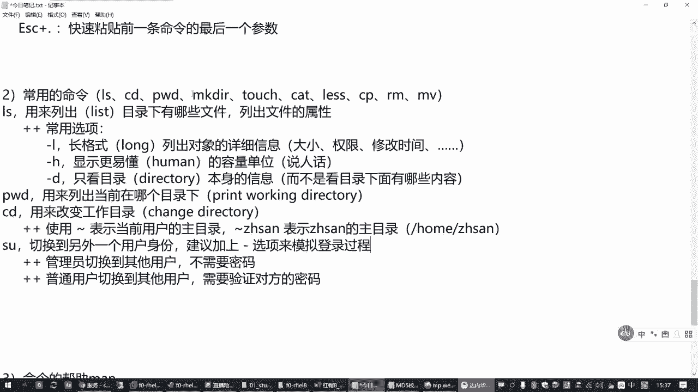
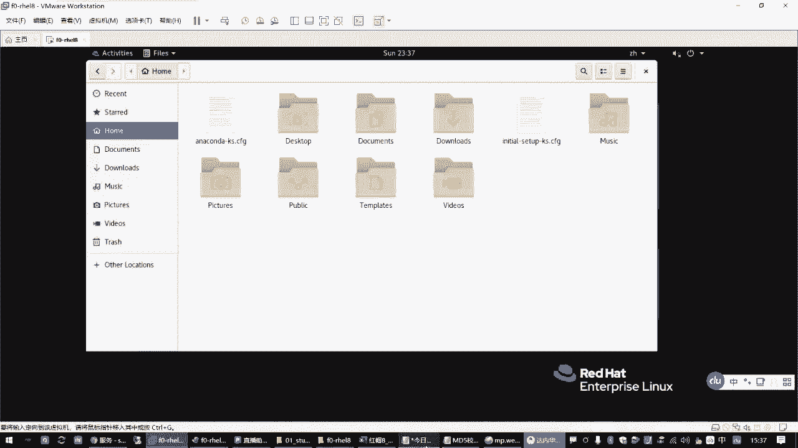
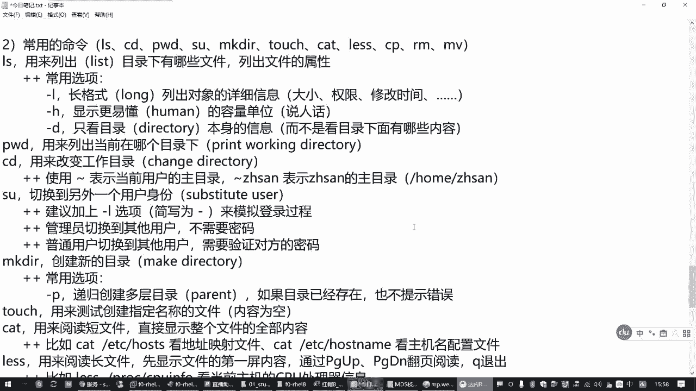
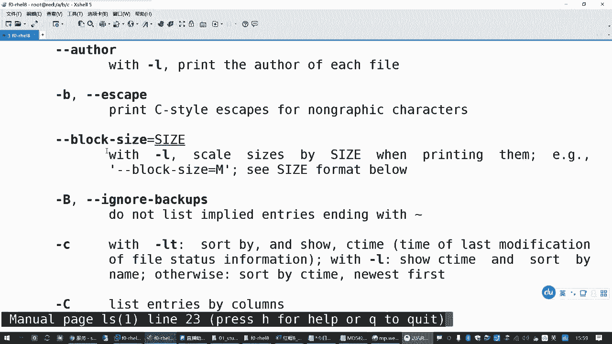
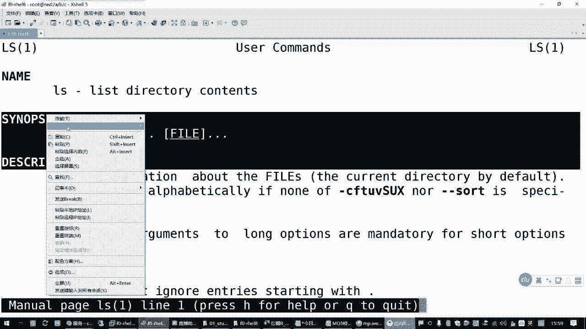
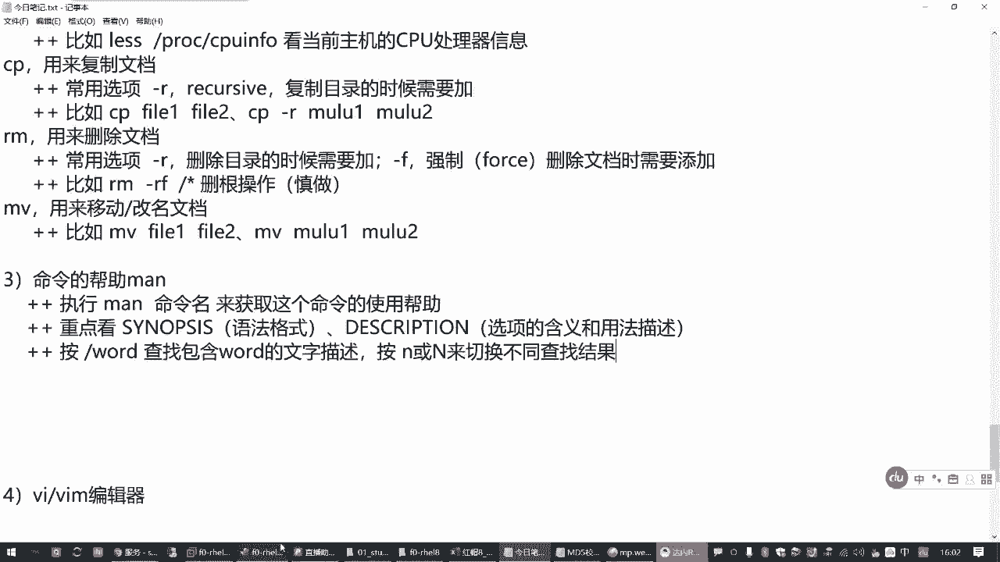
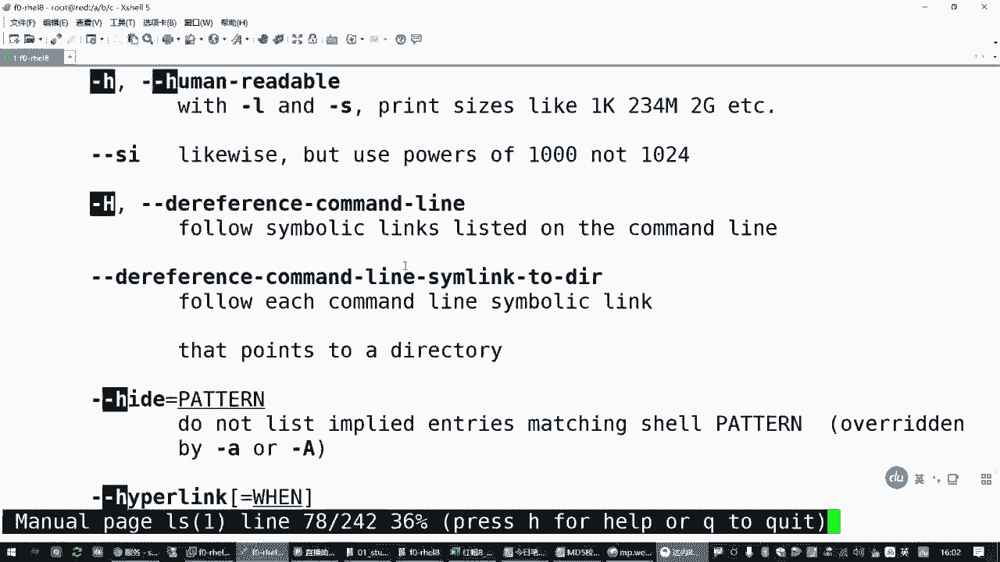
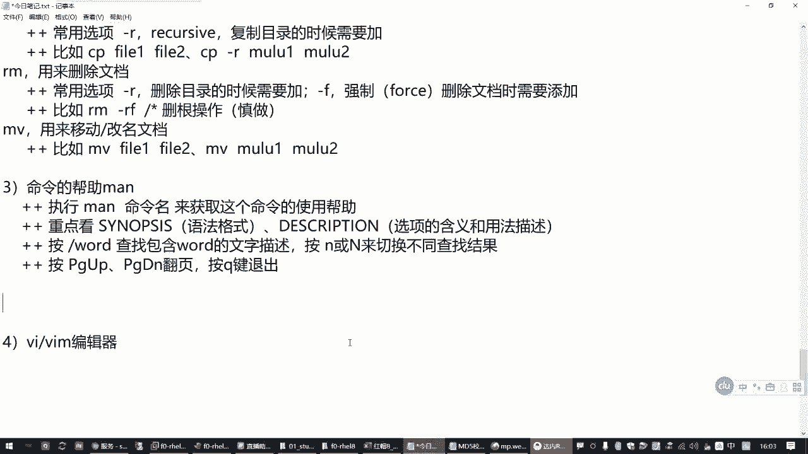

# 全网最全红帽认证／RHCE／RHCSA 零基础入门教程 - P4：1.02-文档管理常用命令 - 达内-coding头号粉丝 - BV1z54y177Zk

那咱接着往下看啊。😊，因为咱们这个C18的班呢，是主要针对我们社招班的同学啊，是因为还有一部分的少部分的同学吧。嗯丽丽这块可能会接触的不是特别多。呃，因此我们今天呢前面给大家。讲了很多这个linux。

它的一些min令行的一些基本概念是吧？然后操作lininux系统的一些方式。所以大家已经学过咱们云计算课程的同学呢，你不要觉得奇怪哈。😊，这个对他们来说是有必要的哈有必要的。好。

那我们了解了这个linux命令行的一些基本概念啊，也了解了它的一些目录结构之后啊，我们来学习一下我们的常用的一些lininux命令。嗯，那这些命令呢啊大家重点啊你后面要花时间去练习。

因为今天我们花了这个时间会比较短，命令会比较多，所以我们重点把这个格式作用给过一下。那具体操作的话呢啊大家后边再一个礼拜啊，你中间花时间来把这些给补上去。因为这一段知识呢。

我没有办法像那个呃正常的那个拓展的课程花那么长时间来，一个一个去练习哈。呃，因为我们前面讲了这个命令行这个基本格式，对吧？你要知道它这个规律，就是命令的名字加选项加参数。

然后你再慢慢的去熟悉啊这些常见的一些用法就好了啊。来，我们看一下呃，刚才我们讲到的LS命令，那它的作用呢就是用来列出目录下有哪些文件。这是最常见的一个作用，然后它也可以用来列出我们文件的一个属性。

就看这个文件有多大。这个文件是属于谁的，是吧，有什么权限？呃，权限这一块我们后边还会专门讲的啊，不要着急啊。所以现在我们有时候你看到一些命令行的一个结果呢呃。😊，可能有部分呢不太理解，这都没关系啊。

慢慢的你就会理解了。呃，那LS命令基本的用法，刚才我们讲了，其实它也是命令的名字加选项加参数，基本上后边命令都是这种格式啊，但是不同的命令你首先要理解的啊，特别是新接触这个命令的同学。

你首先要理解的就是这个命令用来干嘛的。一旦你知道这个命令是用来干嘛的，你再去想这个命令应该怎么用啊，就好理解了。比方说你LS，我要用来看目录的属性，或者说看目录下面有哪些文件。

那很容易想到的就是我要看哪个目录的属性啊，是吧？要看哪个目录下有哪些东西啊。😊，那LS命令不就出来了吗？你得给它参数，对不对？这就是LS。好那再一个呢，我们在列出这个目录下有哪些文件的时候。

我怎么去看是不是需要有很多选项啊。那常见的选项有哪些啊，这个是。我们有必要去了解的。那比方说LS这个命令，这里呢呃基本的用法我就不多写了啊，差不多都是命令的名字加选加参数。呃。

那LS命令呢不同的命令程序有不同的选项。LS命令它的常用的选项。有这么几个。刚L。我们在后边列一下吧。杠L的话呢是叫长格式。列出你对方那个对的那个你要操作的那个对象的详细信息啊。

这个详细信息里边呢包括你这个文件或者目录的大小。然后它的权限修改时间啊等等等等啊，好多呢是吧？这是杠L的含义。然后杠H。这个刚才我们讲过是什么？就在显示这个长格式的属性的时候。

显示更加容易读懂的一个单位。嗯。更易懂的容量单位。也就是刚才我们跟大家说的那个说人话是吧？😊，要不然你一般的用户听不懂嘛。啊，杠L杠H这个用的比较多的，然后一个杠D。这个只这个是只看目录本身。

他的信息啊。而不是看目录底下的信息。我就看目录，自己不看它底下有哪些东西啊。😡，而不是看目录下面有哪些内容啊？杠L杠H杠D啊，这几个用的非常多的，所以大家要掌握一下的。举个例子。

那我们LS看bot G2，这个列出的是目录底下有哪些文件，哪些子目录。呃，然后呢，如果我只想看这个目录字己。那你加一个杠D。就好了。啊，当这种时候呢，你会发现加个杠D就只看这个目录自己是吧？😊。

那底下啥东西你都没有了。😡，呃，所以呢杠D很多时候呢一般都是和我们那个L结合在一起用。这种方式呢用来看目录本身的属性。因为你如果不加这个杠D的话呢，它列出来的是目录底下的文件的属性啊。

或者目录底下的子目录的属性，而不是你目录本身的属性。所以这是杠D的作用。第就是那个directre啊directre。😊，呃，那有很多这种选项呢，它来自于一些单词啊。像这个长格式指的就是这个LONG。

对吧然后那个杠H呢更易懂得容量单位，就是有一个那个叫什么homan是吧？你就大概记这个单词就行。呃，然后杠D只看目录本身的属性，它来自于单词呢叫directory啊，它是帮助大家记忆的。

那你要是说对这些单词完全陌生了，那咱就没办法了，是吧？你要熟悉一下这些用法啊，这是LRS命令。😊，啊，那LS命令呢，刚才我们还前面还讲过一个用法，就如果我们直接执行LS，你没有说我要看哪个目录。

是不是应该默认有一个。他也会给我一个结果呀。😡，那这个时候LS他开的是哪个目录呢？😡，这个叫你当前在哪个目录，他就看的是哪个目录。那当前到底是哪个目录呢？😡，有个指令叫PWD，这是列出你当前在哪个目录。

那作为管理员来说呢，有时候我们想知道我现在到底在哪个目录下呀。那你直接敲1个PWD就好了。😡，所以这是PWD这个命令啊。那这个命令的一个作用呢，用来列出。当前在哪个目录？想。

那其中这个LS呢用了列出目录，其实它的单词呢就是这个list啊。啊，PWD这是列出你当前在哪个目录，那这个作用怎么来的呢？这是叫打印或叫输出或者叫显示。你当前的这个叫工作目录啊。简写成PWD。

是吧就是看当前的哪个目录。😊，好，那如果你现在在在当前这个目录，我现在我不想看这个当前目录下的属性，但是我也希望用LS就能够看到那个目录下的东西。那怎么办呢？我们要改变工作目录。😊。

你不能我的人这一辈子只在一个公司干活呀，是吧？我可以跳槽啊，那我们CD这个命令呢就是用来跳槽的啊，你可以从当前所在的这个root目录去跳槽到另外一个目录下面去，叫CD。😊，你想到哪个目录下面去。

那你后面会跟着呗啊，是吧？比方说你想到跟下面去，就CD空格杠。😊，那么现在你PWD这就在根目录下，你这个时候你敲1个LS看的就是你根目录下有哪些东西。是不是这个命令敲起来很简单呀。😡。

对吧那这个叫CD命令啊。CD命令用来干嘛呢？用来改变你当前的工作目录。所以它的英文单词CD来自于chan啊。Dirly。改变目录。这是这么来的啊。😡，这三个命令。

通常我们有时候把它叫做lininux目录探索的3000克。就是你想从命令行了解我们lininux系统里面有什么文件，有哪些子目录，很多时候就用这三个命令。啊，因为很简单啊，你可以切换目录。

可以用LS列表。😊，然后你可以用PWD去确认，对吧？都很方便啊，你可以在linlinkux系统里边呢来回去切换啊。再举个例子，我想知道我们lininlink系统里边。😊。

那个二进制的管理员能用的程序有哪些？我们是不是可以CD到SB下边去啊，然后你LS看一下，这就列出来的是SB下边的各种能执行的一些程序。对吧这好多呢啊好多好多。当然这个颜色区分我在这里不多说了啊。

我简单提一提就行了。一般绿色的代表是可执行的文件，浅蓝色呢代表的是这种。😊，类似于windows的一个快捷方式。啊叫软链接，还链接文件。它是指向另外一个文件或者目录的一个文件，不是真正的文件啊。嗯。

然后我们前面看到的这种蓝色的。就是目录，所以一般大概能分出来啊，普通的那种黑色的呢就是常规的文件。对吧大概能区分。好，然后我们想回去，你可以再敲1个CD对吧那像这个命令CD这个命令呢。

它是用来切换目录的那如果我没有指定，我要回到哪去？😊，那怎么办呢？其实这个命令你也可以直接回车啊，回哪去了呢？嗯PWD确认一下，是不是回到路ot这里来了。这也是切换目录，但是后面我没说回哪去啊。

他回哪去了，回到root用户的加目录。😡，加目录当前在这个命令行提示符前边，你会看不到这个像我们之前这个SB这样的提示，它会显示一个波动号。啊，这是一个波装号。那在linux系统里边呢。

我们要表示一个目录的时候。有一个表示方法，就是一个波浪号。这个不是一个实际的目录啊。这撇在这里不合适，换个地方。😊，就是我们用LS命令的时候，用CD命令的时候，这有个特殊的用法就是。波浪号啊。

你可以使用波浪号这个符号。啊，来表示什么呢？表示当前你自己这个用户。它的瞩目路。好，用这个来表示。那如果你想看某一个用户的总目的呢，在后边编上用户名。比方说你跟一个张三啊，如果有这个用户的话。

那么这个就表示张三的总路。比方说啊如果默认的情况，这个目录可能就是home下的张三。但是这是默认情况下，你谁也不能保证张三他一直待在这是吧？他以后人家挣钱了，他盖大房子呢，可能就会换地方。

那换了地方之后呢，没关系，你仍然可以用波浪号张三去找到他。😊，对吧。😊，这其实说说说说通俗一点，就是管理员想偷懒。在他也不确定张三的祖目在哪的时候。😡，你就用一个波浪号跟一个张三就能找到这个用户在哪里。

找到它的主目录在哪里啊啊，这是一个特殊的用法。那CD这个命令呢，如果你不指定回答去，直接敲CD。那么他就回用户自己的家。你在外边游游荡半天了是吧，你也不知道回哪去，那回家呗。

这叫CD你可以敲1个CD波大号，和你直接敲CD效果是一样的啊。😊，这就是快速回到这个位置啊。就是你当前用户的加目录。比方说你可以换到一个像咱们练习环境，有一个用户叫t斯，还有一个用户叫那LWU的0是吧？

啊，这是read是吧？我们环境这边有一个用户叫。LW user0啊。那这个时候他的家就在这。对吧你直接CD也是回到这，你可以CD回到切换到一个别的目录。😊，对吧你再敲1个CD，后面啥也不跟。

那还是回他自己家是吧，这个注意。那这里顺便又敲了一个新的命令是吧？有些同学可能没接触到没接触到的啊，但是我们会经常用有个数啊，有个数的命令。😊，嗯，这个命令呢用来切换到另外一个用户的身份啊。

这是用来临时切换用户身份的。啊，但是如果你是管理员。管理员切换到其他用户，不需要密码。其他用户不需要密码。但是如果你不是管理员，那对不起，你现得知道对方的密码，要不然不让你切啊。管理源切换到其他的用户。

不需要密码，但是普通用户不行。普通用户切换到。其他用户。需要验证。你要切换到哪个用户，就验证哪个用户的密码啊，对方的密码。但是对于我们用户来说，这个太方便了是吧？就像刚才我们给你举这个例子似的。😊。

我现在就想换个用户身份去验证一下这个目录有啥变化，直接竖杠到LW的0。那一般使用的时候呢要加一个横杠。这个表示要模拟登录啊，要模拟登录的过程啊，这样的话切换的环境才会比较完整。建议加上。一个横杠选项。

来模拟登录过程啊。这是数命令啊，顺便补一下。

有这个命令有什么好处啊？😡，你在咱们这个练习环境，你不需要再点右上角这个用户再n out注销。你否则的话，你重重新界面，你得弄个out退出来，再重新换LW0登录，这多折腾啊，是吧？

所以你学会这个秘密之后呢，这个就有好处啊，可以快速切换用户。

这个我们考试的时候会经常用到这个啊，你切换到客户机之后，登录到登录过去之后呢，要切换到管理员啊，切换到其他的呀，是吧？都有这个。😊，好，这是前面这几个命令。😊，来再看创建目录。那创建目录的这个操作呢。

叫makeDIR啊。呃，数。数这个命令呢切换到另外一个用户。他的英文单词你想一下叫什么来着。好像叫什么susst cute是吧？老长了。柚子。这叫替换切换的更换的用户啊。摔叫SU。

那麦克迪亚用来创建一个新目录。创建新的目录。那创建目录的时候呢。这一不小心又多删那些东西了。普通用户切换到其他用户，不需要密码啊，要需要验证对方的密码。啊，来再回到make电啊。

那创建新的目录的话呢是叫make啊direct是吧？啊，这不就创建目录嘛。😊，啊，就这来的。那你知道这个目录这个命令的作用之后，那你创建目录，创建哪个目录啊？😡，对不对？这不就是它的一个用法嘛？😡。

那创建目录的时候呢，它的参数可有多个意思就是说它可以创建多个目录。啊，可以同时创建多个目录。嗯，那这个命令的常见的选项。常用选项啊。常用选项就是一个杠P，其他的没了啊，其他的都不常用。

这个呢可以递归创建多层目录。会给大家举个例子啊。多层。目录。呃，啥意思呢？比方说我希望。来返回去啊。再进到我们那个虚机read。啊，现在落的那个训机里面操作啊，你省得把外面那个机器不小心给搞坏了，是吧？

😊，呃，那在这个虚拟机里边，你先看一下G目录下有哪些资源。我现在想在该目录下面呢建一个目录A目录A下面建一个目录，B目录B下面再建一个目录C。😊，是吧多层目录。😡。

就最终我们想要的是根下有个目录A那就写一个A吧。A下边有个目录，B下边有个C需要有这样一种目录结构。但是这种目录结构呢。你如果直接创建，它会报错，为啥呢？😡，他创建目录的时候，从最底层开始建。

所以他想创建目录C的时候，他现在看你系统里面有没有A下，有没有B呀，还发现没有啊，没有了，那就创建不了呗。😡，就跟盖房子一样，你说帮我盖个楼，我要盖个7楼。然后说下边6层还没有呢，你咋盖7楼啊，师飞。

你不能直接上来就盖7楼，不行吧，那就失败了。😡，啊，那如果你想盖的话呢，怎么办呢？再加一个杠P。啊，杠P这个选项这个选项的作用就是如果你在盖C的时候，发现这个B目录没有，请把B目录先盖好。

如果在盖B目录的时候，发现A目录没有，请把A目录也先盖好。😡，就你跟那个。那个盖楼的那个。对我说你说我要盖个7楼，那人家没那么笨是吧？人家盖7楼可以啊，我从第一层给你盖。😡，盖好第一层再盖第二层。

盖好第二层再盖第三层。对吧一层一层的垒啊，垒到你期了为止。这就是它的一个好处。呃，那杠P这个选项这个单词来自于哪里呢？这个有点有点有点。name类啊叫parent。这是父母亲的意思。哈。

那在这里表示啥意思呢？其实就是说我们在创建目录C的时候，它的上一层目录在linux系统里边呢叫副目录。😊，就C目录他爹。😡，现在你要建1个CA目录，他爹还没有了是吧？没他爹咋来个孩子？😡。

所以你现在给他找个点哈，这就是杠P选项的一个作用。😊，所以创建多层目录啊，要加一个杠P选项。H杠P选项呢还有一个含义。如果你要创建的目标目录已经存在。他不会报错。也不提示错误啊。这就是它的好处。

所以呢刚才我们说的这个操作呢，你再做一次也没事。这是用的比较多的一些用法啊。那其他的不常见的用法呢，我们这里就不讲了啊就不讲了。😊，刚刚这个竖杠，其实我们说的这个杠选项呢。看你。结合。别给你放下边。

这其实也是一个。选项啊。这个选项呢其实它叫杠L。で。一般呢这些用户呢都比较懒是吧？咱们你别不要觉得我们搞linux搞IT运维的人都很勤快。啊，这些工程师呢都是变着法，想着怎么怎么有更简单的方法啊。

所以这个杠L选项呢一般就简写为一个杠啊，每个L都懒着打啊，作用就是用来模拟登录啊。😊，好，这是创建目录。那touch这个命令呢。实际上用途不是特别大。这个就是英文单词叫触摸的意思啊。

那它的主用主要的作用是用来做测试。用来测试创建指定名称的文件。啊，用用来做这个用途的。他其实对这个文件呢不起什么呢？实质性的作用，也不往里边存东西啊。😡，对吧这个大家要知道。嗯，那他在创建文件的时候呢。

没有什么选项，就是你想用哪个文件，你直接跟跟上那个路径就好了。比方说我们CD到刚刚这个ABC下面去LS看现在没东西。你没东西，我就想看有文件啊是吧？那touch。😡，好，创建一个fi一fi2fi3。

那么下面就多了三个文件啊，很简单。这个咱们考试的时候，为什么说要用这个呢？有时候他有些题目会告诉你，你你必须对某个目录有写入权限。对吧那人家也不关心你那个文件到底是啥内容，但你得往里边有一个文件。

那你用t检查下就行了。如果你能够写进去一个文件是吧？创建一个文件，那就有写入权限了嘛。😡，啊，就这个目的。那真正的我们要创建一个有内容的文件的时候，一般不会用to啊。我们用来测试创建指定名称的文件。

这个内容是空的啊，是没东西的啊。这创建空文件的。真正要创建文件的时候呢，用下面这个VIM编辑器。所以这个呢大家也了解一下。那有时候我们答题答完之后，你得验证一下是吧？那有时候就用t啊。😊，好。

再来看读系统的文件的时候啊。读系统文件的时候，有个cat。嗯，cat这个命令呢呃用来阅读。内容比较短的文件啊，所以是短文件。那它的作用呢为什么要阅读短文件呢？它可以直接写直接显示整个文件的。全部内容啊。

那和它相对的还有一个。meing叫less。啊，LESS这个是用来阅读长的文件。那这个工具呢它不会直接显示整个文件啊。😡，这个会先显示整个显先显示这个文件的第一屏啊。相当于是第一个屏幕，看你屏幕大小。

第一频的内容。然后你看完了之后再看下一屏，那怎么翻页呢？😡，可以通过键盘上的配置up。和那个什么配置档是吧？这些按钮去翻页，一页一页去看。对吧这就它的好处。如果要退出的话呢，按Q退出。

这是在阅读文件的时候，非常方便啊。🎼举个例子，如果你这个机器改个主机名，你可以用那个cat命令去查看ETC下边有个host name。这就是看你当前主机的主机名。对吧，直接看那个配置文件啊。😊。

那如果我们要看其他的，比方说还有1个ETC下的什么housese是。这个文件是记录上你当前主机经常访问的啊那些IP地址，它的名字是什么？你像我们要访问read，要访问blue。

因为在这个文件里边有IP地址记录，那你直接访问read和你直接访问这个IP地址，效果是一样的。比方说你拼一下ra子。和你拼一下172点。25。0。25一回事是吧？指的是同一个机器啊。啊。

这是刚才我们看那个hoss指纹件，这个不管大家有没有接触过啊，这里顺便就补充了。这叫本机映射的域名到IP地址的一个对应关系。等你学会改了之后，你可以直接改这个文件啊都可以啊。😊，好，这是阅读文件啊。

啊刚才讲的是短文件，那长文件怎么办呢？比方说有个文件。内存映射的目录prolock下边有一个叫CPU info。这个文件你就可以用来查看我们的CPU处理器的信息。但是这个文件内容挺长的。

如果你敲了一个cat，你只能看到最后边一部分，上面还有好多人，你还在往上翻，对吧？这个有时候就不方便，所以你可以改成nice啊。😊，它会停留在第一页。停在这里，然后你按空格往下翻，或者按配配件到啊。

或者配置up往上下翻都行啊。扣退出。这叫分页流量啊，分页阅读啊。对吧刚才我们举了几个例子啊。😊，比如cat。ETC下的后1次。是吧啊还有那什么catED色下的。ho斯特。name啊。

第一个呢是看地址映射文件啊。后边呢是看主机名配置。感见。那下面呢是这个地方呢，我们也举了个例子。这是用来看什么呢？因为跟nice去。查看ETC下的CPUinvo啊，不是ETC，是那个。POC是吧。

这是看当前主机。主机的CPU处理器的信息啊。这个慢慢再去分辨啊。好，这是阅读。然后后面还有copy。RM move那这三个命令的话呢。咖比就是复制嘛。用来复制文档。

那这个放一块讲了啊RRM命令呢用来删除文档。默默命令。用来移动。很打。如果你移动文件之前和移动之后，它在同一个目录，那其实就是在改名。所以在lininux系统里边啊，移动和改名用的是同一个命令。呃。

那呃CP这个命令呢用来删除呃，用来复制一个文档的时候，那最基本的构成就是把文件一复制到文件二去，是吧？你要举例子的话啊。啊，比如。CPfi一变成负号化是吧？这就是基本的啊。把文件一变成文件2。

这是最简单的。当然还有些时候呢，我们要复制目录。CP啊，目录一到目录2。你复制目录的时候，复制软件也好，你都可以换位置啊，在前面跟上目录的位置就行。😊，但是你复制目录的时候，要注意中间加一个选项杠R啊。

所以CP这个命令最常见的一个选项。常用选项杠R。你在复制目录的时候需要加啊。你不加的话呢，他给我跳过去。😡，举个例子。🎼来，现在我们看一下，当节目录像下有file3，那我们copyfi3。

把它变成file4。可以吧，你看就有了这个复制。😊，就把啥变成另外一个嘛，是吧，再复制一份，重新创建一份新的嘛。😡，呃，那复制目录的话呢，比方说我们copy。把根下的bot目录，我想复制到当前目录上。

好，当节目的下，我改个名字。呃，如果你复制了当前目录，你前面就不用加路径啊，直接写新的名字叫bo new，可以吧？然后这个时候他就会告诉你，你没有价格啊，所以呢忽略了你要复制的目录，那不给你复制。

LS再看没有吧。那如果你想复制是什么呢？怎么办呢？加一个杠小写的啊。只有这样啊，你这个目录才能够复制过来。对吧你看这不就复制了新的一份嘛？好，这是CP命令啊，CP命令。然后RM命令这个好说。

就是删除你哪个文件，你看着不顺不顺眼了，你不想用了是吧，你就把它删掉。呃，那RM命令呢常用的选项。也有个干啊。所以你删除目录的时候也要用这个啊。如果你要删除一个目录，也需要加加这个杠R。

那另外还有一个常用选项。杠F。嗯，这个选项的话呢是在强制删除。文档的时候。ちと。需要添加，因为你不加的话呢，他就会提示你，你真的要删除吗？你真的要删除吗？啊，有时候管理员就会就会很烦啊，废话。

我下的命令肯定要删除呀。😡，是不是这样的是吧？那你这个手上加个杠F，它就不会烦你了啊。😡，主要就是这两个。那举个例子。嗯，传说中的从三根到跑路。对吧你要删帧的话呢，就是RM杠RF。Good。

这个操作在以前的lininux系统里边是可以做的。但是现在在我们新版的lininux系统里边。应该从七开始吧，好好像就不支持了。啊，就不让这么做，因为因为什么呢？因为这个操作太危险了。

你下把 game目录下的东西都删了，那你这个系统还玩个屁是吧？那没法玩了。所以linux类型他是拒绝这么做的啊，他不跟你干啊，除非你管理员确实知道，那请你加一个这么老长的一串的一个选项。😊。

对吧就只要你不嫌麻烦，你要删也行啊，请你把这个选项加上。😊，当然管理员还有办法，你只要在后面加个星。这也表示三根，所以这个操作大家轻易不要做啊。你如果这么做了之后呢，你这个lo一会你就得去还原啊。

要不然一重启，你估计进不去了。所以轻易不要做。这就是三帧操作啊。但大多数情况下呢，其实我们不会去删更啊，我们只是要删几个文件。比方说你RM，我就把文件一删了。你如果还想把文件删删了是吧？fi一fi3。

这个时候它会提示你，你要输一个Y才能删了啊。你如果输一个N呢，这个文件它不会删的。但是每一个文件它都会提示你。😊，对吧那管理员不就烦吗？所以有时候我们就直接写一个杠F。你再看就没了啊。对吧一和三没了。

呃，因此呢刚才我们讲过这个杠F强制删除啊。这个F呢就是forse强力的。对吧那其实我们说的这个杠R啊，为什么要加这个呢？这个杠R代表的是这个递归的意思啊。😊，这个编程了一个词，就他找到一个目录。

目录下面还有东西，刨根问底全都干掉啊啊，这叫递归。所以它来自于一个叫。recursive and消色。好，来自于这个。那下面那个一个意思啊，也是定位。你如果要操作目录，要加这个东西啊。😡，啊。

因此RM杠RF组合到一起，这个还是比较危险的啊，大家操作要慎重。我要给你写个提示是吧？胜作哈。你如果要做呢，请提前做好备份，你感受一下可以啊。好，下面木啊木ve和我们copy差不多哈。

但是木ve呢一般很少用选项，那一般就举几个例子就行了。😊，就你把这个copy改成MV呗。来后复制目录的时候，因为本身就目录就包含了啊，所以你复制目录的时候不需要加杠R啊。你可以目录一变成目录啊啊。

文件一变成文件2，这叫移动。如果目录不变，那就是改名。那CP是一份变两份嘛，啊木偶的话呢还是那一份。只是换个地方或者换个名字。对吧这是木偶啊，那这个算是我们。

比较常用的一些基础的一些命令了啊比较常用的一基础的命令了。好，那我们给大家讲了很多方法啊，讲了好多常用的命令。如果真在咱们有很多同学，你是第一次接触这些命令，你可能记不住。

对吧你要是头一次接触到这么多迷令，一下子能记住，那你就是我得佩服你啊。😊，啊，那有时候我们考试的时候或者我们工作的时候，万一碰到一些命令，我就是记不住怎么办呢？啊，学会一个方法，命令的帮助。啊，看手册。

那这个用法的话呢。其实很简单啊，你只需要执行慢，会被跟上你不了解的那个命令的名字。你只需要执行这个，他会告诉你这个命令怎么用。好，来获取。这个命令的。使用帮助啊。那怎么看呢？举个例子。

刚才我们讲过的那个LS命令。如果LS命令我忘记怎么用了，或者说我忘记这个杠H怎么怎么个意思了，是吧？😊，慢L回车往下看。那这就是一个手册啊，当然你系统是英文的，可能是英文的啊。如果你有中文环境。

有可能你开到中文的。那看的时候主要怎么看呢？第一个name这里是一段描述。第二个synopsis，这是语法格式，告诉你LS命令可以跟选项，选项可以有多个。可以给你要看的文件做参数，参数也可以有多个。

这就是关键嘛。然后你再看描述，描述下面呢，它会详细的告诉我们每一个选项是用来干嘛的。对吧等等等等啊，这就是一个阅读工具啊，专门看手册的。因此我们重点看的就是这两个部分。

看帮助的时候啊。重点看哪里是吧？重点。看这一块这一块呢是语法格式，就命令行怎么用。然后还有一块呢是描述。啊，这个地方。这是关于这个具体用法的些选项，包括这命令的一些解释啊，选项的含义和用法描述。

对吧你看这2块。那还有一些同学会说，那我在这里边这东西太多了，问我咋这翻起来太累了是吧，咋办呢？😊，要学会去查找啊。比方说我要查一个杠H，你打一个斜杠。啊，就在这个阅读界面，你打一个斜杠。

就是我们的根目录那个斜杠。哦你想找一个杠H就打斜杠杠H。这表示查找。他可以快速找到你想要的这个选项。如果发现这个选项不是你再按N键往下翻。所以大家看这个命令帮助的时候呢，要学会用。查找啊。

按什么斜杠跟上一个单词，这是这个这个在这个帮助手册里边。查找。包含word的。那个文字描述。你可以按小写N和大写的N。或大写N啊来切换不同的结果。小写的N呢是往后查，大写N呢是往前找往前走啊。

因为你在这个阅读手册里边呢。你查找一个关键词，可能有很多结果呀。那你找到一个结构，不是你想要的怎么办是吧？这是可以查找的啊。😡。

那查找的时候呢，我们往下往下看，看，这里就其实就有了啊。杠H选项它会告诉你，它王者的选项是这么老长啊。😊，找homanreadable。人类能读懂的。啊，这个选项一般和杠L或者杠S选项一起用。

它会显示一个文件大小啊，像EKB啊，234兆啊，2个G啊等等等等。😊，对吧这是他一个解释。😊，但你觉得这个陌生大不了在必要的时候呢，你把它复制出来去百度翻译一下嘛。😡，对不对？你也知道这个选项是干嘛的。

所以刚才我们说杠H哦翻译成说人话也对是吧？啊没有什么错误是吧？这这个不就叫homon read able吗？人类能读懂的嘛，是吧？😊，O吧。😊。

啊，那要退出来的话呢，按扣键啊。退出这个阅读器。一样可以上下键翻译。基本的方法大家要会啊。P置 up。配置到。可以翻页。按扣键。退出。对吧这是看帮助的方法啊，看帮助的方法。好，这是呃针相当于针对我们。

之前接触lininux不多的同学啊，我们给大家补了一下这个课啊。那大家后面的这个笔记我分享给大家，分享到我们那个有个微信公众号里边啊，到时候大家去看一看啊，把这个给巩固了。呃。

离我们下次开课还有一段时间是吧？到时候要巩固一下，那再剩下的还有1个VM编辑器啊。😊，再往后就是我们今天最后还有一块关于那个系统服务的管理啊。那咱们也休息15分钟吧，好吧。

