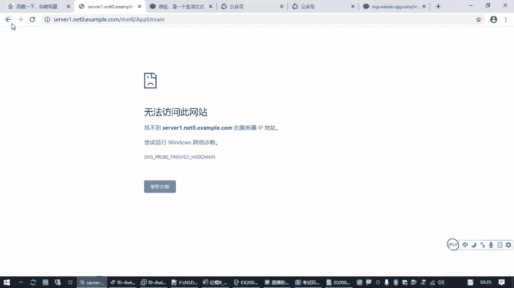
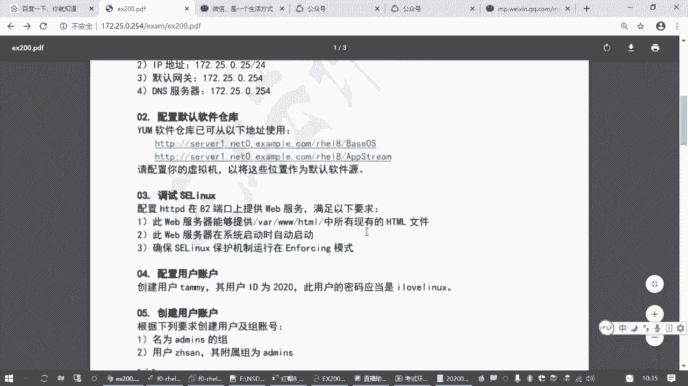
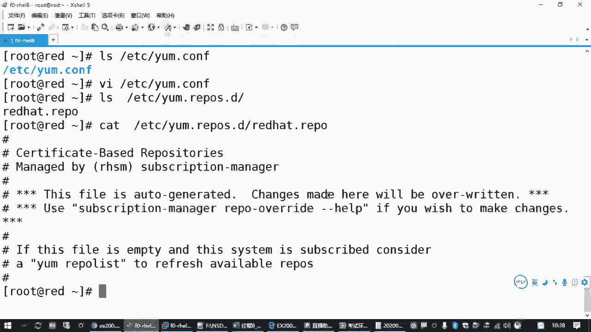
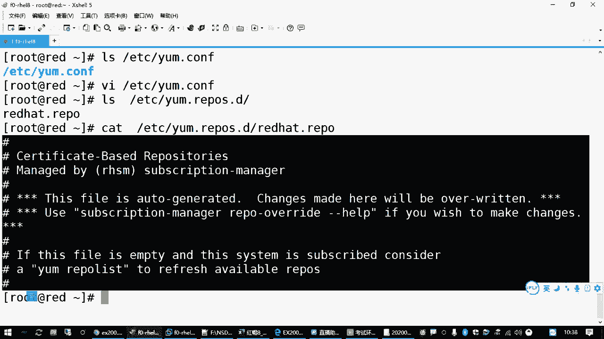
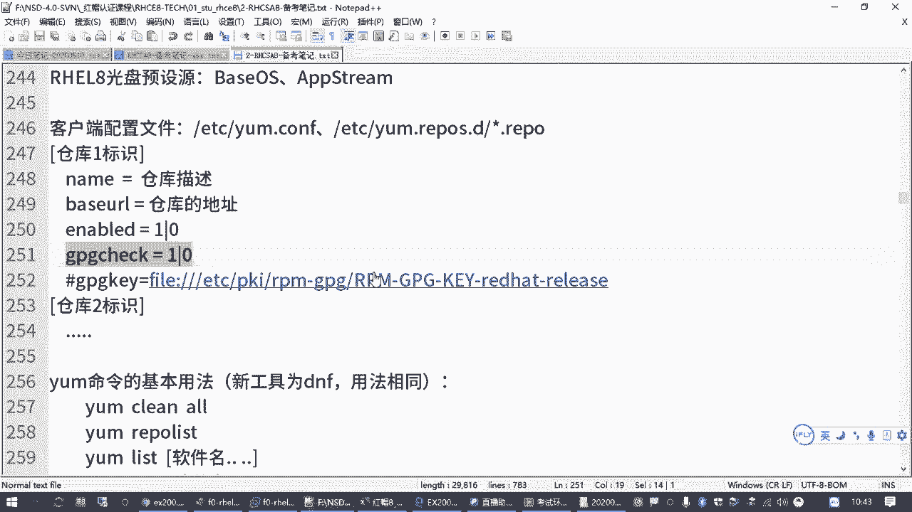
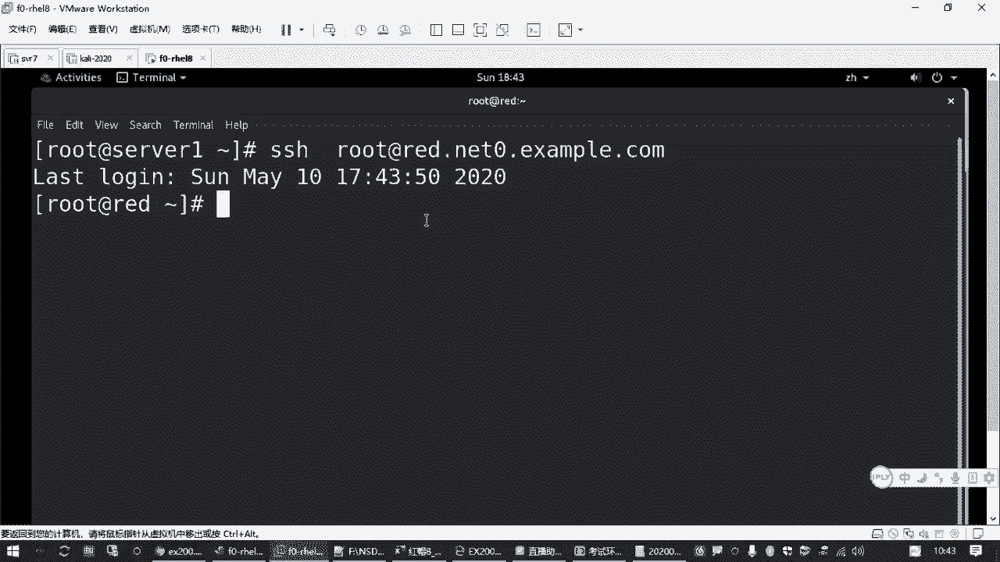
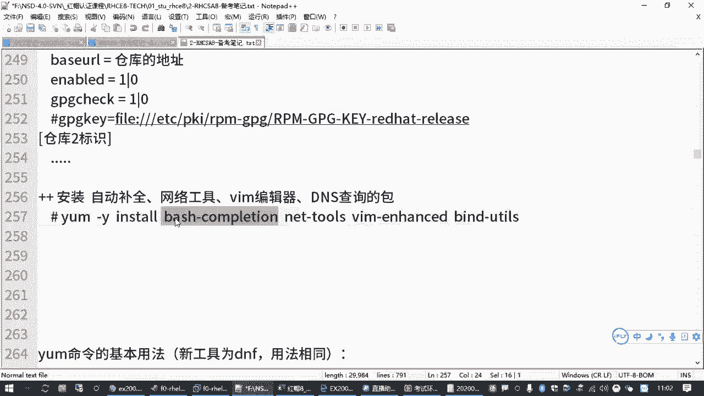

# 全网最全红帽认证／RHCE／RHCSA 零基础入门教程 - P8：2.02-配置yum源 - 达内-coding头号粉丝 - BV1z54y177Zk

Yes。哎，咱们回来接着开始哈。😊，那刚才我们给大家讲过的是。嗯，第一道题目是吧，就是配置我们的网络地址。那考试的时候呢，你把第一个机器配好网络地址之后啊，然后第二个操作啊。

一般就是建议大家呢要配好一个软件源。嗯，考试考试的时候呢，它会有一道这样的一个题目啊，会有一道这样的一题目。嗯，因为上午我们两个训机，他第一个训机可能会专门有的题目让你去配。但是下午的时候呢。

他可能不一定有这个题目啊，但不管他有没有，你反反正这个事你得做啊，你不做的话呢，你没法做人家包啊。对吧那题目的要求呢就是说你这台虚拟机如果想装软件的话，你需要去找到下边这两个地址。然后要做什么呢？

要配置你的训机，把这两个位置作为你这台训机安装软件的一个来源，是不是叫软件源啊？那对于红帽的系统来说呢，你要装软件包，它需要提供一个软件仓库。这个软件仓库对于客户机来说，那就是给他提供软件的一个地方嘛。

是吧？所以有时候我们在配置的时候啊，也把它叫软件源。那如果我们在设置一台linux主机啊，我们有时候说软件源软件仓库其实是指的是一个东西。😊，除非你是在提供这个仓库，对吧？否则的话呢。

我们指的是一个东西啊。呃，然后在命令系统里边呢，后边装软件包的时候，用到了一个命令叫YUM。其实在红猫八的系统里边啊，它是更新的一个版本啊，就不叫YUM的，叫DNF。啊，这个大家要了解一下啊。

但是呢呃大家仍然可以用YUM，因为它和我们那个YUM是兼容的。就后面大家直接用DNF去装软件包也是可以的啊。然后你用那个YUM也是可以的。但是不管你用YUM还是用那个DNF啊。

它首先你需要去给它指定你的软件包在哪里。😊，对吧嗯，那原来的这个YUM是啥意思啊？😊，是叫一个叫什么黄狗升级器，什么yellow dogupdate modified啊。

叫黄色的yellow dog就黄狗啊update升级啊modified就是修改版的啊，是这么来的。嗯，这个呢从红帽5开始是吧啊，一直到567不都在用这个嘛，所以相信大多数同学都是已经习惯用这个的。

所以咱们后面的资料呢哎也都是啊也都是在那个呃用的这个YUM但大家后面用的时候可以改成DNF啊，这个以后大家可以练习一下。😊，嗯，然后刚才大家有问的这个笔记啊，嗯正好有时候我们随随堂讲的时候。

有时候会更新一些东西嘛，所以更新的任务呢，我们会给大家放到我们的那个。😊，就上次给大家发的不是有一个微信公众号嘛，是吧？😊，所以会在这里边直接更新。呃，那大家看的时候呢，你只要关注那个微信号就行了。

我好像是那个公告里面有一个地址，对吧？大家只要关注那个微信公众号，云网小课堂啊，然后右下角笔记获取。就能看到咱们这个班的笔记资料。啊，能看到咱们这个班的比较资料啊，那个资料的话呢。Yeah。Yeah。

这样的话方便大家去找啊，要不然每天每天的讲啊，然后资料在不同的地方呃放起来的话呢也麻烦。是。Yeah。Okay。我给大家看一下啊。就你通过那个微信公众号呢，这是这是我编辑的页面啊。

就大家你通过那个微信公众号里面看的时候呢。应该是有一个这样的一个页面的，这里边资料比较全啊，包括我们那个CSA的备考笔记什么都在这里。包括上次我们的那个考试说明啊啊，包括前面配网络地址。

配yM的一个快速演示啊，都能够找到啊。所以这是一个资料的一个获取。好，咱们再回到我们刚才这个样目仓库这里了啊。呃，那如果我们要装软件包的话呢，需要有一个仓库是吧？那对应的这个样么仓库题目其实很简单。

就是给你两个网址啊。但是呢我们需要去把它给配置好啊，需要去把它给配置好。

那配置的时候我们需要了解什么信息呢？就是在lin系统里边啊，红梦678都这样的，是吧？它对应的一个核心的一个工具啊，暂时咱们就当亚姆来做啊，那亚姆他要装软件包，正常的安装软件包的方式啊，就是inst。

这个YUM一般我们读作y啊，那yminstore就表示安装，后边跟上软件包的名字。比方说我们提了好多次，我们要装一个什么net tools。网络工具包是吧，装了这个包之后。

你才有那个什么if convi啊，没装的话那没有的。但是呢你在装的时候，你你得有缘啊，如果如果没有一个软件员给你这个包，你是装不上啊，对吧？那那就不行，他会告诉你。

there are no enabled reports。😡，就是没有一个启用的能够给我们提供软件包的一个地方。那如果你希望有的话怎么办呢？啊题目告诉我了是吧？有这两个网址。😡。

那现在的问题就是我这个机器我怎么知道是去找这两个网址去要软件包。所以大家要了解这个命令，它的配置文件怎么去设置啊。那对于YUM来说呢，它的配置文件主要在两个地方。一个就是ETC下的ym点CONF。啊。

这个文件这个文件最核心的一个作用是控制YUM这个命令，它的全局的一些行为的啊。那大家用我们之前讲过的那个VI编辑器，你可以去打开是吧？😊，打开看里面你看就几行，比方说呢默认他要求做那个软件签名检查。

看一下这个软件包是不是这个操作系统官方发布的，对不对？或者一个软件作者官方发布的。如果不是，它是拒绝安装的啊，这是默认的一些设置都在这里啊，那其他的咱先不管了啊。那除了这个文件以外。

还有一些文件在哪里呢？是在我们的。ETC下面有个ym点res点D在这个目录下。那这个目录下面呢，其实是有一堆文件，就允许我们管理员创建一堆文件，它的扩展名是点rel。

那这样的文件呢就叫做我们管理员自己定义的你的软件仓库，就软件来源在哪里？你要通过这些文件去设置。呃，其实咱们这个环境里面，你你可以发现它已经有一个叫read hat点re是吧？

但是这个文件呢基本上是连红帽官网的啊，你可以用VI去打开这个文件去看一下，或者你用ca先直接阅读一下也可以。你会发现这个文件的里面呢全都是井号开头的，是吧？😊。

那这个大家注意啊，在lininux命令行环境，包括它的配置文件里面，如果是井号开始的部分。99。99%以上的可能性啊，它的含义是说明这是一个注释。注释就是写了一段话。

告诉我们都告诉我们管理员这是干嘛的是吧？他不会真正发挥作用的啊，这个要知道，所以其实这个文件呢你会发现那好像这没用，没有一个有效配置啊。😊。

那这个井号就好像我们执行一个什么LS命令，你可以直接LS命令是管用的。你前面要是加个井号，那就不管用了，对吧？所以是把后边的命令呢不起作用啊，这叫注释啊，注释的一个标记。😊，啊。

那因此呢刚才我们所说的压蒙这个配置，这个圆的配置其实啥都没有啊，对不对？它有个文件，但是里面不起作用啊，所以我们得自己创建一个圆的一个配置。呃，那大家考试的时候呢，你可以直接改这个文件。

或者呢我们另外创建一个文件也是可以的啊。啊，就是答题的时候，你怎么办呢？要找到这个目录，在下面创建一个文件。这个文件名称随便写，但是扩展名必须是IEPO。啊，注意啊，扩展名的是这个。哎。

要不然他找不着啊。你可以写1个EL8，这叫企业版lininux8是吧？扩展名叫IEPO啊，用VIM编辑器打开，或者说叫创建这样一个文件回车啊，大家要是不熟悉VI的话，应该在我再给你回顾一下啊。

这近执行这个命令可以打开一个新文件，然后默认叫命令模式，要按一下I键进来进入编辑状态，然后在编辑状态里边去指定啊，按照题目要求，你要找哪一个源，对吧？啊，当然在这个仓库配置里边呢，它有些基本要求啊。

这个大家要知道。基本要求的格式是这个样子的啊。😊，啊，需要用一对方括号括起来里边要给它起个名字，这叫仓库的标志。啊，一个叫ID啊，仓库的ID叫标志。你如果有多个仓库呢，要有多组方括号。

对吧你可以仓库一仓库2啊，一号库2号库嘛是吧？你可以有很多个仓库指向不同的地址。你谁谁也不能说我这个主机我只能从一个地方做软件包啊啊，我可以从好几个地方做软件包呀，是吧？😡，所以要有一个仓库标志。

在仓库标志里边呢。啊，我们下面有常见的设置是这些啊，有一个叫name，等于是用来描述一下这个仓库用来干嘛的。Please。一般就是写一段话啊，那一会我们用的时候呢，你可以来查询啊，一眼就知道哎。

这个仓库是用来干嘛的，是吧？那标志这一块的话呢，一般不建议大家用空格什么的啊，但是描述这里边可以。😊，对吧呃，仓库这个标志呢也不要用特殊符号，不要有空格，就很简短的啊。那仓库描述呢是一个详细的说明啊。

是一个详细的说明。然后最核心的是这个baseUIL，这叫基本的访问地址。你要指出仓库的那个源啊，它软件包来源在哪个地址能能找到？那这个其实就是我们考试的时候要求的这个地址吧，对不对？那有两个仓库地址。

你就要配两份仓库，要有仓库一仓库2。呃，然后你这个仓库现在是建好放在里做样子的呢，还是要启用呢？有个配置叫enabled，这叫启用啊，enabled等于一就是启用。如果你设置enabled等于0。

那就是暂暂时先不用啊，我就做实验的是吧？我暂时先不用。😊，那这叫enabled。嗯。呃，然后还有一个叫GPGcheck啊，这个就用用来做软件签名检查的呃，软件签名检查啥意思呢？就是检查你这个语言里边啊。

你这个仓库里面给我的包。我要验证他是这个仓库官方发布的。如果不是官方发布的，我不敢装啊，那万一里们有病毒咋卖？是吧？所以有这样一种机制啊啊，所以大多数情况下，提供软件的那个官方，他会给我们一个密钥啊。

一把钥匙你通过这把钥匙呢，可以去验证这个软件包是不是官方发布的。😊，对吧像红包官方也会有啊，但是如果因为做软件包签名检查啊，这会会耽误时间。如果你确认你不需要这个检查。

你可以设置GBG check等于0，这个速度就快，对吧？咱们上午的考试呢，没有要求做这个签名检查，所以大家你就怎么简单怎么来。啊，特别是我们刚开始考试进这个训机的时候。

那那个操作还用VI，有时咱用的不不太方便，对吧？哎，所以简单怎么简单怎么来啊，考试没有要求。😡。

She。但是如果你要用GP等于一，那下面必须跟1个GPGK指定那个钥匙啊，等于什么什么，从哪个地址能找到。好，当然我们这里写了一个井号去掉了啊，加个井号就是注释，就是给大家给大家展示这个用法的呃。

那如果你用GPche等于0，那这一行是不用的啊。😊，所以按照我们这个题目要求，我们看一下怎么答题啊，题目要求就给了我们两个网址是吧？啊，那一旦我们在考试的时候，你已经连到这个机器了嘛。

那不就VI打开这个文件往里边写。😊，方括号指定仓库的名字还有那个标记。这个标记题目如果没有要求，你随便写对吧？一般我们就参考它那个名字，写一个baseOS。你如果愿意，你就写一个AAA也行，对不对？

那这个有点随意啊。😊，但是。大家我们可以直接用。建议大家用的比比较规范一点啊，一般用那个软件资源那个目录的名字。然后下面给它起一个类描述，如果你不讲究的话呢，也用这个名字也可以是吧？好。

然后你背UIL这个必须有吧。呃，bUIL从哪来呢？考试的时候建议大家复制。啊，复制链接地址，你考试的时候，在那个火末图标打开之后也是可以复制的啊。😊，因为你是远程过去的嘛，是吧？

你如果是通过那个控制图标进的虚拟机显示界面里边啊，你可能不方便复制。但是你远程SSH过去是可以的对吧？来粘贴，这是第一个地址呃，然后那个enabled。这个大家如果想偷懒的话呢，你就不用写了。😡。

默认enabled的，你不写就是启用。啊，因为大家有时候有些同学这个你要是背的默熟不写的时候就是没写错啊，enableable后面有没有的是吧？那不知道不知道咱就不写了。😊，你敲的越多越容易出错啊呃。

然后呢GPche。😊，GPGche啊，这个你得写。你如果不想让检查呢，你要写个零啊，写个0。😊，为啥要选零啊？😡，为啥有挺名？来，我保存退出一下。因为它的全局配置文件里边。GPG check是一。啊。

如果你那那个地方你也不想写，请大家把这个文件这个地方改成0。😊，那也行，那有这功夫咱就已经写完了是吧？所以大家一般改这个文件的时候呢，你就加一条GB check等于0。这样的话这是第一个仓库的一个配置。

😊，🎼那第一个仓库配置做完之后呢，你可以那就可以复制了嘛。对不对？😡，复制四行。如果大家你VIM用的图的话呢，你直接4DD把光标移到第一行哇4D不是4不4DD啊，4DD是删除4YY就复制四行是吧？

你再粘贴也可以啊。😊，来你远程的话，你可以鼠标复制啊，更更方便是吧？不管你VI熟不熟。那复制一段去创建第二个仓库。来写一个APP试卷。换个名字。对吧啊注意啊，你如果有多个仓库，这个仓库的名字不能一样啊。

必须区分开，不能重复。啊，然后第二个地址再复制粘贴呗，是吧？请实你仔细看一下，就是后面这个名字不一样，你要是怕写错啊，怕写错就复制粘贴啊。😊，这就是。地址。对吧那就配完了嘛，配完了，然后按exk键。😡。

回到命令模式，然后冒号到末行模式输一个WQ保存退出。那你配的这个圆好不好用呢？啊，咱们要检查一下，你可以执行ym list。这是列出可用的仓库，对吧？那这个是只是检查你仓库能不能看到。

然后能不能找到里面有多少个数据包啊。嗯，有多少个那个软件包啊，所以这里是检查它一个状态。如果你发现执行的时候中间报错了，那没别的原因，就是你那个仓库配置文家写错了是吧？错在哪，那就有各种错误了啊。

可能你这些。😡，少个方括号啊，或者这个地址写错了，连不上啊，对吧？就可能出各种错误。但是如果你的是正常的话啊。大家执行这个操作的时候，你要看到这样一个结果，你能够看到有这两个仓库。

这下面就是一个仓库列表嘛？对吧？就一个仓库列表。那大家建完之后，你要看到这个列表下面有两行，这就是这个仓库的ID，这就是这一列啊，就这个类目那个描述。就刚才我们跟大家讲过的。类目就是描述啊。

前面这个方括号里边就是ID的个标志。所以大家检查的时候呢，哎这个地方就是ID啊，第一列右边这中间这个呢就是描述。是不是就是你设置好的是吧？那右边这个状态呢，是它连接到那个圆之后。

它能够查到的软件包的数量，能够看到这个基本上就没问题了。那装软件包怎么装啊？正好咱们刚刚不是缺好了包吗？那建议大家顺便就测试一下。啊，yint啊，杠弯呢是自动确认啊，自动回答yes。呃。

y姆杠Yinstore就是安装软件包的一个基本方法。然后后面跟上你要装的软件包的名字。比方说咱们渴望已久的。迷你行的自动补齐是吧？这个叫bashcomp啊。这个这自动补齐的包。

然后还有我们缺少那个什么if服confi呀，root那些命令。😊，对吧有个叫net to。啊，还有做那个DNS域名查询的啊，hosse的那些命令，对吧？那这个呢。😊，用的是么？有有一个叫。Band。

杠有条。对不对？那其他的比方说包括那个VIM，有些同学可能用VIM用习惯了，你可以装1个VIM啊，你直接写VIM也行啊。你可以把这些包装一下，然后你观察它的一个过程啊，如果这个过程没问题。

那这个包就就已经装上了。同时也说明你的这个软件源设置设置是正确的对吧？一举多得啊，一举多得，又验证了你这个装包好不好用，又验证你这个圆好不好用是吧？顺便把我们缺少的包给装上。😊，对吧那装完之后呢。🎼呃。

大家久盼盼望已久的那个退步键补齐。🎼我们是不是可以去table一下试一下I enable。🎼system control啊，你发现不好用，呢不包用啊，你看inla补不出来。😡，那为啥呢？

因为你刚刚安装的这个bash completion啊，它还没有生效。如果你希望它生效的话呢，请退出去。重新连一下。重新连一下，你再来敲s controltrl。🎼是吧再敲ENA table好用了吧。哎。

这是解决我们这个环境的问题啊。考试的时候，如果你缺包一样，缺啥补啥就行。前提条件原要设好。那包括刚刚我们前面讲过的NMCLI你看CONtable。是吧SH table全都出来了。

那如果你要去修改连接的配置，呃，然后你可以connemod。然后ENtable，你看连接都能table出来。IPV4 method table是吧，按 menu。🎼然后IPV4点SS。

🎼是不是都可以退步啊，这还是蛮好的啊，蛮好的。嗯，然后有同学问的那个。等后边加不加空格是吧？等号前边后边不加空格都行啊都行啊。😊，ない？就刚才我们说的这个样源的一个设置啊，OK吧。

就刚才我们说的有几个包是吧？一般建议大家安装的。Yes。我好像上次讲过。败水杠。complelation啊，还有什么net杠ts VIM enhanced是吧？还有什么。半的杠1小时就这几个包呗。

Yeah。那这几个包的一个作用啊，我给你写一条，一会要加到笔记里边啊。呃，分别从左往右是自动补全的。就是安装。自动补全的包是吧？然后还有一个是网络工具包。还有一个是VIM编辑器。再一个是那个。

DNS查询的。Yeah。嗯，考试的时候。好像。VM好像没装。呃，自动补齐我忘了，这这这个无所谓啊。你反正到时候你用呗用为不好用就装呗。你这所以给你们讲这个嘛，是吧？😡。

