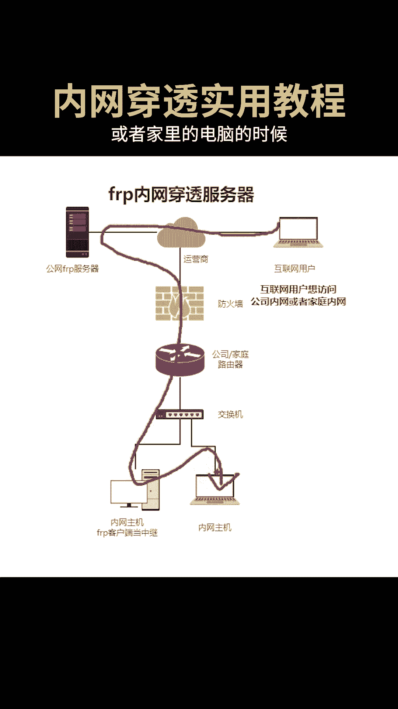
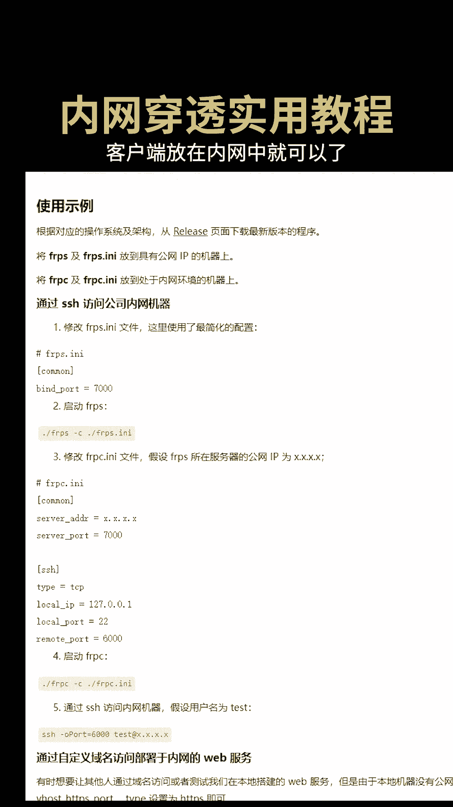

# 内网穿透实用教程 - P1 - 智传网优云课堂 - BV1tt421T7JA

内网穿透的工具有很多，FRP真的非常可靠，当你出差在外想访问公司内部的服务器资源，或者家里的电脑的时候。

看懂这张top图你就会了，FRP由服务端和客户端组成，服务器需要有公网IP，客户端放在内网中就可以了。

它可以安装在LINUX或者windows上，那为什么不用远程桌面来解决问题呢，这是因为有很多时候我们并不需要远程桌面，而只需要流量转发的功能，比如我出差在外，想在自己电脑的浏览器上。

直接访问公司内部的网页，或者直接连接内网的服务器进行命令行操作。

那很明显远程装备的工具并不能满足这种需求，觉得有用的点赞点关注吧。