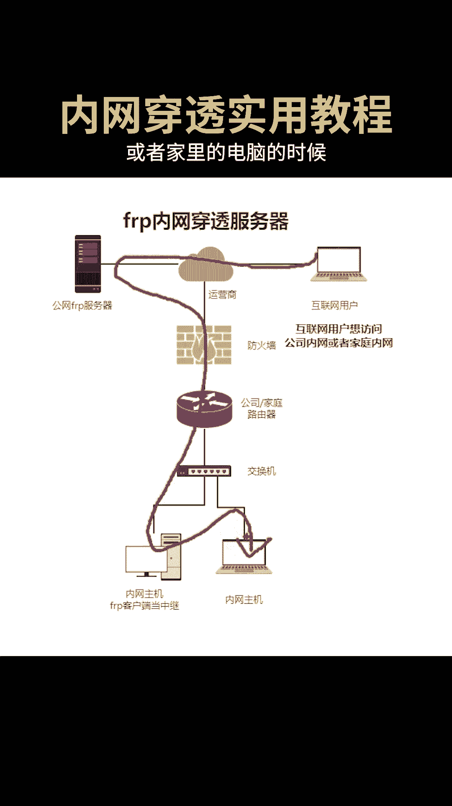
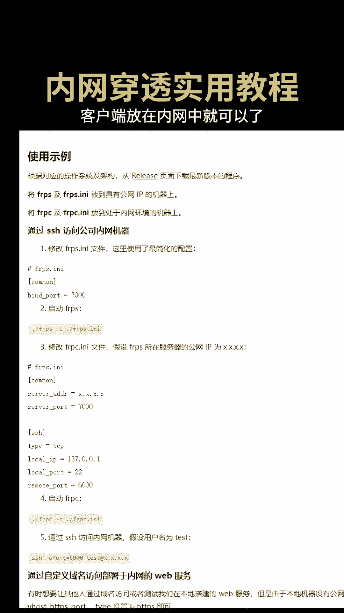

# 内网穿透实用教程：P1：FRP核心概念与架构 🚀

在本节课中，我们将学习内网穿透的基本概念，并重点介绍一个可靠的工具——FRP。我们将了解其工作原理、核心组件以及它相较于传统远程桌面工具的优势。

## 概述

内网穿透工具有很多种，FRP是其中非常可靠的一个。它的典型应用场景是：当你出差在外时，需要访问公司内部的服务器资源或家里的电脑。

## FRP的核心架构

上一节我们提到了FRP的应用场景，本节中我们来看看它的核心架构。理解其架构是配置和使用FRP的基础。

FRP由两个核心部分组成：**服务端** 和 **客户端**。

以下是这两个组件的具体说明：

*   **服务端 (frps)**：需要部署在拥有**公网IP**的服务器上。它负责接收来自互联网的请求，并将其转发到对应的内网客户端。
*   **客户端 (frpc)**：部署在**内网环境**中的机器上（如公司电脑或家庭NAS）。它负责与服务端建立连接，并告知服务端需要转发哪些本地服务。

其基本工作流程可以用一个简单的公式表示：
**公网用户 -> 公网IP:端口 (frps) -> 内网客户端 (frpc) -> 内网服务**

## 为何选择FRP而非远程桌面？

了解了FRP的架构后，你可能会问：为什么不用更常见的远程桌面工具（如TeamViewer、RDP）来解决远程访问问题呢？本节我们来探讨FRP的独特优势。

远程桌面工具主要提供完整的图形化桌面访问。然而，在很多场景下，我们并不需要操作整个桌面，而只需要**特定网络流量的转发功能**。

以下是两个典型场景：

1.  **访问内部网页**：出差时，想在自己电脑的浏览器上直接访问公司内部的OA系统、项目管理平台或监控页面。
2.  **连接内网服务器**：需要安全地连接到内网的Linux服务器，进行SSH命令行操作或文件传输。

在这些场景下，远程桌面工具显得笨重且不必要。FRP则能轻量、精准地实现**端口转发**，将内网服务的特定端口（如Web服务的80端口、SSH服务的22端口）暴露到公网，满足专业需求。

## 跨平台支持

FRP的另一个优点是具有良好的跨平台支持。无论是服务端还是客户端，都可以安装在常见的操作系统上。

以下是支持的主要系统：

*   Linux (各种发行版)
*   Windows
*   macOS

这使得FRP可以在绝大多数环境中部署和使用。

## 总结

本节课中，我们一起学习了内网穿透工具FRP的核心知识。我们首先了解了FRP由**服务端(frps)**和**客户端(frpc)**组成的基本架构。接着，我们探讨了FRP相较于远程桌面工具的优势，即它能提供更轻量、更精准的**流量转发**功能，适用于访问内部Web服务或进行SSH连接等专业场景。最后，我们知道了FRP支持多平台运行，适用性广泛。在接下来的课程中，我们将进入实战环节，学习如何具体配置和使用FRP。