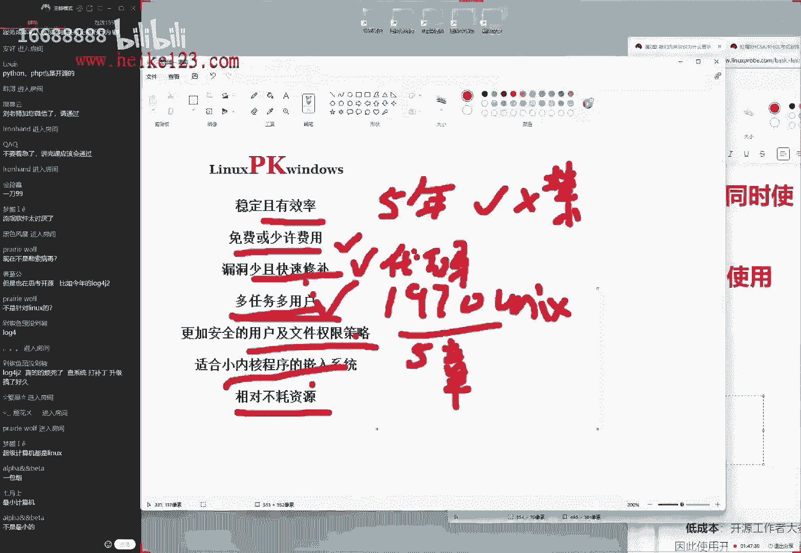
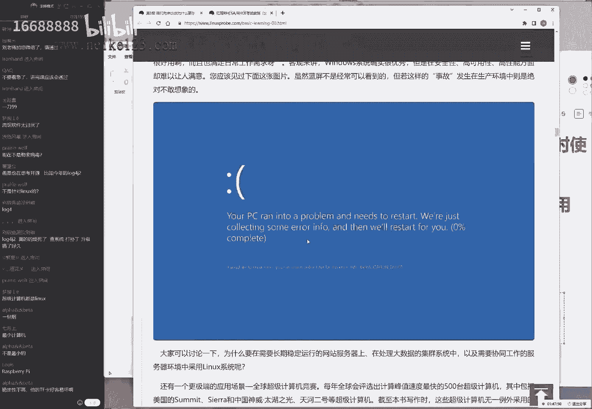
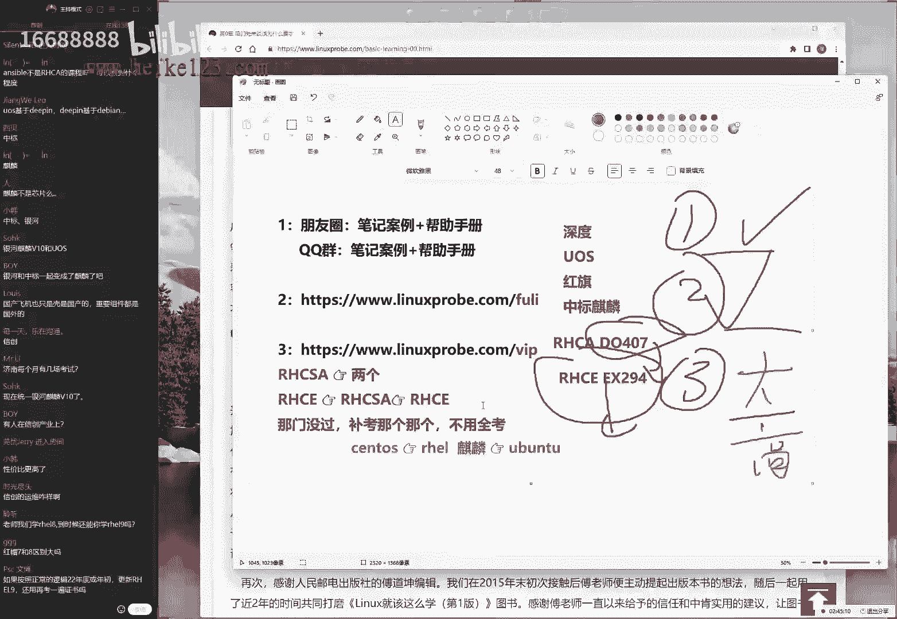
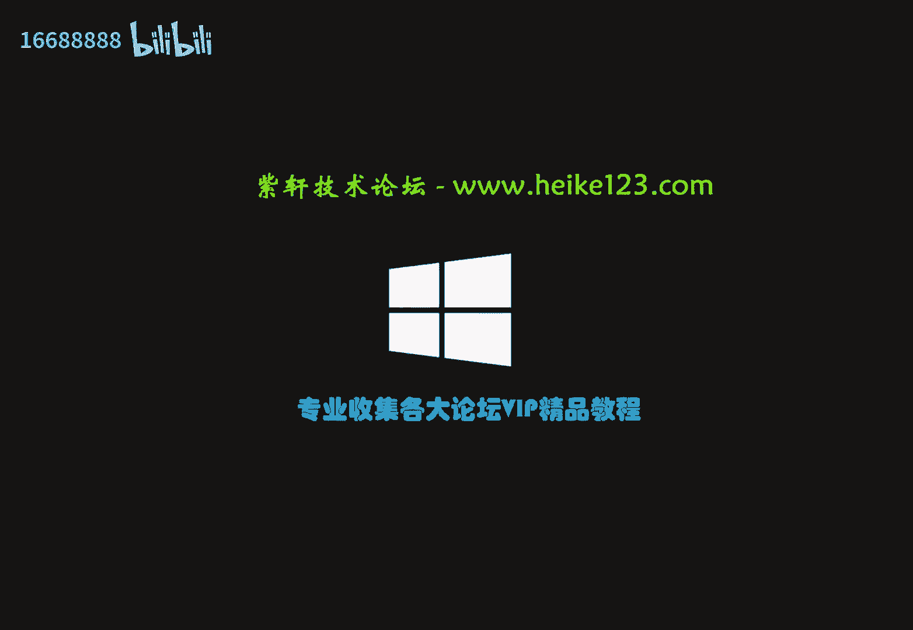

# Linux培训第34期：第0章：开班仪式与Linux系统概述

在本节课中，我们将进行开班仪式，介绍课程安排、考试信息，并初步了解Linux系统的历史与开源精神。本节课不涉及具体技术操作，旨在帮助大家明确学习路径，建立对课程的整体认识。

## 课程安排与常见问题解答

上一节我们进行了简单的开场互动，本节中我们将系统地介绍课程相关的各项安排，并解答大家普遍关心的问题。

以下是关于上课时间、软件、资料等常见问题的说明：

1.  **上课平台选择**：我们选择QQ群视频作为上课平台，主要目的是降低参与门槛，无需额外下载软件，操作简便。
2.  **课程音视频质量**：我们使用稳定的上课环境，声音清晰。如果个别同学感觉音量不适，建议调整自己设备的音量设置。
3.  **学习资料获取**：课程相关软件目前存储在百度网盘。我们曾尝试其他网盘，但因不支持压缩包上传等限制，暂时沿用百度网盘。后续若条件允许，会考虑更换。
4.  **课程风格与进度**：本期课程将回归注重互动与理解的讲授风格，不会单纯赶进度。我们会穿插大量实例、往期学员常见问题及生活化比喻，帮助大家更好地掌握知识。因此，课程总天数可能比预期略长，但不会额外收费。

## 上课时间与课程资源

明确了课程的基本设置后，接下来我们看看具体的学习计划如何安排，以及如何获取学习资源。

**上课时间**：课程于每周五、六、日的晚上19:00开始，理论上持续2小时，但根据讲解情况可能适当延长。课程表已发布在官方网站，日期后带“*”号表示当天有课。

**课程资源与录播**：所有课程都会进行录屏，并在当晚24点前上传至学员专属页面。如果您错过直播，可以随时观看录播复习。

**学员页面访问**：请立即访问课程官网并加上“/vip”路径，登录您的学员账号（账号为姓名，默认密码为手机号）验证权限。如果遇到任何问题，请务必在今天联系老师解决。

## 红帽（RHCE）认证考试详解

了解课程安排后，很多同学关心学完后的认证考试。本节我们将详细介绍红帽认证的相关信息。

**考试费用与形式**：目前RHCSA和RHCE两门考试的费用合计为4200元人民币（直接转账给考场，我们不加收任何差价）。考试为线下实操形式，满分300分，210分即可通过。

**考点与预约**：红帽考场分布在全国多个城市，如北京、上海、广州、深圳、济南、成都、大连、武汉等。具体考点列表可在官网查看。由于考位紧张，通常需要提前一个月预约。我们计划在5月初为大家预约6月的考试。

**高通过率保障**：我们的课程内容全面覆盖考试要求，并提供**考前辅导视频**、与考场完全一致的**考试原题**以及**模拟练习环境**。往期学员的上午考试（RHCSA）满分率超过50%，下午考试（RHCE）通过率在98%以上。

## 学员支持与学习活动

为了帮助大家更好地坚持学习，我们提供了一些额外的支持与趣味活动。

**帮助手册**：我们整理了学员常见问题与解决方案，形成在线帮助手册，方便大家快速查询。

**微信绑定**：为了及时发送课程通知、考试提醒等信息，请大家按照指定格式（如“34期 张三”）在微信上给老师留言，以便我们进行备注。

**学习打卡赠书活动**：为鼓励大家坚持学习并总结，我们推出了打卡活动。学员每天在学习后，将笔记（需包含至少一张手写笔记或书籍的照片）发布到CSDN、博客园等技术博客平台。坚持完成整个课程周期的打卡，即可获赠老师签名的《Linux就该这么学》第一版和第二版书籍。此活动重在自我监督，无需为书籍或课程做任何宣传。

## Linux系统与开源精神介绍

完成了开班仪式的各项说明，现在让我们正式进入第0章的技术内容，首先了解什么是开源软件。

开源软件赋予用户以下自由：
*   **使用自由**：可以不受限制地使用软件。
*   **复制自由**：可以将软件复制给他人。
*   **传播自由**：可以大规模地分发软件。
*   **修改自由**：可以对软件进行深度定制和修改。
*   **衍生自由**：可以在修改后发布新的衍生软件，并可以对此收费。

基于这些自由，开源软件带来了显著的优势：
*   **低风险**：代码公开，即使原公司停止开发，社区也可持续维护。
*   **高品质**：公开的代码促使开发者写出更优质、规范的代码。
*   **低成本**：通常可免费获取，主要通过服务盈利。
*   **更透明**：代码可见，避免了隐藏恶意软件的风险。

## Linux系统优势与发行版

理解了开源精神后，我们来看看基于此理念的Linux操作系统具体有哪些优势。

相较于其他操作系统（如Windows），Linux系统在服务器领域表现出色：
*   **稳定且高效**：可长期稳定运行，并可通过深度定制节省资源。
*   **免费或低费用**：系统本身通常免费，降低了使用成本。
*   **漏洞修复快**：开源特性使得安全漏洞能被快速发现和修补。
*   **支持多用户/多任务**：天生为多用户同时操作设计。
*   **安全性高**：拥有严格的用户和文件权限管理体系。
*   **适用于嵌入式设备**：内核可裁剪，适合树莓派等嵌入式开发。

**常见的Linux发行版**：
*   **RHEL (Red Hat Enterprise Linux)**：企业级系统，我们课程和红帽认证的学习对象。简称 `rhel`。
*   **Fedora**：红帽社区版，包含新技术预览。
*   **CentOS**：曾是基于RHEL的免费企业级系统，现已转向CentOS Stream。
*   **Ubuntu**：流行的桌面和服务器发行版，用户友好。
*   **Debian**：以稳定性著称，Ubuntu基于其开发。
*   **openSUSE**：在欧洲流行的发行版。
*   **Kali Linux**：专为网络安全测试设计。
*   **Arch Linux**：高度可定制，适合高级用户。
*   **Deepin（深度）**：国产发行版，拥有美观的桌面环境。

## Linux发展简史与红帽认证体系

最后，我们快速回顾Linux的发展历程，并明确红帽认证的架构。

**Linux发展关键节点**：
*   1991年，林纳斯·托瓦兹发布了Linux内核。
*   1993-1994年，红帽（Red Hat）公司成立，将Linux内核与常用软件打包成易用的操作系统。
*   1998年，获得英特尔、惠普等大公司支持，进入快速发展期。
*   2012年，红帽成为首家年收入超10亿美元的开源公司。其系统被世界500强企业广泛使用。

**红帽认证体系**：
红帽认证主要分为三个层级：
*   **RHCSA（红帽认证系统管理员）**：考核Linux系统的基本管理能力。
*   **RHCE（红帽认证工程师）**：考核自动化运维等高级技能。
*   **RHCA（红帽认证架构师）**：考核对红帽企业级产品（如集群、虚拟化）的架构能力。

我们的课程主要覆盖**RHCSA**和**RHCE**的考试内容。考试通过后获得的证书具有唯一编码（如2022-XXX-XXX），其中开头代表考试年份。

---

本节课中我们一起学习了课程的整体安排、红帽考试的相关信息、开源软件的核心概念以及Linux系统的优势与发展历程。从明天开始，我们将正式进入技术章节，动手安装和配置Linux系统。请大家课后务必登录学员页面，下载预习资料，为后续学习做好准备。