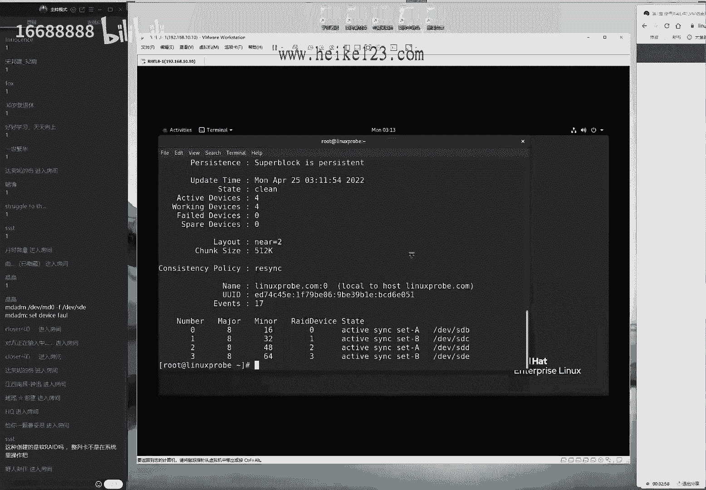
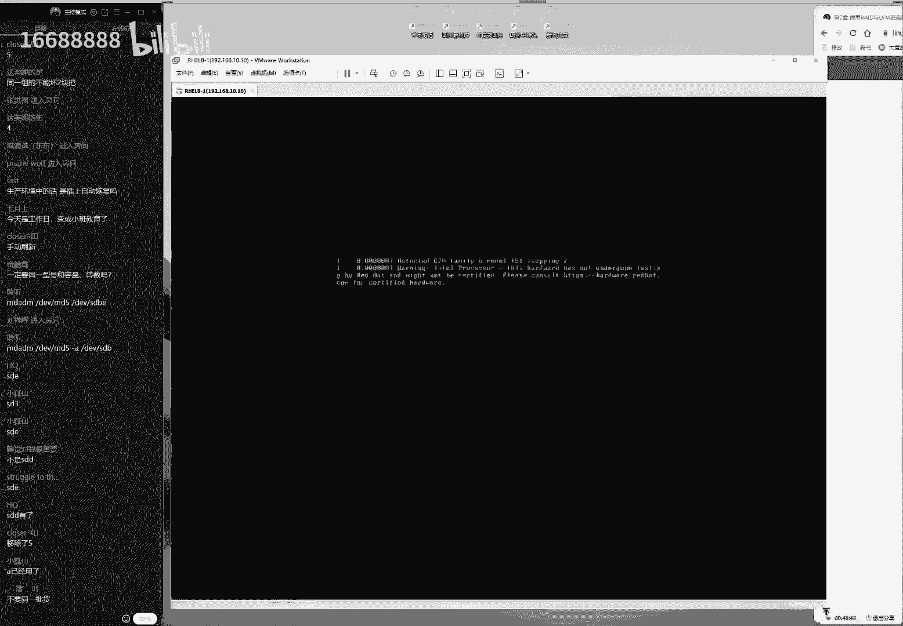
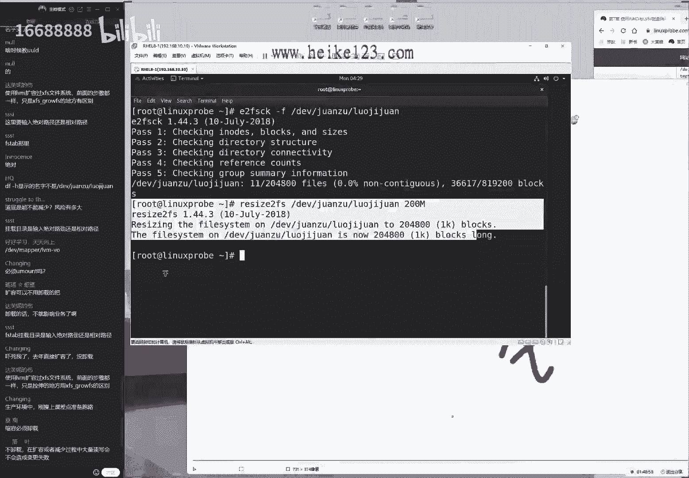
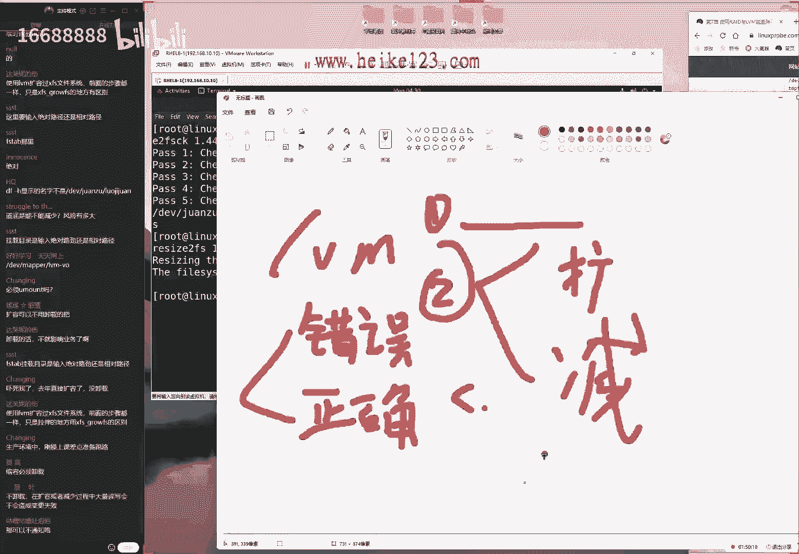
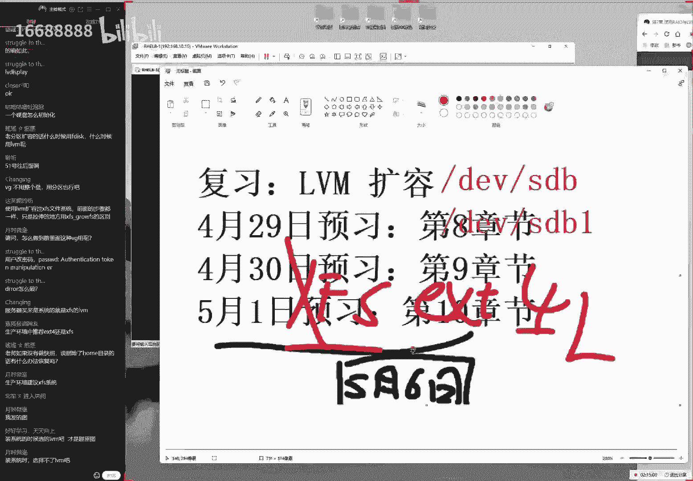

# 刘遄培训linux34期（配套linux就该这么学第二版，RHCE8） - P10：11 - 16688888 - BV1gL41167vP

what could i do，ok来个同学，我们来开始我们今天这个课程啊，大家man啊，大家都怎么样啊，去囤菜去啊，没有没有没有，只不过刚才看这个人比较少啊，所以等了一下，现在60个人还差不多吧。

好同学们，先打一下，一我们来开始我们今天这个正式的课程，那我们来打，先打一下，一同学们，那我们来准备一下，开始今天这个正式课程稍等，我先把水拿过来，ok啊好了，我们继续，刚刚的话是高估了自己的臂长了啊。

放的比较远，好同学们先打啊，测来测试一下我们这个上课声音，大家听到我说话声音吗，然后能不能看到我们的画面啊。

今天的话呢我们来正式开始，咱们这个第七章节的这个内容，我们先来给大家讲一下这个raid，昨天的话呢是说了一下这个理论基础，今天的话呢就要来复仇去实战了，到底这个read该怎么进行配置。

我们给大家准备了几个小实验，同学们可以共同参考，首先的话呢是我们这个书上面的，7。1。1小节，然后呢，那我们是要给大家去配置了一个看一下，配置了一个raid 10的一个磁盘阵列组。

那我们根据昨天所学习的知识的话，那么这个磁盘阵列组。

最少是使用的是四个盘来去完成的，我们在做这个实验之前啊。

还是有一个呃建议的话，就是我们要把这个虚拟机，首先还原到一个最初始的状态。

然后这样的话呢，我们跟其他的这个呃这些配置都给服这过的，这个服务没有什么冲突，第二的话呢就是把这个关机之后来进行操作，因为它毕竟是一个虚拟机，模拟出来的一个硬件设备嘛，他如果要是呃热插拔。

或者说我们开机的时候直接添加的话。

可能会造成这个不稳定性，或者说他会一些问题吗，技能呢，让我们把这个重点。

和我们这个全身心都投入到配置的服务上面，而不是为这个军机采取排错，所以我们现在选择的话呢，先把虚拟机给他，关机之后就啊，然后往我啊，然后我们往里面去添加硬盘这样的一种方式啊，大家问了一个问题。

晶晶同学说到了说我们设置防火墙啊，我们去设置设备失败了啊，是说把设置模拟损坏的时候出啊，出问题了是吧，那么这个时候的话您就可以不用着急啊，待会我们给大家讲到的时候。

你可以对比一下跟我这个操作有什么区别啊，那我们选择下一步，我们现在的话呢我们把硬盘添加成诶，稍微小一点点的，四个硬盘都稍微小一点，这样的话呢，但是格式化跟挂载的时候速度会更快一点。

好我们现在的话呢20个gb的硬盘，我们给它改成五个gb，然后我们其他的话呢选择默认，然后我们选择五个gb，然后我们现在等于数据往里面添加上四块，相同大小的五gb的这个磁盘类型的话呢。

我们存储损失就这个sa模式，不过这个模式也是无所谓的，我们往里面添加四个硬盘大小的话呢，分别为五个gb，然后我们选择一下添加啊，然后我们选择一下开机，这也就是说我们现在有五个硬盘啊。

那我们就是123455个硬盘大小的话呢，相同都是为五个gb，那我们四个硬盘组成之后的话呢，也就是20个gb，但是由于我们去组成的小read 10，两组之间先去做瑞的一。

然后的话呢在两组之间再去做一下瑞的零，那么我们啊两组之间各有一个冗余，所以我们的可用率的话是50%，待会儿也就是说会是5+5+5+5，最后等于说他的，最后我们用户能够看到的使用空间的话。

那么会是十个gb好，现在我们去使用到关联的这个身份，来登录到这个服务器里面，大家一定要注意啊，就是您一定要去使用到关联的这个身份，来增加啊，来去登录到我们这个服务器里面。

因为呃普通用户是没有权利来取管理啊，我们这个硬盘的，所以您需要先去点击这个没有被列出的选项，这边的话呢去手动去输入一下，我们第五章节学习的管理员的的这个账户名称，叫做root。

密码的话呢是叫做red hat，这样的操作过后，我们就登录到了管理员的身份下，就可以来进行后续的这个实验了，好现在登录好了之后，同样的，我们根据这个之前所学习过的一些理论基础。

还有我们这个协议的一些规范的话呢，应该能够猜得出来，这个并不难，我们新生出啊，我们的话新生成出来的这个硬件，文件的这个名称，他的话呢我们给大家看看啊，那我可以看到分别的话呢，是dv目录里面的b到e。

也就是说12344个，因为它是系统当中内核识别到的，四个怎么样的新的设备啊，这样的一个效果做好之后，我们来去进行一个创建，我们使用的命令专门用来去管理软件瑞的啊，叫做m d a d m命令。

后面的话首先加一个大写c，这个指的是创建的意思，它指的是创建一个磁盘阵列组，现在啊然后加一个小显微，它指的是显示我们创建的这个过程，接下来的话呢是啊，他最后指的是我们啊，接下来我们写这个名称啊。

那么换到这个指的是待会组成自拍这类组之后。

我们所让用户所看到的一个名称，这等于说就是我们使用的四个盘，最后的话呢它会有一个统一的名称，叫做啊md 0这样的一个形式，它并不能够说啊，完全的以我们呃组成的硬盘的名称来进行命名。

比如说现在的话呢我们是使用的是四个盘去做，那么待会儿这个设备的名称，它不可能是叫dv目录里面的，然后b然后对吧，然后b c d e这样的话呢非常的长，而且的话啊也不太利于我们去阅读。

而且现在的话只有四个盘去做，如果我们在工作的时候，大家用的是100块盘去做，怎么办呢，那么我们这个啊啊信息啊作业特别的多，特别不利于去写和读啊啊，那么我们也不至于去读嘛，因此的话我们需要给它一个统称。

就是我们待会儿的话使用这四个盘去完成之后，统一的一个名称，我们把它叫做md 0，这个名称的话大家选择默认就可以了，我们一般情况下也不用去改，这有点相当于，就是我们现在这个第34期对吧。

我们34期现在有100多位同学啊，我们现在在讲人数的话呢，有67位同学啊，跑了66位，那么我们就可以统称为第34期，这样的话，我们那我们就不用为我们每一位同学到，这个信息。

然后来做一下备注了，好那就是说这是我们呃统合完了之后，那合并之后的名称，当前这个文件是没有的，接的话呢是一个杠n小四，这个指的就是一个使用几块盘去完成，当前的话呢使用的是一个四块盘去做的，磁盘阵列组。

杠一个小写l啊，它准备了级别级别为read 10，那也就是说我们现在使用的是四块盘去做的，一个read 1001个磁盘阵列组，他的话使用的硬盘是b杠e，它使用的是四块盘去做。

使用一个通配符的方式来去体现出来，他所参与的这个成员啊，设备的这个啊信息，然后我们来敲一下回车就可以来进行创建了，那我们看到啊，其实这个书上的话呢使用的是另外一种方法，我们现在使用的这个通配符。

但是的话呢书上是写了这个四块硬盘的，这个分别的名称啊，然后我们这个比较笨一点，但是这两个方法啊，那我们都是困啊，这两个的话我们都是可以的，我但是我一般情况下会借用这个通配符。

只不过因为书上嘛我们面向的就是呃，就是一个普通的读者，如果我们用到这个通配符，虽然说第三章节讲过对吧，但是万一要是他们不会用的话，到时候说又多了一个差评，所以我们干脆书上总写的非常的非常简单。

这种最简单这种呃方式，但是您可能看起来会特别的臃肿，好我们创建好之后，随着我刚才说了很多废话啊，于是我们可以去选一个大写q，去查看一下他的这个简要信息了，这个文件就已经把它给创建出来了，可以看到的话。

那大小可用空间是十个gb没有问题，ok啊看这十个g b他的这个级别的话呢，是为呃瑞的一零没有问题，它使用的是四个盘去完成的，他的话有零额热备盘，他说的，但是这个信息的话呢过于简单了。

我们可以去选一个大写刚d，或者我们可以去选一个长格式，去查看他这个完整的信息，我们来写下一个大写刚地，查看一下它里面的这个详细信息，诶，看到它已经完成了呃，这边的话呢因为它会有一个同步的过程。

只不过因为刚才我们等了一会儿，所以他已经完成了，这个时间的话大概是一两分钟左右，所以同学们要记住了，就是我们在创下这台绿车啊，这个设备的时候的话呢，不要充电，完之后就马上就来进行操作。

一定要先去选一个大写刚d，然后我们确认一下它已经是初始化完成了，或者我们把它理解成叫做同步完成了之后，我们再进行一个下一步操作好吧，同学们啊一定要记住，就是呃我们去敲完这个声线命令之后。

一定要等待一段时间，然后再进行一个操作好，大家问了一个问题，大家说这种是创建，是软件类的吧，然后说呃这列卡不是在系统里面操作的吧，对我们的话，现在使用的是一个软件瑞的一个形式。

因为同学们没有必要为了我们今天这一节课啊，两个多小时去买五个硬盘过来，没有啊，没有太大标性啊，就是我们虽然也可以使使用硬件去完成，但是毫无必要啊，我们现在这个这个操作的话，包括我们这个理论基础的话呢。

那他说的话基本上跟硬件是相同的。

主要考虑一个性价比的一个原因啊，没有必要啊，这个没有啊。

其实确实也没有必要好，现在的话呢我们来继续，由这四个模拟出来的硬盘，我们就能够完成今天这个实验了，再去查看一下系统这个信息，能够看到已经同步完成了，下面我们干嘛呢，我们可以对它进行一个格式化操作。

我记得上一节课说同学们问了这个问题。

老师为什么你老我是用的这个啊，四版本的文件系统呢，是不是说我们现在这个新版本的这个文件系统，不太好用呢，或者有些服务并不支持呢，呃其实完全没有这个意思，是因为我们每一次做实验吧，只能选择一个。

那我们选择一个的话，大家会问说问我们为什么不要啊，但是大家大家可能会问到说，那我们为什么啊，我们那我们为什么要选择它呢，其实这个文件系统的话没有太大的关系的，大家可以去任意去选择。

没有呃，非常的重要这个区别，所以的话呢我们当前今天的话呢，我们就以我们新的文件系统啊，x f s来给大家去做这个演示，同学们就千万不要问说不要啊，说啊为什么没有用四版本啊，就这两个都是可以互相换的。

这个啊，哪种文件系统的格式对于我们这个实验的话呢，没有这些影响啊，没有这影响，大家放心呃，完了那我们给它格式化好了之后的话呢，下一步其实我们其实在说，就是做一下挂载操作了，来dv目录里面的啊。

然后我们这个啊不对，我们还没现在出来目录啊，因为我们讲到了挂载操作的话，实际上就是将一个设备与一个目录去做关联的，这个动作，我们把它叫做怎么样呢，挂载操作对吧，它所使用的命令叫做mt。

那我们要去做挂载操作，这个目的的话呢，是要我们的用户能够通过访问这个目录，就可以去实现访问硬件资源啊，那么就可以去实践出来访问硬盘里面资源，这样的一个效果啊，这个啊贯口真的是需要气很长啊。

那好那我们有了这个理论基础之后，就可以出现出来一个挂载目录了，挂载目录的话呢，挂载过后就变成了挂载点，这两个名称虽然不同，但指的都是同一个事情，来，现在出的a8 的目录，我们好比说叫什么呢。

看看是谁知道了啊，野人制作的同学是啊，是迟到了吧，那我们就给大家新建一个叫做小野同学吧，来亲戚吃饭，一个目录叫小野来做一下挂载，第1v目录里面的md 0挂到小野的目录上面，或者两开花。

这两者是缺一不可的，左边的话呢指的是设备的名称，右边的话呢指的是我们挂载的目录的名称，两者一挂好了之后，马上就可以去使用到da啊，命令查看一下当前挂载的这个信息，使用一个消息时，让它带有一个呃。

带有这么一个，单位值啊，带有一个单位值，我们看到它有一个m，它有一个g这样的话它会有一个单位，方便于我们用户的话来进行一个阅读，好现在的话呢去查看好了之后，就可以来继续下一步了。

下一步的话呢就是来去编辑一下文件，etc目录里面的file system tab，那我们来去敲一下这个文件系统的配置文件，首先的话呢里面还是要写上设备的名称啊，md 0。

第二点的话呢是我们这个挂载点的名称，我们叫做小野，它的文件系统的话呢，我们就是新的啊，我们的这个文件系统啊，x f s权限的话呢选择是defaults，然后我们零零不要自动备份，不要自动自检。

这样的话我们开机时候还更快一点，其实我们到此就ok了，保存退出就可以了，但是的话呢我们希望同学们不要有太多的顾虑，就是这个计算机嘛它会比我们更加的呃理性，更靠谱一点，他的话没有人为当中那些缺点。

我反正我们是这么认为的。

所以的话呢当我们可以啊，当我们确定了把这个服务配置好之后的话呢。

下一次的重启过后，他就跟那啊，那么他就会给我们一个确定性的配置成功，他们会依然为用户提供服务，挂载到我们系统当中啊。

那么我们于是来通过这个重启操作，来进行一个验证，因为有些时候我们可能跟一个人去说了，说我们现在的话呢有这么一件事，然后我们写在一张纸条上面的，他可能会忘记，但是计算机的话呢这一点不会的。

只要我们能够把它拍好了，然后能够去啊正常的开机，那么大家可以看到，即便重启了这个设备的话呢，也依然会被挂载到我们所对应的目录上面，是没有问题的，好那我们现在的话大家就会问一个问题了，邵老师诶。

我现在突然间忘了你昨天讲的是什么了，我们为什么要去使用它这个四分之列组呢，我们叫做啊瑞的一零呢，那那我要给大家提到。

如果不考虑成本的这个情况下，去使用到瑞典一零，我们换呢，实际上那么话呢我们实际上呃是有两个好处的，第一来讲就是我们可以去加快硬盘的读写速度，对吧，就是我们这个读写速度，第二的话。

那就实际上就是能够具体的一个冗余备份，那我们如果要是呃说的比较啊，说的话比较通俗一点吧，数据不容易丢失啊，我们要是有出现坏盘的话呢，它能够有一个盘为啊来啊进行一个顶替。

或者我们叫做保存着一模一样的一个数据，这样的一个效果好，大家问了问题，大家说啊我们的这个编辑过后，这个文件这个怎么备份啊，这个文件不需要备份，它本身就是编辑文件的这么一个操作，它何谈备份呢。

啊然后我们来继续来给大家操作一下啊，大家说话了啊，如何使用啊，热背盘啊，这个非常好，我们啊我们马上就给大家讲到，那我马上给大家讲，到时间的话呢，现在是07：18，大概7。38吧。

啊大家都能够看到我们现在这个操作了，我们一步一步来啊，不用着急，下面的话呢我们来给大家操作啊，大家看一下，那也就是它它两个好处，如果说出现坏盘了，我们也没有太我呢，我们也不需要太太太去担心。

那我们现在进入到所对应的文件夹当中，然后里面的话默认是空白的，这个是跟预期一样，我们去找来一些文件来复制过来，一些文件到我们这个当前目录当中，当做是测试对象啊，主要看这个文件有没有丢失。

信息能不能去读取呢，来看一下里面就有信息了，有信息之后的话呢，我们来点击这个编辑虚拟机的这个设置，然后我们随便去移除掉一个硬盘啊，然后我们从理论上来说的话呢，使用6。10去组成的磁盘阵列组。

任何一个盘的这个损坏，它都不会影响它的数据的，因为任何一个盘都有一个跟它一模一样的，一个备份盘好，所以就同学们可以来告诉我一下，避免我们同学们觉得，是不是老刘上之前都已经做好准备了啊，为什么第二块吧。

为什么第三块呢，来大家看啊，随便去选一块吧，2345随便啊，大家随便报一个数字，我们来给大家选择一件移除，然后看一下文件数据也不会丢失，我最近看行抖音上面有人卖，有人卖香肠啊，然后就是底下有人说说啊。

为什么你切的是这根呢，啊为什么你切的不是那一根呢，所以我们就随便来啊，大家说第五个对吧，好我们就随便第五个了，大家怎么今天互动起来不是那么的积极，选择一下移除啊，选择一下移除。

点一下确认，那没有问题，这是非常暴力了吧，因为我们可以通过命令去完成，当然命令的话，大家会认为说说是这个命令的话呢，它都是内部东西，我也看不明白，所以我们干脆把它给移除了，移除过后的话呢。

这个是不是就是彻底丢失掉了，我们可以去使用到这个杠大帝的这个参数，可以来看到，马上你就可以体现在这个输入信息当中了，可以看到它这个结果里面就有一个盘，已经选择的是移除了大家说的一个问题。

大家说同一组里面的不能坏俩一块儿吧，啊这个看您使用的是几个盘去完成的，如果说您使用的盘就是两块盘组成的，同一个呃组的话，那么您就只能是换一块，那么如果说你使用的是三块盘的话，那么你可以换75%。

就只要同一组里面有一个好牌，就没有问题来啊，大家说四是吧，那那那那那就是来不及了啊，那个是来不及了，已经是一啊，那我那我们就把第五还给移掉了啊，慢了一点点，好，这块的话已经给它移掉了，移调之后的话呢。

再去查看一下这个文件里面的信息，大家可以看到，其实肯定不会有丢失嘛，来可以看到这个里面的这个信息的话，没有任何的问题，随便去看，随便去耍都可以的，好大家看到的一个问题就是老师，那我现在的话呢。

如果说现在出现坏盘了啊，那我们该怎么来进行一个恢复呢，大家就可以接着看一下啊。

对于数据的这个恢复实际上也分为两部的，第一步的话就是我们需要人员来进行操作，但我们如果如果啊，但我们如果没有热备盘的这个情况下，那么的话我们需要做两个事情吗，第一步事情就是先去插入一张好盘。

然后的话呢我们呃呃呃这个其实也无所谓，如果说我们可以先插一张好盘，然后我们再做一下信息的同步，然后再拔一下硬盘，然后然后然后再去拔掉我们这个旧的啊，坏盘也可以，或者的话你可以直接把这个画板给它拔出来。

其实也可以好，那我们现在啊，那我们现在这个操作就是这么去做的，当出现一个盘损坏之后，那我们现在把这个盘给他拔掉了对吧，然后的话呢我们现在去顶替上去一张新盘，这张新盘的话呢，我们只要手动去把他顶替上去。

它就会自动来进行一个同步，它会同步我们之前这个同一组里面的这个硬盘。

里面相应的数据，然后它也非常稳定的，也没有太大问题来，我们现在已经把这个盘给它移掉了，大家可以再去确认一下，我们有人迟到了啊，所以我再去捡啊，再去来给大家解释一下，现在的话四个盘子组成的是瑞典一零。

那么那啊那啊那我们可以看到呃，最后一个盘的话，第五块被移掉了，那么当前的话数据应该是有影响，但是我们能够去查看到啊，不现在的数据是没有影响的，是硬盘有影响，但是我们的数据没有影响。

现在的话呢我们需要做的这个事情。

就是要去把它先去关机诶，然后去添加一块我们的新硬盘到里面去诶。

稍等一下，现在的话呢我们本来关机之后，再往里面添加一块新的硬盘，它又会成为第五块被识别到硬盘，所以呢它的这个名称还会是s e b d好，我们选择一下，下一步选择五，选择五好。

我们现在的话把硬啊换硬盘给他拔掉了，再添加上了一块新的硬盘，点一下确认，点一下开机，在我们工作的时候。

大家是不需要给服务器关机的，但是的话呢我们在虚拟机里面的时候，您是需要建议大家是先按关机，然后再进行添加，否则呃有可能模拟硬件的时候会有问题啊。

可能会有问题来，大家说在生产环境当中是插上自动恢复吗，它也不是的，我们需要手动再去添加上去啊，它也需要进行一个手动添加，因为这是一个很真，因为这是它，因为它是一个有问题的事情，就像有呃。

就像我们现在这个服务器里面，如果说现在有一个盘，它突然间坏掉了，那我们现在再插一个盘，它是自动的一个恢复吗，我那我我们认为他如果要是自动恢复了，反而是不合理的，因为我们这个盘。

它可能不是作为这个磁盘阵列组的，他可能用的是其他地方，但它突然间盘我们自动给它格式化了，我们可能认为也是不太合理的，也会造成一些数据的丢失，所以的话呢，这一步也算是系统给我们一些保护吧。

它是不允许我们直接去呃自动恢复的，它需要用户手动再去确认一下，然后才行来重启过后的话呢，来去查看一下这个文件呃，如果同学们刚才所问到的，它会自动恢复吗，大家可以看到了，它没有自动回复。

现在有这个盘已经回来了，其实叫做dv目录里面的s e d，这个文件是有是有，但是它没有自动往里面去添加进去，我们需要做什么操作呢，需要先在再去查看一下我们的这个文件信息，大家仔细看一下。

就是我们前面这些组最后这个信息，他最后的话呢是这个已经被移除的一个状态了，对吧好，我们现在我们现在需要做的事情，就是再开一个窗口去把它给它添加进去，dv目录里面的md 0，然后一个杠a啊，不md 0。

一个杠a将我们的盘给它加到底，里面具设备名称啊，s d d蔡文再回车，他说啊设备繁忙啊，稍稍等一下啊，dv目录里面的md诶，等一下他说他说a s d d繁忙哦，大家说应该是e是吧，稍等一下我确认一下。

我确认一下，不对啊，第一块被识别代号是a b c d啊对呀，第四块是d啊，哦不对不对不对哦，不好意思啊，这个是我的一个呃，呃刚才这是我脑子的问题啊，这个的话我们跟技术无关。

因为还有因为的话还有还有一个我们的这个呃，系统盘啊，因为我们这块系统盘是占用了a了，不是，所以的话呢他这个我们天天上的这个硬盘，它应该是b c d e啊，不好意思啊，刚才是我的一个疏忽啊。

这确实跟技术无关了，主要是我刚才没有反应过来啊，忽略到我们这个系统盘的a了啊，ok啊ok ok这是我的问题，来将我们这个硬盘i c e给大家往里面一加走，你啊然后就把这个添加成功了。

添加成功之后马上再去刷新一下，这个你会看到自动点啊，这不算这也不算自动顶替吧，但是还算自动的一个恢复，于是可以看到数据开始重建，已经重建了15%，45%，这就是我要给大家讲到这。

老刘这个计算机还是比较好的对吧，我们的话呢i92 代，然后咔咔的话64g的内存，但是我们可以看到同步时间大概也得有个十秒，20秒的时间，如果说我们先四个盘，他不是五个gb，他可能是20个g b的话。

那么四个就是80个g b，那我们可用率就是50%，之后变成了40g b的话呢，他这个数据同步起来也是比较慢的，所以同学们做这个实验的时候，您可以把这个啊我们的硬盘的话呢，选择稍微小一点，它。

那我们可以把我们这个时间跟精力更多的话呢，去投入到我们这个配置服务上面，而不用去等待他去同步的这个时间了，好我们等他同步好了之后的话呢，就没有问题了，然后我们可以看到这个这个小野目录的话。

依然被挂载到系统当中，同时可以去查看一下，这个里面的文件也都没有丢失，这就是一个呃相对于比较完整的，就是在我们这个服务器当中创建出来一个软件，瑞的一个方法，那么以及当出现坏盘了。

我们该怎么来进行一个恢复的这样一个操作，好那我们现在的话呢来给大家往后面去说，说到这个热备盘。

那现在是需要用户进行一个手动的一个顶替，让用户去插入一张盘，然后的话呢我们这个数据自动的这个同步过去，还是比较麻烦的，我那呃那么我们能不能去啊，好的时候的话呢，就是先去提前准备出来一张啊空白的光盘。

啊啊啊那啊，那我们现在先去准备一张好的，空白的这么一个硬盘放到旁边，当有一个盘出现损坏之后的话呢，这个好的硬盘自动的帮我们顶替上去，然后来去啊来进行一个数据的同步，来这样我们来自动顶替上去。

来进行一个信息的一个同步，这样的话呢我们用户啊，当然这样的话呢当我们管理员去的时候，只要把硬盘给他拔掉就可以了，而不用说一旦出现花斑之后，那么的紧张啊，主要为了他的话，就主要为了缓解这个焦虑嘛。

这个的话也可以去实现呢，我们把它叫做热备盘呃，这呃这位盘的话呢可以有很多块。

这个话大家可以因为它毕竟是一个虚拟机嘛，所以同学们可以多用啊，可以多做几块也没有问题的，他的这个参数是一个小小x好，我现在的话呢再去还原一下虚拟机。

然后我们来给大家完整的去做一下这个实验，待会儿的话呢会给大家演示一下。

就是说如果我们现在不需要去使用到这个raid了，我们该如何对它进行一个完整的删除，这话是我们之前的课都没有的，所以这也算是一个新增的一个内容，能让大家完整的演示一下，就是去使用瑞的。

然后以及对于瑞的进行一个编辑，最后的话呢进行一个完整的删除这样一套啊，这样的话呢非常详细的一套流程，来我们选择一下编辑，然后那有兴趣稍微再教训了，我们把这个硬盘的话呢稍微小一点点，还是用五个g b好了。

现在我们需要添加五个啊，现在的话呢我们需要添加四张硬盘啊，添加上四个硬盘，我们级别为五的一个磁盘阵列组，还有一个硬盘的话呢，我们是作为热备盘来去使用的，所以3+1啊，三个盘做锐的一个盘做备份啊。

热作为我们的热备盘，所以我们总共是添加上四个硬盘，这个没有问题好大家问了个问题，大家说说一定要是同一个型号，同一个容量同样转速吗，呃从理论值上来说的话呢，因为理论值肯定也不花钱嘛，从理论值上来说的话呢。

我们建议大家如果说要去做ray的话，那肯定是同一个型号，同一个啊，就是我们最好是同一个品牌，同一个型号，同一个元素，同一个容量啊，这样的话肯定是最好的，但是这个理论值对吧，但从我们这个实操上来说的话呢。

其实没有太没有太大必要性，主要啊只要是呃就是怎么讲呢，呃我呃我刚才所说的是一个最好的一个情况，但是一般情况下人生没有完美的，很难实现，就就就这样的一个情况啊，所以的话呢我们一般情况下。

就是只要容量是一样的就可以，比如说我们取两个20gb的硬盘，就可以去做一个，没有必要说其他的这个其他参数卡那么严，但是最好的情况下，尤其是瑞德一和瑞典不，还有他的话，尤其是瑞典零和瑞的一零。

最好还是使用同一个呃速度的。

但是呃正常情况下的话呢，我们使用的是同一个容量的话，其实也行，但是这个就嗯怎么讲呢，限制的条件越少，那我们换的性能就会越差，但如果限制的越多的话呢。

可能我们去购买，或者说我们去搭建的时候就会越麻烦一点来。

那我们接下来给大家来去操作一下啊，大家说不要同一批货对吧，然后坏的话大家就会突然间就会全坏啊，大家怎么样啊，对这个就是我所说的，这时候我们也是遇到过这种啊，这是我这话也是我们遇到过的，记得有一回的时候。

我们也是买同一个批次的这个硬盘啊，然后的话呢突然间一下坏了两块，当时地画第一块的时候，我还在想，不会是老刘这个人品不行吧，不能够啊啊第二话再换的时候，我突然间就意识到了，可能这个硬盘的原因好赞啊。

我们不是一个生态环境，我们只是一个呃折腾的一个环境，我们只是自己玩加工的一个电脑啊，所以我们还影响问题不大啊，好在京东这个服务也特别的好啊，还给换了个新好，可自从打完广告之后，我们来继续来往后面去说啊。

那我们继续往后面去说，添加上又添加上四个硬盘，这个名称的话，先去确认一下dv目录里面的s b c d e，其实我们第二个实验是没有必要去确认一下，这个设备的名称了，只不过因为老刘这个脑子不太好啊。

我再确认一下，根据我们之前所学习的协议和原则，d啊，b c d4 个盘都已经乖乖地躺在了目录当中，等待我们去呃操作了，那这个啊等啊都准备我们再去操作了，来来来来来，我们进来，md a d m命令。

一个大写c创建一个小写v显示出来，我们这个过程dv目录里边啊，大家问了一个问题，我看一下上面一个问题，我把它忽略掉了，大家说啊，今天是啊，怎么样啊，今天是工作日变成小班授课了对吧，ok啊我还吃了。

我还我还以为是个问题呢，来dv目录里面的md 0来设备来去设置一下，我们待会儿绑定之后，我们创建好了之后，我们这个设备的名称，它就等于说我们那个班级的名称吧，如果说大家想一下，其实也可以的呀。

凭什么不可以啊，比如说我们现在是c e b s c s e e d和sd，这么去写的话，怎么不可以呢对吧，而且我们一眼就能够看得出来，他是有哪几款盘子啊，来进行一个组成的，但你有没有想过。

如果我们这样写完了之后，我们再往里面添加硬盘，或者说我们取消掉硬盘或者这个硬盘啊，啊那这样的操作过后，那我每次都要去改一次名字很麻烦，所以干脆把它叫做啊，第34期，我们给它一个统一的名称。

就代指了我们所有参与的这个成员来，这样的话呢，我们来选一个是一个小呃，小写n它指的是由几块盘组组成的呢，我们总共是由三个盘子组成的，一个级别v5 的一个四分之列组，顺便的话呢带有了一块怎么样呢，备胎啊。

作为一个热备盘，作为一个备胎，那我们组成了这个硬盘的名称，dv目录里面的c a b，然后是b杠e，其实这样去写的话，我们会感觉到明显比书上面我们去写诗啊，四个设备的路径以及名称更加简单一点了。

但是的话呢实在是不敢去写，如果要是敢写的话，同学们只要有呃，不但是啊我们只要改写了，然后我们再画啊，读者出现任何的问题，那都是我们的问题了，所以我们书上的话呢，有些其实可以再去啊复杂一点的。

这也是为什么我们要大家既然报个班嘛，一定要来在线上课了，因为有些时候我们这个操作，是跟书上面是不太一样的，书上要是完全一样的话呢，就是档就会档次比较低一点了，然后会比较简单一点了。

来我们接下来的话呢去操作好了之后，你看我现在在说废话，原因是什么呢，原因就是因为它没有同步好啊对吧，看到了吗啊好啊，已经好了是吧，ok可以了，那我们必须要等待他一下两分钟啊，然后他通通不好了。

确认一下已经是状态啊，已经是没有问题了，状态的话也是这个啊，正常情况下再来进行后续的这个操作啊，大家怎么说，那大家说啊，md 5啊，他这个可以这样去做。

另外的话呢，还有一点就是我们这个设备的名称的话呢，建议大家都用这个md 0，因为我们在红包中六的时候，大概时间是2013年的时候，我去试过这个400g内组，后来的话呢，我想当后来我当时我就想改一个名字。

就是dv，比如说啊dv目录里面的流传啊，提一下我的名字啊，万一这个视频被泄露出去，起码我们的同学们知道这视频是啊，这个话是谁录的啊，来我们可以这样的一个名称来进行命名，后来我换我大概2013年的时候。

在红包reo 6里面，我去试过一次没有成功，所有的干脆啊，我就养成这个习惯，就是我们所有的这个瑞的磁盘阵列组，我们都把它叫做dv目录里面的md 0诶。

呃也没有太大必要去换嘛，最后这样啊就养成一个习惯了，下面一个问题好，大家问了一个问题，大家说啊这个名字很有钱啊，金辛金是吧，来说说他这个啊气动盘做哪个阵列啊，系统盘的话呢，我们一般情况下会做锐减一零啊。

会比较的稳妥一点，但是这个也考虑到这个成本嘛，来这个并不是强制的哦，诶对了，还有啊，其实我们还有一些问题呃，我突然想到了以前我上过一个档，以前的话呢我买过一个云服务器，然后的话呢其实那个不是云服务器。

就是一个v p s啊，到我这我我我，反正我我我当时买的是一个国内一个小厂商的，然后的话我当时想去挂机，去用一些比如说什么软件啊什么的，然后来做一下测试，我当时买完之后吧，我买完之啊不，我是在买完之前。

然后我发，然后我去了解了一下，我说你们这个设备呃有没有做硬件瑞的呀，他要说有我们是瑞典一零，但是的话呢我去实测的时候发现啊，速度还是可行的，但是的话呢就是这个安全性嘛老觉得不靠啊，就是话老不太靠谱。

当我们有先给大家提一个小问题，就是呃，当我们遇到了一个，不能够去查看硬件信息的情况下，不能够查看硬件，就是我们去到他的机房里面去查看硬件信息的，这个情况下，也不能够像我们现在一样。

编辑虚拟机的这个信息的这个情况下，那么我们该如何去识别出来，他是read 0还是read 10呢，这个问题大家去思考一下，我们可以留下小作业啊，大家可以去网上搜一搜也行，当我们在就是在网上买一台服务器。

那我们该怎么去区别一下，它到底底层做的是瑞典零还是做的瑞典一零，因为根据四川之列组的话呢，它的目的实际上也是为了让用户屏蔽掉，底层文件系统的这样的一些特性对吧，我们那我们用户只看到这个名称了。

而不用担心说底下是由几块盘去组成出来的，进行一个合并的过程，但是如果说这样的话，就会造成一些比如说超兽啊，或者说呃一些呃偷工减料这样的一种呃，可能性对吧，那我们之前可能它需要四个盘去做，而我这个学啊。

他啊那啊。

那么我们呢我们这个可能只需要两个盘子去做，那我们该怎么样来进行一个识别啊，大家说我们可以用dd去做一个大文件，来去测一下速度，但是零和一零的话，速度理论值来说是一样的呀，速度上是没有区别的呀。

好这个问题我觉得很有意思吧，啊大家去思考一下，我们往后面去说的啊，留一个小悬念啊，留个小悬念，留一个小豁口啊，这样的话呢我们来聚聚来呃，etc目录里面的xfs来，我们来给它去格式化啊。

make file system，然后是xfs设备名称，dv目录里面的md 0来给大家注意一下，格式化操作会发现硬盘小一点，速度更快一点啊，给予我们的生命呃，再重建出来一个目录，作为我们的挂载目录。

看看是哪位小朋友迟到的呀，啊叫做晚秋的和同学啊，那叫做这个小啊，那叫做这个小秋吧，那小邱非常优美啊，小邱同学把这个设备给大家做一下，挂载dv目录里面的md 0，然后的话呢括小秋的这个目录做一下挂载。

这样做好了之后，来编辑一下etc目录里面的file system top文件，把我们这个信息写啊给写到里面去，虽然说这个考试不考，但是这个习惯一旦养成了之后，是不是觉得很香啊。

以后在有遇到这种情况下的时候，我们如果没有做这步操作，您感觉到哪里好像很好，就是感觉很就是怎么感觉呢，就是感觉很别扭啊，少点什么东西似的来，这样的话养着我来来来去，养成我们我们现在这个习惯来。

先把这个信息的话呢写好之后保存并退出，最后之后的话呢就可以去干嘛呢。

重启一下吧，还是啊重启一下啊，眼见为实，老刘说他会在下一次的时候依然挂在上啊，虽然所以说说老刘帅气的这个呃，外表以外的话呢，看看到底说话也靠不靠谱，来重新去启动一下啊，大家说错了。

小秋崩了得出问题了是吗，我刚才是敲错了是吗，好啊不好意思啊，刚才说啊，果然是崩了好，崩了之后怎么办呢，如果说卡到这个界面了，同学们已经说明大家又赚到了，赚到了赚到了赚到了啊，本身没有啊。

本身呢我们书上这一节是没有排错的好，那如果出现这个问题了，怎么办呢，大家赚到了啊，这时候啊说啊这种出现的问题的话呢，首先不要紧张啊，不要紧张，先拿紧的水杯，他那淡定的喝一口水，嗯然后的话再喝一口。

接下来进入党对大可说出来了，输入一下我们关联的密码，然后的话呢把我们刚那个文件来，etc目录里面的file system type来啊，小秋是吧，你看啊啊，那我把这个信息给他更正过来，保存并退出。

再重启一下就可以了。

所以大家千万不要慌，在考试的时候更是如此，输入下关联的密码，把这个信息一更正，于是这个服务器又能够乖乖的起来了，在考试的时候。

我们给大家说是我，我就我们给大家说实话啊，在考试的时候你要说不会很难，因为我们说说句实话，考题都给大家了，题都看了半个月了，都看了一个月了。

你要说你再不会有点说不过去，但是的话呢就是主要的原因就卡在了，有时候会发慌啊。

然后然后就有时候可能会突然就想不起来，这样的一个问题好，然后的话呢刚才在这个07：18的时候，有同学提了一个问题，然后说这个热备盘怎么去实现呢，那于是我现在就给大家讲一下啊，38分了啊，到那我们到点了。

我们来给大家说一下，这背盘怎么来进行一个验证，现在的话呢是有三个盘去组成了一个raid 5，然后的话有一个盘作为热备盘，我们需要做的事情很简单，就是把这个硬盘随便选择移除一块来，随便选择234。

然后随便来，比如说我三吧，这也就无所谓了，选择一下三，选择一下移除，移除好之后的话呢，来去查看一下我们这个系统，这个瑞德分之内组的详细信息，于是您就会发现啊，它有一定延迟诶，然后再再再等一下。

还没有变化，还没有变化，还没有变化，但是不用着急，还没有变化，ok有现有开始，现在开始变化了啊，然后的话呢怎么样呢，一热备盘自动的顶啊，把它给顶替上去了，就是这样的一个效果，同学们可以来看一下这个效果。

第三个盘子被移除掉了，然后的话呢我们的正面盘自动的顶替上去了，可以踏踏实实的出门去做核酸去了，不用有心啊，换我们不用担心说服务器崩掉之后没人管，大家可以看到现在就是非常顺利的，正在同步。

已经同步了80%了，还是非常快的，硬盘小一点，把我们的这个生命就可以节约到其他的，这个服务上面，通报好之后，可以看到三个盘乖乖的又开始做这个呃，为我们提供服务了，进入到我们这个小区的这个目录当中。

然后的话我们可以随便去新建收下文件嘛，也是没有问题的，好大家刚才说啊，我们的这个目录名称写错了是吧，对然后于是我们刚刚进行了一个更正好大，也就是说我们嗯当我们出现问题之后吧，我们首先不要慌张啊。

一定要去想着怎么去把它解决，其实他一定是有问题吧。

那我们其实一定是有办法把它给解决的，但是如果说您做这个题目啊，做特别的嗯怎么讲呢，特别的嗯特别，但是就做的特别的呃不好吧，呃做的特别的差，然后的话可能导致您这个服务器被崩溃掉了。

比如说您在考试的时候的话呢，突然间手一滑，然后的话呢或者键盘上面有一只小苍蝇啊，然后您手，然后呢然后的话你手一葫芦，然后你不小心葫芦出来这么一个命令，然后您又不小心敲击键回车，就如果说您出现了这种呃。

就是呃，如果说您在考试当中出现了一种，不可逆的一种错误操作的话，如果说出现的话呢，也不要慌，您可以去举手啊，你好啊，然后的话呢跟老师说去re啊，然后还去重建，去rebuild一下这个机器就可以了。

在考试的时候重建操作可以做很多次，只不过需要考官帮我们去做，然后就可以把我们这个系统的话呢，重置为一个您进入考场的时候的第啊，那个最初始的一个状态，那么大家可以去评估一下，如果说我现在评估。

我现在这个操作已经是出现很严重的问题了，考试那我肯定考不过了，那么这个时候您就可以让，那那那么您就可以让考官暴击，对于系统的话进行一个重置，其实这个时间肯定是完全是足够的，因为上午的是3c。

他考的是两个半小时对吧，他其实呃两个半个小时，这个题目我们一般情况下也就做一小时，做完慢的同学的话呢，可能做一个半小时也差不多了，如果说出现一次问题，完整的去rebuild一下，音响基本上是为零的。

您就是两个半小时做两遍都来得及，所以在考试的时候切记不要慌，一定设办啊。

那我们一定是有办法给大家解决的，千万不要紧张，来我们现在的话呢再来啊，我们接下来再来，你家里已经有这么一个设备文件，并且已经自动恢复，这个情况下的话呢，给大家讲一下，当我们呃过程当中。

如果我们现在不需要去使用它，这个呃这个四川这列组合，我们该怎么把它给删掉呢，因为我们在日常3号当中啊，会发现有时候删是删不干净的，大家记一下，就是在我们工作的时候，有时候删是删不干净的。

所以的话呢我们先来给大家说一下，怎么把给删干净呃，首先第一步的话呢，首先需要返回在另外一个目录当中，不能够在您当前工作目录下去卸载掉一个目录，否则它会提示出来繁忙。

于是的话呢我们现在去使用到u mont命令，把刚才那个设备，然后跟我们这个目录的话呢取消关联，这是我们的第一步反向操作嘛，再来把我们这个文件里面这个信息给删除掉，file system time。

那fs tb文件把它给删掉，删掉它里面所对应的挂载信息，既然要删嘛，就一定要把它给删干净，包括内核里边的跟我们这个分区信息的话呢，都要给大家一起上个按钮啊，没有问题来，这样的话呢我们做好之后。

我们来去使用到这个m d d m命令，然后我们后面写的设备组的这个名称，把我们这个硬盘的话呢分别作为一架移除，我们选的是一个小写f，然后我们看一下当前的话呢是有四个盘啊。

不当前的话是有三个版b d e3 个盘，于是我把这个三个盘的话呢，分别选择一下移除啊，我其实它是个小写f的意思是设置为失败模式，或者说我们把它选择一下，就是呃呃来去停止使用这三个盘啊。

停止使用这三个盘来，我们现在的话呢把这个三个盘分别去设置一下，停止使用啊，刚才我们上课之前，同学们提了一个问题，就是说啊叫做这个晶晶同学吧，说到诶为什么我去使用消息的时候会有报错呢。

我没有像你一样成功呢，这个的原因可能是不是，因为你没有把它给卸载掉呢，啊去检查一下是不是这一步出现的问题，跟我们不太相同，好那我们现在把设置了失败之后，我们的话呢下一步就要来选择一下这个移除。

其实我们按照这个红毛大纲里面，这个教的方法的话，那就是可以直接就是执行一下这个消息f，然后就可以把它选择一下移除就可以了，但是按照我们这个规范的这个操作的话，那最好就是先卸载，然后的话呢再去设置失败。

然后再去把它给移除啊，然后我们再去选择一下移除，这样的话更加的这个标准一点操作来，我们现在将三个盘分别都选择一下移除，移除之后，再去查看一下这个400g内阻的一个信息的时，候。

大家可以您可以看到这个信息的话呢，就会没有硬盘了，这个时候的话呢，我们基本上就已经把它给删干净了，还差最后一步，我们就是m d a d m命令，然后是stop，然后接下来是dv目录里面的md 0。

把它给停用，停用过后我们再来查看一下，就会发现这个文件的话，那已经是没有了，并且的话呢去查看一下这个文件里面的，详细信息的话呢，也已经是空白了，那么就是这个样子的好，然后最后大家是家人们啊。

怎么在这个服务器里面的排位有限啊，该怎么加排位呢，啊这个我们下课就讨论好下面一个问题，大家说在怎么样在删除的时候，会出现说device or resource busy啊。

这个原因就是因为您没有白给先去做卸载操作，就是您一定没有做卸载操作，需要先把这个呃先去做一下卸载操作，让我们这个计算机的话呢没有去使用这个资源，然后再进行操作啊，已经卸载了什么啊，当然这两个问题啊。

我们同学我开会那个问题以后，大家是哦用卸载了是吧啊，这就不知道了，这就不知道了，因为您当然每个人的操作环境是不一样的，那么您就看一下，刚才我这个操作跟您有什么区别吧，好大家问下一个问题。

大家说如果有一块移动盘，再加上去怎么操作，是不是就直接选一个杠a操作，对，就是一杠a操作就可以了，一样的操作，但是您啊做不了是吗啊，那不会的，一定是有区别啊，一定是有区别，一定是一些小细节的区别。

或者的话您可以把今天这个视频完整的，再去用视频的形式，不用这个压制出来这个视频的形式，然后播放一下，然后呢我这边啊做的这个所有的操作，每一步啊，枪毙了之后的话，那按一下空格暂停。

然后您在您的本地再去敲一遍，每一不一样啊，这样我们敲完之后就会是一模一样的，肯定是有一些小细节，有时候我也是这样的，有时候我会去做饭啊，虽然因就因为我们做这个计算机已经做了，大概有了呃，10年了吧。

12年时间了，我对这个很熟悉，但有些时候我去做饭的时候，我老是做不出来我妈妈那个味道啊，她就是你眼瞅着她炒一个鸡，就你你就眼瞅着他炒一道菜吧，熊柿炒鸡蛋，就我炒菜那个菜总是那么的咸，总是那么的酸。

所以可能呃一些细节的原因，会导致我们这个实验的失败吧，所以我们不用去纠结说为什么我会失败啊，不用纠结这个问题了，反复去做一下，看看一些细啊，去细微的差异，那就可以了，来现在的话呢我们来给大家去。

下面来去说一下我们的lvm，其实的话其实这个细节是很。

其实这话这个细节是很重要的，包括的话有一些操作的时候，我我们那个顺序也是很重要的，那好我们先来给大家说下面一个7。2小节，7。2小节，其实这个的话呢不用太去纠结，说为什么我会出错啊。

出错这个结果并不重要，主要是一个配置的过程，找到原因才是重要，来说一下7。2小节，我还有我们的lvm，还有一个问题啊，就是我们同学们这个呃正好给大家说一下啊，我就是我们每一期考研时之后的话呢。

都会有同学说老师哎呀，我感觉我结果考的不好对吧，然后的话我感觉这道题的话呢，感觉还不是很熟练，巴拉巴拉巴拉，然后说了很多，其实的话呢我们感觉大家其实可能更多的，您不是需要有人去安慰大家。

就是我们说哎您其实已经很好了，然后的话呢我们这个题目的话，那下回再努努力就好了，我感觉其实大家可能需要的不是安慰自己，可能是需要的就是一个嗯耐心下来，然后多去练习的一个过程啊。

好我们来继续来给大家去说吧，说一下我们的l o v m这个逻辑算管理器啊，这个话呢就是去解决了，我们昨天讲的一个分区格式化挂载，以及今天讲的那个raid当中，我们会遇到的一个嗯痛点，它不是一个bug。

它也不是一个问题，它是一个痛点是什么呢，当我们去分区好了之后，再想进行一个扩容的时候，它是呃很难的啊，或者的话我们要讲的进行缩小的话，它就会更难了，比如说我们现在把这个磁盘的存储空间的话呢。

把它比作是一个长方形，那我们现在的话呢分别啊，那我们现在分别有这么几个分区好吧，第一个分区，然后第二个分区，第三个分区，然后我们现在有这么几个分区，第一个分区我用绿色啊，那我先我要用一个绿色。

第二个分区的话呢，我用一个红色，然后呢那我们现在这个白颜色是一个空闲分区，好，它这里面是一个空闲的一个容量，那好那我请问请问一下，在windows里面，我们能不能对于这个绿色的这个分区，来进行扩容呢。

就是我们现在比如说有一个分区，它是一个c盘，这边的话呢全都是空闲的，请问我能不能，现在对于这个c盘来进行一个扩容操作呢，能还是不能呢，大家说可以，大家还有人说不能好了。

呃我不知道大家怎么为什么会说可以啊，可能会有一些技术可以去实现，但是的话呢我要给大家说到的，从我的经验上来说，以及从windows里面默认的这个磁盘管理器当中，我们去选择的话呢，是不可以的，是不行的。

它必须是连续的扇区去操作一啊，大家也许是有方法去完成，或者的话您已经使用了一些管理器了，所以您才可以的，但是如果说您没有使用这些技术，在默认情况下确实是不可以的，好这个时候怎么办呢。

那我们就只能去删除掉某一个这个分区，然后再进行扩容，这是我们的经验，这个也是一个痛点，那我们现在就有一个问题了，我们现在无法去判断自己，今后的这个业务的增长，就像现在的话呢是4月24号。

我无法去估计出来，我6月24号啊，或者说我8月24号，或者我们10月24号，我半天之后我的体重那好了，那我现在该怎么买衣服呢，那我这个体重可能是涨，可能是减，那我该怎么去买衣服呢。

于是的话呢我们就希望有一种带有弹力的衣服，这样的话我稍微胖个五斤，他也能穿，这样的话呢，那我再稍微啊，那我们带有一些弹力的，当我们这个扩容跟缩小的时候，都有一定的这么一个呃，调整的空间的这样的一个技术。

我们把它叫做llvm，叫做逻辑的管理器，他就为了去解决两个痛点，第一个问题就是如果我现在有多个小的硬盘，我们该怎么来进行一个合并使用啊，就是说我们可以将多个硬盘进来进行合并，和平过后的话呢。

可以让用户去看到我们和平过后的，这样一个设备卷组，而不用去关心底层是由哪个盘子组成出来的，就是说让用户只看到一个成品，而不关心说底层是由哪个盘组成的，进行一个组合啊，第二的话呢，就是我们能够让用户能够。

根据自己的这个业务的增长，但我现在觉得哎呀，我感觉今年这个经济好像不太好对吧，我感觉可能呃要去减少我的这个余地，这个呃那我啊需要减啊，需要减少和削减我们这个成本了，那么我怎么样啊。

那么的话那我还那么的话，我们可能就会去呃，减少对于一服务器硬盘的这个投资，但是的话呢结果发现我们是做核酸的对吧，然后可能我这个业务爆发式的增长了，那我现在可能需要对于我这个硬盘的空间，进行扩容。

才能够保证啊去保存更多人的这个信息，那么我们该怎么样去调整我们的业务的硬盘，能够自动的去扩容跟缩小，如果没有这个技术的话，大家就每一次都只能是把这个硬盘给他啊。

先去删除掉之后再进行操作，特别麻烦，而且还很不现实，来我们给大家说一下，我们这张拓扑图是这样的。

首先大家看到了我们的l bm的话，实际上是由三个这个三个这个方式不啊，有它有三个环节去组成出来的，这个我们可以叫做三个元素嘛，或者说我们叫做三个环节，第一个环节的话呢，我们把它叫做pv操作。

pv操作的话呢，意思就是说叫做物理卷啊，叫做物理卷，这个怎么理解呢，就是要让我们的硬盘能够去支持，我们的l o v m的一个技术，我们把它叫做物理卷呃，举个例子，如果说在中国的话。

那么可能第一件事情不是让你去呃去登记信息，可能你第一个需要先表一下忠心对吧，然后你需要去表达s g的意愿，接受一下考核，这是第一件事情，那好了，也就是说要让你能够去认同他。

也要让你能够去呃呃对它来进行一个支持操作，我们本来就叫做pv操作，也说第一步要让我们的硬盘能够去支持了，我们这个技术，我们把它叫做物理卷，那第二步的话呢叫做这个vg的一个卷组，这也同样的。

如果说你通过了考核了，你已经支持了我们这个呃正当了好了，那我们可以把你拉到我们这个组织里面，这个的话我们叫做vg，这个叫做卷组，它叫做物理卷，它的呃不它的话是叫做卷组。

它是把已经支持了我们在llvm技术的，这样的一个物理卷的话呢进行一个合并，比如说我现在有三个盘，这三个盘的话硬盘分别是为五个g b，那好了，5+5+5+5，最后我们这个15个g b。

就变成了我们这个vg卷组的一个资源池，里面的这个资源，大家要理解这个词叫资源池，也就是说我们来进行一个合并的时候的话呢，合并过后的这个空间，就它啊它就成为了一个我们卷组里面的资源池，叫做这个vg操作。

然后我们最后一个操作叫做l o v操作，它就可以将我们这个微距解读里面，资源池里面这个资源的话呢，按照需要来进行一个分配，比如说我现在啊，比如说啊就咱就说啊啊，比如说上海现在的话有这个啊防控了，那好了。

现在的话呢比如说现在从山东，然后呢现在掉了很多白菜，过去从北京调过去的很多烤鸭，又从天津到呃调过去了很多煎饼好，那么我们到了上海之后，是只有在天津的上海人不那啊，那也就是说只有在上海这个呃北的话。

那就是说我们在进行切割的时候，他不用说啊，非得说天津人才可以吃煎饼，北京人吃烤鸭，它是一个综合到一起变成一个资源池，或者的话我们叫做按需分配的，就是我会根据我自己的需要来进行切割。

然后这个我们看了看张图啊，这张图的话就是非常的清晰啊，如果说我们现在有三个盘，我们就还没解释清楚，再给大家解释一下，如果说我现在有三个盘大小的话呢，不一样，我们以这个啊来去做比喻。

那么三个呃这个硬盘的话呢，需要先去做一下这个pv操作，让他们分别去支持了我们的这个物理卷，然后的话呢我们然后进行一个合并，合并成一个很大的一个卷组，合并成一个整体了，那么这个操作我们叫做vg的一个操作。

当我们在进行切割的时候的话呢，切割的时候是按照您的需要来进行切割的，并不是按照说之前谁给的多少来进行切割的，好了，那我们现在可以切成两份啊对吧，可以吗，可以啊，那也就是说按照我们的这个需要再进行切割的。

这个操作，我们把它叫做啊lv的一个操作好，另外的话看一张图图里面的话呢，还有一个这个呃元素门叫做p p的话，它指的是一个最小的一个单元，我们或我们讲啊，这个我们就要记一下。

这个的话呢我们叫做啊最小单元值，这个话也它也是我们计算机当中，我们一些比较啊非常常见的这样的一个规则啊，比如说的话，那我那我们可以看一下呃，内存值，随着我现在拖动我的鼠标，内存值的话呢。

是在这边是有一个呃体现的，但是随着啊啊，但是我们不管怎么去拖动这个鼠标，去修改这个内存值，大家可以看到了这个数字的话呢，一定都是四的倍数，他的话我们同啊，那我们同时可以看到上面一句介绍说的话。

我们的内存的话，那必须是四的倍数，这也是同样的，如果说我们要想来对它进行划分的话，那就好了，那么我们的l o v一定也要是一个四的倍数，它的话呢也就是p的这个成它，它它的这个成他他的话这个成绩。

然后我们才能够啊去创建出来，我们的lv的一个设备卷，它必须是l4 的倍数，那也就是说我们现在要想新建出来，一个为400兆的一个lv的一个逻辑卷，那我们就有两个方法了，第一个方法的话呢是一个小写l。

它指的是我们的p一的个数，然后的话呢我们也可以写一个大写l，大写i，指的是我们最后我们所需的一个，容量的一个大小，他指的是最终我们所需的一个容量大小，我们现在已知的是p一的话呢，等于的是一个四。

所以它就是一个二元一次方程对吧，比如说我们现在需要去算啊，我现在的话呢需要有一个呃值，然后的话呢这个值乘以了p e，然后它等于是最后等于是400兆，那么请问我现在需要多少个p呢，这个很清晰。

可以算出来这个值是为100，也就是说我们可以记告诉他说呃，一个小写l我需要100个p，我也可以是一个大写l告诉他，我需要的是400兆空间，这两个等同啊，效果是一模一样的，没有任何问题来呃，接下来的话呢。

我们要给大家去看一下这个操作方法，以及它相的这个命令特别的多啊，我们通过截图我来给大家展示一下，会更加这个简便一点，观看的话会有点稍微有点呃稍微有点复杂，因为我们去机命的话呢，这个我很有发言权。

因为我每天也是在学习嘛，啊每天的话我也是在学习，然后嗯这个话呢记十多个命令还是很难的，但是我们一眼望过去，他会发现其实不要去应记它，它是有规律的，求，那我那我们首先这十多个命令它是有三个环节。

然后的话呢对应的是命令啊，一一对应的pv v g，还有还有还有我们作为这个逻辑算他的话呢，首先他在哪一步，那么他这个前面就会以它哪一步啊，想起来了一个lv，然后我们来看到它来进行一个开头了。

所以说我们在哪一步，那我们就可以在哪一步上面，我们去敲一下它所对应的命令，但我们可以看到的话呢，它是这样的，它有这么几个基本操作，首先第一来说就是我们去扫描。

其实扫描个啥呀，我从来不爱用扫描这个命令，因为大家可以看到扫描这个命令的话，显示出来这个信息特别的少，我特别不爱看，我喜欢看pv display，我特别喜欢看这个命令。

这个呃就是我们虽然这个信息的话呢也能看到，比如说大小什么的，但是我是不太喜欢看的，我喜欢看这个命令，它特别的详细。

所以我们推荐大家呃，理解来说的话，就是我的理解啊可能并不准确，这是一个简要信息，这是一个简要信息，这个简要信息分别去查看我们的物理卷，卷组以及逻辑卷的一个简要信息的一个命令，我不喜欢看好，那么好。

我喜欢去看这个命令，那叫做详细信息模式来，大家可以记一下啊，详细信息模式，如果这两个要去选，我喜欢用第二个啊，display啊啊display，我们来讲一下详细信息模式，这个比较推荐。

他查看的是一个物理卷的一个闲鱼信息模式，还有卷组啊，逻辑卷的一个闲鱼信息模式，下面的话呢还有一个叫做pv创建的一个过程，这就指的是要让我们某个设备能够去支持了，我们这个物理卷的话呢。

则是在对它进行一个创建的一个操作，大家记一下创建操作就是这个，然后下面一个问题，这个话啊这个叫做创建转组，他则是刚刚我们讲到的by，已经支持了我们这个逻辑卷的，这样的一个设备的话呢。

吸纳到我们这个资源池里面，我们把它叫做啊创建我们的钻组，下面的话呢最后指的是创建收纳逻辑卷，他是把我们已经去加入到资源池vg卷组里面，这个资源的话呢再进行切割的一个操作，我们把它叫做啊创建出来。

逻辑传这样的一个效果，还有的话呢我们叫做移除，这个指的就是让已经去支持了，我们的lv m技术的一个呃物理的一个硬盘，它啊不再去支持我们的ibm的这个技术了啊，那我们选择一下，不让他去支持了。

取消掉它对于物理卷的一个支持，这个的话呢，我们指的是，我们现在去将已经加入到这个vg卷组里面，这个资源池里面的物理卷的话，选择一下移除，把它给放还回去，这样的话呢它还支持。

就是我我那那也就是说我们的物理卷，个个还都去支持了我们的物理卷，还支持我们lv m，但是的话呢我们的卷子是被删除掉了，那么我们可以把这些已经被返回到啊，那么呃那也就是说，我们现在比如说现在有两个卷组吧。

我们现在有一个剧组a，有一个卷组b，那我现在可以把这个剧组a给它解散掉，这样的话呢我们就读a里面的这个资源池，里面的物理卷就会被空闲下来，那我们可以把这个信息再放到另外一个，比如说c的这个群组里面。

再进行一次二次创建，这样可以去实现，也就是说同一个物理卷不能在同一个啊，那就是同啊呃同一个物理卷，它是不能够在呃多个卷子当中来进行服役的，最后的话呢我们选择一下啊，逻辑卷的一个移除。

它指的是将已经分配走的，一个逻辑卷的一个资源，或者说我啊或者是资源池里面这个容量的话呢，再把这个资源返回到我们这个vg卷组当中，也就是说把资源池里面这个容量的话呢，再给他还回去这样的一个效果。

下面还有两个命令啊，大家看一下，首先大家说第一个指的是叫做扩容命令，他就是说呃，如果说现在我们这个钻组的这个资源池，它有15个gb，我们比较小了，再往里面再吸纳一个硬啊，那我们再吸纳一个物理盘进来。

再吸纳一个pv进来，那好了，这个操作我们叫做扩容操作，还有下面一个叫做这个减少操作，如果说我现在的话呢是15gb，我们这个资源池我们的逻辑卷啊，不啊这呃呃不，这是我们这个卷组最多15个gb啊。

我们资源池的话呢是15个gb，我们很多呃，呃那我们现在那啊，呃那话如果我们现在用不了的话，那它是由三个盘组成出来的，那我们现在就可以把兄弟一个盘再给他还回去，这样的话我们可以用啊。

那我们就可以把它这个资源池的这个空间，变成十个gb，那么同样同时我们这个pv又被空闲下来，他就可以被接到其他的这个位置卷轴里面了，最后的话呢，我们是对于我们的逻辑卷来进行扩容。

现在就是说只要我们这个镇组里面，他还有这个资源，那么就可以把这个资源的话呢，从资源池里面继续来往往里面去转，然后我们就可以对于lv的话呢进行一个扩容，操作之前，比如说是300兆。

那么我们这个只要vg里面啊，只要还有资源，那么我们就可以把里面的这个资源，再往里面做扩容，比如说变成400兆，然后如果我要是用不了的话，那我们就可以把这个资源带给还回去，然后对话的资源池就会越大。

然后我们这个呃呃好卷组的话，它就会越它的话就会越小一点，等于说我们这个资源池的话呢，这个资源可以进行一个相互的传递嘛，或者我们可以进行一个灵活的一个嗯，呃搭配好这样的一个过程好，大家怎么样。

听完之后有点乱了是吧好，那我那我先给大家提个问题吧，就以这个为例，请问为什么我们的vg的这个卷组，以及我们的lv的这个命令，它所相对的，它都会有一个扩容跟缩小的一个命令，但是的话呢我们的物理卷它的左侧。

它的这个最底下确实有两处丢失呢，就是我们刚可能说的比较乱一点，因为这个大家需要嗯复习的很到位嘛，但是这个是一个小问题，这是一个小问题，请问为什么我们这边有两个命令是被缺失掉了，呃大家思考一下。

为什么这边会没有呢，为什么物理卷没有呢啊，嗯大家想一下，这个问题为什么我们次数多了两个空出来，我先喝口水，大家想一下，嗯ok嗯，大家基本上已经说出来了，就是这个硬盘吧，稍等一下，大家说的很对。

但是我们先去倒杯水来，稍等一下，i v i expect，extend lv reduce啊，vg啊，扩容vg减小好大的话，问了一个问题，嗯嗯不这个问题啊，不用着急，稍等一下啊，大家不用刷屏啊。

因为你刷屏的话，相信这些问题就被刷上去了，我们同学们都花2400啊，所以每个问题我们都会很重视的，然后大家问了一个问题，大家说呃首先来说一下我们这个问题吧，这个的话呢它没有这个扩容和缩小的一个命令。

它的话主要就是因为它是一个硬件的，硬件，是无法通过命令的话来进行一个扩容和缩小的，我那么我们在在啊，所以我们应该强调一下，就是pv卷，也就是说它是一个物理卷，物理卷是不能够通过命令来进行扩容的。

我们从京东上面买一个硬盘，大小是锁死的啊，如果说你买了个硬盘，那么的话呢如果说是一个tb，那么您到手之后变成两个tb的话呢，那么就说明他发错货了啊，只有这么一种可能性，还有一种可能性啊。

我记得我当时在第二啊，第二啊是在第22期的时候说过，说我啊啊啊啊，我们当时说过啊，说我们的话呢，我们的物理硬盘的容量是被锁死的，我们是买回来之后啊，买之前是多大就买多大啊啊啊。

然后我那我买回来之后就会使多大了，后来我们记第22期吧，然后有人说说老师不对，说我们都见过说我从网站上面，然后我从啊，然后我记得当时在淘宝上面，我说好像是见过说有一个硬盘。

就有一种技术说的话呢是五个g b，通过一些软件的话呢修改可以修改的非常的大，这种的话呢就是呃就是我们其实大家讲，他就是骗自己的，它的这个实际容量的话呢，还是他之前的五个g b，这个没有问题。

其实到了如果大家来呃，呃其实的话如果大家感兴趣这种技术的话呢，这种就属于比较的这种啊非法技术了，这种就是毫无意义的这种片子的，记得当时我也有经验，我当时的话呢有一次坐火车出去玩，大家如果来北京的话呢。

您可以来北京站，那然后的话呢您可以做那个，然后啊您出了北京站之后，您可以上那个天桥，那个天桥上面，相当于就是我们北京人的免税店啊，现在就是北京人的啊，免呃呃的一个免税的一个店吧。

就是里面各种的假货什么都有，当时当然我们因为我上一次去北京站，大概5年多之前了，什么都有，什么假烟啊，什么假手电筒啊，什么假什么扑克牌什么的，特别的多啊，反正的话其实还有一个东西就是假的充电宝。

就是你买一个充电宝上面特别牛逼啊，就是一个像巴掌大一样的一个这么一个充电宝，上面给你写了40000mA时啊，就是特别的夸张啊，我然后还叫哎，就是一个非常非常大的一个容量达40000mA时。

这么一个很大的一个啊充电宝，然后的话呢它还可以当场让大家去试一下，然后充电的这个速度还非常的快，结果的话你一问卖50块钱，你说这玩意儿你去哪买去呢对吧，然后你就可以买啊。

那么而且的话呢这个手感还非常的好，当你买完之后，你上了火车了，然后你会发现自己又年轻了，这个啊充电宝，你拆开之后会发现只有一节，这个1460的一个电池，然后其余的话都是水泥疙瘩。

然后或者的话呢会一些什么啊，铁片铜片这种东西，然后去压重量，所以大家要记住了啊，对于硬件这个大小的这个修改，它是不打他的话并不存在的，要是有的话呢，请大家打电话去报警了，这种东西就是骗人的了。

所以这边两处是有命令的，这个缺失好，下面还有一个问题，大家打出来了，说说这种卷组的话呢，建议用主分区还是逻辑分区，这个问题我们需要给大家反问一句，请问主分区和逻辑分区有什么区别呢。

好下面第二个问题大家说说，同时买的是i5 ，发过来是i7 啊，说明发错货了啊，我们给大家去补一下差价吧，来下面一个问题，说里面有水泥啊，还有两个电池。

那你有两个电池，那你说明啊，那啊那么你说明你比啊买的是比我好啊，我那个啊买充电宝里面只有一个电池。

然后其他都是水泥干的好，我们来继续放铁片，都算比较良心了。

一般都放水泥啊，来我们来继续啊，还有人放，还有人放石子儿，但是放石子的话还容易被听出声音了。

所以一般都用水泥来，我们现在关机之后来进行操作，我们按照书上来吧，我们现在往里面的话添加上两个硬盘，来给大家去做一下我们的lbm这个实操，来点一下这个添加，然后的话呢我们点一下这个添加信息。

然后同学们问了啊，问了一个问题，大家说我们这个三个命令的区别是什么，这三个命令的话呢，就是输出信息的一个复杂程度的问题，其他没有什么区别，就是说呃一个是简单信息，或者我们看起来的话比较简要的呃。

然后的话呢我们的信息是否完整，就仅此而已，它区别很大，区别没有太大区别，就是我们去显示出来这个卷组以及逻辑卷嘛，他们这个信息无非就是我们每个命令，但是我们可以大家演示一下，你可以很明显的感觉到。

其实这个问题不用问，你只要去敲过一遍，自然会知道它的区别，就是你能够感觉到哦。

这个信息显显示的比较少啊，比较高冷，另外的话这个信息显示它，它它显示啊是比较完整的，他告诉我了，他不仅告诉我们这个容量是多少，他还告诉我们它是由耐克盘组成出来的，就是这样的，就是大家对比一下吧。

啊因为这个可能这个因为这个很难解释，给大家一看，自然就明白了，来下面一个问题啊，下面一个问题，下面一个问题，大家说啊，是不是要增加硬盘的话，需要先解散我们的lv和vg呢，当然不是，当然不是。

那如果要是这样的话，这个技术没有人用了，那我们每一次都要把硬盘给他，不仅是格式化，还要把它给删掉，那这样的话就是呃不对不对不对啊，其实完全不用，那同学们放心啊，它是一定要有一个基础。

就是他要在不影响我们业务的这个情况下，然后我们来进行扩容跟缩小，如果他每一次的话，对于我们这个信息来进行一次完整的删除，把我们这个硬盘给他格式化了，那这个技术我觉得我反正不会用。

所以它这个扩容跟缩小更恢复，包括说我们把这个啊硬盘来进行添加，这样的这个操作的话呢，全都是在业务不要中断这个情况下来进行的，请大家放心好，然后大家还问了一个问题，大家说read 10跟瑞德五的硬盘。

可以跟llb m一起去整合去使用吗，可以的，完全没有问题啊，然后啊并且的话如果说你要想去同时去使用它，reid和lvm，这样的话呢，我建议大家先去做raid，后续做lvm啊，好我们来给大家去操作一下。

首先第一步，pv create来去让我们的硬盘去支持一下lvm，成为一个物理卷dv目录里面的s b，这就体现出来我们这个预习的重要性了，如果大家没有预期的话，估计您第一次听就会比较。

就会觉得呃有点难度了，因为后来跟不上了，但是还好啊，今天我们下课之后又休息五天时间，大家也可以去看视频来去，提前往后提前往前再来去呃，追一追了，来我们现在的话来添加上两个硬盘。

让他们去支持了我们的l o v m的一个技术，成为了一个物理卷，好啊，回答同学们刚才那个问题，请问刚才那个两个操作不跟那个三个命令，它有什么区别呢，可以很清晰的看得出来，pv i s这个信息怎么样呢。

大家一起说少不少少，当然少了，我们，那我们每个这个设备就这么一点信息还够难啊，这个话呢呃他高啊，他啊够我们去看的吗，肯定不够对吧，于是我们可以用换另外一个命令skin来去看一下。

是不是好像也那么回事儿啊，半斤八两也是，他只是告诉我们这个大小仅此而已，然后的话呢呃pv display来去看一下第三个信息，第三个命令于是显示出来这个信息又多又好啊，我们就非常喜欢。

就是这个三个信息大家可以去做一下区分，比如说我们可以区分说前啊，前面两个值显示出来大小，并且是一个简要信息，后边的话呢我们是显示在一个详细信息，它里面还有告诉我们说它是由谁组成的。

巴拉巴拉很多这样的一个啊非常详细的内容，但仅此区分啊，当然我们看个人的习惯并没有说谁好谁不好。

只不过我比较喜欢的去看完整的信息，这样的话呢更呃更加的这个准确一点，而且的话对于这个信息能够看得更多一点，好第二的话呢我们叫做vg create，所以说要把刚刚那两个已经支持了我们。

lvm技术的这个物理卷，天然站到一个很大的这个卷组里面，方便于说待会儿的话呢去做逻辑卷的一个切割，下面我们来给大家去做一下vg creek，来去创建一下呃，我们的话呢这个要给他取一个卷子的名称。

这个同样也是，我们现在是有两个盘去组成出来的啊，那也就是dv目录里面的d b和c e，你这样去写的话呢不太好，因为它有可能特别多的话呢，呃就会导致这个命啊，名字特别的长。

于是我们要给大家一个啊统一过的名称，就像我们第34期一样，随便给他一个名称，好比说我看是谁迟到了，没有人迟到啊，有人迟到叫做小翔同学迟到了，我心飞翔同学，我叫小叫做小翔，我现在新建出来一个逻辑传啊。

还是别这样去写了，这样写的话，同学们会啊，不太好记，我们这样吧，我们把这个名啊，把这个名称我们叫做卷组好吧，把它叫做卷组，这组的名称就叫正组，可以吧，然后我们后面写上要把谁加到里面去。

dv目录里面的s b，然后第二的话呢叫dv目录里面的s d c，这时候还差最后一步，那还差最后两步，第一步就要大声说一句走，你同时按一下回车走，你好，没有问题，搞定了，钻组已经出现。

这个时候不用等转组的创建，跟我们的read创建不一样，它是不需要等待，直接进行后面的操作就可以了，它不涉及到我们对于硬盘数据的一个同步过程，做完了搞定可以了啊，下一步来lv correct来进行切割。

切割的话呢，也是要给它切割出来这个设备卷的这个名称，需要选一个小写n来进行一个命名，好比如说我这个逻辑卷的话呢，名称我们就把它叫做逻辑传，罗辑传，这么随意啊，逻辑传罗辑传就像老刘的儿子，就叫老刘的儿子。

你看这样的话，这个起名非常的简单啊，叫逻辑传的名称叫逻辑传，一句话我们就可以看得出来他是一个逻辑传，接下来我们写这个参数有两个方法。

一个消息指的是p一的个数，每一个p一是四，所以它就很简单嘛，我们现在的话假设有一个方程，它是一个x好了，它乘以一个p1 ，p一的话，大小也是为四兆，也就是说它最后等于的是一个y，那也就是说我们现在的话。

如果x等于是100，那么我们乘以四，最后那个y就等于是一个400，就这样的一个方程。

我们可以自己去调整呃，大小的话呢，我们给大家写成一个100吧，无所谓了，按一下回车，于是的话就会出现一个报错了，因为我们忘记指定卷组的名称，卷组的名称我们是叫做卷组来自组名称叫卷组。

后面写到后把它追加到后面去，a下回升，他就告诉我们说钻组没有找到，不可能vg卷组没有被找到，不好意思啊，这是我的问题，卷卷啊啊卷子，不好意思啊，这个啊这个是啊。

然后呃呃ok ok这个是我在这个是我的一个疏忽，带有口音了啊，带有口音了，来卷组卷组，这个跟技术无关，主要是我脑子的问题了，来卷组敲下，回车说我们的lv逻辑卷已经创建成功了。

于是来啊lv display来看一下详细信息，你说这看信息都痛快了对吧，这个信息显示的又全又啊又多又大又长对吧，你看我就觉得这个信息我看一下怎么舒服，怎么来，你看这。

他就说我们这个圈子的这个所对应的一个路径，以及卷啊，他们画以及我们这个的名称哎，多一卷的名称，这是我们的卷子的名称，这个的话呢是我们的唯一标识符，可以通过这个信息，也可以继续挂载到我们的文件里面。

所以我们这个惯性系当中也会有的，这指的是我们当前的话呢使用了多少个p e，然后的话呢我们当前但这个大小是多少，400兆，没有问题，好下面的话呢我们来进行一个格式化操作，但是我们这个时候需要注意。

必须要去使用到我们这个四版本文件系统，来进行格式化，因为的话呢最新的我们的x f s d系统，它是不支持lbm的，它需要自己的命令可以直接做扩容了，所以他看不上lbm。

所以我们现在的话只有使用的这个四版本，来进行操作，这个我们的逻辑卷的话呢，它这个寻找的方法有一个技巧，就是在dv目录里面的话呢，它会一个卷组的名称，然后来命名一个文件夹里边的话呢。

会有一个逻辑卷的一个设备，来进行一个映射这么一个关系，所以大家可以去呃创建好之后，你就可以去找到它在dv目录里面的这个卷组，然后的话呢还有这个逻辑卷啊，逻辑卷这样的一个信息啊，怎么样的啊。

大家说100前面带不带加号有什么区别吗，呃这个不用着急，我待会给大家演示一下了，好下面一个问题，大家说默认是四兆吗，对默认是四张，大家说我们的维维音系统x f s能不能缩小呢，是不可以缩小的。

那我们去试过，而且我去试过很多种方法都没有成功啊，所以他不能够去缩小，大家说说啊，见过去使用到x f s的这个lv好，那你见过没有问题，我的意思就是也可以创建出来的成功，但是你无法缩小，那还有啥意义呢。

就是虽然说也可以把格式化成功，我也可以把格式化成功，但是他素养不了，那就丧失了去使用lv m的一个呃，还就是丧失了对它使用的意义了嘛，对吧，我们要去省l v m，就是可以进行一个动态的调整和缩小。

那好了，好扩容跟缩小啊，那他素描不了我们，那我们没有去使用它的意义了，所以我们就啊选择我们的第四版本吧。

来我们这样的方式就可以去找到我们的逻辑卷，来对它进行一个格式化的操作，来它叫做的卷子名称叫做卷组，然后完了逻辑作品名称叫做逻辑卷，就可以搞定了，好咱们现在大概问了一个问题，对嗯，他确实不能缩小。

这个我去试过很多次了，而且我试了很多种方法，网上啊，网上的文章找了很久很久都没有成功的，所以这个就是只能是呃，呃我们先这个就是等于它是一种保护吗，它是种保护，我们待会我给大家讲到，说。

其实的话呢扩容操作对于数据的丢失是啊，非常小的，但是如果要是缩小的话，就像一杯水一样，大家在小时候有没有就是比较烫的情况下，家人给我们倒水，他会有一种方法，就是拿来一个大杯子。

然后的话呢我们把我们的杯子里面的水，先倒到大杯子里面，再给他倒回来对吧，因为按照我们的这个学习过的。

我们的物理知识来讲的话呢，就是呃液体的这个蒸发速度的话呢，是跟液体的这个温度，还有液体这个上面的风的流速和呃上面啊，还有这个液体接触空气的表面积有关，然后的话又根据我们的物理知识对吧。

说液体蒸发吸热制冷，所以当你把两个杯子里面的这个水，互相来去倒的时候的话呢，会让您的这个里面的这个水啊，可以快速降温之后就可以喝了，但是我们当时有啊，但啊但是我们去到那个水的时候，您去找一个杯子。

那个杯子的容器一定要比您手里那个杯子要大，否则您一杯的水比如说300ml，您拿一个烟灰缸来对吧，那那那肯定就撒掉了，所以我们去缩小这个操作肯定是有一些风险的，你不可能说把500兆的这个啊。

空间的这个目录资源给它减少到300兆，还不造成数据丢失。

所以的话这个是个问题啊，我们待会大家演示一下，大家会看到我们去缩小的时候，它提示出来那个报警信息，要比我们扩容的时候要更加严厉一点，那他会非常的严厉的告诉我们说，这个操作是有危险的。

你一定要谨慎之后再进行一个确认好，下面的话呢我们再来一下下面一个问题啊，下面还有一个呃没有什么问题，我们来继续来给大家去说，下面的话我们来继续来给大家去说说啥话呢，啊格式化好了之后来做一下挂载吧。

随便新建一个目录，我们这个目录的话呢名称我们是叫什么呢，我感觉该植入一下广告了，又隔两又又又鸽了两天了，大家要是忘记了啊，来linux pm，那我们来输入一下我们的广告，新建一个我们的目录。

来去使用到mt dv目录里面的卷，组的名称叫做转组啊，好这个好随意啊，然后罗辑传的名称叫罗辑传，罗辑传特别好记，对不对啊，这个吧就感觉非常的好记好，linux pro按下回车把设备作为加挂载。

于是出现问题了，df杠h一看a老师，你骗了我了，你刚刚他说是400兆，但是你到手变成380，一个中间商赚差价了啊。

这个完全没有这么回事，怎么回事呢，给大家解释一下啊。

有些问题主要是误会，首先的话呢还是我们的话呢，这个硬件制造的时候，是按照一比1024这样去造的，但是的话呢我们呸呸呸，谁说的啊，我啊我们的硬件去造的时候是按照e啊啊，它是按照一比1000这样去造的。

但是我们系统的话是按照一比1024，这样去算的，这两种的话呢它都属于标准，也没有问题，但是我们最后去换算的时候，它最后会有一个向下的浮动，这个属于正常，这个的话呢其实呃不用带他去太去纠结。

但它有一个问题，如果考试的时候要求我们嗯啊，这个，如果考试要求我们创建出来一个为400兆的。

一个容量的分区，那么请问此时变成380了。

它符合题意吗，如果不符合，我们是不是要充电的时候，一个小写l或者一个大写l的时候，需要给它写成420兆呢，420兆之后，它在显示上面也会变成了400兆，那么那这两种哪种符合题意呢，突然间想到了，我。

好像这个问题好像在咱们这一期好像提到过啊，好大家想一下啊，如果提到过，那么再再再去加深下印象，如果考试当中要求创建，请您创建出来一个为400兆的一个分区，请问参数怎么去写，是写一个小写啊。

那么是写400兆还是写420兆呢，大家可想好了，你写400兆。

最后到手380还符合t一吗，这个问题大家想一下，ok复合题没有问题。

这个问题我是不是在咱们这期这期好像提过呀，好像是提过啊，所以给大家讲一下，就是考试当中的话呢，他考级里面要求那个数字就是吧，那么把这这把照抄直接写400兆即可，不要去手动去再去算一下。

这样的话反而是错误的啊，考题里面怎么去说了，直接去写这个错误算我的啊。

没有任何问题来做好之后来去写我们的文件，etc目录里面的呃，file system type，那f s t a b文件找到他往里面走，好，同志刚刚问了一个问题，就是说啊其实没有问啊，是我啊刚刚是我的啊。

刚才话是我的这个呃内心实在是忍啊啊，实在是忍不住想给大家加加点餐啊，所以我给自己提了一个问题，是这样的，就是我们刚才显示出来这个闲鱼信息之后吧，大家会发现了我们有这么大长串的这个信息。

这个信息是干嘛用的呢，它的话实际上我们是叫做硬件的唯一标识符，我们也可以通过这个标识符来直接挂载，我们的这个文件里面，这个信息也是可以做到的，那这个话也是可以做到的。

来我们后来就直接etc目录里面的file system tab，下面会给大家演示到啊，因为我们会做一些网络存储的时候，会用到这个啊名称来给大家去做一下挂载，然后通过这样的uu i d做挂载。

只不过因为咱们这个是一个本地逻辑卷嘛，它不是一道网络卷，所以我们现在的话呢不给大家加上去敲了，避免大家会产生歧义，会认为奥我们的我们的逻辑站，必须要去使用这样的方式啊，没有那么回事儿，来逻辑卷。

首先我们写下逻辑卷的一个路径，一定要写上一个完整的路径，带有我们的目录名称的，接下来的话呢是挂载的目录挂载到哪里去呢，挂载到了叫做linux prom。

那linux prob然后挂载到我们所对应的目录下，下面的话呢，还有我们这个文件系统的这个格式是e n t4 ，大家问了一个问题，说啥时候教教啊，uu i d，大概的话呢那个章节叫做egi呃。

大家说大家翻一下书，那就啊就啊就那一点啊，那我们可以大家讲到了啊，i sci网络存储，那章节会大家通过uid去挂载这个信息，我们来一步一步来嘛，来default权限，默认选择零零，不要备份。

不要自己选择零零搞定。

再来重新启动一下，看看他下一次启动之后，是否依然被被我们挂载上。

因为就像我们刚刚说的啊，我会手，因为我会手滑一下就叫做参数了。

就它就没有起来了，如果不太自信，像我一样，你就可以去重启，然后去确认号。

再进行下面的这个操作，另外的话呢他在重启当中，我们给大家介呃来去大家去说一下啊，说到不忘初心这个事情，l o v m的话呢，我们去使用它主要有两个好处，第一的话就是我们可以将硬盘进行合并。

让用户不用关心底层这个关系，系统的这个特点了，第二的话就是可以根据我们这个业务的需求，您可以进行一个扩容，也可以进行一个减少，都可以，不用说，非得说在创业的初期，就把自己这个所有的一切都给大家卡死了。

然后当我们再想去变更硬件这个资源的时候，就会变得特别的麻烦，给自己是负担，没有这个问题啊，怕没有这个必要性，所以的话呢我们先来给大家讲一下。

该怎么样对于我们的lvm来进行一个扩容，跟一个缩小的一个操作，从2010年开始，红包的考试，从红包热舞开始，就考到了l o v m这个扩容和缩小，然后其中的话呢我们从2012年到2022。

从202012年到2020年，考了9年时间，是考的是阿拉bm的一个缩写，现在的话呢只是不考了，但是这个技术的话还是有啊，还好啊，这个话这个技术还是很有意思的，来去使用到df和h来看一下呃。

这个信息的话呢，依然被挂载到我们这个目录当中，重启了，也依然不影响我们两个的感情啊，不影响我们两个的这个啊契约精神也可以的，没有问题，现在大家问了一个问题啊，我看一下啊，大家问了一个问题。

大家问说到底能不能减少啊，说风险有多大，这个问题的话，那我们会给大家到时演示的时候，您可以来看到，首先回答大家的问题啊，就是缩小就可以，缩小的话呢是可行的，只不过我们需要先去做一些前期的这个铺垫。

就像做手术一样，如果说做手术，那有没有它有没有风险呢，啊他能不能做呢，首先能肯定是能的，但是我们需要先做数间的评估，如果说啊身体很好，那我呢那我们可能会做的记几率会比较大一点，如果的话身体并不那么的好。

但是又是必做不可的话呢，那我们就需要做更多的准备工作就可以了对吧，事情可以去做，但是无非就是我们做术前检查的时候，先看一下基本情况，需要需要再去做一些额外的准备，比如说实在是这个文件系统问题太大了。

那我们先做一下备份，然后我们再去做一下减少，或者的话这个稳定系统很健康，没有太多的问题，那我可以直接走错，小问题也不大啊，是这样的好，我们来给大家操作一下，因为可能光说理论的话。

我们通过理论去解去解释理论还是不容易，大家让大家信服，所以我们干脆带带一下实战，先说一下扩容操作，当前的话呢，文件系统的这个大小是380兆啊，我们实际上敲这个参数是400兆。

我们大家做一下扩容扩容操作的话呢，我们需要先去做一下卸载文件系统，先把我们的文件系统给它卸载掉，然后我们来进行操作呃，来去先去c点大文件系统叫做linux pro，另外的话呢我们在给他操作了啊。

然后来去做一下扩容操作lv啊，extend来做一下扩容操作，当前的话呢是为400兆对吧，那我给大扩容一下，到800兆，稍微大方一点，双倍啊对吧，然后我们设备做的这个路径，dv目录里面的卷。

组里面的逻辑卷这样的一个信息，然后写好之后来做一下扩容，这个的话呢是通知我们这个系统它发生了变化，我们来呃一出file system check，使用到这个命令检查一下我们的文件系统。

他有没有这个被损坏，然后大家问了一个问题，大家说说我们必须要具备卸载吗，卸载的话不就影响业务了吗，是这样的，这个还是一个标准的一个意思，因为刚刚如果大家把这个视频往回去倒一，这么几秒钟时间的话呢。

会啊会听到我突然间犹豫了一下，就是我想说这个问题，就是按照我们这个标准来的话，那就是呃建议大家先去做卸载，然后做扩容，但是不卸载也行，所以大家可以去权衡一下呃，跟饭前吃，跟我们去吃饭之前洗手一样。

如果我们要洗手的话，那更好，如果不洗手的话，问题也不大啊，是这样的，所以的话这就是我们给大家演示了，但是我们去演是的时候，那肯定要最标准嘛对吧，然后这样的话同学们在过程中出现一点小插曲。

这样的话问题也不大了，来先去检，再再去检查一下我们的这个文件系统，它有没有发生损坏，其实大家就要注意一下，当前我们只对于文件系统的话呢，大小发生了变化啊，系统还是不知道的，也就是说我们现在的话呢。

对于我们这个文件系统它发生了变化了，但是我们系统的分区表和这个内核，没有被同步到这个信息，那我可以看到了，他只要没有报错都没有问题，他没有说出现报错这样的一个提醒，那我们就可以这样去做。

叫做reset to file system，对于我们的文件系统对啊，但这个容量的话呢来进行一个变更，就等同于就是说通知一下我们的文件系统，它发生的变化来dv目录里面的逻辑卷啊，不然后是卷组。

然后换了里面的这个逻辑卷来进行一个操作，逻辑转，然后大声说一句走，你按下回车就搞定了，这就是我们对它进行扩容的一个操作，因为我们刚刚的话，已经把这个信息写入到我们那个文件里面的啊。

e d c目录里面的啊f s t b文件里面了，所以的话呢您当前可以直接去使用一下，我们这个mt杠a啊，然后呢，就可以直接把这个信息，挂到我们的当前设备当中了，于是可以去使用到df跟h一看诶。

他就已经来了，可以看到它已经挂载过来了，大小的话呢是为767，也就是我们为800兆拿800兆没有问题，好，下面的话呢我们啊来给大家说一下，这个缩小操呃的呃的这个操作，大家会比较担心说缩小这个操作。

会不会造成数据丢的这个呃丢失呢，这个问题的话呢，其实我们这个系统会比大家更加担心大家，这个错误的操作，所以它会有一系列的检查和这个提醒呢，我们来给大家演示一下，还是首先第一步需要先把它给它卸载掉。

卸载掉我们的文件系统，这还是标准操作啊，当然我同学们如果不写的话也可以啊，但是我们建议大家有条件就去卸一下，下面一个问题嗯，因为我们给大家演示的时候，一定要是最标准的这种方法。

这样的话大家在我们这个基础之上，再出点小插曲，问题的话也不大，但是如果我们都已经减少，或者这样这个操作的话呢，大家在有点这个不太一样的地方，就差距就太大了，对吧好，我们来继续，我们来进行缩小的话。

当前是为800兆，想要进行缩小的话呢，我们需要先去选一个命令，叫做文件系统的这个检查命令，也就是说刚刚的话是先扩容，然后换到后检查，但是反过来我们需要先去检查一下，我们这个关键系统，因为缩小操作。

它是不允许说文件系统有问题的情况下，来进行的，来dv目录里面的卷组里面的逻辑卷，所以同学们来看一下，如果要想进行缩小，我们需要先去检查文件系统有没有问题，但如果文件系统没有问题了。

那是不是就百分之百就没有问题了呢，也不一定啊，因为的话呢，这个系统可能还会有一些其他的考量，那这个时候怎么办呢，我们需要去reset to file system，需要再把这个我们要想修改啊。

那比如说我们现在是为800兆吧，我想修改，我想为啊修改到200兆好了，我现在想修改到200兆，那么我们就要先去通知我们的文件系统，我们要把它变更为200兆这样的一个信息，敲一下回车。

他就告诉我们说哎我那我对你已经批准了，已经能够把它修改为点买到了，这个是什么样的一个行为呢，他就是说像是呃获得我们系统的一个同意，给大家举一个例子啊，因为我们是因为我在研究生阶段，我学习的是教育学。

当时的话呢我们学会一门课，就是对于青春期学生的这么一个处理，其中的话呢有一个非常经典的一个案例，就是说有一个职高生，然后呢看到班里同学们都去纹身了，他也心存啊激动吧对吧，他也非常想去纹一个身。

但是他又怕父母骂他怎么办呢，啊他就回去之后先跟父母说了，说我想啊不他回去之后跟父母说，他先回去之后跟啊他先跟父母说说，我要去纹身，我已经纹了一个身啊，我已经纹了一条龙，然后的话呢。

这个时候如果父母的反应是说啊班音啊，那么啊那么如果他有两个选择。

第一个选择父母说啊，斑的腿打折对吧，他如果要是有报错的话呢，报错就是说他不同意的话呢，但也没有损失，因为你可以哈哈一笑说，哎其实的话呢我其实并没有去纹身，对，那那啊那么我们对于我们文系统。

它也没有什么损啊，它化啊他啊他啊他啊他也是没有损坏，因为它没有正式的来进行一个，缩小的一个操作呢，但如果说父母同意呢，如果要是一个正确的，或者说啊父母肯定的这么一个回复的话呢，这边是同意了，那好了。

那他可以继续去纹身，同样的道理嘛，就是说我们先去试探一下对方这个态度。

如果他要是说可行，那我们就去做，他说不行，那就算了啊，但是我们先进行一个通知，通知好了之后没有问题，然后好，那他也就同意了，lv reduce来进行一个缩小操作，然后一个大写l指定一下。

我们最后我们所对应的一个文件里的啊，那我们最后指定一下，它对应的一个大小为200兆，好这个时候的话呢，后面还要再去写上我们逻辑卷的一个信息，卷组的名称，以及逻辑卷的一个名称，非常好记好。

这个时候的话大家需要注意一下，就是我们此处要去实际去缩小，这个大多少的话呢。

一定要跟刚才我们声明的时候是一样的，因为你刚刚说的时候是说我想去纹身，我想去纹一条龙，然后的话呢可能父母觉得这个龙很吉祥对吧，结果你纹了一只鸡，这个就很生气了对吧，你明明说好纹了条龙，你纹了一只一只鸡。

这个话就很呃让人生气啊。

他跟声明的是不符的也不行，所以它声明的是多少，但是我们缩小的时候的话也要是多少，就这么一回事来，接下来我们去敲一下回车，再去敲一下回车，浴室可以看到了。

会有一系列的这个检查，而且的话呢还对于我们是有一些警告的，比如说他说啊，警告我们正在缩小这个逻辑卷的话呢，会变到200啊，它会啊进行缩小到200兆，然后的话他说这个操作的话，可能会导致您的数据的丢失。

包括我们的文件系统的这个损坏，说您是否确认呢，我们来点一下这个y就把它确认了，这个时候我们就会把这个容量从800兆，变成了200兆，变成了50个p这样的一个呃，这样的话的一个效果，于是我们可以再去使用。

那么那个a大家看一下，做挂载之后，看一下这个话的容量就变成了200兆，这样的一个效果，所以大家就知道了，其实化的缩小了，就像这种做手术一样，这种行为嘛不要太过于担心，因为会有专业的医生。

他帮我们做术前的评估，如果他认为没有太大把握的话，他也不让我们去做的，就像我们系统，它就它它在进行检查的时候的是吧，他先去检查了几个系统的完整性，如果说有什么损坏什么的，他已经给我们报错了。

如果的话呢他没有报错的情况下，也会有一些人给我们评估，或者说啊去检查一下，我们这个啊缩小到了这个大小，是否系统能够被接受，经过这两项检查之后，我们在进行这个操作，一般情况下是没有问题的，好呃。

接下来的话呢我们来再给大家去说另外一个。

我们先给大家讲完之后来给大家回答一下问题，说下面一个章节叫7。2。4小节，说一下这个快照卷，快照卷的话现在就是一次快速备份。

我们在虚拟机里面可以去使用到这个快照，点一下确认，点一下这个拍照就可以完成了，然后当我们在需要的时候，可以直接点击恢复拍照，就就可以啊，恢复到之前的这呃的呃保存时候的一个状态了。

那么后来我们去使用的l o v m的时候，也是有一个快照卷的，这个的话呢它效果是这样的，如果说我们现在有一个分区，它使用的是一个lv m去实现的，那么这个分区里面的内容的话呢，我们可以这样子来。

我们来1234567，然后这个里面是里面保存的文件，我们可以打一个快照，这个拍照的话呢，它有两个特点，第一个特点就是他这个容量必须要跟我们打，快到这个啊，磁盘的话呢容量是保持一致的。

其实这个话我都没有想说，因为我觉得这是一个默认的前置条件，但是同学们今天刚是不是该画师问到了，说我们是不是必须同一个容量啊，所以我还是怕大家嗯会有啊会产生一些问题，所以我要给大家去说，我们快招券的话。

这个容量必须要跟我们要打的那个快招券，是一样的，也就是说要打分区是一样的，因为我们不能呃，呃因为的话呢我们现在做不到，说用100兆的这个空间啊，来备份出来300兆的这个资料，这个是不可以的。

所以容量的话必须要保持一致，第二个特点的话就是这个啊这个快照卷的话呢，是单词有效的，如果说我现在我对于我们，我们的这个快照卷的话，打完之后，对于我们的文件内容来进行修改，巴拉巴拉吧啊，那我建议修改好了。

修改过后突然间发现我修改错了，想要进行恢复的话呢，可以直接把这个快照卷给它合并上啊，那我们来给它合并上去，然后这样我们给把这个号召段直接合并上去，这样的话，我们数据就恢复到了一个最初始的一个状态了。

但是我们也知道了，就是这个回调券的话，一旦恢复之后，他就怎么样，他就不能够在使用了，它是一个单词有效的，所以大家记一下这个第二个特点，就是它是一个单词有效的一个快照卷，好大家问了一个问题，我看一下啊。

大家说说那个300兆能快到100吗，这个问题啊，实际上啊这就是嗯不是啊，这个话也它也是不可以的，刚才我说的是有歧义吗，就是这个容量的话，那必须要保持一致啊，这个可能刚刚我说说话还是有点歧义啊。

他就是说我们这个快照券的话，必须要保持一致的，要打多少快照，那么就比如说要备份100兆的这个资料，那么就必须要100兆的这个空间，然后来做一下备份，然后来去做一下快照，它不能够多，不能够少。

它必须要是完全一样好。

大家为大家为大家都没有对于这种东西，那么的就是啊很纠结呢，就是我们要备份的时候，那个容量一定要是一致就可以了，好下面的话来给大家去操作一下啊，哎我们再打一下快照卷。

现在往里面的话呢随便去复制一些文件进来，为了验证一下实验效果吗，来先进入到我们的，先进入到我们这个目录当中，然后的话呢我们来复制过来一些文件，随便来复制过来一些文件随便来随便来，主要为了看效果吧。

复制过来之后看一下里面已经满了，好了，没有问题，下面的话呢我们就这样嗯，我想一想，我想一想，那么的话呢我们就lv啊，不我们这个需要做卸载了，这个就不用做卸载了，我们现在进入到另外一个目录里面。

尽量的话呢不要跟他保持在同一个目录里面，它有可能导致设备也繁忙嘛，就就有他有这么一个报错，我先给大家操作，永远都是最标准的，所以我们在讲课的时候，你会基本上看不到什么报错。

因为我们都是按照标准方法来去来去实操的嘛，来correct特别的标准，这样的话大家在我们的基础之上再出点问题，就问题就不大了，如果说我们都很随意，同学们就会在自己的这个操作当中，遇到了更多的问题了。

一个大写l呃，快照剧院的大小是200兆，所以的话呢，我们的快照的大的大小也必须是200兆，那我们是一个200兆的一个容量，接的话呢是一个消息s它指的是快照的意思，叫做snapshot这么一个缩写。

它只为快照卷类型，然后接下来是一个小写n快照卷的名称，我们为s n a p随便去显黑啊，这个也没有太大关系，后面是指的是要向谁去打一下，快照dv目录里面的逻辑卷的卷名叫做逻，叫叫做卷组。

然后我们后面叫逻辑卷这样的一个名称，逻辑卷搞定，按下回车就出来了呃快招券就出来了，之后的话呢，它的好处就是一秒钟就可以搞定了，不需要等待，这个我也不知道他怎么去实践的，有一说一我不知道他怎么去实践的。

但是这个快照卷打200兆一秒就完成，不知道为什么就这么厉害啊，所以这个的话呢很方便啊，但是他后来是一次有效的，我感觉啊这个的话效果可能就是直接他又不要，他要是不像是复制出来的，复制的话。

200兆也不能说这么快吧，完全不给我们牛顿的这个面子啊，因为按照牛顿这个能量守恒定律来讲的话呢，你这个呃即便是一个固态硬盘里面这个数据的，你要是给他嗯嗯进行一个挪动的话，你起码也要需要一点时间吧。

按照这个相对论来讲对吧好，虽然这两个东西我是完全不懂啊，但是我们起码知道啊，日常操作当中的话呢，这个经验上来讲也不可能这么快，好软链接和软链接有关，我感觉关系不大。

软连接的话它修改过后也会修改的原始文件，我感觉他不是，我感觉有点像是一个增量备份一个效果，他会先打一个快照卷，就是当前设备卷的一个情况，然后的话呢有点像这种增量备份，就是它进行一个增量备份。

然后我们把它把我们这个所有的这个操作吧，都给它记下来，他修改这个信息，然后再给他，然后的话再给他恢复吗，这我我我只要这个话，我们就呃是不太知道原因了，总之他是打快照之后一秒完成，我们去试过特别大的硬盘。

我们都试过十几20几g的啊，上t的我们都试过，这一秒就完成，特别厉害，好啊好啊，他啊他啊他非常厉害，我们就把它充电好了之后的话呢，就进入到我们的linux problem的这个里面了。

可以看到这个里面的话呢信息都是有的，于是我现在不小心我突然间有一只小苍蝇啊，落到我的这个键盘上了，一只小一只小可爱啊，然后我们现在的话呢，不小心我敲了一下这个命令，这个的话哦不哦，不好意思啊啊啊啊。

那我们敲敲这个命令，这样我们差点敲错了啊，这个指的是删除我们当前目录当中所有的文件，来敲一下，回车给大家看一下啊，于是我们的一个目录里面的所有文件，它都它都被清空掉了，这就出问题了。

如果说我们先不小心敲了这个命令了，导致我数据的丢失了，怎么办呢，不用着急，哎，我们的快照卷可以帮我们忙，返回到另外一个目录当中，我们要去恢复快照卷，需要先去卸载一下我们的文件系统，这个也是个标准操作。

大家请尽量给我们保持一致嘛，有条件则系列载啊，然后我们恢复之后再把它给挂载上，这个还是一个规范的操作，先去做卸载操作，然后的话呢我们将要做convert，再要做转换。

然后的话呢march来去做一下这个合并，我们的快照卷的名称，dv目录里面的这个卷组，然后换到我们的这个逻辑卷，这样我们下回说我们啊不不，这个名称是叫做s n a p，它嗯是不用告诉我们的这个命令。

他需要去备份到哪里去的，不他是不用告诉我们这个设备不，他这个交通设备吗，我们叫做扩招卷吗，我们是不用告诉我们这个设备卷，它需要被备份到，需要去汇报到哪里去，因为他对谁打的，他有这个信息。

然后的话呢所以我们只需要去输入这个命令，它就会自动的给我们去恢复到dv目录里面的，这个卷组里面，这个逻辑卷这个设备当中，我们是不需要再进行一个手动去指定的，这样的一个效果，挂载的话呢。

我记得还是外来的linux pm录下对吧，按下回车df跟h看一下，于是其实我们可以看到这个信息之后，就会觉得很暖心了，因为此处又多出来了一些使用空间，如果没有猜错的话，他应该已经很靠谱的。

把我们的数据给它找回来了，这就是我们叫做快照卷的一种使用方法，大家可以来去感受一下好，那我们换我们先来给大家讲完吧，讲完了之后，我们今天可以进行一个充分的答疑，因为第八章节今天要单开，今天要单开的话呢。

我觉得今天来不及了，所以我们今天的话呢，就踏踏实实的把第七章节给大家讲完，同学们就可以再去复习的时候，也会更加的这个方便一点，来在最后来说完这个7。2。5小节，最后来说一下完整的删除。

如果说我们现在不想要去使用的l o v m了，我们怎么把它给删呢，其实删大家都会，只不过说删不干净，这是一个特别讨厌的事情，这就像嗯我们再去做raid一样，同学们总是和反馈消失，我怎么就删不干净呢。

就是忒后悔，在公司的服务器上面做这个服务之后吧。

就删不干净了，它又不像其他的服务，为什么我们之前没有讲过呢，因为之前比如说安装一个服务，就是这么去装的，如果想去那啊，那么我们如果要想去删的话呢，它也是这样去删的。

就说他那么就可以去使用到remove来去删的，这个没有太大问题，但是对于硬盘的这个管理吧，它涉及到硬盘啊，内核啊，分区表啊，分区啊，挂载信息等等的，它很复杂，那我们老是删不干净的话。

如果我们要把这个我们的l o b m给他删掉，那么啊那啊，那我们如果把这个我们把它给删掉之后的话呢，如果说我们的这个five cents time time，这个文件里面还有这个挂载信息的话呢。

还有可能导致我们我们这个服务器起不来，于是这个问题，我们在这个新章节当中给大家解决掉了，就是完整的去解释一遍来，首先我要做第一步操作，就是先去返回到另外一个目录当中，因为呃比如说啊大家会对我。

我正好今天因为时间充足了啊，今天时间充足，我们今天只讲第七章节，大家总会问这个说老师，你是不是在给我们变魔术啊，你是流传还是刘谦啊，你说为什么你上课的时候做这个实验，老能那么顺利。

然后我们下课之后就老是不行呢，这为什么呢，比如说我先给大家做一步操作，我现在按照书上面也是一模一样的，我去卸载掉我们的文件系统，大家看好了，我去卸载掉，我现在不不再去使用它了。

于是我会有这样的一个报错诶，为什么呀，但是我们回去之后对啊，但是呃我们在上课的时候，大家看啊，我在开另外一个窗口啊，不不啊，我们先返回到这边再开一个，再进入到当前目录当中，再看一下，却又能够成功呢。

嗯等一下啊，target is busy啊，因为这边还得挂两张，那我我我是呃，是这样，是这样，同学们去操作的时候会发现是失败的，但是的话呢相同的命令，我去敲的时候就没有问题，那么是为什么呢。

就是因为一些小细节，因为我们刚刚的话，是当前登录在这个目录当中的，所以您无法被卸载掉，就是我们可能您这个问题没有配啊，好啊，如果说已经是啊碰见了，并且的话已经很注意了，但是还有一些小细节就一定要注意。

所以可能这个命令的话呢很不起眼，但它所代表的含义需要大家去理解，更深入的来去多次练习，所以呢这个是一个，我觉得是一个积累的一个过程，这是一个积累的过程，那我那好，我们每个人可能都要经历这么一次嗯经验。

然后才能够记得牢，但是有些时候吧，我们又不能够说让大家每一个坑都去走一遍，比如在工作环境当中去深入到所有文件，然后再去尝试恢复，像这样的这个操作又不大家又不能去做，所以这个话尽量要在上课的时候。

我们就来去呃会啊，所以啊所以的话我能啊，所以我们会在上课的时候，尽量能给大家提出来吧，就是我们只要能够想得到的，都会给大家提出来一些可能性啊，包括的可能性，于是的话我们把这个文件当中啊。

我们的俄语卷的这个信息给它删除掉，然后点一下保存并退出，也就是设备已经被卸载掉了，然后的话呢，我们的文件里面的信息已经把它给清空了，那我们就要来说一下这个思路了。

创建的时候的话呢，我们是叫做pv，然后是vg，最后的话呢是一个lv这样的一个过程，那我们要想把它给卸载掉的话呢，则是一个反过来的过程，需要先去lv把它给删掉，然后再去删一下这个vg。

最后删这个pv来去一步一步这样去做，哎对大家也说出来了啊，并且我们同学叫什么啊。

鼠同工同学啊，我现在已经在打戏的这个步骤，看来我这个说的比你快啊，来我们再来啊，再来再来看看这个嘴是比手快，所以同学们在上课的时候，千万不要一边听我们讲课，一边去敲命令，因为您会跟不上的。

有可能您嘎嘎刚敲完，一抬头，我想下一个实验了，所以上课的时候踏踏实实的听就好了，不要去这个敲啊，不要去做这个实验，下课之后在踏踏实实做这个实验啊，说这三句废话了，大家继续继续继续啊。

i lov remove，来把我们的逻辑卷的话给大家移除掉，lv remove，然后是叫什么来着，想想啊，嗯叫做转组里面的逻辑卷，来把它给移除掉一呃移除掉之后啊，不还没有成功。

他说我们是否要去移除掉数据库，我呸呸呸呸呸啊，我们是否要去移除掉我们这个逻辑卷呢，啊怎么有数据库的事了，来点一下这个one嗯，于是看到啊，罗伊酱已经被移除掉了，呃再来我们的vg啊。

这个remove不再把我们的这个卷轴给它移除掉，转组叫做转组n s回车没有问题，最后的话呢，pv remove，让已经去支持了我们楼梯卷的这么一个呃，一个硬盘的话呢。

不再去支持dv目录里面的s b和s d e c两个，ok搞定了，于是的话，您可以再用我们刚才学习过的那个命令，去查看一下，比如说呃如果想要看简要信息的话，那么就是lv s对吧，然后还有这个稍等一下。

缩小一点点，看起来更舒服一点来呃，然后是lv s，然后不等一下你怎么回事，lv s，然后是vg s，还有这个pv s于是可以看到了，它里面不再有一个叫做转组的转组，也没有一个叫逻辑转的逻辑转。

也没有由dv目录里面的s b和s e c两个设备，组成出来的任何的逻辑算设备，也就是说这句话就是一个完整的删除。

包括我们现在重启之后的话呢，从启过后f大f进入到系统的同时的话，也不会出现有报错的情况，是这样的，ok没有问题，大家说大家说一个问题，我来从后往前说吧，啊不我现在给大家说一下复习的这个作业。

今天的话呢我们就不给大家往后面去讲了，第八章节啊，8。1小节如果太仓促的话，讲不明白，8。1小节大概就要讲半个小时，到35分钟左右，所以的话呢我们留到下礼拜踏踏实实的，我们开启我们这个防火墙的这个章节。

先来说一下我们今天这个复习的作业，今天的话呢我们的复习的作业，那就是今天的这个llvm和这个raid，我可能更加的偏向于去学习一下lv m，虽然这两个考试他都不考，也就是说我们今天讲的这个所有的东西。

跟考试没有任何关系，但是在工作的时候基本上是百分之百会用到的，如果说一家公司没有用到瑞的，我很瞧不起他啊，就是说呃这两个的话都很实用，但是的话呢我认为l o v m，大家可能更多需要去操作一下。

因为这个在家用的环境当中也可能会去使用到，那好，这是我们的第一个晚上，我们给大家做一下lbm这个扩容操作，回去之后有时间您可以去去操作一下，然后说一下，我们下周的一个时间的一个实验的一个安排。

我下周的一个时间的一个安排，稍等一下，下周的话呢我们的时间是4月29号来的，稍等一下，4月29号我们的话呢预期的内容会讲一下，第八章节会大家讲完防火墙，然后的话呢我们的4月24月的30号。

我们的时间的话呢是讲第九章节，我们的这个ssh远程连接，再来的话呢，我们的5月1号当天还是有课的，但因为大家之前问过啊，说5月1号有没有课呢，5月一是有号的啊，那么5月1号当天是有课的啊，啊这把我气的。

5月1号当天是有课的，这个啊自己这个嘴巴有12瓢啊，啊5月1号当天是有课的，咱们是讲一下第十章节，讲一讲，讲一下这个网站，经过我们下周这个学期，同学们就能够去完成了，我们的h3 c的所有的内容了。

然后如果不出意外的话，我们会在下下周，大概是5月6号开始给大家去预约考试，因为今天下午的时候，同学们有人给发信息说一下，说想约一下考试，然后这个问题其实已经跟大家说过了，因为我们这一期的话呢先不约。

我们5月6号说统一约不是提前，大概想约就约的，因为现在也没有出时间嘛，所以我们现在的话呢，到5月6号之前都不给大家去，如果要是疫情有反复的话呢，5月6号我们可能还会继续延期。

但是最早这个时间就是5月6号了，请大家黑点啊，可以带带去点心等待吧，不用那也不用那么着急了，好大话，现在有问题可以来提问了，我们来给大家回答一下问题，我先去倒杯水了，稍等一下嗯，大家现在可以来提问。

然后我们来先去，我先喝口水回来，好回来了，来第一个问题，大家说啊下面一个问题，大家说老分区扩容的话，什么时候用fdic，什么时候用llvm呢，呃如果啊这个看着这个老分区有没有llvm吗。

老这个老分区如有lvm的话，一定一定用lv m，如果要是没有的话，则就扩容起来特别麻烦啊，下面一个问题大家说vg不用整个盘，用分区也可以了，vg当然可以用分区也可以，就是哎对这个问题很好。

我们刚才表述有点问题，我们的物理卷不仅是可以由物理硬盘组成的，它也可以由物，它也可以是由物理硬盘里面的某个分区，去构成的，比如说dv目录里面的sdb，他可以自己加到这个卷轴里面去。

他也可以去分一个区分出来50%，我们c b1 ，把这个50%加入到我们的l o v m或者，ray当中，都可以去实现，这个问题非常好，我们来给大家再去说一下好，下面一个问题。

大家说说一个硬盘怎么初始化这个操作，那我们该怎么理解一下初始化这个操作呢，其实初始化不就是格式化吗，对吧，我们只需要进行格式化，就对它进行初始化了，这个问题只是两种表示方法而已。

好大家说我们看来是一比一的操作，但是的话呢目前在dns转发那个方面，就出现了问题啊，时间证件没有问题，这个话dns实际上有三个工作模式嘛，就是主模式，从属模式，还有这个缓存模式，大家所说的那个转发事件。

应该指的就是那个缓存服务器的，应该就是指的是dns那个缓存服务器的一个章节，缓存服务器的这个操作失败的话呢，跟大家没有呃，缓存服务器的这个操作失败，我相信不是您的问题，因为缓存服务器的那个参数只有一条。

叫做for waters对吧，只有这么一条参数，大家想错错不了，因为太简单了，所以这个实验出错跟您无关，是取决于您所在城市，比如说新疆，比如说现在的上海，比如说一些敏感城市是不允许直接做dns转发的。

因为我们的国家怕我们做坏事啊，不怕我们学坏，所以的话呢有些地区是被禁止掉了，我们当时写这本书的时候，是2017年写的第一版吗，当时我2015年的时候，我试过谷歌的dns还可以直接做转发。

2017年的时候就做不了了，所以他实际上是取决于上游dns的一个限制的好，下面一个问题，大家说快照卷会不会很占空间，当然会，那我们指定了这个大写l并不是白给的，它就是指令式，他就指的是要去占用的空间。

它是一个呃，会占用空间的这么一个的一个一个技术，它它因为后面这个如果要是不占空间的话，后面这个参数有没有必要改了，也是对吧，下面一个问题大家说我们去使用l，我去使用的lbm去扩容。

我们的x f n的文件系统，前面步骤都一样啊，只是说在拉伸的时候去寻到x f group file system，是有区别的，还是这个意思啊，我觉得没有必要，就是说既然我们的x fs文件系统。

它有自己的chrome命令，它又不能够缩小放大我们的l o v m的话呢，u也是一样的，那没有必要去选x f s的，对吧啊，然后如果当时非得要用的话也可以，但是他就跟阿拉伯没太大关系了。

因为大家要想啊阿b m它不仅仅可是一个技术，它也会消耗你的系统资源呢对吧，它也会相应的四种字，没有说我们会把两个有叠加消耗系统资源，这样的这个服务放到一起，就是没有太大必要性，虽然可以这样用。

但是没有意义好呃，所以有些同学们会在考试的时候不，所以大家会问的一个问题，说我们能不能去使用，然后read和lbm的我们的理论值来说是可以的，您可以去试一试，您先配lvm。

后续做瑞的那个会卡死的特别的慢，您可以先去测一下硬盘的读写速度，然后先然后啊，然后把这个硬盘去做llvm，再去做read，然后您再测一下速度会有一个大幅的减少，硬盘的速度会大幅的减少，减少的非常明显。

所以您如果要是一定要用到reid和lbm的话，那么也先要去做read再去做lbm，这样的话呢，对于这个性能的损失还是能够可控的，建议大家就是在去使用一个技术之前嘛，想它的应用场景不是说越多越好对吧。

下面一个问题啊，下面一个问题说说，请问一下怎么能够做到群里面这种vg呢，群里面是哪种vg，我稍等一下啊，稍等一下群里面的vg，我看一看啊，群里面的vg是什么样子呢，嗯群里面的vg啊，先等一下这张。

因为这个需要去找一下，我先我先我先看看下面一个问题，群里面这种位置，这种位置怎么了，也没有问题啊，下面有问题，大家说呃d r o r怎么破，这是具体的是什么啊，我还说这个这个单词怎么没见过呢。

原来是跟后面您要一起呀，这个操作的话。

您需要先告诉我您做过什么操作，只有我就这样的这个操作，我基本都看不出来您前面做了什么操作了，您需要先告诉我您做了什么命令啊，尽量提问题的话，那就是要正式一点，下面一个问题，大家说服务器买来的时候。

系统就是带有x y啊的x f s l v m，可以的啊，可以的，一般情况下，因为他是怕你以后其他的卷子也会去选择llvm，所以的话它默认自带了，但是就以x f文件系统为例，起码那个卷意义就不大了。

但是吧他是怕您其他的物理卷或者分区，详细使用l b i，所以它默认就帮您自带了这个lb m自带的，它是一个很普遍的一个情况，实际上从2014年的年底，红包六七发布，所有的盘都是lv m。

复盘都是lv m，只不过我说意义大不大的问题啊，如果要是不考虑说缩小的话，x fx也行好，因为我缩小，因为我们缩，因为大家没有感觉到说有什么嗯，不太习惯或者不太舒服的点的，或者说不太方便的点。

那是因为我们缩小这个操作做的少，你要多做这个缩小操作，你就知道了，这个确实不太方便，但是我们确实很少做缩小吗，下面一个问题大家说如果做拍照了好了啊，我们换到误删除了我们的home目录里面的文件。

有办法恢复吗，啊如果啊不我不好意思啊，我没我没我没有，我没有读懂，是这样的，大家说如果没有做快照，那我们误删除了home目录里面的文件，有办法恢复吗，是没有任何办法恢复的，只有一个办法。

把硬盘拔掉之后去找人去做数据恢复，除此以外没有任何的可能性，没有任何可能性，然后大家说装系统的时候选llvm吧，参加群里面的图，装系统的时候选了哦，大家就是刚才说的那个问题吗。

应该是一位同学说到我们的根目录就做了lv m，是它自带的嗯，可以的，然后大家问到说，我们在工作的时候是选择e t4 的，还是xr f s呢，就以我为例嗯，我的话会去选择xfs，因为我不需要缩小的啊。

因为我们现在不需要任何，我们做这个linux已经做了12年了，我们没有一次缩小过这个磁盘，我的业务永远是往上增长的，所以的话呢我们也认为大家应该也是一样的，所以我会去选择x f s。

因为的话呢它支持更大的存储空间了，并且的话呢我们再去实测的时候，我是在2014年年底时候去实测过一次，就是呃就是我们这个我的x f s跟啊，跟ex t4 的一个比较，后来我去试了一下。

并没有像他官网上面说的进步那么大，然后的话它读取速度的话有什么样的一个提高，它并没有的，而且的话呢当时我感觉对于我可能是我的原因，但是我去实操之后，我发现在多取一些比较细和碎的文件的时候。

我感觉四版本的这个文件系统，他在第二次读取的时候反应速度更快一点，就是我们现在去读取一些小文件，然后读取一些比较碎的文件的时候，他他他他就是我们当他第二次再次读取的时候。

它的速度感觉比x f s更快一点，但是的话呢，由于现在这个主要的这个维护的版本，是我们的x f s了，所以我感觉可能这个以后，比如说变得更好的几率会更大一点，所以我现在去选择全都是选择x f s了。

所以我们呃推荐一下吧，好下面一个问题，大家说装系统的时候，选择不了lvm是可以选择的。

我因为我们默认情况下就是lbm不用去选择，默认，就是大家可以进入到我们的红毛瑞尔巴当中，然后的话呢您可以去呃看一下，其实这个不用太担心，因为l o v m即便没有去做，你后面也可以去做。

但是他都帮我们做好了，我们可以去使用的lv啊，display，然后该可以看到实际上默认的根目录，然后包括说这个交换分区他都是r b m，对大家没有听错，计算分区也是llvm，来他都已经帮我们默认做好了。

来单位的话可以来我们来跟我们去说，然后我来给大家回答一下问题，如果要是没有问题的话，可以先先先好好休息一下，不过今天这个人有点少啊，71位同学，我感觉下周的时候应该发一条广告了，大家应该来继续上课来了。

如果要是有一两节课没有赶上的话，没关系，因为呃每节课的话呢，这个知识并没有那么的连呃，没有也很连贯，不是有那么的依赖关系啊，这句话今天如果比如说硬盘实在没有听懂，没关系。

我们会在明天的防火墙不是没有太大影响的，来哦，今天要上班是吧，对今天借了五一了，今天借了五一了，然后所以我我们这边，所以我所以的话呢，我我所以我们今天这边的这个身边人嘛，很多今天都没有去上班。

所以的话呢我就误以为今天没有上班，因为朝阳区这边的这个疫情有点有有一点反复，但是好在我们的红包考场是在是在海淀，还稍微远一点，海淀的话呢现在目前还没有爆出来，但是我感觉现在也不要去报名考试了。

因为说话也可能会呃传过去的，因为北京的话呢这个人员流动是比较密集的，好下面一个问题，大家说刚才不是做了lv吗，才有了map，对啊，这个map的话就忘是不是忘了，对不对。

map的话实际上它就是一个链接文件，dv目录里面的map，然后里面的某个文件，实际上它就是一个链接文件，它就链接到了某个文件的一个链接文件，所以的话呢map这个目录它就是一个快捷方式。

或者我们习惯性它有一个向下的一个兼容性，它有一个向下的兼容性，好大家讲的啊，大家问了一个问题，大家说防火墙讲网络配置吗，说上次网络配置的参数没有搞懂，可以的，我们会给大家细致讲解的。

下礼拜五我们就会讲到，而且会很详细，然后大家说啊，困惑中说，如果系统起不来了，软件瑞的也会失效了，那么软件的瑞德的意义是在哪里，软件的意义的话呢，就是我们可以嗯低成本对吧，低成本轻量级可以实现出来。

负载均衡以及数据安全，阮杰瑞，他虽然是我不大家要理解一下这个事情啊，软件锐的，它虽然是软件锐的，但是啊以及今天我们做这个实验，虽然说它是有理啊，不是这个问题，大家就要捋一下思路啊。

我因为我认为这是一个很重要的一个嗯，偏见问题，就是大家会认为我们今天做这个实验没有意义，为什么没有意义呢，是因为我们的两个硬盘，大都是由虚拟机模拟出来的，所以您肯定是感觉不到有速度的变化的。

因为它两个硬盘都是我当前硬盘去模拟出来的，所以的话呢速度是没有变化的，但是如果说它我们使用是啊，真正是由两个硬盘去组成的，一个瑞的零或read 10，即便它是软件锐的，它速度上来说也是有提升的。

所以这就是它的意义，以及两个硬盘做个软件锐，它也可以有一个数据的冗余，它也是有效果的，只不过今天我们的软件模拟出来的时候，使用的是同一个硬盘，所以你感受不到速度的变化而已。

嗯这个的话是一个这个是一个误区，这是一个误区，好下面一个问题大家说啊，说如果要说请求一件对吧，说如果要是多存储，多路径要去做lvm的话，需要去怎么去做整一下，这个的话我们接触还真不多。

我们需要给大家下课之后去搜一下文章，如果要是友好的话，我会发到我们这个群里面，然后大家问到说，如果要是在装系统的时候，自动安装好的vg卷组，然后再通过vg卷组分配l v m到磁盘哦，对这个不是问题。

这是一个陈述句，下面一个问题大家说在红包热巴当中，等一下大家就问一个问题，大家说装系统的时候用用叫用到软件瑞的，不能够是在不存目录当中吧，呃也可以啊，甚至在根目录都可以去做raid呀，但是啊软件瑞的话。

那就要看您系统支不支持的，我记得红包热巴好像不支持，就是我们默认情况下根目录不允许用瑞的，但是以后系统也许会支持，大家说说如果要在红方若败当中，瑞的速度上可以和一些硬件瑞的差不多，这个差不多吧。

但是肯定会有差异，但肯定是有差异，这个需要严谨给大家测试一下才能够回答了，然后下面一个问题，大家说dv目录里面的map，和dv目录里面的vg和lv的对应关系，该怎么去查，他一般情况下它会有这么一个名称。

这个查不了，但是这个是一个经验问题，如果说我们现在要想去在dv里面，找到一个逻辑卷，那么则是在dv目录里面的逻辑卷的卷组名称，然后就这么去写吧，它是卷组的名称，然后写了一个逻辑卷，等我找到他了。

如果是dv目录里面的map的话，他们则是叫dv目录里面的map，然后里面的话会以卷组的名称来，来作为它的前奏钻组，然后减号逻辑算这样去完成的，这就是它的对应关系，这两个名称大家只要去记一个即可。

大家只要去积极一个就可以了，它主要就是为了，兼容到我们一些老学员的一些习惯，比如说我们之前您是用的红毛reo 5对吧，红毛是不是呃reo 4或者怎么样的，那么我们可能当时就只有这么一个名称。

现在的话呢多了这么一个名称了，为了照顾到老学的这个啊，不为了照顾到老用户的这个习惯，所以他才会有两个这个名称，保留了之前的作为一个链接文件，照顾大家啊，照啊照顾大的习惯了，但是大家去操作的时候。

去选择一个您更喜欢的名称，好记得即可好，然后有个地方可以大家去提问，然后先啊，然后我们就可以先好好休息一下了，另外的话下周五还是有课，4月9号大家千万不要忘记，大家说vg卷组里面的物理卷。

好的大小必须一致吗，能不能不一样，当然可以不一样啊，没有问题，我们可以有三个，比如说呃我今天我想我今天的话呢，哎呀举举了一个好的例子啊，但是我又不得不说，因为我们有同理心对吧，既然这个上海的话呢。

疫情很严重，比如说我想吃馒，我比如说我想吃馒头，但是我家没有粮食了好了，我可以跟隔壁的张叔家借半金，又跟隔壁的李叔家借了200克，我又可以跟隔壁的张阿姨家，那也借了半斤好了，我们就回完馒头之后。

我觉得很感谢他们，所以的话呢我可能给张叔啊，李婶对吧，我们一人分了几个馒头，其实际上是一样的，可以的，我们获取的时候，但大小没有严格的限制，并不需要完全一样，甚至的话呢比如说这个容量不一样啊。

转速不一样，品牌不一样啊，都可以不一样，而且的话呢我们在进行切割的时候，黄文旭，比如说我跟我的呃张叔关系特好好了，他虽然给的面粉少，但我可以多还一些啊，但我可以多还回去几个馒头。

就是我们的lv的切割的时候，实际上可以根据自己的需要来进行大小的定义，是这样的，来下面一个问题啊，啊大家问题大家说怎么样了啊，说左脚踩右脚跳到更高，啥意思，我看这个问题啊。

就是啊成功的勾起了我的这个兴趣的，大家问题是这样说的，说服务器上面已经做了硬件锐的，好的嗯，那么红包热巴当中最后做了软件锐的啊，那是不是可以在性能上面有双倍的提升，我感觉这样的话牛顿都有点要生气了啊。

这个肯定不可以的，这些话这几个牛顿的棺材板，我就感觉快被掀起来了，这肯定不可以的，同学们，你们想太多了啊，不同学是你想太多了，这个我们物理的这个呃，我们现在生活在这个呃社会当中的话呢，这个有一些限制啊。

物理限制还是不能够被避免的，因为大家想啊，你使用的是一个硬件瑞了，那么你已经做好了，你再给他再进行切割的话，那对应的底下的硬盘还是那两块啊，还是那两块硬盘啊，所以他这个转速不会有。

所以他这个能力不有这个成本提升的好，然后大家一个问题，大家说说，考试的时候顺手执行一下我们的盘问脚本，会违规吗，不会违规的啊，不会违规的，因为在考试的时候你是执行不了的好，ok大会有问题还可以来去说。

然后我们来给大家回答一下问题，下周还是有课，千万不要忘记有什么问题，您可以来去说出来。

然后我们先继续渲染一下视频，您可以继续来说，我能不能看得到。

唉大家就来说我能看得到啊，没有关好。

大家辛苦了，那其实这个问题我觉得不应该提，你想啊，两个硬盘对吧，然后的话呢我们把两个硬盘作为一个弱点零，又把这个做好，六点，我们分成两个区，又把它分成了两个区，又做一个瑞典零，又把这个做好。

日点零又分了两个区，两个分区的话又做一个瑞典零，那我这个速度感觉可以啊，这个非常开心啊，但是我我但是我们也希望，但是这个技术希望这个技术早点成熟好，下面有问题的意外去说说加速。

只有硬件锐的才有明显的提升，其实只要有两个硬盘，我们都可以感受到这个变化，只不过因为我是在我们的本地去做的嘛，大家没有感受到而已，它毕竟是一个虚拟机，好大有的话可以来说啊，另外的话这个理论知识。

理论基础的话呢跟硬件read是一样的，不用担心说老师，那你就等着零和一五或者一零，是不是跟硬件瑞在里边就不太一样了，我学着还有用吗，是一样的。

