# 刘遄培训linux34期（配套linux就该这么学第二版，RHCE8） - P11：12 - 16688888 - BV1gL41167vP

rua paris in two on the sun both，have a little drone day，you will be free ali，ok来同学，我们来开始今天的这个课程啊。

今天这个人数不多啊，那么大，先讲一下一吧，我们来开始我们今天这个课程人越少越好，哎咱们小班授课，唉挺好，那我来给大家看一下我们今天的化学课程安排，我们今天给大家讲的第八章节，讲一下这个防火墙。

那么的话呢我们今天这个课程看起来有点多啊，但是的话呢其实它并不难啊，大家应该已经做好预习的，对不对啊，大家先打一下r1 ，能挺好刷的声音的同学是谁了，最后池塘同学叫做晚秋同学，咱们啊大家先打一下r一啊。

好同学叫做努力奋斗，同学怎么怎么没有打一啊啊。

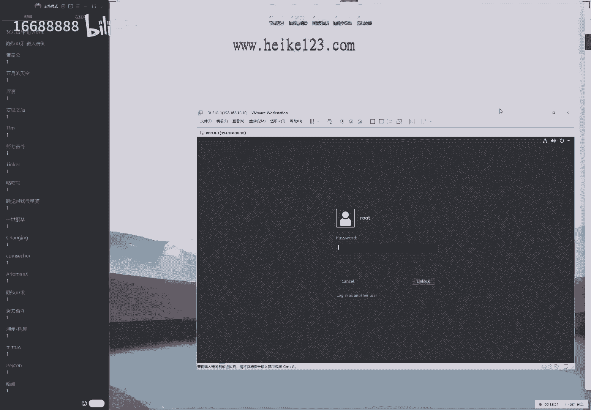

那我们打一啊，同学们听到我说话声音了，打一打，那我们打一下一咱们测试一下上个环境啊，避免这样这样的话，我们避免如果说这个声音比较小，或者的话干啊，或者我们根据啊，或者我们干脆听不到的话呢。

呃影响您的这个上课体验，所以的话我们先去测试一下，等我一开始说话就有声音了啊，当我啊看上课的话，你就应该能够看到画面了，这样的话才是一个正确的情况，那如果要是有什么波动啊，大家提前做好准备。

然后我们每节课上课之前的话一般提前啊，那我们啊一般情况下会提前十到15分钟，开启这个直播间，同学们就可以来去进入到直播间里面，来去感受一下有没有卡顿这个情况了，好了，多说几句废话，主要原因就是想等一下。

我们同学们61位还好了啊，不错，我们开始接这个正式课程了，大家先翻开书看一下第八章节，讲一下这个防火墙，其实啊这个防火墙的话它并不难，因为的话我们实际上第八章节它是延续的。

这个6783个系统的这个防火墙的工具，我们会给大家讲四种方法来配置您的防火墙，而我们实习过程当中的话呢，只要去选择一个你最喜欢的就可以了，也就是说我们的话呢，今天这个课程会去激励这个678。

三个系统当中的四个方法，来去配置我们的防火墙，而您只需要去选择一个最喜欢的就可以了，因为它就像是我们的门卫一样对吧，现在因为我们这个小区有隔离嘛，给大家举一个例子啊，现在比如说现在有一个正门。

现在的话呢正门我们安那啊，那么我们现在要有一个正门，这个门口的话呢它有几个保安，比如说现在有四个表啊，那我们现在有四个保安吧，就是我们现有四个工具来配置我们的防火墙。

这个四个保安里边只要一个人没有让我们出去，那我们就是怎么样的，就是出不去的，所以我们学完了之后，您可以去选择一个四个保安当中，四个防火墙配置工具当中，您最喜欢的去配置一个就可以了。

嗯嗯并且的话呢我们也不太建议大家，如果四个都去配的话，还有可能产生这个冲突，所以我们去选择一个您最喜欢的，现在的话我们还没有讲，那么我们讲完之后的话呢，您可以再去做这个决定啊，先不那么着急好了。

又说了很多废话啊，实在不用再等了，我们必须要开始今天这个课程了，来大家说我们声音有点小是吧啊，声音应该不小，你可以调大一下，自己的这个音量跟上节课是一样的，来我们来正式开始第四次啊。

正式开始咱们今天这个课程了，讲一下这个防火墙，在讲这个防火墙之前的话呢。

我们现在去说一下这个网卡怎么配置，因为之前同学们一直在问的丧尸，为什么我配置的这个服务，但是我看不到效果呢，就是因为我们的虚拟机的网络没有互通，所以我们现在先来给大家讲一下，这个网络的配置方法啊。

这话并不算拖延课程啊，是因为我们这算是一个前置条件，先把网络给他配好了，网络能通信了，然后的话呢我们绘制后面，我们配置这些服务的话，才能够看到这样的一个效果，我们换句话来说就是能够去拼得通。

这是一个前置条件，也是一个我们必须要去做的一个，基础性的一个操作，来说一下我们的网卡的一个配置方法。

那我们同学也可以一起啊，可以我们来一起去操作呀，这个标点呢来点一下虚拟机，点一下虚拟机，点一下配置，然后我们点一下这个编辑网络配置器这个选项，呃，当我们第一次安装系统的时候的话呢。

我们选择这个模式叫做金主机模式。

来大家先记一下，how sway叫做金主机模式，他顾名思义嘛，就是金主机之间能进行啊，来进行一个啊数据的一个交换，叫做这个金主机模式，它只能是虚拟机之间，以及我们的这个主机之间，来进行一个数据的交互。

这个我们叫做金主机模式，还有一个话呢我们就叫做nt模式，这个就相当于就是把我们这个路由器嘛，呸，还有相当于是把我们这个虚拟机，当做是一个大陆的啊，当做是一个路由器。

可以让我们虚拟机里面的这个系统能够去上网，也就是说它是可以去上网的一种模式，我们可以这样来去理解，然后的话我们还有一个叫做这个桥接模式啊，bridge这个的话呢则是直接就是呃，类似于说我们的虚拟机。

它可以呃去复制我们物理机的这种上网方式，来去直接去上网，那么也就是说这个配置器材的话它会更加简单，它也可以去上外网拿这样的一个呃区别，那么我们来给大家今天说到的。

就是我们现在的话不需要虚拟机能够连接外网，那么我们现在的话，只需要让我们虚拟机能够跟我们这个物理系，就是说我们现在所说的这个真迹，能够进行一个相互的沟通，我们所说的真假，因为我待会的话给大家讲课的时候。

我可能不会那么的严格的区域呃，注意我现在所说这个词到底是啊甄姬的话呢，还是我们当前使用这个主机，但是我当时只要说到这个真机，都代表的是我当前正在使用的这个系统，所以我们待会这个词的话。

可能用的比较宽泛一点，可能用来那也就是说这两个词的话，那我们可以来进行一个选择性的去使用，到当前能够看得到的，就是我们当前正在使用的这么一个系统，当前使用的啊电脑，我们把它叫做啊物理机。

那么我们待会的话，要想让它去实现跟一个虚拟机，也就是说虚拟机里面的系统，我们把它叫做虚拟机，系统里面的啊，他要能够相互进行一个数据交换的话呢，我们就只要去选择这个金主机模式就可以了。

因为我们现在是不需要上外网的，因此我们现在的话只需要去确认一下，就是您看一下现在有两个这个网卡，那我们来去选择一下这个第一个网卡，哎我们碰到编号为一，它对应的就是叫做金主机模式。

下面的话呢这个八它对应的就是这个nt模式，我们先先去选择一下这个一这个金主机模式的，来叫做house song，可以当成那我们这样去写，那么我们来看一下这个模式，首先确认一下它的这个模式为。

金主机模式就可以了，然后我们当前的话已经连接就可以了，那也就是说当前我去确认一下，我的这个主机的模式已经启用了，这是需要做第一步事情。

第二部事情的话呢，就是来编辑我们这个虚拟机的这个网卡，来点一下我们这个右下角。

选择一下网卡的这个设置，我们看一下，那既然已经启用了，那我那么我们的网卡有没有呃来去使用它呢，因此再去确认一下，我们当前的网卡也使用的是叫做金主机模式，ok没有问题，这两点确认了。

也就是说当前虚拟机开启了这个新主机模式，并且我们虚拟机里面的系统的话呢，也已经使用上了，这个时候我们就可以来去进行下一步了。

也就是说我们现在使用的是这样的金主机模式，下一步的话呢是打开我们这个电脑，然后我们点一下这个设置，然后我们的话呢我们点一下这个网络，这那我们就以我现在这个主机为例了啊，然后点击这个以太网。

现在有两个网卡吗，vm net 1，vm net 8，那vm net一指的是那个啊，好啊，他的话指的是金主机模式对吧，我先来看一下，那我们就在windows里面。

需要找到我们的vm的一所对应那个虚拟网卡，稍等一下，我不知道为什么我们这个win啊，windows 11每回的这个配置选项当中都找不到他，稍等一下，同学们来网卡吧，我去搜索一下，我搜一下，我搜一下。

我搜一下下啊，那是网络吗，因为啊很少啊，稍等稍等一下啊，这个很这个很气人啊，学会我们的linux的windows结果都找不到，来看一下同学们，当我找到他之后，我们点一下叫做呃配置选项当中。

我们来点一下这个属性，诶，我感觉不对啊，这个选项好像跟我们平时用的那个界面，不太一样，稍等一下啊，同学们，我把它找到它，诶，这个界面的话，就是我们平常去使用的一个界面了，那么我们同学们啊。

不管你有什么方法吧，只要能够找到这个界面，就没有问题，来找到这个界面，找到这个界面的话呢，我们去双击一下这个v m1 ，它就是我们安装好虚拟机之后，就会默认产生的一个网卡，它是一个虚拟网卡。

也就是说它使用这个vm等一的话呢，跟这个house 3类模式进行一个数据的一个交互，也就是说我们去使用的是这个网卡，然后的话呢，就可以跟虚拟机里面来进行一个交互了，也就是说。

我们需要把我们当前这个网卡的地址的话，能配置成跟虚拟机里面，系统里面同一个网段就可以了，来去双击一下，当然如果说您听我这个没有概念的话，没关系，我要那那我要给大家操作一下，点击一下属性。

点击一下这个设置，我们选择一下i p v4 ，那我就把设置好了，当前我的地址的话呢，我们的物理机也就是说我们的真迹啊，这两个词我待会待会，那我们去说两个词都可以啊，这两个词的话待会我可能去混用的来。

那也就是说我当前的这个真机的话呢，地址就是一九二点168。10。1，然后的话呢呃字码是24啊，那我们现在这个虚拟机里面，它的地址的话已经配过了，那我们待会再给大家配一遍，地址的话是一九二零一二八点10：

10，可以看到这个的话前三位我们叫做网络为网络，他们啊网络位相同，作掩码是24，那么话主机位只要是1~254之间，我们就可以进行一个数据交互，因此的话呢我们现在把它拍好之后，这样啊。

当我们都把它做好之后，就可以来去拼凑我们虚拟机的这个内部了，那么这个时候大家可能会问两个问题啊，大家话怎么样，说是界面有点小是吧，然后呃这个话其实大不了了，但是您可以按照我现在这个步骤再去操作一下。

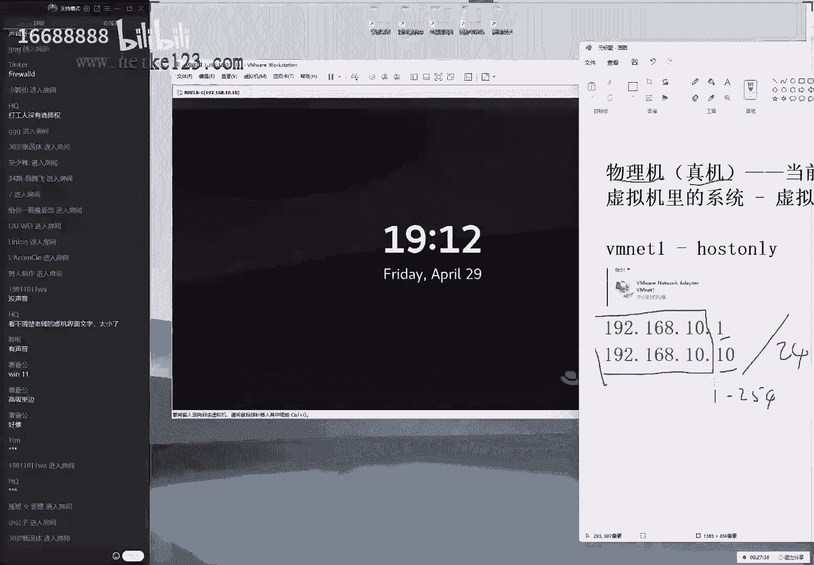

那你能点的出来，以自己的这个屏幕上面看起来比较大，然后大家现在可能会问两个问题，就是我我就是我现在能够想到的啊，大家问的有很重要的两个问题，就是第一个问题说老师呃，你这个课程的话。

虽然说是零基础开始去学，但是他又基于网络知识，我没有学习过网络知识，什么是ip，我都不知道怎么办呢，我们今天给大家来去用五分钟时间去说一下吧，然后让大家打消息里面的这个顾虑，但是的话呢我们今天这个课程。

实际上并不会面向于c c n a s，c n p中网络课程那种，这种知识只能是够用就可以了，来我我我现在给大家啊，现在就简单去说吧，就是同学们问的第一个问题是，老师到底什么是我们的同一个网段。

或者我们再问的俗一点，就是我该怎么配置我的网卡的这个地址，能够跟虚拟机里面能够去啊相互啊，去存入数据呢，那我们来给大家讲一下，既然我这个真机是192018。10。1，然后我们那我们的这个自网页码的话呢。

它后面写的是三个r五点，实际上的话，这样的话就代表这是一个c类的一个地址，那我们这个前面的三位我们把它叫做网络位，然后那我们最后一位的话呢叫做这个主机位，也就是说大家要简单去理解吧。

如果说我们后面这个啊，自源码是三个r五点的话，那么我们的这个前面，只要这个前面的三个字段是相同的啊，虽然有点粗糙啊，这么去讲，然后发到我们后面的一位，只要范围是1~254之间，那么它就同属于同一个网段。

我们来给大家举一个例子，比如说当我们看到的说192068，那但如果我们今天这个课程，如果被一个网络老师听见呢，他啊他可能会很生气，因为我们讲的特别的粗糙，但是自己当啊，但是这样讲的话也够用了。

我们就通过这样的一个原则配置出来，这个地址总是他总是能够去进行一个通信的，比如说像这样的一个地址对吧，那我们看到前三位如果是相同，那我后面的这个主机位的话呢，又在范围内，那么它就指的是同一个网段。

它可以进行一个数据的交互，然后大家好像还问第二个问题，说老师，那我现在知道了，但我的资源码，为什么有些时候我们看到的不是这么去写呢，他有可能是这么去写呢，写的一个24呢，这个简单给大家说一下啊。

首先原则上来说，我们这个上面的这个写法，跟下面的写法等同的意思，他们两个我们去写哪个都可以的，那么我们就怎么换算过来呢，首先我们所看的这个三个二五啊，就是我们看到这个啊啊255的话。

它实际上我们叫做十进制的数字，我们可以打开一个计算器，你可以去看一下，哎，我们来点成这个程序员模式，我们去选选择一个十进制啊，选择一个十进制对吧，然后我们再去输入一个255，然后点击一个二进制。

可以换算成就是八个一，那也就是说二进制是八个一，等于就是255，那于是也就是说1111111，上面的话是不是一个啊，上面就是一个十进制，下面的话呢就是一个好，上面那话底下就是二进制。

然后我因为我们分数是一个系统性的一个课程，我们讲的是操作系统，我们不希望说讲个知识白啊，呃呃然后白啊把他给吓跑了，我们就表演给大家去说吧，那也就是说我们会把上面那个十进制，转成一个二进制，那也就是说。

如果我们把这个上面的十进制都转成二进制了，那得到了这个效果，就应该就是呃呃那么就是呃呃八个一，然后的话呢又八个一，然后又八个一，然后最后的话呢是零对吧，然后00000000啊，八个零等于就是十进制的零。

也就是说我们把上面这个255，给它转换成了二进制之后，得到的是这个样子，那好了，我们又知道了这个网络位的话呢，呃那我们知道，那么也就是说他这个前面的24位都是为一，也就是它是为网络位。

所以我们的这个写法里面有两种写法吗，第一种写法就是写三个二五点，还有一种写法的话呢，就是呃那我们就直接写一个斜杠24，也就是说，待会儿我们不管大家怎么去配置您的网卡，待会儿的话呢。

如果看到这两种写法等同的意思就可以了，好那我们简单给大家用五分钟时间说了一下，就是呃什么是同一个网段，以及我们自动解码该怎么去配啊，有这么一个原则性问题，然后再往深入去学习的话。

大家可以去搜一下这个cca的这个课程，然后他呃，然后我们可以从对于这个网络知识的话，有一个更加深入的了解，包括我们这后面的话呢，如果大家以后有生物性的学习，比如说一些网络协议啊什么的。

还都是有些帮助的，不过我们作为一个系统性的课程就呃够用了，下面的话呢我们来给大家去说一下，就是我们要想给大家，让我们这个虚拟机里面的这个数据，能够去互通的话呢，还需要做一件事情。

就是把我们虚拟机里面这个网卡也配置成，是一个同一个网段了，那我们配置起来的话也是有四个方法，我会从难到易给大家来演示一下，你也可以去选择一个，那么您就可以我这个啊为参考。

然后从里面的话呢四选一选一个最喜欢的，并不会像我们似的，在每一次配置网卡的时候，四种方法都去重复来去执行一次。

没有必要好吧，同学们，大家理解我这个原则，就是我们现在的话呢是为了给大家讲课。

所以四个方法都去依次演示，但是您去配置的时候，可不是说每次配的时候都要配置四次的啊。

大家能理解好，下面我们来开一个窗口，放到左上角，大家看一下，我们拼一个地址是192。一六点，一九二点一六八点十点是要说清楚啊，电10。204u，我有说话，我怕说不清楚，回答打到我们的屏幕上面来。

大家先看一下，加一个杠小t指的是一个啊持续拼的一个效果。

现在来，现在的话呢，我们去持续拼一个地址为，192068。10。20，主机是不能够通信的，那于是显示出来一个请求超时的一个报错啊，大家怎么样说，声音有点小是吗啊，同学有其他同学有这个问题吗。

这儿倒杯水啊，强觉得声音小吗，如果您要觉声音小，你打一下二吧，如果您觉得声音合适的话，打一下一，在等稍等一下，这个水啊拔凉啊，放身太长了，来啊，声音可以没有问题是吧，那您就是这样吧。

如果我们个别同学您的声音比较小的话呢，那么您可以尽量调大sg的这个音箱啊，强学是这样的，如果要是您听起来这个声音很正常的，或者说强学卡顿的话呢，呃最好能互动一下，比如说有同学说卡了，但是的话您没有卡。

但是您也一定要说出来，因为大家如果都不说话的话，那么就呃就会让我们以为，大家可能网络都不太好，然后的话呢有一位同学网速是最好的，结果的话他也卡了，就是说枪支都已经掉线了。

但是啊然后啊然后的话呢我们有同学好，还能上啊，还是能够发出来信息的，所以我们这边的话也会去重启一下，可能会反复的去重启咱们这边这个讲课环境，耽误大家上课体验了，所以如果您要是卡或不卡。

最好都能够及时反馈一下咱们这个课的话，其都有那么强，可能不会说呃太多了，去看咱们的公平啊，所以如果你要卡的话啊，那我们一定要多发几次信息，那我那么我能够看得到好，下面给大家说一下啊。

就是四个方法来配置一下我们的网卡，然后您从里面的话呢可以去选择一个最喜欢的，呃，我们先不做评判，我们先来给大家依次来去演示一下，您自己去选择，首先第一步来讲一下第一个方法。

就是既然来讲到了nesb的一切的话，它都是文件，所以我们在配置服务的时候的话呢，他就是在编辑，我们这个服务所对应的一个配置文件，没有问题吧，那没有问题，那好了，那么我们的网络它是一个服务吗。

它当然是一个服务了，所以我们可以通过配置网啊，那我们可以通过修改网卡信息的方法，来去实现出来配置网络这样的一个，服务的一个效果，好了，这个思路有点乱，我们来给大家演示一下。

首先找到网络配置文件所对应的一个路径，它的话语是在etc目录里面自由点小是吧好吧，稍微大一点啊，这个大家不用看清啊，这个信息您不用看清，因为呃拼得通跟拼不通，它输出的这个结果是截然不同的，这个非常的短。

然后那我们那么我们拼图之后字会特别的长啊，这话您不用看清，您可以看到这样的一个效果就行了，下面的话呢我们把右边的这个字稍微放大一点，这个你必须要能够看清这个你必须要能够看清，来。

现在我们找到这个网卡所对应的文件啊。

所对应的一个路径，etc目录里边那system config，然后的话呢是网络配置信息目录啊，network scripts来找到他，这个里边的话呢会有一个以我们这个网卡不。

他的话有一个包含我们网卡名称的一个文件，然后换到我们呃，那我们可以去使用到这个table键来自动补齐，这个之前给大家讲到过，我们可以通过这样的一个网卡名称。

大概能判断出来这个操作系统对吧，我们简单给大家再去回忆一下啊，这是因为时间比较久了，呃如果说我们这个系统的话呢，它是一个五和六版本的话，他们是一个比较早的一个系统的话呢。

那么它就是一个啊这样的一个形式诶，然后它是一个啊0123来去排序，然后我们呃然后呃这样的一个网卡名称，那么如果要是七版本的话，它叫做e n o，然后是啊，然后我们这样啊e e e n o。

然后等一下e n o16777728 ，它会有这样的一个名称对吧，然后还有的话e n o啊，比如说33594968啊，那我们可以啊这样的一个名称，那我们在红方若八里面的话呢，这名称太要变了。

它的话叫做呃幺呃，160或者一或者是一个呃呃这样的一个名称。

那192啊这样的一个名称，那我们要以自己的实际为准，所以的话呢我们一定要看一下，当前如果您在红包肉吧里面，那么您输入的这个名称也一定要以实际为准，我们可以通过这个table键的话来自动补齐。

就是我们不要去照抄，因为呃有同学做这个实验的时候，比如说您是在红毛热器里面做这个实验，也其实没有问题，呃之前的话的命令是没有问题的，但是如果说您在做这个服务的时候，这个名称是有一些问题的。

所以您一定要以实际为准呃，我们可以通过这个tab键的话呢，自动补齐来去输入一下，或者的话呢您可以通过我们的config命令，来查看一下您实际的这个网卡名称，这样我们可以去看一下，更加的稳妥一点。

那就一定要以及这个实际情况来去输入。

大家可以去看一下，就是您看一下这个我们的名称是否跟我一样，如果跟我不一样的话，大家可以打到屏幕上面，我们看看大家都是什么名称来，我们敲完之后的话呢，进入到这个配置文件里面。

第一种方法呢就是通过我们的配置文件的方法。

来去配置网卡的参数，我们来直接了啊，第四章节里面就学习过我们的vm，我们就不给大家再去装了，就直接摊牌了，就是我们也会配，直接通过这个啊点一下a进入到编辑模式里面，接下来的话呢。

第二步去找到我们所对应的一个ip地址的一个，参数行，来把这个十的话呢修改成二零，也就是说对于网卡信息进行修改，实际上就是修改了这个网卡服务，所对应的一个参数来，我们把它修改成一个二零。

然后的话我们点一下这个返回当命令模式下，然后wq叹号保存并退出，进入到冒号模式里面，保存并退出。

这个时候按一下回收诶，等下那我们把文件给保存好了啊。

保存好之后的话呢，可以看一下，左边依然是拼不通的啊，左边的话呢依然是拼不通的。

这个主要原因的话呢，就是我们之前画面给大家去说全，第一件事情就是linux中的一切中的一切啊，都是文件对吧，一切都是文啊，都是文件，然后第二句话呢就是我们配置一个服务，配置服务就是在修改配置信息。

或者说叫修改配置文件，然后第三的话呢，就是要想让配置好的，这个参数能够立即生效的话啊，要想让参数能够立即生效，那我们需要去重启一下所对应的服务，需要重启对应的服务，这个的话呢我们会把这个啊。

我们之前所学习这些啊，这样的话这几句话在我们后面的话呢，来去不断来进行重复的。

所以大家要记住，就是要想让我们配置好这个参数，能够去生效的话，它默认是变啊啊，他的话默认情况下它并没有生效的，我们需要您去重启一下这个服务，大多数情况下它才能获取成效，我们去重启的话呢。

命令是这样去写的啊，网卡的命令话比较特殊，我们也不做参考了吧，因为早啊，因为我们在去做网卡这个服务的时候，他这个配置文件的话呢需要先去reload一下，再去up一下，它的话呢并不是使用到。

我们之前所学习的一个命令啊，我们画的叫做system，这个的话呢有点像呃，有点不太一样，我们就不啊，所以我们就不给大家做参考了，但是可以看到，当我去敲一下回车之后，一旦把我的网卡信息一旦重启了。

并且的话呢左边啊也没有，并且了，当我们学校还好了，这个配网卡配置参数，并且重启了网卡服务之后，于是你可以马上看到了网络就能够通信了，这就是通过修改配置文件的方法，能够去实践出来啊。

网络互通这样的一个效果啊，包括说我们前置条件大家的话一定要做好啊，保证我们这个网络模式它是相同的，为进驻金模式就可以去通信了，然后大家可以看一下，首先我们记一下有两点，第一点的话呢。

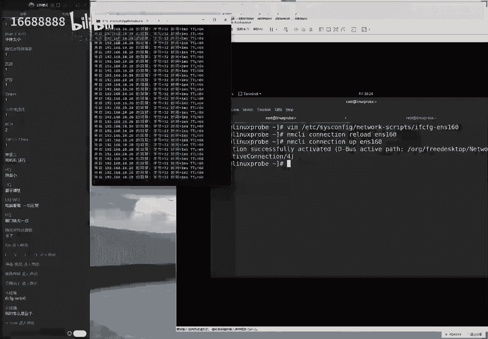

如果您要是修改的我们配置文件的方法，来去实现出来参数的变更，那么请注意一定要去呃去执行两步，一定要去先去reload，后续up一下，这个的话reload这个操作，只有通过配置文件修改的方法才需要去执行。

待会我们会给大家讲剩下的三种方法，其中的话，那这后面的三种方法他们都是不需要的，第二点的话呢，就是如果说您配置好的这个网卡参数之后，它并没有生效的话呢，您要去检查。

就是我们啊呃如果按照我现在方法把配好之后，大家如果没有通信的话呢。

我们一般情况下建议大家再去检查一下，您虚拟机的这个网络模式，有我们需要检查两点。

第一点的话呢，就是您这个虚拟机里面的网卡的这个模式，必须要为金主机模式。

因为我们刚刚配置这个地址的话呢，配置在了我们的vm一上面，v m一对应的就是金这个金主机模式，因此您需要去捋一下思路。

同时去把这个参数给它配好，第二的话呢就稍等一下vm的一对吧，那第二点的话呢，就是看一下这个链接有没有选中，我们不知道什么原因，但是事实就是发生了，我们有很多同学呃，不知道为什么这个选项的话呢。

之前是勾过啊，他们之前是选中过了，但是后来他又被取消掉了，所以如果说这个网络不通的话呢，您去选择一下，把这个选择已经连接啊。

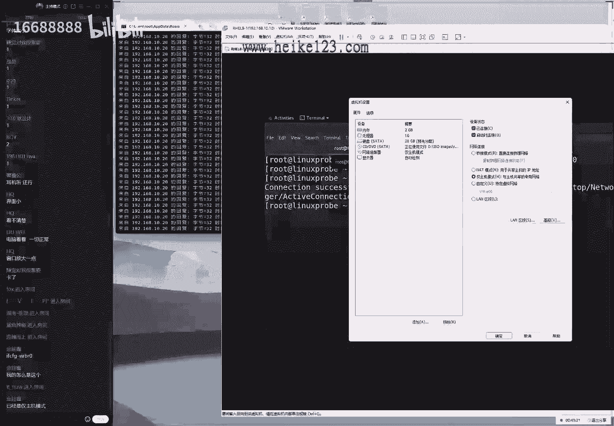

然后我们去点一下确认就可以了，这是第一个方法来配置我们的网卡信息啊，大家话说为什么我的这个名称是这样子，因为你选的是一个桥接网卡，然后的话下面第二个问题啊。

不然我们先说第二种方法，第二种方法的话啊，同学们另外提这个问题啊，就是其实同学们想提的这个问题是这样的，为什么我的这个网卡的话呢，跟你的名称不一样。

因为的话呢您所说的这个网卡之间叫做桥接，网卡，是在我们红毛肉八里面聚集里面都默认都有的，就是这个网卡了，这个哈我也是有的啊，但是的话呢如果说您没有这个网卡对吧。

这就是出问题了，就是因为你啊去安装系统的时候，没有去安装上它，就是我们没有去安装一块网卡，这时候怎么办呢，也不用着急去选择一下编辑设置，就是这样的，如果说您没有这个网卡信息啊。

也不着急，选择一下添加，选择一下添加网卡，选择网络适配器。

选择完成，选择一啊，添加好了之后的话呢，去点击确认，再去重启一下您您的这个服务器就有了，也就是说您如果安装系统的时候，没有添加网卡的情况下，现在天天也来得及啊，这第一个问题以及第一个我们需要注意的事情。

呃，第二个的话呢我就是第二啊，第一种配置方法，第二种的话呢，是通过我们的命令行来进行配置的，因为同学们会讲到说老师，你这个前面一个命令方法好是好。

但是太难了，因为我们看到需要去敲三个命令，大家需要记下笔记吗，啊我感觉大家还是需要的啊，我感觉同学们你们还是需要的，来，我把这个笔记截图到咱们的屏幕上面吧，或者您现在可以截张图，这个三三条命令嗯。

您可以记到这个书上面，不用先不要去手抄啊，你可以截张图，待会的话再慢慢去写，第一个方法命令我啊，就啊我们就给大家，我们还给大家截张图吧啊。

第一种方法，通过配置文件的方法来去实现出来啊，编辑修改网卡参数的一个效果，这是第一种方法，第二种方法的话呢，同学们就说到了，说老师这个方法太难了，我们的我们有一个比较简单一点的方法。

来去实现出来网卡信息的变更呢，其实是有的，来先把的话呢给大家啊终止一下，然后拼一下10。30。

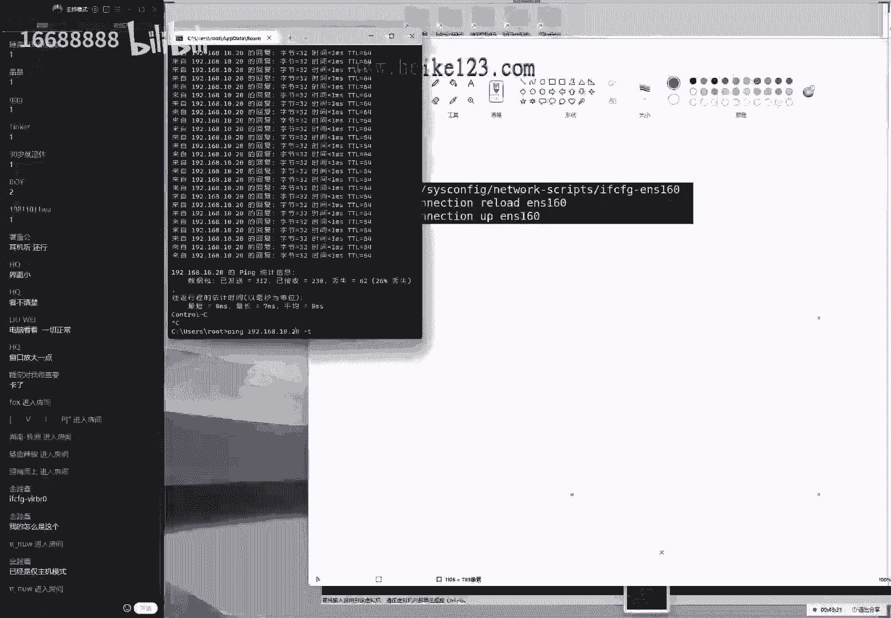

因为待会的话呢我们要换一个地址，再去测试一下这个编辑的效果嘛，第二个命令的话呢，我们叫做啊nm q y命令，大家来敲一下，这个的话呢，是基于我们命令行的一个类图形化界面，的一个小工具。

帮助我们来配置网卡信息。

切完这个回收之后啊，同学们看到这样的一个界面，就证明我们的这个工具的话已经进入了，即便是我们在我们的服务器上面没有图像界面，我们也可以去使用这个工具来进行配置，没有问题，大家好，另外看到这个界面之后。

会有点呃似曾相识的感觉，其实这是正确的，因为如果说您接触linux比较早的话，那大概是从2010年开始就有这个工具了，这个工具的话呢。

早年间他不叫这个名字来给大家总结一下，就是说这个命令的话呢，在早年间是汉啊，他之间是有的，在红毛real 5个红包，real 6，包括说我们早期版本里面的话呢，也它也是有的，我们是叫做set up，诶。

大家记一下，它改了个名字叫做呃nm toy，所以同学们记一下，大家不要吃亏了，在工作的时候，如果说您是一个老版本的服务器，那么您也可以去使用这个工具，只不过名称不太相同而已啊，我们这个工具特别的眼熟。

2010年到现在。

我们使了十多年了，那我们一直用这个工具特别大，好使来呃，去进入到这个里面之后的话呢，去敲可以通过这个方向键啊，大家知道这个这个方向键啊，就是我们去玩游戏的时候使用这个方向键。

然后我们去选择一下第一个选项，代表就是编辑一个网卡来，我们来编辑一个connection，来就编辑一个网络绘画来敲，来敲一下回车，现在的话当前我们的网卡名称还去选中它呃，然后我们来选择一下编辑选项。

都是通过这个方向键来进行控制哦，然后我们按一下这个回车来进行选中，让我们来去修改一下我们的网卡地址，现在的话地址是10。20进行修改，12。30，那我们来确认好啊，三啊大家问到说我啊。

我们这个参数要去使用一个app操作是什么意思，up指的是启用的意思，实际上我们可以把它理解成，就是去启动的意思啊，来我们现在的话把它修改成点三零，这样的一个效果好，我的一个参数啊，不是效果来。

我们来10。30，后面还可以看到刚刚配置的时候，后面是写的是三个二五点，现在的话就写的是一个斜杠24，刚刚给大家解释过了，原因就是开始的话呢是两种写法，我们两种写法的话都是被允许的这种写法啊。

等会哦，那我们这样的写法的话会更加简单一点，来我们写好之后点一下，ok然后然后我们点一下这个退出，点一下这个退出，这样的话呢，我们呢我们就实现了，对于网卡参数的这个变更问题，然后第二个的话呢就是来去啊。

对变更操作嘛，今天用词不是很准确啊，第二步操作就是来再去启用一下网卡，大家可以关注一下，左边我们去求修改好网卡参数数，并且去重启网卡以后，马上左边我们的物理机就能够去拼凑。

我们虚拟机的内部了，这个就是一个简单的，一起来说网卡配置的方法了，呃我能够想到的，其实我们在上课的时候，我觉得郝老师不应该给这给大家讲这种东西，就仅此而已了，应该多讲讲排除的方法。

我记得我会去想我的每一步，我因为我那边给大家讲课的时候，我也我也会一直在想，同学们会遇到什么问题呢，同学们在操作中，有哪些小细节可能会被忽略掉呢，我能够想到的对于这一步操作的话呢。

我又想到了一个可能出问题的一个点，就是同学们配好了之后，网络还是不通，就是因为我们安装系统的时候的话，有一个选项，大家可以翻开书，第一节，我们安装系统的时候去选择是否启用网卡，当时的话呢我是这么说的。

一句话，在4月3号的时候，大家还记得啊，当时我说说现在换了这个网卡，大家可以启用或者不行都可以了，因为我们会在第八章的时候都给大家启用对吧，所以说啊如果说您当时没有去点那个蓝点，没有启用它的话。

那网卡可没有啊，那啊那我还我们网卡可能没有启动。

这个时候怎么办呢，您需要这样啊，我们来再重新进入到这个工具里面，选择第二个选项，代表其中一个绘画，你需要把它的话呢去确认一下，我们可以看到前面带有一个星号，指的是启用这个啊网卡绘画。

让我们去选择一下这个啊启用，然后就可以去通信了，可以看到当我们按下这个取消键之后嘛，然后这边就啊还是不能够通信了，再按一下启用，于是马上可以看到网络又可以通信了。

所以如果说您4月3号安装系统的时候，没有启动网卡，可能导致这一步啊，那么这一步可能导致您配置网卡失败，那么请注意一点啊，那么请注意一下呃。

第三个配置方法的话，同学们会继续想到是老师诶，这个工具的话呢好用是好用，并且的话呢配置起来的话，这个难度也并不高，他只需要使用到这个m t u i的命令过后。

只需要再去使用的nm c l a connection，然后shot up后面写网卡名称in s160 ，就可以去使用这个网卡了，也并不那么的难，但是的话呢我是一个呃比较喜欢啊，漂亮界面的一个同学对吧。

那么我想有一个非常漂亮的一个工具，来进行配置，这话他太丑了，怎么办呢，我们可以来继续讲第三个方法，如果说我们对于这个颜值有要求的话，我们可以有第三个方法，这个话呢我们就叫做网络配置器编辑工具来啊。

connection editor，来同学们打一下这个命令，我把字稍微大一点点，这个的话就是一个图形化界面的一个网卡，配置工具啊，network connection editor。

网络啊，绘画编辑器选项来敲一下，回车来。

同学们进入到这个界面里面了，如果说你觉得前面两个有点太丑了，那么我们下面第三个一定让大家能够满意，来去双击一下，我们要陪要要要我们要想去配置这个网卡信息。

还是去选择一下ip p t啊，唉我们的ip地址修改成啊10。40没有问题吧，然后选择一下保存。

点一下这个关闭，其实对于涂鸦界面的话呢，我讲的一我话讲的一直比较快一点，因为我不太希望大家一直积极，冲下界面来进行操作，因为我们这个界面里面的所有按钮的功能，是被呃写死的。

如果说我们要是太依赖于涂刷界面的话，有些工作我们感觉不是那么的灵活，我们还是建议大家使用前面的两个方法，来配置您的网卡，但如果说在考试的时候，我们希望大家能够通啊，那我们能够通过图像界面来去完成。

因为这样的话呢它会更加的啊安全，我们避免了我们输错参数这样的一种可能性，来再去启用一下网卡，启动好了之后，看左边马上就又能够去通信了，这个的话呢就是我们第三个方法，通过图形化界面来配置网卡参数的。

这样的一个方式来，现在就是第三个方法配置我们的网卡。

通过通话界面，还有第四个方法的话呢，实际上就更加简单了，如果大家觉得no好了，那我知道前面三个方法了，但是的话呢我还是需要最简单的方法，我也是需要去输入两条命令才能够去完成，那么老师来告诉你一个方法呃。

我不用去输任何的命令，我就可以去实现出来网卡参数的这个修改，我们该怎么去实现呢，最后一个方法就是通过图像界面这个小电脑。

然后来进行一个操作，它不需要去输入任何的信息，我们把真机就是一个物理机，拼物理啊，拼虚拟机里面这个地址的话呢，拼成dn 50来修改过后再去测试一下，这个效果，敲完之后又不能通信了。

因为点五零这个主机还没有在线呃。

去这样，同学们打开我们这个虚拟机的图形化界面，这就是基于我们图形化界面来它，它才能够进行一个操作了，然后的话呢我们来点击一下这个编辑选项，选择一下这个有线网连接选项。

再来选择一下网络设置，其实这个好简单啊，我们如果不哦，我们说啊，没有大家讲的话，其实可以自己都操作出来了，这边的话呢再来看一下这个网络已经启用了，点一下这个小齿轮，哎小点这个小太阳也。

那么也可以来我们点一下这个，点一下这个小齿轮，然后的话呢我们来看一下，这边有一个ip v4 的一个选项的一个菜单，这算是菜单吗，算是按钮吧，或者是呃这是一菜单，让我们去选择到这边有一个选项啊。

地址选项当中把四零改五零点一下，应用将来怎么样呢。

您那么您只需要把这个蓝色的按钮给大家，点击off，再给点一下启用。

于是可以看一下左边，马上网络又能够去通信起来了，这个的话就是我们通过我们的图形界面的方式。

来去实践的配置网卡这样的一个方式呃，所以这四个方法同学们你们更喜欢哪一种呢，就是告诉我1234就可以了啊，然后我们后续的话呢，可以更多的去偏向于某种配置方法，会给大家多去演示几啊，会给大家多去演示几遍。

然后以后的话呢我们也会把这四个方法呃，虽然大家会有偏好嘛，但是我们也会给大家按照这样的方式，1234来进行配置啊，大家问了一下，大家问了一个问题，大家说第一种啊比较好是吧行啊。

大家比较喜欢通过配置文件的方法去实现，大家说能讲一下去使用的我们的命令，查看网卡状态，这个命令配置我们的ip地址吗，这个我们讲不了，因为据我所知它是不能够配置网卡信息的哦。

我们其实还有另外一个就是第五个方法，我们叫做nm c l i，它可以配置，但是同学们你们说那个命令是配置不了，它是用来去查看网卡信息的，这个的话呢也可以配置，第这个是第五个方法，但是我们不给大家去讲。

他们还有这个原因，就是前面四个方法，已经能够去适应所有的工作场景了，我们没有必要去使用第五个方法配置，第五个方法基于纯命令行去配置起来，参数巨长无比，同学们，我们会在后面。

大概是在明天给大家来做一下演示，您可以去感受一下，所以这个没有必要啊。

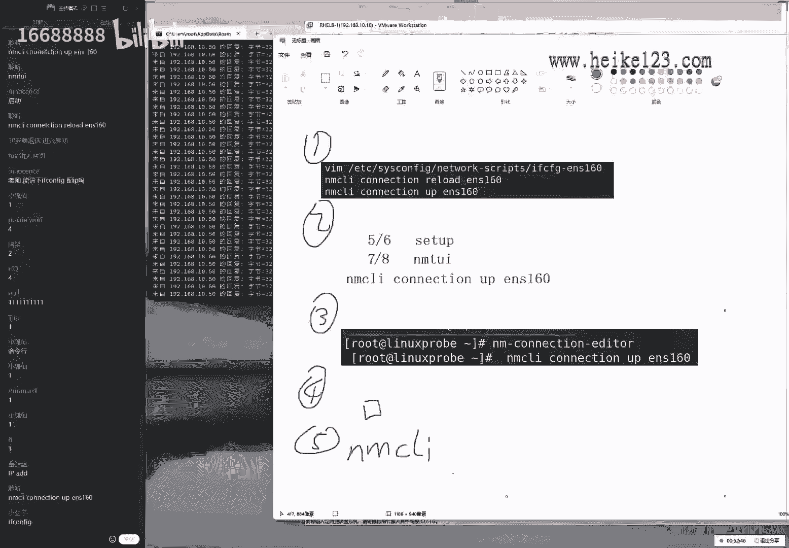

我们没有必要好，我们没有必要用这样的，非常非常复杂的方法来进行配置，下边的话呢我们来继续来给大家去说啊，一下这个防火墙了。

前面的话都算是铺垫啊，主要是为了能够让这个网络能够通信，这样的话呢我们配置好防火墙之后。

我们才能够看得到这个实验的效果，大家能理解我现在所说的啊，下面就来给大家说一下这个防火墙了。

把它给删掉了，然后把它给删掉了，下面的话呢我们再来我们来说，那我来说一下这个八杠一，这个八杠一的话指的就是我们这个防火墙了，那我们来看一下这张图啊，图片八杠一他指的是防火墙的一个作用。

那么什么是防火墙呢，简单来说一下，实际上它就是为了保护我们这个公司内部，或者说我们这个家庭内部的一个安全性了，有点相当于就是我们的防盗门，以我们的企业为例，你说企业为什么要花钱去买一个防火墙呢。

他无一不就他就是为了保护我们的这个公司，内网的安全对吧，呃也就是说公司花钱买设备，主要是为了服务自己，主要是为了保护内网的安全，这个的话呢是一个基本的一个作用，那么我们就像它能把它比作。

就是我们家庭内网当中，我们的方，那就是我们的这个防盗门一样，家里面为什么要安防盗门呢，是为了防止外部的坏人进入到，我们的家庭的内部，所以我们才需要一个防盗门这样的一个设备。

这是我们去购买这样的一个设备的一个原因，好那我们先来给大家去说一个简单的问题，给大家做一个简单的问题，我们之所以这样去说，主要是建立在一个假设上面，就是内网和外网哪个更加安全，这一个前提条件上，面。

对不对，来大家告诉我呃，一般情况下来讲，我们的内网安全还是外网安全呢，因为我刚才所讲的一些事件，都建立在一个条件之上，就是大家一起说，是不是我们这个内网是比较的安全的，外网的话呢是比较的啊危险的。

那么好了，我们需要买一个防盗门，来保护我们这个家庭内部不受外部的坏人的啊，这么啊的这么一个破坏，所以我们才要买一个防火墙呃，家里面的话呢很少有人说买了啊，那啊那我们去装了门之后。

是啊说啊为了不让家人出去，对不对，他们主要为了防他，防止外人去进来，那么也就是说这个门它就在那儿了，但是的话呢，我我们主要的功能是为了防止坏人进来，但是又有一个问题了，防他这个门是在那的。

我们又啊那我们又可以出去，这个怎么去理解呢，所以说我们这个在传统上，这个概念上来讲的话呢，我们这个叫做3。5练啊，我们来现在的话呢我们现在已经不提了啊，他的话现在提的方法是通过我们之前不它。

它的话是通过我们这个啊流量的位置，跟这个呃发起的位置来去判别它每个作用，那我们比如说现在有一个流量，这个可能比较抽象，我现在给大家画张图说，如果有一个流量，现在的话呢是从一个外网的话呢。

留下我们的内网的这个话对于我们来讲，我们叫做input链啊，大家说一下啊，这个啊门它都在呢，这个墙的话它也是在那它不仅是可以防护外部，到内部，他也可以去做很多这个事情。

不但是我们主要做的事情还是为了防止内啊，他为了防止外部的这个坏人进来嘛，这个流量的话呢我们叫做输入点，叫做诶音谱教练，好，比如说现在话的时间是，2022年4月29号啊。

那么我们今天的话呢一到月底了该发工资了啊，那我们现在呃如果说我们的钱包，他只能说我们这个内网的话，从外部流入到我们钱包里面的这个流量，对于我们来讲是一个输入的过程，所以的话呢我们把它叫做输入的流量啊。

这是我们要去做的第一个事情，第二个事件的话呢，如果说今天啊我们小区没有被封的话呢，可能今天要去庆祝一下，要出去出去吃顿饭，那好了，那我们如果说请女朋友吃了顿饭，那么对于我们来讲的话。

就是一个输出的一个过程了，叫做输出流量，大家记一下，它有啊，它要有进它有出，对于我们如果吃了顿饭来讲的话呢，对于我们的钱包来讲，它是一个输出过程，他只是输出的一个流量啊，这是我们的两个流量了。

还有第三个流量，但是呃这是指的是我们的数据包的一个传输的，一个呃，还有我看一下啊，第三个的话呢叫做这个转发链，那这个话叫做转发链forward了，那我们如果说这个信息，它并不由我们自己来进行处理。

那我们可以来进行一个转发链，我们把他的话转来来去转发，转发到一个第三方的一个电脑上面，我们叫做这个转发量，还有的话呢还有两种，我们一个的话呢叫路由，前一种叫路由后。

这个的话呢主要是对啊producing，还有叫做post rout，他的话呢主要是对于，我们这个在做我们的地址的一个分配的时候，我们才会使用到的一个路由器，还有一个啊路由后转发。

但是的话呢我们大多情况下，就是我们去买一个防火墙，主要是为了防止从外部到内部的这么一个信息，这么一个控制好，那也就是说现在的话，如果一个流量它这个方向的话呢，是一个从外部到内部的一个流入。

那我们一般情况下就要进行一个控制了，那我们当匹配到一个流量之后，该怎么来进行一个控制呢，大家说防外不防内不，他不是这个意思，因为我刚才就在想这个问题，怎么那哦那我们需要啊需要怎么给大家解释。

它不是防卫不防弹啊，啊他啊，他他的话呢，这个是根据我们这个所定义的一个位置，来进行一个呃限制的，那我们比如说把这个方向性的这个规则，写到对应这么一个呃，这怎么讲呢，我们的一个嗯规则的这么呃。

这个我们把所有的这个防火墙的这个规则，写到哪个位置上面，它就会去生效，我们来给大家做演示吧，因为我刚才在想，但是很难去解释，因为这个比较抽象，这也看不到好，那我们现在给大家说一下，说一下。

当当我们匹配到一个流量之后，那么我们该怎么样对于这个流量来进行控制，它的话如果说有一个流量他匹配到他啊，他匹配到之后的话呢，它有四个这个处理的这个方法，第一个方法的话呢，我们来进行一个放行。

第二的话呢我们来进行一个拒绝，第三的话呢也叫做拒绝，这有点稍微有点抽象，我想半天，我说怎么给大家解释一下嗯，流量的这么一个控制呢，但是很难我们再给大家演示一下吧，所以当我们写错了啊。

规则这么一个位置之后的话呢，规则链它也不会生效啊，我们需要写的啊，需要把规则写到对应的一个啊规则链上面，它能够它才能够去生效，还有欢迎我们好，第四个记录成一个信息，保存到我们这个服务器里面。

也就是说当我们这个流量被匹配到了之后，它有四种方法来进行，唉叫a c c e p t啊，叫做允许来着，稍等一下，他要当匹配到一个六点之后的话，它有四个处理方法，这个特别的抽象。

所以我们在给大家讲课的时候也很有压力啊，再给大家讲，怎么能举个例子呢，呃当我们匹配到一个流量之后，那我们该怎么进行处理它，它它它就是产生了分歧了，它有四个方法，第一个方法的话呢我们叫做允许它。

以字面意思来说，他要做允许，第二种的话呢是叫做拒绝，第三种的话呢也叫做拒绝，第四的话呢记录成信息，保存到我们这个电脑里面，那我们其次的话呢比较简单一点，就是这个对于流量的放行。

就是说它指的是能够让流量去流入到，我们这个服务器的内网里面，就是说进行一个放行流量这么一个过程，那么这两个的话呢，下面两个拒绝的区别，主要就是说这个话我们叫做这个丢包状态。

它指的是不能够让这个啊用户流到啊，它不能让这个信息进入到我们的内网里面，同时的话呢那啊他不会给用户一个回血啊，不会给这个对方一个反馈，然后呢我们下面的话呢是啊，既不让流量进入到我们这个电脑当中。

又会给对方一个反馈，我要给大家举一个例子吧，因为这个确实比较抽奖，会给对方一个反馈呃，这两个区别举例来讲，比如说老刘现在正在讲课啊，那我们现在正在讲课，换一个小红人，然后这边的话有一个门也是一个防盗门。

然后老师正在讲课，坐在椅子上面，正在讲课，如果说当当有人敲门了，这个时候啊，那我们会说啊那啊那啊那啊，那我会去询问一下啊，对方是谁，那么如啊，我们比如说啊，对方说是我们的家人好了，那么就可以做方形。

当有一个家人啊，他可以就流到我们这个内网的话呢，这个流量它就是一个从外部到内部的一个过程，那么我们本来就叫做允许来，我们写下第一个叫允许这个超级好理解，这个不用多说，但如果说当当一枪文说谁呀。

那说我是一个卖保险的啊，那么好，老刘是不需要的，对不对，那么这个时候我就可以说啊，我们化不需要，那么这个的话我们把它叫做唉拒绝流量，他就是说我那么我那么好，我们会明确的去拒绝对方给我们这个流量信息。

第一点就是它有两个特点，第一个就是对方依然是不，它它是不能够进入到我们公司内网里面的，因为我因为我们把给拒绝了，他是不能够进进到底啊，我们这个公司服务器里面的，第二的话呢。

对方会明确的知道我们把他给拒绝了，这个大家能够理解的，就是我们现在的话呢对它进行拒绝的这个信息，也会给大家回想过去，对方会知道啊，一我不能够进，第二的话呢，对方把我给拒绝了，那么这是我们第二个场景。

比如说当当他又敲门了，然后我说啊是谁，如果说他说他他是卖保险的对吧，但是我们一看这个啊，这个话他这个啊信息啊，我们来查看一下，比如说它里面的话呢，还还有很多刀啊，或者病毒这样的这个东西，拿一把刀。

并且还啊，还不是一个人来了啊，打了十个人来的出来讨债来的，这种情况下的话呢，我们肯定也不能让对方，进入到我们公司内网里面，并且的话呢我们还要做到什么样呢，默不出声，这个时候我们叫丢包处理。

就是说对方的话呢，依然是不能够进入到我们公司内网里面的，同时的话呢对方是啊得不到我们的回响，他不知道我们是在家还是不在家，他不知道我，那我们是在家，然后我们不处理，还是说我们不在家。

它可以去隐藏我们这个服务器的一个状态，那我那我们可以让对方去以为我，我们这个服务器它没有是在线的，这样的一个状态，对那这是两个这个拒绝量的一个区别，那么我们现在给大家提一个小问题啊，这那我们知道了。

那我们这个啊两个的这个区别啊，drop，然后我们这两个的区别，那么在考试的时候该如何去选择呢，啊这啊这啊我们先给大家提一个小问题吧，就以这个为例，请问在考试的时候该如何选择。

比如说现在要求考生请你去拒绝的一个流量啊，来自于某个地址的一个某个流量，请你把它给拒绝掉，请问您现在该去选择哪一种dp还是reject，这两个好像看起来是相同的，都是拒绝。

而且的话呢红包考试是一个只看结果，不看过程，那是不是我选择哪一种都可以呢，大家据说叫做我，那我们应该怎么去选择，叫做拒绝流量那边哎，我们需要去选择这个流量，大家一定要记住，千万不要去抓对，他要给考。

他需要给老师看吗，不他是给脚本判卷子啊，红帽考官的话，他是以脚本判分，那如果说我们去选择第一种的话，对方的这个脚本他是看到我们是请求超时的，他是反应不了的，他不啊，他并不会知道我们这个是防火墙配对了。

把这个端口号给他禁止了，它还是对方往前掉了，大家能理解吗，就是他在通过脚本来判卷的时候，它无法判断出来到底是我们的防火墙配对了，还是我们这个啊哈哈啊，防火墙配对了，还是我们这个服务器网线掉了。

所以我们一定要去选择第二种方法来进行配置，大家一定要注意一下，这是考试的一个小技巧，那我们这个知道这个之后吧，同学们，刚才我在想，怎么能够去让大家解释一下这规则链呢，因为我们现在讲的有五个规则链。

那么什么叫做输入量，什么叫做这个输入流量呢，实际上叫做3。5链，它这个链的话指的是他这个所对应的一个，方向跟位置，当这个流量从哪里来的时候的话呢，它这个方向决定了它所对应的一个规则链。

那么什么叫规则链呢，规则链指的是这样的，防火墙的规则有一个特点，他是这样的，他会啊有很多个规则，然后的话呢从上往下来去写，当我们把大量这个规则给大家，总结成一个整体的话呢，我们把它叫做规则链啊。

然后我们可以作用到某一个啊方向上面，那我们比如说这是一个流入的一个方向啊，我们可以加上去写叫规则链，然后呢我们就有很多和这个规则规则的话，它有两个特点，第一个规则啊，我们啊就那我们来给大家说。

第一个特点就是一个从上往下做匹配，什么意思呢，如果说我们现在有很多个规则，因为现在有这个呃很多这个限制啊，比如我们小区现在的话呢外卖不能进好很多，这个啊，那我们先下先啊，现在说很多限制啊。

需要做核酸才能进，比如说我现在有几个啊，这样的话几个规则，第一个规则是说你只要凭48小时核酸，你才可以进入到这个小区里面，好吧，那我们来说48小时核酸结果才能进到，进入到小区里面。

然后第二条的话就是小区的外卖啊，外卖小哥可以没有核酸，结果就可以进入到我们这个小区里面，因为他们需要送物资，这个没有问题吧，哦这个啊这个啊，那我们现在这时候给大家去讲，特别的啊特别的好。

因为大家对这个都有啊，因为我们这一对啊对啊，都说啊都非常熟悉，这是第二条，第三条的话，比如说所有的男性啊都可以进入到小区里面，比如说有这么一条规则啊，虽然不知道为什么这么去写，但是他如果要是有的话呢。

他的这个匹配的规则，第一个特点就是一个从上往下做匹配啊，防火墙的策略是从上往下做匹配，如果说从上至下，如果说我们要写一个方向的规则，他啊比如说我现在的话呢，我是一个外卖员啊，但是我没有核酸。

那么我现在的话它是从上往下做匹配的，他会先匹配到我们的这个第一条，再去匹配到我们的第二条，然后画第三第四第五，那么它会上这样的顺序来进行匹配，他会说第一条就把我们给拒绝了，对不对。

因为我们当前没有核酸结果啊，这样的一个特点它是又从上往下做匹配，第二个很简单的话就是，那如果说我现在是一个外卖员，我没有核酸结果，但是我符合第二条啊，那我是否能够进入到小区里面呢，是不可以的。

第二个特点就是匹配啊，叫做匹配到季节止，也就是说我们一旦把你匹配到了啊，只要有啊，上面有上面的话是有一条啊配对啊，配套截止配套结束，如果上面有一条白银匹配到了，那么你符合要求的话呢，则结束。

即便有下面的更加的适合于你的条目，它也不会去怎么样呢，为你去进行一个配啊匹配了，因此根据这两条的特点，同学们能够心理上是不是要有要有点呃规划了，就是我们要把那些更加的精准的，更加的重要的那个策略防哦。

那我们需要往上去写好，大家记一下，所以根据这两个的特点，您需要把更加精准的，比如说现在的话呢我需要描述一个人，我不能说他是一个男人，这样的话太宽泛了，我可以说啊，比如说这个男人的话呢。

上面的话呢啊头发比较少，脸的话脸上有三颗痦子，然后呢嘴的话呢这个啊也是比较大，就是我们可以对于他这个信息，进行一个细致的描述，信息越精准，他匹配起来这个流量的话又会更加准确，会错误地去影响别人。

好我们这样的一个效果好，所以大家记一下这两点的这个特点，下面来给大家说一下，就是我们今天的话呢如果时间允许的话，会给大家讲四个方法来配合我们的防火墙，第一个方法没有跑了，ip tables。

这个的话呢是一个我们在2015年之前，会去用到的一个防火性能配置工具，它是基于我们这个内核去实现的啊，大概是在2015年之前呃，但是的话呢我们同学们在去学习跟考试当中，不在这个啊，工作当中的话呢。

你又不能够避免，你以后不去使用到老版本的服务器，所以我们现在先来给大家去讲这个，但是讲完之后就可以把它忘了，因为呃以后用的几率可能并不会很大，用到之后的话再过来查也来得及，不要把重心放得太多。

然后第二种方法的话呢，我们叫firework gc md跟firework gun config，他的话这两个是基于两个，当然了，同学们，如果你们公司正好正在用这个ip tables的话。

那么就说明啊这个学着了，正好学完就能用啊，但是我们要给大家说两个啊，另外两个，这个的话呢是在我们红包热由七跟日，红包肉八当中去使用的，这个是一个基于我们的文额叫做文字界面。

也就是我们的命令行的一种配置工具，这个的话呢是基于我们这个图形化界面的，一个配置工具，今天我们给大家讲两个呃，呃我们将我们这两个都会给大家去讲，这两个的话，我们统一把它称作叫做firework。

这样的一个防火墙的配置服务，这个给大家去理解一下吧，就是说这个的话呢是我们的服务名称，而我们左边两个的话呢，是我们的配置工具的名称，我们再说配置一个呃某一个服务的时候。

实际上要通过它的配置工具来进行修改，比如说同学们速度服务，就要去使用到vr速度的啊，配置工具来去实现是一样的vr速度，也或者的话呢像我们这个crown的计划任务一样。

它需要去使用到crown top一样，所以我们在配置一个服务的时候，可不要去敲这个名称，这个名称它是服务名称它是不一样的，这第啊这是我们的前三个，还有最后一个卡是一个卡bug一样的。

这个级别的一个工具叫做cockpit，那这个话叫驾驶舱服，我们会在最后会给大家去讲，如果今天来得及，今天应该来不及哦，哦哦那么我会在明天给大家去讲这个服务的话，就是一个像卡bug一样的存在。

如果同学们觉得前面讲的比较难，或者的话，哪怕今天后面都没有听懂，没关系，只要就是甚至来说嗯，一个没有学习过linux的人，稍微夸张一点啊，他只要把这个掌握清楚了，他就能够考试通过。

就是这么一个卡bug一样的存在，所以的话呢红帽考官到考纲里面是没有，是啊，这句话在红包的这个啊考纲里面根本就没有，他的所有教材里面，他也是没有的，但是的话呢我们阴差阳错的，在2020年的时候。

我们在年底做测试的时候，发现了，在红帽这个叫做e p l o和这个基本仓的仓库，叫做base os里面，我们找的找这个软件包，也就是说红包roll吧，这个怎么理解一下。

就是红包roll吧里面他默认带有的这个服务，这个服务的话就是可以通过图像界面，通过网页配置，一切的要配置基本上是一切的这个选项跟参数，跟我们的服务器的一些性能，但是的话呢红帽考官里面是没有给大家提到的。

这个也算是一卡bug，这个大家还可以当是一个兜底吗，如果考试的时候我们前面都忘了，那么你可以去使用第四个方法来去实现，它，不仅可以配置防火墙，我们之前讲的所有的仪器新建用户啊，防火墙啊。

还有我我们的分区格式挂载去做rl lvm，都可以继续使用这个去实现，所以这个工具的话大家都知道就可以了，我们千万不要忘哦。

我们千万不要外面去乱说，因为当前考试的时候，据我们的反馈，这个软件包依然是有的，而且已经有了很长时间了，我们同学们在考试的时候。

会有一定的这个学员会去选择，这种方法来去实现，因为红帽考官的话是，因为我们红包考试它是一个只看结果，不看过程的，他只告诉你一个需求，说比如说分出一个分区300兆，他不看你怎么去完成的。

所以的话呢方法去呃自己选择我，那我我们这个方法的话呢就是完全忽略掉了，可以啊，完全不用任何的命令行就可以去实现，这样非常凶残的一个命令来，现在给大家去讲第一个啊，虽然不用，但是我们要去学嘛。

第一个命令叫做ip tables啊，大家一起来说说叫做ip tables，他的话呢是一个纯基于命令行来配置，防火墙的一个工具啊，它是一个内核级别的，来看一下表格八杠一啊啊啊表格八杠一啊。

大家问了一个问题，大家说如果第一条拒绝了，那我们现在就不生效了吗，对如果第一条把你给拒绝了。

那么其他剩下的如果再有啊，白你进行一个鱼啊，来啊进行一个瞎操作，这个策略都不生效了啊，匹配即结束，好来看一下第一个参数，表格八杠一来看一下一个大写l，我们就按照我们这个事例来给大家去讲啊。

大写l指的是查看一下当前防火墙当中，有哪些默认的策略。

因为我刚给大家提到说策略策略，策略策略有哪些，怎么去看呢，看到策略是有这些啊，看到输入流量，他的话这个默认的策略有四条啊，他这个是有四条好，大家问了两个问题，大家说说如果没有匹配重。

是允许通过还是拒绝呢，这个要看默认情况。

他看的是这个默认的策略，他有两个啊，他还是有两个写错略的方式了。

我们来给大家去说吧，然后下面还有一个问题，大家说说，那岂不是只有第一条有用吗。

同学们这个理解是错误的，这个理解的话是这样的，如果这个这个其实这个问题不给大家回答啊，是这样的，如果那我们这就这么给大家说一下吧，这个问题问得挺有水平的啊，是这样的。

如果说我们现在的话呢是有很多条这个策略，然后的话呢我们是否只有第一条升降啊，当然不是了，因为第一条可能没有被啊，因为我们如果作为一个流量的话，第一条我们没有被培育上啊对吧，我们第一条我们可以没有我呀。

第二条吧，他也没有我第三条在匹配上的啊，所以他是直到匹配上了才结束这个匹配，而并不是说只有第一条才匹配成功，所以大家一定要去思考一下，不能说我们给大家一个，就是这么一个灌输的一个过程，一。

但我就我们一定要去思考啊，然后大家现在问了另外一个问题，就是老师，那我如果说我们现在有很多条这个策略，这个啊问题是很好的说，那我们现在很多条策略，然后的话呢我们现在从上往下做匹配。

并且的话呢匹配到即截止，那我如果说动啊，他那那如果说我们都把它给错了，怎么办呢，如果没有一条被匹配到了，我们该怎么去处理呢，这个时候它会有一个默认策略，最后是兜底，我们默认情况下的话呢。

默认情况下是允许，如果说没有被被匹配到的话，a c c e p t，那么则默认放行所有，那么如果说我们可以把它修改一下。

修改成默认拒绝，指的是默认拒绝，当我们看到默认情况下，它是啊允许所有我们写的是拒绝规则。

那么如果说我们可以把它修改成叫做拒绝所有。

我们则写的是一个允许规则，待会我们和大家举啊，待我们大家举一个例子，现在再来给大家说一下啊，ip tables，然后说了，这是一个杠l，显示一下已有的这个策略有哪些，我们现在的话呢可以去加一个大写f。

指的是列举一下当前我们啊，不呸呸呸，我们是来去清空一下已有的这个策略，来敲一下，回车来再来去查看一下，会发现我们的策略的话呢已经被清空掉了，我们现在的话三个这个规则链里面都是空白的。

大家问了另外一个问题，大家说我们的默认拒绝小鱼头一条策略吗，啊稍等一下啊，大家问一个问题，大家说默认拒绝小于头一条策略吗，呃没有理解啊，腾讯在可以在对您的这个问题，再去再进行一个细致的描述啊。

然后的话呢我们来继续来给大家说，因为我们讲课的时候脑子不太好，我也确实不太够用啊，所以同学们，尽量把这个问题描述的更加清楚一点，特别好，咱们这样的话可以学习更多的知识，不要那么慢啊，一定要快起来，来。

我们接下来的话呢再去清空之后，可以查看一下规则链里面就没有规则了，那么同学们现在问了一个问题，同学们问了这个问题，我觉得非常好说，如果没有被被匹配到的话，那我们则默认是允许全部，还是取决于所有呢。

那么这个的意思就是说。

我们的默认生下来这个策略到底是什么，当前是允许所有，所以我们可以看一下里面没有规则。

这个情况下我们去拼一下内部好不好，那拼一下当然好了哈，去看一下效果，这个实验啊一定要去频繁去测试一下效果，同结论啊，我来给大家演示一下，要光说理论有点抽象。

来看一下拼通没有问题吧哈，因为我们默认情况下没有策略，则允许全部这啊这是啊啊啊，他是这么去理解的，好同学问到说导师，那我能不能把它修改一下呢，当然可以，我们其实我们希望咱们这个课的这个，进度更快一点。

我不希望说我们上课的时候，像我们就日常上课嘛，然后去提问题，大家去思考，我们希望能够去更快去互动起来。

所以同学们一定要互动起来稍微快一点，你可以打一或打二啊，这样的话那我们就啊告诉我是或不是就可以了。

来我们把它卷成drop丢包模式。

大代表就是默认拒绝所有了，我们一个杠p poro来去协议表，规则列设置一下porca，再去查看一下，看一看的默认的规则链设置为拒绝。

那好看一下左边拼的这个请求就被拒绝了，也就是说如果没有规则的情况下，我们则默认拒绝所有，给大家举个例子，这个例子的话其实不用举了，大家大家大家就明白了，但是我还依然想给大家去举，因为我觉得那个例子啊。

因为我觉得这个例子举的特别的好，呃，什么叫默认允许所有呢去写具体的规则，比如说现在有一个公园啊，以我为例叫龙潭湖公园，我用我住的比较近嘛，嗯比如说我给大家举一个例子啊，这个例子大概五分多钟啊。

大家能够立马就明白什么叫做呃默认允许，叫默认拒绝，我这边有个公园叫龙，叫做这个龙潭湖啊，大家如果要是有要是有机会的话呢，没准还能碰到我啊，叫龙潭湖，如果有一天啊，不要先跟大家说一下啊。

先去说一下龙潭湖的一个基本的一个情况，就是默认的话呢所有人都可以进啊，就是说它是一个免费的一个公园啊，任何人都可以进入，没有这个没有问题啊，这个公园默认的条件是苏联都可以进入，它是一个兜底。

但是会有一些呃老大爷们啊，到啊到啊，然后啊到夏天的时候喜欢去钓鱼啊，然后就是把湖里面这个鱼都给钓走了，有一天我就发现啊，有几个老大爷，然后拿着几个鱼筐就出来了，然后还然后还特别生气，是为什么呢。

因为他们钓鱼被发现了，于是的话公务员把他们的那个头像啊，给拍了几张照片，放到公园的门口了，说这几个老大爷他不能进啊，那也就是说这几个老大爷，他不能进入到公园里面，但是的话呢其他人都可以去进入到这个里面。

也就是说默认是允许所有的，然后的话呢我们单独去写拒绝规则，这个叫做默认允许所有续写，具体规则这样的一个情况，还有一种情况是这样的呃，如果说有一个高级的一个会所，比如说当然我没有去过啊。

据说长安街两侧有一个高级会所啊，好像每年的会费是50万美元啊，才能够成为里面的会员啊，我也是啊，看人家网上百度上说的啊，那么这种会所的话，默认情况下就是没有人可以进去进入啊，默认没有人可以进入啊。

啊默啊，默认任何人都不能进入，没有人可以进入，不叫做任何人吧，不能进入，这是他默认兜底的一个策略，然后的话呢如果说我们要是有钱的情况下，您可以去买他这个会员，然后会员非常贵啊。

那么您就等于说开了一个白名单，我们单独去写一个允许的策略，如果说我们默认它是一个拒绝的话，我们去写一个允许策略，只有我们允许策略语言匹配到您了，那么您才能够去进入到里面去，这个就是默认拒绝作用。

然后我们去写允许规则好，下面给大家提一个小小的一个小问题，请问如果这两种情况我们都可以去选择的话，您认为哪种更加的好呢，大家理解一下这个问题，就是请问这两种，您认为哪种更好呢，允许所有。

然后我们去解拒绝更加安全，还是拒绝所有，我们去解，允许更加安全呢，大家可以去思考一下，这个是一个呃，其实没有一个绝对的好或不好，因为这个容易产生歧义，但是一般情况下，我们会认为拒绝所有会更好一点对吧。

我们来进行一个单独的对这些没有问题，我们会因为我们会认为我们去拒绝所有额之后，单独进行这种全新的设定更加精准，可以让我们这个服务器只让允许的人流入，只让允许的流量的啊，流入的方向的流量来进行一个啊进入。

这样的话它会更加安全一点，这个没有问题好，下面又来叙述，完了之后给大家说一下该怎么去写了，今天理论有点多啊，理论有点多，同学们有点太痛苦了，下面给大家说一下。

那好了，现在就是拒绝所有，对不对，因为它是默认拒绝所有，有没有任何的条目，也就是说默认拒绝所有了，那我们该怎么进行放行呢，来看一下叫ip table加一个大写i啊，input指的是规则链。

这我们讲过了三个表五啊，五个链，那链的话呢，还有它指的就是我们流量的一个方向，input指的是流入，然后呢output指的是流出，还有一个forword做转发啊，不由我处理啊，踢个皮球给别人去。

今天我就遇到了啊，如果今天你这个啊弹窗了怎么办呢，会有一些相关部门帮你去处理的时候，就会帮你去做一下这个forward，帮你做一下转机，还有一话叫路由器路由后转发，这个我们会在后面给大家去说。

这个我会在后面给大家去说啊，路由前路由后转发，那也就是说现在的话对于我们这个流入的过程。

因为大家想一下，我们现在是真机，我们来去流入的啊，那我们现在发送流量到这个虚拟机里面。

对于虚拟机来讲，它是一个流入的过程，所以我们叫做输入的流量来，既然是一个消息，看一下表格，八杠一指的是来源。

我们因为它是基于我们的网络七层里面，我们知道它是叫做数据链路层的，所以它可以基于我们的，它是网络七层里面这个中间的数据链路层，它所以它可以基于我们的对方的来源。

ip地址，协议端口号，我们目标的地址来进行一个控制的，来一个消息，当对方来的地址，比如说我们本机是1920~8点十，2。十点吧，这个网段的话，如果说它是来自于这个网段的话，点十点这个网段的话。

24次网掩码，那么我们则对它来进行一个拒绝操作，来一个杠小g，然后是reject来诶不对，我们应该是允许对吧，来进行一个放行，允许操作做完之后马上看左边，您就可以看到网络又能够通信了。

因为我们我们现在是拒绝所有，但是我现在的话呢只去允许说啊。

我给大家画一个，我们给他画画数轴吧，来我们先是拒绝所有了，它是一个黑颜色的，拒绝所有的，然后我们再单独开了一个允许菜单，就是说如果说诶有一个小豁口，比如说现在被隔离了对吧，我们来举一个例子。

如今我们生病了，突然有一种啊比较紧急的情况了，好了，我们可以在那我们可以单独开一个豁口，只要你符合这个条件的主机，只要你是这个网段里面的主机，你依然可以去流入到我们这个公司内网里面。

这就是我们叫做白名单啊，去写允许的这个策略，那我们现在再给大家说一下，就是防火墙的这个策略，它是从上往下做匹配的，第二点他的话呢是一起来说，他是啊匹配到即结束，所以我们有两个加入的这个策略。

杠i指的是大家记一下，杠i指的是加入到最上面，杠a指的是加入到最下面，所以要想让您的这个参数是更加优先的，我们要把这个信息使用到gui参数，好呃，我那我我给大家举举一个例子，现在就是说默认拒绝所有了。

我们现在的话呢开了临时一个窗口，允许这个段的主机可以去做访问，那么我们在这个上面吃啊，再去做一个啊，比如说单独右里边的话，又一个小破坏分子，一九二点168。10。1，这个主机的话呢。

它是不能够去访问我们这个主机的，而这个里面的话呢，其他的主机它是从192018。10。2，一直到254都可以继续去访问，只有他不能访问了，等于说在这个允许列表当中再去拒绝一个，我们该怎么去写呢。

大家看好是怎么去写的，ip tables唉同样大家好啊，我现在这个第一条不要删ip tables，然后的话呢我们来一个大写的一个a哎，先到后面去看一下效果input，然后一个小小s韩式主机。

192068。10。1，这个主机24位四方源码对它来进行reject。

进行一个拒绝操作，a价回收，大家看一下，左边依然没有变化，是能够拼得通的啊，依然的话呢还是平稳通的啊。

没有问题啊，为什么呢，为什么呢，因为他指的是一个杠a参数。

这个杠a参数它是加大了，我们前面一个规则链的，后面，他加到我们前面规则的下面，也就是它会成这个样子，他就是说默认的话呢。

还是允许所有的，我既然我已经被允许了，所以的话呢我就不会再进行下面的匹配了，大家能理解我现在所说的这个意思，那么这个时候我们需要选一个刚刚答案。

把这条的话呢，同样的一条，大家看一下区别，我现在家里刚爱啊，参数其他都不变，于是可以看到马上就能够拼得通了啊，没有问题好，当我把这个条目的话呢，多去敲几遍，大家会发现哎呦我敲错了，我刚才想敲一次。

我敲了两次了，我们再去使用到ip tables，一个大写l的时候，大家看一下效果，这个会有点卡啊，我们不管它啊，这个的话呢因为我现在开的比较多。

现在的话我先应该去敲上一条，但是我现在不小心，我敲了两次。

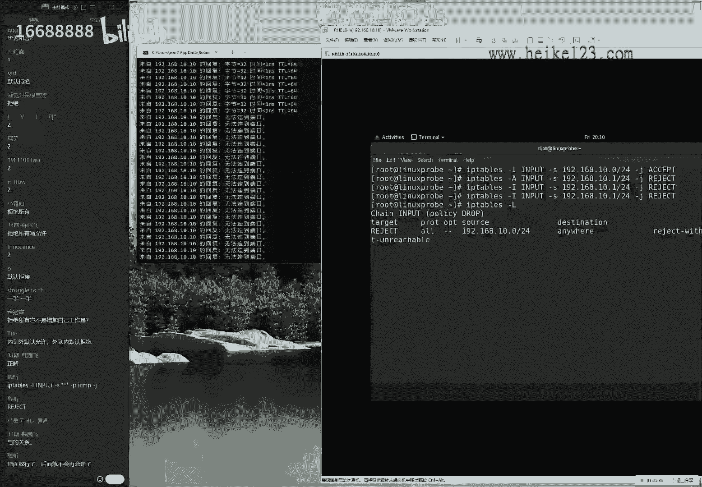

我们来怎么样能够进行一个呃精准的删除呢，因为刚刚看到了一个大写f是清空所有，如果现在我只想要去清空。

大家看一下，我这边的话呢，第一条跟第二条是一模一样的，我想删除掉一条，我想删掉其中的第一条怎么办呢，杠f清空所有了好了，我可以这样去做一个大写的b站。

让大家看一下啊，所有参数它这里面都用的是大写的，然后我们指定这个来源信息的话，使用的是一个小写的表格，八杠一还算是规整吧，来input链当中，我们删除掉第一条，因为两条一样嘛，删一条。

然后大声说一句走，你按一下回车再去看，就这样的话呢，我们的条目就只有一条了，它是单独去精准删除一条，而不是一个大写f删除掉所有，另外大家有发现了一个问题啊，就是这个服务的话，跟我们刚才所讲的是不一样的。

我们在学习运维的时候，总是在颠覆我们之前所讲的，之前讲到了配置一个服务，就是在修改这个服务所对应的配置信息。

同时的话呢要想让它能够去生效的话，需要去重启一下，但是的话呢这个服务它是不需要重启的，它配好之后低级生效，因为它使用的叫做runtime模式，它指的是当前配置好过后马上生效，大家重启之后就会失效。

我们需要去怎么样呢，大家看一下这个条目被删掉了之后，它就一条相同的了，我们的话需要去使用到system，然后是thief，不不不不，我们使用的service这个命令来进行保存。

保存一下防火墙的这个策略嗯，哎叫做service app table safe来进行保存啊，他说这个已经是找不到了是吧，那我们就这样啊，先等等，我们要想要配置好这个策略，能够保存下来的话呢。

可以去使用这个命令来去完成，但是这个在红包肉八里面呢是有点问题的，它并它并不生效啊，在后面我们在后面这个服务里面是可以生效的，也就是说现在的话呢配置好这个服务，它是一个当前升降模式，从你之后就会失效了。

我们需要的话呢把它呃呃配置好之后，需要去手动来去执行一下这个命令，才能够保证cs重启过后依然能够生效，它主要为了避免一个问题。

这个也是我之前遇到的一个问题，为什么说他的这个防火墙跟其他的服务不一样，它呃其他服务是这样的，配好之后重启才能取生效啊，这样的话呢这个是呃，但是我们为什么我们的防火墙配置好了之后，他就会立即生效。

而且从你说他有失效呢，就是有时候我会这样去做，我会去敲错了，比如说我敲成i tables，然后我去啊限制了我自己登录这样的一个情况，比如说我先做这个操作了，那么现在这个服务器它是一个远程的。

我那我该怎么办呢，这个时候我就没有办法了，如果他是啊啊配好之后，他就是改不了啊，他就是啊改不了的话，那我那么我就没有办法了，但是现在好处就是，我可以去重启一下这个服务器，然后看到我可以让同时也好啊。

通过这个终端也好，只要去重启一下这个服务器，那我们前面配置好这个错误的防火墙策略，也就被消失掉了啊，这样的话就是一个很好的一个保护的机制吗，这个我们叫做wrong time啊。

这个待会给大家说到叫wrong time模式。

下面的话来继续给大家说一下，我们的ip tables里面的一些好用的参数，好啊，好好玩的一些参数，现在我们再把这个防火墙策略给它改回来，我们把默认的话呢这个策略设置成允许策略，我们来动手去写一写。

拒绝的这个条目该怎么去写，来现在我们是余墨啊，我们等会我们现在是默认允许所有，顺便再去清空一下防火墙，大家看一下左边，马上你就能够对照着看到这样这样的一个呃。

去对照，看到这个实验的效果，特别的方便，这样做好了，能够看到实验的效果，现在是默认允许所有续写拒绝规则反过来再来，比如说我现在这样啊，我是单独对你进行拒绝，来ip tables一个gi input。

这个反过来了就再做一遍了啊，这个非常简单，来杠一个小小s来源的地址，比如说是一九二点168。十点这个网段，然后的话呢我们现在啊对他的话进行一个拒绝，这个有点绕啊，因为我希望能够把这个咱们的课程的难度。

把他的话呢提高到书以上，因为我觉得说的太简单了，我就稍微难一点了，现在的话呢我去设置一个防火墙的策略。

是一个控制输入来源，如果说它是满足于这个网段的用户。

那么我们对他的这个杠p poro协议，当它对于我们进行拼的这个协议的时候，i s m p，那么我们则把它进行一个拒绝操作，reject来进行一个reject。

拒绝丢包来敲完回车之后看一下左边，您可以看到马上左边显示出来了，无法连接的端口，这样的一个显示出来的信息，好像啊，那好我们现在首先给大家说第一点，什么叫做reject，所以那么好。

我们现在所看到的这就叫做拒绝啊，叫做啊直接拒绝，那么于是您可以看到左边，它会显示说，我们有一个来自于这个主机的一个回复信息。

告诉我们，我们被拒绝了，无法连接到所对应的这个端口号，就叫做拒绝流量，还有一个我们叫做啊，然后我们先这样单独在指定上这个主机，当这个主机再去访问的时候，我们单独给它设置成dp丢包。

其他主机则是拒绝，而我们现在的话对于这个主机则是dp丢包，也是可以啊，通过这样一个实验，您对比一下什么叫做reject，什么叫做drop丢包，可以看到两种情况，都是不能够去访问到我们这个服务器的内部了。

但是他得到的这个呃响应是不一样的，对方第二种情况，他不知道我们是在线，还是我们把他还是对方把我们给拒绝了，对大家可以来对比一下这两个的区别好，然后第二个的话呢，就是如果说我们现在啊稍等一下。

同学们先问了一个问题是吧啊，大家说那拒绝所有，那岂不是给自己增加工作量吗，这个话呢我认为问题是出在了，大家认为这个配置起来更加的复杂，但是我们用换句话来说，配置我们的文件的时候是啊。

配置是非常复杂的权限，是不是也给自己增加工作量呢，对是的，这个是肯定的，但是以我们的权限为例，如果我们更加细致的配置好的方法，那我们更加细致配置好了这个文件上面的权限，您的文件也会更加安全吧。

那同样的当我们在防火墙上面下的功夫越大，那我们配置起来的话呢，啊这个防火墙就会更加安全啊，好回答同学们的问题了啊，然后我们再来给大家说一下，第二点，同学们胡文涛说老师，那到底我们现在访问其他的这个服务。

受不受影响呢，它是不受影响的，因为它使用的钢p它为poro为协议，现在只有拼的这个请求。

我们的sm p受影响，如果说现在从远程啊，随便找一个工具ssh吧，连接到诶，等一下我先找一个工具，也不能太随便了，我们的qq打过啊。

这个远程来使用到这个插shell，来使用到这个远程连接工具使用的s i s h，1920~8点十点时看到，虽然我拼不通，但是的话呢我去可以往里面去进。

这个就叫做防火墙的，基于端口号的这个控制。

可以看到我能够去切换进去，没有问题的，单独限制某个端口号是可行的。

好下面的话呢我们就以数量为例了啊，比如说我现在又想换了，现在我是能够去远程连接到对方服务器的。

那我现在不能说，我现在只能禁止对方的拼的请求吗，我能不能限制某一个协议的请求呢，比如说当前的我们的s h远程连接协议。

那它能否进行限制呢，也可以的，来ip tables输入连，因为它对于我来讲是一个输入的过程，一个小cs是否去添加这个来源也无所谓的，但是我们这样去写的话更加的严谨一点，来192068。十点这个网段。

当有一个这个网段的用户去访问我们啊，当啊当我这个网络的用户通过tcp协议好吧，访问我们本机的22端口号的时候，那么我们对它来进行一个叫做拒绝流量，来a一下回车，然后再来马上再去访问一下我们这个防火墙。

把佩佩大家去访问一下，我们这个防火墙所在这个服务器。

于是你可以看到了阿萨端口号，马上就不能够被访问了，好当然了，我们再给他换，当然啊，当然了，我们再给它换回来啊，就是说我们把那条给它改一改，今天就有防火墙。

不就是在各种玩吗，来把它改成，就是虽然这个网段我都不啊，那我们都没有把啊都把它给拒绝了，但是只有你有特别喜欢，我们给它单独做方形，于是可以看一下，再去访问，又能够访问了。

这就是防火墙我们基本的一个管理方法好。

那么同学会问到邵老师，那好了，我现在已经会了，基于我们这个协议以及机端口号来么啊，那么我们来进行控制，那我们呢，那我们能不能去一个多好的一个范围。

来进行控制呢，呃比如说我们知道的话呢，这个黑客比较喜欢于比如说限制啊。

去访问我们的我们的3000~5000多口号，能不能进行一个批量的一个控制呢，就像我刚才这个鼠标突然间抖了一下，我感觉啊他啊他啊他是被人控制了。

这个时候我们怎么样能够对于这个端口号范围，来进行控制的，那么也很简单，只不过这个区别就是它的话那我们去写的时候，不是一个减号，写成一个5000，因为大家做这个实验的时候，很容易出现这个问题。

就是说参数结果的话它并不生效，这个原因的话呢，就是在ip tables里边，我们端口号的段，它用到冒号做间隔的啊，所以大家记一下这个不是难点，主要难点就是一个格式啊，我们需要注意一下端口号的段。

它是以冒号为间隔符来去限制端口端口号段了，好我们有这些基础之后啊，我们就够用了啊，那我们的防火墙，我们的来往上看，我们的啊，我们的ip tabs就够用了。

下面的话来说一下下面一个叫firewall，其实我们今天这个重点啊讲了一个半小时了，我们今天主要这个重点的话，是想给大家去讲这个firework，只不过今天啊耽误时间比较久了。

我们先给大家讲的这个啊网卡配置方法，又给大家顺便讲了一下下啊，我们这个我们的防火墙基本的一个理论，今天终于要引出我们这个重头戏叫做firework，那这个的话也是一个基于我们的网络。

数据链路层的一个防火墙配置工具，也是一个内核级别的，他的话也可以基于我们这个对方来源的地址啊，端口号啊，协议啊，以及我们本地的一些地址信息来进行一个匹配，它是有别于应用级别的。

比如说我们配置一个web设备，他的话是比如说我们基于一个应用层的话，应用层的这个设备的控制只能是限制一些，比如说是qq啊，可以去选择，或者说的话呢这个啊阿里旺旺啊，我们有些公司不啊是啊。

还有这个啊微信啊等等的，有些公司上班的时候不让啊哈他啊是不能qq的，那好了，咱们就可以基于这样的一个工具啊，然后我们去限制说某一个服务的一个名称，可以去实现的。

而我们发现firework它是基于这个数据链路层，所以它需要它是不能够基于服务名称，来进行限制的，它只能是基于我们这个端口号地址协议，这样来进行限制，他两个配置工具。

这两个配置工具的话呢分别叫做farewell gc md，还有一个号叫firework gunconfig，第一个工具的话大家已经知道了对吧，它是基于我们的命令行的，今天又很可惜时间有限。

今天如果不出意外的话，只能捡到这个啊c m b了啊，我们那我们明天的话给大家讲的这个图像工具，这两个工具的话呢，配置起来，他配置的内核里面的这个信息是一模一样的，所以这两个没有好坏，我们有一个原则。

就是只要能够打得开图像界面，只要工作室有啊，通话界面的话，只要有g u y，就用通话界面配置起来是一模一样的，它两个信息并且是实时同步的，我们待会给大家演示，第二个选啊，第二个大家需要注意的。

第二个大家需要注意的就是呃，红包肉八里面的话呢，有别于我们之间的这个其他系统，他又引进了一个新的技术，我们叫做zoom，叫做zoom，叫区域技术，这个技术的话呢我们有点像是啊，它叫做区域技术。

其实我们更多的话会把它叫做模板技术，呃，我们举个例子来讲，防火墙的策略可能会有成千上万条，他可能特别的多，他可能会有几千条，那我如果说我现在有一个突发情况，我需要去清空我的防火墙和策略也好。

或者我现在还有一个笔记本电脑，这个笔记本电脑的话呢，我需要白天去公司，下午去咖啡厅，晚上回到家了啊，那我到公司的时候是拒绝所有的呃，这个访问只允许用户访问我的本机的文件，这样的一个信息到了咖啡厅的话呢。

是拒绝所有的流量，然后的话呢但是我可以去上网，这样的一个防火墙的策略带到家里面了，更加安全了，去开放所有的一切方面策略好，如果说我先一个笔记本，我需要每天在这三个地方去，不断的去切换使用场景。

那我到一个地方之后，拿别人先去买咖啡，我需要先去配防火墙，特别的麻烦，我能不能把我配置好的这个防火墙和策略，比如说我给它进行命名呢，到了某一个点之后，我只要去开启叫做咖啡馆的一个防火墙，策略集合。

还能够自动帮我们把这个上百张啊啊，充满上千条，这个防火墙的策略自动的去进行替换呢，这个就叫做zo啊，所以大家可能听到这个词叫做zoom，不理解它的含义，现在给大家解释一下，立马就明白了什么叫做作用。

就是区域叫做模板对吧，我们可以对于这个防火墙策略做啊做啊，把那么作为一个模板来实现一个快速变更，这样的一个效果，大家可以来看一下我们的表格八杠二，这里面就列举了一些，我们内置的这个区域的名称。

我们需要的话呢注意有三个，大家其他的都不用去看，因为大家明白了，就是它一定是不符合我们的工作需要的，我们的话呢呃举个例子啊，我去买衣服也好对吧，我们啊这个身高是1米79，那我好了，我去选衣服的时候。

我会自动pass掉1米6以下的，然后我会去选择1米75跟1米8这两个尺寸，然后的话呢我基于这个啊，我更加合适的这个尺寸我来进行购买。

但是它并不是一个完全贴合的，所以我们现在的区域有很多啊，区域有很多，我们他不用去都去管，我们只需要继续管一个您认为最合适的，然后的话呢以这个最合适的为基础，来进行修改就可以了啊，大家听我说一遍。

就是他的话呢没有特别合适的，那也就是说他要我们去选一个相对合适的。

然后我们来对它进行修改，他的话是有稍等一下啊。

他的话是有三个标，大家需要注意的，第一个需要注意的话呢，叫做trust啊。

就是叫做放行，所有如果说我们现在想干脆省事儿啊，就是我们想去放心所有的流量的话。

那我们就叫做trust，因为这个有些时候会用到，比如说在考试的时候考试要呃。

在我们红毛是c考试的时候，要求说在我们红包考试的时候，要求说我们是不能够关闭防火墙的啊，但是的话呢我们又不但是啊，但是防火墙就会给我们做一些限制，那我们就这样子，方富强这个服务不关，但是我会去放行。

所有我们就把默认启用这个集合，代表的是放行所有，这啊，这个是一，这个话是一个比较特殊的一个啊策略啊，他的话需要记它的原因就是它比较特殊，第二个叫db这个话也是一个区域的一个名称。

叫做的区域名称叫拒绝所有，如果说我想要来去一瞬间拒绝掉所有的流量啊，那么去使用到这个db区域也可以啊，然后接下来就是呃一个设计，是我们刚才给大家讲的，允许所有，然后我们去写啊拒绝规则。

第二的话呢就是我们去呃拒绝作用，然后我们来去写这样一个允许规则，这样的一个效果来啊，语啊这个语法写错了啊，也无所谓啊，这个是我们再去学啊，允允许所有，然后我们去写拒绝的流量，这个话呢我们是拒绝所有了啊。

拒绝了，然后我们去写成一个允许的策略，这两个的区别大家一定要注意好，那我们先来给大家说一下，第三个也是我们重要让大家需要去记得叫做public，这个区域为什么呢，它有什么特殊点呢，它既不它啊。

它既不是完全开放，也不是完全关闭，他是我们当前正在使用的啊，它是我们正在正当啊，我们当前正在使用的，比如说现在啊有这么十条路啊，有这么一个劫匪，我们如果要是知道啊，比如说第三条路上有一个劫匪。

我它有一个限制的一个流量，那么我们怎么样能够把它呃绕开呢，那么就很简单，我们只要走其他路就可以了，我们啊只要没有去经过它就可以了，所以的话呢要想让我们配置好的，这个策略能否生效。

我们就一定要配置在那个流量，一定要经过的一个区域上面，也就是当前正在生效的叫做public这个区域上面啊，这是第一点啊，不这个是我们第二点大家需要注意的，第二个比较重要的一个区域。

第三个比较重要的一个知识点啊，就是我们这个保存一个啊，它就是一个保存的一个信息的一个的一个事情，我们先把理论基础给他讲好了，移动基础扎实的，后面给大家去讲课，那后面给大家带入驾驶战呃。

第三个我能想到的大家容易犯错，这个点就是防火墙保存位置的一个问题，一个话题叫做这个wrong time，指的是当这个当前生价表，那当前生效还有一个叫做啊永久生效表啊，呃permanent对吧。

那permanent叫做永久生效，叫做永久生效表，它的话呢保存这个防御型的策略，它有两个位置，一个话呢叫run time等于当前生效，它的作用是当前生效，但是话呢从启之后失效了，这个很不符合题意。

在考试的，如果我们这样去配考试的时候特别开心啊，我们一路咔咔咔拍，拍完之后特别的顺利，结果也能够检验的出来的情况下，但是最后可能没有成绩，就是因为您走了之后，考场服务器一旦重启，您的这个配置。

这个选项都被删除掉了，第二个选项的话呢，permanent为永久生效模式，永久生效，它的特点就是永久生效，但是的话呢当当啊，但是当前不生效啊，这两个区别，所以我们设成永久生效表里面。

即便这个实验的效果我们没有剪出来，但是您走了之后，一旦重启了，立马生效，考试的时候有分这两个的区别，大家记住呃，那我们同学就会问到说是那你到底告诉我们啊，怎么样能够让他当前野生肖从启之后还生效呢。

我们很简单，就是去加一个参数叫做permanent，配置的时候加permanent设成永久生效表，然后第二步的话怎么办，第二步的时候就使用到一个命令，叫firewall gucmd，杠杠reload啊。

叫做立即同步，因为的话要想让我们这个啊，表里面的这个信息能够生效的话呢，它有两个方法，要不然就是重启下这个服务器，能够让我们用校生效表里面的这个服，这个服务的话啊，不是这个策略能够去生效。

第二个方法的话就是去使用这个方法，叫刚刚reload，也可以去生效，这两个的话，那我们就那我给大家说一下，叫做杠杠reload，这两个方法都可以配置好之后重启一下就行，或者去使用这个命令。

刚reload都行啊，这两个方法的话先给大家说清楚了，那基于我们上面给大家讲了三点啊，基于我们上面给大家讲个三点，我们那我们就知道了基本的一个理论基础。

该知道这个firewall的话，那该怎么去使用了，下面来给大家同学们打扰一下，实战，讲一下这个firework gucmd，看一下这个操作前难度大不大，那我们先把这个虚拟机还原一下啊。

还原一下到一个去初始的一个状态，这个我吃过这个亏啊。

因为他也算是一个保安，我们如果上一个保安做过一些策略，我们跟我们当前的话有些冲突的话。

结果这个服务明明是放行，但是我们用户依然不能够访问，就是因为我们之前做过一些操作，结果的话呢他两个互相冲突了，所以我们选择一个我更喜欢的，我现在需要做的就是把ip tabs清空，同时把它保存一下状态。

不要给我们捣乱，那做好之后没有问题，来看一下ip tables gui啊，一个大写l啊，里面都是空白l了，配置一下firework gucmd，那我们刚才首先来说第一点啊。

先来讲一下怎么样去查看一下系统这个状态，来打电话说啊，当前生效不是这个单词吗，啊没有问题，不是这啊没有问题，因为你所说的是英文，我所说的是这个呃配置鞋有一个呃的一个选项。

所以的话它跟英文是不是一个完全对应的，那比如说我们继续查看内存的时候，使用的是叫做free命令对吧，他的话跟英文里面这个自由没有任何关系，所以有些时候我们的英文单词并不直接，对应的是命令啊。

这是一个问题，好现在我来给大家说一下，叫做ferreal gun samb，然后呢我们杠杠，我们这边来给大家敲一下吧，叫做gtf，来查看一下我们的默认区域，确认一下，确认是为public，没有问题哦。

同学们还有一个问题啊，就是同学问到说我们这个参数，为什么有些时候是不一样的，大家需要注意了，这就是我们在通过自己的服务配置的时候，我们需要去遵守的是firework gucmd，在这个命令参数。

我们需要后面去叙述的这个参数，同学们有些同学打的这个吧，是我们的eable调用这个firewall，这个里面的这个叫做模块参数，这两个是不一样的，所以大家千万不要混淆。

我们现在敲的是firework on sevd里面的参数。

并不是我们其他这个呃参数，大家一定要记住啊，我们可以通过这个man，然后去查看一下这个文件里面所对应的信息，能够去匹配上的这个呃，但是我们千万不要混淆好，可以看到当前生效的话呢，叫做这个public。

那它它它能不能换呢，它它也可以换来，我们叫做赛季分组，大家很有大家会发现了啊，这个firework gucmd这个命令有一个特点，就是它里面的这个所有的参数使用的是长歌式，我反正不太喜欢啊，不我呃。

一我这个怎么讲呢，我我从二零我从2020年开始吧，也不太喜欢，但是到现在了，我反而很喜欢了，就是因为他现在虽然长了，它只能是使用时，它只能去使用长歌式了，但是的话呢我们可以用到table键做不齐了。

这个是之前完全没有一种福利，也就是说之前的话，在红包有七里面是不能够不自动补齐的，呃红包六七里面只能够补齐的是文件和呃，呃文件和命令对吧，但是在鸿蒙热巴里面，它不仅可以补齐命令根文件，还可以补齐参数了。

其中这个名字就是一个特点，那就是一个示例，它可以通过命令的补齐来，我可以按两下tab键，可以告诉我们可以补齐的信息，default zone来，接下来啊，说来去设置一下我们的这个默认区域，好，随便来吧。

我们把射程叫做trust，设置成允许所有按下回车好，没有问题，再来查看一下，我们当前默认区域已经变成叫做trust了，这个虽然那也就是说虽然这个命令比较长了，这个参数长了。

但是我们可以用到tab键补齐了，正好我们的里外里一算，其实也不亏啊，这个话还是比较简单的，也没有难太多，长歌式的话也是很香的，好下面一个的话呢就是第二也跳过了，因为它需要重启之后才能看到这个防火墙。

才能够说这个网卡能够去生效，第二个事例我们先跳一下，因为我们会在我们明天课里面给大家去说说，该去如何对于这个网卡来进行绑定。

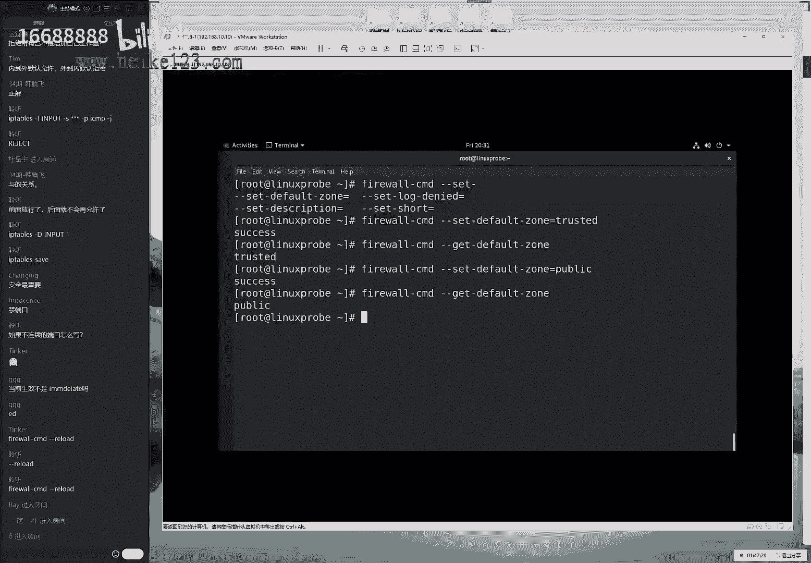

因为一个服务器上面可能会有很多块网卡，这样的话那我们一个网卡它可能是对外，一个可能是对内，那我们就不能去使用默认规则了，因为大家想一下我那我那么我现在有两个网卡，一个对外，一个对内。

那么我们对外这个网卡一定是更加的严苛的，对于里面的话一定是更加这个放松的，那如果说我现在只使用一个默认的策略叫做public，那你想对于这两个是否合适呢，不合适的对吧，因为它需要有两个不同的这个绑定。

比如说这个的话呢设置成db，这个话呢叫做trust，它要绑定着不同的区域，它是否能够完成呢，这个我们明天会大家去做一下演示，因为他需要重启之后才能够去升价的，因为它需要重启网卡啊，以及服务器呃。

还有的话就是举个例子啊，这个大家如果不理解老师，为什么一个服务器上面有多个网卡，可以绑定成不同的区域呢，大家想象一下我们家里面的门，我们那可以去看一眼对吧，呃我们家里面只有一个铁门。

就是防盗门是按在外面的，但是我们家里面的话呢会有一个木门对吧，呃就是因为我们家里面的话，环境稍微的是个体安全的，所以我们家里面只需要安装木门就可以了，那也就是说不同的这个区域虽然都是门。

但是虽然它它都是一个啊进行一个人穿行，一个流量进行放行的一个位置，但是它里面所对应的这个规则肯定是啊，他们画可是有严苛。

也可以有放松这两种啊，门和门是有区别的，来这个例子我就要挺到位啊，挺好啊，下面我给大家去说一下，就是说啊，我们该如何来对于我们这个防火墙里的这个，策略来进行一个配置。

另外的话大家可以来看一下我们的这个实力啊，有这个四跟五，我们先跳过，我们待会儿给大家演示，因为这个的话例子放到最后去讲比较合适，我们看一下这个四个五呃，如果说我们要想去对于一个流量来进行放行。

我们可以这样去做farewell gucmd，然后我们去设置一下叫永久生价表啊，这个养我们养成这个习惯叫叫做永久生效表，来对它进行放行，叫做添加，然后后面我们可以去写成一个服务的名称，我们随便去写呃。

按下回车，于是可以看到了，他说我们这个话呢协议已经默认存在了，并且的话呢是操作成功了，也就是说他默认情况下已经在里边，是对于这个呃呃协议进行放行了，我们的话呢他当前已经是有了的。

我们可以去quire去查询一下啊，require来进行一个查询，查询一下这个协议，可以看到这个里面的话呢，它为e指的是它是为当前生效的。

也就是说我们要想去放心一个流量，它使用的这个参数是这样去解的，叫做添加一个协议，把一个协议，然后这是我们的协议名称啊，协议名称添加到里面去的话呢，我们叫做对于流量啊，叫做协议名称。

它指的是去放行一个流量，去放行一个协议，让他去remove来去移除的话呢，指的是拒绝掉一个流量，这个是我们的firework gucmd里面一个呃术语吧，大家来去记一下，这是一个我们的参数的一个规则。

这个的话指的是上面指的是允许一个流量，下面是拒绝拒绝，就是把这个协议从我们列表当中给它去掉，这样的一个效果好，另外的话呢我们来去来呃，那那那我们那我们去绕一下啊，什么叫做rmtime。

一个什么叫做prominent，叫永久生效表，以及当前声价表，大家听完这个之后可能会比较想吐啊，因为这个特别的让举个例子。

比如说我想查询一下说当前我们这个协议啊，s h是否永久的被允许，那我们就去那啊，那啊那么我们就要去使用它这个命令对吧，来按下回车啊，当前的话呢是v e s好了，我先这样做一波操作，大家看好了。

我现在去使用到remove操作，把我的这个协议从当前表里面啊，当前保存位置当中给它移除掉，我们来给它移除了，好，请问我现在去执行这条命令，去查询一下这个服务是否被允许，请问我得到的回血应该是个yes呢。

还是个no呢，同学们，这个虽然我前面说的比较绕啊，但是同学们去思考一下好，大家问了一个问题，大家说说有哪些协议，这个协议的名称的话呢，第一可以从网啊，可以从网上去查。

第二的话呢可以去从这个firework on config里面去看，还有第三个唉，我玩啊，第三个方法，如果是老师诶，你现在说了一个协议，但那个协议我不知道他干嘛用的，或者我不知道他所定的这个。

端口号是多少的话呢，你就可以看这个啊，etc目录里面的service文件，我特别喜欢这个，给大家推荐一个，这个文件里面保存的是所有的协议名称，端口号啊，以及介绍都有啊，比如说同学们问到说。

刚才这个协议叫什么名字呢，叫s h它的作用和端口号啊，杀端口号，tcp协议一啊，帮我们列举出来了，特别的方便，他说这是一个远程连接的一个协议，通过这样的这个呃文件可以去看到它，同学们可以记一下。

同学们看是谁问的来着，好大家问了一个问题啊，ok这把跳过了跳过了跳过咱们这个课啊。

我就有一个目标，让咱们的同学们不要看一遍就能够求啊，就能够学会，总是在不断的去加大我们这个学习的难度，就加快我们这个课程的节奏，因为前面我们坦白讲，实际上是照顾到我们基础比较薄弱的同学，是让一让的。

现在的话该提速了，来现在来给大家看啊，去敲一下，同学们回答了，同学说到底是yes还是no呢，来啊yes or no不重要啊，结果并不重要，主要是一个思考的过程，为什么为什么会这样子，对吧好。

现在看到就是结果是为e，但我要去理一下思路查啊，先啊我们来看一下查询一下，说这个协议是否永久生效，就被允许，我们把它给移除了，把它给做拒绝了，所以的话呢我们理所应当，我们再来去查询的时候。

永久生效表他一定是个no了啊，大家看一下，他一定是个no，因为他在下一次重启过后，他一定是被拒绝的了，这个没有问题，但是由于它还没有重启。

我们刚才讲到了永久生效表的话呢，他做到这个呃permanent，它里面设置的过这些信息，它里面设置过的这个信息，他需要去重启或者去使用到刚刚reload，才可以去生效，所以同学们来记一下。

如果打成no同学记一下。

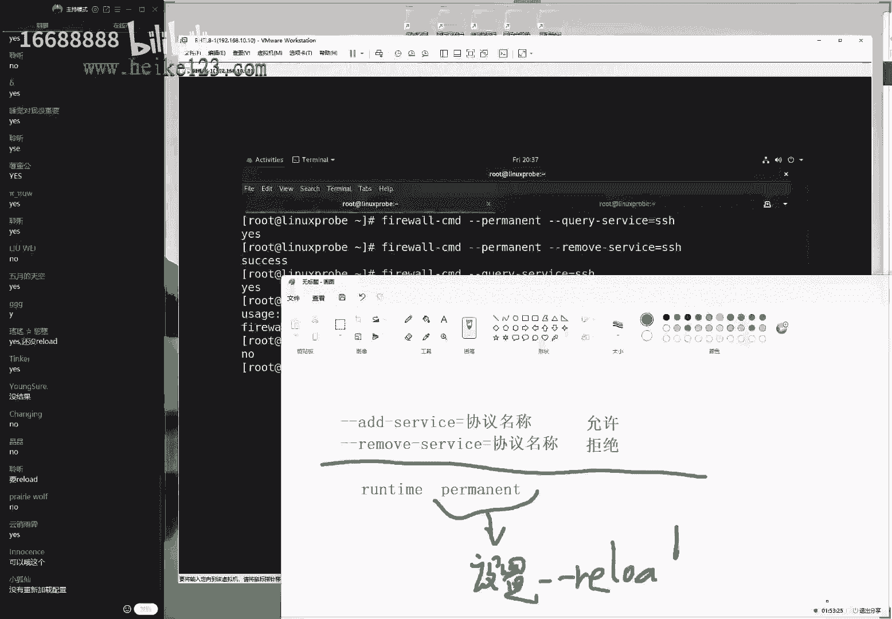

为什么，那就是因为虽然我们做了，但是的话呢您需要去重启它才能够去生效，好再给大家捋一下啊，这个月虽然虽然虽然啰嗦了，但是我刚刚看到打二龙，但是我同学看到打斗的同学的话还不占少数，在大家啰嗦一。

最后一句是这样的，当前生价表里面啊，当前啊我们看一下这个信息，用呃永久生价表里面这个服务已经被拒绝了，但是的话呢当前这个服务的话呢，还依然能够被访问，要想让他当前和永久都被拒绝的话。

需要去使用到firework，杠samd，怎么样呢，杠杠reload哎，没关系，同学们错了没关系，思考这个过程说明我们钱花值了，是现在不会，现在会了，同学们钱花值了，说明这是学会了，去重启了。

去reload之后再去看，yes，变no，因为永久生效表里面这个信息，替代的这个wrong time里面的信息，唉大家看一下这两个的区别啊，可以先简单思考一下，我倒杯水，讲这个方。

因为我们讲防火墙的时候吧，特别的抽象，理论基础的话呢也是比较的扎实一点的，同学们会听到我说说老师你讲这些都是啥呀，都有点太糊涂了，因为防火墙里面这个东西我们大家看不了。

因为它它是在我们这个唉内核里面的这个信息，我们看不到它里面到底是不是这样的，所以我们只能给大家讲理论基础，让大家知道里面是这个样子的，但是我们又不能给大家去看一个东西，就在去就啊就说我们再买一个东西呀。

我那我们可以大家去描述，但是总不但是我们总看不到里面是什么东西，总结的话呢不好理解，所以的话呢我们只能是打好理论基础之后，现在给大家说一下这个实战，看看到底怎么回事啊，给大家来去啊，操作操作。

讲防火墙嘛，他确实很难，所以有些培训机构干脆就不讲了，因为我们的r h3 c和hc他没有，他没有对防火墙这个考核，所以刚才就不讲了，但是我们觉得让他，大家还是去学就会比较好一点。

那我们还是要给大家去说的好，下面的话再来啊，再来就是我们完全没有说不讲了，而且我们要给大家往深了讲啊，在考试在我们工作的时候不要吃亏呃，还有两个表格，重点呢大家看一下第三个点。

还有这个第四个第五个这个实验啊，叫做这个panic，这个我们是我们放到这里，我们为什么要放到现在去讲呢，这叫做紧急模式啊，这代表就是紧急模式，切断一切的网络连接，就是去瞬间切断一切网络啊。

一切连接一切连接，然后呢还有就是啊，还有下面这个叫做off，指的是恢复，大家举一个例子啊，然后我们去指的是恢复啊，恢复到正常模式，这个话呢我们叫做紧急模式，由我们现在的话就是一个紧急动员的一个模式。

素人都被隔离了对吧，我们现在是一个紧急模式，但紧急模式的话意思就是切断一切连接。

如果说我现在怀疑我现在被人入侵了好了，我现在比如说左边开一个窗口。

我现在再去拼新的话呢，主要为了去测试啊，测试一下这个网络有没有被中断，好拼一下，1920~8点10：10，但是如果同学不愿意用拼也没关系。

你也可以换成其他的协议啊，只不过因为这个比较省事嘛，不用他去枪毙了，我们也可以通过我们的呃x shell进行远程连接。

这两个都给大家去试一下，当前的话呢既能够拼得通，也可以进行远程连接，1920。16，八点10。10p来进行远程访问啊。

怎么样，哎，不行了是吗啊。

为啥不行哦，因为我们前面板给拒绝掉了，好不好意思啊，刚开始我有点糊涂了，这就是我们的一个命令，不是啊，这就是我们两个时间之间打架了，好让我先这样这样这样这样我他妈现在这样啊。

permanent设置永久生效表里面来进行配置。

添加上我们这个协议来啊，added service，然后我们的协议啊。

s h永久生效表里面添加好了之后，firewall cmd刚刚reload立即生效，于是的话那我们做好之后再去查询一下，希望同学们也能够像我们一样多去敲几遍，那再去查询一下这个服务是否被允许。

ok是个yes了好了，再去进行远程访问的时候，就能够看到又可以恢复了，好现在我去能够去切换啊，我现在能够去切啊，现在能够去进入，没有问题，左边的话也能够拼得通，可以的，但是有一个叫做紧急模式。

如果现在我怀疑我被人入侵了，现在我们第一不要进行杀毒啊，不是什么的，第一步要拔网线啊，但是如果说我们先受到物理的限制啊，没有办法去拔网线的话呢，啊来那我们就来不及了啊，那我们现在可以这样了。

firewall on famd，然后是panic on，代表就是开启这个紧急模式，于是大家可以看到一，那么会在这一瞬间。

左侧的所有的拼就被戛然而止了，而我们这边的话呢再去远程ssh的时候。

同理的也会被拒绝，这就是叫做紧急模式，它会切断一切的网络连接，仅供特殊情况下去使用啊，是这样的好，我们现在的话呢可以再来，我们去关闭一下这个紧急模式。

恢复正常，来看一下左侧能够拼得通，怎么看，我们同时这边也能过去被访问了，这就是我们的叫叫做基金模式，一般情况下不用去用啊，但是有这么个东西大家要知道就好了。

下面的话呢还有一个啊，现在好，我们还有一个就是大家会问到邵老师，那我们该怎么样基于这个端口号来进行限制呢。

大家是刚才问到了，就是说我们该机端口号来进行控制呢，刚刚的话是基于的协议了，那我们一个协议可能他并没有支撑的，一个就是我们一个端口号的话呢，可能并没有一个固定的一个协议啊。

就是说我们现在的话有一个服务这个文件啊，叫做这个service，比如说有一个协议，它是什么呢，它是2345678啊，比就比就他就他这么着啊，但总口号不能是超过65535对吧，比如说有一个端口号是什么呢。

是66666啊，有没有这么一个65000啊，比如说有端口号6666，我来看一下啊，还啊还真有这么个逗号，比如说我再来啊，嗯9876这个端口号有没有人用，还真有人用啊，真的什么都能用来再来呃。

12345有没有好像是叫做一个电线，是一个也好像也被人用了啊，聊天工具再来一个23456啊，我看一下还真有人用这个很讨厌了，来再来一个啊，638拉巴拉巴拉好，这个没有，比如说我先开启一个端口号啊。

那我现在有一个黑啊啊，那比如说现在一个坏人。

他通过这个端口号来对于我来进行控制了，那这个时候如果我再写一个协议的话，那么就没有对应的一个协议名称了，怎么办呢，可以机动的号来进行控制啊，我们可以来给大家操作一下。

比如这个逗号来对它进行一个单独的限制，没有一个协议名称。

这样去做firewall cmd啊，这首先来说第一步生成永久生价表，记住同学们考试的时候一定要这样去用，一定要加上这个单词叫做永久生效啊。

但这个单词即便考试的时候，我们有没有看到这个效果，但是你也能够怎么样，考试重启过后拿到分值，如果没有加上这个参数为wrong time啊，它指的是在下一次重启过后就会失效了，考试时候没有成绩的。

基本都看到这个效果，也没有成绩的，所以大家一定要加上这个参数数啊，如果有条件的话，你可以闻到自己这个胳膊上面啊，看看你哪还有地儿写下来，考试的时候的话呢，给自己一个提醒，特别好，来给添加上这个端口号啊。

port端口号端口号的话呢是为63456啊，63456，然后tcp协议我们给大家写下来，进行一个app商量一下，叫做port啊，ram叫做removed part，来接下来禁止掉这个端口号，这样做完啊。

他说我们现在的话呢没有可用的这个tcp，但是的话呢我们这个操作已经是成功了，不用管啊，这个话他只要说我们这个操作成功了就可以了，然后呢我们现在可以再来，比如说我现在给他拒绝了。

我们的话又想去允许一个呃端口号，我们怎么来将允许呢，我们来给它添加一下就可以了，添加端口号怎么这么去写，比如说我想允许端口号为八零，端口号为网站端口号对吧，可以通过远程来访问我们本地的网站，按一下回车。

这样的话也没有问题，当我们都做好了之后，可以去使用到firewall gucmd，然后叫做列举出来端口号，这样的一个操作的一个参数，你可以看到嗯，等一下啊。

对我们需要让他去生效一下firework gsam，你看其实我也会发现这个错误，但是好在我设置成永久性价表了，即便我没有去reload，但是我重启之后也是有分值的，一定要记住好。

我们可以看到就能把我刚才所配置的过，这个添加端口号这个协议给他做一下，允许了，那么只不过的话默认情况下它没有被允许，所以它它会提示出来这么一个信息，他并没有被列被列举出来这样的一个问题。

好下面的话呢给大家看完这个之后啊，大家应该就能够总结一下了。

就是我们现在对于这个firework gun cmd的话呢。

它是可以进行一个端口号和协议的这个放行的，要想去放行一个端口号，我们的话呢则是一个这样的一个协议啊。

不我我们啊这这这样的一个参数我给大家总，我给大家总结一下吧，好firework gsv它之所以能够做补齐，就是因为不啊，不用大家去记来，大家记一下这个话呢不就不用去背啊，但是我们要用。

但是我们要能够认识，这个的话呢是用来去允许一个端口号啊，这到允许端口号，这个号后面是指的是允许一个协议，好大家记得这两个称它是成对的，这个的话呢是用来去禁止的一个端口号。

这个的话呢是用来去禁止掉一个协议，两个成对出现，大家去记一下，同时在记忆点设备啊配啊，我们配置的时候加上这个permanent，为永久生效表啊，然后没拍好之后的话呢，记得去reload一下，然后去生效。

这个就是一个完整的过程，呃，除了这个以外的话呢，我们也可以给大家比较高级的一些使用方法啊，比如说我们看一下这边第十个这个实例啊，他又提到了我们能不能对于这个端口号啊，来进行一个转发呢，啊。

这个端口号这个转发，实际上也作为我们这个流量的一个转发，它可以去隐藏我们自己本身这个端口号。

这样的一个作用呃，这个听起来有点呃，有是有它有点难度啊，我待会我尽量给大家举一个小例子，比如说的话，那现在一个协议叫做s h，它进行一个远程连接的，他的话呢占用的这个协议是二刷端口号的。

这个tcp协议啊，对啊，这就是我们这个协议以及端口号，那我现在有一个问题了，如果说我现在的话呢，想要去允许对方访问我们本地的啊，去访问我们本地的这个协议啊，进行远程的控制，但是好像我们又不想让他知道我。

端口号对应的是哪一个，那怎么办呢，我们可以再单开一个端口号为888端口号，这样的话，当有一个用户访问我们本地的八八端口号的时，候，把这个流量的话呢转发给22端口号上面，对方都得到了这个回血。

也是对方反八八端口号的时候，就能够访问到我们的s h这个协议了，但是等于说就是进行一个转发呃，再举一个简单的例子啊，比如说我爱老刘喜欢某一个女生，但是的话呢我不太好意思去表白，那我呢那我怎么样呢。

那我写一封情书啊，发送一个流量，写一封情书，做一份流量啊，然后呢我那我把这个数据包转发给门口的啊，大爷啊，转发给门外啊，张大爷由张岱转发给这个小花，比如说这么一个过程，最后的话呢小花也能够收到。

是这样的一个过程，就是说呃访问这个协议的话呢，实际上还是访问的这个协议，只不过作为一个转发，我们需要做的就是在防火墙上面，将所有八八端口号收到这个流量都转发一下，这样的一个作用好大家说是为了保护22吗。

对啊可以这么去理解，这样的话是有这样的一个保护作用的，同时的话呢22端口号也可以默认被访问。

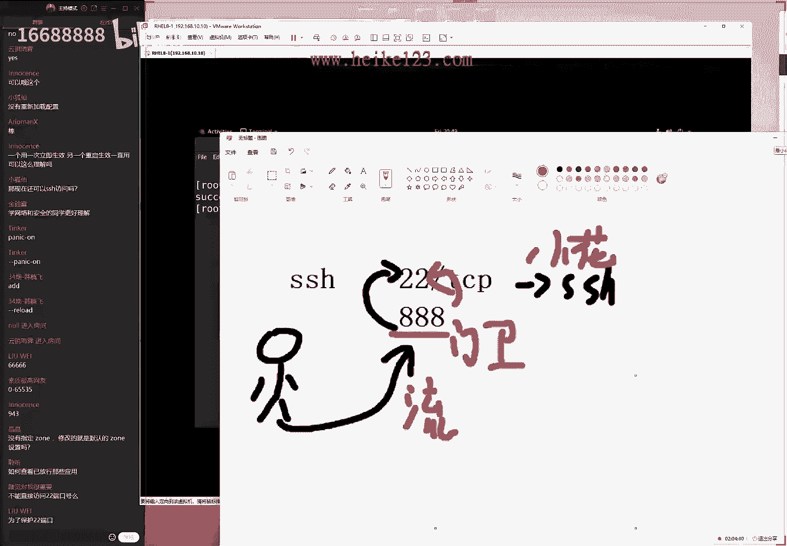

当然啊，当然的话大家可以把它给拒绝也没有关系，因为他只要一个被访问就可以了，来，这话也是可以起到一个啊迷惑对方的一个作用。

因为大家知道，比如说我我换了一直用的这个服务器，都是linux对吧，我的端口号的话也漫画也是啊，也是我们这个22端口号，但是同学们你们可以去访问一下我的服务器，22端口号一直访问不了我的协议的话。

端口号我把它改了，变成3389了，虽然说这个好像看起来没有啥意义啊，但是会给人一个假象，就是我使用的是windows，这个其实怎么讲呢，你要说它有用吧，也没有太大用，你要说它没用吧，也有点用。

就是这么一个小的一个小实验吧，好这个根据我们这个实验需求来决定的。

拿去使用的firework gucmd，就以这个为例，我们来去操作一下firework杠cmd，然后后来我们来杠杠，permanent为永久生效表，这个其实有些时候呢我们每个工作场景下。

可能他会问说老师这个应用场景好像比较窄，我们现在好像也用不到，不要就不要这样去想，因为现在我们无法判断以后工作场景当中，用到哪些命令，以后用到了呢，这不就那那那要现在就把给抄上了呃。

permanent永久生叫表，添加一个转发会断裂，那叫做forward，然后我们当前的话转发端口号嘛，大为端端口号888，然后我们一个冒号跑操口，这个其实我也记不住。

所以大家看到其实我也是在照抄这个它参数的，这个特别的长，特别的复杂，我们明哦我们会在明天给大家去讲一下，到底该在考试的时候该怎么去配。

虽然这个考试不考啊，但是我们会给大家说一下，在我们工作的时候该怎么去配，然后我们来进行一个转发，当有一个对方流量发送的是888端口号，请求的是我们本地这个tcp协议的话呢，我们就转发to啊。

转发到端口号22上面，然后看到我们本机的地址也写的清楚呃，to address啊，然后的话呢等于是192。16，八点10。11下回车啊，这果然每一次都是照着去敲，都能敲错，来看一下同学们。

我有一些小错误的地方，他说我们这个point这个格式写错了，然后说added。

说写错了，叫added forward point，尤其有时候我这个我这个确实啊，我这样去操作容易写错，forward point来按下回车，没有问题，生效了，再来forward杠c md。

其实大家也能感觉到的，在我们工作的时候，我会很少这样去直接去bear去敲，可以过来查了，那并且的话在我们考试的时候，可以通过图形界面来进行配置，来redo去生效reno，升降好之后来进行远程访问。

去通过ssh，一九二点一六八点10：10。

然后的话呢我们来后面加端口号吗，八八端口号您可以按一下回车，可以看到也能够访问，在输入我们的用户名称，叫做root密码的话呢叫做red hat。

可以看到它是没有问题的，同时我可以去重启一下这个服务器。

reboot这边的话呢服务器也会同步访问，那他的话也会同步响应去重启它了。

证明我们访问的确实是啊确啊，确实是我们这台服务器，同时我们可以给它重启过后，再去看一下这个协议的话呢，依然是生效的。

因为它是一个永久生效的一个策略，它加入了一个永久生表啊，运动生价格里面了，他的话也依然可以被访问呃，下面给大家说一下我们这个复规则。

这个复规则的话呢，它也叫做复杂的规则，它有两个解释方法，它翻译起来的话是有歧义的，我们这个词它叫做rich，叫做富裕的，它有两个翻译起来了，这个中文一个的话呢叫做负，就是负，他的话叫做呃富裕的意思啊。

这个也可以这么理解他，他他的话翻译成啊，他把翻译成啊非常复杂的这个规则，它有两个翻译的这个副啊，大家可以来记一下，因为很多书上面这个单这个话，这个有很多种写法，它有两个负它，它这个意思他都是对的啊。

叫做rich，翻译过来它是复也行啊，复杂也可以啊，也就是说这个副规则的话，它是一个更加的复杂的一种规则，它为什么会复杂呢，因为它要对于这个流量，进行更加精准的一个配置，它需要进行更加精准的配置。

它就更加的复杂，比如说有一个人，他是一个男人，好了他这是一个简单描述，但我们说这个男人上面头发上有四根毛啊，嘴的话呢是一个很大的一个嘴，他这个鼻子上面有一颗痦子，脸上有一个九眼睛的话呢，有一个单眼皮。

有一个双眼皮，他可以感觉到了，我现在描述之王啊，那我们先对于他今天这样的描述的话呢，特别的复杂，但是更加的精准了，这个人的话呢可以很清晰的立体的展现出来了，也就是说，要想对于一个流量进行更加精准的匹配。

就一定要更加的复杂，要去使用到这个负规则呃，重启好了之后。

我们来从远程再继续访问这个端口号为888，您可以来看一下啊，依然是有效的。

并不会说因为重启之后就失效了，在考试的时候放轻松呀，肯定是有分的，来看一可以看到远啊，远啊，远程登录没有问题，再去啊，输入密码也没有问题。

明天会给大家讲一下远程连接这个协议，我们不着急，先看下效果就可以了，把重心放到放火墙上面，接下来我们再来进入到这个防火墙。

不会进入到我们的系统当中去，说一下我们的乌龟做的配置方法，其实这个讲理论的这个章节嘛。

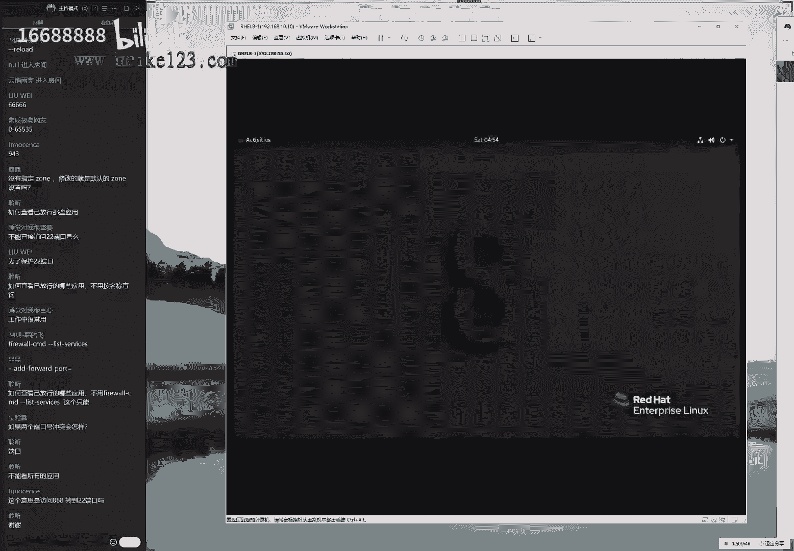

我就有一种很痛苦的感觉，同学们不知道有没有感觉到，就是觉得讲的特别的慢，大家有没有感觉今天刚讲了两个小时，但是只讲了两个章节，就是因为讲理论的这个章节进度都超级的慢，因为我们要给大家讲理论之后。

再去大家去做实战，可能不像您看书的一样啊，可能这个嗯就会感觉到我就好像看明白了，就然后我就往回去翻了，我们会给大家说一下他为什么会是这样的哦，可能会多问几个，为什么好。

那我们现在的话给大家去说一下这个负规则，复规则的话呢，现在有一个实例是这样的。

如果现在有一个用户，他能够从远程来进行访问访问，我们本期的s h这个协议先来验证啊。

先来进行验证啊，s h一九二点168点是电池，它是能够通过远程来进行访问的，没有问题，幺哎等等啊，等一下，当前是能够进行远程访问的，没有问题，现在我需要做一步操作。

对我来进行限制，那好了，我现在的话呢，如果我往大了说，我那我是一台主机，我是一个从外部访问的用户，我在往小里说，我是来自于19201点，168点是这个网段的，再往小里边说。

我的地址是1920~8点10。1，这个主机好了，但要想对我进行进行一个精准的限制，我们该怎么进行操作呢，啊不我觉得这个数量有点简单了。

我们不太满足，我现在这样啊，其实也有点不太满足，有点太简单了，我们更加复杂一点，比如说好，大家先可以把书合上了，我给大家讲一个有想了一个稍微比较难一点的。

例如说现在我能够远程访问，没有问题。

没有限制，防火墙是被允许的，我先先这样去做firewall gun，因为我想因为我想给大家演示一下。

叫叫做优先级，虽然都是自己的规则，但是这个一般规则啊，但是这话一般规则的优先级没有负规则高，也就是说负规则，优先级是超过了我们的一般规则的，我们该怎么去理解这个事情啊，这样的话我们一般啊。

所以这样的话我们就一呃，可以两个一起给大家讲了，既讲的不规则，又给大家去讲了一下优先级问题来remove，然后是port啊，这个叫service吧，无所谓了，协议的名称s h。

现在的话呢是对于我们的永久双调表，里面进行操作，限制用户访问我们的s h生效啊，然后再来re load，让他立即同步一下，啊，呸呸呸呸啊，姜姜老师之后敲了多少，敲多少打多少，瞎敲了。

reload没有问题嗯，做好做好之后再来去访问一下。

看一下效果啊，没有问题，已经是被禁止掉了，在讲课的时候总是在给大家讲新的例子啊，脑子一直在转，有什么新的例子给大家演示一下呢，可以看到刚开始可以去访问的，现在不可以了，因为防火墙把你给禁止掉了。

现在好了，那就是说我们的默认策略，或者说我们叫一般策略是把我们给禁止了。

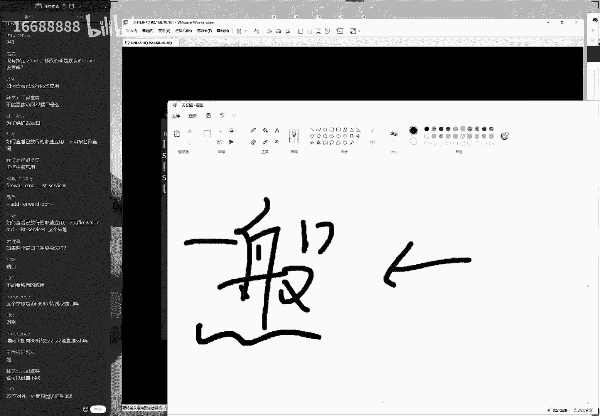

那我们添加一项负规则复规则，这样去做来firewall gucmd叫做添加一个复规则，rich规则为永久生效表，这个一定要养成习惯，永久生效表里面来进行操作，permanent，然后添加一个不规则。

添加一个rich，然后呃rich room，不规则。

首首首，那我们首先的话还要再去设置一下，我们这个c一族，它可以基于i p v4 ，也可以基于基于ipv 6，我们这个特别讨厌啊，他需要先去手动去指定一下为默认的ipv 4，否则的话他会给我们一个梯形。

还有一个弹窗啊，他说我们这个协议的话，它并不生效来ipv 4，然后我后面的话呢再来，当有一个用户叫做source source address，当有一个用户来源是来自于192等1下，192。1~8。

10。1这个主机的话，那我们则对它来进行一个放行操作啊，这样的一个操作大家可以看一下service name，service name，当对方访问的是二杀端口号s s这个协议的话，则进行允许呃。

按下回车没有问题嗯，我看一下啊，当这个用户访问的时候，对它进行一个允许，再来我们去重启一下，用来绕吧，但是其实只要学习好ip tables之后。

听起来还是能够理解的，让大家去重新加载一下，立即生效，这边用户再去访问的时候。

可以看到又能够访问了，也就是说我们去使用的默认的这个策略，去拒绝了所有的用户访问，我们本地的22端口号，但是的话呢我们又去允许了某一个用户，通过付规则的一个允许策略，还要能够去备访问了这样的一个方式啊。

可以来既学习的负规则就知道了，我们这个负规则有优先级，是超过我们默认规则这么两个事情，大家可以记得这个书上面可以看到，这两个并不冲突啊，它有一个优先级的一个问题，好下面呢我来给大家说一下。

就是其实的话呢。

这个通过我们的命令行进行操作，它并不是一个非常好的一个完美的选择，因为去使用到那firework on cmd的话，大家可以来看到我们现在所做的这个事情，它很复杂，看到去敲的话呢。

它这个命令需要敲这么多，而这个的话呢，其实实际上要通过我们的ip t boss去做的话，就没有那么多了，来看一下，现在应该有三行对吧，但是如果这个同样的这个操作，要想去使用到ip tables去做。

它有多少行呢，稍等一下，我把它先缩小一点点，如果这个操作我们要去用到ip tables去操作，那么就是一个大写杠爱input项链，我们知道了三个表，五个链，那它对于从外部到内部流量。

使用的是叫做流入流量，然后我们来继续写一个小小的s，代表的就是叫做来源地址，可以缩写成一个小小s，来源地址为1920~8点十点，这个网段没有问题，访问我们本地的22端口号，d point等于的是22。

然后的话呢我们这个动作的话呢叫做拒绝reject，于是一个小写的刚啊，那么就是一个呃小写的gg，然后reject拒绝，所以大家可以看到同样的这个事情，但是我们不同的命令去完成的话呢，还是有一些区别的。

上面一条可能用了两行半，下面一条的话只用了一行，那么大家可能就会嗯问我们的一个问题，就是，做同样的事情反而更加复杂呢，要给我们增加了这么多呃操作呢，首先来讲他的话呢需要设置这个选项更多了。

首先它需要设置成呃云朵成下表，以及的话定义一下默认区域，以及需要使用到长格式去写，反而会更加麻烦了，那我们有没有什么办法能够简单去操作呢，可以的，我们叫做farewell gsm b啊。

不我们叫做firework gun config，明天会给大家说一下，该如何通过图像界面的方式来配置我们的防墙，这两个信息是一个完全同步的，只不过的话呢这个我们默认还需要配置一下。

我们的方还需要配置一下软件仓库，因为在红包热器里面，这是有的，在红包任务七里面是有firework gun config的，但是在红包roll吧里面的话呢没有了。

我们需要先来给大家讲一下配置软件软件仓库，配置软件仓库完了之后，才能够进行一个安装firework gucmd这么一个事情，所以我们等到明天给大家去细聊，大概时间也要半个多小时，我们讲哦。

那我们就讲扎实的，把这个呃每一节课的话呢，能够学得比较扎实一点，比较好，我们放到明天给大家解说，现在给大家说一下，我们今天这个复习跟预习的内容吧，听完哎呀，我们同学们听完理论课程之后吧。

这两个小时总会觉得特别的痛苦，这是很正常的，我们给同学们反馈之后啊，都会反馈说老师这个理论能不能稍微少一点啊，听完这个之后很头疼，而且今天这个理论好像跟这个实操的话呢，关系又不是很大啊，怎么怎么理解呢。

就是我们虽然没有贴理论，但是这样命令的话，那我们直接去敲也能够成功，但是的话呢总之学完理论之后，能够知道我们在做这个操作是为什么，主要是为多问一句，为什么，来另外来说一下，我们今天这个复习。

今天的话呢复习就是firework on 3 md，因为我们的ip tables的话呢，今天学了，但是就可以呃备选，因为在以后的服务器里面可能用的比较少了，主要是面向于我们我们的这个老版本服务器。

五和六去使用的，但是我们不能够保证，大家以后不用到这样一个老服务器，所以才给大家去讲的，而且学完了之后，我们坦白来讲是不是也有他也是有帮助的啊，他也是有帮助的，一些什么表啊，练啊规则链啊。

什么这个防火墙匹配的一个策略规则呀，从上至下或者说啊匹配到之后就会截止啊，这样的这种理论基础，还是呃具有一些很好帮助的啊，它是呃对于我们后续学习是有帮助的啊，呃来说一下预习，明天的话呢讲一下第八章节。

没有问题能够讲完，然后后来我明天会给大家讲一下第九章节，但是又讲不到s h了，明天会讲到网卡的一个高级配置方法，因为我们昨天我们上礼拜六的时候，讲了一个reid，还有llvm，大家记得。

实际上这两个就是对于我们的硬盘进行一个，高级的管理方法，然后今天的话呢又去讲了一个配置网卡的一个，方法啊的啊，那我们又讲了四个方法配置我们的网卡，但是同学们也应该能够感觉得出来。

这个配置网卡的话还是比较简单的，我们对于网卡有没咦，那我那我们有没有一些比较高级的使用方法，那我们明天就为大家解说到，再到网卡的绘画以及网卡的绑定呃，我们叫做报考的，这个我们现在不叫绑定了。

我们叫做聚合技术，我们我们明天给大家，就是说等同于就是在我们今天这个基础之上，对于我们的硬件，对于我们的硬呃网卡进行一个高级的学习，我们总是在拔高嘛，在不断的再去增加难度好，这就是我们给大家说的。

这个预习跟复习的内容了，同学们可以提问了，然后有什么问题不用，然后可以去说出来，另外的话呢就是我们这周我给大家总结一下，我们跟考官去说了一下，因为的话呢考官今天没有上班，在这周都没有上班。

因为的话他在上海他还没有复工，现在被隔离在家里面了啊，隔离在现在隔离在公司了，也不能够去呃，跟我们去处理这个考场的这个事情，所以的话呢如果不出意外的话，我们5月6号可能不能约考了，可能要拖到5月中旬。

因为现在的话呢全国的疫情都不是很好，我们主要的战场北京，上海和深圳，现在啊不是北京，上海跟广州，现在3d都被封了，现在的话都是有这一个现现代化，现在都是有限制的，所以的话呢我们5月6号他啊。

从目前来看可能是不能约考试了，可能要在5月中旬了，但是同学们你们不用着急，因为只要你们能够啊，5月中旬你们不用着急，这个问题只要能大过去接着上课的话，我们有什么新的情况都会大家去说的。

如果说现在这个疫情恢复了，开呃，我们主要看一下五一之后的政策，如果五一过后的这个政策放松了，那我们就给大家第一时间取悦对吧，大家这个不用太担心了，我们看一下最新的政策了，五一过后。

反正5月6号肯定是悬了这么一回事，好大家现在有什么问题，大家可以来去说了，我来给大家回答一下啊，大家心中的一些呃疑虑啊，第一个问题啊，大家说说什么时候用协议，什么时候用端口号，还是两个可以通用。

两个通用，我们可以自己去选择，看哪个顺手就用哪个好，下面啊对今天讲完之后确实比较掉头发，特别的理论基础特别的强，那下面一个问题大家说说，现在可以开始推软件定义网络了。

然后下面一个问题大家说说feral gun seventy，有没有类似于ip table scale。

可以显示出来所有策略的命令，有的啊，大家说棒的吗，不它不是棒的，我们现在使用的是team。

在红帽的五和六里面，这个又出来有点话长啊，同学们先不要掉头发啊，他他他他当当当当当他没有办法对吧，它其实是很复杂，是这样的，在我们红包五和六里面，我们省的技术叫做绑定的绑定技术，它就像什么沙发呀。

就像坦克一样，它是一个外来词，一听都能听得出来，这是叫绑定技术，叫绑定吗，还是一个外来词，我们用的是绑定啊，一个在一个技术，在七跟八里面的话呢，我们的技术叫team技术叫聚合技术了，还是不太一样的啊。

我们明明我们明天给大家去说的啊，但是我明天会给大家讲这个绑定啊，这个聚合的话呢，这个我们会在考研辅导的时候给大家去说，然后下面一个问题大哦对，然后同学们刚才问的一个问题啊。

说列举出来所有策略的这个我记得，但是我需要给大家查一下，待会大家去说，先来给先来挑一些比较好说的问题，因为一待会儿被刷上去之后就找不到了，大家说啊，这个问题是一样的，我待会给大家找一下。

大家说西安恢复了没有星号，但是西安的考生我们超不过八个人，你需要等待啊，大家说合肥也没有限制的，但是你需要凑够八个人，你可以在，其实我们建议是这样的，一个小小的建议，就是如果说但要是有时间的话。

您可以在群里面问一问，比如说我们在合肥也好啊，我们是在武汉也好啊，我是在西安也好啊，可以在群里面问一问，说有没有咱们在同一个城市里面的考生啊，或者说我们愿意在啊这个城市里面考试的，我们先去凑一凑。

比如说你可以凑到五五，比如说您可以凑到五五或者六个人的话呢，基本问题就不大了，到时候我们月考的时候您就五六，那么您啊您可以啊，直接去月考了，如果说要是大家没有互相了解一下，比如说我们人数不确定的话呢。

那我们则会在当天月考当天去统计一下人数，但是优势，但是的话有时当天有药学员没有来要要啊，没有来上课的话呢，就很没有看到这个消息，就可能不扣八个人了，到时不就有有点小插曲吗。

所以您可以先了解一下有哪位同学愿意考，这样的话我们先记一下联系方式，到时候我们可以通知一下啊，跟他这个准确的去到位，下面一个问题，大家说我们的arch cc的模拟环境怎么去用，有相应的帮助文档吗。

进入到虚拟机，不知道怎么下载啊，不知道下载之后该怎么去用呃，有帮助文档吗，没有，但是有辅导视频，您可以看一下行情辅导视频里面，r 13 c章节会有使用方法好，虽然说我们去使用到shell的话。

有没有推荐一本书呢，是有的啊，但是这本书的名称我忘了，大家可以百度上去搜一下，大家淘宝上去搜一下，如果没有记错的话，好像叫做shell脚本攻略，是一个绿颜色的，上面带一只青蛙的一个书籍不错。

那也大可以去网上去搜一下呃，淘宝上面去搜，我记得好像叫做linux，不叫做shell sharp脚本攻略，这本书我看过，对于大家第四章节的补充的话呢，是比较的和是比较的是比较好的，还不是这个不是这个。

也不是这个是带一只小青蛙的，是这个啊，大家可以去搜一下嗯，就这本书嗯，我们认为是对于我们第四章节的知识，进行一个很好的补充，他的话呢嗯怎么讲呢。

它它它这个难度也不会很大，并且的话呢这个啊衔接第四章节，算作是技巧来讲也是比较的嗯，很好过度的啊，看一下这个出版社，人民邮电出版社也好，这还是我们自己家的产品，我看一下啊，只不过是图灵出版社是吧啊。

图灵子公司的，看来是我们的这个，我们公司里面其他的一个子一个子部门的。

这也是我看到很多书里，其实看到这本书也是啊是吧，也都是我们人民邮电出版社出版的，还好吧，书很多，然后下面一个问题，然后大家问到说，说云服务器里面有好多不配置防火墙配合啊，说防火墙啥的还有用吗，当然有用。

当然有用，不要以现在这个自己是否使用到，而判断出来以后，就把我们是否会用到，不要这样去用，不要这样去想，说老师我现在没有用，我觉得我现在学了它也不也没有太大用处，不要这样去想。

因为我们不知道以后的工作场景是什么样子的，所以多学一门手艺，多学点技术没有坏处，然后大家现在继续来聊聊啊。

我来给大家去想啊，我来给大家说着，大家问了，说有一个命令能不能列举出来所有的策略啊，我记得是有的，但是我一直想，那我我这边想是想是想不起来，因为它太长了，主要是它特别长，哎呀他这个东西吧有点多呀。

来get service来看一下哦，这是所有的被允许的策略，于是可以通过这样的方法来举列举出来，还有的话呢叫做激活的区域，不是叫做呃description描述service，列举出来作为允许的协议。

所有的区域好像不是这个嗯诶啊就是这个。

这就是列举出来当前所有被允许的这个协议，可以摘下来去看，可以的，然后下面一个问题大家都没有看到青蛙是吗，有青蛙没有青蛙吗，那是我记错了呃，有青蛙的啊，那可能没有青蛙吧，可能手机错了，不好意思啊。

但是就这本书肯定是没有错的，还是说因为我买的第一版有青蛙啊，嗯并不重要吧，反正这我我我再给大家看一下啊，千万不要买这本书，这本书我没有看过，说咱有呃，咱有咱就直接说啊，第三本我没有看过，我看看第二版。

第二版的话我看过确实不错，跟第四章节的话衔接起来比较到位，第三版的话就会更好，但是我确实没有看过好，下面一个问题，大家都说我们会教容器docker吗，或者有什么书可以推荐吗。

docker的话基本上就只有一本书可以去学了，就是只有那本啊，docker就是这本书，但是的话我们不我们不我们不会去讲docker，我们讲的是我们讲的是pom postman。

实际上就等于说就是我们为了去替代掉joker，然后新产生的一个容器技术会去讲postman，但是不会讲特别多，我发现这本书我看过叫做docker技术入门，这本我看过还有个小鲸鱼，上面放了很多集装箱啊。

稍等一下啊，名称我记不住了，我给大家看一下，他买一个小金鱼，化妆小花生集装箱，那本书我也看过啊，也是很不错的，呃不是这本不是这本是一本大英语，大家根据我这个线索自己去搜一下吧，那本书我看过也确实不错。

也不是这个，好下面一个问题，大家说大家说的一个问题，我们学习ensable什么书可以推荐吗，我觉得ancable您可以先不用看书，你先看我们这个书上第16章节就可以了。

如果觉得这个都学完了之后还没有吃饱，那么你可以再去搜一本安c宝的书，但是我觉得基本上第16章节，以及我们和田辅导大家总有一个基本的认识了，问题不大了，其实还讲，然后再进行新，在进行深入学习的时候。

我觉得单本书都可以了，好下面一个问题，大家说我们的容器的是postman，对，是这样的，大家说小金鱼这本书我有确实详细对我也看过，而且那个出版社就是我们认识的一个这个作者。

其实我们后面还给大家写了一个序呢，大卫的话可以来句说，我们来给大家回答一下问题啊，图灵出版社，我啊我我们的一个子不门，那是我们的一个竞品，因为我们属于是一个我们叫做伊布出版社不，我们叫做呃异步社区。

它实际上是人民优点出版社里面的一个，i t信息分社的第一部门啊，然后的话呢等于说途径出版社，是从出版社买的版号，但是也是属于人民邮电出版社里面的一个产品，我感觉我感觉现在技术书籍里面。

人民邮电出版社的质量还是不错的，而且的话呢第二来讲就是中信出版社也不错，第三的话就是机械出版社也不错，因为最近买了很多书，会发现这三个出版社的东西还是不错的，其他出版社的话不敢苟同。

尤其是一些什么人教出版社什么的，就是那种就千万不要买，因为那种都是为了给学生看的去学，为了学校采购的，写的都不是人话，而且的话特别的怎么讲，特别的粗糙，我们买了很多本书。

那个纸的颜色能够看得出来有很大差异，像大家买这种教材，它的纸不是白颜色，它是黄颜色的那种，很劣质的，很薄的那种，所以我们现在买书什么的，我会对我，我也会多少会认一些出版社。

这三个这个我们刚才所说的这三个出版社，基本上可以闭眼睛买，不会踩太大的坑，好大家现在有什么问题，你可以来告诉我啊，大家说西安说没有考场，现在西安可以报考了吗，哦刚才我说错了，同学们，我刚才说错了。

西安我们没有红包考场，西安我们没有红包考场，如果西安有的话，您需要在当地，您跟考考场去联系一下，我们这边是没有的，只要价格差不多，我觉得你就可以在当地报考就可以了，西安我们没有合作考场。

因为呃西安如果没有记错的话，只有一节叫open兰博对吧，open兰博是被倒闭了，他是在2012年的时候就倒闭了，呃西安的o兰博是北京那边拆分出去的，我们认为他不太靠谱，所以我们没有跟他合作，嗯好吧。

因为欧布兰博以前总部在北京，现在的话只剩下上海跟西安部，上海部我估计可能也在疫情期间差不多了，现在只有西安部，我们怕不靠谱，所以我们没有跟他合作，因此西安目前我们没有合作，考场是这样的，好。

下面一个问题应该您说的就是欧布兰博吧，来大家一定要小心哦，呃因为他之前已经被倒闭过了，然后下面一个问题，那说是不是就安排安排到成都了，对我们成都是有考场的，而且很靠谱，然后下面有问题啊，可以来就说嗯。

稍怎么样呢，咱们的培训班不能报，咱们的培训班可以报哦，对不是这样的，咱们的培训班报不了西安考场，但是咱们的培训班的学员可以直接找他们报名，他们是经他啊，他们是可以直接报考的，不用在他们那边去学习。

因为我们沟通过，只不过确实觉得不太靠谱，所以就没有合作，包括说江苏那边实际上也有一个考场嗯，我们也没有合作，因为觉得不太靠谱，因为我们去试线下都会去看一眼的，因为也怕出问题。

以前在深圳那边就出现过一些问题，比如说塔塔对吧，现在塔塔还是在营业的，但是我们就发生了一些很不愉快的问的问题，就是我们给他们的很多考生。

但是没有及时的排考，于是我们就不会担心他们有任何合作了，现在合作现在能够继续合作起来的，也是我们认为比较靠谱的，不会给我们找麻烦的，因为我们说说实话，考试费又不赚钱，我们不希望在上面有任何的麻烦。

所以我都会找一些比较靠谱的，甚至可能会贵一点，但是起码是比较靠谱的，不会是为了省200块钱，然后我们折了4000块钱，这种我也比较靠谱一点。

不能把自己的信誉压到里面去好，大家有的话可以拿去说吧，然后我们来给大家回答一下问题，有点小鸡汤了，下面一个问题，他说郑州呢郑州有红包考场，我们是有合作的，然后大家说演示一下怎么样分辨率为1980。

1920~1080啊。

演示说什么分辨率吗。

没有太理解。

