# 刘遄培训linux34期（配套linux就该这么学第二版，RHCE8） - P12：13 - 16688888 - BV1gL41167vP

just the way，you are still be the t。

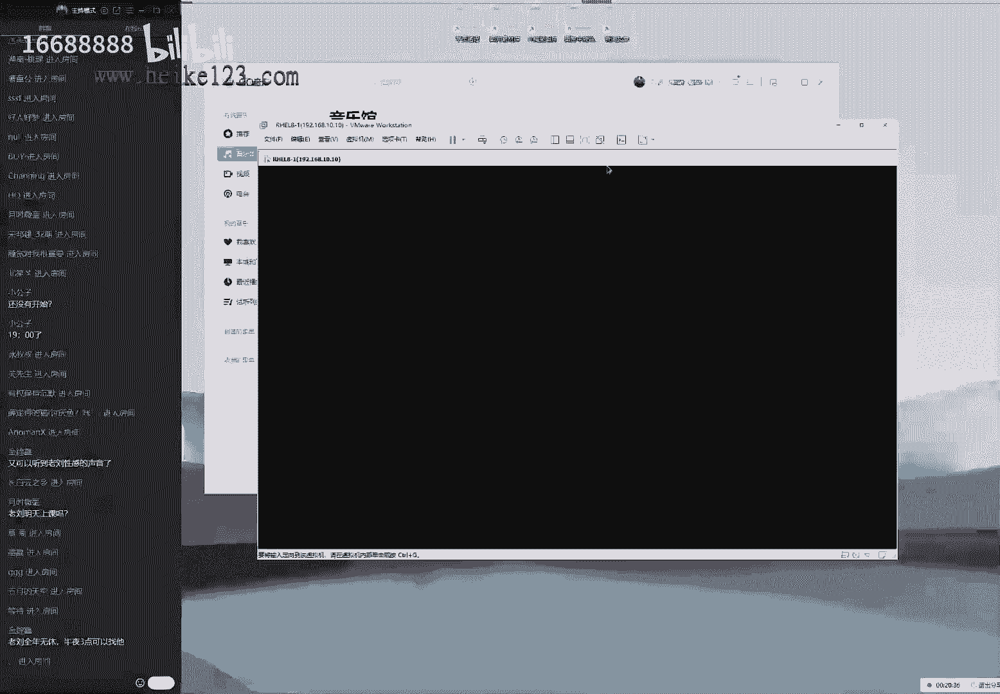

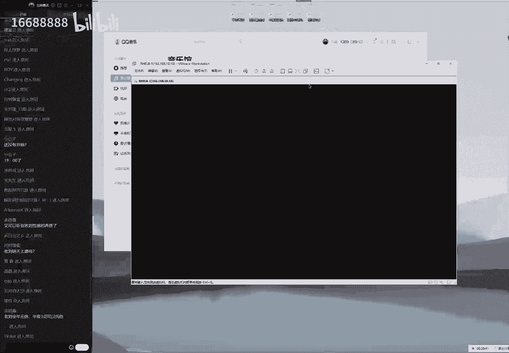

i give you anything close in the long term，stop to you know，i imagine nobody，can techwhen。

you're back in the heart of wasting my lo，看着人把梦，ok同学，那我们开始今天啊，咱们今天这个课程啊，就不等了。

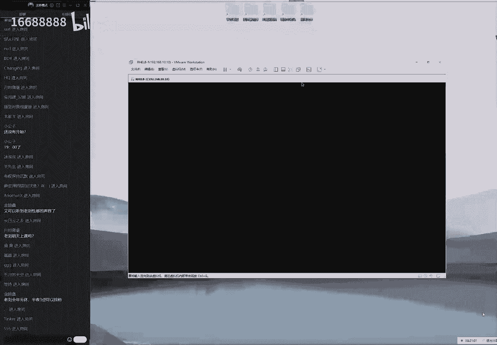

60位同学，还好，同学们先打一下一吧，然后我们来测试，咱咱们这边上课是上课这个环境啊。

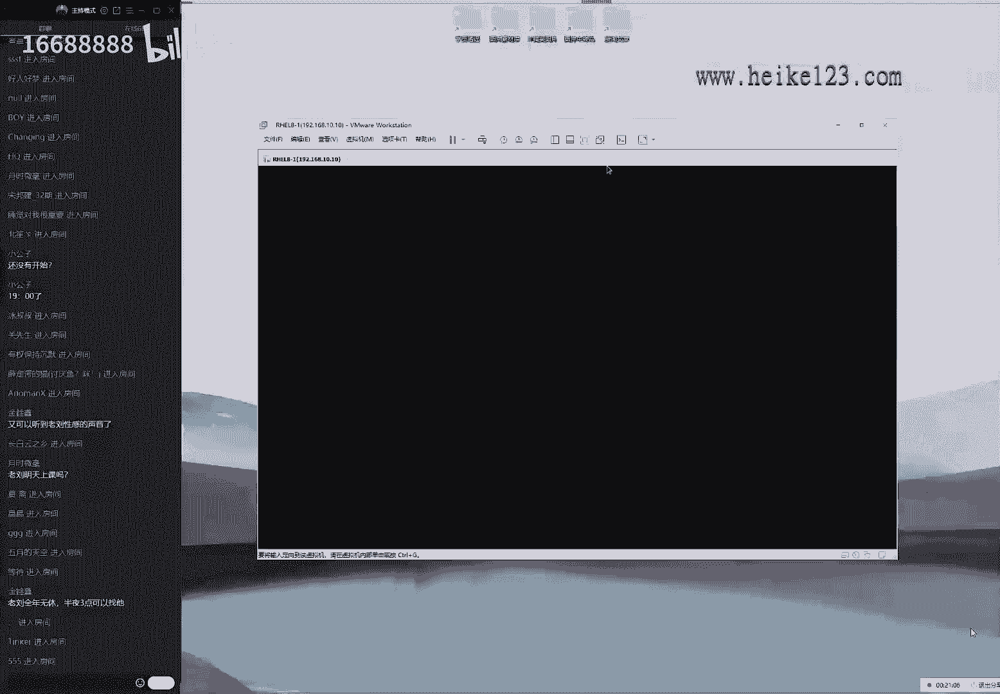

大家听一下我们说话声音有没有问题，然后是呃，那我们试一下声音是否这个能不能听清，然后画面的话是否清晰，ok没有问题，我们来开始我们今天这个课程啊，今天的话呢给大家算是抄着了。

哎咱们的话呢其实对于我们昨天这个课程，等于说进行一个扩展知识，那我们昨天给大家讲了四个方法。

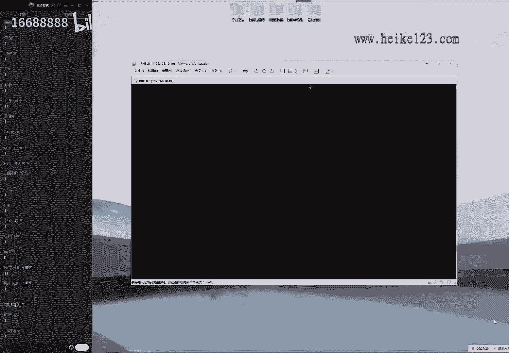

来配置一下网卡，然后以及我们和大家讲了，今天要讲到的这个第三种方法。

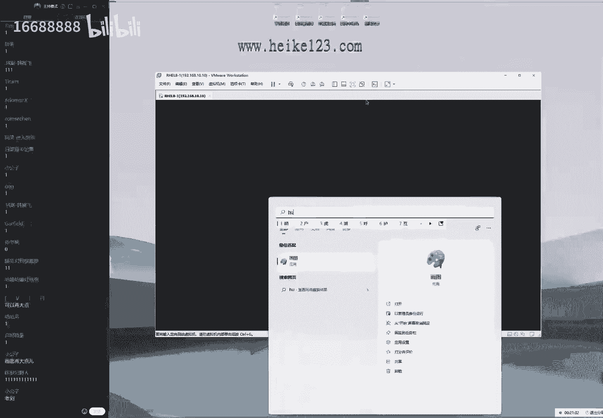

来配置我们的防火墙，那么我们今天的话呢就是要给大家讲一下，该怎么样基于图形化界面来配置防火墙，其实大家可能会有一个误解，就是为呃我们去使用我们的linux的时候，它的核心就是命令行跟它的内核。

其实这个没有问题，但是我们现在的话呢更多的也会那么呃，那么呃也会发现更多的这个软件的话，都已经支持了图形界面了，那么如果这么好用的工具，如果要是没有去使用的话，那么也非常可惜。

所以的话呢我们来给大家介绍就是这个算盘啊，这话也算是红包，若巴里面算是一个比较好的一款诶，这个图形化界面的一个工具，叫做firewall gun config，它就是基于图形化界面来配置。

防火墙的一个好工具，那么这个的话在我们考试的时候，跟在我们这个系统当中的话呢，都默认都没有安装，我们需要自行安装一下，那么它就涉及到了一个叫做ym，叫做软件仓库，我们之前给大家介绍过对吧。

大家还有印象叫做ym或者是叫做dnf软件仓库，这个话也就是说我们默认没有安装啊，叫软件仓库，我们也也就是说呃默认情况下没有安装，我们现在的话呢需要一些配置好软件仓库，进行安装过后才能够进来啊。

才能够进行一个使用啊，好怎么样的画面再大一点，画面已经很合适了，这个字大家能够看清的话就没有问题，这个是咱们这个讲的环境每天都是一样的啊，大家听到这个说话声音可以吗啊，同学们来喂喂喂。

大家听一下我说话声音是否清晰，有没有比昨天小啊，如果你要是有的话，那么可能是我的问题啊，可能是我的问题，那我们就来呃，甚至我们刚刚上课啊，还影响不大，我们及时去重启一下呃，小学有没有这个问题是吧。

那我们就ok了啊，可以再大点吗，大不了了，不也是这样的，我们今天我们的话这个实验的环境跟我们讲课，这个环境啊都是跟昨天一样的，如果要是再大点的话也可以，我以为我们因为我们这边小，有这边是一个小工具。

就叫这个名字，什么a p o，然后我们都已经安装好了，然后我们可以调大s h呃，这个嗯麦克风的声音，但是我这边去试过调完声音之后吧，会用电流的声音会特别的大，就是我这边大家听到。

我这边会有一个车的声音了吗，那就是我这边如果把声音调大了之后，我这边的一切声音都会被放大，然后这边我就离得比较近嘛，就会有比较嘈杂的声音了，所以大家如果要是听起来这个声音还好的话，或者说您尽量调。

大家记得这个音箱，尽量我这边的这个声音不要都没放大，我就好了好，那我们又说了好多废话啊，主要等一下这个人数啊，73了啊，不错不错，又上来了将近十位同学就真的不等了，那么如果说大家觉得这个上课环境的话。

声音有点小，你可以先调大一下自己的音箱，如果我们大多数同学都有这个问题的话，那我这边去重启一下，来，我们给大家来继续往后面继续说啊，就是说先来安装一下软件仓库，那我怎么来进行配置呢啊再给大家讲到。

他需要分三步走，第一步的话呢就是来去挂载，或者说我们实际上叫做链接也好啊，或者叫做设置光盘也好。

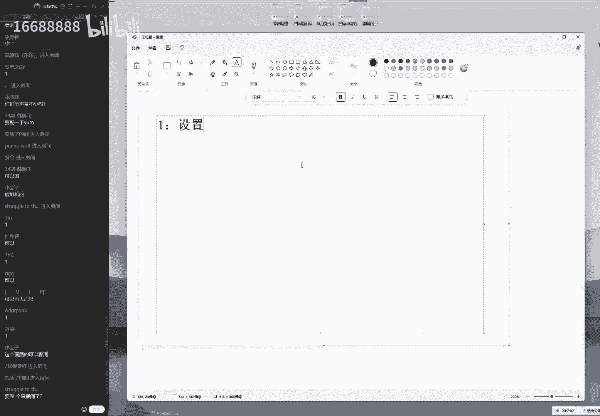

那我们来diy跟我一起操作，我们还想配置的出来软件仓库。

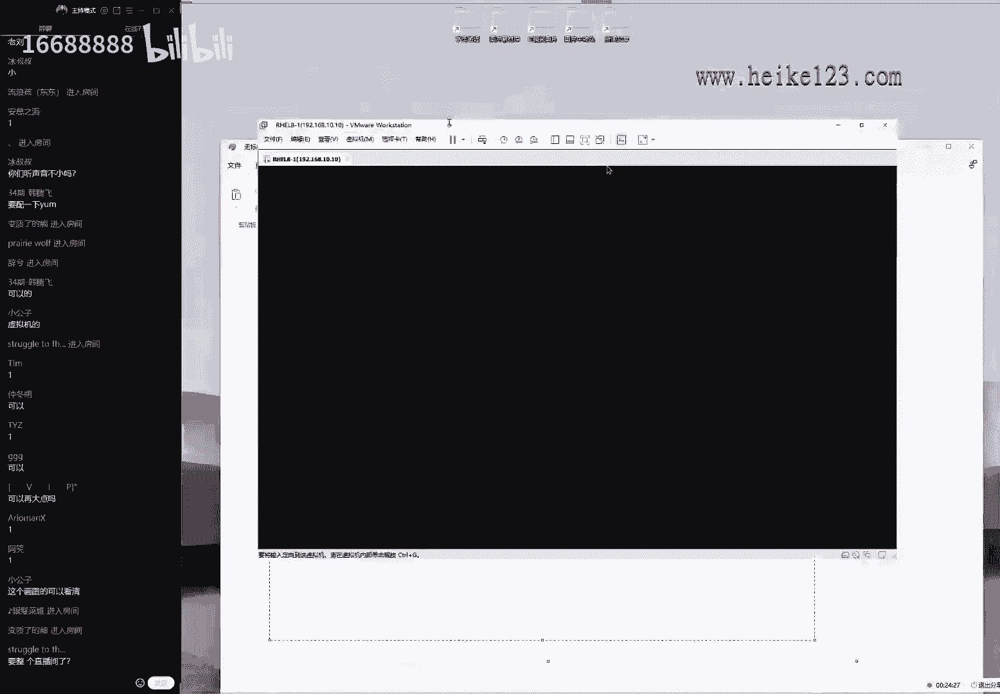

我们需要分三步走，第一步是设置光盘，这个方法指的就是我们需要点击对啊。

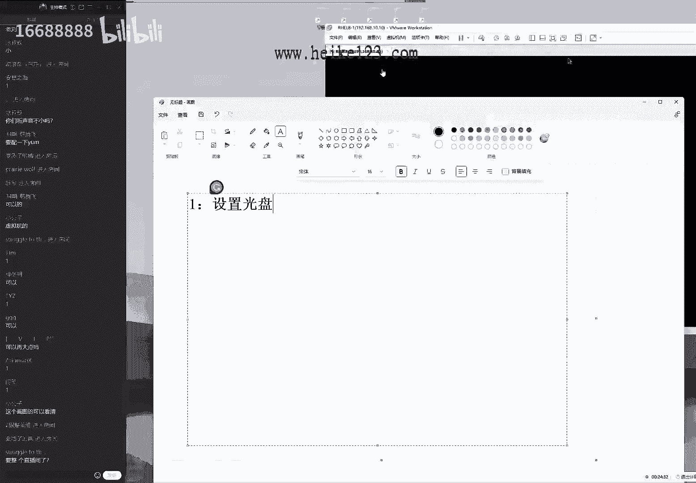

记得先还原一下虚拟机啊，避免是跟我们昨天那个实验产生的这个冲突啊，避免跟昨天这个产生的冲突来，我现在的话呢去呃还原一下虚拟机，然后的话大家问了一个问题，大家说啊画面可以看清是吧。

但是好像要整个直播间了啊。

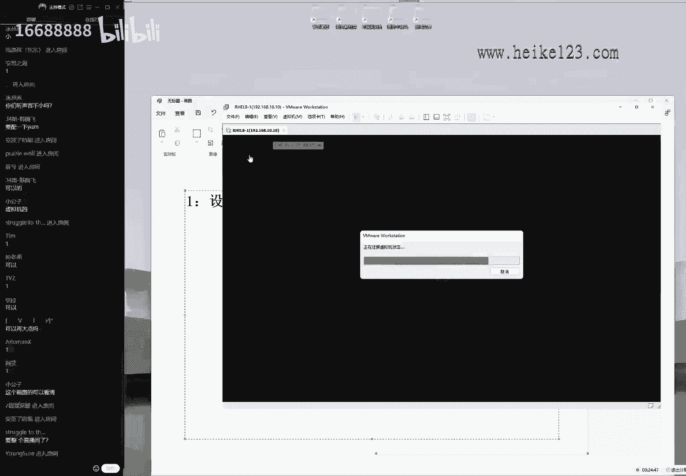

啥是啥意思，然后呢我们再来我们点一下这个虚拟机，欢迎过后点击一下虚拟机的设置选项，我们一定要确认一下啊，现在的话呢我们在cd跟dvd光盘选项当中的话呢，首先他的状态已经是连接状态。

并且的话呢这个应该去选中，我们现在好那个系统光盘，那我们可以从官网去下载，这个我们的这个软件仓库的光盘，就是我们安装系统的时候，那个光盘我们给大家备注一下，就是说我们安装系统啊，安装linux系统。

也就是在4月3号使用的那个光盘，就是我们现在要去配置软件仓库内光盘，然后大家理解一下，就是我们安装系统的时候，4月3号使用的那个镜像文件，那么它就是我们所对应的那个光盘文件了。

大家的话这个是没有一个其他文件的好，我们把它给选中一下，大小的话，大家可以来跟我保持一致就好了，八点版本，6。61个gb，很大嘛啊，6。61个gb，我们点一下这个权重，然后点一下确认，这是做的第一步。

需要先去设置一下我们的光盘。

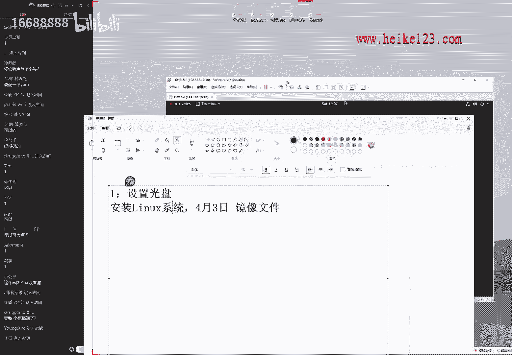

然后的话呢同时啊，您需要去新建一个我们的挂载目录，这也就是这个挂载点，因为第六章节我们讲到过第六章节，第三小节对吧，我们讲到过我们的挂载操作的话呢，它的本质实际上就是把我们的设备的文件。

与一个目录去做关联的这个动作，我们把它叫做一起来说叫做挂载操作对吧，那我们这样的目的是，让我们的用户能够通过目录去访问到，这个设备当中里面文件的资料啊，所以我们现cl再去新建哎，这个字有点小。

我啊那我们要给它稍微大一点，这样的话，那我们就可以先去新建出来一个挂载目录，然后的话呢哎咱们啊，他说我们这个目录已经存在了，因为我之前做过好，大家就不用管了，因为大家都没有做过，我现在把它给卸载掉。

然后的话呢我们再重新去创建一下，创建出来一个这样的一个目录，作为我们的挂载点，然后我们去使用当mt dv目录里边啊，那么光盘的话呢，根据我们的ud v服务第六章节，第二小节里面所学习过的公关文件的话。

它有两个名称，第一个叫sr 0，这我啊这个的话也可以，但是我们一般情况下比较好记啊，会叫dv目录里面的cd rom比较好记，为光盘的设备文件啊，为光盘的设备文件，另外给大家提一个小问题啊，提个小问题。

如果我们在红包热巴当中想要去安装一个软件，请问大家你们更喜欢去使用吗啊，叫做这个y u m还是去使用。

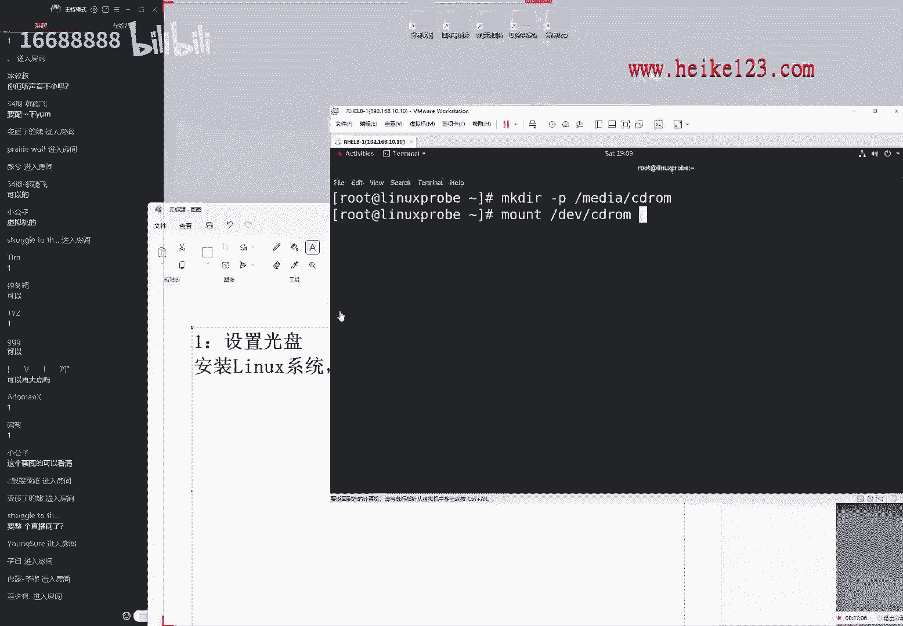

那dnf呢大家可以注意下调查啊，这个的话呢我们待会同学们，你们可以先说自己的感受，或者说您的一个习惯，然后我来做一下点评，我来说一下我的一个习惯问题，然后以及我认为哪个会更好一点，然后大家可以告诉我啊。

如果说已经配置好的同学，大家喜欢用什么呢，大家喜欢用m比较多一点是吧，然后我们来继续的，先大家可以去表达一下自己的看法，然后看看有没有其他同学跟自己志同道合。

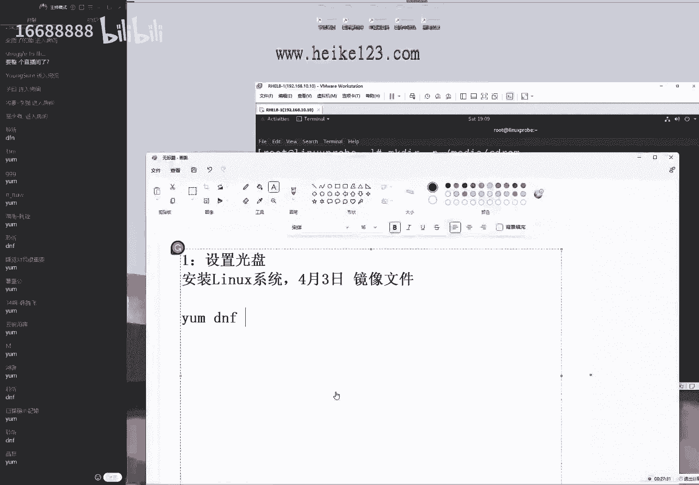

我们往后面先去讲着，慢慢再给大家聊啊，多点互动时间，这个啊我们的这个机会啊，这样的话同学们可以把自己的这个情况反馈，反馈，我们更好调整咱们这个课程吗，来我们做一下挂载啊，dv目录里面的cd rom。

然后我们挂载光盘的目录啊，我们的目录名称写好，按下回车，挂载点成功，这样做好之后的话呢，考试的时候一分没有啊，大家想一下，为什么就是我我们先做完了之后，考试的时候一分没有，这句话的主要的原因。

就是因为它配置之后是一个当前生效的，但是的话呢重启之后一起来说，是不是他要求一次性的对吧，他在下一次重启过后，它就没有了，那考试的时候他就重启他们，他他他是要先去重启之后判卷子，这个肯定是不可以的。

我们一定要去写入到这个文件里面，etc目录里面的f s t b文件设置啊，把这个啊设备信息起到里面过后，那么它就会保证下一次重启过后的话呢。

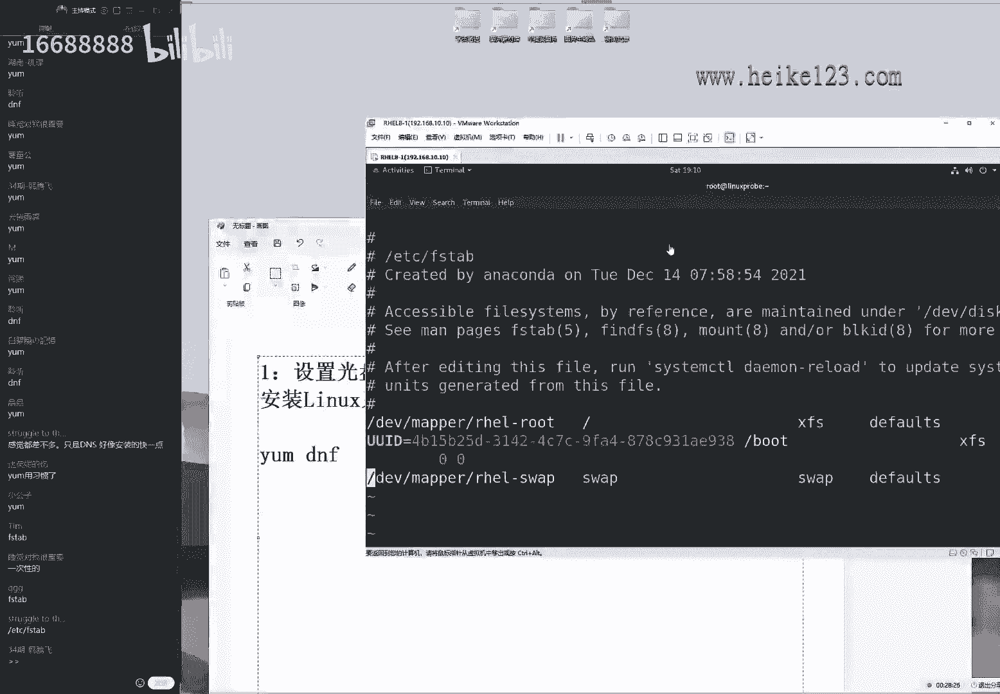

自动帮我们给它挂载上，这样的话才能够保证在考试的时候，能够判到成绩好，接下来我们写一下设备信息啊，首先是我们的光盘dv目录里面的cd ro，然后第二的话呢就是我们的挂载点。

我们的mdm目录里面的cd rom，既然是我们的光盘的格式，诶啊9660，这是我为我们的光盘格式，然后后面的话呢指的是权限，defts为默认权限，最后的话呢指的是零零，它是否要备份以及是否自动校验。

我们选择零零，这样做好之后保存并退出，我们不用担心直接去重启。

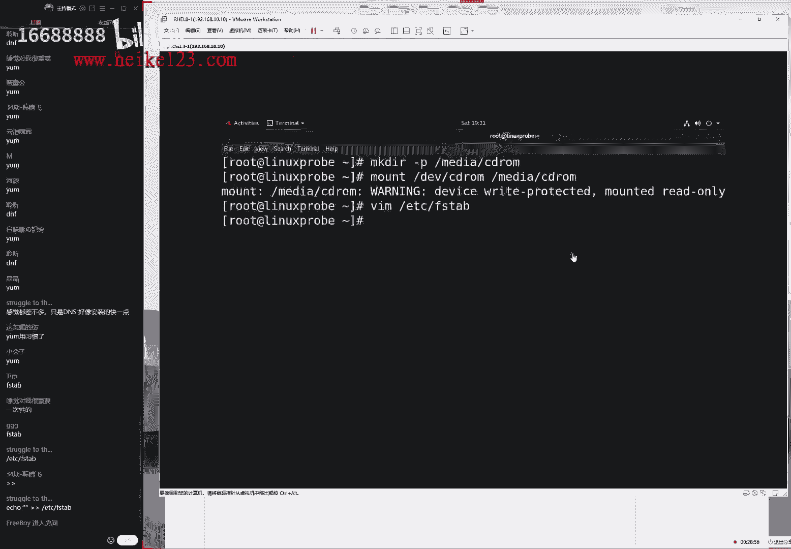

即便重启了，它也会依然挂载到我们的信当中，等待为用户提供服务，这是我们要做的第一步叫挂载光盘操作，但是同学们做到这里还有一个小插曲，就是我们这样做完就要考试的话呢，还是没有成绩的，大家想一想。

我们还有什么小小的问题需要去关注吗，然后第二点的话呢，就是来去修改我们的这个配置文件了，第二步来去配置我们的软件仓库的文件配置啊，软件仓库的文件配置仓库文件吧，好这是我们的第二步。

或者我们给大家写到配置文件，修改或者修改配置文件，我们怎么样去记忆都可以，这是我们的第二步，来先看一下，我们刚才给大家提一个小问题，同学们说去使用亚更多还是去使用df更多啊。

同学们大部分同学说到了是呃去求啊，我们同学们大部分同学没有选择dnf是吧，去选择ym，其实的话呢这个也可以的，那么这两个安装方法的话呢，它的命令的格式，我们给大家说到安装文件的话呢是一样的。

它都是去使用到ym，然后呢install后面写的软件包的名称，然后还有的话我们的dnf一的软件包的名称，这两个的话呢命令的格式是一样的，只是相互替代a加命令而已，待会儿的话呢我们可以去感受一下。

看看到底去使用到哪个方案会比较好，然后另外的话呢同学们问到说为什么没有成绩，对吧啊，因为的话呢这个考试的时候，它并不是通过软件的啊，它并不是通过我们的本地来去做挂载的，它是通过网络做挂载的。

所以我们的话考试的时候啊，这个操作可以省略掉啊，我们不用去做，所以他没有成绩啊，因为他不需要我们去做，考试的时候不用自己配置软件仓库，他会帮我们拍好了，我们只需要做第二步就可以了，先来检查一下。

当前的话呢，我们的软件仓库已经挂载到了，我们的对应的目录当中，接下来的话呢我们来说一下考试的时候，以及我们这个第二步怎么去做呢，就进入到我们的dnf的软件仓库的配置，文件当中来啊，我们进入到里面去。

然后的话来编辑一个文件，这个话默认是有文件的，我把它给删掉，当做没有发生过，因为这是我自己配过的，我把它给删干净了，这个里面的话呢默认就被清空掉了，没有任何的内容。

我现在来去编写这个文件的名称是无所谓的啊，然后的话呢我们的后缀必须是r e p o结尾，所以有看看谁迟到了没有啊，我看同学是这是谁发言呢啊，月食v豪同学是吧，那我叫做这个小豪吧，新建一个文件叫做小豪诶。

然后看到我们的后缀r a p o结尾，这样的话就是一个标准的软件仓库的一个配置，文件的一个格式来敲一下回车嗯，是这样的，它有一个格式，我先给大家写下来，它是这样的，首先是一个中括号。

后面的话呢是一个name，它指的是我们的呃名称，然后他也是一个叫做叫做这个诶，呃一些简单的介绍啊，描述信息，然后下面的话呢叫做basio啊，呃base，然后它指的是我们挂载的一个路径啊。

然后呢我们的一个网址下面的话叫做enabled，等于是是否来去启用它，最后是jpg check，等于是否去进行校验，还有就是说我们一个完整的一个最简单的软件，仓库的格式的话，就是由这四啊。

就是由这五条组成起来的哦，我那我们需要注意的就是，在红包的五和六里面的话，它只需要配置一条就可以了，不他的红包六七里面，他只是他他都是只需要配置一点就可以了，但是在567。

他是在567里面只要配置一个就可以了，但是在红毛弱八里面的话呢，他首先率先呢变成了两个，他需要配置两个，说一下原因的话呢，就是因为在红包热巴里面，大家会发现这个镜像大小变得特别的大，如果没有记错的话。

七版本的镜像应该是四点多个g对吧，4。7个g，然后的话呢我们看到红包热巴的话，它是6。61个gb了，也就是说它变得更大了，这个原他画这个原因，也是因为它里面所含的这个软件包的话呢，它也变得更多了。

比如说我们现在可以进入到我们的media目录，里面的cd rom去查看一下，它会有两个啊，它会有两个文件啊，它会有两个目录，我们给大家分别去看一下，首先是这个目录，还有一个是这个目录。

我们可以来去看一下，您可以看到这个目录的话呢，加啊啊，跟我们下面这个目录那大小都很大啊，它加起来的话将近就是六个多g了，这六个多g的话呢，主要就是我们的软件包了，我们可以看到首先统计一下我们呃。

比如说我们先这样啊，先去查看一下这个目录当中，我们有件包的一个个数来看一下，这是所有件包，我们可以通过这个呃管道服务，加上这个统计行数统计出来，我们这个软件包当中的话呢，总共涉及的软件包啊。

这个我们的呃里边的话呢，我们的文件夹当中，总共设计的软件包是1600多个，好我们再来看第二个软件包啊，再来我们再来看第二个目录，也就是说在我们这个红包热巴当中的话呢。

它有两个目录里面保存的是不同的软件包啊，然后我们看一下的话呢，这个是有4688个，我们加在一起的话，总共就是6659 50啊，多个软件包，那也就是说6000多个软件包，它放在一个里面的话，它太大了。

所以的话呢在红包热巴当中，它拆分成那他画拆分成了两个啊，这样的一个目录，所以我们再去挂载的时候，你也需要挂载两遍啊，这样的一个原因好，那也就是说我们先把这个简单的格式啊，我们先来复制一下五yy。

往下复制五行，既然的话呢在我们的命令模式下点一下p，然后我们来进行一个粘贴，这样的话那我们就有了一个基本的格式，往里面去填写就可以了，所以大家说这个中括号啊，这个中括号的话呢指的是唯一标识名称。

这个唯一标识名称的话呢，他是一个唯一的啊，123废话了啊，他是一个唯一标识，不能够跟别人产生冲突，所以我的话就干脆就以他这个目录名称来去做，代替就可以了，这是我们的目录名称，可以直接来复制一下。

确保它是一个唯一的一个值，然后大家说八跟七的区别，主要就是啊它是增加了吗，对它实际上是分成了两个目录来保存软件包了，这样的话来去找到这个文件的时候，可以开啊，他啊他啊稍微更加的快捷。

然后的话呢我们现在呃如果大家想，如果我们把一个目录里面，放入到6500个软件包，那我们再去查找和安装的时候也是特别的慢，而且的话实际上大家也能够发现到了，就是我们现在的话。

那这个手机里面的软件是越来越多了，那么如果说我们后续软件包会越来越多的话，那么就要进行一个不断的拆分，然后我们可能需要一个两个三个四个，这样的话呢，我们才可以更好的去管理这么多软件啊，那我们如果之前找。

那么随着我们软件的话越来越多，那所以我们需要不同的目录来去划分它的功能，来方便我们这个啊日后的这个查找，那我们这个名称的话呢，这个name指的是一个描述信息，他就也就是说可以一些简单介绍。

比如说呃这个的话呢是一个基本的软件包里，一个仓库巴拉巴拉这样的一个信息，我们可以这样去写，或者的话呢我们可以直接复制一下啊，我们的目录的名称，待会安装的时候，它就会显示出来。

我们这个是由哪个目录来为我们去呃，来自呃，它来进行一个确认的一个软件包的一个来源，然后下面的话呢指的是我们软件包仓库，的一个来源地址，这个的话呢也就是说软件仓啊，开软件仓库分为了三个来源。

第一个来源的话呢是由本地区来的，这个我们叫做file，第二的话呢是通过网站来的，第三的话呢是通过文件传输协议来的，那也就是说一个软件仓库，它的这个软件包的来源可以由三部分组织啊。

它可以是由三种这个啊途径来去获取的，第一的话呢是使用的是本地的方式，第二的话呢跟第三人指的是一个网络源，在我们考试的时候说，有考官为我们在我们的远程的一个网站当中，部署上这个软件仓库。

我们只需要来进行一个指向就可以了，那我们当前的话既然使用的是一个本地模式，那我们就是叫做fire，然后冒号双斜杠，它指的是由我们的本地的目录当中，去提供的软件包啊，这样的一个效果，大家应该还记得。

我们4月3号给大家讲过的，就是说那我们什么叫啊，那我们什么叫做软件仓库呢，软件仓库的效果，实际上它就是说之前我们通过源码编译的，这样的方法来去安装软件的话，特别的慢啊，特别的难。

它需要去解决这个编译环境，以及这个依赖关系的问题，大家还记得对吧，然后后来我们后面会把这个软件包的这个，源代码加上一套安装规则打包到一起，这个话呢我们叫做red hat baggage啊。

这样的话呢我们叫做rpm对吧，rpm这样的一个信息啊，这样的一种呃，这样的话呢呃一种我们的安装的方式吧，然后我们这个安装的规则，我们打包到一起这样的一个方式来进行一个呃。

呃来去降低软件安装难度这样的一个效果，他的话呢实践的方法就是，把我们软件包的这个源代码跟安装规则，打包在一起，它可以按照这个安装规则，自动的来去编译源代码这样的一个效果，但是我没有提。

但是我们刚才提到了，如果要是编译软件的话呢，它有两个难点，第一就是编译环境的问题，第二就是依赖关系的问题，那我们就像我们刚刚给大家讲到的，就是啊我们现在再去使用的qq啊，qq群视频啊，qq群啊这些功能。

还有收费的这些功能，它可能是不同的这样的一个软件包，那我们就要有一个很大的仓库，把这个不同软件包给他打包到一起，成为一个呃软件仓库，这样的话呢我们就可以当需要的时候，只需要去输入用户的啊。

那啊那我们只需要去说说，我们这个所对应的一个需求，就能够自动去安装了，大家应该还记得对吧，那好吧，也就是说现在的话呢，当前需要由自己本地去配置出来，这个软件仓库里边就应该是包含了。

有大量的软件包才可以去实现这样的效果，好，我们来去写一下这个目录的名称，这个目录的话呢，实际上它就是在我们的media目录当中，然后media目录当中的city room。

完事就趴那里边就写上这个名称就可以了，所以在我们给大家讲的这个原因，就是这个目录不能随便去写，这个目录，一定要对应的就是我们保存软件的时候，那个所对应的这么一个目录，然后我们给它合并到一起。

就变成了fia冒号三斜杠了，大家一定要记住，最后一个斜杠的话指的是我们的系统的根目录，因为它使用的是叫做啊绝对路径的形式来写的。

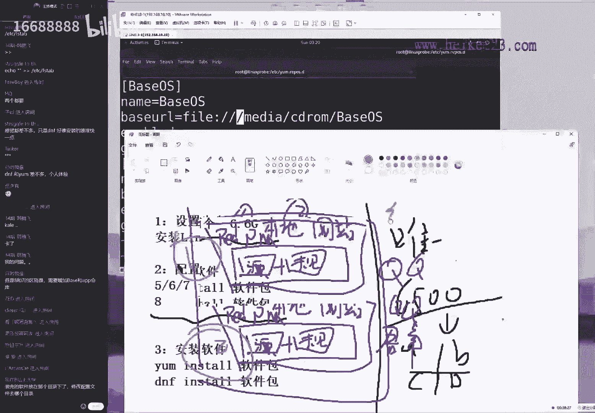

一个绝对路径的形式去写的，目录的一个啊这么一个啊目录的啊，这么啊目录的这么一个呃信息，然后的话呢我们一定要以这样的一个，目录的这样一个完整形式来去填写，那么这个最后一个斜杠的话，大家千万不要忘记。

因为我们去书的时候很顺手啊，别说啊，那啊那啊那我们那一我们一般我们去解说啊，我们都会这样一个习惯，就直接啊，就是比如说我一个双标啊，这样的话我们双斜杠直接就写后面的网址了。

所以您去写这个信息的时候一定要小心，这个是我们比较常犯的一点错误啊，这是我们常犯一点错误，好大家问了一个问题啊，说我在b站上大学啊，说我安装完软件之后放在哪个目录下了，修改配置文件去哪个目录啊。

这个话呢我们放到后面给大家去说，说到配置啊，那我们先后面给大家讲到服务的时候，再给大家继续说，先来第一步啊，不要着急，先把软件给它安上啊，按了之后再去配好，我们一步一步走啊，我们不能这个不啊。

我们不能把不呃迈大了啊，来我们来接下来说，是否来自启用这个软件仓库的话呢，我们选择的是一代表着启用，零代表是禁用的，然后呢，我们下面指的是，是否来在安装之前来进行校验呢，就是说主要为了防止。

如果说人家仓库的这个来源来自于网络的话，是否被黑客给篡改了对吧，是否是去修改了我们这个信息，那么好，那我们就可以去开启校验功能，但是的话呢，当前是由我们的本地的光盘去提供的，它不存在说被人篡改。

也不存在说光盘损坏这样的这个情况，所以我们干脆给他改个零，安装起来更快啊，他不用进行校验啊，下面的话呢我们再来啊，我们把这个信息的话呢，再去写一份第二个目录的话呢，名称我们给大家写下来啊。

啊stream叫做软件包流，实际上就是一种我们一些啊常用的软件包，的一个集合，然后同样的话把名称也给它复制一下，然后换了我们叫base u l o，我们本地的挂载光盘啊，然后换到冒号双啊。

然后我们是双斜杠建一个根目录啊，media目录里面的cd rom，然后我们敲一下啊，复制就好了，复来第三个啊，第二个目录，第三条参数写完是否启用，选择一是否选择专业，我们选择零，看到这里的话呢。

大家先去记一下，我们给大家一点时间去记忆，那么我们给大家去补充一下，就是现在的话呢使用的是两个，本地原来去做的这个软件仓库，那大家会有三个情况，第一个情况就是那我现在的话是有一个本地员。

然后另外一个也是本地员来组成的，这个软件仓库，但如果说我现在想要去输出一个需求，比如说我想安装一个网站啊，ym的dnf，然后安装一个网站服务，请问如果说这两个软件仓库当中，它都包含了某个软件包。

那我们该怎么样去安装呢，这有一个原则，就是如果说两个软件仓库它都是本地的，并且它里面都有的这个软件仓库啊，啊并且它里面都有这个软件包的话呢，那么则啊，根据我们这个唯一标识符的名称来进行排序。

比如说啊a就大于了b它的优先级是最高的，这是软件仓库通过本地安装的，这样的一个原则性问题，这是第一个情况，第二个情况呢，如果说我们现在是有一个本地语言，还有一个网络源，那么的话呢就会以这个本地源为准啊。

他会先以这个本地源，然后来进行安装，如果本地原里面没有了，那么则去找这个啊网络源里面这个信息啊，这是第二个，第三个的话就是说如果我们现在的话，它都是啊网络员现在有两个软件仓库，在考试的时候也是这样的。

他现在的话是通过我们的网站的方式去提供，那么如果里边都啊它都有这个软件包的话呢，则根据网速啊，那比如说这样的话，它它它是在非洲这个网站，它这个我们我我们的软件源，然后的话呢这个的话呢是在我们的北京。

比如说啊那好了，那么就会以这个网速，北京会大于这个非洲这样的一个啊，选择了这么一个呃方式，然后我们那我们来进行一个安装，另外的话大家也会常犯一个错误，这是我们给大家提到的第一点，我们关于软件啊。

那我们关于软件安装这个先后顺序的一个问题。

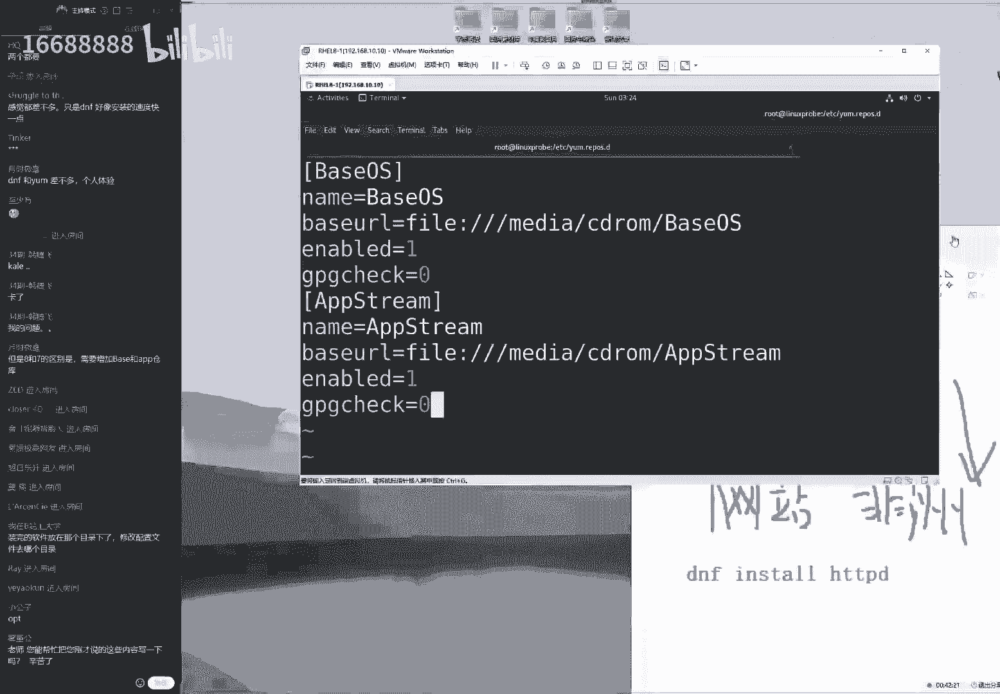

还有第二个问题啊，就是我们经安装的时候的话呢，呃不论大家去使用的哪个方式，是要么还是dnf无所谓，但是您安装的时候一定要切记，我们后面的话呢敲的是软件的包的名称，叫软件包名称，而不是服务的名称。

大家一定要记住这一点，因为我们在安装的时候会很混啊，会经常在混淆说什么软啊，叫做软件的名称，比如说我们安装网站的时候，现在有三个名称，大家可以去猜一猜，第一的话呢就是我们这个软件的名称。

第二的话呢是我们这个软件的一个服务名称，然后还还还有我们的，第三个是我们软件的一个协议名称啊，因为这是我们的网站的一个协议名称，大家猜一下我们安装软件的时候，我们应该使用是哪个方式呢。

我们应该使用的是哪一个，到底去哪啊，它哪个条目呢，其实大家也说出来了对吧，因为我们要去使用到第二个，因为这个是我们的服务名称以及软件包的名称，那我们下面那呃，呃这个的话呢是我们的这个公司啊。

或者说这个啊叫做叫做这个软件名称，它是不对的，这个要在软件包的名称才对，然后的话呢这个是新名称也不对，所以在我们安装的时候呃，您会长就会我们一开始会会经常出现，比如说我们去安装啊。

那我们去安装软件的时候，总会出现说名称敲错了，结果他找不到这样的一个呃可能性最大，所以我们一定要注意啊，安装的时候是软件包的一个名称，这是我们的第二步，第二步做完之后的话呢，第三步先给大家保存并退出。

然后第三步的话就来进行安装了啊，刚才我不小心把这个前两步给大家删掉了，但是并不重要啊，但是并不重要，我们先来给大家说一下第三步啊，换我们的我们的第三步就是来进行安装了。

刚刚那两个步骤我们来去使用到dnf来进行安装，后面写软件包的一个名称呃，这样直接做的话呢也可以，但是有一个更好的做法是，我们看其他小朋友们在做之前啊，一般情况下的话呢，可能还会再这样去做一下。

我们来去清空一下缓存，这个我不知道大家有没有见过啊，叫做清空一下缓存，我们啊不不不啊，cor啊，dnf clean or我们来给大家写下来，这话指的是清空一下缓存。

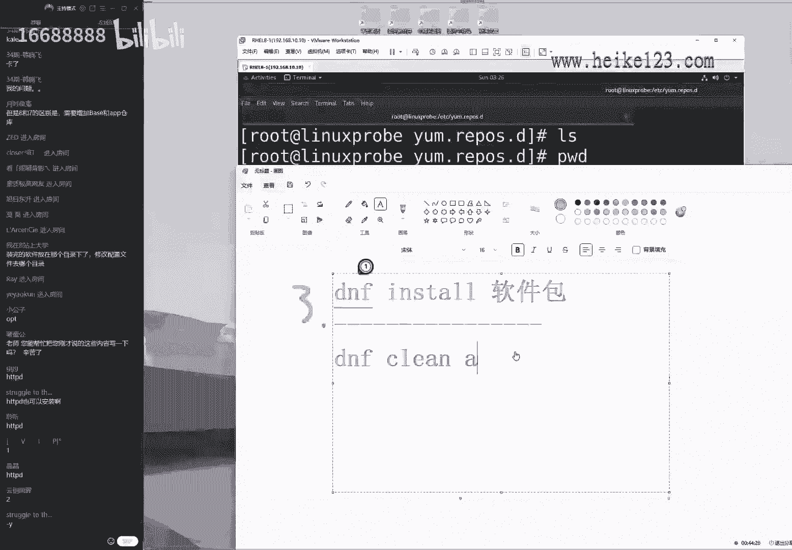

因为我好久没有用了，我也不太确认，所以我先去执行一下，好没有问题，看来老啊看啊，看来还记得很深刻啊，宝刀未老哎。

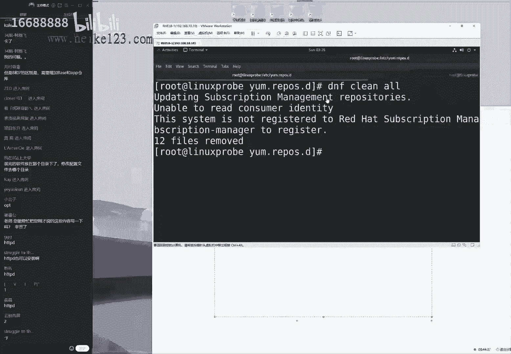

来看一下，首先第一条命令说清空一下缓存，我们这个话可以去选做不做都行啊，做的话呢没有什么好处啊，让我们啊反正就是清空一下缓存嘛，啊，然后我们如果说我们现在之前用过一个呃，这个仓库，然后先变更了。

然后信息的话呢没有通过过去，那我们可以去执行一下这样的一个效果，但是我们一般情况下不用啊，第二的话就是我们来去执行一下这个命令，叫做啊make kh，它指的是建立一下缓存，这个是有必要的。

因为就是说它会让我们下一次安装软，件的时候的话呢，速度更快一点啊，make a cake啊，他之前没有这个空格来，我把它敲，那我们现在给大家啊去跑一下缓存，这样我们做好缓存了之后。

下次再安装的时候就会快很多，所以啊所以昨天上课的时候没有骗大家对吧，我们讲这个我们讲这个8。3。2小节，至少也要40多分钟，我们不出意外的话，今天果然讲了半个多小时了，接下来继续来给大家去说啊。

七点半我们来继续来给大家说一下怎么安装，今天这个firework on config讲了半天，终于要上重头戏了啊，来大家怎么样说啊，吧啊辛苦把我刚才所说的写一下吗。

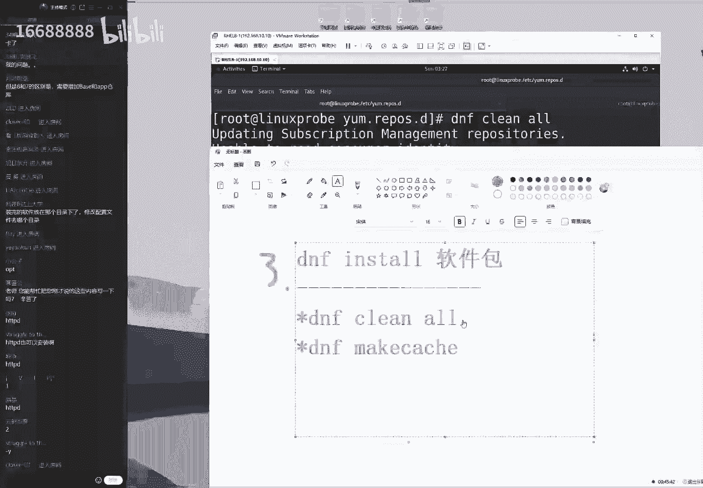

啊辛苦了啊，大家好，最好回去之后回去之后看一下视频吧，咱们要再重复一下刚才所写的那个，今天要讲什么东西了，既然课太慢了啊，大家如果今天没有跟上的话，没关系，你可以看一下录播视频。

然后我们再把今天这个笔记嘛，下课之后你慢慢再再去写一遍啊，我咱们两个小时的时间。

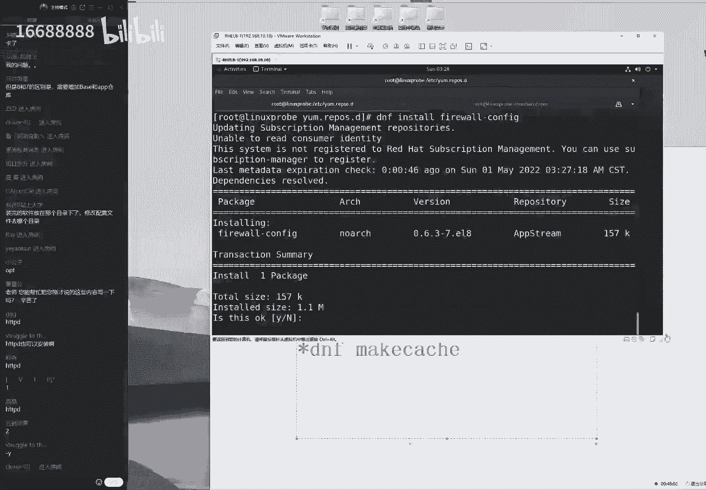

不可能说减一小时，再总结一小时，这样的有点太慢了哦，所以大家也提前要做好预习工作，我们对大家的负责态度，所以我们要把这个课程的难度和这个速度，提高上去啊，不能每节课那么的水好，下面我来去安装一下。

来安装包的名称，输入好了之后，大家看一下mini在这儿啊，mini在这儿我们还没有枪那个确认，然后我们安装的时候的话呢，他说我们软件包已经找到了，然后他说是否在进行确认，如果我们要进行确认安装的话。

您可以敲一下这个y来确认一下，然后敲一下回车，确认安装软件安装好了之后的话呢，我们可以用两个方法去打开它，第一个方法就是直接去选用叫firework on config，然后啊敲下mini的名称本身。

接下来狠狠的去敲一下回车，诶，你看他可以看到就打开一个突发界面了，特别的好使，另外一个方法的话就是啊图形化界面的工具，可以使用的图形化界面自己打开，我们可以点一下这个活动按钮。

然后点一下这个所有的这个程序里面的话呢。

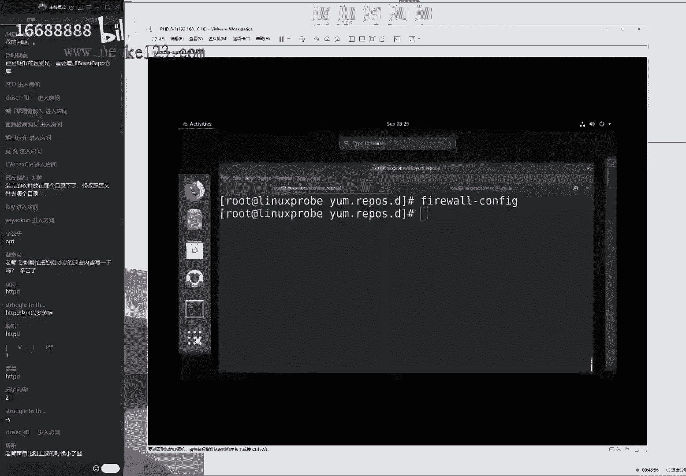

选中啊我们这个防火墙的图标。

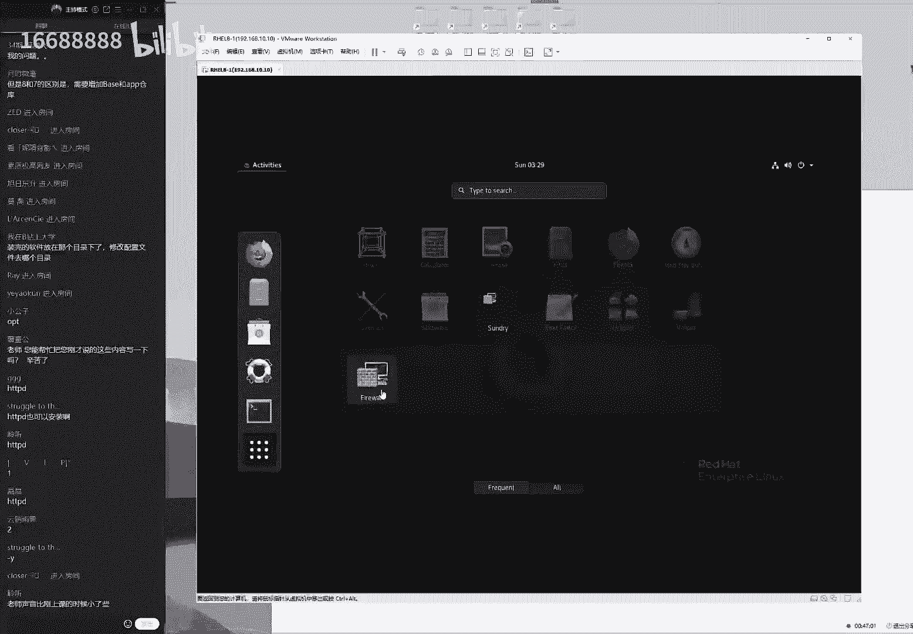

于是的话呢晚上一点出来了，哎这个也可以，这两个方法的话大家认准，总之啊不论什么方法吧，把我们这个工具给打开了，就说明我们一般安好了，已经能够打开了，然后我们现在可以看到的话。

就是这个界面没有什么可讲的了，首先就这么几个菜单，这个菜单的话呢这个按钮我们需要去确认一下，就是他的这个呃功能，就等同于的叫做杠杠reload，这样的一个重新加载的一个效果。

然后后来我们还有叫做这个剪辑模式啊，还有我们去切换我们的这个网卡，它所对应的一个区域，好，我们这个紧急模式等等等等的，还有下面的话呢，就是说我们设置的这个策略，是否有为永久生效的，或者说叫做当前生效表。

我们的话设置成永久生效的一个信息。

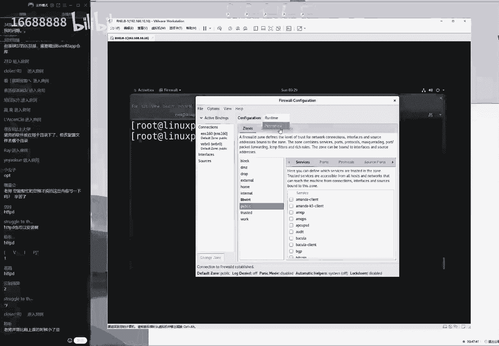

然后这样的话我们那我们把它拍好了，这个信息这位是跟我们啊表啊。

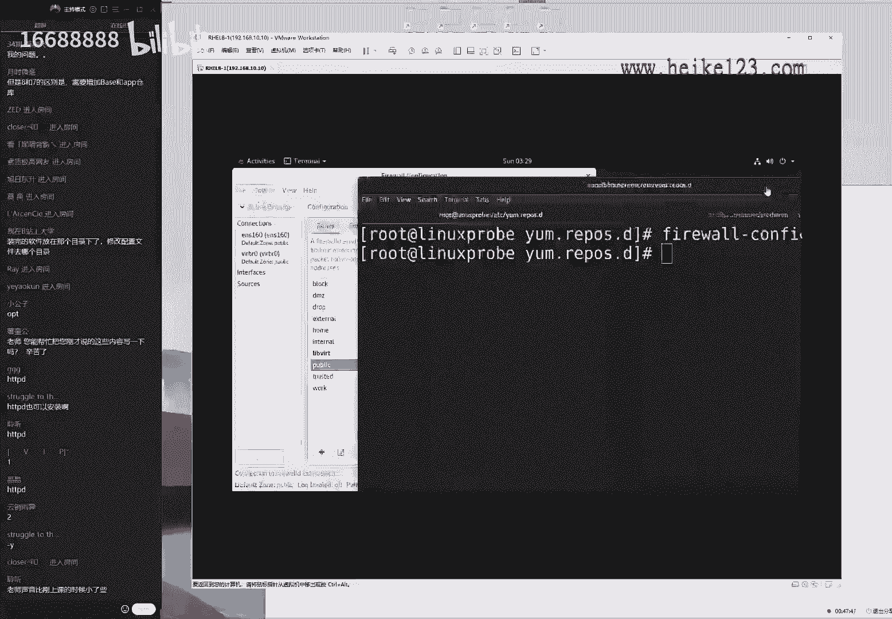

他们那么他就会永久双降下去，也没有问题呃，给大家去说两点啊，接下来说第一点，就是我们如果要想去开启一个这个任务，我们要想去开启一个服务，那么我们就可以直接把这个服务前面那个勾，给他勾选上。

那么则代表开启第二点的话呢，就是我们一定要去重新加载一下，才能够让我们当前生效里面的这个不。

它才能够让我们这个当前生价表里面，同步到我们啊设置过这个信息。

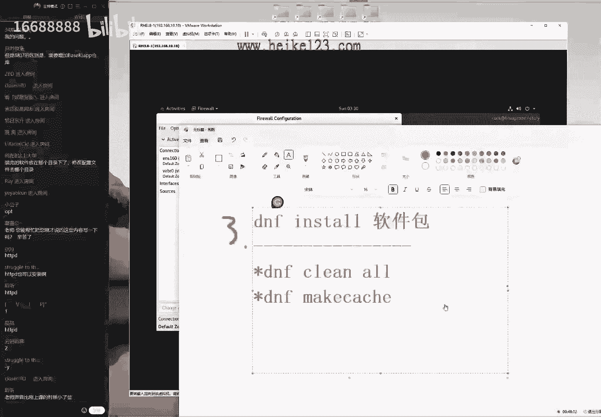

所以我们需要分两步，第一步先成永久生效模式，然后做我们的操作，做完了之后记得去点一下重新加载啊，这样的话让他能够立即生效一下，大话现在心中有一个顾虑啊，就是说说老师昨天讲了两个小时啊。

昨天七点钟折磨到九点多钟，你讲了这么长时间，讲了两个多小时啊，结果你都不用说去啊，敲命令了，直接就按下这个呃选项就可以了，直接去前面那个勾引一勾就可以了，但是我感觉不太靠谱对吧。

因为我们去前面那行的时候，感觉一切都尽在掌握当中，而这个呃而这个界面的话，底层逻辑我们也看不到它靠谱吗，实际上来说是靠谱的，我们来进行一个验证，来进行一个验证，怎么理解呢。

比如说我们现在看一个服务叫做dns啊，看到他这个前面他没有被选中吧，那他没有这个前面的勾对吧，好我们现在这样，我在我的右边开一个开一个终端，我现在去使用到我们的命令来去开启一下的啊。

firework on c md，然后是permanent永久生效表啊，接下来再来添加一个服务，我们的服务名称，我们的s h不啊，这个啊我们的域名解析服务，大家看一下，当我敲下回车那一瞬间。

这个dns的选项就会被选中了，敲一下回车看到了吗，大家可以很清晰的看到这边多了一个勾，所以大家打消心里的顾虑，说老师这个呃他跟他是完全一样的，或者说他编辑的这个信息，跟我们这个命令行配置起来是一啊。

他啊这个信息是一样的吗，或者这个信息是否会实时同步啊，不会有这样的顾虑了，是一模一样的啊，或者我们可以反向去查询一下，现在的话来进行设置的时候，它是一个实时生效。

并且的话呢能够立即能够看到这样的一个效果，而我们也可以这样子，比如说我们现在换了dns服务，在永久生效表里面，它是一个被启用的一个状态，它是被允许的，当我们把那个勾给他勾掉之后，马上再去看。

就会发现yes变no了，也就是说这两个这个命令和工具嘛，它配置的都是同一个防火墙的测试集，我们只需要去选择一个您更喜欢的即可啊，那么只需要去选择一个您最喜欢的就可以了，那这个没有。

那么这个没有什么可说的，就是说您可以把自己需要的，那我们去点一下前面的勾给它勾，选上这个东西，我很难再给大家讲出来什么呢，因为它就很简单嘛，就是我们看需要什么，然后点一下什么的，呃先给大家再转一转。

可能就更多的就是呃在考试当中一些小技巧吧，如果考试当中要求我们去开启一个端口。

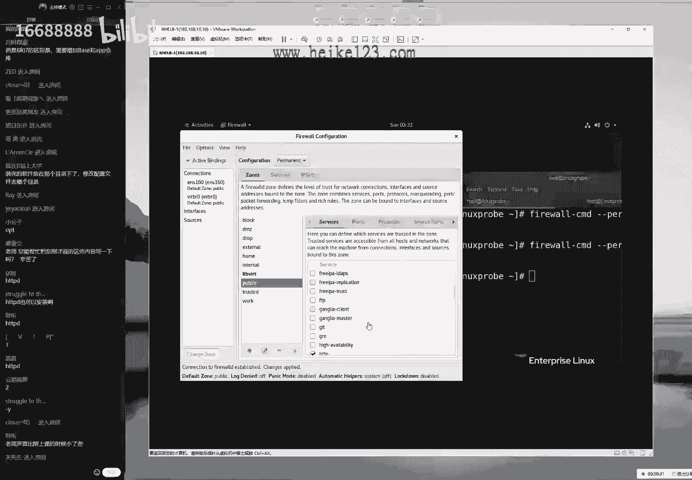

号为12345的一个协议六，虽然没有啊，虽然啊这个啊我们虽然没有啊，如呃如果考试当中邀请我们去开启一个协议啊，他不那我们来做一个放行呃，说放行一个，这个端口号为12345的一个协议。

那么我们不知道它是什么了，怎么办呢，呃有三个方法。

第一个方法就是我我呢啊，我们去点击一下这个service，然后您去找一下，到底1234对应的是哪个服务啊，如果说这个文件我们不想去看的话呢，或者说这样去找不方便的话呢，你也可以去直接看service。

然后我们去查看一下啊，这不然后我们去过滤一下12345，它所对应的一个协议，然后你就可以找到了，这是第一种方法，第二种方法的话呢，就是您可以直接啊我们去选择一下端口，点一下添加，然后说啊。

然后啊啊然后我们去输入12345，也就是说对于这个流量的方形，我们可以进，那我们可以啊，既输入端口号，也可以去输入新的名称，它都是可以的，所以的话呢这两个啊，那我们只需要输入一个就可以了。

这是第二个方法，那我可以去输入端口号的方法来进行放行，其实还有一个方法就是红帽考试的话呢，r gc它是一个非常简单的一个考试啊，尤其是上午的h3 c，如果说真的出现这样的题，这个题目了啊。

让你去放心一个端口号，只要在没有拒绝的这个情况下，您都可以把它勾选上啊，大家看，我现在这个操作就是一个非常骚的操作啊，如果要求我们去放弃一个协议好了，我们不知道这个协议对应的是哪个服务名称，无所谓了。

把大家都记住啊，把所有的服务全都给勾选上，没有问题的，因为红包考试的话呢是一个只看结果，不看过程的考试啊，那也就是说只要我们构图当中，它包含了他所要求的这样的一个信息条目，就符合题意。

而只是说我们其他多开的这样的，一个条目的话呢，跟考试无关，并不会扣分好吧，后面考试一个踩点给分了，只要符合题意，这个差啊，这个我们这个答案只要能够做得出来啊，只是说我们用什么样的方法做出来了。

他并不关心，所以大家在2012年的2015年之间是啊，那我们去考到红包reo 6的时候，实际上是一道这个填空题的，大家应该有这呃呃不，我们如果要是你考的比较早的话呢，应该也是赶上了2015年的时候。

我们还考过说一下，有一个考到我们的数据库mysql了，然后的话来让我们去，然后他给出一个用户的一个名称，然后他给出一个数据库来，然后让我们去搜索，这个用户在这个数据库里面的电话号码。

然后我们现在勾完了呃，那么一下啊，全部做放行，然后我们点一下重新加载这道题目就拿分了。

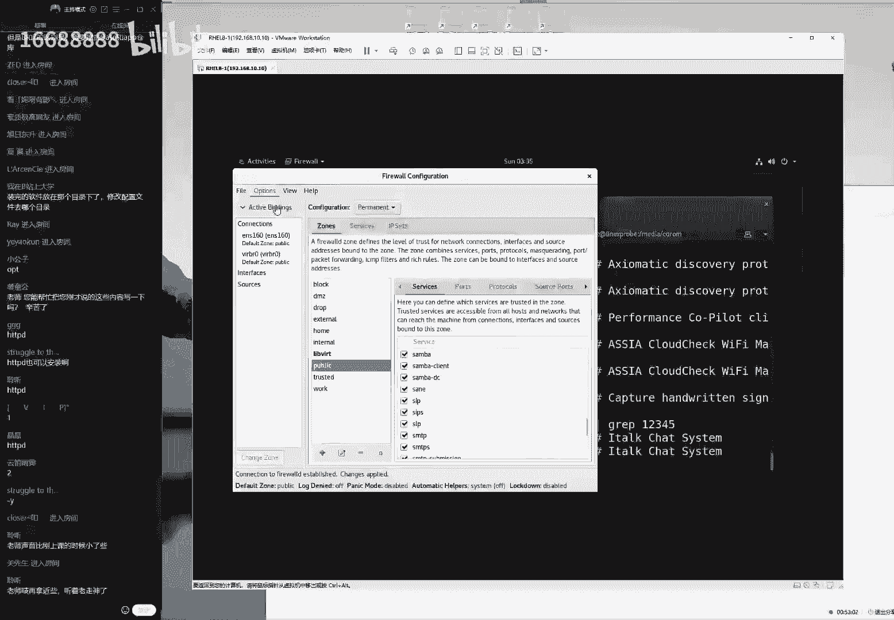

当时的话2015年之前有一道题目，就是说有一个用户，比如说叫爸爸啊这么一个人呀，这样一个姓名，还又给了一个数据库的文件，说让我们去搜索一下，说这个啊用户在这个数据库文件里面，它所对应的一个电话号码。

当时的话呢我们怎么去教呢，不啊其他的这个机构怎么教呢，就是直接给他电话号码，就就啊啊那么就可以了，就是啊我们就直接去输入号码，比如说因为他这个题目嘛就那么两三个选项，第一个的话呢叫做bob。

第二个呢它是叫做roni，巴拉巴拉好，就那么三个用户啊，还有一个叫做小红啊，那啊小啊呃呃呃小红这么一个信息，他们三个人对应的啊，他们三个人对应的这个电话号码，然后的话呢就会有考研辅导机构。

提前帮我们都给他找出来，然后咱们考试的时候就像连连看一样啊，出现什么样的一个姓名，然后对应什么样的一个答案，然后做填空老人，所以这也是啊，画这个也是我们从2015年开始，是有这么一个共识，他只看结果。

不看过程，只要我们能够做得出来，不做你生啊，不论你用什么方法得到的这个啊，最后我们的答案就都说分了，这个啊没有任何问题好。

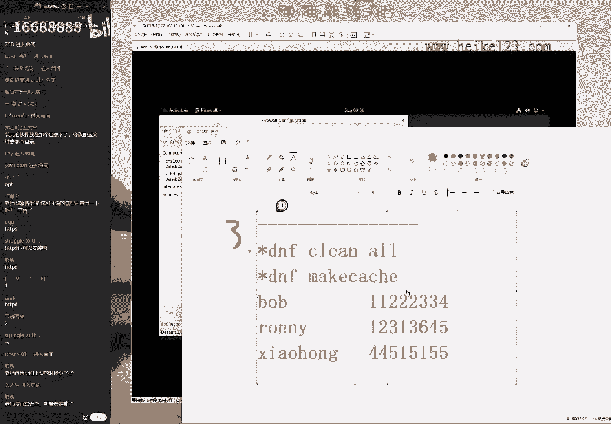

这是我们一些小插曲啊，然后下面继续来给大家给大家说好，下面继续来给大家再再去说啊，怎么样，大家说啊，老师的麦再拿近一点啊，就听着都老走神了，我这个麦都已经快差，已经差不多放我嘴里了，确实特别近了。

现在距离差不多也就有个5cm啊，确实已经很近了，然后前后学友听到这个声音的问题吗，我看好像同学叫聆听是吧，但是好像听的不是很清楚，好像说了很多次，这个声音的问题是不是个例，还是说下同学也有这个问题啊。

江西有这个问题吗，是这个声音的问题，我先喝杯，我先倒杯水啊，好ok啊，稍等一下，哎呀我回来了，我回来了，没有问题啊，这个真的我们好我们好，这个没有任何问题，我现在这个麦克风就有我的嘴。

如果没有这个罩挡着，有一个防现，有一个防尘罩啊，大概间隔了35cm，就差就真的差点就放嘴里了，因为我这个嗓子吧，一开始还好，只要剪了一个半小时之后，我自己都有啊，这样的感觉就会感觉到有气无力了。

所以我这边一直扔离得比较近，那当然同学们如果听见有问题的话，那我再给他调高一点啊，这个这个再调高一点，这样的话呢，我们声音能够直接送到大家的耳朵里面，更好好，大家应该觉得好一点吧。

我现在要把它调的稍微高了一点点啊，啊正对着我的嘴了啊，这个来继续了啊，来接下来说，那我们第二个就是开启一个端口号，这个的话也是翻过一些问题。

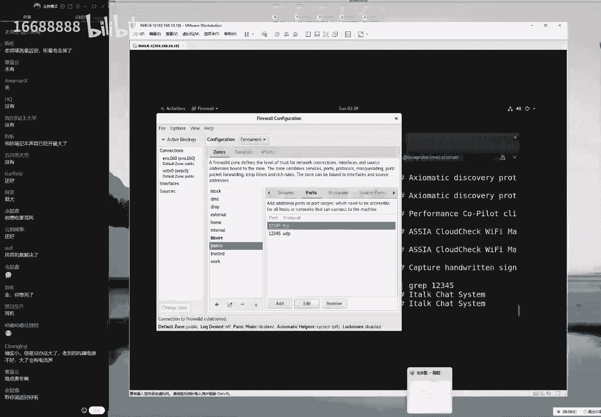

这个也是翻过一些问题，时间的话呢是2015年到2020年之间啊，在考红包热器当中是有这么一道题目的，说放心一个协议，后来的话这道题目特别简单说啊，当时因为在红包啊。

因为在2015年2020年8月1号之前啊，这个啊2020年8月1号之间的话呢，考试的时候是有图形界面的，然后当时的话呢让我们放下一个端口号，我当时的话呢我记得啊，如果没有记错的话。

好像是啊8866这么一个端口号，让我们去做一下，放行一个规则啊，还是8866啊，反正就这么好啊，那我们反正就是类似于这样的一个端口号吧，当时的话呢我们同学们做完了之后呃，当时我们这样做完了之后。

考试的时候没有成绩，就是我们这道题目的话呢，使用这个工具做完了之后没有成绩，后来的话呢总结了一下什么原因呢，考试的题目里面估一下坑，他只说去放弃一个端口号，但是他并没有说是tcp协议还是一个月。

还那么还是啊他是什么协议，所以我们这两个协议的话呢。

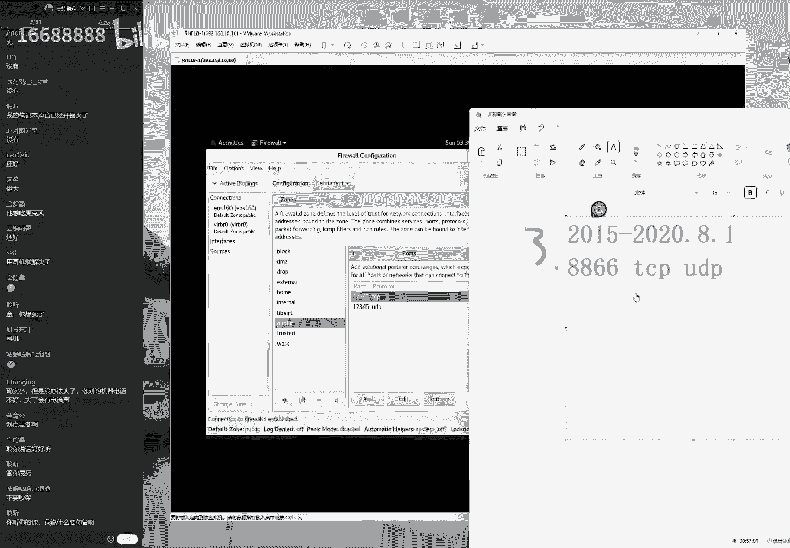

我们默认情况下，只要大要求我们去做方形两个协议，tcp udp全都开一下，比如说8866啊，他说开启一个端口号，8866好，可以啊，啊选项t啊啊去选中tcp再来啊，u d p两个都给他开一下。

同学们记下来啊，在考试的时候要求的时候，如果只要求端口号，没有说协议，就是你要会心一笑啊，这个他啊他要给我们翻坏呢，这是一个小坑啊，这个的话呢我们就给大家标注上啊，没有问题，好。

下面的话呢我们再来我们选择一下这个协议呃，协议的话，那我们就是说如果要想去放松一句话什么协议，那我们就可以来进行一个选择选择，比如说呃我们去放进一个什么协议嘛，然后我们可以往里面去写。

就是我们可以去选择一个协议的一个整体，然后我们再来进行放行，比如说放行所有的tcp协议啊，但是我们选择一下移除吧，那因为这句话我们当年还是用不到的，我们来继续，接下的话我们叫做source啊。

就是我们来设置一个我们的端口，一个转发啊，不我们跳了一下，就是说我们可以设置一个呃地址段，这样的话呢我们方便以后进行调用，这样的话我们再往前是用不到的，下面的话呢叫做伪装技术。

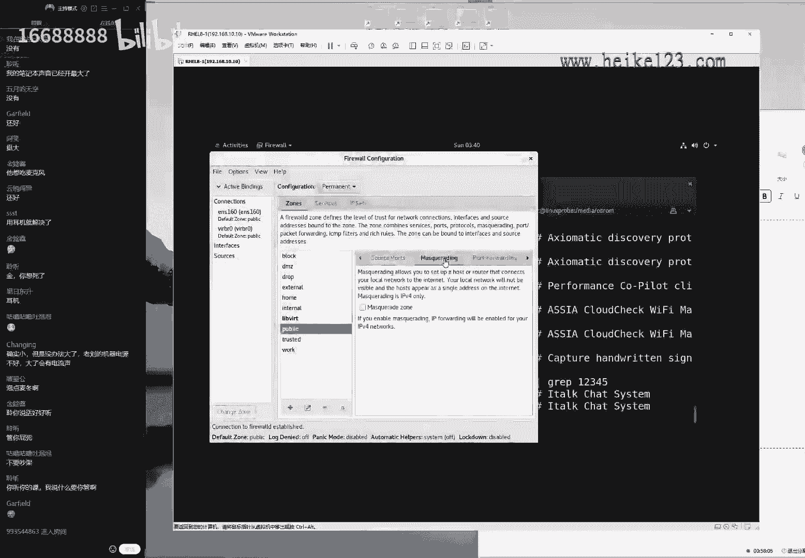

这个伪装技术的话呢，实际上叫做原地址转换协议，叫做原地址转换协议啊，s a t技术做原地转向协议，我们看一下它里面只有一个选项，原地啊，原地址转换协议，它的话呢里面实际上它就是只有一个选项。

它只有一个开启的一个功能叫做伪装。

它可以让我们的多个用户，可以通过单一的设备来继续上网，比如呢我们比如说现在有一个公司的网关啊，然后的话呢它上面去做了一个伪装技术，s n a t技术，那好了，我们公司内网的话呢，我这个其实大家很好理解。

比如说我们现在这个家里面我有很多个设备，比如说我先玩手机啊，ipad呀，电视也先也要上网对吧，还有巴拉巴拉，还有电脑这样的设备问题，我现在有四个设备了，比如说那好了，我现在有我这有一个路由器。

请问我办了一个联通的网络，它给我分几个公网的ip地址呢，好大家问一个问题啊，大家问一个问题，就是我现在办了一个联通的宽带，我现在的话呢家里有四个设备，请问我的呃的路由器，能够分配到几个外网的地址呢。

其实大家说就是只有一个对吧啊，大家怎么样在说啥啊，老刘电脑的电源不太好啊，会有声音对吧，好，我们来继续来看一下这个啊，这些都是小问题啊，来看一下大家回答的话，就是呃它会分一个对吧，如果一个都不给的话。

他肯定不可以了，也就是说我们先办一个网络啊，他只能给我们一个外网地址啊，它只会有一个外网地址，但是大家有没有想过一个问题，我们在这个外网上面的话呢，就是它都要通过我们的外网地址，来去传输信息的。

那我们如果只有一个外网地址的话，那我们怎么做到的这个手机啊，电脑啊，电视啊，怎么一起去上网呢，他就是在我们这个路由器之间，我们去做了i s a t技术，然后它它能够。

但是这个有点啊偏向于网络知识的节奏啊，我们简单去理解吧，就是它会在我们这个发送数据包之间，然后的话呢在这个路由器上面去做拆包，然后把我们这个啊发送的来源地址，改成我们的分配到外网地址的一个圆。

然后我们就给它发送到它具体的这个网站当中，然后的话当这个网站进行一个回应的时候，发送到我们这个呃路由器上面，它会再进行一个拆包，它会把我们这个目标的这么一个信息的话。

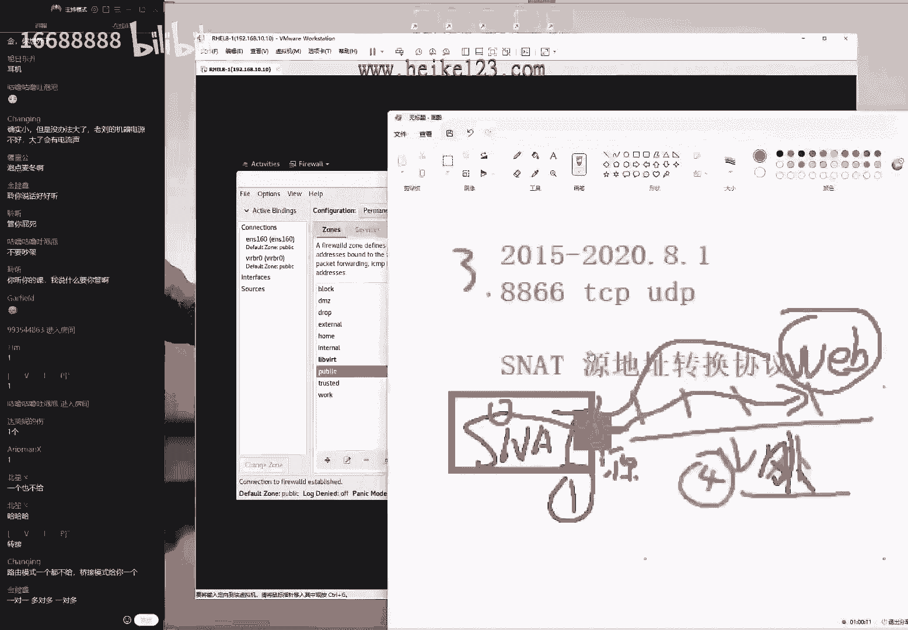

改成我们内网的一个地址，然后这样的一个功能，这个的话我们会在后面给大家去讲，到这个话我们不用去勾就好了，因为这个没什么可讲的，还有这么一个功能，只要把e选中，他就算开启了这个。

其实载货比红毛667的时候要low了很多，不过它比红毛666的时候。

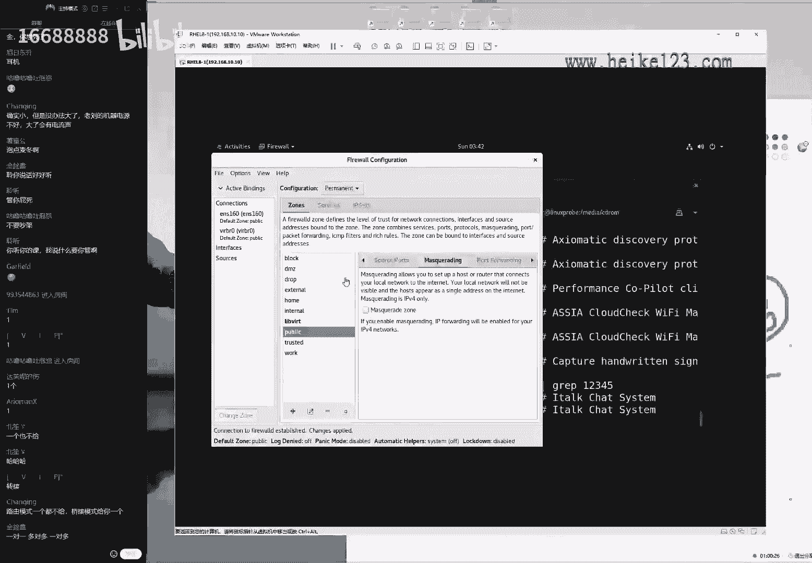

他要是差了很多，因为在红包roll 6的时候，实际上他是怎么讲。

它的功能是很丰富的，我们可以去设置一下，它的出口的ip地址和出口的网卡，但是的话呢，当前热巴当中反而不让我们去设置的，我感觉这是对于呃有一些比较喜欢折腾的同学，这是一种很大的摧残。

反正因为当时我们在红毛热巴当中。

因为我们一个网卡啊，呃这个话因为我们我们的呃那一台服务器上面，它可能很可能会有很多个网卡，那我们可以设置一下我们的出口的来源呀。

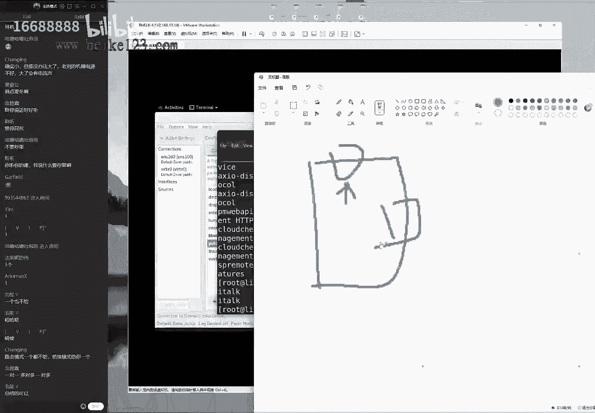

和我们出口的一个网卡啊，但是他今天设置不了了，这个话呢我们后面给大家做实验的时候，给大家来进行一个演示，下面的话有一个端口号的一个转发，这个好像似曾相识，这不就是我们昨天啊来去吐槽的那个吗。

都那我们可以把这个端口号八八转，这个流量转换到22上面去，做我们的远程连接，这个实际上也同样的，比如说现在给大家演示一下，因为我们主要打消大家心里的一个顾虑，就是我到底我敲这个按钮。

敲出来的效果跟我去敲命令行是否一样呢，来我先去连接一下啊，s h然后这样来远程连接的协议要求啊，这个地址啊，一九二点一六八点10：10，端口号的话呢还是888啊，然后大声说一句什么啊，我们的口号。

我们的咒语走你啊，看一下，首先它链接是失败的，当前链接失败，因为没有做多少号转发啊，这个我们的门外的张大爷，还不帮我们去把情书给小美嗯，然后我们现在的话需要再配置一下，把这个888啊，本地的地址不本啊。

那我们转发的端口号的原地址888做一下，本地转发到本机的22端口号上面点一下，ok所以大家感觉到就是老师，我我就我感觉昨天好像都白学了啊，昨天我们学了那么大长串三四行的命令行。

结果只需要这么几个鼠标点击，就可以去操作完成呃，但是我要给大家解说到的就是打好了金属了，我们连我们连命令行都会了，那么再去按钮的话呢，就会更简单了，而且就我而且我们就知道这个按钮。

同学们现在大家也知道了，这个按钮它底层它对啊，它对应的什么功能，是不是我们就会心一笑哦，你这个意思就是啊刚刚reload是一样的效果，所以随机行命令行之后啊，走遍天下都不怕，这两个都是没有问题的。

来就可以登录了，端口号888能够帮我们去做转发，没有问题，很顺利，下面的话呢还有一个叫做拼的这个i s n p语，这个协议可以去它啊，可以来具体的去开启哪一条，这个我们先用不到它。

就是啊如果说我们现在需要在服务器，服务服务器之间做一些什么心跳测试啊，或者我们保证出这个拼音的时候，我们去允许具体哪一条类型，那我这时候我可以去勾一下，当前不需要啊，它主要是跟我们这个设备相关的。

还有我们这个负规则，不规则指的是复杂的规则，我们可以对一个流量进行精准的，流量的一个控制啊，我们来添加一下吧，呃模拟一下我们昨天那个实力啊，我们来模拟一下，昨天有我们那个实例来我们的i p v4 级别。

然后换了我们的这个元素啊，这个元素里面非常的详细，就是说我们可以记告诉他我那我们的协议名称，我们的话呢，我那么我们也可以告诉他我们的端口号的名称，这个都可以的，所以这两个信息只要我们知道哪啊。

知道哪一个啊，就那么那么就告诉他哪一个也无所谓的啊，刚才卡了一下bug啊，刚才他这个弹窗没有弹出来，我们再重重新开启一遍来，那我们这个元素比如说是s h可可呀，可以呀，s h啊，那我们支不支持呢。

当然支持了对吧，我们来s h，我们来点一下确认啊，然后的话呢我们来点一下这个动作，他动作是有四个吗，就是说我们到底是吧做放行还是拒绝，还是记录一下信息呢，我们来选择一下拒绝啊，直接拒绝。

那我们的来源地低啊，那我们来啊来源地址，如果说它是来自于192。16，8。十点这个网段的话，那我们则对它来进行一个限制，然后最后的话呢叫做反选。

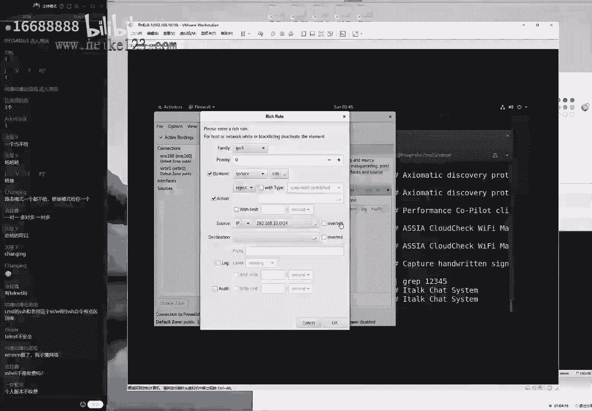

那也就是说呃等同于就是说我们定义一个范围，我们默认情况下是限制这个范围里面的主机，但是如果我们加一个invert的话，指的就是呃反选，就是指的是除了这个网段以外的其他主机，做这个限制。

就像我们跟一个女生去表白啊，然后他说呃除了你以外，其他的人都可以对吧，就是我们作为一个反选，除了我啊，他并不喜欢，其他都喜欢，这同样的效果等于说作为一个反选啊。

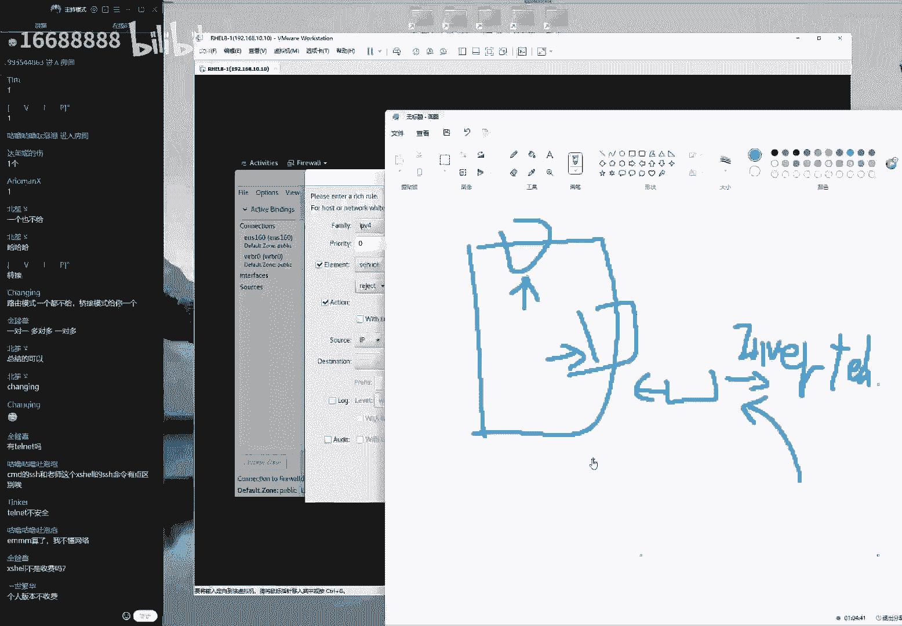

这个例子有点扎心，但是同学们一下就能明白了什么叫反选啊，就除了你以外啊，除了我们呃限定的这个主机范围以内，其他的作用都属于叫做啊，反转范围里面的，这段话指的是我们本地的一个地址。

因为它也就又又提到了又提到了一点。

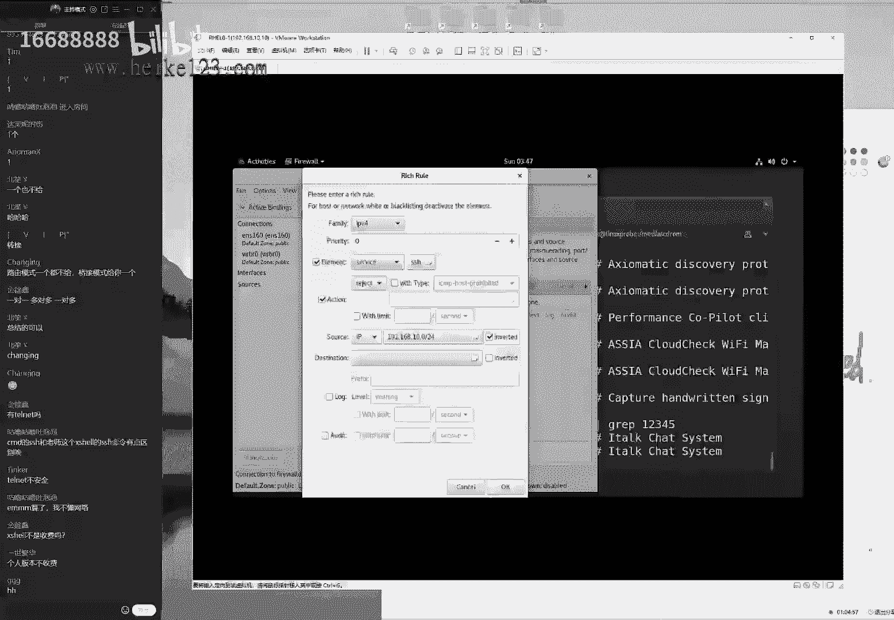

那又提到一点，一个服务器上面肯定又会有很多好网卡，那好了，这个网卡它不能被访问，这个网卡的话，它可以被访问这个网卡的话呢，他不知道啊。

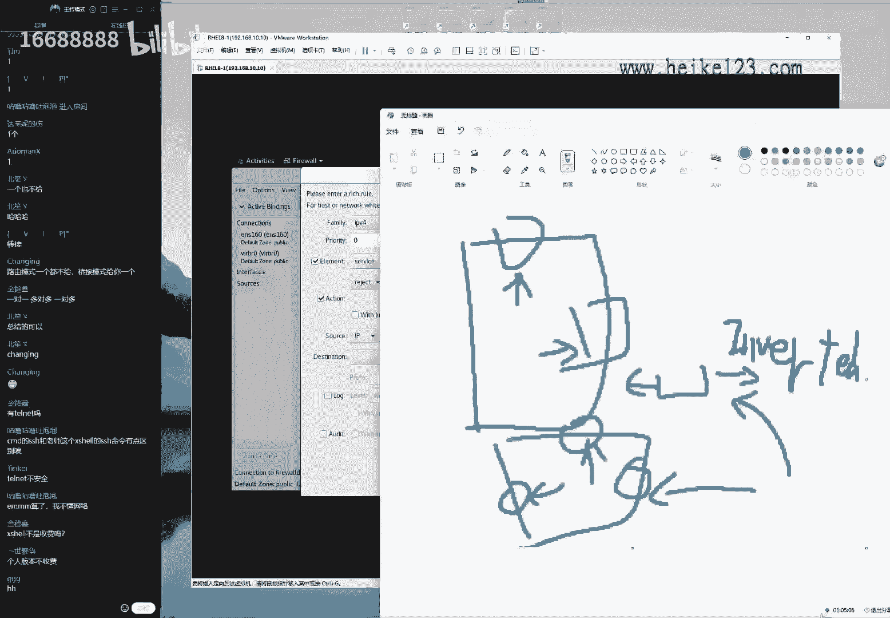

那也就是说我们可以去设置一下，说我们只有去访问我，我啊他只有去访问我，我们某个网卡的时候才有限制，那么我们现在不用去设置，因为现在只有一个网卡，它我们就使用是一个默认的一个信息。

然后说质保来记录一下日志呢，日志的级别啊，那我们有很多我们会在我看看是不是金钱啊，是不是今天啊，如果不是今天，就是明天我们会给大家讲一下，如何在对于这个记录出来的这个信息，来去做一下索引。

好像今天没有好好，那就比较可惜啊，要等那就等明天吧，记录一下信息，然后我们来方便一说，以后来进行查看，我们可以再设置一下这个级别，点一下确认，那好了，我们这个上节课做那个福规则，就算给大家做完了啊。

我好像写错了，我刚才点一下反转了，把它给勾掉好，我们可以看到当前就设置了一个禁止规则，禁止说十点的这个主机，去防我们的本机的s h这个协议，再来重新加载一下，刚才我们是能够访问对吧，大家可以为我们作证。

于是我再来去访问一下，会发现已经连接失败了，不再被允许了，这就是我们的使用负规则的一个方式啊，它可以进行这个流量的精准的这样的一个限制，大家说我们去使用到这个x shell是不是收费的啊。

这个工具的话呢，我们待会儿给大家解说道吧，他的话呢是免费的，只不过因为在百度嘛，然后会跟一些厂商合作了，所以的话他在他的首页上面，推广的那个是一个收费版，本，是一个中国特供版，就只有说就是它是收费的。

在国外的话呢，包括美国它都是家用跟学校都是免费的，只不过在中国他都一视同仁了，都收费了而已，待会我们给大家讲到下一个协议的时候。

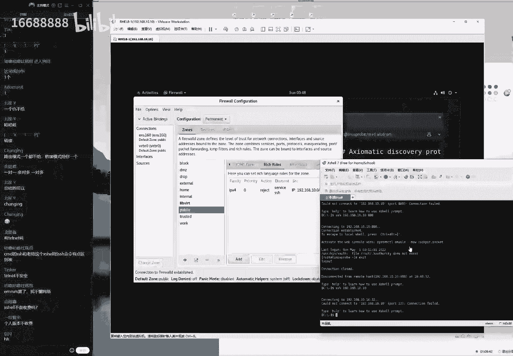

和大家说一下怎么去下载这个工具的啊，不用着急，下面的话呢我们的interface啊，我们也算是吃到特供的同学对吧，那我们也算使用到特控软件了啊，只不过这个特供的话就需要加引号啊，是收费的，来我们不着急。

待会给大家说一下怎么去下载啊，或者我们今天下课之后，如果说您下载的是一个收费版本，从百度上去下载到的，那么您可以待会提醒我，我把这个免费版我们不行，刷到我们的群里面吧，来下面一个问题啊。

下面一个就是叫做interface。

还是那个问题，这个服务器上面有多个网卡，那好了，不同的网卡是不是应该对应不同的规则，那当然是了对吧，对外的网卡就要更加严苛，对于队内的网卡的话就要更加宽泛，就像我们在家里的防盗门和木门一样对吧。

我们家里也不能说，然后都是防盗门，那这样的话比较的啊冰冷了，所以的话呢我们可以在不同的网卡上面，保存着不同的区域吗，区域里面叫做zoom。

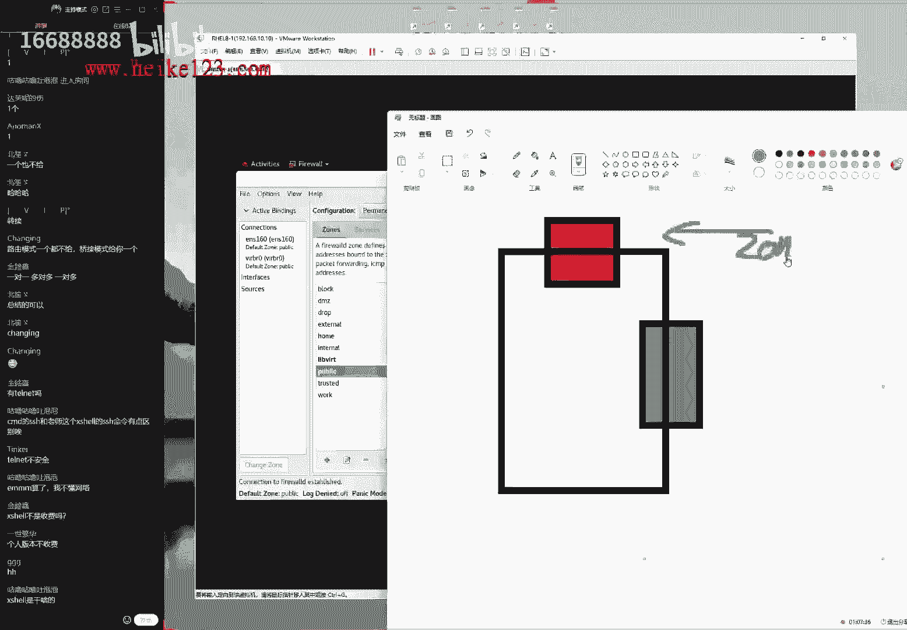

绑架成不同的功能和这个测试集当然可以啊，但怎么绑呢，很简单，我们点一下添加，然后输入一下网卡名称e n o，唉对吧，我看我看一下红包热巴里面啊，ino 1616截了，不好意思，忘了这个讲话1年了。

突然间又忘了in s160 吧，我记得是in s160 吗，啊大家说去使用到c r t不香吗，看这个的话，看看大家的这个习惯，反正我还比较喜欢用到x shell，我也觉得挺香的，我也挺欢喜啊。

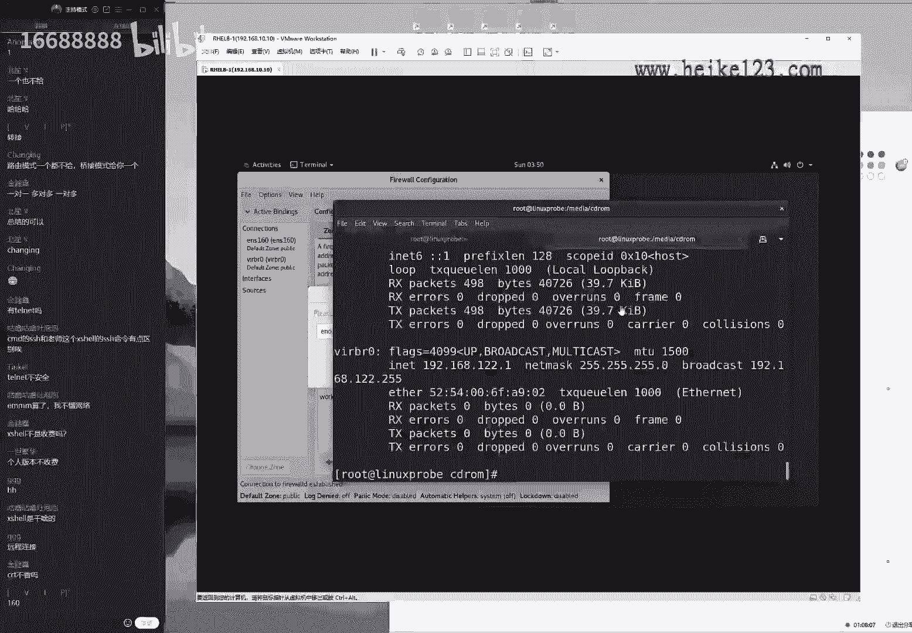

因为这个啊他很多种工具嘛，比如说party呀，他也他也有一些优势嘛，来in n s160 这个连接工具嘛，它有很多种，反正我比较喜欢使用超shell或者使用那个party，我比较喜欢。

还有一个工具是一个叫做s h那个工具。

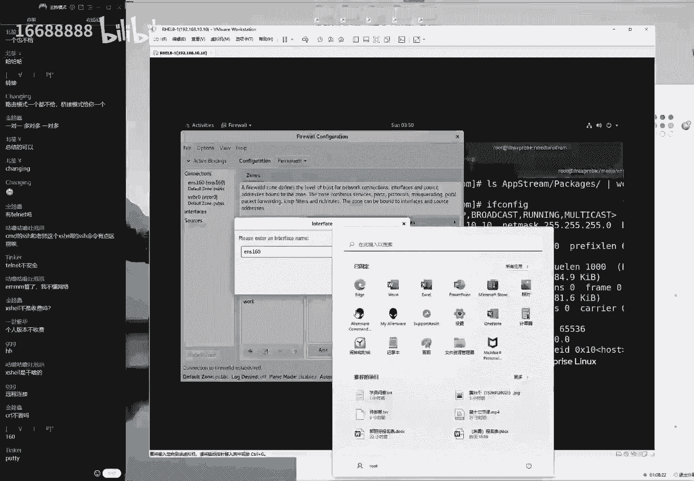

待会儿给大家演示一下吧，点一下ok啊，点一下它各有好处嘛，然后我们也要做绑定了。

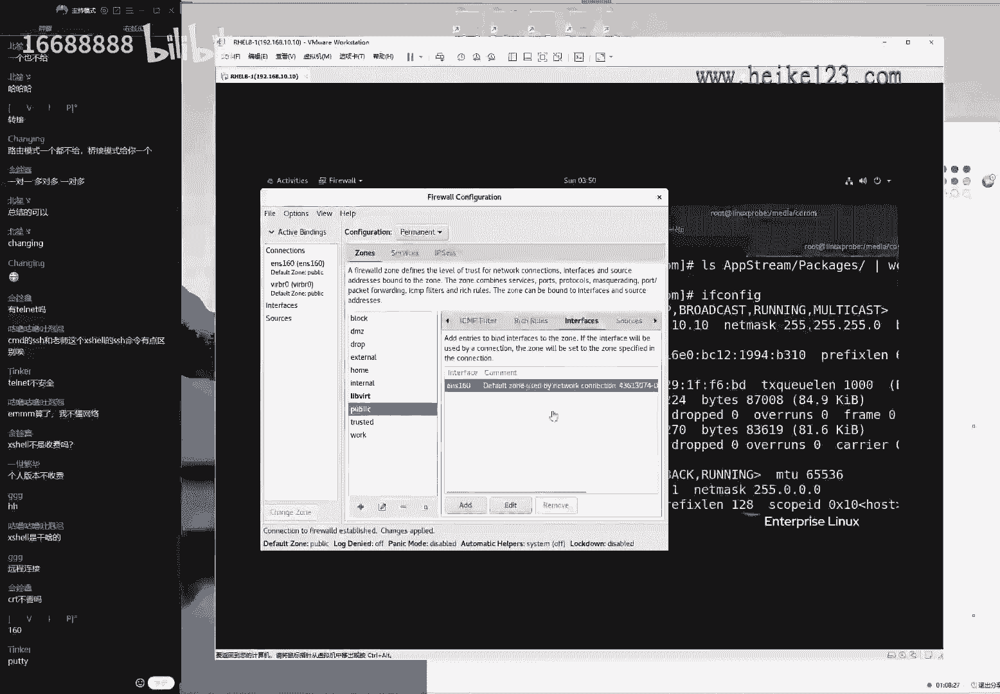

比如说这个网卡对应的是这个区域，然后的话呢，我们另外一个网卡可以绑定成另外一个区域。

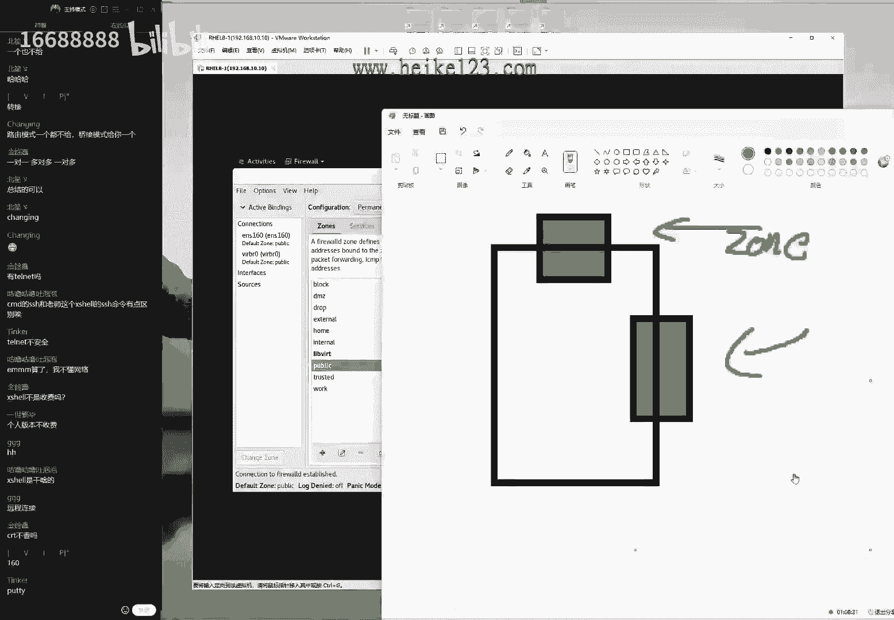

这就是不同的网卡绑定成不同的区域，实现出来不同的权限的这样的一个控制啊，来做一下限制，然后下面的话呢就是说定义一个来源，这样的话呢我们可以方便一说，以后再进行调用，这个倒无所谓了。

我们现在可以去手动去进行输入不，我们现在也不用进行绑定，下面的话就是说这个里面定义了所有的这个，服务的名称，以及它所对应的端口号，如果说我们现在有一个协议的话，这个协议的名称叫做哈哈。

然后呢它的这个呃端口号的话呢，比如说等一下怎么没了啊哈哈，这个协议的话呢，比如说对应的端口号是我先去写了啊，886688啊，就比如我们这边去写一个点一下啊，ok啊。

于是就把这个端口号跟他这个协议作为绑定了，就这样的一个效果，不过的话我感觉意义并不大，因为我们大多数情况下，他这个网卡不它这个新名称跟端口号的话呢。

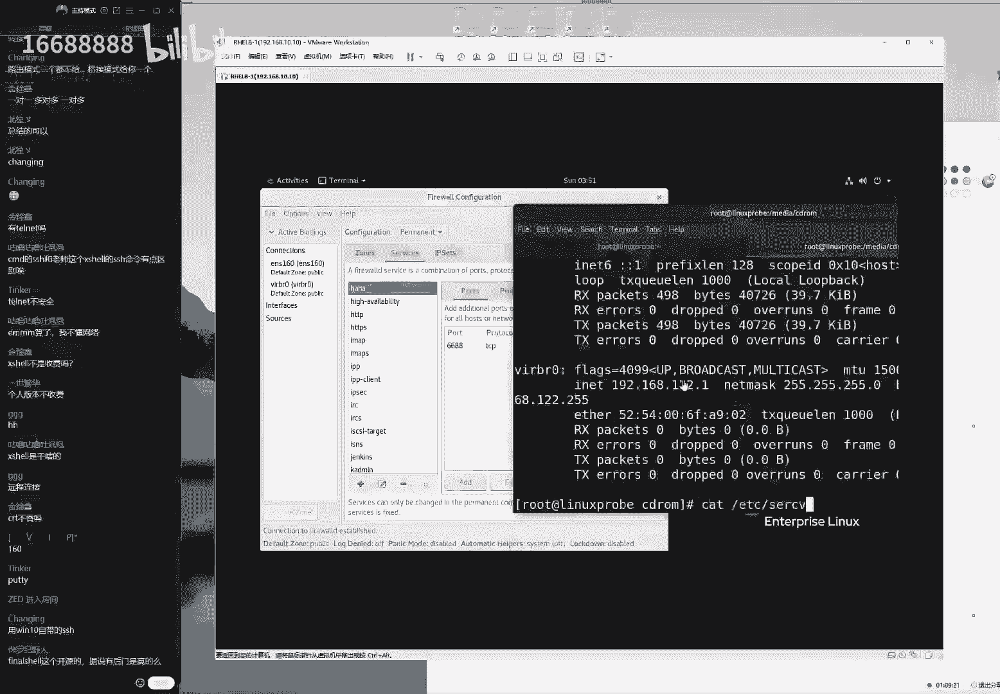

您都可以在这个文件里面找得到，我再给大家最后再看一下这个文件的名称，您可以做一下记忆啊，如果以后考试当中遇到了一个，不知道是什么的端口号，那么可以在这里面去找到它所对应的一个协议。

好我们先给大家讲完了之后啊，大家先往后去翻，我们书上的话呢，还有一个章节，8。4小节，那个就把它跳过了，因为的话呢在红毛热巴当中没有这个tc啊，没有这个协议了，没有这个服务了。

我们之所以的话呢我们做保留了，是因为我们希望我们的读者学完了之后，可以面向于678啊这三个系统来进行使用，虽然八里面没有这个防火墙了啊。

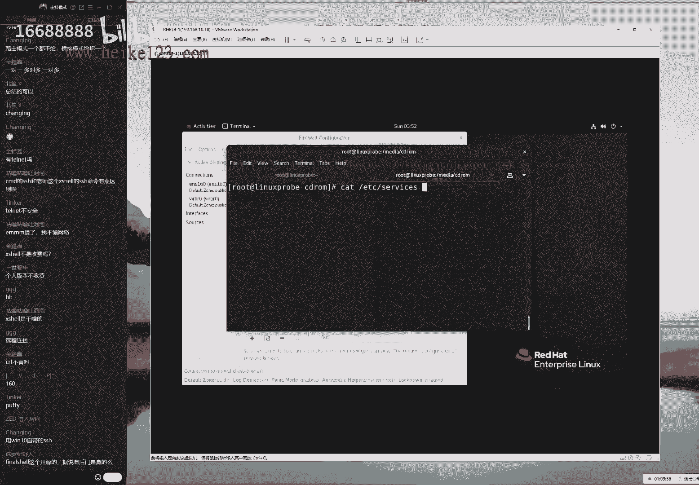

它是基于一个呃应用名称来进行控制的，一个防火墙，非常简单，它有两个文件为天使文件，house。allow和house。den，一个叫恶魔文件，然后来进行限制的，没有被允许，然后的话呢就会自动放行不啊。

他的话如果要是先被允许的，则直接放行，如果要是它里面既有允许又拒绝，则对它进行一个允许，弱里边没有写，允许他直接拒绝了，那么则进行拒绝，如果两个都没有去写，则默认技能放行，也就是说有这么一个协议啊，8。

4小节有它有这么一个服务，但是我们现在不讲小红包，肉包里面没有了，他的话呢变成了一个新的服务，我们给大家做一个替代吧，它可能不太相似，但是我们可以实现同样的功能叫做cockpit啊。

这个的话呢是一个非常卡bug一样的存在，我们上一啊，我们昨天给大家做了一个小的一个预告，就是这么一个服务的话呢是有点呃，我们认为有点擦边好吧，我们不认为他违规，但是我们仍在台外擦边相一呃。

30秒的时间先来给大家去说一下啊，这个服务怎么回事呢，首先啊这个服务的一个来历，它实际上是由两个组成的，cock的话呢是为这个大家知道什么意思啊，碳化了组合到一起之后，我们的意思就是飞机的驾驶舱。

而且我特意查了一下牛津字典，牛津词典里边好像这个词根，最开始的解释就叫做啊，好像是单指说这种啊非常复杂的啊，这种呃飞机那种呃那种呃呃这样的话驾驶舱啊，那我们可以看到叫cos贝。

所以这个单词的话呢叫做copy，它指的就是驾驶舱里面非常复杂这种信息，然后看这个词根，它的意思就是说大家可以感受一下，如果说我们现在坐在一个飞机里面，这就是我们这个驾驶舱。

于是大家可以坐在自己的这个驾驶位上面，比如说我的花园小人啊，比如说我现在坐在这里，我是不是就可以通过这些仪表盘啊什么的，能就能够说，那我们首先能够看到飞机的一个，整个的一个情况了啊，我们飞机的运行情况。

我们那我们都可以看得到，第二的话呢也可以通过这些细小的按钮，唉，然后来控制整台f这个飞机，那我们就在想，那我们能不能也去使有一个linux当中的，一个驾驶舱呢，就是我通过一个界面，就通过这样的一个界面。

然后我坐在这里面，我就可以对于我这个整台服务器，有一个呃非常呃全面的一个管理，然后并且我们能够看到系统的运行状态，以及能够进行任何的管理呢，啊因为大家想一下，我正在开飞机，我不可能再跑到后面去。

然后去操作什么东西，他都必须要在这个驾驶舱里面，出现所有的控制选项，所以这个的话呢呃叫做cockpid一个来历，这块也非常的贴切，这啊这啊这是我们的第一点问题，先来去说这个软件的一个作用。

第二个作用的完哦，嗯其实去刷第二个啊，这是软件的一个作用问题，第二的话呢就是红帽的考纲里面，包括说大家如果要是买红包，热巴那个教材的话呢，那个大红本啊，三大本里面对于这个服务只字未提，没有提及。

因为这个的话它是一个非常卡bug一样的存在，我们今天的话呢呃讲完这个服务了，同学们，你们要想再把h3 c考挂科很难了，因为他算是一个很卡bug一样的一个存在，他之前所所有的服务啊。

包括说我们讲的这个对于系统的管理，对于用户的添加删除，对于我们的分区格式挂载去做瑞的，还有llvm等等，我们之前所讲的一切网卡的绑定什么的啊，当然我们还没有讲，所有的一切都可以通过这个去完成。

所以的话红帽考试为了增加呃，为了让你们不要那么简单就可以通过考试，所以的话他估计是没有提的，第三的话呢就是这个很不巧诶，我们突然间发现了2020年的年底，我当时我们去写书的时候，我还我还。

我当时的话呢很不小心的看到了这个协议，然后话看到这个服务，于是的话呢我们就有了后续的这些课程，所以要给大家说一下这个原则，就是红包考试的话呢只看结果，不看过程，如果考试的时候呃，如果真的慌了。

不会去做的情况下，cocky给大家兜底啊，很难考不过来。

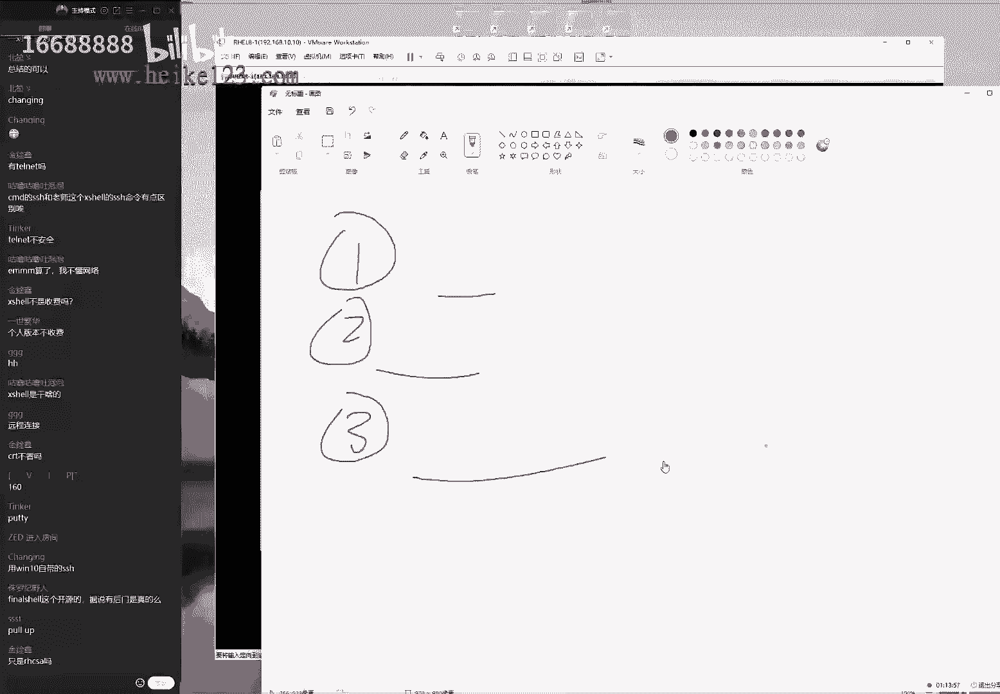

我先给大家说一下啊，这个服务的话呢是怎么去安装的，首先我们需要先去配置一下软件仓库啊，哦那我们首先需要先配置这些软件仓库，然后的话呢我们来去安装一下，我们的这个服务叫做cockpid。

同时的话给大家一个惊喜，就是在考试的时候，我们不需要配置啊这个仓库了，也不需要去安装了，因为在考试的时候默认情况下也已经有了，那我们这个商业环境里面的话呢，他也已经默认安装上了。

也就是说他这个bug的话，已经是深入到系统里面了，只不过看我们知不知道而已，好已经出来了对吧，然后我们现在这样子啊，我们需要做的话就是去system system啊，来去restart一下。

把我们这个copy的这个服务，后面加上这个socket cooperate，然后点socket给他重启一下，诶，等一下system restart重启一下这个服务，他这个bug的话默认没有启动而已。

我们只需要把启用一下，顺手的话呢加入到启动项当中，保证我们下一次的时候还依然能够去使用啊，他说我们启用这个服务失败了，因为它是一个socket的一个插件啊，那么就很简单了，来我们再重启一下它。

并且把它加入到形象当中，它的这个全称叫做呃，后面就要加上socket这样的一个词，做好之后来打开我们的浏览器啊，这个小bug给大家说一下，就很难在考试的时候考不过了。

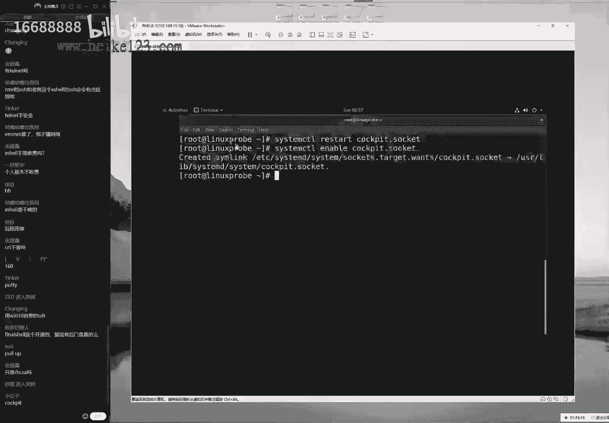

红包考试只看结果，不看过程，所以这个算是一个兜底了，来输入一下我们本期的ip地址，一九二点一六八点10：10，就我们本地的ip地址，这个我不知道给大家去赘述了，这个怎么配置的话。

之前给大家讲过了四个方法，9090啊，输入一下我们的ip的端口号9090，然后这个时候按下回车，就会出现这么一个界面了，有我们当时我们同学们反馈，说说这个工具我怎么打不开啊，啊这个不是打不开。

是因为我们的啊同学怎么了啊，我们的同学怎么打一堆句号啊，啊是感觉他非常的激动是吧，来我们看一下啊，这个界面的话呢，它并不是报错了，这个原因就是因为我们的htp s。

它里面那个s s l那个证书是由本地签发的，所以的话呢浏览器没有支持而已啊。

我们现在就是需要点击一下高级，点击一下添加diy。

然后去信任一下我们当前本机签发的这个s s，这个证书，点一下确认，于是就来了，所以这个有点像是什么呢，马上啊大家现在就在学啊。

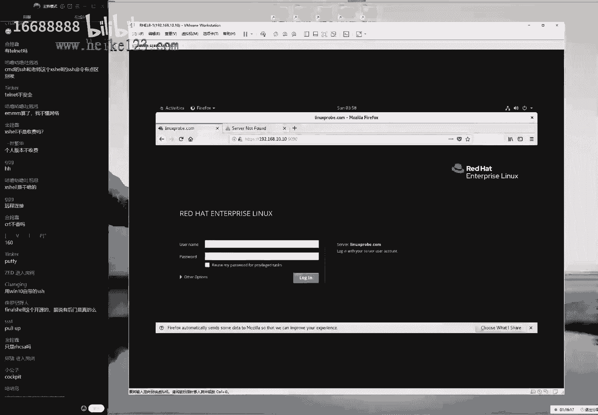

就我们现正在学习，正在挖一个小坑，马上就要挖到钻石了，突然间放弃了。


这是一样的啊，这就是刚才是我们最后成功前的，这么一个小的一个小坑了，终于见到他的本尊了，这么一个界面，这个时候的话呢，我们需要先去输入一下这个用户名称，我们是叫做root。

然后我们再来我们把啊这个密码的话呢，也去输入一下，它使用的是我们本期的密码，我们叫做red hat，诶，按下回车点一下登录，提一个小问题，同学们反馈说在红包若白考试当中。


我们的虚拟机里面是没有图像界面的，那么请问我们是否还可以去使用这个工具呢，好这是第一个问题，大家都好像见过是吧啊，第二啊大家第二个问题，大家说通过防火墙，把9090端口号转转成八零端口号啊，好啊没有啊。

没有啥意义啊，然后接下来给大家往后面去提个小问题呃，就是我们虚拟机里面如果没有通话界面，我们能否去通过这个cockpit，来进行远程访问呢，来进行远程管理呢，首先来说这个答案肯定是啊。

同学们今天好像很沉啊，大家今天好像不但没的自信啊，怎么互动人数比较少啊，现在少说，我们群里面现在有83啊，82位同学了，怎么互动起来这个人数不到八个呢，呃来同学们一定要互动起来啊。

咱们大家感觉这种互动的感觉，这样的话呢大家也不容易犯困，尤其我们尤其到了晚上的时候啊，确实容容易有一些疲倦，然后大家先回答一下这个问题啊，打消心里的顾虑，在我们考试的时候，还是否能够去使用这个工具呢。

答案是肯定的，因为它是通过我们本机的浏览器去访问的，跟对方我们头大界面毫无关系啊，他没有关系没有关系，大家说啊，为啥我的cockpit里面没有virtual station，这个控制选项啊。

这大指的是哪个选项啊，我没有看到啊，不过没关系，我先给大家看吧，我先给大家看，首先这是我们系统的一个简单的介绍啊，一个系统的一个运行状态，下面的话呢还有就是我们的一些信息，比如说是否去重启啊等等的。

大家看啊，r h3 c里面有一道考题，我那我因为这个比较卡bug，我就来给大家简单介绍一下了啊，到红马23c里面考，有它有道考题，大家仔细看一下，说，修改一下这个服务器的运行的一个推荐级别啊。

进行一个呃它使用的一个性能级别对吧，当时我们需要修改一下，他当时需要使用到命令，现在不用了，直接点一下，这不可以了吗，啊，直接点击一下它，然后去选择一下，我记得考题里面要求的，我如果没有记错的话。

他说需要把我们这个给它设置成这个级别啊，然后我们点一下这个修改就可以了，这就是我们等一道h3 c的考题，然后下面再来，我因为我想因为我记不清了，24岁多哪些考题了。

所以我来一个一个大家去看记录到系统信息诶，日志文件我们也可以做一下索引，根据级别来进行索引，对吧啊可以，那我们可以只去看到某一类别的这样的一个，日志信息，然后的话哎这怎么还还这怎么还卡住了啊。

来我们点开它，还有说我们的这个硬盘，我们可以对它进行一个分区格式化挂载，去做raid呀，还有我们的lvm诶，这是啥呀，大家帮我看一看这个是啥，这是个video吧，video是大考题啊。

哦哦啊那没有没有问题啊，啊点一下video的添加，然后就可以把video设备创建出来了，就这么简单啊，video第二道h3 c的考题，然后还有这个分区格式化挂载吧，我记得是，然后这边也是啊。

我们可以对它进行再来去分区格式化挂载，我们点一下设备来进行管理都可以去完成，比如说我们再去新建一个分区啊，然后但是我们现在这个磁盘都已经使用满了，如果要是有磁盘空间的话，就可以来来来去。

分区格式化挂载都可以去完成啊，包括说我们想要去谢谢大家一个问题啊，这呃因为我们的文件系统也可以去实现啊，我看一下怎么去卸载掉，因为很就没有用过这个工具了，如果你想去使用到u mt的时候也可以啊。


在这点一下u ma就没有了啊，它会同步的，立即同步到我们这个终端上面，可以看到啊，我们的光盘已经没有了，然后我们可以点一下这个挂载诶，大家看一下它又来了，这不就是我们去通过浏览器来。

去实现一个控制的方法了吗。


那没有问题，这是一个卡bug，既然是网卡，我记得好像说要求我们配置一下网卡对吧，如果想配置网卡ip地址，想要配置一下他这个绑定啊，team什么的，很简单，点一下这个点一下这个配置。

然后我们的i p v4 ，然后我们选择一下，把十改成二零，然后点一下应用再来点，再来点一下好，当然我们需要给它设置一下点二零，然后我们来点一下高级。


因为我刚修改过ip地址了，所以我现在这个终端的话要重新登录一下了，这样的话我们就可以去实践出来了。

修改ip地址，这又是这又是一道后面考题啊，它又又出来了，这个话就是考题嘛，一道一道啊，就非常的快，下面的话呢就是说呃嗯账户信息哎，等一下等一下等一下等一下他有点小问题。


因为我刚才修改了ip地址了，但是ip地址还没有同步过来。


我需要做的就是再重启一下这个网卡就行了，哎再来如果大家实在不行的话，就重启一下就行，哎，来10。20，然后去说一下，大家问了一个问题，大家说字有点小啊，字有点呃，字有点小，没关系，我大家在考试的时候。


跟在我们工作的时候是没问题的，哎等一下啊，诶等一下他是没有生效吗。


10。20啊，无所谓，我们先这样给大家先往后面去讲着，然后的话呢用户我们可以添加，我们可以添加一个用户，比如说新建一个用户叫做张三，来张三，然后密码的话呢是叫做rewrite high。

大家都看不清是吧，哎可以稍微大一点来。


现在没有问题了吧，来新建一个账户叫张三，然后现在的话呢先在本地去验证一下。


他们啊没有问题吧，然后点一下创建，他说密码不能太复杂了，它不能太简单了，于是我们再给大家稍微再复杂一点，加两个句号啊，red head，然后点点也不行，然后再来red hat，点点123。

然后123来敲一下回车，他说我们的密码的话呢，不能够里面包含有字典的词汇，好了，是不是这个红帽red hat是不让使，如果海之间再加一个一点上确认好。


于是我就新建出来一个账户叫张三，于是可以看到啊，网页上操作出来的这个信息。


在本地上同步出来了啊，我印象当中13z有啊，有他有一道题目需要去创造出来，用户就这么去做，没有问题，service服务哎，要想去开启以后，或者去停止一个服务，就可以通过这样的一个网页去完成了。

并且的话呢我们还可以怎么样呢，加入到启动项当中啊，保证我们下一次的时候还依然能够去启动，启动关闭啊，都是大家都可以在里面随来随便去选择，再来是一个应用选项啊。


就因为这个的话呢算是一个广告，他的话呢叫做红毛的r a h红包为啊。


还有红毛卫星网络，这个是需要付费才能去使用的啊，现在的话这个把它跳过就好了，接下来说是否要去分析系统的运行情况，然后这个我们不用，然后还有说是否来自收集系统当中，内核的报错信息，这个号在安装的时候。

我们把它给禁止掉了，它会节省掉我们256兆的内存，还有我们的c linux，这个我们还没有讲，预计会在明天或者后天给大家讲到，然后下面的话叫软件更新，这也是的话一个这个收费的功能。

他说是否有我们红包这个客户中心的这个，软件仓库帮你们去自动更新，这个话呢当前我们要是没有付费的话，是不能去用，不过这个选项跟这个选项我们把它跳过就好了，因为我们可以去通过软件源来进行安装。

通过我们本地源来进行安装，这个的话也是，如果说我们需要红包公司为我们提供服务，那么我们则去注册，一个是花点钱就可以有这个啊，后续的这么一个维护的，但是我们这个不用管，下面的话。

还有就是我们可以通过这个终端啊，通过这个网页版的终端来控制我们这个服务器。


甚至我们可以去重启啊什么的都可以，这个效果是完全等同的。


也就是说同学们可以来记一下，在考试的时候，cover pid是大家的最好的小帮手，兜底了，如果要是在考试当中遇到一些小一些小插曲，比如说新建用户啊，管理磁盘呀啊等等一些操作，或者说我们去启动一个服务。

或者去关闭一个服务，遇到了一些啊麻烦，那么这个服务给大家兜底儿啊，然后作为啊，最后把我们这个呃题目就可以顺便做完了，好那我们给大家说完之后，大家可以往后面去翻一下咱们这个书，第九章节啊。

第九章节这个话是一个网页文件，我们就非常简单跳过了，下面的话，第九章节给大家讲讲有难度的啊，咱们课太水了，我们来说一下，该怎么对这个网卡进行一个高级的管理能力，因为网卡嘛它它像磁盘一样。

要往简单里怎么说吧，就是分区格式化挂载，你要往难了说吧，实际上这个可以玩的很这个啊动起来很，那它还是比较多的，比如说它可以对于我们的啊网卡做一个绘画啊，他也画也可以去做一个网卡的绑定，都可以去实现啊。

这出现一个小问题啊，我这边重启当中。


他好像死机了，所以我现在再去手动再去重启一下啊，没有问题的，这肯定能够起来，然后我给大家说一下啊，对于我们这个网卡的话呢，9。1。1小节它是配置文件的方法来去修，它的话呢，是使用到我们这个啊工具来配置。

我们的网卡信息，这个我们把它跳过了，我们直接给大家讲9。4。2小节，这个的话9。4。1小节，我们会在后续需要去使用到的时候，再会把我们之前给大家讲这四个方法，再来进行一个一次的重复。

就是会把这个实验的话呢，跟其他的这个服务到一起搭配去使用，而不是当前啊，那我们的话当前就不再重复再去啊，单独去讲一遍了，我们会在后续讲服务的时候，会把这个配置绑卡，这个放啊。

四个方法再来1234再来去进行一个重复的，我们来看一下4。29。1。2小节，创建一个网叫网卡的回话，这什么意思呢，就是说如果说我现在有一个笔记本，那么我现在有两个使用需求，第一个方案是在公司啊。

我每天需要去公司，然后我每天还要拿回家，那么我的话呢在公司的时候，他可能的话呢是一个第二cp啊，不他可能是需要进行一个手动指定ip地址，这样的一个方式，我需要到公司把我的手。

把我电脑设置成一九二点168。10，比如说啊点10。88才能够去上网，到我们家里面的话呢，需要自动获取dns cp才能够去伤亡，那么现在就来问题了，我每天到了一个地方之后。

我做的第一件事情都要先去设置一下网卡，好累啊，那我们能不能把这个网卡做一个啊，那我们能不能把网卡的参数作为一个模板呢，啊啊，那么这个网卡参数的模板，就等同于叫做叫做网卡的绘画。

所以有些时候大家觉得自学比较难，就是因为很多书上面或者那个网页上面嘛，他们不谈他们的话呢术语啊不太说人话啊，说这个绘画我们很难理解，还有一个要开会呢啊，绘画的意思就等于就是网卡的模板。

这就是为什么我们系统性的学习，有人带着会更加快一点的原因啊，能给大家去说人话，能够看得懂他这个术语的一个意思，来大家记一下，绘画等于网卡的模板啊，这个里边的话呢事件的效果可以。

比如说网卡里面很多参数入啊，网卡有若干条参数，几十条的参数啊，几十条参数怎么样呢，一秒变更啊，一秒就可以去替换下来了啊，一秒就可以替换掉替换，或者说叫做修改，然后我们在模板之间来进行切换。

我这个非常的方便，然后大家问了一个问题，大家说啊所有的基于linux系统都有这个吗，不当然没有，红包热水器都没有啊，然后下面一个问题啊。


大家说我们的乌班图有这个服务吗，呃一般情况下是有的，但是我们都需要自行安装，如果说我们的镜像当中没有的话，那你也可以自己去网上下载一下。


也有啊，好我们来继续来给大家，后面继续往后面去聊着，那么下面的话呢就来说一下网鬼话怎么去玩啊，他怎么去实现啊，他的话我们也可以通过这个工具来去实现，但是显得有点low，我们干脆还是通过命令行去完成。

我们使用的nm c来，然后换connection show查看一下当前有哪些回话啊，当前只有两个网卡啊，现在当前只有两个前世界，当前只有两个网卡，我们需要的话添加上两个绘画。


第一个绘画叫做公司company啊，它指的是当用户偶然写了第一个绘画，我们叫做company，第二话我们叫做house，当切换到具体名称的时候，我只需要去输入他这个名称，它就会帮我们自动去实现出来。

这个网卡参数的一个变更了啊，看似简单，但是实际上它实现的是底层这个配置文件的，一个刻度修改这样的一个效果，呃，大家有什么问题我看一下啊，大家说怎么样啊，我看一下他的问题说啊。

呃我看一下下面没有什么太大问题，说看不清图片啊，看不清画面是吧，然后把稍微大一点哎，再稍微大一点好，下面带大家去添加一下，但是大了之后吧，这个命就会换行了，换行之后大家就会感觉到呃不好。

因为一旦换行了之后，您看不清到底我这是一行参数还是第二行，是第一行的这个输出值，因为比如说我现在去输出一个信息，大家如果是比较大的话，你就看不清楚到底这一行是我输入的参数，还是输出的一个信息了。

所以我看看能不能找一个折中折中一点的方法，既能够在一个画面内，又能够字稍微大一点，稍等一下调，咱们调舒服了啊，磨刀啊，磨刀不误砍柴工啊，磨刀还行啊，来这样做好之后。

来给大家操作一下nm c y y connection啊，然后添加一个绘画，添加一个绘画啊，call name，它指的是啊，这个参与数指的是后面加的这个词，为绘画的名称，我们为company为公司绘画。

好公司绘画的话呢，就是说如果我现在这个有一个网卡，我们啊interface name，网络接口的名称，如果是n啊，要是160吧，in s160 ，我再确认一下，以自己的实际为准。

in s160 还是ino 160，我看一下啊，不太也不太自信，ok也要以我们这个为准说啊，当我们有一个绘画名称叫做公司，那么这个绘画的话呢，网卡名称啊为160，那好了，这个时候我们定义一下。

它这个链接形式为以太网，然后的话呢我们设置一下啊，稍等一下，设置一下它的这个名称啊，这两个好像写反了，那我们就按照书上来吧，实际上一关系应该不大，我们要给大家写下来，但尽量还是按照这个书上去写啊。

避免的会产大家会产生歧义，这个的话呢公司哦我还写错了，这个的话呢是我们的家庭绘画，因为我们默认没有写ip地址的话，他则为dh c p模式来，我们给他定成家庭，然后我们的以太网类型。

接下来再来定义一下我们的网卡名称，因s160 啊，这样的话就是家庭绘画启动它了之后，自动会去使用的d i c p来进行获取，那我讲完这个突然间想到一点，就是我们需要编辑一下虚拟机的这个选项。

点击网络编辑器啊，叫虚拟网络编辑器。


虚拟的啊，它并不真实存在的一个网卡，需要把我们本机这个由虚拟机去提供的啊，这个选项的话给他关闭掉，大家看一下，现在的话呢我这边是没有勾选的，如果他同学们，你们默认情况下，这边第二cp是被勾选掉的。

你们需要的话把这个给去掉啊，把它给去掉了，我们不要去使用虚拟机不配啊，呸说反了说反了，我们现在的话呢需要开启一下，现在需要由虚拟机去提供一下dl c p功能，这样的话呢我们才能够去获取。

因为我们本季没有dh cp，那我们现在虚拟机在没有dh cp的话，他就获取不了信息了，所以我们现在需要开启一下。


大家请确认一下当前是开启状态啊，点进圈来这做完第一条再来，第二条的话呢，我们叫做公司绘画为company，也就是说第二条的话呢，它是一个固定的ip地址，一九二点168。10。88启动了。

那么就会自动分配到我们所对应的一个名称来，同样给大家去解mini比较长啊，interface name啊，网卡名称in sd 160好，再来是否会自动连接呢，我们选择不要自动连接。

否则的话呢我们每一次都会，它都会自动去帮我们自动连接，挺麻烦的啊，我们还默认情况下的话，还使用了一个默认的一个情况，接下来我们的网卡类型为以太网，做好之后，i p4 啊。

它指的是ip v4 级别的ip地址，192068。10。88。


那叫做呃gateway，指的是网关的意思，他的话当前并不存在，但是我们要给大家说有这么个参数。


所以我们还要给大家写一下，指的是网关地址来，那我们去输入一下，192。168。1。1哎，我突然想到了点10。1，这个是不是也要写一个四代表的，就是一个基于i p v4 级别的网关啊，好这个应该是写的。

来敲一下回车，ok把它添加好了，再来做好之后再来nm c l y，然后是connection，然后show一下，就会发现刚刚的话呢是有两个这个网卡啊，本身现在的话又多出来两个回话了。

那我们给大家验证一个事情啊，就是我们刚刚给大家提到了，说网卡的绘画实际上就是网卡模板，它可以聚在不同模板之间来进行切换，来去实现了不同观啊，它来去实现出来网卡参数的快乐一个快速变更。

那我刚才所说这个到底靠不靠谱呢，我们怎么来进行一个验证呢，老刘除了帅以外啊，那到底怎么来能够让大家能够信服呢，首先我们就可以进入到网卡所对应的一个，配置文件里面了，不能说光靠帅，对不对，我们要讲理啊。

来看一看，于是可以看到了，实际上果然是他就多出来两个文件对吧，这个文件跟这个文件，然后这个理论的话呢，就是说我们去启用哪个网卡的时候啊，去使用哪个绘画的时候，他就让哪个配置文件生效，就这么一个意思。

非常简单，大家说不用配置dns吗，啊不用配置dns，配置dns干嘛用啊，然后再来我们现在的话呢，我们是不需要用到的时候就不用去配它啊，因为需要啊，只有需要用的时候才用啊，我们才会去配。

那再来接下来给大家去说一下，下面的话呢具体一下nm connection show，来查看一下网卡的绘画，当前的话呢我们的ip地址i f config，i f confi，就是大家一定要记住啊。

就咱们一定要知道，清晰的知道咱们在配的这个参数干嘛用的，对吧啊，来我们再来，不用说非得按照这个书上严格的来啊，书上面有些说的东西看似严格，实际上的话呢有点啰嗦了啊，有点是有点啰嗦了，来我们再来。

一九二点一六八点10：10，当前地址是为点10：10，我先这样啊，我先启用一个绘画，如果现在的话呢请一个叫做家庭绘画，那么他就会去使用到啊up，然后叫做house，如果现在请了一个家庭合法。

它就会使用由我们虚拟机去提供的，一个dc p的一个地址，我们点击这个选项看一下啊，第二cp的话呢就由我们虚拟机提供的地址，网段是1920168。177点好了，但是如果说这个地址的范围。

是这么一个地址的话，177这么一个地址的话，就证明它是生效了，它确实是由虚拟机器提供的一个网卡信息来，我们来按一下回车，然后大声说一句啊，口号啊，说一句我们的咒语，总。

你做完之后再来查看一下我们的网卡的ip地址，大家会发现变了啊，已经变了，这就是啊通过这个变更海参啊，变更网卡绘画的方式，然后来去快速修改网卡获取地址的一个方式，下面的话再来。

还有就是说启动一个叫做公司绘画，如果说公司绘画为192068。10。88，那好了，我们来按下回车越啊，若能够成立大会所，看到这个地址会一秒变更。


大家会感觉到很神奇，对不对啊，在哪去了啊，在这儿啊，在这儿他会看到这个很神奇，所以我们如果要是您的这几个功能环啊，工作这么一个场景啊。


基本上要要啊，要是呃能够呃，有这么一个确定了这么一个信息的话呢。


我们可以把这个常用的网卡参数啊，给它打包成一个模板，然后的话呢做重绘画，当我们啊做成啊网卡的绘画功能，当我们到不同场景下，或者我们需要的时候，可以直接启用就行了，总比我们老编辑网卡方便很多吧。


哎这就是我们对于昨天讲了个编辑网卡参与数，的一个补充啊的一个补充，大家问一个问题，大家说啊群里面不都是人手一本ie吗，啊肯定没有达到这么普及程度的啊，下面一个问题，他说ie是啥啊。

ie叫做c4 d ae是一个思科的一个这个认证。


他也有c c n a，然后的话呢c c n p，然后还有c c i e，就是说啊通过这个网络方面这个知识，比如说啊什么ospf啊，这些都是cn的对吧，还有我们的np啊，它主要就是一个理论知识。

然后最后ie分为两个部分，一个是lab，一个是笔试，它也主要就是对于我们这个网络知识的一个讲，解，我们学习的是系统吧，就是我们c就是我们现在学的r h cc，然后呢rh c e我们学习的是操作系统。

然后的话呢下面的话呢，它主要是对于网络方面的一个学习，大家以后想到我们以后只要想学的话呢，而是c a啊，然后这对应的就是三个级别，就是低中高，大家只要以后想去学习，后面能够去学东西还是很多的啊。

还是很多的啊，然后我看一下啊，突然来一个电话，我看一下啊，稍等一下啊，好看一下，还剩下还有短信哈，看到了说啊，根据大数据的分析和综合的研判，我所在的地区确诊了新冠肺炎了，需要我去报备去啊。

说我经过了高风险地区啊，就是很扯啊，很荒唐，因为我从来没有出门啊，自己有一个礼拜都没出过门了啊，所以来了一个烟花，估计可能是拉去隔离了，好希望，希望这个这么辛苦的日子赶紧结束啊，我把它挂掉了。


活的百回啊啊啊，活在回头再回头再不回去吧，好我们来继续啊，这个非常荒唐的这么一个这么一个时期啊。


都没有出门啊，已经有一个礼拜都没有出门了，说我经过高风险地区了啊。

还是很神奇啊，然后的话呢我们下面再来啊，我们下面再来，所以下9。1。3小节啊，说一下网卡的这个绑定，这是什么意思呢，其实还是对于我们这个网卡参数的一种，高级使用方法啊，高级使用方法他是这样的。

他如果说我们现在的话呢是有两个网卡不，我们现在如果要是有一个网卡，那么好就好在就是成本比较低，但是的话呢我们的带宽比较啊，他啊但是的话我们这个带宽也比较低对吧，网速比较慢啊。

那么如果说我现在这个带宽这个很好理解，他就像是一个车道一样啊，带宽比较低，它像一个车道一样，那我们怎么有两个车道呢，它当然想了好了，有两个这个车道，一个车道啊，放到左边，一个车道，再换一个车道啊。

放到右边，那么我们如果有两个这个网卡的话，那么我们能不能去实现出来，说好的时候的话呢，同他他两个同时工作，然后画画的时候的话呢，能够自动顶替上去，也就是说好的时候，如果说我们的一个网卡它是为千兆。

两个网卡的话，就为2000兆啊，那么就是它它啊，好的时候能够自动的一个负载均衡啊，然后的话呢坏的时候怎么样呢，一起说是不是我们一个网卡能够第啊，自动的继续工作，并不会去影响到我们整体的一个运行稳定好。

这个的话我们叫网卡绑定啊，好的时候加快带啊去啊，拓宽我们的带宽，坏的话呢能够自动去顶替上去，这样的一个效果啊，刚才那个电话其实我已经收到了，七点半的时候，大家可以往回拨一下视频，七点半的时候开。

我七点啊，7。40多的时候吧，然后我刚才去喝了口水的时候，其实我都看到了啊，我这边维接来电已经已经有五个这个电话了啊，而且都是北京这边的，我不知道为什么有五个维京来电了，当时我还以为快递呢啊。


然后希望吧，希望40分钟之内不要有人上门敲，不要有人来敲门了啊，不要应该怎么上课就好了，坚持40分钟啊，坚持再坚持40分钟好，下面的话呢再来啊，再来我们来说一下怎么来进行配置，首先的话呢还原一下虚拟机。


避免我们这个两个方法，就是避免我们这个负和负数之间嘛产生了冲突，哎所以呢我们现在去还原一下虚拟机，然后重新开始一个全新课程，另外给大家讲到，其实并不是说我们就是我们呃，每个做实验之间都必须要重启一下。

我去还原下虚拟机哦，你也可以把我们之前配置一些选项有一哦，no啊no，我们给它删掉之后也可以，但是的话呢就是我我们去删也好啊，或者说我们去呃没有去启用它也好啊，主要就是会耽误时间。

我们就干脆把我们这两个小时的时间，充分的利用了这么一个意思，所以大家在我们在这个呃课下，再去做这个实验的时候，您没有必要了，就还给虚拟机，您可以啊，踏下心来把这个服务的话呢一个一个都做好啊。

这样的话更好来，现在的话呢我们添加上一块新的网卡，叫做金主机模式，两个网卡都为同一个模式，点击下载确认，点一下点一下这个回车没有问题，来大家怎么样说，拍拍乐园今天看高风险了，因为我已经有七天。

我没有出过门了，因为我的这个健康码变颜色了。


然后有弹窗，所以我哪也没有去，而且我们这边是不是被封控了，也下不了楼啊，不也也也出不了小区，所以哪也没有去啊，顶多就跟他解释一下就好了，好我们接下来再来啊，我现在我完全不怕新冠。

我现在比较怕的是不让我们讲课呀，讲课使我快乐呀，我现在必须要讲课呀，来我同学们，来来来，废话不多说了啊，废话不多说了，那废话不多说了，我们来继续呃，现在的话呢我们来做一下网卡绑定。

我们做网卡绑定的话有两个方法，第一个方法的话呢还是通过图像界面，我们可以直接随便打开一个工具啊，啊nm connection editor，这边打开一个工具，然后点一下添加。

你就可以在里面找到绑定这个功能了，但是的话呢老刘这么帅气，你怎么能去使用它绑定这个那啊，那我们怎么去使用它这种方式呢，太low了太简单了，所以我们是呃，所以说我们自己去选择了一种更难的方式。


我们选择使用图啊，编辑配置文啊，编辑配置文件的方法来去实现，大家看一下，也就是说我们现在有两个网卡，幺呃1601922个网卡，他们的话呢最后合并成一个整体为棒的零，最后的话呢。

我们在棒子顶上面再配置出了ip地址了，也就是说我们的话呢现在只要绑定过后，它都为从属网卡，这两个为从属网卡，这个话呢是为主网卡，他这两个从属网卡不再能够去接收用户输入的，不啊。

他呃这两个网卡不再直接去处理，用户发送和接收出来的这个信息，好大家理解一下这个意思啊，好大家理解一下这个意思，当我们把这两个网卡做绑定之后，它两个变为从属网卡，他们两个不在。

直接啊在上面配置出来网卡的这个参数了，而是直接由这个主网卡做处理，也就是说用户再去找的时候，他不是再去找这两个从属网卡了，他找的是棒的零，然后由这个棒的零去做一下负载均衡，找到这对应的是哪个啊。

哪个网卡，并且来进行一个数据的一个切换好，那么好。


那么是这样的一个意思，所以呃我们需要做第一步操作啊，大家看一下我现在这个操作啊，看一下做一个操作，etc目录里面的c啊，system config，然后是network scripts。

进入到网卡所对应的一个配置文件目录当中，然后啊跟我一起操作rm删掉它，删掉所有的网卡参数的配置文件，因为他们不在，需要在他们的各自上面配置绑卡信息了，他们配置的应该是配置到放到零上面了。

这样的一个效果哦，然后大家有什么问题我看一下啊，大家说说肯定不行，数据通啊，等一下数据包肯定通过一条通路出去解决的，带总带宽才是硬道理啊，这是什么问题啊，大家问了一个问题啊。

这个咕噜咕噜图炮的同学说两个网卡提高网速，真的假的，那是不是电脑网线和有线一起去使用，可以提高啊速度，这两个的话还是有区别的啊，下面一个问题大家说买一个网卡插两个网线，这个也是做不到的啊。

好这点的话是两个意思啊，主要它可以启动一个被圆的一个作用，负载均衡和冗余好，我们先来给大家去操作一下，大家看好了，先看一下这个效果是这样的呃，网网卡参数都给它删掉之后，我们来手动去添加。

首先创建出来一块这个这个命令比较长啊，我们这儿给大家去敲，尽量一次成功，不要出错来，现在给大家手动去敲一下，现在的话呢添加上这个bd 0 n m c完了啊。

添加上我们这个从主网卡的名称叫做bd 0 connection，editor啊，a d d啊，添加啊，添加一个类型为以太网的一个网卡，这个网卡的话呢它是因为它是一个从属网卡，从啊它是一个类型的话呢。

呃sleep tab他就是个奴隶啊，它为从属网看，然后tab类型纯属网卡的话呢，他的绑定的行为啊，他是用的技术叫做棒的啊，这个我先我先给大家敲完之后，给大家总结一下吧，这个参数一个给大家去讲了。

我记得会不会很乱，来给大家讲一下这么回事啊，好先把它敲完吧，不着急啊，来现在的话的意思就是说诶还没敲完啊，很多啊，in interface name，in s160 ，然后master，然后放个零。

是这样的，好可以说了啊，是这样的，首先我们使用了一个网卡，名称叫做e s160 的一个网卡，他的话呢作为一个绑定技术的一个怎么样的，从属网卡做添加，他会在这个绑定过后的话呢，叫做bd 0杠port一哎。

改了啊改，那么啊去改了他，他啊给他改了个名字，同时的话呢他们绑定过后的这个网卡，加这个主网卡的话，这样的一个意思来敲下回车，他说的话呢bd 0并没有存在，我们需要先去手动去建立一下哦。

好像果然还差了一步，还得照着词儿说啊，他有点太过于自信了，所以没有太严格按照说上去说啊，另外还得照着词儿说来，先来添加上这个主玩卡，现在的话没有添加主观卡，所以我们往里面去呃，去敲的话呢。

硬敲他说八点没有创建出来啊，这是我的一个思路问题啊，我光想着待会儿怎么怎么样给大家说了，来给大家去办个零，然后tab的话呢被定义为绑定模式，然后换了call name，我们绑定过后的这个名称。

然后下面再来啊，棒的零，他使用的是绑定技术，然后的话呢它这个绑定功耗的名称叫做bd 0，它使用的这个模式，大家可以看一下，我们书上面啊，这个叫做bd，然后让我们设置一下这个参数，它说它是有几个模式。


那我们现在的话呢指的叫做balance杠rr，这个话呢balance杠rr。


它只要叫它指的叫做轮询模式啊，它的话叫balance杠二，他的意思就是说好的时候的话呢，会自动去负载均衡啊，坏了之后的话呢，自动有一块帮我们去做顶替网络并未中断啊，它叫做这个轮询。

这么一个轮询的这样的一种工作模式啊，工作啊模式这样的一个效果，工作模式好可以没有没有问题啊，大家怎么说啊，我们书上讲到哪了是吧啊，不用关心书上了，咱们就以我们现在这个网页上。

现在就以我们这个屏幕上为准吧，因为书上的话我们可能会呃跳着讲啊，因为书上描有些太慢了，或者他有些时候他太啰嗦了啊，来balance gr来轮询模式，我记得的话呢还有一个模式，大家看一下。

我们书上来先翻开的书都看一看啊，还有一个话呢叫做这个起飞模式吧，我不知道这个中文怎么称它怎么称呼啊，这个话呢叫做呃起飞模式，他的话呢好的时候的话呢，他并不会去工作，他只有说有一块网卡出现损坏了。

它的话它会自动去背圆上去，我感觉他有点像是呃，怎么讲，它有点像是一个热备盘这样的一个作用对吧，它好的时候不会工作，它只有当一个硬盘出现损坏了，它才会去顶替上去，自动再进行一个数据的同步。

这样的一个效果好好叫做这个设备好，现在好，我们来继续来给大家往后面去敲，敲完棒的零，然后再来偷个懒儿，你看这不就来了吗啊，第一我们在啊，我们在第四章节的时候给大家去说过，不在第二章节的时候给大家去说过。

第二章节的话呢，讲到说我们有一个叫做shell的一个终端，终端的话，那里面有一个用的比较好的一个解释器，叫做bh对吧，它有四个好处，第一个好处讲到他说可以通过这个方向键。

跟这个history命令来查看到历史的一个执行记录，当时我就说到说这个四个好处，大家不用去硬记啊，啊可以去感受，比如现在就来了，我敲完这个之后，马上把我们前面一条命令啊，刚才敲过。

但是失败这个命令的话呢再调出来啊，于是的话它也就成功了，我们可以通过这个方向键来进行调整吗，好同样的话呢再来因为我们第二个这个呃，我们把第二个网卡要往里面去添加一下，叫做point 2。

这个画的名称叫做e n s192 ，他两个的区别只是网卡了，跟它添加过后从属网卡的这个名称不一样，其他都是一样的，所以像啊，所以他偷个三大啊，直接去修改这两个参数即可，呃，都做好了之后。

there is another connection with the name，好棒的，零杠port一哦，看一下什么原因，connection show，connection show哦。

也就是说我们当前的话呢，我刚才是这样的啊，也就是说刚刚的话呢我们是失败了，然后我们添加的时候是失败了，但是的话呢他学给我们添加成功了啊，我们现在需要这么去把它给删掉就可以了。

connection delete是吧，来delete，然后我们去删掉这个bd 0，也就是说他刚才提示出来成功了不，他刚才的话提示出来说失败了，但是的话他却偷偷的成功了，所以我们再去看的时候。

它里面添加了两个棒的零杠pra，所以我们现在的话需要删掉一个啊，所以我们现在需要删掉这个信息，再去重新添加一下就可以了，来bd 01162160，所以大家有时候操这个操作之后不要慌啊，不要慌。

来往里面一加可以了，把两个网卡in s160 变成port 1，把in s192 变成port 2，加入到一个总网卡叫bd 0，里面要预设，我可以看到这里边就会出现了我们的主网卡，以及两块存储网卡。

它里面所对应的一个配置文件了，但是的话呢这个主网卡啊，这个里边的话呢并没有任何的配置参数，我们需要怎么办呢，啊也很简单，可以直接来进行配置就可以了，但是帅气老刘啊。

怎么能够更新说通过这样的工具来进行配置呢，因为同学们提到了邵老师，我怎么看，其他的小朋友们，可以通过这个啊编辑文件的方法，或者说我们通过这个命令下来啊，那么来进行配置呢。

我们上节课给大家的理由是说没有必要对吧，我们说的是没有必要说，因为我们给大家讲了四个方法配置网卡了，够用了啊，更加难的这种方法的话呢就留给别人去用吧，我们自己用简单的啊，而且话也够用了。

但是同学们如果想感受一下的话，可以来感受一下，比如说我想通过我们的n m g r啊，这样的方法来进行配置，是这么去做的，nm c r啊，然后啊那是mdifi进行修改啊，然后是bd 0修改一下网卡。

首先来说ipv 4啊的这个ip地址进行修改，然后是address，然后地址的话呢就是192。168，我跳的还比较快啊，一九二点一六八点十点啊，随便啦，就那就还你吧，十点10：10。

然后接下来的话呢再来bd 0点gateway，哎，网关地址192。168，网关没有，随便去敲一下就可以了，然后画下面还有一个dns地址，当前也不用，但是同学们刚才提到了说。

那我们啊我们如果要是现在不敲的话，不知道这么个参数工作的时候用到怎么办呢，所以我们先给他敲上啊，虽然它不生效，虽然他没有用，但是它得有啊，我们还得有再来我们的ipv 4的搜索域，dns搜索域。

这个不用写书上的罗嗦啊，只要写一个dns地址就可以了，还要定义一下我们这个类型为手动模式，它有两个定义地址的这样的一个方式，第一种的话呢是为呃自动获取dr c p，然后第二的话呢我们为手动模式。

我们把它改成手动模式，这样的话我们前面设计的这些参数才能够生效，好，都做好之后啊，我们可以再去查看一下这个文件，会发现这个文件里面的话呢，就应该已经是生效了，来interface config。

然后是半的零网卡配置文件，查看一下，这个里边就会把我们的ip地址给他配好了，其实这样来说呃，有缺点也有优点吧，我们觉得如果要是写的shell脚本里面的话，其实这个通过命令行配置的话呢，也是不是那么的呃。

差了他也可以通过我们的shell脚本的话，方便做调取也可以，不过我不太喜欢，但有什么说什么，我其实不太喜欢，我宁可编辑配置文件，我也不愿意用这样的命令，记得起来特别的长好，现在的话呢我们都做好之后。

文件里面信息确认已经修改了，我个人来讲我就不太喜欢，我就直接connection，然后是up去启用一下我们的网卡好，另外给大家去做一下小小小的声明啊，是这样的呃，由于它是虚拟机。


他在去做这个实验，所以的话呢它有一定概率是不成功的。


呃他的话呢这个原因并不出在，因为我们他是因为虚拟机在模拟两块网卡的时，候，它两个网卡的mac地址会经常产生冲突，但是这个问题的话呢。


主要是出在了虚拟机16。2以下这个版本，我上一次使用这个版本是16。1啊，我是在去年年底的时候，是16。1之前都有这个问题，两个网卡添加过后，默认情况下mac地址产生冲突，然后这个实验的话呢就失败了。

但是我最后一次升级到了16。2。1小，这个版本了之后，大家以我为参考，然后就没有这个问题了，所以如果说您做这个实验失败了，或者我们待会做这个实验失败了，那么您可以再重新再去做一遍就可以了，一般情况下呃。


关机之后再去做一遍就能够成功了，至于说什么原因啊，也也也也也不太清楚，但是确实是虚拟机的这个原因，那么我们现在怎么解决也不也不太清楚啊，知道原因不知道怎么解决，我们一般的解决方法就是再去做一遍好。

我们先做好之后。


同学们来看我现在这个操作呃，现在的话先从远程来去拼一下。


来从远程的话呢拼拼一下这个里面的ip地址，拼一九二点一八点10：10。


然后一个杠t所以给大家说一下，我们现在给大家做这个演示。


如果带有失败的啊，我们会在哦，那我们则会再给大家去做一遍，那我们会再给大家去做一遍，并且会用相同的步骤，希望这次能够一次成功啊，点一下编辑。


点一下这个嗯设置，同学们来一起来操作一下，点一下这个底下有一个选项。


网卡的选项，稍等一下，稍等一下。


这边有一个录播瑞的一个按钮给挡住了，来我先点一下设置，大家看看啊，我我们那我们现在的话呢是有两个网卡，我们就不用照着这个命令去把它关闭掉了，这两个网卡大家可以随意去选一个，一输到第一块，一输到第二块呢。

来大家提一个小问题啊，我们随便去选择一个吧，第一个还是第二个呢，第一个网卡，第二个网卡，大家可以随便说一个一和二就可以了啊，我之前我就看抖音上面，人家就卖东西嘛，买香肠什么的啊。

最后这个评论里面总是说说，你为什么切开这个香肠呢，为什么不是那个香肠，肯定提前准备好了对吧，来我们来做第一个吧，好大家说第一个是吧，大呃呃我们看一下同学问题啊，啊大家的话肯定不是我们请来的托儿。

对不对啊，大家可以证明一下不是我们请来的托啊，这个大家都是自己去选择的，然后下面一个问题大家说说速率不用去设置吗，速率的话呢，我们在红包热器里面需要去设置一下，在红包肉八里面不用去设置。

它的话默认情况下是在10ms级的时，它会在10ms去呃，自动切换下去，如果要是有一个网卡它损坏了，那么会在10ms内切换到另外一个，对应着我们这个拼的话呢。


就是会产生一次拼的这个数据包会比较的大，它呃也有可能产生一次丢包，但是最多会有一次丢包，大家就会看到我们这个效果，待会儿这个数字会比较大一点，或者的话呢会产生一次丢包。


仅此而已，他超过两个丢包，都是证明我们这个实验做失败了，因为它原则上来说是不影响这个数据的传输的。


然后我们点一下移除，点一下确认，马上看这边的这个效果。


它最多只能出现一次丢包，如果要是一次都没有丢。


那更好来看一下，上下倒杯水，稍等一下，同学们看一下左边，嗯啊这个词非常透透的啊。


死的非常的透啊，死的非常的透一点烦，哎呀这很气人啊，这很这个就这个很气人啊，这种是最恶心的，你说他要是失败了吧，你就给我一直失败就好了，你这是最恶心的，你知道好，同学们是这样的。

我先那我先那我就先给大家解释一下啊，我个人认为是什么原因啊，是因为我现在正在啊开着虚拟机，开着录播软件，我这边又挂了个qq，我这边又给大家直播的82位同学同时在线，对我就是电脑吧比较卡。

我那么的话呢我个人认为是这么回事，但是呢我们又不很确认到底是怎么回事，为什么出现了四次油包，顶多呃他他是出现了五次，理论上来说只能出现一次的。


我认为可能是因为我电脑卡顿的原因啊，是我的问题，所以同学们大家呃给我们一次机会。


这个虽然这个是成功了啊，但是不符合我们的高要求。


所以同学们你们现在的话打开手机，我们在群里给大家发一个红包，同学们你们抢红包啊，但同时我在按照刚刚那个步骤，我再完全做一遍，你们能够完整地看完这个实验再睡觉，因为如果这个实验我们有没有完整的去做完。

然后没有看到啊，有没有让大家看到一个非常完美的一个效果，大家在工作的时候，你们敢用吗，你们不敢用对吧，这个丢包太严重了。

丢了五次包，那这个可能就损失了业务，比如说阿里巴巴啊，淘宝啊，可能就少还。


那么就少了很多的业务对吧，所以我们这是呃这个话呢不能啊，不论什么原因，但是话呢首先我们没有给大家演示出来，一个很完美的效果，我们很自责，所以的话呢我们就现在给大家发个红包吧，大家先抢个红包。

而且因为很久没有给大家发了，然后的话呢您就等我一下，我再重新再去做一遍，一模一样的步骤再去做一遍，看完这个完整的效果，踏踏实实的睡觉，来，稍等一下，同学们打开你的手机，打开我们的34群啊，打开34群。

发完之后，马上咱们就把这个再去做一遍了，怎么着也不少，150块钱吧对吧，咱咱再发一个个数是最多100，ok我先发了啊，我先发我先发。


同学们稍等一下，诶，ok啊走，你好，是这样的，我现在的话呢会啊，发完了，然后我现在的话呢，会按照我们刚才那个步骤与完整再去做一遍。


同学们看一遍，到底他丢包是不是真的这么严重，然后呢我同时我也把我一些软件我都给关上了，我感觉应该不是我的原因，应该不是我电性能的原因，毕竟老刘这个电脑还可以啊，自认为呃天花板吧。

现在算是我们的i9 的话呢，现在是i9 的cpu对吧，12代，然后呢外星人电脑啊，我们现在这个24个核心内存64g，我觉得天花板了，然后我们的这个所有的硬盘啊，啊但是我们这个虚拟机的硬盘放到不是固态。

它放的是一个机械硬盘，上面的这个硬盘可能是有点小小的瓶颈啊，不过我认为够用了够用了好，我现在的话呢再来给大家重新再去做一遍，我假设说刚才是一个小疏忽啊，可能是因为我卡的原因，我现在给大家操作一遍。


点开确认，点一下开启，点一下确认，点一下开启，大家怎么样说啊，老老六电脑不是i9 的吗，对他有些时候他就是这样的，比如说同学们，你们现在可能看不到我啊，但是我现在这个姿势是一个。

像是一个下跪的一个姿势，我在配再给大家配置这么一个服务，所以有些时候可能到时候大家也会有种感触，明明这个东西跟苏珊是一模一样的，而且的话呢我们把一切都给考虑到了，就是有一种像是莫名其妙。

有一种神奇的能量在控制我们一样，就是做不成功很神奇，所以有些时候呃，我们最痛苦的事情是什么呢，就是我们明明已经做好了充足的准备了，但是这个时间的话能却失败了，但是更更痛苦的就是我们明明没有好好去配。

或者的话呢我们明明是配错了，他却成功了，他反而成功了，我们都找不到原因，所以有点像是胡适说过一句话，因为换了胡适虽然不学linux，但是他打麻将嘛，他说这台鸟鸟感觉是里面有鬼啊。

说起来现在有一种非常神奇，看不到的力量在控制着我们的一切，好了废话不多说，真的不多说，我们先来给大家玩，再来重新再去配置一下，那么这一次的话，那我就直接从书上来去复制了。

不耽误大家时间来添加上一块主玩卡，名称叫做棒的灵啊，像胡适说的啊，这里面他们有鬼啊，怎么一样的操作做两遍效果不一样呢，到底是哪出了问题呢，来这样，我们这样这样这样，第一块网卡bd 0有了之后的话呢。

把这个网卡1s160 往里面一加啊，把名称叫做port 1，再来192进去来走，你part 2看一下网卡名称确实是叫做e n s，160和192，没问题啊，跟数量是保持一致的。

所以我们现在这么去复制的话呢，没有问题，配置一下我们的邦德零的ip地址来，首先10：10，然后呢还有这个网关，还有这个dns设置为启动模式，这几个的话呢都设置好，都说说都设置好过后，我们再启用一下。

它做完没有问题，再来开启一下我们这个甄姬当中，我们的cmd命令终端拼一下，拼1920~8点10：10。


然后杠t a一下回车啊，哦可以可以可以啊，这就是一个经验的积累，这就是一个经验的积累啊，这就是一个经验的积累，我很自信，我刚才配置的是肯定是正确的，所以的话呢他明明是成功了。

但是他却有一个行动超时的一个报错，这是一个经验的积累，我之前遇上我已经之前碰上过无数次了，所以同学们在遇到这样的这个情况的时候，不要着急，耐心等待就可以了，给他一点时间，给他一点耐心就可以了。

来我们再来拼啊，看一下，现在的话呢网络是能够拼通的，我们现在再来重新点击配置选项，点击下设置，刚刚的话是第一块啊，为了让大家能够踏实下来啊，我们还是选择艺术家，第一块不产生歧义啊，不产生歧义。

还是移除到根，第一块点一下确认，同学们看，丢一次包只能丢一次，丢两次就丢人了，他肯定是他肯定是成功了，但是我不知道为什么，我感觉还是我虚拟机的原因，他想的太慢了，很着急呀，好吧。


这时候就会是四次呃，我觉得这个同学这好像不叫翻车，我感觉这是我训机他反应慢的问题啊，这脑子说话太那个有点太呃，太那什么好，是这样的，同学们，最后最后最后大家听我说还是这样的啊，我们的话呢就在二小节。

就在2。1小节去讲了一个远程连接协议，我们的s s h这个的话呢要讲这个讲解，要讲9。2。1，9。2。2，9。2。3，这两个这个三个需要一起去讲，大概的话时间是40分钟，我们的话呢今天就不讲了。

我到底要看看这个服务怎么回事，同学们，所以的话呢今天是八点定型，44分，我们就不再往后面去讲了，再把这个实验最后再去做一遍啊，然后的话呢我们就不往后面去讲了，明天我们踏踏实实的往后去讲不。

咱们不要赶课时啊，现在要20分钟去讲的，那个就叫2。1的话。


有点太可有点太仓促了，所以同学们啊就不管它了，在最后再做一遍，我们到底看看他这个丢包到底是怎么回事啊，同时的话大家啊看我啊，看我看我看我内存稍微大一点，内存稍微大一点，内存稍微大一点，我感觉内存太小了。

我给他八个g内存，给它大一点内存，然后的话呢我们把这个硬盘啊不用管，然后把这个网卡稍微大一点，他至多只能有一次丢包。


因为他想的时间他就是10ms，10ms的话对应来说秒的话就0。1秒对吧。


那不可能出现说两次以上丢包是不正常的，丢一次都已经很丢人了。


两次以上的话就影响到业务了，呃我把内存稍微调大了。


调转到bug b了，因为我刚有感觉是虚拟机里面，那个我感觉啊，是你虚拟机那个没有显现过来的原因，好同学们听我安排，我现在的话再来最后一遍，我们踏踏实实的做完，我们明天踏踏实实的讲9。2小节呃。


不但让大家产生奇异的啊来，因为我不要给大家，因为我们要是没给大家做成功的话，同学们你们在工作的时候不敢用啊，这你们在讲我们讲课的时候都没有做成功，都丢这么多次包，万一要是在生产环境当中使用上的话。

会很造成很大的这个影响的啊，棒的零，还有一个问题，还有一个问题，刚刚我们还没有做，我们现在这样，我们进入到这个目录当中，把那个原先的网，把原把原先e s o的这个网卡给他删掉啊，把这个给它删掉好。

我们来继续，同样还是把这个网页上的内容的话呢，在命令一个一个的来复制，就省事儿了啊，不再孤啊，就不在故弄玄虚啊，我们就直接给大家复制了。


摊牌了啊，书上有，我们按照书上去做就行。


嗯没有问题，启用一下半的零，看一下，启动过后就应该一秒钟就能够生效的，但是我猜他应该会请求超时，果然是让子弹飞一会儿吧，ok可以都做完之后的话呢，我个人建议啊，我个人建议我个人再建议把这个我在我我。

我最后再看一遍，八个g内存，16g的呃，呃16个核心的处理器啊，我看一下啊，我的这个处理器是多少个核心，16个核心内核逻辑处理器。


24k 16个核心没问题，都用上了八个g内存，好啊，深呼一口气再喝，我再要我再倒杯水，希望今天这个最后一个实验能够很原本的，能够很原本的结束啊，啊同学们问一个问题，说这个是否能否重启呢，没有问题的。

重启过后永久生效，因为它里面这个信息都写到这配置文件，它它都写入到配置文件里面的，所以配置过后的话呢，永久生效，不用任何的顾虑啊，没有问题好，我们再来深吸一口气。


点一下设置，点一下移除，第一话网卡选择移除，至多最多有一个丢包点下确认，再有就是虚拟机的原因了。


好吧反正一次比反正这话怎么讲呢，就是反正这个每一次比一次强吧，第一次是五个丢包，这次是上回是四个，现在是两个，我们就不再纠结了，这个在工作的时候大家放心吧，肯定是他就是不用任何的担心。

因为balance gr啊，轮询模式切换周期为10ms，它会只要我们这个服务器性能是足够的啊，那么就是顶多会有一次丢包，甚至的话呢这个响应时间顶多会大一点，它不会超过一次丢包了，这两个丢包的话呢。

就当做是这个系统的问题，我们不用去管它了，那这个在工作的时候不会有任何的顾虑，然后我们今天说完之后的话呢，就不往后面去讲了，因为就在二小节的话呢有点呃太多了，我们家大概要讲的话。

得40分钟或者50分钟比较久，我们放到明天踏踏实实的给大家去讲，我们不要赶课时啊。


从我们开始不赶课时，我们的话呢明天会给大家呃呃呃，那我再给大家说一下，今天这个复习跟预习的内容来给大家讲，到今天还在复习，今天我们觉得这个网卡绑定啊，还有这个网卡绘画的话呢并不是那么的重要。

因为在工作时候的话呢，可以过来看就好了，然后我们考试的话他又不考，那我们认为第八章节我们的防火墙，大家这个会回啊回啊，回去之后可以练一练firework on cmd，虽然这是我们呃。

我们呃我们昨天给大家给大家讲的，但是更多的时候还是用到cmd，而且的话更加有意思一点，还有一块就是我们的cockpit，这两个的话回去之后大家好好去复习一下，这两个大家需要复习的。

那么的话呢我们的预习就是我们的第九章节，明天第九章节收尾，同时如果要是有时间的话呢，我们给大家讲一下第十章节啊，对第十章节会讲一下我们的网站服务的开头，可能会有一个简单的介绍。

但是如果要是呃我们下周要去讲ensable的话呢，那么我们可能就不给大家讲第十章了好吧，那我们就明天就主要就是攻打一下，第九章节就ok了，然后还有一点就是给大家提到的。

我们的话讲就是我啊我们在讲课的时候吧，就尽量不要赶课时了好吧，然后我们就是把每一节课给大家讲扎实了，也像我们每一期培训都是这样的，我们如果要是觉得这个时间，比如今天提前下课十分钟换来的。

明天多讲40分钟，我觉得这好像我们认为这是值得的啊，这个不像是大家再去吃饭一样啊，昨天给大家提到了，只不过没有给大家呃说而已，就是就像大家去外面吃饭一样，他的话那饭馆肯定要注重这个翻桌率，对不对。

像我们做培训机构也是的呃，如果要做一个线下机构，它可能有几个房租，水电呀，各种的这个成本比较高，可能就是希望比如说五天讲完的内容，他绝对不会讲七天，他同样的希望能够把这个班级快速翻班。

而我们现在作为网络培训的话呢，既然我们自己家的培训，自己家好好做，所以我们就会把我们这个课程的话呢，稍微的时间下拉长，同学们有更多时间去消化，同时我们也可以更好去细致的去讲解一个东西。

不用担心说今天我必须要讲完，第九章节，没有这样的顾虑，我们没有这样的要求，所以我们会在第九章节，因为如果加感兴趣的话，可能会多扩展点点东西，可能会减一会，那我可能会讲三个小时，会去讲四个小时都有可能。

这也是我们在线培训的一个比较好的一点吧，我们可以根据大家的情况来进行调整，以及不用担心说课时对我们的限制呃，也就是说完了，就是我们明天给大家讲第九章节时间的话呢，还是两个小时左右。

大家千万不要迟到就好了，我们现在来有问题来说，我们来给大家回答一下，如果知道的话，会大家第一时间去说，如果不知道的话，会大家查一下，然后再说好下面一个问题，大家说怎么样啊，说完啊，讲不下去了啊。

对我们明天给大家讲第九章节，大家说两个正常，两个两个的话虽然属于正常，但是我们认为不太满意，我认为还是应该更低一点的，但是这个虚拟机的原因，不管他因为上一期的时候，这个培训。

大家可以回去之后看一下上一期的培训，丢包一个都没有啊，一个丢包都没有，然后就是那个呃想的时间大了一点，我记得上一期的时候是它都是小于1ms对吧，然后的话那个丢包好像是小于了200ms。

就是这个千万这个时间稍微长一点了，但是不知道为什么我电脑的话呢，今天性能反而不如上回了，他丢了两个包啊，所以丢了两秒吧，差差差差不多好下面一个问题啊，所以我不得丢两个红包吗，啊丢丢丢丢丢。

这个也是是是我们来给大家嗯啊丢两个红包，我再给大家丢出去一个红包，因为我们做培训还是要脸的，我们不能像其他培训机构似的，不，我们不能像其他呃这个呃其他老师哦，不再怎么讲了吧，就会有点多罪人了。

我们自己还是要脸的，所以我们一旦出了问题的时候，我们就会给大家发一个红包，我们也长记性，如果要是只是说一句不好意思啊，但是这个实验效果就是如此，我们感觉这辈子都不会去努力提高自己了。

所以我们每一次只要遇到报错了啊，稍微有点稍微有点严重的，我们都会给大家发一个红包，不就100块钱啊，让我们长长记性，这样的话我们这个培训才有动力，自己越来越做越好，如果一个老师啊。

这一节课出五次这个bug，然后我们基本上这样下来之后，这一期的培训费就要赔光了，那就活该了，所以我们ok发了啊，发了发了第二个红包已经抛出去了，第二个红包已经出去了，所以我们还会主动给大家发红包。

主要为了让我们自己长个记性啊，好下面一个问题，大家说赶紧回电话吧啊，不然还真上门查水表了啊，查什么水表啊，对下面一个问题，大家说为什么我的cockpit里面没有管理kvm，虚拟机控制的选项。

这个问题我没有遇到过，我不知道您说的是哪个选项，你可以截张图发给我看一下，大家问题问啊，问到说23c的二选一的那个题目，是随机一道题目，还是自己选择的，是随机选择，不是自己选择，大家说学习网络知识啊。

没有学习过网络知识怎么搞啊，网络知识的呃，网络方面的知识都是空白，没关系，大家都有这么一个过程，那么知耻而后勇啊，这个话呢我们现在就自己去搜索一下cca，他啊不不它并不属于呃，怎么讲呢。

并不属于大家的缺点，说我没有学习过，所以话呢我很自责，不要这种感觉是因为我们这个怎么讲呢，这个呃只是学习的一个过程问题，有他们有同学是先学的他啊，但是还有同学是呃，可能的话呢是基础比较晚而已。

你可以从百度上去搜索一下cca资料啊，这个大家也不用报班了，网上都有这个特别的多，因为cn a的话它属于一个基本的课程，但是对于一些基本的理论知识都有一些介绍，比如说什么是ip啊。

比如说我们的嗯嗯一些基本的技术啊，它都会有一些介绍，c c a就够用了，还有我们的网卡，还有我们的ip地址，还有我们一些路由器之间的这个协议，配置的选项，我们怎么配置我们的路由器什么的。

它里面都会有一些介绍就够用了，cn a啊，挺好好，下面一个问题，大家说countvt只能做h3 c吗，对他只能做h3 c，我们的r h c e它里面考的是c标标，不能去使用到cooppit。

否则有点太卡bug了啊，反正就是r h3 c，基本上来说，就能够满足大家的考试的一个需求了，我们给大家实话实说，我已经有1年半时间，我没有见到过一个24c挂科了，也就是说挂科的话。

基本上也就2020年8月1号开始，可能有那么几位同学一开始题库不稳哎，可能挂科了，到现在我已经1年半时间我没有见过了，你要说rtc能给我考个满分，那你是个大神，那你要说rh c c能可以考没啊。

他跟两人考挂了，那也挺厉害的，因为我们的兜底的方法实在太多了，主要是好下面一个问题，大家说说是不是配置好，所有的服务说都需要啊写入启动项，然后所有做的啊配置则不需要启动到啊，所以啊所以做的错的配置选项。

都不需要去写入到启动项呢，是这样的，有一个原则，因为我脑子也比较乱了啊，我就按照我的思路去说了呃，首先如果说您是通过命令配置的这样的，一个服务的话，大多数情况下都需要加到情况项里面，才让他能够去成效。

也就是说，如果从通过我们的命令的方式，配置的某一个服务，那么都需要再去enable加到请问项当中呃，大多数情况下大多数情况下它有啊，它有啊，它是有返利的啊，大多数情况下它是这样的啊。

然后的话呢如果说您是写的配置文件的方法，如果说您是直接编辑配置文件的方法，编辑配置文件的方法来去配置的某个服务，或者的话呢去设置的某个参数，那么则永久生效，不需要去呃重启某个服务，或者或不。

那么则是有它是永久生效，不需要再去启动，在不需要再呃enable，再去加个行动箱里面了，就会有一个原则问题，我这有一个小一个小技巧问题，好，大家问了一个问题，大家说说配置了什么什么文件之后啊。

但是你打出来这个文件之后，它是星号啊，但是我可以猜大家说我们去使用到dnf，然后是install软件包安装系统，还是从红帽下载文件，是为什么哦，您配置的是一个软件仓库对吧，为什么还是从远程下载的。

因为您在本地没有这个文件，然后下面一个问题，他说soga cca对，您可以搜一下啊，cca就有了，而且很而且不用报班，很便宜，一般情况下或者您可以呃，因为c n a据我了解。

我在5年之前我们就看到了很多机构，实际上是把cca嘛免费放出去，完事的话呢，作为他们的师范课程，然后让大家看了好了哎，过来报个班学习啊，然后还在后续去学习思啊呃呃什么呃，后续这个课程。

但是不用就不用报了，大家可以当做试试看课程ca很简单，我们当时6年之前吧，我们就去了解过csa，然后当时我也去学习过，我学习到np了，当时n a的话应该课程是六天，课程比较少啊，比较少。

它就等同于就是我们的24s c c c a的话，满打满算，如果要是实体培训的话，大概是六天啊，它面向的就是art cc最它是一个最基础的，但是的话呢我们认为这个整体上来说还是，那样的话呢，不如红帽。

为什么呢，因为整体上来说就包括了c c i e了，和我们的rh c a了，那么hca的话有一个特点，就是他必须要之前已经有了h3 ，c和hc这个认证才可以了，然后才能够去考，有才有啊。

他才有资格去考c啊，我们的顶啊，他才有资格去考c，而c c i e的话，它不是这样的，它可以没有r h c好啊，它没有前面这两个选项，它没有前面两个认证，也可以直接去考c c i e。

并且的话呢c它需要考五次，而l i e的话呢它只需要考两次，一个是lab，一个是笔试，而中国人的话呢从来不怕笔试啊，就是怎么讲呢，我们同学们从小考的就是呃，那我们从小考试到大学也考试。

我们从来不怕应试的教育，就是让我们去背东西，只要有题库，我们从来不怕的，我们个人认为的话呢是红帽认证必赢，思科认证的话更有含金量一点啊，当然了，如果有一天我也去做思科认证了，到时候我们再去道歉啊。

当然我们再出一本书啊，思科又该怎么学的时候，我在那我在啊，那我再去再去道歉，基本啊，起码我们现在还算是间接着吃着红包的饭呢，所以我们现在去给红包鼓吹一下，也是能够理解的好，下面一个问题。

大家说c c n a有多少人了，我不太清楚r gc有多少人，r gc的话据我了解应该有1000左右啊，然后说为什么我的k啊，coco page里面没有km的虚拟机的控制选项啊，是这样的。

我现在自始至终不知道，您说的kv m这个虚拟的控制选项，到底是怎么点出来的，你可以截张图发给我看一下啊，大家记得去提问的时候尽量能够详细一点，尽量能够尽量能够详细一点，因为比如说你去医院看病。

去跟大夫说，说，大夫我不太舒服，这么去说的话是一个无效体温啊，大部分会很开心啊，什么核磁ct都去做，做了一个啊，对啊对啊，做很多检查，最好能够带着检查结果带着，比如说老师诶，这是我的实验环境。

这是我之前配置过的选项，这是我的报错哎，这个我非常喜欢，就是能够直接就给大家去说了，好下面的话大家有什么问题来，就说大家思科已经被考废了，嗯考考费我不知道，反正人数肯定是特别的多的。

因为会有很多小朋友都没有去学习过思科，就直接背题，我这个我是真的知道的，而且我对我自己说自己说的奥拉负责任啊，呃红帽的话呢，我们虽然说遇到过一些不要脸的人做代考，但是的话呢没有那么恶心的，就是去刷题物。

直接考过的呃，会有一些小朋友，然后又直接没有学习过底层，没有学习过理论，没有学习过n p没有做这个实操，甚至来说pc trl都没有用过，都不知道什么东西啊，就直接背题库。

然后先去考一个c c i e的一个笔试，然后去占一个编码，然后后来lab在以后再去后再去考，会有这样的这个情况，而c c而我们的红帽的话呢没有这个情况，因为它都是一个纯上机，没有笔试。

你要是出错了之后呃，自己解决不了，也是一个很大的一个问题，所以个人认为还是红帽的话，含金量会比较高一点，当然了，如果大家已经考过了森森ie的话，那当我没说啊，肯定比我们更加专业一点，我们没有考ie。

我只考到n p好有用啊，因为我觉得我的主线是系统，我觉得我够用了，虽然我是考试狂魔啊，我考过很多认证，我考过红旗，我考过啊，对我考我我也考过红旗认证啊，然后的话呢我也考过啊，linux基金会的一个认证。

lpi认证我也考过，我也有，然后还考过嗯，open sa啊，其实我跟open sa这个呃关系的话，那不啊并不仅仅只是说知道他们这个系统而已，我也考过，然后还考过一些嗯，比如说嗯网络方面呀。

这把cc np啊，这样的这个认证我都考过，但是我们最终选择红牌认证还是很有价值的，其中的话那就是红旗认证给大家提一下，因为我们看到群里面有人去聊到了，说红旗人证。

说我们现在中国的话呢跟美国是有贸易战对吧，然后呢现在啊也不是贸易战了，因为家因为我们要是说贸易战的话，感觉我们这是一个录播，好像是2019年录播的啊，好像是之前是录好的一个视频，也不是贸易战。

就是被卡脖子，很多技术不知道我们用了对吧，呃当时的话呢，我们是也是考虑过说有没有红心人帐，就是说我们国内这个认证，当时的话2018年的时候，我们实际上考虑过说我们不要做红帽认证了，作为一个红旗认证吧。

反正就差一个字，2018年的时候，我们当时考虑过当时的红旗还是有背景的，是那个中科院背景，所以的话它叫做中科，红旗叫中科院背景的，后来的话实在是太不争气了，中药不要他了。

后来的话红旗现在变成一家纯私有一家公司，所以嗯他做的实在太差了，实在太差了，实在一点都拿不出手了，要有就是怎么讲的，红帽现在作为一个垄断行业了，他现在在国内没有能打的对手，就像我们姐姐。

就就就就就就他就像我们做很多事情一样，会发现对手实在太垃圾了，然后的话呢当时我去考过一个认证，红帽的r a p啊，不啊，红旗的r a p认证，然后后来的话呢，嗯那个认证我当时我考的时候是200块钱。

那个当时的经理嘛叫毛老师，现在也是红啊，红旗的负责人跟我们聊聊这个问题，说我，那我们怎么样能够把我们这个含金量提高呢，那当时我说过，我说你要把这个系统吗做好了，然后换到市场占有率一定要提高。

你现在国内你都没有他，你现在都没有铺开呢，你这个认证不可能国际上能够承认吗，后来的话呢呃这个我们的啊认识那个经理啊，那我们这个老师，然后的话呢终于想了很多办法都没有成功，然后后来的话呢做的实在太烂了。

我们跟中国战没有关系了，后来的话呢，最终啊也啊也真没让也真没让我们失望，还真想出了一个办法，让这个认证的含金量提高，就是提高了考试的价格，东西一模一样啊，系统一模一样，只不过价格提高了十倍。

我们当时考r a p的时候，200块钱，然后的话呢，我们现在可以看一下红旗的一个认证，现在一模一样的东西，现在考试应该是3000多块钱吧，我给大家看一下，就给大家当个笑话去说吧。

因为我们跟毛老师的关系挺好，因为我住排员，他们家就住在丰台啊，然后还住在方庄那边，成龙寺，我们关系挺好，就只不过有再有人说什么，这种认证就不用考虑了，也我们觉得200多块钱可以看到了。

现在的话呢还我还是说多了啊，现在话这个人证是1980，然后中级认证是9980，还挺吉利啊，然后呢高级认证是啊，不对啊，这是一个最低级认证是吧，980现在的话呢就除了这个价格提高了以外。

其他都是一模一样的，没有任何的变化，我们认为这个认证就没有必要去考了，回答一下我们同学群里面的一个问题啊，有没有其他认证可以推荐，没有啊，然后的话呢如果大家感兴趣的话，你可以去搜一下，上面有我的名字。

因为我突然间我发现，有一次红旗来做讲座的时候，提到我的名字了啊，红旗提到我的名字了，然后，说我考他们的认证了，而且r c a那个最高级的9980那个，但实际上我根本就没有考。

所以这个认证他等于他们是送给我的，我我我我没有去考过红旗认证架构师，但是他送给我一个认证，当做是一个宣传的一个资料吧，怎么样的，所以这个认证确实不值得去考呃，国内的话认证都很水，而且有石油啊。

它不仅认证很水，而且也有水，分，大的话谨慎，大家一定要谨慎入手好，下面一个问题，大家说华为认证取消面试也要费了，呈指数上涨，这个我确实不太了解，我们也不敢黑，但是红旗认证我们可以说一下，确实太垃圾了啊。

他就是呃确实很让人失望，确实很让人失望，然后这也是我有一次听他们讲座的时候，提到自己的名字了，然后才知道啊，拿我当宣传的一个呃的一个东西了，然后结果去查了一下，真是送了一个东西啊，好我们继续来继续说呃。

说数据库那边方便，有什么比较好的考试吗，那肯定就只有一个了，数据库的话没有什么选择了，你要学习网络的话，还要去纠结一下，说是思科二还是华为呃，数据库只有一个o c m哈，o c p o c a。

那就是甲骨人认证啊，只有一个，我们我们认为大家如果要是对于感兴趣的话，可以考虑一下o cm啊，oc p和oc a诶，这这三个人证您可以考虑一下，这是甲骨认证，oracle的挺好，我觉得挺够用的。

基本上学完了之后，对于数据库的管理能力是有很好的提高，然后大家说七呃七呃，麒麟认证就是麒麟这个系统吧，据我了解麒麟好像没有认证吧，而且说实话，麒麟认证七系统在国内都没有铺开呢。

我更多的的朋友如果要用到国产系统，如果要是一定要用的话，我们可能会用到通信，uo s可能会比较多一点，但是麒麟确实不是那么的多，还有的话红旗就基本上没有了，还有麒麟呃，红旗麒麟。

然后按照统信我能够想到的就这么几个，还有嗯还有深度系统啊，dpm super它是国外的，它是一个德国系统，它不是中国的，然后我们可能用到的比如说深度啊，depin可能还稍微多一点。

但是其他的可能确实比较少，好大家说了一个问题，大家说现在网卡是不是用的team端口，聚合比较多一点的也都可以，这两个技术的话效果一样，只不过说team技术是从红毛热期开始的，2015年开始以后才有的。

之前没有，那所以的话，如果您是一个老系统，只能用到帮顶的，大家说发到群里面了是吧，我看一下群里面他要发啥了啊，因为已经被红包刷屏了，我看一看啊，同学们稍等啊，说为什么我这个选项当中没有。

这个kvm这个选项呢，因为我也因为我们也算是有考考试，航模考过很多人认证，上过上过很多当，呃，哦对对对，大家发了一个图片，为什么说我们这里没有呢，可能是因为我们这个红包roll 8里面这个版本。

可能是因为没有升级到最新版本吧，您发这个截图是从网上找到的，可能是因为我们这个版本不是最新，您可以升级一下的，比如说8。4版本再去试一下，然后下面再来一个问题，大家说怎么样呢。

还有oracle linux，78的oracle linux，它就是由红帽公司来的不，他是这样的，大家提一个问题，出这个系统感觉跟红包差不多，大家要知道oracle linux怎么来的。

它就是由红帽公司改过来的，他就是基于的red hat enterprise linux改过来的，这个我们当时2016年吧，他当时他当那他当时发布的时候，我们还跟红帽公司的员工聊过这个问题。

他就是基于这个红帽企业版改的，并且的话呢吃相有点难看，他比如说这个3x y s系统吧，他改完了这个之后的话呢，他声称自己是一个免费的红包企业版系统，他就是已经很触及到红包的这个底线了。

大家记得如果你搜一下新闻，当时oracle linux发布之后，他怎么宣传，他说修复了红帽企业版系统的164个，还是160多个那个漏洞，这就是很打脸啊，因为红包公司的话，一直说。

自己这个系统是目前最稳定的一个linux系统，结果你基于我这个系统，改了一个自己的这个操作系统出来，结果你还说你修复了我很多漏洞，有点相，当于就是我们在过春节的时候去人家吃了饭了，然后还把桌子给收了。

然后你说别人做饭不好吃对吧，那别人就会很生气，这同样的道理呃，所以说我们个人认为，我对于这个嗯oracle做linux的话呢，个人是有抵触心理的，他技术也就很扎实，做的非常棒啊，做的非常棒。

包括说他当时收购了mysql这个产品，我们认为这个从企业前景上来说，oracle特别的棒，包括说这个认证基本上也没有什么打啊，也没有什么竞争对手了，但是从个人情绪上来说。

我个人不太喜欢oraccoladas的一个点，就是因为我认为有点呃不太道德，但是或许吧这个资本主义来讲的话，哪有什么道德不道德不都是趋利避害吗，好接下来再说，大家有没有就是偏向于技术方面的东西呢。

因为我说这东西我也不专业，只能是从我自己的非常片面的这种感受来说的，但有没有必要偏向于技术方面的东西，大家说学习linux运维还是学习shell和python，我觉得这个就太宽泛了啊。

我觉得下一个问题吧，大家说学习linux做底层开发要学什么，我觉得如果大家感兴趣的话，比如说底层开发，你可以去学习一些内核啊，但是那会儿会特别的枯燥，我们这边人民电出版社也出了很多，内核相关的书籍。

但是我们说实话我们看不懂那种呃，完全就是两个行业，他们配不出来，第二cp服务器做不来dns，他们也没有办法考过2h c e，但是我们也看不懂内核里面那些指针啊，还有调用啊，还有这些函数。

可能就是两个方向了，可能这两大方向的变化可能要比去shell，编程和python的方向要差距更大一点，有些时候我们再说我们在做运维，两个人在做运维，两个人就是两个人都是在做运维的，我们坐在一起聊天。

聊的东西可能互相听不懂，会有这种情况好，接下来再说啊，大家说gg nt啊，这个系统我们怎么样，是要聊一聊吗，这个系统的话呢我们去玩过，它是一个完全可以自定义的一个操作系统。

有点他到就是大家可以搜一下这个官网啊，官网上面的话呢，呃他介绍就是说我们能够让用户定制一切，就是他们的官网的这个slogan吗，他就说一切都可以去定制，我们如果要是学习到我们这个操作系统之后。

如果大家感兴趣的话，你可以去下载这个操作系统进去试一试，确实一切都可以去改啊，都可以进行一个定制化，但是这个需要基础比较扎实点的同学来，大家说云计算怎么去学，考什么证比较好诶，我们红包就有啊。

我们红帽认证就有红包的rh c，里面一共的话呢有13个方向，其中就有一个open stack，您可以考虑一下呃，红包公司就有hc的一个认证，如果要想考，要想考认证。

你可以考红帽的hc认证里面就有我们编码，我忘了，大家大家可以去搜到有的，然后就是后面r h c的话，有几个需要可以去考，还有几个也不值得去考，比如说呃rh e v这个就不要考这个集群，垃圾死了。

千万不要考啊，红帽公司这个产品我做的是我一，我就是呃带有偏见吧，我认为后面公司的rh ev做的特别的烂，我不知道现在好不好点了，但是我当时用过他用的变态，他当时最开始的时候是2015年的时候。

我们去体验过一次用的java编写的啊，就是留下阴影了，我觉得能够做到这么烂，真是很也很厉害，但是我不知道现在h e v做的怎么样了，但是起码我们当时的感触是很不好的，还有一些服务的话呢。

比如说后面有些网络啊，这个话呢可以考可以不考，但是考了之后的话呢用处不大，因为在我们公司内部，配置一个r h n的几率比较小，它主要是做软件这个啊，他主要是做分发的啊，他做准件包分发的。

对我们用处的话并不很大，还有的话呢比如说docker对吧，这个话呢，实际上这个也是r h c里面一定要考题，不是它的一个考的考试的科目，它的话呢编码我记得是叫d o407 ，大家可以去呸呸呸啊。

可以去考一下anzable，他不是docker啊，anzable doo 407也可以去考这几个方向，大家可以供参考，如果既然，那我们既然想去学了嘛，那我们就废水不流外人田，把钱就交给我们红帽吧。

就交给我们红包，红包公司自己有用，就有这种认证就交给我们就可以了，当然我们现在不做认证了，大家如果大家想去考的话，您需要在外面再去找其他机构再去交接，然后下面一个问题，大家说hc是不是分十级啊。

分几级分七级吧，我记得是还分五级，我忘了，好像是五级吧，还是分七级，那如果大家如果要是分到十级的话，就当我没说过啊，筹码又又又提升了，反正据我了解好像是五级还是七级，然后说k8 s很多公司在用对啊。

红包公司现在是不是有k8 s我不知道，但是应该会有，我现在因为主要在做r h c嘛，r h c技术的确实不是很多，好大家有机会可以来继续说，我去倒杯水，稍等他给他回个电话啊，好大家可以来继续来继续说啊。

然后我先去倒杯水，一会回来，其实我们也希望有机会的时候，可以跟大家讨论一下，因为我们这个学习路线吧，12年我我我呃，我没走过很多弯路，花了很多，不花了很多钱吧，也算很不必要，也是很没有必要的钱。

踩过就会去踩过一些坑，呃，因此我们做培训的时候，有一个想法的一个初衷吧，就是能让我们的学员们少走一些弯路，能够很快的能够去入门，但是这个想法或许又不知道是对还是错，如果不走一些弯路的话。

也许并不知道珍惜，或者会少了一些排错的一些技能，这可能也是培训行业，一些一直被人吐槽的诟病吧，会认为培训机构做出来的这个学生，可能会嗯基础不扎实，或者说速成嗯，但是速成也有不好，但是也有好处嘛。

比如说肯德基的速成鸡也依然很好吃对吧，30天就出栏，但是口感非常的好，谁说不做培训的学生做出来了，技能跟认证不能够双得呢，所以我们也是在去权衡到底呃，对于认证方面也好，对于这个学习干货也好。

我们该怎么去平衡这一点，因此咱们这个培训会在hc这个基础之上吗，再去扩展很多东西，当大家考试的时候，或者在工作的时候，如果同样一个学员，其他机构的啊，他们也去考hc的话。

大家自然能够感觉到我们学东西比他们多很多，多出来东西虽然考试不考，但是我们的，但是我们的排毒能力还是有一定提高的，好大家下面一个问题大家都考啊，hc考第一科要在1年之内考完吗，不需要在3年之内考完。

也就是说我们的五门h c a您可以拉长时间线，到15年，就是您每3年卡时间去考一门就可以了，他每一门间隔3年，我先算了，我先倒杯水啊，大家可以先休息了啊，可以先好好休息一下，然后明天有课，大家不要忘记。

ok啊来大家接着说啊，怎么样，普米修斯啊，大家问了一个问题，大家说一声，我刚刚安装的操作系统，普通用户不能够，就普通用户不能够修改自己的密码，嗯这个问题的话呢依然又比较宽泛，但是凭我的经验上来说。

是因为您的新建的这个用户没有密码，所以的话呢初始密码需要由管理员直接设置，然后他再去修改，或者第二个可能性就是您的原始密码输错了，有种可能性来大，有的话可以来说，我来给大家回答一下问题，然后的话。

今天晚上我会把学员视频传到学员页面里面，你就可以去做下载了，啊我们的王老师果然不失众望啊，当时很纠结，说怎么能够提高证书的含金量啊，让他变成更加值钱一点啊，果啊果啊，果不其然，享受了一个最馊的主意。

把价格提高了，这个是一个网络考试。


