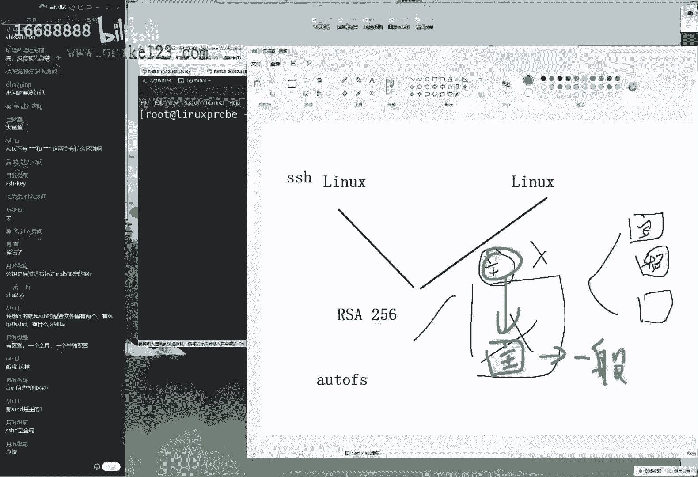
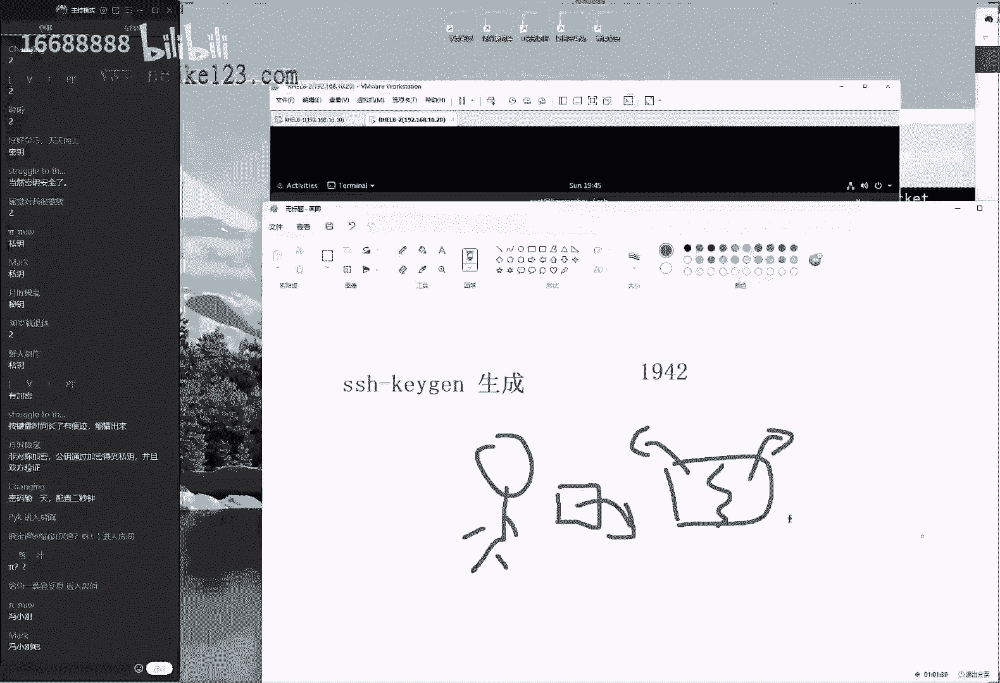
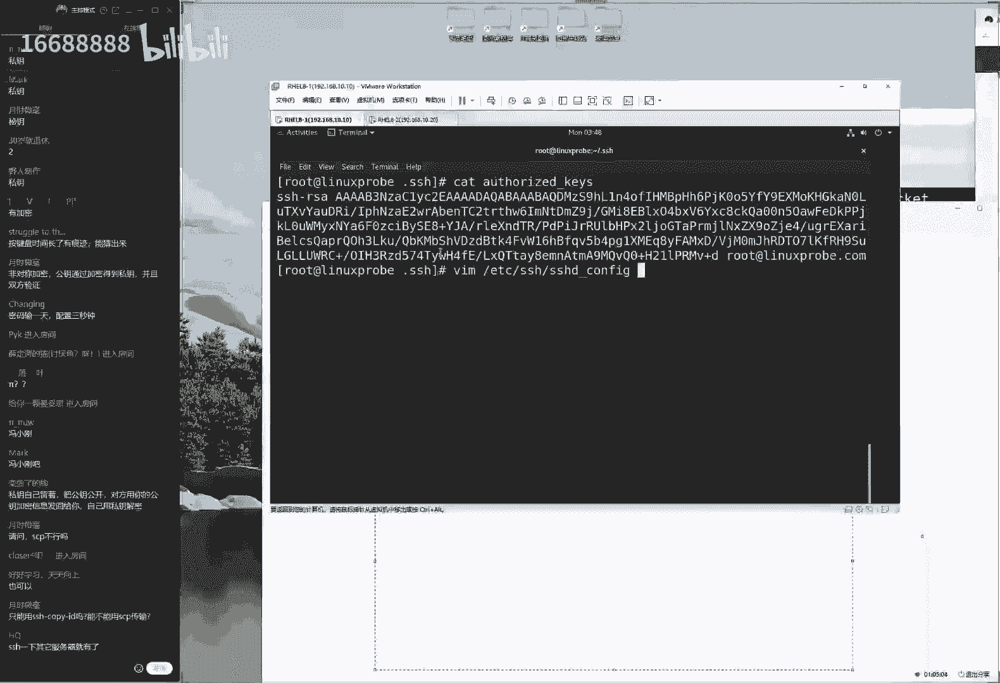
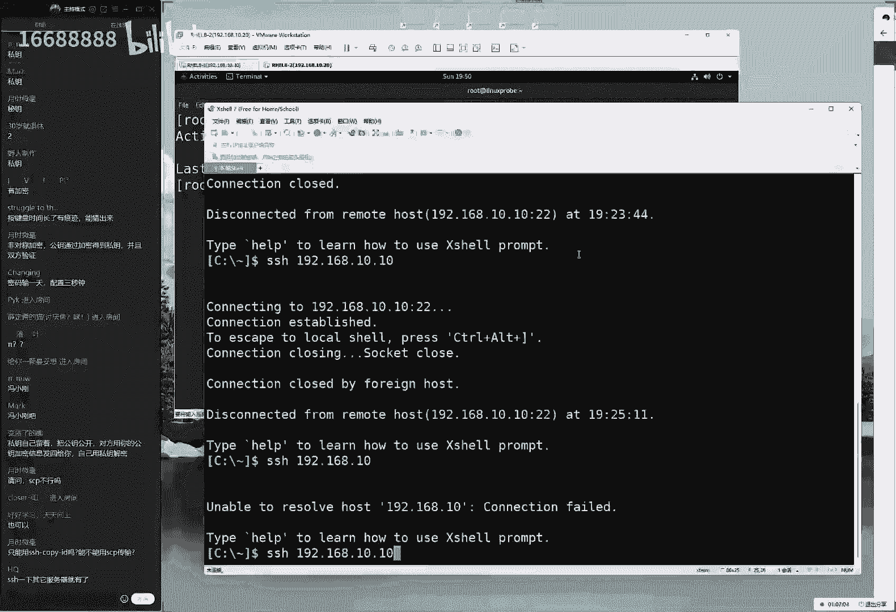
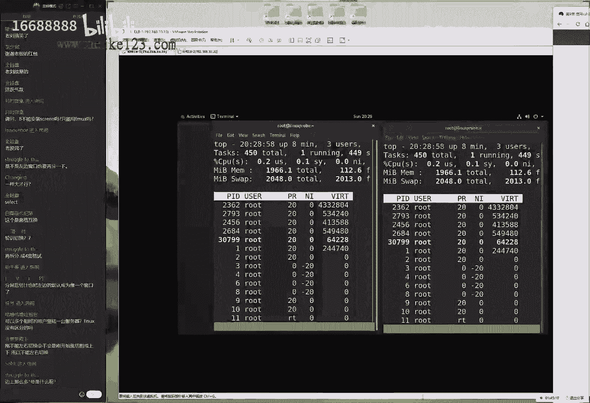
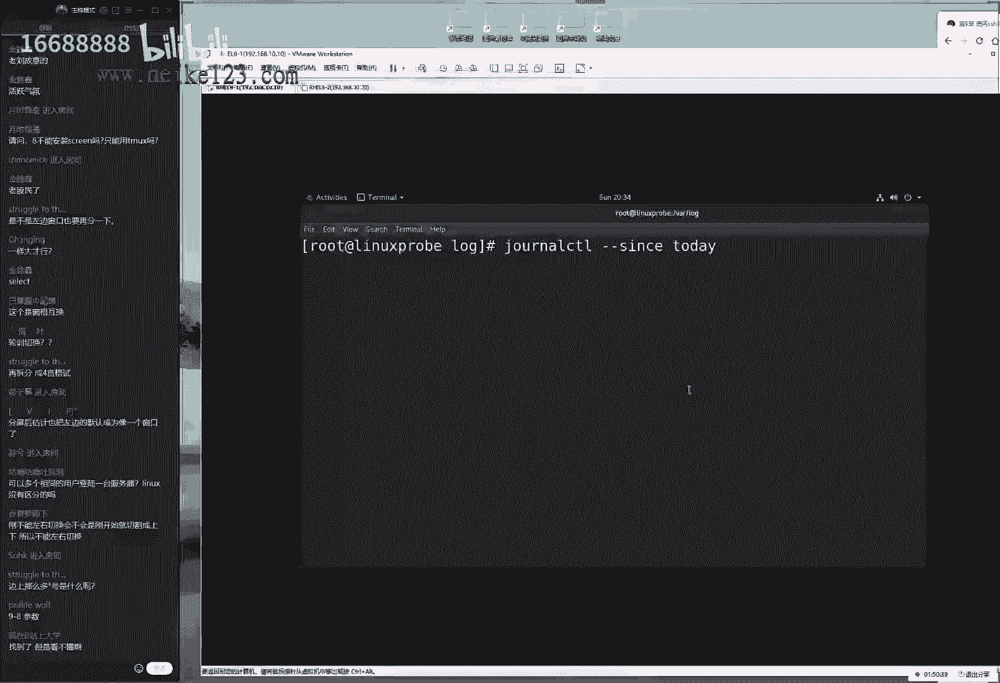

# 刘遄培训linux34期（配套linux就该这么学第二版，RHCE8） - P13：14 - 16688888 - BV1gL41167vP

you're so listen to have you，madam like it，ok我们我们来开始进今天这个课程啊，大家先打一下，一我们来开始进今天这个课程了啊。

先来测试咱们这个上课环境，大家看一下咱们屏幕的话呢，那么看到咱们这个画面啊，然后画面我们这个声音是否流畅好，今天这个人数的话，刚才等了一小下下啊，61位同学还好，我们估计今天这个人数能达到75以上吧。

应该问题不大，那我们现在给大家说一下，我们今天这个课程安排是这样的，我今天下午大概规划了一下咱们这个课程呃，我们的话呢今天给大家讲到第十小节，然后我们会去简单去讲一下这个网站服务。

但是的话呢可能不会特别多，我们时间的话大概也两个小时左右。

我们从下周开始的话呢，去讲一下自动化运维，等于说我们就把这个r h3 c和20，c的所有东西吗，那我们提前给大家都讲完了，这样的话呢我们如果想要去考试的同学，那么虽然这考试现在还约不了啊。

因为现在这个全国疫情吧变得非常的严重啊，但是的话呢我们那我们就可以提前来去做一下，准备工作了，那也就是说我们下周讲完了呃，这个课之后，同学们就可以去做一下hc的一个备考工作了，因为单啊。

但是这个月考的这个事情的话，可能要拖到5月的一个十几号了，因为现在全国疫情比较严重的话，尤其是北京和上海确实比较严重，都已经封城了，所以的话大家可能需要耐心啊，大家好，可能是需要耐心等待一下了。

好我们来先翻开书吧，看一下我们这边这个9。2小节，讲一下这个s s是一个服务，因为大家今天笨的同学也比较多，说老师什么时候能够学考试，不要着急，说我们下周能玩啊，那我们下周学完了之后。

是不是能约一下5月底或6月初呢，呃这个暂时还不可以，还是要等一下具体的一个政策，然后大家说r gc考试内容都讲完了啊，大家啥耳朵啊啊没有没有的啊，是明天啊，不不是我们在下礼拜的时候就讲完了啊。

我们下礼拜的话讲自动化运维，当前还没有讲完啊，大家说深圳约不了吗，深圳也不能约，因为广东的话呢属于他们属于华南考场，华南考场现在全都停止了，所以要等一等了，呃好我们来继续来给大家去说。

因为现在这个疫情的话，那确实很严重，昨天啊我也接到电话了，然后北京这边的话呢也一直在做排查，然后因为我跟一个呃确诊的一个病例，然后呃都同时去过一个超市了，所以的话呢昨天才在七点半的时候。

给我打了个电话啊，但是的话呢我们虽然同意啊，但啊虽然我们同意啊，呃虽然我们一起去的这个超市，但是我是4月9号去的，我啊我比他提前了20多天去的啊，这也算是一个时空伴随者了，这就是很扯的事情啊。

不过也能看得出来，咱们国家对于这个事情很重视啊，好我们来给大家往后面去说说一下，这个9。2小节，我比那个人提前去了20多天啊，怎么能做时空伴随者呢，都已经提前半个多月了啊，来看一下。

就大二小节讲一下这个服务叫做s h，也就是说我们现在这个国内的话，对于这个防控力度非常的大，我们对于这个考试的话呢的这些啊，不能够控制这些变量的话实在太多了，可能说不好哪个城市就被封了，所以我们叫大啊。

所以我们就先等一等，先不要着急了，我们课就好好去听就好了，然后对于考试的话呢，就先放一放，先来看一下啊，9。2小节，我们说一下，我们的s h叫做远程连接的一个协议，叫远程控制吗。

那也就是说我们如果说有些我所做的这个啊，那我现在所在这个城市啊，是在北京，那我以台服务器是在上海，那么我们就可以通过这个远程连接协议，然后就直接对它进行控制，这就是我们去使用到linux服务器的。

一个很好的一个啊协议，我们可以进行一个远程的控制啊，远程的一个控制，那么我们对比一下这个windows里边，这个图形化界面的话呢，我们可以给大家去说，就是它这个延迟性会更低一点，然后嗯，因为的话呢。

我们的s s h它是基于一个文字界面的，它是基于命令行的这样的，一个方式来进行控制的，他传啊他就g传输的是一个文字，而上面的话呢我们的啊windows，它它传输的是一个视频跟一个呃啊。

它传输的是它实际上是一个画面，好吧啊，以及是一个视频的一个形式，但我文化去使用的linux这个s h，它实际上传输的是一种文字界面，因此的话呢它具有了一个效率更快，然后的话以及延迟更低这样的一个特点。

那么我们来先给大家说一下啊，就是呃我们有一个原则性的一个问题，就是我们的linux里面的一切都是文件，这个最后再给大家啰嗦一句啊，因为这是一个理论基础，我们明白了这一点。

才能够知道我们该怎么去配置我们的服务，首先来讲linux系统中的一切都是文件，这个没有任何问题，好吧，这个我们说了很多遍了，大家大家都已经听烦了啊，但我们第二点的话呢，就是那是那啊。

那么既然一切都是文件了，所以我的话呢我们配置一个服务，就是在修改这个服务的，怎么样呢，就在修改我们的配置文件对吧，因为title是文件嘛，所以我们在配置一个服务。

也就是在修改这个服务所对应的一个配置文件，第三的话呢就是要想让我们一起来说说啊，要想啊要让新的参数说啊，新的参数新的参数能够生效，那我们一起来说，是不是要需要去重启一下对应的服务才可以啊。

但是会有一些例外，比如说网卡服务他们就不用了对吧，因为我们就只需要去启用一下就可以了啊，包括说我们这个网卡服务的话呢，它不需要第四个，他还是不需要加入到启动项当中，它就会在下一次的时候依然能够去启用。

因为这个主要是大家也问到了，就是说因为它的话主要涉及到了，我们的网卡里面有一个参数去启动参数，只要把这个启动参数设成了是为启用模式啊，那么就能够自动启用了，那么以前那啊。

但是对于我们这个大多数服务来讲啊，还是都需要加入到这个启动项当中才能够保证，然后我们下一次重启过后，下一次重启后依然能够为用户提供服务，能够长期使用啊，依然长期有效啊，那我们今天给大家说一下这四点原则。

那我们今天也提到了，我们的s h，那么就要去找到它所对应的配置文件，然后再去实现出来，这对啊对这个服务的一个配置工作，那我们来先来给大家看一下，那么这个怎么去找呢，根据我们第六小节啊，第六章节第一小节。

6。1里面所讲的f h s这样的一个协议，那我们知道了他的所有的配置文件的话呢，我们系统的配置文件以及我们的服务配置文件，大家一起来说出来啊，根据我们所学习的对对，第六章节里面的这个知识啊。

那么我们的配置文件，应该情况下是放在什么目录里面呢，应该是放到了大英说来了，叫etc目录，但没有问题，etc目录里面，大家说啊，好久开始约，然后最迟什么时间呃，我们预计的话呢会在5月的中旬。

然后才开始去约了，咱们这一期月考时间确实要稍微晚一点，最迟的话呢我们认为应该就在6月，最迟的话，我们最早我我我们最晚的话呢，大概6月上旬吧，说这个有点心虚，因为这个很不标准。

因为这个现在全国疫情的话变化比较的快速，我们不知道下一个城市会是哪里，所以现在暂定的话，就是5月中下旬差不多这么一个时间好大，我说出来了，我们现在画的这个目录，所对应的就是一个etc的一个目录。

它里面保存的就是我们系统里面的配置文件，以及我们的各个服务的一个配置文件，总之一句话就是要想找配置文件就找他啊，大多数情况下啊，那么大多数情况下它是在这个目录里面，基本上来说95%吧。

但是我们有一些反例啊，就是我们比如说同学们会问到，输入我们的域名解析服务啊，包括说我们的这个网站服务啊，他有些配置文件它也是放到我们的vm录里面的，这个也有，但是其余的目录里面的话呢。

包括我们自己用户安装的一些软件的话呢，也会有这些的话呢，我们各占5%，但是我们大多数情况下，就在这个目录里面就能够去找到了，这个啊，它具有一个广泛的适用性，这是我们的第一点。

既然能够确定的是哪一个目录了，那我们接下来怎么去寻找呢，就要给大家提到了，其实我们在配置一个服务的时候的话呢，我们的一个服务的配置文件它分两种类型，一种的话呢我们叫做主配置文件，这个主配置文件的话呢。

它就是保存的是最重要的配置参数，叫主配置啊文件，这个我们来去理解一下啊，我们先给大家写一下这个定义，但它的里面的定义是啊，保存着最重要的，最重要的配置参数的这样的一个文件。

我们把那那我们就把它叫做主配置文件，大家看这个三国演义里边的话，有一个片段啊，说这个诸葛亮去七擒了孟获，大家会去想，为什么要去七擒孟获呢，因为孟获是他们的统帅啊，他是最重要的一个身份。

所以我那我们只要把这个孟获给搞定了，那么其他人也就啊没有问题了，所以我们要怎么样呢，擒贼先擒王，我们一般情况下要想去配置一个服务的时候，都先去找一下做这个主配置文件的一个文件，然后我们再去查找一下。

它里面基本上就有我们想要的这个参数了，第二的话呢我们把它叫做一般配置文件，这个的话呢就可以感觉出来了，这个的作用啊，这个的重要性的话稍微低一点点了，它主要的话呢，就是保存着一般重要的这个文件啊。

保存着一般重要的这个配置啊，配置参数啊，不好意思，这个我有点不太严谨了，配置参数同学们以现在所写这个为啊为准啊，保存着一般重要的配置参数，他的话的一般情况下，它是由主配置文件来去调用的一个关系。

它是由主配置文件来进行调用的，一个子配置文件这样的一个作用啊，这样的一个情况，那么我们既然提到了，就是说我们的一个配置文件的话呢，就是它是由两部分啊，他可能他可能是有两啊，两种这样的一个方式去保存的。

那我们怎么去找到这个主配置文件呢，它有一个简单的一个寻找的一个口诀，他是这样的，他的话呢是在e d c目录里面，他会以服务的名称来命名一个文件夹，然后的话呢再以服务的这个名称命名一个文件。

最后点c o n f结尾，大家先记一下这个原则，虽然会有返利啊，虽然有啊，虽然会有些服务跟他不一样，但是95%以上都是这样去找的，或者的话呢以它为一个呃模板，然后来进行一个简单的调整，它会有种可能。

比如说最后的话呢可能是以config结尾啊，或者说它会以其他这个词结尾，或者它这个复名称后面加了一个d，或者少一个地，因为叫做这个守护进程，叫做啊守护进程这样的一个词，所以的话就是。

但是我们只要知道这么一个原则了啊，以我们复名称命名的一个文件夹，然后的话呢以服务名称命名的一个文件，然后我们这样去写的话，大部分情况下我们能够猜得出来，它就是主配置文件了，除了这个以外的话呢。

我们还有一些情况，比如说mysql服务对吧，我们的数据库，还有的话呢我们的呃这个缩减服务对吧，我们来给大家看到唉，呃自动的为我们的自动文件系统啊，ultra master啊，好比还有啊。

还有我们的mysql这样的服务的话呢，它会是直接在我们这个系统里面，然后来去写这样的主配置文件，但是基本上我们也能看得出来，那么大多数情况下，它都会以我们现在所写的这个为准，我们叫做主配置文件。

好我们先来找到它这个锁定主屏文件，我们来给大家去操作的啊，呃是这样的，首先的话呢去找到这个服务的一个主配置文件，它是这样去找的，我们可以通过我们的table键来进行补齐，来看一下。

他的话呢叫做啊以西的名称来进行命名，后面的话呢我们的s1 h还可以按两下tab键，它里面它里面会有很多的，以s开头的这样的一个文件，那么这个文件啊啊那我们这个服务的话呢，它的这个主配置文件的名称叫做啊。

s h d下划线config，虽然这个名啊，虽然这个名字啊，就跟我们刚才讲的那个口诀有点出入，但是基本上我们能够猜得出来，这个就是我们的主配置文件了，好我们去敲一下，回车之后进入到里面看一看。

它要它它都有什么样的一个东西，那大家看到了这个里面的话，大部分都是一个蓝色紫萱啊，这个所看的这个蓝颜色字的话呢，它有一个共同点，就是它里面的这个所有的这个语句的，前面都有一个井号，这大家需要记一个事情。

就是所以这个井号开始的，跟这个分号开始的，那我们都把它叫做这个注释信息，大家需要注意两点，第一点很多学的话呢，只知道以井号开始的叫做注释信息，但是实际上以分号开始的也叫做注释信息，这两种都叫做注释。

第二的话呢就是需要注意的啊，我们做的这个注释信息，它是对于我们的服务的功能一种说明，或者的话呢它是一种对于参数的中介绍信息，他是给人去看的，机器是不读的，所以的话呢遇到注释信息的时候。

我们可以简单去看一下，他在他的那个大概作用就行了，它并不会在我们这个服务器里面，真正的去起什么作用，它主要是容出啊，它主要就是来进行一个说明的一个作用，好我们来给大家看一下，是这样的啊。

以我们输了一个舒畅为例，给大家简单的去做一个小小的操作，比如说我现在先去解释一下行数，它因为在我们这个编辑器里面vm吗，它的这个冒行模式，我们当时讲了他这个作用了，那它分为三个模式为tv啊。

它是为命令模式，输入模式以及末行模式，这个话呢默化模式它有啊几个作用，第一的话就来进行一个文件夹保存，第二的话呢技能文件的退出，第三个的话呢是用来去设置编辑环境，那我们就可以这样去了，再进入大帽啊。

来进入到我们的默寒模式里面加啊，去敲一个冒号，然后是赛前u这个时候n下回车诶，可以显示一下行数，设置一下我们的编译环境这样的一个效果啊，这样的一个效果，大家说我们去使用的dnf安装完的软件。

配置文件和大部呃，呃我们的配置文件也大多部分。

大部分也是在etc目录里面吗，是这样的啊，是这样的啊，只要我们没有呃特别的声明的，它所有的配置文件它都会放一点，它都会放在e tc目录里面的，那所以我们说95%的话呢，它具有很好的适用性啊。

好我们来给大家看到啊，大家说这个叫做赛程又没有问题，好我们现在给大家简单做一个小小的介绍啊，不小小的一个实例嘛，既然说到了配置服务吗，随便找一个，比如说第46条。

这个指的叫做permit root login，它指的是是否允许啊，我们的管理员去登录，那么当前的话呢是为e它指的是管理员问他，那好了，我们现在的话先简单去从远程去做一个，去做一个连接的测试。

另外的话呢昨天同学没有提啊，然后我就默认大家都已经下载好了，这个的话呢，我们可以通过windows的一些工具来远程连接到linux，这个服务器，因为大家虽然没有提，所以我们就没有给大家传那个软件啊。

呃是这样的，如果说你要想去守一台windows的话呢，来啊来啊来去连接一台linux服务器，那么您需要下载一个第三方的软件，那么如果说您是两台linux之间来进行，互相的数据传输的话。

那么则自带有了s是这样的命令，那么您不需要再去下载了，那么如果说大家要去使用到windows的话呢，呃呃同学们有用过哪些工具可以说出来啊，让我们用的比较多一点的，那我先说啊，反正就是我用过的啊。

比如说同学们昨天提到的叫做secure，c r t对吧，这个我也挺喜欢用的，但是好像是收费版本的s e c o r e啊，然后的话cp c r t这个我用过，而且的话呢也挺好用啊，只不过我当时我做。

我当时的话是学习c3 a和c3 p的时候，用它来管理路由器时候用过，然后后来呃然后的话好像后来就收费了，淘宝上面买一个破解的一个呃，破解版本好像还有三五十块钱，然后我就觉得这个软件的话。

好像也没有那么香了，后来我就换成了另外一个工具，叫做char shell，那这个的话呢在这个国内是收费的，但是在国外的话呢它是免费的，他是被国内的一家公司很无良和代理了，那同学们如果要想去下载的话。

你可以在这个谷歌上面去搜索到，他的一个免费版本，并且的话呢我觉得从官网上下载，更加的这个靠谱一点，然后第二还有还有还有还有我们的这个，第三个对吧，叫做这个party，这个大家的发音一定要注意啊。

这个话呢它并不叫做pg，它叫party啊，他的话呢这个等它跟前面两个啊，以及大家所说的这个啊，我用的确实不多啊，这个的话呢我们的一些区别很明显，就是它不需要进行安装，如果说我们经常去做一些底层的集成啊。

这些工作需要出差啊，这个时候可能就会把这个工具放到u盘里面，然后到那之后就可以去使用了，它是不需要进行安装的，它是免安装版本，可以放u盘里面就可以去用了，我觉得这个还是有点特色的，这还有点特色的。

其实的话呢还有什么呢，待会他要说哦，final shell是吧，这个也可以，但我们还有其实还有很推荐的一个，这个的话呢我们推荐大家用这个工具呃，稍等一下，这个名字很长，我给大家记下了，诶，等一下哦。

好像我给卸载掉了，那个工具就叫做s h一个连接工具，他这个工具的话呢简称也是叫做s h，但是很好用，它分为两个中，它分为两个端啊，它跟这个叉shell是一样的，它跟x shell是一样的，分为两个端。

一个进行远程的控制，一个进行的是远程的，稍等一下啊，他一个进行远程的控制，一个进行远程文件传输啊，我们待会给大家讲到，他为什么他可以去实践出来文件的传输，s h下载这个啊，我找一下这个文件名称。

因为它正好等同于了这个s h的那个名称，也也也也也是很好用的，因为当时有段时间我被骗了，我被百度上面那个叉shop给骗了，所以的话呢我就用了一段时间，这个呃工具后来觉得也挺香，也挺好使的啊。

大家可以下载一下这个工具的话呢，我给大家找到了啊，这个只不过可能国内用的人比较少吧，s1 h叫做secure shell，大家可以去搜一下，这个也挺好用的，你可以从百度上一搜就能搜到这个工具了。

好这个的话也很好用，大家说我们可以去使用的，win 10或者win 11的cmd也可以，但我觉得第三方这个软件的话，它还是有一些先天性的一个优势的，比如说的话呢，我呃比较我们。

比如说现在我就不太喜欢用到这样的一个终端，cmd进行进行一个原装的访问，那么的话呢我也不太喜欢用到这个party，因为它不能够记录我们这个保存的历史，比如说我现在有台服务器。

我可能每周或者我每天都要去返回一次，那我每次去输入这个ip地址啊，然后我们账号密码比较麻烦，那我可以进行一个信息的保存，那我们保存服务器好的时候，就要用到一些比较专业的软件了。

反正我还是觉得这个比较香一点，大家可能觉得自己用软件也很舒服啊，那我们可以去选择一个你喜欢就可以了啊啊，然后我们接下来给大家去说了。

那我进入远程连接的时候的话呢，我们先去使用到这个啊叉shell的一个工具s h啊，x shell哎，来去说一下我们服务器的地址，一九二零六八点10：10，大家看这个字有点小对吧，那我把它稍微调大一点点。

同学们稍等一下，这个字其实早也没有关系，因为大家不需要看里面具体的内容，只需要看一下他们连接成功就可以了，他只要联动，他只要能够连接成功，就证明我们这个实验室做成功了，大家的话不用关心。

底边的这个具体的显示出来的内容是什么，因为它连接出来那个内容肯定是稍等一下啊，稍等一下下啊，它里面的这个内容的话呢，肯定是呃连接信息而已，不用去多去关注他说啊，稍等一下，我看看那个字怎么调大一点。

大家说我们的i s c p是什么，i c p的话是在linux里边，我们去使用到的它并不能在windows里面去使用，稍等一下，我看看这个字怎么唱，稍微调大一点啊，我就简单看一下啦。

如果没有的话就算了啊，好像应该是有他说按住啊，按那么点一下ctrl加滚轴啊，啊果然是果然是ok啊，这这个原来这么简单，同学们看看经验比我丰富啊，来让我们给大家去连接一下啊。

还是这样还是很方便的啊，同学们又教了我一招来进行远程连接，一九二零六八点10：10，哎，下回车好，我们来去输入一下这个用户名称，叫做root密码的话呢。

就是为红帽叫red hat来敲敲下回车，ok没有问题，登录成功了好了，做好之后的话呢，我们来exit退出它，然后退出到他也。

那么就很顺利，没有问题，下面给大家做一个演示啊，下面给大家做一个演示，就是我想要来去禁止掉我的管理员，去直接登录服务器，因为我的密码如果被人知道的话呢。

那么对方也可以直接用管理员身份，就可以登录到我们这个服务器了，根据第五章节，第一小节里面所学习的用户的三个身份，管理员的这个权限的话，它是最大的，限制是最小的，他可以对硬件的他要进行编辑器好。

它很不安全，怎么办呢。

那我们可以把它给禁止掉，首先进入到我们的主配置文件当中去，使用到我们的vim编辑器，稍等一下，调到一个稍微舒服点的位置，然后我们把这个yes给它改成一个no，就是说我们不再去允许管理员去登录。

我们的服务器，这样的一个作用好我们点一下这个esc键，返回到命令模式，下回再w q宝存并退出。

哎来下一架回收，这个时候的话呃，我们给大家提一个小问题啊，这个问题其实很简单，我觉得我啊，那我们请问现在我再去远程连接这个服务器，我还能否去使用大管理员root去做登录呢，大家告诉我一哈就可以了。

这个可以稍微快一点，我们当做是一个送分题来，大家告诉我1号就可以了，大家请问我现在我设置过号了，我还能否去水管理员的身份入侵用户，登录我们的服务器呢，啊打着同学啊，很给我面子啊。

肯定是为了配合咱们的演出啊，其实的话呢这个还是可以的。

来先看一下效果确实还是可以的，为什么呢，因为同学们同学们啊白讲了白讲了，看一下是不是我们刚才有讲过了啊，是这个我们讲到了，要想让我们配置出来的，这个新的参数能够继续生效，我们需要去重启一下对应的服务啊。

这个操作我们做了吗。

还没有做，所以现在我们还是可以去做访问的啊，然后来这同学问sm啊啊，control restart来去重启一下我们的s h这个服务，所以大家有没有感觉到在我们上课的时候，做这个实验都特别的顺利。

然后但是我们回去之后的话，您再一起做，说老有点出错，就感觉这刘某这这这这这我们讲完课。

怎么感觉跟变魔术一样啊，怎么上课的时候看的是这样的，但是我们拿回家之后就变了个样子呢，可能就是一些小细节，细节太重要了，来我们去重启一下这个服务s h e是吧。

把它给重启了，顺手怎么样呢，把这个服务加入到启动项里面，让他下一次重启过后依然能够有效，它能够自动去启动等等啊。

他还去啊，一直为用户提供服务，来咱们这样去enable一下他啊，enable做完好，s s h大家是托尔为了陪我们的演出啊，为了让我们去引出后面这个知识。

对不对，来我们先做好之后的话呢，我们来去再次来来来再来进行连接，输入一下用户名称叫做root，然后呃呃然后密码的话呢，我对天发誓，我真的现在我输入的是red hat，真的没有故意输错啊。

我可以对这我是啊对天发誓，然后我现在下回车，但是大家可以看到我现在这个链接的话呢，它是失败了，这就是说我们进行一个原神访问的时候，已经禁止了啊，并啊，并且拒绝了我们从远程的一个管理员登录。

这样的一个操作实力，那么同时的话呢，为了避免我们以后这个实验有影响，我们再把这个参数给它改回来，再去允许他去使用关联的这个身份，来去登录我们的服务器，我们的话呢需要去重启一下这个服务。

然后的话呢就可以再去来进行远程的啊，再来再来进行远程链接了。

可以用到关联的这个身份来去登录服务器，那么我们这个加入情况下，这个操作的话呢，它只需要去做一次就可以了。

enable操作只能去做一次，但是我们在这个re啊，重启服务的这个操作的话呢，我们需要在每一次修改参数过后，都要去启动一次，它才能够去生效，但是的话呢这也是对于大部分的服务是这样的。

有些服务的话他也不需要去重启，但是我们先不给大家举例子，先知道都有他啊，他啊他怎么回事就行了，因为我们99%的服务，它都是需要去重启一下的，有些服务确实不需要，但是我们呃目前没有，但是我们目前还没有啊。

我们现在目前还没有看到吗，好这就是我们要给大家说两点啊。

第二啊，接下来我要给大家去开一台，另外一台linux这个服务器，再开一台linux的服务器，然后我们大家看一下，先有两个标签，这边的话呢左边呢我们的这个电脑，它的地址的话呢会是大家记一下啊。

那我们左边这个电脑的话呢，地址是会是一九二点一六八点10：10，那么以后我们都把它固定了啊，同学们记一下我们的第一台服务器，就是我们第一台主机的话，它永远会是点10：10，第二台的话以他永远会是点10。

20，然后第三台的话，他啊他要是有的话好，我们会永远会是点10。30，也就是说同学们记下来以后，我们在做这个实验的时候，不用把自己的这个重心放到配置网卡上面了啊，不用老担心说哎这个地址到底是哪个主机啊。

就不用去想了，我们从今往后所有的地址第一台，第二第三台都这么去写啊，把自己的重心啊，把自己的这个重心王权啊，啊完全都投入到配置服务上面，而不关心这个网卡参数了，好这里我们先给大家说完了。

接下来我们进入到这个第一台服务器上面，我们去ip tables清空一下，然后避免它给我们捣乱吧，我们主要是使用的这个firework防火墙，四个保安，我们去把其中一个保安给他撤职。

这样的话呢能够让我们这个不防，让我们这个防火墙里面的这个策略吧，它不会有一些重复的这个点，因为大概的话就在第19期，高跟第22期的时候，好像就记得犯过错误，当时咱们讲课的时候。

我就怕咱们在上课的时候出现问题，因为一旦在上课的时候出现问题了，排错，因为这个排错的话呢其实很简单，但是它这个时间是不定的啊，他有可能说啊排五分钟，还有可能排50分钟，他可能拍半个小时。

当时我记得第19期或者第22期。

就出现这样一个问题了，我们就讲到这个啊，远程连接服务s s h，结果的话呢把防火墙都给他放行了，我们去使用到firework gus mb，然后咔咔一顿操作啊，然后把这个服务交到里面去。

各种操作都没有问题，然后我们去检查了网卡呀，我们的i see linux都检查了一流超过啊，然后我们又把这个服务的话就都给启用了，确认都没有任何问题了，结果呢我们排错排了半个多小时，后来我才想起来。

是因为我们正好的话呢，我们第九章节讲的是这个啊远程连接起义吗，第八章节讲的是防火墙，就是因为第八章节讲完之后，我们忘记把这个防火墙策略给他怎么样呢，给他清空一下了。

当时在红包热器里面有一个服务叫做tcp viper，一个工具，当时我们就以这个啊服务为例，加入了一下对于s h这个禁止条目，然后呢我们etc目录里面的house点点n，我当时我编辑过这个文件。

然后的话呢，把我们的s h d这个服务给他禁止了，结果的话我们讲第八章的时候，结果就发现诶怎么都检查了一遍还是不行呢，就是后来发现诶，他确实是这么一个啊防火墙冲突的问题。

所以我们现在的话先剪成一个习惯啊，把我们的ip boss给他清空了啊，去着重去管理我们的这个firework防火墙，好，我们现在都做好了之后，可以去从我们的这个第二台主机啊，这是第二台主机地址的话呢。

是1920~8点10。20，最后再啰嗦一句啊，最后再啰嗦一句了，以后我们就这两个标签，我们就默认大家看一下这两个标签呃，左边那台就是10：10，右边那台就是10。20，它是为服务器，它是为客户端。

当然了，他们可以互为因果，那我们这个的话呢，其实并不严格区分服务端跟客户端来，大家怎么样说出问题要发红包，发红包肯定是一方面的，这必须要发的啊，但是的话呢耽误时间也是很啊，很自责的。

来我们给大家看一下啊，现在先去从远程去拼，我现在地址的话是10。20，所以我去拼一下服务器，1920~8点10：10，来点十点时拼冲，他没有问题，走你啊，大家说完啊，没有预先安装一个啊，没有预先安装啊。

什么服务呢还是什么，然后我们来去重新去拼一下，看到这个网络是能够通信的。

另外的话呢在我们的linux里面拼的这个数据包，它是一个呃会一直拼下去，没有一个呃结束的一个次数，那么在这有些啊他啊他啊他是有一些区别的，windows里面的话它是拼四次啊，linux的话它会一直拼。

如果想让他去暂停的话呢，我们可以去按一下ctrl c再把它给停止掉，因为这个同学好像也问过这个问题，怎么还给停止了啊，很简单，ctrl c来终止在我们正在进行的这个服务。

然后现在给大家演示一个简单的演示，一个什么事情呢，我想给大家演示一个有点难度的，今天这个太水了，大家感觉到了，就是我们要给大家讲一个底层逻辑。

我们的我们的s1 h，这个的话呢是一个安全的一个远程连接协议呃，他的话第一个字叫做secure，secure，它指的是一个非常安全的一个连接协议，这个怎么去理解这个事情呢，你不能看人家怎么去吹对吧。

比如说老刘老说自己长得帅对吧，但是我们没有见过面，怎么知道我帅呢，那我怎么能够去证明一下这我所说的这个啊啊，那我怎么来来去证明一下，我所说的是一个呃正确的真理呢。

所以我们可以来看一下啊，就是在这个服务当中能不能啊，我们的啊s s h，然后画下划线config找到了这个主配置文件，因为在我他之所以他改的叫做安全，远远程连接协议。

就是因为s h里面的话呢有了一个新东西啊，这就是他也不算是新东西，它就是一个从红毛reo 6开始启用的，一个二版本的一个加密验证的一个方式，我来给大家看一下，里面有个参数，里面有个参数啊，找不到。

那算了吧，反正这里面有一个参数啊，可以看到它是一个vr版本的，他的话对比于说v一版本的话，它更加安全了，加密算法的话那更加严苛了，他说的安全实际上都是相对的，我这边我找不到了，反正有一个参数。

就是一个vr版本的一个参数的一个开启，然后它它它是有别于第一代的，它是怎么回事呢。

它就有它是啊有一些对比的，因为我们知道在这个电脑当中的话呢，远程的访问或者远程的控制这样的一个协议，同学们可以说出来，比如说我们的网站协议啊对吧，还有的话呢文件传输协议，以及我们之前我会常用的。

一个叫tnt的一个服务，这个的话呢就是一个呃，并不安全的一种连接协议，它的话这三种协议都有一个共同点，就是他通过这个名文来传输这个信息，所有的这个信息都会通过这个铭文来进行传输。

包括说我们去输入这个账号和密码，只要我们公司的这个服务单啊，只要我们公司这个居网内有一个小孩，破坏分子在这个网关上面的话呢，放一个嗅探工具哎，装一个小嗅探工具，所有的数据包的话呢。

然后能够帮我们啊去做一下拦截啊，嗅探工具，然后他会把所有的这个工具的话呢给他啊，然后他会把所有数据包的啊都来去啊，获取到这个信息，它推啊，它可以通过关键词的匹配，然后比如说匹配一下用户名称啊。

这样的这个关键词就能够猜出来，我们所说的那个值它是什么了，那我们就要相对来说要进行加密了，加密过后的注意一个啊的这个数据，包括说我们登录这个账号和密码的话呢，它都可以啊防止被别人给破解这样的一个效果。

所以它叫做啊，他就是他他是叫做啊，非常安全的一个远程连接协议，它的话只限于说我们控制linux服务器来去使用的，好，然后我们来给大家说一下，它有两个连接的这样的一个模式，第一种模式的话呢叫做口令模式。

也就是说他的话都是通过加密了，然后他都他都是经过了这个加密方式的，但是在这个加密之上的话，他就更加安全了，它叫做账号密码的一种可能验证方式，它支持了常规的考验证方式，它的话呢也支持了我们这个叫做密钥。

验证方式来啊，它可以通过我们的啊公钥跟cl，来进行一个加密跟解密，大家问了一个问题，大家说大鲨鱼啊，第二个同学问到说，我们在etc目录里面有两个文件，但是两个文件是什么区别呀。

但是您这个文件名称被变成星号了，看不到啊，看不到，然后大家可以再发一遍啊，比如说同学们想提问问题的时候啊，比如说想发一个网址好，腾讯的话，大家以为是发了个网址呢，他他以为是发了个广告呢。

可以拆两段嘛对吧，你可以拆两段去发，我也能够看得懂啊，这个啊，但是这个三个星号确实看不懂了，然后我们来给大家看啊，就是说我们现在进行远程访问的时候的话，它有它有两个的这个验证方式。

一种的话呢是通过口令的方式来进行证的，也就是说需要让让用户去输入这个账号和密码，来进行访问，第二的话他也通过这样的一个密钥去登录了，当然我知道大家会说啊，说我们这个词的话叫做蜜月是吧。

他的话呢虽然要是他要，但是我们读音的话呢叫做蜜月，但是它是有争议的，呃我们就怎么瞬间怎么来的，我们就把它叫做这个cl文件了，那当我们可以来到这个4月文件都可以，我们只不过大家听起来更加顺耳朵啊。

这样的话呢呃比较好记一点，它的话呢可以去实验出来，我们两个文件的这样的一个加密算法，他的话呢会有一个公钥信息，会有一个sl信息，所以我现在所所说这个cell啊，就是大家所说的那个4月。

他俩啊他的话两个是一样的，来cel文件跟公钥文件，他两个的话呢是用来去做加密和解密的，cl文件是用来去做加密的，然后的话呢我们的重要文件的话呢，是再去做解密跟验证的，所以大家记一下这两个的区别。

来解密跟验证这样的一个作用，那有了这个加密的这个加持啊。

然后以及这两种验证方式，这样的一个那登录方式的话呢，它就可以让我们的服务器登录更加安全了，在现在打开另外一台linux的服务器，我现在的话啊，我看有同学迟到了，今天这个迟到的人数有点多多呀啊是这样的啊。

再总结一下，如果您今天迟到了，我还说今天有75同学呢，现在80人了，挺好啊，但是迟到人数有点多啊，刚才60人，现在80人，差20个人好，我给大家说一下啊，我们现在做什么实验呢，讲的是s1 h。

那今天有1/3的人都迟到了啊，今天讲的什么协议呢，我们讲到s h进行远程连接访啊访问，然后的话呢我们现在准备出来了两台主机，两台主机，两台不同的主机呃，其中的话呢一台是linux的服务器啊。

另外的话呢也是一台linux服务器，现在我们需要做的就是从其中一台。

再去远程连接到另外一台主机来，直接我们的s s h客户端，服务端都默认安装好了，我这个我们是不用去管的，直接s h一九二点一六八点10。10a下回车，远程过去，他第一次登录的时候。

他会说是否去接收对方的这个指纹信息，我们选择的是一个为yes，ok没有问题，a一下回车，然后再来的话呢，请输入一下，我们这个管理员入侵用户在远程的这个密码，我们来去输入一下叫做red hat。

ok没有问题呃，我们登录好之后的话，大家可能会问啊，大家可能会问一个问题，就说那我们现在怎么能够知道。

我已经从这台主机远程到这台主机呢，我们怎么能证明一下他确实成功了呢，我觉得再好的证明不如去重启一下吧，来去reboot一下。

当我在我的本机去敲一下reboot的时候，看看是谁重启，来看看是哪个小可爱，是不是左边一台主机重启了。

所以这说明这就是一个叫做远程连接协议，它能够啊远程控制协议，它可以通过远程来去管理我们买他啊，他管理我们的某台主机，大家说我们的功效信息是，它是通过我们的md 5加密吗，不它并不是它。

它通过的最哈希值啊，256，这样的话加密的方式来去做出来的啊，r s c，然后256这样还是加密出来的，这个我们待会大家有一个演示。

但是我们加密过后，那个文件里面会标注出来加密这样的一个格式，好大家问了一个问题，大家说我们的s h文件里面啊，配置文件里面会有两个，一个的话，那就s h，一个叫做s h d有区别吗，有区别。

那是有区别的，我们一个叫做主配置文件，其余的话我们就叫做子配置文件啊，它有两个的话呢，参数一般情况下他两个还是不一样的啊，他两个参数一般来说它都是不一样的，就我们一些比较重要的参数。

大家这么理解一件事情啊，大家可能会问这个确定问题是这么去问的，就是说，为什么我们不把所有的参数都写到主页，软件里呢，因为对于一些比较大型的服务距离啊，就比如说我们的网站服务啊，数据库服务，大家想。

如果我们把所有信息都写在一个，主配文件里面的话，主播软件打开可能都需要几分钟时间了，太臃肿了，他像一个大一个小说一样啊，就也找不到重点了，所以的话呢我们就选择这样的一个方式，但是我们所说的是。

一般情况把最重要的参数具有通用性的，或者大家同学们问到了，叫做这叫做这个全局参数的话呢，或者说最重要的才到这个参数，写在一个主配文件里面，然后的话呢在分辨变类，比如说这个是用来管理解程啊，这个安全的。

这是用来管理解成稳定的，这用来的话呢去管理解成账号了，然后我们再把这些信息的话呢，分配变位来进行管理这样的一个作用，所以我们主频软件里边的话，有一个经典的一个误区，就是这个里面的话会包含所有的配置参数。

这是错误的，即便说是一个非常小的一个服务，就类似于刚刚我们提到的叫做auto fs对吧，叫自动文件系统，它都有好几个配置文件的啊，就是说这个呃有一个误区，就是主配软件里面的话包含所有的参数。

这个是错误的，我们或在啊，最后我们再换过来，为什么呢，呃我们会提到一个问题，说老师为什么我在配置这个服务的时候，我们有我们没有找到某个参数呢，就是因为我们的眼睛只盯着这个主播软件啊，那我们就指啊求啊。

就是我那我们的眼睛只看那个主配置文件了，我们可以把这个呃呃再去看一看，这个其他一般配置文件去找一找，它里边可能是通过第二的方式来去获取的。

这样的一个参数来，我们现在的话主服务器又重启好了，我先加再来去远程链接一下，也没也没有，也没有啥意义啊，反正就是他肯定是能够成功的。

那这肯定没有问题的，下面我给大家演示一下，就是说呃有一个简单的一个小问题啊，现在去说一下，请问通过口令的验证方式更加安全，还是通过我们这个cl，就是我们通过我们的密钥方式来进行加密。

更加安全呢一个小问题啊，送分题，请问呃请问我们现在啊cr文件，请问我们通过口令的方式来去加密，来去登录比较安全，还是通过cl登录比较安全呢，大家说cl啊，当然cl比较安全了，但是为什么会这样呢。

首先来讲我认为第一是算法问题，它更加复杂了，第二的话呢是长度问题，我们的密码就是再复杂了，比如说我的我的呃密码，比如说啊我数一数啊，12345678 90，大概的话怎么着也不能超过20位吧，太差。

因为在超过20万的话就很长了，那好了，我们的这个呃加密出来，这么一个cl文件的话呢，它可能会有几百或者是啊会有上千位，它最多的话呢，反正我见过的啊，4096啊啊啊，2048，这都是非常常见的。

所以这个话呢更加安全一点啊，这个长度和加密算法来讲智能安全的，那我们先给大家做一个实验，就是我现在能不能通过这个cl的一个方式，来去登录服务器呢，那这个是我们做的第一步。

第一来讲就是去启用一下这个cr方式，不再通过口令了啊，我们以啊啊，更加安全的方式来去登录我们这个服务器，然后第二步的话呢，是当我们这个通过cr的方式去登录服务器之后，然后的话呢我去禁止掉口令去登录。

也就是说我们有了一个更加安全的一个，登录方式之后，就把这个纤维啊简单的，但是我们也不能说不好吧，因为现在毕竟呃现在的话呢，我们主流上还是输入账号密码去登录，比如说我们去银行取钱也好啊，去输入什么啊。

转账也好，都是通过密码去登录，但是我们认为还是有一些局限性的，它并不如指纹，或者的话呢他可能并不如人脸安全，当然这个可能比较片面啊，但是呃多了一种验证方式，或者的话那我们两个都去用的话呢。

他会更加安全了，因为呃在这个cl上面也可以加口令好吧，就是说我们如果认为cl跟这个口令，您觉得很难取舍，没办法啊，没关系，cl上面加口令啊。

两个我们一起啊，那么的话两个我们可以一起去用，那我们怎么办呢，我们需要先这样啊，先的话呢从我们这个服务器上面，然后的话我们来去生成出来一个不，我们的话呢现在是这样啊。

我们现在的话是需要在我这个客户端上面，是在客户端上面生成出来这个cell跟公钥，然后我们把公钥发送给对方，那我们来给大家操作一下，首先我们的啊s h，然后的话呢我们来去敲一下这个命令。

大家记一下ssh key gun命令啊，generation啊。

generate叫做生成，来给大家打到屏幕上面吧，大家说我们可以啊，看键盘上面的磨损痕迹就能够猜得出来啊，咱们做运维的同学，合作开发的同学，这个键盘的磨损最多的就是ctrl c和ctrl v了啊。

其他也看不出来啥来，我们来继续我们的ssh key杠，它用来去生成出来这个密码文件的，来敲一下回车，然后看一下是这样的啊，他说请定义一下我们这个公钥文件啊，和这个cel文件保存的一个的一个位置。

这个我们没有必要去改啊，我们找不到任何理由去修改它的这个好处，所以干脆就回车就好了，有些时候我们会看到很多小朋友啊就会愿意改，这样就会改这样的这个参数，其实这样改不改无所谓。

因为你看不到明显的这个好处的时候无所谓，改不改，那不用为了改而改好，我们来给大家看一下，下面一条，就是说我们是否要给我们这个密钥文件的话，去设置一个密码，这个话就是说我刚才所提到的，你可以给你啊。

那么可以给你这个验证方式再加一个密码，但是我们认为没有必要了，我们可以就按下回车就好了，第二的话就说呃你是否确认呢，当然我们确认嘛，我们毕竟都是成年人了，我们对自己的行为负责任，在狠狠的去敲一下回车。

于是的话他就给出了一个什么呀，那给了一个小一个小鸡吗，还是一个小圣诞树啊，反正给出这么一个小袜子吧，这样的一个图案，这个图案的话，大家可以看到这个加密的方式是rs 2048啊，2048位啊。

这个的话呢我们其实来讲，它可并不是我们这个cel文件，它既不是公钥，也不是cl，它只是映射出来这样一个呃，大家这里这么一个呃图形而已，它只是我们他然产生出来这么一个结果。

我那我们怎么去看生出来这个公钥跟cell呢，它是在我们家目录里面的，实际上它会有一个隐藏的目录，叫做s h，前面加一个点号，这里面就会有一个工业和c和一个cl文件了。

这个是我们接收到了别人发给我们的公钥，我们不用管，现在的话看看一下啊，首先来说就是我们的这个cl文件，我先来说一下，先来看一下啊，不行啊，那我先给大家先给大家看一下吧，因为反正这两个的话看两个都行。

是不是来首先来说看一下这个cl文件。

也是可以看到了，这个里面的话总共是有2048位组成的，我们就不用给大家做调查了，肯定比我们同学们你们的密码啊，什么qq密码啊，大家对比一下自己的qq密码，然后看一下这个的区别。

他总共的话2048位组成出来的啊，它里边有数字字母大小写，还有这种除号啊，这种特殊符号组成的特别的复杂，我见过最复杂的啊，好像是我在抖音里面看过的一个视频，有一个日本人啊。

然后他把那个啊怎么这个好像把一个什么设备，好像是手机还是什么，还有什么电脑啊，是啊好设置了一个超级复杂的密码，然后的话是一个纯好啊，好像是一个纯数字的，然后敲密码都敲了一分多钟啊，反正反正话啊特啊。

反正就是这个啊非常的复杂，但是它一定不是这么复杂，打游戏，然后各种字符这个我们要去手敲，我估计要敲呃十分钟吧，好那也就是说我们现在的话这是私聊信息，第二的话还有一个叫做公钥信息。

cl信息不要给别人用的啊，cl信息是自己在本地进行加密的，然后的话呢，我们现在来我们来看一下我们这个公钥信息，这个公钥信息的话呢是用来去做发送给对方，然后看到对方来进行一个验证跟进行解密的。

就说他确认一下是我们本人举一个小例子啊。

我们看过一个电影叫1942，好像是张艺谋拍的对吧啊，我我我我我还给忘记了说啊，在这个以前的话呢，没有这个改革开放之前，没有在建国之前的话呢，呃在河南闹了一场很大的灾荒。

然后当时的话很多人吃不饱饭就会去逃荒嘛，这其中有一个片段就是有一个母亲，然后的话拿了一个家里的一个东西啊，行是国行，是个婉儿行业啊，然后反正就是啊就这么一个东西，好像是一个瓷器摔碎了。

然后这样的话呢两半了之后的话呢加两个兄弟，然后啊各拿一半，这样的话呢我们当以后去相见的时候，两个人把东西给它拼到一起了，咱们就知道十几家人了，就是进行一个简单的轻量级的一个验证方式。

那么我们现在的话呢实际上也是这样的，他的话呢是在cl在我们的本地上已经有了，我们现在的话需要把这个公钥给对方，让对方知道哎只要这个信息匹配在上啊。

啊等啊，那我那我们只把这个信息给他匹配啊，给他啊，匹配上了，它就能够代表说对方主机，就是我们所对应的那个信任的主机，他的话有一个命令叫做ssh copy id命令，大家记一下这个命令就用来去传输的。

所以这两个的命令一定要是先后去执行，不能去传输错了啊，不能去传输错了。

大家说防小刚是吗啊，好像不是很记得，不是很清楚了，因为毕竟老刘这个心目当中，我只有一个最喜欢的导演姜文，其他的我们都不太关注了，来我继续啊，我现在给大家说一下什么呢，就是同学们说到了说老师。

你现在说要把这个公钥信息发送给对方，但是我不相信你，因为你说传输就传输了，到底是公有还是私，要你说了算，那我怎么能够证明你所不，那么你怎么能够证明你自己说的是正确呢，好我们来这样来给大家演示一下。

我们通过这样的命令，可以把这个文件的话呢传过去，但是传过去的是什么，到底是不是像我所说的是公钥信息呢，我来给大家做一个演示，除了长得帅以外，我们是不是还要证明一下自己说的话很靠谱啊，啊除了长得帅以外。

我们还是很靠谱的啊，能够靠脸吃饭，还要靠诶，哪去了，嗯哦他默认情况下没有吗，哦我看了一下，稍等一下稍等稍等一下啊，稍等一下，他们的情况下没有吗，啊好像没有没有没关系，那我们就去生成一次。

因为这个服务器吧，我每次都会给大家去去还原一下系统，所以说他把上一次的这个s s，这个信息已经被清空掉了，好那我没关系啊，这样子来进行远程连接啊，进行远程的传输，好。

现在的话需要去输入一下对方管理员的密码，我们叫做red hat，按下回车，然后传过去了，穿过去之后就会在我们的本地，就会出现这么一个子目录了，有了吧啊，现在有了来查看一下这个文件的话呢。

我们叫做s s h h，稍等一下啊，这个文件叫做认证文件，然后于是我来看一下，这个时候呃。

这个文件的话呢，是我在我本地去接收到的一个文件，然后大家可以来看一下这里面的内容，然后我们就记其中的一部分吗，四个a开头，然后是b3 n，然后结尾是v加d好吧。

我们就记这么一个开头和结尾，大家看一下，跟我的本地的这个公钥信息是不是一模一样啊，那b3 n然后加呃v加d没有问题，也就是说确实是拿公钥信息传过去的，这是我们的第一点，第二点的话呢。

就是那我们现在想去做一个什么事情呢，两步走，第一公交信息啊和cl信息既然已经到位了，我们现在的话呢呃搞定啊，就这么去写了，第二部的话呢，我们是不是要能够去禁止掉口令登录啊，禁止口令登录。

只允许密钥登录呢。

这样的话更加安全，密钥登录，这样更加安全，来给大家操作一下，进入到这个服务器当中去，找到里边的这个主配置文件，etc目录里面的s h，然后的话呢里面的s h d啊，找到这个主配置文件，大家问了一个问题。

我们使用的sap行不行啊，也行啊，只不过我们没有讲吧，我们没有讲，所以我们就不用等到我们用啊，所以我们得到啊，所以我们等到讲到了以及讲完了之后，同学们继续用就行了，因为我们现在没有讲吧。

现在讲的话大家会想哎这个服务干嘛用的呢，所以我们就不给大家就是呃跳去讲了，这也是我们为什么自己去学习，跟系统性学习的一个区别，总觉得自己去学习东夏西夏的一个原因啊。

所以我们现在的话啊没有啊，没有去学习的命令，我们先不用啊。

现在的话我们来这样啊，来编辑一下这个文件s s h d，找到里面的这个参数，如果没有记错的话，他应该是在下面，大概的话呢函数是在第啊，在这啊，73行，他说是否来去允许我们的密码登录。

password authrication，好，我们把它给它关闭掉，不再允许呃，他通过密码进行登录，然后吸取上回的教训，同学们吸取上回的教训，我们把它的话呢需要重启一下诶，等一下我敲我敲出啥啊。

我靠我靠，我把呃，我可以开大小写了，来重启一下s s h d，吸取刚才的教训，重启一下这个服务上新的参数能够去升降，大话问道说我们的需求呢。

我们的s h一下其他主机就有了，对刚才没有，现在就有了，现在我们可以给大家看一下啊，现在就是说我们这个服务器的话，只允许s s是这个密码登录了，所以我们先给大家演示一下，我现在我模拟成一个客户端。

我现在的话呢通过这个客户端，s s h直接远程服务器的地址，一九二点一六八点10：10，然后大声说一句，怎么样走你啊，然后就登录成功了，他都不需要去输密码了，因为又引出来第二个知识点了啊，第二个知识点。

第一个知识点他两个登录的方式，第二个知识点，密钥的优先级高于了密码优先级，大家记一下密钥优先级啊，高于了账号密码验证的这样的一个方式，这两个哦我们有一个优先级的一个区分的啊。

然后这是我们的第一个就能登啊，登录成功了，并且他不是啊。

他不需要去输入任何密码，第二的话呢我们是啊，刚才我这个词儿照样是啊b啊，刚才我们这边我看见我的骄傲啊，但是我这个交叉杆打开的是啊。

第十章节啊，然后我们对着这个网站的这个书记，我刚咔咔讲了半天啊，但是我居然没有反应过来，看这个脑子确实还有有点，看来这个脑子确实有点嗯很够呛啊啊，不过好在因为比较熟悉了来，不过我看看今天这个时间啊。

应该讲不到第十章了，今天讲的有点细，讲的有点慢了，这个理论有点多。

来再去远程连接一下吧，去输入一下用户密码啊，输入一下用户账号啊，因为密码已经不当去输入了，大家看到密码窗口变成灰颜色了，因为当前的话呢只允许通过密钥进行验证啊，密码验证方式给它关闭了。

这个的话呢就是我给大家讲到的两种验证方式，我们可以去任选其以及该去如何去生成出来，我们这个密钥文件这样的一种方式啊，这样的一个完整的一个实验，其实我们就到这的话，大家就会心中有一些小小的呃想法了。

老师诶，你看这个东西是这么回事啊，也就是说我们可以通过我们的s s h，去远程连接呃一个服务，那么好了嗯，那么我们他这个远程连接它，实际上这个本质是什么呢，不就是传输信息吗，把我们的一个命令给他传过去。

咔咔咔去做处理，然后又把处理这个结果的话呢又翻回来了，所以呢这也就是说传输的是信息啊，我发送信息发一个文字过去，他要把这个文字过来了，那好了，他既然能够取传输文字，我们能不能去传输图片呀，对吧。

我们可以这么理解这个事情吧，因为也要因为它这个远程控制，不就是在传输这样的一个呃字符吗，那我们能不能传输图片呀，啊那我们来，那那我们当我们能够去传输图片之后，我们能不能去传输文件呀。

那我能不能去传输视频呀，这样的方式好，这个的话呢，我们就可以给大家讲另外一个，这样的一个命令了，它就是基于了我们的s h协议，进行远程传输文件这样的一个命令，它不需要单独去配置了。

他就直接寄到我们的s h协议，就可以来进来就来去，直接去来去传输我们的文件啊，也是同学们刚才所提到的，所以我们来去嗯一步一步走的扎实了，当我们学过之后，等我们以后再有这样的传输文件，这样的需求的时候。

就可以去使用这个命令了，在我们这个呃纵观一下这个技术的一个发展史，实际上会发现很多技术说起来好像挺牛，实际上还都是一些小问题去解决出来的，比如说一开始去传输文件，去传输文字后还可以去传文件。

他是慢慢的来往前去拱他，所以当以后有再去找一个女朋友的时候对吧，或者说再去找一个男朋友的时候，如果这个男朋友说啊，我对你的话呢，我非常喜欢你，我给你指着朋友对吧，我们并不会怎么怎么样。

就千万不要相信对吧，因为我们人类一个天性就是会去怎么样呢，不断去挑战自己的这个上限啊，跟别人这个啊。

这个啊技术的一个更加高难度的这么一个技术，所以的话呢这个技术的发展，就像我们去交朋友一样，关系的话也会越来越好，当我们去学习一个技术的时候，会发现技术的话呢也会越来越呃，这个怎么讲难度越来越深。

但是它底层的逻辑，都是为了解决一个一个的小问题而产生出来的，来我们来给大家说一下啊，是这样的，但是我好像卡掉了啊。

它的话就可以来进行一个文件的传输，呃比如说我现在画的是在服务器b上面啊，不对，我现在是在服务器a上面来，大概是这样的，我们在服务器a上面来to exit，退出到它，然后先推掉它，现在看啊。

我现在在这个客户端上面的客户端上面的话呢，我现在新建出来一个文件，好，比如说这个文件的话呢，我们是叫做哈哈，比如说啊就无所谓了啊，我来哈哈一个文件，然后的话呢我们的内容是巴拉巴拉巴拉，然后巴拉巴拉巴拉。

然后巴拉巴拉巴拉巴拉巴拉巴拉好，我现在可以随便去写一些信息，这个信息不重要啊，无所谓，主要是来说就是我有这么个文件了，我现在有一个需求，就是把这个文件通过我们的ssh这个协议。

传到这边这台服务器的加密录里面，这是一个小需求，怎么那怎么办呢，就很简单了，因为它既然是基于我们的s s，是这样的一个协议，那么我们就不用再去单独再去配置这个，账号和密码登录这样的一个方式了。

可以直接怎么样呢，sap然后这是我们都在做第一步啊，第一步就是准备出台这个文件，要他要是在我们本，他需要在我们本地是有的，第二步的话呢就是去输入一下我们这个命令啊，s p然后我们后面的文件名称。

然后后面的话再去写上，要去传送到对方的这服务器的哪一个路径下来，一九二点168。10，哎，等一下一九二点一六八点10：10，对方到哪一个目录呢，到对方的家目录里面入存目录下，没有问题吧，来敲一下回车。

第二步来第三步，那喝口水，来啊怎么讲课，这个时间过得有点太快了，很难以置信的，现在已经07：55了啊，这个时间都去哪儿了啊，给大家简单说一句啊，然后是这样的，今天的话呢我们原本想给大家讲的第十章节啊。

不呸呸呸啊，从来没有想过，就是我们原本来想给大家讲一下第十章节，但是现在看起来的话呢，时间有点紧张了啊，因为理论句式的话呢，我们打扎实了之后，已经把每个实验做出来之后的话呢。

基本上可能第九章节需要讲两天了，我们今天的话就只讲了第九章节，讲完就ok了，我们下周的话呢给大家讲ensable，那大家的话可以提前看一下，第16章节的这个内容，我们把第七第16章提前提前啊。

我们嗯我们的我们先把它给放到前面去去，给大家去讲，这样的话大家可以把r h3 ，c和hc的东西都给他掌握了，可以提前做背，今天可以提前做备考，因为我们大多数同学实际上是想考这个认证的。

所以我们就把这个提前都给他讲完，讲完之后大家可以踏踏实实做备考，后面的这个知识的话呢，我们慢慢给大家去讲，也不用着急了，因为我之前给大家讲的时候，同学们总会反馈教师，我现在着急考试。

你该先把第16章给我们讲一讲吧，所以我们干脆就把这个第16章讲完了，如果你要是不想去考试同学的话，那么就正好了，那么那么就更好了，下面啊等我们讲完下周课了之后，同学们就可以踏踏实实的去听课了。

不用有同学去着急了，好我们给大家啊，因为我们如果不仅把第16章提前的话，大家会比较着急，先去学，这是我们的一个历史的一个小的一个讲课技巧，啊，来啊，这也是大家反馈比较多的一点。

现在的话呢我们来去远程传输一下。

就能传过去了，进入到服务器端去查看一下，会发现原本是没有的，现在的话就有这么一个文件叫哈哈，没有问题，搞定了，这是来进行一个远程文件传输的，一个的一个命令，它也就是说它可以把文件传过去对吧。

我们的格式的话是这样去做的，大家来记一下，如果要想把一个文件给他传过去，然后那我们就快要去使用的sap命令，然后我们本地的文件名称啊，我就简单去写了，我们再到本地文件名称就叫本地文件啊，这不去写吧。

然后话呢远程这个服务器的一个地址，然后冒号，然后是远程目录这样的一个格式，就可以把我们的本地文件传过去了，呃，因为的话呢他也是直接已经配过了，s s h这个密码登录，所以他不需要去输密码了。

这个的话呢大家先记一下，这是把文件传过去，后来又有人去想了，想了一下什么问题呢，想了一下说啊，大家问了一个问题，大家说我们的ip跟冒号啊，跟ip跟目录之间是冒号吗，对是啊，他之间是拿冒号做间隔符。

大家又问了一个问题，我们去使用它哦，我们去使用到文件传输协议，ftp跟简单文件传输协议tf tp有啥区别吗，啊跟我们拿啊，呃我们的这个文件命令它有区别啊，它有很大区别，我们会给大家讲完我们的ftp之后。

您会有一个很深入的一个理解，然后按以及我们的f tp跟，t f t p都有很大的区别，从协议上来说，ftp t它是为tcp协议的21端口号，然后的话呢，我们的t f t p它是69端口号的一个。

u t p协议，一个稳定性上都有差异，所以说这个差别的话太多了啊，所以我们就放到后面，我们哦我们慢慢跟大家去聊啊，而不是一句带过了，我们就慢慢给大家后面去聊了，但是它这个差别是有的。

而且的话呢还有一个很显著的一个差别，就是我们的ftp的话默认没有安装啊，它需要在我们这个服务器里面安装，叫vs f p d这个软件包，然后有三个月的验证模式，他这个是需要进行安装进行配置的。

而我们的话呢s h moon已经启用了客户端啊，以及这个服务端都已经安装过了，那很香，对不对啊，那么就很香，然后大家说我们的i c p去传输文件，类型不限吧啊我们的，但是我们的文件传输协议。

f t p文件传输类型也是不限的呀，所以这个我们刚才给大家说那个两点，一种是自己体验上的不同，还有一种就是从协议上的不同，这个大家可以先去记一下，我们会具体讲到这个章节的时候，给大家介绍一下。

然后我们现在给大家去说啊，就是说我们现在可以通过这个命令，给他传过去了，把文件后来又有一个大神就行，哎呀你这个文件能够传过去了，那我怎么办，那啊那我如果要是知道对方服务器密码的话。

那我怎么能够把这个文件给他传回来呢，就像有一个人啊，比如说我现在一个很好的朋友，这个朋友的话，他被隔离了啊，就比如说啊但是我现在啊，但是我们现在没有呃，然后的话呢我们这个朋友，比如说他说那个啊。

能不能帮我去家里拿个东西啊，或者说我们家里养只猫，帮我去喂一下猫呢，好，如果说对方把他的这个加密的密码，告诉我了好了，那我能不能直接把这个对方的文件，或者说啊，对方家里面这个文件给他拽到我们家里来呢。

这个也可以去实现的好，首先我们要知道两点，第一点就是对方的密码，你一定要知道对吧，那否则肯定不可以的啊，第二的话就是你要准确的知道这个文件，保存的一个路径，就可以把这个文件给他拉到我们的本地来了。

来我们现在这样子，首先对方的服务器的一个远程地址，远程服务啊，远程服务，或者我们就远程地址吧，啊原来和掌声起义啊，远程地址，然后后面的话呢指的是它所对应的一个，远程的一个我我这边我写了一个远程本地。

啥意思啊，叫远程目录啊，来啊远程文件的意思啊，远程文件我远程远程目录啊，刚才不太严谨了，来远程地址，然后远程目录，然后的话里面的这个远程文件，然后后面我们再来一个空格，写的是一个本地目录啊。

这样的一个方式，或者我们写上本地文件，就可以来进行一个远程连接来进行远程下载了，可以把对方的文件才从远程下载到我们的本地，现在的话呢我给大家来说一下啊，我们来给大家操作一下下什么啊，隔空取物啊。

可以理解，可以这么去理解，没有问题，先是这样啊，我现在的话呢，在这个服务器上面新建出来一个文件，这个文件无所谓啊，这话我们无所谓啊，我来叫做吼吼吧，无所谓，我们叫做吼吼，然后我们再去输一下信息。

这个信息的话呢我就这样来，123344556677啊，刚才并不是卡掉了，是因为我的手是因为我的嘴比我手快而已，所以我刚才说到三三的时候就打，就打到七七了啊，来我们现在的话呢随便去哎巴拉巴拉啊好了。

随便敲一些数字，证明一下这个文件是确实是刚刚建立出来的，有这么一个文件了，在服务器上面，我们现在作为客户端，怎么把这文件给他拉过来呢，现在没有没有这个厚厚的文件获取方式，冒号对方的家目录啊。

然后里面的叫做厚厚的文件，保存到我们的本地的加目录，然后这时候再加一句口诀走，你哎搞定了，把这个文件下载到我们本地之后，会发现内容是一样的啊，这是废话的，肯定是一样的，传输成功。

这就是我们可以基于我们的ssh协议啊，能够传字了，能传文件吗，可以传图吗，可以传视频吗，可以的都行，大把这两个这个格式记下来，我觉得挺有用啊，我觉得挺有用挺好啊，呃然后现在来我们来给大家去说一个事情啊。

其实我们的一个其实我在给大家强调一个事情，就是不要去太羡慕别人的这个成就了，因为的话呢，其实包括说我们的linux系统里面的很多服务，可能看似您可能看起来比较的高深，但实际上都是一点点努力而而来的。

他都是在一个痛点之上，然后去想出来这个解决方案，他其实其实我们这要其实呢我们的呃，社会当中的很多东西，它都是这么发展出来的对吧，那么我们其中就有一个很严重的一个痛点了，就是远程的一个网络波动问题。

这个是一个我们远程波动问题，波动问题是一个很严重的问题，呃比如说我现在是在北京，那么我现在在野生到一台上海的服务器，没有任何问题，但是如果现在我在美国的，加利福尼亚州的洛杉矶啊。

里面的巴拉巴拉某一个小镇，我买了一台呃服务器，那好了，现在我要从北京连接到美国的啊洛洛杉矶，那么这个时候有可能出现网络波动，甚至的话呢网络和掉件会有这种情况对吧，那么我们在经远程连接的时候。

如果出现网络波动了，它会很严重的后果，比如说我们在用s h的时候，正在安装一个很大型的软件，都安了99%了，突然间他被中断了，这个时候的话呢，我们就需要先去买这个服务啊，给大家先去完成其他去卸载掉。

然后再去按特别的麻烦，或者的话呢，我们去打包一个文件都已经怎么样呢，打包一个数据库啊，比如说啊，或者打，或或或者打包一个网站的这么一个信息吧，cc vf打包一个叫backup。

点taran jz打包一下我们的文件，比如说啊web server正在打包，我们的网站数据都打包了99%了，突然间诶不卡啊，停电了，这个时候下一次的时候还要再来一遍，很麻烦。

那我们现在能不能想个什么办法，叫做不间断绘画呢，叫做不间断绘画符，叫不间断绘画幅，当我们的网络啊，当我们的网络波动，甚至网络掉线，甚至说我们的客户端重启了，但是对于我们这个工作他都不受影响呢。

这个可以去实现的叫做不见得会画幅，这个的话呢在我们这个啊，以前的服务里面也是有的，在我们的红帽的5678里面啊，不567里面的话呢，这个服务叫做sr e n服务。

然后的话呢在红包热巴里面改了这个tm u x呃，也就是复名称不一样了，它里面的这个所有的操作命令的话呢，基本上是一致的，没有太大问题啊，基本上没有太大问题，大家说我们要想去使用到linux。

该怎么把文件传到windows呢，这个需要在windows上面去配置出来相应的服务，或者的话，您可以在您的linux本地配置一个文件传输服务，然后通过windows去访问，都是方法获得的话。

两台虚拟机啊，或者说里面是台虚拟机，虚拟机里面只要安好的这个哎，vm tools。

可以直接通过呃呃拖拽的方式来进行安装啊，来去来去传输文件，也可以去实现好，现在我来给大家说下，大家有说啊，叫叫叫叫做t m u x这样的一个软件包。

他可以去实践出来，这样的一个不接电话的一个服务，当我们的网络波动，或者当我们这个呃客户端停电啊，或者说我们突然间死机，他都不受影响，它的这个实验原理的话呢，是把我们这个工作抛到后台啊，工作抛到后台啊。

后台去执行抛啊，抛到后台去执行，它并不会说因为网络的波动而受影响，记得当时我是2019年的时候，当时讲课的时候啊，还没有像我们现在这么好，这个讲课环境，当时电脑也不好啊对吧。

因为电脑当时我就当时用的是笔记本，因为当时玩019年的时候，我的啊因为还没有疫情嘛，经常出差也好啊，经常出去玩也好，就是老出去，所以我当时的笔记本讲课，就有一次特别的很生气啊。

当时我的笔记本电池已经寿命已经很差了啊，已经大不差，差不多待机半个多小时就已经到了极限了，结果有一天的话呢我讲课之前啊，家里人应该是擦地啊，把我那个电源线给他擦掉了，结果的话呢我不知道我电源线掉了。

然后我就咔咔开始讲，讲，半个多小时之后，突然间电脑关机了啊，就是当时出现了一次很大的一个教学事故，那么这个时候其实就讲到了，我们该怎么去避免这样的情况，当然我那个避免的情况就是。

从此以后我讲课就开始关门了，以后做人都去外边等着去呃，对于网络这个波动的话呢，我们也想办法把它给解决掉对吧。

这个时候我们先安装，让它安安装一下，这个服务叫做screen，叫做啊不叫做tmu x，tmu x，能够把我们想象到的一切问题都给他解决掉，tmu x，然后打成安装，敲一下回车，诶，等一下啊。

tmu x不对吗，没关系，我来用到这个新号做通配符，好久没有妆了啊，不太熟悉了，来t m u s诶不对，还还啊还啊还啊还是不对吗，tmu x没问题啊，稍等一下，tm u x没问题啊，哦搜我。

那我搜一下tm u x一开了一，然后以他开头了，不能够啊，等一下是不是我有个软件仓库都没有配好啊，是不是我这个软件包不能够啊，好稍等一下啊，怎么样，大家说我打错了是吗，没有啊，我看一下啊。

我还嘴犟了一下啊，啊不好意思，是我打错了啊，看来不是人家仓库的问题，是我的眼睛问题，来tm u x啊，是我的你是我的，ok啊，这啊是我的我的我的我的哎呀，这脑子问题啊，来tm u x来同学们是我的问题。

tm u x来点一下敲去敲一下y啊，这个都不知，这个不用发红包了啊，就要这样要发红包的话，这个问题太小了啊，一旦当我们在出错的时候，再发来tmu x t mu x呃，按好之后的话呢。

我们来给大家说一下这个服务的话呢，最好的情况下也去启用一下，但是的话呢实际上不齐也行，我们可以直接t m u x就去啊，一个大写i s来取新建出来一个绘画，它的这个本质的话。

实际上它就是我把这个给它关了，就这么一个就够用了，他的话，这个本质就是把我们这个工作拖到后台去执行，那我们怎么样能够知道，我们这个服务已经启用了呢，我们就可以这样去做t mu x。

一个大写s后面给他一个绘画的名称，比如说我们叫做哈哈啊，然后我们这个时按下回车，大家请同学们仔细看好我这个屏幕啊，大家请仔细啊，它是一个小写s啊，大家请仔细看好我这个屏幕，那我当我敲下回车那一瞬间。

我新建出一个刻画的哈哈，然后当我们参加回收之后，那一瞬间，做这个进入的这个画画的这个所有的操作，多位朋友在后台去保存啊，而不会导致这个服务器的这个，而不是因为网络波动原因导致这个啊丢失，来敲一下回车。

大家看到了吗，当我敲下回车的一瞬间，屏幕突然间闪了一下，此时此刻我就不在一个默认的一个终端下了，而我现在进入到的是一个服务界面下，但是我们虽然看不看，当然我们虽然可能这样敲起来看不到效果，但是但是它好。

实际上已经进入了在红包567里面的话呢，他并没有一个提醒，在红包绕八里面，他终于有了下面一行绿颜色的字啊，然后可以看到了这个绿颜色的字的话呢，提示出来了，首先绘画的名称以及我们当前开启的哪个服务。

我们主机的名称以及系统的时间，以及系统这个日期，也就是说终于在红包绕八里面有一行小绿行啊，它有一个小标签了，当底下出现一行绿色的字的话呢，代表就是这个服务已经进入到了后台模式。

我们现在所追求的所有的操作，大家现在可以看到，我现在的话所执行的所有操作，它都会保存到后台去执行啊，然后我们先给大家看一下，当我去追究到这个程度的时候，我现在给它关闭啊。

现在模拟成现在我们再去模拟成一个网络，对啊，网络中断这么一个情况，我现在把它给突然间关了啊，我们没有任何进啊，也没有进行任何的保存，这就等于对它等同于什么呢，它等同于我们去执行的a叫做tm命令。

然后我们现在可以看到它是一个动态更新的，一个呃任务的一个状态嘛，如果说我们现在没有去使用这个服务，我现在把它给关闭掉，那么就彻底关闭掉了，他不会，那么他也找不回来了，但是好在的话呢。

我们刚刚已经把它抛到后台去执行了，大家怎么样呢，说老刘故意的啊，老刘真的不故意的，刚才确实没有看到啊，我没有想，我没有大家想象当中那么的严谨啊，是我的问题，是我的问题来，虽然我也很想说是我故意的。

但是其实但是我们那但是我们还确实不大，但确实不是故意的，哎呀要不咱们宿舍是要评论良心啊，刚才确实没有看到，来，我给大家看一下啊，那我们先做好之后的话呢，就可以重新进入到我们这个绘画里面。

来看一下这个答案叫做ios是吧，tm u x啊，ios当我们把这个网络恢复好了之后，重新登录到这个服务器之后，会看到有一个叫做detach状态的这么一个绘画，叫做哈哈哈，他的话呢现在是中断了。

我们现在的话如果想要恢复的话呢，t mu x一个杠t，然后呃不哎再重新哎挂载上杠七，然后是绘画的名称哈哈然后走，你于是可以看到，他把我们的这个绘画给他找回来了，这就是我们刚刚去世经病的那么一个状态好。

这个可能不太明显，因为这个里面的话呢字很多，把我们刚才这个记录给他刷上去了，我现在给大家演示一下，比如说我现在的话呢去重复去啊，那比如说我现在的话呢随便去执行几个命令，大家可以看到我现在没有问题吧。

好现在把它给关闭掉，关闭之后再来重新登录这台服务器之后，t e m u x呃，哦ok啊，然后是一个杠器绘画名称叫做哈哈走，可以看到他要把这个绘画给他找回来了，即便我们把它关闭了很多次，依然能够找回来。

另外大家也会发现了，其实我在这个描述是不准确的，我刚才描述的话是保存我们历史知行记录，不不我不，我刚才说的是把我们的这个工作的话呢，抛到后台来去执行，刚才我说的并不严谨了，它不仅仅是把工作抛到后台。

因为工作跑到后台的话，指的是对应的命令，而他现在的话呢，是把我们的一个工作状态都给保留下来了，包括说我们历史的一个啊执行过这个信息，然后发到我们执行的一个顺序，以及他最后这个回血。

他是把我们这个工作状态的保存到后台了，这个是啊是更加稳定的，它可以让我们直接接着，我们这个操作就可以来去完成了，然后就可以把剧本中我们后续这个操作了，然后的话呢现在还有一个问题啊。

现在我们还我们现在还我们，其实我们现在还有一个问题。

就是现在的话呢，如果说我现在想要去管理啊，我们这个服务器，那么我就可以上来之后，我们先去新建出来一个绘画，然后我们就开始来去往里面去做很多事情了，但是的话呢稍等一下一个呃，然后新建一个new。

这是绘画名称，会画绘画名称，绘画名称，大家说我们红包roll 8里面，不能去使用到这个之前的这个服务了吗，不能去使用了，只能用到t m u s了，是这样的，绘画名称它改它就说要改了一个服务名称吧。

然后的话呢这是新建的一个命令，大家可以来记一下，另外的话如果想要去恢复的话，那我们叫做恢复命令啊，它叫做a t t a c h，然后刚t绘画名称，这样来去进行一个恢复操作好，那我们现在的话。

这两个操作是新建出了一个终端供用户去使用，如果说老师我现在不想这么复杂，我现在我就想去写一个文件是怎么去做呢，就是我现在去新建出一个完啊，新建成一个完整的一个bt来了，我先就想去写一个文件。

就是啊有什么啊，那么我们把比较简单的点这个工作呢，或者我现在我只想去打包一个文件，那么就可以这样子tmu x啊，我们可以不接啊，那我们可以不亲自绘画，可以直接把你想做这个事情放到后面去，直接就好了，来。

比如说我现在打开一个文件叫哈哈，然后点tx t来编辑这个文件，因为的话这个命令的话作为一个整体，它里面是有空格的，所以根据我们第三章节里面学习这个通配符，以及这个转义符的话呢，这个章节我们学习过。

他需要用到双引号给它引起来，哎来加入一下回车啊，他说我们这个绘画的话，必须要是with care啊，不能够去设置tm u s to false，他说不能够进行一个强制的设置，没有理解什么意思啊。

稍等我再看一下tm u x稍等一下啊，我们直接编辑这个文件，稍等一下，哦我知道为什么了，因为的话呢，我们当前又出了一个小的一个小插曲啊，因为我刚才把这个窗户给它扩大了，所以呢我并没有看到底下那行绿。

因为我现在是在绘画里面，所以的话呢我在绘画里面，我那我就不能在现在出来新的绘画了，我需要先退出一下它，然后我们再去新建它，好吧，大家理解我现在所说的这个意思啊，刚刚因为我们把这个窗口调大了。

我没有看到底下有含绿啊，绿颜色的话代表是已经在绘画当中了，来编辑这个文件，哈哈点test没有问题，然后开始巴拉巴拉去敲，大家看好，我现在随意去敲，我现在也就是说刚刚是完成一个。

刚刚的话是开启一个新的窗口，然后来去进行管理，现在的话就是纯粹的去完成某一项单独的工作，就是进行一个单独的命令，正在悄悄，突然间哎家里的这个网线被小猫碰掉了，哎咔叽哎呀掉了怎么办呢。

这个时候我们就可以打开这个终端啊，然后的话呢我们把这个绘画给它恢复回来，它会自动的会有新建设一个绘画编码为零，然后我们就可以把这个绘画给找回来了，它又恢复它，它又可以恢复到之前我们退出时候。

那个状态特别的方便，大家可以看到啊，有这么一个服务的话呢，以后再也不用担心说我们工作做一半，然后这个网络啊啊呃，然后的话呢那我们这个网线掉了，造成这个然后会造成这样的一个问题了。

好这是我们第一个他能够去做这个事情，叫做不间断绘画服，第二个的话就是我们来叫做多窗口切换，大家的话应该知道啊，老刘从来不炒股，但是昨天我们打开这个界面的时候，呃，实际上大家看到了。

我下了一个软件叫做这个同花顺啊，为什么呢，我想以这个为例给大家讲一个东西啊。

这特意给大家下载好的，千万不要超过，有时有风险的，然后是这样的啊。

我为了给大家讲课，单独去下载一个软件，会有这么一个界面，大家看到啊。

然后我还不爱，我还不太会用，反正就是类似于这样的一个界面呃，为什么会有这样的一个界面的功能呢，因为嗯因为它实际上进行了一个窗口的切割，他是很方便的事情，就比如说我呃他为什么要炒股，用这样的软件呢。

因为它里面这个信息特别的杂对吧，然后他很多他的话普通人的需求也很大，那好了，我现在能不能像他一样做窗口切割，他切割了很多窗口，这个左上角左下角，还有这个右边接到窗口的切割好。

那我们在工作的时候可不可以这样去用呢，ok这个可以把它卸载掉了，没有用了，那我们先给大家在，在那我们在工作的时候怎么去用呢，那好那我这个左边可以打开一个包装文档，右边的话呢可以打开一个，比如说啊炒股票。

然后呢，我们呢我们这边的这个左下角，可以去编辑我们的配置文件，这边的话呢还有一个编辑配置文件二，那我们能不能对于这个窗口来进行切割，既然窗口这么大。

我们能不能也切割出来呢，啊也可以啊，也可以来点一下这个退出，我来给大家操作一下，看看该怎么样对于我们的窗口来进行这个切割。

能够让我们一个窗口里面做很多事情来，我们现在是这样的new，然后一个小小s新建出一个绘画，比如说叫做哈哈，无所谓啊，来哈哈，我们新建出来这个绘画啊，大家说这个已经超过很多年这个了啊，这个股票是吧。

我们还因为从来不太接触这个，正好看到这个软件的话呢，觉得这个剪的这个视力比较合适。

所以才下了一个来tm u x啊，tm u x。

然后的话呢我们来做一下这个窗口的切割，如果说我们要想把这个窗口一分为二，上下劈的话啊，就是说我们上下劈两半的话，我们叫做split window，那let's slit window，把它上下切切两半。

这样的话我们就可以上面哎等一下啊，window然后我们看到啊，这那就会有两个窗口了，上面干一件事，下面干一件事，上面是不是可以打开帮助文档啊，然后那啊那啊那我们在底下进行配置。

就可以去参考上面那个文档了，挺方便的啊，也挺好，那么如果说我们先把它给退掉了，那我如果说我想要再去啊，好那我们来去左右切的话，加一个小写h左右切切两半啊，左边看不了文档，右边的话呢可以去配置。

或者的话我们左边可以聊天，右边可以去配置都可以啊，然后呢那我们除了这样切以外，我们还可以在这个已经切出来，这个的窗口当中的话呢，再去切也可以去完成tm u x，然后split window可以的话。

再去上下切来，可以切成很多份的slit，我们可以去再去切，一是可以看到这样的一个效果，可以去贴很多份，那我们如果呃，那我们现在有很多窗口了，我们现在的话呢要想去进行配置的话。

也没有问题啊啊啊可以来进行一个管理呀，进行一个编辑啊，都行啊，那我们现在就是说，如果说要想去进入到下一个这个窗口当中，我们怎么办呢，我们来啊，不我们先不给大家讲怎么去切换窗口，我们先给大家说一下。

如果想要做一下窗口的兑换，咱们去操作，大家看一下，现在总共是有三个，左边的话呢是一个很大的，右边的话是有两个小的，如果说我现在把这个上下两个，我想要去兑换一下位置，我想把啊，我那我想去交换一下位置。

我们大家看一下，我现在这个规模是在右下角哦，那那那我们则是这样的tm u x，然后的话呢sweep啊去切换一下，切换一下这个窗口，如果说我想把这个窗口跟上面那个互换，那我们应该是一个杠u吧，来大写的u。

然后大声说一句走，你来可以看到上下对换了，如果说我想把这个现在这个窗口，跟左边这个兑换，那我们则是一个大写的l啊对吧，切换乘到左边嘛，大写一个elo啊left，然后走，你诶等一下。

他说我们不能够跟左边互换吗，呃稍等一下，那就是一个杠r吧，稍等一下啊，不对，看一下，他说我们不能够去使用一个大写l啊，sleep啊，没有问题啊，大写l是它是存在的。

他说我们没有识别一个大写l这样的一个参数，那难道是一个小写的参数吗，稍等一下，我去看一下，嗯tmu x，啊稍等一下，我看看跟左边这个互换没问题啊，是一个大写t啊，没问题啊，啊有参数果然没有。

果然是没有那个大写l啊，他有那个大写d大写d指的是切到底下去，大写u指的是往上走啊，然后我再看一看啊，往左切的话呢是。

左右互换应该是小姐弟吧，我来试一下这个参数又有变化来。

呃slight只要一样大才行是吧，有可能，那我们这样这样，我先按照这样的一个上下切，我看一看，因为我们这个之间其实是用过的，那这样这样这样我现在把它给关闭掉，它是不是必须要一样大才行呢。

来我这样tmv x诶，这个动作确实比较少啊，来这献丑了，来b p p a p a n e，然后我们去切到左边去，来，大起来了，不行不行不行，这个回头给大家查一下吧，我们今天时间有。

我们先给大家讲完课之后，我来查一下具体什么样的一个原因，它是窗口互换吗，我们现在要往左切的话，不是大写l了吗，他是一个小姐弟吗，难道也不对啊，大写b吗，诶靠怎么回事哦，好吧，是这样的啊。

我们现在的话有cel的插曲，他是这么着的呃，我们不知道为什么什么原因，他的话呢左右互换跟上下互换，用的都是u和d啊，u的话指的是换到左边跟换到上面，然后呢d的话指的是换到右边以及换到下面。

我不知道为什么原因是什么原因啊，但是大家记一下ugb这两个是可用的好，那我们现在给大家说一下，我现在这个光标的话呢，是在我这个右边，如果我想切到我这个左边怎么办呢，t mu x，然后是select。

然后是pan，然后我们来去切换，切换到左边去打cl，这个肯定有吧，好像没有问题，于是我现在可以把它这个窗口的话切到左边去，然后可以再切，比如说我现在切这个t mu x，然后slit window。

然后一个大写，然然后一个小写h再切出一个，然后我们现在就可以退掉吧，再去纵向去切，我现在是光标是在他这个左下角，光标在左下角，我现在想要去切到右边去，那就是这样，slat pan，然后是杠r走，诶。

挺好，过去了挺好，然后呢我们现在可以再来，我现在的话再把这个窗口现在是在右侧，我现在就有一个输入的一个界面，我现在想要切到左侧侧，然后就tm x slip，然后去刚刚一打起来了，走咱们就过去了。

要想往上切的话呢，我们则是select u啊，大写u往上走啊，这样的话我们来进行一个切换的一个工作，呃，这样的话我们可以把这个窗口的话切成很多份，这样的话我们就可以在不同的窗口之间，来进行各种的切换。

然后在不同窗口上我们打开不同的东西，这样的话可以增加我们这个工作的这个效率，这样的话呢是一个很好的一个好处，好大呃，然后的话呢我们来介绍给大家说一个问题啊。

就是我们还有一个叫做部件绘画的一个功能，那么这是我们的，这这是我们给大家讲的第一个和第二个功能，还有一个就是我们家的这个第三个功能，叫做窗口的一个共享的一个同步的一个功能，叫做窗口的一个共享。

他也是解决的一个问题，他也是要由这个服务去实现的，因为这个服务有一个很大的一个问题，就是如果同学问到日出现了，比如说我们在配置一台服务器，当话突然间啊，虽然说我们现在已经能够去呃去实践出来。

远程的这样一个不间断绘画了，即便网络中断了，这个服务也不受影响，但是如果说我们现在配置当中嘛，大家要想啊，如果说我现在配置当中，突然间有一些东西我不会配了，或者出现了报错了，我们那我们需要跟别人求助了。

但是这个时候的话呢，一般公司的服务器里面，肯定不让我们去安装什么qq啊，或者说一些什么方式那张啊，那么呃那呃那么呃像这样的一个软件，那我们怎么样能够让对方看到我们的电脑呢。

或者让对方也能够进行同步的操作呢，如果说通过什么微信啊，电话什么去说吧，老感觉说不明白。

这个时候我们就可以使用到这个，共享绘画服务了啊，它可以让对方的话呢，也能够去获取到我们屏幕上这个信息，并且它也可以让我们这个用户进行，直接的这个操作，好比如说我给大家举一个例子啊，现在开启两个窗口。

我们把这两个窗口的话呢模拟成是两个用户，这两个用户的话，它都是同时已经登录到服务器里面了，好现在的话我开启两个窗口，模拟城是两个主机哦，他们两个主机都已经是，同时连接到服务器里面了。

如果要想让对方为了让大家更有代入感啊，为了让大家更更更加有代入感，我那我再来我前面，我那我这边的话呢通过s h确实去连接一下，链接到我们的某台主机上面，虽然这是我本机啊，啊我们不玩。

现在的话呢我们去远程连接到哦。

因为当前不允许通过本地去管理员登录了是吧。

这就是我们一个服务和服务和服务之间，一些充分啊，这些冲突问题我们先来还原一下，在上课的时候我不耽误时间啊，就不再修改这个参数了。

来呃，然后发现关于那个参数一个大小r啊，和大写i不能用的原因，我到时候下课之后给大家来找一下，看看是不是被u和d给代替掉了，反正在功能上来说，优根底也能用，我们待会儿给大家说一下，具体给大家录一个实锤。

看看到底怎么回事，然后最后的话呢我们来这样啊，来我们先开启一个终端，然后我们去连接一下1920~8点10：10，连接到我们的本机，连接到某一台主机，连接到远程一台主机上面，然后输入一下red hat。

登录成功，把它放到旁边，然后呢我们再开一个窗口，远程联机密码的话呢。

red hat好，这样的话就更加有代入感了是吧，刚才可大家可能觉得这个有点假啊，现在的话呢我们就更好理解了，现在的话呢是两个窗口，分别的话都远程连接到一台服务器上面。

如果说想让对方能够去试试看看我们的屏幕，然后能够帮我们也能进行管理的话呢，总比的啊就要去打电话说的清楚，那我们可以这样去做，在其中一台主机上面，我们去新建出一个绘画tm u x一个啊，新建一个小写的啊。

然后是一个小写s新建出来一个绘画，绘画名称无所谓啊，我们叫他哈哈就好了，现在一个绘画叫哈哈走你啊，他说我们这个t m u s没有安装是吧，好我们重新安装一下，因为刚才还原虚拟机啊，来还原一下。

不需要重启，直接来就行，来新建绘画叫做哈哈，这样的话呢我们的一边就新建好了，另外一边的话它只需要同步就行了，tm x然后是呃a t t t m u s，a t t a c h杠七绘画名称哈哈。

于是大家可以看到这样的一个效果，当我们两台主机都是同一时间，连接到某台主机的时候，并且的话呢，当我们的这个用户能够去同步到他等等等一下，并且能够去同步的去使用同一个终端的话，稍微把这个字稍微小一点。

这样的话呢它就能够看到完整的一个界面了，它两个大小也尽量的调到是一样大好，于是大家可以看到这样的一个效果，我们两个人的话呢虽然是在两个终端下，但是我们所有的这个操作，全都是进行一个同步的。

并且的话呢这个传输的效率还是很高的，它不会出现什么像什么啊，卡顿啊，像这种我们远程的时候这种出现这样的情况，他这个话还是很方便的，包括我们去执行所有的这个动态查看，这样的命令，他都会自动更新。

然后并且的话呢都是一个实时同步的，这样的一个效果也没有任何问题，好像这就是我们的第三个，我们的tm u x这个服务，它能够去使用的一个功能，那叫做屏幕的一个共享啊，当我们对方想知道我们服务器什么情况。

以及他也能够进行操作的话呢，就可以去考虑使用这个服务，它去实现了。

然后我们啊大家在问的一个问题，大家说可以多个相同用户，登录到同一台服务器吗，那linux没有什么区分吗，当然是可以啊，他也不啊，他的话也不用去区分它是呃，这个的话是可以启动操作的。

而且的话呢从安全性来说。

从原则上来说也没有什么影响吗，你都听啊，这样的话是可以呃，他是可以被允许的，大家说边上那么多星号啥意思啊，因为两个窗口大小不一样啊，他两个窗口的这个大小不一样。

所以的话呢这右侧要跟他保持一致嘛，所以的话呢他要把n这个星号，这不是星号。

是点号给它把它给删掉了，为了保证两个窗口的大小是一样的，这样的话我们同步信息的时候，才能看起来是同样的内容啊，的这个内容大家问了一下，说刚才能不能我们左右去切啊，会不会刚才上面就切成上下。

然后而不是左右去切呢，呃这个不会的，我们去切的时候，大家只要你选择这个参数是它是左右切，然后他没有加入这个小写h的话呢。

它都是我们这个上下切加了一个小写h的话，他们则是一个左右切，它不会说，因为这个左边，比如说我们现在是这样的一个情况啊，比如说我现在的话，那现在有这么一个情况，然后它会有一个有竖线，然后这边的话是有两个。

这边有一个第一个，这边有一个第二个，这边有一个第三个，但我去切的话呢，比如说我现在在这个一这边我去切哦，我我我不知道大家意思是不是这样啊，那么我们再去切的话呢，如果要加一个小写h那么则切出来的是一个四。

他也不会去切出来，是这样的好吧，它会顺切出来是一个大个的这样的一个窗口好。

然后的话呢我们来给大家往后面去说吧，先给大家讲完了之后，我来给大家最后再去测试一下，我们刚刚那个参数为什不好使，那我们来看一下这个书上的这个9。4角集，检索日志信息，这是怎么回事呢。

这也是我们新书里面给大家去加入的认知信息，里面的话呢，包括我们系统的一个运行状态，但是我们也知道了信息啊，这个系统里面的话运行的这个信息特别的多。

log里面的message这个文件里面，大家可以来，大家可以来感受一下，就是当我们在远程连接也好啊，日常工作也好啊，会积攒到他会去，不知不觉当中积攒了很多很多，这样的一个日志信息来给大家看一下。

它会保存到word里面的，log是呃这个呃目录当中里面会有很多文件，它主要的话呢会有这么一个文件叫做message，大家可以来看一下，如果大家要是有这个呃呃呃，大家如果在公司有服务器的话。

您可以看一下这个文件的大小，我见过最大的这个文件好像有几十个g b，特别大啊，就是这个文件非常的大，现在我们这个服务器的这个message文件的话呢，也是不小啊，但是我这个啊。

但是我这台机器应该比较小啊，因为我这台是刚刚安装出来的，他每次都还原，现在也就是说所有的这个信息的话，都会往里面再去啊拼命的来去追加。

然后会追加到我们这个文件的，这个最后面大家可以看到，当我们去查看这个文件的时候，会显示出来这样的一个滚动的信息，它的话呢会你显示出来所有的这个信息，看起来我也特别的乱，那么于是我们现在就讲了一些问题。

我们能不能根据一些条件，然后的话呢找到我们最需要的一个日志，而不是说我们全都去输入到屏幕上面。

让我们的用户去来进行查找，让用户去查找的话很low啊，比如说我们要再去使用到grab和这个管道符，做过滤也挺麻烦，我感觉这样的话也不方便，而且呃也不，反正这也不好使吧，那我们能不能有什么方法。

能够专门的去控制我们的啊信息的检索呢。

这有一个命令，我们的话呢是叫做journal control命令来，大家可以来记一下，如果想要去记录一下自己的日志信息，我们就可以啊，如果想去管理一下日志信息。

那我们就可以去使用到这个叫journal日志管理工具，然后我们可以根据，那我们待会儿给大家一些使用场景，根据一些情况，我们来根据这个级别，然后以及根据服务名称以及时间来进行检索，总之能够给大家一些事例。

找到在工作当中找到您最需要的一个信息，然后可以看一下我们这个书上没有提到了，我们系统当中的话呢，这个日志分为了三种，第一种的话呢叫系统日志，第二种叫做用户日志，第三的话呢我们做到程序日志这三种模式的话。

大家可以很清晰的去区分出来，首先系统日志保存系统相关的这样一个信息，然后的话呢我们这个用户信息的话，指的是我们用户访问的一个信息以及有用啊，我们用户自己去创建出来一些文件。

这个过程最后呢我们这个程序信息，我们程序当中运行的一些信息，比如说我们去重启的一个服务，那么则会进入到这个程序，它所对应的一个程序信息当中，那我们然后的话又根据我们这个表格九杠七啊。

不然我们根据我们的表格九杠九可以得到啊，可以得知，然后我发现我发现一个问题啊，我们书上面有没有九杠八呀，这就跳到九杠九了，这是书上一个刊物，我下课之后去修改一下，让大家看一下我们的这个书上面九杠九。

我们根据这个日级别又又又可知啊，系统当中的话呢，它最高为emergency，它是一个最高级别的一个日记的一个情况，emergency他说是一个等级最高，它是系统出现也呃，严重性呃这样的一个呃故障的时候。

它才会产生出来这样的一个信息等级，然后放在最底下，它是为n它指的是没有优先级，它不做日志处理，或者或者叫几个debug是一个啊，他话是一个最轻的，也就是说这个话呢，我们的日志的级别是一个。

从上至下来进行排序的，根据九杠九可得知啊，我们我们一般情况下要是看也就看这个以上啊，叫做critical是吧，叫做这个严重的一个紧急情况，那我们如果要是根据日志的这个分类来讲。

我们能不能只看那个最重要的呢，我们要是看这个文件的话，那么看这个message文件，它会把所有的这个信息全部去输入到屏幕上面，他这个底下的信息其实我们不用去看的。

那我们怎么样来去过滤呢，这么去做，大家看一下，根据我们的日志级别可知啊，我们就可以只去获取这个critical以上的，这个日志信息的这个不报错的内容，来来一个杠p普通啊，然后是ctrl它不可。

它可不是协议了啊，它只能是在这个级别，c r i t啊是吧。

c r i t我看一下critical的缩写c r i t啊，没问题。

来我们敲一下回车，它过滤出来所有的这个紧急模式以上的，然后的话由于我这个服务器吧，它是一个啊这个服务器的话，他每次都会去重启一次，它会还原一下这个状态，所以他这个信息可能看起来比较少，但是也没关系。

我们只能看到信息就可以了，在我们工作的时候，您会看到这个信息会很多，当然我们看到这个信息越少越好，因为它是一种崩溃，因为它是一种崩溃的这个信息吗，然后我们先来给大家去说一下，是这样的啊。

这是根据这个系统的这个日级别来进行过滤的，除此以外的话，那我们能不能根据时间来进行过滤呢，如果这个日志已经过了1年了，我们看不看他无所谓了，就像我对吧，昨天接了一个电话，说我20天之前去过这个超市。

然后对于现在来讲的话呢，没有啥也没有，啥也没有，也没有太大意义了，如果说我只想看今天的啊，我比如说我今天这个服务器被人入侵了，或者说我今天这个因为初期的原因，跟一个阳性患者啊，同一时间去超市了。

如果说我想去查一下说健康宝同呃，呃在今天扫描这个二维码的人这个信息，那我们就定义一个since，然后定义一个today，定义为今天让我们敲一下回车就列举出来了。

只有今天我们扫出来这个信息的这个人啊，以及的话呢，这是我们今天产生出来的这个呃日志出来。

这个信息就是限定一下时间，然后呢我们还有这样的一个方式啊，比如说那我今天我先我也怀疑被人入侵了，但是的话呢我又去进一步的去陷啊，但我又又进一步的去缩小了范围了，我是今天上午十点钟起床。

比如说啊我是11点钟发现我被人入侵了，好了，我估计这个时间大概就是九点到12点之间吧，好那我们可以定义一下这个sense的话，我们还可以定一下这个时间为小时，分钟秒都可以这样去做，来减两小时。

指的就是我现在12点好了。

我往前倒了俩小时，这两个小时的日志帮我显示出来啊，就是说鉴定一下我们具体的时间，它不仅时间出来，每一天每一分每一秒都可以限制出来，这个按小时来进行划分，然后呢我们还有一个问题啊，就是说我们限制一个网。

那我们来去找到一个段呢，比如说我现在怀疑我的服务器被人入侵了，或者说某一个阶段吧啊出现了问题了，这时候怎么办呢，限定一下时间，比如说他是从今天早上起来，12点，我感觉被人入侵了。

然后的话呢大概到14点了，我就把这个问题给解决掉了，那好了，这个前后就没有什么太大必要性了，主要就是这个时间段我看啊，那么我需要看一下，有哪些用户正在对我的服务进行操作。

以及登录记录啊，然后我们也不用去区分级别，来我们来给大家写一下，这个话呢我们也可以去继续去使用的这个，since句型，首先定义一下我们这个起始的时间段，比如说12点，然后呢我们的大多少呢。

这个我们虽然可能过去之后你看不到结果，因为我这个虚拟机它会被每一次都被还原一下，所以当天今天并没有在12点到14点之间，产生任何的日志，那我们敲一下回车，它显示出来了呃，如果要想去显示出来这个信息啊。

我来给大家这样去写，我们从七点钟开始上课的，19点开始上课，然后我之前还原过一次虚拟机，到今天下课的话是21点好，这个期间内我在讲课，我啊，那我们也对这个服务的话进行一些编辑了。

于是我按下回车，可以列举出来这样的一个日志信息，那也就是说我们可以根据一个时间段，或者我们根据某一天，或者我们根据一个时间点，那我们来去获取出来日志信息，这样话就更加精准了，那么我们除了这个以外的话呢。

还可以根据这个日期来进行划分，那比如说我现在的话它也不是时间了，这个时间的话呢，比如说我现在想要去找到说2022年对吧，然后呢我们的1月1号到1月3号，扫个二维码的人或者登录播系统的这个信息。

我们该怎么去做呢，这样来还是journal，我们还是使用到这个since，定义一个我们的时间点，它可以根据这个日期和时间他都可以去做啊，这个非常的灵活来，比如说话呢，我现在我想要让他从2020年。

然后的话现在是5月1号好，今天时间很好记啊，我想从呃4月1号，然后呢到5月1号，这期间的日志我们给他显示出来，可以的是呃until，然后到2022年的5月1号，这个非常简单，只不过这个格式的话呢。

时间用到冒号做间隔，日期用到这个减少组间隔，这个大家一定要注意一下这个格式要求就行了，哎点一下回车诶，把我们显示出来了啊，但是由于我们这个系统的时间，肯定跟我不太一样啊，它没有显示，但没有关系。

我们这的一个格式来记下就行了，除了这以外的话呢，我们还有一个压轴用的啊，大家看到这个之后，我觉得老师这个也不是很常用，因为我们无非就是通过日的级别。

然后我们根据这个时间来进行过滤，还有一个级别啊，那我们还有一个需要去设置这个条件，实际上就是我们这个程序的名称了，好比说我今天的话呢，我这个某一个程序，今天我们讲的s s h这个协议的话呢。

他说他他突然间崩溃了，那我们这个服务突然间进不去了，那我们可能更多的关注的是这个服务。

它所产生的一个日信息，那我们怎么办呢，限定一个单独的啊，限定某一个程序，它所产生出来的知识信息，是我们过程当中更为常用的一种呃，过滤条件来我们写一个小写u就可以了，后面写的是服务名称。

比如说我们的s s h d按下回车就能找到啊，所有跟我们这个服务相关的知识信息，我认为是更好一点的对吧，包括说我们登录这个过程，他有两次接收的用户，这个登录信息这样的一个记录。

包括时间点都把我们给记录下来了，我觉得挺方便啊，这么一个事好，那我们今天先给大家说那么多，我们按照这个课程规划啊，我今天下课时啊，今天我们下午的时候上课之前，我还大概规划了一下，我说第十章节开不开啊。

后来我就做一下心理的纠结啊，我们原本今天这个课，因为以为要讲一个半小时到一个小时，20分钟左右，所以我们当然想了一下，第十章节应该开，后来今天看一下这个实际情况，一小时40分钟。

所以我们就呃不往后面去讲了。

我们把这个课程规划给大家去说一下，呃，是这样的，今天的话呢我们就讲第九章节ok了，就不要就不要就不要开第十章了，第十章节即便讲了，下礼拜礼拜五六日，我们讲细胞，再加礼拜，大家回来又过了半个月了。

基本上也都忘光了，所以我们第十章节放半个月之后去讲，我们今天的话来给大家说一下，我们今天这个复习，今天的话呢我们的这个复习没有跑，就是第九章节，我们今天只有今天我们只讲的这个不接电绘画。

以及s s h这个协议了，今天这个复习的作业画的很简单，同学们啊，不论是什么情况啊，不论是买一台服务器也好啊，找一台朋友的这个云主机也好啊，试一试啊，在我们的windows上面下载一个连接工具。

通过这个windows去尝试访问到一台linux主机啊，今天就是一个小作业，通过我们的s s h连接一下啊，当然如果要是对方允许的话，如果比如说借了一台朋友的云主机，对方允许的情况下。

你可以在这个本机生成出来，一个公钥和私钥文件，把公钥再传过去，再试试，通过这个公钥信息去登录一下，看看能不能可行啊，就是这么一个作业的一个要求，那我们下周的话呢给大家说一下啊。

下周的话呢我们三个时间是5月的6号对吧，5月6号7号8号，我们三天567，这三天的话呢我们就给大家讲ancial了，我们会提前给大家跳到第六章节，那678跟大家迟到了啊，跟大家迟到了。

那么我们再给大家重复一下，这个原因是这样的，因为的话呢我们接着到现在啊，大家已经学完了，我们就是我们现在这个考试嘛，它实际上是分为两个级别，一个的话呢是r h3 c最低啊，它是一个最基础的对吧。

它是考核的我们对于系统的一个呃呃的啊，一个管理啊，基本的一个管理能力，然后呢我们的hc的话呢，它是考核的是我们对于服务的，以及我们的enzb的一个管理能力，最后的话呢是rh c，咱们这个课程啊。

主要就是学完了之后能够考一下r hc，一和c和r h c e r h c的话呢，呃会涉及一部分，但是不会那么的多，所以已经不能够完全覆盖hc的考试内容，那我们今天的话呢就是知道第19章节的结束。

我们就能够把这个23c的，所有的一切都掌握了，因为它是对于我们的系统的关系能力，我们后面的话是对于服务的学习，它并不涉及，所以23c到此结束可以了，然后下面的话呢就是我们的ncable的。

我们自动化运维，从2020年8月1号以后，那红包的话呢只考自动化运维，不考其他的服务了，按照我们这个传统的概念上来讲的话呢，rh c应该是对于服务的考核，刚才我也是差点说漏嘴了。

也因呃因为呃我们之前去考hc的时候，我们传统意义上来说，像我们这种老人家都认为rh c，他就是为了考副本设计的这么一门考试，叫做红毛人证工程师嘛，但是的话呢现在的anc宝，取代了原先的hc的考试内容。

它变成了r h c的唯一考试内容了，其实他这个东西它提出的不是很好，它实际上是r h c里面的du 407的内容，然后瞎挂到了r h c e，对大家的话呢是有两个方面的，第一方面就是好的方面。

因为他与他这个我们现在所考的hc的，这个课程的话呢，实际上是20c的内容，所以的话呢这个含金量是更高了，这个的话证书的有效期和这个证书的含金量，是呃被提高了的，但是的话呢坏的一方面。

就是它的它它它的这个话呢这个难度也更大了，我们可能需要复习以及背诵的东西更多一点了，这就是好坏两方面，但是我们认为还是好的，一方面，因为我们花同样的价格，我们可以考到一张含金量更高的证书。

因为我们同样对比来说，roo 8的证书含金量一定比如由器的要高很多，因为难度上来说也是啊，大家可以对比出来的，所以的话呢我们是这样的，今天已经既然我们的24a c结束，然后的话呢我们下周的5673天。

我们要去专门去讲一下ansible，那就讲一下我们自动化运维这个服务，这是我们书上门这个第16章节的内容，我们通过三天的时间，相当于就是考研辅导给大家做完了，这样的话大家就能够去踏踏实实的。

如果您需要去备考的话，那么大家就那么如果说你想要去考认证的话呢，那么他大概也就踏实了，因为你就都学完了，那这样的话，你就可以踏踏实实的去做备考工作了，对啊，那我们备考工作就可以开始进行了。

如果你要是不想去考我们的hc，这样一个认证的话呢，那么你也可以踏实了啊，就是我们也不会去赶课时，然后尽快去讲完这个anc宝啊，然后我们在这个11 12 13 14 15，这几个章节，然后就赶课时了。

我们也不用这个着急了，我们后面的课可以踏踏实实去学了，这也是我们从2020年开始调整的，一个小的一个细节，会把第16章放到第十章之前去讲，然后就是同学们要知道就好了啊，就是我们后面这个章节的话呢。

第十章节以后，每章节的话呢还都是有的，我们会继续给大家去讲，只不过放到5月10号之后去讲了，千万不要听完下礼拜之后就不来了，这是大一，这不这是大家需要知道第二件事情啊，第一件事情。

知道我们我们为什么要调一下这个课，第二的话知道我们这个后面的课还是有的，千万别下礼拜来了之后，就大家就哦不来了，这是我们第二件事，第三的话就是考试的事情，按照我们这个以前的规划。

按照我们4月2号那个规划，我还说5月这个上旬对吧，我们呃当时我们说是4月下旬，5月上旬给啊，会给大家约一下，5月下旬或者6月上旬的这个考试，我们提前一个月嘛，但是从目前这个情况下来说，北京上海和广州啊。

以及若干的城市都是疫情比较严重的对吧，然后呃能够体会到这个国家局这个这个病毒，这个新冠的一个重视程度，他的话呢会导致大家约考之后，一些不必要的麻烦，比如说您现在没有在上海，你可能在南京对吧。

或者您在江苏，您约了上海的考试的，比如说上海解封了，但是您在当地城市被封城了，那么就会很麻烦，去退考试，很对，这特别特别麻烦，包括说一旦钱交给红包之后再给大家推的话，就要跟他们去提供一些相关的一些材料。

也会很麻烦，所以的话呢我们选择就是等这个疫情过后，或者说等五一过后，我们看看这个政策是否松下来了，我们在5月的十几号的时候，5月中旬看看具体情况，5月13号，5月14号，5月15号这三天如果要是疫情呃。

恢复的差不多了，然后我们这个政策的话也比较明朗的话呢，我们会在13 14 15这三天给大家约考，总之下礼拜就不约了啊，这么一件事情啊，这么的三个事情来一鼓作气就给大家去说，完了啊，说完了。

大家有什么问题，您现在可以来提问了啊，然后我刚才有没有没有说到的，以及我们对于这个课的一个规划问题，然后大家问了一个问题，大家说journal control主要管理的是哪个文件，大家说还有还有啊。

还有几天对，还有几天时间，但是5月5月6号肯定不能够约考了，因为广东的华南考场的考官被隔离了啊，一直没有联系上，然后大家说以前的学生都考完了吗，会不会挤这一期的名额呢，然后到27号之间，我们考了五场。

然后现在的话呃，郑州成都和深圳考场又被去啊不啊，郑州成都跟广州考场又被取消掉了，除了这三个城市以外，其他我们没有之前的考生了，全都已经消化掉了哦，我们通过4月份的努力已经都给解决掉了啊。

在上海和北京和深圳，我们没有以前的考生了，都已经就报考完了，都已经考完了，所以这三个城市的考生，你们可以踏踏实实的去做准备，应该会有位置了，因为呃有了新的考场的时间，都会禁止咱们这一期的学员先考。

但是这个时间不但这个行业人数也是很紧张的，因为现在可以看到咱们这个群里面，现在有200个同学在线听课的人数，不要以就是千万不要认为说在线听课才80多，个人觉得就好，约了没有那么回事儿。

就像我们抢红包的时候是对，我们现在80同学在线一抢红包变成180了，就同样的一旦约考试的时候，就会知道很多同学是通过视频去学习的，还是呃说到这个位置啊，以及这个考官的这个限制的这个。

所以说这个我们先不给大家去说吧，因为到时候带，因为我们到时候去预约的时候或许很顺利呢，现在这个担忧就是没有必要的了，好下面一个问题，大家说如果这次没有考，那我们会跟着下一期啊，可以跟着下一期接着学吗。

可以的，但是大家想好，如果这一期我没有考，下一期跟着学，完全没有任何问题，但是再下一期到年底那一期可就有点悬了，因为你可能就会变题了，所以把时间规划好，大家说西安有考场吗，西安没有考场啊。

西安没有考场来说，上海有位置了，上海没有位置，上海现在被封城了，大家想考也考不了的啊，然后大家说可以有空就过来听直播吗，这要看大家是不是我们的活动日报名的啊，如果是的话，就可以来继续来听。

然后大家说这次月考推迟了，考试时间也会推迟吗，会会的，我们再一次的话呢会在5月中旬给大家月考，我们预计约考时间越到的时间，大概是6月的中旬左右，那不会特别早，会给大家一个月时间去做准备吗。

然后大家问了一个问题，大家说把客户端的生成密钥发送给服务端没啊，没毛病啊，说需要服务端的密码，那我感觉这密钥也没有比密码更加啊，没有比密码更加高明多少，呃，我认为这个理解是我我认为这个理解是错误的。

我认为这个理解是错误的，说我们要是把这个密钥的话，要想让对方能够去接受，我们也需要第一次去输入一下对方密码，然后才能够去传得上去，这是必须的，如果说我现在不知道对方密码，我。

那我那我就能够直接把这个密钥文件，或者某些文件传到对方服务器上面，我认为这个才是有问题的bug，就是设计缺陷了这个安全漏洞了，所以话呢第一次通过验证的方式，通过密码去传上去，我认为是合理的。

而且我认为是一个呃，基本上是一个很安全，而且呃很可行的一种方案，我们找不到更好的了，然后下面一个问题，大家说我们的r 14 c卡当中的话呢，video做slab分区啊。

llvm这些题目会告诉我们是用哪个盘吗，会的，他会在网页里面明确告诉我们去使用哪个盘，如果没有告诉我们需使用哪个盘，我们会在考研辅导的时候，告诉大家需要去使用哪个盘。

然后大家说我们的密钥是以后不用密码了吗，对它优先级的问题，但是我们的密钥也可以去设置一个单独的密码，当然啊问了一个问题，大家说红包会不会直接发布，说hc考试直接切换到红包real 9，红包热酒的话。

现在已经有测试版了，我我我啊，我们这边已经看到很多很多的消息了，包括说一些红包热酒的特性都已经有了呃，红包的话呢它不根据我们的这个经验上来说，它不会直接跳到红包热酒的，他会有一个过渡期。

大概的话呢就是1~3个月时间不等，就是他会发在红毛六九真正发布之后，大概会有1~3个月时间，然后会把考试变更的啊，会变更成红毛若有九，所以话呢这个有一个缓冲期，差不多这么一个这么一个历史的一个过程。

也是我们从2015年做培训到现在，我们看过两次，大概就是1~3个月这么一个时间差，不过我们给大家说实话，到时候就不要去想那个时间差的问题了，因为一旦红包六九发布要变题。

那几个月时间大家根本就约不上的那个几个月，那那那几个月的时间会很紧张的位置，他不像我们这个网络培训吗，我们这个班收多少人都可以啊，都可以讲，但是现在这个尤其在新冠的这个情况，在这个背景下。

我们一个考场只能坐十个人，以前我们一个考场里面能坐18个人，我们一个考场里面有20个位置，能坐18个人，有两个备用机，然后现在的话呢由于这个疫情的影响，现在是隔一个坐一个。

所以的话现在每个考场只能坐十个人，所以每天的话呢每个考场只能考十个同学，是这样的，然后大家问了一个问题，大家说我们的ic lse可以禁用吗，在这个工作的时候可以禁用，在考试的时候不能禁用h3 c和hc。

考试的时候要求24啊，是这样的，在我们的h3 c和hc一考试的时候，s linux是要求开启，而且的话呢必须是infing模式不能关闭，但是答案是c的话呢是不考的，可以直接官方。

我墙可以直接关sadness，可以直接关network manager都可以关啊，这就是体现出来了红包的一点好处，我们给大家吹一个呃，就是对吧，这考试相关的好处就是呃，红帽考过的东西他不会再考。

他只要在h3 c和hc考过的东西，他不会在h c再考了，它不像四科对吧，他会假定我们之前学习的东西，你没有去考过所在啊，所以话在c啊，所以话在这个c c i e的这个笔试里面。

也会出现到一些之前考过的题目，然后大家问到说，tmu x c可以在叉shell上面去用吗，可以的啊，叉shell等于说是客户端的连一个连接工具，它跟我们的远程的服务器上面的话呢，没有任何的关系，可以的。

没有问题，然后大家的话有问题。

现在可以来跟我说，然后我再给大家互动一下，做点答疑，另外的话呢还有一个问题，就是刚刚的话切换窗口，那个我去给大家再去操作一下，看看到底是怎么回事，我们我们看一看啊，我们看一看为什么刚刚去切换的时候。

我们想要去左右两边对调，但是他却失败了。

我们找一下原因，那个大写l和大写r看看到底是怎么回事儿，来稍等一下，另外大家有问题可以来去说，对于考试的话呢，先不用太着急，虽然我们每期约考都跟打仗一样，但是呃不用过过度的担心，因为大家已经付费了。

都是我们的付费学员，我们这边的话就是自己的事了，就是我们没有约到考试，是我们的问题，是我们的失职，所以这个问题我们会给大家去做解决，我会给大家解决，你们不用太不用特别着急这个事情。

而且从历史的这个经验上来看，不会有太大问题，呃如果比如说我们约的是6月战，比如说我们5月中旬对吧，开始约约到6月中旬，基本6月中旬您没有约上的话，那7月中旬也没有问题，就错一个月嘛。

然后我们等7月中旬再开了，下一班的时候也会像同学们这一期一样，我们会呃跟大家说清楚，我们头一个月的话呢先不约考，先给我们的这个老学员去约一下子，然后会把我们这一期的这个考生，都会先给大家消化掉。

所以对大家的影响的话呢，我觉得无非也就是啊稍等一下，我们去sweet window，我觉得他这也就无非是好上下先切，先先左右切吧，无非也就是多等一个月的问题，但问题来先左右切。

然后的话再还原到刚刚我们这个情况，tml x late window，然后一个小写h o好，诶，等一下啊，消息啊，不要加个小h来上下切好，现在我想把这个窗口，我现在的话。

我想把这个窗口给它切到这个窗口来好吧，我等于说我现在从这个右下角调到左，调到左边来，我们这样去做，大家看一下我这个操作啊，tmx然后是select pl，啊u啊不对，u的话是往上了，啊d吧，不行，不行。

这是上下切，那要这么着的话呢，u的话难道难道就是，好这个跟我们刚才预想的是一样的啊，u跟b是上下切l，嘿很奇怪啊啊，ok啊，这是切换没有问题，刚才是我的一个测试，我想测试一下这个切换有没有问题。

ok切换没有问题，好我现在就是大家去试一下对调，那刚才我试了一下这个切换，上下切换，左右切换没问题，我让我试一下，给他换过去，swept啊，他说这个去去这个swap去切不行吧，我现在在这个右边的这个呃。

右上角，我想跟大家上下决掉，那上下决掉来切换到底下去，大写d走，ok上下上下对调没有问题，上架调完了之后，我现在右下角我想要调到左边去，哦不可以，他说只有d小写d跟大写d和u可用。

但是u的话不是切到上面吗，我再试一下大写u对啊，大学优到切到上面去了，我再切到大血优呢，到左边了啊，好吧，是这样吧，我们理解一下，就是说如果我要先把它切到左边的话呢，我还使用的是大写u。

它会不断的往上提，那等于说它只有u跟b两个选项，那我往上切的话呢，我这个想去切到上面的话，那我们再加u，如果说我再往上的话，他在啊，那我们就再切一下u，然后如果说我现在在这边，那如果说我现在在这儿。

我想切到右，那我想要切到右下哎，那我想要去下这边的话，右上的话呢，他没有办法去表示说这个右上和右下，所以的话我们需要分两步，如果说我现在这个左边，我想切到这边去好了，我先这样tm x就是这么想。

就我们来进行来进行互换的话呢，是这样的嗯，t mu x，然后是swap pm，它不能够表示出来，右下他只能一个一个换，他只有他只有先换到这个右上角，好这样一个大写d换到右上角，然后的话呢再来它。

从它再给它换到我们的右下角啊，稍等一下到这样的话，我们就会会可以看到这个窗口就变成了，就变成这个右下角又给他换回来了，等于说又把左边的换到右那个右下来了，只能这么一步一步去换。

它不能够直接表示左上或者右下啊，所以它只能是什么呢，u和d来去实现，到时候我把我把我们出现这个问题，会去更正一下啊，好大家问了一个问题，大家说啊都没学好的，都没有学完就约考吗。

嗯这个问题的话呢是因为我们在5月中旬，我们约的是6月的中旬的考试，有一个月时间，而且的话呢在5月中旬，在下礼拜我们就能够学完了，综合考试相关的内容，这个最好大家可以去看一下考研辅导视频啊。

不就可以去看一下上一期的视频，大家会明白我们为什么要这样去做了，因为我们每一期的话呢，都会有一个约好的一个周期。

因为大家想，如果要是我们现在等讲完了之后再约，那大家在学习的时候会是这么一个曲线，大的话，应该在保证就是您现在的话呢距离考试之前，我们认为大概就是2~3周，大家的话准备好了。

考试之后就开始做备考就可以了，如果说大家在我们学完了之后，或者在您备考之后再去红帽，这个周期一直很长的，他大他大概的话是30~45天就要去约考，最慢啊，他最早也要30多天，大家就会发现很尴尬的事情。

大家已经备好的很充分了，已经该记得都记得都记得要吐了，结果的话呢距离你考试还有45天，结果就会进入到一个遗忘期，到时候呃您最好准备好的一个阶段，结果没有去考试，结果已经过了45天了，一个半月了呃。

正好又再去考试，而这个期间的话一直要想着这个事儿，这个是嗯怎么讲呢，这是我们从2015年开始到现在到现在啊，我们总结出来的一个很好的一个约好的周期，最最主要对大家说是最合适的，然后大家问了一个问题。

大家说说，有见过说使用s linux原因，导致服务器内核持续增长的这样的一个问题吗，我们没有遇到过c linux，只要配置好了之后，对于服务没有影响的，然后大家说到hcc。

我们的server b虚拟机在做分区的时候，相关的题目没有看到，多余的硬盘，需要手动添加吗，怎么添加，这段话在考试的时候不需要，如果没有记错的话，好像是说需要去使用到一块没有被分配的硬盘。

去做video，然后的话呢，我们在那个v da那个盘里面是有空白分区的，所以在考试的时候可以直接用就可以了啊，然后的话呢如果在考试的时候呃，呃但是我们如果在做模拟环境里面，要是您找不到那个磁盘。

您可以看一下考研辅导视频，以考研辅导视频里面的那个为准好，因为我们也在考研辅导的视频里面，是给大家完整的去做一遍这个实验的，然后你可以看看我们怎么去做的，然后大家说准备rh啊，如果要准备r h c的话。

需要什么配置，r h c的话，它需要配置比较高一点，比如说r h e v它可能需要六台主机去做集群，我记得是，然后的话我们的rhc的话呢，是五个主机去做的anc表，其他的话没有太大要求了。

