# 刘遄培训linux34期（配套linux就该这么学第二版，RHCE8） - P14：15 - 16688888 - BV1gL41167vP

声音声音有点小，好yy同学们再来试一下，我们声音现在好了吗啊如果声音还小的话呢，我看一看啊，我再把它调高一点点，稍等一下，同学们可能刚才确实说我碰到了呃，顺便我再看一下这个线，稍等一下，马上马上马上。

因为好像很多同学都反馈声有点小啊，行大家再试一下可以吗，啊没有问题是吧，电脑声音挺大的，还可以好，那我们来给大家说一下啊，今天的话呢我们从头给大家去说吧，今天人数有上一届，有同学啊，是这样的话呢。

我们的原先的2020年8月1号以前，我们去考的rh c e的话呢，也就是说它实际上我们的传统意义上来讲，rh c它考核的是我们对于服务的管理能力，它主要它的话需要我们配置几呃，它需要我们配置十多种服务。

然后以及会有一个服务大的一个呃，搭建这么一个考核，我们需要的话呢比如说配置一个网站出来啊，或者配置啊啊，或者的话呢配置一个文件传输服务啊等等等啊，会有这样的一种考核，它会有很多种考核的。

这种对于服务的一种管理能力，然后以及搭建出来很多种服务，这样的一种啊考试内容，但是的话呢我们又知道了，除了我们众所周知啊，2020年8月1号以后，所有的这个红帽的这个24考试的话。

它变成了一个自动化运维的课程，现在的话呢也就是说，2020年8月1号以后的所有的考试啊，到rtc考试的话呢，他都变成了hc，它都变成了一个uncable，自动化运维的一个课程啊。

大家可能听我们这个课比较奇怪啊，因为我们同样内容我们说了两遍，因为的话刚才那个麦克风声音有点小，所以我再把我刚才说过这个问题的话，带大家去重复一遍，就是我们这个考试内容的话，它发生了变化了。

从2020年8月1号以后，那他现在考考他开始他考的是这个自动化运维，考的是一个ansible的一个内容，那自动化运维的一个课程，那么这个话呢就是它实际上之前也是考过，但是他是在rc里面考过的。

我们现在所看到这个考题的话呢，实际上它是hc里啊，里面的d o c7 的考试内容，也就是说我们同学们，你们现在考的这个啊，那么你们现在所考试这个内容，实际上他们原属于到rh c里面的内容的。

也就是说这个难度的话呢，会比我们之前往前十多年考hc要更难了很多，但是的话呢我们好在现在2年时间过去了，我们现在的话呢作为r啊，那我们现在呃，作为考题比较稳定的一段时期的话呢。

现在能给大家提供一个比较完整的一个题库，也就是说虽然考试的难度增加了，但是我们去备考起来的话，那这个付出的时间跟精力的话呢，并没有一个明显的增加，这是要给大家说到，就是首先来说下心里的一个预期。

这个的话难度确实比较的话确实变大了，所以同学们说说之前没有做预习的话呢，看来还没有重视啊，对对一定要重视起来，第二点的话呢，就是我那么我们现在这个考试的话，时间需要往后拖一拖。

因为现在这个全国疫情的原因，我们暂定的话呢，我们呃啊哈我们原先说的是5月6号，但是呃我们现在也不能给大家去约，因为北京的话呢已经算是软封城了，然后的话在上海的话，那目前已经是真封城了。

然后现在在广州的话呢，目前也是所有的考试都被停考了，现在深圳的话呢还可以考，但是人数的话可能不太够，所以我们现在的话呢，预计时间是在5月的中下旬再给大家约考试，预计时间的话大概是6月的中下旬。

到时候看看政策有没有呃，放宽好，那我们怎么着说的话都不影响，我们今天先把我们这个课给大家讲了，这样的话大家可以去准备一下备考工作了。

那么我们今天这个实验环境的话，大家现在可以从我们这个网站当中去下载一下，我们这个实验环境，也就是说这个实验环境的话，大家可以进入到我们新闻页面里面。

然后去下载一下，这个下的话呢我记得好像是二，好像是十啊，好像好像总共的话大小是十个gb吧好吧，但我们今天反馈过啊，说这个软件包特别的大，这个都需要下载吗，对他都需要去下载，大家先进入到我们学页面里面。

这个里面的话，就是我们的rh c的一个可视环境，大话先去下载一下，它里面就可以抛弃我们的unstable的一个服务，大家先去下载着，特别的大，大概有十多个gb，同学们都下好了吧，大家都河北能考吗。

河北没有红包考场的，然后我们大家先去下载着啊，先把我们这个软件包给大家下载好，大小的话大概是十个gb以上，我具体呃这个大小我也忘了，大家如果已经下载好的话，大家可以去说一下啊。

大概的话就是呃1/10别的大小。

那我们下载好之后的话呢，会有这样的一个界面，我们要给大家说到一点，就是呃呃由于的话呢这个软件包。

他打包的时候是考官帮我们去打啊，他帮我们去打包了，所以的话呢那个考试环境就是他当啊，他当时那个考试的机器的话呢，跟我们当前加过这个电脑的话有点区别。

所以我们同学们有一定概率，如果说我们点击一下这个还原虚拟机，因为他做好两个快照，大家看到他做好两个快照了，下面的话呢是我们是呃他们好好的啊，那我们可以看到呃。

上午的话呢是r h3 c他已经做好一个快照了，然后呢那我们这个下午hc的话，它也有一个快照，那我们同学们再去还原拍照的时候，有一定几率是出问题的，大家看一下，我现在这个操作，我现在就给大家讲一下。

这个是有一定概率，当我们去还原到虚拟机的这个拍照的时候，它会有这么一个报错，如果说你看到这个报错的话呢，不要特别着急啊，我们会有解决方法的。

如果说您不还原拍照的时候看到这个报错了啊，没有关系，那么按我这样的这个操作，大部分的情况下就能够把它解决掉了，怎么办呢，首先我们点击这个编辑的虚拟机，大家说天津考场这次游戏吗，河南有考场吗。

这个话我们先不给大家去说啊，先把我们这个课讲完吧，啊因为要大家在问的话，有点乱了，我们很多个城市吧，等我们下课之后给大家慢慢去捋一下，然后我们先点，如果遇到这样的报错怎么解决呢，首先第一步不要着急。

哎到现在去倒杯水，诶好了诶，这杯水倒好了，唉这个呃呃这个呃我们就第一步做好，第二步的话点击一下这个编辑虚拟机啊，刚才坐上来，因为我刚才正好烧了壶水啊，刚刚做开，然后到那边是把茶沏上了。

第二步的话呢就是我们去点击一下这个内存啊，看一看就可以了，八个gb足够了，然后我们这个处理器的话呢，我们需要去选择一下啊，我看一下啊，当前的话呢这个还不能去损，因为它应该是困在这个快照里边。

我们点击一下这个运行虚拟机，看看能不能跑起来啊，稍等一下。

我们点击放弃，然后我们再点击一下这个编辑虚拟机，然后我们点击一下这个处理器的话呢，我们选择一下处理器的话呢，核心数量它是为一，然后呢我们的啊内核数量，我们当前就以我这个实际为准。

因为的话呢我这个电脑要凡尔赛一下，我现在这个电脑的话呢是i9 的12代，所以我们可以点击一下性能，以您的这个实际为准，那我现在这个核心数的话，那是16，所以啊，按照我们现在自己的实际情况去选择一下。

那我们这个处理器的数量是一漫画内核的数量，就是16啊，以我们实际的情况去选择，然后的话呢我们把这个中间给它取消掉啊，那我们取消掉第二个虚拟呃，那我们去取消掉处理器的性能计数器，那我们点一下确认他的话。

并不会影响到我们虚拟机里面。

再去做这么一个虚拟化工作，但是的话呢我们现在再点一下这个开机，就理论上来说就能够打得开了，好当我们刚才啊，当我们刚刚看到刚才那个界面的时候的话呢。

需要点击一下e，然后我们进入到这个编辑内核界面当中去，输入一下我们的这个账户的名称叫做root，然后密码的话呢是一个大写的a，然后是阿西莫夫啊，a s i m o v，然后我们按一下回车。

进入到我们这个内核编辑界面当中，我们需要在内存当中的话呢去下一个断点，这样的话我们就可以进入到基本模式里面了，这就是我们去解决掉我们这个呃虚拟机这个cpu，它不支持，以及的话。

去重置一下我们用户密码这样的一个前置条件，好进入到里面之后的话呢，我们加上这个断点叫做rd dan break，这个是我们的rh cc。

下午那一门课就是不不不啊，这个的话呢是我们上午的h3 c，第二台机器里面，这个是我们考到过的，所以的话呢我们破解密码，这个操作大家的话应该是并不陌生。

那我们在里面去下一个断点rd dbreak，我记得还要去下一个console吧对吧，我们设置一下，我们这个登录终端，视为唯一一个图形化界面的t t y0 ，这样做好之后，一个ctrl加x来去执行。

然后这个话呢我自由点想上啊。

这没啊，可这没关系啊，字有点小，或者话那么我们没有跟上，没关系啊，先听我，我要先听，我们往后往啊，先听我们往后去讲，因为我都给大家准备好一个，文字的一个版本了啊，那我们现在往后面去说了啊。

所以听咱们这节课就把心放下来啊，不用那么着急，因为我们这边都会给大家准备出一个，非常要不说怎么自己专业呢，所以我们这边都给大家准备好了一个非常文啊，非常详细的文档了啊，待会的话呢我们讲完这套流程了。

知道的话呢我们能够做什么样的一个事情了，然后就会把文档给大家，这样的话大家可以找找文档自己去操作了，好好，那我们进入到这个单啊，进入到我们这个单用户模式，救援模式里面的话呢进入到救援模式里面。

我们让我们这个呃操作这个目录的话，有这个可写权限，我们来去mt跟remt，然后的话呢让他可以有这个读写权限，然后并且的话呢，去进入到我们这个系统的目录当中，等于说我们可以对于系统里面的文件。

来进行编辑了，然后再去输出一下，我们叫做echo，然后red hat，等于说把我们当前关联的密码的话呢，重置为叫做red hat哦，重置好了啊，等稍等一下啊，把我们用户的密码red hat给他重置好。

然后就要加一个参数t d n，从标准模式当中进行接收，ok没有问题，然后的话呢我们有一个文件叫做在根目录中，创建一个自动重置标签的一个文件，这样的话呢他才会他会在cs开机的时候。

把我们的s linux的标签吗，队伍在重置了，那我们重置用户密码。

这个操作的话，他也就算完成了，都做好之后，ctrl d ctrl d雷来两次保存，接下来它就会自动的帮我们去，把我们的s linux的策略给他设置好。

并且的话呢待会我们就可以去使用它，用户的身份叫做root账号名称，然后的话呢以及密码叫做rhs，登录到我们这个实验环境里面了，以上的话呢，就是我们如果说换虚拟机的这个快照。

然后出现问题，然后大家如果打不开实验环境的话呢。

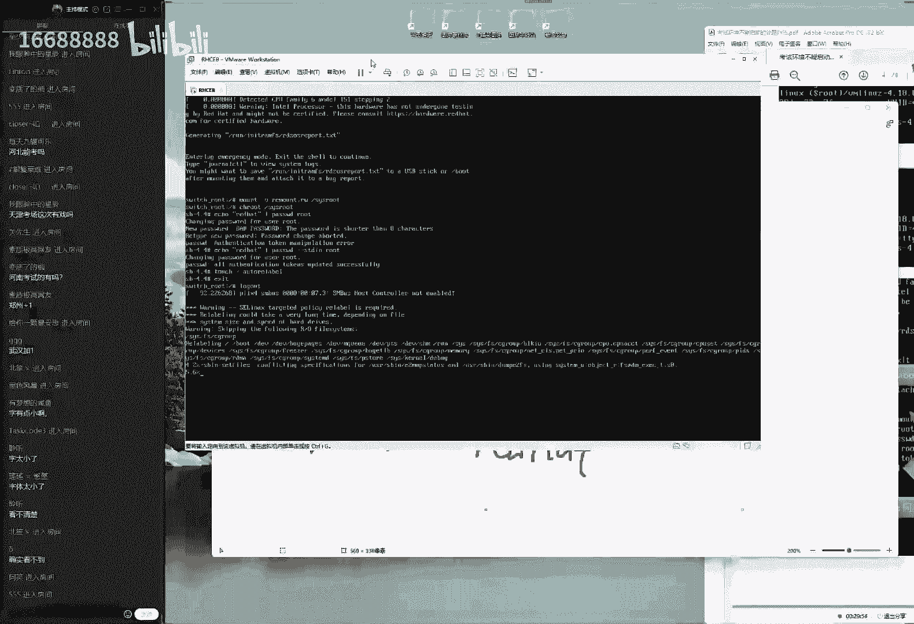

一种解决方法啊，大家看到可以供参考，这是第一件事情，第二的话就是啊这啊这就是我们第二个事啊，这个事情了啊，第三个事情就是这样的，如果说您真的遇到这样的一个问题了，首先不要着急啊，然后我们可以进入。

然后我们给大家准备好了一个文档了，大家好，现在可以进入到我们的学员群当中，稍等一下，先进入到我们学员群里面，我把这个文件给大家传到学员群里面去，如果说你的，那如果说你遇到这个问题了。

现在大家进入到我们34期群，然后的话呢，我们那我们点击一下这个文件的选项标签，接下来的话呢我给大家传递到里面去，这个文件叫做考场环境不能启动的解决方法，好，大家可以去下载一下，这个里面的话。

就把我刚才有些所有的操作都给大家啊，用截图的方式，以及用文字的形式给大家描述好了，并且的话呢相对来说比较详细，大家看看，可以按照我们这个步骤去操作就可以了，好那这个我们先去讲完了，然后我们把它给关闭掉。

大家就可以先去下载的啊，如果要是遇到这样的问题了，就可以按照这样的这个方法进行操作，那么这是第一件事情啊，不这个就是我们的第一件事呃。

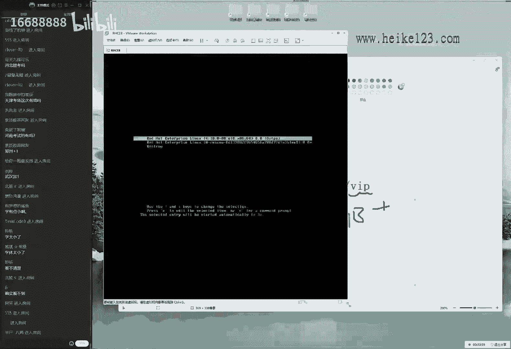

需要给大家说的一个前置的事情，第二的话呢，就是我们如果要是想要去去做这个，实验环境的话，大家对于这个硬件配置要求是比较高一点的，现在的话呢据我们这个反馈来讲，我那我们这个处理器的话。

那必须是i5 以上的，并且的话这个内存一定要是八个gb以上，因为我们在虚拟机里面他要套到六个虚拟机，这个对于我们虚拟机的这个啊，硬件要求的话是比较高一点的，它对于我们这个真机的硬件要求的话。

是比较高一点的，所以您应该是找一个这个硬件稍微好一点的，机器来做我们这个实验好。

然后我们今天来给大家去操作一下，这边正在开机过程当中，我们等他一下，我们默认开机之后，需要先把我们里面的虚拟机的话，都给它打开之后，才能够看到红包的考题，另外给大家说一个小插曲啊，就是这些以上操作的话。

在考试当中是不需要去做的，因为在我们进入到考研之前的话呢，考官都已经帮我们把系统给他充值好了，我们只需要啊带人的身份证啊，然后坐到我们这个考场里面，就准备考试就可以了，所有的这个界面的话呢。

以及系统的步骤化的部署操作，都会在大家进入这个考研之前，考官帮大家去做好的好，当我们进入到这个界面之后，这就是考试模拟环境的一个啊，最后的一个小坎坎了，我们就要去把把脉过去，就可以进入到这个庐山真面目。

看到里面的考题来点击一下这个没有被列出，输入一下用户的名称叫做root，然后密码的话呢，就是我们刚刚去重置的那个密码，那如果大家以我为准的话呢，那么本来就叫做red hat，好，大家先去敲一下。

进入到我们这个鸿蒙系统当中呃，再给大家重复一遍啊，因为同学们迟到人数有点多呀，现在87，刚才我们上课的时候是五六，好像是好像是67啊，20位同学迟到了，那我再说一下啊，就是我们现在这个操作的话是考。

在考试的时候是不需要的，只是说因为模拟环境的问题，我们需要去手动去重置一下而已，大家说我们的a amd可以吗，啊我这边没有a b d的这个实验环境，大家如果有的话，可以去试一下啊，不过好像不太行吧。

我估计有点悬啊，如果要是可以的话呢，大家最好来我们继续来说一下，是这样的，当我们进入到进行系统之后啊，大家去使用到我们这个命令，然后来去查看一下，当前的话呢只有一个主机，就是我们这个考试环当中的话呢。

左侧有一个互动按钮，在我们考试的时候也是这样的啊，去点一下这个小红帽子，然后就点题了，对不对。

就是点题了啊，点一下这个小红帽子就能够看到红包的考题了，唉这个双压啊，来看到这个红帽的考题，红帽考题里面还有要求的说，我们有六台虚拟机的这样的一个系统，另外啊大家我们现在所以给大家讲的这个课程。

大家的话呢既可以看到咱们网页上面，就是在我们学页面里面是有红包考题的，好吧，就是我们现在给大家讲的这个事情，再给大家讲的这个考，就再给大家讲，再给大家讲的这个内容的话呢。

在红帽的这个页面里面是有考题的啊，大家好，进进入到这个页面里面，就能够看到红包的考题，有上午的h3 c还有下午的h c，我们现在的话看的是上文，那我们现在看的是下午的二是c。

请大家找一下我们所对应的一个考题，第二个事情的话呢，就是如果说我们今天呃，有同学没有做预习的话呢，就可以下线下了啊，那么呃就可以先下线了，因为今天这个考呃，呃，因为的话我们今天这个讲课难度还是比较大的。

如果没有做预习，那肯定听不懂，所以的话我们建议大家踏踏实实的下线，然后把这个预习视频看完了，然后我们再过来上课了，呃这是第一，这是我们去获得啊考题的一个方法，进入到学员啊。

进入到我们学院学员的这么一个页面当中，第二个事情的话，第二个方法就是大家翻开我们的这个书，第16章节，但是会给大家讲课的时候，和他待会我待会我给大家讲课的时候啊，呃我们会针对于这个考题。

然后给大家做一个实验吗，如果我们讲课过程当中的某一个考题，你没有听明白，那么您可以看一下第16章节，第16章节，实际上就是把红包的一个考题，给大家拆分出来了，然后每道考题给大家单独列了一个小节。

所以如果当时我讲课当中，大家觉得快了，那么就可以翻开书去看一下，我们具体的一个文字介绍好。

其实我刚才说了很多废话啊，主要是拖延一点时间啊，所以可以看到当前的话有六个主机，然后我们现在的话呢，可以看到只有一个主机正在运行，这个时候怎么办呢，如果说我们要想把另外一台舞台主啊。

那我们如果说现在要想把另外的舞台主机，都给大家列举出来，我们后面加一个o，然后看一下就能看到了，剩下的五台主机没有被开启，那么怎么办呢，我们给它开启就可以了，哦不对，这个他啊这个主机的话呢还不是虚拟机。

这个主机数只能说我们的真机也，那也就是说我们现在这个六台主机，它都没有去运行好，我们先这样我们去使用的verse命令，然后的话呢把我们这个操作端叫做哎baston，给它设成自动启动啊。

这样的话呢我们在下一次重启过后，它也依然能够为用户提供服务，还是能够自动启动的，然后的话呢我们把这个主机的话呢，给大家启用一下start，然后best这个要怎么看能不能成功呢，大家看一下。

在这个左边会有一个虚拟机的控制选项，我们点一下这个control，然后去设置一下这个control，我们来查看一下，当前的话呢这个虚拟机我估计打不开啊，啊可以看到它现在打不开的，因为它没有启动。

我们现在的话呢是通过我们的命令，手动对它进行一个启动操作，启动过后，我们就可以在这个界面当中可以点开它，然后再点一下这个control，然后再点一下这个consol按钮，大家可以看到了。

这边的话呢虚拟机正在启动当中，也就是说同样的这个操作我们需要进行几次了，需要进行六次，那也就是说把我们这个五六个主机都分别在，给他去启动一下，我们就可以开呀来去，正式开始我们这个实验环境了。

再给大家强调一下，这个人数越来越多啊，再给大家强调一下，就是我们现在所做这个操作，在考试当中不需要去做，这些都是由考官帮我们去做好的，只不过因为模拟环境，我们刚才是手动去启动的啊，自己配置这个实验环境。

所以以下操作我们才需要自行去启动啊，我们把这个操作啊，我们居然把这几个操作系统，1234a b c d分别给大家都去启动一下，最后的话呢还有一个叫做workstation，我们依次都把它启动好了。

就可以来开始，我们今天正式的课程了，workstation诶，走走走好走好啊，来再看一下，把六六位主机都给大家启动了，也就是说我们现在一个虚拟机里面，实际上是套了六个虚拟机。

虽然我们虚拟机本身原因是有七台虚拟机，因此大家在做这个实验环的时候，尽量选一个电脑性能比较好一点的，服务器去做啊，因为这个趋势很多。

比较的信号性能稍微的高一点，好把我们这个速度信息都给打开了之后，它正在开机，我们来给大家看一下考题，当我们后面考题当中的话，呃，对大家问题刚才这样回答过了，然后说考试当中虚拟机需要我们手动打开吗。

是不需要的，来我们先给大家去说一下啊，这个的话呢，我们所看到这个界面，就是红包考试的这个考题界面了，如果说您看的这个字有点小的话呢，那么您可以进入到我们宣传页面里面，然后您去找到我们这个网页。

然后大家可以去啊，大家可以去看一下这个网页的话，在我们学员页面里面是有的，在后面加上vip，然后里面会有一个叫做rtc考题的一个页面，去找一下他在在季节的电脑上面去看，就呃非常的清晰了。

然后的话呢，以及我们现在给大家提供的是一个考试的真题，就是说在考试当中的话呢，您看到这个文字会跟我是一模一样的，除了可能是说比如说一些参数让我们去说啊。

让我们去说的这个密码，或者说让我们去新建出来的一个用户名称，不一样，除此以外其他内容都是一模一样的，这就是考试当中给大家考出来的一个环境，所以我们现在的话呢对于这个考题，不会稍微呃并不特别的快。

我们会围绕这个考题来，一个字一个字的给大家去抠一遍，目的话呢是为了让大家能够对这个考题，进行一个充分的了解，在考试当中就不用去审题了，也就是说我们现在就把考试当中审题啊，再把我们考试当中审题的。

这个时间给大家省出来啊，所以我们现在讲的稍微细一点点，今天的换了这个课，我们的细胞的话大概要讲三天，就是我们今天的五六日好讲三天啊，把我们这个cp彻底给大家玩明白了，那对于这个对于考试来说。

对于我们考试的前来讲的话呢，非常的重要，好，我们首先来说看见这个考核试的这个第一句话，他说中药的配置信息，首先点题，他说人家也就是说以下信息的话呢，非常的重要啊，废话啊，那第二的话。

那看一下里面所说的信息是这样的，说在我们考当中的话呢，您所做的这个台式机之外还将有多个虚拟机，这个我们知道了。

我们里面的话有六个虚拟机，就是说我们如果说在考试当中进入到考场之后，我们会见到了有一个椅子，有一个桌子，我们需要坐在椅子上面，然后把手机和我们的这个证件的话，放到桌子上面，桌子上面的话呢只有一个电脑。

那这个是一个电脑啊，这个是个电脑啊，这算一下换个电脑，这个电脑的话呢是一台真机，也就是说我们的面前只有一台真机，只有一台物理机，然后他在这个物理机里面有六台虚拟机。

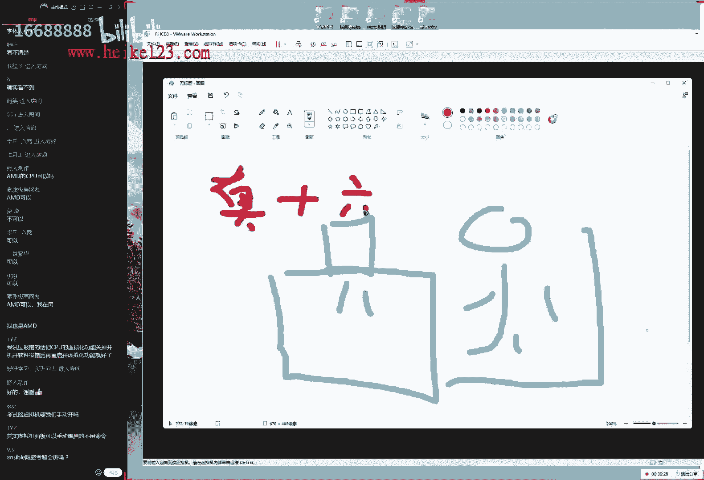

这样的一个实验环境，然后我们来给大家看一下，是这样的，然后他说我们并不具备我们这个呃，物理机的root访问的权限。

但是我们对于虚拟机有完整的root访问权限，也就是说我们的真机的密码，虽然说我们刚才自己破解了，但是在卡当中的话呢，它是没有的，我们做了这个操作，都是在这个六个虚拟机里面来进行的，操作好了，这啊那啊。

那么也就是说我们所有的这个操作。

都需要在这个六虚拟机里边，然后我们来进行一个操作，另外的话大家现在提的这个问题，那我们就先不给大家回答了，因为我们现在讲课当中的话呢，东一下西一下，大家听起来也比较累。

我们现在呢我们这个速度给大家讲完了，基本上我们讲完了，您呃您提的这个问题的话呢，自然也就明白了，好我们按照我这个思路往下面去讲了啊，是这样的，首先看一下虚拟机里啊。

首先来看一下考题里面对于虚拟机的一个描述，也就那也就是说知道了，现在系统当中的话有六个虚拟机，那么这六个虚拟机的话呢，分别的ip地址以及它主机的这个名称。

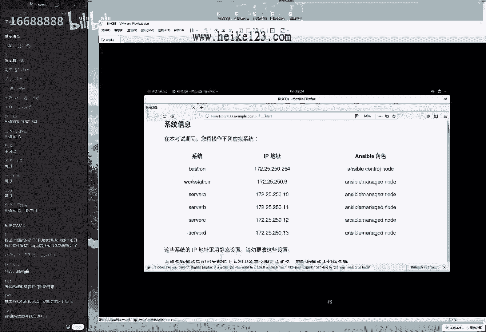

显示到了屏幕上面啊，可以看到有这样的话，以下职业信息我们建议的话大家看啊，大家还可以像我一样拿出一张纸来啊，听拿张纸来不要特别大，然后他再拿出一杆笔，然后的话呢把以下信息写到自己的这个纸上面，为什么呢。

因为我们以下的这个所有操作，都需要对于虚拟机这六个虚拟机来进行操作，那么我们老是抬头啊，看一下看一下看一下吧，有点累，所以的话呢我们现在就一起来操作啊，172。25。250。254。

所以我们先把以下信息的话先写在一张纸上面，避免了我们在做考题当中嘛，然后老师来回来去翻啊，去翻网页，特别的麻烦，所以我建议大家在考试当中的话呢，也是准备一张纸出来，然后把以下信息的话呢。

啊写到自己自己自己的这个纸上面，这样的话就做这个考题的时候，眼睛盯着屏幕，然后也不用来回来去保切了呃，比较的专注一点，所以稍等一下，同学们，我先把以下信息也都写在一张纸上面。

我现在的话呢只需要去写我的ip地址，把我这ip地址的话呢分别都写下来，待会儿的话呢还有对应的一个名称，我待会告诉大家在需要怎么去写，稍等我先把它写下来啊，172。25。250点。

不要看这个90 11 12 13好像看起来相同，但实际上他们是待会儿会属于不同的分组的，因此诶待会儿我们老需要去反映一下他们，比如说告诉我们说某一个分组的名称，那么好了呃，dv组对应的是哪个ip地址呢。

那我们就要反过来去看一下，挺麻烦的，稍等一下，我抄好了，一共的话是六台虚拟机，那我们把地址的话，分别写到我们的一张纸条上面，贴到屏幕上面，待会的话只需要关注这个网页就可以了，不用来回来去老切。

那我们来继续往后面去说，看一下的话，它里面有六个虚拟机。

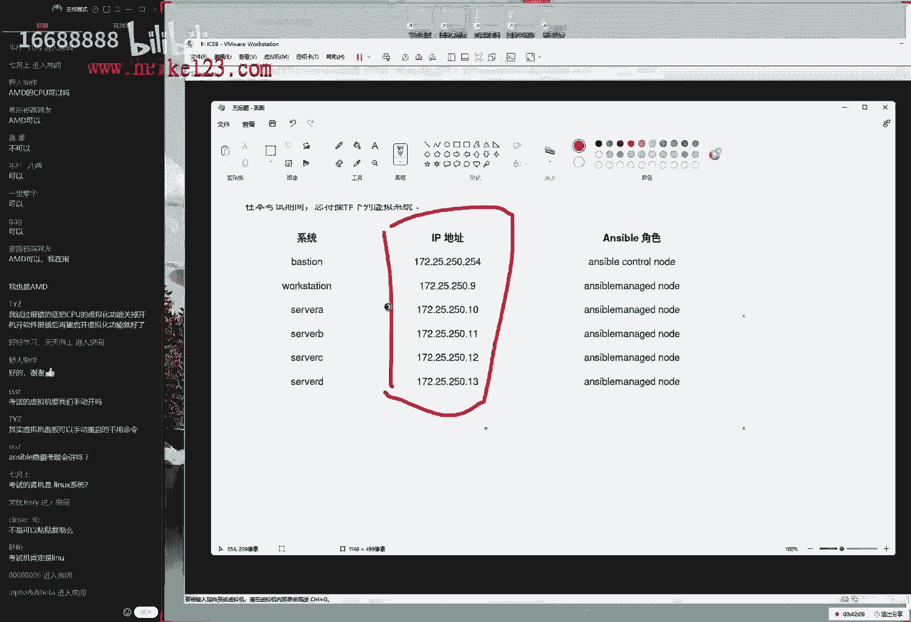

但是我们这样，但是我回去再看一下这个题目啊，tv里啊，他这个题目里面说到了，说我们所有主机的ip地址的话呢，网卡都是变成了一个静态的一个设置，并且的话呢请勿进行更改，并且的话已经进行好的域名的一个解析。

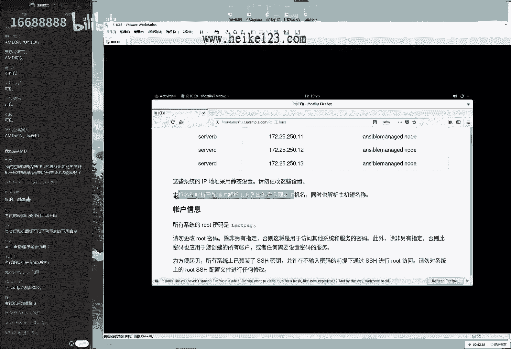

我们也不要去进行修改，也就是说里边的话要求大家所有的网卡信息，以及ip地址以及我们的dns信息，都已经包括说我们的dns服务啊，都已经帮我们在考试当中，已经为呃在都在我们考试的啊，考试之前帮我们配好了。

我们的话呢不要去动就好了，也就是说所有的这个网卡信息已经有了，这个信息不要进行修改，修改的话反而会扣分，这就是啊，又这话，他要是提到了红包考试当中的一个原则性问题。

就是呃一个呃他也算是一个呃小一个规则吧，所有的红包当中考过的内容，他不会再去考第二遍，那既然我们的上午的是3c啊，已经考过对于网卡的配置，那好了，那么在20c里面就播一下，就考到对于网卡的配置。

所以他就这么一回事啊，那所以说一那么话这些信息已经配置好了。

不要去动就好了，然后接下来我们来看一下，往下面去说，他说我们所有的这个密码的话。

都叫做呃flag greg，并且的话呢我们的密码也已经都重置好了，因为以及的话呢，所有的这个密码都会以这个名称为准，好我们看一下，并且我们每个主义之间的s h这个密钥连接，都已经配置好了。

我们请勿进行修改，好我们总结一下这三啊，我们总结一下这三个啊，我们总结一下这三段话啊，他所说的这个事情，首先第一件事情就是。

我们当前我们六个虚拟机里面，他刚才提到的，也就是说六个虚拟机里面的所有的系统，我们都有root用户的访问权限，那我们既然有了，那怎么能有呢，证明他要告诉我们他的密码好了，所以就把啊去点题。

第一句话的意思就是说。

我们有六台虚拟机的这个管理员的访问权限，关联的密码的话呢是叫做root，稍等一下，我把它翻译成人话，大家都看得明白啊，在考试当中的话呢，其实大家的水平都差不多，只不过对于这个考题的的一个呃。

理解的话可能会有偏差，所以我们在考试当中的话，在我们考试之前嘛给大家聊啊，都给大家聊明白了，把后面的一些小坑给大家掰开了，揉碎了，给大家先继续提前做一个讲解好，首先来说第一段话的意思是说。

我们管理员的话呢给了啊，给我们管理员的权限了，账号的话呢是叫做root，密码的话呢叫做flag reg，在考试当中的话也要以实际为准，考试当中有他有可能不是这个名字，不过也无所谓啊。

以他这个实际为准就可以了，这是他第一段话所说的事情，第二段话就是说我们已经做好了我们的啊，ssh这个链接的密钥信息了，根据我们第八章节里面所学习的，也就是说我们的大s h的话啊，d啊。

这个是我们这个第九章节你们就去学习的啊，那也就是说我们在进行远程连接的时候，它有两个验证的方式，第一种的话呢就是我们传统意义上来讲的，就是这个账号和密码的这样的，这个口令验证方式。

然后第二的话就是我们叫做密钥文件，然后来进行了一个加密传输对吧，我们来进行一个啊密钥的一个验证方式啊，密钥验证方式，那么它会有两个文件，一个是公钥，一个私钥，那么私钥的话是在本地做加密的。

公钥是作为验证和解密的，呃不过的话当天也不用关心了，他说到了，就是说它每个系统之间，已经帮我们自己去做好了，那我们只需要去使用就可以了，而不需要再进行任何的修改呃，修改的话呢反而会扣分。

也就是说第二段话的意思是，我们所有的主机之间，都可以直接通过ssh进行连接，并且不需要去输密码了啊，他是放他他去方便与我们进行一个配置来，就就是直接呃，远程访问s a c h这样的一个效果啊。

也就是说第九章节里面学习的，这样的一个验证方式，我们啊考中的话呢，他也不考，他帮我们自动把它拍好了，挺方便好，那么他考什么呢，我们看到第三的话它就出来了，他说我们的控制节点上面会有一个用户。

叫做greg，这个用户的话已经预设了s h这个密钥了，并且的话他也能够进行登录，以及下面一段话，他说的话呢，我们的大家说我们这个真机是一台windows吧，大家想啥呢啊，那么后来我们考试当中。

我们的的真机也是一台linux，然后的话呢这个里面的虚拟机的话也是linux，后面的考试不是一套windows的系统啊，然后我们来继续来给大家说一下下面这个信息，这就是说有一个用户叫做greg。

这个用户的话，greg他的密钥的话已经帮我们设置好了，好的，然后他说请勿进行修改呃，然后他说我们可以去使用到管理员的这个账户，叫做root，然后去速切换到这个用户哦，明白他的大概这个意思了。

然后再看一下下面这个信息，他说重要信息并且标黄了，有一个底色说明它真的很重要，然后看一下他说除非另有指令，否则你的所有的工作都需要在控制节点上面，来去完成，并且归呃我们的用户，所有我们的所有的命令的话。

都要由这个用户来去执行，这个代考试当中的话呢，是跟考试里面的名称是一模一样的，因为这个出题的这一个人啊，大家如果要是从网啊百度上去搜一下，能搜到他这个人的话呢，叫做greg，他就是红帽那个考官。

然后他是负责出题的啊，因为当时我们也见过，2019年的时候，大概是3月份参加了一个活动啊，当时的话呢我们在好像是在疫情之前对吧，当时我们见过他是一个大光头啊，个儿挺高啊。

他的话就是红毛狼这个考官众人负责出题的，这个人的话呢就以自己的名字命名的一个用户，他的意思就是说我们当前的话呢，对于所有的这个啊呃服务的配置，都要去使用这个用户叫做greg用户来进行配置。

也就是说我们呃考试当中，考试中考试中呃，全程使用greg用户来进行操作，并且的话呢我们配置好的所有的文件，都需要给大家放到对应的目录里面，放松目录它也是没有分值的，但是啊大家需要记一下这个话。

然后看一下他的意思，就是说考当中的话呢，虽然说他给了我们的管理员的root用户的密码，但是的话呢我们不能去用，他就是这个意思对吧，他说我们需要在全程去使用这个用户greg。

并且需要把这个文件放到对应的目录里面，他这个考试当中的话呢，他之所以这么要求的原因，首先他这个的要求是为了让大家能够，不要去使用到入侵用户来进行一个管理，因为呃我们的管理员呃。

我们那我们的管理员主题用户的话呢，他虽然也能够去完成这样的工作，但是他不受全新的控制，大家对这这个啊，那么话他如果要是不知道啊，他啊他如果是不知道这个控制的话呢，可能会呃比较简单一点了。

所以他要求我们做的这个操作不能使用管理员，需要受到全新的控制，这样的话呢，我们才能够去对于权限来进行一次考核，这是对于全新的考核，第二的话呢，这个的要求主要是为了脚本盘卷的比较方便。

因为大家知道后面考试的话呢是脚本判断的，脚本的话呢，就需要把大家的这个工作的这个成果嘛，然后汇聚到一个地方之后，看看大家做的对不对，如果大家做出来这个作业的话，是东一下西一下，东一下西一下。

那么这个脚本他啊他啊，但是他找不到的，因此它需要一个固定的位置，方便于说脚本来进行一个寻找，然后来进行一个判分，所以它限定了我们去存放文件的这么一个目录。

好接下来我们往下面再往后面去看，他说的话呢，我们所有的这个信息都已经配置好了啊，并且的话呢我们请不要再进行啊，我上一下呃，他说的话呢我们在进入考场之前，我们的考官以及实验环境里面有一些配置好的。

一些服务以及预留的一些参数请不要进行修改，我们可以在下面追加，而不能够进行这么一个修改呃，然后的话呢，以及我们所有所有的操作都要被保留下来，写到配置文件里面，他说的话呢。

我们考当中我们的方火墙默认是没有的，它默认是没有启动的，并且的话呢我们的啊。

阿根子系统也属于强制的模式，也就是说在考试当中的话，既然上的h3 c已经考过了防火墙了，所以在考试当中的话呢，在cl h c考当中大家都比较轻松了，大家不用去担心防火墙的问题。

ip tabs跟fireword防火墙全都不考，全都没有启动啊，他干脆帮我们给他关闭掉了，也叫大家再去记一下，再重复一下，就是红包口当中的话呢，h c呃是完全没有防火墙的事情的。

ip tables跟fireword全都被禁用了，然后其实啊，然后我那我们只需要去关注一下，我们这个好安全子系统，这个的话呢，我们会在下周的时候给大家去讲一下，它到底是怎么回事，但是它对于我们的爱啊。

他啊他啊，但是对于我们今天所讲课的话，它并不他并没有它，它并没有什么影响啊，然后我们下面再往后面去看，他说我们的话呢有两个这样的一个网址，这两个网址里边的话呢，会包括了我们的软件仓库的这个软件包。

所存放的一个路径，如果说我们要想配置啊，我们的软件仓库的话呢，可以把路径指向到这两个目录就可以了，待会给大家去操作，这就是我们上节课给大家说到上礼拜日说到了，在我们考试当中的话呢。

我们不需要自己去搭建我们的软件仓库，早有我们的考官会帮我们去搭建好，我们只需要去指向到它就可以了，下面一句话就是说还要说一些额外的项目，软件啊，可能会在下面的考题，考题当中的话呢是被需要的。

所以我们再点开它看一下这个文件的话，这里边会出现一些文件，这些文件的话呢，我们现在一呃都不需要去看，为什么呢，因为这些都是我们下面考题当中，需要用到的文件，它需要针对于每啊。

它需要针对于每一道题目来进行配置，那么我们当前不需要去看，看到哪一道题目的时候，自然需要把它给用到的，大家说考试的时候我们进入的也是这个用户吗，叫做greg对，是这样的，那这个名称是固定的。

这个红包考官嘛是一个大光头呃，他这个以自己的名字命名的一个用户，所以作为考的，他在所有考试的时候都叫这个名字叫做greg，然后下面当然这个并不重要啊，并不并不并没有啊，它并不重要。

但是我们就大家知道这么个事情就可以了啊，这个下课又去节省了大家在考试试的时候，一个审题的时间了啊，然后我们下面一个事情，就是说产品的文档，可以从以下的目录当中去找到，也就是说他怕我们考试当中的话呢。

比较的呃紧张，他怕我们有一些参数的话找不到啊，他会给了我们一些帮助文档，我一直我一直不太理解这个操作啊，就那也就是说这个文件的话呢，在考试的过程中也是会给大家提供的，就这个网页啊，虽然我们不能不上网。

但是他把这个网页的话帮我们给大家打包好了，然后我们在考试当中的话呢，你就我们我们就可以这样去点，那大家这个就是这个操作很就就就很骚嘛对吧，就是虽然我们不能去连接外网，但是他把这个网页的话呢。

把这个网站东盟我们作为一个离线处理了，这就算是一种卡bug了，所以我们如果要是考试的时候特别的慌张，有些参数忘记怎么样的话呢，只要我们能够啊去找到它，那么也能够把这个参数给它找到。

其实这个话有点像是那种美国考试一种风格了，因为我当时有听说过，因为的话中国的话是一种叫做应试教育，一种考试方法，然后在美国的话呢是一种理解一种考试方法，所以他会给大家一些参考资料。

只要你能知道怎么去完成，那我觉得也可以嘛，并不大啊，并不需要大家来去背诵啊，但是这个文件的话在考试当中呃，我不太推荐大家去看，因为它比较耗费时间，如果考当中你都已经去看这个文件了。

那么就证明你确实没有好好复习，你确实预习的并不充分，那么所以我觉得你已经看到这个文件的话呢，在考试当中一定是遇到了很大的问题了，所以我们建议大家，既然考题都已经提供了，我们就不给大家照班子了。

就是考试之前的话呢，好好把题给他背一背，这种机会很难得的啊，然后下面再往下面去捋，他说又有一个环，它又有一个还原色的话，这个还原色的话呢好像之前出现过，对不对，第二次了，这个两段话的话都是黄颜色的。

并且的话他说的都是一件事情，他说我们所有的这个操作都必须要去使用它，这个用户叫做greg去完成，并且这个文件需要放到这个home目录里面的，greg里面的ensable的目录当中，否则你就真没成绩。

他又重复了一遍，就是说他写了两遍，这意思就是说，如果再不按照这样的一个要求去做，就真的是没有成绩，这个话呢，实际上就是为了他方便去判卷子而设置的，这么一个呃固定的一个目录。

当时的话呢我是2014年的时候，12月呃，我是2014年的时候，12月24号，然后我去上海的时候考了一个呃啊啊，考了一个红包的，有一个啊高级认证啊，rh 401，其中的话呢就讲到了。

有需要对一个软件包来进行编写，就我们编写软件包叫r pm，然后呢，我们的rpm，就需要把它放到对应的一个目录里面，当时的话呢我就记得是，我好像是放到加目录里面，然后我们比如说啊这个呃文件的名称无所谓了。

我们这边去写结果的话，当时我就比较粗心，我好像是把这个大小写给他搞混了，我把这个p的话呢给大家写成一个大写p了，于是我们发呃，我们费了半个多小时的时间编写了一个rpm，最后的话一分都没有。

也就是大家的结果，我们这个我们就一定要明白，就是我们一定要保证我们自己做完了，做对的这样的一个题目，保存到正确路的一个路径下，这样的话呢我们才在考试当中呃，能够采分，然后才能够拿啊，他才能够踩点。

能够去给分，然后再给大家说一下，就是我们今天和明天给大家做完了之后，我们会在后天去跑一下，我们这个实验环境会有一个判分脚本，这个就很这啊这啊这就非常的啊，这个非常的好了，会有一个判分的一个脚本。

会判一下我们今天和昨天啊，那我会判一下我们今天跟明天两天所讲的内容，是否讲对了啊，然后我们可以看到大概的一个成绩，红包考试的话呢是一个满分至300分，只要考个210就能够及格的一个考试啊。

就能够及格的一个考试，大家的话就可以看一下自己的一个水平如何，然后考试的话呢，现在考试时间是四个小时，如果说四个小时大家再没有做完，就证明，那就证明，那么就证明是真的不会了，我记得当时大家提过一个问题。

说老师这个红包考试，万一我做不完怎么办呢，不存在这样的一个可能性，因为像我们的中考高考一样啊，确实时间比较紧张，然后我们可能需要做题的速度的话，要更稍微快一点，但是其实在红包考试当中。

你就完全没有必要了，所以啊这个那么的紧张了啊，因为考试是四个小时，四个小时之后，如果你要是再没有做完，那就肯定不是时间的问题，可能就是因为我们这个预期没有预习到位，确实是自己不会才没有做完好吧。

这没有任何的借口了，时间是非常的充裕的，四个小时基本上呃以我为例吧，我的rh c e的ancible的考试，我是201呃，不对呸呸，我是2020年的年底考的，12月几号我忘了。

但是从网上去查一下我考试记录，15的编码能够查到了，编码是1202128杠491啊，128杠491，然后当时我是2012012年12月份考的，当时呃四个小时的考试，我大概考了一个小时40分钟就考完了。

所以大家的话对于这个时间一定要放轻松，不要担心做不完好，我们下面这又有一些啊，没有了，下面就是一些考试，要求大家回答一下同学们的问题，就是红包来的话，这个考试是否有一些变化呢，有一些变化。

它增加了一些隐藏题目，然后这个隐藏题目的话呢，我们也会给大家讲到，咱们这个呃已经有了这样的一个题目，加上我们的隐藏题目，然后我们都会在这个五六日三天，会给大家进行一个充分的讲解的。

咱们这一期不要那么着急了，本身这个考试时间也被推后了，所以我们就稳啊，就稳扎稳打，然后就把这个每个服务都给大家讲明白了，但是如果说您没有做预习的话，那听不懂还是听不懂啊。

但是我们会尽量给大家给大家详细一点呃，下面的话大家说今天视频好模糊啊，我是不是有条虚拟机的分辨率呢，没有同学们看这个字模糊吗，我把稍微大一点点，同学们先看这个字能看清吗，如果可以的话，打一下一。

不能的话打一下二，我看看能不能想一些其他办法，然后大家说考试环境里面是让主体用户进，有的是让ki o s k用户去进，不用管，以考题为准啊，以考题为准好吧，不用去纠结这个问题，是老师呃。

万一考试当中不教了greg怎么办呢，不怎么办啊，以实际为准就可以了，考试当中比如说叫他啊，那我们考试当中比如说叫啊，这个用户叫这个张三好了，那就以张三为例就好了，他会用红颜色字帮我们标注出来。

我们就以张三为例就可以了，另外的话呢，以我们这个考题的回呃反馈来讲的话，那不存在的，它就叫greg，没有人叫张三，没有人叫其他用户，所以以自己的实际为准，另外的话呢如果说我们的用户密码也变了好。

那就以自己的实际为准，这个话呢问题不大啊，但是以我们的这个反馈来讲，用户就到了greg，它不变啊，这个密码的话，他可能会变，那他可能会以自己的这个实际为准好，大家看起来不模糊是吧，有点模糊啊，有点模糊。

那这么着吧，我把字再稍微调大一点啊，再稍微调大一点，如果大家看得清的话，就没有问题，如果看不清的话呢，还是您这样，您打开您的学员的页面，然后在里面的话自己找一下这个页面。

在自己的本机去看就肯定没有问题了，那就没有问题了，来啊大家说我虚拟机里面有一个查看，里面有一个自适应，自适应的话尽量不要调，因为调完之后它会有一个拉伸的效果，看起来那个字特别的宽啊，我呃看起来不太舒服。

所以我们就以保持这个原比例吧，然后我们来给大家看一下这样的，首先看一下这个题目，再给大家重申一下，今天我们所讲的这个课程，要求大家有一个预习，没有预习的话确实很难啊，您可以一边看着书上的第16章节。

一边听着我们去讲课，好吧，大家先这样啊，打开你两个网页啊，第一个网页的话不但打开一个网页，这个网页的话呢是我们的lhc的这个考题，在记得这个本机当前页面当中去看着考题，如果看不清的问题啊。

如果您看不清我们现在这个界面没关系，打开您的本地的啊，这个呃浏览器只找到rhc的这个考题页面，就能够看得清了，然后放在手边上，打开一个纸质版的，我们我们的书第16章节，我们给大家讲的每一个题目。

以及unstable的一个具体讲解，都会在第16章节给大家一个体现，然后第16章节讲的特别的细，来大家呃稍等一下，我先喝口水，我看一下这个题目，来嗯怎么样啊，屏幕有点太小了是吧行，我稍等一下，不对吧。

那那我们调整一下吧，但是这样调完之后吧，虽然这个界面大了一点点，但是的话呢它会有一个拉伸，你知道吗，我我我不太喜欢那个拉伸效果，稍等一下，我大家应该是因为大家想说的是这个吧，然后拉伸，然后保持比例。

还能保持比例拉去拉伸的。

我脑试一下好，大家看一下这个，我反正我感觉好像更加的虚了一点，不过大家可能看见字稍微大一点了，那我们继续吧，那大家以及自己这个本地来去看，也更加清楚一点，来看一下题目，首先他说安装跟配置anzable。

那英文考的是anzable吧，因此我们配置这个服务的话，那也必须是antable，他说在这个控制节点上面来去安装一下，这个unstable，它是按照点给分的，那么既然这是第一个题目，我们就来把它去完成。

大家先低头看一下，你的这个桌子上面是不是有张纸啊，就这张纸上面的话呢会有我们这个服务器。

每一个这个服务器地址的一个介绍，好首先大家说一下啊。

我们这个服务器地址的话，有一个需要给大家讲的一个坑，是这样的，大家看到这么一个地址跟考试当中的话呢，它也是这么去命名的啊，然后我们看一下其中的话有一个叫做诶best，这个主机的话呢。

byon这个主机叫做控制节点端啊，大家记一下，这叫叫叫做控制节点端，我们所有的配置选项，我们所有的配置大家记住，我这个词是所有是所有的是百分之百的，这个所有的配置的话呢。

都是在这个呃主机上面来进行操作的，大家记一下百啊，百分百操作都是在这个主题上面来进行的，这个呃配置它的话呢，这个地址大家可以来记一下，接下来的话呢还有五台主机，其中第一台主机的名称。

跟下面的四台的话呢不太一样，这是红包给大家下的一个坑，大家一定要记住一下，就是我们这个五个主机的话呢，所有的这个用处都是一模一样的，也就是说上面的这个主机的话是用来做配置的，下面的话都是用来去做测试的。

即便说我们第二个主机，它的这个名称跟啊其他的四个的话呢不太一样，但是这是红毛故意给大家下载一个长眼法，考试当中一模一样，没有任何的区别啊，一模一样一模一样啊，大家不要因为这个名称它不太一样啊。

就因为它有一些特殊的功能啊，完全没有好，现在大家都记住了，我们今天所有的操作，都是在这个主题上面来进行的，那我们来看一下这个题目就要来了啊，呃第一个题目是说这样的，进入到我们对应的这个主题节点上面。

然后来去安装一下ancable，在考试当中的话呢，已经帮我们安好了，那我们在实验环境里面的话呢，去确认一下他有没有安没有安的话。

那我们自己去按一下就好了，来进行连接我们的s h安装这个服务的话，那当前我们需要去使用管理员，登录到我们这个控制节点上面，他既然提到了。

我们有六台虚拟机的这个阁主的访问权限，所以大家不用着急啊，这个是可以的。

这是符合题意的，密码的话已经给定我们了，当然我们需要注意一下，就是在考试当中。

这个管理员的密码的话呢以网页为准，大家记住啊，在卡当中的话呢，我们的密码以网页为准，但是的话呢我们当前的模拟环境里面的密码，我们统一叫做red hat，虽然网页上面显示的叫做flag rag。

但是所有的虚拟机里面的密码都叫做red hat，好这个字写的比较丑啊，我再给大家打一遍啊，配不上帅气的老刘，来叫做red hat，大家记一下这个问题，大家请牢记一下，在网页当在考试当中以网页为准。

在模拟环境里面的话都叫做rheat，这个是主要是我的原因啊，这个是我啊，其实的话这个是我手欠了，所以的话呢当时我因为那个密码特别难敲，所以我们在在回调之前，我把虚拟机里面的密码都给修改成叫做红帽了。

这样的话因为我呃因为的话我比较好记，所以大家要记一下就好了，在考试当中以网页为准，在这个考试当中的话呢，在我们做实验环境当中。

我们速度密码叫做红帽，叫做red hat，来去登录一下，叫做入侵用户，然后去172225。250。254，诶，这是我的一个习惯，我把我我我比较喜欢把密码的话叫做red hat，超解比较顺手，172。

225。250。254，来找到我们台主机，按一下回车，大家安装一下安c宝啊，安装啊，那我们的安c宝怎么去配呢，那在这个呃，我们的主机baston上面已经配置好软件仓库了，我们不需要。

但我们是不需要配置任何的软件仓库信息，只需要做一步骤，叫做dnf install，然后去安装一下叫做ensable的软件，这个时候狠狠地按下回车就可以点题了，把第一道题目做完。

可以看到他说我们现在的话呢，我们的cable已经安装过了啊。

2。8的版，这个版本也比较新吧，反正也就是我们考试的一个这一个系统的，然后当我们去确认了一下，他确认已经安装好了，在考试的时候的话呢。

也尽量的按照我之前这个操作，也尽量的去呃进行一个确认吧，然后确认好了之后，我们退出掉它，那哦那我们为什么要把它给退出呢，就是因为考题当中。

大家看一下两个还原色字，标注了所有的这个操作，都要用到greg用户身份来取创建，然后并且放到对应的目录里面，所以如果去使用到过去。

使用到管理员的这个身份去做这个实验，大家会感觉到非常的顺啊，没有任何权限的控制，特别的顺，然后做的这个权限的话都被我们放行，因为管理员的这个身份不受权限的控制，但是考试的时候你会发现扣分特别的惨。

所以当前一定要去使用到greg用户来进行，登录greg，然后是172。25。25，0。254，只要大声说一句走，你就登录成功了，诶啊去大声说一句走，你难道说我说的不够响亮吗，172。25。25，0。

2542，是这样的，突然想到了在考试当中的话呢，这个是用户是有的，但是在我们的模拟环境里面，这个用户还没有，我们需要自己再去手动去新建一下，再给大家说一下这个用户的当前没有拿。

这个用户当前没有没有没有没有，对对对，这个是我比较的生疏了啊，这个啊忘了忘了忘了来，我们需要自行去新建一下，但是同学们请放心啊，帅气的老刘已经给大家有我说了啊，就是在考试当中的话，这个用户一定是存在的。

它一定是存在的，我们是不用再去手动去新建了，当前只为了模拟环境有一些出入。

好做好了吗，做好了来再重新来一次啊，当做没有发生过好不好，那把我们的时间倒回到起点啊。

07：49了啊，不会吧，我们还没有讲呢，怎么已经过了将近一个小时了，今天我们是不是说的太细了，那我们稍微那我们后面再稍微快一点吧，不能那么大，不能再那么慢了啊，然后7。49了啊，7。50了。

我的天来进行链接吧，来我们的greg用户，今天讲的太细了，所以大家考试的时候就不用去审题了，上去卡卡的去开始做就行了，172。25。25，0。254来进行连接，登录进去之后的话呢，来看一下第一个题目。

他说安装我们所需的软件包，我们也没有什么可以去安装的了，都已经安好了，他们下面说的就是说，请创建一个名称为这个的主机清单文件，然后呢并且符合以下要求，大家可以看一下，我们这个书上第16章节里面提到了。

这个的话呢叫做呃主机清单文件哎，inventory文件，这个叫做啊仓库的意思叫做inventory，它指的就是我们要去控制的这个节点，它有哪些，大家首先要知道什么是nc爆版哦，我们再给大家啰嗦一下吧。

今天还是稍微细一点，就是什么是angel呢，就是有一个主机，如果说我们先配一台服务器，然后我们准备了一台ancible的这个服务器，然后我们通过网络的话呢，把一些客户端跟它相连，这样的话。

那我们就比如说想要在某个节点上面，去创建出来一个用户这样的一个操作，那我们就不用在每台主机上面都去做些那啊，他都去做这个操作了，我们可以直接在我们这个服务器上面，然后去跑一下我们对应的命令。

它会自动把我们这个工作的话呢，同步到每台节点上面，这个每台的这个节点，我们把它叫做受控节点，也就是说每一个被控制的客户端，每一个被控制的客户端，我们把我们做的一个节点。

我们的话呢也把它叫做这个受控主机啊，大家来去记一下啊，这就是我们的一个able的一个作用，然后换到我们的able的呃，这个服务端，我们刚才自己去安装了一下我们的服务器，服务软件，自己安装了一下。

后端的话呢，我们呢是基于我们的远程访问协议，然后来去完成的，所以的话呢我们的s h就是我们的客户端，我们不需要单独去安装其他的客户端软件了，就是客户端就不用去安装就省了。

那我们来去说一下这个文件的一个作用，就是说我们现在的话呢一共六个受控节点啊，不我们现在一共收五个受控节点，我们可以看到让我稍等一下，我数一下啊，呃第一个的话呢，我们的baston是我们的这个控制端。

其他的话都是我们这个受控节点，总共的话呢是有五台，也就是说我们需要把这个舞台的地址的话，写入到这个inventory的文件里面，让他们成为我们叫做叫做受控节点，那也就是说告诉我们的系统，我们去管理。

那我们去管理的是谁，来我们去编辑一下这个文件啊，啊这个同样的一个动作啊，同样同样的一个事情，给大家重复了三种不同的说法，所以的话大家啊哪个好人去理解，基于我啊，就去理解一下。

我现在这个呃动作就是去设置一下，我们要想去控制谁，就把谁的信息写入到这个文件里面，来编辑一下这个文件，走啊进到里面去诶，突然想到一个事情，他说我们做的这个操作，都需要给它放到一个叫做home目录里面的。

greg里面的enerable的子目录，所以我们先把这个目录给新建出来，确认一下有这个目录了，然后的话呢我们再去编辑这个文件，一定要点题啊，一定要严格到这个题目去做，来按一下回车呃。

进入到里面之后的话呢，我们这么去写，既然来说有五台数控节点，a是五台吧，对没有问题啊，123445啊，五台主机我们就把这个主义的信息的话呢，分别往里面去写，172。2，5。25，0。9。

指的是叫做受控节点吧，他那我们控制的是谁，就把谁的这个信息往里面去写，172。250。250。11，然后172点啊，这个没有必要啊，同学们来yy复制走走啊，往下一粘就行了。

因为它的区别点就是后面那个ip地址嘛，最后一位，然后我们来保存一下五个受共节点的地址，分别写到里面去了，另外的话呢红包考题一共是300分，大家数一下r h c e，在我们的网页里面的考题有多少道呢。

那大家数一下我们的r h c考题，但细胞的内容有多少道题目，然后我们拿300分去除一下考试的题目的数量，就知道我们每一道题目的一个分值来看一下啊，他说我们的话呢172。250。9，这个主机啊省略一点啊。

他说是dv组的成员啊，也就是说可以对于我们这个用户组来进行分组，这个很简单啊，这个话的格式方法，就是在这个主机的ip地址的前面，加上一个中括号，中括号里面的话有一会一个名称，大家说是平均的吗。

是对它是平均的，他占着踩点给分了，它大致相同，所以说一呃一道题目的话，大概是20分左右啊，来我们来dv目录啊，他不得这是dv，我们的主机组，只要它属于哪一个组的，我们就把这个组的名字写到这个地啊。

对应的地址上面就可以了，大家说如果加了隐藏题目应该不止吧，隐藏题目是替换关系啊，大家如果增加的话，那我们每一道题目大概也就18 九分，那就跟二分相比的话，那我就可以忽略不计，只要我们大家理解一下。

不用那么严格啊，因为这个题目的话呢，我们也不一定能多做对嘛，所以我们就简单理解一下，就是每一道题目的话，大概平均分值是20分，那就可以了，来接下来再来啊，具体说到他到底是17分，18分。

我们觉得并不关心啊，就这啊大概一个分值就是20多分嘛，大概心里有个数，我们比如说就是追求210分及格，我就做个13 四道就可以了啊，不那我们就做个十道题，差不多就ok了啊，所以你就大概心里有个数。

知道考完试之后，到底我我那到底我们今天晚上吃啊，吃烤串啊，还是吃什么的啊，那我们还啊，那我们还怎么去庆祝一下啊，就是主要给cd，主要给新的一个预期来，我们接下来再来p r o d。

因为毕竟嘛最后判分是考官的事情，我们不管了，我们只关心一下自己大概的一个分值，他说11跟12的话呢是p d组的成员，那就11 12都是一个组，13的话呢叫做balance这个组来给大家写下来。

b a l a n c e r，其实我个人不太推荐大家这样去敲啊，我比较懒，我会直接去复制，然后粘贴一下就可以了，在考试当中的话呢，尽量去复制同学们啊，鼠标键盘反正都是租来的啊，没有必要省着去用。

在考试的时候，你就直接去复制，复制的话好处一是快了，二是怎么样的，他肯定是比较准确的啊，他不会说手敲的时候容易敲错，比如说我手比较大，我有可能我就真的有可能啊，我敲这个e的时候，我可能会敲到这个三。

或者敲到这个w就会有出现这种可能性，所以我干脆就复制就好了啊，我们那么干脆就把复制就好了，来我们分组做好了之后才能给分吧，每一个小点都是一个分值啊，他说pro e组的话呢。

优势叫做web server组的一个成员组，诶，这什么意思呢，上面有一个组叫p o d组，有没有有，他说这个组的话又是这个组的一个成员组，也就是说它是一个层级关系的，这个p o d组的话呢。

属于叫做web server组的一个成员组，稍等一下，我们则怎么去写，来叫做children是吧，它叫做子组，有点像是一个变量不，这有点像是一个从前，它就是像一个层级关系一样，知道我们怎么去大家去写。

他既然来讲他是web server组的一个成员，但是打出来了叫做web server，然后web server加s吗，有s web server组的一个成员叫做children啊。

它里面有一个词组叫做p o d组，这样的话呢我们去查看的时候，这两个主机它既属于叫web server组，它又属于叫做pro d组，它一样的呃，都做好之后的话呢，他说在创建出来一个名称为这个的配置文件。

然后并且满足以下要求，这道题目的话，其实做到这就可以了，但是在考试当中的话呢，呃不太好，为什么呢，应该讲到了unstable，它是指它它是使用到我们的啊，远程连接协议s i c a是进行远程控制的。

大家有知道的，我们第一次在远程连接到一台主机的时候，是不是有一个问题啊，就是我们需要去接受一个叫做fingerprint，叫做指纹信息的一个东西，然后大家需要去输入一下yes来去访问，大家应该有印象啊。

这个应该有印象了，上礼拜日的时候，我们去连接我对吧，也就是说第一次去连接主机的时候，他会要求我们去接受一下用户的指纹信息，然后呢才能够进行一个远程控制，这是第一件事情。

第二件事情的话就是我们登录别人主机嘛，那肯定要去输入对方的账号和密码，如果每一次都需要去输入一下，对方的账号和密码，显得有点麻烦了，所以我们把用户的这个账号和密码的话呢，干脆就写到下面去啊。

干脆写到下面去，这样的话呢我每次去登录的时候，就不用再去输入对方账号密码了。

它会自动帮我们做验证，这个我们做变量去完成，写成一个o它指的是对于速度，主机都去生效的一个变量啊，verse变量叫做variety啊，变量名称ansible gun user。

他指的是对方的用户名称叫做root，密码的话呢，ancable passwor，大家千万不要问老师，为什么我们的密码不是跟网页一样呢，因为老刘手欠了啊，然后我们看了之前的密码叫做flag reg。

后来我手欠了一下，我把所有的虚拟机里面的密码，都把它变成一个红帽啊，叫做red hat了，所以的话啊这是这个，ok这其实是我的一个问题啊，最近的话呢考试的时候以网页为准，在我们做啊。

在我们去做模拟环境的时候的话呢，带密码的话都叫做red hat红帽了，好这样做好之后，我们每一次再去控制的时候，就不用再去输入密码了，特别的简单，特别的容易，在考试的时候的话呢，这样去做包容啊。

他是要快很多的啊，来我们做好了这个文件，第一道题目点题了，然后第二的话呢，他说创建出来一个名称为这个的配置文件，然后能够满足以下要求，好也就是说我们的安保的工作是完成自动化运，维，我们一呃一个任务。

只要我们配置好了安able这个服务，然后的话呢，把这个任务放到anc的这个服务里面，然后就可以去批量去，然后他就可以去进行一个批量执行了，然后这个服务的话呢，它这个配置文件它分为了三个地方去保存。

他的话呢有一个文件叫做etc目录里面的sable点，cfg，这个文件的话呢是它的配置文件，第二个配置文件的话呢，是他放到自己的加密录里面，然后叫做安兹标点cfg，它也是一个配置文件，第三个配置文件的话。

它指的是当前目录下的一个叫做usbc，f g的一个文件，这三个文件的话呢，它都是一呃可以生效的，它都属于叫做unstable的主配置文件，那么这个时候怎么进行一个区分呢，它这个优先级是一个从低到高的。

也就是说从低到高的这个优先级是最高的啊，也就是说如果说同时出现了这个三个文件的话，那么以当前目录当中生效的这个文件，优先级是最高的，也就是大家理解一下这三个文件，如果它要是都在的情况下。

那么我们当前目录当中要是有这个文件，以当前目录当中的为准，如果要是没有的话，看看加目录里面有没有，加目录里面没有，再以这个为准，所以这三个文件它是一个都可以同时存在，但是以当前目录当中生效这个为准。

优先级是最高的啊，这样的一个效果给大家举一个例子啊，比如说我们去食堂打饭的时候，那么食堂的话会默认提供餐盘对吧，然后我们这边放菜呀，这边放啊，放在这边放汤，但如果说我自己的话呢，吃的比较多。

我会自己带一个小碗啊，那我那我自己带了一个缸，那好了，那么就会把这个饭装到我的缸里面，也就是说，默认情况下会放到这个默认餐盘里面啊，放到呃默认的一个配置文件里面，但是如果用户自己提供的话呢。

所以用户这个优先级是最高的，这样的话来去打饭啊，这样的一个效果例子举的话，那可能不是很严谨，但是意思就是这样的用户既然自己定义了，那么就以用户定义那个为准。

哎呀我的妈呀，八点了哎呀，这个就很着急了，八点了八点了，八点了。

来继续啊，那好了，我们来看一下，他说创建一个名称为这个的配置文件，那那也就是说待会的话，那我们的工作目录是这个，它的话呢如果说以这个名称来进行命名的话，则优先级是最高的。

意思来他说创建一个名称为这个的配置文件，那怎么办呢，就把这个文件给他复制过来就可以了，把我们原先生教的这个配置文件，哎呀说错了，不好意思啊，它里面的话这个名称少写了一个目录。

这就是我们之前给大家讲的主配置文件，寻找的一个路径啊，etc目录里边以父的名称命名的一个文件夹，然后里边以父名称命名的一个文件，最后是cfg结尾啊，不好意思，刚才少敲了一个服务名称啊。

少了一个anzable啊。

不太严谨了，以他这个实际为准吧，来把这个文件的话，给它复制到我们的对应的目录里面，就点题了啊，创建出来一个名称为这个的配置文件，并且的话呢满足以下要求，他说主机的清单的文件名称为这个诶。

这不是考过了吗对吧，上面不是有吗，怎么他怎么回事呢，他是因为说就是在参数里面进行定义的意思，等于说我们去指向它，现在刚刚有这个文件，没有人知道它的存在。

所以我们需要把它给指向一下，来编辑一下我们的配置文件啊，就这样吧，进入到user目录里面，不呸呸，进入到home目录里面的greg里面的c录当中，然后相对路径的方式去访问，修复就会变得很快很多。

来显示一下函数，看一下，首先来说是第14行，他说叫做inventory，我们的主机清单的文件所存放的路径，要管谁要给谁一个清单啊，要啊要管谁给谁一个清单嗯。

要管谁给谁一个清单。

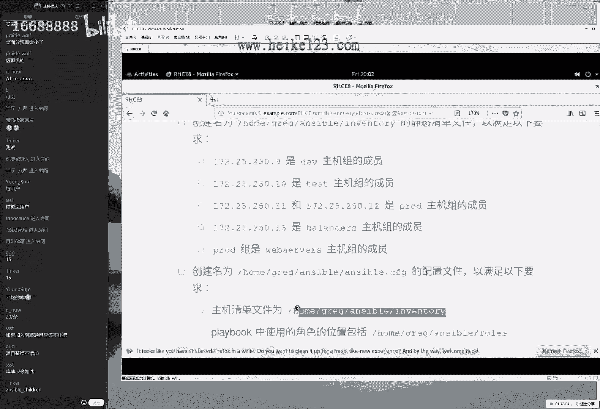

然后把这个文件给大家复制一下，复制到我们这个对应的目录当中呃，看一下对应的这个行当中。

14行没有问题，下面一行他说我们的playbook中中，在这个脚本的话呢，我们使用的这个路径放到这个目录当中好，首先来说，如果大家没有看到后面这个预期视频的话，您可能呃不知道什么叫做playbook啊。

不过没关系，他今天有这么一个参数，我们先把这个参数给大家写下来，待会的话我们会在明天吧会给大家讲一下。

什么叫playbook以及该如何监管，理总是有这个参数，先把这个参数给它写下来，这个函数的话呢，既然指定了吧，先把指令上先把这道题目的分值拿稳了，后面这个题目再说了，来首先来说看一下函数。

另外这个考试环当中的话呢，这个行数是跟考试的时候是一样的，模拟环境跟考试是一样的，有些同学的话就会像我一样啊，会记一下这个函数，就会记一下函数68行是吗，因为我还给他错过了，来看看啊，68 68 68。

我看看我这个比较粗心啊，果然是啊，看一下说用户的这个路径，果然是果然是用户的角色路径，这叫做这叫做角色好。

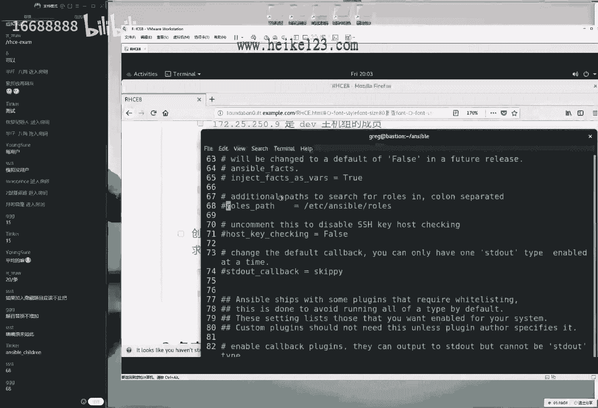

这个是我我这个是我比较我比较粗心啊，大家可以来记一下68行，我们把这个答站到里面去，这样的话，那我们这个ok没有问题啊，大家说对了啊，这个比我还更加熟练了，看来是我没有做预习，来看一下，是这样的。

第一道题目就都做完了，那我们就做完了之后的话，再给大家两个加分项啊，再给两个单，再给大家再给大家两个加分项，这道题目做到这里就ok了，就能拿分了，15分，那就吹到兜里面了，但是的话呢我们不满意。

我们再给大家加两个这个加分项啊，对这个参数首先的话呢还是往上提一提啊，往后面写到这边吧，第13行是这样的，我来给大家两个参数，第呃我们看一下后面应该有参数，一个叫做hokey checking。

好看一下，有还啊，第17 11行，大家看啊，他说我们有一个第71行，就在68行的下面，他说是否来去接收用户的这个指纹信息。

当前的话呢我们把它给它啊，取消了他这个注释信息，就是说第一次连接的时候自动去输入一下yes，然后不去检查用户的指纹信息。

这样的话呢我们连接起来会更加的稳定和，这更加准确啊，不用再去输入那个yes了，这是一个加分项，我们给大家敲一下，第二的话呢我们来给大家看到啊，还有叫做remote user，我们登录用啊。

登录到对方主页的时候，使用什么身份来进行管理，我们当前配置的时候是使用的是greg对吧，呃那但是我们再去远程管理到对方主机的时候，使用的用户叫做入取用户，来看一下，还真有107行啊，大啊。

大家看看这是几行数啊，107行和指定一下用户的这个名称叫做root。

来管理对方主机的，我们叫做root模糊，大家一定要区分一下，就是呃到底是不是要把它改成叫root呢，当然是我们要给大家啰嗦一句啊，是这样的。

当前所有的这个配置叫做baston，主机上面来进行的，地址的话是172。250啊，11172。25。250。254啊，怎么老忘了出来二五这个话叫做叫做baston，我们在所有的这个配置的过程当中的话呢。

使用的叫做greg用户来进行的，但是我们配置出来这个play book也好啊，我们配配啊，那我们来进行远程控制的话，都是调用的加多录取用户去完成的，因为后面会对于这个控制节点的话呢。

也就是我们这个被控这个服务器，然后我们来对它进行一个硬盘的管理，以及对于负的这个启动关关闭跟安装的话呢，都需要关联的这个身份去完成。

所以当前的我们去使用的这个用户身份，叫做grab，但是我们再去呃管理主机的时候，调用的这个身份是为呃超级管理员入取用户，所以当前需要把107行是吧，107行给它改成叫做root，好。

今天我们讲的超级细啊，之前讲的超级细，那我们做完了之后。

大家可能会问老师，老师，那你到底这个服务有没有做完了，那我们能不能除了给我们讲完，每道题目的做题的方法之后，你能不能想办法，把我们每一道题目做一下验证呢，所以我们看啊，所以我们这一期的话讲的稍微慢一点。

那大家千万不要催了，我们是这么回事啊，之前的话呢我们呃我那我每期讲课的时候，都是这样先去直接做题，然后我们会给大家讲一下做题的一个方法，做题的话也没有像今天讲那么细啊，然后的话呢我们第二步的话呢。

就是我们来去判分了，但是我们今天给大家加一个就是做一个验证，做一个测试，我们会把我们都做一道，那我们就会把我们做的每一道题目，作为一个测试，测试一下它有没有做成功，然后测试一下出来的效果。

然后最后的话呢如果每道题目都做，测完了没有问题，最后再判一下分，这样话能让大家打消到心里的这个顾虑啊，能够对于我们这个做完的题目，更加的信任跟肯定啊，这么一回事，事好我们来给大家去测试一下。

大家说出来了啊，叫做anzbo gm，拼音大家说考试的时候也可以做测试试吗。

当然可以呀，没有问题，来这样我们怎么去做呢，叫做anzable，然后我们再让我们去写一个o，指的是对于我们的所有的收购节点，然后因为我们一般啊配置过这个啊，主机清单了嘛，然后我们对于速的这个收入节点。

我们都去支持一下他这个拼的一个动作，它时间是个模块，大家已经说出来，我们就以拼为例嘛，它实际上来说是一个模块儿呃，先暂且不理解，没先没关系，只要按照我这个方法去做一下，它会显示叫做叫做success。

等于是测试成功，它能够在每个主义之间进行一个拼的操作，大家看到没有问题，也就是说当所有的节点都能拼通绿颜色字，说明每个节点的话都帮我们配好了，并且已经能够进行一个网络测试，能够连通了啊，这是第一个测试。

第二个测试的话呢，我们叫做ansible gun version，它指的就是我刚才讲到了啊，帅气老刘讲到了他这个呃配置文件的话呢。

分为三个保存路径，右键机是最高的。

这样的一个路径的话呢，指的是当前目录下，那我所说的是准不准呢，大家可以来看一下。

是准的，所以当前的话呢我们的配置文件，剩下的路径就是点题点题点题诶。

点到这个题目跟他是一模一样的，这道题目没有任何问题，三啊啊，那我们能啊，如果说300分除以15道题，就是20分能不能到手了，这道题目的话呢。

谁来了，我们都有理，这道题目就没有问题，这是第一，这是第一个题目，第二个题目的话是这样的，他说创建和运行安sb的一个临时命令啊，他说下面有一个文来往下面去读吧，他说创建和运行我们的安兹本的临时命令，好。

又重复一下他的题目啊，好再来说作为一个系统的管理员，那说明我们管理员的这个身份叫做入侵用户，他说我们需要在说空的这个节点上面，来去安装软件，好一句废话，下面下面去看，他说请按照正文的描述。

创建出来一个名称为这个的shell脚本，然后的话呢把我们这个i s p的历史命令，在各个节点上面来去运行，通过我们的ym仓库去安装，然后配置出来以下软件仓库呃，我给大家总结一下吧，是这样的。

在我们这个主机上面的话，一共有六个虚拟机，一共是有六个虚拟机，然后的话呢我们一个数据，那我们后来进入一个虚拟机的baseb，它作为这个控制终端的对吧，它上面的话已经配置好的软件仓库了，上面已经有了。

而我们的剩下的五个的话呢，没有配置软件仓库，我们需要做什么呢，需要在这个五个主页上面来去配置出来，软件仓库的配置文件，大家需要注意，就是当前不需要去安装什么软件，只需要把我们的软件。

仓库配置件给你写出来就好了，这怎么写呢，这有一个文件夹对吧，我记得叫做etc目录里面的ym。rainbow，点d啊，大家应该像我一样熟练才对啊，加点rainbose怎么样加，这加长是加一个s吧。

好像没有s哦，这个是我们的目录的名称，然后其中以呃我们的某一个名称为例，然后的话呢叫r e p o结尾的一个文件，在我们上一节课给大家讲过，这是我们配置这个em仓库配置文件的一个方法。

然后需要在这个目录里面新建出来的一个文件，那么当前的话呢，我们需要批量在这个五个节点上面来，去完成以上的这个操作，这就需要调用一个模块了，那我给大家讲到我们的话，anzable他算是一个框架。

它算是一个框架，它用来去管理远程主机的一个框架，他的话呢其实呢它来说它没有什么功能，它基本上没有什么功能，它主要是靠模块去完成的，它的每一个模块去完成某一项工作，比如说我现在这个家庭啊。

那我们买了这个房之后，虽然可能花了几百万几千万，但是到手之后的话呢是一个家徒四壁，什么都没有，我们需要自己去买，比如说锅碗瓢盆对吧，然后我们自己去买啊，各种的东西，那我们每一种东西的话呢。

功能是它要是不一样的，所以就是说我们的安保实际上它就是一个框架，我们的话由它就是一个基本的框架，我们需要在这个框架里面调用模块来去完成，然后去完成某项工作，那这个怎么去知道它有哪些模块。

以及我们该怎么去找到我们所需的模块呢。

我们这样去做来，首先去使用那anzable，那去使用那anzable，然后后面我们叫做document doc，然后我们来列举出来我们所有诶稍等一下啊，unstable，然后不对啊。

ensable啊呸呸啊，eniable，减号doc，然后一个小写l，列举一下，我们当前有哪些可以已经支持了，这个模块的名称，我现在给大家去说的是什么，我现在给大家去说的是一个推理的一个过程。

我我再告诉大家怎么去寻找这个啊模块的名称，但是在考试当中，大家就不用去像我一样去寻找了。

你可以把这个模块的话一定要先记下来，我现在给大家去说一个，从零开始去推理的一个过程，我告诉大家我怎么能够去找到他的，以及我为什么去选择他的一个理由，来给大家看一下，我们列举出来了。

所有的已经支持了这个模块的名称，特别的多嘛，太多了，那怎么做一下过滤呢，第二章节，我们的这个greg这个按行做提取的一个命令，那就稍等一下啊，中途还卡掉了吗，ok啊，第二章节稍稍等一下，还卡掉了啊。

不知道为什么它卡掉了，我们重新登录一下吧，可能是我不知道为什么我重新卡掉了，再重新玩，我反正我感觉是终端的问题，通过用户叫做greg，然后172。25。25，0。22545级的是。

然后对大家可以拿出您的纸来，然后这张纸上面的话呢继续去补充一下，在这个稍等下，我先写172。25。250。254。

我们这个地址的话呢，我们给大家写下来，它是一个叫做这个是我们这个控制节点好，大家拿起你的笔来，拿起你的纸来写到旁边，然后的话呢我们这个分组也记下来，因为他以后可能会说到，比如说dv组哎。

我们就可以快速反应出来它是点九呃，换成test的组就是点10p d组啊，就是11跟12同时的话呢，p o d组也是叫做web server组，所以的话呢我现在把这个信息嘛。

就是每个组的组名跟ip地址的话，我们都会写在写在旁边啊，以后再来说叫做balance组，我就不用老去来回来去翻我的网页了，那我就知道他是点三这个主机这样的一个目的，为他以后的话他会只说这个组的名字。

不说这个ip的名字了，我们好找，那不用老去啊，翻它了啊，来我们给大家看一下。

我们在进入到这个题目里面，说一下这个怎么去找呢，来去使用的angeable document，一个小写l做一下过滤，第二章节里面学习的greg命令，然后的话呢我们的呃。

第三章节里面学习的管道服做一下过滤，他既然提到了，我们要配置出来一个跟仓库相关的一个模块。

好了，要么仓库的模块一定是带有亚目，仓库的一个名称，按下回车，然后所以可以来看到ensable document哦，对我们先进入到这叫做home目录里面的greg，因为要以当前目录当中。

生下的这个配置文件为准吗，进入到这个目录里面，然后来看列举一下哎，unstable啊，不好意思，unstable s和i打反了，来这样走啊，过滤出来所有跟我们em仓库相关的，大家可以看到就有两个了。

并不多了，首先我们首先可以看到的话呢，这个他是说用来管理软件包啊，就是我们安装软件的话，使用的是叫做em，然后如果要想去安装啊，如果要想去添加和移除亚目仓库的文件的话呢，需要去使用的是第二个好。

这是我的一个推理的过程，那好了，我就要去使用到第二个模块那啊，那也就是说我需要去使用到第二个模块，来去完成以下这个工作，好我这样去做anzable啊，repeory叫做仓库的意思啊。

repeory叫y下划线，repository，我们这么去做ansible，然后是o他说了。

他是在所有的这个收款节点上面对吧，他是在每一个收款节点上面来去执行这个工作。

他就是个o，然后的话是一个小写m，它指的是调用某一个模块，那么我们的模块名称就这么推理出来了。

他说但他在这个每个收入节点上面的话呢，使用这个模块去新建出来的，这个仓库的名称以及信息是如下的，那我们怎么样把这个参数给大家写到里面去呢。

我们就需要在这个模块里面去加参数了，但是说实话，其实我也记不住，这个模块里面还有哪些可用的参数，怎么办呢啊我们一般推荐大家再开一个终端，再开一个终端，还是远程连接到这台主机上面greg，然后是172。

250。254，250。254，来又少说了一个二五啊，不知道为什么这地址老是说一半啊，来172。25。250。254，多念几遍，考试的时候就能够更加轻松了，来这个地址的话呢。

一般来讲以自己的这个座位为准啊，我们如果要做到第一个位的话，那么就地址基本就是这个如果做到第二个的话，可能是172。25。2，172。2。250。254，这个就是我们作为的号码来。

我们进入到我们这个对应的目录当中呃，呃如果说我要想去查看到某一个模块，具体的一个介绍，刚才是获取的名称了，具体的介绍的话呢，可以去使用到这个方法来去完成，叫做repository，repository。

ok单独去看某一个模块这个介绍，于是我们就可以去使用到这个命令来进行查看，呃，unstable减号document来进行查看，最后的话呢会有一个字段啊，字段啊。

看到里面的话说有一个示例examples example，来找到它，好大家看到一个问题，大家都讲到哪里了，讲到我们第二个题目了，一个example示例，稍等一下，找到这个视力界面，因为我也不好。

因为我也记不住太多了啊，所以我每次也会来查一下，他说的话呢会有以下的这样的一个参数，其实他做的是一个什么呢，这个操作这道题目。

他实际上考的叫做连连看对吧，他就是说这边我这边是一个中文，请把这个中文翻译成英文。

它把这个中文的话翻译成这样对应的一个参数，就是考了一个连连看吧，好了，第一个参数它说软件仓库的名称是为这个名称，好了，我们就这样，这个参数叫做name，怎么去写呢，一个杠a后面两个单引号引起来。

做个参数，使用单引号引起来，answer的一个规则，不要问为什么，那就是只能这么定义的就好了。

然后第一个参数name，然后的话呢，它里边看到它里边。

我们用到这个双引号引起来啊，双引号引起来，因为他这个事例里面的话虽然没有写，但是后面这个参数里面它有空格了，所以我们干脆把这个也给它加上这个双引号，他总之他错不了，加上的话更好，但是有点多余。

但是我们为了保证我们这个参数统一嘛，呃同化我们保证我们的这个参数统一性，所以我们都把它加上这个双引号。

第一个参数，它说我们的软件仓库的名称是为这个名称，所以我们把它写到里面去，他说的话。

我们的基础的url地址是为这个名称，什么叫做基础ul呢，实际上就是软件仓库寻找的一个路径，就叫做这个东西叫做金属的url，这个参数我们找到它。

然后我们往里面一粘，第二个参数，我们也不要手敲嘛，就是他一个他就一个连连看对应的参数，找到了对应的值，找到了往里面一粘，做完了，他说下面我们的jpg的tag的这个模式为启用模式。

好启用模式，再往后面去找一找啊，这叫做这叫这个参数，叫做gp啊，叫jpg check，好了，jpg check，然后的话他这个参数是个yes or no是吧，它不是一零。

它并不是一和零了，所以我们给他写一个yes，ok下面一个参数连连看啊，他说jpg check这个密钥文件url地址的话呢，是为这么大长串呃。

连连看，找一下这个中文的所对应的这个参数是什么，然后往下找找找找它在上面我给大家搜一下吧，g b g啊，g b g啊，郭德纲嘛对吧，g d g啊，gdp来来看一下啊，唉g d g d g啊。

在这再找一下啊，在ok在这啊j p g。key啊，ok来看一下这个名称，不要也不太好读啊，好g pg check啊。

不j p g key吧，我记得是ok这个名称，然后把这个路径的话呢往里面一粘没有问题，下面的话呢还有最后一个参数啊，最后又叫成功了啊，最后要成功了，他说我们这个软件仓库的话呢。

状态没启用模式来找一找最后一个参数，然后大家说一可不可以啊，哦我其实知道大家想问这个问题，嗯其实的话我待会儿给大家说这个原则吧，呃大家问我们这边的话写yes和no可以写一和二。

那啊那我们写一和零可不可以啊，啊实际上的话我我我需要给大家说一下，就是呃行是行，但是我们从来不推荐，因为在考试的时候怎么稳怎么来，没有必要，就非得要写一个一的理由和意义是什么呢，没有什么意义。

在考试的时候，说白了就是花钱去买一个证件，只要你能够把钱花出去了，把证拿回来了，那么就是好样的，如果你说把钱花出去了，证没回来，会感觉到非常的空虚和遗憾，所以考试的时候怎么稳怎么来。

就以它配置文件里面这个为准，他是个yes还是个no，就以他这个为准，他就写的是yes no啊，那么我也写yes，他要写个no，我也写no，所以这个怎么稳怎么来就好了。

然后下面的话呢比如说叫enabled，然后呢写意可不可以也行，但是我就啊，我但是我就以他这个官方的文件里面这个为准，这样的话呢我错了之后，我可以跟他去拍桌子，跟他说，你这个题出错了，或者你教本小问题。

而不用说，因为我这个改过参数了，然后有点像小会有点小心虚，所以考试的时候怎么稳怎么来，这是我对考试的一个原则哈，来我们参数都写完了啊，无非就是一个格式看起来比较长的一个问题，那我们做完之后的话呢。

我先开了两个窗口，第一个窗口我来去做，第二个窗口我来去看帮助信息，第三个窗口我来去做测试，好低头啊，同学们低头啊，低头看一下屏幕不平啊，啊低头看一下自己的这个视频，这张纸啊，随便找一个主机。

比如说大家找一下dv组，看一下是什么呢，叫做呃172。25。250。9，他是来客户主机对吧啊，他是来测受控节点，来按一下回车进入到里面去，进入到他的这个etc目录里面的em的rap，哎呀还是有个s。

刚才没太自信，刚才少写了一个s啊，ym。rainbow dd，然后里面的话呢没有配置文件啊，有是吧啊，好尴尬啊，不过不过没关系，这个里边的话呢默认情况下它是有三个，但是它都没有生效。

我们它里面的话呢没有啊，他们里面在考试的时候是没有的，但它也没有我们自己新建出来这个软件仓库。

它只有三个，我们的默认的运行仓库。

我们先这样跑一下这个命令，跑一下，这个命令在我们的这个控制节点，baston上面运行一下这个命令啊，于是的话呢很开心，他出现了很多包错，越他越报错，证明我们今天这个课程的话就会更加丰富啊。

这样的话呢我们就可以稍等一下啊，给大家讲一讲我们排除的一些方法，他说我们有一个描述信息的啊，description is required。

我们的描述信息是必须的，不好意思啊。

同学们，刚才是我疏忽了啊，太大意了，我这边少了一个参数叫描叫做描述信息。

我真的是一目十行啊，像我这样考试的时候就容易扣分，来我这边少了一个题目，他说就描他这个描述信息是个啥啊。

描述信息叫做description，好，这个参数我忘了写了啊，这个就是一个纯，这是一个纯失误了啊，这个是一个纯失误，太马达哈了，来这后面就非常的冤了啊。

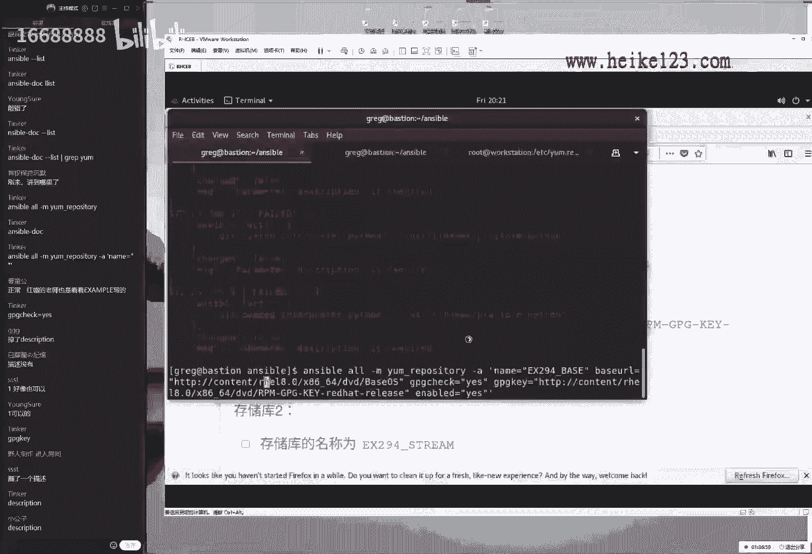

来往里面一粘，描述信息，往里面一写，他说叫做ex啊。

ex 294无所谓，是什么都我都不用看啊，往里面一粘，他爱是啥是啥，往里面一粘就行了，那我们一下回车再跑一遍，那再来一个再来一轮，哎看到啊。

还原色代表就是修改成功，它升价了，于是我们在这个受控节点上面，我们就看到这里边就多出来了一个文件，叫做ym这些仓库的配置文件，去查看一下里边做的这个信息。

跟网页里面是不是一模一样啊，没有任何问题，这就是第一个软件仓库的一个配置方法啊。

大家说是我故意的啊，真的不是故意的，不好意思啊，这个是我的一个哎呀，舒服了舒服了舒服了啊，虽然说大家想希望我是故意的，但是我真的不是故意的啊，来我们这啊真的是粗心了，至于大家考试的时候，一定要以我为戒。

不要向我学习，来看一下这个配置文件。

参数跟网页里面一模一样，这样有些是我错了，可以去拍，大家可以去拍桌子了啊，第二个软件仓库，所以第二个软件仓库是个啥啊，第二个软件仓库，实际上就是把第一个软件仓库，这个信息去改一下好了。

我们来看一下这个题目里面怎么说了，呃，他说创建一个名称为这个的shell脚本，呃，然后的话呢把我们这个命令的话呢往里面一粘，为什么这样去做呢，因为我们虽然这个呃我们换到中国的话呢。

是啊比较讲究说这个诚信啊对吧，我们换了啊，全球都在讲究这个诚啊，诚信要去考试怎么样了，但是大家想想，如果说我考试的时候有这么一道题目，但是我的话我是执行的命令，他怎么知道我有没有执行队呢。

所以我们需要把我们执行过的这个命令保保，把保存到一个文件里面，这样的话就能够让这个脚本碰到成绩了，就这么一个下午，就把我们刚才所执行过的这个命令，保存成一个文件，然后这样的话呢我才去说。

我就把这个呃服务的配好了，那么他才能够去相信我，还有也就是说我现在需要做这个事情是这样的，首先啊把这个文件的话呢给大家复制一下。

否则如果没有这个文件，我说我做了，但是谁信呢啊，于是我需要先按照他这个题目要求，新建出来这个文件好吧，然后的话呢第二步稍等一下，我先把这个刚才执行过这个命令啊，先保存一下，先复制一下。

然后的话呢我们再进入到我们刚才所新建出来。

这个目录当中，把我啊对他就是一个shell脚本嘛，shell脚本他第四章节讲过，它里边的话呢考到的是三个原则，不太会有三个结构脚本的声明，基本的注释，基本的命令脚本的是呃，声明。

它是叫做bean里面的by是可以去执行下面的注释，可以写可以不写，无所谓啊，比如说我们写哈哈哈无所谓，看看这个哦，哦这个话在啊，这个话我们写不写没关系，反正我以为他们不太爱写。

因为呃比较他这个写的比较多的话，比较的是啊还是比较麻烦一点啊，比较的辛苦，所以它里面没有要求的这个参数的话可以不写，所以的话初试可以不用去写啊，啊费手，主要也累啊，那么于是我们把这个格式写好之后。

写一个脚本的声明，就可以，把后面这个已经执行过的命令往里面一粘。

就佛提了，要看一下里面要求的话呢，说软件仓库一，软件仓库二好了。

第二个软件仓库，实际上就是把前面一个软件仓库里面的，这个命令的话呢，来y y e复制，然后把后面剪，然后去解一下p，然后去粘贴一下，那我们需要做的事情，就是把第一个命令里面所对应的这些参数，改成在这呃。

这个参数里面所对应的这个值，给它改成一个他第二个人仓库里面所对应的值，实际上就是一个重复工作嘛，我们来给大家复制一下，但是大家听起来虽然有点简单了，但是实际上呃得到这么一个考研辅导的培训，不容易。

大家要理解我们这个付出啊。

就是大家听起来有点轻松了，但是我们当时2020年8月1号去考试的时，候，我们是很辛苦的。

这些当时没有人跟我们讲过，但是这个确实呃能够很大的去提高大家，这个通过的几率好，大家写了一个问题啊，大家写了一个啥啊，写一个啊，阿弥陀佛啊，这个万一考官是个基督教怎么办啊，这个也不用去想。

同学们这个没有必要，这个没有这个啊，没有必要啊，这个我们刚考完了，该考完之后晚上去吃饭呢。

还晚上还去吃烤串了，所以考完试一个四个小时的考试。

谁看谁能做的快一点，比如说做完要做两小时就做完了，另外两个小时，另外两个小时的时间不就可以省下来，去干别的事去了吗，我们就尽快做，做完最后可以早强了，然后我们往里面一粘，把这些不同的参数往里面一替换啊。

稍等一下啊，往里面一替换，这样的话呢这道题目就做完了99%了，最后的话呢1%就是给这个文件吧，稍微大一点权限，让他们能可以去执行，然后我们再去手动去执行一下，看有没有报错。

只要没有报错，就可以想着今天下午吃什么饭了，然后去找啊，去晚上怎么去庆祝了。

然后顺便看一下下面这道题目，来，先跑着这个脚本看一下，没有任何报错，只要没有红颜色的，绿颜色代表大家记一下啊，绿颜色代表是执行成功，黄颜色代表的是执行成功且进行了修改操作，他说要出现了红颜色的话啊。

黄颜色表是不错，所以说出现了绿颜色跟黄颜色，都代表的是正常情况，不用着急来，绿颜色和黄颜色属于正常情况，不用着急，它属于它都属于正常啊，它都属于正确的。

如果出现啊，它只有出现红颜色才代表着执行失败的，来我们可以看一下，都跑完了，于是在我们这个测试节点上面的话呢，又会多出来第二个文件，这个文件我都不用去看了。

肯定是正确的，因为我们听完了这个参数都是直接复制的，不存在说敲错这种可能性，大家说说考试的时候我们写文件啊，如果说比如说有一个aa的文件，我们写成星号星号星号，这样有分吗，呃不用看了。

如果只要跟题目里面要求不一致，那我们就没有分，所以一定要考试的时候，以他这个实际为准来复制一下就可以啊，来复制一下他大家说可以提前交卷吗，可以啊啊没有问题，所以我考试的时候四个小时的考试。

我考一个小时40分钟，然后我就走了啊，一个小时零四分钟就考完了，这真的是啊并不难，这真的并不难，好第二个20分到手了，大家可以拿张纸出来啊，既然15道题目满分300分，那不就是一道题20分吗。

画就可以画成字了，第二个正字画出来啊，第二个啊不第二个笔画啊，40分到手了，下面一个题目，他说安装一下软件包，它说创建一个名称为这个的playbook，然后的话呢我们来依次安装以下以下信息。

首先来说一下什么叫playbook呢，第一个来说啊，playbook的话呢，我第一次接触这个词，是看莎士比亚的那个话剧啊，叫做playbook，就是一个剧本，同学们就是一个剧本，它就是什么意思呢。

它就是一个shell脚本啊，把我们要去做这个工啊，他要把我们做这个动作是不是很麻烦啊，1234这样去做n字母不也是这样吗，一条一条的这样的命令好麻烦啊，那于是我就把我这些我们的assable的这个语句。

然后的话呢写成一个脚本，写成一个啊，那我们写成一个脚本，然后我们来进行一个批量的去执行，我们的这个enable的语句，这个脚本的话呢在我们当前就把它叫做剧本，叫做playbook，就这么去理解。

当然大家不要去说老师不对啊，这个后来那我们所说的脚本叫做shell脚本，然后呢我们这个叫做剧本，java跟剧本，只是说在我们的普通服务器叫板不一样，但是功能的话都是从上往下来，去执行这么一个效果。

这个upon a play book，也就是说大家知道这个中文了，叫剧本excel，是不是就感觉到好理解了，叫剧本帮我们要去做这个事情，然后往里面一写就是一个剧本，就是一个脚本了。

但是烦就烦在他这个ansible是什么语言信息，大家应该知道啊，这个啊大家告诉我们的xp是省什么语言去写的，这个剧本呢大家应该知道叫做yo语言对吧，叫做yo语言，叫y a m l，这个特讨厌啊。

这个叫yo语言，要么语言有一个特啊，是用的python吗，对我们的框架用到python去写的，但是我们的脚本的话用到这个yo去写的样貌，语言有一个特点是什么呢，我们去写shell脚本的时候。

里面用的都是我们的啊命令去完成的啊，这本的生命教母的注释，将面的命令再去使用呢，ym的时候里面调用的是ens的模块，这个还不是很讨厌的事情，最讨厌的事情就是因为它的格式要求，它的格式要求极其的变态啊。

极其的变态，它需要是横向及纵向都要对齐，所以大家去写这个的时候，纵向也要对齐啊，这个是一个很容易出错的问题，但呃一个点我现在给大家演示一下，什么叫纵向对齐呢，就是你不光要考虑到横向。

你要考虑到纵向就特别的恶心，来给大家演示一下，另外的话呢我们会有格式要求，我以自己的实际为准给大家来做一下演示，呃，第一次我记得我去敲这个的时候，差点电脑给砸了，要不是考虑到这个点是刚买的。

我估计就已经是包就已经被敲坏了。

就是因为就是你看这个东西吧，你去看跟网页上面或者跟我们去敲这个啊，上课去讲的话一模一样，结果的话他老是出错，就是因为有些时候你把屏幕的话，这个稍微的看着这个字稍微小一点啊，你真的看不出来，差一个空格。

上下差一个空格，就他出错了，这个人去讲理呢啊很讨厌来，首先他的要求说，新建出来一个名称为这个的playbook，于是我们先把它写下来，然后对于我们这个yo语言的话，有一个格式要求，就是三个减号啊。

作为开头就叫做压迫语言，它一个式要求代表就是压迫语言的脚本，都要用到三个减号来去做一下开头，我们理解上就是三个减号先先去啊，先去做一下标识啊，然后的话呢三个减号开头叫ym语言，然后下面的话呢。

指的是我们这个playbook的一个名称，一个减号，一个空格，后面就呃叫做playbook的名称叫做name。

一般情况下我会建议大家使用我们的软呃，以这道题目的这个标题，然后来去取这个软件包的名称。

来去取这个脚本的名称，这样的话呢以后啊大家去进行维护的时候，我们知道哪一个文件对应的是哪个题目，所以我建议大家使用的是这样的一个名称。

来去命名，第二话呢他说说创建一个名称为这个的playbook，三个减号是祭天啊，就是我们现在要写三个减号，祭天指定一下名称，他说的话呢安装软件包，他说把这个p h p跟mary db啊。

数据库跟这个网页语言呃，安装到这三个和主机上面，也就是说限定了一下执行范围，那我们看一下，低头看一下有这么几个组，dv一组test组，pro d组跟balance组好了。

把balance组给他甩掉了，没有他的事，对应哪个主机去执行，这个才叫做house，这个我我就呃稍微快一点，因为对于这个格式要求，对于它的语法的操作符没有什么可讲的，我们既然作为域名来讲，它怎么定义的。

我们怎么就去敲就好了，没有什么可讲的，我们就直接去写啊，dv组，test组还有啥，还有一个叫做pro d组，在这三个组上面来去执行我们这个剧本好，我们下面再来tsks，等于它指的是我们要去做这个事情。

然后往下面去写，第一定义一下我们剧本的名称，第二剧本要给谁去执行啊，定一下我们执行的范围，这段话已经在我们设个前面定义好了，他组队的地址了，所以可以直接调用就可以了。

test它这个后面解释我们要做的这个动作，一般的话呢我们的这个动作啊，大家会用到非常的这个标准的格式去写，比如说啊安装中p h p吧，我们叫做哎install，然后他呃因素package。

我们给大家写一个非常准确的一个名称，install package，然后是p hp，然后加巴拉巴拉这样去写，不仅的话自己辛苦，而且的话很耽误时间啊，所以的话呢我们考试的时候不要进门。

就是非常详细的去写一个动作的名称。

因为大家看一下它里面要求了没有要求，题目里边只要没有要求的，就像我们在生活当中的话呢。

法无禁止便是我们的权利，我们就可以去做啊，那我们可以直接把这个名称给它写成one two，three four，好吧，第一个动作就把它叫做one，第二个就是two啊，第三个就是three吧。

就是one two three four，这样去写，不用自己去费心费力的去取来啊，去取名字。

哪去这么一回事儿啊，来啊di第呃第一个叫做呃one。

让我看一下这里面的要求啊，怎么跳哪儿去了，稍等一下，看一下这个题目，要求他说安装一下软件包，它为p h p跟mary d比，安卓软件使用的是什么呢，说实话我们其实是指导的。

为什么呢，因为刚才我们去过滤的时候，是不是第二个我们去过滤，说有什么跟亚门仓库相关的命令的时候，好像不小心看到了，来给大家看一下，不小心看到了，有一个用来去管理软件包啊的一个命令。

大家看到这个模块的名称就叫做议案本身啊，这个模块呢就叫做议案本身啊，所以的话呢我们就直接用到这个建模块，大家说写一和二可以吗，也可以啊，当然比我还懒，我们建议用英文的，因为1号的话比较的出戏。

因为可能中因为号用这个数字的话，可能就会呃比较的嗯嗯比较的这样一个嗯，呃突出这个信息了吧，反正我建议大家去写英文，当然大家写数字的话也可以来，我们这个模块的名称就叫做young，来我们继续来去写。

反正我不太喜欢写这样的一个数字，因为大家看到这个，如果说这里面都是这样的一个呃，呃做这个信息的时候，对于数字的话特别的凸显出来，所以我觉得这有些时候配置起来的话，会让自己觉得很乱，好像有这么回事。

来下面的话呢再来啊再来一下，然后看一下这个隐私，apple实体当中就介绍到了，那这个压模块的话怎么去用呢，看一下，首先它有两个参数，第一个叫做name，指的是我们安装啊，要去安装软件包的这个名称。

第一个软件包的名称，稍等一下啊，稍等我们这么去写，我们要去遵循这个vm go的这个引导，因为大家看到我现在要去写的话，那我们下面去哪里去写呢，我们不用去管a一下，回车它会出现在我们该去写的这个位置。

然后第一个参数叫做name，然后冒号第一个软件包叫做p h p，所以他要去纵向对齐的纵向对齐，先看一下第二个参数必须要跟它对齐，否则我们差一点点他都不可以了，待会给我们报错，当然我可以待会我可以啊。

我待会我们可以演示一下吧，就这个参数必须要完全对齐，跟他要保要保持齐平，参数跟参数齐平呃。

每个是这样的，每个模块不每个动作的话呢，我们的每个他叫做它是叫play，每个play之间要对齐，每个模块之间要对齐，每个play之间对齐，每个模块针对齐，每个模块之间的这个参数对齐。

每个它都是一个纵向对齐的。

差一点都不可以啊，我们现在来往后面去写吧，接下来第二个参数叫做state，指的是面包的话，那我们安装成什么样子，看一下这个参数，他说嗯最新版啊，l a t e s t啊。

安装一下我们的p h p为一个最新版的格式。

要求，ok我们写完，然后没有什么后面这个参数了，我们继续往上下面去审题。

他说还有第二个软件包，我们做到了这个maria db，它意思只安装一个，于是的话那我们再去写第二个play，第二个pl的话，这个one two three吧，就是one two two。

第二个就是two，然后呢我们使用的模块还是压模块，然后我们能换的名称叫做maria db，然后换到我们的状态为state呃，呃为最新版啊啊这样做好没有问题。

然后看一下，ok对应这两个软件包的名称没有问题，下面一个问题啊，我好啊，那我们看下啊下啊，下面一个题目，他说将我们一个很长的一个软件包，然后软件包组安装到dv组上面，它就是出了一个小坑啊，为什么呢。

如果说大家第一次考试的时候就会看不清了，看到这个画面指的是软件包对吧，这个话指的是件包组，软件包组指的是还有多个软件包的，一个软件包的一个集合，所以它到底念包组，他的软件包的话虽然多了一个组这个字。

但是这个呃，他去写的时候的名称是有一些差异的，好，这也算是下了一个小坑，那我们再去写第二个play，因为它是对于第1v组来进行操作，它大家看一下哎呦，那我们第一个play的话呢。

它是对于这个三个组的主机来进行的操作，下面一个play，它仅仅是说只对于这个dv组来进行操作，所以的话呢我们就去写第二个play，他每一个play的话呢跟这个名称啊不能有重复，所以我们就第一个叫做a嘛。

第二个就叫做b，这样的话呢我们好去区分第二个b，他说的话呢只对于这个div一组来进行操作啊，host然后dv组这个格式我们不给大家去说，因为我们要想去考试，必须要按照他这个格式要求去做，我们在做运维。

不在做，我们并没有做开发，所以开发里面定义好的一些规则，只能这样去用啊，也很呃也只能比较头疼吧，他要求比较严格好，我们现在在第1v一组，然后来安装一下软件，它的话呢名称已经知道了啊。

模块名称那one two three吧，然后第三个就是three。

然后还有我们的压模块的这个名称啊，安卓软件包的话呢是叫做rpm development tooth。

好长啊，于是我们就可以用到复制的方法去完成name，他因为之前有它，因为它它它这个名称之间有空格了，所以我们按照第三章节这个转移符，给大家讲到过的，通过冒号做啊，那我们通过双引号把它引起来。

作为一个整体，然后接下来latest为一个最新版，那latest最新版的一个名称来去安装，如果这样去做的话就错了，因为他说了里面题目要求说软件包组好了，软件包组的话呢，前面就加上一个at符号。

指的就是软件包组的意思了，这样做完之后，第三啊就把这道题目拆分了，下面最后一个问题，他说将dv组里面的主机上面，所有的软件包更新为最新版本啊。

它的话呢还是省的压模块去做的，来第四个动作啊，one two three four，第四个动作来这样，one two three four，four four em，然后我们所有软件包安装成最新版本。

然后就是name等于的话，那就是用到通配啊，用到通配符星号指的就是所有的家，指的是所有的这个软件包嘛，然后的话呢这个状态为最新版哎，latest这样做好之后，大家可以看到我们实际上分为了两个play。

然后我们看到的话呢，第一个play为我们这个dv组，还有这个啊，我们下两个组安装了两个软件包，第二个的话呢play它是安装了软件包组，以及升级的这台的软件为最新版本，我们现在把它点一下这个保存并退出。

我们现在的话呢在进入到这个dv组上面，做一下测试，我们就我们随便给大家演示一下，比如说当前的话呢，去安装一个叫做菲律宾的一个件包啊，大家先看一下，我当前在dv组上面安装一个软件包，叫做p h p啊。

于是的话呢这个它就会开始去安装，然后问我们是否去确认我敲一下n先不要紧，手动去安装，确认一下，菲律宾现在果然是没有被安装过吧，对吧好，我们给大家结束掉它，点一下n结束掉它，不要自己手动去安装。

然后的话呢我们现在去使用的unstable，然后是playbook，后面加入我们的playbook的名称，以他的这个实力为准，叫做package。

there yo，来同学们按下回说去使用的aibo减号playbook，就可以来去执行一下，我们刚才所写好的那个脚本，或者是我们叫做剧本来去执行啊，再去倒杯水啊，稍等一下，诶不好意思啊。

ancible playbook啊，少打了一个book，因为该着，因为着急，该去喝水，所以少打一些东西啊，今天讲的话有点像有我今天正在他去战追行啊。

稍微有点慢，然后的话呢我们今天讲的有点慢，我感觉大家今天也没有听懂，也今天没有听筒啊，啊怎么现在才画第三段，才画第三的课，才讲了60分的题目呃，大家听见的话也不过瘾，我们今天讲的话也不太过瘾。

所以的话呢我们今天时间的话就往后再拖一拖，我们今天的话大概会给大家讲三个小时吧，我们讲到十点钟，我们多加点东西啊，原本是九点钟下课，但是看起来好像有点太少了啊，所以的话我们今天往后拖一拖。

大概拖个40分钟，拖一个小时左右，我们给大家多加点东西，这样的话呢，我们明天或者后天大家在做题目的时候，才不会说做一半，然后就卡住了，后面这个题目越听越有意思，来我们大家没有大家啊，没有什么事吧。

那我大那我们这个节奏肯定是没有毛病的啊，就是说主要就是有点慢，因为我们介绍特别详细，大家其实我们讲课的时候完全可以快很多，因为因为第16章节有书啦，大家看书上，其实这个介绍很详细了。

但是我们经常大家看书也能学会，然后听实验的话也能够更加详细一点，这不就是我们讲课的饥饿宗旨吗，但是确实有点慢，确实有点慢啊，不过没关系，我们节奏感掌握好，然后我们把时间拖的时间长一点就好了。

下面一个题目，下面一个题目他说啊，我们不带废话了，同学们你们可以聊着，我先就不废话了，等于我在聊的话，这个时间就比较久了，好看下面一个题目啊，第四道题目他说使用到real的一个系统的角色。

然后的话呢去完成以下工作，是啊，他什么意思呢，嗯我一琢磨啊对了，然后的话大家问的这个隐藏题目什么意思啊，这个隐藏题目是跟我们当前这个题目，是一个替换关系，也就是说红帽考试r h c e只有15道题目。

是固定的，他会用隐藏题目去替他要去替换掉，我们也有这个题目，所以呢这个两个题目它是一个互换的，当前的话呢有一个角色叫做time s n c，然后画在我们的隐藏题目的话。

还有可能是叫做啊sa linux这两个这个名称互换啊，再到隐藏题目，实际上他讲的都是一回事，他说什么呢，叫做系统的角色，他这个系统的角色啊，就理解成，就是我们这个每个人的这个工作职责啊。

大家说是替换任意题目吗，不当然不是他是替换的，是对应的题目啊，然后先因为大家只要啊这个大家其实不用问，因为大家只要看完了那个隐藏题目的，你自然会知道他他替换是哪个题目，因为这里面的字都是一样的。

只不过这里面的参数变了，所以你可以很清晰的知道他替换的是哪个题目，让我们来给大家先看一下这么回事儿啊，嗯啊对，然后我们先给大家说一下，诶，我就不等了，我我我我能乱了乱了乱了，然后现在开始这么回事啊。

呃这个角色什么意思呢，这个角色是这样的，如果说我现在有这个playbook了对吧，我现在就是说我们这个playbook，里面包含了很多这样的一个命令啊，大家想一下什么叫play book呢。

就是里面包括了很多这样的一个动作，包括了很多这样的一个play，然后变成一个剧本了，但是如果说我们现在在家里面我比较懒，我请了一个保洁阿姨对吧，我现在工作比较忙。

我可能需要一个保洁阿姨帮我去收拾一下房间，那请问这个保洁阿姨，我需要跟他调用多少个play呢，我那我那我可能调用第一个play，他帮我去扫地，调用第二个play，他帮我去蹲。

第第第第三个play帮他帮我来去啊做饭，第四个play帮我去倒垃圾，第五个play帮我去干嘛干嘛去吧，那好了，如果说我现在有很多个plan，那我现在能不能和平，那我们给他做一下合并呢。

这个合并过后就叫做角色，好像叫做角色，大家也有大家可列成就叫叫叫做保洁阿姨，我们掉了一个保洁阿姨了之后啊，叫做这个角色，那我们调一个保洁阿姨之后，那我们是呃不用再告诉他，他需要做什么样的一个事情。

他就自带有了很多playbook，这个剧本他就会呢他这个里面预设的动作，然后这样的话任务1234来去执行，也就是说呃将动作将这边的啊，将play可以合成一个playbook。

它可以将这个playbook的话呢合并成一个角色，这就是一个角色的一个概念，里面包含了很多这个剧本，这个playbook，然后呢我们这个角色的话呢它有三个来源，第一个这个来源的话呢。

就是我们系统里面自带的，它里面的话呢自带有了一些的角色，这叫做系统啊，它叫做系统自带的角色，然后的话还有第二种角色叫做自己创建的，叫做自己创建的这个角色，这是另外一种可以自己创建出来的角色。

这也是可以的啊，啊第三个角色的话呢，这个来源是叫做web这个获取的，比如说我们自己作为保洁阿姨，那好了，我，那我，那我自己家里可能就有人去做这个，保洁阿姨对吧，第二的话就是我们可以自己成为保洁阿姨。

第三的话就是我们可以从外面去找人，好这个三个这个好，那么好，那我们这个三个角色这个来源鸿蒙考试的话，他考几招呢，他考了他他考的是哪几种呢，啊，那我们这个话呢，这个三种角色的这个获取方法大家应该知道了。

就是红帽考试的话，他没有做选择题，他是全他啊，他都要了，所以红包考题他三个他都考到了，并且的话呢这三个考题他考了他这个三个考点，他考了四道题目，总共的话呢就是15道题目，总共是15道题目的hz。

就光这么这么一点破事儿啊，他考了四道题目，大概算下多少分80分，所以要想考过20c，你这个呃这么点这个获取角色，这些知识嘛就必须要很扎实，所以说这个角色是必会的东西来，那我给大家说一下他怎么做到的。

这三个题目他考了啊啊我先给大家说一下，他怎么三个事情，他考了四个题目，他他是怎么做到的啊，首先来说一下我们第一个题目，他说使用一个呃红帽系统当中，real系统的一个系统角色。

也就是说他三个这个角色他是有三个来源啊，第一个这个角色来源叫做系统角色。

系统里面自带的，那怎么去实现呢，我们需要先去使用到我们这个root用户，登录到我们的这个服务器里面，在考试的时候也可以这样去做的，来172。25。250。254，来登录到里面去安装上一个软件包。

这个软件包的话呢名称哦，我想想啊，叫做real gun system grose是吧，我看一下system啊，s8 s t e m system，点gun rose来安装一下这个软件包。

这个软件包安好了之后，我们就可以调用系统这个角色了，然后来进行一个编写，来安好之后的话呢，我们就可以进入到哎呀，这是考我记忆力呢，user目录里面的啊，shell呃，user usher。

user share啊，然后的话呢我看一下啊，里面的anzable看看对不对啊，啊不对啊，里面的话呢doc document看一下，还得照着词儿说啊，来看一下，还是看眼吧啊。

real system system rose来给大家看一下，这个里面的话就会多出来了，很多系统的这个角色，然后其中的话呢，我们看到当我们安好这个软件包之后，就会在这里面多出了一个叫做时间同步的。

一个角色，然后后来我们就可以按照他要求来创建了。

他说安好这个软件包之后，我们就可以来创建出来呃一个playbook，然后的话呢来去执行以下的工作，这个的话呢我们原先2020年的8月1号到，2021~2021年的时候。

就使用的方法的话呢是通过手动去编写的方法，后来的话同学们都反馈说太难了，说老师我根本就记不住，所以的话这道题目很多都是大家都选择放弃了，后来后来有一次机会，2021年的年初的时候，春节我是实在没事干了。

然后我说有没有什么简单的方法，可以去做完这道题目的，后来我才发现了这道题目是有模板的啊，这话很对，就很对不起我们这个之前学姐同学啊。

白也放弃了，实际上这道题目是有技巧的，怎么办呢，这个play book实际上它不用去写，它里面是有的，我们只需要去找到它就可以了，怎么去找呢。

首先就进入到user里面的share里面的document里面的rose，然后的话呃进入到这个目录里面，就这也是很阴差阳错的一次机会，我找到了说有一个文件，这个文件叫这个名字啊，不是啊，他是叫这个名字。

大家可以记一下这个完整的路径，然后我们来查看一下，这个实际上叫playbook啊，来看一下，这就是一个最经典的一个time sn c，时间同步的一个playbook了，后来的话呢我就选择了一下。

说把这个文件的话直接复制过来，从这就非就非常简单了啊，把这个文件的话直接复制一下，复制到它所对应的一个名称下就可以了，这个也就是说这个文件的话呢，我们不需要自己去写，可以直接复制一下模板。

并且我可以给大家保证，就是考试的时候也有这个模板，可以直接复制就可以了，是不是感觉一下就轻松多了，来来复制过去，复制过来之后的话呢，来复制过来之后进入到我们的home目录里面的啊，greg。

然后的话进入到ansible目录当中找到这个文件，然后加以小小的编辑就可以了。

我们只需要编辑几个参数，首先他说在所有的收官节点上面来去执行。

那我们就这样去做，将这个target的话呢，我们给它写成一个o在所有的接吻啊。

他在所有的节点上面来去执行，他说使用这个角色，废话啊，这也不用去做了，他说那配置这个角色，他说使用当前生效的ntp的时间，供应商的服务器也不用去配置，这些也是个废话啊，只是一个描述信息。

因为这个里面已经在我们里面是有体现了，不用去动，他说配置这个角色使用时间服务器地址好。

这个需要改一下，也不能说啊，完全不改，这个需要改一下时间服务器的地址，给他填写到house name里面，这个参数模块我们都不用去查了，里面模板都有了。

最后他说取得一下我们这个同步啊，叫做唉时间同步的一个互交互啊这么一个参数，然后它就可以自动的，然后与我们这个n t p的服务器，来进行一个数据的交换，保证它是一个最新的一个时间。

这样的一个效果可以看到，当前的话呢呃已经开启了，没有问题，下面的话呢这几行就变成很多余了，123456，所以大家需要做的事情，就是把这六行呢给它删除掉，六dd剪切一下这道题目的话，做完了来保存并退出。

大家可以来看到这道题目的话呢，做完之后效果就是这样的啊，里面的模板大家可以从网上啊，他啊大家可以从我们这个目录当中来去复制啊，也不用去手写了，只需要把这个参数做下替换就行了，这道题目做完之后的话呢。

我们建议大家的话再去执行一下我们的uncable，然后是playbook对吧，不对啊，anzbl，然后去查看一下啊，galaxy星空吗，那然后是list，查看一下，我们我们这个角色可以看到里面的话呢。

就会有我们这个时间同步的这么一个服务器的，一个用户，最好的话再去编辑一下，我们的uncle的这个模板，我记得里面还有一个就是说有一个叫做呃，rose是吧，rose好，刚才我们好像写过68行。

他刚刚说过的，我们跟一个角色调用的一个目录，然后呢我们再把我们刚刚所写，再把刚刚的话呢我们定义好这个目录，追加到这个目录的后面，他帮他，他帮我们能够方便去进行调用，ansible啊，稍等一下。

我看一下咱们这个书上怎么写，unstable share，anxible rose，去调一下我们这个角色share，然后是因为它属于一个系统角色嘛，他刚才那个目录，如果我们不去手动去来去整理一下的话。

他可能是获取不了的，来我们给大家写好，然后再去查看一下galaxy，然后list来查看到啊，这边的话呢能够看到了我们所对应的一个目录，然后就生效了，也就是说这个目录的话呢，当前能够自动去加载上。

它就能够颠覆掉这个角色的一个身份了，大可说出来了，说如果我们跑这个脚本的话，它会有一个报错，但是这个的话这个结果是正确的，那我们跑一下它这个原理是什么，它怎么回事呢，因为他现在让我们去设置了一个。

我们的nt p服务器，172。25。254。254，这个地址作为我们的nt p的一个服务器，但是的话当然我们在模拟环境里面，这个主机它是没有提供这个时间呃，服务器的这么一个服务的。

所以的话待会我去跑这个play bo的时候，它可能会有一些报错，但是在考试的时候，他说他是啊没有问题的，来我们去使用它eniable playbook，然后我去跑一下它，这个时间的话会比较久。

他在过程当中会有一些红颜色的一些报错，这个报错的话是因为我们对方那个服务，它不它并不存在，他去拼的时候嘛，他去同步的时候有问题，但是最后的话呢这个结果是正它是一个正确的，没有问题，来先把它跑起来啊。

先把它跑起来，我再给大家做一下验证的这个方法，待会出现这个红颜色不错的时候，当做没有看到就好了，在考试的时候没有这个问题，来稍等一下啊，跑起来，嗯啊就是这个报错啊，大家可以不用看。

那大家可以把眼睛闭上啊，可以休息一下哦，我跑那跑完之后大家看一下，最后的话看一下这个结果，最后这个结果的话呢是说有17个成功了，其中做了四项修改，并且的话呢有六个忽略，但是没有失败啊，没有失败的。

也就是说所有的他他都是成功的，他即便说跟那个服务器，他这个通信失败了，但是这个参数有没有改过来呢，有啊进入到dv组里面查看一个文件，etc目录里边的crowd。

然后crowded来进入到cl l o n d，查看一下这个文件，可以看到这个文件里面的话就定义好了，我们开启了这个时间同步服务的这么一个参，数的服务器所对应一个路径。

也就是说刚刚的话呢我们所执行过的这个命令，它确实已经在我们所有这个所有的节点上面的，配置文件里面都加以修改了，所以的话这道题目没有任何问题，这道题目你就可以拿分走人了，大花再拿起的笔来画一个小书道啊。

把我们这个正字的话写得更加的完整一点。

已经写完了第四个正字了吧，那我们那我们就写完了第四个笔画了，大家觉得是不是其实并不难呢，啊大家如果觉得并不难的话，那么下一道题目会给大家一个惊喜啊，就这道题目他说我们需要的话呢。

从外部获取一个这样的一个角色诶，galaxy然后从外部获取，从外部获取怎么去实现呢，很简单，我们来，首先他说我们需要在这个目录当中去新建出来。

一个这个的文件好吧，我先这样把这个文件先给大家复制下来，其实我们考试的时候有个小技巧，就是不管他怎么说，那他怎么说，我们并不关心他，只要是要求了，我们先把这个文件先给它新建出来好吧。

就是我们心脏和不关心他怎么去说的，我们先把这个文件给它新建出来，就先去把这个文件的路径写对，然后再去做题目啊，将我们做对之后才有分嘛，避免说像我一样比较粗心来，首先的话呢我们进入呃。

像呃我们首先编辑一下，进入到这个文件里面，他说说从以下路径当中下载文件啊，下载这个角色，并且安装到这个目录当中，然后会有两个角色，也就是说它叫做呃web角色啊，大家说我们在这个时间服务。

不是他不是在hcc考过了吗，他考过，但是我们当前讲的antable吗，所以它实际上是以这个服务作为一个对象，来去讲安stable的，它是讲安stable的。

然后大家说c f g前面的rose前面有一个斜杠吗。

呃没有斜杠啊，有啊怎么没有啊，有啊有啊有啊，稍等一下，是我写错了吗，他有他他是有这个斜杠的，稍等一下，有这个斜杠啊，没有问题，大家说是大家说的是这个吗，哦不好意思不好意思，不好意思，果然是写错了啊。

这个的话，那我就我就我们的参数前面没有这个斜杠啊，这个斜杠是我打错了啊，不好意思，来确认一下，没有问题，然后是ansible galaxy，然后list查看一下我们的这个角色都有了，挺好啊。

这个已经生效了，对吧啊，刚刚是我刚才说我写错了啊，多一个小斜杠看，然后但是这个在考试的时候比较致命了啊，来再来继续编辑这个文件。

这个文件的话呢，他他说有两个这样的一个他说有两个这个角色，然后把这两个角色这个来源分别是这个网址，我们怎么办呢，很简单，我们所需要做这个事情。

就像我一样，首先啊还是一个烂梗的，就先去喝口水啊，这啊，战术性喝水啊，今天这个估计是一个啊，今天估计是一个持久战，因为今天要讲的时间比较长，大一天做好准备，该点个外卖，点个外卖啊。

珍惜自己没有被封城的这个时间啊，多吃点就多吃点这种外卖啊什么的，因为一旦封城之后，你会非常想念外面的味道的好，我们来继续啊，来三个减号来去自able不来来去写。

首先我们的source啊，ssr c指的是用户一个来源地址，用户来源地址我们不用去写它是什么。

我们根本就不关心啊，直接把这个网址的话呢复制一下，后面的话呢站到后面去。

他说这个角色的名称应该是这个名称好了啊，那我们写一个name，后面写上它的名称复制就好了，再往后面去走，第二个角色还是啊还是一个s r c source地址。

我们的网址名称点一下复制，后面的话呢指的是name，后面冒号指的是用户的名称，这样做完啊，ok这道题做完了啊。

这道题目的话呢大家觉得难吗，其实我感觉这道题目就是送分题目，红包这个好处就是这样的。

有一道题，有一道简单，一道题，还有一道简单啊，他老是这么穿插来去进行的，来看一下这道题目的总共的参数就这么多，20多分啊，相当于每敲一下回车啊，相当于就每敲一个接一个键盘，大概能值个0。5分吧。

然后总动画的分值是二分，我们为了能能啊，那我们为了去导入一下这个角色，我建议大家这么去操作，首先进入到它所啊，那我们首先怎么把这个这两个用户也导入呢，因为现在没有导入吗，现在只是写出来这个文件了。

怎么做到导入呢，首先来说啊，angle galaxy list，先来看一下并没有这两个用户吧，看一下这两个用户的名称，在在下面没有体现出来，因为它当前没有做加载，怎么办呢。

啊这样大家看好了enzo galaxy，然后去一个消息r指的是导入文件啊，对我们前面还有一个安装啊，安装一下杠r，然后是rose我们的目录名称requires，然后re啊re啊，让我们去查一回车。

把这两个用户的话做一下导入，再进入到rose的目录当中，呃，requirement是吧，来进入到这个目录当中，再来去执行一下这个命令，比如说把这个在这两个目录下的话呢，都把这两个u都啊。

都把这两个角色给它调用一下，再来再去执行一下，我们刚才那个命令，大家看一下效果，就会发现，当前的话这个目录当中出现了两个用户，这道题目的话就做做完了就可以再画一条横线，哎呀我怎么每次都会把笔给他盖上呢。

啊来我们这就做完五道题目了啊，就拿到100分了，其实还是比较好的嘛，如果说我们这个考试是300分，那么我们拿9/20000000000龙及格的话呢，基本上已经做完一半了啊。

如果说我们的目标是为了考试通过的话。

那么就已经做完一半的题目了，下面继续啊，下面来继续，他说创建跟使用角色，果不其然啊，他又是考到了第三种创建方法，我们去收啊，需要通过这个手动的方式来创建出来，一个这个角色这个怎么办呢。

还有三个这个考试的这个获取方式嘛，第一个就是系统的对吧，第二就是我们从外部获取了其他分别去考，第一系统呢已经考过了，第二话呢从来不获取的也考过了，第三的话就是自己去创建一下，大家怎么样啊。

大家说郑州已经封三天了是吧，说上海已经封40多天了啊，上海同学比较辛苦，上海同学比较辛苦，来我们继续啊。

然后下面我们来继续，下面下面我们来继续，现在这个现在这个疫情防控成这个样子，我也不敢多说话啊，就是主要大家就比较辛苦吧，大家都尽量能够去改善羊姐的这个生活，尽量少受到防疫的影响吧。

然后对于这个病毒的话呢，我们也是心存畏惧的，所以大家都最喜欢的国家都是为了我们，好吧好，我们就不多说了啊，我们就继续啊，虽然老队员想火，但是我不想因为这种事火了，我们还是踏踏实讲课吧。

啊下面我们来继续啊，谢谢啊，下面来继续来说一下。

第三个说创建一个角色，这个角色的话，那名称叫做啊啊啊，叫做阿帕奇，诶，这就是一个网站用户嘛，等于说它有以下功能，我们先不用去看。

先把这个用户给它创建出来，首先进入到他所要求的一个目录当中，说其实我们说实话啊，为了考试的时候，实际上我是不看细节的，因为他是什么目录，什么名称我都不管。

考试的时候就直接这样，他说了，他说在这个目录里面对吧好了，我来去cd走到里面去。

他说新建一个名称为这个角色，首先来说我其实根本就不看，从第一次考试来说，我就不看。

我就那我就那我就直接要求什么名称无所谓，我们直接创建出来就可以了。

我每次都选择复制啊，然后选择一下粘贴就可以了，来清洁出来一个角色，那我们现在出来这个角色，当然就是一个保洁阿姨，我们需要自行给他一些功能去，他在这个里边的话呢，会有很多个虚拟出来的目录。

我们在这些目录里面，在每一个目录里面填写进去正确的信息，然后我们这个角色的话就把，那么也就算是能够正确的信新建出来了，这样的一个效果啊，啊pch up ch，然后里面的话会有很多个目录。

我们要给大家去进入到正确的目录里面，来去做正确的事情啊。

首先来说说的话呢，我因为我在啊，因为我在思考，我因我在思考该去做哪个这样的一个操作，所以大家说他说我们的网站服务的话，已经安装过了，他说并且要在系统启动时启动并启用，哎呀这不是像他又有点不像句人话的。

这个人话啊，好了，我们先给大家去新建一个吧，有一个目录的话呢，先进入到这个任务目录当中，他就是要做这个事情吧，然后这个啊，在这个目录里面会有一个叫做主文件，就是我们要把这个要做这个事情吧。

写到这个主文件里面，这个里文件里面的话呢不要去写叫做house，就是给谁去用。

因为保洁仪不限定是谁加的，他说软件包已经安装了，实际上的话呢他并没有安装好。

我们需要自行来去安装一下ym，然后我们再去安装一下，这个应该已经用过了。

所以我们可以直接调用就可以了，不需要再去查了，因为我也用过了，他说http d已经把它安装过了。

也就是说后面考试的时候吧，他这个考试是一方面。

他这个也是给大家有一些坑啊啊，他说已经安装了，实际上并没有安装，我们需要自行安装一下，这是第一件事情，第二个事情，他说它需要在系统启动时启用并启动，这个什么意思呢，我给大家翻译一句成人话。

就是说它要它是要求，我们当前这个服务就能够启动啊，并且的话呢会在下一次重启过后依然有效啊，大家理解一下，就是他等于说我们把这个服务安装好了吧，对然后的话我们现在就要去启动它。

并且的话会在下一次启动过后的话呢。

加入启动项当中，下一次的时候依然能够为用户提供服务，这个模块怎么去找呢，这个模块我我要给大家提供一个答案吧，这个模块叫做这个service啊，叫做服务嘛，所以它这个模块名称叫做叫做server。

那它它就叫做这个service来去这个拿去实践啊，大家说我们的命令的话呢是叫做system control enable，没问题，但是那是我们的命令，我们现在需要使用模块的方式来去完成，来按一下回车。

刚才那个例子其实显得特别的好，但是不太合适啊，所以当然我们把这个录屏给他关了之后，给大家去说那个例子，刚刚看了一个新闻，因为在也他也是跟上海相关的啊，然后立的特别合适啊，就可以很好的去解释一下。

为什么角色里面他是不用去写这个受众对象的，因为他调用了一个关系的问题，好我们先往后面去讲吧，哎这个例子因为我刚刚看到了特很合适啊，我觉得这是一个很也是很也是，也是非常有缘分吧。

那我们看一下叫做这个service啊，于是看到他这个视频当中的话，有两个参数，一个叫做name，一个叫做这个state，叫做这个服务以及这个动作好了，我们这样去做state。

然后第二个的话呢play我们本来叫做one two嘛，第二个就是two模块名称叫做service，然后看一下这个第一个动作啊，第一个参数叫做name，然后它软件名称htp d动作的话呢叫做state。

然后started，其实我还是推荐大家去手动去复制吧，因为手枪的话容易出错，所以我就直接去复制就好了，代表就是当前立即启用啊，当前立即启动，然后呢还有下面它叫做重启，不是这个。

然后说重新加载也那也不是这个这个吧，叫做啊加入到形象里面，enabled，他说加入到启动项当中，这样的话呢我们就会自动去来去执行好了，我们把这个参数再写上，这就是我们去考试的一个方法。

考试的时候就是答案已经在心里面是有的。

只不过我们要知道该从哪，该从哪里去找到这个答案就可以了，像下面一个问题，就是说说防火墙已经启动，并且正在运行，其实这个话呢是一个骗子的话对吧，这句话前后矛盾了，看到这个话，他说防火墙已经启用了。

并且正在运行，但是我们往上面去看他他他啊，他刚刚说过啊，有点精神分裂了，他说我们的话呢防火墙没有并没有启动对吧，我们的防火墙并没有启动，所以它到底有没有启动呢，实际上他并没有启动，他要求他啊。

他说已经启动了，实际上它实际上我们去做，但是很多同学去考试的时候，误以为了他已经完成了，所以的话呢考试的时候就扣分了，所以我再给大家讲一下，就是当前的话呢防火墙他并没有启动。

他也没有去开启这个防火墙的允许策略。

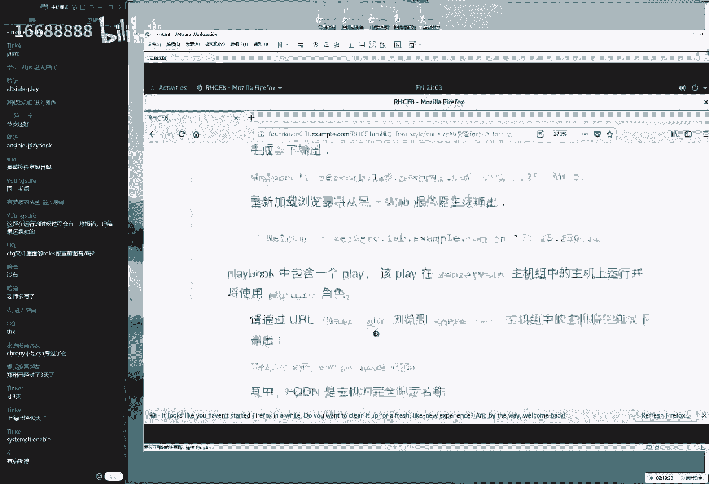

我们需要自行去启动一下，好了，我们给大家说一下这个防火墙的话呢，去做一下过滤吗，那防火墙使用的是什么呢，防火墙的这个英文叫做firewall啊，于是我们来做一下过滤，firewall啊。

这样去做搜索一下跟firework相关的啊，一下被吓了一跳啊，太多了啊，这个太多了，那么在考试的时候的话，那我们就只能给大家做到这一步了，就是嗯有这么一个范围，然后根据自己的需要。

然后您找一找跟什么相关的，比如这个是跟我们这个系统相关的，我们不用它，这个肯定也不是，这也不是，大概一扫就能过去了，这个的话可能跟这个服务相关的，这个是什么东西，我这我都我都不知道啊，还好啊。

好像说配置什么ip地址，这个也不是往下找找找找找找找啊，于是找到这么一个啊，稍等一下没有啊啊稍等一下，有这么一个服务叫做firework哦，在这呢大家看看这个服务的话呢，是比较的看起来比较像的。

这话是看起来比较像的，这句话就是我们讲的这个firework防火墙，我先给大家说的是一个推理的一个过程，但如果考试的时候的话，大家啊大家的话也可以直接去执行就好了，那我于是我找到这个模块的名称了。

firewall g呸呸呸啊，ansible document，然后farewell这是一个推理的过程，大家怎么去找到的，实际上没有太大必要，考试的时候可以不用去装了，直接去敲就可以了。

然后firewor，但是这个实例还要看一下吧，就是我们这个实例到底该怎么去执行一些参数，还要知道的，因为我也记不住里面的example，里面示例里面都有哪些可用的参数，好好多呀，好多好多防火墙。

他说防火墙已经启动了，然后呢，我们现在已经啊需要怎么办呢。

我们需要放行一下web服务器的这个规则好吧，我们这样去做，放行一下web服务器的规则，bug服务器是个啥。

那就是http吧对吧，他没有说加密，那么就是我们的http诶，你看这个像不像我，反正我看这个像，那那怎么办呢，可以直接复制过来就可以了，那也就是说他这个示例当中，第一个实例我看就挺合适的。

所以我可以直接把他第一个视力就拿过来，就用就好了，把第一个实例拿过来，直接呃one two three，第三个，然后是防火墙的模块叫fireword，然后完了往里面一粘。

然后我们这个上下对齐来把上下对齐，这样这样这样这样稍等一下，要想偷个懒，还没投，还没投成，ok然后把它上下对齐，我们的服务名称的话呢，我们的http他当前是htp s，所以把这个删删掉一个s。

这样他就符合题意了，然后现在给大家说一个事情，就是这个题目是有一道坑。

就是它已经启动了，并且正在运行，其实这是骗大家的，它并没有启动，我们当前的话，第三个参数指的是呃，它它在下一次重启过后，它就能够继续生效，但是的话呢大家看到它当前没有生效，我们怎么办呢。

再继续找里面叫做immediately，这指的就是正在生效啊，immediate啊，来找到它，指的是让它当前显成效，诶，这个参数也需要加上啊，permanent永久升降模式。

否则的话它是在这个当前上降模式里面的，诶，这个已经加过了是吧啊，有有有了啊，我们继续往后继续找，当天真啊，这边还有一个当前双向模式run time的啊，当前冲向我们选择一下，yes。

这样的话把我们这个参数都给大家凑齐了。

这样的等于说就把这个网站服务给大家做，放行了，没有问题，下面一个题目，下面一个要求他说说呃，他说我们的这个网站模板的话已经存在了，请说出以下内容，然后的话呢包括一些要求，这怎么回事呢，他是说我们之前吧。

我们就给大家第二章节讲命令的时候，讲过一个命令叫做cp命令，他来fly复制文件的时候，他说它会有一个源文件对吧，它会有一个叫做这个目标文件，它复制出来的这个内容的话，它是一模一样的。

如果说我们某一个文件，它的内容是这样的，大概就我们先给大家画一下，比如巴拉巴拉巴拉他们，那么它是这样的一个内容，那好了，那我们复制出来这个新文件，它会那么它也会变成这样的一个样子，他两个是一模一样的。

那我们现在有一个叫做均价的一个技术，大家可以从网上去搜一下，这个放在这个金甲，实际上是一个日本这个神庙，他们前面那个门的意思，然后的话他也是一个日本人，他们所研发出来的一个技术。

大家看一下叫这个均价技术，它的话效果就是这样的，他考虑的一个问题，就是他去复制文件的时候，他能不能不要就是两个文件都是一模一样的，大家理解一下这个问题，就是说他之前这个就是两个文件，它是一模一样的。

这个新文件跟新文件它是一模一样的，他想那我们能不能把这个源文件里面，不要写这样的这个常量，写这个字符串，而这些变量呢比如说大家看一下，这个效果有点抽象啊，但是大家尽量理解一下，叫这个金加技术。

这个的话就是日本那个庙，它前面那个门的意思，大家可以从网上去搜一下这个图片啊，或者我给大家搜一下吧，啊那么我们再给大家搜一下吧，反正就是一个日本人写的这么一个技术，那他想一个问题，他。

那我们能不能把这个源文件里面，写出这样的一个呃变量呢，比如说就是我们现在给大家先去写啊，第二有一个叫做用户名称，哎，这样就行，叫用户名称对吧，然后第二话呢叫用户密码，然后呢我们来给它啊。

然后第三个话叫叫叫做主机名称啊，它调用这个变量，然后当我们一个文件教学文件，它复制到另外一个文件的话呢，它并不是复制这个变量，而是他复制的过程中他做两个事情，第一步做复制，第二步的话怎么样。

意思说是不是把这个变量提取出来，然后替换成常量啊，好于是的话他会把这个名称用户名称替换成root，密码叫做reheat啊，德华主这个主题名称叫做linux pro，于是会有这样的一个效果。

它那也就是说新浪文件不一样，这是第一点，第二点原文件里面写的是变量，而不写的是常量啊，第三点这个技术叫做叫叫叫做诶啊。

这个我们省的模块叫做template，叫做哎金价技术的一个模块，叫做这个template来给大家写下来，叫template，模，叫做模板的意思，template来按一下回车，这里面的话会有一些事例。

再找找到最后哎examples诶，找到一下最下面这个参数也很长，说实话我也啊我也这我也记不住，所以的话我每回过来查一下了，今天的话呢，这个文件的最后结尾叫做a g two文件来。

我们往下去敲one two three，最后一步，one two three four，我们往下去写下来，我那我怎么老感觉好像少了一部啥似的哈，先不管啊，反正我感觉好像少了一部，但是我也无所谓。

反正最后以我们这个时间为准，他有可能是我记错了啊，one two three four，第四步叫做template，我们的模块文件，他指的就是要想去使用添加技术。

我们需要去使用到这个template这个模块，然后的话呢把这个源文件指定一下，再把这个看一下吧对吧，s r c，然后还要做d s t啊，destination目标。

那来s s r c s r c这样的啊，这个文件说这个来源地址啊，来源文件是这个好把它复制到这，然后呢这个复制到哪去呢，复制到这好了，大家可能会问老师，这两个文件的话呢，现在还没有啊，这两文件啊。

他现在还没有。

我当时的话呢我们并不关心好吧，就先把这个文件先给它写出来，他倒是会有的，我们并不关心他，不关心他，来，one two three，大家说fireword没有对齐啊，fireword没有对齐吗。

我看对的挺齐的啊，也没问题嘛，啊可以的，我看起来没有问题。

对的挺齐的，来one two three，然后我们four第四话template源文件，目标文件写完了可以了。

好点一下保存并退出呃，我再给大家去看一下这个文件啊，先给大家看一下这个文件，然后给大家往后面去说的，也就是说的话呢当前这个文件的话呢，现在是没有的，然后的话呢我想想啊，我老感觉好像少点什么东西似的啊。

无所谓，我们先这样啊，那我们现在来这样去做吧，如果要报错了，我再给大家解释一下，怎么去解，怎么解，怎么去把它解决掉，也就是说的话呢，我们现在就是个四个动作，把这个服务器的安装上了，网站服务安装上了。

我们会在下礼拜五的时候给大家讲一下，网站服务怎么回事，然后呢以及我们呃我看一下啊，以及的话呢我们把这个网站服务当前启用，并且永久生效，这样的情况当中没有问题，第三步，把防火墙做放心。

我们的网站服务的协议写清楚啊，没有问题，第四部复制一下我们的进价文件，然后的话呢我们这个是原文件，当前没有吃完啊，然后把这个文件的话复制到这个地方去，ok挺好，我看起来挺也挺顺的啊，确认了一下没有问题。

那我们当前少了一个文件，就这个文件现在没有啊，但怎么办呢，这个文件我们这么去做，它有一个子目录，这个话呢我们叫做template，看一下，我记得准不准啊，叫template好，叫做啊。

templates进入到这么一个模板文件当中，然后里边是没有这个叫做index html，点g2 的一个文件，我们需要自行新建，还是我的老原则，就是我能够去复制的东西，我一定会选择复制。

因为我怕我猜错了，我知道我比较粗心啊，于是我按下回车新建出来这个文件，这个文件的话他他又提到了，他说我们需要的话呢去输出一下以下信息，于是我可以把这些信息直接粘到里面去，这样聚安装之后吧，大家看一下。

里面是有一个有它有一个坑的。

所以说红帽考试嘛它不仅考的是技术，还考的是人品啊，他老考的就是特别的有坑的东西，看啊，他说他说welcome to house name，主机名称后面的话呢指的是ip地址好，也就是说他让我们去设置一下。

主机名称以及ip地址。

它每一个复制过去的话呢，比如说我们这个主机第一个主机复制过去，它是低v组的，大家看一下，低头看一下值，他把复制过去之后，它就变成叫做welcome to welcome。

视角啊，视角welcome啊，就ok啊，welcome to。

然后主机名称比如说叫做什么呢，dv组，然后的话呢然后他的ip地址什么的啊，啊，ip地址就是172。172。2，5。250。9好，然后第二个主机的话复制过去，那就是test组就是on，然后是172。25。

250。9，就说他会每一次复制直过去之后的话呢，也会以当前那个客户端的那个主题名称，然后作为一个呃来做一个提取，把变量的话提取出它具体的这个呃，呃他的这个主机名称，然后把地址的话也把它替换成当前的一个。

网卡信息来做一下提取的，大家说我们调的是叫做house name吗，不对啊，同学们不对对啊，这个显然他写的不对，这个的话呢是叫做ensable，里面的变量并不是我们的shell啊。

它并不是我们调用的这个shell的变量，好大家理解一下，他的话电量是400，变量并不是shell的变量，那怎么去做，那我那我们怎么能够知道这个变量在这名称呢，虽然说考试的，虽然说考试之前啊。

大家肯定已经把这个变量名称给他背下来了，但是的话呢我们假装现在不知道。

我们怎么去推理一下呢，这个是有意义的啊，来这样去做，有它有一个模块，这个叫什么呢，叫做哎ancible，另外我就啊啊，另外我也看出来你们今天去世没有，今天确实没有预习啊，叫聆听同学啊，确实没有做预习啊。

这个确实或者说要加紧时间去做预习了啊，大家说dv和test不主机名称吧。

对我来举个例子啊，他这个完整的名称应该是叫做忘了啊，我也无所谓，待会我们来给大家看一下吧，应该是叫做呃，主机名称应该是叫做server a，然后点example，点com毛巾的是啊，反正他不带这个名称。

不过也无所谓，待会它调用出来这个值具体是哪一个，具体它以哪一个为准就可以了，来怎么去获取这个变量值啊，推理一下过程是这样的，首先ensable这个模块啊，使用的是我们这个模板吗，不它只是我们框架吗。

第一个模块这个模块叫做set up啊，不然我们对于所有主机都去生效一下，对在所有主机上面都去执行一个消息，指的是调用哪个模块叫做set up，诶，诶这个没有空格啊，set up这个模块的话呢。

是专门用来去获取变量的啊，来获取变量的，加一个a啊，他是啊，因为我们去实用这个模块之后吧，他会去获取我们所有这个变量信息，当然我们很牛，那当然啊当然的话，那我们肯定不希望说获取所有这个太多了。

看不过来啊，可能看完之后就都但我们都已经是啊下课了，怎么办呢，太多了，做过滤啊，那么加参数，什么是参数啊，4月3号讲过啊，参数是为了让我们的命令更好去提高工作需求，对吧，参数是对于命令的补充好。

那于是的话呢我们它这种副词副词修饰动词，所以的话呢我们当前加一个杠a做过滤，过滤的话呢，我们是这样filter过滤叫做这个过滤器的意思，大家如果要是回家之后，把自己这个呃过滤器给它拆开的话。

里面会有这个字叫fter，做过滤的意思啊，做筛选，筛选什么呢，筛选给他一个条件什么呢，只要带有叫做主机名称，叫做house name的时候，那我们就把它给过滤出来，但是我们会想一个问题。

他这个名称有可能不叫做house name。

它有可能叫什么呢，它有可能是叫做house name，然后或者说啊前面可能会有东西，后面也会啊，后面加啊，前面我们后面来加加加上东西，它可能是在其其中的一部分，如果说我们这个变量名称叫这个东西怎么办呢。

它是在加载中间了，所以的话我们需要使用到通配符，通配符这样去做，大家看好呃，把这个值给它过滤给大家，把给大家啊括起来，前后两边加上通配符的星号，指的是中间只要包括有了这个关键词。

则帮我们局搜索出来叫做house name，哎哎下回车来按一下回车哎，等一下啊啊按下回车开始跑起来，或许做跟house name相关的，于是大家都找到了，我们叫做这个名称，还同样的我也是省是省事了啊。

把它给调用过来，然后我们往里面一粘啊，这是第一个我们的house name，当然我们将做完之后，如果要想定位一个变量的话，有一个问题就是我们调用变量的话，它指的是前后的话呢用到dio号引起来。

这样去做代表就是正确的了，第二个是一个变量，然后中间的话一定要是我们壳啊，他那话这个中啊，他的话这个中间必须要有一个空格，然后这话也是我们之前出问的一个问题，同学们这样做完之后，结果发现没有分。

但原因就是这个虽然说里边啊还是一个啊，还是一个啊。

还有一个很重要的事情嘛，就是大家看一下这个调用变量的话呢，在我们的enerable里面，它的变量名称和这个中大括号的，这个里面的话呢，建议大家是要有一个空格的，就是在此处给大家画下来啊。

在此处是要有两个就要有空格了，虽然说我们要是不加这个空格的时候，调用这个变量是没有任何问题的，但是最恶心的就是潘文脚本，他不给分，这是我们之前出现的一个问题，所以大家一定要按照标准去操作。

这是按照标准去操作，这边一定要空格去做间隔标准去操作。

这是第一点，第二点的话就是我们同学们这样做完了之后，然后他就会非常开心的了。

结果发现错了啊，这道题目错啊，他要是错了，为什么呢，因为看一下这个题目里面要求说这句话呢，我们的house name是受管节点的完全限定域名，他并不是house name。

也就是说啊他说需要一个空格是吗，不它并不是单单纯需要一个空格，它是叫做完全限定域名，也就是说他虽然写的叫做house name，但它并不是house name，他就是故意给大家抛一个烂梗啊。

house name诶什么啊，解剖尸体吗啊，来叫做啊house name，来大家记一下，当前它虽然显示的是主机名称，但它实际上并不获取的是主机名称，它叫做完全限定主机名，这个时代这个时候大家都比较慌了。

如果没有听过考研辅导的话，比较慌了，说什么叫做人家听啊，那么这个它什么意思呢，这我们就把多少一搜可以搜出来这个啊，f q d n叫做完全限定主机名，这就是为什么要可它要有，可它要有我们的可向辅导。

就是因为考试的时候有一些新鲜的词，我们根本就反应不过来它是什么东西的，叫做完全限定主机名，这个东西百度上一搜就有，但是考试的时候百度不了，所以就可以扣分了，大家记一下，叫做完全限定主机名啊。

它就是一个非常完整的一个名称，它会比主机名的话更加详细，然后他会表达出来更多细节，这么一个名称叫做啊f q d n，所以的话如果是这样去做。

那么就错了，考试的时候有一个很烂的一个梗啊，就是这个就是一定要注意的，所以我把这个词替换一下，叫f q d n，然后稍稍等一下f q啊，f q d n，然后中间引引引起来走走走好，没有问题。

另外这个公式啊，大家可以记下来，这个公式大家记下来以后，把这个词只要替换成你所需要的就可以了，来大家把这个词解了，就是这个句子吧，现在这张图，把中间这个f q d替换成你所需的关键词啊。

替换成你所需的关键词关键词就可以了，来我们做一下过滤，过滤过后啊，咱先去先截张图吧，先截一下，因为这个命令会以后很常用，只要去获取变量的话，就用这个命令，然后我们就替换的是这个filter。

后面这个关键词这样的一个过程来呃。

现在的话呢我们来给大家最后往后面去说，然后下面来去获取到这个词了，这个词就对了，大家需要注意两点，第一点怎么样呢，把这个词写对啊，一定要写的这个名称，然后下面第二步把这个中国。

把这个大括号的这个里边各加一个空格。

前后两边一定要有这道题目就没有任何问题，下面就是啊他说这个话呢。

我们的ip地址是设完节点的一个ip地址，这就没有什么坑了，好我们获取一下所有的ip地址，搜索跟ip相关ip，然后走你第二个就没什么坑了，因为ip只有一个ip，所以的话呢ip就是ip，然后我们找到它。

他说这边的话呢会有一个子它一个复变量，然后里边的话呢会有一个自变量，这个变量的话呢定义的就是我们的ip地址，所以我们jm去调用，首先还是写一个大括号，后面后面把这个常量给它删除掉，这个金家具锁特别好用。

只要我们把这个词定义好了，它就不能去生效来，首先定义两个桃花号，大括号里边各加两个空格填，做好把变量往里面一粘，加完之后的话，调用里面的这个自变量叫做a a d d r e s s。

然后调用它就可以出现我们的ip地址了，这样做好之后保存并退出。

做完了这道题目的话呢，看起来有点难，实际上呢并不难，另外大家看一下它里面没有要求做验证。

我们就不用去做了，因为下一道题目的话要求我们去做验证了，也就是说这个呃三个的这个验证模式的话呢。

不应该就是说三个我们的这个角色的获取方式，他考了四个题目，他第四个题目考试什么呢，第四个题目就考的，就是对于我们前面生成出来这个文啊啊，生出来这个角色来进行调用，他叫他。

他就是我们这个第四个角色的这个不，他就是我们呃呃，第四个去考核我们这个角色的这么一个题目呃，大家可以继续来画一条横线啊，于是的话我们第二个证就写了，第一个就写了呃呃呃那我们写了第一笔了。

现在我们做完了六道题目，120分做第七道题目是这样的，看一下这个题目，这道题目的话，这个内容很多，大家看一下，这个完整的都是这个第七道题目的描述，大家看完这个之后就把它放弃了。

我记得当时2020年8月1号到现在啊，大概2021年的上学的时候，我记得很多同学都把它放弃了，说这题目太难了，根本就看不懂，说他说了什么事情了，这就是因为当时我们的一个失职，我没有给大家做考研辅导。

因为我们没有搞明白，但是的话呢现在我们搞明白了，这个话呢其实这个题目看起来有点多，但是的话这道题目应该是我们整个考当中呃，第三简单的一个题目了，好我给大家先去解释一下他什么意思呢。

他就是说我们需要调用一下，我们刚才新建好这个角色啊，阿帕奇怎么办呢，他说首先新建出来一个名称为这个playbook。

好嘞啊，它题目虽然的多，但是我们一个一个这样去做，所以他这个呃去做事情一下啊对吧，我们把这个事情的话呢拆分出来，把一件很庞大的事情，拆分成很多这样的一个小项，我们在一点点的去做啊。

把中把工作给它拆分成可以致敬的小象。

这样的话呢，我们在做的时候就会有。

知道我们下一步该怎么去做了，来去敲一下，回车看一下文件名称。

没有问题，按一下回车啊，你去写，他说先先呃，他说先取信件出来一个名称为这个play book，没有问题，他说这个playbook里面的话呢包含一个play啊，好一个废话，因为这里面必然是有动作吗。

他说这个play的话，他是在这个balance组当中去执行。

并且会调用这个balance这个角色，也就是说他需要有一个play，这个play的话呢，动作是这样的，首先三个减号祭天啊，这个格式要求，然后下面第一个play他好像说有三个play，对吧好。

我们第一个play叫做one，他说第一个角色。

这个角色他仅仅是在某一个主机上面来去执行，执行的对象是谁啊。

叫这个对象啊，balance这个啊这个组，然后他说第一个角色叫做rose。

调用这个角色的名称叫做这个角色叫做哎，他没有s2 加记住这个主机组的话。

它是一个s，他这个角色他没有这个s，所以这是我为什么喜欢去复制这么一个原因，红帽其实他是想下，他是想给大家去啊下这么一个坑的，但是只要你是复制的话，你就踩不上这个坑，所以这个坑的话。

那我那我们压根就没有去啊去啊，踩过的来。

我们看到第一个题目做完了，然后大家会问说老师，那这道题目已有四行呢，为什么你只看到第一行呢，因为下面的这个四行，下面的这个三行，包括最后一行都是验证方法，我们不用去看这道题目，做完了第二个play。

他说再包括一个play。

这个play的话呢包含以下的这个动作，好了，这么去做来，首先还是一个啊play name，所以大家看到这个题目的时候，第一次看的比较慌，第二次就好了啊，第三次就比较的这个顺眼了，这道题目超级简单。

他说在这个主题组上面，然后来去执行对吧，然后它调用的这个角色叫做p h p info，这是我们上面一道题目从内部获取啊，它是从呃外部获取的一个角色，我们已经获取好了，有这个角色了，可以直接就用就可以了。

第二个角色名称往里面一粘，做完了下面一个题目。

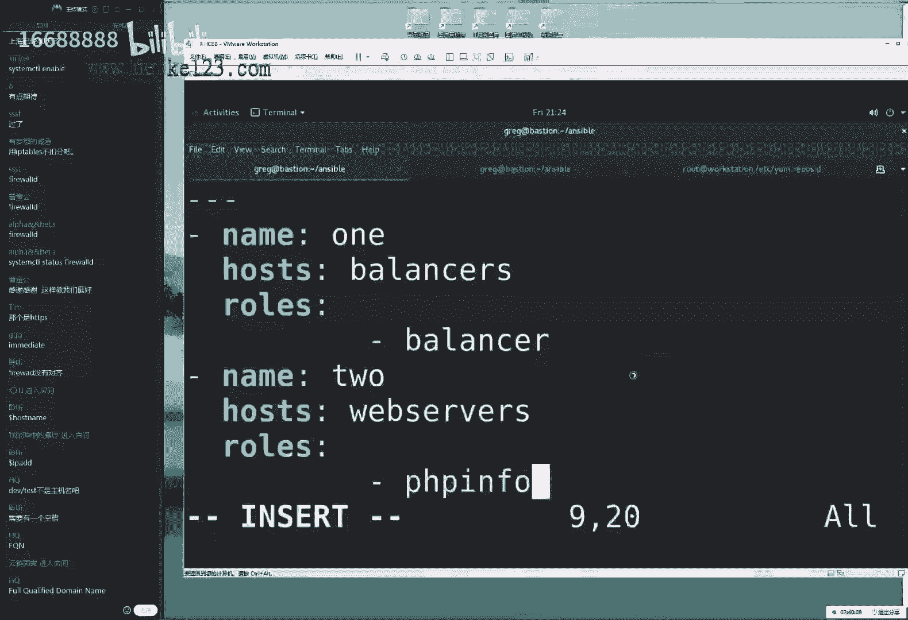

他说在我们的哎，等一下啊，就这么两个角色吗。

啊只有这么两个步骤吗，好还有另外一个步骤，他需要在我们这个什么map server组里面调用一下，我们的阿帕奇刚刚定义好的这个角色，他虽然并没有说，但是如果我们不调用的话，等于说他没有网站服务嘛。

因为他这个网站服务的安装，防火墙的放行和这个服务的启用，他都是在这个啊阿帕奇这个角色里面定义的，所以我发现我们当前再定位一个角色，叫做阿帕奇，好，这样的话呢我们这道题目做完了，这道题目满打满算啊。

一共就敲了多少行，稍等一下，我看一下啊，这道题目满打满算，总共的话呢13行做完了，20分到手了，这道题目啊，每一道教，但也就是说每一行参数，那对应的就是1。5分吧，好我们来给大家敲一下。

回车保存并退出这道题目，做完之后的话，我给大家演示一下他怎么样的一个执行效果，然后以及它怎么进行验证的一个方法，来稍等一下啊，来验证一下这个方法，这是我们总共的一个所有敲完的题目的答案。

让我先给大家演示一下ansible，然后是playbook，后面去跑一下这个脚本，rose，然后点yo a一下回车，大家可能会说老师，那我们这个角色呃，不需要再进行什么设置吗，都不用的啊。

他要题目考的就是一个考核，我们考完了之后会给大家演示一下，他怎么去进行验证，我们会把每一道题目给大家做验证，做验证之后再说，最后明天吧，如果来得及的话，给大家跑个分，看看到底这道题目我做的对不对。

来先跑起来，找没有红颜色的报错都属于正常情况，他实施的就等着就好了啊，等啊等啊，咱们等就好了。

ok做完了在回味之后啊，当我们再回过来之后，看一下这道题目的话呢，其实这个前面都是一种验证吗，他说当我们调用好这个角色了之后，它会在主机之间实现负载均衡，好这个好吧，ok啊，第二行。

他说当我们浏览这个主机的时候，会输出以下信息哦，那我们是吗，这么神奇吗，来我们看一下，输入一下网址，按下回车，他说当我们浏览那个网页的时候，会去输出以下信息哇，真的是好神奇啊对吧。

他说当我们重新在浏览器的时候，它会从另外一个网站当中去获取以下信息，并输出，也就是说这个b变c地址会发生变啊，他会啊，它那么它它也会它也会发生变化，也就是说这个话b变c下面地址也会发生变化。

真的这么神奇吗，来点一下f5 刷新刷新刷新诶，诶我们看到果然是这么神奇啊，b变c啊，11变12，果然这么神奇，两台服务器之间实现了负载均衡，具体怎么实现呢，不用去管，那大家如果感兴趣的话。

可以等考完试之后去看这个角色叫做ubalance。

这个角色去看看里面怎么去写就好了，不过当前我们考的只是调用，我们不用去考他怎么去编写，编写是在hc里面的d o407 去考的，我们当下hc只要作为调用，三个调用角色完成就可以了，来非常神奇简单啊。

第二个这个验证来，那么看一下第二个这个验证，他说当我们再去访问一个文件，叫做hello点菲律宾的时候，他将访问到以下信息，并且的话他会去输出一个完全新的主机名，让我们来看一下啊。

再加上这个hello这个词，于是可以看到我们的所有的菲律宾的这个信息，如果说我们前面没有安装菲律宾这个软件的话，那我们也就看不到这个信息，所以的话能看到这个页面的话，就证明我们这个实验成功了，不仅如此。

还在主义之间实现了负载均衡，看一下当前的话呢，它是为b对吧啊啊啊不啊，它将化它将为c是n点啊，点f5 ，点f5 ，可以看到它不仅可以在2年之间实现负载均衡，并且两台主机的话。

到头显示出来p h p的这个信息了，符合题验证化，通过第三个啊，第三个题目啊，他说他说我们去访问这个页面的时候，他会去输出以下信息来看一下，他说访问这个页面的时候，它会输出以下信息，没有问题啊。

没有任何问题，然后他说啊这是sc嘛啊，我们可以看到没有任何问题，他说并且会输输出菲律宾的这个所有的信息，没有任何问题，并且他说我们去刷新了过后，它没有自动跳转哦，它可没有自动跳转，它不会去实现负载均衡。

所以我们当我们去点击f5 的时候，大家看到b g f5 了，数据没有任何的变化，这就是这道题目，做完了这道题目看看，虽然可能看起来多，但是做起来却异常的简单，这个就是我们的啊，这就是我们的第七道题目。

调用我们的系统当中角色的一种方法，然后第七道题目k总共15道题目，我已经讲了一半是吧，15道题目讲了一半，那我们再给大家讲最后一道题吧，再给大家讲最后一道吧，我们今天讲到十点钟。

差不多讲完一半，正好我们明天还剩七道题目，就能给大家去跑一下我们的这个脚本了。

下面的题目大家先前再坚持一下啊，到大概十点钟我们给大家讲完就ok了，是这样的，他说创建和使用逻辑卷，这考的是啥呀，考第七是我们的第七章节的，第二小节的l o v m对吧，他说他这个我们的lvm的话呢。

是一个如呃管理设备的一个服务，然后它是一种技术，它可以帮我们自动创建出来，以下名称的一个逻辑电流i v m，也就是说我们的lvm逻辑卷管理器，它的话呢实际上是分为了三部去完成的。

首先来说第一步叫做pv操作，叫做物理卷，第2号叫做vg，叫做逻辑，叫做这个卷子，第三部的话呢我们叫做p啊，这句话我们叫做逻辑卷啊，啊来这样的话我们去散步全程的，他说的话呢说他已经有这个呃。

他已经去支持了我们的钻组了。

也就是说前面的两部都已经做完了，那我们只需要去做最后一个，稍等一下，我把屏幕给他关上啊，有点乱有点乱有点乱有点乱，我把这个屏幕先关一关，干哎干干净净的。

怎么都把这些都给它删干净了，ok这样我们来继续来，他说的话呢。

就是说我们当前的话呢，会新建设一个最后一个逻辑段就可以了，好我们现在按照他的要求去完成，首先编辑出来这个文件，那么要想创建出来一个逻辑卷的话呢，我们要去使用的l o v m。

也就是我们的lv这个操作的这个逻辑卷，在这个模块来稍微呃，首先我们先去写上这么一个格式要求，然后的话呢我们这个动作还是这个play吧，我们还是以这个题目的这个名称为例，然后这样来给大家去写。

这样我们就在考完试之后，比如考四个小时，两个小时就考完了，另外两个小时时间做检，去做检查的时候知道每一个脚本啊。

每一个剧本吧，它对应的是哪一个题目，再来看一下这个要求，他说充电出来一个名称为这个playbook，并且他是在所有的节点上面来去执行。

所有的节点啊，就是说一个连连看吧，翻译成英文，所有的节点指的就是o所有的节点就ok了，然后tasks对于所有的这个哪些任务去完成好。

这个我也不知道，没关系，我们往下面去看，先把这个格式有了，他说创建出来符合以下要求的逻辑卷，也就是说pvp这已经有了最后一个lv，帮我们创建出来就好了，lv怎么办呢，我不知道什么模块没关系。

我知道是lv了。

我再过滤一下ansible document，一个小写l，第二章节的rap，跟第三章节里面的管道符做过滤，lv相关的这个啊模块都帮我们列举出来好了，主播然后我们就不卖关子了，因为看一下最后的这个介绍。

我们也能够知道lv o l实际上就是用来去管理，怎么样让大家看到配置llvm这个逻辑卷，这么一个模块，所以我不所以我们直接去看就好了，不给人家卖关子了，l v o l啊，多配置下做题卷a下回车。

这个回车的话呢啊找到最后的这个事例啊，最后考完试之后，大家会发现这个视力看起来特别的亲切啊，能啊我们都考试通过，就靠这个啊实例页面了，它就能够完成了，来把它复制过来到里面去呃，首先有几个字段。

我们按照他的要求逐一去填写。

首先第一个vg vg的话呢，他就说我指的是我们的卷子嘛，第七章节第二小节7。2里面，卷组的名称已经有了，来往里面一粘，他说第二个说我们的逻辑卷的名称lv为data。

来啊，data往里面去写，他说的话呢大小是为1500兆来，这个时候就不要去手敲了啊，就我们这个时候就不要去复制了。

因为大家看一下它稍微1500兆，那我们写的时候到底是这么去写还是怎么去写。

还是这么去写呢，这就会产生歧义了，到底带不带单位，单位怎么去写啊，这句话会产生歧义的话呢，我们可以看一下这个事例，示例里面要求了，说他说的出来是一个为152兆的文件，152没有单位好了，1000啊。

那么他创建的时候没有加单位，这是官方的文档，所以的话呢即便它下面还有加的是吧，那也无所谓。

也就是说这两个写法都是正确的，我们不用加单位置，它默认就可以兆为单位了，所以我们只需要写1500即可啊，这是第一个这个操作，第二个操作，他说使用四版本的文件系统进行格式化操作。

格式化我也不知道是什么东西啊。

我也不知道这是什么模，使用什么模块，没关系，推理吗，那就是格式化吧，我们能我们怎么理解，就是文件系统的格式化吗，这是跟文件相关的吧，我们来过过滤一下速度跟文件相关的，其实这么讲的话有点累啊。

但是大家理解一下啊，就是我们过滤出来跟所有的文件相关的，然后可以来一条一条看这个的介绍吗，或者的话大家可以过滤一下跟系统相关的对吧，跟系统相关的这样一个条目，看看有哪些可以管理的呀。

好或者我们拼在一起叫什么呢，叫做file system的文件系统，大家看一下这条，他说创建一个文件系统就叫做格式化，所以的话呢我们给大家说一下，叫做file system。

这个模块名称叫做file system，叫做格式化的一个文件，在考试的时候就不要这样去敲啊，就直接考试之前一定要记住这个模块的名称，考试直接拿用枪啊，要求再去敲的话，再去速度还有点慢了。

来看看这个实例啊，非常简单，叫做file system tape，就是指的是文件系统的这样的一个格式很简单，我们再来给大家去做诶，稍等一下啊，我好像写错了啊，没人怎么怎么没有人提醒我呀。

来第一个这个动作啊，one two three four啊，这个比就不太严谨了啊，啊稍等一下啊，one two three four，我们这个play的话呢没有写他这个名称，这个叫做第一个one的话。

选的是模块来的，叫做l v o l是吧，然后vg，然后巴拉巴拉，这样去写，ok稍等一下，o n e，然后这样我们写下来，这下面一行出现在哪呢，它这个参数行出现在这个位置，我们可以这样去做呃。

ctrl v过滤将获取到所有要去修改的这样一个列，然后的话呢一个大写的a然后再来table键空格，空格空格跟它对齐，e s c键哎，整体过来挺好啊，但这也无所谓啊，这这这个主要就是为了。

这主要就是为了就主要为了去秀一下啊，实际上我们考试的时候按空格也行，n啊，n table也行啊，没有必要为了像我一样去追求效率啊，这样去做，第二步已经有了这么一个逻辑卷了，对它进行格式化操作。

file system格式化的一个模块，file system这个模块名称，然后看一下这个参数，然后文件系统的这个格式叫做e x t4 ，然后换了下面dv设备的名称，我们知道这个逻辑算怎么去找呢。

它在dv目录里面，它会有一个剧组的名称命名一个文件夹叫做research，然后的话呢，以多余的名称命名的一个文件叫做data。

于是就这么做就可以了，第二步完成好，下面就有一个问题，他说的话呢大家说啊，他说说我们如果要出现失败的话，他会有一些信息，并且将它变成800兆，也就是说这个题目啊，我给大家说一下怎么回事啊。

不给大家卖关子了，就这么回事，首先要求啊，就是说他实际上他又想去做一个判断语句，他想他想去做一个if对吧，我们都知道shell脚本的话呢，它是从上面来去执行，如果说第一个他有执行失败了。

那我们后面再去做什么的话，它就是失败的，那我能不能加判断语句呢对吧，我们叫做多重分支的条件测试语句和if，条件测试语句怎么去加呢，很简单，这么去使用到when就可以了，它里面这个if叫做when。

再根据一定的条件，条件满足情况下才会来去执行，就加一些判断语句，叫做叫做这个条件判断语句，然后的话我们现在是这样的啊，它有几个，他有几个情况，如果说我们现在有一个逻辑卷，那还有一个卷组，如果有这个卷子。

并且这个卷子容量很大，那么则会出现出来一个为一，千500兆的一个逻辑转，这是第一种情况，第二种情况，如果说有这个逻辑卷，但是后来这个啊vg的这个卷子的话，流量比较小。

那么就会创造成为一个800兆的一个空间啊，的一个呃赚足啊，那么这算出来一个啊逻辑卷啊，它都是逻辑转，不是它并不是卷阻啊，它上下出来一违法啊，那么会啊进行一个缩小，算到800兆，那罗伊就变800兆。

会稍微小一点，如果说他是他这个呃容量不足则不退出，他会在继续缩小之后再创建出来，但如果说连版本的，他都说你说出他都啊不能够进行创建的话，那么则进行第三步就是来去输出一条，输出一条信息，输出一个报错信息。

而不是说崩溃啊，输出一个报错信息给用户一些提示，说成说成就18这么一个效果，说他会有这么三四的判断，第一次满足条件1500兆，第二次不满足800兆啊，如果说啊如果说最后他还不行，输出一个提示信息给用户。

app程序不崩啊，并不崩溃，这样的一个报错好，我们先给大家说一下啊，首先来说他输出的这个信息的话呢，是叫这个名称。

叫想去输入信息，我们换了叫做debug这样的一个模块，但是我们这样子写的话也不对呀，同学们大家想啊，如果说我们现在先，那如果说我们现在这个底下，大家一下这个思路啊，如果现在我去选一个模块叫debug啊。

不不他是这些就可以了，不对呀，因为它是一个从上往下来去执行，那也就是说它不论前面有没有执行成功，他都会去执行到这个啊模块对吧，那么就不对了，他是应该只有上面两个。

它是啊失败了他才会去执行后面这个语句对吧，否则的话他也呃呃，那他就会呃他呃他会去重复来去执行了，这时候怎么办呢，我们需要把它前面这两个动作啊作为一个整体，然后的话呢我们对于这个前面两个整体。

我们来做一个判断，是这么一回事好了，我们这样去做，首先前面加一个block，把这个前面的话呢，所有的这一切作为一个整体啊，作为一个整体，然后我们把这个往后推一推啊，他既然作为整体的话。

那么他待会出现这个参数的时候，应该是在这一行出现这个参数，稍等一下，我block我看他这个vn编译器怎么给我定义的，稍等一下冒号，然后走啊，他在这个地方出现了这个参数是吧，好我这样去做呃。

ctrl v把它作为一个整体control v然后复制掉啊，找到我想去复制的这个东西啊，想去编辑这个东西啊，大写的a，然后我们按我们点了table键，找到它对齐，然后我们esc键。

然后我们再来整体往后推，也就是说把他的话呢，这些都作为一个整体的blog的完啊，那我们把它作为一个整体进化了，再来对它进行一个救援，叫做rescue，来大家看一下r e s c u e rescue。

这时候特别容易出错，就是你对谁进行救援呢，你是对于什么啊，那么你对于谁进行救援，那么则跟啊，那么则跟谁对啊，来京对齐，那我们是跟这个play对齐吗，并然后它并不是的，我们并不是对于这个play进晶圆的。

我们是对于这个blog整体来进行救援的，所以的话呢我们一定要跟它对齐，这个时候舞蹈犯一个错误，就是我老是这么着去看，然后差不多了就可以了，这样的话会很粗心，千万不要这样去，我们一定要对齐。

大家看到这个其实没有对齐，怎么办呢，呃有两个方法，第一是这样的，ctrl v做动作，这个纵向的选择来看一下，对他对他啊，他没有对齐，然后他没有，他没有对齐，r跟b必须他必须要对齐，这样的话。

它它它代表就是对于这个block，来进行这个救援模式来，于是我先再一删，再来一个ctrl v对齐一下，这是第一个方法，第二个方法的话，大家可以拿一张纸，比如说什么呃啊，什么纸啊什么的，我啊。

然后我们来去在考试的时候去比一下啊，或者拿张那啊，或者您拿一张啊卡片也可以啊。

那张身份证啊或者卡片什么都可以啊，稍等一下，让他们去比一下啊。

可以设置张卡片，然后你去比一下，看一下这个的这个b，必须要跟这个r是要对齐的，它是一个纵向对齐，否则的话它也会争取不会他会崩溃的啊。

大家在考试的时候就是每张给指出来，然后去做一下比较，或者可以像我一样就ctrl v，然后来去比一下好，下面我们来比一下，就是说呃如果说现在啊已它对齐了，证明说前面这个语句如果执行失败的话。

那么则会进行一个救援模式了，好了，这已经定义了，那么我们下面就要去写一下，我们那我们这个教学模式里面它有哪些功能，首先来说debug，就是他呃这个模块的话说，用来去输出一下信息的。

首先去使用到debug这个模块啊，让我们去输出一个信息，这个debug模块的话呢，它没有什么太大的用处，它主要是为了去输出信息去使用的debug，看一下啊，它里边的话会有一个参数叫做message。

他用这个message的话就是用来去输出一个信息的，那换来这个message里面的话呢，还可以有调用变量，这个它调用的变量吗，啊不是我们是不需要电用变量的，我们可以直接啊输出一个信息。

这个信息已经给定了，我们可以只需要去双引号大括起来，然后往里面一句输入就可以了，来来往里面一粘就可以了，因为里边有空格啊，所以我们是使用双引号把它给引起来。

作为一个整体，然后看一下，他说如果说创建失败了，那么则进入到救援模式里面，并且会去输入，并且会去输入以下信息，这一步的话呢我们做完了再往下面去看，他说并且将大小修改为800兆啊，他看来没有放弃啊。

他说如果要是失败的话，则再来一步，再来一部，被800兆好，那我们继续来啊，叫做name one two three，第三部，那么也就是说大小的话为300兆啊，其实没有必要去手枪了，往下复制吧，四yy啊。

往下复制，四行往里面一粘，因为它实际上它就是把这个变量吗，哦不他之前就是把这个大小吗修为800兆，仅此而已，其他都一样，所以这么去做就比较省时间了。

大小为它修改小一点，然后就继续来进行操作，然后另外的话这个问题我给大家说一下啊，就是大家看一下，他说需要使用到四版本的文件系统来进格式化，他写到了这个啊，操作到后面，然后当时我们去想过。

但现在我们还需哦需要进行格式化呢，呃这对于我们这个问题，就是说我们现在是one two three，第三部，第四步，我们是不是需要再去做一下这个操作，针对于这个问题，我们去问了一下考官。

考官答复是考题里面是按照顺序来去执行的，他没有要求可以不用去做。

然后所以的话呢，我们当前只需要把它修改为800兆，没800兆这样的一个情况则不需要进行格式化，这是我们可以给大家一个肯定的答复，也就是说新建出来这个逻辑卷1500兆，它需要生产出来之后。

并且已经格式化啊，ex t4 ，但是v800 兆的情况下则不需要创建出来啊，则不需要进口生化这么一个问题，大家请一定要注意啊，这是跟考官进行求证了，并且我们的不断的考生去验证过，确实是靠谱的。

所以这样的话呢大家要啊就写下来。

当我们第二次做这个呃分区的时候，是不用再进格式化了。

那就我们再创建出来之后，也不用进行格式化了，这道题目的话还没有完，他又啊他又他又说了一个，他说如果说我们这个圈子还，他也是不存在的情况下，则暴露啊，他最后会显示出来这么一个报错。

他说并且不要以任何的方式来进行挂载，也就是说我们只要格啊做一些格式化就可以了，而不教啊，而不交技能挂载啊，而我们本身也没有呃，那我们本身也没有这样去做这个打算啊，但这句话我们需要重视一下，大家说呃。

如果说我们这个卷组它并不存在，则会去输出一下信息，大家看到这个就是因为我们反馈之后，他才进行了一个修改，他之前这个句号是放到这个啊。

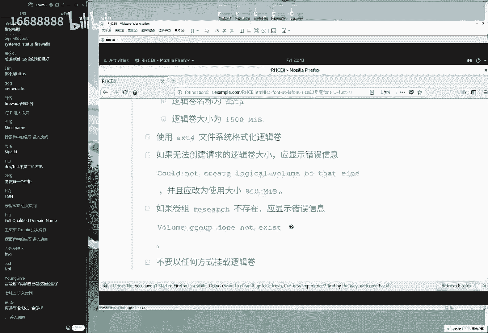

他是啊，他是啊，他可以写到这边，他给他写到这个啊，写到这边的这个后面的，然后换了。

然后我们的同学嘛，他来他俩去啊，他去粘的时候，就把这个句号给它，粘到他的这个输出信息在这个后面了，所以话呢最后他再把这句话放在这个底下的，所以的话呢那我们要去输出的这个信息，也是仅有这么一条信息。

而没有啊底下这个句号啊，他已经特意把这个信息放到底下了，你作为大家复制的时候，就请切记，千万不要这么去复制，一定要是这么去复制啊，来我们来复制一下他要去输出的这个信息，他说如果这个卷子并并不存在。

则去输出以下信息，实际上天选还有是进行了一个debug对吧，还则是又来呃，又来去输出一个信息，然后是debug来去输出一个message，这个信息的话呢还是不用去管，直接去粘就好了。

它里面既然啊已经有了，并且有空格，用到双引号给它引起来，作为一个整体，但是大家会发现，其实它实际上分为了三个条件，第一个条件就是它既有这个卷子。

大家理解一下，今天这个有点乱，但是的话呢是这么回事，他现在分为三个情况，第一种就是它既有这个research这个卷组，他要满足这个大啊，创建这个大小这个条件，r e a r c h啊，加上这个r啊。

研究的意思来，他说他有三个情况，第一他既有这个卷组，他又有满足这个条件，他瞬间出来一个1500兆的一个分区啊，没有他们没有问题，第二个这个可能性就是它有这个research。

但是的话呢这个里面的这个容量不足了，它创造了一个他啊创业啊，会啊它的话会啊会啊是啊，他会啊稍微的小一点，他为啊他们就修改一下这个啊，它里面所对应的这么一个信息小一点点，这是第二个情况为啊吧啊。

稍微稍微小一点点，第三个情况的话就是他既没有这个满足条件，他又没有这个research这个卷组，那么这种情况下取第三个情况了，那好了，我们先捋一下这个思路，前面的话呢作为一个block。

然后我们对它底下进行救援，也就是说前面的话呢第一个操作，它是作为一个block了，好了没有问题，然后下面的话呢只能说rescue，它指的是这个底下两个是救援模式，r e s c u e r ecu啊。

金融救援的当中，我们遇到这两个情况，实际上我们要对于这两个情况再进行判断，因为这两个的区别，大家可以看出来这两个区别有什么，这两个区别只有一个点，就是这个卷子它是不是存在的，如果要是存在的话。

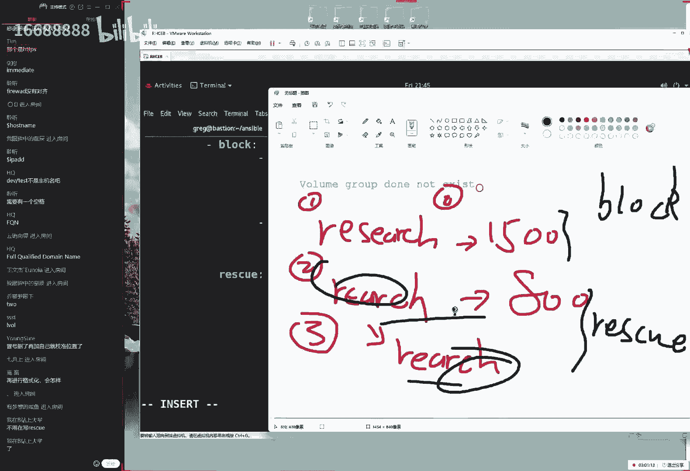

则满足第一个条件，如果它不存在的话，那么怎么做第二个条件，所以他就在第二个判断是这样的，我们需要去使用它一个问，大家可能看起来这个有觉得很痛苦，对不对，大家这个觉得很难嘛，但是这个我要给大家讲。

这已经是我们经过了2年的时间呃，反复的不断去思考，总结出来一个最经典的一个模式了，因为我们之前没有这种答案的情况下，我是用到play，我我我让我去写了很多个play，然后去完成的特别的麻烦，而且还不排。

还不一定对，这就是我们通过2年的时间，给大家不断的摸索出来一个最简单的一个方法，以及的话呢宝啊保证能够去对待这么一个情况，所以说如果实在不行的话，当做是一个文章去背背，就当做是一个什么呃，小说也好啊。

或怎么样呢，当时一些纯文字一个作文，把这个背下来也能考试通过，这个是红毛去考现在考试的一个小bug啊，就是可以背文去背文件也能够考过好，我们给大家说一下啊，那也就是调用一个变量嘛。

这个话我们给大家直接去写好了啊，ancil o v m要是vg s里面的话，如果要是有一个research的话，怎么怎怎么去解，如果他已经没没定义过的话啊，但如果说这个research这个卷子它也被定。

它已经被定义的话，则创建出来这么一个呃啊，他则创建出来这么一个卷组，如果说他要没有被定义的话，没有这个卷组的话，没有这个vg的话呢，那么则输出这么一段话，而不创建出来一个为800兆的一个分区。

都做好之后，我想想我思路啊，看一看没有什么缺1234，总共的话呢呃123总共是三部，然后我们的rescue里面分为了两部，进行的一个判断哦，没有太大问题了，我们先跑一跑，如果没有报错的话，就证明正确的。

大家说怎么样呢，不用再写这么一个救援了，不用再去写，然后大家说如果写对一半，错一半会有分吗，没有分嗯，所以啊不他会有分，但是我们要看怎么，当然我们要看怎么去写了，如果说你写到这里，然后您写错了。

那么就会有一半的分，因为你踩到第一个点了，后面两个点没有踩上，但是如果说您是写完了一半之后吧，这个文件没有啊，没有被创建出来，那么则没有分，所以要看大家这个错那个点错到哪个位置了，不过一般情况下。

我们写前面这两个play没有问题吧，50%的分啊，其实他们野生的野生东30%的分吧，是能够拿到的，这道题目确实比较难，来点一下保存并退出，就是啊不仅大家学起来难，我们讲起来也有点绕啊，反正有点绕。

希望大家反复的去看，这也是我们思考了很长时间才写出来的，也也很辛苦，然后开这个视力的话没有问题，然后我们这个啊商业环境里边的话呢，由于他都没有这样做research。

这个卷子当前的话呢没有一个research这个卷子，所以他会有五次会去输出这个信息，在考试的时候它会根据情况来进行判断，但是当前的话呢大家看不到效果，但我们明天我给大家去跑一下那个排名脚本。

同学们会知道我们现在这样做是对的，来我先去跑一下ensable playbook，然后lv yo文件，然后说一句走，你来看一下这个效果，大家会看到五次说re 40，这个卷子不存在这样的一个输入信息。

能看到啊，输他输出了五次，这个报错声明说这个盾组并不存在，所以话呢底下他说出来了，我们这个最组并不存在这样的一个报错，嗯好那我们就先给大家推说这么多吧。

今天我们给大家讲几道题目呢，看一看啊，今天稍等一下，总共的话呢这个是15道题目，这个隐藏题目的话呢，是跟我们正它是给我们这个正题来去互换的，所以我们今天讲了123啊，123456，然后七八讲了八道题目。

当然大家好像没打满算，我们今天讲了160分，再讲三道题目就可以考试通过了，明天我们来继续吧，明天我们后面还有七道题目，再让我们的这个隐藏题目会给大家讲完，明天的话时间大概还有两个多小时。

并且我们明天可能会给大家跑一下，我们这个喷喷脚本，大家可以看到我们这个判分的一个过程了，看看到底我们最后这个成绩能到多少分呢，啊然后那么啊但是大家都要注意啊，大家有会常问一个问题，是我们同学们常问的说。

考试的时候我们能不能跑这个啊，拍门脚本呢，大家其实在七点多的时候提过这个问题，但是大家问的是测试啊，在我们考试的时候，您是可以去做测试的，就是我们像我们刚刚说的，去做一种测试是没有问题的。

但是在考试的时候，您是没有权限去执行发文脚本的，就是我们自己不能给自己判分，但是啊做测试是可以的，所以大家一定要区分一下啊，七点多的时候其实在想这个问题，后来我想同学们应该不会把它理解错了吧。

但是我还是再去给他强调一下，就是还要给大家说一下吧，就是在我们去考试的时候可以做错事，但是不能够判分啊，自己不能给自己判分，只有考官可以判分，但是我们在底下去做实验的时候，你可以给自己判分。

确认一下没有问题，然后再去考试啊，可以准备去呃，更加充分一点，好大一会就听完之后可以有问题来去说了，不过我相信大家可能今天提到这个问题的话，会比较少，因为可能会觉得都很很难理解。

但是嗯这可能就是我们的一个优势吧，就是我们能够让大家嗯怎么讲，能够一个以正确的方式给大家展现到大家面前，大家需要做的事情不是再去思考，怎么就去解答这个问题了，而是怎么去理解一下我们这个答案。

怎么他怎么去完成这个事情，好大家现在有问题可以来去说，我先倒杯水了，大家的话有问题可以来去说了，然后我们今天晚上的话，还会把今天这个视频传到学员页面里面，同时大家可以去做下载了，来大家问有一个问题。

大家说啊快十点了，对，失恋了，可以提前约考试吗，武汉不行啊，武汉也不行，因为现在人数不太够，我们今天出了一个好的时间，是山寨的，然后约了时间是四，是深圳，好像是5月10号吧，还是几号。

5月好像是5月10号，然后我跟考官说，我说这你给太近了啊，就不啊，这个呃这个不太现实，所以我们这期的话，那大概是在5月中下旬，然后给大家约考，约到是6月中下旬。

所以大家今天和明天学完了iceable之后，就具备了h3 c和hc的考试能力了，到大家考试的话，我感觉大家可能会时间比较久，可能会有一个会大概有30天到40天之间吧，对大家这个时间比较准备。

还好还是比较充分的，但是考试时间还不能够为大家去说，因为我们这边还没有大家约出来，因为现在全国这个疫情变化实在太快了，我们等那天比较稳定了之后再给大家去说，ok现在我我先去，我先去喝口水吧。

待会问题的话也可以来句说，大家也辛苦了，今天这确实辛苦啊，讲了三个多小时，今天讲了三个小时，也是我没有想到的，我先喝口水，大家有话可以再去说了，我也是考虑到很多很多次我吐，然后我在想。

我说今天我们要不要中途休息个五分钟啊，结果还是没有休息，喝到有六杯水了，好大家也比较辛苦了，另外的话是这样的，今天我们讲的这个培训内容，大家只要听一遍就好了，就是我们现在所讲的这个东西。

今天这个课程大家请听一遍，大家就是只听一遍，不要听第二遍，因为听第二遍会特别的啰嗦，我们今天给大家回来聊天或答疑啊，会给大家讲一些乱七八糟的，会超级的啰嗦，所以今天我们讲课这个培训。

今天我们虽然晚上回啊，12点之前传到学页面里面，但是大家不要去下载了，因为大家只要听一遍就可以了，然后的话呢以后都是听hc备考视频好吧，同学们啊，是这样的，今天讲的这个视频只要听一遍。

不要就是我们千万不要听，第二遍会特别啰嗦，请大家直接去看r hc的考研辅导视频，在学页面里面可以做下载，一定要从学里面里面去下考研辅导视频，去看那个更加呃更加的精简，跟专注到rtc的这个备考会比较好好。

大家问了一个问题啊，大家问了好几个问题，大家说考试性当中，第二个题目的中文是怎么是怎么打进去的哦，我没有打啊，因为要打的话需要安装一个键包叫ibd啊，这个软件包啊，i bus啊，我们当前没有安装。

所以的话呢我可以直接选择一下复制，然后选择一下粘贴就可以了，第二个问题，他说10号对啊，今天考官跟我说10号啊，这个完全不现实啊，这个我们等着6月下旬吧，我们准备充分之后再约考，然后下面一个问题。

大家说我们的arch cc盘文脚本是不是有问题，跟着答案去做，老人不得分啊，正常因为我们做这个，因为我们去做视频的时候，我们不也没有得分吗，最后的分支好像是240吧，我记得是啊，还还有210，我也忘了。

反正240多分，我记得是他一定要脚脚本是有问题，但是我们大家放心啊，考试的时候没有问题啊，考试时候的问题的话，考官就可以去下岗了，大家说一个月能练手吗，没有问题，一个月啊，嗯那一个月太充足了。

我们一般情况下是15~21天就可以了，不要太长，太长的话反而会容易遗忘呃，不要太长，下面一个问题说我们的hcc改的house name和ip址，重启就还原了啊，不存在不可能嗯，不可能有这种情况。

如果要是还呃，呃从你之后就还原的话，证明您修改的方法不对，比如说您是使用的aff config，为什么我昨天同学们提到了，说我们可以去使用的，不是大家上礼拜日的时候提到过，说去使用的，我们的爱命令。

也可以去修改一下我们的网卡i的信息，然后当时的话呢我说不要用到这个命令去，修改的原因就是这个命令修改过后，在下一次重启过后就会被还原了，它是一个当前成交的一个命令，所以的话呢他从此之后就会失效的。

我们建议大家使用的这些命令去完成，所以您可以按照我现在所敲这个命令啊，再去配置一下，看看它重启过后还他还有他他还能不能去失效，就不可能去失效了，来，and i'm connection editor。

这三个啊这两个，然后加上这个文件，通过配置文件的方法来进行修改，system config，然后是network scripts s c r i p t s。

然后主机网卡的名称f c f g in s160 诶，大家像我一样熟练才可以来这个方法，您去编辑过后再重启看看，还有还能不能还原主题名称，通过文件的方法去进行修改的方法来去实现，他再一次就不会还原了。

呃如果再被还原，那就见鬼了，那就不用管它这个问题了，说明这个机器的问题，下面一个问题，大家说怎么样隐藏题目，创建分区跟之前调用文件的硬件题目是互换吗，对是互换的啊，然后报道里面的电话vda的系统变量吗。

是这样的，大家都已经已经在一天敲一遍了是吧，但是我不太我们并不是很推荐，因为话呢我们从实际的情况下，就从我这个情况下来说的话呢，现在前额现在的话呢我每次都会有新鲜感，然后会去敲，我们也非常的高兴。

非常愿意，但是一旦您敲了半个月，敲了一个月之后，说实话其实您不能够保证每天去敲一遍了，就会很烦了，我不知道大家会有这种感觉啊，呃所以的话呢我建议大家去敲的话呢，尽量保持在自己临考试之前14天。

如果说认为自己的基础比较差，好了21天就足够了，不要太长时间，反而可能您已经准备的很充分了，但是我们知道这个曲线是这样的，就会啊特别的疲倦了，结果的话，您就是我们一定要保证，您自己在最高点的时候去考试。

这些比较合适，然后大家说桥梁啊，桥梁啊去敲两下200遍是不要太就是太多了，完全没有必要啊，他们也没也没有那么夸张，不过我大概我考试之前因为没有考题嘛，但是我敲的比较多，我大概敲了30多遍。

确实是这么回事，我因为我每天敲一遍嘛，呃每天敲两遍，有可能我大概备考用了20多天，所以我考两门的话，我考我两门考了300分啊，就是两门分别是300分，也算是2020年考的比较高分了。

因为刚刚辩题嘛能考300分的也是比较少数，但是现在的话你考300分就很正常了，因为都考题了嘛，好下面一个问题大家说说安啊，说我们的ultra fs哦，就是那个自动文件系统对吧。

他说直接登录我们的remote user，无法进入到加目录啊，即便我们的nfs已经配好了，remove user，这个我想一想啊，考试当中没有这个问题，大家说的是rt 3 s吧。

我记得是t cc里面的auto fs已经配好了，但是500g的加目录，即便nfs已经配好了，我感觉可能是防火墙的问题，因为我做过这个题目没有问题，然后大家说我使用的ansible document。

使用的graph都要记住吗，这个命令需要记住，有两个需要大家去记得呃，有两个需要大家去记得，这个很好，我给大家总结一下，是这样的，有两个需要去记得，第一个命令叫做uncable document。

然后一个elo过滤，然后关键词这个是叫做叫做过滤出的模块名称，这个你需要记一下，这是一个万能公式，第二个万能公式是这样的，unstable哦，刚set up杠a filter过滤来杠a的参数。

单引号哎呀怎么没了啊，做a的单引号，做filter诶，做future单引号，但我写的当然这个它是一个单引号啊，filter fl 7 r filter过滤，然后关键词这个的话呢是用来就是双引号。

这也打不起，有点打，不然打不全啊，太多了啊啊这个单引号用到英文的诶，这是英文的吧，啊这个是英文的，来稍等一下，ok没问没有问题，然后型号型号这些都是用来去通过变量的，变量名，稍等一下，同学们。

我给大家打完了，这样他大可以闻到自己的身上啊，如果要是有一天去考试的时候，这两个超级实用来我们把它怎么能记下来呢，啊上上一下吧，这两个万能公式好好记一下，特别好用。

如如果我们的模块名称或者我们的变量棒的话，就这两个啊，百就是百试百灵考试的时候特别的实用，好稍等一下，稍等一下，我把这个放到一平，这样的话大家也比较舒服一点了，哎呀不行，那就那就这样，那就这样了。

好大家说我们两个同时报多少钱啊，4200，而且两个是必须同时报的啊，23s c r h c不能分开报，互网公司对对此有要求，然后大家说rh cs当中，auto fs的主目录必须要可供用户写入。

这样的话报错是什么原因，好像对答案没有错了，那么如果要有这样的报错的话，给他一个普通权限就可以了，这种情况非常的常见啊，就是给他一个普通权限，china mode c h m o d命令七七用户加入。

给他设置一个权限就可以了，或者给他七五就足够，其实七五就够，然后大家又问了一个问题，对大家要说出来两个命令了，大家去记一下这两个挺呃也也挺好使，然后的话大家需要注意一下，这个变量只能是一般变量。

有一个变量名称叫做魔法变量，叫做magic，叫做叫做魔法变量，魔法变量是不能高通过这样的方法来去获取，到，明天，我们第一个实验就遇到这样的一个变量的形式，或许大家据说怎么去获取。

然后最好去记一下降魔法变量，这是获取不了的嗯，但是我们明天会给大家去说，还有的话呢就是嗯也没有然后了，就两个公式来记一下，一个模块名，一个变量名，基本上我们就能够够用了，好大家有的话可以来继续说。

我先倒杯水，那继续来可以来继续来说啊，大家辛苦了，然后然后然后我们明天还有课，大家不要忘记，今天已经十点了，确实耗的比较晚，明天还有课，大家千万千万不要忘了就好了，那我这样的话。

我感觉明天加上今天两天就能给我讲完了，我们就可以周日可以见到干货了啊，说说第十章节了，好大家可以先去说。

我先把这个视频先关上。

