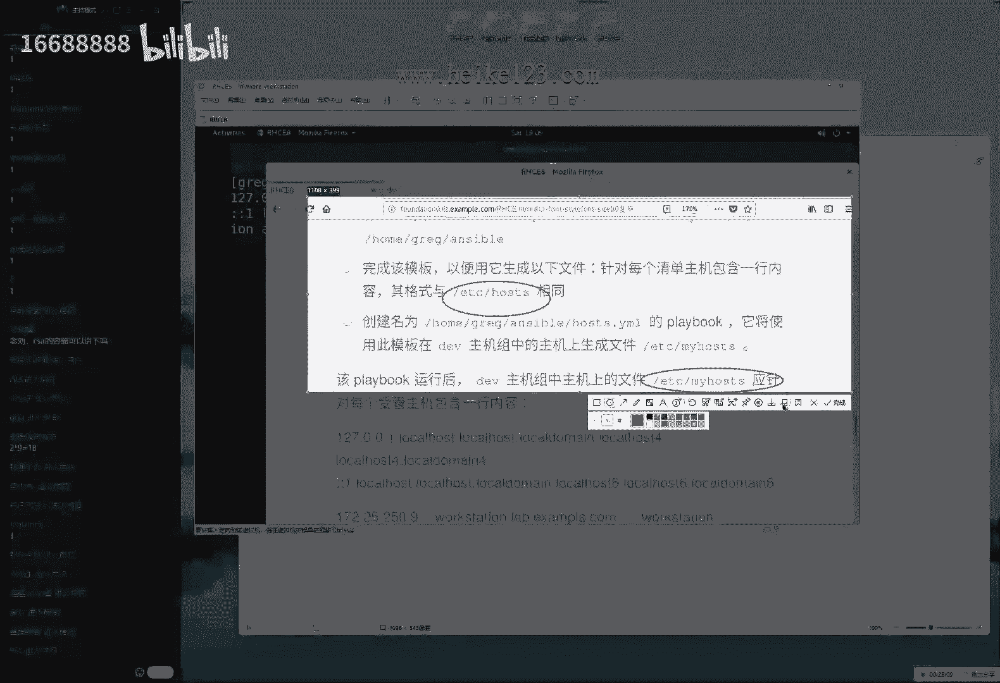
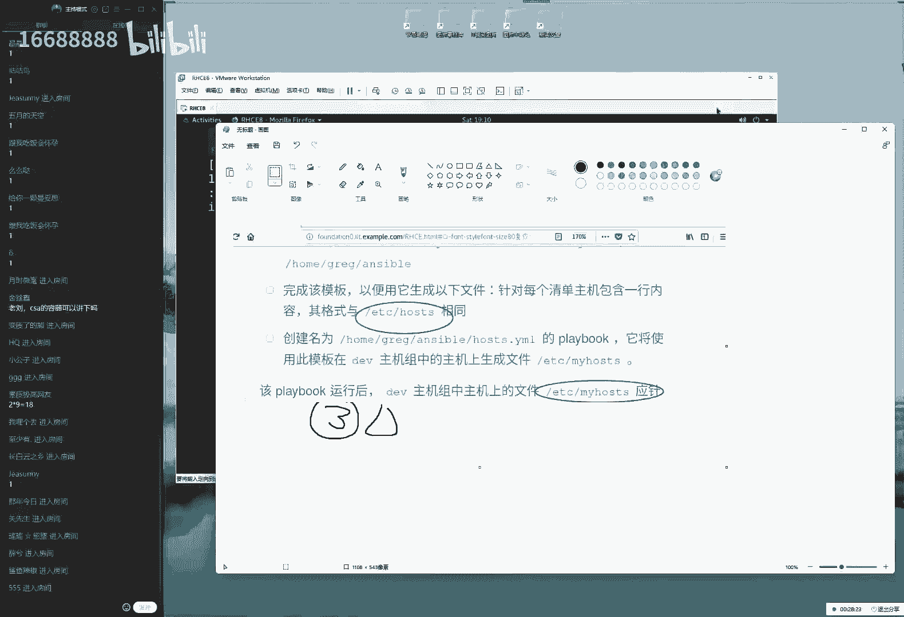
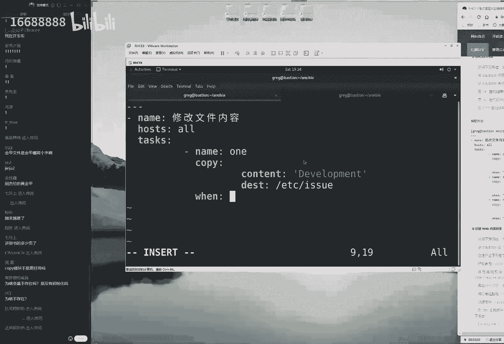
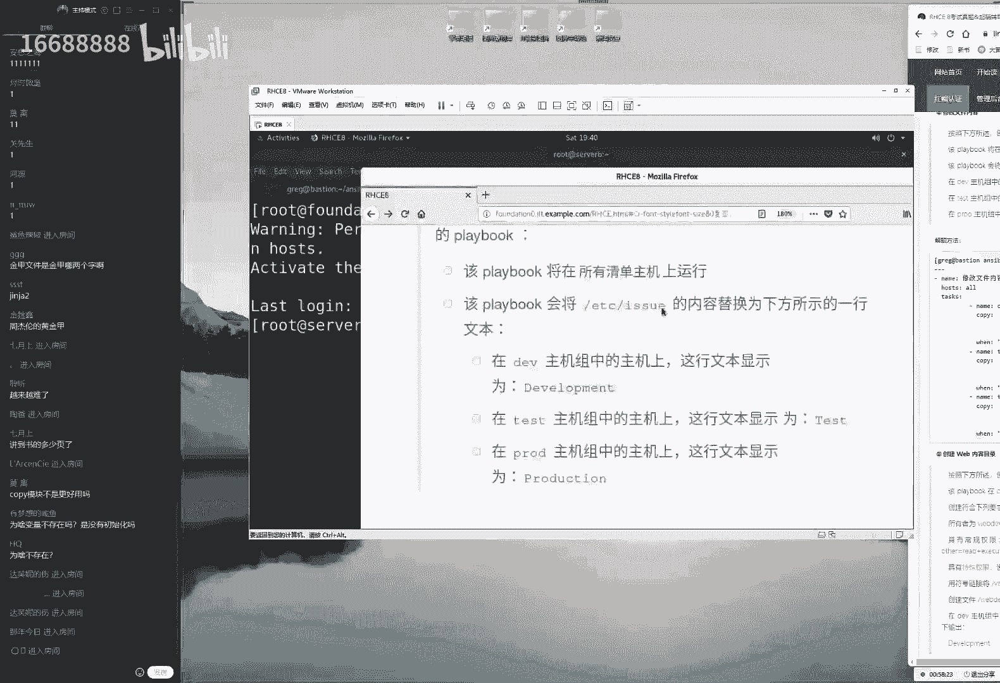
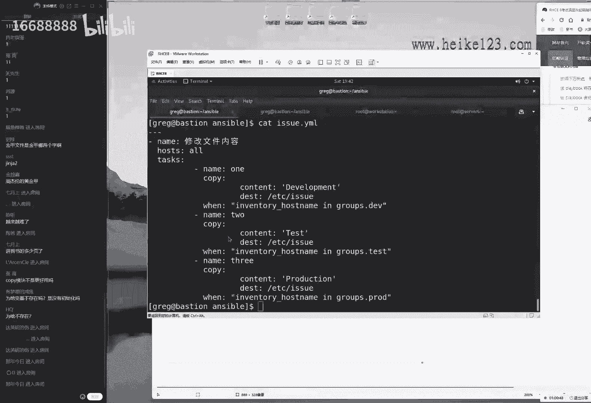
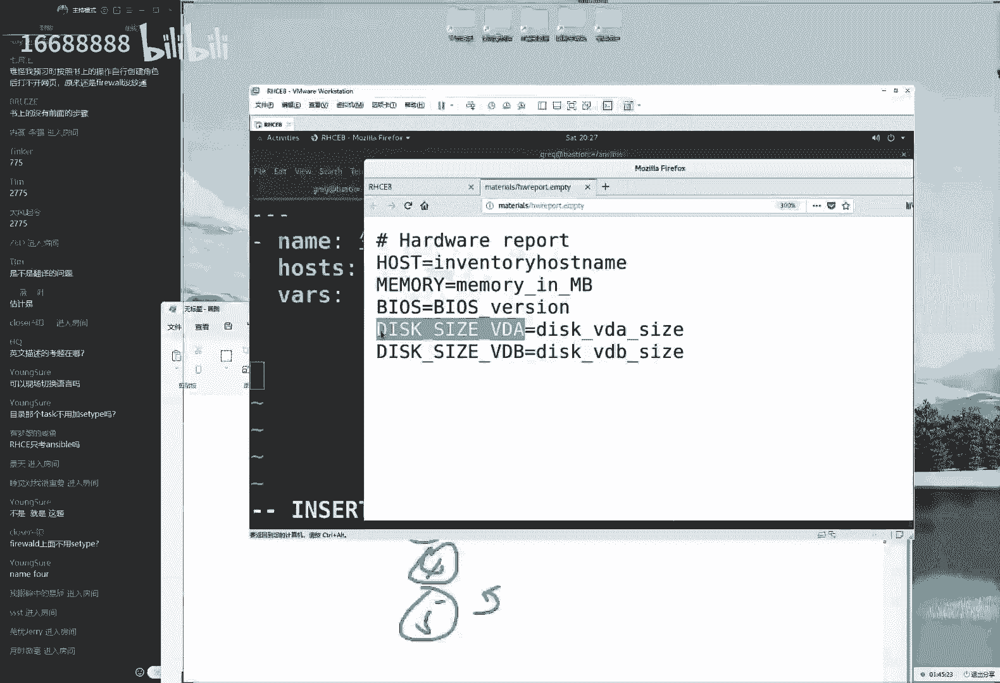
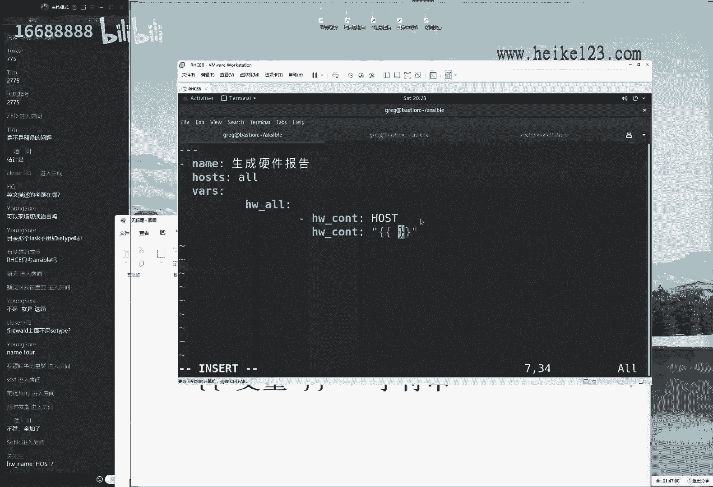
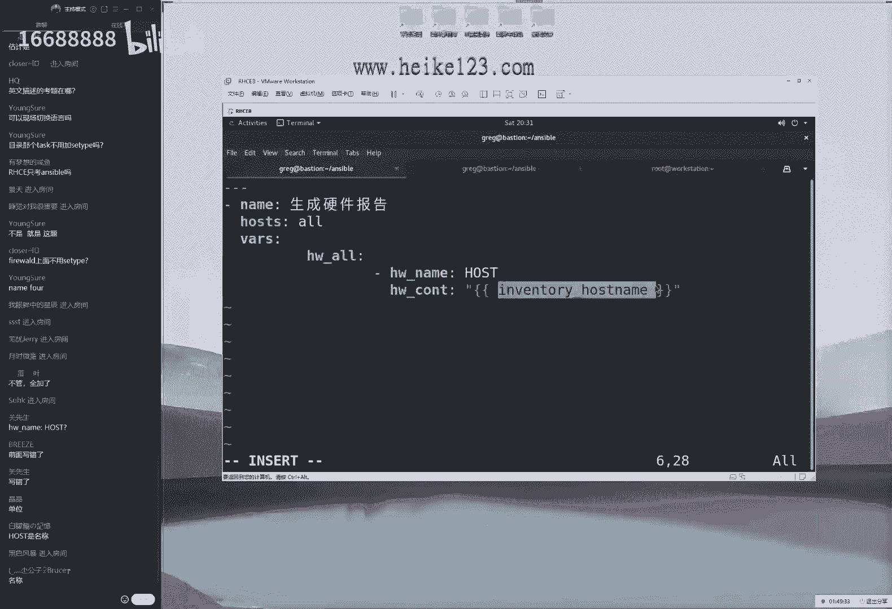
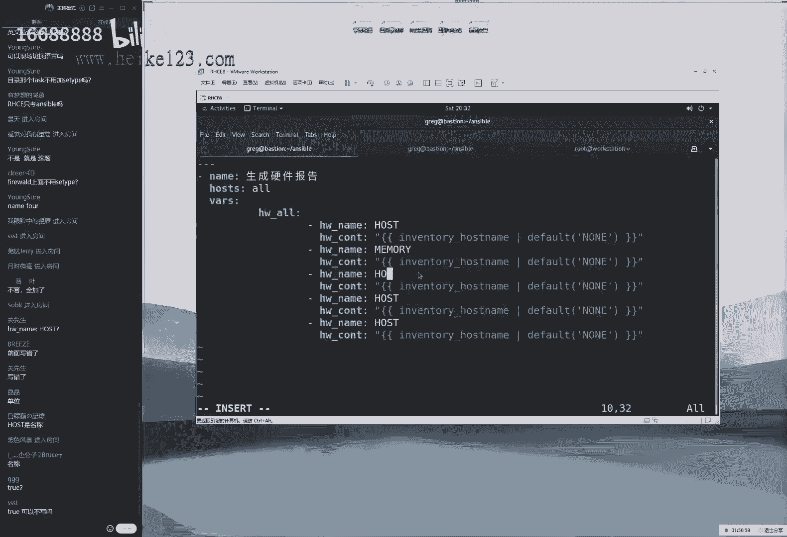

# 刘遄培训linux34期（配套linux就该这么学第二版，RHCE8） - P15：16 - 16688888 - BV1gL41167vP

you're so feeling less we go，oh he said，i could take on，ok同学，我们来开始我们今天这个课程，大家先打一下一啊。

我们还是照例先来测试咱们这个商业环境，哎呀很难想象已经过了一天了，然后我们今天的话来继续给大家讲一下，r h c e，下午说大概被雷达课啊，我们今天的话讲完阿智c应该是没有问题的。

所以我们今天的话时间可能也会比较久一点，大概的话时间至少有两个半小时起步吧，所以大家提前做好准备，可以点啊，那大家可以去点一份去准备好外卖啊，今天我们开始我们正式课程，就废话不多说了。

我们今天的东西的话依然是很多的，同学们另外把桌子上长纸拿起来，就是呃大家写着的，我们的ip地址以及对应的组名称，那张啊，那张纸我们可以很清晰的看到我们的每一个组，所对应的一个地址。

其中的话比如dv一组test组，他们对应的就是点9。10这个地址啊，大家把张纸拿出来，这样的话呢我们去看题的时候，就不用老去翻网页了的话会比较简单一点啊，会比较快捷一点，比较有效率一点啊。

大家说23s的容器可以讲一下吗，现在的话容器是通过视频给大家去讲的，没有一个在线培训啊，然后我们今天的话呢，还是我们讲一下h c e的cable，因为h3 c说实话想不过的话很难。

所以我们现在这个重点的话还是r h c e，通过rh 3 c的这个视频去学习，完全足够了，就是已经非常报告了。

然后我们来给大家说一下，我们今天这个课程安排第呃第八道题吧，我们来看一下叫呃不呃第九道题了对吧，哎呀那我们总共的话是五的题目，我们总共300分，那么我们每一个题目的话就是20分。

那我们今天第九道题目2829 16，那么就160分，今天来继继续来去说一下啊，另外我等下同学们啊，今天人数986 12了，也还好也还好啊，然后现在同学又来了啊，叫小公子啊，毕业知道的熊啊。

来那我们来开始我们的正式课程生成主题文件，然后大家可以先看一下咱们这个网页上面啊，这个网页上面的话题有两个方法啊，就是我现在说的啊，就是咱们那个考研辅导这个网页的答案。

那么就咱们这个学员页面里面这个网页，然后里面的话呢会有r h c的这个考题，里面会有两个解决的方法，然后的话第一个方法的话呢暂时不太推荐了，因为我感觉第一个方法吧有点卡bug。

而且的话呢有些同学反馈是说这样的话是做啊，那这样是错误的，所以如果说我们呃，如果同学们看的是网页的话呢，大家就是做的时候，就以我们现在所讲的这个方法为准，另外的话呢也如果要是在考试的时候，时间允许的话。

就用这个解题方法二，大家看一下这个网页上面用第二个方法，不要用第一个了，第一个有可能它不生效，然后我来给大家说一下怎么进行操作啊，先看一下这个题目，他说生成一个主机文件。

我们先给大家来进行一个分析的过程，来看看我们这个分析在不在理他怎么回事啊，291 18啊对啊，2929 18来，我们来给大家看一下啊，看下分析到底还是看有没有代理啊，他说首先的话呢。

需要从一个模板文件当中去下载一个，什么都要照一下，将一个初始化的一个模板文件从这里，然后去下载到这里，诶，你看大家看到其实这个不知道，其实这就是一道考题啊，哈哈那我们红包考试的话只看结果，不看过程。

他就站着这个踩点给分的，那这道题目就是我们哪怕考试的时候，这道题我们不想做啊，那这样的话我们考试的时候真的是慌了啊。

也不会去做了，没关系对吧，只要踩中这个点也能有分啊，那那那我们现在第一步，把这个文件给大家下载下来，172。25。25，0。254a看一下远程登录到我们的主机，一定要去使用到这个greg用户来进行操作。

那个啊那个大光头啊，他就啊初期的时候用自己的名字命名的。

这个用户来进入到它所对应的目录下，大家可以看到这个的话，目录跟网页里面是保持一致的，然后我们再去下载它。

这个就踩到一个点了吧，怎么着也得给我二分吧，啊来我们先去远程下载它，继续使用到的啊。

w gt来去下载一下，那我们下载好之后的话呢，下面再来他说完成这个模板，然后的话让他去输出这个信息，每个清单当中会包含一行的内容，其结果与这个内容相同啊。

也就是说现在的话呢我们先来的一个文件，这个文件大家先看一下，这个文件里面的内容是这个样子的，ok大家看到这个内容是这个样子的，然后的话呢我们现在需要诶，把这个内容给大家补充一下，那我们补充成啊。

那我们把它补充成什么样子呢，补充成这个样子啊。

这个题目其实说起来比较绕，但是实际上并不难，那house啊一个s来看一下。

这个是这样子的，也就是说我们现在的文件是这个样子的。

那我们现在做一个补充，需要补充成这个样子的，哎不对啊，我看一下这个网页。

这个网页里面时间是有模板啊，大家可以看到刚才我说的不对啊，因为我们这个网页的话呢，是跟咱们这个实验环境是有一些出入的，我们都要以网页为准，这样的话才有更有考试这种啊代入感来先看啊。

首先来说这个文件是现在是这个样子的好了，那我们现在的话呢，他说需要把这个我们的文件的话进行补充，补充完了之后内容是跟这个样子一样的。

那我们对比一下是不是好像只有前面的两行，也就是这个文件里面只有前面的两行。

它并没有下面的五行啊，那也就是说需要把下面的五行信息，给他补充进去啊，他第二句话的意思是这样的，第三的话他说出创建出来这么一个名称的，yao的playbook的一个文件的一个基本文件。

他说的话呢只在dv组上面来去运行，并且的话呢在dv组上面去生成出来，我们的这个文件哦，也就是说呃我们现在需要分为两步去走啊，那我们现在需要分两步去走，第一步的话，已经把这个文件先下载到我们的本地。

这个已经有了，第二步的话就要去使用在这个金价技术，然后在我那么在我们的本地去编辑这个文件，对吧，那我们下载一个文件好了之后的话呢，使用的这个金加技术对于这个文件进行编辑，添加技术的话。

它是让我们能够通过这样的一个变量的形式来，实践出来，复制文件的时候可以调啊，那我可以来啊，自动的将我们对方信息当中对一个变量做提取，这样的一个功能，所以我们就是在编辑这个文件嘛，然后我们巴拉巴拉。

然后我们往里面写入一些变量啊，然后我们来进行调用，当啊第三步的时候，就是把这个文件的话呢复制到对方主机上面，我们的原始的文件名称是这个啊，大家看到我们的话原始文件名称是这个样子的。

然后我们复制过去之后的话呢，对方的文件是这个样子的，所以就是这么一个复制的操作。

这第三步既然知道这个思路了，也就是说第一步下载，第二部编辑，第三步复制，那我们就可以来正式的动手操作操作了。

来大家先打一下一啊，然后就是大家现在能够听到，我们现在给大家讲课，怎么今天这个人数怎么很多呀，69的同学，但怎么我但但是我们互动起来，但人数并不多呀，这样这样的话会让我很心虚啊，咱们是不是网络不太好啊。

啊没有这个情况吗，同学们这话让我非常让我非常的心虚啊，我记得之前讲课的时候就出现过这个问题，我大概讲了15分钟，然后同学跟我说说老刘咱们开始上课了吗，说我怎么听不到声音呢，好大家先啊，没有问题对吧啊。

大家以顺便去啊去测试姐这个键盘啊，打一架一看看能不能发的出来，要不然同学们有些同学说啊，这个有些时候发信息的话，我都可能看不到啊，您可以打出来之后，看一看屏幕上面有没有您发的信息。

你去看看网络有什么问题来啊，在开车停哎呀，那就有点危险了，来我们啊一定要专心了啊，不先先去专心开车。

然后我们来给大家往后我们继续说是这样的，先下先下载好这个文件了对吧。

然后就来对这个文件来进行一个编辑操作，编辑操作的话那就不用多说了啊，就直接这样去拿就行了，然后但是的话呢大家看一下，那么呃因为咱有60个同学，现在67位同学有七人迟到了，我再去重复一遍。

网页上面提供了两个方法，a nb啊，a的话呢是一个兜底，我们认为不太保险了啊，我们现在的话呢就不讲了，我们叫指甲那个方法，b也是后面官方提供给我们的答案，我们先来以这个方法币来给大家操作啊。

方法b的话是这样的，那既然来说它这个里面，这个下面的信息需要我们做补充，那么这个下面的这个信息的话会看到，实际上它就是前面的是我们的每一个主机，上面的ip地址，第二的话呢是我们的主机的名称。

第三的话呢叫做我们的叫做呃一呃仓库文件啊，这个话就是说它指的是，我们定义在我们的列表当中那个名称啊，叫做a i n v e n t o r y那个文件啊，etc目录里边是吧，然后这个叫做呃用户家目录。

home目录目录里面的greg里面的anzable，里面的inventory，e n v i n v e n t o r y，这个文件里面所定义的一个名称，那也就是说可以理解它是一个呃。

它的一个主机名称，它是在我们的anc里面的主机名称，那也就是说三个字段的话呢，第三个字段我们是比较陌生的，我们现在来给大家说一下，叫做主机名，它是在我们这个主机啊，主机清单里面的一个问的啊。

他就这么一个文啊，他这么一个名称叫做主机清单啊，这个词比较准确一点，主机清单文件好，我们接下来给大家看一下这样的，既然有三个字段，那我们那也就是说需要在我们的每个主题上面。

然后我们来进行一个三次的获取，那我们这个金价文件怎么去写呢，那就让到一个循环与积累，在我们的这个进价语句当中，那这个循环语句他用这个大括号开始的，首先我们这么去写两个啊，那就先写先去写一个大括号。

这个大括号里面的话呢是一个百分号，这是一个循环语句的一个开头，有点像是我们去写shell脚本当中，我们去开始那个操作符的意思，然后下面我们定义一个呃循环语句，定义一个for循环语句。

这样的话我们定义一个主机的名称来稍等一下，并且的话这个里边要有一个空格去做间隔，这道题目的话呢，同学们去学的时候，很多同学去把它给放弃了，因为呃他的逻辑比较难，但是同时来讲其实他有规律可循的。

比如说我们现在的话呢是使用到三个变量，然后来自动获取，但是实际上它的这个变量的话呢，它的前面都是一样的，我们来待会儿，我们通过这个命令给大家去寻找一下，大家说啊金甲是哪两个字，不均价不是人啊。

他不是拿两个字，他是一个英文单词啊，大家可以去打算来稍等，我先继续来，我先去远程到我们这个主机上面，昨天我给大家有两个上单，昨天昨天的话我们有两个命令，然后大家应该记得。

一个是用来去搜索和查找我们的变量的，一个是查找我们的模块了，然后我们现在的话先去找到第一个啊，我先去使用到我们的第一个命令去想那anzable，然后一个m然后是set up，然后我们去过滤一下。

过滤出来所有的，跟我们的ip地址相关的一个信息啊，杠a然后我们设置一下对宿主移动生效，他既然来讲到一个i p地址相关的，那我们就去这样去做杠a，然后是filter呃，f l7 l。

然后我们所有跟ip相关的变量来去做一下获取，当然了，这个在考试之前，同学们就可以先提前搜好了，到考试的时候就不用去搜了，就可以拿来就用了，不过他确实有点长啊，这个话呢我们搜一下也没有，也没有太大问题。

好大家看一下啊，首先搜索一下ip地址啊，黄啊周杰伦就是周杰伦，那是黄金甲，然后我们看看下面一个，下一个就是我们的ip地址，ip地址的话实际上就是这个变量，然后话里面引用的是呃，这个自变量。

才可以获取到我们的定单的一个啊地址了，那我们现在的话定先定义一个循环语句吧，先定义一个循环语句，其中的话它既然有五个主机，那我们就叫做啊用户组当中的话呢，我们呢我们那么我们的所有主机。

这个代表就是我们当前的主机竞赛当中。

所有代表的主机，然后话他会把每一个主机，大家给大家去单独去分配到我们这个变量。

叫做主机变量当中啊，这对它定义一个变量啊，host，也就是说的话呢，待会儿这个变量会自动的，从我们这个主题组当中来去获取，每一个主机的这个名称，这样的话呢我们就可以对它进行循环。

当我们去呃循环到某一个语句的时候，然后它会它可以自动的来去获取到，它所对应的一个变量信息，我来给大家演示一下这个格式啊，同学们这道题目的话呢听起来有点复杂，但是实际上它并不难啊，因为我们要知道啊。

要想去提取一个变量的话呢，实际上就是定义一下这个变量所存啊，所对啊所对应的一个位置，然后我们的这个使用大括号，把两边给它括起来就可以了，好我们给他定义一下主机的这个信息，这个变量的话呢。

意思就是说我们从这个变量里面，然后的话呢我们替换一下每个主机的名称，就可以去取得我们这个比啊，呃这个主机它所对应的一个页面信息了，然后呢我们的啊ansible fact，它指的叫做哎主机的电量信息。

但是的话呢当前我们是看不到的，因为这个值诶啊呃因为这个变量的话呢，我们实际上它只需要通过获取来去发现的，比如说我们昨天给大家讲了很多个playbook，然后随便跑一个playbook。

他会在第一步的时候，有一步操作叫做获取变量啊，比如说我随便给大家跑一个，昨天虽然跑过了，但是再跑一遍也没有太大问题，大家看一下这个第一步唉，等一下sible playbook的一个操作。

叫做获取和收集变量，大家看一下，那我看到这个是它的第一步，代表就是来进行一个呃变量的这么一个获取，那么我们如果要是，现在没有去获取这个变量的话，那么会导致现在去查看这个效果，虽然看不到。

但是它是可以获取成功的，好我们先来继续啊，那我们现在这个写法的话，实际上可以把它给做呆，那我们可以给他做一个代替啊，就是我们实际上我们jm去写，然后后来我们昨天调用变量的时候的话呢。

实际上呃是这么去写的对吧，我们啊点host，然后吧那我们用这样的方法来进行一个获取的，这个话呢我们两个啊，那我们这两个写法都是一样的，但我们只不过啊把它换成一个啊，那我们把它换成一个中括号之后的话呢。

看起来更加清晰一点，使用这个点号的话会比较乱，所以我们现在这个答案里面的话，使用的是这个方法，然后下面的话呢我们叫做default i p v4 ，这个话呢我们也是看不到的。

因为它的只能是通过我们的网页去查询，大家需要记住一下。

就是我们现在所查啊，现在我们去所查询到这个地址嘛，就是这个变量的信息，跟我们刚才所查到的是不一样的。

因为的话呢静态技术，我们现在使用的是叫做模板变量来去获取的呃。

魔法变量的话是不能够，直接通过我们这个变量来进行一个查询，刚才我看了一下。

应该是没有，那我们看一下确实没有，这个的话呢有一个方法，因为魔法变量的话呢，他确实看不到，我们有一个方法就是通过网页去查询，所以他又给了一个网页，然后这个里边的话呢，会有我们的魔法变量的一个信息。

然后我们可以去查到它，然后我们可以去搜一下叫做house of verse，然后我们去来去查询一下，不过这个我还真是很少用啊，我们简单来看一下吧，这个house of verse能够搜到的。

不过我觉得这个呃，可能之前同学们一定要把它先记牢，然后这个搜索功能应该用不了吧，果然用不了啊，好我们非常好看一下啊，魔法的变量facts，虽然我们因为啊叫做呃gathering facts。

来获取一下moa变量，然后的话呢我们现在来去获取一下这个的信息，所有的模块啊，使用所有的变量，然后house verse ok找到了，其实好在这儿啊，可以看到它会这样，它会这有一个模板。

然后大家可以看到这个模板的话，就是我们当前所使用的一个格式，所以大家可以来看到这个网页的话呢，呃不用去记，其实这个在我这他是在我们考试当中的话，已经是有了，我们就可以看到哎。

就这样的一个格式就可以来去获取一下，我们的方我们的这个变量信息了，然后的话其中的话呢我们的每个中号里边，按照他的格式要求，这字有点小是吧，我把它差调大一点，按照这个格式要求的话呢。

这个中括号里边还有一个单引号。

来去做一下间隔，然后我们还去取出来它每一个变量，最后这个值最后我们就可以来进行一个获取了，这样的一个过程啊，所以的话呢我们现在继续往后面去写，最后这个就代表就是我们去获取一下。

这个主机的一个ip地址这样的一个变量了，看着有点长对吧好了，不过也还行吧，然后接下来yy一撇啊，再来复制两份。

那我们第二个需要去获取信息的话呢，实际上就是我们的主机的这个，完全限定主机名了，这个名称的话呢，实际上它还不是我们的这个网啊，它还不是我们主机的名称，他的话呢还是跟上回一样，叫做完全限定主机名啊。

f q d n，那我们需要直接把它改一下就好了，第二的话呢叫做f q d n信息啊。

直接把它替换一下，在考试之的手也不用去查，直接去写就行了。

第三的话呢我们来看一下，这个指的就是主机清单的源，那它所对应的一个文件我们就直接去掉好了，叫做house name，他直接去获取的这个注清单里面的，这个文件名称，那我们现在把这个三个字写完之后啊。

大家会看到呃，其实并不难，它实际上就是进行了一次循环，然后把我们这个所循环出来这个信息的话呢，我们啊依次的填写到这个文件里面，这样我们当用户去进行复制的时候，那么它所复制的这个信息。

就是直接替换到他的这个变量的值了，好，我们现在把这个信息啊分别来去做一下调用啊，我们要想调用这个变量的话呢，我们就需要在它这个两边加上这么一个大括号，来代表，就是调用这个变量的一个含义好。

另外是这样的啊，大家看完了这个之后，我们将有一个开始的一个循环，那么就要有一个结束的一个循环，那么我们在一个结束的这个循环符的话呢，那我们是怎么去写的，首先还是两个大括号啊，首先来说还有两个大括号。

这个里面的话呢不它啊，它是一个大括号，里面是一个百分号叫做结束循环，这样去写，那么就可以去对于我们这个循环来去结束了，让我们讲完这个之后啊，大家会遇到两个问题，第一个问题就是我们会遇到两个扣分的这个点。

就是我们虽然这样写的话呢，但是我会遇到两个扣分的点。

第一个扣分点的话就是看一下这个网页里面，这个网页里面的话呢，这个呃第一行跟第二行我把字稍微小一点了，大家能够看到，其实的话它是两行，然后所以的话呢可以看到它的话是两行，他啊他啊，他这个底下的话呢。

就出现了所有主机的这个信息，这个信息的话呢，当前呃跟第二行之间的话好像有一个呃空行，大家可以来看到，就是我们前面两行这个信息的话，能跟后面的五行好像是有一个空行，这个考试的时候啊，它是一个脚本判断的。

他那么他只要差一点点，他最后他都没有分值的，大家要理解这个事情，就是虽然我们最后看到的这个，效果是一模一样的，但是唉特别讨厌这件事情啊，就是啊它是一个脚本判断的，他只要差了一个字符。

最后那我们就没有成绩，当时的话2020年8月份的时候，我那我们去考试的时候好像都出了问题了，就是因为这啊，这样会发现第第二行和第五行之间，就是我们啊前面的两行跟底下的五行的话呢，这儿有一个空行对吧。

然后我们可以看起来效果也是这样的，因为这个行间距也不一样的，但是后来的话呢我们后来发现啊被扣分了，怎么原因呢，大家看一下，用我们的鼠标，然后往下捋，大家可以感觉到了吗，这个往下捋的时候。

实际上这边没有一个空行，大家看到虽然这个我们看见有一个空行，但实际上他没有空行，那如果要是有空行的情况下的话呢，那我们往前啊，那我们来去捋的话，那么会有这样的一个效果，所以这是一个扣分点。

当时我们打通同学做一道题目的时候，本身想放弃了，但是因为时间过于充分啊，对还是去做了，结果做完之后还是没有分的。

原因就是这个空行大，千万不要手动去加一个空行，这边是没有空行的，就是我们啊直接这样写就可以了，这是第一个我们遇到的问题。

第二个问题的话，就是我们原本以为通过这样的一个增加技术，然后通过这样的一个格式要求，做完了之后还是有分值呃，最后的结果的话呢还是没有分值，为什么呢。

因为他这个间隔服务，我那我们去试过它是空格的话，它就是错了，他们需要去使用到table键来去做空格啊。

他来去做这个间隔符，然后最终的话呢还是有成绩的，也就是说大家看一下啊，当我们去通过这个鼠标来去捋一下，这个信息的时候，大家看到，然后捋捋捋捋捋，其实我们可以看到，实际上他确实捋出来了四个空格。

大家来捋一下这种感觉，试一试，来捋一下，1234，我们来捋出来四个啊，来去捋出来，这里面有啊四个空格，但是他这个间隔符实际上不是空格，它也不是四个空格，它是一个table键。

我觉得认为这个红包就是不再考技术了，为啥再去下一个坑了，所以大家记住第二点，就是所有的这个字段之间太空的是一个啊table键。

来去做这么一个间隔符，而并不是空格，所以同学们去做的时候一定要小心，我们把这几个信息的话呢来通过这个table键，虽然可能看起来这个间隔符更大了，但是实际上这个结果确实是啊table键。

然后我们同学们用到table键去做的时候，可以看到是没有问题的，它是因为它是符合题意了，所以大家一定要小心这两点，然后大家说这讲到输了多少页了啊，突然间好奇怪这个问题。

我们今天请到查是c的这个备考书上的话，第16章节，不过最好的话以网页为准啊，以网页为准好，我们接下来继续好来我们继续，这是昨天没来，昨天没来，昨天没来上课吧，那今天就不用听了。

因为昨天的话等于说作为一个前期铺垫，我们讲了一个安细胞，然后讲到第九道题了，我们总共十讲，有总共15道题，现在听的话估计有点费劲了。

好我们给他做好之后，我们点一下保存并退出，这是我们的文件，编辑好了，叫这个金价啊，这个文件做好了，看下面的一个要求，他说创建一个名称为这个的playbook，然后的话他只在dv组上面来去运行。

然后在这个组上面当中去输出以下信息，也就是说我们需要继续踩点对吧，我们那我们需要继续踩点。

继续踩点来复制一下这个文件，来编辑一下我们的文件内容，按一下回车，首先三个减号先去祭天，我们的yo语言的一个格式要求非常严格，它不仅要求横向对齐，还有要求纵向对齐，我们的参数和参数啊。

以及我们的模块和模块，以及我们的每个play之间要去纵向对齐，这个差一个空格都不可以了，像我们昨天给大家讲的那个，最后一个实验的时候是吧，那么他这个纵向的一个救安的一个呃。

呃在这个信息必须要跟这个blog的话呢，要是保持一致了，这个一定要小心，我们同学们做这道题目的时候，很多同学都出错了，这个原因啊，来我们先去写第一个play，但我们还是建议大家以这个网页上面。

这个考题为准，这样的话呢，我们可以知道每一个脚本对应的是哪个题目。

只要考题里面没有要求的，那我们都可以自己去定义，那么它既然没有要求说不能用到题目。

但这个中文来去命名，那么就考试的时候就没有问题，这也是我们去加上去做的啊。

没有问题啊，他这个中文也是支持的，没有任何问题，他们接下来往后面去看，他说这个吗，我们的playbook的话，他会在dv组上面来去生成出来主机文件好了。

它受众就是dv组针对于dv组来进行这个操作，然后的话他这个东，那么他这个工作有哪些呢，他这个工作首先它只有一个play就可以了，全成了，这个就是啊叫做template，就直接把我们的这个文件给复制过去。

template的话呢，是我们昨天给大家讲过的一个模块名称啊，不过我们好像有点生疏了啊，大概去查询一下，有些时候考试的时候不呃讲不起来的情况下，就可以去选用到这个命令来进行查询。

然后去输入我们的这个模块名称，但如果说考试的时候连模块名称都有bug的话，那么就只能是通过这个一个消息l做过滤，然后一个一个去回忆了，不过这个只要我练的够多，同学们昨天说打了啊，说我们去打啊。

那我们可以去抢几十次倒话，那么考试的时候起码这个名称啊，我们那么起码我们这个啊名称是可以想起来了，然后过来查参数也可以对吧，但是我们起码这个模块的名称就不能再忘了，再忘的话就底线太低了。

就到时候就真的会出现一些小插曲了，那我们看到的话，它实际上就用了两个参数，一个叫做sauce，也就是我们叫做呃来啊。

来源信息啊，source啊，我们来看一下来源信息的话呢，它指的是将我们的一个文件，然后复制过去，那么我们的本地的文件是叫这个名称。

也就是说它是在我们本地的加目录当中，我们叫做home目录里面的greg，里面的enzo里面的这个文件啊，我们也可以去复制啊，来找到这个文件啊，另外我去确认一下，看看这个文件它是否是存在的，来稍等一下。

我去确认一下这个文件路径是否写对了，因为要是这个文件路径要是没有写对，就有点啊，可惜了，大家说我们去使用到copy模块不是更好吗，当然不会更好了，当然不会更好了，copy模块的作用是什么呢。

它可以用来去填写文件内容，以及去来去对于文件来进行复制，那么复制过来的内容是一模一样的，但是我们现在使用的这个金加技术协啊，好那我们里面写的是变量，它复制过去的信息不是一个常量，是一个变量。

它在他会在对方的主机上面，来去提取出来变量信息，然后加以替换，这个copy模块是不是无法完成啊啊好，我们来继续啊，接下来我们去编辑一下这个文件名称。

接下来再来输出到哪里去呢，输出到这个文件名称最近啊。

只要能够复制的地方，我们全都去选择复制去完成，尽量的不要去手敲呀，一来话比较累，二来话容易犯错啊，我们这样去做，写完呃，另外给大家说一下，因为的话我们的模拟环境里面没有这个变量。

就是我们现在就是我们刚才给大家写的，那个三个变量嘛，当前我们就先那我们当前九当中，它是没有这三个变量的，所以的话呢现在去跑这个脚本，它会有一个报错，但是待会我们判分的时候它是正确的。

所以啊以及在考试的时候也没有问题，这是一个很可惜的一个点，就是我们现在的话呢去跑一下这个脚本，测试的效果，我们确实看不出来啊，因为这个没有这个变量，但是在我们待会判分的时候。

以及待会会给大家去讲考试的都呃，那么呃呃呃那我们以及做考试的时候，这是没有问题的，它变量现在不存在，那我们就待会看一下这个判分的结，然后让我们来看待会看1。9，我们这个判分的结果就好了。

好下面的话呢我们来继续往后面继续说啊。

下面给大家往后面继续说，叫做修改文件内容，这个文件内容的话就是同学们点到了，那我们可以去使用到cy模块，去做一些复制的工作对吧，或者我们要想去编辑文件内容的话呢，也可以去使用到copy模块。

那么大家就等会就可以去使用这个模块，去完成了，就比上面一个实验的话要简单的更多了，然后我们看一下题目的要求，他说第一句话，他说修改文件里面的内容好了，看似好像是对于文件内容进行编辑的，这么一个考核。

就是考我们呃，能不能会不会去编辑文件里面的内容啊，大家说为啥变量不存在，是因为没有初始化吗，为啥不存在，因为我们的实验环境跟考试环境有一些差异啊，所以的话呢现在我们是找不到它的。

应该考试当中已经帮我们定义过了啊，所以我们当前学习环境也是没有的，现在的话呢还不是一个纯正的考试环境，就是我们现在练习的并不是一个考试环境，是一个模拟环境，还是有一些差异的啊。

然后我们来给大家往后面去看，就是叫做修改文件内容啊，然后下面啊，就是我们看到他说让我们去新建出来，一个名称为这个的playbook，那这个话就是现在出来一个剧本，剧本的话呢需要在所有的主机上面来去运行。

然后根据我们的这个主机的名称的不同，将这个文件里面的内容再去加以替换，那这个题目的话呢，看似好像考核的是我们对于文件内容的一个修，改操作，实际上它并不是的，大家看到了。

就是说它需要在我们的所有的主题清单，上面的所有主页上面来去进行，也就是说然后大家看一下这个思路吧，是这样的啊。

他考核的其实并没有那么简单，这道题目很有难度，而且的话它有一个坑啊，就这么回事，就是说他让我们去新建出来这个play book没有问题，剧本已经出来了，然后的话呢定义一下这个啊脚本的这个名称啊。

剧本的名称我们就给它定义好，它限定了一个参数。

这个参数的话呢，它是为o，他指的是在所有的主义清单上面来进行说明，排名脚本的话呢会判断有没有这个语句，肯定是要啊它进行判断的，那么就有问题了。

那好大家看到，既然它是限定，我们是对于所有的主机上面都去执行这个playbook。

但是他又要求我们说它的不同组，那么会有不同的修改内容，那么大家看到三个组会把那个呃呃呃，它会在我们的不同组，然后的话会把这个内容修改成不同的，这样的一个字样，也就是说。

也就是说他是在所有主机上面来去执行的，但是的话呢修改的这个内容，却根据每个组的这个名称不同，最后的话修改内容也是不一样的，实际大考核，这是对于我们这个组的一个判断啊，并没有那么简单的是呃。

修改了我们的文件内的内容这么简单，这也是我们之前常犯的一个错误，后来好在这个题目比较明显，也不算是一个深坑，所以我们很快就把它解决掉了，首先我们还是按照我这个思路去讲了啊。

就是首先我们需要新建出来有三个play，第一个play还是叫做one，要想去修改文件内容的话呢，我们可以去使用到两个命啊，去使用到两个模块啊，不是两个模块，可是使用到三个模块，但是我们用的比较多的话呢。

就是这个copy跟lion file，那我们待会都给大家来演示一下了，呃我们现在的话先给大家讲一下，这个叫做copy模块，copy模块的话呢，就是可以对于文件内容来进行修改的。

我们可以去使用这个模块的名称啊，不我们可以去使用这个模块，来对于这个信息来进行填写，也可以对于文件的话进行复制，也可以对它进行一个修改，好我们来看一下啊，底下的啊事例页面当中啊，example。

看一下我们的科比模块有哪些可用的事例，大家看到在大概往上一点点啊，在这边我们可以看到他的话呢，就是说我们可以有一个原始文件，然后我们把这个文件内容的话，来给大家复制过去，等于说进行的是一个覆盖操作。

并且我们还可以去设置一下，主机的这么一个所处的一个用户信息，这个的话呢好像不符合要求，因为我们当前并不是覆盖文件，而是是对于文件里面的内容修改啊，根据每个组的这个信息不同。

然后把这里面的内容的话呢修改成它对应。

修改成它所对应的字样啊，既然不符合要求，就不用强求了，往下面再去找一找，有没有更合适的，看了看没有更合适的啊，没有关系，继续往下看，好，这边还没有更好的事了，继续继续继续啊，看到的话呢下面会有一行诶。

在这儿啊，他说通过我们的指令的信息，通过我们这个指定的字符，然后的话呢对于这个内容来进行一个填写操作，那我认为这个是合适的，等于说对于那啊对于内容进行替换吗，那么这个格式的话呢。

首先来说叫做content，我就直接给大家去敲了，首先第一个参数啊不提啊。

首先来说我们的模块名称，第一个参数的话呢叫做这个content，大家需要注意一下啊。

但一切都要以这个官方的文件为准嘛，那所以这是一个官方的帮助文档，我们要以他为准，大家看到呃，我们来去复制文件的话呢，原始文件根据我们的新文件的话呢，它是没有用到双引号了，但是我们的内容如果要是给它分。

那我们来曲线有里面的内容的话呢，大家看到内容的两边，是需要单引号给它做一个括起的一个操作，大家看其实底下啊没有了是吗好，那我们来看一下上面吧。

也就是说，我如果说我们要向往里面填写信息的话，需要在这个两边用到单引号给它扩起来，这是一个官方的格式要求的，或者说它是一个推荐的一个呃。

相应的这么一个呃初解的这么一个格式来。

首先我们单引号给它括起来叫做development，他的话是说在dv组上面来进行编辑。

这个我们先不管，先把它空过去，他要去编写的这个文件的内容啊，他要所编写的文件的这个地址，来去解一下d e s t r destinate，然后我们的是来复制一下文件名称。

那我们现在如果要是执行这个脚本的话呢，那我去执行这个play，那么好了，那么就它指的是在所有的主题上面对吧，他会把这个文件里面的内容都修改成这个样子，那么显然是不符合题意的，那我们怎么办呢。

我们就要进行一次判断语句了，要去使用的问，大家会常犯一个错误，会遵循着我们的编译器的一个指引，然后大家看到我就待会如果我继续去敲，那么就会在下一行继续来去输入参数，当然这是错误的。

因为我们现在的这个问话呢，等于说是一个判断语句，判断语句，它并不是这个copy模块里面的一个参数啊，我们它的话呢是进行一个调音测试语句，他为了去测试一下条件是否是啊。

满足条件满足条件才会去执行copy模块，所以我们应该是跟copy模块需要对齐的k a一下，ctrl v再比一下啊，那么一定要答案是对齐的这么一个效果，而千万不要把这个when的话呢。

写到copy的这个参数里面，这样去做就不对了，大家看一下，如果这么去做的话，那就不对了，它并不是copy的参数，所以他就要跟copy来去对啊，来去对齐一下来，那我们来给大家去去做一下这个判断啊。

然后是这样的，我们那我们现在需要定义一个主机名称啊，等于说我们的这个啊主机的组。

这个主机组这个变量怎么去表示呢，实际上他还主机清单里面这个文件名称。

我们的话也可以做一下过滤，但是我不见得能够搜索出来好，我们那我们去试一下来，这个名称的话呢，我们叫做呃inventory house name。

因为他这个名称大家看一下，我们什么时候见过这三个名称呢。

就是我们在昨天的时候见过对吧，就是我们去解读一个文件，就这三个名称，它实际上是定义在了我们的这个呃，主机清单文件里面的这个呃信息啊，那好了，这个变量我们怎么去调取呢，这个变量的名称我给大家过滤一下。

叫做inventory啊，大家看到这个文件的名称，跟我们所搜索出一个关键词的话呢，保持是一致，然后走啊来进行搜索，应该是没有问题，好看一下啊，也那么也没有，那么也没有也没关系，待会我们来给大家看一下。

确实就像我们现在给大家讲的有些变态的话呢，我们是直接搜是搜不到的，但是我们实际上用的话还是能够找得到的好，我们先给大家演示一下呃，然后我们来编辑一下我们这个文件名称，不过这要求大家就是在考试之前的话。

提前要做好准备了，可能确实考试的时候呃无法搜到，那因为的话呢我们的魔法变量，它从根本上来说就是看不到的，那我们就只能是自己的记忆一下了，来顺序文件名称叫这个名字啊，叫这个名称来进行判断，这个名啊啊啊。

那么后来这个的文件名称，这个的变量名称inventory house name，eventually house name，它也是直接调用就可以了，他不需要加上这两个大括号。

因为他的话呢我们的直接变量可以直接用，用就行了啊，我们不用再去加这个大括号了，然后呢我们叫做group。dv，这个的话呢是这样的啊，我们的话我们需要注意一下，这边的话呢是不用加了个大括号了。

等于说我们再去使用到when来进行判断的时候，它里边的话呢是不用加了大括号了，他也是个算，它也算是一个我们的呃这么一个要求。

另外的话呢如果去使用到问的时候，什么时候去加这个双引号呢，双引号的话就跟我们第三章节里面讲的，有点差异，我们第三章节的时候讲了，如果说这里面出现空格的时候，我们那我们才需要加个双引号。

但是呢我们去写这个问的时候，建议大家是在所有的情况下，那我们都去加上这个双引号，因为呃实际上在这个我们在这啊，来来来啊，那么来进行操作的时候，他有啊两个写法，第一个写法的话呢。

就是我们来进行一个变量的啊，这样的一个判断的时候，我们如果调用的是某一个变量，那么比如说我们先定义的是某一个变量，比如说呃变量名称，那么呃如果说呃当前仅仅定啊，定的是某一个变量的话。

那我们则需要去加这个双引号，但如果说我们调的是一个变量，加一个常量的话呢，但根据我们的这个呃编写的规则来讲的话呢，如果是一个变量加上一个常量，然后加上那么一句话，或者说某一个语句的话呢。

差额应该来讲它是不用去加这个双引号的，它加上一个一加上一个字符串吧，他应该讲他是不用加这个双引号了，但是从我们的考试当中，我觉得我们发现了，还是去加上那个双引号更加靠谱一点。

包括说我们最后考试的时候也是加了，所以这个有点说不清了，就是这怎么理解呢，就是它从语法上来说，我们可以不加双引号，但是价位的话呢，我们最后考出来一个很高的分值，所以我们现在的话呢还是啊保留了。

虽然这个可能不太符合于，我们之前给大家讲的这么一个规则，但是这个确实更加靠谱一点，所以我们现在去加一个双引号这么一个效果啊，所以我们家的啊，所以我们现在就要给他加一个双引号。

但是这个确实不太符合我们去写我们的呃，规则里面这么一个理论知识，因为他有点多余了，我感觉确实有点多余，但是还是需要去加一下吧，来12345，我们总共是有五行58y，它有些时候就是一个历史的一个对呃。

这么一个问题，因为我们之前吧有同学，包括我们自己去考完试之后，确实诶考了一个300分，那不就是满分吗，但是是否去掉它之后，依然能够得到很高的分值呢，这个我们因为后续的反馈不多。

所以我们就干脆就把它保留下来了，也许这个有点多余对吧，我们这个摄影号加的有点不明不白的，但是起码安全版的，所以等我们的反馈运啊，等我啊，等我们以后反馈多了，到时候能够把它去掉了，到时候我们再给大家去掉。

但是当前先给他加上吧，那我们接下来去判断一下第二个，第二的话就是说如果这个主题组叫做test好了，我们来看一下group。test，如果这个用户组它是在叫做test组，那么得啊。

那么则将这个内容给他替换一下。

另外大家去复制的时候，千万不要复制到这个空格好吧，那我们大啊。

那我们来去来去复制的时候，千万不要有空格，因为红包考试是一个基本盘段子，只要差了一点点，有一点点差异，他都快算我们错了，所以这边一定不要有空格，虽然我们看起来好像效果不呃并不大，但是他做判断的时候。

他会有一个完全比对啊，他会有这个出现问题来pod组，然后我们来把这个信息依次写一下，另外给大家说一下，就是我们有些变量的话呢属于默呃，它是默认查不到的，它是不能够去使用的，set up去看。

因为的话呢set up进行查询的时候，他跟我们的这个执行playbook有一个差异，我来先给大家演示一下，大家基本就明白了啊啊基本上就明白，大家基本都明白了，首先我先进入到我们这个某一个组里面。

比如说dv组，大家看一下，我们低头看一张纸啊，dv组是172。25。250。9好，我现在的话呢先进入到我们这个dv组当中啊，进入，然后的话呢我们再来再进入到第二个组，来随便找一个啊，来啊，什么呢。

什么这个妖72。二五点250点随便了啊，点啊呃进入到一个pll d组吧。

来随便点幺幺，进入到这个主机组里面，然后的话呢我们去查看一下。

这两个主机上面所对应的文件里面的一些信息，在我们没有执行之前，他这个信息的话呢是这个样子的，好这个信息的话会是这个样子的，来大家看一下这个效果，ok啊，稍等一下，我们看一下这个的效果。

内容的话都是这个样子，没有任何的修改，我们现在来进行一个修改，大家看一下这两个的变化，那么以及我们给大家演示一下啊，就是当我们去跑这个我们的playbook的时候，大家看啊。

当我们去跑这个play book的时候的话呢，我们的第一个操作叫做获取变量啊，叫做获取变量诶，但是的话稍稍等一下啊，啊稍等一下，他说我们有一个主机的组没有找到，他说呃这边有少，我这边好像少写一个s啊。

这样做groups来这个变量我写错了，稍等一下p r o d，然后这边加了一个s，我需要给大家解释一下，为什么我们有些变量找不到，但是我们时间也能够去用，就是因为当我们去跑这个playbook的时候。

他第一步叫做收取变量信息，然后他就可以去找到我们这个变量了。

但是如果去使用到setup的时候的话呢，setup模块是去执行它，并没有去获取变量这个过程，所以大家可以看到这边的话呢并没有一个变啊，这个变量名称叫做啊inventory house name。

但是我们实际上去调用的时候。

却能够生效这样的一个原因，好最后呢我们这个变量信息的话，就只能是通过网页来去查询了，不过这个在考试之前吧，我们提前插好之后再去写就好了，那我们查看一下，去查看一下，就我们这个dv组里面。

这个文件内容就会变成了叫做d啊，那么就对应啊对应发生了变化了，好的话，我们这个p啊，还有我们这个p o d组，这个变量信息也能够查到了，这就是通过我们的这个变动的这个文件。

然后的话呢我们可以来去实现出来，那这就是一个非常简单的一个。

对于我们的主机组的一个判断操作，其实的话来讲它并不难，对吧啊，也并不难，呃，下面的话呢给大家说一下，我们这个创建web网站的一个目录这么一个实验，现在大家所看到这个考试答案的话。

已经是进行了一个很惊喜的一个精简，当时我们去写的时候，实际上是写了很多个play，特别的麻烦，但是后来我们才发现唉其实正常问的话呢，只要主机的组，包括说我们这个主机的这个组的变量，其实还是可以用的。

然后我们就慢慢来啊，来进行一个精简，精简到现在的话呢。

如果说起来20分哎，这个性价比是很高的，这道题目要大家千万不要觉得这个复杂的，就不要去做了，这个我还二分还是比较划算的，然后下面的话呢给大家来说一下。

就是我们的创建web的内容目录，这个的话呢实际上考的是什么呢，他考的是对于我们的这个文件的创建，以及对于我们的文件内容的一个全新的设置，因为我们的安c宝的话呢，他不甘心只考一些对于服务的配置。

或者的话呢我们去呃，对于我们某一些服务的一种管理嘛，对啊，那我们也考过对于防火墙的这么一个策略的，放行了，下面的话它实际上它考的是对于文件的创建，以及我们去开启一个服务跟关闭啊，不那呃。

那我们去开启一个服务，以及作为我们的一个链接文件，这样的一个效果好，这个题目的话有点难啊，但是我们来捋一下思路，我们来一点点给大家去做这道题目，跟下一道题目相比，它就是个弟弟啊。

还是这个的话还是非常的这个简单的啊，首先来说第一个这个标题，他说创建一个我们的web内容目录，然后的话我们这个描述的话呢，是说创建一个外部内容目录啊，就是还要去重复了一遍。

他说创建一个名称为这个的playbook，好吧，我特别喜欢这样的这个题目，就是先去踩个点啊。

先去踩一个点，他说有一个文件，那我们就把这个文件先给它创建出来，一定要保证我们所对应的文件名称，一定要是正确的，这样的话我们写出来这个成绩才是正确的啊，那啊那我们最后啊喜欢这个啊脚本之后。

我们再去想我们剧本之后才能够成绩，这样的话才是正确的啊，就怕其实吧我们最可惜的就是自己明明会，但是结果的话呢写错位置了，这是最可惜的啊，来我们来给大家看一下，首先他说这个playbook的话呢。

它是仅仅在dv组上面去了，它来去运行，他是仅仅在dv组里面去运行，再理解一下，仅仅在dv组上面去运行啊，然后他又说配置的是一个web网站目录，这个有点违背于我们，当前就是我们呃之前作为一个题目。

叫做呃自己新建的一个系统角色对吧，当时我们新建了一个系统角色叫啊，然后的话呢我们去有几个动作，然后我们去编辑了一个主文件，然后这个里面的话呢，它是用它去安装我们这个网站的。

这在这啊他啊来安装我们的网站服务，然后对我们这个防火墙放行，当时的话呢我记得这个用户叫阿帕奇，大家记得吗，当时有这么一道题目叫阿帕奇，后来在那道题目的下一道题目，那个啊那个题目的话特别的长。

大家记得就这道题目特别的长，当时我说啊，大家千万不要的就千万不要放弃，因为的话这道题目看起来长淡化，我们实际上很简单，就这道题目对吧，当时的话我记得是在这个主机组上面，来去运行的这个阿帕奇这个角色对吧。

大家应该很有意思，也就是说dv组在主机上面，根本就没有安装我们的网站服务，大家再回忆一下，也就是说我们这个dv组上面，自始至终都没有安装网站服务，但是看这道题目，他说需要在我们这个dv组上面来去。

充满出来以下的这个文件，然后的话呢就可以直接稍等一下，在这啊，在这，那么他说在这个我们的某一个目录当中，去新建出来一个文件，然后我们就可以直接去访问到网站，里面的内容了，这个好了，这个好多。

这个话呢好像不符合题意。

因为前面的话它并没有安装网站服务好，这是我们的一个猜想，第二个的话就是我们去确认一下，来进入到我们的这个dv主机组里面，然后我们来去安装一下，就是来去尝试安装一下网站，复看看有没有去安装。

然后我们来看一下这个结果的话呢，说呃已经安装过了，诶，我怎么记得没有安装过呢，好它即便安装过了，但是我们去看一下这个里边，到这个网站服务应该是没有启动，我来给大家看一下，如果要是安装过啊，他可他啊。

我等我等，我想想是哪安装过啊啊那忘了啊，那我们也没关系，来看一下这个服务，这个服务的话当前没有启用啊，也就是说这个题目里面，有一些没有提到的细节啊，所以的话呢我们需要自行去解决一下啊。

包括说我们这个防火墙肯定也没有放行，这也是我们在考试的时候遇到的一个问题，就是我们需要给大家讲一下，除了考题以外。

它还有一些前置条件，我们需要自行去完成，首先看一下这个题目，这个题目里面的话就是直接去新建出来，这个网站里面的内容了，然后的话呢下面就来进行测试了，但是实际上我们前面的话还需要做两步操作。

第一步操作这个网站服务，要不然就没有装啊，要不然的话呢我们就需要去启动一下它，那也就是说网站服务没有启动，我们需要给大家启动并启用一下，第二的话就是防火墙一定没有放行，我们可以进入到第1v一组当中。

包括说考试的时候也是这样的，这是一个小坑吧，来就来差距一下，我们叫做呃query service，来去查询一下我们的这个网站服务是否被放行，大家可以来看到诶，稍等一下啊，不好意思，哎呦喂，太激动了啊。

来看一下当前的话呢，我们的网站服务也没有被封，也没有被放行，所以呃也就是说第二步还需要给大家放松一下。

这是我们在题目之外就要给大家去说的，因为我们为什么考试的时候唉就写一个房，咱们就写一个哎房墙吧，也就是第二个事情，我们需要在题目之外，还要再做一下防火墙的放行，还有第三个什么事情呢。

第三个就是呃呃这是我们的这个第一个事情啊，代表着启动这个服务，然后第二的话，第一就是来自对防火墙来进行放行，第三啊对于第一的补充，我们还需要把它设成起啊，永久启动加入到选项当中。

这样的话才能够保证我们下一次重启过后，这个服务依然能够被用户啊，他依然能够被我们的脚本判到成绩，所以这是在题目之外，我们需要做这三个事情，所以我们现在提供这个题目之前的话呢，先去做这个。

就能看得出来到底有没有参加过考研辅导了，一般如果要是没有参加过考研辅导的话。

不知道这个坑的话，上啊上来之后就开始啊吭哧吭哧的开始去做了，但是我们先上来。

先不要去做它里面所提到的这个题目，先把我们这个这个排错给他做了。

哎这就是啊一些前辈们用这个血的教训，然后积攒下来的一些经验，然后这些话也就是我们啊，后来者可以更轻松的这么一个资本，然后大家问了一个问题，大家说啊考试的时候这些题目都是中文的吧，都是中文的，他是中文。

英文，日文韩文可以去选啊，他可以选择成中文的，哎怎么说上节课没听啊，直接听不懂了，太正常了啊，推荐大家可以先下线了，不用继续听了，因为今天肯定就肯定听不懂了，这就可以先下线了啊，但是下载之后的话。

赶紧把啊把啊赶紧把昨天没，赶紧把昨天那个视频下载一下，然后很重要，这两个视频连在一块听就能听得明白了，做完那个视频确实有点难度了。

已经来，现在的话呢我们来啊，怎么样，没有区别啊，来继续啊，来说一下我们这个主机的这个呃运行组，他既然说到了，他是在dv组上面啊，就是也就是说它的dv组上面啊，来去跑这个playbook，其他的组的话呢。

那么我就不用管了。

就当那就限定一下我们去执行的一个范围，然后的话呢我们来写这么几个类啊，大家说没有区别啊，今天听起来依然是很费劲的，确实啊这个难度很大啊，他这个难度还是很高的，因为大家想如果这个难度很低啊。

那我们r h c的话，那含金量就会很低对吧，那么这个啊证书就没有太大意义了，这个话已经是给大家尽量的精简了，而且的话现在这个考题超级稳，当时我们2020年去考试的时候，哪有这些啊，那就哎呀太高兴了对吧。

我们现在已经是考题比较稳定了，已经降低了很大这个学习难度了，而且我们第16章节那个书写的也很详细，如果要是啊对于某一个参数啊，或者说这个play啊什么的也也不太了解的话呢，不仅可以删啊。

不仅可以上课问啊啊，并且也可以去看一下咱们这个书上的一个介绍，我觉得挺已经是非常非常的能够提高通过率了，而且大家去考试的时候啊，我们的考官经常给我们反馈一个问题，就是说到刘你这个学生吧，上来之后吧。

就咔咔开始做题，太假了啊，因为其他的这个考生去考了之后吧，第一件事情一定要先去看题，然后再呃然后呃第二步才是去做题，说你的学生来第一步就开始做题，咔咔咔敲上了，说这个明显就是被啊。

就是我们这个啊之前有人看过题目了啊，所以的话呢还在啊，当我们记得当时怎么去解释的，就是说啊，因为我们的学员的话已经列经很充分了，就是同学们，你们现在可能感觉不到自己的这个进啊，技术的进步有多快。

但是一旦考试了，只要这个考场里面有其他的外甥啊，大家可以感受一下，当他们去看考题的时候，你已经开始咔咔啊，开始敲上的时候，你就知道这个还是很有意义的好，下面我来给大家操作一下，首先来说第一个play。

我刚才想啥来着啊，第一啊对对对，第一个代表就是先去对于这个网站服务，先去启动，并且启用对吧，模块名称叫做service，因为我们上节课用过了啊，叫做这个service模块，找一下。

找一下ensable document，然后service查查看一下，把我们当前网站服务的话呢给大家启动，并且启用，然后的话呢再给他啊，再给他当前也生效一下，大家说用户组d啊，叫做web dev啊。

web dev这个主主机上面不存在吧，是不是也要创建一下，是的也需要自行创建一下，大家说不是先讲ancible吗，怎么就直接上考题了，我们的讲考题跟讲ansible是一样的啊。

ensable不能够是光讲理论，它也需要实战，所以我们就以考题为实战，然后给大家讲这个anciable了，然后我们第16章节的话，会有一个大细致的一个讲解，然后大家注意要是跟不上的话，反复去听。

以及看16章节，这个话学习起来我觉得会更加合适一点，然后我们接下来再来啊，不是说照这个理论给大家去讲，讲这个讲理论的话呢，可能讲半天做考题的话呢，就一举两得了，我们来继续啊。

首先对于我们这个主机的服务的话呢，这个名称我们的htp d，然后呢我们对这个呃状态的话呢，我们要给他进行一个启动，然后呢，我们还有就是说让我们这个下一次重启过后，这个服务依然能够去生效，来找一找啊。

我们在家里面永远不可能学会游泳的，一定要下水才行，来enable，虽然可能下水的第一秒有点紧张啊，有点冷，但是适应的适应，然后我们去敲过几遍的时候，会发现诶还是呃并没有那么恐怖的，来去敲一下。

设置成永久升降模式啊，他下次之后依然能够去为用户提供服务，这样做完之后没有问题，这是我们的第一步，第二步的话去做一下防火墙的放行。

另外同学们刚才问了一下，说我们有一个组叫web d e v，这个组在我们主机上面是存在的吗，啊其实这个是我想买一个小关子啊，因为那个都是我们同学们趟出来的这个坑啊。

啊在考试的时候没有这个组，所以我倒是想给大家去说，这个也是它属于一个前置条件，那它也属于一个前置条件，呃现在给大家操作一下啊，大家说这道题目跟前面一个题目有点像啊，很像很像，在前面一个题目的话呢。

是新建一个自己心里的一个角色，叫叫叫做阿帕奇对吧，然后的话当时我们是安装这个服务啊，启动它防火墙放行啊什么的，在这个的话呢有一些区别什么呢，就是这个啊dv组上面压根就没有去呃执行啊。

就是来去跑过这个阿帕奇的角色，所以的话他就要再去新建一次太阳，就当当我同学说的没有问题，就是如果说了啊，那我们要懒得去敲的话呢，其实可以把那个阿帕奇那个角色里面。

那个呃em文件里面那个啊参数直接超过就好了，其实它就是我们当时去写过的一个参数，可以超过，又用行了，来service协议名称，我们的呃http协议名称吗，然后说叫做permanent永久商店模式。

它有两个防火墙的一个策略保存位置，一个的话呢叫做wrong time，一个叫做优秀，成下表，我们需要成永久生效模式，他说是yes还是no啊啊它是yes，然后下面第三个他说呃当前生效吗。

当前生效我们设成state enabled不，他说是呃，当前我我我们这个防火墙是否启用的意思啊，把防火墙启用，还有一个哎永久问他还有一个叫做立即生效啊，i m m i t e来稍等一下，当前立即生效。

来啊啊，来找找它，我们来复制一下，当前的话也立即生效，等于是yes。

那也就是说我们现在这个服务起来了，防火墙也缩放行了，那我们接下来就可以来去审题了，看看这个题目怎么说，他说的话呢，说啊大家说说直接调用这个角色有分吗，呃是有分的，但是他这个角色调用的话。

他会有一些不必要的一些工作，他会去做，比如说它会复制一个文件，叫做house的点j to的一个竞价文件，然后的话呢它会复制到我们的warm录里面的，3w里面的这个目录当中，大家记得吗。

因为当时我们的这个ipad这个角色当中，定义的一个这个文件叫做index html。g2 ，他也把这个文件给它复制到这个目录当中，然后还去获取了一下，我们当前的f q d n的名称以及对应的ip地址。

这个操作没有意义了，所以的话呢呃可惜还可以可以，他可以是可以，但是的话呢他会做一些无用的一些工作，不如我们就是针对于每一道题目，给大家一个更加精炼的这么一个呃，答案下面的话呢我们再来第三步。

第三步看一下题目了啊，这个不看题目做不了了，因为两个是属于前置条件好，我们的第三步就要看看考题了，他说说创建出来一个目录，这个目录的话呢，它的所有者呃，他的话呢这个诶所有组是这个名称。

然后他的这个权限是这个名称，并且它有一个组id叫做特殊权限，第五章节里面讲到特殊权限，然后大家现在有一个问题啊，现在的话呢我们遇到了又又遇到了一个问题，就是看这个考题的话呢。

这个每个字之间啊都是能够理解，但是最后这个实验的话老是有一些问题，于是我们扒开的字缝往里一看，诶这里面还有一个小坑，他说我们这个所有组的话呢叫做web d v，这个组是否存在呢啊。

于是我们来进入到dv组这个主机上面来找一下，有一个文件叫etc目录里面的group，然后按一下回车，大家看到这个里边的话，有没有一个叫做web dv的一个组呢，我就不耽误时间了啊，没有啊，好吧。

他啊不明没有这个啊，用户在考试的时候有没有呢，也没有啊，所以大家看到没有这个啊。

没有这个用户组，所以我们需要先做第一步，先去新建出来用这个用户组，然后再去新建出来这个目录，然后再为用这个用啊啊，接下来再为这个目录设置一下权限，那也就是说先去新建一个用户组。

用户组怎么新建呢，说实话我这个模块我也记不清楚了，没关系，过来搜嘛，有这么一个小工具，有这么一个呃得力助手，我们就可以对它进行一个充分的利用来呃，web v group啊，来去搜索一下啊。

跟用户组相关的这么一个条目，诶这个话呢也是有点多，我来找一找嗯，u s a d d啊，没有，那么这边再搜索一下跟user是相关的啊，虽然我现在知道是哪个模块，但是我们假装不知道啊。

所以我们现在大家基本知道的话，也不要去说啊，我们现在就是再给大家一个很大，有一个啊很好的一个思路，然后知道我们怎么去推理，大家看啊，如果说我现在想新建出来一个用户组，那么实际上它跟新建出来用户的话呢。

效果实际上可能是相同的，那我感觉的话，那这个模块名称应该是叫做这个吧，好我们来去，现在出来一个用户这样的一个效果，来，我们去使用的unstable，然后是document，然后叫做user来去查看一下。

要想出来新建这个用户组的话呢，往下找一找它有没有可能参数，大家说啊，怎么样啊，怪不得看到书上面去做的时候，结果出错了是吧，这就是因为我们那这样的话，就是因为我们稍等一下。

这话就是因为我们这个这个防火墙没有做方形，另外给大家强调一下，就是呃我们再去做放行的时候稍等一下诶，用户组这个group不是这个吗，很奇怪啊啊啊不是他是叫啊，它是叫做这个group啊。

我看他不是就是我们在去做考试的时候，包括说我们在做模拟题的时候，实际上我们是可以去登录到测试，这个测试这个诶我们的这个主机上面的，然后去看一下了，比如说我们现在怀疑防火墙有问题，或者说怀疑这个父母起来。

那么我们就可以啊，大家看一下这个group，我刚才搜了一下来，能够做到这个group的这个介绍信息，就用来去新建组的，那我们可以登录到这个节点上面，然后去查看一下，验证一下自己这个想法。

然后我们再去配我们这个控制端，这个是可以的，来看看这边他说啊，果然是这个模块名称，刚刚我查了一下，他说去添加和移除一个用户组好了，我们来使用到这个叫做group用户组。

但这个哎模块来就新建出来一个用户组，看一下它里面这个格式，这个格式是这样的啊，很简单，它只有一个实例，这个实例的话只有两个参数，很简单，我们来选择来复制一下，它代表就是来去进行一个创建这个参数的意思。

我们回来很多参数里面都会都会都会去使用到，这个意思的话，就是说呃如果说啊这个用户都已经存在的话，那我们则啊不用去执行任何的工作，如果这个用户组他要是不存在的话，则对于这个用户组来进行创建这么一个意思。

等于说他进行的是一次判断，如果要是存在的话，它就不会去执行任何的工作，这样的一个意思来着叫做state，然后叫做percent，ok这样去做，然后大家说书上没有这个前面的步骤哦，这个需要补充。

这个说这个是需要补充的，但是的话呢这个在考试的时候可能是用不上的，因为我们有同学们反馈过说这个前面带两个，就是我们这个前面的三个步骤嘛，可能是不用的，因为呃有同学，这个机器里面不是就有这些这个服务啊。

用户组啊，但是我们的反馈来讲的话呢，最好给它加上，就是因为这样的话即便做多了，但是的话呢我们能够保证这个服务没有问题，虽然有点啰嗦吧，但是这肯定是更加安全的来啊，因为他多做出来的这个操作。

对于我们这个已经有的信息，并不会有更多这个修改来。

这时我们把这个用户组已经新建出来了，下面就可以正式来做考题了，前面的这个等于说三部全都是前置的一些铺垫，最后开始正式这个配置服务，他说啊，那我们要新建出来一个呃，新建出来的这么一个目录文件。

然后呢我们的目录属于这个组，新建目录是什么呢，其实我也啊这个我也记不住了啊，但是我可以猜一下，应该是跟file相关的吧，跟文件相关的，那么我们来看一下跟file相关的模块有哪些哦，也很多。

但是我可以知道它应该是叫做file，它本身来我直接去选的安琪宝，来应证一下我的想法，如果要是不对的话啊，没关系，我们再找一找，看看有没有其他更合适的叫做fm模块，大家可以看到这个模块的话呢。

是用来去这个新建出来啊，去设置文件的属性，设置这个链接文件或者一个目录，也可以用来去新建刷文件的好，这个话也是符合我们的要求，等于说我们可以去使用到file模块来，去新建出来一个我们的文件和目录。

这样的一个作用来，我们去使用到fm，或者去完成，接下来它的example，示例页面的示例的字段当中的话呢，应该会有新建目录的一些的可用参数，我们可以直接复制就好了，哎我们找一个新建目录的这么一个实例。

接受一下我们这个工作量呃，然后大家看到的话，实际上它这个参数也有一些问题，就是他有些时候也没有加电影号，他的话也还啊，他有些时候他也会加了，这个话调用的是一个呃循环语句里面的变量，它它就去加了。

如果没有循环语句里面的变量的话呢，则不用去加，然后他这一块呢这个权限是加了单引号，有些时候说实话这个我们真的是记不住，但说实话真的是记不住，比如说这个他就是来去新建出来，这么一个目录的。

那所以我觉得这个挺合适问，那我就复制一下这个参数，但是有些时候加不加单引号吧，真的是需要去查一下，很难去记，比如说大家看好第一个参数叫做pass，新建的这个目录名称，我们来复制一下，这个没有问题啊。

也能够很好的找到，然后第二的话就是说我们的这个文件类型啊，它是为一个目录类型，第三的话呢是为他的这个权限，大家看到这个权限的这个数字就要用到啊，单引号给它括起来了，这个在考试的时候一定要小心。

虽然说我们不加电号，可能不会报错了，但是最好严格规范的按照这个格式要求去写，来看一下里面的要求，他说的话呢，我们的用户的哎，大家先算一下吧，这个其实啊这个其实非常简单，然后我们来找一下。

说我们归纳到组所有这个参数该怎么去写好，大家先算一下这个参数，因为这是第五章节里面讲到过的，对于权限法转述字法的一个方法，我往后面去找一找，他的话应该有一个啊在这啊，他说如果这个目录属于哪个用户组。

以及属于哪个用户的话，这个参数叫做group，然后让我们后面去写，再做group用户组的名称。

然后我们这个用户组的名称往里面一复制好，下面就差最后一个了，我们来算一下这个权限该怎么去做啊，775对吧，我们来看一看大家算的对不对啊，首先啊，他还是一个一般权限加特殊权限，的一种组成方法。

我们实际上它就是一个权限转转运数字嘛，来看一下，首先这是可读啊，就是四可以写二，它是个一，421加起来是七，也就是说所有者的话呢，这个权限是个七，来看一下下面他这个所有组的话呢，也是个421。

也就是所有的话，那也就是说所有组的话，他这个权限也是个七没有问题，最后换来这个其他人就是个四，这个话就不那代表是可以去去执行，那也就是14+1=15没有问题，775让我看一下。

下面计划要提到的说他有一个组id啊，这么一个特殊权限，它实际上就指的是三个权限嘛，一个是s u i d，一个是s g i d，那用户组的组id的话呢，我们把它叫做啊二。

也就是说第二个我们使用的是321吗，其中我们的阻碍id的特殊权限使用的是二。

所以我们加在这个前面特殊权限法，加到这个一般权限法的前面，所以这个权限的话呢统称就是2775，大家算没有问题，也非常简单嘛，来2775，其实这也就是我们前面打好基础的一个好处。

同学们总是说老师后面讲的有点快，我感觉有点点费劲，这就是因为我们前面的话呢，这个可能基础没有打特别特别特别的扎实，比如说我们现在第五章节很扎实的，我们就可以啊快速口算出来，就不用担心。

说说老师怎么算出来的呀，对吧啊，我们就啊打好基础。

这个很重要，下面一个题目我们来看一下，他说把一个链接文件的话呢，从这里链接到这里，然后后来这个是有一个坑的，这是什么坑呢，实际上它是作为一个链接文件。

然后我先给大家讲了，其实我刚刚给大家看去啊，其实我我再给大家看这个放模块，这个介绍的时候，他第一句话已经已经提到了，fm模块到了这个作用的话，是用来去设置文件的这个属性。

然后呢以及作为叫做链接文件或者一个目录的，他也可以去新建和我们去呃，删除一个文件或者去啊，或者是一个链接文件，或者它是一个目录，也就是说它是可以去啊，这个新建跟修改跟移除我们的这个链接文件的。

所以它也可以新建出来链接文件，我们创建出来一个链接文件，还使用的是film的一个模块，也也没有变，那这个等于说一道考题里面使用了两次file模块，但是啊fm模块里面说是链接文件该怎么去做。

叫做simple，叫做链接的一个属性，我们还找一个合适一点的，看到这边啊比较合适，他说创建一个链接文件，然后去创建创建快捷方式，这是他一些可用实例，可啊可以供参考的，好了。

我就以这个为例给大家来操作一下啊，我觉得这个事例就挺好，我把这个参数我再复制出来，我看看我所需的是哪一些，然后就可以加以利用了，其实最好题的话呢不会那么的难啊，来呃首先我们来去写一下，叫做123啊。

第四个第五个play，那叫做那就是第五个play叫做five，那接下来我能模块名称s r c。

他说的有一个坑啊，是这样的，他说把这个链接文件的话呢做到这里，但是实际上我们的反馈来讲，这样做是不可以的，因为它实际上是把这个主机组里面的一个信息，然后我们做完这个链接文件上面。

也就是说我们看到网页上面，实际上它也是反着来的，这个原因的话呢，就是在我们考试的当中的话呢，这个我们的目录还是默认没有存在的，我们需要的话呢，把这个目录等于说做到这里面去，但是的话它要作为一个链接文件。

它又不会说呃内容是有差异的。

所以我们要反过来去做，这个也算是一个坑吧，我们可以这么去理解，就是当前因为底下这个move它并没有存在啊，所以的话呢，我们现在因为我们前面是新建出来这个目录，大家看到我们现在新建的这个目录。

在考试的时候，包括说我们现在实际上没有这个目录的，所以的话呢我们需要把这个目录给他，做到这个目录上面做一个链接文件，这样的话呢我们在两个目录当中看到，这个文件里面的内容也会是一模一样的了。

这个的话呢呃算是一个坑，我们先这样去做，这个并不影响我们这个实验效果，在考试的时候的话呢，按照网页来去做，也是反过来去做的啊，接下来再来我们叫做state va，链接文件的一个格式来。

并且我们一定要对齐，一定要对齐，这个很重要，纵向对齐参数。

纵向对齐，链接文件一个格式没有问题，做好之后再往下面去看，他说在这里边的话呢。

则创建出来一个文件，这个文件里面包含以下内容，这就是一道送分题了对吧，因为我们刚刚给大家讲过，要想要要想去复制一个文件，或者说想去修改一个文件里面的内容，则使用的模块名称叫做copy啊，这个之前用过了。

来第六个步骤，第六个步骤啊，six来第六个步骤叫做content，还是不，我们还是使用的copy模块去填写文件里面的内容，然后换了content的，大家记住刚才我们也是这个里面的参数的话呢。

要用到单引号给它引起来，这个有些时候确实我们也很难记，就是这个单引号双引号什么时候加可以啊，他什么时候不加，加单引号，加双引号，就这个确实很难记，但我们有一个原则性来说，就是去看他的视力。

这个事例里面加了，那我们就加势力里面没有加，我也不加啊，就是这么一个原则好，我来给大家看一下，就是说来去天津里面的内容，还是找到这个content的刚才那个样板，所以可以看到了它里面加了，我就还加。

那说这个啊目录的名称没有加。

那我也不加，就是这么一个原则，就是反正我们考试的时候问大家稳妥嘛，里面的内容即便它是一个词。

它也不是一个语句，它没有空格，但是我们依然使用的是这样的一个方法，去完成啊，去填写里面的这个信息，然后我们第二个这个参数的话呢，指的是叫做输出的，这个输出内容到哪一个目录下来。

找到它输出的内容到哪一个目录下，下面的话还有一个问题，就是他作为一个网站服务，他要受到我们的c linux。

它是不是翻译的问题，有可能，但是我们的反馈来讲确实是必然的啊，我们呃他必须要这样去做的，红毛的这个翻译的话呢也是一个很大的问题，因为的话呢这个考题吧他不是中国人翻译的，他是一个新加坡人翻译的。

他们是由新加坡的公司，然后翻译过后再去传球去同步啊，中文的考题，他这个考题的话翻译起来特别的蹩脚，他经常会比如说大家考2h c也还好，大家去考二是c的时候特别的蹩脚，他会说我们啊正常的语序。

就是说啊有某一个服务器啊，呃由某啊由某一个主机提供的某一个服务对吧，然后由某一个主机提供的某一个服务，然后的话呢通过某一个呃，呃从属服务器来做挂载啊，或者说我们会有这么一个表达的方式。

但是呢红包呢这个考题里面会这么去描述，他说说有一个服务的话呢，它需要从啊哪个主机上面来去获取，然后的话呢再去输出到某一个主机上面，并且这两个主机的话顺序还有可能被颠倒了。

当时我们去考r h c的时候都痛苦死了，就就就反正这个题目嘛与这个呃所有都是乱的，特别乱，而且的话我们这个中文理解起来特别的蹩脚，所以有些时候我们会宁愿去看英文的，也不愿意看中文的。

而且这个大家有没有发现这个考题r h c还好，当然话r h c，或者说大家先就是我们现在看一下，r h c一的考题啊，基本上没有句号，大家看一下，就是每一句话的这个结尾，有些时候有冒号对吧。

有些时候没有句号，有些时候描述描他会描述一大段话之后吧，没有他都没有一个标点符号，这个我们是遇到了一个问题，现在hc可能还好了，以前我们去看的时候，连个标点符号都没有，就大段话就啊就啊他给他抛出来了。

所以呃所以就是会有这么一个小问题，可能也是红包公司给我们赏饭吃，如果大家看这个题目都能看得懂，通过率都那么高，那我们培训机构那就没饭吃了，所以可能就是呃故意下一些小坑，然后的话让大家考不过。

然后我们会给培训机构一些饭吃吧，来我们再给大家说一下啊，这个话呢这样做还是不行，为什么呢，还有一个技术点也是一个坑，叫做c linux，这个话我们会在下礼拜也不也也不用下礼拜了，就是我们混到明天吧。

会给大家讲到叫做c linux，它叫做安全子系统，它有两个管理的方法，他的话一个叫做s linux的玉，一个叫做s linux的安全上下文，由于我们明天要为大家去细讲，所以的话当前简单理解一下。

就是说呃他的话的这个目的叫做艾伦子系统，它的目的是让我们的这个程序啊，或者说让我们这个文件只能够去被啊，就是啊只能够去做自己该做的事情，等于说它是限制的服务的功能，以及去限制的文件只能被谁所获取。

那么由于它是一个网站的一个网页，所以的话呢它需要对它进行放行，就是说这个文件嘛需要修改啊，修改一下它上面的这个标签，允许网站服务的话呢，能够去获取一下它里面的内容啊，至于说为什么。

以及呃呃我们呃为什么会有这么一个标签，大家先暂且暂且先记着啊，我们明天这个参数我先写下来啊，这个的话呢我们的参数啊，http d然后是system呃，网站的系统的内容，稍等一下，我先写。

然后这个值怎么来的啊，明天我给大家去说，然后当前先咱们去写吧，好它就是明天会给大家细讲，讲到网站服务也会给大家细说一下了，这简单咱们去理解一下，就是我们必须要把这个上下文修改成这个，否则我们访问的时候。

他会提示出来403，叫做这个没有权限的一个报错，好，我们点一下保存并退出，这样做完了之后，这道题目就算搞定了，我们书上面是有三步，我们先给大家敲个六步呃，为什么呢，就是因为我们积攒了很多。

同学们反馈的这个失败的案例，我们认为有三个常犯的错误，我们给大家去做了，好给大家写到前面了，同啊我们给大家看一下这三个题目啊，这三个步骤大家可以敲到自己的这个书上面去，如果考试当中的话呢。

您按照我们这个书上面的三个步骤去做了，没有报错，那么当啊，那么那么就当我们，那么就当我们没有给大家讲过，但如果说我们在考试的当啊，考试当中您遇到了这个问题了，那么就一定是这三个可能性当中的。

其中的某一个，那我们建议大家就把这个三个步骤当中的，某一个给大家写下来，如果我们不能够保证，说到底考我们考试的时候到底遇到哪一个问题，或者我们想直接啊比较的这个呃去吧，那我们如果要是咱们考当中吧。

如果要是想啊比较稳一点的话，那我们就把这三个步骤都给它写下来，因为他多写的话，它不会扣分，并且他已经有这个目录，或者说把这个服务经启动的话，那那我们再启动一次也不会报错好，所以我们给大家啰嗦了一下。

就是您可以现在去记一下这三个步骤，万一考试当中想稳妥而来，就把给他机制去执行一项，大家说英文的描述的考题在哪啊，我们没有给大家提供英文的考题，没有啊，没有大家说可以现场切换语言吗，可以但没有必要啊。

然后下面一个问题大家说啊，目录当中那个test不用加啊，i c e linux top哦，那个不用，我们大家指的是上一道考题的吧，就是我们新建的这个一个角色，那个不用。

因为我们的icc linux那个标签嘛有一个特性，它就是说如果这个目录的上一级子目录，不是他是这样的啊，就是他上一个这个题目当中，它有一个特性，就是它对应的目录叫做万目录里面的3w，里面的a啊。

这么一个目录，如果说这个目录的话呢，是我们直接去新建出来的，而不是啊来去剪切或者来去呃，复制出来的话，它会里面就会自带有s linux这个，安全上下文的这个标签了，然后在里面的话再去新建出来。

这个新文件也会自动的会去，那么它也会自动的来去获取到，我们这个上一级词呃，是他上一级目录的c linux这个呃上海文，所以也就是说在网站里面去新，那么也就是说在网站播啊，呃目录中去新建设的这个新文件。

并不一定非得要每一个都要去再重新去来，来进行一个呃设置这个操作啊。

这个不过我感觉明天我给大家演示一下吧，因为我们明天演示过后，我就知道到底什么时候该改，什么时候不改，因为我们默认情况下的话也不用去改，其实大家说firework上面不用加s linux的这个标签吗。

不是啊，大家说一个问题，大家说这个不用改吗，啊fireword上面不用改se linux吗，不用啊啊肯定不用，肯定不用，肯定不用啊，因为防火墙跟s linux不一样，防火墙指的是流量的控制。

s linux指的是安全子系统，他们是由美国的，看，它是由美国的安全局，跟那个linux开源社区一起研发出来的一个子系统，它主要是为了防止说这个程序越权去操作，然后去获取一些比如说文件啊。

或者说去一些出门了一些操作啊，这个跟防火墙的话呢，有一些差异还是不太一样的，他来我们给大家先往后面去说吧，因为明天我们会给大家讲一下网站服务，到时候您可以有一个比较直观的一个感觉。

会知道什么叫做s linux，以及什么是网站，会带有一个深入的讲解，这也是为什么我给大家去说啊，就是我们在rtc备考的话呢，不用太担心啊，即便后面没有去学，我们今天讲第十章嘛。

后面基本还有十个章节没有去学。

但是不影不影响大家备考，就是因为设置一下文件名称叫什么名字来着啊。

先把跑起来啊，文件名称是叫这个名称，没有问题来，就是因为我们的答案会给大家啊。

至于说这个答案怎么来的，哎这个的话呢就可以在后面慢慢给大家去聊，来我们现在来跑起来，大家说r h c e只考n c b模式是这样的，来我们跑完了123456，没有报错，没有什么激情了，我还说能不犯个错。

让我们检查一下哪错了呢，看来老刘这个手挺稳的，来我们做完了之后，红包说了，说的是这样的，如果要是做完了之后的话呢，对自己这个操作很自信的话啊，我们可以去访问一下这个网页，访问这个网页。

我们会将看到这个词，看到这个词啊，如果说我们访问这个网页的时候，就能看到这个词了，证明我们这个操作就算是成功了啊，什么啊，那我可以看到没有任何的问题，非常的顺利，也就是说这六个步骤的话呢。

让我们这道题目稳得不能再稳了啊，稳的啊，就呃非常稳，这道题目非常稳，就基本上想错也很也是很难的，来我们继续往下面去看，叫做生成研究报告啊，对了我们书上面还有一个叫新增的一个实例啊。

这个实际上就是一个互换的，我们先给大家往后面去讲吧，待会我们去跑一下这个分值的时候，再给大家去说一下隐藏题目，因为隐藏题目在当前里面是没有的，然后的话呢这个会在啊考试的时候会有，跟正式题目会有一个替换。

我们先给大家讲完了之后跑一下分啊，然后给大家说一下隐藏题目，我会跳一下网页啊，网页上面有一道题目先跳一下，先看一下这个当前啊，就是我们现在所呃就是我现在所说的网页啊，是大家说我们学啊。

是我们学员页面里面的一个网页啊，然后我们现在以当前这个网页里面这个为准，来看一下，里面要求是这样的，他说的话呢就生成出来一个硬件报告，然后呢，其中说让我们去新建出来一个名称为这个的。

一个playbook，然后他说在所有的受管节点上面来，就生成出来一条信息，这就是红包，其实这道题目出的不太呃，也就是啊这个这个怎么讲呢，红包这个考题吧特别有一些坑，你看啊。

这个他说在所有的收割节点上面来去运行啊，来啊并且来去输出一下信息，这个的话没有一个底色对吧，他说所有的收官节点上面啊，它没有一个底色，但是会看到上面的话呢会有一个底色，就是我们如果说要啊要说啊。

大家看到要求我们在某一个主机上面拿去执行，或者说在所有的主机上面拿去执行，它会有一个底色，而这个题目的话呢没有一个底色啊，所以这个的区别的话，那就仅仅是有没有底色的的一个原因，但是我们同学们很不经意间。

就有可能把它给忽略掉，其实就是说红包这个考题嘛，但这个对于的标点符号跟格式来讲，确实不那么的严谨，所以大家可能确实要在考试之前，要好好去看一看这个题目，一些小细节也要去抠一抠，好我们来继续给大家去说说。

新建出来一个名称为这个playbook，因为我对于红包公司这个理解还是比较深的，所以当我看到这个的时候，我也愣了一下，因为我老怕他下一个坑啊。

结果的话呢红帽是呃对我们的的这个猜想啊，进行了一个啊提前准备。

他并没有其他啊，并没有这个坑啊，它主要就是一个颜色着色忘了的一个事情啊，所以的话这个没有太大问题来说啊，说到说新建一个这个名称为呃，这个文件的一个playbook已经有了。

他说在所有的收官节点上来去执行以下的信息。

并且去输出一个文件好了，我先把这个格式给它写出来，为这道题目超级难，我们同学们很多同学会选择放弃，因为后面300分考试嘛，然后我们考210综合及格，所以允许有个两道三道题，不想去做也可以，当然了。

我们不太推荐啊，但是但是呃就是虽然说我们不也不太推荐啊，但是同学们自己的选择，如果说一道题目从性价比上来说，真的是划不来啊，真的是很呃算不上，那我们就可以去跳一跳也行，这道题目应该是算。

我们整本是整门考试当中最难的一个章节了啊，就是最最难的一个实验了，或者倒数第二难吧，来首先来说我们把这个前两句话啊，这个中文翻译成这个参数的之后。

翻译的这个结果就是这样的，我们把这个前两句话翻译成了这个参数来，我们接着翻译，他说的话呢，他说呃他说在所有的这个节点上面来，就生成出来这个文件，并且这个信息的话呢会是这些内容哦。

然后他说我们这个playbook的话呢。

需要从这里去下载一个文件，到这里好了，我们先不说啊，我们先来去裁。

那我们先去裁这个点，来又来一个点，他说先去进入啊，先说从这儿对吧，下载结果来一个文件，然后保存到对方的这个主机的这么一个目录下。

我来先去下载一下这个文件，先看看它有什么样的一个内容，然后查看一下里面的内容的话呢是这个样子啊，empty来看一下这里面的内容的话呢。

是这个样子啊，然后再继续往后面去读，它说需要修改里面正确的值，然后到这个里面去，然后我们如果硬件选项当中不存在，那我们则设置成当这个什么意思啊，我当时我读了很多遍，我没有读懂，后来我去想了一下啊。

他这个语句应该是这样的，首先我们应该是先去下载这个文件，然后的话呢去把这个文件里面的这个内容，给大家去替换成这个信息，也就是说他这个语气说反了，他要去先去下载后去修改啊，他这个先后顺序说反了。

所以我们可能会有，所以我们可能会有一些误解啊，不知道他到底是他他他想说的是什么好，我们现在通过网页给他打开啊，大家看一下这个效果诶，那也就是说第一步，第一步的话是说在做的这个收款节点上面。

来去下载一下这个文件，这个文件的话呢分为两部分，第一部分的话呢是前面的这个参数的名称啊，它这个啊前面的这个参数名称，后面的话呢是一个值，大家看一下，也就是说它是由两部分组成的。

第一部分的话指的是它的参数，第二部分的话呢是一个值，这个值的话呢会啊，它需要替换一下，替换成它具体在服务器上面的这个信息，比如说这个指的是主机清单的这个文件的呃，呃他指的是主机清单上面这个呃主机的名称。

这指的是内存的使用量情况，这是我们的bios的一个版本，还有我们的两个硬盘，它使用的一个大小，它这个使用空间以及啊，这是他做的两个硬盘的这个总的容量的，这个信息，也就是它分了两部分。

这个左边一部分的话呢是为参数名称，这是不变的，大家看一下紫色的，也就是说紫色的是不变的，紫色是不变的，然后换了红颜色的话，那它它是变的火元素的，这个变的话，那这个值需要由他这个每个主机上面。

具体的这个变量来去做替换，所以我们要知道的这个思路是这样的啊，并且我们知道要去使用到什么技术，叫这个均价技术嘛对吧，也就是说他的考核的是对于我们这个金价技术，这种使用啊。

我们能不能把这个呃变量里面的这个值，提取出来，然后替换到这个文件里面，就是考到第一个我们的金价技术来。

金价技术考核的第一点，第二点的话呢是对于我们这个文件来进行修改，它既然有一部分它是啊它是不变的，还有一部分它是啊会发生改变的，所以它实际上第二点考核的是，我们会不会对于这个文件里面的一部分内容。

来进行修改，因为去使用那copy模块就不行了，因为copy模块的话呢，它是直接复制了，它是把原文件给他复制掉了，所以这就不符合要求了，呃知道他考的是什么了，他考的是啥呢，考两点，第一点考金甲，第二点啊。

按照需要来对于文件来进行一个呃精准的编辑，来编辑调文件当中的一部分，以及他又考了一下我们之前所学习的什么呢，比如说对于变量的这个获取，那我们这个变量的名称肯定是不符合要求的。

我们需要去找到它具体所需要的一个变量名称，还有什么呢，还有需要去使用到，我感觉还需要使用到循环语句，因为你想啊，一共是有五个主机叫做这个收官节点吧，这个五个主机啊啊是五还是6万多，我也忘了啊。

好反正就是呃应该是有五个吧，我看一下啊，因为他说到了有几个主机，所有的收款节点，我看一下啊，也就是说他需要在五六个主机上面来去，每个上面都去执行一遍，然后看一下123451共有五个。

那就是他在我在每个主题上面都去执行一遍，然后的话把这个信息，每一个信息都根据自己的实际情况来，去输出到里面去。

当时的话呢我们是这么去做的啊，他说既然他是说在所有的这个，受管节点上面来完成，后来的话呢我们又想了一下，诶，这我会啊啊，这不就是一个变量吗，叫做这个变量的话呢，叫做用户组，然后呢groups。

然后的话如果说这个某一个组它是dv组上面，那我们就对它进行一个修改对吧，我们来对啊，就我们刚去使用到问吧，然后我们通过这个变量判断一下，说他是否在这个组里面，如果要是的话，那么对它进行修改。

后来我们发现的话也不太对，因为这样的话呢一来特别的麻烦，我们要比对每个主机的这个组名，然后再去替换一下文件里面的内容，第二话就是p l o d组里面有两个主机，它有一个点11跟点12有两个主机。

那如果我们这样去做的话，但点11跟电12里面，这个信息就变成一样的了，但是11跟12 两个主机里面，这个配置信息的话，他有可能是不一样的，所以的话呢当时我们写的这个参数，大概写的有100行。

差不多超级多，后来我们就自己给自己否定掉了，后来我们选择了一个呃逻辑性更强，更加准确，并且是百分百对的，但是可能有点难度的一个方法，大家感受一下，是这样的啊，就是我先给大家讲。

就是我们先给大家讲这种方法的话呢，是他是他是百分百对啊，然后的话呢但是有点逻辑的一些啊，有点难，但是的话呢就是行数吧，从100多行变成了20多行了，变啊变成大概有30行吧啊短了，但是难了啊。

但是他他他更加稳了，来，是这样去做的啊。

首先我的这个思路是这样的，他既然来讲，它需要在这个里面新建出来一个名称为这个的。

playbook cl，我先有这个文件了，踩一个点，然后他说需要的话呢，把我们这个主机的上面这个信息，然后替换一下，这是主机的这个变量，然后我们给它替换一下，我能不能理解一下，就是它整体是一个变量。

然后的话呢我们同学们要去学习过c语言的话，因为我学习过c语言了，所以我对于这个有一个先入为主的，这么一个概念，就是因为当时的话我也学习过数组对吧，我们当时我学习过数组，实际上我这个脚本的这个答案嘛。

就是通过这个数组的这个一个思路去引出来的，我当时在想它有五个变量，那我能不能把这个五个变量，变成一个大的数组呢，然后的话呢我们通过这个数组里面12345，五个子变量啊，五个子这个下标。

然后对它进行一个循环，这样的话呢我在每个主机上面，我只需要去循环这一个数组的，那也就是说，我只需要在每个主机上面去循环这个数组，我就可以去在这个数组当中获取这五个变量了，而不用再去这怎么理解。

就是我只需要在每一主题上面来去跑一下，这个数组，而不用在每个主题上面去跑五遍了，我现在只需要跑一遍就行了，把它合并成一个大的数组啊，这个的话呢我们叫做变量组，也可以去实现啊。

后来这个脚本的话就是这么来的啊，这是一个小思路嘛，这个得益于我们当时上啊，这当时上什么时候学的这个c语言啊，上职高的时候学习c语言啊，所以的话呢这个精简了一下，其实也很有用。

来我们定义一个搭了一个这个变量池，我们叫做vs这个格式要求有，然后我们定义一个很大的数组，叫做硬件的，全部就是这个数组的名称，也可以自己去改，然后这个里边的话呢我们把这个数组，这是我们的一个数组。

但是这个视频说起来不太合适啊，它实际上是一个它是它啊，它实际上是一个变量组，它是一个变量的集合，我们待会可以在这里面找到五个自变量，但是我们把它理解成是一个数组，这个数组的话呢。

我们要定义成五个子的这样的一个变量，然后我们每个变量的开头的话是一个减号，来自定义来进行定义，第一个话就是定义一下我们这个自变量的名称，后来我想了一下子变量的名称。

如果说到了one two three four的话，那这个也做不了，因为如果说我们现在按照这个one two three four。

这样命名，虽然简单了，但是我问问，如果说我们现在12345，在这个数组里面匹配出来了五个变量信息，那我后期我怎么把这个内容给他做替换呢，呃或者说我现在需要把这个第五个信息替换到，呃这个呃位置。

我怎么来描述它呢，比如说我先获取的这个变量也有它这个值了，但是我怎么能描述我换到第几行呢，我好那我还那啊，那么我还需要再去定义一下，我们需要换到第四行吗，啊很麻烦，还要先定一下行数，要求限定行数的。

这样反而更加啰嗦了，后来我想了一下就好了，这个实际上每个变量的值都是图，它都啊它们里面都是呃没有重复的，大家看一下，比如这个词跟这个词跟这个词，大家看到他只在他啊，他啊最多一直在他啊，在他本行当中出现。

大家看一下这个词，这在本行当中出现这个词也是啊，当ok看一下，那好啊，那啊包啊，那我们啊包括这个词也是，那我们就可以取这个变量浅前面的一部分，作为它的变量名，然后的话呢。

待会我们再来去进行一个粘贴的时候，就去通过它这个变量名就可以了，等于说它的变量名跟他所需要复制到的。

那个位置是同名啊，这样的话我们定义一个变量就可以了，而不用再去找第二次了，好我们这么举一个思路，我先来给大家演，先给打啊，打个样吧，就是呃我们首先这个变量名称的话呢，我们叫做host。

然后接下来的话呢我们里面的这个内容，就来去获取一下这个变量了，大家需要注意啊，在我们的anciable里面的话呢，它有一个原则，就是什么时候加双引号呢，我们刚才给大家讲过，它是有一种原则。

就是如果说我们的某一个判断语句里面，它只出现了一个变量，那么则需要加双引号，虽然说这个已经被我打脸了，因为我们当时2020年的时候，考试的时候我们全都加了，就是它呃需不需要加，我们都加了。

但是我们考试考了个300分，所以我们就后期就不敢把它撤掉了，但是从原则上来说，就是如果一个语啊，如果说一个语句当中只出现了某一个变量，那么则需要加这个摄影号，如果说一个语句当中，它既出现有的变量。

又出现有一个字符串的情况下，那么它则不用去加这个双引号啊，相等一下变量，然后加上字符串，它就不用去加这个啊双引号呃，但是的话呢从实际上来说，我们加了最后有分值，然后我们现在的话也也也也不太敢去掉了。

但是这个原因大家一定要知道，我们今天讲课嘛也不为了讲，那我们也不为了这个考试讲课，所以要记住这个原则就可以，其实这个是可以不加的，但是呃也不太敢了，所以就干脆就把它保留了这么一个事情来。

那我们就按照这样去写了。

首先定义一下这个叫变量名称，这个变量名称的话呢，首先看一下它里面说的是什么呢，叫做主机清单的这个名称，实际上刚刚的话呢呃是有的啊，这个话呢实际上是有的啊，实际上是有的，大家说我们这个名称怎么样。

是写house的吗，对啊他就这啊他啊他怎么去写的，是这样的啊。

这段话的变量名称实际上这个是不对的对吧，我们可以看得出来他只是给了一个描述信息，而且的话那描述信息的话写的特别的糙，这个他就是给我们赏饭吃，比如说第一个主义清单的这个名称。

这个我还我这个我这个我们还能够猜得出来啊，这个大家猜一下什么，这这是什么意思啊，代表内存的使用量啊，叫做这个啊，以兆为单位的内存对吧，内存啥内存使用量情况好了，内存，那么是内存的总值呢。

还是已经使用的呢，还是当前已经空闲了呢，所以这个算是有一些奇异的，但是我们好在没关系，我来给大家去说一下答案啊，这个的话呢就是这个就是主机啊，叫做主机清单里面的文件啊。

不这个叫做主机清单里面的这个呃名称，这个其实我们刚刚用过了，叫做inventory house name，这个呃我们查不到啊，但是我们现在可以这样去用啊，eventually house name。

其他几个都能够查到，这个属于我们的办法啊，属于我们的啊，隐藏变量我们看不到啊，它属于被隐藏起来的来，这就是我们的第一个参数，我们这样去写呃，这样去解的话会发现还有问题。

就是我们我们现在是假定说这个变量是存在的，然后我们就可以直接这样去调用了，也没有问题吧，两个大括号，然后我们直接用到引号给它引起来啊，双引号引起来两个大括号，然后中间有一个空格。

这个格式要求的话呢超级严格，大家记一下啊，两个大两个啊，双引号里面的话，两个大括号，大括号里边跟变量名称之间用到空格，去掉间隔啊，没有问题吧，ok这样做完之后的话呢，考试还是没有分，因为什么呢。

往下去读啊，红包有考题，这个啊非常阴险啊，来找啊，网找一找找一找找一找，他说最后一行，他说他说，如果说如果说我们这个硬件的像不存在啊，阴间项不存在是啥意思，就是我们变量不存在，就是呃。

我们现在是假定说这个变量已经是存在了，然后现在的话看到的不是就不太多啊，他此时此刻它就啊并不是一个变量的名称了，它就跟我们这个shell脚本当中那个dollar符一样。

它提取出来是变量的值了好了，此时此刻它如果是个变量的值，然后上面就是名称，下面就是值，哎，等一下啊，不好意思啊，我刚刚说我写错了，同学们最啊，不好意思啊，是我写错了，这是变量的名称啊，这是我写错了啊。

来啊，这是我们变量的名称，这是变量的值，待会儿我们就可以去匹配一下啊，变量的名称如果是为这个的话对吧啊，变量名称如果是为这个的话好了，那么就会把这个值替换成这个，那好了，呃。

现在我们是假定说这个变量名称。

它是存在的情况下，我们这样去用，但是如果说它是不存在呢对吧，那么他说了，如果硬件项不存在，那么则将相应的值跌译成叫做n判断语句，判断语句又来了，就是说如果这个变量要是存在的话。

则替换变量信息，如果不存在的话，则变成一个none，这个话呢好在变量当中就有自带有了，就是一个选项叫做default，就是说如果这个变量是它不存在的情况下，我们则进行修改啊，不用再进行判断了。

直接就起一个default就可以了，直接写一个default，写一个none，就是说如果变量值是它要是在的话，那么则替换成变量的值，如果要啊，它要是没有存在的话，所以用这个默认的nn来做代替啊。

就是这么一个过程好，我们现在数一下有多少行变量啊。

属于多少行字段啊，来看一下123451共有五个字段。

我们需要把这个数组里面，定义成五个变量信息啊，这个当时我去写的时候都要吐了啊，然后二yy然后12345，而且再去写的时候，就并不像大家现在听课一样那么的轻松，我们当时讲课的时候就像往前看着。

前面是一片泥潭，然后的话但是没有办法只能往前走，也不知道最后这个结果，下一脚走进去的是那个他到底是深还是浅，但是我们只能往前走着啊，但是好在最后这个结果是没有问题的，来第二个字段的话呢。

我们就都以他这个文件的前面一部分，来就代替了，这个就是内存，下面的话呢。

第三个叫做bios对吧，就是bios的那个版本号b i o s，以他这个前面的一段为它的文件名称。

然后把以它的这个前面一个为变量名称以后，后面这个的话呢为变量的这个值，这样去做没有问题啊，v db没有问题，来说说一下第二个，那么很明显这就不符合要求了，怎么办呢，我们这么去做去使用的antable。

当然了，我现在只是在给大家说一个推理的过程，考试的时候千万别这样去做，考试的时候就是直接去写就好了，我现在在给大家说的是一个推理过程，考试的时候不要去推理，直接去用就行了，考试之前背一背啊。

把啊把背下来，虽然有点嗯不太爱，听说老师这个不就是一个呃背题了吗，但是不呃背的话能让你考试跟大家顺利，我们这当然如果我们不想背的话，也没关系，我刚我刚我刚我刚才给大家找出来了，怎么去过滤。

怎么去找到它啊，如果考试的时候真的不想背，就这样去找，跟那个跟内存相关，那么就带有那内存标识的啊这么一个关键词，作为驾驶搜索m e m小写，所有的跟所有内存相关的变量信息，于是可以看到了，在这儿了啊。

叫做anzable啊，内存啊总量，然后以兆为单位啊，memory啊，toto来看一下，把这个变量信息往里面一粘，这个啊有是有点长是有点长，所以考试的时候大家去搜的话，也不会去怪大家的，这个确实有点长。

我也我也感觉记起来有点费劲啊，好起码我们混个眼熟吧对吧，当我们在考试的时候去搜的时候，能够起码能够知道其实是这一个啊，但就是这个值第三个啊，第三个说跟bios相关的，我也记不住，说实话了啊。

去搜索一下bios，混个脸熟对吧啊，bios的这个版本号好，找到这个变量往里面一粘，下面他说跟v da相关的这个大家需要注意了，这个话呢v da叫做虚拟硬盘，它的话呢它可不是去搜v da了。

因为的话它属于自变量，不能直接去搜啊，怎么大家说书上面的true啊，书上面的true呃没写错啊，呃呃呃呃稍等一下啊，看来是我少写了吗，啊果然是少写了啊，好我去敲一下，不好意思，这个是我的一个疏忽。

这个实在太多了，是我的束缚，是我的束缚，来等于1号tru条件为真好，这个话呢是我的一个问题，这个我们的语法呢没有写全，以我当前所写的这个为准啊，刚才没有看到啊，有点太太有点太过于自信了。

卡了一口就往后去敲，所以有些时候过一段时间之后就容易忘，这就是我们给大家推荐的，尽量一定要保证，就是您在具体考试前21天左右开始，就背题就比较好，如果说距离考试还有俩月呢，现在开始背。

虽然说可能看起来更加稳了吧，但是有可能到最后你考试的时候状态并不最佳，我们是这么回事，来啊，我们那我们就来来来去总结的啊，接下来继续说一下这个v d a bada的话呢，当前在ota当前它是一个自变量。

它是不能直接去搜的，我们搜什么词呢，叫device，叫设备啊，d e v i c e搜设备device，然后搜索device查找一下它的变量的值，然后看也特别的多啊，这有一个这叫做c包相关线。

device里面的vda里面的s d里面的size啊，就是这么一个变量信息，这么一个层级关系，因为大家看一下，他说我们的v da的一个大小，实际上指的是vd磁盘的一个总大小，所以怎么去找到他呢。

就是一个enzo下划线device啊，大家听完之后是不是感觉就要放弃了，但是大家要记住了啊，大家放大啊，大家现在能够去已经是很轻松了啊，啊v da，然后是v da。

然后下面的话呢就是v da里面的size，找到它的这个硬盘的大小，在这啊，size ok找到它呃，换个先混个脸熟，考试的时候搜到他，能够准确的能够第一眼能够看得出来诶，是你是你啊，能够知道是你。

我们能够敢用来，接下来我们再来复制一下，因为下面一个就是一个v d b嘛，跟他是一模一样的，于是的话呢我们往里面一粘，只要把v d a改成v d b就可以了，大家说那如果我的vv db不存在呢。

他爱在不在，因为它没关系，因为后面会有一个default不存在，则用nn做代替，所以这个直接替换就行了，没有问题啊，呃于是的话那就是我的思考的第一步啊，当时我思考完了之后。

我记得又又又又又陷入了沉，又陷入这样一个啊tom的这个思考当中了啊，呃现在我已经把它前面做完了，文件也有了，然后呢，我们现在这个内容的话也已经给他找到了，但是的话呢我怎么给他替换进去的。

这是我第一个，这是我的第二个，这个呃思考的这个过程，就是我现在怎么把那种给替换进去呢，所以当时我是这么去想的，就比就比较的有思路了啊，是这样的，首先对方主机上面还没有它的原始文件，我们现在是这样的啊。

稍稍等一下tasks啊，首先跟大家对齐，一定要保证tsks跟他是对齐的啊，偏了啊，不好意思啊，偏了偏了偏了偏了偏了，一定要对齐，因为它task跟我们这个play的话呢，要是跟我们这个啊剧本要对齐的。

它并不是我们这个变量里面的一个自变量，所以它也要对齐来。

既然这样的啊，我当时这么一个思路，首先对方主机上面都没有我这个文件，也就是说现在需要做第一步事情，需要把这个文件对吧，他也提到了，把这个文件先从这下载到每个主机的这好了。

我先去下载一下，下载文件的话呢，我们去使用的叫什么呢，叫w get命令，当前有没有呢，我也不知道，没关系，过来搜来啊，document，然后是杠doz一个小企鹅做过滤，搜索出来的所有的跟啥来着。

我我我我想想啊，跟w gai相关的对吧，来稍等稍等一下思路，跟所有网站下载相关的，没有啊，那我们搜索一下get，看看有没有，有很多针对这个x72 ，有点苦啊，来啊感觉是有人给我下毒了一样。

来接下来我们再来啊，找一下，其实就是这个了嘛对吧，大家看一下这里面的这个介绍，这get ul，它指的是下载一个从http htp s跟ftp模式当中的，一个文件和这个模块用来做下载的，大家看到这个介绍。

其实这写得非常的准确呃，找到这个模块的名称了，接下来再来来ensable document，然后嗯模块名称找到他，找一下他这里面的这个使用的example示例页面，听了这个之后，大家可能会很痛苦啊。

怀疑这个好难呀好难呀好难呀啊，但是这个思考过程很重要，来首先来写一下第一个play，那我们这样第一个one去使用的模块，名称叫什么来着，叫做get呃，叫做什么来着，get ul下划线啊。

get下划线url冒号参数。

第一个参数叫做url原地址，原地址是不要去手敲啊，省点省点劲儿。

来我们复制一下是吧，然后我们第二的话呢指的是保存到哪里去。

保存到哪里去，叫做d s t o d s t，然后保存到哪里呢，看一下保存到这里。

这是踩点分嘛，然后给他一个踩点分挺好哇，踩踩踩到点了，很开心，下面再来呃，是否设置一下权限呢，没有权限的事，所以这个不就不用去写了。

他要求了我们去写，他既然没有要求去设，去设置权限，那么有没有问题，我看一下啊，这这个文件我新建了这个内容，我已经替换了，不是这个内容我已经找到了，对这个话他描述的就是这个词跟这个值之间。

大家看一下这个的话就能够理解，我想说什么意思啊，输出文件中的每一行还有一个key，等于值的一个对，其实这个其实来着呃，我们从当前这个角度上来说能够理解，但是如果说大家第一次看这个考题的时候。

根本就不像人话啊，好这就是为什么我们会跟他们反馈说，能不能让一个中国大陆的一个公司去翻译，或者说你们中国大陆不也有公司吗对吧，然后你们能不能说人话啊，去我们帮我们好好翻译一下。

但是不知道为什么一直有新加坡反应，然后其实让咱们中国的台湾省去翻译，其实可能都不跟他准确一点，但是这个新加坡人翻译起来真的好蹩脚啊，特别难受，好不管怎么说吧，我们也不能去妄议，人家肯定是有道理的。

我们就先继续了啊，呃是这样的，我看一看啊，这边我都做完了，这边的话呢还有这边文件已经下载好了，第一步踩点了，踩点先改，先先先先给分，最后一步也做了。

这最后一个难到难点了，将我们里面的这个值做一下替换。

但是只有一个难点就要来了，就是说这个值的话呢，替换的时候是前面不变变，后边前面不变变。

后边把这个具体的这个变量的值，把这个一个一个一个找到的变量的这个值。

切换到后面去，这句话要去使用到一个叫做lin file的一个模块。

它可以根据局部的这个啊，他会啊，他可以根据指令的这个位置来进行修改啊，one two，第二个叫做lin file，lin file，它使用它copy的话，则直接覆盖了，不太合适啊，我当时我们也试过。

当然我们当然试过了，就是啊直接把每一个这个主机上面的这个信息，先保存成一个文件，然后再把这个文件给复制过去，但是的话呢那个代码特别的长，因为我们需要写入的是五次特别的麻烦，所以我们干脆就这样去做了。

每一次直接替换叫做lin five呃，大家看一下，它需要使用到正则表达式去完成，当然不要紧张，我们给大家讲一下他怎么去完成的，首先看一下这个事例，正则表达式啊，是这样子的，有点就有点像一个外星语了啊。

不过没关系，我我我们用到的时候给大家讲呃，找一找大概这个吧，好这个还简单一点，我们就以这个事例为例给大家去说，首先它下载好了之后，那么要修改的这个文件的名称是哪里呢，用修改的文件名称就是这个文件名称。

因为这是来源，这是目标已经下载好了对吧，那我们就对于这个文件来进行修改，那么这就是我们要去修改的文件的一个对象了，然后第二的话呢就是正则表达式，我们要怎么进行修改呢，是这样的，我现在的话呢需要啊给他。

呃循环起来我们现在需要去使用到一个loop啊，去循环一下，因为现在是一个很大的一个数组或者叫变量组，我们需要去loop一下，有一个什么呢，变量组叫做硬件，然后全部大家看一下。

我们需要把这个变量给它循环起来，因为它代表因为它里边有五个子变量，所以我们需要让它循环起来之后的话呢，我们才能够对于里面的这个五个自变量，来进行一个调用啊，最后一行叫做lie，就是他啊。

他指的就是我们去修改过后里面的这个值好，我们先来给大家说一下，这样啊，比如说这个值的话，怎么来呢，这个值就全就是我们这个数组，等于说我们现在对它进行循环，那我们就可以去调用里面的每一个子项目了。

这个每一个子项目怎么调用的呢，它叫做i t e m项目，那项目啊，然后我们调用一下，说它是正则表达式，它的意思就是我们要去找一个什么值呢，我们需要找的是这个值对吧，它在每一行当中硬件的名称。

我们需要找的是这个值，因为这个值的话呢在其他行里面没有出现过，所以我们找一下，当我们匹配到了某一行当中，存在有了这么一个值的时候，那我们则具它进行一个修改好，大家需要注意一件事情啊。

就是因为这一行当中它只出现了一个变量，所以按照我们的语法规则，我们需要给它两边加一个双引号，给它引起来，这是个正经的一个语法规则，我们需要给大家去加上，然后我们当匹配到的一个名称的时候。

我们怎么进行修改呢，这个难点是这样的，它需要是前面不动，后面动好了，那也就是说我们要保留它原始的内容来，我们就继续啊，i t m啊，然后我们的硬件的名称这个是不要动的，然后的话呢等于我们匹配来的这个值。

于是等于啊对了，另外这个等号的话，大家看一下等号呢。

它是没有空格了，所以我们这个千万不要有空格否，那么否则我们可能辛苦了一个小时，做出来这个题目到最后没有分了啊，特别可惜，来这个一定要小心那item，然后是hardware，然后是content。

来这样做好没有问题啊，那另外是这样的，由于它之间的话有一个等号，这个等号实际上也属于一个字符串，但是跟谁去讲理呢，它也需要使用到双引号在引起来呃，这个的话就很难给大家解释为什么，但是就是这么要求的。

就是啊以及我们去看这个视力的时候，实际上视力里面也没有加这个双引号对吧，但是我们一开始的时候，我手我很手，欠我给加了，而且我满分，所以当前的话确实不符合它的语法规则，也不符合他这个压力。

但是不敢把它去掉了，所以就会有这么一个双引号了，我们就给他，那我们就给它加上吧，好那我们给大家去加上，哎对了，我们最底下还有一行loop怎么被删掉了啊，刚才是我不想给删掉的，叫loop循环。

这样做完的话呢，就我们就可以让呃，前面的这个信息，都能够达到一个自动替换的一个效果，我先给大家跑一下这个脚本，同学们看一下效果，可能光说这个理论和半个多小时了，可能也不太好理解。

但是这个已经尽量了这个总的行数，我们看一下，稍等一下，总共的这个行数，我们之前写的是100多行，但现在只有24行了，大家要给我们个面子对吧，既然24行，我们这道题目的话呢，20分每一行是一分。

那同学们把它当做是作文，把它背下来吧好吧，虽然这个说起来很很不负责任，但是为了考试能够换一个证，那好了，应试教育，那我们就每一行是一分，我们把它背一下啊，每行的话平均升是0。8分，这个面子还是很足的啊。

我们记一下啊，每一行是一分，都要先给大家跑一下，看看最终的这个效果，看看是怎么样子的，另外的话呢其实不用那么悲观，说老师哎呀，怎么刚才没有听明白啊，没关系啊，因为的话呢只要我们回去之后。

第一遍听都这样啊，第一啊第一次都这样了，然后的话呢只要大家回去之后，今天下午课之后就去多敲几遍，大家每一次去教我们，就是当你每一次去敲，你每一次都能够明白一点，然后就会发现诶越来越明越来越明白。

就能够把我们这个小本给他吃透了，好就是这么的神奇，来稍等一下，我先进入到两个主机里面。

然后做一下测试嘛，我们给大家讲了，今天的话我给大家讲课的时候，不管啊。

不光是讲这个配置的过程，还要把每一道题目做一下测试，并且的话呢还要把我们诶稍等一下，这个文件没有，对不对，因为dv组上面现在没有它，并且的话呢最后还盘一下成绩，给大家一个完整的一个可能不到来呃。

远程套172。二五点，我看一看啊，低头看一看这张纸上面有一个test组是吧，172。25。250。10行，我们切换到test组，也去看一下这个文件，当前我们居然找了两个主机，它都没有这个文件。

现在我来跑一下这个脚本，这个景板跑完了，它里面自然会有这两个文件，并且里面的这个信息，会根据自己的硬件情况来进行替换啊，这么一回事儿，哎呀好，报错了是吧，哎挺好啊，报了个错，我看你看什么原因啊。

他说我们的稍稍等一下啊，他说line is required with state with percent，他说我们这个lie这行参数的前后出现了问题，呃，我写这个我写了个啥呀。

为什么我保存之后成这个样子的，我也不知道为什么，刚刚明明写的是很正确的，但是它为最后他被身份最好保存方法，之后成这个样子了啊，不管他，我再重新写一遍吧，r e g x p r e g e啊啊来正则表。

来正常表达式，正则表达式里面匹配到我们的变量的名称，有他有些时候同学们都记住了，像我们一样，明明已经写完了，结果保存之后一跑这个出错了，所以在考试的时候一定要跑啊，我们一定要跑起来啊，这样的话呢。

看看最终的这个结果，是不是跟我们这个预想的保持一致来，i turn，然后这个调用的时候的话呢，当这个大括号的里边，一定要跟变量名称之间有一个空格做间隔啊，因为它是脚本判断的，差一点就不行，来啊。

空格一定要有，如果差那么一个空格出错了，最后成绩没有，那会非常可惜来content，然后是ok这样做完啊，挺好，来报村民退退出，这回再跑一遍，随便打杯水，好做完了之后的话呢，我们来看一下这个的文件。

我们可以来看一下，在dv组上面，这个文件就已经出来了，大家可以看到主机的ip地址，点250。9来进入到test组上面，看一下，点250。10，没毛病啊，内存使用量情况8211829没毛病啊。

bios的版本号，每一个主机啊，他都会根据自己的实际情况来去填写，并且看到它有v da他啊，但是他没有啊，但是他没有第二块啊，没有v d b，所以第二个是个n，当然画了这个主机的话，它既有啊a他也有b。

所以a和b都显示出来这个信息了，这道题目的话呢，就是啊可以算是完美解决方案吧，我们认为除了难一点以外。

没有其他的问题了，大家还可以去理解一下，然后呢我们今天想给大家讲完了，因为今天想给大家跑一下这个成绩，因为昨天今天跟昨天，我们今天讲了十多道题目了，如果要是不跑一点成绩吧，大家总觉得不太放心。

说刘文讲这个对嘛，所以我们今天先给大家讲完了，时间的话可能会又在久一点点，大概的话9。50吧左右，9。40左右，我们给大家讲完，这样的话就回去之后大家可以动手去操作了，来我们先给大家往后面去说吧。

下一道题目啊，大家说刚才报错是哪个地方报错了。

刚才报错的原因是，因为我刚才那个文件没有被保存上，不知道为什么原因啊，不啊，刚才的话，这个报错是因为我这个文件没被没有被保存上，然后呢他少了两行参数，我还要存去添加了一下。

可能是干我这个终端的这个呃卡bug了。

好幸朋友，由我们这边的这个录屏为证啊，下面我来给大家看一下，下面这个题目说创建一个密码库，密码库的话，它是这样的啊，然后另外我们今天时间稍微久一点啊，因为我想给大家跑一下脚本，看看我们今天讲的对不对。

因为我感觉大家是不是对于这个测试，这个结果并不满意呢，所以看看这个跑完这个成绩是如何，来看一下这个的呃，题目他说创建一个密码库啊，然后看一下描述，他是这样的，说按照下方的一个描述。

新建一个unstable的数，这个数据库来去保存用户的密码，那么它保存生命密码我们也不知道啊。

一直往下读，他说这个库的文件名称是这个，我特别喜欢这样的描述啊，因为我总会不看下面的这个题目，是这样的，他先去新建出来的，反正我有这个习惯啊。

就是我会先去新建出来这个文件，先去踩那个点进，他说库存会有两个变量名称啊，为这个好一个变量名称，然后它这个值是为这个变量名称，它只是为这个他说密码文件的话呢，是这个意思啊，是这么一大长串啊。

when you呃，当你在一颗星星上面许愿啊这么一个密码，它说密码文件保存到这个文件里面，也就是说是这么回事啊，我们的话呢anzable他在去对应变量的时候。

以及对应文件的话呢，它都是明文的对吧，大家大家有发现这个问题了，我先把保存上，我们所有的这个信息的话呢，还都是一个铭文的一个形式，我们所有人都可以去看，那么会有一些小破坏分子，也会看到我们这个内容。

如果这个里面我写了一些密码呢，怎么办呢，那他不就看到了吗，对于我们的变量，对于我们的文件我们能不能进行加密呢，这个就叫做asp加密啊，asp加密我先给大家操作一下，如果说我要想对一个文件来进行加密。

那我就可以对它进行啊，ansible vote来进行加密啊，ansible vote，然后来进行加密，但是我每次去加密吧，他都要去输入一次密码，这也挺麻烦的，那我们能不能把这个密码写在一个文件里面。

然后的话呢，我下一次就可以直接对它进行加密了啊，这就特别的方便，有点相当于就是我们那个啊登录软件。

比如qq啊，微信什么的，他啊他他他在登录的时候有这么一个界面，这个头像，输入密码，这有一个记住登录状态，30天之内不用再重新去输入，然后我们去勾选它之后。

下一次就不用再去输入了，等于说记住我们的密码，这么一步操作可以啊，这个是可以实现的。

他要编辑一下我们的unstable的这个啊，不我们先来讲啊，他说我看一下，他说密码文件保存到这个文件当中。

所以我们先把这个文件的话给它创建出来，这个文件的路径是这个路径。

然后使用的vm创建它，然后来到我们的密码的这个值是这个值。

于是往里面一粘，ok啊，往里面一粘，这其实我们下面的这个两个这个话啊，说的是一件事情，就是去新建出来一个文件。

然后的话呢把文件里面的这个内容做一下替换，替换成这个内容，呃，这两个这两他这两句话就说完了，也就做完了，但是这个难点是什么呢。

难点是我们该怎么样把usp指向到这个文件，对吧，就是这个文件它指的是在系统当中呃，书建的一个文件而已，那我们怎么样能够让sp来对它进行指向呢，这个方法是这样，很简单。

使用来讲就是编辑一下uncle的主配置文件，因为这个里面包含的是最重要的配置参数，来我们来看一下这个ensable，找一下里面的话呢，其实是一个很好找，我们搜索一个叫做vot，大家可没有看过电影。

以为叫做啊黄金大劫案，我这边还有啊，然后还有个电影叫做啊高楼大劫案。

其中就有一个词叫做vote，就是v a l v a u l t，就是那个保险箱的意思叫做vot啊，就是啊可以放一些比较贵重物品啊对吧，那我们就是加密用的嘛，好吧，我去搜索一下叫做vot这个词。

v u l t同学们啊，没有必要非得要像我一样搜啊，英文好就搜，英文不好就记一下行数140行，考试的时候也是140行，如果说既不想记函数，我觉得low，又不想记英语一啊，毕竟也不好记，那么就过来找一找。

找混个脸熟，考试的时候一看他就知道怎么回事就行了，能够找到他，就像有一个女生啊，可能看的时间久了，虽然不知道她叫什么名字，但是每一次看到她的时候都知道是这个人，这是同样的效果，所以一定要多看啊。

一定要多看，这个很重要，要多看多练，来我们来给大家看一下啊，vote password file，就是呃书就是加密文件所对应的一个路径，这就没什么好说的了，就直接把这个文件的话呢给它贴完进去就好了。

这个网页。

然后的话呢我们把这个文件的路径完美的复制，不要复制空格往里面一粘，这道题目保存并退出，50%，做完了，anc不需要重启，anc不需要重启。

这道题有50%做完了，下面还有50%，怎么回事呢，下面50%。

是说让我们去新建出来一个名称为这个的文件，然后把这个的变量信息给他做一下定义，怎么定义呢，很简单，变量的信息的定义还是用到冒号做间隔符，也就是这样的冒号，然后这是变量的名称，这是变量的值冲啊。

中间有一个空格做这个间隔来一个冒号，一个等于一个冒号，一个空格定义上两个变量就可以了，等于说定义两个变量，然后的话呢前面变量的值，后面变量的啊，前面变量的名称，后面变量的值三个减号。

开头指的是yo的这个配置文件保存并退出，再查看一下这个文件内容，它是一个它是一啊，他现在的话还能看得到，他是一个明文的已经这样的话呢，我们就两个文件新建出来之后，我们这道题目就基本就做完80%了。

还有2%是怎么回事呢，是考题里面没有要求。

但是他要求我们需要做加密，他就是他们虽然没有说啊，但是它需要我们做进行一个四加密，他虽然说的是创建密码库啊。

但是的话呢它实际上要求我们再进行一次加密，所以我们现在可以看到，当这个两个文件创建出来之后，就可以去查看到它现在是明文的，我们可以去使用的unstable vote，这道题目其实性价比很高的。

性价比非常非常高啊，金融加密啊，e n c r i p t c r y p t a还是卖ppt，我我没有拼错吧，加密吗，ok啊应该没有拼错，然后我们来讲这个文件名称，locker。emo。

ok没有问题啊，他只不过说没有参数的补全，因为我们习惯于说把参数补全了，这个看来这个命令没有支持而已，来加密过后再去查看一下这个文件里面的内容，会发现已经经过加密了，这道题目的话也就做完了，其实难吗。

我觉得并不难，主要就是把这两个文件新建出来之后，在s包里面只对他进行指向，最后再去加密一下就可以了，当然了，同学们现在能够体会到这种呃并不难的感受，实际上也是我们的排错排刷了很长时间。

然后最后给大家一个比较好的一个最优结果吧，这是这是其实这两个题目它是一道题目，就是当前这个题目的话呢，跟下面一个题目是一体的，我们一般情况下我会跟大家去说啊，对我们那我们也可以通过echo去输出啊。

也没有问题，只不过我不太喜欢，因为有些时候我会比较的喜欢，可以掌控，因为去使用ico的时候，我担心会把空格输进去啊，给大家说到里面去，考试的时候尽量注意空格，注意空格，还有些时候大家看啊，这个考试当中。

有些时候这一行的结尾没有，他没有个句号，有些时候的话呢，它会在某一行当中出现一个句号，所以你不知道红包是怎么想的，但他也因为他有些时候也会有句号结尾，有些时候没有句号结尾，他啊这两个有这个话他就没有。

其实有些时候我们去复制的时候，记住就是小心空格，想听句号小心封号，要要小心这些啊，标点符号也因为这些错了很可惜，然后大家看一下啊，一般情况下我们会大会大会，大家去说一下这个题目的话，其实可以放弃了。

因为这个题目的话就现在就是一个拔高题啊，现在的话就是一个拔高体呃，怎么理解呢，大家说有一道题目啊，说有一个命令啥意思，书上有一条命令是啥意思，是啥命令啊，可以再发出来，发出来看一下，然后的话是这样的。

这道题目相对就是拔高题，我们参加高考的时候，知道最后一道数学题，我们基本上不用去做，因为那些就是为了考满分的同学去做了，如果说我们的预期我考个rtc，考270 二八，我能够我基本上就差不多了。

那那么可以满意的话呢，就不用做这道题目了，如果说我我奔着300分去的啊，或者我对其他题目没有把握，那好的，这道题目还需要去听这道题目超级难啊，我给大家捋一下思路啊，大家听一下怎么难了。

好像看起来题也不多嘛，啊题也挺多，好给大家说一下啊，最后的拔高题啊，拔高题红包不想那么没有面子，因为如果太简单的话，大家都考100分啊，那么不大家如果都考满分的话，红包会很没有面子的。

所以他就是呃既不会让大家，因为大家听课当中也可以感，大家可以感受到了啊，会有一些送分题，我感觉到啊，大概有80分以上都是跟送分的一样，包括说上一道题目也是就是跟送分一样，大概有四五道题目。

80~100分是送的，就是他不想让大家如果说真的不会的，考生就是完全考个零蛋，这样的话不太合适，他也不好意思，所以的话呢他让大家能够过得去，考个80~100，不会考零蛋。

但是的话他也绝对不会让大家考300分，如果因为大家想啊，如果一门考试各个都考300分，那这个培训就不用去做了，那么这个考试好像没有含金量了，所以的话呢会有一些白膏体啊或者拔膏体，所以这个虽然话不好听啊。

但是根据自己的实际情况来选择性吧啊，来我给大家往后面去说啊。

但是毕竟箱我们去给大家去讲，来给大家看一下这么回事，首先啊大家说啊，上面这个命令啥意思啊，上面这个命令啥意思呃，上面那个命令的话，同学发的这个晶晶的啊，他发这个是说把这个文。

把这个字符串输出到一个文件里面，使用的是第二章节里面的echo，然后拿去输出，然后的话呢使用到第三章节里面的，这个重定向符写到一个文件啊，这是我们的新同学吧，来怎么样，直接讲题是吧，来我们继续啊。

咱们这个节奏感很强的，不用催不用催啊，咱们后面都会有的，而且今天估计到九点九点就九点多，一点九点半之前估计是完不了事啊，咱也不差这一两句话了，来我们来聚聚，然后创建一下用户的这个账户来看一下啊。

说首先的话呢从我们这个文件当中去下载一下，首先这是一个路径，他说的话呢，需要把这个文件，下载到我们这个用户的列表当中，并且对它进行保存，来我们来复制一下，它，复制一下这个文件，他说保存的这个路径下。

实际上这是一道踩点分嘛，他并没有说在其他的这个节点的下面来去执行，他指的是直接下载到我们的本地，所以的话这就是道踩点分，我来踩一下好，这道题目我觉得两分得有啊，因为它在我们的本地吗。

下载到它所对应的目录下，所以这道题目两分到手哎挺好，是不是很开心好，这道题目即便我们不做这，他这啊这啊，但是这两分我们先给他做了啊，他输出的这个信息啊，他这个文件里面的这个信息是这个样子的。

我们先不往下面去看题目，同学们仔细看一看，觉得很眼熟，大家仔细看一下会啊，会很眼熟，这个格式好像哪里见过，就是我刚刚去写出来，那个play book当中循环了一个变量组，我们叫做硬件。

然后啊这么一个名称，然后大概的这么一个格式，其中的话呢也是他通过这个减号来限定了，他这个每个变量的名称，以及它具体里面的这个值，所以大家看到啊，他给出来这个信息，他的理由是什么呢，说明他给的不是。

它并不是一个明文的文件，他就给的是一个很大的一个变量组，说明我们待会需要对它进行一个调用，这就是我们等一个呃经验吧，或者说我们一个前置的一个知识，就是虽然给了一个文件，题目都不用看，但是我们都知道。

待会儿一定是要调用这个很大的数组，然后取其里面的所有的这个子啊，的一个子的变量这么一个作用，所以它给的出来这个格式，就是为了方便于我们进行调用，然后才给出来这样的一个格式好，这样分析很有意思。

对不再问一个问题，大家说在本次考试当中，使用在其他位置创建的这个密码库文件，然后巴拉巴拉巴拉，然后看一下这个文件的话又很眼熟，这个文件不就是刚刚我们出现那个小朋友嘛，对吧，来查看一下，来查看一下。

查看一下是这样的，然后文件内容是这样的，就是刚刚的话呢，把上一道题目里面加密过的，这个信息又利用上了，但我们刚才我没有注意啊，就是啊这个文件，也就是说这个文件需要被利用一下，我刚刚反应过来。

也就是说上一个题目跟这个题目是一起的，他两个是一个前置条件，那好我现在再返回来看一下，这个文件里面保存内容是哪些好，所以那在这个里面的话，保存的内容是这个信息，所以我们再仔细看一下这是什么呢。

这是用户的密码对吧，他说这个也叫做开发组的一个密码，密码的话，那这个值是这个这个话是一个管理组，它的密码的话呢是这个，于是我们再翻过来看一下这个文件，这个文件里面实际上它这个组也是两个组，一个开发组。

一个管理组好，也就是说其实我们可以明白了，也就是说这个文件里面保存的，是我们的用户的名称跟用户的职位，对吧啊，用户的名称，用户的职位，然后的话呢这个文件里面的话呢，保存的是用户啊。

等一下这个文件里面的话，保存的是用户的组和密码，所以的话呢我如果我没有出意外的话，它会让我们去新建出来一个用户，然后的话呢以及用户的密码，然后在制定的组里面去新建，这是一个猜测的思路。

当然这个我看过题目了啊，但是我没有看过题目的话，我都知道他大概想做什么事情，你这两个文件组合到一起，这两个文件说明怎么样呢，都要用到诶。

都要用都要用，这个很重要，这个思路一定要有好了，下面再往后面去分析，大家说他说创建出来一个名称为这个playbook，并且的话呢从按照以下的要求来进行创建哦，好的，我们来复制一下它。

我们来复制一下它去编辑，来编辑一下我们这个文件来踩一下这个点，首先写一下这个格式，还是按照我刚才所讲的题目是什么，不重要了，先把这个按照要求把格式创建出来，按照yao语言三个减号name。

然后对于所有的主机诶，对于哪个主机呢，我看一下啊，他说我们是对于dv组跟test组，然后的话呢我们来进行一个创建，然后的话这个是这样的啊，我们原先是给大家写了两个大的这个playbook。

里面的这个呃呃段落，但是的话呢后来我们发现特别的长，大概的话需要写五六十行都很长，我们就要去写两遍，特别的多，后来的话我们现在是这么去选择的。

当前他是说两个组，然后呢下面还有一个组，但是我们现在写的是一个o我们选择只写一遍。

就是我们现在的话有两个选择，第一个选择就是把这个内容的话呢，按照他的这个网页上面的要求写两段，但是的话呢我们现在是写的啊，啊那我们有两个选择，第一就是写两段，第二个选择的话呢就是我们写一遍啊。

我那我们只写啊，这啊只需要去写一遍，但是的话呢我们这一遍当中加两句话，判断一下是属于哪一个组，最终的话呢我们去选择第二个方案，因为这样的话配置起来更加简单了，他能少很多很多这个代码啊。

它会烧很多很多这个代码来，我们接下来再来来去写一下。

他既然提到了说呃我们有两个文件需要用到，一个是我们的密码。

一个是用户信息，所以我们需要去加载一下，叫做加载一下文件件，这个大家需要记需要记一下这个格式吧，那就只能是记一下了，来第一个文件的话呢，我想一下第一个文件是用户文件啊，这个文件是在呃users是吧。

我看一下这个文件，它是吧，users。yao哦，不是这个文件，不是这个，这是我们正在编辑的文件，users user list，找一下这个文件来找到它，看一下没有问题，这是我们的第一个文件。

找到一下我们当前路径，home目录里面的greg里面的ensable，然后对应的路径好了，我先复制一下，进入到我们的yao言呢，呃呃呃yao配置文件当中，然后来复制一下，这是我们需要用到第一个文件。

写完整路径，home目录里面，这是用户的名称跟用户的工作啊，用户的职位，然后unstable unstable useless，没有问题，第一个用户的名称跟用户的职位，这是第一个。

第二的话呢就是我们的用户的还有greg，然后ancable呃，密码密码文件的话，我看一下叫做locker，ok好，这两个文件密码也给他放里面去，将它去加载，这两个文件加载好了之后就可以调用这个变量。

里面就可以调用这个文件里面的变量了，这样的一个效果来，接下来给大家去往后面去写，首先来说显然这个格式tx要去做这个事情。

进来看题，他说当我们判断一下，说如果这个用户它是属于开发组的话，那我们则在dv组跟test组当中创建，并且的话，他说我们需要从这个变量当中来去分配，我们的密码，以及他是这个组的成员。

这个实际上是有三个坑，第一个坑就是在呃配置过程当中，他说需要新建出来一个用户，然后的话呢然后将他是这个组的这个成员，第一这个组它是啊，它是呃并不存在的，这个呃扩展组当前是并不存在的。

我们需要自行去创建一下，第二个问题就是我们现在既要判断一下，说这个用户的这个职位是否为开发组，又要判断一下这个主机，是否为这两个组里面的主机，等于说双重判断这个用户既是这个组的成员。

这个主机又是这个组里面的这个主机，他才会抬啊，他才能够创建出来这个用户，第三个问题就是，明明这个变量跟这个变量里面的值，已经在上面的啊，这个题目里面给他啊，他啊已经给我们了，但是我们不能去用。

就是大家啊看一下啊，这两个变量这个值虽然在上面已经给我们了，但是我们不能去用，我们必须要通过读取变量的方式来去调取，这个是红呃，这个呃呃这个的话呢是一个呃非常讨厌的事情。

我们需要绕一个弯子。

而且但是必须要我们让我们绕了一个弯子，即便看到英文了，但是不能用，必须要通过调用变量的方式去完成。

调用的话要去使用到循环，这个就是红毛要求我们去考核，对于循环语句的这种使用方法的一个难点吧，来我们来继续来继续来第一个这个操作，既然讲到了啊，就是用户组的话，它并不存在的。

所以我就先把这个用户组的新建出来，用户组的话呢第一个用户组叫做这个名称，来我们往里面一粘，然后我们这个组的话呢，我记得我好像记得这个group组是不是还要加一个，就加一个就是判断，我记得是啊。

我们书上没有写啊，书上没有写，没关系，我那我先给大家写出来，书上下面去做的话，那说明是没有错的，但是的话呢我我这样去写可能更加严谨了，来是不是我们加一个参数叫做percent，就是说检查一下这个组。

就是检查一下这个组是否已经存在了，要是存在的话则啊那么则啊不用去做什么操作，如果不存在的话，则把它呈现出来，也就是说新建出来这么一个组，但是的话呢，这个可不是随便就把它给创建出来了，还不能随便去创建。

我们怎么办呢，我们还需要判断一下，就是说进行一个问的判断，只有条件满足的情况下才把它创建出来，什么条件呢，两个，另外啊，我们现在的话呢还是使用到双引号给它引起来，作为一个整体啊。

不这个话他就没有加双引号了，因为按照我们的语法里面有字符串跟长啊，跟这个变量的时候，我们则不加双引号呃，然后的话呢我们前面都给大家加了，即便不符合要求的情况下也加了。

但是大家看一下网页上面这个题目就没有加，而且我们能够给大家保证就是这道题，它这道题是正确的，没有问题，所以的话呢这道题目，我们现在的写法是符合要求的，他肯定是正确的，他也不用去加上引号啊。

这个是符合这个呃语法规则，然后的话呢我们这样啊，先去调用一下我们这个变量，首先的话呢判断一下什么呢，判断一下用户的这个职位是否是啊，我们开两个窗口吧，这一因为一个窗口的话，来回来去切太麻烦了。

那我现在再开一个窗口查看一下这个文件，我们先这样需要判断两次，判断一下，说对方的呃，组呃工作是否为开发组，好吧，我们这样底下的话呢，先去循环，先去loop一下，先去循环循环一下我们的呃变量名称啊。

user ok没有为啊，加一个s，然后我们来继续循环起来，它只有一个变量，所以它需要加双引号，然后做判断判断一下，说他的这个工作组是否为开发组，我们这么去做，首先还是嗯项目组里面的job。

它这个变量他不加双引号，那它它不用加这个两个大括号，因为我因为我在问你们小时候他不用去加的，判断一下，说它是否为开发人员，于是我们来判断一下，并且我们将要加一个and的语句。

就是说他要既满足说他的工作是为开发人员，并且的话呢我们的呃，工作组等于说主机的这个组，inventory house name还必须要试载，等一下啊，它必须是dv组，比如说要进行两次判断。

两次判断他有多少符合要求，或者他这个他所在的这个组或者inventory house name。

他是这个test的组吧。

我看一下哦，对他inventory house name这道题目确实越难就越难啊，大家应该越听有点着急啊，来我们看一下判断，两次判断一下，说用户他肯定是这个工啊，工作组没有问题。

并且主机的话呢也是在dv组或者这个test组里面，这个成员我们使用到loop循环语句。

所以前面我们才可以进行调用，这个的话呢做完了之后呃，第一步做完，下面来继续，他说我们需要的话，再为这个用户去设置一下密码，并且的话呢没看到我们的密码的话呢，呃稍等一下我们，并且我们的密码需要使用的哈。

希值来进行一个加密操作哦，也就是说要创建出来这个用户了，而我们第二步操作写成一个to第二个play啊，等于是一个to，另外的话我一定要对齐啊，对齐ctrl v问的有点虚啊，不对啊，果然是啊。

这边差了一位，所以到时候大家考试的时候就会出现问题了，一定要保证它这个每个字段之间，既然是同一个play，那么就好了，它是一个平级关系，他要是对齐的好，这个就是yao言比较讨厌的一点啊。

user用户怎么去新建的用户，新建我也记不住，我们没关系，不来查就好了，考试的时候去查不丢人啊，来看一看，而且时间的话超级充裕啊，超超级充裕，来找一下username啊，他这有一个名称的。

用户的名称是什么，用户的名称，如果我没有理解错的话，他应该也不让我们直接用它的名称嘛，什么bob什么的，虽然我看到了，但是估计他也不让用，所以的话呢我们也把它调用一下，这句话呢我们的i term。

他的name，我看一下它的用户的名称，其实我看到了，但是为它不让用，我们只能去找一下啊，叫name对吧，调用一下做bob这个人的名字来这样item，点name调用出来，这个人叫bob。

它里面只有一个变量，所以的话他是用双引号把它给引起来，大家说loop需要放在前面吗，loop放到最后面啊，loop放在最后面啊，啊我录播的话，那我稍等一下啊，啊loop跟win的话其实没有关系。

但是我们最好把它放在前面吧，等于说判断语句的这个前面更加严谨一点，大家说的对啊，这个最呃呃更加严谨一点，这样的话呢我们去啊，最后再做判断开符合语法规则，下面我们来继续啊，他说创建一个用户，我想一想啊。

创建一户需要几步呢，创建一个用户需要啊用户名称还有什么呀，不要想了，我看一看吧呀确实记不确实啊，确实啊确实记不记不确实记不住来，用户名称，有了用户名称，有了还有用户密码，我记得是用户密码，还有什么呢。

用户的uid不用改用户的呃，这id不用改，shell的话也不用改，share的话也不用改，我看一看示例，example，大家说这么多，怎么能够记得住啊，很简单，把4200块钱放在桌子上面。

然后呃想象到这些可能会打，可能会被扔掉，所以就很有动力了，他说前面的verse，然后file写错了是吗，哦它应该叫做verse，然后files我这边少写了一个s啊，来这边我这边修改一下。

果然是我的问题啊，稍等一下用户组，哎呀对，还有用户组是这样的啊，这儿有一个参数，最开始我写错了啊，不最开始的话呢是我当时考试的时候写错了，但是我后来我发现了它有两个这个参数，大家看到这一话呢。

这儿有一个用户组，这个有一个带有s的，这还有一个没有大s的，当时我写的啊，当时我去考试的时候，我就没有看清楚，因为我比较粗心嘛，上来之后我就咔咔一复制者开始去操作了，结果后面我发现不太对劲，为什么呢。

他说了里面要求的是一个扩展组对吧，扩展组就他就是有别于基本组，基本组是一个与生俱来的，是一个像我们的父母，像我们呃，就像我们的家庭组呃，然后的话的扩展组是一个后面再去添加过来的。

所以我们来看一下它里面的要求，他说这个的话还真没有说，但是他当然啊，但是他啊但是他意思是啊，他说呃这个的话呢是一个我们的基本组，它叫做这个名称，然后发现这个是我们的这个扩展组，他既然要求是一个扩展组。

所以的话这个名称必须是groups加了一个s啊，所以同学是同样的啊，我记得当时有同学就说过，说报恩这个啊啊帮我们的这个培训之后啊，感觉啊后面的话就有点呃太懒了，就是懒得过来学习来了。

说有什么好的学习动力啊，当时好像就有人说过，说拿啊拿啊拿啊。

拿出2400块钱来放在桌上，然后对应我们这个课，这是24节课啊，如果哪天没有来，就那么就啊撕掉一张钱。

然后就撕带就还撕，就撕带100块钱，然后就很有动力了，虽然这个违法是啊，虽然这个我们是违法了，不能毁坏我们的前臂啊。

但是确实能够增加自己的这个动力，好我们稍稍稍等一下啊，我现在有点乱，稍等一下。

这是我们的这个扩展组的这个名称啊，ok扩展组的名称，然后下面还有一个参数，是说给我们用户设置一个密码，我怎么没找到呢，呃虽然我能够猜到啊，大概这个参数叫什么password啊，什么pass w d呀。

但是我没有找到它对吧，呃稍等一下，稍等一下啊，我找一找肯定是跟什么pass相关的一个词，稍等一下，这是更新密码，然后呢password password password password。

哎这考试的时候怎么办呢，哎这来了啊，他说这个参数的话叫做password，他说可以从这里面来去读取，并且的话作为一个值，不管它，你知道这个参数了，我们就这样去做password来去读取一下。

这个值的话呢。

它还是直接从这里面做读取的，看一下这个locker啊，里面有有有有这儿啊，叫做p w t p对吧，哎呀这个词啊来找到它。

然后往里面一粘，这就是我们要给这个用户设置的密码，然后又符合题意了，他从变量里面做提取了红毛，能不能这么轻易的就找我们吗，不能够啊，哪有那么仁慈呢。

往下再看，他还要使用到哈希值512将加密啊，这个所以就很气人啊。

所以我们来进行加密吧，来把这个password后面我们加一个管道符，这就叫代代表进行一次，再来进行一次处理的意思啊，当年不是管道符，它当前是等于说把我们这个命令的话呢，这个结果再进行二次处理。

他的话是把我们的命令输出结果再进三二次，处理的，有点类似于管道符这样的一个作用，password哈希值，然后我们的这个加密的协议，等于是哈希值512，然后这样去做就可以了，另外的话呢咱们书上面啊。

然后还加了一个随意的一个字符串，然后一个逗号叫做my secret salt，就是加盐，就是说我们可以对它进行一个随机的字符串，然后呢my secret salt就是s e c r e t salt。

要加一次盐，让它每一次加密出来这个信息不一样，呃但是的话呢从我们这个反馈上来说，其他的我们说不好，但是这个词啊啊当然这个词是多余了，可以不用去加，因为红帽里面的话，他考dd当中只要求了。

说按照哈希值512进行加密，并没有要求说要加盐，所以呃为什么要加盐呢，是因为刚才那个帮助文档里面，实际上是有一个事例，然后所以的话呢我们就直接复制了一下，但实际上不用这样去做，这样去做就可以了。

好这样做完之后的话还没有完，把前面的一个循环语句跟这个判断语句的话呢，28y一复制往后面一粘，这样就做完了，等于说还是进行一次判断以及进行一次循环，他就可以呃把这个用户筛选出来。

以及把这个用户组筛选出来，如果到这里大家能够听明白，这20分就到手了啊，到手二分就到手了啊，后面这个不用看了，后面就不用看了，二分到手了，怎么回事呢。

呃我们之所以这样去给大家去写，目的就是原先我们需要写两遍，就是现在这个信息吗，需要去完整的去写两遍，特别的麻烦，现在因为啊并且我们如果分成两部分去写的话，每一部分都是不一样的，都要重新去写。

包括里面的变量啊，他也因为他没tp，它没有用到循环嘛，他也没有判断啊，他也没有来啊，他也没有进行判断，包包括说我们这个前面，我们需要去写两个大段的play，但是当前不需要了，我们是写了一个play。

然后的话呢我们进行了两次判断，我们需要做的事情很简单，大家看一下我今天这个操作啊，13yy 13 yy唉，往下复制，13行，往下一粘，然后干嘛呢，one two three four。

我们一共是四个play好了，第三个，我们因为它底下就是只是用户组不一样吗，只是1234。

我们修改一下，看一下描述，他说当用户的这个职位是为管理组的话，那么则呈现出来这个用户的名称啊，我看一下，那么则把这个用户的这个扩展组创建出来。

我们需要做的就是改一下跟前面不同的点，比如说扩展组的名称这个不一样，所以我们改它一下啊，这是需要改，然后呢这个用户组的名称啊。

扩展组的名称这个改一下，还有什么呢，用户的密码值，它读取的时候的那个变量不一样好了。

我把这个用户的这个密码值等一下啊，哪儿哪儿去了啊，这样诶我啊去哪儿了啊，这样了，用户的这个密码值读取的是不一样的点。

我们给大家改一下，然后还有的话就是它是匹配的，说我们如果说这个职位为manager的时候。

以及这个用户组是为p o d组的时候，它会创建出来的，也就是说三跟四匹配的这个职位的时候是被manager，以及最后这个用户组为p r o d，我们只需要进行修改就可以了，p r o d。

然后把p r o d，然后把后面给它删掉，就只需要改一下，跟前面有一些区别的点，这不用过脑子了，好像也就很简单，就可以把它搞定了，再来嗯，后面的配置的话呢就会发现很简单，大概也只需要十多秒。

就把我们这个题目就算做完了，这个的manager这个组，然后匹配对一下这个项目，匹配的这个项目一定要写对啊，这样做完之后就没有问题了，大家看一下这个总动行数，这个的话呢就是33行。

大家换来现在就能够理解我们啊，大家说我们在这个组当中，只有新建的一个dvp吗，啊我看一下啊，呃对它只它里边只写这么一个这个信息，因为的话它属于扩展组，扩展组的话是一个后天增加的。

所以他不需要再去写其他的了，稍等一下哦，对他只需要写这么一个就可以了，他指的是添加一个添加一个扩展组，好，大家现在就应该能够理解我所说的吧，就是这道题目属于拔高题啊，就是算算可以算是选错了吧。

这道题目我们已经尽量给大家去减少了很多了，现在的话呢这个行数不能再少了，大概就是33行，但实际上大家需要记得就是从1~20行，只需要记住前面的20行，后面的话只需要去复制一下，改一下不同的点就可以了。

我觉得20行对应的就是20分，我觉得还是很划算的啊，大家说哈希值512没有写诶是吗啊，写了写了写了写了写了哈，希值是五二写了写了写了诶，哦我这边没有写小括号是吧，好这是我的小虎，我的小虎。

我的小虎这边我少，我就我啊，我这边少写了一个小括弧，所以待会儿我要是去执行的话，他会给我们来个报错，好，我先给大家去看一下这个效果，看一下我们这样做对啊，他是对不对的，以及这答案就在网页上面是有的。

主要就是说一下我们这个思考的过程，给大家说一下我们编辑的一个理由，以及做一下测试，看看这个效果到底对不对啊，然后我们来跑一下啊，最后拍下这个成绩，看看拍出来这个成绩是否大家满意。

来ansible playbook，另外这个缺点费劲啊，但是大家想到我们都这么费劲了，那其他考生就更加费劲了，那我们这含金量就算是抄着了，来跑一下啊，先不先不跑先不跑先不跑，先来他说了呃。

有一个组叫dv组，da组里面有一个用户叫bob bob用户，它是一个开发人员，对吧好，我们先去连接到一个dv组，低头看一下，指172。251。250。9，同学们不要推这个太过于沮丧，第一遍听的时候。

我也是啊，第一遍看题的时候，我也非常的沮丧啊，我就呃呃呃我当时想完了，这个根本就废了废了啊，但是实际上您敲过三五遍之后，就会发现自己理解了，就是很就是很就是个很神奇的事情，真的是这样的。

所以一定要去敲就好了，第一遍去听的时候就会很痛苦，但是也许敲敲三五遍之后会感觉到诶，其实并没有那么难，还是很开心的，来172。25。250点，低头看一下，随便吧，我看有一个组叫p r o d组，对吧啊。

p r o d组，然后他是为manager管理人员，11切换到这个组这个用户名称的话，那叫啥，稍等一下，这个用户的名称叫做user list，进行验证请求验证，考试的时候验没验证无所谓。

但是我验证一下叫做sally，诶，这个名字很好啊，非常啊非常的好啊，非常好记啊，sally啊，ok看一下当前的话呢没有这个sally，也没有这个bug，然后呢我们当前dv组上面他没有这个buff。

也没有这个sally好，先给大家演示一下，跑一下这个脚本跑起来啊，哎跑起来喝水时间都减少了，嘿挺好啊，跑起来跑完之后看一下呃，验证效果，当前这个用啊，当前这个系统它是dv组。

所以的话呢它会有一个用户叫做bob，但是没有一个用户叫做si对吧，然后这个组的话呢，因为它是p o d组，他有一个管理员叫做sally，但是他没有一个用户叫做bug，复合题非常好。

他只在自己指定的组创建出来指定的用户，这个我认为呃算是一个小完美啊，我觉得还可以可以呃，然后换下面一道题目给大家说完啊。

还有一个隐藏题目是吧，先不说我们先给大家最后一道题目，说完了，跑了先跑先跑这个成绩啊，咱们歇人不歇马啊，新人不先马，我先呃不呃呃呃咱们先跑完了啊，先把它弄完了，然后呢我们接着我们的电脑。

然后我们给大家讲隐藏题目，这样的话咱们十点钟之前就给大家讲完了啊，不用说拖的太晚了，来看一下最后一个题目，他说更新一下enzo这个密码库的密钥文件，他说有这么一个文件。

请把这个文件下载到这个目录当中好了。

我就选这个题目，如果这样的题目能出100道题目哦，等一下这是另外一个，就是这个主题啊，让我们来给大家下载一下，下载到我们的本地了。

他说首先把这个文件下载到我们的本地，下载回来了，这也是一个采分点，这是给分了，同学们，这是他这给分了，所以我像这种题目的话可以出啊，很多很多很多，这样的话我们就拿到这个题目答案可以手软了。

非常的简单了好，然后我们下载好之后。

看一下这个文件里面的内容的话呢，似曾相识，这不就是使用的usable bot加密过后那个文件吗。

对吧，还有加密过后的这个文件，看到题目里面的要求，他说当前密码是这个。

他说把密码改成这个，并且保持新密码生效，怎么办呢，就是改密码，他就是考的一个改密码叫做anzable vot，这是最后一道题目了，红包就给大家一点小甜头啊，20分值啊，20分。

这道题目20分给大家一点小甜头，叫rekey，就是叫改密码叫rekey啊，这道题目就是给大家小甜头啊，然后的话呢叫做向我去获取密码，叫做啊呃pass a vote pass，要是他要去向我们去获取密码。

如果他不加这个参数的话，他会直接报错，因为我们没有呃，呃他不会向我们去获取原始密码，他会给我们来个报错，去加上这个密码之后的，意思就是说让他向我们去获取密码，然后加上我们的对象呃。

的文件名称a下回车20分怎么来呢。

来复制一下原始密码，他说把原始密码改成这个密码来复制。

然后粘贴粘一下，回车粘一下，回车到手呃，大家对比一下这个性价比，这个是不是二分转了起来特别的轻松呢，做完了做完之后的话，大概这样啊，像我一样考试的时候不能这么去做，考试的时候大家可能给自己判成绩。

但是现在我们的模拟环境是可以的，所以我现在把所有的终端都给大家推掉，都给大家推掉，避免说有这个正在登录的，导致这个脚本跑失败了，然后的话呢我登录到我这个服务器上面，我们跑一个脚本叫做grade来跑起来。

这样的话呢，就能够把我们这个所有的主机都去重启，然后判出来成绩，看看能得多少分啊，能得多少分，我记得这个排名脚本有问题啊，其中的话有一道题目明明我们做对了，但是好像做错了，但是不他我们明明是做对了。

但是他还给我们判错了，最后这个成绩的话应该是289分。

我记得是因为脚本的话，他满分就289，他一道题目的脚本有问题，好我们先不说这么多啊，现在给大家看一下这个考题，说是这样的啊，先是这样的，现在的话红包的考题一共有15道题目，一道题目的话20分。

其中的话呢根据我们的反馈，增加了两道新题目啊，增加了两道新题目，这两道题目的话呢它会有可能出现，也有可能不出现，但是我们一定要做好，这个出现的可能性是这样的，第一个呃，这个题目的话有两个题目。

并且的话这个题目一旦出现的话，它是替换了之前的那个题目，他会去替换之前的题目，一旦也就是说保持红帽的hc考试，一直是15道题呃，当然这是我们的反馈，如果是后期他要是增加了的话。

那当我们那那那么就以实际为准就好了，不过我们的反馈现在就是15道题目保持不变，但是他会去替换以前已经有了题目，然后保持还是15道题，比如这道题目，他说他说去啊有一个计划任务，然后呢，这个计划任务。

他会我们用这个画图板给大家去说吧。

因为光给大家指的话，大家看不到我，所以我给大家画到画图的板里面。

咱们连说带讲，你看看咱们昨天到现在呃，大概是五个半个小时，红包考试四个小时，而且咱们连说带讲休息了很长时间，所以大家考试的时候，你完全不用担心说做不完呃，他呃话基本是不存在的，我们连我们联合再讲。

才五个半小时就做完了，所以大家这个四个小时时间只会多不会少，来看一下这个介绍啊，然后他说的话呢，我们配置一个计划任务啊，然后这个计划任务的名称是为这个playbook，大家记一下，这老刘啊就笑了诶。

诶这个是一个我们的采分点，他说的话配置一个叫做计划任务的解密，一个模块啊，然后的话呢他每两分钟会去执行一下计划任务，计划任务的话就去输出这个内容，他以这个用户身份去执行，实际上的话呢他考核是两个点。

第一个点这个它它也就是一个送分题啊，他考的是两个点，第一个点就是这个用户不存在，我们要把这个用户新建出来，所以的话呢我的解决方法是这样的，去使用到user模块，这个不用多说啊，新建出来这个用户。

大家这个玩的非常熟了啊，然后包括说我们新建用户组也，那我呢那我们也不用怕了，g r o u p啊啊我们新建用户组也很熟练了，但是不用去做，我们虽然会，但是我们不做，为什么呢，因为在用户新建的时候。

会新建出了一个与用户同名的一个基本组，所以这个操作不用做，虽然会啊，但是我们不用，这是第一个操作，新建出来这个用户第二个操作啊，第二个就是来去执行一下这个计划任务，计划任务的这个模块的话呢。

我们查完之后会发现，就有这么可用的这四个参数，其中的话呢，第一个参数指的是，我们这个计划任务的一个名称，这个随便去写，没有关系，可以写成哈哈啊什么的，无所谓，这个我去试过，完全没有任何问题。

然后就主要关心的就是我们后面这个三项，第一个他说的是执行周期，他说的是每两分钟会去执行一下计划任务，所以它就是一个星号除以二，跟我们去讲那个啊，crown tap这个计划任务去编辑文件的时候。

写那个格式是一样的，crown time后面就是一个信号除以二，每隔两分钟会去执行一下啊，这是一个为时间，他说以用户的这个身份啊，nasa去执行，所以的话这个参数叫做用户信息。

然后像nasa这个没有问题，最后我们这个的话呢就是直接把它这个啊，把他要去让我们做这个事情，直接复制就可以了，所以的话呢我们在配置的时候就很简单，首先是这样的计划任务，我们的，模块名称。

然后我们定义一下有三个参数，第一个计划任务的名称，这个随便去写，我们可以写成一个哈哈就可以了，然后我们的时间诶分钟诶，minute minute哦，来这样，然后我们的话呢是一个星号除以二。

它的介绍里面也是带有双引号了，每两分钟会去执行一次用户的名称来查杀，最后计划任务的这个动作，我们可以直接复制，不用去这个思考，不用思考，直接复制就好了，把这个信息不要双引号，把它给直接往里面一复制。

这道题目就做完了，这道题目的话呢非常简单啊，这是要隐藏题目，它的话呢如果要是出现的话呢，据我们的反馈，他可能会去替换的是呃，这道题目他就在他底下嘛，他可能会听他的，他可能会听完这道题目。

就这两个题目会去选择一个，要不然就去考新建文件，要么就考计划任务，就说这两个的话，他可能会去做一下替换，大家说我们这个不用解决路径吗，这个话呢我们不需要解决路径，大家说这个不是rh 3 c考了吗。

不r h3 c考的是crown tap，他考的是计划任务里面那个crown tab，这个里面没有crown type这个命令吧，他考的是这个模块啊，所以他同样是属于计划任务。

但是的话呢一个是拿炒菜的炒菜锅炒出来的，一个是拿别啊，还有一个好像是呢呃其他的工具去做出来的，虽然做的事情是一样的，但是工具是不一样的嘛，来这个的话它也不需要加上这个路径，我们可以直接复制就可以用了。

这个的话呢是我们的一个反馈经验，不用去写一个具路径的形式，这个没有什么可说的，主要一个难点就是这么一回事，大家往下去找，我们还有一个隐藏题目，刚刚给大家找到的，就是这个他的话就是说创建分区。

这个的话实际上是替换了前面一道题目，大家看啊，如果说要是出现了这个题目的话，那么聚会吧大家看一下，他说创建分区，如果出现这道题目的话，那么就会替换掉前面的这个题目，就这个i o啊。

我们的l o v m的一个题目，要么就是让我们去新建出来一个分区，不要去使用啊，它不要去使用到底啊，不要去使用到我们这个呃逻辑卷，要不然的话就去讲了下面一个题目，大家看一下这个题目啊，l v m。

然后的话呢就变成一个整体，然后我们进行救援对吧，这个同样的第二部就会出现这个啊，变成我们的一个分区，他并没有去使用阿拉v m，他们就会更加简单了嘛，他就是说我们的话先去划分出来一个分区。

这个分区的话呢为啊v dd啊，编号为一，巴拉巴拉，他就是说我们去新建分区，刚刚的话呢我们之前使用的是一个逻辑卷，lv lol去实现的，当前的话呢我们则是使用的叫做分区的模块，来去实现的。

等于说就直接对它进行分区，四区编码为一，设置成啊大小让我们都给指定好，如果要是执行失败的话对吧，那么则就会将这1500兆变成800兆，然后的话来再来去进行救援，并且去输出以下信息。

如果要是800兆都没有的话，那我们则对它进行再次报错啊，如果说这个没车位都没有的话，再进行报错，这话就等同于我们之前给大家讲的这个话，就是进行一个代替，如果要是有lv m就讲啊，那么就用第一个。

如果要是讲分区的话呢，就用第二个，这两个的区别仅仅有就是有一个区别，就是这样有一个区别，就是我们之前的话呢是lv啊啊，做这个逻辑转接的话，是进行分区两个模块，其他的话都是一样的，我们需要注意的话呢。

就是根据我们这个题目的反馈，大家可以读一下这个题目，就是说我们需要给它格式化成四版本，然后的话再看一下，他如果说我们的空间不够的话，为他需要给他划分的小一点，但是这个题目的话呢，根据我们的反馈。

就是我们也需要把它再次格式化，就是说如果它是1500兆的话，那么我们则把这个文件给它创建出来，并且进行格式化，然后我们同学们这样做完之后吧，有同学扣啊，还有同学被扣分了啊，e啊e x t4 。

后来怎么回事呢，我们才知道l o v每道题目啊是1500兆，充电完了之后入围啊，他然后进行格式化1000啊，然后是e t4 ，没有问题，然后如果我把啊为啊小一点的话呢，它是不用再去格式化的。

但是这道题目我被800兆了之后，也需要格式化一下，这个有点我觉得有点卡bug了，你说这这这个怎么讲，红包就好，就是啊红包没有说清楚的一个问题了，就这个题目的问题，我认为是因为要不然你就都啊。

那么就把它给说清楚了，但是他确实没有说清楚，也就是说，我们如果要是一个分区的一个题目的话，那我们需要再去加上这么一个语句，就是对于我们这个已经有了一个分区的话，再进行一个合式化，这是我们的一个区别点。

其他的话呢是一样的，并且的话呢哎对，还有一个还有就是这个挂载操作，我们前面一个题目大家看一下，我们的话呢，前面的一个题目是要求我们无论任何情况下，都不要进行挂载操作，大家应该还有印象看一下。

他说不要以任何的方式来进行挂载啊，不要任何方式来进行挂载，这样的话呢，我们如果要是有分区这个题目的话呢，他会要求将我们这个逻辑卷，要挂载到我们所定的这个目录上面，实际上有多取了一个模块，叫做mt命令。

这个的话呢呃区别也不大，只要我们看一下这个参数，大家练一练就可以了，但是我们这个隐藏题目，在我们的实验环境里面是做不了的，不过我觉得这个做不做无所谓了，只要能看明怎么办，就肯定错不了嗯这一个问题。

然后这个的话也是一道替换题，就是这两个题目只会出现一个呃，大概率的话大家可能是赶不上，但是我们不要这样去想，就是该去复习的话，都要把它复习到位了，还有一个题目啊，是这个题目也是一道隐藏题。

同学们还算还说了一个，就是这个文件的话呢，是否需要就是我们来复制的时候，是否是这个文件呢，我们又去确认了一下，大概率的话呢可能是这个文件，因为我们这样去做过，但是的话有可能会变。

这个话我们会在下礼拜给大家确认好了之后，因为今天呃红帽考官下官，因为我们昨天吧礼拜五晚上他有啊，他呃这个我看到考官已经下班了，我们大概礼拜一吧，也就是在下周的时候给大家一个答复，到底是不是这个文件。

这个题目的话呢，实际上是替换了前面一道题目，他说安装一个real系统的一个角色，实际上它就是从系统自带的这个，他就是说我们三个角色来源吧，他指的就是系统自带的这个角色，系统自带的角色。

然后的话呢我们之前叫做时间服务对吧，我们还用来做这个时间同步服务器，然后有一个用户的一个身份，当前的话呢给大家找一下这个题目啊，然后这个叫做呃呃时间同步的一个角色，大家看到这个角色的话。

那我们就直接修改了一下这个服务器地址，然后去开启一下自动同步，然后就ok了，这就是说呃有一定概率的话，大家会出现这个题目，也有一定概率的话呢，就会出现这个呃角色信息，这两个的话同样的都是一样的操作。

只需要把这个文件给它复制过来，我们区别点的话，就是我去确认一下是不是这个文件，如果要是不是的话呢，我们下周会去更正一下咱们的网页，然后的话我们就按照他的要求去修改，过后就可以了，这个文件不需要去修改啊。

我们这个用户不是不需要去修改的，直接用扭就可以了啊。

然后下面的话呢就是呃来看一下，我们我们现在这个成绩，三个隐藏题目没什么可说的，就是非常的简单啊，这个很顺利说做完了，然后这个三个隐藏题目的话，它会替换掉我们之前的三个题目。

然后总共题目还保持15道题，另外大家可以看一下啊，是这样的，现在的话呢满分300分，我们200 289，但是这个是盘分脚本的问题，就是我们现在虽然做对了，但是的话呢我们这个盘分脚本的话呢。

他会有这个问题，嗯这个我也无所谓，因为他即便是旁边脚本的问题，就即便是我们错了啊，89分也够用了，也就是说我们现在的话最后成绩是289，同学们去做这个实验的时候，最后的成绩应该也是289。

因为当时这个肯定是成功的，大家说创建以后使用一个角色，我们的app的话，这个用户肯定是防火墙已经启动，并且启动这道题目肯定错不了，并且防火墙已经被放行了，所以我们才能够看到实验的效果。

这个话在考试当中我们的反馈也是没有问题的，所以的话这二八十九分我们是挺满意的，没有问题啊，200分就及格了是吧，不210分及格，210分，289的话呢就是有脚本的原因，所以的话这个他们的成绩满分。

我们就得到289了，不能再多了，因为可能有一道题目有是有问题的，不过也够用了，然后就是这样呃。

然后给大家说一下，是这样的，我们的话呢这两天的时间我们原本是三天的课，但是我们原本是应该每天讲两个小时，然后给大家讲三天，但是的话呢我们给大家是每天讲三个小时，讲了两天。

我们明天的话呢就可以顺当的去讲第十章节了，我们第十章节会给大家去讲一下，就是到底什么是s linux，大家在上一集就是在我们今天去学习的时候，加了一个叫s linux的type这么一个值。

然后巴拉巴拉就把这个网站啊，系统啊，内容啊这么一个东西，同学会说这是什么东西啊，对吧，我不太理解，我们明天给大家讲一下这个网站以及s linux，具体的一个介绍，明天会有，明天开始的话，从第十章开始。

继续按照我们的书上的进度来去进行了，也就是说今天的同学们的复习内容啊，今天的话呢复习的内容，就是lhc的这个备考工作，然后明天的话呢我们给大家讲一下第十章节，但是从明天开始的任何的内容。

就都与考试无关了，另外再给大家啰嗦一句，后一句话啊，是这样的，呃，今天的话有点压力是很正常的，或者说听to都很正常，因为第一因为第一次接触到这个，这这这这个据说有点压力，但是的话呢我们一定要去敲。

不用去想太多的这个捷径，没有的，就是不要去说老师诶，这个怎么办怎么办，我都能记得住，不要这么什么问题了，因为要是有的话，所以啊素人都去走这个捷径，那么这个捷径别人就不是捷径了。

我们已经给大家一个很简单的一个方式了，所以的话呢大家啊可能更多的不是去呃，怎么讲呢，去找一些捷径了，就要去多去练了，我认为现在大家可以先下载一下考研辅导视频，然后的话把我们今天所学习的这个知识。

就不要再去看了，就是我们今天给大家讲的这个视频，现在所讲的一段话就不要再去看了，主要啊今天我们听完就ok了，然后的话呢我们从r h3 c备考那个页面当中，r hc备考页面当中去下载那个专门的rh cs。

一个r hc的那个考研辅导视频，大家看那个视频那个更加精准，而且的话呢没有那些聊天啊，呃效率来说更高啊，以及我们讲课授课要针对性，我们可能会更加的专业一点啊，大家听那个视频要听完了之后动手去操作一遍。

可能您掐到第三遍的时候，就能够能够有一个更好的一个聊的，更好的一个了解了，因为我们无法可能在家里面去学游泳，同样的道理，我们需要下手，那我们需要下水去下去练一练啊，动手去操作一下。

所以这就是我们一个考试要求吧，这就是我们的一个要求吧，同学们可以去回去之后好好练一练，还有最后一句话是这样的，我们的话呢原本是计划，5月6号给大家约考试了，但由于这个疫情的原因，我们先退个货啊。

确实因为疫情的原因啊，疫情的话呢非常的危险对吧，然后的话这个病毒的话呢非常的狡猾，那么现在的话呢国内多啊，多个城市已经被管控了啊，静态全域静态清零啊，这个词非常的这个啊长啊。

然后所以的话呢我们现在这个主战场北京啊，已经是嗯被全域静态清零了啊，然后呢，上海已经被全域静态清零了50多天了是吧，然后的话呢现在这个啊，广州也已经那考场被封掉了，考官已经拒绝他啊啊考官已经被隔离了。

然后后来现在就只只剩下深圳，但是的话呢我们就想等最后一起约考了，因此我们这一期的话呢，约考时间要稍微往后拖一拖，大概的话时间是5月的中旬，我们看一看下周如果要是行，我们就下周给大家去说一下什么时间。

下周要是不行，我们就再往后拖一拖呃，最晚的话大概会在5月底给大家去做月考，那么月考的话大概您嗯约到的是6月的下旬，就是您要提前30天约吗，所以您5月中旬约就是6月中旬考，您是6月下旬考。

那么您就是5月中旬啊，那么您就是5月啊，那么就在5月20多号的时候再去约啊，是这样的，那么等具体时间以及政策确定之后，再给大家解说了，不过这一期的话我估计人数会比较多一点，因为呃有可能会叠加到下一期的。

都因为这期确实时间拖得比较久，好大家有问题的话，可以来去说，我来给大家回答一下问题，然后大家说说能不能先考啊，这是cc后面等时间有啊，后面有等有时间再去考啊，这c不可以，红帽考试是必须是两门联考的。

r h3 c和hc一起去考试，不能够只报一门红帽，对此有要求，大家说我不，我们不会因为疫情一直拖到，拖到红包reo 9出来吧，呃从目前来看，我我给大家说句实话啊，从目前来看我是比较悲观的。

我认为是有可能的，呃，因为现在这个疫情的这个定调的话呢，我看到了，然后红包的这个红包669的话呢，也可能会在10月份或9月份发布，所以我现在有点悲观，有可能你们会感到红包热酒。

那么之前学习一些东西的话呢，可能又要去变化，而且红包肉九发布之后，就不用去想考试的事情了，大家想考都不要考了，因为红包六九发布之后，那个没有考题的，我们需要半年的时间给大家去准备，新的书以及培训内容。

到时候那个通过率大概也就只有10%。

十个人去了，有九个人挂掉，大概这么一个比例，所以呃目前来看是比较悲观的。

但是或许疫情能够得到很好的控制，我们及时关注吧，我们要及时关注一下，然后大家说郑州的同学好惨啊，郑州很惨吗，我们记得北京也很惨，现在下面一个问题，大家说北上广深其他地方啥情况，其他地方也是的。

在西安还有郑州，还有哦，对郑州，还有长啊，还有成都，还有长春，这四个城市也被管控了，然后大家说会考吗，会考的啊，但是我们以视频的形式给大家提供，我在网页上面可以采到，好大的话就可以先下载。

先下载一下我们这个考研辅导视频啊，今天这个视频听完之后就不要再听了，因为我们比较啰嗦，考研辅导视频，然后学起来就可以了，多听几遍，一定要保证自己，或者说您认为现在早的话，就先把软件下载啊，先去下好。

然后您去等着约啊，约上考试了，因为约上考试之后，距离你考试还有一个月呢，然后再去备考也来得及，知道啊，但啊但是就是你只要能够坚持来听课，来今日能够再见听课，您就不会错过约考的这个时间。

因为我们不会在群里面给大家去说了，因为现在这个考场位置也肯定会比较紧张吧，哦那我会优先我们这个当期学员去约考，所以我们不会在群里面去说，如果说大家想去第一时间阅卷考试。

那么您啊接下来建议听课就一定不会错过了，好大家问了一个问题，大家说rh c e和hcc的分数是加起来的吗，还是分开的啊，它是分开的，上午的时候是300分，下午的话也是300分。

上午的话是210分是通过的，下午的210分呃，也是通过线，然后如果说上午的h3 c考过了，下午的hc没有考过，那大啊，那么大家会得到一个上午的，会得到一个上午的h3 c的一个证书。

如果说您是上午的还是zc啊，没啊反而没有通过啊，这个很神奇啊，但是后来下午h c e的话反而是通过了，那么您什么都不会有，您需要补考一下h3 ，c就能够得到这两门证书了。

等于说这两门的话你需要都凑齐才行，然后以及约考的话呢，啊红包对此有要求是不能够分开的，不能说像呃说先报一门后报一门啊，以及更不可能说先报一个这个，然后报一这个是不可能的，这是对此有要求。

大家说我们的unstable o，然后杠啊debug啊，对debug也可以看我们的魔法变量可以看到的，然后但是我不太推荐。

因为这个搜起来特别的麻烦，因为我们的弹幕啊，因为我们这种变量去搜的话呢，但名称不好找，它不像是我们那个unstable facts这样去搜简单。

所以就会比较的麻烦一点，好待会回去之后一定要仔细看一下我们的，我们的话呢我们的魔法变量最好就是从网，从网从网页上面去搜，我认为是比较准的，日前会有一个介绍，只不过我用的不太多，大家其实可以网上去搜一下。

也叫anzable，然后就是它的官网，官网上面，就是我们现在所看到的这么一个离线网站，实际上它就是它官网里面的一个介绍，还有一个叫做angel tower啊。

如果是我们公司用的话，可以买一个usb tower的一个服务，不过我们就没有太大必要了。

另外大家也可以看到，为什么红帽rh c一只考了，只看到c宝了。

因为r因为红包公司吧，安c宝收购了，所以而且咱有咱就说咱咱们说咱咱也会发现。

其实这就按照我们的这个呃，马克思主义所就是所说的吧，这个呃资本家会带去，不断去剥削劳动人民的剩余价值对吧，反正他们这么说，嗯其中的话就提到了，如果说我们要管理100台机器，可能之前的话呢需要两个人。

那我们现在如果要有1万台机器的话，那我们对你来说可能需要200个人，但是我们现在有自动化运维工具了，我可能还需要两个人，这就是资本家在不断通过这个工具。

来提高工作效率了，但是还在起剥削劳动人民了，但是不管怎么说啊。

不管我们这个政治正啊，这个怎么去看这个问题，但是这个整个行业的这个效率的发展。

肯定是越来越高的哦，我们不可能说，因为一两个人或者一两个国家的政策，然后就会去呃，会降低了这个效率的提升，所以我认为simple的话，会认为是未来的一个发展趋势，只不过我用的比较少。

因为我的服务器就那么三五台，我用我用的这个几率并不大，但只要在公司当中用的机器超过30台，40台，我觉得安琪就是一个很有价值的一个服务。

我所以我认为这也是红包r h c，变更他考试内容的一个动力吧。

因为确实艾斯堡，可能会在未来的使用场景会越来越多，越来越大，大家说是呃，大家说我们的unstable可以批量安装windows的软件吗，也可以管理windows，可以的，它是一个跨平台的一个软件。

是可以去实现的，然后大家说深圳可以，也要跟其他的考生一起约考吗，不用的，深圳的考生可以自己约考，但是您也需要再等一等，因为考官嘛那个华南考场那个考官被隔离了，他要隔离14天，然后居家隔离七天。

现在我们联系不上他，所以要等一等，我大概会在5月中旬吧，尽量跟大家保持能啊，能够跟他有一个沟通，约一下时间，但他现在没有到公司。

他现在去不了公司，所以先说这个问题，因为华南考场都属于同一个考官去约考，就要再等一等，但是他们不用着急，晚的话也就晚了，那么一礼拜到15天不会特别晚呃，正好这时间可以好好去复习一下。

然后大家说如果批量呢需要安装驱动，不知道怎么去实现unstable，它是一个框架，它可以去实现出来模块的调用呢，我们的windows吧，他们的windows的话也在我们anima里面是有模块了。

大家可以去百度上去搜一下我们需要的是什么，然后的话调用就可以了，我们学习的这种语法规则，或者说我们学习的实用使用方法，这个模块的话呢我记得好像是有3000多个吧，好像是不可能每个都给大家讲到。

但是这个规则只要会用了，只要会查怎么帮助了哈，然后的话呢我在用到了我们的encable，用到了一个windows模块的时候，怎么啊，一查就可以了，我给大家搜一下。

是有的很多windows的模块可以去用到，不过我们这个书上也没有给大家讲windows，等我们再出一本书叫windows该怎么学的时候，好好给大家去说一说，不过ansimple确实很好用。

它好处就好在它不需要大家一起说，是不是他不需要这样了，这个这个模块的名称就是这个模块的名称，可以动用这个shell跟文件进行管理，安，其实我们的animp最好的一个好处，就是不需要客户端。

它基于我们的s h就可以进行管理了，我认为这是一个特别好的好处，他不需要客户端，这也太这个这这有点太香了啊，直接可以用了，就非常简单，然后它也不像是我们一些其他的服务，它需要安装后端来大家问一个问题。

大家说我们的安斯伯创建逻辑卷那个题目，补充格式化的那个task呃，这个问的话需要加几遍，只需要加一遍啊，只需要加一遍，好博客怎么发博客的话呢，还是就是您今天可以把第16章节，上面的这个内容。

你要随便复制一点啊，然后往上面一发也行，或者的话你可以发一下自己的学习心得都可以，我们会在5月下旬的时候收上来，对还有博客啊，大家一定要动手坚持去写一写，然后我们最后给大家送个小礼物呢。

然后大家说最后一道题目，替换题都再详细讲一讲吗，没有搞明白啊，需要搞的是什么，ok没有问题，最后一道替换题是这样的，最后一道替换题啊，他不需要改，就是这个文件复制过来之后就可以了，因为大家看题目。

这个题目要求就是在所有的这个节点上面，把我们的c linux的模式，它有三个模式，x linux有三个模式，第一个话叫做呃叫做enforcing啊，叫做强制开启模式。

inforcing我们会给我们明天给大家去说啊，另外我们明天上课，别忘记第一个模式叫enforcing，诶e n c o r e n a r c哎，我的我的我的下enforcing。

enforce f o r c e啊，enforcing，去e加i n g f o r c e f o r c e，去e i n g第一话叫做这个强制开启模式，第二话叫做点点没了，看一看啊。

叫做禁止模式啊，叫做permission吧，我忘了，反正就是第二个模式，大概这么拼，第三个的话呢叫做第呃禁止模式哎，呃disable disable，它有三个模式，s plus有三个工作模式，然后呢。

当前就是说在所有的节点上面来去运行，这个角色，他就可以把我们这个每个节点上面的这个snet，这个模式嘛开变成一个强制开启模式，就这么一个效果，然后可以看一下这个示例，这个示例里面的话呢。

我们的模板已经默认是为enforcing了，所以你觉得只需要做两个事情，第一步安装上这个系统角色，第二步把这个文件复制过来，第三编辑一下这个文件就可以了，就这么简单哦，对这个文件的话，复制过来之后。

就是这个名字我们就不需要再改了，默认它就是开启进阶它啊，开启强制模式，因此我们不需要去修改任何的东西，比我们前面一个time啊，time啊，s i n c啊对吧，时间同步这个角色更加简单了，不用去改。

什么都不用改，默认就是inforcing，可以看到明天给大家细说一下什么是c linux，然后以及呃这个三个模式之间怎么进行修改，以及怎么进行查看，如果要是跑一下这个脚本，最后想看一下效果的话呢。

我们是叫做呃get in force，来查看一下我们的s linux这个状态啊，大家说cp过来，这个东西是一个目录吧，感觉有点问题，对是有一个问题，我感觉昨天他还跟我说了，我们因为考官现在没有再见了。

周五晚上他已经休息了，我会在礼拜一的时候跟大家确认一下，如果要是确认过后确实有问题，我们这边的话呢会给大家更新一下网页的等，等他礼拜一上线之后，我们跟大家确认一下，因为这个我们今天嗯不太。

我不太敢瞎改这个文件，因为怕啊有问题，怎么就这个网页我们是比较在意的，这两个网页一定要确认之后，我们才会进行修改，所以有些同学会给我们反馈消失，这个题目改了，然后呢，那说说需要更新一下里面的参数了。

但是我们可能会需要过段时间，比如说可能会有同学们反馈了，三五次之后才会修改，并不是偷懒啊，主要是为了避免一两个同学记错了，然后就我然后我们就改了网页，然后导致其他同学都练错了，可能会有一个时间差。

我们礼拜一的时候会第一时间问一问的，顺便的话呢还原考官，我们表示一下关心，给他发个短信，然后看他什么时候上班，然后大家说复制过来的内容是有的吗，当然有啊，那复制过来的意思就是说，不用再去手动去编写了。

他都已经默认已经有一些参数拿来就用就行，跟我们的那个tab s n c角色用起来是很相像的，来待会有问题可以来去说，我倒杯水来啊，大家也辛苦了，明天还有课，千万不要忘记啊。

千万不要以为今天就已经是结课了，还有呢后面还有半个月时间的哦，后面还有一个月时间差不多，大一到至少要到5月下旬，把卡片分量放到我们的这个培训中间去讲，大家可能听起来有点压力啊，但是的话呢听完这个之后。

基本上后面这个东西，后面这个课程大家就不会感到有压力了，因为后面都是弟弟了，今天只要能够坚持住了，没有跑，基本上明天开始就会觉得越来越轻松了，也许就跟我们当时去呃锻炼一样，选骑行啊，先跑步一样。

当我们突破了自己这个呃一个骑下来之后，也许下一次回去跑越多，同样的这个难度我们能够接受了，可能下一次的时候就看到了这个服务，就不会感觉到那么有压力了，也会很沉稳的去完成它，然后大家现在就可以来。

有问题他去说吧，我先去渲染一下视频，今天估计12点之前有点悬啊，但是我们尽量大家说湖北有考场吗，湖北有啊，有武汉考场啊，有啊，而且我而且我们的武汉考场很神奇，我们的武汉学生并不多。

但是的话呢特别奇怪一件事，就是我们每一次都能够凑巧凑到八个人，特别神奇，我不知道为什么啊，这好神奇，一件事情少诶，好像是少一个人都不行，然后每次都是八个人，包括上一期也是，啊大家说又想在武汉又下来深圳。

看看哪个方面吧，我反正我反正我们都行啊，反正我们都行，同学们啊，大家武汉啊，大家看一下，你们是武汉还是这个深圳方面都行行，那我先选个视频。

