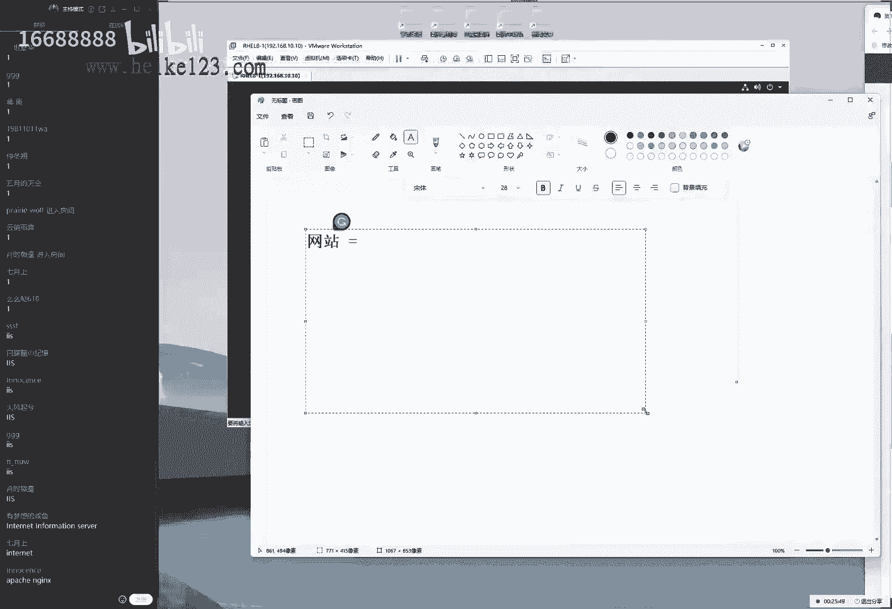
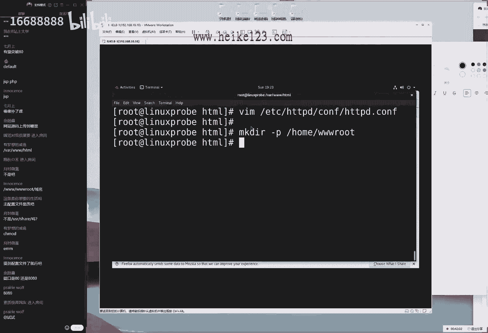
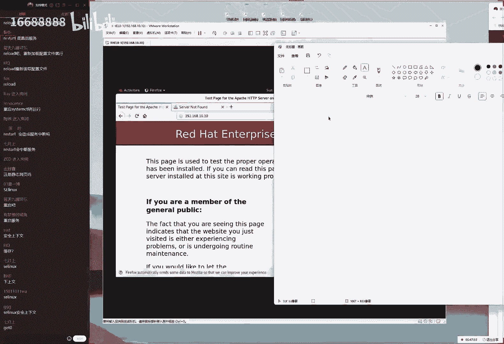
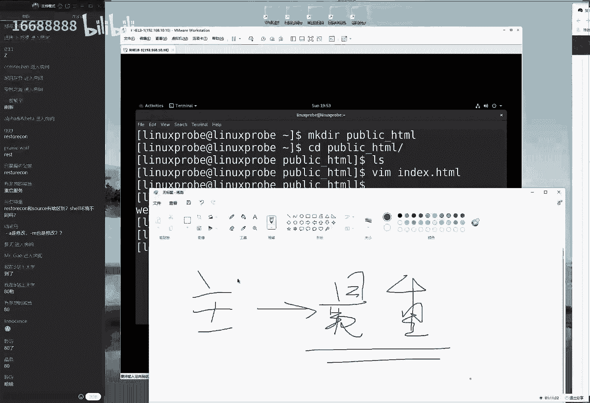

# 刘遄培训linux34期（配套linux就该这么学第二版，RHCE8） - P16：17（上半部） - 16688888 - BV1gL41167vP

来同学们现在能听到说话声音吗，喂喂喂，现在声音怎么样，刚才这个录屏又关了啊，很气人很气人好好，现在大家再打一下一班同学们再辛苦一下啊，同学们现在这个声音还小吗，啊，再试一下，现在59挺好，马上要60了。

待会我们这个人数再来20人啊，肯定也没有问题的，待会只要这个人数达到80人，我们给大家发一个红包啊。

不低于200块钱的，所以大家要是在群里面啊教一教，看看谁愿意来上课了。

然后我们今啊我们就抓紧时间了啊，礼拜日啊，干什么不好，我们过来听课，来做好对吧，来大家先打一架，一啊，没有问题，第十章节我们讲一下这个网站服务，大家在群里面也提醒一下我们这个师兄弟们啊，改啊。

那我们准备开始上课了，61还差19个，我待会要发红包，那我们来给大家看一下，第十章节我们讲一下这个网站服务，那么大家翻开书第十章节网站服务阿帕奇对吧，阿帕奇啊，这个的话呢就是我们的网站服务。

他的话呢实现出来就是一个网站的服务区啊，那么我给大家提一个小问题，请问windows系统当中，我们常用的网站服务，的搭建的一个工具是什么呢，好提个问题，那我们在linux里面的话。

我们有两个大件的工具啊，比较常用的一个是阿帕奇，阿帕奇还有一个号呢，我们的诶这个服务大家应该比较熟悉了啊，然后的话呢我们还有一个windows当中，我们比较常用的话是什么呢，唉大可说出来了。

这个就是我们的linux和windows之间去搭建网站服务，我们比较常见的一种服务，那我们今天的话呢，主要就是讲的这个阿帕奇对吧，然后的话呢我们要想去实践出来，一个网站的服务。

实际上他就是要有这样的一个相应的服务程序，来去提供一个后台的支持啊，有点废话啊，但是它主要的话实现就是一个网站的一个服务，那么我们先给大家做一个简单的，小小的一个科普，什么时候的网站呢。

其实这有点废话了，因为大家对于这个网站一定是很熟悉啦，我们每天都要去使用到，但是我要对它进行一个定义对吧，那么什么是网站呢，网站实际上它就是，那能够让我们的用户通过浏览器，然后去访问到的一些文本啊。

或者说视频或图啊，或者说图片这样的这个字。

我本来称作叫做网站服务，那么我们要想去搭建这个网站服务的话，需要先去配置一下我们的linux里面的软件仓库，然后去安装一下这个软件包。

大话呢先需要注意两个啊，那我们需要先注意两个事情，第一个事情就是我们还会配置软件仓库呢，假如我们的软件仓库我们同学们还是否熟悉，因为又过了一个礼拜了啊啊这是我们上周讲的，我们是否还会啊。

那我们是否还能够很熟练的把它配置出来，第二的话呢就是我们再去安装的时候，请大家注意了，它去使用到我们这个安装命令的后面，一定要记得是软件包的名称，所以虽然我们的标题今天的阿帕奇对吧。

但是我们的网站的服务软件包啊，一定要以我们这个实际的为准啊，http d那这是我们的软件包的名称，所以大家千万不要敲我们这个服务的名称，它并不是阿帕奇对吧，好，大家已经打出来了。

我们这个配置软件仓库的话呢。

四个加速啊，我们要是配置出来的这四个参数已经打出来了，那我们最后啊最后最后再给大家去过一遍，虽然大家已经很熟悉了，配置这个软件啊，软件仓库，但是为了避免我们同学的同学们又遗忘了，最后再来一遍啊。

然后我们就不再讲这个软件仓库配置方法了，所以如果说您之前没有跟上的话呢，最后一次机会啊，抓紧了，首先编辑一下我们的这个虚拟机，点击一下光盘的设置，选择一下链接，选择一下我们下载好的光盘的系统镜像。

就是我们安装系统的时候使用那个镜像文件啊，大话这个大小是6。67个g还是啊对吧，怎么就一个很大的一个文件，试图啊，先从网站下下下载好的，然后我们选择一下链接光盘，选择链接，选择进入，像ok没有问题。

接下来的话呢去挂载一下我们这个设备，它的话呢是将我们的啊，系统当中新建出来一个挂载点，稍等一下，我新建出来一个挂载点，然后的话将我们的光盘的设备与目录去做关联，这样的话就可以让用户去通过目录访问到。

光盘里面的这啊资料和内容的好，这是我们的第二步去做挂载操作，因为这个已经做过了啊，所以它会有一个提示信息出来，那么都这两步做完了之后，下面就是要去编辑我们的软件，仓库的配置文件了。

然后这个因为已经给大家之前讲过两遍了，所以我们就不再给大家再去重新去敲了，然后等那我们就去看一下，哎，等一下啊我们就给大家去看一下，同学们有个有个印象啊，其实已经很熟悉了，它的话呢在红包热巴当中。

它需要配置两个，第一个就是我们这个基础的啊软软件的目录，还有就是我们一些呃其他的软件，仓库的一些软件啊，它需要它分啊，他啊他给分成两个这个一个目录了，因为随着这个软件包吧越来越多啊。

那么在红包reo 9呢，红包real 10，我们可以预见的就是他这个目录的话，还会继续保留，是两个，甚至以后可能会到三个，但这就是我们配置起来越来越复杂了一点吧，但是就是我们需要配置两遍了，怎么样。

老老啊怎么样，老太婆洗鼻子啊，手拿把掐啊，这个是歇后语吗啊，然后大家说rh cs的考试已经讲过了，rh cs考试我们不在上课时候讲啊，我们呃通过视频给大家去提供就足够了啊。

然后我们来给大家看下面有两个这个配置参数，然后这个的话呢，首先就是我们的唯一标识符是一个中括号，然后的话呢这个是我们的一个描述信息，然后这个的话呢就是我们用来去挂载光盘，镜像所对应的一个路径。

这个指的是我们本地挂载的一个协议，然后接下来是是否去启用它，以及我们是否来进行一个校验啊，这样的一个效果，大家先看一下这两个，如果需要截图的话，我们就不讲了，就赶紧把这张图，然后我们下课之后的话呢。

大家把把给配置一下，大家说dv目录里面的s20 ，跟dv目录里面的cd rom这个啥关系，叫做链接文件的做啊的关系啊，大家看一下，这个的话呢，就是我们可以去查看一下这个名。

这两个名称随便去选一个你喜欢的，比如说我喜欢的就是dv目录里面的cd ro，所以说它实际上它就是一个什么呢，链接文件，链接的s20 的这样的一个名称比较好记，所以他才会有这么一个啊名称。

那那我可以去记一下，这就是一个链接文件啊，链接文件来，那么我们现在的话来给大家去安装一下，这个网站的服务了，http d软件包的名称，大家一起来跟我说出来叫做http d。

加入雷包的名称可不是服务的名称，来我们的ipad其实是我们的公司跟协议的名称，而我们的软件包的名称叫做http b，来它搭建出来是一个哎呃。

我们的web网站服务所需的一个软件包，的一个软件包啊，然后我们来继续来敲一下万，那我们去使用它命令去安装的时候，它会进行一次确认，他说我们是否来进行安装，敲一下y进行确认。

那么这样的话软件包里就能够把它给安装好了，这就是我们需使用软件仓库的一个很好的好处，我们可以自动去分析软件包的依赖关系，然后的话呢，根据我们的rpm里面的这个软件规则，自动的话啊啊自动的将软件包出来。

进行一个安装，就降低了软件的安装难度就大啊，它相当于是我们去饭馆里面，我们不用去关心今天虽然说这个有啊，那我们啊可能换了，现在买菜不太方便，但是我们都不用关心，我只需要去说出我需要的菜名。

他会帮我们自动去按照这个顺序，然后去找出像样的食材，帮我们制作好完成啊，这就是礼包的一个好处，那我们安装的时候的话呢。

我们去使用的是有两个命令，第一个的话呢叫做ym软件仓库的命令，就是叫做ym install软件包的名称，还有一个的话呢叫做dnf，大家就啊之前玩我们还玩还啊，之前的话有一个腾讯的游戏啊，也叫dnf啊。

但是这个含义完全不一样，这个话也是用来安装包，安装软件包的这样的一个命令，当然的话这两个可以去任选，我们一般来讲体会不到这两个的区啊，太大的区别，简单的说的话就是我们去使用到dnf的时候。

可以让两个人同时去安装这个软件包，然后的话呢这个效率来讲会更高一点，那我们按照传统意义上来讲，说这个啊第三代的这个em，这个话呢我们安装的命令，它安装的时候会把一些呃并不必要的软件包，也一起去安装。

就是所以我们现在的话，推荐大家可以安装的时候去使用到dnf台去完成，这是可以的，然后大家有问题，大家说今天讲啊，make吗，不make的话指的是通过源码编译，对吧啊，这个话我们会在最后给大家讲。

大概会在第20章吧，大概会在第二章，5月的月底的时候给大家去说make，然后还是make install，然后我们去通过源码编译的方法来选择，那个感觉很有意思，但是呃有有点编译嘛，毕竟少一点。

我们还是通过软件仓库的话，先给大家讲吧，先给大家讲，从第十章到第19章都是用软件仓库，最后一张给大家都啊最后来去讲一下啊，编源码，然后再怎么样说今年63啊，怎么样超过80人啊，发红包，该摇人是吧。

行我我我再给大家发一条，稍等一下，稍等一下下，我给大家在群里面发条消息哦，稍等一下，稍等一下啊，不行，现在是08：40，然后呢8。50诶，稍等一下诶，等会儿啊八啊八分30，然后是啊，8。60，ok好。

我们把它记一下啊，因为待会的话需要去编辑一下，现在我们来继续来给大家去说，大家说我们昨天讲hc才80出头，今天人数估计不到80，应该差不多啊，现在已经67了啊，现在差12人了。

来我们来给大家往后面去说，来啊把安装好之后的话呢，去使用到呃，see some c h l，然后是restart，然后是我们软件包的名称，http d啊，刚才这个视频里面泄露了我们学员的信息了啊。

刚才得裁一下，要不然的话我们这个学员信息不保啊，来我们现在大家先去啊啊重启一下，然后的话呢，我们去把这个服务加入到启动项当中，保证我们下一次的时候还依然能够去启用，就是我们这个网站服务嘛。

即便没有配置它，但是的话他已经默认能够去启动了，怎么没有屏幕了啊，同学们，其他同学有这个问题吗，应该是网络波动吧，您可以再退回，再进一点就可以了，来我们现在的话呢去启动一下这个服务。

去重启一下我们这个网站服务，并且的话呢将这个服务加入到启动项当中，保证我们下一次的时候还依然能够去启用好。

我们来去输入一下，打开浏览器，输入一下我们这个服务器本地的一个地址，去输入一下我们本地的ip地址，于是您就可以访问到这么一个页面了，实际上这个的话呢，就是我们的网站服务的一个默认页面了，那我们看到啊。

那我们看到看到很多这个网上这个文章里面，就会大家去说啊，这个画面我们叫做报错页面，就是这确实发这个是不对的，并不是说我们只要没有看到网站的内容，它都属于做报错页面，这个的话呢叫这个我们是叫做默认页面。

它并不属于报错页面这块的默认页面的话呢，它指的是呃，我们要不然就没有权限去看到网站里面的内容，要不然的话指的就是我们目录里面没有内容好，那也就是说我们现在看所看到这个啊，这么一个页面啊。

就这么一个呃界面的话，它不属于报错，它属于叫做默认页面，默认页面有两个出现的可能性，第一的话对大家所说的，就是我们出现这样的这个报错了，比如说404啊啊，502将它报错的时候才叫做报错页面。

我们现在叫做默认页面，就说啊并不是说我们没有看到网站的内容，它都属于叫做报错，这有点他他啊，他这有两个情况，第一个情况的话呢是说我们没有权限去看，要么就是权限不足，要不然的话就是我们的网站目录内。

没有网站数据啊，这就是啊两个可能性好，那我们先来看一下书啊，书上面讲到了我们的网站的话呢。

默认的加油目录是在外目录里面的3w，你们的html哎这个目录，所以我我先去走到网站的根目录当中，进入到网站的根目录里面，狠狠地去敲一下回车，接下来接下来给大家提一个小问题啊，非常小非常小。

就是啊非常简单啊，请问我们一般网站的这个首页文件，叫什么名字啊，因为前面的话呢我们课时啊有点赶啊，现在的话已经讲完了h c e了，所以我们就可以稍微的放松一点了，所以我们可以稍微放松一点了。

可以多互动一点，包括说我们稍等啊，我现在没有卡没有卡，我先倒杯水，好，昨天就吃了一个亏啊，昨天那个茶泡有两个多小时，所以特别苦，今天的话呢就是临上课之前在沏啊。

再把茶沏的好，大家打出来了啊，我们在网站首页文件的话呢叫做index html，其实我们上课的时候尽量能多互动一点啊，然后这样的话同学们有一个思考的过程，因为我们去玩游戏跟别人啊，就是大家去想啊。

就是我们自己玩游戏跟看别人玩游戏，那个感觉也是不一样的，所以的话呢我们尽量能够多互动一点，大家好啊，要积极互动哈，然后我们来给大家看看，有一个思考的过程啊，已经打出来了啊。

这个话首页文件叫做index点。

以及说html，这是我们的首页文件啊。

他的话一般叫这个名字，当然有同学会说首饰不对对啊，说我还见过，比如说index 2点pp好，后来的话呢index啊，这样啊对吧，还有的话也dex，然后比如说巴拉巴拉啊，还有的话呢比如说firm论坛啊。

就是这样的一个形式，这样的话也会出现。

但是我们现在默认情况下的话呢，我们就以这个为准好，我们来去唉，那我们来去创建出来这个文件，index html，其实我们就给大家讲课的时候吧，我们在不同的学员的基础是不一样的。

它不像我们在上学的时候上学，上小学的时候做到小学生没有学习过啊，初中的课程，所以我们的水平都是一样的，但是我们当前这个培训的话呢，我们的学员可能你已经工作了5年了，也有可能已经刚刚毕业5年了。

还有可能您还没有毕业，所以我们的话这个可能基础不大一啊啊，所以说我们这个话，我们的这个基础跟经验可能呃有一些差异，但是这些基础的话呢，我们应该是都是有大应该都是有所了解的。

来编辑一下我们的这个所谓文件in dex html啊，偷偷补了一下课啊，这个补课可以啊，明目张胆的啊，这个非常的好，我们非常推荐啊，一定要补课啊，一定要听课来，我们往里边的话呢，随便写入一行这个广告。

那welcome to linux problem com，来按下回说。

这时候再去刷新一下网站的内容，于是就能显示出来了，这就是我们来去搭建出来一个网站的方法，好我们就可以下课了啊，开玩笑啊，今天看啊，这个没有那么简单，也就是说同学们要要大家大家要啊。

一定要理解我现在所说的这个事情啊，就是我们要是搭建一个网站的话，到此结束了啊，但是我们为了让大家能够去对于这个服务，有一个更好的一个了解，以及我们能够通过这个服务去学习，一些服务的配置方法。

所以我们才有了后续配置的一些操作，但是并不意味着我们在工作的时候，非得要这么复杂的去做后面这件事情，这样去做就已经到头了啊，这就是来搭建出一个静态网站，这样的一个方法好，但是为了让我们继续来学习吧。

啊我们要给大家啊故意去挖一些坑，然后我们通过这个啊把坑给它填平来，去进一步去找啊，去找啊，去增长经验，来，我们先给大家提一个要求，就是请问我们的默认的网站的加目录，嗓子劈了啊。

哦那我们的默认的网站的目录是在哪里呢，它是在我们的啊，大家问到了，说网站源码上传到哪里，这不刚刚说过了吗，来了调到万目录里面的3w里面的html这个网站，这个目录就是用来去存放网站源码的好。

下面给大家提个问题，请问如果我说我不喜欢他啊，不要问我为什啊，不要问我为什么不喜欢他，就是不喜欢怎么办呢，我如果说我想换一个新的目录去，我想换到home目录里边的3w root目录，这个操作怎么去做好。

这就给大家提到了，并不是在工作的时候都一定要，就是我们要做内部操作，但是我就是想做了啊，通过这个服务的话呢，去学习一下这个怎么办呢，啊那么我们怎么样来去大家说啊，不是吧啊这个是的是的是的啊。

来我们来给大家说一下啊，要想去变更一下我们网站的这个目录。

如果说想换了怎么办呢，首先新建出来这个目录，新建出来这个目录，home目录里面的什么样的，一起说3w点啊，就是我们啊八八啊，那我给大家举起来啊，3w的root目录创建出来这个目录。

然后我们去理解一下什么呢啊，然后大家说我们的同学叫做月食微豪，同学说不是在这个目录里面吗，不是的，不是的，不是的，以我们当前所讲的这个为准，呃，您说这个情况的话呢，有一些情况是存在的。

比如说您不是通过我们的软件仓库去安装，比如说您通过源码去安装，源码安装也不是这个目录啊，是的，就是我们如果说您通过源码的编译安装的方法。

然后我们家里一个参数叫做perfect对吧，然后我们可以指定一下你安装的这个路径，有可能你自定义的到了这个目录当中，或者的话你使用的一些脚本h编译的话，也有可能是这个目录，不过这都是啊啊。

不过话我们目录的情况下是在这个目录，没有错没有错没有错，好我们接下来再往后面去给大家去说了，就是要想去变更这个里面的这个所在啊，所对应的一个模组，实际上就是去修改这个服务的一个呃运行参数。

那我们又已知唉就是linux中当中的话呢，一切都是文件，所以我们要想去编辑一个文件里面的参数，实际上就是在找这个服务，所对应的一个配置文件，修改配置文件的，那我们现在给大家提个问题了。

请问编辑什么文件呢，它里面有一个比较重要的一个文件，叫做主配置文件，里边的话呢包含的是最重要的配置参数。

所以我们根据这个思路捋下来，就是要想去编辑一个服务，大概就大概率啊，就是在去编辑这个服务的一个主配置文件，这个主配置文件的话，它是在我们的etc目录里面的，对啊，以服务名称来命名的一个文件夹。

然后把那一边以父名称命名的一个文件，然后这个里边以c o n f结尾，但这个有点特殊啊，它里面加了一个呃，它里面有他，他把里面又加了一个目录，但是这并不妨碍我们一眼就能够看得出来。

这个就是我们这个服务所对应的，一个主配置文件，虽然里面加了一个子目录，但是这个不妨碍我们一眼能够看得出来，他应该就是我们这个服务程序，的一个主配置文件了，来我们来按一下回车啊，按一下回车搞定它好。

大家问了一个问题，大家说到说我们端口号是八零还是8080，我们是八零端口号啊，网站服务的话，默认端口号是8080，如果是我们的加密的话呢，则是443啊，当时还我们的8080也是一个，待会大家有一个演示。

s linux域的那个端口号的控制当中，大家会见到所有的网站服务，它被允许的端口号，然后我们看到我们的默认情况下是八零，所以要大家从晚啊，大家要是从外部去访问的话，记得把防火墙去做一下，放行好。

那我们现在的话来来去编辑一下。

我们这个服务程序的一个主配置文件，大家看完这个文件之后啊。

同学们就会觉得哎好像有点难啊，都是密密麻麻的这种小字，他怎么回事呢，这个不要担心，因为它主要就是一些呃帮助信息，我们在linux的配置文件里面，所有以井号开始的，所有已分号开始的。

我们都把它叫做帮助文档，帮助文档主要是对于服务的功能一种介绍，或者的话呢对于我们某一行参数的一种说明，我们啊是给人啊，那我们这个是给人去看呢，它并不会被机器所读取，它并不是参数，我们于是往下去找。

找到我们想要去配置的，这有一个参数叫做上选项，它有一个参数我记得叫做document root是吧，document root，找到这个参数诶，我记错了吗，d o c u m e n t啊，没啊。

没有记错，没有记错，他是大小写要被区分了，来document to root，这个话呢行数是在第122行，大家问了一个问题，说八端口号一定是八零和443吗，可以改吗，可以改啊。

不过我们今天上课就不给大家去说了啊，因为上课的时候东西正好我们要给大家东一下，西一下就乱了啊，东一下西一下就乱了，先按照我这个思路啊，同学们现在呢我这个思路给大家去讲课。

然后我们讲完了之后的话呢啊可以啊，可以拔高，但是我们这个基础一定要先去扎实了啊，现在先把基础打扎实了，然后我们拔高可以不限话题，来给大家看一下行数啊，122行documentary rt。

这个指的就是我们网站的目录，所存放的一个路径，同学们刚才说到说老师我想换一个可不可以啊，啊我们可以换啊，我们给他换成刚才我所说的叫做home目录里面的，3w root目录，来，我给大家换到。

当然这个目录也可以改，同学们如果不喜欢，可以换成自己的名字，对吧啊，home目录里面的啊，然后我们自己名称命名一个文件夹都是可行的，来我们点一下这个保存并退出，做好之后呃，大家需要注意一下啊。

我们先做好之后，再一刷新网站的内容的话呢，没有发生变化，这是为什么呢，来同学们刚才有一个同学说一条啊，偷偷啊补了课了啊，同学是谁，亲，约上同学来提一个问题，为什么我们现在编辑过的这个服务。

但是编辑过的这个服务的参数并没有生效呢，起码他应该给我一个404，说我那数据不存在吧，大家说到了重启重启，什么重启啊。

服务对不对，大叫啊，叫做这个重启服务，并不是重启这个服务器的，同学们是重启这个服务叫做system啊，怎么样一起说叫做restart a，非常好，http dd好重啊，重启一下我们的网站服务。

提个问题呃，4月3号的时候就说过这个命令啊，来这个我们上课的时候，我给大家讲的，大家要跟我互动起来，就是请问一下，我们在4月3号的时候讲过两个命令，一个叫做restart，一个叫做reload。

请问当前我们去执行哪个命令比较合适，或者这两个命令有哪些不同，就是啊就是我们现在去执行这两个命令都行吗，还是说只能去执行哪一种，还是说这两个有什么区别，同学们思考思考啊，呃待会待会回答啊。

会回答公布答案，当然我们起码呃要思考一下，然后现在71个同学，待会看看有没有同学还继续来上课了。

只要待会这个人数超过80，我们就给大家发一个红包啊，不提电啊，不低啊不低调啊，呃布局的啊，不低于200块钱给他发到我们这个群里面，大家说到了，说restar的话，ui d是不一样的，那个不叫u i d。

那个那个叫做p i d啊。

对大家说的没问题，我们给大家说一下，是这样的，restar的话呢指的就是一个完整的重启，然后呢，reload的话呢，指的就是从去加载这个服务程序的配置文件，那么我们呃来去理解一下的话。

就是restart和开关它会更加彻底，我们比较的喜欢用啊，这样的话就是一个比较推荐的一种方式，叫做叫做这个restart，如果说我们不讲求解这个服务质量，去加载一下它这个最新的配置文件。

那么也可以去使用到reload，但是有一定概率，但是非常小啊，小概率是不生效的。

所以我干脆就使用到这个上面一条了，来我们现在的话来去重启过后，又看到这个页面了，同学们说老师这个我知道啊，这个你刚刚讲过他有两个情况，第一个情况的话呢啊非常开心啊。

所以都开始拍，所以都开始拍手了啊，讲课讲的非常开心，那我们遇到这个情况，它有两个可能性，第一个可能性说网站目录内没有数据，于是我又来呃，3w root。

然后往里面去新建出来一个首页文件index html，然后我们来啊，巴拉巴拉了啊，welcome to，随便再换一个网址，这也是我们的亲儿子，welcome to latex cool，点com啊。

我们这的网站是这个也是我们的一个啊，自己的啊，自己的一个新网站，will come true linux cool，最近几天就一直在弄这个网站里面的内容，估计到年底这本这个网站的内容也能出本书啊。

现在正在抓紧重啊，那这是我们往里面编写一个内容。

编写好之后的话，再去刷新一下网站网站的这个页面啊，可以看到没有任何的变化，那么怎么回事呢，大家想到说第二个可能性就是权限不足。

是不是因为权限的问题呢，有可能好像我们这样去做啊，能够看的话就是可以读，可以执行对吧，可以进入到这个目录，那么就是c h m o d对于目录进行递归操作，大写r755 ，目录名称。

home目录里面的3w root目录，没有比这个更啊更啊，没有比这个更加严谨的操作了。

来按一下回车，再来刷新一下页面，还是不行，大家看到了，我们现在的话呢把网站目录变更之后，网站内容一直不显示出来啊，把能够想到的能够事事都给大家已经说出来了，那么还有哪些可能性呢，大家先翻开数啊。

往后找一找啊，10。3小节就要来了，大家说重启服务不需要重启服务，那因为的话呢，我们是对于服务的配置文件的修改需要取消啊，需要重启对应的服务，但是我们现在修改的并不是服务，程序的配置文件。

是我们的网站的数据，网站数据修改过后不需要去重启好，下面给大家说来了，答应啊，叫缓存，哎呀同学们不对呀，这是啊，第十代三小节看来真没有预习啊，啊就是我们叫做c linux，这个的话呢是美国的安全局。

大家看这样我们要看一下啊，10。3角及美国的安全局，与开源社区一起去研发出来的一个安全子系统，的安全子系统，他的话呢就有啊，他会跟我们之前讲过一些服务的话呢，会有很大的区别。

比如说我们第二章节我们学习的是什么呢，我们学习的是什么什么什么呢命令对吧啊，然后呢我们第三章节学习是什么什么的操作符，然后我们现在的话要去学习什么什么的服务，对吧好。

那也就是说我们之前学习的是命令或者操作服，或者一种服务，但是这个就很厉害了，这就很厉害了，它叫做安全子系统，这怎么回事呢，他就是说我们在我们第五章节讲的，这个权限之外，他虽然已经有了一般权限，特殊权限。

隐藏权限和fa sl了，但是我们依然不满足，我们能不能去限制一个服务，他只能去做哪些事情，以及某一个文件只能够被某个服务所获取呢，换句话来说，就是让这个服务只能够去做自己该做的事情。

这个就叫做c linux来给大家总结一下，就是他的话呢他又是对于这个权限又来s补充，叫做c linux，它的核心就是让程序啊做啊，只能做自己该啊自己该做的事情，这个就是我们的s linux。

i n s系统的这么一个呃存在的理由，我那我那我给大家举一个例子啊，比如说比如说嗯美图秀秀啊这么一个软件啊，大家没用过它打一下e啊，叫美图秀秀，用过的打一下一，没用过打一下二，这个叫美图秀秀。

它的话是一个修图的一个软件，然后呃，比如说他想要去获取一个照片的这个信息，那么我们就可以对它来进行一个试的啊，比如说他可以去获取一个照片进行一个信息啊，这个的话这个操作它是一个呃可以被同意的啊。

并且的话呢他可以去获取这个信息，但是他如果会获取的是我们的支付宝的余额，这个时候他就不行了，对不对，那也就是说当我们这两个这个文件啊，这是一个错啊，他就不能够这样来获取，大家没有用过什么啊。

有啊有同学没有用过好，这是一个修图一个软件啊，比如说他去获取一张照片，这个操作的话呢是可以的，那么如果说他想要去获取一个啊，我们的话呢啊其他这个信息啊，英的这个账号，那么这就不可以了。

那我们这个权限怎么去做，是做到我们这两个信息上吗，这个两个信息如果要是说去说这个可以读，可以写这样的这个权限的话呢，它是对于所有人都生效的，我们怎么能够去限定一个服务，它能不能去啊，他还被访问呢。

所以我们要去使用的sevis，去限制我们这个啊服务的功能，你也只能去获取这个照片，你不能够去获取其他的这个信息，所以这个控制叫做控制服务的功能，我们把它叫做ic linux的玉诶。

s linux玉可能找老牛逼长得比较丑啊，所以我们就老用的美图秀秀p一下，把自己p得稍微帅一点啊，来这个我们是限制服务的功能，只能够去获取哪些资源啊，包括说这个文件，包括说这个呃端口号。

包括说我们去调用进程里面的一些信息，它都属于服务的功能，它叫做我啊哦我啊，他的话是对我们的功能的这个限制，还有的话，就是我们也可以在文件上面去打一个标签，它限制说谁可以来进行一个访问。

这个文叫做安全上下文，大家记一下，我们也可以在这个文件上面去打一个标签，比如说这个照片有十张照片，其中有一张照片我们上面打一个标签，说只能用到支付宝啊来去访问，它是一个我们的银行卡的一个余。

额的一个照片啊，那么这句话这个上面打一个标签，就只能够被谁啊，被哪个服务所获取，这样的话呢，美图秀秀虽然他能够啊，功能上能够去获取某些照片的这个资源，但是它一个文件的话依然反问不了。

这就是通过预管服务的功能，通过上下文去管文件只能够为谁获取，通过这本上管天下，管地双管齐下，他是不是在我们这个之前讲过一些服务上面呃，又去套了一层，它让我们的服务只能去做。

我们啊我们自己该做的事，这个事情叫做c linux。

我们有两个命令，大家来记一下，首先的话呢呃我先来给大家说一下文件吗，要想知道我们这个snas有没有开，我们有一个文件叫做etc目录里面的c，linux里面的config，大家来打开它。

这里边好像有三个的工作的模式。

哎呀昨天这个词打错了啊，这个叫做警告模式，我把打，那我把它打错了啊，英文水平还是有待提高。

来大家看一下啊，是这样的，这个文件里面的话有三个这样的一个工作模式。

第一个工作模式的话呢叫做enforcing，叫做强制开启模式，就是说我们一代住的啊，做的这么一个呃错误的行为了，当他去越权去访问某些资源的时候，那么则对他进行禁止操作，也就是说在代表的就是强制开启吧。

叫做强制模式，只要你做了这个出格的事情，马上对你进行禁止，那么就做不了了，叫做强制模式，还有一个叫做permissive是吧，这个的话代表就是一个警告模式，虽然说你做了一个出格的事情。

但是我啊我并且我不会进来进行禁止，但我会进行一个警告写入到系统啊，那么我们来写到系统这么一个信息里面，这样的话系统的日志里面，帮助我们以后可以来进行查询，它是一个警告的一个模式。

还有一个叫做禁用模式disable，他的话指的是禁用模式，它禁用的啊，它禁用的并不是我们去啊，越权做这样的一个操作，它禁用的是我们的iclas的本身，所以的话呢我们当前既然要去学习它们。

我们都去使用到enforcing模式去强制开启，但是啊但但是什么都事都有个，但是啊但是在工作的时候，我们大概率同学们，你们上来会把s linux给他关闭掉对吧，因为这个配置起来是比较麻烦的。

提前打一个预防针啊，第二点的话就是配置好我们的s之后的话呢，可能也没有太好的效果，因为它有些服务的话是能够被绕开的，但是呃中规怎么说嘛，有这么一个服务的加持，能够让我们的服务器更加稳定。

这是没有错误的好吧，但也就是说啊在工作的时候，大家关不关我那啊，也就啊可以自己来就决定了，但是我们整套的培训，包括到最后一天，我们都会保持icc一直都是开启的一个状态，好吧。

就是我们这一套培训一直都是开启的一个状态，我们就会多给大家去配置一下，包括说我们我们配置服务的时候，都需要去考虑到它，但是同学们在工作的时候，其实说实话肯定会关的，因为我们这边的反馈来讲啊。

就是我们同学们到过这个机房防少里说吧，别太夸张了，40%吧或者50%吧都会玩svs，尤其是一些自己公司的一个服务器啊，对好我们就不说了。

好来来来给大家说一下，那么要想来让他去配置它的这个模式的话呢。

就改这个参数，如果我们还有两个参数啊，我们还有两个命令，这个我们第一个叫做get in force，指的就是获取一下我们这个当前啊。

就查看一下我们当前s linux这个状态，如果说我想知道一下我当前的这个状态，我们就只用到叫做get in force来获取一下零代表，关闭啊，不啊他啊不，这就是我们直接查看就行了。

他直接给我们一个英文啊，他那可以看，那我可以看到说当前的话呢，这个方s linux这个状态为强制开启模式。

如果说我要怎么给临时关闭呢，它它它都是一个临时的啊，那我们就去使用到set in false，然后来取的因数关闭一下，零代表就是临时关闭。

还有的话呢我们的set in force一叫做临时开启，好了，我们来给大家操作一下。

既然我怀疑是i c linux问题，就当去医院看病啊，我怀疑我可能得了新冠了。

那我去拍，那我可以先去拍一个cd，看一看我到底有没有飞过的阴影对吧。

set in force 0临时关闭它，然后我们来看一下刷新效果，啊。

稍等一下啊，稍等一下稍等一下，诶，讲那么热闹，怎么突然间就想说，等一下应该能够看到内容的，也有有有有有有有一点那个小插曲，稍等一下，我去哎呀这个车翻的呀，诶应该能够看到啊，稍等一下啊，老刘现在很尴尬啊。

home目录里面的3w root，来看一下home目录里面的3w root，哎等一下啊，看一下考试的时候要不要关，考试时候不要关，因为考试的时候也太没有影响到我们呀，人都没影响他，他啊他都没有。

他都没有影响，我们，就当它不存在了不就好了嘛，反正跟大家说实话，反而在s反而是在红毛城c里面呃。

第一件事我就会把它关了，home目录里面的3w就没毛病啊，来等一下同学们，我刷个新还是不行，稍等一下稍等一下啊。

稍等一下，他说我是不是少了一个斜杠，我看我我来看一下啊，home目录里面的三家伙，这没毛病啊，好我把这个底下改一下啊，这个我我他指的是我们对于这个目录的这个，全新的设定，然后如果要是没有的话。

可以它它它也可能提示出来不错，哎呀不可能啊啊他不他是不应该啊，但是我们也把它给修改一下，上下两个我们都把它改了，然后再来啊去重启一下我们这个服务程序，刚刚我是不是我看一下啊，刚刚我啊重启了没问题啊。

来c啊，sm control，然后restart http d来重启一下，重启一下我们这个网站服务再刷新诶。

没就没有问题了，好当我没有发生过啊，我来说一下这个原因是这样的。

我们再去编辑配啊，在编辑配置文件的时候，底下需要加一个对于目录的一个全新的方形，要不啊，要不然我们这个用户访问的时候就会提示出来，刚才那个报错，等于说啊让他能够去访问到我们这个目录。

那么以及访问目录这个录啊。

去访问我们这个目录的时候，需要给他一个访问权限。

也就是说下面的一个目录也需要同样进行修改，好，等我们没有发生过啊，同学们啊，把当当做没有发生过哦。

那我们再来先把这个s linux给它强制开启一下，再去刷新一下这个网页，于是我提出来这么一个信息，他说for beij，它指的是被禁止了。

当前我们的网站访问请求被禁止了，那好了，我现在的话先啊。

那么就把给临时开啊，先把它给临时关闭一下，临时关闭了c linux，然后我们再去刷新一下，就能够看到网站里面的内容了，就有点像啊，就是像是哎赵本山给范伟那个小品啊，一旦我做完这个轮椅了。

我立马我我这个还啊，就能够去访问到这个资源了啊，那我们也能够想得明白了，哎智商占领啊，智商占领高地了啊，然后就像一个啊像就像我们的一个小品一样。

然后当我们把这个轮椅给他撤掉的时候，开再把s linux给他临时开启。

再一刷新又不行了，哎那就是说呃他确实是由c linux给他捣乱啊，他就说我是由我们的snet的捣乱，那么现在它是由哪方面去捣乱，也就是说它是上管了我们的服务的功能，下管了我们的这个服务的这个上下文。

现在是由哪个导致的呢，我们现在来去分析一下，就是啊他的话呢是由安顿山亚文去世，他来去进行限制的，为什么呢，因为网站服它还是用的这个网站服务本身，网站服务本身它没有任何的变化，它变的是什么呢。

它变的是网站的这个存储的路径，网站的源码保存的路径，之前是这个，现在的话呢是这个好了，网站的目录发生了变化了，那我们去回忆一下，突然间就能够想明白了，第六啊，第六章节第一小节f h s里面讲到过。

home目录的话，它的这个本身的作用是用来保存我们的个人，用户主功能的，不配啊，他用来去保存我们每个普通用户自己的，这个加目录的，对吧啊，根据我们之前所讲的，home目录的话呢。

是用来去存放随用户加密度数据的，那么现在也就是说是我们的网站服务去访问的，是人家的家目录里面的数据，我感觉不太合适，知道吧。

那么这个时候我们怎么办呢，我们可以去使用到一个命令叫做ios，要想去看目录的话，加一个小写d，要想去看里面这个详细信息的话呢，是一个小写l对吧，然后我们可以去查看到这个目录，原本目录的一个权限。

看看新网文件的这个权限有何不同，看一看没有什么不同啊，也是一个七五的一个默认权限，没什么毛病啊，没有没有太大问题，但这个时候有一个奥妙之处，就是在于加一个大写gz啊，是啥原理呢。

就是啊带一个大写gz查看我们的文件呢，上下文啊，迈过来对吧，我们把这个轮椅撤掉之后，马上就会发现病毒又重新占领高地了，怎么回事呢，就是因为我们之前的网站加目录里面的s linux，这个标签。

它是叫做啊网站服务的系统文件，但是的话呢，当前我们的这个home目录里面的三次入侵的话呢，它指的是用户的加目录，于是怎么样，一这样的话我们再一对比，发现新网目录权限不同。

导致我们就呃这个服务它是访问失败了，他获取不了这个里面的这个资源，他没有权限被我们的啊，s linux这个哎上下文给他禁止了，这时候怎么修改呢，我们去使用的一个命令叫做s manager来进行修改诶。

这个时候的话大家需要注意一下啊，我们有一些学习比较早的同学。

那大概的话是在红毛reo 5的时候，如果说您学习的时间是2008年之前啊，那么啊那么您使用的是红毛real 5，以前的系统的话呢，那么您之前学习的这个命令叫做c h c o n，这我明白，那这位用过啊。

用了很长时间，但是的话那现在我们使用的命令叫做ic manager，我们理解一下啊，就这两个命令的话，当然都可以去用，但是我们更推荐您在红毛热巴当中啊，不在红毛肉，七个红毛若巴当中都去使用这个命令。

为什么呢，给大家两个理由，第一个理由就是呃这个命令的话呢，我们配置起来参数会更少，并且的话也是永久生效的，跟我们的这个c h c o n命令的话呢，是一模一样的啊，他也是一个我们这个从2015年开始。

到现在的一个新的，不是2014年的年底，到现在一个新命令，等于说他啊可能后期的这个支持的话，他会啊他啊他啊他会更好，它是永久生效的，并且的话它是一个比较新的一个命令，第二的话就是这个命令的话。

我们啊之前的这个命令，在红毛四和五里面去用的话呢，包括说我们这个right hand，这个啊我们这个诶个人版的话呢，去使用这个系统的，去使用这个命令的时候，它有一个局限性。

就是它只能去配置我们的文件上面这个上下文，而呃我们知道s linux管理的时候，它有上下文，他好像还有一个就是这个玉对吧，那我们这个话只能管我们这个文件上面，这个呃这个信息。

但是it manager既可以管文件上面这个上下文，也可以管我们的c linux的功能，所以我们去使用这个命令的话。

更加的方便一点啊，都啊都啊都可以通过这个命令来去完成，那我们先来给大家编辑一下，给大家打个样，看看这个到底怎么回事呢，给大家啊演示一下来c manager啊，对我们还有还有还有。

我们现在先把s linux给大家强制开启一下，再一刷新会发现肯定是访问不了了啊，先把这个给大家临时开，先我们给大家啊先给它开启了，并且大家会知道说诶你怎么在作弊啊对吧，因为你没有开。

所以我们才能够访问的，把也开启了，然后接下来去设置一下，我们的s linux上面的文件的访问空列表啊，不这个叫做文件的这个诶上下文来进行修改，杠a这个杠a的话呢，这个参数有歧义，杠a的本意代表添加。

但它实际上意思代表的就是一个修改，所以大家翻译一下我们的这个书，包括说帮啊啊，包括说我们去帮啊去翻译一下这个帮助文档，杠a的含义写的是添加，但是它的实际作用是修改啊，然后他刚t指的是。

我们要去修改的这个值是什么，然后我们去复制一下它原本的这个值，也就是说这个值我不用去记，我不用去记这个词，我只要是啊法院失败了，我想要把我这个新老保持一致的话，那我可以过来查。

但是我们要知道原啊这个原始目录是在哪里好，我们现在的话呢往后面站到参数的后面，指的是要修改成什么，还有就是要修改哪个目录呢，我们要修改的目录名称叫做home，目录里面的3w root目录来按一下回车。

还有现在76个人啊，非常好，还有四个同学我就给大家发红包了啊，不低于200块钱了，来大家看一下啊，去使用到这个命令，就可以把这个目录的这个s linux，这个值给它修改了。

同时再把这个目录里面的所有的这个文件的话，也都给他设置一下这个全新的上下文的这个值，来按一下回车来进行一个通配设定吧。

然后那我们给大家做一下这个设定，做完了之后的话，大家会看到我不仅去刷新一下这个网页。

看不到效果，他还是看不到网站里面的内容，同时我再去使用到，我们查看到上下文的这个命令，去查看目录的这个信息的时候，会发现它还是用户的家，目录参数没有变化，参数没有变化，他怎么回事呢，同学们。

他怎么回事呢，为什么我们设定过了，大家没有生效，不仅目录的上下文没有做修改，我们的网站的数据也依然无法被访问，大家想一想，有什么命令没有去执行，刚刚同学去哪了，该有位同学说已经提前预习好了。

可以说出来了，那个命令，啊今天这个茶还有点苦啊，来说出来了，重启服务不对了啊，这个的话呢叫做立即升降啊，r e s t o r这个从字面意思上来说，叫做这个恢复对吧，或者叫做这个存储啊，这是当然的话呢。

这个实际上叫生效的意思，使用这个命令，然后我们一般情况下加一大小，r代表就是递归操作，对于目录嘛v显示的是一个过程，然后对于我们这个目录，让这个意思，就是说要让我们新配置的上下文能够生效。

大家在一起再说一下，就是让我们新配置的s linux，这个上下文的直立体声效来按一下回车啊，来我们商量好之后，这个非常可爱啊，大家看到这个的话呢是一个一个我们的原始值，对吧啊不啊，在啊，他在这儿。

然后它变成这么一个新的值了，这就是我们变化的一个过程。

这样做好之后不用重启服务了，直接就按一下这个f5 ，狠狠的按一下一下，然后就可以看到了哇，这就是我们的网站的内容没有问题，这就是我们去修改网站里面的一个参数，然后以及是的啊，它以及设置我们的s雷啊。

linux这个上下文，来去实现出来网站访问的这么一个小实例，那么大家现在也会问一个问题，邵老师，你能不能再给我讲一个，就是呃网站的这个功能呢，以及再给我们讲一个我们的c类电磁域的一个，配置的方法呢。

到底对于服务的功能的放心，我们该怎么去做呢，我们先来给大家去玩一下啊，大家问了一个问题啊，当然这个问题是这样的，说我们去使用到这两个命令有啥区别啊，是这样的啊，首先的话呢这个其实很简单。

首先r e s t o r c e啊，这个的话呢是用来专门去上s linux，这个上下文去生效的一个命令，然后换了，如果您之前使用过source的话，那您的使用场景是什么情况呢，我们一般使用的场景。

我相信你也是就直接写一个文件名称，比如说那就是我们来自于这样的一个效果对吧，这两个的话呢，就是呃效果都是让我们新配置出来的，这个参数能够成效，但是这个指的是专用于s linux这个沙拉文。

这个指的是重新去下载某个文件，然后这两个的话还是很大区别的，它不能让s linux生效，但是专门让我们这个配置出来的这个参数，来去同步的意思啊，所以呢这个就是两个的小区别啊。

然后呢我们这两个当啊，当然了，这两个非常的不搭界，所以我们去敲的时候。

千万不要把它敲混了来，下面我们接着给大家去说，有一个功能叫做啊，我们的网站服务叫做个人主页功能，大家记一下叫个人主页功能，个人主呃页功能，这个怎么理解呢，就是如果说我们现在这个网站的服务器当中。

有个100个用户，有个100个用户，那么好了呃，我想为这100个用户批量新建出来网站的目录，这个怎么去操作呢，大家看一下来，我们现在网站当中的话有100个用户。

那我想要为这个100个用户批量来去新建出来，他们的网站，这个时候我们就可以去使用这个功能，叫个人用户水功能，但是我要给大家讲，就这个服务的话用的比较少，但是有这么一个事儿啊。

那我可以通过这个例子来给大家做一下演示，可能大家在工作的时候用的几率比较小，也会比较小而已，它可以在我们每个用户自己的这个加速度里面，去新建出来一个网站的一个服务程序，大家说杠a是修改，杠m也是修改吗。

是这样的啊，杠a我们从实啊，我们从实操上来说也是修改，因为我觉得因为怎么讲呢，因为从我们的报啊，从这个官方的报告文档里面我们去查到了啊，包括我们从字面上很好理解，杠a就是添加的意思。

但是我觉得这样讲话啊是不太负责任的，因为杠a则是从这个实操的结果上来看，他就是这个修改的意思，所以对视的杠a是修改，杠也是修改啊，那我们现在给大家做好之后的话呢，可以这样来进行操作，去编辑一下。

我们的网站服务程序的一个主配置文件，找到它，然后右边找一圈的话，有没有跟这个人用户主功能相关的参数呢，我们发现没有啊，这个其实应该给大家互动一下了啊，但是我刚刚看了一下，同学们。

好像哎今天好像人数并不多，而且好像没有做好预习嘛，啊ok啊啊八啊，现在80人啊，挺好挺好挺好挺好，大家这个号召力比我强来，那我们待会给大家发个红包啊，大家记得提醒我，别等我们待会别忘了来，是这样的啊。

那我们再看看这个参数之后，发现里面没有，这是同学们之前问一个问题。

是老师为什么这里没有这个参数呢，这要给大家强调一点的，就是这个主配置文件里面啊，它是包含的是最重要的配置参数，它里面并没有包含所有的配置参数，这一大作为一个区分啊，就是大家记住它是里面包含的。

是最重要的配置参数，而并非所有，所以我们这个啊附的功能的话呢。

它有一个子配置文件跟主配文件的话，它是一个调用的一个关系，它是在一起说etc目录里面的，http t里面的confid，一般是指配软件所存放的一个哎，等一下啊所存放的一个路径，是的啊。

http少了少了少了一个p来啊，http。config。d走走走好走好这啊，看到这个目录啊，这个文件找到它编辑，这个就是我们个人用户主页功能，所对应的一个功能文件了，进入它看一下里面这个信息来啊。

大家怎么看这个人数到了是吧，不用着急啊，老哥跑不了，待会儿给大家发红包啊，呃下面的话呢我们来看一下这边这个参数，大概是在第17行，他说我们这个人火主主页功能是被关闭掉的，服务的功能键。

不管我们主要通过这个来练手嘛，啊这个功能并不重要，主要练手，我们先把它给它注释掉啊，或者的话，我们去把第24行的这个参数给他照抄一下，他就是说我们等于说啊，去开启个人用户主页功能。

并且的话大家记一下这个目录，这个目录就是我们每个用户存放自己，在自己家目录里面那个网站的数据目录好了，我们去复制一下它，点一下保存，点一下退出，记得去重新去启动一下网站服务的这个程序。

让新配置出来这个参数能否生效，但是我们的加入群像的这个操作，你就不需要再去做一遍了，这个操作大家看一下，这个操作只需做一遍即可，不用大家去多做了，但是您多做了也没关系啊，也多做了也没有关系，来。

我们现在的话呢就进入到随便一个用户身份下，我就可以叫做素切，换，一个用户身份叫做linux pro啊，这是我们的一个网站啊，所以这个广告一定要多熟悉一下linux probe。com。

然后走进入到里面去，在地铁加目录里面新建出来一个目录，这样的话呢待会儿用户去访问的时候，就可以在这个目录里面去访问到，我们这个用户自己的一个网站数据了，好我们进入到里面去，然后往里面一走，往里面走走。

走，诶啊走诶进来了，细节处在一个首页文件index html，咱们讲课很快啊，这个节奏感很强，打字也快啊，来第三个网站也是我们的一个亲儿子啊，welcome true，lis cool啊。

嗯let it down吧，这也是我们的一个自己的网站啊，linux down in com，今天这么啊讲这么一节课，把我们这几个网站都给大家抖了，抖了啊，都给大家混个脸熟，那来按一下回车。

也就是说待会儿的话呢，我们用户去访问到一个叫做linux pro的一个网站的，那个的时候，就能够看到这个里面的网页的内容了啊，好网站虽然的话不好看，但是这个实验室能够成功的都做好之后。

把自己的这个加目录啊，权限稍微的大一点啊，755，这样的话呢，让别人能够去访问自己的这个加目录，一个波浪线指的是用户的加入的意思，也就是说我们需要给自己的这个加录可以读，可以执行的这个权限。

否则用户也反映不了吗。

还是那么因为会人家会提示说，没有权限去做访问，需要给人家r的权限来进行读取。

需要给人家执行权限来去进入到这个目录，所以给他一个七五权限就够用了，七七就没有必要了啊，75就它就已经够用了哦，做完之后的话呢，退出到我们的超级用户管理员啊，叫做录取用户，做完了吗，做完了来刷刷。

大家去刷新一下这个网站，网站的后面写一个斜杠，一个波浪线，用户名称，通过这样的方式，就能够访问到我们每个用户自己的这个加目录，这个格式的话是这样的，首先网站的名称以我们为例啊，就是一九二点一六八点10：

10，后面指的是用户名称，一个波浪线加用户名，通过这样的这个格式，就可以去访问到我们某一个用户所对应的，一个加目录的一个呃数据了啊，它所对应的一个加目录的一个数据了，然后的话呢现在当然就看到这个结果。

又是这个样子的，于是我们有请赵本山同志啊，端传他的这个啊。

捧出他这个宝物啊，小轮椅了，当我们把这个人安排到这个轮椅上之后，哎卖拐来了，这个时候再来把snh给大家临时关闭掉，怎么样呢。

范伟坐上了轮椅了，智商占领了高地了，于是一看诶又能够访问了，那也就是说进行一个排除法嘛，对吧，再来这个如果还不够明显，这个如果还不够明显，再来s linux给它开启了，再一刷新又不行了，好了。

s linux的问题，这个啊就确认了，那好吧，那个这个那么这个是什么样的一个呃问题呢，这就是我们sn的预了，为什么呢，因为i see a linux，他认为个人用户主要功能不安全。

因为它访问的是我们用户自己在vivo里面的数据，所以默认给禁止了，这叫做icc linux的b的限制，他认为我们这个服务功能的不安全呃，我之前我记得是第19期，第18期有一个你们的诗歌问我一个问题。

树老师这个功能怎么不安全了，我怎么觉得挺安全的呢，为什么会把它给禁止呢，这个说不好，它就像我们到冬天的时候，我们的妈妈老觉得我冷，老让我们去穿秋裤是一样的，他认为我们冷了，他觉得我们不安全了。

我们自己配置的再安全也不行，那这个时候怎么办呢，我们需要告诉我们的父母说我长大了，我冷了，我那我会穿衣服的，同样我要告诉s a ln我的怎么样，也就是说我有能力把这个啊给他做安全了，你不用为我操心了。

这个时候大家看好啊。

我先把它开了啊，怎么办呢，叫做get i see，哎等一下吧，小心啊，get s布尔值，去获取一下s a linux里面so对于功能的这个限制，get c布尔值杠a列举所有，这个时候按一下回车。

等下按一下回车好，snet真的是一个爱管事的一个服务啊。

还有这么多服务都管着呢，哎呀他他都管着呢。

怎么办呢，我们当然不能一个一个去看啊，我们可以这么去看，叫做管道符做过滤，用我们的任意门，把这个要想原先要去输入到屏幕的这个数据，传给后面的命令，再进行一次二次加工，过滤出来跟网站相关的。

我们这个就看起来顺眼多了啊啊好，我们看一看哪些比较的，可能这个其实猜也能猜得出来，为什么呢，你看首先这个是网站网站服务，这个是启用这个的话呢，是加这个的话是目录连起来，启用网站加目录功能。

我觉得好像靠谱。

但是他他是不是也不一定，但是我们先记下来啊，对对对，把这个参数给大家抄到这个书，抄到这个屏幕上啊，抄的比较快，get s布尔值杠a过滤关键词，来做过滤，然后的话呢是set s布尔值某一个这个条。

就说我们叫做sn这个策略吧，然后等于呃on来给它开启。

现在为off把它给禁止掉了，于是给它开启一下，按住鼠标左键，然后拖拽鼠标右键一下，点击复制鼠标左键好，set s一布尔值贴粘贴到里面去，等号等于是on开启它，然后按下回车呃这样做的话呢。

考试的时候不对啊，考试这个考试的时候不对，大家记一下啊，这样去做考试的时候一分都没有，为什么呢，因为是当前生效模式，他一起说重启高考失效了，我们需要去选择一个大斜杠，p为永久生效模式，大家记一下啊。

考试的时候必须要大写钢笔永久生效，否则没有分啊，当然这个啊当然我们这样做完之后也没有分啊，因为考试现在不考它了，但是这个记一下大写钢笔为永久升降模式。

这个很重要啊，否则每一次都要去设置一下，那就不对了，大啊一定要给他一个大p，另外的话还有一个写法呃，大概的话呢这个写法是几年之前，最后面最爱用的，只不过我们不太推荐sse一步值，要想去开启的话呢。

就是一个一也行，就是这样杠p然后是一个策略，一个空格一个一，这样的话呢写也行，但是我不太推荐，因为这样的话呢有些同学可能不太爱看，就是啊也不好，也不太好读，所以我们接下来的话使用使用第一种方法。

但是如果要是用你的同事。

使用到第二个方法的话，那我们一哦，那我那我那么我们也就能够看得懂。

好这样做完了之后再去刷新一下这个网站，会发现这个网站的内容已经显现出来了，这就是我们叫做icc linux，对于我们的域的一个限制，没有任何问题，好听好，大家说我们可以解释到星星星里面吗。

啊这个没看到这个被屏蔽掉的这个文件名称吗，还是什么东西，大家说这个有考试吗，以前有，现在没有了，最后一次考试时间是，2020年的7月31号，然后就没有了，现在已变，而现在已经彻底没有了。

我们认为非常的可惜，它确实比较可惜，而且之前这个特别其实其实这些它比较简单嘛。

其他算是一个送分题，但是现在的话呢没有送分题了，都是一个比较难的东西了。

来我们先给大家做完了之后啊，为了对于这个，那也就是说，我们对于我们的s linux的这个讲解的话，大概有一个初步的认识了，下面的话呢我们来针对于这个服务，就来进行一点c小小的扩展。

就可以来开始我们今天这个正式的课程了，大家没有听啊。

大家没有听错啊，我们今天这个政治的课程还没有开始，先来给大家讲最后一点，那我们现在就是说可以让所有的啊，大家说怎么样说可以啊，说可以把这个文件写到叫by 10 rc文件里面吗，啊这个怎么理解呢。

就是可以是这样的，大家说这个问题我大家快点去讲解一下吧，大家说有一个文件，因为它有两个文件，第一个文件它是在etc目录当中叫做br c，这个是有的，第二个文件的话呢。

它是在我们这个用户的这个加目录里边对吧，有一个叫做点by 12 c的一个文件，这个文件的作用是什么呀，啊大家既然要编辑它了，就应该对这个文件有点呃知道得，那么对他对他是有点了解的啊，这个键的作用的话呢。

是在我们开启这个终端以及开机的时候，去加载一个文件，大的问题是这样的，我能不能不要把我赶紧调命令，然后的话呢我们去啊，set s一布尔值，然后我们第一个大写刚p。

然后巴拉巴拉那个策略等于on写到这个里面，这样的话呢我们在每一次开机的时候，它都会自动帮我们去执行下这个命令，可不可行呢可行，但是这个问题就是呃有点多余啊，就是这样的话，这样做特别的麻烦，毫无必要啊。

因为我们可以加一个钢坯啊，参数之后就能够去生效了，这个的话呢是呃做的很多鱼，但是这样的话呢这个操作方法是可行的，但是我们依然不推荐，为什么呢，因为这个文件还有一个特点。

它不仅仅是在我们开机的时候会去执行，还有什么呢，还有在我每一次开启终端的时候也会去执行，大家看一下啊，我随便去输出一行信息。

点一下保存并退出，关闭这个终端，然后这个时候的话呢我再开启这个终端。

于是大家看到了，我这边的话呢，这个左上角就会出现了这么一个xxx，这么一个报错不啊，这么的啊的唉，一个信息，我每开启一个终端，它都会去输出这么一行信息，于是也就是说同样的一条命令。

我们需要在每一次开启终端的时候，都要求他重新去执行一次，我们认为这样的话是不合理的啊，所以就给大家讲透了，挺好挺好哎，然后接下来再来这，这就是咱们讲课，手里一个这这个呃这个呃这个怎么讲的。

一个好的一点啊。

怎么会给大家讲透了，是啊，不给大家单纯的说行或不行，要给大家说一下为什么行或为什么不行。

或者啊为什么啊会去推荐他，嗯然后下面一点的话呢。

就是我们给大家加一个密码啊，说我们现在的话去访问这个用户主功能的时候，所有人都可以直接访问到这个网站内容了啊，也不太安全，我们能给他加一个密码的可行诶。

然后我们通过这个实验吧，再给大家多操作操作，有一个命令啊来进行一个密码的一个生成，这个的话呢，是我们阿帕奇服务自带的一个密码生成工具，我们要想让用户去访问这个网站的时候，有一个弹窗。

让我们这个用户去输入一个账号和密码，那我们就可以这样去做ht password了啊，然后我们来设置一下我们用户的访问，用户的密码，访问网站的密码来生成到哪里去呢，生成到我们etc目录里边。

我们的网站加目录所对应的一个网站的数据，目录所存放的一个路径叫做password，然后话呢我们的登录的用户名称大家记住啊。

我们要想给大家这个网站设置一个登录的密码，那么好了，这个账号密码的话呢，它并不是调用的，是我们系统里面的这个账号和密码，也就是大家所说的叫做pm模块啊。

他的话呢是啊，单纯的用于登录这个网站的一个用户，所以我们可以直接用同学们的名字命名，来进行命名啊，比如说啊比如说啊素质极高网友，那我就叫做小高好吧，我们新建一个叫叫我们新建出来一个用户，姓名叫小高啊。

账号叫小高，然后我们按一下回车，密码的话呢就是rise heat敲一遍，再来rise heat敲两遍，做完了有一个用户叫小高，这样的话我们就可以把这个文件去做一下，指向当有一个用户再去访问到网站的时候。

他需要先去登录这个小高账户的这个身份，然后在这个账号密码才能够去访问到网站，这就是我们现在来给大家做的一个操作，先登录再做网站，这以后大家要是想做一个个人网站啊，不想别人访问的话。

那么就也可以按照我现在这个操作，给你们的网站加一个密码，当然了，同学们会说老师这个密码吧，哎呀不太好，为什么呢，呃后期管理啊，每次都要更新很麻烦啊，或者的话呢我们想要通过，比如说呃一些高级的方法。

通过什么指纹呀，什么扫脸登录什么的，这个确实实现不了，因为它是我们的阿帕奇网站服务的。

一个自大的功能，它的好处就贵在什么呢，贵在简单了啊，它就是一个轻量级，贵在简单，它不需要其他的这个服务给他做支撑，也不需要mysql i。

不需要数据库什么的，就简单一点，主要是一个轻量级啊，大家说这个用户可以修改吗，当然可以修改啊，当然可以修改，这个我还以为小高也是我自己，也是同学们的名字来命名的啊，可以自己的名字命名来进行命名。

没有关系，来接下来我们来去设置一下啊，允许伪静态吗，这个就是就是我们来做个静态技术，现在我们是不需要它的，所以我们就可以直接写一个n把给关闭掉了，大家说我们其他这个服务也有这个加密功能吗，也有的啊。

只不过我们没有用过啊，因为我们这的网站也是l n m p的一个架构啊。

linux u nginx，大家所说的ngx，然后的话呢啊mysql跟p h p，但是我们自己用的是mysql的这个数据库去实现的，但是从我的这个了解来上来说也可以。

但是具体的参数就要从网上去查一下，好看一下这个参数吧，来我们回归到正题啊，回到正题了，来看一下啊，大家说每天九罐可乐啊，这个一看就不是上海的学员啊，上海的话，现在这个可乐算是奢侈品了，来看一下啊。

我们就开开啊，开始了啊，是这样的，说是否允许尾形态技术，我们当前不需要它，于是把它给禁用掉啊，然后我们书上面开启了无所谓，他说去加载一下，我们这个认证文件所存放的一个路径，这个的话就是我们刚刚生成出来。

那个小高用户保存的一个数据库啊，的一个文件啊，密码文件etc目录里面的http t d里面的啊，pass wd这个文件小高嘛，然后密码red hat，接下来叫做认证名称，这个参数有问题。

这个参数是作者定义错了，是怎么回事呢，从字面上来理解，同学们啊，但这个问题跟我们可不太相关了啊，这么富态均衡先不给大家去说了啊，先看这个啊，把这个重心先放到咱们这个当前所讲的，这个课上面啊。

不就不给大家去说了，大家可以回来讨论一下吗，来看看这个操作啊，叫做认证名称，这个参数是写错了，就是说这个字面上理解叫做啊authorise啊，name就是要叫做认证名称啊，对于这个人啊名称来进行认证。

也就是说登录用户名称，然后我们写成小高，这样做做错了，这个参数的话呢，实际上的作用是用来一起说它的，这个，实际上的这个作用是用来去提示出来信息啊，这个就很那个很啊，很难理解了啊，这个参数确实写错了。

它可以叫做banner对吧，提示出来一行提示出来的信息，然后到我们这个诶屏幕上面，但是这个参数叫做认证名称，但它的实际作用是显示出来一行，提示出来这个信息，所以会有一些新手同学们会比较的差异。

或者说很容易被混淆，大家记住一下，这个叫做提取出来，这个信息我可以随便去写入一条信息，待会打印到屏幕上面，给用户一个提示的，真正用来去限制我们用户，这个名称叫做require user。

大家都需要去获取一下用户的名称，叫小高，这个才是登录的用户名称以及认证的方式，or type那basic为基础的认证模式，也就为账号密码验证模式，这样保存并退出这个大家因为不考啊，我得稍微快一点啊。

大家说c一里面不是有这题吗，c e里面没有这个题啊，没有这个题，来，我们再来呃去呃，怎么样干嘛的哦，对重启一下这个服务，不好意思啊，重启一下这个服务，老子老了啊啊。

有点跟不上，来，重启一下这个服务，让他能够去升降，去刷新一下咱们这个网站内容，大家会看到就要提示一个窗口了，然后我们点一下取消，或者我们去输入一个错误的信息，大家会看到他就会登录不了的来看到。

那也就是说要想给我们的网站加一个密码，那我们就可以这样去做，简单的加个密码啊，去简单的加一个密码，简单的去加一个密码来再来访问一下呃，我们当前的话会提示出来一个提示信息。

可以看到这个屏幕上面会有一个提示信息，他说这个网站的话呢，他说了一行信息给用户的一个提示，登录一个用户的这个身份的时候，如果写错或者写成一个本地用户身份，比如说叫做linux pro。

立马的话呢是叫做red hat n。

一下回车是无法登陆的，因为它并不调用的是我们本地的叫做pp模块，叫做可插拔式认证模块。

他并没有利用本地的账户身份，而是使用的叫做小高，我们自己新建那个文件在etc目录里面的password。

我在etc目录里面的httt里面的password。

文件里面所定义过的这个文件好，我们来登录一下，密码叫做red hat a，一下回车密码验证成功就可以登录到这个用啊，就可以登录到这个网站里面了，这个就是通过我们的c linux的预测放行。

以及通过编辑配置文件的方法，来去实现出来，个人用户主功能的网站的一个小实验，来供大家参考，虽然在考试的啊，虽然在工作，虽然在考试的时候啊，虽然在考试的时候，他没有以及在工作上的话呢。

我们并不必要去做这个操作，但是通过这样的一个实验，还是能够学习到很多东西的啊，另外的话给大家发个红包，我怕忘了嗯，五一啊发一个劳动最光荣吧，这样可以选择qq的这个红包封面啊，同学啊，同学打开您的手机。

打开34群，又发红包了啊，听课上课听课就是很开心，来我们发一下红包，稍等一下啊，稍等一下，走访大家先领着我先去倒杯水，ok我们a等啊，稍等一下啊，啊怎么样啊，没有抢到啊，没了不可能吧，稍等一下。

我同学们，稍等稍等一下啊，嘿你看这事闹的不好意思啊，我我我刚才发了一个200金红包，然后的话呢我这个数字我选错了，我选了一个十个人了，然后我看一下啊啊看一下我看一下啊，何展翔同学抢到了38块三毛六啊。

这算土豪了吧，然后看一看啊，张叔超同学抢到了37块九毛三啊，然后乾隆学的话平均普遍都是24块五啊，最少也得17块啊，17块七毛七，19块零啊，十啊，19块零七分，不好意思啊，这是我的一个疏忽，稍等一下。

哎呀不好意思不好意思，这回就土豪了啊，这回土豪了，这大家今天很开心啊，稍等一下啊，我重新再稍等一下，我再重新给大家发一个，刚才我应该输100个，但是我刚才是啊，手滑了手滑了手滑了，稍等一下，同学们啊。

请允许我充一下钱，然后给大家发红包啊，稍等一下诶，刚才能够抢到的同学真的是手速很快啊，很啊就很厉害，很让人羡慕，稍等一下再给他发一个200啊，这不是老六小气啊，是因为qq红包最多一次只能发200。

要能发2000，给他发2000了，我之前记得有一次咱们这个讲课的时候，一下给大家发了五个红包，当然这是有条件的啊，就是我们有一个互动啊，然后ok发出去了，先去检查一下，哎，这回抢的啊，这回就没有问题了。

我自己也抢了一下，抢了两块钱，这就说明是发100个了，好我们来继续，同学们来，同学们开始开始开始开始开始来开始啊，来下面一个10。5小节，叫做虚拟主机的主页功能啊，不呸呸，这个叫做虚拟主机的网站功能。

这怎么回事呢，就说如果有一个草根站长像我一样啊，比如说之前我们自己有台服务器，那好了，我是一个小站长，我想做自己的一个网站，那我自己去买一台服务器，这个太奢侈了，太奢侈了，那么我们能不能想一个办法。

一台服务器，那我们如果是一个小网站，大家要理解啊，就是说我们现在虽然有自己的服务器，但是如果说我们现在是一个草根网站啊，曹格的一个舰长，我自己去单买一个服务器，太奢侈了。

但是的话呢如果说我们现在是一个大牛，那我们自己去买一台服务器，这个合理对吧，那如果说我先是啊啊马啊，那比如说我先是哎马云，难道我先去买很多服务器，那么也都没有问题，但是就为了解决一个问题。

就是如果说我现在是一个小网站啊，中小网站，那么这台服务器的话，那我一个人用有点浪费，所以怎么办呢，我可以招一个合租，让我们很多个人一起去使用，这个服务器里面的这个资源，这个就叫做网站的主页啊。

叫做网站主机功能，我们或者叫做新主机功能，它可以根据一定的这个功能啊，在这个资源来进行划分，虚拟主机功能，可以把一个服务器里面这个资源来进行切割，用户的话呢可以通过访问不同的域名，访问不同的ip地址。

访问不同的端口号，来去实现出来，不同的网站内容的这样的一个显示，来，我们来继续来去说，那也就是说啊什么来着，怎么呃，怎么这一口水感觉把我这个智商给顺下去了，突然间脑子突然就空白了哦，是这样的。

应该就是说啊，现在的话呢用户是可以通过这个三个的资源，然后的话呢去访问到我们的网站的不同的目录，然后去实践出来不同的网站的这个响应验，也就是说我们的呃的一台服务器里面，就可以放很多个网站了。

可以去共享我们的这个服务器里面这个资源了，呃做好之后。

那我们先给大家做第一个啊，先去还原一下这个虚拟机，因为这样话的能让我们这个实验更加的完整。

今天我们做这个实验的时候啊，都要给大家还原一下虚拟机，说一下理由是，因为我们希望把每个事件都给大家完整去做，因为有些命令是有这个共通点的，有些时候我们只需要去做一次，就不用再去做了。

但是这个有可能会让您在配置这个，某一些服务的时候，学习的不够完整，因此我们先给大家说一下理由，就是我们会尽量的我们也不偷懒，会把每一个服务都给大家完整的做下演示，如果有大啊。

如果大家以后都能啊能够用得上的话啊，也能够完整的把它配出来，因此说一下理由，大家问到说老师怎么能还原虚拟机啊。

就是这么一回事啊，我们不偷懒啊，我们从来不偷懒，把这个每一个行业命令给大家敲准确了，来安装一下网站服务程序，然后再来重新去启动一下网站的服务程序，先做第一个实验，先做第一个实验室的啊。

交往启动项里面先做第一个实验，通过用户访啊啊，让用户通过访问不同的网站的啥，通过网通过访问网站的域名来去访问，我们现在假定说有三个域名，我们先自己的啊，大家允许我们先打广告，3w。linux啊，pro。

com看书的linux，pro。co那个cool。com，看命令的linux大点com啊，开系统的这三个网站啊，就是破裤裆啊，然后记一下这三个网站，我们就以这个网站为例，带入用户的话呢。

去访问到这三个网站的时候，能访问到不同的网站里面的内容，然后实践出来不同访问的效果，现在的话呢先去新建出来，它新建出来一个目录叫做home目录里面的3w root。

然后里面的话呢新新建出来一个叫做linux pro，来一个哎，等一下啊，他说目录不存在，再加上他再来linux呃，down，然后linux co这个域名可是很贵的啊。

当时花了当时好像是同一个外国人手里买的，反正说是英语啊，但可能是个美国人，当然买的花了好啊，花啊花了好几千美元的，所以这个域名的话呢也很老好，然后现在的话呢就对linux命令大全去用呢。

过年底还会出本书呃，下面再来哦，我们把这个三个五路在新建出来之后的话，大家看到了，我之所以我们换到了这个home目录里面的，3w root的这个目录当中去新建出来这个目录，中威啊，中国来说就是一句话。

就是不偷懒啊，我们今天的话呢会再给大家去讲一遍，s linux这个上下文，因为的话呢我们喜欢讲啊，我们给大家讲一下linux上下文，会通过咱们这个讲课不断的去加深一下印象，好的，我们往里面去走。

往里面去写银行信息，虽然说我先写入这个信息吧，很简单，同学们待会看这个变化的话呢，也不会特别大，就是这么一行字的变化，但是大家一定要知道我们这个底层的这个逻辑，它是访问到不同网站里面的内容。

同学们如果要是感兴趣的话，您可以把这个网站啊，可以把这个网站里面这个是数据的话，替换成比如说红的黄的蓝的这种颜色啊，可能就会看起来更加的醒目跟显眼一点，但是我们觉得没有必要啊。

所以我就先用这个文字的形式给大家做一下，代替啊，做下代替linux down。com，ok破裤裆挺好，哎，第三域名很值钱，现在的话呢我们来给大家做好之后，去编辑一个文件。

这个文件的话呢是在etc目录里面叫做host文件，它是呃作为我们这个dns解析的。

如果说我们要想去解析一个域名，比如说输入一个啊3w。linux coin com的时候，那么它会在我们这个互联网当中，把我们这个域名给大家解析成，我们对应的一个ip地址，然后就可以让用户去访问了。

那如果说我们现在没有一个dns怎么办呢。

我们就可以去编辑这个文件，叫做etc目录里面的host文件。

来去进行一个强制解析，现在有一个问题啊，就是如我们如果说我们现在编辑了，我们的本地的文件，etc目录里面的house文件又有了dns，就是我们现在玩啊玩啊，现在也就也就说网卡上面配置的dns。

然后以及的话呢这个文件我们也编辑了，请问这两个哪个生效，哪个优先级是最高的，来给大家提个问题，先互动着。

我们来给大家往后面去说，这个文件的话呢，作为我们的域名的一个详细解析，用的来地址是192。168，把它强制解析到一九二点一六八点10：10，效果是啥，没关系，马上就能见到答案了，但是先给大家问一个问题。

请问哪个生效啊，如果说我先既有dns网卡上面dns也配了，那么我的这个文件也配了哪个生肖呢，大家说文件生效没问题，非常好，第13章节里面给大家给大家细讲，优先级是最高的。

所以有些时候大家访问不了什么youtube吧，facebook对吧，然后就可以通过这样的方法来去访问啊，因为我们众所周知的一些原因，然后的话呢我们的国家怕我们学坏了。

所以就不让我们去访问一些谷歌facebook youtube吧，什么奈飞啊，什么都不让我们去访问，但是就会有一些同学对吧。

因为他使用的这个方法叫做dns污染，然后于是我们就可以去把这个服务器，把这个网址嘛，然后跟那比如说youtube这边，这个对应的服务器地址信息，到我们的windows这个文件里面。

然后的话呢就可以去做前置解析，这个话呢是可行的，就是它什么原它啊，它什么原理呢，就是因为他的这个优先级是最高的，所以我们可以去不用他们提供那个dns。

就没有污啊，dns污染了就可以直接就出去了啊，就高了好，那我们来啊，做好之后效果就是我们去拼一下，拼一下这个3w。linux probe。com来linux prom。com，效果就是这样的。

虽然我们没有dns s。

但是我们能够拼通了，拼凑出来地址的话，又是我们这个文件里面所指定的，这样的一个效果来再来linux problem，有问题，linux co。com，然然后走啊，没有问题，再来啊，lis down。

再来linux破裤裆来走，这三个域名，我们第一个域名我们是在7年前做的，第二个域名是在5年前做的，第三个域名的话，这个档是我们在去年做的事啊，时隔了7年，然后我们做出来这三个网站。

没想到拼出来这个后缀变成破裤裆啊。

