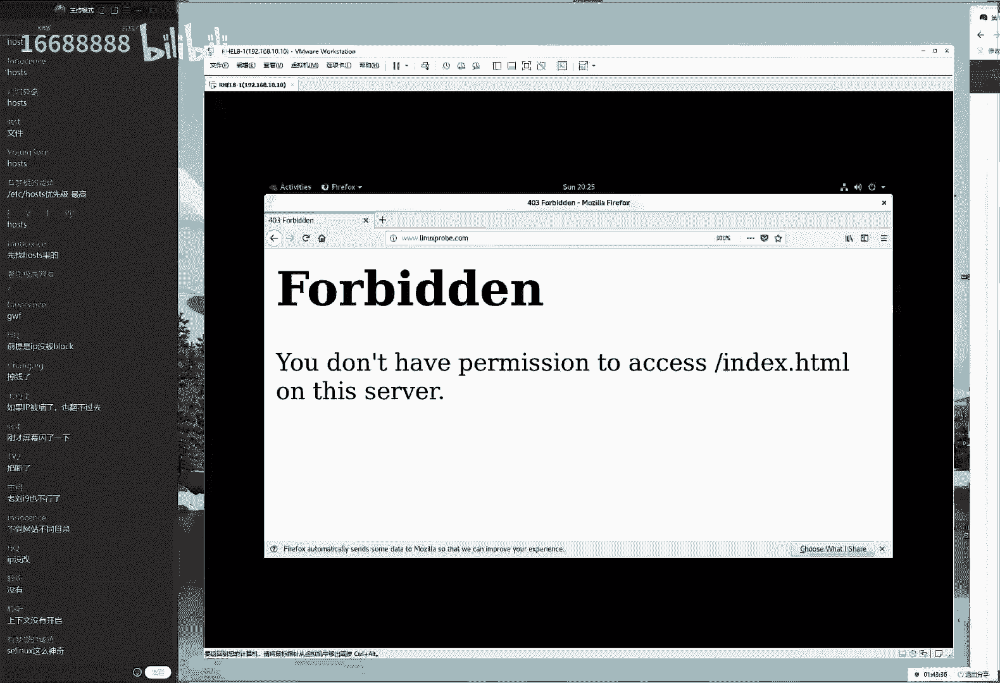
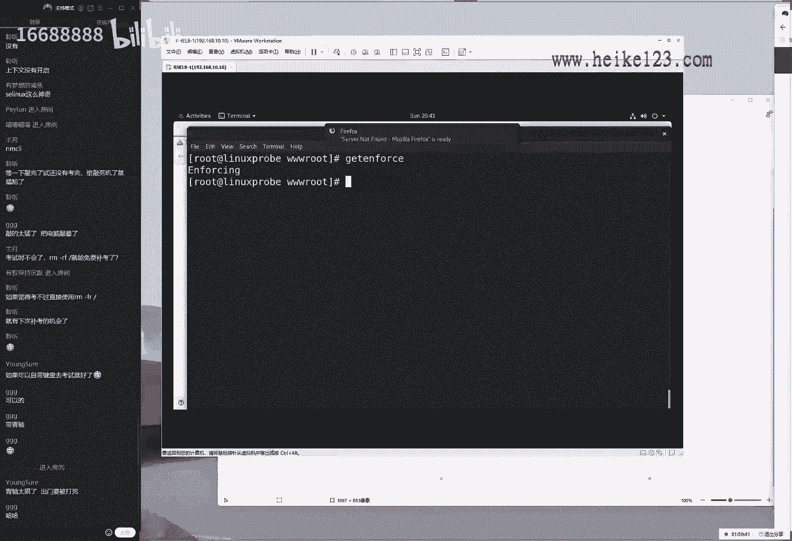
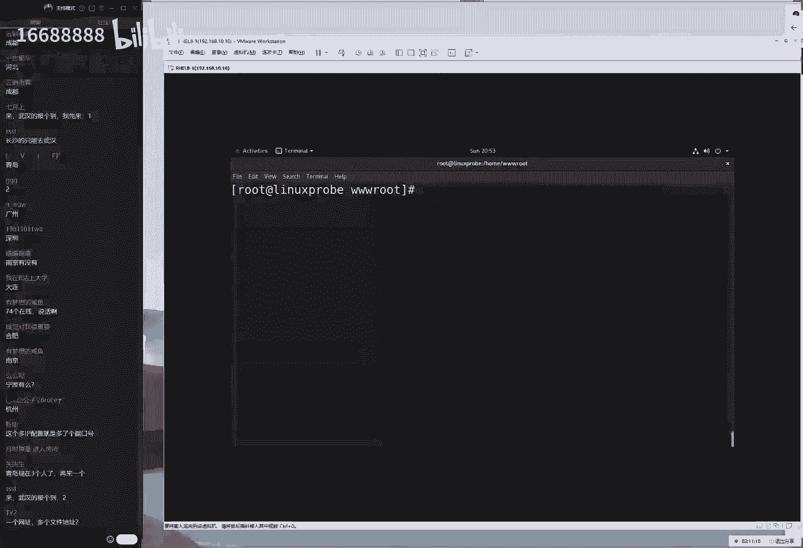
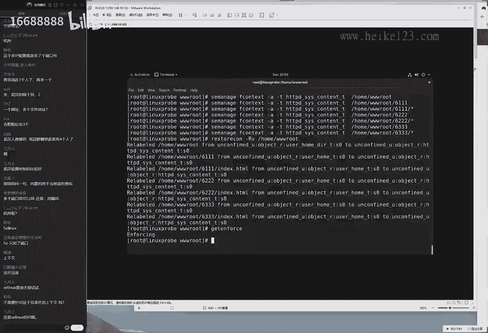

# 刘遄培训linux34期（配套linux就该这么学第二版，RHCE8） - P17：17（下半部） - 16688888 - BV1gL41167vP

ok再继续呃，不知道什么原因啊，跟他这个录屏突然间关了，然后显示录屏失败，但是好在这个没有丢，又给找回来了，是不是因为我们刚才说的为什么不该说的了，然后不应该啊。

没有这么高科技好，我们就继续来讲啊，就不纠结他这个原因了，好接下来的话我们要给大家说一下。

就是网啊，网站今天能够拼得通了，这段应该录上了啊，那好了，那我们就继续来配置一下，编辑我们下网站的这个主页文件啊，网站的这个主文件，然后的话呢，我们去找到它所对应的一个虚拟主机功能，的一个模块。

这个要不要太靠上啊，不要的话太靠上啊，往下一点，因为这个程序如果前面没有读完的话呢，这个参数也不会生效，先来先来读完所有的这个配置文件啊，不是这个初始的一些参数，大概的话呢行数我们大概在100多左右吧。

看一下这个行数，120啊，100啊，120行以后，我们来去写这个的话呢，既然叫做虚拟主机，实际上这个参数就叫做virtual house来virtual house，然后去写。

现在的话呢我们是基于的这个三个域名，当当用户去访问到这个三个域名，其中的某一个的时候，就可以显示出来网站里面所定的这个信息了，下面给大家说一个问题啊，就是不同的网站的话呢，它会有不啊不同的配置啊。

他啊不同的这个服务它会有不同的哎呀，突然间发现一个问题，我们好像讲串了，第一个实验的话呢，我们看一下书上啊，书上是基于ip地址的，第二个实验是基于域名的，好了，我们那我们就不管了，先讲第二个吧。

先讲第二个，因为我们讲课说基本上不看书，所以我就拼自己的这个记忆来讲呢，结果我还记错了啊，那没关系，来现在我们做完之后的话呢，再给大家返回来做第一个实验，来一九二零一六八点10：10。

当我们这个用户去访问下一个域名的时候，然后叫做server name，那他当访问句这个3w。linux prom。com的时候，那么它的document rt，就是网站的主页文件所存放的路径。

大叫做home目录里面的3w root里面的linux probe好，就这样去做，然后当我们这样去做完之后的话呢，反应起来是失败的，因为它会提出来一个没有权限吧，刚才大家看到了，我以为为什么呢。

我们因为需要去对于我们的directory，我们的目录一起说，去设置一下用户可以去访问的一个，默认的一个允许策略，这样的话用户去访问这个目录的时候，才能够有权限，这是在我们的一般权限以外。

都需要再去配置一下，叫做linux problem啊，linux problem，然后是是否允许伪静态这个技术，我们不需要于是把它给禁用掉啊，然后再来话叫做require o grant。

就是说我们对于所有的这个请求的话呢，都经授权让用户能够去访问啊，加e d为被动模式，它指的是用户的请求会被允许，接下来结束掉我们对于目录权限的设定，再来结束掉，我们对于我们虚拟主机这个功能的一个设定。

叫做virtual house，虽然我我想给大家说，就是每一个服务的话，它会有一个自己的一个特点，它的话呢就是不区分大小写啊，我那我们的阿帕奇网站，就是不区分大小写的这个特点。

大家看到我这个书上面v跟这个其它的话，它是有大写的，但是实际上它这个大小写的话呢，在我们的网站符当中呃，并没有太大的区别，所以这个话呢有一点特点，那来数一下1234啊，然后呢是123456788行。

来888，我们今天复制出来是三个虚拟主机功能，它就很相似，所以没有必要增加这个负担了，直接来复制，再往里面一粘，往里面一粘啊，然后吧我们去修改一下里面不同的值linux probe。

然后linux cod这种广告我们特别喜欢多说几遍，大家记牢了之后就忘不掉了来，然后第三个的话呢，down这三域名可值了钱了，来down嗯，再来最后一个down，再来一个挡三下，好，做完之后保存并退出。

重新启动一下网站服务程序，让新配置出来的这个参数能够生效，另外我忘了我看有没有加入的情况下啊，哦那我忘了啊，没关系，那我就再加一遍啊，这样的话讲养成这个好习惯，同学们呃，我以为我们每一次都会。

虽然我每一次都会还原虚拟主机啊，然后我们虽然每一次都会还原这个虚拟机，他就没有了，但是我们要让大家养成这个习惯，每一次配置完服务之后嘛，都去操作一下，这样的话呢大家考试啊或者工作的时候。

如果要是自己没有去做这步操作，就感觉浑身不得劲儿了，就感觉好像少点啥似的啊，这样的话养成这个习惯，每一次都去重新去加入到形象里面一次啊，养成这个就是混，先混个脸熟，都做完之后的话呢，去访问一下。

看看能不能成功打开浏览器，firefox火狐浏览器啊，这ip没有改啊。

没关系，我们待会先给大家再往后面去讲啊，我们第二个时间再给大家讲ip地址，这个来去输入一下，我们的这个服务器的ip地址啊，不呸啊，输入一下我们的域名3w。linux problem。

点com得到这么一个页面啊，这个页面的话呢有什么可能性呢，页面就没有权限，页面就没有文件，我猜没有权限好了，什么权限呢，一般权限特殊权隐私权限呢都不是。

我猜s linux请出轮椅来，set in false，零关闭s linux，其实我也不知道，因为我们去啊医院做体检的时候，我也不知道自己有个啥啊，有啥毛病，但是排查嘛对吧，我先拍一个这个看看。

不是对吧，我再看看这个他也不是，我记得有一个笑话啊，上海文没有开启，对我们现在来给大家看一下这个效果，先把我们拿啊。

哎啊先把我们这个给他关闭掉，再来刷新一下，就会发现能够看到网站里面的内容了，没有问题，再把话呢给它开启一下，会发现又不行了，这就是去拍它的一个方法啊，大家在配置这个服务的时候，也一定要是按照这个顺序啊。

用这种排除法来去做，记得讲过个笑话说有一天有人起来之后的话，会发现自己胳膊疼腿疼头疼，然后结果去医院之后发现了怎么样呢，手骨折了对吧，所以他碰哪的时候，他都会觉得很疼。

当你把s linux如果它关闭之后，你会发现一切都变得非常的美好的话，那么就是你的手或者说这s linux的问题，一定要用这种排除法先看一看啊，我们不是再换下一个啊，怎么只是一个排除的一个范围。

那么它的一个方法跟一个思路啊，其实我们这个讲课的话有点不太负责任了。

就这样就是怎么讲呢，我们自己就是我们花了自己很自责啊，就是因为啊错出太少了。

其实应该多出几个错，这样的话给大家讲讲排错，但是没有办法太熟了，所以就很就很就很难出错，其实应该故意出几个错，配送几个参数，这样的话我们比如说怎么定位到这个错误，行啊对吧，怎么这个呃三五个错误。

那我们怎么样按照这个顺序，123的排错呀对吧，其实这个有机会给大家，那老刘手划一划来，我们接下来再来，那我们来看一下什么问题呢，答应说出来了，叫做s linux的上下文，因为我们现在的这个网站加目录嘛。

是用来去保存个人用户家目录的，这个不合理对吧，他用户他这个网站访问起来。

社会体制出来报错了怎么办呢，很简单，还是啊我就稍微快一点了啊，ios长格式，看详细信息，d看目录大写z，看s linux，这个上下文外目录里面的3w root里面的html，来按一下回车，嗯啊少了减号。

这很粗心啊，来再来说到手滑啊，果然就没有辜负我啊，果然就直接手滑了，来看一下，这是我们网站之前的网站系统的加目录啊，的这个内容，来c manage fc杠a修改刚t值啊，当然理解成杠a修添加也可以啊。

然后home目录里边的3w root添加设置一下，另外有一个问题，就是我们的这个ic manager一个呃很不好的一个点，他为了保证安全，它需要我们去一个一个去设置这个目录。

我们home目录里面的3w root，然后第二的话呢再来3w root里面的linux pro，然后再来，也就是说它需要对于每一个目录来，都去设置一下，他没有递归啊，这就很这个就很恶心了啊。

就是不这个就很讨厌了啊，呃就是它需要让我们对于每一个目录，以及目录里面的每一个文件都去设置一下，虽然可以使用通配符，它但它不能使用杠r操作，这个大家就是很讨厌，为什么会这样去设定呢，就是因为艾斯琳啊。

linux这个值吧特别的重要，他怕我们一下子就一杠杆操作，就把他的都给设置了，所以说他为了保证安全，他要求我们必须要一个一个都去都去敲一遍，然后自己手动去确认了，他才能够取生效，这个的话呢油耗也不好。

好的话就是更加安全了，让我们把每一个目录都单独去设置一下，即便说是失败了啊，但是也影响范围比较小，但是话呢这个坏处就是特别麻烦，影响到可能啊配置的效率了啊，当然也无所谓，我们讲配好了吧。

来让他去生效一下杠r v显示过程，r递归v显示过程，home目录里面的3w root，我们的网站目录的存放路径。

然后按一下回车生效，生效好之后，一刷新去访问一下3w。linux prom incom，现在传下内容没问题，来3w。linux down incom没有问题，虽然说大家啊再给大家说一下。

虽然说访问出来这个网站的效果单啊，比较简单啊，没有红啊，绿啊黄啊什么的，但是大家也知道了，这个底层的话呢是啊非常成功的，只不过这个页面我就有点懒得做了，就是做这种火焰，就是这种啊，像这个字符的标识了。

最后好像还有几个啊库来大家访问一下，没有问题，通过我们用户访问到不同的网站，它通过用户访问到不同的页面和呸，怎么回事啊，这很气人啊，通过用户访问到不同的域名，访问到不同的网站跟这个页面。

这就是我们叫做居域名的新主机功能。

下面给大家说一下啊，实际上这个有点像是合租对吧，现在的话呢有这个合租的一种形式，也是国家允许的，比如说有这么一个三居室对吧，这有一个门诶，这儿有一个厕所，这一个厨房哎，这有个阳台好啊。

把这个三居室咔嚓一切，割进门之后，这是一个主卧，这是一个次卧，这也是一个次卧，好了，那我们就可以组成三个人，这三个人的话呢，比如说第一个人叫小美，第二个的话叫小强对吧，第三个人的话叫叫小光三个月啊。

但有这么三个用户，他想去买啊，他想去做啊，他想去啊点一个外卖，那么他就需要去写怎么样呢，这个门牌号码啊，然后啊外卖员就会送到这个啊房间的门口来了，那么怎么样能够保证说小光点的外卖。

不会给小美呢啊这个时候就要做一些标识的，也就是通过我们的姓名来做标识，也就是说，我们现在很多个人同时去使用一个服务器，我们怎么样能够把这个数据准确的拿给美啊，去啊，拿给某一个人，不能说啊，如果有一天啊。

有有啊，比如说我们啊将这个3w。linux prom，这个网站放到一个服务器里面了，淘宝也不行了啊，三个小淘宝给我们放在一个网站里面了，当有人去访问我们的网站，他不能调出淘宝页面吧对吧。

另外这个淘宝不能沾我们的光啊，蹭我啊蹭我们的流量可不行，所以我们一定要保证我们的这个呃，用户去访问的时候，他访问的是哪一个域名，就访问到是哪一个目录里面的内容，千万不能让白啊。

千万不能让淘宝去偷我们的流量了啊，这个一定要准确，一定要准确一点，第二点的话，就是我们可以通过让用户去访问不同的ip地址，然后的话呢可以去实现出来，不同网站的这样的一个切割啊。

不来进行一个不同网站的一个切换，叫做基于ip地址的新主机功能。

来我们给大家还原一下，还是啊把每一个实验做扎实了，把每一个实验都给大家讲透了啊。

所以我们把每一个实验的话，都会还原一下虚拟机，因为有些服务的这个操作，比如说加入到启动项对吧，比如说呃我们的啊文件上面这个全新的设定，我们的c manager啊，就是我们就是一个命令吗。

他有可能只是他有可能只是去执行一次，那这样的话呢，如果说我们第二次没有还原虚拟主机，那我们在做第二个实验的时候，同学们就会遇到一个问题，唉我们只做其中的一部分的这个实验了，那么大家以后如果我就在那啊。

如果说我就需要做基于ip地址的这么一个实验，结果看了咱们这个视频去做，做不成功啊，你还要再往前面去捣捣，我之前我做过什么命令，所以我每一次都我们就不要偷懒了，完整的去进了一次配置，虽然麻烦的慢了。

但是学简单的话更加的呃扎实吧，来我们继续来重启，并且加入形象这个习惯养成，来别创建出来三个目录，那第一个目录的话，那我们就把它叫做呃一九二零一六八点10：10。

我们现在继续就三个ip地址来去访问，192。一六八零一九二点一六八点10：10，然后把第二个点20。30给它，分别上不同的ip地址，通过这三个网址啊呸呸，怎么接走，没事啊，通过这个三个不同ip地址。

然后去访问到不同网站里面的这个内容，1~8点半开始瞎讲了啊，这嘴就开始不受控制了。

来12 030访问到就是a b c3 个网站啊，所以说我们现在的话，先新建出来三个网站的这个目录啊，现在是三这个三个网站的这个不同的目录，然后的话呢再把这三个网站的目录，对应的ip地址给他配置出来。

我们给大家讲个三个方法来配置来配置网卡吗，大家说想了解一下，通过配置文件的方法去完成，因为那个更加简单了，我们如果要是通过这样的命令，就是配置网卡的话，那说实话有点骗钱了。

因为这种东西我看到有一个机构去讲的时候，就会在想这有什么这这有这有什么可讲的呢，哦添加鼠标左键，然后顶多就是上去就没有什么意思对吧，所以的话呢我先给大家去操作一下，是这样的。

我们要是想要通过啊这个方法去配置的话，那就不用去讲了，就可以自己去操作一下了，去啊去摸索一下，我们的话给大家通过配置文件的方法来去修改，讲一个最难的，其他三个的话呢。

我们在日后慢慢给大家去呃演示就可以了，那就不讲了，因为太简单了，来就让我们去编辑一下我们这个网站啊，去编辑一下网卡服务所对应的一个配置文件，找到它，如果说我们要想在我我们的网卡上面。

绑定上三个的这个ip地址。

那么的话呢我们就这样去做，唉咱们怎么样突然弹出一个啊。

这没关系，就是前面一个视频压制完了来，我们就把这个ipad啊，i p a d d l后面加一个零啊，i p a d l0 啊，n m c l y也行啊，但是这个太难也没什么必要啊。

来一和二下标012区别，就指的就是1233个ip地址，然后再来10203030地址地址，做好之后呃，大家需要注意，要想通过我们的命令来进行配置的话，比如说我们刚才讲的这个命令吗。

他只需要用一条命令就可以了，然后但是的话呢，我们编辑配置文件的方法来去配置网卡的话，需要去做两步操作。

先去read的后，然后后续up，一般情况下，我们只需要up一下网卡就能够生效了，但是如果说通过我们的命令啊，通过我们的配置文件来进行修改的话，需要先去real的后续up。

它比比其他的这个操作还要多一步，来，我们再操作一下什么叫nm c r y，然后是啊connection，然后是reload in n s160 ，大声说一句，索尼啊，这同学去考试的时候就会发现啊。

这个敲的最快的一定是我们的学生，而且最有气势，咔咔一顿敲啊，最后能把这个键盘给敲坏了，这个钱他就他这这个钱啊，考试费现在花值了，来up in s160 走啊，启动一下这样的效果就是拼一下我们的ip地址。

一九二点一六八点10：10，好，没有问题，现在绑定，现在我们就把这个网卡上面绑定上多个地址吗，这样的话用户去访问的时候，网络才能够是通的，才能够去做完我们这个后期的这个实验，102030走啊。

好没有问题，然后我们再编辑一下我们啊。

我们的这个我想想思路啊，乱了乱了乱了，第一步把我们的网卡添加上三个信息，有了第二个的话呢去创建出台网站的加目录，没有的啊。

网站的加目录没有啊，home目录里面的3w root，然后诶呃好还真没有啊，来呃3w root，然后的话就是一零，然后的话二零，然后是三零，然后进入到这个目录当中，往里面写入一行信息，echo。

然后来19209910101010吧，这个就那我们就这么去写，来随便去写，无也无所谓，因为我们关注的是网站的后台，这个服务程序跟这个网站前端显示的出来，是个啥也没关系，来一零，然后再来大家说怎么样啊。

等啊等一下敲完之后，考完试还没结束，给敲死机了，就尴尬了啊，不会的不会的，因为这句话linux很难死机，很啊很难死机，很难很难死机，如果要是死机的话，我们就算中奖了，因为你会有下一次的免费补考机会来。

然后我们再来102030，来3030303030，ok走好三个网卡给大家添加好了，做好之后的话怎么样，大家都敲太猛了，然后电脑给敲晕了，不可能不存在啊，linux的话想把它敲爆了。

还是很还是很有难度的啊，这个没有出现过这种情况，道士有同学敲太狠了，然后的话呢把那个按键给他摁到里边去了，确实有这种情况，但是啊很少很少同学又不是练功的啊，也不是少林寺出来的，你要想把摁爆了也很难啊。

来我们接下来再来嗯，干嘛来着啊，思路打断了啊，来说一下第二啊。

第三点脑子现在不行了，真的是老了，来第三步的话，就来编辑一下我们这个主配置文件了，httd，然后叫config里面的httd，找到主配置文件，擒贼先擒王，找到它的主文件，然后按一下回车走，你高太高。

上120左右就合适，冒号120定位到120行，我喜欢这么去用啊，反正因为我对于一切都希望有这种版型，都有掌控力，所以我会愿意就是用到冒号啊，这样的方式我可能不会用到大家所说什么啊，大啊啊，大写的g啊。

到最底下或者小写的g啊，或者说到某一行什么，通过这样的番，我觉得这样的话不太严谨，所以我还给大家就直接冒号120，定位在120行，我们的话在底下就追加就好了，追加到多少行呢，追加到也别太靠上了吧。

132行左右就可以了，大家说说如果考试啊，大家怎么着啊，大家说考试说不会rm杠rf就可以免费补考了啊，大家理解肯定是不对的啊，如果你要是自己的这个操作原因，导致这个导致了这个失败，肯定是不能免费补考啊。

哪还有这好事呢啊，那我们自己这个实在慌了，不会做的，然后把电脑给搞搞给搞死机了，不行不行，只有说明确硬件的这个故障了，才会有这种免费补考的啊，啊大家不要想卡bug的事情，要通过实力去完成。

咱咱是有实力的人对吧，卡什么bug啊，好大啊，我们去设置一下，其实大家听我们讲课，给大家去多做一下啊，就是大家听我们讲课会有压力，为什么呢，因为你们看不到同大家自己的同学啊。

然后也看不到我们的师兄弟们来写一下，buritual house 10，然后第二是2030呃，目录就是document root，这图球同学们你们看不到其他的考生啊，但也看不到其他这个学生。

最后大家会觉得就是我们在爬山，就是我们在一直爬山诶，打docu document a d o c d o c u m e n t rt，好ok所以呢我们就一直在爬山，会感觉到一直很累啊，这个膝盖的话呢。

这个啊我也会也会很疼，但是一旦你考试的时候，就会发现诶，自己的这个水平已经比别人差了很多了，但是这个不考试，或者说不见其他培训机构，这个学生很难很难有这种自信啊，所以或许就嗯交给时间吧。

来对于这个目录啊，现在的话设置一下这个主机名称，主机名称无所谓，因为当它只是一个格式，要求必须要有，但是实际上并并不生效的，然后第directory目录dr ec o r y i d啊。

然后目录名称home目录里面的3w root对吧，买自己带一个键盘，说，如果要是可以自己带一个键盘去考试就可以了，当然可以啊啊大家可以，这个是这样的啊，大家可以允许自己大家自己的电脑去考试了，没有问题。

唯一需要注意一点就是考完试去啊，记得给拿过来了，别浪了考场了啊，别丢了就行啊，可以自己带鼠标和键盘的，除了主机和显示器不让打击外，其他都可以自己带啊，然后我们来grant granted进行授权转化。

用户需访问的时候才会提示出来的，403权限不足，然后结束掉我们对于这个目录的这个设定，真的可以自己带的啊，然后结束掉我们对于目录的这个授权，然后再来结束掉，我们对于这个虚拟主机块的这个设定。

做好12345678还是八好听好，来八八万往下复制，我们只需要修改的就是102030，那几个点就行了，1102030，来1020，然后二零这样的话呢，我们三个的ip地址。

访问到的不同的目录的效果也能够体现出来了，来保存并退出，怎么样怎么样，清楚太狠了，出门就要被打到啊，为啥大家听我打字的时候就很就是很轻快啊，然后很快再来，这个没有问题的啊，而且你这个跳得越狠，轻轴的话。

那你最好蔡老师应该大一点，这样的话就可以给你的旁边有一点很会很有，意会很大的压力，来我们去重启一下这个服务程序，刚刚的话呢我我已经把它加到选项了吧，就不用再去加里面了，我再查一下，记得当时我考研的时候。

就是哎呀，我旁边那个哥们就是不知道是疯了还是怎么样，就是翻卷子翻得特别的使劲啊啊，然后就啊因为我们考试教育学的是一个考场，然后就疯了似的，然后就写字写的特别的狠，然后就拿笔来说这个啊资源上面就狂飙啊。

就是特别的狠，然后的话呢我觉得这个哥们是要么就是大神，要么就是来发泄来的啊，然后后来的话因为我们考教育学的这个专业，当时我们这一期人比较少，才招了六个人嘛，然后后来那个啊同学我们没有见到，他。

应该是没有考上，但是那个气势是啊是啊是反而是特别足，真的是那气势是真的足，好我们来看啊，来给大家看一下啊，现在的话呢我已经把这个网啊，现在已经把这个服务配好了，并且重启了，已经加了选项了。

所以的话这个操作就不用再去做了，好我们考试的时候一定要有气势啊，自己要自信，做完之后的话再去检查一下，get in false，检查一下当前s linux的话，这个模式是否是开启的一个模式。

get in force诶，enforcing的一个字样出现了，我们就稳了，那enforce强制开启模式，再来进入到我们这个网站当中去看一下。

来输入一下ip地址，一九二点168。10哎，等一下一九二点一六八点10：10，按下回车。

不给面子啊，稍等一下啊，嗯啊啥呀啥呀啥呀，see lz还差一样呢，对啊c linux查下文没有配置啊，我们来看下啊，刚才真的是我刚才真的不是，我故意在给大家弄这个猜错了啊。

实际上真的是光想那个一起考试那个学生了，现在还能依稀的记得他当时那个疯狂的举动，真的是非常的震撼啊，呃这个往后20年都没有见过，这么这么有气势的，他的他考上了来vr目录里面的3w是root里面的。

巴拉巴拉巴拉，哎，等一下哎，万目录里面的3w里面的html，查看一下之前是什么，分心了，分心了，来as a manager fc coin，修改安全上下文，杠a修改刚体值，来复制来走，接下来目录名称。

这个特别讨厌，它需要一个一个矩形来去设置，我们同学问到说，我们能不能使用一个杠小r或杠大r，来进行一个递归操作来批量去完成呢，哎真没有真没有，然后的话呢我们为他说句好话吧，就是他为了我们好。

就跟我们的国家不让我们去上外网一样啊，这都这都是国家为了我们好，都是为了怕我们这个错误的操作了啊，然后的话呢导致这个服务器的崩溃了，总之就是但总之它就是这么设定的，我们就只能是来去遵守就好了啊。

我当然我所说的是s linux啊，大家不要多想，其他的来10。2030，然后我们把这个信息写全，来，写完之后的话呢，来就让他去生效一下，这样啊，大家说加星号不行吗，不行啊，刚刚说过加星号是不行的。

他不让我们递归操作杠r啊，然后呢我们后面再来home目录里面的三加root来，然后去升降一下就可以了，写信号真的是不行啊。

它是对于每个目录都要重新去设定一下，做好之后去刷新一下这个网站，来一零的网站显示出来的效果可以了，二零的话呢，网站显示出来的这个效果也没有问题，再来的话呢，三零显示出来这个效果的话呢也没有问题。

102030都呈现在大家的眼线，非常的顺利呃，然后我们看一下时间啊，然后就是我们下一个章节就先不讲了，为什么呢，这个下一个章节吧基于端口号这个吧有有点难，他是需要啊讲了吧，这个但是就今天时间会比较久啊。

今天时间会比较久，大概需要半个多小时啊，但是先给大家讲了吧，这个就是会比较难一点，来，我们先给大家去说，因为他时间大概需要半个小时。

大概要稍微晚一点，拖到9。10分左右吧，来大家先啊。

但这个视频又怎么样呢，我们前啊，毕竟我们周五跟周六都已经耗到十点钟了，9。10分，那都是弟弟来，现在我们重新去还原一下新拟机，就是说当用户想要去实现出来访问不同。

还想要让让啊，让用户通过访问不到啊，到不同端口号的时候，它也可以访问到不同的网站，怎么去实现呢，比如说当用户去访问一九二点168点时，我就有这个就是有两个就三个啊，来当用户去访问这个6111的时候。

放这个端口号啊，然后的话他访问到是一个网站，622是一个网站，633是一个网站，那么这周怎么去实现呢，但这个说实话用的比较少，为什么呢，因为很少有人同学们提到了，说八零端口号是我们的默认的。

8080也是默认的，443也是默认的很少啊，很少有人会用这种东口号修改的方法，来去限制一个网站的这个访问，但是我们确实见过什么网站呢，一般是赌博网站或者是一些非法网站，非法网站会有把这个端口号修改一下。

比如说我去修改一个端口号为，比如说啊就瞎写了12345好了，那么这样的话呢，当我们这个唉一起的这个呃，呃同伙就加上这个端口号就可以去访问了。

而别人的话呢就访问不了，就说是一个隐藏这样的一个效果好，我们这样给大家操作一下dnf啊，然后install httpd安装好这个服务之后，重新去启动一下这个福袋，想了一下啊，还是把它讲完了。

大家话回去之后做这个实验更加痛快了，就能够把这三个实验动态一次性能做完，大家说我们的阿帕奇，这是a啊，我支持我们的加密的协议吗，当然可以，完全没有问题来呃，启动差啊，下面再来新建出来。

我就用我举一下思路啊，因为我刚才这个书上面的话是先写配置文件，大家看一下，我们先书上是先写配置文件，我们先把这个话先给他设计出来这三个目录，六三个一啊，数量也是先切换下，这三个目录跟我们干保持一致。

因为我因为按照我的习惯，我会先去配置啊这个文件，然后再去新建出来这个目录，因为有时候我们在配置这个目录的过程当中，我们对于这个配置服务的这个思路会更加清晰，然后我们再去输出一下6111。

然后等于说就给他这个网站里面的这个内容吧，给它定义一下手机文件的内容，访问到不同网站的时候，能够给我们一些回想，看一下大概这个效果来611622哎对了，同学们，另外我们做一个小调查啊。

就是我们可能会在6月下旬，我呸，我们会在5月中下旬会给大家准备约一下考试，同学们除了北上广深以外，这个城市的学生，然后有多少呢，比如说您是在武呃，比如说您是在武汉，那么您可以打一下武汉。

比如说您是在天津的，可以打天津，我们大家看一下，除了北上广深以外，其他城市哪个城市的人数比较多，这样的话呢我我我呃，我们看看礼拜一明天，因为我明天我正好要去问一下他，那个考题里面那个文件的一个事情。

让我看跟考官能去联系一下，把这个这是，然后我们把这个事先给他定一下，要是能约的话，尽量约到同学们，你们所在那个城市，这样的话不就省的去到外地了嘛，当然了，比如说同学说西安啊，那就不用说了啊。

内蒙也不用说了，海南也不用说了啊，话说珠海也不用说了，化石家庄也不用说了，然后就是其他的就不用说了，因为这个城市的话呢目前是没有的，就稍微说一下，我就说一下我呃呃说一下我们有的吧，同学们啊。

我们没有的话，就在当地举报就好了，我您没有的话就没有办法，但是我看了一下啊，好像在武汉的同学比较多好，还有成都是吧行，武汉跟成都我们这两个地儿，我们约一约，武汉跟成都是吧行，那我们先往后面去看啊。

现在我们需要开启端口号，端口号的话需要单独去放行，行数的话呢是在武汉跟成都，我借了，稍等，明天正好跟考官有一搭没一搭的，我去问一下，要能够追到大家所在城市不就方便了吗，省得再出来，现疫情。

一旦隔离就好就好麻烦，成都武汉，我写下来，稍等一下啊，武汉成都行，这不就忘不了了吗，贴电脑上，好想可是我看一下青岛啊，青岛就也不多，就只有一个同学，我们就把它跳过了，因为青岛的话人数不多的话。

就您就在当地报名就可以了，然后再来listen，不过昨天有同学去说了一下，是哪有忘了说考试费5000多块钱，其实现在也合理啊，加点钱加点钱吧，毕竟现在可能都是出行不方便来看一下啊。

单独去开启三个端口号呃，单独去开启了三个端口号，做一下监听，原先的话，那这个八零也保留，然后我们往下再走，130，现在我还继续了啊，130，大家说啊，怎么样，河北河北太广泛了，同学们啊。

河北这个范围太大，能不能稍微小一点啊，啊比如说呃河北不用说了，因为河北啊也没有河北，没有河北，没有河北，需要来北京或上或者天津好，我们先来给大家操作一下。

来virtual house及一下虚拟主机的这个功能，其他城市好像确实人数并不多了，所以大家都在自己的当地机构去问一问吧好吧，因为加上城市，我们刚才统计了一下，确实人数并不多，可能约到几率确实不大。

来6111，然后我们对应的目录3w root里面的啥样的，6111，然后我们的设置一个server，name server虽然不生效，但是它一个格式要求还是需要去写一下server name，主机名称。

也就是我们的域名啊，知道为什么我们讲课这个打字这么慢了吗，因为我老发现我打错，你看对啊，是因为这个手指比较大的原因嘛，来directory对于目录来进行一个全新的设定，这样的话呢我们才用户去访问的时候。

不会提示出来那个forbin被禁止给他用，给啊给它目录一个权限，它的目录被访问啊，允许伪静态啊，呃技术吗，当前不允许，不需要他再来的话，require all granted。

指的是所有的请求都被允许q u e r y a cover啊，r e q u i r e require all granted，被允许，这样用户去访问这个目录的时候才有权限，最后结束一下。

我们对于这个目录的这个权限的设定，以及对于这个虚拟主机块的一个设定，这样做完之后来virtual哦，今天大概9。10分啊，来123456788行，来888888，你就看大家看我们这个时间估的准不准吧。

因为现在这个讲课我们讲了7年了，虽然会有变化，但是这个对于克拉的掌控力也是非常非常准的，来啊，611622，所以有些时候我们刚开始开班，第一节课大概就是前三天说的建议，一般我们都是不听的啊。

因为对这个有些时候的设定嘛，都是有我们自己的道理的，就会先让大家听下去，然后自然就明白了，来611622，然后把不同的点我们修改一下，6333啊，他说大连大连，但是只有您一个考生啊，啊最近也不太行了。

估计来633来633起码是这样的，同学们，我给大家说一个原则。

就是北上广深不用问了，那四个城市我们肯定百分百有好吧，其他城市的话呢，起码你要凑够四个人吧好吧，然后的话大家你们负责凑够四个人。

我负责凑够，那另外四个人去好吧，我会跟其他培训机构或者我们去找折，我们给大家凑齐，然后让您在当地能够考试，但是我觉得起码也得凑四个人，我们才呃能给大家去约一下，所以我我觉得四个人不用再低了。

然后因为没场吧，最低是八个人，然后我负责解决那四个同学去，我看哪给他拽过来好，我给大家做好之后重新去启动一下，然后大家会发现啊，现在的话呢这个服务器启动的时候会直接报错，因为的话呢。

他跟我们之前讲的这个服务都不一样了，因为他之前的话都是直接修改了这个文件上面。

这个s linux这个权限对答应说出来了，为什么呢，这个多个ip地址就是配出来了嗯，他说这个多ip配置就是多了个端口号。

可以这么理解的，就是在我们这个他的话。

就是在我们这个呃地址的后面，加上这个端口号了，还有的话呢，就是我们现在的话，端口号被多开启了三个端口号，611622633，也就是说我们的s linux的话，会认为我们一个网站服务。

获取这三个端口号的话呢。

是不合理的，于是给我们给禁止掉了，我们可以去使用到这个命令，查看一下具体报错这个原因，同学们可以看到怎么样呢，唉可以看一下，在里面包括了这个信息，他的话是由我们的s linux给禁止掉了。

他说端口号不被允许这样的一个报错啊，大家说有同学是内蒙的，我啊我啊啊，因为我们朝阳区的话呢，这个疫情比较严重，今天刚刚收到内蒙的呃，寄来了土豆，今天我们今天这个长期发土豆来的。

说从内蒙进来很多内蒙的沙点土豆，然后今天正好领到了啊。

还是非常有缘分啊，不过确实内蒙现在有只有一家考场，据我们了解是有一家，而且那家巨黑。

当时我们同学有人去考过5800块钱啊，还那还是19年的时候的价，我估计现在都不敢想了啊，所以内蒙同学可能会比较的吃亏一点了啊，来我其实我如果你要是不着急的话，可以先不考对吧，等哪天疫情解除了。

来北京玩的时候过来考一下也行啊，就顺道了，那我们现在去使用的c manager，既然讲到了它可以啊，不仅编辑我们文件上的这个上下文太一的话呢，也可以去设置一下s linux的玉。

先去查看一下所有s linux，对于服务质允许端口号有哪些，来看一下对于服务的这个端口号哎，端允许的这个列表，这样的话看起来还是有点乱，诶，这样我们换一换，继续使用的管道服做一下过滤，http过滤一下。

做跟网站相关的，按一下回车找到它哦，这样了啊，他说80081443488，巴拉巴拉啊，这些都是被允许的，没有611622，所以呢s把我们给禁止掉了，要想让他去访问的话呢，这大就说出来了啊。

大家怎么样说青岛现在三个再来一个啊，青岛就这么着吧，只要你们能够凑够四个人啊，不管哪啊，就是我们该说所说的那几个城市嘛，我们都给大家约上啊，剩下的四个人交给我呃，然后的话呢我们再来我们把这个六一端。

然后我们加端口号再加到里面去，a manager point，也就是说先要让我们这个sm啊，linux允许我们这个三个新的端口号，然后我们这个服务才能够起来，用户才能够被访问port，然后是啥来着。

我想一想啊，刚才a这个添加对吧，这个时候才是添加的意思啊，他编辑文件的时候，它是这个替换的意思，来杠t具体的这个小鬼的这个策略，我们复制一下，然后的话呢端口号是6111，是不是还要写一个杠p啊对吧。

就那个ptol协议来tcp，然后你可以看我这个啊宝啊，真是宝刀未老啊，来再来还是记得还是比较熟，622哎啊真的没有看啊，真的是自己凭这个感觉敲出来的，看来还敲对了6333，所以有些时候大家不要乱说。

老师这个我怎么记不住啊，多用自然就忘不了了，就会想到怎么我怎么老忘不了呢，来过滤与价格网站相关的，于是会看到我们的c linux，对于端口号这个放行的策略多出来了三个，没有任何问题，好。

现在的话呢我们去重新去启动一下，我们的网站服务，就没有报错了，好，这个时候的话呢我们再去确认一下我们的s manager，它呃，我现在去确认一下s linux。

他这个状态是否为启用模式来get in false。

来没有问题啊，去访问一下吧，去访问一下，来打开我们的浏览器。

浏览器，大家说内蒙的牛肉干买的贵吗，来下面一个问题。

大家说武汉人数够的，群聊也有四个人了，武汉没问题，而且武汉特别神奇，就是我每一次都能凑够八个人，特别奇怪，而且就是正好八个人啊，嗯就是也不多也不少，所以武汉可很这个很这个很奇怪啊，来我们再来好。

ok没有问题啊，后面加端口号来6111啊，大家看一下。

嗯怪不得我刚才说要减到9。10分呢，原来我要有一个报错啊，稍等一下，我们稍等一下啊啊，我说怎么今天我要说规划一下到9。10分呢，原来我给自己报错留出来的富裕时间了，稍等一下啊，稍等一下。

s lnice is开了，开着呢啊，所以才会有这个报错啊，home目录里面的3w rt啊，三个目录61162这个文件在吧，没毛病啊，挺好的对吧，62000，没毛病啊，来再来啊，领两下课，这么不给面子。

来稍等一下啊，稍等一下下看一下嗯，上下文只开启的端口，sd只开启端口对呀，只开启端口就够用了，没毛病，然后对应的路径home目录里面3w root，没毛病，没错没错没错没错啊，自信自信哎没啊，没有问题。

来，我这样，这样，这样我再来重新去启动一下我们的网站服务，然后的话呢我们去刷新一下还是不行，来get i get in false，强制开启模式，没问题，set in force，临时关闭。

请出轮椅来范围，坐上去，哎呀可以了，来范围啊，范围下来啊。

哎呀看来还是s linux问题。

是不是我们的文件没有做的，可能是啊，我看一下同学们，可能是我们这个文件没有做啊，l d z分心了啊，来不过这个也挺好，一个排除的过程嘛，如果顺顺当当的，我们顺顺当当的。

同学们在考试的工作的时候老出问题也不好，ok我们看一下啊，确实是s linux没有修改，我们现在需要修改一下，然后就可以了，来呃那什么来着，l s杠l d z home目录里面的什么的啊。

不是warm组里面的3w x，先去查看一下之前的复制一下，然后的话呢s e mange对了，另外的话我再把这个给它开启一下set in force啊，去开启一下s linux，然后去刷新一下。

再看到这个确实已经防不了了，没有作弊没有作弊啊，这点事还犯不上作弊呢，来杠a杠气，具体的值修改成什么呢，修改成这个对，然后后面显示目录的名称，home目录里面的3w root，它不能使用信号做代替啊。

它不能替换所有的目录，它只能是对于文件使用型号的代替啊，还是还是还是还是一个小问题，然后是6111对于目录来进行一个操作，但是杭州杭州好像没有考场的，都来上海了，来，好好好都好像有有好好好像也有忘了。

好像杭州好像真的很好啊，会感觉好像有，但是我们好像没有约成过，就是人数脑测不够，都会去上海来，做好之后再来rea restore contact，去重新去升价一下，杠r递归杠v显示过程。

然后home目录里面的话呢，3w root对于目录来进行生效。

没问题啊，果然我刚才没有做，再来刷新一下我们的网页。

大家确认一下，icc linux确实是属于一个开启的状态，没有问题啊。

它是叫做enforcing，可以的啊，没有作弊啊，再来的话呢我们来刷新一下611看的内容，622的话看到内容，虽然说网页显示出来这个信息略微简单了啊，但是的话呢它这个底层的这个逻辑，还是很有意思的。

来看一下它访问到不同网站里面的内容，它是通过我们这个端口号，那就限定我们每个网站的这样一个内容，ok没有问题，大家可以看到这样的话呢，就把我们这个网站服务，我们的app是我们的htp t。

这个网站服务基本上给大家讲完了，我们后来会在下面呃，明天吧，我们会在下礼拜五的时候，给大家讲一个基于我们的ipad这个访问控制，然后我给大家就讲完第十章节了，大家的话就应该对于这个服务是有点了解。

如果要是以后想配置一个网站的话呢，就不会觉得那么的呃口，那么也不会觉得那么难了啊，并不会觉得呃很难配置了，然后给大家说一下，我们今天这个复习跟预习的内容啊，这话我们这个进度的话还是比较好的。

说一下我们今天这个复习复习的话呢，就是有以后我们讲一些东西的话呢，大家可以先放一放了，因为大家准备去考啊，去考试嘛，准备好自己的这个时间，那么所以的话我们今天这个复习内容，就是rhc的这个备考工作了。

可以把我们昨天那个啊，我们昨天跟前天两天呢，我们的安c宝这个服务，然后去练习一下，可能反复去看的，进步也不会特别快，多去敲几遍，自然也就能够呃很好的掌握了，这个需要去敲一敲，然后说一下预习。

下次上课时间的话呢，我们是5月的13号，好，大家记一下时间，5月13，5月14，5月15，我们的话呢下次5月13号，我们的第十章节没有讲完，但是我又不写了，因为这个就剩一个小节了，我肯定不会忘记的。

那么话呢我们的5月13号的语气内容，就会在第11章节来，大家看一下第11章节，我们的网站的文件传输服务啊，vs fpd啊，第11章节，然后以及第12章节，我们下周吧，我们礼拜五应该能讲完两个章节。

11跟12如果讲不完，那就讲不完啊，那好我们来接下来，然后的话呢5月14号的话，我们会给大家讲一个第12章节的收尾，我我我我我感觉啊，第这下礼拜五应该讲不了两个章节，但是我们就尽量吧。

然后但是也不用尽量我们讲的第11章节也好，然后我们第14啊，5月14的话呢，我们给大家讲一下第13章节，第13章节巨难超级难，我们自己写书的时候就自己把自己给写哭了啊，我们给大家讲一下dns。

然后dns的话会讲很多种工作模式，比如说主服务啊，从服务器缓存服务器啊，在主服务器和存储服务器之间去做t s加密啊，对吧，在主服务器和服务器啊，还有这个存储服务器之间。

都去做一个双向的正向积分解析啊对吧，还有去做一下缓存服务器啊，好好做一下分类解析啊，这个我们都给大家讲到，基本上第13章节，把dns能做的事情都给大家一网打尽了，然后既然反正第第一反正第13章节啊。

特别难特别难，就确实啊这些天要做这个心理准备，但是我认为大家不用太上心，因为什么呢，因为在工作的时候，让我们配置一个网站的几率要很大，但是要拿来配置一个dns的几率却很小啊，就是相比来说啊。

因此的话呢大家可以把这个重心放到备考，或者我们的网站上面，可能学习更多有用的东西，可能比较必，大家被这些参数要划算的来啊，要划算的多，到时候如果在工作当中真的遇到配置dns s的时，候。

通过我们5月14号这个讲课，大家有个印象，再配置起来，照着书去配，也不也不会说不可能了啊，知道我们这个实验怎么做成的，然后实验只要知道这个实验的效果了，知道d n s e c基本的原理了，对大家的话。

对于这个网络的了解是有很好的帮助的，下面的话就是5月15号也是准备两个章节，就是第15章节啊，不第14章节跟第15章节，14章节比较简单，跟第13章节的话呢，我感觉完全不一样，第14和第15。

这是我们下周的一个实验安排，然后另外说一下我们这个备考的工作，因为我每天都有同学在问啊，我在这个月考的这个工作啊，我们知道有些同学的话呢，他不想去考试，这个话根据大家的实际情况来去调整。

但是我们的99%的同学都想去考试，所以我们如果这个不给大家说一下吧，很不负责任呃，就是我们现在这个月考的话呢，每一期都是比较紧张的，因为它不像是网络培训啊，一个班里面做100个同学就也没问题。

没有什么太大影响，但是确实我们说实话啊，就是考试的这个位置确实有点紧张，如果说5月份5月啊，就是先我们从现在来看吧，5月底肯定考不了了，如果说6月份考不了的话呢，呃有可能会拖到7月份或者8月份，就这啊。

这个具体就是约上时间那个为准吧，我们那么我们现在的话呢呃，因为由于这个疫情的原因，确实没有给大家预约，然后但是肯定会去约，具体的时间的话，可能会在呃下周有点悬，所以我想说就是13 14 15。

我们从原则上来说还是不约考的，什么时候预约呢，我们可能会在本期培训的最后一周，大概就是22 122那三天我们去约，因为22 122那三天，基本上我们就讲完这个最后的课了，所以我们最晚吧，我们从云上来说。

就是下周吃34路15是不约的，我们大概是在202122那三天去约考，所以如果说你想要去考试的同学，想要获得最新的那个考试时间，因为考试时间是这样的，我们会给大家一个时间选择，比如说阅完了真的有好吧。

北京就是北京的，比如说啊6月15号跟6月17号两天好了，如果您先报的话，你可以挑一下，如果你要没报上，因为确实人数限制吗，那么您可能就要等到78月份甚至9月份了，所以就会比较晚一点。

但是这个没有太大问题啊，就是78月份考跟89月份考是一样的，编题的话呢也不会的，因为我感觉会在10月份以后变，所以就是这么一个事情，但是如果你想获得第一手消息，想要6月份考的话。

那么最好一定要是最后几天一定要来上课，千万不要迟到和忘了来就好了，因为我们有可能给大家发现，新qq群里面大家可能看不到，所以这个几天时间比较重要，请大家一定不要忘记好。

大家就说啊，那我就把我想说的给大家说完了，一些注意事项，大家有什么问题你就可以来去说出来了，我想大家记一下啊，以及成都跟武汉的考生挺多，我记下来了，你待会儿我明天吧，礼拜一会跟考官去说一下。

看这两个城市呢我们能不能约上，然后大家问了一个问题，大家说上海考场啊考啊，高考都延期了对，所以我们这个红包考试就更要被延期了啊，遥遥无期，而且上海高考延期到几号了，就是到6月份吗。

然后大家说武汉现在约的话也是在6月初考嘛，不武汉的话现在不是嗯到6月初考，我感觉应该是在6月中下旬，我感觉是这样的，如果不严重的话，我们可以给大家申请一下，然后大家下面一个问题。

大家说深圳在什么时候报考呢，大概在22 122这三天大家说想考，但是搜不到人怎么办，等一等吗，对等一等，如果我们这一期比如说我吧，因为我我不知道大家您是哪位啊，所以就是这样的，如果说您是比如说啊。

您是青岛的考生，现在的话呢我们凑凑凑凑，凑够三个人了好吧，凑够三个人了，确实这一期凑不出来了，没关系，等我们下一期开课，然后这个老刘现在这个培训学生还是很多的啊，然后的话呢下一期如果能有啊，青岛考生。

比如说又啊又来俩好了，那就变成五个人了吗，然后另外三个人我们去给大家讲折，就是这么着，然后就你就可以等到下一期，在他们有没有下一期的师弟们，他们是青岛的，想到一块儿考，是这么回事儿。

然后大家说我们月考是6月底吗，不我们是在5月底月考考的试，然后约的是6月底的考试，然后大家说考试的时候都是工作日吧，没有周末，没有周末吗，没有周末，周末红帽考官也要休息。

所有的考试都是由红帽的原场考官去监考的，所以他们所以他们是都是工作日，然后说考试拿发票吗，考试的话有发票，但是由考场去开，我们不我们不开，因为我没有任何的差价，把这个钱以前的话是由我们代收。

然后再转给考场，现在的话呢是大家直接把钱打给考场，我们这边不代收，我们这边给大家统计信息，然后去包场，但是我们所有的钱不经我们手，所以的话考试费由考场去呃去开，但是需要加税点，这个它默认不含。

然后下面再说，大家说那外地过去考试岂不是很麻烦，那您看您是哪个城市的，我尽量当地凑一凑人数好，下面一个问题啊，下面一个问题大家说在秋招之前能够考完哦，高考吗，就是上海那个高考吗。

确实我还没有关注他那个新闻，也挺严重的啊，也挺严重的，所以我最近我连北京的那个防控新闻，我都都有点刷不过来，所以现在外地其实没有看现在嗯，当然了，这个只是我们这几个月是这样的。

如果说您是听到这个录播视频，可能会觉得已经过去了，希望吧，希望我们正在听这个视频的同学，疫情已经结束了，这是跨越时空的一段留言吧，好下面一个问题，大家说chsia从第几章的第几章呢。

chi c是从第一章到第十章嗯，然后大家说高考的，上海高考改到的是7月8号是吧，那看来可能5月份解封不了吧，我也不好说，反正我感觉上海的话可能已经很长时间了，那可能再有半个月差不多吧，好了。

就我们先不猜啊，就是看最后这个政策他怎么去定呢，我们就讲讲我们专业的政策制定，确实不懂，我不乱说，然后呃有一天大家可以来去说说点技术方面的，然后看一下下面一个问题，大家说说我今天学校已经在外省返校了。

您是哪个城市啊，您是在武汉是吧啊，武汉没有疫情好，那我就明天吧，明天我把这个成都跟武汉的情况跟考官说一说，他现在这个贝格里了，然后看看周一能不能跟他联系上，能能联系上的话，我把明天那个考题网页修改一下。

确认好了再修改，然后以及再去看看他能不能安排一下时间，因为红包考官吧，华南一共有四个考官，然后因为跟我们对接那个吧，就是负责人嘛，他被隔离了，所以我们只要通过他去协调，那个其他的三位考官。

我们没有直接联系方式，所以我们需要等那个考官给我们一个回信才行，大家说我们会讲我们的网站加密码，和我们的自谦sl证书吗，这个是没有的啊，这个是没有的，您需要从网上去搜一下，基本上咱们学完这个。

咱们这个课可能并不会涉及到方方面面，但是只要学完了之后，大家会觉得配置其他服务的时候，也不会觉得特别的难，就能够贯通了，因为大家想一下，在我们学习linux的时候的命令的话有三五千条，但是大家先去敲门。

先单啊，但是啊但是我们先去使用的linux命令的时候，如果有一条命令您没有遇到过，您会啊，大家会很慌吗，不会的，因为我知道大概的一个格式怎么去执行，同样的，我现在这个服务可能会有成千上万个服务。

但是我们通过今天这个，但是我们现在可能刚刚开始学啊，还有半个月时间的嘛，学完了之后，当遇到一个新的服务或者一个新的功能的时候，虽然没有讲过。

但是我们不会心慌，因为我们知道大概这个流程对吧，我们所有的文件都是所有的服务，都是修改配置文件。

怎么找配置，那么怎么去找这个配置文件，怎么找到这个主配置文件，以及配完之后，我们怎么样让它去进行一个重启和和和啊。

验证一下这个效果，所以可能更多的，我们建议大家去学习一些具有通用性的，具有能够被时啊，它能够被时间检验的知识，而不是说去背一个这个服务参数对吧，因为可能这个服务参数会在红包热水当中，就被替代掉了。

但是学习一些比如说配置服务的一些方法呀，技巧和经验呀，这个我认为是可以接受的，可以接受住时间检验的是更值得去学习的，然后下面一个问题大家都会讲system system，自定义的模块也不会的。

但有可能会在hc里面讲啊，因为hc里面有门课叫h333 啊，系统安全以及r h43 啊，以及24 二系统系统调优的时候，会涉及我们的r g c e不用设这个煎熬。

然后大家说许多网站都配置了我们的htp啊，对啊没问题，而且我们自己也启用了，但是这个的话呢我们今天课里面是没有的，大家可以有，如果需要的话，您可以自己去网上去搜一下，不会特别难。

而且很多一键脚本可以去实现，今天这个客户就要分成上下两节，因为前面一节不知道录了半天，不知道为什么录了一半，然后被停止了，好大有的话可以来一句说，然后也可以先去好好休息休息一下，大家辛苦了。

然后大家说第16章啊，我们的i ev有没有精讲，有啊，就看一下书上的第16章节，用文字形式给大家细讲一下就够用了，因为是这样的，因为的话呢antable啊有必要讲的话，也需要实验。

所以的话呢经过了深思熟虑，随着第16章节，与其讲模拟的实验，不如去讲考题，这样的话一举两得都学了，不可能会对着这个服务去讲理论，讲理论，可能呃书本上学不会游泳，所以就是直接讲考题。

这样的话呢我们认为一举两得都学了，但是一开始去学的时候，像下水的时候会有点刺痛感，冰凉感，然后恐惧感对吧，但是学完了之后，当就是有一种这怎么讲呢，因为也是我们去接触的时候，有一种方法，当我们去敲这个。

虽然它是考题，但不把它当成考题，当作是一种需求去敲的时候，把每一个可以当做是一个需求，敲了之后会发现诶好像大概明白他的意思了，慢慢的话那我们就能够上手了，而不是说单独再给大家出一道考题。

不单独再给大家出一道模拟题，结果的话呢模拟题学完了知道考题还是不会，所以这也是我们的一个安排吧，反正我觉得还是比较合理的，但是可能会，但是我们同学们可能会觉得哎，接上考题会不会有点突兀啊。

嗯这可能会有一个过程，但是我们的目前反馈还是不错的，先试试吧，好先试一试好，大家问题就可以来继续说了，然后说我们的htp啊，对还可以做自谦的s s i了，其实我觉得几千s sl不是那么的重要。

因为我们现在使用沙利云，那个免费的s s l也挺香的，其实你可以不用花钱，大家说那个自签的sl，然后可以自己去发行啊，但是我们能用的阿里云的那个挺香的，大家可以去找一下。

阿里云有一个免费的s s l证书，我现在在用啊，挺还还也挺香，他没有自谦，但他是呃能从阿里云上面去下载，然后每年更新一次就行，我觉得挺方便也挺好，然后大家有问题可以来去说吧，我倒杯水了，大家也辛苦了。

可以先好好休息一下，下周还有课。

