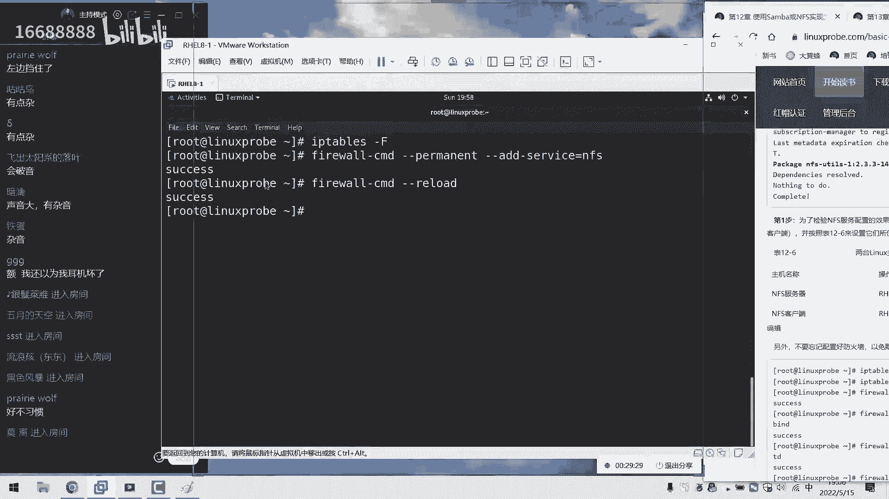
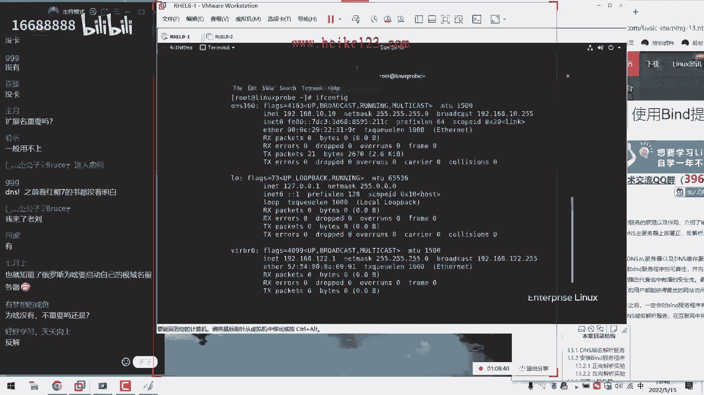

# 刘遄培训linux34期（配套linux就该这么学第二版，RHCE8） - P19：19 - 16688888 - BV1gL41167vP

ok同学，那我们来开始我们今天这个课程，然后大家先打一下一啊，大家听得到我说话了，然后声音是否清晰，刚才我们大概试了一下啊，啊没有什么问题，然后昨天的话呢因为一点小问题啊，一点小插曲嗯。

所以的话呢老就被隔离了，昨天我们离上课之前给大家发一条消息吗，大概三点多的时候，然后我们直接到消息了，所以呃由于被隔离的原因，所以我们这个课的话呢暂停了一次，昨天也是让他到了夜里，大概呃三点半吧。

虽然说从下午三点半就开始通知我们做隔离，但是的话呢实际上到隔离的出发的话，到了夜里三点半了，没有，现在没有感冒，然后的话呢其实这个病毒离我们还很远的，只不过就是因为可能是同一栋建筑里面的。

现在北京的防疫政策要求我们呃同样去隔离，所以我们就只能是配合了，然后昨天折腾到了夜里三点半吧，然后我们出发到了北京国际机场，然后我们这边酒店住下的话，大概六点多吧，然后六点多的时候已经困得不行了。

然后又然后就赶紧睡觉吧，然后开始收拾东西准备睡觉了，结果的话七点钟开始送早，他就开啊，七点钟的时候就开始就是呃送早饭，然后就大概睡了有半个小时吧，现在都吃完早饭了，大家看，然后我们突然想到这个啊。

电脑里面，大家可以感觉到，今天我们这个屏幕会稍微小一点，然后七点半的时候我们吃完饭了，结果的话呢相信这个环境没有搭，大概搭一下环境，然后跑着这个虚拟机啊，大概八点多的时候又准备睡觉了。

结果的话呢九点钟开始测体温，然后开始做核酸啊，九点多，然后就没什么睡意了，然后开始既然说我们这个环境到十点钟的时候，实在困得不行了，然后刚刚躺下，结果他在十点半的时候又上班测体温了啊，然后十点半测啊。

测完体温，躺在床上还没两分钟又过来送个中午饭了，然后等到了中午12点半也没正经睡觉，然后我当时我又想了一下，今天如果真的不睡觉的话，晚上就现在吧，肯定是还没有经历的嘛，然后12点的时候终于准备睡觉了。

然后睡了大概有两个多小时吧，到下午三点的时候又开始上门去做提问了，然后测完体温之后，下午五点钟的时候又过来送晚饭，所以今天的话呢，那给大家简单说一下我们昨天的一个情况，首先就是因为隔离的原因去世的话。

昨天特耽误了一天，然后以及的话呢，今天呃我们这边的话也是很多的付出了，然后对于身体的哈这个经历上来说，所以同学们可能看到这个画面，比之前小了一点点，但是当我们尽量克服吧。

然后我们这边把这个屏幕也稍微拉大一点点了，所以我待会尽量的把文字给大家调大，然后的话大家就可以能看清里面的这个文字，然后大家觉得这个声音还可以吗，有点杂音是吧，哦有杂音的话，可能是因为我这边碰到了他。

这是他现在用的是这个呃，电脑里面自带这个呃麦克风，所以我待会我会尽量的不要碰到它好吧，所以大家现在听到我们这个声音可以吗，啊没有问题是吧，那我们就开始今天这个正式的课程了，往后去讲啊。

往后去讲，往后的第12章节，我们来继续来给大家去聊，首先的话呢是我们做一下简单的回忆。

我们上啊，我们礼拜五讲什么呢，就改啊，我们虽然是礼拜五讲的，但是感觉已经过了好久了，那怎么样呢，有耳机吗，感觉耳机收音会好一点啊，同学们是这样的，我们先做个调查吧，同学们觉得我们今天这个声音可以吗。

如果你觉得可以的话，打一下一，如果你觉得这个声音有问题的话，呃我们再给大家调整一下，因为我这边把我这边的这个麦克风拿过了，只不过没有连啊，因为我们大概六点半的时候做过一次测试，朋友们说声音还挺大的啊。

然后我们就很，然后我们觉得很伤心啊，因为这个麦克风我们特意买的600多块钱买的，结果反而不如我们今天这个呃，自带这个麦克风好了，所以同学们看一下啊，有点问题是吧，左边挡住有点杂啊，左边挡住没关系。

左边大家不看，左边是大概这个聊天板，所以的话屏幕我们会给大家看。

大家需要看的啊，有点杂音是吧，好，那就这样吧，同学们，我们先尽量客服，如果说实在不行了，我们再给大家换啊，再给大家换个麦啊，再给大家换麦克风，然后我们的话隔离时间是十天啊，所以今天的话是5月15。

5月15号到25号，也就是说覆盖了咱们今天的课，跟下礼拜的三天课，我们都要以这个环境来进行，如果说您觉得这个声音有点杂，那我们就下节课吧，我们给大家调整好，然后我们再继续。

今天确实有点小有点小啊，有没有点小仓促，那我们要给大家往后面去说啊，先去说一下叫做网络文件共享，诶啊网络文件共享服务，我们来给大家讲一下，叫做natural work file system。

然后来给大家讲啊，nfi啊，然后它是一个iso版，这个字稍微调大一点，这是一个新的环境，所以我们要给大家打一下，这个的话，既然我们这个声优点杂音，但我们那么我们就把我们所啊。

那我们就尽量把我们所说的所有的话吧，都是大家都知道这个啊，屏幕上面大家可以来看到啊，如果听不清楚，那么也能够看得清，这么稳啊，叫做网络文件系统，他的话就是说，如果说我们要想去实现出来。

两台linux系统之间来进行一个文件的传输，那好了，我们上节课给大家讲了一下这个subuff，他可以去做跨平台啊，大家一起说，他是不是可以一起去做跨平台，这样的一个边共享啊，跨平台的文件共享。

而我们的话呢当前使用的是叫做啊，两台linux之间来进行文件共享的话，那我们则可以去使用这个服务，这个服务配置起来会特别的简单，那也就是说这个服务我们配置起来的话呢。

会有点啊快啊，所以大家一定要做好准备，因为大家可能还没有准备好，这个服务就已经大概配完了，因为它特别简单，所以说如果说我们的工作的这个场景。

就是用在两台linux服务器之间来做文件共享。

那么这个服务我认为是比较的嗯，方便的对吧，那我们来给大家操作一下，首先的话呢在红包六七个红包热巴当中，这个服务的话都已经是默认的已经安装过了，我们什么都不用去做，我们只需要去啊来进行一个配置就可以了。

首先找到，不不不不不不不，我们首先要先讲一下这个防火墙的问题吧，首先把我们这个防火墙默认清空一下，这样的话呢能够让我们这个网络吧，以及这个防火墙的这个策略，对我们来进行放行啊。

这样的话呢能够保证我们从web的用户，也可以对它进行一个访问，当然要加这个参数叫做永久生产模式，这个啊这个那我们这个习惯一定要啊，那我一定要养成啊，因为如果说我们这个啊配置这个啊。

我们在配置防火墙策略的时候，如果说我们没有加这个有点抽象模式，大家一起说，是不是就会有它有可能导致下次重启过后，方火墙把我们给禁止了对吧，所以我们要给大家加这个参数。

以及加这个呃fl杠杠杠reload这样的一个参数，让我们配置好的这个参数的话，那当前也能够去生效好，我能够考虑到对于防火墙方面的这个配置，那我就做完了，那么我还有什么方面呢，就是这个网卡方面。

对不对，好裁判，那我们再把我们能够想到这个网卡方面的，这个配置信息，我们再去检查一下，首先我们的网卡的ip地址，一九二零一八八点10：10，这也是今天连夜在这个啊，上午的时候给大家装出来两台虚拟机。

所以我们现在的话开启两台虚拟机，两台的话呢都为linux的这个服务器啊。

怎么样的啊，语速慢一点，语速的话正常啊，跟咱们之间的语速是正常的，老刘秒换，那咱们这个实验环境换了啊，那我们来给大家往后来继续说啊，今天那我们把网卡给他配好了，那么左边的话呢还是一九二零幺八点10：

10，右边的话呢还是点二零，那好了，我现在从右边这个主机往左边去拼一下，来，我们拼图拿3w啊，不呸呸呸啊，说这个广告了，一九二点一六八点10：10，拼读一下，我们这个左边的服务器。

能够保证我们的网络是能够互通的，并且防火墙进行放行了，我能够考虑到大点也就这么两点了，好这是我们做这个服务之前，前期需要做一下铺垫的好，然后第二点的话呢就是大家有说有杂音是吧啊，杂音的话呢。

可能是因为我这边呢啊这个非常艰苦啊，鼠标垫是拿一个我那个笔记本，然后再用的，可能是我在拖动鼠标的时候会有打印，这样那我就尽量少动鼠标和键盘啊，我们今天只敲需要盖撬的东西，可能我一敲这个键盘。

可能它就会有点散杂音对吧，好大家现在听我说话就没有杂音了吧，那我现在就尽量少，那我今天就这样，那我今天就去少碰啊，咱们多说咱们少碰啊，那我们来给大家往后面去看一下啊，那我们来继续吧，我们想一想好吧。

什么配置，那我们想怎么配置呢，在配置这个符之前啊，我们要首先要还有一个目录，这个目录的话就是用来去共享文件的，比如说我想去共享这个文件的名称啊，我想去共享出去一个文件夹嘛。

那么两台服务器都是linux拿好了，那么这个目录的名称叫做哈哈好了，来，我现在出现一个目录叫做哈哈，待会用来去做文件共享的那啊，然后的话呢我们再进入到这个目录当中，进入到这个目录里来。

进入到这个哈哈的这个目录里面，再去新建出来一个文件，我们把碎片给它取一个名字叫独舞点tt，我们随便往里面去写入一行信息，当然我们的话的这个用户，就可以读取到里面的这个内容了，我们来去简单做一下。

做一下我们这个小的测试嘛，点一下w q叹号保存并退出，这样的话呢我们的这个文件就已经保存好了啊，怎么样，ok没有啊，没有问题来，那我们找个地方，大家我今天这个声音尽量大一点啊，今天我们这个声音大一点啊。

我们这个大家应该听点，应该应该问题不大啊，我们换就是着重于听我们这个内容吧，大家可能对这个音效的话，那可能确实不如我们之前那个了，毕竟那个之前花钱买的那个麦克风特别好，那我们继续来继续继续。

然后我们来编辑好这个文件，我想一想还有什么可以做的哦，我想一想，那我们把这个防，那我们把这个呃网络配好了，防火墙配好了，文件也有了诶，那我觉得这个文件还好还不太够对吧，因为呃当前的话呢所有人啊。

那我们再换当前其他人可能是看不到的，所以我们再把这个目录的权限给它改大一点，然后我们就能够做完了，在配置这个服务之前能够做的一些前期铺垫讲，接下来我们来讲一下我们的啊，网络文件系统怎么来进行配置。

那么我们的网络文件系统的话呢，是在一个配置文件当中来进行编辑的，这个文件的话，大家记一下这个文件我们默认进入之后，里面是空白的，但是的话呢这个里面它实际上保存的是，我们一起说它是不是我们的叫做共享信息。

就是我们要想去共享出去，什么样的一个文件系统，就是我们要想去互相啊，那我们要想去互相出去什么目录，那我们就把这，那我们就把这个信息按照一定的这个格式写到，啊，来啊，那么来去写入到这个文件里面。

那我们来去敲一下回车，我们给大家去赘述了一下啊，主要原因就是大家看清楚这个文件的名称，不要少敲那个小啊，不要小瞧这个小写s，因为的话呢它里面这个内容都是默认是空白的，如果大家签作为一个小写s的话呢。

看到这个内容也是一样的，它也是空白的，但是锁定的文件与其说是不是不一样啊，对吧啊，因为现在老牛对现在其实在隔离酒店啊，现在在杯酒店里面，所以我们现在的话呢也看不到别人了，所以我们现在特别希望同学们能够。

那么去互动起来，能看到点人气啊，现在已经我估计可能未来半个月也见不到人了，所以今天我们就是讲课的小伙伴，大家记得跟我们能够互动起来啊，能看点人气啊，那我们来往里面去写，首先的话呢。

第一列写的是我们这个共享的目录名称，那我们就来做这个哈哈，然后的话呢我们下面再来，后面写的就是允许谁来对我们来进行访问，大家大家理解一下啊，这个指的就是要想允许谁来进行一个访问，那么还有三个写法。

第一个写法就是一个星号代表，就是所有人的话呢都可以去访问，我们这个共享的一起说目录对吧，然后第二个写法啊，就是我们单独去指定某一个主机，例如说一九二点168。10。20好了，我单独指定你。

你啊这个用户可以啊，这个主机可以去访问我们的这个目录，这是第二个写法，还有第三个写法是什么呢，把最后这个主机位我们改成一个星号，代表就是这个网段的用户可以去访问我们的啊，共享信息。

这就是说我们有三个写法，那好了，我现在的话，就只允许我们在另外的主题来进行访问，这样的话也更加安全了，那么也就是1920~8点10。20战，去写就可以了，后面的话加了三个参数，第一可以读，可以写啊。

我们要给这个目录的话，一定有这个权限，叫叫叫做这个通配符，非常好，第三章节啊学到这个通配符就开始用上了，首先的话呢可以读，可以写一个r一个w，然后接下来的话呢叫做同步。

叫做啊交流的话呢，我们把这个啊写的这个信息实时的同步啊，s y n c它是啊，它会把我们这个啊网络，它它进行一个共享信息的话，他会把这个信息的话呢，直接的去写到我们的硬盘里面。

这样的话来进行一个实时的同步，然后这样的避免说这个服务器突然间死机之后，造成数据丢失啊，然后的话我们来教教啊，教我们写第三个参数，叫做对于我们的管理员的一个映射啊，把它映射成一个补充的一个管理员啊。

叫做我就把那我们先把它写全，当然我们其实前两个参数，大家看到我们还比较好理解啊，但是发现第三个参数其实很多学还不太理解，说，为什么我们要把我们的管理员，映射成为一个普通用户呢。

我们来给大家举一个技术上的一个例子啊，再给大家举一个我们这个社会上的一个例子。

大家想既然说这个服务的话呢，它作用的这个啊对象的话呢，是两台linux的这个服务器，那么好了，既然是学费啊，那我们既然这个啊，所有的这个主机都是同一个系统，那么它的关联的名称的话，他们也都是一样的。

那么请问如果说我们现在有客户端的管理员啊，那么来去访问我们的服务器的话呢，我们的管理员超级乎入取，用户能否去管理那台主机里面的这个信息呢，这个可能呃听点是听到这个歌。

我们听点回来啊啊那我们会觉得比较抽象啊，但我们再给大家举一个例子，就是啊，如果说对方属于是一个关联的身份，来去登录了我们这个服务器，那么它除了可以去使用我们的规定的这个目录，里面的这个信息。

它是否能够去跳转到其他的目录呢，或者他可以去编辑我们啊，我们里边的话啊，做的这么一个文件信息吗，这是不可以，对不对，因为大家想，如果说我们先这个目录里面，指定的这个用户身份归一个普通用户作，有那么好了。

那么当有一个关啊，那么我们都有诶，另外一个人使用管理员的这个身份，来登录到我们这个服务器的话，那么他使用的是什么身份呢，他使用的还是管理员吗，所以我们需要把这个呃管理员的话呢，映射成一个普通的一个身份。

这样的话他只能够去做文件的物奖，他不能够去做一些越界的一些事情，我们理解来讲的话，有点类似于叫做牢笼机制，叫做这个cha root。

但是的话呢又比较轻量级，我们简单的啊可不可以这么大去理解啊，另外我们还有一个小例子，如果这个记住这个例子，大家以啊，那我们天绕的话呢，我们再给大家举一个例子，比如说我们的隔壁的邻居啊。

那比如说那个小胖子，他的他拿拿啊，那么他啊他如果来到中国了，那么请问他能不能去调用中国的一些，比如说啊钱啊，军队啊这些资源呢，其实一想也知道，那肯定不可以对吧，他那肯定是啊，那会啊。

那么它具有一个最高权限，但是你来了我们国家了，他那边，但他变成一个客人了对吧，他就不能够再去行使，他原先在他们的国家清楚了一些权利的，所以需要去保证我们的本地的一个安全。

所以要把对方的这个管理员的权限的话呢，进行一个降级，建设成一个普通，这样的话呢它啊它会更加安全好。

那我们先做好了之后，点一下这个保存并退出啊，这样话我们就做好了，这个文件的话大家记一下啊，在红包五和六里面，实际上不用去重启我们的啊网络啊，网络啊服务，那我们的话呢，只需要去使用到这个命令就可以了。

让他去升下一下，大家可以来记一下，在红包五和六里面不需要去重启那个存储服务，我们只需要去使用它这个命令，来进行一个同步就可以了，但在红包七跟八里边的话呢，那么我们还是需要去重启一下吧。

所以这个是一个小的一个变化，所以说如果同学们要是使用的是一个，早期的一个系统的话，比较老，那那么我们就需要去呃，就是只用一个字，那我们就只将就一次就可以了，如果说你只能是七跟八的一个系统。

那么您需要像我一样再把这个给他去启动一下，我们的是不是后面加一个杠server啊，来网络文件系统杠server来看一下这个对不对啊，没有问题，来这样的话呢，我们再来打大家说二对吧。

就是说我们这个不能够形容举止，这个关联的这个权限了，其实我们在配置这个服务的时候，总会遇到这样的问题，就是说从理论上来说肯定是不可以的，但是我们该怎么样来进行限制呢。

这就是我们要去加参数的这么一个目的了，来这个是什么意思啊，我们这一代表就是去同步一下这个文件里面，它所对应的这么一个共享信息啊，环境变量不对啊，啊它是代表的，就是我们去同步一下这个文件里面。

所有这个共享信息，等于说它有点像是reload这样的一个操作好，接下来我们再来，我们需要再去重启另外一个服务，他这个服务的话的目的是，让我们的用户能够去读到它所共享出去，这么一个信息。

然后我们才可以进行一个挂载，也就是说我们去启动这个服务之后，对方就可以来对我们进行一个探测了，知道我没有啊，那么知道我们在我们的本机，有哪些可用的这个共享信息，那我们都这么做好之后。

下面干嘛呢，下面我们就可以进入到这个客户端了，大家可能还没有感觉到啊，但我能，那么我们可能感觉这个服务还没有配完对吧，但实际上已经结束了啊，比我们同学们啊，既然是一个小太阳啊，但是这个名称我们看不到。

但是啊比如同学们只要稍微来的晚一点点了。

今天就已经错过了，这个服已经讲完了，就这么夸，来我们给大家看一下啊，进入到一台客户端上面，那进入待一待啊，进入那我们进入到一台客户端上面，他只需要做三个事情，第一个事情新建出来一个我们的挂载点。

叫做哈哈哎，就是说我们要给他挂到我们本地的什么目录下，那第二点的话呢，就是我们要想去挂载一下那个信息，那么就要去直接去输入一个信息，进行挂载就可以了，但是我觉得有点乏味，就是我们嗯假装文件。

不知道它在主机上面有哪些可能构想，这样的话呢，我们作业一点趣味性，我们会去使用到show mt命令来去探测一下，说对方主机上面有哪些可能共享一个杠小e，后面我们写上这个服务器的一个地址。

一九二点一六八一六八点10：10，来看看，今天确实没水足啊，这地址都已经说的很，这地址我已经说了好久了，居然忘了来来去探测一下，说对方主力上面有哪些可能的共享，在我们工作的时候也是这样的对吧。

如果要是我觉得哎等一下啊，看一下他说网络不可达啊，那我们先不管，那也就是说呃在我们工作的时候也是这样的，如果要是我们不知道对方手机上面，有哪些可能共享，那么我们就可以去使用那个双mark的话呢。

先去看一眼，这样的话我们就可以知道有个数了，好看一下他说的话呢，我们的呃不可达啊。

他怎么样呢，说掉线了啊，画面没了是吧啊，稍等一下来，同学们现在听得到吗，啊难道是喝水时间吗，来同学们打一架，一现在听得到我说话声音吗，是不是老天爷在给我们机会，让我去倒杯去啊，去倒杯水啊，网不太好。

稍等一下啊，那我晚上回来，好好那啊，吃好了是吧，那行那我们来继续吧，ok同学们，那我们来继续有，那我们来继续继续继续呃，如果说再卡的话，大家买，那么大家就马上告诉我，因为我这边的话就准备一个无线网卡。

都已经准备出来了，马上可以切换啊，只需要一秒钟时间可以切换过去，所以如果说你待会再卡了，或者说您觉得这个网络的话有点波动的话，随时告诉我，随时望，那这个可以解决来，那我们讲到哪了啊，我刚才讲到的是哪。

开始卡了啊，讲到这两个服务吧对吧，那我们再来一遍这个符号的话，目的就是说啊，我们那我们需要把这个符给他起来，这个服务的话呢，我们的目的是让我们的这个对方主机，能够去探测到我们有哪些可能共享。

但是的话呢我们就试了一下啊，好像没有成功，192068，我们先在我们的本地去尝试一下，一九二零六八点10：10，在我们的本地探测一下，本机能够看到共享出去那个信息，但是唉但是啊在客户端上面看是看不到的。

在我们客户端上面是看不到的，是没有看到这个共享信息，所以的话呢我们理解一下，肯定还是这个防火墙的问题来，我们判断一下这个原因啊，还有防火墙没有开全，我们的话呢还要开启叫做rpc band。

我们需要把这个探测符给它开启，开启这个服务之后，a分啊，非常好，防火墙啊，非常好，这个思路我们一定要有来，我们来看一下rpc版的，他说的话呢，rpc版的已经不存在啊，那就是rpc啊，我看一下啊。

名称还真忘了，没关系，我们来看一下这个啊，我们这个服务的话不丢人对吧，因为这个好人不配了啊，我看一下啊，r pc刚办的诶，天这个天猫宝来的也没错呀，啊这边有个减号，不好意思啊，同学们。

不好意思不好意思啊，忘了忘了它不叫的啊，他的话是有一个减号了，它需要加一个减号，你说这玩意儿啊，这个确实不好记啊，来r p c band的，后来的后来再来一个叫做mount啊。

这个指的就是让对方主机上面，能够进行一个远程的挂载，当我们这两个服务再开啊，这个时候就是再也没有什么问题了，就肯定就行了，我来再给大家看一下啊，mount然后我们去让他重新加载一下，偷个懒。

让他重新加载一下我们这个生效文件，它当前生效，重启之后也生效，哎呀想偷过来r m，但是没有找到那个杠杠reload的呀，嘿还真没有，嘿好吧，大家继续啊，自己的键盘啊。

就是啊这就为了省这就啊就为了省事儿了啊，来那我们去重新去启动一下我们这个啊，重新启动一下我们这个防火墙，然后去重新下载完过后的话呢，再去查看一下，大家可以看到，那么就可以查看到了。

就是说当前转发的客户端啊，就可以去获取到，我们这个服务器上面有一个共享信息，恰巧的话呢，他说我们共享的这个主机的话是10。20好了，那那也就是说我又正好是10。20，所以我就可以把这条信息的话呢。

改成快来到我们的本地，刚才说有三个事情，大家记得吗，我刚才说有三个事情，第一个事情的话，那是什么灯啊，那我们需要现在出一个挂载点对吧，第二个世界的话，那我们就可以直接去使用那曼岛的进化咋了。

然后我们对应的这个格式的话，大家一定要记清楚，就是它跟sumer是有区别的啊，我们之前见面来进行一个操作，我看一下啊，gt指的是我们这个协议，然后我们的网络文件系统后面的话呢，是我们的服务器的一个壁纸。

一九二点一六八点10：10，好大家需要注意一下，就是我们再去挂了这个sub的时候，它有两个啊，那么它要是有两个斜杠的，而换到我们这个服务的话，它是没有这样的一个斜杠的，大家一定要记住啊，然后后面的话呢。

指的是，我们挂载的是我们对方服务器的一个路径，他的话在sa的时候，挂的是我们的唯一的一个名称对吧，大家还记得就是它的一个呃，他的啊我们那管的这个sub的时候，挂载是这个中括号里面的一个唯一标识符。

然后的话它里面是一个啊，它会它啊，它的名号会有一个共享的名称，而我们现在的话呢，当前是写的是对方主机的一个共享目录名称，所以大家一定要这个啊，是他是他是要能够去区分一下的。

这个的话是远程的这个目录的名称，而我们下面的话到后面再去写一个，我们本地的一个名称，这样做完之后又没了啊，大家不要吓我啊，同学我同呃，同学们，我们还有吗啊，我们还在吗，同学们打一下一。

今天可能就大家多辛苦一下啊，今天咱大可能就要多辛苦一下，ok继续来，我们没有问题是吧，好来来来来，哎，我们还在就行啊，如果只是网络卡啊，这个可以解决可以解决啊，来我们能够把它想得到的。

今天我们都给大家做到了，都给大家讲到这个被我办了，来我们现在去挂载一下，他说的话呢网络不可用诶，你这个问题我还真没想到啊，192。168啊，果然少打了一个六啊，哎呀不溜了不溜了，来我们点一下168。

那这样的话我们做好之后，来df杠h看一下，就是能够把我们这个信息的话呢，挂到我们的本地了，这就是我们第二步需要做的事情，然后的话呢，同样哎可以去进入到我们这个目录当中，查看一下。

刚刚的话那大概就是在07：20的时候对吧，啊，07：15的时候出列出来那个文件，看一下文件里面的这个内容，确认一下没有问题，证明一下，说我们这个客户端跟服务器能够去同步信息了，啊，也是没有问题。

来我们接下来的话呢再来编写最后一个文件，第三步要让我们的这个文件系统的话，一直能够去挂到我们的这个服务器上面来吧，我们一直提供服务来编辑一下这个啊。

files在system tab文件来对它进行一个配置，首先的话呢是这个远程服务器的一个信息，这样我们写好之后，下一次重启多少次了啊，那我们下一次再重启多少次，是不是他都不会这个让我们去，是不是那啊。

那我们都可以去使对吧，它自动帮我们自动挂载大问题的问题，说我们里面的话呢，我们的唯一性的主机名称泰迪啊，ip地址可以吗，是可以的，特别可以写域名，那我们一定要记住，就是dns斯塔配好了。

那我们就可以去写域名呃，只不过的话我们第13章节，待会大家讲dns s，所以我们看我们现在所有都是以ip为准的，但是实际上我们在很多的服务器配置里面，我我们的域名主机名称啊，v啊，叫这个。

还有我们这个地址的话都可以去互换的，大家说我们的客户端不需要去启动这个服务吗，这个曲子啊，这个服务需要启动，只不过的话这个服务已经默认启用了，所以在红包只有七个八里面。

我们是不用再去配置的，所以大家会啊，我们会把有另外一个名称啊，我们所说的网络文件系统，实际上也可以给大家另外一个名称，大家会觉得这个感觉没有配对，把它配完了对吧，这个的话呢我们也有一个其他的名称叫做啊。

极品飞车，对不对，叫做这个速度与激情啊，need for speed，就是说速度与激情啊，就是我们黑起来好像特别的快，我们需要的是一个速度。

所以我们配置起来的话特别的快，这个我觉得这个名称的话也很好记对吧，来我们继续来继续来写下这个目录的名称，我们远程的服务器的话呢，都共享的目录是哈哈，然后的话呢我们的这个共享的本地目录的话呢。

我们也是叫做哈哈本本地发达点，然后还有我们的本啊，那我们的本地的这个呃格式，我们给大家写下来，这话default权限默认，然后接下来我们选择零零，不要备份，不要自动校验，我们选完之后点击一下保存并退出。

接下来就要去怎么样呢，就是我们的接水时间了，来同学们，我现在去重启一下服务器。

它会自动帮我们给它挂载上，同时有我去倒杯水，一定要冒号吗，一定要冒号，必须要冒号，它还监督我们的服务器的一个地址，以及我们这个，然后他去啊他啊，他去兼顾我们这个服务器这个地址。

以及我们所对应的一个目录的。

所以我们一定要给它写下来，好哦，看一下已经记完了是吧，那待会等下一把吧，那我们下一把再接再去接水啊，已经起来了，然后我们来继续给大家见证一下啊，咱们先不先把咱们动起来，今天看今天感觉这个吧。

我觉得这个话有点多啊，我估计可能下礼拜的时候可能就会开这个哎，可能就会开摄像头了啊，因为可能突然见不到人了，觉得非常的寂寞，所以我们下一我，所以我们下周的时候，我们看看能不能有没有条件把摄像头给开开啊。

咱们可以换一种讲课形式，哎，然后我们来去，就我们去看一下我们当前这个挂载信息呃，现在的话呢我们的刚才过来信息里面看一下，还真哎没有了，不可能啊，我看一下啊，没有挂载上，稍等一下，果然是，所以有些时候吧。

我们尽量一定要去重启个之后进行一次检验呃，检验一下他有没有成功，检验一下他没有成功，所以星辉重启了一下，对不对，要不然的话这个就被糊弄过去了，来我们秉承对大家负责的态度啊，看一看是哪儿出了问题。

来看一下啊，一九二点一六八点10：10，这也不能再错，再错的话就是脑子问题了啊，然后的话呢我们的冒号，我们的本，然后我们的这个服务器的一个路径，本地的路径，然后比force默认权限零零没问题呀。

啊没问题没问题，来，怎么样呢，说可以说看到帅哥老牛了啊，就有点像是我们的托啊，同学们，你们说有点假，这样别人的这个啊，其他学生一看好像是我们的托儿吧，这一看就是糊弄的啊，可以啊，大家是来去看，我。

等会儿稍等稍等一下，稍等一下啊，出点问题，我们还是比我们还是不要脸的，现在出了问题吧，我们尽量不要糊弄过去，正好原因这原因啊，找找找找找找找原因啊，来再重新再挂载一下，现在就选择md命令来作为。

咱再去做一下挂载，我们那么把我们的哎nfs文件系统，然后是一九二零六八点10：10，然后的话呢我们本期的这个，然后去远程的路径以及本机的路径，你看诶也不行了，不能够啊，稍等一下啊。

看一下mount gt，然后nfs一九二零六八点10：10，为啥没没，还是为了他啥，为啥为他不行了，192008，他说网络不可达，对网络不可达，不可能应该啊，他不能不他不能不打他，他不能打不了啊。

因为我们这个网络都配好了，这个防火墙也配好了，不能够啊，稍等一下，同学们看看是哪出了问题啊，不按套路出牌，今天这个上来先出师不利啊。

啊昨晚上我就觉得已经到头了，结果今天更不利了，嗯稍等一下嗯，先说点废话，来掩盖一下老老刘心中的这个呃尴尬啊。

现在我们来看一下来虚拟机的网络，打开看一下，我觉得不是这个问题，来一九二零六八点10：10，哎，网络怎么不行了，我的我的网卡呢，哦朋友我知道为什么哎呀说一下原因啊，说一下原因，我们今天看了这个问题啊。

他不是出现在了我们配置这个服务上面，它出现在了我昨天被隔离的这个事情，昨天的话呢我应该在隔离，所以的话呢我们那个i9 的12代的，我们的32g内存，那个外星人电脑吧，我那我们就没有拿。

所以的话呢我这两个虚拟机是今天上午的时候，然后七点多的时候搭出来的，我少我当时配好了网卡之后，我少改了一个参数，我想起来了，同学们原谅我，我想起来了，早上起来实在脑子太懵了啊，太实在太懵了啊，睡了饭。

睡了半个多小时，我们少改了一个参数，网卡了，自启动on bot肯定是没有开启，果然是on bot没有改成e，所以的话呢我们刚才重启过后，那个服务没毛病。

但是网卡没起来，所以我们给他改一个on，不等于是yes，再来重启一下。

再来啊，再来一次重启来掩盖他的老刘这个尴尬啊，再重启过后就百分百没有问题了，再有问题那就可以退钱了。

真的咱就咱就说啊，这这这个问题太基础了，其实这个实在是太基础了啊，太不应该了，来好等一下同学们，等一下同学们，我们等他一下下，另外的话我们回答一下同学们的问题啊，然后我们坦白说就是昨天的。

昨天同学们给我们登记的那个信息，就是您要在那个成都啊，济南啊考试的一个信息保存在台式机里面啊，我们忘了拿了，所以的话呢我们下周的时候就统一吧，520当天会给大家约考试。

所以如果您想要在其他的城市去考试的同学啊，不好意思了，那个信息没了，所以的话呢你你下礼拜五也来接啊，也来过来上课来了，我们这个具体时间的话呢，也要礼拜五的时候给大家在上课的时候去说了，咱们就不啊。

没有办法再去私底下qq给大家去说了，所以下礼拜五的话呢不要来啊，不要千万不要迟到啊，课上不上无所谓了，但是那个月考的时间大家应该听一下，来，我们看可以看到的话就是我们重启过后。

这个放到我们的网络文件系统，依然是挂到我们这个服务器上面的，没有任何的问题，非常的顺利啊，挽回老刘这个面子啊，好，这就是我们用来啊去实现出来，两台linux这个服务器来去做文啊。

来去做文件共享这样的一个小实验，然后我们下面再给大家来捋一捋，下面还有一个服务叫做auto file system，叫做自动的文啊。

自动文件系统来给大家看一下，大家说怎么样呢，呃然后说可以看到设计的老刘，下周一定准时上课啊，也不也也还不一定啊，因为那个摄像头我不知道他能不能调出来，而且看不看人无所谓啊，啊毕竟长得比较丑。

然后不想他不想大家这个上课的这个心情啊，来我给大家讲另外一个服务，叫做凹凸f s or two fs，这叫小明呢，叫做自动的脚本系统的自动文件系统，其实啊放到现在有多么的高级自动文件系统。

那现在解决了什么样的一个问题对吧，因为他肯定需要一个痛点吧，是什么呢，就是如果说我们先这个服务器，大家听一下啊，如果说他有一个服务器啊，然后的话呢上面挂载了好多，好多的这个网络存储，就像我们刚刚一样。

比如说桑巴也好啊，什么f t也好，无所谓，换来了很多的网络存储，那么从理论上来说，他是不是要跟那个服务器，然后进行一个数据的一个交互啊，他是不是会从理论上来说消耗我们这个网络呀。

还有cpu这个计算资源呢，好了，那我们现在想一个问题，比如说我们现在那啊，比如说我们系统里面这个光盘光盘的话呢，我那我们每天上课两个多小时，我们只需要用到一条命令，就是去安装软件的时候。

才会去使用到光盘里面的内容，但是的话呢往啊但是光盘里面这个内容啊不啊，我们啊，但是我们的系统光盘的话呢，它会一直去挂到我们这个服务器上面，会挂两个半小时，但是我们实际上去使用的话呢，可能才30秒。

那么它是不是也会或多或少去消耗，我们这个系统这个cpu和网络资源呢，所以我们给大家提一个呃，呃那我们给他提出一个需求来，如果说我工作的时候，我的这个网络存储里面啊，那么呃如果说我在工作的时候。

我当前挂的这个网络存储吧，特别的多，有几十条上百条，那我觉得他消耗我这个系统的这个资源了，我能不能说只有当我需要用到的时候，他在帮我们自动去挂载呢，就是说只有用到的时候，唉呃呃只有用到的时候。

然后的话呢自动挂载，那这啊那我们看这个多好呢对吧，它啊平时没有用的时候，这不会消耗系统的这个资源，而他只是当用到的时候才会去啊，自动挂载，这个挺好，我觉得这个话我们把它叫做自动的变电系统。

我们来给大家来去操作一下啊，大家说怎么样呢，说啊啊按照需要来进行挂载，没毛病啊，是不是啊，我们来按需分配啊，那我们来看一下啊。

下面的话呢我们来去找到这个服务来冲去，对对对对，我们先去还原一下这个虚拟机啊。

把这个虚拟机还原到一个最舒适的一个状态，这样的话呢，保证我们的每一个实验之间都是相互独立的。

这样的话同学们以后再去配置的时候，是不是也能够从零开始去配呢。

啊非常好，哎呀老刘现在已经出现人传人的迹象了啊，现在这种废物太多了，对比说我们之前的话不太严谨了啊，不太严谨的不太严谨了啊，来我们来继续啊，来去安装一下叫做ultra fs，来安装一下文字动文件系统。

但是我们说实话啊，这个服务我们常用吗，说实话我不常用，为什么呢，因为我就那么几个这个服务器，我来我一，我来了去也就那么俩仨，那你说这个给他配置一个这个服务吧，你说不消耗我这个网络存储的这个资源了。

那我这个服务跑起来，它也需要消耗系统的这个资源，所以同学们要讲到什么呢，性价比问题，如果说我们就那么俩仨，像啊，就像我们一样啊，没有必要，如果说我们这个网络存储有个十个，20 30 50。

那这还是划算的，所以根据需求来去说，那根据我们的需求决定是否来继续使用，那我们来a一下，回车alt f s来进行一次安装，安装的话呢，我们还是点一下这个y，然后大喊一声钟离啊。

然后人家外面以为我们会里面发生什么事了呢，啊然然但是你也不敢进来看了，来我们卡了好喝，那我们喝，那我们喝水啊，现在同学们现在好了吗，呃有没有卡顿的情况，唉我们来继续啊，没有卡是吧，来我们来继续啊。

那我们来继续继续，如果卡没卡啊，大家一定要告诉我，因为有同学说卡了，但是他还不说话，我还以为大家都卡掉线了啊，那个同学还算是网络比较好的，还能够发出信息的，所以同学们一定要告诉我一下啊。

我们一定要告诉我一下，我们来啊，共课时间在一个关键时刻啊，把这个课给大家讲好，然后的话呢我们来去配置一下我们这个服务，这个服务的话它分为两个文件，第一个文件的话呢。

我们是把它叫做etc目录里面的auto。master，其实女同学后面要说是这个是什么文件呢，他都已经叫master了，所以我们其实很好，就能够猜得出来它叫做主配置文件吧，大家看一下，它都叫它。

它都叫master了，所以他肯定是叫主文件了，它就是我们这个服务的一个主配置文件，但是我们要给大家捋一下思路是什么呀，主配置文件里边大家一起来问这个问题啊，请问主配置文件里面。

是否是否包含了所有配置参数呢，这个小问题啊送给大家，请问主配置啊，主配置文件里面是否包含了所有的配置信息呢，大家告诉我1号就开了嗯，然后今天的话我们不仅是互动啊，大家回答一下问题啊。

复习一下之前所捡过东西，还有就是看大家有没有卡顿了呀，对啊他哈哈，他并不是，对不对，因为的话呢主配置文件里面包含的是，最重要的是信息，而并非所有的我们来敲一下回车，果然这个里边的话实际上只是一些定义。

定义了我们对于某一些目录的一些啊配置文件，所保存的一个路径，比如说我来给大家演示一下啊，比如说我们现在想针对于哪个目录来进行操作，那我们就把我们的猛啊，那我们就把某个目录的话呢写到左侧，然后的话呢。

针对于这个目录里面的这个配置文件的话呢，我们写到右边来给大家去操作，再稍等一下，我把这个这边有一张纸啊，把拿走一点，然后我们会产生这种声音啊，ok来继续来，我们来看一下。

这样这样这样大家不说这是archie啊，这是我们23c语言考题吗，哎这还真是考题啊，还真是考题，人家考了多少年了，他最开始可能说是在2012，2011年和2012年的时候，我们当时记得是考到红包。

周六刚开始发布的时候，他就开始考到了，所以这个的话有有年头了，大概得考了13年了啊，大概得考了12年或者13年了，这个时间其实很久了来，然后呢我们来给大家配置一下，比如说我想让它自动挂载的是什么目录呢。

我们给大家写下一个目录的名称，我们要针对这个目录里面的自动挂载信息，来进行设定，那好了，我们这个呃我们这个信息的话呢，就以这个文件里面我们来进行定义，也就是说啊我们要真的。

那我们要想针对于这个目录里面的怪信息，来进行自定义的啊，这么一来进行一个配置的话呢，那么具体的配置信息并不是写到我们的这个哎，主文件里面，它的话呢是写入到这个词配啊，它它是由子配文件的话来进行一个调用。

就相当于就是说我们呃买一本书，对不对，那么比如说我想学习某一个章节并不长啊，那我们需要先看一下目录啊，然后啊啊呃，然后的话呢我们的目录会啊，去指向一下它的具体这么一个诶页数。

这样的话等于说它是进行一个指向的一个作用，具体啊里面这个文件的内容的话呢，我们需要再形成一个编辑就可以了，好了，那也就是说针对于这个目录里面的这个信息，我们来针对于这个文件里面来进行填写啊。

在这个文件里面去填写对应的这个目录里面，的挂载信息，来我们来保存并退出啊，怎么又卡了，没有搬过去吧，啊啊又好了是吧，好我们来继续来，我们今天的话来看一下，看一下今天这个酒店还可以啊，今天酒店还可以。

然后我们今天因为特意安排了一个网络，比较好的一个环境，可能住宿环境一般啊，不但是咱们的防疫啊，咱也不多说，反正就是网络环境没毛病啊，来我们来继续继续继续啊，同学们啊，不要吓我哈，来我们来这样啊。

来编辑一下啊，找到我们刚才所定义好这个名称，一定要跟我们的文件里面的话呢保持一致的啊，一定要保持一致，然后的话呢我们来敲一下回车啊，然后我们来进行编辑，既然说我们要是针对于我们的media目录里面来的。

这个会展信息来进行一个控制，那我们前面已经定义好了他这个上野记目录了，所以我们要想针对于这个里边，比如说某一个目录，我看看是谁迟到了啊，我看看谁迟到了啊，大家说侯啊，大家说后缀名重要吗，不重要啊。

并不重要，在红包666里面的后缀名必须是m s c，九尾的，但是在红包只有七跟八里面无所谓啊，可以改可以改了啊，现在可以改了来，比如说我看谁迟到了啊，我看看啊，z同学迟到了啊，z啊z d迟到了好了。

我就这么去写啊，如果说我想说呃，我们去访问这个目录的时候，他帮我们自动挂载一下我们这个光盘，那好吧，我们就这样去写，那么由于前面已经定义好了，它所对应的这个哎上一节目录的名称。

所以我们只需要去写它里边子目的一个名称，z d就可以了，好这个名称有意思啊，像是一个好像很眼熟啊，好像是一个电影里面的一个角色名称对吧，来我们来继续啊，来首先写下这个目录的名称。

后面的话呢我们写一下sl system type，指的是文件系统的一个格式，然后我们写下来啊，9660为光盘格式，来我们然后的话呢可以读，然后但是只能够读，然后这样写完就可以了。

后面的话呢指的就是我们的这个挂载目录，的一个名称啊，那也就是说我们具体设备的这个名称，第一位目录里面的city room，他来给大家解释什么意思啊，也就是说当有一个用户。

他去访问了一个叫做media目录里面的，jd的一个目录的时候，那么就会自动的以这个格式，以光盘的格式，以指数的形式去挂在我们的光盘，是这样的一个效果，其实你觉得难吗，就是我其实我们觉得捋一下思路的话。

并不那么的难啊，来点一下这个保存并退出，做好之后怎么样呢，第三条，要想让我们培训过的这个参数能够生效的话，我们需要去从其它所对应的服务啊，即便来啊，即便连啊帅气的老刘也不例外啊，来取system。

然后是restart，system control restart，然后是auto fs啊，这个都要这么去做啊，没有例外，没有例外，都要这么去做，然后是enabled，然后是ultra fs。

本来服务的话加到选择当中，保证我们3s的时候还依然能够有效，考试的时候，这个肯定错不了，那这个啊谁都扣不了我们的分，这样做好之后，我们就可以来去尝试一下了，呃我们这样啊。

我们先把我们当前这个光盘给它卸载掉，这样的话呢，我们来为了让这个时间更加的准确吗，他都说我们这个挂载目录没有被定义，啥意思啊，说啥呢，dv目录里面的啊s20 ，我们啊这个默认有没有把它给关掉了是吧。

已经被卸载掉了，ok那他还挺自觉，那我们就这样给大家操作一下，首先我来见证一下奇迹了，进入到我们的media目录当中，然后看一下当前话的这个目录里面，没有任何的文件，大家可以看到啊。

啊没有任何的文件进来，这不是流传了啊，就别乱刘谦了啊，给大家演示一下见证奇迹的时刻了，进入到cad目录当中，没有任何的目录，然后的话呢就进入到这个目录里面，不仅能够进入成功里边的话呢。

还能够看到所有的光盘里面的这个信息，因为的话呢光盘已经帮我们推送的，给大家挂载上了，这个我们就把它叫做自动的文件系统，当我们需要用到的时候，才会自动去挂载上，平时不会消耗我们系统的这个资源。

这个叫做自动文件系统啊，大家可以来去呃，心理人来盘算一下，看看我们的公司值不值得上这么一个服务，如果说就这么像老刘一样，他们两个三个服务器，那可能无所谓，如果真的是挂了几十个服务的话。

那么就可以跟老板去申请加工资了啊，这就是又提升效率的这么一个小的方面，那我觉得还是比较好的好，然后我们来给大家说一下今天这个重头戏啊，我们前面的40分钟啊，一般用不上，也不一定啊，也也也不太一样。

主要看我们用户的需求，可能同学们现在没有用上，但以后就用啊，当然啊我们以后可能会用得上，主要是这样的啊，今天的话我们的前面40分钟，主要给第12章电话呢收了个小尾巴，我们今天这个重头戏就要来了。

第13第13章节d n s啊，第13章节的话呢，是我们整本书里面最难的一个章节啊，很难有之一，第13章节巨难，我们来给大家啊，需要下功夫来给大家去说，但是我们只要卖过13章节那个坎了。

后面这个东西就会很简单了，所以啊同学们会继承说，第13章集听完之后想要掉头发啊，想要去抓狂，所以同学们不要太大心理负担，我来给大家多说两句啊。

就是第13章节配置的是dns，配置dns的话呢，说实话嗯。

如果同学们说o to fs用的几率不并不大的话，dns你就可以把它放弃了，就是不用他就是在我们工作的时候的话呢，几乎是不用配置dns s的，就是我们自己配置一个dns几率太小了。

配置一个我们的文件传输服务，配置一个我们的啊，网站都有可能再配置一个dns s，这个几率反正是我是很很少好吧所在啊，但是我们第13章节，今天啊经过我们这个学习的过后，同学们会对于这个网络的知识。

有一个更加深入的一个了解，以及知道我们在这个路由器里面，这个小盒子里面到底怎么来运行这个dns服务的，会有一个很深的一个了解，所以我们要求今天这个课的话呢，实际上是只听八代啊。

不用记参数这么一个水平就可以了，然后这个话呢考试的话呢，呃在我们的红麻质3a c里面是没有了，然后呢在我们的红花是c里面的话，也没有他知道，而是c里面他考到过一次啊，dns之前看七都没看明白啊。

八的话再试一试，然后的话呢我们就是这样的啊，在这个红包r h c里面是有过的，其实rh c的话有没有哎，r t z里面有那r h401 啊，里边是考到了叫红包微啊，叫做红包卫星网络里面是考到他了。

然后的话呢但是在201几年，2014年的12月份呢结啊，结果将会在2014年的12月份就没有了啊，就是再也没有了，就是2014年的12月份以后，我就把稍微打点字啊，12月份以后就再也没有了。

也就是说红帽的这个所有的考试当中，对于t的这个考核全线下架啊，确认下架，这么说什么原因呢，哈哈就是说大家要去别的培训机构啊，花了多少钱报名学车，那我肯定是学不了他的啊，肯定是学不了他的。

我们就来给大家增加一点扩展知识啊，他说为啥没有啊，他不他并不重要吗，嗯主要就是在我们企业当中可能配置的比较少，而且的话难度确实有点高，它并不适合于我们的rh c e这个水平去配置。

它就是它其实确实超纲了，确实超纲了，以前r gc里面也只考到了，就是这个正向服务器，它也只看了他，他只考到了这个主服务器的正向解析，然后配置一下就可以就可以了，而我们这的话就会给大家讲呃。

这个主服务器从服务器缓存服务器，这就是三种服务器类型，然后的话在我们这个主服务器和存储服务器，之间配置一下tsi的一个加密，然后在主服务器和存储服务器之间，互作正反解析。

然后最后的话我们要给大家做一个叫做这个，分离解析技术，就是相当于就是一个cd n，我们今天有一说来一个大全套吧，给大家一个打算套，给大家看看到啊，到底我们这个dna它能干点啥。

说这么多废话啊，给大家一个归引起来这个兴趣了啊。

咱们学习的时候要有兴趣，然后来正视这个上主题，dns是个啥呢，dns我们俗称叫做域名解析服务，来给大家写下来，今天我说不说啊，我们今天这个声音老卡，我们给大家录到我们这个主页上面，dns dns掉落。

那din啊，name server对吧，域名解析服务器，哎这个话专门用来去做域名解析的，我们同学们嗯，回忆一下我们用dns的这个场景是啥呀，是不是我们平时去访问网站啊。

比如大家去经常访问的一些什么网站呀，我们大家知道我们现在一个主流的，大家都非常喜欢的一个网站啊，那我每天都要去访问一个网站，叫做3w。linux probe。com，也突然打一个广告啊，猝不及防啊。

猝不及防啊，这么关套路出牌呀，来我们啊在我们上网的时候，我们去输入一个网址，是输入一个域名就可以去访问到一个ip地址了，大家有没有想过一个问题，就是为啥，因为我们的互联网里面。

它是基于公网的ip地址来经传输的，它基于的是一个t cp i e协议对吧，这没毛病，那好了，为什么我们可以叙述一个域名，就可以访问到对方的这么一个啊，那么就可以访问到对方的服务器呢。

而对方的服务器一定是一个p地址啊，就是因为有一个啊服务器，当我们去做的这个域名以及对应的一个ip地址，是这么一个解析工作了，那么这个解析方式的话呢，我们给大家解释一下，哎之前我们是解析的使用者。

今天我们是一个管理员，所以的话呢我们需要给大家来去捋清一下，是啊，如果说我们要把一个域名，然后我们解析到了一个ip地址上面，比如说这么一个地址啊，地址肯定不对啊，但也无所谓，比如说我们现在还要把，难道。

比如说我们现在要想把一个域名，解析到一个对应的ip地址上面，这样的话，那我们把它叫做啊，那我们这个时候是把法，那我们是把它叫做正向的解析服务来，大家记一下啊，如果说是不是将一个域名。

解析到了一个ip地址上面，我们就把它做正向解析服务，如果说是把一个地址的话，那解反向解析到一个域名上面，还有我们有说出来啊，那么则把叫做反向域名解析来，大家记一下这域名转地址，这个方向我们叫做正向啊。

地址转换域名我们请来做反向啊，大家说对它保存的是我们的域名地址的一个对，关系非常好，然后因为我们和同学就会问到这个问题啊，我先把它写完吧，啊今天咱们这个嘴头不太利索啊，但这个手头加的利落下了。

我把这个先先写下来啊，这听不清楚，把这些写清楚了，网络波动的啊，不影响来这个版本叫做正向解析，这个叫做反向解析，今天不用记啊，同学们把屏幕关了都可以，然后就听一下，大概这个意思。

这样的话我们对于基因这个课题完了之后，就可以对于这个网络的这个知识，有一个更加深入的了解，来正向解析，反向解析，那好了，曾经会问到一个问题，说老师那到底dnf不是干嘛用的dnf啊。

其实dns的一个功能的话，大家会说老师，我知道，他就是把我们的域名解析到了一个p地址上面，实际上嗯不太准确，它实际上是保存的是我们的域名和地址的，一个对应关系，大家记一下这个关系啊。

它实际上里面保存的是域名及ip地址，的一个对应啊，以及ip地址的对应关系，所以的话呢它是唉挂机箱啊，这是啥呀，来它实际上它不能够啊，它不仅能够去做正向，它也可以制作反向，只不过我们做正向做多了。

对于他只能这样去做了，实际上他也可以去做反向解析，其实是我们的啊，dns s一个概念以及正反解析就给大家说完了，然后我们来看一下这个图啊，看一下这张图是三杠一，咱们来快速的啊。

咱们这个地啊理论基础就可以快点给大家，大家听得明白啊，来我们接下来再来，那就是说我们的常用的dns的一个定义以及正啊，那么以及正反解析，平时用的更多的是照相解析啊，我们用的反馈解析的话少一点。

但是还有这个功能啊，那我们就给大家来玩一玩，那我们来看一下，首先有这么一个图13杠一，这个指的就是实际上我们每个域名的底的，这个，最后的话呢都会有一个点叫做域名的一个根语，叫做域名的一个根据，那好吧。

那那那也就是说比如说啊，不然我们在这个域名的这么一个哎点，后面的话呢要去选择一个后缀啊，再选择一个后缀，这个后缀的话呢，它它是根据我们一起来说，他是不是根据我们的呃公司类型，或者根据美啊。

我们的某个地区来进行定义的，比如说如果说我们是一家商业公司，那我可以去选择一个后缀，是点com对吧，如果说我是一个学校，那么我们则来去选择一个后缀，然后啊然后去选择一个教育后缀，但如果是个政府呢。

那么就可以选择一个政府的一个后缀，如果是一个，比如说巴拉巴拉，就是我们可以去催，但我们可以去选嘛，让我们可以去选择一个网络公司对吧，我们去选择一个网络公司的一个后缀，也就是说我们可以根据自己的这个公司。

性质也好，我们根据这个自己这个用途也好，那我们可以去选择一个后缀，然后呢我们呢我们也可以根据国家来进行选择，大家可以再举个例子，比如说我们的中国的大陆对吧，那我们还是点cn的啊，这就是我们的中国。

还有的话呢什么呢，比如说啊还有比如说啊韩国是个啥啊，还说韩国还真不知道韩国呃，呃他应该是这个吧对吧，他们的一个缩写，然后还还有多啊，还有说还有什么呢，还有比如说中国的台湾对吧，我们这个要啊。

我们一定要政治正，我们要给他说准确啊，政治政治要正确，来是这个台湾，然后还有比如说话呢香港特别行政区对吧，中国的像个特别行政区点啊，就是一个香港，就是我们可以根据这个省市地区呢。

我们然后我们来进行选择啊，也就是说我们可以根据这个网站的功能，或者我们所在的地区，然后我们来进行一个选择，那这个我们选择喝完后缀之后，就可以去注册一下自己的这个名称了，大家问到说我们申请到啥。

咱们就选择啥对吧，那就是说我们去选择一个后缀之后，就可以来去选择一下它里面注册这个名称了，这个名称的话呢注册是要收费的啊，然后呢在这个中国的话呢，一般情况下我们会用到什么呢，啊我们会去哪注册呢。

给大家推荐一下吧，咱们这个不能讲课，在象牙塔里面啊，要做要落实到实战里面，一般在中国啊，我推荐的啊，那我推荐一下啊，大家的腾讯说实话我同学比较少，我呀以前啊这叫垄断了，我们这啊这这个我们可不能说啊。

反正就是啊中国的话那就不如外国激烈，只能这么说啊，我们也不敢乱说，也就是说之前的话有一个叫万网，我觉得不错，这个话也是有一些背景的，后来的后来万网被收购了啊，或者说叫合并了吧，表演谁呢，给了阿里。

然后点了阿里云了，所以的话呢，我认为阿里云，现在等于说是国内做的运营都比较不错了，然后的话呢对就是阿里云，我觉得国内做的比较不错的啊，如果是国外的话呢，我们也给大家推荐一个。

这叫做godi这个网站的话呢，呃这个呃厂商，他们等于说是全球最大的一个域名注册商，如果说阿里，如果说阿里是全中国最大的一个域名注册商，那么好了，go die就是一个全球最大的一个呃，对于一个厂商了。

所以大家可以去啊去选择一下，要反正要是中国的话，一个点com的域名呃，一般情况下如果没有优惠的情况啊，您去注册一个大概的话是60人民币，那大概是60块钱，如果你要赶上688，或者赶上什么其他活动的话呢。

可能我感觉应该能到应该能到三呃，应该能到40块钱差不多了，反正就是他换的是每年的价格，也就是说567注册一个域名，每年的价格就是40~60，那然后的话呢如果是国外的话呢，常年是九块九美元啊。

然后就可以去注册一个，但是赶时间赶上活动了，比如说黑色星期五啊，黑色星期五我见过太多的，是0。99美元去注册1年，这个非常的呃，这个就非常的便宜了，所以如果说我们要想去注册一个域名。

国内的国外的给大家推荐一下，那我们就可以在这个里边的话，去选择一个你喜欢的一个后缀，那我们也真的不要脸啊，我们把他的，然后还弄，我们把我们的房子啊，跟那个什么啊，谷歌呀，facebook给他放一块了。

好像是一个级别了，那也就是说我们的话呢在这个域名的根据的啊，这个后面去选择一个后缀，然后再去选择一个具体的名称，这个名称就是一个，必须是一个唯一的一个名称了，也就是说我们的名称不能够产生冲突。

如果要是已经有人把这个给他注册的话，那我们则就不能再进行注册了，也就是说他只能被一个人所注册，然后后来的话就有牌面了是吧，哎哎ok非常好，然后就是啊这个话呢它就有一个就是怎么讲呢，谁先到谁先得啊。

如啊如果说我们把这个移民给他注册了，那么好了，那么再有人想去用的话，那么他就不行了，那么他就只能从我们这里来啊，它进行一个收购了，但它也可以进行申诉，但申诉的话几率并不大，然后我们有一个师哥。

那个诗歌的话，第12期的特别有感觉，特别有头脑啊，当时因为我们的网址已经注册好了，所以我们才能够招生嘛，然后当时的话呢因为我们网站的话还比较小，后来啊大家这个师哥一听嗯，这个培训很多的，又帅又好。

那好了，注册了域名linux prom。com，然后因为我们刚啊，因为我们当时给大家讲过，就是域名注册的话呢，先到先得，如果我们一旦注册之后，别人再想去注册也不行了。

所以的话呢边就只能从本手里品牌进行收购，那个师哥的话，点c的域名还便宜点，大概的话1年20块钱就注册了，这个域名和买完之后什么都没干啊，直接就转手就卖了啊，卖多少钱呢，两啊2400等于说白啊。

那等于说正好这2400就抵了，咱们这个学费了啊，对，这就是我们当时有一个同学的一个创业的经历，所以等于说啊那一瞬间那个学费就算回来了啊，反正也是很有价值的嘛，等于说我们现在的话呢。

这个点cn域名也不是我们的，反正也是别人的，但是这个是我们师哥先去注册了一下，然后后来又买卖，然后让我们给他卖出去了啊，这么一个投资经历吧，然后那也就是说啊，从20分成2400还是比较划算的。

也就是说我们去选择这个域名的，这个名称的时候，它是一个唯一的，注册过后别人就不能用了，当我们这个也选择好了，根预选了后缀，选了一名啊的名称，也选了最后前面选的一个前缀，前缀的话就不要钱了。

只要我们注册好一个域名之后，我们就可以来进行一个选择了，比如说我们就是一个3w。linux probe。com，指的是一个主站，然后作为这个结尾呃，然后我们就给他写上这个名称了。

只不过的话呢由于我们的每一个域名的后面，它都会有一个点号，所以我们再去啊去输入的时候，默认情况下可以不去输入，那不用再继续输入来，那我们现在再来给大家说一下，是这样的啊。

那我们也就知道一个域名的一个组成，是由这几部分来自组成出来的，现在的话呢我们来继续说一下啊，然后呃这是由几个部分组成的，以及我们的这个域名的一个，正向及反向的一个解析，给大家讲完了之后的话呢。

要给大家说一下什么叫做主服务器，从服务器缓存服务器，但我们众所周知，现在的话呢，我们全球一共有多少台，这个i p v4 级别的地的，这个根据服务器呢来一个小问题啊，一个小问题非常小赖大家来告诉我一下。

请问当前全球有多少台真与服务器，就是我们的ipv 4级别的13台对吧，说说说说了13台怎么样了啊，那个玉名到期了是吧，那行那我赶紧给注册过来了，写来写来啊，这演成一个好习惯，养成一个好习惯。

这种呃稍等一下，养成一个好习惯啊，正好手边准备一张纸，下来之后，把那个云给他注册回来，这不又不又省钱了吗，万一以后老刘这个培训节奏越大，这不就又省钱了吗，来点cn好，写了写了写了啊。

下课之后把书给我们给出错回来，然后我们给大家说一下啊，大家想知道大家想说出来了，那也就是说我们是在根据服务器的话呢，现在它是变啊，它是遍布在全球，这是三连，根据服务器的话呢，实际上它就叫做主服务器。

主服务器是用来去同步我们啊，他去管理我们这个运营基地址对应关系的，我们来看一下这13年，根据服务器所在的一个路径，主啊，他的话所在一个地址看完了，主要我们看一下啊，大家看一下表格是刚啊13杠一啊。

13杠一，这个的话呢是三代歌曲服务器在奥巴马阶段，那知道现在这个话呢这个总统叫拜登对吧，你叫啊奥巴马对吧，然后呢，他这个当时他当时呢，也就是说在实践之前就提出来了。

说美国要逐步的放开对于互联网的一个霸权，但是有这么提的啊，当时我记得还有这么提过，不当中国领导人会说呃呃我当时是谁来着，我啊我啊忘了忘了啊，当时他去访华的时候，好像说过。

说要去逐步放开对于互联网的一个霸权啊，说是胡歌是吧啊，这咱不能乱说啊，来啊让我们来继续继续继续，这个我们跳过跳过跳过啊，总之也就是说美国在10年之前就提出来说，现在的话有有13台根据服务器。

这13台根据服务器大家去数一下啊，有十台是在美国跟欧洲跟英国，然后去部署的，然后的话呢只有呃我看一下，只有一台放到瑞典了，一台放到日本了，还有一台呢哦没了，那我还说少了。

是有11台放在美国跟英国跟欧盟了，只有一台放在瑞典，一台放在日本，其他国家全没有哦，大家说这个不能忘是吧，10年之前对好，那我们来看一下啊，也就是说那美国他提出来啊，我给大家放开。

但是的话呢我们看到ip v4 级别，实际上现在这13根据服务器啊，或者说我们这13个机房吗，在十实际上过了10年之后，他还没有放开，实际上还是在那个美国跟欧洲，中国的话依然是没有的。

然后呢现在这个其他国家的关系依然没有，ip v4 级别的话呢，依然是主要是掌握在西方的这个手里面，大家听完之后说是不对啊，说我看新闻了，说我们中国已经有了，那我们中国有的话是一个ip v6 级别的啊。

他的话现在ip 4级别确实没有，那我们现在就要给大家提两个问题了，第一就是说什么叫主服务器呢，主服务器的作用是用来这个13台，根据服务器啊，主服务器的作用是用来去管理，我们的域名及地址，对应关键词啊。

就是管理域名及ip地址啊，基地址对应关系的及ip地址对应关系的啊，我怎么都打上去啊，抵制了，看我平时没打啊，看来是没少聊这种啊，闲话啊，来大家记一下，也就是说主服务器的作用是。

我们还去管理我们的域名及地址啊，及地址啊这种关系的，那么我们现在就有一个问题了，但如果说离中国最近的一台主服务器，它是在日本，那好啊，我们如果要想去上网的话，是不是要先去绕到日本去做一下域名解析。

再给他找回来呢，那么显然是不对的，对吧啊，那也就是说中国的上网的所有的这个数据，都要经过一下日本了吗，肯定是没有的，那么那么怎么去实现呢，就是是在它的主服务器虽然是固定的，但是我们还有一台从属服务器。

能从属服务器可以从国家层面开始，他从国家层面开始，国家省市级别下来，这样的话呢作为从属服务器，他还去同步我们的域名及历史都及第二啊啊啊，集体的一个对应关系，就是说虽然主服务器离我们有点远。

但是我们可以的话呢，从不到我们的本地，比如说我给大家举一个好玩的一个例子啊，这个比较好理解，比如说老牛啊，就在一个村里面，这个村的话呢没有网，没有手机，没有信号，没有报纸。

我每天的话呢我需要知道一下当天的，比如说啊天气，那这个时候我需要从我们的村走到县城，然后知道一下天气再决定搭啊，待会我们再去啊，然后我们再回家啊，这样的话我们决定要不要去带一把雨伞。

就比如说我现在每天需要第一步，先去县城里面去问一下天气，再回来决定带不带伞，然后我们再去出门，如果说正常的dns解析就是这样的对吧，我们要想去访问一个网站，先向dns去发送请求。

然后的话呢我们dns给我们回应了，告诉我们的服务器地址了，我们再去访问这台服务器，那么好了，这个很麻烦啊，每天都要去签，那那那那那我每天都要去啊，都要去走很长的路，怎么来。

那难道我们怎么样的过去减轻这一部分，这个时间消耗呢，以及要去炸到日本的，很简单，找一个村口的张大爷啊，或者后来我们去找一个张大爷啊，然后让每天这个张大爷他先去同步一下，去张大爷同步了啊。

这个主服务器里面这个数据了，他做到他的话呢，做到我们啊刚进的村口，他坐到村口，这样的话呢我们再去访问的时候，就可以像张大爷去获取这个信息，然后去加快了我们这个访问的速度，这就是我们的从属服务器。

存储服务器，它并不制造啊啊它并不会去生产出来这个数据，而是只是作为数据的一个搬运工啊，哈这个话听起来听起来啊好像比较啊，好像听过很多遍了，是不是，来来来，那也就是说从属服务器的目的，他是为了去同步数据。

它起到两个作用，第一来说就是加快了他通过张大爷的话呢，就加快了用户的请求速度，它让用户啊请求获取查询的这个效率，提高了对吧，他还是加速了，第二点的话它就降低了这个主服务器的压力了。

降低了这个单一服务器的压力了，怎么理解呢，好我们比如说现代化的全球70亿人，那他现在我们这个中国人啊，这个有14亿人，全球有70亿人，好了，假设说有40亿人能够啊，他们会上网每天啊，那么好了。

这40亿人的话呢，每个人每天只放了一个网站，并且只放了一次，那么也会产生40亿次的这个请求，那么好，那就是40亿次这个请求，如果说每人每天访问十个网站啊，并且每管呢他只放一次的话呢。

那么也会产生400亿次的这个请求，他是不可能处理得过来的，我们每年的这个春节的时候去抢车票，大家想一想12306有多难抢啊，那还是13亿人，还大概有四五个亿人对吧，去抢车票都抢不过来呢。

那如果说那13台根据服务器，光靠主服务器再去处理，肯定是不行的，所以他需要有从属服务器，怎么样呢的一个参与啊，怎么样呢，继续来说啊，可以打个电话吧，来这没有啊，这没有啊，他们没有，他们打电话必须要啊。

亲自让张大爷去同步从属服务器的必要性，那是非常重要的，然后再来的话呢我们叫做缓存服务器，缓存服务器的话呢，还有第三种这个服务形式，它的作用的话也是作为这个转发的，它是作为这个域名及地址。

流行关系的一个转发的一个作用，当然很难理解什么叫同步什么的，转发呢转发就是我不会去保留这里面的数据，我只是帮你做转发啊，就是说存储服务器油里面会保存数据，方便于说我们第二次再有人再去查的时候。

加快这个访问速度，但是缓存服务器我只帮你去转发，我不会去帮你去保存，这两个区别的话呢，我们会给大家带来演示一下，也就是说我们现在的话呢，主服务器有三种的工作类型，以及两种工作方式来叫做这个正向解析分。

基本解析大家就应该啊等一小时了，八点了，八点了，八点了，来反向解析，总结一下是这样的，第一点知道什么是dns了，第二的话呢，我们就知道了，dns的一个大概的一个域名的一个组成。

然后我们又讲了一下正向反向解析，然后主存款大概一个定义大家就明白了，然后下面的话说缓存是在我们的本地，然后转发给别人的啊，这个我们在再给大家演示一下，如果今天来不及的话，那我们到下个五给大家演示一下。

那我们现在还要给大家说一下，第一个也就是说要想去可以质疑一下dns的话呢，我们使用什么软件呢，这个叫做band的，叫band的，第一个b的话呢，我就聊一聊哎，这是老刘特别喜欢的一个等一个词啊。

叫做b叫做布克利对吧，大家记住啊，这个软件的话名称叫做bn啊，b n d我们全球现在所有的98%吧，这个不太严谨啊，95%以上吧，那这个呃我们的域名解析服务器都是使用的，是这个服务器搭建出来的。

它非常的稳定，我们虽然说在红包任务七里面，2015年的时候有一个新的服务，加到b o u n d，但是的话呢我们坦白讲我们用的很少，而且现在主流配置dns的话呢，都用的是这个服务，那么这个服务怎么来呢。

这个服务就是我比较喜欢的一个学校，叫做美国加利福兰大学合理专校，来来大家给大家捋一捋啊，这好像有啊，好像是呃好像之前听过啊，现在的话呢是5月15号啊，还有十个月就要过春节了以后。

再有亲戚们聊到说这个什么去哈佛啊，耶鲁啊啊什么啊，就是我们就不要去羡慕了啊，因为真正对于我们开源行业，以及我们这个计算机空间更大的一个这一个呃，学校的话呢，哈弗耶鲁主要是总统啊什么啊。

反正就是呃我们跟的建筑方面不是很多，主要是有两个，第一话就是我们的麻省理工对吧，第二的话就是我们的这个啊，美国家也分大学伯克利分校给大家打拳吧啊，美国家电范大学加利哎加算了呃，加利佛尼亚，这样的话。

同学们如果要是以后在聊天的时候，除了在我们春节的时候聊这两个学校以外，加利福尼亚啊，然后你可以了解这个学校，然后和伯克利分校，这个学校的话呢可以去吹一吹啊，因为它对于我们开行的贡献的话呢。

要比其他学校更大啊，它要更多啊，不合理与分校，这个好像听说过对吧，因为在第七章节里面学习那个这个啊，区区四分之电阻的时候，我们也是用到过这个，那那那我们当然也讲过这个学校，那么这个居家的话。

还有三个比较重要的这么一个成就啊，这个学校的话对于我们开发行业的影响巨大啊，他有三个成就，第一个成就的话呢就是这个reid对吧，我们现在如果没有raid，大家想一想，在我们企业当中，怎么能够保证。

我们这个词的这个安全性以及效率呢，对吧，这个read我们分的重要第一啊，第二话就是我们今天要给大家讲的叫做band，如果说要是没有bug的话呢，也许我们这个人类也会进化到现在去使用的，域名解析服务器。

但是我们这个上网的方便程度以及稳定性，或者说他作为一个互联网里面的一个，基础性的一个设施，他已经接受，他已经接受住了一个时间的一个检验，我们认为还是需要感谢他的，现在的话也是由这个伯克利学学校。

来进行一个维护和发布的，我们认为这个学校非常的牛叉啊，第三个是什么呢，那大家说这个学校名字有点长啊，吹不起来，然后还有一个东西是什么呢，free bsd，对不对。

当时的话呢我们这儿有个系统叫做哎unix，因为那个系统的话，当时因为它属于属于一个什么公司，叫做a t n t对吧，大家还有大家应该还有印象啊，同学们还是有印象吗，呃你要没印象的话。

老那老那我会非常的时间，那我们会非常的这个伤心啊，4月2号的时候给大家聊了一个小时，我当时我们聊这个历史，当时有个大胡子对吧，他发起了一个项目叫g n u com的代码计划，当时的话呢这么一个系统。

它变成一个毕业软件了，然后让我们同学们都会，让后来让我们开行业最发达伤心，但是这个系统的话呢被这个唉贝尔实验室，你看看这个啊是研发出来的啊，贝尔实验室的话呢，这个bell实验室就属于a p i啊。

他就属于这个公司，后来换了这个系统，变成了一个闭源的一个软件了，它变成一个商业软件，注册很多这个啊啊商业的专利了，后来的话呢因为经营不善，现在我们很少会去使用这个软件了，对不对，后来的话怎么样呢。

后来就卖出去了啊，因为这个啊啊他们说啊，这个公司就把这个系统给他卖出去了，卖了几份呢，大家想一想，我们他总共卖出去几个公司呢，大家可以来补充一下啊，说一下第一个什么呢，ibm啊。

大家一起来说他卖了几份呢，第一卖给了ibm预知的话呢，有啊就在这个是啊，他有一个自己的一个系统诶，详细系统对吧，然后他他还他还卖给谁呢，他还卖给了sun公司，对没有问题，他卖给三公司一份，还卖给谁呢。

还卖给苹果1份，就是我们现在的话使用这个手机系统对吧，我们现在的话这个手机电脑，这个手机求他卖出去的五份吧，我记得是他卖给惠普，他卖卖他好像卖给惠普一份啊，也就是说卖给了这么几个厂商。

第一个我们呢哎三公司啊，就是我们这个啊还有苹果卖出去的几份，还有两份卖给谁啊，咱还去搜一搜，反正还还是有啊，还是有还还好，还卖了几个几分，好像卖出去给一份给好像给惠普了，我记得是还是卖给谁，我忘了啊。

然后其中的话最后最后一份送出去了，送了一份给谁呢，送给了伯克利分校啊，送给了这个学校，这个学校现在啊一直在维护，叫做free bs d，叫做free bs d，免费的啊这么一个系统。

也就是说当前这个系统是唯一免费的一个unit，系统的一个衍生版本了，这个非常的伟大，我认为它也算是知名度非常高的一个操作机动，这三个软件都是由这个学校给大家去做，也做的这个诶呃开发。

然后以及来进行维护的，我认为这非常的伟大啊，这个非常的伟大，然后大家可以来记一下吧，虽然就记住了，那也就是说第一个币，第一个币就是伯克利分校的一个的一个词。

然后的话第二个词b n d就是叫做internet对吧，然后一名解析服务器internet哎，域名解析name server，然后是守护进程，域名解析服务器，然后他去组成出来这么一个软件名称。

但是我们去安装的时候的话，不要去安装这个band，我们一定要安装一叫叫叫做这个bucha root，这样的劳动机制，因为dns作为一个技术性的一个服务，如果说dx垮掉了。

那么他其他的这个服务机械配置的再好再对，但是我们的这个啊但啊但是我们是找不到他的，所以一定要保证我们这个服务的一个安全。

所以我们要给大家这么一个叫cherry的一个插件，保证我们的这个服务器的一个安全。

那我们先把这个服务器给它还原一下，到最初始的一个状态。

然后来给大家配置一下呃，我们这个服务的话，今天不会讲的特别的多，然后但是的话呢很有意思，大家今天学完之后，会对我们这个服语跟大家说一个了解，大概的话呢我们的课今天不想要跟大家顺利，我今天想的就是会不会。

今天这个今天这个网网络环境不太行，然后耽误时间好像没有耽误啊，除了老刘说点闲话，喝两杯水以外，没有什么其他的这个问题，今天的话呢如果没有出意外的话，我感觉今天能够减到13。3，努努力的话。

那13。4都有可能好，我们来继续来安装一下band chan root，来加上这个劳动插件，我们来看一下啊，其实这个插入的话很清晰的啊，可以看得出来很直观，就能看得出来这个插入的话呢就是一个插件。

这个大小的话呢跟主程序差的比较多，这个主程序的话呢是2。1兆啊，这个插件的话是99k，可以看得出来这是一个插件，保证安全的，来我们来点一下这个y来点一下确认没有问题。

internet name server的啊，守护进程啊，没有问题，另外的话是这样的，我想问一个问题，就是我们同学们，你们所在的这个城市有没有这个风控啊，大家如果要是有风控的话，告诉我一下城市的名字。

因为明天吧虽然老刘被封了，但是我们考官好像被解封了，因为他已经等14天了，我们肯定会给大家约一下考试，大家虽然同时有没有，就是出现风控的这个情况啊，如果有的话，告诉我一下，然后我们可以再等一等。

如果没有的话，我明天给大家去约一下，如果按照红包这个处理效率来说，礼拜一已约哎，礼拜五礼拜四差不多也都给回复了，所以下礼拜五的话呢上课一定要及时上课，不要迟到，来我们来继续啊，继续对我们把笔记也写好。

等我下节课的话呢，会给大家说那个笔记吧，就给大家发了一个小礼物啊，前面的书记一份小心意，来我们来找手游，能买手机，找到我们的dns的一个主播软件啊，上海就不用说了，上海大家跟啊也非常的辛苦。

来找到我们这个文件叫做主配置文件，这个里边的话呢，我们的大部分都是一些引用的参数跟配置文件，我们不用管主管两行，第11行和第17行，第11行指的就是它是由哪个网卡来提供了。

这个dns s的一个域名解析服务，因为我们知道啊，就是一台服务器上表达一下，说白了，那也就是说，我们的一个这个服务器上面，可能会有很多块网卡，但是我们并不简单，所有的网卡它都去支持dns。

所以我们可以去选择用哪个地址来去提供，那如果说我先不想去限制，那我们就去设置成一个any，指的是任何的网卡，任何的地址都可以去提供这个dns，请求就是说我们不做限制的意思，然后第17行的话，那只就是呃。

第14 七行指的，就是我们允许谁来进行一个使用，其实就是一个我们自带的防火墙，只有满足条件的用户才可以去使用，由我们提供dns的一个服务啊，这个的话呢我们也可以改哦，哦那我可以把它改啊。

可以修改成一个any，这样的话代表就是任何人的话，就都可以来进行一个访问了，下节课的话呢就是礼拜五非常重要，那大家千万不要迟到了啊，然后点一下这个保存并退出，大家可能现在感觉不到。

这个月考人数有多么的疯狂啊，但是下礼拜五的时候，估计我们每天都要忙到晚上十二点一点的，我们每天基本上那天呃能够约到七八十人，到90 100人，差不多那七八十人肯定是有的，来安妮安妮。

然后我们点一下保存并退出，这是我们的主配置文件，编辑好之后的话呢，我们需要编辑另外一个文件，叫做域名的区域信息文件，这个就是定义的我们每个域名，它所对应的一个配置文件所对应一个路径呃，有点就是相当于。

就是我们刚才那个自动文件系统啊，把我们要想去定义的这么一个路径，它以及配置文件所定的一个信息，写到它里面某一个文件里面来，这样去做这个文件，我们叫做域名的区域信息文件啊，这个时候敲一下回车。

然后说一句你们的咒语走你好，这个里面的话呢，我们可以看到大部分的话都是重视其中的话，里面下面还会有一些帮助信息，一些事例我们可以供参考，然后我们需要是使用哪一个呢，大家来看一看，就是我们看一看这些。

哪些更加符合于我们的需要，如果想来它是正向机反应解析文件，我们更加适合哪一个呢，其实第一个比较适合，第二个的话呢看起来也比较顺眼，只不过的话呢第二个不是那么的顺眼，第二的话指的是主机名称。

第第一个还指的是域名，但是实际上我们这些我们都不需要，那我们都不需要，我们可以直接移动到最上面，然后的话呢我们可以去输入一个啊，很大的一个数字，然后点击dd把它给清空，也就是说这个域名的区域信息。

文件里面的所有信息我们都是不需要的，我们全都是不需要的哦，那ok我们来进行一个编写，稍等一下，我先去倒杯水，刚刚那个没有到啊，稍等一下，ok啊回来了，这次打这个我们打水时间比较长比较长，这个离得比较远。

来这个现在唯一的一个跟之前的这个区别，就说我们这个打水的地方有点远了，一天就放在手边啊，来我们来去配置一下，首先来说的话呢，就是我们这个正向剪切文件，这个解决文件的话，那就是我们首先写成一个zone。

然后大家说1号正号多久可以考试啊，看见月的时间，看一个月的时间，一般我们是约一个月以后的，也就是说在5月20号，你大概约的是6月20号的考试，大概是6月底，所以的话不用问老师，那我们没准备好怎么办呢。

嗯都准备好，因为你们约的是一个月之后的考试，你们会准备好的，然后今天实际上已经约了，就实际上我们这期已经晚了太多了，已经玩的太多了，实际上早就应该已经约上了，但已经开始准备备考了。

所以我们继续啊来写一下linux princome，如果想要进入我们这个专业解析文件，来进行解析的话，那我们就要去写上它一个域名，所对应的一个名称，将这个域名解析到一个对应的app啊。

但我们解去解析到一个对应的一个地址上面，然后我们就这样去解决，可爱了，然后大家说武汉已经准备在备考了，对武汉有约上了，我5月31号嘛，然后武汉非常神奇，就是每一次都能凑到八个人，我也我也不知道为什么。

就是玩就是很神奇，然后正好八个人，然后九个人都没有，就是正好八个人就特别好，然后我们再继续啊，定义在我们这个服务的类的，服务的类型为这个主服务器，因为我们刚才讲到了，他有三个这个呃工作的这样的一个形式。

为主服务器，从服务器缓存服务器对吧，那好了，这个主服务器脚丫定义一下这个类型，因为只有主服务器材，是用来去管理我们的域名及地址，接来一起说对应关系的，来我们来一句，再来的话，我们叫做file。

我们写下一下一个文件名称，其实我们看项目项目项目，我们希望我们给大家去说啊，我们每一期同学们都会去说，老师没有准备好啊，然后呢，然后每一期的话都在打大盘之后，都打大都会说啊，宋老师。

我怎么感觉这些题那么难呢，其实当然是我们作为一看考试，这个结果只能挂科的话呢，可能也就1%啊，然后可能每两个月三个月，顶多出现一个hz的一个挂科，然后hc i c的话1年多都没有见到了。

所以的话大家对一种紧张这个心态能够理解，但是所以说来说去就那么点事啊，考题都给大家的对吧，我们这个答案啊，那我们也给大家提供了一个月时间，稳稳当当的，不要那么大心理压力，当你考过之后就跟考研似的啊对吧。

就像我们考试一样，也不要听人家说的那么邪乎啊，自己一旦考过了就知道怎么回事了啊，参与参与就知道了，喇叭听他们这么吓唬人啊，来我们首先要写下来，就是对于我们这个解析文件，对于我们这个域名在做一个叫做这个。

叫做这个诶正向解析文件，这个文件的话，当年是没有的，待会的话那我们来新建出来的，它的意思就是说针对于这个域名里面，它所对应的一个地址信息，那么我们怎么样呢，就把它写在这个文件里面，这个文件的话还没有。

那我们待会儿再给大家有就好了，然后我们来继续啊，让我们来定义一下，我们这个允许谁来形容一个呃同步，这个什么意思呢，我们只有一个师姐，这个师姐的话大概是22期吧，然后呃当时问我一个问题，说有啊。

我就我就啊问你个问题，我来考考你，那你说这个呃主服务器的作用是什么呢，这个主服务器的这个作用，他说他去管理我们的域名及地址对应关系的啊，ok没有问题，那好吧，他这个从属服务器承啊，那我来考一考啊。

这个存储服务器的话呢，这个作用社会也同步域名基地的啊，对应关系的，可以把这个主服务器里面这个信息啊，通过加密的形式下载到自己的本地，让用户可以向存储服务器发送请求，来去降低我们的这个单一主服务器的压力。

来去加快用户的解读速度，没有毛病吧，没有毛病好，现在给大家提个问题了，那么好了，那如果说我先开一台存储服务器的一台虚拟机，就是我先开一台虚拟机，然后我们里边部署一台存储服务器。

我先对着13台根域服务器开炮啊，就说我先来部署一个虚拟机，里面部署一个dns的一个存储服务器，最准的那13台根据服务器，我能否同步到全球所有的域名，以及底下以及地址对应关系的这个信息。

所以大家回答这个问题啊，就是来自于你们师姐的这个一个问题，请问事儿是这么个事儿，能不能行啊，怎么样啊，大家说能不能改一下容器拉不下来啊，这个单位大家就说吧，这个因为现在跟客无关，那我们朋友逮住。

然后再下来啊，他说不能，他说为什么不能啊，但是想想为什么不能呢，理是这么个理对吧，从事服务器的目的工作原理的话，就是因为他这个工作目的就是在同步信息的啊，为什么不能呢，是因为怎么样的从属服务器里面啊。

那是因为主服务器里面没有定义，我们这个从属服务器那些壁纸，只有在这里面，我们就允许了哪些服务器能够去同步，然后你才能够去同步，并不是说来个人就拿啊，那么就啊他都可以做同步，这个是不可以的对吧。

也就是说这个参数我大概给大家来去，先写一个啊，禁止所有，就是说我们现在没有允许啊，速度主题来进行访问，待会我们来写下来之后，同学们就能够看到了，也就是说这个现在没有啊，允许这个主题来进行一个访问。

然后先后我再来啊剪一个洞，后面的话写一个反向地址，如果说我们也因为我刚才讲到了，就是说也可以将ip地址，反向解析到一个域名上面，好比如说是192068。十点，反向解析的话，那我们就写一个网络位。

网络位的话就是10。168，然后反叫这个192，然后我们给它反向解析过来，然后的话呢我们的音啊，然后a d d r这是一个格式，我们来给加上去写，代表就是一个反解析文件，就是我们一定要给他反写过来。

对于网络背的话呢反解，但是我们反写的时候一定要这么举例就可以了，千万不要给我写成就是01。861，这么写的话，那什么都不是了啊，就跟那个权限一样，就是每一位的话，他这个是要保留的，它不能互相互的。

还这么去换的话就没有意义了啊，要太过分了，所以我们要讲对于网络来讲，这个反解析的话呢，是把网络为里面的每一个字段啊，来进行一个互换就可以了，它并不互换字段里面的这个具体的这个额数字。

那这样的话反正就没有意义了，他说明天晚上还有课吗，明天晚上可以有啊，因为我们昨天没有上课嘛，大家如果觉得我们不想耽误进度，明天我们继续来上课的话，可以打一下一啊，如果觉得明天不想上课的话，打一下二。

如果说少数服从多数吧，如果说我明天想上课的同学打一下一，然后我们就明天我们把昨天课给他补上，不得了吗对吧，我们给他补上，然后这样的话不经常拿这个上课进度啊，怎么样啊，好像好像大家有点好大好大。

有点不太喜欢啊，好吧，是世界永远呃，复习时间有点那啥吧，好看来可能可能时间有点仓促啊是吧，因为今天讲的有点难好，那我们就还是按照日期，还是我们还是我们按照这个我们决定的吧，就是我们礼拜五礼拜六礼拜日。

那我们下次上课就是5月还是好好吧，我们就继续了，来那我们这个调用的文件的话，就是给他反应过来，i写1920~8点是a r p a，也就是说待会的话我们去做一些反应解析，反向解析里面所对应的一个域名信息。

就保存到这个文件里面，在这样的一个效果好，我们接下来再来允许谁来进行同步吗，哎不我们不允许，不允许任何人来对我们来进行一个同步操作，来选一个呢，中门给它解除掉，没有问题，这样写好之后。

反三个方来一个反过弧结束掉它，来，我们怎么样，老刘需要多休息啊，老刘现在现在除了能够见到大家以外，也见不到别人，我们每天都在休息啊，ok来来来，同学们不用啊，大家不用考虑我，那大家只要想上课。

我们就给大家把专业课给大家补上啊，没有啊，没有啊，没有啊，没有就没有任何问题，但是这样的我看一下啊，首先的话呢我们定义了两个文件，第一个我们叫做正向解析文件，它的话呢是把我们这个域名以及地址。

都对关系的这个信息写入到了这个文件里面，然后订立一个反向解析文件，说待会的话呢，如果有一个用户解析的是这个反应域名里面的，这个地址给它解析成为一个域名，然后的话调用这个文件的话，就没有必要给他反写了。

因为它是第一啊，因为它是进行一个调用的一个关系，我们可以正常的去写，然后192068。10。2r p a连带，就是说这个文件的话可以给他正写，因为它是被一个加载的一个关系，只是给人去看的。

所以我们没有必要去为难自己，我们把这两个文件名称记下来，也就是说这是我们的正向解析模板文件，哈哈底下叫做反向解析模板文件，我们来找到它，来来来来来，进入到外目录里面的name的目录当中。

我们找一下有两个文件，这个文件的话来看一下啊，这个文件的话呢我们是叫做正向解析mob文件，我们要给大家复制一下，这个叫做正向解析文件，然后的话呢我们老牛错了啊，老刘改啊，又把它改过来了，但192008。

10怎么怎么比多了一条啊，稍等一下啊，同学们稍等稍等稍等我看一看啊，大家说了个啥啊，是我写错了吗，啊这大眼睛比较血量啊，看一下为啥多了一条，我看一看啊，一九二点六八点十点a i p a没错啊。

看一下10。168。192，还可以啊，我应该坚持自己啊，看来没有写错啊，老刘宝刀妹的啊，来继续这个正在解析文件的这个模板，文件的名称来复制一下它，这个的话呢我们是叫做域名解析文件嘛。

然后我们找到它mar目录里面的name的，进入到这个目录当中，然后的话来复制一下这个文件，叫做正向解析，某个文件来复制一下它加油杠a参数，杠a参数指的是杠p杠低，杠r保留我们这个文件原始属性。

所有者所组以及相关信息，让大家说说，反正解析文件里面倒数第二行数量没有啊，书上没有，那就说明不标准啊，以我现在所讲的这个为准啊，跟大家标准一点，然后的话呢我们再来啊，我们再来啊。

然后的话呢我们来看一下这个反应解析文件，发完这些文件的话，对应的是这个名称，那好了，我们来讲少了个分号，哎呀还真是少了个分号，你说这脑子哎呀，这个很勤啊，来稍等一下，少了个分号，最后一行啊。

在这少了一行，少了个分号哎走哎分上他吧，这是我的一个失误，来大家复制一下反文件解析呃，呃文件的话呢，反向解析模板文件的名称叫做look back，来复制一下反向解析模板文件就对应上了。

就是这两个文件的话，一定要跟我们跟那个文件里面保持一致啊，这个信息的话呢保持同步啊，然后干嘛呢，然后去编辑一下我们这个文件，a b c目录里边的，嘿嘿嘿。

那呃外目录里面的name里面的linux prom。com，点击叫做正向解析mobil文件来编辑一下它，然后说出我们的咒语走，你一定要有70同学们来，啊在我们考试的时候，这边听到啪啪响啊。

来我们先来看一下，就是我们这个文件里边的话呢看起来有点乱，但是我给大家捋一下思路，首先的话呢，这里我们写的是域名的一个根域的名称，这是一个格式，要求我们域名的根域的话就叫做lettuce prom。

说广告说广告的时候特别的开心啊，那this probe。com，然后最后一个点代表就是域名的，根据我们之前的话呢，去访问网站的时候不用去加，但是我们先自己作为一个运维管理员，我们自己在配置dns。

所以我们一定要严谨啊，更加标准一点，后面的话呢写的是关联的一个邮箱，那关联的邮箱地址叫做root at latest probe，点com怎么说，怎么开心啊，这个广告就点二结尾，但是因为这个符号啊。

跟下面这个泛解析啊产生了冲突，叫做空头解析吧，产生了冲突，所以他即便是邮箱，但是它这个啊符号改成一个点号，那ok没有问题，然后下面的话再来，如果想要将我们这个域名，解析到一个对应的ip地址上面。

那我们就把它这么去写，首先它叫做live server啊，这下给他缩写了一下，放在前面，他指的就是我们语音解析服务器，所对应的一个梦境，这段话呢在考试的时候没有，在工作的时候的话不用改。

因为我们去买一台这个那啊那啊，因为我们去买一个域名，每年啊花了三五十块钱啊，花了这个钱买的就是这个域名解析服务，这个服务，所以的话呢还有这个啊，还有啊还有里面这个商标。

所以的话呢它哦我们会把啊这个地址的话，那就是我们这个嗯啊name server，然后是呃我让我们家网址，这个域名的话是由我们的供应商为我们提供的，所以我们不用去写啊。

那也就是说把这个地址可以解析到一个对应的，app地址上面，然后我们可以再解析到一九二零六八点10：10，那么由于前面已经定义好了域名的一个根据了，所以当前的话可以省略掉。

也就是说k值减前面的这个啊名称就可以了，然后我们去做解析，解析到一个所对应的压的的一个ip地址上面，这样去就可以了，那么我们同理也是这样的，如果说要想将3w。linux pb。com。

这个广告非常的开心啊，我每次说的非常开心，解析到一个对应的ip地址上面，那么则是一个啊，那么则要去写一个a记录，然后写到就是1920~8点10：10，因为我们书上的话给大家列举了一下。

其他的就是说除了a记录以外，其他可以去解一下，比如啊比如说写到一个别名啊。

或者写下一个文件这样的一个信息，然后我们就给大家看一下吧。

先接将这张图，因为闭眼，我们今天这个视频被经被泄露出去了。

所以可能会被一些呃网上其他的这个同学看到，所以的话呢我们就为了方便于说，我们相互就看到了对，来看一看啊，那么大家如果要是没有书就来看一看啊，我们这边就给大家提供一下可以将图啊，当然了。

如果说网上找到这个视频，您去好一点去买一本书嘛，我们这本书叫lina球，该怎么学对吧，咱们买了书再去看一遍，更加有针对性啊，这样的话看笔记也更加方便，来我们给大家说完了之后，就是说要解析到一个壁纸上面。

那么则使用的是a，那么那么则是使用的是第一个，写一个a就可以了，对于一个ip地址上面，然后的话呢我们这个指的是集体的一个别名。

也可以解掉一个字符串上面，对它它它都会去实现，那我们更多的话呢，首先是一个解下ip地址上面这样的一个方式，后面的话呢我们也就是说可以进行缩写吗，将3w可以做缩写，缩写成一个啊，3w就可以了啊。

也就是说做缩写就把我们这个文件就配好了，w就可以将我们这个3w点，linux prom域名，解析到一个对应的ip的一个ip地址上面，这样的话我们来点一下这个保存并退出，然后干嘛呢。

我们来啊配置一下反解析文件，反向解析文件192。168，然后的话呢点十点a r p a，我们这样去做arpa没有问题，然后的话呢我们的域名的一个根域叫做，稍等一下，linuprom。com点。

然后我们再来，我们就叫做，诶稍等一下邮箱的地址，诶等一下啊，root然后点今天确实有点难啊，大家这个有点超纲，但是这个本它本啊，他本不应该我们去受这种痛苦的，因为这样，而他因为他属于20c d的东西。

而且的话呢现在rh c都不考了，这个确实有点超纲啊，所以这个话呢同学们问老师为什么不考呢，因为考试吧他难度很大啊，r hc的话他都觉得很难啊，所以现在rh c里面也不考了，大家会觉得配完这个之后。

前面这些服务的话就不叫事儿了，对不对，我们比如网站服务什么的，当时觉得很痛苦的服务，现在一看起来就觉得都是浮云了，来我们现在给大家操作一下，然后我们现在的话呢把它写好，我找一下反向反向解析。

文件里面写的叫个p t r来，我们来继续啊，我们的移民解析服务来啊，name server，然后看到我们的反应解析文件里面不需要写in，直接写a就可以了，然后是一九二零六八点10：10，再往后的话。

就是如果说我们要想进行一个反向解析，对方输入一个ip地址，一九二零六八点10：10，那么好了，那我们就反向解析到一个域名叫做linux club。com，叫我那么那么就这么去写。

那他前面已经定义过了这个域名的一个呃，那么经定义过了这个主机的一个主机位啊，这个地址一个主机位，所以我们只需要去省略前面的，只需要写主机位就可以了，也就忙，那么那么也就是说不需要的时间。

大家去接网络位了，直接主机位就可以了，点一下保存退出，这样的话呢，我们叫做主服务器里面叫做正反解析模式，就算配完了，大家觉得很难吗，也不是这么难的啊，也也也不会那么的难吧。

然后我们现在去重新启动一下我们这个dns s，我们将要做name的服务，同时的话呢将这个服务加到选项当中，保证我们下一次的时候还依然能获取启动，做完之后，我想想还有干嘛呢啊，对防火墙，那我们还有防火墙。

还有网卡，清空一下防火墙，把我能想到的都给大家做出来，firework gucmd，所以我们同学们在做这个实验的时候，老容易出错的原因就是这个防火墙，然后把这个服务的话。

dns s加入到这个允许列表当中，保证我们下一次的时候还依然能获取取用，firework gc md，然后呃他在赛季的时候依然能够被我们经放行，然后去reload一下，去升降，当我们在第九章节的时候。

防火墙是能够做够扎实的情况下，大家会发现我们完全不关心这个的一个作用，可以完全去投入到我们这个新服的一个，学习当中，所以同学们一定要打好基础来做好之后干嘛呢，啊下面下一步就是来去检查一下这个效果。

把我自己本地的这个网卡指向到我们本地的啊，这个啊云名解析服务，看看它能不能生效，来配置一下网卡，我之前给大家讲了四个方法，来配置我们的网卡啊，第一个，第二个，第三个，第四个，然后我们上节课的话呢。

讲的第一个就是我们啊，我们跟我们之前给大家讲的四个方法，来试我们的网卡了，上一节课的话呢，第十章节最后一个小节，基于我们的ip地址来配置我们这个新主机功能，仿真功能对吧，然后当时我们给大家重复了一下。

第一个就是我们编辑文件的一个方法来配置，第二个方法的话，那我们就来依次给大家演示，这样的话呢我们一边往后面去学着，一边给大家能去回忆着，之前学习过的一些知识啊，挺好啊，一啊一举多得了来。

第二个方法就是通过我们的这个啊，基于命令行的一个工具来进行配置，来把我们这个地址给大家修改一下，修改一下我们的地址，把我们当前的这个dns地址啊，我只想到我们的本机一九二零八点10：10。

首先我们本集是用于我们自己提供这个，dns的一个解析服务，这样的话我们到最后点一下。

ok啊，点一下怎么样呢，点一下back，点一下退出，配好了，那我们知道除了我们配置文件以外的，修改方式以外的话，我们都可以直接去up来启用一下，他立即生效，做完之后见证奇迹了啊，刘谦就可以请上来了。

见证一下奇迹了，来拼一下，192。168，不呸呸呸呸啊，输入一下域名3w。latex pro。com，输入域名拼a拼出来地址没啊，他既能够拼图拼出来的地址就是10：10，没有问题。

说明我们的主这个主服务器里面，叫做节气服务吗，它是能够生效的，我们也可以去使用一个专业的工具啊，来去来去进行一次探测，来我们去使用这个工具，这个工具的话呢，可以去做一下域名的这个正向即反向解析。

都可以去来去实现，首先输入域名，针对答案进行一次正向解析，输入域名解析成了我们的ip地址，然后再输入一个我们的ip地址，1920~8点10：10，反向解析成我们一个域名，这个不是最酷的。

最酷的就是我们的解析的这个服务器，是我们自己，我们的端口号呢会为53ud p协议，也就是说，它没有我们自己八点钟到08：34的努力，而搭建出来的这么一个服务，我认为这很有价值啊，还很还是很有意思的好。

然后我们现在还在开另外一台虚拟机。

我们来给大家玩一玩，看看这个从属服务器，怎么来跟这个主服务器来进行，一个信息的同步啊。

大家先喝口水，我再去重启一下，这个我现在还原出来另外一台虚拟机。

另外同学们听到咱们这个讲课吧，怎么今天这个人数那么少了，我看69个同学互动人数不到九个，诶，今天这个人数啊，今天这个今天这个互动不是很积极啊，还是因为这个很难呀，还是说我觉得这个并不重要了。

虽然考试不考啊，但是我们学校的时候是不是七点多的时候，还不知道dns s有那么多的这个呃，可以学习的技术，但是今天一学哦，i dns不，他那我们知道他所定义的，他所定的这么一个定义了。

并且的话呢我们还知道了dns s它可以做这个，正反之前我们只是常用这个，正不知道他这个反，还有知道这个主存款这三个模式了，诶你看现在又就知道一下，说这个从属服务器完了，叫大家就可以见到啊。

这个从属服务器怎么样，能够给大家去同步到这个主服务，这个信息一条龙服务啊，大家可以看到这个老刘就给大家这个活怎么样，所以大家说我们去使用到windows，在搭建dns s容易上手一些啊，那就请你出去啊。

这个太气人了啊，这个虽然是可以的，而且我们这个非常认可，但是毕竟我们在gc linux是吧，毕竟在jj linux，所以所以等我有等等等，有一天啊，老刘出了一本书说啊，windows就该怎么学的时候。

到时候再给大家讲windows啊，但是我们在讲linux，所以我们就是无条件的去支持linux的这个好，其实其实这个dns s呢还是咱有什么说什么啊，这一看就是间谍啊。

间谍间谍间谍就是他们windows微软公司派来的间谍，砸场子来的啊，这来砸场子来的，然后是这样的啊，这个的话其实已经简单了很多了，当然觉得很难啊，我现在先这样啊，我先我先我现在正在配置这个存储服务器。

存储服务器的dns，这个服务的配置方法基本上跟主服务器一样，我就一边给大家配置，大家看就可以了，但是首先来说明不是录播好吧，然后我想给大家说一下什么意思呢，就是大家说这先去配置这个windows吗。

更啊也更简单对吧，这个我们是认可的，实际上我也实际上我也喜欢windows，但是啊我要给大家解说，你要能看到linux的一个努力啊，怎么理解呢，我最开始看dns s的这个时间是2013年啊。

我当时我还在上学，哎呀好啊，当时我还在上学，第13年啊，2013年我还在上学，当时的话呢我们的这个dns啊这个服务啊，给大家讲怎么讲呢，嗯是一个通过报错来去配置这么一个服务，就这全都是不错。

我们就是呃不用给大家再去说的特别复杂，举一个小例子。

刚才我们来去复制文件的时候，是不是加了一个叫cp杠a对吧，叫做cp杠a的一个参数，当时我说过啊，来来来，然后当我们去复制的叫做正啊，就这个正反解析模板文件，记得吧，当时有当当当当，就我们当时有两个文件。

但加了一个参数项啊，叫杠a，其实同学们你们可以去试一下的，红包二的七跟八里面不加杠a也行，杠a的意思就是杠p杠低杠r的一个缩写，杠p杠d，二杠r，等于说是保留我们原始文件的所有者以及搜组。

以及权限信息，所以的话呢我们通过这些杠a复制出来，这个文件，大家看一下，它实际上是保留了我们的文件的原先的权限，以及所有组的这个名称的话呢，自动归属为啊，我我我我我我要给大家看一下啊，哪去了啊。

web里面的name，然后看一下看一下哎，web里面的name，看一下这里面的话，所有组自动归属到同一个名称，那为一名解析服务，在我们这要加这个参数的，其实在红包肉八里面不加也行吗。

就是因为在红包reo 5里面，2013年的时候要想配置一个dns，到处都是坑啊，然后还各种报错，实际上在红包绕八里面，其实这怎么讲呢，刚刚a加了这个啊这个参数之后的话呢，保留这个原始组更加严谨了。

但是不加其实也是一个服务，也能配得出来，但是呃我们要给大家讲课，就永远就是那个最严谨的方式再给大家讲课，呃大家在以后在配置这个服务的时候，也会感觉到，确实比之前那个五版本要简单很多了。

这些这个也是一个进步嘛，当时五版本的话真的是很痛苦的，所以我们养成一个习惯，这是我的一个习惯，就是总会把这个事情做的尽量的完美一点，然后尽量的话标准一点，这样的话我比如说少加了一个杠a他不会帮错。

但是我多加一个，他更加严谨，我们会这么去做，这也是可能之前学习的时候养成的一个习惯，但是不得不说，那现在看到我们的系统不容易，那么的容易出错了。

所以我们所以说起来的话呢，配置这个难度实际上也是在下降的，因为他也不能因为因为的话呢他这个报错少了，所以我们也就配置起来跟大家简单了，还是比较好一点的啊，没有那么难了，好我们来给大家看一下啊。

这个从属服务器的服务安完了，在这干嘛呢，就是来咱们来去指向到主服务器吧，来去同步一下信息就可以了，来啊我们etc目录里面的name。config，那来找到它来，这样这样这样，然后的话呢我们来去配置一下。

我们的这个第11行十，也可以来进行一个信息的同步协议，any，再来的话指的就是啊，我们允许谁来进行一个使用呢，写一个any，任何人都可以来进行一个使用，都做好之后，比如说我们要编辑一下。

我们的域名的区域信息文件，让我们这个呃存储服务器能够去同步，我们的这个主服务器的这个信息，然后是这样的啊，大家听到这些，今天怎么这么，今天咱们讲这个课啊，一是很快，二是很顺，所以的话呢既然没有跟上啊。

就是配置文这个方式啊，没有跟上没关系，今天我把这个视频还保存下来，这样的话呢，当以后如果您在需要配置dns s的时候，重新去看一下这个老刘之前今天这个课对吧，然后基本上已经落在三分钟之内。

就可以把这个dns配置出来了，留着备用啊，你们留作备用就好了，这大家说一下这个存储服务器，存储服务器怎么去配，首先我们要想去同步什么的信息，首先要去写上这个域名的名称叫做zone。

然后后面写上我们的域名的名称，la prod。com，那这样去写好要去同步谁吗，村口张大爷啊，不太可能去问美国的天气，问的就是我们村的天气对吧，我们来写一下我们这个村的名称。

域名同步的具体的这个域名的名称，然后接下来我们的这个呃服务的一个类型，它为从属服务器，诶，sleep我们来从属服务器，这样的话呢它能够让我们的这个用户来给他啊，就进行一个红木吧。

因为主服务器是用来去管理我们的域名地址，对啊，对关系的从属服务器它是用来同步的，然后接下来的话我们定义一下这个主服务器，它的一个地址啊，我们这样好参加同行同步吗，192068，我们现在是一个从属服务。

地址是点二零，那么主服务器的话就是点一零，听我们讲课很轻松，就是不用去关心地址是什么了，永远回去点十和点二零特别方便，然后下架了，大家说怎么样能够在网上批量注册地点s啊。

就像windows来去加域名一样，会自动加上dns啊，说如果公司有几百台服务器都要配置这个dns，怎么样好一些，这个我待会再给大家讲完之后吧，然后我给大家来去操作一下，然后再去说一下file啊。

然后的话呢我们来写一下这个存储服务器，有关保存的一个路径，sleep，稍等一下，我先把这个写下来，我们现在的话呢把这个存储服务器的这个文件，保存到我们的这个服务器的本地linux probe。

然后的话呢点com点做，等于说待会从我们这个主服务器里面，然后我们去同步到这个信息，然后我们会保存到这个存储服务器，在某一个目录里面，ok啊，这样的话我们下路径，待会可以在这个路径里面。

找到它所对应的一个文件了，然后的话我们先把这个再反过弧给大家反过来，然后大家说自动化运维也可以，待会来给大家演示一下，然后我们现在的话来来去进行一个同步啊，然后还有一个同还有一个反向解析文件啊，10。

168，然后是192，然后是因呃a d d r，然后我们的a p a，等于说我们做反应解析的话呢，它是把这个文件能够这个同步过来，因为我们必须给它写下来，这样的话呢他才能够去同步到这个信息。

如果我们不指定的话，这个存储服务器它不像缓存服务器一样，会直接同步，而是需要去定义过后才能够进行一个同步来音，然后是我们写下来，后面写一个他这个从属服务器的类类类型，然后再去指相当于我们这个主服务器来。

然后写下来这个主服务器地址，一九二零六八点10：10，然后写下来，这样做好，ok然后这个分号比较少，我们的域名的解析服务器里面，主服务器读径后面一定要有一个分号，然后再来的话呢。

就是保存一下我们的反向解析文件，这样的话我们就可以把正写过来了，不用把地址都给他反写，可以直接把它正写来，192068，然后点十点a arpa，这样的话呢我们给大家做一下正写过来啊，没有问题。

因为加载文件嘛，我们可以没有必要给自己找麻烦，然后我们就可以把它正解过来，这样调用起来更加方便，做完之后反过弧一个分号结束掉，它没有问题，人物建做完之后看一下啊，有没有问题，正在解析文案解析。

然后我们的网络地址a r p a，然后a d d r 16668没有问题，我们点一下这个保存并退出啊，稍等一下啊，可以，然后我们的防火墙配好了，我们的网络的话也能够通信，作为从属服务器。

我看看能不能跟大家去做一下同步啊，没有问题，然后下面再来重新去启动一下我们的dns服务，ok然后大家可以看到，顺便把这个服务加到选项当中，保证我们下一次的时候依然能够去启动，ok可以的，没有问题。

好进入到我们这个存储服务器当中，进入到我们这个目录里面，va目录里面的name的这个，大家可以看到我们在这个目录里的话，它会同步到我们这个数据了，也就是说在这个主服务器存储服务器里面。

它能够同步到我们这个主服器里面的这个数据，没有问题，那我们能不能去使用呢，大家可以来看一下，它实际上是经过加密了，看完实际上是经过加密了，那么这个能不能去使用呢，还是继续来编辑一下我们这个网卡。

然后去使用一下我们自己的dns，看看它能不能去生效，来稍等一下呃，named connection editor来编辑一下了，刚才能够取双向啊，老刘感冒了吗，没有感冒啊，然后呢。

就是我因为我在可能这个声音嘛比较闷一点，然后看一下192，然后去使用一下我们这个从属服务器，自己的一个dns的一个地址，然后首先到我们本期现在的话，等于说从数服务器地址是在二零来，1920168。

然后点10。20哦，没有问题，然后点然后点save来进行保存。

没有问题，我看一下再确认一下，再确认一下，保存上了，没有保存上了，ok这样点击一下关闭，然后再来重新去启动一下我们这个dns，好再把我们这个网卡给他启用一下，ok做好，那么现在就来鉴定一下。

我们这个最后这个结果了，也就是说现在作为一台存储服务器，我们现在从主服务器来去获取这个信息，那我们怎么样把这个数据能够去使用，那我们现在这个存储服务器的本地的网卡，指向了自己的这个地址。

然后的话我们就可以去选用到专业的命令，来进行检查，看看是不是能够去使用到我们存储服务器，同步上的这个信息来进行一个检查了，来进行一个效果的检验，说一下我们的域名，然后的话呢我们来看到这个解析出来。

这个结果是10。20，那端口号的话呢是53，没有问题，后面我们可以去写一下，我们这个服务器的一个反向解析一个地址啊，我们的ip地址试点时，我们来敲一下，回车也没有问题，可以看到降地址的话呢。

解析到了一个域名，这就是我们的这个主服务器，从服啊以及存储服务器这个正反解析两个方式，然后发我们更酷的一点，就是它的话呢是由我们的本机去实现的，说明存储服务器不仅能够同步过来。

他的话也可以去实现出来这么一个域名解析，这样的一个效果好，这个话可以大家供参考吧，然后我们后面的话呢就等下周给大家去讲，因为加密的话基本上又要等半个多小时，所以我们就等到下礼拜五的时候。

给大家来继续聊啊，ok啊待会发现可以来说一下，我们后面就不再给大家多讲了，然后我们下周的话呢，等于说继续从第13章节的这个加密t s i g，来给大家去说，那个t s g要讲起来又要半个多小时。

我估计40分钟，我们待会来给大家去细说一下吧，然后我们礼拜五的时候给大家去细说，然后我赶紧说一下，我们今天这个复习跟预习的一个内容，但我们今天的话呢，这个复习的内容，就是我们的r hc的一个备考工作。

好大家可以来记一下我们的20c的备考，然后就是大家如果已经准备好考试了，或者说有意向去考试的话呢，大家现在可以来看一下hc是一个备考内容，那么以及的话呢在我们下一次去上课的时候，礼拜五。

然后大家可以这样去需要约稿的话，我们等着最后一次机会，我们每一期的话会有这么一天时间，也就是这个时间是确认的，是5月20号，大家的话可以来去约考，这个是5月二零，这个当天也比较好记的一个时间。

然后说一下预习，下次的话呢我们上课时间是在5月的20号啊，5月的20号，他的话呢是在我们会给大家讲的第13章节，也就是说5月20号不仅要约考，然后我们讲第13章节，它是在第13章节为大家讲完。

然后的话呢我们来看一下啊，第14章节啊没有问题，也就是说5月21号下礼拜六，然后另外的话呢我们明天没有课啊，同学们，然后我们就不再补今天昨天那个课了，我们会等到，但那也就是说把这个课给他往后延期嘛。

然后我们45月21号的话呢，我们预计会给大家讲，不不不，我感觉礼拜五不用讲那么少，我感觉礼拜五的话，下礼拜五可以讲两个章节，第13和第14 两个章节差不多，因为第13章节差不多啊。

第13第14 两个章节，然后5月21号的话呢，我们会给大家讲一下，稍等一下，我看一下啊，13 14，然后16的话呢我们讲过艾滋宝了，第15，第17，也就是说第15和第17，两个章节，15跟17。

然后我5月22号的话，那我们也有两个章节，一个是18，一个19。

