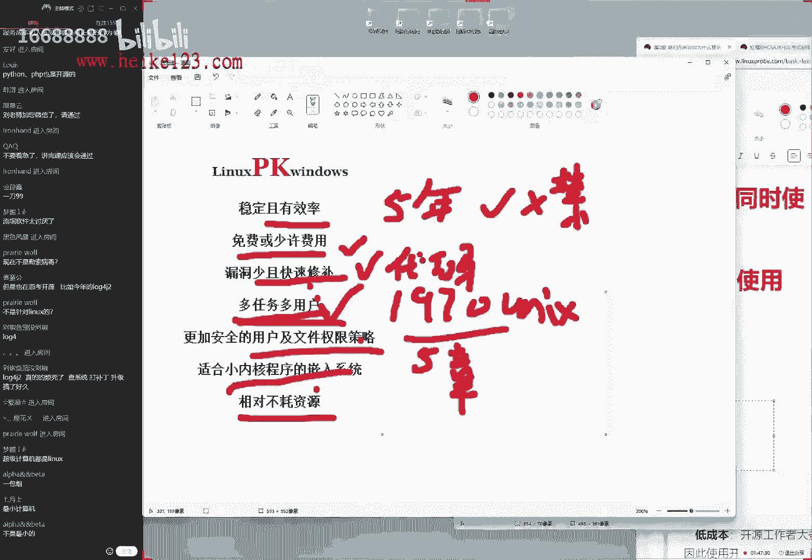
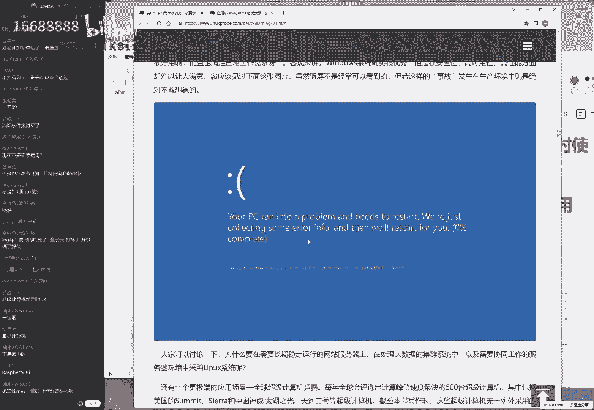
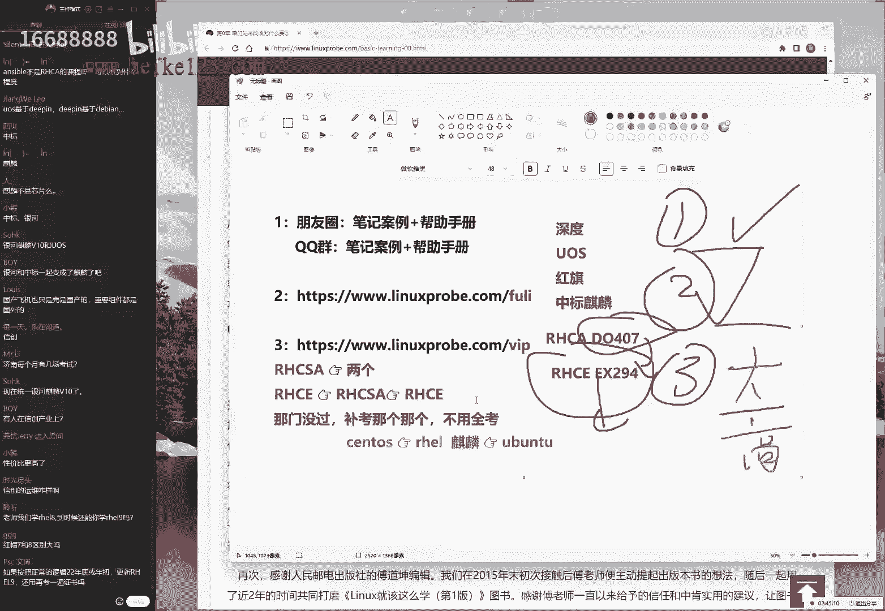
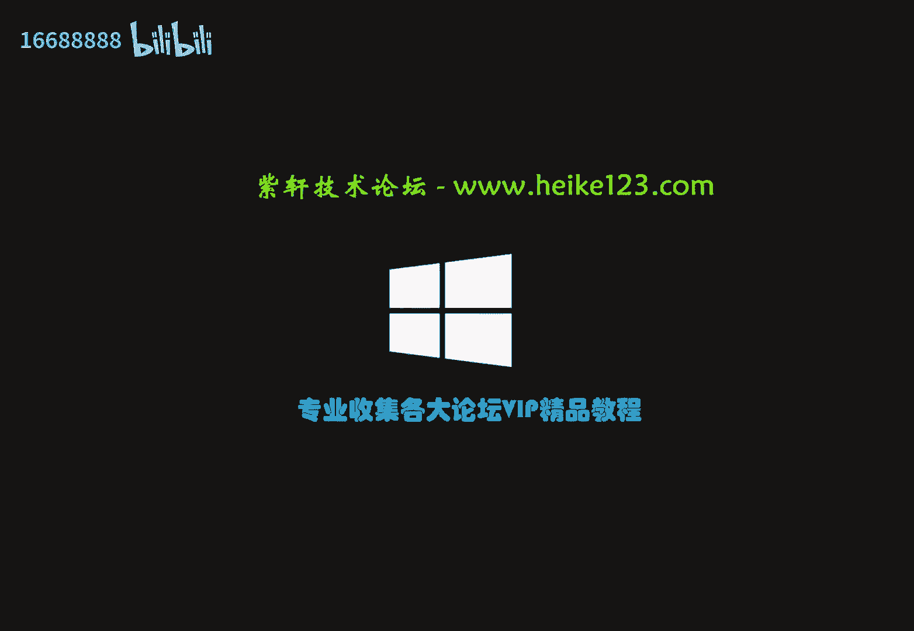

# 刘遄培训linux34期（配套linux就该这么学第二版，RHCE8） - P1：01 - 16688888 - BV1gL41167vP

OK来公同学，我们来开始我们今天这个课程啊，今天特别的开心。因为今天是我们的等于说2022年开始呃，我们考题稳定之后的第一版啊也是我们的第34期。好，大家先打一下一好吧。

然后我们来测试一下咱们这边的这个上课环境。刚刚啊我的话故意用的一个小技巧，然后把声音开始有点小，所以的话大家听我现在这个声音应该是比较大一点了。然后我我那的话呢我们讲课的时候，尽量的声音大一点。😊。

这样的话，那我们同学们再去听的时候，声音就比较的清晰了。好，那我们来给大家看一下啊。今天的话呢我们这个课程就要正式开始啊。我们在今天这个上课之前的话呢，需要先给大家做一个开班仪式。

这个开班仪式这个重要性啊，还是非常重要的。我们希望大家知道咱们这个课，那我们什么时候去学习，以及我们学完了之后啊，我们的啊那我们怎么去考试等等。很多我们跟这个课程相关的这个信息。

我们需要在上课之前的话呢，先给大家呃先来啊那我们先来进行一个串讲。这样的话呢，在我们去学习的时候，大家就可以完全的去投入到我们这个学当中啊，不用再去关心。比如说考试的这个费用啊，时间啊、地点呀。

包括说我们在学活当中遇到一些问题啊，那我们比较常遇到的一些问题。那我们都可以给大家去来回答一下啊。然后大家的话呢这个留言比较的多。然后的话呢，我们就刚才。😊，给大家看着比较重点的一点问题啊。

重要的一些问题。我们来给大家回答一下。因为我们每期在呃第一天开班上呃，那我们去上课之前的话呢，都会有同学去反馈一些最金的一些问题。比如同学们问的第一个问题。

就是我们为什么要去使用叫QQ群视频为什么不用到其他这个软件啊，那么我们要给大家说一下这个原因，主要的话呢，就是因为我们之前也试过一些其他这个软件。结果的话那些软件需要大家单啊。

那我们啊大家话需要单独去下载一下这个呃相关这个软件，特别的麻烦。我们现让大家只是点击一下这个QQ区视频。但是我们实际上看到，还会有还有那我们还会有同学因为自身原因也好，因为系统的这个呃系统也好。

那我们还是进不来。所以我们尽量的话呢去降低我们这个参加培训的一个门槛。因此我们最终决定了，我们去使用这个QQ群视频这个功能。第二的话呢，对我们先给大家写了。我们先给大家去说一下。

我们去选择以及我们去做这个事情的一些呃理由以及初衷。😊，这样的话呢，我们。可以让大家在上课之前就没有那么多顾虑了。首先来说就是我们这个上课软件的一个问题。第二的话呢就是我我们这个上课声音。

因为除了画面以外，第二重要就是这个声音了。我们的话对于这个声音还是比较的自信的。因为我们已经呃几年时间都用这个上课环境也没有变过，所以话上课声音应该是没有问题。但是那保不齐这个软件有点小小调整。

那么如果说您觉得声音小或者说作业声音大的话呢，声音大对吧？自己声音调小一点就好了。声音如果小的话呢，如果小的话呢，您可以呃下课之后吧，我们来呃那我们作为呃那我们可以做一个调查，或者做一个反馈。

等我们下节课的时候会给大家调整一下我们的音响，但是我不建议调整我这边的音响。因为我把我的声音调大了之后，会让大家听到一种啊爆破声音会比较的强一点。所以建议大家调整自己的声音，那么这是第二个问题。

第三个问题就是同学们刚才问到了啊，就是说我我们这个软件嘛哈好多是从这个啊百度网盘啊，他去下载了这个百度。😊，网盘的话呢，他要不充VIP特别的慢。那我们不能上传其他的这个网盘呢。

这我我们也去呃那呃这个话其实我我们也试过，比如说我们的阿里云盘，对吧？这个我们去试过，但是目前来说的话，它是不能够上传压缩版软件呢。因此我们现在还去使用到百度网盘的一个理由，等后续它支持了。

那我们自然会来去变更一下咱们这个存储的空间，这没有问题。呃，我们要给大家解释一下，现在上传软件的一些呃理由，对吧？我们那我们啊为什么要去使用这些软件呢？

还有啊就是我们还有一个小这这是呃大家提的三个比较常见的问题。刚刚我们上课之前嘛，大家来去互动了一下。然后的话以及我们也有一个思考。另外的话这个是一个在线培训，大家应该对于这个没有什么质疑吧。

它确实不是就是我们此时此刻真的不是大家给大家放视频，真的是有人在讲的。呃，我们每期在线培训的一个好处的话，就是我们实际上也会对于上一期培训进行一个反思，我们对于上一期培训的一个反思的话呢。

就是因为我我们错了。😊，因为上一期的话呢，我们的同学们的反馈就是我们会哎不是呃上上期，就是说第32期的时候，是我们错了。因为上呃第32期的时候开班第一天有同学说说我们能不能少讲点段子。

然后我们可以呃多讲点这个干货。后来的话呢我们第32期改不了了。后来我们第33期的时候就是完全就是赶进度，最后我们讲了一期讲下来的话呢，最后看一看时间完全没有减少，并且的话呢大家的兴趣呃度并不高。

这我们坦白讲，所以的话呢第四啊所以这个第四点是我给我自己总结的，这也是我们做错一件事情。就是我后来我思考一下，就大家用半个多月时间吧。我觉得把一个知识能够清晰的传言到大家的耳朵里面。

或者我们能够把这个书上内容，我我我们认为讲出来的话呢，它并不是我们讲课，或者说我们这个培训机构能够做的一个最好的事情，我们能够做的最好的事情应该是让大家有兴趣的去听完咱们这个课程。所以。😊。

我们的第三四期的话呢，会回归到咱们之前的一个讲堂状态。我们不会去赶课程进度。然后的话呢我我们呃那我们会去给大家去穿插大量的这个比如说呃一些心得也好，或者我们在上课当中呃，同学们常犯的一些问题。

就是我们的网期学员的一些问题，会给大家呃不计时间代价，然后我给大家去呃进行一个课程的一个补充，以及的话呢会讲很多这个生活当中的这个例子来去对于这个课程来进行一个补充跟讲解。

所以的话呢咱们这一期的这个课程可能会稍微的慢一点。咱每一期的咱们话每一天的时间还是两个多小时。但是有可能咱们这一期的培训可能会达到25天或者26天，可能并呃可能会比我们之前的预期可能会多个3到4天啊。

这个话呢对大家来讲也没有太大的这个问题，主要就是您可能到呃5月中下旬的时候，您可能需要多出个5呃两天的过来听课就好了。那么我们对于我们的话呢做的这个费用都已经交完了。那么这个。😊，增加的课程的话呢。

全都是凭着我们对大家的这个负责任，然后给大家去加的。因此第34期的话呢，我如果没有呃。😊，呃，如果说我们没有去猜测错的话，应该这一次能够比啊其实这个猜测这个词不太准确。

我们认为我们呃非常相信能够比我们的往前起码比33期、32期要好很多。好，那我们先按照我这个思路啊。对那我们先按照我这个思路给大来给大家去做一下我们这个开班仪式，我们先不做答疑啊，我们先不做答疑。

因为为什么呢？并不是并不是对这个问题的话呢，并不重视，是因为大家您现在提的这个问题，基本上啊基本上会在我们待会儿也会有普及。

就是我现在给大家做这个开班仪式会把大家常遇到的这个56年当中遇到的问题会大家串一遍。所以您现在提的这个问题的话呢，呃也很重要，但是有可能待会我那那我们待会会给大家去提到，所以我们就干脆啊。

系统一点这个在线培训吧，咱们这个系统性培训不就靠一个系统嘛，更加连贯一点，所以我那我先按照我这个思路说，如果没有说清楚，或者我们没有讲到地方的话，大家可以补充啊那我们再来提问。好，那。😊。

我们来啊那我们再来继续来去说啊，为了证明一下咱们这是一个在线培训，我们简单做一下我我们简单做一下呃，我们做一下互动啊。大家问呢说啊，所以这一期的话课表时间长，课表时间长。

对我们这一期到了5月17号或者5月22号，我忘记了呃，实际的话这个时间可能会比5月就是比我们那个课表要更长一点。好，那么于是我们的第一点就要出来了，就是这个上课时间问题。上课时间的话呢。

我们大家都知道了啊这个输入法啊，我们上课时间的话呢，会从呃每周五六日，那我们这个上课时间的话呢，是说啊是从19点开始。然后的话呢，到21点啊，就是到7点钟到9点钟。

我们这个呃每次的培训的时间大概是两个小时，有可能大家说啊不要怎么样啊，大家说不要拖延不要拖堂太严重。这个做不到啊，这个做不到，我们有呃我们有可能会讲三个小时啊，当然对于大家来讲的话呢。

您可以比如说着急可以先下线，没关系啊，我们会。😊，一个录播，但是拖堂这个不可避免啊，而且这是加强不加价，这是我们对大家的负责任。那么于是的话呢，我们上课时间理论上来说是从7点到9点，这个最少是2个小时。

不能再少了。那么呃这个话其实也是最好的。那么我们的上课时间是每周五啊，每周六啊，每周日我们每周讲三天，那么这个时间的话呢，也已经是确认了。所以我们这期的课程的话呢，如果不出意外的话。

应该是从4月2号到多少呢？到5月的呃到几号，我看一看啊，同学们问到说为什么是应该啊，因为这是一个在线培训。根据大家这个互动反馈，我们来做调整，有可能到时候讲的不就多一点了吗？所以这个这是一个大概啊。

我们这个开课时间能够确认结课时间确认不了呃，所以我们如果不出意外的话呢，结课时间大概是5月20号或者或者5月21号有可能更晚，这是一个最早的时间。那么如果说大家要是想要哎去记录一下这个时间的话呢。

您可以现在进入到咱们的网站后。😊，后面我们现在给大家去说几个网址，请大家同步去打开一下，就不要找理由。因为我每一期的后面都会找理由。说老师我先听课啊，听完课之后，我再去打开这种网页。

不要就是此时此刻我们再给大家讲的过当中，您就打开它，这样的话呢您看着点。我们正好给大家去说一下呃，这些资源，我们该怎么去使用。好，首先来第一点就是我们这个上课的时间。第二的话就是我们这个上课的时间表。

大家来打开咱们这个网页您可以看到哎可以看到有这么一个日历，这个日历里边的话呢，我们的前面啊，如果说啊不那啊那我看大家问题啊，大家说macbook不能全屏啊，能就不能换个换不了。

我们这同学大部分同学这个情况下是能够打开我们就选择这种培训方式，您可以去安一个虚拟机，或者您可以换一个windows系统来去试一下。然后我们再来下一个问题，大家说左右两边窗互动窗口关不掉。对。

互动窗口关不掉。但是我们会尽量要去调大一下咱们这个画面的，所以您可以就是只要您能够看到这个画面。😊，就是您只要看能看到这个画面里面的这个字。那么您去后续听课就没有问题。

我们会把所有的这个输入窗口就全都会填到这么大的大小。所以这个字您只要能够看得清，就没有问题。好，大家可以来看一下啊这边的话呢，我们的这个上课时间表，后面，只要后面带有了一个星号，哎。

只要带后面带有了一个星号。那么代表就当天有课的，比如同学问了一个问题叫孤独啊，大家问到说那五一我们放假吗？啊，这啊那我们带着这个问题可以来看一下这张表格，于是您可以来看到啊。

我看一下这个时间是5月27号，我还说的比较保守一点，应该是到5月27号到5月底啊，足足两个月嘛。然后我们于是看到啊这个日期的后面如果带有一个星号，代表当天有课，所以带着这个问题，我们来看一下这个课表。

于是看到5月1号当天是有课的。我们也是利用这个节假日的时间给大家来去讲课嘛。呃，所以的话呢我们的同学们可以用您的手机去打开咱们这个网址，这样的话呢，如果说您当天啊您不确定有没有课的话呢，就可以来看一下。

😊，这个网页里面他是怎么去写的啊？这边的话呢我们会给大家呃非常的严格的去按照咱们这个课表来给大家去讲课。这个的话也是一种契约精神。我们只要这个呃课表已经发布了。

并且是在我们同学们报名之前就已经有这个课表了啊，或者的话呢这是在我们呃这个或者您报名比较早的话呢，那这个课表也是在提前一个月发布的，所以我们也会严格的按照这个时间来去进行。我会把呃4月2号到5月27号。

每个五六日的晚上7点到9点钟，我一定会腾出来。然后这边的话呢呃没有特殊意外情况下，我们是一定不会改时间的，这也是一种契约精神。然后如果同学们大概问到了说如果说我们当天没有来上课怎么办呢？

当天没有啊当天没有来上课不要紧，因为大家可以看到了，我们正在讲课过程当中的话呢，这边是有一个录屏的，所以看我现在在说话，这边的话也在去跳动，就是我们现在在给大家讲的这个此时此刻这个课程每天都在录屏。

我们会在每天的晚上12点。😊，之前这个我已经坚持了7年时间了。每天晚上哎我们就说12点吧，他有可能稍晚一个呃呃晚一小时，有可能在凌晨1点钟。因为以前有时候这个压制时间比较长。

反正是每天晚上啊应该是24点之前，我们会把这个当天的培训视频啊，会把当天的培训的课程。然后后来我们去压制好，就是变成一个视频嘛，压制成视频上传到学员页面里面上传到学员页面里面。

所以的话如果同学们您今天没有来上课，没有关系啊，但是如果您没有来上课的话呢，怎么能够在线听到我这句话呢啊，这是一个悖论。好啊，那我们啊并不重要。如果说你以后没有来上课的话，也也不用担心。

您可以进入到我们这个网址后面加上VIP3个字，特别的好记。那么于是大家可以打开咱们这个网址了，基边上就是我们这个学员页面。这个里边的话呢，不仅有录屏的这个课程，还有我们这个考试环境啊。

还有我们这个呃相关这个软件它都可以去来去下载的。因此同学们就不要。😊，要找什么理由了，也不用等你啊，那我呃那我们的话也不用等啊，我们呃下课之后再来那我们啊那我们啊再啊进行操作了。

就是我们此时此刻您就现在就打开这个网址，就是我们现在吧，您就打开这个网址。因为这个网址的话呢，还需要验证一下学员的这个账号，您正好去验证一下您的这个学员账号有呃，他能不能找正常来去使用。

所以的话您现在就是呃立即吧，打开这个网址。然后您可以去看一下网页里面的内容，您是否能够看得到。如果看不到的话，请今天晚上马上来联系我。并且的话呢，您需要登录一下您的学员的这个账号。如果说您的学员账号。

您呃。😊，呃，记不住的话呢，或者您啊忘记密码的话呢，那么请今天晚上啊只要有呃只要有问题，只要有错误，就马上呢来今天晚上一定要来跟我来去联啊，那么就今晚啊必须来联系到这老刘那必须联系老刘。

那我们今天晚上就把大家的问题的话，我们大来呃都给大家去处理一下啊，老刘啊，O好，这是我们这是我们的第一个问题，就是这个上课时间问题。作为一个开班仪式，我们就要先给大家讲清楚了。这样的话呢。

课后啊不这也呃这也是我们以后去上课的时候，您就知道哪天有课以及该怎么呃准时来上课了。好，这是我能够想到关于上课时间的问题的一些常见问题，大家还有什么需要补充吗？啊如果没有的话，我们来去下一个问题啊。

我们来去下一个问题。关于说考试啊，关于说考试，这个会在我们的下面一个问题，为给大家聊到，这也是咱们有一个系统性培训的一个好处啊，都会大家去提到好，这是第一个问题，大家有需要补充吗？那账号是什么？

账号是您的姓名啊，账号是您的姓名。😊，密码的话呢是您的手机号码啊，默认手机号，您可以打开一下。大家说考试环境根本打不开啊，不不存在这个问题。然后说考试之前就可以报名考试了吗？是的。

我们一般情况下会在4月下旬或者5月初给大家预啊来去预约5月底或者6月初的这个考试啊，今天这个人数还是很多的啊。161个同学了，非常好，非常好。那我们来这是第一个问题，大家有第一对于第一个问题有什么问题。

您可以提出来，没有问题的话，我们就往下面去说，咱们这个开班仪式啊，讲究的就是个效率。虽然呃虽然说今天不涉及到我们相关的这个技术方面吧，不会有安装系统啊什么的。但是。😊，啊。

理论的知识啊可能要大家需要打啊需要给大打扎实啊。然后大家问了几个问题。大家比如说啊虚拟机软件包啊，巴拉巴拉啊网站上有吗？跟现在没有没有太大关系的，我们先不回答啊，下面一个问题，大家说江苏有疫情。

没有办法考试没关系啊，没关系，等到5月初的时候或者6月下旬你再看一看。好，不过这个跟咱们现在第一个话题没关系的话，那我就下一那我就下一个了啊，呃，下面的话呢就是我们的第二个跟考试相关的。

其实我们看看到第一个问题没有回答完，同学们已经迫不及待了，已经说到说这个红包考试了。那么红包考试的话呢，先来去说一下，这样的对对对，我先给大家去说一下啊，第一天是开班仪式不讲技术啊，也不会去按照虚拟机。

所以的话同学们就放松就可以去放松心情。然后我们今天就把这个考前辅导。您可以把屏幕关了，您不用看屏幕。那您就听我说就可以了。等我们明天开始就按照我们这个系统啊，去按装虚拟键等等很多这个操作。

所以今天的话就是完全给大家去做。😊，一个开班仪式，知道我们后续怎么去学习。这也是我们之前呃几期培训当中，我们大概是在2期吧。我记得有一个同学啊也是第一天来听课的时候，就很着急，说到刘啊。

赶紧去安装系统吧，我们就说到了就这个开班仪式的一个重要性，以及今天是那么话我们今天时间是一个开班仪式啊，所以吧大家这个常见的问题，我们先先给大家去说清楚。大概的话呢占用时间是一个小时。

然后我们后后啊然后的话呢，我们8演到9点钟应该是会涉及到第零章节会大家讲一下，我们这个系统的一个历史以及大概的一些理论基础。好，先来去说一下第二个问题，就是红帽这个考试啊，呃。

我们的话从这个培训是从2015年开始做起的。大家应该知道，我们到现在出过两本书籍了。呃，我们这个呃培训的话呢，最开始去做的时候，并没有想要去做一个红帽考试相关的这个培训。

但是由于我们这个课程它里面包括红帽考试里面的所有内容。后来的话大大概是2016年的时候，稍我先喝口水。😊，然后给大家去说一下我们这个培训大概的一个过程。大概的话呢是2016年的时候。

就有同学说想要去参加这个培训，然后我们去考研认证。结果的话发现通过率还是很高的。因为我们这个课程里面报它也面包括所有呃跟考试相关的一些资料嘛。

后来的话呢我们从2016年开始等于说就开始去专注去做一下啊考啊考试这么一个培训了。虽然说大家可以考可以不考。但是话呢我们的资料都给大家去提供的。首先来去说一下这个考试费啊，红帽这个考试费的话呢。

我们是不给大家加任何差件了，没有任何任何的差件，没有啊赚拿一分钱。然后呢我们的红HCACC以及红CE的话呢，现在的报价应该是4啊依然是呃依然的话是4200块钱。

这个实际上是从2022年1月1号开始实际上是涨价了。然后的话呢由于它这个结算的周期，我们在上一期时给大家去聊到过，它实际上是3个月。所以的话呢如果不出意外的话，它应该是从5月份开始。😊，他就应该涨钱的。

涨到4500块钱。但是的话呢我们今天在上课之前，因为今天礼拜六他上班的，那我们今天问了一下这个考场。然后我说到，然后我们说大概5月份那我们要报考的话，这个费用怎么算呢？红帽的考官给我们发了还是4200。

然后给我发了一个笑脸啊，我也不知道什么原因。但是的话呢，目前来说就是这个考试费依然没有涨，但是具体没有涨的原因，我也不确定啊，就红帽考官的话呢，也是这么一个呃比较呃半正式的一个回复，大家可以放心。

就是这一期的话呢，确实没有任何差价还是4200。然后的话那我们这个上午的话呢是HCAC下午的话呢，他考的是HC满分的话呢，依然为300分。那么大家只要考过210分就可以通过了。那我们这个考试的话呢。

目前只有是在线下实力去考试的啊，大家听到这个之后非常的开心，对吧？啊，那我们这个考试的话都是一个实力的一个考试。😊，呃，所有的这个考题的话呢，我们会给大家去提供。然后我们这个培训的话呢。

呃预计会在就是我们现在要约考的话呢，您大概也要提前一个月了。所以因为现在考生实在太多了。那么所以您呃我们这一期培训，大家算一下，从4月2号开课到5月底讲完，那我们参加培，那我们参加考试的话呢。

怎么着也应该是5月底或者6月下旬了。所以我们这一期的话呢，本期的这个约考时间，那也就定了，那也就定了。那就是在那那么就是在5月初，然后我们去预约一下6月上旬的这个考试。😊，这个就是大概的一个时间了。

需要提前一个月来去预约。那么我们这个考试的话呢，地点大家可能会比较关心的。说老师，那我所在这个城市有没有红包考场呢？啊，大家没有问，但是我替大家先问一下啊，这个大家可以先访问一下咱们这个网站。

后面的话呢，可以叫啊红包认证这么一个导航里面，你可以点一下全国考点分布。然后这个网址比较长啊，所以呃所以我们给大家提供的方式，是通过鼠标去点击，或者的话，您可以直接如果说您那么如果说您是在看录播的话啊。

如果找不到它的话，你也可以直接去访问这个网址。当然了，更重要的是这个网址，就是我们后面加上VIP这个网址学页面，您现在必须已经此时打开了。然后我们今天晚上如果到有什么问题的话，我们会大家统一去做呃解决。

那我们来看一下这边的话呢，我们的红帽考场，主要的话呢，就是在北京、上海、广州、深圳，然后还有这个山东的济南、青岛，还有这个东北的辽宁，还有天津，然后以及武汉。呃，这些的话呢是我们比较重要的这个考场。

那么如果说同学们。😊，呃，您所在这个城市，那并那并没有出现在我们的网页里边的话呢，也不用着急。因为我们后续也增加了一些考场，但是我们现在没有来得及给大家更新到网页上面。所以的话大家可以呃问一问。

比如说江苏有吗？江苏没有，江苏您需要来上海考试。好，比如说成都有吗啊，成都不是有一个吗？对，成都是有的，我们也有就是我们提到了，只不过因为这个考场是新增加的，我们还没有来得及放到我们的网页上面。

您可以等一等啊，或者的话这个并并没有给大家报考。那我们会在过两天那我们时间我们时间充裕了，我们会大家去更新一下这个网页。但是网页上已经有的话，就是确认是有的。

郑州呢郑州呃不确定我们需要会议之后给大家去查一下。郑州好像有有好像没有然长沙有吗？长沙我也好像没有记清楚，需要会议之后给大家去查一下。如果大家着急的话，您可以大概是在9点钟嘛，我们讲完堂课了之后。

您就马上问我。然后我们把录屏一关就可以给大家打开我们这个报考的表格里边了。然后就可以看一看。😊，没有了。然后大家看一下下面呃有什么问题，大连大连有啊，大连有考场，但是周期比较慢。

那么那也就是说我们现在能给大家约的这个城市的话呢，出就是我们现在能给大家约的，说实话已经很全了。咱们凭良心说已经算是在全国当中呃，怎么讲呢？没有任何差价这个情况下能够约的是非常非常的方便的。

北京、上海广州真啊广州、深圳这几个城市大家不用说了，肯定能行，这个没有任何问题，并且的话呢每个月啊，每个月啊，大家说说啊，怎么样说天津有是吧？对我我刚才只要说过有的就一定是有的，大家说在内蒙也有啊，对。

内蒙的话呢也有，据我了解报价应该是5000多。我们同学去考过啊，可能每个人价格不一样，内个同学考完了之后是5800块钱啊，大加差价加了不少。当时的话呢，是19年当时没有疫情。后来那个同学的话呢。

选择来到北京。后连着坐高铁连着来在北京玩二两天回去了。等于说您可以去考虑一下，因为我们这边。😊，说咱们就是说实在话，我们这边话呢这个培训费已经赚了很多了。我们的话呢现在考试费不是不加差价。

大家可以随便去问啊，可以因为要红帽考官都可以。这4200块钱是等于说全国最低。那么如果大家可以看一下，您所在这个城市，如果说您所在城市就报价，比如说啊报个4500，对吧？那我们这边又没有的情况下的话呢。

您可以就是在您当地去报就可以了。但是如果说差的有点离谱，到时候我们在想解决办法。但是我们能够尽量的还是给大家家呃就近去约，我们进我们的能力。然后我看北京上海广州深圳这是没有问题的。大概的话呢，每个月啊。

大概会有2到3场没有问题。呃，但是有一个问题就是这个呃考场的一个人数问题。之前的话呢，我那我们的话呢每一场可以坐18个人加上两个备用的这个机器，但是由于现在有这个哎现在有疫情了。那么这个时候的话呢。

现在他需要隔一个做一个，所以我们啊话每一场只能坐10个人。那么因此也就是说北京上海这样的这些城市，每个月大。😊，能够约的这个考量是20到30人，我们基本上也都够用了。

那么呃出那么我们只说其他的这个城市的话呢，比如说他们啊问啊，那么啊就有是问到了啊，济南，比如说大连，比如说武汉呃，天津有没有啊有这个只不过说约考的周期比较长一点，您可以在5月初或者啊不呃。

如果说您是北上广深的话呢，您可以在5月的初啊，您可以在5月初联系我。那么如果说您是以下这些城市的话呢，那么您尽量的，您是在4月底就要跟我联来去联系了。😊，我们先给大家去呃算一下这个人数。当然了。

现在不要联系，我需要给大家加上啊，避免我下课之后，同学们这个比较着急啊，我先给大家解，就是现在啊不要联系。因为我们现在的话呢，等于说第33期呃，我们还有很多同学没有约上实际上因为这个疫情原因嘛。

比如说大家要是之前加我们33期群的话，您应该可以互动一下来可以来去聊一聊。我们现在深圳的话做了考生都取消了。我们现在的话呢，广州也取消大概10位同学。上海的话呢，取消两场。那么大概会有10位同学没有考。

所以的话呢我们现在实际上是在4月份的时候，4月份我们会安排老学员，我们去消化一下这个老学员给老学员的话，给他安排上考试。所以我们4月份的话呢是不安排考试了，我们就不我们不安排我们同学们去考试了。

这是我们能够给大家想到跟考试相关的，大家可以大家也能感受到我们这个开班仪式这个重要性吧。现在先先给大家讲清楚了，考时间地点人物事啊，这样的话，同学们再去。😊，大家去学习的时候，就不用有太多顾虑了。

知道大概这个约考啊，自己以及合理去安排自己这个考试时间和学习的这个周期就都没有问题了。然后我们下面还有一个问题啊，就是说那我们这个红帽考试呃，通过率还行吗啊，我们画的是非常行的。

现在话呢上午的我们的啊红帽的考试现在基本上的话呢满分率能达到50%以上，就是说我们那我我们画的上午的考试，能够有50%的同学有大概有是有一半吧，能够考满分，通过率的话呢是非常高的。

我现在已经呃将近有一年多时间，我们有见过上午的挂科了。然后那我们这个下午的是C的话呢，通过率大概是大概是在98以上啊，这也没有问题。之所以这么高的话呢，首先我们是这个课程吧。

我们啊里边包含了所有的红帽考试相关内容，对吧？因为大家能够选择到我们以及听到老刘说话，其实这样我们比较自信啊，这是我们比较自信一点，就是确实现在教的比较好啊，这个我记得当时我是。😊。

20122020年嘛，当是好当时好像疫情比较严重的时候，当时我们就说过了，说因为我们现在做这个培训，做红包认证比较专业，做的就是好。然后同学们说说到哟，你这太骄傲了，对吧？后来我跟同学们去说过这个问题。

但家一定要能够分清楚什么是自信啊，什么是骄傲，什么叫做虚假信息，也就是骗人，对吧？因为我们现在做就6年多时间了，就是我们从报名考试到现在嘛。呃，教培训叫期年，我们现在跟红帽打交道。

6年多时间通过率确实很高，所以的话呢，我们对于这方面还是很自信的，还是有一定的这个呃实力的。那么我们现在的话呢，第一就是我们这个课程呃，不论你想不想去考红包认证，我们并不关心对吧？

我们的话的培训课程的话呢，是包含了我们的红帽考试所有内容的，就是里边的话呢，所有都关它里边的话呃，都里面啊他都已经是包含了的。那么即便说你没有去考试，没有关系，您该学都学了啊。

这个的话呢呃默认情况下它都是有的。😊，第二的话呢，这是第一个我们的原因。第二的话呢就是我们这个考呃我们会有一个考前辅导。我们会给大家提供考试的这个考试原题。

然后我们之前的话呢会给大家去说啊这我们这个大家去说吧，红帽考试的这个真题。红帽考试原题。为什么给大家去说红帽考试原题啊。因为呃有很多机构大大家他们话那个题目其实并不准确。

我们现在给大家提供的是一个红帽考试原题，就是您可以看完之后，是跟考场里面是一字不差的，是从考场里面拿U盘给大家拷出来的。就是只要考场里面有题目的变更了。那么我们会第一时间去跟考场那边把题目考出来。

所以您现在此时能够看到的，以及我们上课的之候非常开心的跟大家去说，这是红帽考试稳定之后，我们的第一般就是因为已经有三个时间没有变题了，非常稳的。第二就是我们会给大家去提供一个啊，考前辅导视频啊。

会给大家以这个视频的这个形式带家大家去做一遍啊，这是我们的这个对于考前辅导能够提供的东西。还有的话呢就是对还有这个考题的这个答案啊，没有。😊，答案可不行啊，好有这个考题的答案，这个会给大家去提供。

这个话我们也是丝毫不呃不用给大家来去隐瞒的。因为大家可能第一节课看到这个会有一种感觉，说到底，你那你这个培训就是通过刷题去考过的吧。这我我这个话我们实际上也不用去解释。

因为只要听完了咱们这个培训自然就能知道到底是不是刷题考过的了。所以的话呢，我们认为既然是我们的学员，我们就把要能够给大家提供东西，先给大家去说明白，就是说用或不用。但是如果大家不用的话呢。

其实也能够考过，但是我们会大家去提供好来去尽量去提高这个通过率，这是第三个可能辅导视频以及最后的模拟环境，大家可以带着我们这个前面的这个三项东西，然后那我们可以在这个模拟环境里面来去练习一下。

这个我们是能给大家去提供的。呃，综上所述，所以我们就有了很高这个通过率的一个原因。这个我们也是比较自信的一个理由啊。对呃，这是我们给大家能够想到的第二点过呃，关于我们这个考试能够呃需要给大家提到。😊。

一些问题。大家要是有什么问题，大家有什么问题您可以来继续说出来。然后我们再给大家回答一下。好，大家问了一个问题，大家说考试费怎么办，对吧？这个考试费的话呢，我们之前是代收，后来的话呢，我们先不收了。

这个大家约考的时候，您是直接转账给考试机构，我们这边不收啊，转账给考场。然后这个我我们是不收的，所以这个没有任何的这个水分在里面啊，直接转给考场。那话我然后我们这边给大家的信息报考，报考完了之后。

您自己去付款，付完考啊，分完款之后，我们考场会给大家安排时间啊，大概是这么一个流程。呃，具体的话呢，当是不能太早，您需要最早也在4月底跟我来联系，不能再早了，再早的话，我们会33期的考生去安排一下考试。

好，另外的话我先喝口水。另外看看下同学们的问题。如果你的问题特别有针对性的话，我们会赶紧给大家回答一下，这是第二点，我们给大家去说到的。然后大家可以来继续说，我来给大家看一下问题。😊，稍等一下。啊。

当然当然当然怎么是这样的？呃，如果您的这个问题特别的呃个人化，比如说您提的一个，比如说这个您自己的这个系统啊，或者说这个软件的问题等么的。这个咱们在上课的时候播给大家去说，您可以先稍等一下。

我们会在每天晚上会有一个答疑时间，到时候给大家去说就不占用咱们上课时间了。因为你这个问题，比如说一个好问题啊，不呃那我们说完之后啊，大家所有人都可以听到了。然后我们会说一些经验啊等等的。对于个人的问题。

我们就。😊，呃，只对那我们呃那我们回答我们的课后啊，针对于某同学，我们来给大家回答一下，这样的话更有针对性，也不用特别的仓促啊。可以好好给大家去说。大家说了一个问题，大家容器会讲嘛，容器会讲。

但是以视频的形式来给大家去提供。因为每个人考试时间是不一样的。所以的话呢我们现在只有自动化运维。他这个我们是在线培训，其他的话都是视频的形式给大家去提供。这样的话您可以反复去看。

然后大家说济南可以约4月底的考试吗？呃，4月底的考试不行了，因为我们等于说4月份我们呃都希望能够给33期的考生去约了。如果要是有空位置的话，可以大家说红包认证是不是会过期呃，红包认证的话呢。

按照他的这个官方的手册里边是写了有它有效期是三年，但是他并没有写到期之后能怎么样。所以我是从2015年开始，我考的不我是从2012年开是考第一门CE我2015年考了HC到现在我没有再去考过认证啊。

不2020年又考了一个认证。然后到现在的话我也我也没有去考认证。包括说我们的老学。😊，2015年考下来的话呢，现在依然能够去正常去使用。也就是说同学问到这个问题啊，那我给大家一个回复，就是红包的话呢。

官方的认正有效期是3年，但是到期之后没有任何的影响。😊，啊，最以的话呢红包可能也没有想出来到期之后能怎么办，所以它只是一个理论，值得有的呃一个时间限制。😊，来大家下面一个问题。

大家说啊大家说怎么样说这个认证算是一个入门门槛，进去之后也没啥用啊，是不是挂靠华为的认证能够靠它啊靠挂靠赚钱啊，这就是怎么讲呢？呃，这个我们会在我们后续给大家去说吧。总先来说这个说法是错误的。

而且完全错误的。而且错误的有点太离谱了。啊，不过的话呢，这个问题我们会在下课吧，或者说我们找一天如果讲课讲累的话，我们会给大家去充分的剖析一下这种这种思想的一个原因啊，以及我们说一下自己的一个看法。好。

下面一个问题，大家说说广州4月底可以约考吗？不可以啊，也可以，但是看一下具体我们的位置，下面一个问题，大家说说现在网页上面的考题大概啥时候会出现大规模的辩题，大概会在今年年年底。

如果说就是说如果说您要想考的话呢，你就赶紧按部就班呢，咱们这一期培训好好去学，好好考就完了。大概的话呢，6月呃如果说您现在4月现在是4月2号。如果说您按部就班的去学习。您呃大概率情况下。

您会在5月下旬5。😊，就5月底以及或者6月初你就能够拿到呃，我们这个呃那么基本上就能够考过了。但是如果说您没有考过的话呢，我们会在年底的时候变题。因为大家可以算一下这个周期。

这个20因为我们在这个之前的话呢，2012年的时候是红猫re6的一个系统，对吧？后来的话呢2014年的年底时候，他又发布了一个红包肉期。然后的话呢，它实际上它是从2014年的年底发布红包肉期。

时后是2015年变的题。然后话呢我们这个红包来这个系统，它是每三年之后它会发布一次新的系统，所以如果不出一外的话呢，呃那么并且它确实也没有出一万，它是在2017年的时候发布的红包肉8啊。

大家可以查一下这个时间，对吧？没有问题。然后的话呢后来不不什么啊，它是在20啊20呃呃9年对吧？他发布了红包肉8，它就是呃稍来的晚了一点，它应该是每三年发布一次，它就是晚了三年，因为它被IBM收购了嘛。

它等于说它耽误一段时间，因为他又赶上了这么一个。😊，呃，新冠肺炎等于说它这个变题它会晚了很多。我们现在的话，因为中国大陆从19年的年底到后爆发这个疫情之后的话呢。

中国大陆的考题比其他的这个国家要晚了半年。所以的话呢我们2019年的时候，变题了之后，2020年8月1号开始才更新了红茅ri八的这个考试。所以的话呢如果不出意外的话，那么每三年发布一次。

大概就是在今年的年底，大概啊但我们并不保证大概就是在今年的年底大概11月份您就应该能够看到红茅rio酒的这个系统了，就能够看到了。所以的话呢它变题的这个时间如果不出意外的情况下，我们推测嘛。

三年发布一次，它应该是在今年的年底或者明年的年初会变成红茅rio酒这个考题，到时候所有的这个考试信息以及这个书籍啊培训等等的。就都要去有一个变化了。所以您要考的话，今年年底啊，比如说哪怕90月份啊。

那么我们是认为这个时间也是比较不错的。但是如果再过了明年了，这时间有点。😊，每一天都有可能变题了。然后既然这个问题啊，大家现在提的问题啊，就问题不大了。然后我来说说一下我们这边的这个第三点啊。

第三的话呢是一个小福利啊，这小福利呢是这样，不我我们先给大家去说吧。第三点的话呢是一个我们的帮助手册。因为我们在上课当中吧，同学们总会提的一些问题。然后的话呢。

我们对于一些问题也是一直在给大家做一下总结，特别好。这样的话呢，我们同学们呃后续如果提出了相同的问题呢，就可以来去更快的被解决。那我们这个帮助手册的话，大家可以进入到咱们的网址里面。然后后面的话呢。

我们接着这个啊呃help这么一个单词您就可以访问到我们这个帮助手册。然后另外的话呢，还有就是呃如果说您。😊，现在使用手机比较多一点的话呢，我们可以把这个帮助手册，我们可以给大家做成一个文件啊。

可以给大家做一个文件的一个形式，然后给大家发送一下。并且的话呢以后我们就经常会在这个Q呃，那我会经常在这个微信朋友圈里面会给大家发一些跟开课相关的。比如那我们同学们比如今天就可以看一下。

今天就发了开课通知了啊，我那么那我们后续还会给大家发一下，比如说跟考试约考相关的啊，我们会大家提醒一下考试了，或者我们提醒一下，比如说今天突发情况，我们那我们今天上不了课等等这样的这个可能性。

所以的话我们需要给大家做一个比较轻量级的一个验证。那怎么能验证一下是不是我们的学员呢？就是我们报名的时候，同学们都登记的是QQ那我们怎么能够知道大家的微信呢。

所以我们来给大家做一个非常轻量级的一个验证方式，这也是我呃也是我们之前用的一个方法。就是的话呢现在这个时间是19点37分，对吧？好，现在的话呢我们从48分开始。然后我们一直到19点52分吧。😊，呃。

5呃53分5分钟的时间。那么大家现在可以打开您的手机，现在打开您的手机了。然后我们现把啊大家可以按照这样的一个固定格式给我发消息。这样的话，我们会把这5分钟内给我发消息的同学。

我会那我呃我们那我们会给大家做一个备注啊，备注好了之后的话呢，以后我们再给大家比如说发考试通知啊，包括说我们会给大家比如说今天听课啊，这些相关的消息，您就可以收到了啊。好吧。

然后接那么但是一定要严格按照这个时间。因为呃比如说这个视频他被泄露出去了，然后看盗版视频的同学，然后结果也看到这个视频了，也给我发消息，到时候就那那我们啊到时候他不能绑定了。

所以的话呢我们要严格按照这个时间，您按照这个格式发给我好了。如果说你以前加过微信的话呢，您就这么着给我发34期，就是一定要说一下啊，就是34期，您是34期的，所以34期相关的这个消息，我才会发给您。

然后的话呢，加上或者说你写一个空格写上您的这个姓名，然后您现在就发给我的微信就可以了。我们今天下课之后，大概9011点钟吧，然后我们会。😊，来这个信息做一下备注。

这样的话以后您就34期的这个消息在微信上面不也能看得到了吗？然后我们就大概一个样式吧，就是我们大概就是这么一个样子。比如说啊流传，那么就是34期流传这么一个消息就可以了。如果说您之间没有加过的话呢。

没那我大大家可以访问一下咱们这个网页。😊，那么您可以去扫一下这个二维码，也可以看得到啊，然后也可以去加一下。但是我们不建议大家同一时间去加。因为同一时间去加的话呢，呃有可能我这边就加不了了。

有可能显示那个添加繁忙，最好可以分流一点。比如今天加明天加呀，对吧？我们分两天加，因为您现在同一时间扫二维码的话，我估计我这个就加不了了。好，所以就是一个简单一个验证的方法。

就是到19点53就等这么三四分钟再超时间啊，就等于说它这个视频就不被啊，就没有什么保障了，可能被泄露出去了。好，这是我们的第三个问题，话第四个问题的话，就是我们会给大家一个送书活动。

这个话呢也是当时我们减肥的时候用的一个方法。就是我们发现这个减肥跟学习来讲的话，到他他都是有点痛苦的事情。那我们那么我们怎么能够保证我们去。😊，学习的时候的话呢，我们来这个签名的书籍能够来去坚持下去呢。

所以签名的这个书籍，那也是我们这个给大家一个活动。就是我们花呢每天在上课的时候，您可以把今天这个学习的这个心得的话呢，我们会给大家分享到啊，那么啊您可以去注册一个技术博客。

然后的话呢把我们今天所学习的的这个知识啊，把学习的这个内容发到这个博客里面，那我们算作是一个打卡。这样的话呢，等我们到最后一天的时候，会给大家赠送一个我我们的这个签名的书籍。

也就是第一版第二版价值的话呢，大概100多块钱啊，那我们最后啊那我们最后会送这个两本就是第一本和第二本我们会给大家打包好了，会送两本这个签名的书籍，第一版第二版这个话也是一个我们自己一个小活动。呃。

然后给大家去说一下这个原则啊，因为我们第一次说这个活动的时候，大家以为我们做呃啊然后那我们第呃那我们话呃第一次那我们来去说这个活动的时候。😊，大家还啊大家以为是有什么呃其他这么一个呃规则呢？

那我们来去说一下这个原则，就是大家的话呢不需要再啊那么那我们这个呃原则首先来说，那么去注册的话呢，一定要是一个技术平台，比如说啊CSDN比如啊比那我们比如说一些常见的网站啊，博客园还有开中国对吧？啊。

就比如说一些网站啊，博客园啊，那么您可以随便去注册一下，然后您找一个技术相关的一个网站，好，什么比如看中国，对吧？那您去注册一个博客，这样的话呢，我们。😊，啊，这样的话呢。

我们每天我们下课之后把您所学习的这个呃知识，您可以大概去写一个笔记。然后我们话我呃呃去写一个大，那我们去啊大概去写一个笔记，然后再把您这个书嘛，那我们说上这个笔记，您得给大家去拍一张照片。

至少一张照片啊，证明一下啊是自己去写这个笔记，要不然我那我们不知道您这个笔记是从哪里去复制过来的。所以话呢至少要要有一张照片啊，啊来去拍一下您的这个书啊，就我们来拍一下您书里面的这个内容也好啊。

封面也好，这都可以。所以的话呢来拍一张照，然后发到您的这个博客里面，等到最后的时候我们会给大家去做那个前面的书籍了。那么话呢我们的原则啊，那话呢我们做的这个话原则就是大家不需要带我们的这个书籍名称啊。

大家不需要给我们的书做任何的推广。因为现在的话我们的人气也很高，基本上把这个市场都做饱和了。所以话大家不需要为我们的书做成呃做什么宣传，所以大家不用带我们的这个书的名称也不用带我们的网址啊。

不需要带网址，所话这个原则上来说。😊，就是大啊那么我看到同学们对自己每天写的这个笔记负责就好了。对自己啊写的笔记负责就好了。大家的话不用做啊，不用为我们做任何的宣传，也不用任何的这个心理压力。

第实的话我们至于说这个活动的话呢，您可以呃您可以去进入到咱们的网站里面。后边的话呢，我们加上福利两个字，您就可以看得到了。然后可以看一下这个活动具体的一个介绍。然后我们可以来。😊。

那啊那我们现在就可以来去注册博客，今天晚上就可以来去做打卡了。好，这就是我们能够想到的一些常见问题。我们都给大家去提到了。稍等一下，我看看啊，我看一看啊，另外的话我们我这边上课之前啊，特别的用心。

还给大家写一个小便签啊，说了一下这几个事情，我看一看有哪些没有提到好还有一点就是同学们啊会问到说那我们该怎么去写那一个博客啊。

有没有什么呃那我们之前有没有什么呃呃可以呃那我们呃可以呃我们呃比较好这么一个呃呃那我们我们那么我们可以来去看一下呢。所以的话呢我们今天晚上想想怎么给大家去提供呢。那我们今天晚上吧还是在朋友圈里面吧。

那我们今天晚上那么就会在微信的这个朋友圈里面会给大家分享怎么呃诗歌的这么几个博客，大家可以来去做一下参考。那诗歌的博客来做一下这个参考。好，那么我们就说完了，我们这四点，然后作算作是我们这个开班仪式。

比较常见的几个问题。😊，え？那么我们今天晚上的话呢，会在我的微信朋友圈里面会给大家发诗歌的案例以及帮助文档啊，大家会要可以备注一下。那大概到点了，那到53哎，不好意思，我好像说错了。

刚才的话呢好像不是48，刚才好像是38。好，但我们也没有关系，那现在所以有时间到点了，大家不用发了。因为等于说我们会把大家信息，待会做下备注。好，大家有什么问题您可以来去说一下。

然后我们也会在QQ群里面大好ok那那没有问题，我我给大家写下来，待会的话，如果说您没有加微信没关系啊，我们QQ上也很常用吧，我给他写下来，待会儿的话呢也会把我们这个帮助手册。

还有这个案例也发到QQ群里面一份，你可以关注一下QQ群也可以来呃大家有什么问题，您可以来去说一下，这就是我们给大家想到这4点比较常见的问题。如果没有的话呢，我们就来开始咱们这个第零章节。

我们开音就算结束了，把大家常见的问题捋了一遍，后续再有问题的话呢，我们慢慢再给大家去说来看一下我们这边第章节。😊，大家可以翻开咱们的这个书啊，在上课之间我们看了一下啊，当然好像说有同学说书没有收到啊。

也很正常。因为您可能是31号报名的对吧？或者您干脆就是4月1号4月2号报名的啊，没这么快呢。大概我们会在三五天之内会给大家送到最快嘛，如果要是有疫情的话呢，您可能会在更晚一点。不过没关系。

我们会有一个电子版，您可以在群里面去下载到，或者的话呢您可以打开网页也能够看得到。好，手我们首先啊啊，但没关系，我们先给大家看一下这个网页嘛。是这样的啊。这个字大家如果看不清，没关系。

您就可以看一下您的这个书籍，然后的话呢，我们看一下啊，大家说什么，我收到了两本啊，有可能是我给您寄重复了，可能是因为您给我说两遍啊，然后的话呢我们这边这个信息给大家登记重了。

所以给大家所以所以所以可能给您借两本啊。不过的话呢您就留着就好了啊。好，下面一个问题，大家说啊格离在小区。😊，书在公司有点难受呃，也没问题。走，那我们后呢是有一个电子版的。好，怎么样？那提前买过一本了。

OK那我们来看一下啊，咱们这本书翻开之后的话呢，首先第一段啊，另外我也发现了之前我讲课的一个问题，就是我们可能会更多的去解答一种私人问题，就比较耽误时间了。呃，问题很好。然后我们可以在线下之后。

我那我们可以在下课之后给大家去聊一聊。首先来说的话呢，我们来看一下我们这边这个第钉章节，简单做一下介绍，马上就开始去介绍我们的linux系统的一个历史了。哎，然后以及我们的啊开软件的一个优势。

以及我们使用的它当中的一些小技巧和好处。好，我们接下来给大家去说一下。首先嗯。😊，首先首先啊先做一下自我介绍啊，流传那没有问题。这个话第0。1我就把它跳过了。

因为大家既然已经开始给我们的服务费都已经是花钱啊，你一定对我是有了解的。所以这个时间我们就不给大家耽误了啊，那我们就直接跳过了。但是我们要给大家去说一下，就是呃我们的话呢，这个在线培训。

并不是大家可以来看一下，这也是我们唯一需要给大家去说的。就是您可以看一下这个书定价是99块钱，并不是2400。所以的话呢我们在上课的时候，并不仅仅会把这个书上内容给大家来去复述出来。

我们会给大家呃增加很多书上没有的，工作当中的一些案例，然后话呢我们一些啊经验跟心得。所以的话呢我们这个课程会在这个书的知啊知上增加很多的东西，因此更需要大家把笔记给大家做好。这样的话呢，书上没有东西。

您做一下补充。以后我们来啊再来去看的时候，就有一个呃很好的一个复习材料了。另外的话呢就是我们再给大家去讲的时候，如果说您的。😊，基础非常好了。

那么这个时候的话呢也要稍微的啊耐那我们也要稍微的啊呃耐心一点。因为有些同学的话呢可能技术不是很好。所以我们可能会围绕某一个技术点，可能会给大家讲个5到10分钟。那这样的话呢，您可能会觉得比较无聊。

但是您要能够理解到有些同学的基础并不是很好。我们就这么去讲了，都有可能不太好去理解呢。那我们谁都有一个从基础开始去学习的一个过程。所以我们希望大家加的话呢，就是如果说这个技术点已经掌握的话。

您可以去倒杯水去没关系，呃，但是的话呢我们不希望大家去催促。因为你已催促的话呢，我那我们这边如果一跳的话，我们这边跳起来的话呢，也很快的。大家能够理解我因为我我因为我呃因为我们在给大家讲课的时候。

也有可能会跳一些章节，或者说跳一某个技术点，这样的话，但但是技术比较弱同学就现在来比较有压力了。所以我们再给大家在讲课之前嘛，先给大家去说一下，就是如果说某一个技术点您已经掌握了，您可以喝杯水去。

但是我们要给大家。😊，照顾到基础比较薄弱的同学啊，这大家需要先给大家去说一下。那么呃如果说您的基础比较弱的话呢，也就提到了，就是说您一定要做好预习，那么就一定要做好预习。

前面的几节课我们会啊给大家充分的来去讲解咱们这个知识点。但是的话呢后面我们要保证大家也能够听的多一点嘛。因此后面可能会还会稍微快。所以的话呢您可以现在赶紧进入到学员页面里面，然后去访问一下。

看看有没有问题，没有问题的话呢，把这个预习视频啊，把这个预习视频下载一下啊，把预习视频下载到您的本地。这样的话呢，我们下课之后您就可以提前做一下预习了。比如说现场开班仪式。

其实我们同学们如果要是提前都做好预习的话，开班仪式时间50分钟可以把它省略掉了。但是的话呢我们啊还是需要做一好这个呃预习工作啊，今天我们同学们需要做这个事情。好，大家有什么问题，我来给大家看一下啊。

时间到了就能都啊都能发微信了。哦，刚才好像是我说错了，同学不好意思啊，刚才我说错了。😊，就是我们同学们发那个微信上的一个信息，刚才是我看错表了，大家话这个时间应该是38，但是我看成48了。好。

那刚才是我的一个问题，大家发吧，大家就发一下34期，然后您家人的名字，刚才是我说错了，我觉得这是我的问题。因为咱们在上课的时候，我需要顾着左边这个大家这个信息也要说也要看一下这个时间有点乱来。

这是我的问题啊，您就发一下34期姓名，您现在就发吧。如果您没有发，您现在就发，我们到8点钟整都可以。好吧，刚才是我的一个疏忽啊，时间都能看错了。来大家看一下第零章节，我们来个人介绍，直接省略掉。

那没有问题。然后的话呢，我们来看一下，就是这个话呢，那我们给大家去念吧。以前我每回都给大家去念一下。后来的话呢发现啊，其实这个可能还是比较偏近于个人的这段话的话呢。

包括说我们再去学习的时候是给我的这个呃感触跟感动是比较多的。然后我们就是想给大家去说一下什么呢？0。2小姐一个简单的一个小鸡汤。主要大家知道，今天我们去选择了我们这个。😊。

并且的话呢我们自信的认为去做这个培训，去做红帽这个考试的话呢是非常专业的，通过率是超级高的。就是我们自己都无法相信自己能把这个培训做的这么好啊。当然了，同学们不要有什么抵触心理。因为你已经付费了啊。

并且的话呢我们除了考试费以外，没有啊其他需要收费的东西了。所以我们现在能给大家去说的，一定是最呃，那么就肯定是非常靠谱的，没有什么呃什么呃其他什么呃销售的这种呃这种话了，所以的话呢我们能够给大家去说。

比如说考试通过率等等的，一定是大家您能够听到是最为靠谱的一些消息了。好，那么我们就是说到0。2小节嘛，既然大家选择了我们的培训，我们认为大家的选择是正确的，并且的话呢现在通过率确实也很高。

当然呃呃大家去考考这个认证的话呢，可以拼据自己的这个。😊，情况来去做一下选择。但是我我们依然会给大家去提供所有这个配套的材料。那么们既然你能选择，那我们就坚持把这个课听完，那么大家一定要会有一个啊。

那我们啊大家就会啊有一个呃非常快速这么一个进步好，还这里我们一。2小节，我们把它跳一下了啊，这都是比较鸡汤一点的。😊，稍等，我先倒杯水。大家如果有什么问题的话呢，你也可以来跟我们去说一下啊。

这也是我们这一期培训跟之前的一些小小的区别。之前咱们这个培训吧，就是两个小时咔咔一顿讲，我们有一个很好的一个互动的一个机会。然后我们现在的话呢尽量的啊我们讲50分钟，能够歇个5分钟，大概这样的一个频率。

这样啊那么大大家要大家要是有什么问题的话呢，你也可以去说出来了。不用说带着问题，然后等俩小时。这样的话呢，我们可以呃互动一下，把那问题的话都解决了。解决之后我们踏踏实实的听后面这节课。

我们把这个节奏的话呢，掌握的稍微好一点。但是我们会尽量给大家去呃充分的回答。好，大家现在先可以先休息一下，等我两分钟，我倒杯水啊，或者一分钟吧。😊，O好，回来了。😊，哎，有点快了。来。

那我们来接着给大家去说啊，那我们换到开源精神。那么也就是说我们的唉linux系统的话，它是一个开源的一个系统。我们就给大家刨去的那个呃鸡汤了啊，我们就给大家去说一下干货。

那么话我们的lin系统它是一个开源的一个软件。那么开源软件跟B软件，它这个区别的话呢啊，那我们来给大家去说一下什么是开源软件什么是B软件，B软件它有什么样的一个区别。B源软件它有什么样的一个区别呢？

首先来说开软件它有几个比较好的一个特点。我们要给大家去说一下开源软件和B软件的一些区别。另外啊我再给大家说过程当中，我那么我呃我那我们也会给大家去写到咱们这个呃屏幕上面。

你可以去去那么啊您可以做一下笔记啊。那么后来我们开源软件的一些好处啊，大家可以来看一下啊，下面的话呢会有一些呃开源许可的一些呃名称稍等一下，这个有点乱是吧？我把它给删掉啊，开源许可的一些名称。

那么我们这个的话呢大概了解一下。😊，然后您可以看一下这个名字，但是您不用说太着急的去了解每一个的一些区别。因为的话只有您去写了这个软件之后，您到时候您再过来看就好了。因为现在看了当时也忘了。

那我们主要来看一下就是说开源软件赋予了我们用户的几他自由，这个是有共同点的。大家来看一下，它有5个自由。第一个自由的话呢，我们啊大家说开源等于免费，哎，就不太对了啊，开源它并不等于免费。

开源的书籍我们书页开源，但是你需要花钱去买。咱这个培训啊，当然了开源并不等于盗版啊。然后的话还有就是开源的话呢，它赋予了这个用户几个自由，这个才是真正的语币软件的一些区别。那，所以说同学们大家来聊一聊。

第一来说的话，这叫叫叫做这个使用自由。大家听完之后说老师不对啊，使用自由是每个人都有的。比如说QQ和微信，他们是闭阅软件，但是它为什么也有使用自由呢。所以使用自由指的是用户可以去使用这个软件的自由。

它并不能够区分。😊，它它并不能够去啊来进行一个区别。那话第二个复制自由。复制自由的话指的是用户可以来将这个软件复制给某个人。好有话，第三个我们叫传播自由。这个话它实际上是有争议的。

我们现在书上的话它是写6啊，它的话啊，那我们啊可以来啊那我们可以来给大家去做一些扩展。😊，啊，叫做传播自由。复制自由的话呢，那我们比如说叫U盘嘛，或者说光盘的话呢，小面积来去复制的。

比如说我那那我现在的话有一个软件它特别的好使。我通过U盘把这个软件我来去复制给了别人了。这话我们叫做复制自由传播自由。那我这软件它非常的好，我建了一个网站。

我把软件放到网站上面供100万人去那么啊它啊它啊进行一个下载，它是一个大规模的大范围这么一个分享。所以的话呢它实际上是有一个区分的啊，就是一个复制自由以及传播自由来大范围。那么我们给大家说一下的话呢。

这个实际上有些软件它是没有的。比如说微软的windows，我们先要给大家就黑一下。那么这个是没有的windows的话，它是正面软件它都需要去激活的，我们是不能够通过网站呀或者说U盘来进行一个复制的。

所以的话呢比如说啊正版的需要进行一个授权，它就没有一个传播自由。第四的话呢我们叫做这个修改自由修改。😊，话呢它指的并不是说我们去修改软件里面某一个参数，它啊这样的一个自由而是进行一个定制化的一个修改。

比如说我给大家举一个例子，大家说这个修改自由，我知道因为比如说我去玩一个游戏里边也好啊，那我去啊升级这个它也属于一种对于数据的修改嘛？它是啊那么啊他所说这个修改，它就啊并不正确的。

因为的话呢我们现在所说这个修改是对于这个软件进行一个深度化的一个定制。比如说我可以去把某一个软件里面这个功能给大家去掉呀，或者的话呢我们可以把啊某一个软件进行一个深度化的一个定制。

比如说有些功能进行一个呃修改啊等等的。所以的话它指的是以一个深度的一个定制化。它并不仅仅是说那我们比如说像是这个QQ哎，大家怎么在啊大家怎么在我我这个我看了一下哎呦同学们我发现一个问题啊。

同学们为什么要在QQ上给我发消息呢？我说的不是QQ啊，大家的每个人的QQ我这边都有备注。我说是发到微信上面啊。😊，所以我这一点看啊，我QQ上面一群啊有有有有呃是有很多这个呃信息的啊，大家发错了。

大家发错了啊，所以这个同学的话呢就去在那个微啊，那么大家需要发到我们的呃呃大家需要呃大家呃需要在呃大家去发一下，并不是发到QQ上面，需要发到微信上面啊，这个大家是没有听清吗？啊，那么发到这个呃。

那我们这个大家发错了。😊，那么话我那我呃那么我看到我们所说这个修改。那比如说现在就这这样的，我们那我们去修改一个软件啊，修改一个图片。这样的话呢，这个它并不属于叫做修改自由。

那么我们指的是对于软件的一个深度化的一个定制的一个自由。这个话我们是啊叫做修改自由。第五的话呢，我们叫衍生自由。那也就是说我们现在有一个软件它为A啊，大家可能这个会认为跟盗版相关的。

实际上的话呢很相信大家啊并不是那比如说现在有一个软件为A好了，这个软件A的话，它非常的好用。那么我既然有了一个修改自由。那么好了，我现在对它进行一个深度化的一个修改。好，这个用鼠标写字比较丑啊。

但没但没关系。那好，我现在的话呢，我现在进行一个深度化的一个定制。之后的话呢，它形成了一个软件为B。😊，好，那么啊如果说这个软件币它啊啊啊那么话我们如果这个软件币它非常的好用的话呢。

那我们就可以把这个软件B再去发布。那么这个软件B则为软件A的衍生品啊，他们他是可以再去发布一个的。但是一旦有区别，它跟导软件的一个区别。软件之前它是为B源，现在的话呢，我们来进行修改。

而之前的话呢他如果是为开源的话，哎这个看起来像是一个笑脸啊，那我们来看一下啊，就是说如果软件之前是一个开软件的话呢，那我们就有权利对它进行一个深度化的一个定制，然后我们再去发布出一个啊第二款的一个软件。

我们叫衍生品的一个软件。哎啊他为软件B。这样的话呢，如果说有一个用户，他像我们去付费的话，如果是啊说有啊某啊说有一个用户，他想去使用这个功能了。他觉得我们那他觉得我们的软件的话呢。

使用起来比之前他啊它会更好的话呢，他们如果他向我们去付费的话，那么我们是有一个收费自由的。大家可能觉得这个不太好去理解。😊，老师啊，那也就是说你现在有一个软件，你把人件软件给修改了。

然后的话呢你还可以去收费，这个不它不属于盗版吗？它不属于盗版。这个的原因就是因为它是一个开源软件，它也是啊受益于开源这个啊社区了。所以我们就有权利对它来进行一个修改，以及再去发布。

并且也会有人在我们的基础之上再来进行一个修改再发布，这个话就是我们开软件的一些特点，开软件的一个特点。好，大家和友消息下，那么大家就会问一个问题，就是我们的第一点啊，就是开软件的一个特点，大家明白了。

那这个特点有什么样的一个好处嘛？你现那我们现在说六个自由，对吧？就像我们比较呃那我们现在知道它的呃那我们现在知道它有呃呃它有这么6个自由了。那我们接下来的话呢，它有什么样的一个好处呢？

所以要给大家去说一下，开软件它实际上是有4个非常显著的一个好处的。开软件的好处。这四个啊啊这个6个特点最终形成了我们开软件。😊，四个好处大家可以来看一下啊，我们尽量不要给大家去看书上面。

书上的这个东西很多很多的啊，我们尽量给大家用通过讲故事的形式，或者我们稍微的呃总结的这个形式来给大家去聊一聊。那么我们先来给大家去说一下啊，其实其实这个时候你可以不用看书啊，这个不其实你不用看书。

看书反而很乱，我们就给大家去说一下，我们总结好的东西。那么这个六个特点的话呢，让我们的这个开软件它有了几个好处。哎，等一下啊，它有几个好处，我怎么找不到的呢啊，我看一下有啊，这个话呢我们呢看一下是在0。

4小节吧啊，也无所谓，0。3小节，大家可以把书合上吧，那那我们来给大家看一下咱们的屏幕就好了。来接下来我们来给大家看一下，是这样的啊，现面来给大家看一下这样的哦，看一下大家的问题大家说发QQ了，对吧啊。

你要发到微信上面来这么简单的事情啊，同学们应该不会犯错误的啊。来可能那所以可能刚才说我没有说清楚，那肯定是我的问题来我们来去说一下啊，开软件的话呢，它有四个好处，这6个特点了。😊。

那我们有什么样的一个好处呢？四个好处。首先来说低风险这个太重要了。因为对于我们这个软件来讲，对于我们这个呃公司来讲的话呢，低风险那是非常重要的。因为大家想啊，如果说有一个某一个软件。

比如说啊微软的windows，如果说微软倒闭了啊，虽然这个几率超级小无比，但是我们就想一下，比如说腾讯倒闭了，对吧？那么他所使用这个软件，还有人可以去维护吗？没有的，因为软件代码的话呢，只有它所享有。

😊，那么就出问题了。软件没有一个后续的一个服务了。但是如果说是一个开源软件的话呢，由开源社区来去推动。所以你软件倒闭了。没关系，我们所有代码它啊那么啊代码它都是公开出去的。

所以我们在啊那么我们可以由后续由开源社区来去推动这个软件，一个后续的一个发展。所以的话呢风险比较低。我们不用担心说这个软件它没有啊后续这么一个服务了。好，第二的话就是一个高品质，这个非常好去理解。

如果说一个软件它没有啊开源，就像我上我啊我那我先跟大家解啊，高品质。这个啊咱们讲课的时候尤其像我一样，就非常的小心，一定不要乱。就是咱们在系统性的培训跟看书的区别是什么呢？大家看书的时候东一下西一下。

比如说哎看到这个词了，不大好理解，就去百度上去搜了，然后就会乱了，然后就可能就会待会就去啊，比如说我们会先去啊网上去搜一下这个解释，然后就会去刷抖音了，对吧？

所以的话咱们这个在线培训的一个好处就是我们会。😊，で？按照咱们这个进度条来给大家去说，这样的话，两个小时填下来之后，性价比超级高。大家能够把之前这个书上内容给大家做为一个总结。

但是也要求我啊就是啊咱们讲课的时候，咱们这个思路也不能乱啊。所以有些时候的话呢那我们给大家答疑啊什么的，可能就把这个思路给单都跑偏了。我记得好像聊到特别远，聊到北京考鸭了都啊就是咱们讲课的时候话呢。

还是要的呃呃要做一下总结第二的话呢这个高品质。大家这个例子的话呢，我们来尽量给大家不要太偏啊，但是我们大家做一个例子。当时呢我上高职的时候啊，我学习过C语言，哎，高职的时候学习过C语言。

当时的话老师啊去留一个作业，说写一个软件，哎，写软件写好之后的话提交给他他家去判成绩。哎，叫做这个平时成绩。这个的话判成绩。哎，大家应该知道啊我们这个话这个成绩他这个话50%是上课成绩，50%期末成绩。

好了，那么就有一个问题了。如果说我们提交这个软件它是一个编译过后的一个软件呢。😊，可能。就有可能导致他来去复制别人的这个软件。或者的话我们给大家举一个例子，他啊他话要求我们去输出从呃呃1到。

3000这么一个数字。那么这个时候的话呢，如果我们要用啊那我们呃要想要去使用啊这么一个输入信息的话呢，去输出它。那我们可以有很多种方法。比如说我可以这样去做，然后输出一，然后输出2345。

我也可以这样去写。最后的话呢效果也一样。但是如我们啊但是我们更加好的方法，肯定是要去使用到一个循环定义一个它等于一，然后话呢我们来做一个循环。那也就是说如果说一个人把它软件代码给它公开出去的话呢。

它肯定不会去使用到前面一种非常low的方法啊，就是说啊非常low的代码非常差代码，它一定是不好意思给大家去开源的。所以的话呢一般情况下开软件的。😊，代码的质量要稍微好一点，这是我们对于高品质的一个理解。

第三的话呢就是这个低成本。这个低成本的话呢指的就是GN软件，它就是开源的。GN啊开源啊。另外给大家去说了呃，作下总结，开源的话呢，实际上他就是将程序的话呢。

以及程序的源代码一起的给用户去提供这样一种服务的这种形式。所以大家想一个问题，如果说某一个人他都已经把程序的代码都已经公布出去了。那么他还可能去收费吗？很难了。因为他可以把。😊，代码的话给大家做破解。

或者他可以干脆把代码里面这个收费的这个模块给大家删除掉，对吧？那所以的话呢一般情况下，开源的这个作开源的这个作者，他是通过服务来去收费的。那那么我们一般情况下的话呢，开源的软件。

所以也就是说可以去免费的，或者我们啊去啊少量费用就可以来去使用的，它并不通过软件本身来去盈利。第四的话呢就是更啊更透明，这个特别好去理解我记得当时我呃那么我们当呃就是我当时去接触互联网的时候。

大概是2008年的时候，我记得当时202007年吧，当时您只要去百度上面，您随便去搜一个网址。比如说啊某一个网站就会出现很多这种广告，对吧？我不知道大家有没有见过啊，这广告特别的多。

比如说这么一个网页里面，他有可能这个广告是一条一条一条一条的特别多。这个时候您可能去下单某一个软件，结果软件话刚下载好了，结果就发现电脑里面的话多出来了很多其他这个软件。比如说什么游戏啊什么的？😊，あ。

这就是因为您下载这个软件里面绑它里面的话呢捆绑了很多这种广告软件，或者话叫做啊啊或者的话呢啊捆绑了很多这种啊病毒。那么这个时候它怎么回事呢？就是因为B软件软件里面的这个代码，它并没有公开的。

所以我们不知道它里面绑定了什么东西。所以它里面就会有这样的这个呃呃方式来去啊绑啊它来去捆绑这个第三方的这个软件。而开软件的话，它们则没有这个问题。因为它啊。😊，不会有人啊他不会有人把这个木马。

还有这个病毒这样的这个代码的话呢，直接放到我们这个软件里面。这样的话等于说它刚放里面的时候，就会让所人都可以看到了。所以的话呢这个软件的话，它也是更加透明。

那这是我们开软件的一个好处啊然后我们来接着来给大家去说一下，就是我们这个四个好处。但是这个我们不需要大家去记忆，大也会发现了，那就是我们再给大家讲的时候，大家不需要去记，因为这个几个好处。

我们坦白讲是我自己总结出来的，是我认为开软件给我大家的好处，但是大家可能并不认可，或者您现在并不理解，没关系，我只是说一下，我们用这几年时间里面的一些感受。您可以呃在我们今后十年吧，您可以去感受感受。

或许第一条第二条您认可。第三条第四的话呢，可能在您工作的时候并没有遇到。那没有关系，我们慢给大家做一下总结。所以话这个感受啊，实际上大家不用就是我们那么我们同学们千万不要去背它。

因为这是因为的话这个是我们给大家总结，是我在过去的过程当中的话呢。😊，遇到的一些好处。那大家可以来去呃慢慢来去呃总结。然后我们来看一下啊，对比说我们的windows系统的话，它有哪些好处。

我们来来进行一个比较详细的一个介绍。那我们啊该怎么来去理解。那么话我们首先啊大家提了一个问题，大家说啊现在不是有勒索病毒吗啊，有个呃有这种话有勒索病毒跟开软件这么一个特点的话呢，关系不大。

因为的话呢就像我们老去提到的。因为我们有因为我们有些时候的话，有很多同学是比较喜欢，比如说美国呀或者欧洲啊那种呃非常自由一种环境，然后就会有人说到，哎，那这个美国不有流量汉吗？对吧？那美国人有坏人呀。

我们不能这么说啊，因为这个环境的话呢，比如说我们开软件去写程序这么一个环境，他确实非常的呃他呃他话确实非常友善，非常的好，但是里边的话呢，个别软件的一些自己的行为。

他并不能够代表开软件整体的这么一个行业的一个呃的呃他嗯这个软件的话呢，一两个。😊，的话他并没有一个。呃，非常好这么一个呃作用吧。好，那我们来给大家看一下啊，该怎么来去了解一下。

那我们对比说这个系统之间一些区别。首先的话呢稳定且有效率，这个没得说，因为以我来讲，因为我现在这个服务器的话呢，2017年的时候买的啊那我们到现在了5年了，我就没有关过机啊，这个话是很正常的。

5年的一台没有关过机，那就是说很正常。至于说我们的windows5年能不能不关机，还能不能这么稳定，我不知道，但是我知道啊这个我这台服务器是非常的稳的。第二的话就是稳定且有效率。

这是因为我们可以进行一个什么呢？大家一起说出来叫做深度化的定制，对不对？那也就是什么意思呢？如果一个软件我啊并不需要它所以我可以把它给删掉，或者我们给它禁用掉。这样的话是不是可以节省我们这个CPU啊。

还有内存这样的这个资源呢，所以有效率就来了。这是我们去理解它的一个呃这是我们来去对它进行一个理解。这样的话第二天就是说。😊，免费且少取费用。这个我们啊来说的话呢，中国用户啊应该比较好理解。

因为我们之前啊其实啊或者啊或者我们同学们可能没有用过，但是我用过啊这这个话那我们是可以坦白之前的话呢我们的呃windows系统，它都是需要付费的。但是我们却可以从路边上买到光盘。

然后我们大概是美张光盘只需要10块钱就可以去安装出来一个windows了，就是因为软件的话它可以做做一个破解版本那我们就是可以去免费去选我们这个系统了。大家想啊对于一个闭源的一个系统。

那我们都给那那我们都可以来做一下破解。那么我们对于一个开源的一个软件，那我们破解起来更加简单了呢，所以开软件的话呢，一般情况下它是啊并不会加入这个收费功能的。因为大家想如果它加入了一个收费功能的话。

那我们可以完全把这个功能都给大去掉了。我们好了闭软件那我们可能会去提供一些这激活码啊这样的这个思路对吧？但是我们对于开源软件，那我们干脆。😊，好了，可以去删除掉你的这个收费功能啊。

那所以一般情况下的话呢，开软件它是并不会通过这个软件来去直接盈利的。当是我们会给大家去聊的，那么它通过什么样的一个方式来去啊赚钱，然后话这是我们的这个啊免费且上取费用的一个理解。

第四的话然啊然后我们的第三条漏洞少且快速修补，这个也好理这个话也很好理解。因为软件的代码它是公开的，所以这个代啊画这个漏洞即便它没有被暴露出来之前就已经被很多人看到过了，就像于说某啊某一个井盖啊。

我们给大家画成图吧，因为这个有些时候光讲额特别的抽象啊，因为我这个思路很清晰，但是同学们可能啊第一天听啊，可能会有点觉得早啊那我们可能不太好理解的一个例子啊。

比如呢我们比如说像一个马路这个马路上的话就会有一个井盖，当然您可能会大概率认为我这个例子有点多余啊，但是我们但是我们依然照顾到我们技术比较弱同学。😊，那我们比如说这儿一个马路，这儿一个井盖。

如果他是一个闭源的，等于说把灯关了啊，也没有太阳。这个人啊，比如说我们的windows系统啊，因为我们现在在去学习这个开源系统啊，所以我们要去黑一下他竞争对手。

等我有一天那我们再去讲其他系统了那我们啊到时候再给大家改，那啊那比如说我们现在他马路这有一个井盖。如果说他是一个闭源软件，好了，他就是一个关了灯的，只有说啊我们每个人都在走啊走啊走啊。

只有那个人他走到里边去了，然后我们才知道哦，这有个漏洞，大家能理解我现在所说的意思吧。但是如果说是一个开源的个软件，他走不是这样的，他是一个开着灯的这个漏洞的话，他就在这儿，他没有井盖，于是的话呢。

我这个人我走到这儿那我啊那么那那么我们就可以发现这儿一个漏洞，所以的话呢我们就可以把这个漏洞尽快的给大家修补上。这就是说我们对于第三条这个漏洞少且快速修补的一个理解。当然了这个也许并不正确啊。

因为也分时候，比如。😊，比如啊比如同学问到了说有些漏洞啊，这个我们上个月初它里面就是有这么一个新的漏洞，特别的烦，唠打补丁搞了很久。但是大体情况下来说，确实我们认为开软件的代码的质量不差。

而且的话呢修补的效率很高，大概是在21我记忆并不深刻了。因为我们接触时间比较久，我的思路已经就是呃时间观点有点混淆。2016年吧或者2017年那个心脏出血漏洞，大家有没有看过啊，心脏出血漏洞。

我们再给大家开另外一个窗口吧，我们开两个窗口啊，这样的话避免啊不要乱掉。😊，呃，是这样的啊，我们201几年我忘记了有个叫做这个心脏啊叫做bash心脏出血漏洞。心脏呃出血漏洞。我忘记几年了啊。

当时的话呢这个漏洞出来之后，红帽的团队啊吧？当时的话发布那个补丁我们如果没有记错的话，好像才过16个小时就发布漏洞补丁了。以这漏洞的修补还是比快的点大家可以访问一下这个网址这个话红帽会发一些补丁啊。

以些第三啊，那么以及一些呃特性啊漏洞啊什么的，还有一些安全须知，它会发到这个网址上面。然后下面的话呢就是这个多用户跟多任务这个的话呢是我们的这个系统它必须要自带的。因为它这个系统的话呢。

最开始的时候是1970年开始啊用那个系统发布之后，然后我们去衍生过来的嘛。当然大家想一下啊，就是我们现在对于这个多用户跟多任务，我们的理解是非常淡漠的。

大家可能看完之后就过去了我们张图根本就不会看这么久但是你去想一下。😊，什么叫多任务，多用户呢？我们现在对于自己的这个产权和我们自己的这个产品是非常的重视的。比如说我们自己的这个呃牙刷牙膏。

您是不会借给其他人去用的。但是为什么牙刷不能够借给别人去用呢？因为这个属于我们自己的东西，那我们就要去呃自己所享有。那好了，那我们在呃现在的话呢，那我们在这个呃网吧里面。😊，啊，之前我们是叫网吧啊。

当时我还小的时候，现在的话北京也刚刚有网吧。当时的话呢我们是叫做网吧，现在的话是叫网咖，对吧？因为后来我们啊之前这个呃网那那呃那我话我们呃之前上网，他只是去这个上网。

现在的话呢还需要有很多这种服务啊等等等等的。所以吧现在这个已经变了，从上网到了服务了。但是大家想一下，在1970年的时候，实际上可能在中国还没有电脑。但是的话在这个呃美国的话呢，只有一些比如说军方啊。

比如说高校啊，比如说哎科研机构里面，他们可能有科研机构，他们可能有。那么的话他们有。😊，也只能是啊非常少的。所以的话呢我们是需要有一个电脑的同的这个情况下，需要让很多个人啊让N个人。

然后的话呢使用终端来去连接。这时候就有一个问题了。那么好了，有一个电脑。那我们现有很多人啊那么啊他需要来啊他就要进行使用。那么好了，那如果说我们某一个人里面它是故意的啊，或者他啊这个操作啊操作失败。

然后导致这个服务器崩溃了，就有可能导致其他人他都用不了了。这个时候的话呢就会从他的根上开始就要把每个任务来做一下分开。这样这样的话呢可以让我们这个系统更好去支持多任务以及多用户这么一个环境。

这个大家可以来去感受一下。所以去使用linux系统的时候，您可以让很多个人同时去使用啊，那啊linux系统可以让很多人同时使用。但是我们一般情况下windows啊啊那我们这个手机。😊。

我们的手机一般情况下则只有一个人可以使用这个的区别大家可以来感受一下啊。一般只有一个人使用。好，下面还有一个就是我们啊更加安全的用户以及文件这个权限。这个会在第五章的时候给大家来家细聊一下。

这也是为了让我很多人能够同时去使用的一个好处，以及这个话会让我系统变更加安全。之前的话一定听别人说过，肯定听人说过，百分百听别人说过说linin系统的话还是要比windows更加安全的啊。

大家这个肯定不是我说，但是大家一定听说过linin系统的话呢，一定是比windows更加安全的。这个话呢并不严谨，我先自己去呃说一下，那么首先它应该指的是在通讯使平的这个情况下配置出来的两台系统。

那么的话呢我们的开源系统可能会比它更加安全了。但是的话它也意味着更多的安全性的这个配置。所以我们的lin系统它有一个特点就是更加复杂，并且的话它会更安全。但是这个安全的话呢。😊。

是来自于她复杂的这个配置。啊，比如说我们看到一个女生啊，身材还特别的好。他跟你说，她每天啊每天就是什么啊吃很多很多饭什么的，就千万不要信她一定是有很好的付出。然后去呃锻炼呀，节食也好啊。

所以看到一个人的时候不要去羡慕他啊，一定要知道他一定是付出了很多这个代价的。好，所以的话呢这个同样的。至于说这个更复杂这几个字的话呢，是一个呃非常痛苦的一个词。

因为我会在第五章、第六章和第九章的时候会围绕这个三个权限。我们呃我们会围绕三个安全机制来给大家进行一个深入性的一个讲解的。😊，然后呢，最后第二条啊到第二条更适合于小内核的。

这个呃呃呃好像更适合小的嵌入式程序。这个不用说了。因为我们在每个在上大学的时候都学过这个单片机，或者说大家可以去网上去搜一下啊。您现在可以去网上去搜一下。如果没有记错的话。

叫做树莓派啊resberry啊respberryre berry，我们可能记错了啊，不过没关系，您可以去搜一下，叫做树莓派，就是一个非常小的一个呃卡片机一样的。

然后话呢那我们就可以在这个树莓派上面非常小这个大小的话呢，大概就是您呃手机一样大，甚至还要更小一点啊，它就像一个卡片一样，或者像一个明信片一样的一个大小。

就可以去安装上一个呃我们的呃linux的一个系统啊，它这非常的便别好用的一个系统，它可以安装的非常小。那么话呢最后这也就是说相对来说它不会耗费太多这个资源。我们可以进行一个深度化的一个定制。

然后并且的话呢。😊。

它这个稳定性它也是呃非常高的。好，我们于是的话呢可以来看一下这张图。因为我们在这本书吧，这个名字的话呢呃我们现在是在讲的是开源软件。所以我们要去黑一下啊。

再去使用到我们的编软件的时候就会有出现这样的崩溃什么的，站样的这个崩溃的话呢，一般情况下，那我们会啊也没有太大好的办法。但是在我们工作的时候啊，生产环境里面，这是非常致命的。我们需要避免一切的不稳定。

以及去呃影响我们啊安全性的这样的这个问题。好，然后我们来给大家做一个总结啊，我们说好之后的话，这是我们做的一个简单的一个总结。然后大家有什么可以提的问题，您可以去说出来。

比如说大家可我大家有呃大家有什么呃问题可以去说出来，或者的话其实我们更想大家比如提出一些质疑。比如说啊我们现在并不认可。比如说第二条对吧？那那也许我们公司为了某一个软件，我们付费了。

我们可能付了10万块钱，它并不少啊，那那这个大家大家啊可以来啊提出问题。😊。

然后话我们来给大家来去说一下我们的lin的一个历史以及它去盈利的一个方式啊。我们先在去休息一下，大概2分钟，我们还是两分钟啊，咱们这个课穿插一下啊，大家休息一下啊后大家怎么样说啊。

我们故意去黑一下windows对如果有一天我出了一本书windows就该咱们学的时候，到时候我再去道歉吧。但是因为我们现在去讲开软件我也许片面了但没关系，我们希望大家能第一节课我们要给大家做到了。

不是要把不是要给大家讲技术，把大家给吓跑，我是让大家第一节课能够对于这个系统能够感兴趣。然后以及嗯就是就是我们一定要认可。嗯，我们包这个培训包对了。我们这个系统话真的好使。我我非得要把它给学会不可。

所以第一节课我们不会说任何的丧气化，我们不会说哎上个月出现那个漏洞。大大家这个啊有没有做什么呃呃补丁啊什么的，我们不会说一种丧气化，但是它也会有问题啊，肯定会有这种问题。但是我们整体上来说。😊。

这个全球范围内还是比较常用的。呃，我们先给大家讲一下，既大家提到了啊。😊，我们待会再给大家喝水啊，大家知道的就是我们在呃全球每年的话呢会有一个五百强的一个超计算计算机的一个比赛，叫超级计算机比赛。

每年全球500台超级快就是最快超级计算机的这个比赛里面的话呢，windowslin这个比例是多少呢？我们要给大家去说到那这个可以说一下市场的这个份额了，因为大家会听完这个之后说哟你就是太片面了。

为什么我爸我妈都没有听说过lins呢？人家听说过苹果，没有听说过啊，这个的话呢，就是因为我们面向这个呃群体是不一样的。

他面向是服务器端那比如说我们现在这个全球13台啊不啊不那我们就这个全球啊五0百强这么一个服务器的话呢？每年啊他就有比赛。去年的话呢比赛是440啊是499台啊。

全的话呢都是linux系统只有一台是unix系统，没有windows，所以呃我们的父母他们也许没有听说过红包没关系，很正常。因为面向于这个。😊，呃客户群体是不一样的。我们的lin主打是服务器端，没毛病。

非常好啊。所以我们再去使用的时候的话呢，会发现真香，反正我的感受是这样的。这也是我为什么从2011年2011年开始去接触lin之后，到现在了，11年了，我们没有换过的一个理由。好，我先去喝口水。

马上回来，我先去大概一分钟，大家先休息一下。尽量大家听课，不要太累了。😊，好，我们来给大家去说一下，是这样的啊呃给大家说三个事情吧。哎，今天第一天吧是这样的，首先第一件事情啊，就是老刘啊。

我每一次喝水的时候都有种负罪感。😊，因为咱们这个在线培训嘛，现在有157个同学在线啊，每个人耽每个人的话耽误一分钟，就俩小时就可以下线。那我们啊那我们就可以下课了。所以的话我们在上课的时候。

尽量的把我们这个时间充分的利用起来，我们尽量的话呢不要耽误时间，所以我每次喝水的时候都有一种负罪感啊，觉得很不好意思呃，尽量少喝水啊。第二点的话，就是我要给大家去说到就是呃我们之间讲课的话呢。

有一些呃有一些担忧，就是因为我们会对于一些词，比如说相面这种词，比如说刚才就这张图，跟大眼谋掐一下时间啊，这个时间其实讲了很久讲到2多分钟了，对吧？这种东西其实我们可能一眼，比如我们自己看书的话。

一眼就过去了，就这个东西啊，就这就是我们这张图哎，哪去了？不会吧啊，不会吧不会吧啊，这怎么成这样了。😊，哎，比如说我们这张图，大家可能看书的时候也就过去了。但是我们可能讲了20分钟了。

就是我们在讲课时候会有一个担忧。就是我同学们听完之后觉得这个呃非常的呃漫长。哎，是大就是我们会认为这个没有太大必要。但是我给大家去说到，就是我们先给大家讲的时候吧，打交大大家这个心里面一些顾虑。

那么话以及给大家讲课的时候，尽量呢不要去出现太难理解的一些词汇，比如说有一个技术一个点呃，那我们要用一个技术点去解释。那啊那我们要是去使用技术去解呃来去解释一个呃技术词。

就是我们用一个呃技术的一个专业词去解释一个技术的一个专业词的时候，我认为还是不好理解。所以我们总会用一些生活上的例子。比如说我们生活当中的一些小案例，然后然后我们来给大家做一些解释。

但是的话呢我们就相来大家可以比较耐心。然后我们可以去听一下，不用说比如说老师啊我这个已经会了。然后我就死当跳过了。这个话还是要照顾到我们。😊，比较薄弱的同学。然后来去说一下我们这边的这个第三点啊。

第三点的话就是同学们下课之后啊，可以进入到我们这个学员页面里面。刚刚我刚才想到的就是在呃这个我们还是需要再去强调一下，我觉得这个强调一下不过分。就是我们同学们话进入到学员页面里面。😊，然后今天的话呢。

我们把培训视频还会上传上去的，您可以再听一遍，对吧？我们第一遍听的时候的话呢，可能有点小小压力。第二遍听的时候会感觉到哎可以做一下笔记了。有些呃知识点我们可能就会呃比较的呃好一点，可以来做一下笔记。

我们可以给大家做一下总结。来，我们最就是希望大家嘛，我们就是。😊，把大家这个呃情绪跟呃呃把我们这个情绪嘛，还有我们这个苏文这个专注力在我们这个上课的时候都可以集中。这样的话呢。

我们两个月时间可以取得一个比较好的一个成就非常好。而且的话我们对词非常的自信。因为今天第一天啊我想说的东西特别的多。大家也能感受到了，我可会动一下，但我但是我会赶紧回来，就是我也会动一下。

然后再回来一下，就是我因为第一天嘛开班仪式它是融入了第一节课的这个开班仪式，然后加上第零章节，它其实东西有点多。所以的话呢大家听起来的话会有一点呃稍微有点累，但是以后会好一点的啊，今天毕竟第一天嘛。

要想给大家介绍东西太多了。好呃我们也想把做东西给大家讲都给大家讲出来嘛。好，然来说一下我们这个历史吧。但是我们会稍微快一点。那我们只会跟大家去说一下，跟我们这个系统相关的。好，比如说我们来看一下。

就是说有这么一个历史，1965年当时的话呢贝尔实验室，然后以以及呃这个。😊，学校，然后我们打造出来一个系统。这个系统的话呢，它发展的话并不顺利。当然了，这跟我们新它关系不大啊。

所以我说来大家过一下这个历史就可以了。大家知道这么一个时间点啊，1965年当时的话呢有这么一个呃实验室加上一个学校加一个公司，然后的话打造出来一个系统。这个话呃这个系统他啊并不太顺利。

然后的话他就是呃停止了，到69年的时候啊，这个系统也就被停止了。后来的话呢啊这个人他也就是C语言支付嘛，他又用C语言又重新去写出来一个系统哎，unix这个系统，他话呢写出来之后被很多人所赞赏。

然后的话认为他啊反正都是欢迎1973年的时候，哎，我刚才说错了，不好意思啊，是啊呃这个人是C语言支付。他又啊基于这个C语言写出了一个新的系统，unix系统就来了。这个这就跟我们开始有点相关性了。

1973年的时候，C语言支付写出了一个系统unix没有问题来了。这个时候的话。😊，un系统这个发布啊，然后呃然后的话1979年的时候，但是的话呢那个人他实际上是属于呃ATMT公司的。

所以的话呢ATMT公司看到这个系统非常不错。于是的话呢就把这个软件他原先是一个开源的。于是的话呢给他做了闭源了商业嘛，按照这个啊马啊按照马克思主义来说啊啊。

资本家都是呃这呃呃追求于呃追求于呃追求于呃利润的对吧？所以的话呢我们把这个软件就给他做的这个闭源处理了。所以的话呢，很多软件的话呢都不能免费去使用了，包括我们的unix的系统。

再后来的话呢我们会发现了说还有很多这个黑客呀，极客程序员，还是想能够一起去自由去分享自己的这个软件去交流心得，可能并为了赚钱啊，1983年的时候，然后又有一个大胡子啊叫做啊R啊这么反正这么一个人吧啊呃。

😊，这么一个人，他的话他是一大胡子啊，这个人的名字我不太会念。那不过没关系啊，然后的话那我们啊这个人的名字比较长啊，我们也不太会念，不过没关系，因为它也不会因为话他也不会念我的名字。那我们来看一下啊。

这个人的话是一大胡子可以搜一下他啊他这么一个百度百科里面的这个介绍。他的话呢就是发起了一个项目叫做开放源代码计划啊，智U项目。但是的话呢大家记一下啊，这话GU它只是一个想法，它只是一面棋子，哎。

它只是一面棋子，说我们能不能继续的去开放源代码呢，它这个全程就是开放啊，它指的是开放源代码计划。哎要稍等一下啊，开放源代码计划啊，那我们能不能像之前一样还是呃自由的去分享我们软件呢。

那我们可以大家去来去呃创造出一个非常好的合起的一个开源的交流环境呢？但是它只是一个想法而已。大家知道我们所说这个想法，可能他并不能够实际去落地的，就像我们的女朋友啊，对吧？😊。

反正我女朋友大概是从2009年开始，就说啊，但是现在成了我的但话现在已经是结婚了啊，她大概是从2009年开始就在跟我说说她要减肥，已经说到2022年了，已经说13年了啊，然后的话呢可能并没有实现。

所以的话他一个软件的这个计划，它并没有落地。但话到了19几年我们1989年的时候，他终于啊开哎不对，我看一下啊，他发起的这个项目，1989年的时候，好像没有太好的这个进展啊。

好像是都没有1987年的时候，哎，不对，是1987年的时候，他的话呢发布出来一个软件，叫做C语编辑器。现在的话呢，我们可以去百度上一搜啊，就有很多免费的这个软件。

但是的话呢当时啊当时是没有一个免费C编辑器的。这个大家可能不好理解，说师不可能说C语言的编辑器。我现在百度上一搜可能还有很多很多这样的一个软件啊，C语言编辑器。但是的话呢，当时确实是没有的。

当时他都是收费的。但话当时第一。😊，C源编译器它要是出现了。它的好处就是它首先它有一个想法了。第二的话呢它有一个编译器了。于是啊大家会看到一个呃呃他们呃那么我们这个想法啊，大可会啊想到一个呃电影啊。

对吧？这个加这个它也可以赚钱了，对吧？那就有这个想法了，将这个工具了，就可以把这个想法给它落地了。于是的话呢就可以去写出自己的这个开软件了啊，这个加这个就可以赚钱了，对不对啊。

这是我们这个呃江门这里面的一个电影里面的一个片段。然后后来再来啊19呃近几年看一下这个时间点，你看我也记不住啊，不过没关系，因为我们是不需要记它的。然后后来我们再来啊一个阿叫呃啊。😊，呃，安德鲁大神啊。

1984年的时候，他写出来一个软件，但这个软件跟我们没有关系，只是说他写出来那个软件的话呢，被我们的这个祖师爷看到了，然后他又写出一个系统哎，然后的一个发布。

所以的话呢我们这个时间点我们尽量给大家就来啊做一下这么一个总结啊，数量也比较乱啊，所以的话呢我们尽量给大家总结一下跟我们相关的。1987年的时候啊，1987年的时候发布的这个系统。

然后的话呢1991年的时候。😊，我们的系统已经发布了啊，linina系统的这么一个呃发布。当时的话呢我们的祖师爷那lin纳斯托瓦茨对吧？啊，他的话呢还是在芬兰赫尔沁上大学，应该是让他应该是张大三啊。

马上大四，他是一个学生，他就发布的这么一款系统。大家要能够理解啊，当时这个系统的话呢，我们现在我就是我就是我们在写书的过程当中，我也看过那个代码。说实话啊代码写的非常好。1991年的时候啊。

30年之前就写的非常好了。但是我说实话他其实的话呢，他写的并不是非常的好啊，他以言的话呢这个软件代码什么的。呃，我们能够看起来非常的用心，而且的话代码的形这一个呃参数非常的规范。

但他终归来说只是一个内核的一个最初始的一个版本，他并没有那么的这么一个呃非常呃他并没有非常的呃这个我们形容词，我们想不到，但是就是非常的好，并没有达到我们现在所看到这么一个成就这么一个潜力嘛。好。

那么我到我们后来他啊。😊，他发布之后吧，因为他的这个时间点看他是感的非常好。因为当时的话呢发布这么一个计划之后吧，并没有一个非常好的一个软件。后来的话等于说他走的这个时间点走他是走的非常好的。

所以话呢这个系统这个内核就大啊他就是成为了GU啊，他这个全称就是叫做Gulin，他马上就收到这个组织的一个大力的一个呃支持。所以的话呢我们认为他这个时间点走的也是非常好的。后来的话呢在时间点走的特别好。

他就是一步一步走的特别的巧。1994年是有一个人啊，叫做b这是一个外国人一看能看得出来吧。这个话呢这个他是一个啊他的话实际上他是个富二代啊，他的话呢父母啊非常有钱，他给了他第一笔金啊。

然后话呢让他去买一家公司，就是说他的父母的话呢，他的父母给他一笔钱，大家总会喜欢看一些呃创业的一些故事啊，但是这个创业故事的话呢，他可能并不高级，是他父母给的钱。😊，给了钱之后的话呢。

啊父母给了钱那他啊父母啊没有给别的。他买了一家公司。那个公司的话呢，是做电脑集成的啊，他做为他啊他购买一家公司。后来的话，这个集成公司吧，他改了个名字，他的话啊把这个电呃电脑呃公司这个哎集成公司的话呢。

他想了一个折，什么着呢？利用这个公司的技术，加上linux的内核再加上常用的这个软件。那我们能不能把这个内核加上这个常用软件，打包成一个操作系统呢？于是这个人啊叫做呃鲍不阳。

那他就是把这个呃内核加上常用这个软件打包到一起了，成了一个操作系统了。后来他他想了一个名字，这个名字叫做ra hat哎就出来了。😊，也就是红帽公司的一个来历。然后对于这个是有争议的。

因为大家可以看一下官方的这个文件里面，红帽公司的成立时间。一他啊呃就是我们看一些呃这个呃它这个相关的这么一个新当中的话呢，它有两个说法，1993年以及一以及呃93年跟94年两个时间点的一个介绍。

这就是因为当时的话，这个公司它是被收购走的。等于说93年收购之后，94年改的名字。所以话呢这个时间点两个时间它都是正确的。也就是说换到红帽公司这个成立，大概就是9他大大概就是93到啊94年之间啊。

换这个时间的话是有点它它是为争议的。因为它毕竟是一个被收购走的一个公司，现在话呢94年的时候，它等于说也是自己的一个小公司也不用说太好这么一个转折。我们认为linux的一个转折点。

实际上是来自于我看一下啊98年的时候，对吧？来1998年的时候，其实97年了。1998年的时候，我们认为这是一个很大的一个转。😊，因为等于说他之前只是一个小公司，然后的话以及一个开源组织的一个支持。

后来的话由啊英特尔、惠普等等公司的一个大力的这一个支持。等于说有了这个大厂的这个支持。我们所以我们认为98年之前的系统的发展是比较的慢的，或者我我们去回忆一下，98年之前你有没有听说过这么一个系统呢？

这个系统也已建定有10年时间了，但是我们没有听到我的98年之后我们会快速的去呃普及这么一个操作系统，包括说哎呀等一下英特尔我给大家打错了啊，这个不啊，我们一定要严谨英特尔。😊。

包括的话有一段时间我们去买电脑和笔记本的时候，它里面都是哎内置的这个操作系统呢，这是一个转折点。98年虽然说是一个转折点。后来的话呢这个答题还需自身硬啊，这个换到红帽公司也让的争汽。

2012年的时候成为了第一家啊这个营收超过10亿美元的这么一个公司啊，10亿美元10亿美元这一个公司还是在2012年完成了，等于说又过了10年了，现在的话呢，这个成就更高一点了。

我们来给大家做一下总结啊，这个总结的话呢就是说那我们来看一下这个总结来说就是说这个系统的话呢一路发展起来，首先来说并不容易，这个当然跟我们无关啊，但是话呢第二点就是它的时间点走的非常好。

它每一步的话呢都改成一个时间点了。比如说98年我们的这个网络的发展啊，我们的互联网的发展它也赶上这么一个浪潮了。然后还有就是红帽公司啊，大家可能会关心的这个红帽公司的一个事情。

前面的话呢只是一个大概一个流程时间点，这个不用去记。但是我们来做一下总结。首先的话呢红帽公司的一个成立时间，1993。😊，或94年无所谓啊，93年或94年，这个我们不用太关心。

但是您一定要知道鸿帽公司他现在有什么样的一个成就。我们如果要用一句话总结一下鸿帽公司现在这个成就的话呢，我们可以用两句话总结吧。就是我们在他第一句话就是。😊，啊呃，红帽公司的话呢。

现在作为一个lin系统的一个听销者，以及开软件，对吧？现在它是一个主打的。现在呃呃如果说您您要想去学习网络课程，您可能会去跟同学呃大家刚才大家刚才是问到了，那如果说您想要去学习网络的话。

你可能会去学习一下。比如说那我学习思科呀，还是选择华为啊，这个会去纠结一下。但是您要去选择lin这个系统的话，那么这也没有什么可以选择，这是一个龙头行业，哪怕是被垄断的我们说垄断这个词有点呃不太严谨。

但是我们这样去说也没毛病啊，再去使用到我们这个系统的时候，最盈利的公司，它就是红帽啊，他也是一个非常垄断的一个地位。没有第二个认证可以跟大家去媲美了。

第二点的话就是现在的话呢这个红帽公司在整个行业当中以及在美国社会当中的话呢，这个重要性也很高。我们刚才看到一个文章啊，上课之间特意看的。说在美国的世界五百强公司的排名里面。

百分百的就是啊我美国的啊世界的啊，不它是这样的啊，世界的五0百强公。😊，里我们给大家红帽嘛。既然我们虽然我们的工资啊并不用红帽给呃去给我们开。但是的话呢，我们这个对于红帽这个系统还是很有感情的。

世界五百强公司里边的话呢，百我我反正我看到了百分百的呃百分百的金融行业，百分百的旅游行业，百分百的什么行业。他全都会去使用到了红帽公司己的这个产品。并且的话如果说您要炒股的话呢。

您应该知道就是红帽的话呢，它是叫做标普500的一个指数里面的一个成员，大家就知道啊，我看到这个叫做标普500。😊，这个也做很快了，这因为我也不炒股，所以的话我们尽量的少说跟炒股相关的。因为为什么呢？

因为我们并用炒股，我们怕说多了之后容易出现啊不太严谨的地方。啊，我们就给大家去说一下，如果你要炒股的话，您应该知道有一个叫标普500，对吧？啊，标普500的一个指数，这其中的话呢。

就是取了啊怎么我们来看一下啊，这样这我们需要照着词说了啊，这块500只股票里面它是取了。😊，哎，400多只啊，这个大家去搜吧，我我我突然找不到了，赵好草也没有找到啊，非常尴尬啊。我看一下啊。

反正就是说标500里面就取了400多只工业股，还有运输股金融股，对吧？然后的话还有一个系统就是我们取得几个呃这个几个股票。然后的话我们其中红帽公司就是其中的一个成员。

它可以在啊一定程度内来去反映美国的这个经济。它的这个代码的话呢，就是红帽嘛，大家可以去搜一下啊，红帽公司这个啊代码，这个的话也就是说它可以在一定程度上来去表明美国经济的一个表现。起码的话它是在501啊。

它是有一个我反正我们认为这个也是一个比较大的一个成就了。好，这个非常尴尬啊，我们没有我们居然没有呃居然没有给大家找到这么一个概念，大家可以去网上去搜一下标普500，你可以搜一下里面是有红帽的。

然后我们来看一下啊这个常用的一些链点系统的一些介绍。大家看一下这个0。5小节，哎呀，这个没有说出来，真的是非常不甘心啊。下来之后。😊，一定要把这个给大去标明白啊。这个专没找到。好说先来说的话呢。

我们常用的这个lin系统它有哪些呢？首先这个红帽啊它是呃非常重要的。第二的话呢我们来看一下呃看一下嗯第二的话呢叫做这个来给大家打一下吧。第一个话叫做二话呢叫这个还有一个红帽这个桌面版啊for啊。

这个叫这个叫红帽企业版，现在大家知道的话呢红帽这个软件的话呢，它就是一个企业版。我们画这个全称实际上是叫做啊纳啊叫做纳斯达克呢，这个我们不啊也并不清楚了。因为在纳斯克上市这公司特别的多。

它这个上市机制的话呢，我们也不明白，所以我们还是专注去讲一下这个系统吧。这个炒股大家千万不要问啊，温度就是尴尬这个确实不了解。本人我刚才讲照词说的啊，这个标普版。我给大家做一个科普啊。

结果还啊结果还没有啊居然啊居然居然还没有找到。好，我们来看一下啊，现在的话呢我们所说这个红帽企业版系统啊，它的这个。😊，全称是叫做red hat enterpriseprilin。

它这个简称的话呢是叫做reo系统。大家可以来一起发个音，叫real。呃，以后我们讲课的时候的话呢，会大家会提到说reo系统。当我去说reo系统的时候。

请同学们一起啊大家大家我们一定要知道它就是它就指的是红帽企业版系统叫做红帽企业版系统，以后再去说real的时候。

大家要知道了reo就跟那个在就它就有点像是我们在超市里面买那个酒那个呃它那个啊它的发音差不多叫reo它是一个自己造的词，大家能够看得出来的对吧？RHE了R取的这个第一个词。

然后呢啊RHE所以的话呢这个词是一个字造的叫re大家可以来发个音以后我们再说请大家打开reo系统，大家知道我们说是什么叫红帽企业版系统啊，我们啊再给大家呃再那我们呃再实我们给大家去说一下。

就是我这两天的话呢，也是呃在。😊，是大概有一个月了，我也是在收集红帽企业版系统的这个光盘和里面的这个资料。我已经收集了这个345678所有的这个企业版系统。到时候我们大家如果感兴趣的话。

可以下课之后跟我要一下。那我呃那么呃那我可以给大家拍张照片或怎么样呢？😊，您可以来去感受一下，这也这啊这也是啊这也是我们这个一个月当中，我们呃比较好的一个事情。

就是我们可以来感受一下红帽企业版系统从三版本到8版本，它那个封面的一个变化，它是越来越呃美观可以来啊啊那我们那我们可以来去感受一下，现在的话呢我们所学习的这个红帽企业版系统，它是一个8版本的。

它也是一个巨新的。它的这个发布时间的话呢是在2019年的年底，实际上它是2020年的呃呃年初它它来啊它正式去使用的。中国大陆的话呢，红帽C的这个考试它是从2020年8月1号开始的。

它比其他国家要晚了半年啊，大家知道中国的香港啊一定要严谨啊，中国的香港的红帽考试C认证实际上是从2020年的1月份开始了。但是话中国大陆的话呢是从8月份开始的。因为大家知道什么原因，对吧？

0因为的话当时在武汉非常的严重的一个啊新冠肺炎。于是的话呢等于说我们大陆的话被延期了8个月。即便它被延期了8个月。😊，但是对于我们来说没有任何的影响。因为那8个月我们没有任何的考生去考试了。

因为疫情非常的严重。但是这也就意味着说我们中国的话呢呃我们话大陆啊，虽然说晚了8个月啊去变更了红猫re巴特个系统。但是4号并不影响红猫reo9发布之后，全球统一变成红猫reo9考试。

所以如果不出意外的话，还是我那句话，2022年的年底或者最晚最晚2023年的年初一定会变成红猫reo9，到时候题目跟讲义跟我们这个书就完全都要变化了，非常大非常大，我们基本上每四年吧，不每三年啊。

到四年之间会有这么一次大的一个变化。😊，这个话呢我们叫做3啊，它就是一个也是企业版。这个话我们到时候给大家来去聊一聊。今天我们给大家在太呃因为我们太呃我们太多时间来给大家做介绍了，因为这个又有点小变化。

我们上因为我们在上一期讲的时候，实际上还没有变换。但是大家也看过新闻了。这话又变了变成了呃 stream的对吧？所以这个的话又有点可以聊东西了，但是我们今天时间有限。

先不给大家聊以后我们给大家聊这个软件的一个变化，它也是面向于服务器端的。接下来话呢这是一个桌面版的一个系统啊，桌面版有点类似于有点啊如果我们要是说起来的话啊，对标一下。

就是说红包这个企业版就等同于就是他们windows啊，是他们windows里面的个2003，比如说2008对吧？这种服务器版。然后呢我们的系统的话呢。

还有下面给大家去提到的叫wo班图哎叫做wo班图的话呢，这种桌面版就是它面向于就。😊，window里面的以前来说出来是不是我们的win7啊，win10啊变携于桌面版。当然了，大家可能这个会说到消失。

它即便是一个桌面版，但我但是我但是我们也没有去使用到啊，就是因为现在这个lin在桌面版的这个支持的话呢现变得越来越好，但是他现在还依然并不够好。我们现在更多是在服务器端来去使用的。下面的还有几个系统。

大家来看一下叫ded的这个词非常的美啊，大家这个我们叫做这个ded这个的话呢他的这个呃名字来自于创始人啊，这个词我不会念啊，我还是不会念大家可以来看一下这个话是一个男主人就是一个系统一个创始人的名字。

然后话他的这个女朋友的话呢叫做啊好这个词的话呢依然不会念。我尽量不要念错，我们尤其对于人的名字啊一定要尊重。所以话这个啊然后他就取了他女朋友的前面的一个这这个字，他又取了一个他们啊。😊，呃。

后面的一个词啊，这个词，然后变成了一个这个操操作系统。于是大家可以看到了啊，这个系统的话呢实际上是一个非常美好的一个故事。就是说他的话呢跟他的女朋友，两个人的名字他去组成的，他也是一个服务器版。

现在的话它也可以作为我们这个桌面版，它也都有，但主要是随为我们啊这个服务器来去使用的。但是的话由于这个我们中国人的话呢，读音的话更多起源于拼音啊。

于是我们来看起来这个词之后是不是有一种感觉叫做这个大便系统啊，对吧？所以的话这他有一个啊他是有一个外号了。我们一般情况下，如果说您上百度贴吧啊等等这样的这个平台的时候，或者人去说到叫叫做这个大便系统。

您一定要知道啊，这是一个呃谐音嘛，叫这个大便系统，你要知道了他所说的大便系统并不是说啊这个系统非常的他非常的差，并没有的啊。他说的是我们叫做deb的系统。并且的话您看一下这个logo啊。

就更加能够去贴切来去理解这个词了。但这个话呢这个系统它依然是一个非常好的一个服务器的一个软。😊，他非常好非常好啊，这个话我们有机会的时候给大家来去聊啊。

那我们可以啊那我们可以来啊那我们呃那呃那我们可以来给大家去试一下吧啊，既然咱们这个不会去深讲，但是我们可以再去试一下。那我们在上课的候可以来那我们啊可以来去试一下。下边的话呢，我们这个系统啊。

openus。这个话呢我们来讲它是在欧洲那边用的比较多的。它是来自于德国的一个操作系统。但是我们没有去使用过。说实话这个系统特别的多，我们都没有去使用过。

我跟这个系统呃最呃最呃最为呃最为呃最为深入的一次这么一个。😊，啊。呃，对那我们跟这个系统的话呢，他最为呃深入这么一个呃呃他这么一个事儿的话呢，主要就是大概是在2018年吧。当时我们参加这么一个大会。

当时好像我们的旁边那一个桌子，好像就是他们这个系统的。于是的话呢，他们就散会之后，把他们的这个材料给了我一份。然后就是呃也就没有了。所以的话呢这个系统的话呢，我们技术并不多话，大家在工作的时候的话呢。

可能在公司会用到，但是我们希个人还是比较少一点的。下面的话呢叫做这个凯y大家所说这个凯y的话呢，他实际上是用到这个很多啊喜欢做啊喜欢做安全的这个人他们会去使用的。这个里面的话会集成了很多黑客的这个工具。

然后这个的话也可以做一些深度测试啊等等。他们会去使用到这个系统。还有的话下面一个系统啊，这个系统的话等于说他就可以进行一个深度化的一个定制。他指的就是一个深度化的一个定制。

它的一切都可以是啊都可以由用户所定义。所以的话如果说呃您的呃由。😊，用户啊。决定和定制。所以话如果说我我那我们以后这个系统学的非常的呃熟悉了之后，那么您可以安装一下这个系统。

然后您啊大家可以来对于这个系统来进行一个呃深度的一个呃呃这么呃的呃这呃。😊，来，让我们来下下面一个啊。深度的一个定制。下面的话呢叫深度系统啊，深度系统。这个话呢就是一个国产软件。

但的话我们对于这个国产软件的话，它是有一些争议的。因为的话它这个底层实际上它是来自于其他系统的。但是话它这个我们目前来看还是国内汉化的比较好的。并且的话呢会有一些自己技术的一些这个系统了。

这个话大家可以去下载一下，叫做这个深度系统。那话我们那啊那我们就总呢但是的话那我们总之就是说我们现在的话呢更多的是使用的是红帽企业版系统。当我们以后再去使用的时候，包括说我们再去考试的时候。

大家需要注意啊，就是我那我那我们现在所使用这个红帽企业版系统红帽企业版系统。它的话呢就是我们今后去学习的，以及我们再去考当中需要去使用到的一个操作系统。这个大家需要来去记一下。

然后我们来看一下这个小节0。6小节。这里面又提到了说我们话这个系统的话，它是非常好的。然后我们给大家做的一些简单的这个介绍。这个的话呢原因啊，那我们给大家去说一下。

就是因为的话呢每一个系统的这个发布之后。😊，的话它都有一个稳定期。那么话他这个呃公司这个企业的这个变化，它并不会那么的快。那我们比如那么话呢我们啊稍等一下啊，那我们比如说呃。打。系啊，我。

🤧O我们等一下。😊，哎，因为这个啊咱每一次的这个讲课啊，每一次基本上都要间隔半个月，所以这个嗓子就有点不太好。哎呀，我记得有一次讲课之后。嗓子里面就可以呃吐就可以呃吐就可以吐出血丝来了。

我记得有一次特别的特别那什么，因为这两个小时嘛，因为我怕大家听不清楚，所以也算是半嚷嚷的再给大家再去说，所以稍等一下，我先喝杯水。😊，反正在夏天的时候反正现在这个天气还比较好，还不算特别热。

我记得只要一到夏天的时候，因为那个空调一开之后，那个声音特别的大，所以我只能是啊光着膀着嘛，所以我们没有给大家视频。所以每一次讲完课之后，浑身都是汗。这个等现在呃现在我们这个天气还比较好。稍等一下。

我先喝口水。😊，OK，我来继续给大家聊。😊，今天第一天东西太多了。来，我们这个话ho企业版的系统。然后啊那我们在我们现在的话呢，这个最间版本它是一个8版本。但是在我们公司的话呢。

现在可能您还会去使用到四啊或者5啊或者六这样的一个版本。这话那也就是说这个升级的话，它是早晚会升级的。但是它需要一个时间，但是它虽然没有升级啊，但是它也并不能够否定它是一个非常好的一个操作系统。

那也就是说虽然我们现在的话呢再去使用到windows时候，大可能还会用到比如说啊win7啊这样的这个系统，但是并不能够否认说啊win10它是非常好的一个操作系统，也就是说它虽然还还这个升级它需要时间的。

但是我们再去学习的时候的话呢，即便您的公司还用的是一个早期的一个系统。比如说5678对吧？那那比如说我们现在公司还用的是567，但是您再去学习的时候，一定要学习的一个最新的版本。

因为它升级它是一个早晚的事情。但是这个理由的话，大家可以来看一下我们这个0。6小节里边会大家去提到的。然后话我们0。8小节啊，我们下面一。7。😊，给大家提到就是我们红包认证嘛。

它的话呢是什么样的一个呃组织架构。首先来说的话呢，红帽呃公司这个认证的话是一个啊它的话呢是一个呃这样的一个架构，它里面是分了三个级别，稍等一下，哎，怎么复制不了这个图片啊？嗯，怎么复制完了之后是个是啊。

来我们可以那我们来直看一张图吧我把复制一下，哎很奇怪，你看我复制张图片了吗？啊，大家看一下，每次讲课的时候都会有一些比较灵异的事件出现。OK好，可以了，来我们来看一下这张图片的话呢。

它话这个呃最底层它考核的是对于我啊它考核是我们对于这个系统的一个关呃的一个呃管理能力。它也是上午去考。大家如果想去考的话呢，那我们上午它就是考的红帽的啊系统的呃呃考核呃管理能力。

来可以大来打一下系统的关理能力。比如说我们的开机关机啊，对于我们的分区各式化挂载呀，对于我们的用户的管理啊等等的。这些都是我们对于这个上午的这个考核。那画那我们画到中午的话呢，它则是考的自动化运维。

这个。😊，会我们后面给大家去说到，现在话只有自动化运维啊，自动化运维了。😊，换我们这个换到最顶级的个HC的话呢，它考核是对于红帽公司自己的一些产品。

比如说红猫的这个集群呀呃红包的卫星网络呀等等这样的这个服务。现在的话呢我们用的比较多一点的话呢，可能就是红猫的这个呃集群网络HB那我们像这样的这个系统。还有的话我们的HHEV像这样的这个系统。好。

那我们现在来给大家去说完之后就是说咱们去考试的话呢，以及我们去学习的时候，咱们面向就是红包那我们就是上午的话我们的上午的这个系统的这个考核以及下午的对于自动化运维这么一个考核。但是我们的这个深度的话呢。

会涉及到很多红帽公司自有的这个产品。所以的话那我我们的这个难度基本上能够覆盖了红CE以上啊50%以上这个没有问题。好，那我们来看完之后之后的话，还有一个问题啊，就是同学们会问到老师为什么我考完这个编码。

同学们都不一样啊，就是我们每个人考完这个这个话之。😊，每一个证书。这个证书的话，这个开头每轮都是不一样的。大家来看一下这个示例啊，稍等一下啊，看一下这个示例呃，首先稍等一下，看一下这个的示例。😊。

不知道为什么，我去复制的时候到有问题，就是大家来去复制的呃，就是我们来看一下啊，这个编码的话呢，就是我的120-128啊，-491。就是同学们现在考完试之后的话，因为我们上一西高考人考过了是在12月份。

大家可以来看一下我们这个编码，它是2021开头，对不对？那么它就是啊这样开头了啊。😊，话那那么话他代表的是2021年的这个考生。那么话大家现在考完试之后的话呢，就是一个2022年的一个考生。

啊它代表是呃这么一个含义。所以呢这个开头的话就代表说这个人他考试的一个年份。后面的话它是一个随机码。那我们同学们考完试之后啊。

那么您所拿到的这个证书也会跟我是一样的那么我们就除这个编码和这个名字以外的话呢，都会跟我一样的。大家可以来大家看一下我们这个证书的一个样子。这个话就是红的HCI上午那门的，下午的话呢。

我们的HCE是这样的，大家会拿到这个证书之后，这个名字和这个编码不一样。除此之外都是一样的啊，然后我们来看一下这个话呢考试的话呢，满分是300分。

当然了这个我们现今天给大家只是做一个只是做一个简单这么一个科普啊。因为我们后面会给大家再去细致的去讲解一下这个考试的这个分支的组成，以及我们该怎么来有一些小技巧的。那么我们这个考试的话呢。

现在的话满分是300分，只要能够考下210分就能够考通。😊，所以的话呢这个呃分支比的话大概就是70%就可以了。那我们现在的话呢，我们呃我们现在的话还有一个我们的呃顶级认证啊，红mar的架构师。

这是红mar架构师的一个认证。大家可以来看一下这个我不知道为什么我在复制的时候，它有问题啊。所以我们开看完页就好了。这个是我们之前考一个架构师的一个认证。但是这个是比较周期比较长的了。

因为的话呢这个需要考5次。然后它总共是是三个方向。这个的话呢一般情况下，从我们的备考，然后到最后这个结束的话呢，大概也要有个一年半到两年时间这个比较长了。

但是我们可以有啊但是我们去考一个我们这个呃前面的这呃就这么两个呃这个呃我们去考前面两个认证。那HCIC以及HCE的话呢，这个是比较快的，这两个的话大概只需要三个多月就可以拿下了。好。

然后我们给大家去说完了之后，大家可以有什么问题可以来去说一下。今天的话我们简单给大家做了一下这个开班仪式，知道我们今量要去学习什么。😊，然后以及我们学完之后，那我们能够去做什么。今天的东西吧比较多一点。

然后我我们能够把呃能够想象到的先给大家给大家简单的去说一下。如果大家有什么需要我们去补充的，或者说您没有听明白了，没关系，您可以来去说出来。那我们每天这个可结束之后，括有一个答疑的一个时间。好。

大家可以来去说出来。然后有什么问题，我们来给大家做一下答疑。然后来另外我要给大家去说一个事情啊，说两个事情。第一的话就是我们待会儿的话，如果你已经发过微信。

我们给大家备注好之后的话呢那么大家可以关注一下我们这个微信朋友圈里面。我们今天晚上会给大家发一个哎笔记的案例，对吧？笔记的案例，以及的话呢，我们这个帮助手册，我们会给大家发到我们的朋友圈里面。

您关注一下啊，就是朋友圈里面有您可以去看一下，这是第一点，第二点的话呢，就是我们看一下哎好没了啊，对，然后那我们第二点会在QQ群里面也去发一遍。那也就是说在这个朋友圈里面会发一遍。然后啊会在这个QQ。

😊，这边也去发一遍，然后也会那么也会去发一下这个信息。还有的话呢就是如果说您想要去参加咱们那个送书活动的话，会有一个签名书籍的话呢，请记得就是赶紧去进入到咱们的网址后面加上福役两个字，您可以去看一下。

具体啊就我们来去写一下这个笔记。😊，哎，对啊，对自己负责任。最后的话呢我们每一期结束啊结束之后都会给大家赠送那个签名书籍的。还有的话就是我们的这个学员页面。大家可以先去访问一下。

如果说大家访问这个学员页面有问题的话呢，呃，请今天晚上来无必跟我来联系。然后我们看的是学员账号的问题啊，还是什么问题，我们来给大家解释一下。所以也就是说这个呃网址，请大家现在一定要打开。

然后以及下载一下这个呃相关这个视频以及相关这个资料，大家现在来去下载一下。好，大家问题现可以来去说，我们来给大家回答一下问题。但是稍稍等一下。因为今天确实嗓子比较的啊，现在主要这个嗓子比较疼。😊。

我再去倒杯水。啊，至于这个讲课千万不能歇，只要一歇半个月了，再讲的话就有点呃有点累了。稍等一下，我倒我那我先倒杯水，大家有可以来继续来去说。然后我们待会翻译一下聊天记录，可以给大家回答一些问题。😊，好。

大家辛苦了，我稍等一下，我先到办室马上回来。😊，今天这个喝水量有点超过我的预期，所以我那个壶里没有水了，大概1分钟1分钟。OK啊，呃，地方是这样的啊，今天的话我们就课堂就可以讲完了。

然后大家有问题话可以来继续说，如果是没有问题的话，就可以现下好好先休息一下了。我们会在明天的时候还是7点钟来上课，大家千万不要忘记就好了。稍等一分钟马上回来。😊，啊，今天这个真的是都考虑的非常充分了。

我今天把我的这个网络啊调的特别好。电信的联通呢，然后手机啊都充满电了。就是唯一没有想到的就是这个嗓子不太好。大家如果今天要愿意的话，你可以看一下今天这个录屏的这个视频。

我感觉我最后说话时间感觉跟7点钟的时候已经不太一样了，不过也没关系啊，我们休息一晚之后明天继续啊不过影响到明天第二天上课的。好，今然后给大家说一下一个问题啊，来给大家去说一下问题。

大家问题还可以来去说出来，然后我们来看一下啊，大家问到同学们说到好，我第一个问题非常好，大家说到说搞硬件lin学习这些是有用的吗？感觉讲的是lin运维。对，咱们这个课主要是运维课程。但是学完之后的话呢。

对于您做硬件是有帮助的。今天第一天不要以第一天的课程来判断这么整套课程。今天什么都没有讲，今天只是开班仪式而已。好，今天课的话呢，大家第二个问题，大家说今天课到此结束了吗？是这样的。

两个小时我们就讲完了。然后大家后面就是一个答疑时间了，答疑时间。😊，出现的啊，大家有问题可以继续去说，知道最后一个问题啊，所以您在上课的时候不要压力消失。这个问题我发了，你没有看到吗？啊，不用担心。

我每节课下课之后都跑不了，那会给大家去一个答疑。哎呀，今天真的是来继续啊下面一个问题大家说说更新的红包9说永久会员还可以看真题跟讲解吗？如果说您是我们的中身学员的话，九1112都没有问题啊。

然后大家下面再一个问题，大家说之前考过的H3AC现在还能直接考HCE吗？不能这个我们问过这个问题啊，我们在考场的答复是呃这种情况下的话呢。

一般是由于您在上学的时候的红包考试愿当时的话呢给您考一个H3AC这种情况下呢属于升级考试，所以您需要都再去考一遍。因为主要原因就是您之前考的H3AC就是一个呃送的。

基本上就是一个所以话并不跟真正考试那个是啊但证书是一样的。但是这个难度还是有一些区别的。所以您需要重新都去考试。😊，然后大家问到一个问题，大家说除了想找啊不说想找一个运维类的工作。

除了考证还需要什么样的能力呢？好，我认得我我们认为的话呢，这个跟这个能力跟证书并不冲突。首先的话呢，我们认为证书就甭说了，对吧？因为大家想要报我们的培训，大多数同学都想去考一个人证，这个很正常。

第二的话就是我们认为还需要有一些比如说真实的运维呃工作经验，但是如果没有的话，那么们就要去找一些案例，你去看。第二话就是些排错能力，以及一些比如说呃自动化运维开发这样的这个技术。

我认为这可能是后续学习的一个方向啊，但是我们学完了这个之后，你可以去找一下你喜欢的方向。比如说你可以去学一下python也好啊，或者往上面去学架构师也好啊，这都是比较好的方向。

但是这个我们觉得每个人不一样，反正以我来讲，我的选择就是往架构师方向发展了。这是我2015年的时候的一个决定。目前来看的话呢，还是比较正确的，比较适合我的。然后下面一个问题，大家说怎么能够找到。😊。

高薪运维的行业。哎呀，这有点像是有一个同学啊去了这个呃一个山上面找了一个老和尚，然后问说我怎么样能够啊度过幸福快乐的一生。这问题太笼统了。但是我们的建议的话呢，就是找准一个方向，然后努力就好了。

比如说您觉得今天学完我们的这个课我们那我们话今天不算啊，学完了我们这个整套课程，考下HC之后，总之总之觉得还不错的话呢，您可以考下HC我那我们认为您考HC之后，虽然我们不做啊，但是我们很但是我们很推荐。

基本上您的月薪能够保持在一万上下啊，稳了，并且我们说是没有任何的工作经验的情况下，如果你有工作经验的情况下，可能两三万也没有问题。但是我们认为这是一个方向，但是他这个问题的话呢，过于笼统。

所以我们也只能用一个过于笼统的回答来给大家回答了。好，下面一个问题，下面一个问题啊，大家问到说我是想问如果下午没有过哦，这个问题非常好，那么我们给大家聊一聊是这样的，上午的话。😊，考一门，下午考一门。

上午的HCAC如果没有考过的话，那么您可以啊去补考一下HCAC。然后你就可以拿到两门认证了。但是您在呃在此之前什么都没有，那么可以拿到两个认证。那么如果说您是上午的过了，下午的没过。比如同学这个情况啊。

下午的没过。那么您也依然能够拿到一个证书，就是红帽的CAC。然后的话您可以单独去补考一个HHC这种情况下，就是您去考过了，但是您没有考啊，就是这怎么讲？就是这个中国的话啊，就是啊非常的啊不大精深。

就是您啊考过了。但是的话呢您没有通过这种情况下的话呢，您可以是只去补考某一门了。这大家要去理解啊，就是啊哪门没过吧，就是哪门没过哪门啊，没过补考哪个不用全考，那补考哪个不用全考。

这个需要带给大家去啊全考，不用去啊全考，这输入法怎么回事啊，来下面一个。😊，问题大家说云南最近的考场在哪儿可以说一下吗？云南的考场如果我没有记错的话，最近的话好像就是成都再再来就是广州了。

所以您应该是去成都的考生。下面一个问题，大家说课隆学习之后，想要去深入去学习有什么好的建议吗？我们刚才认为HC是一个好的方向。python也是个好的方向。当然了，py现在学人太多，太有点简单了。

我们认为没有挑战性。然后下面一个问题啊，下面一个问题，大家说容器docker讲多少，我们现在不是到呃docker，我们是到容器，我们的容器的话呢讲的是portman，所以话docker为零。

我们不我们并不讲下面一个问题，大家说如果以后想考HC，我认为这个有点太远了，大家说但如果想要去学习的话，有什么推荐看的书籍吗？有大家可以去淘宝上您可能搜不到。

您去闲鱼上搜去呃去闲鱼上面搜搜那个HC教材有呃红帽的官方教材，那个是一个红颜色大本。😊，特别厚，那个每一本基本上呃厚度得有个3厘米，那么大啊，大家可以搜一下。那个话工价差不多是一本100块钱。

然后您可以去如果想去学习的话呢，去闲鱼上面您去搜红帽的官方讲义GC的，您可以去买那个啊啊每本是大概100块钱，有可能再便宜一点。当然这个翻常的厚，一般那种书，我们不太建议大家自己去看。

尤其是夏天不能去看啊，不呃尤其是呃冬天不要自己去看。因为它这个书吧，字大行西，那个每一页纸啊，它虽然特别的厚，三四厘米厚，但是那个内容特别的少，可能一页里边的内容可能也就个十来行二十行。

而且有大量的这种草稿纸，所以那么呃所以话冬天不要去看。因为冬天的话，你翻页特别快的时候特别的冷，所以我们这种教材的话呢，一般都是从网去下电子版本，一般不建议大家去买纸质版啊，因为这个可没有必要。我认为。

😊，很不值。好，下面一个问题，大家说想问一下啊，这个啊这个话说做服务器共享存储是用到3，还有用到这个nas呢，我们认为啊接触的并不多，所以您需要问一下其他的这个学员可以互相去交流一下。

我们有把握才会给大家去说更加靠谱一点，大家说会用python跟PHP适合走什么方向。这俩的话呢不太搭解。但是我们认为可以走字化运维啊，或者我们可以作为一个网站前端。然后但是你有做网站前端的话。

我跟现在这个运维不太呃相关了。然后话我那我们是呃我那我们认为是这样的，这个算是一个隐身的一个东西吧。然后我们也其实没有想到大家的问题会是那么的笼统的，是这样的。呃，我的话呢，以我本人来说。

我学习过这个C语言C加加deVBPHP还有呃思科，我都学习过对吧？呃，我但是大家看到了，我们最终的选择并没有说因为我会什么，所以我选择了什么？是因为我去需要什么。然后。😊，用到了什么？

大家可以理解我现在所说的。所以您之前会员那些可能并不会百分百会用到。但是您可以供参考。但是也有可能您以后工作，或者您选择这个方向之后，跟您现在所学习过得不太搭界，但是不要沮丧，这个很正常。好。

我们来下面一个问题，大家说长沙有考场吗？哎，好，大家比较着急啊。这个问题问第二遍了。嘿，你看我就不想给大家打开嘛？因为里面可能会涉及到学员的信息。😊，哦，我看一下啊，长沙好的，给大家定了。

大家大家就啊大家放心了是吧？呃，长沙没有考场，长沙说咱就说死了，长沙没有考场。然后大家下面一个问题嗯，来来来来怎么样？千万千万考虑到这个0000啊，这么多零的基础同学不用担心，因为我们的培训的话呢。

既然报名的时候跟大家去说了，呃零基础也能听到会，所以这个我们的零基础同学的话呢，会很舒服，在前期会很舒服。但是的话呢呃如果说您基础比较好的同学的话呢，也别骂街啊这个我们后续会大家更多这么一个干货的。

就是前面照顾到基础比较薄弱的同学，后面呢大家也能够吃到饱大家放心，我们对于这个课程的话呢，把控力还是有的。只不过今天第一天上课嘛，没有体现出来而已。啊，大家下面一个问题，大家说4月底可以在郑州考试吗？

呃，4月底郑州考试我们还没有去约。但是我们郑州是有考场呢，我在照着词给大家去说郑州。😊，等一下同学们。啊，不好意思啊，我看错了，我我在赵给大家去说，因为我手里边是有一个考场分布图的。我刚才说错了。

郑州没有红包考场。哎，不有有有有啊不好意思啊，不好意思，这是我说错了。郑州有红帽考场。但是4月份我们还没有去约郑州考场是在郑州是二七区啊，有的是有的，不好意思啊，刚才是有刚是不太自信了，有的。

但是我们突然间没有看到啊，看花眼了，第三行结果没有看到郑州有红帽考场。但是4月底我们没有约。如果您想约4月底的考场的话，您可以在4月中旬来联和我来联系一下。然后大家说说最近想升级永久会员可以吗？

还是会网站上的一个价格吗？大家不用担心，等到最后出了红包的时候也许会有一个更优惠的方案呢？不要着急好吧，都是我们的学我们不大家的然后这个问题不用担心不用担心，就是可能大家把我们这个太商业化了。

然后下面一个问题，大家说如果说财务系统都国产化了，有什么推荐呢？😊，操系统可以考呢或者这个考试认证。这个的话呢，我们首先有一个词。当然这个问题你我我我这样说完之后，大家可能觉得不高兴。

就是有一个有争议的词叫做国产系统。什么叫国产系统呢？国产系统是基于一个第三方的软件呃，比如说某一个软件。然后某一个系统去呃衍生出来的，或者改一个壳子，就就算衍这就算国产系统吗？

还有说要从底层开始变成一个国产化呢，这个我们认为是有争议的。但是从我们的目前的语境上来去聊，那么我们来去聊的话呢，我们现在目前看到大多数的人认为只要这个界面，或者说只要这个公司它是中国的。

那么就是叫做国产系统，对吧？呃我们目前来看的话呢，国产系统并没有那么好的。但是我们依然可以大家推荐一个呃，首先的话呢，第一个就是这个深度。第二的话呢就是这个统信。第三个的话呢。

哎呀有一个特别不好的叫红旗，但是的话这个因为科损的比较少，所以只能说下了叫叫做呃叫这个叫做红旗也。😊，除此之外还也没有特别好的了。说实话呃，这个因为我们是嗯也希望他的越越来越好吧。

比如毕呃毕竟是呃我们这个嗯赵国来大家的感情。但是因为我们见过好的了，我们就认为他们并不足够好。大家能理解我所说的，就是我不用话说太透了，但是我只能是说我因为我们见过一些好东西了。

所以现在的话呢我们认为它还不够好。他就他也许会越来越好吧，等他越来越好了，我们再给大家推荐这些东西，起码目前我们不会给大家推荐的。好，然后大家说麒麟中标哎可以啊，可以啊，这个我们刚才是一个呃书入了啊。

然后中啊中标麒麟，他们他他们两个啊他们两个他们两个是一个啊中标麒麟。然后后这个他话这个它叫中标麒麟，世际上像这个红旗啊，叫中科呃，他叫做这个呃中标麒麟，他叫中科红旗。因为他原先是由中国科学院旗实下的。

后来的话呢嗯就时代不争气，然后就把他那个呃牌子给他拿下来了。好，下面一个问题，大家说呃。😊，不是HC的课程吗？怎么教到这个程度？哎呀，这个时候行家非常好ible现在考到了，对不对？C就考哎怎么回事？

原来不是HC的吗？HC里面有一门课叫做什么呢？来D407D407里边的的课直接下挂到了HC也就是说我们现在所考的HC的考试编码叫做294这门考试现在它实际上它就是HC的这个怎么理解这个事呢，呃。

往好了说，红帽公司的话呢，是为了让这个证书更有含金量。然后从我们这个呃市场来说的话呢，人数特别的多，这个是很有它也是很有含金量的。从我们这个呃用户角度上来说的话呢，难度也会呃更大一点的。

所以我们给大家总结一句话来说，就是红帽公司为了去适应这个市场的需求，以及去提升自己的这个啊证书的含金量。于是的话呢。😊，把HC的考试内容下挂到HHC了。对于我们用户来讲的话呢，对于我们的考生来讲的话呢。

难度是更大了。但是的话呢含量是更呃。😊，高了。所以您如果有两个认证，一个红猫肉7的一个红猫肉八的那么肯定红猫肉八这个认证含金量更高一点。因为难度也也大了。而我们作为培训机构的话呢。

我们嗯会给大家那我们能够做的，就是能给大家呃更加轻松的去通过这个认证，性价比更高这是我们能够做的。但是大家可能听完之后并不高兴大家说老师，那你这个意思就是说我们去被题库吗？呃，所以这个我们不先不解释。

因为只要您听完了这个培训之后自然会知道不是的啊，如果要是是的话，我们再去解释太多，也是是的。所以的话呢这个大家可以去听完这个课之后就会有感触了。然后下面一个问题，大家说怎么样。

有人在新创产业上班吗看一下说统讯系统基于的是深基是这个深度聚动，它是基于deb的呃，这个话对于国产系统的话呢，我刚才说的比的片面了，是我的问题首先的话呢来说他其实他。😊，也能够称作是国产系统。为什么呢？

比如说s to S系统，它就是基于了这个reo系统衍生出来的。那么凭什么3to S就是以一个独立的一个公司独立的一个项目？而红呃比如说呃麒麟对吧？它基于了乌班图衍生出来的，它凭什么它不是一个国产系统呢？

所以的话我刚才说的也有点片面。但是对于这个当前的这个语境来讲的话呢，确实对于这个国产系统是有一些争议的。我们目前不太明朗，就是看待这个系统的一个未来的发展。呃，目前来看的话呢。

确实没有呃值得我们就是特别的嗯。非常这种呃惊讶的这种。嗯，这种嗯非常大这种呃好这个呃这个好的方面吧。

其实他也是一种特点没有。

