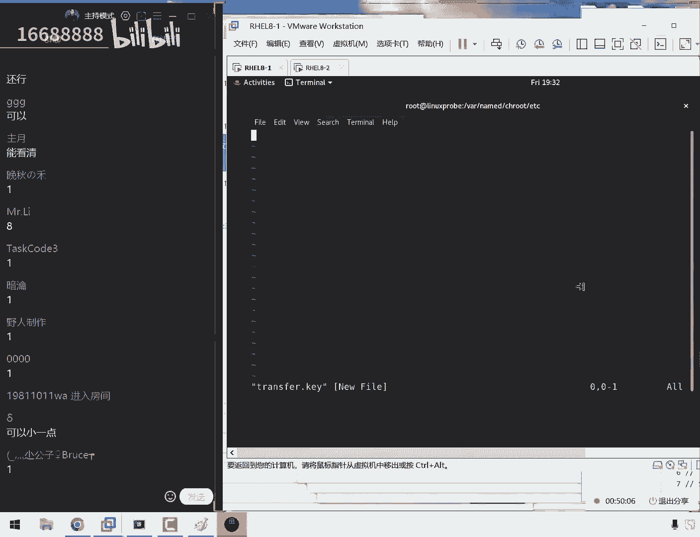
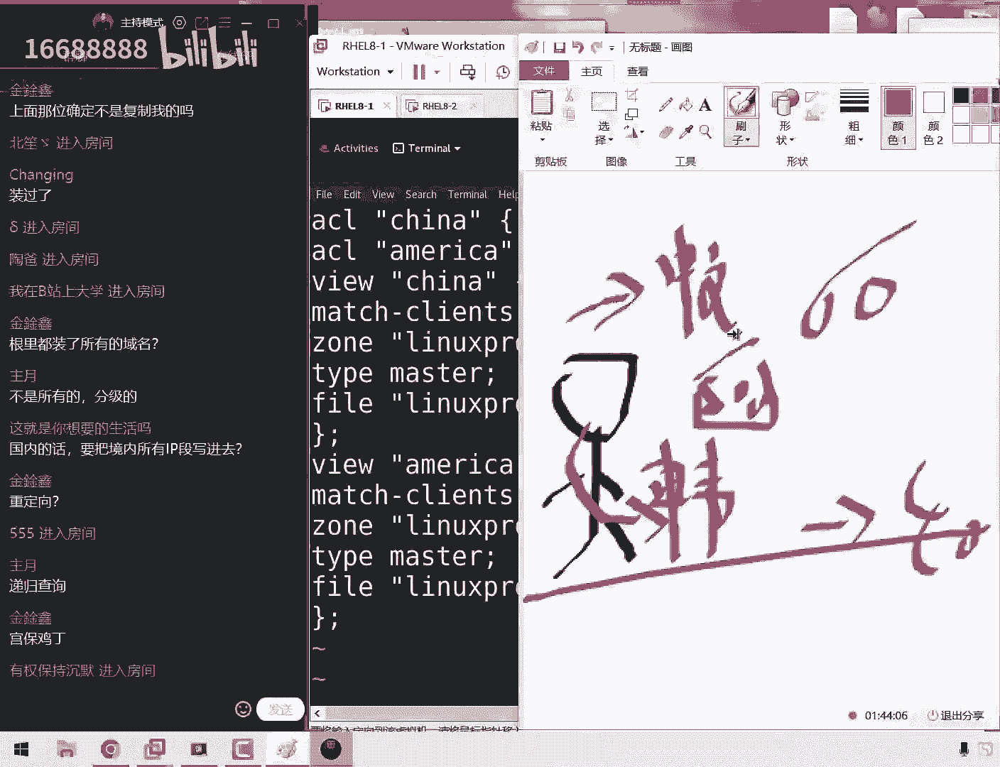

# 刘遄培训linux34期（配套linux就该这么学第二版，RHCE8） - P20：20 - 16688888 - BV1gL41167vP

ok同学，我们来开始我们今天这个课程啊。

大家先听一下我这个声音啊，大家觉得是否清晰啊，我们先打一下一好吧，然后对今天有很多事情需要大家去说一下，包括月卡啊，包括说我们现在这个红包的话呢。

哎呀有一个改题，还有一个辩题这么一个事情，所以话大家先打一下一啊，先给我们大概十分钟的时间吧，我们把这个需要给大家去说。

这个事情给大家捋清楚了，然后是这样的啊，呃先给大家说一下，我们报考的一个原则性的一个问题，就是话呢大家自行考虑清楚是否要报考，因为的话呢我们现在呃考场的话呢，这个座位是比较少的。

所以的话呢我们尽量呢就是呃，如果说你没有确定您要跑啊，那么的话您是否需要考试的话，可以再稍微等一等，那么我们要给我的单数，我们也要给需要报考的同学提前要去把，那我们通过今天这个时间，然后给大家说清楚好。

那么我们先来说一下第一件事情，然后我们现在是有一些呃需要报考的时间，还有这个辩题的一个问题，让我先给大家依次说一下吧。

首先的话我稍等，我，我也打开画图板啊，这样的话我能给大家说个清楚，首先的话就是大家看到这个新闻了，然后的话呢现在红包我就已经发布了，根据的话红毛这个变形的周期。

所以的话呢，现在的时间是2022年的5月20号，所以如果不出意外的话呢，我们这边也跟考官去确认了一下，会在8月中旬就会变提了，也就会变成了红包热酒，也就是说最快的时间大概就是8月中旬。

然后我们现在的话已经进入到了一个呃，临近辩题的一个很像的啊这么一个时间，所以话呢现在报考的人呃，这个额数量的话，大家这个考生特别的多，所以现在就是第一个问题，就是现在红包热酒的话呢发布了。

如果说您却想要去从事这个运维行业的话，那我认为这可能是最后的一个窗口期，因为我们三个月之后变题，然后就基本上又是半年的时间，需要去稳定这个题库，所以可能现在的话呢是您到2023年呃。

起码是2月份之前可能最后一次机会了，这是第一个，所以说我们现在这个位置也比较的紧张，第二的话就是我们原本的话，如果要是约不上的话，会很麻烦，然后我们今天啊啊，然后的话呢我们上个礼拜的时候。

也是大家这个考官努力的去沟通了一下，最终的话呢我们也取得一些呃考场的这个时间，那并且的话呢如果不出意外的话，这个时间就已经确认了，那也就是说您报考的这个时间，就是我们今天所说的这个时间。

那么就是您最后我们去考试，这个时间基本上也没有什么变化了，然后我们来给大家去公布这么一个事情，第一就是说啊这个啊不不，这就是我们第一个问题，然后还那我来出第二个问题吧，第二话就是同学问到了说这个容器啊。

然后还有还有这个呃，呃我们看到我们的上午的考试当中，有一些参数的一个变态，然后的话呢我们这边跟考官也是确认了一下，所以如果说您再去看这个视频，跟看网页当中有一些区别的话呢，他们是有出路的话呢。

那么请大家以先这个网页为主，我们大概是修改了三个地方，也就是说当前的话呢网易上的这个答案，那么就是准确的，那么就没有问题了，值得换，只不过因为这个容器这个题目的话呢，我们现在还没有环境。

所以我们现在没有办法给大家去录，但是这个容器的话，总共的分值也就是大概30分，那么以及的话呢，我们嗯会尽快给大家来去提供吧，然后现在的话大家已经在网页上面了，大家这样去敲也问题不大了。

但是这个的话我们会尽量给大家呃，那我们会尽快给大家提供这个容器的视频，但是这个大家需要等一段时间，现在确实还没有，因为他又变铁了啊，这也是刚刚看到的这么一个消息，然后呢这是我们这个第三个啊。

将我们叙述一下，第三个问题，就是这个大家比较关心的考试时间了，为什么大家之前想要去约考，但是我们一直我们说没有约呢，那大家说那如果来不及考试咋办，那就那么如果说您没有年级考试，那么您就不用那人。

那么您就不用考了，因为你变成红包任务，九个之后没有题库，没有教材，没有考题，差就差都没有，就是我们讲我们也不会去讲，所以考题也不稳定，那您至少要等到考题的稳定了，通过率就再往上走一走的，然后再去考。

那基本上都得半年左右吧，好了我们就不多说了啊，因为我们同学们今天就不用担心说越误语，因为今天这个位置的话，那肯定就是啊今天晚上就必然会被约满的，那我们就直接说了，然后考试时间的话呢。

我现在所说这个时间就是已经确的了，那么如果没有意外的情况下，您考试的时候就是这些啊啊那么就是这个时间，那么付款之后您就一定有位置啊，这是我们一些呃前提条件，然后再去说一下北京啊，北京话到北京的话呢。

实在很不好意思，就是北京这一场的话呢，我我啊我们去问了一下，就这一块呢我们的这个诶教室比较大，但是的话呢也只能坐15个人呃，因为我们之前的话有一些学员一一啊，因为是问的比较早了。

所以的话我们提前预约了有这么四五个同学，现在的话呢对于北京的话呢，现在只有十个位置了，所以的话呢我们来公布一下时间，就是北京就是6月13号就确认了，也不会改了，但是我们除非有疫情啊，然后换到上海的话。

这个时间也是确认的，然后上海的话也是只能约十个人啊，就是6月24号这个时间也是固定的，除此以外啊，除了啊我们产生了其他这个啊，特殊情况以外的话呢，这个时间不会发生变化。

同学们一定会问到说老师这个时间还会被，那我们这个时间他会不会改呢，他会改啊，但是的话呢只有极少数情况下他单位去打啊，比如说大面积的啊产生了这么一个呃封城啊，这样的情况才有可能改来。

否则这个时间都是固定的，然后广州的话，那就是6月24号，对大家没有听错，我们现在都给大家约的是6月下旬的一个时间，所以的话呢您大啊，那么所以说您备考的这个时间是很充裕的，然后这个广州的话是6月14号。

深圳的话呢我们就很有面子了啊，深圳的话因为我们在上一期还有一些旋，然后我们的话呢这个约了两场，我们约一个6月22号，但是的话我们原则上来说，这个是给我们的第34集选取悦的，结果的话没有月满诶。

这个非常好，所以的话呢我们就是等于说啊，这个啊，我们的话呢这个时间大概还有一两个位置啊，等啊，那我们会有这么一个情况，然后还有6月23号，这个是我们专门为我们当地权取悦的，所以同学们啊。

也就是说23 22啊，那啊那我们都可以去选，但是尽量选择23，这个是给大家专门约的一个时间，然后除此以外的话呢，那我们作为一个很负责任的一个培训机构，是不是，那那那那我们肯定不希望大家能够。

在自己的这个呃啊当地去考试嘛，所以我判断南京啊我们也给大家约到了，哎大家没有听错，南京也约到这个非常的这个非常厉害啊，因为我们上一期都没有约到，这个时间的话呢是6月14号啊，不啊呃6月16号。

然后的话还有济南，然后这就是6月7号，然后除此以外就没有了，然后我们之前的话已经给大家约了，武汉跟济南啊，这两个时间的话呢，还有我们的武汉，但是啊但是这已经是满员了啊，也就是说我们本期的话呢。

已经以及我认为可能到红包热九辩题之前，我们能够约到的考场里的一个信息，就给大家带去公布出来了，然后至于说同学们该啊，然后至于说同学们下午问到的一些城市，比如说是天津的啊，青岛啊，还有大连这些城市。

包括说您可能上一期的时候已经呃，就包括说您可能上周的时候稍等我看一下啊，包括声音，上周的时候可能已经给我登记过你所在城市了，然后这些城市的话，那就都呃我们这边确认了一下，是没有了，那包括说合肥啊。

然后起码是6月份就没有了，7月份有没有不一定，但是起码的话，现在我们56月份都是可能要困过去了，78月份的话呢，呃要是有，那么就再给大家续约，如果没有的话呢，呃您可以到时候当然就会很麻烦了。

那我们接下来您看一下吧，如果说你所在这个城市，比如说你是在河北对吧，那么你去北京或者天津都可以的情况下，那么就来北京就好了，让我来说一下这个怎么约考啊，然后再最后再给大家说一下。

由于这个月卡的话呢是一个线下考试，它不是线上的，所以的话他收到很多这个原，他们收到很多这个啊考场信息这么一个控制，所以的话呢我们每一期的这个考试人数，每场只能做十个人，所以我们今天的话呢会严格的按照。

大家报考的这个人啊，报考这个顺序来给大家提交，所以大家听好我们报考的一个方式呃，现在这个人数有91，然后我们主要就是北上广深，大家出一下这个四啊，而且我们群里面接还有很多同学。

基本上每个城市可能约到20多人吧，这不是搞经营销确实有这么大，因为他确实位置比较紧张嘛，然后我们就考这个格式是这样的啊，大家话呢首先要整个单，您报名称那个qq号码，就是您付款接都发给去哪个qq号码。

比如说举个例子啊，啊同学们非常啊已经非常快了，已经发过了，比如说我随便点开一个同学的信息，你看啊，就是我们同学们点开这个信息之后，哎这个好啊，那我们看一看一下，就是话呢大家会有这边的这个呃。

所在这么一个城市和姓名，所以的话呢啊，大家一定要找到您报名时候那个qq号码，然后啊否则的话就会有这样的情况，就是您虽然报名了，但是您联系的qq号码的话，那并不是我常用的，所以的话呢我们没有备注您的姓名。

不知道是谁，那么啊那么也会错过这个报考的时间，那么也就是第一步，你要找到我们报考的那个q号，一般情况下现在是有两个，第一个的话呢是5603241，这个是i可能会比较常用的，第二的话啊。

这是我啊我们的话之前用到的，所以这两个的话都有可能啊，只是说其他的话呢，我们现在一共有四个qq号，因为每个qq号只能加5000个好友，然后我们等于说这个号码了之后，然后我们又开了一个新号。

然后这个新号的话现在已经3500多人了，所以现在的话同学们啊，大概情况下啊啊那我们花大概率情况下，大家可以去搜一下，大概率就是这个qq号，所以您可以先去找一下，看看是不是通过这个qq号报名的。

要是不是的话呢，也有可能，那么就是下面一个qq号，那么如果重新找到了，这个也有可能哎我们要啊。

我们一定要严谨啊，也有可能，那么如果说你找到了这个报名的q号了。

那么这个时候您就可以按照这样的格式来发，我就是的话，那您报名的这个城市加上具体的这个时间，就是比如说您想报名的这个城市的名字，加上您这个具体的时间啊，我们一定要写清楚您所在这个城市。

比如说你要告诉我您是在北京网盘啊，那啊那好，那我们就要再写一下北京，然后后面的话呢去写一个时间，比如说北京这样的一个词对吧，就是我们如果按照这样的格式取乐的话，千万不要发给我们，就给他。

就是我们直发城市名称，这样的话千万不要这样，因为我会去问您说啊，北京时间6月23号可不可以，因为我不知道您是啊，那啊因为我们不知道您是否知道这个时间，那我们还会再跟您确认一下，然后再去报名了，所以算啊。

这样的话，那我们可能就是说啊，那么就会没有您的位置了，因此的话请大家一定要明确的告诉我，就是您啊报考的这个时间，然后就是再加上我们所在这个城市，这样的一个信息，准确的发给我，今天的话呢我们下课之后。

大概会在九点钟左右吧，九点钟左右，然后就会给大家啊回信息，所以的话呢同学们待会就会收到，我们给大家发信息了，并且的话呢我们会严格的按照非常严格的，按照大家给我发qq的这个信息的顺序，我要给大家回消息。

然后我们每个城市的话呢大概有十个考生的啊，但这个作为我们一般情况下的话会发12个，因为还有两个位置的话呢啊，会多发两个这个考试的表，因为的话还有很呃呃，因为的话会有些考生可能报名之后啊。

就那他们可能会发完信息之后，他就啊他们就决定啊，就他们就不会去考试了，所以的话呢我们一般一般啊，所以我们一般啊会多发两个这样的一个表格，这样的话大家可以按照这个顺序来去提交，就好了啊。

我们会发11个或者12个表，所以的话大家收到之后就尽快填写就可以了，那么大家现在需要做什么事情呢，就是除了这个以外，如果说您需要报考，那么您就可以去提交了，然后按照这个消息发布。

然后同时的话要做两个事情，如果大家要是不需要考试的话呢，您就去倒杯水，然后马上说明，然后第一件事情就是您需要先这样，您现在需要点开您的这个qq群，第34期的这个培训群，哎大家现在一起点开啊。

点开第34期的这个培训群，我们现在把就是我们晚上啊，大家现在看现在是07：14吧，我们要把晚上该做的事情咱先提前做一做，这样的话我们晚上的时候就可以直接报考了，省的就多啊，那我们省的耽误时间了呃。

第一件事情就是找到qq号了，发完信息了，对不对，好，然后的话你点开这个34期的这个培训群。

然后点开这个文件，然后然后啊，接下来我们在里面给大家传了这么一个文件，大家叫做注册红帽的id这么一个文件啊，红帽的呃这么一个id，大家会打开这个文件之后，最后有注册红包账号这么一个信息了啊。

这就是为了说我们啊我们考完试这个啊，那我们考完这个证书之后的话呢，可以根据这个证书编码来去做一下绑定，避免重名的这样的一个情况，所以说对红方来说的话，9年开始，就要求。

我们所有的考生都要去注册这么一个账号，然后才可以去提交考试信息，其实大家需要啊，那么啊那么这也就是大家需要第一件事情啊，需要做的就下载一下这个文件，然后当时我们一边给大家讲个过程中。

大家一边的啊去把这个文件的话呢，都给大家注册一下好吧，那就按照我们这个流程再去注册一下，这个的话并不难，然后我们在讲课当中的话，就不会再给大家答疑了，因为这个的话呃非常简单，如果说您注册账号当中。

您出现了一些问题，大家在群里面讨论讨论，就问题不大了，好吧，这是第一个问题，第二个就是我们呃发完信息之后，这是我们发信息啊需要做的一件事情，第二的话呢是注册一个红包的一个账号啊。

那r啊r h n i啊的一个i d的一个账号，哎这个鼠标的不太好使了，唉来看大红帽的一个i d，这第二件事情就要做好，我们的第三件事情就是如果说同学们，你们要是报名的时候正好有位置啊，没有鼠标垫啊，来。

那么如果说第三件事情就是呃，如果说你报名的时候，您发信息发的很快，那么正好是前12个学员，那么我会给您发一个报名表，这个报名表的话呢，您收到之后会是这样子的。

是一个考试表，那么大家知道之后会是这样子的一个表格，然后底下的话呢会有很多这样的一个介绍信息，那么请大家的话呢，就是仔细的把这个介绍信息的话来去读一读，然后大家看一下。

这个会有一个表格填写一下子这个信息，包括说刚才注册那个账号需要去填写一下，然后的话我们往下读啊，底下的东西了啊，然后非常啊，那我们这边有个非常好啊，这边会有一个提醒，然后告诉大家底下还有一些这个信息。

第三件事件的方法就是当您收到表格了之后，那么您就去付款，然后现在的话就要赶紧去提现了啊，把这个钱准备好了，晚上我们就可以给大家报考了，然后我们付款过后的话呢，我们会给大家把。

那我们会把这个信息给大家提交，提交过后的话，我们会给大家发这么一句话，当你收到这句话的时候，稍等一下啊，但是到这句话的时候，那么证明您报考这个信息就已经成功了，除非特殊情况，否则您就会当啊。

那么就那么您就会在您当天报考。

那个时间就一定有位置，然后大家可以去考试了，然后就这么一个情况呃，刚刚的话呢我们用了十分钟的时间啊，15分钟的时间给大家把大把，我们这个报考的时间，报考流程以及报考的这个呃注意事项，给大家来去说了一下。

然后我们现在有哪里没有说清楚呢，那大家可以来提问了，我们再用五到十分钟的时间吧，来给大家来聊一聊约考的一个事情，然后大家问了一个问题，大家说7~8月这边还能约到考场吗，我们认为是可能不好约了。

因为现在追的人数的话呢，其他考场也是很多的，可能位置比较紧张，可能比现在还要紧张，然后大家说约不上的人咋办，约约约不上的人啊，就会嗯反正就相当于一个小教学事故吧，但是我们尽量给大家解决好吧。

然后下面有问题，大家都考试的时候可以自带啊，可以自带鼠标和键盘吗，可以的，没有问题，说北京只有6月13号嘛，是这样的，因为我们每个机构，等于说6月份准备平均到了一天，因为机构很多嘛。

现在北京现在这个天机构很多呃，分到每个机构的话，只能分到一两天时间，差不多这么一个感觉，大家要大家问的说，那要是其他月也约不上咋整啊，这个到时候再说吧，因为现在也说，因为现在也说不好。

万一要是约上了呢对吧，那我们约起来还是很顺利的，万一要是约上了的话，那我们现在这个担忧也问题不大，不过说实话可能有点悬，然后下面一个问题大家说如今的环境多久提供，我们估计悬了啊。

大家在考试之前的话肯定会有，但是月底之前差不多吧，反正最近两天估计还是选在赛文带一个问题啊，赛文加一个问题，大家说说说说邱老师，如果这次没有约上啊，这个问题说如果变成红毛肉，久了还能继续听课吗，可以的。

没有问题啊，不但是看大家是不是在活动日，报名字就可以了啊，然后说深圳低风险可以去深圳吗，啊这个政策问题大家需要从百度上去搜啊，然后下面一个问题大家说成都怎么说，成都的话呢说没有考场位置了。

然后下面一个问题就是没有，就是没有安排考场了，因为等于说大家能理解这个事情啊，就是现在北上广深，这四个城市考生都约不过来了，就是人特别的多，所以的话呢后面考研就怎么，他总共就他他只有啊六个考官。

对话方面考官不就是嗯也不太愿意去，因为大家就想这个问题去的程度之后去了，然后坐着飞机去坐飞机回，但只考一天，性价比不高，所以现在北站广深它都它都啊，现在主要是集中啊，它主要是集中在北京和上海了。

然后下面一个问题，这也不是我们啊不给大家约，以及话呢，这个也不是我们分析机构很无能，主要就是因为现在这个具体情况就是这样的，因为一旦辩题的话，肯定就像我们之前给大家去说的，就会有很多考生着急了。

然后现在就像我们现在一样，人数超级多，然后来去约考，然后大家先看一下，我们今天这个在线人数有100个同学啊，99了，这已经突破了，基本上是我们第一天培训时候那个水平了。

所以可以大家可以看出来这个约跑了一个热情，但是完了我们也很有底线，就是我们在啊，今天之前都完全没有在qq群里面去说，所以的话呢我们把这个考试时间第一时间建立，伟大了，我们的当期的43期学员好。

下面一个问题大家说好，问题不大了，然后大家说如果遇上之后考试的时候，疫情复发了咋办啊，不用担心啊，考这个话考场会给大家直接停考，然后会给大家统一做延期了啊，因为报考多比八比啊，会比大家更加怕死。

而是朋友更加怕麻烦，你说我一个一个城市，大家想一个问题啊，本身考官钱也不够用啊，这个考官去这个所在城市之后被隔离15天，实在损失太大了，所以的话呢现在大家不用担心疫情的问题，因为一旦有疫情了。

考官就会直接去啊，会大办啊，办理延期吧，这个就是大家就怎么理解呢，大家想考研，那也考不了了，因为考官也不敢来了，他会先去忙其他城市的，然后呢有一个问题大家说啊，说那如果别提之前还没法考试。

那不就白培训了啊，不能这么理解，因为的话呢红包这个系统呢，它是有一个延续性的，所以说很多这个学习的技术的话呢，变化是有的，但是的话呢嗯变化百分之六七十不变的，起码百分之三四十可能会变。

但是起码大部分的是它是会延续下去的，好然后给大家说一件事情，我刚才用手机上看了一下，当然的话呢就是我我这边看了一下呃，同学们还在问说说老刘啊，说怎么样，说这个报报好名的时间，不管几月一直会约考。

对没有问题，招是这样的啊，这个时间的话大家就不用啊，大家就不用管了，大家这个信息的话就不用看了吧，又删掉了，那么怎么回事呢，因为我刚看到qq上面，qq上面的话呢，我累计收到这个信息，我刚才看了一下。

有70人啊，已经约到了70人，所以的话呢这不用说呃，这个这个不用去纠结了，那我们给大家看一下，到时把一段给他拆掉，我们现在这个q上收到这个人数是70人，所以我们要给大家说两个事情。

就是我们会严格的按照大家报名的这个顺序，然后再给大家提交这个信息，如果您没有位置的话，那么就没有，那么就确实没有位置了，请大家能够谅解，然后的话呢我们今天晚上的话呢，会给大家把这个信息处理完。

然后我们再睡觉，所以的话呢大家可能收到，就如果说我们九点钟下课，那我们您可能收到第一条信息是十点钟，所以的话大家就今天晚上睡一会儿吧，我这个电脑的话，因为是一个笔记本出来被隔离了。

所以的话他可能可能会比较慢，但是我今天怎么着，十点钟也会给大家回第一条信息，然后大家就晚点睡吧，如果要是没有位置的话呢，我们之前就没给大家回过。

那么如果要是呃，那如果要是呃大家要是没有位置的话。

比如说第呃，比如说你发信息的顺序是第13个人，因为我们会严格按照这个顺序，就是我们报名的时候那个顺序，第一位同学看，他们也是07：08给我们发个信息，那好了，我就按照这个顺序来给大家去约跑。

如果说您是第13个以后呢，我就给大家发一条信息啊，那么就说很抱歉，那么请您下次再约就好了好吧，我们会给大家会会给大家发一条信息，就可以，也可以看着吃着睡觉了，然后就给大家说完了啊。

然后其他问题有其他问题吗，你可以来说一下，然后我来给大家，包括说他可以截张图啊，可以看可以截张图，然后的话呢，我会严格的按照咱们这个报考的顺序，来给大家去操作，还有信息没有点开，我就不给大家点开了。

因为你点开意义不大了好吧，比如这东西还没有还是没有名字啊，这不就是刚才说那个情况吗。

那这不就我啊啊，这就是我刚才说那个情况，就是你看因为您没有啊，因为您联系的时候，您的那个qq号码您联系错了，等于说您应该联系的啊，那么说明您联系应该是这个学位号，但是您联系错了。

所以我们没有登记您的这个姓名，那我把它关了啊，据大家一定要联系正确的qq号，这样的话能报名信息才是有效的，好了。

我再给大家往后面去说，大家说啊，济南之前说没有考场，现在又有了对，有了啊。

然后我们也是给大家争取来的啊，确实很不容易，来大家继续来，我们大家就说说万一睡着了咋办啊，万一睡着的话，就等到7月8月份再说吧啊吧，那么就是等到那就让其他的考生，就让我们其他的师兄弟们先去考啊。

然后我们来给大家先去说一下，今天这个讲课内容吧，呃因为的话对于考试这个是啊，但是啊但这么一个事的话，多说也没有太大问题啊，多出的话也没有太大意义，我们主要待会儿，基本上今天就能报名的差不多了。

然后我们明天给大家做一个总结的话，如果要是但凡有位置，但是99%没位置了，然后会给大家再去约一场，如果要是没有的话呢，就等着礼拜一我们跟考场里边再去沟通一下吧，然后好吧，这么一个情况，看看能不能嗯。

看看能不能在每一场再多加一两个位置，然后我们c然后我们再给大家c g y e吧，我们看一看，只能是这么去解决了，因为考过诶，呃，因为的话，每个机构等于说每个月只平均到一两场嘛，这个还是比较麻烦的。

然后大家说啊说啊说啊，合肥啊怎么没有考场呢，不太公平啊，这句话呢非常公平，因为我们没有遇到的这个时间，全国所有的机构在合肥都不会有任何的考场，大家可以去问这个培训机构，有任何分啊，任何培训机构去问一下。

6月份在合肥有没有红包考场，绝对不会有啊，所以这个非常公平啊，虽然都没有啊，这次大家就是只能在自己这个当地机构去不大，只能是在呃呃周边的城市，或者的话呢，您看看78月份的时候再问一下我好吧，呃不呃。

那我就不多说了，因为大家这问题的话，基本上就回答的回答差不多了，然后至于说更多的问题的话呢，我们先给大家讲讲课，然后我们明天吧给大家来做一个总结，看看今天这个月考的一个情况的一个总结，好。

我来给大家说一下，然后今天的话这个人数超级多，我感觉电脑有点吃不消了，我如果要是有崩溃的话呢，我们可能会晚上会晚点再给大家发消息了好吧，反正基本反正今天起码大家十点半左右吧。

十点半之前应该能收到我的第一条消息，我会尽快的啊，我那么我那么我们这边也会尽快的来，给大家往后面去说了啊，先做一下回忆啊，说了二分钟了，我们来给大家做一下回忆，上节课我们讲什么呢，礼拜日的时候。

我们讲的这个dns，这个主服务器跟从服务器之间去做的，叫做什么呢，正向及反向解析啊。

大家可能听到这都没有兴趣学了啊，老师这个啊啊啊，这个我们考试也没有啊对吧，但他是没有，但是对于我们这个网络知识的这么一个积累，还是很有帮助的，来我们来做一下总结，上节课我们讲了一个dns对吧。

我们讲了一个半的服务，它的话呢我们讲到这个主服务器跟从属啊，跟从属服务器之间去做一下什么呢，正向及反向解析的一个同步，这个我们首先给大家做正反，我们都给大家去玩了一遍了，正反都没有问题。

然后继续嗯，那么我们现在给大家去做一下，叫做t s i d加密，就是来保证一下这个主服务器跟存储服务器之，间来进行数据交互这么一个安全性，那么是为什么呢，大家来网上啊，翻开书看一下啊，另外的话呢。

我们还有一个书籍签名的一个小活动对吧，然后我们这个等到我们明天或者后天吧，然后再给大家发那个签名的小礼物。

因为现在我还在被追啊，因为的话呢我们现在还在还在被隔离，现在还是在酒店当中，所以大家今天那个小礼物的话也不用着急吧，反正现在也寄不出去，然后要等，然后修完再等一等了啊，现在这个疫情对于这个呃。

快递的这个管控也是比较严格的，好，大家先看一下，这张是我们的图片，是三杠二图谱图，大家看一下，也就是说我们的这个啊，那也就是说我们的这个呃客户的话呢，我们这个dns一个究竟的服务器发送请求之后。

服务器和服务器之间需要进行多次的，咱们一起来说地位的这个查询，那好了，他需要进行很多次向根据的服务器，像点com这个域名，像我们的i d e c的供应商对吧，还有什么呢。

还有像我们自己的这个服务器发送请求，那么进行多次这样的这个查询，任何一次怎么样呢，被人家所篡改的这个地址了，那么就有可能导致后面所查询到的所有信息，就全都是错误的了，为了避免说这样的这个问题。

所以同学们怎么样呢，在我们这个啊进行多次这个查询的过程当中，我们去加上这么一个叫做tsi的，一个加密的一个字符串，它的作用就是当我再去发送信息的时候，那当我们再去发送信息的时候，他会先去发送一个字符串。

比如说是a b c啊，发一个天王盖地虎，当对方回复了啊，宝塔镇车腰的时候，证明对方是我们自己人，然后再进行一个数据的一个交互，这样的话，他就可以保证我们这一部分的一个安全了对吧，那这样的一个方式。

然后大家说啊用顺便又看了一个问题啊，大家说说能够保证按照严格的顺序去执行了，非常严格非常非常严格，第一位学员7。080分就07：08，因为我们说实话啊，这也不赚钱对吧，我们也给大家说的很清楚了。

所以说这个东西我们绝对不给机长麻烦的啊，我们绝对不会给机长麻烦，所以如果说是07：15发出来啊，但是07：30的人，他们是约上了，但是您没有约上，可以过来找我了，他所以我们这个不给自己找麻烦。

肯定会按照这个报名的顺序，严格的按照这个报名的顺序，就是您发信息的那个顺序发的，所以说如果说你现在没有发，同学就不关心考试的这个呃考试的这个诶来啊，咱们就不用关心考试这个时间了，因为一定是没有了。

就踏踏实听课了，同学们不用再提这种考试问题了，就不用再去关心了，来我们先来给大家操作一下，同学们，那现在的话呢，我们来就进入到我们这个主服务器，当中下面我们还有两台服务器，这台是主服务器。

然后这台的话呢我们是这个从属服务器啊，来我们看下是听课啊，他还是听课了，那我们来看一下这个主服务器的话呢，先去做一下dns s的一个加密，其实的话呢我们只需要就是一个字符串啊。

来我们来去使用到我们的命令，来进行一个加密啊，security key game啊，就是它指的是生成一个我们的dns，一个加密的意思来说，字符串字符串杠a啊，然后的话呢我们一个加密的一个协议。

大家说怎么样呢，刚准备考，那马上又要辩题了，我们也很着急，我们也很烦，哎呀老刘都老了，学不动了，现在等于说去年刚发了一本新书，今年又开始辩题，这个每3年一次周期真是不可抗拒啊。

他这个也非常痛苦非常痛苦啊，让我们来定义一下我们这个加密的协议为md 5，然后的话呢我们的缸壁，它指的是我们加密的这个次数，我们128，这样的话呢杠n我们的来这个啊，那我们定义成为啊。

它这个呃呃密钥文件这么一个类型，然后接下来我们密钥文件它所对应的一个名称，然后我们给大家写好这个名称的话，名称也可以无所谓的，但是待会我们去写文件的时候，来进行调用的时候，大家一定要记住它。

另外这个窗口有点小，变成一个小豆腐块了啊，但是没有办法，因为现在我这个屏幕嘛太小了，一个笔记本，哎呀同学们，那就将就一下，我把这个字稍微的放小一点，同学们提个小问题，大家现在看到现在的话呢。

我们直接搬了这个命令之后，就会在我们这个啊，当前目录当中有一个公钥文件，还有一个cl文件，请问我们现在需要的是，把我们的这个公钥文件发送给对方，还是把我们的这个cell文件啊。

那我们现在是需要发公告文件给对方，还是发cell文件给对方啊，一个小问题，大家看一下这个文件内容，请问我们现在需要把公告信息给对方，还是把sl信息给对方啊，大家怎么样，大家说啊，呃说怎么样呢。

说刚才后面又发了消息，是不是又被刷到后面去了对啊，因为您发了消息专项，等于说您又以最后以他为准吧，然后大家说把公共信息发送给对方，对吧对啊对，但是的话呢我们其实可以看得出来，大家确实没有预习啊。

确实没有预期，因为这个虽然考试不考啊，但是我没有想到大家真的是没有预习，我们发送的话呢，既不是公钥和私钥，我们两个都不要啊，好吧，我们我们要的是什么呢。

它是要做非对称式加密算法，他的话呢不需要发送公钥跟私钥，然后同学们没有预习吗，我们不需要发，我们什么都不需要发，我们就需要的就是这么一个字符串。

只要两边的这个字符串匹配上了就可以了，他不需要再进行啊啊sa加密跟公钥解密了，同学们，那这个预期重要性就把体现出来了，公钥私钥我们都不要，我们要的就是这么一个字符串而已，所以实际上我认为我个人认为啊。

老刘个人认为在红包热巴当中的话呢，配置这个dns这个加密协议更麻烦了，因为等红包锐舞的时候，还可以随意去生成出来，这么一个字符串就可以了，结果的话还是在啊非常复杂，还需要进行一个呃生成证啊，他还需要啊。

还要去生成这么一个文件了，反而麻烦了，但是这个啊文件虽然有了，但是我们不用它啊，有了，但是我们不用，我们就是玩，我们就是为了有啊有这么一个文件就可以了啊，有这么一个字符串就可以了。

这样的话呢我们来进入到我们这个配置啊，配置目录当中，进入到我们的这个啊，因为解析服务dns的这个配置文件当中，然后的话呢我们来在里面大家看一下，我现在的话在里面稍等一下，我这个屏幕确实有点小啊。

稍等一下啊，屏幕有点小，我怎么样给他调整的舒服一点呢，大家看起来舒服了，这样的话那我们就不用老去切这个窗口了，看一看啊，看一看，同学们看一下这个字，我看着有点小啊，同学们，你们看着想吗。

就是大家看这个字是否能看清的，因为我这个屏幕左右两边没挡上了，同学们你们看一下这个大小的这个字能看清吗，课程打一下一啊，不能的话打一下二，然后对于说同学们现在想要月考这个问题，我就不再多说了啊。

比如说同学们要吹啊，现在看来我们要是约要要要是没有约上门的啊，怎么这巴拉巴拉这样的问题我们先不说了，因为您今天要是约上了呢，那么您要是约上的话，那您现在这个担忧，和我们现在这个解释不就没有意义了对吧。

等您就是啊今天先约吧，如果说您没有约上的情况下，您明天再说好吧，万一介绍约上了，那不就很尴尬了啊啊那我们不休息之后，就我们先不给大家去说了啊，然后还有那我那我们下面一个啊去，ok没有问题是吧。

大家看见没有问题就行，我这看着有点小好，我们来卡西的声优出来这么一个文件，也就是说需要有这么一个文件，然后的话呢在我们这个本地去加载这个字符串，然后的话呢再来我们这个诶，然后去啊。

那我们先这样的啊，现在这个主服务器上面去加载这个文件，这个呃呃然后的话这个字符串里面，然后这个我们的文件当中包含这个字符串，然后再在我们这个存储服务器的话呢，也啊叫字符串，写完字串就好了。

然后他也在这个存储服务器的话呢，也去下载一个文件，这个文件当中的话呢，也包含一个一模一样的一个字符串，这样的话当他去他去传输信息的时候，只要两边的这个信息能够做匹配。

那么就能够让它进行一个正确的传输就可以了，对吧，也就是说我们现在需要两步，第一步生成，第二步，在主合从当中去同步一下。

这个密码文件就可以了，这个格式是这样的，首先的话呢是我们定义一个名称，这个名称的话呢我们可以随便去写，但是一定要跟我们这个存储服务器要保持一致，它叫做我们的密钥文件的一个名称。

但实际上它并不这么的重要啊，好吧，我们只是一个名称而已，我们写下来，它是一个主从之间进行一个数据传输的，一个意思来组合，从然后的话呢，我们定义一下他这个加密的一个算法，那我们加密的时候，他打他啊。

使用的啊这么一个加密的协议需要给大家写清，这样的话呢我们待会儿去加载的时候，它可以基于我们这个算法来给对方来制作一下，匹配，这句话我们的这个啊，那我们给大家写一个小写的形式没有问题，这个我去试过。

加入的时候它是一个大写的，写完这个文件里面的话呢，大小写皆可啊，这个没有问题，让我们加密的这个字符串，我们可以传到引号里的，引起来诶，没有了，稍等一下啊，找一下我们刚才要的就是这么一个字符串。

于是找到这个字符串啊，我们要的就是这个字符串嘛，这个字符串可不能丢，把这个往里面一粘，同学看起来这个真的不像吗，啊可以再小点啊，这个你们看这个看起来真的不像吗，我看有点小啊，来我们看看啊。

所以我们看起来刚才那个人数巅峰的时候，有102啊，所以我看得出来有18位同学就是公布啊，就是啊专门过来听一下这个考试时间了啊，就走了，好说明已经发完信息了，等我去回信息了好但是这样的啊。

我现在把这个文件给他写好了，也就是说这是我们加密的一个字符串，这是我们的密钥的名称，这个无所谓啊，它好它实际上也并不是一个密钥文件的，来保存并退出，对于我们第一次张文杰编译器的使用方法，就非常的熟练了。

接下来给这个权限的话呢，稍微小一点让别人看不了，这样的话能够保证我们的文件的安全，给他一个权限，640啊，稍微小一点，让别人读了，然后呢再把它作为一个链接文件，做到我们的配置文件目录当中。

这样的话呢方便于说以后进行一个调用来走，你把这个话，我们这个啊最后一步比前面都要重要啊，一定要按下回车，然后大声说一句我们的咒语，这样话有气势啊，你气势到位了，当你学习的学计算机，学到最后的时候。

就是一个玄学啊，就是明明配对的时装是一模一样，怎么我就不要做不出来呢，啊最后可能大便最后我啊我啊，所以大家学习计算机可能最后变成一个玄学了，觉得就是非常的迷信了，这个奇怪了啊。

老觉得为什么他啊做不出来呢，啊或者说怎么他都啊老出问题呢，来我们来给大家去看一下呃，首先的话呢，我们在前面需要加上我们的这个密钥文件，所对应的一个路径，现在的话因为被隔离了啊，这非常的可惜啊。

所以电脑的配置实在有点太有点太慢了啊，这个话好像是一个i5 的笔记本，哎呀我真的是费劲啊，不过也好在啊，证明一下我们之前所说的那个话嘛，就是嗯我们这个服务器，实际上对于性能的这个要求是比较低的。

即便是一个i5 啊，开两个虚拟机，再带一个100多人的一个讲课群啊，再开100多个啊啊，q的这个窗口也没多大问题啊，因为这个对于我们这个服务器的消耗，实际上还是比较低的，4月2号之后给大家讲过。

它可以把我呃，它可以把我们这个服务器的性能的话呢，啊更好的去使用它，去掉了一些我们并不需要的一些功能的好，我们给大家讲解一下，我们刚才所有生成出来这么一个密钥文件，然后后来我们接下来大家去写一个允许。

允许一下，说我们从组合到啊，存储服务器这个密钥文件的话能够被允许，这样的话做好之后，那我们的这个主服务器就开启了这个，t s i g的一个加密功能啊，我们这样做完之后对还有这个分号封号，千万不要写错啊。

大家怎么样，他说啊咒语没有念念了啊，我真的念了这啊念吧念吧念吧，来我们接下来我们点一下这个保存并退出，但同学们一说我不太自信了啊，同学们啊，大一这么一说啊，不太自信了，老刘这么自信的人，突然间我得去啊。

再去看一眼啊，看一眼，他说我这个路径写错了，我看一下啊，没有写错啊，同学们不要骗我来，我们家都做好之后，看到下面一个问题。

就是我们来继续进入到这个存储服务器了，还有啊就是我们上课之前的话，要给大家重新配置了一下这个环境。

因为这是李白礼拜三的时候手欠了，然后我把这个系统给他呃，还呃给大家去关机了，所以的话呢我们又重新去配了一遍，配完之后的话呢，刚刚啊大概五分多钟之前啊，然后我们上课之前吧，给大家配了一下。

那也就是说作为一台存储服务器，我们可以使用我们自己的这个网卡，然后完了去使用我们自己的这个啊服务，然后还去做一个就啊，去做一下正向机反向这么一个解析，就是说主从之间已经能够进行，数据的一个交互了。

那我们现在的话呢去删掉这个存储服务器当中，去同步来这个存储文件好，那我们先把这个文件给删掉，删掉里面所有的这么一个文件删掉它，然后我们现在看就是不能够再去做这个啊，存储服务器这么一个解析了。

大家还记得我们这个存储服务器的一个作用吗，存储服务器的这个作用，稍等一下啊，先来重新启动一下我们的d n s服务，办的name的服务啊，大家都写错了啊，好像我没有理解大家所说的啊，好像我确实写错了。

我看具体是哪一行，他说我配置文件当中第四行写错了，第四行写错了，第四行是吗啊，稍等一下，稍等一下，我看一下，他说我们的呃的穿梭点key当中的第四行信息，出错了，1234啊，我们果然是少了一个分号啊。

这个字嘛我就说有点小吧，这确实有点小，所以我看起来都不太很清楚，但保存并退出啊，那我们就问啊，那我们就问，那我们就把存单配点好了，瞎配一遍啊，这样的话呢我们出错之后再给大家排座。

其实我们也不太希望大家讲课当中那么的顺利，没有排错的话，就少一点灵魂啊，排错也是一种学习了一些重要的一个过程嘛，对吧，那只有跌倒了才知道怎么样能够爬起来，然后跑得更快，来我们先做好这方面卷啥的。

链接少了是吧，链接啊，没事，我们没啊，没也没关系，我们的话继续来给大家去说啊，出错之后再给大家解决，现在的话我们去重启一下这个主服务器的dns，这个服务来name，然后大声说一句走你啊，这回口号说了啊。

这是我们的咒语，说完了这个没有问题了，现在的话呢也就是说主服务器的这个解析当中，已经做了这个psi加密了，那么我们现在的话呢在这个存储服务器当中，我们要干嘛呢，一来一起说，是不是啊。

我们也要去开启在这个t s间啊，这啊他怎么一个加密呢。

这样的话两边都去做这里一个加密了，这边左边说天王盖地虎，这边你可以说啊，天王盖地虎两边信息匹配对上了成功之后，一模一样啊，一模一样啊，一样啊一样了，那么这样的话呢就可以接下去传输这个信息了。

当我们这边的这个主服务器，他做的加密从属服务前没有做加密，那么我感觉自己配啊，那么啊自己就是啊不能再去同步这个信息了，所以我们来去看一下，当前的话的目录当中是没有文件的，我们之前去重新启动dns服之后。

马上就能够同步来的这个信息，这一次我们就不配了，发现没有了，就是因为对方开了，我们没有开好了，正面解决方法的话，那就不带绕关子了啊，不单卖关子了，不带绕弯子，不单卖啊，那我就不再给大家日照了啊。

卖关子绕弯子给大家说一下怎么去做啊，就是说实际上就是在我们这个存储复习，在我们这个从属复习当中，也需要新建这么一个文件去加载就可以了，很简单，那进入到vm里面的name里面的chrot etc目录啊。

这个耳目当中，实际上就是去新建出来这么一个文件，两边加了一样的文件，那才是一样的，它就是我们去改这个信息的时候，同学后面的说，老师这个能不能去复制呢，当然能够去复制了，只有两边的信息都匹配上一模一样了。

才证明是我们的自己人呀，对不对，所以说这两边的这个信息既然是一模一样的，那我们何尝不能够去从哪出来啊，那我们来去啊选择啊，复制和粘贴呢，这样的话不就更有效率的嘛，对吧啊，现在这个人数73啊。

一下少了30个同学，刚102，现在73啊，爬了，我正好走了30个同学，你们这个啊为了考试这个目的太明显了，但那些30位同学都走掉了，看来今天晚上我们都不说少了不唠，今天晚上绝对是兵家必争之地啊。

这么点位置，但是我们尽力了尽力了，真的不是搞经营销，而且我们给大家保证能约到就全约了，然后没有约上的话，那就真的是没有位置了，也不会说过两天又突突出来一个位置，尽力了已经没有了呃，所以的话呢。

我们就这个其实也是一个客观的一个原因嘛，因为我们先来给大家继续做着，这两边做的是一样的东西，因为这个东西它跟我们的网络培训不一样，我们这网络培训只要有啊，只要他们只要是有网络啊，再带一张嘴就能讲哎。

有网络有嘴就可以讲啊，但是这个啊考试的话呢，需要啊红帽这个啊考官他要是有时间的，并且的话呢考场还有位置了，现在还要没有疫情，还要跟其他机构去竞争一下价格，而我们对于这个价格呢竞争不来啊。

因为我们现在没有差价嘛，所以呃红包那边有点黑暗，他会先去跑那些能够加强的一些机构去约跑去，但是这个我们认为没也没也没太必要，因为我因为我们认为红包考试费已经，既然涨了嘛，对吧，呃现在呃实际上已经很贵了。

我觉得再加钱去考意义就不大了，好了，我们给大家做一个链接，同样的一个操作，一做etc目录当中，再来etc目录里面的transforming key，哎走你来走你走，你得加钱，对是啊，是得加钱啊。

不当然你们现在不用加钱，下一期加不加钱就不知道了啊，因为的话现在就说红包那边扣款的啊，他们就扣啊，他们就扣我们4200，据说他下一期扣我们多少，这个不一定了，所以的话呢大部分希说的流失差价啊。

这个是完全没有的，因为我们现在还没有说穷到说挣这份钱上面啊，然后的话呢所以待会这个考试费的话呢，我们会给大家呃付款方式，然后直接打野考场，我们是完全不经手的，然后我们来给大家继续往后面去配啊。

继续往后面去来给大家去配置一下，那我们来include来去加载一下我们的文件，看看这个还是照着词儿说啊，因为这个说实话我有点不太熟，因为这个是在我的二，我当时我也考过这个2014年的12月，24号考的。

过了8年了，这个其实也记不住啊，所以我们也给大家照着词说啊，这话也不丢人，来我们再去加载一下这个文件啊，今天老刘有点贫，因为还是那个因为还是那个原因啊，因为也可能是被隔离了。

所以的话呢感激我给大家多多说几句话，同学们啊互相体谅啊，所以说这老刘今天第一次看到这么多人啊，非常开啊，也非常也非常开心啊，非常的啊也是非常开心，然后继续这嗯这个已经过一个礼拜了，今天是第七天吧。

我记得是上礼拜六来的吧，那是那今天就是第六天，第一次见到这么多人啊，发现了这个激动啊，来我们来继续写一个server，那我们底下的话呢，需要指定一下我们这个服务器的一个路径。

那么这个既然作为它从属服务器，主服务器的这个路径的话呢，永远会是一九二点一六八点10：10，那么听我讲课就比较好嘛，就是不用老去担心说地址变了，地址不会变啊，变的只有我们的新，对不对。

就是只有我们编的这个配置的服务，他地址的话，存储服务器永远会是10。20，这个不会改好，然后的话呢我们来继续给大家解说，往后面走去加载一下我们这个密文件的名称，这个名称的话呢。

就是只要跟我们这个该所对应的这个文件里面，保持一致就可以了，然后的话它它它实际上他并没有说，实际上去作为一个密钥文件，只不过我们这个文件里保持一致，开头结尾一样。

他他他他等于说就允许我们这个密钥进行验证，这样的一个方式做完之后的话呢，我们点一下保存并退出这几个分号，请千万不要忘记，然后还继续点一下保存并退出啊，大家说说上周啊不是说要开摄像头吗，啊想了一想啊。

算了吧，因为大家想啊，如果老牛战凡啊要长得好看的话，我可能讲网络课程了，对不对，那但凡长得要是能看的话，也肯定早开了对吧，就因为长得太丑了，所以的话呢所以大家啊就只听声音吧，就只听我们讲课吧。

啊卖艺不卖身了好不好啊，这长得太丑了，主要是来那我们来拍一个大型讲的啊，大家这个学习的效率了，重新启动一下，重新启动一下我们的dns，再来啊去进入到我们的etc目录的啊，不啊。

进入到我们这个dns s的这个目录当中，其实是啊，就进入到从属目录当中去看一下，这两个文件的话，就把它下载下来了，就是说刚刚的话呢，主服务器去开了t s i d加密啊，那么今天的话呢我们这个从属服务器。

它也也开p s i d加密了，两个都加密了，天王盖地虎，他也会天王盖地虎，两个人诶呵呵一笑自己人，所以信息就传过来了，团队我们还是那个问题，说到刘，你虽然长得帅啊，虽然你长得帅也。

但是的话呢你传过来这个数据是加密过后的，我怎么知道它是否被破坏呢，它是否能够被使用呢，那么这个时候我来给大家验证一下了，就是说我们首先配置一下我们的网卡，第三个方法配置我们的网卡，把网卡的一起说。

大家一起说，同学们，那把网卡的这个dns地址开创我们的本金，使用我们本机自己的dns解析，这个域名要能够解析出来的话，那么就证明自己是由本机的dns，这个服务区实现的啊，没有问题啊，有点绕口。

但是这个啊话糙理不糙，就是这么回事啊，那我们把这个dns直降到我们的本机，一模一样的ip地址啊。

那么童叟无欺啊，完全没有任何的水分，于是再次重新启动一下nm c l o n m c l r，然后connection editor，然后去，不，然后去up一下网卡名称，启动它做好之后来去进行一个检查。

n s look up命令，这样的话就可以来去输入一个域名，输入一个域名，正向解析出来一个ipad纸啊，然后呢我们再去输一个反向的域名啊，大家去输一个反向的地址，反向解析成一个域名。

这样的话就是我们的从属服务器之间去做的，t s h加密，以及去做的叫做正反解析，没有问题，加密过后数据依然安全，那并且能够很准确的帮我们去解析出来，这个的话就给大家说了一个小小的一个小尾巴。

那还没有讲完，还有大家啊先不着急啊，然后还没有讲完啊，还有我们还有，那我们还有这个能够去给大家讲的dns这个东西，dns还有什么呢，我们来看一下叫做啊缓存服务器，这话缓存服务器的话呢实际上是这个样子的。

我先给大家聊一下理论啊。

其实大家不要关啊，大家好，不要太去关心说我们做这个实验，这个结果并不重要，因为我们配置这个实验，大家想我们从2015年开始讲。

讲到现在讲了7年多了，不可能出错了，所以说这个结果并不重要，重要的是，大家这个呃。

学习的这个过程跟思考的这个过程好，那我们现在讲一下什么叫缓存服务器呢，这个缓存服务器啊，我们可以理解成就是一个网关啊，先画一个网关，稍等啊，我的天呐，这个人数有点多呀，嗯好啊，但我看一下我怎么看。

还有人发厦门呢，厦门就不用发了啊，就可以出去了啊，厦门没有红包考场啊，然后我们还继续啊，所以大家要学大家发的时候请您发，我们又有的，然后以及有画画考场这个啊所在这个位置啊，没有的话就接不了。

然后我们来继续啊，然后来给大家看一下，那我们假如说这是一个网关啊，不这个是一个公司的居网，然后呢我们现在在那我们现在有一个网关，这个话呢我们在网关上面画稍微好看一点，好不好，那画一个稍微好看一点。

那么的话我们在这个网关上面去做一个dns，作为一个dns，这样的话呢我们做一个缓存服务啊，做一个缓存服务器，它的这个作用的话呢，就是当我们这个公司的服务，当当我们这个公司里面啊，比如说有很多台主机。

那么有一台两台三台，当有第一个用户怎么样呢，他通过我们去访问一个网站，访问我们最受欢迎的一个i t网站是什么呢，一起说出来是不是我们的3w点，linux problem com对吧。

我们来去访问一下我们这个网址，待会我们去访问一下这个网址，然后的话呢，他会去把这个域名的话去做一下解析，将解析的这个结果返回给我们之后，再去访问这个网站，具体这个服务器这么一个流程对吧，那么呃也就是说。

我们要是在这个上面去做一个dns的话呢，最后缓存服务器，当有第二个人他再来去进行一个解析的时候，那么他怎么样呢，因为前面人刚刚去解析过这个网址，那么他就可以像我们这个本地去请求一下，然后就拍了。

那那么就可以把这个数据，直接下载到我们的本地的，等于说它叫缓存服务器吗，他啊他会去缓存在他这个啊网关的这个本地，最近查询过这个记录，这样的话他可以去就近的这个张大爷这个啊，去啊进行一个询问。

他他这就像村口张大爷一样，错过了张大爷已经获取这个信息了，所以我们就不用再去这个县城了，那么也不用去乡里面了，所以的话我们可以直接把这个信息再去获取，之后，就可以访问这个网站了，它的话可以去节省一部分。

我们去查询这么一个开销啊，但是的话呢这个我们说实话啊，说啥啊，我们说我们先说我们先说给大家说说句实话啊，这个词在企业当中的话用的比较少，其实用的是比较少的，因为但是做vs查询的时候。

它是一个按照好友级别去算的，我们可能感知不到，他帮我们去做转发这样的一个过程，但是的话呢这还是挺有意义的啊，我们来给大家去操作一下呃，我们的话怎么去做这个实验，当当大家看到效果呢。

它既然是一个转发的一个效果，我们这样啊准备说来两台服务器，我现在讲一个拓扑，大家看啊，更让我这个思路，首先的话呢他既然说他的这个作用是做转发，那好了，两台服务器，第一台服务器的话呢。

上面那大家问的说d服务器只能去做网关吗，能不能做旁路，当然可以，完全没有问题，然后我们现在再来啊，当我们现在准备这么一个拓扑，我现在那我现在去捋一下思路啊，现在有两台服务器，那啊那我们吃完了。

这个是服务器a服啊，服务器上啊，那我们在这个第一台服务器上面，配置这个域名解析服务配置上的第一台，然后的话它有两个网卡，大家跟着我这个思路有点快，那就是说我们现在有两个服务器。

第一个服务器主要有两个网卡，红颜色指的是对外的桥接网卡，他能够去上外网，然后在我们这个哎绿颜色的话呢，叫做啊金主机模式只能是在我们这个内网进行，联通叫做house sony模式嘛，好我们给大家联通。

也就是说我们家有两台主机，一个服务器a，一个服务器b，在服务器a上面去做dns这个缓存服务器，然后我们现在是这样的啊，那也就是说服务器b只能去连接外网哦，不它只能是连接内网，对不对，这是内网，这是外网。

那么我们现在的话把这个服务器a配好之后，让服务器b去解析这个域名，如果说要是能够解决成功的话，那么就证明肯定是由服务器a帮我们群组转，他来帮我们寻求转发的，对不对，比如说我们在小学的时候啊。

老刘的话呢从小飙嘴馋，就是啊，那我那我们当时上小学的时候标嘴馋啊，摊牌了啊，然后的话呢，当时上小学的时候是不允许出校门了，吃完饭之后的话呢，我记得好像是吃饭时间是11点钟，吃完饭之后要休息到一点半。

休息时间特别馋，但我嘴馋怎么办呢，最后有人嗅到这个商机了啊，然后怎么样呢，虽然说这个栅栏我出不去，但是的话呢我可以喊，然后的话这边会有一个小卖铺，一个阿姨会把我要的东西，比如说辣条啊三份。

然后就会有一个阿姨，还有一包辣条过来了，对不对，就是说啊啊那啊那我们比如说我是校长的话，当我看到一个学生他手里啊，他手里有啊，这样的话有零食的时候的话，那么就证明他一定是由别人给他递进来的。

也就是说只要他能够获取这个信息，就证明了一定是，这个信息是由别人帮他转发过来的啊，那我们这么一个小实验，那么大家可以捋一下这个思路啊，想要这个辣条，想要这个拓扑图，想一下有两个服务器。

一个服务器a一个服务器b，那么当服务器b能够去解决出来数据的时候，就一定要是由服务器a去做这么一个传递，好让我们给大家操作一下，首先的话呢，把两台虚拟机都还原到一个最初始的一个状态。

这样的话才能保证我们这个服务的一个公平性，就对，这个我们一定要把它还原到最初始的一个状态。

然后的话呢我们来给大家还原好虚拟机之后，然后我们现在的话呢来把它啊关机啊，关机之后来稍等一下，现在我把它给关机，我感觉今天我还想讲一下第14章的啊，感觉时间有点紧啊，有点有点啊，有点少啊。

好然后的话呢我们现在关机之后，添加上我们的网卡，添加一个网卡，然后的话呢我们把我们这个网卡的话呢，设置成桥接模式，这样可以去上外网了，那等于说他是呃练到了我们的呃，电脑的这个呃网络上面了。

等于说我们点一下桥接，还可以去上网了，点一下确认，这就是现在有两个网卡，那么也就是说他之前那个网卡的话呢，他这个原是网卡是连接内网的，那么地址的话是1920168点是链式，我那我那我我给大家写下来吧。

好回家写下来啊，是这样的，那么它有两个网卡，对内网卡就是1920~8点10：10，这个是致电影有了的，这是一个老网卡，然后换了我们的服务器的话，点是二零，也就是说现在我们需要添加一个新的网卡。

然后我们需要把这个新的网卡的话，配置成跟我们现在这个物理机一模一样的，一个网络形式就可以了，然后呢我们把它设成d i c p，那么理论上来说。

它就是既能够去上外网，也能够去连同我们的内网这样的一个流程，另外的话今天这节课有点难啊，但是不要以今天这些啊，但是我们不要以今天这节课，这个难度去衡量考试，因为这个跟考试无关啊，就像超纲了。

这个的话呢就是原先我们的红马20c里面哎，c小课当中去考试，这个内容现在已经不考了，确实有点超纲，但是我因为大家以后，我们再去接触网络的时候嘛，对于这个dns有更加深的一个认识，所以我们要给大家讲一下。

但是这个考试不考啊，不用那么着急，让我看看，同学现在正在陆续上线啊。

陆续上线的话挺好，就把我们dns听好就可以了，考试公管这事了。

好正好我们先来给大家操作一下啊，定义一下我们的第二个网卡，我们把第二个网卡的话呢，添加到我们这个系统当中，tm的情况下是没有他配置文件的对吧，因为他是第二个啊，新添加的网卡了。

让我们添加一下第二个网卡的话呢，还是为以太网，然后我们选择一下第二个网卡，把第二个网卡的名称来写下来，保存一下，定一下我第二个网卡名称当做好之后，d i c p没有问题，点一下保存并退出就能够上外网了。

大家不知道啊，大家千万不要惊讶，就是我们上外网的话呢，就是这么简单，来我们做好之后dns，然后去设置一下网卡走，你启动了要192对吧，192，然后大声说一句走，你这话套做好之后，我们先既可以去拼通外网。

诶等稍等一下啊，也不太给面子，对不对啊，为什么呢，因为我们没有配置dns s，对不对，来稍等稍等一下啊，哎不用配dns，他不他不是d c p吗，稍等一下，同学们先去联动一下外网，看看能不能行。

好像不太行啊，上警下，我先喝口水啊，他行不行了，太行了，我先喝口水下上，来我们来接着来，往后面去说，看来不太行啊，原因的话找一下网卡上面主要是网卡的原因，来我们看一下网卡。

1s192 d h c p没毛病吧，啊芭比q了，还真是八比q了，来看一下啊，d i c p啊，没有问题没有问题，真没问题，同学们有一说一啊，真没问题，我们拼一下外网的4。8，谷歌dns s听一下啊。

就不用加钢铁来，是这样的，同学们，因为呢我现在在酒店被隔离了，然后这个是酒店隔离网络的原因，稍等一下，等我一分钟时间，我去开一下我的手机的5g，我绕过这边酒店的这个限制好吧，这边是因为被限制住了。

是我这边的问题啊，网络地址网络地址的话，如果没有猜错的话，他应该没有被分配到。

看一下192应该地址没有被分配到诶，等一下我知道为什么了，我好像又知道了，是不是我这个虚拟机的d i s c p没有关啊，我虚拟机的d i s c p功能是不是没有关。

但是我虚拟机的d i s c p模式稍等一下啊，桥接模式没毛病啊，我看见没毛病吗，他说没有dns指向dns不啊，不是dns指向问题，大家想如果我dns没有指向的话，那我拼p地址总能够拼得通吧。

啊这个也不是问题，不是他也不是这个原因哈，我看一下它都开启了啊，他开启了第二cp，但是我使用的模式是桥接跟金属机模式，跟nt模式没关系，但是我为了避免他这个软件出了问题，所以我们把它给关上啊。

把它关闭dlc p功能没有，我们我们等到明天吧。

会给大家讲解视cp来点一下圈啊，把d i c p给他关了，然后再来一遍，那帅气的老刘再施个魔法，看看能把我这个网卡能不能起来，能不能上外网，192，然后大声说一句咒语走，你在我们考试的时候啊。

那啊我们看看吧，你能不能最吵啊，能不能大家都在说走，你然后就有气势来拼一下外网，40。8，好，同学们就已经是实锤了啊，实锤实锤实锤了呃，是由我们这个虚拟机啊，不不它就是由我们这个酒店。

那就是说他给我们禁止了，那么现在的话呢，这样同学们稍等一下，我去切换一下我的手机的网络，5g网络，没有办法，我原来在家里面准备的非常充分，两条光啊，两条光纤网络联通定义四个笔记本。

然后我们准备的非常充分，也就是说啊有一个台式机，一个外星人，三个笔记本，然后准备的各方面都很充分啊，两个麦克风都准备好了，结果被隔离的时候，只能一切都听人家的，稍等一下，同学们。

我现在正在开网络5g然后漫游没有问题，然后好，这个非常可怜啊，只能再开下热点了，朋友稍等一下再开一下热点嗯，ok我换我去，我去新玩家，网络是网络原因是网络原因，ok我们来给大家操作一下，啧ok同学啊。

大家现在听到我说话声音吗，我们先换了一个网络啊，我们先换了一个网络，换了个网络，大家现在听到我说话声音吗，啊大家可以打一下一啊，同学们啊，大家听听我说老师的话，打一下，一回来了。

我又回来了啊，同学们好，我又回来了，大家说外星人隔离几天啊，带了一个外星人啊，没有没有没有带的，是我这个带的是一个带了一个外星人啊，然后的话呢但是那个上面没有试验环境啊，对说我先用那个联想来给大家去讲。

没关系不重要。

那不重要不重要，来我们继续啊，重新换了一个网络，老刘这么帅气的。

怎么能因为这个网络太不通，结果没有讲到低素，但非常可笑了啊，这就是非常基础的一个服务啊，稍等一下，这位小同学们。

我现在重新去重启一下，我现在把我的网络已经切换到了，我手机的5g啊。

我们中国的5g最大的肯定没有问题，好稍等一下，同学们，我要重新登录。

另外我看到肯定没有问题吗，嗯也不太确定，也不也是不也也是不太自信啊。

我们来试一下这个网络这个事情吧，老刘现在没有呃这个太大把握，但是应该没有问题，来再去查查，再去查看一下我们的ip地址，192668点诶，什么玩意儿，这玩意儿这是个啥啊，不知道了无所谓，我们拼一下8。

八点八点半好，听懂了没有问题，好了哦，可以了，那也就是说我们现在看的这个网络，是通过把配通了，没有任何问题，然后我们再来拼通一下外网，大家看一下啊，现在我可以通过我这个虚拟机去拼图一下，外网啊。

没有问题，现在是服务器a吗，他既能够拼图外网，他也可以去拼图内网，ok拼图外网没有任何问题好非常顺利，让他平衡一下内网，一九二零六八点10。10p，从我们自己那肯定更没有问题了啊。

在拼图一下这个从属服务器点10。20，既能够向外通讯，又能够向内通讯，没有这么好的实验环境，准备的非常充分啊，这样做好之后的话呢，我们再来去配置一下我们这个dns。

安装一下我们这个班的chain root，这样劳动机制更加安全，保证我们这个服务器的一个安全好，肯定没有位置啊，肯定没有问题了，来我们进行安装，那么这个话呢，我们的缓存服务器配置起来超级简单啊。

超级简单，它就是说我们指向一台啊，那不不，我们先把这个防火墙清空一下，有时候大家做这个实验就会像我一样比较心急，就是怎么讲呢，大家都认为宋老师这个有必要吗，有必要，因为我们有些时候这个服务出错。

或者我们看到的效果呢，跟大家配置起来是没有什么关系的，主要就是因为他其他的服务d n s，他其他的服务出了问题来，firework gc md，然后呢我们在刚刚reload去升降防火墙搞定了，诶。

等一下我打我这打了个啥呀，啊c m b啊，这个键盘有点小啊，笔记本自带的键盘有点小，手有点大啊，按起来有点费劲，来，firework on c md，gang result，ip table的清空。

还有什么呢，还不开始填空了，你想一想没有太大问题了，呃然后呢我们现在再去安装一下dns版的chrot，我刚才已经装过了，但是再给大家再去进行一次验证看一下啊，确实已经安装过了，下面的话呢。

来编辑一下我们的dns这个主配置文件，第11第17行指的是由谁可以去做一下，我们这个di啊去做一下音频解析，以及谁可以去由我们啊，那么以及谁可以去使用由我们提供一个dns，一个解析服务，一个是第11行。

第17行左左，他啊他所啊第一这么一个事情，下面的话呢还有我们需要加上字里行参数，指的就是我们要去缓存的。

是哪个服务器的一个地址，也就是说当大家捋一下这个思路是这样的啊，当我们当我们是这样的，当我们这个服务器b啊，当我们这个服务器b，他想要去请求一个网址的时候，那么的话呢他需要金融服务器a去做一下请求。

那么这个服务器a需要提前定义好一个远程的，一个上游的dns，一个服务器地址，当有一个啊服务器b发送请求过后的话呢，他会向我们这个唉呃指定的一个地址。

它来去进行一个数据的转发啊，所以的话呢，我们当前只现在到一个上游的一个地s地址，我们就用国，那我们就用我们国家自己的那个吧对吧，就是四个幺四点啊，不啊不，那我们再写下来上游电站啊的一个地址啊。

四个114，然后我们来给大家看一下，这个的话呢转发起来应该问题不大啊，1141啊，然后是114，那我们配置这个服务的话呢，其实非常简单，我们只需要这么一行参数就可以把它拍完了。

所以同学们如果配着这个时间要是出错的话呢，主要的原因并不在大家自己，而是在于您所在这个城市，在dns有没有去允许您去做这个同步，比如说我们这有些同学反馈，在新疆的同学都做不了这个时间。

因为在新疆的dns是不允许做同步的，这个我们当时是在2018年的时候，就做过这个实验，然后4年之前吧，呃现在的话呢我不知道是那个呃，具体的一个情况，当时2018年的时候，当时我们都在讲这个课程。

然后的话呢当时去去做这个实验，怎么样都不成功，但是我们也知道了这个实验的话呢，它这个参数只有一行参数，我很想错，但是我错不了，就这么一行有什么可错的呢，结果就会发现在新疆的同学，他是做不了这个实验的。

所以的话这个实验能否成功，还是取决于您上，就是您所在这个城市的，还是他这个还是很重要的，好多了不说，我们来给大家看一下这个时间啊，开会员看一下这个时间，同学问到说这个肯定没有问题了吗，也不太确认啊。

所以我们先给大家看一下这个实验成果出来了，然后再给大家呃去检查一下。

然后我们现在进入到这台客户端上面啊，模拟成一台客户端，客户端的话呢配置一下自己的这个网络啊，因为最尴尬的点就是在给大家讲半天，结果的话呢实验讲错了啊，这个非常尴尬，距离有点小，但是也有可能。

我们先给大家把实验效果摆在眼前来试点二零，大家说麦克风的噪噪音有点啊有点大是吧，呃可能是因为我开的要多啊，所以它可能是风扇的原因，稍等，我把这个笔记本离我稍微近一点。

然后把这个底下那个散热器拉的稍微远一点，给它有一个空间错开它，让风能够直接下去啊，大家再听一听啊，啊这个因为今天笔记本压力确有点大啊，估计待会儿约考的时候就会有产生一层啊，就非常的高嘛。

来dns一九二零八八点10：10，没毛病啊，把我们这个从属服务器。

dns指向到我们这个主服务器，然后我们点一下这个保存并退出，然后点一下退出，他做好之后重新启动一下我们的网卡，好像也不用什么配置啊，让我们把爱启用一下，启动一下网卡来去做一下验验证。

也就是说我们现在的话呢，作为一台啊不能够去连接外网的一台服务器，我来给大家演示一下，也就是说我们现在的话是一个网络模式，为金主机模式，大家可以去网络去搜，这个金主机模式是一定不能上外网的啊。

这个啊那啊，那么大家去看一下，金主机模式，是只能是在我们虚拟机以及真机日期啊，它以及是在真机之间来进行一个，数据的一个交互，它是一定不能去上外网的，那么如果他要是能够连接外网的话呢。

他他啊他要是能够去传输数据的话呢，就一定是因为有人帮我们去找他，帮我们去做转发了，所以的话呢要不然我们就点一下这个高级，点一下这个哎不对啊，他还不是这么着去做啊，要不然的话。

那我们就需要在我们这个物理机上面去点击，这个啊v m8 这个网卡那张，那稍等一下啊，呃点击一下v m8 这个网卡，然后呢我们把这个金主机模式给它设置成，稍等一下，把这个金主机模式设置一下，这样做转发。

然后设置成的话呢，是由我们这个本地网卡去做转发，这样的话呢可以可行，但是的话呢这个起来就是违背了他这个呃模式，这么一个概念了啊，还啊它是可以做转发的，那么我们第二个方法的话呢。

就是由我们这个服务器a帮我们就啊，他去做直接转发，来我们来看一下啊，输入我们大家最喜欢那个网站，3w。linux prom com，大家可以来看到啊，肯定的话是不可以的，对吧啊。

这个访问起来一定是失败的，因为他没有dns s也没有网络好。

那么我们现在给大家解决第一个问题，就是dns s这个解析问题，那给大家看一下，现在去拼，那么既然已经把这个从，那么既然已经把这个存储网卡，不过他们既经把这个客户端配置好了啊。

dns s的话只想到这个主服务器了，我们来输入一个我们的域名，3w。linux prom。com，这个时候按下回车，大家可以看到，现在的话呢我们解析的这个服务器，它是来自于一九二六幺八点10：10。

这个网卡来去实现的问题不大，然后但是我们解析不出来这个域名啊，好这个情况的话呢，我已经预想到了，因为我现在所说这个地方吧，那可能是这个网络原因好，我们这样的话不用着急，我来给大家捋一下思路。

也就是说如果说我现在的话想去解析这个地址，然后现在被禁止掉的话，那我那我们就这么去做，再去重新去编辑回dns这个主服务器这个文件，那既然这个四个呃，414不太行，那我们就四个点八，用谷歌这个啊。

看看国外这个香不香，来点一下保存并退出。

来保存就退出，然后重新启动一下我们这个dns s，我想一想啊，该弄的我们全弄了。

来，我们既然做好之后的话呢，也再去重新再去解决一下这个工具，来去输入一下我们这个域名来看一下，换了一个4。8没有啊，那啊那么就没有问题了，大家看一下啊，现在的话呢。

我们本期的这个啊ip地址是我们的本机失联，二零童叟无欺啊，叫做金主机模式，那再看一下啊，网络模式也以它也是为锦珠啊，他也是一个哎为啊，ok啊没有问题啊，主机模式嘛，然后我们来拼一下。

然后去去使用到我们这个解析吧，它因为拼的话它拼不对我们的具体的这个网络，但是他可以去做一下解析，因为现在所有的这个dns这个请求，都会由服务器a帮忙去做转发，那我们先这样来啊，我们去输一下3w。

linux problem com，输入一个域名，帮我们正向解析成我们的一个地址，写的非常好，再来输入一个地址，4。8，帮我们反向解析成一个一名这样的一个效果，这个的话呢我们把它叫做dsm缓存服务器啊。

大家怎么样呢，大家说啊，老刘啊，刚住进来的时候说，这是住过的网络最好的隔离酒店啊，对，因为啊还是那么说明还是啊，说明还是对这个网络这个啊什么，这还是呃呃太少了，今天这个实验就是差点没有做成功。

这还用我们这个分享的呃，这个呃还是用这个手机去完成的好，这个问题没有问题了，也就是说缓存服务器超级简单，不要有心理这么啊，就那那么也就是说千万不要有心理负担，只要把我们这个主服务器当中。

这个文件中定义好，要去转发的这个服务器的一个地址，我们自己不用配置dns s，它可以帮我们做直接做大，他他做一下转发了，所以的话呢我们也可以把这个缓存服务器，现在转发服务器也都行啊，这么一回事。

然后我们最后我来给大家最后再说一下。

叫做分离解析啊，分离解析的话呢，我们实际上叫做cdn技术好，我们给大家举一个小例子啊，这个比不歪，再不来，我们来给大家说一下，我们举一个例子啊，为了大家能够知道我们学习的这个目的，要给大家想一想。

比如说老刘赚了钱了也不用，这个也不用，比如因为我们现在培训做的确实好啊，对吧好，那么比如说老刘现在赚了一大笔钱，那好了，那我们靠什么赚的钱呢，靠的是我们的网站，比如说啊，那我们现在这个网站叫做3w。

linux prom。com啊，这么一个网址，那我们现在这个，那么我们现在是把这个网站部署在国内呢，还部署在国外呢，大家想啊，如果部署在上海诶，好了哪，那部署在上海，中国人啊去访问起来速度特别的快啊。

那也就是说部署在北京啊，中国用户的话访问起来啊，固定用户访问起来特别的快，单纯化的国外用户访问起来特别的慢啊，然后但是我们现在的，我们也会有一些海外的一些选，我们现在在日本跟韩国的考生和学生。

可能要比新疆跟西藏跟湖南的考生还要更多，所以说那如果说我们能，我们现在为了照顾到海外的学生，我们把这个啊服务器放到美国了，那么后来国外用户访问起来嗖嗖的啊，但是我们国内用户的访问不了了啊。

因为一些啊对啊，那我们现在那么怎么那啊那啊那啊，那我们怎么来解决这个问题呢，这个问题我们就很好去解决了，前提是老旧挣到钱了，那我们就可以不出两台服务器呢，不出两台服务器，一台服务器放到北京。

一台服务器放到啊美国，这样的话呢，当中国的用户去访问的时候，访问的是北京的服务器，外国用户访问起来的话，那访问是美国的服务器，那不就可以了吗，但是有一个前提，就是前提就是他必须访问的是同一个网址哦。

这个就很神奇了，就是说它是访问的是同一个网址，但是却可以根据它的来源的地址不同，然后的话解析出来不同的效果，找到不同的服务器就这么神奇，然后这里再给大家举一个小例子啊，因为想到了。

其实大家已经虽然已经大话，虽然已经明白了啊，当我们在啊，待会我再给大家举一个例子，让大家可以更加深入的去了解一下，他怎么去实现呢，另外的话呢这个就是特别的实用啊，比如说我们先起的这个网站。

就再去使用这个技术啊，大家怎么来进行验证呢，大家可以现在点啊，虽然可以放下手中的泡面啊，然后的话点开自己的这个啊啊c md。

然后大家打开我们的命令提示符，这个字可以稍微大一点啊。

这个可以有这个也不花钱，这个就可以有了诶，稍等一下，字稍微大一点。

大一点，再一点再再打再打再打再打再打好诶，怎么怎么怎么怎么没有，大家稍等一下啊，稍等一下，我们先这样啊，大号打开我们的这个命令终端，那命令提示符，然后把这个字啊稍微的提示大一点。

ok然后就还太大了啊，来在小小小大大大跟一个金箍棒一样啊。

来我们调整到一个合成大小，现在的话大家一起操作一下，打开我们的命令提示服务终端，然后去输入一下我们的网址，拼一下3w点，linux problem，这个广告一定要多做啊，我们会有一个很深。

那么会有一个很神奇的事情出现，我们所有人都去拼一下这个ip地址，请您把您拼出来，这个结果的话呢，发到我们的聊天版里面，来往里面一粘来复制再粘贴，我们会发现所有人拼出来这个结果是不一样的。

另外的话呢它也算是一个我们的啊小实验吧，然后大家可以去拼出来这个结果看一下，如果说您看到有人前面两位跟您是一样的，它是一个啊啊，那我们来看一下，如果这个地址的前面的两位跟您是一样的话。

证明这个同学跟您是所在的是同一个省。

如果说前面三位跟您都一样的话呢，您和这位同学的这个距离，我感觉应该不超过1km，这是我们的一个啊怎么一个小实验啊，因为我们现在的话呢是使用阿里云的服务嘛，他能啊就他啊他是会去啊啊。

就进来就获取这么的这么一个信息的，所以说它也是很多这个节点去组成出来的，那当我们去访问到同一个网址的时候。

但是它的解析出来这个结果是不一样的，这个技术它怎么去，实际上大部分啊，大家现在去看一下这个结果，是不是感觉很神奇呢，为什么我们拼的是同一个王啊。

那啊拼出来是啊，那我们去拼的是同一个域名，但是解说那大大大解说这个结果他不如他的话，他是不一样的呢，就是这么去实现呢。

我来给大家演示一下，来今天的这个和实验环境吧，实有点确实确实确实有点烂啊，确实有点烂，我先把这个网络再给它切换回来，现在这个稍等一下，好同学，我回来，那大家听一下，我现在有说话声音可以吗。

啊因为我怕我这边这个网络不太稳定，所以的话呢我就把它连接成了这个酒店，这个网络了，虽然他做这个实验不太行，但是他起码是有线网吗，他还比较稳一点，同学我回来了，等一下一同学们听得到吗，啊我又回来了。

今天老刘又啊出来进去的又啊又耽误点时间，好，没有问题的，那我们来继续啊，这个起码网络是稳的嘛，对吧哦，大家看一下哦，没有问题，我们还有同学是啊，60。217。

不过就在我隔壁吧啊，他说你呃你们也是被隔，大家也是被被困在酒店了吗。

我我我我我来看一下啊，因为如果是前面两位都是一样的话，起码是在北京啊，然后呢如果说前面三位都是一样的话呢，这应该也是在我们酒店里面啊，来我们看一下啊，六零点啊，我看我们不太一样啊，60。217。

ok我们先来给大家往后面继续说啊。

打开这台服务器啊，然后的话呢我们去还原一下虚拟机，保证它是一个最舒适的一个状态保啊。

保证我们这个服务的话，每一个服务之间的话呢，都是相对来说它是独立的啊。

来重启一下服务器还原好，然后再来安装一下我们的这个dns band chan root，劳动机制，安上它啊，chin root，这个因为现在这个环境吧也不是很顺手，所以的话那现在椅子也不是很呃。

说呃这个做的也不舒服，所以我们可能要更啊，更多咱共同去克服一下了，那我们现在去安装好这个dns过后的话呢，来配置一下我的网络，既然我现在要模拟成，一个中国用户和一个外国用户。

那我就把我这个服务器的话呢添加上两个网卡，这两个网卡的话呢，分别的模拟城市，一个中国的一个服务器跟一个外国的服务器。

这样的话，那我那我就问答啊，那我那我先就啊，用我这个虚拟机就可以来去拼图啊，那我现在这个结果了，那也就是说我现在准备出来一台呃服务器，绑定上两个ip地址，当有人去访问的时候，他们会去拼车。

还是同样的这么一个地址的拼车，是同样的一个服务器，这样的一个效果。

我看一下122。71。115对吧，来我们这是一个模拟的，是一个北京用户来我们这个地址是不是北京，我也不知道啊，来我问他，他也无所谓，绑定上这个地址，待会儿用户可以拼通的一二，也就是说。

待会儿中国用户就可以去评估这个地址，115。1啊，然后再来添加上第二个网，第二天加上第二个网卡啊，106106的话，其实还真不是啊，美国用户啊，因为的话就是我们因为我们的这话，我因为我正好去啊。

就随便写了一个地址啊，他这两个的话可能并不是中国跟美国。

当然无所谓啊，也就是说这个地址的话呢，呃模拟的是不同的网段啊。

模拟是不同的网段，啊是有两个人一模一样啊，咱们就说明很有缘分啊，可以交个朋友了，因为你们有可能就住在一起，那我们现在做好，然后我们这边看到网关和dns s不用去写，来模拟成两个用户。

一个是我在成长成一下，我再我再重新去记一下，12212207，因为我们这样的手段去翻了啊，115点叉对吧，然后是一个106。一八五点二五点叉啊，这个网络ok上面这是中国上面这是美国，好了。

我先给写到这个纸上面了，省来省来来去，老翻网页特别麻烦啊，反正我反正我不太喜欢，我老喜欢写到纸上面来，我们点一下这个保存，点一下这个返回，点一下什么呢，点一下退出啊，没有问题了。

重新启动一下我们的网卡啊，不过现在网其实有点卡啊，来去启动一下它啊，这个谐音梗真的好烂啊，让我们在形容好这个网络之后的话，再去拼一下，首先啊在配置服啊，每个服之前我们稳扎稳打，把每一个地址的话呢。

每一个前置条件都给他配好，这样的话再来配置我们这个服务，保证它我们每一走的啊啊，那我们走的每一步都是很扎实的，1106。185。25。1，哎，没有问题，拼读一下我们本地的两个网卡，这基本功要是再不行。

那就老留着，这个就是啊出问题了，老了老了来没有啊，这个还没有问题，第二步的话呢去配置一下我们的方块墙，vtables，刚清空一下它，然后现在我们配置的还是dns，所以我们对于这个防火墙来进行放行。

防火墙放行一下dns服务，把它加入到我们允许的列表当中，添加上这个服务dns，然后加一句咒语，然后东尼啊，那没有问题，是当前生效的话呢，去去去原料理一下当前生效以及永久生效，来点一下保存并退出走，你好。

做好之后啊，没有问题了，再去安装一下我们这个办的chin root劳动机制，有了这个插件的话呢，这个chrt能够保证我们的服务器更加安全啊，不会被别人走啊，那么就会啊。

当有一个人在居住侵了我们这个服务之后，那么他就像啊，那我们可以来，尽可能去保证我们这个服务器的安全。

如果有一个人，比如说是我啊，因为说别人不太合适，比如说我身上长了个包好吧，那怎么办呢，把这个包给他就给啊，那么就把它切掉就可以了，如果说我现在长了一个包，把这个包给它切掉对吧，那就是说这个拆除的话呢。

可以啊，第一时间保证我们这个啊病毒并不会去外泄它，它就可以说即便说这边已经被人入侵了，它已经成了一个事实了，但是的话呢我们可以把它给切掉，或啊或者说啊通过画画这么一个圈到钱入的。

它能够保证说破坏了这个范围就这么大了，它既然已经烂，那啊那么就已经烂就好了，但是他不能再烂更多的。

这就是我们去啊，这个叫做cha的一个插件的一个作用啊，已经装过了，是吧，来我们继续啊，老头已经转过了啊，装过头了，来我们来继续这样p啊，打开一下我们这个主配置文件。

etc目录里面的name边config，主配置文件里面的话，第11第17行就是我们的这个呃，我们的一个服务器嘛，肯定是有很多网卡组成出来的，那么谁可以去提供这个dns请求呢，只要dns这个服务呢。

我们选择一个any，然后的话以及谁可以去使用，由我们提供这个dns查询服务呢，我们选择一些any，任何人都可以去修啊，那么那他就是指的是啊，所有人都可以去使用，由我们去提供这个dns这个排名请求。

第二步的话呢，去编辑一下我们这个域名的这个区域信息文件，大家可能还会比大话，可能还会再去讲述老师这个怎么去实现呢，我这个我还没有搞明白，就是为什么他会啊，或者我们讲说凭什么我们去拼的是同一个网址。

但是解析出来这个结果是不一样的，要从呃那么这怎么大家去理解一下，怎么去实现呢，这个实验的方法是这样的，我给大家举一个例子啊，我给大家，我先给大家敲一下这个代码啊，大家去想着凭什么啊。

另外的话呢还有一个小区，还有一个小曲修改的，就是我们先先使用到分离解析，就要把我们这个底下有一个13个根域信息，给它删掉，否则它会产生冲突，我们需要把它给删掉啊，因为根据服务器的13台信息。

会给我们这个分解机产生冲突，它不它两个是不对啊，他两个是不能够同时使用的，好现在我来给大家提一个问题，就是为什么我们现在去解析一个域名，两个人不同来源地址，解析出来的这个结果不同啊。

他好像这个两个的信息他两个是不一样的啊，现在讲这个问题，然后再给大家公布一下答案啊，首先我们要往后面去做，首先的话呢定义一下我们一个叫做拆啊，让我们定义一个叫做这个啊中国的一个别名。

那么也就是说当我们看到这个中国的时候，就等同于了电用到后面这么一个字符串，也就是说这么一个网络地址，我这怎么理解呢，这就是一个变量嘛，那那那么也就是说定义一个变量叫做中国，那叫做这个china。

然后当我们有一个用户那访问的是啊，当我们当我们有用户来自于中国，这个网段的时候啊，那么就会匹配到我们这个规则这个变量名称，然后还有这个美国，然后后面的话呢就是106。185，这样去做啊。

america啊，美国106185，然后是二五点这个网段罗盘，也就是说它是一个变量，这样的话好处就是，以后我们啊底下不用老去写ip地址了，可以直接写一个变量名称就可以了。

这样的话我们再以后再去进行一个修改文啊，到时候他有一个他也会更快一点，让我们对于这个中国幺二这个网络来进行定义，如果说来叫做匹配，叫做match，当我们匹配到一个fat的代表。

就是当我们匹配到一个客户端的时候，当这个客户端它是来自于中国的时候，大家看一下，当我们匹配到一个用户，这个用户来自于中国的时候，那么一起来说怎么样呢，那么我们就会给让他去读取一下。

我们对于这个域名定义的一个信息，大家看一下啊，这样公布答案了，这是怎么去实现呢，马上要给大家公布一下这个答案了，首先当一个用户啊，如果说来自于中国这个网段的话，那么它就来自于中国这个网段的话呢。

那么好了，定义成它是一个主服务器类型，因为主服务器是用来去管理域名和啊，地址是有关系的，然后他去加载这个文件叫做linux property com，点数没有问题吧，好的，然后我们分号不要忘掉了。

就是我们这个的话，它都是每一行结尾都要加一个分号啊，这个是一个习惯问题，不是他啊需要注意这么一个格式问题，这个因为他们做，因为我们在做，因为我们在去做运维嘛，开发人员怎么去写，我们就怎么去用就好了。

他这个格式要求不加分号就会报错，但至于说为什么要加一个分号，他为什么在这个定义的，可能是因为它这个参数比较长，他需要需要我们去限定每行语句的这个结束吧，或者只是一个作者自己的一个习惯而已。

因为大家看到啊，大家都有，但就这个就是怎么理解呢，大家总后面说老师你必须要告诉我说，为什么样的基本要加一个分号呃，然后以及的话呢会有这么一个分号，这么一个结尾，其实我给大家去说。

可能更多是开发人员证明自己去写的，这么一个习惯，大话可能对于这个解释话呢可能很不买账对吧，觉得这个太啊就是太简单了，不大家去想这个问题。

那如果说我们现在举两个例子说啊，我们需要在每行的参数后面需要加一个分号了，我们给大家举两个例子吗，第一个来说网站服的阿帕奇需要吗，它不需要桑巴需要吗，他也不需要他们有什么服务需要。

不然每一个参数后面加一个分号截止呢，有dns服band chrt，还有什么呢，还有我们的d r c p符对吧。

这两个符它都需要在后面去加上这个分号，没有问题好了。

但是啊当然我们同学会发现只有我们的dns服务，它的分号后面啊。

不他的这个大括号后面需要加这个分号，而我们的d i s c p服务的话呢，它也每一行后面都要需要加一个分号，但是大括号后面不加分号，这个怎么去解释呢，也无法解释，所以我们更多的话可能认为就是。

这个就是作者的一个习惯问题了，所以说这些小细节的话。

大家一定要啊，大家一定要注意好，然后我们现在啊点com。china，我们定义一下它是点中啊，后面的话它是点啊china，中国一个用户，我们来123啊，五六啊，六yy，我们往下复制六行。

然后我们来往下去粘贴，因为它里面的信息是一样的啊，america啊，美国啊，美帝国主义是不是啊america啊，然后的话呢我们再来啊，一定要政治正确啊，我们一定要说人家是帝国主义啊，主人家啊。

那我们来看一下啊，america然后呃match client american，ok没有问题，调用这个文件，美国好，我们来看一下啊，嗯是这样子的，嗯稍等一下，大家说国内的话。

需要把境内的所有地址都写到里面去吗，呃如果说您r3 去做dns s的话，您需要去做，但是您大概率不会去做啊，因为dns这个服务配置起来的几率太小了啊，好我们来给大家看一下啊，好大家看下这个。

于是前回答一下我们现在的问题，同学们看这个参数，看这个代码回答我这个问题，他怎么去实现呢，他怎么去实现呢，当有不同的来源地址的用户，去访问到同一个域名的时候，能够解决出来不同的效果呢，先看这个。

然后我来给大家讲一个故事，有没有疫情，之前2018年的时候看过一个新闻，2018年的2月份，当时过春节上过央视新闻。

说有一个中国的一个游客去到韩国去玩去了啊，大家看这个代码啊，先不要分啊，不然大家好，可以先听一下这个呃一个解释，2018年2月份，有一个中国的一个游客，春节啊，春节不好呆在家里啊，去韩国玩去了啊。

可能觉得韩国一些啊，那好了，那他又去韩国了，开了一家店，当时还有一个啊，当然好啊，当时有一个电影叫做来自星星的，你当时有一个片段叫什么呢，就是啊炸鸡加上啤酒，说呀，你一定要去首尔吃一个炸鸡加啤酒。

这么一个套餐好了，他要去啊吃去了首尔啊，so对吧好，他去首尔之后的话呢，他就去点了这么一份套餐，结果的话呢那个店家特别的贴心，给他一份中文的套餐啊，但啊中文的一个彩蛋特别的贴心。

然后呢他就是啊点完这个之后，但是呢他又可啊啊啊，但是他会啊，但是他会韩语啊，他有啊，看完这么一个中文的菜单之后，他又看了一个韩国的菜单，结果会发现的话呢里面的图片是一模一样的，但是价格是不一样的。

中国的话呢是60块钱，韩国的话呢换算完之后是40块钱啊，他啊就他啊，所以我看看这会有一个问题，就是啊会有一个差价的问题，所以的话他也是被啊对啊，所以的话他也是给他啊，所以的话这也是一个问题啊。

就是因为他看到这个信息的来源是不一样的啊，这个例子的话呢大家理解一下，也就是说呃因为他看的这个文件是不一样的，所以的话呢他给他啊，所以他就已经给他说出来了，就是说当他看一个中文的一个文件的时候。

它所定的这个信息是中文的，这个文件里面这个值，当看到这个韩文的时候的话呢，他看到这个里面那个信息的值也会发生变化，它调用的文件不同。

导致他最后解析出来的这个结果是不一样的，然后的话当时已经被曝光过了，我记得好像是2018年啊，过了4年了啊，然后我们来看一下这样的啊，就是说当一个中国的一个用户，他去访问的时候。

他做法的是一个点china啊，然后呢也就是说当它来自于美国的时候，它调用的文件不一样，我们作为这个时候就是呃呃，那么也就是说我们所说的那个啊，要去做一些手脚的话，就是在这个文件里面所去做手脚，那好了。

既然你读的是这个文件，我那我啊啊那么你最后所看到的这个信息，它不就是我跟你在这个文件里面，定义的这么一个数据嘛，对吧好了，当时我记得2018年的时候啊，央视报道之后啊，那个炸鸡店好像还挺有名的哈。

还做了一个回应啊，说因为当时嘛啊灰啊，他做那个菜单的时候，那个汇率比较高，哈哈对吧，然后就是说所以的话呢当时就写的是啊，价格比较高，然后的话结果的话呢这个啊中国的钱啊，好好像是贬值了。

所以的话当时就啊它的没有更新这么一个理由，好，也就是说我们现在复制过来这个文件啊，正向信息模板文件，然后america e r a m e r i c a来，我们编辑一下这个文件，手脚做到文件上面。

文件里面写的是什么值，但是用户一拼就是什么值，根据来源信息的不同，我们给它调用不同的文件，不同的文件里面会写不同的值，于是啊，用户解析出来的这个结果就是不同的内容啊，就是不同的这个结果来root。

怎么宫保鸡丁啊，然后是linux prom。com，宫保鸡丁的话就不用去韩国吃了，我们家门口做的是最正宗的，来我们来继续来重定向啊，国内的话呃第规查询没毛病啊，来我们的n s look up。

因为这个中国的话呢跟外国是有规律差的，所以的话这个不能说是呃人家做的不好，但肯定是没有考虑到汇率的变化啊，因为现在这个中国这个经济嘛，然后肯定跟国外是有一些区别的，来我们来去做一下解析。

然后我们去本期历史车，来到我看一下手里的这张纸啊，122。71。115。1是吧，我看稍等一下啊，我们当有一个用户来自中国网络的话，那么它解析出来这个结果就是12071点，115，哎呀点一来3w点啊。

然后是in a，然后地址的话那就是106。18，诶不对，呸呸呸呸呸，122071。115。1，ok写好点一下保存并退出，我我能不能偷个懒啊，干嘛这么去做啊，直接这两个文件竟然一样的话。

我干嘛不给大家复制一下了，对吧啊，我们再把它复制过去，只需要把这个地址给大家修改一下就可以了，来修改一下america，其实那也就是说这两个信息是一模一样的，只不过他最后这个里面定义的。

这个地址是不一样的，那么当用户是来自网络的时候，它可以调用到不同的网站，网站数据里面这个内容了，106。185，实际上的话这个技术特用特别的多，又是我们所说的cdn吧，来分类啊，分类解析，25。1。

我们现在的话呢这个节点不是自己搭的，那是那个阿里云自己买的，倒是到时候也不少钱，来25。1自己，大家太麻烦了，那我们点一下这个保存退出主服务器，算配完了dns配完之后的话呢，我们去重新启动一下dns。

其实我们其实就想给大家去讲的话呢，尽量的不要太快啊，然后大家可以看一下，就是它会有一个报错，那就是我们给大家讲一下，尽量不要太快，不要太顺利，我们尽量能出几个小小消化这个小错误。

这样话的同学们可以学习一些排除的，这个呃一些小的一些小经验啊，他说到了说我们第主配人间当中，第55行出了问题，第55行，第二个是我们的呃去呃数据文件，他说的话呢区数据文件当中第九行出现了问题，来看一下。

他说区域数据文件当中第五九行出现的问题，来稍等一下，同学们，第九行说到现在的企业当中，d r c p跟dns不都是部署在网络设备上面吗，啊没有问题，是这样的，这个问题的话呢。

我记得当时在2012年的时候，我在啊，是我们当时我在学习的时候，我当时在啊，当时我就去问过这个问题，说现在的这个哎我们的爱王凯的分配。

就这种服务吗，呃d i c p，还有dns不都是由他们这个网络设备去做呢，比如说游戏机上面去做的吗，我感觉他们那个课程应该是c c c c i e，这个课程里面应该去学习，对不对。

那为什么我们需要去觉得，但是答案不是这样的，因为我们手头上有一台路由器可以用，那么我们就可以去用这样的设备去做，但是如果说我们的网关就这一台linux服务器呢，那这个时候我们还需要再去买一台路由器吗。

所以说这个功能您那也就是说系统上也能去做，在设备上的话，他也可以去做。

只不过在设备上面去做的比较多一点啊，但是我们在那啊的服务器，我们的操作系统上面也可以去做这个啊，啊就是我们怎么讲呢，他做不做，那是他的事，但是我们能做，我们要给大家说清楚，来我们接下来给大家看一下啊。

这个原因的话呢，就是这个的四个括弧好像少写了一个，你看看这是一对，对不对，你看这是一个啊啊这话啊，那我们这啊他这两个是一对，这个的话它也是一对，往往好像是少写了一个反括弧啊，一个大括号诶。

他啊这个是啊写啊写这么一个大括号啊，写一个大括号，写下来，分号结束调查，点一下保存并退出，再做完，点一下重启，当然我们不可否认，就是现在的话呢，我们工资满贯可能更多是由路由器去做的，那还有东西由器去做。

我们现在如果手头上一台服务器，那么服务器也能去做啊，我们都行，就跟在家里的时候是吧，这个老刘的话呢不太喜欢做饭，家里人做了，那那那那那我们就可以直接吃现成的了，如果他们没做的话呢。

那我们也可以自己去做啊，也不会把，那么也不会把自己饿着，对不对，来我们来啊，named的，所以这个学习嘛还不缺演的，觉得自己是有好处的，重启一下这个网啊，重启一下dns服务就可以搞定了。

给大家验证一下这个结果吧，然后是这样的，我们先把它跳转到一台从属先，我们跳转到这个客户端上面，客户端的话呢，已经给大家讲了四个方法来配置我们的网卡，我们今天就用最简单的方法来去修改了。

第四个方法就是来编辑一下，就是大家点击一下这个图标，通过图标的方式来去啊，就是我通过点击这个图标啊，然后我们去配置一下，来设置一下我们的这个网卡，当前的话呢，我们国际城是一个中国的一个用户啊。

我们chinese来我们配置一下网络呃，服务器的地址的话，那就是122。71。115随便来了啊，也就是说点十吧，那我们再来点实不太吉利，我们来点88好不好，然后我们的话呢我们的dns地址是1~2点七。

1。115。1，没有证明这啊，这没问题，然后我们的网好了，那我们的网关崩去写好，我们点一下确认，那就关闭再开启好了。

我现在模拟成的是一个中国的一个用户，去拼一下中国人不坑中国人，中国人一次就能成功来拼一下3w。linux club。com，来看到它能够解析成功，没有任何的问题对吧。

大家看到它解析出来这个地址也是我们所啊。

那么也是我们的时间给它定义好的，我现在修改一下我这个客户端，它的ip地址，我们修改一下是106，看一下啊，看一下不用着急啊，106我们这个家楼底下的一个饭馆名字啊，就暴露一下自己的位置啊，然后他106。

185。25对吧，点啊随便来点88，那好了，我们定义一下，然后大家问到说路由器交换机也是linux内核吧，据我了解华为的话呢好像是思科的话呢，我们也不太了解，也不敢也不敢乱说，那因为我们的主公路。

还是我们的这个操作系统吧，确认的会给大家去说，不确认的话大家查一下的，啊啊啊，让我们再给大家去说，1060185。25。1啊，我们的dns地址来点开应用，点下关闭，点一下开启啊，点一下开启好。

再去看拼一下，大家看到我们现在模拟成另外一个网段，用户再去拼到同一个网址的时候。

依然能够拼通，但是解析出来这个结果不一样了，比如106。185了，这就是我们叫做分离解析技术，当用户来自于不同网段的时候，解析出来不同的效果可以去怎么样呢，就近访问，这就是我们的第13章节。

最后一个小节给大家啊，我们需要给大家说到的，然后的话呢由于我们接下来需要给大家约考啊，所以我们今天就先给大家讲那么多，明天的话我会大家讲一下第14章节，第15章节两个章节嗯。

所以的话呢我们今天就先小小的小下巴，26分钟，我们先提前下课，我们先休息一下，也就是这样，我们会在九点钟左右就会给大家去约考了，我们的话今天确实工作量比较大，所以大家可以先稍等一下了，好吧。

好大的话可以来说，我最后再给大家说一下我们这个注意事项，第一个注意事项的话呢，就是如果说您之前没有过发信息啊，或者起码是在七点半之前没有给我发信息的话，那就不用关心考试的时间问题了。

以其实也不用关心他考试费怎么交，或者考试费呃，回复讲的问题了，因为话呢这个肯定没那边肯定是没有位置了，就等着下一次就可以了，所以说如果你要是之前已经给我，发过消息的话呢，有一定概率您也是没有位置的。

不过尽量吧我们一个考场的话呢，会给大家现在每个考试今天换了，每个考试的时间有十个位置，但是的话呢我会发12个考试办公表，这样的话，因为有两个同学就是呃呃呃，大家可以去考虑一下嘛，对吧，会有两个富裕的。

这样的话呢大家去报名了之后的话，基本上也就十个11个这么一个感觉，然后大家需要做的话，就是今天晚点睡啊，我们今天09：35，现在啊不我现在08：35啊，感觉这个录播像是一个呃啊。

我来给大家说一下这个准确时间啊，八点啊，现在是我们的08：35，那好吧，也就是说呃我第一条信息会大家回复的话，我待会儿进去休息一下，九点钟我会给大家看一下，发第一条信息，第一条信息的话，那是谁来帮啊。

看一看啊，李玉爽啊，李俊省同学，对不对，好，那因为他是第一名同学，然后我会按照这个顺序严格的按这个顺序，然后往下去点出来啊，会很严格啊，我们会在第一天，我们会在嗯读内容的时候，会给大家回第一条消息啊。

最后一条的话呢，我感觉您有没有位置，我感觉都会在十点钟之前您会收到一条消息，就是您如果没有位置的话，我们也会给您发一条消息，您就可以啊，他俩是睡觉了好吧，同学们啊，油田现在可以来去说。

我们来给大家回答一下问题，然后我们接下来去说一下，我们今天这个复习的内容，复习的话，那就是hc的这个备考阶段了啊，hc备考大家说准备考hc e9 了，先不用准备考hc 19，因为hc 9怎么讲。

我还不知道呢，所以先不着急，同学们，我们也需要先看一下题目啊，来我们来说一下rh c e，然后呢，我们今天的备考，就是r h c的这个备备考阶段了，然后来说一下预期的话呢，就是明天我们会大家讲两个章节。

第14章结合第15章节，请大家提前做好准备工作，然后第14第15是我们明天的这个课程，明天还有课，请大家今天这个人数就挺好，90多个人我非常满意，然后就啊，所以他明天啊近期请大家几点能上课来吧，好了。

同学们，接下来就说大家说现在学的红包热巴，能考入九吗，肯定考不了，它，题目变化是很大的啊，否则的话呢他不能割韭菜嘛，他肯定要割，他肯定要根据当时的这个呃题目跟环境来去，从它会重新出题，题目会是完全一呃。

是完全一点都不像的，然后大家说啥时候可以考虑去c9 ，如果不出意外的情况下，8月的下旬啊，8月的中下旬就可以靠r h c9 了，不过是这样的，这个认证的话呢是考的越早越好，呃怎么理解呢。

因为呃大家知道老刘没有红毛瑞尔五的认证，这是我的一个遗憾啊，因为当时的话呢，我实际上是2010年开始去学的，2010年就是红毛瑞尔五，当时的话呢因为主要是因为钱的问题啊，因为12年之前没有那么多钱。

然后的话呢当时考试费的话，我记得是3600块钱，当时还当时还是很便宜的，3600实在没钱，所以就耽搁了一下201啊，所以我第一轮可能是2012年考的，所以的话呢我这个证书里没有，所以就没有颠起来。

我现在正书编号的话，就是啊有红包的六和七分八，就是没有五，要是有五的话呢，就能更大气一点了，其实这个东西就是你考的越早，证明就是你从业时间就会越早，比如说我们可能是吧，比如说我可能是这个编码对吧。

我是120开头的，同学们，你们考完之后是220开头的，因为是2022年吧，我的编码是120杠128杠491，这个很这个很好理解，如果说你打大家在大家的话，在大家在去面试啊，然后就是比如说两个编号来啊。

这边的话呢还有一个2022年考下一个考生，比如说叉叉叉这种情况下，大家去选择，如果两个人简历一模一样啊，但是肯定不太一样了，如果两个人都是简历一样，大家怎么去选择呢，大家肯定选择第一个人吧。

因为这个人啊长得帅不帅，我们也那么好，我也那么也在博物馆，这个人的话呢，起码他能证明已经从业10年时间了，起码已经考过正宗啊，他已经考过认证，已经考过10年了啊，所以的话呢这个早一点。

前面抢抢这个编号的话呢，是有一定好处的，不过这个我觉得有所谓了，因为看一下这个安排嗯，然后大家说说证只管3年吗，管大家一辈子，这个证书的话呢，考完之后这个编码就大概100，居然考完了之后10年没考。

这个编码还是大家的也被人抢走，然后大家有下面一个问题，大家说说从业10年该裁了，不能告诉同学们，只要一啊，只要你这个能力能够拿得住人，10年了以后可以往黑暗里才能爬一爬，就这样来写的话。

我个人认为给大家，因为的话呢我们先不收红包的工资吧，但是我们也给红包的话，吹个屁啊，吹一个彩虹木的双ap就是怎么讲呢，这个行业现在没有竞争对手，没有能打的竞争对手，国内的话呢都是一帮一些损伤。

对吧对就对，就很不争气，也不能说中国人这个厂商不争气，全球都很争气，所以现在环保公司现在是被垄断了，这个操作系统只要你再去学linux，那基本上就没有什么其他的选择。

所以就这玩意儿就是哎呀这个地位很很很，就是很气人啊，这句话也很气人，来这句话这个其实我怎么做好，我们继续来给大家往后面去讲，先来收到红包口啊。

