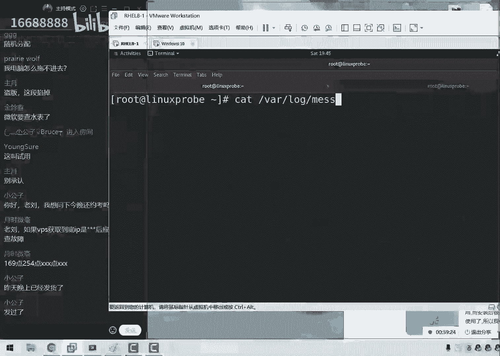

# 刘遄培训linux34期（配套linux就该这么学第二版，RHCE8） - P21：21 - 16688888 - BV1gL41167vP

ok我去我们重新开了一下啊，大家现在先看，我们这个屏幕上本就没有那个竖条对吧，那个竖条是那个录屏那个小的一个边界线啊，去掉了啊，更那么就是一个更加完美的体验了，然后给大家先去做一下总结。

哪些这个人数也正好印证了咱们啊，咱们昨天所说过的啊，咱们这个大部分的学员都是为了考试的预言，考试之后的话呢，后面就去备考去了，那也就是说呃今天咱们走，咱们今天所讲这个课的话呢，听得更好不好。

但是如果没有听的话，对大家的考试没有太大的影响，主要是为了以后我们在配置服务的一个，拍摄能力，以及啊这样更多的服务吧，然后增加一些配置的啊，一些服务的一些能力好，我们来给大家做一下总结。

昨天我们干了啥呢，我们昨天我们去约了考试了，然后昨天的话呢我们约了很多个城市，诶，我笔呢他们稍等一下啊，没有比我这边写完笔记啊，ok啊回来了啊，拿根笔来，这样的话我们有一些注意事项。

我们今天给大家说清楚，下课之后，我们那我们就可以去衔接，这样去干了，第一件事情的话呢，就是我们昨天所做的，就是我们给大家约了一下考试，北上广深四个城市啊，我们让我们全部覆盖。

然后同时的话呢还有一些其他这个城市，比如说济南呀，还有武汉这些城市，我们也给大家约到了啊，这句话也是很，那么的话也是非常方便的，至于说有些城市的话，确实现在您约完之后还没有反馈，比如说是啊。

天津这样的这个城市的话呢，我们也正在沟通当中，那么您可以再等一等，好啊，我记得还有啊郑州对吧，然后我们还有几个城市，我们可能会在下周的时候看看能不能约得上，要要要啊，那么我们要是呃跟考场学沟通过后。

他们要是还有啊考试的时间，那么我们会给大家发一个通知就好了，所以说如果说您之前给我们登记过了，那么你就不需要再去登记就好了，那么你等着就啊，那么大家可以等一下我们的消息就可以了，我们大概会在下周345。

这么几天会给大家发消息，就是有，那么就可以大家具体的时间，如果是没有的话，那您就可以去考虑一下其他其他的城市吧，比如说天津的话就来北京的话对吧，然后的话那可能您在江苏就要来南京或者上海。

这样的一个呃选择了，然后还有的话呢就是呃比如说您之前，那您没有跟我来登记，然后的话呢我们现在还想报名的话呢，那么大家发给我的这个格式是这样的，是以城市的名称来命名，让加上具体的时间来去啊。

然后啊不然后加一个大概的时间来去发过的，因为现在的话呢我们经过昨天的这个约考，现在就只剩下一个时间了，就是深圳的6月啊，就是现在啊就现在就是只剩下一个，就是深圳的6月22号，还有啊这么一看考试的时间。

然后呢其余的这个所有的城市就全都满了，然后深挖啊，然后呃呃然后的话这个时间我们下面，然后我们在下午的时候去约了一下，大概的话呢还有那么一两个三个位置吧，然后呃除此以外的话呢，北京上海深圳啊。

北京上海广州都已经是约满了，而且是约的超级满，可能还有些同学需要调剂一下，可能约到第二天了，但是的话呢基本上来说大家都觉得非常的顺利，然后的话这就是我们大概一个月考的情况。

如果大家如果要是您之前没有约啊，那么就需要发一下这个信息了，之前的话呢你可以挑日子，现在就挑不了了，就只能是按啊按照按照我们先这个啊格式发布，然后我们来去排考试时间，除了考试之间之后。

那么就只能是以红帽那边的时间为准了，那么就看一下具体这个人数，大概的话呢这个时间也不固定了，可能是在7月底，可能会是在8月初，这需要以红方这边来去来去安排了，来，这是第一个事情，就是昨天有音乐的同学们。

大家可以好好踏踏实实去做啊，那么来去做一下备考了，如果没有约的话，就按照这个格式发给我，然后再给大家登记一下，要是有就直接报，要没有的话，那他们就等着就好了。

然后我会给大家发qq上那个消息啊，然后我们后续再给大家继续安排啊，昨天有多少个鱼人约，昨天的话我们处理到了晚上12点，昨天我们大概约了65位同学，然后今天的话呢早晨起来呃。

加上中午大概约了有七八位同学嗯，差不多，然后大家怎么说啊，不开摄像头吗，还是不开，然后说成都约了几个人，成都好像没有约吧啊成都时间还没有出来呢，所以我们还没有约。

然后大家说说老牛发一下红包，real 9下载地址，我现在还没有啊，等等等，我们过两天吧，然后大家说博客的活动花了多久，那现在就来吧啊那我们是这样的，那在我们第一天上课的时候给大家说了一下。

就是如果说大家想要一本我们的新闻和书籍，一份小礼物啊，虽然也不值钱，但是是一份心意嘛，然后的话呢我们就可以进入到咱们网站的后面，哎可能同学们还是比较啊，还是比较喜欢我们的，对不对。

然后我们现在进入到咱们的网站后面，要给大家发这个小礼物了，我的画图板呢这个是个好工具啊，来进入到咱们这个网站当中，然后后面的话呢后面加了一段福利，两个字的一个页面，大家进入到里面去。

然后的话呢我们就可以按照这里面的这个要求，大家看一下是不是咱们从第一天开始，每节下课之后把今天所学习的这个啊笔记，然后我们加上一档学习心得也好，或者的话呢您可以直接复制一段网上啊。

那么来复制一下咱们书上的文字，也都允许加上一张照片，发到咱们这个博客里面，然后我们去做一下签到，虽然啊啊啊，然后我们当时说的是，等我们这个课文啊快结束的时候的话呢，会给大家做一个这个签名的书籍。

就是啊我们的这本书呢吗，还要让我们给大家送一个签名书籍，可以算作是我们整套培训的一个总结对吧，大家应该还记得咱们有这么一次活动，所以大家可以打开咱们的网站了，然后如果说您做过这个活动的话。

那么现在您就可以打开了，今天我们就给大家说上来呃，如果说你已经做的话，按照这个要求，然后的话呢去选择大家看一下这个要求吧，然后就那我们就是啊那啊那我们去选择一下呃，您觉得写的比较好的笔记。

然后就是我们一定要按照这个格式发布，因为我们的学员特别的多，包括说今天可能晚上还会有学员，来跟我们去约考试，果不其然，对不对啊，他们在跟我们去约考试，可能人数也特别多，所以大家一定按照这个格式发过。

就是呃那我们来发的时候，就是严格按照这个格式发给我们，然后就啊ok了，然后我们之前的话呢是给大家送送的，是第二版的这个签名的书籍，后面的话同学们说那书啊，那么我们现在啊，但是我们换了啊。

已经送过第二版了对吧，后来我们想了一下，也就是说呃从这一期开始吧，只要我们参加这个活动的同学，我们是第一版加第二版的这个签名书都送，所以说啊同学们只要参加这个活动，今天晚上提交给我的这个信息。

审核没有问题的话，那么您将收到第一版和第二版两本书的，这个签名的书籍，也算是一个小蜥蜴，好学们，那我这个啊先给大家去啊，放到这边，大家可以去访问一下，后面加上福利就可以了，然后如果您之前没有发过的话。

那么就没有这个福利了，那也就因为这个是只有第一天的时候，然后然后然后啊然后我们开始去写，然后这个台上有的来，大家说合肥有吗，合肥好像也没有行业在等着啊，行也需要等着，大概的话您会在下礼拜的345几天。

大概会收到我的信息，如果是有，那么就可以约一下，如果没有的话，就是看看能不能其他城市再去啊，选择一下吧，然后大家可以看一下，说成都六个人了吧，然后成都诶忘了我看一下吧，啊成都几个人了。

另外的话我把我们这个信息给大家显示出来，大家看一下呃，如果说您对，那那如果说您已经找我登记过，但是的话这个信息里面没有您的话，那么您可以再找我再补，大家去啊，那么可以再去登记一下，好吧。

就是这么一个信息，然后您找一下自己的这个姓名，您看看是不是我有没有啊，没有写上的，然后大家可以再发一遍，我应该不会有错的啊，然后现在就差这么几个城市，天津成都郑州杭州合肥就这么几个城市，然后大家看一下。

比如说郑州同学，你看上去实在不行，就找其他城市吧，因为郑州今天有三个同学跟八个，这个标准实在差有点多啊，实在不好努力，然后我们就先来给大家说这么多吧，然后我们来开始我们今天这个正式的课程。

然后我们先做一下简啊简单的铺垫吧，然后我来给大家说一下我们今天的这个课程，今天的话呢我们要给大家讲两个章节，第一的话就是第14章节叫做dh cp，这我特别喜欢这个章节，这个话呢我们叫做动态主义地址。

怎么样的分配协议，好了啊，大家怎么说啊，大家说啊，要是缺人的话，报个名额，北上广深不缺人，但是西方确实有点缺啊，还是需要多凑点人数，这样的话那五个也好约吧，来那我们现在给大家说一下的话。

第14章节翻开书啊，今天笔记还要写，同学们今天虽然收笔记啊，但是咱笔记还要继续续写的，然后我们来给大家看一下啊，就是第14章节第二cp，我们叫做动态主义地址更新协议，来点加起来动态主机地址更新协议好啊。

或或，那么或者把它叫做动态主机地址分配协议吧，好，那我们这样只是说他的话呢，可以自动来去为我们的主机，一起去分配我们的网卡信息，那我们要记住的就是，它会自动的为我们这个主机去分配，我们的网卡信息。

它不仅限于是什么呢，ip地址，因为很多啊，大家都啊，那我们那我们呃因为之前做这个实验的时候，大家总会说它分配的是一个ip地址的一个信息，其实他并不是完全，它是分配的是一个网卡信息，网卡信息当中的话。

它就包括了我们的ip地址，子网掩码，然后还有这个子网掩码，还有网关等等，这样的这个信息都归属于在网卡信息当中，所有同学们来记一下，今天我们讲的第14章节叫d i c p服务，它是分配的是一个网卡信息。

它不仅限于地址而已，他的话呢这个原理是这样，大家看图说话啊，看一下第14。1啊，14杠一这张图讲到了它实际上是什么呢，它就是要把我们的一个主机，把我们的服务器嘛跟这个客户端通过网线相连。

然后的话呢就可以有啊，自动分配这样的一个效果了，比如说现代化的客户端，有啊很多很多台的这个客户端，他们都没有办法的信息，我们需要的话呢，第一点就是能够为他们去分配我们的ip地址来，去批量来去分配。

当前有啊几千台主机，那我们现在怎么来进行一个批量的分配，手动设置起来特别的麻烦，我们之前给大家讲了四个方法来配置网卡，但是都很麻烦，那我们怎么批量去实现呢，那么dlc p的啊，大家可以去选择一下。

第二点的话就是当我们分配好这个ip啊，那我们啊当分配好地址之后的话呢，我们怎么样来进行一个回收的一个工作，比如说我现在开了那啊那啊那啊，那我们比如说那我现在开了一家店，这个店里的话呢，是啊他们啊。

那么他是在卖咖啡的，那么当有人进来之后，他们需要一边喝咖啡，一边去上网，那好了，需要分配一个wifi的一个ip地址对吧，那么当这个人喝完之后走了，那么这个地址是否能够被回收给下一个人，继续来去使用呢。

这叫做回收机制啊，这个话也可以由dr c p来去这么一个管理，能够去让我们的ip地址的这么一个钻石里面，这个地址的话呢，能够更加高效跟充分来进行一个使用，可以进行一个回收的一个功能。

大家说会讲我们的d r c p报文吗，不会讲啊，不会讲理论，因为的话呢那个属于我们的思科的课程。

叫做cca，里面会给大家去讲，咱们现在是讲了网啊，咱们啊咱们讲的是操作系统。

讲的是一个运维搭建啊，据说理论就是b c的这个理论，我们啊放到四科里面，要我们再去学习，所以说我们在去学习思科的时候，他们也不会去讲linux搭建吧，所以我们可能每个人的这个分啊。

对于这个每个分这个分工是不一样的，那我们先来看一下d i c p服务的话呢，它有一些话术来给大家看一下，首先的话呢是这样的，首先是这样的，首先的话第一个话术叫做作用域，那也就是说我们在学习之前嘛。

我们要先学一些黑化，这样的话当我们再去配置的时候，它是一些理论的一些基础跟一些术语，我们都可以，那那我们可以看得懂了，首先来说这是第一个叫作用域，作用域的话呢是指的一个很大的一个地啊。

那它指的是一个很大的一个地址的一个范围，就比如说啊我们怎么理解这个事情呢，就是比如说它是一个很大的一个网段，这个网络的话它并不是为我们的这个用户，待会都要去分配一个地址，它的话呢是呃先进行一个声明声明。

我们可能会要去使用到的一个网段，也就是说地址的话特别的大，但是它并不是待会儿为我们所有用户，真实去分配一个地址，它里面是包括要被分配的地址，以及叫做排除范围这样的一个东西。

然后第二的话呢我叫做这个超级作用域，超级作用域的话就指的是多个网段，然后我们画了它是一个很大的一个范围，比如说我今天啊特别的饿，那我回到家之后，我只是这个啊所有的饭，说我今天我把饭都给吃掉对吧。

但是的话呢我比如说我不太喜欢吃馒头好，这个里边我没有去吃的啊，这个我们叫做排除范围，而我啊先进行一个声明，说，我当然我可能会去吃的是什么呢，啊这个我们叫做作用域，就是先进行一个声明声明。

我可能要去使用它的一个地址的一个范围嘛，而我里边我没有去吃的东西，我们叫做排除范围，就是这个啊叫做作用域减去排除范围，才是真正为用户地址啊，他是真正为用户去分配的一个地址范围嘛。

所以排除范围就是它不会被用户啊，他不会分配走的一个i p地址，也就是说作用域在它需要去减去了啊，是这样的，作用域它需要去减去了，排除范围小，这是一个唉公式啊，就等于一个词叫做地址池。

也就是说地址池的话呢，它是真正为用户去分配的地址范围，大里边是啊，呃这那就是说哎作用域需要排除范围之后，才是真正的用户地址的一个范围叫地址池，地址池的话可以等于它可以是小于等于作用域，因为它可以没有啊。

因为它的话呢可以没有排除排位，但是地址池一定是不能够大于作用域的，但我们来记一下，这个话才是真正为用户去呃，呃真正为用户分配的一个地址，好吧，那我们这么去写吧，这个还比较简单一点啊。

另外的话我们现在给大家讲个课，同学们就可以来操作起来了，就是说你需要用好，把您的城市在那这个当作一个时间发给我，就可以了，然后的话呢如果说您之前写过笔记的东西，那么您就现在也是按照这个要求。

您就把那个笔记也总结好，然后下课之后啊，不然您现在就可以发给我了，下课之后咱们统一处理，然后我们三个就给大家一个回复了，咱们这样的话效率更高吧，但是我们就在中下了课之后，我们该月考月考，该给大家发礼物。

发礼物，但是礼物估计要选，我估计可能需要等一段时间，因为现在北京现在这个因为快递停了吧，可能大概得下礼拜了吧，反正就差不多吧，但我们大概就是下礼拜左右，然后我们会给大家出具体的时间，以及这个寄快递。

然后下面的话呢我们叫做租赁，这个租赁的话呢我们也叫做啊预约对吧，那我们来去啊不啊，这个话我不这个的话它是两个，这个指的就是我们先给大家讲一下哎，绑定一个地址，这个话指的就是我们进行一个绑定操作。

比如说我们今天的话跟女朋友去吃啊，那我们出去来去吃顿饭去啊，今天也是一个节日，对不对，好了，那我们来进行一个预约，那么也就是说它可以将某个地址，将某个地址，然后的话呢与我们的主机。

某个地址与主机绑定这样的一个操作，当我们有一个用户，他才去使用到我们这个dh cp服务的话呢，它会永久的去固定到某一个地址上面，比如说今天我要对吧，今天也是一个情人节，那好呢，比如说我今天想请女朋友。

去吃个比较好的一个西餐啊，那我可以先去预约一个位置，这个位置的话，那当我预约过后，即便我没有去，但是这个位置的话呢依然会被我保养保留下来，这个我们把啊来去做一下绑定，还有一个叫做租赁。

现在也就是说它会有一个回收的一个机制，它分为两个，他的话有两个，第一的话呢我们叫做默认作业时间，第二的话呢我们叫做最大的作业时间，当我们有一个呃地址啊，给它分配走了之后的话呢。

那我们又怎么样有一个回收的机制，这个是很重要的，比如说麦当劳同学们来举个例子啊，现在有这么几个术语，同学们先大概给大家过一遍啊，当我们给大家讲的时候，你就知道我们讲的什么意思了，来先来说一下麦当劳。

我当然记的话，那好像是2016年，2017年的时候，当时上过一个新闻，说有这么一个人啊，然后他去麦当劳里面吃啊，他啊他去吃饭去了，结果呢他干啊啊啊，他去吃饭去了，这个时候的话呢，他刚刚点完了餐。

突然间肚子疼了，他就走了，结果的话回来之后餐没有了，他啊因为啊因为被保哎啊，因为被保洁阿姨给他收走了，就比如说就拿拿啊啊，那我们啊那我们比如这样的这个情况，那怎么去处理呢，这个时候就要做一个标记。

告诉别人这个地址的话呢，我们还正在来进行一个使用的这个啊，所以我们需要给大家写一个纸条是吧，这个餐还没有吃完，但是的话呢我只有一个人，我现在要去厕所，我们一会回来，那么要写这么一个纸条。

要告诉他先不要来进行回收，然后呢那我们来啊来啊进行啊，他啊他的话来进行啊，他需要进行啊，他需要进行这么一个使用，那么这个的话呢，在我们这个哎d c p服务里面的话呢，它为了也能够去进行一个翻台。

他这个地址也需要回收，如果要是没有回收的话，那么这个啊每一个人他是个吃饭的时间，他并没有那么长，就会造成资源浪费了，对不对，那好了，他分两个时间，这个话呢我们叫做默认啊，就这啊啊默认时间。

那就是说到达这个时间之后，那么他会给我们这个餐桌的话做一个标记，比如说我们先是个保洁阿姨，当你这个餐啊，他在桌子上面，然后呢，但是你不在的时候，他会做一个标记，五分钟之后再过来看看。

如果五分钟过后你还没有回来的话，那么就会进行一个强制的回收，这个非常清晰对吧，它这两个话呢分析我们的默认作业时间，以及最大的作业时间，这个叫做最大的作业时间，默认同学之间就是先去做一个标记。

然后我们接下来说这个啊，说啊这个人的话可能是一啊啊，这个人可能是做做啊，他啊他啊他啊他啊他有可能回来对吧，我们再做一个标记，它是有可能回来的，作为一个简简单的标记，但是它并不会大家进行一个回收。

但是到达最远啊啊，但是到我们哎最大作业时间的时候，则进行一个强制回收，所以大家一定要记住两个的区别，因此呃默认组合时间一定要是小于等于啊，我们这个啊最大的作业时间的。

所以这个就是一个进行强制回收的一个过程，这两个时间我们写好之后，就可以来进行一个地址的回收使用的，这个挺好玩的，反正这个我们待会可以来啊，待会我们可以给大家来进行一个演示。

然后我们现在给大家说完之后的话呢，来动手做这个服务之前还有一个事情，就是我们这个主机的话呢。

我们在做这个实验吧，我们需要先去关闭到虚拟机，最大的一个电视cp服务，大家看到我们刚刚上课之前，我也是准备了一下试验环境啊，其中有一点就是我们需要点击在这个编辑，大家一起去操作一下。

因为的话呢之前我们在建我们在讲什么服务啊，忘了反正有这么一个服务呃，来就是来自于我来，那我们来讲编辑的时候，当时我们去啊开启过虚拟机里边。

提供这个d i c p功能，好像对于我们这个网卡绘画的那个章节是吧。

当然还应该有啊，大家啊大家啊，那我们应该还记得啊，所以的话大家现在需要再重新点，回到我们这个虚拟机配置选项当中，然后的话呢我们点击一下这个设置，点击一下这个虚拟网络编辑器。

这个选项这个时候的话呢我们去选择一下，把这个功能给它关闭掉，大家看一下这个功能把啊啊，那我们先把它关闭掉，这样的话到关闭之后啊，他就不会跟我们自己配的这个电视cp服务，产生了这个冲突。

然后我们点一下确认没有问题。

然后大家问的一个问题，大家说今天要买这边的少卡啥呀，同学们是发错了吧啊然后我们继续啊，大家怎么着，我看一个问题啊，大家说今天要买这边的上环啊，唐诗这是在擦键盘吗，那我们来继续啊。

我们来配置这个负，把我们这个那那我们现在把我这啊，那我们把我们虚拟机里面这个虚拟网卡，电视cp功能关闭之后，那么就没有人跟我们去发生冲突了，我们就可以来去配置了。

把我们这个虚拟机换到一个最初始的一个状态，保证我们的试验之间是产生，它是一个相对独立的一个情况，让我想一想啊，还有什么好说的，那还有这个防火墙，对不对，我们叫做ip tables的ip tables。

然后还把我们这个dlc b服务，也给它加入到这个选项当中，保证我们的下一次的时候，还依然能够去对防火墙里面的这个流量来进行，放行，然后大家问一个问题，大家说说哪些设备需要进行手动或者动态啊。

比如说这个问题我认为有点宽泛，而且有点不太准确，就以我理解来说吧，就是的话呢，那我们记得这个房产它分为两个模式，一种的话呢我们叫做静态模式，它指的是由手动来进行配置的。

这里边的参数我们写下来指的是手动配置模式，第二的话呢叫做第二cp模式，叫做动态分配模式，当我们自己在配置一台第二cp服务器的时候，我们需要保证我们自己，但这个网卡他首先来说它是手动的。

然后呢他需要保证人类，也就是说服务器它需要去手动模式来啊，那它要它需要一个哎固定的一个地址，然后的话呢那我们的这个所有的客户端，它虽然是一个动态一个地址，这样的一个理解好。

我不知道我回答对不对啊，反正同学们这个问题也不严谨，那我就先啊啊按照我这个理解来去说了，来我们来保证我们这个课的一个进步吧，咱们这个效率要提高的啊，让我们先来去reload一下。

把我们d c p加入到形象当中，然后让他去能够去对于这个方火墙来进行放行，下一次的话呢方火墙啊，起码不会给我们捣乱，下半一步的话呢，就是来去安装一下这个第二cp了。

第二cp的话后面加一个d叫做第二个c p d好，下面给大家提一个小问题，你看咱们这个课程就很有压力啊，对不对，咱们这问题老是啊很突然，诶不对，这个叫做dlc p跟server吧，在红包热巴当中。

在红包热区里面啊，它它它是叫做啊电i c p d，在红包若八当中的话呢，它叫做dc p杠server。

好，这两个区别大家去记录在哪啊，大家需要去记一下，另外给大家提一个小问题啊，虽然说这个服务它不是了，但是有些服务的话它是是的，比如说网站服务，比如说我们的远程连接服务，比如说我们的文件传输服务。

比如说太多了对吧，大家提一个小问题，为什么我们的很多的服务的结尾，都是以d开头的，大家理解一下这个问题，就是为什么我们的很多的服务，它的这个名称的后面都是以d结尾的呢，这个地有什么啊特殊的含义吗。

啊大家先聊聊这个问题啊。

我们先往后面给大家去配置，咱们这个课效率特别的高，这样的话呢我们的每天啊，每天两个小时的这个时间，满满的收获感，来etc目录里面，既然讲到了配置一个服务，就是在修改这个服务所对应的一个配置文件。

那么我们怎么找啊，那我们找什么呢，找这个服务所对应的一个叫做主配置文件，来dh cp，然后是dl c p，然后是第2c p d。config这样的一个形式，那我们先来找到他这个所对应的主配置文件。

这个里边的话默认是空白的，但是他给我们写了三方信息，首先来说他说这个他就是一个，我们电视cp的一个主配置文件，第二的话他说我们这是一个示例文件，如果说我们要是不知道怎么去配置的话呢。

我们可以来看一下我们所对应的一个示例文件，第三的话呢，就是说哎如果说这个看完视频文件之后，我们还不会配置，可以报一下老周的培训啊，2400块钱啊，不仅能够靠加h c e这个不啊。

这个我啊啊这个服务即便我们考试没有，但是我们也会讲啊，非常的超值啊，这么三句话，但是这个话主要的关键点就是前面两句，第一来讲就是告诉我们，我们找到了它所对应的配置文件，虽然是空白的。

但它也是这个啊主配置文件的意思，第二的话就是说我们可以从里面去参考一顿，这个参数，然后您去选择一个您觉得合适的，其实我们大家摊牌啊，我们现在给大家讲的这个实验，就是这一段给他复制过来的。

然后我们给大家去改了改，所以大家在考试跟工作的时候啊，考试时来不及，那我们如果在工作的时候的话呢，自己想去配置一下这个服务，但是这个参数老是记不住的话，没关系，看一下示例的文件，从里面一抄也行啊。

我们来看一下，我们来给大家呃，然后我们给大家说一下怎么来进行配置的吧，这个看起来有点乱，我来给大家一行一行逐行讲解一下。

对大家另外一个问题已经回答出来了，为什么我们的每个服务的后面它是以d结尾呢，因为叫做守进城，叫做demand对吧，叫做守护进程，这个进程的话呢叫做守护进程，它跟一般的进程不一样。

但他是一个守护的一个角色，我们看一些童话故事里面说，这个守护者这种身份啊，守护进程他是说他跟一般进程是有区别的。

比如说大家看看啊，当有一些服务对吧，当有些命令大家看啊，这样的命令，这样的命令，这样的命令他的话为执行过后，他都是啊呃执行过后就会马上就会被他们啊。

他也就是说这个我们叫叫做一般进程，它是执啊，执行过后的话，它就会把它给结束掉了，一般进程就是他执行过后就会结束掉啊，那我们就是说呃工作结束就停止，我们可以来，那我们可以来这么去理解，工作结束就停止。

那么这就像我们去找一个工作啊，当我们早上起来去上班啊，下午就啊，那我们就下午，那我就可以下班了啊，这个效果那我们这个意思也差不多，但是的话呢这个守护进程就他那么就哎，那么就是说它会随机的开机开机。

随机等的关闭而关闭，他会一直为用户提供服务的，来咱们像他那么就像老刘一样啊，他没有啊，他没有这个上班时间对吧，他会一直为红啊，为用户提供服务，一直为用户提供服务，这样的形式。

比如说我们的网站服务就是需要这样的形式，因为任何时间任何地点当用啊，当有一个用户去访问我们的网站的时候，都要能够去得到他想要的内容，所以说网站服务就一定要是一个熟进程。

包括说我们现在所讲的这个d i c p服务，也是一样的，当有一个用户他需要地址的时候，他就应该得到一个地址对吧，他所以说他要一直等待为用户提供服务，叫做手游进程这样的一个形式。

打不过在红包肉八点，他改了个名字啊，叫做这个改了个他这个软件包的名称啊，不对这个也无所谓啊，他这个服务的名称它没有发生变化吗，拉不下来，dl c p d r c p。config做好呃。

然后我们现在来给大家配置一下，既然说前面几行都是无所谓的啊，说啊那我们他把它给删掉呃，然后我们往里面去复制吗，就别复制了，复制了，还有感觉很没有诚意，我们要给大家去手敲吧，啊咱们诚意满啊，非常的强，来。

首先来讲的话呢，就是我们先写下第一行叫做全局变量，首先我们是否允许叫做动态主义，地址更新协议啊，第二啊这个我们叫做dd n s，大家说这啊，那我们再去配置这个d i c d这个储备啊，怎么去配置。

因为我们现在d i c d，主要配置就是这个主服务器，其实的话呢我们也有啊，我们会把它叫做这个啊d l c p中继代理，但是这个话用的太少了，所以呢我们就不给大家去讲了，我们现在只是讲的这个主。

我们用的比较多一点的，那就是我们来配置一下dns s，我们配置一下di c p这个主服务，哎，来b啊，叫dd n s用不到的东西作为，或者说我们比较少用的东西对吧，那好大家可以以后我们需要用到的时候把。

那我们去网上一搜啊，这样我觉得学习更有用的东西，不就是咱们这个课的一个怎么讲啊，这一个最有优势的一个点吧，啊东西他可能反而记不住啊，那我们来继续，因为当时在红烧肉有七这本书里面，大家可以翻一下吧。

其实我们有的d i c e终极代理，当时我们已经写出来这个章节了，结果的话呢删了啊，就是觉得没有太没有太大意思，因为在pd i c e的这个时候的几率都比较小，因为我们当时写完第二期里这个章节之后。

第14章写完之后，大家不可以会产生质疑的，说到流第四章阶段没有必要吧，删了吧，为什么呃，呃那么是为什么呢，因为现在还有在公司很多种，d i c p这种服务嘛，并不是说我们这个叫什么系统做不了。

是因为的话呢主要是由设备去做了，比如说计算机路由器去完成的，但是我们还要给大家提到，就是我们有些功能的话，那确实是设备能够去做交换机，路由器也可以去做系统也能去做好，那我们就要给大家讲一下。

基于系统是怎么去做的啊，万一以后我们要用到了呢，对不对，好我们来继续，我们来首先来写下第一行，就是说我们是否要去使用叫做dd n s，我们学习过d n s叫做呃域名解析服务，这句话呢。

我们这个门叫做啊动态主地址更新行不。

这我们叫做动态主机名啊，解析协议叫做动态啊，叫做啊d d n s动态dns解析协议，动态dns啊。

动态域名解析协议吧，然后我们这个话呢现在是不需要的，所以我们把它给它禁止掉，第二的话呢，我们来，接下来就是忽略掉，客户端给我们的一个更新信息，来忽略掉客户端给我们的更新信息。

接下来我们就要去写这个作用域了，现在给大家提一个小问题啊，刚才给大家说到的就是，请问我们的这个作用域，是实际为用户去分配的地址范围吗，因为我现在需要去写这个作用域的一个信息。

最后的话呢是一个很大的一个网段，请问是否就意味着说任务啊，就那啊那啊，那么是否就是它代表着，我们所有的这个里面的ip地址，待会都有可能为用户去分配到呢，啊这个小问题大家告诉我一和二就可以了啊。

一代表就是肯定的，就是说这里面的地址都要为用户去分配，第二的话就是二则啊，告诉我啊，这里面的地址的话，那不一定没有后续分配就好了，我们来给大家往后面去聊聊啊，大家说是二对吧，其实也不一定不一定。

为什么呢，因为啊也有可能是是的，为什么呢，因为啊因为还有因为还有排除范围，对不对，对大家大家要大，但我们要记住啊，这个的话呢，也就是说作用于我们现在所说明的这个信息，也有可能是真的。

就是为用户去分配的一个网段了，就是从1~254都行，为什么呢，因为可以没有排出范围，就像老刘啊，我啊那比如说老刘我比较啊，如果说我啊并没有我啊，没有啊，没有去吃的东西，所有的东西我全都吃了。

那好那么也就是说没有排除范围，那么好了，作用域就等同于了我们的地址池，那所以说排除范围的话呢，可以有可以没有好吧，然后呢我们地啊啊，但是地址值一定是小于等于的作用域，如果说我们都没有声明的情况下。

那么肯定是不能用的好，然后大家说我们进行一个交互跟一个禁止，有什么区别，咱们就是说啊它里面是一个开启，一个关闭啊，然后下面的话呢，我们来就是设置一下地址池信息了啊，地址池的话。

其实这其实它就是一个字面意思，大家可以去把这个参数放网上一查就可以了，这是一个字面意思啊，就是代表就是一个开启跟关闭，然后的话我们定义一下地址池，地址池，大家记住我的地址池的话。

那是真正为用户去分配的地的一个，地址的一个范围，这个地址池的话呢它是从一开始的，然后我们一个c类网段的话呢，它是从啊1~254，它不能超过254啊对吧，我们来去记一下，所以我们地址池的话。

那我们就给它写下来是啊10。100，然后我们后面再来，就是1920~8点10。200，也就是说我们定义了一个地址池这个范围的话，那才是真正为用户提供的，一个啊分配的一个范围。

那么也就是说排除法也不用去写我们吃了什么。

那么就是啊比如那啊，那我们比如说现在有啊，现在有很多这个吃的，现在一个桌子上面有很多吃的，我们去吃掉的啊，那我们那我们现在这个啊，上面所有的已经有的这个饭菜，我们则进行的是一个声明，进行一个声明。

整张桌子都是我们的声明，但是我们可以去吃，然后的话呢我们去吃掉的这些东西，它指的就是叫做地址池，而我们没有去吃掉的话呢，它就是啊直接归为叫做啊排除范围，所以说排除范围是不需要再去单独去写一遍的。

啊，那啊那我们来继续给大家去写，下面的话，就是我们来为用户去分配的一个额自本源码，那也就是说我们借来里边，缩写这个所有的这个信息，都是给我们的这个客户端去提供的，那也就是说我们现在缩写这个信息。

都会直接填写到我们这个客户端，这个网卡的这个参数里面好了，我们接下来第二个就是设置一下，给客户端这个资源码的信息，三杠五点，那为客户端去分配的一个自爆源码的一个信息，再来的话就是设置一下。

我们这个啊给客户端的一个网关地址，吓一跳嘛，就是我们这个网关地址，网关的话呢说实话其实现在没有，但是的话呢不写的话呢啊少学个参数，所以我们先给大家写下来，就是网关当前它并不生效，它也没有任何作用啊。

然后他也不需要去上外网，但是的话呢这个参数大家可以来记一下，叫做啊下一跳地址，它指的是网关地址，我们写下来吧，一九二点一六八点10：10，诶，我们写下来啊，写清楚点了，加以分号结束啊。

他以这个呃它需要后面加一个结束符，写一个分号，这样的话呢我们定义一下这个dominant solo，大家其实就看这个词之后就觉得很眼熟，对不对，我们写下dns地址，当前的话他也不能去上外网。

不过我觉得这个参数也要去学一下吧，那我们这样去做四个点八，然后点啊，然后我们写下一个dns地址，待会我们所写的这些参数，包括说我们的ip地址啊，自网源码，网关dns这些参数都一会会啊。

变成参数填写到客户端这个网卡里面的好，我们接下来拒绝我们的默认做的租约时间啊，那么当啊他的话这个单位是以秒为单位的，那也就是说当我们到了这个呃六个小时的手游，大家可以去算一下哈，我们先来这个行。

按照秒为单位，六个小时，216021600秒，那就是六个小时的时候，刚到六个小时的时候，我们会继续给大家做一个标记，但是的话呢并不会进行一个强制的回收啊，大家记一下，然后当我们做完标题之后的话呢。

到最大的作约事件的时候，如果说到达最大租约时间了，那么剩下最大的作息时间了，那么我们就是12个小时，那么就会进行一个强制的回收，哎那也就是说哎保家宜先给大家做一个标记，并不会给他擦桌子。

大家都发给他倒掉了啊，会先放一个小的一个标志物，这样的话呢过一会儿之后再过来看一看吧，如果这个人还没回来啊，就把人给收走了，然后我来给大家反过弧，大家会啊，可以看到啊，实际上这个服务的话。

那就跟我们昨天那个很相像呃，他们一行结尾的话就会有一个分号，但是最后一个分号不但是最后一个括弧，后面是没有分号，请大家一定要注意啊，这一点，然后的话呢我们来继续啊，下面有一个问题啊。

我们先给大家演示一下吧，来大家先给大家演示一下，重新去重启一下，我们这个d r d r c p服务，然后的话把我们这个第二cp放到我们这个呃，启动项当中，反正我们下一次的时候依然能后期启动。

今天这么顺嘛，没有个报错啊，显得好像是很简单一样，ok没有问题啊，running启动了好，咱们三，下面大家又问了一个问题，大家说自动掩码可以是20位吗，没毛病啊，可以啊，可以写多个dns吗。

可以啊啊通过逗号间隔吗，大家说那我们的客户端的地址只能是点啊，只能是100跟220个地址吗，不是它是范围，他指的是从100~200之间，也就是说有101个地址对吧，它包括100跟200啊。

对这个非常严谨啊，然后下面我们来启用它之后的话呢，在我们的本地去测测不出来，我们开一下客户端吧，准备一台客户端出来，准备一台windows吧，因为正好一啊，因为我们下一个时间就要用到这台windows。

好开起来开几台windows，那稍等一下，大家等我们这个windows启动了，今天这个笔记本开两个虚拟机。

有点难为他了，顺便上课之前还下了一个小工具，稍等一下，我把这个工具给它抛到里面去，下一个实验就要用到outlook，今天这个实验还挺顺。

稍等一下再等它开机，我们准备在客户端看看客户端能不能去自动取，分配到保卡信息，其实我们之前给大家看白酒之前的话呢。

我们每个人都要去使用大大的，比如说我们当前此时此刻，每时每秒，我们的路由器，我们那个小的路由器，都会为我们的所有的设备去分配ip地址，但是的话呢我们之前只那啊，但啊但是我们之间只是使用了。

我们并没有去配置它，今天我那我们拍完之后，大家是不是对于我们电视cp服务，就有一个更加深入的了解了呢，啊非常好哎，怎么样的啊，这一块呢我们这个啊有这个呃散热的声音了啊，风扇已经转起来了。

确实有点为难他了，然后下面一个问题大家说它是一个闭区间啊，这个怎么理解的话呢，我觉得b我觉得呃这个话的意思就是这样的啊，我给大家解释一下吧，我觉得没有那么难理解啊，首先来说这个地址池的一个范围。

比如说我们写的是一个1920~8点十，点100这样的一个地址的话，就等就是他啊，所以这个格式这么写的啊，但是的话它等同于了就是192068，然后点10。100，然后是1920~8点10。101。

然后巴拉巴拉巴拉，然后怎么理解呢，它是一个区间也可以，它是一个闭环啊，那么啊它是一个啊，大家怎么理解都可以，反正就是他这个意思就是说从100~200啊，总共是101个地址，大家怎么理解都可以。

不过我觉得呃不用太纠结，就是只要这个范围里面包含，那我们就可以为用户去分配啊，它里面就没有排除范围了啊，这句话它是呃范围的意思啊，范围的意思只不过因为他这个啊，因为它所对应的这么一个参数的格式嘛。

他就是啊没有这么一个减号而已，所以大家可能看起来有点抽象，但是这个意思啊是一个区间的一个意思，来我们先给大家去看一下windows啊，准备一台windows作为我们的客户端啊。

然后的话呢我们把这个小工具给我啊，先往里面抛一下，这个工具是我们待会儿就去使用到的，所以我先往里面掏着啊，这俩实验，这先把这个实验环境给它做出来，然后的话呢我先把这个实验跑起来啊，同学们是这样的。

不用纠结啊，就是我现在所做这个操作跟大家无关啊，这怎么回事呢，这是因为下一个实验我先把实验环境给它装上，这样的话待会就可以直接去做了啊，咱们歇人不歇马啊，边啊边闲着他。

然后找一个outlook 2010的一个激活码，就有点像盗版啊，不过我们只为了测试用一次，我那我就会把这个虚机给它删掉的啊，平时也不用它来放一个虚拟机啊，不放一个激活码，稍等现在跑起来。

然后我们点开我们这个虚拟机里面这个系统，稍等一下，点开我们虚拟机的这个系统诶，点不开啊，点啊点的开点不开啊，点的开哦，我看一下啊，现在是这样，现在是这样，我好像弄错了，这个虚拟机的话呢。

它现在是一个桥接模式，我们现在不需要它是桥接模式，我们现在的话需要改一下，需要的话呢啊盗版啊没事，我们那我们下课之前，我会把这个整个这个系统给他都删掉的，也会给大家录制视频啊，这我没明白。

因为我们本来也没用啊，它就是一个实验环境，这笔记本我平时也不用的，来我们来点一下这个金主机模式，来点一下确认啊，别来就别连啊，别就别连接外网了，连接外网的话，他反而他也不太行。

然后我们给大家造成金主机模式，然后我们再来这个虚拟，基本上我们也不用啊，只是来去做一些小实验，进行一个邮件测试，大家稍等一下，然后大家问一个问题，大家说说哦，那呃想问的话。

那第一个地址说是100还是101呢，会是100啊，会是100，刚才所说的很清楚啊，就是从100，然后是100，101102，1031040506070809，10112，一直到200啊。

包括100跟200，但是我们做完这个实验之后，你就会看到，因为第一个分配走的地址肯定会是100吧，啊其实这个问题不用问，因为你等一会就可以看到这个实验效果了，来需要试用是吧，好我们不给大家找理由了。

这确实找啊，可能是可能是不太道德了，不过这个就是做一个小实验了，怎么回事，很气人啊，稍等一下，稍等一下，我把它调一下网络模式好吧，那我们先做第一个实验吧，因为它好像是网络不通，所以他不让我们去啊。

那我们先这样，我把它给关闭掉啊，当没有发生过，然后我们来给大家看一下这个网卡信息怎么来，技能自动的一个分配，我们来点击一下这个网卡信息，点一下这个属性，然后的话呢啊大家都不要承认是吧，ok我们来继续。

那我们来点开这个网络，然后我们选择一下这个呃以太网，让我们选择一下更改网络适配器啊，看看这个怎么点出来的，然后点击一下这个网卡，是这样的，我们需要把这个网卡的话呢，我们只要把这个地址看到没。

现在的地址已经分配过来了，为什么呢，就是因为我们当前这个网卡的话呢，它是一个dcp的一个模式，所以它自动会分配到我们这个地址好，这个应该在啊，但是我们先把它给禁用掉啊，大家在重大啊，大家再重新看一遍。

因为我们这个实验，因为这个虚拟机是在我们上课之前开的，大家说啊嗯啊，所以我们没有看到这个啊，会，所以我们并没有看到这个啊，获取信息这么一个过程，所以我们现在把它给重新开一下，再来一双击，大家看一下。

然后我们再去点击一下这个详细信息，大家会发现，只要把我们这个网卡的话，变成一个d i c b的一个模式，那么好了，那我们所做的一个我们的地址以及自网源码，以及网关d i s c p，咱们这啊。

那啊这个做的信息就被我们自动玩具分配了，这就是我们dl c p的一个的一个小实验啊，另外同学们问到了这个问题，那我们这个到底第一个地址是啊什么呢，所以我们可以看到他这个地址是点100啊，没问题，好。

下面一个问题大家问到说今天晚上还约考吗，今天晚上约，但是没有时间了，您需要登记一下信息之后，然后等具体的安排，大家问了一个问题，大家说如果是我们的v p s获取信息，那么ip到底后面该怎么进行排查啊。

但是您这个信息被打上码了，被打上星号了，我们没有看到你发的具体是什么样的一个问题，但是我们可以给大家提供一个思路，是这样的，当然如果说我们现在从一个客户端啊不配，我们现在要从服务器啊来去。

为我们的这个客户端，从服务器分配一个地址给客户端的话呢，那么这个过程他会解决到系统的日志文件里面。

所以说如果说您发啊，担心分配的时候出错了。

可以去看日志这个哦，我们的文件的话，日志文件它是在我们的上学相关学问，它是在我们的额外目录里面的，log里面的message这个文件里面。

然后来进行来进行一个写入的，这个日志写的挺全啊，比如说同学们问他说，老师为什么我现在分辨信息分配错了，那么就可以看这个对吧，然后呢现在又有一个小问题说，那如果说我要想把一个地址，跟这个网卡做一下绑定。

那我们该怎么去实现呢，比如说我们现在有一个老板特别的迷信啊，那既然我们这个啊，那啊那我们先既然这个地址是从啊，100~200的好了，这个老板的话特别想要一个ip地址，一个啊值叫一啊，188啊，要发发。

那比如说建一个老板，他就要求非得要是第88个地址，那怎么办呢，那么就有两个办法啊，第一来讲的话呢就是我们每天第一个到公司，然后在那之前先开八二器材电脑，他在开的时候就是第88了对吧。

第二个方法的话呢就是去做一下绑定，通过我们的日志文件找到它所的啊，对应的这个信息该排错排错啊，然后的话我们通过这个认知里面。

这个信息去做一下绑定，把他的这个主机跟我们的这个呃地址绑定过后，那么他再开机的时候，即便他没有来啊，那么他也会百般，那么他也会把它给保留下来的啊，这也没有任何问题，来，我现在继续来编辑一下。

我们这个dr cp服务的一个对应的一个文件信息，dr cp，然后dr c p d。config，找到这个锁定的主配置文件，然后答案基本的一个问题，大家说如果要是在做企业网啊，会有老板信这个有可能啊。

他啊然后说如果啊如果啊如果要有啊，如果要是有人要三个八地址咋整，这个整不了，因为我们家啊，那ip 1 v4 级别就没有888这么一个数啊，最多就是255，顶多给你个250，这个是赢啊。

这啊这啊要是再高的话也高不了了，好我们来继续啊，然后我们来给大家写下来啊，接下来我们写下来，然后绑定一下地址，那么大家现在想一个问题啊，就是它有一个悖论啊，就是我们在这个互联网里面。

怎么样来去判定一个主机呢，实际上就是通过在我们的ip地址，ip地址的话呢，但有个问题就是我还没有给他分配的地址呢，但是我怎么知道他p地址呢。

大家想一个问题啊，就是我们常说说我们的ip地址，就是我们的在互联网里面的一个身份证号码，好了，那接下来说我们的身份证号码，现在我们还没有呢，那我们怎么办，大家进行一个绑定呢，就是根据我们叫做身份信息吗。

比如说我们的指纹呀，啊，比如说我那我们一些信息，在我们这个计算机里面的话，也有一个值叫做什么呢，叫做mac地址对吧，叫做这个我们叫做网卡的物理地址，那我那么我们每个人去看这个这个信息的时候。

感觉都是不一样的啊，这个的话呢在我们这个运维里面，我们它并不是口红，它也不是啊啊那我们来给大家来这个话呢，我们叫做网卡的物理地址，因为的话我们这个词啊，mike大他他他啊，他是有很多这么一个解释的。

之前有一个师姐就说我说老师这我知道啊，他是啊他啊他是一个品牌，它是一个口红品牌，那它的话呢，实际上就是我们叫做网卡的物理地址。

它就是它会去商录，在我们这个呃网卡设备上的这么一个信息，好我们先去绑定一下，就是把我们的主机上面的mac地址，跟我们这个ip地址做绑定，下一次他再一开就行了，好我们来去绑定一下，绑定的方法呢是这样的。

首先来说为这个主机来来去设置一个名称，比如说我看谁是谁，迟到了啊，随便去写，比如说叫做啊小王同学，白叫做这个小华同学叫小华，然后我们等于说对于这个谁经绑定的话，先做一个标识以后也好，知道是谁吗。

就是因为大家都是地址的话，有个好记，所以给他定一个名称以后知道那么多啊，他就是知道对应的是这个啊主机是谁了，接下来定义一下主机的名称，以太网地址。

然后呢我们的这个网卡的mac地址的话，可以来去进行一个查看就可以了，然后在我们这个里边的话，去查看到这个对应信息，然后我们对这往里面一填就可以了。

但是有些情况下的话呢，那我们可能是看不了它所对应的一个卖地址的，这个时候的话呢我们就可以讲到了，通过我们的外目录里面的log里面的message这个文件，去找到他所分配的过去这么一个报错。

以及记录的这么一个信息，然后里边的话呢，也会有它所对应的一个主机信息，比如说大家看一下呃，它分别走的地址是10。100对吧，就是连100我找了一下没有好，那怎么办呢，也没关系，我们可以去使用这个命令。

叫做t杠f来去持续续刷新某一个文件，最后的几行来，其实啊持续刷新我们的文件的最后几行。

查看一下系统的这个分配走的日志信息，日志信息的话，那当前好像是跟我们的网卡分配，没有太大关系啊，于是我们这样重新点回到客户端，让他的话呢再重新去分配走一次ip地址。

这样的话呢我们的日志信息当中又会记录一次，以及会包括这个主机它所对应的一个mac啊，mac地址上哪下，同学们，那怎么样呢，啊说我给老板选了一个特别吉利的一个号，对吧啊啊三个点八也挺好。

然后我们看一下点i ip地址。

然后我们选一下禁用经过号的话呢，再一开一期，马上回来，马上去看我们系统里面这个信息，于是你就可以看到了，就有了对吧，我们现在有一个地址，它是被分配走了，点是100对吧，它分配走到哪儿了呢。

他这个对方的ip地址啊，对方的物理地址就这么一段信息，于是我把这段信息一复制不就知道了，对方我们的老板对吧，他们所对应的一个地址了，如果要是没人去分配啊，当不方便去看人家电脑的时候。

就可以按照我这个方式来去获取一下，所以说这个文件里面全都是宝贝，所以大家如果要是遇到报错了，那这个问题其实的话呢，可能更多的可以看一下这个文啊，看一下文件来找一下思路啊，找一下排错的思路。

首先我们写下来啊，对方的一个mac地址，物理地址写下来啊，然后接下来的话呢再来我们来进行绑定，当有一个主机，想要去跟一个地址去做绑定的过程当中，那么就需要去写清楚这两点信息，第一就是麦克。

第二就是对方的地址，来192068。十点八点啊，十，然后我们给他起来他想要的这个地址啊，188，让我们点一下这个保存并退出，然后说一句走你就走了，就可以打包走人了，去重新去启动一下dsp服务。

搞定了过后再来很简单，同学们这个就非常简单了啊，不给他们去卖关子了啊，啊不用再去呃，故作神秘了，来看一下启用，然后再看到就是这个啊，因为这个因为这个道理很简单，就是当我们已经把这个服务器。

给大家绑定好了之后，他主要啊，那么他只需要在意重启，再点击查看详细信息，就会发现其他信息都能够自动获取，其中我们的地址的话呢，也会被变成了我们所啊想要这么一个地址，188没有问题。

这个的话就是讲了一下该怎么来配置一下，我们的d i c p的一个服务，以及该怎么去做一下我们的ip地址的一个绑定，非常简单啊，非常简单，然后我们就虽然解放，我们往后面去说，大家可以来提问啊。

因为我们第14章节的话呢，是我们整本书里面最简单的一个章节，没有之一了，基本上非常简单，我们就给大家讲完了，然后我来给大家说一下今天这个重头戏啊，第14章节相当于咖啡菜。

因为第14章节简单的我有点啊有点太简单了，我们要给大家说一下，下面一个章节来去部署出一个叫做邮局系统，并且的话他需要去牵扯到我们昨天所讲的一个，叫做dns音频解析的一个服务。

等于说之前的话呢我们会讲到约啊，就是我们往后面去讲的时候才会有这种感受啊，就是我们讲过这个服务的话呢，他会越来越啊，多的是牵扯到我们之前所讲的一些服务，之前我们讲的是单个的服务。

后面的朋友我们会有这样的一种家暴服务，可能会去使用到很多，之前已经啊稍等一下，之前已经是减过的服务，然后的话呢我们来诶，怎么还无效了，好吧，换一个啊，稍等一下，同学们啊，稍等一下，稍等一下。

这句话尴尬了，其实这个应该在上课之前去做了，说明没有把说明没有把他给他，没有把大家当外人，所以就所以就上课时唉，这是一个疏忽疏忽疏忽，来稍等一下啊，确实应该上课之前先干一下这个，先先先把它搞定的啊。

来我们来给大家看一下这个啊，另外的话呢就是我们这个福利的活动，最后再给大家提一下了，如果说同学们，如果说同学们要是已经做了，咱们这个送书活动的话，现在就可以来自整理着了，下课之后就可以发过了啊。

然后我就也不再提醒了，大家可以进入到这里面，赶紧去准备了，如果是月卡的话，翻的城市翻的这个时间，我今天晚上给您查一查，有纽约没有，就等着以后再约啊，我们这两件事啊，来等一下诶，这个可以了。

你看这不挺好吗，可以点一下继续啊，这不就蒙混过关了吗，啊待会待会我们会当然啊，待会我会把它给卸载掉的啊，待会我们下课之前，我会把它录到咱们这个视频里面，那只作为实用，但是把它删了，我一会要它也没有用。

那我们先来跑着，然后来看一下第15章节，第15章节的话呢，这个叫做邮局系统，大家看一下d叫做这个邮局系统，它是干嘛用的呢，就是大家看一张图来，这样的话是一个美国地图啊，美啊这个美国地图。

然后大家会发现一个问题，就是中国的话是不分时区的，但是的话呢美国它是分时区的对吧，这边的话呢是美国的西海岸，这边的话它是一个东海岸，那好了，东西海岸之间差几个小时呢，差几个小时，差四个小时吧。

记得是还差了五个小时，我好像忘了，大概就是四五个小时啊，大概就是四个小时，那好了，那么比如说我这边是晚上六点钟，然后的话那你这边的话就是刚刚两点钟，那但是我们已经下班了，但是你还没有下班。

那我要想去传一个文件的时候，那我就收不到了对吧，那么这时就会有一个问题，当然我这个时间的话，那肯定是啊，那我这个时间的话可能不太对啊，不过这个啊差这个四个小时，反正肯定是有的。

那就是说当有两个人需要传输信息的时候，但是对方已经下班了，这怎么去完成呢，所以我们要有一个叫做邮件系统哇，怎么今天这个月考人数有点多呀，啊还这还被折叠了，我靠我看一下吧，啊同学们还发一个西安啊。

西安没有啊，西安没有啊，可以把这个信息删掉，重新再发一遍了啊，我们现在没有西安考场，然后我们继续来给大家去说，就是既然来讲它会有一个时差的问题，但是的话呢我们之前所学啊去所学些服务啊。

他叫啊叫叫做打电话式的服务，比如说我们那我们的网站服务好，还有我们叫做叫啊，叫做文件传输服务和文件共享服务，大家想一下这些服务的话呢，就把它叫做叫啊这个啊我们这些服务的话，把它叫做啊打电话时的一个服务。

就是说我们的客户端跟服务器，都是必须同时在线的，大家想一下，比如说这个是我们的客户端，这边的话呢是我们的服务器，如果说我们的网站服务器已经被啊，那么啊，比如我们比如说网站服务器已经关闭的情况下。

请问大家还能否去获取，我们网站里面的这个数据呢，那么那那那那那他这个答案肯定是啊，不可以，对不对，也就是说他像打电话一样，需要说我发送一个信息，然后的话他把这个信息处理过后。

再给我们发过来打电话一样来进行处理，那么就有问题了，那我来去传输这个信息，但是我不想保持在线，这个怎么去完成呢，我们需要选，那那那我们需要选一个像素啊，它像是一个寄送邮件这样的一个方式。

即便说我现在我没有在线，但是它会有一个信箱把邮件保存到信箱里面，等我回来之后，我再看不就行了吗，对吧，这个服务的话呢，就是当时啊我们可以看一下美国那边的，去开发出来的，我们看这张地图。

这句话是上个世纪70年代，当时有一个项目叫阿帕网项目，大家看一下，这叫阿帕网项目的一个美国的一个啊计划，当时的话大家看一下这个时间，1970年，也就是说在上个世纪70年代，这是在什么时间段呢。

我们的历史好的同学可以去说一下啊，美国在上世纪7年大发生了哪些重要的事件呢，啊在大概就是50多年之前，当时的话呢实际上是在一个很关键的时期，是在什么呢，大家搜一下历史，咱们啊越战大家再具体一点。

比如说我们叫做美苏冷战，其实就是这样对吧，因为的话呢美国跟苏联进入到冷战阶段了对吧，然后当时的话呢，美国有很多啊比较新的技术出现了，然后后来呢啊他们那边啊，苏联也产生出来了很多新的一些技术。

所以说我们认为冷战期间的话呢，两国之间互相攀比，包括说登月开始就有很多比较的啊，前面的一些技术被发明出来了，其中的话呢，当时美苏格呢期间有一个不太起眼的一个项目，就到了阿胖项目，它怎么回事呢。

因为美国也是一个啊啊还他啊啊啊啊，这个叫阿胖项目，当时因为美国它也是一个啊，非常大的一个国家嘛对吧，他这个话呢他应该是排在世界的啊，他的这个呃土地的面积，应该是排在了全球第二名吧。

然后因为中国包括领海跟台湾，然后应该是排到第二或第三，美国也是很大的，第一啊，那就是苏联，第二的话就是加拿大吧，还是美国航班了，第二应该是美国，第三的话，那应该是中国，或者说第二是中国啊。

第三是美国好了，那么当时就会有一个叫做阿帕网的一个项目，当时的话呢就是说我们有一个阿帕网的项目，它能够让啊，在美国这个各个州之间来进行一个，数据的一个交互，当时的话呢这个项目并没有那么的起眼。

但是这个项目被啊后续进行发展了，这个项目的话呢，后来就是我们现在这个互联网的一个雏形，所以说我们那我们的互联网的，它就是由上个纪新年代打的这个基础，当时只是一个小的实验室之间来进行数据交互。

来这么一个呃技术，但是后来变成互联网了，这是他啊在这么一个发展过程，但是大家会发现其中的话呢，当有了这个互联网以后，我们有一个非常伟大的一个项目，就是他需要去发送邮件了。

当有一个人想要从西海岸发送一封邮件，发送过去，对方服务器已经关机了，这个时候，那么他就无法就能接受了，所以的话呢当时又有一个技术产生出来了，以它啊它也是一个啊，他也啊也是一个非常方便的一个技术。

叫做啊邮局系统啊，那那么也就是说我们叫做叫做电子邮件系啊，等啊他会有这么一个服务，那么我们在红包若巴里面的话呢，需要给大家说到这个的话呢，它是有这么几个服务来进行一个组成的，大家来看到，那我们来看一下。

大家说啊，阿帕朗不是已经过时了吗，对我们现在它是一个我们的互联网的一个出行，互联网并不过时，对吧好，我们来看一下，那所以我们要知道我们的互联网是怎么来的，它实际上也是啊通过这个伟大的一个项目嘛。

或者说这么一个伟啊，那么他通过这个时期然后去产生出来的，让我们来看一下，实际上呢就是说我们要想去解决这个问题，既然已经有了一个小型的互联网的一个出行了，那么接下来说网络通了。

那我们怎么样能够把这个信件当对方，主机不在线，我们也能够把这个文件给他传过去呢，这是一个难题好了，所以上海说我们中国排第三是吧，对好看，我没有记错啊，然后我们来继续来说一下，但是我们中国的人口第一对吧。

然后我们来看一下啊，是这样的，他有几个角色来共同去完成的，就比如说呃有一封信，我们现在的话呢是从我想要去给小红，但是话呢小红他不在，我们就必须要给啊来啊，那么就需要做一下转发。

然后我们再最后传递给某一个人，那好了，那么这个其中这三个角色我们怎么来理解呢，首先我那我那啊，那么我们的发电端跟收件端那是必不可少的啊，这个角色我们叫做啊邮件的收发端，它来进行一个收发的。

那么这也就是我们的用户给他去使用的，第二话呢我们叫做转发端，这就是说当然如果说我们现在有一个啊，呃那我们现在有一封邮件，他从啊网易邮箱转发到谷歌邮箱，那好了，当有两个不同邮局的时候。

那么需要去做一下叫做转发啊，转啊它有这么一个转发的作用，它都是根据我们发送邮件这么一个呃，作用来进行划分它所对应的一个角色信息的，还有一个什么呢，叫做m d a角色，这个挺好的，我感觉在保他进行保存的。

当对方稍微送一层邮件过来之后，还有经过了转发端转过来之后，那我们到我们的本地了，那么啊要把它进行一个妥善的保存，然后这样的话呢，当有一个用户再来进行一个啊新建收取的时候，他才说他才能够去看到。

然后有谁给他寄过邮件，对不对，哎就是说经过这么几个角色，第一个角色先来进行一个邮件的发送，第二话呢进行邮件的转发，第三步的话呢来去进行啊，啊现在呢啊啊他啊他啊他啊，他需要来啊，他需要来进行一个保存。

第四步的话来去收取我们这个邮件，12344个步骤来就功能来完成的，那么这些服务的话呢，我们给大家讲到几个服务，那么需要去使用到几个软件，第一个软件的话呢我们叫做啊邮件的收发端，这是我们刚安装好的。

已经安装过了啊，需要点一下关闭是吧，我看能不能把它开启了，好，ok我们打开它，那就是我们的微软公司啊，他们微软公司自带的一个软件，来进行一个邮件收发的，然后换完线版本的话是2010呃，来打开它。

大家在做邮件的这个收发端，然后第二的话呢我们的邮件的转发，这个的话呢我们这个行当中也是自带的，然后后来这个在红毛肉八当中。

把这个在红毛肉七里面的名称为大家写下来，这个字有点乱啊啊。

outlook是我们这个收发端的名称，然后我们转发跟发送的话呢，我们是叫做sd mail，这在我们的红木楼啊，这个我们是在红包的五和六里面去使用的，在红包七跟八里面的话呢，他又改了一个名字啊。

但是这个两个的话基本上也可以去呃，互相去使用啊，他们两个的这个区别啊，它并不大，让我们来进行收取的话呢，叫做这个double cut，这个我们来去记一下，也就是说今天需要使用到这个软件特别的多啊。

需要去使用到很多软件来去完成，包括说我们最后来进行收取的时候，还是啊outlook来进行收取，那也就是说今天我们需要使用到的1234，大概会去使用到四个软件，除此之外的话呢还需要去使用到一个dns。

因为的话呢dns服这个软件，可以让我们的这个邮件的这个名称更加的立体，比如说我们现在有一个邮箱，那既然知道了，它会将域名解析成一个对应的ip地址，那比如说会有这样的一个信息，大家可以看啊，大啊。

可以可以可以很细的看得出来，他是一个邮件信息，大家看一下啊，我们来看一下，是这样的，当我们看到这么一个信息的时候，他的话呢它是一个邮箱，我们可以看得出来，但是如果说大家给我这么一段信息。

我可能会觉得他这个信息哦，我们那我们可能需要去猜一下对吧，但是我们要知道它实际上它都是通过dns做的，这个解析，他把一个域名反向解析成了一个，我们的ip地址啊，它叫做这个正确解析嘛。

将我们的域名正向解析成为一个p地址，这两个作用是相同的，但是我们希望的话，那我们今天这个时间更加立体，所以我们在今天配置所有的复制前。

哎我们先把我们的第二cp跟dns给它配置出来。

这样的话能够让我们配置出来，这个实验的话呢，看起来更像那么回事啊，这么一回事，然后大家说为什么我们不用国产这个软件啊，因为国产软件的话，大家所提到这个名称我也特别喜欢去用啊。

我们来继续给大家打开它看一看啊，然后我们为什么要去省微软自带呢，就是因为这个软件的话。

大家知道我也特别喜欢去用，然后但是的话呢，当时我们第一本书写的时候是2016年，然后我们第二啊啊当然啊我们当时去写的时候，这个软件的话呢正好被腾讯给收购走了。

结果的话那我们就不太敢用了，因为会嗯啊因为他当a啊，呃因为的话呢怕他后期有什么收费啊，一些服务什么的，所以我们2017年的时候犹豫了一下，我说要不要用这个国产软件呢，因为这个特别的方便。

而且话从这个界面上来看，也要和他也好啊，他也是非常好的，但是这个就不太敢用。

因为怕这个啊他会啊，他会在他需要他他会有一些问题啊，不这两个也无所谓了，如果同学们用的这个比较习惯，大家比较喜欢用这个国产软件，然后也可以去用，没有太大问题，然后只不过因为我们为了出书嘛。

避免会有这样的嫌疑，因为腾讯这个尿性了对吧，因为帕达河流跟q会员什么绑定到一起了，要不要充q会员，他不能用，这样的话大家可能会误会，说到底你是不是疼啊，那我们是不是收广告费了，对不对。

然后我们所以我们就这两个无所谓啊，因为对于我们这个客户端这个收发软件，我们来说没有太大必要性啊，没有太大区别，然后接下来的话呢，我们来配置一下我们这个dns啊，让我们这个实验的话更加立体。

配置一下这个主服务器里面叫做正向解析文件，唉先去找到家所对应的一个主配置文件，第11行，第17行指的就是谁可以去使用啊，由我们绝不三啊，他指的是第11行，指的是由哪个网卡去提供。

我们dns的一个解析服务，我们修改程序是any啊，它指的是任何一个网卡，任何一个地址在我们服务器上面都被用去啊，那么它都可以去用啊，为我们用户去提供dns的一个解析服务，第17行指的是谁可以去使用。

我们提供dns的一个解析服务，那么写的是一个ai，并没有任何限制，来点一下这个保存并退出，就怕腾讯收费，主要是这么一个问题啊，其他的没有什么啊，那我们其他没有什么顾虑，就怕回头啊。

因为我今天看了一条新闻啊，说腾讯的这个vip出到十了啊，然后我看好像续到三星的话需要1000多块钱，所以这个腾讯嘛它很不稳定，我就怕这个书我刚写好了，然后他开始说歪了，但是我改还是不改啊。

这个是我的一个顾虑啊，所以我们就用这个啊啊，系统里面他们这个自带的了，然后这个的话呢起码我们不会收微软的钱对吧，因为我们这还是一个非常小的一家机构，他肯定不会给我们广告费的，这就避免了一个嫌疑问题来啊。

废话不多说了，我们来进入到我们dns的配置界面当中，因为的话呢我们昨天刚给大家讲过dns啊，所以我就稍微快一点了，然后我们干嘛呢，我想一想啊，配置之前好像还有两个事需要去做。

首先第一点就是我们的这个主机名称啊，也改好了，第二点的话呢，就是我们去把我们的防火墙给他去清空一下吧，因为我突然间忘记了没有清空过了，在我们配置这个服务的时候，我给大家坦白讲，就是这个防火墙法特别讨厌。

有些时候我们明明把这个服务配置的特别好啊，但是它结果的话呢他老是呃不能够通信，特别的麻烦，他就是因为防火墙给我们禁止的啊协议啊，三个mail，然后下面写了哎加到选项当中呃，然后的话已经成功了。

再给他加另外一条，然后还有p o p3 ，把我们这几个已经知道的，我们的邮件服务的这个协议嘛，我们都往里面加一加来看一看啊，还有几个啊叫做dns，ok往里面加一加，还有什么呢，我们的差不多了。

我们把我们的防火墙对，还有我们的dns s，把我们这几个流量啊都给他看，都给大家做一下放行，待会儿话呢，把我们这个做的重心就都可以放到，配置服务上面的，而不用总担心说这个防火墙没有给我们放行。

大家说说怎么样呢，这主要是我们对服务的功能，来我们的这个限制还特别的多，对来我们给大家操作一下呃，防火墙放行完了，我想一想啊，配置完之后啊，网卡还有了主机名，有了防火墙，有了还有什么呢，差不多都齐了吧。

ok齐了之后就开始拍了啊，来etc目录里面自产稍微大一点啊，etc目录里面的啊去啊，域名的区域信息文件，我们往里面去写，首先他既然要做叫做正向域名的解析文件，所以我们写下来，我们要去解析这个域名的名称。

然后我们去复制出来叫做正向解析模板文件，就可以去实现出来了，来这个linux probe。com这个软件的话呢，我们也非常喜欢用啊，然后因为的话这个作者的话呢，也是非常厉害的一位高手啊，就是开发商啊。

就是他们去开发啊，就是他们家去开发啊啊很多软件，然后包括说我们手机的这个微信什么的，这些作者，然后还很厉害，然后只不过就是怕腾讯收费啊，不过这两个软件大家无所谓，如果大家觉得我们现在提供这个啊。

自带这个软件的话呢，不太美观，既然这个只是作为测试，大家可以用这个关键点也都可以的，那我们接下来，接下来就是我们叫做正确建模板文件，然后名称，然后文件名称我来看一下啊，有点分心了，看一看啊，手机名称。

然后我们的文件名称没有问题好，接下来请允许我们的存储服务器来进行同步吗，既然没有存储服务器，那么就为了安全起见，写一个n我们写成一个啊，没有允许存储服务器来进行同步，来把它修掉，它来写完之后保存并退出。

下面的话呢进入到什么呢，进入到里面去复制一个叫做正向解析md文件，来给它复制出来，一定要跟我们跟那个文件里面保持同名，这样的话它才是一个正确的一个，调用的一个关系，with this problem。

点com点重啊，看脑子没乱啊，今天同学们一边聊天，一边去剪了，看来也没有太大论啊，也没有太乱了，然后大家问的一个问题，大家说我们公司的话呢，还是用了这个兄弟们击败的人比较多对吧，没有问题。

大家说约好的话是发qq还是发这里，肯定发qq上了啊，讲课的时候比较乱，也记不了，所以大家发评论上去之后，我下课之后给大家去处理一下，昨天晚上处理到大概大概晚上12点多一点点。

然后我们就虽然只跟我联系的路径，我都已经该回了啊，然后我们就去写一面的一个根据linux prom。com，点到最后这个点千万不要省，叫做域名的根据，然后面是一个游戏优先的这个符号，用到点合作的i t。

因为下面的话跟我们这个解析符产生了冲突了，接下来是我们的name server，指的是我们这个域名解析服务器，所对应的一个路径啊，它所对应的一个名称，让我们给大家做一个地址的解析啊。

它是为1920~8点10：10，这么一个信息记录，然后再来我们解析一个三，那我们去写一个呃二级域名，我们他的话就是一个缩写吗，因为它前面已经定义好了域名的一个根据，所以我们可以把它缩写这个信息可以缩写。

只缩写到这个前面的一部分，我们的二级域名，然后做一下强制解析，将a记录解析到一九二六六八点10：10，我想一想，现在我这个主机的地址应该就是点石点石，我因为我这个换了一个环境，不太确认，我去确认一下。

ok没有问题，看来还是很自信的，来进入到里面去解析到我们的本地也没毛病，现在我们再去解析一下，说当有一个邮件发送过来之后，我们将邮件的话呢，也给他收取到我们的这个本地，那么我们就这么去写。

那我们去写一个这样的一个符号代表，就是收取到的所有的邮件，以及它没有二级域名，然后我们写下这个代表就是啊我们写下来，当邮件收取过后，我们转发到某个主机上面，然后大家需要注意一下，就是这个啊。

他这个呃数字十，这个代表的就是一个优先级啊的一个意思，来我们来给他写好了，我看一看没有太大问题，来点一下保存并退出，重新去启动一下，我们的重新去启动一下dns的服务，s y s t e m。

然后是control restart，然后是什么呢，dns name啊，来看到的不太好使啊，来去enable一下，把它永久生效都做好了之后干嘛呢，我们去进入到客户端里面啊，既然客户端刚才我发了个啥。

其实刚才d i s c p嘛，哎不用好像就是发了个啥，第二cp我们现在有两个服一起啊，我们来一块去讲的，我们没有换个虚拟机，我们现在去使用的是dd i c p服务器，分配走的这个ip地址，对不对。

那么这样的话呢，我们就需要把他的那个dns地址，指向到我们的本机，所以我们需要改一下我们的dns地址，需要改，改成是一九二点一六八点10：10，大要跟上我啊，现在我这个速度也是很清晰的。

但一定要跟上我们这边这个节奏来，电池电池直接到我们的本机，然后这边的话呢，我们需要去重启一下我自己的一个电视cp服务。

然后我翻过来，我去从啊，我去重启一下对方客户端的这个网卡，那么他就会被分配走了一个，我们最新的一个参数，这话不就成功了吗，大家说昨天已经发过了啊，您是觉得哪您是约的是哪一个城市啊，如果没有给大家回。

或者哎不啊，也不应该，因为应该已经回过了啊，因为我们如果没有位置的话，我们也会给大家回，如果呃以作欢那个为准吧，来我们来继续来点一下这个关闭，然后点一下禁用，点一下开启，因为昨天如果要是有位置的话。

咱们就一定给您回了啊，如果是没有位置的话，今天也没有位置，那我们来点一下这个启用啊，大家看一下启用过后的话呢，去双击一下我们这个网卡信息，大家可以看到信息都不变啊。

但是我们这个dns地址变成了我们的本机不啊呸。

变成了我们的服务器，来，我们来继续，然后我来去拼来拼一下啊，怎么样的啊，是回过了是吧，那是回过就呃呃呃那那么那没有问题，就以我昨天给您回信息为准吧，因为我不知道哪个同学对应的是哪个同学。

但是就以我昨天会员那个为准就好了，那昨天回来就有就有没有就是没有的，来我们去拼一下，拼的话就是拼一下我们的这个域名，mao。linux prom。com写在我们的二级域名。

接下来说网络已经能够拼通dns已经指向了，那我们这个服务器上面的dns服，已经也那么已经配好，我想一想啊，防火墙已经放行了。

没什么可以去配的吧，好我们去敲一下，可以看到没有任何问题，也许大家配置起来呃没有那么顺利，但是我刚才所说的几项的话呢，大家依次去排查一下，就能找到问题了，可能这就是以后大家的话去熟练度嘛。

以后我们配置每一个服务呃，即便没有去学习过，没有用过，但是这个思路一定要有，一定要多去考虑到防火墙跟我们的c linux，虽然他很讨厌，但是也一定要去考虑到它会被它，这对于我们这个功能进行一个禁止嘛。

对吧啊，还有这样的一个情况，然后下面的话呢再来啊，下面再来啊，我们来去接游的网络了，我们也安装好的，我们的out to do可以是一个小工具了，现在的话呢，我先顺手把这个凹凸多给他点开一下。

因为我刚才点了一下，好像没有好没有点开啊，哎呀好像真是啊，我为了避免我们，但是做完这个实验室还是看不到结果，所以的话呢我需要先把这个凹凸给大家，给大家点开一下啊，点开它，点开它，点开它看看，点不开。

我们赶紧再去下一个新版本。

哎呦坏了还好，还好像还真打不开，咋这个是咋整的呀，啊怎么样，大家说杭州的是吧，那杭州的话，我昨天已经很给你明确的回复过了，杭州现在没有出卡的时间，嗯等待就可以了啊，因为我们昨天所回复那个为准就好了。

大家不用错过啊，大家不用担心说错过了月考，只要你登记过的话，就会给大家发消息，out to look，2010，我刚才真的安装过了啊，大家看到了对吧，好我点开点开点开了，ok啊，可以了。

那既然这边没有问题，那我就放心了，主要他这个啊客户端不出问题，那我们这边服务端就不会出问题，就怕这边我们把服都配好之后了，看不到效果，感觉很不爽，来我们来这没有问题了啊，就没有顾虑了，没有顾虑了。

我们来给大家配置一下，大家需要注意一下，要想去发送邮件的话呢，在红包五和六里面我们叫做三个neil。

那大家记一下，在红帽的五和六版本里面，real的五和六里面这个的话呢我们是叫做3d mail，然后在七跟八里面的话呢，我们是叫做post fix，大家记一下这两个的名称不一样。

所以大家以后再配置一个老版本服务器的时候，以老版本的这个服务器为准啊，非常的不信任微软啊，之前就吃过这个亏修啊。

其实我没有吃过这个亏，但是这个取决于我对于这个windows的话并不熟悉。

这是我的问题，比如说现在的话呢，我记得当时我还年轻啊，特别年轻，当时我们还是很年轻，没有这么多经验的情况下啊。

哎呀当时的话呢我们就做过这么一个实验，从我们的服从啊。

我们的这个客户端拼一下这个服务端，1920~8点十点时能够拼得通对吧，但是的话呢我们没有这么去做，我是从服务器去拼的客户端，一九二零六八点十点多少到点啊啊188，结果的话大概会发现拼不通。

就是我没有去从客户端拼服务器，我从服务器拼的客户端，但是我还很年轻，结果大家会发现啊，并且我们先给大家做个演啊，来啊那啊并且我们先给大家进行演示了，从windows可以拼成linux，linux的话。

拼不通高冷的windows，结果的话呢当时我排错了，我拍了好久，然后说我去网卡的问题吧，然后啪啦啪来去检查，结果会发现了是windows的防火墙，所以的话呢我对于windows哈，我还是啊非常的那种。

怎么讲呢，非常的小心了，还记得不要出错啊，可能配置的时候都配好了，结果是他他啊，这个是在客户端上面出了岔子啊，非常的不划算啊。

非常可惜啊，那我们接下来接下来讲我们要去发送的话，那这个邮件叫做postfix一个服务。

但啥叫默认的服务呢，就是我们的默认已经安装过了，但是不知道为什么在红包啊，热巴里面它没有安装，那我们现在给他安装一下，安装一下啊，post fix安装一下，这些代表就是去发送这个邮件。

它所对应的一个软件包的一个名称啊，怎么防火墙对，是一个windows的防火墙的问题，配置半天linux结果死在了windows上面，太可惜了啊，这也太气人了，主要是来让我们来看一下啊。

他们的windows竟然没有问题，那我们的这个linux更不能差事，我们来干嘛大张啊，安装好了配额，让我们安装好了这个服务，post fixed，接下来呢我们我们给大家去说实话啊。

其实pose fix不用配，大家能理解我现在所说的这个意思，有些服务是不用配，直接用就行了，比如说我们现在直接重启一下，这个post fix就行了，就能去用了，就能发动邮件了。

然后的话呢已经把它给enable一下，其实就能够用了，比如说给大家做一个演示，叫做mail，然后后来我们发送邮件，发送给我们的本地管理员，就叫做啊管理员嗯，然后我们的本地的一个诶不对。

我们本机还没有去设置网卡对吧，我们的网卡需要去去指向，到我们本机的一个dns地址，算了吧，就不用啊，那我们就先不给大家去做这个实验了，就是呃其实这个服务安装好之后就可以去用了。

但是的话呢我们为了让大家加深一下印象，简单的还是要进行一个配置的好吧，也就是说现在这个操作的话呢，只是为了大家去增加一下印象，工作的时候安好之后就用就行了，不用配啊，好我们给大家操作一下啊。

想破脑袋想一想，那他有什么可以配的，就是我们啊来去我们来为了给大家去讲啊，为了修改啊啊来进行修改，所以我们看一看啊，看到里边的话，大部分都是注释，大部分的话都是注释，大部分都是注释。

然后我们呃找一找其中的话呢看一下行吧，我们显示出来行数之后，怎么样呢，说啊微软的课了解一下，我就不了解了，大家你们去了解一下吧，我们就专注于linux啊，我们这一条路走到黑啊，就专注于他。

然后我们来看一下函数，然后没有什么可改，它都是注释嘛，然后我看一下啊，然后所有者所有者这个可以改一改，这个的话我们看一下，书上也改了，对不对，它的它代表的就是我们本期的这个主机的名称，这个我们改一下吧。

改不改无所谓啊，不过这个改的更好，那我们可以改一下，比如说我们本期的这个服务器的一个名称，我们本地服务器名称是个啥，我们看一下啊，啊是这个名字是吧，我们是我们的网址名儿。

我们改一下house name control，然后是set house name，来我们改一下它，把它的话能改成叫做melody linux produincom，主机名称改一下啊，这是邮件服。

再一看这边的话就把改啊，就把它改好了，主机名称改好，看一下，配置文件同步也要进行修改确认，好好继续找回我们该那个文件，把我们这个主题名称所对应的来写好，mao。linux procome好。

它实际上就是一个变量啊，但我们可以通过调用这个变量来引出来，这个常量信息，它具体的那个值再来的话呢，我们叫做我的发件域名，这个发电域名的话也改一下吧，就是说我们去发送请发邮件出去之后。

我们所对应的一个后缀允许是哪一个，好了，这个我们可以去改一下，叫做linux problem。com，这就千万不要去写成前面加上这个mail了，为什么呢，要我那我给大家说下单啊，我们给大家说一下原因啊。

就它指的就是我们发送出去的那个呃。

邮件信息的话呢，它的这个后缀是什么，那比如说我们想要发送出去，那个邮件是这个样子的，那我们当前就是只写后面这一段就可以了，好吧，如果说我们要想要去让我们发送出去，那个邮件是这个样子的，反正我没有见过他。

他非常的长了，melon linux private com，那好了，那么你就可以啊。

把这个信息写到这边，他指的是我们发送邮件之后，那个后缀是啥，我们就写下啊，我们自己的这个本机啊的一个域名，我们的一个广告啊，linux problem in com，后面的话呢再来往下走一走啊。

下面还有一个也指的是我们要去发送的时候，这个邮件允许的一个域名，我们写下来，它就可以调用前面我们所对应的一个变量名称，就可以了，看一下就第二个，我们前面那个变量指的是我们它允许发送邮件。

它所对应的扣的名称好，我们调用一下前面的变量就省得去写了，请问这个变量名称就可以了，下面它指的就是呃，我们当前这个服务器里面是有很多个网卡，我们可以用哪个网卡去提供，这个邮件的发送服务。

那我们现在就只有一个也无所谓，那我们可以去写一个地址，也可以去写一个名称，我们也可以写一个o，它指的就是允许所有本地的这个网卡，都可以来去发送邮件啊，等于说没有限制的意思，然后我们再往下面走一走。

看看还有什么可以改的，看一下我们书上面吧，书上面的也是这个意思，下面的话还有就是说我们要想去发送邮件啊，看一下大概的号码行数的170多行了，他说这么一行，他说我们要想去发送风，是想要去发送一份邮件。

那么我们那个发送邮件这个目的的d啊，对啊啊，那我们啊对方邮件这个后缀是什么，那我们也是调用了前面两个变量，也就是说，我们只能是在我们公司内网之间来进行发送，来这个啊所有的那个邮件的后缀必须啊。

它必须是以这个结尾的，也就是说它只能在我们公司内部来进行发送，它不能够来去发送其他的这个主机，等于说呃多做一些限制啊，多啊我们来多做一些限制的，通过这个啊一些限制的话呢，去对于这个服务进行一个讲解。

大家对这个服务器有点印象了，其实配方也太无所谓啊，要是没有配置的话，那他等于说就可以去发个邮，邮件到任何主机的意思来。

我们给大家安装好post fix都弄好之后的话呢，下面还有一个问题，就是我们收到邮件之后，我们保存到哪里去呢，我们邮件保存在这个位置很重要。

那好了，我们要给他一个用户，来进行一个简单的一个测试，我来给大家看看，谁知道了，咱们叫做好学习，迟到了哈，那我们顺便取个名字吧，新建出来一个用户，当着大家面去，新建出来一个用户叫做啊东东好了。

我同学是迟到了啊，我看看啊，徐宇东方同学叫这个东东嘛啊非常可爱啊，现在说一个用户叫东东啊，当时大家这样新建出来没有任何手脚啊，然后再来的话呢，就是为这个用户设置一个密码。

东东的话呢账号然后密码是red hat，red hat，擦两遍，下面给大家提一个问题，其实这个服务大家有没有学过呢，没有学过，但是我们就给大家提个问题，请问待会的话。

我们可以让这个用户通过他本机的账号和密码，也就是说它可以通过它的系统的账号密码，来去访问我们的服务器邮件服务，他去访问我们的邮件服务，请问他怎么去实现呢，这个图我们没有讲过，也没有看到里面这个底层源码。

但是我们的猜他凭什么，他就可以去使用它本地的账号东东，然后就可以登录到我们的服务器的邮件服务呢，那凭什么呢，啊我们想一下这个原因，然后我们接下来啊，就是它使用的是他本机的账号和密码。

本身就在推进登录了啊，然后我们去登录在这个用户吧，叫东东，然后的话我们来看一下啊，这个用户的话当前啊里边没有保存路径好，那我们就先不要有，我们先往后面去讲，要想去保存一个邮件信息。

我们使用的服务叫做double cut，右耳像是一个品牌的一个名字叫double cut。

好大家没有想到吗，啊其实这个服务就是pop模块了，大家想一想，在我们讲的一个服务叫文件传输服务当中，我们提到过在pm模块叫可插拔式的模块对吧，它就是可以通过让调用这个模块的方式。

让我们的服务可以去使用我们本地的账号密码。

来验证某一个服务的登录选项啊，这么一个意思，怕模块嘛，那所以说我们这个post fix，就是基于的怕模块来进行验证的，非常简单，来安装一下这个服务，叫做这个double cut，要想去收取邮件。

那这个服务肯定少不了，否则对方发送的邮件之后，我们无法将接收，那么里头还有这个邮件也会被丢失掉的，来教这个double cat服务的话呢，就是怎么讲呢，就真的不用再去配了，因为double cot服。

他就是用来进来他，他啊他就是用来去收取邮件的，他不需要去配了，他也不需要再去限定说啊，只能去收取什么样的一个呃信息了，因为我们的发电端已经进行了控制了，他已经无法进行接收了。

好了我们那我们也为了改而改一改吧。

是这样的，首先来讲进入到这个double call这个主配软件里面，这段话呢非常的清晰，大家可以看到他就在我们etc目录里面，以服务名称命名的一个文件夹，然后以父名称命名的一个文件，最后的话呢还是点啊。

到最后这个啊就结束的，所以这个非常的这个明显，一看就知道叫做主配置文件，所以说要想配就配置，就大概把配置主配置文件啊，点config结尾好，可以看到没有问题。

这是非常的规范，另外的话里面大部分都是注释啊，我们可以看到其实可用的这个参数并不多，我们找一找吧，我们看到第23行，第24行，这个有意思，我们改一改，他说我们来去允许那些协议的这个呃。

邮件可以被接收好了，我们把它启用一下，dr 14行一开启，等于说这仨协议我们认了，待会就可以去啊，vip发送邮件了，另外的话呢我好像发现一个问题，就是这三个协议里面，好像这个协议跟这个协议。

我们没有给它加入到防火墙里面吧，我们所以现在来啊b这个防火墙各种使坏，我们来去firewall gucmd，再走，他一下子来permanent永久生效模式当中，这个参数一定要记住，要永久生效。

当前生效啊，不让它在这个cs重启过后的话呢，依然生效，然后是呃edd的service，将这两个服务加入的，也就是协议嘛加入到允许列表当中，下一次的时候他就能够去呃，对这个流量来进行放行了。

l m t p，加上我们这个当前l l m t p不是个协议吗，那不管他了，来让我们再把我们这个当前已经生效的，这个参数去加载一下啊，已经写好这个参数上去加载一下，能够当前也生效，这样做好之后啊。

没有问题，没有没有没有没有报错，但是这个协议的话，如果要是导致我们这个服务失败了，我们再给大家网上搜一搜啊，看看他这到底是个啥名字了，说明他这个名称跟我们的这个协议名称，不太一样的意思。

来我们给大家推出，然后下面我们再加一行参数啊，就是说我们再去禁用掉，我们这个系统强制进行加密连接，这样的一个选项，因为的话呢我们当前并没有配置加密协议，我们就是说要他通过啊啊。

非加密的方式也可以进行连接，所以我们来禁止一下，说禁止它啊，那我们来就代表就是啊呃禁止掉啊，强制加密这样的一个功能，然后下面再来往后面去找一找，然后看到的话那就是d49 行。

他说我们去允许谁可以去登录我们的邮局当中，去查看他的邮件，就是我们可以进行一个限制吧，如果我们需要的话啊，就是说我现在的话呢，想要让我们的用户，只能是在我们的这个公司内网里面，他就使用，这样的话。

即便我们的账号密码被人知道了，但是泰登录啊，他也是无法登陆的，那我们就这样去做，写下我们公司的这个内网的ip地址，1920~8点十点这么一个网段，24位自网源码，也就是说限定一下呃。

有哪些用户可以登录我们这个服务器，就是怎么样呢，基于应用来进行了一个地址段的一个限制啊，我们来点一下这个保存并退出，有他有这么个功能保存并退出，另外的话我们这个也是有呃要给大家讲到的。

比如这个功能就是它会有一些冲突，比如说这个话呢啊，我们可以通过这样的一个啊参数来去完成，并且的话呢我们也可以通过防火墙来进行啊，它来啊它来进行配置，就是说他这个载具当中的话呢会有很多功能。

它是有重复性的，但是的话呢任何一个只要把配到五啊，那我们只要把给配过了，那么他都可以去实现同样的效果，所以这个并没有好或不好啊，所以我们可以通过防火墙去进行限制，也可以呀。

我们可以可以通过这个参数配置啊，也可以好，下面我们来定义一下一个文件，这个文件的话呢作用是限定一下说呃，待会我们这个邮件保存到的一个位置，这个文件的话是有一个问题的，大家看到这个文件的话呢是在这儿啊。

比较木木藏的，比较开始比较深，稍等啊，稍等一下，来我们看一下这个话move藏的比较深，一些子配置文件，其中的话呢叫做十杠杠啊，这个挺好，这个叫做邮件的保存的路径，就是说待会我们收到邮件之后。

还会默认被保存到哪一个位置，那也就是说把信息保存到加目录里面，还是哪个v啊啊它还是哪一个目录当中，打开刀啊，里面会有一些默认的一些选项，都是它里面全都是注释啊，都不用看哪，都是注释，我们找到的话呢。

就前面几行把这一行给它开启啊，这一行代表就是我们的这个邮件，保存的一个路径啊，待会收到邮件之后啊，别啊我们别把它扔了，保存到自己家目录里面，大家来进行保存，保存并退出，哎等会我们再给大家看一下。

这个它是有个坑的，我们来给大家复制下来。

这个指的是我们待会儿的话那保存的移动目录，然后大家可以对照着来去新建的说下它。

首先的话呢它指的是第一个一个波浪线，这个波浪线的话指的是每一个用户，记得这个加目录的一个名称，大家看一下，他这个指的是每一个用户自己，加目录的一个名称，然后我们指的就是加目录嘛。

第二话呢叫做啊它里面的一个子目录啊，然后他就来保存邮件，这也没毛病，后面的话呢还有一个大写的这么一个词，这个话也是一个我们的啊，保存这么一个位置，实际上的话呢这个名称是写错了啊。

因为它里面的话呢还有一个隐藏目录，他没有啊，他并没有写，所以说这个只能是作为参考而已，大家好吧，所以我们去新建目录的时候，大家按照我这个为准，去切换到我们班同学的名称下，叫叫叫做这个东东。

让我们新建的时候需要这么去新建，我们在自己家目录里面，这个没有毛病啊，然后我们写一个这个子目录啊，也没有毛病，但是的话呢里边有一个子目录，它是一点行开始的，这个我们一定要把它手动去新建出来。

然后里面再去写上这么一个大写词，所以这个怎么讲呢，就是呃配置文件里面故意给大家下坑了，配置文件里面他没有去写这个隐藏目录，但是我们如果不新建存在它的话，那么它保存文件的时候也会出错。

所以这个大家一定要小心啊，这也是我们培训机构能够啊给大家配置起来，或者说我们以后去呃，就是能够让我们啊，我们啊让我们配置起来，比大家更加顺手的一个呃原因吧，就是有些时候，配置文件里面确实说的不是很清楚。

所以大家记得这个小坑，配置文件里面写的跟实体需要新建出来的，不一样，当时我们2016年的时候，我们配偶当呃，当时我们去写这本书嘛，然后2017年的时候出版了，我们在这个第一本书，在2016年的时候。

我们就为了找这个隐藏参数，然后找了很久，后来才知道的，然后我们一定要记下来，隐藏目录他没有写，但是我们就必须要有啊，它可以啊，他啊他可以没有说，但是我们不能够没有许新建，所以这个非常的霸道。

那我们做好之后的话呢，在我们的这个东东用户加目录里面新建好了，来退出掉，它，退出调查之后重新启动一下jo cod，就把我们这个服务给他配好了，dva cd重启，因为我们对了对了对了，还有一个小服务啊。

顺便给大家去讲了吧，再把这个服务加到选项当中，保证我们下一次的时候还依然能够去启用，另外还另外我们还有一个小实验，顺便给大家讲了，这个话我们叫做邮件的别名，这个什么意思呢，当然有一个用户。

比如说啊东东网，那我们就要做啊，那我们再给它取个名字啊，那我们东东西西吧，那我们来给大家取一个名字，比如说这个用户当年他是没有的。

那么如果说没有这个用户的情况下，那我们要想问他这个啊，用户信息也能够去收取到邮件信息，收取到邮件东东用户的这个呃和这个啊，那我们这两个用户为这个邮件啊，东东西西。

这个邮件都会被保存到某一个用户这个身份下，这个怎么去实现呢，也就是说用户即便这个它没有存在，但是的话这个账户也可以去收取邮件，只不过西西的邮件会被保存到东东的这个呃啊，他这个里面这个怎么去实现呢。

作为邮件的这个别名，也就是说西西就是东东啊，我们来做一个别名，大家一定要区分一下，它并不是出现了一个转发，这个我们就会把会把它跟这个呃转发来啊，他那就这个我们两个一定要来进行一个区分。

就是这个的话叫做用户的别名，它是一个别名，东东就是西西西就是他们啊叫做别名，西西变成东东了，他是一个别名，它并不是一个转发，它并不是说cc收到邮件之后，转发到了这个东东下，他就是直接作为一个别名了啊。

它是一个别名。

这样的一个效果怎么去实现呢，我们这边给大家就把它配好之后啊，正好一块去做这个实验了，更有效率一点，没有必要给大家绕弯子了，来不用再去故作神秘了，我们来配一下啊，叫做软连接呃，软链接可以这么理解吧。

也没毛病，只不过在我们这里叫别名啊，大家说因为它每个服务的这个叫法不一样，但这个作用来说就是这叫叫做啊连接文件，叫做这个快捷方式，可以这么理解来编辑一个文件，对啊，这就叫做这个别名文件啊，来编辑一下它。

然后换到我们这个前面的左一行写的是，我们要去转发，叫做这个别名用户的名称叫做西西，然后呢它转发到什么呢，转发到东东就这么写就可以了，也就是说西西的邮件它就是一个虚假用户，它叫做用户的别名。

转发到某一个用户身份下，后面写到右边，点一下保存并退出，做完了吗，做完了，我们要想去重启一下，他的话，只需要去使用这个命令就可以了，也就是说，要想让我们这个服务能够去撑下来的话。

我们只需要去争这个名字就可以了，但是在红包肉七和八里面的话呢，我们去试过了，那并不可以了，我们需要去重新启动一下这两个服务，才能够去生效，也就是说在鸿蒙热巴里面多了两个步骤。

需要从需要去重启一下我们的服务才行了，他并不能够通过我们这个服务，但这个命令直接就生效了。

这个还是比较麻烦的一点，好重启两个服务做好了之后，我想一想还有什么可以需要做了吗，p o p3 mp 4 s m t p这三个协议，我们也都依次放行了，我们就给大家来做一下这个演示吧。

大家说呃类似于我们的别名对吧啊，没有问题，就是指的是我们对于我们的用户的一个别名，都做好之后啊，我现在给大家来做一下演示，到底该怎么样来去实现一个邮件的发送，我们现在去讲了几个服务。

比如说我们今天这个实验的话，基于了四个实验啊，我们现在基于了四个服务来实现的，首先是我们第二cp，它可以让我们的主机之间来进行，一个数据的交互，它是一个网络的一个基础，网卡信息的一个啊配置。

第二话呢我们叫dns s对吧，我们叫做玉米姐进行服务，他不会让我们的域名转换成我们的ip地址，叫做dns服务就有了，还有什么呢，叫做post fix，能发，还有什么呢，还有能收，叫double cot。

我们这个服务都做好了之后，现在又新到第五个服务了，这个软件啊叫做outlook他们啊是啊，这个是我们兄弟们自带的，只不过因为我国这个软件吗啊他没有子弹，所以我们现在从网上去下载了一个啊。

微软公司的一个工具，然后的话呢我们来去下载一下，然后下载好之后，我们来进行配置，选择一下，下一步选择一下，确认一下，然后他说我们现在的话呢，是否要去使用它这个工具，哎，然后进行电机，那肯定是废话了。

我们选择下一步，他说请输入一下我们这个账号名称，那么就是东东的拼音就好了，拼音，然后我们就看下这个邮箱地址，就是东东，然后是at linux probe com，这个我们不能忘啊，广告一定要到位。

然后我们的密码的话呢，就是使用的是我们本地的这个账号密码来进，登录的，就是叫做red hat，red hat，他用的他调的pp模块吗，那两个字red hat之后我们来点击一下登录，是这样的。

我们的话呢第一次登录的时候，它会使用到加密的方式来进行连接，它会提示出来报错，大家不要紧张啊，它会提示我们说是否使用到铭文的方式来，使用非加密的形式来进行，来来啊，他就在他在进行。

他在进行一次尝试的时候，我们再点一下确认就可以连接过去了，好的，先等一下，他先通过加密的方式去进行连接啊，我先倒杯水，这，ok有点慢啊，有点慢好，另外的话呢再给大家重复一下啊。

就是我们同学们跟大家有同学迟到了，然后我们刚才说的话呢没有听到，然后再给大家说一下啊，如果说您之前已经参加了我们那个送书活动，就是我们从第一节课开始写笔去写笔记了。

然后今天的话呢您就可以把那个笔记总结好，你待会可以发给我了，我们今天的话呢下课之后就会给大家做做，给大家审核，审核过后的话呢，就会发那个小礼物，我会有我们这个签名的书籍，而且是两版啊。

这个啊非常的超值啊，我们会第一版，第二版会有这两版的书，大家在我们这个博客里面的话，要去写笔记的时候，还是啊不用给我们去做任何的广告，把笔记只要写好了，那我们就可以看得出来。

就会呃那么呃那么我就会给大家发一个小礼物，所以如果说你已经参加了这个活动的话，那不妨先就开始去整理就好了，然后我们下课之后发给我，这样的话，我们审核过后会给大家发一条小消息的啊，后面加上福利两个字。

可以看得到了，第二话就是如果说您昨天想约卡，但是没有约上友，或者您昨天约了没约上啊，好吧，或者说您这个想我们啊就想哎，那么我们那我们想啊就啊来去约一下，具体时间的话呢，那么您就可以不管什么原因吧。

那么您就可以发一下，就是您这个所在的这个城市名称，然后加上您这个大概这个时间，然后就可以去约了，但是如果说您之前已经发过的话，就不用发了，因为我们在同学们问到了，说老师昨天我约了，我约了一些城市。

但是现在这个信息的话呢，因为现在确实没有出来啊，所以的话呢我们就可能啊需要等待一段时间，如果说您之前已经发过的话，那么就不用再发了，就是说如果说你之前没有发过的话，你可以发过来我们。

那我们那我们可以帮大家去查一下，有没有具体的时间，不过八九不离十的话是没有了，不过我们会给大家统计上，如果人数超爆了，比如说又凑了八九个人了，那我们会大家再去约一场，那我们现在看到他已经失败了。

他说是否使用到加密的啊，它是否使用到非3d的方式来进行连接，那肯定是去，那那那我们点一下是的，点开下一步，于是的话就可以顺利的登录了，是这样的啊，ok没有问题啊，确实啊确实没有问题，确认很顺利啊。

非常紧张啊，然后点一下完成，因为这个今天用到的服务特别的多，任何一个出错了，我们今天这个服务这个界面都解不掉了，来怎么样呢，说啊怎么样的酒店是免费的吗，是免费的，来继续啊，来我们来继续点一下下一步啊。

然后下面一个问题，大家说笔记写了本了，没有博客啊，戒网好久了，你戒网好久了啊，好吧，让我们来点一下这个确认，但如果说同学们你们没有写博客也没关系了，w比e拍下来，只要写得很认真，我们全发书。

我们传给大家发小礼物啊，都给都给都给，然后我们来啊，继续来登录到我们这个博客里面。

然后给大家演示一下，这个特别简单啊，首先安装一个小工具。

将ml x这个在红包二的567里面，就特别讨厌他老改名字，你说这个这个这个很讨厌啊，大家看一下啊，在伍六七里面这个话呢，我们的客户端的小工具叫mail，然后呢在红包678里面的话呢，不呸呸呸啊。

在我们红帽54567里面的话叫做mail，这个小工具，在八里面他又改名字了，这个八里面的这个名字叫ml x，特别讨厌他要改名字啊，这个是它它是一个小工具，用来做这个邮件发送的。

我们来进行一个安装的，安装过后，我来给大家演示一个叫max来，我们来去安装点一下y，然后说说一句我们的咒语走，你走了，走掉之后的话呢，我们来去发送一封邮件到我们这个随便来了，到这个东东用户身份下啊。

linux probe。com哎叫做呃邮件的话，中间是一个呃at from harm at啊，linux probe com，来我们来讲会说他说请输入我们的这个标题啊，subject啊，标题的话随便啦。

我们就给他写什么呢，为了标示出来给谁的邮件，我们就这样就咚咚咚咚咚咚咚咚啊，这就发动发送邮件发啊，发送出去，然后呢我们那么我们接下来去写这个内容，内容的话呢也随便去写了，就写了这么多信息。

然后然后同时的话大家看一下啊，如果说我现在写完了，我想要去发送的话呢，单个一个点啊，单个一个点哈代表就是发送的意思，单个一个句号代表就是发送跟这个提交的意思，好，我们点一下这个发送提交走，你啊我们来啊。

把这个提交了，然后的话呢我们现在就可以进入到这个啊，这里面我们就看到，于是的话呢我们刚才发送给多多分，这封邮件的话呢，就可以在我们这个客户端下去说到了，这个就是我们再去进行一个，一键发送的一个小实验。

没有问题吧，它是基于了我们d r c p和dns根，叫做post fix加door cot服务一起去实践的。

特别好玩好，然后我们还有一个叫做命令的别名啊，不我们还有一个叫做用户的别名，对吧啊，怎么命令别名了啊，他不用啊，我这个话呢叫做啊用户的别名还有点乱啊，用户别名有一个叫做西西。

用户有东东有西西西西用户来发送邮件，我原本是要发送给西西这个用户的，但是的话呢信息用户本身就不存在，我们先往里面随意去写入一些信息啊，巴拉巴拉随便去敲，随便写了一些信息，信息用户本不存在。

发送信息用户根本就不存在，但是信息用户这份邮件的话呢。

依然能够被东东用户所说的，因为东东用户支持信息用户的，叫做啊别名用户对吧，那他会有这样的一个转发的一个效果，但是这个超转发啊不太准确，实际上叫做它实际上叫做啊用户的别名啊。

这样的一个效果来可以看到没有问题，然后的话我们现在大家又会提一个问题，这个非常的这个话非常有意思，而且我们看到这样的信息，大家可能看起来很简单啊，其实这个很很呃是很难的，他要寄他寄予了我们四个服务。

从开始七点钟配啊，配着我们的第二cp，到现在一个小时40分钟了，基本上就是配置了我们今天这啊，那我们今天就把这个啊就把它给拍完了，然后我们现在同学会提个问题，赵老师，你现在也就是说速度。

这个客户端都是在他们的windows下本来进行配置的，有没有我们lex能用的呢，比如说我现在需要办公，我就需要每天去收取邮件，这个问题你给我解决解决怎么样，那好吧，这个啊，那我们先给大家说一下。

接下来讲我们很多人愿意是这样的，同学们啊，如果说我们愿意把大家记得这个工作场景，然后切换到linux下面的话呢，其中邮件是一个很大的一个坎儿，就是我需要去收取邮件，但是的话呢我们又不能去。

省得linux这个客户端怎么去用呢，对吧，所以我给大家说一下，也没有问题，不用这个这个他也不他也他也是啊，他已经能给大家解决了。

如果说大家想在我们的啊，信用下来进行办公的话呢，也有客户端了，我那我来给大家操作一下，如果说我们决定了我们的以后的这个工作环境，用到linux去完成了，给大家推荐一个超级好用的啊。

这么一个客户端的小工具，叫做雷鸟，叫做啊，我们我们我们我们可以去操作叫叫做这个雷鸟，叫这个啊这个软件啊，thunderboard来我们来去安装一下它呃，以后再去想换工作场景的时候，就不用找借口了。

说老实说我就老怕这个系统里面有些工作，它它吧并啊他啊并没有支持，就没有这个问题了。

可以用到雷鸟去完成了，来安装一下，在那bd，然后大家会问到说老师，那你这以后这个比如说界面特别丑什么的，怎么办，这怎么解决呢，老九丑啊，这没有办法了，但是我们的软件的话呢，有办法。

我们就拿这个在那bd可以去完成，我们先把它啊给它安好，其实看到这个安装的进度了，大家就应该可以会心一笑了啊，为什么呢，因为按的这么慢，一定是图形化界面。

所以我们按好了吗，按好了，按好了之后点一下这个活动按钮。

点一下这个所有程序，然后这里边就会有一只小鸟等着大家去点击了。

点一下这个雷鸟走你啊，大家说雷鸟不是迅雷吗，不迅雷就叫thunder啊，然后这个雷鸟叫thunderbird，加了一个bird小鸟的意思啊，也就是说迅雷没有啊，迅雷也没有鸟嘛。

那我们来接下来那安装到系统当中之后。

点开这个工具就出来了，简单演示一下嘛，简单演示一下入群用户，那么我们的密码的话呢，我们还是用到这个账户吧，叫东东来进行连接东东，然后我们的账号东东at linux probe com呃。

然后我们的密码的话就是red hat，一系统密码调用的pm模块啊，然后我们接下来选择一下链接，他说连接失败，为什么呢，因为我们非加密方式连接来进行连接，需要手动来进行一个确认，我们点击手动确认。

因为的话呢我们现在当前没有配置加密连接啊，我们没有配置没有配置加密证书，我们现在选择一下非加密连接，选择没有没有没有选择账号密码验证，那选择啊，那么我们选择一下啊，通过系统里面这个密码来进行验证。

没有问题，选择一下完成，他说的话呢，我们没有经过这个证书验证的这一个服务的话，那很不安全，可能会被人盗取信息，吧啦吧啦吧啦一些啊啊啊，对的啊，他会有一些提醒，我觉得这个无所谓，我们点一下啊，接受许可。

然后我们去接受一下这个风险，点一下完成，因为这个即便是我们自己已经签发的证书了，对吧，因为我们以后会有啊，如果讲3a的话，以后有机会给大家讲一个服务，我们会给大家生成出来证书，就即便说这个服务的话呢。

我们使用的一些工具，一些软件生成出来一个ca证书，他依然会有这样的这个报错的，因为我们自己本地生成出来，这个ca证书并不可信，所以也会有这么一个报错的，所以说这个风险的话，那肯定是有他有啊。

他肯定会有这么一个提醒，这也是无法解决的，除非说我们去买一个收费的这么一个这，但这么一个证书才能够解决的，我觉得呃可能这个并不那么重要，那我们现在的话给大家演示一下，也可以看到。

当我们安装好这个thunderbird之后，可以看到所有这个邮件的话呢，都会在我们这个本地也可以找得到，没有任何问题，包括说我们现在不仅是能够去啊，可以看到这个是啊发送给这个用户信息的。

这是发给这个东东的，不仅我们能够去收取邮件，我们还可以怎么样的来进行一个邮件的发送啊，另外的话呢我们把我们这个windows给它卸载掉啊，呃确实不用这个软件啊，我们还卸载掉控制面板，因为大家无所谓。

因为我们看到有些这个喷气机忘了老靠，我们非常生气啊，所以老是找我们的茬，所以我们就把这个剪掉啊，确实卸载了啊，我们这个outlook的话没有啥用，我们就把它给卸载掉了，我们很没用盗版啊，只是试用了一下。

试用一下部门啊，试用了一下，觉得啊有啊，觉得一块啊，觉得这个界面不太好看，所以我们也白剪掉了，以后我也不用了，然后我们来给大家操作一下，这样的卸载一下钟离啊，然后我们去发送一下呃，再进行一次测试嘛。

那我们来选择一下提交，还是我们这个linux的这个雷鸟好用，然后我们发送一下邮件的话呢，发送给管理员叫做录取用户来走，你入群用户at linux prod。com，哎呀不对，想了一个问题，想到一个问题。

我怎么登录成功的。

我们的本机的网卡没有设置这个dns吧。

稍等一下，同学们，我本地的这个网卡啊，这就很这就很神奇了啊，我本机的网卡dns我没有配置啊，他怎么登录成功的，我们的linux problem这个域名是解析不出来的，好我就走，我们先把这个问题先放一放。

我们先把这个dns给配好，不知道为什么，是不是因为我们本地配置这个服务，所以它自然它就可以去访问呢，不知道啊，我们先无所谓，我们先把这个dns给他配好，这个很神奇啊，我就很诡异了，来我们选择一下退出。

我们明明没有配置过这个服务器，没有个报错，我还想给大家讲一下，报错了来我们重新把这个网卡给大家取回一下，有些时候啊，大家会把这个重心会很啊啊啊，大家可能会去想更多一点，就是为什么我们配的很好。

但是的话呢他报错了，我们是找不到原因，其实我们更多的有啊，我们也会碰到，说明明我们配错了，它怎么跑起来呢，这个也是一个问题啊，好了，我们来重启一下这个网卡，拼一下ml。linux prod com。

看一下能不能拼通。

没有问题，现在我们去发送邮件给我们的管理员，用呃，呃发送给我们的管理员root at linux problem in com，稍等一下，同学们稍等一下啊，发送邮邮件给我们的管理员叫做root。

然后是at let us probe co，然后邮件内容的话，那就无所谓了，我们就巴拉巴拉去写root root啊，root root我们发送给谁嘛，我们就用谁的名字来命名这个邮件里面的内容。

这样的话呢可以好去区分。

然后标题我们随便去写一写，然后点击一下发送，放松过后没有问题啊，然后就可以进入到我们这个系统当中去，使用到我们的本机的mail命令，可以看到开一下我们的管理员啊，然后他有没有收到一封邮件。

于是我们可以看到他收到邮件了，发送人的话是东东，我们可以查看一下邮件的内容，输入编号为一啊，去查看一下，可以看到你的信息发送完了没有任何问题，也就是说这个雷鸟功能的话呢，它这个软件它不仅可以去收。

也可以去发，并且的话呢它收也没有问题啊，来看一下啊，我们两边都去测试一下，毕竟是我们自己家的产品，对不对，它是我们基于我们的这个开源系统软件，去开发出来的，所以我们给大家多去介绍介绍也不过分。

来东东用户在发送一封邮件给他，看看他收他能不能收到，很顺利啊，能不能秒到啊，秒到账一样啊，非常顺利，来123123456789来发送123走。

马上去看，会看到就好，先说几ok那啊那啊那啊那啊那我们就来了啊，虽然等了点，虽然等了一会吧，但是也发现很方便吧，大家可以看到使用到这个软件的话，也可以去实践出来一个邮件的一个说法，没有任何的问题。

这个的话就给大家演示了一下，该怎么样继续到我们的很多的服务，再去做一个啊，很完整的一个架构，那这么一个实验，另外给大家说一下，是这样的，就是的话呢大家都感觉到，我们以后这个每个章节当中的话呢。

用到的这个服务会特别的多，之前我们学习都是单个单个的命令啊，或者我们单个单个的服务，后面的这个章节，包括说明天跟下礼拜五或者下礼拜六啊，我们所有的这个实验的话呢，都会是这边还没起来吧，有点慢啊。

那我们就全都会是基于了之前学习的，我很多很多个服务，然后再去完成的，所以说如果说您之前提过问题，是老师，那你之前拿奖的先付有什么样的一个用处呢，我们再去啊，操作当中有什么使用这么一个场景呢。

那我们明天的这个课以及下一代这个课，就千万不要错过了，好今天我给大家说一下啊，就是我们今天这个复习跟预习的内容，给大家大概做一个小规划啊，这样的话同学们回去之后，复习的时候就有抓手了对吧。

来去说一下我们今天这个复习的内容，今天没跑了，就是r h c备考，今天讲的都不重要，因为他考试没有嘛，大家已经约好了，那现在这个重心只有一件事情，就是好好的准备这个参加考试，除了自己之外。

其他都是啊往后稍一稍了来，所以的话呢我们今天这个复习内容就是备考，把这个备考工作做好了，拿到一个很好的成绩，然后就踏踏实实的就可以再来啊，那么可以再来过来听的啊，那么都没有问题对吧。

可以再来重新再去做这个实验，然后我们来说一下，明天的话呢，我们的明天还是有课的，5月22号，今天520521人数有点少啊，5月22号这个人数就应该多点了啊，没有女朋友了。

那就已经是啊可以回家踏踏实实的去学习了，那我们明天的话就会给大家讲两个章节，第17章节跟第18章节，因为第16章节是我们的antibos动化运维，给大家放前面讲完了，所以明天我们是两个章节。

17跟18时间的话呢，应该也是两个多小时，大家天天做好准备工作，明天的课比今天的课东西要多啊，东西要多来，大家现在有问题可以来去说，大家说这个好low啊，是不是因为这个界面很low吗，那我觉得还好吧。

我们就我们注重的是功能，我们住的啊，那我们中的是它它里面这个功能啊，啊我觉得这个功能没有问题，只不过这个界面的话呢，我们有我们就是因为建模更好的了，所以确实有些时候觉得这个其实有点呃，其实有点不太好看。

因为它这个颜色也比较单调嘛，不过我觉得功能嘛啊我们不要只看外表的，就像找一个女朋友一样，来到我们那块可以来去说一下，我们来给大家回答一下问题，然后的话还有就是我们因为现在被隔离嘛。

所以有些时候可能这个实验环境哎呀，确实有点费劲，大家也可以听得出来，咱们现在讲课的时候会有风扇的声音，然后包括说的话我们可能做这个实验的时候，这个虚拟机还挺卡的啊。

包括我现在坐这个椅子实际上都特别的不舒服，因为现在这个椅子跟这个桌子稍微，快一点的说吧，说这个，现在我坐这个椅子跟这个桌子的高度是一样的，所以的话呢我现在啊怎么讲，我现在想啊，这个非常的也是很痛苦嘛。

对啊，但是既然改了这个事情了，因为现在这个新冠疫情，现在这个防疫的话呢，这个工作如火如荼，现在非常的这个啊高潮了，我们就只能是配合知识了，所以的话呢我们可能后期再复习的话，包括说再去讲课的时候。

会有一些您觉得不太满意的点，我们会尽量也去解决啊，希望大家能够理解吧，包括今天这个讲课的时候就听到这个声音，我估计待会大家会听到这个声音会是呼啊，会是有点啊飘忽不定。

就是因为今天这个椅子跟这个桌子是一样高的，大家能理解我的天哪，现在在蹲着讲一样，最后确实对我们这个身材也是一个很大的，要的一个挑战了。

希望吧疫情抓紧过去，然后大家现在有个问题啊，已经啊听到这个声音有点什么了是吧。

来我们一起把卸载掉了啊，卸载掉卸载掉了啊，就没有用了，我们把它关了啊，这踏踏实实的为这没有用啊，来然后大家现在有问题，还可以来自说说博客最晚能晚几天发呢，我觉得您最好您能在礼拜日之前吗。

因为我们按照原定计划是隔离十天啊。

然后我们上礼拜六来的，也就是说我们回家礼拜三回去，礼拜三回去了，我就给大家寄小礼物了。

所以你看看是方便的话，同学们，你们在礼拜一礼拜玩两天最晚吧，然后把那个博客发给我看看，没问题，给大家礼拜三进小礼物可以吗，好下面一个问题，大家说我这个电脑就把原谅了是吧。

电脑这个风扇声音我现在都听到呼呼的跟着啊，非常的过分啊，下面一个问题，大家说说怎么样让一个正在运行的服务崩了，然后重启做不到，那这个话需要由程序自己里面去定义好，崩崩溃这个代码。

不过说一定要强行关闭的话呢，你可以去使用到q命令把它给结束掉，到他下次再啊，但是他是否重启，现在不一定了。

要看这个程序怎么定啊，来进行定义的了，好像下面一个问题呢，是我们的上个h3 c考试模拟环境，考研试了，第二台的虚拟机，所有配置都在，但是网卡挂了，服务都用不了，怎么办。

这个的话呢我们同学们反馈过这个问题，就是虚拟机的一个bug，就是我们配置过的所有的这个网卡参数，cs走起过后就没了啊，这个话呢是有这个问题啊，所以的话呢我们先给大家建议，就是呃考试的时候可以重启。

在我们的这个做实验的时候的话，就先别重启了啊，就没有什么其他影响了。

大家说下面一个问题，大家说我们这两个工具去使用了em求安装，什么都操作不了，不可能，那你需要提供一下具体的报错啊，我在我们这边是可以用的，没有任何问题，再下面一个问题，大家说我们再去守。

那我们的安菲克自动化运维的时候，总是会提示是说我们的啊s h pass没有安装，查看过几个的啊，这个文件里面没有s h的pass哦，是这样的啊，我大概理解是这样的，大概理解是这样的嗯。

呃大概理解是这样的，他说的话呢，我们的这个服务实际上他啊他他所说的这个呃。

他所说的这么一个名称，而实际上它并不是一个。

它是不是它并不是一个服务呢，他想说的是我们去连接的时候，他第一次连接的时候，是需要去数一下用户的指纹信息，他应该是指的是这么一个操作吧，然后这个的话我们会给大家有一个参数，然后叫做啊好啊。

这个我们给大家写下来，然后给他改一个no啊，house the king checking，对吧啊，house checking，我觉得是这么一个词，记不住了，host checking诶，是这么写吗。

然后就是说我们第一啊，那我们来讲电梯的时候，不要来进行一个指纹信息的验证，他可能指的是这个啊，大家看一下是不是我们这个参数没有给大家载，我们的配置件里面就加上呢，好下面一个问题，大家说啊。

说可以只重置第二台虚拟机吗，完全没有问题，叫做rebuilt可以重置，然后大家说卡两个小时都不行，如果卡住的话呢，那么就是卡住了，那么就呃大家问一个问题，大家说r h c e判分。

怎么怎么会卡在软件包的安装b上面，如果卡住的话，那么就把这个排位脚本关闭，然后再开一遍啊，它卡住就是卡住了，他不会再他啊，他也不会恢复了，所以说如果大家在评分的时候卡住了，那么就把把盘分脚本给他关闭掉。

再重新再去开一遍，再重新再去跑一遍就可以了，在那啊那啊那啊那啊，那没有再跑一遍，下面一个问题，大家说刚才因为大家问题比较好的，这个怎么讲呢，这个确实有点挑战，因为大家因为我们现在没有看到大家。

这个实验环境，但这个问题的话有点也是有点笼统啊，所以我们只能是猜一下，就是说我们之前大概出现过什么问题，然后跟大家进行描述，但是相同我也会给大家先去说一说，说的对不对的话呢。

同学们进一步需要通过您的这个环境，还有截图还报错，需要去看一看，但是基本上我们能够根据经验的话，大概能知道大家所说的是什么样的一个事情，下面一个问题，大家说刚才那个网卡这个问题说重启时候。

第二台打不了分了啊，只能是可以只重置第二台机器吗，是可以的，对可以的，来下面一个问题，大家说可以从网上面去下软件包，然后说我们安装的ansible哦，是这样的，i细胞的话呢，我们去安装的时候。

尽量用到我们的模拟环境去做啊，然后呢我们如果非得要自己去做的话呢，可以去我们的anc的官网去下载，或者的话呢是使用的python全安装也可以，大家说啊这个安装的话可以网上去搜一下，然后下面一个大家说。

cd里面这个隐藏题目会提前到几个题目，这个不一定，但是根据我们的反馈来讲，我我嗯是这样的啊，从原理上来说，我们是不推荐大家呃，是这样，大家听一下这个理论啊，从原则上来说，我们是希望大家肯定是希望大家。

把已经有的题目全都去复习，对吧啊，所以的话就是啊不要去选择性的去复习，但是从实际上来的反馈上来说，隐藏题目一般情况下只会出现一道，然后会替换到我们原有的题目，所以说隐藏题目实际上只会出现这一道。

但是这个因为我们不确定您在考试的时候，遇到的是哪一道这个题目对吧，所以我们今天是复习的时候，既然题都给都给了，而且我们用的是一个考试时间是6月中下旬，所以这个同学呃最好都给大家去复习掉。

不要去选择性的去复习了，大家说我们的c里面的我们的呃用户那个角色，然后那个路径怎么说，我去训练了一下，考官说没有问题，就是这个考试答案当中啊考啊，他就是说啊是我们网页里面写的那个路径，没有错啊。

我们去确认过没有，他说是这个路径，大家说有一在博客里面写了，就是s s是pass，ok那么你可以发完之后看一下，你可以发到qq上面，我看一下啊，因为你发这个网址，我现在录到这个视频里面。

可以看到是三个星号，大家说容器里面会出题目是必出吗，容器目前来看是必出，是啊是的，应该是有1~2道题目，但是这两个题目实际上我们给大家提供答案了，那个答案是正确的，黑两个题目一块去做就可以了。

那个答案虽然说排版可能不是很呃，不是很美观吧，但是那个答案是考官直接发给我们的，所以肯定是正确的，也不存在说这个镜像无法拉取这样的问题了，好当然有问他可以来自己说吧，我倒我先倒杯水。

然后大家可以先好好休息一下。

