# 刘遄培训linux34期（配套linux就该这么学第二版，RHCE8） - P22：22 - 16688888 - BV1gL41167vP

本机的一个数据安全，所以我们先来去还原一下这个虚拟机，先把我们这个第七章节里面。

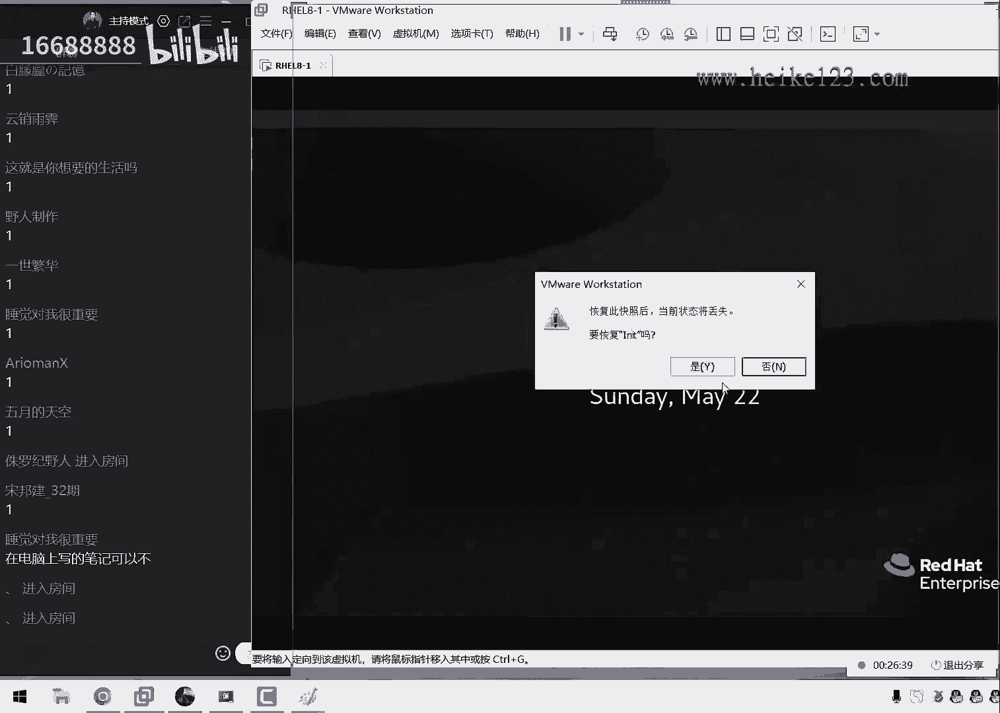

那个瑞典来给大家去讲一下，就是说我们现在需要分成两步给大家去做，稍等一下啊。

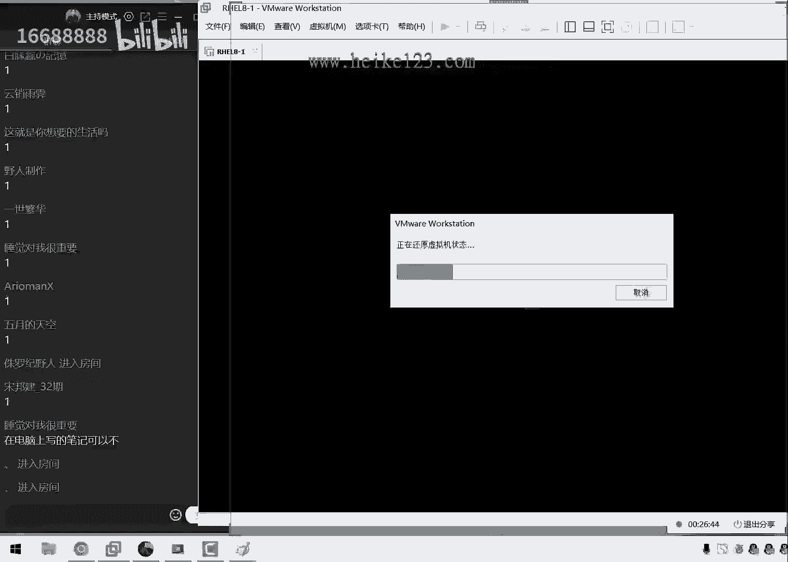

我们那我们现在需要就去做两步，第一步的话是在我们的本地来去搭建出来，一个瑞的磁盘阵列组，然后的话呢我们来把这个四nj内组，通过我们的这个互联网，通过我们的这个数据的一个网络嘛，然后我们可以去分享给对方。

然后来进行一个远程的共享，这是第十啊，这是第17章节我们需要做的这个事情，然后大家一定要有所区别，它跟sa的话呢跟一些文件传输服务是不一样的，我们现在并不是仅仅去共享出去一个文件。

而是共享出去的一个呃单独这么一个设备硬盘，这个是很有意思的一个实验，然后我们先不给大家出这么多理论啊，大家可以来看一下我们这个实操，然后我们先关机之后再去添加添加上四个硬盘。

这样的话我们可以对于这个硬盘先去做一个raid，保证我们本地的安全，然后我们再给别人提供这样的一个啊网络存储，然后这个硬盘的话就不要说，那么就稍微小一点了，因为您这个硬盘如果太大的话。

那么可能会导致待会来去共享的时候，速度比较慢啊，所以我现在给他四个五个这个硬一个硬盘，那么我们待会做一个瑞典一零，那么待会的话可用空间就50%嘛，那么它就是先添加上四个硬盘来去做一个啊，大小为五。

然后我们四个五个gb，然后把那么就50%哎十个g b的一个呃，呃瑞典一零的次元之列组，然后通过互联网把那个啊给大家做一下共享，那么的话呢这个客户端可以是一台windows。

那么也可以是一台我们的canada啊，的一台操作系统啊，windows和啊，那么这个是一个进行一个跨平台进行共享，这么一个小实验，大家可以来看一下我们这个效果，然后四个五个gb的硬盘往里面添加啊。

那么这事就做完，做完一半了啊，然后有了这个基础呢。

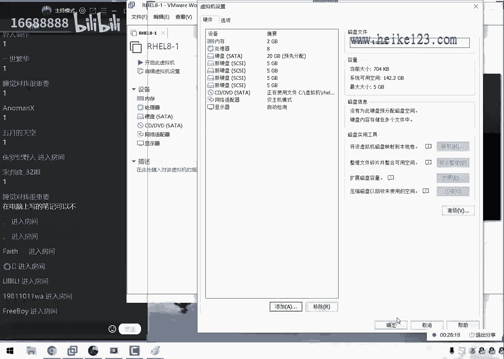

点一下添加，另外给大家说一下，是这样的，我们推荐大家的话呢，再去啊来做这个实验的时候，最好的情况下哦，哦不好意思，我们看一下啊，因为我们这个bios里面，他的这个scars这样的一个协议的。

这个优先级比那个sati要高，那么这个的话呢其实呃好吧，我们来给大家重新启动一下，先去进入到bios里面，稍等一下，这种情况下的话，需要先进入到bios里面，然后把这个啊启动于这个优先级的话呢。

给他调整一下，但是这个啊在我这，在我们工作的时候一般会用呃，我们一般情况下是碰不到的，不过也没关系吧，我们那就是说，我们现在的话需要把这个硬盘给它往下挪，这是sci的，然后的话呢这是sa的诶，没毛病吧。

然后看一下，然后现在的话呢，我们需要把这个set的硬盘往上提，然后等于说要把这个硬盘往上提，因为它里面有系统，然后我们把它留到最，把它弄到最上面去来，我看一下选中的话是a一下回车吗。

那ok我看一下a键回车，诶，好像不对，我再看一下啊，他说我们需要点一下什么啊，选中的话不是回车，是回车啊，是啊希望先点一下减号是吧，还是加号，我来看一下啊，啊加号加号加号，ok啊，没有问题。

那那我们现在把我们这个系统盘的话，挪到这个最上面，然后我们点一下保存运退出，看一下是f 10，ok这个情况啊比较少见啊，因为的话这个虚拟机里面，默认sa会比这个sky要更加优先。

所以我们它会到安装系统那个界面了。

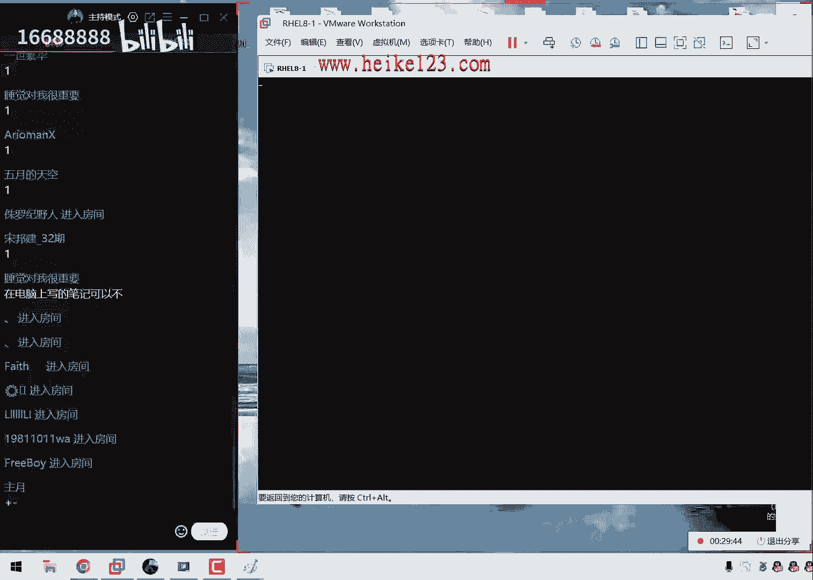

好大好，我们来给大家，那我们先进入一下，那我们第七章节给大家讲过怎么去做锐的啊，所以的话这个我们就稍微快一点了，我们主要来讲一下我们的哎这个共享协议啊，呃来怎么样来进行一个共享。

并且的话呢我们来部署一下我们的爱windows客户端，因为我们在去使用的时候的话呢。

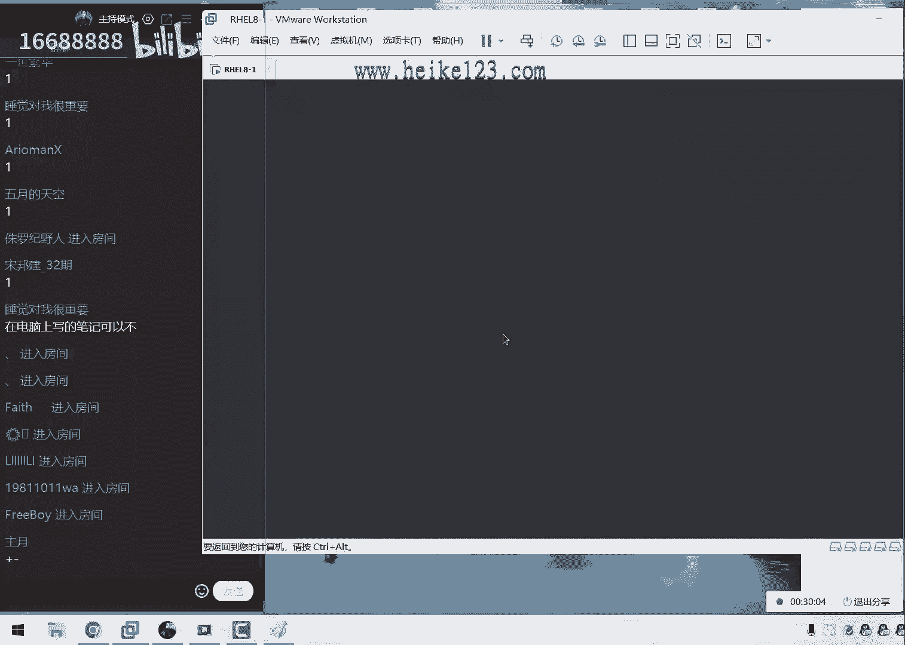

我们在这个使用场景里面的客户端，很多都是windows系统的啊，那我们平时的话呢可能很少会用来了啊。

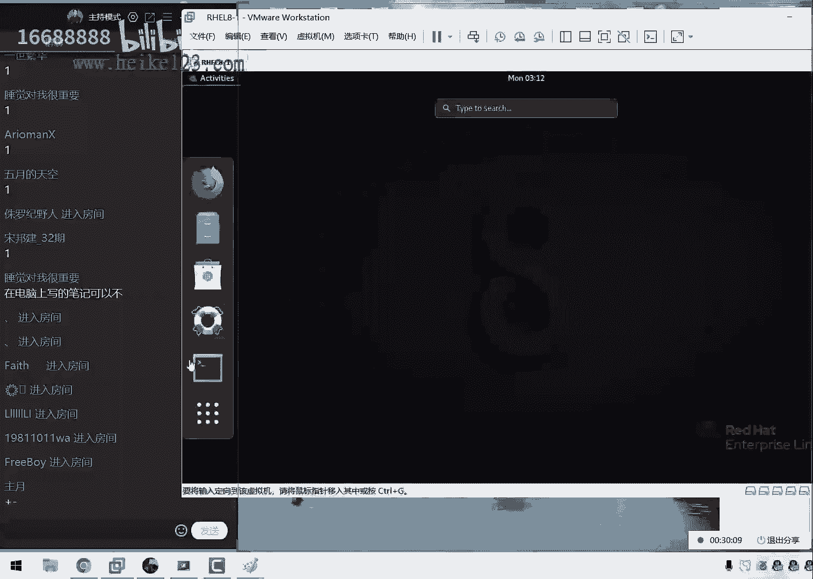

我们的本机向下降电机来，我们来给大家操作一下，首先的话呢先创建出来一个分支内阻啊，那么的话呢我们的设定一下它这个名称，杠c的表示创建的意思，杠v是显示过程，因为这个预期章节给大家讲到过。

所以我就稍微快一点了啊，然后我们就是训练出来这个设备的名称，dv目录里面的md 0，那就是说待会儿我们自媒界电阻的名称就有了，第二的话呢就是想我先想一想啊，杠n对吧，我们来指定一下这个磁盘的数量就是四。

那么就是说使用一个四个盘，一个硬盘组成一个什么呢，组成一个级别为一零的一个四维之列组对吧，然后我们可以去设定一下呃次元的名称，那么接下来讲的就是第二个，第三第四第五个被识别到硬盘的这个设备。

那么就是d v目录里面的s b那我想一想，那么就是b c d e4 个牌啊，那我可以取到这个通配符来进行一个匹配，然后就可以了，那我们现在的话呢每个硬盘的大小就五个gb，它并不大，但是我们也要等一等。

等他的话都已经进行一个同步完成了之后，我们再来去啊，我们先啊，现在等打箱门啊，等它需要先进行一个同步操作，然后我们再进行一个后续的这个哦共享，那么我们现在的话它能在同步当中，我们先来安装一下工具。

这个工具的话呢，是来进行一个交互式的一个配置的，那也就是说在我们这个红包热巴里面，要想配置一个我们的这个设备的共享，他的话并不难，它可以通过这个交互式的方式来进行啊，它来进行一个直接的配置。

来记一下这个工具名称来。

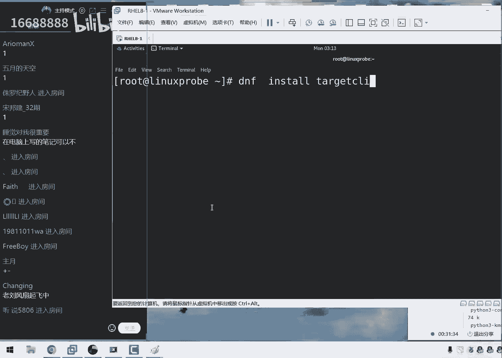

大家可以来记一下啊，target c r i啊，target control，大家记一下这个工具的话，可以去实现一个交互式的一个配置，它可以让啊进行一个交互式的配置开啊。

那我们只需要把它所需的一些参数的话呢，放到它的一个呃对应的一个位置就可以了，也就是说，我们并不需要把这个参数写到配置文件里面，而是需要啊它会把我们需要这个参数的话呢，给它映射成一个目录的一个形式。

把我们这个正确的这个参数的话呢，放入到我们叫做正确的目录当中，但是的话呢这是一个啊虚拟的一个目录，然后我们呢啊啊啊，然后我们就可以来进行一个使用了，也就是说这样的一个思路。

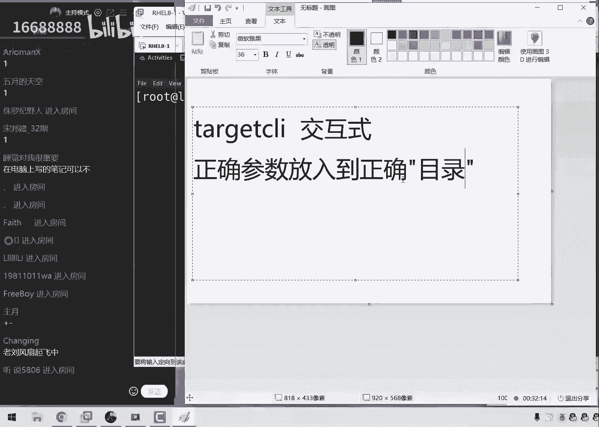

那好我们先来安装一下这个交互式的方式，有这个工具，那我们安装起来速度特别快了，因为在红包有五和六里面的时候没有这个工具，特别讨厌，所以我们配置一个啊服务端的时候会非常的慢，好。

我们先来去安装一下他那charlie c l i怎么样，老刘的风扇正在飞行当中，对现在老刘这个风扇已经扛不住了啊，今天屋里确实比较热，来我们安之后，那么再等一等啊，我刚才说了很多废话。

主要原因的话呢是等一下这个瑞的，看看有没有同步完成，同步完成了之后，我们才能够去使用到这个硬盘，干脆别去做共享吗，好我们来通过好了，然后我们去唱get ci，对于这个实验的话，大家可能可能还不太理解。

老师这个好像之前讲过数据的这个共享，它有什么差别呢，啊这我们先啊简单给大家说之前共享的文件，现在共享的硬盘，到底说我们共享完硬盘之后，它有什么样的一个效果，我们待会大家来去进行一个细聊。

看一下这个实操好，我们现在的话呢，现在就准备出来这么一个工具tc yy，然后狠狠的去敲一下，哎不对啊，先不要狠狠的去敲，先去从我啊，我看一下啊，是不是要先去重启一下这个服务，好不用，那我看一下啊。

红包roll吧里面已经不用了，那我们就直接进行操作就行了，target cyi来进行一个呃操作，然后我们看到的话，它里面他就说我们可以去输入一个help，来查看一下里面也有的一些功能啊，这里面大意思啊。

可以看到他的话呢，就是把我们的一些参数，变成一个目录的一个形式，保存在了我们的这个工具里面，然后我们就可以看到，那我可以来查看，那么当前有哪些目录啊，也就是说它里面会有很多个目录。

我们只需要把正确的信息放到这啊，放入到正确目录里面，然后我们这个服务就可以跑起来了，那我们现在这个关键点，就是我们应该知道每一个目录的一个作用对吧，然后我们就可以往里面填写信息了，那我们来啊，他很乱啊。

所以我要照给大家去说，所以的话呢我们来给大家看第一个，第一个目录的话，里面保存的是我们要想去共享出去，这个设备的名称，既然来说它是一个共享设备的一个，这么一个服务，所以才能那么他肯定要有设备嘛。

所以我们需要先进入到这个目录里面，来进入到这个目录里面，然后的话呢我们要把想要去共享出去，这个设备信息的话放入到里面去，并且给它取一个别名，当用户这个字有点小吧，再稍微大一点好，那我们来去来去操作一下。

就是但我们现在来想去共享出去，这个设备名称的话呢，前面再选减一，那那那那我们在这个前面在，再来给大家去写一个别名。

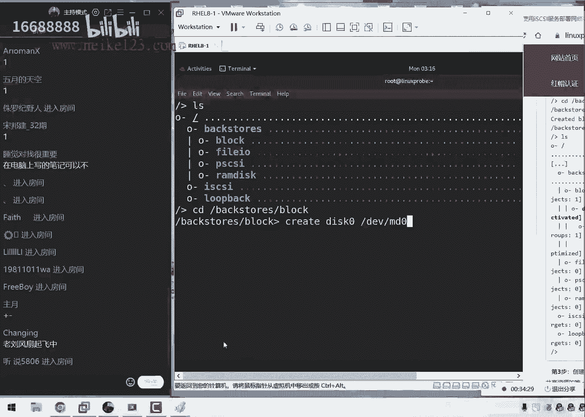

这样的话当用户去看的时候，他是看到了叫做这样的一个名称，也就是说我们来给大家做一个别名，一样的文件啊，disk 0就等同于了我们刚才所生成出来，刚才这个设备的名称了，用户所看到的这个信息。

他们会看到是这个名称。

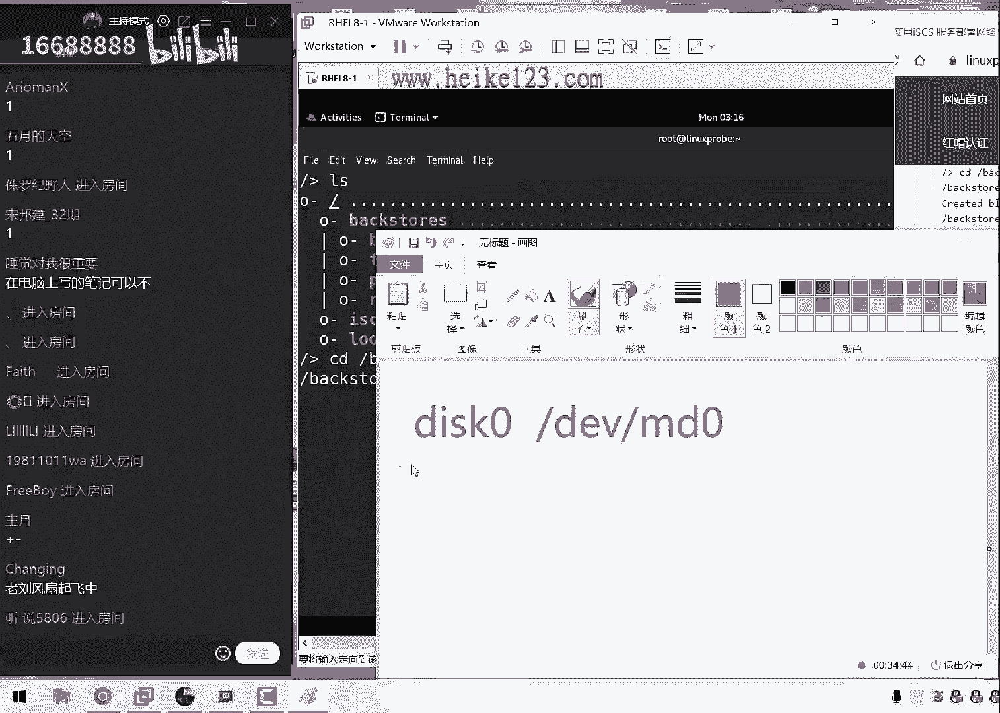

好吧简单啊，那我们要对它进行一个别名操作，来我们往里面添加，这样的话呢，这里面就会出现了一个我们的dv目录，里面的一个设备信息，待会再有人去访问我们这个服务的时候，那我们的这个sky服务。

就会直接的把这个设备信息给他做一下挂载，可以看到呃，大小的话呢，它只为十个gb，因为它是5%是可溶性嘛，所以我们作为一个6。10，那我们四个盘去做，那么大小是十个gb啊，也能对应上说明的话呢。

我们呢我那么说明我们这个设备的话呢，它已经存在了，好这是我们的第一步，要把我们这个设备加入到里面去，第二步的话再翻回来啊，他既然是一个目录，那我们就可以去使用到对应目录的这个操作。

在这个命令来对它进行操作，来我们进入到里面的这个根目录啊，它所对应的就是他所教的这个根本部里面，来找到这边，然后下面一块呢我们需要进入到这个目录当中，哎啊scc目录当中，然后的话呢我们需要去。

那么您现在需要去添加一下，我们叫做共享信息。

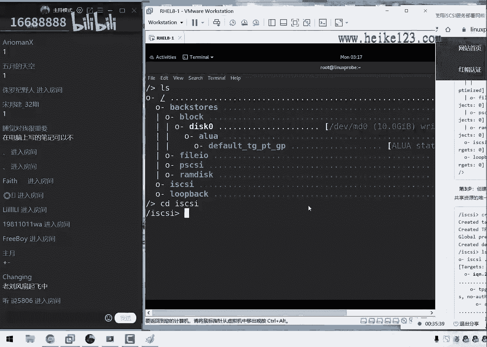

然后我们再去创建出来一个它，它会自动生成出来这么一个字符串，这个字符串的话呢，就是待会儿我们的用户他去访问当中，会去访问到的一个名称，也就是说我们要想去共享数据这个信息，那我们还有一个共享名称。

当用户去访问这个共享名称的时候，就会自动去调用我们这个资源池里边，也就是说现在是有一个硬盘，我们需要把这个硬盘的资源的话呢，跟一个名称做绑定，当用户去绑定这呃呃，当我们当我们用户去访问这个名称的时候。

做挂载的这个操作的时候，就会去把这个资源，那么把这个资源给我们的用户了，这样的一个过程，所以这个名称的话呢，然后我们需要先去创建出来，它，第二步的话呢，需要把这个呃设备跟这个名称去做一下关联。

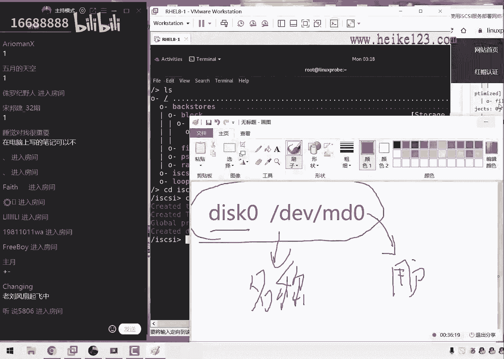

这个思路有点乱啊，不过我们现在给大家一路来啊，那我们那我们先给大家操作着，这样的话呢它会有一个名称，这个名称的话，它会是一个随机产生存在的一个唯一值，然后我们现在可以来看到，这是很孙子一件事情啊。

我们来看一下这个信息，这个信息里面的话呢，每一行当中都会有一个句号，其中的话呢唯独是第三行没有句号呃，这个的话是我们在红白五和六里面配的时候的，一个很严重的一个问题。

在七分八里边的话呢也是很常见的一个问题，因为在五和六里面我们特别的依赖于这个名称。

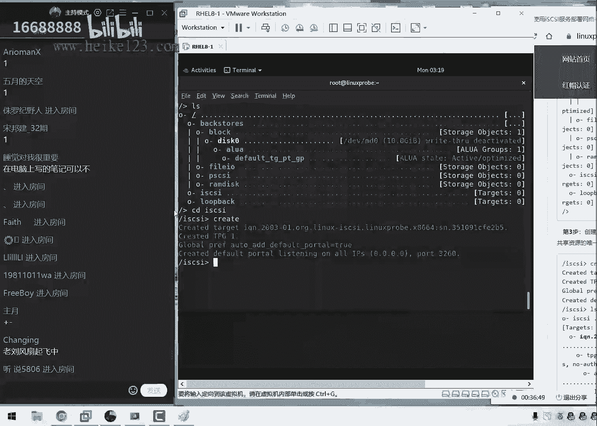

但是的话呢在七分八里面也是存在这个问题，我来给大家讲一下，就是这个服务的话，大家看起来其实并不难，对不对，他啊，因为他总共就是有这么三四个目录。

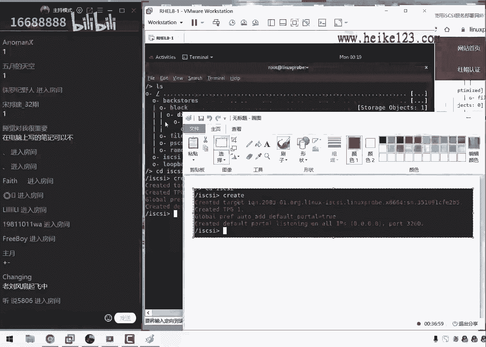

它并不难，但是吧这个难点就是它会有一些通，比如说大家看到这个的话呢，它生成出来一个共享出去的一个名称，我们需要让用户去进行一个访问，只要他要去输出了12344行话，那么我们可以看到的话呢。

它的每一行的这个后面，它都是有一个句号结尾的，然后但是的话有些时候它又没有句号结尾，我们来给大家分析一下这个情况，首先第一行大家看到第一行的话呢，它有一个句号结尾，第二行的话它也有一个句号结尾。

第三行它没有句号结尾，第四行它也有一个句号结尾，但是它其实际上它并不是句号，怎么理解呢，这三个句号当中有一个是假的啊。

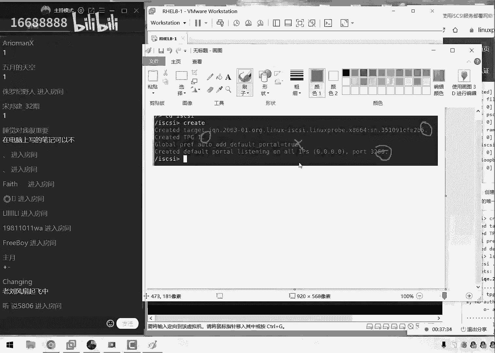

不不啊不不嗯，他啊拳头啊啊啊啊，不不不，那么需要给大家就说这三个句号，看他啊，他们啊全都是真的，但是只有这个啊。

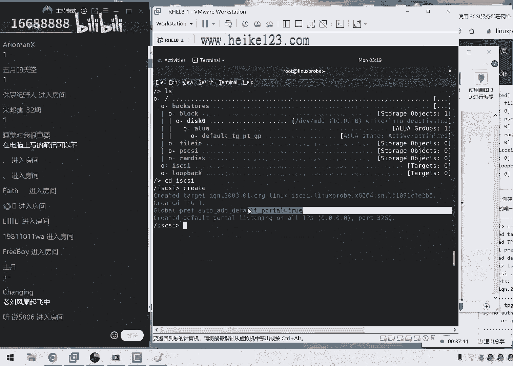

第三行它里面没有一个句号，那我们来看一下第一行，第一行里面的话，它也有很多这个句号，但是所有的句号都是他的这么一个名称，的一个组成部分，也就是说这个名称里面的，所有的前面所出现的这个句号。

都是它的这个名称，只有最后一个句号，它不是的，所以大家就是这个服务时候老出错的原因，就是复制的时候粗心了。

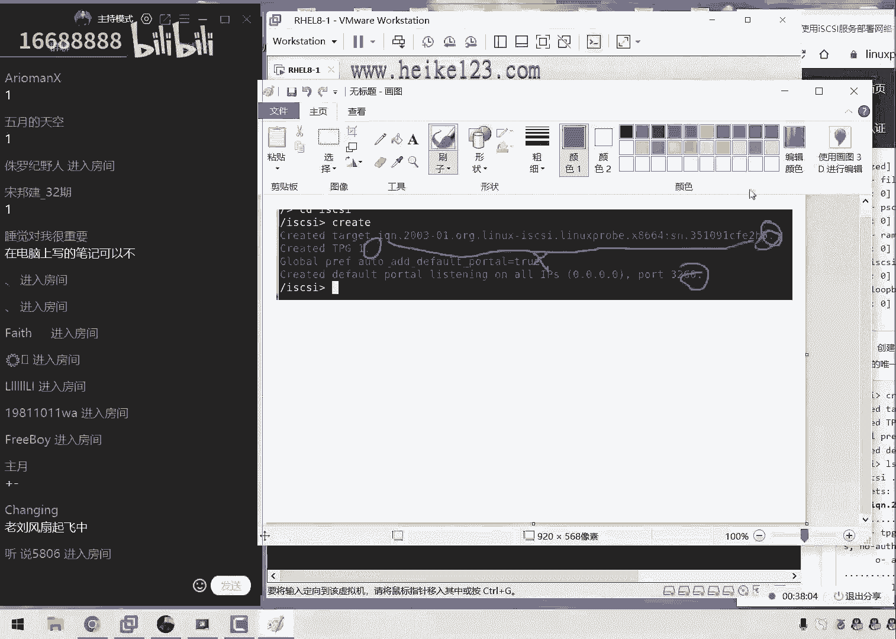

我们直接复制的时候，这样复制的，按住鼠标左键，然后一怒怒怒怒啊，巴拉巴拉巴拉，然后直接然后就呃呃然后呃，然后买定复制的时候，如果复成这个样子的话，那么他就出错了，所以说最后一个句号它是一个句号啊。

所以一定要把一个小心的给它去掉它，然后我们来进行复制，这样就没有问题了，大家再跟我一起操作一下，记住最后一个句号，它并不是名称，一定要把它给啊，那我们那我们一定要注意。

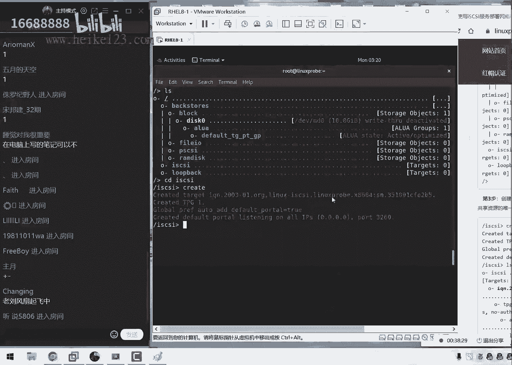

然后我们可以把它放在一个记事本里面，待会的话就让我们的用户来进行访问，其实这个操作的话呢可以没有。

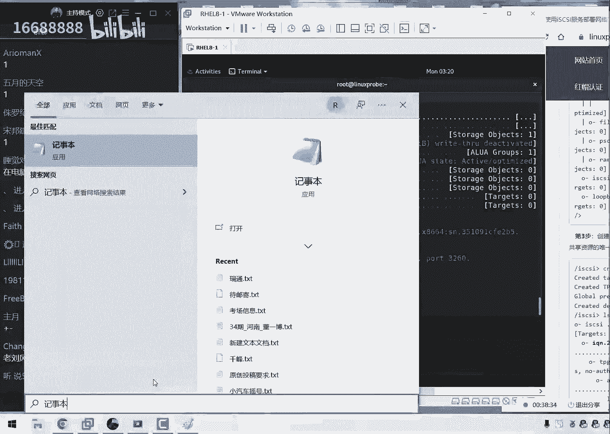

为什么呢，因为这个可以用来查，就是啊那也就是说这个名称如果忘记的话，可以过来查，但是我们为了一会儿我们查一查去啊，它很不方便嘛。

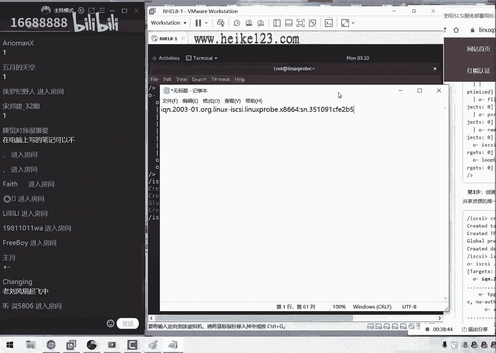

所以我们先来给他啊，那我们先给大家找出来啊，那我们先把它找出来，待会的话可以直接给用户提供了，不过这个呃有没有也无所谓，那我们来给大家看好啊，现在就会有这么一个啊，他会新建过后。

它会新建出来一个与其这么一个名称相同，这么一个目录，然后我们现在需要做的话，要么就是再去进入的啊，那我们来再去走到这个所对应的一个目录当中，来进入到啊这个所对应的一个目录当中，再往里面走。

他要生生生成了一个啊虚拟目录，这样的一个形式，然后我们可以看到的话呢，这个里边啊稍等一下再进行的啊，再那么再往里面走一个目录，可以看到的话。

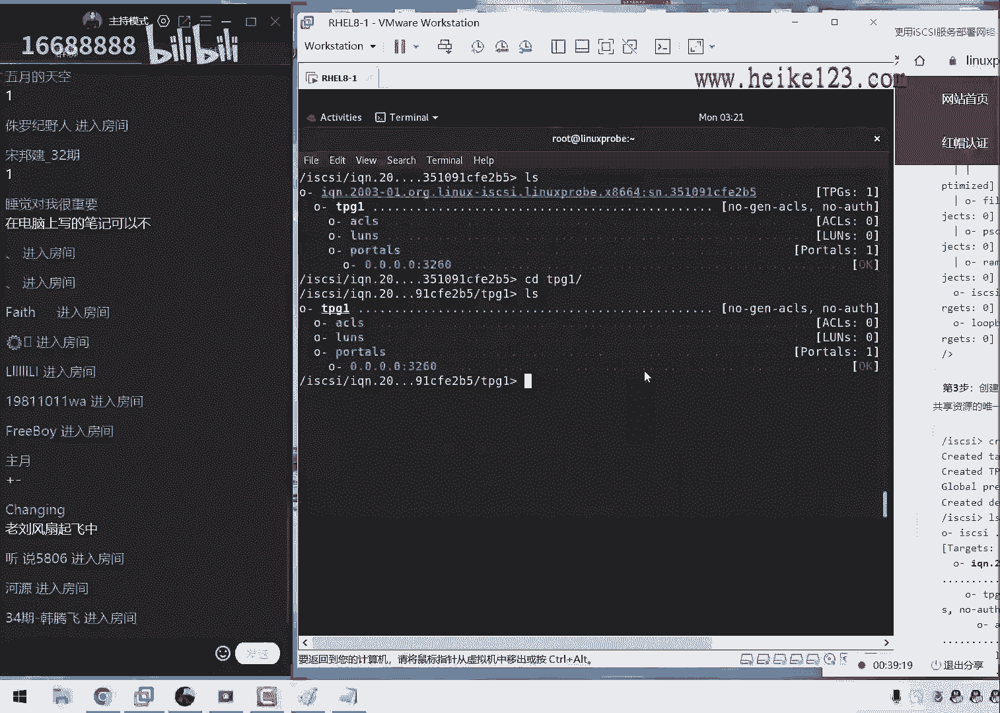

这里面有他啊，他会有三个这个子目录，这三个子目录的话呢，让我们来给大家说一下，第一个我们叫做访问控制啊，我们来给大家看一下，第一个访问控制，他指的是谁可以去访问我，我要他指的是谁可以访问啊。

那我们需要先添加一个白名单，那我还到啊。

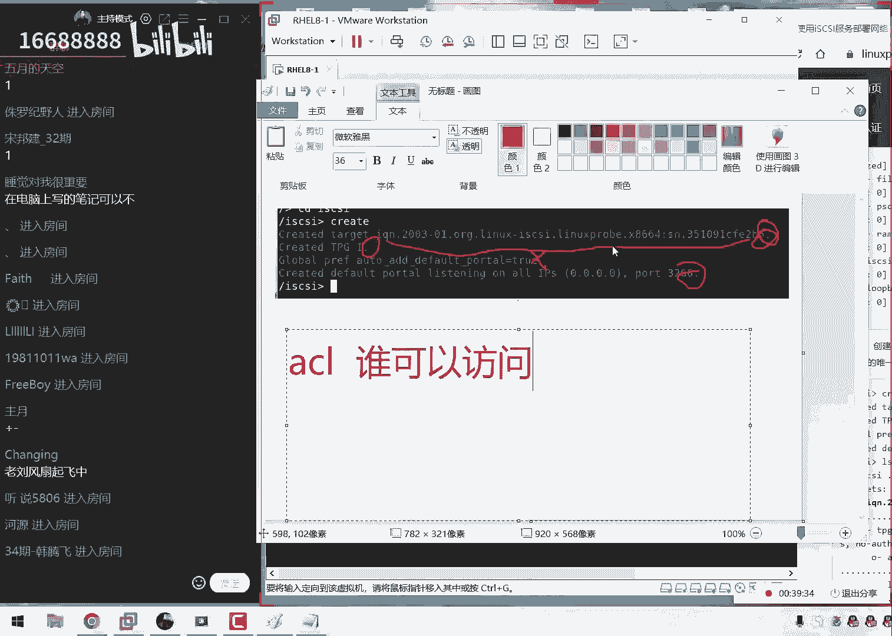

那么我们这个啊排名单目录的话呢，它是写的是我们的用户的一个名称，好，那我们先进入到这个目录当中，来进行一个生成啊访问库列表啊，那么进入到这个目录当中，然后我们那我们现在需要新建一个条目。

来进行一个访问控制，这个名称的话呢，它很乱，怎么理解呢，他这个服务的话，它并不是通过密码来进行控制的，它是通过用户的名称来进行控制的，但是的话呢用户的名称，它就是一个唯一的一个值，所以我们怎么理解呢。

就是啊用户的这个客户端的名称，就是我们的密码，只要用户端的啊，那么只要这个客户的密码跟我们所要求的这个，防控的这个值匹配一致了，那么就证明他可以验证通过了，所以这有点乱啊，这个怎么讲呢，就是它没有密码。

但是他必须要解决一下用户的这个名称值，然后用户的名呃，呃用户的名称值就是我们的密码，那我们这个时候也要选择一个随机值吗，那么所以我们建议大家是这样的，既然我们的用户名称，那么啊啊不，那我们接下来说。

那我们的共享名称它是这么一大坨对吧，那好了，我们可以直接网络后面再加上一个词，然后来作为用户的这个名称，这样的话我们记号去分辨，说它是用来去访问哪些共享的，又可以区别出来出来。

他是哪一个共享这样的一个信息，所以我们推荐的话，所以我们推荐大家可以使用这个名称，后面加了一个词，然后就作为我们的这个用户名称了，然后这样的话呢既好记又好看，然后我们可以来这啊。

那啊那我们可以通过这个名称啊，马上可以确认出来这个主机的一个作用，然后他以及去访问这个共享信息，并且的话呢那么它里面这个值它是啊啊，并且的话这个值它也不会跟别人产生冲突。

我觉得这个比较方便的一点是大家可以供参考，所以我们现在就新建出来这个共享名称了，然后我们再去创建出来一个共享的，这么一个密码吗，它不叫密码，它叫做它叫做访问库列表，那就是说只有这个名称。

它等于我们这个所创造出来这么一个呃，名称的时候的，用户才可以来对我们来进行一个访问，因为我们尽量让这个书上来，因为书上的话有点乱啊，不因为我们现在这个操作，如呃如果要串行的话呢，有点乱啊。

不过好像也串行了，不那么也就无所谓了，那我们现在给它新建出来，这样的话呢给大家来看到，也就是说这样一个名称，待会我们的用户名称必须是这一大坨的话，那么才可以对它来进行一个访问操作好。

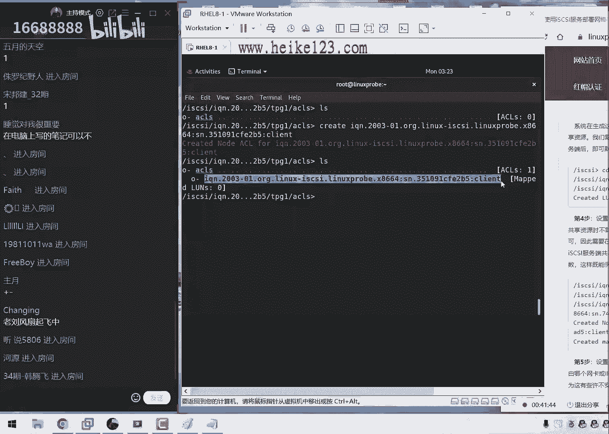

那我们先把这个值的话呢，给它复制到我们这个剪切板里面，到我们记事本里面，这样的话呢来做一个保存，待会儿用户的名称就以这个来进行修改，那么如果说这个名称跟他不一样的话。

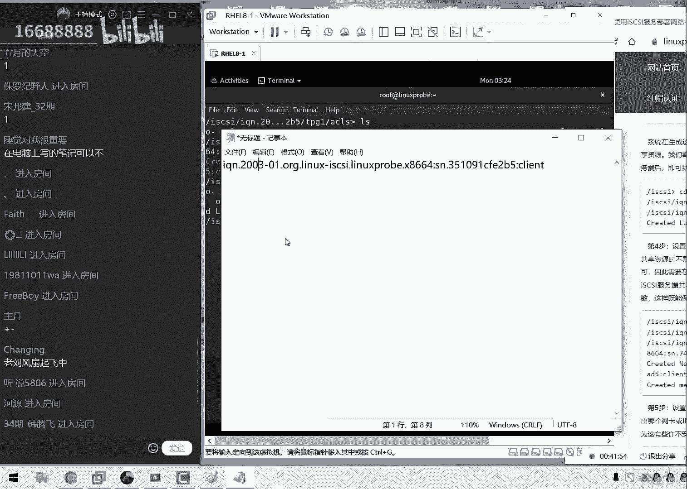

那么就会直接就会反而失败了，所以这个是很重要，好接下来我们来往后面再去退一个目录啊，来推一个虚拟目录，再看一下，还有两个目录，这个目录的话的作用是用来存放。

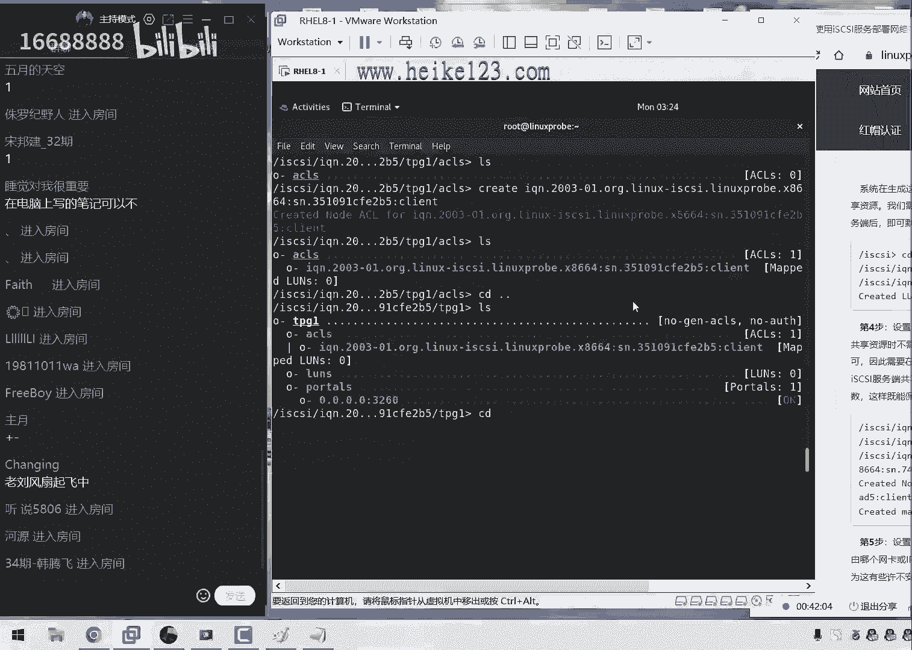

叫做资源池信息，怎么理解呢，就是现在有啊，那我们现在有一个磁盘的这个信息，硬盘的信息，现在已经放到了我们的这个服务当中，但是他还没有跟任何的这个名称做绑定，所以我们现在需要做一件事情。

就是跟我们的这个啊硬盘的话呢，跟我们的这个访问的这个名称做绑定，当用户去访问到某一个啊具体的呃呃呃呃，那我们当啊用户去访问的时候，访问到具体的名称就可以访问到啊，那么它它就会自动的。

帮我们把某个硬盘来去做一下挂载，等于说需要将这个资源池跟名称做挂载，这么一个不来啊。

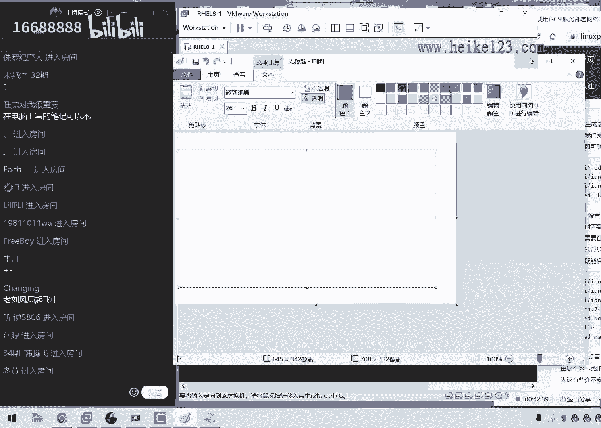

他还做一下关联这样的一个效果好了，我们先这样来来去做，来我们去创建一下它，然后刚才那个设备的名称的话，应该是叫做dix 0，所以我们给它写下来，这个可以用到table键补齐的，这个非常的方便。

大家可以一起去记一下，就是说我们再去使用到这个命令的时候，他就一个交互式的配置啊，tcl它的时候的话呢可以用到table键补齐，报告说我刚进站啊，那啊报告说我们刚才去啊，那啊啊。

报告说我们刚进行一个呃切换操作的时候。

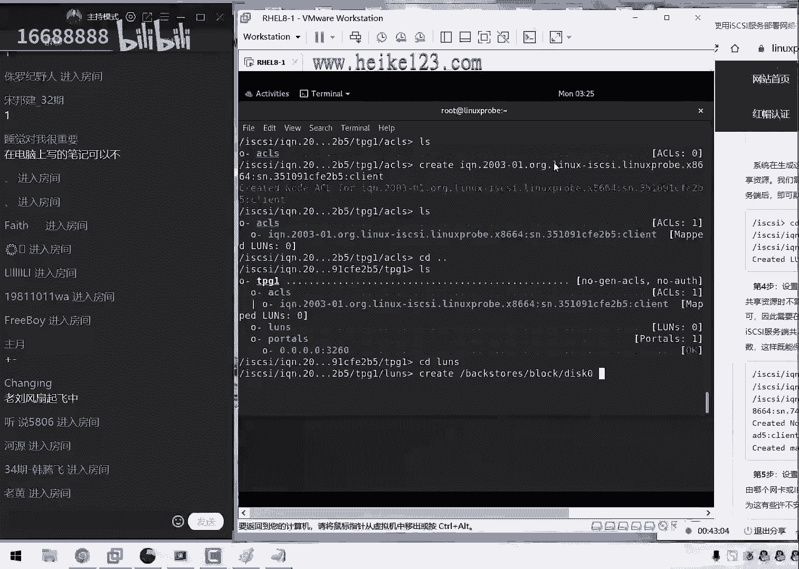

他都是使用的这个tab键可以补齐的好，那我们可以做完这个操作之后，可以看到了，他就帮我们绑定了，说他这个设备的话呢已经跟我这个名称啊，它已经发生了绑定了，当绑定过后，这个名称经绑定的时候啊。

他集合访问的时候就可以成功了啊，非常简单，然后下面的话最后一个叫做啊控制端接口，那就是说我们要想对它进行访问的时候，去使用哪个ip大家进行访问呢，或者说是由谁去提供了他。

那我们就给大家解说到了同一个服务器上面，那么啊某啊那么好，那我们的某一个服务器上面，他可能会有很多个网卡以及ip地址，那么我们到底有哪个ip地址去提供这个服务呢，当前我们是啊没有被允许对吧。

他是呃拒绝所有的，那我们现在需要去删除掉啊啊delete一下，删除掉它里面默认的这个值，然后的话呢我们需要它怎么样呢，他说需要再添加一下端口号是吧，3260端口号唯一默认值。

也就是说我们需要添加上一个ip地址，让我们的用户去通过啊某一个地址来进行访问，那也就是说这是服务端的一个设置负呢，那么啊那比如说现在服务器上面有很多的地址，1920~8点十点，10。20。30好。

但是我现在只想让点二零可以被防的，那么好了，我就让他去啊，只需去点二零来进行一个访问，或者说他是个点三零站的一个地址来进行访问，所以当前就是去开启一个我们的服务器上面的。

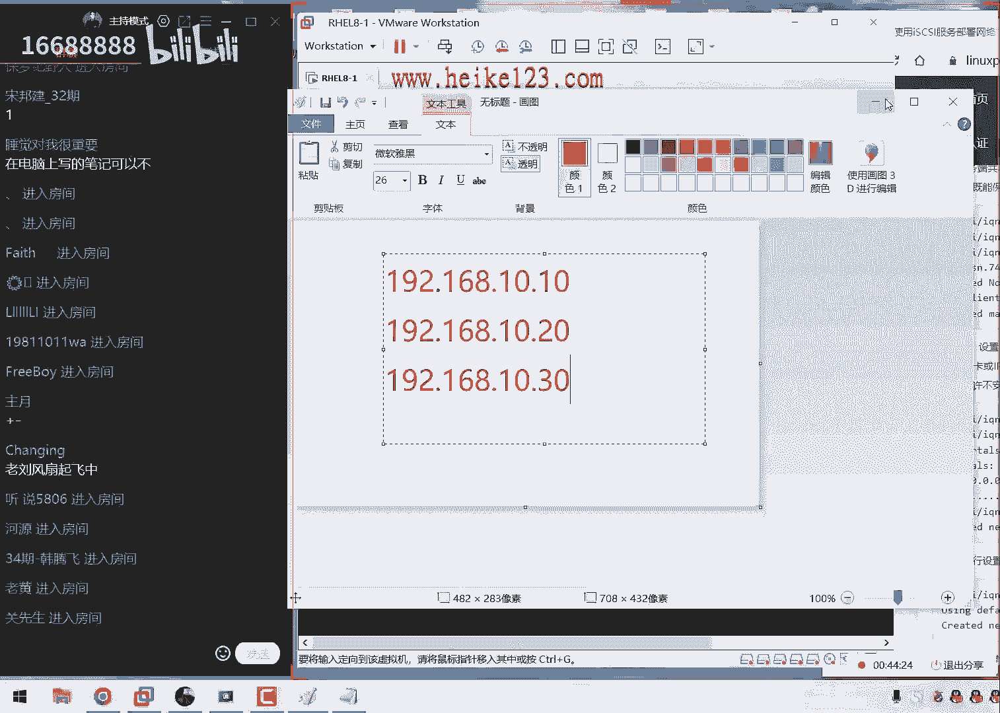

这个啊地址，来对它进行一个呃提供这么一个服务，然后我们端口号的话呢是为3260端口号，这个不用写它啊，默认会被我们去设置的端口号3260啊，sci服务的配置起来非常的简单，他只需要进行一个交互式的配置。

就可以把它搞定了，来点石也是a一下，回车啊，没有问题啊，我们的服务的端口号3260，自动填写了我们的我们的服务器的地址，那么也那么也都是正确的，那都做好之后的话呢，我们可以把它给退出。

退出之后来大家看好，我现在把它退出了，退出过后的话呢，我们现在可以去重新去启动一下，我们的s k s的这个服务，这样的话啊，那那那么我们的用户就可以被访问了，在我们的2012年之前啊，实际上的话呢不。

他是在2012年到2020年之前的话呢，他全都是考的这个呃，我们来配置一下呃，那我们来去啊挂载一下，由加热机去提供这么一个网络存储，到了我们现在这个红包六期这个考试的话，那大概就是周期啊，我刚才说错了。

市场啊，他们的话呢他也就是说在201啊，他是在我们的红包六期考试的时候的话呢，他是在开啊，他会啊他会去考到，我们需要去自己去配置一个我们的设计师啊，呃设备来进行共享，并且的话呢我们还需要进行一个挂载。

因为的话呢在红毛路由器里面，就是因为有了这个工具了，那我们来看一下，如果说现在我们红包任务器里面，他没有这个工具的话呢，那么我们也要像红毛五和六里面一样，需要去写这个配置文件，大家可以来感受一下。

就是呃它有多么的复杂，然后他以为这个格式和参数有他们多啊，他们多么的难写，所以说在红包五和六里面的话呢，他并没有考到这个服务端的配置，而他只考了这个客户端的配置了，那么我们换句话来说。

就是在红包六区里面，或者说以后我们工作的时候，他之所以干，他会让我们贴着这个存储在一个原因，也就是因为在我们这个红毛七跟八里面，它有一个交互式的一个工具的，我们只需要把正确的这个参数。

添加到正确的目录里面，他所说的那个目录，然后有那我们这个服务就把它给搭建出来了，所以的话呢第17章节，我们认为是一个非常简单的一个章节，它并不难啊，它并不难来，我们现在来给大家去操作一下，稍等一下啊。

ok我们来给大家操作一下。

打开另外一台虚拟机，那么既然来说啊，它可以进行一个跨平台的一个共享啊。

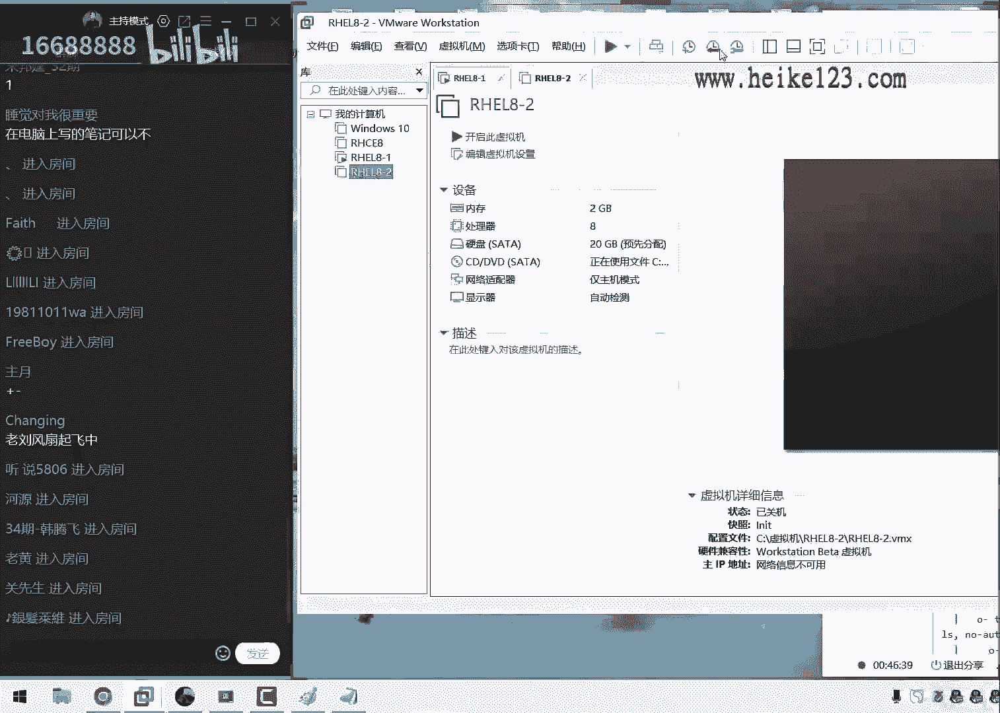

那我们就再开启台啊操作系统，在开启它另外一台操作系统。

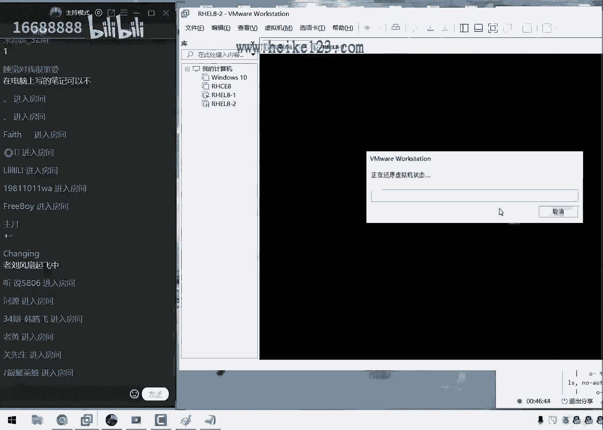

我们来进行一个挂载操作，然后我们再开一台windows啊，两台啊两啊两台linux，然后后来再来开一台windows，先去使用到我们的唉对了，还有这个防火墙啊，先去使用到我们的linux系统。

来进行一个远程的挂载，然后的话呢我们把它给啊啊啊，然后我们再做一下卸载操作，卸载过后我们再去使用到windows加块，在我们这个网络存储，然后我们来等于说这两个实验的话，都给大家来操作一下。

添加在服务名称啊，或者我们可以写个端口号都可以啊，s k y，然后的话呢我们来让它去生效一下，他说我们的i sci这个服务的协议并没有存在，好吧，那就是说这个端口号的这个对应的，这个c的名称。

好像跟我们平时叫的这个叫法是有点区别的，那么很简单啊，我们可以直接去搜索一下端口号，3266端口号它所对应的一个名称，然后我可以看到了哦，这个名称它发生了变化了啊，后面加一个target。

它指的是服务名称，所以的话呢我们需要把这个名称到后面，这样一个超get的这样的一个写法，于是我把它写好，按一下tab键，然后补齐，按下回车搞定了，然后我们把方块墙给他做放行，我想一想。

那么今天网卡配好了，防火墙配好了，服务配好了，还有什么呢，没有什么了，好了我就可以了，做好之后的话呢，来去使用到我们这个客户端后端啊，它需要最先的事情，首先来说就是保证这个网络的一个连通性嘛。

来首先来说两个王凯同一个网段，然后我们同啊，并且同一个模式，然后我们去拼一下一九二零六八点10：10，然后说一句抖音啊，看一下能否把它拼通了，这个的话呢，就是我们来进行一个网络的一个测试。

然后看到这个客户端的话呢，已经能跟我们这个服务器进行一个联通了，毕竟我们看一下书上啊，然后在红包rop 7里面的话，还需要自己再去安装一下，我们的这个呃客户端的一个程序。

然后在红包肉吧里面的话已经不用去了，然后我们可以直接就用就行了，那我们也就是说在红包热巴里面呃，他并不需要去安装客户端，它可以直接就用啊啊，那么它可以直接来进行一个使用，那么以及来进行一个挂载操作。

那我们现在的话呢先去想一想干什么呢，先去配置一下我们的密码值对吧，因为他既然来讲，它是通过我们这个客户端，这个主机名称来进行一个验证的，它必须要等于我们这个防空列表当中，它所定义的一个值。

这个必须要知道的，所以我们现在去返回到这个啊服务器里面，查看一下，当前的话呢我们的防控列表当中，我们的这个设备的名称，它允许的名称啊，不就我们看也不太严谨了啊，他并啊它并不是设备的名称。

它指啊他指的是我们这个啊客户端，它是允许的一个名称，把这个名称复制一下，然后的话呢我们进入到客户端里面，编辑一下客户端的这个名称，我们来进入到里面去啊，etc还是我们写下名称，这个话呢特别的长。

我们可以用到t b键补齐，然后它以服务名称命名的一个文件夹，然后我们来看一下啊，tab键补齐里边正好有一个叫做初始化名称啊，这样的一个文件来我们编辑一下它，这里面就会需要我们定义一下这个主机名称了。

然后我们现在的话就把它给它啊删干净，然后我们把它里面所允许的一个防雷，防空列表里面的这个名称完了啊，再往里面一粘就可以了，其实很简单对吧，它只是一个我们去获取的一个呃过程，然后我们点一下保存率退出。

接下来重新启动一下我们的客户端，在我们的服务的名称，来重新启动一下我们客户端的这个程序，然后我们哎不对，后面加一个d啊，后面需要加一个d，它指的是我们这个客户端的一个说法，进程的一个服务名称。

顺便的话把这个复位加到选项的啊情况下当中，能够保证我们下一次的时候，还依然能够去有启用，这样的话到此那我们这个服务端跟客户端的话，就把它都配完了，其实第十针啊啊哎呀，其实完我们就玩完。

那我们这边第17章节很简单，它就是我们进行一个远程的一个三共享，然后我们来进行一个挂载的一个操作，非常简单，那我们先来给大家操作一下，要想去站在一个服务器上面的，一个有呃的一个远程设备的话呢。

我们需要分两步走，第一步的话呢是发现第二步去做挂载操作，我们在做这个服务啊，服务之前的话呢，我们来给大家操作一下，我们来点击一下这个呃这个编辑选项，然后我们可以来不，我们先不点编辑选项。

点击一下这个虚拟机的这个配置选项，我们来点击一下设置，大家首先来确认一下。

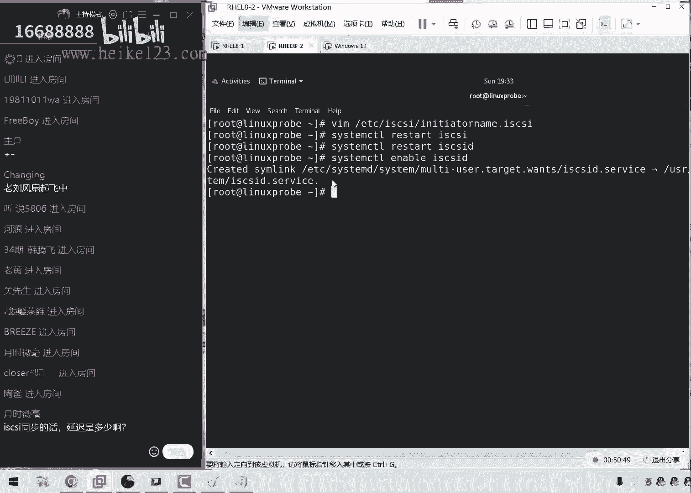

当前的话呢我们的硬盘只有一块，然后我们现在的话呢它只有一个硬盘对吧，大家可以看到它这边的硬盘数量是一。

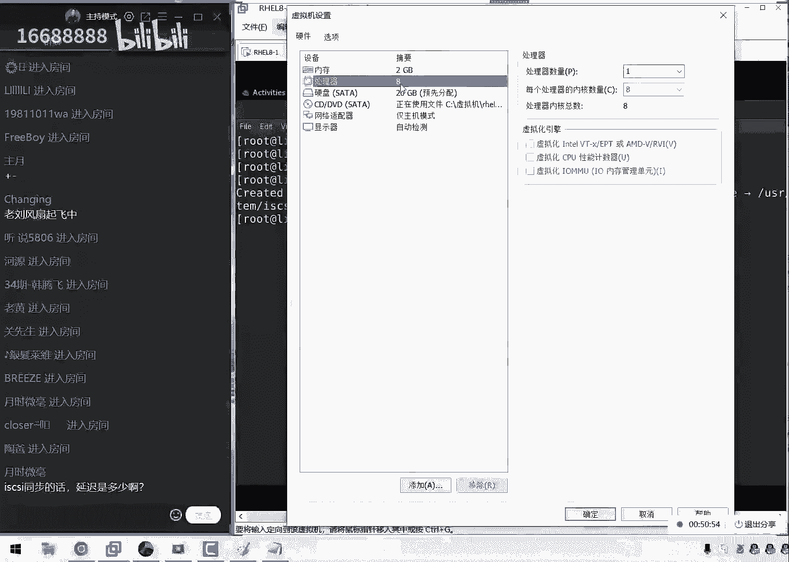

然后只有一个，没有另外一个，然后我们现在可以打开另外一个终端，然后我们来看一下dv目录里面的md 0啊，不配位啊，要不我，那我们来看一下所有的我们这个设备的名称啊，它里面就应该只有个a他没有b。

因为它只有一块硬盘，这没有问题吧，好然后我们来给大家操作一下，该怎么样，能够把远程的这个磁盘给他挂到我们的本地，然后像我们去使用的，我们本地磁盘一样的进行一个管理，包括说分区各出外在都可以去完成它啊。

这个是常方便的，并且的话呢我们这个权限非常的高，那我们一定要使用的管理员的身份来进行，必须是管理员才可以进行这个操作，然后大家说这个延迟有多少的话，这个延迟可以忽略不计啊。

我们在使用的时候就像使用本地硬盘一样，可以考虑成没有延迟都可以啊，它取决于我们的网络呢，然后我们来第一步来进行发泄，就是先呃进行一个发现操作啊，发现一下对方的这个服务器上面还有哪些共享。

因为共享这个名称特别的长，那么假设说我先作为一个客户端，那么啊比如说我现在是一台客户，那我现在需要先知道对方服务器上面，还有哪些可用的共享，然后的话呢，我们把这个可能共享过来到我们的本地。

所以第一步叫做发现操作啊，discover就这一个发现操作，然后啊啊啊，接下来我们要去设置一个标识，这个标识的话呢我们目前没有太好的解释，但是我们从查看啊，但是我们查看了一下这个命令的。

一个包容信息的话，那我们那我们可以看到这个标志的话呢，它主要作用就是来去发现对方主力上面，它有哪些可共享这个呃，所以它它所以它进行一个探测的一个标识吧，然后并且的话他这个写法只有一种写法。

这是我们学给大家查到的一个解释，来我们来去填，去填写一下我们这个服务器的一个地址，然后的话呢1920~8点10：10，其实的话，对于我们这个网络设备的一个共享服务。

它可能更多的不是取决于我们的这个设备的，一个瓶颈，它只是它取的是一个网络的一个瓶颈，我们给大家举个例子，比如说音响就下一个电影，前面下载电影的一个速度取决于什么呢，其实它并不是取决于你的硬盘的一个呃。

写入速度的，它更多可能是取决于网络的速度对吧，因为网速慢，所以我们下的慢，所以大家我刚才去想这个问题，我们之前是通过总线啊对吧，然后我们把这个啊数据，然后我们啊等啊，稍等一下啊，我们先画。

那我们比如说是把这个硬盘插入到这个呃。

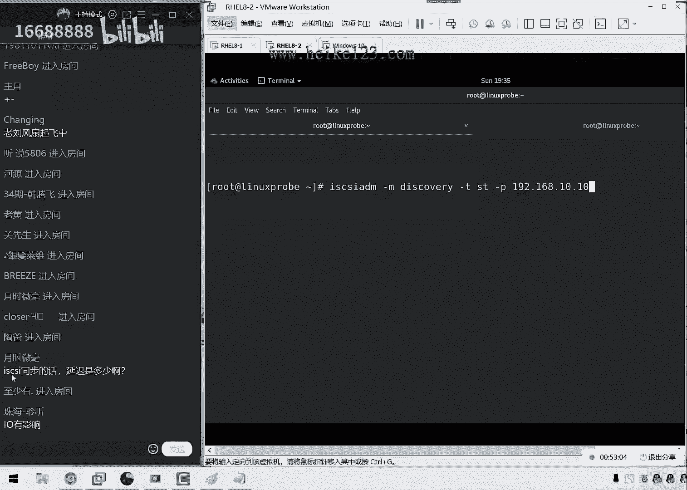

呃那我们将这个硬盘插到这个主板上面，它是通过总线来进行呃，它来进行一个数据传递的，他的话他也是做非常高的，但是我们现在它这个设备，它并不是在这个主板上面的，它是放到我们的呃。

呃它是放到我们的呃其他的地方了，然后它是通过网络来进行传输的，所以的话呢这个瓶颈，实际上它是出在这个网络上面了对吧，所以我们才可能才需要一个我们的专业的设备，来保证我们来进行传输当中，它的一个稳定性。

它这个是受到网速限制的，所以当我们去寻找我们的这个协议的时候，他可能更多的需要考虑到网络因素，就他这个呃限制速度肯定会变慢。

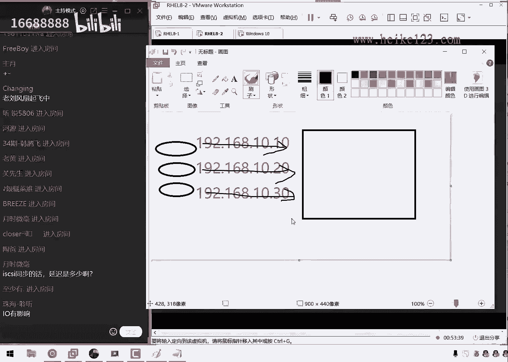

但是取决于这个网速嘛，那我们来给大家操作一下，然后我们来去探测一下，说对方主机上面还有啊，他有哪些可用的共享，于是我们也看到了，说当前主机上面的话呢有一个共享名称，然后为这个的设备。

然后我们可以把它给挂载过来，据说过来过后他是个啥，那我们还不知道，不过我啊，但是呃呃但是的话呢，我们已经有了这么一个名称了，所以我们就可以直接点一下复制，这样来进行挂载操作了，来我们来给大家挂载一下。

我们啊还是使用到这个命令，然后我们需要把它自己设置成一个节点的，一个主机，刚大t指的是我们要想去设置一下，共享的这个名称是什么，然后我们这个我们不用去手敲了，同学们可以直接复制就可以了。

然后我们再换个钢p，他指的还是服务器的一个地址啊，刚p还是服务器地址，就是1920~8点10：10，后面我们来进行登录，它可以是一个长过去的一个登录词，它也可以是一个小小的一个参数来进行登录。

这样的话呢我们来进行一个发现，然后再进行一个登录之后，大家可以来看到它底下就会显示出来成功了，那么就可以看到当前设备当中就会多出来一个，第二个硬盘，所以这就是我们第六章节第一讲，就给大家聊聊过的。

他根据我们的u d微服务，来，对于我们这个视频流程来进命名的时候的话呢，它可并不是因为我们在啊主板的上面，这个插槽的顺序，决定了它所对应的一个设备的名称，它是根据我们的内核里面的这个识别顺序。

来去决定的，所以我们当前这个啊客户端。

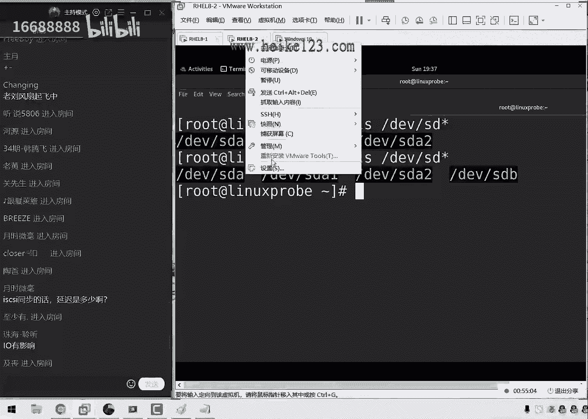

他并没有第二个硬盘，但是我们现在第六章节给大家讲到的。

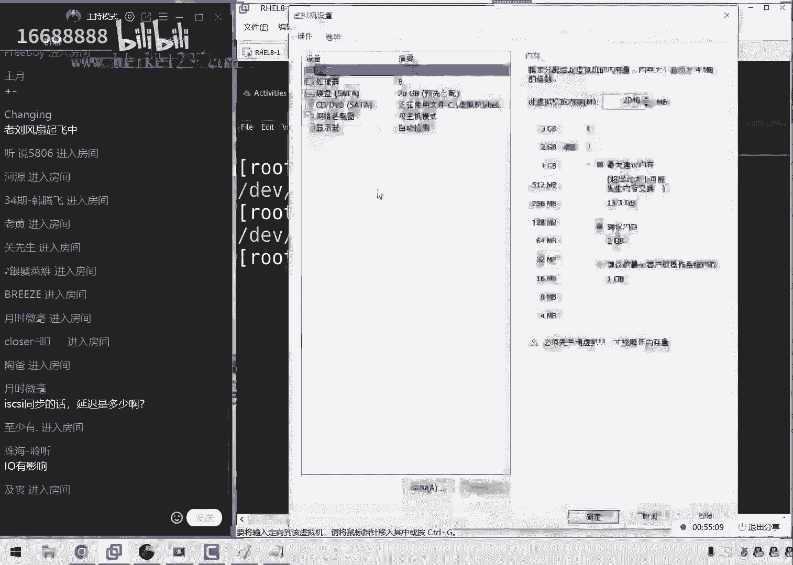

它依然会被分配到一个设备的名称，就是这样的一个原因，所以因为它是由我啊，因为啊它是由我们的设备的啊来去啊，他啊他啊他啊，他还将视频的一个顺序来去决定的，然后的话我们因为客户端嘛，我们主要它啊。

那我们现在我们把这个先做一下卸载操作，我们就按照这个数量给大家去做吧，因为的话呢先对它进行格式化挂载之后吧，这个数据也就没有了，所以的话呢我们先把它给卸载掉，去使用一台windows的主机来进行挂载。

然后我们以这台windows客户端，因为我们平时这个实验端嘛啊，我们很少用到windows，所以我们来讲一下windows，咱们来去做，我们需要先把它给卸载掉，先把这个设备需要先给大家做卸载。

否则那我们这边是不能够同步去做挂载的，否则这边呢它它两边会有冲突，然后我们先把它给卸载掉，然后去使用一台windows主机把它挂载上，然后大家可以看一下，那我们该去如何去使用它。

一台windows的主机，来去挂载一个我们的网络存储设备，然后我们来跟大t来去往里面一粘贴，这是我们的这个设备的名称，然后我们一个小小的u来去做一下卸载操作，这样就完成了啊。

那也就是说我们刚刚的这个所有的这个操作，然后我们完成之后再去看一下dv目录里面，就他最后没有第二个硬盘了，这是一个简单的，我们来进行一个呃远程设备的一个外在。

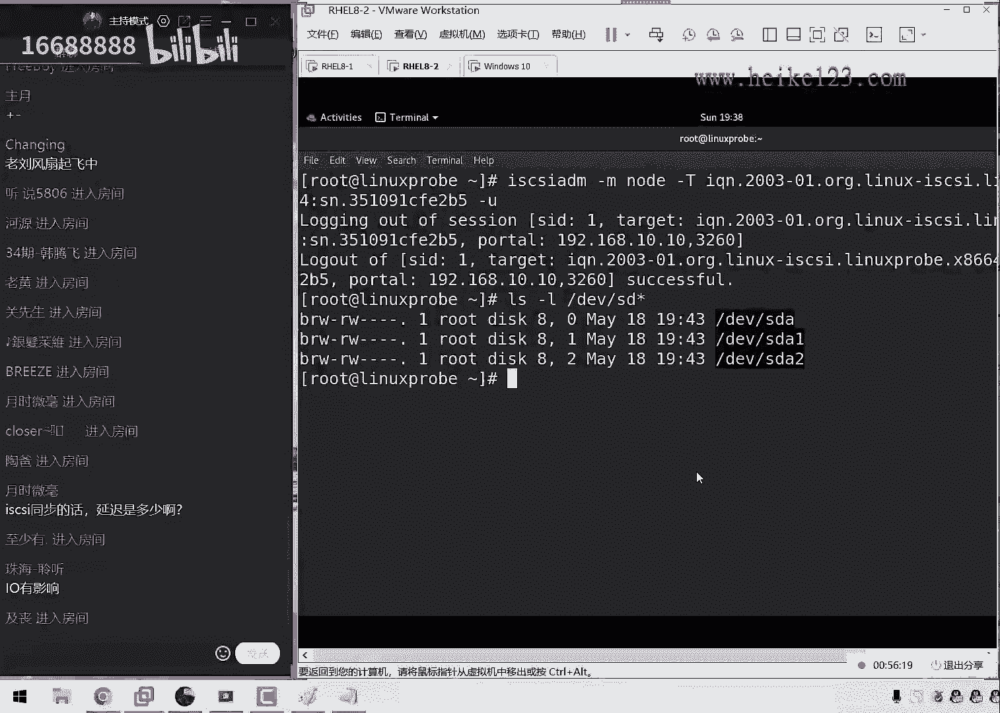

以及进行卸载的这么一个操作。

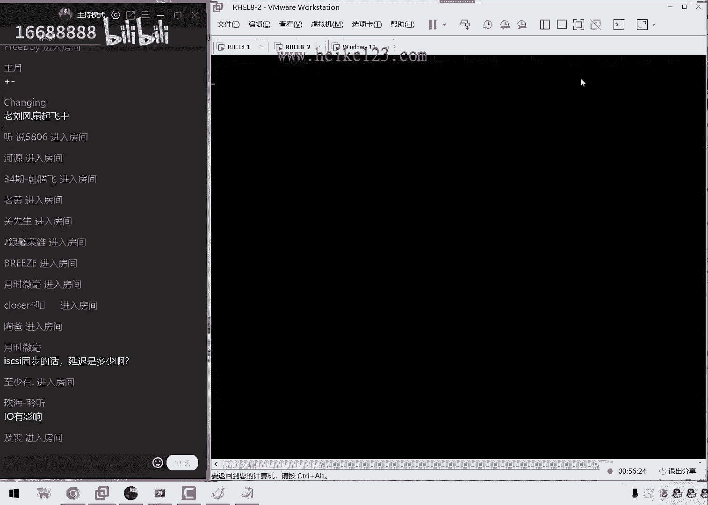

然后我们今天这个重头戏的话呢，要给大家演示一下该去如何是啊，那么好。

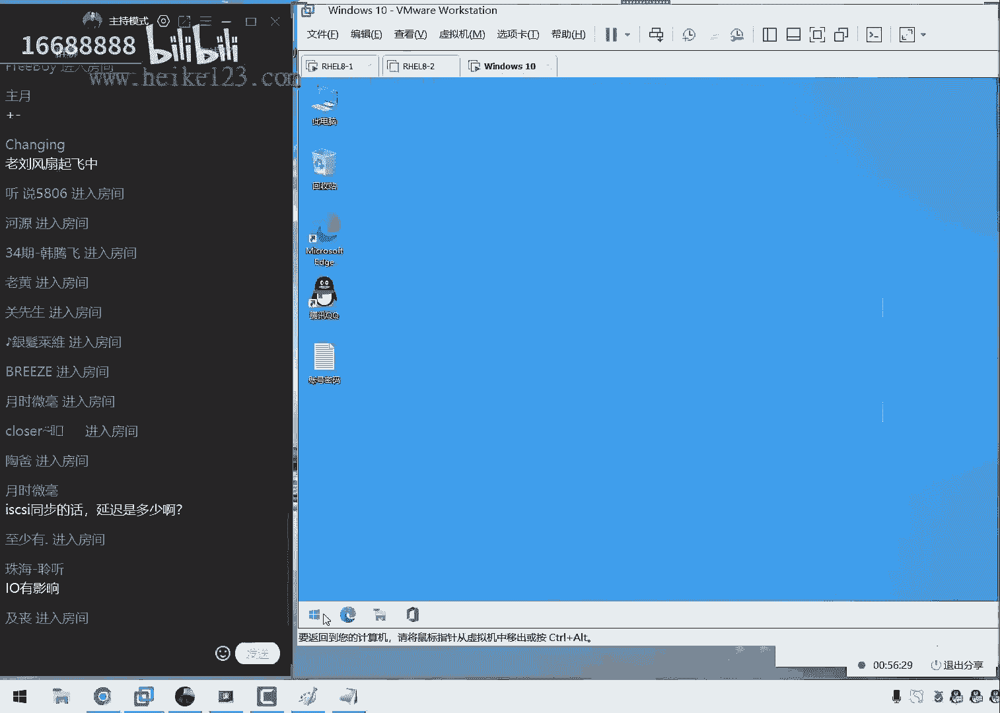

那我们要给大家演示一下，该去如何，是属于台windows主机来去挂载一下，我们这个网络存储设备，因为这个可能用的更多一点，首先保证一下网络连通性，1920~8点10：10。

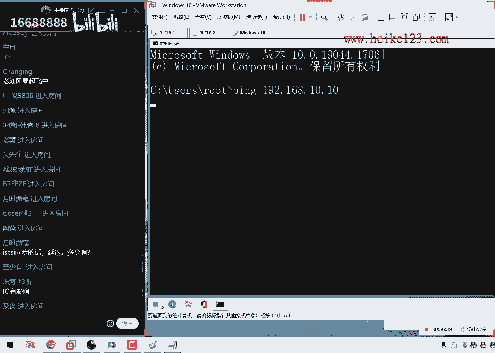

然后我们来跳一下啊，果然不通啊对吧，网络不通，这肯定不行，这就是我们要做这个实验之前，最后养成一个好习惯，大家也会提问，是说老师我们这个服务明明配置的很好，但是为什么老婆生效呢。

的原因就是因为可能是与网络不同对吧，这个网络一定一定要在啊，我们配置每个服之前先去点一点，这样养成一个好习惯，来我们点一下这个网络，既然来说他这个服务器是19206，八点10：10，那好了。

它是一个c类的一个325点啊，gr 4位的一个i p地址，所以的话呢，我们当前就把我们自己也把它配置到同，一个网段，就可以通信了，192068。十点208点呃，呃点三零吧，好我们这样啊。

因为我们是我们的这个呃第三个主机嘛，所以我们就用到点三零，我们养我们养成这个好习惯，然后网关vs不用写这个当前用不到啊。

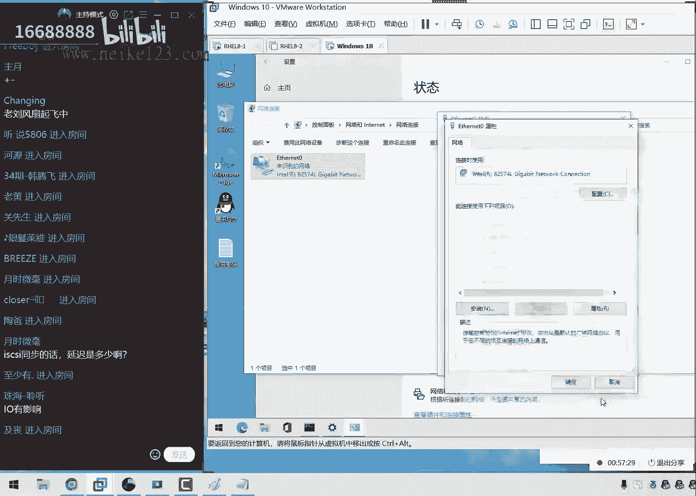

我们点一下确认确认，确认完毕完毕完毕好，可让我们把我们的网卡配好了之后，再去拼音大会发现已经能够拼通了，其实我们对于王凯这一块呢，它并不难，主要就是我们老旺啊，除那我们除了这个老旺以外的话。

那就没有太大的问题了，然后我们再去使用它windows来去挂载一下我们的啊。

sci网络存储的方法是这样的，首先点击一下这个开始按钮，我们既然都已经会linux了，所以这个啊windows的话也不在话下啊，还它并不难，主要找一找它是有一个叫做控制面板，不是呃，对对对。

控制面板吗的一个的一个界面，然后的话呢我们在控制板里面，我们需要点一下这边点一下这个小图标，呃，然后的话呢我们点一下这个管理中心啊，点一下管理工具在里边的话呢，我们可以找到了。

我们这叫这边我们就会有一个发起工具了，双击在这个图标，他第一次会问我们说是否去启用，然后因为我已经点过了，所以他第二次会直接打开了，那么要想去使用它windows来进行挂载的话也很简单，首先先去啊。

避免自己的这个嫌疑啊，说老师这个虚拟机里面有没有第二个硬盘呀，所以先去确认一下，当前虚拟机里面它并没有第二个硬盘，它只有一个硬盘而已好了，这是第一个事情，第二个事情确认一下我们的电脑里面。

它也只有一个硬盘而已啊，这是一个光盘啊，然后去啊，东尼啊，现在那么现在没有了，就是它里面只有一个硬盘，然后这是第一个事情，第二个事情的话呢，就是我们点击加配置，需要把我们这个发起的名称。

就是我们这个服务的一个名称吗，跟我们刚才那个防空啊，防空列表当中保持一致，这样的话呢，它才能够有权利来进行一个访问操作，点一下更改，然后我们点一下这个复制。

然后他还说我们的windows 10哪里下的啊，我们从百度上下的就随便去下了一个版本啊，也不是啊故意准备的，所以的话大家其实不用太纠结，因为我们自己的这个电脑的话，实际上去做也行哦。

啊那么点个确认就好了，这个单位就是说啊只要是一台windows主机都可以啊，他前面版本无所谓，七版本呀，八版本呀，是版本他都可以啊，包括11也可以去做啊，这个使用起来是一样的。

首先我们把这个设备的名称改好啊，名称跟我们的这个防空啊，防空力板当中的话呢保持一致呃，然后的话我们点一下这个目标，让我们来数一下这个服务器的一个地址，接下来说网卡已经通了，然后我们的防火墙也已经配了。

那我们就直接来了，我们点一下快速连接，在后面，老师有一个问题是老师快速连接有多快呢，快速连接就是当我们一点击完成之后，这个事情就算是完成了，所以我们点一下这个完成，点一下确认。

然后我们在这把这个服务就算是配完了，并且这个设备就已经自动为我们去做挂载了，它不需要我们去发现跟登录windows傻瓜化，帮我们都完成了啊，所以说我们这个呃非常的啊容易吗。

那那我们再去收到他们的windows的时候，会感觉到特别非常简单，但是我们再去收到我们这个啊开源系统的时候，总会感觉到很难啊，他会感到很难，但是却能够很好的去锻炼到，我们配置这个服务的一个能力。

然后以及这个底层的一个理论基础嘛，那我们点一下这个管理，大家看到当我点击电脑的这个管理当中，然后大家会发现了，此时虽然说我这个电脑当中只有一个硬盘对吧，大家看一下，再进行一个确认啊。

再再再进行一个确认来，当今虽然我电脑里面只有一个硬盘，但是的话呢，我们这个磁盘管理器里面就会多出来一个硬盘，大小是为十个gb，它是一个瑞典一零用服务器，提供的一个网络存储，哎我们来看一下。

首先我们来确认一下这个磁盘，然后点一下下一步，然后球就可以了啊，那么就那下面一步的话，就是我们去点开我的电脑，来到这个界面当中来啊，接点开我的电脑，那基本当中，然后的话呢我们来去选择这个分区。

点一下这个新建分区，然后我们点击一下下一步，然后就是设定一下这个大小，所有的这个空间都化为一个分区，然后点击下一步下一步，然后他选择是否自动来进行一个分区啊，来进行一个操作。

我们选择一下下一步分区格式化，挂载操作自动完成啊，傻瓜化的一个操作啊，windows里边就会弹出来另外一个呃，呃这么一个设备卷了，那么当初出现这个设备卷之后的话呢，然后大家可以看到。

其实我们那我们就可以像去使用到我们自己的，这个电脑一样，来去使用到这个里面的这个资源了，这个的话呢就是我们叫做远程设备，共享了这么一个小呃呃的一个简单服务，大家看到其实它并不难，我们连哦。

那我们连说带讲，到现在啊，这个才用了35分钟啊，将就啊，这个非常的简单啊，所以的话呢我们以后工作的时候，只要考虑到对于我们的网速的一个开销，只要说网啊啊，那么我们主要是这个网啊，他们有一个问题的话呢。

那我们去使用这个服务也没有太大问题，它主要取决于网速的影响，然后我们来看一下第18章节，然后大家可以往后先翻一翻第17章节，我们的我们的网络设备存储，这个非常简单，我们就调过了。

今天的话第18章节也是很难的，另外大家先可以来继续来提个问题，然后我去把我们这个给它取消掉，因为的话呢我看一下，咱们书上有没有这个章节啊，书上没有的话，我们再给它添加到里面去，就是我们现在的话呢。

如果说我们不想去使用它了，然后这个是小，他是一个小疏忽，等于说我们现在这个啊，windows里面没有对它进行一个卸载一个操作，因为在我们的第七章节里面的话呢，像是我们的逻辑做管理器和raid的话。

它都有一个取消的一个操作对吧，但是在我们的windows里面，好像基于这个章节没有取消的一个操作，这个有点尴尬啊，我们先给大家演示一下，就是啊，当我们已经不需要再去使用它这个设备的时候。

该怎么给取消掉呢，其实也其实也很简单，我们点一下啊，断开链接，然后的话我们点击一下确认，然后就可以了，当然我们可以把它给删除掉，我们看一下啊，我们点一下属性吗，哦我看一下把它给删干净了啊。

因为当前这个确实不需要，然后我们把这个名称的话，那也随便去改一改，比如说我们的发行名称改成叫做linux pro，随便改一个啊，改一改广告，让它连接不成功，然后我们点一下确认。

然后包括说这个时候我们去访问效果，电脑里面就没有这个磁盘了，所以说这个我们的要想把它取消掉，连接的话还是比较简单的，然后看一下这里面的这个信息，也可以点一下这个删除，就把它给删干净了啊。

就这也非常的简单，这把它给删掉，ok没有问题了，这个非常简单，只是一推啊，只要啊那我们只需要点一下鼠标，就可以把这个操作给大家拍完了，好好，当然这也是，当然这也算是一个小的一个呃缺陷啊。

咱们这个书里面确实没有讲怎么去删，那我们可以当着大家面又把它给删干净了啊，这样的话大家看起来会更加过瘾，可以看到一条龙服务，都可以看到所有的这个配置的，这个操作就完成了。

然后大家说我们现在只允许一个客户端区在吗。

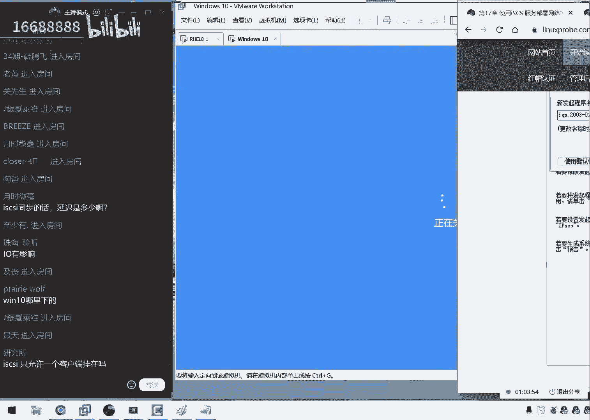

对是这样的啊，我们在这个网络设备存储，它这个服务只允许同一个设备啊。

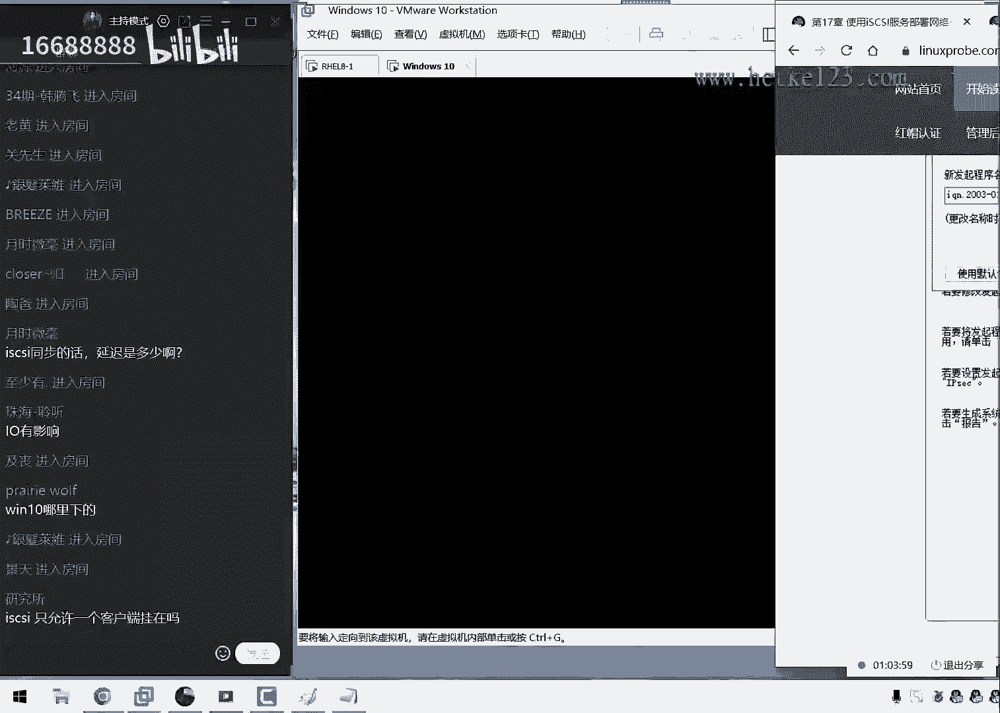

在啊同一个主机正在去使用，它不能够去多个主机去同时去使用。

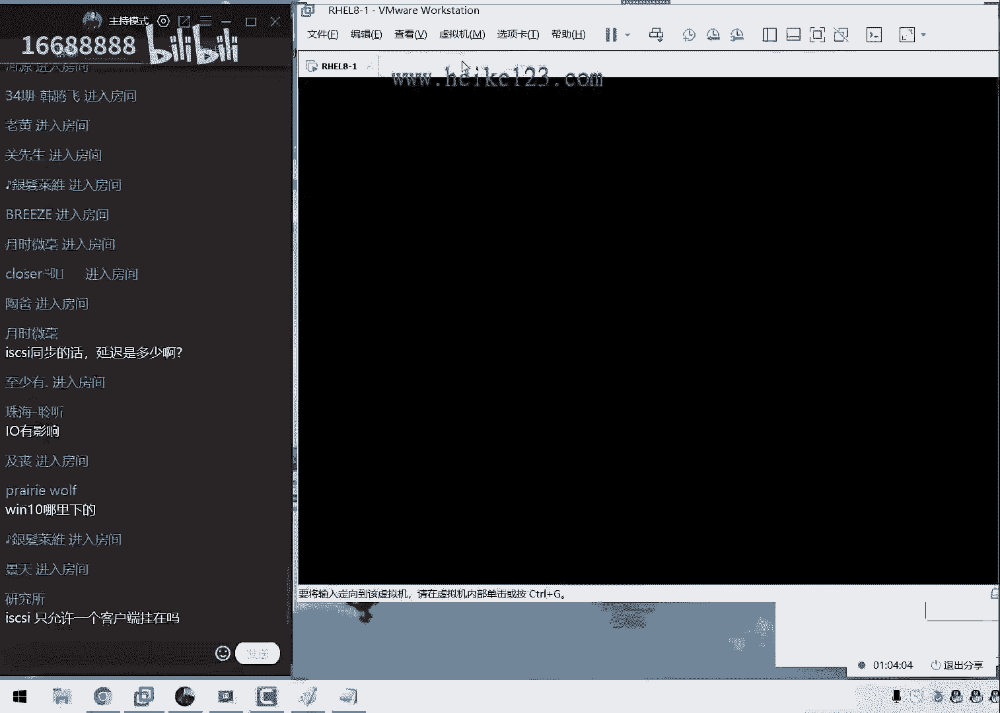

它会产生冲突这样一个情况，然后我们来给大家看一下这边的第18章节，我们来讲一下这个数据库，这个话呢，我们的数据库大家用的比较多一点是什么呢，啊先提一个小问题，在我们公司里面。

我们的数据库一般用的是什么呢，反正我们公司用的是mysql啊，不拉啊，brown的话，同学们用的是什么样的一个数据库的，一个这一个服务呢，大家说我们用的是像我们用的是加，加骨文的一个服务是吧。

然后说如果要是公网上共享的话，是不是不太实用，对去我，我们先给大家去说啊，这个协议为什么我们讲的有点仓促呢，就是因为这个服务，说实话在公告里面是几乎是为零了，因为大家想即便你去了韩国了，韩国的网速。

大家网上去搜一下，还有网速，每秒下载速度能达到100多兆吗，也但只要100多兆的话也不快啊对吧，因为大家想我们把一个硬盘插到我的主板上面，内，速度是最快的，我们要想给他共享出去的话呢。

作为一个云存储还可能还好，但是如果要是作为一个只是一个单纯的，要想不想给别人去用的话呢。

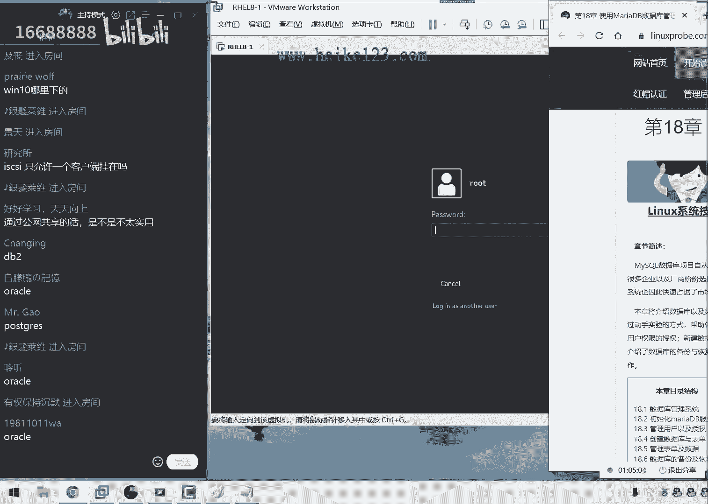

说实话那个效率确实很低啊，他是他他受到网络，这么他需要受到网络的这呃他这么一个限制。

以及呃插到主板上面没有网络的波动。

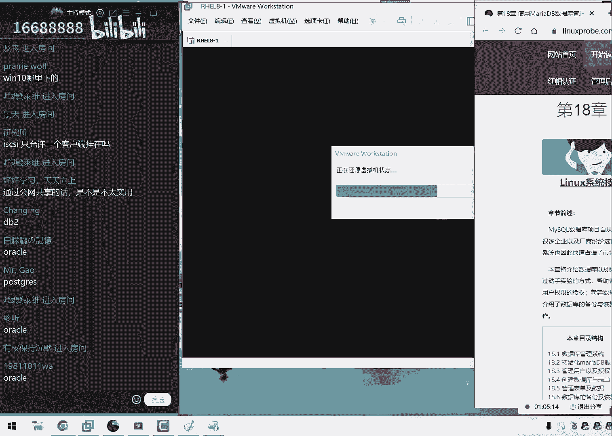

它没有波动的，但是通过互联网的话，它可能会造成网络波动，造成数据的丢失，所以的话呢即便加一个我们的设备卷啊，但那不那我们即便加了一个我们的设备，它也我们呃有些情况下也是不太稳定的。

然后我们来给大家看一下大家数据库啊，舌头是甲骨文是吧，好了，那么我们要给大家说一下，今天我们第18章节给大家讲一讲这个数据库，这个数据库的话呢，我们不会显得特别深，但是我们啊因为这个数据库啊。

学生了之后，他有一个专业的认证啊，o c a o c p，然后这样的这个认证，然后我们今天给大家讲的，就是一个基本的一个管理，在我们这个平台下，我们要想对于这个数据库来监督管理，怎么进行一个啊。

基本的一个增删改查的一个能力，以及在我们这个数据库里面，进行一个账号的新建，然后改名，还有不啊，对于我们的账户的新建，然后让我们再去改密码，然后以及去啊，对于我们当前这个用户来进行授权。

更需要授权等等这样的一个基本的操作啊，这个我们一定要有的，也就是说我们今天这个课啊，主线还是我们这个操作系统，但是我们数据库该学还得学，因为学完了之后，我们就一起来说，是不是我们可以对于稍等一下。

哎这样的话，因为我们当我们需要账号的话，就可以啊，对于数据库，但有些基本需求的时候就可以直接上手了，而不用等我们同事去做了，但是这个学完了之后的话，很难通过一个小时的时间给大家去精通了它。

但是这个也够用啊，这也够用了，来啊说啊可以进行删库操作了，对今天我们学完了之后，你可以去商户啊，这个完全没有问题了，因为我们对于我们的这个数据的增删改查，包括说我们对于数据库里面的表单。

的一个彻底的删除，以及啊恢复操作都给大家讲到，所以以后要是有同学啊也会数据库的话，一定要小心啊，就是一定要小心这个操作，不要把数据给啊给他搞坏了，其实我们刚开这个课的时候，第18章节大家写完之后。

就会觉得觉老师这个的这个系统的一个客位，那我们没法讲这个数据库呢对吧，就那么主要是作为一个呃理论的一个基础，然后包括我们一些基本操作的一些普及，这样的话我们以后工作的时候就不会吃亏了啊。

但一些基本操作不用等同事去做了来，首先来说啊，就是说我们现在这个公司的话，能用到这个数据库叫做mysql啊，然后我们现在的话学习这个数据库的话呢，啊mary db的话呢，这两个是通用的。

也就是说我们在公司的时候呃，不论您去使用的是哪一个数据库，那么都可以去直接查找就可以了，也就是说我们今天学习的是这个sql语句，那么他这个呃呃呃，sql语句是跟这两个数据库sql的语句。

这在两个数据库里面都是一模一样的啊，怎么说是完全一样的话，也不太尽然，但是99%是一样的，所以在我们公司的时候，不论您是使用到哪个数据库，那么我们一定要都说自己学过了，没有问题。

让我们去使用的这个sql语句，然后至于说这个历史的话，那么以及这两个区别，那我们就不再给大家来去赘述了，大家可以来看一下，咱们这个网站上面会有一些介绍，最主要吧。

就是因为甲骨文公司收购的这个sun公司好，我们给大家说一下吧，主要的话这个时间点因为我记不住了，好像是2014年，好像是啊家顾问公司，oracle收购了一家公司叫sun公司。

这个sun公司的话呢有一个产品叫做mysql，然后于是mysql这个产品就归了这个oracle公司了，就是说现在我们所说的oracle啊，实际上就是一个公司的名称，太原就有一个产品就叫做mysql。

这个产品的话呢，是当时由sun公司给他收购过来之后，然后给他啊归为自己的一个商业的一个软件了，后来的话呢大家也知道了啊，因为商业上的一些竞争啊，他们这个资本主义的一个趋利避害。

然后的话呢oracle发布了一个产品叫做oracle linux，然后大家记下来记一下啊，好oracle linux产品啊，它这个产品发布了这个产品的话呢，它是基于我们的红帽的企业版系统，去研发出来的。

但是但这个系统发布之后，它的宣传的这个噱头的话呢，是说修复了红帽铁板系统里面的100多项漏洞，这个就把红包给激怒了，这怎么理解这件事情呢，就是红帽的话一直以来他有很啊，它有这么啊，它有它这个系统的话呢。

都号称是最稳定的操作系统啊，因为我们互贸公司会提到的，说我们的红包企业版系统是一个当前最稳定，最安全的一个开源的一个操作系统，结果的话呢那你发布了之后，并且是你基于的我的系统去啊，来进行开发了过后。

然后你还说啊啊啊啊，然后啊，他当时说到，说我们这个系统呢修复了100多项漏洞，大家可以搜一下那个新闻，最开始的时候就是这样的，然后当然就会觉得很不好嘛，因为你既然基于我是研发出来你的操作系统。

你还说我不可能去砸了我的饭碗，也正好当时的话呢，汇报公司就跟他有一些梁子结下了，当然大家对于这个资本呢，我这么一个这个怎么着啊，对于呃嗯反正这么一个事情的话，反正从我们这个角度上来说。

红包肯定是很生气的，但是对于这个资本的话，他肯定是啊有非常多这个考量的啊，所以我们之前还给大家聊一下这一段历史，但是我们现在不聊了，因为我们认为资本的这个呃考量的话，可能会比我们考虑更多一点。

但是总之总之就是呃，红包公司跟家公司的关系确实不是很好啊，并且没有任何的合作，后来的话呢到了我们的2012年，我觉得不不二零啊，我这个具体时间忘了啊，反正我们从红包六期开始，就说2014年吧等等啊。

那也就是说从2014年开始，红包任务七开始，就把这个默认的这个啊mysql给他替换下来了，所以的话呢这个也算是红帽公司的一个表态吧，从2014年开始，就开始去大量的去支持我们这个新的数据库。

叫做啊mary db的一个数据库了，所以这个时间的话也很久有半年多时间了，红包公司讲这个啊，以及去使用这个呃数据库，作为自己的一个默认的一个植入的，一个软件的话，一定有8年时间了，这个时间也是很久了。

那么也可以表明出来，红包公司对这个产品的一个重视，然后大家可以搜一下这个历史啊，然后呢我们的啊mary数据库，然后它它也实际上它也是我们原先啊这个啊，mysql那个作者他自己一个啊。

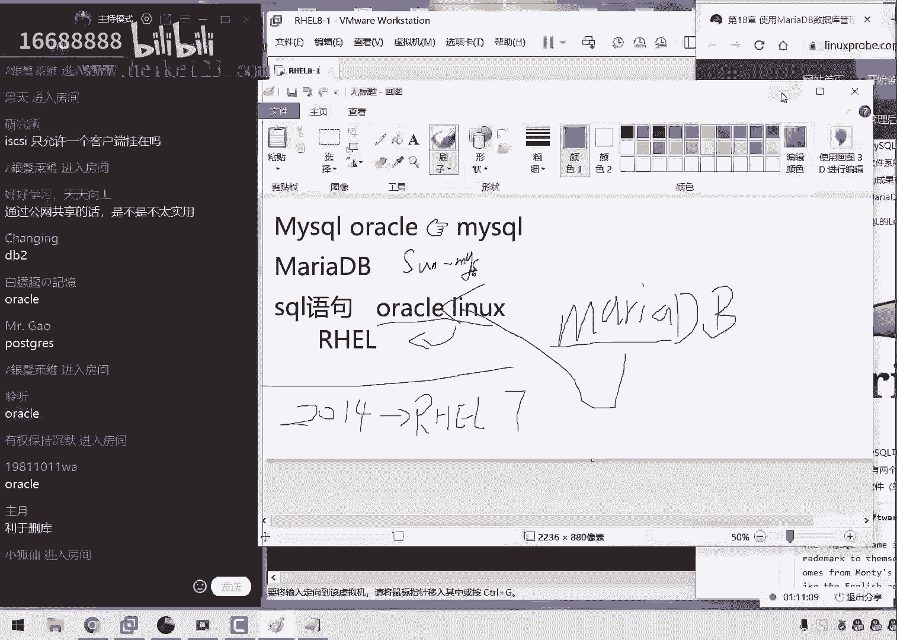

他啊他啊自己啊对啊，他自己的，好我们来给大家操作一下，然后我们去安装啊，买啊，mary db安装30个数据库啊，他的家的这个名字啊，然后我们来去mari db来进行安装，然后安装好之后的话呢。

它里面的这个说的语句都使用的是这个mysql的，然后可能您之前去机构mysql的话会感觉到很眼熟，然后我们安装一下这个maria db，然后的话呢还有一个叫做maria conserver啊。

没来安装一下，这个也是我们作为服务端嘛，啊maria db跟server来作为服务端给大家安装上，这话一个主程序，一个服务端就都齐了啊，连安装好啊，一个主程序，一个服务端安装好之后的话呢。

我们来进行一个重启，当我们这个服务起来之后，就可以来进行一个初始化的一个工作了，来大家可以来一起去操作一下，因为这个很简单，但是如果您要是没有这个mysql的基础的话。

那可能这个命令还是要重新去试验一下的，来都做好之后呢，我们来去启动一下我们的mary d b，那就是来启动一下我们这个新的数据库，然后我们去使用到star来进行启动，启过后就可以进行数据上操作了。

对于我们这个数据库的这个呃呃呃呃，数字化的这个过程的话呢，它是有点难度的，因为初始化的话呢，它是需要配置一些基本信息，然后对它这个里面的一些信息进行删除的，来我们给大家启用过。

后来进行初始化操作了什么的，mysql啊，so cute，来去使用到这个命令来进行一个初始化操作啊，进行初始化的一个安装操作啊，来我们来去按一下回车，然后我们这个非常非常重要啊，刚才提到了。

它里面需要对于我们数据库里面，一些基本信息来进行修改，所以大家猜的时候一定要小心，因为如果说您现在这个密码敲错了，或者您忘记的话呢，当我们在进这个数据库的时候，它会提示出来失败的。

还需要在破密码的地方比较麻烦，那我们先来看一下，就是说请输入一下，我们这个当前管理员，在我们这个数据库里面的密码，那么默认值它就为空的，所以我们可以直接敲回车就可以了。

直接敲一下回车来继承一个进入就可以了，大家看到也就是说我们在进行初始化的时候，默认情况下它是没有密码的，我们可以直接切换进去啊，那我可以直接敲回车就可以了，他说是否当前设置一下我们管理员的这个密码。

这个时候也要小心，就是我们刚才提到了嘛，这个是一定要小心，因为你一旦点击了这个y，然后去输入一下密码之后的话呢，要给忘掉，特别麻烦，所以当前一定不要忘，然后包括说我们这个啊键盘的输入的时候，一定要看清。

我们设成两次啊，为红帽啊，red hat，那么两次敲完之后没有问题，他说是否来去啊，来把这个我们的这个呃，那我们需要把这个用户给它移除吗，它指的是是否来去禁止掉啊，公开访问的一个模式。

我们选择一下yes啊，这样的话它会更加安全，他就没有办法啊，他啊可以直接登录了，他需要进行账号密码的验证，才可以进行一个访问，接下来他说是否来去允许我们的用户，从远程进行访问，那我们来选择一下啊。

不过他指的是是否在去禁止我们这个管理员，进行一个远程访问，我们选择一下y，这样的话它会更加安全，再来说是否来取移除掉，我们的测试数据库以及访问权限啊，所以我们点一下吧，再来他说是我让他立即生效呢。

我们来点一下y啊，立即生效一下，都做好了之后，大家可以看到就他进行一个初始化，完成就做完了，但是这个说法过程的话它只有一次，所以同学们一定要小心啊，刚刚我们所猜这个所有的这个按键的话呢。

看清楚之后再取消，尤其是密码啊，一定要小心，动作好之后，我们就可以去使用到这个命令来进行登录了，他是为了去照顾到我们的用户的一个习惯啊，所以这个命令的名称的话呢还是叫做mysql啊。

然后我们去使用一下这个命令来进行登录，更优质了一下用户名称，gp指的是它有密码，那密码的话呢我们写到这个下面来敲一下回车，密码的话就是red hat，红帽就是我们刚刚去自己去新建出来那个密码。

来进行一个重置的一个密码，所以大家一定要小心这个密码千万不要忘记，那么我们就看到这边就可以看到了，那我们进入到这里就可以看到了，就可以去进入到我们的数据库了，那么这个数据库的话呢。

每一个这个4l语句的后面要有一个分号结尾，比如说我想去查看一下。

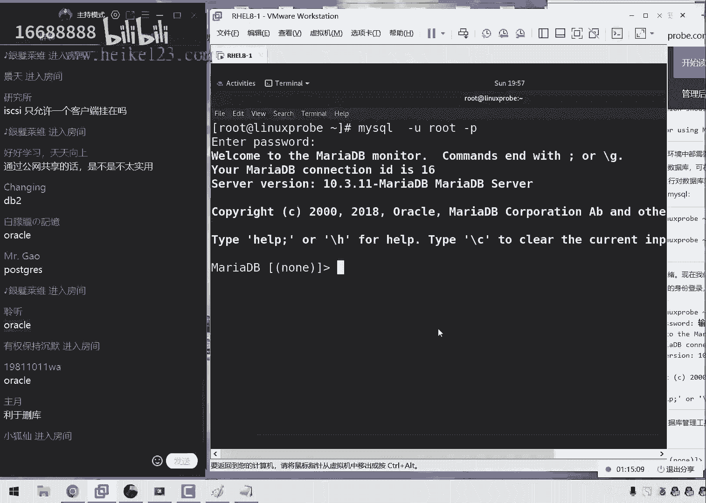

当前我们这个数据库里面有多少个数据库啊，对吧，那也就是说因为mysql跟我们的啊，当前这个工具嘛，我们统称叫做数据库的管理工具，来给大家写下来，当前我们的maria db的话呢。

以及mysql它实际上的名称叫做数据库管理工具，数据库管理工具，这个里面的话呢，管理工具它里面需要很多这个数据库。

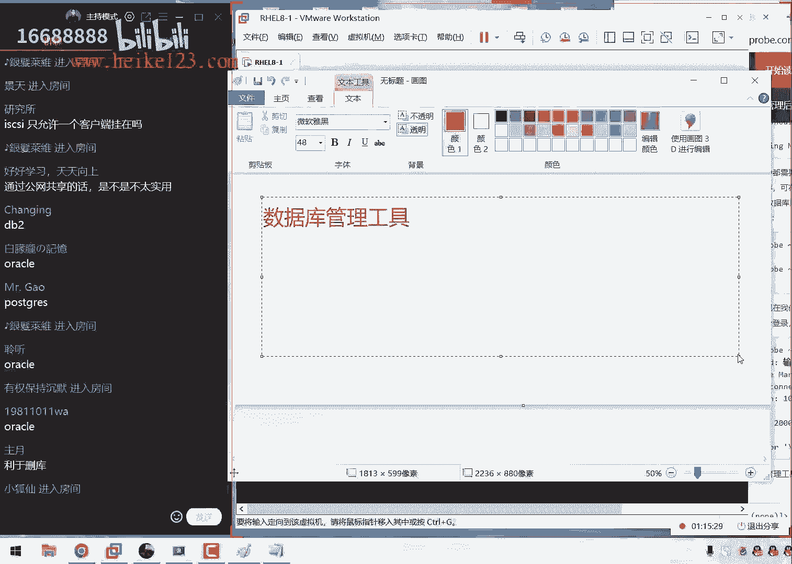

那我们要想去查看一下当前有哪些，一有数据库的时候，我们叫做呃呃database，然后我们去show它一下，后面一定要加一个分号啊，那啊那我们把它结束掉，因为所有这个sql语句都特别赞成，他。

为了去标明每一个语句的这个阶级，就需要加一个分号把它给结束掉，然后我们才会再回收，然后就可以看到当前有三个数据库，是在我们这个数据库的一个管理工具当中的，我们现在的话来给大家去啊，做这么几个基本的操表。

自个操作大可以来感受一下，首先呢咱们来说就是对于管理来啊，对于我们这个关于语言来讲啊，那我们想要去新建出一个普通用户，这样这个普通用户可以去完成，我们一些基本的操作。

然后的话呢以及想要对于我们的管理员来对啊，那么来对它进行一个密码的一个重置，这个怎么来进行操作呢，首先比如说我们密码是叫做红帽啊，the red hat，好改。

那我去改一下我关联的这个密码叫做set password了，另外大家看一下我们这个书上面了，包括说set这个词跟我们后面这个呃值的话呢，tom啊它会它会有一个啊，他会有这样的一个呃的一个写法，它可以啊。

他需要啊来啊，他需要这么去写啊，其实的话呢我们的啊这个它并没有区分的，所以说大家记一下啊，sl语句里面的呃大小写他也没有区分，大家来记一下，我们疏散的话，它这个只是为了好看啊，做的关键词大小写不用区分。

但它只是为了好看而已，然后所以大家可以看一下书，下面这个写法是正确的，然后我们要把这消息的话，它也没有问题，来我们给他重置一下，当前的话呢把密码给他重置成这个值，然后这样做好之后就可以了，来去退出两台。

大家都记住啊，其实我们很不习惯一点，就是所有的这个sql语句的后面，另外一个分号给他截，那么来给大家来做一下，叫做这个结束服务，除此以外倒没有什么其他的问题，来我们来杠u去登录一下，来去使用。

那么还是使用到管理员，然后我们现在还去输入到我们之前那个密码，叫做right high，大家看到就是我现在的话去输一下red hat，然后待会我们现在登录失败了，我现在确实没有故意输错哦。

然后我们现在就要去试一下，我们的这个新的密码，我们叫做linux fm，大家看好了，我们现在去试一下，我们这个新密码就可以登录了，其实也没有什么可说的，因为他就是一个立马重置的一个过程，这个假不了。

那这个非常简单，而我们现在需要让大家注意的，就是我们要给大家提一个难度，就是我们老那就是我们现在我们再去做啊，平时工作的时候的话，老去思考一个管理员，我们能不能去新建出来一个普通用户。

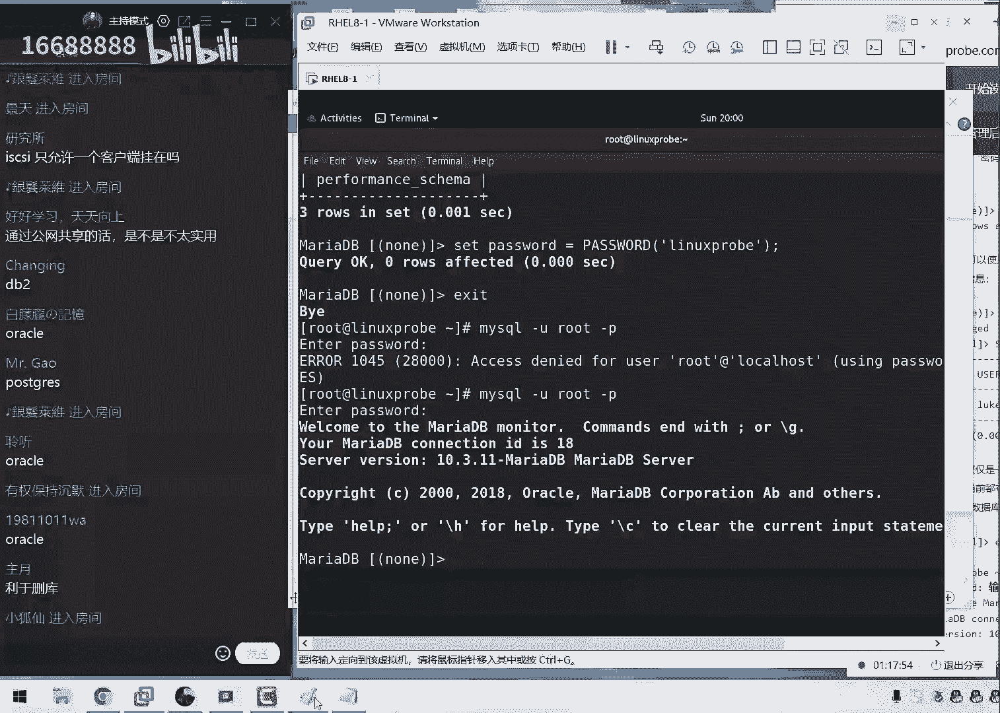

然后为这个普通用户来进行授权，那也就是说我们需要分三步走，第一步走，就是我们能不能去新建出来一个普通用户，创建出来一个普通用户，然后的话呢我们来对于这个用户来进行授权，让他可以去完成某些工作。

然后让我们的用户去使用这个普通用户，来去完成某些工作，之后的话呢，又能够把这个用户给大家去取消授权，那么就会有这样的一个流程，这样的话我们就可以让我们的同事呀，也可以去管理我们的这个数据库。

同时的话呢它也很安全，因为它并不是管理员嘛，啊那那那那么也就是我们的原则，在我们能够满足工作这个前提之下啊，把我们这个权限越小一点，这样的话能够保证我们这个服务器越安全一点，好了。

我们现在来给大家做第一步操作啊，另外另外另外我们所说的这三个操作的话，它都属于叫做管理命令，它都需要使用到我们的管理员来进行登录，我们叫做入侵用户来进行这个操作操作啊。

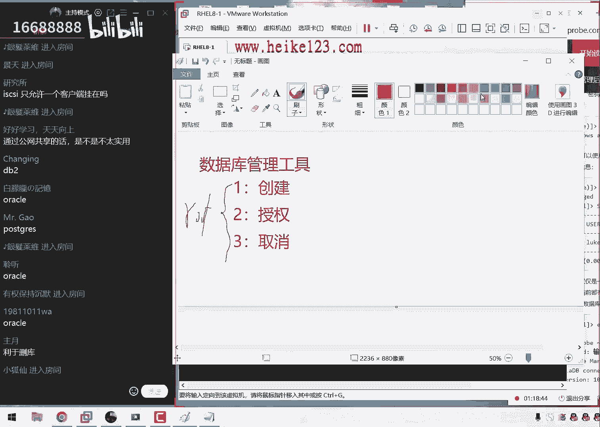

他进行这么一个操作，叫做啊啊管理员来进行登啊，来进行登录之后来进行一个操作，来我来给大家新建出来吧，我看谁迟到了啊，小胡新同学迟到了是吧，那我新建出来一个用户，这个用户名称的话，那我们就随便了啊。

叫做这个仙仙吧，那我们来新建出来这个用户新鲜，然后我们就换到本机local house，也就是说我们现在说的一个本机的用户，叫做这个仙仙，然后我们来对于这个用户的话呢，在继续设置一个密码。

然后我们设置一个密码值呃，identity，identuidentity feed啊，来等一下i d e n t稍等一下验证的意思，i f i e d啊啊他的密码的话，那我们给大家对它进行一个设置。

密码的话叫做这个linux pro，这样做好之后也很简单啊，就有了，然后我们可以去查看一下啊，这个用户信息是在我们的这个本地的一个，叫做mysql数据库里面就会保存下来，在这个新鲜的一个用户。

不过呃看不看都无所谓，因为他已经是存在了之后的话呢，就肯定是呃已经是写入到这个文件里面了，我们查看一下这个目录信息哦，很多很多很多，那确实很多，不过我们大概看一下吧，它里面会有一个用户，我看到他没有吗。

有肯定有肯定有呃，一定有，只不过比较乱啊，稍等一下一定有啊，在这儿有啊，是他已经有了，那也就是说新建有的一个普通用户，它是为本地的啊，它叫这个仙仙好了，那我们现在要去使用到这个普通用户。

来进行登录一下啊，第一步来去新建出来这个用户，第二步来去使用它这个用户来进行登录，刚u指定一下用户的名称叫做仙仙，然后干嘛呢，一个更小p直接叫做它有密码，密码值的话写到我们的后面。

然后a3 回车密码只写一下，linux club广告特别好，来按下回车做好之后来去搜啊，来来去查看一下啊，show database查看一下我们当前数据库有哪些，按一下回车，大家会发现诶也没有问题。

技能登录也能看，只不过出了点小问题，就是刚刚我们的数据库有三个，现在的话数据库只有一个，这他妈就是因为大家需要再去记一下一个事情，就是mysql跟mary db作为一个数据库的一个管理工具。

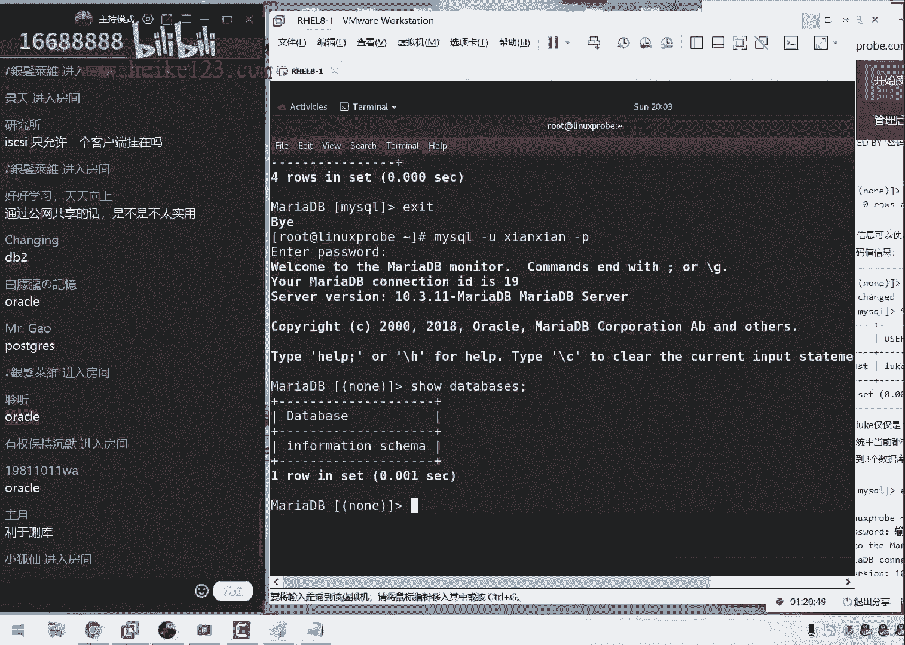

当我们没有权利来进行管理的时候，那我们就会默认把它给隐藏起来，那么因此我们现在需要做第二步事情，去使用到管理员，来自于我们的补丁用户来进行一个授权操作啊，授权它可以对于我们刚刚这两个数据库。

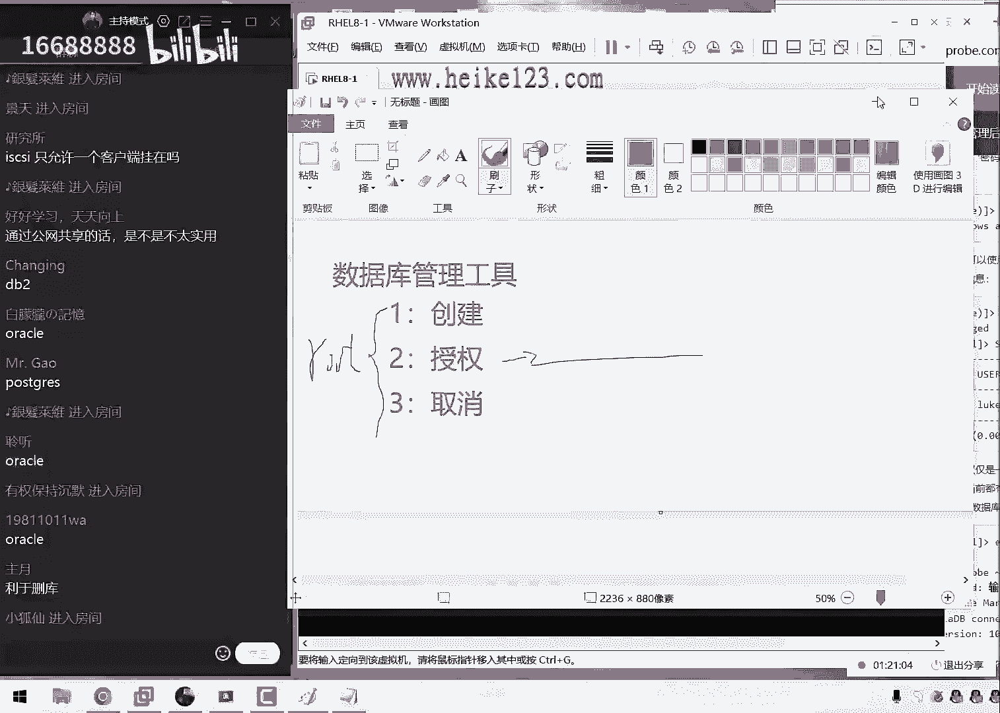

来进行一个管理操作啊，所以我们现在退回到官员，然后到关联的这个身份下，然后再去使用到我们管理员啊，roo t啊，入取用户来京东录gp，试一下我们用户的一个新密码，这个我们刚刚改过了啊。

叫做linux pro，另外的话呢，我们会在下礼拜五的时候给大家讲一下，该去如何去对我们这个mysql来讲管理，也就是说我们今天这个课的话呢挺啊，还那么还是还是挺丰富的。

我们不仅给大家讲一下我们的第18章节，我们还为大家讲一下买这个mysql啊，这两个都给大家去演示一下，然后我们现在做完之后的话呢，可以来看到使用的关联登录吧，那好了。

那那我们现在对于这个用户先先来进行授权，授权命令grand来进行授权，这个后来我们这个词叫做这个grand。

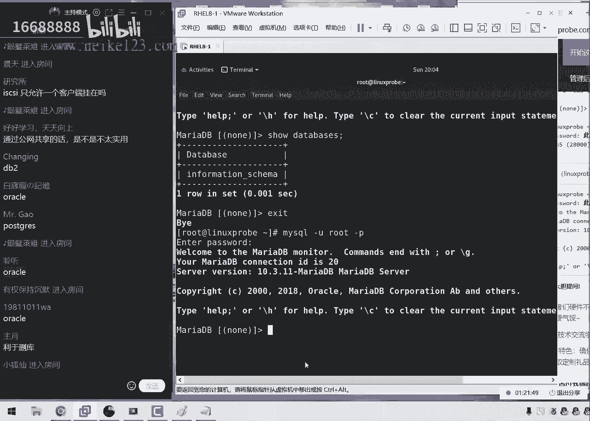

他的话呢意思就是授权的意思，大家看清了啊，那我们比如说啊，我们来进行一个对于谁来进行一个授权操作，我们就给他写了一个grant，然后我们授予某一个爵位啊，或者说我们授予某一个信息给谁。

就这样一个流程对吧好啊。

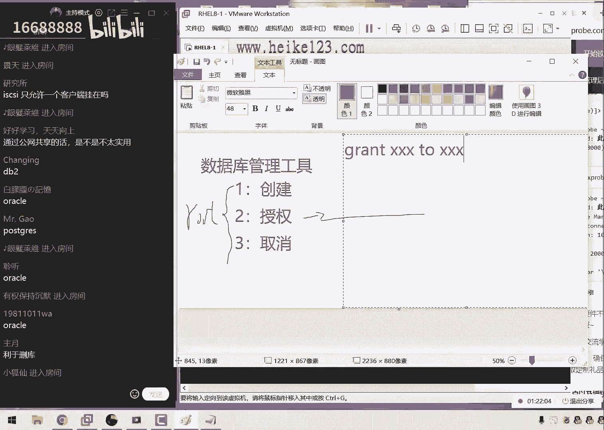

那我们比如说，那现在我们来对它进行一个授权操作grant，那我们需要首先什么权限呢，啊并且这个大小写无所谓啊，给大家讲到了，这打小写无所谓，我们摄像是为了出版好看，所以的话它有一个大小姐的一个区分啊。

那么以及啊这个也无所谓，那也就是说我们去使用的grand的话，小写也没有问题的，来去使用的grant经授权，第一个的话代表就是一个进行一个查询权限啊，我们先给大家写下来，然后这个比较长啊。

首先来讲叫做查询权限，也就是说好，那我叫大家写吧啊第一叫这个查询权限。

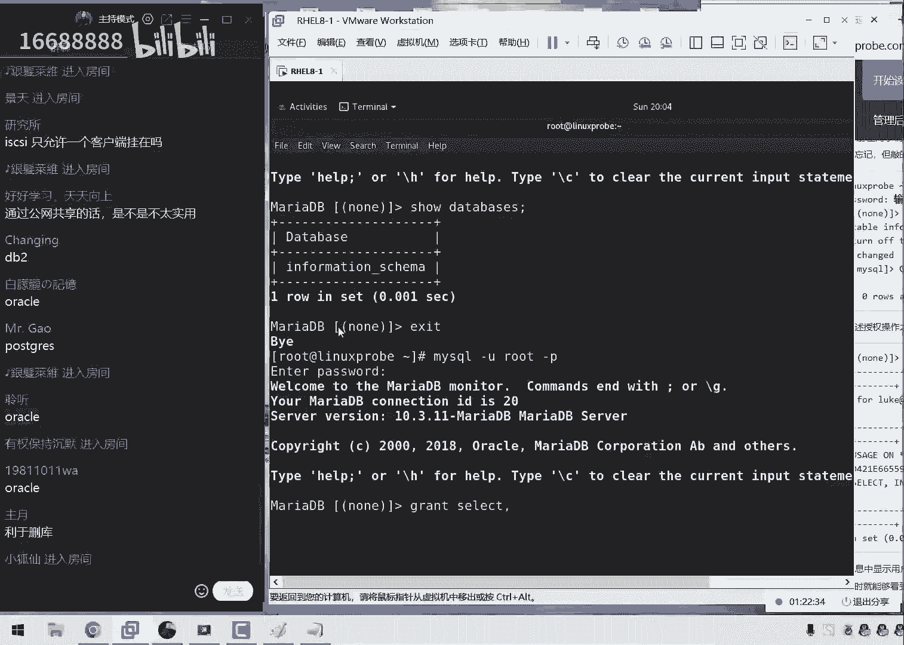

它指的是能够去查看里面这个啊，我们这样给大家一边去说一遍，给大家写吧，查询权限指的是能够去看我们表单里面，内容的一个权限。

等于说它是一个查看的权限，然后第二的话代代表就是一个删除权限啊，delete这个很好理解嘛，就是来自于我们这个表单里面的这个内容，来进行删除，或者说我们去到某个表啊。

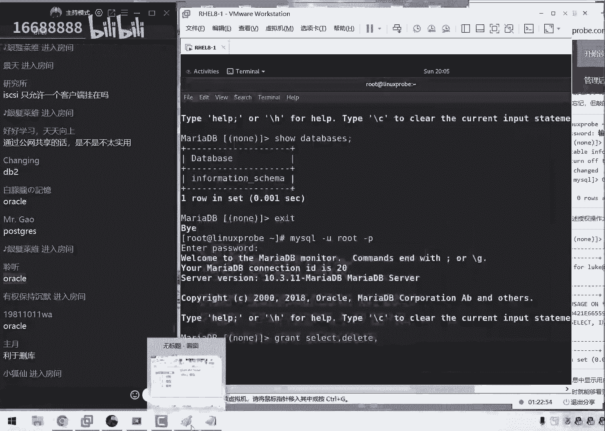

去删除到某一个表单的意思，delete来进行删除权限，然后的话还有就是我们叫做更新权限。

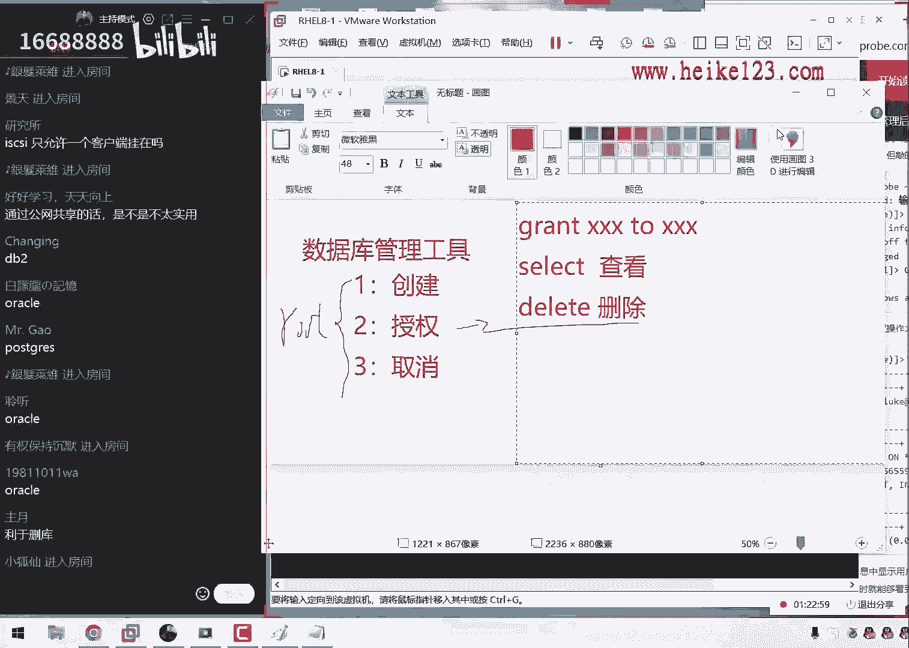

这个指的就是代表的就是修改的意思啊。

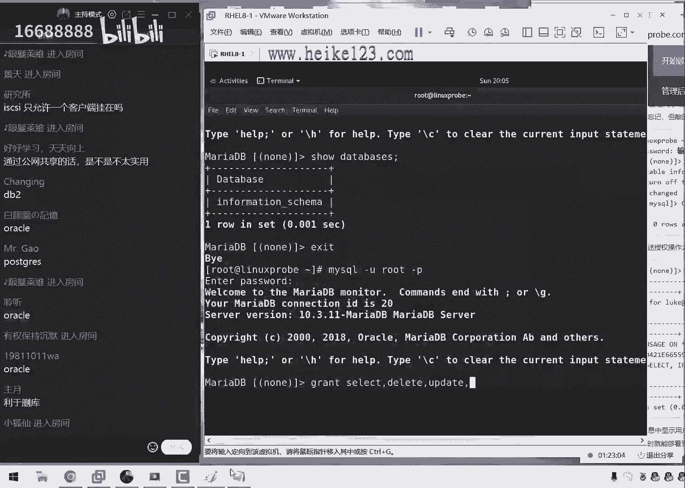

来给大家写下来啊，update来进行一个修改的一个权限，最后一个的话呢我们把它叫做插入权限，来，这个的话呢就是我们来进行一个写入的权限，来进行插入和写入的一个权限插入。

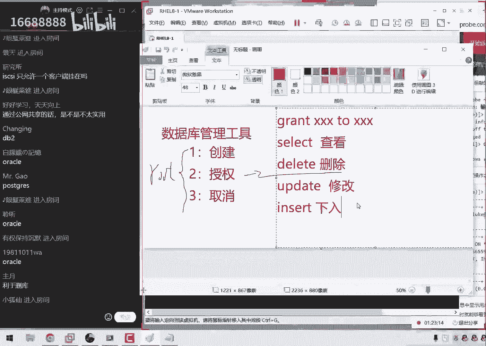

或者我们叫做写入权限都可以啊，啊insert来我们把这四个权限给大家写下来，也就是说能够看能够删，能够改，能够差啊，就这么四个权限增删改查嘛，好这个虽然这个顺序跟我讲的不太一样。

但这个功能上来讲的话是没有问题，那么给谁呢，我们需要设置到哪个表单上面，它有一个表单，我们看到叫mysql啊，对于我们的表啊，那么我们对于我们的这个啊，mysql这个名称的这个数据库里面的所有的表单。

我们都来进行一个授权，就可以去用到这个新号作为通配符，通配这个数据库里面的做的表呃，呃做了这个表单，这样做完之后的话呢，我们来去给谁进行授权，那就是一个to给它用户的名称。

我们叫做这个先先它是一个本地用户，我们就给他写一个at符号，写一个local house哦，按下回车搞定了啊，这个非常简单，那叫做这个授权操作，我们主要记住的就是有两点，第一点我们要给大家几个权限啊。

以及设定到它具体的它是哪个表单上面，第二话就是sql语句的后面以分手结束，这个前一定要养成这个习惯啊，这个习惯我也没有，但是啊恰好多了，太好报错，我们那啊那啊那我们这个啊那么也就有了来，我们都做好之后。

再重新去使用到这个新建的用户来去登录一下，然后我们去登录我们soo gu，在我们的红包试用期里面是考到了这个服务的，然后的话呢它实际上它就考到了一个，可能大家想啊不，我们先去找到这个先天登录。

跟先天登录之后的话，他只能看到一个数据库里面这个内容，现在的话他应该能看到三个了不，他应该能看到两个了啊，他能看到这个mysql这个数据库里面，这个表单的内容了。

来我先来去输入一下叫做linux prom一下，回车好，登录成功了，然后我们去收jj base，然后查看一下当前能够看到一个叫做哎，有一个叫做叫做circle的一个数据库。

然后我们可以走到这个数据库里面去看一下，叫做啊切换嘛，然后去使用到这个命令来进行切换，切完过后再来查看一下里面所有的表单，别在里面的这个信息就都能够看到了，这就是我们对于这个用户来进行，授权的一个操作。

另外的话呢我们给大家讲的这个实际上的话呢。

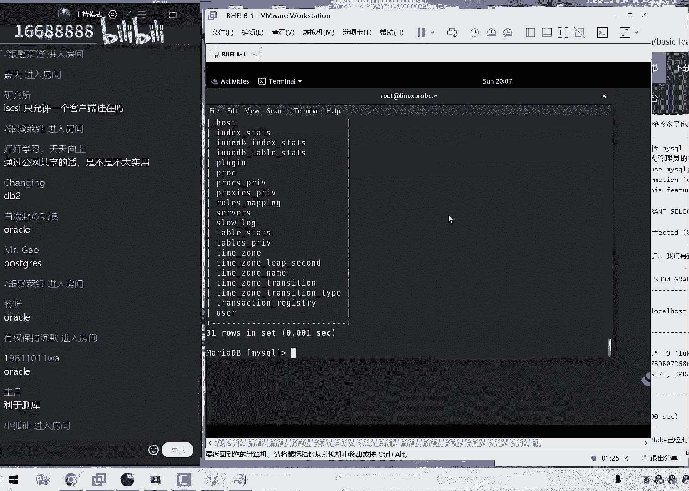

我们这个数据库的一个服务的话呢，它是以前活动还是考得过的，但是的话呢考虑这个周期特别短，它只从2015年的3月份，考到了2020年的8月份，也就是说周期的话就跑了5年时间，主要对外的表态嘛。

它是呃支持我们的新的数据库的一个发展，但是红帽他压根他就没有想过去通过这个考，数据库，这人也考不过，因为这是一个呃这个怎么理解，就是我们学习是一个数据库不。

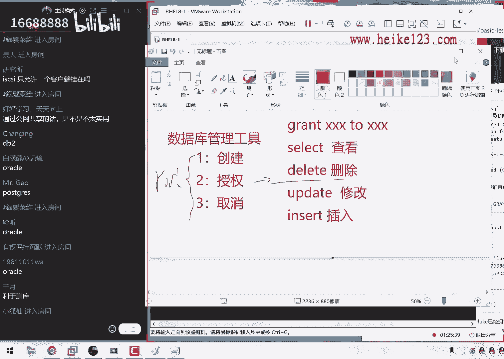

我们现在学习是一个操作系统，但是结果因为我们呃对于数据库没有考过，那么然后我们就会产生挂科这样的，这个问题的话呢，呃那么换到这个呃，红帽他也没有让大家想去考不过。

所以的话呢红帽这个2015年到2020年，实际上这个数据库是一个送分题，它就是一个啊表态一个作用，所以的话大家可能在在红包67月考试的时候，反而更加简单了，就是因为这个数据库它只考到一个搜索功能。

只要我们会搜索了。

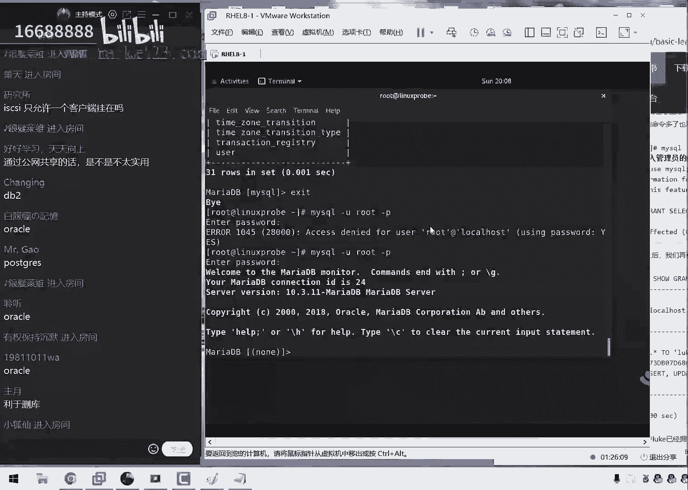

就是只要在考试的时候，我们都已经把这个给搭建好了啊，我们考试的时候不用去搭建了，那我们在考试的时候，我们只需要去收到啊，然后去查看一下我们的这个数据库的这个名称，然后去查看一下我们表单的名称。

然后再去查看一下我们这个表单里面的，那个呃内容的一个信息，也就是说在考在我们红包六期考试的时候，我们只需要记住这三个信息，这个命令就可以搞定了，然后这是表单的这个名称，然后就按下回车就搞定了。

这三个命令大家可以来去记一下，可以通过这三个命令来去查询一个信息，然后我们来给大家看一下，那我们虽然不考了，但是我们该学院也要去学，所以说我们所以我们在鸿蒙热巴里面，还是把这个课给大研啊。

那我们来给大家做啊。

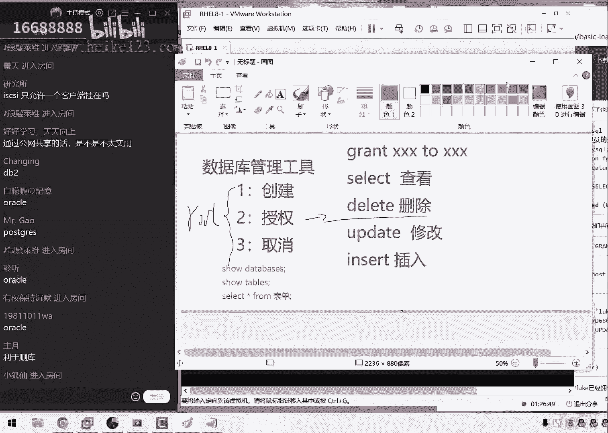

那我们来继续给大家讲完，那么我们来有这个管理员登录之后的话呢，来给大家取消掉授权来去使用到啊，revoke命令，也就是说我们现在来给大家讲的事件有点超纲，因为在哦红包只有七考试的时候。

压根就没有植物这些啊，他们有他就没有这些东西了，只不过我们学完了之后，那他们会更好的去来去。

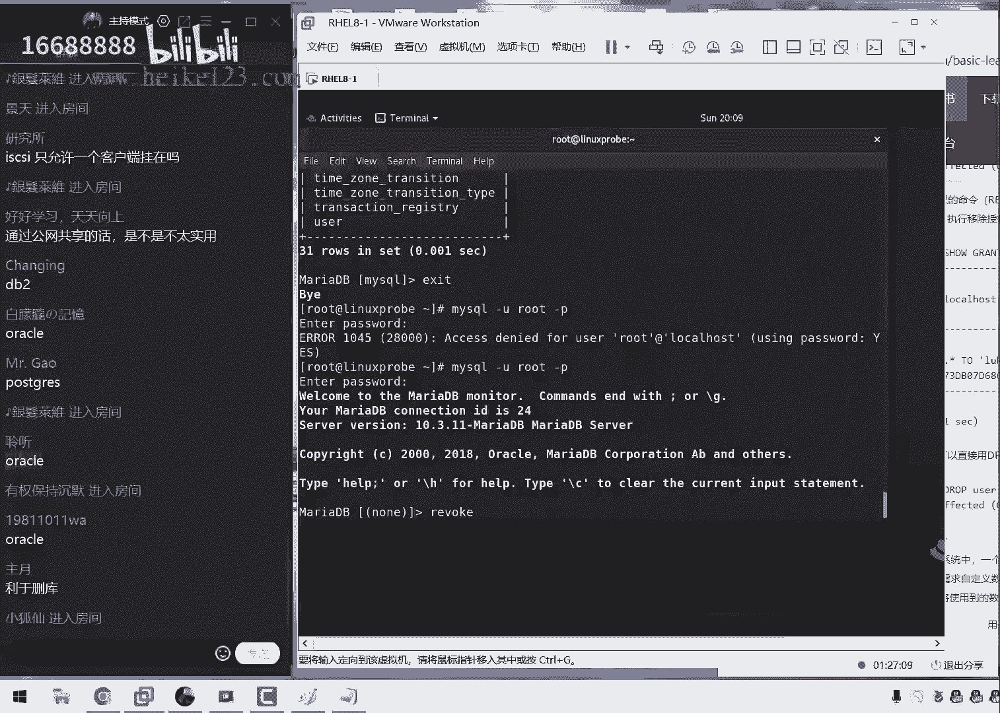

满足我们这个日常的一个工作需要，来下面一个词叫这个revoke，它指的就是取消掉授权的意思，如果说我们现在对于某一个用户授权过后，结果后悔了好了，我们可以去选择到这个revolt命令的话呢。

把这个已经授权这个权限给再给它拿掉啊，叫做这个取消授权，或者说来去进行一个呃权限这么一个取消哎，还有这么一个呃曲线上旋这么一个作用，那来进行一个权限的分离，然后我们给大家做一个权限。

然后还有这个我们具体的一个值好，这么一个格式来。

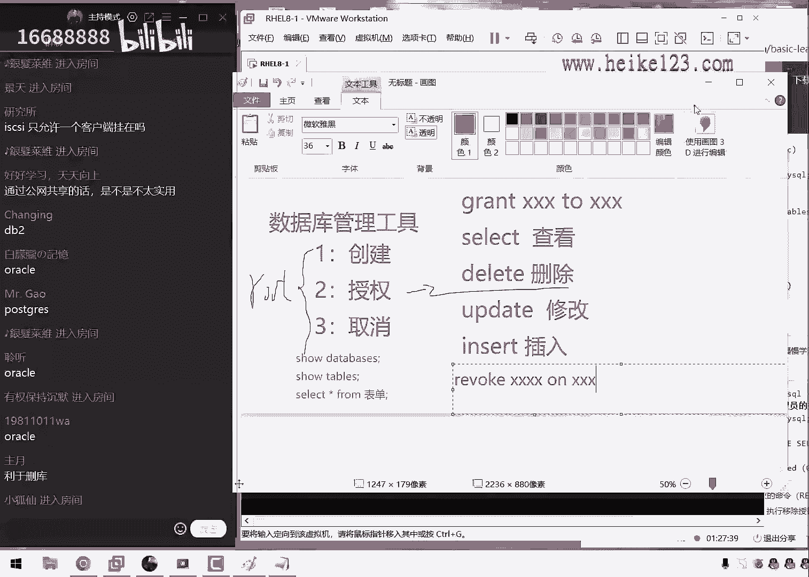

我们去寻到这个revoke来进行操作，那我们该插入了四个权限，我们刚才写了四个权限，这个增删改查对吧，来进行一个查权限，然后这个删权限还有这个插入权限，还有这个更新权限，把这个四个权限给它取消掉。

它在哪个表单上面的这个权限呢，我们叫做mysql这个数据库里面的所有的表达，下面的这个权限从哪里去拿掉呢，从我们叫做先天的这个用户身份下给他拿掉，所以说这个命令看起来有点长，但这个逻辑感是很强的。

对吧啊，那我们a再回车啊，把它搞定了，搞定过后，我们再来重新去使用到我们这个cc的用户，登录到我们这个数据库里面啊，然后可以来看一下，它又不能够去看到，刚刚我们的这个mysql数据库里面，要不我们来看。

那么他他又看不到我们这个mysql这个数据库，以及它里面的表单信息了啊，show database来查看一下，可以看到它有没有了，这就是我们对于一个用户来进行改名，然后以及进行一个建立。

然后能够进行一个呃授权，根据授权的一个方法，然后我们大家现在会比较产生一个疑问，说老师其实我们现在这个工作需求的话，更多是个啥，稍等一下，同学们刚才已经是等稍等一下，同学们会因为这个座椅吧特别高。

然后这个桌子的话特别矮，我稍微的调整一下，我们稍等一下啊，因为刚刚这个上课的时候就感觉到了，这个腰感觉不太行，我稍微的diy一下啊，把这个上面垫点东西，ok啊好像好多了，然后我们来继续哇。

这个确实好多了，底下垫了一个电影啊，电影几本书确实高度好多了，这个早就没有想到了，来我们稍等一下，不得，好那我们来继续来给大家解说，好多好多了，看来是前两看来是前段时间真的是吃亏了。

然后我们登录之后的话呢，我们来看到这里面，就看不到它里面这个原始这个信息了，要不要给他退出掉啊，刚才同学们怎么没有结果活动啊，咱们在点人数是45，个同学跟大家完全没有活动，当时我还纠结了一下啊。

其实我们讲课的时候，我也在想很多问题啊，所以的话我刚才在想，我说在一群里面先45同学生在线听课，不会掉线了吧，然后从看到在看到大家现在经开始说话了啊，看来在说闲话的时候还人挺好啊，人还挺多的。

刚才我还纠结了，然后我然后我刚才想了一下，我说咱不能掉线了吧，不能光路了，然后啊所以我还特意看了这个啊，网络啊，网络看一下没有问题，然后我说不能够啊，怎么讲了半个小时都没人说话呀，来我们来看一下啊。

是这样的，首先代替文啊守关里员的身份来登陆之后，来给大家讲一讲啊，就是我们基本这个操作有个啥呀，就是我们说的就是我们这个怎么讲呢，今天考试不考了，那我们就给大家讲一讲，到底我们工作的时候能干点啥对吧。

就是我们今天考试不考了，那我们就不用意味着这个考试去讲了，而是围绕我们这个工作的需求，我们能够干点啥呢，其实来讲我们更多的我们说实话，防火墙就这么几件事，增删改查，而且我们说实话有那么多增加和修改的。

这个工作吗，没有其实我们更多的就是去查看这么一个工作，就是说我们待会儿会给大家讲一讲，该怎么来进行一个查看，能够去准确的，只是这个怎么讲呢。

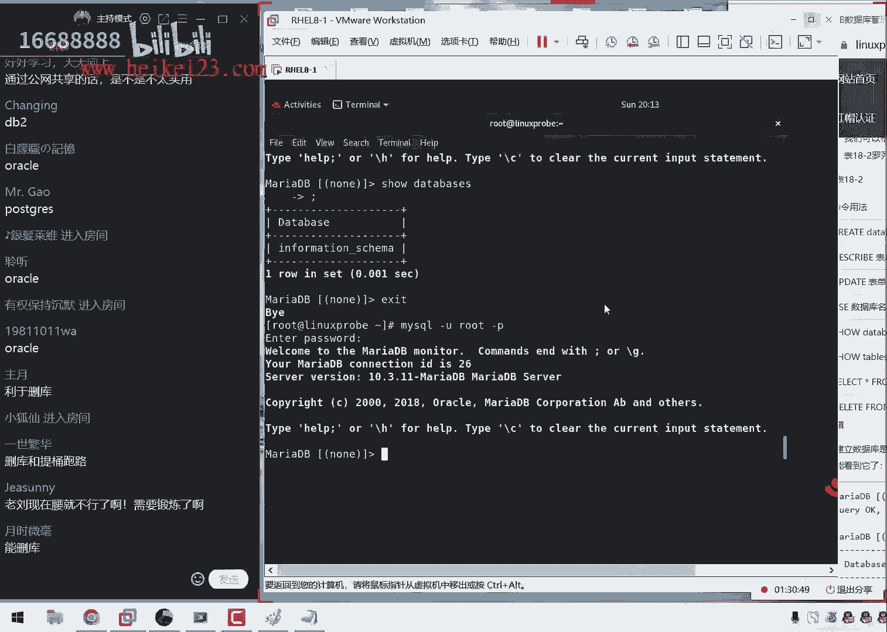

就是去查看一个信息并不难，但是怎么样能够进行一个准确的查看，这个挺难的啊。

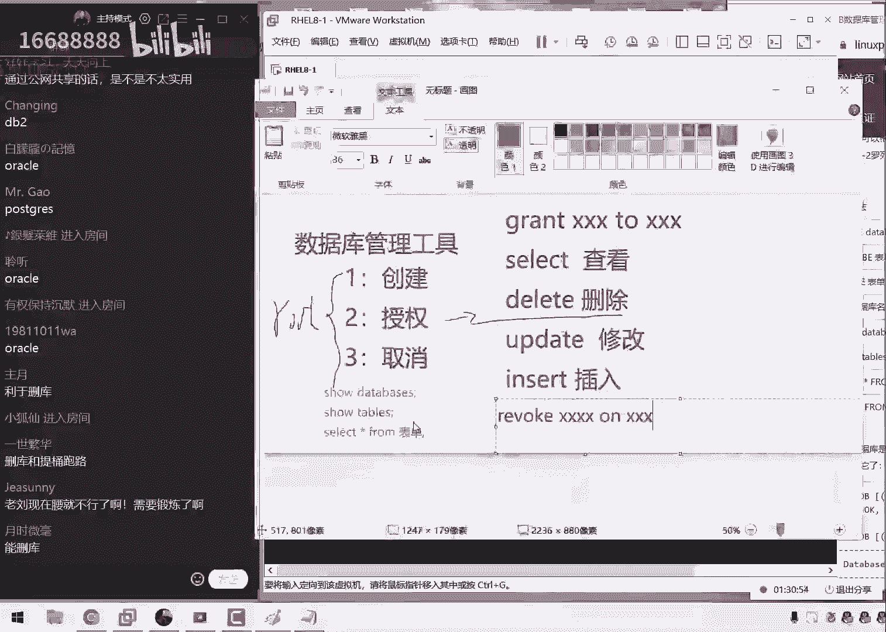

叫做啊准确的一个查找，那我们先给大家讲第一个吧，增增加嘛，来我们家一个一个大家玩啊，这今儿给大家都玩透了，来继续检查一下，说当前有哪些数据库啊，当前有这么三个数据库，这三个数据库的话呢我都不要。

那我再去新建出来一个新的数据库来，叫做哎新建一个我们这个数据库啊，create database，大家查看啊，咱去创建出来一个新的数据库，数据库啊，然后我们数据库的名称，就数据库的名称就不用多说了。

肯定是我们的广告的词啊，叫做linux club广告，这个打杂倒带了，然后我们新建好了一个数据库之后，再来去show database，来来去查看一下，就会出现了一个新的数据库，其实我讲完这个之后。

我都不知道我该讲什么了啊，因为这个太简单了，对不对，这他他他就是去新建一个数据库的一个呃，呃一个操作，然后我们可能更多的您可能觉得难的这个点，就是我们这个词可能之前没有见过对吧，然后这些关键词的话呢。

以前学习啊，那我们以前学习是一些我们这个风景，这个命令啊，现在我们学习的是一些sql的语句啊，仅此而已，但是我们这个逻辑一旦掌握了之后，它是什么词儿，其实呃不用太纠结，但是我们这个操作已经崩溃了之后啊。

就是他干什么事情，那我们就知道了，那我们现在也有了一个数据库了，那么数据库里面啥都没有，那么觉得很空虚对吧啊，家庭私立的，那我们往里面再加点东西好不好，那我们往里面加点料。

去使用到这个切换命令来去使用的啊，use然后是叫做数据库的名称，切换到我们这个数据库里面，然后去show tables查看一下里面有哪些表单，这个是这样的啊，也就是说我们的一个数据库里面啊。

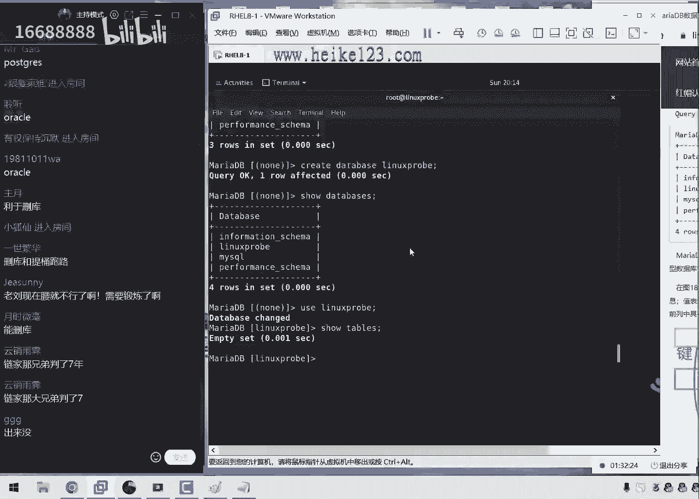

大家问一个问题，大家说老刘的腰子不太行了，老牛腰子啊也还是在啊，现在也还挺好的啊，来啊老老老人腰子也挺好的，来看一下这样的啊，当我们去有一个数据库的时候，怎么理解呢，是这样的，我我想想不太好，举个例子。

比如说我们现在有一个数据库的一个管理工具，这个就是一个数据库的一个管理工具，然后的话呢这个里边的话还会有很多个数据库，这就是我们的数据库啊，它有一个两个三个数据上的一个数据库，数据库的大小。

它就里边的话呢这个数据的这个多少，然后的话呢再来讲就是呃，那么什么是我们的表单呢，表单指的是现在比如说这里面有这个数据库了，然后的话我们往里面可以增加一点表单，现在就是文件吗。

我们可以把这个数据库比多是一个目录好，这个特别好，哎呀咱们早就没有，这个怎么早没想起来呢，数据库现在就是我们的目录啊，数据库是我们的目录，表单就是里面的文件，然后的话呢，我那我们需要在这个文件里面。

有一定的这个格式进行一个格式化操作，然后的话呢我们往这个哎，那我们现在啊，然后我们在这个文件里面的话去写信息，这样的一个流程，然后我们就啊有了一个数据库的一个架构了，然后这么一个方式。

那也就是说数据库我找到一个管理工具，里面有很多的数据库，数据库里面有很多的表单，表单的话，表单里面的话会有很多这样的一个格式，大家看一下，那这个表单的话呢，我们一定要有一个格式，如果要是没有格式的话。

我来给大家再举一个例子啊，这个其实已经是举够了，比如说我们现在就把几个人的这个信息啊，然后呢我们把它写到我们这个数据库里面，比如说张三李四王五，然后我们看我们分别他这个身高体重信息啊，比如张三。

然后呢还有这个啊李四，然后还有这个王五，比如说我们把这几个信息，分别写入到我们这个数据库里面，如果没有格式的话，大家看啊大啊大啊，大家看起来特别的乱对吧，比如说我们再给大家写一个张三的一个身高。

比如说啊是1米79，然后呢李四的身高是1米60啊，王五这个身高是1米59啊，比如说我们这么写一个信息，然后我再细节啊，张三的话呢，他这个啊年龄是29，然后呢李四是30，然后王五是42。

比如说我先给大家提个问题，请问张三的身高是多少啊，大家忘了，对不对，因为这个格式太乱了，我们根本就记不住啊，说因为他们有一个固定的一个格式嘛，啊他说啊张三身高是一啊，他这个身高的话呃是呃179是吧。

好了，这是因为我们刚刚讲过嘛，所以大家还能记得住，这个非常尴尬，但从理论上来说，如果我们要啊，那我们如果要是没有个格式的话，那么证明这个肯定是记不住的啊，哦这个啊这个我这个啊很难去理解。

比如说大家说这个身高一米七九，你们还记得啊，这就很生气了啊，都这么乱了，先给大家提个问题，李四多大了，李四同学们还记得吗，我刚才说李四多大了啊，如果记得的话，我给大家发个红包啊，不对我们的100块钱吧。

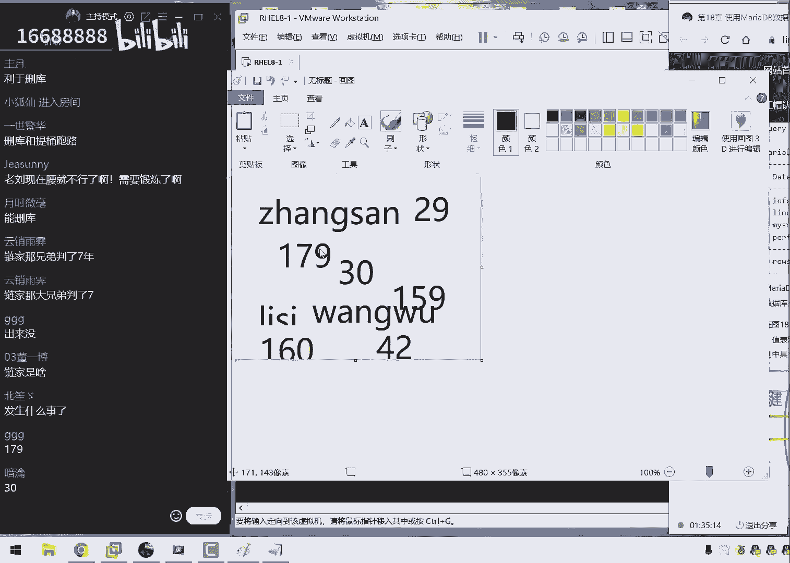

来大家怎么都记得，那没有啊，大家怎么记得那么没没有啊。

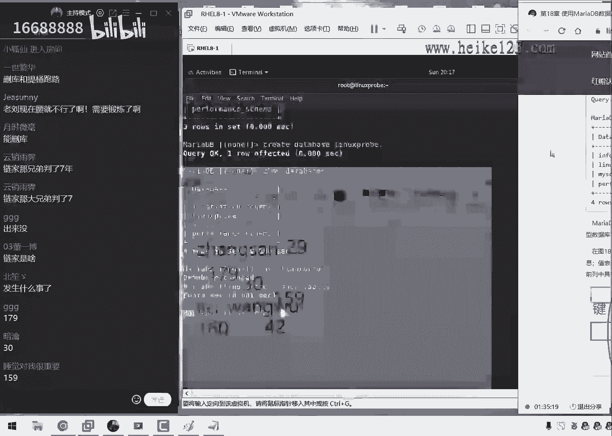

没有啊，他俩啊他俩都是很没有意义的事情啊，来阿呆基，这个记得太快了啊，来我们来给大家看一下，那就是说我们现在一个格式，这个格式的话呢是这样的，一个表单里面的一个完整格式，它是由建行列之表头。

几个这个字段来组成出来的，同学们就记里斯多大了啊，30 39也无所谓了，直接就是进一下这个表单内里面的格式，要想创建出来一个表单，这个很重要啊，这个张三的这个年龄并不重要。

张三的话呢我们先放一放再看一下啊，这个表单里面就是这个首先有表头，这个表头，那好这个表头指的是每一列的这个名称，比如说这个啊他这个号，然后呢还有这个名称，价格什么的这些信息，我们的一个名称我们叫做表头。

然后的话呢它有一个键值，这个价值指的是它的一个唯一的一个标识值，我们可以对它进行一个索引，还有这个行行指的是横着的，列，指的是竖着的，然后还有具体里面这个值，也就是说我们现在需要先有一个表头。

这个表头的话，那定义一下，每个字段里面保存的这个信息是什么，然后就可以往里面加啊来啊，进行一个信息的插入了，比如说张三啊，年龄真的是38号啊，然后我们写他啊，他啊包括他这个身高。

也就是说我们现在的话有以这个为例啊，就是说有一个姓名啊，这个姓，然后呢还有这个年龄，然后还有这个身高好了，我们三个这个信息写到我们这个表头里面，这属于表头，然后我们往里面去插入信息，这个季节了。

张三李四王五，然后我们往里面依次来去添加，那么话呢我那我们啊它有一个键值，它指的是一个啊它所定的这么一个位置嘛，啊1234来进行一个排序，它指的是键值，这是补啊，这那也就是说这个是键值，这个是表头。

这个话是纵向的列，这个是我们的啊啊行，然后其中的话那我们每个值我们讲啊，那啊每个这个啊，具体里面这个值我们把它叫做这个值啊，这样的话呢我们组成了一个完整的表单，呃，听起来有点乱。

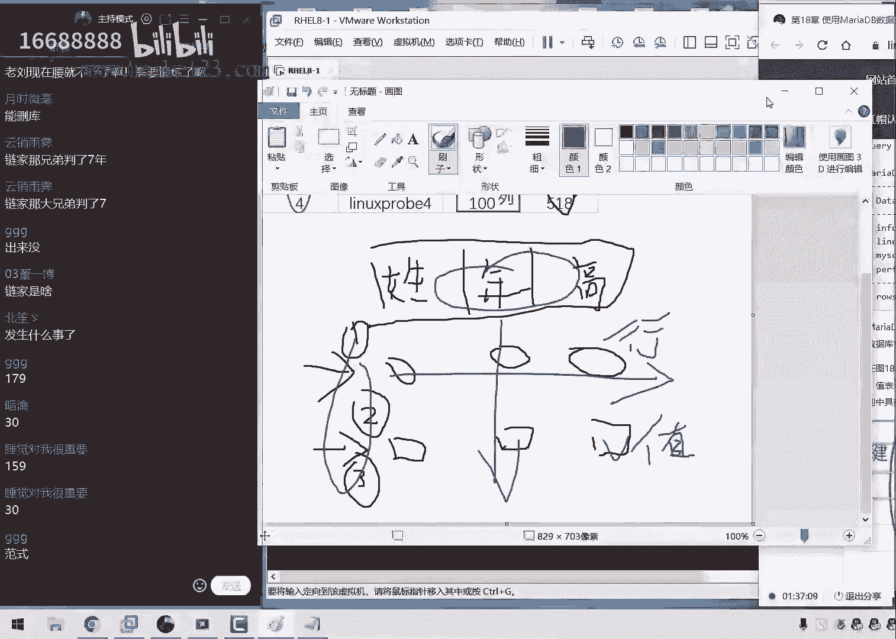

我来给大家操作一下，比如说我现在进入到了一个叫做好，来进入到了一个我们的数据库里面啊，linux prom里面了，然后我来给大家去创建出来一个表单，表单的话，那我们在做这个啊table。

然后我们创建出来一个macbook这个名称的一个表单，我们那么往里面插入三个字段的这个信息，第一个字段的话，那我们就叫做明，第二的话呢我们就要做这个啊，呃呃呃然后那第二个啊。

不我们先不要洗了一下这个类型啊，指定一下类型，第一个字段的话呢，我们就是说我们这个数据的名称，他的话是一个为字符类型，这个数据的名称不能够超过15位，第二的话呢是书籍的页数啊，书籍的页数不。

第二是书籍的这个价格，它是唯一一个整数，第三的话呢数据的页数我们它也是一个整数，也就是说我们先往里面插插啊，先去插入三个这个表头，这样的话表头分别是我们的书籍名称价格啊，还有它有多少页。

然后我们可以来去describe，来去查看一下这个表单，他d e s i i b e啊，看一下这个表单，它具体有哪些表头的这样的一个信息，可以看到啊，表头现在有三项，这个三项信息的话呢。

分别就是这个数据的一个信息嘛，让我们来黑帮里面去插入一下。

既然有一个表单了，我们要的话，我们先这个表单有三个表头，它可以往里面去插入三个字的这个信息，第一个字段的话呢我们为书籍的名称，第二的话呢我们为书籍的这么一个好价格，还有我们最后数据有多少页。

占的三个信息一定有，我们有这个呃，具体这么一个格式之后就可以往里面添加了，然后呢我们的书籍的名称的话呢，它是为一个字符型，也就是说它最多是由15个字来组成出来的。

他们他就说书籍的这个名称它是为一个字符型，其它的话它都为整数类型，它为一个数字类型，叫做这个整数类型，这个的话呢我们呃如果之前过，那我们之前如果去学习过一些语言的话，您应该对这个是有一些印象的。

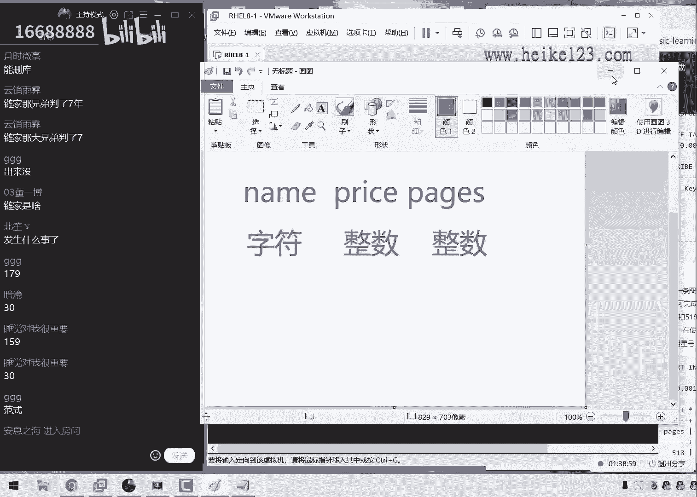

来我们往里面去做一下插入操作，来来去操作一下啊，insert，然后是intre，往往里面插入my book这个表单，往里面去插入三个字段的这个信息，第一个字段我那我为名称，第二个为价格，第三个为页数。

然后的话呢我们的啊，values指的是它具体的这个值是什么呢，我们往里面插一本书的这个信息，第一本书的信息，他每一个字段的话需要用到单引号维的引起来，这也是一个呃各式要求，那我们这样去写字有点小哇。

再稍微大一点吧，来我们这样第一本书的名称啊，linux club，然后我们逗号他的话呢这个价格为，比如说随便来了啊，79块钱，然后我们接下来再来逗号，它的页数518，随便去写。

这样做完之后点一下这个分号结束掉它，这样我们就往里面去插入的一啊，那我们就往里面插入的一个信息了，当我们插入信息之后，怎么去看呢，就是这个增删改查吧，咱们来去看的话怎么办呢。

让我们来进行一个搜索就可以了，去选择去查看某一个表单里面所有的内容，那么就用到这个新号做代替来使用的一个星号，去查看一个我们的表单里面所有的这个信息，然后就可以把我们这个信息给他列出来了。

这就是我们所说的表头键直行啊，他啊啊，那我们把这个信息，它会按照我们的表头里面所对应的，这么一个格式去填写出来，好这就是一个很简单的一个插入的一个操作，基本到这儿，我们同学们这个啊平时的工作就差不多了。

然后大家会想到赵老师，那我现在如果有一个值不能问啊，那我那我，那我们比如说我们现在想要进行一个修改操作，怎么办呢，好那么也可以进行修改操作，修改操作的话说实话用的不多，而且有一些风险啊，是这样的。

比如说我们现在这个数卖79，卖不动啊，太贵了，怎么办呢，update啊，更新一下，比如说我现在想更新一下，这个表单里边的某一个值，比如说什么呢，价格现在原先卖79，太贵了，没人买好了，我们给他改一改。

69好不好玩啊，69还不行，那我再稍微再低一点，好感谢，69，让我们按一下回车，改完了再去查看我们表单里面这个信息表，表单里面这个信息变成了69了，就是说我们可以对这个信息来进行一个修改。

然后最后一步的话，那我那我，那么我们也可以对于这个信息来进行一个，删除操作，我们可以把它给删干净，另外的话呢还有就是我们然后稍等一下，我们先在删掉吧，delete然后我们写下delete啊。

然后我们去呃，删掉我们这个表单里面的这个所有的这个信息，然后我们往里面的话再重新再去插入一下，然后是delete，然后from啊，delete是不用再加上这个星号了吧，啊我们不用在这个星号可以直接删。

我们往里面一删啊，然后我们按照这个书上面的话，给大家多插几本书的这个信息，来给大家操作一下，那么我们可以看到这个表单里面就是空的了，然后我们接下来给大家演示一下，就是说我现在的话。

往里面多插几本书的这个信息，这样的话大家看起来会更加的这个有感觉，因为我们如果要是只有一本书的这个信息，大家会感觉到就是我们啊搜索啊，那么就是搜索半天吧，它都是搜索到是同一个信息，所以我们先不管它。

我们先往里面去插入四条语句，然后这个四个语句的话就是四个出的信息，分别为1234，我们的这个数据的名称，然后插入好之后，去查看一下表单里面的内容来from，然后是my book来看一下。

这就是我们的默认的表单里面的所有内容，那1234本书价格的话呢，呃它是为3580，然后就是我们现在的话呢啊30 50 80，然后我们有个sim 4个价格，然后呢我们这个书的页数都是一样的，好。

我们现在给大家操作的就是，我们到底，当我们的过程中遇到了这么一个表达了，我们刚好那我们到底该怎么去玩它呢，首先第一个玩法就是我们要能够准确去搜索它，我们需要这个信息，比如说我们现在每啊。

那比如说我们现在每一本说这个信息特别的多，但我们又看到了所有这么一个呢，呃它里边只有数据的名称，看它所对的这个价格是不一样的，页数既然相同，你既然相同的话，那我看你干嘛呢对吧，而且他非常的这个呃呃呃呃。

这个细节很他会很多余，那如果说我只想看书籍的名称和价格，我们怎么去看呢，改这个改前面把这个星号改成我们字段的名称，改成表头的名称来name，然后逗号我们的这个价格，然后price这样做完之后。

我不去看页数了，因为页数它是因为它的这个信息都是一样的，或者它并不重要，我们只看它所对应的一个名称跟价格，这样去做，那么就是说我黑仔我们去搜索表单的时候，去查看信息的时候，只看我需要的信息，就这么去做。

非常简单好，下面第二个问题说老师呃，除了这个以外，还有一个问题，那比如说我现在想要去搜索，所有由于按照条件来进行搜索的啊，比如说我们在红毛的r h c e7 号时的时候，2015年3月份的202啊。

到我们啊，2020年8月份的时候，他考到了，说如果有一个用户叫做bob。

那么好了，请你输入这个bob用户它所对应的一个手机号码，这个怎么去做呢，当时也可以打，哦啊哦啊，那我们怎么去搜索，就是说我们知道一个用户的名称，该怎么做到他这个电话号码呢，呃我们可以做一下过滤。

比如说在考试的时候，他有一个叫bob一个用户，还有这个手机号，还有这个房产啊。

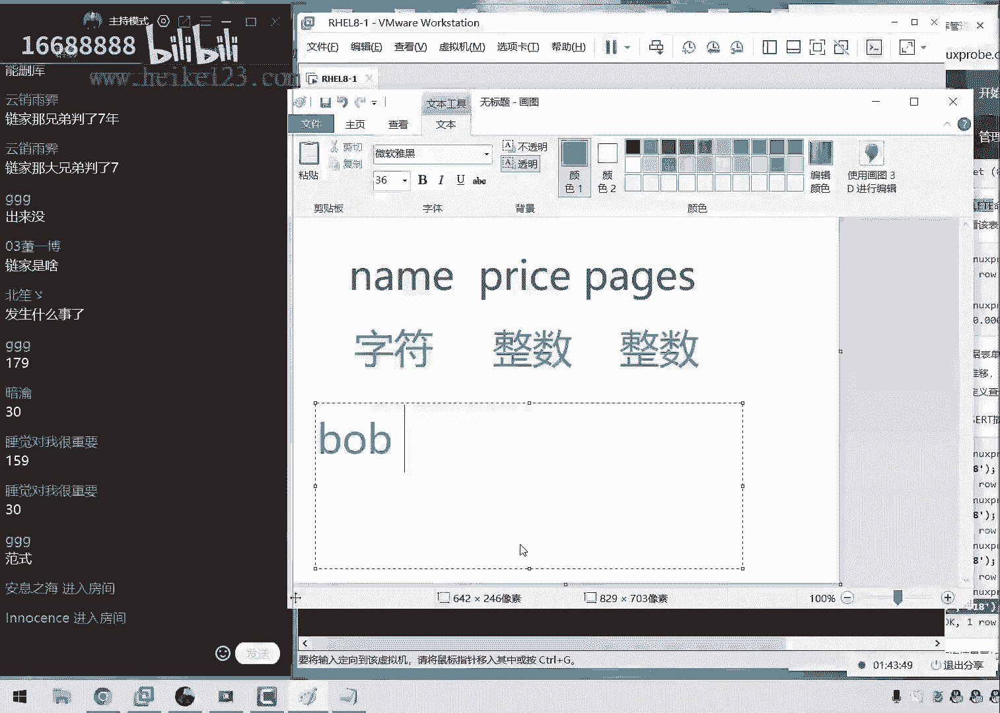

巴拉巴拉啊，这些cc啊，那我们现在都不用去看，我们只看这个bob跟电话号码，那他也很多，他可能会有几百个，我们一个一个看吧，也挺麻烦，其实我们也可以这么去做，可以选择一下复制，然后选择一下粘贴。

找一个文件对吧，然后我们新建出来一个文件，其实这些都是些小技巧，后面考试只看结果，看过程，所以的话呢我们往里面一粘，往里面一添加，然后往里面一走，然后说一句走，你然后干嘛呢，做一下grab做过滤。

其实这个方法虽然很low嘛，但是他这个方法是可行的，这样输入报b用户的名称，a再回车搜出来了对吧，就这个考试的时候做法是无所谓的，我们通过这个例子给大家说一下啊，后面考试的结果很重要，过程不重要。

只要能够完成，他不提怎么去完成这个步骤，它并不是一个啊，像我们中国这种传统考试一样啊，非得有一个啊啊对于规范的一个标准答案，它并没有的来，我们给大家退出掉它，然后的话呢我们现在想去设定一个条件。

那我们既然有点low啊，那么跟老刘不能那么low啊，能不能你按条件来进行搜索也行啊，我们这样去使用到威尔加条件来，比如说我现威尔一下，为了什么呢，为了说我就想去搜索一下一个名称好了。

我们就啊name限定一个条件，说我只想搜索出来名称为三的这本书，哎为linux problem，这个三这本书就是他们就这样去做linux prob，然后按三，然后按一下啊，反然后我们按一下分号就录掉它。

按下回车可以看到就单独加一个条件，我只去作为某一本书这个信息就出来了，那么也很也很简单，并且的话呢我可以按照我这个要求，我只看见那个书的这个啊，明它它里面所对应的这么一个信息啊，只看它里面的价格跟名称。

我们不看看这个有多少页，哪里可以看得出来，那除了说我们可以搜索出来这个书的这个名称，然后按照这样的条件来进行搜的话，也可以按照这个价格去搜嘛，比如说我们只搜索说价格等于30块钱的书，可不可以啊。

没有问题啊，等号30只看说价格等于30块钱的书，看一个便宜的书啊，按下回车看到啊，价格为30块钱的书，不同的条件，不同的结果显示出来了，除了说我们可以按照指定的条件来进行搜索，我们也哎呀这个八点半了。

怎么每次上课都跟打仗一样啊，我们都是嘎嘎的，结果一天涨了八点半了，真没想到啊，结果今天这个其实嘴也没闲着，然后就一直往后赶了，看咱们每节课都这两个小时的时候，收获我感觉是很满满的，因为怎么讲呢。

大家可能自学的话就两小时，可能会看一会手机，看会电脑又会开始，然后又回去玩一会儿就两个小时，就是完全在给大家强烈的这种压力下，同学们应该是很不敢，然后去转移心思吧，因为你可能一转过去之后。

再回来就用讲到下一章了，好不过我觉得这样也很好啊，原来这个自学的话效率很高一点，然后我们再给大家说一下，这就是既然有一个条件了，那么这个条件不能说帮我一个等号吗，有没有什么大于号，小于号呢。

也有比如说我现在设定一个条件，好比说大家可以说加加这个嵌套吗，不可以啊，不可以加啊，哦哦哦行行行，这个签证也可以去用，因为大家所说的那个嵌套，实际上指的叫做多条件啊，可以去实现它，只不过不叫嵌套啊。

人家叫多条件可以去实现，来我们先来给大家操作一下，比如说这个价格设为30好啊，那我们改一改，比如说我们改它改成我偏的书，我不看啊，我是比较有品位，我只看30年以上的书来大啊，那么写一个大于号30。

只需搜索出来价格大于30块钱的书，按下回车啊，不好意思啊，手比较粗，按照这个反啊，我们按照反斜杠了啊，来稍等一下，嗯啊没有完成是吗，那么就还再再再再进一下吧，来重新再去进一下。

然后是use一下linux probe，然后我们去搜索这个键盘啊，特别小，因为它笔记本啊，来我们来给大家看一下，搜索出来做手书大于30年的这个信息，然后再回车，然后可以搜出来了，小于三文件书，我不看啊。

于是就有一个234啊，linux 234这个信息，三个信息显示出来，任何人后除了这个以外的话呢，还有比如说小于号也能玩一玩，对不对，比如说我们小鱼小于了50块钱的书，我就选个便宜的，小于50。

可不可以呀，可以呀啊，诶下回说小于50的书列出来没有问题，还有啥呀，我想一想啊，还有说呃叹号它指的是取反制他啊，我看一下小额小于等于能不能行啊，哎那啊这也没问题，就是说搜索一个小于等于50块钱的书。

哎搜索出来了，它可以加等号，小于等于除了这个以后，我想想还有啥啊，还有这个叹号啊，叫做取反之对吧，我们叫做啊，它不等于，比如说我只想看一本书，说两个不等于50人的数，加减乘除都出来了，按下回车啊。

价格不等于50万的书，不要不去显示出来，这个没有问题，然后我们来看一下这个表，这个表格里面是有的，18杠三啊，里面有所有的这个条件，包括说我们可以加一个呃，呃包括同学们可以说到叫这个嵌套。

或者说我们做这个多个条件也可以去使，那我给大家玩一下啊，我们现在一个条件，比如说啊比如说我们现在搜索一下，说小于啊50块钱的书，同学们买一本啊，小一本啊，那么小于50块钱的书。

这个啊这个有他只有一个是吧，那好了，我们再换，那我们再换一个大于40块钱的书，大家看啊，大于40块钱的书，好搜索出来有这个三个结果没有问题，大于三大于40块钱的书，结果有三个。

那我们能不能再加一个条件呢，说并且我们指定一下数据的名称啊，就是说我们给他两个条件可不可以啊，可以我们加一个这个and，我们来做一下这样的一个语句，叫做and，比如说同学问到说我们能不能加两个条件。

可以这样去做，and，并且的话呢，我们的这个数据的名称必须是等于某一个值，要是有的话，则显示没有的话，则不显示linux pro 2，然后按下回车看到可以出来了，它满足条件会显示出来，它不显示啊。

它并没有满足条件的话，则不显示出来，这就是我们可以加一个and语句来进行一个啊，来进行一个啥，来进行一个多条件的一个的一个判断，那这样的一个值让我们都做好之后的话，那我们也可以把这个给他删干净了。

然后我们才可以去使用的这个删除语句，把它给删掉，那我们在做删除自己这个操作之前啊，我现在给大家去说另外一个，我们来看一下这个数据的18。6小节，说一下，我们说呃说一下我们数据库的备份和恢复。

我们都会说我们是怎么进行操作呢，呃当时的话呢我们从2010年开始。

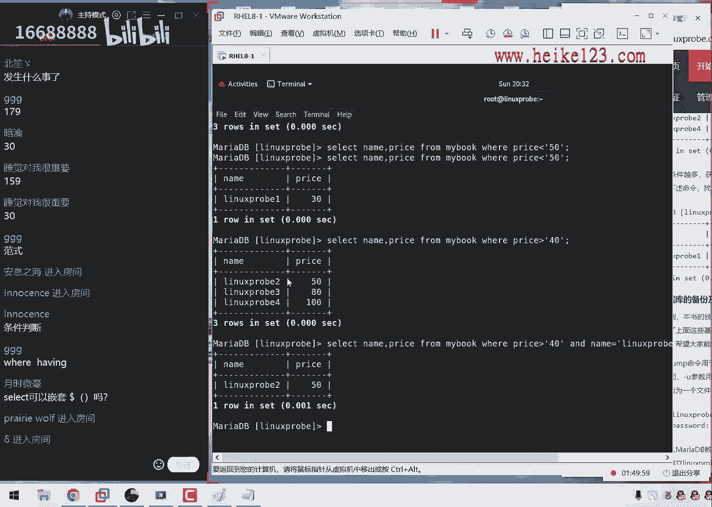

让我们在啊啊，那我们当时嗯嗯有一个小的网站。

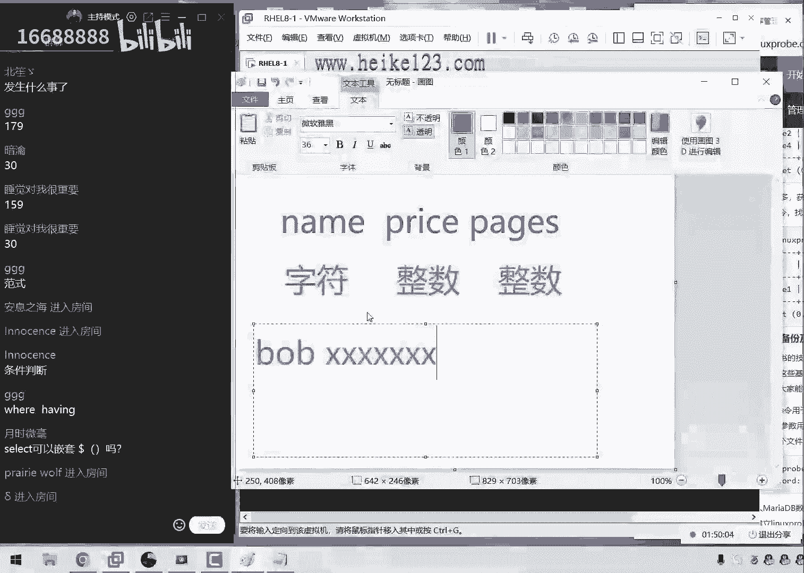

当时我们这个mysql的话，这个版本特别的低，行使好当门堂行时啊。

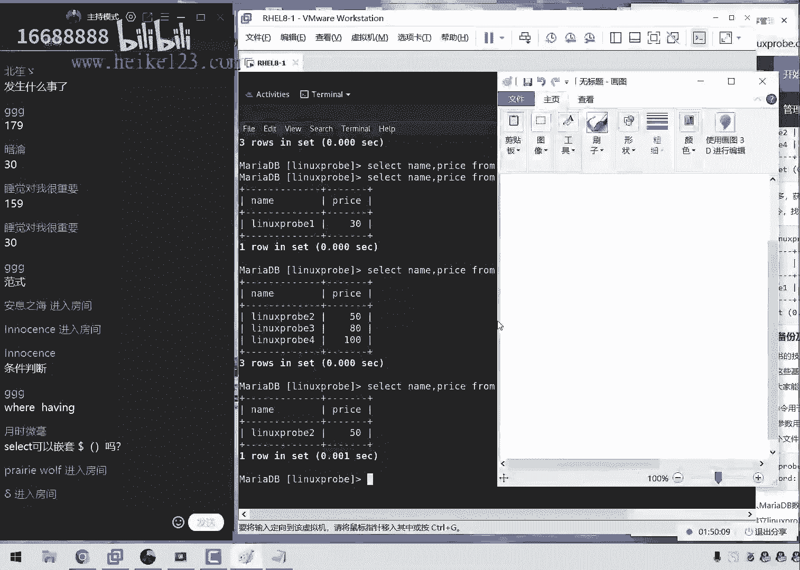

当时的话使用是一个四跟五的一个版本，当时使用了好多年，然后我们呃，然后我们一直用的是四跟五的一个版本，大概的话呢时间我们并没有特别的远，大概就2018年吧，我们升级了变成mysql的这个七版本了。

然后就有一个问题了，就是mysql 7以后的这个数据库版本，他都必须要去使用它专业的命令来进行备份了，之前要想通过打包的方式是不可以了，我们必须要去使用到mysql db的还行，备份了。

所以大家一定要记一下，如果以后我们公司的这个服务器，您拿不准是什么样的一个版本，如果是老版本无所谓啊，这个啊这个话我们可以随便去用就可以了，可以直接去使用加x，然后c的vf，然后我们去打包一个数据库。

比如mysql and taran jz，我随便来了啊，然后我们数据库保存路径，然后巴拉巴拉巴拉，然后我们随便去找一个数据库的一个路径，然后我们做完保存这个啊，这样的话就可以了，但是在七以后。

我们一定要去使用到我们专业的命令，来进行操作，这样的话才会造成我们数据的丢失，这个很重要，那这个话很重要，mysql jump。

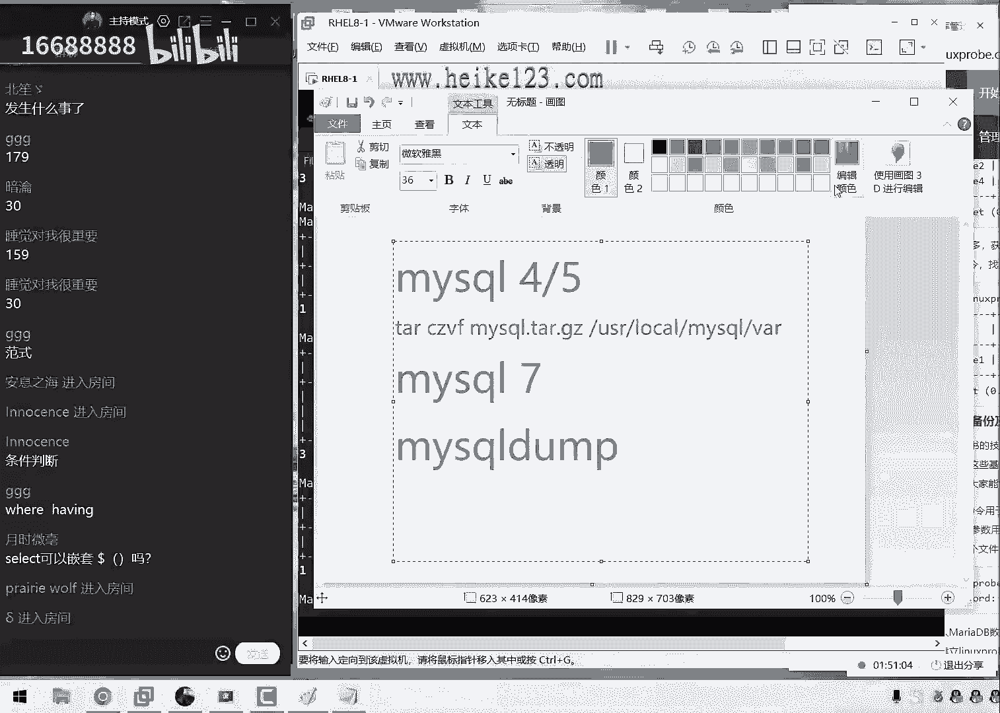

然后做完之后干嘛呢，那呃我们将这样啊做一下备份数据，我们先不动，既然我们还没有给大家讲啊，我们先来给大家做一下备份，备份好啊，我们来备份好了之后，来把这个数据给大家做一下这个啊删除。

然后我们正好把这个删除给大家讲，完了之后再讲一下恢复，我们认为的啊，大家在工作的时候，更多的可能用的就是这个啊，备份和恢复的这个工作用的比较多，一点咱们那我们既然作为一个运维人员，那我们这边赶啊。

那我们既然管到我们这个操作系统，那我们该怎么样来进行一个备份呢，很简单，mysql jump，后面加上我们要想去备份的这个啊数据库，的一个用户名称叫做管啊，管理员叫做啊啊管理员啊。

r啊r o t啊管理员，然后我们写下来，要想去备份的这个数据库的名称，linux pro，它指的是我们要想去备份的这个数据库的名称，密码写到下面的。

然后把我们这个linux pro这个数据库的话备份一下，比如说我们随便来了，比如说我们的这个先煎好了，我们叫做先接，然后我们这个后缀也无所谓，我们给他随便加一个后缀，再来一个标准文件啊，往里面一导出。

输入一下我们管理员啊，超级用户的密码啊，right hat，诶不对啊，好像改了对吧啊，密码叫做linux pro了，来linux pro按下回车，就把我们这个数据库的这个信息给它，自动的给它啊导出了。

然后等于说我们的linupreme，那个数据库的信息就导出成功了，大家说怎么样呢，删库跑路了啊，在商务朋友之前，你可以把这个数据先备份一下，万一要是有很严重的这么一个刑法的话，到时候把它拿出来啊。

可以减刑啊，那这个我也看行，然后下面一个问题，大家说说我们可以去使用的shell自动备份，没毛病啊，非常好，可以的啊，可以通过这个杀手自动备份，然后加一个时间。

所以我觉得其实我感觉最好加一个crown type对吧，加一个计划任务，比如说每天备份一次，或者说能让我每个礼拜备份一次都可行啊，这啊这啊我看也行。

让我们来去使用到买sql root gp password的，然后我们去写一下我们的这个密码值，我感觉啊其实每节课讲的特别多的话呢，大家其实会感觉到很愉悦啊，如果讲的特别少的话，反而会感觉到很水。

哎不知不觉8。35了，我们来继续啊啊就希望我们这个每节课吧，大家会有一次，大家都会有很多很多个生活，不是说怎么讲呢，就因为它是一个网络课程，因为下如果要是一个网络啊，因为它为它是一个网络上。

他又是一个晚班，他又是一个讲0。4系统的，一个比较枯燥的这么一个课程，怎么叫这个课啊，系统特别的缓慢的话，很容易让大家犯困，所以我们尽量的话呢拿起我们的斗志了好了，我们来进入到这个数据库里面。

然后我们怎样要给它删掉呢，很简单嘛，就是我们可以先收database，查看一下我们这个数据库的列表，然后巴拉巴拉有汉啊，耶耶耶耶耶，挺多啊，没有问题，把切换进去，然后说编码不一样，咋处理。

待会给大家去说吧，然后我们先讲完，然后是柚子一下linux pro，然后我们来进入到这个数据库里面，然后干嘛呢，给我想一想啊，show tables有一个叫买布和一个表单啊，看他不顺眼了，对不对啊。

我们给它删掉它，delete把它给删掉，然后删掉这个表单，删掉这个表单，然后my book表单给他删干净了，然后大家再去看一下show tables，还有这个表单吗。

有然后但是我们再去查看里面这个内容的时候，待会说说老师这个没有了对吧，因为把它给删干净了，就是我们叫做删除操的这个操作的一个作用啊，清空了啊，那同学们会问到说刘，那你现在因为我们第一天学这个数据库。

我感觉不太放心，你你这个操作的话呢，反正我看着好像是没有了，但是实际上有没有的话，那我呃我也不知道，那怎么来进行一个验证呢，其实也很简单，就是我们在可以去怎么样呢，删除掉一个数据库。

删除掉我们的database的linux problem这个数据库，也就是说我们可以把我们这个数据库给他删掉，这个没有什么啊，这个没有什么问题了吧，大家来去show database来查看一下。

也就是说我们把我们的这个数据库都给删掉了，肯定已经是很干净了吧，大家不会产生这种歧义了啊，既然我们数据库都已经删掉了，那我们表单里面这个信息自然也就没有了，这就是由顺便给大家讲了一下，该去如何去删除掉。

我们这个数据库的一个操作命令啊，您可以来就记到这个书上面的，可以记一下了，让我们接下来再来，我们大家能够恢复下这个数据，让我们再去create database linux pro。

当然我们这个数据库再给它建立回来，建建立回来一个数据库，按下回车，然后再去查看一下数据库，肯定有了，就看不看无所谓了，来看一下数据库回来linux prom，但是里面的话呢没有任何的数据。

这个没有问题吧，啊不不不，我再给大家进入到里面去看一下啊，经验证，虽然老刘很帅，但是这个该验证的这个啊，这个地方还是要去验证一下的，不能消耗大家对我们的信任来看一下，那确实没有了。

然后我们退回到这个啊目录下，那么怎么在进入数据的恢复呢，那我们这样去做mysql是吧，直接使用到mysql来进行恢复，使用到什么呢，输入重定向往里面导入，就可以对于我们这个数据来进行恢复了，更优啊。

其他只能说我们关联的这个账号啊啊l o t啊，然后的话呢，我们刚p要去恢复这个数据库的名称linux pro，然后我们导入一下这个文件，然后文件名称的话，那我想问一下做先先点dump是吧。

来我们往里面一导入管理员密码叫做linux pro啊，入侵用户密码叫做linux pro，刚刚改过诶，下回说导入诶，那管理员linux prom，linux prom账号root。

我看一下mysql杠u root杠p linux probe先先走，你然后是linux prop走啊，没有问题，当我们把这个信息导入之后，再重新去进入到我们的这个数据库里面，大家会看到的话呢。

我们先一顿操作下来之后，我们这个数据库入t用户的密码是个linux pro，老棒啊，来这个很不应该啊，去show tables啊，不show database查看一下。

当前的话呢我们的数据库文件还是在的，他肯定在对我们进行一个，因为我刚进的是一个恢复操作，进入到我们这个数据库里面，use venice club，按下回车搞定，然后他们干嘛来着。

去show tables，查看一下表单啊，还在，然后我们查看一下表单里面的所有内容，本段的所有内容的话又都回来了，大家可以来看到这样的话呢，呃刚才我们并没有卡掉啊，刚才这个声音比敲了这个画面要快。

是因为我刚才说的比较快，但是手没有跟上啊，但是我没有卡啊，好了我们要给大家看了这个之后，基本上同学们就能够领会到，我们对于数据库的一个管理能力了，然后我们今天这个课程的话呢，讲了一小时40分钟。

后面的20分钟的时间啊，我们我们来给大家说一下，这个考试相关的一些事情，然后因为的话呢我们在线这个讲课的时间吧，不多了啊，不多了，就下礼拜五了一天了啊，最后呢我们把一些能够想到一些事情。

提前给大家说一说，这样的话呢我们呃如果说您是在看录播的话，就可以直接关了，如果你要是在线听课的话，还是要听一听的，因为对大家来说是有用处的，然后还有的话呢就是因为这个mysql的这个学习。

大家又会有种感觉，我能够理解，我不知道对不对啊，这是我们第一天我去学习，买三盒的时候，因为我学习都是这个操作系统的，第一天去学习了这个mysql，这感觉就是学了，但是感觉又没有学啊。

g的话里好像好像也能够接触点东西，但是他也很容易记不住，又不太知道每个命运的一个呃，呃就是怎么这个怎么讲的啊，具体是一个作用，但是话我们通过今天这个学习，同学们就应该能够感受到了，对于我们这个数据库。

首先我们要有恐惧心理，第二的话呢，对于我们这个数据库里面表单的这个管理方法，封神奶茶，这我们都非常的熟练了，对于用户的这个改名，还有这个新建和这个嗯授权操作等等啊。

啊包括说我们对于这个数据库的一个恢复操作，大家的话都应该是非常的熟练了就可以了好吧，然后我们今天已经在我们工作的时候把这本书，唉，然后以及如果要是有签名书的话就更好了，放到我们的mm。

那如果要是需要用到数据库管理命令的时候，可以过来查就行了，我们我们对大家的要求，就是只要知道大概的一个固有印记，可不用去记里面的命令，sql语句的命令不用去记更多的，如果您愿意的话。

可以聚集一些我们的操作系统的命令，都比这个sql语句恒大以后用的几率比较大一点，然后我来给大家说一下，我们今天这个复习以及预习的内容，然后给大家说一下我们这个考试的内容。

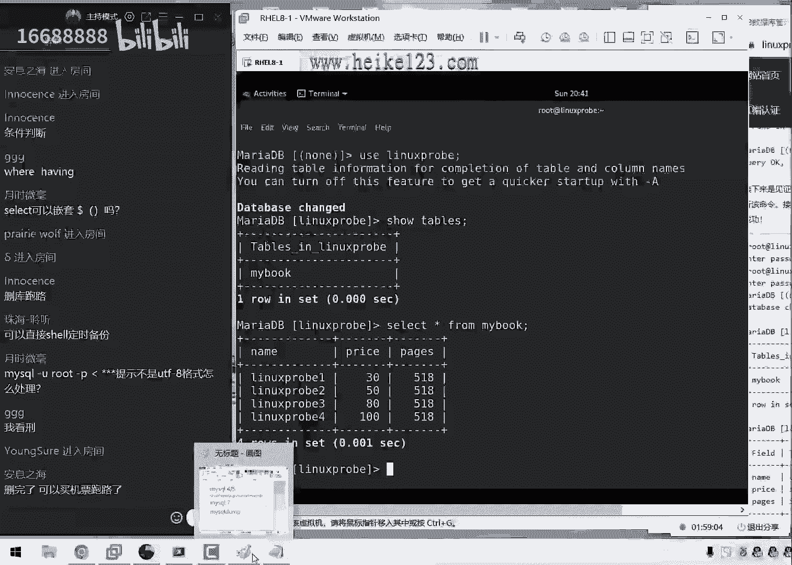

因为我们上课吧，因为啊因为他是一个在线培训，所以的话呢好多新的消息，我们就希望能够第一时间给大家去说出来，这样的话呢对于我们当前的学员特别好，特别有帮助，然后这就是为什么很多培训机构提供的。

是一个录播课程哦，然后我们就会有一个很鄙视的一个的一个感觉，就是因为5月27号是吧，5月27就是因为这个录播嘛，他没有办法根据当前的这个学习的情况，来进行调整，以及的话呢一些新的消息吗。

说实话通过短信啊，通过qq啊，微信什么的，老是通知不到位，所以的话我们这个在线培训从发啊去发通知，也是一个非常重要的一个工作的一个内容，来大家看一下，首先我们的复习内容就是hc的备考了。

如果说你已经背上啊，如果说你已经预上考试了，那么就开始做备考就可以了，然后说如果你要是呃，然后就是下周的话还要上课啊，不要忘记是5月27号，我们会给大家讲两个章节。

第19第20时间的话大概是两个半小时啊，有大概两个半小时，大家提前做好准备工作啊，时间挺长，两个半小时，然后因为我们规划了一下，有点尴尬，第19章的话呢大概时间是一个小时，然后的话第12，然后啊啊啊啊。

然后呢，我们的最后一个章节，大概是大概是将近两个小时，如果要是拆成两天去讲的话呢，大家还是要多来一天，所以我们下周五的时候的时间会稍微长一点，两个小时练半个小时啊，大概就两个半小时或两个小时。

40分钟左右好吧，然后大家先说的，我再给大家说一下我们这边遇到的一些问题，就是的话同学们，你们现在约考约完了，然后我们这边已经给考场那边提交上去了，费用的话全打了，同学们已经都打到考场那边了。

但是我们遇到一些问题，就是呃我们之前的话，让大家把这个前奏是作业考场，然后会有些同学是转点网了，然后我们现在帮大家转了一下，也没有问题，然后但是的话呢我们转的时候吧，有一些同学是南京的。

就是有些同学是南京的，然后把钱转给我了，然后我们就是去转给考场的时候吧，会发现没有位置了，很尴尬啊，就是说我们的同学们6月16号的考试的话呢，在南京的考试是吧，南京是6月16号吗，我先确认一下啊。

毕竟我说错之后，大家很会啊，会很紧张，会认为好像时间报错了，我看一下啊，南京考试是6月16号啊，看来没错，也就是说我们的同学在先锋报名，那个6月16号在南京嘛，然后有些得把钱打给我。

然后我们又转过去之后吧，就晚了，晚了之后的话就就然后就没有帮上，然后他就就是这个情况的话呢，可能也是存在的，也就是说同学们啊，我们今天现在有呃，因为的话现在这个全国现在这个病毒。

好像现在这个防疫工作做的非常的严格啊，所以的话呢我们给大家一个小建议，就是我们这段时间遇到的，就是在没有收到考试邮件的，这个前提之下的话呢，不要订机票和酒店好了，同学们，我们会在考试之前的十天啊。

或者说七天吧会给大家发邮件，所以说如果说你是在江苏，或者说你在天津想来北京或上海考试的话呢，您一定要等到这个邮件收到之后再预定酒店啊，他预订酒店和机票的一个在，呃的这么一个事儿来。

就是说第一个啊机票还有这个酒店的话呢，一定要等这个邮件收到之后再决定的话，这个邮件的话大概是提前七到十天会给您发啊，这个到手了就可以决定了，然后的话还有就是那个南京的考生，有那么几位。

还真是您需要等一等了，因为可能会调一下时间，我大概会在下礼拜三左右会给您发消息，就说呃是这样吧，大家尽量嗯就是盼着不要收到我的消息，就是说呃如果说您在下礼拜五之前，如果说您在下礼拜五上课之前。

您没有收到我给您发了消息，那么您的这个月考，这个成功率就是99%了好吧。

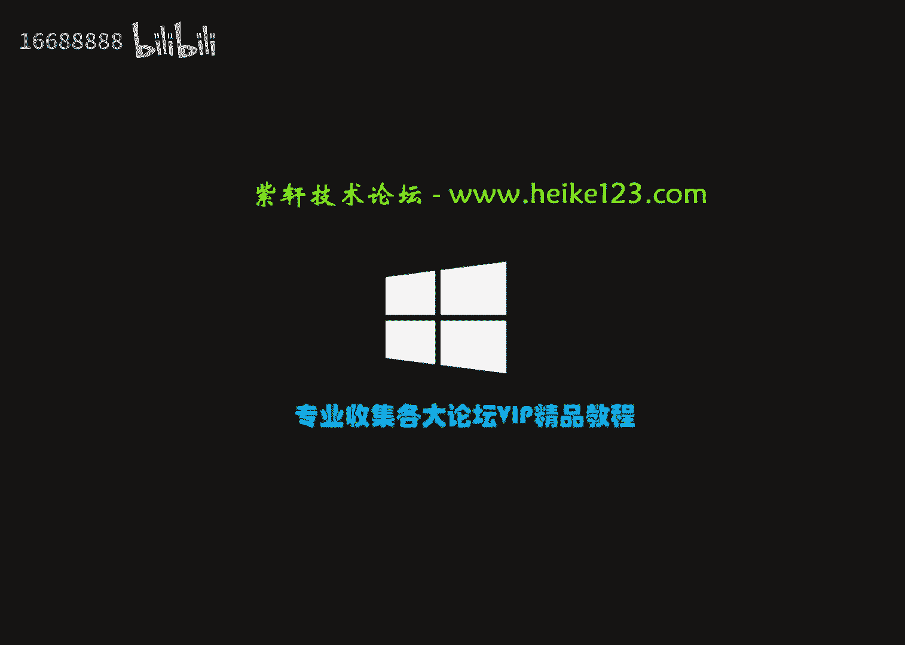