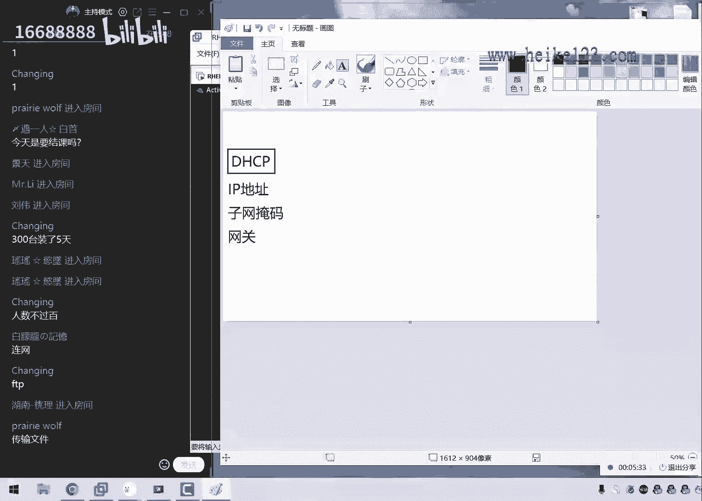
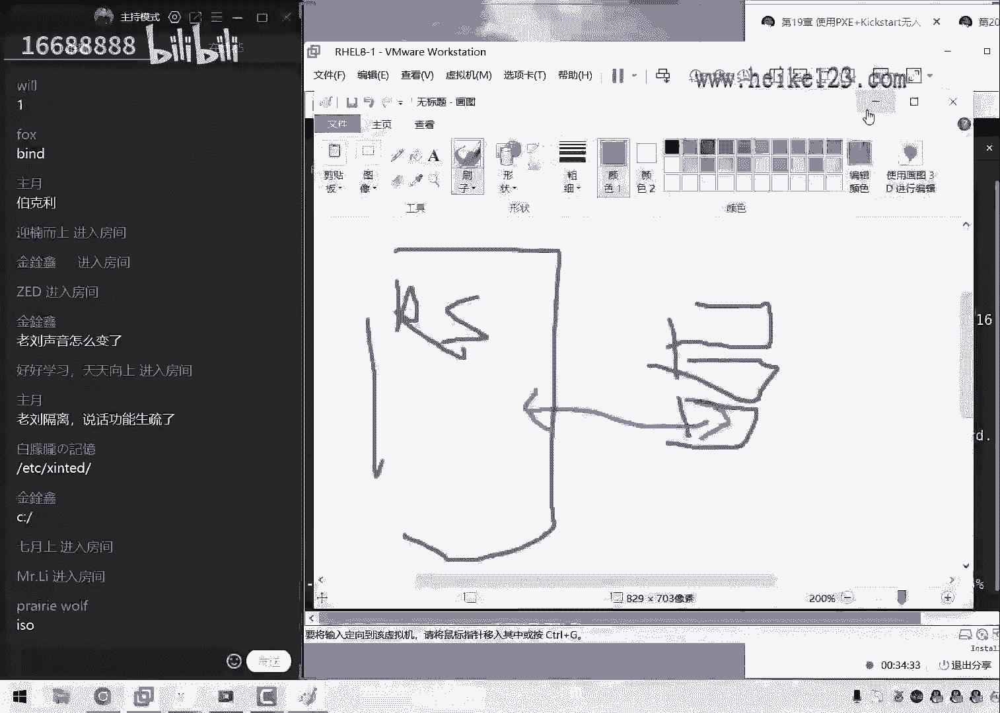
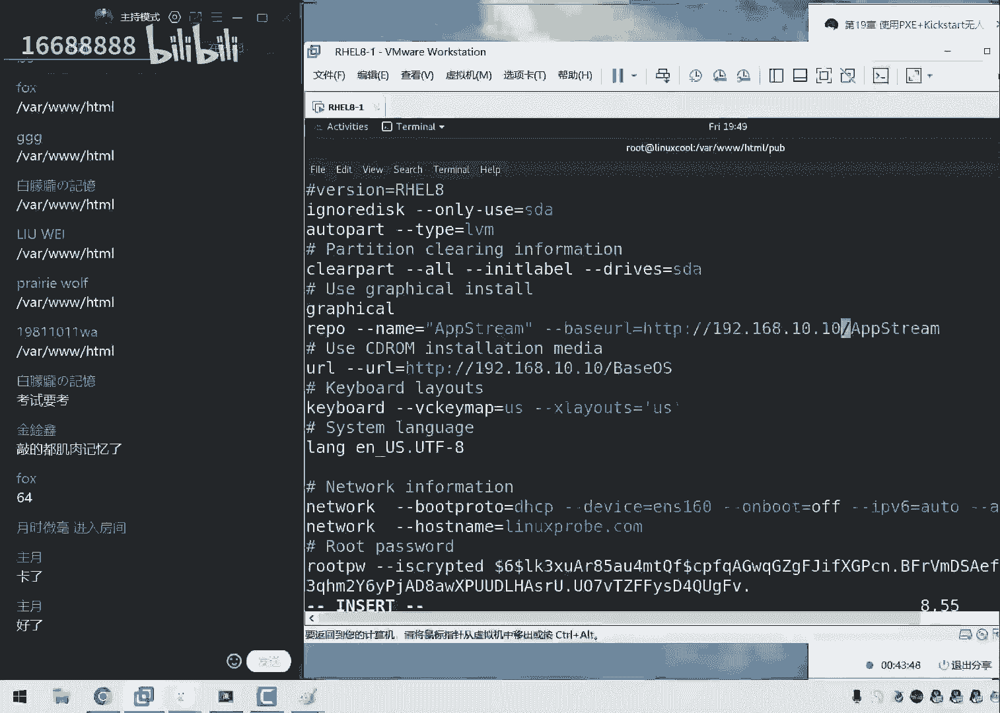
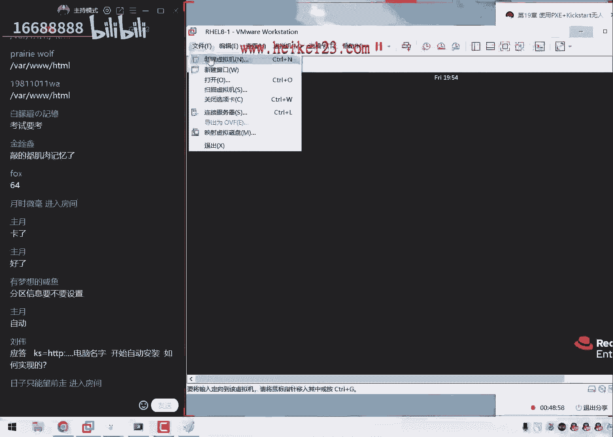
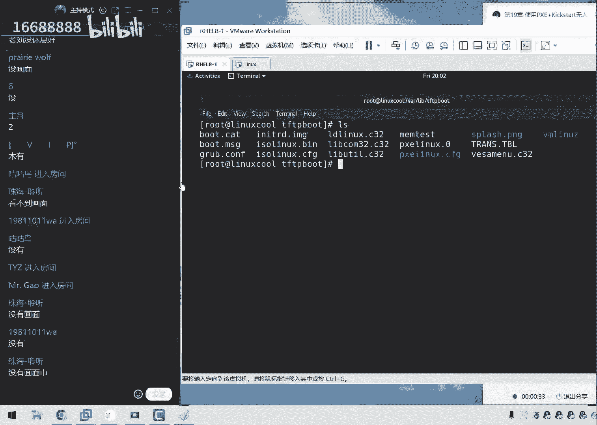
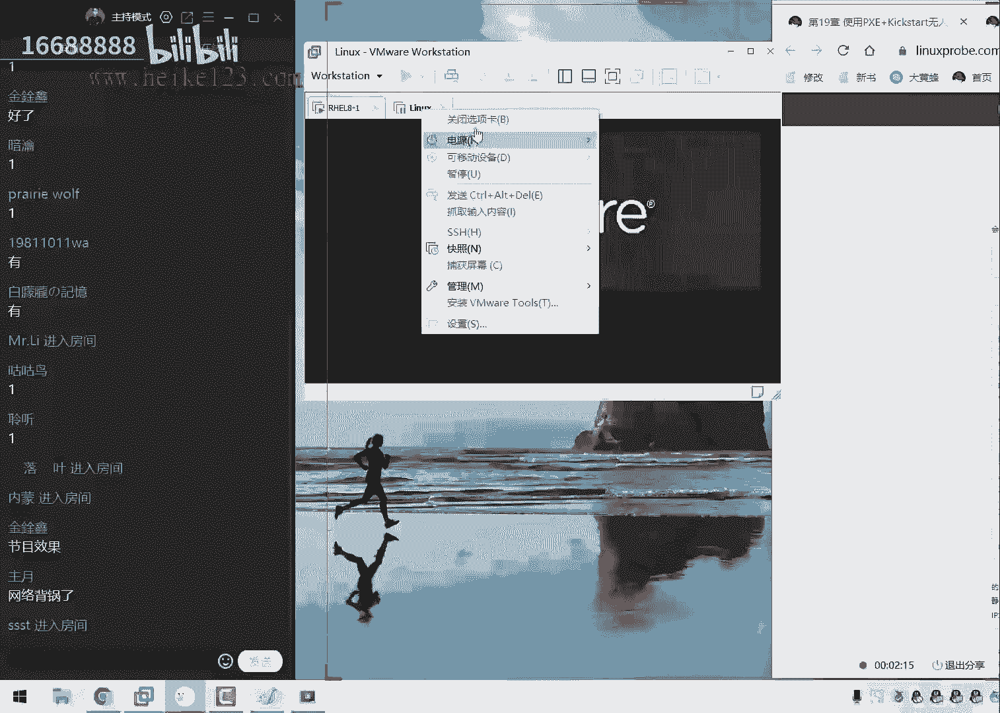
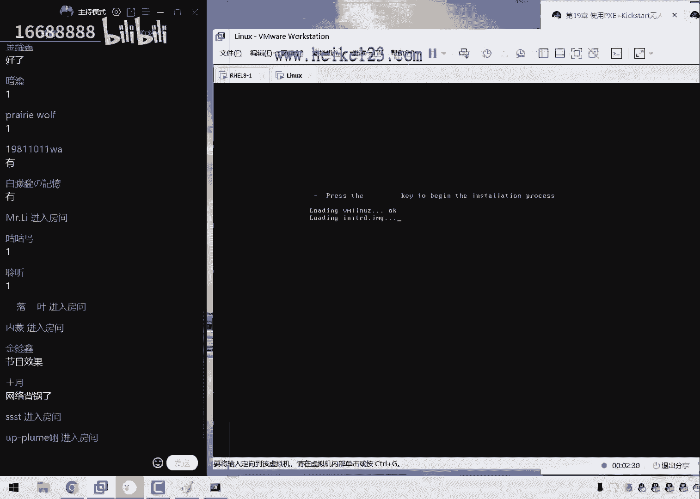
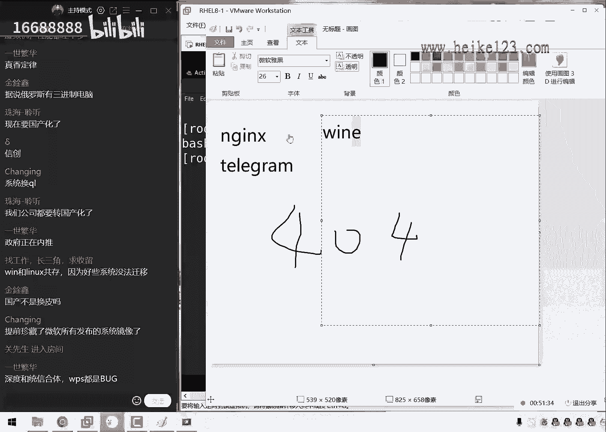
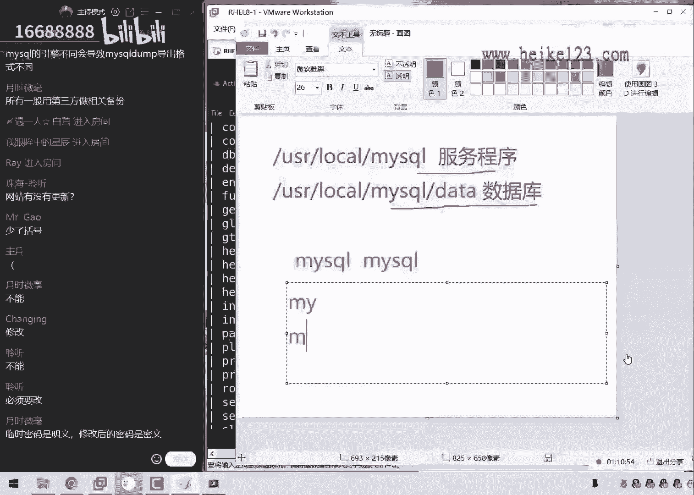
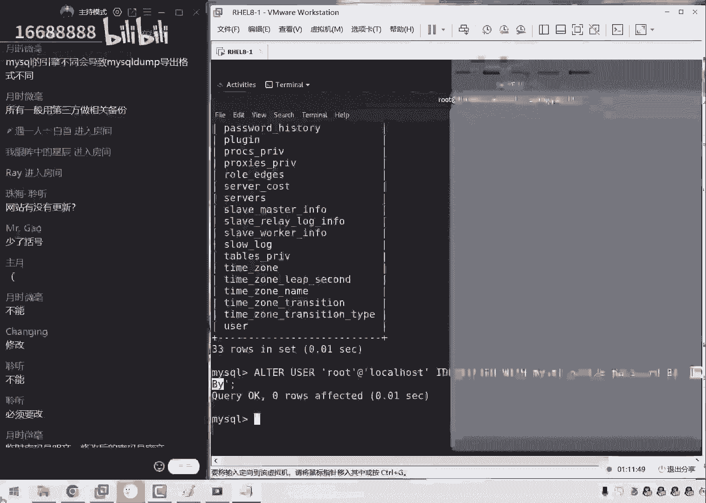

# 刘遄培训linux34期（配套linux就该这么学第二版，RHCE8） - P23：23 - 16688888 - BV1gL41167vP

ok同学，我们人差不多了，先打一下一，我们来开始我们今这个课程了，我们的同学们先打一下一吧，然后我们来开始我们今天这个课程啊啊今天，然后我们还是没有回到家里面，然后现在的话依然是北隔离。

然后这个的话也确实超乎我们这个好计划了，然后我们原先的话呢计划是想用我们这个家，是啊，那我们想用家里这个电脑给大家讲的，那么这样的话配置会好很多，但啊但是呢很不幸我们这个隔离时间被延长了。

现在从十天变啊，变成了14天，正好覆盖了我们这个周末了，所以的话呢我们这一次稍等一下，这个鼠标垫还湿了，稍等一下，所以的话呢我们这一期最后两次课确实很，其实我们这个实验环境的话呢，对待的很不公平啊。

就是这个实验环境确实很慢，但我们跑这个呃呃程序的时候的话，可能也会稍微有点卡，好现在没有画面吗，好那我们继续看下学们呃，大家先测试一下我们的环境，您看一下有没有画面啊，测试一下我们的画面啊。

如果没有画面的话，就您再退一下再进就可以了，应该没有问题，来大家打一下一，可以吧，啊还没有什么没有画面，真没有啊啊大家都没有是吗。

好不用着急，我来给大家分享一下，重新来重新来重新来啊。

不用着急，可能是因为他这个啊，不用着急，我给大家重新分享一下。

来啊小问题啊。

怎么样啊，课程结束了啊，下课了来稍等一下，同学们今天是比较特殊的一期，对这个实在是太艰苦了，来啊那我们来重新分享一下屏幕，同学们再来感觉一下。

来看看现在我们这个画面能不能看得清呢，然后现在如果可以的话。

大家打一下一下来啊，现在我们有没有了，有了是吧，ok ok那我们继续来给大家去说啊，今天的话呢，我们在原本的课程规划是给大家讲两个章节，因为19号20吗，然后呢这个主要原因就是因为哎呀。

现在在外面的话声音不像话，这个啊，因为我们现在在外面身不由己，所以的话呢我们不太确定说明天我们会不会去，又换酒店，或者的话呢会呃被呃送过去，所以的话呢我们想的是，今天如果条件允许的情况下。

我们今天给大家讲两个章节，19和20时间的话，大概会减到九点半左右啊，那我们就是说比正常的情况下的话，大概会多半个小时时间，这样的话那我们呃别点，那也有踏实的，因为就避免说明天如果要是万一换酒店啊。

或者说有其他的一些政策的一些调整，到时候又得耽误一天，那我们到时候再给大家听课，再去调整的话，因为很麻烦好，那我们来给大家讲讲吧，看下第19章。

如果今天第19章都讲了一个半小时，那就当我们，那么我们就当做是没有说过啊，那么就是必须要是放到明天给大家讲了。

所以说我们现在慢慢给大家聊着，然后的话呢我们也不会给大家去讲课时，大家可以放心啊，然后我们先给大家说一下，第19章节我们干了什么事儿啊，我们要去学习什么呢。

第19章节我们学习的叫做p h e jk stop，大家去叫做无人之手来去批量安装系统，这个怎么理解这件事情的话，那就是我们第一节课就是4月3号的时候，对吧啊，我们真正开始去学习这个技术的时候。

第三节课，那么我们到时候我们去啊。

安装过我们的这个操作系统，但是的话呢当时我们是每一台每一台，然后我们的啊，然后我们来尽量来学安装的，那我们要怎么能够去训练一个批量的安装呢，实际上就是由我们第19章就给大家介绍到的。

因为的话呢我们中国人有一个传统，就是要从基层开始干起，对不对，所以这个最基础的这个安装系统的这个工作，大家以后工作的时候，可能会更多的去使用到对吧，那么这个时候。

如果说我们现在这个工作场景只有一两台机器，那么啊那么也没有问题，但是如果说你的这个工作场景里面有个100，200 300台机器，咱们到时候就会很麻烦了对吧，那我们安装这300台机器的话。

可能也需要半天时间，或者说那么可能需要两天时间了，很多很多，那么很麻烦，那我们要是除了说我们单独的以，来去安装系统以外的话，那我们也可以去批量的方法再去完成，其实这个话可以很好。

去提高我们这个工作的这个效率，那当我们在啊，那我们当我在工作的时候啊，然后当我们用到这个技术的时候，大家就会自呃啊，大家自会自然会感觉到这个很香了，然后我们把这个画面我们先调整好之后，给大家说一下。

今天的话呢我们要去使用到一些工具，然后我们去实现一个批量的安装，然后我们来看一下呃，首先的话呢是我们第一个服务，我们要往后面去翻了啊，大家看到这个我们是用到了很多的服务，因为的话呢第19章节。

实际上它也是算作是一个我们的总结课程，就是我们今天啊，那就是我们之前学习的很多个服务，到底有什么样的一个用处，同学们总是表示一个怀疑少吃，那我们昨天去学游戏的，比如说我们来去解析域名啊。

或者说我们来具备啊，为我们这个客户端去分配地址，那么它到底什么样的一个用处，我那我们能不能把几个之前所学习的服务的，那么怎么样呢，现在啊那我们来去啊凑到一起，做成一个整大的啊。

然后我们做成一个很大的一个架构出来，或者说我们做成一个完整的一个实验出来，然后他啊，多个服务之间能够进行一个相互的协调，那么以及来去共同去为用户提供某一项的服务，这个我们今天就是第19章节。

跟第二章节要给大家去做这个事情，等于说我们前面所学的，在这个所有的课程都是为了能够听懂，今天我们所学的这个课程做的这个准备好大啊，大家说了一个说300台啊，说有啊300台机器装了五天啊。

所以的话呢以后你300台机器，你就大概只需要呃半天吧，然后其余的300天那会我们的其余的四天啊，那么就可以配置按钮了，这个我们就是啊提高工作效率的一个方法，然后通过老刘这个不懈努力啊。

虽然今天最后一天单数的话，通过老牛人不懈努力，现在我们这个人数啊，也就从35人到了46人了啊，47的吧啊非常好，那我们就不再等了好吧，我们现在有47人了，等来了12位同学，非常好了，我那么我想啊。

那我们感到非常的满意，那我们现在来想一想啊，同学们把书给他扔掉了啊，然后我们想一想，那我们要想来去批量来去安装系统，同学们，你们认为需要什么服务呢，反正我先啊改，那我先来去想一想，我觉得第一来讲。

肯定就是要想来去传输这个文件，或者说来去传输这个数据，首先他是不是要是有tcp ip协议，那个是个啥啊，那就是我们的网卡的一个互通嘛，就是说网络一定要通了，然后才能够去传文件，然后才有后续的事情对吧。

所以我们能够想到的，也就是说第一个就是我们的dc p服务，我们来啊，不署上d h d p服务，大家跟着我这个思路啊，把书扔掉，那把把书扔掉啊，我们通过这个推理的过程啊，刚刚给大家去说出来。

大概您需要的是什么样的一个负的架构，到时候我们去配置其他设，那么大家那么那么那那我们大家也就知道了啊，配置的这个顺序1234这啊，那我们按照什么样的一个顺序把它给完成，首先讲dnc p是我们推理出来的。

为什么呢，因为他需要为我们的这个用户，也就是这个服务器和客户端嘛，来去提供一个我们的网卡信息来着，哎它来保证这个网络是可以进行一个通信的，所以说它里面还有什么ip地址，还有什么呢。

还有这个子网掩码还有什么呢，还有h打打就打了个啥子网掩码啊，哎这啥意思啊，这个输入法也不太行啊，子网掩码啊，这个推过啊，然后他还有这个网关啊，还有我们的啊，也没有啥了对吧，那也就是说。

我们需要为我们的用户提供这些网卡信息，这个的话呢是我们的第一个服务，电视cp需要去做到的，然后现在这个人说的话是40 48人了，然后现在又来一位同学啊，那我们就真不懂了，同学们应该能啊。

大家大家应该能够感啊，大家应该能够感受到啊，其实刚等了一下。

那么就真不懂了，那我们开始接这个正式的课程了，d i c p说拜拜呃，首先的话呢关闭到我们这个虚拟机里面，自带的这个虚拟网络编辑器，现在大家总会说到邵老师能不能我们不要等了，七点钟上课，7。11了啊。

那我们啊没有大家同学就不用听了对吧，但是我们不能这样啊，都是我们的复位学员能多听一个，大家要尽量的多听一个啊，然后我们就多等一等，来我们看啊，我们首先看到啊。

就是说现在既然我们自己要配置这个d r c p，所以的话呢我们就他要把虚拟机里面自带这个，d i s c p给它关闭掉，避免这两个怎么样呢，打架啊，当时同学们可能会问一个问题，说到流啊。

用那个我们虚拟机里边提供这个d i c p服务，情形呢啊也行，但是不都是去找的乐趣了吗对吧，所以我们来给大家讲，就是把虚拟机的给我关了，把我们自己的配置起来给大家啊。

那么我们给大家来做啊，那么来做一下配置啊，那我们给大家安装上来，我们来安装一下我们dl c p，如果我没有记错的话，应该是叫做d i s c p conserver对吧。

这个软件包的名称我们来进行一次安装，另外的话呢刚刚呃刚刚的话呢，果不其然，那然后现在的话红毛real就已经发布了，然后也不是卖焦虑，就是如果同学们想要考试的话，抓紧时间啊，在我们这儿报也可以。

在别人家报也可以，但是再给大家的时间可能不可能并不多，我们的话说到了这个消息，大概就是9月份，然后就变题了，所以的话呢，呃如果同学们现在联考当中遇到了一些问题，那或者的话呢您啊比如说考试的时要挂科啊。

这样的这个情况的话呢也不用太大，也不用太担心，因为大家如果是6月份第一考试的话呢，呃如果万一要考坏了对吧，我们78月份还有一个不好的一个机会，所以我们这些同学们，你们的时间特别宽裕，特别的好。

那所以的话呢也是赶上一个，这么也是赶上了一个考题，基本定又能够，啊时间很宽裕的这么一个班级，然后还有一个同学就是今天问到了，说如果要是成都啊，什么其他城市，比如天津啊，还没有约上的同学，还有郑州。

杭州也没有约上啊，这个到时候再那么再等消息吧，现在确实也没有这个安排了，所以您预约上就约，约不上的话，就再等一等，大概78月份也会有消息来，我们先来给大家看一下，首先配置一下第二cp。

然后我们来输入一下，我们dcp的这个主配置文件，由于我们这些服务之前都讲过的，这这这就是我们第14章节，所以的话呢我们就给大家讲一下这个重点了，然后我们相同的这个参数就稍微加快一点了。

但是如果说同学们要想把我们这个视频，大家也看到了，我们最后几天的视频没有加密对吧，因为什么呢，因为我是在外面，所以我现在视频加不了密，所以同学们如果说愿意把这个课程啊，分享给给自己的朋友的话啊。

然后大家一起来去学习的话呢，我们也是拦不住，但是我们向大家分享的时候带一句话，就是说我们之前是讲过这些服务的，然后的话呢并不是我们刚上来去讲，就这么的简单了，然后我们会讲的很详细，只不过这个之前讲过了。

所以我们今天才讲的稍微快一点了，然后大家千万不要用您的朋友欢啊，然后呢啊然后啊，然后他就以为我们讲这个服务的话，去讲linux服务都这么快了啊，你这个是完全没有的，这是一个误会啊，之前讲过了才快的来。

我们给大家做好了之后，我们来去编写一下这个文件，首先的话大家想一个问题，就是对方的话呢它是没有一个操作系统的对吧。

就是我们现在要聊，那我们先要做这么一件事情，好，我再给大家打一个画图板吧，啊再给大家画一个啊，再给大家打开一个画图板啊，这样的话再给大家画一下这张图，就是我现在想做一个这么样的一个架构，呃。

首先的话呢就是我们去画一个小圆圈，这个代表就是我们的服务器，然后的话呢底下有很多很多这样的一个方块，这个方块的话呢长方形代表就是客户端，然后我们现在的话呢，就是说服务器上面肯定是那啊。

那么他肯定是要有系统的，然后通过网线进行相连，然后怎么样呢，就是呃我们在这个客户端是没有系统的，当我们通过网线相连之后，当我们按下开机的一瞬间虚拟机啊，不然后还有我们所有的客户端。

就能够批量的给大家安装上系统了，那么就是这么一个想法，那也就是说客户端是没有系统的，所以我们需要去允许两个协议，第一个的话呢我们叫做呃b o o t p啊。

n g这就是说代表就是当对方向啊，当对方开机的时候，那我们就会去主动的给大家去分配一个，我们的地址，因为大家知道，当我们去学习思科这个课程的时候。

里边换了以后也没课，然后它会有名课程，这个课程里面的话呢叫做c4 ，n a里面提到的电视cp协议的话，那它是经过了这三个步骤对吧，第一个的话它是在局域网里面先进行一个广播，说啊我现在需要一个地址。

然后的话呢有没有dcd这个服务器，然后的话呢由这个d c b服务器接到信息之后，向他发送了一个啊，那么像啊，然后再向他去发送一个数据包进行确认，最后的话呢，他确认之后才会为它进行一个分配操作。

那也就是说现在他需要像我啊，他现在需要像电视tp这个服务器，发送了一个请求，但他现在做不到了。

他现在啊只能是来进行一个被动的一个接收，所以我们需要去允许两个协议，这样的话呢就可以让我们这个d c b服务器，主动的为我们这个啊客户端啊，没有系统，这个客户端来去分配。

我们的d i c p这个网卡信息了啊，他现在就是一个植物人嘛，有人说他现在说不了话，所以我们现在只能给大家进行一个，强制的一个喂饭，然后来去恰饭来进行第一步叫做发现操作，没有问题啊。

这就是我们这个cca里面的这个课程，然后我们来啊，然后来给大家说一下，接下来就是叫做动态主题址更新协议啊，叫做dd s，说实话这个我们不用到它，但是这个但是这是一个各式要求，我们需要把它给写下来。

然后我们选择禁用就可以了，但我们现在没有使要去使用的啊，d e n s，然后的话呢接下来下面再来就是一样的，就是忽略掉客户端给我们的更新，它给我们更新啥呀对吧，然后这没有必要的东西，我们给大家去呃。

取消掉，接下来的话给大家提一个小问题啊，第一个提一个小问题，请问我们在d r c p里面，我们的作用域到底是不是为用户需分配的一个，地址范围呢，啊或者说请问我们在dsp里面的这个作用域。

他一定是为用户去分配的一个地址的，一个范围吗，大家告诉我1号就可以了，一代表就是肯定的，正确的，二代表就是错误的，否定的，咱讲课就要效率啥要快啊对吧，咱们不能说两个小时的时间。

跟大家去看一些免费课程一样啊，说话也慢，然后我们讲课也慢，这两个小时下来感觉自己也就俩小时对吧，然后我们希望的话这个节奏快起来之后，同学们这个注意力会更加集中了，因为这个我记得是哈佛教授研究过。

说这个啊把视频提高到1。5倍速，这样的话学习效率会更高啊，虽然老刘给大家自带了啊，同学们就是只需要放空自己的头脑了，然后跟上我们就可以了，那么接下来给大家去说一下，就是啊大家告诉我了，说这个最后语的话。

大家说不一定啊，好那我再给大家重复一下啊，大家请大家啊，大家一定要请注意，就是作用域的话呢，它并不是真正为用户去分配地址的一个范围，它里面包它里面会包含叫做什么呢，排除范一起说排除范围啊。

然后呢我们等于说纵欲减去的排除范围之后，得到的那个是什么东西，叫做地址池，地址实材质为用户去真正分配地址的一个范围，好了，我们说这么多，就那也就是一个作用域嘛，然后接下来再来啊。

不过今天我真的没有想到还会哎呀，在这个外面给大家讲课，真没想到啊，然后因为我们上节课都没有给大家准备，然后我当时想的就是老子啊，我们啊5月27号早就回家了，所以的话呢用这个加点技能。

一台艾利威尔i9 的一个芯片给大家进行啊，32g内存跑这个实验，那个感觉肯定是不一样的，结果万万没想到，我们现在还是用这个笔记本，所以同学们，你们不知道能不能听到这个风扇的声音啊，如果大家能够听到的话。

大家可以去稍微克制一下吧，这个不好，因为我已经感到他啊，因为我也感觉他他就已经很烫了，那我们接下来定义一下，就是我们为用啊，用户端啊，那我们没来啊，我们来为客户端啊，开始瞎讲了。

我们来为客户端去分配的一个我们的作源码，就说待会我们所说的这些信息的话，都会去体现在我们这个呃，客户端的那个网卡信息上面，我们来给它去敲一下。

然后第二的话呢我们定义的就是dominant servers，这个其实大家看首字母也可以知道了，然后叫什么呢，就叫做呃域名解析服务器，然后我们还有印象吗，第二啊，那我们来给大家提个小问题。

那请问域名解析服务器，dns s我们用到了什么服务搭建的呢，就是我们现在在互联网里面要想配置一个dns，请问快速高速，我那我们啊不会配没关系，但是请关啊，那么请快速告诉我，如果我们需要配的时候。

我们需要用到什么服务，大家告诉我我们可以去啊，没有他啊，没有画面了是吗，把同学稍等一下啊，不用着急啊，不着急不着急，我换一下，老公有点就是怎么讲的，今天客服皆惊万难，哎呀这个真的是唉也不好说。

人家这是防疫的，这个好吧，稍等一下，同学们，我现在先给大家先聊着，我把这个网络给大家切换一下，不着急，现在可能是有点网都不太好，我现在的话去，那我让我让他好起来啊，别的不太行，但这个有这个网上办法的。

稍等一下来，同学们现在能看到画面吗，啊现在能够看到画面了吗，啊看到后面没关系啊，稍等一下，啊看到了看到也不用看了，因为我现在带给大家，我把这个5g开一下，因为这个网吧确实挺次的，所以我们稍等一下。

嗯同学稍等一下，该同学我们回来了，那大家现在可以了吗，等一下一同学们现在可以了吗，同学们好，现在看一下我们的画面，然后看一下我的声音啊，大家能大家能否听到呢，白同学们啊，现在可以看到了吗，不会啊。

搞笑了啊，ok啊，现在可以了是吧，好大家先看一下我们的画面能不能看得到，然后能不能听到我们说话声音没有问题是吧，好现在来，那我现在就给大家提个小问题，其实这个网啊不太好，但是我给大家提一个小问题。

请问如果说我们在在公司，我们要想去搭建一个dns，请问我们需要用到什么服务呢，就是我们怎么搭建啊，可能这个大家第13章节记不住里面的三对啊，但我记不住啊，这个里面的这个参数，但没关系。

就是我们来就知道一下就可以了，请问我们要想去搭建这个dns，那我们去什么是哪个服务，这个我们要知道对吧，这个大家给我说出来了，叫做半的小学啊，来去想一想，这个叫做b再给大家提个醒，第一个b是啥意思呢。

第一个币就是那个开发公司，就是我们那个学校的名字哈，叫做美国加利福旦大学文理分校，就是马云那个儿子啊，他马云他让他自己的孩子去那个学校，然后学习计算机的话，就跟买省理工啊，很很啊很啊，他脸。

他这两个非常强的一个计算机的一个学校嘛，然后我们接下来我们去写这个啊动态啊，去分配一个地址池的一个信息，然后我们写上一个动态的一个更新，也就是说我们现在的话，对方是不会向我们发送这么一个请求的。

然后我们现在的话需要去直接为这个用户来，去设置这个网卡信息，然后给它定义一个范围，从100的话呢，我们到就是到192。68也是200，就是说从这个100~200，那就是说有啊这么啊。

那么我们就是准备出来，有这么多的这个主机的地址，k用户来进行一个分配，然后接下来的话呢，就是我们的一个默认的一个作业时间，当我们到了默认作业时间之后的话呢，它并不会去回收我们的ip地址。

而是作为一个标记，当我们下一次的时候，带我一个啊，带我一个啊啊啊最大作业时间的时候，那么则进行一个强制的回收，那么也就是说定义一个待会做标记的时间，那么为六个小时，其实这个时间的话可以稍微的稍微小一点。

因为我们安装系统的话大概也就半个多小时，所以如果您的机器特别多的话呢，那么您可以把这个呃啊，做的时间感觉稍微小一点，这样的话呢，呃那我们就可以让您配置出来这么一个呃，自动安装服务器，这么一个服务的话。

能够去更有效率的来去回收自己的这个呃，我们的啊网卡那么一个地址吗，好接下来我们再来就是定义一下，我们叫做这个下一做网关的服务器，那么网关的话就是希望本期就可以了，一九二零一六八点十点是邪教无。

那本期的p地址作为网关，接着的话他就加载一个文件，这个文件的话就是我们的驱动文件了，然后我们需要去加载一下，也就是说大家可以看一下，我那我们先给大家配着这个思路啊。

这个思路的话，那就首先来说，就是配置一个我们d r c b服务器，然后还可以去提供一个啊，这是啥，这是我们dcp的一个原理啊，讲的非常的粗糙，让我们来看一下，是这样的，然后的话呢我呃我。

然后我们现在不仅要被用户去分配一个网卡信，息，保证这个网络的一个连通性，第二我们做什么事情呢，第二个就是我们去加载一个文件，叫做p h e linux等于零，那就是说我们配啊分配好啊啊。

那我那我们分配好网卡信息之后啊，还能够为用户去加载一个引导文件，也就是说为我们的下一步的话做好铺垫啊，这样的一个效果好，那么这个文件的话暂时还没有，那我们先把它给拆下来啊，我们先把它嵌着，待会就会有了。

待会就是说第一步为用户分配网卡信息。

第二步下载这个文件，然后我们来一步一步来嘛，我们啊不要太着急，我们来保存并退出，然后我们去重新启动一下这个服务，像这个服务的话呢，顺便也加个手套当中，保证我们下一次的时候还依然能够去使用它。

这个键盘有点小啊，居然命令都没有敲全，这个不应该来第二个cpd，然后我们把这个服务的话加到选项当中，这个我们每节课都给大家讲一下，然后会给大家去很啰嗦，重复一下，大家应该已经听烦了。

但是的话大家我们养成这个习惯之后，在工作的时候如果没有去做，大家会反而觉得是不是感觉很不适应对吧，感觉少点什么东西似的，然后第二的话就是我们把这个我们ip boss，清空之后啊。

我现在的话呢需要把我们的firework，包钱给大家都禁止掉，因为的话呢这个我们需要用到很多个服务，所以我们现在干脆就把我们这个forever，我想想哦，那我们先给大家去关闭一下，因为我们要是去开的话。

需要开特别多，那我们就先把它给关闭掉了，然后我们现在做好d r c p之后啊，我们先来去查看一下，我们这个d i c p这个服务，它所对应的一个服务状态，看看有没有起来，ok都已经起来了。

好那我都起来之后的话，那我们下面一个需要给大家做这个事情啊，就是说其实的话呢当我们去安装这个系统之前。

那么啊他是不是还去上一些驱动给脑文件的，对吧，来你说驱动啊，驱动和引导这个文件啊，引导文件这个的话，那我们就可以去由我们的一些啊，简单的一个文件传输服务来去一个实现，那比如说的话呢。

那我们要想去实现出来一个啊传输文件，这么一个最简单的方法的话，那我们就可以去使用到t f t p来去实现，是这样的，那也就是说驱动引导文件的话，当前是没有的，那我们现在需要使用到tf tp。

来给大家进行一个传输，那那那那我们为什么要去使用它tf tp呢，因为这个也是有理由的，因为我们像我们这是两个的这个服务啊，它是一个相关关系，那就是说第二个当加载好这个文件之后，这个叫做引导文件。

那么它的话呢是要由tf tp给大家做传输的，那么是为什么呢，因为我们直接学习这个文件传输的时候，又那么我们讲了很多种，比如说桑巴对吧，还有什么呢，叫做v s f p d对吧。

这个叫做非常安全的一个文件传输协议，它有三个的验证模式啊，分别为我们的匿名公开，然后就是协议公开吧，然后还有这个本地，还有这个虚拟用户，他有三个的验证模式，虽然它很安全，但是的话呢他也会很麻啊。

那么他怎么那么它会很麻烦对吧，并且它不仅是配置上麻烦啊，我那我们讲的是客户端，对它进行链接的时候也是很麻烦的，所以的话呢这个时候我们就需要让对方，没有任何的验证的这样的一个门槛对吧，当啊。

然后的话呢那我们就直接把这个饮料，直接把这个文件的话呢给大家传送到他的嘴里，传输到他这个服务器里面，这样的话呢就是我们为什么要去使用到tp啊，那我们需要使用到这个服务的一个原因了啊。

t f t p没有任何一这么一个验证功能，直接就把我们这个驱动和这个啊，那我们这个相关的文件好。

去用，黑色文件都给他传送到我们这个客户端里面，那这样的一个过程，所以我们先给大家安装一下t f t p，如果没有记错的话，tf tp需要安装两个，第一个话叫做tf t p呃，conserver。

第二的话叫做这个星奈，因为它本身是没有一个的一个程序的，它需要用这个星链给它开启对吧，大家还记得像一个插线板一样的一个服务，那就是说我们把这个启动项文件给大家，写好了之后。

这个我们需要自行给大家去网上复制一下，这个话很可惜我们现在还是没有找到啊，没有给大家找到它所对应的一个模板文件，但是它一定是有的啊，但是的话呢没有找到，这是之前给大家讲的时候，就就表示了一个小1号嘛。

然后我们现在把这个服务给他启用一下，这样的话就代表就是我们把这个声带的服务，里面的tf tp服务也给他给大家开启了，是啊我们开启之后的话呢，我们那我们就需要做这个事情，只需要去重启一下这个星链的服务。

然后我们就可以让这个服务的话也能够起来了，这样的一个效果，它像一个插件板一样，只要这个服务起来了，那我们这个t f p b服务的话也就起来了，那么如果说大家在红毛五和六里面的话，还需要做另外一步操作。

在红包热八里面是不用的，是这样的，说老刘声音咋变了，没有吧，还是还是还是老刘本刘啊，来我们还是本人，可能就是因为在这个房间里面单身太长了啊，那么现在啊如果在红毛五和六里面，还需要做两个操作。

第一个操作的话就是一个叫做tf t p杠sora，一个服务，你也需要去启动一下，然后这个的话呢哦不，这个我们叫这个叫做t t f t p吧对吧，然后呢在啊然后我们还需要做另外一步。

把这个复位给他加到这个情况下当中，其实的话呢这个操作也没有太大必要了，好吧，就是说我们在红毛热巴里面，我们后面两个这个操作的话可以不做了，因为只要我们这个星奈起来了，那么它也就起来了。

那么也就这个服务也就起来了，也就没有问题了，那么我们主要里面就是那个避免以后，我们工作的时候是五和六的时候就比较麻烦了，另外呢我们先给大家做到这之后啊，同学们的话呢把这个服务尽量把它配好做好啊。

那我们做好之后的话呢，不仅我们今天学了，而且的话打一个快照来打一个快照照，哎，这样的话呢，张宇我们工作需要来自p d安装系统的时候，那我们怎么样呢，就可以把这个快乐器恢复，然后再把这个往前一接。

我们就可以啊去批量的去安装了，非常的简单好。

那我们现在的话来给大家说一下，下面有一个就是说t f t p搭好了，其实也没有打对吧，就是他已经啊安装好了，现在看来我们这个驱动还有我们这个诶，还有我啊，那我们现在这个啊，那我们相关的这个文件还没有。

那么怎么去找呢，下面一个我们叫做啊system linux的一个软件包，我们来给大家找到这个的话呢，就是相当于就是一个啊，配置文件的一个帮助文档了，就是说我，那我们只要把这个软件棒给它安装了之后啊。

那么它里边的话就会有相关的这个文件，给它产生出来，那我现在来给大家安装一下，同学们可能看我们这个章节的话，19。2。3的时候不太理解，说老师什么叫这个软件包呢，或者说我们叫做呃支持帮助文档呢。

其实的话呢我们所需啊，我们呢我们所需啊，那我们所需要的这个驱动文件等等，它我们都可以通过安装这个软件包，来给大家找到，比如说我们现在安装好了，他换了几张，那我们把它叫做是一个服务，其实并不恰当。

他的话呢更多就是一些帮助文档了，我们给大家演示一下啊，那我们给它安好之后，就会在我们的呃对应的目录当中啊，呃user local啊，然后是我们的啊s8 s linux目录当中，我们找一下哎这个没有吗。

我看一下啊，呃user user share啊，然后的话呢呃我们的s m s linux目录，我们找一下这个我们只要安装好之后，里面就会有很多这个驱动文件了啊，还有我们的呃引导文件。

然后我们现在的话就是把我们所需的文件给他，往里面一放就行了，然后现在给大家去简单提个小问题，请问我们的tmvp，它所对应的一个文件共享目录是在哪里呢。

比如说我给大家先去做一下回忆啊，就是我们之前给大家讲那个。

v r s p p t的时候，我们先给大家去做回忆啊，另外给大家贴一个小问题，就是请问一下tf tp服务，大家记得吗，我们的共享，我那我们的共享文件的一个目录默认是哪里呢，我们再给大家回忆一下啊。

v r s p p t的话呢，我们的本地的一个虚拟用户不嘿嘿嗯，那我们的呃公开访问模式的话呢，它会是在我们的这个目录里面对吧，大家应该记得啊，然后呢我们呢那么我们的本地用户。

它是在本地用户的家目录里面来进行保存，然后的话那么他如果是一个虚拟目录的话，他不他如果是一个虚拟用户的话，他们他是在映射用户的这个夹目录里面，来去保存这个数据，然后这个的话呢。

就是我们自己的这个加目录里面，来保存这个数据，下面一个问题，请问一下大家记得吗，我们的t f t p这个服务，它所对应的一个文件保存路径，就是我为了想去共享一些信息了，但我们需要把它放到那这个呃。

t f t p目录当中呢，呃那我们需要把这个放到t f t服务当中，在哪一个目录里面，然后这样的话，当用户去访问这个t f t p的时候，那么它默认的情况下，也就能够看到我们文件的这些信息了。

那我们去哪一个目录呢，啊怎么老师啊说话有点生疏了啊，同学们来来去做一下回忆。

大家都在这个c盘啊，这是一个我们的windows的间谍啊，不是开玩笑啊，这是怎么回事呢，这个的话实际上它是在我们的怎么样的，然后我们给大家找一下wl里面的lab，里面的t f t boot目录当中。

大家可以看到啊，没有问题吧，弹幕是在这里面啊，同学们看这个呃，这个的话这个基本功啊也也是有点生疏哈，这个真不是啊，虽然不是很啊，虽然不是很啊常用吧，但这个我们的目录的话，还是一定要把给记牢的啊。

这样的话以后我们工作的时候就能啊，那么可以快速把这个文件给它，放到这个锁定的目录里面，那为我们找到这个目录之后干嘛呢，那就是把这些引导文件吧，还有这个驱动文件，那那那我那我们往里面一传，车到里面去之后。

让别人去下载就可以了，那我们来，然后按照这个书单本来呃来进行复制吧，首先来讲第一个就是我们该有一个叫做劈叉啊。

这么一个文件，然后我们再来给大家啊，有过的，然后我们给它复制到当前目录当中，然后的话呢，再把我们这个光盘里面所对应的一些引导文件，给大家复制过来，因为大家想这个问题吗。

既然我们能够去使用光盘来给它安装上系统，那么就自然就证明着说，我们这个光盘里面就有，我们所需的一些安装文件了，所以的话呢我们就把我们这个光盘里面的一些，呃，那么这个送文件的话呢。

那我给大家复制到我们这个当前目录当中呃，有一些文件之后，大家可以看一下，t f t p目录，里面就有了引导文件和驱动文件了，都齐了，那我们待会就可以让用户来进行访问了，然后现在我想一想啊。

tf t b服已经起来了。

然后完了现在这个引导文件驱动已经到齐了，那么四方都到场了，下面一步的话，也就是说，实际上我们当前使用的这个啊，软件包的一个作用，就是为了让他能够去提供，我们这个相关的文件啊，这样的一个作用。

那么下面一步还有什么呢，我想一想啊，是不是还要需要提供一个，我们的完整的一个软件包呢，对吧啊，就是我们啊，那我们现在需要一个服务，你去提供一个完整的一个软件包的一个呃，文件传输，那好了。

这样的话对方已经有了一个基本的一个嗯，回答的一个机制了，所以的话我们就可以去使用到，我们的文件传输服务，或者我们的网站服务来去实现了，然后我们就用到这个文件传输服务吧，然后这个的话呢我们再去使用的。

我们的我看一下书上的书，上面的话用的什么也不重要，我看一下，我们尽量跟数量是反着来的，我看一下书架是什么，那我们那我们就另外一个服务，因为只要能够把这个文件给他传过去，那么它使用什么服务的话。

它并不重要，然后看一下的话呢，书上面的话它使用的是一个文件传输服，那么既然书上讲的是一个文件传输服务，那我们就以网站服务为例了，那我们先去安装一个网站服务，这样的话就可以让我们的这个用户通过网站。

然后把我们这个光盘机价位都给他，传到这个客户端里面，也就可以被访问了，这样的一个过程对他穿的是一个光盘来，我们现在的话来给大家看好，然后同学们会说做这个实验的时候，记得去打一个合照。

等以后我们工作的时候万一要啊，那我们万一以后要去啊，今天工作第一天啊，然后我们的工作就是安装啊，那我们需要安装这个服务器的时候，这也用上了啊，只要把这个服务器开玩去了，然后我们回来之后。

服务器那么就把它打好了。

来我们先来给大家据说啊，那么既然以使用这个网站来提供这个文件传输，那么我们先来细来给大家做完下面一步的话呢，就是我看一下啊，别给他整错了啊，下面一步的话就是海闪，在我们这个tf tp的这个弹幕里面。

把我们先把它做完，因为它是有一个相互依赖关系的，我们现在出来一个目录，p chain linux 0的一个目录啊，不这个啊他啊，然后呢这个最后我们给他结尾一下，这就是说我们现在现在出一个目录。

这个目录里边的话呢，来放我们叫做开机的一个选项菜单啊，大家可以看一下，我们这个书籍上面的19。4小节。

这句话就指的就是我们安装系统的时候，它是不是有这么一个界面啊，他啊我们现在要给大家去实现。

是一个批量的一个自动去安装系统，这么一个小实验，所以的话他啊可以去实践出来，一个自动车来去传光盘镜像，它的话应该也能够帮我们自动来去呃，进行一个选择和确认对吧，这样的话他可以去来进行一个批量安装吗。

那我们这是我们在4月3号的时候时候，见过的一个画面，就是说我们的话呢去安装这个系统的时候，它会有一个开机的一个界面，然后它会有三个选项，第一个选项的话呢，就是说直接安装我们这个系统。

第二话就是说来进行一个测试，然后再进行一个安装的一个效果，然后不啊它这个呃，它里面还有它所对应的一个功能，当然对话第三个就是一个排错的一个模式了，所以当时我们想一想4月3号选择是哪一个呢。

选择是第一个就直接来宣传我们这个系统。

然后这样的一个选项，那么这个开机的这个选项菜单的话呢，它也是在我们这个光盘里面是有提供的，我们现在的话呢就需要把这个光盘的引导文件。

呸啊，那么我们现在就需要把我们这个开机的这个，菜单文件给它，复制到我们这个t f t p的这个哦目录，当中，然后待会的话就可以让我们这个系统。

自动帮我们去做选择，那也就是说当前的话呢会有三个选择，那我们怎么样能够。

让我们这个系统帮我们去点击一下，这个第一个按钮呢，啊好我们把这个菜单给它啊，它复制过来之后的话呢，进入到里面去来找到这个default，我们来给它找到它，这是我们刚才改过名字的一个文件a，下回说。

首先的话呢我们先把，那我们首先把这个第一行修改成一个啊词汇，然后这个话呢我们不用管它的含义啊，这是我们修改成以我们系统的这个名字啊，然后我们先修改好了之后，大家可能会说，那我们为什么要给它修改成一个。

我们操作系统的名字呢，主要它是一个标签的名字，当前并不是指的是我们的这个系统，来我们第一行我们修改成系统名字之后，标签名字之后，我们往下去找大家先报啊，现在还是不太理解为什么要修改成呃，我们系统的名字。

现在有，那那我们现在就知道了，在61行，就是因为这样的话呢，它其实并不是我们系统的名字，而是这个标签的名字，然后我们这个啊第一个标签的话呢，就是用来去安装的一个隐私，那好了哦，所以我们可以看到的。

也就是说那待会的话，我们安装系统的时候的第一个标签，他会帮我们自动选的啊，他啊他进行一次选择这样的一个效果，然后我刚才给大家提到的，就是说跟给大家留一个小伏笔，就是我们提到了。

待会的话会用我们的网站服务，来为用户提供一个完整的光盘镜像，那么我们当前的话第64行就要加以修改了，因为当前第64行的话，还是使用的是一个光盘来进行安装的，所以的话呢我们这个小伏笔的这个写法啊。

是这样的，既然已经确认了它是由网站服务来进行安装的，那么我们现在的话就要去写上一个网址，这个网址的话，当前可能还是不能够访问的，但是依然没有关系，因为只要把这个服务给他写好。

那我们待会儿的这个用户的话呢就可以啊，不我们现在这个服务反应不了，没关系，因为待会儿炸板先好了，待会我们就可以让这个用户呃去访问他的时候，之前我们只要把这个服务搭建好就行，来现在写下一个路径。

待会儿的话，这个路径里面就会提供一个完整的一个光盘。

来去传输这样的一个效果，第二的话呢我们就到这个应答文件啊，叫啊这个话我们要给大家写下来啊，k s然后我们可以再写下一个路径，这个会看到我们的文件叫做这个应答文件，待会就是说安装系统当中我们会有一些选项。

这些选项的话呢，那他就不会再，那么他也就不会再向我们进行一个发送的来啊，他去啊他啊来进行一个确认了，那么就会呃来回啊他会去直接找到这个文件，叫做呃k s。c f g的一个文件来进行确认。

也就是说不过我们安装系统的时候，它会有很多这样的一个选项，那我们啊正常情况下。

他会来去向我们发送一个请求，来进行一个呃呃他是来啊，他是来进行确认的，那那那我们现在的话呢，是给大家准备出来一个文件，这个文件里面它叫做k s文件，叫做kstar的文件，它里面就包含了我们呃。

所有已经写好的一些参数了，他啊当我们安装的时候，1234按照这个步骤来进行安装的时候，到哪一步，它会自动地将这个文件来去发送这个请求，然后的话呢去找到这个里边定义好的一些参数。

然后自动来进行一个应答，所以的话呢我们可以去训练一个批量的。

怎么样呢，我们现在给大家安装这个服务，并不叫做批量来去传输系统的这么一个呃。

那么呃那我们先给大家做这个实验，并不是拿去批量来去啊，传输出来，我们在这啊，在这个系统而已，它的话呢是能够第一步能够去批量来去传输，我们的系统这个啊数据，第二步的话也能够来进行一个自动的安装。

那自动的再去回答，我们这个安装当中遇到的一些问题，然后帮我们给大家去填写这个参数，好这两个文件的话现在都是没有的，第一就是我们系统的这个所在路径，这个是没有的，第二的话呢就是我们这个硬盘文件的话呢。

啊啊那那我们这个k文件也没有，不过没关系，我们先给大家保存下来，因为我们的这个网站这个服务啊，现在不也没有吗，好我们跟着这个思路啊，现在我们去安装一下这个网站服务，这个网站服务的话呢，一旦搭建好了。

同学们就应该知道了，我们现在不干嘛呢，就是要把我们这个相关的文件都给它，放到正确的目录里面就可以了，那么先给大家提一个小问题啊，上一个问题如果大家没有跟上的话，没关系。

这个问题的就那么就一定要回答一下了，请问一下我们的网站的加目录是在哪里呢，那提一个小问题，请问一下我们的网站的加目录顺啊，这个呃默认所存放的一个路径在哪里，如果我现在想想搭建一个网站了。

请问我现在应该把网站的数据放到哪里呢，啊同学们回答一下这个问题，但这个没有问题啊，大家比较熟悉了，看来我们的网站服务是文件传输服务，更加的扎实干啊，我因为我们毕竟学啊，第九章，还有我们的这个啊。

第九章节是吧，然后我们当时觉得有啊两天时间，所以大家这个对于网站服务是特别的熟悉了，它的话呢是在vr目录里面的3w里面的啊，网站目录对吧，然后我们大家说考试要考考试考吗，好像是考啊。

但是它里面考的是个安慰包，里面稍微打理一下这个网站服务而已啊，来我们进入到这个网站加目录里面，基本保存的是啥，这边保存的，就那么就是要想去啊批量去安装系统嘛，那么就是必须要把我们这个系统的这个。

镜像给他传送过去，不就是嘛对吧，那我们来举这样的，那既然已经把我们这个光盘，镜像挂到我们的本地了，那么很简单嘛，那就是就那么也就是说，我现在已经把我们的这个光盘mt，然后的话呢。

就是dv目录里面的cd ro怪到一个对应的目录下，比如说过载到这儿好吧，比如说怪到这了啊，当然我已经把它过载过了，所以会有一个小提醒，这个啊也就并不重要，那我们把购买挂打好了之后。

大家想了今我们的光盘能够去安装出来系统，那么好，光盘里面就一定包含了所有的软件啊，这个啊它里面会包含所有的文件了，所以我们现在就把这个我们所定的一个目录，里面的所有的文件的话呢。

都给他复制到我们的本地来，你看这不就齐了嘛，对吧，那么待会它那它能够啊安装出来，我那他那么安装我出来，我们当前的这个系统，它也能够安装出来对方这个客户端的一个系统，这就算齐活了。

然后下面大家就会有一个问题说，老师现在不对啊，你现在做的到底是什么一个什么实验呢，我们现在去实现的是一个批量的一个自动化的，安卓系统这么一个实验。

那么我们现在好像也仅仅是能够，把它系统的镜像啊驱动还引导了给他穿过去了，好像没有什么好，就是我们现在好像没有去实践出来一个啊，批量了，然后它能够自动帮我们去安装这个服务。

这么一个实验的，就是因为他们有一个应答文件的，因为待会我们安装系统的时候，他还是要让我们进行一个啊确认，然后我们需要去确认一下，我们安装的每一个参数，然后就像我们4月3号一样，特别low，特别的慢。

那么这个时候怎么办呢，啊随着我们这个系统，我们这个文件复制完了啊，我们这样的大家去说一下这个应答文件的话呢，实际上它就在我们这个行为这个家录里面，当时的话呢我们在44月4号的时候。

我们当时做了一个小的一个伏笔，就是我们要去学习一个命令，这个命令的话呢我们是按行做题取的，然后我们看到我们取了一个关啊，那我们然后我们就取了一个关键词，去找了一个文件，然后去过滤出来这个文件里面。

哪行当中包含了这个关键词，大家还记得这个文件吗，这个文件我们按一下回收，可以找到它所对应的行，当时还掉了一个参数，我们属于一个杠n来显示一下行数，大家还记得我们当时这个实验吗，当然啊。

我们记得当时说的是，在4月4号还是4月10号的时候，当时我们去说过说啊，他如果这个文件里面特别长的话，那我们可以通过这个港n参数来进行一个定位，现在的话我们啊这个重点并不是这个命令。

而是我们关注一下这个文件的名称，大家会突然间发现这个文件里面的，最后叫做k s，突然间眼前一亮，众里寻他千百度啊，那这样的话我们的得来全不费工夫，它就是我们系统的啊来进行安装的时候。

所使用的一个应答文件啊，所以我们每个系统安装完过后的话呢，都会在自己啊，那么他都会在自己的这个加盟啊，啊，加目录里面不包含有这么一个硬盘的一个文件，我们可以直接把这个硬盘文件复制到。

我们刚才对所对应的一个网站加目录里面，就好了啊，one啊，vml里面的3w里面的啊对应的一个目录，然后看到我们的pob目录吧，我记得是，然后看到p o b目录啊，然后的话呢里面是叫做呃k i s。

c m g，然后我这我记不太清楚了，不过没关系，我们先啊，果然好像记错了，我看下cp，然后他说这个目录并不存在，骂不动里面3w的hml pob没问题啊，cs cfg啊也没毛病好。

可能是因为我刚才没有在这个里面去新建出来，这么一个子目录吧，那我们现在的话呢我们来把这个给它新建出来，另外的话呢我去确认一下这个文件的话呢，它是在我们的worm里面的lab。

就是我们刚才去使用到我们的tf tp这个服务，来去传输的这个开机的菜单文件里面，大家记得吗，default走，我记得好像是第43行里面就定义好了，我们的硬盘文件所对应的一个路径来看一下啊。

安装安装的话呢，这就叫做救援模式，不对不是你这是检查模式，不是叫做安装模式，大家可以看到它是在我们这个网站当中，然后我们叫做啊k s等于c f g，ok没有问题了，那好了，我现在把这两个文件啊。

不我现在把点啊，我们现在的话把这两个网址给它打开，待会的话只要一刷新，就能看到里面的这个内容了。

那我们来给大家看一下这个效果来，大家怎么样呢，说已经翘到肌肉啊，已经都记得很深刻了啊，已经变成肌肉记忆了，同学们是已经做好了备考的准备了吗。

我今天好像今天下午的时候啊，今天下午特别忙，然后今天下午的时候好像考场给大家发短信啊，好像是啊行，是几年的考生收到了对吧，四呃6月7号的考生已经收到了。

然后我们来给大家继续来去好，看一下这两个目录，现在的话没有问题，这两个目录都可以被访问了，然后待会的话只要把这个文件给他放好了。

他要能够看到文件里面这个信息了，但是我现在好像有一个小问题，就是为什么我们的网站目录当中，没有看到文件列表呢，啊ram里面的3w里面的啊文件啊也没有找，但是它没有显示出来文件列表啊，那到底我们能写对呢。

我们的随便找一个文件啊。

media里面的rap我们找一下，因为我现在确认一下。

ok没有问题，看来我们的网站呢是一个数据是对的，然后现在就是差这个文件了嘛，好我们先把这个文件给他复制过去，来把它复制到里面去，然后这个里面的话一定要加一个pob目录来，稍等一下同学们pob。

然后改名cassic f g单价回收点一下保存啊。

挺好啊，整挺好，那我们先做好之后再刷新，也就能够看到这个里面的内容了啊。

他说我们没有权限被访问，没有权限被访问，没关系，我们可以给它稍微大一点权力限，可能是因为他没有一个小权限吧，来一个大杠r对于我们的目录来进行操作，显示v啊，它指的是显示过程。

或者我们可以加一个啊消息的一个强制，然后七五权限对它进行一个强制的权限的设定，啊，万mod里面的3w吧，巴拉巴拉，然后我们来继续来给大家好，我们进行一个强制的权威的设定。

再然后啊然后我们再一刷新就可以看到了，没有问题，也就是说我们可以通过这样的这个方式的话呢，可以去实践出来一个我们的光盘镜像，以及我们的相关的文件的一个访问。

然后这个没有问题了，接下来我们就进入到我们刚才所对应的一个，目录当中去编辑一下我们的k s文件，那编辑一下里面的这个呃，回答问题里面这些参数，看看有哪些需要进行修改的，首先的话呢可以来看到就是第一行。

它指的就是我们系统的一个版本，现在是红毛热巴，这个不用改，下面的话就是说我们这个安装系统的话呢，安装到第一个硬盘上面，这个也不用改，然后接下来的话呢我们的呃，它是否使用的文具钻这个技术，这里不用改。

然后下面说我们是否要去重置，我们这个硬盘里面做的这个标签，进行一个初始化工作，这个话也不用改，然后下面是有带有图形界面的一个系统，这个不用多说，然后这个我们看一看啊，需要改。

就是说我们这个换了软件仓库的一个路径，这个软件仓库的这个路径的话呢，我们需要进行一个修改，来，我们先这样去做，然后然后我看一下啊，然后我们安装这个，然后啊然后我们说我们安装的路径，这个也是不对的。

也需要改，就是说当前的话呢需要修改一下，我们有两行，第一行指的就是我们系统的一个安装路径。

系统安装路径是哪里呢，系统安装路径就是我们的网站嘛，然后我现在就要这么去写。

把这个网站路径直接复制，这样我们比较省时间，然后我们来去写来网站的安装路径，通过网站啊，它这个系统安装路径通过网站来提供，然后他写下我们这个网站的，这么不然我们写来我们的呃，系统的安装的一个目录。

然后这个是我们之前给大家讲过的，然后它会有两个目录来进行保存嘛，因为现在这个联盟越来越多，然后这个的话第二个是我们的钱包的一个目录，然后的话我们的网站目录给大家写全，然后这样去做没有问题诶，稍等一下啊。

有点小问题，我们的网站目录然后可以被访问，但我们同学的话在做这个实验之前，其实大家也可以啊，像我一样对吧。

然后接下来说有两个目录，然后现在有两个网址嘛，现在我们就可以来复制一下两个网址，然后往里面一粘，试一下能不能被它，能不能被它能不能被访问成功，如果没有问题的话。

证明这两个目录的话，就写完，能把它写对了，第一句话就是我们这个目录，其它指的就是我们系统的时候。

安装的时候所需的一个软件包，它所对应的一个路径，第二的话呢就指的是我们一些呃相关的文件，我们的话来作为一个补充那个软件仓库来啊。

它对应的一个路径，我们现在的话两个目录都写完了，没有问题，下面再来的话呢就是往下看，然后就是我们呃系统的这么一个键盘，这个话也不用改，然后计划，然后然后然后接下来就是我们系统的这么一个。

那我们系统这么一啊，他啊里面那么一个设置啊，就不用看了，那我们只有出现乱码的时候，我们才进行修改啊，系统这么一个啊支持一个语言对吧，然后这个话就没有必要改它，然后下面的话就是说我们这个网卡。

这个还算要改一下了，当前的话是我们d i c p去分配的，其实的话呢嗯我想想啊，d c p其他机放方便的话也没有太大毛病，如果我们要进行一个手动配置的话呢，一那这个也行，不过我们现在没有必要改的。

然后这个呃不不，这个也需要改，就是我们需要把这个给它改成一个yes，这样的话代表就是我们的网卡的话，那自动启动，这要是不改的话，那我们待会安装好之后，这个网络就不通了啊。

就是这个既然能够去实现一个批量的安装嘛，那我们就把这些工作的话要提前做好，那么这那那我们去检查以后这个工作量了，下面的话就是我们这个主机名称，这话也无所谓啊，我们可以就以我们的广告为例了。

下面就是说我们的呃，那么来去对于我们这个呃，那我们来去设置一个密码啊，然后我们这个不用改，然后下面的话呢就是说我们系统一些呃，呃我们这个软件包的一个支持，然后系统啊，然后我们记录一下系统的这个时间。

然后这个服务包括说我们系统一下时区，我们设成上海的一个时区啊，这个的话就是说我们的呃，呃他指的就是我们安装系统的时候，它会自动去新建出来一个普通用户，然后这个就是我们这个用户所对应的，一个密码啊。

待会儿的话呢，这个所有的一切他都会帮我们自动去完成，我们也就是说不用去关心了所有的这个网卡l，那我们啊啊啊，包括说我们的一些软件的话呢，都会帮我们自动的去完成，然后现在做完之后的话也没有太大问题了。

我们先点一下这个保存并退出，其实这个实验啊，我们在做这个实验的时候，会有一个小的一个插曲，就是我们讲了6年时间了，好我想一想啊，讲了快有7年时间了，就是我们做这个副本书吧，就没有出现过一次就能直接过的。

因为的话呢呃总会有一些想不到的一些小插曲，比如说因为他需要用到的服务特别的多，我们刚才给大家讲到的就有12344了对吧。

其实有哈啊，并且他还受到了很多服务站的一个限制，比如说防火墙了。

但是我们现方块钱把它给禁止了，好比如说我，那么他会有很多这样的一个服务限制，包括说我们的唉as i linux，我们现在没有把它关闭哦，同学们可以来看到，所以说我们现在先给大家跑一下，这个实验。

效果要是好，那就更好，但是估计好不了，所以我们待会遇到哪个报错，再给大家反过来看一下，我们说说哪些啊没有做对的地方，还有啊他会有哪些疏漏，哎对了，我刚才突然想到我们，那我们的网站服务有没有启用呢。

好像忘记了对吧，然后我们把这个网站的话顺便加个九三当中，保证我们下一次的话依然能够去启用啊，看来我就做过了啊，啊对自己不太这个啊，有点啊有点啊也不太啊，新人自己配置过这些参数了。

然后我再去最后检查一下啊，我看一下web啊，我看一下tf tp这个服务啊，ok没有问题，应该也不用给他更大的权限了。

先把它跑起来吧，先跑一跑，那如果要是有什么问题呢，我们再给大家解决就好了，现在的话大家说这个分区要不要设置分区，不需要去设置啊，分区不需要再去设置来啊，另外的话这也说同学们可能会呃，比较纠结的一点。

因为我们看家书里面第一节的时候，都给大家去讲说这个分区，其实大家会去捡另外一个问题，就是我们去手动分区的话呢，有什么样一个明显的好处吗，就当我们第一天去学习的时候好，那我会看其他的这个书里面。

他们一般会分几个区域对吧，比如说我们第一个就是我们的系统，一个根目录对吧，第二话就是我们呃，那么呃那我们现在四个服务巴拉巴拉，然后我们那我们给他写全吧，最后的话呢我们的网站服务它提供了两项东西。

第一个号就是我们这个光盘的镜像啊，或者我们这个系统镜像都可以，第二的话呢就是我们这个这个啊啊应答文件，然后它就是由我们的网站服务来提供的，然后大家去想啊，其实这个自动分区的话没有太大这个啊区别的。

当我们自己手动分区的时候还啊，它只会让我呃让我们这所有的系统里面，配置出来的，这个所有的这个参数呢都是保持一致了，但是的话呢可能更少有人，那么它可能并不会针对于我们当前这个系统来。

去根据这个实际情况来进行调整了，所以我们更推荐啊，它是使用到一个自动分区的一个方式。

然后这样的话没有太大的区别，然后我们现在做好之后的话呢，来去怎么样呢，去打一个快照，去打一个快照吧，同学们，如果我们现在这个方式做完了，那同学打一个快照，当以后我们工作的时候。

在遇到这样的相同这个场景的时候，那么是不是以后工作时就那么那么轻松了，那么只需要别人去安装系统的时候啊，去买u盘啊，去准备设备的时候，通过这个网络什么的，我们那我们就可以直接一开这个虚拟机。

就一顿的去搜哈了，就可以直接去把我们这个工作事半功倍了，来我们废话不多说。

拿去新建一台虚拟机出来，这台虚拟机的话呢，就是只要它能够保证说，他跟我们当前这个虚拟机，两台虚拟机啊，我们两台虚拟机的话呢，网络是相同的就可以了，然后我们选择下一步，下一步下一步就是相同选择下一步啊。

然后这个的话，其实我们上课之前，就可就可以给大家去去新建出来的，但是我想一想啊，然后我说算了吧，还是当我们的，那我们还给大家打啊，当然我们去啊，那我们来给大家上课的时候再去啊，那我们来去新建出来吧。

因为我们这样的话，同学们就可以看到呃，一个完整的一个系统的一个平台，安装的一个过程，然后也不会说啊，我们这个系统是不是有其他的方式去，安装出来的对吧，因为我们现在大家看不到我现在这个电脑本身，所以后呢。

我们现在当前是不是有其他这个设备啊，比如说光盘什么的，然后我们现在虽然在给大家讲的是一个网络安，装，会不会我们通过u盘呀，那或者我们通过光盘呀再去安装的呢，所以我现在当着大家的面，然后把它给新建出来啊。

今天发好评了是吧，来看一下啊，然后看到我们现在这个处理器是有八个核心，好了，就有八个核心有点low啊，家里那个有12核心的，第一在这个就差很多了啊，然后说ai内存我看一下，稍等一下呃。

当前的话呢我的这个内存哎呀还呃，这个内存还好，16个g，当前已经使了十个gb。

不过也也够用了，给他分两个啊，那么也是呃呃足够的，接下来的话呢我们这个金主机模式啊，how long way啊，跟这个主机啊，跟这个虚拟机保持一致就可以了，选择下下一步啊，然后我们这块硬盘的这个控制器。

我们选择默认就可以了，然后的话呢我那我们的这个呃，那我们选择一个我们的呃四班的一个类型，然后这没关系，然后说呃设为一个新建的一个磁盘，那我们接下来选择一下下一步确认就可以了。

他说我们来是给他这个磁盘的这个大小好，那我们选择默认就好了，20个gb啊，挺好，比方说我们中文的名称，这个就说我们跟我们第一天去学习的时候，是一样的了。

但我们唯一的一个区别来讲是什么呢，大家说我们的硬盘文件，然后大家问到了，说我问到我们的这个k s，我们听到的名称开始安装如何去实现的哦，这就是说我看一下同学们说，ps等于电脑名称开始自动安装。

这个如何取时间的，你的问题我没有理解啊，不过的话呢待会儿大家可以来看一下这个效果，待会我们开机之后，这个我们的到每一个环节，同学们，我然后啊，然后虽然他很虽然它会很快吧。

但是的话呢我们待会到每一个环节的时候，我呢我会给大家就说出来他到哪一个啊，缓解了，然后同学们可以知道啊，到底我们这个顺序1234它是由哪几个服务，然后按照什么样的一个顺序来去执行的。

然后我们待会可以来看一下吧，均衡光说的话比较抽象，我们给大家看一下这个效果，然后我们来看一下现在这个硬盘网线，我们来看一下这个硬件还有哪，还有哪些需要进行调整的，首先的话就是这个内存，内存的话呢。

我是我想给大家稍微大一点，这样安装起来更快一点，但是的话呢实在做不到啊，哈哈这个电脑已经这个风扇已经吹热风了，好了，就是他已经他已经他啊他啊他已经是很辛苦了，这个cpu的话，那八个核心已经尽力了。

已经不能再多了，然后还有那我们的硬盘啊，20个gb，这个已经够用了，然后这个光盘那好吧，给随了一下移除，既然我们说了不，他不要通过工程去安装，所以把光盘给它移除了，接下来说我们这个啊。

一般那我们一般选择一下移除啊，啊u盘把它移除它，那么它里面是没有的，那现在没有插光盘啊，有没有插其他的设备好，接下来说一下这个声卡，声卡的话，当前没有证据证明可以通过声卡去安装系统。

但是的话呢我们依然把它给选择移除，避免误会，他也没有啊，因为它也没有什么样的一个用处，再来的话认为这个打印机，这个打印机安装不了系统对吧，同学们这个大家应该是有共识，但是这个也没太大用处。

所以我们选择一下移除，选择一下群好，所以同学们看一下当前这台虚拟机，网络为仅主机模式，只能够将我们虚拟机之间来互相进行一个，数据交流对吧，然后呃也没有网络，也没有u盘，啥都没有，就是一个啊纯系统。

只有网络而已，所以待会能够证明的就是，如果这个系统能够自动就安装出来系统啊，这话怎么说有点怪的，就是啊待会我们只能够去批量安装出来系统，那么就证明肯定是由我们的这个网络来，去实现出来的啊。

就这样的一个意思，就是说我们把其他的可能性吗，对伟达直接选择移除了，待会就不存在说其他的这个作弊的可能性了，让我们选择一下确认，选择一下开机。

然后我们再来看一下好对同学们看好，我们先来和大家介绍一下，首先是我们电视cp来去分配我们的网卡信息。

然后现在的话呢分配好了之后，去通过我们的t f t p这个服务去加载，我们的第一个文件叫做p差异啊，点零这个文件，那我们来给大家安装啊，来进行一个获取t f t p，然后p啊p差异的一个文件。

然后我们待会看一下有没有报错，如果是有报错的话，会给大家说一下具体的原因，狗啊果然这个国这个不行啊，我们给大家讲几年课了，这个就是每一个服务吗，不是这个他需要很多的服务来去搭配，一起去使用。

这个服务还真的是没有一次成功过啊，这个确实很难，因为它需要很多服务来去共同去实现，然后看一下他说t f t p这个服务的话呢，获取是失败了啊，p h e linux。零这个文件没有了，果然很慢对吧。

也还可以啊，上海项目先问呃，我看一下地址啊，192068。10。100，说明dlc p大家看到了吗，说明dl c p已经启用了，并且能够为网卡区分啊。

啊，并且能够为我们这个客户端的这个网卡，去分配的ip地址，同学们如果不信的话，可以反过来看啊，这个老刘这个自信还是有的啊，其他的整不了这个整这个还是挺六的，来我们来看一下vr目录里面的啊。

log里面的message日志文件，诶，嘿这键盘啊很气人，唉，来message看一下啊。

分类走的应该是，但是我们找不到很多啊，找到了在这啊，也就是说我们的ip地址分配走了，然后我们现在在一个文件ph e linux 0，这个文件没有找到啊。

不可能来我找一找他，我找一找啊，里面有一个叫做phia list，零的一个文件肯定得有对吧，同学们是不是有有没有一个引导文件在这儿，有啊啊也没也没有问题啊，呃我想想原因的话呢。

是不是因为我们是不是同一个，大家怎么说啊，在实际当中只需要配置ip，在同一个网段开机就可以去安装系统了吗，对不对的，那是不用为我们的好网断了，稍等于三个这个，同学们稍等一下，哎，网断了网断了。

好的我来接下来给大家解说呃，刚才卡了是吧，顺便就喝了口水啊，正好一个小时啊，正好该口水了，哎挺好，哎，我们来继续来给大家去说，现在可以吗，没有画面是吗，哎不用担心，哎。

其他的基本解决不了这个画面啊，这个还是没问题的，稍等一下，他们稍等一下。

稍等一下，稍等稍等稍等，唉不着急。

好同学们现在来看一下有没有画面的。

同学们，他们现在可以了吗，那现在这个真的是因为这个防疫期间啊，这个很多的不方便，唉我真的希望我们能够听我们这个视频的同学，这个在疫情期间的话已经度过去了，真的是希望真的是希望，所以可能您会听到。

我们现在这个啊在这个疫情期间，在这个防疫期间吧，带给大家这么辛苦的去讲课，会觉得很可笑，真的希望我们在听众多同学已经呃呃度过了，我们现在这个阶段的这个防疫期间来，同学们现在有画面了吗。

哎同学们现在还没有画面啊。

还没有是吗，嗯没关系，我再来给大家再去重新再去分享一下吧。

啊稍等一下。

哎喂喂，王同学哎，现在来试一下，哎现在有了吗，同学们啊，现在有了吧，啊还是没有啊，真的吗，啊真没有好吧，那好吧，这样我们就再重新登一下qq聊吧，啊稍等一下是不是要选择区域分享啊，这肯定是会的呀。

我们赶紧分享，我稍等一下，同学们，我再重新进一下吧。

ok同学啊，不用着急不用着急，我现在的话呢唉唉ok同学诶，大家不着急啊，不着急，我现在慢慢的分享，哎，先有的声啊，上帝说先要有光，哎然后的话慢慢就有空气了，然后慢慢就有地了啊，大家试一下。

哎来来同学们现在听得到了吗，哎现在咱们这个视频也就恢复过来了，同学们看一下有没有有了，是不是哎啊，非常好来，那我们继续给大家去说啊，也就是说我们现在的话呢这个t f t p服务啊，喝口现在换喝口水。

这事还没解决啊，现在这个虽然时间拖延一点时间，但这个号的事还没有解决，就说我们好像先这个t f t p没有起来对吧，然后现在这个服务没有获取成功，那我们怎么回事呢，我想一想啊，t f t p啊。

我们这样子啊，我先安装上一个小工具叫tf tp，然后我们现在去安装一下，然后我们来自己访问一下，看看能我们能不能自己访问自己，不得了吧对吧，然后我们来去安装一下，这个t f p的这个小工具。

然后我们tf d p，然后是1920~8，我们服务器的地址可以啦，然后我们就获取一个文件叫做啊不，我先我先去换一个目录啊啊quite，然后是我们换了另外一个目录里面，然后我们去使用那个t f t p。

去连接我们的这个服务器，get一加p x e linux。零的一个文件，我们看不能把一个文件给它获取到，也就是说现在不就这么点事吗，说这个文件获取不到对吧，然后我们去推出掉它quit，然后再去查看一下。

我看一下，果然可以啊，你看没有问题，也就是说我们现在的，当前我们的t f p p这个服务，而且跑的这个啊比我还好，也就是说我们现在这个方面。

健康程度比老刘还强，这个我看一下原因啊，那么再重启一次吧，好我现在还认为这个tp b服务是没有问题的。

在我们本地也能够被访问防火墙的话呢，已经关了，已经做不了别的了，那我们现在在重新给大家去解决一下，看看我们这个t f t p能不能再去获取一下，那可能第一次是不是网络原因啊，然后我们等待一下。

看看一个tp能不能获取到啊，这是一个节目效果，这个真的不帅啊。

这是哎也想是啊，也想一啊，也想一次给大家通过了，然后不太行啊，来我们来看一下ip boss轻功，然后我们去查看一下我们的，他说我防火墙的一个状态，我赶紧把它关了啊，诶怎么还开着呢。

能不能告诉我刚才不已经关过了吗，好看来还开着呢，先把它给关了吧，因为它需要的服务特别多，我们就不用再一个一个再就再给他开了啊，就带给放行特别麻烦，所以的话呢我们现在给它关闭一下。

好下来，我们现在的话呢去再去重新启动一下，然后大家看一下，我现在会给大家去重启一下，但我重启过后的话呢，我会把所有的这个步骤来给大家口述出来。

所以的话待会儿时间会比较的快，同学们一定要跟上啊。

首先的话呢，第一步就是他会为我们这个客户端来去分配，我们这个网卡信息，当我们用户获取网卡信息之后。

它会加载我们的音乐文件对吧，p h e啊这么一个文件，然后他会通过我们的t f t p这个文件啊。

它会通过我们t这个t f t p这个服务，来进行一个啊传输，然后我们那我们做的这个驱动的文件。

然后帮我们给他传过去，然后这样的话呢，我们这个系统就能实现一个自动这么一个啊。

响应了，然后接下来的话呢就是通过我们的网站服务啊，那我们的阿帕奇，然后的话呢将我们这个网站的数据的话，不太去将我们这个网站里面的这个数据啊。

就代表就是我们心里面所有的这个信息系统的，光盘镜像文件。

来给大家去完整的去传输到这个客户端上面，然后待会的话呢，待会儿会有一个闪过去的一个画面，大家一定要看清，很快大家又来了啊，同学们看好它会根据我们的k s的cfg文件。

这个应答文件怎么样呢，自动的去选择它，所有的需要让我们去点击的这样的一个选项，大家看一下，会有这样的一个效果，当我们第4月3号的时候安装系统的时候，所有的选项会在一瞬间自动的填好。

就很快同学们很快一定要看好啊，因为可能一三错过之后就不再来了啊。

所以同学们看好缩缩的选项，看到了吗，正在帮我们自动填写，我们什么都不用管，我现在只需要拿起水杯来喝水，唉它就可以帮我们自动安装了，并且的话呢可以看到我们的关联密码，已经帮我们自动顺序来啊，他啊他啊。

他已经把它给设置好了，并且的话呢，当然还有一个普通用户帮我们给它新建出来了，这个的话呢就是我们叫做批量来去，按照我们这个系统叫做啊，不用人去干预的这样的一个安装方式。

然后呢它不仅能够去批量来去传说公安现象，它也可以是自动的去应答，我们这个系统安装当中遇到了所有的选项，所以这个挺好的，当我们有工作的时候遇到了到。

那么那我们就可以打啊，那么可以来来去做一个快照，当我们以后需要用到的时候，把一啊给他开机之后，就可以拿去批量去完成这个反应，挺方便啊，然后当我们这边，大家可以看到这个客户端正在跑起来啊，客户端跑。

让我们进入到服务端，看着去进入到我们的网卡信息当中，大家一看，是不是当我们这个卡信息一旦跑起来之后。

已经发送出去多少个数据包了对吧，他正在陆陆续续的哎1。5数据包，再往上面看，那1。5正在往上去涨，也就是说它会把我们这个空盘里面，所有的文件的话呢，来去慢慢的都传送到我们这个客户端里面，然后就打。

然后我们这个客户端就把它安好了，他啊不用人为去进行一个职，找个安装，然后大家说这个实际当中会有这么快吗，不会的，实际当中，那它不会像我们这么快，他会比我们更快，因为我现在这个电脑已经是尽力了，呃。

当我们去用我自己的这个家用电脑，去安装这个这个系统的时候，大概也需要时间，大概也就十分钟到12分钟左右，我估计今天的话呢，可能会有二分钟或者25分钟啊，在我们实际安装的时候会比这个更快啊。

大家说这个可以安装win 10吗，这个不能安装win 10，我们需要使用另外一个软件叫做cooper，叫补线性诶，然后呢我们就可以去安装到啊，那我们就可以安装这个啊windows 10了。

然后大家问到说我们刚才把防火墙给禁用了，那我们开机的时候我没有去启用，是吧，哦对那我可能把它给禁用的，但是我们开啊，所以我们先把它给关闭掉就可以了，来大家这边我们给大家安装。

然后为了让我们来给大家说一个事情啊，另外大家如果想安装这个windows这个系统啊，然后这个话很可惜，就是我们的p h ex star做不了，那他这个他这个软件的话呢，他就做不了。

那我们需要安装上另外一个软件啊，然后我们给大家安装另外一个人，就可以去实践了，叫做cooper，叫补鞋匠，也就是说啊连补鞋架都会用的这么一个程序，然后大家可以去找到它叫做cooler。

然后可以安装我们的这个好，可以安装他们的微软公司的这个系统，然后我们当前的p x一只能安装linux，我们现在目前没有任何的这个人做出来过，他能够安装windows，如果大家要是有兴趣的话。

你可以去呃做一个开发，然后看看能不能x一能做出来windows，反正我们做过啊，确实不行啊，这个已经是尝试，已经尝试过很久了，如果想安装windows的话，用这个啊，这个超级简单。

这都是呃超级简单的一个服务，然后下面来给大家说下这么一个事儿啊，是这样的，但是由于我们现在这个防疫期间，然后现在的话呢比这个呃，正常情况下来讲的话呢，干扰可能会更多一点，然后换到很多不确定性。

我们不知道明天会在哪里，然后我们原本的话是想给大家拆分两天，给大家去讲十几万20，大家听到我说我什么意思啊，就是说由于我们由于我应该是隔离到礼拜三，然后好像但是但是根据北京市防疫政策。

我们先变成14天了，所以的话呢我们现在从礼拜三，今天礼拜五，我那么话我有可能是28号或者29号，可能又要换地儿了，然后所以的话呢现在我们的建议是这样的，就是我们今天会给大家讲完。

第20章节对大家的影响的话，那就是您可能呃要多等一等吧，我们今天这个结课时间的话，可能会到九点半，我就在此时左右啊，除此之外就没有太大问题了，然后这样的话那我们就不用说呃，如果说老刘啊明天再去哪儿的话。

就大家不用再去把我们这个科学家暂停了，因为很有可能明天下午出来的，今天给他发一条消息，然后就错过了，第二天他就听不到了，或者说可能又到下下礼拜了，就会很拖时间比较久吧，所以我们今天给大家一个建议嘛。

然后大家要是允许的话啊，大家要是不允许的话，那我们就呃只能是给大家可能放下，就放到下下礼拜了，就会时间比较长嘛，会会会有英文学，因为现在40多个同学可能到时候就会了吧，然后就可能人比较少。

我就多看电影听不到了，哎真的哎这个怎么讲呢，我觉得现在这个啊，新冠病毒可能来到这个地球上之后，他都没有想到他自己这么牛逼，他自己能造成更大的影响啊，反正我们都不说了，因为这个因为这次是呃。

现在这个全国的怀疑政策，我们也不敢去贸易，但是确实造成了很多不便啊，然后我们就是很多人跟我们说说老刘啊，我让我说现在被需要把你隔离，怎么样的希望啊，希望你能够理解，然后的话。

那我们也只能把这个画再去给大家转送过去了，就是将来能够理解，我们就是确实像咱们这一期最后几节课，受到了一些不可抗力的一些影响，挺难啊，好了我们说这么多啊，然后这边软件包的话，已经安装了1320个了。

已经安装了778个，我去倒杯水去，待会儿他安好了之后，我们看一眼效果没啊，没有问题了，然后我们就踏踏实实的给大家讲一下，第二章节，今天的话呢对大家影响就是摔的稳一点，可能你要睡觉了，可能大概会到9。

40吧，好吧，或者九点或者十点之前肯定没有问题好，大家可以先去点个外卖，如果要是能点外卖的话，真心自己点外卖的时间，好好享受一下，来我一大杯水，同学们，你们先稍等一下，这边先跑着，ok啊。

那我们来继续给大家去说，大家问了一个问题，大家说在公司自动安装linux的时候，需要去手动去输入电脑的地址，不知道在哪一步啊，需要进行做做这个修改，安装自动全啊，在公司的无人之手安装系统。

然后的话需要自己手动去输入电脑的地址，好刚才有一个地址叫做house。

这个话我们叫做house name，叫做主机名啊，在那修改这个文件的话呢，是在硬盘文件里面，它是在我们的vr目录里边的3w里面，其中的话呢是在前面就可以看到了，在这主要带出一个主机名。

我们可以去在这里去进行一个修改，稍等一下呃，然后的话今天把这个视频给保存下来，因为这个第一天大家去听嘛，肯定说咱们说说实话啊，这就是啊真的是不好记，那在大家是在这啊，这个叫做主机名，还可以在这修改。

不知道大家问的是不是这个啊，但是这个就是主机地址嘛，然后就是我们第一遍听的时候，大家肯定是记不住，这个很正常，因为说因为我们说实话啊，大家先看我们这个桌面是一个正方形，对不对啊，那么为什么呢。

因为左边是一个聊天板，因为就是我们的书，所以我们啊所以我们这边天天讲啊，每年都讲，但是的话呢我们还是记不住，所以我们也需要照着书给大家去讲，呃，所以的话呢如果大家听起来有点费劲。

比如说老师这个参数我没记住，很正常啊，因为我也记不住，虽然说我们拿来也是啊，虽然说我们还拿着一个去赚钱啊，但是我们依然也记不住，不要心理负担，但是我们只要知道这个大概一个安装过程了。

当我们接这个视频的话呢，保存到您的电脑里面，当以后用到的时候，哎对不对，再重温一下老刘给大家讲课的一个温馨的场景，就到时候再按照这个去配就可以了，因为在工作的时候没有说哎不用了啊。

呃不能让大家去查这个资料的，可以去查，所以只要知道怎么去配，或者说知道啊，大家去查都没有问题，然后大家问了一个问题，大家说说我们搭建一个网站服务，我们的阿帕奇好挺好啊。

然后说在安装在启动内核的时候输入这些信息，然后自动安装啊，回答上一个问题是吧，大家说可以安装其他的这个linux的系统吗，比如说叉叉七零啊，可以啊，没有问题，可以的啊，可以是我们的其他的这个啊开源系统。

只不过说windows 7确实按不了，不知道为什么啊，可能是因为这个pk和这个k star的文件，没有对于windows的应答吧。

好我们怎么去理解，但是现在确实windows他们做不了，需要去使用到kpl去做啊，这个是我们从2015年到现在，我就没有见人成功过，老是听人家说，少实我自己做出来过，但是我从来没有见到过。

我从来没有见到过啊，然后包括说我们自己去做也没有啊，也就是呃也是完全没有成功过来，我们来给大家继续往后面去说，这边先往后边去讲着啊，就这么不不不，我们这边的话再给大家去跑着啊，然后呢同学们你们先看着啊。

然后我们往后面给大家聊着啊，去说着第二章节讲了个啥啊，第二章节就是说我们来啊，既然学了这么多啊，然后的话呢我们自己能不能去搭个博客啊，这啊这啊啊啊，然后我们就进一步去分享自己所学习的，这个啊知识。

这是第一点对吧，第二点就是我们支架安装软件的时候的话呢，都使用的是这样的一个方式去使用的一个dnf，然后去安装，然后就学就软件包的名称，这样的一个方式去安装，然后的话呢我们当时4月2号的时候。

给大家讲一下，就是说我们这个系统的发展史，当时的话呢我们是讲到了，就是之前的话呢是通过一个边缘代码的方法，编译源代码的方式来去安装上某个软件对吧，后来的话呢有一个叫做rpm的一个东东出来了。

它是将我们的源代码的话呢加上一套安装规则，打包到一起，就变成了rpm的，叫做鸿蒙软件包管理器对吧，叫做啊red hat pack manager这么一个东西，后来的话呢。

我们又将大量的这个常用的rpm的话呢，变成一个仓库，然后保存到一起，保存在一个目录里面，这边就有一个亚目软件仓库这样的一个机制，那我们也就是说之前啊我们实际上是顾问啊，那啊那我们那也就是说之前的话呢。

我们是讲到了，通过这个软件仓库的方式旋转软件，然后这样的话呢我们可以有很多个好处对吧，当时还记得吗，我们回忆一下4月2号又把时间拉回到42号，时间真的过得超快呃，当时我们讲到过了。

为什么要去使用的软件仓库对吧，为什么有一个rpm呢，他就为了去降低我们的软件的安装难度，它怎么去实现了呢，还有两点，第一点大家一起说说吧，第一点是啥，第一点是呃我们不用再去解决这个变异环境，对不对。

它那它也就是说，他们他们的目的，都是为了去降低我们的软件的安装难度，然后的话呢第二部啊他的呃不他的目呃，他们的目的啊有点乱啊，呃他们的目的都为了去降低软件的安装难度，怎么去实现呢。

rpm它是不用带我们自己去解决这个，编译环境问题了，那就是说编译的中规则问题啊，他来帮我去写啊，他来帮我们去建立了这个啊，编译的一个难度对吧，第二个是啥呢，就是我们通过将大量的常用的rpm的话。

放到一起，用户只需要去说出他的需求来，软件仓库可以自动去分析出来他所需的软件包，然后来帮他找到之后，按照这个顺序1234进行安装，也就是说解决的依赖关系，然后自动去完成了，那我们又想一个问题。

大家想在这个事情不可能说老那么好，没有一些缺点吧，啊我们需要为大家去道歉啊，先给大家道个歉，就是4月2号的时候，我们是来啊，让大家去接受这个软件包仓库的安装方式，去撒谎了，实际上怎么样呢。

源码安装也是有一些好处的，但我在这这怎么去理解这个好处呢，就是大家看一下啊，既然说他这个rpm，它是将程序的这个源代码，跟我们的安装规则的话打包到一起了，大家想一个问题，安装规则是个啥啊。

他是个死玩意儿对吧，那也就是说它是由一个高手，或者说它是由一个厂商，根据一个系统的一个架构去写出一个政规则，他只管保他不管好啊，就是说它只能保我们能够安安装的上，它不能够保证我们安装起来合适调优。

这个怎么解决呢，对吧好，那我给大家举另外一个例子啊，大家看一下这个时间，5月27号，下次购物节618啊，那我们是不是要买一些东西呢，啊不知道大家现在的这个啊，下一次这个购物节没有要买的东西啊。

反正老牛这位购物车是空空荡荡的，啥都没有啊，然后啊比如说你想买一件t恤衫，看我先给大家提个问题啊，比如说妞啊，那我们到夏天了，想要买点衣服了，那么大家讲了，如果说我现在这个身高啊，比如说老刘啊。

老跟别人说，1米8其实并不大啊，1米79，比如说我是一个1米79的一个人，那好了，我去买一件t恤，买多大号的，我想有两个选择，第一个1751180，那么我买哪一个呢，我一般会买180是吧，稍微大一点。

我穿着舒服，我就把这个啊希望继续说，我买一个t恤衫之后的话呢，洗衣水啊，然后啊，那我们啊他的话呢会跟我们啊稍微的啊，体型相符，对不对啊，然后我们来去选择一个稍微贴近的，这是从我们的常识来去出发的。

但是我没有去想，其实这个衣服的话呢，它并没有完全去贴合于我们，多少是有些不合适的，我们只是在这个商场里面去选了一个，大概合适的一个尺寸对吧，也就是说它管饱不管好的，他会跟我们有些啊生产一些啊。

它它它它那么它会有一些区别对吧，它啊，那我们第二个选择就是说除了买t恤衫以外，688，比如说您啊那啊那么比如说你出了张卷啊，南京做一套西装去对吧，那我们现在的话呢我看很多在这个上海。

现在因为现在这个丰城啊，我看有啊两个月了是吧，我看现在还有很多活啊，那我们那啊到我们先看到，如果说现在有些店铺他家做活动，他让大家第一套西装的这套西装的话，有一个很好的号，就叫做这个量体裁衣嘛。

它可以根据您的这个身材，他帮你去量去，比如说啊这个老刘啊站在这，然后拿一把尺子嘎嘎嘎过去就凉，梁祝我的这个三维啊，还有啊抱住我这个身材啊，身高体重啊啊肚子大不大什么的啊，那那啊那啊。

那我们比如说这样去量出来的这个信息，肯定怎么样呢，更加虚啊，更加适合我，所以的话呢，我们这个安装源代码这样的一个方式去安装啊，实际上它并不是一无是处的，他的话呢是可以根据我们这个系统，这个实际情况。

大家去跑一下这个程序，然后的话呢理论上来说大概就是这两个词，超级理论要叫做理论值，理论上来说它会比我们通过这个安装规则，不然它会比里面内置的安装规则，安装出来这么一个rpm的一个程序的话呢。

更加的稍等一下啊，这一定要理论啊，它会更加贴合于我们这个系统，然后的话呢它呢可以去实现出来更好的性能吧，拉吧拉，那为什么要说实话这个理论啊，因为当时我们学习为我一门课来着啊。

然后里面有一名考试叫做啊442，大家应该去搜一下啊，这边是有的，然后我们当时的话呢，我学习的时候应该是2013年啊，然后我们当时大概就是9年之前吧，当然我学过这个系统的话。

就是我们当时那门课就觉得是调优嘛，后来就是这个调优吧，很不过瘾，因为这个比如说是一个网站服务对吧，他这个调之后，他的这个呃性能的变化并没有那么明显的，而且的话呢是好的，但是的话呢好多少。

这个就很难来进行一个衡量啊，稍等一下呃，所以这个怎么去解决呢，稍等一下，我先把这个水放到稍微远一点，那么我们呃所以的话呢，这个待会给大家做完之后，同学可以感受一下，大家可能感受不到。

我们安装过后这个性能的一个变化，但是的话呢起码来说，您能够看到这个边缘代码的一个过程，然后我们看到的话呢，这边第19章节，这个系统已经安好了。

我们需要自行点击一下这个重启，然后的话呢，我们所有的自动化安装的步骤都可以自动完成，大家看一下，现在是这样的，我们现两个章节给大家串着讲，平时就有章节，我们安好这个系统之后的话呢，一切都被调过了。

唯独有一个功能不能够跳过，也就是说我们的参考之后，所有的一切都可以把它跳过，只有一个步骤不怎么跳过。

叫什么呢，就是红帽那个西河沿面，因为的话红毛这个许可页面。

实际上在红毛五和六里面是可以跳的，但是在红毛热巴里面，包括的红包热器里面都是不可以跳的，就是因为当时肯定会有一些法律风险对吧，因为我们去pd安装出来这个系统，如果说没有让用户去手动去点击一下确认。

到时候出了问题了对吧，那是这个啊啊该是由该由谁去承担呢，所以的话呢环保公司对于这个呃自动完成系统。

那么一个服务，他唯一的一个需要我们进行手动确认的一个点，就是这个许可，然后我们需要点击一下这个许可。

就证明一下啊，它里面所有的免责的协议，就是他啊他啊必须要确认一下是我们本人啊，非常的啊，这是怎么讲呢，然后我们可以看到它里面送的这个免责协议，就像我们4月啊4月3号一样。

都需要让我们确认一下是我们本人点的，这样的话他才不承担任何法律风险，然后我们现在点击一下完成，也就是说这就是我们自动化的去安装系统的。

这么一个完整的实验了，然后除了最后这个许可啊，它是无法被呃调过，除此以外，然后我们可以进入到系统里面，然后您可以来看一下账号密码都是正确的，都跟我们安装系统说啊，他跟他都是跟我们当前系统保持一直持啊。

这个啊信息是保持一致的，然后我们登录过后，然后我们可以去访问这下这台服务器了，没有任何问题，这个发到顺利，这就是我们去批量安装系统的，这么一个小实验了。

然后跟我们4月3号之后，这个效果是一样的，对于这个实验，如果大家感兴趣的话，您可以把这个先去打一个快照啊，这样的话以后用到的时候再去重新写一下，虚拟机就行了，来我们接下来给大家去说啊。

就是说我们今天做到调优，这个画效果可能并不明显。

那我们就把我们这个呃重心的话呢，给他放到我们编译这个微代码的一个方式上面。

那因为我们还有第二点，就是说讲到第一点，就是说这个啊理论上来说，调优的话可能效果并不那么明显，叫做这个量体裁衣嘛，第二点就是什么叫开源软件呢，开源软件，实际上它是一种开源的一种服务形式对吧。

开源软件的意思是啥啊，大家想一想，4月2号的时候，是不是说将我们这个服务的程序对吧，与套什么呢，与它的这个源代码一起去提供给对方，这样的这个服务的形式，我们叫做开软件，大家再想一想，我们当时怎么说来着。

就是说会把这个程序员的这个呃源代码的话，一起去提供给用啊啊用户这样一种服务形式，我们叫做开源软件，它有了怎么样的六个自由和四个好处对吧，我们当时给大家讲到过，那么现在给大家提一个问题。

就是我们提到说他一定要提供的rpm，或者我们其他这个软件包的安装方式吗，世界上并没有的，也就是说开源软件的话呢，它啊没有义务，一定要提供rpm这样的这个安装包，所以它只提供这个啊。

他只提供这个源代码的话呢，怎么办，所以我们今天就给大家讲一下，第二章节，既然是基于这个实例嘛，就是先给大家讲一讲，如果说您需要去使用的一个程序了，您必须需要使用到一个程序了，那么好了。

我们呃也让大家知道怎么该怎么样，对于这个源代码来进行编译，来进行安装啊，这么一个事情好，这是第一点，第二点哦，我们要给大家讲一个架构，当然说说是开源哪，白嫖啊，白嫖的话也可以这么理解。

不过的话开源嘛他就是一个呃怎么讲呢，因为我们每个人就说他通过这个社区来去啊，共同来去享受它里面的这个利益嘛，比如说他就是每个人都会去付出一点点，然后话单是我们整个社区，那可以怎么讲呢，可以发展越来越好。

或者说我们现在这个国家的一个政策，就是我们可能会更多去建设，我们自己的一个社区，或者说我们可能更多的就是发展我们自己这个，开源的一个组织啊，这样的话例子举的不太对，但是确实更多的去分享。

这肯定是没有问题的啊，他会更多去号召人民去分享，让我们现在部署出来一个朋友啊，来啊，今天我们来去部署出来的一个架构，它需要去使用一个软件来实现出来，第一我们的linux系统，这也不用给大家多介绍了。

这大家都知道什么东西，就是我们现在讲的这个系统吧，他作为一个平台，它它必须要基于这个平台，他可以在他他才可以去做出一个网站嘛对吧，然后它是一个动态的一个网站，在那就是说我们可以来继续他部署。

收割论坛也行啊，他啊那我们可以根据这个自己的这个需求，然后去进行一个部署，包括我们自己的网站，都是使用这个方式来去安装出来的，这个没有任何问题，大家说我们的之前的话呢，搭建的，用的是一个运维佬啊。

大佬的脚本现在都上容器了，脚本的话呢3年了就更新啊，就啊就是更新过一次，那说明您您那个脚本啊还不也不太好使，我们也知道一个大佬也写了一个脚本，然后呢他而且他写的是shell去写的特厉害啊。

这个话呢他是每年更新一次，他是每年的6月1号更新一次，现在2022年的5月27号嗯，然后还有四天又要更新了，叫做l n m p o r g，大家做一个广告啊，这个可以去访问一下。

这个我估计比你那个要更加的呃，我觉得靠谱，反正我觉得挺好的，他每年更新一次，每年6月1号，今年6月1号该发布1。8版本了啊，呃我记得没有，如果没有记错的话，因为我有时候会把下载下来收看。

因为大家只要学习过第四章节的话，您再去看这个脚本的话呢，会有一种怎么讲呢，不能说完全嗯掌握了或者写得出来吧，但是起码我们能够看得懂，我觉得这也是一种这怎么讲呢，就是同学们问道少师，我现学问第四张是啊。

之后我该怎么记得，那么啊那我们该怎么样去提升自己这个水平呢，就是多去看吧，就去看高手们，他们写出来这个程序对吧，然后啊说哪了好啊，对我们四个程序，第一我们的这个系统平台，第二茬呢我们的网站服务程序。

第三的话呢，这个mysql我们的数据库服务程序还有啥，还有我们的网站的一个动态语言对吧，那也就是说我们需要去啊基于这四个软件，这样的一个实验，然后我们出单了之后说小的，那么当我们达到一个源代码之后。

我们该怎么来进行编译呢，它一共分为了五个步骤，来我们慢慢跟大家聊着啊，它跟我们的这个宾语，宾语这个呃程序是一样的一个步骤，首先的话呢第一个步骤就是这个下载跟安装啊，稍等一下，我把先它给它缩小一点点。

大家看大家看得到，也就是说我们现在需要安装这三个软件，然后的话我们还有一些依赖的一些程序，我们现在需要自己解决这个编译环境，以及这个意外关系，也就是说之前软件仓库跟rpm带给我们的，今天全都没有。

那今天我们什么都没有了，就是啊只能靠自己来进行一个编译操作，然后我们这的话需要来请说一下第一个步骤，说一下，拿到一个软件包之后啊，我们第一步干嘛呢，那第一步先把它拿到吧，第一步就是先卸载再安装，不呸呸。

下载个解压操作，但我们要想去通过这个源代码去安装的话，那我们就需要先去下载个解压操作，这个听点是个废话，但是有那么重要，就让我们来说一下，第一个操作叫做卸载跟简单操作。

他的话对应的命令我们叫做w get，然后还有什么解压操作，charm命令来进行解压啊，这个也可以啊，然后我们看一下啊，同学们，这是第一步，现在跟解压啊，除了说我们通过这个呃王哥300的话。

也可以做u盘什么的这些防守，那我们不呃，那我们就啊啊，那我们就把它先写到我们的本地啊，这个话呢那我们接下载好了之后呃，有了之后，第二步的话来进行一个编译操作器来解压之后，我们来进行一个编译操作。

编译操作的话，它一般情况下它叫做点config，或者话呢啊这么一个名字，然后的话呢呃confire啊来具有这么两个名字，这两个脚本的话，它会在这个程序的目录里面来给大家保存，说这个编译操作啊。

这个编译操作的话，实际上他就是看看我们这个系统你能不能按啊，比如说我们现在去医院了对吧，他并不是说了上来之后先给我们看病的对吧，或者说我们先做的啊，那啊那我们比如说啊说啊说明不太合适。

比如说我我需要做手术，他不会上来之后先去做这个手术的，他会先去做一些什么呢，术前评估，看看你有没有条件去做那个事，你说别说老刘这身体都已经虚的不行了，我在做的话意义也不大了对吧。

所以说根据我们这个系统这个情况，那呃然后的话呢它来去检查一下有无安装条件，如果是有再去安，如果没有的话，那就把啊那么啊那么啊那么则有没有啊，好后面接操作了，所以的话呢就是来进行一个编译操作。

生成出来一套安全规则对吧，他来就说进行一个编译操作嘛，然后的话呢生成出这个安全规则来，它会有一套安全规则生成出来，叫做呃make file文件，生成出来这么一个叫做啊编译文件，或者叫做这个啊。

按照规则我们给它生成出来，有没有的，他给我们出牌不高啊，出一份报告文件，然后第二个的话呢就是第123，第三是啥来着，第三叫做生成操作，生成操作指的就是好，如果他要是可以的话啊，这个啊那我们也通过啊。

那我们也通过检查了啊，那么的话呢这个身体也挺好的，那么就会将我们这个程序的源代码的话呢，加上这套安装规则，然后打包到一起就会生成出来一个什么呢，这两个加在一起就变成了一个叫做什么呢。

可执行文件叫做二进制的，叫做二进制诶，等一下二进制的可执行文件，也就是说呃第三步叫生成操作，他就是说会去生成出来一个二进制的，可这个啊我们的相关的文件来进行一个商城，就是说我们这个程序的一个啊文件。

就把它设置出来了，设置过后的话呢，最后一步进行一个安装操作，就是说去执行啊，呃就是来去安装，或者来进行一个执行操作，执行我们的刚才那个生成出来的一个安装文件，安啊执行安装文件这样的一个步骤。

所以说1234做完了之后，第五步是个啥啊，我们刚才说到第五部了，第五就叫清理操作，如果说我们认为啊我们在去编辑框当中的话呢，有很多垃圾文件，如果说你要去学习过c语言的话。

那么一定知道就是编译过程当中过后，就是这个啊在啊，那么他会有很多这个啊垃圾文件对吧，那我们就可以去清理一下，这个编译过程中产生出来一些无用的文件，然后我们就说就是怎么样的啊，清理垃圾文件。

或者说呃清理没有用的文件，来我们来进行一个清理操作啊，清理拉拉清理垃圾，去减少我们这个硬盘的使用程度啊，这样的一个效果也就是说1234啊，五啊五，那么的话只有五个步骤，然后完了我们这个生成操作的话呢。

一般情况下写不下了啊，稍等一下，写不下不行了，写不下也得写是吧，我们来给大家看一下，生成操作的话呢，我们叫做make，然后我们下面的话呢make install来进行一个安装。

然后的话呢我们叫做呃呃那个呃清理，ok我们来这样给大家写完呃，12345没有win 7，然后我们来1l拜拜，这个美啊，我们把每个步骤的话给大家标一个绿好吧，大家看到我们先把每个步骤的话。

给大家标成一个绿颜色，然后啊对于我们这个步骤的一个介绍的话呢，我们又是一个红色字好吧，然后的话呢我们将所有的命令的话呢，用一个黑颜色字来做代替啊，每个这个步骤，然后我们左边的命令用的黑暗色子。

还怎么点不上了，还好啊，我们用到黑颜色字来做代替嗯，怎么回事，稍等一下啊，同学们来记一下我们这五个步骤，它所对应的一个命令，到时候的话呢我们用到每个步骤的时候，你就知道了，然后另外给大家讲一下。

就是我们今天是去使用这个软件的话，大概应该有六个标记的是呃，如果说大家要是听明白的话呢，您应该听到第二个的时候就感觉很无聊了，因为所有的这个原来去编辑这个，程序的代码的话，它都是什么1234这四个步骤。

然后那我们最后一个步骤可以不用做啊，也就是说编译一个程序就是这么四步，1234，如果说您听到最后面一个听到第六个了，还是感觉到很新鲜的话，就说明您没听明白，好吧，大家一定要知道这个原则，就是听到第三个。

第四个的时候就会感觉到很无聊了，那个他那么话啊，这样才是对的，如果说听到每一个都感觉很新鲜，那么就证明这个步骤还是没有给他搞明白，虽然说待会输出这个信息吧，特别的眼花缭乱，但它本质上它就这么点事。

就是1234，咱们四个步骤啊，就是来平衡下载跟解压，然后编译生成安装。

就这么点事对吧，做完就ok了，来我们现在的话呢把这个呃服务器先给他关机。

然后我们先把它还原一下这个虚拟机，大家跟我一块去操作吧。

老刘这边这个条件有限啊，景是尽力了，然后的话同学们，你们要是有条件的话啊啊土豪随意啊。

然后我们的话可以把这个内存稍微再调大一点，因为这个编译过当中吧，特别吃内存，我这个当时我给它分为内存，大概是导演家里面分的是12个g内存，然后那就很爽了，同学们，所以内存越大。

今天我们这个实验效果就会越爽好吧，同学们，我就尽力了啊，咱们有多少就算多少呢，就是就他就是一份心意了啊，我看一看啊，内存的话，当前我是16gb已经使用了一半了，我就给他哎，真的不能再多。

再多的话都感觉不太行了啊，太监有点也有点嗯许了啊，然后我们来这样，我们给它内存稍微调大一点，调到六个g吧，好吧真的是尽力了，6g以上就真的不太行了。

来六个gb。一下开机，然后的话我们来去啊，安装一下l n m p，第一的话呢我们的mysql i软件包先给它安装上，然后不我们先来按一下我们这个编译环境。

然后我们来把我们这个软件包给大家下载好，今天的话呢我们需要的软件包，大家可以从我们的这个网页上面，大家可以看到网页上面都有啊，123456啊啊不，我们用它是有五个软件包，大家先下载着。

咱们这个网页上面有的有五个软件包，大话可以接下来的好，然后呢我们这边已经下载好了，我们就使用到w gt也行啊，都行啊，然后我们或者说什么样的方式呃。

把这个五个软件包您下好，下好之后的话呢，我们给大家传到里面去。

然后到现在如果说都已经今天了，您再问怎么传文件到我们这个服务器里面，那就不用问了啊，比如说我们搭建一个文件传输服务也行对吧。

我们去使用的第八章节，我们来着啊，远程io啊，去使用到我们的远程文件也行对吧，然后我们都可以，我们把它传上去来，我们去使用到一个小工具x shell吧。

然后呢我们叫做叉f cp u节是吧，来帮我们往下往上传。

大家说是使用的ie去去下载也行，但是我们的虚拟机里面他可没有ie啊，他是用火狐firefox，不过这无所谓，同学们，如果今天最后一天了，还在问怎么传文件到虚拟机里面，这样说不过去啊，这样说不过去了。

然后我们来这样啊，给大家敲一敲，要求二点一六八点10：10，然后我们来传送到里面去，其实啊我们没有那么复杂，其实很简单，来往里面一传什么方法，我就不管了啊，然后我们就一就来一顿梭哈。

就往就往里面传就好了，我慢慢给大家讲一个重点，我们的s s h好像提醒我该喝水了，稍等一下啊，我先喝口水，没没没有连接成功，好不着急啊。

我看一看啊，对r z也行，对我们来给大家用rz吧，只不过我们之前没有用过吗，啊r啊，r z也行，三连连连一下，一九二零六八点10：10，嘿你看点10：10，服务器连接失败。

服务器连接失败啊，往里面拖就行，拖不行，在红包热巴里面不能拖了，即便我们安装装好了呃，这个软件包也不可以啊。

vv tooth也不可以，红包肉包里面没有桌面那么一个概念，192068点是炼石哦，我知道为啥了，我这大学我用我这个笔记本啊，我还就是我想的时候，今天应该能够回去了，结果的话呢我们那个vm的十不。

我们的vm 8那个网卡我们我们没有配诶，因为压根也没想到他多讲，也也没有拿他讲讲太久嘛，那那我们这一块的金主机模式v m1 ，我们没有把配置，因为同一个网段了，就这么点事来我们安装一下啊。

不我们来配置一下我们的网段的话，那就是1920~8点10。1，挺好啊，就那么改一个数就行了，改成同一个网段，点击确认确认确认，然后一路梭哈，然后我们就进入到里面去了，然后这个无所谓了。

大家有什么方法我就不管了，然后大家都用的rz也是把r那么r z也行，来走你那链接，然后去确认一下，然后就root，然后密码的话是red hat，没有问题，进入到我们的找到一个指定目录。

这个判断目录也无所谓，我们只是以数量为准的，因为这个也无所谓嘛，然后我们就以数为准了，避免大家产生了就是劳产生歧义啊，在一些没有必要的这个事情上面，浪费大家的精力，r z走，你啊啊啊r z没有安是吗。

还没有安，还需要再去装，太麻烦了，算了吧，我们来给大家去使用到这个tf tp啊，呃呃我们需要用到这个工具来进行来进行连接，前面还还没有自动连接吗，哎有了啊，来走你ok没有问题。

user local s r c，把我们干这几个文件嘛，往上面一传，那么就可以来去安装了，然后我们还以这个也是要给大家照样去说的啊，所以在我们来按照这个数量面的步骤。

一步一步来，然后这边的话正在安装当中，我们先去安装一下这个编译环境，这个编译环境的话呢，跟我们先部署出来，这个网站动态架构没有任何关系，这个话指的就是我们去有一些编译环境。

比如说我们的python啊，c加c语言呀对吧，c编译环境我们给它安装上，比如说我们安装上它这个编译环境，这个话跟网站架构没有关系啊，只是说待会用编译程序而已，先跑起来啊。

然后的话呢我们来往上面去传的软件包，一共是有五个，传完了它所对应的目录的话呢。

是在我们的user local src目录里面，待会的话我们针对于这几个目录啊，针对于这几个文件，带大爷去舆论编译，编辑编译过后，今天做完之后啊，同学们不要说把这个就停留在老刘配置上面。

这个我肯定没有问题，关键就是同学们你们不会周一定要配一遍，所以的话呢，同学们建议大家也动手去配置一个网站啊，配啊来啊，来配个这个啊，写了这么一个网站，因为我们从2015年开始做这个网站的时候。

谁也没有想到过我们能够做到这么大对吧，2015年的时候只是一个小博客，慢慢的就会越来越大了，所以的话同学们也要有这种嗯想法对吧，像我们学了很多了，包括说以后考察h c e了，这都是以后大家的这个成果。

那么到时候你可以去写一个网站对吧对吧，如果说大家愿意的话，你也可以写一个，我们写一个，比如说可是辛德王啊对吧，制作之类的，或者说您可以写一个跟你工作相关的，只要内容够好，那么就一定有人气。

以后的话呢或许这老刘这个培训啊，做不行了对吧，以后去大理公司拿来去啊，找那么啊那么可以去找一个工作也挺好啊，也就是说黑板自己的这个经验分享出来，万一哪天火了呢，好说说那么多啊。

装完了看这个时间卡的特别的准，大家发现老刘这个画啊，虽然说他说啊，虽然说虽然说的是废话，但是怎么样呢，总能够精准的去卡到他这个安装或者编译，这个时间，这也是很强，那我们这也是啊，这也是本事啊。

说明这也是看这个说明卡点卡的到位，来我们给大家安装上，首先的话呢就是网络能够配通，这也是没有问题了，然后我们安装第一个啊rpc啊，s b c，这个话呢就是我们的一个啊啊啊c，一个支付软件包。

这是我们待会需要安装mysql的时候使用到的，主要他那他就是选择试一下牛刀吧，就拿它去试一下，手好，我们先来看一下，首先我们的第一步是啥来着，就是我们叫做sd跟甲操作好，现在跟解压，那我们下载好了。

解压咋做啊，解压就是差对吧，然后的话呢就是怎么，那么就是x z v f后面加入软件包的名称，rp c巴拉巴拉巴拉啊，我们这边可以用到贴膜键补齐，所以说第二章节不对，对对对啊，那也就是说第二章节的时候。

我们虽然说到了说这个呃他啊特别的方便啊，那我们也给大家据说了，拜尔解释器的四个好处，大家还记得吗，第二章节第一小节，但是我们当时给大家就说了，我说不要信我所说的那个四个好处，自己去感受。

其中有一条就是table键步棋，然后看到只要在这个里面没有重名的这个情况，我只打一个r，我再打一个table键，你说香不香，反正我觉得挺香的对吧，这么帮我们补齐，哎，这个的话这个啊那我们再来看一遍。

这个特别的方便，你看啊，123哎走，你看这个很香，来按一下回车跑起来呃，第一步下载解压，第二步干啥来的，第二步就是去编译，对不对，看看我们这个术前检查有没有通过，有没有这个编译的环境啊。

不他没有按照这个条件来啊，啊confer是吧，来我们来进行一个编辑操作，我我我想要给大家一个原则啊，同学们看到这个之后说老师不行啊，他怎么是个no啊，这个no没有关系，no指的是他没有调对吧。

就是啊他指的是没有这个东西，但是的话呢没有该啊，他他但他没有他没有关系，怎么理解呢，就是说比如说老牛的话去做一个手术，然后他头他给我做体检，比如说我血糖有点高，比如说我现在啊。

那么呃但是话虽然血糖他并不符合要求，但它是一个小问题，它不会影响到我们的，所以说只要最后总结的时候，它是通过他这样没有包袱，质量没有报错，全都是通过大家要理解这个事情，就是说他虽然说有些东西它可能没有。

但没有关系哈，他只要没有跟我们包括证明他是没有关系的，有他啊他啊他啊，他如果要是有他，那么那么那么它就更好的话，那他要是没有的话，那么也没有关系，来我们接下来来进行一个生成操作。

根据源代码以及我们的安装文件，生成出来一套二进制的可执行文件，没有问题，已经我们出来了，然后我们接下来make install来进行安装，也就是说这个就是我们n啊。

生成出来这么一个安装规则，来我们来进行一个安装操作，来我们确认好之后没有问题了，所以大家可以下课了，今天就是我们短了啊，也就是说我们的后面的所有实验，基本上就是全都是编译，然后啊生成安装这几个步骤。

机器一个循环，然后我们来给大家讲另外一个下一个软件包，我们讲一个啊，就这个啊网站服务啊，呃我们来给大家讲一下，我们下面一个服务，它的话呢就是我们需要自行去做一些几些啊，去做一些事情，首先我们的网站服务。

它所对应的一个用户需要自行创建，那也就是说之前的话呢，我们的呃软件包里面会帮我们创建出来，这个用户作为网站用户，当前的话呢需要自行创建出来，第二步的话，那才是去进行一个编译操作，来去编译这个软件包。

那么是为什么呢，因为我们之前的话呢，我们的啊软件包里面，他会帮我们自动去创建出来这个用户，然后以及相应的这个文件权限也会进行设置啊，但是啊但是我们现在当前都需要自行去完成了。

所以说他需要先去创建出来这个用户，然后再进行安装啊，那其实也可以反过来，但是就是保证我们这个程序启动之前的话呢，他不会有问题就可以了，来看看它是有三步是吧，哎他有两步就可以了，来我们来来来来来。

新建出来啊，来安装出来，这个用户一个大写m指的是这个用户的话，他是没有加目录的，接下来设置一下它的话呢，这个解释的终端，我们设置成它是不允许登录服务器的，它是为一个系统用户，它是不能够登录服务器的。

这个用户只是用来待会儿，让我们让它，只是让我们的网站服务程序来进行调用而已，好我们给他创建出来了，第二步的话就是来进行编译操作，也就是说先要有这个用户，然后再进行编译。

如果说大家呃非得要说我们啊编译过程中，我们没有想到的话呢，没有关系啊，可以先去那啊，那么也可以后面去补一下了，不过我们让这个顺序啊，呃更加严谨的操作来讲，他就是说先要安装出来，后续给大家进行编译操作。

来我们来去生成啊，不呸呸呸，我们来去下载跟解压一下我们的网站服务程序，然后我们去进入到网站程序目录当中，进行一个编译操作，其实可以看到了他这个编译文件的话呢，还是这个文件名称，它是一个脚本。

来我们来进行一个编译操作，下面我们还需要加一个参数，叫做呃perfect，这个什么意思呢，我们给大家直接复制吧，因为这个名字特别的长啊，不给大家耽误时间了。

因为也是照着去敲的，就是这样的啊，就是说我们每个程序的话呢，它所对应的一个安装目录是不一样的，我们理解的这个事，就是说我们每个程序安装过后的话，它所对应的一个默认的目录是不一样的。

但是呢我们又怎么知道它所对应的一个路径，是难啊。

那么好我们先把它给跑起来吧，就是说，那么我们怎么知道它所对应的一个路径，是在哪里呢，所以的话呢，我们就为了避免说我们安装过后就找不到它了，那么我们就给它定义好叫做perfect的一个参数。

让大家稍等一下啊，让它待会安装过后的话呢，指定一个安装路径啊，就这么一个意思，所以我给大家写下来吧，perfect，它指的就是指定安装路径，指定安装路径这么一个意思，所以同学们来记一下啊。

如果说要想定义一下，你安装出来这个程序到哪里去，那我们就这么的取材去写，为什么我这个程序大家需要定义一下呢，就是因为啊，那么就是因为待会需要进行调用的啊，待会我们已经过了。

那我们需要进行一个啊参数的一个修改，那我们就可以在这个目录当中去找到它了，然后接下来的话我们就开启了一个。

我们的这个加密的一个网站协议，然后再到它的一个功能对啊，它里面开启了一个模块功能，然后我们将做好之后的话呢，来去编译好了之后，下一步干嘛来着呃，编译生成和安装生成操作来进行一个make。

我们可以看到的就是，在这个12344个步骤当中，包括第五个清理步骤当中的话呢，哪个步骤占的时间最长的时间就是编译操作，编译操作基本上占据了其他编译操作，其实占据的其他编这个啊。

其他的步骤呢至少有一倍的这个时长，所以如果一个程序编译十分钟有五分钟时间，差不多都是在编译过程当中啊，对他都在这个生活当中去死啊，他啊他啊他给他占用了好，我们来谈谈现在去跑着啊。

这个我们现在可能一个生成操作，大概时间也要2345分钟吧，两三分钟我不我不太清楚，因为那个电脑吧，诶好了，你看这很大就很厉害了，非常给面子好，那我们就多不说少了不少啊，那我们就继续给大家去说来。

去进行一个安装操作，安装操作是最快的，因为它就是一个已经生成出来一个二进制，可执行文件了，简单啊，那也就是说去双击一下，我们这个执行文件的一个效果，所以的话呢这个没有什么太大的问题，它很快。

但它会很快啊，今天这个笔记本虽然这个风扇吹的呼呼的啊，但是这个效率还是很满意的，那我们现在的话来去编译一下，我们这个ngx是一个程序，它所对应的一个配置文件啊，然后这个的话呢。

这个程序是来自于一个俄罗斯的一个厂商，为他自己这个门户站点所研发出来的，一个完成服务程序啊，呃然后我们来给它安装一下，然后按好了之后的话呢，要去编辑一下，首先的话呢您需要编辑一下这个主配置文件。

然后第二行，然后我们需要修改一下，说啊第二行啊需要修改一下，说调用哪个用户，然后以及用户组来去调用这个程序，这是我们该经新建好的，因为每个用户去新建的时候，都会有一个与其同名的一个基本组。

所以的话呢他也是跟他同名的，大家怎么说呢，大家说是虚拟机性能都差不多呃，还是有一些区别的，主要就是吃内存啊，这个内存的话呢吃了啊比较的多一点，然后我们来看一下，然后后来现在好像是说。

普京还在跟乌克兰打仗啊，然后现在好像我看有些网上的人说啊，在抵制这个软件，但是的话呢我感觉嗯作用并不大，但有一说一，因为现在的话呢主要是由苏联那边，他们啊，他们的话确实有很多不错的软件。

比如说我们这个网站服务程序对吧，还有一些程序的话呢，主要也都是俄罗斯厂商的，反正确实不错，我们的这个网站复程序我们在用，还有一个什么呢，就是那个telegram我们也在用，所以说可能呃抵制归抵制啊。

但是同学们不要说，因为看到网上一些文章，就是我们呃呃我看是从4月底吧，到现在到5月初到5月下旬，就会有一些文章说出了，比如这种服务程序，然后大家会担心说，所以我到我怀疑需要了之后，万一要是不用呢。

喝药啊，或者说这种才不行了呢，其实来讲不太多担心，因为这个程序的话，市场占有率似乎来讲，好像要跟阿帕是打一个平手了，甚至要更高了，所以说这个企业跟公司的话，他这个考量是很严格的。

他不会说因为这个啊以拍一些啊，呃非常简单的一些形式嘛，他可能买黑的啊，那么他可能会去画。

所以的话呢这个大家去学习的时候，也不要有心理负担，但是如果要是换的话，那么也更好，到时候我们再给大家出一本新书的时候，再给大家讲一个新的服务，不过我们的车从目前来看，他并不会说因为他入侵了乌克兰。

然后就会遭到一些啊，更加深层次的这样的一个选择，包括说我们这个技术圈里面，可能的这个制裁的话，可能也都是停留在考编，可能也不会那么的深入好，然后我们来呃往下面找一找，然后我们先干嘛呢，然后看一看。

首先第45行就过了吧，是不是第45行呢，就是我们在学习的时候，一定要打消在这里这个顾虑啊，因为我们其实现在去学习的时候，哎啊在这儿了啊，45行，他还说我们我们这个首页文件的一个名称，好。

我们给大家写下来，首页文件的话，待会我们来部署出来一个博客，那么后来这个博客的话呢，这个首页的名称index。p h p，然后我们给它写下来了，待会儿的话这就是我们的这个网站博客。

他就是一个网站的一个呃水文件，它所对应的一个名称，然后他还问了说现在有三进制的电脑啊，没听说过三进制的电脑，反正我听说好像现在国内嗯，很多的办公的软件包啊，会把办啊，他好像现在国内把很多的这个电脑。

都换成国产电脑了，然后换了系统变成了麒麟或者统信，我听，反正我听过这个消息，我不知道大家有没有听到，我不知道这个叫做进步还是倒退，反正那更多普及的这个开源系统的话，肯定是对于我们来讲是件好事。

因为以后这个啊学习的这个人呀，包括怎么样呢，肯定会越来越多，但是我们坦白讲，对于这个桌面系统，我们还是自认为打不过微软的，所以我们也在用微软，我们也在用windows，到底这个国内啊。

但是这个国际这个形式嘛，我们就要别人不谈。

但是我们认为还是对于这个linux的话呢，这个桌面版不要太有太高的预期。

很难啊，我们都认为怎么讲呢，呃我们就使用这种实用型的，只要是好用，那我们就用不好用的话，再等一等，那那我们再去用就好了，不用说非得要去啊，不好用也要用好，我们就说非啊，废话不多说。

那我们来继续给大家去说吧，然后我们其实在65行到71号，我们就开启一个虚拟机，待会就是说啊不这个我们叫做虚拟主机，这他们待会就可以让我们这个用户去访问到，我们这个网站加目录了，然后我们大家这个呃。

呃就我们就我们会遇到一个问题，就是啊，为什么为什么我们再去访问这个网站的时候。

他老说一个报错了，就是404，他为啥404404是啥啊，同学们来提个问题，同学们404404是个啥，说这网站的这个数据没有找到对吧，就是说呃因为呃因为呃没有被找到。

那么大家如果说某一个页面也没有被找到的话，那么就证明是我们的问题，但是说如果说各个问题啊，各个文件都能被找到的话，那么就是网站的问题了对吧，呃当我们搭建好了这个服务之后，有一定概率情况下。

就是您访问的每个文件都是404，都是他都是没有找到，同学们下面一个问题就是为什么呢，就是因为网站的这个啊训机，它所对应的这个目录嘛，没有指向到我们这个程序所放的一个路径。

所以我们先要定义一下，就是待会儿用户访问的网站的时候，他访问到是哪个目录好，就是我们现在写这个参数，意思就是说待会用户访问的时候，他访问的是user local啊，然后我们写下这个目录的名称。

然后巴拉巴拉我们写好，也就是说这个目录同学们不啊，它不仅要给用户去看啊，然后的话呢待会我们自己去上传网站，数据的时候，也要上传到这个目录里面，诶没有啊啊不要啊，我我这个果然写错了啊。

l啊local l o c a l没有问题来好，大家怎么说，大家说哦，我看一下windows和linux共存，因为好多系统没办法被迁移，所以我看到了很多人在给我提问啊，就在一个啊微信什么的也说说。

那我们若要是换成了这个国产系统之后，那我们对于我们的这个长的保软件，那么是否有，那么我们是没有什么好的方法去做啊，支持呢，其实这个也是有的，就是如果说以后大家问到。

说以后我们公司也变成国产化怎么办啊，可以下载一个软件叫做w n e，就把k的啊，那么可以在开源系统里面去模拟出来，windows的一个环境怎么讲呢，就是嗯唉就是他可以这么来去模拟吧。

但是可能会跟实际的体验有些差异，不过同学们你们够用了啊，反正这个软件也能够模拟出来windows的一个环境。

反而也够用了，来我们先去访问一下有没有问题，待会儿话呢，我们我们的网站数据放到这个目录里面，待会用户就可以访问到了，后面的话呢我们还需要加上一个什么呢，加上一个参数就指的是用户去访问的时候。

它所访问到的一个文件名称，然后呢我们叫做fast cfg，cfg指的就是用户去访问这个目录啊，去访问这个网址的时候，它所对应的这个后面的一部分，它网址的这个访问的文件。

然后呃叫做呃s c r i p t啊，然后name它指的就是用户访问一个网页。

比如说这个网页的话呢，这个前面既然来讲讲到了它所对应的网站目录，那比如说是3w。linux problem。com，那好了，他访问这个目录就是巴拉巴拉，就是底下这一大段对吧。

然后他访问的这个是一个默认的一个页面，但如果说它里面访问的一个数据是后面的，比如说啊咱们就随便写了，比如说哈哈巴拉巴拉巴拉这么一个文件的话，那么就会啊，后面就接上他所访问的这个文件的这个名称。

我们就给他一个参数来做听啊啊。

他去做一下替换，因为啊呃用户访问的前面一部分。

他肯定是一样的对吧，因为他如果访问是百度的话，那么他就说调整到另外一个服务器来进行，处理了，也就是说它既然访问我们的服务器的话，那么前面一部分它肯定是固定的，后面一部分我们进行一个参数来进行替换。

这样的一个效果来我看一看没有问题啊，script然后name巴拉巴拉，没有问题，挺好，我觉得挺好啊，没有问题，点一下这个保存并退出。

做完了吗，做完了，然后我们需要把这个呃服务给他起来。

我们的话呢我们的配置文件就在这啊，user local啊，找一下他这个交响启动我们的这个服务程序，它是在这user local啊，然后是巴拉巴拉，然后进到这个目录里面来找到它。

然后这里面的话呢会有一个文件，这个文件就是我们启动这个服务程序，的一个文件了，我们只需要去启动一下这个服务程序，然后大家看到没，我们那我们把这个啊，那我们把这个脚本给他刨啊。

那啊那我们把这个脚本给他跑一下，然后的话呢我们就可以去打开我们的火狐，您去访问一下本机ip地址，来访问一下我们的网站服务，你就可以来看一下效果了啊，哎等一下同学们打开火狐有点慢。

啊啊呃呃我们的网站服务程序就出来了，可以看到没有问题，就是说这个的话就是我们这个启动脚本，有了这个启动脚本了，我们只需要去运行一下，它就可以被访问到了，好然后的话呢我们先这样啊。

然后我们为了让我们以后启动起来更加方便，我们的话呢把这个目录给它，加入到我们的pass目录的啊，去加入到我们这个pass变啊，去加入到我们的pass变量里面啊，待会儿的话我们现在把它加上吧。

加到我们本期的这个当前的by 10 r c这个啊，我们的文件里面，这样的话，那效果就是我们定义一下我们的pass变量，因为大家知道我们的话，pass变量是作为我们的一个呃的一个小助手。

他会告诉我们的bh解释器，我们所执行的命令，它所存放的过路径对吧，然后我们现在就是说把他这个新的这个网站，服务程序的一个命令文件嘛，我们保存的一个路径给他写清，这样的话呢。

我们待会儿就可以通过pass变量，找到我们的这个网站程序，它所对应的一个命令文件了，这样的话我们做好之后，做好之后效果就是这样的，然后大家看一下，保存好，然后我们这样source来去加载两遍。

去加载两遍，我们这个程序让它能够生效，那一遍两遍好，那我们好了之后，我们不仅可以去使用到这个啊，那那么我们啊也可以看到了，现在多了一个变量信息吧，他这话多了一个路，他现在多了一个寻找命的一个路径。

然后也可以去选择这个命令，来对他进行启用了啊，因为他已经启用过了，对他有一个报错啊，不过没关系，这个服务就已经起来了，也就是说通过这样的方法，就可以把我们这个网站风给他起来了，也不方便吧。

也不会太难计划的，第二步就是来部署出来一个网站了。

它不是一个静态的，静态的话有点相当于是我们的帕奇了，非常简单，我们今天给大家讲一个动态的啊，带一个数据库的才叫动态是吧，因为它没有数据库的话，也还那么它也是一个静态把，跑起来要把它跟我们的网站复程序。

跟我们这个数据库，跟我们这个把网页的语言都给大家结合到一起，一起去使用，来听下另外一个用户叫做mysq，然后他的大写m没有加目录，定义一下，它也是不能够登录服务器的啊，nology的一个zl。

这样的话呢它只能是作为系统用户来进行调用，不能够再去登录到我们的服务器，这样的呢来看看这个密码，或者说他这个用户即便被人破解了，也能而且也没有用啊，因为他也不能登录服务器，保证我们这个服务器一个安全。

然后找到这个目录之后啊，我们编译了俩程序了，下面一个同学们就可以睡觉了对吧，可以不用看了，就啊就也不用看这个啊，具体的编译步骤对吧，因为他这个编辑步骤都是这么，12344个步骤先来解压。

然后还有那我们来进行编译和生成和安装，这几个步骤，但是的话呢我们给大家提供这个mysql啊，非常有是非常有趣啊，后来这个啊啊版本非常的高的，大家可以看得出来是八点版本，是目前是比较新的啊。

非啊非常的有诚意的，因为有些书里面给大家带来的是五版本的，说实话其实我们都不用五版本了，就是太老了对吧，所以我们先给大家贴一个，那我们现在啊，反正啊那我们现在给大家提供一个八版本的。

非常有诚意的一个版本啊，就是说大家学我们这个课之后，我们就可以动手去用了，然后并且您安装出来的那个东西，它也不是一个古董啊，它确实是一个能够去实践操作的，这么一个实验环境，那不他是一个可以去来跑起来。

也可以在工作的时候去用来，我们继续对这个mysql来讲解啊，那么这个八版本的话呢，我们安装的时候，就是一个官方自带的一个镜像啊，他这么一个软件包，他的话呢安装的时候它不需要进行一个编译，安装了。

我那话那这个买sql 8版本，它的话实际上是一个它会解压过后，就能够自动去使用这样的一个形式，它特别的快啊，它比这个5。6版本，我们当时使用的是5。6啊，还有这个，反正我们当时使用的是一个600门对吧。

我们当时使用了大概有个67年，八版本，用完之后发现是真香，所以的话如果大家有公司的时候呃，可以去尝试去升级一下啊，mysql这个bb们跟我们的呃呃系统，然后版本的话都是很搭配的，也很快啊。

包括说的话呢我们可以啊做很多这个优化，只不过备份的时候必须要去什么呢，mysql当面来进行备份啊，它跟五版本不太一样，然后另外的话呢这个八版本的话，它对于这个安全性来说有更大的这个高的要求。

比如说给大家举一个例子啊，那么对于这个我们之前的话，五六里他只有初始化，那这个呃他进出的话之后，这个密码的话呢就能够直接去使用了，但是这个mysql 8版本的话呢，则是不能够直接被使用。

我怎么去理解这个事情，和大家来感受一下，首先我们先给他改一个名字，然后的话呢我们给改好之后啊啊啊，这有一下我看一下mysql，巴拉巴拉，我们先把这个给它改个名字，然后把这个文件的话给它放到我们的呃。

另外一个目录里面，也就是说这个程序的话呢，它不需要进行编译操作，它可以直接把这个解压，过号文件就可以去启用了，就这么简单啊，大家千万不要说啊，担心这个跑不起来没有问题，那它解压过后就可以直接用了。

特别的方便，让我们进到这个目录里面的时候，我们要知道这块mysql它是有两个目录的，第一个目录的话呢，呃另外现在已经09：02了。

过了九点了，大家可以跟家人解释一下，可以跟自己的女朋友和老婆解释一下，今天的话呢其实稍微晚一点，大概要到就算40左右吧，啊大家可以来解释一下啊，然后我们来继续来给大家说一下这个mysql。

那么这个mysql它有两个目录，第一话呢叫做user local啊，mysql这个目录的话，保存的是我们这个数据库的一个程序目录，也就是说服务程序保存的是在这个目录，那我们就讲到了什么叫数据库。

有的一个呃，他就他啊，他进行的是一个数据库的一个管理工作对吧，那也就是说它里面需要有数据库，然后对它进行管理操作，所以大家记得加两个目录，第二的话呢叫做user local mysql里面的data。

那这个两个剧目录大家一定要记住，也就是说这个里面的子目录里面，才是真正用来存放数据库的，也就是说啊，我们所对应的数据库的文件，保存的是这个目录里面，也就是说它需要多加一个词。

它在一个子目录里面再进行保存，所以这两个目录大家一定要记住，也就是说啊，这是第一个程序所存放的一个路径，第二个啊数据库所存啊，他啊他还存放了一个路径啊。

以及我们的这个mysql的这个呃调用的用户也叫mysql，以及叫做mysql这两个的用户组这样的信息呃，有这么几个信息之后基本上就够用了。

我们来继续的往后面去说，另外的话我们看一下这个用户有没有新建出来，也没问题，挺好啊，我们来继续，现在出来一个，我们来去保存真实数据库所存放的一个路径，这样做完之后的话呢。

我们再来把我们这个mysql的啊，稍等一下，我马上输上下啊，我们现在的话呢把我们这个my sql嘛，他既然这个解压的时候，是那是我们的管理员来进行解压的，那么当前的话就把这个所啊。

所有者和所有组的话呢进行一个修改操作啊，进行一个修改操作，修改成我们本机的mysql这个用户，他说我们的啊修改用户组c h o w n啊，chao n修改一下所有者，然后我们来进入到里面。

有一个叫做初始化的一个程序当中，我们找到它，然后的话呢我们实际上就是这个程序而进行的，这个数字化工作，我们来直接去调用这个命令就可以了啊，不给大家去手敲了，来看一下这个命令的一个组成。

首先的话呢就是定理一下啊，我们现在这个动作为初始化的一个行为，然后我们现在把这个话呢就是说定义一下，谁进行一个调用关系，谁要去管理我们这个数据库，然后定义了两个目录，第一个目录的话来。

指的就是它所对应的一个程序目录，第二话指的就是我们待会所存放的一个数据库，存放它啊，它它进行一个存放的路径，也就是说这两个呃额数据的一个保存路径，然后我们定义好了之后，点一下这个确认。

然后大家可以看到进行一个初始化的工作，初始化就算完成了，所以说在红包六八里面安装一个，买4号八的一个数据库是超级快的一个事情，大家说我们数据库升级宝不放心呃，也没有太不放心，我们当时2015年的时候。

大概用的是5。6版本，不是五，不是5。6，5。2版本，然后又只用了大概有个2年未升更新过啊，也没有老更新，因为这个它主要是一个啊，因为这个对数据库的话，确实升级起来也挺特也特别的。

反正怎么讲的也特别的啊，千万要小心，而且大家你们有没有试过，就是呃如果说你们有一个网站，你们刚开始安装的手机是一个版本的一个mysql，然后当你到了这个版本的时候，它里面的这个格式是不一样的，这个咋整。

知道吗，哦这个我们怎么解决呢，我们好像在我们这个服务程序啊，我们的这个系统它到版本之后，泰克自动手机啊，然后特别的好，但是的话如果说大家自己开发一种cm s，这种门户站点啊，自己公司都开发这种。

就一定要问清楚了，能不能用啊，他能不能自动去伤心他啊，他啊你们能不能把这个数据库里面的表单升级，自动去升级，通过网站复程序来去升级，如果说你们公司的cm s级系统不支持，尽量别碰，你。

碰了之后你基本就睡不着觉了，就可能会常年的就接着电话，然后怎么样的，很痛苦好然后我们就啊接下来给大家说完之后。

那我们就可以来登录了对吧，我们来登录到我们这个数据库里面。

数据库的话呢，它这个命令我们直接往里面添加就好了，数据库的命令它是在这儿啊，我们它也有一个目录，然后我们把这个目录的话，也给它加入到这个pass变量里面，这样的话不是好事嘛，对吧。

以后我们就可以直接在我们当前目录下，去执行这个mysql的数据了，然后去里面执行你的命令了，不用老去切换目录了，再到pc变量里面来去一劳永逸，来点一下保存并退出诶，等一下保存并退出走你诶。

然后我们来去source及加载一下，让它能够立即生效啊，做完之后就停好做两遍吧，因为那我们为什么要做两遍呢，因为当时这是一个我的一个习惯，在红包rop，因为在红包这个五里面大概是间是2010年。

我就吃过这个亏，因为有些命令的话，他作为一次他并不生效，原因的方向未知啊，可能是红毛瑞五的bug，比如说这个命令，还有比如说pad pro命令，特别讨厌，今天做过了，他并不成功，所以我们习惯来说。

有些命令我去敲两遍，但是起码他可能是一个历史遗留问题吧，对我造成了心灵的伤害了，确实有些时候猜过一遍之后，他不是那么的，他不啊，他好啊，并没有啊，他没有啊，他没有去生效吗，啊并不那么并不那么靠谱啊。

并不啊，呃那么的这个啊，能够去实现我们出来这个要求吧，然后我们做好之后的话呢，来给大家看一下，那去登录的话呢，我们来来再去加载一遍吧，啊再去加载一遍soo r i s e，在当前这个程序下也去加载一下。

你们觉得不太可靠啊，这个也是我们之前受过的伤，让我们去加载一下，让我们去登录一下我们这个mysql mysql杠u，然后呢指的是谁以谁身份来进行登录，杠p白金登录，他说哎怎么样。

他说这个文件的话呢没有被找到啊，就是因为我们现在是一个啊，64位的一个系统，然后呢，我们需要把这个函数库文件给它去复制一下，这个怎么理解的，就是我们需要给大家复制一下，这个函数库的文件啊。

他是在这儿我看一下啊，稍等一下，我们正好说了，大家去说吧，太多了啊，我们看一下它是叫mysql目录当中user local mysql，诶找到啊，support files a circle，找到他。

诶不对，嘿你看稍等同学们，table键啊，这个是table键，习惯之后确实很香，来，我们需要复制一下这个mysql杠点server吧，这是我们这个启动项文件，也就是说第三把我们这个mysql起来。

我们就需要去把这个服务的话呢，给他放到我们的对应的目录里面，也也那也就是说我们刚才那个mysql没有启动嘛，所以我们刚才登录说他有一个报错，然后把这个程序的话呢给他一个可以读写的。

那么可以去执行的一个权限，所有人都可以来去执行这个mysql的这个脚本，这样的话，那就可以等于说开机可以自动启动的意思，来我们mysql，然后说一句走，你都做好之后再来把我们这刚有一个文件夹。

我看到一个报错，现在服务已经能够起来了，然后他有一个报错，他说这个文件看到了吗，好像说我们这个文件没有被找到啊对吧，然后这怎么办呢，我就给大家说上复制的，就是说有一个，因为我们是一个64位的一个版本嘛。

然后的话呢，我们现在这个程序需要我们手动来，去把这个文件给复制一下，然后呢这个来给他复制一下，复制到我们对应的目录里面啊，好我给他复制一下，这样的话，等于说对于我们的64位的一个系统，进行一个支持。

都做好之后，我们下面干嘛呢，就来编辑一下我们这个启动项文件，因为当前的话呢我们这个启动项文件里面，它没有定义一下我们的启动项的这个用户，我们现在希望的这个用户的话呢叫做mysql。

这样的话他即便被人破解了啊，因为有人通过数据库来破解我们系统嘛，他也能够去啊，这样去限制我们这个破坏的范围啊，我看一下啊。

那我看一下是这样的，他啊哎我们没有做是吗，我感觉这个呢那这个是个问题啊，我看一下呃，书上没有写。

书上没有写的话呢，我感觉这也不太严谨了，那好了，书上没有的话，我们就以实际操作为准好，大家按照我这个操作来啊，就是说我们现在的话来编辑一下，我们这个启动项文件需要还是需要定义一下吧，他说定义一下。

我们这个程序所存放的一个路径啊，user localcircle，完了，这估计又要我们的读者啊，会给我们差评了，说你故意给我们下坑啊，所以按照这个时间去做老成功，不过这行还真是一个错误。

就是这个参数没有修改的话，其实以后会引起一些啊问题啊，他可能会搞他他啊他啊他可能告诉我，我们说这个数据库没有找到这样的报错啊，不过也无所谓了。

因为差评已经很多了，来点一下保存名推出，只要我们的学员能听到，那那那大家能听到就行了，来我们来点一下这个保存并退出，然后动作好之后，我们再去跑一下这个脚本，大家看一看这个程序能不能跑起来啊。

然后我们来然后看一下，然后start来把它跑起来，他说可以加一个start来进行开启关闭重启，那我们加一start看能不能起来，他说呃mysql正在启动，但怎么有个报错呀，没有报错吗啊没有报错。

没有报错了，这个报错它是上一条了，这个报错他说已经启动成功了，那我们就可以进行登录了mysql，然后杠u然后是root，它指的是登登录用户名称，杠p指的是有密码，然后的话呢按一下回车。

然后等它进行一个登录操作，他说网站有没有更新，网站没有更新啊，等于说一个小疏忽一个小疏忽，然后大家说我们登录说密码是啥呀，密码的话默认不是空吗，不对啊，我们去使用到mysql 8的话呢。

它有一个叫做仪式密码，或者我们叫做初始化密码的一个东西，只不过的话那这个怎么讲，这个很不起眼，他在哪儿呢，我们其实已经出现过，同学们可能没有仔细看，我们怎么往上倒，他在初始化的过程中看到了吗。

这个就是我们叫做临时密码，大家可以叫这个叫做临时密码啊，temporary那tempa叫做临时密码啊，temporary a password，然后他说叫做临时密码已经生成了，然后我们可以来去双击一下。

来复制一下您的这个临时密码，去使用到自己的这个临时密码，然后来去访问一下这个mysql，然后呃那么往里面一粘，然后点一下回车，诶，错了什么，让我看一下啊，嗯再往里面一复制，再往里面一粘，再往里面一走。

哎又错了，等一下啊，可能我们又没有复制权，temporary temporary password is a generate for，巴拉巴拉，哎，我看一下没毛病吧，复制的挺全的呀，我看一下啊。

稍等一下，我们的临时密码在这一段啊，因为我双击的时候，这个左边左边一个小括号没有被复制上啊，叫做这个临时密码，然后我们往里面一复制，然后往里面一登录，然后是这样的，然后我给大家提一个小问题。

就是我让我给大家说一个小坑吧，我们当时结束的时候遇到的就是呃红包，老八里面请问零啊，不那么请问mysql 8版里这个里面，请问我们的临时密码能不能被直接使用呢，大家想这个问题。

就是我们在mysql 8里面的这个临时密码，既然已经有了，而且的话呢我看着密码的话，大家看一下是不是也很复杂啊，请问我们，那我们能不能使用这个密码来去直接的来去呃，做网站呢。

或者说我们来去直接让这个其他程序来降，调用呢，这个实际上是不能对吧，好大啊大啊，大家现在呃呃呃现在我们都应该知道了啊，这是不可以的，你们是为了这个安全性起见对吧，那么所以的话呢。

我们必须要把这个密码给他重置了，也就是说初始密码。

虽然看起来好像比我写的更加安全，但是的话它是不允许直接被使用的，好了，我把它修改一下，修改成叫做red hat，它就可以了，反而就怎么讲呢，就是这个初始化密码它是不允许直接被使用的。

我们需要必须要去呃其他技能重置操作啊，然后我们就按那个书上面来给大家去操作吧，然后我们就来进行复制了，这就是去修改一下我们这个用户的密码，然后我们给它修改成后面一大段来，我们跑一下它。

然后按照这个数上来了，因为我们密码修改这个操作时间给大家做到过，然后下面的话呢就是来去进入到我们来去show database，这个是跟我们这个maria db鸡蛋方很相像，其实就是mysql嘛。

所以到时候我们公司的时候用到说用呃，我们呃要是用到这个数据库的时候，一定要说我们会用，因为都是mysql这样的一个sol语言吧，这个没有什么区别，只不过换了一个服务程序啊。

mary这个gb，这个浮城就跟他这个作者是一模一样的，然后这个啊他啊他啊，他他话实际上是有两个女儿呃，第一个女儿。

第二个女儿，所以的话呢大家她用她自己的这个呃，两个女儿的名字来命名的，这话他的这个第二个女儿，然后他第二次创业没招的第二个女儿的名字，所以它里面的这个sql语言的，它都是一个相互继承的关系。

那这边有一个表单啊。

这个可以看到一个叫这个啊用户的表单，现在的话呢我们来再来再针对于我们这个呃啊。

这个表单我们来进行一个重置的一个操作，大家可以看到将我们这个我我我我看一下啊，不是是将这个表单大可以看到mysql呃，negative，我看一下哦，哦不它没有，我们来敲一下吧。

他指的就是把我们这个用户密码来进行重置，它应该重置的是这个表单啊，它指的是我们这个用户信息，那密码的话给它重置成了这一些好。

也就是说把我们这个啊输入法密码的话呢，需要给它来进行一个重置操作。

然后充值过后的话就可以让这个用户来支进啊，进行一个网站调用了。

这也是我们当时出过一个问题，大家可能现在知道，但是我们确实当时我写这个咱们这本书的时候，实际上是2018年的时候，4年之前，说实话我还我还真不知道，因为我觉得八版本的话呢跟五版本差不多。

然后呢五版本也可以直接用就行了，八本的话都这么一个机制，然后2018年的时候吃了亏啊，2018年下半年吧，然后就是他出了很多错误，然后当时的话呢就是呃也没有办法解决吗，后来才知道的。

需要去重置一下，变成一个新的密码，这样做好了，做好之后的话呢，我们干嘛呢，我们别走，那我们去show database查看一下我们有哪些数据库啊，然后我们现在可以看到现在有四个默认的。

我们来创建出来一个自己的啊，create database，随便给他一个名字啊，今天我们自己讲课嘛，最后一天给大家一个广告嘛啊linux pro，然后按一下回车。

现在出来一个linux probe的一个数据库啊，名字叫做linux pro的数据库，查看一下数据库也可以看到啊，一定要多出来一个数据库，待会我们就把我们的网站的数据啊。

那么就把我们的网站的数据库里面的数据，放到这个数据库里面，做完了做完了，ok没有问题。

就是我们的mysql最后一个p h p啊，拍啊拍啊，拍黄片来看一下我们这个pp。

它是一个我们动态语言的一个网站架构，那我们来对它进行配置的话呢。

来对它进行编译操作的话呢，你总共的话也是那么四个步骤对吧。

就是一个下载解压来给大家一步一步操作吧，然后进入到我们这个程序目当中，我们进入到p h p里面，我记得好像有一个啊段子啊，说现在这个年轻人的话都喜欢用这个啊缩写啊，然后就是有哈。

然后我们现在的话小孩子都喜欢用，然后说有一个人说，那你这个啊，上面这个呃，那呃那么呃那么你是在做什么工作呢，对吧，然后他就给他缩减啊啊p啊，然后他就这么去写的啊，然后就有人说，那你是在拍黄片的嘛对吧。

然后就是零零后的一个小梗啊，然后只不过可能戳中了，我们在做运动员的一个新网，然后我们来给大家看到菲律宾的话呢，我们来看到它实际是一个玩语言，我们现在的话更多是的。

就是菲律宾来去实现一个动态语言的一个解析，然后我们当时的话呢，其实我上学的时候还很早，很早以前就特别特别早，以前70分钟我们用的不是p h p，而用的什么呢，而是用这样的一个语言对吧，但是只不过同学们。

你们可能我我我我我不知道大家有没有见到过，反正我们当时的网站都是一种a s p的形式啊，但是现在的都太现在太太怎么变了啊，如果没有赶上这种asp的一个形式的一个年代。

说明您岁数还比较小，可能没有赶上过，而且我当时是赶上过，然后当时网站的话都是a s p的啊，当时玩了使用的数据库也不是mysql，史莱姆是啥，使用的是微软的那个啊，这个数据库我不知道大家有没有用过。

所以的话当时呃怎么讲呢。

所以当时发这个网站的效率以及去维护起来，特别的麻烦可不如现在方便啊，包括说我们现在叫做啊关系型数据库啊，配置起来是真的是啊，感觉到效率拔群非常好，那我们现在的话来去解压一下，解压一下p h p。

拍完片看看里面有什么啊，能见得人见不得人的东西，然后我们还去进入到里面去，先来解压，第一步，第二步要干嘛来着，第二步进行一个编译操作，编辑操作的话。

那既然我们该也经安装过一些软件包了，让我们来直接给大家复制一下，然后我们去啊去啊啊啊啊。

那我们现在需要定义一下，我们的菲律宾的一个安装路径，然后的话呢去开启一些功能，这些功能的话倒无所谓啊，就是先相关的功能，如果大家没有加也没关系。

我们只是说因为平时评它作为一个网页语言，他在网页上面能获取实践出来一些功能，比如说在网页上面显示出来视频啊，显示出来的图片啊，这样的这个功能我们先给它开启，在后期好去进行一个维护工作来啊。

大家打了发信号啥意思，发了点东西吧，但是被隐藏起来了，来大家先编译着，我先我先我们看着编译着我，我先倒杯水，来我们继续来说，还编译着挺好诶，好我们继续，哎呀哎呀，这时间不能再巧了。

刚把水倒回来就编译好了，没关系啊，我们来继续啊。

编译好了之后干嘛呢，编译好了之后双双还make一下，到现在咱就可以去找个了对吧，因为它就是编译生成安装就这么三个步骤，第二步生成，第三步啊，进行生成操作，第四步来进行安装操作。

make install linux来把它安装好了，来进行一个编译啊，进行一个生成操作，这个环节稍微的慢一点点，稍微的慢一点点啊，我们等他一下，呃ng x my sql p h p啊，挺好，这么撒啊。

阿帕奇，我们现在第十章就给大家讲了，今天给大家讲的一个生态网站啊，服务程序ng哎，两个都讲啊，一个美国，一个苏联，按照这个啊，我记得看到一个话剧啊，我记得是老手里面写茶馆啊，说啊有一个人说啊。

这样的话呢我们把两个服都给学了啊，世界上两个强国啊，他们两个强国来去啊，帮我们一起去做这个网站啊，两个强国啊，帮助我们去做网站，这两个服务的话呢都可以去使用一下啊，两个相互呃呃可以共同的来去为我们服务。

多好，可以去选择啊，选去选择美国也可以啊，啊其实呢他们也可以啊，都挺好，来编译着啊，然后另外给大家说一下，就是因为现在还在隔离当中，但是的话呢如果不出意外的情况下，不离14天吧。

我们政府话已经说到做到了对吧，他肯定不能延期吗，那这话我应该是在明后天就应该能够回去了，大家那个书籍的话呢，如果您还没有发给我笔记的话，您可以尽快发一下，我大概会在礼拜一的时候，最晚礼拜二吧。

呃如果要是被如果要是回去之后解封的话，会给大家发个小礼物，然后是这样的，如果要是您没啊，要是没还没有发的话，就一定要发过，然后我们给大家整啊，去整理好了之后，那个地址啊我都已经记好了。

礼拜一礼拜就给大家寄送小礼物了，但是如果说你之前没有去写笔记的话，那最后一天写20多条，写20多篇也肯定不行，因为吧因为呃之前就给大家说过了，就是我们希望我们这个活动嘛是一个很公平，公正的。

然后的话呢就是大家也是对对对他，那么他对于自己的话先是一种激励的啊，也会有一些同学到最后一天了，发现其他小朋友们都有这个小礼物，但是自己没有非常可惜，但是也没有办法对吧，然后就是这样啊，尽量吧。

如果您之前已经写的话，尽量一定要发给我，我们的审核实际上没有那么严格，只要能看得出来是大家自己写的确实用心了，我们就会给大家送个小礼物，哎呀好我们，然后我们同样可以来自评论，然后大家说啊。

这个风扇已经吹起来了，对啊确实这确实啊确啊确实是这样子啊，我先给他六个g的内存，现在我用手柄上这个这个接个电脑吧，他还他往下压住，这个风扇都已经像大家一样飞起来了，呃来同学们等一下吧，等他先编译好了。

因为它里面还有一些参数需要改，所以的话呢它有依赖关系，他不就说到了吗，我们需要自行解决依赖关系，所以的话大家现在就先等一会儿，不用着急，再有的话可以来去说，另外的话把啊把啊把笔记写完。

另外如果您需要月考的话，您可以来跟我联系，只不过现在确实所有的城市都没有位置了，您需要等待，那您可以把那些当先，登记到我这边的这个表格里面，凑够人数了，给大家来来给大家取乐。

然后我们看到广州同学们提到了，说老师我还要约我，请问遇到四个同学了对吧，但实际上要以我这边为准，因为您可能觉得四个同学了，但是没有跟我联系，所以我这边可能只有一两个，也给大家做不了。

所以大家一定要在我这回去呃，搜集点信息，知道都是谁，因为我们之前有出现过这样的这个情况，就是明明啊大家说的这个济南吧，我记得是已经人数够了，结果我们给大家预约的时间了，结果的话好像是七位同学就差1万。

然后死活都约不上，后来又被取消掉了，也很可惜，所以的话就保证同学们呃已经有把握的事情，我们尽量尽快落实啊，不过现在四维的话也是人很少好，我们继续来给大家看一下，大家说，那么我们活动是报名的。

有还可以跟班去学习吗，完全没有问题啊，可以的，跟进报名的时候的承诺是一模一样的，然后我们现在用的变异过程当中，大家可以先休息一下，倒杯水就到啊，听我讲完嘛，我们大概五分钟之后回来吧，也别也别五分钟了。

您大概两三分钟之后回来，现在是两小时，21分，您大概23分的时候回来休息个几分钟，同学们来，大家说啊，之前我用叉叉编译的时候，为啥提示需要安装gcc，那必须的啊，那是必须的呀。

因为这个编译环境您需要自己解决吗，所以您需要安装jcc，提供一个c语言和c加加语言的编译环境，这是必须的，然后大家都课程完了吗，课程没完，大概还有20分钟，然后下面一个问题大家说呃考试环境当中啊。

大家说考试有这个邮件里面的地址，跟我qq站发的不一致，以邮件里面的为准，今天你要如果说您是您应该是济南的，济南的话呢，由于今天好像有确诊所的话，今天考场也跟我说了一下，你应该是济南的考生，跟我说了一下。

因为担心被封嘛，所以又换了一个考场，如果要是大家收到邮件了，跟我发的这个地址不一样的话呢，以邮件里面为准，因为我们给大家约的时候是约了一个月之后嘛，等于说可能在一个月期间内有这个疫情管控。

他就会换一个地方，换一个没有疫情的区，但是北京的话估计悬了，因为北京现在哪个区都有，现在只有屏幕没有了，好像其他曲线全都有疫情，这就是惨烈，好对济南对吧，来同学们来继续来去说吧，然后我们来休息一下。

25的时候回来吧，休息个两三分钟，跟家人打个招呼啊，然后我们一会儿回来，先跑着，我们，ok大家可以看得出来这个编译的过程当中，主要就是这个编译跟生成的这个操作特别慢。

待会我们来给大家演示一下这个安装的步骤，再给大家安装的这个步骤，同学们来看一下，它就会特别的快，所以的话呢主要这个时间要卡在边缘跟上啊，生成这两个操作上面好，大家问了说今天是不是就结束了。

对今天是最后一天，第二章节今天是最后一节，时间是我们第34节最后一节是吧，大家是不是在提醒我们给大家发个红包啊，啊今天我看一下啊，稍等一下，我给大家发个红包吧，监视的还是这个意思吧，难道大家先打开群吧。

同学们打开群，打开群，打开群啊，大家说明天考试了，明天明天明天要考啥试啊，我们没有借给大约5月28号的考试好，大家打开群，我们给大家发一个红包，哪些很有意思啊，今天是还有啊纪念意义的一天吧。

今天是我们第34期结束，看来同学们放心，然后现在点开这个，qq群，我们来点开qq群给大家发个红包，我觉得这个挺有纪念意义的，今天不发，以后没机会了，是不是是不是挺好，赶紧给他这个这个把这个活给顶上去。

这活儿给我也给整上啊，同学们，这咱不能差事儿了，今天原本还特别可惜，原本啊怎么着就是准备好那么一个实验环境，就那个电脑啊，白天和外星人i9 的32g内存，就等着最后一天跑这个环境室了。

就我也知道跑这了就跟玩儿一样，结果呢结果还没有，结果还没有还没有还没有还没有学不上，非常可惜啊，稍等一下，同学们，那来这就发了啊，这必须得整上了，就是同学们打开qq群吧，啊放心吧，不然啊。

不然大家付款吃点红包啊，之前我记得第一天给大家讲课的时候，然后我让大家加一下这个啊，真的网站这个码是吧，大家都以为是付款码了，然后大家不用担心了，打开这个qq群吧，啊肯定是整活啊，没有问题的。

正好我们等他编译过程当中，我们也别闲着，啊大家怎么用啊，老板大气啊，当然你当然你们不会是忘了你们教我啊，当然是交大是交个培训费的啊，222是2400都教过的啊，这是这个只是一份心而已啊。

这这这也只是一份心而已啊，ok同学们先编一点，同学们先休息一下，去点外卖吧，发个1000嘛，没有给大家发了两个100的，因为他们每个红包只能发100人，我还打领不到，发了200块钱。

也就是说咱们这期可以了，咱们这期整活整的，我感我感觉得有1000块钱了，然后大啊对，还有一个同学叫同学们，我记得好像上一期说的啊，就是在上一集说的同学叫做哎gg同学，是不是就是说他啊怎么还有一个啊。

怎么还有啊，怎么还怎么还有大红包啊，同学有一个同学，如果他要是rh 3 c挂科了，给大家发一个红包，发一个3000块钱发群里面啊，而且是不低于3000块钱好吧，有可能发5000块钱啊。

但是我相信你们那个钱应该是要不到了，可以跟那个师哥啊，或者说你们可以跟那个师兄商量一下，看看他能不能主动挂科嗯，然后但是确实也是3s你太能挂，你想挂也挂不了啊，啊今天很为难，因为我们已经1年多没有时间。

我们有1年半了吧，2年时间没有见到啊，是3c挂科了，所以我们也希望能够花个三五千块钱，就当买张门票，我们也大概看一看啊，到底是哪个同学能给我们能给我们破这个记录，因为你要想考hc满分是个难度。

你要h3 c以后挂科，这也是个大神，我我我我我觉得可以去可以当一个榜样了，到第35期的时候可以聊一聊了，就是说到35岁的时候又有一个啊，当时有一个诗歌的，那明明有多的一个段子，然后大家怎么样说说啊。

说哈哈能过吗啊也能过啊，对我们同学在叫啊，大家可以将图啊啊这些剧对不对，我们虽然说到就一定我看看你到底能不能过这，所以你要为了我们同学请呃谋这个福利，那你想啊，现在群里面100多个同学对吧。

然后我们要是抢红包的话，一人也能抢100块钱，那差不多我们要发个三五千块钱，你想想啊，平均到每人身上也是100块钱，我干啊，所以就看你能不能这个呃看看怎么着了啊，反正我觉得这个也有点难度。

来我们来给大家先跑着啊，先休息吧行吧，先好好休息一下，大概三五分钟，三五分钟把它跑完的，跑起来哎那说啥，我看啊，嗯34期有人挂科了，就罚5000，这我可没说啊，同学们因为特殊情况，比如说您没去考试对吧。

或者说下午hc真慌了，这个确实有这种情况，大家要以这个视频为准，同学们同学们听好了，这个医疗视频为准啊，咱都有咱啊，咱们都有咱们都有这个录音的啊，啊这个因为有会有，因为会有这样的这个情况。

比如说你考试的时候，我第一次听说有一种病，你知道吧，呃我以前不知道，现在我知道这样做，应激性肠胃炎，哎呀我这位先生真不知道，然后当时的话呢有然后单位会给我反馈，我说这个问题，张老师我去考试的时候吧。

老是拉肚子，我可能四个小时看可能拉十回，我说这不可能，我说那你是，那那你是不是吃东西吃坏了不对啊，后来就是说因为紧张，只要一紧，只要只要是一紧张，就应激性肠胃炎就享受到所对吧，然后就会有这种情况对啊。

这种情况下它是呃也无法避免的，有他们啊，避免同学们因为已经工作了对吧，然后当您您可能在公司来，那么可能还是个领导，那么好了啊，可以了，我们来将安装，因为一完了之后安装，我们不能我们新人不歇机器了。

然后我们给它安装上，然后的话就是你可能还是个领导，然后可能已经这个工作很多年了，再呃再让您去啊，考试可能到时候坐到考场里面，可能会吸收点紧张小的这种呃心情嘛，所以的话呢可能会有一些互相影响啊。

但是我们这个话给他放这啊，同学叫他啊，那我们该同甘同学，因为说到了，因为他上来问他说啊，上午都说我们上午有没有考试啊，然后如果要挂科了怎么办，然后我们就说到了，所以不可能对吧。

说这个我们的上文的h3 c有1年半没见过，考都没有，都没有加油。

挂科了啊，这个话题是这么引开的，好我们现在给大家安装好了，我们的菲律宾，然后同学们可以回来了，那可以回来了，我们来继续给他找完，下面的话来去找一下，就是我们的p h p的一个主配置文件，所对应的个路径。

把它给复制过来，就是我们的p h p的一个主配置文件，那也都知道擒贼先擒王去编辑一个服务的话，就是在找的这个服务所对应的配置文件，其中主配置文件是一个最重要的一个存在。

然后我们来找到它user local psp，嗯啊etc我找到这个目录当中边啊，然后我们来复制一下，这边有一个叫default，是8p h p杠a pm，来这个的话也是一个配置文件。

我们给大家去改一个名字，点confee给他启用一下，然后的话呢我们做好之后，我们来看一下这个里边的话呢，p h p。d这个目录当中的话呢，也会有一个子网站的一个名称，我们可以把它改名字。

我们可以把它改啊，那那我们可以把复制也可以来我们给它剪切吧，来把这个default给他去掉，3w。config来我们给他改个名字，也就是说我们先做一个网站嘛，你要一个网站的样子。

那么就要把这个网站里面这个数据的话呢，给他写好，待会的话，那我们这个用户说啊，通过这个网啊，那么通过我们这个所定的一个代呃，这个信息来进行访问的时候，那么他也就能够直接访问到这个网站里面的，这个数据了。

然后看一下同学们啊，p h p r n m p，然后p h p杠pm，ok没有问题，user local s r6 ，看一下啊，p h p，我看一下，这个里边会有一个菲律宾的一个服务程序。

就是说菲律宾关于这个服务程序现在也没起来，我们需要找到它的这个启动文件，这个文件的话呢它是在这个目录里面，也就是说偏偏要把p 10 p赋给他起来，然后我们在配置它里面所对应的配置文件。

f p m i n i t。d吧，解释看一下，怎么书上面也有啊，n i t。d好在啊，在这儿就是这个文件，这就是我们的菲律宾的一个启动项文件呃，把这个文件的话给它复制一下n i t。

然后是etc目录里面的nt连d，然后给大家改个名字，这个启动项文件i n i t。d，然后的话呢叫做p h p杠f p m，p h p杠f p m没问题，挺好，然后把他一个做人都可以去写入我的一个权。

所有人都可以再去执行一个权限，让这个副程序能够跑起来好，那我们这样的话，我们p h p的这个形象文件就算有了，我们接下来把这个配好之后就可起来了，下面干嘛呢，其实就已经可以了。

但是我们为了让我们这个时间更加完美的话，大家能够想得到，那么作为一个网站的话，所以的话呢我们既然来讲，我们为了跟大家能够，让大家在工作的时候能够去使用上，所以的话呢我们给自己加了一个细。

给大家加了一个难度，就是我们就进入到一些功能，因为它在网站上面都有一些模块和功能，来调用的一些啊函数文件，所以看到我们现在这是手动去进行举止啊，来来对我们这个网站当中一些这个函数来进行。

基本的它进行一个禁用，来找到它这个复程所定的一个信息，想到刚才哪个路来的是user目录里面的local，也就是说我们现代化网站也能够跑起来了，只不过我们现在把它也怕它不大安全。

我们的话需要自行去禁止掉它里面的一些函数，我们的话呢d叫呃呃呃，disable function，我记得是disable function来找到它。

然后我们往里面一粘，然后把这些这个比较危险的这个函数给大家啊。

粘到里面去，这就禁止了，说我们在网站上面来去执行。

我们一些啊的一些命令，大家想如果我们要是用户能够啊，那么我们呃比如说可以让一些黑客人员，可以在这个网站上面去执行，我们的这个相关的命令了对吧。

他还那么他也可以新建出来，用户怎么怎么站在这个行为了，那么会啊，非常的这个呃有危险，所以的话我们给它进入点这些函数，这样都做好之后呢，我们也就放心了，去找到刚才我们这个形象文件，我们叫做p h p杠啊。

然后找到刚刚启动一下文件，然后去start的给他开机一下，去启用一下我们这个p h p，这样做好了之后的话，那我们这个网站号出这个数据库，让我们都把它做好了之后，那我们就可以来去进行一个最后一步。

来进行一个验证操作，既然我们的平台我们的linux已经好了，然后换到我们的数据库也好，的网站也好了啊，菲律宾的这个语言的支持也好了，我们就进入到user local，进入到最后一个我们的环节。

找一个程序跑一跑，我们现在去找到最后一个叫做哎网，它它是一个我们的呃网站的一个程序，然后我们来检验一下，他他可以去做博客啊，然后包括说我们现在自己的网站，也都是使用这个程序来实现出来的啊。

让我们去解压好了之后的话呢，去进入到这个目录当中呃，然后我们看到里面会有很多的网站数据呃，我们先干嘛，那我们现在先去查看一下，我们的网站的加目录里面有没有数据，它是在万目录里面的，诶不对吧，我看一下啊。

哦我看一下他的话呢是叫user local呃，目录当中，我看一下哎，不是吗，啊是这个目录，先看一下网站目录当中它没有已经有的文件，要有的话，我们就把它删干净，然后看一下，然后是呃这个目录，ok有的好。

我们把这个里面的文件给他删干净好，然后加r吧，递归操作一下，ok没有问题，然后接下来的话呢，我们就把我们刚刚这个里面的所有文件，给它剪切过去，来剪切一下速度文件到user local这个目录当中啊。

来找到这个目录，然后往里面一粘啊，然后，诶等一下啊，我刚才是把这个目录给他删掉了吗，啊果不其然是把它删掉了啊，还看来还是手啊，看来还是比较手欠啊，好也无所谓。

那我们来再新建出来user local n g x4 ，然后是html对吧好吧，现在出来还是比较手欠啊，这个习惯没有改，确实老刘本人对吧，然后我看一下新建，把这个网站数据库当中的速度文件剪切过去。

user local ngx第三遍了啊，然后是呃呃这个目录剪切到里面去，ok没有问题，然后的话既然我刚才是自己去新建出来的，那我们就把这个目录的这个权限要修改一下。

我看一下啊，所有者所有组没问题，777755权限也够用，然后他是入场入场没问题啊，挺好看一下不行，我就给他一个七呃，我我我我觉得好，所有者的话需要去修改一下，把这个所有者修改成。

我们刚才新建出来这个用户，因为我我还是自己删掉了吗，删掉之后的话呢，他有可能导致他们有很多权限了，来我们这个权限也稍微大一点气啊，再稍微大一点的权限，ok这样的话就没有什么问题了。

我们去刷新一下等等网站啊，这样的话我们的网站就可以看到，这样的一个数据了，然后这样的话我们数据看完之后啊，看来我还看啊，看来我还看来我还是把对写的比较简单了，我看一下书上面这个数量的话。

给一个是一个七级选项，那我们按照这个七期权给它去设置吧，然后加一个低位操作，因为我们该把它给删掉了，所以他这个所有跟缩组都是我们这个哎，它是都是我们这个自己了，我们需要给它改成这个服务程序。

自己的这个本身的这个用户，那我们给他一个七级权限，加一个递归杠杆，代表就是里面的搜索文件的话，都会进行一个全新的设定，那我们进入到这个目录之后的话，那我们来进入到这个页面之后的话。

来给大家演示一下怎么来进行配置，呃，这个好像能看到这个页面，是不是我们的网站起来了，然后我们来点一下确认，然后来进行安装，那我们这块的数据库的名称，就是我们刚刚的那个叫做linux probe。

然后我们账号的话呢就是root密码的话，就是我们刚刚去重置过的那个密码，然后就是刚才这个密码，我们可以把它保存下来的啊，这导刘飞有啊，这个啊非常细心的也保留下来了，然后把密码给往里面一粘。

这是我们数据库的密码，然后还这是我们数据库的本机的地址，好这就是我们的这个表的这个前缀，然后没有问题，这个不用改，因为就是说我们如果要是在同一个数据库里面，他要有多个网站数据的时候才需要去啊，修改一下。

它会避免他会有这个呃，呃他会他他他们之间会有一些问题，但是这个我们现在每个数据库里面，只有一个网站的数据，就他就没有这个问题了，好可以看到他验证是通过了那个数据库，没有问题。

下一步就看这个网站它能不能跑起来了，他有没有写入权限，来点击一下安装，哎也妈也挺好啊，没有报错，来我们接下来这个信息就没有问题了，就是您去写一下网站的基本信息，比如说啊我想那我想抽选出来一个网站。

比如说什么网站呢，比如说我要超过老刘对吧，那我就说啊老刘超过你，巴拉巴拉，我可以写一个啊网站的这么一个标题，然后账号密码的话，那就是您登录这个网站的账号密码，所以这个就没有必要跟我们这个服务器相同了。

比如说我给他写下来就是老刘啊，然后我们密码的话，你可以随便去写，比如说我们啊red hat写一个红包，就待会登录网站，这个账号就无所谓了，然后我们的话就是确认一下使用啊，那我们来确认一下他使用这个啊。

他去使使用啊，他去他去使用这个密码，然后我们写一个邮箱，root at linux problem come啊，入密码他需要进行一次二次确认，然后我们定义一下我们本期的这个啊。

让我们去设置一下我们的邮箱，然后他说是否去啊，屏蔽掉我们这个对我们的这个呃呃呃，那我们来去选择安装掉下来了，然后我们没有，ok没有问题，选择一下登录，然后我们接下来选择一下，说登账号叫做流密码的话。

就是red hat，然后按下回车，ok当我们看到这个界面的时候，就是没有问题了，证明我们这个啊网站整个架构都已经起来了，好了，那就是说我们通过这样的这个方式，您就可以进行价格之后。

去部署出来一个动态的网站架构，也没有任何问题好，那我们还是借着这个时间啊，9。40正好给大家说一下，就是呃我们今天的一个复习跟预习的内容，那么啊，并且我们要给大家今天做一个小的一个总结啊。

今天的话呢这个系统，实际上我们现在是09：43，然后现在换系统写的是呃呃凌晨五点钟了。

可能并没有像大家讲那么的勤奋，然后我们继续来给大家看一下，是这样的，是这样的，我们今天要给大家讲两个章节，第19和第20来去实践出来了，批量的安装系统，以及能够去搭建出来一个动态版的。

然后并且的话呢我们也可以学习一下，该去如何去使用到源码的编译的方式，来去安装出来软件，当以后我们工作的时候，要是遇到的时候也不用这个呃发光了对吧，我们也知道怎么定义这个源代码了，那我们今天给大家说一下。

我们今天这个复习跟预习的内容，首先的话呢复习就是呃，有些事情大家需要去知道一下，就是我们做一个小总结，就是如果说他已经约好了24考试了，那么就开始去做一下r c备考就好了，我们一般情况下的话。

首先大家提前两个礼拜去做，不要太早，因为您太早的话，那时候说实话啊，就这点破东西，你踢得太早的话，就到时候就是容易忘了对吧，提前如果您认为自己的这个基础实在太不好了，他们就提前20天就已足能。

那么就足够了，避免您提前两个月，然后就是呃您看上去复习已经很熟练了，结果的话呢考试遇到两个月之后，到时候有他他要啊，就是呃您一定要保证您记得这个啊，考题最清晰的时候跟自己考试的时间基本吻合。

那啊那么他才是最好的，这是第一点，第二点的话就是如果说你还没有约，或者的话，您那个笔记写完了之后还没有发给我的话呢，尽量赶紧联系，然后我来给大家登记啊，然后给大家去备考，然后给大家约考试。

然后这些我们后面一些事情，因为的话呢以后我们再去给大家再见，去讲的话呢就会比较少了对吧，我们这期到7月份结束了，所以的话呢这种机会再见，这种啊能够及时的沟通一下这个信息的机会，我们可能认为比较少。

所以的话呢你一定要啊对自己这个事情创新，你比如说需要约考，或者你要是想去提高笔记的话呢，一定要及时发给我，来，让我们给他安排一下那个小礼物，然后就是第二个事情，第三个事情的话就是这样的。

就是呃如果说大家想去考红包肉酒的话呢，据我们这边的这个消息，应该是在今年的9月份，大概是9月的中下旬，如果大家确定了大家想烤红包肉卷哦，好那么您大概可以攒，因为大家看到了说这个90分钟开课对吧。

然后的话呢我们这边给大家的答复就是呃，您可以在大概9月底或者10月初，您可以跟我联系看看，就看到没有开红包肉酒的课，因为换红毛肉酒，也直接是5月21号的时候才发布，到现在的话满打满算才六天时间。

谁要说现在精通的红包肉就那个扯淡，最后我们也需要一个时间来进行一个适应和，一个就是学习嘛，所以大家给我们的时间，我们从5月27，我们可能会要三个月时间，到8月27把它吃到啊，吃到之后的话呢。

我们可能9月份会开课到红毛肉酒，但是具体的情况您可以以自己为准吧，然后大家可以再问一下，我好吧，然后下面一个问题，大家说容器的视频啥时候能出啊，容器视频现在还出不了，因为的话呢现在还没有实验环境。

我们只能再等一等啊，然后现在的话按照网页去操作就可以了，要到十点了吗，不用倒影，电影结束了，大家说这个网站跟老的网站啊比一下是吧，对这个网站就是我们的网站，在这个系统大家可以来试试啊。

大家可以来感受一下，虽然界面不太一样，但是这个系统是一样的啊，好对它这个啊仿佛是一个外网啊，跟我们这个功能没有关系，然后你可以发表言论啊，巴拉巴拉巴拉啊，这都是一样的，好好在里面是没有任何问题的。

然后这个的话这个界面也不太好看，你可以自己改一改，就这个网这个网站系统吧，特别好使，您可以啊多操作操作，然后里面有很多小惊喜，然后包括说我们可以换一个主题，它非常简单啊。

然后我们可以再去刷新一下这个网站，你就可以看到了啊，另外一种感受啊，非常的好，然后大家说35期应该还是基于红包肉八吧，对35期还是基于红包肉八，这个没有发生变化，因为35期的话就是说大概会在6月份开课。

所以我们还是在啊，还是在保持八版本还没有去升级好，那么大家可以有问题可以来请说，另外的话，就祝大家以后可以学习跟考试更加顺利吧，那我们可能会在年底的时候会有这个九的课程，然后到时候大家可以关注。

完事儿就这么多，然后大家如果有什么问题的话，您可以来跟我去说了，然后另外的话就是到最后的时候，确实是最后三天四天的课了，这个后面的四天课其实大家听起来有点遭罪，然后因为这个风扇的声音。

概括的我啊已经是概括啊，以前这个啊非常的大嘛，也确实听起来有点啊噪音，然后呢对于我们来讲的话呢，就是这个翻译工作的话，就得确实可能哎呀就缺这个确实影响比较大，但也不好说，但是我们好在我们影响并不那么大。

即便克服了一下啊，大家有说有什么问题，您就可以来去说出来了，我们来给大家回答一下，然后如果你要是没有问题的话呢，就好好的就踏踏实去做备考啊，找考研20c e之后，可以过来跟我聊一下小礼物。

我们这边会跟红包里面去要小礼物的红包，现在虽然他们不给你小礼物了，但是我这边会尽量给大家去要出来，然后我们给大家送送小礼物好吧，然后大家说说一个问题，大家说说6月份找5月7月份的考试吗。

对啊6月份也没太早，您可以在6月的下旬您跟我来联系，早了也不太行，您在另外下旬国家联系，起码得6月15号之后，大家说往后学习的课程去学啊，您可以关注一下群里面的消息啊，因为我们也着。

因为啊因为我们也需要招生嘛对吧，所以您不用担心您自己错过了，因为我们一招生我没发广告，你也就看见了，所以说啊多关注群里面的消息，多关注网站的消息就没有问题啊，然后大家有问题，您可以来说。

如果想约7月份的考试，您就等6月中下旬，您跟我来联系都太早，太早的话也没有时间，我只能帮你把这个信息登记到我的这个呃，呃那登记到我这个呃，那么我们准备去登记一下身份信息吗，到我这个小本里面可能也要等啊。

没有什么区别好，大家有问题的话可以来解说，大家有好的网站的系统推荐吗，还真有啊，还真有，只不过我们不自己不用而已，有一个叫做shop啊，ex的一个系统，我不知道大家用不用shop ex，我用的挺多。

不呸呸呸啊，我们以前用的挺多，现在不用了啊。

这个网站网站的系统这挺好，这是一个大电商这个商城的。

然后大家可以供参考，还有一个的话就是说如果胆想搭建出来论坛，那么就用到discuss这名字说啊，discuss这是一个论坛系统，然后还有还有什么呢，还有我们的博客系统啊。

wordpress这个诶你看这都有了吗，这个做哎这啥这没啥成这样了啊，想要去做，有这个商城也有了，想要去做博客也有了，想要做论坛也有了，好这个要想断了就有了断网了。

好朋友学啊，现在能听到我们肝又断网了啊。

真的是这位资本讲课真的太真的是太辛苦了，好像同学们现在有了吗，好可以了是吧，来继续来说这个老刘肯定不会跑路的，同学们没有画面是吧，那画面不用看了啊，画面不用看了，我们就给大家去直接说吧。

然后我们给大家发一下，如果想说这个商城的话，我给打到屏幕上面吧，商城那么就是shop ex，然后想论坛discuss，我给他打下来好不好，那同学们现在能听到吗，打一下一同学们哪，现在听得到吗。

今天这个论坛不该那个吧，然后他又他又他又卡掉了，你说这个很轻啊，然后看到博客，我是what press，这么几个大家供参考，这老刘不能跑啊，这最后一天了，就到最后一节课，到这时候了，肯定不会跑了。

就是因为这个网站调了一下，你去看电影了吧，但是现在都已经吃啊，看着影出啊。

