# 刘遄培训linux34期（配套linux就该这么学第二版，RHCE8） - P24：【RHCE 8版本】红帽认证管理员考前辅导视频（Linux就该这么学 刘遄） (高清 1080P, AVC, 极高音质, WEB) - 16688888 - BV1gL41167vP

ok来管我们学，那我们开始我们的hc的考前辅导阶段，那今天的话呢，我们这个课程是要给大家讲一下，我们的rh c e的考试内容，以及我们的考试方法及技巧，我们传统意义上我们讲的是r h c认证吧。

实际上它是由两部分组成的，一部分的话呢是上午的h3 c考两个半小时，一部分的话呢，就是现在这个下午的hc一考三个半小时，你需要这两个认证都要获取了，那么才能够拿到最终的这个rh c认证，他的话呢不同于。

就比如说我们像是这个网络课程思科一样，他不能够直接跳级考到c c i e，他也不能够直接跳级考到r h c a，他需要一级一级考试，他需要先去下午去考h c a c，下午去考h c e两门都通过了。

拿到h c认证，如果上午这门要是没有通过的话呢，也需要先补考上一门拿到啊，那么才能拿到最后的rh c e，如果下午这边没有通过的话呢，我们可以获取到r h3 c，但是也需要进行补考，总而言之一句话。

就是它像我们现在这个教育体系一样，你上了高中了，那么就证明了，那么就已经证明了，您肯定有这个初中的毕业证了，因此当你已经有了hc认证的话呢，就一定意味着你已经通过了是cd的这个认证了。

因此来讲我个人来讲啊，我个人认为是更加有含金量的这么一个呃，基础吧，那么我们今天的话呢，就要给大家围绕我们这个红帽h c e8 ，然后给大家进行一个知识的一个串讲，会把我们这个所有的题目会给大家都去啊。

时间去操作一下，大家知道我们考试怎么回事，顺便的话呢继续去找找考试的感觉，先去做一下总结吧，就是我们今天的话呢不会说，完全照搬我们这个红包给我们这个标准答案，我们会给大家一些考试的技巧。

因为我们希望能够配得上我们这个考前辅导，而不是说仅仅是刷一下题，那他那他这个水平量太低了啊，所以我们尽量啊在我们考试的过程当中，我们能够帮助大家以最低成本的，然后的话呢以最轻松的方式去通过这个认证呃。

如果您要是愿意把这些叫做擦边的话呢，也可以，那么如果要是把认为叫做投机取巧的话呢，也可以这么说，但是我们希望就是大家在通，在能够通过考试的前提之下，我们怎么轻松，我们有一些小技巧。

我们就可以大家去时间去操作一下，但是这个见仁见智，但如果要让大家不太希望我们，但如果大家要是不太喜欢，我们带着这个操作方法的话呢，也可以根据自己的需求来去调整，因为红毛是只看结果，不看过程。

他我们没有一个标准答案呢，它只有一个参考答案，以及像我们这个标准答案，无限在靠近的一个最优解，但他并没有一个最终的一个唯一的一个答案，好说这么多，我们来继续，我们今天这个课程现在去总结一下。

就这个红包热巴同比说红包567，他有什么区别吗，h3 c基本来说没有变，同学们刚才也听过这个h c c课程了，大家都听明白了，基本上是没有变化的，而h3 c它依然是对于系统的一个关，能力的一种考核。

他考核的是你系统的一个开机关机啊，我们的硬盘的一个分区格式化挂载，对于我们服务的一个开启和关闭，对于我们用户的一个建立修改和删除，总之它还是对于我们系统管理能的一种考核，而我们按照一般印象来讲的话呢。

rh c e它应该是对于服务的一种考核能力，比如说我们的红包的567，尤其是红包六七版本来讲，它是考核到了很多个服务的，比如说我们的啊网站服务，比如说我们的文件传输服务的htp服务。

还有我们的ftp服务好，我们会讲到我们的桑巴服务跟nfs服务，我们还有，那么我们还之前考过dh c p跟啊我们p s服，总之我按照传统上来讲，567版本里面的r h3 c。

它是对于系统的一种服务的管理能力，大概也就是说考的是一个面，你每一个服务的话，他常用的服务都要有所设立，都要回赔，而我们的红包reo 8这个hc版本，这个认证就不太相似了。

他主要是考核的一点就是ansible，他只考一个服务，就是ansible，说一个不禁恰当的一个例子，它就是用到anciable，再把我们刚才上午做的那些事情怎么样呢，重新再多去做一遍。

虽然我这个可能很不能很不严谨啊，但是您听完了我们待会讲的这个课程之后，会发现，虽然说有一部分的课程的内容不太相似，但是它实际上它就是用我们的antable，再去把h3 c的那个他啊。

他这个内容再重新再去做一遍，那么这有什么样的一个优缺点吗。

有实际上这个课程如果你要是刷过题的话，会知道，其实这个不是一个新的课程，它原先是出在了红帽的rh c a里面，这个课程我们叫做l啊，这个我们叫做d o407 ，这个我们课程我们叫做doo 407的课程。

也就是说它实际上是把r hc的内容，拿到了rhc去考了两个事情，第一来说含金量是求，那首先提那肯定是提高了啊，现在红包热巴的这个考试的难度，是完全碾压了567，完全没有问题，它是r hc的难度，坏消息。

就是大家需要对于这个认证付出更多的时间，跟精力进行备考才可以嗯，好第二方面之前的话呢，r hc它考的是个面，你需要每个服务都要有所设立，而我们的hc的话呢，现在只考一个服务，ancible。

他考的是个点，他考的是这个点的这个深度，因此我们现在需要把ancial，对内容进行一个深入的一个串讲啊，进行了深入的串讲，那老师，那到底你给我一个准话，到底是难了还是简单的呢，毋庸置疑啊，肯定是难了。

但是之前我567，我个人的感觉上来讲，它是需要你去中去理解的，已经要有以及要有一定的排错能力，好我这个是我做培训将近10年时间，我总结来的就是之前的sc认证，需要你有一定的排错能力。

以及你要有理解你每一步骤你该怎么去做，而红包如果八的hz的话呢，很适合于我们中国人刷题啊，你可以什么都不会，我待会给大家答案，照着这样去敲，敲完之后通过，还有就是这样需要你去背东西的话，那反而更多了。

需要你去背的东西反而更多，全都是配置文件，照着去就照着去敲也可以，但是我们带着这个讲课啊，会给大家去串讲的，我只是说最低的底线就是同学们背下来好吧。

同学们好，当然我这么说不太好啊，万一被人断章取义，把这个视频截出去的话呢，或者说我们这个课程很low对吧好。

那我们废话不多说，开始我们今天这个课程，实际上这个课我都已经录过一遍了，但是我刚录完之后发现没有开声音，所以这是第二遍，因此的话呢我对这个考题的话呢，有一个更加深入的理解了，大家听完这一遍讲课更值啊。

这个我们会更加熟练好，现在我们第一个环节好，第一个环节就是翻译，叫做这个翻译人话啊，你看这个考题啊，依然也就是新加坡翻译的对吧，新加坡人翻译的，所以会有一点有点歧异性好，我先给大家翻译一下。

首先来说在考试期间的话呢，除了您就做的台式机外，还将使用多个虚拟机，您不具备台式机系统的访问权，而您具有对虚拟系统的完全root访问权，这个意思就是说进了考场里面，左边右边是你的同学，正对的是你的电脑。

你只有一台电脑，而这个电脑里面有六台虚拟机，听一下一台物理机里面装了六台虚拟机，你没有物理机这台电脑的root的密码，而你可以有六台虚拟机的root的密码，这么一回事啊，这个不像r h c啊。

那rhc的话呢它是有两个机器，比如说我们的rh 401红毛卫星网络，你用两个电脑，你左边一个右边一个，那都是你的好，然后的话这个里边你去做试验结，而h c e的话呢，它是一个电脑里面装了六个虚拟机。

因此你到考场里面不要再去找机器了，你只有一台，这里有一个虚拟机使用的是kbm，我们待会大家去操作，就是我们现在这个控制终端总共是有六台，那么我们没有这台物理机的root权限。

而我们有里面六个虚拟机的root的权限，好下面给大家慢慢给大家去聊，看一下我们下面这个主机类列表，主机列表的话呢，首先来说第一个我们叫做baston，这个best on的话呢。

实际上就是你的这个consol，就是你这个control node，你的控制端什么意思，你做题在这个里面做，同学们记一下，你做题在这个butter里面去做好吧，同学们再听一下。

你做题一定要在这个里面去做，可不是在你的物理以及同学们千万不要记错，那千万不要记错，第二点，我们下面有五个虚拟机啊，我们那我们那我们下面有五个受管的这个节点，其实我们发现了啊。

第一个我们叫做oc station，下面的话呢底下我们叫做server a b c d，大家会想诶这个是不是有点不一样啊，但是的话呢，实际上这个是红毛跟你们玩了一个眨眼法啊。

这个底下这个五个机器全都是受管节点，他们没有任何差异，你可以把它比作就是server e，可以同学们记住这是红帽跟你玩的一个障眼法，只是名称不同而已，这个五台机器没有任何差别。

就是呃我们的workstation啊，跟server a b c d来比的话，它没有任何的差异，同学们记住了吗，好不要做这个实验的时候，再给大家强调最后三遍啊，不要在这个上面去做，不要在这个上面去啊。

不要在这个上面去做，不在这个上面去做，一定要在这个bust上面去做，因为同学们习惯了，因为我们这个虚拟机使用的叫做vivr workstation，以为做实验就是在这个workday上面去做。

同学们做我就就变成零分了，考试之后没有成绩，记住了吗，考试的时候一定要在这个上面去做，触摸了六遍，这回应该没有问题了啊，万无一失，下面我们来看一下这个选项，大家可以听得出来。

我们是不是讲下午课的时候更加的沉稳了，而且的话呢更加严肃，因为rh 3 c这种东西吧，上午这个考试你随便一敲能考280 九，很正常，你下午的r h c e，你要是我考的话，我觉得你考260都有点260。

260 七，我认为是一个可能是一个正常的一个水平，或者说也是一个很很难的一个水平了，经过复习的话，你考到280~290之间，我认为是没有问题的，今天的话呢因为这个实验环境的一个限制。

我们待会儿那个成绩应该是介于大概，289，就是290上下吧，我们因为当时有两道题，它有两个小问做不出来，所以我们到这个成绩的话呢，我刚才做了一遍，我是289呃，289分差了11分，因为有两个小问。

待会的话呢，我们做这个实验也应该是290上下啊，290上下好，那么接下来我们来看一下啊，就是说的话呢，我们这个虚拟主机里边地址已经配置好了啊，然后呢我们的dns已经配置好了，主机名也配好了。

你别动他他啊，他的意思就是说我们的地址已经配好了，dns已经配好了，主界面也配好了，你不要动，请勿更改这些设置，因为呢的话呢我们反而是cc阶段的话，我们已经考过对于系统的这个用户的啊，主机名的修改呀。

对于ip的这个修改呀，我们该考的都考了，包括说我们em仓库这个设置，因此的话呢待会他就不会再去考相同的内容了，因此这个他不会再去考了啊，直接就给你告诉你了，给你设置好了，考试的时候考过半句，做好了。

你不要去动啊，为什么要去给大家多啰嗦两遍，大家会发现了，我上面这个给大家啰嗦了好几遍，就是因为同学们老是习惯性的去上去去改地址，然后去检查什么的，这个不要动，这样不要动好，下面我们再来是吧。

我们这个所有的虚拟机，他因为他告诉你了，说你六个虚拟机你都有它的完全的root访问权，那么哪里体现呢，就是体现在你有他的密码嘛对吧，他们看到所有的系统的root密码就是flag rack，会啊。

我上次我看一下这个录屏，哎呀在录，我刚才有点阴影了，刚录半天就我没有录上，所以有点有点是有点阴影了啊，ok没有问题好，那我们来看一下这个密码的话呢，是flag rag啊，这个记住就好了。

他说请勿更改root密码，然后的话呢如果要是进行验证的话，也要去使用到这个密码，以及用来去创建后续的这个服务，什么意思啊，翻译成我们常见的这个语言的话，就是说以后他只要让你去输入密码。

你就输入这个就能够验证通过，他让你去设置密码的时候，一把密码的话呢设置成这个，这个就是你在考试阶段的话呢，只要看到密码两个字就用它准没错，好再来说白了方便起见的话呢，所有系统都上已经预设了s h的蜜月。

我们能够在不输密码的前提之下，就去做ssh的远程的控制啊，并且的话呢请不要对他这个s s密呃，呃这个蜜月做任何的修改呃，意思就是说我们已经给你提供了密码了，但是的话呢在s h阶段你不用，那这个你不用用。

那么因为它已经在各个节点之间做好了，叫做无密码登录的，我们叫做蜜月验证了，因此这是更加方便的一个这个操作啊，他也帮你做好了变道，我们在看到啊，说所有的授问节点上面还有一个人叫greg。

这个人就是出题那个老师啊，他说啊我已经在每个节点上面，我们创建出来一个叫做greg的一个用户了，并且的话已经预设了s z是蜜月了，都做好了，你可以去使用它这个账户来进行验证。

好做这个节点上面都有这个用户了，并且这个用户还可以作为一个验证一个身份，而我们在模拟环境里面的话呢，记住同学们是没有这个用户的，待会我们需要自己去建立它，好，我们下面重要信息，同学们啊。

做这个rhc的时候会老是这个怎么讲呢，粗心你看这么大的这个字，写的这个重要信息就不去看一下，同学们做hc考试的时候，老有人考试的时候零分，为什么，因为你没有看清他这个题目，要求他有一个小坑啊。

以后要他给你留带里边去了，他虽然你有root用户的访问权限，密码还给了你了，但是做这个hc考试的时候，不是使用root用户去做，一定要去使用到怎么样呢，所有的ansible的相关命令。

都要有greg用户在ansible控制节点上面的，这个目录里面去执行，换句话说，入侵用户只用来去安装那些软件，手使的，你再去配置你的anzable跟呃，编写play book的时候。

全都统一的去使用到这个greg用户，并且将其所配置的所有的选项和，里面的所有的工具的话呢，还有所有的这个压缩文件，都给我放到这个目录里面，千万不要放错目录，放错目录没有分值，我曾经在2014年到年底。

12月24号的时候，在上海考过一门r h c的24 零幺啊，红包卫星网络，其中的话要求你去配置一个rpm软件包啊，去用那rpm build都做得挺好啊，有什么啊，这个一路也很顺畅。

最后的话呢最后出的成绩发现那道题没有分啊，好在过了，那什么原因呢，就是因为我没有按照他的要求放到home目录里面，我放到自己的家目录里面了，下一次小问题对不对，就是当我们看起来好像没有什么问题。

因为我们的程序已经写出来了，但是没有分值，因为他判分的时候是一个脚本判卷子，你这个路径里面有写对，即便说你做出来了，但是他找不到它依然没有分支，这一点同学们记住好，在家重复啊，再说再来再来重复一遍吧。

就是待会所有的操作，全都要去使用到greg用户进行操作，并且放在这个目录里面，同学们要记不住的话，想那你想想辙想啊，想想办法一定要记住啊，不要去使用的主体用户啊，上一去就一顿操作啊，别好我们看一下啊。

他说系统当中的话呢，已经有了一个叫做actable的主题清单了啊，然后的话呢，我们需要确保以前的清单内容能被留下来，然后然后我们与现在已有的进行共存，如果想要进行修改的话呢，也请不要删除掉以前的内容。

什么意思，就是说这个系统的话呢，我包括说我们这个控制节点叫做这个bu，它上面啊已经有了一些配置文件了，包括说我们的enzo的这个主义主机清单，里面的内容了，你的话呢不要把它给删掉。

你可以往里面去增加和修改，但是你不要都给它删掉它吧，它一有东西你不要删它，它要求他一个意思，他说啊，但事实，但是我实际上我们去操作的时候，发现其实也没什么啊，然后看一下说考试系统上面的防火墙不启用。

s linux属于强制模式，什么意思呢，就是防火墙啊，不考了，i c linux的话呢，它说它它除他他他说属于强制模式，实际上也是不考了，因为我们的eniable配置。

我们这个服务的时候用它基本上是用不上s linux，而在这个角度上来讲的话呢，在这两个服务的层次上来讲啊，全都不考了i啊，我们的r h c e不考防火墙了，也不考s1 linux。

在这两个服务的层次上面来讲，我们认为是比之前的那个r h c考试要更加，怎么样呢，简单了好，我们继续一如既往，那不用你自己去配置亚目仓库了，他给你了，你只需要去指向好这个路径即可。

他给你另外一个没有用的东西，这个你这个你没有用，那你不用看他，这个你也不用看他为什么这个东西，你实际上你看一眼就知道，大家看一眼啊，大家大家大家就都知道了，这个里面的话实际上就是一些帮助信息了。

比如说我想知道某个模块的作用，比如那我可以点一下这个了啊，我们这个目录好比说我想要了解，当然你就随便了啊，比如说我想了解这个a4 l，我点他一下子，然后他会告诉你说，a cl的一些新协调信息的等等。

还有这个实力什么的，但是我给大家去说啊，如果你考试的时候你还在看这个的话，你考试你就是只能说的怎么讲呢，你就你这个准备充分，你这个准备也不是很充分了啊，你考试的时候如果你再去看这个的话。

说明你的考试不是很重，那就不是很充分了，没有到位，帮助信息一定要在课下看好了，考试的时候就一顿操作就完了，不用看他了，看他干啥，如果说那我如果我真的记不住的话呢，你也不用看它，我们不是有一个命令吗。

我们叫做nc不怎么样的杠，document gd c也一样的，我们待会大家去演示，不用着急啊，不用着急，来开一家，注意啊，信息他说啊，又给他，他他又告诉你一遍啊，他怕你看不清楚吗，他告诉你一遍。

告诉你两遍啊，啊给你写，他给你写两遍，就是在评分之前，我们的受管节点会被重置，只有在boston上面去做才是有效的，因编辑的ansible playbook必须要使用什么呢。

greg这个用户来进行操作啊，进行创建，并且对应的目录一定要是home目录里面的，greg里面的enable，别写错了，同学们千万别写错，来最后一遍再强调一下啊。

操作的时候一定要去使用到grad技能操作，别使用root，然后保存的目录放到这个目录里边，保证万无一失，唉拿分走人，这是一个考试题目，看完之后怎么样呢，其实其实其实挺开心的啊，其实挺开心的，我们讲了啊。

567版本里面，但是这个怎么讲呢，这个大家可能不太认同，因为我从接触红包到现在十多年时间了，我十多年时间了，跟红包红包打交道，我考一下h c j6 都已经10年了对吧。

我认为的话那就跟我10年之间没法比，之前是要你有一个理解过程的，包括说可能四科你还有大家要考过的话啊，还有一个排错刷包舒婷的一个环节，红帽啊，之前要求你去理解的很多东西，要但需要你去理解。

而r h c e的话呢，八版本这回我认为他我一直强调，我个人的观点来说，就是这是10年来出题出的最差的一次，为什么他不用，他不用你太多去理解了，其实你可以考试技巧的，像我们这个啊这样的一个培训一样。

你不用太多去理解了，你只要按照这样去做，把每个文件放在不同的位置了，然后文件内容只要保证正确的话呢，你就可以考虑通过了，你没有基本上啊你要背下来的情况下，就像几篇作文一样，背下来的钱。

这个钱这个前提之下，你不用去理解，你不用去排错，直接过，当然了，我这个说特别的片面，大家不要把这句话理解的太多啊，我只是说从表面上来看是这个意思的，并且这也是我这几个月来我去呃，就给大家准备出来答案。

我的一个心得，然后呢，网页上面这些题目已经是，我一个字一个字的给大家过了，那报说格式每个空格对齐，我全都给大家过了，每一个字一个字的对啊，这个给大家交代过没有任何的问题，大家放心好。

除了待会我们做这个实验的话呢，理论上来讲只会有两个题目做不出来，有两个小问做不出来，其他都没有问题，好废话不多说，继续第一个问题开始第一个问题是吧，安装和配置ansible，在考试的时候的话呢。

呃是否被你安装好了，我们都不重要了，你直接进行访问，看一下我们的控制阶段的ip地址，你看记住了吗，172025。250。254，总你172025。25a，不好意思啊，这个键盘旁边有一个话筒。

所以老挡着172。25。250。254，我们做考研辅导的时候不是讲课，所以我们就快速给大家过啊，看考试的时候完了出师不利啊，啊这个不属于操作问题，这属于智商问题，来我们来去链接一下，链接成功了。

那没有问题，考试的时候不断的enzo有没有去装，你去状态一下子好不好，你去装一下，保证万无一失，好在我们考试的时候的话呢，应该是已经装好的，你要是不确定你装它一下子好吧，这也不累，嗯好我们安好之后啊。

然后我们开始做我们这个题目了，第一道题啊，说在下方所述，在控制节点上面的这个安装和配置ensable，做完没做完了，安装所需的软件包，做完没做完了，说创建一个这个文件，满足以下要求。

我哎记性不好怎么办呢，你说一部我给你做一部好吧。

另外的话呢你们要怕敲错的话，就去复制它啊，不要去手敲的多累啊对吧，啊先不能，因为你现在这个还没有创建出来greg用户呢，啊在考试的时候你不用去在考试的时候，你不用创建出来gram用户。

但是我们模拟环境里面，因为它没有，所以你需要自己去创建这个grad用户，并且的话呢给这个用户设置一个密码为red hat，按下回车搞定，没有问题，好现在的话呢我们退出，他既然说了。

一切都要去使用到我们的greg用户进行配置，因此链接的时候强调它使用greg用户进行连接，哎呀我都给大家说这么多遍了，大家总是忘不了，对吧啊，没有问题，听老头讲课吧。

虽然能不能够保证说大家听我们这个课的时候，感觉说的是那么的在这个怎么讲，那么的开心吧，但是当你考试的时候你就开心了，因为我们有一些操作，可能你看起来有点low，哎呀怎么这么怎么这个这个怎么这么做呀。

但它简单呀，我们有一个原则，就是只要在能够保证通过的这个前提之下，怎么简单怎么来好吧，同学们，所以你听我这个课的时候，有些技术，可能你觉得在工作的时候不会这么去用啊，对考试的时候他就这么用好。

我们现在去连接一下下面进行操作了啊，进入到里面之后的话呢，先在我们这个家目录里面，先去创建出了一个叫unstable的一个目录，你要不用这个目录的话，你写的再好再对。

依然没有分，为什么这个目录你必须同学们哎呀，再给大家说一遍啊，不要嫌我烦啊啊老老老哥太这个太能说了。

来记住了吗，你必须给我这个目录，同学们求哎这个这个真的求求大家了啊，千万别写错了，考试不也挺贵的，一定要有这个目录好。

他说在里面新建出来一个文件，我们看到叫什么呢，叫做inventory，ok啊。

一个叫做清单文件嘛，你要管谁吗，往里面一粘看，要求他说呀，他说你看他只有这么几个主机，172。25。250。9。

是dv目录的，我呀先不看其他的，我先把一个一个去做，先把这几个题目我给他做了，到这儿唉，我们一点点的去做，不要着急，考试时三个半小时，你们不用着急，172。25。250。9，分组嘛啊。

分成我们的受管的组，172。25。250。10，听我们讲课，张宇电书，我们就是hc的印证书的机器，我们的机构里面已经6000多位考上了，我们就是一个r hc证书的一个印刷厂，所以的话呢就是一定要听话。

我们说怎么简单，就上课考试的时候又怎么去做，不要说那种哎呀这个感觉很low啊，这个技术好像说没有人还没有人看你的同学们，看你那就是作弊了啊，怎么简单，怎么来，来分四个组对吧，1234没问题吧，看第五啊。

他说啊p o d组是web server组的主机组的成员，什么意思啊，丘疹组叫子组怎么做呢，web server这几个词记住吧，这就是记住就好，children 9 p r o d消耗没保存并退出。

看要求说创建一个我们的配置文件，并满足以下要求，诶不对呀，配置文件不大，不在etc目录下吗。

对怎么办呢，给它复制下来，一般情况下我们的ansible的生效的配置文件，就是我们etc目录里面的antable里面的ensable，点config，主配置文件，要么就是我们当前目录的。

以我们当前目录那个为最优呃，为最高优先级，因此当我们把这个配置文件，复制到我们家目录的一瞬间，你再去看我们的这个生效的配置文件，就变成了我们当前目录的这个文件了。

好的接下来我编辑它记住一定要是这个文件啊，并且我们以后大家记住啊，以后我们再去执行我们的playbook和脚本的时候，你必须要在这个目录下去执行，否则你这个配置文件还是之前etc的不成功，记住这一点吗。

第二点怕分脚本也是在这个目录下进行执行的，你不用担心说他判不到成绩，记住这个目录太重要了，好不给大家再啰嗦了，我已经啰嗦了就很多遍了，再啰嗦的话，大家就嫌烦了，好我们现在给大家表，找到我们的主配置文件。

修改四行，第一行是什么呢，eventually呗，那主机列表已经不是默认的了，是什么呀，唉我也记不住，怎么办呢，复制一下就好了对吧，来考试的时候啊，别就别敲了。

累就全都复制啊，全都复制啊，所以你们考完试之后，你们再一看这个设备啊，鼠标键盘全坏了，然后在这个键盘哪儿画一看，就是ctrl c全坏了啊，来继续看一下函数，杭州的话呢，第68行看到没。

他说play book中使用的角色位置是在home目录里面的。

greg里面的ensable rose啊，不用管它，直接往里加，所以你们考完试之后啊，你一看哎，鼠标键盘ctrl c ctrl v全坏了，就是一路复制，他告诉你是什么，你就往里一粘，粘对地拿分走人啊。

不是说我说老刘，你这个你这个人太狂了，说你把hc说的这么简单，它它它的这个本质就是这么回事，你知道每个参数的含义是什么，放在地拿分走人好，最后的话呢我们来71啊，说我们这个主机的key检查。

因为我每次去连接的时候，他都是不是要求我们进行那个，指纹的一个接收啊，我们觉得麻烦，我们干脆给他写一个false，省得费事啊，省得以后我们每次再进行一个验证，以及这样的话也能够拿分啊。

那么这样的话呢呃再去远程ssh的时候，不用再进行那个指纹验证了，对于我们ensable的话也免了一次这个验证过程，这个一定要去做啊，这个一定要去做，来这个一定要去做。

再来还有一个叫remote user函数的话，107行往下一点点，在远程电机的时候是用哪个用户诶，其实都是想到一件事，同学们，那也就是说以后我们每次去电界的时候，是不是都要去输入那个账号和密码啊。

就是输入一下root，然后输入一下密码，或者输入一个gk哈，是不是，那是不是很麻烦呀，好我们改它一下子我们要写一个叫o，然后冒号verse，什么意思呢，对于所有的主机我们都生效的一个变量加俩。

一个是什么呢，一个是我们灯录的时候验证的这个主机名称，一个是我们密码，在考试的时候记住同学们是flag rag，在我们当前系统里面，所有的root密码全是root，其他全都是red hat。

要不然我们怎么叫做模拟环境呢，它就是有差异，对不对，这样做好保存并退出以后再去执行play book的时候，不用再去敲账号密码了，是不是省事儿了，哎给大家省事儿了啊，来去执行一下ansible哦。

对于所有的主机杠m随便啦，拼他一下子看看能不能拼通，拼通证明你的配置文件生效，主机清单生效都好啊，都他都生效啊。

没有问题，第一道题拿分走人，第二道题说使用我们的nc的临时命令，然后的话呢创建出来两个我们的em仓库，你看啊，第一句话说创建和运行anc的临时命令啊，一句废话，作为系统管理员。

你需要在收款节点上面安装软件，第二句废话说，请按照上述请啊，请按照正文描述创建一个名称为这个的脚本。

做什么功能，我先不管，我先把它给怎么样呢，建立出来，同学们有这个好习惯啊，因为你知道你这个题目还有还有很多个小问，12345，你先去做那个345去了那个一和二。

你后来你忘了，到时候麻烦先把它给文件给他创建出来，然后看要求说该脚本啊，将使用ansible的临时命令，在各个是啊节点上面创建出来，yo我们的存储库记住两个关键词，第一个关键词是各个节点，什么意思呢。

所有的节点，那在所有的节点上面创建出来这个yo仓库，第二个em仓库的话，有它有几个，他有俩，也就是说我们要去使用到ensable命令的命令，出现出来两个ym仓库就可以了。

对应的命令是什么呢，我们不知道我们查好不好，但这个你考试的时候，我那我给大家装了啊，这个我们现在大家记住啊，呃这个培训的话呢，这个视频不是培训视频，这是考前辅导视频。

我的潜意识里边大家都已经该学的都学完了，我们现在是在给大家串讲，把知识去运用的一个过程，所以我就不给大家装了啊，装的好大啊，大家帮我回答一下问题，说这个啊该用什么模块什么的，那我就不给大家装了。

直接用这个话呢，我们叫做ym啊，下划线，repository啊，这个叫做ym的仓库的模块，按下回车，你可以看到啊，我们往下1度啊，往下会看到一个叫example的一个示例项，待会儿我们用到这些参数。

不要问老刘哪里去找啊，这里找就好了，看到了吗，如果这些词你记不住的话，ym啊，还有这些机，还有一些这个参数啊，distribution，然后这个base url g b t check等等的这个参数。

到时候记不住，这样过来查好，那我给大家装了啊，因为我自己我其实我自己记得住，好就来直接了啊，对于所有的节点，你们看到没说各个节点上面，因此就是or我那么模块名称，那么就是ym rap。

哎呀这个怎么这么多repository啊，我看下面好像我们下课之后给大家查一下啊，repository，repository应该是这么发音的啊，好我们这样去写上我们这个参数，首先来讲好。

我们使用到这个单引号给它引起来吧，然后我们的每个小项使用到双引号给它括起来，第一个选项啊，第一个是说我们这个库的名称啊，那不就是你吗，考试的时候直接这样来去复制啊，直接来去复制，第二个说啊。

distribution我们的描述信息d s c r i p t i o n啊，等号往里面一粘，描述信息记不住，回去之后看我刚才给大家那个doc document，那个命令里面全有啊。

基础的u r u r u r l就生效，要么仓库地址嘛，说他们的说他们那什么啊，说他们的文绉绉的啊，来basil往里面一站，说gpg key的检查状态为启用简单呀什么呀，jpg check等于yes。

对不对，来，呃g b g check等于yes，再来jpg的key的路径是哪里啊，是这个好，这个就是我们的gpg key，怎么样培训的时候啊，是要给大家讲细致考前辅导这个视频啊，因为大家要反复去看。

所以的话呢我就不给大家说特别多的话，你听一遍还行，听调第二遍听三遍的时候你就要烦了，所以呢我们给大家讲讲考研辅导的时候，就快速啊，呃一以贯之的啊，一定的就是一镜到底的全都给他做完。

回去之后自己决定就好了，然后是enable，等于是e代表是启用这个ym仓库。

在敲回车之前，同学们在敲回车之前啊，那老师，那我怎么不太相信你呢，你到底真的是做成功甲做成功呢，好了大家就这样啊，刚才没有给大家忘了说了，你看这上面这道题目没有加，他给你分组了。

记得吧，他给你分组了，这个组拿张纸写下来，考试的时候，你们的面前都有一张纸，咳咳那那个是考官给你们的，你们的桌上要没有的话呢，跟考官要，你们是消费者，你们是考生，你们交了，那当然是交了钱了。

考官的话呢有义务给大家提供纸跟笔的是有的，因此的话呢开店的桌上有没有白纸，有的话去写，没有的话，跟考官要看到没，跟我们刚刚写这个文件一样，把这个每个组对应的地址给他都写清楚，为什么，你看啊。

红包这个考题啊，若八这个考题它是一个网页，一它是直接到底的，它不像是之前红毛五六呃，不像红毛671样，它是可以翻页的，也就是说你看这道题看半天啊，比如做到这儿了，他会提到说你在dv主机上面进行的操作。

第一为什么是它是什么地址啊，它你就往回再找到对应上面那个地址看，看完之后再往回一找，思绪全乱，同学们全乱了，因此找一张纸像我一样抄下来你的组名，你的这个对应的地址，另外的话我再给大家最后再强调一下啊。

最后再给大家强调一下，我们只有boston，这个是我们叫做控制节点，其他的workstation它真的没有任何的意义，跟其他的当做是一样的，去处理就好了，不要给他特殊的权限，它没有任何的这个特殊点好了。

同学们拆下来我们这个地址好，有两点特别重要，所以大家分别去强调了很多遍啊，大家应该能听得出来哪个是最为重要的，这好大家想好，咳咳这个他这个非常重要啊，以后需要用的时候再一低头就能看到了。

我再说第1v的时候能快速反应出来。

就是点九这个主机好，现在的话我们在这个执行命令之前啊，我们先去远程一台主机入侵用户去访问，比如说谁呢啊，172。25。250。10吧，test这个主机低头看你的纸啊，按下回车。

进入到etc目录里面的rainbose。d目录当中，看到里面只有两个默认的，要么仓库来，按下回车，做好了没，做好了，翻回去看怎么样呢，多出来一个叫做它这个名称一还是一样的吧。

来看一下这个主机里这个文件里面的内容，唯一标识符by cl，启用校验地址名称一点问题没有。

诶，有问题，这个名字是这个名字吗。

有问题对不对，这是他的描述信息啊，啊这个啊，ok这个是我理解错了，这是他的描述信息，我还说他他应该是叫e t4 的啊，ok这个我是零啊，这个是没有问题的，这个这个描述信息的话是一样的。

因为我记得后面没有一个software，ok它是对的啊，好没有问题，好做完之后的话呢，说明它是生效了，那么的话呢，我们现在的话就把这个给大家复制一下啊，大家说那我们现在不就成功了吗。

为什么我们还需要写到他要求的那个，文件里面啊，对你是成功了，但是你不把它保存到文件里面，你从此之后他走了，那我怎么知道你有没有做过呀对吧，虽然我们这个红帽嘛还是讲求诚信的对吧，但是你也要给他一个证据啊。

我做过这个命令，我成功了，于是他就是把你执行成功的一个命令，往里面一粘就完事儿，脚本的声明，脚本的命令声明不要忘记好粘几遍呢。

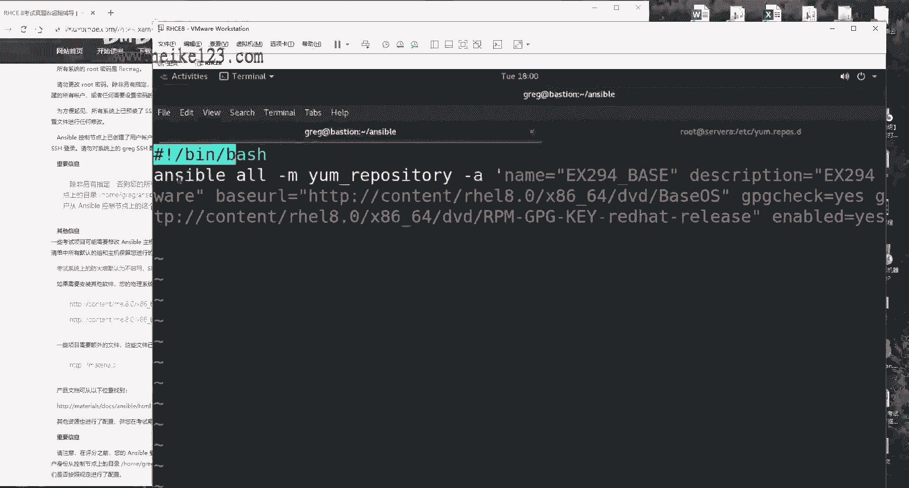

粘两遍，为什么，因为你两道题目吧对吧，第二个同样的命令，你八八往里一粘，粘完之后修改即可。

两道题诶，一个命令做完，它往里面粘。

两边分别做修改，首先来说我们的em仓库的名称。

接下来我们的描述信息。

怎么样讲这个很像辅导的时候，就一定要虽然说没有大家这个互动了啊。

但是一定要把我们这个气氛要搞得不错一点。

因为你讲的这个视频，我有预感这个视频应该是在两个小时以上，如果要是大家听得很痛苦的话，我听着他睡觉睡着了，所以的话呢，我自愿给大家就是举一些我们的红帽，一些小技巧啊什么的，给大家去争取的。

能够，更顺利把我们这个课程给他听完好。

我们依次去复制一下，好点一下，保存并退出，那你怕不成功，但没有关系，先把这个权限给它加上，让我们的脚本能够去判断分它能够去执行，然后咱们去执行一下，它执行好了之后，执行好了之后。

我们再进入到随便的一台节点里面，我刚才是随便找的吧，你们如果不愿意用这台主机，你们再随便再找一台，看到没，第二个也出来了啊，看一下第二个，看一下第二个主机，我就看一下第二个文件，比对一下。

没有任何的问题。

第二道题啊，拿分走人，第三道题安装软件包，太棒了，这也非常简单啊，他说先取新建出来一个名称为这个的东东。

那好了，不管他做什么，我不管你，我要记住两点，第一点在这个目录里面，第二点我去新建它，这是这是最后一次再给大家去强调了啊，不给大家再说说，自己都觉得有点太啰嗦了。

来先把我们这个格式啊，和我们这个文件给它新建出来，这个名称的话呢，我建议就因我们每个题目的标题为例。

这样的话以后我们也好找啊，好排错，然后的话呢我们先把这个格式啊给他写上，干什么事的话呢，不知道我们先给他写上不行吗。

看题目说将dv啊，不将菲律宾跟mary d b唉，这两个好给它安装到dv跟test跟pod组上面。

也就是说给这三个主机组安装这两个软件，怎么样呢，是不是感觉还是比较自信的嘛，这就这啊，对于这道题来讲，dv test pod 3个组干什么事呢，安装软件包，安装软件包来。

首先我们第一个安装第我们的第一个软件包，等一下啊，安装我们的第一个软件包呃，安装的话呢我们使用的是叫做ym对吧，那名称的话呢第一个使用的是p h p，大家会问，那老师你为什么不用一个loop循环呀。

对吧，你两个你为什么不用一个loop循环呀，同学们记住，完全没有必要用的loop循环，你就两个，你要是20个的话呢，我可能还会考虑考虑用不用一个这个呃循环，但是你这就是两个的话，那就没有必要了。

他另外的话我先把它对齐一下啊，我刚才没有把它对齐，你要记住啊，这个格式要写对啊，name ok没有问题，你两个我就不用去写那个呃，录不循环了，再写什么item什么的，麻烦下面我们有我们有。

我们还有的是机会给大家用啊，你两个你就直接老老实实的写两个就好了好吧，这个名称的话，那我就随便给它起一个叫做one吧，那第一就是一二就是二，三，就是three，四就是four，好吧，这样比较简单。

来4y y走，往下站，往下一路往下粘来，第二个软件包，我们安装上mary db两个嘛，同学们不要着急，哎但我在写啥呀，状态latest哎，最新安卓软件包的名称maria db，因为太自信了啊。

所以就没看那个最近没看答案还是不行啊，还得照着词儿说是不是啊。

安装成最新的版本，第二这题啊，做完看第二个问题说，将rpm development tooth软件包记住这个词组，同学们丢分就丢，它就丢在这儿了，软件包组安装到d v主机上面，什么意思啊。

主传软件包组啊，就是安装的是一系列的软件包啊，因此开启第二个play，我们还是来看一下啊，这把复制过来吧，但是这两个name的话呢不能够重名，就一个叫a一个叫做b吧，好了，专门给这个dv组。

专门给这个dv组安装上我们的rpm软件包组，这么去做，还是tasks i，name，一好ym等于软件包组怎么表示呢，先不要管软件包组怎么去表示，你仔细看这个里面是不是有空格啊，rpm空格哎。

development空格两个两个空格，因此使用到双引号，把它引起来，作为一个整体严谨的来，前面加上一个at符号，软件包组就是前面加个at符号，代表就是一个组，这么去做，拿分走人，第三小问。

将dv主机上面的所有软件包更新为最新版本，so easy，来继续r y y往下一复制p名称to干嘛呢，没有写完啊，刚才没有跟啊，刚才没有写完，不行啊，咱们还得咱们还得看，咱们还是得看着这个。

咱们还得看着点词儿啊，心急啊心急，咱们就都不按，怎么都不按词儿说的可不行，哎来刚才也没有写完啊，刚才这个写刚才有点写串了，感觉就心急了，来首先来说的话呢，就是我们这个em。

写上我们的软件包的一个组的名称，接下来的话呢就是state latest，最新版本没有问题吧，他再来四yy往下一站，咱们快是快啊，你们胡老师说过，对不对，天下武功唯快不破，你快是快，你得对啊。

刚才我就是不严谨了，来再将所有软件包更新为最新，就是使用一个星号作为通配符，更新的是所有主机，第三章节书籍只用到星号作为通配符，通配的是所有的软件包的名称，因此将所有软件包更新为最新，第三小问，做完好。

点一下保存并退出，大家听出来了，咱们下午讲课是不是要比这个上午更加，这个咳咳，是不是感觉更加沉稳了，更加严肃了，因为r这个下午考试还是比较有难度的，来看一下这个手底下啊，你这个下面一张纸。

我们随便找一台主机，比如说还是吧，来172。25。250。10test组好，来进行连接，来连接成功，我们要这样你去使用到ym install，去安装一下我们的p h p来安装一下，菲律宾看到没。

它是需要你去安装的证明，因为你之前你没有，所以你才需要去安装，来，我们现在的话呢去enzo去执行一下，我们这个playbook，你这个几个主机啊，你随便去找一个，你不用一个一个都去试。

同学们不要不要就不要那么实在啊，你随便抽查一个一个行的全都行了，不要那么实在啊，耽误时间啊，开始帮你自动选安装，这个实验我之前我做过一次，然后大概的分值的话呢，有两道题，咱们做不了，有两个小问。

怎么做不了，上午那门有这么一个脚本问题吗，考一个246是吧，上回这一次的话能考一个289，差个11分，那11分啊是有两个小问判分问题啊，是一个环境问题，我待会给大家讲一下，所以待会儿这个分值的话。

应该是在290分左右啊，290分左右还可以吧啊，扣十分好，我给大家看一下啊，再用这个节点去执行一下安装ph p，看到他就会要，他就告诉你说p h p已经安装过了啊。

也不用你去安装了，这道题怎么样呢，拿分走人好，下面一道说使用我们的rh e l l系统角色，什么意思啊，不就是说我们自己去安装上我们那个啊。

路由系统自带那个吗，这个时候就不要去使用到。

我们的这个greg用户了，你就必须要去使用到root用户了，否则你没有权去安装来远程连接。

那我们考试的时候你可以去使用速度啊，但是我们现在的话呢你没有权限，我们需要去安装一下，连接到254，ym install real，点system。rose。

一个y走，你安装安装好之后退出啊，不用你了啊。

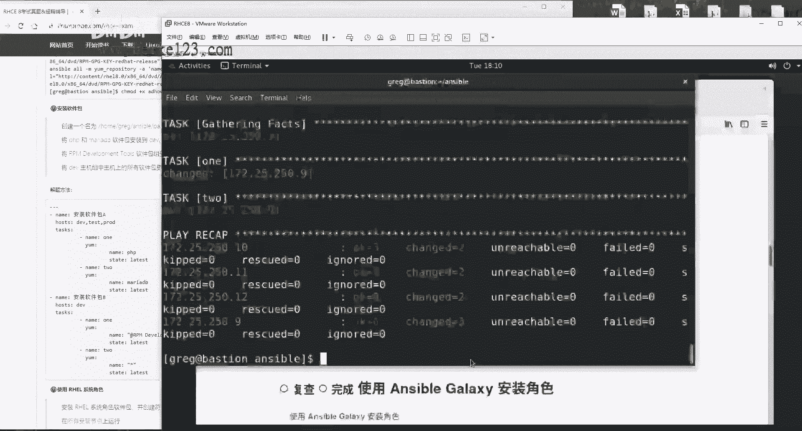

用完即丢看，然后看，然后接下来我们看题目是啊，啊安装real这个系统角色软件包，并创建以下啊，符合以下条件的playbook，还是啊同样的这个的话呢，我们先把它给创建出来，虽然说这个题目。

我们现在不应该把它创建出来啊，但是我希望大家能够养成这个习惯，我们还是要把它给创建出来。

但是这个就这个题目不用啊，不演成习惯吧，好吧，其实创建出来这个文件，大家听我这个嗓子有点哑，因为刚才确实已经刚才都讲过一遍了。

哎呀痛苦啊，没有录上，所以说你们听这一遍的时候，会比上一遍更加顺畅了，这些该哪出错了，该怎么配什么，比之前熟练的太多，嗯ok我们来继续说吧，在所有的控制节点上面来去运行这个time sn c。

这个角色，这个角色我们有没有啊，我们没有啊，angel galaxy list，因为那你可以看到了，你里面什么都没有，那你连配置文件都没有，那你呢那你肯定做不了，对不对，怎么办呢。

修改一下我们这个我们的anc的配置文件啊，修改成什么呢，我们修改一行这一行函数的话呢，大概是在等一下哦，你找大概是在68行，我们后面应该加入我们需要导入的这个，real的角色的这个路径，但是什么呢。

我们还不知道啊，我们不知道，其实我知道，但是我为了给大家讲呢，怎么办呢，我给大家捋啊，它其实它是在user目录里边的shell啊，user model里面的share里面的anxible。

里面的rose这么一个目录，你看到这里面就会有几个十个用户，对不对，他看啊，他们一部分是linux通用的，一部分是real系统专用的，你是不是需要的是这个用户啊，好好了，我们把这个路径给它复制下来。

再去重新去编辑我们的主配置文件，你只要你把这个路径你给他a1 ，加上你在意保存，你再去执行一下，你这个galaxy list就会发现有他都出来了，对不对，还有都有了好，那我们现在的话就需要用这个啊。

那我们这个压缩文件怎么去写呢。

你要问我，我也不知道，因为它太太太麻烦了，标准答案的话呢，虽然已经给了你了，但是你会写吗，我也不会写，但记不住啊，我们考试的话呢就是要给大家一个简单的方法，能这么简单，我就告诉大家小技巧啊，用或不用看。

大家怎么办呢，在user目录里面的share目录里面，点doc目录里面有一个叫做real点杠system，gone rose的目录，这个里边还有一个叫做time s n c的，一个子文件夹。

在这个文件夹里面就有东西了，这个叫做example减example啊，这个叫做example减time s n c杠playbook，我们需要用这个，这俩有什么区别呢，这个就是我们的压缩文件。

这个是叫做池的文件，我们需要的是上面的一个，所以因此直接就是这个，复制到我们这个当前目录下做完，这就是我们的模板文件了，好我们现在把我们刚才新建的给它删了啊，然后我们不帮把这个模板文件的话呢。

我们得改成，我们跟我们刚才保持一样的这个名字，然后按下回车编辑看题目。

这是我们的角色也有了，我们的模板文件也有了，你说你这不比自己写的要更加爽吗，对吧，你自己写的话多那多麻烦呀。

这他有这个模板啊，我们拿来就用就可以了啊，我们拿来就用。

说在这个所有的授管节点上面去运行，说的不就是受玩主机吗。

在谁上面去执行，那他就是个o啊，他说使用是time s i n c角色有了，那不就是他吗对吧，继续配置该角色，使用当前有效的n t p，废话一句，继续配置该角色使用时间服务器。

这个好修改一下吗，host name给它修改成我们所说的这个。

说使用i burst这个参数使没使用啊。

使用了好，我们来显示一下函数，他说呀让你配置这一个。

他说明说他只能配置这一个，你看题目他说明说只能配置这一个。

他没说，因此的话下面有一个拔高题啊，可以选，可以不选，后面那些是不是没有用啊，因为他是说了让你去配置这个主机的这个地址，他没说只让你配着这一个地址，因此的话呢下面这个你留和不留都行好了。

我认为不用留碍眼来，第七行到第12行，冒号呢七逗号12d删掉它，干干净净的保存并退出，做完安吉able在执行之前诶且慢，哎嘿执行哎算了，就先去执行了吧，先去执行一下，他执行过程当中的话。

大家老这种心态就是有点小错，特别的担心啊，看好了，待会会出现红颜色的报错，很正常，大家在去工作的时候以后啊，老会遇到uncle，在剧情过程当中那种红颜色的提示是有报错，但是不影响就不要管好。

我们等他先去执行，不着急，唉不要管他，为什么不要管，是我估计看不见吗，不是因为你看到这个结果，因为你要看它的结果，17个，ok ok大家理解啊，change修改了四个成功了，77个，修改了四个。

零个未到达零个失败，所以的话呢刚才那个红色那个报错，我们不用管它好，那么这个怎么能够去验证成功呢，做到这其实就成功了，但是我们要去进行一个验证啊，考试让大家怎么去验证呢，低头啊，低头随便找一台主机。

因为你应该是对于所有的o的主机，进行了操作嘛，balancers吧，就是这个balance平衡负载均衡主机，172025。250。13，按下回车，这么着，它有一个文件croy。config，按一下回车。

看一下它的ndp选项，是不是就是我们所设置的254。2。

542burst，ok所有的主机就都已经搞定了，它使用的是由你提供的nt p的这个选项，拿分走人，下面再来说使用ansible啊，galaxy安装角色什么意思呢，就是从外部引来两个角色呗。

一个叫做hp啊，呃price一个叫做菲律宾info，两个文件看着啊，这后面有个小坑啊，特别的阴险。

你看啊，原先他都在这个目录下进行，对不对，这个时候他原先就是在这个文件里面，新新建这个yo文件。

他又来一个这个啊，在里面新建设一个rose的一个目录，里面叫做叫做这个requirement。

是不是它是不是很阴险对吧，来复制一下它不要写错啊，因此是要进入需要编辑，进入到这个rose目录当中，然后再去创建，那老师你为什么要直接粘这个路径呢，那不写一个相对路径呢，因为我呀就想一定要确保它。

这个路径一定要写对，所以的话呢我干脆就写一个去，那我就写一个完整的一个路径，保证我们保证它是万物一失，好吧好。

接下来看他他要干嘛啊，他说下载软件包并安装到这里，我们不管它啊，还往下面去看，因为它默认它就在这个目录下了嘛对吧，他说有这么一个角色安装成这个名字好两个啊，这两个用户安装成分别是这两个名字。

安装用户大家都会啊，三个斜杠src冒号路径。

name名称别敲啊。

同学们别敲，怎么样呢，复制它，你下课之后看见鼠标左右键全坏了啊。

因为复制的太多了，考试的时候啊，就是你把正确的东西放到正确的地儿。

不要傻敲傻敲。

都是没参加过考研辅导的，不知道有什么是什么的好，我们来继续，做完之后。

boss并退出做两遍，做两遍，同学们看好了，ansible galaxy in store gr，加载一下这个文件做两遍，这在rose目录下做一遍，告诉你是successful。

退到我们这个刚才这个目录下再去做一遍，为什么情报是有的，据考官讲。

他让你做两遍，否则判分脚本可能不成功，大家理解这个意思啊，不说太透，这是题目里面没有的，这是由我们参加考研辅导的时候才能够知道的。

一个小坑，就这么阴险啊，做两遍，在这个rose目录里面做一遍，在我们的s b目录下，这个目录下再去做一遍，做两遍，这样之后的话呢，你再去看就会发现里边是不是多了两个角色。

好拿分走人，就是这个才是正道，一定要去执行两遍，这个我没有给大家啊，这个我们在核心复杂里面好像没有办法写是吧，行，就以我们这个视频为准啊，以我们这个视频为准，记住我这个没有错。

好我们再来说创建和使用角色好，这就是来了嘛对吧，欠的总要还嘛，前面是什么呀，前面是使用的是real的角色系统，角色又让你去使用一个外部角色，终于啊欠的该还了，去新建出来一个属于自己的角色。

在这个目录里面新建一个叫阿帕奇的角色，别的我先不看啊，同学们记住了，题目有12345，你先去做那个345的一和二，你后来你又忘了不行，一步一步来一步一步去做，来新建角色，怎么去新建呢。

ensable galaxy怎么样呢，init apart，按下回车。

先新建好，然后我再看，你要求他说啊，这个角色能够干这些事儿，第一件事安装httpd，并且在启动时启动并启动，你听他说这个是啥话，你再再品品，在启动时启动，那也就是指的是你重启之后呗。

并启动并现在就能够生效了。

好理解什么意思了吧，就是你安装上我的网站服务，当前生效，重启之后还生效，就这么个事来进入到这个角色当中，进入到我们这个test目录当中，编辑man直接来直接来啊，跟第一件事第一件事是什么呀。

安装等一下啊，第一件事安装上我们的apoch服务，name一啊，那是one吧，第一个就是one，第二个就是two，好吧，我们就省得再取名了，name等于name http t我们软件包的名称state。

大家说那老师这关考试之后，我记不住怎么办呢，看啊考试的时候记不住，就这样去做，使用ansible doc什么呀，document文档啊，不要去记啊，不需要记，但是记不住的话，有有在没有办法要。

记不住的话，看example，看他这个实力有没有啊，有没有啊，上面那个第一个就是一模一样，直接你粘贴过来粘贴就完事好吧，因为我们是在讲课，所以的话呢我们就虽然他正式一点，就不给大家复制的。

复制的太就显得特别懒，你知道吧，所以的话呢你考试的时候，我反正我是不管你的，安装好，第一步安装第二步怎么样呢，当前启用并且重启之后还是用service模块啊，这个你说那我也记不住这部分怎么办呢。

记不住也没关系，同学们很正常啊，我也记不住service查，最后example来还来没来，这个这个包括说底下还有一个enable，就是代表是永久生效，就是我们从就是我们重启之后还能够依然生效。

这个有没有全有好，okay，n，你就照着就照着粘就行了啊，你就照着粘好，我就我所以的话呢我就不会粘粘了啊，started代表就是已经启用了被启动enabled，开机之后重启之后还生效。

做完没做完了，看下面题目，防火墙已经运行，放行http，我们的web网站服务什么呢，放行我们的web服务。

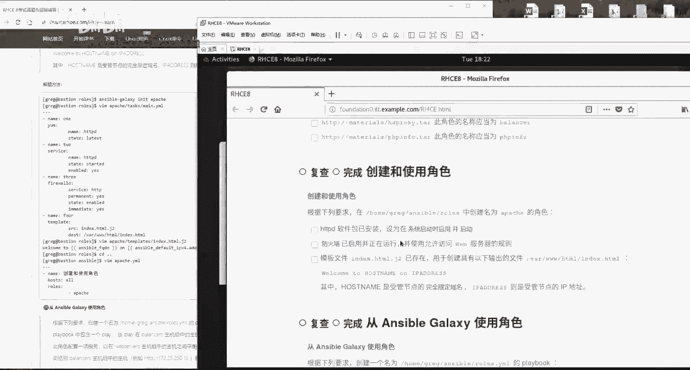

放行http端口号好，这样去做y c啊，one two three，第三个防火墙firework，这我不给大家查了，还查一下吧，ok查一下吧，其实没有必要给大家装的啊，上课都讲过了。

所以这时候再给大家装一下，怎么去找啊什么的，就大耽误时间了，就去给他装一下的好，所以说我们就是看吧，一行一行的参数全有，下面还有一个叫immediately也在下面全有，然后的话就记住啊，好了。

在这儿呢常有嗯好，我们开始了啊，firewor，service，记住啊，他写的是什么呀，firewall，它是一个数据链路层的一个防火墙，对吧嗯，它不是应用级别的，他的话是基于我们的来源地址。

目标地址端口号，写一名来去这个拦截的，来进行我们的权限的控制，进行我们这个策略编写的，因此的话呢他写的不是服务名称，这样写零分，记住了，同学们是协议的名称，是协议名称，然后是permanent。

代表是永久生效，当然生效了，要不然的话你走了谁过分啊，state enabled启用它，并且immediately代表就是当前怎么样呢，野生效这一步的话呢，其实你写不写无所谓，因为它是从体之后盘卷的嘛。

但是你要不写的话，你现在你看不到这个结果，你心里也打鼓，对不对，我们干脆你当前你也生效，你的话呢出去之后你还生效。

那就ok我们没有问题，说配置一个这个金件的文件，它的话内容是这个给他拷到这来，好好了，我们先不管它输入内容是什么啊，这个我们先假装看不见，我们的话呢先看一下这个文件，也就是说把这个文件金价的这个文件。

把它拷到对应的目录里面，第四步，这个是用什么呢，竞价文件当然是template模板了啊，template模板template吧啊没有s template，这个我被大家装了啊，自己要是记不住的话。

回去之后查一下这个词就好了，就是那个document去自己去查就好了。

好这就写一个三维路径就可以了，不用写那个完整路径，因为它就会在这个template目录当中去，找到你的啊，然后的话这个是我们把这个文件复制到哪里的。

为的意思来粘贴一下它，r是c e吧。

他要求的不是一个理，他要求不是理解的，其实他要求的是一个记忆能力了。

大家能感觉到吗，如果你要是感觉不到的话，说明你没有考过红包，六七和六和五，它没有实验的步骤了，他没有实验的步骤了，全都是这样的配置文件了，大家做完之后啊，大概两个小时你会说回忆一下我这句话。

rh c c e8 版本里面全都是配置文件了，它不需要你再去时间去排错啊，修改啊，挂载这些操作没有了，也就是说其实你可以完全不会，你就背这个东西，就把它可以背过来，还可以背过了。

要不然我就说为什么他这个水平出的有点低呢，就是这个水平对吧，来写完了之后的话呢，我们来进入到我们叫做template模板的，这个文目录当中，新建出来一个叫做index。html。g2 的文件。

他说啊在从这个文件里面复制内容，然后考到对应的目录当中嘛，那不就复制了这个吗对吧，然后看他这个介绍说其中的话呢，hostname是受管节点的完全限定域名板诶。

百度上一查什么叫做完全限定域名啊，大家帮我想帮大家，大家帮我想一想，这个叫做f q啊，不对这个叫做f d q n啊，百度上搜一下怎么办呢，哦刚才set up考试之前，同学们。

我现在实际上还是在给大家装的啊，考试之前提前做好功课，该查都查完了，到时候考试之后直接往里填就行了，不用像我现在这样去查，我只是说同学们，你们如果真的不想记的情况下，你们才这样去查好吧。

同学们来呃啊他说这个主机没有配过啊，这还不是我们的收，它不是我们的控制端，我们进入到我们的这个控制端里面，好走好走，你查一下你所有跟f q dn相关的不得了吗，查一下跟所有跟f d q n相关的变量。

是不是他啊，你猜你看是不是不太对吧，来复制一下它，那我们该怎么去调取变量呢，调取变量的方法是，我先把它给写到里面啊，插刀第一个是不是这样啊，两个中括号啊，这是两个，这是两个大括号是吧。

来后面ip address看介绍。

ip address则是受过节点的ip地址好了。

ip先借完ip两个字啊，一个一个来，甭管哎，先一定要，就一定要返回到你这个这个对应的目录当中，再去执行，否则他eniable是找不到配置文件的，搜所有跟ipv 4相关的可不可以啊，ipv 4。

或者说你搜ip也行啊，搜ip也行，看到没，ansible下划线，default下划线ipv 4，你要的是这个吗，你要的不是这个，你要的是这个里边的address的小项目，因此就是点address到一起。

这叫他们这样子去写，就能够把这个的信息给它完全地提取出来了，听完我讲课，基本上你就当做是一个hc证书的，一个印刷厂就好了，只要但是你要知道了，只有你知道这样的这个小技巧，来boss并退出ansible。

我对于这种考试吧，我就一个概念，不是我就一个这个观念吧。

就是怎么稳妥怎么来，不是给大家共同的玄虚，大家看好这道题目应该怎么做啊，怎么就完了，我们会告诉大家最简便的方法是什么啊，至于说大家呃其他学员羡慕我说哎，那你这个怎么考试那么容易就通过了什么的。

那就不要抱怨别人了啊，抱怨自己没有总结出来吧。

好我们要找这个考试技巧，做完之后干嘛呢，就做完了可以了，这就回，那就拿回拿分了，但是你放心吧，我不太放心，怎么办呢，你到到其实你到这一步的话就已经结束了，做完了都做完了，这个角色已经出来了，你不信啊。

等一下这叫麦当啊，galaxy啊，这个脑子已经不太好使啊，类似你没看到这个用户已经出来了，已经配完了，已经拿分了，但是你是不是感觉不太靠谱啊，老感觉想去测试一下啊，对啊，那我们去测试一下吧，随便啊。

这不可以选座啊，随便新建出来一个文件，随便新建出来一个文件，这样去做来调。

就是调用一下你这个角色，看看你这个角色能不能成功吧。

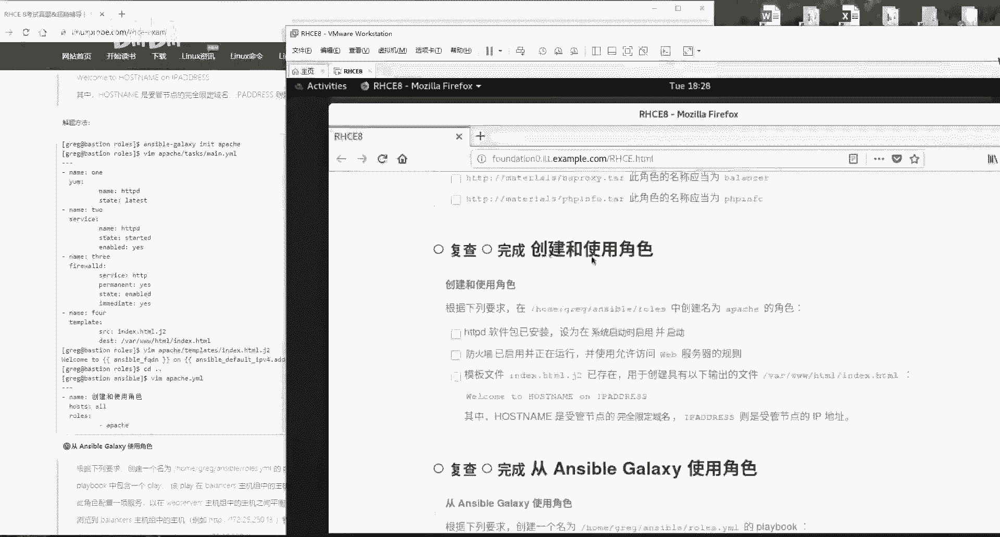

因为你刚才新建出来一个，你看看能不能调用它成功，对所有的主机上面我们都走一遍，但是大家都要注意，就是这一步操作完了之后吧，会让你后边有一些实验吧，做成功怎么理解呢。

大概是这样的啊，这道题跟我们这道题啊有冲突，你这个角色你如果你要调用的话呢。

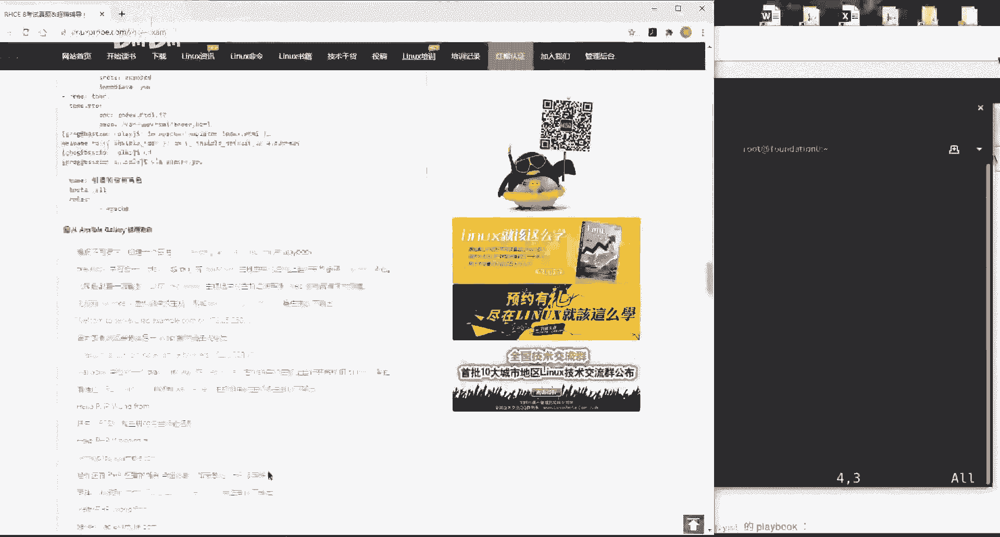

下面这道题目就会有一个点一三，那个主机报错好吧，但是的话呢我为了给大家去测试这个实验啊，我还是去调用一下它好吧，待会如果下一道题出错了，大家千万不要笑话我给大家讲怎么回事就好了，做好之后。

ansible playbook，an approach，好走，你测试一下我们这个角色能不能成功，那老师成功之后有什么样的效果呢，你想啊怕是有四个功能，第一个创建我们的网站服务，安装它。

第二步让我们这个服务能够被防火墙放行，第三步不，第二步让我们这个服务当前生效，重启之后还生效，第三步防火墙放行，第四步拷贝什么金价文件，效果就是你去访问谁的主机。

19217低头啊低头啊，172。25。250。9，你访问谁的主机，就能够访问谁的f q d n的信息，以及对应的怎么样，以及它所对应的ip地址，再来172。25。250点，随便吧，1234呃，12吧。

点12走，你打错，172。25。1。2，5。250。11吧，按下回车，可以看到，是不是他能够看到这个主机的完全限定主机名，f q d n以及对应的ip地址，没有任何问题，没有任何问题，成功成功好。

但是的话呢因为它跟下面这个实验有冲突。

因为它原本这些题目里面，它是不要求你去安装这个服务的，所以的话呢我之前做这个实验的时候，下一个实验它会产生冲突，因此我去执行一下这个命令，但是我不保证它能够成功，我现在只是这样去做一下。

就是把我们的htp服务先给它卸载掉，避免跟我们下面这个实验产生冲突，但是它是否能够真正如我所愿，我不一定，我但是的话我愿意去尝试一下，ym remove杠y http在所有主在所有主机上面。

我们去移除掉我们的网站服务，因为我刚刚去安装了吧，现在我们把它给移除。

做完之后再去刷新网站就没油了没油了，看下面讲题目，下面这道题目的话，大家看完之后就哭了，赵老师这题目也太长了吧，什么题目也是，你看看这一页啊，同学们看完这个之后就疯了，最好在考试的时候，你看这道题目。

我们从老师的角度上来说啊，你你要不看个五分钟，你看不懂，你在说实话，你五分钟之内你看不懂，实际上的话呢，这道题是我们hc考试里面最简单的题目之一，怎么回事呢，看题这些他都是不用你去做的，第一来说。

第一句话，从antibigalaxy使用角色应该出现出来，两个角色记得吗，上面一个实验，一个叫做hyper price，一个叫做ph info，有两个，原本有两个角色，现在让你去调用。

这两个角色之前是创建，现在调用就是那么简单的事情吗，好不要说了。

大家不要说，那我们老师怎么老天天就说rh c简单呢，你找个角度的方法其实真是不难。

你要说故意吧，说特别难，那不就骗钱了嘛，对吧，就是为了白说的很难被推销自己的这个课程好。

我给大家先复制一下啊，就是说怎么配，不知道先给他创建出来再说，你看啊，看题啊，等会啊先把我们这个格式给它写上，省得一会我忘了啊，来粘贴一下什么主机，不知道唉，先给他写一下。

好，开始说啊，在下列要求中创建一个play book，说下这里面有一个play好，这个play的话呢，它是在这个组当中去使用这个角色。

就这么简单的事情好了，来在这个主题当中调用一个角色。

不要手敲啊，直接复制使我们的手好不好，好做完这道题，做完了说了，那我们这个下面不用做吗，下面你不用去做，下面是用来验证的，做完下面一道题，那老师你这样做对吗，因为我自己都有点怀疑自己了，他就是太简单了。

对这样做是对的啊，而且没有任何的呃，呃我们而且没有任何的问题。

让我们来继续啊，因为大家可能之前吧对这道题非高估，你知道吧，所以我能够理解大家看这个心情，这是一脸惊恐的看着我说，老师你这个做的对吗，好对啊，但我们看一下这个验证啊，我每道题都给大家验证一下来。

第二个实验了啊，第二个play是啊，在这个组里面好等一下啊，你说什么就是什么才配仨啊，你让我配30个都给你配出来，唉有些时候你把这个东西一说明白了吧，就很简单了，但是的话你要不说明白的话。

看起来好像挺高级的，而作为一个考前辅导来讲。

他就是要把这个事情说的简单了，就是他他就是这样好呃。

就是这个角色往里面一粘，好，做好了吗，那没有做好，后面有一个坑，什么坑，他是要求你是不是必须得显做这个负载均衡，以及显示出来这个p h p信息啊，待会儿这个效果就是他会做一个负载均衡。

它会显示出来p h p信息，但是你要是没有网站服务的话，你能做出来吗，你做不出来，因此同学们看啊，后面的一个坑就来了，他没有要求你，但是你必须要去做，就是调用你刚刚创建出来这个ipad的这个角色。

才能够让你这个服务起来多阴险，你看这个题目之外的话，所以的话呢我已经给大家排出来了，就是如果你要不安装上你这ipad服务，你前面两个服务的效果你出不来，必须有这个网站服务才才才能够生效，这样做完之后。

然后呢，然后就ok了，就这么简单，这道题目的答案还没有这道题目场呢，你读一读是吧，好，那么待会先给大家声明一下啊，这道题目的话呢，因为我们的实验机器的原因，我们待会有报错，这个话大家不要笑话啊。

大家不要笑话，在考试的时候就这样去做，没有任何问题好，待会儿的话呢，这个报错会报错在172。25。25，0。13上面，就是个balance的机器，好，我们再按一下回车，有一定几率会出来啊，不出来更好啊。

没有包车更好，有报错啊，我今天提前给大家说一下，然后怎么去解决，不用着急啊，我们一步一步来，有报错我们不怕啊，没报错更好诶呀没有报错，那好不好啊，更好是吧，它是有一定几率出来的啊，也不是说一定要出来的。

因为什么呢，因为我刚才把那个ipad服务不给卸载掉了吗。

卸载掉之后它就不会有报错了，就这么的就这么的严谨啊，好听，我讲课什么时候感觉特别特别的爽啊，就是处于一种一座啊，下面这个啊开始了是啊，这个角色的话呢配置一项服务，它能够在这个服务之间实现负载均衡。

什么样的效果呢，就是你去访问这个主机的时候，每次一刷新，他都会能够看到一个新的ip地址，它能够从这个server b跳到c，从c跳b还能从弹，还能从这11跳12，还要从12跳11，我不信你试一试。

那架回车看到没，f5 f5555 ，每按一次f5 怎么样呢，每按一次f5 跳一下，这边变b和c，这边变一和二行不行啊，啊太行了啊，再来说我们后面加上一个叫hello的一个菲律宾。

它能够实现出来p h p功能啊，他已经帮你配置好的p h p了，他说能够显示出来p h p信息，我不信哎，我看一眼还真行，并且还有一句话说出来，这句话的话呢，必须还能够显示出来，hello啊。

菲律宾word，好，没有问题吧，from还是得，这还必须是个完全限定主机名f q d n诶，还必须是个server b，你看一看是不是哎是这都不用你去做，拿分再来是吧，你去访问这个的时候啊。

它还能显示出来一个server c啊，真的那么神奇吗，我们访问，那我们访问一下，按下回车，sorc没有任何问题好，这道题完美解决，太完美了，再来下一道题，创建根使用逻辑卷啊，创建创建根使用逻辑卷。

下面的话就是说先新建出来这个play book，同样的老道理啊，大家都知道了啊。

就是说老刘什么什么不好啊，先把它给创建出来，省得忘先写出这么个文件来吧。

怕忘哈，这也没问题，在所有的授管节点上面去执行下面的角色。

什么意思呢，o啊house的冒号等于o太好了啊，先把我这个格式啊给它写出来，我省得忘考试的时候就是这样的，你哪怕了大呃，你哪怕我写错，大不了给删了对吧，但是我不能给忘了呀。

来就怕做着做着把前面的题目做完了，后面的题就把后面的题目做完了。

把前面的给忘了，那尴尬了，来看题目是吧啊，先写一个一啊，ok先写个y是吧，在我们这个系统当中的话呢，有一个叫做research的一个卷组，太好了，这名啊说走进逻辑卷的话，那名称叫做data啊。

大小的话呢创建成一个1500兆的好，我这个脑子不好啊。

我先做这第一步，这个充电来l o v e m充电是什么，它使用什么模块呢，它使用的是叫做国家长，这个使用的叫做这个使用的叫做lv o l好，往下走走走走走enip，然后使用到example，看到没。

这不就是这个吗，一呃等一下啊，那不就是这个吗对吧，一模一样啊，一模一样，vg什么名对吧，我先给大家写。

他会告诉你l o v o l打vg什么名，vg名。

我不要去手写或复制它，第二是什么呀，alloy什么名，考试的时候啊。

不要慌，v啊，阿拉伯什么名站，他啊逻辑卷多大大小加加上这个单位吗。

不加看到没，为为为它，它为什么不加呢，他这个示例里面，他创建出来一个512兆的一个逻辑卷，他家没家啊，他没一家照，所以的话呢这个不用加，这个不要加啊，直接写成1500，size等于1500，就这么写啊。

1500兆的一个逻辑卷创建出来，第二步好，开始了，使用e x t4 文件系统格式格式化逻辑卷，还不就一个，他不就一个格式化吗，其实啊我给大家说，你可以使用到shell，你可以使用e这个shell。

因为我已经跟红毛那边去确认过，直接这样去做即可啊，research就是我们现在所讲的这一切啊，你全都可以用到shell模块去做，包括说这些全都可以，只不过我们为了讲课的时候，我们不能这么去讲。

大家会觉得我们这个课吧啊太太投机取巧了，已经很投机取巧了，我们再投再取巧的话，大家会有意见，所以的话呢我就还是用该用哪个模块，就用哪个模块，比如说这个模块跟这个模块对，我。

那我还是一个一个模块这样去做的，而真正考试的时候的话呢，你要是真的忘了情况下啊，你甭管什么模块了，一顿全都是上个模块，全都直接写命令好吧，接下来我们来写一下这个呃。

file system type文件系统格式以为e x t4 ，然后的话呢我们的格式化的设备名称是什么呢，dv目录里面以逻辑卷，卷组的名称命名的一个文件夹，里面叫做以逻辑卷的名称命名的一个文件。

是不是他书籍里面第七章内容忘了就看一眼，好这就这啊，这个活儿做完。

我猜他后面还有啊，先给大家写个字干嘛，我不知道啊，说啊如果要是无法创建逻辑，就源的大小什么意思呢，磁盘不够了呗，啊就会显示出来这个信息行了，那我这个还是理解错了啊，咳咳他说如果要是你这个文件1500兆。

你要是不够的话，那么就创建出来一个为800兆的一个文件哦，退而求退而求就是退而求其次嘛对吧。

1500不行啊，退而求其次到800也行啊，那我们这个时候就要做第一bug了，做这个救援了，原因是你在上面不成功的前提之下，你才去做这个操作的，怎么办呢，这样前面就要把下面这两项作为一个整体。

加一个block，是不是因为你把它作为一个整体，这两个哪一个不成功，我们都要给你救援，ctrl v ctrl v，然后ctrl大i table啊啊table table还ok没问题啊。

按下e s c键把它往后搓一搓啊，把这两个作为一个整体，接下来的话呢我们写上rescue救援，而r r e s c u e冒号，这个时候的话呢，一定要跟我们这个上面那个block对齐。

你要是考试的时候啊，拿一张a4 纸，你底下卡着那个显示器，你对着这个你卡他一下，你就看他是不是一他是不是他这是对齐的，你要是不对齐的话啊，你按下ctrl v你对齐一下，他看到没，他没齐。

是不是没齐就会报错啊，一定要一点不差，对其他来对，其他看到了吗，跟它对齐啊，跟它对齐，字跟字对齐啊，没有问题，来怎么救援呢，输出一个，接下来做第一步是不是要去输出一个吧，等会我又把它删了，对不对。

齐啊啊对这个对齐这个很重要啊，这个很重要，来首先来说debug。

输出一个信息，信息怎么输出啊，这么着去做。

对不对，哎，输出一个信息，等一下啊，这个病还是跟debug是同一个级别，写到这个后面来，往往他往里面一粘还没有完，并且的话呢他说1500兆，他要没有的话，它会创建出来一个为800兆的。

一个逻辑的一个逻辑卷，好我现在在做一个第三步，哎呀不用做第三步，不不他粘呗，123455yy，能偷懒就偷懒，对不对，考试的时候这样会提高你的效率，晚上下午这门考完了之后，去吃饭的时候都能比别人早到啊。

来提前抢个位置去啊，做完啊，如果要是这个磁盘没有空间的话，那我们就新建为一个v800 兆的一个磁盘。

再往下面去看，说如果要是这个reserve这个组还不在。

怎么那么多种情况呢，它就会显示出来这个信息好，也就是说如果要是连这个组都没有的话，不光是磁盘容量不够，连这个组都没有的话，再来debug，再bug一个对吧，再去输出这个信息对吧，然后我们往里面一粘。

摘了之后啊，还有一个小问题，什么时候去输出呢，就是说这个组不存在这个情况之下好了，那我就不给大家装了啊，这都是大家都知道了，上课之前一定要做好功课，这个变量我们叫做anzbl，它也是个facts啊。

变量啊，anzable。v g s查看我们的逻辑卷组，相当于就是vg display，这边有没有一个叫做research的一个组，他要是已经啊，他要是没有被定义的话。

an defen他要是没有被定义的话，那我们就会去输出这个信息，输出说逻辑卷组不存在的一个字样好，那么同样的，那那就同理嘛，yy一下，往下面往上面扒一张，如果要是存在的话。

那我们就新建出来一个为800兆的一个空间，要是不存在的话，就去输出这个信息啊，非常公平，抱歉并退出，做完好给大家解释一下，在r h c e考试的时候的话呢，它啊这我们真正考试的时候啊。

它是有三台机器可以创建，两个机器的话能不能创建，而我们这一个模拟环境的话呢，它是五个机器里边都没有这个research这个卷，因此都做不成功好吧，同学们这个的话呢知道就好，知道就好。

这对大家这个考试没有任何影响，只是说考试的时候你这样去做没有问题，然而我们模拟环境的时候，他一个都不成功啊，但是它不会有报错，来跑一下我们这个逻辑卷还是啊虽然没有，但是我们跑他一下。

看有没有语法让他报错，这还是有必要，对不对呀，报了个错错啊，报了个错错，我看看啊，这个报错的话呢，他是说啊这个没问题，他说我们这个逻辑卷没有被找到吗，这个逻辑卷没有被找到，这是一个很正常的啊。

它不属于报错，所以的话他会底下会去输出，说我们这个逻辑卷它并不存在的一个报错，因此的话呢上面这个信息属于正常，这没关系啊，因为它上面失败了，他才会去执行下面这个语句吗，这个是在我们预料之中的。

因为我们当前我们的舞台他都没有这个逻辑卷，因此它就没有成功好吧，但是就这个结果是正常的好正常。

没有问题，好往下面去走，生成主机械铭文的文件，这个的话呢是这个怎么讲呢，这是我给你们大快人心的一件好事。

这道题目是这么去做，来看题，这道题我们的学生能替你们多挣出来20分，就这一道题啊，只有我们学生自己知道看题目生成主机文件，当然大家如果要是，你认为我们这是一个取巧的方案的话呢，大家可以不用这样去做啊。

我不希望说给我们学生们找一个更好的方案了，结果还要带，然后被我这还有个被这个某些人说说，你们这不是这不是这个不是特别去想吗，对吧，这不是走歪路吗，我们这种批评是不接受的啊，因为你要看你在干嘛。

你在学习的时候，你这样去做不对，但是你的话你今天是在考试，这个是两种不同的状态，不同的情形啊，好吧，你在考试的时候，那三个半小时你就不是去学习去了，你就是为了去拿你那个钱去换一张纸，去换一张证书去了。

这就是一个很公平的交易，你如果你能把这个钱给不了，那如果你把这个钱换不成一张证书，你反而你这是一个更让人笑话的事情，所以我们就啊，并且所以我们就接受一切的骂名吧，但是我们项目虽然能够提高这个通过率。

是怎么回事，这个这个这个的话在大家考试之前，尽量不要外传啊，有这么一个模板文件。

把下载到你的这个对应的目录当中，他告诉你了，把这个文件下载到这个目录里面。

按下回车完成这个模板。

这个模板的话呢样式跟这个文件差不多，我们看一下这个件它什么样子啊，就是给你个参考啊，他就给你个参考好啊，大概这么个格式啊，怎么看，怎么他这么个格式。

他说呀再创建一个名称叫做这个东西，这个时它它是什么，它它就是一个均价文件，对不对，一个模板文件说啊，创建一个这么一个play book好。

还是啊，同样创建出来一个这么样的一个play book。

干嘛呢，它能够在dv组当中生成这个文件哦，明白什么意思了啥，它它是啥意思啊，他就是说我们使用的这个均价文件，它里边有一些信息，它会在我们这个dv组里面。

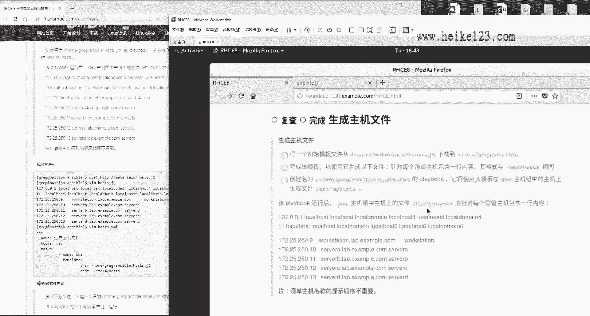

自动把信息给它复制进去，好像给大家写成这个格式这么去做，首先来说减减减啊。

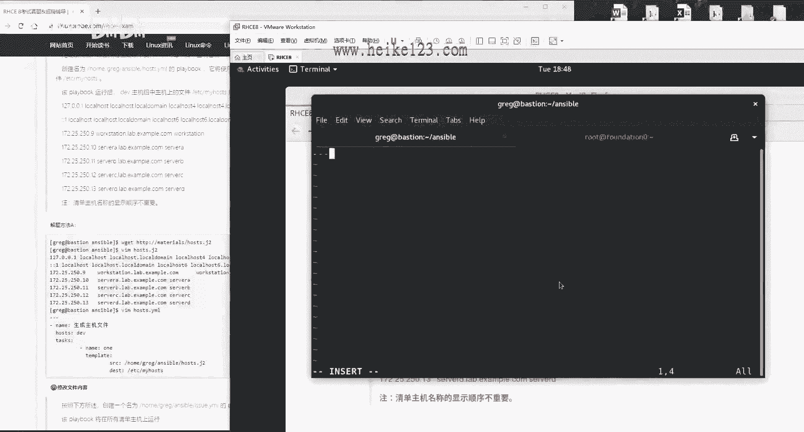

刚name，同学们啊。

这个方法我给我给大家了，肯定会有人说这老刘，你这是特意去抢啊，你这怎么能给学生这么去教呢，啊这不就是为了考试一个应试教育吗，啊我的话就自愿接受这个骂名啊，不过的话那我就希望大家考试后能够更加顺利。

我没有任何问题看一下啊，这么去写，他不就是说让我们去复制那个文件吗，还使用是template，对不对，好看好了，同学们，关键点来了，s r c路径给我写。

对home目录里面的greg里面的ansible，里面的house。g。g two，你要哦，这个我不太放心啊，我去我去复制一下，因为我怕写错好，我在我我查看一下，ok啊，是在的。

然后的话呢把这个给它粘贴到目标上面，这个均价文件的话大家应该知道啊，这个难点是什么呢，难点你要是在这个这个难点啊，是这个文件，你如果你要是光这么着的话，他就把一比一给它复制进去了对吧。

那你就把这个给它一比一，直接复制到对应主机上面了。

但是的话这是不对的，为什么，因为他需要在里面再去增加上这些信息，这些信息的话呢分别是什么呢，分别是这个主机的ip地址，这个主机的话呢完全限定主机名，这个话呢就是主机的一个呃。

inventory house name，就是叫做这个售管节点，主机名也是他也是一个别名。

你要把这些变量的话呢一个一个的写到里面去，一个一个往里面去写，写好之后往里面一考，比如说像这样对吧啊，我们定义一个for循环，然后呢我们一个一个从这个group里边我们去获取，就这样去做。

那我们一个一个去做提取，提取之后往里面粘，最后我们结束掉我们这个循环等等，我看这个它应该是一个啊，然后我们一个一个往里面粘上去粘，正确写法应该是这样的，不是标准答案啊，是这样的，他想让他想。

他想怎么考我们，然后呢我们调取一个一个的变量，最后我们最后变量考过去的结果就是这个大家。

但是的话呢大家有没有参加过高考，高考的话呢，江苏卷啊一直很有名，为什么呢，做数学题的时候先拿尺子量什么意思，他要给你一个直边以及斜角边的一个尺寸，然后的话呢让你去算什么圆周什么的。

有他有些学生吧他们不会做这道题，不会去用那个方式啊，他们他们就是他们不会去做那个公式，怎么办呢，江苏卷的一大特点就是那个三角形啊，特别的规整，按比例出的题特别的严谨，他拿尺子去量一下，去量一下这个直边。

比如说2cm，这个斜边1cm，2÷1等于是啊二对吧，或者你八一带一除哎，是个根号三，大概一个范围，直接写上这根号三，或者写一个二，或者写一个，就是出完那个结果，直接拿尺，就拿尺一量量出这个结果。

往上一填拿分走人，一样的，你中考你都可以这样，为什么我们这个考试不能呢，于是我就帮你们去想了一下，同学们，我看你们太累了，怎么办呢，这个信息他让我们去通过变量去提取出来，这个信息，但是我仔细我一看。

这不就是现在考试的这个信息吗，而且我跟考官去求证了，我说考试是不是就是这样，他说是这样的，于是你们不用变量了。

同学们直接复制，因为你们没有看过那个原始答案特别长啊。

直接考试的时候直接这样，既然他已经给我们这个信息了。

我们就没有必要再去变量去复制了，既然你红包你也提出来了，你只看结果，不看过程，就这样去做保存并退出，直接把这个文件给他拷过去，你你爱怎么着，用这个这个变量去提取，我们不用好吧。

最后的效果跟单用变量提取出来的时候，是一模一样的，没有任何问题好我们来测试一下这道题。

原本应该是20多分做，至少得20分钟起以啊，20分钟以上才能够做完呢，咱们五分钟做完好。

ansible playbook house，点emo，听完这个要是听完这个之后啊，要是再考过再再再考不过，我说这道题再丢分说不过去啊，说不过去啊，来他是不是说把这个拷贝到dv目录组啊。

你看看这个主机组上dv目录吗，走啊dv目录低头哎，172。25。250。9走，你拷贝到哪儿呢，忘了看一眼啊，拷贝到哪个文件夹目录。

etc目录里面的house name是这个目录吗，啊是这个目录好。

去执行一下ansible playbook，走，做完dv随便来，我们去dv这个主机上面去看。

拿分跟你用变量来给它复制出来的一模一样，一模一样，没有问题，到时候我们拿这个，待会儿拿这个拍文脚本，我们给大家过一遍好，给大家过一遍，不用担心，那接下来啊，既然我看非常开心啊，下面再来说啊。

修改文件内容好了。

来修改文件内容，粘贴哎不是这个主机啊，差点做错了，干啊想啥呢啊。

杨洋洋得意了，为啥你看这道第几道题了，这已经是修改主修，修改文件内容，已经到了修改文件内容了，到了大概这么一个题目了啊。

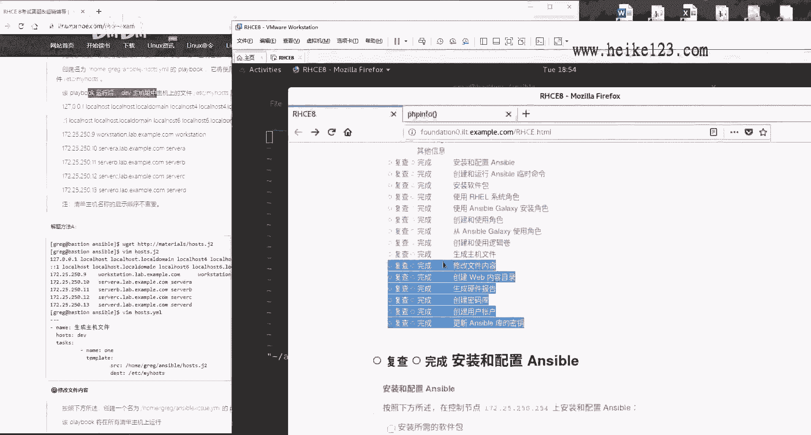

就该想着这个晚饭吃什么了啊，该想想晚饭吃什么了，来修改，先先写上这么一个格式啊，先不管他做什么，先把格式给它写上，然后咱们别再说，先有格式再说，先有格式再说。

能够体会到考研辅导和讲课的区别了吧，在所有清单主机上面去运行。

这不都告诉你格式吗，这都是告诉你格式了，task具体干什么事。

不知道先写着啊，先写再说说话，在div啊，说他会将这个文件上面内容替换一下，说话的div组啊，会去变成这个test组，变成这个啊，p o d组变成这个，这不就是说在不同组上面，替换不同的这个内容吗。

行啊满那我就那我那我就满足你其中的话呢，我们就要去使用它这个inventory host name呗，对吧，因为它是不同的组名啊，还有不同的组名来第一个copy copy content是什么。

我不知道抄哎，抄了哎。

真题对development到哪了，到这etc目录里面的i s s u e叫做艺术是吧，来粘一下他什么都这个时候把它一定要对齐啊，跟这个copy对齐，因为它不是copy的参数，它最后跟这对齐了吗。

看看着有点歪啊，等一下啊，有点歪呢，看着啊是歪了对吧，inventory啊，然后是我们的问当什么的时候呢，当inventory house name我不加装了啊，这就是一个factor的一个变量值。

ok ok我我给他搜一下吧，其实没有必要给大家搜了，搜一下吧。

唉等一下啊，这个怎么去看的啊，因为我都给大家找好了，大家要不然也记不住的话，我当我刚才怎么找了set up对吧。

然后是这个，filter，跟所有的house name相关。

因为你看到他这个主它它它这个主机嘛。

所以我们能够猜到是主机名，所以你可以看到了诶，这叫enzo house the name，其实这个也行啊，但是他看不到我们这个组好，那我们这个组的话呢。

我们还是使用到这个inventory house name，它就是一个我们这个facts boy，我被大家查了啊，这是一样的好，我们现在的话呢把它给往里面一粘，当我们这个组啊，在groups好。

我们刚才搜错了啊，不应该搜house name，应该搜是groups啊，就是说当我们这个用户组的话呢，它是dv组的时候，那我们就会把这个内容的话呢变成development啊，这么简单。

来123455行，对不对，来五yy好吧，再一粘走，你诶怎么叫的，是五yy吗，等一下啊，五yy走走诶，再再走好走好再来，第二个，如果要是对方是test组的话，就会把它修改成test，好大小写啊。

一定要区分大小写，严格区分test，test好的，继续，第三个three，修改三个文件吗，第三个文件p o d目录组的修改成production，好大小写，严格区分p r o d u c t好的太棒了。

production，这是p o d组做完保存并退出好了，随便了，先给大家在追星之前先去找一台主机，找谁呢，随便吧，我看看我们没找过谁啊，没找过他对吧，这低头哎，172。25。250。13。

balance组不行啊，这人没啥事啊，这也没有他事儿，这回换一下，换成dv吧，好吧啊，dv。九没有他事儿也不行啊，看一下dv目录走，待会会变成development，现在这个内容没有变，还没有变。

来ansible playbook，然后是issue，点yo执行，真好啊，真好，做完再去看，变变变变了，development拿分走人。

来看下面这道题，需要在这个web界面的话呢。

新建出来这么一个文件，这个文件干嘛使的，我还是不管考，我们考的时候研究这个习惯啊，甭管他做什么事情，我们先把这个给它创建出来，但是有一个问题，同学们你们看啊，这道题就是我刚才说的看题，同学们看题。

这道题，将vr目录里面的3w里面的html the web dev，连接到这个目录，有问题了，我们没有这个我们没有这个目录，而我自己新建出来那个目录吧，里边没有他考试里面的一个内容，所以的话呢有问题了。

待会儿判分的时候，这道题都有坟，只有这道题我们没有分，因为这个文件我可以把它创建出来，但是我创建出来这个目录里边，我不知道他考试里面是什么样的，一个首页的内容，他判断出来不成，他判断不出来成绩。

这道题他会扣我们3~5分啊，他会扣我们一个小，他会扣我们一个小分，先给迪迦提，先给大家提前声明一下啊，提前声明一下好。

我们继续提前声明好，就丢人就不怕了是吧，来啊不是这个目录，我现在就怕没有录上，所有我就一个劲儿的看就干，就怕没有录上，我刚刚录了一个视频了，录了两都录了两个小时，所以大家永远不知道这个背后还有多少。

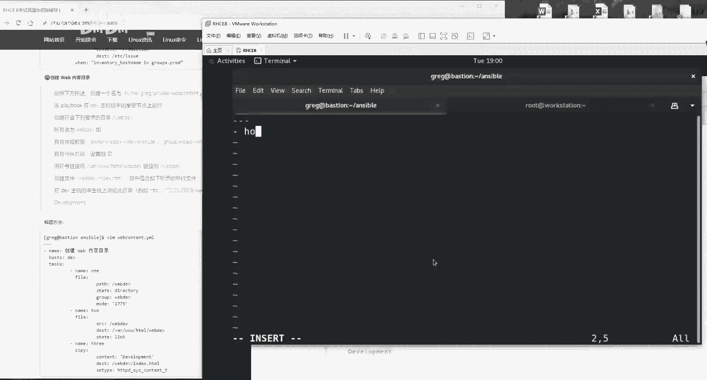

都录了多少次没有录上声音，真气人啊，来开始了。

他说啊啊现在这么着，我先把格式给它写上，先把我这个格给他写上，别着急啊，先写格式。

来他说啊，在div主机上面去执行下面这个命令，dv对你好是吧，在这个下面的话呢，创建出来一个目录啊，这不是瞬间目录吗，所有者为web dv组，说这个叫人话吗，这个叫所有者为web dv组。

听起来好像也通顺，实际上它应该叫做修改为web dev组，那你听这个用户者很有歧义，你有同学比较可能比较心急啊，这一看这个诶所有者，这就是一个所有者权限，对吧错，它修改实际上是修改的组好吧。

他修改的不是所有者，是修改的，就所有组，然后看一下这个权限。

好，这个权限第五章节啊，但这个这个呃这个呃大家不是问题，我先往后面去给大家去往后面去写啊，第一件事新建出来一个目录对吧啊，至于说他是什么权限什么的，咱们先不管啊，咱们先不管它，pass编啊。

pass的这个路径是谁来着，web dev好的state，它是什么样的一个文件呢，它是什么文件，它是一个目录性文件，group组是谁，看一下怎么样呢，web dev点题点题啊。

点题拿分再来常规权限啊。

开始了权限吧，mod等于什么呢，权限用的单引号，数字用的单引号把它引起来。

所有者这不就是七呃，4+2+1吗，七好的，七再来，这个是四，这个是二，这个是一，七好再来，这个是四，这个是一啊，4+1等于是五五，没有问题，没完具有特殊权限设置组i d s u i d是什么。

不是s g i d是什么，不是s g i d421 里边的几个二。

放到最前面，偷偷偷偷前也放吧，放到最前面，2775。

这么来好，往后走，双电将链接文件链接到这个目录当中，并且它它就有一个首页文件什么的，这个我们没有特别尴尬，怎么办呢，我呀先偷偷的这么着。

我先偷偷的我试一下啊，因为我上一次做这个时候不成功，他现在是不是已经是在这个dv组上面了。

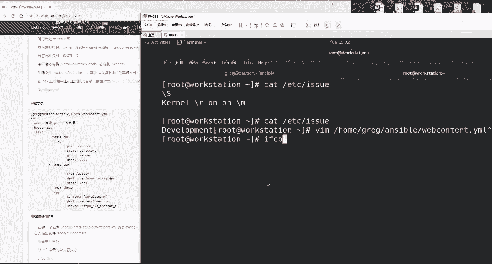

我看一下啊，点九低头哎，点酒没问题。

已经是在dv主机上了，我呀现在先给大家去新，他有没有安装上http。

还没有旋转，你看这都是麻烦事儿，这都是麻烦好安装上，然后的话呢我们帮他去新建一个考试的时候，不用你管啊，他都已经要求你了，他说将连啊链接文件直接链接。

所以他都已经给你弄好了，web d e v，但是我上下我经常去做过，我即便我这样做，他也不成功，所以很尴尬，好我们先这么着来一下子吧，好好了之后开始做下面一个，他说将文件进行链接。

将这个链接链接到这好了，我们来进行链接，链接的话就使用的是file，跟上面这个name对齐，怕对不起的话，比如说像我一样可能有点有点累了，所以我看这个字有点歪的话呢，你ctrl v你对他一下。

或者拿张纸吧，你拿拿拿一张，这个拿拿一张a4 纸，或者实在不行，你考试就当你带一把尺子对吧，你比他一下，我唉我我我们的考生非常的严谨啊，拿尺子给你点比，那没问题啊，来这个的话呢就是说哎不对啊，反了。

他说将这个文件连接到。

这个目录上面在包里边的链接不分软硬链接。

直接写link就可以了，state等于link好，第三步继续。

他说啊创建一个这个文件啊。

然后的话呢这里面包含一行内容啊，行给你了啊，文件的创建文件使用copy content，内容是啥，development。

目标保存路径。

这个时候需要设置一下s linux，因为你这个它不是这个这个这个，这个这个怎么讲呢，这个大家学习第十章的话应该没有问题，因为你看啊，一般情况下的话呢，我们的网站目录的sv的这个上下文呀，他是这个对不对。

所以说你可以直接不用去照抄我的，直接这样一查就能够把它粘过来了，但是你知道它这是一个根目录的，他跟那s linux这个值不一样啊，所以的话呢我们需要去设置一下，它这个值怎么查的。

我那我就那我就告诉大家了，如果还是不清楚的话呢，或者说看第十章节，我们的app服务做好之后干嘛啊，跑它一下吧，不过这个可能不成功啊，先给大家说一下，有点小问题，因为这个文件它这个目录吧是我自己建立的。

而我自己建立的这个的话呢，它有可能不符合题意，它会扣你一个小分的项，他会扣你一个小分来，我们再按一下回车。

按下回车，他说要是成功的话呢，回去访问啊。

出错了好不成功，你看到没，他不他这个不成功，因为他说这个做link链接文件的时候，c linux的话呢并没有通过，而正常的话呢是没有问题的，这个怎么去解决呢，我尝试了一下啊。

但是我就只仅仅是尝试了一下啊，我把这两个路径改了一下，我把它改反，反过来写这个考试的时候到底是怎么去写呢，以我现在说这个为准，就是按我们按我们刚刚那个为准，而我们书上为什么这样去写呢。

是因为让大家在实验环境里面做的是有效的，而考试的时候他怎么说是把它连接到它，它怎么说你就怎么去做啊，我们现在是故是故意写反，因为这两个文件都是我们自己建立的，我们试一下而已啊。

还那么还那么还是不行还是不行，你看到他说这个s linux的这个问题行，这我们先跳过啊，没关系。

我想一个问题，这个文件是我们自己建立的，他为什么不行呢，他是不是因为在考试之前，考官已经帮你们去修改过，s linux和上下文的这个值了，所以我也帮你们去修改一下看看呢，当然了，我们现在这么修改了。

你做判分的时候，你还是没成绩，因为你这个等一下啊，去节点你要被重启的，从你这个节点你需要被这个还原的，你被还原了之后，你还是没成绩，那就我们讲一下解决方案吧，起码我们去执行的时候，我们能看着痛快点。

不要出现那种红字嘛，虽然说最后没成绩，但是我们能看着痛快点，好再来跑一遍，好像没有成功，好这道题我们跳过啊，这道题我们跳过，下面我们看一下。

待会我拍一下这个成绩，看看这个成绩是多少，应该只扣一个小项的分，继续啊。

说一下充电出来这么一个playbook，创建出来这么一个playbook的东西啊，来写上一个格式，毕业先不管，剩下咱们先一顿，这个先写格式，因为你什么题目你都要格式啊。

说啊这么一个playbook，它将所有节点上面的上面生成以下信息，所有节点上周信啊，生成信息哦，我看一看啊，他是意思是这样的，他俩说在所有的节点上面都会去生成出来，这个信息。

然后的话呢你的play book这一个模板，你呢从这个模板上面，我先从从这个先从这里啊下载一个模板，接下来的话呢，把把它保存到每个系统的这个路径下，将正确的值改成哦。

我明白这个意思，然后他说如果硬件不存在使用，那它什么意思呢，你看啊，大家看这个意思，实际上的话呢还是用变量去实现的，来我们来get一下，获取了之后吧，来查看一下这个文件，你看这个文件呀。

就是有好多这种格式，比如说主机名称是什么啊对吧，然后的话呢这个内存值是什么，然后他这个bios是什么，就是它有一些选项，你的话呢根据不同的主机，就是把它对方那个主机上面那个值提取出来，填到里面去。

并且保存到每一台主机它对应的这个目录上面，好比如说我是游船好了，姓名哎，流传哎年龄巴拉巴拉，然后的话呢呃居住地啊，北京啊，这个工作啊，这个r h c e讲师啊，有什么成就啊，这个我们的书籍啊。

对吧就是你每个人有不同的这个信息，比如说那你这个就是呃，比如说这个王五同学对吧，然后这就是你这个啊姓名啊，这个籍贯对吧，就这样的这个信息好，那我们就给大家进去捋吧，我们现在这样。

他这个信息啊不要用到金价去做了，那你不累啊对吧，我们自己就给自己累，我们直接通过我们这个变量去实现，不要给自己添加麻烦啊，也就是说我们现在的话呢有这么一个模板，你只要把里面这个字给它填，给它填齐就行。

怎么去做呢，还是要用变量，还是要用到变量，并且你看他有一句话好不这样这样这样，那我先给你慢慢往后捋啊，第一件事情，你是不是要先去下载这个文件，你现在都没有呢，你想要在每台电脑上面。

对方的每台节点的电脑上面，是不是都要有这个文件啊，让对方去下载啊。

让每台电脑自己去下载一下，来让每台电脑都自己去自行下载一下。

然后保存到哪儿啊，这是吧，让每个电脑都自行下载。

保存到这个位置好，第一件事干完啊，拿一部拿一部分的分，嘿后面按小点子给分，最后没写出来，按点走分，第二步修改，修改使用的是lion fell啊，这个模块修改什么呢，修改了。

首先来说我们是不是修改的是这个文件啊，这个我们知道吧，我们知道我们就写什么替换，怎么替换呢，替换使用的是r e g e x p替换，替换一个什么什么什么对吧，然后乘为什么，啊然后x x x，你看啊。

我们现在是要替换，将我们这个前面的这个替换成这么一大段，也就是说保留前面的，等于y y y y y好吧，就是把我们前面这一部分给它，替换成后面这一大部分好，我们来做这个过滤，这个过滤的话呢。

我们现在想一下啊，首先来说这个前面这个xxx，肯定就是前面这个名称了，对不对，那就是这个名称了，你要是一个一个写的话，你很累啊，123455个呢，那我们就用一个变量呗，然后去选一个loop循环啊。

这就是我当时我去写这个脚本的一个思路，这么去做啊，不要着急，vs定义一个变量组叫做ht or，它就是那么它就是叫这个啊，它叫做这个hardware啊，所有的这个变量。

其中的话呢所有的名字我们把它叫做hw name，这个名称可以跟我们不一样啊，然后你一个一个往里面去写，12345，你一个一个往里面去写，我给大家先把它剪切出来吧，一会我忘了啊，123455dd好。

往上一走，无dd往上一粘好，第一个的话呢我们的变量就叫做house，那么这个值是什么呢，这个值啊这么去写变量名称叫做hw count啊，这么去做这个值怎么去提取啊。

这个值叫做inventory hostname，这个非常好记啊，这就是我们刚才那个fix里面那个值，可以去使用到debug去查看到，我会给大家去追溯啊，如果你真的是记不住的话。

记住考试的时候就把中间加个这个下划线，就是它的变量名称，看这道题没有做完。

你这样做不对，考试时候虽然是满分吧，但是不符合要求，他虽然这个它就都有了，你看说如果音阶音箱不存在，则值应该是none。

你现在这么去写的话呢，就是呃默认就是它肯定是有了，这个变量值肯定是有，但是的话他有可能没有这个值，这么去做，一个是树干啊，叫做货，如果要是default。

哎呀今天大家看我这个视频很累是吧，今天我就给自己考两遍，如果要是这个值没有的话，默默认值等于是n这个的意思，如果要是有就填写这个的变量的值。

如果要是没有，则是默认值好，非常简单，再来12345哎，两行y2 y y往下复制，往下粘几个呢，五行啊，往下粘五个列嘛，因为他是普通的信息，再来第二个，我们叫做memory memory。

这个我给大家去，ok等我给我给大家查一下吧，但是其实你不要去查了，你要考试的时候，你再一个一个去查，太耽误时间了，考试之前提前插好了，把那个变量名就五个变量名，而且第一个还告诉你了，没什么难的。

辛苦一下，贝贝吧好吧，你到考试的时候去查更麻烦啊，更麻烦，来disco size，就是v db好，怎么去查呢，如果说你考试的时候，你真的是忘了不嗯嗯该怎么去查呢，这么去做unstable。

比如随便查一个bios吧，好吧，就比如说第二个bios怎么去查呢，哦刚才set up，今天我考了两遍哈，来fter，我们外面使用单引号把它括起来，跟它里边有点，所有包含bios的这个外观键词的信息项。

出来没出来了，是不是这个，你看一下，好好啊，往前移复制，往里面一粘，当然了，同学们，我不太建议你们就是像我似的一个一个去查了，你就辛苦一下，是考试之前背他一下子也不累，对不对啊，这样的话也不累好。

我们继续，还有一个叫做ansible，然后是memory total，下划线，nb啊，这个需要给大家去查一下，因为我要自证一下清白，这道题我去做过一遍，后来他跟我们说这道题做错了啊。

那我给大家去看一下啊，m e m t o t a l l看一下啊，跟所有的内存相关的，如果你要是记不住这个的话，你就搜1m e m这个这个能记得住吧，来我们搜一下m e m，你看啊，这不就是吗。

enzable，然后m e m total下划线mb，这就是在eniable里面，它可以查到说内存total总大小以兆为单位的好，我们来去复制一下，他确认一下，我没有找错。

这也是官方标准答案里面给呃给大家给出的来，我们往里面一粘，下面等下我就不给大家装了啊，大家自己搜就行了，搜v da和搜v和v db，这两个关键词都能搜索到来，一个是主机名称。

一个是内存的一个总大小以兆为单位，一个是bios的这个版本号，行我等会先把它复制一下，它都一样的，就干脆复制一下吧，只不过把那个vda改成v db，来保存并退出，做好之后怎么办呢，不要着急啊。

他既然说是在所有的主机上面都去运行，找一台啊，看看谁一直没出现呀，那你那172。25-250。13，低头看呃，balance这个组它是不是要保存在etc目录里面的，hw report。test文件，好。

我们那我们先准备好啊，这个文件现在是不是还没有好继续编辑，这个文件还没有写完，还没写完呢，怎么替换呢，你看啊，首先来说你要进行一个loop循环，你是不是要进行一个loop循环啊。

我们的loop循环什么循环，上面那个变量一定要跟这个lie对齐啊，它因为它不是lie的那个，因为它不是lin file里面的这个参数，它是我们的单独的一个循环，循环的是sw哦，指的就是上面那个变量啊。

希望的是他因此不要跟它对齐，一定要跟它对齐，好循环替换什么呢，我们知道循环里面的这个关键词，我们叫做item，循环什么呢，找到item，找到一个叫做hw name的东西，就是一个一个的我们这个前缀。

找到一个一个的前缀，然后，书上面前面还加了一个，就是这样的一个符号代表，就是所以这个开头了啊，这样更加严谨吧，其实加不加无所谓，因为它不可能出现在结尾嘛，来我们替换一下，将所有开头哎替换成他跟。

替换成他跟我们搜到那个结果的一个整体，更长了啊，就是把原先比如说a b c，现在的话呢就是还那么现在还是a b c，但只不过等号加上我们搜索到的那个值，搜索到的值等于hw下划线content，ok算了。

我也不知道我能不能行，那凭感觉吧，先走他一遍，对不对啊，不行再说啊，考试我们考试的时候可以无限的去测试吗，哎demo走，你出错了，第一行诶，他好了，他说第17行出错了啊，第17行出错，第17行出错。

为什么，因为我们这个txt写太太靠上了，他需要接到我们这个任务的下面，好保存并退出，再来启动，考试的时候你也要一种基本的判断能力，这要有的基本上就有这种基本的判断能力，是要有的，好说错了。

他说要有一个东西没有获取到，他说这个文件没有存在，对啊他是没有存在，它不存在，我才让你去新建的，那我们先去看一下这个文件有没有在了啊，啊没有在什么意思呢，这个文件它去写入的时候啊，它没有存在出在哪呢。

出在那个第一个play上面了啊，为什么他感觉那个名称没有写，对我看一下啊，是不是写错了，叫做root，啊写错了，这边一个t，我说这个文件怎么不告诉我不存在呢，文件不存在，改个名字再来一遍不行，来两遍。

全有啊，没问题查看，啊错了，入什么东西是吧，有点累啊，root看一遍这个格式一点问题，没有主机名称诶，主机名称怎么没有啊，内存大小没问题，主机命令它怎么没有呢，我看一下啊，是他是真没有。

还是我们没有写对啊，还是说他故意就给我们有几个主机名称，就是没给我们定义啊，in inventory to啊，写错了是inventory hostname，来再执行一遍，一定要耐心，我们一定要耐心。

我们中国的孩子没有怕过这种，需要这种贝类的东西啊，来看一下，看一下主机名称，就是我们的地址，这个没有错，你这大家放心，因为这个inventory house name，但理解不是主机名称。

是叫兽管节点的名称，授管节点的话是以你的inventory这个文件里面，那个为准啊，你你你的，你的这个inventory里边写的也不是主机名称吗，不也写的是这个地址吗，对吧，这个这个叫做这个话呢。

这叫做一个inventory house name，这是以兆为单位的内存的总大小，free gum，你看看是不是821，没毛病，boss版本号呃，这个大小没问题，好，下一道题。

下一道题，创建密码库啊，说创建一个名称为这个的库。

他说用来去保存账号和密码，这道题的话呢，先把新建出来，这个里面很简单，它就让你保存两个变量的意思。

他就让你去保存两个变量的意思，来我们这么着啊，复制一下，他说你新建出来这个文件里面包含有两个变量。

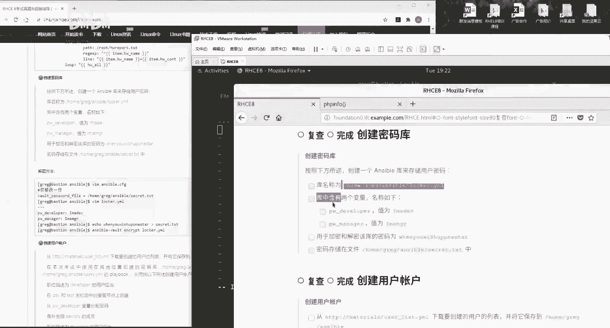

就这么一个简单的事情吗，变量怎么去定义，哎等一下啊，哎别哎，我这个键盘可能今天被一个外星人用过了，所以一直很别扭，射手的手感也不太对，好两个变量就是这个文件里面啊，别的不干就干了两个事儿。

我这就干一个事儿，往里面放点变量好吧。

这两个变量干嘛用呢，下一道题用好，先用两个变量是啊，然后的话呢对它进行加密，vot加密密码的话呢，这个文件保存在这个里面。

好保存密码被保存到这个文件里面，要创建出来这个文件，这个文件的这个值是这个你都不用手枪，你才能就都也一路复制，新建一个文件，往里面放个这个内容查看，有了好进行加密加密怎么办呢。

你这样做没有分，为什么你这个文件就是你这个文件，就是你这个文件跟你这个文件现在毫无关系，同学们，你需要给它关联上怎么办呢，就是像你这个程序调用这个文件，然后的话呢它调用的这个文件了。

就自然会用到这个密码了，然后用这个密码加密这个文件这样的一个流程。

思路好，这么去做编辑，我们的这个加目录里面的enzo的配置文件，找到多少行，我也不知道，so vote v u l t保，它叫这个保险柜的意思好，vot password file找到了吗。

你加密的时候所使用的那个文件路径好，把这一行往里面一粘，往里面一粘保存并退出，做完进行加密操作，先看啊，加密之前你的叫什么来着，locker啊，来locker啊，我们将这个加密的这把锁文件进行加密。

ansible，vote encrypt进行加密，locker啊，点yo加密，加密完了之后，你再一看就看不了了。

因为他已经是经过加密了，加密成功拿分走人，好最后两道题，两道题最后你们做不做无所谓了，好吧，这是一个，这基本上如果你要前面都已经做完的话，你210 280都没问题了啊，不是你260都没问题了。

让我给大家说一下啊，呃原则上来讲的话呢，我们希望大家每道题都能做哦，云端上的希望，当然我们当然是这样的，但是呢这道题我们认为是一个可选项吧，我们认为是一个可选项，你们可以放弃了。

这道题的话呢我们属于加分项，虽然作为一个老师来讲，不应该说这种话，但是我们经历了，我们没有给大家找到这个简化的方案，这个只能很麻烦的去背，很麻烦，这道题的话呢，我建议就是如果是精力不足，同学的话呢。

当做是一个拔高题，每年高考最后一道数学题一样可以放弃了，那都这道题是给准备考300分的满分的，同学去准备的，你如果你的目标就是一个280分好了，280分的同学，你们不用去做了啊，或者260分的同学。

你们不用去做了，这什么意思，这道题看一下啊，创建一个用户账户，说从这个啊，当然了，我们不可能知道题全都放弃啊，步骤分我们还是要的啊，那我们这个步骤分，那我们还是要给的，说从这个啊链接里面去下载一个文件。

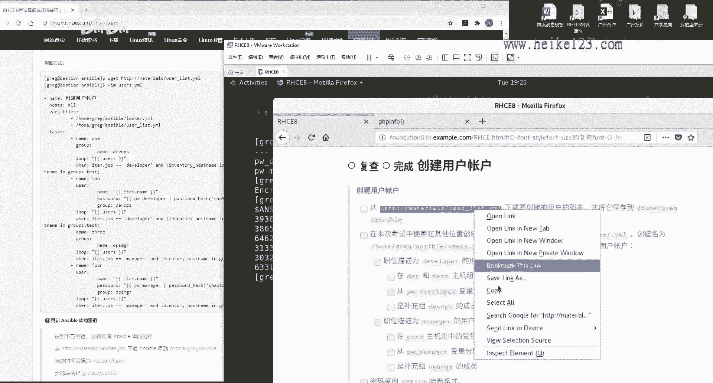

保存到这个目录里面，你看那你这一个步骤又赚了一个步骤分，又赚一个步骤分，那开心吧，好看一下啊，说话现在有两个文件说话，一个叫user list文件，还有一个我们刚才加密那个lucker。yao的文件。

这两个文件里面你那你会发现啊，这个文件里保存的就是用户跟工作对吧，这个用户名跟名字啊，这个名字跟工作啊，然后另外一个文件里看到保存的是，大家还记得吗，就两个变量吗，保存的是你每个组。

比如说这个组或者这个组，它所对应的那个密码，大家再理解一下，就是这个文件里面保存用户名跟工作组。

另外一个文件里面，刚才那个文件里面保存的是这个，用两个用户的密码好，再继续说起，在考试的过程当中，需要在这个文件里面啊，需要使用在其他地方创建的密码库，就是我们刚才加密出来的那个文件。

创建名字为这个的playbook。

好了，我们给他创建出来，再给大家强调一下，这道题的话呢，当作是拔高题，拔高题是给准备考300分满分同学准备的，如果您的时间允许做，如果您时间不允许放弃，把时间和精力放到您有把握的题目上。

别这道题没拿下来，其他题目都没拿下来好吧，拿你有把握的题啊，把时间用在其他题目上面，黑book的名字，因为这道题我尽力了。

尽量其他题目，比如说像上面一道题目，我们能够给大家简化对吧，直接告诉大家的这个考试技巧，直接往里面一站拿分走，人多好多美，但这道题很遗憾，尽力了，真尽力了，我们没有找到简，没有占到简化方案。

原本我给大家写出的一个少校脚本啊，原本我给大家写了一个脚本，后来后来是后来我仔细一看，有一句话不对，特别阴险，知道哪句话吗，这两句话这两句话太阴险了，他说这个密码必须是从这个pw developer。

变量中去提取，这个变量是哪的呀，这个变量是刚刚加密穿那个文件里边的，也就是说你必须要调用刚才那个加密串，那个文件才能够去飞来来来去创建出来密码，而你那个密码的话呢，你又是经过加密了，你要经过解密。

而且你要通过他去加拿去提取密码的话，它下面一行必须要使用哈，希值s h a512 进行加密，也就是说你必须要使用到它的这个加密方式了，这话我就之前给大家写了一个上脚本，相对来说要简化一点了。

就是也泡汤了。

因为我原先的方案是这样的，他不是他，他不就三个用户吗，我就直接把这个用户名我也看，然后我给大家提取出来，直接给他去这个用shell脚本去做创建。

然后进行一个循环，后来一看不行，还真不行。

还这道题出的非常的严谨啊，非常严谨，好，继续了啊，我们来继续了，我没办法，咱这也没办法啊，这算是一个就算是要不给放，最后的来先下定义，两个变量，是这样的，现在啊，我们现在需要把这两个文件给它加载进来。

两个文件哪儿了，第一个文件home目录里面的greg，忘了话去抄一下。

不忘了之后啊，这么去做，这是我们game。

这是我们刚刚加密出来那个文件，调用这两个调用一下这两个文件。

第一个文件，第二个文件先把这两个文件给它加载进来。

待会我们对这两个文件进行循环，它就会循环去加载这两个文件里面的这个内容，好吧诶，等一下啊，还按按错了，还按没了。

一般来说大家考一天跟我现在状态差不多了。

一到下午，现在应该你们要考试的话，应该到下午四点了。

还挺疲倦的。

来第一个文件，啊这是第二个文件，下载完了之后的名称自己补全。

好来干什么事情，第一件事情，你这个用户你是不是要用户组啊，你这个用户要做三要做三个事情，第一个用户名用户创建出来，第二个用户组得有，第三个的话呢，你就是这个密码里的人给他设置上好，第一件事情。

group先去新建出来，我们这个组用户组的话呢，我们叫做develops d v o p s。

你看啊，他这要求这么说的，他说啊职位如果是developer的话，那么这个用户。

那你看下是谁吗，你看一下这个谁，那么谁，那么谁是developer，这个叫做uc list是吧，来看一下有俩，一个叫做fry啊，一个叫bob啊，如果如果要是这个组是developer的话好。

那么在dv和test主机上面来对他们两个进行创建，而且还是限定的说b，而且说限定了在dv跟tt这个组上面进行创建。

还要再去使用一个问，loop循环，循环谁循环，我们的username名称在文件里面该是有的，users嗯嗯好，这样我们来判断只有说是在哪儿，dv跟test组上面，我们采取创建item，为什么。

因为我们是循环嘛，循环的话它就是item item and job，这是这个文件里面的啊，看到了吗，刚才文件里面是有那个job的，就是name跟job吗，就刚那个文件，我那我就给大家看了啊。

如果这个job的话呢，工作如果是。

如果这个工作是developer的话。

研发人员，开发人员，并且inventary house name，并且。

工作组的话是什么组是泰是啊，是dv组的话，或者是test组的话。

还要这样这样长啊，或者，inventary house name是，啥啊，test组的话，那我们就把这个用户组给他创建出来，这个因为这个条件比较长，所以我们要把这个组的判断，用一个小括号给它括起来啊。

这边是一个整体好，做完第二步，用户足，有的用户名，你要为用户批量创建吧，批量创建用户，批量创建用户，没有这个不好意思，同学们没有给大家找出简化方案了，哎呀尽力了尽力了，先使用一个少。

先先先先去使用个share，没没没成功，只能是这是只能这个只能是暂时的最优解了，item。name啊，还是刚刚因为这个文件我给大家看一下吧，这个文件里面的话呢有一个name的一个标识。

就是我们一个一个的创建出来，看到没，一个是name，一个是job，它它这个格式都已经是按照这个变量的，这个格式给我们去写了，所以话呢就直接调用我们的一个一个的这个，用户名，好吧。

这就是调用了一个一个的用户名，下面肯定还有一个loop一个循环啊，还有loop的一个循环，那我们这password了，对它进行加密。

加密的话呢，他看他他要告诉你了，说这个用户他必须是从这个变量中所提取。

多阴险，这道题要没有这个问题的话，我能给大家一个在五，在15行以内能够解决的一个方案，而且是shell的一个方案，但这道题不行不行，实在不行，来password哈。

希值哈，希值我们加密的方式是啥，是这s h s h a512 ，这个时候啊，这个题目就看大家吧好吧，反正我们该讲的话，我们也会讲啊，如果自己不想，如果是自己不想做的话，没有关系，别人不要看人家。

只要一看人家做的，你也着急，每个人的情况不一样，你就把自己有把握的题目拿准了，这道题他们让他们去练就好了，那半天结果其他题目也没拿准，那不就更不好嘛，对吧，毕竟一道题来我们给大家写上。

它使用的是哈希值512技能加密没问题，这样做好之后的话，你还得进行一次循环啊，你们还要再去写group，把它加入到，dvps，因为你现在这个都属于，我们这个组里面的成员吗，上面是充电出来这个组了。

下面充电出来这个用户了，用户的话来加入到这个组里面对吧，这个是必须的，因为你看到他是说扩展组，必须是这个第v o p s是一个扩展组，给他加到里面去好吧。

继续loop循环循环不要写在这个user这个下面啊，一定是它是单独，因为它不是user，这个这个这个这个这个这个参数好item，我要这样吧，我就来复制一下了，如果它是来自于dv和test组的。

我们就这样去做好，没问题，上面两行可以复制啊，这两行可以偷个懒，因为他都是在这个dv组里面，这个用户进行新建好，接下来第三个第三个play，第三个play这样说，如果这个职位是manager的话。

就在p o d主机中的收尾节点上面去创建出来，好，我们重新创建出来，先把这个组算出来，因为你看啊他要他，因为他要求你必须要是这个组的这个扩展组，那你想啊，如果说你连这个扩展组你都没有的话。

你就把这个用户给他新建出来了，到时候你再去改普通再改，把这个改成这个扩展组是不是更麻烦了，所以第一步你要先把它给加入到这个，那么你就要先把这个扩展组给它加到里面去，先去新建出来一个组来，哎平啊。

先给它凭空新建出来一个组来，并且我们要进行一个loop循环，为什么，因为你要是不loop循环的话呢，那么你充电几个呀，到底对吧，你要每一个主机上面对啊，有一个其实这个可以省略。

因为我们的其实这句可以省略，因为我们的p r o d啊，这个啊不行不行，这个不能省略，我看错了，我看错了，p o d它是属于我们低头啊，web server组它有两个主机，它还不能省略。

还有需要循环两次好，现在新建出来这个用户组，同样的loop循环，它就指的是我们总共去执行了几次，有几个用户就去执行几次，如果只有一个用户就去执行一次，这是loop的这个意思，循环几次的意思来。

接下来问当什么的时候呢，我们这么去写，当item他这个工作，是manager来复制一下它，好的，并且inventory house the name，主机名称来自于哪儿，必须是来自于哪个组，哪来的啊。

这样的啊。

p r o d，大家大家听听，这哭了，是不是大家不要哭啊，然后我们继续第四个，有了这个用户，有了这个扩展组了，是不是还没有这个用户呢，好将我们这个用户建立，并且加入到这个扩展组里面，新建用户name。

用户名称是什么呢，循环嘛，item。name这个名称哪来的呀，是不是从我们那个uslist文件里面提取出来的，因为它的第一列嘛就是他每一次都在前面，这个是名字，这是工作，所以item。

name就只能说是用户名称了，来走你，加密诶，这个可以脱了啊，因为加密的方式都是一样的。

拜拜粘贴，他说密码必须是从这个变量里面所提取。

最讨厌了，因为shall做不了这个12，要能做这个的话，15行都给你们搞定了，做完再来加入到一个扩展组里面，扩展组名称，最后loop循环循环几次，以及判断它这个这个职位跟来源杠y粘贴。

然后这是刚p粘贴做完好，现在的话呢我们给大家去演示一下吧，好吧，大家可以看一下这个效果，ensable playbook，然后是users。yao来揍你，三个用户在我们的不同主机上面去批量创建，ok好。

有个报错是吧，来第20行，第20行，不着急不着急，我看一下啊，他这个报错具体说是什么呢，他已经不是20行出错了，是20行的上下出错了哦，他说这儿呢他说这个职位的匹配啊，他说这个问语句出错了。

哎我看一眼啊，第二行上下那个问语句二长哦，这哈i t e m啊，item。job等于developer，没错啊，没问题，继续啊，and inventory，还有现hostname in groups。

连dv没问题啊，这个组里面有没有这个dv这个选项，如果他是在这个组里面的人，就会怎么怎么样，没问题，接下来invent house name in groups，点test，哎哟我看着没问题啊。

这个格式我看一下啊，我把稍微缩小一点，因为它换行了，我可能怕我看不清，来我整我，我我走眼了，路跟问呃，没有放错地方的好，我们这样啊，再跑他一下。

他说这个inventory hostname这个变量它没有被定义好，我刚才可能是不是写错啊，我果然写错了，你现在不看这个答案，现在大家不看那个脚本，你能看明白什么意思吗，哪儿在哪儿错了，他说了。

他说了一个事儿，这就是我刚才又我刚才犯了第二次的这个错误，我已经犯了两次这个错误了，是inventory hostname，刚才记得吗，刚才发，我因为我刚才犯过这个错误。

在这个生成主题配置信息的时候犯过这个错误，叫inventory hostname，我只能inventor name脑子来保存并退出跑诶，跑诶跑一个，还有两个问题唉，加密的时候说这个哈希值出错了啊。

没问题，他好，他说这个不支持这种加密的方式，好不支持加密方式，好吧啊，我看一下啊，他说我们加密，而且我们都是复制的一样的password，developer，password，没问题，我看一看啊。

哦如果我没有猜错的话呢，我写错了，我这边多写了一个a，而且我第二次复制的时候直接就歪就歪歪了啊，这个是我写错了，来去掉这个a salt是盐啊，这个意思啊，就是my secret salt。

就是我的私有盐，就是加盐嘛，就是我们让他，好是非对称式加密的的意思，来保存一下，没问题，再跑，另外的话跑成功之后给大家说一下啊，嗯啊还是不行，他说这个哈希值这个加密出错了。

他说这个格式不支持格式不支持的话呢，我还有一个假说，就是我们这个大写了，把它给小写一下试一试，但他这个题目里面就给的是大写啊，如果他这个因为这一点他出错的话，这道题它也是个坑啊。

稍等一下，同学们，因为我们直接从这复制的嘛，它那它是个大写的，如果我们赶上小写通过的话，这也就是个坑，希望红帽不要这么阴险吧，还真行了好了，给大家说一下啊，黄毛很阴险，他给你这个提示，给他给错了。

这个加密格式s h a千万不要大写，要小写大写，报错好吧，改成小写好这个，所以说这个真的是大拔，这真的是一道拔高题，同学们不要看人家练，你就练了，根据情况吧，最后啊更新ansible。

对跟大家说一个很讽刺的一个事情啊。

这道题我们非这么大劲，而且我们确确实实你也看到了，是从大大家确实看到了啊，是从我们这个变量当中去提取的变量对吧，我们是从这个变量里面给它赋予的密码，那老师，那你是不是写错了好，我给大家验证一下。

我给大家验证一下，怎么验证呢，我们先看一下user list，他是不是说有一个叫bob的一个人，bob他是第1v组，对吧好，我们先看一下dv组，他是哪个主机，他是低头啊，172。25。250。9来。

是是是是是是不是，就是这个不是这个来访问一下点九，这个主机来就会多出一个人叫bug，那老师，那你这个首先来讲用户已经新建出来了，并且已经加入到这个扩展组里面，一切正常，没有问题，那老师。

那你这个密码是不是给错了，好，我先给大家验证一下，我先切换到一个普通用户，好比说，我看看里面有哪些普通用户，因为这道题吧，很讽刺，就是我们非这么大劲，就它没有分啊，就他还是没有分。

所以我就给大家验证一下，就是说我的这个操作确实没有错，密码的话呢大家也看到了，确实是从里面去诶，叫什么名啊，确实是自动变量里面去提取出来的，大家先耐心等待一下，马上马上马上马上来切换到这个用户。

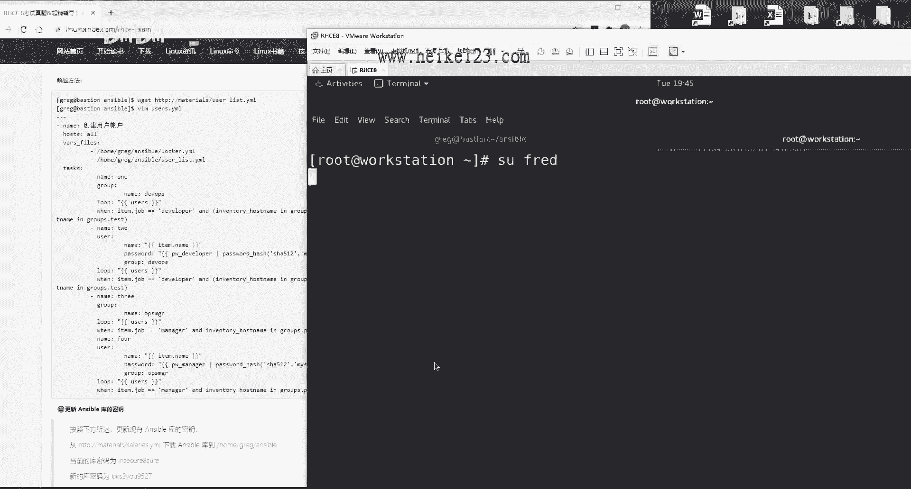

我在切换到bob的时候，这个密码的话呢就是从这个里面去做提取的，我要我一定要给大家讲清楚，就是待会是有出错，但是那个出错跟我们这个操作没有任何关系，这你看啊。

我来粘贴一下，访问切换成功，没有任何问题，也就是说我们现在的话呢，不光把这个bug给新建出来了，而且密码肯定是从这个变量里面做提取的，而且我们提取之后，我们验证了还真的是这个密码，我们还没有写错啊。

还登录还可以成功，这道题待会判分的时候。

这道这个选项可能没有给我们分，而且他很明确告诉我们说，我们没有从这个变量当中去做提取，所以的话呢我有理由相信这是判，这是当前盘分脚本的一个问题，跟刚才一共是有两道题，还要给我们判分小点的出错好吧。

今天跟大家说一下啊，憋一会儿出错了之后，大家这么慌啊，特别紧张啊，因为听完天天课之后都学错了，来段时间了，都两个多小时还可以啊，你考试的时候你三个半小时呢，因为我连说带讲，还跟大家聊会天对吧。

我实际上两个小时做完没问题，当你考试的时候你就练嘛，你只要练到三个小时以里，你三个半小时你把题练到三个小时以里，差不多了啊，好继续啊，更新ansible的这个库的密钥啊，蜜月啊。

蜜月来从这里面去下载一个文件啊。

太好了，do特别喜欢这样的题目给小分。

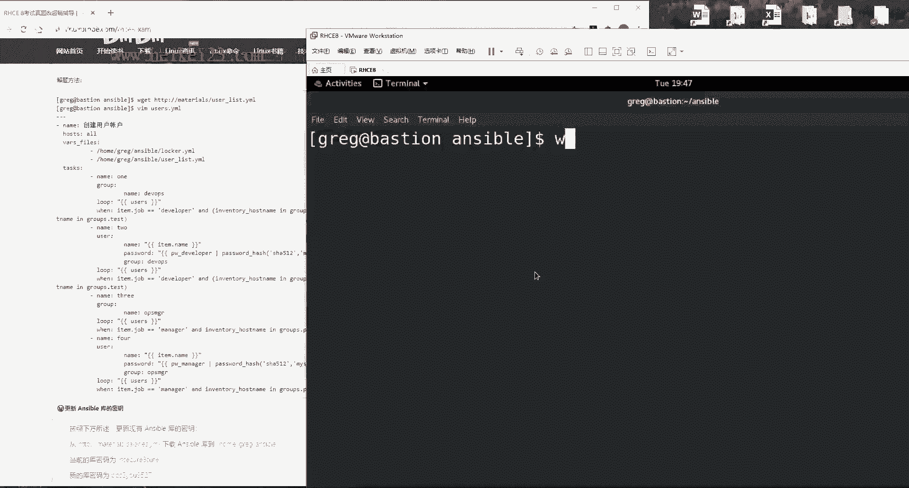

他这个都是给小点的啊，你不知道题，你不会做，你这个小点你只要做出来了，也是给你分，说当前的这个密码是这个改成这个，并且保持更改后的加密的这个密码是什么。

很简单，anzable vote，然后我们改个密码吧，叫做rekey，对不对啊，然后的话呢是x啊，问我们的当前的密码，你要是不写这个词的话，它会告诉你说失败，这个什么意思呢，就是等一下同学们诶。

这个意思就是说给他改个密码，这个文件啊，他给你的时候就已经加密了，我大家看一下啊，这意思就是这样的，这个文件的话，它已经加密了，密码的话呢。

是这个让你把这个密码的话改成个这个就行了，好怎么简单的问题怎么来呢，anzable volt，the key，然后是ask vote pass，就是问我们之前的密码，否则他不会给我们去更改的文件名称。

按下回车说密码是什么呢，原先密码是这个，按下回车，新密码是什么呢，是这个我们按下回车再输入一遍新的密码。

按下回车没有问题。

rekey successful，成功搜索完之后，大家可以你们就去重启啊。

怎么怎么样去做验证吧，好我就不去重启了，我们去看一下分。

来进入到我们这个服务器终端里面，进入到我们的物理机使用exam grade，因为啊他这个会特别的慢，因为r h c e它是六个虚拟机对吧，加上你这个控制端总共是六个虚拟机，特别的慢，判分的话呢。

大概是五分钟的时间，而为了保证我们这个视频的一个完整性，不让大家觉得好像我们中途有修改过什么，是不是你这个暂停了一下，然后给我们改了个什么值啊，偷偷的124的给我们，你偷偷189，你给我改成289了。

是不是，所以的话呢我就把这个视频一直开着，大家可以看完我们的判分，是不是289分或者二八十分以上吧，如果要试的话，那就大家可以回去好好放心练，要是不是的话，那我们就把那道题我们去修改一下。

如果你要是看录播的话呢，当然是录播，那么你就可以把这个时间先往后调一调，加快进度，用两倍速先放一放，这个时间大概可能要两分钟，所以我现在在跨越时空跟大家对话啊，同学们把这个时间快进一下。

节省一下自己生命中的两分钟，来给大家讲讲吧，我闲着没事儿，我看啊，这个是workstation，正在重启，ok workstation，看看村民到哪，我很好奇啊。

从从启这呢啊从启这呢等等的。

干等着不是事儿啊，我看着你重启哎行了，走起了啊，开启了网络，已经通了就完事儿，他说正在对他进行重启。

ok我们这边录屏还在继续啊，然后大家有没有感觉到生命在流逝，是的话，我们点点头，感觉到生命在流逝，好在这是一个录播，但是我觉得好像是哪里卡住了，但是不太确定，我们等一等吧。

我们今天不中断的。

你看到这个安装软件包b吗，他这个gather facts不应该怎么卖啊。

安装的应该现在是。

这台主机。

来我们等他进去看一眼，ok是的，他是在忙活着呢，负载值挺负载值挺高的，这台主机就是说是在忙活着呢。

在做什么事情啊，在安装所有的rpm软件包，以及将哦这个确实比较慢，他是将所有的软件包都更新到最新。

是得再等一等。

ok我觉得这个实在太慢了啊，然后如果要是有问题的话，我跟大家去说，我先暂停一下，避免咱们等待时间太长，我会担心咱们这个视频吧时间太长，所以大家我先关一下，一秒之后回来。

ok我刚才等了两分钟吧，我看他继续又开始动画了，所以我就继续把那个视频给大家开起来吧，又等了两分多钟，本身人品也都还行了，我这又手欠，又给他停了一下，看来还是要对自己有信心，对不对。

唉时光的不断的流逝啊，对于这个考试吧，大家不要太大了，这个心理负担，你考过了之后，你就知道他也就是这么回事，比如说呃老刘啊，刘老师，我是学习教育学的对吧，我绝对教育学了，你知道这种人称。

它是分为这种选拔性考试跟一种测试性考试，举个大举个例子，我们读研究生的时候就是一个萝卜一个坑，我们一个系1年就招六个人，你上了别人就上不了，这属于叫选拔性的高考一样啊，测试性的话呢就是考驾照对吧。

你考过了，他考过了都可以诶，这个是不限制人数的，你一个班里面30个人考驾照都考过了，那都可以过，而红帽认证也是它就属于叫做测试型的，你只要符合要求了，你就可以过，而不是一个萝卜个坑啊。

一个班里面就顶多够五个，过十个过15个好吧，所以的话呢这个你也最能理解吗，就是这个选拔性考试，跟测试型考试的这个难度是不一样的，大家理解一下，这个难度也是不一样的，肯定要是选拔现在要更难。

而且难度不是一星半点，哎呀来了，关键是关键要出来了啊，关键要出来了，会有几道题出错，如果是两道题，两个小问，那我预料之中的话，那我们就结束下呃，我那我们就结束，要是不是我预料之中那两个的话。

那我们就把这几个问题我们再给大家捋一遍，还是那句话啊，大家考这个认证的话呢，210分及格啊，300分满分，看你的目标是多少，你的目标是及格，还是考那个300分去，哎来一个来两个，哎呀我都想到什么问题了。

这个问题其实不应该，这肯定是咱们的名字写错了，我肯定我肯定写成s了，多很多，加了个s，所以我就说嘛能复制的时候就复制，能手枪，能不手枪，咱就不手枪，啊问题还不少啊，不着急，啊274这样不行啊。

对自己不满意啊，我对自己不满意，你说这老牛叫了半天对吧，说了半天才274，不行啊，对这也是有要求的人啊，那我们看一下啊，说卡呃，创建跟使用角色好，然后呢，话说这个文件已经存在了，由于输出啊。

这我都能错吗，天哪完了，丢人了啊，我看一下啊，把这个先放在这，我给大家排一下错r h3 c那个吧。

虽然考了246，但是每道题给大家讲的明白，是因为谁的问题是盘分脚本的问题，而这次他不是排位脚本的问题，是我写错了，我们就要勇于承认，而不能说什么都往这个排名脚本上面推，那是不对的。

我们要实事求是来greg 172。25。25，0。254，但是hcc那个说是谁错就是谁错，那就是盘问脚本的问题来，第一个是什么啊，金甲文件index哎不对，这个实际上是阿帕奇角色里面的金价文件呃。

另外的话大家听到栅栏之后吧，会担心那老师，那我就照着你敲了半天，我敲错了怎么办呀，你们放心，我会这个视频录完了，我如果要是有错误的话，我会把网站上面的信息及时更正好吧，我会把网站上面这个信息及时更正。

会变成最新的，所以你们这个视频一旦发布的话，你再去看那个网页就是最新的了，angel f q d n诶，都是我们复制的，不能出错啊，难道是因为这个没给他写个空格吗，不能够啊，结果都已经出来了。

你红包不是说只看结果的吗，好就假定是怎么回事，再来我进入大班里面，我看看是不是我复制的这个路径有问题啊，你说是复制到了万目录里面的多少啊，我复制一下，你看看有什么大药，还有什么区别。

war 3 w html index smash哦，我没看出来好，这道题的话呢，我的猜想是不是因为中间少了两个空格。

好吧，非常牵强的这个理由，当然我们可以跑一遍再试试嘛，一遍不行，我们跑两遍，再有再读一遍啊，模板文件已存在，用于创建具有以下输出不能错啊，因为咱们的这个结果都已经看到了，嗯好我坚持我这个是正确的。

第二个说我们的ancial哦，在这个里面运行这个角色，这是哪道题啊。

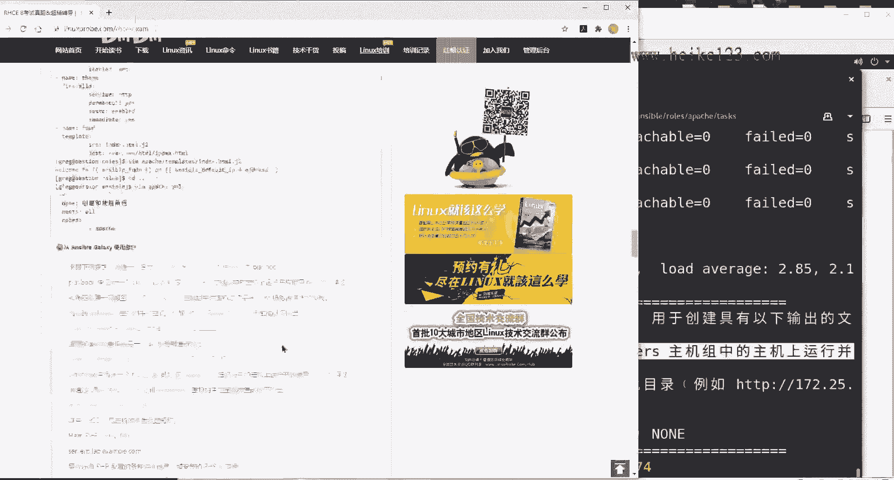

balancer是吧嗯，这个效果我们已经看到了，这个效果我们是看到了，就是刷新我们这个页面，然后，当你去等稍等啊，刷新了之后，你刷一下那个网页上面b变c，c变b，然后11变12，12变11。

那个我们已经看到结果了，来看一下，他说我们为什么错，他说这个play在balance这个主机组当中好，我先交代一下，我先交代一下啊，在这个组主机组组中，着急的我都说话了，我都说错了。

b a l a n c e r s，没错啊，中运行并使用balance组bl a n c r s呀，我看着呢。

没错呢，他们难道没使用吗，行这个问题的话呢，我先，我先我看一下啊。

我认为这个不是我的问题，我让他再跑一遍吧，可能是因为上一道题是有依赖关系，我把上一道题我们改一下，所以这个我再试探一下，应该没什么问题好第三档创建啊，这个是我刚才说过的，因为这个目录我们没有嘛。

所以你再还原一下机器，那就没有了，这两道题肯定是我的问题，那肯定是我的问题，所以这就属于完全粗心的问题，解释来，我看一下他说什么生成硬件报告啊，磁盘v da的大小，v da大小没有被获取。

稍等我看一下，呃据我来看的话，那应该是是没问题啊，好再看一下，如果硬件值不存在，相关的值，应该为none对啊，不然呢，急得我都已经开始跟答案对照了啊，没关系，我们这样子这个呀我给大家强调一下啊。

就是我待会再跑一遍这个脚本，他的话呢，这个肯定跟那个现在是判分之后，可能是有点小差异啊，你们不用担心啊，他说这个值没有被定义，因为它没有那个gather facts啊，所以你们这个手动查是查不到。

其实也是情有可原，不过我们为了，这样子这样子，过滤跟soul设备相关吧，他是不是要获取v da的那那个大小，就满足一下他，ok来了啊，v da的大小它是叫做ensable a n s i p l e啊。

ok但ensable device，ok，然后先放到底下啊，a a d的大小点，v da没毛病吧，v da好，继续它的大小，besides，其实我们最后做这个实验的时候，我们都已经做出来了。

效果跟这一模一样啊，这个怎么可能错好，我们来复制一下，往里面一粘，我知道为什么了，这道题错不是出在v d a了，还是出在v d b上面了，它应该是v d b啊，我们上面那个忘了改了。

直接复制了一个yy了，好，他说的是v db的这个大小，如果不存在使用的声浪，我们刚才啊因为这个是我的问题啊，我还挂了半天，我们直接拜拜了，然后我还跟他说，我说我今天给偷个懒了啊，结果错了。

应该是v da改成v d b，结果我忘了改了，我以为直接就把它粘过来了啊，一个小问题，ok这俩解决，那这俩解决嗯，给大家解决这个问题，ok没问题，这个问题的话呢，我不知道是哪里的问题。

我明明已经把它加载进去了，而且的话呢这个我自认为也没有问题，好最后一道题反而没出错啊，好没关系，我们再跑一遍，就是辛苦大家啊，把这个，辛苦大家把这个视频的话呢再重新的快进一下，这个只有改了吧，确认一下。

ok改了，来我们等他一下，我要不要把这个视频关一下，要不然的话我们这个视频我怕特别大，关的话，我还有同学说哎呀，那老师你都给关了，我怎么知道你中间要改不改呀，还是不管了吧，稍微大点大一点。

反正咱们这个版本3年了才变一次，3年了，咱们多费点时间就多费点了，然后现在去做这个判断的时候吧，其实有可能是存在什么呢。

是存在说你第一遍你判可能是多少多少分。

第二遍的话你再去看诶，分可能稍微高一点或低一点了，每回不太一样。

这个我情况我已经注意到了啊，不用担心啊，因为的话呢，这个是因为我们这个是一个模拟环境。

它也是一个初代的，就是第一代这个拍卖脚本它是有问题的，这个我们是承认的，所以的话呢呃考试那个版本肯定是稳定的，所以你们不用担心，那肯定至于一次成功，我们这是一个模拟版吧。

好现在这个workstation正在启动啊，还没起来呢，诶那that work起来了。

ok啊一个问题，这个问题我给大家说过，web dev，这个问题我是认的没问题，他没有啊，第一个问题出来，好出来了，294，好吧啊，这个问题我是认的好吧，这个问题的话呢是因为它服务器上没有。

然后的话呢咱们已经把它做一个链接了，但是链接里面没有他考试的那个内容，没有那个内容，所以的话呢他即便咱们做电机的，它也会提示说内容不存在啊，这一个小问题好，然后就300分吧好吧，当到三就当到300分啊。

你就想想就想象一下升300分，这话就是r h c e的考试所有内容了。

就这样吧，然后的话呢如果大家要是有兴趣的话呢，可以去多关注一下咱们的书籍，还有咱们的微信公众号，然后我们的培训的话呢一直在去做的，老刘的话呢也只会去，因为我们是在教做做广告嘛对吧。

就是因为我是在全职再去做这个红包认证，而且的话呢我们的机构是只做linux，不做其他的，我们认为个屁别人的话更加用心，而且的话呢精力跟时间都呃，做的这个学士们都投入到了这个linux里面。

尤其尤其对于红帽认证，是一个比较深刻的一个理解的嗯对，所以的话呢，如果要是大家要是后续有学习的话呢，或者说有朋友去想去考试的话呢，也可以参加一下我们的培训，那还是不还啊，还是比较便宜的一些。

也是因为是网络培训吧，那成本我们也来说可以更加好的把控好，那就是这样，那待会问题的话，可以在qq上，然后或者在微信上面，或者在这个我们的网站上面，都可以去进行一些沟通好。

那么就这样，然后大家也都辛苦了。

回去之后先休会，先去休息会儿，然后去找会眼睛，回去之后照着我这个取消这个问题的话，那我就不改了好吧，这个不是我的问题了，然后我会判我们一点小问题，我都会在咱们这个网站上面去更新一遍，我更新好了之后。

只要你们看到这个视频的时候，我们这个网站上面都已经是最新版本了，如果要是网页跟视频有出入的话呢，以网页为准，但是我相信也没有什么变化了。

就这样啊，希望我们同学们的话呢啊加入学习啊。

