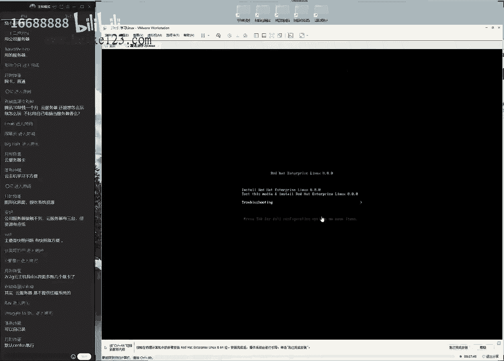
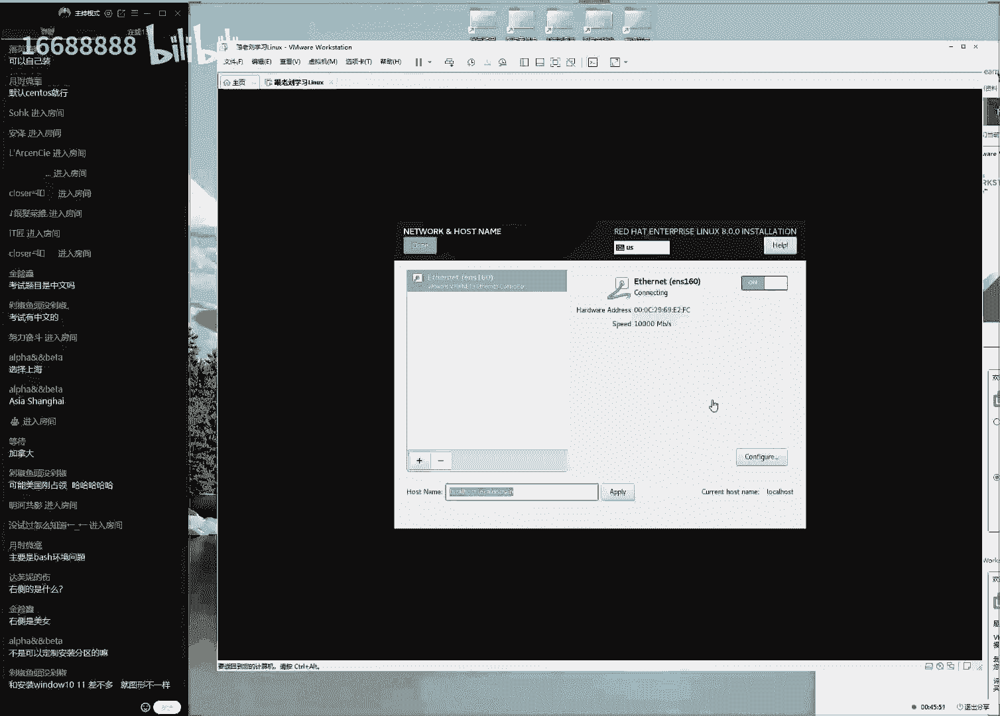
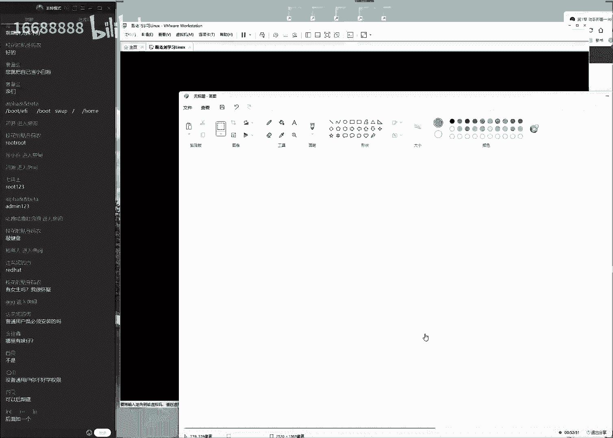
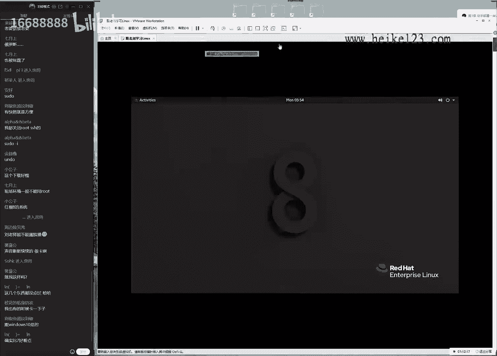
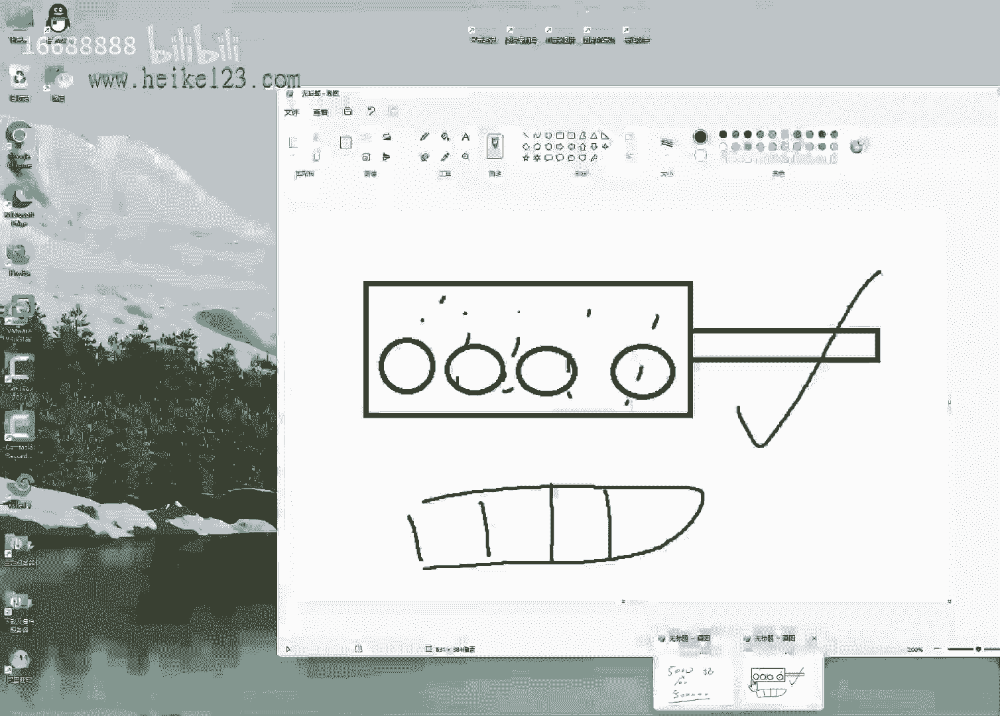
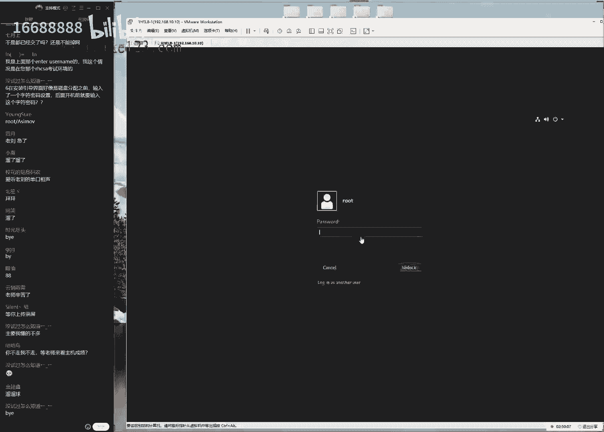

# 刘遄培训linux34期（配套linux就该这么学第二版，RHCE8） - P2：02 - 16688888 - BV1gL41167vP

i've been saying john tt，so i can you，ok同学，我们来开始我们今天这个课程啊，准点开始。

哎呀ok非常好非常好啊啊九点钟啊，19点钟准时开始。

好的，先打一下一好吧，然后我们来测试一下这个伤感环境，大家如果能听到我说话的声音啊，能够看到我们的画面的话呢，大家打一下一啊，现在对这个环境间进行一个测试嘛，然后的话咱们在这个上课过程当中的话呢。

如果说出现了这个卡顿的话，没有声音啊，这种情况的话呢，大家我们一定要互动起来。

然后大家要及时告诉我，然后这边的话呢可以拿去调整一下，这个商业环境，ok非常好，那今天的话准备上课了，19点钟，七点钟我们又来了，今天的话呢。

我们来给大家安装一下我们的linux系统，那我们大家的话先打开咱们的这个网站。

诶，这是咱们的网站啊，大家先打开，因为这个的话也是很多，我们自然需要去下载的一个平台，好我们现在打开它，另外我看今天这个迟到人数啊不多啊，非常好，那我们来打开咱们的网站，咱们这个晚班嘛有点犯困啊。

所以的话呢这个一定要互动起来，来，大家先打开咱们的网站，3w。linux prom。com啊，咱们这个斗志要啊瞬间就要起来了，要不然的话这两个小时有点呃会有点痛苦了，还那么打开咱们的这个网站。

这个时候的话呢，我们点击一下下载随书配套工具，这边的话呢我们来去下载一下我们的虚拟机，以及红帽这个reo 8的这个操作系统，那么这边的话这个验证码，那我给大家说一下啊，验证码的话呢是585141啊。

因为我们现在这个支付一啊，那么后来我们因为昨天价人特别的多好了，这个微信上还加不上，那我们就直接给大家说一下了，验证码的话呢就是那个585141，大家可以直接访问咱们这个网址。

后面的话呢就叫做tooth，然后一句你可以去下水道了，大话现在再加两个工具啊，第一个工具的话呢就是我们的虚拟机。

第二类就是我们的红包real系统，对不对，昨天我们讲过的叫real系统啊，红包reo 8，我们去下载一下这两个工具，然后的话呢我们来继续说一下，我们今天动手安装我们的链接系统的一个流程。

首先的话呢我们按照这个书上面来给大家看了，先安装了一下虚拟机，虚拟机的这个过程我们省略掉啊，为什么呢，因为我们对大家非常的信任，这个的话安装过程非常的简单，只需要点击下一步就可以完成。

它就像安装一个软件一样那么简单啊，它安装一个qq一样简单，我们下载好虚拟机之后，我们就来去一路选择。

下一步就可以把它安装好了，这样的话呢，我们有了这么一个虚拟机的一个软件之后。

我们来给大家讲一下，该去如何去安装我们的系统，咱们啊大家说啊，我我的微信没有通过啊，昨天加的啊很正常，因为我昨天我的微信解封之后，大家这个所有的申请我都看不到了，包括说您现在您扫一下我的微信。

您得到的这个应该是说请求繁忙吧，因为今天整个一整天我都没有任何人加我，这是不正常的啊，反正我这边一个都没有收到，大家可以现在去扫一下那个二维码，可以看一下它有什么样的一个提醒好。

然后的话呢我们来打开这个虚拟软件之后，哎另外我们做一个小调查好不好，那我们做一个小调查呃，大家如果你已经安装好了这个操作系统了，大家打一下六可以吗，那大家打一下六，就是如果大家已经安装好操作系统了。

那我们打一下六，然后看看这个人数啊，啊这么多是吗，那我们今天可以下课了，ok开玩笑开玩笑啊，是不是同学们预习非常的到位，哎呀今天喝的欣慰，那我讲课压力就小很多了，对不对，那不不不今不今天啊。

那么今天话啊，啥也不能下课的啊，但是我讲课的压力就小很多了，我记得有一期讲课的时候，大家都没有去安装，结果就会导睡一节课吧啊很有压力，因为同学们我们稍微讲快一点，就会说老师太快了，我这心机都没有下好呢。

这个百度网盘吗，真孙子这个速度特别的慢，所以的话大家安顿好之后的话呢，那我呢那么我们这边就没有什么顾虑了，就能好好给大家讲课了，今天的话呢大家说来实战不，今天啊也来不了实战。

今天的话我们主要现在去部署一下环境啊，大家说那今天搞快点吧，不行啊，因为的话呢我们会有同学系统没有安装好，所以我们按部就班，不能快啊，一步一步稳扎稳打，大家好，安装好了这个系统了，那就耐心听完。

那我们爱好这个虚拟机之后啊，虚拟机的安装的过程我们把它省略掉，因为这个太简单了啊，那那我们把它省略掉，那我们进入到这个环境之那啊，那我们进入到这个界面之后的话呢，我们现在需要先去模拟一个虚拟机的一个。

硬件平台，好，我们现在的话呢，需要先新建一个虚拟机的硬件平台，我们点击一下这个创建新的虚拟机，这个时候是干嘛呢，这个时候大家一起说出来，他是不是去安装系统呢，它并不是去安装我们的linux的系统。

它需要先做第一步，是不是干嘛呢，先去买一个硬件，就说不属于一个或者说叫做设置，或者叫做虚拟出一个什么呢，硬件平台啊，硬件平台，这样的话呢，待会我们可以在里面再去安装，我们这个操作系统了。

来先虚拟出来一个硬点的一个平台，第二步的话才去安装我们的linux一个系统，两步走嘛，千万不要着急啊，来第一步，第二步，第一步，第二步，第一步好，我们先来去选择一下啊，高级安装自定义，这样的话呢。

我们可以对这个虚拟机进行一个充分的，自由的一个配置，这样的话呢呃那我们可以学习更多嘛，那我们选择这个呃，那啊那啊这的话那我们需要选择一下下面的啊，选择高级模式，这样的话这个选项和参数也会更多一点。

选择一下，下一步，这边的话呢我们有一个硬件的一个兼容性，那么由于是我那么的话呢，我们先是一个呃第一台虚拟机，所以的话呢那我们选择一个啊，最高版本就可以了，因为它不需要考虑到兼容性的这个问题。

所以这一下下一步，那么大家需要注意一下，就是此时此刻此情此景，就是我们现在的话呢必须要去选择，稍后安装操作系统，那么为什么呢，因为如果说你选择了我，那我们的这个呃呃呃，那我们那我们啊。

如果说您此时你选中了我们的系统的，这个光盘的话呢，它会以一种叫做默认的最小化的一个安装形式，来去安装这个操作系统，最后的话呢会跟我们这个实验平台的话呢，怎么样呢，它是不一样的。

所以啊他是啊就是我们这个实验环境吧，他两个是不一样的，所以的话呢，我们现在此时您必须要去选择这个稍后安装，等于说我们对它进行一个充分的一个自定义的，一个安装的一个过程，这个大家需要注意一下。

那么我们再给大家强调一下，就是如果说您待会安装出来这个操作系统，因为我们按照经验上来讲啊，我们虽然这么强调，但是同学们还是有同学会啊选错，所以我们要给大家再去强调一下，如果说您待会安装出来那个操作系统。

它是一个黑屏，然后的话呢让我们去输入啊文字的一个界面，那么这个时候就证明您这张啊，那么您这个选项您是选错了，所以的话呢那我们需要选择啊，这里选择稍后安装操作系统，大家可能会问了。

邵老师有必要这么强调这个选项吗，啊是有必要的好，那我们选择一下下一步，因为我们待会就会啊，因为我们会就有同学去问呢，说师为什么我安装穿这个环境跟你不一样呢，好差就差在这儿了，那我们选择这个稍后安装。

等于说我们可以对它进行一个充分的一个，自定义的一个过程，特别的好，然后接下来我们再来，接下来我们选择一下这个虚拟机啊，linux红帽red hat linux 8版本64位。

就是选择我们现在所学习的这个操作系统，鸿蒙reo 8啊，另外是这样的啊，大家现在提的这些问题都很啊，都很不重要啊，所以的话呢那我们先给大家讲课，然后我们待会儿的话，应该也是讲个三五十分钟就休息一下。

到时候我们休息的时候，会给大家同意回答一下问题的，所以的话呢如果说您现在提的这个问题，那么明明啊，那么话啊，如果说你现在提的这个啊，那么您说啊，现在提的这个问题没有被回答好的话呢。

那么您可以稍后再去发一遍就好了，我们基本上每三五十分钟吧，我们来给大家进行一个统一的一个答疑，好我们选择一下下一步，然后的话这边的话呢，还要给这个虚拟机取一个名字，这就无所谓了。

比如说我我那我就会写着跟老刘学习linux，第一节课无所谓是什么，跟老刘学习啊，ladies第一节课好，那我们就这么去写，那我们为这个虚拟机取一个名字，这样的话的好处就是，当以后有多台虚拟机的时候。

是不是一起说出来，我们呢那我们就知道每台虚拟机的一个作用了，哎那么就是这样的，这样的话呢，我们选择一下虚拟机所对应的一个安装的，一个路径，然后我们选择随便的就到d盘吧。

呃因为的话呢那我呢那我们安装到d盘，因为d盘的话呢它的这个容量比较大一点，那么大家去选择一个容量比较大一点的磁盘，就好了，这个我也反啊，那么好，这个我们安装路径是无所谓的。

所以的话那我们去新建创建一个目录，比如说我们给它叫什么呢，叫做临时虚拟机，好吧好吧，那我现在取一个目录，待会儿的话呢，虚拟机的这个软件啊，系统就会被安装到这个目录里面，选择一下确定，然后再来嘛啊。

去选择一下下一步啊，大家说为什么叫老刘，我也不知道为什么，就是我们从一开始的就这么叫了，可能是因为比较苍老吧啊，可能让我们选择一下这个处理器，处理器的话呢，那我们每个人他都是一个的，这也没什么可说的。

大家也不要啊，这个对吧，因为你啊，那么话呢那我们这个处理器的个数，一般情况下它都是一个，因为我们这个家用的电脑cpu就一个，但我们这个很正常的，但是它这个核心数据是难啊啊，这我们需要去选择一个您对应的。

那，比如说我们现在可以打开您的这个任务管理器，然后的话呢我们选择一下性能，然后我们再去啊在里面查看一下这个账号，那我可以看到当前的话呢啊这个呃话，那我们这个核心数是24，那我就选择一下24就好了。

这样的话呢，那我们能够把这个cpu性能发挥到更好，那么我是24，同学们，你们可以去选择一个自己所对应的，那老师我不知道是多少啊，那我要是不知道是多少，怎么办呢，那么没关系，我们有两个方法。

第一个下载一个软件叫什么呢，叫鲁大师，叫鲁大师，您可以去下载一下，或者的话呢叫驱动精灵，我们记得还有这么一个工具，您去看一下，这边的话，那也能够看得到的，就是啊我们有几个方法。

第一个的话呢就是通过这个任务管理器，你就像我一样去看一下就可以了，第二部的话呢下一些软件啊，它也可以看得到的，第三步是什么呢，第三步就是您百度1下，你百度搜索一下您电脑的型号，比如说我的电脑啊。

我的电脑是多少呢啊，我的电脑是忘了，反正就是我去搜一下我电脑的这个型号，或者我搜一下我这个cpu这个型号，或者说我搜一下我主板的这个型号，我可以去找到它啊，这是第三个方法，第一个四个方法的话呢。

就是干脆就选择一就好了，因为的话呢数量越多，等于说那啊，那会那那我们去选择这个核心数的话呢，他们就可以让这个性能发挥得更好，但是选一对于我们这个后续这个实验的话，没有直接影响，所以我们这几个原则。

大家可以去根据自己的这个情况，知道就选，不知道就不选，那老师好麻烦啊，那我们到底选不选呢，您就随便去选，比如说你选32，他会给我们提醒的，选错了会有提醒，所以我们看到32会有报错。

选去选一下24cpu的这个啊，那我们去选择一个啊，它里面所对应的这么一个信息，能够把cpu的性能发挥的更好呃，换句话我们来说，就是他他就是我们待会不会卡啊，它主要就是啊待会我们操作的时候。

尽量不要卡的一个问题，然后我们现在这个内存的话呢，先做一个小调查啊，同学们呃，大家现在你们的物理机的笔记本，或者说你们的电脑的内存是多大呢啊，同学们大家去可以互动一下啊。

因为每期同学们的硬件环境是不一样的，同学们来大家说选一会不会有点卡卡呀，不会的，因为你们做一些实验，说咱就说咱就说句实在话，你们选什么配置都不会卡，因为现在配置要求特别的低啊，同学说啊。

现在电脑的话呢是16个g b，ok可以好，那我们给大家有一个原则，就是如果说您物理的内存特别小的话，还有同学打多少啊，32g内存啊，我记得还有一个同学上一期啊非常的凡尔赛，特别气人啊，啊500啊。

我记得好像上一期有同学说，他内存好像是300还是400还是啊不啊，好玩啊，反正换我们这个啊说啊特别大，那么这个没有关系，就是您的这个内存的话呢，这个啊内存值如果说您特别小，比如说您小于了啊。

四个gb的话，那您就可以为虚拟机里面分配的稍微小一点，那么如果说您的这个内存的话呢，只要大于了四个gb的话呢，我们一律我们一律把这个内存设置为两个gb，好吧，大家能理解，就是我虽然呢我的内存也很大。

我内存的话呢应该不出意外的话啊，我看一下我内存的话呢也是64个gb，也还行对吧，反正够用了，但是我依然把它选择是啊，怎么样啊，2048，因为2048兆，那那么他就是他啊他啊他就是啊够用了好。

我们选择一下，下一步，接下来我们呢我们呢，那么接下来我们是网络模式，这个网络模式的话呢，后续会给大家带去细聊，其实我们不太喜欢有些国内的书籍，第一节课就给大家讲什么，对于磁盘的分区格式化挂载。

然后去设置网络什么地址什么的，说实话，第一节课大家其实我们昨天不算开班仪式对吧，就是我们啊其实昨天它仅仅是一个开班仪式，今天我们才是刚刚开始去学习第一节课，我们希望大家能够把知识学懂。

而不是说只是按照我们的操作点缀，同样的效果，大家能够听啊，大家只能目的也我所说的意思，因此的话呢我们现在统一先不讲，先去选择为金主机模式，只是说为什么这么去选，以及它能干什么事。

我们不管第八章的时候会给大家去细聊，第八章节啊，我们去细聊它啊，比现在的话呢我们去简单的讲一下，要一笔带过要好很多，接下来我们选择一下我们的这个，sci的这个控制器，这无所谓，我们选择压默认就可以了。

它属于是我们这个链接类型，这样的话呢我们选择一下磁盘类型，这边我们需要去选，那么好，我们这边可以有两个选择，sci或者sa无所谓，这两个的话大家可以去随便去选择，但是不要去选择啊，虚拟机的啊。

n v i e，这样的话呢会跟我们第六章节里面所对应的，那个名称不太一样，所以的话呢我们给大家一个原则性来说，就是如果说您是第一次听课，那么此时你选择一个啊这两个其中的一个，然后还能呃呃。

那么呃如果说呃您是第二次或者第三次以后，我来听课的话呢，您可以再随便去学，因为它涉及到第六章里面的一些呃的一些呃，名称命名的一些规则，所以的话呢如果说我们，那我们现在啊选的是不一样的话呢。

会导致第六章的时候，他这个学习是有一些出入的，好我选择下来下一步，然后去选择一下，我们那我们现在去新建一个磁盘，选择下一步，他说的话呢，是说将我们的这个所有的这个空间，是否立即分配，这个不用去选。

还有说，那如果说那我们这个虚拟机的这个系统，会频繁的在多个电脑之间来进行一个切换啊，那么呃那么我们就可以选择那啊，那啊那我们就可以选择下面那个，但是如果说我，那我们那我们先把这啊装好之后的话呢。

呃并不会来去频繁来去切换这个系统的话，那那那我们则选择上面的一个，其实这两个的话呢对于大家使用来讲，没有任何的关系，所以这几个选项大家随便去勾，可以看一下具体的这个介绍，但是在使用起来没有任何的影响。

对于我们的试验的话呢，哦或者我们去选择两个大，可以安装出来两个系统，您去选择这两个选项，您是感觉不到任何差距的，我们所说任何那就是它啊，它指的是啊没有任何的差距，那我们选择再来下一步。

然后接下来的话呢就是说我们这个磁盘的名称，这也无所谓，我们选择一下下一步，也就是说我们现在给大家一笔带过的啊，主要就是说因为这些，对于我们这个学习系统来讲，没有什么太大关系的。

这也是我们后期要给大家去呃，其实是去讲解的一些知识，所以我们先来给大家去跳一下，选择一下完成这样的话，那我们就做完了我们的这个第一步啊，来啊处在一个硬件环境了，第二步的话呢。

我们来再去编辑一下这个虚拟机的环境，再简单下去进行一个检查，看看到底是对不对的，首先来说看一下内存两个g b对不对啊，对了ok啊，要换我们这个处理器核心数没问题，硬盘20个gb啊，高高的够用了。

cd和dvd，选择一下我们的光盘啊，就是选择一下系统，像大家会问说这哪里去下载呢啊大家可以啊，如果迟到的话看一下，我们点击一下咱们网站里面有一个下载，选择随书配套工具，我们来选择一下，下一步好。

大家问了一个问题，特别好，这个叫做剁椒，鱼头，没剁椒，那吃个啥啊，但但但我听这个问题非常好，我们待会给大家去说啊，我们能不能去使用一个云主机来去做啊，来去做咱们这个实验啊，每个月才十块钱。

那不香吗啊说实话不太香好，我们来给大家style是说一下原因，然后来看一下啊，现在这个软件的话呢两个第一个的话是虚拟机，它能够让我们一个物理机上面，模拟出来多个系统来，于是的话。

那我们就可以用同一个电脑去做很多个实验了，下面第二个的话呢指的是我们这个linux系统，红包reo 8系统，这也是我们所学习的红包reo 8，好，那我们来下载好之后，下载好这个镜像之后啊。

对了这个验证码是多少呢，是585141，大家去下载一下，ok我们来下载好了之后，去选择一下这个镜像文件，选择一下浏览，选择一下啊，这啊选择一下这个镜像文件，镜像文件它在这儿选中，它没有问题。

网络模式不用管它，第八章的时候给大家去细聊怎么回事，然后u盘usb啊，现在还有没有用呢，没用把它移除，声卡呢也没用，选择移除打印机有没有用呢，没用选择移除最大的显示器啊，这个还要保留的，我们选择一下。

下一步确认好之后，我来给大家说一个问题，大家提到了啊，杜教育通同学啊，就提到了说，那我们能不能买一个云主机去做这个实验呢，我们的答案的话呢，是不能不是说呃虚拟它并不是说云服务器卡。

是因为云服务器上面有些事情你做不了，比如说有些服务我们遇到的，比如说dh cp对吧，或者的话呢我们配置一个域名解析服务，dns s，再或者的话呢，我们去您部署一个远程磁盘存储啊。

sci这些事情你做不了啊，就是在军训机里面，您我我就是呃有软件的这个供应商，他就没有办法去实现出来，那么我们即便能够实现的话呢，比如说像桑巴这样的这个服务，或者我们的网络文件共享服务n f s提个问题。

大家怎么去测试呢，测试不了的，在这种服务的话，那我们的要求必须是，在我们的本地去做这个实验，然后我们才能看到效果呀，那我那我们如果要是买它云服务器的话呢，这些实验即便能够配置出来，但是您看不到效果。

链接是失败的，它是连接失败的，这看不到效果的，所以我们有一个原则，本上来说就是不论有没有条件，同学们都去选择通过本地的形式来去模拟出来，这个虚拟机的这个应啊，虚拟机的这么一个系统出来，不要买云服务器。

这个会有问题的，这个我们也试过，当时不要说十块钱了，我们当时买了好几台阿里云的云服务器，提供给我们的学员，会发现，那个排错的时间要比配置服务的时间要更长。

所以同学们啊有这么一个事情。

选择一下，点击开启此虚拟机，来去安装一下我们这个操作系统，当我们看到这个界面的时候。

基本上也就是说，我们的硬件平台就已经是创建成功了，下面的话呢我们就要来进行一次安装了。

先通过这个方向键啊，大家说我们去选择3s也行不行。

同学们，因为的话呢这个三圈啊这个道给大家去说吧，我们先来给大家说一下我们这个操作系统啊，有这么一个事儿啊，我们需要先给大家说呃，因为咱们的话同学们提问比较的快一点，然后的话所有的回答的话也会稍微快一点。

就是有一个原则性的一个致敬，如果说您是第一次听课的同学啊，第一次听课的同学呃，尽可能的保持跟我一样的环境，并不让大家去傻学，是让大家呃如果保持一致的话呢，好排错，因为如果说您的实验环境也不一样。

这个系统也不一样，最后第一节课听课就到，就是老出错，但是我们因为第一次去学习，大家在其他的行业做的非常的好，这我们能够理解，但是他既然进入到了一个新系统，老包错打击我们的这一个啊。

那么就打击我们的自信心，于是的话那就有可能会觉得非常的这个呃沮丧，所以的话呢我们第一次听课的同学，尽量的保持我们跟当前环境是一模一样的啊，尽量跟我们的环境保持是一样的，这样的话呢出错之后我们怎么样呢。

就能够好排错啊，我们可以知道是您的操作问题，还是我们的这个呃系统的问题，所以这么一个问题好排错好排错啊，这么一个问题先给大家说清楚，但是可能说的不是很充分，我们待会有时间的话。

因为这个安卓系统大概需要半个小时。

我们就有充分的时间来给大家聊这个问题，就是之前我们遇到的一些坑啊，然后我们来通过这个方向键来选择一下，第一个选择的话呢，为安装鸿毛如八系统，第二话呢为什么呢，是不是得大家一起说出来。

测试和安装我们的红包热巴系统，第三个是什么呢，trouble shooting排错模式，我们选择第一个，这个时候一定要狠狠的，就一定要狠，按下我们的回车键，拿来1127式啊。

这样的话呢啊这个系统就非常的啊乖巧了，对不对，然后他就会顺着我们的心意了啊，大家去敲，这个时候就是啊一定要有信心啊。

不要说哎我们今天这个选项有没有选对呢，没关系，随便去敲，因为它是虚拟机。

他不会有太大破坏性的，就像我们买了一个手机，当时我给我父母买的第一个手机啊，就是真是不敢点，我说你究竟有什么不怕啊。

这啊就这没有关系的对吧，点坏也可以恢复的，这个也坏不了，都是软件问题，所以大家第一次去学习的时候，不要怕出错，没有关系，随便去说啊，那我们可以随便去出错，因为你即便重新装一下，也就十来分钟。

有什么可怕的呢，对吧，来我们来选择一下系统语言，选择英语啊，这个的话呢并不是说崇洋媚外啊，这个话主要原因就是中文，有时候他有因为他的中文他有说乱码，第二的话呢就是工作跟考试环境里面的话，它它都是英文的。

我们现在选了中文，您看着舒服了，到时候考试的时候可咋整啊，到时候考试的时候还是英文，所以的话呢先提前适应适应，走出自己的舒适区，诶正好报了咱们一个课，把英语也顺便学了，那不更好吗，对吧。

那我们选择一下continue下一步，哎呀咱们稍等一下啊，正好倒杯水啊，这玩意还这还有点卡啊，来进入到这个界面之后，选择一下呃，我们来一个给大家点吧，第一个的话呢是为键盘，这个就是英语没有问题。

除了英语以外，其他键盘我还真没见过，让我们选择一下确认，你就说话呢，我们每个人的键盘都是啊，那么话它都是一样的，系统的语言支持英语搞告诉他了，然后我们选择一下系统的时间，大家问了一个问题啊。

大家问两个问题啊，大家问题的话已经问啊，大家的话这个问题已经被回啊，这回答也是说出来了，考题有中文的，但是的话呢考试系统那人家是英文的对吧，考题考官到他那他那他他都是中文的，但是那个系统里面它是英文的。

需要去输入，它是命令，对第二个问题说，老师，为什么我的虚拟机里面这个系统的时间不对呢，就是因为我们没有去选人家选择美国了啊，美国的话呢分为四个时区，然后诶怎么诶不对啊，美国分为四个时区。

怎么变成五个市区了，难道是我的这个知识出现偏差了吗，因为的话我记得好像是美国的西海岸山区，中部东海岸诶，怎么这边这边也是美国领土，为什么还有第五个时区呢，看来我的知识出现偏差了啊。

好那我们来呃去选择在中文吧，那我们就不管他们了，看一下我们的中国啊，中国的话是不分时区的，从黑龙江到新疆，它都是一个时区，所以我们随便去选，我们可以看到啊，中国地图上呢，我画呢，那我们去选到哪里。

他都是上海行啊，这看来外国人对于我们中国的也不是很了解，但是话在上海也能够代表的是中国的时间了，我们选择一下确认，接下来我们去选择一下叫做安装的介质啊，就是光盘选择一下，完成没有问题。

接下去选择一下sofm啊，软件的安装模式啊，软件的安装模式，surface g o r啊，叫做图带图形化界面的一个操作系统，大家这时候就会提问了，因为我们第一天嘛，就是同学们会对于老刘有很多不信任感。

我知道大家会有的就是说啊，因为我们同学会听到我说，老师我怎么听人家说，学习linux不应该太依赖于图形化界面呢，你怎么上来就让我们按照图形界面呢，你这个是不是一个太low了呀。

我们要给大家解释一下，斯尔维斯g u y的话呢，是带有图形化界面的服务器，它有别于最小化安装为啊mineral啊，installation对吧，它有别于最小化安装。

他的话呢这个叫做service g u y，它是带有图形化界面的一个服务器系统，它不仅是带有图形化，它还有带有一些基本的工具以及命令，所以的话我们安装好了之后，我们在第二章节学习了很多命令。

它都是自带了，而我们并不会依赖于仅仅依赖于g u y头像。

还渐变啊，这是我要给大家说到，然后的话呢我们来呃，然后选择一下左下角啊，其实我们这个感觉很不爽，同学们大家看一下是不是感觉很不爽，因为他这个啊，因为啊因为我们可以看到确认按钮是在左上角。

这个我感觉很不舒服，不过这个好吧，左点一下左上角就好了，接下来我们选择一下安装介质啊，installation destinate，我们选择一下安装到哪里去，那我们可以来看一下大家说右侧是什么。

好好这个话是个好问题。

右侧指的是我们一些额外的软件包，现在的话呢我们不需要去按，因为你按了之后后面就没有乐趣了，就是我们后续这个配置服务的话呢，需要分为两步，第一步的话呢第一步啊去过我们分三步，第一步安装，第二步来去部署。

第三步来去测试，如果说你把它右边给够了的话呢，安装第一步就把我们默认完成了，没有乐趣了啊，所以的话呢我们把它保留右侧，什么都不选，我们每一个都给大家去单独的纯粹去安装啊。

每一个都去安啊，那么我啊那我把每一个都给它按一遍，大家去加深一下印象，来接下来的话呢我们再来我们来选择一下这啊，这不用去选啊，他就让我们看一眼啊，他就让我们看一眼而已，我们选择一下确认就可以了。

好合着来说，他不让我们配置的，它不是需要配置的，他就让我们看一眼好了，看完了可以了啊，其实大家看完这个之后，发现安装系统的话呢并没有那么难，好，我们选择一下下面ky down，这个的话呢。

是它用来去收集系统里边内核的报错信息，当我们系统内核崩溃之后，我们可以通过这个报道信息的话呢，啊查看日志信息，然后来进行排除，但我们给大家提个问题，我们现在需要吗，我们现在不需要，于是把它给取消掉。

它会节省160兆的存储空间啊，不它会节省160兆的内存空间，等我们需要的时候的话呢，再把它给安上，当前不需要先把它给省下来啊，就像我们这个啊内存一样啊，那我们先把它省下来，省一点总是好的。

我们选择一下完成，接下来网络模式诶，点一下再看一看啊，说启用网卡吗，随便啊，这个大家启用不启用，我第八章节都会给大家讲明白的，讲的特别透，所以的话呢您现在起不起都没有关系。

要想起就点一下它，它它就起来了，然后换我们来看一下这个主机名称啊，主机名称主题名称可以随便去写，我们就以我们的网址了。

linux prob。com来设置一下我们的主机名称，来我们点击应用，这样好了啊，这句话大家这个主机名称的话呢，尽量的话也跟我们保持一致，因为我们后面的话第13章节，第15章节都需要用到主机名称。

那我们现在的话呢如果说您跟我不一样的话呢，也可以，但是您一定要记住了，第13章和第15章节的时候，您要同步，也要再多做一步啊，这样的一个呃修改操作，那我们建议大家如果第一次去听的话。

正好跟我感觉一样就可以了没有，反正也没什么太大问题，选择一下下一步，那选择一下下一步好大一个啊，大家问了一个问题，说这边的话不是可以选择啊，定制安装分区吗。

好这个问题的话呢，我们先来给大家去说一下，为什么啊，大家会问老师啊，大家会啊，大家会问一个问题，是老师为什么其他的小朋友们的书里面啊，为什么我们其他小朋友们他在去学习的时候。

那人家第一节课老师都会给他们去讲分区，格式化挂载起码要分几个区吧，第一根目录，第二的话呢不存目录，第三的话呢交换分区swap，我怎么看其他小朋友们都怎么去学呢，你怎么不讲呢。

因为的话呢我呃呃因为我们认为第一节课啊，s w a p，因为我们认为第一节课如果我们分区的话呢，不讲它的作用，大家充其量也只能是点鼠标，然后点出同样的效果，比如说我们现在提个问题，这个是个啥啊。

s w a p好像美国特种一样这么一个名字啊，这个我们需要给大家深入去讲解一下，比如说我们这个呃目录的话呢，根据我们的f h s协议所定义的，是什么样的一个作用，那么后来根据我们的u d微服务。

它每个服务的一个啊文件名称的一个作用，这个的话呢我们会放到第六章节来给大家去说，这个我们第一节课啊就给大家说这么一遍，就是呃我们的话呢会把一些这个知识的话呢，我们会给大家放到后面的这个章节。

分为两个章节，六跟七小节进行一个充分的讲解，而我们不会在第一节课的时候啊，只是单纯的要求大家点出了同样的效果，而缺乏的理解，所以的话呢，我们也希望大家既能够理解我们的系统。

也能够去相信我们对于这个课程的一个规划，所以您之前看过一些书，没关系啊，有技术更好，但是我们现在确实不讲，那我们第六章节第七小节我们总共要讲三篇，就是我们对于这个分区格式化挂载，对于系统的这个学习哦。

那我们要学习三天，总比现在点点鼠标，那我们要讲的更加深入，所以这是我们的课程的一个规划。

也是我们自信的一点，我们觉得这讲的就是规划很合理，接着话呢我们叫做security policy，安全政策，这也不用管啊，这个也不用去设置，因为第五章和呃，第五章节我们的文件系统的权限。

然后我们的用户的身份文件的这个悬念设置，还有话第九章节我们到c linux的设置，这个我们会在后面给大家去讲，这个先不管它啊，因为这个有点难啊，这有点复杂，还有的话就是我们这个系统的一个目的啊。

purpose无所谓，这个我们选择没有被定义，不要去选择一个类型，为什么呢，因为您去选了之后，就会让系统的话呢内置安装好了很多个软件，我们不要将它去安装，我们全都去选择没有被定制。

这样的话呢啊我们就可以自己充分的来去定制，我们这些猜操作系统了，来我们接下来的话呢，我们再来选择一下这个开始安装啊。

接下来选择一下开始安装，这样的话呢，我们来去选择一下这个设置关联的密码，大家问了一个问题啊，不是大家说说前期讲的太深不好，不前期不是讲的太深，前期是让大家呃，只是单纯的要求大家点出同样的效果来。

是没有意义的啊，来我们来，就是我们注重的是一个理解的一个过程，大家看，其实我们这本书可能更多，让大家背的不多，但是您需要去理解跟听的东西听听呃，其实挺多的啊，然后我们选择一下这个设置关联的密码。

设置关联密码，然后我们密码的话，那就随便了，大家总会说老师，我看人家说说密码一定要复杂得超过12位，而且还要大啊啊啊，然后啊这个里边的话还要包括很多很多，这个信息，其实没有什么必要的，我们第一台啊。

因为这是第一，它是一台虚拟机，第二的话呢他也没有联网对吧，也没有人去入侵我们的，所以密码怎么简单怎么来，你怎么打，顺手怎么来，比如说我的手有，反正我手挺大的，反正我的手以前啊啊。

有人说看过可以学习弹钢琴，我上小学的时候啊，后来的话呢没有想到去弹键盘了，反正我手挺大的，所以的话呢我的手正好能把键盘给它覆盖住，所以我就可以随便去打了，red hat。

如果那那那把密码设成red hat，设置一下red hat红帽吗，如果说您的手诶可能是一个女生好了，您就给他123456好吧，同学们，123456来按下回车，然后我们来按一下回车之后的话呢，来去说啊。

说啊是否来去设置一个普通用户，来我们来创建出来一个普通用户，普通用户名称linux pro啊，这个话呢也是同样的道理，我们第五章的时候需要使用到这个普通用户，如果说您此事，那是老师。

我就不喜欢你这个名字，我就不就不就不哈，没关系，您这边可以改，你改成张三或者改成李四都行，但是您一定要注意了，就是第五章节的时候，我们去看这个用户，以及去编辑这个用户这个权限信息的时候，请记住了。

您此时修改过，请第五章做这个实验的时候，把名称替换成您所设置的那个好，同学们好，我们来啊，red hat，然后是red hat，密码就是为红帽啊，要按下回车呃，他的话呢安装的过程很快。

但是我们依然是啊心存愧疚，我们不给大家耽误时间，他按的快是他的事，我们往后面也给大家去讲着，大家翻开书1。4小节，做好笔记之后，记得每天晚上拍张照片，这话发到自己的这个博客里面做签到。

我们最后一天会给大家送那个签名的书籍呢，来我们先来去安装着啊，先来去安装着，安装着我们来1。4小节啊，这边的话呢在安装着，我们不耽误时间，我们来给大家讲一个理论知识啊。

这个有大概还有个两分钟啊，给大家讲一理论知识，稍等啊，半个多小时了，先喝口水，反正一个老师嘛，反正我们一个评判的标准，就是如果说你看一个运动员对吧，他的话呢其实你可以很好看到他的这个能力。

但是如果一个老师，你怎么评判他有没有好好讲的，有没有拼命去讲呢，或者说他这个水平如何呢，一般情况下，比如说有一辆车啊，车的话能省油，就是百公，比如说八个油，哎，这车挺省的，六个油哇。

你这个啊更省了一个老师好不好，你就看他喝几杯水，如果说他摆啊，如果他啊两他啊，他花了他每个小时喝水不超过三杯。

说明他真的是没好好讲，没有拼命的去啊去啊去讲出来啊。

反正我们基本上每个小时两杯水嘛，正好可以休息一下来，我们说到一点，然后开始，然后开始说一个理论知识啊，这边还在装着啊，这边还在装着，我们正在等他呢，然后我们来说一下，我们这有一个事情。

就是在我们最开始的时候，一九同学们一起说出来，1981970年的时候，当时的话呢美苏冷战当时有一个系统unix对吧，不对啊，当时的话我们这个开源系统的这个呃出现啊，当时看的是unix。

后来的话呢是呃1991年的时候对吧，他有了一个linux的一个系统了，1994年的时候，这个小啊，这话这个小富二代现在的话呢它是一个哎老啊，他还他也是一个呃老啊，太阳神啊哈这个话是红帽啊。

他已经是一个非常老牌的一个系统了，他发布了一个红包这么一个企业版系统，当然呃之前的话会听说过说学习linux的时候，哎1973是吗，哎呀我记错了啊，这是我这个话其实不太严谨了，19731973啊。

怎么讲话特别严谨啊，拆这个啊，差了3年的啊，那是我的问题，1973年哎呀好继续啊啊继续继续，非常好，然后基于这个时间的话是有些争议的啊，因为这个话公司是193年被收购的，反正这个时间也差不了啊。

ok啊让我们一起说一下，就是说大家应该也听呃，以前我们听过一句话，是这个话怎么说呢，说linux系统特别难学，这个话不是我们的授衔的学员顾问说的，因为我们学员顾问一定不会这么说，一定会说这个系统好学。

这样的话大家才要报班去学，但是啊那我们坦白讲linux操作系统的话呢，它很难操作，它不好操作啊对吧，它很难学，大家有没有同学们会听到啊，难会啊难学，他为什么呢，因为啊在上个世纪70年代刚刚开始。

有这么一个系统之后的话呢，包括1991年的时候，当时要想在里面去安装一出来一个软件，是一个特别麻烦的事情，因为开源软件嘛是开放源代码对吧，他就是需要我们在一起来说，我们是不是要在我们的本地区。

部署出来一个编译的环境，然后的话怎么样呢，通过编译以源代码的方法来去安装一个软件呢，也就是说我们的系统会提供源代码，接下来一起说啊，然后的话那我们需要在我们的本地做两步操作，一去搭建我们的编译环境。

第二步的话呢来编译源代码，我们来给大家讲好，三解决依赖关系特别的麻烦啊，也就是说我们之前要想在我们这个行当中，去安装上一个软件的话呢，是一个特别的麻烦的事情，也就是说我们的右边的三项啊。

后面的三个事实导致了我们安装的系统，特别的麻烦，那换了啊，于是就有了一个技术，这个技术的话呢它就解决了一个问题，就是我们的编译的一个规则问题，那我们能不能当我们这个呃便宜的环境，以及源代码。

我们给它打包到一起呢，这个大啊，此时大家可能想啊，您认为是容器不是容器，这个技术叫做red hot package manager啊，我们去解决前面两项，大家看啊，右边是总共是有三个问题。

我们解决前两个问题，这时候怎么办呢，它是将我们的这个程序的源代码，加上一套什么呢啊，安装规则，他将一套安装规则与源代码打包到一起，然后的话这就形成了一个新的软件包，这个叫做rpm。

全称red hat package manager，中文叫做虹膜软件包管理器，好我们来给大家写下来，那么于是将这两个软件包啊，将这两个信息打包过后，就成了一个rpm，它就是说当用户去啊。

双击去安装这个软件的时候的话呢，可以根据里面的这个内置规则，来自动的去安装上这个软件，有点类似于是一个压缩包，或者一个e x e的一个软件包的安装形式啊，大家能够理解是这个意思。

这个话有点是由他啊他啊他啊他啊，他有点相似的，他去降低了软件的难度，也就是说它通过去解决了我们的编译的这个，环境以及规则的问题，他去怎么样的目的是什么呢，目的是降低了软件的安装难度，降低了软件装难度啊。

它是降低了，但是的话呢我们现在还有一个问题，当然如果说我们的这个系统啊，当我们现在这个操作系统哦，不我们正在去上这个课，那么这个课的话呢，使用的这个软件叫做qq群视频功能，那么也叫qq课堂。

那么也就是说他需要怎么样呢，我们需要先安装一个qq的主程序，再安装一个qq的这个收费的插件，因为现在的话如果他不是会员的话，他每两他他每个小时只能播两个小时啊，他每天啊他每天只能播两个小时。

所以的话呢我们就需要有这么很多软件包，这样的话呢，比如说这个软件包它是qq的这个主程序，这个的话呢它是这个qq会员收费的这个功能，第三个的话它是qq群的这个功能淡化。

第四个的话呢就是qq群视频的这个功能好，那我们现在如果要想去使用这个qq群视频，我们就需要安装上这几个软件，然后才能去使用，那么现在好了，我们先装哪个，后装哪个呢，而且我怎么能够去找到他们呢。

特别的麻烦对吧，那比如说我先装他，看他肯定是失败的，或者我们先给大家提个问题，如果没有qq，如果没有我们的qq的这个主程序，我们能不能去使用这个qq群视频呢，于是大家就会知道啊，肯定是不可以。

这肯定不可以对吧，关于qq啊，光有qq区视频没有qq，那你肯定打不开，那光有这个qq主程序，没有群视频啊，那么啊他也那么啊，他那么好，他也打不开，所以的话呢我们是这样的。

我们将大量的常用的rpm软件包的话呢，打包成一个集合，于是由这个源代码变成了rpm，又把大量的rpm的话呢合并了，还变成了一个叫做软件包啊，叫做软件仓库，叫做ym，这又有才啊。

他又来了这么一个软件包的一个发展历史，首先由源代码变源代码安装软件变成了什么呢，r p m又变成了什么呢，叫做软件包啊，叫做软件仓库好，现在的话呢我们要给大家说两个问题，第一用技术去解决技术问题。

是一个很差的讲课方法，我们要给大家说一个生活上的一个例子，这个怎么去理解呢，这个理解比如说我我讲完课之后，我饿了，我去吃饭，我想吃什么呢，我啊我喜欢吃宫爆鸡丁好，这个时候我会不会做呢，我啊我啊并不会做。

但没有关系，我去到饭馆里边了，然后我跟厨师说，我说我要吃宫爆鸡丁怎么做，我不管，于是只要他有食材的情况下，厨师第一步的话呢啊宫保鸡丁，我想一想啊，好这个好，这个话好像好久没有吃了。

好第一步先起锅放油炸花生米，第二步放鸡丁，第三步啊调味，第四步装盘，也就是说我有了软件仓库之后，只需要去说出来我的需求，它就能够按照他的依赖的顺序，依次的安装所需的软件，这个是它的精华，好。

我再给大家重复一遍，有的软件仓库的一个好处，就是它将大量我我我需要大写吗，不用吧，它将大量的常用的记住是大量的这个词，一定要记住了，以及常用的这两个词，并不冲突，因为大量的指的是在红包热八里面。

它有7500个零件包，常用的，比如说一些呃不常用的，比如说我们的enzable啊，其实这个也很常用，但是的话它是放到了e p l里边了啊，这个我们给大家去说啊，那我们也就是说他将大量的常用的软件包。

或者我们叫做rpm的话呢，打包成了一个仓库，这是它的实现形式，目的的话呢是进一步降低软件的安装难度，诶为什么要说进一步呢，因为rpm已经降低了一次了，所以软件仓库它又进行了一次，所以的话呢他又去进击啊。

他他他又去进一步降低的电单车的啊，安装难度通过什么呢，通过说自自动解决啊，软件包的依赖关系问题，诶这就出来了，你看这不就是推理的过程吗，啊这个很有意思啊，但这可能需要大家理解一下。

好通过一个生活上的例子来解释一下他啊，然后第二个问题，大家说老师哎呀，我看其他的小朋友现在不用ym了，你这个课被淘汰了，人家现在怎么用dnf呢，啊这个是怎么他他啊他怎么回事呢，这个是这样的。

他的话从2019年11月份之前，在红毛reo 7系统的话呢，我们使用的一直都用的是ym软件仓库，它的话是安卓软件，还有两个问题啊，去使用样本软件包的话呢，它是有两个问题，大家说啊dnf是毒奶粉啊。

低价成为勇士啊，看来啊大家请大家看这个啊，这款它是一个呃游戏名字啊，其实这不对的啊，好我们来看一下啊，em仓库怎么回事呢，他也在2022019年10月份之前，我们一直使用的是ym软件仓库的安装方式。

它有两个问题，大家说dnf确实多了一些方便的东西，好这块有点笼统了，我给大家去剖析一下它多了什么呢，它解决了两个问题，它主要解决了两个问题，第一同时安装的问题，同时安装的问题。

当然如果要是你呃大家去试过的话啊，大家会发现在同一时间在一个系统里面，只能有一个人发起一个进程去安装某个软件，在同一个系统里面两个人开啊，去发起啊，去同时去使用ym安装软件的时候，第二个人会安装失败。

所以的话呢他们能够去解决啊，em软件仓库的一个安装的一个图呃，呃呃同时安装的一个问题，以及啊以及第二个问题，有些人说去使用em软件换了，他去安装软件包的时候，会安装一些不必要的东西。

比如说啊大家知道这个宫保鸡丁对吧，就像我刚才举的例子，宫保鸡丁我特别不能容忍一件事情，就是里边的话呢他会放香菜诶，这个就有点画蛇添足了，对不对，这也是的，em软件仓库，你按就按了，但是的话有些人说。

他会安装一些并不那么必要的软件，他比较臃肿，所以的话呢这是第二个臃肿的问题，为了去解决两个问题，于是有了一个新的技术叫做dnf，那软件仓库，这是一个新版本，但是的话大家要剖析了之后。

这个也是我们作为一个功课啊，怎么讲课不能张嘴白来啊对吧，我们也做一些功课，后来发现的话呢，bf实际上它就是套了个壳子的样，一模一样，他的话呢实际上截止到2019年的11月份，软啊样本软件仓库的话呢。

它这个版本是v3 啊，然后的话呢啊dnf的版本它就等同于了dnf，ym的它的v4 ，也就是说同学们听一下我说的这个，并且我说的话负责任，我们看过它源代码以及官方介绍。

dnf实际上就等于是第四版的软件仓库，因此您再去使用的时候的话呢，这两个几乎来说您感知不到差异啊，感知不到差异好。

接下来再来啊，这边的话呢随着我们聊完了之后，虽然我们讲完了之后，这边已经安好了。

我们选择一下重启啊，我们充分的利用他们上课这一把，每分每秒时间好，大家问了一个问题，大家说宫保鸡丁里边放香菜吗，啊这个问题千万不要讨论。

因为就像说这个南啊说的话，这个啊南方跟北方喝豆腐脑，放糖还是放些什么似的啊，这个千万不要讨论一讨论，有他是有是有可能被骂起来的。

有点啊，大家非常生气啊，说宫保基地不是啊，应该放什么啊，这个话呢是关于我们的啊，南北方这个差异问题了啊，来我们来继续来我们点一下这个接受许可，这个是什么意思呢，就是说红帽啊。

人家这个系统的话呢有一些小脾气，说什么呢，我们看一下，其实这个我们就要稍微快一点啊，大概十秒钟就过完了，他说的话呢红帽公司啊，这个商标red hat，以及的话呢有一叫影子人这么一个呃。

图片的话呢是受保护的，你不能随便去用啊，你要做宣传的话，不能这么去使，第二话呢你安装了一些啊，第三方的一些软件的话呢，软件出现的问题啊，不这也是他说红帽公司的这个商标，以及红包公司的影子人的话呢。

归美国红保公司所有，你不能随便去用，你要通过这个盈利的话呢，红啊红帽会很不高兴的，他会呃会有一些法律的一些风险，他说的话还有一些限制的一些说明，如果说我安装了一些第三方的软件，或者我们这个啊。

安装了一些自己的学习软件的话，导致了这个损坏或者系统的崩溃，或者业务的这个损失的话呢，后面公司概不负责，人家不管啊，这个所有损失由你自己承担，最后的话呢还有就是说我们的话来。

要去遵守当地的这个法律以及美国的法律，你两个国家的法律你都不能冲突，你要是冲突的话呢，也冲，那也就冲突了，但是跟红包公司无关，总之撇清了一切一切一切的这么一个关系，然后的话还有人说，如果说你是在古巴。

伊朗啊，叙利亚吧，还有说朝鲜苏丹和叙利亚啊，这啊那么这么几个国家的话呢，你有违于美国的法律，你也不能去用行，是这么一个说法，不过没关系啊，也就是说看完了吗，看完了好选择一下接受，如果我们不接受也用不了。

所以就是此时选择一下勾，ok啊，选择一下完成，然后这么一句话，右边就是说一个广告啊，一个广告就叫做红帽的r h n红帽卫星网络，说啊这个小伙子，我看你这也挺有钱，这个气质也很好，谷歌也惊奇，花点钱吧。

花点钱，我们红帽公司帮你维护你的系统，我们帮你打补丁，我们给你最新的软件包啊，我们帮你去更新软件，我们自动帮你去做分发，特别方便，你只需要付点钱就行好了，我们要是愿意给钱，您就买他那个key啊。

买台订阅就给他钱就可以了，他就帮我们可以去把它给激活，注册以后就可以通过红包的r a h n，红帽卫星网络来去更新我们的软件了。

如果说我不想要好，就就选择一下完成就可以了，选择一下确认完成，然后大家说啊。

俄罗斯也被制裁了，哎但是咱们这个系统安装的时候就说。

那我看我看我们这个系统，我们啊下载的时候当时还没有这么一个事儿啊，所以的话里面并没有提到苏联好，然后呢我们的俄罗斯现在没有问题啊。

来选择一下，下一步来看一下，是这样的，这张图的话呢，我认为总结的挺好，大家需要截图吗，如果您需要截图，赶紧截，我把它给删了，我就去进行下一步了啊，大家需要截，赶紧截，然后可以腾到自己的这个书上面。

下了之后在基础博客上面巴巴一发帖啊，咔咔一发笔记，最后一节课啊，理论小书籍挺好，来321，我调过好，是这样的啊，然后接下来给大家说一下。

这个时候的话呢，我们就进入到了这个安装的界面当中了，那我们现在需要做什么呢，大家去选择的时候，一定不要去选择这个普通用户，因为的话呢普通用户的这个权限非常的小，我们在去做操作的时候。

我们去选择到普通用啊，那我们需要使用的管理员root用户呃，我们给大家说一下原则，因为这个大家的话，因为第一次去听这个课也会有这个问题，说老师又不对了，为什么呢，我听其他的书里面啊，虽然如果呃。

如果大家是之前没有看过一些书的话更好啊，但是我要给大家说一下，如果说您之前看过一些书，书里面说不要去使用物体用户登录系统，不要听他放屁好吧，去学习的时候就去去广告管理员去登录，因为在出去的时候。

在我们尤其是在没有去啊，如果说您去使用到普通用户，您有很多时间是做不成功的，而且您判断不出来是因为您的操作原因，还是因为权限原因，因此同学们此时此刻先统一去选择管理员，root用户。

然后我们后面第五章讲完了，您再去选择被普通用户也行，但是我们现在统一为管理员啊，啊一个用户，他说啊他说不要用管理员的一个原因是什么呢。

啊他说的原因是什么呢，因为画这个啊说啊自然越大啊，不说这个啊权力越大，说这个话呢啊责任越大，我们去使用管理员的话，有可能会造成系统的崩溃，但主要的原因还是我们个人的操作原因，只要我们的操作没有问题。

也没有毛病好rome会有一些设置的，比如说我们的输入法为英语键盘，没毛病啊，啊选择下一步，他说policy有一些隐私政策，说我们是否让他能够去获取我们的隐私政策，无所谓啊，我们选择下一步，他说的话。

你还可以通过这些账号来登录，登录之后啊，你就可以把你的多台系统之间的这个信息啊，calendar日历，然后联系人document文档，photos照片来做同步了啊，于是我们看了看啊。

这四个我们中国大陆还好像一个都用不了啊，所以我们就选择下跳过就可以了，所以在接下来完成这个时候，我们就已经能够去啊，没有什么能够阻挡我们去学习，我们的操作系统了啊，没有什么可以去操啊啊。

可以去阻挡我们去学操作系统了，然后我们来看一下这几个视频吧，大家会看到红包，热巴为什么给了这么几个小视频呢，来简单看一下啊，34秒，34秒，大家说啊，老刘能不能啊露脸播啊，不能老刘是卖身不卖身的啊。

啊大家听这声音就可以了，这个毕竟长得比较丑嘛，但凡长得好看，你说我可能不去先下去讲课吗，但凡要长大啊，还那么但凡长的要是还能看，能不露脸吗，就因为长得太丑了，所以就是大家将就一下啊。

就是就是我们的只能是啊光卖身啊，就只能是光卖艺了，好大家看一下啊，后面这个视频有大家有什么感受，大家有什么感受吗，其实这个视频放的很莫名其妙，大家看一下啊，比如这个视频看到了吗，很莫名其妙。

一说有一个鼠标，这个鼠标的话呢，它可以拖拽窗口，可以把这个窗口怎么样呢，拖拽放大哇，好神奇对吧，还可以通过鼠标的左啊，左键点击还可以哇，缩小的就是你看到他这个视频，时间是很莫名其妙的。

就是我们当进入到一个店里面之后，我们第一眼看到那个东西是这个东西，这个原因呢是什么呢，红帽他想传达出来的是一个意思，因为一分多钟的一个视频，它不会它实际上它不会教给大家任何东西的。

因为要是能够一分钟就把中买来，然后给教会的话，那我们机构就要被饿死了对吧，它传达给大家的是一个呃概念，或者说他对他们来说就这么一个意思啊，是说我们的红包rio 8的图形化界面。

以及窗口化做的跟windows一样好，大家能够理解他现在所说的吗，啊就是我们他所表现出来以及我所说的红包，再给大家传递一个想法，就是我们红包roll 8的这个界面做的跟windows一样，好了很多。

windows的行为，你可以在红包热巴里面直接去，有没有什么太多的这么一个呃不太舒服的地方，好，那我们选择一下关闭。

这个时候呢，我们就已经进入到了这个操作系统里面了，这个时候可以把线给关上啊。

我们后面还有一个理论知识给大家讲完之后，然后我们再给大家往后面去说，来我们安好之后就可以开始听课了。

是这样的呃，看一下我们这个章节啊。

1。5小节，它指的就是我们去安装，我们这个系统之后的话呢，我们有一些命令，大家的话呢需要先去记一下呃，或者您先去看一下，有大概有个印象，我们先来给大家去说，因为后面要用得到，我们先来给大家去说一下啊。

就是的话呢我们在红帽的real 4，跟红帽瑞五的话呢，他这个初始化进程叫做i n i t啊，这是红帽real 456，唉，我刚才说不严谨了啊，现在我说话严谨了，在红帽企业版系统当中。

5456这个三菱系统的话呢，它的这个数量进程为i n i t，在红包rio啊，怎么样说，确实比七好看一点了，对我感觉也比七好看了啊，这话也是下了狠心了，在红包roll 8里面是很有体现，让大家看一下啊。

大家看呃，在红很气人，我这个输入法老就老感觉是被人控制了一样，来在红包六七跟红包六八里面的话，这个初始化进程我们变成叫做system b，这个怎么回事呢，呃什么叫这个啊，我们先给大家说一下这句话。

再叫叫做初始化进程，它这个名称的一个变化，初始化进程指的是什么呢，它指的是当我们把这个电脑按下开机键了之后，他就开始去加载我们的驱动啊，引导啊，各种服务程序啊，启动网卡啊这个等等这样的这个操作。

最后我们看到了我们的登录界面，这个过程我们做出查进程，我们这个名称的话大家可以看到了啊，i n t它仅仅是一个叫做初始化进程，它仅仅是初化进程而已，后来的话在红包roll 7分呃。

呃红包肉八里面的话呢变成了这个system d啊，这有什么变化呢，说老师这个你跟我讲什么呢，变化点就是system b，它不仅仅是只作为一个初始化进程了，他还怎么样呢，接管了很多个服务，哎大家理解一下。

如果说他只是一个抽出来的进程，到此结束就ok了，但是的话呢，他现在不仅仅是一个说出来的一个过程了，他接管了很多个服务，对于我啊，对于我们的影响来讲啊，第一来讲我们如果说您之前学习的比较早。

同学您之前学习的命令全都无效了，这就是为什么我们会说每个大版本号的变更，是一个很残酷的一个事实啊的一个事情，八点和8。1和8。2没区别就没区别啊，很小我啊，另外啊我现在所说的没区别。

是说用户操作上面没区别，但是我们一旦变了，从七变八变化可就大了，八变九变化也小不了，这个也是了，我们之前如果说您学习的这个服务当中，用到service这样的命令好了，在红包热巴里面没有了，这个是没有的。

还有的话呢我们叫做check config命令，在红包热巴里面的话呢也没有了，就是我们类似于这样的命令，在红包roll吧里面都没有了，还有我们涉及到我们的啊，c lens这样的命令的话呢也是没有了。

当然说啊，在我们的n i t在红方号八里面也可以用啊，是命令可以用，是这个命令可以用您所说的这个使用的话，如果没有猜错的话，您应该是执行了，比如说n n i t0 对吧，我们从事重启，或者我们去关机啊。

i t一你应该支持这样的命令命令可用，但是服务已经被接管了，所以的话呢您之前这些命令的话呢，呃是不能用的啊，但是这个还可以用啊，但是他话他这个已经被替代了。

他被替换成了我们的c manager这样的一个命令好啊，有带r吗啊，他没有r好，是这样的啊，ip tables的话，ip tables啊，这个是我们一个老朋友了，这些是从我们从红毛肉五开始。

就去使用到一个防火墙叫ip tables，我当时我就想在红包肉吧里面呃，还会有bettables吗，当时我就想了一下，我觉得应该不会了吧，因为他被替换了，他也被替换了。

他的话呢被替换成了叫firework，但是的话呢我们先看到，实际上来讲他还被保留下来了，等于说红包roll 8里面，同时具备了这两个防火相关的工具，然后我们这个也算是一个变化吧，对比红包六七的话。

有一个工具叫做tcp apples，那个没有了，看完它也是有很大的变化好，那我们接下来给大家，据说大家问到说三to os 8也会跟着变啊，对sto os的话，现在已经变成了叫做三os stream。

现在已经翻到上游了，它已经不是跟着编了，它是先编了，这个话我们到时候给大家去细聊吧，好我们先来给大家去说一下，就是之前的很多病呢，它是没有它是没有了，以我现在所讲的为准好吧，以我现在所说的为准。

之前那些命令不能用了啊，一下要是能用也不用了，来我们来啊，别来，我们再给大家说一下，说老师不对，你说这个命令被替换了，为什么我还是能够比如说去使用到service，然后去重启一个服务呢。

为什么这个命令还能够升降呢，因为您去之前a家试一试，它会底下提示一出来一条信息，他说我们将您的命令给他反转，解释成了新的命令，所以我们要给大家讲啊，在红包肉七红红啊，在红毛肉八里面的话呢，老命令可以用。

但是它会告诉您命令，剩下的并不是他，而是我们帮你转化了一下啊，并且我们是出于尊重把你转化成为这个新命令，所以我们要去学习的时候，不要去学老命令了，没有了啊，除非您说用的是2014年之前的，这个老系统啊。

2014年的这个11月份之前，红毛real 6以前老系统才会用到这个命令来，我们来给大家说一下的话呢，首先啊我们打消同学们的顾虑啊，然后这样的话大家去学习的时候才会不有啊，才的话才不会有顾虑。

来说一下第一个啊，我们用到的话呢叫做csc t r l，接下来是叫做restart哦，去重启啊，我们来去启动start一个服务，我们写上服务名称，这个的话呢是用来去启动一个服务的一个命令，大家不用去记。

也不用去背去呃，看就可以了啊，去看一眼有个印象，这样的话那我们后面给大家用的时候，就知道它干嘛用就可以了，第一个是用来去启动一个服务的，第二个去用来去停止一个服务的，第三个去重启一个服务的。

第四个是从新去加载一个服务的啊，然后第五个的话呢，是将一个服务加入到启动项当中，保证我们下一次的时候，还依然能够随系统开机开机，为用户去提供服务，然后的话还有一个disable啊。

把一个服从我们的开机界面当中给他啊，开机系统当中给它去掉了，让他下一次的时候不要自动去启动啊，d啊叫做啊disable好，大家先记一下我们这几个命令呃，然后我今天给大家给大家说一下啊。

这个命令不要去记这六个，大概看一眼有个印象就足够了，因为我们后面给大家去操作的时候呃，会给大家来去做实战的，只是说当前集中的，我们看一个有个印象就足够了，如果说大家怕自己记不住，那我们就记在书上更好呃。

大家可能会问一个问题，大家说第三条第四条哎呦，不好意思啊，不好意思啊，还有一个叫做这个steady，我去我居然忘了啊，脑子现在确实不好，但确实不好，这是我的问题来啊，查这个啊。

第七个指的是查看服务的状态，来查看服务的状态好，那我们先来给大家说一下啊，大家会问一个问题，大家会问两个问题吧，嗯大家会问三个问题吧，啊第一个问题就是我们的restart和reload，这两个的区别。

什么意思呢，我们我们没有听懂呃，一个是重启，一个是叫做重新加载，重启的话呢指的是将服务关闭，然后去加载它的配置文件之后重新生效，接第二个的话呢叫做reload，它指的是服务并不关闭。

直接去重新去加载配置文件，让它能够得以生效，也就是说这两个的体现上来说，就是都是让新的参数能够生效，但是我们有啊去使用到重启的话呢，p i d的值会发生变化，reload的话呢它不会发生变化。

就是它的一个小的区别点，第二个问题，这两个命令是干嘛用过呢，一个是介绍到启当当啊，加入到启动项当中，保证我们下一次的时候还依然能够去启动，这个意思，也就是说呃我们有一个服务，我们安好了，配好了。

第三步的话呢，最后我们考试的时候判分，最后是零分，这就是因为考试的时候它是一个重启之后判卷，也就是说如果说一个服务，我们没有把它加入到启动项里面，它在cs重启之后它会实现，所以这里大家需要注意。

我给大家举一个小例子吧，我上初中的时候嗯，我们要用一个生物上的一个例子，来解释一个技术的一个例子，否则用技术去解决，去来去解释技术就会越来越难受，来给大家想一想，我爱上初中的时候是在这个北京市崇文区啊。

11中分校上了这个初中，但是大家也知道我住的特别远，住在这个啊潘家园呃，我每天的话呢，早上起来需要坐34路到36路，才能够到我们这个学校呃，路程的话呢基本上我过去呃，算上路途走啊，等车啊。

基本上要一个多小时，有时候要一个半小时，从北京现在坐高铁去天津才半个小时，当时我每天我上学，我需要一个半小时的这个呃去，然后的话呢回的时候的话呢更慢，因为它因为有啊，那我们大概回的话也得一个半小时。

好简单，就是说我每天去就一个半小时，结果的话我发现有一天有一天晚上做作业，做的特别的晚，第二天上学的时候的话呢，我都到了虹桥了，就到法华寺了啊，下了34度，准备倒36度了，结果发现我书包里面怎么样呢。

忘了带作业了，我啊我就做了这个作业，但是我没有拿，这个时候我去了班里面，大家想那老师能够有成绩吗，肯定不可以，因为我说我做了，但是我没有拿，那跟没有做是一样，最后那天也没有成绩，同样道理，在考试的时候。

如果说我们把一个服务配好了，请一定要加到启动项里面，让它能够生效，让他下一次的说话依然能够去扔，那他还依然能够生效，让他的这个脚本，让考试的环境能够判断您的成绩，最后才能够圆满的拿分。

千万最可惜的就是您不会都没关系，这也不可惜，最可惜的就是我们会了配了，结果忘了加形象了，没有看到成绩，这个最可惜啊，第三个就是我们查看系统的这个进程状态，我们就可以去使用到这个命令来查看一下。

这个服务起来没起来呀，我们心里没个数好了，我们去查看一下这个进程的状态，那么就去寻到这个命令好，接下来我们来给大家说一下，我们这个1。6小节重置root用户的密码，跳过啊，跳过这个话呢并不是不讲了。

因为这个涉及到了linux的命令，我们马上要给大家说到linux命令，当然的话呢可以学完了第二章节之后来看，我们这个实验也自然能够看得明白了，我们这个的话呢也会给大家在红帽的24c。

可能辅导视频里面给大家来细聊一下，1。6小节是按照课程的内容来去啊，它来去添加到第一章节的，并不是按照我们这个课程的难度，做做这个添加的，所以的话呢我们先把第61。6小节，我们可以备注一下啊。

红帽的r h c c考前辅导的时候，大家来去聊，我们现在大家翻开书看一下，我们第二章节来动手啊。

来来来来来来去说一下我们的这个linux的命令了，linux命令的话呢是我们的linux系统的一个核心，再去配置的时候也是最有效率。

最有意思的一个事情，来，我现在的话呢先去开启我的这个虚拟机，它也可以像我一样啊打一个快照，这样的话就是在呃就我们点一下这打一个快照，这样的话呢，我们可以呃很快的还原到某一个状态下。

可以点一下这点一个快照，我们哦那我们可以安装好系统之后打一个快照，这样的话我们可以随时点击还原，就可以还原到之前的一个状态了，特别好使啊，好我们可以把我们这个因为我每次去安装，因为我们在学习的时候嘛。

他都是去折腾我们这个操作系统，但我们要去破坏呀，我们要去尝试一些什么事情，一些破坏行为，那我们如果说每一次去破坏完我们系统之后，我们再给大家去啊，重装一下，那少说也要20分钟，我们为了节约我们的生命啊。

于是我们可以打一个快照，这话我们只需要一秒钟就可以看到啊。

只要一秒钟就夸张了，不严谨了，12345秒吧，就可以还原到一个状态下了，去节省我们这个时间啊，去保啊来去保护我们的生命，来到我们进入到这个系统里面之后啊，大家可以看到了，可以点一下这个左上角啊。

activities，来点一下活跃项目，点一下terminal终端。

我们有一个小吐槽啊，就是大家如果您用过这个早期的这个，linux系统之后的话，您应该知道桌面上面是可以点击下右键，然后有一个叫做开启终端的，但是在红包肉包里面没有，您只能是点一下左上角。

然后点一下终端才能够点的开，桌面上面不能做快捷方式的啊，它不能够做终端的快捷方式，只是说为什么我不知道他这个红包ro 8啊，这个产品经理他怎么写啊，他怎么想的，反正的话呢当时ctrl t哎。

我这我是一把ctrl t啊，等一下ctrl t ctrl大写t没反应啊，大家是逗我玩的吗，啊这个话ctrl t我试了一下不行，ctrl大写t也不行，反正话到目前啊。

我们是只能是点击一下这个啊terminal，请大家打开一下我们的这个终端啊，没有问题，然后的话呢我们大家可以看一下啊，这个终端的话呢，我们可以往里面去输命令就可以啊，来去进行一个交互了。

好大家先问了一个问题啊，大家没有问，但是大家心里问了啊，就是说什么呢，说老师这个是个啥呀，这怎么这怎么黑了，胡秋的好，我要给大家说一下啊，这个的话呢叫做终端，它是作为一个人与机器的一个翻译的。

一个交互关。

好我们来给大家说一下这样的啊，呃如果说有一个人大家举一个例子啊，通过一个生活上的例子，来引出一个技术性的一个例子，来说一个生物上的一个例子，说有一天老刘买了一个硬，买了一个硬件，什么硬件呢。

无所谓什么啊，也无所谓，我买了一个硬件，买了一个鼠标吧，或者买了一个啊，或者我们买一个电脑，买了一个硬件，请问人能够跟硬件来直接进行交互吗，人能够直接跟硬件来进行交互吗，是不可以的，你什么时候啊。

我们什么时候见过一个人对着鼠标说话呀，好恐怖啊，不要这样啊，马上到青春节到四，能不能啊，你像就马上4月5号了啊，不能瞎说话啊，人是不能够跟硬件直接交互的啊，如果说你对着一个鼠标说话。

那人家肯定是会特别的吓人，如果说机器语言不一样，如果说一个人对着显示器势说话，要显示器还能搭理我们，说明那个肯定就是一个啊叫什么呢啊，锤子科技啊，他们发现一个啊啊显示器。

但是来说就是人是不能够跟硬件进行交互的，就算您能交互了，也是有程序帮我们做这个解释，所以的话呢硬件不通电的情况下，无法去进行一个机器人，同学们不对不对不对不对，小说小同学啊。

来啊说啊呃蓝音箱小爱同学同学不对的，我们所说的硬件指的是一个单纯的一个硬件，跟小爱同学没关系，siri不对，同学们啊，大家被他啊，大家被啊啊被带跑偏了，当然啊我们所说的硬件是一个纯粹的一个硬件。

是一个元器件，你们所说一下同学里面是有程序的，那里面是有小米那ui的啊，我们所说的是一个硬件，鼠标啊，键盘啊，主板啊，电源呀，内存呀，南桥北桥啊，就这种东西好吧，人是不能够跟硬件进来进行一个直接交互的。

那怎么还去进行一个交互呢，或者我们会问到说为什么硬盘卖的比白菜贵呢，因为硬盘里面有一些特殊的功能，是啊白菜不具备的，他通了电之后可就厉害了，于是的话呢人为了去使用这个硬件，需要套一个什么呢。

就要套一个叫内核，有点像是windows里面的一个注册表一样啊，它有一个内核，人通过这个内核就可以让硬件做出一些决定，比如会做这些行为，比如说通过内核对于这个硬盘啊，风扇转的快一点啊。

电流给的啊大一点啊，增加点电压对吧，通过内核，比如说让我们主板响一声对吧，我们可以说啊这种啊控制到内核，但是我没有想到一个问题，如果说我现在纯粹是通过内核，去控制我的硬件的话，我太累了。

我现在我既要控制我的风扇，我又要控制我的主板，还有电压呀什么的，这些肯定人不能够直接控制了，太累了，怎么办呢，内核想了一个办法，而且他比较有啊，他啊他比较他是比较有危险的。

大家想如果说我们人直接控制我们的内核哦，那我们呃我不知道这个啊他能不能行啊，但理论上存在，但是的话这个实操上能不能行，我不知道，如果说我现在我控制我内核一下，都把电压调成100瓦啊，那么呃不呃啊。

220伏，如果说我把220伏，直接怼到我的这个cpu上面就烧了好，虽然这个理论上我不知道能不能实现，但是的话呢呃不，我虽然不知道这个实操上能不能实现，但理论上来说是存在的。

因为硬内核去完整的去控制硬件的这个资源，因此的话呢我们要想去控制我们的这个内核，是很麻烦一件事情，内核想了一个办法叫做api，叫做啊软件接口啊，叫软件接口，大家如果之前有过编程基础的同学的话。

应该知道啊，软件接口api通过调用这个api，可以去实现出来很多的这个功能，比如他还问到了说c语言可以啊，啊c语言可以啊，c语言的第一句是什么，c语言写成就第一句话include，对不对。

加载一个什么呢，函数库文件标准的输入输出文件啊，s t d i n啊，i c i o啊啊s i n。o对吧，这是我们的c语言里面的第一句，他就是通过调用这个文件，我们就可以去调用api了。

就是我们如果要是您去编写过程序的话，不可能不调用api的这个程序的话，我们可以调用一些api这个接口，但是的话呢api的这个接口也是有点麻烦的，这怎么理解呢，我们知道网络s o分为七层。

从上面的这个啊应用层到底下的物理层，太麻烦了，我比如说啊4月5号我想啊跟一个女生表白，我想给大家发一条qq信息，我需要先去对这个网络七层进行一个解包啊，拆包发送信息可能发出去了，他就他就已经是有孩子了。

对不对，所以的话呢人通啊，直接通过这个api很难也是控制这个硬件的，所以怎么办呢，就会有一些程序，就会有一些程序，他的话呢通过这个调用api，这个接口的方式去解出来一些程序，比如说qq啊。

微信这样的这个程序通加了这个程序，通过调用api的这个接口，然后的话呢来去写出来一个程序，人就可以通过这个程序来去控制我们的硬件了，大家看一下这个是不是很有意思啊，啊大家不关心说啊。

为什么要在清明节的时候表白啊，这个只是突然想到一个例子而已啊，来就是说我们看这个用户，就可以通过这个程序来控制这个硬件了，于是大家再看一下这样一层一层的包裹起来的，这个硬件有点像是什么呢，像是一个壳。

于是的话我给大家画一下，这个话呢我们像不像是一个壳呢，我们再画一个啊，蜗牛你看画一个蜗牛啊，画一个小笑脸啊，画一个小笑脸啊，这个大家看得出来，这是一个像蜗牛壳一样的东西，所以我们会把它叫做电梯了。

那聊了十多分钟啊，电梯了就马上开始了，所以的话呢我们知道这个词的话叫shell，这就是说我们会把linux里面这个程序，或者我们的终端的话呢，我们把它叫做shell，它像壳嘛，像一个蜗牛的那个壳啊。

大家说啊还啊这还是挺像的是吧，对我也感觉还挺像的，画一个触角召唤啊，更加这个啊像一点了，这样好了，我们就可以让用户通过这个shell的这个壳，来去访问我们的硬件资源了，所以的话呢shell是什么呢。

点题了，shall的作用，它的核心的作用就是与硬件的翻译官，这就是我们上课的时候，第一个很好的一个点，就是我们不会让大家去背，说什么是shell，下午是壳壳干嘛用的，不理解，而且的话呢我们点题了。

推理出来了，它是用来制作人和硬件的一个，翻译官的一个作用，就这么点事，把人能够说的话，或者说我们所说的命令转换成机器的语言的指，令，装成机器的指令，然后的话呢再把我们机器啊硬件处理过啊。

术后啊处理过后这么一个结果的话呢，再返回成人能够看得懂的这样的一个语言，它就是叫做shell，好心的话大家问了一个问题啊，大话现在问了一个问题啊，大家都笑得好猥琐啊，猥琐呢，我怎么感觉还挺可爱的呢。

可能话聊天啊，可能画的有点太仓促了，啊不啊，不过这没关系啊，这个并不是重点，重点的话呢就是大家想既然它是一个终端，它是一个人与硬件的一个交互关，它就像一个职业一样，这个职业里面的话有人做得好。

有人做的不好，那么我们谁做的好呢，我们有一个人做的好啊，他有很多的选择，他像一个职业一样，比如说像是翻译官，翻译官是个人吗，不翻译官，他是个职业，里面有人做得好，有他有人做的不好，比如说办事。

还有说z s h c s h s h啊，就像我们这样，它啊它会有很多很多这样的这个翻译官，其中的话呢shell是做的最好的啊，他怎么好呢，啊我们因为是这样的啊，我们现在会给大家呃大概说一下我认为下的啊。

那我们去说一下这个bt的好处，但是的话呢大家可能并不认同，因为您之前如果是使用过linux的话，如果说但凡啊，比如说用的时候出现点小小的插曲，然后觉得这个bt的话呢并不好用，老刘你是不是收钱了呀。

没有啊，即便说您之前有过一些非常不好的经历，比如说我们命令老就是老是执行失败什么的，绝对是这个解释器的问题，但是我们依然要给大家，就说要去学习拜仁解释器，因为它有两个我们必须要需要给大家去说的。

第一就是说它确实很好用，第二的话呢就是它具有一个通用性，大多数的linux操作系统里面都默认默认是啊，使用的这个bh，所以如果说您不喜欢这个，那么您到了一个新系统里面，大概率还是会遇到它。

所以这个话我们一定要不可避免的要去说一下，这个bh，那只能说这个好用这个词该怎么理解呢，它分为四个啊，理由，第一个理由的话呢是说他的话能啊，可以通过这个上下箭头来去调用。

我们执行过的一些命令，比如说我现在我执行过的一些命令呢，我可以通过这个方向键来去选择，减少我们重复输入的一个啊麻烦事儿啊，来来来去减少我们重复去输入这么一个信息啊。

大家怎么说啊，大家说没有上次画的蜗牛好看嗯，还行吧，怎么那么在意呢，好ok啊，这个并不是重点，第二的话呢就是第二条，他说啊我们可以用到table键来做补齐，那也就是说我们去输，当我们去使用到ba解释器。

来去执行一个命令的时候，只需要去输入一个命令的前面的一部分。

比如说有没有特别的长啊，大家看一下，因为命令很长，我们则举，那我们则只需要去输入前面的一部分，就可以按照table键自动补齐了，诶，看一下啊，table键哎，等一下啊，table键自动补齐了。

就是非常的方便啊，非常方便，这第二个好处，第三个好处的话呢，就是它具有一个非常好的一个批处理脚本的，一个支持，第四章节会给大家去细聊，第四章的时候给大家去细聊，当前的话呢先带一句话。

后边的话呢会给大家讲两天，第四章节讲两天才能够讲到完，再往后的话呢，就是它有一个非常好的环境变量的一个支持，这段话的环境变量的这个知识，会有第三章节给大家去说，呃，说实话的话呢。

我们这几点大家完全都不用去记，首先就是如果大家信任我们对吧的一个判断，以及整个行业的一个判断，就是无啊，也不用去记了，就只要知道就好了，bug解释器，他是我们的shell里面比较好的一个翻译官。

它是一个终端的一个城，它它它的一个呃工具，它的话呢有很多的好处，它具有了好用及通用两个特点，足够足够足够了可以了，什么都不用去记，就记by是程序，我们老用它啊，它非常好用，我们喜欢它就可以了，好。

那既然来说我们知道了，要通过这个bh来作为一个硬件的一个交互，那我们现在要做什么事情呢，就是要让我们的人的语言，能够精准地传到拜师的这个解释器里面，他怎么样呢，能够读得懂一，这是第一件事情。

第二件它能够准确的读得懂，所以我要给大家去说，第二个就是如何让bh解释器能够准确的准啊，能够呃准确，朱文准之吴文朱文准确，完了啊，准确的读得懂，我们所说的这个是要说到我们的命令，一些格式问题了。

它分为三个呃组成元素，第一个元素的话呢我们来说呃命令，然后的话呢还有第二个就是叫做参数，第三个的话呢我们叫做对象，我记得我上一期讲课的时候啊，开课时间是2月啊，2月8号啊，当时我们正好啊。

然后看完仪式完了之后，讲这个系统的时候，讲第二章节命令正好是2月14号，我记得是哎呀，大家都哭了，说到啊，然后我们正好2月10号啊，就是我们正好2月14号情人节，说完命令都有对象了，我还没有呢。

这个人生啊真是这个啊很那个啊啊气氛，那我们来给大家去说啊，这个名啊，完整的一个命令行里面，这个三个的话呢是完整的组成形式，命令参数对象，有些情况下可能没有对参数也没有对象，但是的话呢命令总是有的。

来给大家说一下这个怎么一个组合形式，以及一些数学事项，首先的话呢我们来说一下命令，命令指的是我们要去执行到这个动作，我们要想干什么，就是什么命令，比如说我想去新建一个文件，新建文件命令，新建一个目录。

新建目录命令，新建一个用户，新建用户命令，删除掉一个文件，删除文件命令好了，命令是我们的动作命令，好比如说我们现在的话呢啊还有这个啊，比如我们先动就叫做答打啊，打谁啊。

那这个对象的话呢指的是命令的承受方，比如说小刚好大家看到了命令和对象的关系，就是这样的，命令指的是我们要去做这个动作，对象指的是命令的承受方，大家能理解这个啊命令指的是动作对象，指的是命令所承受的啊。

它指的是命令的承受方啊，谁承受了它，所以我们这命令的话就是说打小刚，那这个参数呢，参数指的是对于我们面临的一个参数啊，对于我们面临的一个功能进行一个定制化，或者说话呢我们进行一个啊副词修饰啊。

我们这个记得我们在2019年的时候去讲课，大家说过这个问题啊，说我然后我当我看我们当时是说到说这个话，是对于这个动作的一个啊啊修饰啊，它是一个呃形容词，大家说不对啊，说啊名词啊，不是说啊名词啊。

还是通过这个形容词来修复啊，啊它来进行一个修饰，形容词来进行修饰，然后呢动词的话呢它是通过副词来修饰，所以的话呢，参数我们可以把它理解成是一个副词，它是来去修饰这个动词的，分别怎么理解呢。

比如说我们的参数的这个值它是一个狠狠的，对于它来进行一个描述，呃我们举两个例子啊，先举一个技术上的一个例子说啊，小刚咋得罪我了啊，他通过我们这个例子啊，讲明白这个事例啊，来说一下小刚啊。

咱们这咱们这一期没有人叫小刚吗，要有的话，那我就换一个词啊，来我们来继续啊，说一下这个参数，参数的话呢，目的是参数的目的是为了让命令更好的，更好的贴合于工作需要好，我来给大家举一个例子啊，呃大家的话呢。

我们我们得讲一个生活上的一个例子，虽然大家也能够呃其实也能够明白了，但是的话呢也要照顾到基础比较薄弱的同学，我宁可大家听得慢了，也不能说大家听不懂了，这就出问题了啊，啊来说一下这样的大家喜欢做饭吗啊。

我刚才看到有同学说说什么是宫保鸡丁啊，当时我就进去啊，突然间就慌了一下，然后我说坏了啊，这些同学不会啊，不太喜欢吃呃，呃那我们要是啊啊不太喜欢吃吧，好比如说我们现在给大家提个问题呃。

就是说大家有没有同学们喜欢吃寿司呢，就是日本人我叫寿司，东北人的话叫紫菜包饭啊，大家可以打一下一，或者说你们喜欢做的话，可以打一下，我们东北同学可以啊，那我可以打一下一。

就是呃如果说我们喜欢做紫菜包饭啊，我们喜欢做寿司，你可以打一下一好吧，一个都没有啊，一个都没有行，是这样的啊，当然没有做过，也没有那个，那我们起码我们吃过，起码我们看过对吧，大家会发现啊。

这个话呢去切那个饭团的时候，拿菜刀切可不可以呀，啊那我们拿菜刀去切可不可以啊，可以啊，当我们包好了之后，东北紫菜包饭拿这个菜刀直接去切的人有，但是的话你去看他一定不专业，切完了之后哪都是米饭。

那米饭真的在水放多了之后，整个案板上面那个塑料布上面全都是特别的啊，脏对不对啊，那么这个时候我们要给大家去说了，专业的这个师傅啊，一般用柳叶刀啊，或者说我们叫做柳刀耶啊哈啊。

然后他他特别的扁平和这个呃修长，而从淘宝上面，大家可以去搜一个关键词叫寿司刀，这怎么回事呢，他会在那个刀的这个那刀把上啊，啊刀柄上面的话呢搭很多的孔用来透气，然后他就在那他再去切的时候的话呢。

他会再去洒一些水，大家可以去网上去试一下，你买这么一把刀很薄，上面打孔，切之前切啊，切之前他啊他再去蘸水，它切出来的寿司寿司，一个是一个他不会的散掉啊，他这个米饭不管站在哪里都是特别的方便好。

那这就解释出来了，什么是命令啊，命令就是这把刀啊，我们做这个动作就是这个切的这个动作，它就是我们的命令好，大家记一下命令就是刀，命令就是我们切的这个动作，什么是参数呢，参数就是为了能够让我们切得更好。

加了一些额外的一些修饰副词，那是那我们什么对象呢，对象指的是命令的一个承受方，指的是寿司，所以在我们要去理出来了，就是说用刀去切一个手撕，怕切不好，为了更好去贴合于当前的工作需要。

我们可以加参数来进行一个修饰，所以这就是命令参数对象的一个关系，那比如说我再举一个例子啊，比如说命令啊，我们写一个亲诶，这个时候的话呢呃我们在对象，比如说我们叫做小美，可以啊啊小美啊。

然后我们再来对于这个参数来进行一个修饰，比如说啊温柔的啊，这个时候又是如果说有一个人啊，作家他说了一句话，说我亲了小美啊，臭流氓对吧，但是如果说有一个人说我温柔的，就像一个春天的啊，就像秋天的春风一样。

温柔的啊，将我的爱意送达到了小美的脸上，你看这就是啊文学家，对不对，这就是说修饰一个词，对于我们的命令的一个重要的一个点，大家可以看到啊，命令参数对象的一个区别，没有问题，拜拜。

然后的话呢我们来去说一下下面一个重要点，就是我们这个参数对象和之间的话呢，我们的命令和我们的参数之间，以及参数跟对象之间的话呢，以及参数跟参数之间，都必须要是有一个空格去做间隔的哦。

大家记一下命令和命令之间啊，不呸呸呸啊，命令跟参数之间，参数跟参数之间，参数和对象之间他又要空格去做间隔，至少要有一个空格，至少要有一个空格，有多个可以啊，没有关系，三个五个十个都可以。

但是他至少要有一个空格来去做一下，这个修饰啊，不不他来来去做一下间隔，要有空格做间隔，另外的话呢参数的话大家也应该知道，它要分为两种，一种的话呢我们叫做长格式，一种的话呢叫做短格式，长格式。

短格式两个格式啊，它有什么区别呢，长口是一般情况下它是两个减号，然后我们加上一个单词，例如说比如说list就上面一个词，或者话呢o写成一个词，两个减号加一个单词，我们把它叫长格式。

或者我们叫做啊也没什么，然后啊就是啊两个减号加上一个单词的形式，我们叫做长格式，那么什么是短格式呢，一般来说是一个减号加上一个字母，比如说一个消息elo，你一个消息a他的话呢叫做短格式。

它是唯一一个字母的一个形式，大家记一下长格式和短格式的作用是一样的，我们可以任选其一啊，任选七，然后需要记一下，长歌是跟长和式之间不能够合并啊，我给大家解一下，长格式和长格式之间不能够合并。

长格式跟短格式之间也不能够合并，短格式跟短格式之间可以合并，但是只保留其中一个减号好，我来给大家说一说一下啊，再说一下常客是跟常客值之间不能够合并，短格式啊，长歌这跟短个时间也不能够合并。

短过是跟短过程之间可以合并，但是怎么合并呢，比如说我们现在有这么几个杠，l和杠a这两个合并，这两个合并之后不是成这个样子，也不是成这个样子，它合并之后是什么样子呢，它是这个样子啊，啊只保留一个减号。

然后的话呢一般参与者的前后无关，没有太大关系，谁先谁后都行啊，也不用再加以区分，然后我们最后合并之后是最后一个样子，叫做长短格式之间的这个合并，好大家现在又问了一个问题，大家现在虽然没有问啊。

但是我们问了呀，我们对自己的这个课程不满足，老想给大家发个包啊，这啊再去啊，tr这个难度拔一个高，大家想啊，我刚才所说的短，可是跟短和值之间合并了之后的话呢，呃大部分情况下它是不区分参数的这个位置了。

比如说杠a l跟杠l a无所谓啊，嗯哦啊嗯对吧，我们这两个是无所谓的，有些还是有区分的，比如说给大家举一个例子，还有什么呢，比如说大家可以想到，就比如说我刚看我刚看有同学啊，上课之前不是说不是说月啊。

已经预习到第五章了吗，那位是哪个同学来我看看啊，甘雨同学说遇到已经是看到第五章了啊，那同学去哪了，对压缩命令特别好，你比如说他有些命令，比如说tr命令特别好，然后这个讲课就非常轻松啊。

tcz vf那个f就必须放到最后面，也就是说大部分情况下短克制合并之后，参数位置无所谓，但是有些时候也要注意，有些的参数的最后一位必须要放临近文件，那个参数的作用好，我们先给大家说，完了之后的话呢。

我来做一个小小的总结啊，简简单总结啊，一分钟来中，接下来就要开始实战了啊，为啥啊，说为啥长短合一块儿了，没有长短和一块，它都是短格式，一般情况下是这么规范的，但是的话呢有些情况下，即便是长格式。

它是一个减号，即便是短格式，它要两个减号，即便它啊，比如就我们给大家举一个例子啊，比如说放的命令嗯嗯那样的话比如说放的命令，它即便是长格式，它也依然是一个减号，唉他也是依然是一个减号。

比如说ps命令他三个这个短格式合并杠a杠，优杠x它合并之后的话呢，他可以写成的是a u x直接去怎么去写，省略所有的减号，我们要给大家说一个原则性的一个问题，就是不要太教条。

就是说啊就是说啊老刘啊长得又帅，课讲的又好，我们信任你啊，你所说的话呢就是一定是真理不对的，因为的话我们这个操作系统里面所有的命令，它都是一个由独立作者所编写的，每个作者是不一样的。

它呃我们所说的是一个，绝大多数情况下是这样子，但是一定有反例，比如说还有像是date命令，它就不用的，不是减还用它用，是加号，这都说这都啊非常的这种呃奇葩了，我们的理解的话呢，就是不用去理解。

因为我们做的是运维，你不知道程序的作者他是怎么去写的，也许在当地还有可能是一个非洲人啊，在啊非洲某一个部落的一个酋长啊，他写出来这个命令，然后我们现在正在用，也许在他们的这个部落里边，简号代表人死了。

加号代表人啊，可以啊啊画啊，就是我们啊如果说他喜欢加号吧，啊反正他觉得这个减号不好使，或者说他觉得这个减号看起来并不好，于是的话呢他用的这个加号了，就算它就算加t了。

但是我们所说的话呢是一个大概率情况下，会是这样的啊，我们不可能说给大家带速的命令，我们在红毛热巴里面的命令一共是有500啊，一共是有5000个，我们的命令的组合形式的话呢，我们就是在红包热巴里面啊。

我们的这个命令的话总共是有5000多个，5000多个，不少于5000个，我们每个命令的话呢，一般情况下会有80~100个参数，所以大家算一下5000，然后乘以100等于多少呢啊。

55000 100000等于说50万个单词，以啊，50万个啊，这个50万个命令以及参数的组合形式，大家这个什么概念呢，我们如果单词量超过2000，就是我们现在有50万个单词以及参数，这个组合形式。

这个概念，就是说如果我们的单词量能够超过2000，我们就能够去看懂英文的报纸了啊，大家能够去，大家都大大的话是能够呃，大家好，这个是能够啊，一个叫非常好的一个的一个感受啊。

2000我们就能够看见英文报纸了，现在需要背58个单词，大家觉得现实吗，不现实，这个时候怎么办呢，其实大家已经问到这个问题了，我们的回答来说，就是不要背，因为一个东西只要你反复去用，您一定会用。

它一定能够记得住，如果说一个东西您不用它，那我们被它干嘛呢，所以我虽然这个说的比较偏激啊，但是大家能够理解，因为我现在咱们这个课啊满打满算，今天第一节课我们不想买，我们并不希望他把把它给啊啊，再然后呢。

我们并不像大家这个啊，有利于这个有太多这么一个心理压力，因此我们才会这么去说，该背的话呢还是背，但是大多数情况下，只要我们常用就记，他也问题也不大好吧，那我们来看一下下面几个章节，给大家来一下实战。

大家好，往后翻吧，往后翻啊，这就是2。3小节啊，说一下我们这个苍蝇的命令。

大家来去操作几个，看看大概什么样子啊，打个样对不对，按照我同学说，叫东北同学说啊，我们打个样，看看刚才说什么理论，又是画小蜗牛，又是画这个图的，那怎么用呢，好首先来说看我啊，看屏幕。

然后的话呢我们来一点开我们的终端，点开我们的终端，大家说说拳头备注是不可能的，对，完全没有必要背它，能背也不要背好吧，同学们不要被它常用的，我们自然也会能能也也能够记得住，如果说常用的记不住了。

那到时候贝贝也行，来，首先来说我们给大家玩第一个去使用的echo命令，来去输出一个信息，什么信息呢，比如说呃做个广告吧，啊r hc一点night，哎一个网站啊，1999年就注册了一个老牌的红包认证考试。

分心得分享网站，但是我们后买的，然后按下回车将信息输出到了屏幕上面，来，大家看一下，echo命令的作用，是将后面所写的对象的信息输出到屏幕上面，于是大家的表情，现在的话呢应该是嗯跟我是一样的啊。

一脸懵懵，就是我第一次去听这个课的时候，虽然老师不是这么讲的，但是我是一脸懵，我在想诶，老师你是有你是什么情况，这有什么意义吗，就这就这啊，就这个点在哪儿呢，啊我那我需要给大家说一下啊。

就是以这个来给大家去说，就是我们现在的话呢嗯是在搬砖，我们现在一个一个命的是一个砖头，我们不知道我们班的这个砖头，以后是去盖一座啊，这个房子还是去改一个桥，还是改一个古堡，我们不关心。

我们不管它以这个命令的为例，第三章节会给大家来去讲到，该如何通过命令的管道符来去搭配去使用的，到时候就用到它了，所以当前不管它知道这么一个作用就足够了，至于说它有它有什么用吗。

那以后我们慢慢去给大家去说，icon命令将这个信息输出到屏幕上面，搞定好，之间用到空格就做做间隔，前面是命令，后面的对象有它有参数吗，它没有参数好，那么如果说我想要用它提取出来一个变量，里面的值呢。

什么是变量无所谓，不管它好，echo还是去输出一个变量的信息，dollar符号代表是提取一个变量的值，我们后面随便去输入一个变量，按下回车，于是提取出来这个变量对应的值，给大家看到什么是变量。

第三章节最后一个小机会，大家就聊到什么是eq的组合形式，会在第三章节以及第四小节的前面，会给大家去聊到，所以当前仅需要去记，echo指的是回声啊，它指的是回声，它能够将一个命令的这个信。

它能够将对象的这个信息，去输出到我们的屏幕上面，特别好的这个功能怎么去用，慢慢给大家去来去演示，第二个命令叫做date，来去查看一下系统的时间以及日期，看一下时间，哎呀08：37时间过得超级快啊。

哎呀我已经很我反正我们不知道为什么，就是每一次讲课的时候，感觉到时间都过得超级快，我记得有一次啊，时间过得超级慢，是看一个电影啊，就是我一直在看进度条，怎么才演这么一点啊，但是我们每回讲课。

我不知道大家的感觉是什么，动不动就打小时就过去了，好来我们来继续啊，data查看一下系统的时间，系统时间的话，当前我们看一下sunday april three啊，就是这个周日的4月3号的，08：37：

29，我们的市区cs t，然后我们2022年好，现在有一个问题啊，邵老师，那这个是用来去查看系统时间的，你能不能加点参数呢，让他以我们想要的形式来去输出，到我们的屏幕上面，什么意思呢。

就是大会提问说老师参数是什么作用啊，参数的作用是让面临更好的贴合于工作需要，对不对啊，对好了，那请问我现在能不能去加一个参数，让它以我想要的形式来去输出呢，没有问题啊，来我们这样date啊。

加上一个加号，它是用到加号去做这个呃设定的，大家看一下我们的表格啊，看一下表格二杠四啊，表格二杠四啊，看大家问题说啊，l a n g是啥，叫做language语系语言，如果说啊它只是语气啊语言。

如果说以后我们再去连接一台服务器的时候，常遇到一个问题，就是乱码诶，我一台服务器好好的，我电脑也好好的，我一连输入上面这个信息差啊，他啊他都是乱码，就是因为你的链接终端的这个名称，跟我们这个变量。

就是跟我们这个系统里面这个语气不一样了，我们就要把终端这个名称调整一下就可以了，这个到时候给大家去说啊，大家说怎么样啊，慢啊慢慢讲，不着急，大周末的啊，我们也没着急啊，不是完全没有着急，今天我们没有完。

今天我们完全没有说讲完第二章节的意思啊，今天我们仅仅会讲到二点几小节，2。3小节哈，好我们来继续呃date啊，然后我们加上一个参数，二杠三，来看一下我们的参数表，比如说我想加上什么呢，加一个。

我只想看年月日，不要告诉我小时分钟秒我，我我并不关心啊，我有手表，我就想看年月日好可以啊，年份嗯大写y然后我们减号做间隔符，然后月份我看一看啊，二杠三里面都有，你看我也记不住，再来一个消息m对吧。

然后嗯年月日日期来日期是哎呀，记不住啊，记不住就记不住了，他眼神还不太好，怎么找不到呢，嗯一个小姐弟啊，看到了看到了看到了，来按一下回车诶，等一下啊，不好意思不好意思啊，这有点啊。

这有点秀这样的这个呃修这样的修饰蟑螂了，他的话呢是百分号，然后后面写的是这个参数，这个所以大家能够看得出来，我确实没有照着词儿说啊，因为太过于自信了，所以就没有照着词儿说啊，这个ok看一下啊。

java参数了，是不是让我们命令所输出的这个信息，更好地贴合于我们工作需要呢。

好另外给大家去说两点啊，去说两点啊，这个珍珠人啊，这个就啊真的不是故意的啊。

这要再说故意的话，那我就那我就觉得很不好意思了，其实刚才那个有点太过于自信了，没有照着词儿说啊，其实自己瞎写的好，那也并不重要，那来给大家说两点，第一点第一点，邵老师这个有啥用啊，你现在不跟我说说吧。

我老学习当中，我老觉得不过瘾，就是说你现在说以后也能用得上，我怎么就觉得用不上呢，好可以啊。

比如说以这个为例，我是不是就可以按照这样的这个格式来去输出，我们这个信息啊。

年月日，那我后面是不是可以直接加上一个，压缩包的名称啊，就是我现在写完了之后2022，然后的话呢杠零四杠零三后面打包rar，那好了，我通过这样的名称，比如说啊最后加一个backup备份。

我就可以通过这样的这个啊名称，来去打包一个文件，这样的话呢叫做备份之后，我们的压缩包的名称，我们就可以一眼就可以看得出来，这个压缩包他打包的时间，也就是说这个压缩包这个备份，它备份的时间是什么时候。

这就是我们这个参数的作用，虽然说我们现在第一节课，其实不应该给大家去说它的作用，因为所以后肯定会有的，但是我们让大家能够学习起来更有积极性，我们才给大家说一下，放心去学，肯定有用，特别有用啊。

这以后比如说打包一个家啊，那我们去找那啊，那我们来去打包一个文件，这个文件里面自带有这个压缩的这个时间，这不就来了吗，啊，挺好使啊，接下来再来，然后第二个问题，大家说哎呀。

怎么说说参数怎么知道加不加双引号，只有date命令的需要加啊，然后其他的话呢，第三章节的社会，大家去说到说什么时候加双引号，什么时候加双引号，我们会有双引号，单引号，反引号百分号。

然后还有这个除号还有很多种这个操作方法，我们会在第三章的时候给大家去说，这个使用起来还有特别的复杂，还有这个啊反斜杠对吧，我们叫转义符，这个第三章件事给大家去说好，这是我们要给大家去说。

第一个就是我们对于这个参数这个使用，大家需要注意的一点好，第二点的话呢我想一想哎，忘记了啊，等一下啊，我刚才想到来了，这个突然间大家一提问忘记了，我看看大家的问题啊，啊大家的问题的话就是说啊。

我这我啊这个是我想起来了，说为什么我我们去写这个命令的，这个参数的时候它使用的是一个加号呢，它还是因为我们每个程序都是不一样的，大家千万的话不要说，也仅仅是我们所说的那个短格式。

长格式刚刚讲过就发现不一样了，之后就会很泄气，不要这种感觉，大部分情况下是这样的，我们之所以把这两个放到前面，就让大家知道命令的话呢。

它具有一些特性呢，它不仅仅是我们刚才所讲的一些好，我们现在的话我们再来啊，就说一个叫叫做time啊，time dia control，如果想要去设定时间啊，不我们在啊，没有啊，没有说完。

那我们就来小时分钟秒，如果现在不想看小年啊，年月日了啊，我这个手表时间不对了，我想调调我的表，大家看一看啊，小时分钟秒呃，小时啊不对，同学们，刚才那个刚才是我的一个什么啊，啊刚才是我想说的第二点。

不是我想说的那个第二点，我想说第二点是这样的啊，我先把这个小时分钟表给大家打出来来，小时小时，然后的话呢分钟分钟是百分号分钟，大家其实能够猜到我在想说的第二条是什么了，对吧，参数大小写。

然后秒小时分钟秒一个百分号s，然后小时分钟秒好，另外给大家再引出来一条，也就是说一个完整的命令行，它是由三部分组成的，命令参数对象没毛病吧，好命令参数之间，参数参数之间，参数计量的时间用到空格式所间隔。

并且要记住严格区分大小写好，大家看一下，我现在把这个data命令给它大写命令没有找到啊，没有，我等会啊，命令命令大写命令没有找到，再来把第一个d我们给大大写，出于尊重，我们也不知道为什么。

当我们这样写了之后出现问题，唉那我这个命令不能够大写，它不能区分，我看啊，大家看一下，我们现在的话呢查看一下小时分钟秒，那我把我这个参数改一下呢，参数改成小写，参数改小写再看一下哎。

得到的这个意思完全不同，所以同学们记下来，我刚才所说的这些很重要，说命令只能小写啊，命令的话呢对命令一般我们是小写变量，一般我们大写约定俗成啊，约定俗成，问到说命令能不能设定成大写呢，别名啊。

可以变得能不能小写呢也行，但是在我们呃程序员圈的话呢，是有鄙视链的，如果不按照规矩去做的话呢，容易产生冲突啊，尤其是在东北啊，我记得当时讲过一个权限，然后我当时就说过，说大家必须要把这个权限的话呢。

设置的非常的合理，这样因为第五章第五章，然后呃话否则就会造成一些，比如说啊，有人去拼了命的去用这个磁盘里面的空间，然后就导致这个四盘的话它没占满，这个复位就崩溃了，但是有同学是东北的一个诗歌啊。

说我们这种问题啊，在我们这个东三省应该是不会出现的，要不然的话我们可能会让他啊，可能会这辈子他都是啊会啊，非常的这个反正怎么讲呢，哎那就是说我们现在的话呢会有一些呃，讲课的一些方式，非常的标准的话会有。

那那那我们会给大家养成这么一个习惯，非常的标准，那包括说我们再去新建一些命令文件的时候，尽量怎么标准，怎么来，尽量不要产生让别人不舒服的这种感觉，我认为是这样的，来接下来我们来给大家往下面去看。

叫做time that control啊，大家问了一个问题，大家说我怎么清的屏，有几个快捷键，如果想要来去放大我的屏幕，就是control加shift加上一个加号，然后要想去缩小的话。

那我那我那那么我们就是一个ctrl加上一个减号，如果想要去清屏的话，那么就是一个ctrl加上一个elo啊，刚才谁说是ctrl加t来的啊，这个同学该骗了我一把啊，好接下来我们再来呃，下面一个命令的话呢。

我们叫做time date control，设置一下时间，先来查看一下时间，当前是20222年的4月3号，唉呀时间过得真快呀，time this control换一换啊，我们换到6月1号去好不好啊。

同学们啊，换到6月1号查看一下系统时区，我看一看啊，中国市区亚洲啊，error啊，上海没问题啊，ntp服务器啊为未激活状态啊，好我们现在给大家换成6月1号，现在时间4月三，本地时间同步时间。

rtc时间换啊，date现在是4月3号，time date control，time date control，然后是set time sad date吧，啊sad time，然后是2022年0601。

等下回车诶，再来查看诶，到了6月1号啊，jo啊，好，第一个，那么就是说6月1号了，再来花的时间诶，怎么时间给清零了啊，很讨厌再来，那6月1号我们想几点呢，如果我们再来再来一个，6月1号早上起来八点钟啊。

老师带我们该去游乐园了，来08：01设置一下时间，再查看一下，会发现时间被设置成了6月1号08：01啊，就这样我们设置一下时间啊，这个非常简单，同学们会问到说，老师这个不用到图像界面也能改吗。

怎么改不也行吗也行，但是我们这不就是通过命令行更加有效率吗，好再来，我们上海叫做这个reboot，代表是重启好，要想去重启一下服务器。

就按一下reboot，我们按下回车，其实啊我们讲课的时候。

我们一般是不问这个命的，因为的话呢这个命令只要给大家讲了就行了，不用啊，是啊，完全没啊是啊，完全没有必要去重启一下了。

只不过呢今天请的比较多，我我所以我先倒杯水去，所以我们才去敲一下这个命令，诶正好你看这就是时间管理大师啊，啊这个重启的时间，正好跟我这个接水的时间完全吻合，来root啊，大家问几个问题啊。

不先不回答先不回答啊，不用关心你们不啊，先不关心不关心大家不关心说文件服务，我们的n t p为什么这个服务没有起来啊。

跟这个有什么区别，这点没有区别啊，不要关心不要关心。

因为的话呢呃我们需要大家去说一下啊，说这个春啊，说到这个春游出去玩啊，大家能够感觉到就是我们这个系统性学习，跟大家自觉的一些区别吗，系统性学习的时候呃，我们会有一条主线，就是我们现在在学什么呀。

我们现在学习的是设置这个查看跟设置时间date，还有这个time data control设置和查看时间，我们学的是这个，就像我们在去啊出去玩一样，会有一个导游，大家看这边的话呢，左边是一条河。

右边是一个古建筑，但是我们只能沿着一条主路走，让大家看到哎呀，这沿岸有这么多东西，但是你一定要跟着导游去走，这话你会发现你的性价比超级多啊，超级高，当时我们去啊，因为我一般情况下我也不会去请导游的。

然后的话我是在19年的时候，年底啊，不是19年的年中旬吧，我觉得他们青海啊那个塔尔寺，我第一次请了导游啊，后来我才发现我之前几年去旅游都是瞎玩啊，通过这个导游的介绍，会发现半个小时你就把东西搞明白了。

怎么回事，对不对，那人家这个啊生活习惯什么的，半个小时的时间就给你都讲明白了，比你去看还要有效率更高，但是有一点不爽的，就是吧我那个导游走的特别的快啊，走的特别的快，所以的话呢我这个沿途我总想看看这边。

看看这边，但是都不可以啊，但是我会最后发现诶确实这性价比很高，我们回来之后可以自己再去看这个话呢，自学是什么样子呢，就是会去看诶这个东西，我觉得很有意思，然后啊设置时间，这时候大家会去网上去搜了。

为什么我的n t p没有开启时间同步服务器，待会去搜了，结果一搜发现诶不对了，怎么样呢，叫做c h o n y d变成这个服务名称了，于是大家会去搜，为什么红包肉把里面变成这个服务名称了，然后优惠去搜。

现在有哪些我们的n t p的这个服务器，为什么现在在中国大陆没有呢，现在只有诶我啊中国大陆有，为什么现在并不被使用呢，现在可能更多是使用的是一个国际的，跟微软呢跟台湾的一个呢，这时候大家再去搜。

可能您可能半个小时之后就回不来了，再刷刷抖音就过，然后那大家可能是过去了，所以的话呢，我们现在在给大家讲这个课的时候吧，大家会感觉到有点不爽，来说老师你为什么不回答这个问题呢，不知不回答。

我们有一条主线，这条主线一定要把它有节奏的给大家讲完，然后的话呢九点钟一结束，后面的这个时间我们就全都是答疑，可以啊，进行扩展以及答疑都是完全没有问题的，但是我们在讲课的时候，我也是手里有那么好。

我们手里是有个小绳子的啊，这根绳子不要松，因为我一松，大家就全都松懈了，来我们下面的话呢是power off关机，这我就不敲了，因为我的水都接完了，power off指的是关机啊。

我们敲完之后它就关机了，我们要把这个不用敲了，w get下载一个文件。

我们现在没有网啊，所以我们先不给大家去尝试，是这样的，后面接一个呃，网址就可以去下载某一个网页里面的文件了，但是在建培训不播的，但是系统性培训的不爽点，就是老是不能够满足我们的猎奇的心态，哎呀老师。

我特想了解一下这个现在，此时此刻你不想了解我就很生气，会有这种感觉，我们像雇了一个导游一样，以前我老是自由行，后来那天啊疫情之前最后一次去到青海了，我才知道啊，青岛又很香，来我们就跟导游走吧，同学们啊。

跟老刘这导游走来，如果想去下载一个文件，那么我们那么我们就这么去做，直接一个w get，后面加一个网址，就去下载某一个网址里面的文件，就这样去做，因为我们现在没有联网啊，虚拟机没有联网。

大家只需要去记一下我们的命令即可啊，记一下我们现在所对应的一个命令，下面的话呢我们来看一下第七讲啊，第七个命令了，我们来说一下我们这个系统的这个进程，在我们这个linux里面的话呢。

进程啊换我们linux里面的这个进程的话呢，它是分为了五个常用的模式，以及五个不常用的模式，第一个模式的话呢为r状态啊，第一句话我们为r状态，它的话呢全称叫做running啊，叫做运行状态。

他的话呢指的是正在为用户提供服务的一个状，态，怎么理解呢，就是这个服务吧，比如说我们现在请了一个网站服务，好，网站服务正在为用户提供服务好了，它为它们，它为r啊，它正在为正在运行的一个服务，它为r状态。

他正在为用户提取供服，也会再去消耗系统的这个资源，没有问题啊，再来啊，一个叫做叫做stop it，叫做被停止的，那叫被停止的，这话呢我们叫做sleeping，休眠状态，usleeping。

sleeping，sleeping，是不是要双写p加n g等一下啊，我给大家写一下running呃，running是双写n加ing sleeping，不是不加，他不用双写p吧啊应该不用。

那这个话叫做休眠状态，它是没有为用户去提供服务，它是等待为用户提供服务，它不会去消耗系统的这个资源，它为sleeping休眠状态，然后是d叫做unstoppable，就是无法被中断的。

它是一个双写p加e d被停止，它是无法被中断的，不可中断，它等于说它出现了问题了，他有可能他正在为用户提供服务，也有可能他没有为用户提供服务，它就等同于什么呢。

它等同于windows里面那个哎呀为啊窗口未响应，我不知道大家有没有这种情况，因为我这个电脑吧啊i9 的，然后呢内存64g，我已经很久没有出现这种情况了啊，这个非常发这块。

这个啊就是我们的话之前电脑特别的差的时候，就会有啊有一个窗口，对不对，然后的话呢我们这个开了很多个程序，这个窗口就会变成一个会啊呃半啊，它还会出现一个半灰颜色的这么一个状态，它显示说窗口未响应未响应。

这个话非常凡尔赛，是不是啊，非常的气人，还说老哥你太气人了啊，啊他俩啊未响应的一个状态，就是说他的话有可能正在为用户提供服务，也有可能的话他没有用，他的话，他啊他也有可能他没有为用户去提供服务。

它是不可被中断的这么一个情况，这还叫不可被中断啊，还有的话呢我们叫做z这个话呢，我们这个全称我们叫做zombie啊，凡啊凡尔赛流是不是啊，叫zbie，这个的话呢我们翻译起来叫僵尸进程。

然后的话呢还有一个叫僵死进程啊，他都可以，僵尸的话，那跟僵死进程的意思是一样的，大家理解什么叫做僵尸进程呢，我们喜欢看一个美剧啊，我以前喜欢看，现在不喜欢看了，以前的话叫做这个行尸走肉啊。

就就就就就没电影啊啊以前特喜欢看，现在的话一点都不想看了，觉得特别的啊生气啊，因为那几个主角他老死不了，我特别想看他死掉，但是他就死，他但是他他他啊他他他们总是死不了，这个僵尸的话呢，我们理解一下啊。

呃就是说他是一个脱离了人脑的控制着，这样的一个进程，他没有被用，他他没有被用户去提供服务，但想僵尸呢，你想让僵尸啊早上起来像我们一样打卡上班，然后像一个韭菜一样去为老板工作，不可能的好。

他没有为用户提供服务，但是的话呢它还依然消耗二系统的这个资源，所以脏比进程大家需要准啊啊，那我们需要注意p进程叫做stop it，它指的是被停止了，他指的是被停止的一个进程，它没有被用过去去提供服务。

他也不会去消耗系统的这个资本，叫做啊被停止的状态进程，ok没有问题啊，然后的话我们还有五个不常用的，大家可以来看一下，这边比如说我们的优先级啊，基本上是高优先级，低优先级所内存紫禁城多建成无所谓。

这个我们不用去看啊，这些的话不常用，大家理解我的意思吗，呃大家呃这个时候大家可能会问一个问题啊，虽然没有问，但是我替大家问了，说老师我觉得你这个讲课是有问题的，你老说不常用的不用记，我想背，你又不让背。

为什么呀，因为大家我们举一个例子啊，呃我当时我买了车了之后啊，我爸问了我一句话啊，我爸问了一句话，当时跟我一块去提车的，给了一个大，如果是嗯有过这个经验，应该知道啊，那个汽车给了一个很厚的一个说明书。

特别厚300多页啊，然后然后就让看说明书，然后就知道这车怎么开了，我们刚买车的人，谁可能去看那300多页的说明书，全都是字儿，然后车就在那摆着，我们不去开呢，这种诱惑力很难抵挡的。

于是的话他给了一个简单说明书，大概只有15页啊，怎么去用就都会了，同样的，然后当时我爸问我一个问题，说你看说明书了吗，你就开，当时我也问过我，然后大汉我也是反问了一句话，我说家里的冰箱你看过说明书了吗。

为什么会用呢，同样的我们啊虽然这个例子不太好啊，因为我们这个可能说话方式就是这样的，可能会比较就是啊那什么，但是意思就是了，既然我不需要它，它就是一个黑箱，我们不用去管它，用到了去查就可以了。

当我冰箱比如说它不通电了，它老发出异响了，他以为这灯泡它不亮的时候，我再去找它对应的解决方案就可以了，电啊汽车里面这个仪表盘里面报了哪个错了，我去查哪个报错也可以，当然了。

我这种说法只是我自己的一个认为呃，大家如果要是愿意多去看，那更好，只不过我我呃啊只啊，只不过我们从性价比的考虑上来说，可能我们会把这个时间用到更多的地方啊，更啊我们认为更有意义的地方好。

我们来给大家去说啊。

就这五种我们比较常用，下面的话要想去查看的话，我们是叫做px，我们来去看a显示所有u显示出来，就是说呃详细信息x没有终端的进程，也依然显示出来，a u x大家说僵尸进程咋解释啊。

僵尸进程或重要有啥解释啊，刚才给大家去说过，是这样的，僵尸进程指的是他没有为用户去提供服务，它还消耗系统资源，播出断指的是它有可能为用户提供服务，也有可能没有为用户提供服务，它还消耗系统资源。

他有可能为用户提供服务，好来我们来按一下回车，就是这个窗口，它居然是一个灰颜色未响应，但是它里面这个程序还有可能还跑着，这就是windows里面的一个未响应这么一个状态，然后我可以去使用这个命令。

p x au x去查看所有的这个进程信息，大家看完了这个之后会觉得怎么样呢，第一来说多啊，等我啊，等一下p x a x，查看一下系统当中速度的这个进程信息，大家看完这个之后的话，就会觉得第一来说多。

第二是什么呢，太多了对吧，他他看一下太多了，第二是什么呢，我们认为不舒服，为什么呢，因为啊也并不方便啊，第一来说是多，第二话不方便，我们想要的是什么呢。

我们想要的是windows里面的一个任务管理器，他还多不多，他也多，但是的话他可以做排序对吧，这是第一点，第二点是什么呢，实时更新哦。

你看到没，我命令执行过后之后，只能是我命令那一瞬间的一个进程的一个状态。

但是我想要的是一个windows类似的，它能够进行一个实时更新的，它是在动的，这样的话呢我们能看到一个最新的，如果说我们现在输出一个信息了，然后我再往上，然后那话我们可能再去找到对应一个进程。

就有可能过了点啊，他他他可能已经过了很多啊，他已经过了几分钟了，几分钟之前的这个建筑信息，对我们来说依旧不大了，它能够自动更新吗，这个我们带着两个问题要给大家去说，第一个他信息量太多了。

能不能找出重点来呀，给我们点重点啊，第二个点就是它能不能自动更新起来啊。

这是两点，我们要给大家去说，还有一点这个进程的话呢。

它是有一个依赖关系的，比如说我们有一个网站服啊，它开启了一个小程序，我们虽然说我不知道它有哪些啊，我随便瞎想啊，大家不要较真，比如说里边有一个小程序叫a b c啊，也就是说这个进程里面包含了一个紫禁城。

这个时候怎么办呢，我们可以使用到一个命令叫做ps t命令，来去看一个进程里面，它所对应的一个子进程的一个信息，就可以帮我们去很快显示出来了，要想去关闭一个进程，这个作用是什么呢，要想去关闭一个进程。

那么我们要把这个进程的这个呃啊他啊。

那我们需要把它本身以及它这个附近程，它都给它关闭掉。

这个就是我们去管理一个进程的一个方法，叫p s tra，然后下边的话呢就是解决两个问题了。

第一就是多啊，第二的话就是这个自动更新。

我们这个有没有类似于windows一样的一个，任务管理器呢我们也想有这么一个任务管理器。

这个是有的叫做tom命令，但是我们今天就不讲了，因为已经九点多了，这个的话呢如果我们要赶课时的话，能够讲得完啊，但是我们不想给大家赶课时，这一个命令我们将哦，我们基本上能给大家讲20多分钟。

这也是我们这一期想给大家传达的一个意思啊，啊就是这样的，就是我们这一期我们不想赶课时，我觉得有些时候可能赶课时对i是不负责任的，所以我们的话这一期不会特别多，每次都两个小时。

但是我们会把两个小时给大家讲，好，比如说现在下面一个这个命令，top命令完全可以两三分钟讲完，但是我们不想这样，我们想要给大家讲详细一点，也就是下一节课我们会讲20分钟，围绕这个tm的他特别的详细。

里面的每个参数因为大家很常用呃，所以的话呢我们这一期的同学们要耐心一点了，如果说您觉得这个技术啊自己的话，这个基础非常好，那么您就可以先去看一下这个视频来去预习，可能我们这个在线培训进度不能够满足你。

但是如果说您的金属并不那么的好，您第一次去听的话呢，就很恭喜大家。

这一期一定不让大家失望的好，然后我们现在说完了之后来给大家说一些呃，我们一些注意事项，然后就是这周的一个作业，我们说完了之后啊，我们来给大家做一个答疑，我啊那我们每天都会有一个答疑。

我这边的话呢还有一个小改变，就是我我这边会把啊就这一期超级超级用心，我们当然这话我们在之前每期都没有说过啊，啊并不是说老这个啊，老这话并不是老刘的话术啊，说老刘你可是不是啊啊老是。

那么我们是不是早这么说啊，完全没有啊，就像一个女生一样，当我说我喜欢他的时候，就证明肯定是喜欢他，并不会说像一个渣男一样，这期确实我们会啊用心的讲的特别的细，这个的话呢主要原因有两点。

第一点就是我上个月的时候用了半个月的时间，我去反思了一下，我们到底这个培训为什么出现了问题了，因为上一期赶课时来的确实赶课时了，我们有一说一啊，然后的话呢但是坎坷时的话呢。

课时又没有少嗯就是这个原因我们分析了一下，后来发现啊是有一些问题，比如说啊减少了互动啊，但是可能会说了一些呃并不那么重要的话，然后就是一些问题这话，所以我们这一期还是很有信心的啊。

我们然后第二个问题的话呢，就是我们在线的话呢，这一期的这个考试的这个题目的话呢，是比较稳的，上一期啊我们面临着红帽的这个辩题，上一期我们临结课的时候，我们红包考试编了四道题，特别的烦啊，就是我们烦透了。

当时我都啊晚上是晚上夜里两点钟的时候，我还录了一个视频，当时第二天有同学需要考试，是凌晨两点钟，我起来录了一个视频，然后给大家发了一个答案，如果您是33届的学员，您还记得大概是在3月初的时候。

我们给大家上传的那个几道隐藏题目，你看大家应该还记得叫隐藏题目，然后大概有四五道吧，录了一个视频，凌晨两点钟做的，然后这一期的话呢好在就好在啊，不会变了，应该是不会变了，现在的话呢考题是非常稳的。

所以我们这一期的话呢我们会啊，既然题目也稳了，没有什么太啊啊啊，那么我们也没有什么其他的这个负担了。

所以的话呢这一期就会非常好好，那我们来给大家说一下，我们这边变天啊，我们这边的话便签上写了几个问题，第一个问题的话呢，就是如果大家想要参加我们的一个说书活动，对吧，对自己负责人不用为我们做广告。

我们现在这个人气很高，行业已经饱和了啊，这个所以的话呢，大家去可以去注册一个技术的一个博客，昨天如果没有注册的话呢，自己先去注册一个技术博客啊，我那么好，我们所说的这个打卡，就是您每天这个学完了之后。

您可以把自己一段学习新的，比如说我今天今天啊没有没有没有啊，没有见到老刘，但是的话呢见字如面啊，老刘很帅啊，巴拉巴拉巴拉我，那我就咔咔写，或者我今天学习了linux系统的安装。

我有excel的心得长存的啊，后来常见的包括有那么啊会有什么什么什么，你写一段话，然后的话呢再把您的这个书上的笔记，您拍张照片，证明一下自己所写的，发一件博客，那么就是您今天的打卡了。

我们会在最后一天的时候给大家送一下，那个红包的礼物，呃，不我们会给大家送一下我们前面这个签名书籍，活动的话呢，可以进入到咱们的网址后面，加上-一点文字就能看得到了啊，这个就是完全对自己负责任。

不用为我什么心理啊顾虑，说到流啊，是不是当你推广员了啊，完全不用这种顾虑，甚至说你可以把你的博客设置成隐藏模式啊，所有人都看不到的情况下也可以，就是你只要是发了啊，自己用心了就可以了。

不用有太大心理负担，然后这是第一个事情，第二个事情的话呢，就是我们下一期的话呢，上课时间就是开始的是每周五六日的，这一期的话呢由于我们那个4月1号特别的忙，给大家送，就是我们给大家去记那个书嘛。

啊大家可能现在没有收到书，但是我们已经记了，肯定是都已经发出了呃，所以的话呢我们这期是从周六开始的，我们下一期上课的话呢，不是啊呸啊，下周上课的话呢是从5月8号开始叫每周五，每周六每周日了。

所以呢我们下周的上课的预习内容是，5月8号我们会给大家讲第二章节，讲不完啊，讲不完啊，然后的话呢我们5月9号会给第二章节收尾，然后的话第三章节，然后第我5月10号的话呢，我们是不对吧。

我怎么感觉是好像说串了呀，还得照着词儿说啊，不好意思，同学们是4月8号秀这个啊，讲了两个小时的课，结果学结果的话还秀了啊，结果还秀了一下智商啊，来吃啊，ok啊这啊这方面是这个4月10号来第四章节。

第四章节一个小疏忽，这是我们下周的课程安排，同学们的话呢提前做好预习，也就是说如果说您的这个基础的话呢，我们不是很扎实的话，呃请您无啊，务必无比的一定要相信我，就是啊下周的课超级难，一定要做好预习。

预期视频的话呢已经从页面可以下载了，大家的话呢请赶紧去下载，呃，我们同学们总会遇到一个问题，就是说话的男生的话，会对于自己的这个身材的话呢，还有这个呃过于的满意了，特别的自信啊，老就老啊。

会觉得自己这个身材特别好啊，肌肉特别发达呀，这个话也是我们男生常犯的一个问题，女生会总觉得自己胖，但是男生总是过度的自信于自己的身材，这是呃其实我们跟大家是一样的，这个无所谓啊。

但是我们总会遇到同学过度的自信，自己的学习能力啊，这个的话呢我们来讲就是以老刘为例，我们智商的话应该是在线的对吧，呃学习能力的话呢也是比较靠谱的，但是我的h c e我听了三遍，我才就是完全能够掌握这个。

所以的话呢同学们呃，不要太高估自己的预习的能力了，不就是我们啊不要太高估老刘的讲课能力了，我们只能尽力了，然后也不要太高估自己的自学能力，话听起来有点扎心，但是一定要做好这个预期工作，这个太重要了。

我们现在来给大家去，说完之后，请此时此刻就马上打开咱们这个网页，去下载一下视频以及账号，有问题及时反馈好吧，今天晚上我们及时处理好，接下来我们同学们就可以来去同学们来提问吧。

任何问题任何问题都可以来去说，有什么问题都可以说出来，我们这一期非常开放啊，啥都能问啊，来啊来大家问题，然后大家说一天一个章节快不快不快啊，我们讲了我们讲了，我们讲了6年了啊，我们已经讲了6年了。

对于这个时间的这个保护能力是非常强的啊，大家放心，然后下面一个问题呃，是这样的，我们对我们的讲课负责任，我们并不在，我们并不是对大家负责任，大家能理解我们所说的这个话吗，这一期同学们啊报道谁是谁。

我们其实并不太关心，我们是对于我们的培训机构和讲课内容负责任，好吧，就是话是这么说，也是我们的真心话，因为我们现在的培训的话呢，自己家的培训我们希望好好做，我并不是被啊的话，我们也不是雇的一个讲师。

如果这个培训做的不好了，我们下一期的人数就直接能够体验到我的钱包，对吧，所以我们这一期的话呢是对于我们的，所以我不，所以我们的话每一期是对于我们的课程负责人，所以大家放心，我们不会去赶课时讲得不好。

我们比他更着急，因此呃我们每天一个章节合理不快嗯，好第二个问题好，大家说更改完了日期之后说啊nt p服务器啊，unit is active啊，这什么意思呢，字面上的意思看明白了，他说ntp服务器启动啊。

所以的话呢我们自动去手动，所以的话呢我们手动更新时间是失败的，因此您需要先关闭您的nt p服务器的同步，然后再去手动设置一下时间，在第二啊，第呃第三个问题啊，第三个问题。

linux里面的rpm有点类似于windows里面的，ex e的这个软件包吗，类似非常类似，我们所说这个类似的话呢是有自信的，类似不是先给大家说的，没有把握不乱说，而是c里面有门课啊。

而是c里面有门课叫做rh 401哎，rh 401红包背景网络好像是啊，他后来考试容是啊r啊，他考的话呢是rh 401里面考的是啊，r h n加软件包的分发，当时我是在r h n。

他我当时是在2014年的12月份，我考了这门课里面就提到了有呃，里面就要求我们去编写rpm，所以我们是编写过的，2014年的时候六啊，6年之前，因此呃rpm的话呢。

本质就是将一个软件包源码以及b的一个规则，打包到一起，没毛病啊，有点类似于我们的windows里面的软件包，是可以这么去理解的，有把握才给大家，就是说来大家下面一个问题，大家说啊说老刘来两嗓子，哎呀。

这小黑下面一个问题，大家说第二天再发博客打卡可以吗，没问题啊，说因为第一天因为我们当天听完之后，大家比较累了嘛，那我们就可以第二天发，或者啊如果同学们就说啊，说实在我有我有点累了对吧。

我我也我也不想说太有压力，但是我也挺喜欢咱们这个学习的，是这样，同学们啊复制一下书上的内容，比如说您就觉得这书上内容已经写的很全面了，没有什么可以补充了，可以啊，复制一下我们的书上内容。

粘到您的博客里面呃，以前我们不算啊，但是我们因为上一期放水了，所以也算了，所以也可以好吧，然后下面一个问题，大家说x shell 5，那有必要换其他的用吗，不没有必要，我也在用x shell。

好用相真好用，而且还免费，然后当然这个我们会第八章，就是为大家推荐几个其他的这个软件，大家说啊，市区是对的，然后local time破啊，快八个小时，什么原因啊，没有遇到过。

但有可能是因为您使用了虚拟机提供的，n t p服务啊，它原因导致的可以关闭nt啊，可以关闭nt p服务去试一下，说shell是程序api内核的统称吗，不是它是应用程序，它是我们的节日终端。

或者我们叫翻译官啊，他说呃到我然后就问到说说啊，按照了考试环境不能够启动的处理办法，减一啊处理了，但是的话呢启动进入到了一个纯文字界面的，一个界面，是装好了吗，呃是没有装好。

您需要再看一下这个嗯解决方案，那个文档里面怎么写的，如果要是不着急的话呢，我们会在上课期间会给大家去说一下，时间的话，大概是在5月初，会在上课的时候给大家去在线解，继续来去操作一下解决方案的。

看一下有什么区别点好下面一个问题，大家说考试环境的密码有没有整合的，没有整合的，就要自己破一下，是三ac第二条啊，第二台主机那个mars里面的考题嘛，所以他这个密码没有给大家让大家去破，自己去破密码。

那是考题之一啊，不要偷懒了，其实都是有套路的，我们这个都是吧，故意没有给大家密码，让大家去做一下考题，大家说结束附近城速度，紫禁城会关闭吗，会关闭好，那我们需要去选用到q后面就可以了，大家说零基础学习。

然后说但是网站上面有很多的服务器，都是七和六甚至更早的版本，本次学习对这些服务器起坐吗，呃基本上通用，但是会有一些略微微会有一些小差异，但是我们学学红包绕八准没错啊，越往新的学越没有问题。

这个的话就是我们书籍上面那个0。6小节吧，0。7小节里面提到那句话，嗯那那呃那段话下面一个问题，大家说软件啊，考试模拟还原里面的rh cn c那个还原，真心搞不定啊，没关系，我们在上课的时候给大家演示。

因为现在也不需要对吧，等我5月初的时候需要会给大家演示一下，大家说博客必须要带书的笔记吗，对要带书的照片，或者您可以打开一个笔记本拍照片也行，就证明一下自己所写的，因为我们之前出现过一些小坏蛋们啊。

用其他人的博客代替自己的博客，然后要礼物的，我们之前出现过，所以我们就为了证明这确实是您自己写的，起码照片是自己拍的，就怎么就这么回事啊，因为最后一天嘛就是这么一回事啊，就是最后一天的时候我们会送书。

大概会送个十几二一本，我们就是这么一个学员的一个情况，然后就有同学会非常的着急，说为什么其他小朋友们都有书，都有小礼物，就我没有呢，啊不嘛不嘛不嘛，然后就会选择用其他人的博客，然后就去拿点礼物。

初见初见过最后一天特别的着急，所以我们从这次开始啊，所以我们从上啊上上回开始，就是必须要有自己的照片了，不能用别人的了，就是这么回事，我们也要求大家尽量要求大家不要偷懒啊，注册个博客，看看别人怎么发的。

就是发了博客，然后就做个打卡，最后一天会有书籍，会有一些小礼物，然后下面一个问题，大家说可以直接考h c e吗，不可以，红包考试要求r h3 c和hc必须一起去考，是什么原因呢，大家想一想。

是因为上午考过内容，下午不会去考的，就像说我们能不能直接上高中的，不可以，所以当您上了高中之后，默认情况下，您就已经会了小学跟初中的所有的知识了，高中不会再去重复去讲一遍，同样的道理。

r h c e它里面不会考的是c s c，它两个说是有上下级，实际上它是并排的啊，它是啊并列关系，一个是系统的管理能力，一个是自动化学的管理管管理能力，下面一个问题。

大家说ym软件包线下安装只能解决依赖关系，那如果没办法，只能理解安装软件那个软件包的依赖关系，怎么能够快速去找到这个的话呢，我们以后为大家去操作的时候就会有感受了啊，不用担心在线跟离线没关系，他的三轮。

他这个样本软件仓库的这个三个提供方式，http ftp，还有file为本地三个模式，没毛病，我们会给后面给大家该讲到的时候会大家去说，不用担心这个问题，它能够呃它能够自动的去判别出来，可以的。

然后大家说说是啥啊，发发了一个报错，说是啥呃，他说n t p服务被启用了啊，需要关闭之后才能够进行手动设置，这么一个意思，大家说安装红包热由器启动子，启动机子的时候，发现要输一大串字符才能够开机。

什么原因，这个原因就是因为有两个可能性，第一个可能性，您的grab引导叫gl u b，grab引导被上密码了，有可能第二个因为您这个太笼统了啊，唉呀我只能是想我遇到的一些场景。

第二个可能性就是你安装的时候没有选择service gi，选择是一个文字界面啊，所以大家提问的时候一定要不要那么笼统，如果是一个医生的话啊，特别喜欢这样的问题，一个人去医院说大夫我不舒服，大夫都能啊。

大家这个大夫非常的高兴啊对吧，你先去抽血，ct核磁你就去做去吧对吧，就是卡给你多，就是我们各种检查对吧，可以赚钱，但是我们这样提问的时候，一定要最好能够详细一点，比如说啊，比如说我们啊。

我们之前我们的环境是什么样的一个系统，我之前做过什么样的一个操作，以及我报错了，我这报错截图我们发过来，这样的话呢更加详细有效率，下面一个问题大家问到说哎，模拟环境十个虚拟呃，呃十个压缩包都要下载吗。

有啥区别，十个是一个，因为太太大了，所以我们给它分成了十个上传的，因为百度网盘要求，每个软件包不能超过几个g b哎，下面一个问题，考试红帽考试也是用虚拟机考试吗，对他用的是kvm虚拟机。

跟我们的vv没有没有，它没有区别啊，考这个话呢考不过不能带虚拟机是一样的，不用太多顾虑啊，这是在大家考试之前，考官都已经帮我们做好了的，不用担心，不用顾虑啊，然后下面一个问题。

大家说重置root用户的密码，而立点break后面这个系统可以补全吗，放弃了啊，不可以，d。break系统不啊，参数无法补全，就是啊命令参数对象我们可以补全呃，配置文件里面的参数无法补全，因为它是文件。

比如说这个也是内核信息，也属于内核文件，它是ardian break，不能补全，然后我记得是2d。break，然后后面是console等于t t y0 ，你看这不就是要多熟练嘛，下面一个问题。

当然如果要说错的话，这很正常，因为我距离上学考试都已经2年了啊，有点小错误是很正常的，好下面一个问题呃，大家说模拟环境自己下呀，已经提供了，对需要自己下载说啊，红帽考试原红帽考试是原题吗，是原题。

是直接给大家考出来的，不是模拟题，所以的话呢字都是一样的，文字都是一模一样的，大家说这期学完之后，什么时候能够拿到h c e的考试证书呢，呃不出意外的话，如果大家按照按部就班不啊不掉队，不缺勤的话。

您我们也交了7年了，6年半了，我们对这个非常靠谱，您会在5月底，最晚6月初拿到证书，就这么神奇啊，就是如果按部就班的去学，你就能够在5月底或6月初如期拿到证书，但是如果说你一旦缺钱了，没有来上课的话。

你就会发现呃走错一步之后就全都乱了，再往上跟特别的费劲，所以要求大家嗯可以听不懂，但是一定要来上课，这个很重要一点嗯，因为听不懂没关系，因为听了也也就是一句啊，就是我看抖音上有个视频啊。

说你学了考试也不一定考，考了也不一定会对吧，会了也不定对啊，就是所以的话呢我们在听课的时候，我们会给大家去串讲的时候，有一两个不会的，没关系啊，也很也很也没关系，因为我们能够给大家讲。

也不是说刚呃刚学完就能够讲对吧，也是很多几年的积攒，大家第一遍能听懂，第二遍能够去做出来就可以了，对自己要求不要太大，心理压力，下面一个问题大家说可以把链接分享吗。

在序员页面里面后面加上vip就可以去下载了，下面一个问题，大家说我准备搞一个实体的服务器玩玩啊，可以而且我感觉可以买一个二手的，因为我现在看到呃，哎呀最近一个月我老是在淘一些。

就是一些老版本的一些服务器啊，然后老版本的一些光盘什么的，我已经淘到了那个红帽企业版345678，然后这些光盘，所以我最近也是在关注这种二手的服务器，而且有些ibm的服务器二手的也很贵，大概一两万块钱。

但是配置超级高，性价比很高，下面一个问题嗯，下面一个问题，大家说红帽考试当中，设计很长的一些操作命令吗，需要强行去背一下吗，考试的时候还需要背一下，但是不长啊，不长不用担心很短命的。

然后主要是一个理解的一个过程，其实是这样的，我们培训的话呢，一个好处是就是呃不让大家少走弯路，以及更有效率，我们所说的这个性价比的话，大家不愿意听，因为我们只要说性价比，大家就会很生气。

说到流学习这种事情，怎么能说性价比呢，呃我不高兴啊，因为我认为学习没有性价比那么一回事，我就尽量能够去多学，但是的话呢这个话是没有错误的，但是站的太高了，因为你要考虑到你的精力和你的时间对吧。

还有你的耐心恒心，这个也各种一方面，就像我们有一些书，我之前买了一本书，是王东岳的写的物演通论，一个哲学的书，我想我待会我在想王东把都给看下来，教什么linux啊，我当哲学家去。

后来我看了两页就把书给他放，就给放一边了，所以我们学习的时候也要考虑到各种的，比如说自己的能力啊，或者我们很多的一些因素的干扰，因此我们觉得还是有性价比可说的，如果两个小时能够，比如说这两个小时。

我们嗯能够达到您自学四个小时的一个效果，好吧，那这两个小时的时间就算是省出来的，所以回答大家的这个问题，考试的时候我们是否需要去背一些东西呢，是需要去背，但是一定是我们给大家啊精简过的。

或者我们给大家一个最优的方案了，唉是这么一个问题，来下面一个问题，大家说我系统开机的时候，ne无法进入能点和编辑界面，他说他需要让我去输入enter username，这个是一个很危险的事情。

因为您一定是在您的公司的，服务器的生产环境里面再去做这个操作，这个的话呢是您的同事为了怕有人错误的操作，给grab引导上锁了，他就是为了怕您做这步操作，所以他才他才上了这个锁，所以一定要小心。

不要再进行后续的操作了，但如果说您是在模拟环境里面，做这个操作的话呢，额账号的话，我我我就我可以啊，这可以给大家啊，就我可是给大家提供啊，模拟环境里面账号是root用户，然后的账号密码的话a大写。

然后是阿西莫夫啊，这个就是可以登录了，但是如果是在公司的生产环境的话呢，一定要小心，不要在公司的服务器里面去做这些操作，好下一个问题啊，大家说上两期考试有没过的吗，什么原因没过，我已经有1年多的时间了。

然后没有看到14岁的挂科，我们上一期的hc挂科有两个人对，有一个人的话呢特别可惜，209分，我认为这个可以忽略不计了，因为他跟考过了没有什么太大区别，下一次只要稍微再做一道对的题材就可以了。

还有同学的话呢是真的是靠着慌了，后来就就跟我说说老师这个啊我们上对啊，我换了我们上一期啊，只能说我们大概是从1月份到3月份，我们总共报名了150位同学啊，所以这个通过率还是很高的啊，说他俩心理负担。

我们只是说啊，这个呃没有考过的那个同学的话呢，跟我们的反馈是因为其实慌了，然后的话呢其实呃去这个挂载服务的时候吧，就犯了一个错误，就是保存文件的时候没有保存对位置。

结果的话呢就发就会发现很多文件没有看到，分这么一个原因，反正这是我们的反馈，然后但是可能每个人不一样的，我们之前还出现过一些问题，那大家怎么不下线啊，啊同学们是这样的，咱们已经下，咱们已经下课了。

现在主持这份，现在就是主要是一个答疑的一个过程了，你可以下线，可以好好休息一下了啊，不用再去听了，同学们啊，因为大家现在不下线的话，我们就知道给大家再去聊了啊，好我们再聊一聊，看看还有什么其他问题。

唉其实我们之前还出现过一些问题，比如说大家既然问到了说这个考试失败的案例，我们也出现过呀，比如说我们有些同学说那个抖腿的问题，因为您呃我们知道啊，这个电脑通过网线，然后来去传递数据嘛。

然后的话呢我们其实大家有没有拔过网线啊，大家要打呃，呃如果您拔个网线吧，你打一下一那个水那个画那个啊，水那块那个水晶头是这样的，水晶头是一个正方形，然后会有一个小卡子。

然后的话呢您需要的话呢按住那个小卡子，然后把给拽出来，然后的话呢就会有一些呃，然后的话就是这是一个很标准的一个操作，但是总会有一些像，但是的话呢总会有一些啊，小傻子没有去按那个小卡子。

就直接去薅手一把给薅掉了，对大家影响的话，就是您考试的时候，您不知道您那个机器那个卡子有没有掉了，我们遇到的太多了，有些考场可能50%的抢的都是掉的，于是您好好去考试，结果的话呢最后没有判到成绩。

就是因为网线掉了，最后的话没有成绩了，这个我们是出现过很多次，因此我们再给大家强调一下，就是考试的时候不要抖腿啊，因为你有，因为你有些时候紧张嘛，这个大家不要笑，很这个很正常，一因为你一段抖腿了。

抖到机箱了，抖这么十分钟就会掉出来了，你也不知道他在后边呢对吧，它因为我们尤其在啊之前我们考试，他是在这个冬天啊，穿着羽绒服特别多，谁愿意看底下，结果走了之后一看考试时候，零分就会出现这种情况。

还有一些比如说呃考挺好啊，同学们给我反馈说师稳了啊，我就是啊上午考完之后，我就啊特别的兴奋，我就觉得我自己已经行了啊，结果的话呢考试的时候是零分啊，这个的话零分是一个很奇怪的话。

这是一个啊很奇怪的一个情况，后来怎么回事呢，是因为那个东西特别的开心，就像上午的阿p cz就是送他就是送分的，然后就是中午去吃顿好的去，还就是为了庆祝一下吧，然后下午好好考，他走的特别的早。

结果的话呢他旁边那个同学啊，临走的时候踢到他的主机了，把他网线给蹬掉了，大家知道这意思就是说他先走了，因为他可以提前交卷吗，他走了之后，他的隔壁的那个考生走的时候，当着他的网线把网线给烫掉了。

最后的话呢那个考试是零分的，但是好在最后因为我们调监控嘛啊，那位同学倒没什么问题，就是调监控后来发现这个情况，后来的话他要去补考了一遍，但是也需要自己再去补考一遍，特别耽误时间呃。

我们能够遇到的就是这两个情况，我们都会如实给大家去说呃，因此我们要求大家的话呢，就是你不论是有没有做完的情况下，都不要早走，因为你不知道你旁边那哥们什么情况，我们之前有出现过这种情况，自己做的好好的。

就咔咔咔走了，你旁边那哥们给你重启了，或者他不想趟着网线给你摁关机了，结果这个因为到这个考试成绩了，这都是我们出现过的一些问题，然后大家说断网不会有提醒吗，没有任何提醒啊，没有任何提醒哈。

然后大有问题的话，可以来说说这个补考谁出的钱，那没有人出钱，是考场免费提供的一次补考，还是我们争取了很久很久，而且很耽误事儿了，嗯这个很耽误事儿了，因为我们考过之后，第一秒我就会选择忘记所有的考题。

因为我们在讲课，所以我才选择没有忘记这个考题，但是大家考完试之后，你会发现自己出考场那一瞬间的一秒钟，所有的考题就全都瞬间忘记了，但是那个同学就会很有压力的，等了一个多月。

而且我们需要反复的跟他们去红包那边去争取，很麻烦啊，所以的话就是一个小插曲啊，大家既然问到了，我们就给大家说一下，同学们今天这个答疑时间有点长啊，半个小时了，半个点了，九点半了还不走吗，同学们可以啊。

同学们可以散了啊，散了散了丧了，同学们散了散了散了，大家好新啊，大啊，大家先好好休息吧，大家好好休息吧，我们下周还有课，大家千万不要忘记后面就有点小说，后面有点啊太水了，像是讲这就有点像是讲故事啊。

故事会了，好下面一个问题，下面一个问题大家说不是都提交了吗，那还是不能断网，红帽考试没有自己提交这么一说啊，只有你提前交卷，然后的话呢红帽考官统一收统统一收，你们的成绩没有提前交卷这么一说。

只有你提前走下面一个问题，大家说呃说六本说一下啊，没有问题，刚才说过这个密码了，说六版本在做引导的时候，好像磁盘分配之前需要去输入一个密码字符，哎呀同学们这游戏都太抽象了，太抽象了，同学们这个太抽象了。

同学们太抽象了，我都不能理解了，我都看不懂了，同学们这个问题就好像有一个报错截图吧，同学们给我个报错截图吧，或者您告诉我之前一些操作的一些过程吧，这个太难猜了，感觉不是在答疑，是在打灯谜。

好同学们先这样吧，同学们先好好休息吧，啊大家好好休息一下，然后我们下周的时候大家有课，千万不要忘记了，大家辛苦了，然后今天晚上的话呢，还会给大家上传到我们学员页面里面，大家就可以去下载一下。

我们今天这个视频了。

ok大家辛苦了，我先去渲染视频了，倒杯水给大家，辛苦了，ok啊咱说啊你说啊你说啊，你不走我不走。

等老师看来看主机成绩。

说啥呢，没太理解。

