# 刘遄培训linux34期（配套linux就该这么学第二版，RHCE8） - P6：07 - 16688888 - BV1gL41167vP

ok那我们来第二次正式开始，我们今天这个课程啊，刚刚的话呢是因为这个麦克风声音比较小，大家的反馈说听不到啊，同学们，我们最后再去测试一下，您听到我现在这个说话声音合适了吗，如果声音还是有点小的话。

来及时反馈，如果要是可以的话，那么大家打一下一啊，我们来开始正式就咱们今天这个课程了，然后要把这个要给大家同学去说一遍了，ok可以可以可以，ok那我们来正式开始啊，说到什么呢，就是呃我们今天要说到。

今天要去讲一个叫这个循环语句，讲的这个while循环语句，那么我们昨天已啊，那我们讲到一个循环语句，我们那我们是叫做for循环语句，for循环的话呢，以及这个今天所学习的这个while循环的话呢。

它两个是有一些共同点的，它也有一些区别，比如说的话呢这个for循环语句，它是根据我们一个文件里面的用户列表，或者的话，它是根据我们文件里面的ip地址的一个范围，然后再进行循环的。

那也就是说for循环语句，它是根据范围来进行循环的，只要这个文件里面，或者我们的这个哎列表当中的话呢，它是包括了我们的这个信息的话呢，它只要范围里面有的，或者说我们根据列表里面有的话呢。

那么则会根据这个列表来进行一个批量的循环，那这个我们现在要给大家去讲的，叫做这个will循环语句的话呢，它并不是根据一个范围来进行循环的，它是根据一个条件来进行循环的，也就是说只要条件满足。

则会去一直来去循环下去，比如说大家会听到一个呃病毒的话呢，叫做蠕虫病毒，大家应该听说过对吧，叫做蠕虫病毒，它就是会去诶，当然蠕虫病毒它它会的话会一直去消耗，我们信有这个资源去消耗。

我们做的这个计算以及存储这个资源，之后的话呢，会导致我们这个系统的崩溃，它就是一个循环，它会一直去消耗系统的这个资源，直到系统崩溃为止，所以说这个的话呢也就是一种循环条件，我们它会啊啊没有限制的。

只要条件为真，就是我们只要判断出来，只要条件为真的为真，那么则一直为他则一直去循环下去，这样的一个效果则一直循环下去，只有条件为假，那么也就是说呃只有我们的这个条件，它啊并不成立了。

只有条件他不啊他并不成立了，只有啊条件不成立了则停止，那么它才会停止吧，我们这样去解更加清晰一点，词汇停止，因为我们作为一个书籍的作者嘛，今天我们的一段话里面不要出现两个啊，同样的词。

这画起来比较有水平好，那所以大家先记一下，我们这个view循环语句的一个理论基础。

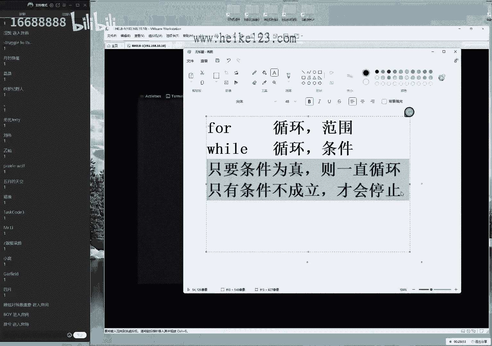

那么同学们来记好之后，来代入一下实战了，还是以我们昨天那个脚本名称为例，我们叫做哈哈，这样的话同学们可以把自己的这个就是啊啊啊，那我们可以把我们的这个重心，完全都投入到编写这个脚本里面。

不用老担心什么文件名称后缀什么的，这个不用管了，来打开我们的文件，叫做哈哈的s h，这个时候先怎么样呢，回忆一下，就是我们一个shell脚本再去写，之前当然有一个格式，这个是不能少的，也就是说内容是啊。

那么好像这个内容是什么，我们还不知道，但是它的格式一定要有的，首先是一个脚本的声明，脚本的声明指的是这个呃，我们的shell脚本能够被哪个解释器所执行，或者的话呢，是有哪个解释器能够读懂我这样的一个啊。

注释信息，我们来讲讲东百旧的这个脚本的声明，bean里面的bh，这就指的是我们可以通过这个解释器来去调用，以及去读取和解析和去执行我们这个shell脚本，这是脚本的声明，第二的话呢我们叫做脚本的株式。

脚本的株式的话呢可以有一行，可以没有，它也可以有很多行，它并没有限制，它，主要是对于我们的脚本的功能的一种解释的啊，这种说明或者的话呢，它是对于我们某一行参数一种介绍和解释，这样的一个信息看看啊。

这个是程序，它并不读的，只是给人去看的，所以的话这也没有什么语法规则，如果说大家愿意的话，可以随便去写一些，比如说啊this is a test，比如说我们先用来去测试的一个脚本。

那么就可以对它进行一个简单的描述了，好这个话我们当前没有用啊，因此把它给删掉，节省我们这个屏幕的空间，同学们这样黑啊，可以看到我们这个啊，屏幕当中最重要的一个参数了，好那我们今天要给大家举一个小例子啊。

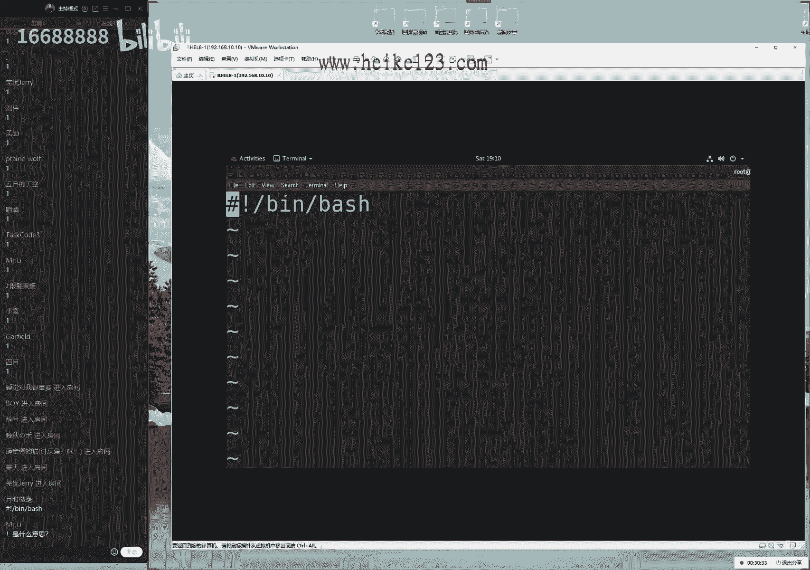

说到这个vivo循环，这个vivo循环的话呢，实际上是来自于我呃，我还是在大概上初中的时候看过一个节目，这个啊电视购物节目，当时的话有一个主持人叫李咏啊，现在的话好像已经是去世了啊。

当时有这么一个节目啊，召唤师由利用中啊，他还是由李咏主持的这么一个啊电啊，它是一个电啊电视竞赛的一个节目，然后他就会拿出他这个主持人的话，他会拿出一个东西来，比如说啊是一件啊枕套，或者它是一个四件套。

或者它是一个冰箱，这样的话让我们去猜价格，然后我们可以打电话，通过这个电话去报您的价格，比如说你报的这个价格是400块钱对吧哈，那画了哈啊，那画的我们这边的话还有人报的是500，2号人报的是600。

他们告诉我们说您报这个价格高低了，会给一次提醒，然后的话应该是去猜三次吧，如果您猜中了的话呢，这个礼物咱们就可以拿走了，那么如果说我们所有人都猜了一轮，都没有人猜中的话，比如说这个价格是499块钱。

那么谁比较靠近谁就可以拿走这个小礼物了，这是当时我啊这个当时看电视啊，那我还是这话，是当时我们看电视那个节目当中，第一个小的一个节目啊，然后我们就以这个为例，今天的话呢我们也想去写一个sho脚本。

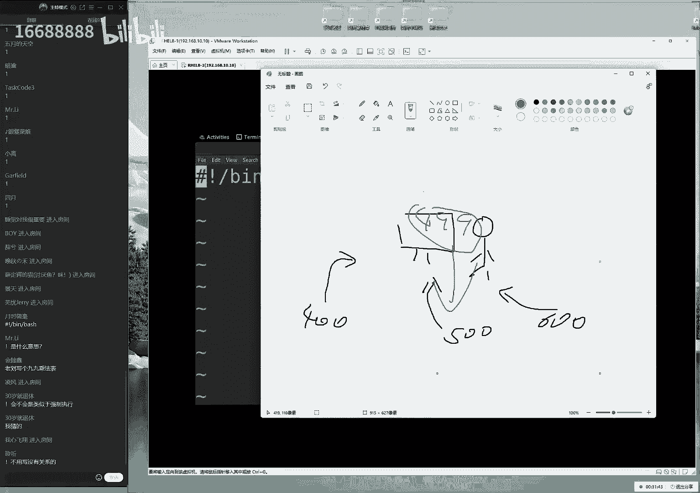

它会随机去啊，它会随机产生出来一个数字。

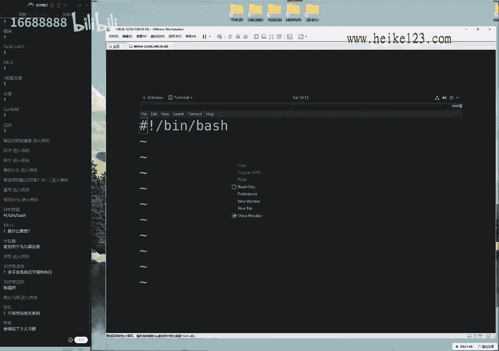

这个数字的话呢我们可以给它限定一下范围，这样啊，那我们就可以让用户去猜这个啊，最后它啊产生出来这个数字的一个大小，比如说产生出来的这个数字是500，然后让我们这个用户输入一个值，然后跟他去做比对。

如果说用户输入的是一个300，那么则提示说您猜的太小了，要更加的大胆一点，那么如果说用户猜的是一个800，那我们则告诉用户啊，那么你猜太高了，需要降低一点，那么如果说用户猜中了的话。

那么就是可以提取出来一个啊，congratulation公已经猜中了这么一个字样，也就是说我们用户输入的是什么信息，他就会根据这个信息来进行一个判断啊，然后的话知道我们猜中了这个循环才会进去啊。

那么他才会去结束这么一个小脚本，那我们来给大家去啊。

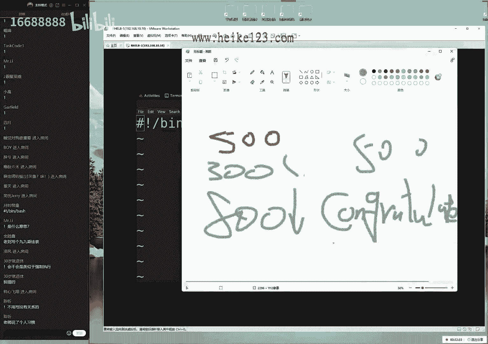

编写来操作一下，同学们尽量能跟上我的这个思路啊，现在能跟上咱们这个思路好，大家说叹号啥意思，这个昨天讲过了，我们我们就不再重复了，这个同学们昨天应该是没有来上课吧，来啊啊。

另外的话呢我们今天又报了大概三位同学吧，然后因为是您属于多，但是您属于到第35期的选了，我们只是把您先加到这个群里面的话，去感受一下气氛啊，然后今天的话呢并不是开课第一天，所以您可能一开始对吧。

跟不上就是很正常的，那么您可以去看一下我们这个预期视频，在轩辕页啊，在轩辕页面里面是有的啊，正好借着这次机会给大家去说一下啊。

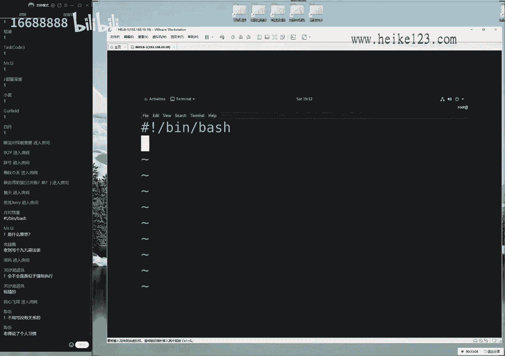

就是呃就是您现在的话呢，可以进入到学员页面里面，如果说包括我们的老学员，也是进入到学员页面里面，后面就是我们的网址嘛，后面加上v i p3 文字，你就可以先去下载一下预期视频，今天不是第一节课啊。

今天并不是第一节课好，接下来继续来给大家去说这个shell脚本的话，用到的一个变量啊，这个变量实际上就是第三章节最后一个小节。

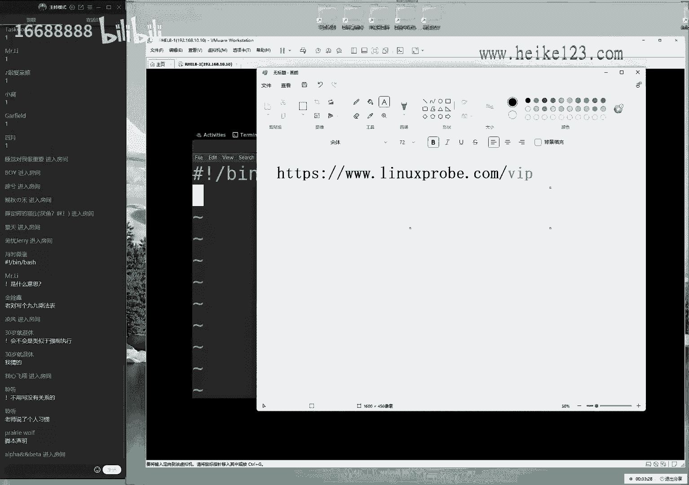

去检环境变量当中，给大家来去展示过的，一个叫做random的一个变量名称，然后对于我们的变量的话，一般情况下都是一个啊大写的一个形式，那么那么那我们来去敲一下回车，所以这大小写我们一定要严格进行区分好。

先看一下这个变量，这个变量的话呢，它是一个随机产生出来的一个数字，这个数字可能是几千，可能是几万，可能是几百都有可能，反正我是见过几百的这种情况，比如说我们可以看到最小的话，当年是2500。

最大的话是28000啊，是32000，那那那这并不重要，那也就是说我们现在的话呢，通过这个变量可以产生出来，一个随机的一个数字，没有问题，但是的话呢这个数字的话它有点太过于跳了，这个范围真的是太啊。

就是啊啊这样的话范围特别的宽泛，那我们就要想一个办法，我们只有一个啊命令啊，我们来去来进行一个计算，大家注意一下。

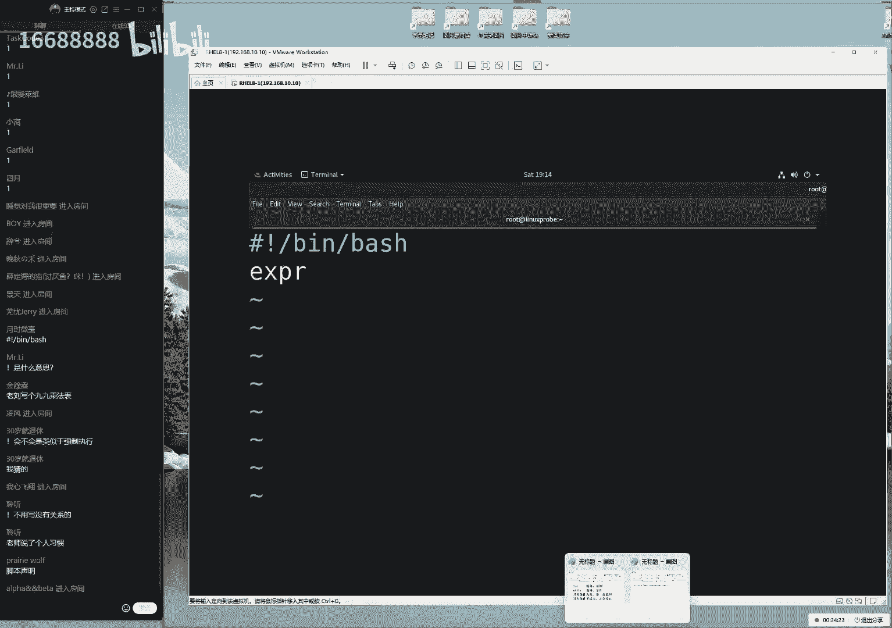

这个命令的话呢，我们的作用是用来去计算后面我们的变量，它所啊对应的一个数字的，因为我们上节课给大家讲到过变量的话呢，在我们这个shell脚本里面，它是不用定义类型，可以直接去使用的。

所以我们不知道它是一个数字。

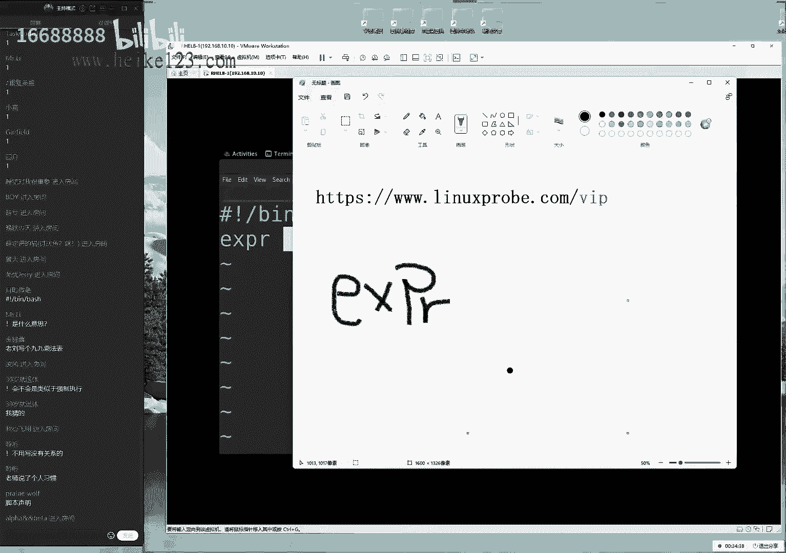

它它它还是一个字符串，所以我们需要去使用的一个计算的命令，把我们的这个后面的命令的话来进行一个计算，计算之后，将它的返回结果，然后再复制给一个变量这样的一个思路，于是我们来进行一个计算。

那么要想去计算一个变量里面的这个值的话呢，我们需要前面加一个dollar符号，这个指的是提取我们这个变量，它所对应的一个信息啊，它所对应的一个信息好，大家问了一个问题，大家说说叹号啥意思啊。

说叹号会不会是强制执行的意思啊，我怎么看到有四位同学，我怎么看到有三位同学都是这么说的呢，稍等一下啊，啊说老刘的习惯问题没有啊，我从来没有说过这是习惯问题，大概是这样的。

我怎么看到四位同学都在说这个叹号啥意思，你说这代表强制吗，还是啥意思，还是说老刘的习惯问题都不是啊，同学们怎么这个咱怎么回事啊，啊这是这样的啊，这个的话呢我们的前面的一个井号，一个叹号。

然后后面我们加一个解释器的名称的话呢，这个是我们的脚本的声明啊，脚本的声明指的是，能够被哪个显示器能够运行的意思好，大家应该说的是这个啊，ok我们来继续啊，怎么样怎么样怎么样，我看一下大家说说的不一样。

怎么了啊，这是一个格式，没有问题没有问题啊，这个没有问题的，所以今天大家这个状态，感觉好像跟我好像比我还差啊，咱们这个课是一个晚班啊，七点到九点钟，所以我们呃虽然说今天每天晚上。

就是我们虽然每天晚上才会减两个小时，但是我们这一整天都是要去保存自己的体力的，所以到了晚上的时候就总有总会总会有干劲，但是我今天发现，同学们的状态好像不是那么的呃，好像不是那么的，那么这个怎么讲啊。

并不是那么的好啊，怎么今天这个昨天刚刚讲过的江门的声明，将门的注释教本的命令啊，这这是江门的声明，怎么都忘了呀啊那这样的话来啊，不应该不应该好，我们下面再来啊，所以讲课的时候我们会尽量的有点激情。

这样的话呢大家去听点波雷顿啊，容易犯困，尤其是我们讲完了就到九点半了，特别的累，所以我们讲课的时候会啊投入点感情吧，来我们来去做一下计算，大家看一下啊，现在的话呢这个我们叫百分号符号的话呢。

当前的这个作用是用来去取余数的，大家可能会说老师这个我知道这个是干嘛呢，这个是用来去，这个的话呢是用来去进行一个除法的，他放的并不是的。

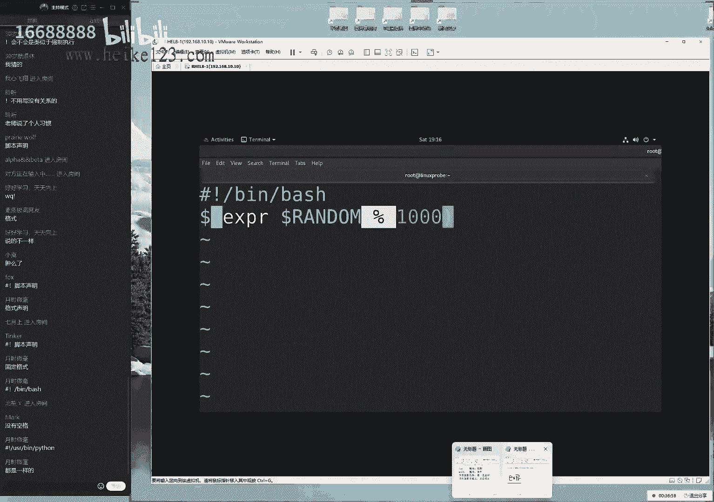

我们在计算机里面的加减乘，然后这是一个星号除，它是这么去解的，加减乘除，而我们的话呢当前这个符号的话呢叫做取余数。

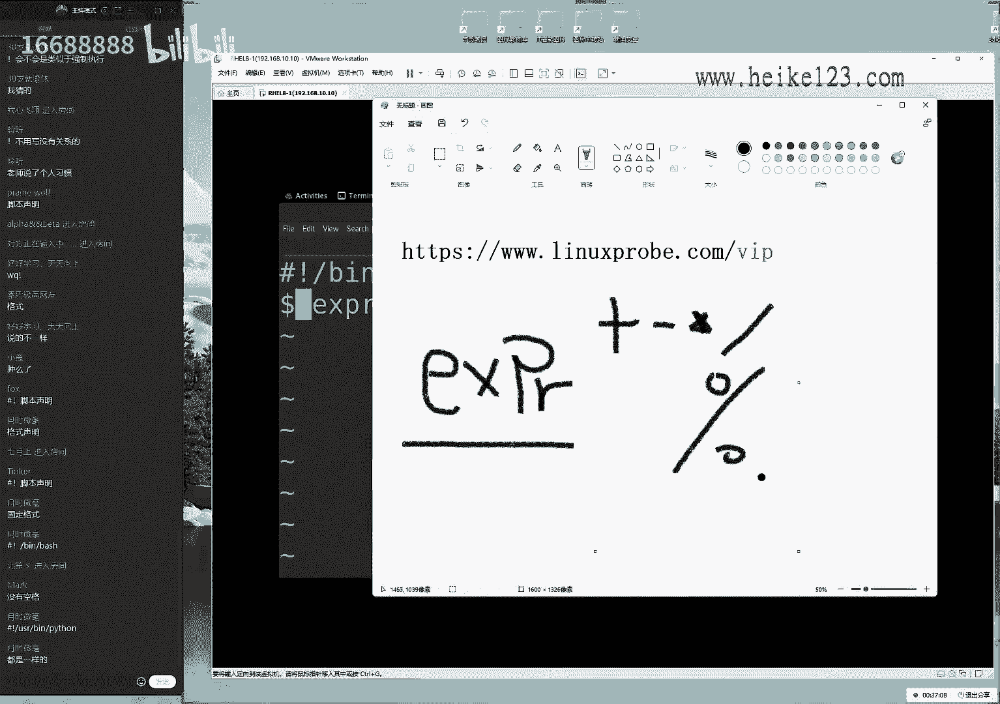

我们简单去理解一下，就是我们会去把这个数字的话呢，取一个1000以内的一个范围，这样的一个效果好，这是第一个解释，第二个解释的话。

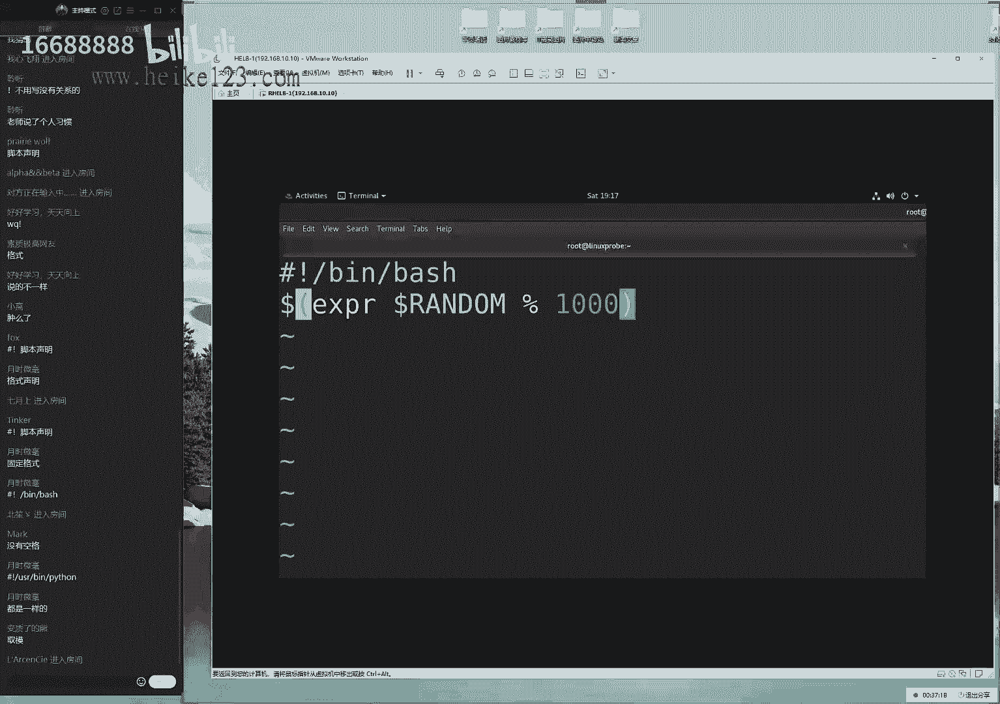

那就是，那么我们为什么会前面加了一个dollar符号，加一个小括号呢，这个实际上是来自于第三章节里面，那个3。3小节里面的转义符里面，我们去学习过的两个反引号，a对大家也说这叫做取模数也可以。

但是我们也把叫取余数啊。

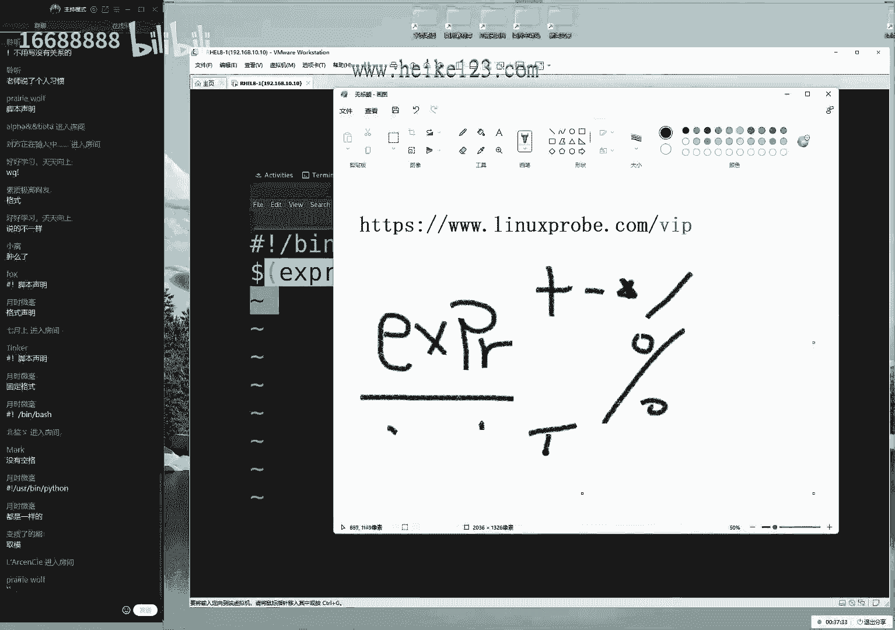

就是一个余量的意思，然后大家会看到这个符号的话呢。

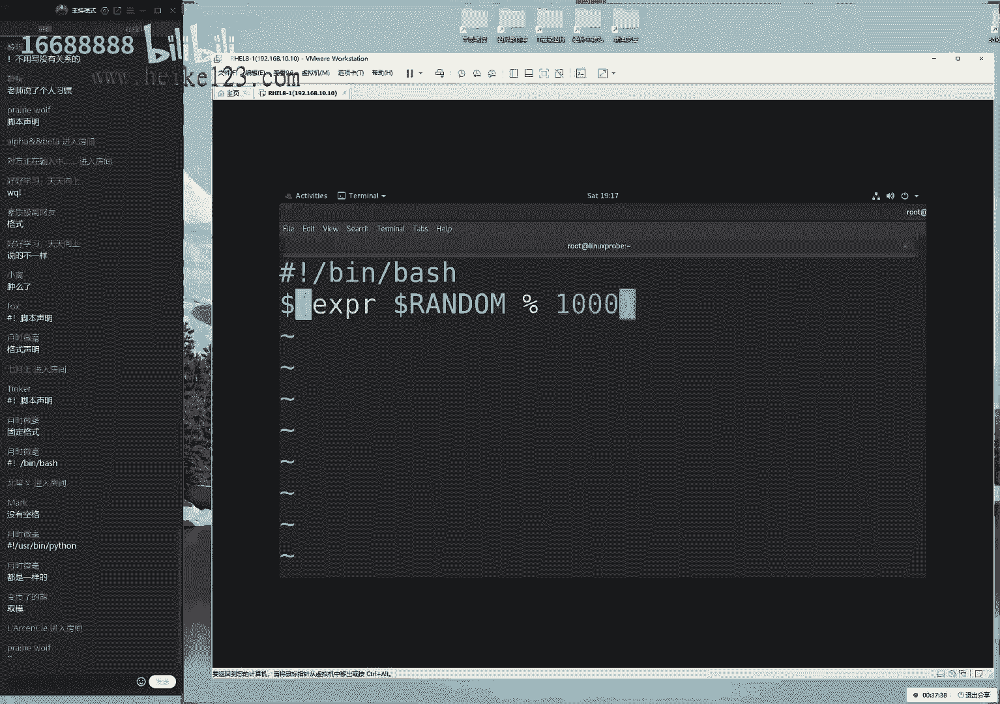

就会觉得好像有点眼熟，但又想不起来了，就这样了，那么我们就这样在去逛街的时候，看到一个熟人一样，好像见过一段时，想不起来在哪里见过的，就是这样的，在我们第三章节的话呢，学习过一个这个转移符。

当时的话呢我们学习的单引号，双引号以及反引号，这个反引号的话呢，作用是用来去执行里面的命令，然后将命令的执行结果来进行一个返回，这样的一个效果，当时我们提到过说这样的写法的话，那好啊。

那我们以及用的很多，但是的话它有一个跟他一模一样的，一个功能的一种写法，那我们的这个写法的话呢，是用的一个dollar符号，加一个小括号的这样的一个形式来去写，这样的话那效果是相等的。

呃我们今天的话呢也会把这两个实验啊，不我们今天的话也会把这两个方式都给大家，来去来去啊，操作一下，那话这样的好处就是能够让您在工作的时候啊，看别人去写出什么样的格式，都能够反应过来。

这样的话我们可以做到不，那么这样的话我们去记一下啊，这两个的这两个效果是相等的，这两个效果是相等的，它都代表去执行，我会把它写下来吧，执行执啊，执行里面的命令，然后的话呢只取其返回结啊。

只啊只返回执行结果嗯，只是返回执行结果来，我给大家写下来，然后给大家写下来，然后大家问了一个问题，大家说没有声音了啊，有声音是吧啊，可以网是网络原因好，那我们现在给大家说清楚之后啊。

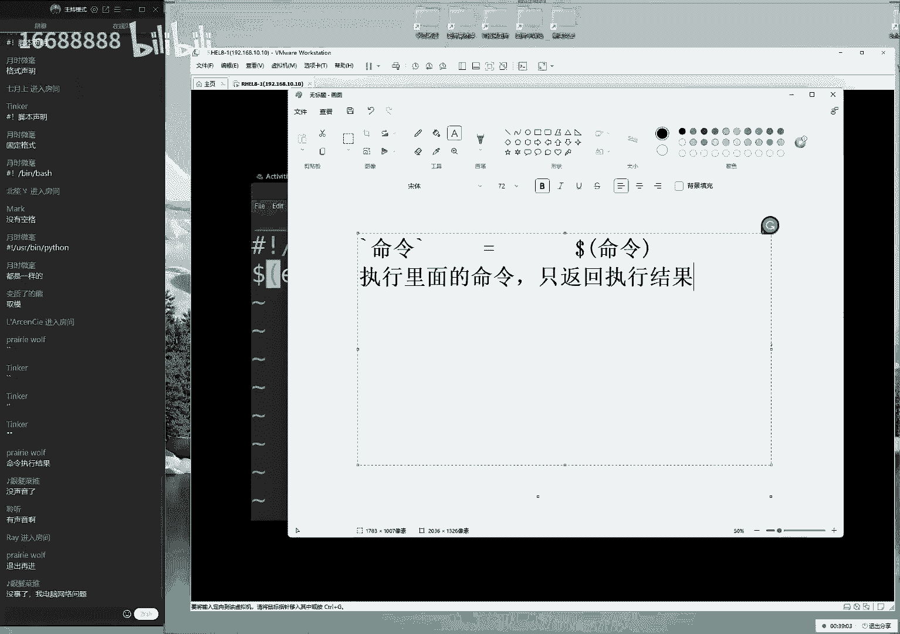

下面一个我们往后面去说，再一个变量叫times，因为这个这个这个，这个作用是为了增加趣味性了，我们要想最后去猜的话呢，我们想要去最后统计一下这个猜测，这个次数增加一点趣味性对吧。

那我们再去定义出来一个变量，它的话它默认值为零，让我们最后猜中了之后，还能够告诉我们猜了这多少次，这是不是感觉很有意思的一个小实验啊，ok好，下面再来啊，可以这样啦，来进行一个被我循环了。

没有循环的话呢，我们应该后面加一个条件，但是啊我们不想去加条件，我们可以直接将这个条件设置为真，也就是说这个的条件为永久为真的意思，就是说这个啊循环语句会一直循环下去，直到我们的系统崩溃。

直到我们的系统锻炼，知道这个世界被毁灭了才会停止好，也就是说这个的条件为真，大家一定要小心，但是我们现在这样去写的话，那没有问题，因为我们会再去设置一个结束的，现在我们来设置一位调。

那么现在把它设成条件为真，他会啊一直在循环下去，直到碰到了退出服务才会结束一下，他来我们进行一个do循环语句，先让用户去通过我们的read me来去输入一个值，将这个值的话呢赋值给一个变量。

随便的什么名称都可以，先来给它输入一个提示符的一个信息，后面给他一个变量的名称，让用户去输入的这个值我们可以视为一个整数，将用户输入的这个整数啊，将用户输入这个整数，然后的话呢我们来复制给这个变量里面。

p的这个作用的话呢，是用来去提示一个信息，让用户知道他该去输入什么样的一个信息，好大家怎么说啊，大家说这是一个死循环啊，没毛病，他会来啊，他会来一直一直循环下去。

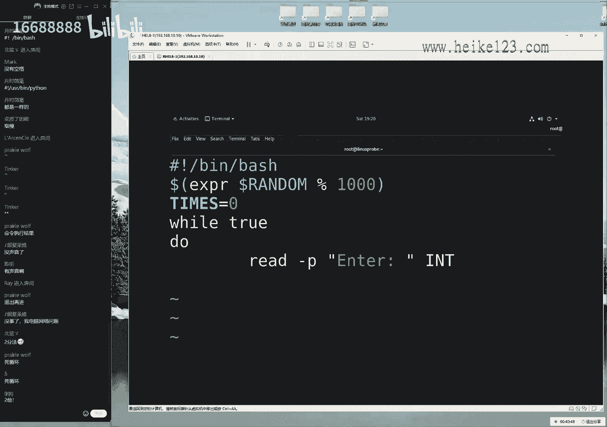

这个也就是一个最简单的一个说啊，等一个去解病毒的一个方法了，最简单的病毒就是这么写出来的，它并不设这个啊，呃之前的这个极速符，他会一直去消耗我们这个系统资源，好在啊，因为我们这个没有太大问题。

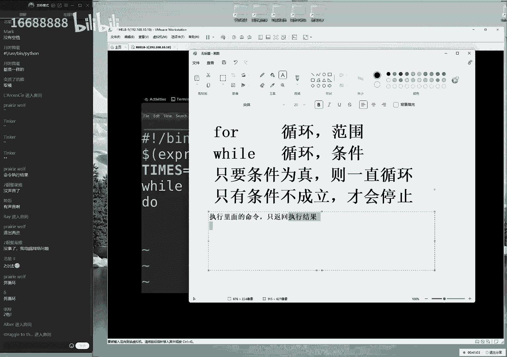

那么为什么呢，因为这个它并不会消耗太多这个系统资源，它只是让用户输入信息，然后再进行判断，而且的话呢他每一次执行之后，我们都会有这么一个锐的命令来去卡住它，它不会来去拼命的去循环下去。

它会有一个用户输入的一个过程，因此您应该是不会感觉到这个啊，不不不啊，您啊是肯定不会感觉到任何卡顿情况的，来接下来我们再来，当每一次来去执行到这个语句的时候的话呢，我们来去使用它less。

来让我们定义好的这个变量的话呢，来去自加上一好，大家现在问了两个问题啊，大家先问了两个问题，我先来给大家回答第一个问题啊，同学叫做冰叔叔啊，然后问了一个问题，说这个啥意思，这个没有任何含义。

如果说啊如果说我们从c语言，从编程角度上来说的话呢，这是一个变量的类型，我们为整数，而我们当前的话呢没有任何的含义，它只是一个变量的名称，我们如果要是不想用这个名称没关系，我们可以换它只是一个变量名。

我们自己自定义的啊，自定义的，比如说大家呃我们换一个，比如我们把那我们给他换成啊哈哈，这样吧好吧，我们给他换一个叫做哈哈，其实我们在上课的时候的话呢，我们会给大家讲到，会把一些呃变量的话呢。

或者文件的这个名称用到这种词，比如说哈哈啊吼吼啊，然后来进行命名，同学们就问到了，说老师你这样的话好像很不正经啊，就是我们就因为怕说太过于正经了，就会向同学们问到的，说这个值是什么意思啊。

是说我们在工作的时候，或者说我们再去这个啊，那我们再去写这个脚本的时候，必须是这个值吗，啊所以我们从现在开始啊，能够替换的这个值就尽量的给它替换成种，哈哈吼吼什么的，同学们一眼能够看得出来。

它没有一个固定的含义，这样的一个呃好吧，那呃那么好，我们这样的一个情况，第二的话我们的问题就是刚刚定义了一个变量，叫做这个times对吧，然后我们现在的话来着呢啊。

那我们现在需要让它在每一次循环当中的话呢，都会自自加上一，这样的话我们最后呃比如说我们执行了五次，那么最后才会去啊输出信息，恭喜您猜了五次，然后并且恭喜你猜中了那么这样的一个字样。

所以我们让他每一次都自加上一叫做less，然后是times变量名称加加，然后他每一次都是自加上一好，然后同学们我认为啊，其实我刚想说第二个问题的话，那就是您可能不太好理解这个什么意思，再给大家解释一下。

这个的话呢，就是要让我们后面这个变量的这个值的话呢，每一次都是自加上e，那么第一次的话呢他就是0+1，这样的话他就啊最后这个结果就是一，然后当第二次的话就是23456789，最后啊我们猜中了之后。

他会去输出这个变量，那么就知道了，我们总共猜测这个字数呃，其实来讲的话呢，这个我们在一些编程语言里面的写法，是这么写的，叫times，然后怎么样呢，是不是times等于大家一起说呃，大家说啊。

不加上light不行吗，当然不行啊，当然不行啊，我们这个在编程语言里边的话呢，我们是这么去写的times，然后我们是加上一这么这种写法啊，不这个这不这个要用dota符号做来去啊，提取一些变量的值。

大家可以看一下，其实的话呢这个就等同于就这么去写，他每一次都能把它这个里面的值做调用，然后再加上一，然后再赋值给变量，就是同样的效果，我们只不过去拽了一下，这个新鲜的这个操作服而已，大家可以去感受一下。

其实学计算机的话，大家会感觉到计算机有两个特别好的好处，第一就是说比较的理性对吧，只要我们给他一个正确的信息的，或者说我们只要给他一个正确的指令，总是能够把我们这个想要用啊去处理的，根据之前的这个工作。

帮我们自动去完成，可能比人更加的靠谱，第二点的话就是更加的灵活，大家会发现，比如说像我们下面这个啊，哎呦我发现一个问题，我好像忘记把这个值给它复制到一个变量了，第二个的话呢就是我们在计算机里面的话呢。

去操作的时候，这个操作服啊跟命令都特别的灵活，同一种功能可以有是有两种可能性的啊，比如说我们现在这个啊啊那我们可以用啊，那我们可以很多种写法，比如这个也是啊，这都是二选一，这也是二选一，我们可以用到啊。

发型号有点做代替好，我们刚刚的话呢差了一步啊，差了一步是什么呢，现在去执行里面的命令，然后命令执行结果的话呢，我们需要去复制给一个变量，让这个变量叫做price去接收，刚刚去执行过后的这个命令。

执行过道后的这个结果，然后我们来去做一下比较，比较一下用户数的这个哈哈，跟它所产生出来这个price，它这个价格是一样的吗，如果是一样的，就退出这个循环，如果是不一样的话呢，就会一直去循环下去。

然后给用户一个提醒，这样的一个呃思路，这样的一个思路来下面一个问题，下面一个问题啊，大家说啊，while true，判断它是啥，它没有任何的判断，它的条件永远为真，我们直接把它这个等于说结果给他放啊。

那我们给它放到条件上面了，他会一直循环下去，好另外同学们问到了同学叫小公子啊，说如果我们的enter后面不丢空格会报错吗，稍等一下啊，如果我们的enter后面不留空格会报错吗。

好我没有理解您说的是什么意思，因为我这边好像没有n l n或回收没有问题，没有好像没有看到您的问题，就是你可以再去细致的去描述一下，因为大家可能会认为自己的问题，已经描述的很清楚了，但是并不那么的清楚。

还需要再去补充一下，因为我们面向的人比较多啊，你可能上面一条说过一个，下面一条再发的话，又需要把上面那条再去重复一遍，最好来我们下面这样啊，下面这样我们来去做一下判断。

这就是把我们这个硬条件测试语句的话，那就给大嵌套在这个while循环语句里面，就像这个管道符一样啊，大家会看到说说老刘诶，你这个管道符只能用一次吗，当然不是啦，管道符可以用很多次吗。

将前面一个命令的输入结果给后面一个命令，再来进行一次二次处理，然后12345678 90没有上限，我们可以去加100次都可以了，而我们这个的话呢也同样的，谁说我们的循环语句里边不能签到啊，测试语句呢。

那我们在这个测试的地面，我们还可以再去嵌入到循环语句，这样的话它是非常复杂的，其实并不仅仅是我们现在去独立的去讲。

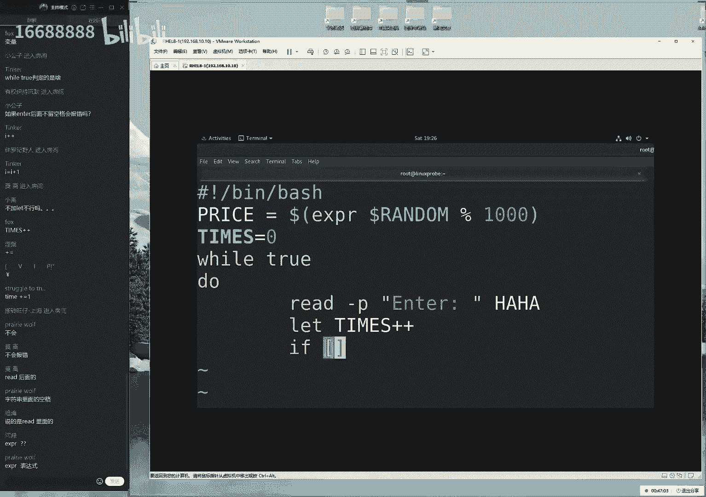

这个四个循环语句，还有这个测试语句，诶，if啊，four啊，well啊，case，这个它们之间也是可以进行一个搭配的，一个使用特别的灵活的。

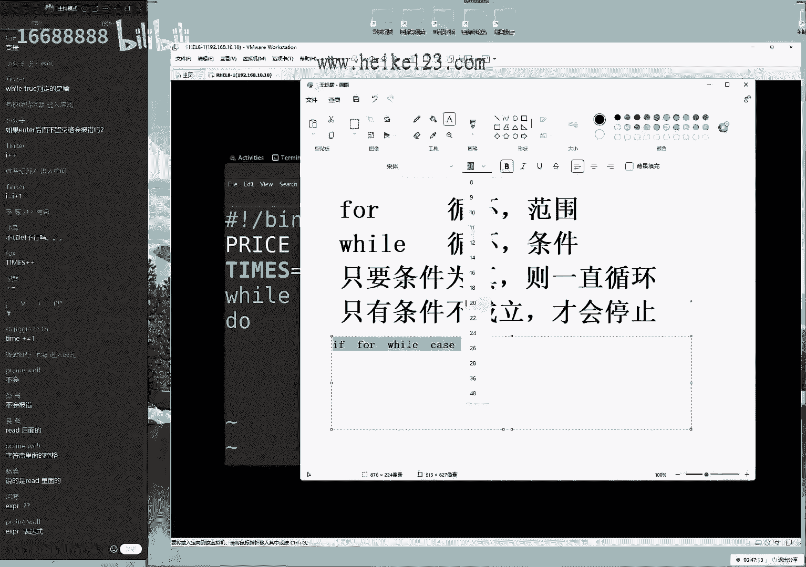

一定要去啊去啊，各种来去尝试啊，我们先来去做一下判断，判断一下说用户输入的这个变量叫做哈哈啊，当然了，这个时候大家就千万不要再问我说这个哈哈，啥意思啊，变量名称变量名称没有任何含义啊，没有任何含义。

大家要再问的话，就只能把它叫做老刘了啊，或者说我们取一个其他名字，变量名称随便去写啊，没是没有关系的，判断一下用户输入的这个值是否equal，等于咱们什么呢，等于随机产生出来这个值。

这个变量名称变量复制啊，它进行赋值的时候是不用加dollar符的，而提取这个变量的值，我们需要加一个dollar符，加上这个price，ok这样去做好，大家问了呃，大家啊，大家问了一个问题。

大家说我们这个字符串里面有了这个啊空格了，这个有什么影响吗，这个没有什么影响啊，这个没有这个没有关系的，然后的话大家也问到说，我们这个等号两边是否有这个空格，有还有什么影响吗，呃没有它没有任何影响。

只不过我们为了照顾大家的这个感觉的话，那我们可以把它给删掉，但实际上来说是没有问题的啊，是没有问题的，来大家说我们的price拼错了，来p r i s e果然是哎呀，p r i s e啊。

这个啊这个有点这个太啊这个水平就太低了啊，这是一个非常小的一个问题，好我们写下来，就说当我们这个用户输入的这个值，跟我们所产生出来这个值的话呢，是保持一致的话，那我们就会去输出说唉恭喜您猜中了。

然后是跟啊conrad grade啊，等一下，这是关乎老刘这个尊严的这个时候了，congress to uh，好吧，我们先去拼一下，我我也不知道对不对啊，这是关服导流这个水平的问题了，来这么啊。

当用户输入的这个值，跟我们所产生出来这个值做比较，如果说我们就猜中了，那么就会去输出一个恭喜的一个这样，并且会去输出一下，我们总共猜测这个次数，调用一下刚刚所产生出来的不所定义的，以及去啊。

让他每一次都自加上一的这个变量的名称，叫做times，好，大家需要注意一个问题啊，就是为什么我们看我们的这个脚本，会显得特别的臃肿，而为什么我们的同事里面写这个shell脚本的话呢。

则会看起来特别的舒服呢，其中有一点就是我们所有的判断语句里面，其实就是我们再去写这个shell脚本的话呢，都是一定100%，会有一个怎么样一起来说，判断语句要求使用到一个if的。

然后的话呢我们要是有if的话。

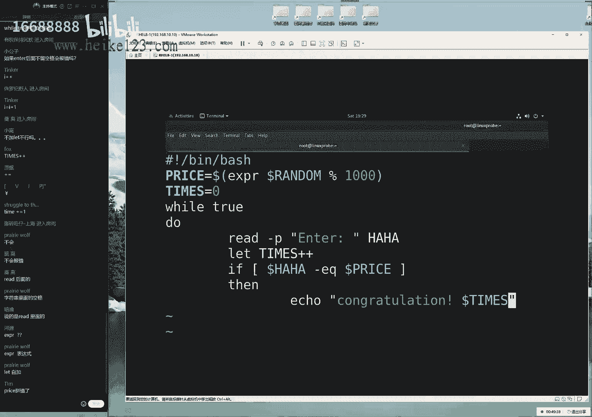

他肯定就要有很多的，怎么样呢，有还会有很多then对吧，就是我们啊条件满足之后，然后我们该怎么样，包括说我们去使用的l c叫做多重分支的条件，测试语句的时候，它也需要把我们的每一个动作加一个正。

于是您就有可能比如说我们判断语句啊，去使用到多种分支的条件测试语句的时候，就有可能比如说判断了十次，那么你的屏幕里面就会出现十次哎。

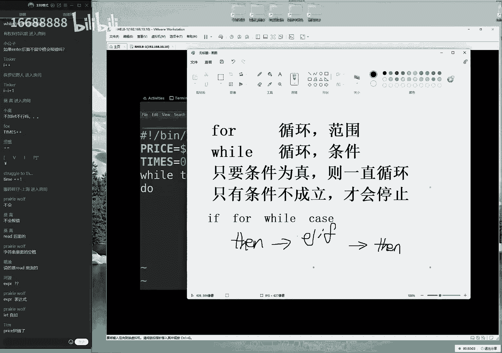

并不夸张啊，就会出现十次，这个字特别的呃乱啊，所以我们可以有一个小方法，就是如果说大家觉得这个字特别多的话呢，可以把它放到后面，然后我们这个之间加一个分号就可以了，就会这样。

我们看一下是不是屏幕就会感觉特别的清爽了，然后接下来再来当用户猜中了之后，就可以来去退出了，来去退出掉，这样做好之后没有任何问题，再来第二次的。

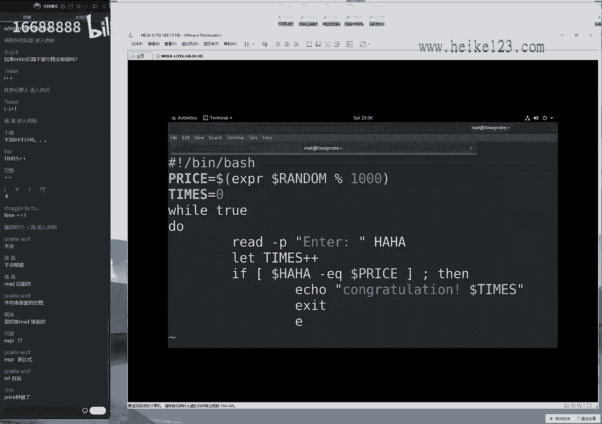

因为它只有三个情况，那他就有三个情况，就像我们在商场里面那个厕所一样啊，他只有两个情况一样，只有男和女，这个也是一样的，他也只有三个情况，他们有一个他没有一个第四个情况的，第一个情况就是它是相等的。

它是一过相等的一个模式，第二话呢就是我们所猜的这个次数不，那我们所猜的这个数字它大于了，所以产生出来的这个数字，于是就是一个大于的情况，第三个情况就是小于了用户数的这个值小于的。

我们这个就猜到这个呃所产生出来这个数字，因此它只有这三个情况。

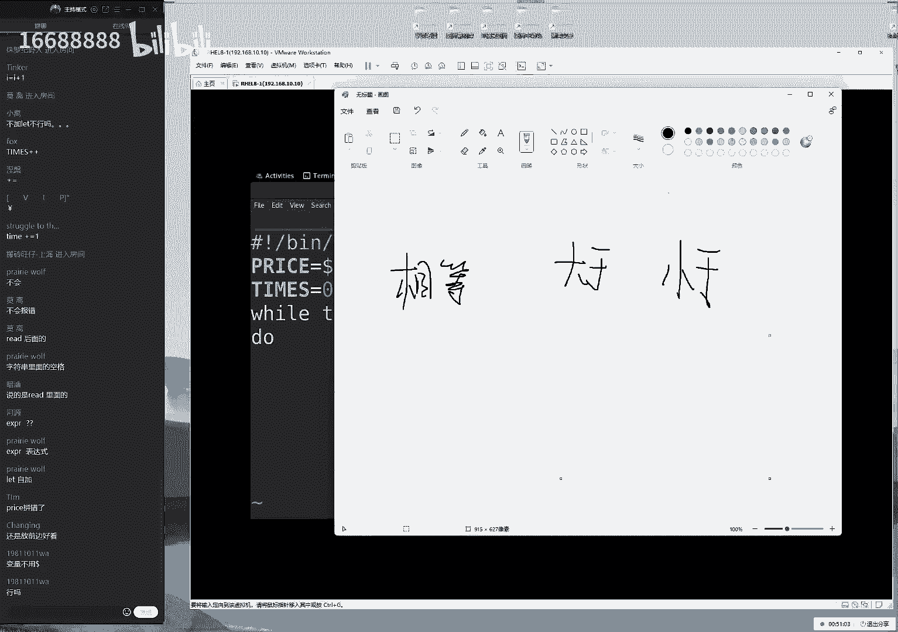

那好了，我们再做一下比较，他如果要是不相等的情况下，那么就判断第二次，判断一下用户输入的这个值，它是否是大余了诶，他大于了杠gt我们就等于了啊，不，它最后吃饱大于了，我们随意产生出来的一个数字。

然后赠放到后面去，让我们屏幕会搞啊，保持它保持非常的清爽啊，保持非常的清爽，来大家问了一个问题，大家说变量不用dollar行吗，当然不可以啊，刀啊当然不可以，因为呃如果我们的变量啊来去进行定义的时候。

是可以不用加到的符号的，因为的话呢它进行定义的，是定义了我们的变量的本身，但是后面的所有的变量都必须要加一个，dollar符号，dollars指的是提取这个变量里面的值，这个怎么理解呢。

就是我们现在进行比较的这个信息，以及我们需要去处理的这个信息，并不是变量它的名称的本身，而我们是要去处理我们这个变量里面，所包含的内容了，所以您需要去提取出来里面，这个dollar符里面的这个啊，不。

我们需要去通过这个dollar符号，去提取出来这个变量里面的值，然后来进行一个加工，这个的话有点像是c语言里面那个指针对吧，如果我们定义了一个指针，那么您做计算的时候跟我们去做存值的时候。

那您是找那个指针的名称吗，直至的名称没有任何的含义，我们一定要找到它所对应的那个地址，里面的那个值，比如说一个数组也好啊，数组名称没有意义去取它里面具体里面那个值，这是同样的一个效果来啊。

当用户输入的那个值它超过了，所以产生出来的这个值，那我们就去输出啊，太高了啊，就是一个high吧，随便去写吧，英文也不太好，哎，就这个值的话太高了，这么一个字样，再来最后一个else。

因为它只有三个情况，要么等于，要么大于，要么就是怎么样，它就是小于，所以我们最后啊，如果前面两个将都没有被匹配上的话，我们则去输出，说您输入的这个值太低了，这么一个字样啊，太low了。

哎就那就那么着去写吧，好我们最后做完了之后把这个结束掉，我们fi啊，结束掉我们的天性测试语句哦，我们的啊去哪去来把它结束掉，再来的话呢，while循环语句，循环语句结束掉它。

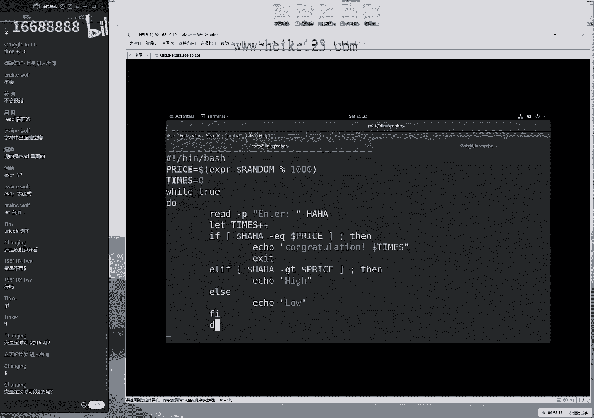

do和done啊，它是一对的，然后的话呢我们前面也是要有if也要fi，它是一个结束符，然后的话呢我们这边也是一个do一个档，我们要给大家去做一下结束符，它有点像是。

同学们会认为徐老师这个怎么那么的麻烦呢，这是shell语言里面故意为难我们的吗，并不是的，因为他需要让啊，我们这个程序员能够准确地告诉他，他在什么地方该停它，什么时候停止了，我们这个循环语句。

这个其实在去写网页语言里面，去写web前端的时候也是同样的，比如说您去写一个我们的网页语言，我们的html对吧，那比如说现在你想去开启一个框，不也这么去写吗，比如说我们开启一个段落对吧。

或者的话那您去想去写一个，比如说啊图片呀，或者说怎么样，我们最后他们那都是要这样去用的，要有一个开始，要有一个结束，包括说我们去换行的时候，它同样的会有这么一个效果，对吧好。

也就是说我们现在的话呢去写这个脚本的时候。

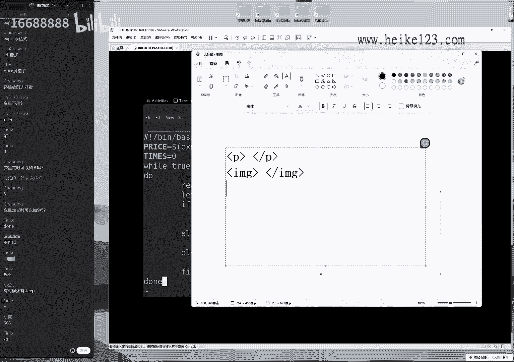

一定要规范它，这个要开始就一定要结束，如果你要没有去写结束的话，那就有可能导致这个程序会有一些问题的来，我们现在的话呢再来点一下这个保存并退啊，出啊，大家说变量定义的时候可以加dollar符吗。

不可以啊，变量定义的时候不可以加dollar符，而且我很我啊，而且的话呢这个是一个怎么讲呢，是一个很简单的一个思路问题啊，大家千万不要被我照进去了，就是我们现在的话呢去呃。

调用的时候是用的是一个dollar符号，那我们定义它的时候的话呢，定义的时候是不加dollar符的，所以您可以看到定义阶段，是全都不加dollar符的，只有我们去调用的时候采取加dollar符啊。

这样就这样的一个这样的呃的话，我们这样的一个原则好，大家先看着我们这个实验啊，我们来给大家说一个事儿，就是的话呢呃这也算是一个小的一个时间，也算是一个小的一个活动吧，我们从第一季开始做培训到现在呃。

压力的话也也也是很大的，而且我们对于这个课的话呢，呃前面的话呢确实有还有啊，去这个有很多需要去讲的，也没有什么，也没有什么太好的互动机会，正好接着这个机会，我们来给大家做一个啊小小的一个活动，是这样的。

既然说啊，既然说随机产生出来的这个数字是1000以内的，我们的话呢同学们可以去猜一下这个数字。

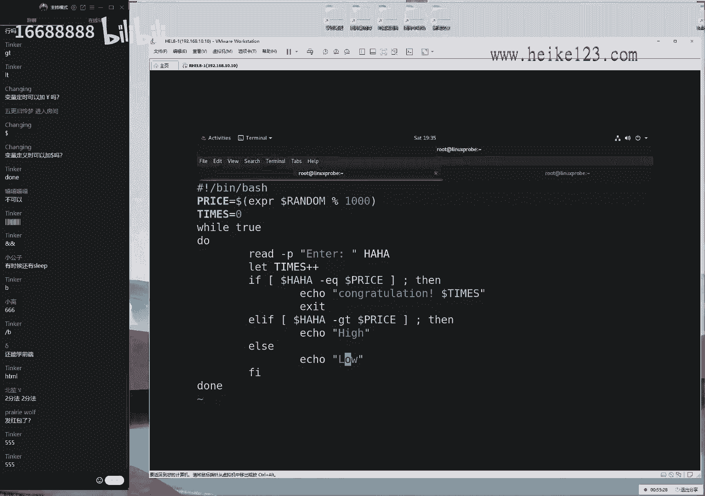

最后的话呢我们就猜中了之后，我们会给大家发一个红包，这也是一个小小的一个活动吧，这个红包的话呢我们的打底是1000不是吧，这个上限是1000块钱啊，这是也是这个啊啊。

这个也是我们以前一直一直在做的一个活动啊，呃1000这样啊，然后的话您可以去猜，比如说我们最好的一个季度好像是猜了五次，还是猜了六次啊，然后的话您就去猜，比如说我们最后我们差了五中啊。

啊不我们最后猜了五次猜中的，那么就是五次乘以100，最后减去这个数就减少了是500，但是我们会在群里面发一个红包，发500块钱，如果我们猜了九次猜中呢，那我们就会在群里发一个啊。

那那那么这个钱就非常那么就非常少了，如果我们猜八次的话，就是200，然后猜九次啊，那么就是100就是我们1000减去它的次数啊，乘以100这么一个小活动呃。

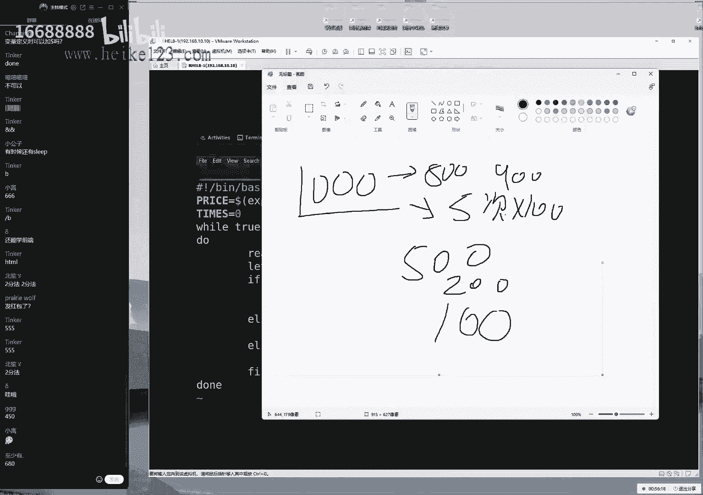

一份的一份小心意吧，正好让我们这个实验更加有更加有乐趣，来我们走，来来来来，正式开始我们今天这个小实验啊，来去跑一下这个脚本，哈哈点s h第一猜，小朋友先输入您的第一猜。

现在的话既然这个范围是0~1000开始的啊，不10~1000这个范围的同学们，开始您的第一台，我们猜个什么数，同学们猜68啊，他是不是没有听懂，我刚才找我刚想说是不这个随机产生这个出来。

这个数字是一个0~1000的68，有点太保守了，同学们哎呀，太低调了，来我随便去选了，比如说同学们随便来随便来啊，叫做呃至少有同学是吧，你好像打了一个650还是六还是600啊，好吧，我选一个600。

那就再回车，他告诉我们说太高了啊，他告诉我们说太高了，所以我再来了啊，同学们就知道了，600太高了，那么肯定是600 600以下嘛，来同学叫做team同学打了一个多少啊，没有看到好吧。

下面啊同学们一个同学啊啊重新打蜡叫做啊，好像只看到这个数字，但没看到是谁啊，那么随便就写了434是哪个同学啊，那他因为太快了，按一下回车，434也太高了，嗯还有这个数字比较低嘛，再来同学们，好同学啊。

晶晶同学是吧，您好像打的是个300，我也没看清，好像就是300吧，哎下回车诶，300太高了，我现在有点怀疑是不是我这个脚本写错了，现在的话呢实际上他是判断了第二次了，当第一次如果满足条件的话呢。

它就不会再去执行我们下面那个else if了，等于说他进行第二次判断的时候，他说太高了，好我们再来同学叫阿笑啊，150行，你这个挺好啊，来150，阿笑同学哎，下回说好，他还是要满足了我们的好。

他还是满足了我们的第二次判断，else if这样的一个语法好，我们再来啊，同学们说啊，90我们的关先生是吧，90按一下回车诶，90还太高，同学们，难道第一位同学打的那个68，真的是打对了吗。

好了我随便了，学们叫做呃g g g是吧，打了一个45按下回收哦，泰迪奥哎呦，完了这回感觉是我有点太误导大家了啊，因为同学们第一同学打一六十八，我还说这个太低了啊，实际上好像这个范围。

就是在45~90之间呢，不好意思啊，另外给大家去说一下是什么呢，但这个我们再去去做这个判断的时候的话呢，它不可能是等于的，也就是说这个我们所有的话都是一个杠之一。

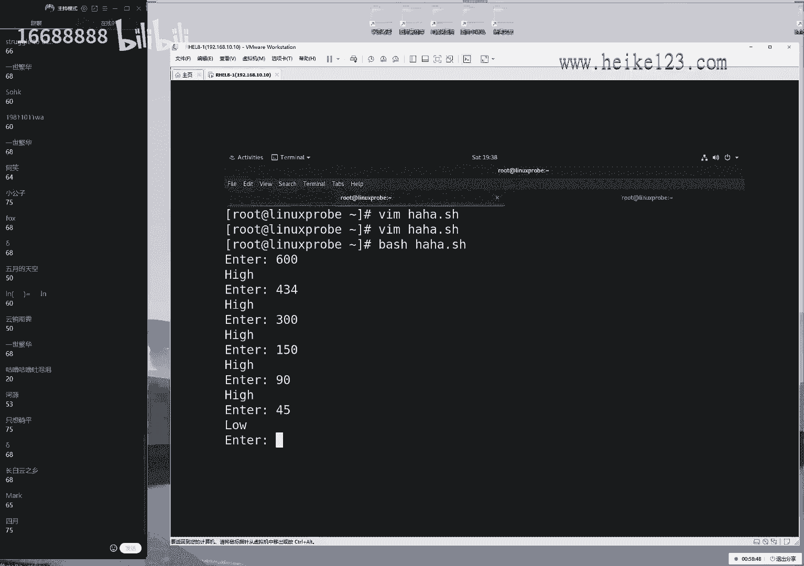

它指的是诶，等一下我给大家写下来是great诶，等一下great唉，gr at它是大于等于的意思。

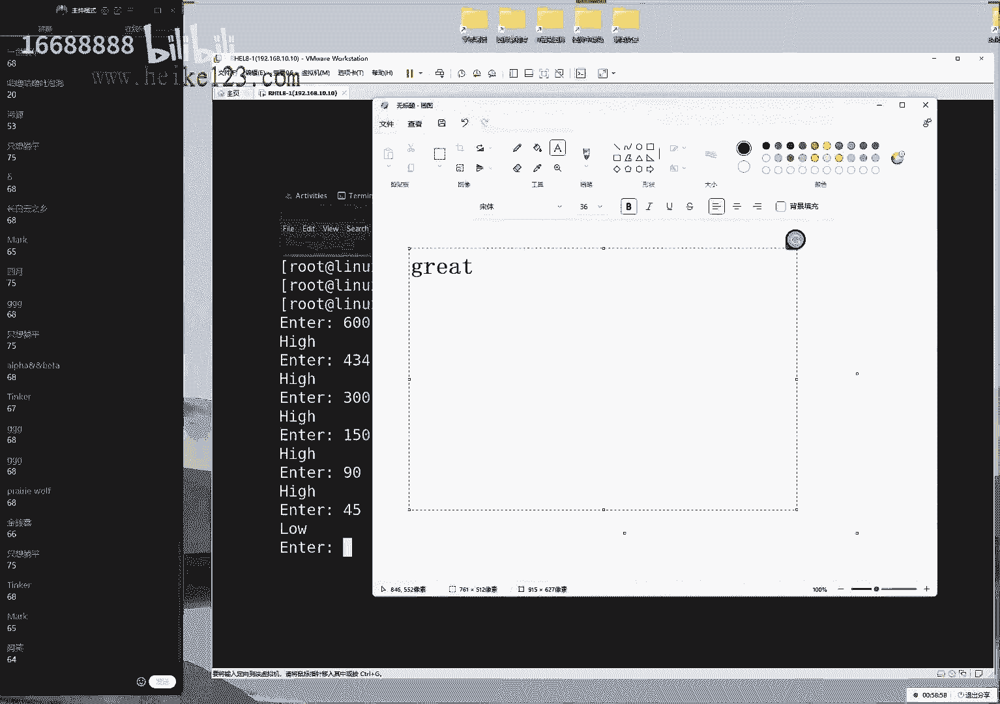

哎我们大于等于的意思，所以的话呢45跟90肯定是没有办法去，那什么了，来我们继续啊，同学们叫做哎只想躺平，同学75a加回车啊，大家说这个太高了，实际上这个范围已经很小了，只有大概30个数了。

同学们再来一猜啊，同学们叫做一世繁华啊，说68，同学们啊，不是不是不是还真的不是六班，还好还啊，还真的不是六八，如果这是68的话，就真的说不清楚了，就感觉我们这个可是一个录播课了，这样说不清楚了啊。

这还是非常有这还好还好，这个我们还是非常非常有压力的啊，幸亏不是68，68的话，同学们一上来就说到了，而且那么小那么的准就会让我们很难解释了，来随便啦，同学们大家说到72是吧。

黑色风暴说73来按一下回车，那太高了，来下面一个同学啊，同学说啊，我们的嗯同学啊打了一个70，好gg同学第二次看到你了，我来打一下70，ok 10次，最后我们猜中了，看到最后啊。

最终的话这个数字是十次好啊，然后我再给大家说一下，是这个样子的啊，首先首先首先首先首先是这样的，我能够看到这个是一个非常严才会，这是一个非常严格的公证的这么一个shell脚本，因为说实话。

我就啊就是就是连我们自己都不知道，他到底所产生出来的一个数字到底是多少对吧，其实我们都不知道，哎啊所以的话呢，如果大家以后在公司里面做团建啊，怎么着的，如果要做一个低成本的，但听到这个词。

第一个验证的一个或者说抽奖这么一个小程序，那么你就可以通过这样的方法来去实现，并且的话它是一个开源的，我们做的可以看得到没有人作弊，这个可能性好，那我们可以看到的话。

最终还有一定要用我们的变量叫做times，然后我们来自加上一，最后我们对啊。

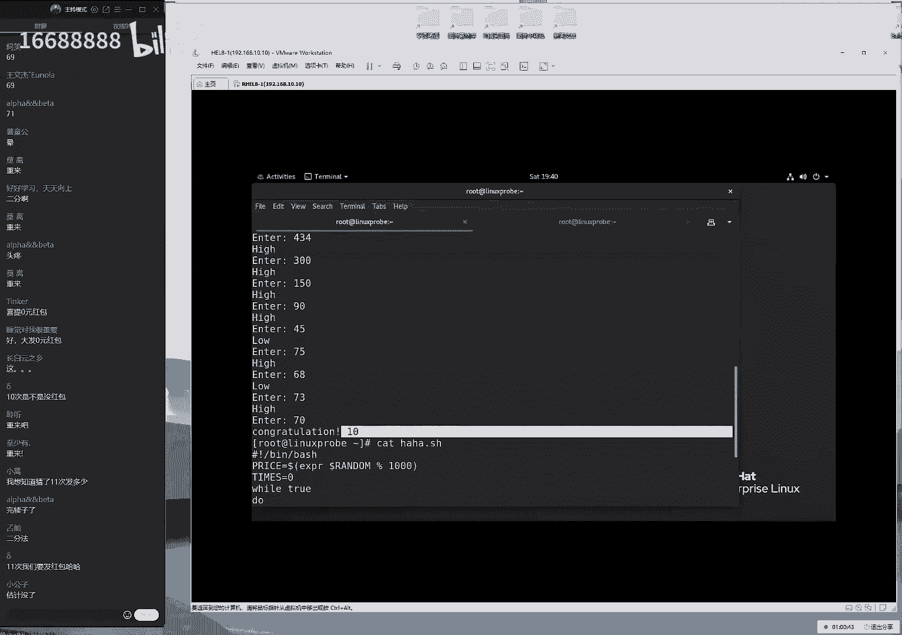

最后会显示出来，我们总部猜测这个次数，当我们到了我们的退出服退的时候。

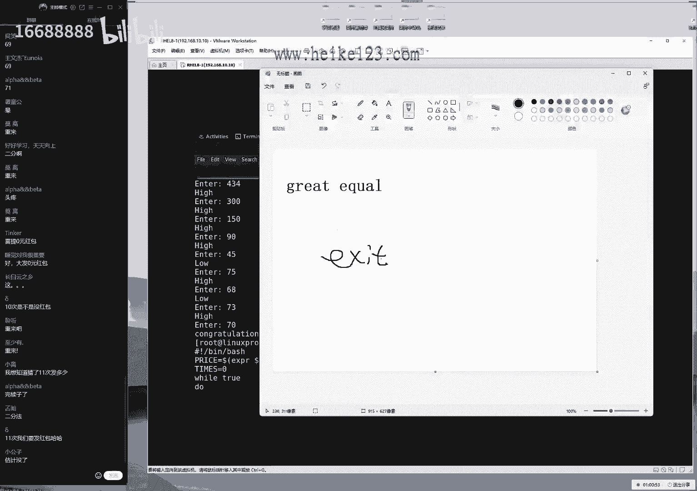

否则的话呢永久条件为真，会一直来去循环下去的，好呃，今天的话呢猜了这个词，大家今天正好的话猜了十次啊，这有点让我没有想到，所以这怎么办呢，所以这个我觉得还是再玩一遍吧，我们稍微快一点啊。

因为这个确实没有想到大家差了十次，14的话就没有就没有红包了，但是为了我们这个活动的话，非常的公平公正啊，但是我们可以再玩一次好吧，同学们，咱就一分钟时间啊，我们再去玩一次，同学们来告诉我。

你的结果快速我们就给大家啊，就是我啊来我们快速的告诉我一下，给我给大家发红包的一个理由好不好，同学们来给我一大啊，来来给我一个理由，给我一个理由，来我们同学啊叫做啊打了一个500啊，咕噜咕噜吐泡泡。

同学来按一下回车，这个因为他跟客无关了，所以我们就稍微快一点了，咕噜咕噜吐泡泡啊，说500啊，大家说250好啊，同学叫叫做晶晶啊，250啊，不是你打的是250，来下面一个问题不，我们下面啊从小就叫做啊。

打了一个125啊，没看到是谁好吧，125太低了，我觉得这次看到没有，这个二分法非常的准啊，非常好啊，非常好，你看这样这样这样非常的理性，一看就能看得出来啊，一看就能看得出来。

就是我们学计算机的一种理性的那种工科生啊，来我们来再来，187是谁打的，把我们的学院来了，187走，187太高了，再来同学再来再来，同学们叫做啊校花的贴身码农嗯，好好啊，我们来看一下。

输入一个200不对啊，187都抬高了啊，这个呃呃思路错了啊，再来啊，又打了一个150，150n加回车太高了，也就是现在范围的话呢，是在125~150之间，同学们再来一下啊，135同学们打的是叫做啊是谁。

我没有我没有看清啊，好我们打一下135来看一下，太低了，也就是说这个范围在里面之内对吧，好也就最后了，145是谁打的呀，看看143叫同学叫莫离143走，143太高了，范围就这么多了，总共就差了几个数啊。

就是七个数了，再来大家说这边来了，同学叫5月的天空，140走太低了，140才低，143太高，那所以就是只有c一和c2 ，同学你们自己发挥吧，c1424142 ，我看看同学们谁大啊啊同学们打一个叫做啊。

同学都打了142比较多啊，142，然后大声说一句，这个我但我现在我们就是两个里面选一个了啊，运气不可能这么差的，来走好，总共差了九次，好九次的话有点太低了，所以我们这一次的话呢还给大家发红包吧，但是好。

我们今天给大家发两个吧，我们给大家发两个100块钱，这样的话我们总共200块钱，同学们都能讲的都大，都能抢得到，要不然的话只能发一个的话，有点太小了，好同学们准备好了吗，那大家先打开我们的qq群。

发完之后的话呢，同学们去抢红包，我就来继续给大家讲课了，请您打开qq群，打开手机啊，打开我们的34群啊，我会给大家发两个，这样的话呢我们因为在线人数比较多嘛，只个啊每个红包只能抢100个。

所以怕大家抢不到，我给他发两个，准备好了吗，准备好了，同学们开始了好三二打qq群一啊，不好意思啊，又又密码又打，又又又又又打错了，每就每一次都是说翻这个错误，我老输成我那个呃支付宝的密码，稍等一下。

密码输错了啊，啊同学啊，我们打出来一遍啊，3211啊走，你ok可以了啊，再来再来发一个，同学们，如果没有想到的话，请看第二个，正好来，同学们再来再来打开我们这个qq群，诶，然后我们再来321好走你好。

那我们继续来给大家继续说啊，耽误一分钟时间，我们啊非常的近啊，欢迎我们非常紧张，我们要给大家往后面去讲了，今天这个课吧就是特别的多，而且我们这个规划是有问题的，大家发现了吗，我昨天我还说呢。

我然后我当时我说咱们俩先别，咱们就先别着急了，因为的话呢这个四点三点小节吧啊，4。3。3小节吧，这个讲will要循环语句，起码也要20多分钟啊，然后我们现在的话就先不讲了，等我们第二天再去见。

那我们再给大家去讲，结果会发现啊，事实的话就是讲了40分钟了，这个确实超过了我们的预期了，不过也好，就是昨天我们幸亏没讲，要是讲的话肯定特别的着急去赶课时，因此这个学习其实的话呢还是要稳扎稳打。

会比较好一点的，只不过同学们需要呃，你可能需要就是多去预习，多去复习，以及要有点耐心了，会讲的稍微慢一点，可能就是啊所以大家会感觉到有点慢吧，好接下来再来说，接下来再来说啊。

再去讲一下我们这个case语句，说到就是我们昨天讲的一个问题，就是当我们有一个用户啊，当有一个小可爱，这个小可爱的话，他输了一个字母，字母跟数字比，你说a它大于等于68吗，他不可能的对吧。

它不能怎么去比，于是的话避免这样的问题，我们能不能让用户去输入信息之后来进行判断，然后用啊当用户输入的这个种类啊，它并不正确的时候的话呢，程序并不崩溃，而是给用户一个提示出来的这个信息呢。

这个是可以去实现的，我们把它叫做case语句，也叫做条件测试语句，和我们叫做判断语句，这样可以去实现哦，这个话我们今天的这个操作的方法，是这个样子的，来去使用not read来去做。

来去读取一下用户输入的一个值，先让用户去输入一个值，让用户输入的一个值的话呢，呃来赋值给一个变量啊，同学们今天有同学啊，是刚刚报名啊，有今天有三位同学刚刚报名，刚报名之后顶一下红包啊，非常开心啊。

刚刚进去就发啊，就啊就要发红包了，来啊给大家说一下，首先让用户的话呢要去输入一个值，让用户输入的这个值的话呢，赋值给一个变量叫做key啊，这变量名称的话呢，我们可以随便去起，没有关系，然后做一下判断。

判断一下什么呢，大家会发现我现在这样写，对不对啊，他不对的，因为我们判断的实际上是这个变量里面，所对应的值，而而而它并不是变量，而它并不是去匹配的变量的名称对吧，于是就要用到dollar符做一下调用啊。

提取出来这个变量里边所对应的值，大家会发现今天我们讲课的时候也是啊，特别的着急，为什么呢，讲这个讲的少了吧，还没有压力，然后但是讲的多的话呢，啊有点我们很有压力啊，我们很有压力。

因为这个东西其实很多讲的多了吧，有点太赶了，来我们去平，那我们去平衡一下这个呃，这个相关的这个事情啊，首先判断一下说当用户输入的这个变量叫做key，那么它的话呢所对应的这个范围。

如果说哎我们使用到这个通配符吧，如果说是个小a到小z，然后这个时候我们加一个管道符，这个管道服当前它并不是管道服，而是一个怎么样呢，逻辑的货的意思来，这是在我们这个case语句里面。

有比较有特点的一个操作符，我们叫做货，就是说当用户数这个值，它是个小a到小z或者是个大a到大z的话，总之它是一个字母的话，那我们就这样去做好，我们给它反光啊，那我们来去写一个反的一个小括号。

接下来我们则会去输出说哎您说的是一个字母，而不要有什么报错，那么则是输出说您输入的是一个字母来，最后我们给它结束掉它，大家看到这个之后的话呢，会有啊，我们先把写完吧，我们现在写完之后。

同学们可能会问两个问题，这就是我们要给大家讲课时的一个好处啊，总能够把之前同学们问的这个问题，然后我们在这个当期的话呢再去说一遍，我们虽然麻烦了，但是同学们一听是不是感觉到诶，这个我没有想过。

但是以后我会遇到啊，但是以后我会碰到这样的话，我们提前一听就会感觉到这个以后就不慌了，来当用户输的是一个数字的话，则去输出一个数字这样的一个啊信息，最后的话呢还有一个兜底。

如果是一个啊上面没有被匹配到的信息，则视为星号，星号同啊，它通过的是啊空值，或者说是无穷多的这个信息，也就是说只要前面没有被匹配上的这个信息，我们则全部给大家去输出，说您是一个乱码这样的一个字样。

ok没有问题，好大的话，现在会问两个问题啊，我现在会问三个问题，第一个我们的这个case语句的结束符是什么呢，这个结束符是e s a c，这个是一个做反写这样的一个效果啊。

大家说我这边少写了两个分号是吧啊，果然是嗨，这还是照着词儿说啊，因为这样太过于自信了，所以我就开，所以我就没有看词儿说了来。

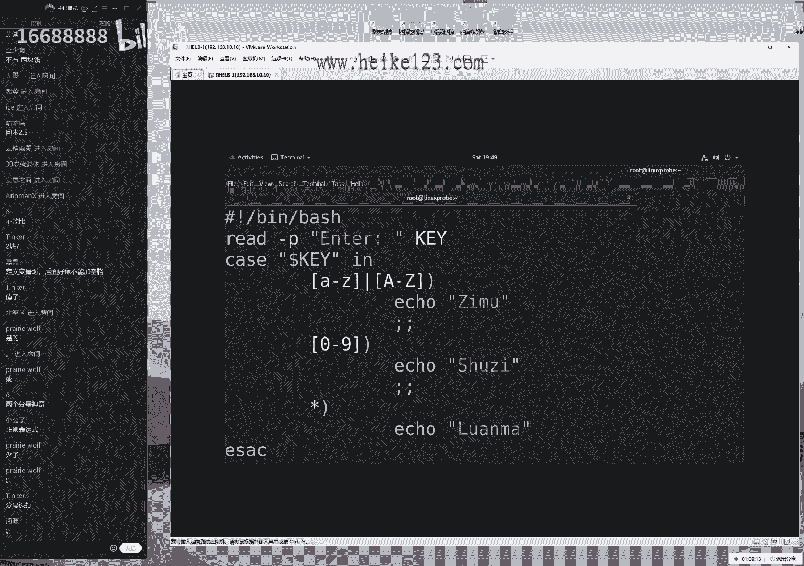

那我们来给大家往后面去说啊，是这样的，大家后来会看到我们现在这个开始的话，那这个case语句的语法的话呢，这个关键词叫做kiss，我们在结束的时候，我们的反写是e c a c。

当时我是在2015年的年底的时候，2016年年初的时候的话呢，刚刚开了第一班，然后我第一次看啊，去讲这个的时候，同学们还问了一个问题，说说这个词啥意思，然后当时的话呢我也比较年轻啊。

因为用的这个确实这就有在说，其实我问的比较少对吧，然后当时我就想了一个问题，我说这个怎么念他，他是什么意思啊，后来仔细一看，他不就是把它反斜过来了吗，这非常可爱啊，虽说我们这个程序员之间的一个呃。

怎么这个怎么讲呢，对吧是一个非常有意思的一个事情，就是把它给做一下反写，它跟前面是不一样的，好来看一下啊，k啊去使用的case句的话，那后面一定要有一个结束符，结束符就直接把它给它反写了。

他并没有正确的发音，它只是把它反写，并不是一个单词，没有人啊，没有什么含义，这第一个问题，第二个问题的话就是我们在2018年的时候，当当网上面收到一条数据的差评，说我们这个书是啊，它是一个盗版书。

为什么呢，说这个印刷有问题。

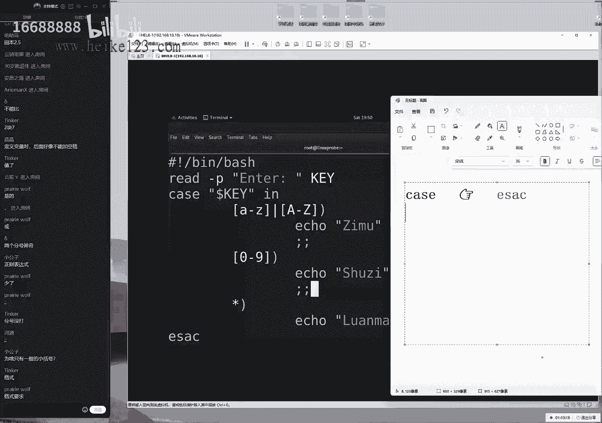

说这个前面的话呢，我们这个小括号被印丢了，然后只有一个后面的一个小括号啊。

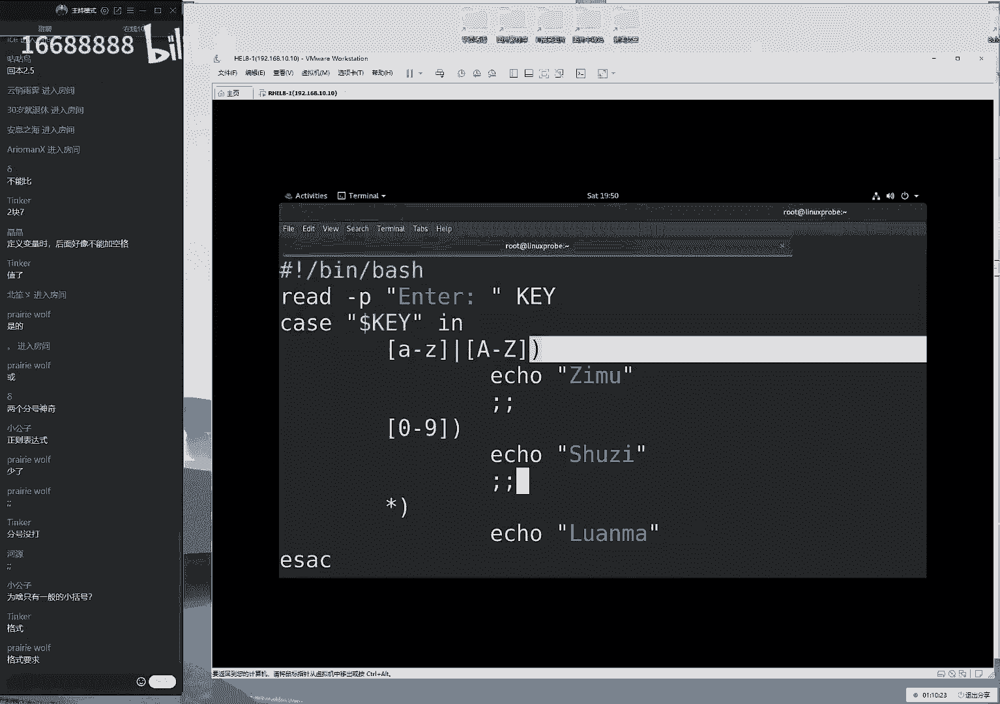

这个问题呢我们要给大家解释一下，就是case语句的话呢，只有去做判断的时候，只有右边那个小括号，没有左边那个小括号，这是啊，等会这是一个正确的呃，他如果加入这个左边小括号的话，那反而是一个错误的情况。

所以大家记一下，它只有啊只啊，它只有一个右边的一个小括号，它并没有等一下并没有左边的小括号，这是大家常犯的一个错误，会把成对的出现，只会认为这个会有这么一个啊，小括号的一个左边，大家一定要注意。

一定要注意这一点，第三个问题的话呢，就是我们在去画啊，大家去做判断的时候的话呢。

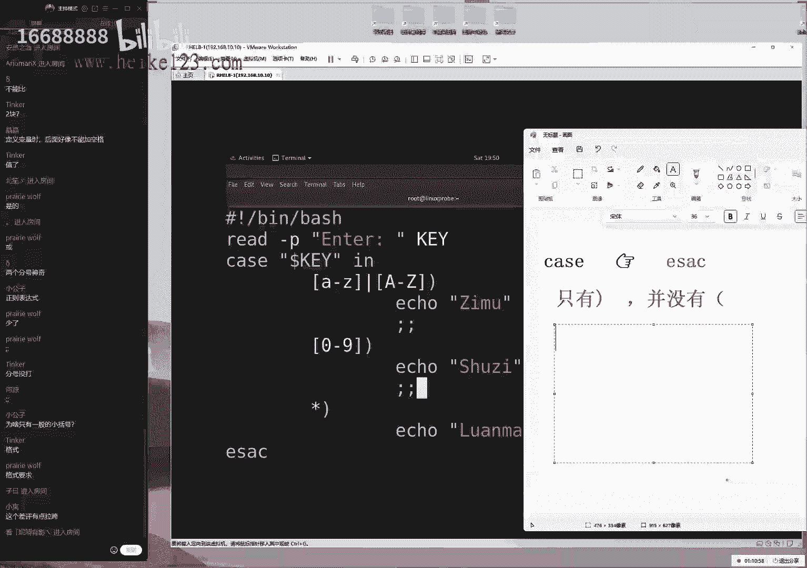

每一个case语句的这个判断结果的下面，就是我们啊直接完毕之后的话呢。

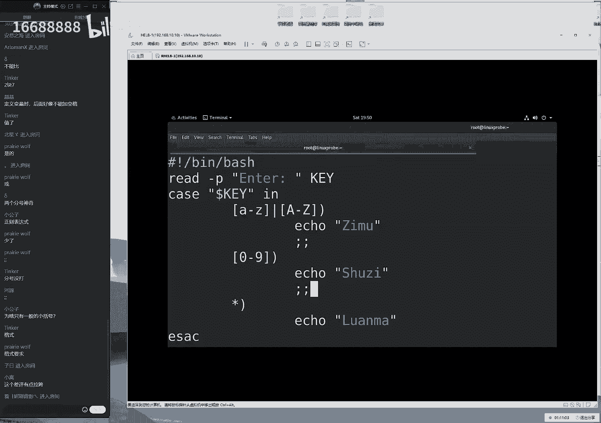

都要给它加一个结束符，这个结束符的话呢是两个分号把它给结束掉，它不要问为什么啊，我们没有办法给大家去解释，程序员这样去定义的，然后的话呢我们最后一个这个判断语句。

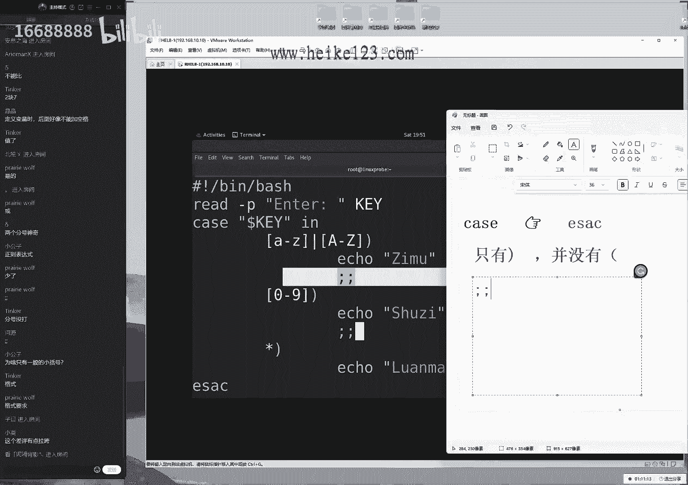

最后我们啊最后一个语句，你看临近于这个结束符的这里边的话。

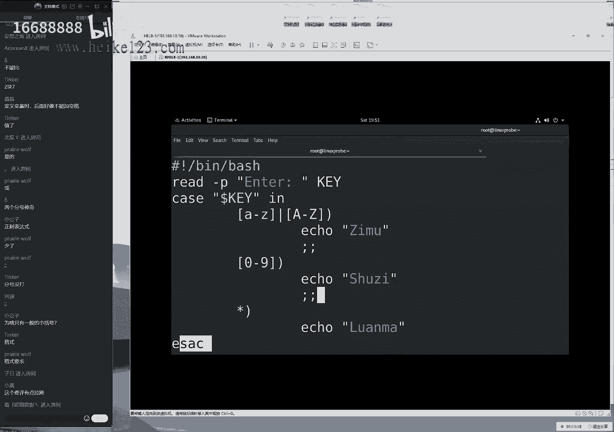

又它又不用去写这个两个分号，如果写的话，那反而报错，也就是说我们的前面的话呢，都需要在这个呃命令的后面，都要加这么一两个分号吧，作为结束符，但是的话呢最后一个这个判断语句的后面，不要加这个分号啊。

最后不要加上这个分号，反而它会有一个报错，这样这个大家需要去记一下这个的区别，我们能够呃从15年讲课到啊，到现在啊，把大家常犯的一些问题给大家做一下总结，是不是感觉学习起来效率特别的高啊。

好下面一个问题，大家说怎么样少两个分号对，说为啥只有一般的小括号，对格式要求没有太好的解释，没有也不需要解释，也不需要解释，比如说啊，比如说我们学习英语的时候，问老师说，老师a为什么这么去写啊。

它为什么不是那么去写啊，他们不是这么去写，没有e啊，这是程序定义的，当以后我们去写的程序了，我可以啊，还是我的一个梦想啊，以后我去写一个程序，这个结束符什么两个分号啊，那我们就要去写一个啊l啊。

这个啊那两个啊两个l啊，最啊是那好，那我们那那我们每个兵的这个结束的话，都需要写这么一个字符，叫做老叫做这个老刘最帅了，然后才能作为结束符，因为我们程序员嘛，我们这样的话可以自己去定义自己的程序。

那么如果说有人要想去使用我们这个程序的话，则必须要去遵守定义的这个规则啊，这也没有太好的解释好，我们接下来往后面去说啊，大家看一下我们这个4。4交集，说一下我们这个计划任务啊，说一下我们这个计划任务。

下面有一个计划任务，说好下面一个问题，因为确因为确实啊，大家可能听完这个之后觉得很不满意，说老刘，你为什么不说说到底为什么这样定义的呢，不需要解释啊，或者说我们不需要把自己的时间浪费在这里边。

就是因为程序这样定义的，知道或不知道他都是怎么用的啊，有一点非常的客观好，我们来继续来给大家去说，4。4小节来去说一下计划任务，现在的话呢我们已经会发现，就是你已经可以去解去写出来，是有脚本。

我们就可以把就是怎么理解呢，我们现在从最开始来讲啊，大家大家就知道了，shell脚本的话呢，实际上就是可以将您去执行的命令的，这个命令的话做一下堆积啊，就是我们是我们教给大家讲的。

最简单的一个shell脚本，它实际上就是一些命令的堆积，12345678 90往下去堆积啊。

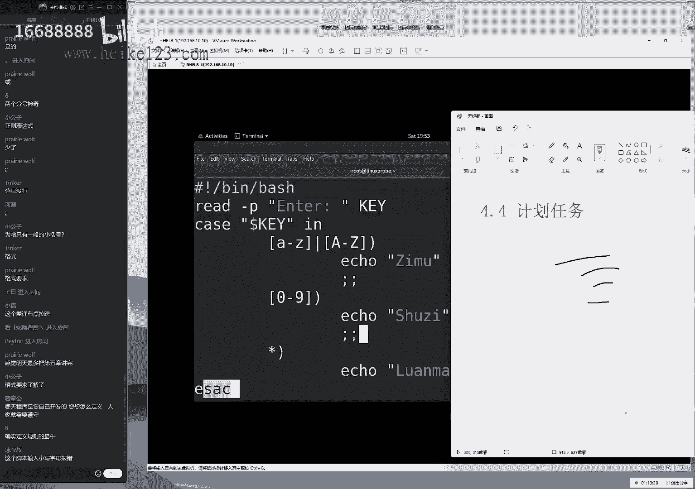

这样的话一条一条来去写，最后的话呢，这个程序就会是从上往下来去执行，这么一个效果好了，也就是说即便是最简单的一个shell脚本啊，我们没有用到for啊，case什么的，我们也会写了好了。

我们现在就可以把日常的这个工作的话呢，常用的命令我们只要有一套流程了，就可以呃，写到这个shell脚本里面自动来去执行，有点像是什么呢，有点像是面包机啊，大家有没有去从网上买过啊，我也买过一个。

去年双11的时候买的，到现在了半年了都没用过啊，好就是说但是他也有过这种东西啊，它是有的叫面包机，它的话会有一些呃预设的一些程序，比如说您需要放一下面粉，您的话呢需要放水，您需要放黄油，您需要放果料。

您需要啊巴拉巴拉放好东西，然后的话他会按照这样的一个定义，它会在某一个时间点把这个信息按照，然后呃然后的话呢把这个信息啊，或者把这个啊呃食材的话呢，放到具体的这么一个地方，然后加热也好啊，然后加水也好。

自动去完成好，也就是说我们现在既有能力已经去啊，自动化去完成一个啊的一个什么事情了，但是现在需要做的就是有一个定时的功能了，比如说我现在我每天晚上我特别的苦逼啊，我每天晚上啊都需要在晚上的凌晨的两点。

为什么是凌晨两点呢，因为当时网站的人数是最少对吧，当然这个呃这个呃那呃，那我给大家举一个例子啊，他并不是他并不是一个真实存在的啊，老爹也并不苦逼，但是这样啊，当我们有一个需求。

某一个人每天晚上每天晚上在凌晨两点，他都需要去备份一下网站，就有这么一个事情，然后后来这个备份网站的话呢，比如说需要市场命令，他已经把这个市场命令的话，都写到shell脚本里面了。

他需要做的这个事情就只有一个，就是到点儿了，按一下回车就ok了啊，他就会通过这个脚本自动去完成了，嗯然后就有一个很，那么就会很尴尬的一个情况啊，这种情况下怎么去解决呢，其实那么这个实际上也有两个问题不。

它也有两个解决方案啊，大家先听一下我想所说的这么一个呃痛点啊，需求，所以我们已经把工作写入到shell脚本里面了，但是的话呢它不能够到点自动去执行，我们怎么办呢，其实有两个办法。

第一个办法的话大家知道啊，就是去捡了只小猫，因为猫是一个夜行动物，它晚上不睡觉对吧，那么就训练你的小猫啊，以后的话呢去训练出来啊，有一只小猫啊，它第一来说他会看表，第二的话呢它可以到点去踩一下。

我们的回车也这话这也可以，但是的话呢这个我们今天这个课啊，先不讲，这有第二个方法，第二个方法的话呢就是去使用到计划任务，计划任务根据时间的限定，根据一套这个规则，到点了自动去执行。

这个我们这个我可以给大家讲啊，第一个的话呢呃换到第一啊，这话我们第一个还暂时讲不了，但是这样的方式大家可以考虑一下，先来给大家说一下啊，计划任务的话它又分为了两种，那计划任务的话它又分为了两种。

大家问的好，这个非常好，大家问了一个问题啊，同学叫做涅槃，对吧啊，如果要是我念错的话，是不是我我啊水平不高啊，但是同学们这个名字也很复杂，提了一个问题，说这个跟crowd有什么区别，非常好，来给大家说。

实际上的话呢这里又提到两个点啊，首先来说就第一个点啊，啊跟上我这个思路啊，我这个思路是肯定不会乱的，但是您的这个问题的话呢，属于第二点的问题，第一个点的问题就是计划任务分为两种。

第一种叫做at叫做一次性的交换，后叫做单次的计划任务，叫做一次性计划任务，还有一个方法叫做crown，它是一个有周期性的一个啊的一个计划任务，那那我们就是一个顾名思义吗，as这个叫做啊。

他是只会去执行一次，只执行一次，然后的话只执行一次，然后就会删除啊，然后啊然后就没了，然后就没了这么一个效果，他只能执行一次，然后就没了，下面的话呢叫做有周期性的一个计划任务。

它是根据定义好的一套时间规则，这个怎么理解呢，就是听起来时间规则有点呃，有点就是高大上，实际上我们说句人话来讲，就是您给别人，比如说您是一个老板，您要想让您的下属去完成一项什么工作，时间地点人物事情。

我们是不是要给大家说清楚啊对吧，所以的话呢时间给人家要讲清楚了，这就是时间规则，我们要把它定义好，然后的话呢就会自动的去么去执行，然后他话还会去执行，自动执行啊。

很多次或者的话它是没有上限的这样的一种啊，呃我们的话这个计划任务的一种方式，两个啊两个一个是单次有效的，一个是有周期性的这两个区别，以及它所对应的命令，好同学们的话呢，还有下面一个问题。

大家说还有一个问题，大家说啊没有预习啊，他啊同学叫什么啊，要打这么多次啊啊啊没有预习的话也不知道，骄傲啊，这话也不用打那么多次，就是您回去之后一定要做好预习工作了啊，这话并不值得骄傲，来给大家说一下。

第二点啊，同学提到这个问题说跟crown tab有什么区别，第二个问题就是crown time的话呢，实际上是您的配置工具的名称，什么意思呢，crowd它是我们的服务名称。

而我们的这个crown tab的话呢，是您提到的这个是一个配置工具的名称，我们举一个例子，服务名称是我们安装，以及我们去管理它所使用的，而这个的话crown tap，它它是实际上去完成某项配置工作。

所使用的一个命令以及工具，举一个小例子，187。58分啊，这个一小时过的有点快啊，稍等我先喝口水吧，7。59了，这个时间过得有点快啊，怎么就一小时就过去了，我们讲多少了啊，就感觉刚刚开始，所以啊。

不知不觉当中偷走了大概一个小时的时间啊，马上就要偷走大家一个小时的时间了，过的有点快啊，这个讲的这种网络课程吗，我们要给大家说的就是确实要这种，要有要有点干劲，跟这种有点算是激情吧。

因为这个大家能够理解啊，首先我们是一个网络课程，您除了呃我们这个屏幕您看不到我们的人对吧，所以您可能在是一个很放松的一个状态下，去听课的，比如说你可能现在没有穿鞋，你可能正在吃外卖对吧。

您可能现在正在趴在桌子上面去玩手机对吧，都他都他都可能好，然后的话呢，并且我们这还是讲一个linux的一个课程，linux的话呢，它还是一个有相对来说比较枯燥的一个系统，其实这个我们也不用去避讳。

大家想他毕竟是一个技术，如果它特别简单，特别好学的话，凭什么学完之后工资这么高啊，不就是因为这个很难学，大家不愿意去学，所以我们才有了一个在公司当中，有一个能够拿人的，而且化疗是不可被替代的这么一个呃。

怎么讲的这么一个很好的技术门槛吧，就是我们学完了之后能够做一些别人做不了的，我们会别人啊啊啊啊啊，那我们可以去会一些别人不会的，所以的话这个确实起起来的话呢，还是有一些门槛的啊，这还是有点枯燥的吧。

而且的话呢再者说我们讲的是一个晚班，尤其到了夏天我们一出汗觉得很累的时候，特别容易犯困啊，这特别能理解，因为这个温度一高，加上我们吃点饭，这个啊就很容易犯困，所以的话呢这个在我们在线上课嘛。

我们尽量的啊有点有点激情动力对吧，我们不要说特别的沉闷了，这也是我们给大家讲课当中，一直保持着一个讲个习惯，就是不要那么的沉闷，同学们可以互动起来，不要特别的害羞啊，因为我们我也不知道同学们。

你们啊就是啊大家这个啊姓名啊什么的，其实也并没有给大家去做备注，所以的话呢我们在上课当中的话呢，我们讲课会了，拼了命的去啊，会给大家去讲，同学们的话呢，你们也可以去拼命的去互动的，如果有任何的问题。

比如说没有听懂就说出来对吧，我们花了钱了，或者的话您觉得这个讲得慢了，讲的快了可以去反馈，这些都没有问题，好吧，同学们，所以在我们讲课的时候，一定要有什么感受，你就去说出来，当然肯定的感受。

可能呃我们就一少数服从多数吧，对吧啊对，那我们来好来坐下，那我们来做这个调整好了，通过给大家讲点这种鸡汤啊，我也休息了一会，现在来继续给大家去说，还有也就是说这个什么意思呢。

这就是说实际上它是前面的一个crown tab那个哦，要不我看这话，前面叫做crown的话呢，它是一个服务的名称，而crown tab的话呢它是一个实际的一个配置工具，有点比喻来说，有点比喻来说。

我们是是什么呢，肯德基肯德基和啊这个啊麦辣鸡腿堡，麦辣鸡腿堡，诶，等一下麦辣鸡腿堡，麦辣鸡我怎么讲这么一个名儿，真讨厌啊，鸡腿堡这么复杂好，这就是同样的一个道理，我们要有人去问说你今天吃了什么呀。

我今天吃了肯德基，那我们去肯德基里边，我们不能够在肯德基里面买一个肯德基，我们那我们要去买，在肯德基里面买一个麦辣鸡腿堡，同样一个道理，这是我们的公司名称，这是我们的产品名称。

我们实际上去管理和去使用的话呢，我们都要去使用到这个crown top这个名称，大家能够区分好了，就是我们现在虽然讲的叫crown，但是我们再去使用的话，都是使用的这个crown time来去完成。

来接下来给大家说一下。

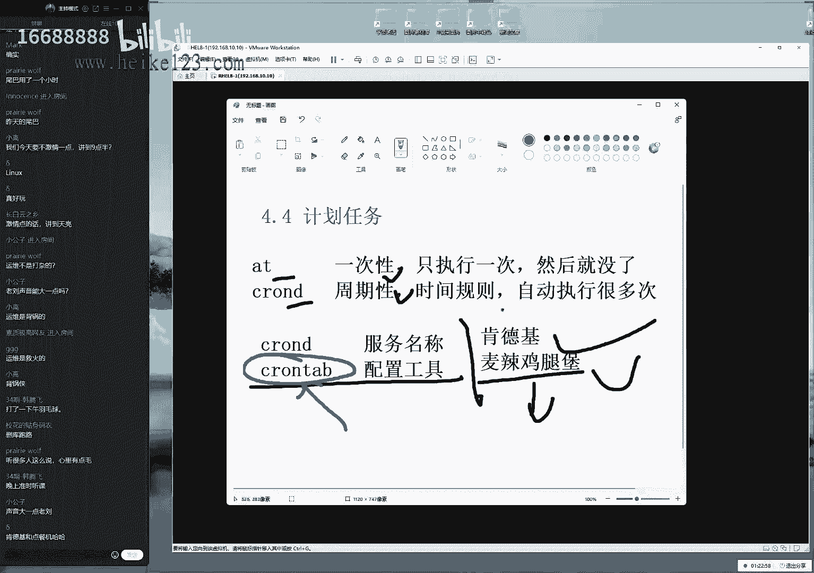

现在我来给大家说一下，这个配置的具体的一个方法，首先打开我们的at的单词，有效的计划任务哎，单词有效诶，等一下单词有效进化任务去使用at去完成，比如说看一下我们的时间，08：03，我先定义一个计划任务。

8。10分好不好好啊，怎么不好啊啊，来8。10分，第一个这个计划任务为8。10分啊，大家说c r o n i e是个啥，我也不知道是个啥，你在哪看的，来继续啊，再来8。10分走啊。

然后的话呢我们来去写上，你想去做这个事情，比如说你想让他干什么事情，你就一个一个往里面去写，为了，但但但是啊为了能够让您看的更加清楚一点，我们就要用到重启吧，因为重启这个计划任务他特别的明显。

他重启的就是成功了对吧，他呃特别的明显啊，那我们来写好之后，按一下回车，然后还要想去保存你的计划任务，需要按一下ctrl加一个d，然后加上什么呢，加上什么呢，加上走，你来诶，不好意思啊，我点成。

不好意思啊，这个点我把点错，reboot ctrl加d走好，我们现在做好了，来at，然后杠elo，那么可以看到了ctrl加地址的是保存，那我们可以看到了这个计划任务的话呢。

已经保存到了我们这个系统当中了，他的话呢会在八点哦，不好意思，我说的这个是我打错了啊，这个时间的话呢是按照20，它是按照它是按照24小时日去算的，24小时的话呢，现在我们定的是早上起来八点了啊。

那同学们为了等这个计划任务，可能需要等的时间比较长一点了，呃待会那我们怎么办呢，首先我们可以去选那at杠c加上编码，这个编码的话呢是个二好，我们加上二可以查看一下这个计划任务，这个前面是变量。

我们不用去看它，只是环境变量，看一下这个的工作，它叫做reboot，他动作是重启好，那么就是你来查看一下我们已经有的，也就是说他会在礼拜日的，4月17号的8。10分，他会来去执行，他的话。

这个发起用户是没关理员入取用户，他的动作是重启好，既然我打错了，打错了怎么办呢，我把它给删掉，叫做at rm，删掉它，at rm删掉它来加一个编码，按一下回车，看到就把它给删掉了，如果打错了没关系。

可以把它给删掉的，删掉之后再来再重新进来，大家去设定一下，比如说二零冒号再来什么呢，就别十分了啊，十分距离现在还有五分钟，有点太晚了，我们就8。07吧，好吧，现在我们哎不看一下8。06能不能赶得上。

08：06能不能赶得上啊，稍等一下，稍等一下，同学们看the time time is。

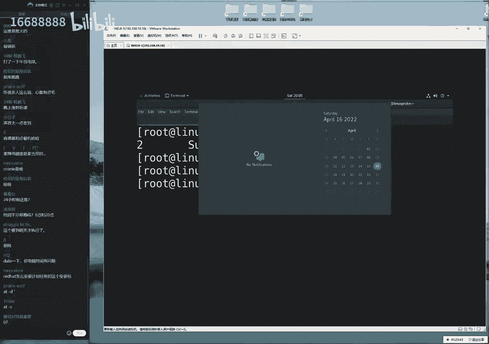

其实能够赶得上，ok现在的话呢是8。005：00：36。

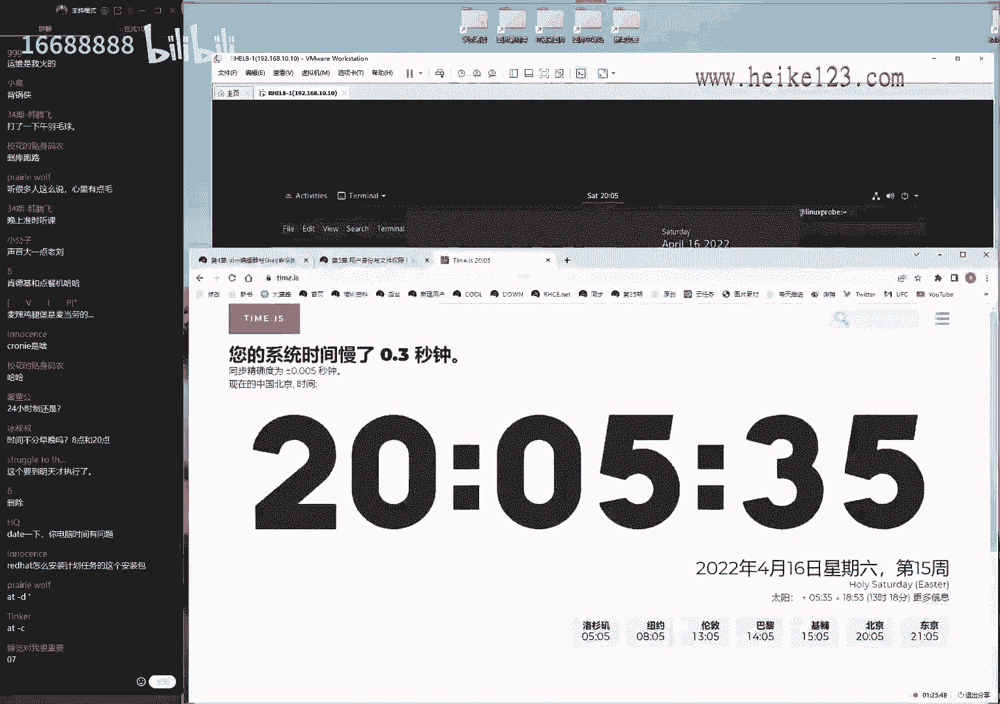

来咱零六分吧，按下回车动作是reboot，按下回车ctrl加d保存来查看一下这个计划。

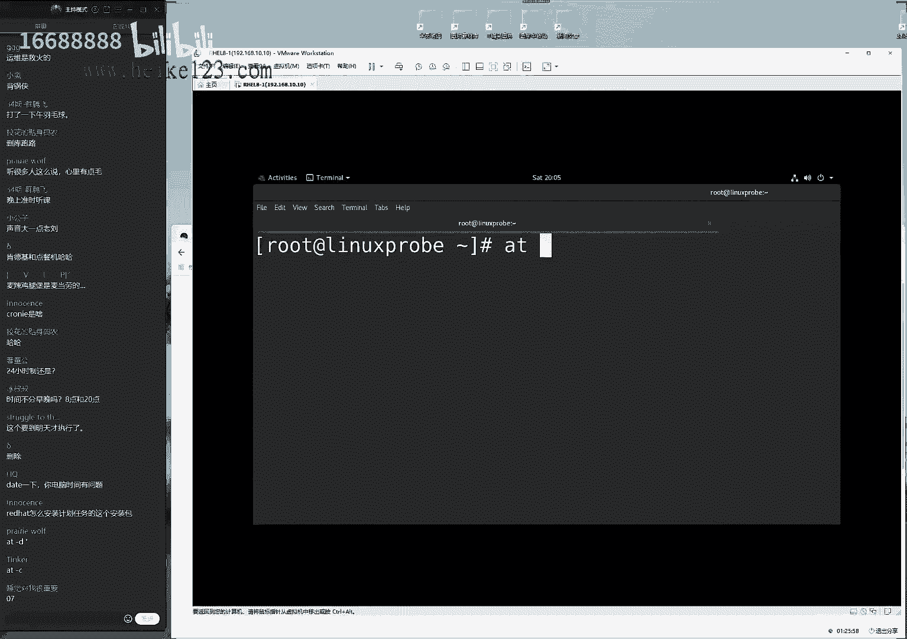

任务就被保存上了，现在的话呢我的手哇完全的离开我的键盘。

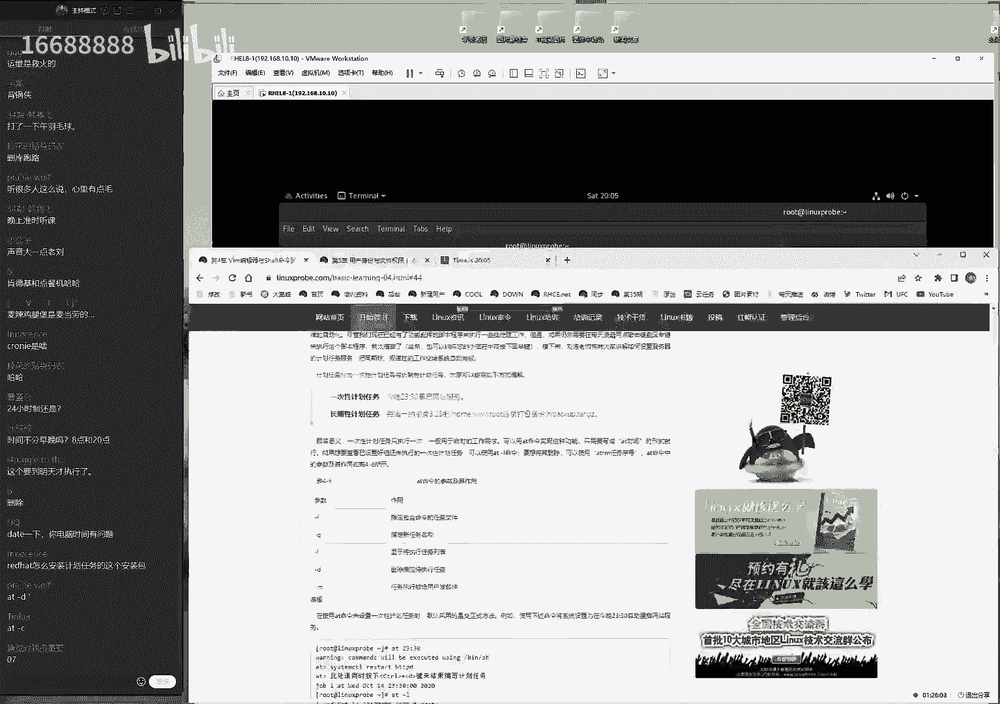

首先完全离开我的键盘，eco的鼠标，拿起我的水杯，但是同学们看屏幕，看屏幕里面到点之后自动重启，08：06好走。

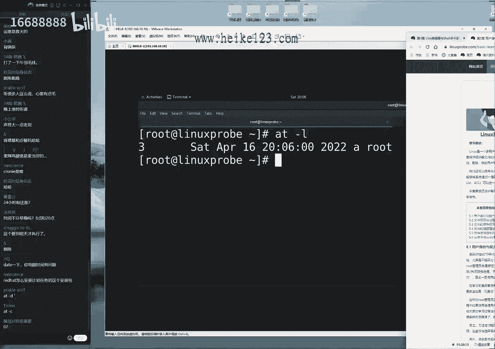

好我们来看一下这个效果啊。

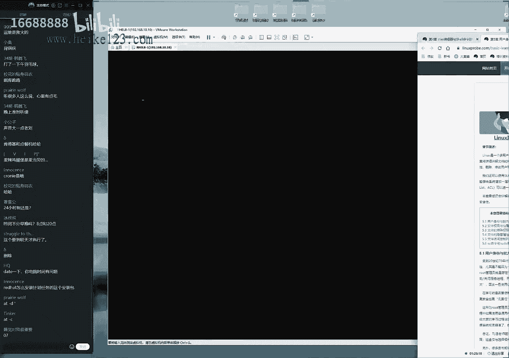

同学们接下来再来聊啊，同学们问到了说啊声音大一点，老刘啊，大家听我这个说话声音有点小是吗啊，同学们现在听我说话声音小吗啊如果要想的话，您可以啊。

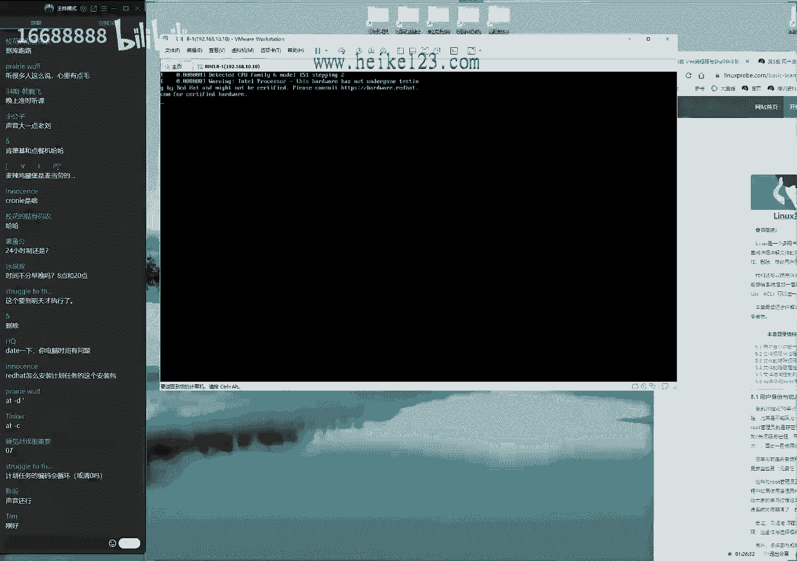

告诉我我们这边可以给大家重启一下，或者说重启一下我的麦都可以的，好大家说还可还可以是吧，是有点小好，我们大家问了一个问啊，问了一个问题啊，说计划任务的编码会循环吗，或清零吗。

as的话它是一个单词有效计划任务，我们执行过后再进去之后一看诶，大家都问到了，清零了没了啊。

就这么一这么就ok了啊，at杠l啊，来看一下，大家说老刘这个显示器有点大。

估计34寸啊，不是啊，27寸来继续来继续来at gl看一下就没了，所以大家就可以相信老刘了啊。

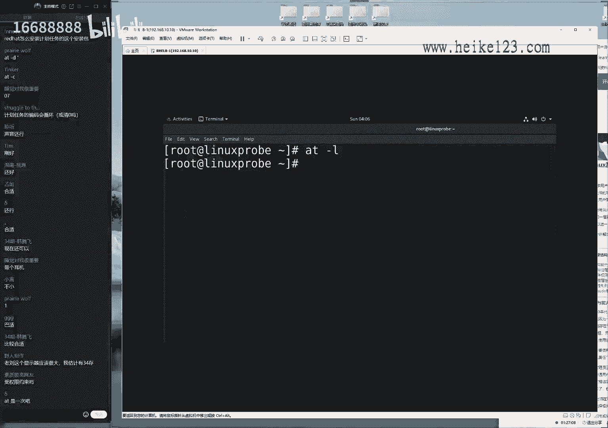

啊看一下就是at的话呢，它是一个单词有效的点题点题点题，at有效的单次的一次性的计划，任务执行过后就没了啊，应用的场景的话呢，就是啊我今天晚上需要去做一个什么事情，而且的话只做一次。

那我们就可以去使用它s命令，来完成下面一个问题，大家说啊，我们的这让我们怎么样啊，退出是吧，是这样的，如果说您再去使用at命令的时候。

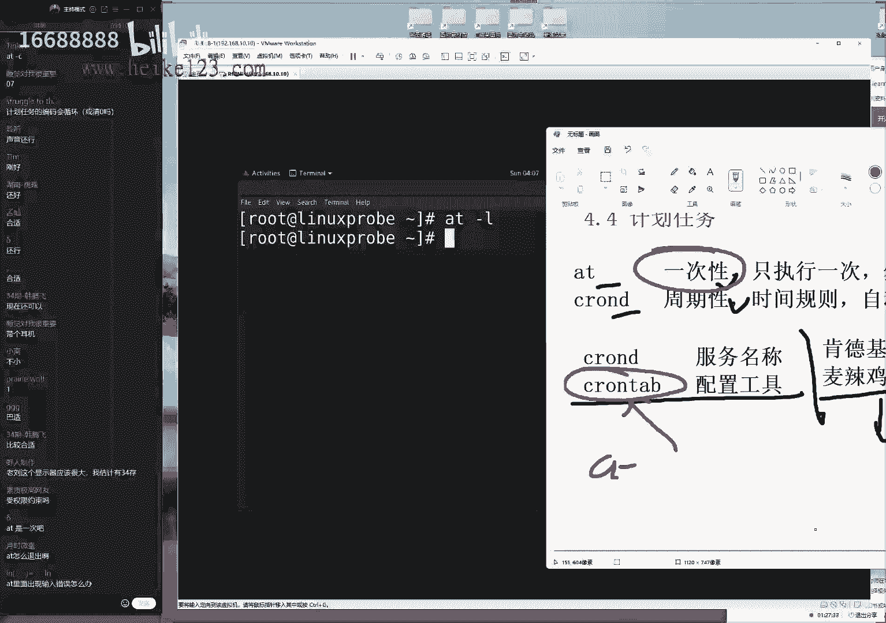

这两个问题正好一起啊，我们都一起给大家回答了啊，呃如果说我们再去解决这个命令的时候，好再去写这个计划任务的时候，如果说我们输入是正确的信息，那么怎么保存呢，保存的方法是按住ctrl键加上d。

然后大家记一下，ctrl加d就是按住ctrl加上d来去保存退出，如果说我发现我写错了怎么办呢，很简单啊，control加上等，等一下，我把写错误错误ctrl加上c来把它退出。

这两个问题大家记一下这两个情况好，然后我们现在给大家大家先记着啊，你也可以问着我们现在给大家往后面说着，咱们这个课压力很大，这两个小时这个学到的东西有点多呀，啊来下面来季节给大家去说啊。

说这个crown cha呃，或者说我们这个叫做crown计划任务的话呢，它好不好用呢，它当然好用，但是它很难用，为什么呢，因为我们很难把时间给他说的清楚，就是我们很难去说清楚一个周期性的一个事情。

比如说我们跟我们的孩子们去说啊，你每天晚上的礼拜六不，那你需要在每天晚上去刷牙洗脸，才能够上床睡觉，然后然然后的话呢每周一每周三，每周五您呃你需要去打羽毛球去锻炼身体。

但是的话呢礼拜二礼拜四的下午三点钟，你需要去吃一个啊什么东西啊，那我可以去做一个什么事情，就是我们这种时间的定义的话呢，如果变得特别的复杂了，就会感觉到特别的这怎么讲，特别的很难描述。

所以的话呢我们对于这个crown tab这个计划，任务是有一套规则的，这个话规则的有一个格式叫做分十日月星期，命令好，大家记一下，这是我们给大家总结好的，也是这个crown tap服务的话呢。

为大家准备好的这么一个格式，只要按照这个格式去填，那么计算机的话就能够读懂，我们所输入的这么一个内容，来，大家先记下来，大家先记下来，我们来接下来好大的话，现在来记一下这个分时日月星期命令。

这样的一个格式，呃，对于说这个里面的这个操作的话呢，我们来给大家做几个演示，首先分钟指的是分钟啊，就是好这个话好废话，好水啊，咱们这节课感觉就像，就像这就是我们今天这节课就讲到，感觉特别的啊，像是在啊。

就是再给大家继续，非常的啊很多废话啊来说，这个不用解释了啊，分钟就是分钟，小时就是小时日就是日期哎，月份就是月份，星期就是星期，命令就是命令好像也是啊，那还好，ok那我们接着好了，下面来给大家去说一下。

就是分钟的话呢，这个时间是0~60，超过60以后的话呢，就进一位写小时好了，我们所有的字段的话呢，如果没有信息的时候，是用的星号去做占位的，用到星号去做站位，好，来给大家解释一下啊。

这个字面意思就是这样了，分时日月星期命令他如果没有字段的话，他如果没有内容的话呢，则是用到星号做单位的，做星号做单位中间的话呢是用到空格做间隔的，可以是空格，也可以是呃table键。

也可以是一个或者多个空格，没有关系，这个我们亲身给大家去尝试过，所以之间间隔服可以随便理解，没有任何关系啊，table键也好啊，什么空格也好都可以好，首先来说分钟，分钟的话呢我们可以这么去写。

比如说写一个二零啊，然后的话呢小时候比如我写一个三小时的，它是按照1~23去写的，也就是说它是24小时直至好，所以这个什么意思呢，就是它是指的是每天呢，因为我们没有指定日期吗，他指的是每天的3年20分。

获取执行某项计划任务，另外的话呢，我们现在再给大家讲的就稍微快一点了，因为呃我觉得这个兔子时间太长的话，没有太大意义，因为这个可能大家这个其实组合方式嘛，他很他其实这个不太像话，其实并不难理解。

主要就是一个组合起来的方式，我们现在的话呢就是稍微快一点，把我能够想得到的一些组合方式，给大家去讲出来，然后大家再去看一下，我们能够去组合的一种方式，的一种大概的一种格式就可以了，好其实它并不难理解。

它有啊，其实他也不需要这么去理解，主要是我们组合的一种方式，第一话来说就是小时和分钟对吧，小时和分钟它指的是这两个，如果都写的话，指的是每天的凌晨的03：20会去执行某啊，他会去执行某项计划任务。

这个命令的话呢，命令需要使用的是一个路径。

加上一个命令的格式，所以我们可以去使用到，为什么命令去找到某个命令，它所对应的一个路径，比如说是reboot好吧，找到这个命令，因为我们去使用到位置的时候，它是没有这个不同文档对吧，单独去找你啊。

那我们单独去找一个命令的话，则是去使用到位这个命令，这是第二章节时给大家去操作过，当时去讲了几个命令对吧，其中的话呢大家简单回忆一下啊。

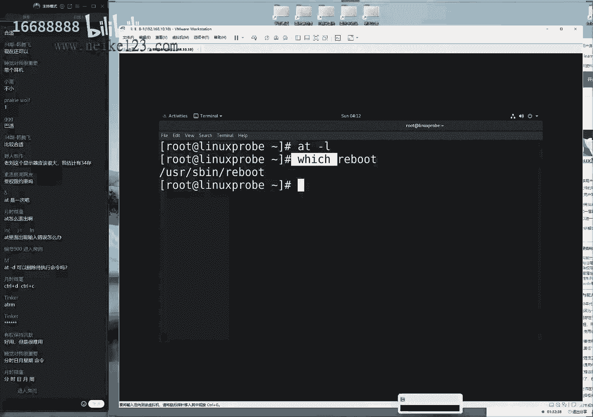

顺便分析客无关吧，讲了这个find，讲了这个where is，讲了这个呃，which讲了这个locate，巴拉巴拉巴拉，其中的话当前去使用到这个是比较合适的。

直接找到我们的命令所对应的一个路径啊。

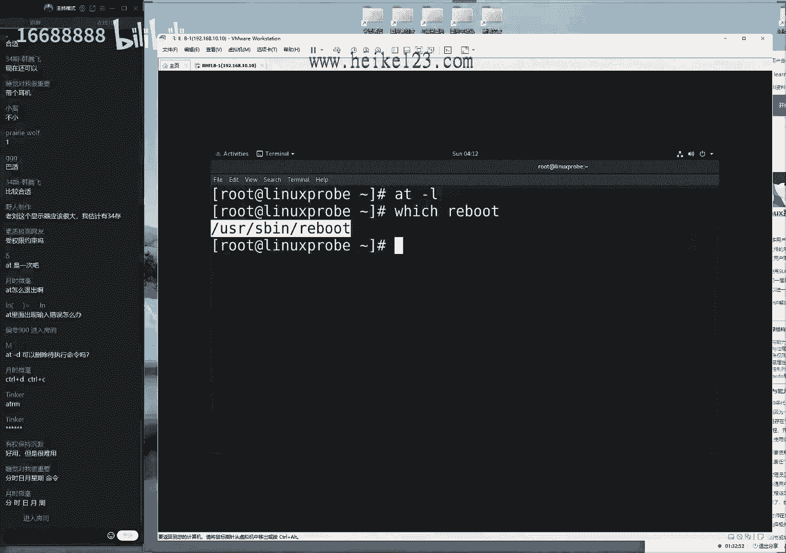

以路径的形式加上文件的名称，写到我们的后面来按一下走，你诶，然后走你这样去写，他就可以在我们这个每天的凌晨的03：20，自动去重启一下电脑了啊，去啊，自动去重启一下这个服务器了。

好那我们可以加一下这个日期，如果您加了这个日期，比如说加了一个16，他又指的是每月的16号的凌晨的03：20，回去执行某项计划任务，也就是说4月16号，5月16号，6月16，7月16。

8月16的凌晨03：20，获取执行某项计划任务，如果说我们写的这个月份的话，那就很简单了，它也指的是啊月份，他指的是我们每年的某个月，他会去执行某项计划任务，那也就是说，2022年的4月16号的03：

20，获取执行我们的计划任务，以及2023年的4月26号，他会呃啊4月啊，4月16号会去执行我们这个重启的计划，认为就是说他每年才会去执行一次，限定了，说只有4月16号才会去执行啊，这样的一个效果好。

那么我们同学们会常犯一个错误啊，就是这个日期跟星期是一直哎，突然我们会呃呃一起去写，因为这个其实合适非常的简单，大家一看就明白，很难翻错，但大家会常犯一个错误，就是这个日期跟星期一起老去写。

比如说我现在我这样去写，没毛病对吧，因为我们的2022年的4月16号，就今天我确实是个礼拜六，我写礼拜六没毛病，计划任务也会打，他的话也会来啊，他的话也可以拿去执行，但是您不能够保证2023年24年。

25年26年的4月16号，他还是礼拜六啊对吧，他还他他的啊，星期跟日期的话呢，我们只能去写一个，比如说我们要想去写星期，你就不要去写日期了啊，比如说我现在这样去做，这就指的是每个礼拜六到凌晨03：20。

会去执行我们的某项的计划任务啊，大家说啊，每个季度呢没有啊，他没有每个季度，但是我可以告诉大家怎么去写每个季度，每个季度不就是说每跨三个月吗，如果说要想每跨三个月可以解一个啊。

除的一个呃这么一个呃斜杠叫做反斜杠，不就是我们写这么一个符号，它的话就可以指的是我们间隔的这个月数，我们间隔三个月，他不就等于了是啊，我们的一个季度吗，我们这么去写，来我们这么去写，当然了。

如果说您还要想去限定一下，这个具体的这么一个日期和月份的话呢，还可以用到逗号做间隔符，好我们先以这个为例啊，再给大家重复一下，这个指的是每个礼拜六的03：20，获取执行我们的某项计划任务。

这样的一个效果好，我们再来，我们再来哎呀，给大家增加点难度啊，给大家增加点难度，比如大家问到了对吧，比如我们问到了说我们的这个嗯，比如说我们想取一个嗯某个季度或者的话呢，我想去有一个周期性的。

例如说把它给去掉了啊，每天的话呢我们每个啊，我们每两个小时会去重启一下电脑，怎么办呢，我们这样它除以二，它就代表就是间隔，每隔两个小时会去从几家电脑啊，那就是说二点分回去重几台电脑，四点分重启下电脑。

六点分回去重启下电脑，会有这样的一个效果，每隔两个小时会去重启一下这个啊服务器，这样的话我们只它使用的方法就是一个星号，写了一个除号这样的一个方式，呃，然后的话呢还有啊，这是指的是每个两个小时。

同样的这个也是这个指的是每隔两分钟啊，每它指的是每隔两分钟回去执行一下界外任务，当然啦同学们千万不要这样去用，因为您如果这么去写的话呢，就有啊，那么你每一次从几十号，这是一个死循环了。

就是你每一次去呃进入这个系统的时候，他都会去重启一下了，因为我因为我们有一个师哥啊，那个师哥在自己脚上面去做过这个实验，正好讲到这个时候就正好去做了一下，顺便去重启了一下，结果的话呢效果特别的好。

自此那个电脑就再也没起来了，因为那个电脑速度特别的慢，他每一次启动和重启啊，它都需要两分钟时间，于是他每一次刚刚也重启满了，他就从他们啊，好像他马上他又被关闭掉了，所以这个大家一定要谨慎去使用。

但这个也有这个其实也有解决办法的，因为我们安装系统的时候，它有三个模式吗，还有三个选项，第三个模式的话呢叫做这个trouble抒情，就是叫做排错模式，只不过特别的麻烦啊，我们需要在内存里面先。

那我们需要在这个啊，先是在这个内核里面做一个断点，然后再去把这个给删掉，然后进入到我们叫做这个单用户模式，给大家进入到插播收听，然后给他给大家去删掉，就有点麻烦就也行，就是同学们就是这个就讲这个的时候。

不要保存就好了，这么一听就行了，哪怕你把这个数字写的稍微再大一点啊，这样的话我们每隔十分钟重启一次，也给自己一点生还的，那么我那话，那我那我那我我们也可以给自己一点啊，处理的时间啊。

给大家一点处理的这个时间，避免说这个服务器就起不来了啊，提高我们的生，提高我们在公司的这个呃生啊呃生存机会好，下面来给大家讲一讲，还有什么例子呢，还有比如说我想按照这个具体的数字来去写。

例如说是这样的呃小时，如果说我不想每个两个小时了，我想我想写，比如说逗一逗号，三逗号五逗号这样等，它代表的就是啊具体的这么一个小时，比如说它指的是呃1。五点七点跟中午12点。

他会去重启一下我们这个计划任务，不是他啊，他会去重启我们这个电脑，也就是说可以把具体的这个数字，然后通过这个逗号做间隔符，也可以这样去写啊，没有问题，一逗号三逗号五啊，加个小时也好，加分钟也好。

就可以这样去写，除了这个以外的话呢，也可以设置一个片段，比如说我们可以设置成啊，比如说我想要设置的是一逗号，三逗号，四逗号，五逗号六，那么这样去做的话呢，也可以直接就是一个一杠五。

它指的就是啊每天的话呢凌晨一点钟，然后的话1。00二点到三点，4。0五点，他会去重启一下我们这两个这样的一个效果好，大家先记一下，或者的话呢您可以下播之后啊，然后去下载一下咱们这个录播视频。

去把我们刚才所讲的这几个事例的话呢，你可以等到咱们这个书上面，其实我刚才是故意讲的稍微快一点的，因为的话呢我们之前给大家重复了很多遍啊，去填调了很多遍，大家需要去看录播视频来去做复习。

但是我估计大家也没有去看嗯，所以的话呢我们刚才讲的稍微快一点了，就是给大家强迫一下，今天晚上回去之后可以去看一下这个录播，把我们刚刚给大家讲的这些案例的话呢，你可以藏到书上面。

万一以后我们工作时候遇到了，您可以选择一个更加适合，就是我们现在这个啊具体工作场景的对吧，现在的话呢这个录播时间是一分13秒，那于是您可以回去之后有啊去啊。

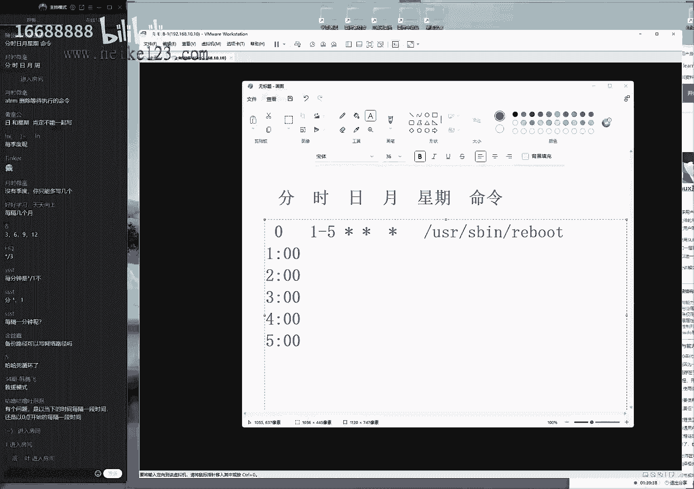

专门去看一下，好，下面一个问题，大家说说备份的路径，可以先网络路径吗，不可以这样去做啊，还有一个问题就是我们是不能够先网络路径的。

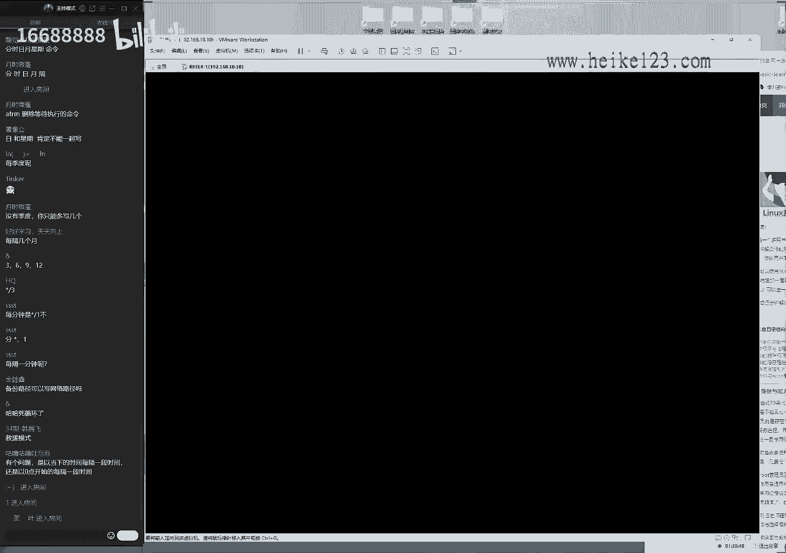

但他这个网络路径的话呢，指的是一个比如说网站呀，这种格式是不可以去写的，但是如果说您的这是一个，比如说网络的一个存储啊，啊我们比如说桑巴呀，或者说一个网络存储服务器啊，这样一种形式的话。

那挂载过来的是可以的，好吧好，那我们还有一个问题，大家说还有一个问题是说当下的这个时间，每隔一段时间还是以零点开始呢，它是以当下的时间来去算的啊，就是我们现在这样的话呢，它指的是每隔零点开始去算的。

如果这边我们没有去解分钟的话呢，则是以当前这个时间为准的，比如说我们现在的话呢就是呃01：20，因为我们现在是八点啊，那那么它则是以当前时间来算的。

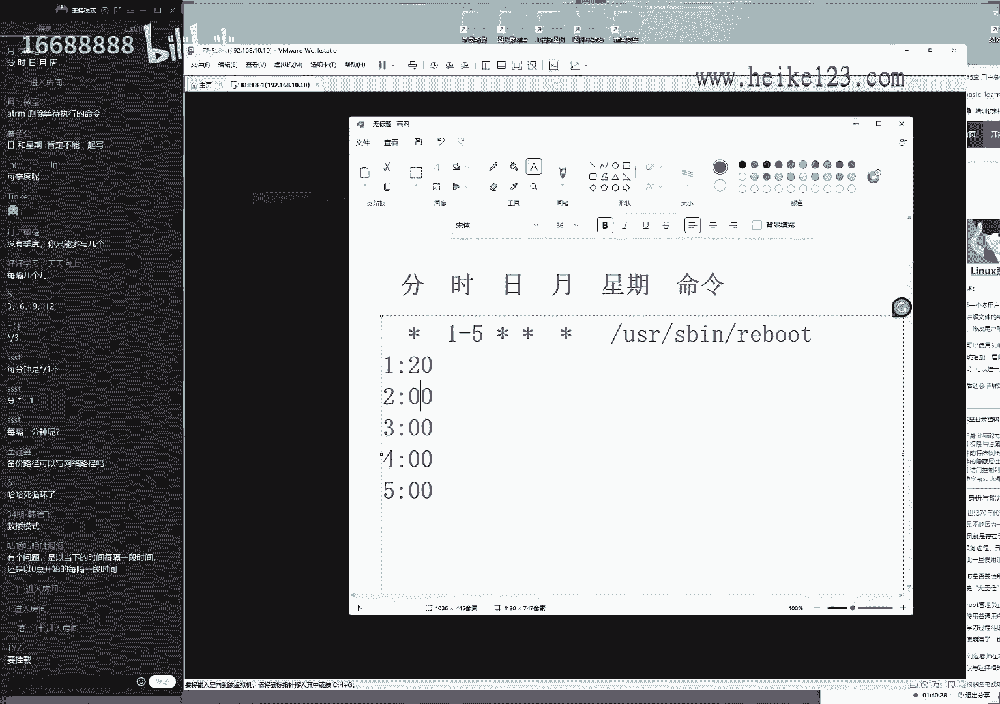

就那么它会有这样的一个效果，它以当前时间来算的。

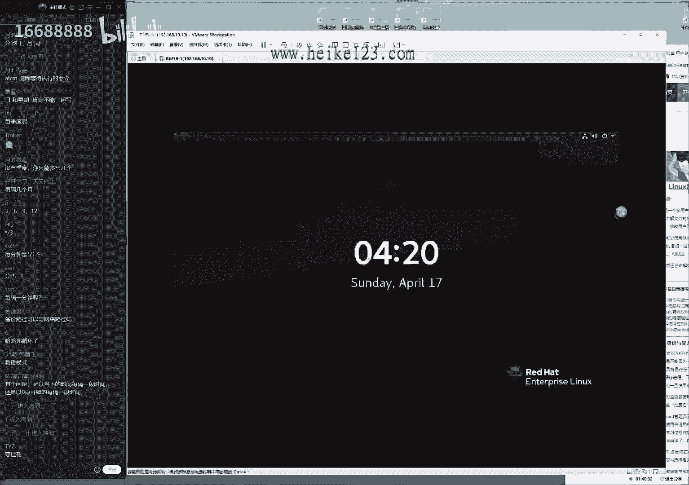

来举一个小例子啊，然后我们来配置的话呢，我去使用的命令叫做crown tab来去配置了，要想去配置自己的这个计划任务的话呢，使用的这个杠e啊，指的是编辑要想同时再去配置别人的，这个计划任务的话。

加一个参数杠u加上用户的名称，比如说我想要去配置一个叫做linux pro的，一个用户的话，我们就这么去写，当然我们现在并不需要它，于是把它给删掉，来crown top gue。

编辑一下我当前这个用户管理员的计划任务，另外一个小的一个其实不需要去讲，但是的话呢不讲我觉得很不过瘾的一个事情。

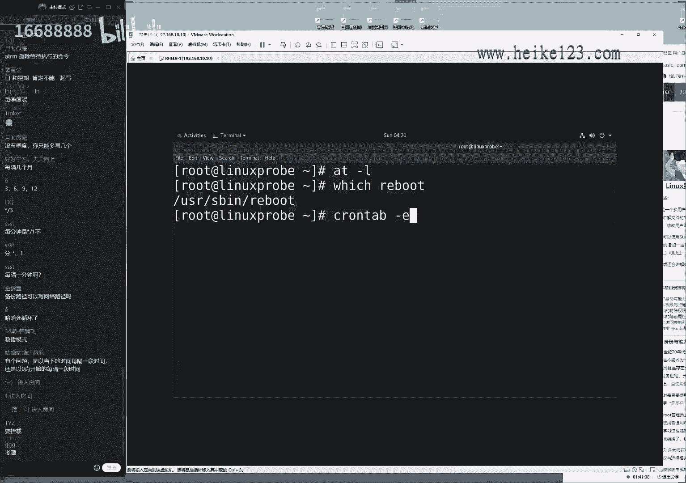

就是呃我们的管理员啊，不讲，就怕出现差池啊，那我那我们的管理员可以去编辑我们的自己的，就是编辑管理员自己的，以及的话呢，我们的所有的普通用户的这个计划任务，但是的话呢普通用户的话呢。

只能够去编辑自己的计划任务，大家记一下，也就是说啊，管理员可以编辑自己的以及普通呃，以及普通用户的这个所有人的计划任务，而普通用户只能编辑自己的计划任务，当然这就是哈哈，跟其他的这个服务是一样的。

他只能自己管自己。

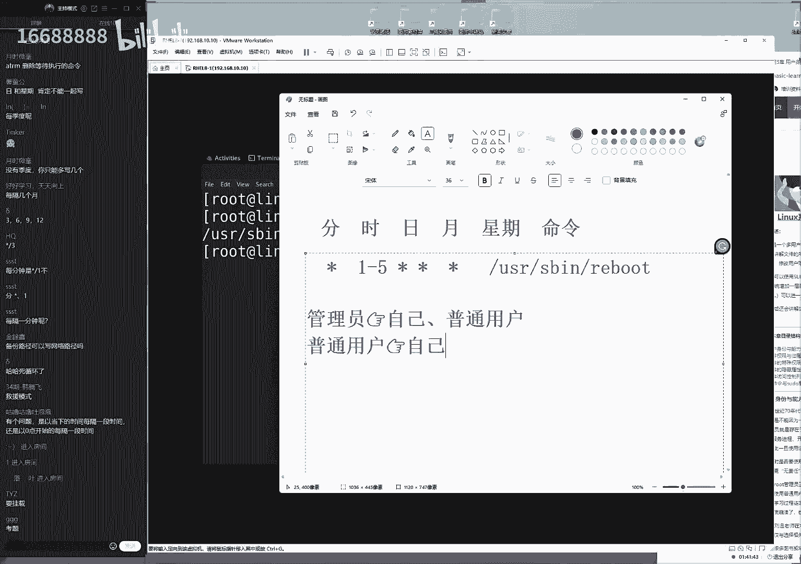

这个话并没有权，他并没有权限去管理其他人来crown time，其实这个不用说大家能够猜到的crown time，然后按一下回车，先来去写一下这个格式，来分时哎，等一下分呃，等分时日月七夕命令好。

同学们看到这个之后的话呢，会问了一个问题，但是没有人问是吧，那我给啊给大家提个问题，就是为什么我是这样用的啊。

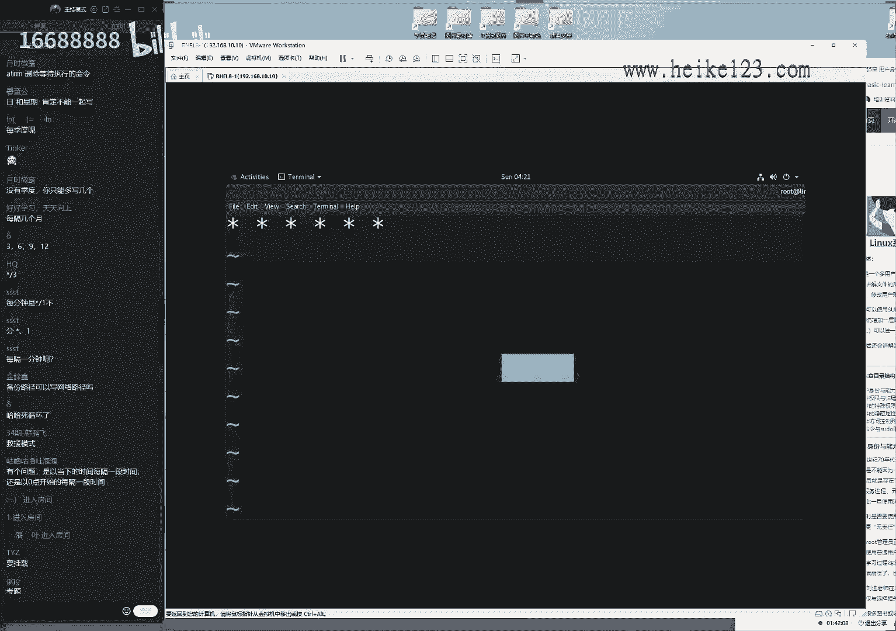

那我那呃呃那么的话呢，我们那我们是使用的这个crown top，来去进入到这个计划任务的，而我们在公司的时候的话呢，同时可能用到另外一种方法，就是直接vm。

然后是etc目录里面的crown time文件去打开呢，这两种有什么区别，又相互有什么好处呢，哎这要跟大家聊一聊这个在公司里面啊。

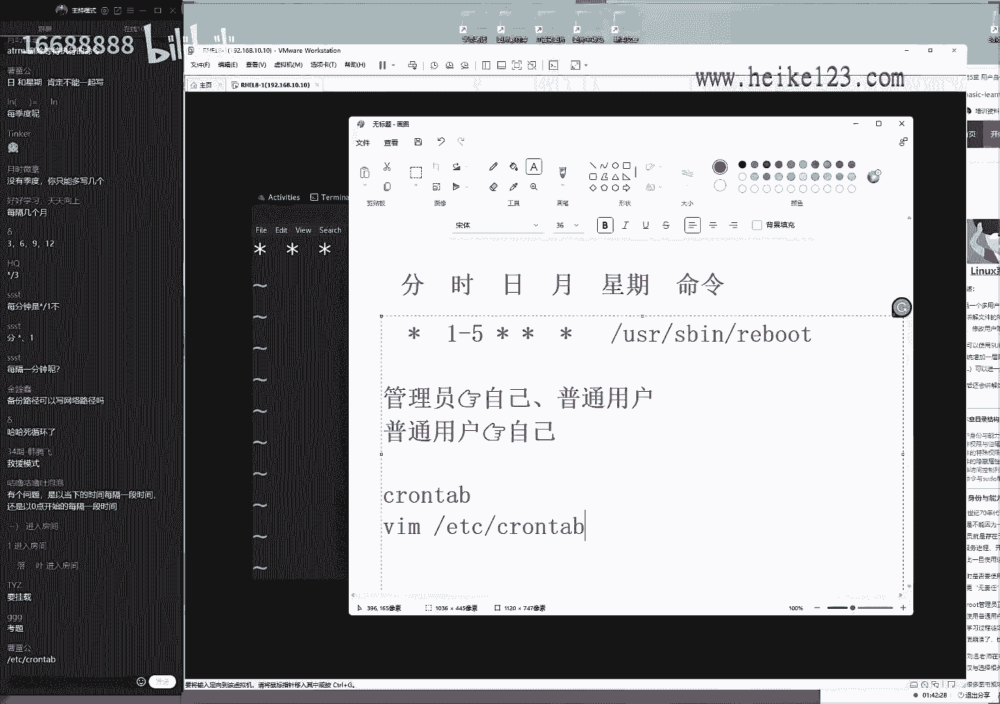

会些啊，同事们会这么去用，就是直接因为我们之前给大家讲过说配置。

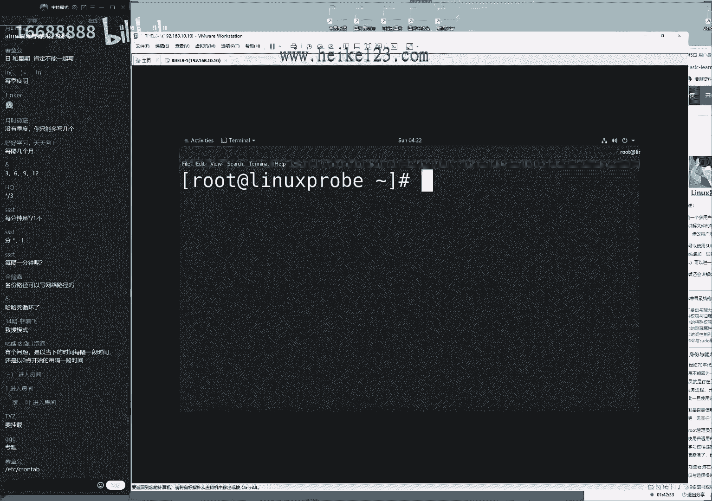

因为在这个服务器当中吧，所有的一切都是文件，所以的话呢linux中的一切都是文件，然后的话呢要想去配置一个服务的话，也就实际上就是在修改这个服务。

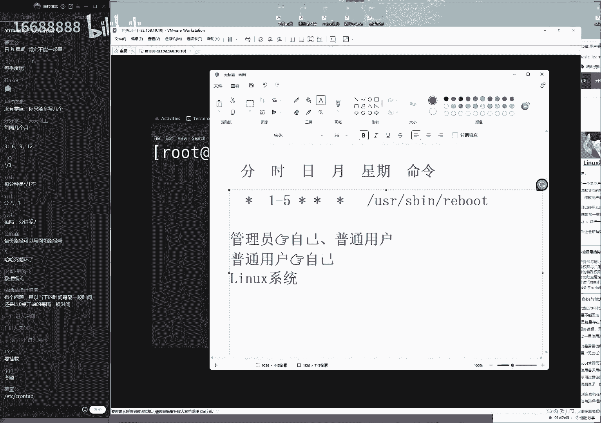

所对应的配置文件了，那么因此那我们就可以直接找到，这个服务所对应的配置文件，然后加以编辑不就可以了吗，可以去实现啊，没有毛病来按下回车，然后就可以往里面去写，他还啊，并且他还告诉我们一个格式啊。

分是日月星期，具体的一个格式往里面去巴拉巴拉去敲嗯，但是这个的方式有什么好处呢，好处就是第一它来说它有注释的对吧，它告诉我们我们每个字段需要怎么去填写。

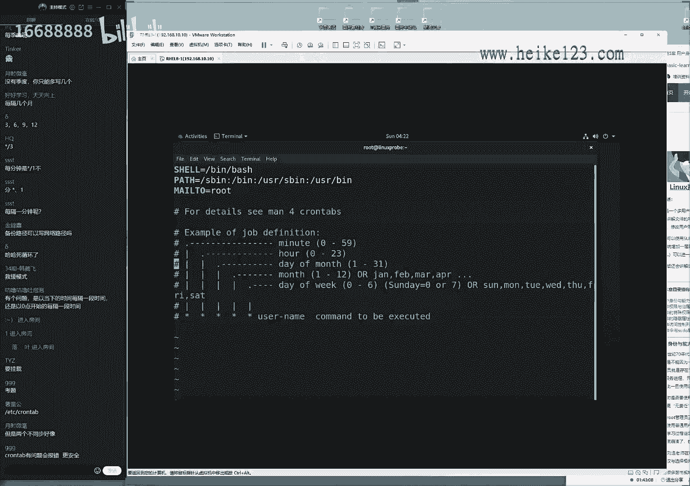

第二个的话呢，就是我们不推荐它对大家已经说出来了。

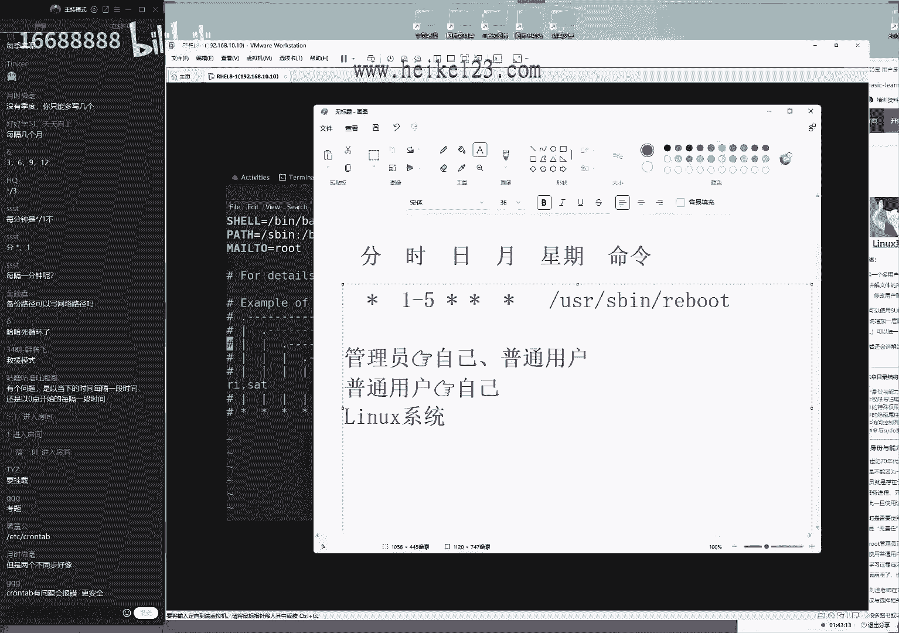

同学叫啊对吧，已经说出来了，这个的话呢虽然它会有一些这个怎么讲，他会有一些注释帮助我们来去写他具体的格式，但是它是一个编辑器，vm编译器没有纠错功能，它只有它只有提示功能，那就我们来看一下。

当我们写错的时候，它没有颜色的着色，他或者他的话，他啊他会给我们一个啊提示出来的信息，他没有一个纠错功能，它那我们要是写错的话呢，就有可能导致服务器起不来，是有一种可能性的，那好了。

但是当我们去使用到crown tab的时候，这个工具它就有一个纠错功能，比如说我现在啊分时日月星期命令，然后我现在的话去写一下这个字段，突然间我我我看我啊，发现我写错了，我现在随便写一些信息，我写错了。

写错了怎么办呢，之前没有办法啊，之前没有办法保存之后就复制，那他可他他可能起不来了，这个时候就有办法了，首先啊我们点一下保存，到这时候可以看到了，它并没有让我们退出，而是进行一个纠错。

他说您树立了一个信息有误，是否在重新编辑呢，我们只有点击这个y，然后它会又回到这个编辑界面下，只有当我们把错误的信息给他删干净了，然后大家一起说出来，是不是才能够保存退出，分时日月星期。

然后最后命令这话也给大家安全了，好这是我们会给大家讲的这么一个呃注意事项。

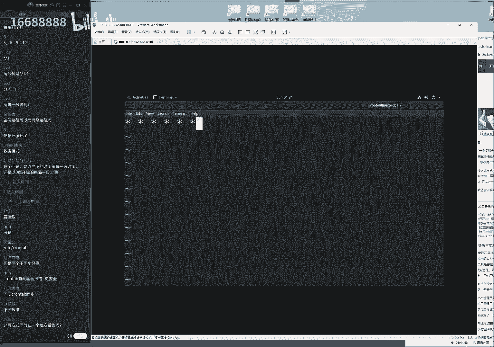

就是我们要去推荐大家去使用的crown tab去完成，另外的话同时又讲到了，说这个crown tap的话呢，有一个小特点，就是它调用的实际上也是我们的vi编辑器，之前给大家讲了。

说点我们的vi编辑器的话，配置很多这个服务的话，它既好用又通用，其中的话呢提到了就是说很多的操作系统，他都默认的是用到这个编译器来去配置，这个服务的，当时有点低调了，它不仅是很多的这个服务。

会去使用到我们编译器啊，它会去使用到我们编译器来去配置，它自己这个文件很多的这个服务，比如说我们的crown time对吧，还有很多的服务我能够想象到的可能并不严谨，比如说qua我们做磁盘配额。

这个服务也是啊，磁盘配额的时候，也是默认的调用了我们的编译器诶，vm编译器来去实现的，还有什么呢，还有我们的开源的分布式版本控制系统，我把他的话呢也是啊，分布式版本控制系统有点太长了，我们的版本控制吧。

他的话呢也是使用的我们vi编辑器来去实现的，所以这个大家第四章节一旦学好了之后，你会发现以后就可以去投入到享受配置服务，这个过程当中了，而不用老去纠结这个服务。

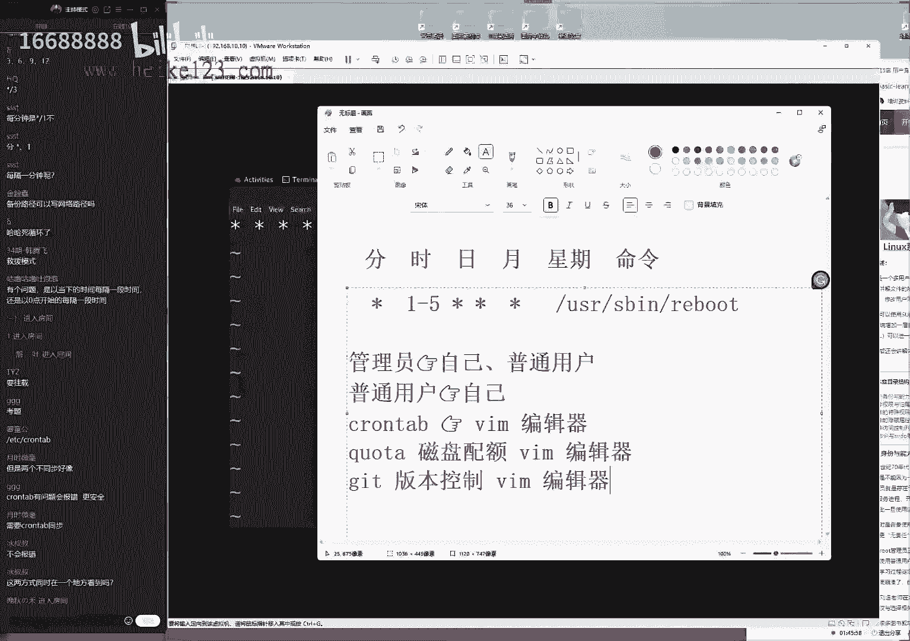

它电量的编译器，我们不会用这种问题了，来现在大家问了一个问题，大家说这两个方式在同一个地方能够看得到吗，他的话呢从理论上来说它会同步的，但是我们在实操的时候的话，会发现会有一个延迟性。

然后大家下面一个问题，大家都有权限没有权限啊，可以没有问题啊，因为我们当前使用的用户是为他是为管理员啊，但是同学们问的是这个问题吗，好接下来我们再继续了啊，分时日月星期命令。

命令的话要加上这个路径的形式，这是一个历史经验教训来where is命令后面加上不，我们去使用到which，后面加上命令reboot，因为为什么要运用到reputer呢，因为这put更加明显吧。

我们要是比如说在屏幕上面输出一行信息也好，啊，或者啊对了，这个信息写入到这个啊，它并不能走到前台啊，比如说我们在去往某个文件里面，写过信息什么的，这样的话呢并啊并不那么明显，所以我们去选择重启。

大大只要能够成功了，大家一看哦，重启了，那么就实验就算成功了，所以我们选择这个重启啊，来分时日月星期命令，就以我当前为例，比如说当前的话呢，我的时间诶怎么变成了04：26了，是这个是这个是什么时候变的。

好奇怪啊，好不管啊，不管他不管他啊，我们就这样28分吧，哎等一下现在27分来，我们的二二，我们28分，然后呢是四点，然后分时日月星期命令啊，我上一个分时日月星期命令，ok写好了吗，写好了，他会在04：

28去重启，我们可以这样子，crown top gl查看一下，ok计划任务已经存在了，当前是27分，一分钟之后就会重启了，等我们等他一下，顺便我去倒杯水，大家可以先休息一下，到时候重启了。

记得告诉我我倒，我先倒杯水，那我看一下说啊。

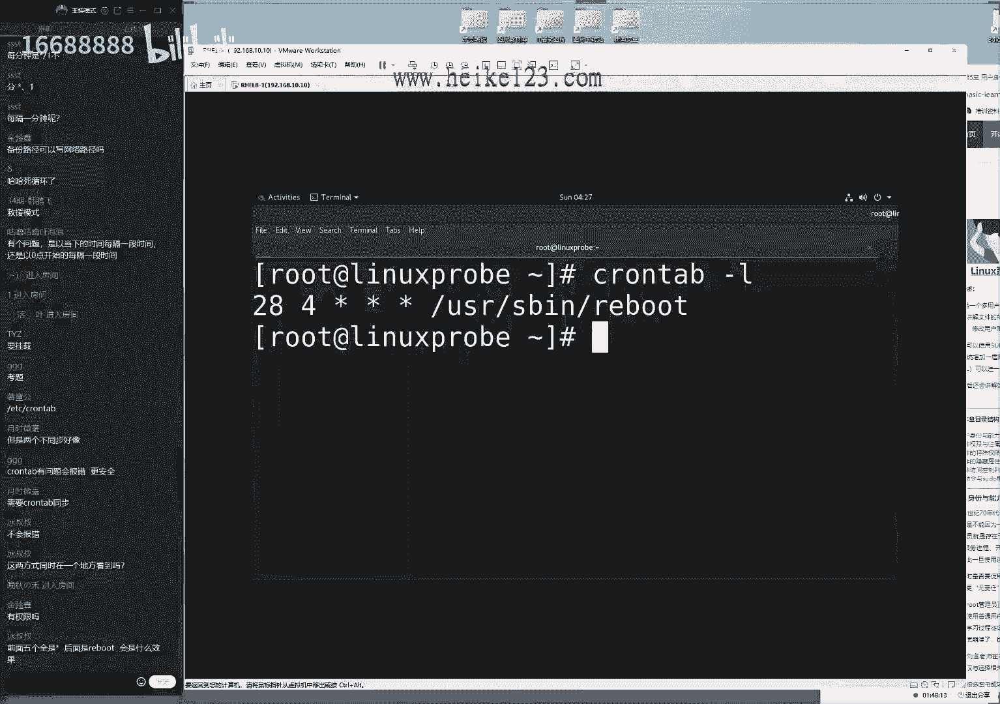

如果前面五个都是星号，后面是个后面是个bot好，它是它重启了会有什么效果。

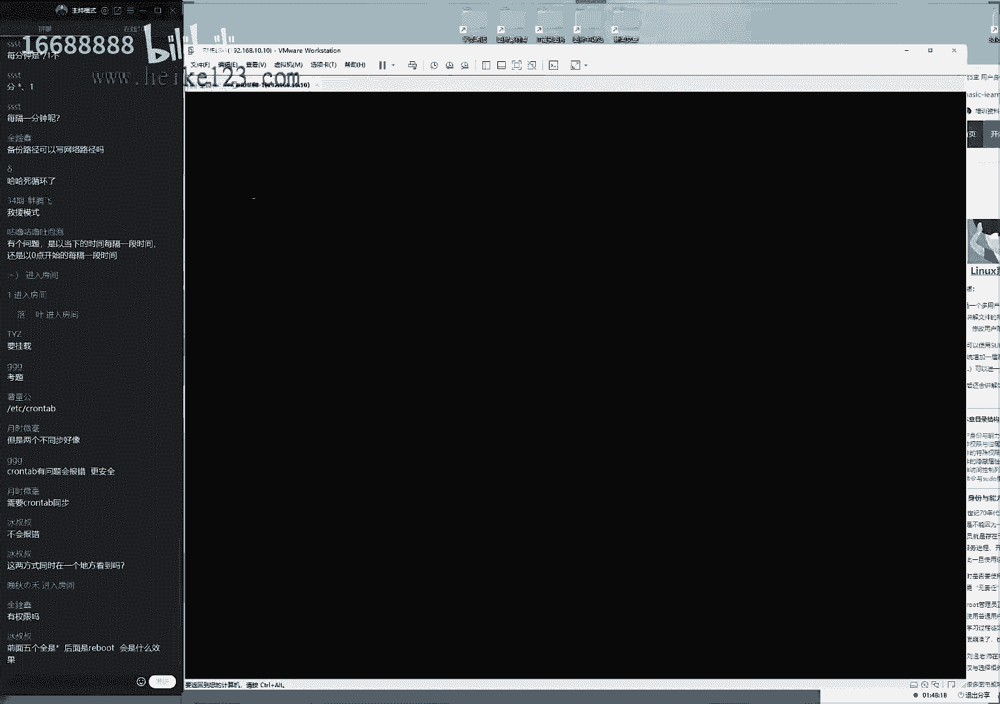

这个程序它不会去执行，因为它是错误的。

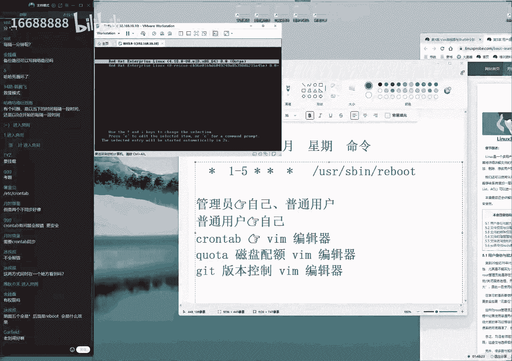

这个语法是错误的，它并不会生效，而且没有啊，没有意义，怎么去写好。

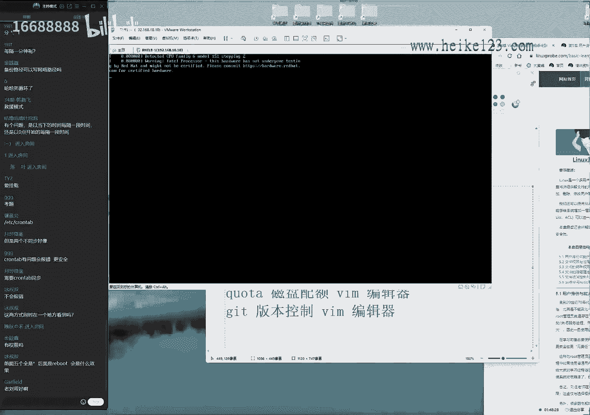

然后大家现在会问啊，没有问题是吧，但是我想说啊，什么老刘胜好啊。

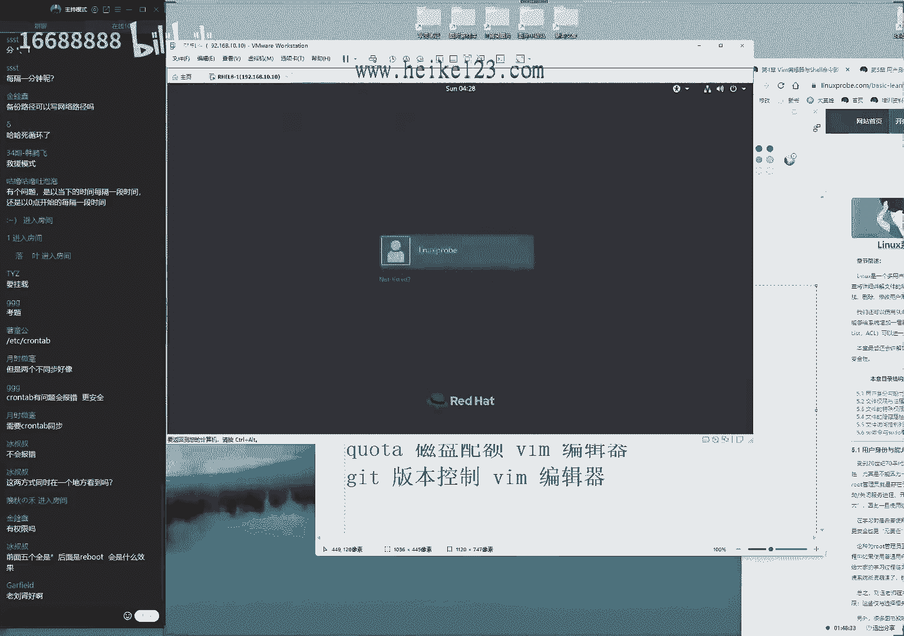

这能看得出来好，那我们下面再来啊，给大家去提到，就是嗯怎么很不过瘾啊，我们要给大家这么去讲的话呢，感觉就是不过瘾，我看看能不能再给大家讲述其他的问题了，其实这也是我们啊顺便给大家讲一个鸡汤啊。

就是我们其实也会在一些学校里面，去做一些讲座，当时我从17年开始，然后就会经常去一些学校里面去做讲座嘛，比如说北新啊对吧，我会做一些讲座，其实这个讲座的话跟讲课就完全不一样了，因为讲课因为话讲座啊。

我们会我反正我我反正我们的话呢，一般情况下四个多小时对吧，一呃呃呃我们大概四个小时，要么就是上午两小时，下午俩小时，要么就是我们连着四个小时，这个四个小时讲话也很累，但是我们会很轻松，为什么呢。

就是我们心理上很轻松啊，身体上会也是会，其实也其实也很累的，因为四个小时我们一般这么规划，两个小时的话呢，像这个linux的一个历史哎，两个小时讲了linux的历史，另外两个小时的话呢就安装一下系统。

因为你不可能说讲了一个座，然后最后系统都没有安装出来是吧，哦所以我们一般时间是这么规划的，两个小时加上历史两个小时安装一下系统，我这么跟大家说吧，我们讲座啊讲的那么大概有个七八次啊，小十次了。

我们每一次都是超级的成功，所有同学们跟我们的反馈都是，朱老师讲的特别的好，所以老刘长得又帅，而且话讲课就很清晰，最后系统安装出来又很顺利，我们觉得他讲的挺好的，他废话肯定好对吧。

因为是因为我们首先前面两个小时，就是一个linux的历史，只要长了耳朵都能听得懂，因为他因为他没有什么考核嘛，这样历史他说他从什么时间来的，他什么时间走的对吧，他没有什么是这个他没有任何的。

这个他没有任何需要大家去背诵和记忆的，这么一个知识，下面的话呢两个小时啊，这个这个它更加简单了，因为他虚拟机里面都是由我们已经啊，都已经做好了对吧，他直接把这个系统插到里面去，然后我们安装一下就可以了。

所以我们第一节给大家讲的时候，安装系统实际上才用了十分钟时间，那所以我们现在放到两个小时去讲的话呢，肯定是很有呃富裕时间的，即便是哪位小可爱同学没有跟上对吧，它没有安装出来，没关系啊，两个小时的时间呢。

你有十个同学没有安装出来，我也可以下去之后帮你们自己啊啊，那么啊我那我们也可以帮你们人工给它安装上，所以每个人做完下课之后都非常的开心啊，就说这个听懂了，而且的话呢说这个系统也安装上了，这就是我们讲课。

这是这这这啊，这这就是我们讲座的一个套路啊，给大家透露一下我们行业的一个秘密，但是我们讲课就不用这么去做，因为讲课的话，大家想如果我们在讲课的时候糊弄大家了，他们会直接体现在就是我们学员去考试的时候。

通过率下啊，快啊，就是一个快速下降，那么因此那么注意，我们因此在讲课的时候就不能有这种套路，就是要把这个难度啊就拼了命的往上拉啊，拼了命的往上拉去拉，这样的话大家考试的时候会发现，如果考试的时候。

那个基准线是在这个中部地区，于是你会发现自己的这个能力已经超过了hc，考试的时候，那么出现一些突发情况了，比如说需要排错啊什么的，也就不用担，那么也就不用担心了对吧，所以这个讲课时候的难度。

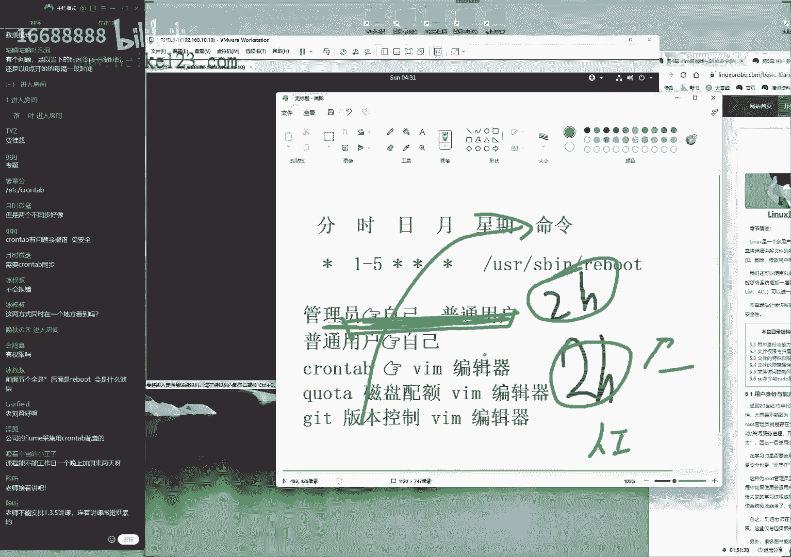

一定要上去拉的一个理由好了，通过说一些废话，我主要去想了一下，我说我还有什么能够把这个再给他去提一下，高度呢，好我我我我突然想到了一个呃，就是同学们配置完了这个计划任务之后，有可能不成，他有啊。

他有可能不生效，比如说现在我们是生效了对吧，现在我们是生下了。

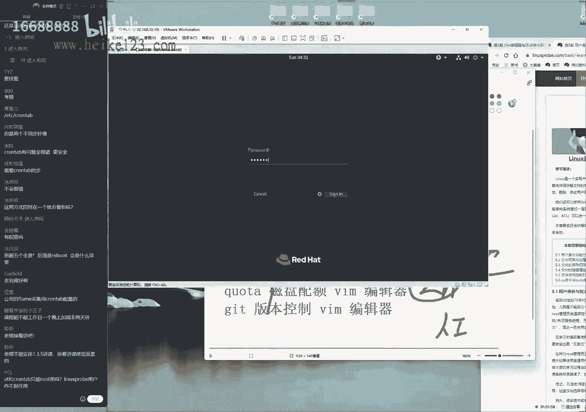

然后去重启了，但是同学们，你们可能并没有生效，我刚才想了一下呃，如果要是以这个角度上去想的话呢，如果有两个可能性，它是什么呢，第一个可能性就是您的计划任务没有被保存上，我们需要去使用到啊。

crown tab，然后gl查看一下您的计划任务有没有被保存上，ok有他有他，他已经被保存上了，没有任何问题，这是第一个可能性，如果没有成功，就检查一下计划任务没有保存上，第二可能性的话呢。

就是这个服务没有起来，现在配置的工具叫crown tab，那么我们要想的配置它的服务的话呢，叫做see some say hl，叫做这个啊，system control，然后我们这样status。

然后后面加上服务的名称，虽然在给大家说闲话，但是脑这样的话，我们脑子里面正在疯狂的转啊，我非常的不甘心，只讲这么多，就给大家想出来有两个可能出错的这个点，来让我来让我来去看一下这个服务。

如果你配置好了这个计划，任务并没有生效，于是就检查一下这个状态是否为启用状态，是否已经开始运行了，如果说这个服务它被关闭的状态下，那么他也不能够去为用户去执行计划任务的，这时候怎么办呢，那么就很简单。

两个命令，system control，然后是restart后面的服务名称，然后走你啊说一句走，你这个很非常的关键，然后我们来啊，restart crown重启一下这个计划任务，再去看。

他就肯定是已经是起来了，然后的话呢第二个的话呢，就是顺手把这个服务的话呢加上这个加入到，系统的开采单当中，能够让我们的系统在cs重启的时候，依然能够使用，能够为用户一直提供服务，来。

大家记一下我们这几个命令以及可能性。

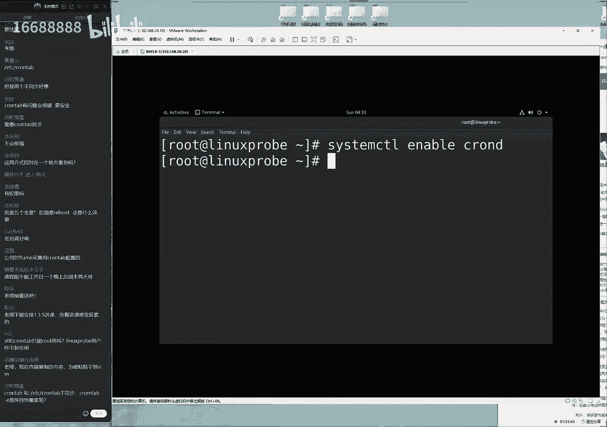

这声音都是一些排除的方法吗，我们在上课的时候尽量能给大家提出来，同学们自下课去做实验的时候，就不会，至于说遇到一些非预期的解决不了的问题了，我给大家抄到黑板上面，大家可以去记一下crowd。

然后是system，然后是enable crown，诶挺好，又给大家想出来两个可能性，又想出来两个可能报错的问题来，大家先记一下，同时的话呢我们来翻开书看一下第六章节，大有问题的话，可以继续去发。

我们来给大家说一下第一部第五章节啊，不好意思啊，有点太心急了啊，第五章第五章差点跳了一个章节啊，来第五章大家先翻开书，同学们，您可以说一下问题了，好大家先问一个问题，大家说怎么样能不能安排时间。

135听课啊，这样连着讲感觉挺累的，不我不累啊，这没关系，然后下面一个问题大家说哦，我们的at跟crown time只能是使用到入侵用户吗，说我们的linux pro用户咋不起作用，可以起作用的。

只不过普通用户没有权限去重启而已，因为他也有权限去重启，只不过说当有另外一个用户在登录的，这个服务器的时候，我们需要单独加一个参数，并不能去使用到这个呃reboot命令，直接重启这么一个问题啊。

所以的话呢我们回答同学们的问题啊，就是呃普通用户也可以做计划任务，只不过你的命令你可以换成另外一个，再去试一下，好，下面一个问题，大家说我们我们在终端复制内容的时候，为什么粘贴不了vm。

因为您没有安装我们的vmware tools。

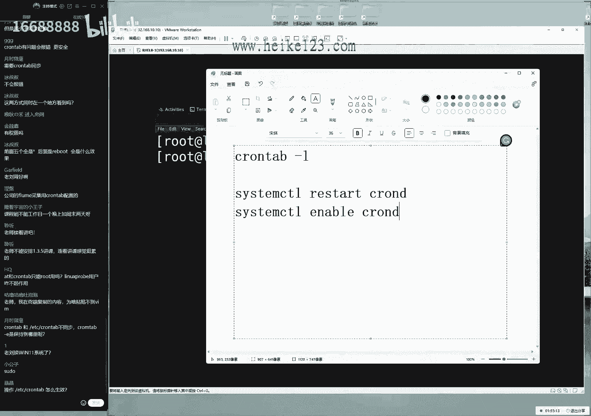

这个的话呢有一个软件包，你可以点一下虚拟机，点一下这个啊这个选项，点一下虚拟机选项，点一下这个安装vm tools，这个工具安装好了就可以实现拖出来。

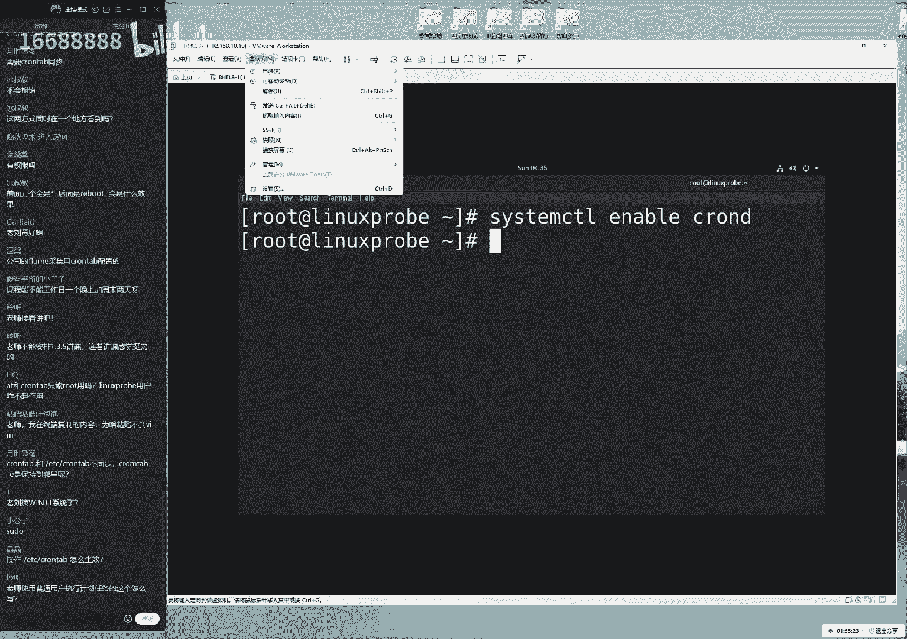

这个拖拽跟远程的跟这个复制都可以去实现了，好下面一个问题，下面一个问题，大家说我们去使用到啊，crown time的时候跟编辑文件并不同步，所以我刚才给大家说说过这个啊，并不同步的问题呃。

crown tab的话保存到哪里去，crown tab的话呢啊还真没有，还真没有留意过，如果没有记错的话，应该是我们的自己的加密录里面是不是有了播，这个我需要给大家去查一下啊，需要给大家去查一下。

还真没关注过我们自己的这个加入里面，应该是保存到我们自己加目录里面了，至于说是哪个文件，下课之后给大家查一查啊，下午之后给大家查一查，其实也大概能够看得出来，不知道是哪一个啊，没关系。

我下个月给大家查一下当下一个问题，大家说啊，说老师使用普通用户执行计划任务的时候，这个怎么写，写是一样的啊，写是一样的，这个格式是一模一样的，只不过我们切换用户的时候是啊，到另外一个用户身份下。

或者我们加一个杠u加上用户名称，然后的话呢下面一个问题，大家说普通用户是根据普通用户调用的。

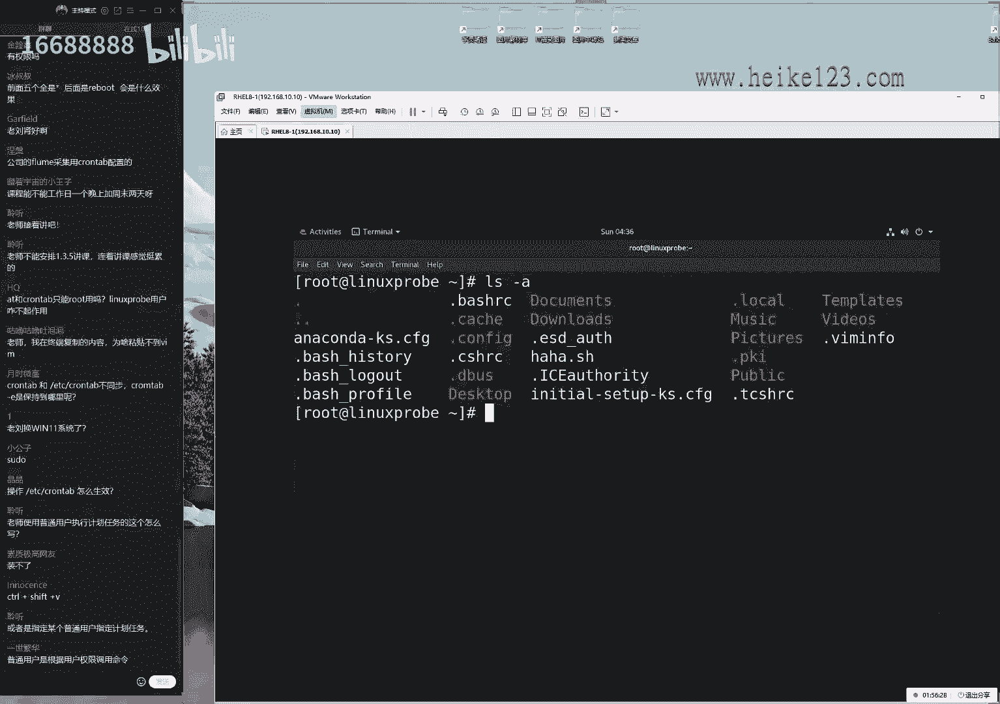

权限问题，对大家实在话实在话，实际想问的是这个啊，大家想要的实际上是这个，就是说为什么我们去使用到普通用户，然后我们去加了一个计划任务对吧，然后的话呢他不他并没有成功，它跟计划任务没关系。

是跟它的权限相关，您加的是什么工作呀，比如说您加的是一个重启也好，您加的是一个对于我们的硬盘进行分区，格式化也好，他没有权限，所以的话呢我们要去使用到普通用户的时候，您需要。

那么您需要去考虑到这个权限的影响，而不是把这个啊都给它，归结于说这个计划任务的问题上，大家能理解吧，啊不是说啊，就是我不是说呃出的问题都是计划任务的，有可能是因为权限的问题好正好引出来。

我们今天这个第五章节，那既然讲到了说那用户的这个权限，到底普通用户为什么小，以及普通用户能够做什么样的一个事情，或者那我们的计算机里面，为什么会有这么一个普通用户的一个身份，他干嘛用的。

下面要给大家来聊一聊啊，大家说七七来了啊，今天七今天七七来不了了。

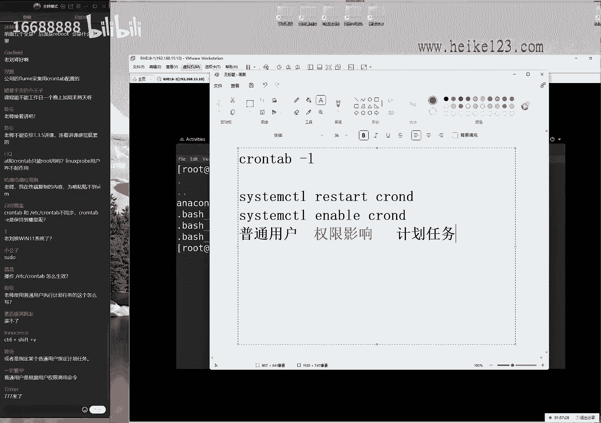

已经8。40了，今天七七来不了了，等明天吧，今天太晚了，七七今天就不来了，来今天的话呢我们的课程就是5。1小节，我们稳扎稳打，稳打稳扎的，我们讲好就可以了，我们对于这个课就不要赶课时了，不要赶课时了。

就是其实怎么讲呢，还是要学的比较扎实一点比较好，来下面的话来说一下啊。

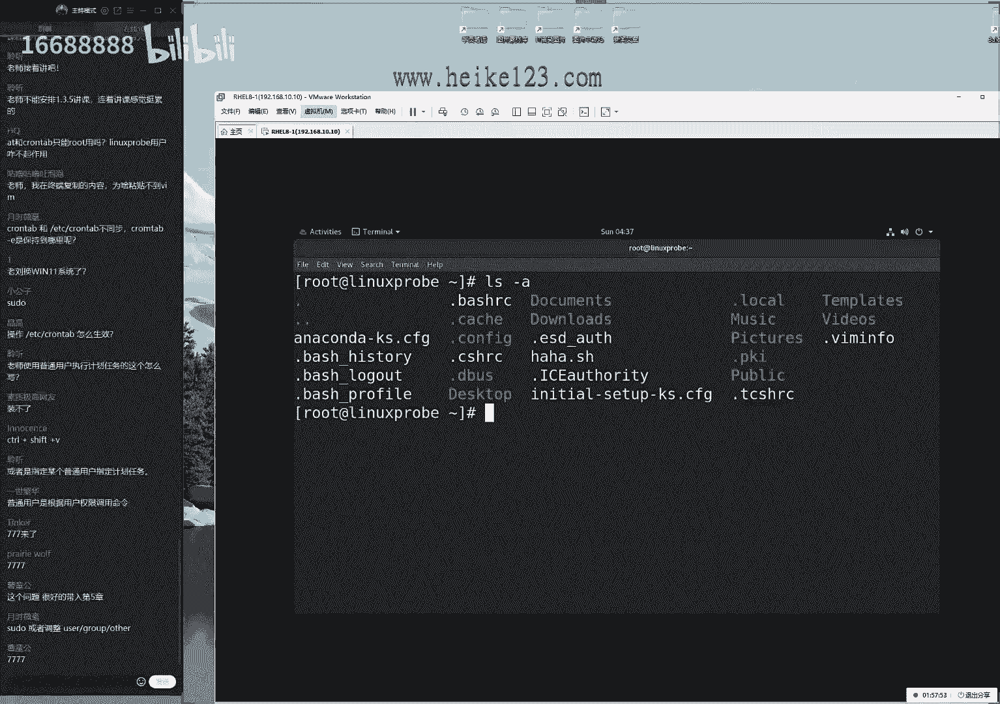

5。1小节简单给大家说一下吧，是这样的啊，不我们如果光讲5。1的话，就不用那么的简单了，可以稍稍可以稍微的这个深入一点了，说一下用户的这个身份以及能力啊，用户的身份与能力，实际上这就是说的一个什么事呢。

就是它能够干什么，以及它这个权限我们该怎么去理解它，那我们在红包的这个linux系统当中的话呢，它实际上的用户是被分为了三种类型的，第一种类型的话呢叫做管理员啊，管理员单有一份，就像我们的啊。

嗯不这个例子不要举了啊，想了一个单手话，跟正看单数话呢跟政治沾边了啊，所以我们所以我们换一个吧，好就是我们的话呢现在有一个身份叫做管理员，他的话呢是权限是最大的，然后的话呢限制是最小的。

它拥有对于这个系统的一个充分的管理能力，这个话呢身份我们是叫做管理员，第二的话呢我们是叫做系统用户，系统用户的话呢，它指的就是呃，它默认情况下是不能够登录我们的服务器的，它仅仅是能够去用于用这个身份。

去调用某一个程序，这有什么用处呢，我先给大家解释一下啊，大家听到这个就有点相互矛盾了，邵老师，你说这个是人话吗，说这个用户不能登录我们的系统，但是的话呢它又可以去调用一个程序，这啥意思啊，是这样的。

首先它不能够登录服务器，好处的话呢，就是啊即便这个账户的密码被人知道了，但是的话呢黑客也进不来，因为它不能够登录服务器，那么他他又他又能够去调用一个服务的话呢，是什么意思呢。

又可以用他的这个身份去调用一个服务的启动，这样的话当有一个黑客去啊，那我们他会有两个情况，当有一名黑客去破解了人家的密码了之后，即便我知道这个的账号和密码，但是的话呢我也依然不能登录服务器。

这是第一种啊啊那么这是第一啊，那么这是第一次保障，第二次保障，当我去通过了入侵别人的这个网站服务，去入侵了网站服务之后的话呢，但是这个程序这个调用者是一个系统用户，它的权限特别小。

那么于是我的破坏范围的话呢，也会受到这个限制，我们叫做china，叫做牢笼机制对吧，也就是说当有一个优啊，当有一个黑客去入侵了我们的网站了好了，网站已经被入侵了，那么它那么它已经成啊，他已经太坏。

已经成一个哎，它已经成为一个事实了，就像一个人的话呢，已经长了一个，比如说长了一个呃肿瘤了好了，但是的话呢肿瘤的范围，它这个破坏的范围的话呢被禁锢起来了，当这个网站的话呢，这个权限被限制了之后的话呢。

他最多也只能最多就破坏一下这个网站了，于是的话呢会有这样的一个效果，让它的权限是更小一点，在满足了网站的记录，这个啊在满足了网站的这个权限的基础之上，竟能少的给它一些额外的一些功能，这么一个啊事情。

那么它这么啊它这么一个作用啊，叫做细菌用户，还有一个我们叫做普通用户，这个普通用户的话呢，就是用来啊我们日常完成工作的，比如说我们的同事张三啊，这个啊张三李四他们也看到登录到服务器里面。

因为我们知道这个系统的话呢，最开始就是一个多用户多任务的一个操作系统，它需要让很多人去通过终端，连接到一台服务器里面，然后一起来去完成工作，那好了，每个人要有一个这个单独的用户的身份。

我们就把它叫做普通用户，在红帽诶，怎么没了啊，等一下在这个红帽唉红帽ro 8里面的话呢，这个普通用户啊不我们还在红包热巴里面割啊，管理员的ui d号码还它是为零。

什么叫ui d u i d指的是我们的身份证号码，叫做ui d，就是我们人类生活当中里面那个身份证号码啊，user identification对吧，好我们identification啊。

我们明明已经忘记他了，非得要打一遍啊，好我不知道打的对不对啊，但是它并不重要，就是说叫做用户的身份的识别码，我们相就是啊我们换了身份证号码嗯，所以我们人类生活当中的话呢，可以允许有重名。

但是我们不允许身份证号码有重名，比如说流传啊，在银行里面，比如说有存款啊，100元，这钱就是我的，别人都不能拿走好，那么为什么呢，因为我的信息跟我的身份证号码，跟我的姓名绑定到这个账户上面。

如果再来一个人叫刘传，他能替我讲课了吗，他能去取我的钱吗，那做梦对不对，那肯定不可以的，那么于是就是呃重名可以，但是身份证号码它是不能够出名的，那么以及的话呢，这个身份证号码也限定了它的一些特性啊。

比如说这个哎呀，要是给外国人讲，估计有点费劲了，但是我们中国人理解起来特别的好，比如说嗯身份证号码它不仅是一个唯一的对吧，它里边还包括了一些信息啊，因为在外国没有户口制，在中打电话。

在中国跟朝鲜设户口制了，它不仅是唯一的，它还有一些标识，比如说老刘的身份证号码对吧，110101巴拉巴拉巴拉巴啊，好就代表的是首先是北，它代表它代表的就是北京市对吧。

然后的话呢这个啊101就是叫做东城区啊，虽然我现在住在朝阳了，但是我身份号码，然后呢还是啊这个它不会变的，即便我以后我住到了，比如说住到了上海了啊，那么他这个号码也是一个呃不会变化的。

也就是说它里面还会有一些标识信息，第一来说就是唯一，第二的话就是要有一些含义，这个含义啊，含义这个就代表是零的意思，就是说零首先它是唯一值，并且的话它有一个具体的含义是为管理员。

这个有点就是有点嗯解释的太清楚了吧，就是如果一个用户的这个呃，u i d号码为零的话，他一定是一个唯一值，并且他一定是为管理员啊，解释的超级清楚了啊，给大家举一个生活当中的一个例子，好。

下面的话我们来给大家说一下我们的这个系统，用户，在我们红包reo 5和红包reo 6里边的话呢，这个系统用户的这个数字，是从1~499之间的，也就是说如果说您的系统是一个老系统。

那么您如果说是五或者六的话呢，那么您对应的这个ui d号码，就是1~499，如果说现在是7~8的话呢，那么您的uid号码就是从一到大家说出来啊，999好，这个就是一个很大的一个范围啊。

下面就是我们的普通用户，在如果说您是在红毛五和六里面的话呢，那么您的这1号码的话呢是从500开始的，一直到多少呢，到65535个，也就是说，您系统当中最多只能有65000个用户啊。

说咱们说实话肯定是够够的了，肯定没有任何问题呃，然后的话我们在七和八里边的话呢，我们没有上限，它是从1000开始的，没有上限，我们说这个话是很负责任的，因为我为了讲这个课，我们不仅是去刷啊。

我们啊不仅是动嘴了，也其实也动手了，我们去使用这个脚本啊，不要问我那个脚本怎么去写啊，大家都会啊，使用这个脚本，然后的话呢批量新建出来了，几10万个用户都可以去实现，没有任何问题。

这个我们去亲自去尝试过了啊，是没有问题的，所以当前认为是没有上限的，好当然好了，现在啊问了没有问没有问题，我给大家问问题啊，我们对自己不满意，我要给大家提个问题，请问如果一个用户他的这个身份证号码啊。

如果他的呃ui d号码以我们红包肉八为例啊，以红包肉八为例，他一呃的这个身份证号码是555，或者666，请问他是一个什么类型的用户，来一个小问题送给大家，如果一个用户的身份证号码的。

ui d号码是555或者666，他的这个身份是什么类型，好同学们想想啊，想一想，答案已经在题干里边了，答案就在题干里面啊，题干就在咱们的嗯屏幕上正在显示出来的，大家说系统用户啊。

系统用户其实啊哈其实的话呢是错误的，其实是错误的，不这个大家会说系统用户是错误的，因为用户的ui d号码是手工指定的，它不能够单纯的通过ui d号码区分，是系统用户还是普通用户，对啊绕啊。

听我给大家去细聊，可以通过ui d号码为零，判别出来他是为管理员还是为普通用户，还是系统用户，就是说它只要为零，一定是为管理员，因此它是一个唯一的且有含义的一个意思，好大家看到没，我有我只在这儿写了。

这是一个坑啊，我只在管理员上面，我就写了唯一，并且它有含义为零，一定是只有一个含义为管理员，他一定是管理员，没有问题吧，但是这个ui d号码，这个范围区间只是一个参考值，下面两个确实参考值。

用户的ui d号码不一定绑定用户的这个身份，他即便是一个普通用户，也可以是555，666，777八八十八，也没有任何问题，系统用户的话呢也可以是啊一前一后的，比如说巴拉啊啊啊。

1500 3500 8899，ok可以的，没有问题好吧，也就是说系统用户跟普通用户，是通过功能来以及作用它来进行区分的，不是通过ui d号码，ui d号码仅是做参考值，好吧，同学们这个非常讲的非常清楚。

而且网上面基本上没有给大家说清楚的，因为网上都是照抄的一篇文章，然后乱七八糟抄就抄就抄，就是就是反正就他这还能啊这个啊质量并不高，所以当时我们去结束的时候，就想配置一个什么服务，我忘记了。

就发现很多这个网上的文章都是抄来的，然后都是如果啊如果要是第一篇错的话，后面都是错的，因此这点大家要去纠正一下自己之前的观点，就是ui d号码不能够区分析的用户跟普通用户，一脑的优为例啊。

比如说我的身份证号码是110101对吧，那好了，我的号码的话呢，虽然是东厂的，但是我住在朝阳，这个是一样的啊，那么这个是同样的一个道理，即便说我一个用户ui d号码是666。

但是我却当做普通用户去使用它没有问题啊，可以的好，所以大家记一下，这是参考，就是啊唯一和含义的一个区别特别好，接下来再来给大家说一些命令，那么如果说我们要想去看一个用户的基，本信息的话呢。

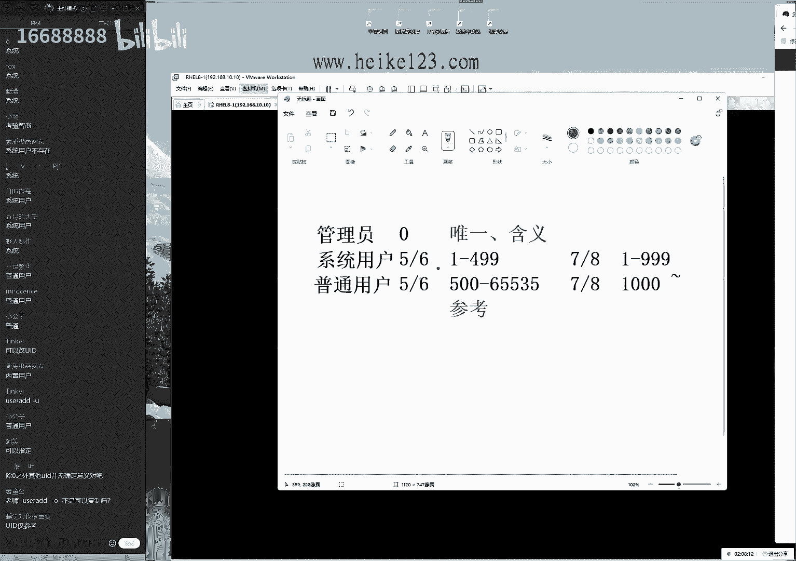

我们就可以去使用到一个叫做id的命令来查看，它叫做id，然后后面加上用户的名称就可以去看了，比如说id啊，可以先去直接敲一下，回车，指的是看我们自己的来，现在id后面的话呢加上一个用户的名称。

比如说随便去写了，我们必须我们随便去写，刚刚的话有一个普通用户叫做linux pro来，我们以它为例，如果说您开始去安装系统的时候，在4月2号的时候，您去安装系统的时候，4月3号去安装系统的时候。

您没有安装啊，您那么您没有新建出来这个普通用户，或者对其改名的话呢，此时请替换成您新建的用户的名字，来，我们换一下，点一下回车，于是可以看到了这个用户的话呢叫做linux pro。

它就是一个用户信息显示出来了，我们可以参考成，那我们可以参考一下，他是一个普通用户，他的话ui d号码是为1000组，id是为1000啊，扩展组啊。

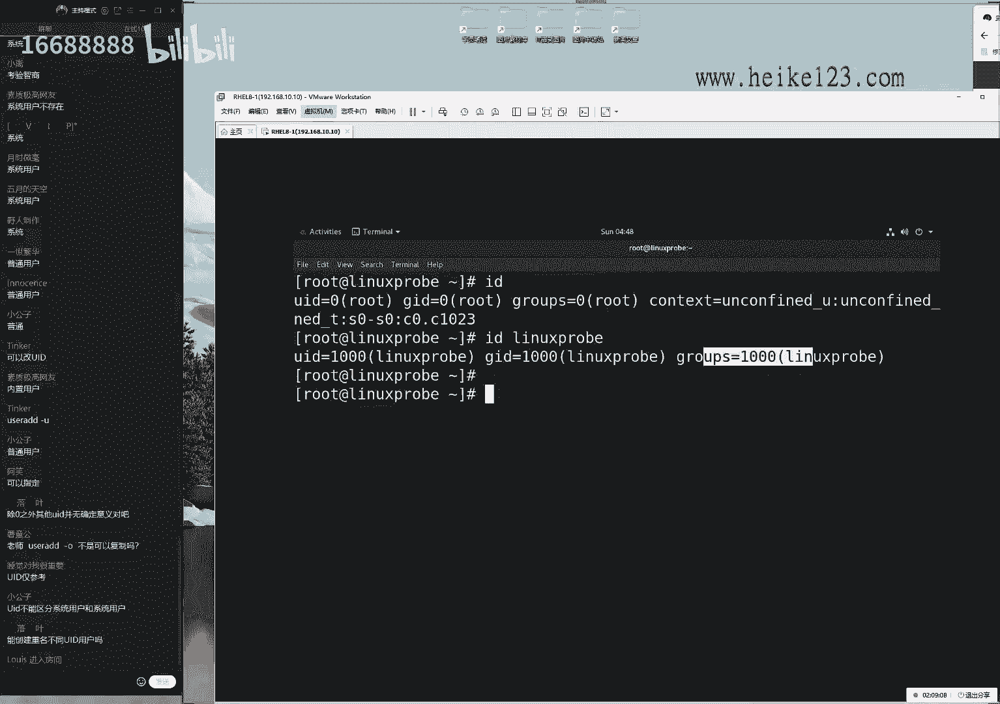

它也是它本身，这是什么意思啊，要又要给大家扩展去讲一下了，呃也就是说我们再去使用到linux系统的时候的话，它实际上它又分为了三个字段。

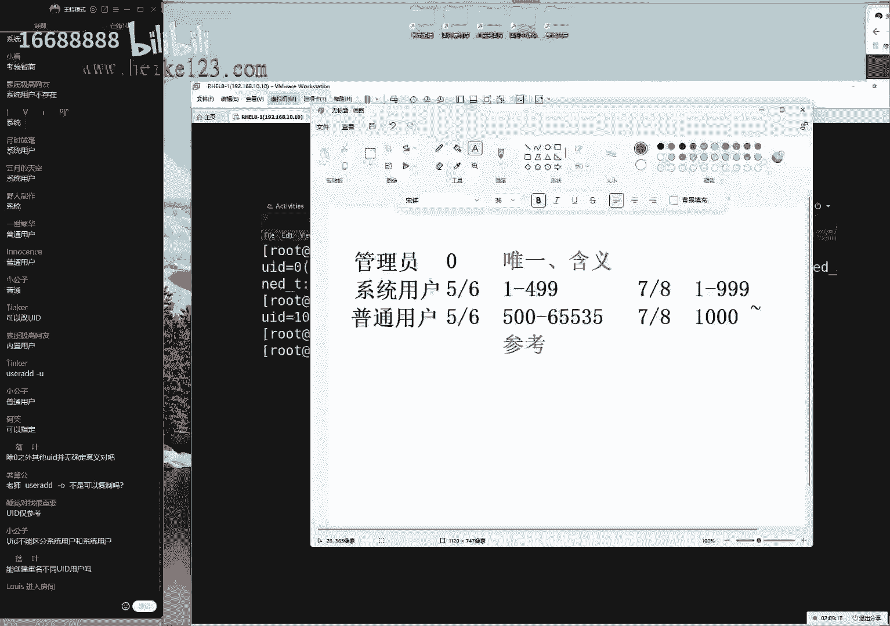

以我们现在为例对吧啊，第一来说的话就是u i d啊。

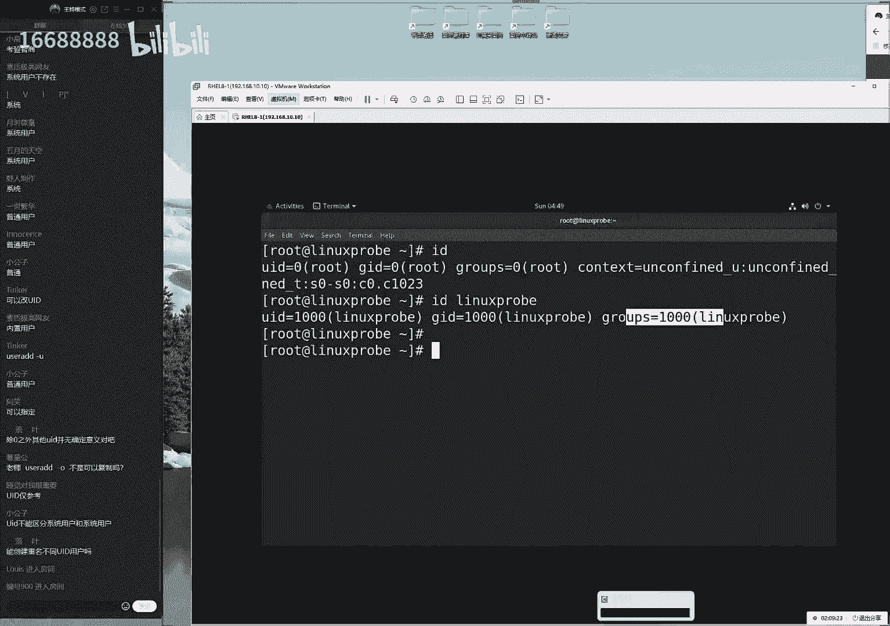

叫叫这个u啊，u啊叫做这个用户名吧，然后第二个字段的话呢，我们叫做基本组，第三的话呢我们叫做扩展组，这个什么意思啊，基本组扩展组这个我们很啊，我们不太好理解，首先啊用户名称这个超好理解。

大家从字面意思上可以知道了，这指的是用户的名称，以及用户的这么一个生证号码，而这个基本组的话呢是一个与生俱来的，我们的一个组，它会随系统啊，它啊它会随用户的建立而产生出来，比如说我现在新建出来一个啊。

新建出来一个账户叫做张三好，那好了，叫张三，那么我就会有一个与生俱来的组，也叫张三，当别人在想我在哦，我再去新建出来一个组叫，那么在新建出来一共叫叫叫做李四，李四的话也有一个叫做李四的一个基本组。

这是一个与生俱来的，有点像是我们在出生了之后啊，大家说这个是一个呃主的属性，k这么理解，但是的话呢又用一个技术去解释一个技术了，大家没有发现以后会常犯一个错误，为什么我们讲课大家能听得懂呢。

就是因为尽量能用一个生活的一个例子，去解释一个技术的一个例子，如果用一个技术的术语，去解释一个技术的术语的话呢，听完之后还是比较的抽象了，大家举一个例子啊，比如说因为听到咱们讲课听得最多的就是这个。

比如说这三个字了，对吧嗯，但是能够听得懂，就看这三个字后面举的这个例子了，好假设说哈有一天出呃，有一个人出生了，这个人出生的话呢，他出生那一瞬间就会有一个原生家庭组，这个组是他与生俱来的。

比如说像一个人叫老刘啊，叫做啊啊，现在有一天啊，先我先说一人家啊，小刘小刘出生了就会有一个基本组，这个基本组里面的话就会包括他的家人，比如说爸爸妈妈啊，爷爷奶奶啊，这些的话呢叫做哎爷爷奶奶。

这叫做基本组，也就是他一个与生俱来的，当他有这个基本组了之后的话呢，他以后随着自己的这个工作的需要，再去加入其他的这个公司也好，学校也好，这个叫做扩展组，比如说你看他啊，他有他他他他要去上。

他要去上学了，学校组好吧啊，就我们给大家一个学校组，加入这个扩展组里面了，为什么我不能够去大家的公司里面去上班呢，啊不不不，这怎么理解，就是我为什么不能去呆在公司里面，进入到你们的啊。

去进入到你们的公司里面呢，因为我并不是你们的员工，对吧好，为了让我们的小刘能够去上学，他就需要先找一个学校，成为里面的一个成员，他就可以背着书包去上学了，这个叫做他后天去加入的扩展组。

然后他以后啊啊上完学了对吧，他以后去啊自承父业过来讲课来了，他又加了一个组叫做linux prom用户的一个组，于是他可以怎么样呢，加入很多个用于工作方面的这么一个组，它统一我们叫做扩展组好。

这是我们第一点，第二点是什么呢，第二点是一个用户只能有一个扩展组，与生俱来的，但是它可以有很多个n个扩展组，大家记一下，扩展组可以有很多个基本组，只有自己答问，说基本组有啥用嗯这个时候我举一个小例子啊。

老刘以前我出生的时候，我也只有我一个基本组，但是我们的团队啊，但是啊但是我们现在的话呢，有公司现在的话人气也很高，我们现在有很多工作需要去忙，我忙不过来了，就会有我的手下就会啊。

就啊啊说这个啊手下有点啊太俗了啊，但是会有我的下属们，会有我的同事们，他们会加入到我的公司里面，他虽然是我的基本组，但是会去去啊，但是却是他们的扩展组鱼啊，我画了，等会啊他就成他们。

他们就成为我们公司的这个成员了，他们就是这样的一个效果啊，所以你要去理解一下啊，这么一个区别啊。

区别好，接下来我们再来给大家去说，去使用id查看到信息之后的话呢，也可以去使用到u s a d d去新建一个用户，这个特别有意思啊，比如说我现在再来啊，另外还有一点，另外还有一点。

我们现在讲的都超级基础，大家感觉到了，如果大家对于我们现在讲的不满意，觉得太简单了，待会儿下课之后，九点过后啊，就属于我们下课时间了，提醒我可以通过这个编辑文件的方法，去新建出来一个用户。

来去印证我们前面所讲的那个什么啊，所有的文件啊啊所有的这个信息都是文件，然后我们包括说新建用户，也可以通过文件的形式来去实现，但是同学们一定要提醒我，九点过后啊，然后下课之后给大家去做一下这个演示。

来说一下，首先啊uc a d d来去新建出来一个用户，用户名称，直接写后面就可以了，比如说我看谁发言了呀，叫做啊小黎，是不是啊，就这个小黎吧，新建一个用户叫做小狸，于是有了再来查看一下小狸的用户身份。

小丽用户新建成功，好，非常好，还在那我在那我们再新建一个啊，再新建一个用户，同学们叫什么来着啊，小狼是吧啊，小狼小狼同学啊，于是的话呢我们啊小狼我们再来加一个参数，看一下表格，五杠一加一个参数好不好啊。

可以啊啊杠u指定一下用户的ui d，我刚才说过了，ui地址作为参考，它不能够去用来直接区分用户的身份，没毛病吧，好当前他肯定是一个后期建立的普通用户，但是我们却可以加一个杠u，我们的身份证号码888啊。

这个号非常顺，它是在1100里的，但是他却是一个普通用户，它是可以怎么样呢，切换到它的没有问题吧，可以切换它是为普通用户，但是他的ui d号码却为88诶，你看很有意思，辩证辩证而来，那我们反啊。

我们辩证的给大家去说，呃，这是这是新建用户的一个方法，大家的话呢会问问题，比如说老刘嗯，哦用户的这个，然后我们看一下表格，五个一里边啊，就不再给大家一个一个去大家去演示了，因为有点没啥意义。

比如说再去演示一个吧，比如说新建一个用户用户的组id，比如说六啊，6666啊，他可不可以啊，可以啊啊啊不啊，来可以啊啊，用户名称叫做小哈吧，按一下回车啊，他说这个组并不存在好。

我们这样如果想新建一个组的话，是使用到啊，新建组的用户，来来来新建组命令好，group a d d后面加一个组的名称，比如说叫做lis cool，来我们给他新建一个组。

然后的话呢我们现在去啊新建一个用户，这个用户叫做哈哈，给他一个扩展组，叫做大写g把它加入到linux库里面去，于是可以看到了，当这个用户第一时间被新建出来的时候，它不仅有了自己的基本组，就是它的基本组。

他也有了一个扩展组，这叫做呃新建用户的时候，可以来去指定这个快闪组的一个方法，还有什么可以说呢，还有同学会问到说的啊，我弄明白了，新建用户的时候，还有啊，就是说我们孩子出生的时候，可以去修改一些信息。

那如果说我现在还有一个用户，还有一个用户，比如说叫做嗯，哎呀现在这个技术能够掌握的很清楚了，但是这个取名字很费劲啊，这叫做相同门，比如说叫做小啊，叫做啊小狼吧，好现在有一个用户叫小狼，我们先。

那我们也需要把它加入到一个扩展组里面，或者我们去修改它里面这个信息，这个就只能改改，删掉之后再重新取新建吗，就是说我们能不能呃，就是我们在后期也可以去修改这个用户信息呢，是可以的。

这个命令的话呢叫做user mod命令，可以来去实现啊，use mood命令来去实现呃，后面的话呢比如说我想修改什么呢，我想修改一下用户的ui d号码，现在的话ui d号码是888，可不可以修改呀。

后期能不能修改啊，没毛病啊，6666啊，来6666666啊，非常好，来我们查看一下用户信息，于是查看啊，这东西就应该去看了一下，在红包roll 7跟红包肉八里面，ui d上线不再是65535了。

那可是6666没有任何问题来，用户信息在后天也可以进行一个修改，同时也可以去将这个用户加入到扩展组里面，比如说加入到linux cool里面，这也是我们的亲人了对吧，这也是我们的一个亲网站来介绍。

在扩展组里面，好了之后再去看小狼用户多了一个扩展组啊，非常简单啊，还有什么呢啊，还有还有还有就是嗯新重置一下用户密码啊，重置一下用户密码来password嗯，啊password啊，我看大家问题啊。

答了问题，大家说啊，我看一下用户名字可以输入数字吗，为啥我会报错，因为不可以啊，这个大家问题都可能都已经出现在题干里面了，下面一个问题，大家说，为什么，除了我们的管理员去使用的道路以外的话呢。

其他用户运行命令都需要加上速度，其实这个您的问题已经就是啊问题就已经在，答案已经在题干里面了，就是因为权限的问题，就是因为您使用的是管理员就没有问题，普通用户是不能够新建普通用户的啊。

普通用户是不能够新建用户的，这就是为什么我们一开始让大家去选管理员，方法去来关于我们这个计算机，第一虚拟机里面的话呢，没有人去入侵我们的电脑，就是没有人会去入侵我们的虚拟机。

第二的话呢就是我们如果出错了，可以还原快照就好了，第三就是因为权限问题啊，因为呃很多这个操作的话呢，现在也好会看到了他这个过程可以去完成，如果说我们没有去使用管理员呃，这个权限去操作的话呢。

那么如果出错了，您不知道啊，这啊您不太能确认到底是自己的操作问题，还是因为全新的问题导致的，所以我们第一次建议大家都使用管理员方法，来去实现啊，然后下面啊来去重置一下用户密码。

用户密的话呢名称我们是叫小狼，密码的话呢，当前没有，我们就给大家重置一个新的，比如说随便啊叫做red hat，然后red hat新建好了，这就是重置密码的一个方法，还有的话呢大家看到了第六个命令。

就是叫做user delete，那叫做用户的删除命令，好大家问了一个问题，大家说啊基本组有实际的应用地方啊，比如说文件的扩展组是值得啊，说文件的所属组是值得扩展组吧，不呃不用去猜，不用去猜。

你明天听完了之后自然就知道了，咱们学习的时候忌讳就是猜不对的文件，它的这个组它不区分用户，你是基本组还是扩展组，就是文就是我们这么理解啊，呃我先给大家说一下啊，因为这个确实大家现在不要去猜。

就是在这个文件上面，这个是指的是所有者，这个指的是所有组，所有组并不指的是用户它的基本组或扩展组，它不用去区分用户，只要有就行，大家都理解的意思吗，比如说老刘啊。

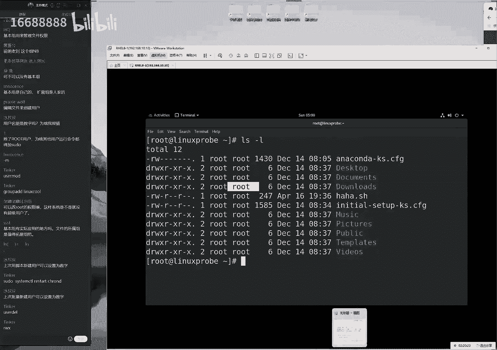

我现在啊老啊，现在的话我有几个钥匙，现在呢比如说怎么画那么丑啊，好就这样吧，哎怀再回来怀个小帽子，我现在有几个钥匙，第一个钥匙，比如说我现在这个啊房家里的房，家里的话房是啊房间的，第二话呢是公司的。

第三个话呢，比如说随便啊，比如说是一个啊巴拉巴拉巴拉，最后的话呢我们会有一个验证说你有没有啊啊，不然我们这儿有一个文件啊，这句话我那我们的文件上面有一个权限，就是我们只要这三把钥匙啊。

这个文件的话它是不管我们到底是哪把钥匙的，只要我们这个用户的这个信息当中，它不论是基本组还是扩展组，只要你有就行，你有了这把钥匙就去插进去就可以打开了，而它并不区分说你到底是第一把，第二把。

第三把还是我们基本组。

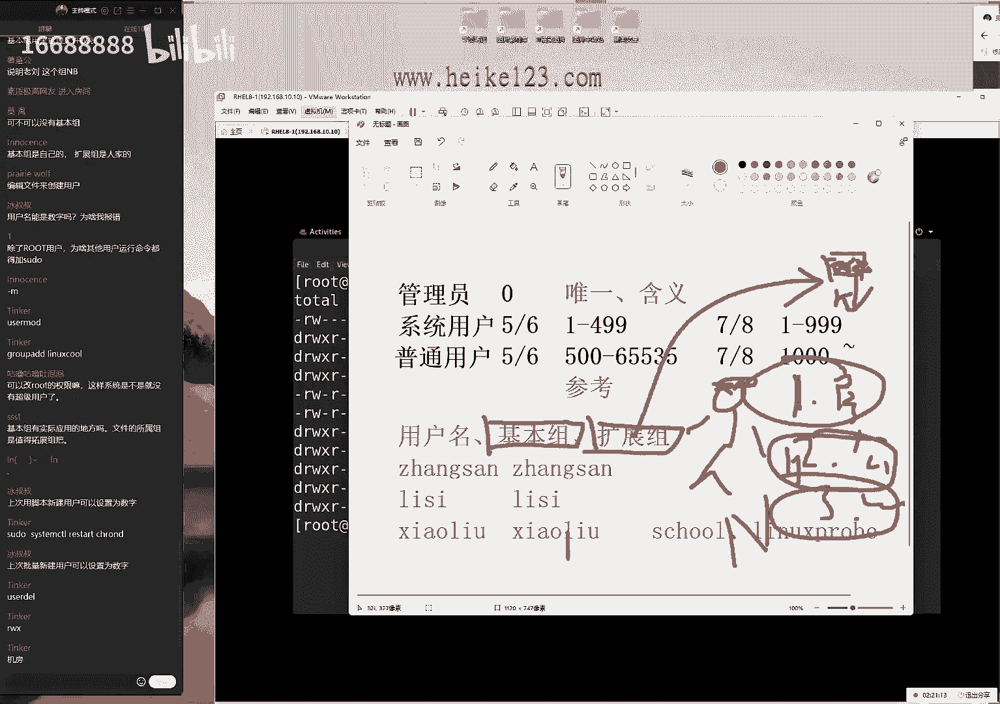

还呃他还是基本组还是扩展组啊，不用区分啊，不用区分好，下面就是来去删掉用户嘛，我们既然会先既然会建立了，我们就把它要不在最后去学一下这个啊删除，做一个完美的收官命令的话呢。

叫做user delete命令来给它删掉了，删掉的话，那用户名称我们这么去写，user delete后面加上用户的名称叫做小狼，这样把它给删掉，再去查看一下小狼用户就被删除掉了，没有问题。

但是我们再去进入到home目录里面的时候，会发现这个里面依然有一个目录叫做小狼，这个指的是这个原先用户的这个加目录，什么意思呢，还是要我会尽量给大家通过这个生活的例子，来解释一个技术的一个呃的呃。

他一个事情啊，就比如说啊今天的话呢我们跟女朋友吵架了啊，然后的话呢女朋友摔门而出，他说我再也不回来了，于是等于说把这个账户的给它删掉了，当前家里面啊走掉之后，就发现没有这个用户信息了。

但是但是啊我们进啊走进了卧室，走进了自己用来保存加入数据的这么一个目录，之后，会发现女朋友的东西诶，尤其是化妆品，只要还在，这是老刘的一个经验啊，只要化妆品还在诶，行李箱也在，衣服也在。

说明的话呢只是给你说气话，他还是喜欢你的啊，他还会回来的，就是只要我们的个人的资料还在，这个用户在为新建回来之后，他又能够把这个信息给他做关联了，数据也不会丢好，那么如果说我们要想去彻底的去。

深入到一个用户的话呢，我们需要去使用到user delete，如果说删除掉一个用户的同时，把它记得这个加目录，比如说我们叫做哈哈吧，删掉这个用户的同时，把他的这个加目录数据也给它删掉了。

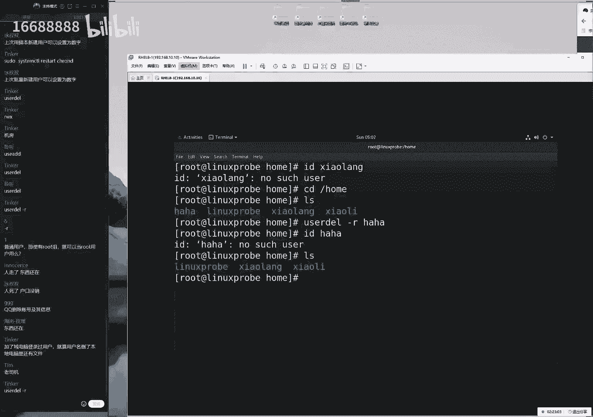

这个用户就无法被恢复了，就彻底的走掉了这么一回事啊，于是大家可以来记一下，删掉用户的时候是否加杠，r指的是是否去删除掉这个用户加目录的数据，它是一个完整删除这样的一个作用啊，怎么样，老司机啊。

来下面一个问题，下面一个问题，大家说我们去使用一个普通用户，即使是有root组，也就可以当做输入t用户去使用吗，这个分情况，这个社交第五章节里面有一个权限。

叫做s e y d s g d s b i t，如果要是加入到某一个扩展组里面的话呢，可以去使用到si或者s j d，但是这个的话呢你可以去感受一下，明天我们我们会给大家来去理解一下啊，大家说啊。

这个例子没有女朋友很难理解，好吧啊，那我祝大家幸福，下面一个问题大家说加了电脑玉的这个用户哦，你大家加了个玉，跟我们讲的不太一样，说就算用户名删除了本地文件啊，它本地电脑中还有文件呢。

大家所说的那个玉的话，你们主要指的是windows里面那个a d嘛，然后的话呢我们在啊系统当中的话呢，会去使用到一个啊，我那么好，大家所说的那个玉啊，应该所说的是windows里面那个ad。

然后的话呢我们所说的遇到我们是叫做linux，系统当中的话呢是叫做open l d a p l d a p，然后的话呢这种情况下是一样的，就是如果说我们要去使用到一个远成的，集中式的认证存储。

叫集中的一个认证存储，我就稍微简单一点去写了啊，金融认证的这种服务的话呢，我们去删掉一个用户之后，也是这个用户的这个信息，也是被保留到我们的本地的，他也不会被删干净，我们也需要需要再去手动去删一遍。

除非我们这样去做，然后加上delete杠r是可以的，我不知道windows里面那么大个删干净啊，但是linux里面是可以删干净的，是可以通过这个杠杆操作，即便是一个远程的一个用户。

也可以把它加目录给他删干净的，但是一般情况下以我们的经验为例，比如说是open l d e p，一般他都会再去跟一个服务搭配到一起去使用，比如说网络存储服务，然后加上auto f s这样去实现的。

所以的话他也可以没有问题，好这个就是我们的一个经验，他可以去使用杠杆来去做一下删除，另外的话大家先不要走先不要走，先不要走哦，我我啊我来我来给大家去说一个事情哈，就是呃之前之前我说了一句话。

说linux中的一话呢，系统中的一切都是文件，系统中的一切都是文件，然后呢感谢我们的同学的话呢。

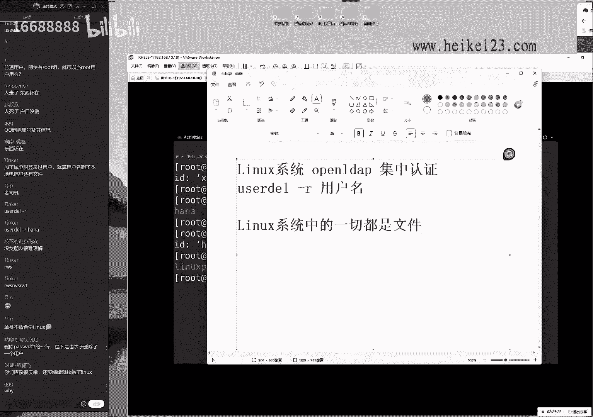

之前因为老刘比较帅啊，所以大家先暂时先啊啊相信了我们一种说法。

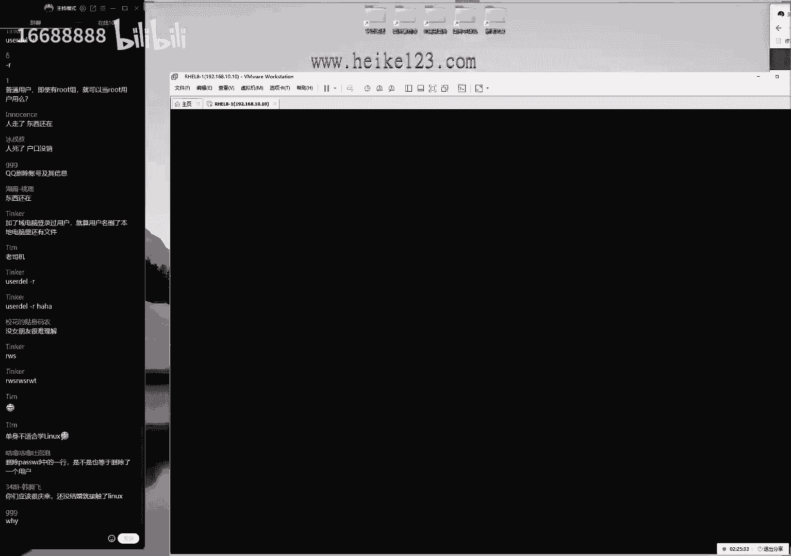

但是的话大家心理上一定是有一种怎么讲呢。

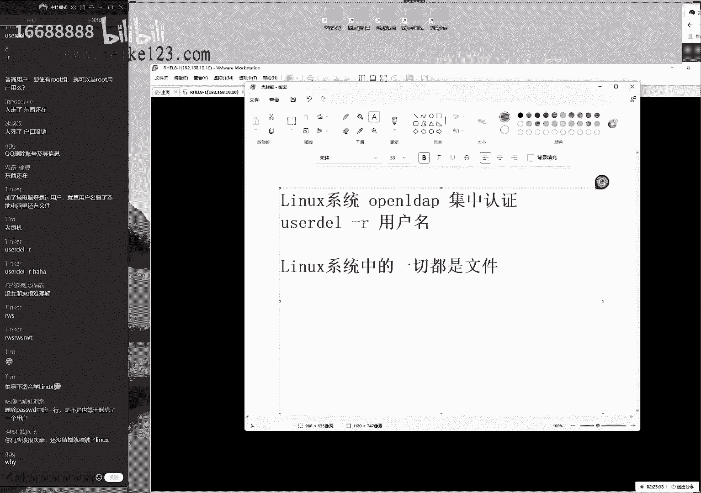

有一种嗯感觉呃不太信任的感觉，说老师真的是这样吗，他一切都是文件对吧，包括说鼠标啊，硬盘啊，键盘啊，光盘啊，连运行状态都是一个文件吗，我怎么不太相信呢，那你给我举一个例子，这个例子就是一个很好的例子啊。

因为我们很难去证明说鼠标是鼠标，键盘吃键盘，但是我们却能够证明说，连用户的信息都是被保存到文件里面的，并且的话呢我们可以通过手动的方式去新建，一个用户，要通过这个例子解决两个问题。

第一个增加我们的信任感，诶知道诶确实是由文件组成的啊，通过修改文件，就可以达到一个配置服务的这么一个啊效果，第二的话呢去进一步去增加学习linux的一个深度，而知道了哦，原来我们所执行的这个命令。

它对应的来说对应是哪一些操作，它通过啊我们调用的一个命令，实际上它也就是通过这个命令，帮助我们修改了某个文件啊，就是这么一个效果来呃，我们给大家讲课的时候。

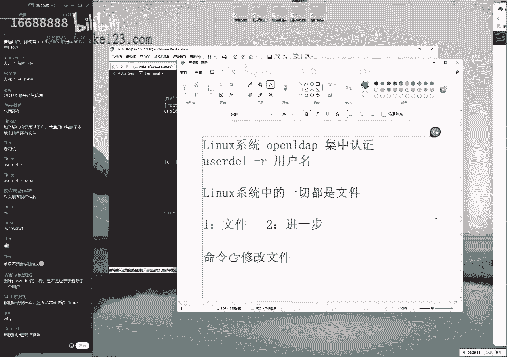

还要既要照顾到基础比较薄弱的同学，能够听得懂，正好过了九点了，这算是一个赠送的时间了啊，已经过了九点了，这就跟课无关了，我们也要让我们技术比较好的同学，能够看一些书上没有东西，增加点难度，但是这个东西。

我那我那我们必然不敢写到书上面的啊，这种东西我要但凡敢写到书上面，我们至少在当当上面要多五个差评，大家信不信吧啊，只要看不懂，我不知道是从什么时候开始的一个思潮啊，还是什么样的一个感受，就是只要看不懂。

只要他就是啊，这就是啊只要做错了，就是他们书写错了。

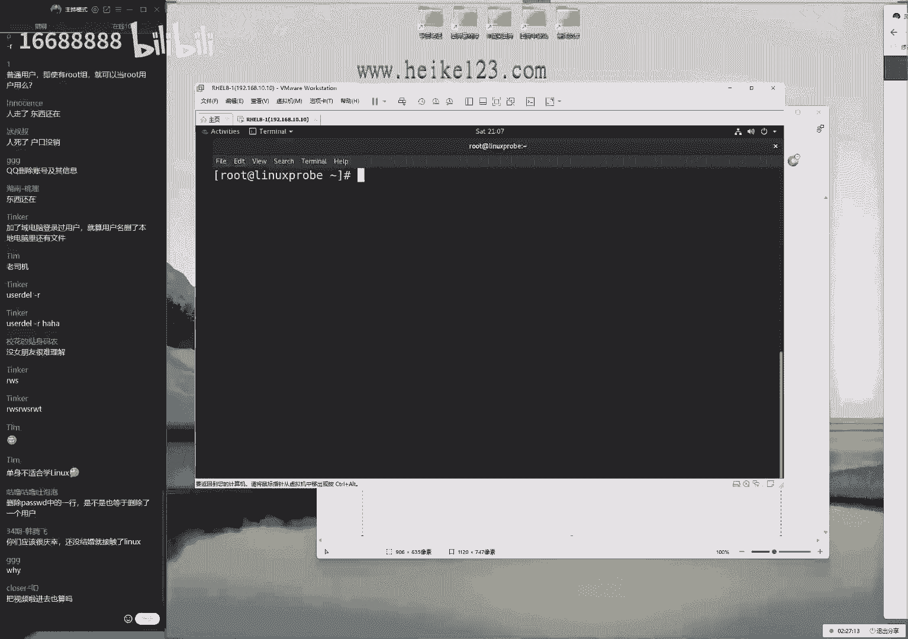

我们来继续，我们来继续啊，我们先不否定书上有错误，但是不可能这么多啊，个个都错，就是啊来继续了，还是不要多说了啊，我们的读者都没有错啊，啊来继续啊，嗯新建一个用户的话，通过文件的方法去实现。

首先第一步就是编辑这个文件啊，etc目录里面pass wd，通过这个例子啊。

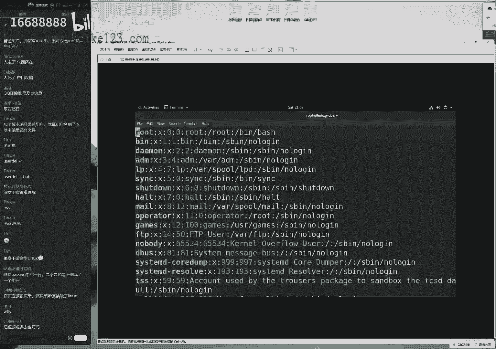

大家听不懂没关系，就是您看一下有这么一个方式，能够知道底层怎么去实现呢，首先这个文件的话呢是用来去啊，定义用户信息的啊，对对对对对对，解决啊，先去解决信任问题啊，先去解决信任问题。

来这样先去解决信任问题，首先啊真的没有一个用户叫做什么呢，随便大家想一个，比如说叫做team这个词，这个名字有点太刻，就有点太太普通了，比如说你真的没有一个用户叫做linux probe啊，当当当啊。

比如说这么一个用户吧，好我们现在啊不是这个，我们再换一个啊linux down吧，当前的话呢真的没有一个用户叫这个名字，没有问题吧，ok我来给大家新建出来，通过编辑文件的方法来去实现出来，首先第一步啊。

直接来来来来，大家说直接vr，然后编辑这个文件里面新增一个用户系统，任吗好，这个问题非常好，您的这个问题马上啊，现在是09：08，09：18就能有答案了，再来编辑etc目录里面password嗯。

好进入到这个文件里面，保存每个用户信息的。

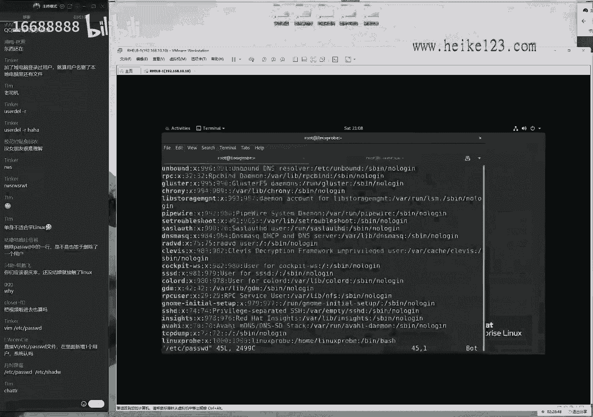

我不知道大家有没有听完之后什么感觉，反正我们今天讲完课之后感觉是很爽的，学习的东西超级多，来啊大家应该有这种感觉才对了，如果说您听完了之后感觉不爽。

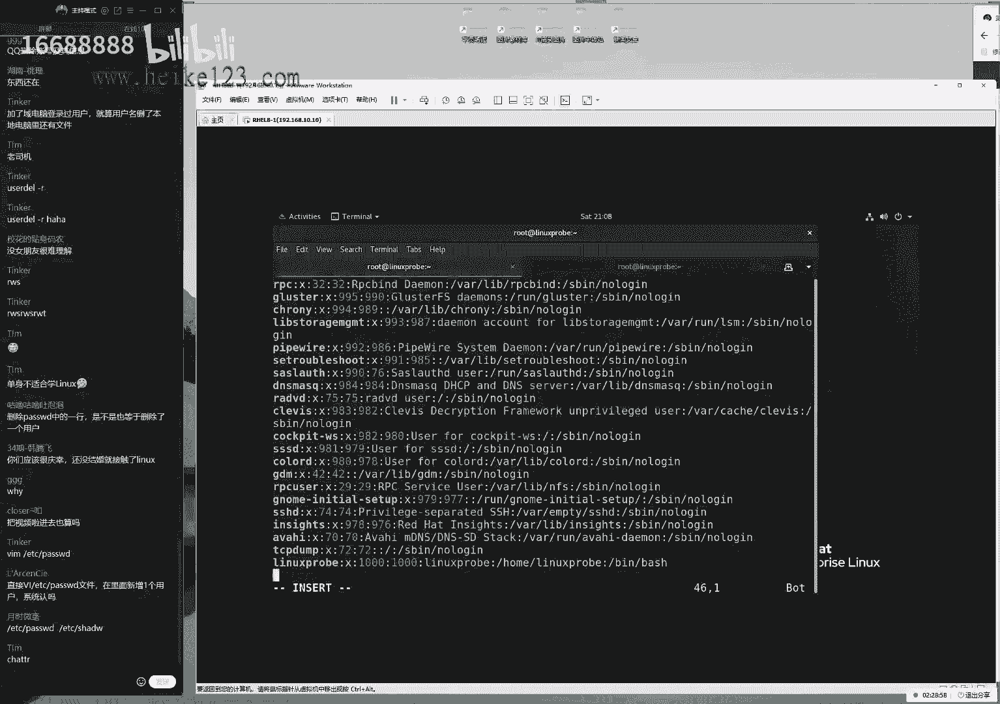

反而很累的话呢，我感觉是因为预习没有到位的原因，来，let us down，用户名称，第二个字段指的是它是否有密码，密码的话有没有有有写一个小写x但不用，但是不用管，因为这个密码会有另外一个文件里面。

保存在etc目录里面的shadow文件啊，它超纲啊，我们不管的好，待会我们会去编辑它的。

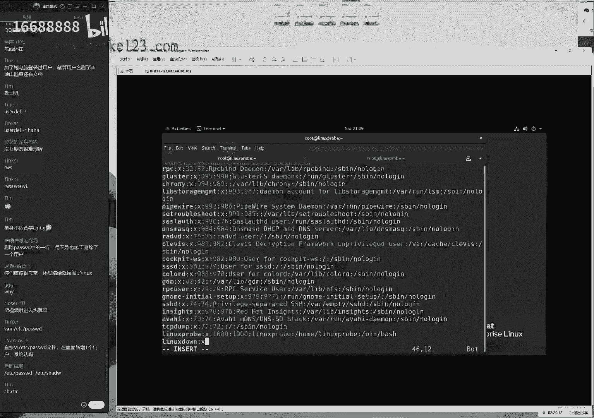

他用啊，用户的ui d号码只要不重复，随便去写，比如说我我用到6666a看有没有人用过，没有吧，6666666666，然后我们用户组id 6666666，好听好呃，用户的这个呃描述信息我随便去写。

linux down is a goodbye啊啊linux doincom，就是咱们的网站，最后啊用户的这个加目录，home目录里面我们是叫做lis down。

这个会在第六章节给大家去说到home目录的作用，然后解释器的终端叫做bbh好，做完了，这是第一步，用户信息就有了，就这么简单好，第二步用户组还没有，所以他后面没有显示用户组的这个名称。

咱们一步一步往后推啊，用户组没有怎么办呢，编辑文件etc目录里面的group group走来走，怎么感觉同学们今天那么的沉闷啊，啊刚刚还互动起来，怎么现在突然不说话了，来，let it stop。

let啊，linux down，然后这是新建用户组啊，然后呢一个x用户组id是6666，这几个六来的五个吧，随便吧，来保存并退出，新建了一个用户组，再一看用户组也出来了啊，用户组也出来了。

然后还差俩事儿，第一个事儿是嗯给用户一个密码啊，给用户一个完整的童年，给他一个完整的这个资料，杀到文件影子文件进到里面去来写啊，linux大，然后到密码的话，那我们就先没有，我们先不写。

然后用户ui d是666666，然后后面有四个保存的字段，123哎啊，他写六个，但是实际上是四个123，ok这样做好保存并退出，密码也有了呃，然后的话还有什么事来着哦，加目录就是我们现在的话大家看啊。

用户信息都已经出来了，也可以看到了，之前没有，后来有了，有了之后的话组也有了，但是现在加目录没有，如果我们现在切换到这个用户的时候，大家看到啊，如果我现在切换到这个用户的时候。

他会给我们提示说用户加密都没有，会有一条报错，这时候怎么解决呢，先先啊先退出啊，先退出，我们这样复制一个文件啊，cp杠a等于说不用啊，这不用杠a啊，因为杠a的话等于杠p杠一。

杠r等于说保留文件原始的这个属性信息，不用直接复制它，然后复制到呃原始文件etc目录里边的这个文件，来，把这个文件的话呢复制到home目录里面的linux down，跟它所对齐文件里面保持一致。

写好了之后的话呢，再修改一下文件的这个属性，所有者为所有组用户组啊，用啊用户的这个名称，linux down，用户组名称linux down后面加上我们加入的名称，做完做完之后啊，非常规范，非常严谨啊。

来再来再重新去切换到这个用户身份下，就像一个教科书一样，这个用户就新建出来了，并且用户组已经帮我们整理出来了，所有的文件跟呃，所有的信息跟通过命令去建立出来的，是一模一样的，所以的话供大家参考。

如果大家有兴趣，对于这个linux的底层呃，有一个更加深入的了解的话呢，我们认为以后有机会的话，可以给大家讲更多这种实例，就像第三章节最后的时候，是的对吧，当我们按下回车之后。

这个命令它出现了什么样的一个啊，那啊那么我们的系统，它出现了一个怎么样的一个过程，然后能够去实现了一些命令的功能，像这样的这个扩展的知识，等到以后没有机会的话，我觉得可以讲更多。

但是首先同学们一定要做好预习，能够把我们的课先能够听得懂，然后我们后面有机会的话会给大家讲更多，这样的话呢，我们可以有很好的这一个在工作的时候，有一个非常扎实的水平好，下面的话呢我们来给大家啊。

下面来给大家回答一下问题吧，同学们就可以来提问了，下面可以来提问了啊，大家怎么样呢，说啊看到刘在做法啊，这个那就请你出去啊，一看就是来捣乱的，是不是啊，开玩笑开玩笑啊。

我们希望我们的课的话呢就是可以活跃一点，我啊，但是我们会尽量控制一下，我们说的话，虽然这么说啊，虽然这么说啊，有点不太客气啊，但是我们对于我们的学员是没有任何恶意的啊，大家一定要理解啊。

大家可以互动起来，随便去说，希望我们的课就是不要那么的就是死板啊，然后就是像这种传统意义上来说，就是老师老师的学生是学生，其实完全不是啊，我认为这是一个讨论的过程对吧。

我们虽然先是一个没有一个像欧美式的一种，圆桌式的大大，但是我们先是一个网络课程，大家也可以互动起来，随时能够互动起来，呃我觉得挺好，我觉我觉得挺好，我觉得挺好，不用说特别的紧张。

然后说老师我怕我回答我提的这个问题，有点呃简单了，不要有这种顾虑，因为你们这些问题的话都很简单，不要心理顾虑的，就所以有什么就就可以去互动起来，其实我们的这个区别就仅仅是因为你们花钱了，我没有花钱。

实际上我也是一种学习对吧，来下面一个问题啊，我就不再多说了啊，下面给大家发问题了，也没问题，又刷又被刷上去了，大家说我们可以直接用到这个命令，去新建加目录吗，我们同学叫啊，可以的，没有问题。

后面一串是什么，没有跟上啊，后面一串你指的是哪，后面一串啊，已经跳过去了，说为啥没有让去输入密码，密码的话，我们呃我们默认为空值，你也可以直接去使用到这个命令，然后来去对这个用户来去设置一下密码。

你也可以直接编辑文件，然后的话呢把这个linux probe这个用户的密码，然后的话呢粘到我们的linux down下面，然后的话呢他也就可以有这个密码了，然后这就是以我们这个呃加密之后，那个密码为准。

密码的话叫做红帽red hat，但是这个我给大家写不了，这是一个通过md 5加密出来的，但对大家没有听错啊，它是一个通过md 5加密出来的一个密码，这个我给大家手敲不出来，这是只能通过加密。

然后系统去实现出来的，这个当然可以通过复制啊，这样的话你就得到相同的密码了。

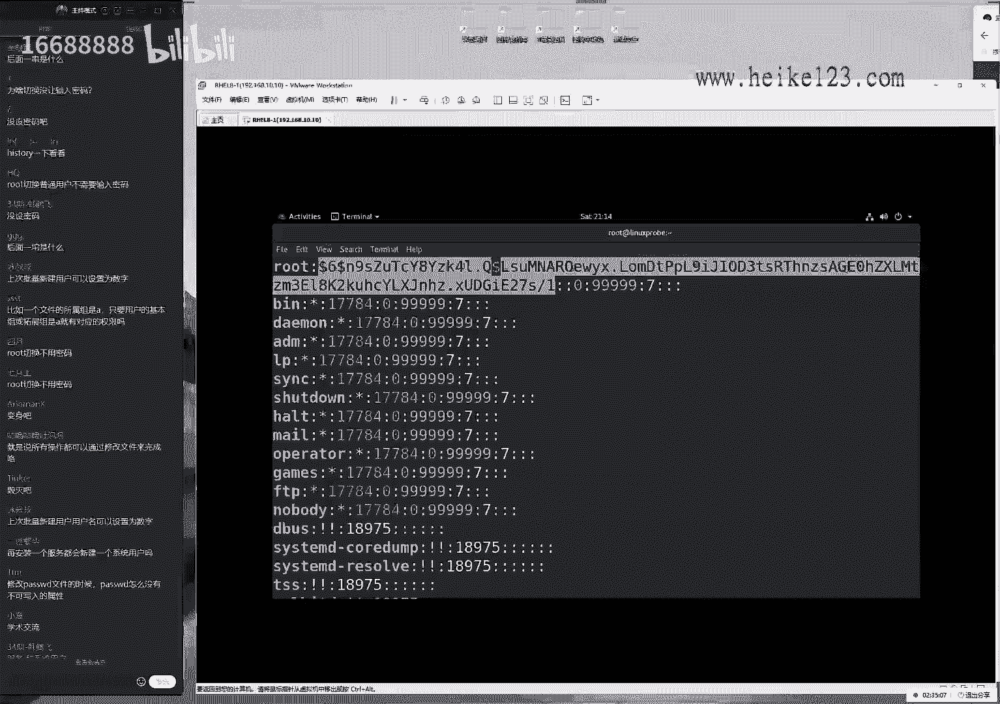

可以去实现的，然后这个md 5的话又给我们呃。

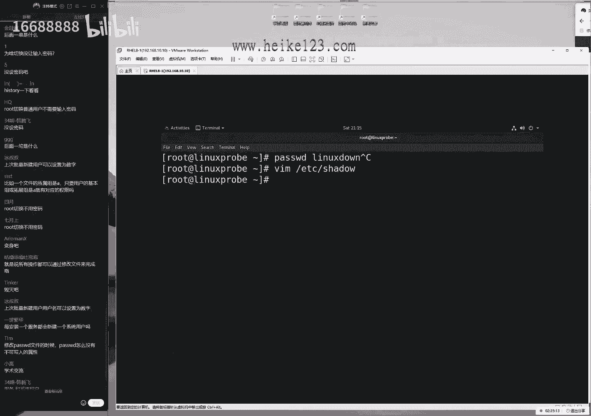

传统意义上来说那种密码不太一样，因为大家所因为大家所了解的md 5的话呢，实际上是哎呀我的md 5的人单抽完我，那就是我就是我们的认识，就是一种比如16位啊，或者32位应用可以被破解的那种密码。

然后还可以通过这个转库，是一对一的那种这种密码，但是的话呢呃当前linux系统里面这个密码的话，它是经过加演的，并且它这个复杂程度非常的高，应该是64位吧，我们目前没有看到任何一个人。

然后或者是一个组织破解了linux的密码了啊，这个算法目前一直没有被破解出来，我之前接上一期的同学们说呢，说有人给破解了啊，但是实际上我没有看到，就是我到现在了，我没有看到一个人或者一个组织破解了红包。

这个系统，用户密码这么一个算法机制，目前没有一个人破解出来啊，如果要是有的话，就可能是我的这个新闻面有点窄啊，但是我确实没有看到好啊，包括说我们上一期同学们说啊，说啊说啊，好像说有人破解了。

但是我依然没有找到那个新闻好，下面一个问题大家说啊，大家说怎么样啊，老刘说在座的都是渣渣，没有啊，在座的都是我们的衣食父母，下面一个问题，大家说修改password文件的时候。

password文件怎么不可写入的属性哦，这个问题特别好。

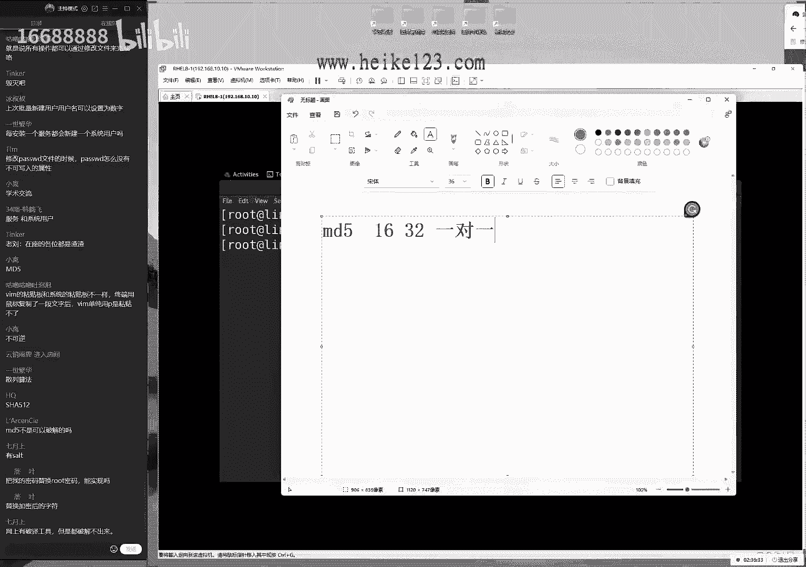

这个问题啊特别好，老刘你再给我，你再给我做法，对不对，这个文件他为什么权限是000啊，不不他这个权限未必是644，但是你有权限去写入呢啊这个问题非常的好，包括说里有另外一个文件。

这个文件叫做shadow文件，为什么这个权限是000权限，但是你依然能够信息的写入呢，这个我们会讲，明天给大家细聊啊，明天给大家去细聊一下下，好同学们，下面继续来提问，下面来继续来提问。

大家说我们去使用的vm粘贴粘制版的时候，在粘贴板的时候跟系统的粘贴板不一样，终端用鼠标复制了一段文字之后，vm单纯用p粘贴不了哦，对是这样的，对我们他这个p的粘贴，只能是来自于yy复制和d d剪切，好。

不能够通过鼠标左右键来去实现，然后说啊md 5不是可以破解吗，哎正好给大家回答了，我们所说的md 5跟大家不一样，然后下面一个问题大家说啊哥哥超前了啊，下面一个问题对这个问题超前了。

在啊其实大家所说的那个破解不是破解，那是装酷。

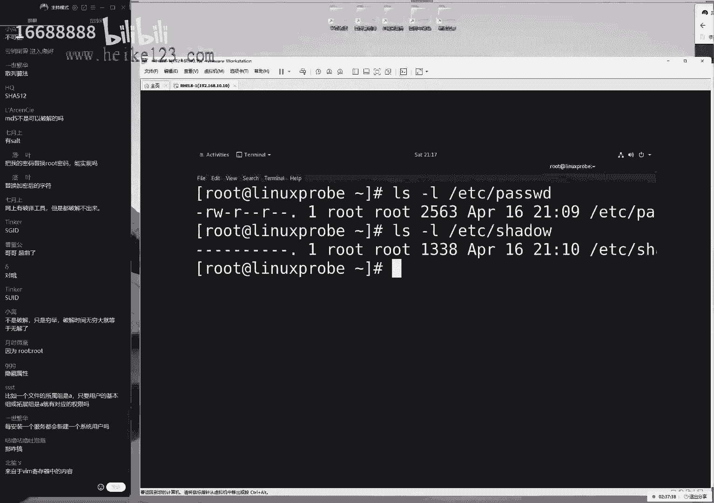

因为它我们传统意义上来说，我们不知道这个叫做什么啊，就他加密穿的一个信息，比如说哈哈它对应的那个信息它是一个固定值，于是就会有可以生出来一个字典对吧，它有一个字点了之后，它就可以反向推了。

他只不过就消耗一些时间，更多去生成出来这种加密出来，这种随机信息越多，字典越大，充率越高对吧，它大了就强了，强的都大了对吧，就这么一个充率就高了，好下面一个下面一个问题，不不不不不，还有一个问题。

就是我现在所说的，没有见到一个人把它给破解出来，现在有一个原因就是密码值它不是一个，它并不是一个固定值，大家看啊，我们同样的将一个信息，比如说right has linux里面加密过后。

他第一次版本是a，第二个版本是b，然后是c d，每次都不一样，这个超级厉害。

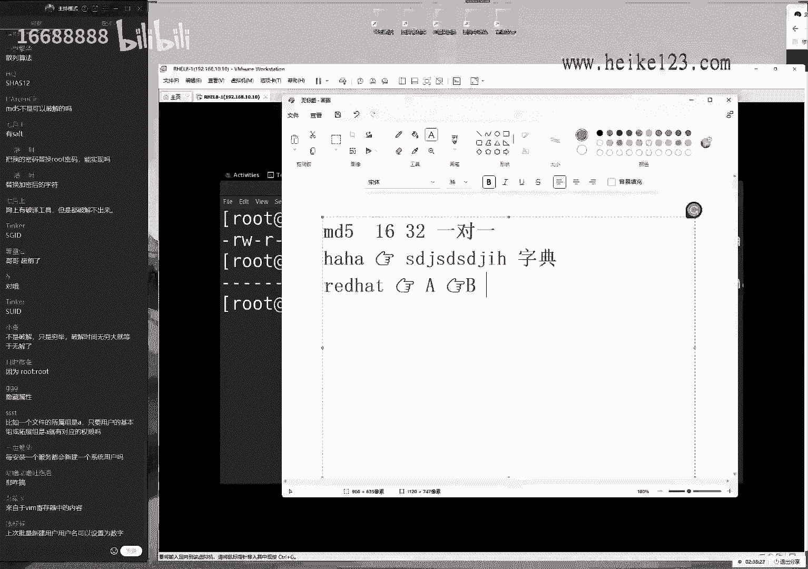

他跟我们之前是不一样，因为它它里面加盐了，我加你，然后去演示一下啊啊来首先不不不不，首先是这样啊，啊首先首先首先他这不就是一个交流的过程吗，啊我们互相学习啊，挺好啊，区别就是老刘什么没有交学费而已啊。

这个突然间占便宜了，来我去过滤一下管理员，root好了，看一下，ok没有问题吧，当前管理员是这个嗯好诶不对啊，是这个文件来，当前的话呢，管理员的密码，是这个没有问题吧。

可以看到我现在对于我的密码来进行重置呃，为了避免大家会误会，我每次输入的密码是不一样的，所以我们去使用的echo，然后去使用的s t i n通过标准输入来去接收，嗯然后户名是root来走。

从他去重置一下密码为reheat，来看一下，变没变啊，变了ok这个是之前的，这个是之后的变变变变了好，再来重置，再去重置一遍密码还是red hat，再来看诶，怎么样，这边呢就变成这样了，再来再去重置。

再去看，再去重置就不用看了，大家会看到每一次都是不一样的，因为在linux里面的话，密码的话每一次加密之后，它都会是一个全新的，所以这个很难破解，它不是那种一对一的那种，传统意义的这样一种md 5。

他都会加盐好，下面的话就是他有人说，每次都会加入一个随机的这个字符，然后去重新去做一下这个计算好，下面再一个问题，大家说比如一个文件的搜索组是a可以的，没有问题，大家说只要用户的基本组或者扩展组有a。

他们则就队友啊，他们则就有对应的权限，是这样的，来，大家说每安装一个服务，都会新建一个系统用户吗，呃不是的，这个服务呃怎么讲呢，嗯ec比较大型的，虽然这样说很不严谨吧，但只有一些稍微比较大一点的服务。

才需要专门的这个系统用户作为调用端，比如说网站服务或者文件传输服务，或者我们tm s服务，这样我们才需要比如说一些小的服务，比如说crown的服务，他没有必要了，他或者说我们一些小小的命令。

他也没有必要用到单独的这个用户了，还是看这个服务的一个重要性，下面一个问题，大家说说，上一次批量新建用户的名称可以设置为数字啊，这个我们可以去试一下，我来试试新建一个用户，比如说是为520看一下。

失败了，可以下面一个问题，大家说呃，我记得有一句话说的特别好，叫做鸟与树有益，舍说而救鸟啊对吧，就如果说您以前在一些系统里面，或者说您以前在一些老版本的服务器里面，您就可以进展出来为数字的这个用户。

那么好了，当前红包若巴就以实际为准，不可以的好，下面一个问题，大家说系统用户怎么去新建系统，用户跟普通用户的区别，只是登录啊，它只是登录终端的这个不同，比如说当前有一个用户，它的名称叫做哈哈。

他是一个普通用户，它可以被切换，它就叫普通用户，现在的话呢我们来user mood gue啊，修改一下它的这个登录终端，然后的话呢再去切换，它会发现切换失败了，它不允许登录系统了。

它就变成了一个新的用户，他两个就是这么一个区别，一能够登录系统，就是普通用户，二不能够动系统，就是啊它就是一个系统用户就这么一个区别啊，就这么一个区别好，当然下面一个问题大家说啊。

不是我记哪节课讲过批量新建用户，我使用的是数字啊，对这个咱们两个并不冲突，舍得说着就讲，如果以前我们去试过，可行的话，当前是不行，以实际为准嗯，然后大家说能够批量的去设置密码。

也能够显示出来用户新建成功啊，下面一个问题，大家说安装http服务的时候会产生一个ipad的服务，这个用户就是一个系统用户，但是权限比较小，它的存在意义是什么哦，这个其实刚才给大家说过了。

就是它会让我们的破坏范围会更小一点。

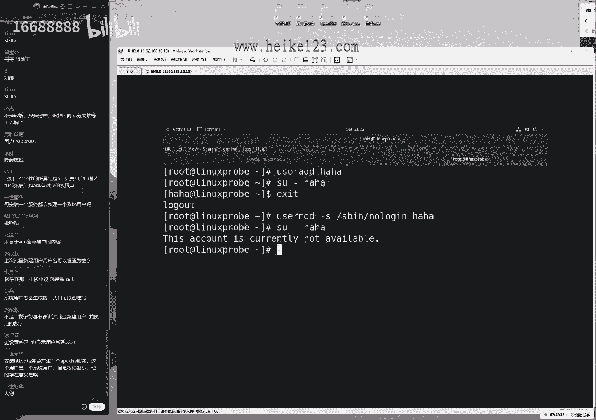

比如说现在这个服务器里面它有十个服务好吧，现在这个服务器里面有十个服务，其中的话那网站是一个服务，那您希望说这个有一个黑客通过这个网站服务，进到您的系统里面了，之后去影响到其他的服务嘛，肯定是不希望的。

那好了，网站服务已经被入侵了，既然被入侵已经被入侵了，那我们就不管它了，那就是限制它的破坏范围，限制它的破坏范围就仅限于此，就像一个人啊，比如说啊得了一个瘤或得了一个癌对吧，但是它不发展良性的诶。

非常好，那么就会带来生存啊，或者带瘤生存了就不用管它了，即便已经被入侵了，将它的破坏范围去角化啊，这样的话这个意思啊，这个例子举得不太好啊，不太嗯不太吉利，但是这个意思是一样的，总是会两害相权取其轻。

然后去取，让它的破坏范围更小一点，让我们的损失也更低一点，好大家现在有一个问题，大家说vivo组的成员都是有速度权限吗，能否直接啊，是否需要再修改一下，etc目录里面的solos这个模块呢。

我们先不给大家去说，因为这个说完之后会有同学会有压力的，呃首先来说的话呢是他不用再去修改了啊，但是我们最好明天再去听一下，具体为什么会它会有具体的一个权限，好大家问了一个问题。

大家说但是文件的sa linux ok没有问题，限定死文件的用途了啊，配置文件的话呢，用户的权限并不是新建的ipass，用户怎么会产生这个问题，我要再去看一遍，好稍等一下啊，大家说。

但是啊但是文件的c linux限定死文件的作用了，对它是通过我们的c linux的安全上下文，sd它有两个限制的方法对吧，让我们的服务的功能以及文件的话呢更受控。

它对于文件的话呢我们叫做s linux安全上下文，对于我们的功能的话叫s linux预，没毛病啊，好先理一下啊，首先来说大家的第一句话是说这个管事没问题，管他管事儿，第二个问题好，第二句话说。

配置文件的用户权限并不是新建用户啊，我没有读懂，稍等一下我再读一遍，是我的问题，是我的问题，我没有读懂，说配置文件的用户权限并不是新建新建的app，是用户怎么会产生我我我没有读懂。

你可以再继续对您的问题再描述一下吧，下面一个问题啊，下面一个问题大家说嗯less，然后times加加，我想按照常规的怎么去写，常规我们就按照这么去写，然后的话你也可以按照您的该这个写法。

后面的话呢变量的名称加一个dollar符，做调用就可以了，这个加调用，因为我们取消的是具体里面的值，提取变量里面的值，然后再加上一，最后来去给它赋值好，然后的话我觉得大家呃同学，这个问题叫一世繁华是吧。

我没有看懂您再发一遍，是我的问题，有没有理解你的意思，可能应该问题比较多吧，是不是下面还有一些前置条件没有看到啊，配置用户配置文件的用户，什么叫配置文件的用户，ok权限并不是新建的ipad用户。

怎么会产生，我好像能够理解，但是我不知道理解对不对，我理解一下，是这么回事儿啊，就您就是呃您想问我们新建了一个网站服务，然后的话呢我现在在这个目录里面，我去新建出来的文件，但是我使用的用户。

比如说是管理啊管理员，但是为什么我们的这个网站的内容，依然能够被呃网站服务所调用，然后也能够让用户能够看到里面的内容，是这个意思吗，如果是的话，可以一下一啊，如果不是的话，我再去想嗯。

以我现在这个想法为例的话呢，哦对吧，那是一啊，挺好挺好好那好，那我就以这个来说了啊，跟大家这个大一的时候有点啊是我的问题啊，我需要给大家确认一下啊，如果是这样的话。

就要涉及到我们第九章就要给大家讲的s linux了，s linux的话那安全上下文是打到文件上面的，也打到目录上面的，他有一个特性就是递归权限，就是如果要是一个目录上面有一个s linux，这个戳了。

在里面新建出来的所有文件都会自动去继承，他的，有点像是s j i d啊，它会就是在这个里面新建出来的，所有的文件都会打s linux这个戳，新建的用户是谁，不重要指挥他新建的用户是谁。

只会影响到这个新建出来的，这个文件的所有者和所有组是谁，它不影它不影响s linux这个安全上下文，所以您的问题是出现在了，没有正确的理解文件的这个所有者和所有组，以及安全上下文的这个区别。

这两个互不冲突，互不干扰，而且s linux上下文跟用户无关，好下面一个问题大家说啊，不好意思，没听懂啊，批量新建用户可以用数字，今天单个新建的不可以吗，不好意思，没听懂哦，是这样的，就是我没有看到。

就是您说的就是能够通过数字批量新建出来，用户这么一个案例，所以的话呢我的意思是说在红包热巴当中，我的理解是不太可它是呃，它是不可以的，因为您的问题特别的嗯宽泛，没有告诉我您的实验环境是不是红包热巴呀。

还是早期的系统，我们没有一个实验平台，就是你可以告诉我一下，比如说您是在红包roll吧里面去实现的，并且的话您或者您现在这样吧，您可以把您的脚本发给我，然后我们现在正好再给大家录屏，我给大家跑一遍。

然后我们以实际情况为准，然后给大家看一下不就ok了吗，啊就很简单，ok可以的可以的。

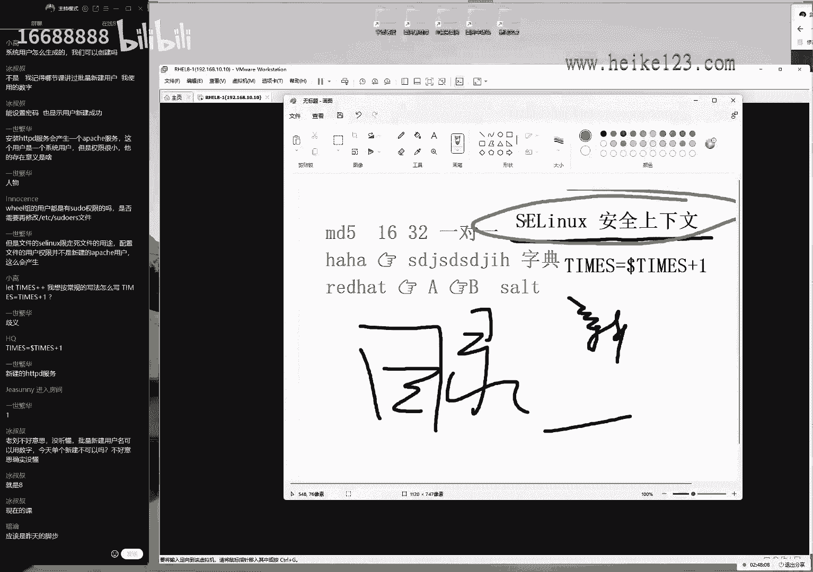

这样ok红包热巴，你把你的脚本发给我，我现在要去跑一下来，然后大家说啊，用数字换啊，用数字哦是可以的是吗，如果是可以的话，我感觉是出bug了。

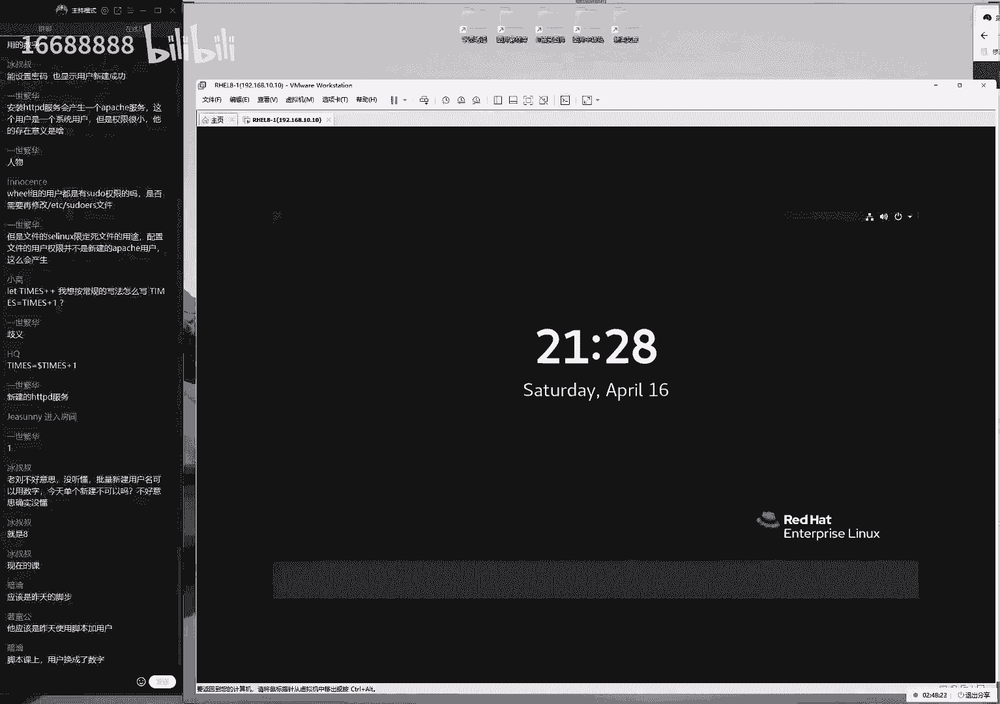

他不应该有，我要看一下啊，哦稍等一下，我这我我我好像知道大家的意思了，同学们说的是上一节课这个事例对吧，我来试一下，我来试一下，那这个要是可以的话，看看我省钱了，来第一个用户叫一一。

第二个用户叫2233344455，可以吧，可以吧，来同学们开始哎呀，这次又开始学到东西了啊，这个如果要是这样可行的话，就说明通过脚本可以去实现，如果要是等等一下，如果要是手动就建立不了哈哈。

然后是u s a d d，ok没有问题，来跑一下，密码red hat走，不可以不可以啊，依然是不可以的嗯，所以的话呢，我觉得问题还是需要您在最好能录个屏，或者您把您的这个脚本发过来。

我看一下用户名称依然是不可以是数字，不可以的嗯，不可以好，怎么样啊，可以了是吧啊，不过你也不好吧啊，同学最好能大家最好能够成功了之后再告诉我，因为他特别的自信，我还以为大家成功了呢啊。

看看有没有成功好了啊，然后我们来继续来继续说啊，因为最后输出这个信息了吗，同学们，这个脚本是大家自己写的，应该知道的，这个信息的话实际上是有问题的，等于说它指的是呃，我看一下哦，不对不对不对。

因为我们的脚本的问题，它并没有新建成功，它是脚本的问题，脚本因为我们有没有在做第二次的判断，我们只做了一次判断，我们要做第二次判断，然后我们没有写的原因，用户实际上并没有新建出来吧。

来带有一条可以来去说，我来给大家回答一下问题，然后的话您也可以先下线好好休息一下了，明天好课，大家就千万不要忘记了啊，就是要以自己这个新建的实际为准，因为大家说完了之后，还以为大家已经新建出来的。

不可以不可以的。

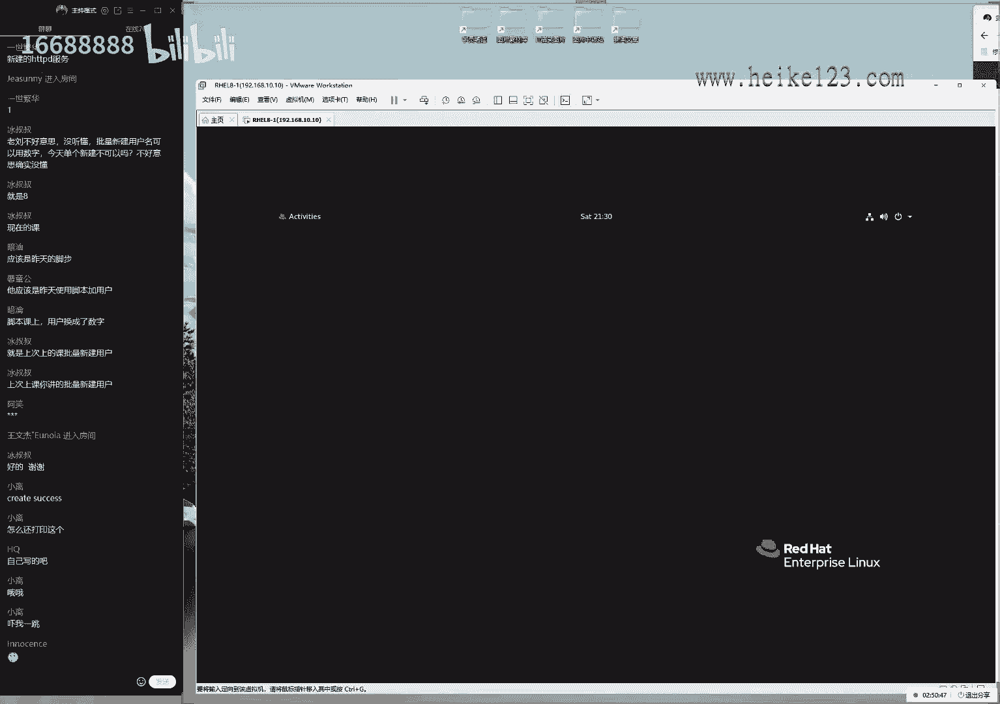

ok大家辛苦了。

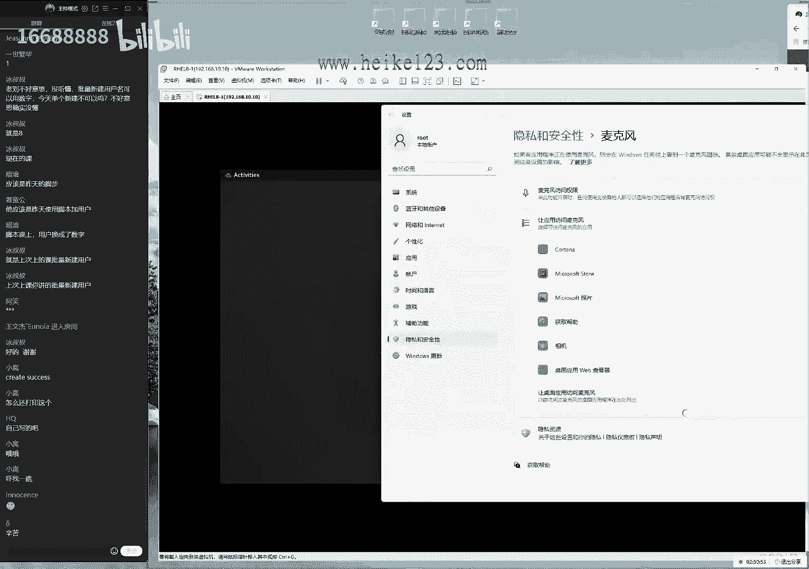

那我就先去渲染一下视频了，大家先好好休息吧，ok啊大家说啊，我光说预习到复习美术好，复习的话就是第四章节，我们去case，还有if，就这啊不我们就是case跟well，今天就只讲了这么两个吧。

加上计划任务东西很少，但是今天这个篮球又超纲了，如果大家以后去考r h c的时候，你一定会知道，今天我们所承受的这个难度，跟24考试的难度有多少呢，其实第四章节完全都可以不讲，这两天跟考试无关。

r是c的话呢，现在没有啊，现在没有这个shell脚本了，现在没有shell脚本，他现在呃就是从理论上来说是有的，但是实际上那个shell脚本只有一行或者两行，它跟它跟命令行没有什么区别。

所以我们现在认为他的shell是不考了，就是送分的吗，但是我们现在学完了之后，同学们在工作当中就可以啊，比较，比较在这个自信一点，可以完成很多工作了，来大家好啊，明天的预习复习有哪些啊。

明天的话我们会大家讲第五章节，这就是我们的预习内容了。

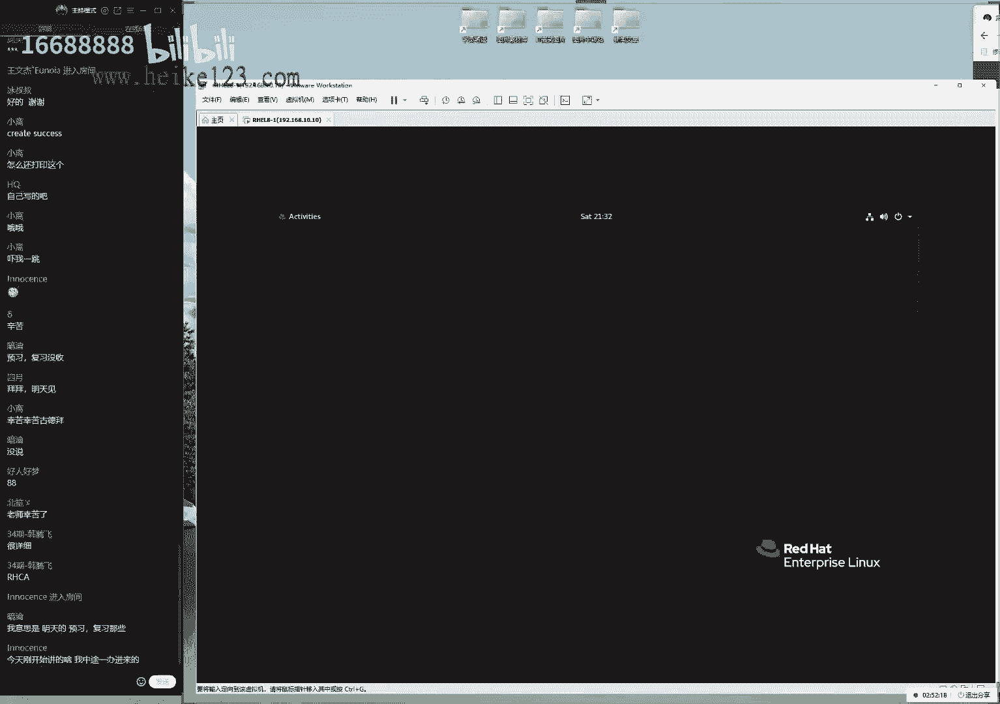

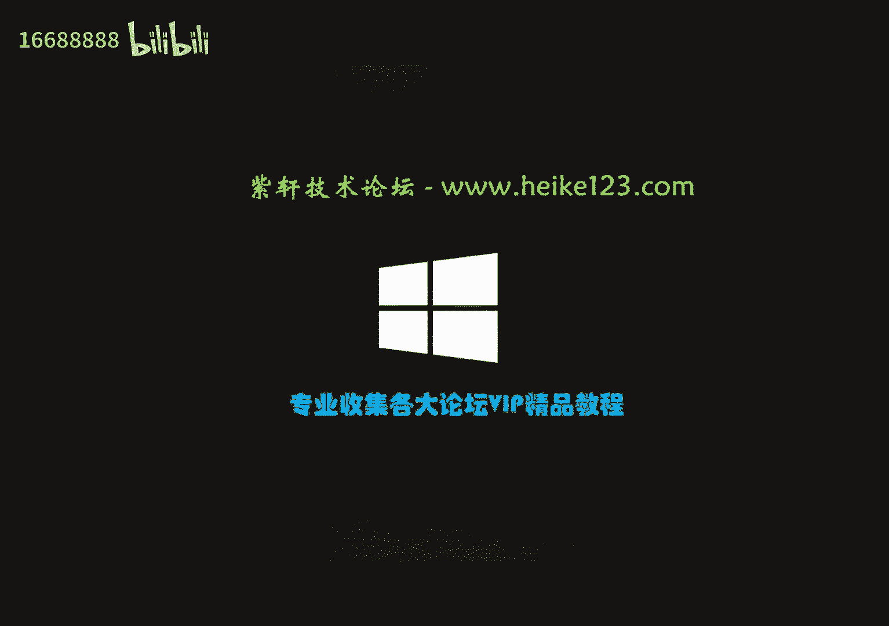