# 刘遄培训linux34期（配套linux就该这么学第二版，RHCE8） - P7：08 - 16688888 - BV1gL41167vP

ok我们就让我们来看一下我们今天这个课程，那大家先打一下一啊，今天的话呢我们还是第五章节，跟这个音乐正好配上咱们这个课了啊，54321开始，我们今天正式的课程好啊。

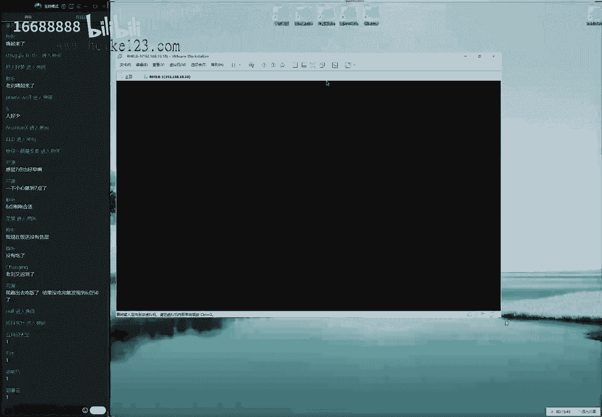

大的问题说说怎么样，老六迟到了，老六没有迟到，我早到了，然后我们看一下这个人数啊，干了60多的同学，我们来等了一下啊。

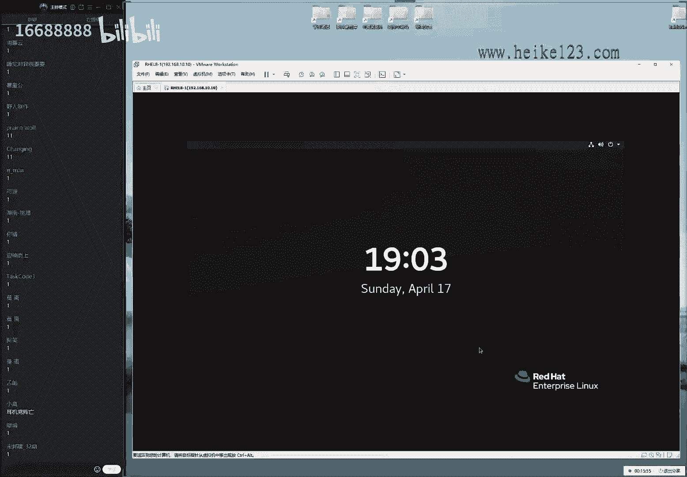

稍微下调，等了一下下好呃，呃怎么样，大家这个声音啊很好是吧，然后声音有点大了啊，已经阵亡了，好大家先准备测试一下我们的环境，打一下一，我们来开始我们今天这个正式的课程。

今天的话呢我们的课程规划是讲完第五章节，时间重要，那我们要是时间允许的话，会给大家讲一下第六章节，但是不会特别的多，大概也就到6。1或6。2小节左右吧，好我们来给大家看一下第五章节，同学们翻开书。

翻开书，今天的话呢我们来从5。2小节开始给大家讲，昨天的话呢简单去了解了一下下啊，就是这个啊。

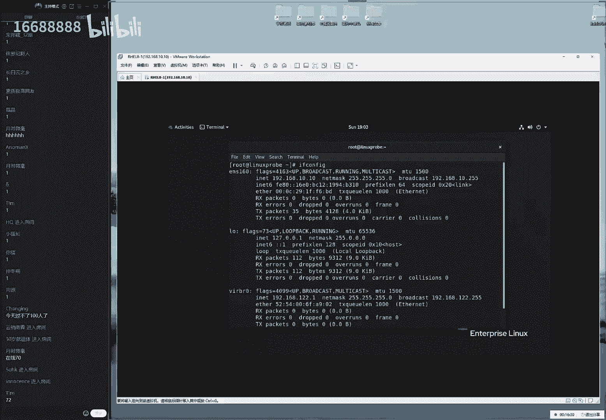

我们的话呢去呃讲到这个用户的身份，以及相应的这个权限，该怎么去进行一个啊账号的一个管理，今天的话呢我们就进一步去学习，文件上面这个权限，也就是我们所说的可读可写，可执行这三个权限，我们该如何进行计算。

以及我们会去学习到这个特殊权限和，隐藏权限等等，对于文件的这个管理方法好怎么样，大家说今天这个人数过不了100了，应该差不多吧，应该啊应该差不多应该差不多，那等啊，那那我同学等一下啊。

我感觉今天这个人数有点少，我在群里面，我现在去吼一嗓子，今天毕竟同学们都已经啊，等稍等稍等一下啊，毕竟都是我们这个已经报名的学员吧，我们要让大家尽可能的啊能够接着上课啊，大家来上课啊，已经开始啊。

尽量不要迟到好了，我们正好给大家发一条啊，发到咱们的群里面做一个小小的提醒，但是以后的话，大家就尽量不要出现这样的这个问题了，好那我们猴子蜜嗓子之后啊，现在77个同学应该戴耳朵会上人了。

再去说一下我们这个权限啊，那我们稍微快一点了，那就说到我们这个权限的话呢，那它分为了三个，我们比较常见的，第一的话就是可以去读取权，那么来记得当它来进行一个读取的一个权限啊，read。

然后的话还有一个写入的权限，right，还有的话可以去执行的一个权限，ok啊啊e x e c u t e啊，执行的意思好，那我们还可以看一下的话呢，就是我们现在的话对于一个文件上面，他其实是那他啊。

那他的话实际上是有三个，我们比较常见这个权限的，第一个的话呢是可以进行一个读取的，第二的话呢等等上等消伴，我把它写下来吧，正好我们等一下，正好第一就是读取，第二就是写入，第三就是知行呃，读写执行权限。

那么我可以把它做一下简写，那么这个简写过后的话呢，它就是rw x，大家记一下，也就是说待会儿的话呢，我们所看到这个文件上面的权限。

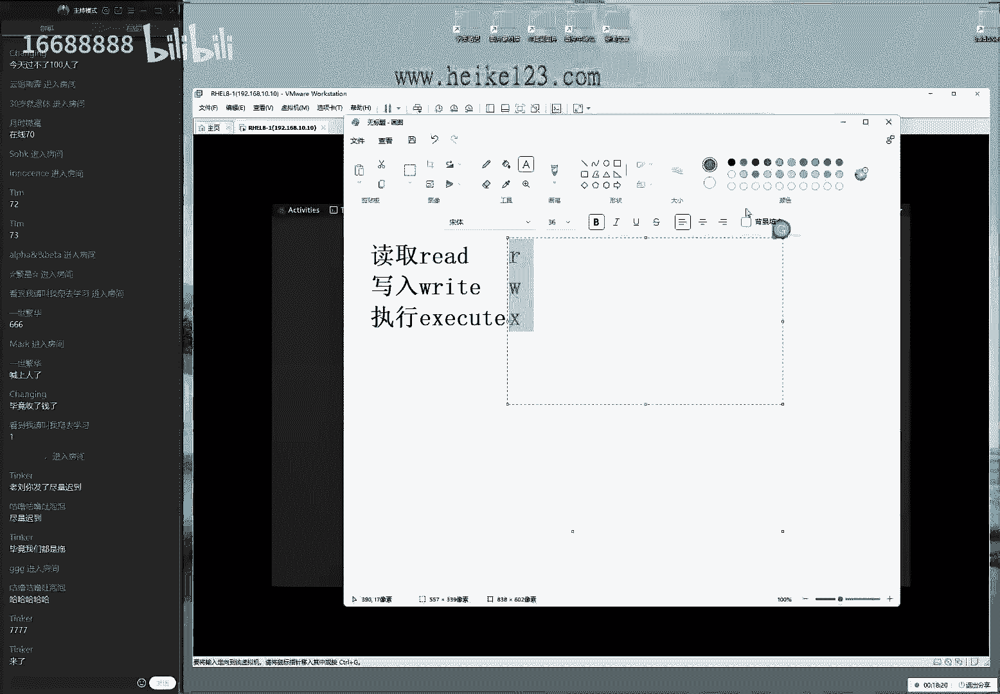

它都是由这三个组成出来的，那我们来看一下，在这个系统当中随便找了一个文件，这个文件的话呢，前面都会有这么一大堆的这么一个，对于全新的介绍，这些的话呢都是由我我的呃，呃。

呃他们的话都是由我们现在所说这个可读科技，可真行三个缺陷来呃组合出来的，那我们那要围绕这个大家去说两点，第一点的话呢是什么呢，第一点的话呢，就是他我们看到他那可以去数一下，123456789。

那么九个的话呢它实际上是分为了三段了。

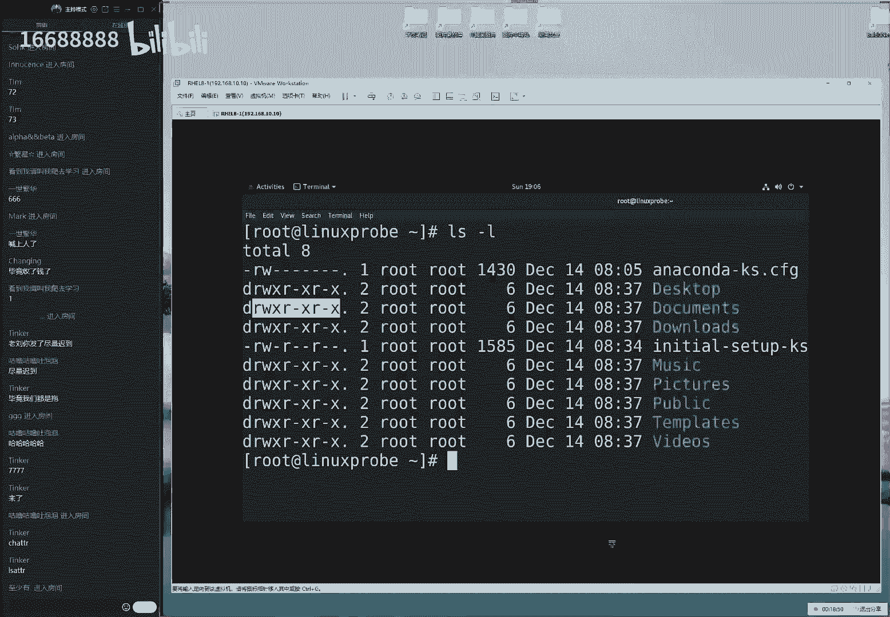

他每一段的话呢是一个随，它是一个呃所属的这么一个用户组，那那那我可以看一下，那这个话前三位的话指的是文件的所有者，那么就是这个文件虽然他归谁所有，然后这是所有者的这个权限。

然后呢我问到我们的这个第二个的话呢，指的是文件归纳个组，所有就是文件用户组的这个权限，那也就是说呃，如果说我们是归为哪一组里面的话，那么就会去使用这个权限，它的话呢是不区分啊，同学昨天问到了啊。

他是不区分我们的啊，用户它到底是基本组还是扩展组，它只要是有这个组，那么就可以去继承我们这个权限，最后的话呢三位有没有见到其他人，也就是说他总共是有九位组成的，他只要他不是文件的所有者。

也不是文件的所有组，则不会自动的来去，怎么样呢，变成了其他人会，他会去使用这个第三个的这个权限哦，大家再做再做下总结啊，也就是说在一个文件上面，他这个权限的话呢是由九位组成的。

它其中的话呢三位三位之间是没有关联的，他第一位指的是文件所有者是谁，d的话，那我们画中间指他指的是文件所有组是谁，最后的话呢指的是其他人要去使用的一个权限，那么这是第一点要给大家说到的。

第二点的话我们可以看到了，对于这个文件上面的话呢，它有一个可以读，可以写，可以执行的一个权限，其实的话呢同学们可能第一眼能够看得明白，但是第二眼的话再去看的时候就不太明白了，为什么呢。

因为对于我们的文件来讲的话呢，这个三个权限是比较好去理解的，我来做一下总结，这个大家也需要先到我们这个书上面啊，因为这个呃，今天知道这九位他都是归哪一类用户所有的，但是我们应该还。

但但是我们现在应该还要再去了解一下，这个可度科技可执行，具体它对应的是哪些功能，我们可以做哪些这个事情，好，大家现在怎么样啊，来那我们来给大家看一下大家的问题啊，我看看怎么样，毕竟啊坚持到了是吧。

好毕竟都是托好，那我们来看咱开始今天正式的课程啊，咱们这个培训没有一个托儿啊，完全没有啊，因为这个也是以前的一个梗啊，就是因为我发现同学们的互动起来，特别的不积极，然后所以我说就不会多说我们的这个啊。

啊托儿吧，来我们来继续啊，来说一下，那这三个权限的话呢，对于我们的一般文件上面，大家都比较好去理解，就是我们可以读，可以写，可以执行，但是的话呢很多同学啊，他即便是考下hc了，他其实他都不明白。

这对于我们的目录上面这个权限该怎么去理解，所以我们今天趁着第一天啊给大家做一下总结，同学们可以写到自己的这个书上面，首先的话呢我们来说一下我们的一般文件，那么这个一般文件指的就是我们可以去编辑的。

配置文件或者的话呢是一个呃怎么样的，配置文件，或者我们的一个说明文件，总之的话它是可以去进行一个信息写入的，这么一个文件，这样的话呢，我们对于这个文件的这个可以读的权限。

实际上我们是读取文件里面内容的一个权限，大概记一下啊，当我们看到一个文件，然后的话呢我们如果上面有读取权限的话，指的是能够去读取这个文件里面的内容好，第二的话呢就是去啊可以写入权限。

那指的就是我们可以去编辑，或者说我们叫做修改文件里面的内容，这个超级好去理解，同学们呃为什么去学习这个圈的时候，大家会啊直接把跳过的话，没有去认真去思考呢，原因就是因为大家认为啊这个非常简单啊。

认为自己已经掌握了，实际上来看一下啊，那么这个可以写入的权限，指的是编辑文件内容的一个权限，但这个跟大家的理解是一样的，最后的话那啊那我看我们的最后一个权限啊，它指的是执行权限，那么就指的是呃。

如果说这个文件它是一个脚本的话，那我们就来去执行这个脚本的一个权限，那好吧，我们来去记一下这三个权限，对于我们的一般文件上面，它是怎么来去理解的，这个没有任何问题，所以大家会把啊。

那么所以大家会把这跳过了，但是的话呢这个关键点，或者说我们能够体现出来自己这种能力的话呢，实际上是对于我们的目录的一个理解，因为大家想一下这个权限，说读取权限，那好了，我们来换句话来讲。

就是去读取一个目录的权限，好像不像，好像啊很难理解，对不对，因为这个目录的话对它进行读取，那么读的是什么呢，因为目录里面并没有直接的内容，它里面是保存的文件，所以的话大家来去呃，来来去记一下。

对于我们的目录的这个读取权限的话呢，实际上指的是去列举啊，或者说的话呢我们来啊，显示文件列表的一个权限，显示文件列表的权限，然后也就是说，如果说我们对于一个目录有一个可读权限的话，那只能是能。

那它指的是能够看到这个目录里边，文件列表的一个权限，ok没有问题，然后第二的话呢大家问题啊，大家说前面那个d怎么理解，前面那个d，我们会在第六章节给大家继续细说啊，先不管。

那来第二的话呢它指的是可以写入权限好，那我们来去写入一个目录，好像也不太像话对吧，那么这个写入权限的话呢，只能是我们能够在这个目录里面来去新建，然后去这个剪切，还有去这个删除文件的这个权限。

如果说我们要想在这个啊某一个目录里面，来去新建一个文件，那么实际上我们就必须要有，这个目录的一个小权限，所以大家这么去理解这个事情，最后画的叫做执行权限，这个更不像话了对吧。

我因为我们去呃之前的一个目录，他肯定也说不通，这个话的执行权限指的是能够去进入，或者说我们叫做切进啊，或者叫做这个啊进入的某个目录的一个意思，就是说进入到目录的意思，它是一个功能。

我们对应他们啊啊那么我们对应来说啊，如果要是举一个例子来讲的话呢，我们这个呃一般文件跟我们的目录，它所对应的这个命令的话是这样的呃，对于我们的一般文件的读取权限，那么对应的就是这个cat命令。

可以进行一个信息的读取吗，然后对于文件的编辑的话，那就是我们的编辑器vm，那我们来去执行一下这个脚本的话，就是我们写那啊，那不那我们就只直接用过这样的方式，加上脚本的名称来去执行这个脚本。

那么大家记一下，对于我们的一般权限，我们的命令是这样来去啊，来啊他来去执行的，然后当我们有这个权限了，我们可以去做对应的这个动作，然后对于我们的目录来讲的话呢，也是显示一下文件列表的权限。

实际上就是我们的查看文件的一个命令，然后还有的话就是对于我们的文件来进行一个，建立剪切和删除，实际上就是那个touch啊，还有这个cp啊，还有这个剪切等等这样的命令，我们对于啊。

那指的是能够在这个目录里面来去新建出来，文件和这个呃对于一啊，他对于已经有了文件的话，来进行一个编辑，第三的话呢就是指的是进入一个目录的权限，实际上就是cd嘛，能够去切到一个目录里面。

当我们看到一个目录，它有这个可以读，可以写这个权限，但是走不进去，走进去的时候，它提取出来缺钱不足的话呢，他也会啊，就是因为这个权限所导致的好，然后大家现在有一个问题啊，大家现在有两个问题。

第一个问题大家说如果目录有了执行权限，是不是一定要有r权限，不是啊，权限可以自由组啊，它可以自由组合，它可以有啊，它可以有我们去切进里面的这个权限，但是它可以没有去呃去呃，他来去查看的这个权限。

最终在下午的话呢，就是用户能够去走到里面去，但是他也不能去查查看里面的文件，但是这个权限的话呢，我们可以自由来进行一个组合，然后第二个问题的话，就是说我们如果要是有这个写权限。

就是不是一定要意味着有可以有这个呃，读取的权限，实际上也不是的，我们怎么去理解这个问题呢，啊这个这个呃这个问题的话，我觉得这两个问题实际上可以，我们归结成一个问题，就是呃同学会问老师老师。

那我现在嗯如果说啊怎么就怎么理解呢，就是说我现在来搭配一个呃这个权限，那么这个搭配出来的这个权限会不会有这种呃，这个怎么讲呢，大家现在这个问题，实际上就是说我们的实际的功能的这个呃操作。

跟我们所搭配出来的这个权限，如果要是有出入的话，或者说我们搭配出来这个权限，跟实际的这个需求它不太符的话，那怎么去理解呢，比如同学问到说，那我们要想去修改一个文件，那么必然就先有这个呃读取的一个权限。

对吧好，这没有问题，那也就是说我们一个文件上面它有三个权限，可以读，可以写，可以执行，那我去搭配这个权限的时候，我是不是说我一定要给他一个啊，比如说我要想让用户可以去对它进行一个，写入操作。

这个我们的写权限能不能单独的来去设置呢，对吧大家想问的应该是这个问题呃，还那我可他后来还是说这个呃可以写和啊，可以这个独立这个权限的话呢，他两个是必须搭配去使用的，应该是两个这个问题。

他两个是否有一个固定的一个搭配它啊，等一下啊，固定的一个搭配，它必须要是成对出现的，否则成年是指18呢啊，或者说我们在区域传过程中，我们能不能见到一个只有w一个小权限的，一个文件呢，实际上是可以的。

首先我们的话呢针对于这个问题，又可以分为两点，第一点的话呢就是呃首先这个是成立的啊，因为的话呢它呃如果说对于一个文件，只有一个写手权限，我们也依然可以对它进行一个写入操作。

因为的话呢我们我们可以去使用的echo对吧，然后我们的话呢比如说写入一个信息，然后我们可以去使用到追加重定向符，然后我们写入到这个文件里面，于是我可以看一下，就是我们其实并没有对于这个文件内容。

进行读取，但是的话呢我们又依然往里面去做写入操作，所以这个话呢权限是成立的，因此我想给大家去说，第一点就是这种情况下是可以存在的，是可以存在的，并且的话呢也是常常出现的，第二种可能性的话呢。

就是不我们要给大家说，第二点的话，就是权限的这个搭配与实际能否被使用，没有任何关系及呃，即便说我们设置了一个权限，它设置错了，但是的话呢在设计当中的话呢，也可以这样去设置。

并不是说这个系统它会有一个自动来去进行，一个纠错的功能，它是没有的，好啊，这大家就就大家都能够理解的，对不对，ok所以说这个权限的话呢，不要把它剪掉，那那那呃不要想象那么的智能，它没有的。

它需要我们自己来去搭配，所以我们现在需要让大家去做两步走嘛，第一步要能够去理解，第二步要往，那么那么的话，我们第二步要能够去进行一个搭配，可能你现在看起来没有什么意义的一个权限。

实际上我们后面可能会用到很复杂的这个功能，也会用到啊，好吧呃当然这个我们放到后话去说，没有到达第一个问题就问就问他这么有深度来，我们接下来给大家往后面去聊着啊，现在我这个思路给大家去聊了啊。

这张图的话大家需要如果截一下子的话，你就截一下子，如果没有截的话，那就去截一下子，我们待会会围绕着这个来给大家去讲解一下了，那么其中的话呢啊对，还有一点就是同学们去记就要大啊，同学们去写那个笔记啊。

写好之后记得发博客上面去做一下打卡，那今天晚上的话呢下课一发博客还挺好，我们大概5月中旬的时候，就给大家送那个签名书记的那个小礼物了，而且那个第一版的书已经是啊绝版了，现在买以前也先一会。

现在话也现在也应该也买不到了，所以的话也算是有一定的收藏意义，起码以后呃以后比如说我们要搞活动啊什么的，还是有点纪念意义的啊，所以同学们如果要是想写笔记做活动的话，参加咱们那个送书活动的话。

再给他打个广告啊，然后的话呢就是可以赶紧访问一下咱们的网址，后面加上vip，看一下活动规则，今天我们就算是最后一天了，如果说还没有参加那个活动，同学就不行了，如果说你之前没参加，现在后悔了，想参加了。

我们还是给机会的啊，今天啊去注册博客，然后把之前的补一补也行好，然后呃然后我们来同学继续了，继续继续，我们来看一下啊，那么对于这个权限的话呢，看一下他有这个r权限，w权限跟一个x权限。

也就是说这个权限的话呢，我们还可以通过这个数字法来去表示，同学会问到了，首先第一个问题，我们总是要先让大家打消心里的顾虑，就是为什么要去学，就像我上初中的时候特别不喜欢学习，所以我才很荣幸的考上。

所以我才当时考上了一个职高，唉所以我当时就是因为我的父母没有告诉我说，为什么要这样去学啊，所以的话呢我没有去接触这个动力，像我们教课之前的话呢，我们也希望大家能够有学习的动力，于是我先给大家解释一下。

为什么好好的r w x我们不写，我们非得要写一个421呢，就是这个的我们来去对它进行一个设置的，一个理由是什么呢，就是因为当我们去设置一个权限，如果是rw x的话呢。

他有些时候它是不太利于我们去啊写根据读的，比如说看到一个权限啊，比如说看到一个权限是r w减和r减啊，然后的话呢我们的r减减，比如说这，那那那那我们比如说看到是这么一个权限，第一反应肯定是乱。

第二的话呢我们也不太利于去读，所以的话呢我们需要有一个数字法来表示，比如说我们叫做六七啊，不这句话6657对吧，那我们可以算出来657啊，同学们最后算出来这个结果的话，啥都有啊，非常好非常好。

说明我们待会儿见啊，所以说我们待会儿讲这个课的时候，就会很有乐趣了啊，同学们算这个算什么都有来，那我可以看到啊，就是当我们去写出这么一个信息的时候，跟去写出这么一个信息的时候。

是不是我们一眼就能看得出来，这个更加的清晰呢，啊或者我们看起来更加的这个顺眼一点呢，这就是去使用数字法的一个理由啊，待会我们再去设置的时候，别人需要打九下，我只需要打三下对吧，对于我们键盘的话。

也那么也是一种保养，来三个权限啊，今天怎么这么贫，我来现在我们来给大家说一下三个权限，r chers啊，4w是二，最后x 11，大家记一下421啊，大家说我的书还没有到啊，为啥没有到啊。

找找啊找就找一找原因，视频里报名的报名的晚了，还是说您报名了很久了，但是您是没有收到，如果没有，如果您报名了很久了，然后您还没有收到，就赶紧跟我联系一下，看看怎么回事啊，啊上海是吧，那上海也不用说了。

上海因为现在被被被被封城了，好接下来我们再来最后呃，往后面去说，而那等于是4w 12啊，这样的话呢我们的x是1321，我们来进行搭配去使用，那这有什么用呢，先不管了啊，就先来说一下怎么去换算。

也就是说呃，我们现在的话就不再给大家花费时间去解释，它有多么的必要性了，就先不解释了，大家现在呢我这个思路先去相信我们它很有用，然后先我们去学先去算，待会儿的话呢会给大家来去带一下实战。

到时候大家会明白哦，真的很有用，来首先比如说我们看到一个权限，这个权限的话呢是rw啊，我们还照着我们还照啊，照着书给大家去说吧，因为书上的话呢会有一个样例啊，大家可以看一下，更加清晰一点啊，rw啊。

rw减号，然后是这样这样这样，然后这样这样这样，就比如说我们看到这样的一个权限了，那我们怎么给它换成这个数字法呢，好大家看完这个之后会觉得很痛苦对吧，这是怎么回事呢，这个的话呢我要给大家解释一下。

首先这个的话呢，我们的前三位他指的是文件所有者，这个权限它指的是文件所有者的话呢，可以对于这个文件来进行一个读和写权限，第二话呢我们叫做文件所有组的权限，它指的是文件所有组可以带啊。

那么我们那么我们在文件所组的这个用户，可以对它进行一个读取跟一个执行，最后的话呢我们叫做其他人，只要没有是他啊，他只要不是文件的所有者和文件的所有组，都属于其他人，也就是说所有人对吧。

所有的用户减去了文件所有者是谁，在减去的文件所有组织谁就等于了，那我们的这个其他人占，我们要他等于说啊，只要不是这两个用户，只要不是这个文件所有者，只要不是文件。

那个所有组都会去使用这个其他人的这个权限，但是其他人的话，就只有对他进行一个邪恶的一个权限，好大家看一下这三个权限我们怎么去来去理解，然后的话呢我们现在来去看一下，但我算出来了是吧啊。

但是算出来的话呢好整齐啊，都是652是吧行，我看看对不对啊，那同学们也看我给大家怎么去算，首先的话呢它是三位，三位之间一段毫无关联，这个有点差，这个呃这个有点差，这个话稍微有点难啊。

那我们现在给大家去看，第一个的话呢，我们的这个啊r，那么对应来说是4w的话呢是二，最后没有执行权限啊，没有一个消息x它指的是啊，它要是有的话，那么就是一对吧，它没有它，那么它如果是减号的话，则没有权限。

那么选择是一个怎么样呢，叫做零啊，非常好啊，非常好，来420，那我们下面三位的话，那就是4001啊，对吧，不来看一下啊，401没有问题来，然后第二的话，我们第三个他的这个权限我们这去抄下来嘛。

就是020，大家去算出来对吧，然后我那我就提到了，说的话那三位三位之间一段毫无关联，就比如说我跟马化腾跟王健林跟王思聪，我们待会儿四个人去吃饭，去吃完饭的话呢，我们就各回各家了，那我们在吃饭的过程当中。

我们四个人的经济实力可以撼动整个亚洲对吧，那没有毛病吧，但是我们回到家之后的话呢，就会我又回到自己这个家里边了，然后到他们啊，去他们的这个啊家里面了，那也就是说我们的话呢这个资产还是自己的。

我们不能够把它相加，再除以四，没有什么意义，虽然我高兴啊，但是他们也，但是他肯定不啊，但是他啊他们肯定不行，所以这个就是我们的这个权限，一定要是自己相加，而不能够啊，而不能够去加别人。

那我们加班时都是多少呢，那么就是六，然后就是五，然后就是二，那么我们来啊去换算一过后，我们就变成了一个652达这样的一个形式好，也就是说我们可以通过这样的一个转换的方法，可以将之前阅读起来有点难度的。

或者说稍微有点乱的这么一个呃权限法的话呢，给大家转成一个数字法，好大的话对于这个应该是能够理解，因为这个其实并不难，但是我们不太放心，再来给大家小小的诶，小小的再来给大家出一道题目，大家要是能够理解。

我们就下了，那我们就来直接下一步了啊，因为同学们讲到这个的时候，老是说他说老刘哎呀，我不行，我着急，你讲这个太慢了，所以我我想跟你一块儿去学，所以不着急了，我来给大家出一道题目，我出完了。

同学们要是能够算的出来，我们就到下一个，如果我们出完了，大家没有说出来啊，不不不，这样太简单了，送分了送分了送分了啊，不行啊，这样啊不行，这样不行，我等下同学们，你们先不要写啊，你们先不要写。

我先自己跟自己先去纠结一下啊，同学们先不要着急，我先自己去纠结一下，嗯加个w吧，好我们就把这个x嗯，ok可以来大家算一下吧，把这个给大家算出来，如果大家反馈的话都是正确的，那么您就ok挺好。

我们就来下一步了，其实我们还是培训吧，在线培训的好处是个啥，它就是根据同学们的反应，然后根据反馈我们来去调整，大家觉得这个好难啊啊算不出来啊，那我们就多举几个例子好，这个比较简单好啊，比较好解决。

然后如果大家觉得这个很好，掌握了都会了，那我们就没有必要再去耗着了，继续往后面去讲了，这样的话呢我们一节课下来学的又多了，学的话呢我们很多书上又没有东西，就基于对于这个基础的话，不用反复来去磨它，来。

大家现在的话呢来怎么样，大家说这个不直观，这个超直观，只不过你没有用啊，只不过你没有用习惯而已啊，用习惯之后会发现特别直观，我现在看数字法看的特别的顺眼，来现在的话来给大家看一下，大家都打出来，嗯好吧。

都答对了765，同学们，你们有发现一个事情啊，就是你们如果都答对了的话，那我是不是没有讲的动力了，同学们，你们应该有稍微能够配合一下，你们稍微的说错几个同学，这样的话呢我才可以说。

然后我才可以去借坡下驴啊，然后我才可以说哎你看，所以我先给大家讲一下怎么去得出来的，大红牛都答对了，知道吗，这句话让我很纠结啊，就让我没有办法去往后面去开展，咱们的这个课程了。

大家应该故意打错几个才行来啊，12388就过分了啊，来来我是这样的东西，我看大家应该是已经掌握了啊，如果没有掌握的话，那就说明自己没有预期好，我们就不给大家啊，大多数同学去耽误时间了。

来去最后讲一下这怎么去换算出来的，没有听明白就来最后一把了，首先是r是这句话，我们之前讲课的时候会围绕这个讲好长时间，大概得有20多分钟吧，后来我一想没啥意义，因为都是4217以内的加减法。

这不可能加错对吧，来三个权限有权限啊，r是4w啊啊然后就是421没有权限，就是个零，好吧啊，没有问题吧，那减号就是零把照抄下来，如果一个权限算下来是这样这样这样这样，那实际上就把照抄下来吧，321。

然后怎么样呢，420这是什么呢，401没有问题吧，好三位三位之间相互相加，4+2+1等于就是七，然后的话呢四二加起来是六，四一的话加起来是五，大家算出来了765，非常好啊。

这就感觉啊大家怎么打123啊啊啊。

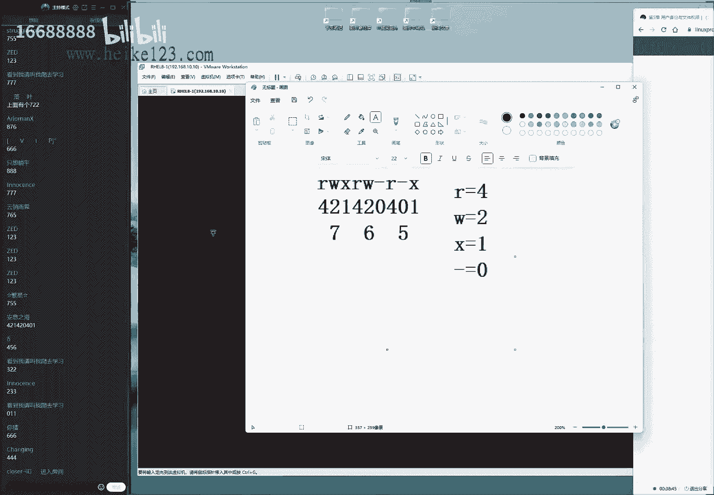

这是为了配合我们是吧，来最后算出来这个结果是765，然后我们再给大家出一道吧，出道吧，出来再出一道吧，就比如这个啊，我们现在随便看一个文件的这个权限，最后这个文件权限的话就得。

那么我们得出来的是这个效果。

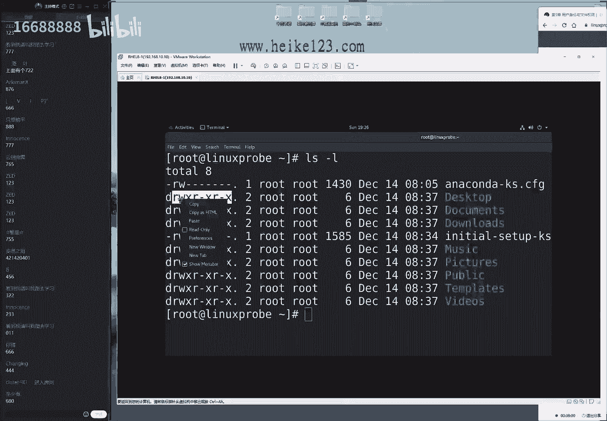

那这个效果怎么啊，怎么来去理解呢，来算一下这个效果的话，那就是4+2+142321，然后是四零哇，你们太快了，你们这样太太这样话太快的话，会有一种别人以为我们是有托的那种感觉啊，兄弟们。

你们这样的话有没有感觉，大大有没有考啊，大家有没有考虑过啊，有没有考虑过啊，看啊我们这边视频的同学们的感受啊，因为你们这么快的话，就感觉是我们有准备好这种词的一样啊，真的没有这么好词啊。

拉七然后这个来有点太有点太说不清了啊，这个我们算下来是七，然后4+1的话等于是五，这个4+1等于是五，七五没有问题，最后的话算出来，这个结果跟我们的tm说的是一样的。

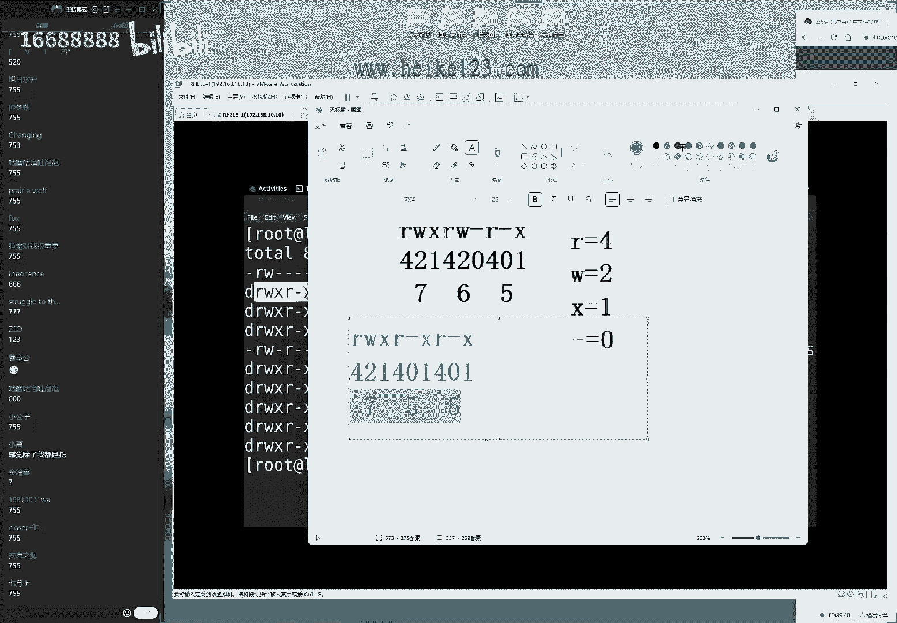

七五啊，没有问题，7575挺好，这就是说当我们看到一个球形之后。

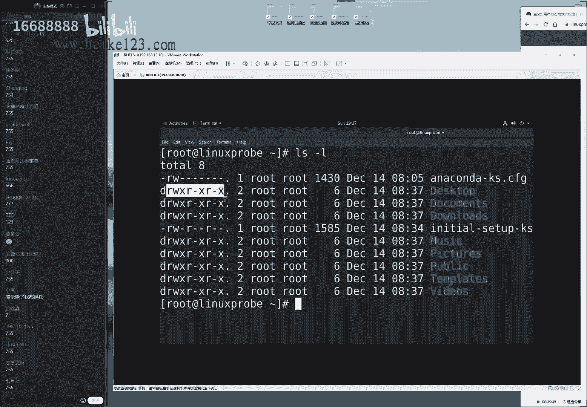

我们能够把它做一下转换的一个方法，然后我再讲一下，我们再讲一下反，那我们再讲一下反算吧，因为同学刚问到了，说老师这个我看起来不太直观啊，这个原因就是没有看顺眼，看顺眼之后就是超级直观了。

比如说我先给大家举一个例子呃，比如说比如说543啊，随便给大家出一道题目来，543，请把这个543给大家反向的，转化成一个权限法，这个就是有点难度了啊，大家都把怎么样把543转成626了啊，非常好来。

同学们现在可以来告诉我，现在可以来告诉我啊，对稍等一下呃，大家现在先去打一下，突然间起了一件事情了，哎顺手吸到小顺顺的手写的小额，顺手写到纸上面，下课之后的话，就可以跟你去改了，挺好。

来大家快速转换一下诶，大家有没有发现一个事情，就是比如说我们同学叫做晶晶是吧，你打出来的十位来了，那我肯定不对了，一定是有九位的，还要打出空格来的，而且的话呢还有同学打出来的是呃，完全不一样的。

所以我们可以看到实际上这个学习的难点，是不是他可以他可以发现可以发现出来，它实际上这个难点是数字发出，从这个权限反，如果说我们要是不是一个在线培训的话，我们看视频看100年。

我们也不知道同学们真正到底哪里比较不熟练，对吧，就是这个权限就是这个数字转权限，来我给大家讲一下啊，首先的话呢还是把这个写在旁边什么呢，是啊rw x3 个权限是这样的，如果再给大家算起来比较麻烦。

没关系啊，我要给大家来去捋一下421，然后就是4210好吧，三个权限啊，那我们换了四个权限，新起的旁边我们来依次给大家给大家对照一下，然后我们现在的话呢，如果说要把这个呃全，那我们要把这个数字法。

53转成权限法的话呢，我们现在来去做一下计算，首先五是怎么来的，五的话呢很简单，对不对，五就是3+2得来的对吧，3+2得来的一个五，那就是320，当然肯定不开，那当然这肯定开玩笑的啊，不可能是320。

怎么可能是320呢，它当然等于是3+1+1得来的，对不对，好，这肯定也不对好，那么我们还有什么可能性呢，比如说1+1+1+1啊，这样吗，他他肯定也不行，也就是说他肯定是由4+1加来的。

因为首先它只有421，就是我们看到它只有这三个权限421，并且的话呢每个只能使一个啊，就是说我们这几个权限的话呢，每个只能使用一次，他的话实际上这个怎么计算出来的啊，这个话呢就是二的零次方。

那么这个的话呢就说不不不它它它就是一个零，然后后来这个是二的零次方，这个是二的二次方，不对啊，不过这是二零啊，这样的话他是这么算出来的啊，012，然后他就啊他啊，所以他们最后的话我们得出来就是0124。

但是这块是一个底层，我们这边要去选择它的一个理由，那我们来去进行换算的话，那就是五的话一定是等于是4+1再来的，那么就是401，然后我们这个v的话不要乱，就是它在哪一位的话呢，就是我们的r w x。

那我们这个最后得来的这个结果，就是401对吧，因为他就是5+1吗，而这个一和这个四它是在前面荷载后面的，千万不要乱好，所以我们得到这个结果的话，那就是401，然后再看一下这个四四的话呢，很简单对吧。

它就是022得来的啊，当然也开玩笑的，他不可能的，它只有040得来的对吧啊，不那也不对的，他应该是400，因为的话呢我们可以读取的权限，它是放到第一位的，并且它是个四，因此四就是它的本身四的啊。

它就直接设置一个四，然后还有一个三三的话呢，就是一个呃1+1+1啊，这个都是三位战士站上了，这个也不对啊，我们当然这样的话，这个梗说了很多次啊，大家觉得很无聊了，主要的原因就是让大家知道。

这个权限一定要是只能使用一次，并且的话呢，这个范围只能是321里面的其中一个啊，他更不可能是5-3减来的啊，好我们来给大家去，最后三的话呢就是021加出来的，那我们就照着去抄嘛啊去照样去抄啊。

四的话呢是r然后减x，然后是r减减，然后是减w x，大家算一下，对不对啊，同学们，你们算一下，得到这个结果是不是这样的好，大家的话做完这个之后会感觉到啊，是不是比较简单啊，它其实并不难。

可以把我们这个数字法转成权限法好，那我们先来给大家去说另外两点，第一啊，第二啊，那我们来给大家说两个命令啊，再给大家再去重复来讲一下，第一个命令的话呢，我们叫做china mod。

它用来去修改我们的权限，然后的话还有一个叫做china owen，它是用来去修改我们的这个文件，所有者跟文件所有者的啊，文件所有者和文件所有组的，它是修改属性的，我来给大家做一个演示。

简单去说一下怎么去使用这两个命令的话呢，首先china open的话呢是写的是文件的所有者是谁，然后冒号文件的所有组是谁，后面加上文件名称就可以来自于这个文件的啊，就咱们就可以用这个文件的这个啊。

所有者和所有组来进行一个修改了，等一下啊，文件名称我这样写好之后，大家方便去截图，然后的话呢，那我们这个权限的设置的时候也是这样的，我们可以直接把这个权限写到后面，比如说543后面加上文件名称。

我们就这样去做，就可以对这个文件来进行一个全新的设定了，非常简单，来我现在来给大家做一下演示，同学们看一下效果，首先现在的话呢有一个计算题目说的是543。

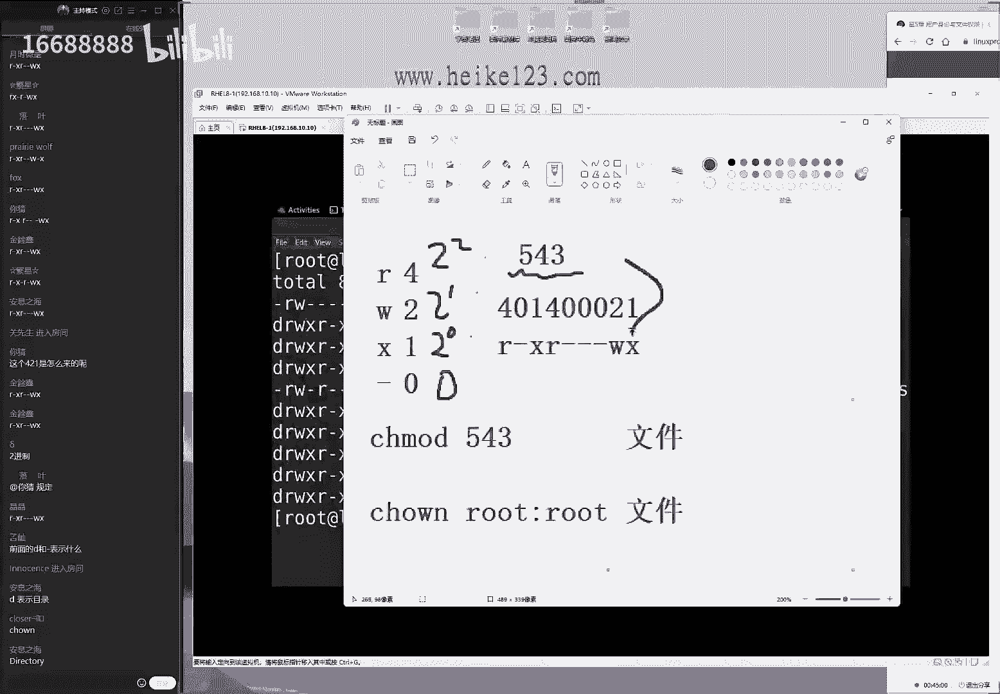

需要把543转成一个权限好了，我先算完了，同学们说对不对呀，好，那我们先去进行一个演示，这china mode，然后随便选一个文件吧，先随便去选择一个文件，比以啊以这个文件为例，现在文件是600对吧。

好然后我们先来去设置一下权限，543设置一下这个文件加上文件名称，按下回车大声说一句。

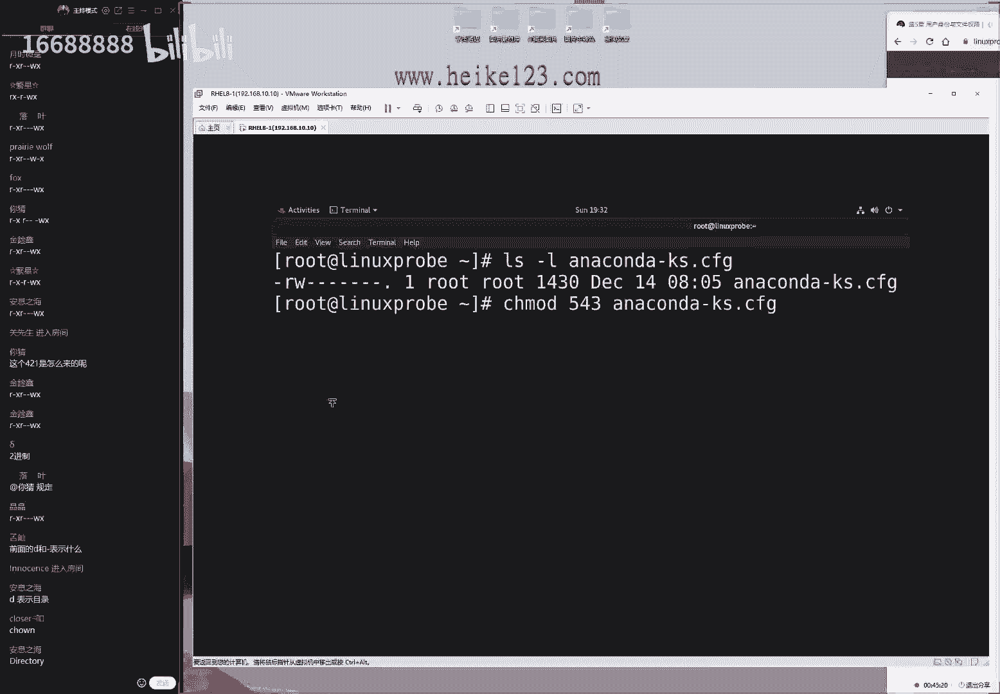

走你啊，再来去查看一下，就会发现543大家看一下呃，他最后得出来这个结果就这个得呃，那么呃就得那我们来啊，就得出来这个结果跟我们去算出来，这个是不是一样的，所以前面说要给大家说到了，说不要管它有没有用。

它一定是有用的，所以我们才会用的，大概来看三有啊，我们用33分钟的时间来对它进行学习了，那我们先去学以后后啊，后面我们再去使用的时候就特别的方便了，同学们也应该能够感受到，就是您去打这么一大长串的时候。

一定是很麻烦的，而且的话很容易出错，但是您打543基本上就没有什么太啊，就没有什么太大问题了，这样的话我们输入起来更配置起来的话呢，效率更高一点。

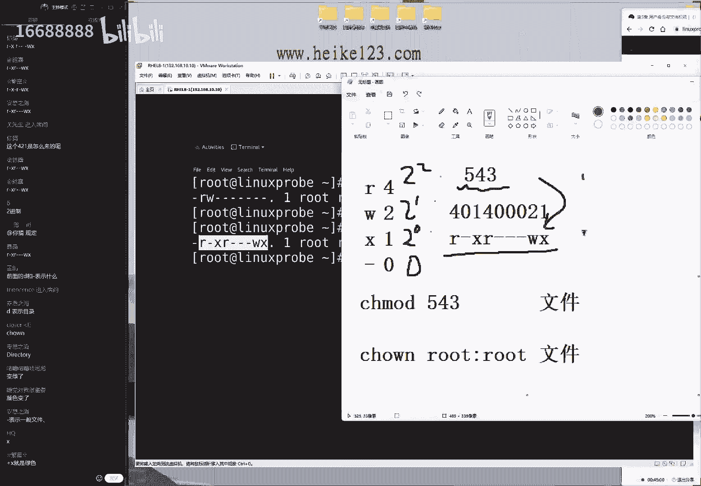

好了，知道这一点了之后的话呢，我们再来啊，比如说我现在想把这个文件的这个所啊，那我们先把这个文件的所有者和所有组，也修改一下，那么就是china后面显示文件的这个所有者是谁。

我们叫做linux prom，然后我用到冒号做间隔符，后面再来文件所有组linux probe，这个广告一定要插入的够多才行，来按一下回车，ok搞定了，没有问题，再去查看一下这个文件的信息。

会发现变更了文件所有者文件所啊好了，我们文带文件所有者文件，所有者文件所有组文件所有组变更了啊。

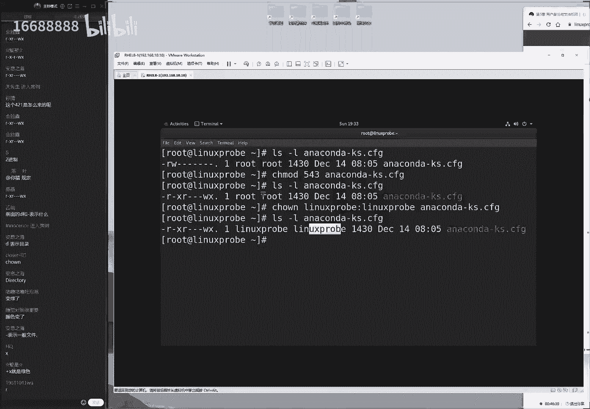

没有问题，这就是我们去修改一个文件，这个文件所有者文件所有组的一个方法。

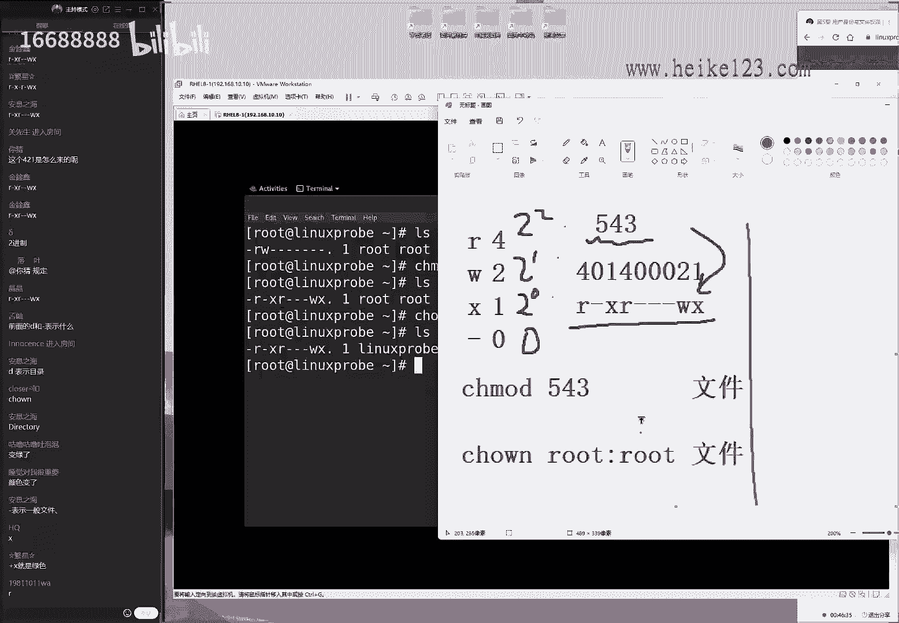

好今天再给大家总结一下下啊，大家说这个变绿了对吧，编剧的话，那是好事啊，他指的是能够有执行权限了，来三啊，两个命令，大家先去记一下，首先是文件所有者是谁，我们也叫做文件所主是谁啊，我们来文件所有主是谁。

然后的话呢文件所有组是谁加组啊，主跟组，然后后面加个是文件名称，然后的话下面的情况下要做change a mocha mode，它的话呢是去权限加上文件名这样的一个方式，好，大家先记到自己的这个书上面。

我来给大家往后面去说，另外的话呢还有我们同学们，如果说您学习比较早的话呢，我记得在2010年之前呃，我们在红毛瑞五讲课的时候的话呢，当然我们当时我们就是我们当时就是。

我们当时就是我们当时在去学习的时候啊，红包rio 5之前的话呢，这个chinoon这个命令格式没有变，到现在了，十多年了也没有变过，但是的话呢那会的间隔服务时间是个点号。

也就是说是china on后的话呢是所有者啊，是他他的话是呃呃所有者加上一个点号，加上一个所有组这样的一个形式，然后再去进行一个设定的，然后这个的话呢也依然是被延续下来了。

也就是说当前的话呢这个间隔符可以是冒号，也可以是一个句号都可以啊，这我可以大概的记一下啊，就是说我们的话呢，现在呃678里面我们可以用到冒号，做这个间隔符，然后我那我看我们以前五的话呢也可以用冒号。

也可以用这个句号，以前的话我们都用的是这个句号，现在变成了一个冒号为间隔符啊，这是一个问题啊，就算一个小问题呃，然后的话呢再来给大家举一个小例子，再给大家举一个最后一个小例子哈。

这个例子的话呢并不让大家再去学习什么的，只是让我能够放心，大家确实会了，然后我们就踏踏实实的往下面走了，好吧，一个数字法转转成权限法，同学们啊陪着老刘去玩一下了，来七呃，六五吧，随便啊。

不不这太简单了啊，654吧，我的654，请把这个权限转化成全呃，呃呃起码这个数字转成权限法，转完了，咱们就下课，不是咱们就啊，是不是咱们那咱们就到下一个章节啊，咱们就下课了啊，这个啊就太过分了。

ok大家先算一下，来大家先算一下，654陪到刘在最后玩一把，唉最后再玩一把，让我放心就继续了，来大家在打完之后发现嗯基本上不错，基本上不错，基本上也没什么乱的啊。

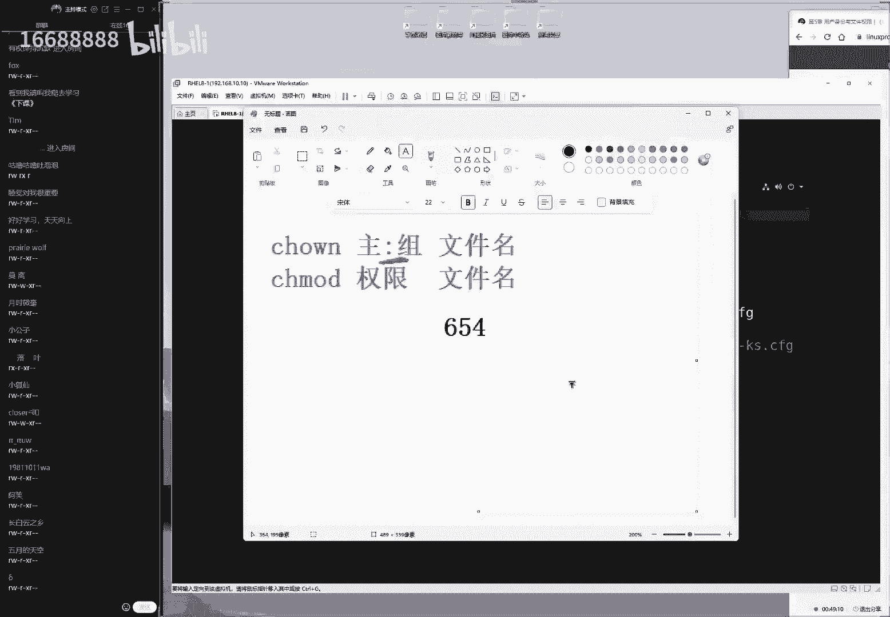

或者说百分百没有乱的好，我来给大家说一下啊，同学们，你们要会先去算吧，不会的话没关系，我来给大家去讲，我我我我文化，不太希望咱们这个课特别的死板啊，就是就是完全就是灌输这种感觉，会了就会了，会了就啊。

那么就跳到下，那么就到下一个这个章节，然后我们往后面去讲，这话可以讲更多，和大家学习起来好像也更有这么一个呃干劲，不用说，非得这么纠结啊，然后大家看一个问题，大家说我们这么去写，等不等于777呃。

不能这么去写，这个权限是设计师出是出错的，他不能这样去用，然后我同学叫叫做叫做叫做小公子啊，打了就打了个啥，是在擦键盘吗，来我再给大家去说着，同学们先自己应该知道了，我再给大家去算。

首先我还是把这个写在旁边啊，r r w x，然后减号这个话，对应的这个数字法的权限就分别为4210，没有问题吧，好我们来算一下，首先六啊，同学们，请允许我在最后一次玩这个烂梗行不行啊。

最后再玩一次这个烂梗啊，六的话，那肯定就是由4+1加啊，那么这样来去加出来的，这犯了什么样的一个错误呢，这个的错误就犯了，就是说这个权限只能去使用一次了对吧，有四有一，但是他只能去使用一次。

因此的话呢这个权限一定是由420加出来的，一定是这么去加出来的，还有五的话呢一定是怎么样呢，401加出来的，那四的话一定是400加出来的，没有问题吧，好了我们来继续，然后呢rw一个减号，然后r减x。

然后是r减减，这就是我们去换算的一个方法，好这个大家看到一个看明白了之后啊，还有一个问题就是到这里之后就可以了，然后但是同学们还有往下面再去换算一步的啊，就是我们有一个师姐。

大概是22期的一个非常可爱的一个小女孩，的一个非常可爱的一个小女生啊，好像是在上学期间就报了咱们这个培训，回来学习了，然后的话当时给我们说完这个题目之后，给我们来一个什么，然后就我们说完这个之后啊。

又往后啊后面来去做一个这么一个计算，够这么去做，然后r r然后w x减减减减，给我换成这个样子了，这个样子的话呢你要是硬看起来的话呢，你要说出来毛病来对吧，它东西的话呢三个r还有后来这个啊可以写。

可以执行，都还好，还都在啊，包括这四个减号的啊，他还都在啊，这四个占位符它都在呃，东西的话呢没有丢，一看就是一个这个怎么讲，就是一个呃喜欢收拾屋子的一个对啊，就是我们可以看到把东西整他们啊。

他们还去整理的非常的整齐，但是一定要我们当然当我们要注意呃，呃当我们啊我们一定要注意啊，就是来去换算的时候看这个其实没有什么好，它没有啊，它是没有任何意义了，如果说我们在做换算到这一步的话呢。

它是100分对吧，那么如果说我们再往后面再去换算一遍，它变成零分了，所以大家一定要记住这一点哦，那我们对于全新的换算，就呃只到这一位就可以了，千万不要往下面再去算，因为我们的文件所有者。

文件所有组以及文件其他人的话呢，这个三位之间是没有任何关系的，我们不能够把钱花，或者说那我们把这个资源啊来，那我们来去按照这样的方式来去写，那么就看不出来到底是谁的权限，这大家一定要去注意啊。

这也是之前发生过的一个小小的插曲，好我们来接下来再给大家去说啊，对有点像是强迫症了啊，来我们来给大家后面来去说一下啊，其实的话呢我们的技术的发展，它都是解决一个痛点，然后产生出来的。

并没有大家想象当中那么高科技，然后其中的话呢有一点就是我们一样啊，就是我啊这话我们就是看这个文件的时候，实际上也能够猜得出来了。

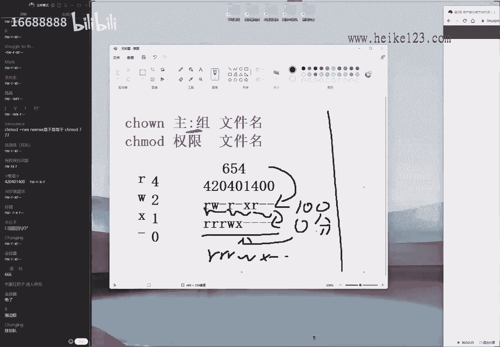

就是因为呃我们的话呢，linux里面的这个呃文件的话呢。

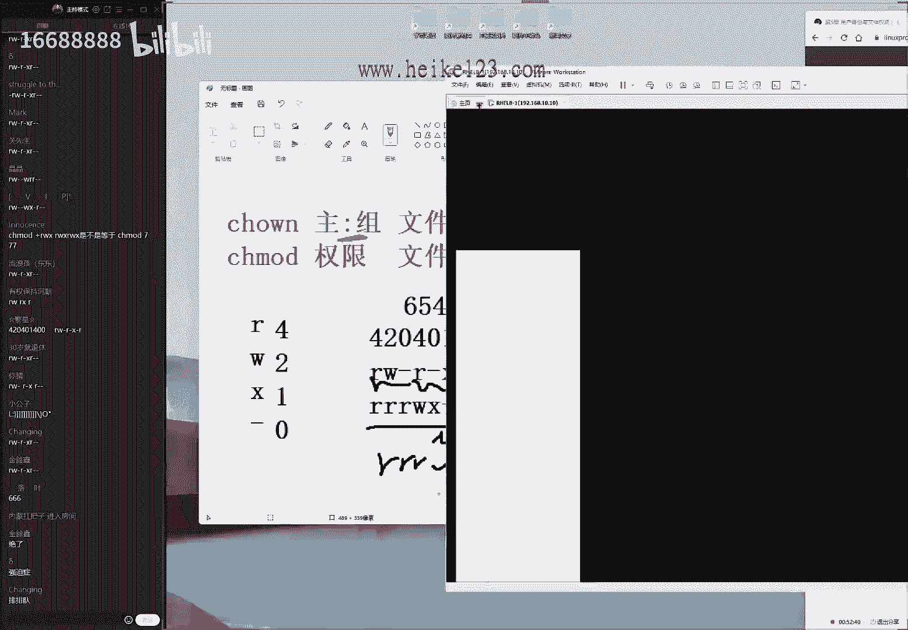

它是不去啊，他的话呢是啊，它是区分文件类型的，但是的话呢我们如果要是没有一个直啊。

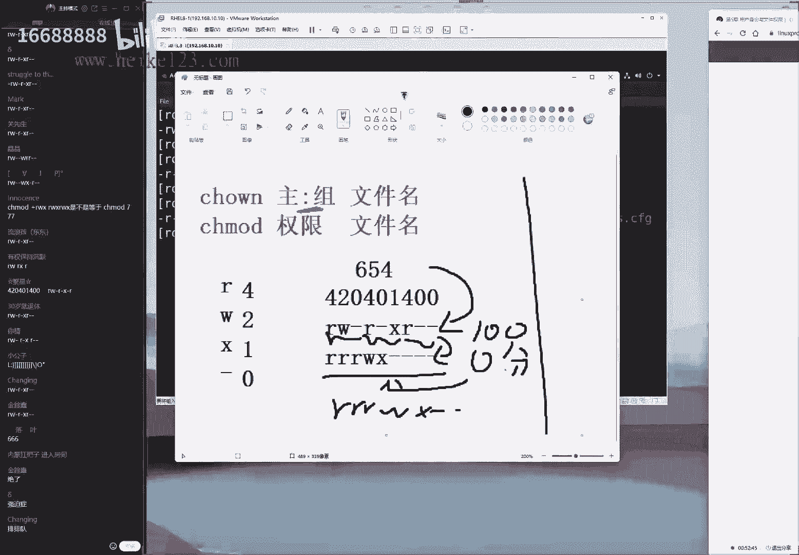

但是我们如果没有一个直观的表示的话呢，也不能够知道这个文件具体是什么类型，大概大啊，因为大概问到了，就是比如说我现在去看一下这个目录里面，在这个权限可以看到这个文件的话呢，前面的话呢这个会有一个标识。

这个标识，它呢它实际上指的是文件的这个类型啊，我们化为了去解决说用户想知道文件类型的，这样的一个啊痛点吧，所以的话呢现在在红包，我们的这个呃系统当中的话呢，它这个前面实际上它不仅是红包系统里面。

它都会有，在这个前面再去标注一个我们的文件类型，它并不属于权限的一部分，它属于属性的一部分，那我们来看一下，当我们这个文件的这个权限的前面，如果说它它第一位的话呢是一个减号，他指的就是一个一般文件。

或者我们叫做配置文件，大家可以来记一下这几种类型，叫做一般文件，或者我们叫做配置文件，如果说要想去配置一个服务，实际上就是在修改这个服务所对应的，一个配置信息，所以我们大多数情况下。

配置的都是这么一个减号的这样的一个情况，还有一个什么呢，还有这个d啊，我们可以看到了，这个d的话呢，我们叫做目录文件，这个不用什么去解释的啊，就是我们可以啊去走到里面去目录嘛，可以往里面去做切换。

它指的是一个目录文件夹啊，第一话呢我们还有什么想到了，比如说我们的链接文件，这句话的链接文件它指的是啊，链接的话，这个链接文件的话呢，它指的就是我们可以做一个快捷方式，然后我们就会接这个链接方式。

我们就得到了这样的一个效果，来大家看一下，这叫做链接文件，我们待会可以回去做一个链接文件，或在下礼拜五的时候给大家去讲到叫链接文件，除了这个以外的话呢，还有这个管道文件，这个话呢我们现在一般看不到的。

叫做管道符文件啊，或者我们叫做管道文件，还有一个呢我们叫做b啊，叫做块设备之间的话呢，这个块设备就指的是这个换了块设备，实际上它就是我们的设备文件，比如说我们叫设备文件，比如说我们我们的硬盘呀。

比如说我们的这个内存啊，这样的这个情况，或者说我们的光盘啊，这样的设备文件除了这个以外的话呢，我们还有c啊，叫做这个字，这个我们叫做字符设备文件，这话实际上也属于叫做设备文件。

我们会在我们的第1v目录里面，见得比较多一点，好了，我们知道这种类型之后的话呢，可以看到了，就是我们一般常见的文件类型，它都有所包含，我们要想去对于这个啊文件类型来由啊，那我们来进行加以区分的话呢。

您就可以看一下这个文件全啊，那我们可以去看一下文件，前面在第一位就可以了，好大家可以来去记一下，我正好的话呢去倒杯水啊，40分钟了，大家先啊，先去记一下，如果说想要去知道一个文件这个类型。

那么你就可以去看一下他前面那个数字，他怎么去写的文件前面那个数字，它的这个呃代表是文件类型，稍等倒杯水先，稍等一下，水有点烫，ok我们来继续啊，刚才犯了一个错误，我刚才去找了啊，我刚才去找了一下。

发现都没有水了，哎好吧，那我们来继续吧啊怎么样啊，去喝水了是吧，现在有声音，现在有声音，现在有声音，我刚才只是去找我，我我我刚才只是去找了一下水，今天今天犯了一个错误，今天忘了倒水了，我现在只有一个。

现在我只有一壶烧开的热水，我想我现在想喝口水，现在没有，所以我刚才去找了一下没有，那算了吧啊，只要把水给放凉了，来继续继续啊，来继续，我们来说一下我们对于这个文件的一个权限，那也就是说现在这个话呢。

我们的文件类型加上文件的这个权限，总共是有十位，这个我们能够理解了，下面的话呢就要去想一下这个问题，就是呃我们画的这种话，我们之前就提到一个问题，就是换到linux更加的安全。

而且的话呢对于这个权现在说一个设定的话，那更加灵活，但是他会问呢，说到理我，我好像并没有感受到，说这更加安全或者更加灵活呀对吧，就是因为我们的一般权限rw x的话，实际上它这个功能还是比较单一的。

就它功能太简单了，感觉跟windows的话，感觉跟他们的那个啊windows系统好像差不了多少，就要给大家提到了，实际上看一下5。3小节，还有一个叫做特殊权限，这个特殊权限的话呢。

实际上就是对于我们一般权限的一种补充说明，他之前啊就像我们之前看一个电视剧里面啊，说啊你干不了的事，但是我能干对吧，我啊那我们来给大家去看一下，rw x的这个基础之上来讲一下。

它叫做s u d s g d和s b it，它是对于我们的一般全新的一种补充，说明的一个信息来，我们刚才没有卡，刚才没有卡，真的没有卡，刚才就是去想去找杯水，然后我翻了一下，确实没有了。

这是一个小问题啊，好我们跳过跳过跳过来继续说一下三个权限，第一话呢叫做s u i t权限，它是对于我们一般权限的一种补充说明，这个的话呢我们没有中文的啊，他拉他啊，他就那么好。

我们这个三个这个权限的话呢，他没有一个中文的名字，它没有啊，它压根就没有一个中文的一个名字，我们就把它叫做s u i d，没有中文名字来，这个权限的话呢，作用是让我们的这个命令的执行者。

临时获取了命令的所有者的这个权限，好，大家听听，我给大家说一下这个全新的作用的话呢，是让命令的这个执行者能够去临时获取到文件，所有者这个权限，好，同学们再去理解一下。

文件执行者临时获取到的文件所有者这个权限，它有一个特点，就是它必须一定只能是怎么样的，设置在的二进制的可执行文件上面，二进制可执行文件或者是一个脚本上面，它不能设置到目录上面来。

可执行文件上面来去设置这个权限，来我给大家拉去聊一聊啊，来给大家聊一聊啊，说这怎么回事呢，要给大家去提到这个权限啊，说让命令的执行者这个关键词，就是让这个执行者临时获取的文件，所有者的这个权限。

也就是说他的这个之前权限不足买啊，他是啊啊不满足去完成网校工作，所以的话呢这个权限进行一个临时的提升，比如说我先有一个文件，这个文件的话呢叫做etc目录里面的shadow文件，这个话呢文件是用来去保存。

我们所有用户的这个密码信息的，对吧好吧，看一下这个文件夹的这个权限，同学们一看嗯，那就说举个例子啊，来给大家举一个来看一下看一下啊，看一下以这个文件为例，这个文件的话呢权限是000。

没有没有任何的这个啊，没有任何的这个所有权限，也没有任何的这个读取权限，完事的话呢，我们先看到这个文件里面的内容，它是在etc目录里面的，杀掉文件，这个文件的话呢，是用来去保存我们用户这个啊密码信息的。

他的话是经过加密的密码对啊，一个呃一个呃密码信息的，然后呢我们当前这个用户叫做linux problem啊，然后我们现在的话呢把这个它的加密之后的，这个密码值复制到咱们的这个屏幕上面。

大家可以看一下他现在的话呢，当前这个用户的密码是这么多信息，也就是说我们实际上去设置用户密码，就是去修改这个文件，然后里面这串信息的，然后现在的话同学们可能会比较惊讶啊，说到优诶，你不对呀。

突然间发现一个小的一个插曲啊，说到游，你这个文件不是没有权限吗，你怎么去看的呢，啊所以我现在讲之前再给大家去啊，说这么一句啊，就是我们的管理员那不受权限的控制，他不受一般权限的控制，所以的话呢如果说啊。

即便一个文件他没有可以读的权限，或者没有写的权限啊，但是管理员的话呢依然可以进行操作，所以说这个大家一定要啊，这我们一定要小心，这是一个小问题，好大家先看一下，首先我们有一个文件叫做做啊。

etc目录里面的杀的文件，里面保存的是用户的密码信息，当前我们的linux pro用户的密码是这么一大坨好了，我们现在切换到这个用户身份下，叫linux club，然后的话呢我去修改一下我自己的密码。

来修改一下我的密码，当前密码叫做red hat，新密码的话呢叫做linux probe，点com广告植入啊，第二次广告植入啊，怎么样，他说啊，我们的密码不能跟用户名称啊相同，好我们再来。

我们现在再给大家换一个，换一个超级复杂的，我自己都不知道的啊，我换一个超级难的，就是我现在在我屏幕上，在我键盘上，现在去狂敲，然后去敲两次一样的啊，不不不，他说第一次先去输入一下当前密码。

刚刚我太激动了，再来我现在去输入一个超级复杂的嗯，那我刚才说的是啥来着，走好没有，ok没有问题，现在把这个用户密码给他重置了，重置好之后的话呢，返回来返回到我们的管理员这个身份下，再去查看一下这个文件。

大家看到这个权限还是000，然后我们去查看一下文件里面的内容，现在的话呢是这个用户的一个新的密码，于是我们来做一下对照，来去对做一下对照，最后这个对照说这个结果是这个样子的，好。

同学们可以很清晰的比对出来，这两个密码的值是不一样的，于是的话呢一般人就跳过了，但是我们要想去追问一句，为什么凭什么，也就是说那我们要分为两步走，第一步走的话呢，就是呃要知道这个底层原理。

就是实际上我们的啊linux里面的话呢，一切都是文件，所以再去配置一个服务的时候，也都是在修改这个服务所对应的一个配置信息，当我们去修改用户密码的时候，实际上也就是在修改这个用户所对应的一个。

密码文件里面的值，因此这是第一步，我们修改成功了，ok这是第一步啊，就是去解释一下，为什么修改密码的这个操作，就会去修改的文件了，就是这么回事，因为他也底层就是修改了这个文件吗，这是第一个事情。

第二个事情的话呢，就是凭什么它能够进行修改呢，因为可以看一下，当我们去使用到普通用户，叫做linux pro这个用户的时候，它是能够去修改自己的密码的，他也能够去修改这个文件里面的内容。

但是的话呢可以去看到这个用户，去看这个文件的时候，它也依然是000的一个权限，大家看一下啊，ios来看一下这个用户去看这个文件，是000的权限，他也不能够去查看文里面的内容，他连看到他啊他都看不了的。

但他怎么去修改呢，具体一下思路，也就是说这个用户修改了自己的密码，但是的话呢它实际上他连看了圈它都没有，它怎么修改成功了呢，这就要给大家提到了叫做s y d权限，诶。

大家会发现这个例子举的是不是挺好的啊，大家会感觉啊啊非常的满意非常满意，来给大家说一下怎么去实践呢，实际上的话呢就是啊，问题就出在了一个叫做pass w d的，一个啊命令上面了。

因为它大大大的话就去回忆一下，他怎么去修改的，它使用的一个命令叫做pp s w d，对不对，这个命令的话呢，实际上我们可以去查看一下，去使用到位查看一下命令所在位置。

然后的话呢我们知道这个所在位置了之后，去查看一下这个命令文件所对应的一个权限，这跟我们的破案一样啊，一层一层往里面去找啊，就像找线索，像for像啊福尔摩斯一样啊，像福尔摩流一样，我来给大家看一下啊。

就找到我们剧中的这个问题所在，当我们看到了，当用户需要去修改密码的时候，实际上是调用这个文件来去实现的，而这个文件的话呢，前面的这个第一位文件所有者的这个啊，最后一个致敬位上面变成了一个小小s。

这就指的是一个命令的嗯s u y t权限，也就是说当有一个普通用户他在啊，他再去执行这个命令的时候，他就临时获取到了文件所有者的权限，而我们的管理员说群用户它怎么样呢，它不受一般权限的控制。

因此他这个修改操作也就完成了，这个是这么一个流程，再给大家来去说一下啊，首先第一个思路就是呃配置一个服务，以及去修改一个用户的密码，它实际上就是在去修改这个文件。

第一点第二点这个文件的话呢叫做啊沙漏文件，它是所有人都不能够对他啊啊啊，来对它进行一个读写执行的，他这个权限是000，所以的话呢连普通用户都无法精啊，来教他啊，他来进行修改和啊，那么啊以及来进行查看。

这是第二点，第三点，但是由于有一个用户它调用了一个文件啊，叫做命令文件，叫做p a s d啊，p a s s w d用来去需要密码的一个文件，这个密码上面的话呢，有一个权限叫做s ui d权限。

大家再往后面去说，第四点，第四点，第一啊，由于这个s y t权限的作用是，让命令的执行者能够去临时获取到，文件所有者这个权限，所以第五点啊，用户临时获取到了关联的这个权限。

而关联的这个权限不受一般权限的控制，于是修改了他的密码，这么一个流程，大家可以去理解一下啊，这就是为什么我们再去学习linux的时候，就像我们在啊4月13号的时候说过一句话吧，说我们学习的越多的时候。

会发现自己越不敢说自己都掌握了，这个越学越深，好大家看到这个，首先啊大家看到说这个颜色有一个变态，画会有一个变化，它是一个红颜色的，这个红颜色的话，那就代表着说这个啊，它是一个非常危险的一个权限。

大家一定要小心，它有一个特殊权限，好我们现在的话呢再来给大家再举一个例子啊，这个例子的话呢更好让大家能够理解一下，到底什么是执行者，什么是啊文件的这个所有者，因为现在你已经能够理解这个全新的作用了。

但是你可能不太理解到底什么是文件的所有者，文件啊，那啊那么以及文件这个呃执行者是什么意思，来给大家举个例子，这也是一个老梗了啊，如果说您之前没有听明白的话，这个例子一定能让您能够听明白了。

说一下是这么回事啊，大家有没有看过这种穿越剧中古装剧啊，可以打一下一啊，同学们可以打一下一，比如说您看过一些啊古装剧，现在比较流行的芈月传对吧，还有什么啊康熙微服私访记啊。

没有看过是吧啊大家有同学看过是吧，看过有同学有四个同学看过啊，其实这种古装剧还是比较多的，比如说啊比如啊，比如说呃什么呃康熙微风和斯旺季啊什么，那么啊他都他都是算的啊。

毕竟我们比如说啊现在有一个啊在古代啊，那我换这个清朝的时候吧，随便举一个朝代啊，然后我们现在这个画个小草，画一个小太阳，说实话有一个清差大臣，那我们知道这个清差大臣的话，完事儿的话呢。

他有一天正在路上走，突然间看到一个人，哎比如说这个人画的稍微胖一点啊，上面再写一个贪这个字啊，手画啊，在画稍微短一点的话，稍微丑一点好，就比如说的话他这话这话太这画画的太丑了，就比如说有一个啊，那么好。

这个时候的话呢，他想需要把它给惩治了，但是他的这个权限不足，但他的这个权限的话呢也许非常的小，它不足以去买，他的话啊，权限有点小，他没有办法去完成它啊，对这些工作的话怎么办呢，这个时候哎没有关系啊。

等下换一小笑脸啊，他没有关系，所以他啊，所以他是笑了，他想到什么呢，他想到他拎拎哈，他临出门之前有一个人，谁呢，是皇上对吧，给他一个宝物，这个皇上啊给了一把宝物啊，是什么呢，是尚方宝剑，大家来看一下啊。

如果拿一个尚方宝剑的时候，那个同时是不是他就临时的拥有了一个更高啊，他有一个更加高级的权限呢，因为按照古装剧里面这么说啊，没有去做求证，但是他的意思就是说啊，可以有这个先斩后奏这么一个呃特效对吧。

当我们想想去完成某项工作的时候，但是的话呢由于我们这个权限比较小，或者说对方的这个身份，是在非常的重要的情况下，我们就可以怎么样呢，先斩后奏，拿出商业保剑的同时，就可以临时代表了皇上的身份了。

于是就可以啊来啊扑哧把他给杀死了啊把啊，那么就把他给干掉了，那我们去这个其实我们的sud权限的话呢，跟当前这个保健的话这个作用是一样的，因为他也都是让我们面对的这个执行者，能够去临时获取到的文件。

所有者这个权限，他能够去临时去提高了我们的呃权限，然后的话呢就可以去完成某项工作了，所以大家来啊，所以大啊，所以大家需要去记一下，也就是说s u i d的这个本质的话呢。

实际上它就是为了能够让我们的用户能够去啊，在全家不足的情况之下来去临时完成某项工作，这是第一点，第二点的话就是他的这个时间只是一个临时的，当他使用完这个宝剑之后的话呢，他也并没有成为了皇上对吧。

它还是它的这个啊，本它还是它的本身，而这个宝剑使用完了之后，他还依然是他本身啊，这话他还是他的皇上，也就是说，只有这个在直觉光当中，才会去临时获取得更高的权限啊，啊执行过后的话呢。

自动去结束掉这个权限的授权，所以大家要去记一下这个权限的一个特点，这个我们叫做s u i t权限好，这个我觉得讲的很透啊，所以大家给大家总结一下，就是s y d权限是能够让我们的命令的执行者。

在我们的权限不足的情况之下，能够去临时获取文件，所有者这个呃权限呃，所有者这个权限去完成某项工作啊，来产生出来这么一个技术来，大家话怎么样说啊，呃这话有点丑是吧，来下面一个问题，大家说。

如果说我们现在把这个删掉文件给他改了，我，那我们是不是就不用去选择到password命令，来进行修改了，当然不是，因为您即便把它给修改成了777权限了，那我们能够进行编辑了。

但是我们的password命令还有一个加密的功能呢，那个算法我们还需要去使用的password，再去实现一下，不过的话呢，这个就跟我们这个课没有太大关系了，我们现在给大家去讲的叫做s y d权限。

而且大家想一个问题呃，如果说我们现在能够把这个我们的密码文件，etc目录里面的杀到设置成了一个七七的权限，那么任何人都可以去看到文件里面的内容，其实这是无所谓的，因为现在啊。

他还是不能够破解我们的linux里面的密码，但是的话呢他可以去修改别人的密码吗，比如说我现在不知道你的密码，但是我可以把它给修改了，那么我们也就知道了对吧，那所以这样啊那啊那啊，那我们修改过后。

也就可以去使用你的这个身份，来去登录服务器了，因此这个权限千万不要给他这么大的权限，是会啊，这个是会出问题的，然后呢我们来给大家说一下，第二个权限叫做sj i d权限啊，怎么样说，讲了这么多期啊。

唯一没有变的就是老刘的画风还是那么的像，还是那么的抽象啊，来我们来给大家看一下，下面一个权限叫做sj i d权限，这个的话呢作用就是呃让知命令的这个执行者，临时获取文件所组的这个权限，好。

这个没有太好去解释吧。

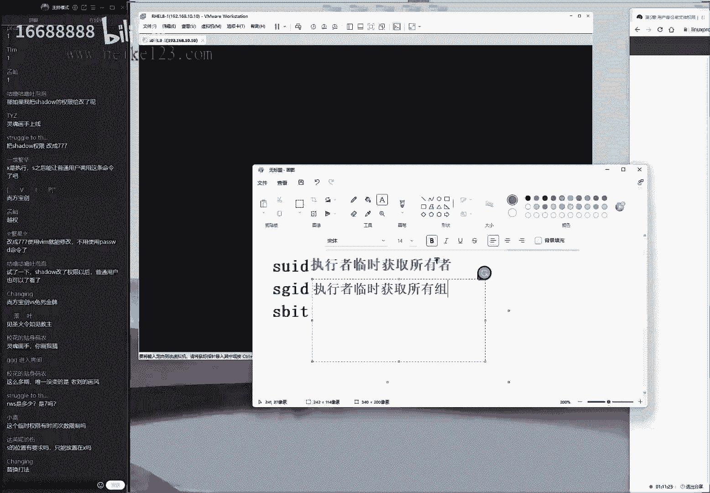

这个也不用解释了，它的作用就是呃，会获取到文件所有者这个权限啊，它会获取到文件所有组的这个权限，开始瞎说话了，来比如说我们现在的话呢有一个文件，比如说现在一个文件这个文件的话呢。

如果是要他要是有s u i t权限的话，那么就会让我们的命令的这个执行者，临时获取到这个用户的这个权限，而我们如果这个文件上面有一个，s g i d的话呢，会让我们的用户。

您去获取到这个用户组的这个权限，没有什么问题，而且他非常的简单，但是的话呢我们在工作的时候，基本上不会去使用到这个啊文件所有组，这个提升的比较少，特别的少，我们大多数情况下的话呢。

会把s g i d这个权限设置到目录上面，这个我们会必要的常用，如果说我们的s u y n啊，那我们啊如果说我们的sgd的这个权限，它是对于一个二进制的可执行文件，来去设置的时候。

那么我们则自动去使用到这个权限，就是让我们的命令执行者，临时获取到文件所有者的这个权限，但是如果说他就是对于一个目录来进行，操作的话呢，它是让我们的目录当中新建刷的文件，去自动去归属于我们的目录的。

所有组的这个名称啊，大家听完这个之后有点绕是吧，没关系，我大家再去总结一下学习这个啊，学习我们的linux的技术，就总会有一种听天书的感觉，这很正常啊，因为您就会慢慢去捋思路嘛。

就像我们刚刚可能在上课之前不太理解，现在已经理解了一样，我再给大家总结一下呃，如果说它是对于一个文件上面来去设置的，这个权限，则是让我们的执行者临时获取到的文件，搜索权限，ok这就啊。

那么这就是我们该给大家写出来的，就算是过去了，然后当我们如果说这个权限，是对于我们一个目录来去设置的话呢，目录的话啊，那如果说这个权限是对于我们的目录，来去设置的话呢，那么目录里新建出来的这个呃文件。

那么则自动的归属到这个目录的所有组的名称，则自动啊归属目录原有诶这个所有组的名称，所有组的名称，这个看起来有点抽象，实际上这个事儿特别简单，我再给大家一说就明白了啊，或者我们给大家一演示就明白了。

好呃这个就百闻不如一见，看书不如看实验，给大家看一下我们这个实验的一个方法哦，大家问了一个问题，特别好，同学叫繁星了是吧，他说怎么样判断说这个文件是有s u，i d还是sj i d呢，不用着急。

马上给大家讲到，我们需要先给大家讲之后，然后给大家说一下该怎么进行查看，以及进行一个设置，先不管它，先说一下这个理论啊，呃先来说一下，如果说要想对于一个文件上面来去设置一下，s ji权限的话。

先去举一个样本，比如说在我们的随便来，在我们的home目录里面，目录名称无所谓啊，不管它含义，不管它新建一个目录，目录名称好比说叫什么呢，啊同学叫做中训，同学最后发言啊，我们就把它叫做小训吧。

同学好吧啊，叫做这个小训，然后把这个权限的话呢设置稍微大一点，加一个杠杆操作，这样的话代表就是一个递归，包括说我们这个目录里面，原有的所有文件，都去使用到新的这个权限来去完成。

然后的话呢再去使用到china mod命令，然后使用到叫做叫做g加s来去设置一下，我们叫做sj i d权限，这个不用着急，我会给大家总结哦，啊这啊这会大家总结的，会给大家总结的。

然后看到同学们在说说怎么样能够去查看啊，这个部队我们的set和get f1 sl，是我们的文件访问控制列表里面去使用的，查看命令，你们呃猜错了，我待会给大家去说怎么去查，不用管。

先把自己的智慧重心放到我们这个理论上面，我们每一个技术的话都会先给大家去讲理论，然后给大家讲一下实战，现在的话呢还是一个理论过程当中，我们讲完了之后，自然会给大家说一下啊。

会大家总结一下该怎么来去查看以及去设置了，现在不管他们现在就关啊，现在关理论能够把这个权限的功能搞明白了，就ok了，不要那么心急，同学们不要吧，不要心急，来设置一下这个权限设置好了吗，没有问题好。

这个效果是让我呃，让我们的这个啊目录里面新产生出来的文件的，文件的所有组，会自动去继承我们这个目录的所有组的名称，比如说我们现在可以看一下，当前我我们这个目录的这个所有者是root。

所有组的话也是root，ok吧啊没有问题好，我现在切换到另外一个用户身份下来，切换到一个叫做linux pro一个用户身份，同学们总会问到说老师哎呀，我那我那我怎么去记命令呢。

我怎么感觉学完了命令之后就老忘了，就是一个反复去练习的一个过程，比如说今天我们上课的时候说个三五十遍啊，linux pro我估计大家下课之后就完全忘不掉了，就会今天晚上做梦的时候都会梦见啊。

linux problem，linux problem，linux problem，所以啊其实学习就是一个反复记忆的一个过程，没有太好的这个技巧，要是有的话，也大家都呃，如果大家如果要是有好的技巧的话。

大家也都会用了，大家都用的话也不算是好的技巧了啊，就我们说说到哪儿了啊，说到哪了哦，对哦，我们去说到去新建出来这个用户了啊，不我们现在要去啊，说到了切换到这个啊用户身份下了。

然后的话呢我们现在使用到这个用户，大家看一下，现在的话呢我去使用到这个用户，我去新建出来一个文件，比如说这个文件我们叫做ho，比如说啊我新建出来它，那么我自己新建出来的这个文件。

那么这个文件的这个所有者，各文件的所有组，大家可以看到，当我去新建出来这个文件，那么这个文件这个所有者和所有组，肯定都是我们自己啊，好吧，大家看一下新建出来的文件。

那么我们文件的这个所有者跟文件所有组的话，都会是我们自己没有问题，好现在的话呢我们再来我们去呃，我们画干嘛呢，我们现在就进入到这个home目录里面的啊，叫做小旭同学这个目录里面，再来去新建出来这个目录。

还叫做厚厚的一个目录，然后去查看一下他用的这个权限，他会发现我们的话呢，我们的文件所有者还是我们自己，但是的话呢，文件所有组变成了原先用原先目录的这个，所有组名称了，就是这么回事。

我刚才不是故意说的特别复杂的，但是这是理论基础，我们要打好，然后再看一下实战理啊，理论加实战一下就明白了，到底它所表达的是什么样的一个含义，对吧，就是让目录里面新建的文件会自动去归属，我们目录原有呃。

所有者啊啊所有组的一个名称就这么简单好，然后再给大家总结一下该怎么去查看，以及区域设置的一个方法，最后一个话呢我们是叫做s b i t权限，它其实很简单啊，他就是理论有点复杂，但是这个没有办法。

我们只能通过这个啊，先给大家讲一下教材，给大家带来实战，说一下我们的s b i t权限啊，s b i t权限的话呢，实际上我们做保护卫啊，他的话呢有一个中文名字叫做年之味。

这个的话实际上这个翻译起来是有问题的，因为这个啊年之位就是直接把它给翻译过来的，实际上这是错误的，本身这三个权限都没有中文名，不知道是什么啊，但是完了不知道是哪一个。

呃呃呃反正后来就是我们这三个权限的话，之前都没有中文名，不知道是谁啊，最后把这个翻译出来叫年之味，也没有毛病，就是说我们按照这个话呢，直接翻译的话，中文名字就叫年之味，但是的话呢我们根本就不理解。

这个权限到底是干嘛用的，所以我们再给大家取一个名字，s b i t的话呢，实际上叫做保护卫啊，大家记一下保护卫，这个才是我们认为翻译起来比较好的一个方式，因为我们看到说，如果翻译一篇英文的文章的话也好。

怎么样呢，我们有三个，这个呃档次嘛就是这个信达雅对吧，我们那我们要做到这三点，我们要让我们的这个读者能够一眼，能够知道这个权限大概的一个作用，所以我们会大家取一个名字叫做保护卫，它的这个功能的话呢。

是让我们的用户只能够去删除掉自己的文件，而不能够去删除掉其他人的文件来，就是它的这个作用，就是只能够啊只能删除自己的文件，这有什么样的一个用处呢，先举一个小例子啊，当时的话呢我上呃呃呃呃。

大概是我上高中的时候，当时我们学习编程课程，这是一个真事，当时的话呢去学习编程课程，学习c语言，当时的话呢下完课之后，老师会开一个ftp，然后比如说啊巴拉巴拉给一个地址，让我们每天上课做完了之后。

把自己这个学习的成果嘛，然后包括说写出来这个程序安然啊，然后去上传到老师来啊，来去上传到老师的电脑里面，上传到电脑里面，然后就会有一些小呃，那么他就会有一些小坏孩子啊，他们自己不会去做。

然后的话呢他们等他们啊，等同学走了之后，他啊他啊最后一个走，他会把别人的文件给他删掉，就是把别人的文件给它删除掉，然后的话呢，把别人的那个文件的名字改成自己的名字，实际上就是一个剪切的一个操作，那好。

但如果说我现在不想让别人去解析我的文件，或者说我啊并不想让别人去删除掉我的文件，怎么办呢，这时候我就可以把这个目录上面加一个保护位，这样的话，就那就是只能自己去管理自己的文件了，好我来给大家做一下演示。

这有一个目录啊，叫做tmp目录，它已经自带有的一个t，它已经是自带有的这个保护位的一个权限了，大家看一下这个目录叫做tmp目录，它还自带有了这个啊保护卫权限啊，我们的s b i t。

现在的话呢我只需要新建出两个用户，一个用户叫做张三，还有一个用户的话呢叫做李四，两个用户用来做测试来相互去删一下文件，我们看看是否可行，先去使用啊，先去切换到张三的这个用户身份下，稍等一下啊。

先去切换到张三用户身份下，我记得我想我我我呃，我记得当时大概是20多期的时候，我然后我当时讲的这个例子说啊，当时的话呢我去提到了说呃，如果说我们在上班的时候，那我们需要让我们的同事。

或者说我们需要让我们的学生们来上传到文件，到我们的文件夹的ftp里面，然后的话呢我们来去判成绩，但是总会有一些人去深入到别人的文件，这个问题该怎么去解决呢，我记得在20多期吧，然后有一个诗歌就说啊。

说这种问题在我们这个啊，东北三省应该是不会出现的，因为我们要是就要有这样的这个呃学生的话，我们可以啊通过一些非常暴力的方式，可以让他吸取一下教训啊，那我们除了这个非常暴力的方法，让他去让他去吸啊。

让他来取吸取教训的话呢，除了啊我们除了这个以外，实际上也可以通过这个技术方面，我们比较文明的，我们比较的啊，预先的来去处理掉这样的一个可能性啊，就让他想删也删不掉啊。

这样的话我们就再去啊保护一下我们的文件，比如说我先进入到tmp目录里面了，随便去新建一个文件夹，叫做哈哈好了，新建好了，来查看一下这个哈哈文件就已经出来了，当前新建的这个用户的所有者叫做张三好。

我现在想干嘛呢，呃我现在很纠结一件事情，就是我要不要把这个我们的文件，这个权限乘七期权限，因为按照我们刚刚所讲的，也是我们讲对了啊，是说我们的呃，对于我们的目录上面的w权限。

指的是能够聚在这个文件里面的呃，来进行对于文件的新建和剪，切和删除的这个操作，而我们当前要想去删除掉这个文件的话呢，与其它本身没有人啊，那么啊与其本身的权限是没有关联的，我再给大家重复一下。

就是我们现在要想去删除一下这个文件，实际上但权限是来自于我们的上一级目录，是否有w求它这个写权限与呃，我们的目录本身权限是没有关系的，因为它上面的r和w指的是，能够对于里面的内容来进行一个编辑。

但是由于我们刚开始讲这个权限，大家可能对于我们这个讲的还不太信任，所以的话我先先给大家去说明好了，我现在需要做一部毫无意义的事情，就是我要做这么一步，我现在的话呢，需要把我们的文件也设置成七七的权限。

这样的话呢来保证我们的呃同学们能够看到，现在的话呢上一季目录是一个满权限，77权限，那么话呢以及这个文件的这个权限的话呢，也是七七，就是说所有的权限都是满权限，虽然说这个权限跟我们再去删除这个文件。

没有任何关联，但是我们也尽量避免掉这样的误会，好吧这么一个原则，所以大家能够理解一下，那都做好之后的话呢，看到版权下了没有问题，理论上来说大家都删除掉这个文件也是可行的。

于是我先切换到另外一个用户叫李四，然后我们的李四的话进入到t m p啊，呃等会我们进入到这个目录里面新建一下吧，这个文件我们去新建出来一个，好比说我们叫做呵呵的一个文件好删啊，那我们把它创建出来了。

创建出来之后的话呢，来看一下有这个文件叫做呵呵了，于是我可以去删除掉自己的这个文件，没有任何的问题，删掉了可以啊，再去删除掉其他人的文件，来看一下，删除掉其他人的文件叫做哈哈，于是可以看到删除是失败了。

即便说我们加了这个杠杆操作了，但我们看到还是依然失败了，这就是因为我们家的sbt权限。

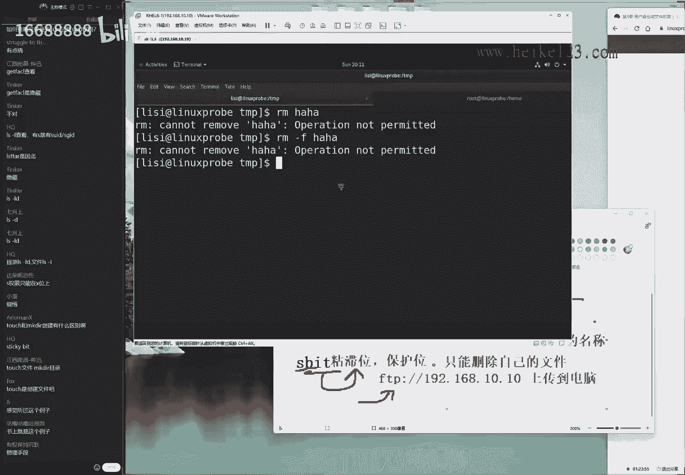

它只能去删除掉自己的文件，这样的一个保护为权限，举这么多例子啊，很烧脑，我们把这三个权限理论和基础都给大家说，完了之后，大家现在已经心理上非常着急的啊，非常好啊，非常的着急了，说老师。

那我怎么样能够知道，我现在这个文件上面有哪些权限呢，这个叫特殊位权限，我们这么去看，我们首先来说权限是三位，三位之间一段毫无关联，那好了，rw x rw x rw x3 位三位之间毫无关联。

三位一段好了，那么如果说我们现在在这个所有者的这个，执行位上面，我们加了一个s的话，那么指的是他有s ud权限，然后的话呢，如果说我们是在文件搜组上面加了一个s，权限的话呢，它指的是s g i d权限。

如果说他是在最后一位上面，把x变成了一个t的话呢，就这么去看好，这是第一点，第二点，大小写区分呃，如果说稍等一下，如果说他之前是rw x，大家看一下，如果他之前是rw x的话呢，他如果加了某一项权限。

那么他就得到这个结果就是rw一个小写s，然后的话呢再来，那如果说他之前啊他要是没有权限的话，那么不先给写下来啊，r w s，然后r w t啊，那么啊他啊他说他则是一个小小的一个形式，再来r w x。

然后下面如果他要是没有权限的话，如果他之间是这个样子的话呢，那我们得到这个结果就变成了是rw，一个大写s以及rw一个大写t，所以大家先去记一下同学问啊，问到了说啊，说为什么只针对于x位呢。

这个问题没有啊，没有什么呃，这个问题是没有意义的啊，下面一个问题大家说，那如果说rw s那么对应的是七吗，对对应的是七好，下面的话来看一下，我们先这个权限啊，下面大家去看一下这个权限。

rw x如果说之前有执行位，那么则是一个小写的s或者是一个小写的t，如果说的话，我们之前没有权限的话，那么则是一个大写的s跟一个大写的t，这样的一个效果好，这是我们要给大家说的，前两点，大家先去记一下。

先去思考一下，然后大家说一下，我们这个后面的这个去设置了一个方法，那么好那么好，我们后面需要给大家讲哦，大家不要着急啊，问到说我们这个对应的数字是多少啊，不着急，马上给大家讲啊，晚上给大家讲到啊。

嗯不着急啊，大家正在自然就来问的这个问题，马上就给大家去讲到了，稍等一下，唉这水凉的差不多了啊，我感觉再讲五分钟就能喝了，哎挺好，来看一下这个权限的一个查看方法，我们会了之后的话呢，来给大家去讲到。

就是我们其实啊同学们问到了，比如说同学叫做小狐仙是吧，然后问了说我们这个权限对应的是多少，其实这没有意义，就是我们要给大家去告诉大家一个数字，那大家记完了之后没有太好思考的话，没有啥意义。

您主要就是一个思考的过程啊，知道为什么怎么去来的对吧，所以我们现在不仅要告诉大家怎么啊，我们不仅要告诉大家答案，更要让大家知道怎么去算s u i d的话呢，对于我们这个数字法来说是个四。

所以的话呢s j i d的话呢就是个二，然后的话呢我们的s b i t的话，对应来说数字是个一，所以同学们来去说一下，那么所以我们去啊遇到一个权限的时候，他的话呢，实际上我们要看它这个权限上面有哪些。

一般权限，以及有哪些特殊权限，然后的话呢，把这个特殊权限跟这个一般权限的话呢，合并去写，它是先写特殊，加上一般这么一种格式来去完成的，好听完之后又很抽象了，我再给大家说一下下啊。

我再说一下下这大家需要截图吗，如果需要截的话，你就截一下，不需要的话，我就往下面去拉完了，是这样的，大家比较心急，老师那你先给我一个例子来告诉我怎么去算，好不好啊，来rw啊，当然好啊，对不对啊。

我们来rw一个向下s，我给大家一个稍微难呃，呃我们稍微难一点的啊，rw啊，一个s然后是rw t好，对于这个来说，请问我们这个数字法的权限该如何进行计算，很简单啊，来同学们先去算一下这个该怎么去完成呢。

大家先去算着啊，大家先去思考到七七嗯，同学们对还是不对呢，他们说对不对呢，我们先不管大家先去算着，然后先去思考着，我来给大家往后面去说啊，那如果说我要想去设置我们的s u i d的话呢，我们这样去设置。

如果想要去设置s u i d，那我们去使用呢，我们是叫做啊u加s，然后换s g i d是一个g加s g加s，然后看到我们s b i t的话呢，它是一个o加t，我们不知道大家学完了之后，今天会有压力啊。

反正嗯这个权限或者说我们这个操作系统吧，越学越深，有些小孩子，然后学完了之后就感觉学一个礼拜，感觉自己能飞起来了，但是的话呢像我们这种啊，上次就是像我们种呃嗯伤岁数这种人吧。

就是就会觉得自己觉得还是比较的浅薄啊，越觉得吧越觉得自己这个很low啊，比如说现在要看一下啊，这是我们去查看的一个方法，然后再去说一下计算的方法了，计算方法就是这样的。

比如说我想对于一个权限设置一个o加啊，那我们要想去设置一个sd权限，那我们则是这样去做，来大家先记一下我们这个设置的一个方法好，同时的话呢大家先看一下，大家先去啊，大家先去记着右边。

我们来给大家说说左边这个左边的话呢，首先啊大家看到这个权限法，实际上它并不难，他的话呢，就涉及到了我们的一般权限跟特殊权限，但我们的话呢特殊权限我们先不管它啊，那我们先去说一下这个呃。

一般权限先把它给它写出来，一般权限rw它是一个小小s，指的是他之前有制定位，那么就是一个x，然后的话呢现在可以看到他的话，第二位有一个s u i d好啊，那么他最后的话也是一个小写x好s啊，gd权限。

最后呢rw一个小写t看看最后有执行权限，也就是说我们的一般权限法，它是一个777的一个权限，这个没有问题吧，然后我们可以看到了，要我们由于我们的sd权限是个四，然后的话呢s g i d是个二。

然后就和s b i t是个一，所以4+1+1等于是七，特殊权限法跟一般权限法，可以看到我们这是一个换啊，这是一个换算表，然后把特殊权限法加一般权限法，是我们写权限的方法，所以我们的版权限是7777。

第一个七为特殊权限，后面三位为一般权限，这么去来的，ok大家算了之后是不是感觉很过瘾，这就是我们对于这个一般权限跟特殊选项，的一个换算的一个方法啊，ok那么大家先看着左边啊，我们左边不给大家删掉。

看着左边我们再给大家出一道题目，刚一道题目有点简单了，我自己都觉得有点太low了啊，我先给大家出一道难的题目，同学们去算，我给大家说两道题目啊，说完了之后我们就去翻片来，rw rw rw什么呢。

rw嗯不能太便宜你们了，rw一个打下s rw大写s然后是r减小写s，然后是减减啊，大写t啊，不就啊，嗯就不要了，就这样吧，好因为加上如果要是三个权限都有的话，那不就是个七嘛，但是没有思考过程了。

来这是第一个权限，大家先去算，把它转成数字版，然后的话呢我们再来嗯，再给大家出一个稍微难一点的r w不是r减s，然后是r r减大写s p r减减吧，然后减w嗯，哇塞嗯，小写t来吧，同学们啊。

大家说怎么样，该停电了，漏几乎没有看，那我相信您可能现在就看不懂了，有点太难了啊，不着急，先去算，先去算，现在就算现在就算哎呀，大家觉得很有钱，他是不是感觉到很有难啊，会很有难度。

这种东西就像一个外星人语言一样啊，嗯怎么讲呢，嗯反正我去学习20c的时候的话呢，会很有难度，但是一般来讲，实力培训的这个节奏感是我们没有是啊，完全比不上我们的，因为以我为例啊。

因为我们去年上学的时候确实加是c的时候，我住的比较远，我住在潘家园那边，大家先去算着，我想给大家是在给大家时间去算呢，您要是会的话，就赶紧去算了，然后我再给大家去聊，先聊天啊，就是给大家一分钟时间嘛。

就是因为我当时我上学的时候，我住在潘家园，我住的特别远，然后当时的话呢我们机构是在知春里海淀那边，我每天的话先需要坐34路，然后先做到劲松，然后坐地铁10号线，然后绕一圈，从东南三四环啊，从单啊。

从东南三环绕到西北三四环之间，然后就特别的远，当时一般啊实力培训嘛，他还不是那种怎么讲，他还不是那种到啊，他还不是到的啊，他还不是到了之后就可以去上课的，你们需要先去抢一下位置。

因为做到后面的这个啊位置的话，那么就看不到黑板了，所以我们一般情况下九点钟开始上课的话，最晚八点钟就要到那儿了，所以的话呢我们一般起床的时候，大概就是六点多钟，然后开始去吃早点，然后就开始出发了。

七点半八点到了这个好学校，然后我们开始去这个上课，一般情况下啊，九点钟开始上课啊，没有啊，我们上课过程当中吧，没有呃，偷殊情况的话，总会出一个问题，大概会开始讲九点钟，讲到九点半。

然后突然间老师说哎呦坏了，然后开始出现一个bug，然后开始去排错，一般会排到十点多钟，十点多钟，然后解决的问题了，再减一小时，中午就休息了，然后就没有什么了，所以这一天下来的话呢。

可能这一上午六点钟到12点钟，可能这六个小时啊，刨去这个车程路程什么的，可能最后满打满算才能讲两个小时，而且那个比较水，我们也都会有一些互动的这个时间什么的，而我们家现在就是把所有的时间都给他压榨了。

我们在上课的时候就不要特特特特啊，会给大家像现在这种时候，然后会去留大啊，会有很多时间让大家去计算，没有这样的机会了，这个的话就啊我们像这样的这个机会，也是我们这个整套课程当中嗯。

仅有的这么一次让大家在线的时候去换算一下，然后我们来给大家去看一下，换算出来的这个结果是否正确，这样的一个呃，实验的一个环节灯以后就确实没有了，我们希望能够把我们这个课程的这个难度跟。

节奏感提高上去好了，说这么多废话啊，主要我等一下，现在画完了，同学们做的对不对呢，我来给大家讲一下，首先对于我们这个特殊权限法转，我们这个一般权限法的话呢，先去转出来，我们先不用去看这个特殊权限法来。

rw是一个大写s啊，它指的是没有权限，一个r w减号，下面的话呢就是r减什么呢，它有没有权限，它有权限r减x尖尖点啊，这个非常好啊，他没有任何权限，所以我们来算一下四，然后这个的话呢就是一个五。

我呸呸呸呸呸啊，这这个是个六，这个是个五，这个是个零啊，没有问题吧，然后看他前面应该有s y d权限，又有s g d权限，4+2等于多少呢，等于是六，所以我们算完了，这个权限是6650。

这就是第一个权限怎么来的，好同学们来去算对了吗啊6650，然后下面一个问题啊，6650好，下面一个问题啊，下面一个题目是说啊，本来这个答案给大家标注出来啊，这是我们思考的一个过程。

下面一个的话呢是说r减s，我们还是不关心他的这个呃投入权限位，先把这个一般权限位给他抄出来，r减x小写x指的是它有执行位，它是一个小写x然后的话呢r减减没有问题，减w然后的话它是一个小写。

t指的是之前有直径位，所以话是个s4 加上一等于的是五四，然后的话呢这个是个呃2+1等于是个三，没有问题，他有s u i d，它有s b i t，所以就是4+1=15做换算出啊。

最后我们换算之后就是5543好，所以大家呃去呃，可以来看一下自己有没有算对5543，当然了，如果大家觉得这个我们还不太过瘾的话，你可以这样啊，或者说我们啊不知道自己有没有去算对的话呢。

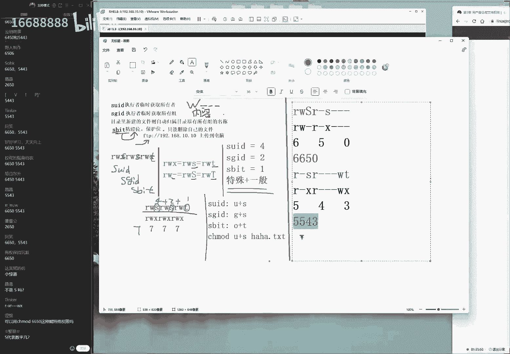

你可以去算一下，比如说6650对吧，我们随便找一个文件，因为它是可以针对于文件来进行设定的，比如说我来给大家举一个例子，随便找一个文件稍等一下哎，随便找一个文件6650。

然后我们随便找一个文件设置一下啊，大家说我们的啊，可以用6650来去设置特殊权限吗，可以啊，来上等一下啊，同学问到了，说我们能不能当数字法来说，特殊权限是可以的，来我先查看一下某个文件是这样的一个权限。

当键权限是这个样子的，可以啊，然后是6650，于是我们来设置一下文件。

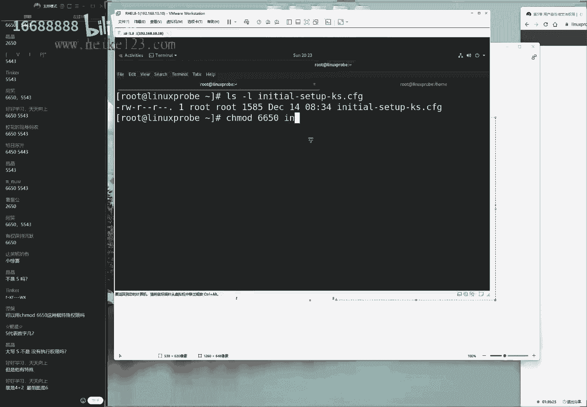

再去看，大家会大家可以啊，大家会发现是不是跟我们计算出来。

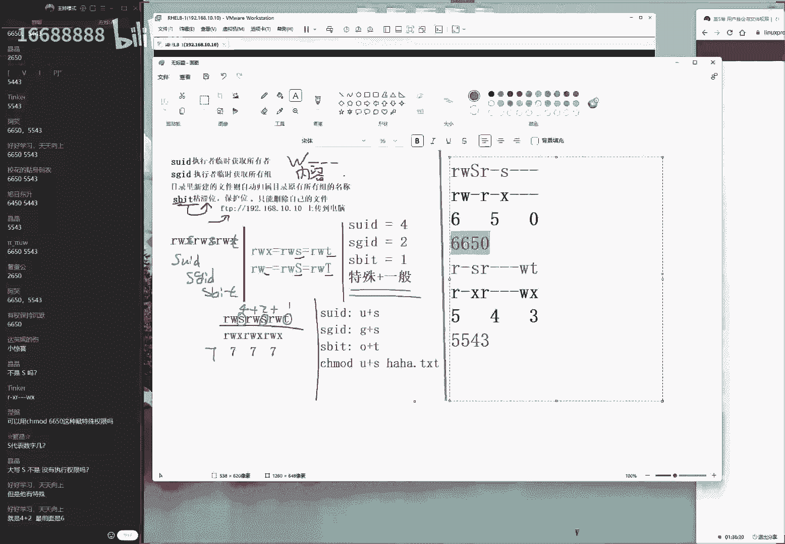

这个结果是一样的，没有问题吧，大小写都是一样的，好再来5543，来我设置一下5543，其实同学们下课之后就可以自己处理啊，就可以自己处理的题目了，最后看一下自己计算出来，对不对。

另外的话此时你也应该能够深刻的感受到，就是通过这种数字法来去设置的话呢，会比我们这个权限法设置起来更有效率，对吧啊，回家啊，回家啊有效率，这样写起来也更加的这个便捷，大家看一下，算出来是没有任何问题的。

好，下面的话呢我们来给大家往后面再来一句说啊。

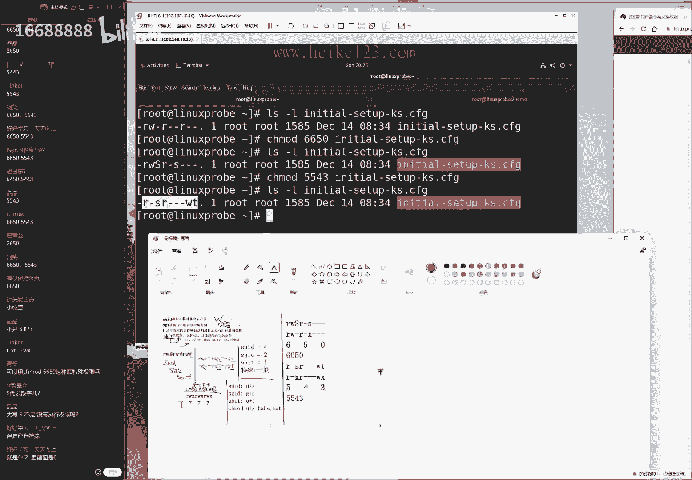

再来给大家出两道题目，说完了之后，我们就翻篇再往后面去说了，因为这个太过于重要了，我们如果这个不熟的话呢，下面同学们再去听课的时候就会很有压力了啊，基础一样打牢，最后再给大家去说两个。

说两个这个数字法转成这个权限法，说完之后就去下一个了啊，随便来了啊，我来65436543，然后他再去算一个，就是这个5555，随便同伴，那不不不五，太简单了，543啊，五四啊，那不543刚刚有了是吧。

等一下啊，嗯随便来了，比如说2345吧，好大家把这个给他算啊，给换算一下，把我们的数字法反向转换成权限法，算完之后，我们就可以踏踏实实的往下面去讲了，其实这个对于权限的转换嘛，大家一定要熟练的，因为呃。

您可能认为说我们没有必要那么熟练的话啊，但是我们要熟练之后的话呢，同事们再去啊，工作当中啊会很有效率的话，以及别人这样去做的时候，就比如啊，那我们比如说别人去执行了这么一条命令，我们自己可以不用啊。

当然我们可以不用了，但是别人这样去用的时候，我们看不懂怎么办呢啊因此这个还是很重要的，66543，其实第一次上课的时候，我不太我我们并不太想要把大多数的时间，或者说花费很长的时间给大家去解释。

学习这个标性，因为这个不因为这个，因为这个要是不必要的话，也不会去讲了，所以的话呢大家就先去好，先去记忆一下，后面会有一个利用的一个方法的好，我们现在的话来给大家说一下，大家问的一个问题。

大家说大写s代表说自己啊这个问题问错了，下面一个问题，大家说大写s是不是代表没有执行权限呀，对是这样的，来啊，来给大家今后往往后面去说6543，另外的话如果没有跟上的话，我看得出来他也没有跟上啊。

这个方法很正常，我们基本上这一节课能够有八成龙卷能跟上吧，七成算不错，然后剩下的话呢就是回去之后，您需要反复去练习，因为大家也看到了，我们再给大家讲课过程中的话呢，利用了这个大概得有个15分钟了。

怎么去讲这个换算的题目是比较浪费时间的，结果如果咱们再换算出来，正反两套又半个多小时出去了，咱们今天这课就会很水啊，所以我们会照顾到基础比较薄弱的同学，但是你也要努力的往前赶，我们前面给您去呃。

慢一点啊，在这个讲课的这个节奏，并不是说我们一辈子会去迁就我们的，基础比较薄弱的同学，是给大家能够去弯道超车也好啊，能够留足充足的预期时间也好啊，您需要看视频的啊，不能说我们去慢一点了，然后以后也会慢。

也不会这么慢的，来6543，我来给大家讲一下啊，这个我的思路是这样的，那么好，那我们首先来讲的话，这个特殊权限法我们先不用去动它，先算这个一般权限法543，这个没有问题吧，543。

那我们换算之后五那么五的话，那就是401，四的话就是4000的话，三的话也就是021，这个我们算出来之后，这是我们的一般权限法，一般权限法的话转换成我们的权限法r减x，然后是r减减减w x。

这是我换算出来的一个结果，它有一个六六的话呢，我们是叫做s u i d加上s g i d对吧，那就是4+2，那我们最后算完之后是这样的想，那么啊那么也就是说这位和这位是有的，他有权限就是一个小小s。

他没有权限，就是一个大小s，最后算出来的结果是这样的。

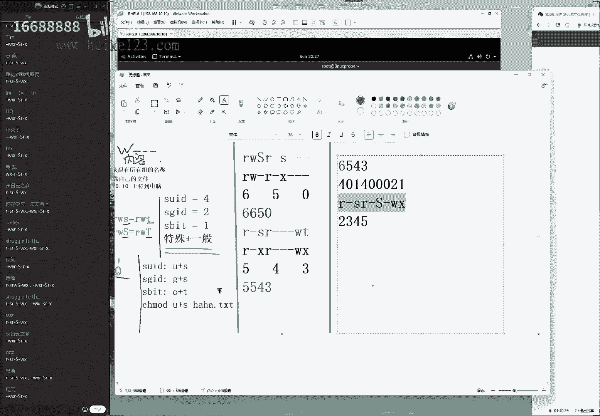

好6543，我最后算出来这个结果是这样的，落实到实战，看一下，验算出来的，这个结果跟我所计算出来的是否一样呢，来看一下最后这个结果还是啊不呃。

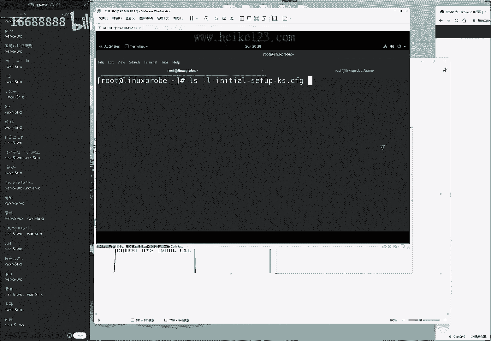

不要去纠结说这个以后有没有啊，用到了这个机油滤啊，这个用到几率超级大，我们不再解释，于是来看一下，最后我们换算出来，这个结果跟实战出来的是一样的，好这是第二啊，这是第一个。

接下来再来345345转成这个数字法，那就是021，然后400401对吧，好转成权限，把零二啊，那那啊那啊那啊，那么的话就是啊可啊可读可写啊，不k啊，黑图可以直行，然后读，然后的话呢以及可以读可以执行。

把这个权限的话呢来看一下，这个是个三，它指的是s g i d以及s b i t啊，这两个权限于是加到这一位上面，他有权限吗，它没有，那么于是一个大写s他有没有权限啊，没有那么那么就那么不啊，它是有的。

那么因此它是一个小写t，最后算出来这个结果是这样的，来算一下啊，2345我们看一下剧中的这个结果。

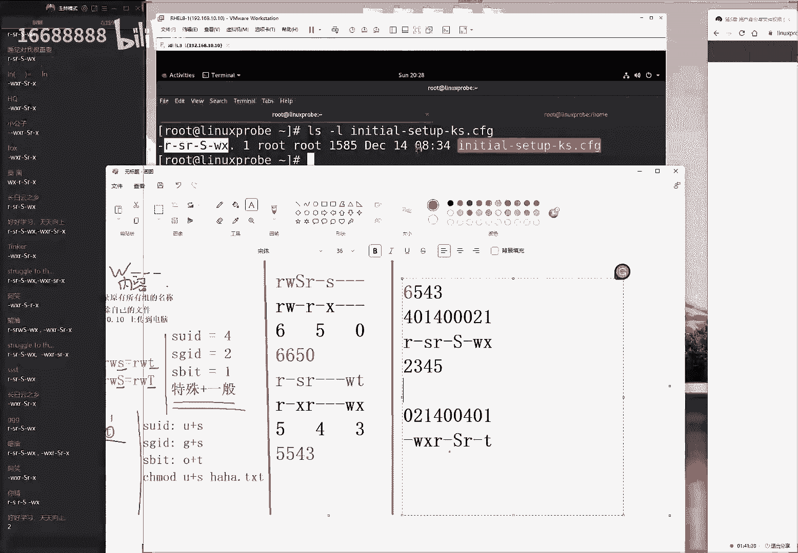

2345其实对于初学者来讲的话呢。

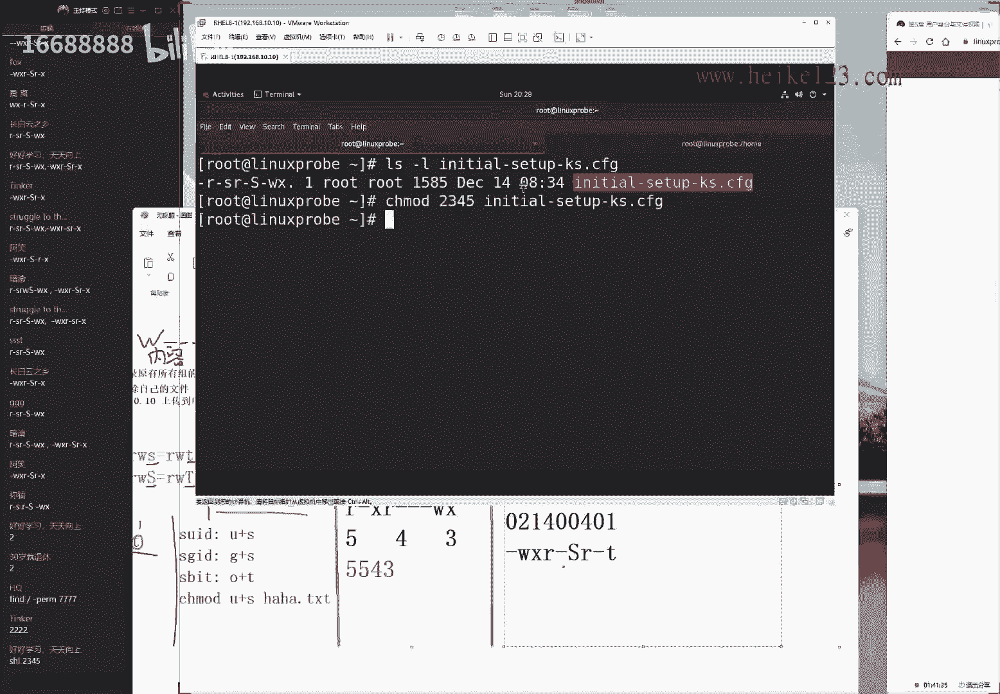

最呃忌讳的是什么呢，大家看一下，最后换算出来，这个结果跟我们所预想的是一样的，其实初学者最忌讳的是呃总是再去纠结，就是嗯嗯等一下啊，我是算错了吗啊，23455哦，哦哦不好意思啊，是我算错了。

五的话是4+1加出来的，嗯这是我的问题，不不诶啊2222啊，不好意思啊，我看错了，他二二的话，他就只有最后一位不，他只有啊，它是桌游啊，他只有中间那一位是我算错了，我刚才看成三了，不好意思来。

那我们来看一下这个是个二，于是的话呢我们最后这个结果是这个样子，其实我们对于这个初学者来讲的话呢，呃最忌讳的就是会去老去纠结，说老师这个有没有用啊，就老去纠结这种问题。

嗯然后的话呢就会去选择性的去学习了，其实的话呢我们给大家讲，对于一个初学者来讲，你没有能力，现在判断说这个东西有没有用的情况下，真的是不要去纠结，然后就去学就好了，因为您总是在判断说这个有没有用。

然后去选择性的去学这个没有学，我觉得现在没有用，然后接下来用到的时候就会很发愁了，这个时候恰恰是很忌讳的一点好，下面来给大家说一下这个5。4小节，我们讲一下这个文件的e呃，隐藏权限。

大家觉得这个到此结束了吗，没有的，我们刚才讲了，这个一般权限跟这个特殊权限还没完，下面一点特叫做隐藏权限要来了，隐藏权限，它顾名思义就是被隐藏起来的这个权限，他的话呢是对于我们的这个呃。

一般权限跟特殊权限的这个功能，又进行了一次补充，同学们可以看一下表格，五杠八啊，这个里面的话呢我们的章节是5。4，表格是5。8，它是对于一些功能的话来去进行了一些啊补充，比如说啊我先给大家说一下命令。

命令的话要选择去设置的时候，是使用的是这个要讲下去查看的话呢，使用的是这个啊，来去记一下这两个命令，因为嘛顾名思义一它叫做隐藏权限，隐藏权就是默认我们看不到的一种权限，我们需要使用到专业的命令。

然后来进行一个设定以及去查看，如果要想就去设置我们的这个权限的话呢，它使用的是一个加上啊这样的一个权限，这样的一个方式，然后后面写上是文件的名称，然后要等下去取消下一个权限的话呢，那么则是一个减号。

减去一个权限，后面加上文件的名称，这样来去进行一个设定的好，现在的话我们给大家看一下表哥五杠八呃，给大家随便抽这么几个给大家来说一下，首先的话呢第一个我们最后来看了啊，第一个比如说是一个小写i。

它指的是我们设置过后，将无法对于文件来进行任何的修改，然后包括说文件的话内容也不能够再接，再来进行一个剪切跟新建好。

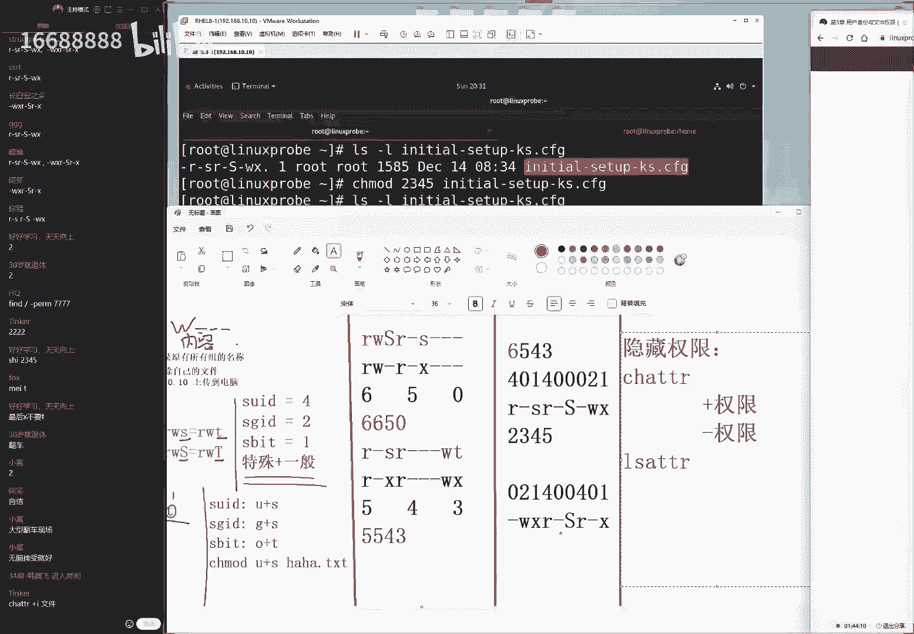

巴拉巴拉好，我们这样去做，要想来进行设置的话，那么就是叫做c h a t t r啊，然后的话呢我们来加上一个i啊，后面写上文件的名称，比如说这个文件按下回车，然后给大家去说两点。

第一点隐藏权限是默认看不到的权限，他才做了隐藏权限，所以我们去查啊，去查看文件的信息的时候，它没有任何的异样啊，但这个异阳他啊，这啊这个的话是因为来自于我们前面，不不我们还得还一下虚拟机吧。

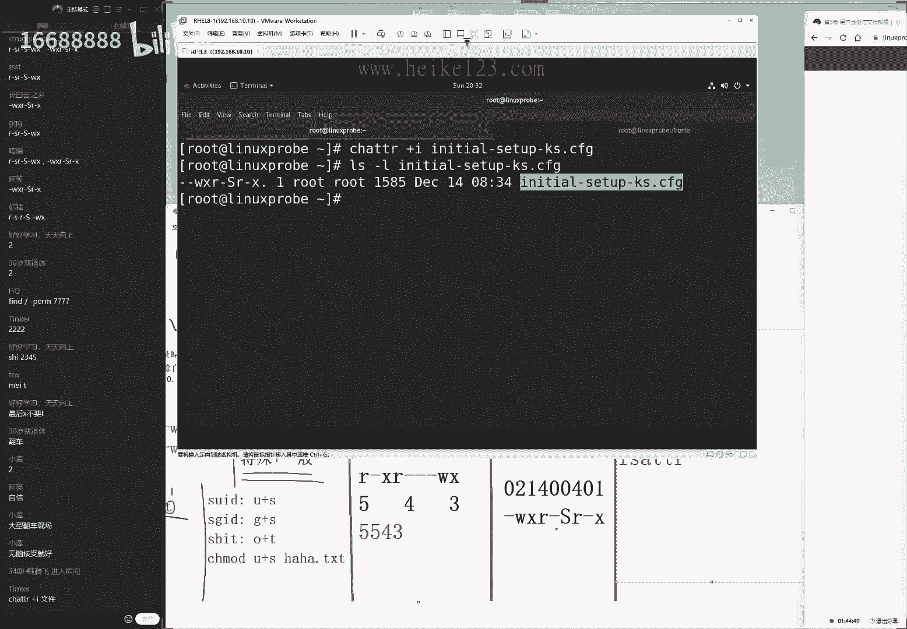

因为大家如果不还原虚拟机，会，觉得我们好像上边。

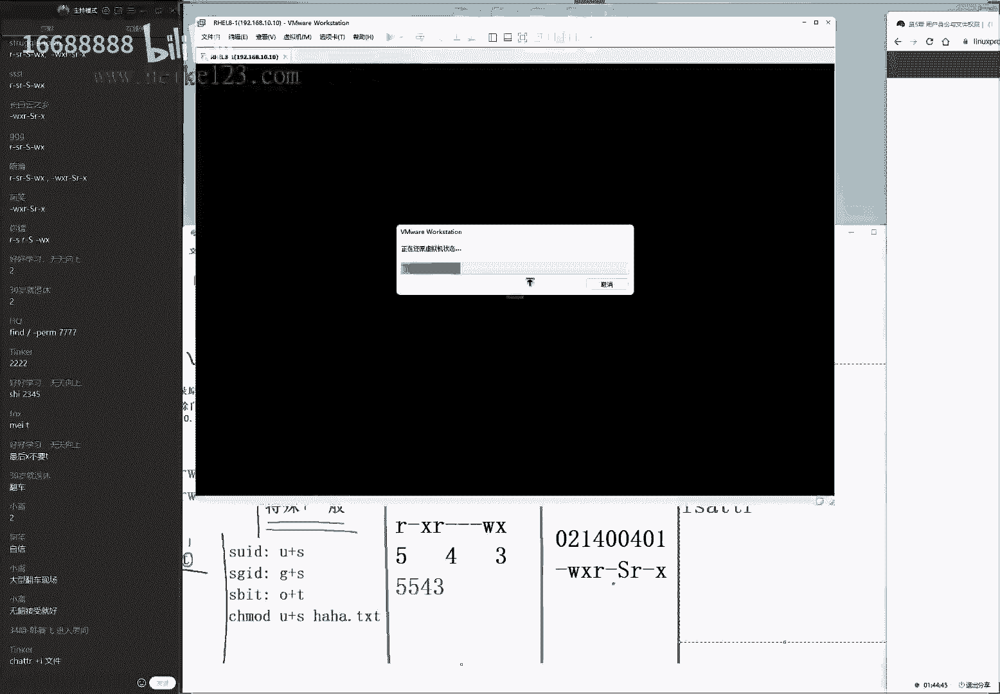

这个文件是跟设置的权限相关了，那我现在还原一下虚拟机了，我现在的话呢再重新的去设置一下这个权限，有一个文件，这个文件的话呢说啊上面就设置一个刚i参数，于是我查看一下这个文件上面的这个权限，讲的第一点。

第一点隐藏权限是默认看不到的权限，所以我们看到这个权限设啊，设置前后没有任何的异样，没有任何的变化，这是第一点，第二点，管理员受一般权限的限制，所以管理员去删掉这个文件的时候也会出错呃。

于是得到这样的一个报错了，稍等我先喝口水，这个的话呢实际上是hc以前那道考题之一啊，对啊这个也不能删啊，关联也删不了，这个的话，实际上就是我们以前一大红包考试的真题，是真真的题。

就是原题红帽rh 3 c啊，哦对我们是红帽23c20 道题300分，每道题目15分。

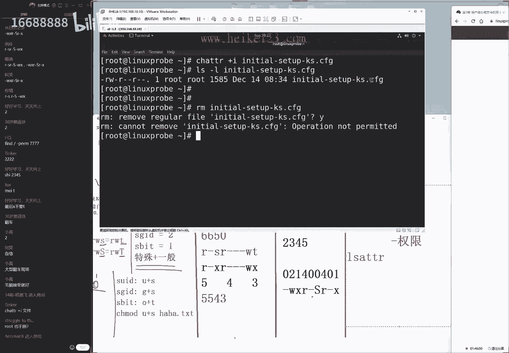

15题啊，他的话15分就考这么一道题，就是我现在有一道题目，它价值的话是15分，这15分只需要让我们去删除掉，这个文件就可以了。

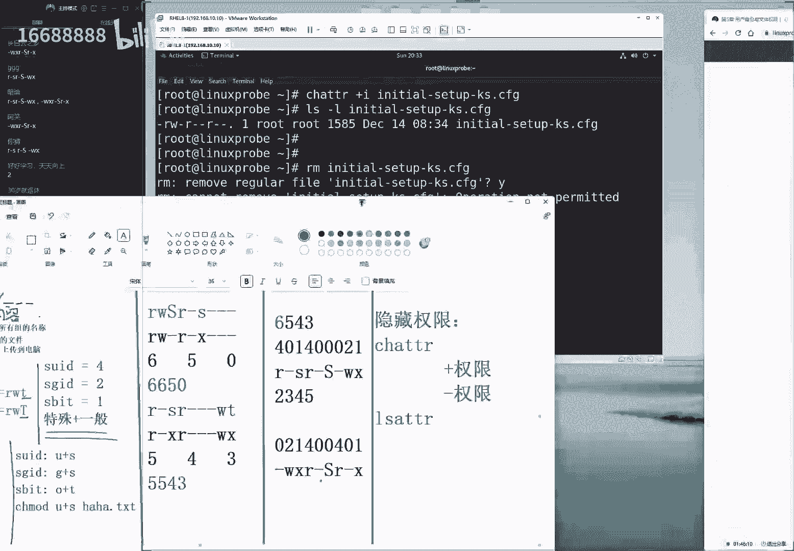

但是我们也删不掉，特别的着急呃，所以的话呢我们才有可能辅导这样的一个视频，占了一种辅导形式，其实的话呢考前辅导，他并不是让大家去学习一个新的技术，它是之前大家都已经学了啊。

但是只不过我们需要进行一个串讲，把考试当中又要去使用这些技术的话呢，再去做一下回忆。

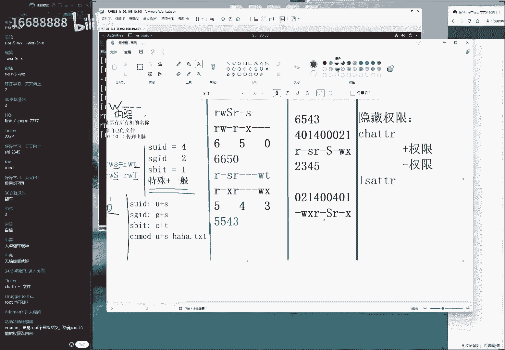

因为就以这个为例，在考试的时候我们根本就想不起来是为什么呀，就是我们虽然学了这个隐藏选项，但是我们就想不起来，比如说我先去删除这个文件，我的思路是删不掉对吧，好查看一下我们这个文件的这个权限没有问题。

查看一下我们这个上一集当前目录，这个权限也没有问题，然后的话呢我去使用到强制删除，加上目录的这个递归操作去删除掉这个文件，我还是删不掉，这就是我明明会，但是我表达不出来。

这是考试时候的一个很大的一个机会，好现在的话呢我再给大家说一下，怎么把它给删掉，删掉的方法的话呢，就是去查看一下这个文件上面有哪些呃，呃呃隐藏权限，然后把它给去掉就可以了，来去使用到这个专业的命令。

然后后面加上文件名称查看一下，看到上面有一个i啊，怎么办呢，c h a t t r减去一个i把它给删掉啊，去掉这个文件上面的隐藏权限，接下来再去删的时候就没有任何问题了，是可行的，这个就叫做隐藏权限。

好这个大回问了一个问题啊，不大家问了两个问题好，大家说说感觉啊，我们这个管啊，管理员要是没有删的话，没有意义，毕竟我们也可以把权限给他改过来对，因为的话呢权限因为我们的管理员嘛。

他是可以去修改这个权限的，所以说这个对于管理员这个限制，是比较有的少的，然后大家说怎么权限全都是精精精精简，这叫隐藏权限，指的是他没有啊任何的隐藏权限了。

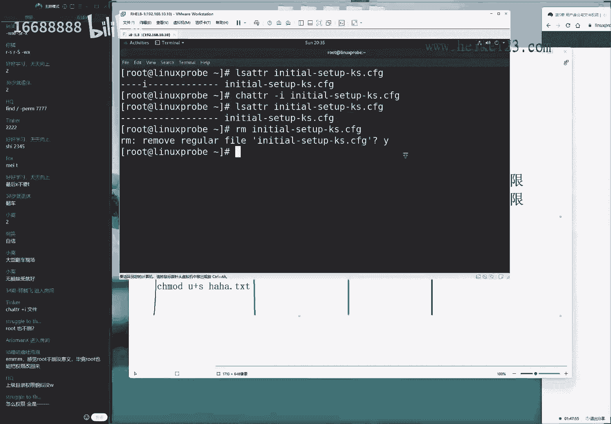

然后的话大家其实这个问题问完了之后，还会再问另外一个问题，说老师那考试的时候，如果说他的这个给的这个值，它不是个i它也不是个a它比如它是个z，这个怎么去理解呢，不用管啊，他要是给的话呢。

不管他给的是什么，我们管它干嘛呀，我们就直接c h a t t r，它有什么我们就剪什么就可以了，大家记一下考试的时候有什么减什么，不要管它的含义啊，把它有什么就给它剪掉它就可以了。

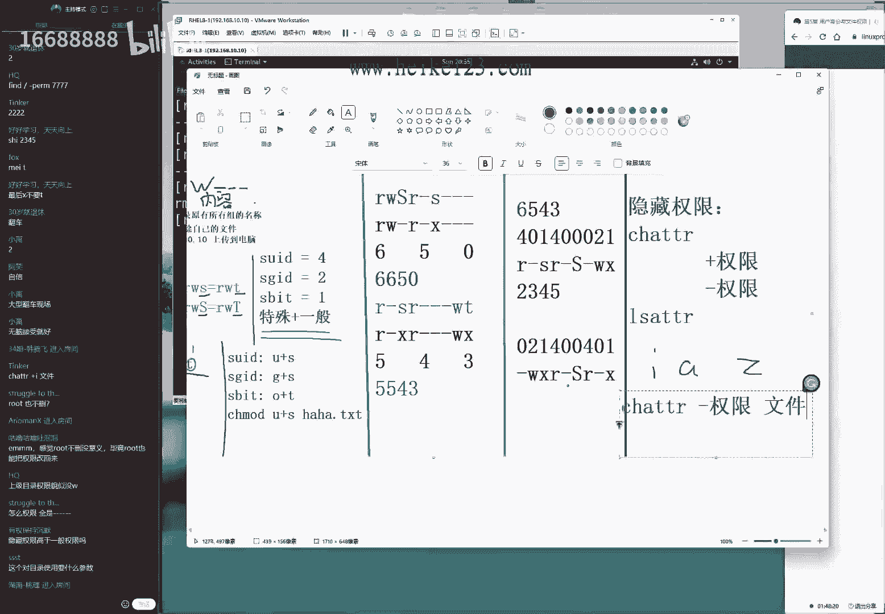

没有问题好，这是第一个啊，这是我们的第一点啊，第一啊这是我们第一点啊，不这是我们要给大家讲的第一个参数叫做i参，数，设置过后的话呢，任何人无法编辑文件里面的内容，也无法去对文件进行一个剪切和删除好。

这样的话呢还有比如说呃比如说我们的a对吧，a的话指的是呃，我们能否对于这个文件里面的内容来进行增加，啊，这大家刚才问到的一个问题好，我们可以来尝试一下，例如说我先这样。

我现在的话呢对于某个文件去设置一个a参数，这个话呢我们设置好了之后，我们再往里面去写入信息的时候，如果说使用的是要做清空呃，写入重庆相符，那么我们写入这个文件的时候，它就会失败了。

因为他会去先去清空后写入，所以它会给我们来个报错，因为当前的清空操作是无法完成的，但是我们的a参数指的是它是允许追加的，于是的话那我们可以写上两个大于号。

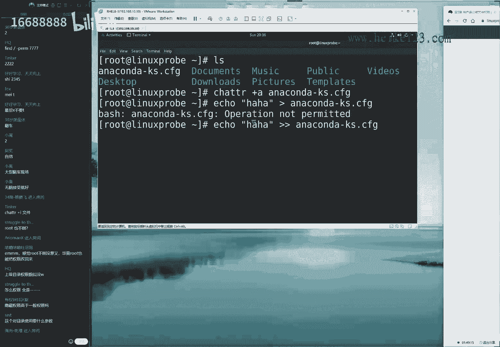

叫做追加写入重定向符，那叫做啊，这个我们叫做啊追加的啊，追加重啊，叫做追加的输出定向符，叫追加的输出重定向，然后所以的话呢我们使用的是两个大于号，这样的一个方式来去输出。

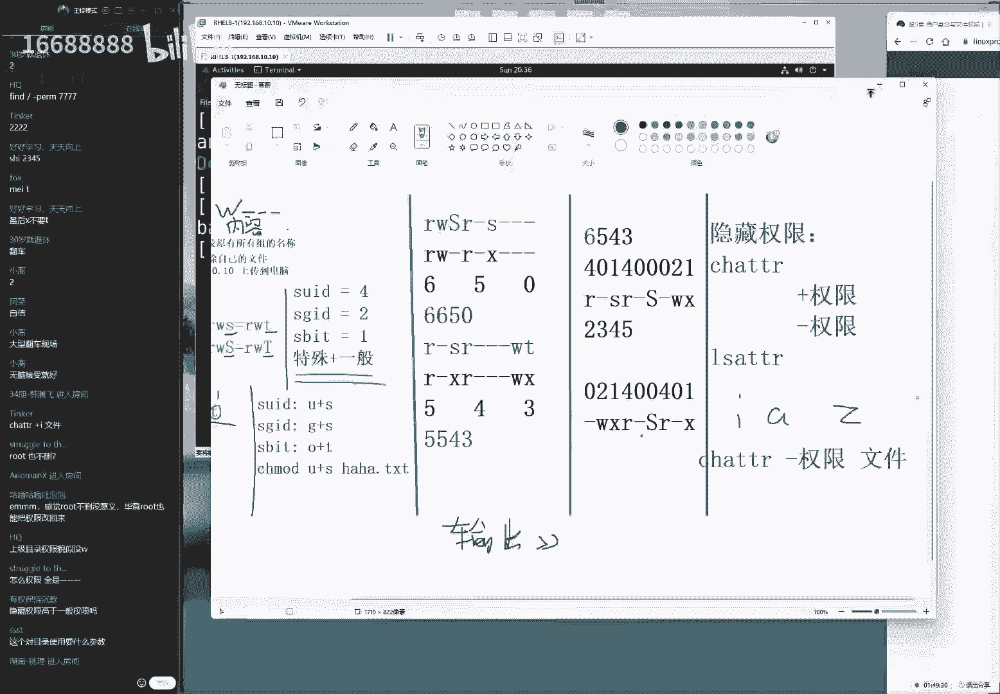

大家可以看一下效果，k写入成功没有任何问题，然后一起去查看一下这个文件的最后信息，里面已经是写的这个内容了啊，是这个是写入成功的，这就是a的这个参数的一个作用，这个大家可能问到说。

老师这有什么样的一个用处吗，这个是有的。

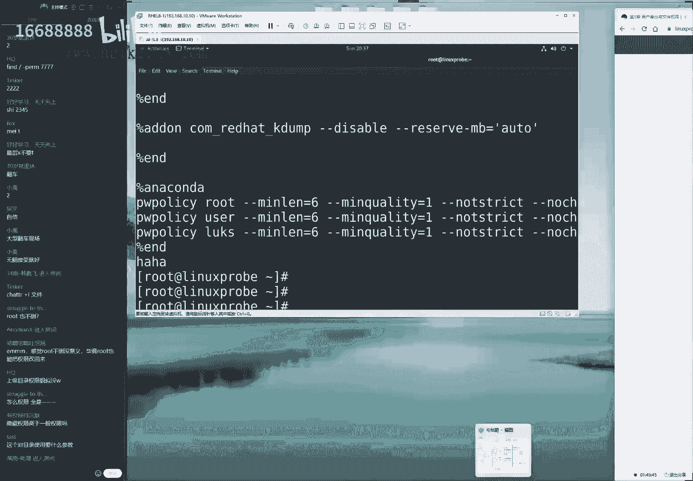

比如说我们可以对于我们的日志文件，来去加一个a参的数，因为大家想一下，因为它的日志只能是增加，没有减小的这种呃机会，如果说谁会去减小呢，比如说黑客去修改了啊，他啊比如说一名黑客。

他想去修改我们的信息的时候，他才会去减少里面的内容，所以的话呢对于我们的哎上面加一个a参数，保证说信息只能够进行增加，而不能够进行减少，这就是一种保护的方案，好这个是大家可以来去记下来的一个作用。

然后的话呢我们这个其实五杠八啊，其实呢我们的五杠八的表格里面，给大家介绍了每个参数的一个作用啊，就会很详细了，呃其中的话呢我们比较常用的话，还有一个小小s，但是这个的话呢它需要文件系统的一个支持。

他的话指的是从我们的硬盘当中给它删除掉，而无法进行恢复，其实这个话也是有一个梗可以给大家去说的，就是大家有没有看过一个美剧叫做越狱啊，好大家有没有看过一个美剧叫越狱啊，就是叫做一个电视剧叫越狱。

然后有好多好多年了，我当时我记得看那个时候还是我上大学，还上高中的时候特别的火，还是上初中的时候特别火，大家有没有看过啊，这个大家看过是吧，ok看来我们这一中学的话呢比较喜欢看美剧啊。

不太喜欢看清宫剧啊，不太喜欢看穿越剧，说一下这个啊，那我啊大家没有看过的话，那我给大家说一下啊，这个话叫越狱啊，是一个美剧说的话有一个剧情说下有他画，这边的话又分为四季啊。

第一季的话呢是有一个啊主人公叫做i啊，嗯迈克对吧，然后的话他的哥哥诶，他的哎异父异母的一个哥哥，然后的话呢因为被冤枉了，被送到监狱里面去了，然后的话呢，他就正好去见了那个监狱的一个工程师。

他就把那个监狱，那个图都纹到自己的这个身上去了，然后的话他就去九寨沟去了，然后呢最后一把第一季的最后，他就把他哥给他救出来了，这么一个剧情，后来的话第二季怎么回事呢，是第二季有一个探长啊，他是一个卷毛。

这个好啊，然后到第二季的时候，那个卷毛嘛，然后他就去找到了那个迈克那个呃啊家里面了，结果的话会发现它里面那个家里面，那个电脑里面的硬盘的话没有了，因为的话呢第一季的时候，那个麦克的话。

把那个硬盘顺着窗户给他扔到湖里面去了啊，然后他们给它扔到湖里面去分的啊啊啊啊啊啊，然后的话第二季那个时候的话，那个探长嘛就找到他们家里面找那个硬盘，然后的话呢就发现那个窗户正好开着的航首，我好像忘记了。

就说那个啊窗户去找那个硬盘，结果就把它找回来了，然后的话通过这个修复软件，结果他把这个硬盘里面的资源给他又找回来了，也就是说呃实话了，那也就是说，实际上我们把这个硬盘给他格式化了。

包括的话呢我们把这个硬盘给它泡水了，实际上的话呢还是有人可以把它给恢复出来的，我们这个时候就可以加一个消息s的一个参数，让我们去删除掉一个文件的时候，它不仅是啊把它给删掉了啊，啊它里面这个话呢。

真实的数据在这个blo块的话呢也会被提升啊，那么也会被填充上零块的数据，这样的话呢我们从理论上来讲，再加上几次格式化，它就无法被恢复了，这样的话呢我们如果第二集这个啊。

那么如果说第二季他加了我们这个参数的话，他有可能和后面的话，他也不知道他们啊他们是想去哪儿了，所以的话大家就知道了，我们这个有些时候这个参数的话，可以决定我们的命运呢。

如果说我们这个啊主人公看过咱们的课的话，加过这个参数，只要加一个小小s，那么这个第二季啊，那么看来我们的第二季第三季就没有了，那就可以啊，第一次啊就可以结束了，好继续看啊，就是成为一个小例子啊。

大家看一下这个参数加小s的一个作用，好的话，下面啊这个例子有点呃有点呃牵强啊，但是的话呢再试下印象就好了，下面的画面还有that了啊，比如说那个b的那个参数是一个小写b。

它指的是无法去修改文件以及目录的，一个存储时间，因为我们第二章节的时候看甘地的，觉得确确实比较牵强啊，都举的啊，都举到一个啊越狱了，比如说的话，我们第二章节的时候学习的一个名叫做touch命令。

它可以使用一个叫做gd的参数，来去修改我们的文件的a time和c time对吧，那么我们今天就可以让他呃文件的话，那无法被修改，那我们如果要是有人去呃入侵了我们的电脑，想要去修改文件之后，去隐藏它。

修改这个时间的话呢，就可以保护我们的这个计算机了，还有的话呢比如说我们的这个呃d吧是吧，那我们来就它啊，它指的是当去做备份的时候，来去忽略掉某个文件或者某个目录，这样的话呢来啊，不要对他再进行备份。

那我们总之吧看一下表格，五网吧里面主要就是些功能，如果说我们需要哪个功能的时候，那么则去使用这个命令，然后针对于我们的文件来去啊，他啊进行一个设定就可以了，这个的话呢它并没有什么难度。

好我们现在来给大家往后面去说啊，大家学完这个之后的话，这个比较简单，我们来往后面去说，这个话呢，下面一个我们叫做文件的访问控制列表，来看一下，我们叫文件的访问控制列表，就是我们前面的学完了之后。

我们总结一下，第一个的话呢，我们的前面的一部分，这个实际上我们叫做一般权限对吧，然后的话呢我们这个的话呢叫做特殊权限，这个的话呢我们是叫做隐藏权限，这个学完了之后，大家有没有发现一个共同点啊。

就是我我们现在学了三类权限，但是这个三类权限都有一个卡，bug一样的一个共同点，大家可以帮我们总结一下吗，或者说我们这个三个权限设置过后，都有哪些用户会受到我们权限的限制，以这个角度去思考来。

大家来去思考一下，其实我们每一个技术的出现，都是为自己的一个问题而出现的，不要讲的那么的高级，因为当你知道它是解决什么问题而产生出来的，一个技术的时候，你就知道该在什么时候去使用它了。

大家努力比我所说的这个意思啊，大家来以我这个角度上来去思考，来啊越狱啊，大家比较喜欢看是吧，我还是比较喜欢看一个叫做绝命毒师啊，而且好像看到那个twitter上面有新闻，好像要拍一个续集。

不知道真的假的啊，还是感觉非常期待的啊，好有点远了，远了远了远了啊，不过也无所谓了，已经攒了两个多小时了，已经讲了两个小时了，也可以放松一下了，来下面来去说一下啊，总结一下。

就是我们前面所学习的这三个权限，有什么共同点吗，答应说出来了，是对于所有人或者对于一类人来进行设定的，对不对，也就是说，如果说我先对于一个文件上面，设置了一个一般权限的话呢，那么他只要归他所者啊。

那么他只要归谁所有，归哪个组所有以及其他人的话呢，就全都会去受到这个限制对吧，还有的话呢，这个特殊权限它是对于所有人来进行限制的好，这个话的隐藏权也是设置过后，连我们的管理员也会一起来说啊。

也会也会一起说也会受到这个限制，所以说他也是一个所有人都会去受到限制，这样的一个权限，也就是说我们设置过的这个权限，都会对于所有人或者大部分人都去生效的，但是就有问题了。

我该去如何去针对某一个文件的某一个人，来设置这个权限呢，更加精准的流量的这一步啊，更加精准的全新的设定，能够让我们的工作更加的准确对吧，那我们这个时候就可以去使用到一个技术了。

叫做file system啊，不呸呸，那这个话我们叫做文件的访问控制列表啊，来给大家写下来呃，这个字有点小吧，来发呃，xs control list文件的访问控制列表权限，它的作用就是能够针对一个人。

即一个文件来去进行啊，来进行精准，它这个词特别好精准的权限的设定，我就想针对于张三，那那我们就开始进行一个设定啊，这样的一个方式哦，我给大家演示，然后我们来给大家说一下这个命令吧，因为这个比较简单。

我们就可以直接，就是把理论跟这个实战融合到一起了，要想起来去设置的话呢，叫做sfc co，后面的话呢是一个消息m进行设定，如果想针对于某一个用户来去设定的话呢，他们则是一个小写u。

要想针对于某一个用户组来去设定的话，那么则是一个小写g诶好，那我们针对用户的话，则是一个小写u后面加上一个用户名称，比如说啊随便咱们去写一个用户名，然后我们加上冒号权限啊，加上权限后面加上文件名称。

就是这样的一个方式，我们就可以去实现出来针对于某个啊，那么可以去实践出来，针对于某一个人的某一个文件，来进行一个单独的权限的设定了，然后的话呢我们也可以去使用到get fa sl后面。

加上文件名称来去获取一下，说这个文件上面已经有哪些设定过后的文件，访问扩列表，这个权限就可以这样来去，有时间了，没有问题，来我们来继续继续来看一下啊，sf sl，然后是一个m。

指的是修改后面的话我们的用户名称及替代，然后权限文件名称拿去实现，这样的话呢是查看的一个命令，同学们有没有觉得今天这个权限看似简单，一讲起来就没完没了了，这个一般权限隐藏权限。

特殊权限f sl就会很多啊，一学起来会多会觉得特别多，其实他还没有完事，今天讲完了之后，明天还有呢啊明天讲完了之后，第八章还有呢我们第八章节啊，第九章的时候还有一个s linux那个超级难啊。

那叫安全子系统，就是呃根据这些它是啊有了这些了，然后的话呢，它才让我们这个计算机变得特别的安全嘛，啊因为越加的这个细致跟复杂的全新的设定。

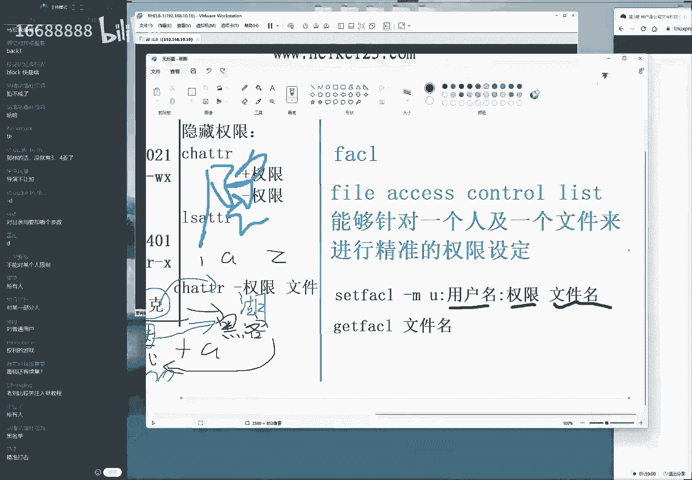

才能够让保证我们这个服务器非常的稳定啊，接下来我想我想说啥来着啊，同学们说脑子啊，现在的话脑子非常的嗡嗡的啊，我也是啊，ok我们不要乱不要乱不要乱不要乱。

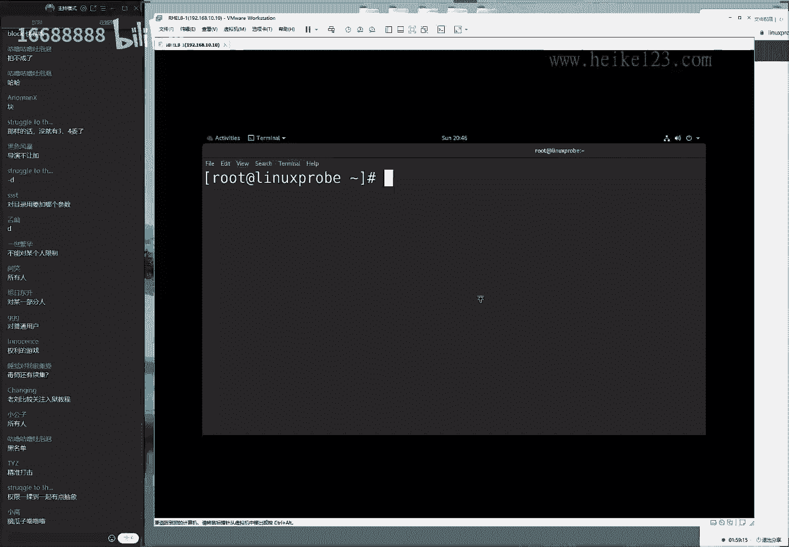

我来给大家说一下，比如说啊比如说我脑袋实在是啊很乱啊。

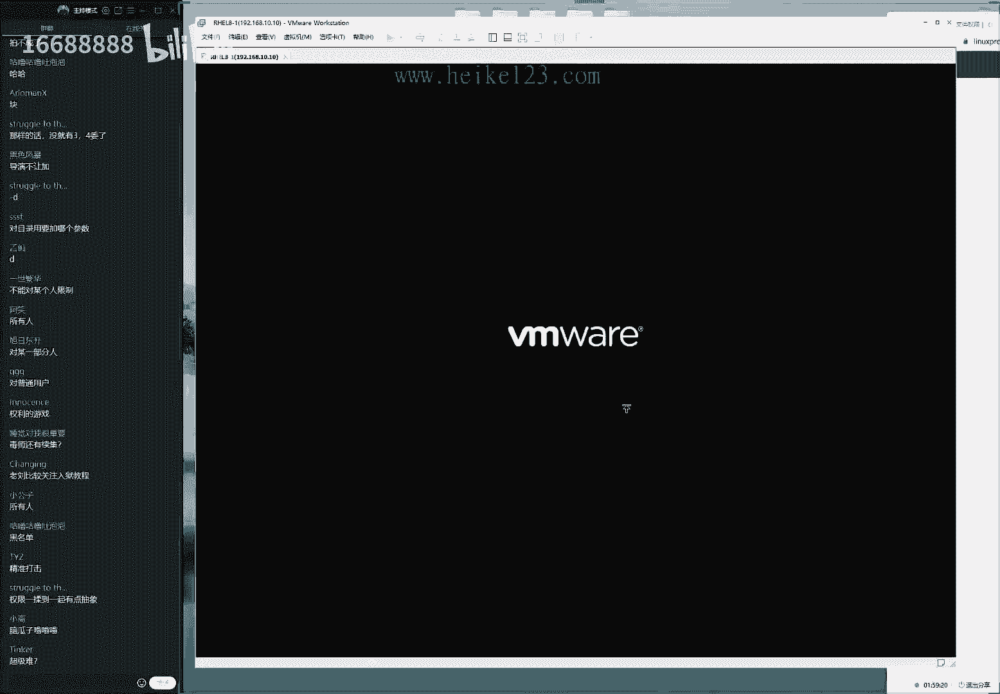

啊不脑，我脑袋现在没有乱啊，其实其实其实其实其实还有点乱的啊，来是这样的啊，我现在在讲的例子，比如说现在有两个用户，一个叫张三，一个是李四啊，异父异母的亲兄弟呀，同一时间新建出来两个用户。

同一时间新建出来两个用户，一个张三啊，异父异母的亲兄弟一模一样，张三李四两个亲兄弟没有问题吧，然后我先这样，我举个例子啊，嗯我现在新建一个目录好吧，这没毛病吧，新建一个目录目录名称，我叫什么呢。

我叫做是谁发言了啊，小公子是吧，我叫小紫吧，这个名字不太礼貌，那好吧，就随便吧，新建一个目录叫小紫，然后的话呢我现在把这个小子这个目录嗯，我进入到里面去，然后的话呢，我把这个小子这个目录。

设置这个一个比较大的一点权限，比如说七七权限，满权限加上杠r叫递归操作对吧，我们针对目录里面的所有文件加上这个操作，这对于小子这个目录，我们去世了一个七七满权限，然后干嘛呢。

然后去查看一下这个目录的权限，加一个小写d查看目录权限好，七七满权限满了之后干嘛呢，哈哈然后我想一想啊，然后我们这样去形的sf 1 sl，后面我们加上一个消息m设定一个u。

我针对于李四这个用户来去设置一下这个权限，它的这个权限我们为减减减，它可以有啊，比如说我们要想它设一个权限的话，那我们就是一个啊这样啊就说定就可以了，比如那啊，那我换了，我们可以这样来。

是它可以对它进行编辑的这个权限，或者我们这样去设的都可以，那我们根据这个实际需求，射程权限为尖尖点，它没有任何权限，然而针对于哪个目录呢，针对于小紫这个目录，要想针对于我们的一个目录。

来进行这么一个全新的设定，我们还需要加一个杠杆递归操作，哎，加上这个杠杆代表是目录以及目录里面，搜索文件来按下回车呃，所以我现在这个操作就是这样的。

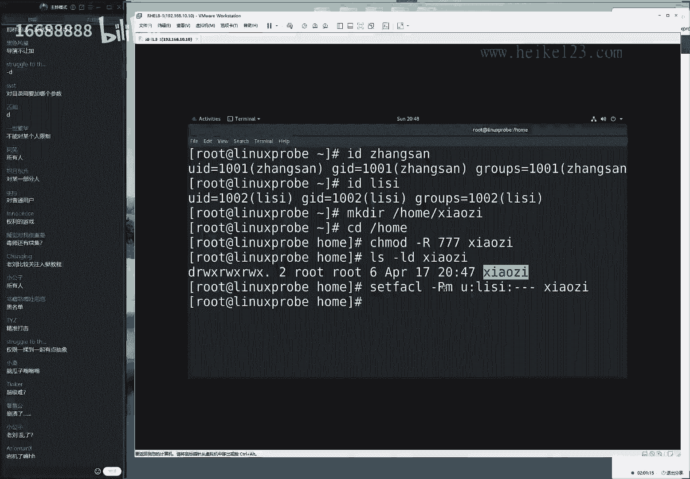

我们也就是说默认情况下，大家听一下我这个思路啊，同学不要乱了，我现在我现在已经跑过来了啊，他说大家不要乱，也就是说我们现在有一个目录叫做小子，默认权限的话呢是七七权限，任何人都可以进行一个读写执行权限。

包括我说其他人没问题吧，同学们不要乱啊，千万不要慌，然后的话呢我们现在设置一个单独的fa sl啊，file啊，file啊，防空列表，我们现在的话呢就设置成那个李四，只有李四这个用户没有任何的权限。

也就是说每一个人都可以对于这个目录，进行一个读写执行权限。

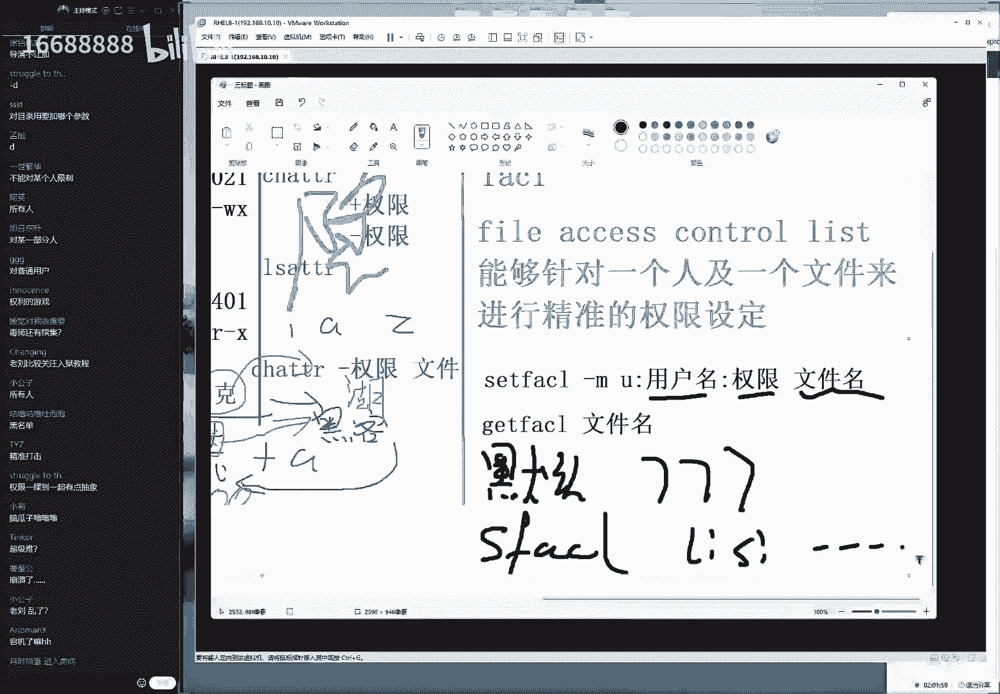

但是只有李四没有任何权限，我现在是这个思路，好吧好，我现在还是这样，首先的话呢我现在去切换到张三这个用户，张三这个用户，然后我去进入到小紫的这个目录当中，好我们进入到小组的目录当中去新建一个文件。

叫做哈哈好，然后的话呢我们把它给改个名字，比如说修改成叫做吼吼啊，ok没有问题，然后我们再来把这个文件给它删除掉，那就是说我们现在新建改名和删除都没有问题，把它删掉了，可以啊啊没有问题好。

这个是也他也是一个呃默认情况，但是我们现在切换切换到李四这个用户，切换李四切换到home目录里面，小子看我看到没有，确实没有乱啊，就是大大啊，当然我们会发现切换的这个操作就失败了，我连进都进不去。

我也没有权限去查看里面的文件，我更没有去在这个文件夹里面，去新建文件的这么一个权限，这个就是老刘没有乱的一个表现啊。

是不是啊这么一个证明啊，确实没有乱，就是可以看到默认情况下。

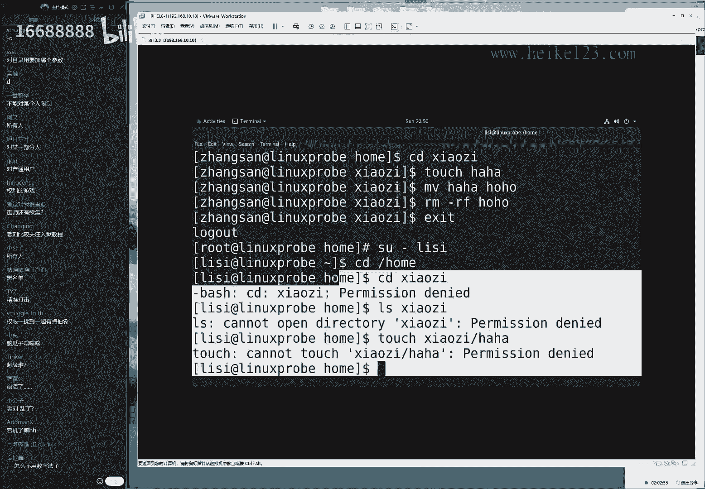

虽然都可以去进行一个增删改的这么一个目录，但是只有李四这个用户被限制了。

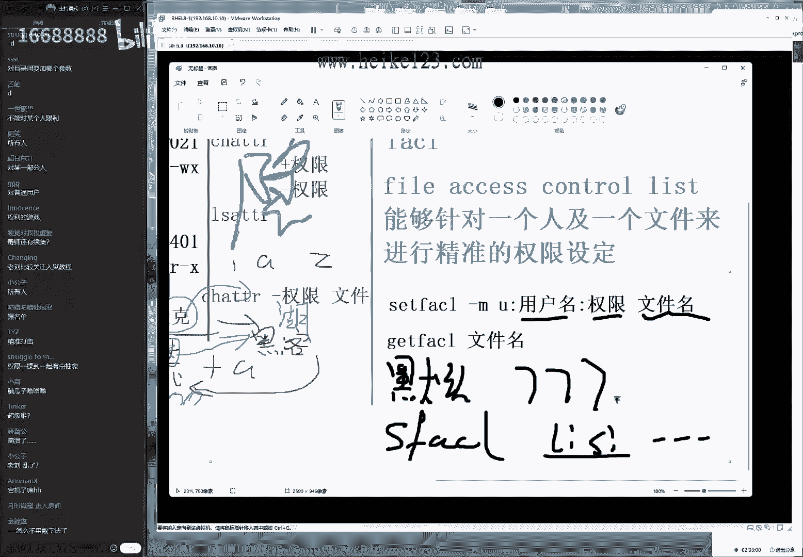

这就是叫做f sl，它可以针对于某一个人或者某一个组，来进行一个精准的流量的一个打击啊，这样的一个过程好，大家现在的话呢可能会有两个问题嗯，那大概会有三个问题，第一个问题大家说这个话呢不能用到数字法啊。

它不能用数，他这个话呢我们的爱啊，这个我们的命令啊，它不支持用数字法去实践，这是第一个问题啊，第二个问题是啥来着，看来确实有点乱啊，这我们自己承认啊，第一个问题它不允许用数字法，第二个问题大家问到说。

那我们该怎么去查看这个目录，上面有哪些pastyle呢，我们命令是这样的，叫做get fa style，后面加上文件的名称，比如说小子按下回车，可以看到所有用户都可以进行读写，对吧啊。

但是只有李四这个用户为没有权限，这是我们去查看的一个方法，大家也会问说老师，那我现在我想把它给删掉了，怎么办呢，如果说我现在不想让他有这么一个权限了，我把它给删除掉好，那我想把这个限制给它删除掉。

叫做呃呃下才飞sl，如果没有记错的话，记错就记错了，好像是个杠b把它给删掉，来杠b，然后后面的话呢我们加上小子这么一个词，然后看一下就会发现里面，我最后我们就没有这个限制了。

因此当我们再去进入到这个李四这个用户的时，候，他就可以顺利的进入到，我们所刚刚进不去的那个目录，以及在这个目录里面去新建文件也好，改名也好，然后去删除也好，也就都可以去做了，这就是我们对于我们的啊。

我们的访问控制的一个操作方法啊，然后的话呢我们书上面还有一个事例，是对于我们已经被是对于已经设定好了，就我们的权限来进行一个备份，这个我们就把它调，那我们就把它调过，因为这个的话呢用的特别的少。

我们把更多的时间的话呢给大家讲一下，5。6小节，讲一下用户的这个切换，以及的话，那我们对于这个权限的一个单独的一个设定，然后我们来看一下这个命令的一个切换的话呢。

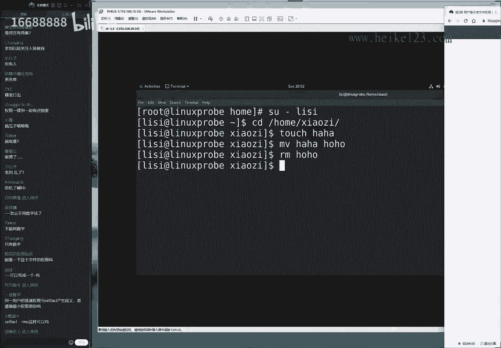

我们使用的是一个宿命令，他的话指的是切换一个用户的身份，这个大家需要截图吗，可以截图，然后的话呢我们来给大家去做一下总结，可以看到你的这个书上面啊，正好总结了四个权限。

就是我们的fn sl文件的访问控列表啊，file system来我们来记一下文件防控列表，一共是有四个权限，然后下面来给大家往后面去说了。

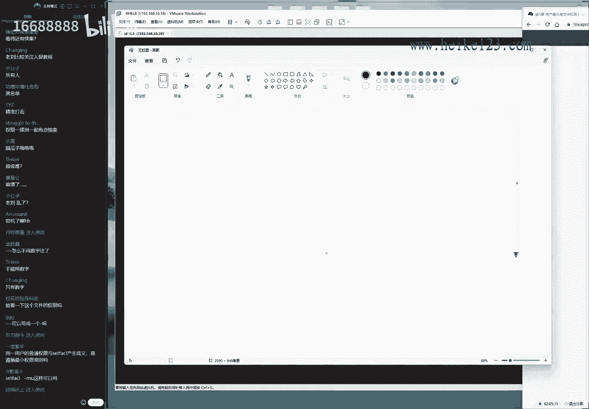

说一下我们的切换用户的一个身份，如果说我要想去切换一个用户身份的时候的话，我们可以去使用到一个叫做素的一个命令，然后来去切换，比如说我想要去切换到某一个用户，我就是这样一个速度加上用户的名称。

就这样去切换就可以了，但是话同学们会问到老师诶，我怎么看其他小朋友们再去切换的时候，会加一个减号呢，这个减号的话呢，我们是把它叫做完整的切换，或者我们叫做完全切换，这个理解起来就是说呃。

如果说我们要是没有加这个减号的话呢，它变更用户身份之后，它会保留我们这个中啊，那么它它会保留我们这个用户，他之前的一些变量信息，而如果说我们家这个减号的话呢，指的是进行一个完整的设备变更。

它不会保留我们这个用户。

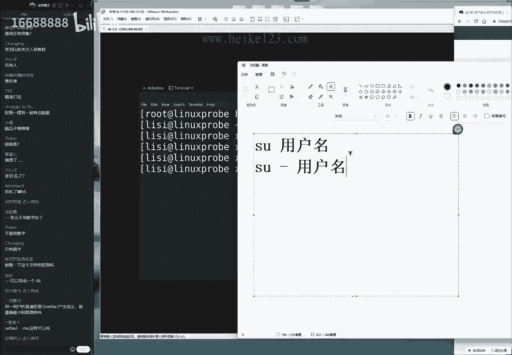

它原先的这个变量信息，它就它那它进行的是一个完整的一个变更，所以我们一般情况下都会去使用它加一个减号，比如说我们现在是去选管理员，切换到我们的用户叫做linux pro，我们切换过后之后的话呢。

这个变量啊，那我们这个用户里面所有正在使用的这个变量，所有的这个比如说我们自己的邮箱啊，巴拉巴拉的，他都是变成自己的了，虽然说可能跟之前是一样的，虽然可能跟之前这个用户是一样的。

但是可以看到他这个所有的这个啊变量信息，都变成他自己的了这样的一个变化，所以我们去建议大家去选一个减号，这样的一个方式。

其实这个没有什么可讲的，它超级简单，但是我们有这么一点大家需要注意一下，就是我们要想去使用到塑精切换的话呢，管理员去可以去切换到任何人的这个身份啊，切换到任何人员，并且的话呢是不需要密码的啊。

叫做无需密码来去切换，这个是可以去实现的啊，管理员可以切到任何人，并且是不用密码的，然后的话呢啊等一下我切换到普通用户吧，普通用户是啊不用密码了，但是的话呢普通用户他也可以去切，他也可以去切换到管理员。

也可以切换到另外一个普通用户，但是的话它都是需要密码，那都要密码这么一个啊都啊这样的一个区别，大家记一下就ok了，也就是说宿命就是用来去切换用户身份的，我们从啊管理员切换到普通用户是不用密码的。

但是的话呢从我们的啊普通用户啊，他切换到另外一个人的身份的时候，他不论是谁，他都是需要密码了，这样的一个变化，这样的一个区别好大家下面有一个问题，大家说如果同一个用户的普通用权限。

跟我们的set fclo产生歧义了，是遵循最小权限原则吗，不他不是最小权限原则，它是fsa的这个优先级是最高的啊，大家理解一下，如果说我们现在这个权限，在我们的目录上面有可读可写可执行。

但是我的fa sl的话呢，单独设定了，你就没有，那么则你没有fs的这个权限，是要高于了我们的一般权限的，是这样的好，然后的话我们再来啊，给大家说一下我们这么一个问题，就是说我现在的话呢。

如果说我想要让我的下属去完成环球工作，那也就是说他如果全程不足的情况下，他就需要去登录到我的身份，他需要从他的普通用户切换到管理员，然后才能去完成表情工作，但是的话呢我又不想告他密码。

这个时候怎么去做呢，这也是我们大多数情况下需要去使用到的，也就是说宿命的话呢，是一个超简单的一个命令就可以过了，我们主要学习的是一个叫做速度服务啊，速度啊，速度服务程序，它来去根据一个用户来进行啊。

精准的权限的设定，就是我们这个宿命的话呢，它过于简单了，他必须要让用户进行一个完整的身份变更，他需要告诉对方我的密码，但是如果我说我不想让他看到密码的情况下，我该怎么样对它进行全新的放行呢。

我们该怎么样对他，让他去执行某些工作呢，我们可以去使用到速度服务，速度服务的作用的话呢，就是可以让某一个人可以去执行某些工作，它可以进行一个单独的权限的设定，有点像是我们叫做精准的s u i d权限。

精准的s u i d，因为我们之前给大家讲了，我们的i c y t权限的话呢，它实际上是我们怎么理解呢，它是设置过之后是让所有人都可以在啊，我们设置过后的话，它是让所有人都可以呃，在执行过程当中。

临时获取到文件所有者的权限了，但是的话呢，我们现在有个叫速度服务的一个动作，它能够让我们这个命令的执行过程当中的话呢，这个呃执行者临时获取到了一个更高的权限，但是的话呢仅限于某个用户，他并不是所有人。

从所有人变成了一个精准的一个用户，所以说它可以被称作叫做精准的，s y d权限的设定。

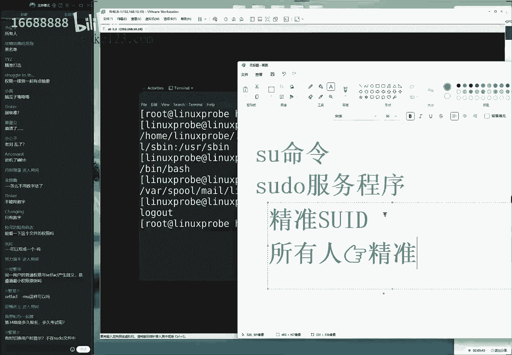

简单这么理解吧，我们来给大家操作一下，同学们看看这个的效果，首先的话呢我们先去还原一下虚拟机。

因为的话呢我们每个实验之间嘛，他可能会有冲突，我先还原一下。

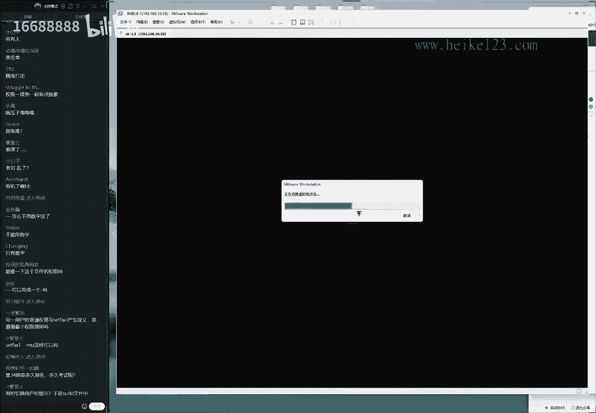

因为我呃呃因为我呃，因为我怕我刚才做过什么操作啊，他可能会有冲突，因为这个每个作业实验吧，还可能会有一些相关性，好像没有啊。

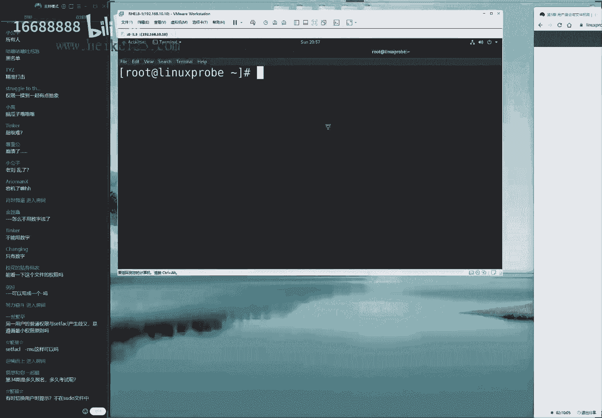

是我刚刚可能是我多虑了，来我们现在的话呢去配置一下，我们可以去使用一个命令叫做vi速度，实际上它也调的是我们的编译器vm，去实现的vr速度。

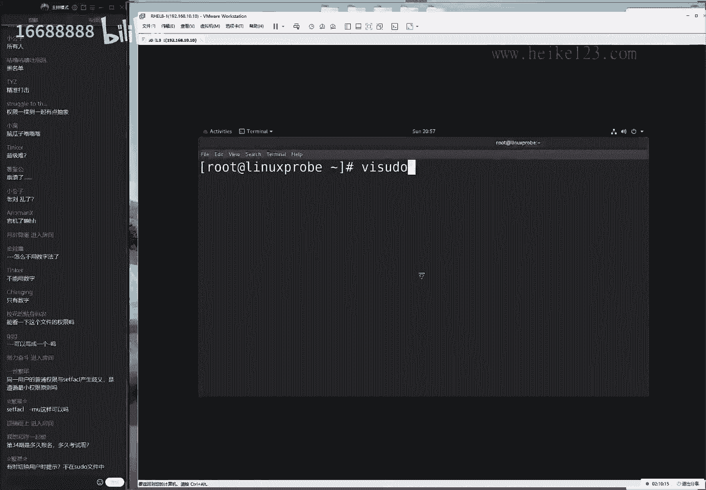

所以说大家讲学会了vm啊，则啊左边天下臣啊，就成就成都不怕了，那vn变异器呃，不仅是系统里面的通用，而且很多程序的话呢，我们遇到几个了，遇到了大概有两个吧，三个了，比如说crown top呀。

比如说我们的这个quarter呀，比如说我们这个啊速度服务啊，比如说gt它都是使用的这边，所以大家这个一定要掌握的呃，这个我们一定要使用的很熟练。

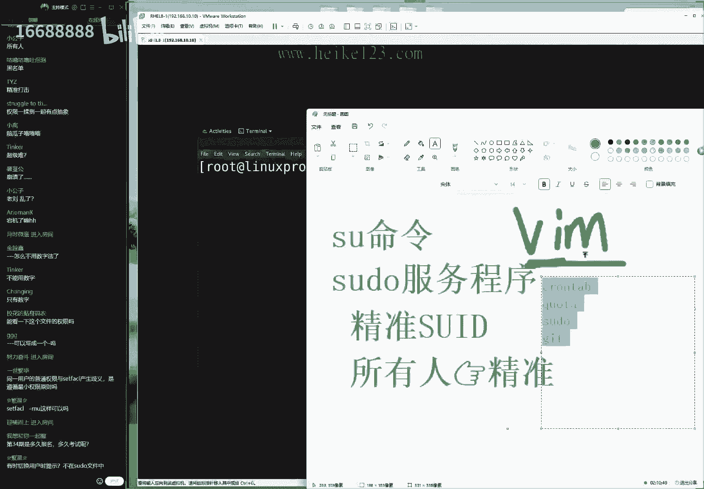

来给大家说一下这个vm编译器的一个操作方法，首先的话呢vi速度进入之后啊，为什么使用这个命令的一个理由，还是，如果说里边我们不小心输错信息了时候的话呢，退出的时候他会给我们提醒啊，等啊稍等一下啊。

如果说我们现在去保存并退出，大家可以看到他说我们的123行出错了对，那也就是说它会有一个纠错的一个功能，这就是我们去使用vr速度的一个好的理由啊，这些话也许会有一个好的理由，好好大家问了一个问题啊。

说我想和你一起醒，然后同学问了一个问题，说34期是多久报名考试啊，这个大家好像比较自信啊，听完今天这个课之后，感觉信心满满，准备考试了是吧，我们准备是4月下旬或者5月中旬，或者5月上旬给大家报考试。

报的是5月底或6月下旬的啊，或者6月中下旬吧，下面一个问题，大家说有时候切换，用户会提醒说不在速度文件里面对，那我们就需要进行一个单独的权限设定了，比如说我们现在的话往前来去设定啊。

现在去设置一下这个vr速度，vr速度的话呢我们先不要太高上往下一点点，因为太高上的话呢，程序没有读完，我们就去写它，有可能导致它不生效，往下走啊，行书的话呢，我建议大家嗯一把行吧。

我记得是100行左右会有有这么一个事例啊，我们在示例底下去写啊，果然是一把行啊，老刘啊，老刘宝刀未老啊，记忆还是很到位的，来100行，我们这么去写呃，首先的话呢是指的是我们要给谁去设置权限。

同学问了一个问题，说我们为什么有时候去切换用户的时候，提示说用户不在速度文件里面，就是因为我们没没没有对他进行权限的放行，它并不是对他。

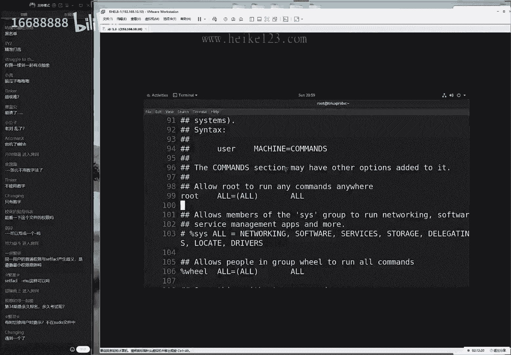

并不是对于所有人都进行放行的，我们必须要进行一个精准的设计，我们只有这个里面写了你的名字。

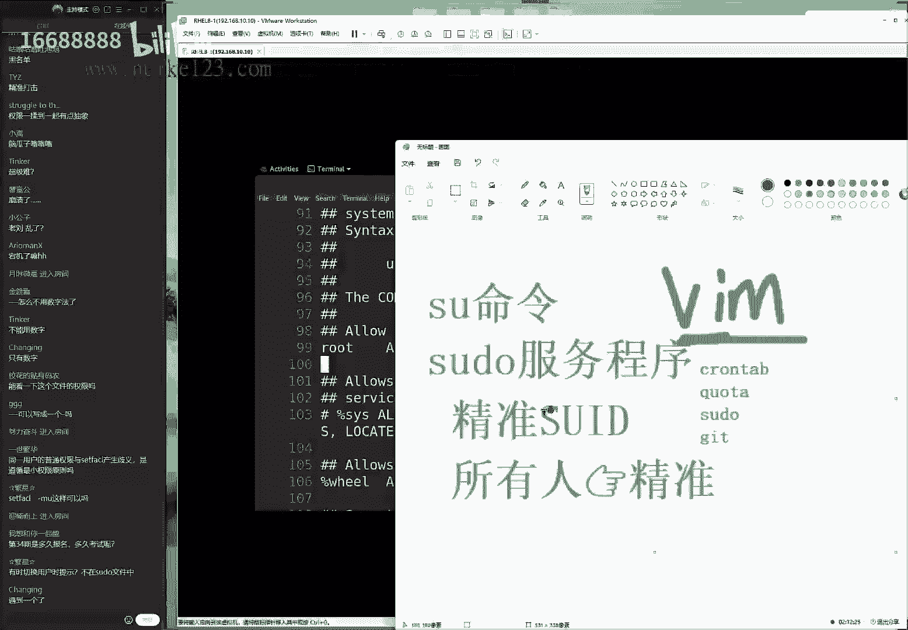

你才可以去使用这个速度服务，我们举谁呢，当然是linux pro的，对不对，我们家自己的亲儿子啊，我们来继续这个啊广告植入非常的这个顺滑啊，非常丝滑，然后我们第二第呃，第二个o的话呢。

它指的是当这个用户来自于哪个主机的时候，我们可以对它进行一个啊速度服务的一个放行，这个怎么理解呢，嗯这个理解起来的话呢是嗯，比如说我现在的工作，比如说我现在的工作是一个呃银行的职员。

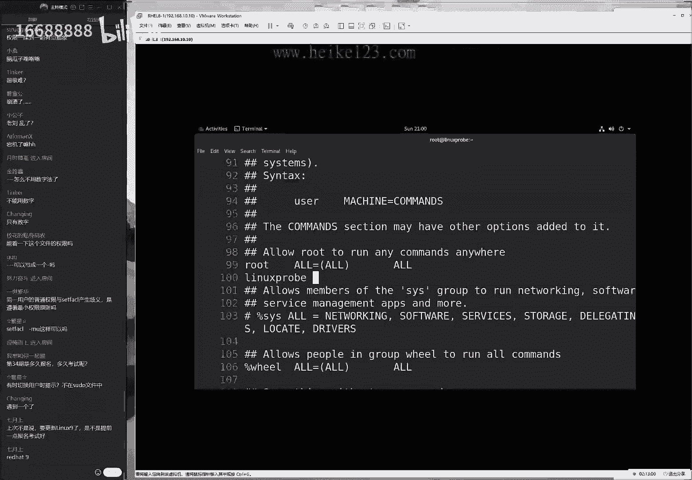

然后的话呢我的工作内容当中的话呢，一定有点钞，我就肯定一啊，我大概先按照我的思路去想啊，比如说我先是一个银行的职员，我的工作里面就一定有去打开保险柜啊等等，这样的这个行为，但是如果说我是工作日打开还好。

如果是我是啊，比如说我们的今天是2022年4月17号，礼拜日晚上九点钟了，我们现在去打开银行的保险柜，大家觉得这个行为还正常吗，我觉得不太正常了对吧，这个时候我们就可以对于这个时间来进行限制。

同样的那我们如果说想想那啊。

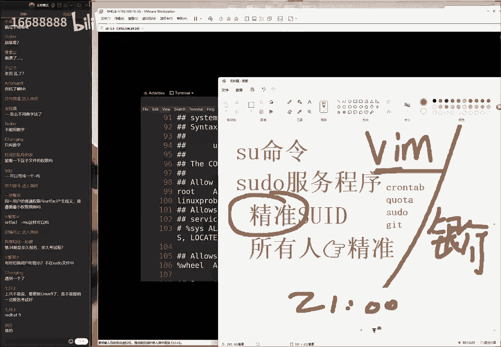

那么想要针对于这个呃用户来进行保护的话，它只有来自我们本地去打开这个啊，命的时候才可以去操作，那我们可以写上我本机的地址，或者我们可以写上本机的这么一个名称，来去限制说当它啊的一个呃来访的一个来源。

那么如果说我们可以写成一个o代表，不限制用户联网来源啊，他啊不论从哪以来，他都可以去执行这个命令的意思，下面的话，第二个o指的是它可以谁的身份来进行，那我们写一个all的话。

就等于说是管理员叫做root，这两个的话我们可以做替换，像我一样啊，他指的是我啊为啊最大权限为管理员权限，最后这个o的话呢，它指的是它能够去执行哪些命令，这个命令必须要是以路径的形式来去写，这个很重要。

比如说比如说比如说我们的reboot命令吧，反正啊反正我比较喜欢这个命令，因为的话这个命令特别的直观，要一些小命令吧，看起来不太的过瘾，我们就使用到这样的命令去完成呃，reboot。

后边的话呢我们把它给复制一下rebot命令，然后往里面一粘，那如果要是有多个命令的话，用到豆花组间隔符，就是说现在的话呢放心我们的普通用户，linux pp可以去使用的速度命令来进行一个重启啊。

它可以临时获取到管理员的这一个身份思路，有了也没太大毛病，我们保存并退出，看看有没有报错啊，没有报错啊，还是挺好的，做好之后的话呢，我可以来给大家去尝试一下，首先切换到我们的管理员。

叫做不先切换到我们的普通用户，叫做linux pro，我们在默认情况下，他去reboot一下，他会给我们提醒说有人正在登录我们的服务器，普通用户是无法直接重启的，这样一个报错，他不让，这时候怎么办呢。

我们可以这样子去使用到速度服务，然后的话呢我们后面加上我啊啊，然后我们后面再去加上音响去做这个动作，叫做reboot，这个时候按下回车，也就是说呃我们需要分两步走。

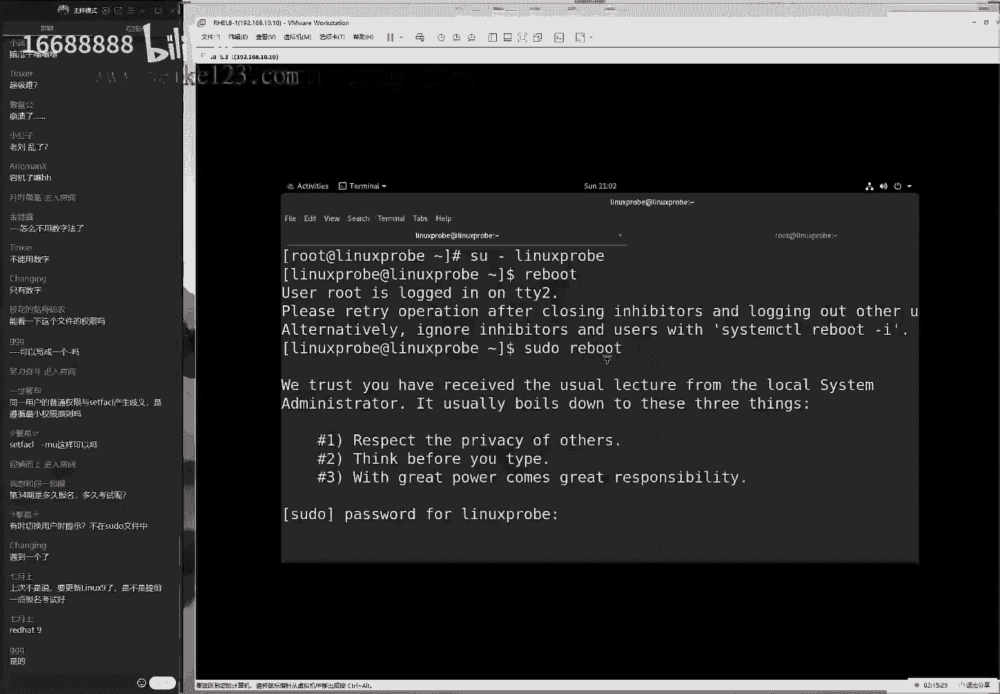

第一步的话呢，需要先把我们这个用户信息，写入到我们这个速度文件里面，我们叫vi速度，第二步的话呢就是要让用户去执行的时候，就是我们这边的话呢，第一步是要关联去做的，第二步的话是让我们用户去做的。

也就是说让用户去执行命令之前，先去加一个速度，后面加上我们的命令名称。

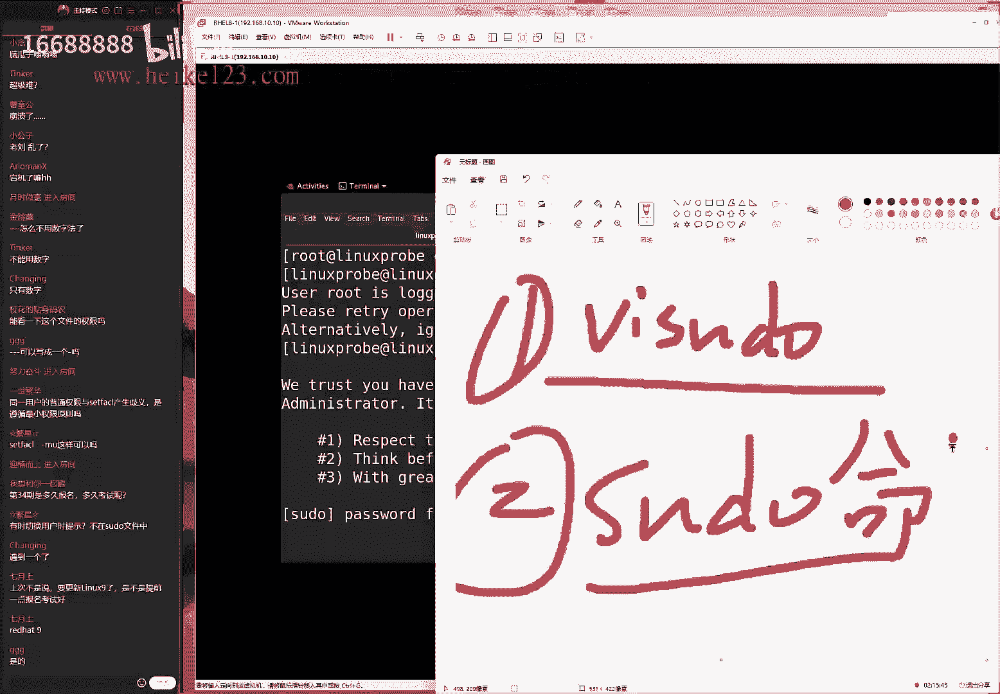

就这样去完成好，我们来看一下，按下回车之后的话，它会提示出来说啊，很多废话嘛，就是说我们相信你已经收到了这个啊，巴拉巴拉对吧，然后现在有三个注意事项，第一个注意事项的话呢。

就是说啊请尊重其他这个用户的隐私啊，好这个好吧，然后然后第二个就是说当你敲击之前的话呢，请你去思考一下你的这个行为是否安全，因为的话呢更大的权力将带有更大的责任对吧，然后第三句话就是说，如果你并不啊。

确认你所操作的这个命令是什么意思，那么你不妨报一下老刘的培训班啊，2400块钱啊，包你考过hc还是很划算的啊，好那我们读完了这个之后的话呢，呃当前最后还有一个输入框说，请输入一下当前用户的密码。

它当前的话呢是输入的是我们自己的密码，确认一下，说是我们自己操作就可以了，它并不是输入关联的密码，所以的话呢我们的关联的密码，我们当前是不允许输入的，来去输一啊，那我们先来去输入一下。

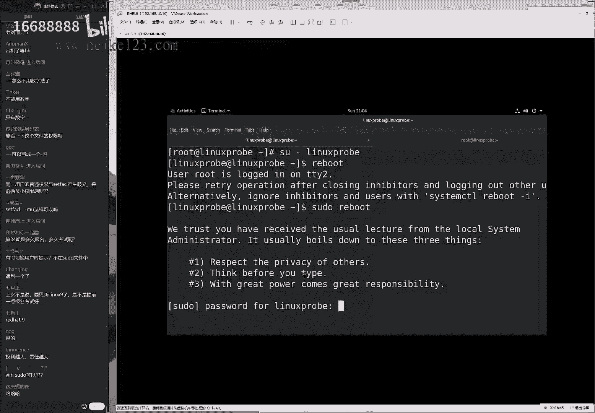

我们那我们的密码叫做red hat，按下回车，于是大家可以看到了，就重启成功了啊。

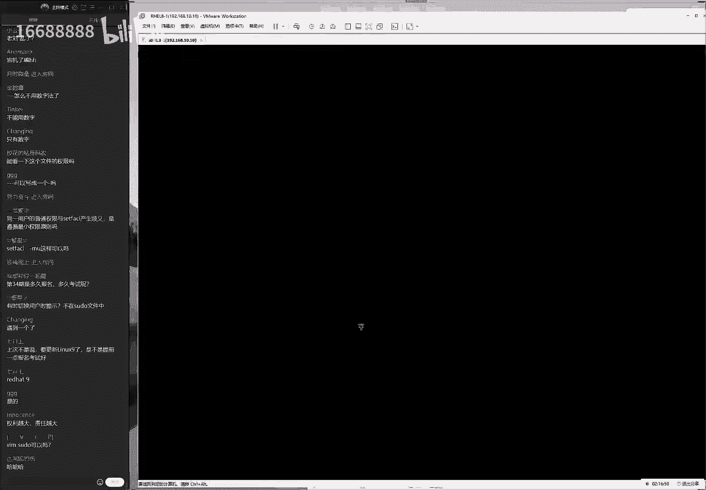

没有问题啊，非常简单，好好用好好用又好玩，我们来看一下，这就是我们去操作一个方法，只需要从其他大家总结一下啊，从那第一步先去vi速度，管理员需要先vr速度，对于用户这个权限来进行放行。

把我们的用户的这个权限加到里面去啊，先管理员先把我们这个用户名称，以及它能够做这个事情加到里面去，第二个的话呢，就是让我们的这个用户去执行的时候，使用造速度，然后后面再加上我们的命令名称。

就可以去取执行了，然后大家现在还有两个问题啊，我们能够想得到的，我们不希望就是讲课说那么不负责任，讲完就完了，就像一个渣男一样，我们能够希望负责起来，我所以我想了两个，可能就是我刚刚我一直在想。

我们去讲课的时候，同学们可能在听起来就很费劲了，就很就会很累了，其实我一直在动脑子去想，我们还有哪些没有说到的，能够对大家更负责那些事情呢，我又想到两点，第一点的话就是有一个原则。

第一个原则就是我们呃原则哎呀叫原则，就是我们这个权限放行的时候的话呢，最后一个不要写成一个o指的是所有的命令，不要这样去写，因为呃我们有一个原则，就是呃在能够满足工作这个前提之下，权限越小越好。

因为那就是啊，那也就是说我们在能够满足工作这个前提之下，能够少给权限，就少给权限，不要特别的多的给，比如说有一些命令它是非必要的，那么就不要给好吧，这是一个原则问题，第二个问题。

不要给他能够去编写文件的这个命令，比如说啊，比如说啊vm，比如说嗯echo，比如说巴拉巴拉，就是这样的这个命令不要给，也就是说同学们不要给一个用户，能够去编辑文件这个权限。

因为听我再给大家最后再去啰嗦一下，因为linux的一切都是文件对吧，所以当我们一旦给了他，能够去编辑文件这个权限了，然后你就失去对它的控制了，大家能理解吗，就像啊这没有什么就像了啊，就像啊ok啊。

比如说我先给一个用户一个编辑啊，那我现在啊啊，只是给一个用户去使用到我们编译器的，这么一个权限，我只放行这么一个命令，但是这个用户就可以去使用到vi，然后去编辑自己的速度文件，然后进行放行了。

于是同学们能够理解，我想啊，那么大家可知道我知道我想说的啊，不要让别人去卡这个bug，一旦你给别人了编辑文件的这个权限了，即便他不能去执行bi速度这个命令了，但他依然可以修改这个文件。

于是您的这个服务器就被沦陷了，这是两个非常重要的这个点，也就是我刚一直在去思考的，能够去补充的两点好，然后下面有什么问题啊，怎么样，大家说嗯，然后说为啥linux pro不能够vr速度。

因为普通用户是无法去执行这样的命令的啊，因为我们普通用户如果要是能够去编辑自己的，这个速度文件的话，就没有什么意义了，就像一个人可以去编辑自己的支付宝的余额，一样啊，就会变得啊后半生变得索然无味啊。

没有奋斗的目标一样好，然后的话呢我们来给大家说。

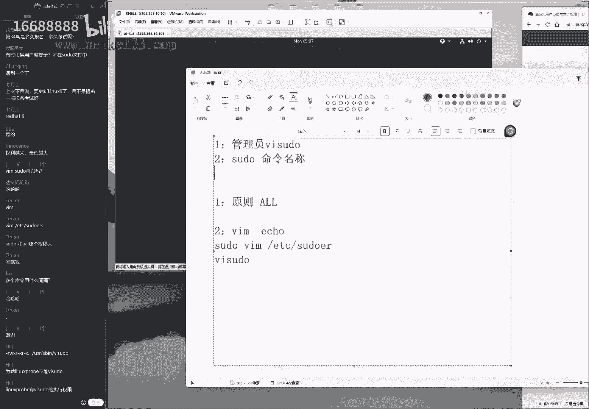

完了之后简单做一下总结，总结过后的话呢，我来说一下我们的下一周的课程安排。

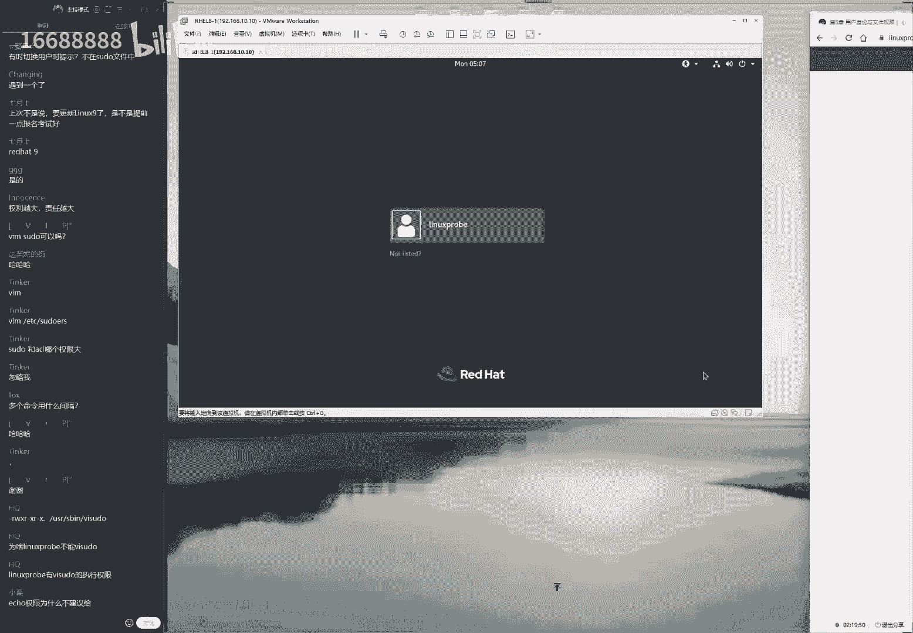

同学们就可以提前做好准备了的话，以及的话呢如果您要是有什么问题的话，我们刚才没有给大家想啊，没有给大家想到的点，你都可以去说出来，我们做一个补充啊，今天的话呢我们讲到第五章节，今天的话呢更难的啊。

今天我们讲很多我们讲的一般权限，特殊权限，隐藏权限fc了，以及速度服务很难啊，今天的话呢，我们的重点就是我们的rw x跟421的这个，数字法转换，只要这个掌握了就行了，这是一个最基本的一个线。

这个不能再低了好吧，然后下面的话呢再来就是说一下我们的预习，下周的话呢，我们的这个上课时间是在4月到22号啊，不对，4月22号礼拜五，我们的话呢会给大家讲一下第六章节，等一下同学们啊，稍等一下。

4月22号我们讲一下，第六章节，我们会讲一下，我们的这个对于硬盘的一个分区格式化挂载，在我们第一天给大家讲课的时候，我提到了说呃同学们会看一些其他的书，上面的话呢，这个作者以及的话呢。

会有一些其他的小朋友们，在安装系统的时候会分一些区，然后我当时就说到了，说我不希望大家能够像我呃，呃，我们不太希望大家能够呃，跟我们一起点中同样的效果了，而是真正去理解这个对硬盘的一个分区格式化，挂载。

以及主引导记录，在我们第一个扇区里面的这个作用等等等的，这样就这样的一个知识，所以的话呢我们会在第六章节，会大家去细致讲解一下磁盘组成原理，以及linux里面去管理设备的一种操作方法。

好这是我们的4月22号，还有的话呢就是我们的4月23号，我们的话给大家讲的第七章节，它是针对于第六章节，我们的磁盘分区格式化，挂载以及理论基础之后的话呢，进行了一个高级的课程。

我们会给大家讲一下rl lovm啊，这两个技术，我们会在4月23号的时候去讲一下，再往后的话呢就是4月24号这一天的话呢，我们会给大家讲一下，第八章节，会讲一下我们的网络配置啊，我们网络配置的话呢。

也是一开始安装系统的时候给大家欠下来的，以及去讲一下防火墙，这是我们第八章节的这个规划，如果不出意外的话，我们下周还是6782啊，三个章节，每天一个章节是这么去规划的啊，当然好像不太准是吧。

因为上周规划的双方了，第六章节规划进去了，但是实际上我们上周规划的时候，好像讲的是456，但实际上我们可能这周才讲了452个章节，但是同学们听起来应该会很扎实，不会像我们上一期那么赶了吧，嗯好ok。

同学们，现在我们也是在不断静态调整吧，然后同学们想有什么可以来去说出来，那就可以来啊，提问了，大家可以有什么问题，您可以来去说出来，我们给大家回答一下问题，顺便先去喝一口小水水啊，大家怎么样。

那不快报名了吗，也不会啊，如果要是顺利的话，我感觉最快的情况下，大家报名r h c e的考试，也要在4月29号和4月30号去报名，因为我们这一期给大家说实话啊，实际上我们这一期的这个嗯。

这个考生还是特别的多的，有一说一特别的多，呃，为什么呢，因为这个很好理解，因为我们是一个网络培训，我们现在班级里面有100位同学正在在线听课，大家都大大，大家能够理解100人什么感觉吗。

我们呃100个人如果说是实力培训的话，100个人到夏天的时候，这屋子没法呆了，就臭死了啊，因为老刘就比如说容易出汗这种体质什么的，100个老刘哇，你想一想对吧，这个非常恐怖，一般一个培训机构里面。

一个班级二三十个人差不多了，而我们考试的时候的话呢，他也是啊最多不超过20个人，在疫情之前，现在疫情之后的话呢，现在是每个考场只能是十个人，就是每场只能考十个人，我们每个城市的话大概是二三十人。

就是2~3场吧，所以就会有一个问题，就是线上培训的培训不受人员限制，但是线下考试是天时地利人和啊，首先我们要这个教室的位置，第二的话呢，大家这个呃红包的考官还要到您当地的城市，第三啊，这个钱还要到位了。

还需要付考试费，三项都到齐了才能和考试，所以就会有一个问题，就是没有考试位置的问题嗯，不是搞经营，这个话不是搞经营销，因为我们这个没有任何的差价啊，大家报不报的话，跟我们没有太大关系。

但是说实话我每期都特别的紧张，这个位置我们在4月21号，我我哦，我我我们是在4月21号，4月22号，4月23号，4月24号，4月25号，我们要盯着考六场啊，就是这个五天我们要考六场，分别的是北京。

然后这个广州深圳，武汉青岛这几个城市要考六场，这些都是我们的第33期的选，所以大话第34期选我，但是我但是有一个好消息，就是我们把我们的第33期选在下周，这六场考试里面，我们就全都安排上了没啊。

就没有33届的学员了，呃，然后所以的话呢，您可以在5月份的时候，就全都是给我们34期的考生，但是位置还是相对来说比较紧张的，我们如果顺利的话，会在4月29号，30号和5月1号会大家约考试。

约的是5月底或者6月初，对您需要提前一个月续约的，如果要是不顺利的话，可能会在5月中旬去约一下，5月下旬或56月上旬，大概是这么一个感觉，好大们现啊，大家现在有问题，现在来去说。

我给大家去说了一下我们月考的一些经验，大家有什么问题来去说，但另外的话这个有点说早了，因为有可能今天啊，因为也有可能特别的顺利，然后就可能一下子比如说约到二三十人啊，四五十人啊，也有可能啊。

大家看一下这个人数，100个同学主要就是北京上海广州深圳，这样我们除一下的话，还有我们群里面的同学，基本上每个城市能够约到二三十人，这不比较打底，好，我们不多说了，同学们接下来有什么问题。

我们先不给大家贩卖焦虑，因为有可能我们这一期约的特别的顺利，那我们现在这种担忧不就都是一些白担忧的嘛，啊就是多虑了下面一个问题，大家说他有什么问题，您可以来去说出来，考试费现在还是4200。

但是如果您是在看视频的话，估计已经涨到4500了啊，然后下面一个问题，大家说广州珠海有没有考场，广州珠海哎呀，广东珠海好像没有，好像没有，我们是在深圳跟广州有，珠海好像没有，下面一个问题，大家说上海啊。

上一期的学员都考完了吗，没有考完，我们下周21~25号我们要考几场，然后说上海不知道封到几月份，我感觉应该5月份差不多了吧，啊这个到时候大家再看吧，然后说呃说如果要是不想去输入密码的话。

为什么速度都去输入密码，对这个我们例子没有给大家讲的，有可能不它并它并不生效，所以我们把这个实验调过了，因为我们实测当中有一定概率不生效的，然后大家说在hc考试的时候说。

生成主机文件用的第二种方法显示啊，default ip v4 没有被定义，因为的话呢这个我们是叫做魔法变量啊，叫做啊它就叫做facts，它是默认看不到的，但是在考试的时候是可行的。

来上海的考生确实比较辛苦，而且我们这回，而且我们这回的，上海的这个学员们确实很辛苦啊，报名的时候就能够感觉到了，同学们就说啊，比较这个比较担忧这个考试啊什么的，我们从3月底到开始到现在4月中旬了。

一直会有我们的这个上海的考生比较担忧啊，来下面一个问题，大家说啊，c h a t t l加s，是不是不能够针对于普通用啊，普通文件去用，对他只能针对于我们的目录去做，指的是删掉目录之后。

或删掉目录里面的文件之后，去啊去用零块填充我们的底层的设备，然后大家说我朋友可以来这里报名吗，哦可以的，但是的话呢是要收手续费的，100块钱啊，老刘的辛苦费少的是不行的啊，然后就是加100块钱。

现在的话呢考试费是4200，那么就变成了4300，如果以后我们涨钱涨到4500的话呢，就是4600，就是不是我们的考生也可以呀，除了给钱以外的话呢，还有就是我们会优先我们的学员自己报。

报完之后才会有位置的话，你可以跟朋友一起报，或者的话你如果说特别想跟朋友一起考的话呢，您可以提交的时候，您提交两个人的信息要一起提交就行，然后大家说封城能考吗，封城不能考啊，然后武汉的怎么样。

武汉也能考啊，我们在20几号的时候就要再去考一场的，武汉可以考，然后大家下面一个问题，大家说上海估计不好约我，我呃我认为是这个问题啊，我认为大家考试的话，你们约的实际上是6月上旬的或者5月底的。

我觉得现在担忧考不了是有点太早了，因为现在是4月下旬，是4月17号，但是您的考试时间可能是在5月20号或，5月21号，所以您呃还有40多天呢，我觉得这个疫情是能够被呃能够被控制住的，好下面一个问题。

因为上海已经被封了20多天了，我觉得差不多了，因为这个上海过于重要嘛，这么一个经济大，在这么一个经济重要的一个大都市，如果被封满60天，我觉得是一个对于国家来讲，都是一个很恐怖的事情。

我我感觉应该不会到60天的，太多了，不可能的，然后下面一个问题啊，大家说南昌少有没有考场的，没有的，您需要找一下您当地的江西是没有的，江西没有红包考场，下面一个问题，大家说普通权限隐藏权限和啊。

和我们的f a slo哪个优先级是最高呢，是我们的f a slo优先级是最高的，然后大家下面讲啊，大家说啊问了一个问题啊，说山东有几个考场，山东有一个考场就是在青岛啊，然后大家再问一个问题。

大家说前面讲了一个6543，为什么权限不是r减r减s r减s大杠w t，书上不是说有执行权限会自动变t的原则吗，呃我不知道大家在说的是什么，但是没关系，我给大家换算一下，按照我所说的为准。

比如说6543，我给大家换算一下，首先来说543换算成一般权限法，就是401400021好，然后转换成权限法，r减x r减减减w x，然后是一个六，前面的特殊权限法是个六。

所以的话呢指的是有s u i d和s g i d啊，4+2吗，所以的话呢我们就换算完了之后，是一个小小s跟一个大小s，这个就是我的思路，如果要是错的话啊，检查一下是不是哪里有问题啊，然后大家问的问题啊。

对然后接下来再一个问题呃，大家说在帮助文档里面去查找关键词，eniable condocument，然后是young同学是个问题吧，还是一个陈述句啊，不好意思啊，是我理解错了哦，这了这是第一个问题。

这是第一句话，然后下面补充不对啊，您这两个不是一个问题啊，好吧，我们来继续，大家说成都是不是要去外地考，成都有红贸考场的，大家说我们已经又被封了40多天了是吧，不是吧，您是上海的考生吗。

上海不是刚约刚刚刚刚被封了20多天吧，然后大家说上海今年的gdp就没有了，我看的分析文章里面说的是下半年会穷追猛赶，然后会家说说呃，说上海可能会在下半年去爆发一次，但是我可能觉得不太靠谱了。

因为有很多制造业我得到的，看到的这个消息都是比较低迷，而且不太敢去扩大扩大经营了，确实因为你看比如说进了很多原材料了，结果突然间封城了，这个很难，有积极性吗，会很可怕的事情来。

那我们不讲老刘是不是我们培训比较的轻量级，比较的简单一点，可能我们最大的准备就是准备了很多小呃，准备了很多红包小礼物，除此以外嗯，被封城的话影响也不大好，接下来再一个问题，只要不断网。

对我们来说问题不大，但是对于我们的上海考生来讲，确实比较难受了，确实能够体会到的很难受很难受啊，包括生活上的很啊，包括说啊，包括说生活上的这个难受也能够感受到了，好下面一个问题，大家说特殊权限单算啊。

ok下面一个问题，大家说深圳现在可以开放考试了吗，当然了，深圳的话，我们下周就有考试，如果没有记错的话，就是在4月23号，如果说您之前啊关注我们这个培训的话，不如果您之前关注的话。

呃也没什么太也没什么问题了，然后您可以比如说您4月23号的时候，您可以看一下，有一个网站叫做hc。net，我们有深圳的考生，4月23号考，所以我们您可以进入到这个网站里面去看一下。

我们大概会在24或25 两天，会把我们考过的学生的证书，然后发到这个网站上面，您可以去关注一下，也就是说我们的212232425，这几天要考六场，我们会把这个考生的心得会放到啊，会放到咱们这个网站里面。

您就可以去访问去啊，可以去留意一下了，可以加到收藏夹里面，下周五的时候去刷新一下，好下面一个问题大家说啊，昆明有考场吗，昆明没有红包考场，整个云南都没有，据我们所知，大家说青岛的5月初可以考，可以卡吗。

5月初应该是呃没有的，我们应该是在5月底或6月下旬，因为青岛人少，您需要约，您需要凑吗，八您您需要凑八个人才可以，具体的方法我们会在4月底跟大家去说，来怎么样说啊，老刘啊，这个问题被忽略两次了啊。

再发一遍，大家说c h a t t r我是对于目录来进行操作，但是都没有成功啊，不过这个问题是问错了，c h a t t r d b呢，是来去设置我们的全额隐藏权限呢，您需要去说出来。

您具体设置什么权限，可以参考一下表格，五杠八，这问题太笼统了啊，因为为为为因为那太笼统的问题，因为你太笼统了，实在不能回答，因为嗯要看具体的参数，下面一个问题，大家说啊w i p e是一个工具对吧。

然后可以擦出我们的i know的数据吗，哦这要给大家讲到了，呃，有点超纲，第六章节会给大家讲到，我们每一个文件的话呢是由两部分组成的，一个的话呢叫做i know，我们的这个属性块。

还有一个话呢叫做blog，我们结构数据块，然后的话呢大家如果说想去擦出来i know的话呢，我相信这个工具是可以举擦掉的，甚至说我们去删除掉一个文件的这个操作，rm都可以把它删掉，这个非常简单啊。

但是我们主要来讲需要去删除这个文件啊，而且避免别人给我们找回的话呢，就是呃泄露数据的话呢，主要删除的并不是i know的数据，主要是这个blog数据一定要把它给清空，或者用到这个零块填充。

而且我看到好像有一个文章说美国的fbi啊，就是好像可以把格式化后的硬盘，也可以去尝试恢复，好像有这么去说啊，我也不知道到底是不是啊，靠不靠谱好，所以人家的意思就是，我们需要尽量去格式化三次，然后零一。

然后再去填充，这样的话呢我们格式化三次以后就保证安全了，好像是这么说的啊，我也不知道靠不靠谱，但是有这么一种说法，主要就是这个block块的数据避免别人恢复，然后下面一个问题大家说呃。

c h a t t r只能针对于文件吗，不它也可以针对于目录，我们来看一下表格，五杠八那里边有针对于目录的权限，比如说是一个啊表哥五杠八里面是有的，他要针对于我们当然要看这个介绍，比如说杠c嘛对吧。

它就可以默认将我们的文件和目录来进行压缩，像这样的话，就直到它它就只要是我们文文件系统支持了，它就可以根据目录来进行操作，但是你一定要看一下具体是什么样的一个参数，好，下面一个问题大家说啊。

我加什么参数好像都没有用啊，如果可以，我可以演示一下，比如说哦i是不行的，i的话大家看一下介绍啊，比如说第一个介绍就是说i的作用，它是指的是无法对于文件来进行修改啊，哦也可以对应目录是吧。

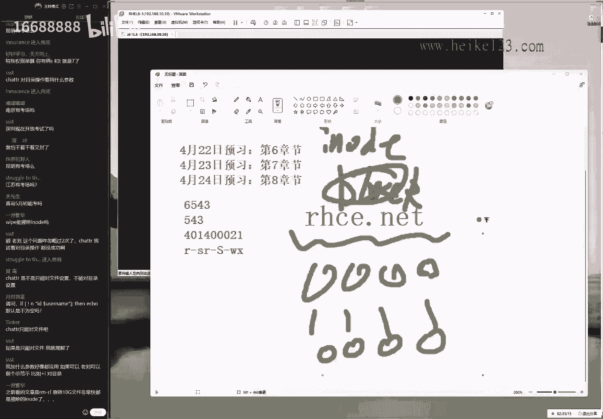

我来试一下，我来试一下，那如果要是这样的话，说明更爱它的参数是不能针对于目录来去做的，有可能是因为我偷懒了，我其实表哥五杠八，是我们在红包六七里面去总结出来的，我给他偷懒了，偷懒了，是我的问题。

偷懒了偷懒了啊，来看一下，还可以啊，可以设置好看一下啊，没有问题，隐藏权限，然后查看一下好了，我看我我去试了一下，哦等一下等一下我试试成功了，但是我看是看不到的是吧，是不是刚d回杠二有需要一参数哦。

不来了吗啊，可以的啊，也就是说我们可以对于目录来进行操作，是可行的嗯，偷了个懒啊，其实我在红包六期的时候，其实用的是表格五杠八，这本书就直接给套过来了，刚才是刚才就有点心虚了。

所以大家提到的时候刚才心虚了一下，但是我们实际操作过后，发现其实可以针对目录的技能操作的是可行的，好下面一个问题好，没有了是吧，大家可以先休息一下，然后同学问了一个问题，叫做月石威豪。

同学问到了说如果要是使用到呃，if然后叹号诶，取反制非常好，然后ni id啊，username这个变量是错误的，然后then echo默认不为空吗，这个变这个变量是错误的，没有这个变量。

但是如果要是我们前面调用的这个变量的话呢，不对，这个问题是我感觉是我没有理解，我没有理解这个问题，您需要再发一下，同学叫月食为豪，同学没有看到，默默认是不为空吗，是我的问题啊。

可能讲两小时之后反应比较迟钝了，下面一个问题，大家说，大家说说之前看文件里面啊，啊rm rf删掉一个文件，实际非常快，都是擦除i note了啊，其实这个是一样的，它不区分是windows还是linux。

只要去删除掉文件，都是删除掉io的，这个大家特别好去理解。

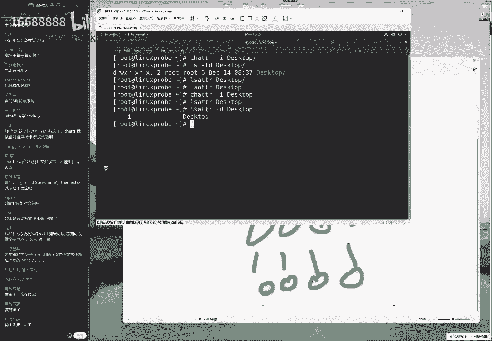

比如说您可以去很好理解吗，比如说有一个u盘，然后我们插到电脑上面了，然后的话呢现在一个文件200个gb好了，我们往电脑里面拷，大概需要烤五分钟，这个对吧，但是如果说我们现在想把这个文件给它删掉，的时候。

大概只需要十秒钟，它并不是去删除掉这个文件所有内容了，它实际上去删除了这个io的数据库，而这个数据的话呢还是在系统里面保留着，它会等到下一个文件写入的时候，会记载这个block块的话呢，给它覆盖掉。

它画它啊，它被覆盖之前，这个blog这个数据一直在硬盘里面保存着，所以所以说这个实际上去恢复数据的，这个原理是什么呢，按照我们的理解啊，但是我并不专业，我只是说一下我的理解，因为可能会有一些高级的方法。

比如说美国安全局什么的对吧，人家是啊，但是我们理解是这样的呃，只有这么一个文件，我们把这个删掉之后的话呢，如果说这个硬盘里面保存的是这个真实的数据，然后里面分为两部分，一个是block。

一个是i know的，那我们去删除掉这个数据的时候的话呢，实际上只是删除了这个，指向我们这个block数据块的一个指针，那么这样的话呢我们用户删掉它之后，就无法通过这样的一个指针找到我们的数据了。

于是这文件就被删除掉了，但是的话呢数据实际上还在我硬盘里保存着，所以说当我们去啊错误的去删除，在一个文件之后呢，该把它拔下来，或者把它断电，拿着这个去一个找一个人啊，找去找一个高手也好。

去找一个啊数据恢复啊，数据恢复公司也好，然后啊它会使用到专业的软件，然后对于我们这个整形的盘来进行扫描，尝试去扫描到我们这个blog数据的，这个开头的这个节点，然后去找到它之后，去尝试恢复出来这个数据。

也就是说数据都是在那儿了，只不过他被关了灯了，一个房间里面他东西都在，只不过他现在断电了，没有灯对吧，忘了交电费了，那么这个时候你需要自己去摸着黑去找一下，他找到了一个线头了。

就会发现诶能够找出来后面所有的东西了，同样的道理好啊，这是我所说的啊，但是可能并不专业，可能也许专业的公司有更加专业的方法，嗯好但这是一种思路，下面一个问题，大家说群文件里面有个文件好吧。

呃则是输出else，ok待会我来看一下，我先不打开，因为这个东西群里面现在有同学的发言啊，我怕打扰大家发这个信息要再去猜，很麻烦好，那我先看一下吧，我现在打开他们的群，但我要把录播给他关上。

因为我怕录到咱们同学发那个咱们学员信息，到时候被录到里面去了，然后大家问了一个问题，好回答好这个问题之后再看一下群，我们先看一下，大家说啊，大家啊，大家说文件所有者的权限，优先级是高于文件所有组吗。

不这两个并不冲突，他只要有任何一个满足则可以去访问，也就是说呃他两个没有优先级，只要满足有一个就可以访问，是这样的一个原则好，我先把这个录播关一下，然后同学们继续来提问。

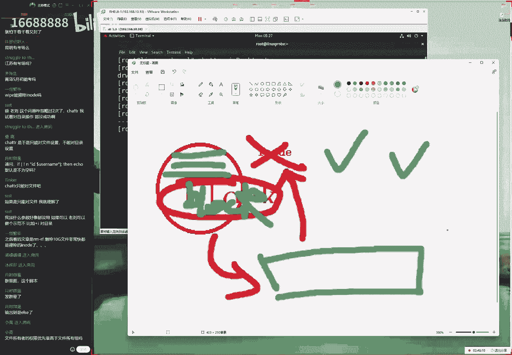

我来看一下群里面大家发的文件是什么样子的。

