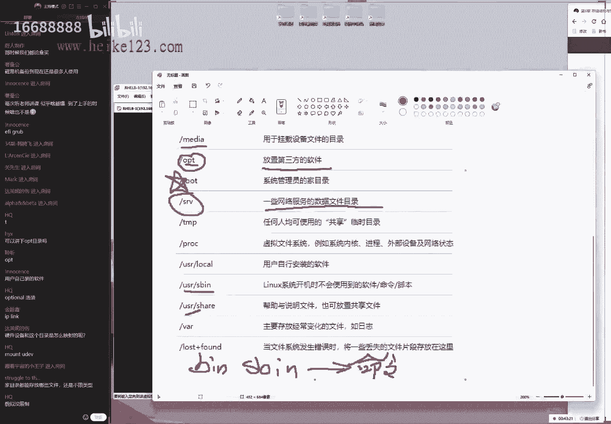
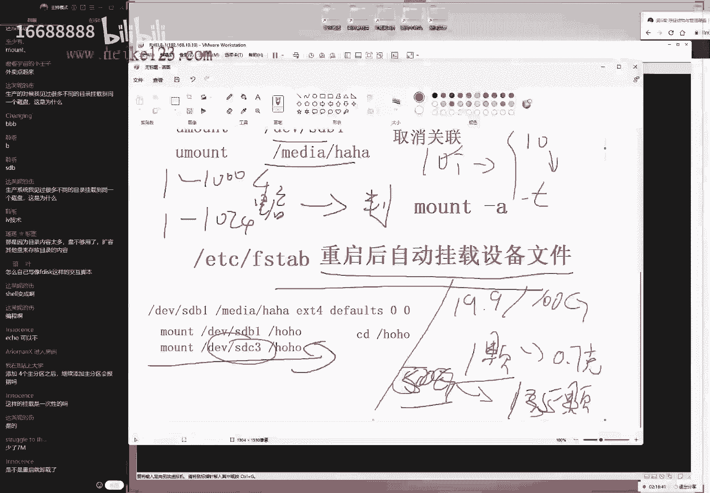

# 刘遄培训linux34期（配套linux就该这么学第二版，RHCE8） - P8：09 - 16688888 - BV1gL41167vP

我，so so so good，so so so so good，so so so good，so good，ok同学们来看看是我们今天这个课程啊，刚才这个声音是音乐里面的一部分吗。

好好大家先打一下一好吧，然后我们开始我们今天这个课程啊，今天的话呢我们的内容还是很多的，那我们要给大家讲一下第六章节，下午说的话呢简单背了一下课，今天第六章节肯定是讲不完的。

呃不过的话我们还是本着稳打吧，我们这一期争取我们更加详细的给大家讲清楚，那我们尤其是这个理论部分好，现代化人数69个同学，我稍等一下，我再在群里面再发一条消息啊，刚才发了一条，估计可能是很多都没有收到。

我去的话，我再去发一条，稍等一下啊，稍等一下，稍等一下，我让同学们抓紧来，进入到咱们这个直播间里面了，这边的话呢每天上课时间是七点钟，然后的话可能会多一两分钟等我们的学员，但是这个大家尽量提前进入到。

咱们这个直播间里面，能提前五到十分钟是最好的，我一般情况下的话呢呃会提前15分钟左右，然后开启咱们这个直播间，好，我们先来看一下6。1小节啊，正式开始了啊，现在正式开始了，我们来看一下呃，6。1小节。

那我们现在是讲到我们这个哎操作系统当中的，判断linux的这个存储结构，那么我们再去使用到windows系统的时候的话，稍等一下，哎我们再去使用到windows系统的时候的话呢，它有很多的这个盘符。

我们例如说是c盘，d盘，e盘上的这种盘符，然后的话呢我们是在这样的这个盘符里面，来去保存这样的这个数据的对吧，同学们这个应该是没有人，那这个话是非常的熟悉了，那么在这个我们的linux里边的话呢。

它并没有这样的这个盘符的一个概念，它的话都是从根目录开始的，然后的话它是把不同的这个设备，挂载到不同的目录上面，然后来进行保存啊，然后的话呢我们来进行一个数据的保存，好的。

那就是说我们的话呢windows啊，他们的windows的话呢使用的是一个盘符，这样的一个形式，但是话呢linux的话它是都是从根目录开始的，我们的话呢可以把它理解成，就是一个万物的起始。

或者说我们叫做啊根目录，所有的文件，所有的设备都要从这个目录开始，然后往下去延续，然后的话呢根据一个原则叫做f h s一个协议，然后他根据这个协议去划分出来，每个子目录的一个海呀。

那他来就划分出来每一个子目录的一个作用，然后的话呢根据我每个子目录的一个作用，来存放我们的文件，这样的话的好处就是，当我们再去需要找到某一个文件，或或或者的话，那我们去找到某一类文件的时候的话呢。

那么就可以根据这个协议去找到，打具体的对应的，可能大概率出现这个文件所对应的，一个目录名称啊，这样的一个作用，那所以的话呢我们现在就要先去了解一下，那我们的这个协议到底该怎么去规范了。

我们每个子目录的一个含义，所以的话大家可以看一张图，然后来给大家来细聊一下下，然后大家问了一个问题，大家说啊上期声音录入挺好的，现在有点小了是吧啊，我这个呃我下课之后我去听了一下，应该问题不大。

那同学们把你们的声音调大了之后的话呢，是够用了好我们另外的话呢还有啊怎么样，那上线了是吧，现在72位同学，那我们来看一张图啊，六杠一这个指的就是我们的linux的一张呃，存储结构有张拓扑图啊。

或者我们叫做啊示意图，那么我们可以看到的话，它一切都是从根目录开始的，这个话呢我们叫做倒树状图对吧，因为他像一棵树倒过来一样，根是在上面，然后我们底下的这个啊它有很多，它有很多这个枝繁叶茂的叶子。

那么我们这样的一个倒数上图的话，就展示出来了，我们常见的一些子目录的名称，好我们今天带我们带着大家来去过一遍，这样的话同学们能有个印象，当见到这啊，当我们再去见到这个名称的时候。

大概能知道它的作用就可以了，然后的话呢我们会在后面的一个月时间里面，来去不断来去使用，来去巩固根据，加深一下印象好吧，那我们来继续开始，我们今天这个呃正式的fh s一个课程了。

今天73位同学也不是很多啊，也不是很多好，我们来看一下第一个目录，第一个目录的话呢是叫做root目录，它是用来去保存，我们管理员的一个加目录数据的，首先来说一下啊，这个加目录的话呢。

是我们啊给大家翻译的一个名称，另外的话呢还会有一些人买来做做这个主目录，这两个的概念是一模一样的，它都指的是用来去存储，我们用户自己一些信息的，比如说我们的家庭对吧，那么就那么啊。

那么它就属于我们的家庭，他用来保存这个用户自己的一些私人文件，一个地方我们把它叫做家母路，那好我们首先来说一下，第一个我们叫做管理员的一个加目录，叫做root目录，它是仅仅是用来取啊保存我们管理员。

第五章节我们讲到过用户身份分为三种类型，第一种类型我们啊管理员，那么关联的名称的话呢是叫做root，所以的话呢这个目录的这个作用他就只有一个，他就是专门用来去保存我们管理员自己加目录。

数据的这样的一个作用，第二的话呢我们叫做bn啊，这样的话一个目录大家看这个目录之后的话，会觉得有点眼熟，对不对，因为他后面的话也会有很多跟它类似，相同名称的，比如说这儿有一个叫做b目录的。

后面的话呢还会有一个叫做sb目录的，然后后来我们下面还会有一个子目录，里面还有一个叫做b目录，然后的话呢我们这里边还会再有一个叫做user，目录里面的sp目录，就是同学们会在我们这个工作当中的话呢。

会反复去看到很多个目录，它都是以变n结尾的，大家应该能够猜得出来这个的作用，因为它就是一个文单词的一个手写的这个字母，对吧，它就是啊叫做二进制，可啊叫做二进制可执行文件。

那么实际上的话他又去牵扯出来的一个概念，就是我们什么呢，叫做linux系统当中的一切都是文件，因此的话呢我们在去之前的这个命令的话，它实际上也属于我们叫做命令文件，那么我们的话呢。

现在呃是根据我们的文件夹类啊，那我们我们先是根据我们文件的类型，以及它这个作用来去划分了，它所存放的一个路径，那么其中的话呢当前我们对他的这个解释是，如果说这个啊目录当中他叫做它的话呢。

是叫做bn啊这样的一个名称的话呢，它指的是我们所有用户都可以，来去执行这个命令，比如说一些比较简单的命令，查看我们的啊目录里面的文件啊，或者说查看一下负载呀或者文件啊，我们编辑文件等等这样的这个动作。

他指的是所有的用户都可以来去执行的，这样的命令，我们把它叫做bn目录，但如果说这个呃呃命令的话，他只有我们管理员他才可以来去执行，那么它这个名称都叫做哎要建，那么它需要在前面加上一个小写的i s。

它指的是只有管理员才可以去使用的命令，那我们接下来我们去举个例子，比如说reboot呀，比如说power of这样的关机命令，这就是我们要给大家解释的啊，这两个目录的一个区别。

但是我们总归来说就是这两个的话呢，它实际上它都是用来去保存我们的命令文件的，这个的话呢一般来说我们也不用去管理它，它都是根据一个变量，第三章节学习过一个叫做pass变量。

会去自动寻找的，那么因此当我们去输出这个b啊，那我们当我们去输出了这个pass变量之后的话呢，我们可以看到它里面输出的所有的目录，都会有代表这个bn啊这样的一个字符啊，让我们这样的一个信息好。

那么另外的话，同学们会翻看了一些书里面的话呢，呃并不是啊，换到并不认同我们一种说法，这个原因的话呢，就是因为在上个世纪的时候有一些这个呃，这这这怎么这怎么讲呢，啊也不算，上个世纪。

大概是2002年和03年的时候的话，当时有很多这个啊外文直接翻译过来的书，当时的话呢对于这个的解释有一些呃问题，因为的话，大家如果要是您看过一些比较老的书的话，它可能会有另外一种解释方法，别的话呢。

比如说说只要跟我们开机没有关系的命令的话，那我们就把它叫做b啊，那我们就会放到这个里面，我们给大家做个备注啊，这就那么也就是说这是我们有两个解释方法，如果您看到这个书比较老的话呢。

他可能会说这个b i n的话呢，实际上它是跟我们的开机无关的，不它是指的是开机没有关系的，只要我们开机没有用到的，那么则换啊，那么则放到这个bn目录里面，开机无关的。

然后的话呢我们加了一个消息s的一个目录，它指的是开机相关的，这样的话呢我们所有开机相关的啊，所以我们去开启这个战机相关的命令，放到对应的一个目录里面，这样的话呢我们在开机的时候速度会啊。

那么啊那么啊那我们去啊开机的时候速度啊，那么好那么好，那我们这个速度也会变得特别的快，对吧啊，这个话也是一种解释方法，但是我们并不认同，就是您可以看到一些老版本的这个书，里面是这么写的。

但是我们认为这不可，这个话并不可信，而且的话呢，这个说服力比我们这个现在给大家解释的话，有点低，然后的话大家现在可能会想一个问题，是老师，那你就有点模棱两可吗，到底这个解释是怎么去解释呢。

因为的话它实际上它并不是一个技术，而产生出来的这么一个规范，而是因为一个历史，一个呃优化，它实际上是一个历史的一个遗留问题，然后的话它才产生出来这么一个技术，这怎么回事啊，因为呃我们大家有没有用过一个。

叫软盘的东西啊，因为我们知道这个系统的话，最开始的时候，我们是在从上个世纪的70年代哎，unix系统来去发展过来的，当时的话呢，我们的计算机并没有像我们现在一样这么的啊，方便来去获取。

然后大家没有用过这样的一个东西叫做软盘啊，然后的话呢这个我们也叫做3。14软盘对吧，然后的话呢啊对叫这个三啊，对胎教的话3。53。5英寸软盘，下次它就像是一个正方形这样的一个样式。

然后后来这边还有一个保护鸟，然后我们往里面去保存信息的时候的话呢，它非常的小，但这容量有多少啊，如果没有记错的话，是1。44兆吧，特别的小对吧，这个是非常小的一个容量，大概有我不知道我有没有说对啊。

因为时间因为他时间很久了，就是我们之前的话是用到软盘来去保存数据的，然后现在的话当然有什么光盘啊，u盘啊，我今天我还特意看了一下啊，京东网上面对吧，我看这个啊有一个挺好的一个硬盘，然后的话呢一个tb吧。

我刚看这个京东打折好像是在418，然后截止到4月23号啊，好像好像才300多块钱，非常便宜啊，然后的话当时这个容量的话有一个tb，现在的话才300多块钱，但是的话呢那会儿是没有的，那么怎么办呢。

那么那个时候那么就要用到怎么样在一起说，那么就由我们要把很多个转盘一起来去使用了，因为一个黑客嘛，他即便他再厉害，或者说他是一个程序员的话，他也需要有很多张软盘来去保存它，这个命令对吧。

那我可能我的工具都是我自己写的，那比如说那可能需要拍三四张软盘，才能够保存下来了，那我好，我现在就要去使用，那我就需要把这个软盘的话呢，这个啊分别去挂载到不同的目录上面。

所以的话它实际上是一个由一个历史遗留问题，然后的话呢一直延续下来的，因为它就需要很多个叫做bn的一个目录，去挂在它的软盘，然后的话呢我们这个历史遗留问题就到了，我们现在了。

但是我们也知道现在这个硬盘非常的便宜，再用这种硬盘的一个，存储空间限制的理由来给大家去讲，显然是不能够服众的，所以的话呢现在我们的最新的fxs，这个解释是说，它只要由我们管理员可以去执行这个命令。

则放到前面加有s这样的一个目录当中，如果要是这个命令的话呢，它是所有人都可以去使用的话，那么则前面没有一个小小s好，大家知道我们这个历史的一个啊过程就可以了，那么于是我们返回来。

那也就是说只要我们带有这个bn目录，这样的一个这样的一个目录啊，那我看啊，那么带有这样的一个目录的话呢，它都指的是用来存放我们的命令文件，这样的一个作用啊，那啊那啊那我们这样的一个作用下面还好。

我们还有一个叫做不成目录，这个的话大家应该都是像我们一样对吧，我们听说过没有，大呃，呃这个目录的话就是我们听说过，但是我们没有用过这个话，一般情况下啊我们也不用去动它。

它里边是保存到我们这个开机的这个引导文件，等一下开机引导文件，然后的话呢比如说我们还有我们这个驱动，还有的话呢我们的grab引导对吧，还有我们这个啊grab菜单。

还有还有我们这个开机所需的这样的一个程序，以及我们这个内核的话，他们也会有一部分保存到这个部啊，话来保存到我们这个目录里边，也就是说这个mod的话呢主要用保他，他们他的话主要用来保存一些。

跟开机相关的一些数据啊，那我们一般情况下的话是不用去动的，因为有可能我们一动，反而这个程序它是起不来的，我们可以理解上来说，就这个目录的话呢的作用，实际上是为了让我们的计算机来进行一个调取。

来去实现一个自动开机这样的一个过程，然后下面的话呢就对这个dv目录对吧，这个可以很好猜出来他的这个全称device是吧，叫做设备，但实际上就是我们的鼠标啊，硬盘啊，键盘啊，光盘啊，这样这个数据了对吧。

完了啊的话我们叫做这个设备文件了，因为的话呢，我们计算机里面的所有一切都是文件，那我们所有的这个硬件是这个啊那啊那啊，那么我们做的这个硬件的这个设备的话呢，也都会被映射成一个啊硬件文化。

我们也给它映射成叫做设备文件，这样的一个形式保存到一个目录里面，那我们来进行一个管理，所以呢我们今天的话呢会呃，以及明天吧我们两天的时间都会委屈，围绕这个目录给大家来进行一个深入的讲解。

让我们对于硬盘的这个管理，实际上他都会在这个div里面给我们体现出来，所对应的文件啊，这样的一个效果，这样的话到我们的etc目录，这个目录的话呢是用来去放我们的配置文件的，但是我们一定要注意。

就是它不仅仅是放的是我们系统的配置文件，它里面还包括了我们所有的自己安装的哦，不我们这个不太严谨，那也就是说我们可以理解成，他就是这个里边的话呢，它啊，呃，它里边的话呢包括了我们所有的系统的文件啊。

那么好以及所有的这个系统的啊，系统的这个配置文件我们一定要严谨一点啊，它里面包括了我们默认情况下，大多数的系统的配置文件，然后呢，以及大多数的我们用户自己去安装的这个啊，等等啊。

等一下大多数自行安装的这个配置文件啊，为什么这么去理解呢，为我们为什么要加一个限定词，大多数呢是因为呃99%是这个情况，他会放到这个我们啊所啊讲到这么一个目录，我们看一下etc目录里面。

但是它会有一些例外，我能够想象到的，我刚才就在想有什么例子呢，还是很好找的，比如说比如说我们的dns服务对吧，我们非常的常用的话，我们dns这个配置文件就放到了万目录里面的，name的这个目录里面。

所以这个不好说，百分之百是这样的，但是99%会是啊，放在我们所对应的这个目录里面的，因此的话呢我们在后面的一个月时间里面，除了明天和后天以外，基本上每天都会围绕这个目录，给大家去来去进行一个讲解。

因为要想去啊来去部署一个服务，实际上也就是在修改这个服务所对应的，一个配置文件，因此怎么着呢，那我们都不能够绕开这个呃，这个话呢我们啊要去啊去谈论这个话题，然后要给大家去深入来去配置这个目录啊。

这样的一个作用，然后的话呢我们再来一个叫做home目录，这个目录的话呢，也是用来存放我们各用户这样的一个java目录，数据的，这个怎么理解呢，就是我们除了关联以外的其他用户。

他都会在这个home目录里面来，去新建出来一个属于自己的一个家目录，呃，我们的话它会以用户的名称来命名一个文件夹，然后来进行保存，比如说我现在有一个用户叫做home目录里面。

比如说我现在一个用户叫做latest problem好了，那么他就会在这个目录里面，有这么一个子文件夹，它会保存自己这个加密度的数据，然后的话呢比如说我们现在又有了一个用户。

我们的话呢叫做护目录里面的啊，那啊啊库这么一个用户，那么的话他也会在里面，依次的往我们这个里面来去，新建出来这样的一个文件夹，用来保存用户的这个加目录的一个数据啊，那我们需要注意一下的话。

那就这个目录的话呢，跟我们前面讲的这个哎等一下能稍等一下，跟我们的管理员啊，这个目录的话呢没有什么太大的这个区别，他们两个的作用都是用来去保存加啊，我们换加布的这个数据的，它们之间没有太大的区别。

呃我们给大家举一个例子啊，比如说这就是一个有钱人，他住在一个别的话，他住了一个别墅对吧，然后呢我们这样的话他就做了一个公寓，这是一样的效果，它可能是一种合租的一种形式，但是它保存里面的这个数据的话呢。

是没有什么影响的，在使用起来的话呢也没有什么大的区分，但是我们用户啊不大啊，但是我们来进行一个管理的时候，你一定要知道管理员的这个啊专用的一个目录，它所在的一个位置。

因为我们可能更多的时候是使用关联的身份来，去登录我们的服务器的，所以您一定要知道您默认的情况下，是所处在哪个工作目录下，这个我们一定要有一个印象，然后呢以及待会我们去管理普通用户的时候，该去的啊。

那我们就要知道该去哪里去找到它所对应的，一个java的数据好，然后大家问一个问题，大家说啊每次听课都能够听懂，但上手的时候就啥都不会了，也很正常，因为这个呃也是我们给大家讲这个理论的话。

它比较的这个抽象，一旦去讲这个实战之后诶，因为我们很像啊，很非常的熟悉嘛，但同学们再去上手的时候，就会可能会因为一些小空格，一些小的一些啊句号啊，命令啊，大小写呀，大游戏大小写的问题，我相信同学们讲。

现在我们已经学了大概有20天时间了，您或多或少都会碰到这个大小姐，然后换了非常不习惯的一个问题，这也是需要慢慢来啊来去进行一个适应的问题，然后下面的话呢一个目录叫做v目录啊。

这个话呢是用来去保存经常发生变动的数据，这个呃跟其他的目录是不太一样的，因为大家看到了其他的这个目录，都是根据功能来进行划分的，比如说这管理员的加目录，这个的话呢是我们的命令，这个是用啊。

它是跟我们开机相关的文件，这是设备，这是配置文件，这是我们的家目录，这个的话它并没有一个具体的作用，它是根据一定的这个文件类型来进行划分的，也就是说其他的目录都是根据功能。

或者说他根据他这个作用来进行划分的，但是的话呢，腕目组它是根据我们的目录的一个特性，来进行保存的，它是经常发生变动的数据，我们回到这个目录里边，我我我我给打出来了，他是经常经常唉发生变化的。

这个数据它会放到这个目录里面，那比如说话呢我们的数据库啊，日志信息对吧，那我们要给大家去说啊，那比如说我们的日志，那么就放到这个目录里面的那啊，那我们去找信息的话，就在这里面去找呃。

日志的话呢还有什么呢，比如说数据库对吧，那么它默认情况下也都是在这个目录里面的，好比如说话呢，网站数据只要是经常发生变化的数据，那我们大概率情况下，都会在这个bb多里面去找到它。

但是这个的话也是有点特殊性，因为它可能会跟其他的这个分类的话呢，有一些重复的地址，然的话他可能会有一些啊功能重复的一些方面，比如说网站信息的话，它既属于一个将要发生变动的数据，它也属于一个配置文件。

这样的话呢我们就要以实际的，您这个配置文件的话呢不好说啊，那么这个时候，您就要以您实际配置这个服务为准，但是大多数情况下，它都放到我们的word里面来去存啊啊，那么好像来去存放经常发生变动的这个数据。

下边的话呢我们这是什么啊，我我我看我看不清了，这个笔记写有点比较乱等等啊，等一下啊，下面的话哦，还有一个啊，我们的library，我们的调用函数库文件，这个话呢如果说我们要给大家去讲这个目录。

如果要是讲之前的话呢，就是我们所讲的叫做bot目录，如果说boot目录我们给大家一个建议的话，就是不要动好吧，我们不要动这个目录，因为它是跟开机相关的，也没有什么，我们工作时非得要去改的这样一个参数。

那如果说这个都是呃，我们话呢不要动这个目录的话呢，那我们就要加一个更字了，因为它的话呢主要就是一些函数库文件，它是为了让我们的计算机能够，正常来去进行一个工作，然后来保存函数库文件的。

我们用户的话呢没有理由去动它的好吧，这个我们就是尽量不要动它，如果需要改的话呢，比如说我们去修改这个pad模块也好啊，我们去修改这个函数库文件，去升级内核也好啊，那么可能会用到的设计内核。

已经不用到这个啊目录了，但是总之这个目录的话，一般情况下我们是不会手动加经营管理的，下面的话呢我们叫做user目录，这个大家一看就可以看得出来的，它它的话它的作用，它的作用的话，实际上它属于一个用户的。

我们可以这么去理解了，他这个全称叫做usr，他指的是为我们的用户来去保存一定数据，这样的一个功能，他的话呢这个实际的这个作用的话，是用大家去保存啊，我们的用户去安装呢，以及自己准备去安装软件的一些啊。

保存目录我们给大家理解一下啊，就比如说我现在的话要想要去安装一个软件，那么的话呢在windows系统当中，我是不是可以去指定一下安装路径呢，那我要去指定一下安装路径，为什么要去指定一下安装路径呢。

是因为我希望我下再去找的时候能够找得到，因为我们在去安装人脸上，它有两个方法，第一个情况下它是一个默认情况下，来去选择安装路径，第二话呢进行一个手动，来去指定的一个方式来去好安装软件。

当然的话呢我反正一般情况下我会去手动，那那那我会通过这个手动的方式，来进行一个指令，因为我希望能够呃，知道这个程序安装到哪里去了，这样的话那我以后再去，比如说更新啊，维护删除，我都知道哪里去找到它好了。

那么如果说我想要也啊，那啊那么好呢，如果说我也想买一个这样的一个文件指定啊，那我也想把一个程序啊，指定的把它安装到某一个目录上面，那么的话呢，那么我们就可以把它放到这个目录里面。

我们把它叫做user目录里面的local，或者发到我们的user目录里面的啊，source目录都可以，这两个目录的话就会给大家呃后面去讲到，所以说如果说你想安装一个程序呃，并且指定一下安装路径的话。

那我建议大家可以安装到这两个目录下面，这样的话在啊，那我们可以啊来去限定一下，以后好找，下面的话呢我们还有一个叫做媒体的一个目录，这类的话呢它是用来去挂载我们的设备的，我们给大家举一个例子。

就是呃要想去使用一个设备的话，就必须要让他跟他啊，那么就要让啊让这个设备跟一个目录去做关联，那我们呃那我们再换句话来说，就是我们买了一个硬盘，要想去使用，它，也必须要让它跟一个目录去做关联。

这样的话呢我们要给他一个啊，能够去做关联的一个呃挂载点，那么一般情况下的话呢，我们会在这个里面去纪念出一个子目录，来进行一个挂载操作，这个我们大家需要注意一下，下面的话有一个叫做这个tm p的一个目录。

它的话呢实际上叫做啊临时文，那花它实际上叫做临时文件，我们就是说如果说我们要想啊temporary是吧，temporary啊啊media。

然后还temporary temporary temporary，我不知道对不对啊，也无所谓了啊，好像不太对好，那我把它删了，是这样的啊，这个的话它的这个作用是叫做临时文件。

如果说我要想要在我们的系统当中呃，临时共享奶啊，共享某些文件，给我们，同一个系统当中的某些用户来去使用的话呢，那我们就可以在这个目录里面，来去进行一个存放，因为这个目录的话默认权限大家也看到了。

这个权限实际上是七七的一个版权限，我们放个文件，别人也可以去看，并且的话它上面会有一个自带的一个属性对吧，叫做s b i t叫保护卫，那第五章节讲啊，这我们当时讲到过，他的话呢。

也只能是让我们自己去管理自己的文件，这样的话的好处就是这个目录是一个天生的，与生俱来的，能够让我们信用当中呃的呃，用户来去方便去同步文件啊，来去进行一个文件共享的，这样的一个作用的目录啊。

好我们给大家大概过了一下，我们每个怎么录的一个作用，然后大家听大家可能听完啊，那大家听完之后可能会觉得有点乱了啊，那我们没有关系，我现在给大家简单再去过一下开价表格，表格六杠一。

如果大家听起来有点费劲啊，我现在给大家过一遍，顺便的话呢，我们来去标注一下哪些目录，可能是比较常用的话，那话啊还有哪些目录可以用，或者呃或者我们当我们去使用到的时候，再去看也来得及的。

但是句话有一些目录需要在我们讲课之前，先有个印象，这样的话呢我们用到它的时候才不会去走神，然后可以直接来进行一个使用了，不用再去讲这个目录的一个含义了，那么话首先叫做boot目录，这还是比较偏理论的。

其实同学们可以把显示器给关上了，呃我们画了这个前面的一个半小时吧，或者一个小时就20分钟吧，嗯大呃大概是一小时20分钟左右，我们换了全都是理论啊，有可能是一小时，因为经讲了28分钟了，可能还有一小时啊。

或者40分钟我们会去讲了这个理论知识，所以的话你可以把显示器给关了啊，可以休息下眼睛，然后我们讲完之后的话呢，当开始就需要大家去看的时候，再把显示器打开啊，这样的话我先给大家说，首先的话有一个目录。

我们是叫做boot目录，可以看到它这个作用的话呢，是用来去存放我们开机相关的一些文件呢，比如说内核呀，还有我们的grab引导菜单啊等等等等的，这一般来讲的话呢，我们只要知道它这个作用就可以了。

但是我们其实并不需要去多去记它，因为它它的几率太小了，小到什么程度呢，就是r h c e和r h c里面没有对他这个啊，这看到啊，那么我们的r h3 c跟r h c，对于这个目录没有任何的考核。

也不需要对它进行管理呃，rh c里面的话呢，rh 333系统安全里面是考到了，需要对于我们的grab引导菜单，进行加密的时候才会去使用一次，所以的话呢这个其实不用太去太太担心。

第二个目录我们需要去记一下的话呢，叫做dv目录，它是拿来去保存我们这个硬件设备的啊，这个可能有点抽象啊，大家很会想说我这一块的话，那我那我我们的硬件设备，比如说我们硬盘和鼠标的话。

都是放在我们的这个诶机箱里面的，但是为什么我们会有一个目录，用来保存硬件设备呢，它不是一个硬件吗，就是因为它会把这个硬件给它，映射成一种文件的形式来进行保存，它会保存在我们行当中一个硬件的映射文件。

这个需要大家去啊比较关注一点，因为我们后面的话呢，尤其是今天跟明天两天时间，或许如果今天我们讲的慢一点了，可有可能到三天时间，都会围绕着这个目录来给大家一个深入的讲解。

然后的话呢下面一个啊大家说啊啊o p t目录，这个下面有不用着急，不用着急，有有有，因为的话这两张图是不一样的，所以我们会先给大家说一个江湖，再给大家说一个，这样的话我们再去查漏补缺啊，下面一个问题好。

下面的话我们叫做etc目录，这个的话更加重要了，我们给他画一个稍微大一点的这样一个信号，这个指的就是用来去保存配置文件的，当然这个的话大家一定要记住，这个里面它不仅仅是我们系统的配置文件。

这个里面还包括了我们嗯默认情况下，或者我们叫做大多数我们自己安装的这个，软件的这个配置文件，所以这个需要找的时候，您需要在这个目录里面来去进行一个寻找，概率会更大一点。

大家说硬件设备和这个目录是怎么映射的，这个话呢关系我们实际上是叫做挂载，或者的话呢它是由ud v服务去实现的，这个话我不然再去展开去讲解了，因为的话首先来说，这个跟大家的这个学习规矩不大啊。

这个话实际上是涉及到了rh c里面的，24 四二了，这样的话呢这个考试难度比较大，然后的话呢还有就是我们再去讲啊，那我们再给大家讲的时候吧，呃大家会先握住，我们先握住每条主线啊，先不要乱。

因为大家可能技术比较好了，我们的话还有一些同学基础的话呢可能刚刚听，所以的话呢我们还是啊稳扎稳打，我们先把我们这个目录的这个含义啊，我们先搞明白了，那如果大家比较感兴趣，是老师。

我想要比如说我想要插入一个硬盘，或者插入一个光盘，但是的话呢我希望它的名称跟我现在啊，默认的话它是不一致的，我想给他改一个目录框，我们改一个名称，这个可以啊，这个可以去实现的。

我觉得这个可以放到括号给大家来讲解一下好，然后的话呢我们下面再来，我们待会我们在上课的时候，一条主线就不要乱了，下面的话还有一个目录，这个目录的话相对来说也非常的重要，这个目录的话呢是叫做home目录。

它是用来去保存我们每个用户自己，加目录数据的这样的一个作用的目录，它的话它会在我们这个目录当中，就去新建出来一个与用户同名的一个子文件夹，用来保存这个目录，它所存放的这个加目录的数据啊，这样的一个作用。

他的话呢等同于说它是一个公寓，一个这样的一个形式对吧，然后呢我们像是一个楼房，然后里面的话可能是有六层，然后每层可能是有两户这样的一个形式，那我们啊总共的话是12户，共同去使用这个建筑的这个资源啊。

这样的话呢我们来去实现的，而下面下面的这个的话呢，我们管理员叫都是啊根目录里面的路程，目录的话呢，他则是像一个别墅一样，他自己去使用了一个独立的一个建筑，它使用了一个独立的一个目录。

这两个目录的话我感觉大家都需要去记一下，因为可能以后工作的时候，或者我们去做实验的时候呃，对于加目录的数据的编辑还是比较常用的，所以大家这个需要记一下，下面呢我们的bn目录，还有我们这些巴拉巴拉。

我们就不用去记了，因为大家只要记住了，只要bn或者sbi的目录，我们不管他啊保存到哪个目录下，通通我们叫做命令文件，它都是用来去保存我们的命令文件的，一个目录啊，不用再去加以区分了。

因为我们用户只要去敲出我们的命令，它就会根据我们的pass变量自动来进行一个寻找，这样的话呢，我们的line目录来调我们的函数文件的，这个的话呢也不用去记，因为它是由我们的系统去完成的。

就是这个计算机的话，它虽然复杂，虽然我们也想去深入去学习我们的linux系统，但是有些事情是不需要大家去做的，好吧，这是我们有些事情是不需要大家去做的，这个系统它会需要一些这样的一个函数库文件。

自动来进行调取，我们只要一般情况下，我们只要不要去管它，就没有问题啊，虽然说这可能说起来有点啊烦啊啊，这个话怎么讲啊，虽然我们可能会想去来啊，那我们虽然说想要来对它进行一个管理，但是我们管理过后。

可能这个效果的话适得其反，所以我们一般情况下不用动它的，在的话叫做媒体目录诶，那我们这个里边的话呢，用来去做文件的这样的一个挂载，这个挂载操作的话会在后，我们的后面给大家来进行一个具体的讲解。

简单来说就是要想去使用一个硬盘的一个资源，那么就要让他跟一个目录去做一下挂载操作，然后就可以去使用一个硬件的资源了，这个我们会在后面给大家去讲，到大概的话时间就是八点半吧，差不多一小时之后。

下面大家比较感兴趣这个目录啊，这个这个我们不用给大家多说了，因为它的功能非常的简单，我们用来存放一个第三方的软件呢，但是我一般不太喜欢去用，我一般的话会放到我们的user目录里面，来去进行一个保存。

总之它两个的作用都是用来去保存以后，以及安装第三方软件的，这两个的话大家可以再去任选一下，它有点相当于就是我们这个目录。

我们看呢大家看一下，再要红包啊，放在红包热巴里面啊。

我们先看一下这个解释，这个目录的话的含义，是用来去保存网络服务的一些数据文件的。

然后我们现在的话呢进入红毛若白当中，登录的时候。

它还使用的是管理员，然后我们来去呃，稍稍等一下，我看一下啊，它是叫做sr v是吧。

于是我们可以来看一下这个里边的话呢，还有这个模组名称，然后我们进入到srs v的这个目录当中，可以看到啊，稍等下啊，进入到我们的sr v的这个目录当中，另外的话呢现在我是出现了一个问题。

我下面会给大家说一下，我所出现的这个问题的一个原因啊，下面的话呢呃不好意思啊，又出现第二次了啊，第一次是我的这个呃没有反应过来，第二次有点过分了，这个目录的话呢，我们虽然的红包肉包里面是有的。

但是的话一般来说是没有数据的，它用来保存的是一些网络运行状态。

以及的话，那这样的一个数据文件的，一般情况下也不会有内容的啊，然后分发下面我们叫做临时文件，这个的话也不用去记，就是如果说我们要想给我们的同事来，去分享一个文件的话呢，可以把这个文件放到这个目录里面。

我们可以去使用到cp，一复制就到这个目录里面了，非常的方便啊，下面的话我们叫plc目录，这个目录的话好牛，电影熟在第二章节最后一个小节，要去学习过一个命令是叫做放的命令，它可以进行一个全盘搜索。

然后当时的话呢我们给大家一个小例子。

是说这样的说，让大家的话呢去使用我们的follow命令，来进行一个全盘搜索，搜索到所有归属于叫做linux pro的用户的，这个所属文件，大家记得吗，我们有这么一个实验，这个时候我们签完了之后。

它会提示出来很多说p r o c文件的话呢，没有被找到，或者话呢他说我们这个文件的话，它并不是一个啊文件或者目录这样的一个报错。

这个原因的话呢，是因为p o c目录它实际上是要做虚拟文件，因为它不仅仅我们的计算机把硬盘的这个资源，或者说我们把硬盘啊，那我们把硬盘的设备映射成了文件的，这样的一个形式，我们叫做设备文件。

他的话呢也把我们计算机当中，我们系统一个运行状态的话呢，也给它映射成了一个文件的形式了。

所以我们去进入到plc目录之后，可以去大概啊，那我们来去左右看一看啊，可以啊，是啊，我们去随便看一看这里面的这个数据的话，比如说我想看想看一下cpu的这个信息，于是我就可以来进行一个查看操作。

同学们可以感受一下，这个信息的话是一个实时发生变化的，我们这样的一个内容，这个可能并不明显，我再换一个随便换，比如说我们查看一下系统的负载情况，大家会看到这里边的话呢，文件内容是随时发生变化的。

每一次这个值的话呢也都是有所不同，这就是因为它其实它并不是一个真实的文件，它只是说把我们的系统的运行状态的话呢，变成了一个文件的一个形式来保存起来了，所以当我们再去查找，或者说去查看。

或者说来去进行一个复制和剪切和删除，这样的一个文件的时候的话呢，在他的他的话则会提示出来报错，因为它并不是一个真实的文件，我们这样删。

那么肯定删不掉的，它是一个叫做虚拟文件目录好，然后和大家问了一个问题，说我们啊这个问题非常的好啊，同学话问了一个问题，呃最后我先给大家先给大家说完之后，我们来给大家聊一下啊，这条主线先不要乱啊。

最后一个我们画的叫做呃，呃我们还有最后两个这个把它跳过了，指的是我们用户自己存放一些数据的，这个话叫做万目录，用来存放经常发生变动的数据，比如说日志，比如说数据库，比如说网站站的这个信息。

我们则可以在这个目录当中去找到它，所对应的内容啊，这是一个小技巧，另外的话呢还有一个叫做呃loss加found的，它指的就是呃，他的话呢实际上是从2015年开始才有的，2015年之前没有。

因为它是从红毛reo 5开始的，因为的话我们早期的文件系统的格式是，ex t2 的一文件系统，他的话呢并没有一个日志的一个功能，我们说所说的文件系统，这个日志的话。

实际上我有点类似于就是呃我们举一个例子啊，虽然很不准确，我们把它叫做迅雷下载软件，我们去使用一个迅雷，下载一个软件或者下载一个电影吧，如果我们下载60%了，那我们再开启这个迅雷软件的时候。

那么下一次的时候是从多少开始下呢，它是从零开始下吗，还是从他他他还是从60开始下呢，其实这肯定是大家都大家都知道这个结果，他一定是叫做他好，他这个结果一定是从60开始去下，因为它有一个断点续传。

大家有没有想过说这个怎么去实现了呢，这个的实践方法，实际上就是在我们下载这个功能里面，以及的话呢，在我们的文件系统当中加入了一个日功能，它会把我们所有的这个写操作的话呢，去保存到一个日志里面。

然后这样的话呢，当我这个系统异常断电或者关机了之后，他在开机就可以知道我们在上一步的时候，他做到哪里了，这样的话他可以来去继续来去做叫叫，那么欢我们调到这个动点续传这个目录的话，作用实际上也是。

从红包的e x t3 文件系统开始之前，大家信我一句，就是不用去再去纠结了，为什么我们公司的服务器没有这个目录的，一个原因就是文件系统太老了，那就是我们一定要是一个三版本以后的，一个文件系统。

然后就可以有这个功能了，它会在我们的异常断电之后再去重启，之后的话呢，自动去恢复出来，我们可能就丢失了一些文件，帮我们去恢复，然后的话呢，如果说我们呃服务器是在2015年之后啊，基本上是红毛reo 5。

或者的话呢，您自己升级了e t3 维系统之后的话呢，当我们异常断电了之后，你就可以进入到这个目录里面，看一看有什么被丢失的一些文件，然后的话呢我们来进行一个恢复，然后以及我们来进行一个使用。

另外的话还有一个问题，大家问到了，说，如果说我自己在根目录里面创建这个tp，跟系统当中创建这个tmp有什么区别吗，实际上的话这个呃问题是错的，首先的话呢在系统当中，已经有的文件夹的名称是不能够重复的好。

当然大家问的应该不是这个问题对吧，求模啊，那也就是说这个目录的话呢，我们需要先去删除掉系统里面自带的，然后才能够进行一个手动的建立，这个的话呢没有问题啊，这个是可行的，只要在我们使用当中的话呢。

没有什么区别啊，没有它没有什么区别，因为我们系统当中这个mod的话，实际上也是直接就这样去做，然后怎么样呢，然后再去这样去做，然后再这样这样这样这样这样啊不啊，这样这样这样这样这样，然后就ok了。

虽说系统当中这个目录的话呢，大家说权限不同，这个我们是认可的，但实际上的话呢我们自己新建出来的这个目录，如果说您按照这两步去做，那么新建出来这个目录跟系统当中里面最大的，它实际上是一模一样的。

它带有s b i t的一个满权限位的一个目录，呃，但是我给大家说到一点，就是是这块这个实际上大家是犯了一个小错误，就是他啊，大家的话呢会呃认为我们的所有的目录的功能。

它都已经被我们的fh s型给大家定义死了，这个其实是错误的一个太太教条了，因为比如说我想要去新建出来一个目录，我来去挂载我们的设备，之前的话呢，我们是挂载到我们的啊这个目录里面，那我现在想换一个。

我现在去新建出来一个叫哈哈的一个目录，然后里边的话呢我再去写上很多个目录，比如说啊哈哈啊，厚厚占了这个子目录，它也依然能够去挂在我们的设备文件，同时的话呢如果说我想要给啊，给我们同时来去共享文件。

那么大家可以不用去啊进入到这个目录里面，大家可以去换了，比如说我们可以用到哈哈这样的一个词，同样的可以的，那我们就把它新建出来，然后的话呢再再去设置一下这个权限，效果等同。

所以的话大家呃我们怎么理解这个事情呢，就是我们现在给大家讲的，叫做阿尔法hs的一个协议，呃，不能够把它严格的称呼成一种标准，我认为这不是叫标准，虽然说他最后这个s的话呢，这个例子我来给大家细说一下。

虽然说它最后一个s的意思是叫做标准的意思，但是的话呢它只是一种倡议，或者的话它是一种规范，一种推荐的一种配置的方式，我们在过程当中的话呢，是可以根据自己的这个呃情况，来去决定每个目录的这个作用的。

比如说我就想把我们的配置文件，放到这个目录里面去，实际上也可以去实现的，所以大家一定要注意这一点，在我们工作的时候的话，一定要灵活起来去使用好，然后呢我们来继续来给大家去说啊。

然后再给大家去说另外一个问题。

就是我们刚刚发的呃，为什么我刚才去进入这个文件的时候，它出现问题了呢。

就是因为我去进入的时候，它所处的这个目录是不一样的，呃我们的话再去进入到这个目录的时候，有两个方法，比如说我想要去进入到一个叫做home目录里面的，linux prom里面，那随便来了。

比如我们叫做哈哈的一个目录，那么我用那好，那么我们是有两个方法的，第一个方法的话就是直接一起来说，就是使用的cd，后面的话呢加上home目录里面的linux pro，然后我们的哈哈的一个目录名称。

就是我们可以这样去做的，这样的话可以去进入到这个目录里面，没有问题，第二个方法的话呢就是我直接去使用到cd，然后进入到它所处的这个目录下，然后的话呢我再去使用到cd来进行一个进入。

或者的话我们可以换一下，我们把它进行一个查看，太假了，它是一个文件的形式，那我们则可以进行一个查看，这两个方法的话呢都是可行的呃，那么我需要给大家说到什么呢，在工作的时候的话呢。

就是一定要嗯根据自己的实际情况来进行调整，第一种的话呢我们是叫做诶dk说出来了，叫做这个绝对路径，第一种方式的话呢，我们是叫做绝对路径的一个方式，因为它是从根目录开始的。

然后来去查看这个文件里面的这个信息，下面的话呢这个我们叫做相对路径的一个形式，诶相对路径的形式，大家去查看一个文件的信息呃，大家好，问到我，大家说那说这个的有区别吗，这个没有区别啊，这个没有区别好。

我先按照我这个速度给大家去讲了，然后我们现在呢我们这个速度给大家去讲，首先明白我们这一点啊，那我因为我最近我比较喜欢一句话，就是随着自己这个岁数越来越大啊，然后也在不断开再看书。

哎呀我有我有时候再继续想啊，现在基本上每天都会看一小时多书，一个多小时的书吧，然后的话就感觉自己学习这个知识吧，实在是学的太杂了，而且的话呢学不完啊，我们这个话呢生命是有限的，他但是知识和书籍是无限的。

感觉就学不完，后来的话就看一句话，突然间释然了，是什么呢，是胡适说的说啊，怕什么真理无穷，进一步有一寸的欢喜啊，那句话让我特别的释然，然后我在我们学习的时候也是这样的。

虽然说这个linux这个世界也特别的广阔啊，但是的话呢我们稳扎稳打，我们一点点往前拱对吧，我们拱一点就是自己一点点的说到这个收获啊，但是这个主线不要乱，所以我们先带着大家往前去拱，工作时候稍微慢一点。

但是扎实一点，我们就先按照我这个思路给大家去说了，我们就不要再去那个啊，那我现在不去分析了，下面也给大家来说一下这两个的区别呃，呃不我们先用一个生物上的例子，去解释一个技术上的一个理论的一个知识吧。

比如说的话就是我们叫做绝对路径，这个话呢我们举一个例子啊，来去问问路，比如说现在因为有疫情对吧，然后现在来中国人也比较少，这个时候来了一个外国人啊，非常的这个好的话，是个是非常稀有的一个情况啊。

现在很现在画的这个外国人比较少，如果说有一个外国人来到中国了，然后的话呢我待会讲完课之后有点饿，我出去吃饭去，突然间就碰到他了，好了，这个时候的话呢他可能问我说诶。

请问哪里有厕所啊啊这个时候我可能会跟他说，我说你可以先坐着飞机来到中国啊，然后的话呢你先去酒店隔离14天，然后你坐机场大巴，你到了你所在酒店再隔离七天，然后的话呢你到了。

然后的话你做再然后你再坐机场大巴，然后你隔离完七天了之后，你再回来到我们的这个啊，比如说到了方庄好吧，到了这个丰台区的方庄，那有这么一站，下了车之后的话呢，坐34路到潘家园，那下车之后的话呢。

在前面一个路口左转就可以找到厕所了，好大家听完这个我说完之后，是不是就很可笑，因为觉得就有点嗯很挑衅了对吧，实际上的话呢我所说这个有两个太化，是有两个特他啊，他话是有两个特征的，第一个特征的话呢。

就是我所说是一个非常准确的，一个在呃一个路径一带，也就是说呃，任何人都可以通过这样的方式去找到厕所，包括说他今天可以找到厕所了，他的家人也可以通过这样的这个方式找到厕所。

或者说任何人只要坐着飞机来到北京坐着啊，然后呢我们经过隔离之后，坐着大巴来到方舟之后，再去从方舟做34到拍照之后，都可以按照这个方式来找到厕所，也就是说他不用去区分我所处的是哪一个目录。

我只要是从根目录开始去写的，那么则它叫绝对路径，它指的是任何人在任何路径下都可以去访问到，猛龙路的这样的一个方式，他的话是一种完整的路径形式，它是不挑位置的，他也是啊，任何人都可以通过这样的方式来写到。

某一个文件的，那第二的话就是这个特点就是特别的绕口对吧，我们可以听完之后，我觉得这个评论的那句话，这个非常的啰嗦，这个啰嗦的话体现在我们的这个嘴上，他的话也体现在我们的手上。

我们居然那我们需要去敲命的话，特别的长，大家看一下，我现在去枪毙的话呢也很长，它非常的多对吧，这样的一个形式，那我们还有另外一种情况，就是如果他问我说哪里有厕所，那么我可以直接告诉他。

我说啊出门左转就可以了，那好了，这样的这个表达的话呢，也有一个缺点，就是怎么样呢，就是只有他此时此刻，他相对于他所在的那个位置，就是他现在站在我的面前，它所相对于它的位置能够找到厕所。

如果我说的是向左转啊，可以找到厕所，他只要在一转身，他这个信息他就失效了对吧，也就是说它是相对于我们这个当前位置，很重要的，它必须要是相对于我们当前位置来去生效的，第二点的话呢就是更加快捷。

我们说话的话，以及我们去敲键盘的时候，这个啊时间都会被缩小，也就是说它更加的这个快速，能够去找到某一个文件呃，这两个的区别的话，我给大家去做一下总结，就是如果说我们现在您是在一个呃第三方的。

或者在一个其他的这个目录下的话呢，那么您就可以去使用到一个决斗径的方式。

来去访问到一个文件，但如果说我们此时此刻您就已经是进入到了，比如说我们的某个目录下了，比如说我们已经进入到这个目录里面了，那么您就可以直接去使用到cat，然后来去查看到某个文件里面的这个信息。

因为您已经是相对于当前的工作目录对吧，这是相对于我们当前的工作目录，来去查看到某个文件，这个是完全没有问题的，来敲一下回车，ok搞定了，可以看到，然后大家现在可能会有一个问题是老师。

那我该怎么样来去学啊。

那我们该怎么去区分这两种这样的形式呢，这两个形式非常好，我要先给大家做一下总结，就是如果说大家啊想去区分一下这两个的形式，就是看他是不是从一个斜杠开始的，他只要是从一个斜杠开始的，没有例外。

都是加多少就业路径，它只要不是从这个斜杠开始的，不用啊呃也不用纠结，也没有例外，它一定是一个相对路径，因此这个大家一定要去记住，这个是由根目录开始的，好现在的话大家也会问到一个问题，大家会问到呃。

我看大家问的一个问题，大家说如果我们一个目录后面加上一个斜杠，这有什么区别吗，这个没有区别啊，这个没有区别，比如说大家问到了我们管理员的入侵目录好了，它的名称是这个样子的。

那么我们去进入的时候有可能是这么进的啊，这个有什么区别吗，我们这么去进这两个的话呢，没有任何的区别啊，这两个没有任何的区别，另外大家没有卡啊，是因为我刚刚我的嘴比我的手快了。

所以的话呢大家听到这个声音不太同步啊，来看到这两个的话是一样的。

实际上的话呢，这个原因就是因为我们去切换目录的时候对吧，我们肯定是按了一下tab键对吧，大家试一下，点一下tab键，于是拜拜，那我啊，那我们来进行一个补齐，这两个效果是一模一样的啊，不用啊。

不用什么纠结，这两个是一模一样的，是一样的，没有任何的区别，呃，如果要是硬说起来区别的话呢，也有。

比如说我们再去使用到红毛reno 6，以前这个系统的时候，我的话呢我们呃有一个命令，我们是叫做ic manager，来去管理我们的c linux这个安全上下文的，那个时候的话呢就是我们的目录嗯。

必须要后面没有一个斜杠，否则的话呢设置是不成功的，除此以外我们没有遇到过任何一个情况，这两个加以区分的，所以这两个情况是一模一样啊，正好两个是一模一样好，下面的话呢我们来给大家提出另外一个问题啊。

再抛出另外一个问题，大家去思考一下，也就是说我们现在知道两个事情，首先第一句话啊，大家大家大家抬起自己的胳膊上，看一下我们的这个纹身啊，也就是说我们的列，那么我们这个操作系统。

我们的linux系统的话呢，所有的一切都是所有的一切都是文件，大家听这句话应该都很啊，都已经听啊，都已经听了很多遍了，都已经非常的腻了，但是我们必须要给大家去强调这个。

因为这个是我们往后去讲的所有的配置啊，去讲的所有的一切以及配置文件的一个起点啊，然后这是第一句话，第二句话呢就是我们要想去配置一个服务，实际上也就是在修改这个服务所对应的，一个配置文件对吧。

这个没有问题，那么这个配置文件的话，他这个寻找的方法，它是根据我们的这个具体的协议，然后呢，他来去规范了我们每个目录的一个具体作用啊，规范目录具体作用啊，因为如果要是没有这么一个规范的话呢。

大家会发现我们在这个根目录里面，做的这个子目录都会非常的混乱的对吧，那么他可能会啊这个目录用来把它们，它可能里面会有放设备，然后呢这个里边他可能会有配置文件，就会特别的乱了，大家能够理解吧。

比如说我现在我想要讲完课之后，想要去出门吃点饭啊，这个时候我可能会先去穿衣服，那我就会去找我衣服可能会出现的位置，来去寻找，那我就会非常的便捷，如果说我之前我啊没有这么一个呃，很好的规范的话呢。

我的衣服可能会放到任何地方，那么我去寻找起来，这样的话难度就会增加，那我们这个时间也会非常的久，这样的一个规范好，ok我们说到第二步了，那么第三步的话呢，就是那么如果有了这个规范啊。

那我们里面的文件如果要有一个命名的规则，也会导致用户是无法找到的，比如说我们在dv里面，它是用来去保存硬件信息的，好了那好了，我给大家举一个例子，如果说现在有一个dv目录里面的a，它是一个键盘。

它是一个鼠标，它是一个硬盘，它是一个光盘，大家看到就不，这我要是他这个写错了，比如他啊123，然后这是一个啊，这个的话它是一张光盘啊，巴拉巴拉，然后呢这个的话呢是一个呃，这个随便了。

那好那我们巴拉巴拉好，我现在给大家写完了呃，再给大家考虑一下，请问第二个文件是什么东西啊，来给大家快速提个问题，我刚才说了我们每个人的作用，那第二个是什么，然后的话它是什么样的一个功能呢，好像已经忘了。

对吧啊，是他的鼠标是吗，好啊好，这个非常尴尬啊，那就是说我们正常同学的情况下，我们一般情况下是记不住的，为什么啊，那么这个原因主要就是因为这个的文件，然还有这个的话我们文件的这个作用。

因为它呃没有体现它的它的文件名，它它它没有体现它的文件名上面，我们有没有什么样的一个方式，能够让它的文件名命名起来更加的规范，然后的话能够让我们的用户能够，一眼能够看到它的作用。

这个我们有一个叫做ud v的服务啊，大家记一下啊，大家居然记，我现在我这个视频当中每个文件的这个作用啊，这个东西叫什么来着啊，我其实确实没有想到啊，好同学们注意听课的时候一定要听重点啊。

这个并不是重点来，所以的话我们有一个服务叫做ud微服务，大家听一下这个重点就要来了啊，这个需要大家记一下，后来这个话u d微服务它则是在细节，然后来去划分我们每个文件的这个作用的。

比如说我们啊有的话我们有一个设备文件啊，然后的话他这个命名的规则，我们来给他讲一下哪里去了啊。

表格六杠二呃，我们会根据一定的这个规则来去命名。

一个设备文件，它的好处的话呢，以及作用就是能够让用户一眼，能够通过这个文件的名称，来去判断出来这个文件的一个作用，这就是ud微服务，它本身带有的一个啊核心的一个功能好。

下面再来呃u1 v服务文化的定义有了，比如说我们一个呃硬盘，它如果是一个ide的一个接口的，那么的话他这个名称就是dv目录里面，大家可以到一个小小的hd开头的一个文件啊，hd然后巴拉巴拉。

然后我们后面给大家去接呃，后面的话呢我们会给大家说一下，这个编码先不给大家去说，但我们首先看一下这个开头的一个区别，另外的话呢我们的这个scarce sex和u盘的话呢，它是一个s开头的一个文件。

大家看到了，那我给大家举一个小例子，就是我们同学们，你们现在这个家用的计算机里面，还有人用的i d的设备吗，反正我这边是没有了，我最后一个id的设备，已经在还有之前就被扔掉了，已经没有了哦。

那我们在这个机房的话呢，很少也会遇到的，可能也会有一些老的服务器用到呃，大家可以去网上去搜一下这个i d的一个接口，大家可以去搜一下，这个接口的话，插排特别的大。

可以明显的感觉到跟我们现在所使用的set，是有很大区别的，但我记得我当时我是第一次的时候，是在，上高职的时候应该是啊是上高职的时候，第一次用到那个呃一个我们的固态硬盘。

当时的话呢应该是sa 3版本的一个呃，的一个设备，而当时网上应该算是比较好的，当时我就可以明显感觉到，那个插口是有完全不一样的，所以我们要给大家讲一下啊，大家怎么样呢，说这个怎么样。

那大家说这个40帧对吧，他特别的大，他特别的大啊，听了一个钟了，还没有枪命令对，大家可以先把这个显示器给他关上啊，不用看啊，不用看，我们今天这个理论的话呢，大概是一个半小时左右，一个半小时呃。

理论基础的话呢，作用是什么呀，作用是让你们知道，让大家知道我们敲到命令的含义，我们不希望大家去敲命令之后，敲出同样的效果就ok了，我觉得这样没有意义，另外我给大家讲理论，讲理论之后。

大家知道每个文件的含义以及干嘛用的，这样的话呢，我们在后面去学习的时候能知道每个命的作啊，这个作用了，好，大家已经说了啊，说我们这边的话很少会有人用对吧，现在还有在用软盘啊，可能比较的啊怀旧吧。

那么我们现在的话呢，可能更多的使用的是一个筛查，或者这个sky的一个硬盘，所以的话呢我们待会的设备名称都会是，dv目录里面的一个小小s d这样的一个开啊，转化，这样来进行开头这样的一个形式。

他的话有我们这个虚拟硬盘啊，他的话呢叫做vd开头的，这个我们现在没有涉及到呃，比如说我们在考试的时候，还有可能因为的话考试的时候，他虚拟化选的是kb m，那么所以它有可能是由vd开头了，还有这个软盘诶。

同学正好抄上了啊，有同学说这还在用软盘，在我们的来的话，它就是以f开头的一个文件，然后的话还有打印机，这个不好，那这话我们来看一下小写l p对吧，他都是小写的，光盘的话呢。

这个需要看一下dv目录里面的cd rom，它指的是我们的硬盘啊，不呸呸，它指的是我们的光盘，那它也是我们的这个呃系统倾向，我们挂载好了之后就会在里面出现了，还有什么鼠标啊什么的。

其实上我其实我还我们其实来说，对于鼠标的这个配置，基本上来说可以忽略不计了，因为大家可能会老师我也配置我的鼠标啊，但是我们这个配置是有一些区别的啊，比如说哎比如说大家现在买了一款鼠标。

现在的华为这个鼠标不仅能够啊，这个怎么讲呢，能够啊很便捷的通过蓝牙来连接，现在的话呢还加了很多功能，比如说有灯啊，这样的这个功能可以亮灯，可以亮啊，各种颜色这个灯都可以去实现，或者的话你可以调一下。

这个鼠标上面显示出来图案都有可能对吧好，那么这个的话呢配置属于叫做软件配置，它实际上是通过一些软件包，然后来去实现的，我们现在所讲的这个配置是一个底层的配置，所以要想配置您的鼠标。

也不是通过这个文件来实现的，所以这个文件的话呢，一般来讲没有什么太大的用处，我这个我们从来没有用过，还有我们这个磁带机啊，我们入完挂载之后的话呢，它是以这个开头的，我们就要注意就可以了。

也就是说我们呃抛去这些，我们总结过后的话呢，总结一下精华，也就是说现在当前常用的这个呃，连接的这个硬盘的接口的话呢，scarce ca，还有这个u盘的话呢，它的这个文件都会是dv目录里面的啊。

小写sd开头的一个文件，然后的话呢，我们后面再去接上他的一个识别号码，来去实践呢，还有一个的话呢，就是如果说它是一个光盘的话，因为我们也会啊，因为我看我们也会去使用到这个光盘。

跟镜像文件来去安装软件包吗，它的话呢名称是dv目录里面的city room啊，这两个比较关键，大家先去记一下呃，记完之后的话来给大家来来去细聊一下，就是我们到底该怎么样来。

对于我们的这个文件夹不来怎么样，对于我们的文件啊，往后跳了一步，下一步讲完件夹该怎么样，对于我们这个文件来进行一个呃了解，那所以我们刚看到了，就是我们怎么去了解一下它的命名规则。

比如说当看到了这么一个文件的时候，dv目录里面的sd 5啊这样的一个文件的时候，我们该怎么去理解这个事情呢，首先来讲就是放在这个目录里面的话，根据我们的fs协议，它应该是一个设备文件。

这个是我们第一步擦出来的对吧，它一定是一个设备文件保存在这个目录里面，第二的话呢一个小小sd我们大概猜测一下，根据ud微服务，它应该是一个设备文件，这个没有问题对吧，它肯定是一个硬盘文件，它是一个硬盘。

这就是又给大家用了20多分钟时间，讲的这个理论得到的一点，就是我们只要看到这个文件的名称，我们就大概能够猜得出来，这个文件大概的一个作用了，好我们往前拱了一步，大家是不是感觉到就是我我们这么去讲。

比我们去直接查看这个目录里面所对应的文件，让大家去记，是不是更加能够好去理解啊，啊那我知道他为什么会是这样的，好接下来我们往后面再去拱，我们来一点点的拱，我们每一个数字。

每一个字母我们来给大家去往后面去呃，打扎实这个基础啊，还有下面的话呢，一个叫做a这个a的话指的叫做识别号码，或者我们叫做识别硬盘，这个的话呢有一些嗯数量不是写错的，我要那我先给大家说一下啊。

大家如果之前没有看过一些是呃，我们相关的这个系统数据还也还好，但如果你要看过的话，那有可能是学错了，这个是一个很严重的一个坑，因为的话呢不知道为什么，就是现在互联网上的这些文章的话呢。

只要有一个人错就就啊啊，然后就全都错了啊，有这么一个事情，我们假设说这是我们系统当中的这个主板，大家知道这是我们的这个主板，然后呢我们现在主板上面有四个插槽，第一啊12344个插槽来插这个硬盘。

然后的话呢这个书里面是这么写的，说的话第一个硬盘的话呢插到上面之后啊，第一个硬盘插到这儿，第二个插到这，第三个插到这儿，第四个插到这儿，那么我们啊开机通电之后的话呢，它的设备名称它它会飞。

它会分别是dv目录里面的s b a，然后我等一下就有点小，稍等一下，大家都看清dv目录里面的s a，然后话s b s e c s d d啊，像这样的一个名称嗯，书上面的话是这么写的，然后进行一个验证。

当我们开机通电之后，确实这么也确实如此，当我们开机了之后，确实1234这样插硬盘，但是话呢我们最后识别出来的这个名称，确实如此，于是的话呢会有一些书里面是这么去说到的，说它是我们系统当中插槽的位置。

比如说我们的呃，我们换到我们的设备名称s d c，对应的来讲就是第三个插槽，然后上面的硬盘，然后呢我们的啊其他的某一个盘，那它就是第几个，这个的话呢实际上是错误的，因为的话呢虽然说从实践上来讲。

它是这么去呃能够看到的，但是的话呢它的这个底层，它实际上是由内核的这个识别顺序来去实现的，也就是说呃，内核的这个对于硬盘的这个识别顺序，它就是插槽的顺序人，所以的话呢它决定了就是不不这个怎么理解。

就是我们内核的话呢这个识别顺序，然后它是根据我们这个插槽来去啊识别的，所以的话呢它最后识别出来这个顺序，恰巧的是我们这个插槽的一个顺序，这个是没有问题的，但是的话呢我们一定要理解一下。

它跟插槽没有直接关系，它是跟内核的这个识别顺序是有直接关系的，好大家能理解吗，它是跟插槽是间接的影响到他的这个名称了，比如说呃我给大家说一下，我们给大家去说，比如说有一个文件dv目录里面的s b啊。

这个文件它是第二个硬盘啊，它是系统当中第二个被识别到硬盘的设备，但是的话呢他在这个系统当中可能根本就没有，这个系统当中，可能是只有一个插槽啊，可能的话呢只有一个插槽，然后上面插个硬盘。

其他的话它都是空的，它可能是由于一个远程的这个啊，远程的一个设备来去共享过来的啊，它那么它也会分配到这样的一个名称，所以大家都记一下，就是我们的话呢第二个字母，它这个a它指的是我们第几个。

被系统所识别的硬盘设备，它跟插槽没有直接关系，插槽顺序也许会决定它的这个名称，但是它直接的这个关系是内核的啊，识别顺序来去决定的啊，这大家需要注意到，然后呢我们那我们这个名称它就是a嘛，第一个就是一。

第二个b c d e，然后再来进行命名的，大家需要去记一下，这是我们的第一个字母a，然后我们的又是举了一个反例啊，然后给大家说一下有哪些特殊情况，还有的话呢这个五这个五的话呢，我们把它叫做分区的编码。

这个话也是我们这个很多书里面，一些常见的问题，他会提到说，他实际他是我们心目当中插槽的这个个数，或者说它是第几个插槽，这个实际上是错误的，因为大家理解一件什么事情呢，就是啊这个编码为五。

实际上他要要给大家去讲到哦，这样要给大家又要去讲这个东西呃，我们要给大家讲一个，就是我们对于这个硬盘的一个分区，以及这个扇区，以及第一个我们山区里面保存的这个信息了，来我来给大家说一下吧。

我来那我给大家说一下啊，啊咱们稳，那我们稳扎稳打啊，我们把每一个字母给大家讲详细了，这个五怎么来的，以及除了五以外它还有哪些情况，我们是这样的，当我们去使用一个硬盘资源的时候。

实际上的话它是由呃呃它会把我们的硬盘，它会把我们的一个物理硬盘来进行切割，它会切割出一个最小单元，我们为呃扇区，就是我们如果说一个月啊，我们现在是一个普通硬盘，然后假设说的话它并不是他的话是啊。

它并不是一个固态的一个形式，但我们则会进行一个切割，切割出一个最小的一个单元了，最小单元值的话呢我们叫做扇区，这样的话我们切割出来这个扇区呃，大小的话默认情况下是512字节，大家需要记这么一点。

然后的话呢我们这个啊，第一个扇区上面的信息更加重要了，因为我们会遇到一些情况，比如说开机的时候，明明数据啊也都在，但是的话呢我从几过后系统突然间起不来了，就有可能是我们的分区表丢失了，这个我是遇到过的。

但是啊就是我们重启之后的话，就起不来这样的这个情况，就是因为我们第一个扇区上面，它虽然都是由512字节出去啊，它来进行组成的，但是的话呢第一个扇区上面，这个信息非常的重要啊，非常的重要。

他的话呢会有前面的446字节，叫做呃主引导记录，我们叫做的话呢m b l的一个主引导记录，这样的一个信息的一个程序，然后的话呢后面的话呢还有64个字节，用来保存我们这个分区信息，他要把这64个啊字节的。

这个分区信息的话呢，又给他去划分出来了四份，这样的话呢每一份这样的空间就是16个字节，也就是说它最多可以去保存16个分区信息，最后呢还有两个这样的一个结束符，我们总共算一下，就是446+64加上啊。

加上二就等于是512，总共把这个占用满了，呃，这就决定了一个什么事情呢，就是我们要想去创建出台分区写到第一个山，那就是我们要想创建出来分区，写到第一个扇区上面的话呢，我们就需要写到。

那那我们就要占用这16个字节的空间，但是由于我们的一个扇区上面，这个容量是有限的，于是的话我们就只能保存16个，这样的一个分区信息，但是又恰恰肯定，这个不符合于我们的这个工作的，这样的一个场景。

因为大家会说老师我现在听你话了，我去京东上买了一个硬盘，特别的大啊，200个tb这样的一个空间，那我现在分区我可能会分出来十个分区来，这个怎么去实现呢，因为你刚刚讲过说呃，分区是写入到第一个扇区上面的。

这个是六个字节，但是你又告诉我只能写四个，这个很不呃，那这又又不符合这个啊，生活当中这个场景，这怎么去实现呢，就是这要给大家讲到，就是呃如果说我现在把地那呃，那么我现在如果我把我现在这个分局的信息。

写入到了我的第一个扇区上面的话呢，它只能写四个，对不对好了，编码就是从1~4，然后来去指定的，他的话呢我们会有一个名称，我们叫做主分区，就是我们把分区信息写入到了第一个扇区上面。

的这样的一个形式设备叫做主分区，然后的话呢，如果说我现在需要很多个这样的一个分区的，我，那我可能现在需要十个，或者我现在最少我现在需要五个了，那这个时候我们可以选择一种原则。

我们或者我们叫做分配的这种方式，我们叫3+1，三个主分区加一个扩展分区，这个会啊啊，那我们就要去使用到3+1的形式，这个形式三个主分区加一个扩展分区，扩展分区的话，指的是将一个原先用来去保存分区信息的。

一个16个字节的空间作为一个指针，它不再是指向到一个分区了，而是指向到一个全新的一个扇区上面，那么于是的话呢这16个字节作为指针，就只降到了一个全新的扇区上面啊，这样的话它又多了512字节。

512÷3除去的话，16我们算一下，大概就等于是32，我们又可以新建出来了，32个呃，叫做逻辑分区，所以的话呢我们要给大家讲，就是呃如果说我现在觉得这个主分区不够用了，我现在觉得四个不用的话。

那怎么办呢，我们可以将这16个字节的这个空间临时用来，不不不不，它并不是临时，我们可以把这个16个字的这个空间的话呢，用作指向到一个全新扇区的一个指针，这样的话我们把它叫做扩展分区。

扩展分区占用的编码也是1~4，因为它也是直接到我们第一个扇区上面的，它的作用的话呢，是直接去指向到另外一个扇区上面的，也就是说扩展分区是无法保存数据的，它只是用h指向了一个新的这样的一个扇区。

然后的话呢，我们在这个扇区上面又会新建出来，32个分区，这样的话32个分区里面的，每一个新建出来的分区信息，它的编码是从五以后的开始的，它的这个名称我们叫做逻辑分区好，这个大家应该有点呃有点了解。

对不对，ok这个大啊，这样我们就要聊，那么就要了解了，所以我们当看到这个编码的时候，大家就应该能够理解了，这个编码为五，也就是说它一定是一个逻辑分区的一个编码，它是编码为五的一个分区信息好。

他是啊编码为五，以及它一定是一个逻辑分区，这样的一个设备文件，然后的话我们还给大家说一下，我们现在就是什么呢，我们稳扎稳打会给大家讲一些反例，大多数情况下就是如此。

但是的话呢有一些反例我们给大家都讲到了呃，会有一些会有会有，比如说会有一些呃会有一些情况嗯，什么情况呢，会有一些书上面是这么讲的，说比如说这有一个文件dv目录里面的sb，比如说s d b8 好了。

他会说的话呢就是第八个分区啊，第八个分区实际上的话呢这个也对也不对啊，也就是说它可以之前有了1234567对吧，我们按照顺序来的，但是的话呢这个编码的话呢，实际上是由手工去指定的。

比如说我现在我只有一个扩展分区，我没有主分区，那好了，我的扩展分区名称，dv目录里面的c b1 ，可以啊，然后我在扩展分区里面，现在刷到了这个逻辑分区，那么第一个逻辑分区的编码。

就会是dv目录里面的s b5 ，大家能理解吗，就是说我们可以没有234，它可以直接跳到五，这叫做分区的编码是由手工，以及它是由我们这个手工可以来去指定的，以及逻辑来进行分配的。

它是由dv服务来进行管理的，也就是说这个按照我们的逻辑来看，按照我们这个程序逻辑来上来来说的话呢，就是它里面是没有234的，然后以这个为例的话，就是他前面也可以也没有1~7啊，可以由手动来去指定，它。

由我们的这个程序限定的说，它可以没有234，他俩可以由我们的手动来去指定，说他这个编码为八，就比如说老刘有生了个孩子对吧，老刘的孩子老大叫刘老一，老二的啊，刘老二老三叫刘老八，那叫刘老八。

好比如他比就咱比如说啊老刘的孩子，老刘的孩子啊的儿子叫做刘老八，那么它并不意味着他前面有七个哥哥了好吧，他这里只是一个名称，所以大家要记住了，再回过来再回过来再回过来说一下啊，这是我们的分区的编码。

然后这个是我们这个设备的编码，然后这边的话呢最后返回来啊，再看一张图，再来看一张图啊，再来看一下这个名称，dv目录里面的s b5 ，大家都能够明白什么意思了，对吧嗯，所以这个是我们将理论的一个必要性。

大家能够体会到了，不仅让大家知道这个名称，我就玩就玩了一次，就我们来拼命去记啊，没有什么意义，你就能够理解了，好我现在的话来给大家提几个小问题啊，不用不用也不那么紧张啊。

以这个为例来给大家讲几个小问题呃，我们来做判断题吧，如果您的这个答案是肯定的正确的，那么就打一下一，如果说您认为我的这个呃描述是正确的，是肯定的啊，那么就打一下一，如果说您认为我的描述是错误的。

那么是否定的，那么就打一下二好吧，那就是正确答一，错误的二，我来给大家说几个问题，用一和二回复就可以了，这样的话我们可以多互动几次，速度更快，效率更高好，首先第一个问题，根据我们的f h s协议啊。

这个dv目录里面的话呢，用来去存放的是我们的设备文件啊，这个我们的问题下面我说啊这个没有问题啊，我们这问题还没有开始，然后的话呢以及ud微服务打不着急啊，然后根据ud微服务，我们的话呢呃小写s开头的。

它是我们的设备文件，这个没这句话也没有问题，好吧，呃然后它这个识别编码的话，它是为b，它是我们第二块被识别到的硬盘设备，也没有问题好，请问这个编码为五指的是我们的分析编号，请问它一定是一个逻辑分区吗。

好这个大家告诉我1号就可以了，我们多互动几次啊，怎么样，我同学说啊，说啊啊好，我们来继续来说吧，我们先来看一下这个结果，达到问题的话，那我们刚才其实就已经聊到了下面一个问题，他说呃有同学打一。

有同学打二，我再重复一下，我的问题就是分区编码为s b5 啊，不我们分析的名称是为文件名称s b b5 ，他一定是一个逻辑分区吗，啊大家有同学打二，有同学打一，因为我上初中的时候，我学习不用啊。

并不是很好，所以的话呢他是很顺利的考上职高了嘛，当时的话呢老师就教了我一个原则，说别人做题，然后就是就怎么去做呢，我然后但但但是给我们这种差生，给了一个小技巧，就是说这去做选择题的时候。

就是这个三长一短对吧不啊，三短一长选最长对吧，然后给我们这样的这个口诀，让我们去通过这样的这个技巧来去做题，其中的话呢还有一个就是说如果有一个判断题，这个里面提到的说肯定一定必然啊。

这样这个词的时候就要去选择错误，因为这样的话非常肯定的描述是，一般都是错误的，但是当前落到我们这里是正确的，因为大家记一下呃，dv目录里面的s b5 ，它只有一种可能一定要自信一点，它就是一个注吧。

它就一定是一个逻辑分区，没有其他的任何可能性好吧，他没有任何的可能性啊，这个大家需要注意一下，一定要自信一点，我们刚刚讲过就没有问题，好下面一个问题，比如说在有dv目录里面的啊。

我们来dv目录里面的sd b8 好，请问这个文件它一定是系统当中第八个分区吗，也就是说我们系当中有多少个分区，我们不知道，或者说我们现在对于第二硬盘分了多少个区，不知道了，我现在我想看。

那我现在看到这个文件名称了，我想判断一下，我能否判断出来他前面已经有七个分区了呢，好这个大家非常同意啊，这个大家突然对这个非常统一啊，没有任何问题好再换，那我们直播间大家再去纠结了啊，这没有问题。

再来dv目录里面的sd b a啊，随便拉三好，它一定是一个主分区，对还是不对啊，它是一个我们换一种说法，它是一个主分区，对还是不对，它是一个主分区，对还是不对，嗯大家说有1号开始可以打就可以打架了。

是不是觉得大家都觉得这个有点这有点啊，奇异性，其次的话呢这个正确答案是个三啊，这个正确答案是个三啊，一和二都不对，因为的话呢三的话代表就是不确定性啊，如果要是我们不确定啊。

那么则是可以去使用到三来进行描述的，为什么呢，因为我们这个编码的话它是个三，而我们又知道了主分区跟扩展分区啊，考的是啊，那我们去使用的是1~4，所以我们无法通过分区编码。

1~4之间的某一个数字来判断出来这个类型，我们从无以后的可以判断出来，它是一个逻辑分区，然后但是我们从1~4，我们无法判断出来，它是一个主分区还是扩展分区，这个是做不到的，好啊，大家听完之后怎么样。

那张感就感觉到啊，这个啊我们这个题目的话考的并不是技术啊，考的就是我们啊对于老的这个信任程度啊，结果打了一个三啊，非常的出乎我们的意外，嗯除了我们的意料，下面的话再来给大家最后的最后，最后出一道题啊。

我想破我的脑汁，最后给大家来一下dv目录里面的s b啊，随便来了，快快快快快快sd啊，c吧，s d c嗯，s d c啊，随便来随便随便随便快快快快啊，s e c r吧，好怎么还没打仗啊。

s d c r好，请以这个文件为例，我们能够看，就是您看这个文件能够看得懂它是什么含义吗，我来给大家描述一下，首先它是dv目录里面的一个设备文件，它是一个硬盘，他的话呢是系统当中。

第三块被识别到的硬盘的设备，它指的是分区编号，它可能是一个主分区或者一个扩展分区，好ok没有问题啊，这也不是问题，我们整个就给大家再举一个例子，作为一下回忆而已，好我们就可以了。

就是只要我们能够看得出来，这个文件的一个作用，我们下面去配置这个服务的时候，就会轻松很多了，好下面一个问题的话呢，对它也可能是一个u盘，对，然后我们再来给大家说下面一个问题。

就是我们的文件系统的一个格式问题，然后呃不用着急，最后马上就要开始来做一下实战了，大家说说扩展分区不一定是第一块吗，呃扩展分区不一定是第一关吗，当然不一定了，我们可以用到3+1的方式。

也就是说我们先创建出来三个主分区，dv目录里面的sa 1，然后a2 a3 a1 a2 a3 ，然后都有了对吧，然后第四个为扩展分区，它的名称为dv目录里面的s d，我写啊，我我我写笔记比较乱啊。

它可以为四，所以的话呢扩展分区它的编码和主分区的编码，共同占用1~4，它之间没有关系啊，他在里面是没有关系的，然后大家说说那可以有很多扩展分区吗，不可以，它只能有一个扩展分区啊，他这种有它。

这是它只能是一个扩展分区好，然后呢我们再另外记一下，就是这个扩展分区的话是不能够有保存数据的，它需要在里面去新建出来，逻辑分区才能够保存数据，它有点像是哎呀，怎么解释呢，有点像是一个c语言的指针。

它有点像是一个指针指向到一个新的扇区上面，然后我们再去再去划分，所以这个大家一定要注意一点好，下面的话我们再来给大家说一下，我们这个文件系统，大家说啊，说这里有32个罗罗，这话我们的逻辑分区吗。

对是这样的好，下面我来给大家说一下我们这个文件系统啊，今天时间有点久，我今天大概估了一下咱们的课啊，嗯大概理论的话呢是一个半小时，看我说的准不准啊，因为我们讲课讲了7年了，我们对于这个每节课。

这个保护能力实际上是很强的，大概会一个半小时之后啊，同学们期待已久，这个实操就要上手了，来下面给大家说一下我们的文件系统，这个理论基础一定要打扎实啊，那我们在红包reo 5的时候的话呢。

我们使用的文件系统，我们要给大家说一下历史，红毛reo呃，红毛reo 5的话呢，这个文件系统的这个格式是ex t2 的，文件系统的格式，大家记一下这个历史就这样就可以了啊。

然后呢我们在红毛real 6的时候，这个没有必要再去手写了，我们快一点啊，快快快快加快我们的速度，同学们两个小时时间可以做的更多，性价比更高啊，这也是我们报班不走弯路的一个理由，对不对啊。

咱们上课的时候就没有必要再给大家去啊，故弄玄虚了啊，来我们大家继续234好了，现在呸呸呸，这这这这是这这是谁啊，这啊这啊这是谁写的啊，大家千万不要截图，是我写错了，来大家看一下啊。

就是我们的话呢我们去写下来，在我们红包reo 4的话呢，他是一还贴r的一个版本系统，然后的话在五的时候哎很气人，稍等一下我，我不知道为什么文件没有保没保存上，再来四的时候。

我们的系统的话格式是e x t2 的一个系统，然后在红包reo 5的时候的话呢，它这个文件系统是ex t3 的一个关键系统，它的这个区别的话呢，是支持的一个日下这样的一个功能，当我们异常断电之后。

可以把我们这个数据尝试恢复，然后的话呢红包reo neo的时候，我们选择性系统是叫做e x t4 版本，它的话速度更快一点了，好我们就以此来推了，大家来快速给我互动一下，说请问红毛reo 7的时候。

跟我们红毛热巴它使用的是什么文件系统呢，我们来以此类推一下，同学们能推的出来呢，啊很好找规则，对不对，234都出来了，同学们说出来了啊，我们的下一个是文件系统，它并不是一个五版本。

他的话使用的文件系统我们是叫做xfs啊，大家看一下x f s，然后的话在红包有八的时候，也是用的是x f s等系统，好来记一下，这个是我们的一个历史的一个过程，45678，那就是一个同花顺就出去了。

大家记一下我们这个历史啊，大概这个周期已经到了15年左右，在红包669的话呢，如果没有意外的话，他可能还会是x f s，因为这个够用了啊，确定是够用了，就不用再换了，好我来给大家说一下这个的区别啊。

简单来说就是呃，为什么我们之前我们会从二变成三呢，因为r的话它没有一个日志功能，一旦出现断电了啊，或者说突然服务器死机了，会造成数据的丢失，所以的话呢，在此基础之上加入了一个日志功能啊。

这是特点去传这样的一个效果吧，但是这个不能这么去说啊，然后的话呢3~4是一个性能的提升，非常的明显，所以的话呢四版本，这个文件系统的这个速度会很快，但是四到我们的这些啊。

当前的话呢我们这个文件系统的话呢，它主要的变化的理由是容量的变化，大家想一下呃，201呃我们什么时候发布的红包热器啊，大家翻译一下，之前的这个新闻是2014年的多少啊。

大概是10月份左右发布的这个红包热器，然后的话大家想一个问题呃，2014年的10月份，什么是比较火的呢，我们往前我们把时间往前到8年，现在2022年啊，对，所以说一下，现在实践证明一下，咱们时间不如啊。

这个课程不是录播的，来我们时间往前倒，2014年10月份，我们当时在干嘛，是在干嘛对吧，我们没有啊，戴口罩，我们没有疫情，2014年的时候的话呢，我们是比较火的这种技术，大家说说，其实这种大数据对吧。

还有这个云计算，还有同学问，之前好像记得有人说过，说什么比特币啊，什么区块链什么的，那时我们2017年的时候才开始火起来的，或2018年开始，当时的话2014年的时候，主要我们有一个技术叫做大数据。

而我们有知道红包这个系统的话呢，它实际上是每到三刀，他是每3~4年回去发布一次的，所以它这个它作为一个平台，它作为一个操作系统，他并不是在闭门造车，他是他的话实际上是要去预判一下。

未来3~4年什么技术会比较火爆，所以他当时的话就想到了，就是如果要做云计算，或者说这个大数据的话呢，肯定他需要一个大容量的存储空间，因此他选择一个x啊，他所以他选择我们这个当前所使用的一个，文件系统呃。

它的话呢最大我们的文件系统，它就支持了18个eb的这个存储空间，他是我们之前无法想象的，然后当前也是已经是足够了，所以我们在红毛若巴里面，还使用的是这个核心系统的一个理由，也就是主要核心就是呃。

存储的一个容量的一个变化，因为我们在2014年的时候，实际上当时我们变过红包任务期的这个课，当时的话呢为了讲课呃，看过一些官方的文档，一些外文的一些介绍嘛，就提到了说我们的啊当前的文件系统对比。

说我们的四版本，这个系统的话呢一些性能上的一些变化，但是我们实际上2014年的时候，做过一些实测，没有这个变化，因为在读取文件的时候，我们要区分说大文件，小文件对吧，那么还是呃比较零碎的文件。

然后我们还去读取的时候，第一遍读取速度跟第二遍读取，这个速度肯定也是不一样的，因为它需要有一个缓存的一个效果，所以当时我们在2014年的时候的话呢，做过这么一次测试，实际上我们的唉。

当前文件系统是跟t4 版本的话，性能基本上差不多，可能会有提升，但是并不那么的明显，首先它的这个唯一的理由，实际上就是它支持了18个b的存储空间，举个小例子，就是说，只要我们去选择了我们的xfs。

这个文件系统的话，那么呃限制我们存储容量的就不再是技术了，而是我们的钱包啊，大家都理解了，就是我们以后不用再去担心存储空间不够，这么一个问题了，好然后还有一个小，那么我们还有一个小的一个小插曲。

然后给大家提一个小问题，然后来加深一下我们这个啊，我们这个核心系统的一个特点，就是假设说我现在有一个需求，如果现在我在上海有一个机房，然后的话呢，我们当前这个机房里面有18个硬币的这个呃，数据好。

那么我现在的话呢，我想要把这个数据传到北京来，那么请问怎么样去传比较快呢，通过什么样的技术去传比较有效啊，大家可以先啊，等一下存储空群啊，存储空间换算，存储空间换算好，大家可以来讲，大家去想一下。

如果我在上海有一个181b的存储空间，的一个容量，我想要去转到北京来，那我们什么样的一个方式是比较快速呢，啊然后我现在给大家换算一下，18个硬币什么概念，我随便找一个页网页，然后去上面去输入18。

然后点一下换算，于是大家可以看到了，它等于的是这么多个t这么多个gb，那我好了，我们来复制一下，也就是说18个呃e b的存储空间，它就等于了这么多个t b啊，它等于这么多个t b。

假设说我们刚才同学们在上课时间听到我说了，说现在的话呢，我们的硬盘每个硬盘的话是一个tb京东上买的，也就是说我们需要个十百千万十万百万千万，也就是说我们需要1800万块，我等一下，我现在对不对啊。

个十百千万十万百万千万，也就是说我们需要1800万块硬盘，才能够买到，才能把它存满1800万块，那我们该怎么去保存呢，大家其实啊就是我们需要1800万块，这个硬盘能保存这样的这个数据。

如果说我们每个硬盘它是十个tb的话呢，那么它则需要180，它则需要180万块，这个啊这个硬盘来保存这个数据，大家清醒说出来了对吧，这说出来就这个货车呀，或者用这个火车啊，对是这样的。

其实如果有这么一大盘，就是啊，如果说我们有了这么多庞大这个数据的时候，实际上通过比如说高铁啊，通过这个京沪高铁，正确答案是京沪高铁啊，通过这个京沪高铁来去传输入这个数据的话呢，实际上是速度最。

它实际上是速度最快的，好通过这么一个很烂的一个梗啊，还是去加深一下印象，就是说大家要记住了，当我们再去使用到我们这个红包热巴的时候，去限制我们存储容量的，不再是技术了就ok了。

就换我们或者再换一句话来说，就是我们不用再去担心，我们在这个存储空间不够，或者说这个技术问题了，他肯定是足够，我们去用就好了，有这么一个心理学的一个点就ok了，然后的话呢我们下面再来给大家后面去说啊。

就是我们既然选择了这个文件系统，那么它怎么来去保存文件呢，它这个底层逻辑是怎么去实现的啊，来给大家去说一下，是这样的呃，在我们去使用这个文件系统的时候的话呢，我们在linux里面。

它实际上每一个文件的话它会保它，它会被保存纳成两份，也就是说每一个文件它都是由两份组成的，它是由两部分组成的，它不是两个，它是它还是由两部分，第一个的话呢我们叫做i note。

它的话呢实际上我们叫做文件的属性框啊，第二部分方案我们是叫做blog，大家听完我们今天这个咳嗽，是不是感觉到很烧脑，会觉得很很掉头发呢，哎呀原本我今天讲的是这么去规划的啊，原本我是这么规划的。

我现在讲的是讲一个半个小时的理论，然后的话呢我们讲一个半个小时，然后我们讲半个小时的这个实操，但是由于我们今天不知道是哪里出了问题了，好像今天讲不到实操了，这是一个啊非常非常恐怖的事情。

所以今天的话呢同学们你们今天承受住了，就是两个小时的，就是完全理论的这个特别无聊的东西啊，这个也是我我我我，可能是我们刚才这个规划的时候，一些小问题，我也不知道为什么，今天应该是有实操这个时间的。

但是的话呢好像好像要到明天了啊，所以的话我们明天会都是实操，今天的话呢就是理论了，大家就摆平了我们的心态了，就不要有太多这个期望值了，把我们这个理论值搭好了之后，我们后面给大家去做实操的时候。

就能够知道它具体的这个作用了，废话的话呢再不多说，来给大家说一下，再要去在我们这个linux里面去保存文件的话，它实际上是由两部分组成出来的，第一部分的话呢我们叫做属性化文件啊，这个里边的话呢。

会包括我们这个文件的先属性信息，比如说我们的文件的名称，我们文件的这个三个时间，我们的a time，a time和我和我们的m time对吧，它会分啊，他有三啊，他有我们这个三个的查这个查看。

修改和这个修改时间啊，我查看和修改和更改时间，还有的话呢我们这个文件的所有者和所有组，还有我们的文件的啊，还有我们的文件的这个权限，一般权限，特殊权限，隐藏权限，f1 sl等等等等等等的。

这样的这个权限属性信息，以及我们这个文件夹这个大小等等，这样的这个属性，总之它里面包含的就是所有关于这个文件的，这个属性的一个内容，最后的话呢，有一个指针只相当于一个叫做block块的一个内容。

这个block块的话，那才是用来去真正的去保存我们这个数据，真正内容的这样的一个数据块，这个一般情况下的话，它可能是有一它可能它它可能是有1k的，2k的，还有4k的，一般情况下它是1k的这样的一个大小。

它进行一个保存啊，这个时候会遇到两个问题，第一个问题是老师我这个文件特别的小啊，不我们这个文件特别的大，这个文件的话呢可能是有五个kb也好，五个gb也好，他肯定保存不上对吧，怎么办呢。

它会有多个这个block块，还要像一个呃非常恶心的一个电影里面，拍这种形式一样啊，他的话呢会把这个人啊，他也会把这个设备的话呢收尾相连啊，然后的话呢他会把我们的前面一个人的这个啊，他不是呸呸呸啊。

他会把我们这个钱，不是，他会把我们前面一个硬盘的这个结尾的话呢，作为一个指针，再去指相当于一个另外一个blo块，然后的话呢将多个这个硬盘的话呢，进行一个首尾相连，于是当有一个用户来去读取的时候。

他只要去读取这个文件了，那么好了，它里面这个信息就会去从头到尾的来去加大蓝，这样的话呢我们不论文件有多大，那么就是通过这样的这个方式，也能够找到这个文件全部的内容大，这样的话就ok了，呃然后大家说啊。

我还看过这个啊，我还看过这个电影是吧，我特别不喜欢血腥和暴力的，我只那个我只看过封面，我就已经把它给pass掉了啊，这个啊我能够接受到最新，我能够接受到最血腥的就是那个行尸走肉了，再血腥一点。

就真的是不想就真的不想看了啊，就是完全起不到说看电影，能够愉悦身心这种效果了，所以我就完全就把它给忽略掉了，但这个电影我知道啊，好我们啊虽然没有看过啊，但是不妨碍我们看他啊这个梗啊，给大家讲例子好。

然后的话呢我们来啊接着给大家去说，大家问到说啊，如果爱豆的信息块被破坏了怎么办啊，先不管下课之后再提问，我们来给大家再往后面继续说啊，现在呢现在呢我们这个思路给大家去说。

这也就是今天又要给大家强调一下了，小里面啊老啊老师手里面这个小棒棒啊，大家一定要握紧啊，这个就像再去旅游一样对吧，再去春游报个团一样，可能这边的风景很漂亮，但是我们需要先按照我们导游的这个路线，先走完。

这样的话呢学习起来更有效率，当我们学完了之后，下课的时候，我们在可以去自己感兴趣的这个地点，再去自由活动，好，我们先不用自由不自由活动，现在来说第二个可能性呃，这个要不然就是他它啊它不够。

它会有多个文件，它会多个blog块进行一个首尾的相连，还有一个的话呢我想一想啊，还有一个的话就是这个文件它是小于的一个kb，如果说这个文这个block块的大小它默认设为1k。

但是的话呢这个文件可能会有三个字节，他多出来这个1021个字节，就要被浪费掉了，这个的话呢在windows里面也是一样的，比如说我看一下，比如说哎呀坏了啊，没啊没啊，没事没事，这有一个同学刚刚报名了。

但是他这个电话号码被隐藏起来了，没有显示全了，然后我们看一下这个属性，那比如说我现在的话呢，在我们的windows里面有一个啊报名的学员对吧，你看他的话呢，这个大小的话呢是14。7个k b。

大家看看我们大小的话是14。7，但是的话它占用的这个空间的话是16k b，大家会发现怎么样呢，它这个大小，它的实际大小跟它所占用的这个大小，是有出入的，比如说我们再来啊，我们点一下属性，点一下看看大小。

这个的话呢占用的这个容量的话呢是18。8，不，它这个实际大小的话18。8kb，但是我们实际上说啊，占用的这个空间的话呢是64个kb，ok没有问题，大家要记住这个每个文字它都是一样的，占用满了之后的话。

他会去新建一个block块来进行一个首尾相连，然后他要是没有满的话呢，每个房间里面也好，每个block块也好，它也只能是保存有了一个文件里面的这个信息，他是不能够来去进行一个呃共享的。

我们可以在这来去理解，然后的话呢我们现在还有一个问题啊，说老师我们现在经济都是理论啊，就是大家其实也发现了，就是我们现在给大家讲这些的话呢，其实大家知不知道没有关系，因为嗯我们即便知不知道。

我们最后新建文件来的时候，它都是使用的是tas后哈哈又出来了，老师那你今天给我讲这些有什么意义吗，就你给我讲一下他系统里面这个底层的逻辑，然后怎么去实现呢，我们文件系统的话呢。

啊他怎么去啊来进行一个划分，他有什么特点，然后我们换个分区该怎么呃，那我们该怎么去理解这个主分机会的分区，啊啊啊那我们这样的一个区别，但是我去操作的时候没有这种东西啊，我都是直接touch就好了。

或者的话呢我们可以直接mk dr就好了，没有什么太大的区别吗，呃我要给大家说一下这他怎么回事，首先的话呢就是呃一个基础扎实了之后，我们再去做，再去深入去学习的时候帮助的。

另外的话呢我们前期的铺垫了半个小时，我们要给大家引出一个新的技术，叫做v r f s，就是同学们会见会开始比较的好奇，朱老师，你讲的这么复杂，为什么我们去执行的时候没有你说这么复杂呢。

去新建文件的时候没有做这么多的步骤呢，就是因为有一个叫做v fs的一个业系统啊，v fs文件系统，大家记一下，这个话呢我们叫做virtual file system，这些都是理论啊。

大家这个非常的掉头发，我能够理解，我记得上一期的时候我们讲完了之后，同学们说说老师啊，我感觉我今天要疯了啊，今天就像女朋友骂我俩说啊，给我发了两小时牢骚，都没有这么痛苦，那这个理论知识确实比较爆棚。

来啊，不过没关系啊，给大家呃，最后来去补充一句啊，就是今天听不懂，听不懂都没有关系，都不影响我们后面做这个实验啊，好下面我给大家说一个技术叫做vfs，这个话呢叫做虚拟文件系统。

它会把我们这个用户输入的这个信息，大家看到了，实际上它并不是直接转入到了，我们的文件系统当中的，他的话呢会经过一个叫做v fs的一个东西，来进行一个解析，然后的话呢不它来进行一个呃，它来进行一个转换。

打这个叫转换这个词更加准确一点，它会转化成我们具体的文件系统，它能够读得懂得这样的一个指令，然后的话呢再把这个信息写入到缓存，然后最后跟硬件来进行交互，我们举一个例子，比如说比如说嗯。

比如说哎呀随便来吧，随便来了啊，为了让我们这个苛刻有前瞻性，老刘作为一个赌注啊，比如说二零实在没得说了，例子可能不太好，2024年啊，呃2024年嗯，嗯我们知道嗯2024年对吧，叫美国大选了。

比如说2024年的时候，特朗普他又上台了，他又被选回来了，啊啊换呃，好比如说2024年特朗普来了，他的话呢，我们知道现在全球有200多个国家对吧，他现在好，如果他以啊，那么我们如果以他的这个性来讲啊。

他一定会像那200多个国家的所有领导人，以及国家去发一封信，说哎i'm come back，我又回来了，那就把这么一个信息，但是的话呢特朗普那他也只会英文，他也不会说中文啊，日文啊，韩文啊。

见不着语对吧，他也不会没有关系，他只要把他想说的这个信息写出来，然后的话呢会有一个v fs，一个翻译团队，然后的话呢这个翻译团队会更会去判断一下，底层要去发送给谁，比如说我底层我发送给中国好汉语。

我底层要发送给越南好吧，就是什么越南语对吧，然后我们要翻译成给印度啊，印度语巴拉巴拉巴拉好，我们会分析底层它是什么样的一个文件系统，然后的话呢让我们的用户，只需要你输入自己的这个需求。

他来判断一下底层它是由什么系统来去组成的，然后的话呢比如说是越南中国好，巴拉巴拉，然后的话呢我们给大家做翻译，翻译完了之后给他去做解析，解析完了之后再去做处理，最后的话会将我们这个处理过后的这个结果。

再将他们的这个语言和格式，我们怎么样呢，再去反向解析解析，回到vr fs变成我们用户能够读懂我们指令，或者说这个输入的结果，最后返回给我们用户了这样的一个过程，大家说video吗。

不我们这个不叫做video，这个的话我们跟video有一些区别，叫虚拟文件系统，它如果它我给大家总结，我们给大家总结一下吧，这个的技术的呃核心的一个点啊，我说他们这个技术的一个核心的一个点。

它只有一个目的呃，就是让用户不用再关心底层文件系统，有什么样的一个特性，好吧就是我给大家写出来吧，vr fs的一个唯一的目的，就是让让用户不用再关心，然后这个不再关心底层文件系统是什么。

我是一个画面太白话，有有有这么一点啊，大白话啊，但是的话呢非常的准确啊，所以我们用户再去新建文件的时候，我们只需要想去新建一个文件吧，我只需要去使用的touch哈哈就行了。

我不需要去使用的touch加参数对方的文件系统，比如说对方的文件系统是ex t4 ，然后我们去新建，不用这样的，他会帮我们自动去来去分析，底层的文件系统是什么，然后来去啊创建这个的话呢。

虽然我们工作的时候不会用，但是的话我们要知道谁帮我们去完成啊，会有人默默帮我们去付出吗，啊这啊那我们会有这么一点呃，第二点的话就是同学会问老师，老师这个话好像我们在我们工作的时候，从来没有遇到过。

你是第一个跟我说这么一个东西的人，这个它到底有没有用呢，他首先来说它就是它很有用，然后的话我们之前没有用到它，或者说我们没呃，呃或者的话呢我们没有对它进行一个了解，主要的原因就是因为它太好用了。

它太稳定了，他从来没有出现过问题，比如说呃大家有没有关注，就是当你开始关注到某一个身体器官的时候，就是因为这个器官出现了问题了，呃你可能很久没有关注过自己的鼻子了，因为你的鼻子非常的好用对吧。

然后的话也没有什么不舒服，闻气味的话也很正常，所以你很久没有关注过你的鼻子，如果有一天您开始关注您的鼻子了，说明他开始流鼻血了，他可能会开始鼻炎了，他开始不舒服了，所以说呃我们虽然说我在工作的时候。

没有关注到这个vr fs，但是我们导致它这个底层的话呢，一直是由他帮我们去做这样的一个功能，这个我们一定要知道就好了，但是他从来没有出现过问题啊，他从来没有出现过问题，系统这个底层一定要记住啊。

他是怎么去实现呢，接下来的话呢再来啊，大家想到一个问题，老师你说了这么长时间了，我现在我还是不知道，就是我现在的话有这么一个流程，我现在的话现在从京东上面下单对吧，然后的话呢从京东下单。

然后快递的话呢给我送到家里面了，当然了，请同学们先上海被分成，先画上海被封城了是吧啊，就不要就不要再不要再羡慕了啊，然后的话从京东下单，然后快递，然后到了我们这个家里面，然后我拆开之后加好之后的话。

我我装到我这个主板上面，我开机了，但我现在我还是不知道我后面该怎么去做啊，主板啊，主板，那我现在还不知道该怎么去做后面这个操作，我该怎么来对它进行一个使用呢，这个时候我要给大家说到。

它实际上是需要做三步的，我们第一步的话呢叫做分区对吧，第二步的话就叫格式化，第三步叫做挂载操作，首先来说一下分区操作，分区操作的话，它所使用的这个命令时间，我们使用是这个命令来去实践的。

第一步叫做分区操作，呃举个例子啊，不我们先哦，这也不用举例子了啊，这还这个还需要吗，嗯还是需要吧，还是需要吧，嗯这个其实也没有太大必要啊，我就我就我感觉很纠结啊，因为分区这个操作大家都很熟悉了。

我就直接被跳过了，不过我还是给大家讲讲吧，因为万一同学们，要是之前没有过分区经理的需要，对不对，好需要好给大家讲一下，就是如果说我现在有一个硬盘大小的话呢，好比说是十个tb啊，不比如说是十个tb。

它很大，那好了，那么我就要去根据我这个功能来进行划，那我们来进行划分了，比如说这儿划分出来一个c盘对吧，我来保存我们系统里面的文件大小的话呢，是为五个t这边的话再来一个d盘保存游戏的，这边的话呢是啊。

三个t这边的话呢还有一个保存游戏的宝宝，这边的话还有一个保存啊，学习资料的，我们的话是两个t，但根据我们的这个功能来去，划分出来几个大小不一的，或者的话呢根据自己的这个需求而定的分区。

这个我们啊这样的一个呃存储空间，我们把它叫做分区操作啊，我们叫做分区操作好，他的话所使用的命令它是一个交互式的啊，file system disk啊，file disk啊，消息f加dic这样的一个形式。

它是一个交互式的配置方式，我们明天给大家讲吧，那会是一个交互式的一个配置工具，交互配置工具来去实现的，然后大家的话呢呃既然提到了，我给大家去说一下，就是呃上一期同学有同学问到了邵老师，我现在有一个硬盘。

它是十个tb，我那我能不能不分区呢，也可以，但是的话呢它可能我们不太方便去使用，举一个生物上的一个例子啊，比如说老刘现在所居住的这个房间，就比如说啊我现在就说啊，居住这个房屋是100平米。

这100平米的话呢，怎么把这100平米呃最大的去使用呢，我就把所有的墙都给他拆掉，变成一个开间对吧，那我们就会有这么大一个大开间，100平米啊，套内面积比如说85平米，非常的好使。

但是的话您就会发现您做菜的这个味道，跟您上厕所那个味道，跟您睡觉那个房间就是完全贯通了，那怎么办呢，特别的不好，那我们如果说住在一个开间里，会觉得特别的不舒服，那这个时候就像在去看守所里面一样了。

这个时候你就要划分，比如说这是一个卧室，唉这个例子大家你们明白了啊，这是一个阳台啊，然后的话呢这儿的话呢比如说这是一个厨房，然后这儿的话呢是一个客厅，根据这样的这个功能加了强了。

于是的话那我那那我们这个生活的话跟啊，使用当中就变得特别的便利了，这就是我们去分区的一个目的啊，这叫做分区操作，第二步的话呢我们就格式化操作，这个格式化操作的话呢，其实更好理解了。

因为我们这个人类当中的话呢，如果没有一个格式，我们也很难去对这个信息来进行一个写入，或者我们来进行一个读取都是很难的，这个话呢我们的命令是这么写的，他以我们的文件的后缀也会给大家去操作啊。

这个我们也会给大家去操作啊，这是我们格式化的一个命令，这个怎么理解呢，如果说我们要没有格式的情况下，我去写一个信息，我写很少啊，比如说我现在写一个张三啊，有一个用户叫张三，用户的话呢这个年龄是18呃。

完事的话呢身高是1米65，比如说啊，然后的话呢他这个体重的话呢是78斤啊，就这啊，那ok我们在呃，那我们就有这么一个信息吧，再来一个李四，然后的话这个年龄的话呢，比如说是32。

他的这个话呢这个身高是1米35，它的这个体重是55，好再来我看一下啊，王五，还有另外一个人叫王五，他的话呢年龄比如说是25，他的话呢这个身高的话呢，比如说是1米55啊，还啊还啊还是一啊。

这还是一个双压啊，再来啊，比如他的这个身高的话呢，就就随便了，比如说还有一个体重吧，还是76好了，现在给大家提个问题，请问张三这个用户，他的这个体重是多少呢，啊这同学你不会又去记这个问题吧。

好我们从现在来看的话就会很乱了，根本就看不清，所以怎么办呢，如果说我们要想去保存这个信息，实际上如果要是没有格式的话，人都读不懂，那么这个计算机的话更读不懂了，我们就要有格式。

比如说我们第一列写的是名称，第二列的话呢我们是写的是他的这个身高，然后第三列的话写的是体重，最后是年龄，这样的这个方式来去，对于信息进行写入是更有效率的，以及计算机里面是必须要有的，所以这个叫。

所以的话这个操作我们叫做格式化操作，这个非常简单啊，这句话非常简单，没有任何问题啊，这个话题跟数据库的话有点相似，但它不是那么回事，下面一个问题我们叫做格式化啊，不呸呸，我们下面叫做挂载操作。

最后需要这个挂载操作了，过载操作的话呢，使用的叫叫这个命令。

我们这叫做mt命令，它是我感觉今天今天我开了一个虚机，有点多余啊。

我把它关了吧，也省了电啊，把它关了，那今天的话就是纯理论了，同学们反正就把这个啊，大家显示器也不用开了啊，这个命令的话呢我们是叫做mount命令，它的话实际上是做一下挂载操作的，挂载操作的话呢。

它的本质实际上是将一个命令将啊，不呸呸，什么叫命令啊，什么叫命令，它是将一个设备文件与与一个目录做关联的，这个动作叫做挂载啊，这个的话呢非常的非常的非常的可惜啊，就是我们现在的话呢国家有大飞机。

有火箭啊，有各种航天航空要做cpu，但是对于这个解释没有人做解释，没有人解释过什么叫做mount这个词啊，英文翻译起来做做准备，但是没有人解释过在linux里面这个词的含义。

所以的话呢这句话是当时我们给大家写出来的，2017年的时候第一次写出来，然后写到我们书里面，然后出版的，所以在看到这个这句话的这个解释的时候，一定要知道啊，如有巧合，纯属出自老刘。

所以所以我们对这个词的这个解释，再给大家解释一下啊，我来解释一下我们给大家的这个定义啊，是这样的，挂载操作的话呢，实际上它就是一个动词，它是一个动词，它做了它，它并不是一个名词，它也不是一个形容词。

它是一个动词，它指的是一个动作，是那一瞬间我们给它挂载好，他的话是一瞬间的这个动作，关联的动作叫做挂载，它是加一个设备文件，比如说有一个文件，设备文件是叫做dv目录里面，好比说dv目录里面的s p4 。

然后跟一个目录去做关联，根目录的话，我们就到media目录里面随便啦，我们叫做哈哈在目录去做关联，只要你把这两个目录去做好了，关联了，那么然后怎么办呢，啊我们就可以都对我们这样，那我们这样去写啊。

mount然后后面的话呢呃空格我们的设备名称空格，我们这个挂载目录这样写完了之后，马上我们就可以去使用的cd，然后我们的media目录名称，然后进入到哈哈里面，然后您在这个目录里面就可以去看到。

这个设备里面的内容了，所以大家再去理解一下，就是挂载操作的本质，实际上是，将一个设备与一个目录去做关联的动作，它的目的是让我们的用户能够通过访问目录，来去实现查看文件啊，来啊。

他来去查看设备文件内容的这样的一个功能，大家去记一下，叫做挂载操作，他要像结婚一样，我们的命令他是必须要去，同时是出现了设备的名称以及设备的目录的，来给大家提一点啊，提啊我们给大家提两点。

我能够把能够想到的都给大家提出来，避免大家在工作的时候，大家可能会觉得有点啰嗦啊，但是一些小概率事件我还是必须要去说出来，或者一些小点必须要说出来的，避免同学们在工作的时候吃亏，在一些书里面的话呢。

我们把这个不叫，我们可能不叫目录，因为它的本质，虽然说是他跟他去做了这样一个关联啊，它也是一个目录，但是的话呢我们会把它叫做挂载点，大家记一下，这个话呢我们也会把它叫做这个挂载点，呃。

这个很多书名叫瓜来点，这两个的效果和含义是一样的，有鼻子，比如说我找了一个女朋友对吧啊，找了一个女朋友啊，去年结婚了，哎这是个真事儿啊，啊结婚了，那么在结婚的前一天啊，他啊在结婚的前一天，这个非常尴尬。

我忘我，因为我忘记是哪一天结婚的了啊，这个是一个男人，非常啊非常这个怎么讲，非常啊容易被骂的一个点啊，所以我赶紧下课之后去看一下那个日期，记住了，毕竟我这个考核有可能会出现啊，在啊那好我给大家说一下。

比如说就是随便啊，比如说2月14号吧，我也不我也不知道还对不对了啊，比如说我2月14号结婚，那好了，2月14号之前，2月13号好了，那他既然都叫做陌路，她叫做女朋友，但是结婚那一瞬间它就变成了怎么样呢。

2月14号突然间变了，它就变成了我们的呃女朋友，哦哦不他就变成了妻子对吧，这样的一个变化，举例来讲，就是他在挂载之前，他依然是叫做目录，而且它挂载过后的话，它就变成了挂载点。

这两个的区别大家一定要记清楚，一个是挂载前，一个是资料挂载后，如果说大家愿意把这个挂载点，也称作降噪目录的话，没有任何的关系啊，没有任何的关系好啊，第二个问题的话呢，我我我啊，我要想一想啊。

第二个问题的话呢，是啊什么呢，我们能够遇到的我要硬凑一个好，还有就是我们再去使用到这个mod命令的时候，我们必须要是有这个啊，设备名称以及挂载目录这两点，因为的话呢，如果说我当我不再需要去使用。

这个设备文件的时候啊，我们可以去使用到u mt来进行一个卸载，卸载操作的话呢，我们只需要去输入设备文件里面的其中一部分，比如说我那我只需要去输入一部分信息，比如说我只需要去输入一下设备文件的名称。

或者我去输入一下设备文件的挂载目录，都可以这两个任选，其这句话我我这这就是我要给大家去说，第二点就是这个格式一定要记清，如果说我们把比作鱼，说他是结婚的话呢，啊如果说比他比得是结婚的话呢。

呃结婚的时候双方必须要同时照常啊，就是说这边的话呢好比说是个男方，这边好比说是个女方，男方女方都要出场，既然有困难，这设备目录要这样的一个挂载设备，如果说男方女方只要有人的话啊，如果说不需要同时取的话。

那么可能会有一些明星，比如说啊一些非常漂亮的女明星啊对吧，这个叫什么来着，突然想不起来，比如说啊一些非常漂亮的女明星对吧，比如说巴拉巴拉巴拉对吧，然后的话他们可能会已经被结婚了几百万遍了。

也就是说他在去结婚的时候办理啊去啊，他还画他去取证的时候，必须要是双方都他他都是在场的这么一个情况，但是的话呢，这个信息一旦登记到民政局里面之后，如果说我在想再去离婚的话呢。

那么就只需要一个人去就可以了，那我只需要拿着我的这个结婚证，然后拿着我的这个身份证，那我只要我自己去就应该可以了吧，这我虽然我没有经验啊，但是我觉得应该是可以的。

因为我们的民政局里面会有您的这个配偶信息，然后您可以去取消一下关联，所以我们的理解来说就是挂载操作的本质，实际上是作为一项关联动作，然后的话呢，如果说我们不再去熊的这个设备的时候，我们也可以去做一下。

叫做取消关联啊，取消关联这样的一个取消关联的动作，关联动作必须要双方同时出场，否则唉呃一些漂亮女明星要被被动结婚了，就以这个梗啊，非常烂的一个梗，大家就是想大家就会去记，这样的话呢，虽然这个梗很烂。

但是起码记住这个梗之后，我们去敲命的时候，您一定不会忘记，这也要去敲两个，对不对，来大家记一下这两个的区别，我觉得这个有必要去记到纸上面，因为我们明天开始的第一时间，就会给大家去敲这个命令了。

您可以先去敲一敲，然后去记一下好下面一个问题啊，怎么样呢，大家说啊，这个是不可以是吗，好这个我没有见到大家是说什么不可以啊，是说我们去离婚的时候，只能是两个人一起去吗，啊那我这个恒例子举得不太啊。

觉得可能不太准确了，但总之我们在系统当中的话呢，他只需要去输入一部分就可以了，社会名称或者的话呢它是一个目录的名称，这个我还没有经验啊，对于这个离婚的话呢，如果大家有这个经历的话，你可以拉小群。

然后可以互相讨论一下啊，这个我确实我没有发言权了啊，并不啊，并没有经历过好，这就是我们要第二天给大家去说的，第三点的话呢，我们来给大家说的就是我能够想象到的啊，我能够想象到的嗯。

就是嗯我们这样去做的话呢，考试的时候是零分的，因为考试的时候，它是一个从启之后判卷子这样的一种流程，他会先去重启，然后他再去呃判卷子，那好了，我们现在所有这个操作去使用到命令的话呢。

它是以一个当前生效而重启之后失效了，正好是反过来的，那这个时候怎么办呢，我们需要去使用的一个文件，这个文件是叫做etc目录里面的file system time啊，大家记一下这个词。

这个文件我们来去记一下，其实这样的这个讲课风格我是比较喜欢的啊，我们大家可以看得出来，我现在是有点在硬凑，但是由于啊因为由于我是在硬凑啊，因为我在觉得我讲完了6。4小节，有点有点五小节有点太快了。

实在是有点太久了，这个时间，所以我现在实在是在硬凑一点，但是的话由于我现在在硬凑，所以的话我们能够把过程当中，能够遇到的一些问题都给大家先讲出来好。

我们先来说一下叫etc目录里面的file system type，他的这个目的的话呢，是让我们的计算机能够在重启过后，重启后还能够自动啊自动挂载设备文件，就这么一个用处好了。

也就是说我们需要把前面进行一个分区，格式化过后的一个设备文件的话呢，这个信息写入到这个文件里面，写入好了之后，然后就可以去再次重启也好，或者我们可以去使用当mona面的也好，来就让它自动同步上。

它会在cs重启之后依然是生效的，ok没有问题呃，然后下面有一个问题，大家说说这个挂载有什么用吗，我直接c d d e v不是也能够看到sd b4 吗，啊同学问你这个有点啊，没有理解没有理解，没有理解。

没有理解了啊，这个问题我觉得我可以先跳过了啊，同学们这个问题叫做小迪啊，谁能为为我帮大家去解释一下，就是我们去查看文件里面的内容，跟查看文件的这个区别啊，这个我先跳过了，这个我先跳过了，好，下面的话呢。

我们再来说一下这个文件的一个格式，这个文件的话呢这个格式是这样的，首先设备的名称，要是我们一定要写上这个路径呃，您不能去写设备的名称，比如说是s e b4 啊，但是我看这个问题之后，我突然间笑了一下。

但是我心里笑了一下，大家非常的可爱啊，于是我刚才的话呢，我这个啊思路有点乱，速度有点乱，我现在我重新来重新来重新拉出来啊，就是我们这个文件里面的话呢，这个格式是这样的，如果说光写一个设备的名称是错误的。

一定要是写的是一个dv，然后我们要写一个完整的路径，以jy路径的形式，从根目录开始去写这个设备的名称，dv目录里面的sdb一首你非常好，设备的名称出来了，非常好非常好啊，第二步的话呢叫做设备的挂载目录。

挂载到哪里呢，坏的，比如说我们的media目录里面的哈哈的一个目录，上面好，这是我们的挂载点，第三步的话呢它指的是我们的这个挂载的，看一眼唉，配了十多年了，突然间又不太自信了。

第三点指的是我们去挂载的这个文件，系统的这个格式，比如说我们的话呢，当前是e x t4 文件系统格式无所谓啊，我们这样去简单系统的这个格式，第五的话指的是我们的权限叫做default。

默认就可以了呃有哪些不是默认呢，我们会给大家讲，到明天给大家去讲，比如说cos这样的这个技术默认没有支持的，我们则需要单加，否则一些比如说基本的编辑啊，这个呃查看一下这些权限，我们则默认去使用。

到底force默认就可以了，下面的话呢还有就是零零离啊，第一个零代表就是不要进行一个自动的备份，第二话呢指的是不要进行自动的校验，如果这个数字为一或者二的话呢，它指的是开启自动校验或者开启自动备份。

大家记一下，第一个代表的是大家记一下，第一个的话代表的是是否自动备份，如果数字为零，代表不要开启自动备份，如果要是它这个数字为一或者二或者三指的，它指的是开启自动备份，这指的是优先级数字啊，数字越小。

优先级数越大啊，然后呢另外一个零代表就是是否自登，那它是否进行自动调亮啊，如果为零代表不要开启123，等于说开启自动加点，然后的话呢保证我们啊他啊他啊，他会保证我们每一次去重启的时候。

去检查我们文件系统有没有被损坏啊，他数字如果为123的话，主要是他开启这个功能以及数字越小，越积越大啊，我们一般情况下建议本来是零零，这样的话能够保证它呃，但是这个这个开机时候速度会更快一点。

好那今天的话呢我来看一下这个时间啊，其实还好，我们再给大家讲一下吧，因为我今天虽然说我们今天比较晚了，但是我实在不想让同学们今天特别的痛苦，然后今天就是纯就是全都是理论。

现在的话呢我们这个人数有83位同学。

然后如果今天我们光讲理论不讲实战呃，同学们可能明天就变成38个同学了。

好同学们，现在可以点亮您的屏幕，去做简单就简单去做一个小实验吧，咱们简单去做一个小实验，简单理论虽然有点多点痛苦，但是我们实操的时候其实并没有那么难，首先我们开启我们的虚拟机。

然后的话呢去关机之后进行操作呃，在工作的时候可以支持啊。

可以支持我们的热插拔啊，我们k插硬盘之后也可以去用了，但是的话呢虚拟机最好是先关机，后插硬盘再开机啊，因为它毕竟是一个虚拟机的软件嘛，它不是像我们这个硬件当中那么的完善啊。

但是这个已经是我们目前能够找到，最好用的一个虚拟机了，来我们进入到里面之后点一下添加，然后的话点一下硬盘，点一下下一步点一下类型，这边的话有四个类型，这个的话他是最后一个，他说他写的推荐。

但是我们并不推荐拿，那是他推荐的是我们这个虚拟啊，它是呃我们虚拟机的一个格式，这个话是我们一个老格式，i d e这个我们不选，我们只选择这两个形容的，一个这个scarcey或者setup。

大家可以去任选一个，我就随便去选了，这两个的话，它呃映射出来的文件的名称都是一样的，再来下一步好，是否为新硬盘，ok下一步他说大小容量为20个g b，ok没有问题，hello。

硬件名啊，名称没有问题，点击完成，点击下一步，点击确认开机，这个时候就模拟了一遍。

就是我现在从京东上面下单去买了一个硬盘，回来插到我电脑上面这样一个流程，好我知道为什么哦，这个问题是因为我开机的时候，我的虚拟机的bios里面的这个开机的顺序的sa。

会比不他这个scarce会比sa优先，所以它又出现了一个安装系统的那个界面了，好我为了避免同学们等太久，我们现在重新改，我们把它改成sa的一个模式，因为现在我们学习的并不是bios的一个编辑。

我们讲的是硬盘的一个分区格式化载，所以的话呢我们把这个重心放到，怎么这个课上面，可能这个就是我们赢一次好的，我们去讲的一点吧。

我们的培训的一种系统性培训的一种好处，好，不用大家去担心其他的。

当我们用到的时候，可以再去扩展去讲解好怎么样，嗯嗯嗯然后大家问到说啊，可以把一个设备文件，挂载到已经有内容的目录上面吗，是可以的，他也不会报错，但是的话呢他会呃只保留最后一个。

我给大家举一个例子啊，比如说嗯大家不要着急哦，今天讲的比较多一点，比如说这样的，比如说比如说今天大家就同学们只要听完，我就只听完我们讲课之后，就会觉得很就会很有意思，因为会给大家讲很多例子。

比如说什么呢，有这么一个命令mount，然后去挂载一个设备，我给大家讲，我再给大家讲个例子啊，dv目录里面的s b一之前没有准备，然后挂载到一个目录上面，叫做吼吼好。

就去挂载了一个地位一目录里面的sdb 2，换到比如说或者换啊，我们换另外一个名字吧，画到这个目录上面了，这样的话它也不会有报错，但是我们的第二次的这个命令会覆盖掉，第一个命令。

他再去访问到这个厚厚的这个目录的时候，它会怎么样。

好吧，它只是被隐藏起来了，这么来去理解好，下面的话呢我们再来啊，具体来说当我们拿到一个硬盘之后，我们该怎么进行一个分区格式化挂载，首先登录到管理员的这个用户身份叫做root啊，大家说啊，还没有吃饭。

怎么突然间来了，怎么突然间来了这么一句来啊，接下来再来给大家说说一下，是这样的。

我们去进入到系统当中，使用到关联的这个身份登录到我们的服务器里，然后我们三步走呢，分区格刷挂载来分区，点开我们的这个终端，然后的话呢我们来去使用的app disc dv目录里面，设备的名称s d。

大家想一下，我现在我有一个系统盘了，那好了，我第二个硬盘叫什么名字呢，我第二个硬盘应该是叫做，大家想一下a b c d e f吗，那我第二个未识别到硬盘，应该是叫做b b b b对吧。

大啊大家还非常开心啊，这个我们叫做啊s e b好，大家问一个问题，大家说啊，生产环境当中，我见过很多的不同目录怪到同一个磁盘，这是为什么好，这个我会这个我们会待会给大家去说。

那我们先给我们待会给大家去说，然后接下来我们继续以这个为例啊，f d c，然后d v s e b，然后按一下回车啊，没有问题，进入这个里面之后的话，它是一个交互式的一个配置方法。

然后的话呢我们先给大家直接去说了，我们可以点一下这个m，来查看一下这个ko的一些操作，然后然后的话呢我们可以看到，其中有一些操作比较重要的，比如说我们可以去使用的d这个参数，来去删除掉一个呃。

分区也可以去选择一个elo，来列举一下分区的这个标识符，这个话我们不用去改它呃，然后的话呢n指的是新建一个分区，这样的话呢p的话呢，我们指的是打印一个分区表，就会显示收到我们分区表。

这个信息t的话呢是修改，我们就是它跟他它的话，它它这个跟这个，它它它它是它们两个作用是一样的，它是用来去查看我们分区这个标识，这就是用来去修改我们分区的这个标识，这个不用改，他只是给人做的一个标啊。

他只是做了一个标识，比如说我们现在的话呢有一个硬盘。

我们现在有十个硬盘没换啊，然后的话呢我每个的话，我每个硬盘上面分出来了，有啊十个分区，那好我问那我们这个每个十个分区的这个作用。

那我们可以作为一个标识来进行修改，那么只能是一个t参数来去实现的，下面的话呢比如说我们还有u啊，不这个没有用啊，不用管不用管，比如说一个消息w这指的是保存并退出，还有一个q指的是退出呃，基本掌握清楚了。

我们来给大家去操作一下啊，今天的话我们给大家反复操作几遍，然后就是我们今天讲完之后的话呢，明天还会再去反复操作几遍的，不用担心记不住，没关系呃，首先第一步我要去新建一个分区，敲的是一个n是吧。

新建一个分区按下回车，然后的话他说请你设置一下，你这个分区的这个类型p视为主分区，e是为扩展分区1~4吗，好我现在就以我这个主分区为例来给大家去讲，明天为大家讲扩展分区以及逻辑分区，先说主分区。

敲一下b啊，不敲一下p啊，按下回车再来，他说请输入一下我们的分区的编码，1~4为主分区来，我随便来了，我选择默认为一，他说请输入一下我们这个起始的扇区，这个不用去写，按一下回车就可以了，从最开始去使用。

然后说请输入一下我们结束的这个扇区，这个的话呢我们可以给它结束的扇区的个数，因为这个很麻烦去算，我们的话另外一种写法就是可以直接去写，让我们所需的这个大小。

比如说我们写一个300兆，我给大家举一个例子啊，就是我当时我好像忘记了，就是不那么清楚啊，记得去上海的时候玩的时候卖那个彩虹糖，有这么一个专卖店啊，非常的高级呃，当时我进去之后好像是比如说啊是19块九。

然后呢是好像啊是100克吧，比如说这么一个价格，然后的话那我们去买的时候就会有这种说法了，因为他的话每一颗，那么呃那么呃呃呃那么他可能每一颗啊，这个彩虹糖的话大家应该知道这个啊。

待会应该知道这么一个专卖店啊，他的话每一颗可能是0。7克，比如说这么一个非常复杂的这样的一个糖，那我呢那我肯定不知道我需要买多少克啊对吧，因为的话呢每一颗是0。7克，那我比如说我想买多少啊。

那我想买多少颗，这个特别不好算，那于是我的表达的方法就是说我要50块钱的，你帮我省50块钱就好了，他会帮我们去邀出来，就是去撑出来我有多少颗啊，那么也就是说我去表达出来说啊，那我们最后算出来。

就比如说啊啊50块钱，比如说比如说是135颗，就比如说啊肯定是错的，那比如说135颗，那好吧，我那啊那我当前有两个这个那表达，那我们会有两个表达的方式，要不然就跟他说，我需要50块钱的。

我们需要一个总的一个大小。

总的一个容量，要不然我就要跟他说，我需要135个的扇区的个数，好学的话，我当前可以直接写一个加300兆，就是说我需要300兆的空间，你帮我去算我需要多少个扇区，它会帮我们自动去完成好，我们下回车哦。

做好之后我们可以点一下p查看一下分区表，有有有了啊，这个话呢分区表的名称不配合啊，就是我们设备的名称，dv目录里面的s d b一第一个设备的名称，然后秦始山区接住山区，大家会说老师，那你这个算的对吗。

那那你那么信任他们吗，那好我给大家举一个例子，这个怎么去算出来的，如果我们要去想去手动去算，该怎么去完成啊，所以就像上回我去上海似的，我说要五，我当时好像说是要50块钱的，最后好像成了70多块钱呢。

那么会不会就他有种出入呢，那那么多多的少，怎么办呢，这要给大家计算啊，首先是说我们这个结束的扇区，这是我们开始的扇区，对吧好，那我们这么去算，那也就是说616447-2048。

这个是我们总共使用的这个扇区的个数好了，那我们的话呢又包括了我们的这个前面的这个，第一个，也就是说他总共的话这个数是614400，他总共是使用的是614400，各个扇区好，然后的话呢我们来看一下。

他说每一个扇区这个大小的话呢，是512字节，也就是说成语512没有问题啊，这个等于是我们总共使用的这个字节数，这就是我们总共占用的字节数，我们除以1024，它等于是呃以kb为单位的这个存储空间。

再除以1024，就等同于了大家算就算出来了，以兆为单位的存储空间，于是的话那这个数字就是这么得来的，我们得到了这300兆，好不没关系，这个没有跟上，我们就按照这种表达方法就去算就好了，去买彩虹糖的时候。

只需要告诉他我们所需的金额金额就即可，下面写一个w保存并退出，好啊就搞定了，第二步的话呢来去做一下格式化，格式化使用的命令叫做mk f s，然后我们按照table键做补齐，可以后面补齐两下。

然后后面的话呢这个非常的方便，他是把每一个可以去进行格式化的，这样的一个后缀的话呢，作为一个命令的呃，其中的啊，那他是把我们能够去格式化的这个名称啊，放放到我们的文件的后面来去执行。

例如说我想给它格式化成ex t4 的一个件系统，格式好了，我就这样去做dv目录里面设备名称sdb 1，就这样去做对吧，格式化好了，分区格式挂载，最后一步挂载操作，新建一个挂载点。

那不现在出来一个目录目录叫做哈哈好，然后的话我们来去做一下挂载，将mt目录挂载到啊，这我将dv目录将挂载到dv目录点，s的s t b一挂到哈哈上面，哎呦ok要挂载好了，这边的话呢就变成一个挂载点了。

不是目录了，再去使用到我们的df命令，加一个消息，是这个我们明天给大家去细聊一下啊，不过这也不用细聊，来查看一下我们当前系统当中挂载设备，这个呃信息列表，我们就可以看到了dv目录里面的sb 1。

他的话大小是为二八十三兆，它会有一个向下的浮动，这个属于正常，因为我们这个硬件在其他去造跟模拟的时候啊。

它是按照一比1000这样去啊，比较乱，一比1000这样去造的，然后的话呢，但是我们计算机的话是按照一比2024，这样去算，它会有一个三角的一个浮动啊，这属于正常，他的话并不是通过减掉药了。

我们刚才写了300兆到手800啊，283属于正常，然后的话我们挂载的这个目录叫做哈哈啊，也没有问题，就是我们的分区格式化挂载，但这样的话呢考试的时候是一分没有的，这样有一分都算了，那那都算我输了。

这个的话怎么回事呢，是因为我没有去想到大家这样问到了啊，我那所以就正好给大家回答了，呃，它是一次性的吗，它是一次性的，那怎么办呢，编辑文件etc目录里面的file system type啊。

找到这个他那f s t e b文件，找到它进入它里面之后的话呢，我们这样去做，在他最后一行去进行一个编辑，第四章节已经非常熟悉的学习了我们的vm了，那所以现在的话呢。

就可以把自己的全身心投入到配置文件上面了，dv目录里面的sb一关键点的名称叫做哈哈，然后的话呢我们的系统的格式e x t4 ，我们的权限比force默认即可，它是否自动备份零，是否为自动校验，我们为零。

这话开机更快一点，做完了没有问题了吗，没有问题了，这个之间的这个间隔符k是空格，k是table键，不区分啊，点一下保存并退出，退出掉我们的vm再来去reboot，现在还需要最后两步，大家提了一个问题。

大家说啊，说我现在添加了四个主分区之后，继续添加主分区会报错吗，呃啊这个问题是不存在的，因为当我们添加四个主分区之后，您就没有再去添加主分区那个选项了，没有那个p那个选项。

只有一个e或者是一个小写l了啊，这么一个问题对他就不知道啊，他啊他就说呃没有这么一个选项，根本就好，现在的话我们做完了之后。

还有两步走，第一步的话就是重启一下，从此之后看看效果，它还是否为我们用户。

依然挂载到我们这个系统当中，能够为用户提供服务一直生效啊，第二部的话呢就可以拿起我们的守约来了啊，就可以很轻松的，很惬意的去享受我们的这个配置成果了。

稍等一下，ok那我们来继续啊，又带有又带有非常强烈的负罪感的时候，又去喝了杯水，耽误大家时间了啊，不过还好吧，9。10分啊，大家现在这个时间已经超过了两个小时了啊，这已经是课后时间了哈。

我们先简单喝口水了，再来给大家看一下啊，进入到我们这个目录，当进入到我们系统当中，使用的管理员录取用户登录，一旦过了九点了，我们就比较轻松了，因为后面的话主要就是一个答疑的过程了啊。

以及的话呢我们来看一下这个剪成果，去使用到df杠h看一下，依然啊这个设备的话呢，乖乖的躺在这里啊，被我们挂载着这个啊这个我啊，我那么看这个设备跟目录去做好关联，没有任何的问题啊。

ok这就是我们今天给大家去讲的，6。5小节到6。1小节，我们6。1~6。5，我们五个小章节给大家的话呢，这个确实有点很痛苦，大家能听得见对吧，大不大能听得出来，我们今天这个嗓子也很难受，今天就是纯理论。

其实的话呢这个我们不应该给大家去讲的，这个应该属于计算机组成原理的课里边，大家如果要之前想，我们在上学的时候学习过计算机吧，计算机组成原理这个时候应该是有过的，但是的话呢如呃如果说之前没有学习过的同学。

可能会确实很痛苦好，但是我们总之今天我们讲一下。

再次使用到我们的linux文件系统的时候，它是怎么样来去划分每个目录的，这样的一个功能呢，那么的话呢以及根据什么的当啊，那么啊以及他根据什么样的这个，规则和原则来去划分的，我们每一个文件这样的一个名称。

然后啊那我们又去进一步去学习了，我们该怎么样去理解一下，我们每个文件保存的这样的一个原理，以及v fs文件系统啊，他怎么样帮我们去做这样的一个解析，都学会以及掌握了之后的话呢。

就去做一下实战分区格式的含义和理论，以及最后我们的实战的课程，大家今天修完之后，应该会对于我们这个硬盘的话呢，就不再那么的陌生了，我们会给大家讲三天吧，应该是会给大家讲第六章，第七章会分三天去讲。

明天我们讲完第六章就收尾了，然后讲第七章节，然后周日的话应该也会是第七章的内容，我们会讲三篇，就是传，那就是全是关注于这个硬盘和存储空间的，这个课程，大家可能听完这个之后就能够，我们就大概就能够理解。

在4月3号就是在第呃，在4月3号的第二节课的时候，去安装系统的时候，我们为什么没有给大家去划分出来，那几个分区了，其他小朋友们在安装系统的时候都会划分出来，比如说步枪。

比如说spa啊等等等等这样的这个分区的理由了，就是因为我觉得在当时大家同样的这个操作，做出来的这样的这个效果没有什么太大意义，更多的话可能是需要像我们现在这种课上似的，虽然我们讲了三天。

但是呃会对它有一个更加深入的了解，好了，废话不多说，主要是为了等我这杯水能凉一点啊，现在水凉了，可以喝一口了，同学们可以来提问了，提完问题之后，我来给大家回答一下问题，不用带着问题去睡觉了。

来大家提问吧，ok那提问了，我来给大家回答一下问题，大家说到说啊，潘文脚本能自己创建吗，可以自己创建，但是毫无意义啊，而且我们写不出来，非常非常的复杂好，接下来再来说说，如果取消掉我们的vt选项。

直接启动，然后启动快速的虚拟机，呃，可以的，没有问题啊，但这是问题吗，好像像像像像是一个它像是一个陈述句，下面一个问题，dv目录里面的map里面的叉叉叉是个啥，和普通文件有什么区别吗。

好这个问题非常的好呃，这个文件的话主要是一个链接文件啊，它两个的作用是一样的，它两个作用是一样的，这个问题大家可以在，就因为当前这个问题并不明显，我呃我们会在第七章节的l o v m。

那个章节会给大家提到，所以如果大家对这个问题感兴趣的话。

就是说我们这个设备的名称啊，不不这这就算了吧，我们先给大家说一下吧，嗯拖的太久的话，我因为我怕忘记了，因为我怕大家不问了，然后的话这个问题被他这个问题就没有被回答，那我们看录播的同学就觉得不太过瘾了啊。

好我给大家举一个例子，比如说嗯大家说在dv目录里面的map。

这个目录里面的文件跟我们在dv目录里面，本身的文件有什么关系呢，它就是一个链接文件的一个关系，比如说在dv目录里把它删掉了，比如说在dv目录里面等设备的光盘，文件的名称叫做cd rom，对吧好了。

那么它还有另外一个名称，叫做dv目录里面的sr 0，这个可以的好了。

这个他两个什么关系呢，他俩的关系就是链接文件来，我们看一下dv目录里面的cd rom，于是可以看到它实际上就是一个链接文件，链接到了s20 ，那么是这个时候我们再去看一下s20 ，这个设备。

它本身就是我们的硬盘文件，把它本身就是我们的光盘文件，所以华夏同学们的问题呃，就是这两个的作用，所以啊不但有一个小差，但是它有一个小遗憾，就是我们并没有以dv目录来去。

我们并没有以dv目录里面的map，这个子目录来去举例呃，所以呢如果大家觉得不过瘾的时候，可以在7。1小节我们去讲llvm的时候，可以再提出这个问题，我们可以实战讲一下dv目录里面的map。

这个目录里面的文件，跟dv目录里面我们所定义的这个，比如说逻辑卷的这个名称，它有什么关系，这个大家可以来具体再去问一下，到时候我们那到时候我们要有时呃，这个实验环境的时候。

才能给大家去完整的去演示一下啊，这是我们的第一点的问题，第二点的问题的话呢，大家问到说说我们生产环境里边的不同目录，挂到同一个磁盘有什么样的一个作用和目的，据我们了解，这样的话呢并用的并不多啊。

如果要是有的话呢，主要就是为了为，这样我们不同的目录都可以读取到里面的内容，但是我认为这样的话很不安全，而且的话呢使用起来很不习惯，因为它并不像具体一样能够实现出来，版本控制啊。

如果多个人同时通过某一个啊，通过不同的目录访问到同一个文件，最后写出来这个文件一定是混乱的，它没有版本控制，我们不建议这样去做好，另外大家问了一个问题说，如果我下载一个啊星星的一个程序好，我没啊。

没关系，我可以猜是什么程序，说在o p t啊里面去减压，并且安装和，那么和下面两个配置有什么区别，嗯这个问题我可以猜，但是您的这个答案，但是你下面两句话也被变成星星星了，您可以拆分之后去说。

比如说你想发一个网址发成linux pro，那么的话呢您可以区分出来两，那么您可以拆分出来两部分，第一次先发linux，然后第二步再发com，这样的话我也能够读懂啊，也能发出来啊。

然后你另外给大家说一下，今天的话呢我们的复习的内容很简单，就是去做一下分区，还画了格式化以及挂载的这个操作，理论的话呢，大家听一遍就可以了，不用再去深究呃，只要我们这个操作能够完成。

加上这个理论的这个基础的加持，就没有任何问题能够听明白啊，我都大概能听明白我们的意思就可以了，然后明天的话呢我们会给大家讲一下，第六章节做一下收尾时间的话，大概是一个小时左右啊，一个小时左右。

然后我们会给大家讲一下，第七章节会讲一下，7。1章节讲一下red的哦，另外我说啊，另外我说错了，跟一个小插曲，就是7。2小节我们会去讲llvm，所以您刚才那个问题可以放到7。2小节时候，再去问一遍。

好下面一个问题啊，下面一个问题，大家说我们的s20 它是一个软链接吧，对它属于叫软链接，因为银行的硬件接，是不能够针对于目录和硬盘去做的，他不能对硬盘去做，因为它因啊，因此它必须是一个软链接好。

下面一个问题，大家说说预计什么时候能把考试内容讲完，预计可能会在5月初了，因此的话呢同学们的约考时间可能要往后拖，可能会拖到5月初，在月考我们4月底就不约了，下面一个问题，大家说安装过后解压的怎么样啊。

大家说安装过后，解压的地方有一个配置文件好的，然后的话呢使用的etc里面也有配置文件，那么则以etc目录里面那个为准啊，这个问题的话出现过一些呃案例，比如说我去安装过sql的时候。

也是在我们的解压包里面会有一个配置文件呃，的一个名称，比如说买点cnf这个声效吗，还是说etc目录里面的卖点cnf生效啊，这个很明显啊，我的经验上来说，而且他是百啊，不。

他是百分百的来说是这个声响没有任何的歧义，ok这是以etc目录里面这个上下为准，但是还还有一些比如说anzable啊，你看我给大家举一个反例啊，比如说unstable它的配置文件就不是这样的。

pad配置文件分为三个保存位置，第一个文件保存位置是在etc目录里面，保存它的配置文件，the unstable。cfg，第二个的话呢是等一下稍等一下啊，它分为三个模特位置。

第二个的话呢是保存在自己加目录里面的，ency。cfg，第三个保存位置的话是在当前目录下，到这个ensable。cf g，那么的话这个优先级是从低到高的，也就是说。

如果说我们在当前目录下有这么一个文件的话，则以当前目录为准，所以同学们回答刚才那个问题嗯，我为了能够严谨起见啊，为了能够严谨起见，给大家去说一下，就是正常情况下99%的情况下。

他都是e t c目录里面这个生效，但是的话呢有一些特别情况下，则会以当前目录当中这个声效，哇塞我回答问题太严谨了，真的太严谨了啊，真的太真的是哎呀无懈可击啊，vc感到骄傲，好下面一个问题。

因为我给大家讲课的时候总会很有压力，会给大家讲，不能这么讲，因为这么讲了之后会有一些反例，因为即便说1万个程序是这么去定义的，但是会有一个反例就把我们都给啊弄得很尴尬，因此我们给大家讲课的时候。

总会给大家去讲出那个那个最啊，不可能出现这种情况，但是的话呢同学们听完了之后，如果真的遇到了，就最不容易吃亏，好下面一个问题大家说考试课程是第几章节，我们是在第16章节给大家去说unstable。

下面一个问题，大家说不同的目录给不同的系统去使用权限，管理更细致好，ok下面就来给大家继续来说了啊，看到同学们都在打616，然后仔细看了一下啊，实际上只有一位同学叫聆听的打六六啊，好像也好。

好像并没有那么多好，但我依然很满意啊，来大家有什么可以继续来说，我们来给大家回答一些问题，如果要是没有的话，可以先好好休息一下，明天还是有课的，就千万不要忘记啊，大家可以先来提问了嗯。

下面大家来继续来说，有什么问题可以来继续来说，然后不用担心老刘被难倒了，没那么容易被打倒，但是如果我要是真不会的话，很正常啊，我也不嫌丢人了，我们会给大家说好了，塑造网上的文章了，靠谱的。

然后给大家分享到群里面，我们互相去学习，因为要是说这个linux系统完全精通的话，我觉得是很扯的事情，我们不敢吹这种牛，而且我本身也没有做到这样对吧，这个只能是说常用的，我们会给大家能够知道的。

会给大家去说，但基本上因为久病成医了，都会听说会用过一些来大家问题，大家说说，老刘说，如果556月份因为自己的情况考不了试，怎么办呢，那么你就在78月份的时候来跟我约就可以了。

但是78月份有可能约不上哦，提前给大家去说好，并不是搞饥饿营销，因为78月份面临着辩题对，所以的话约的人数会特别的多，能约就尽量约56月份，不能约就拼了命的要约78月份，到时候我呃比如举例来讲。

就是56月份您的时间可以自己选择一下，大概也可以挑一挑，但是78月份就是有哪天就上哪天，或者会可能会提前，比如说只有3~5天就会家临时告诉你，有时间，您就只能是马上就去上不呃不那么的从容了。

因为越到年底，红包roll就辩题之前就是比较难约一点，是有这么一个问题，就是有这么一个问题的，但是的话呢大家先不用太担心，因为距离56月份现在还有很长时间，还有下面一个问题，大家说能改成一啊一啊。

大家我这个是一个问题啊，然后被分成两句了哈，我看一看啊，大家说为什么我们剧情呢，ii啊，ios a t r查看目录啥也看不到，也不报错，可以加这个参数，其实是一杠小d是吧，杠d啊。

然后大家说如果是我们的x s f啊，如果说是我们的x f x那些系统，怎么样给磁盘做扩容呢，哎好这个问题又恰巧啊，又啊又恰巧撞到我的枪口上面了，又这又这个又知道呃，x f s件系统不支持lv m。

因为它自带有了扩容的命令，叫做x啊，叫做xfs，the group file systems，哎这个这个命令来做扩容好，下面一个问题说只能改1t4 吗，当然不是，可以用到这个命令去做扩容，下面一个问题。

那复习情况呢，大概会在5月初给大家讲考试内容，然后您可以在5月中旬复习，然后5月下旬考试时间合理啊，下面一个问题，大家说设备挂载到文件系统数上面，好的，例如说s d a挂到了media目录上面。

那并且的话呢创建出来一个media，里面的a d c挂到s b上面，好下面一个问题，然后下面再说说说撤销，撤销掉sda会出问题吗，稍等一下，哦不是这个问呃，这个呃这个问题是问错了，他两个并不冲突。

它并不冲突，就像我们在根目录里面啊，再去挂载这样一个子目录是一样的，它两个并不冲突的，我们可以在mad目录里面的哈哈，或者说它本身挂载到一个设备，也可以在media目录里面哈哈挂载一个设备。

media目录里面的厚厚挂载一个设备，它们之间并不冲突，它可以挂载三个设备，不同的目录挂载不同的设备，即便它有一呃这样的一个树状结构，也依然不冲突啊，然后下面一个问题，大家说疫情关系不知道能不能考。

能先报名不报名，我们先不接受任何报名，也不接受打来的任何的考试费，我们要等到考试时间确认了，然后才给大家去约，您可以坚持听课就好了，我们会在得就是我们会只要您精神听课了，您就不会错过的。

我们会在4月底或者5月初，会给大家说一下具体的安排啊，这一个月考安排就是具体的，我们这一期怎么约比较合适，我们会给大家出具体安排的，所以现在不用着急，大家说考试环境按照我的方法无法启动，我们不会的。

其他同学都可以，然后您看一看是不是系统的问题，下面一个问题说7~8月会变题吗，7~8月我们目前来看不会的嗯，放轻松，下面一个问题，大家说系统当中指定了我们的容量的单位，是大写还是小写，是大写，必须大写。

小写都错，下面一个r 10 c e的考题是全国统一吗，是全球统一，下面一个问题，大家说系统当中指定的这个问题啊，下面一个问题，我们的我们的文件系统，我们的x f x能够缩小吗，不容它不能够缩小。

x f系统我们去试过很多次了，它不它不能够缩小，并且的话呢我试过哎呀，时间是什么时候啊，还是在2016年的时候，不呸呸呸，2017年的时候，应该是记得当时我还年轻的时候，2017年的时候。

当时我就去试过x f s做缩小，当时失败过，然后的话呢2020年的时候，当时我们的在这个疫情期间，我记得是讲课的时候，同学们也提出来了，有一天我也去做这个实验，也是失败的，他不能够做缩小下面一个问题。

大家说啊，另外咱们在创建主机的时候，把根目录挂到挂载到vg组上面的，l o v s上面的guaggrab呢，呃这个想一想啊，稍等一下，挂载到vg组下面的l o v s上面的，稍等一下。

我觉得这个问题的话呢，呃可以去实现，但是的话呢理论上来说可以实现，但是在红包若八安装界面当中，我好像没有见到过这样的选项，我觉得这个问题的话，你可以我觉得这个问题您可以开您的虚拟机。

开启一台红包热巴系统的一个安装界面，然后您看一下有没有这个选项，有既能做没有，既不能做，因为的话他使用的是一个软件模拟的，这个raid和llvm，它无法像我们再去做硬件raid一样，先去做好了vi啊。

先去做好的read和llvm，然后的话呢再去做安卓系统，所以你只能看一下软件是否支持好，下面一个问题说老刘多少岁啊，老刘的话哎呀这是一个非常伤感的一个事情，岁数越来越大，现在已经18岁了。

下面一个问题大家说可以讲一讲，s8 考试的时候有什么复习技巧吗，比如说怎么练习会比较容易记，这个的话呢现在先不说，因为现在先说的话也是在混，也是在糊弄大家，也是在浮皮潦草的带过。

我们会在大概会在5月初的时候，大概就是在下下一个礼拜的时候，会给大家抽出三天的时间来去讲，这个问题会更加细致，也会更加负责一点，下面一个问题大家说嗯，好正好回答一下这个问题。

大家说虚拟机里边几台虚拟机怎么相互访问，那个只要网络能够互通就可以，三个网络模式嘛，桥接模式好斯文啊，叫做这个还有三个模式，一个叫做how sway，一个叫做金主机模式，一个叫做nt模式。

这个三个模式里边只要啊无所谓，三个模式都可以互通，把两个虚拟机选择到同一个模式，然后把两个主机的网卡配置成同一个网段，即可配置网卡的这个章节，你也可以参考一下第八章节的内容，会讲到怎么去配置网卡。

嗯其实第八章的话我们会给大家讲呃，下礼拜五就会讲到好，大家有问题话，现在可以来去说，然后来给大家回答下问题不大问题下课，然后完了明天还是有课，大家不要忘记啊，ok大家辛苦了，我先把这个视频就可以先关了。

先去渲染上。

今天晚上还会大家传到我们学院迎面里面，大家可以继续来访，能够看到能够看到啊，大家辛苦了，大家辛苦了，先好好休息一下，今天这几个问题正好撞到枪口上了啊，老刘没有特别厉害，只不过这几个问题比较简单啊。

而且的话呢我们发现大家好像对于我，我就是我们这个非常满意的一点是什么呢，这是我非常开心的一点，就是今天大家提到这个问题，都跟我们现在讲的这个内容是没有关系的，这个其实是我们非常开心的一点。

说明我们讲的很到位，大家没有听，大家没有听，大家的话没有听，不明白了，对不对，所以呢大家这个问题都是有点超纲，但是的话属于正常，可以没有问题，但我的话可以来继续来说，我能看到我只是把屏幕关一下啊。

但我依然能够看得到，我只是去渲染一下视频，我怕九点半了，但是来不及好，大家也辛苦了，好大又来一个啊，挺好啊，大家说再去使用到playbook的时候，那就是antable嘛，说有时候用到双引号。

有时候不用双引号啊，这个时候咋区分呢，呃嗯这个的区别方法的话呢是这样的，如果再去使用ansible的时候，如果说调用的是一个变量，如果说仅仅调用一个变量，那么的话呢，这个时候需要把变量的两边加双引号。

如果我们调用的是一句常量啊，或者说一字，它是一个字符串或者是一个判断语句的话，则不需要两个双引号，如果说调的是一个变量，加上一个字符串的话，也不需要加两个双引号，也就是说只有调用两个。

就那也就是说只有第一种情况，只有调用啊，只有调用一个独立的仅有的一个变量的时候，也没加摄影号这样的一个原则，这是一个规范的一个写法，完事的话呢大家可能问的这个问题，实际上大家想问的可能是另外一个问题。

我总会再去深入的去思考一下呃，大家可能问的说老师不对，你讲的不对，那为什么你说这个原则跟你做的对不上呢，你说的是只有定义一个变量的圆的情况下，才需要在里面加边，加上一个双引号，但是你给我们写的答案里面。

为什么我其实写过，我写过一个变量，加上一个判断语句去使用到when，做判断的时候，也加上这个双引号呢的原因的话呢，是因为我们这个考题它安息表的话，他是从2020年开始的，8月1号开始了。

当时的话呢没有考题，没有答案，当然是我自己写的，但一到呃呃我自己写的一份答案，也应该是全网当中第一份嘛，然后我拿着我自己写的答案，我去考试去了，我考了300分啊，满分，后来我回来之后发现啊。

其实有些地方这个双引号多余了，因为当时说呃，说实话我对于这个嗯我们就说实话吧，我其实当时对于这个我们的这个格式，没有像现在这么的熟悉，所以他当时我加了很多不要的这种双引号。

但是的话由于我当时考试的时候是考了300分，所以的话呢我就把它保留下来了，因为我能够保证就是大家这样去做，能够是正确的，但是虽然不符合他这个原则吧，但是他实际上做是对的，我们就没有把它给拿下来。

希望大家不断的去尝试，如果大家去考试的时候也谈到300分了，并且说老师我没有加双引号，我也拿300分了，到时候我那我们会第一时间把这个给他，顺序号给它取消掉，但是这个问题不大，嗯这个问题不大。

但是但是我要我，但是我要给大家说一下，我们的考题当中，有一些跟我所说的原则不太一致的一些原因啊，大家就可以更好的没有顾忌的去复习了，好大家好，有个地方可以来继续说，我来去渲染一下视频了，嗯大家辛苦了嗯。

素质极高，网友啊，迟到了还是刚刚来过啊，听我们同学这位同学非常好啊，在前一位来的，在我们的素质极高，朋友同学前面一位来的，如果要迟到的话。

