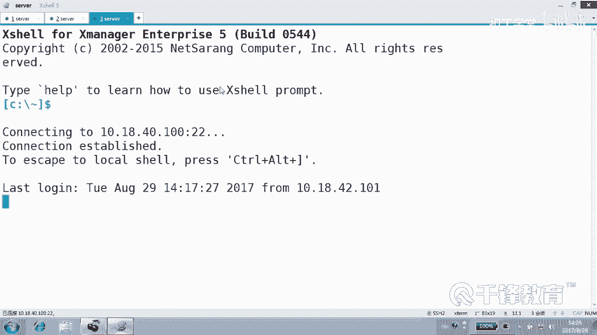
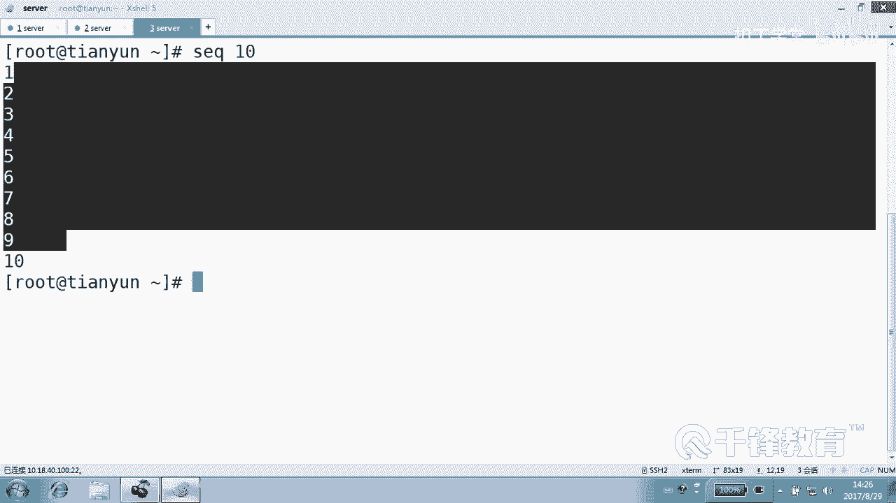
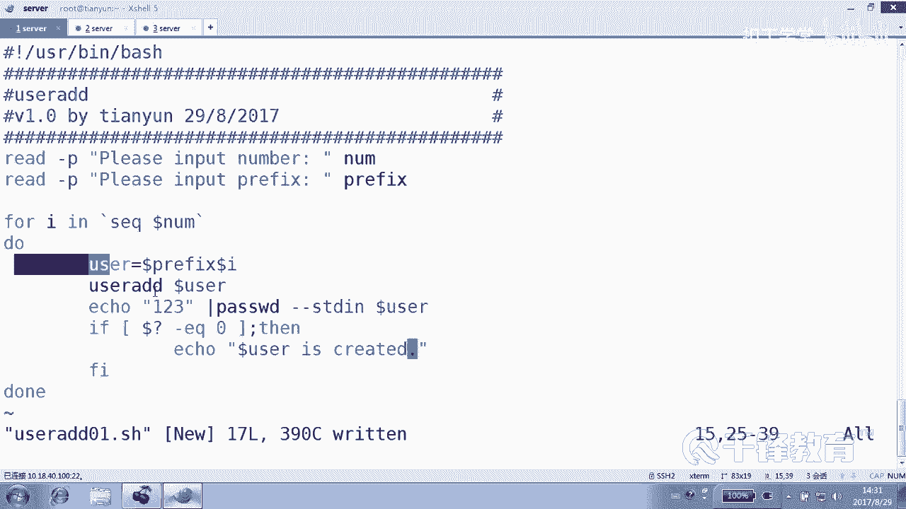
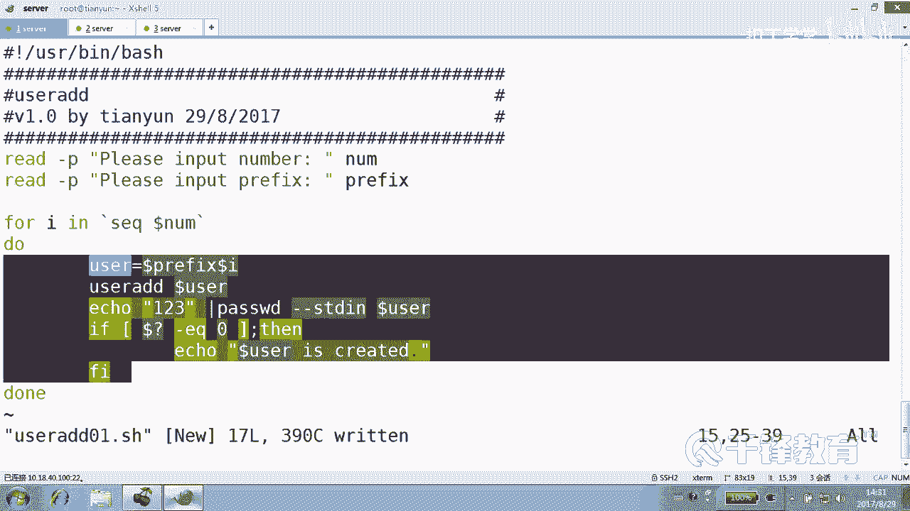
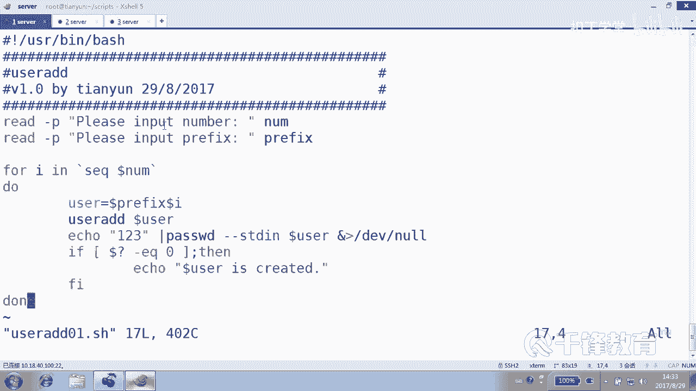
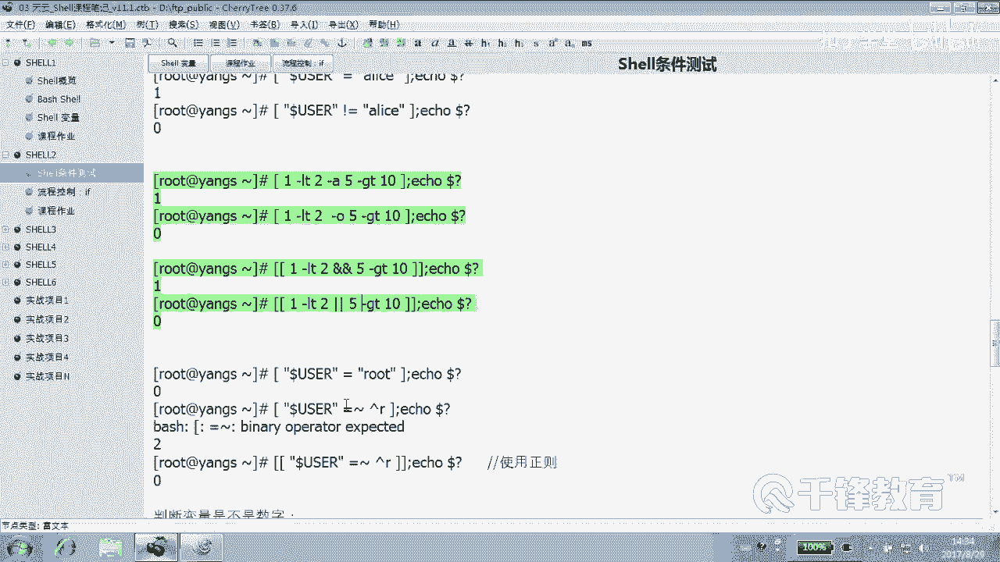
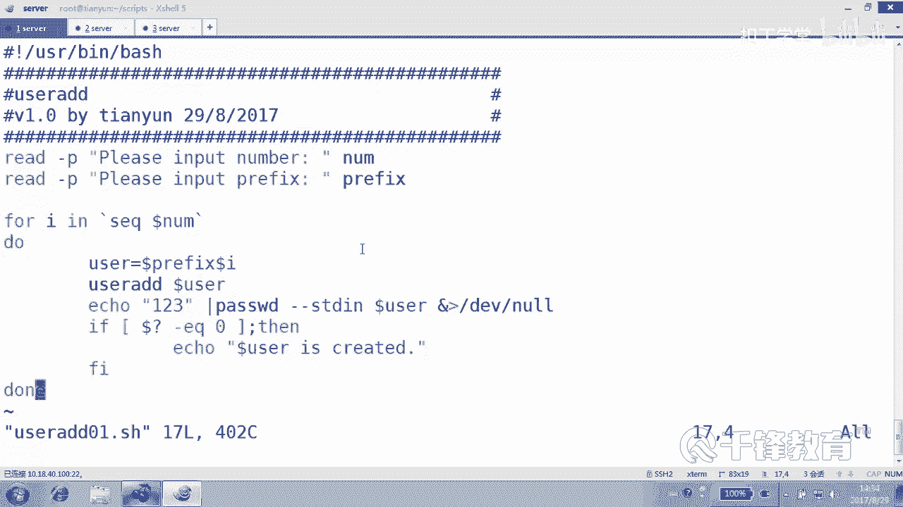

# Shell脚本自动化编程实战：P10：3.4 条件测试 - 按套路出牌创建用户 🧑‍💻


## 概述
在本节课中，我们将学习如何结合字符串比较和条件测试，编写一个能够创建批量用户的Shell脚本。我们将重点理解字符串比较的注意事项，并通过一个实战案例来巩固知识。

## 字符串比较回顾
上一节我们介绍了数值比较和文件测试，本节中我们来看看字符串比较的要点。

字符串比较主要使用等号（`=` 或 `==`）和不等号（`!=`）。例如，判断当前用户是否为 `root`。

```bash
[ "$USER" = "root" ]
```

在使用字符串比较时，有一个非常重要的习惯：**请务必将变量或字符串用双引号引起来**。这可以避免因变量未定义或为空值而导致的语法错误或意外结果。

例如，一个未定义的变量 `$USERNAME` 直接进行比较会报错：
```bash
[ $USERNAME = "root" ]  # 若USERNAME未定义，此处会报语法错误
```
正确的做法是：
```bash
[ "$USERNAME" = "root" ]  # 即使USERNAME为空或未定义，也会安全地视为假
```

## 字符串长度测试：-z 与 -n
除了相等性比较，我们还可以测试字符串的长度。

以下是两个关键操作符：
*   **`-z`**：判断字符串长度是否为 **0**（Zero）。
*   **`-n`**：判断字符串长度是否 **非0**（Not zero）。

我们通过几个例子来理解：

```bash
VAR=""  # 定义一个空变量
[ -z "$VAR" ]  # 结果为真，因为VAR长度是0
[ -n "$VAR" ]  # 结果为假，因为VAR长度不是非0

VAR2="abc"  # 定义一个长度为3的变量
[ -z "$VAR2" ] # 结果为假
[ -n "$VAR2" ] # 结果为真

# 对于一个未定义的变量VAR3
[ -z "$VAR3" ] # 结果为真，未定义的变量被视为空，长度为0
[ -n "$VAR3" ] # 结果为假
```

**核心提示**：变量为空或未定义，在测试中都被视为长度为0。始终为变量加上双引号，是获得预期结果的保证。

## 组合条件测试
有时我们需要判断多个条件。在单个方括号 `[ ]` 中，我们可以使用 `-a`（AND，与）和 `-o`（OR，或）。

```bash
# 条件1 AND 条件2
[ 1 -lt 2 -a 5 -gt 10 ]  # 结果为假，因为5>10不成立

# 条件1 OR 条件2
[ 1 -lt 2 -o 5 -ge 10 ]  # 结果为真，因为1<2成立
```

如果使用双括号 `[[ ]]`，则需要使用 `&&` 和 `||` 操作符。

```bash
# 使用 [[ ]] 和 &&
[[ 1 -lt 2 && 5 -gt 10 ]]  # 结果为假

# 使用 [[ ]] 和 ||
[[ 1 -lt 2 || 5 -ge 10 ]]  # 结果为真
```





## 实战：创建批量用户脚本
理解了字符串比较后，我们通过一个创建批量用户的脚本来综合应用。这个脚本的目标是：
1.  让用户输入要创建的用户数量。
2.  让用户输入用户名的前缀。
3.  根据输入，批量创建用户（例如：前缀`aa`，数量`3`，则创建`aa1`， `aa2`， `aa3`）。

以下是脚本的完整内容与分步解析：

```bash
#!/bin/bash
# ============================================
# 脚本名称：user_add_01.sh
# 功能描述：批量创建用户
# 版本：v1.0
# 作者：千锋扣丁学堂
# 创建日期：2017-08-29
# ============================================

# 1. 提示用户输入要创建的用户数量
read -p "请输入要创建的用户数量: " NUM

# 2. 提示用户输入用户名的前缀
read -p "请输入用户名的前缀: " PREFIX

# 3. 循环创建用户
# 使用 `seq` 命令生成从1到$NUM的数字序列
for i in $(seq $NUM)
do
    # 组合生成用户名
    USERNAME="${PREFIX}${i}"
    
    # 创建用户
    useradd $USERNAME
    # 为用户设置初始密码（此处示例为‘123’）
    echo "123" | passwd --stdin $USERNAME &>/dev/null
    
    # 判断上一条命令（useradd）是否执行成功
    if [ $? -eq 0 ]; then
        echo "用户 $USERNAME 创建成功。"
    fi
done
```

### 脚本关键点解析
以下是脚本中几个关键部分的说明：



1.  **生成数字序列**：我们不能直接在 `{1..$NUM}` 中使用变量。因此使用 `seq` 命令来生成序列：`$(seq $NUM)` 会产生从1到 `$NUM` 的数字列表。
2.  **变量引用**：在循环内部定义了 `USERNAME="${PREFIX}${i}"`，使得后续代码清晰易读。
3.  **命令执行状态**：`$?` 变量保存了上一条命令的退出状态。`0` 通常表示成功。我们通过判断 `[ $? -eq 0 ]` 来确认用户是否创建成功。
4.  **输出重定向**：`passwd` 命令会有输出，我们用 `&>/dev/null` 将其丢弃，保持界面整洁。



### 脚本执行与测试
为脚本添加执行权限并运行：

```bash
chmod +x user_add_01.sh
./user_add_01.sh
```
按照提示输入数量（如`3`）和前缀（如`testuser`），脚本便会创建 `testuser1`， `testuser2`， `testuser3` 三个用户，并为其设置密码。

**当前脚本的局限性**：这个脚本假设用户会“按套路出牌”，输入有效的数字和前缀。如果用户输入非数字或直接回车，脚本会出错。如何让脚本更健壮，能够处理“不按套路出牌”的输入，是我们后续可以深入探讨的话题。







## 总结
本节课我们一起学习了Shell脚本中的字符串比较。我们掌握了字符串相等（`=`， `!=`）和长度测试（`-z`， `-n`）的用法，并牢记**给变量加双引号**的重要性。最后，我们综合运用 `read`、`循环`、`条件测试`和`useradd`命令，完成了一个批量创建用户的实战脚本，将理论知识应用于实际自动化任务中。