# Shell脚本自动化编程实战：P11：3.5 条件测试 - 创建用户（增强版）


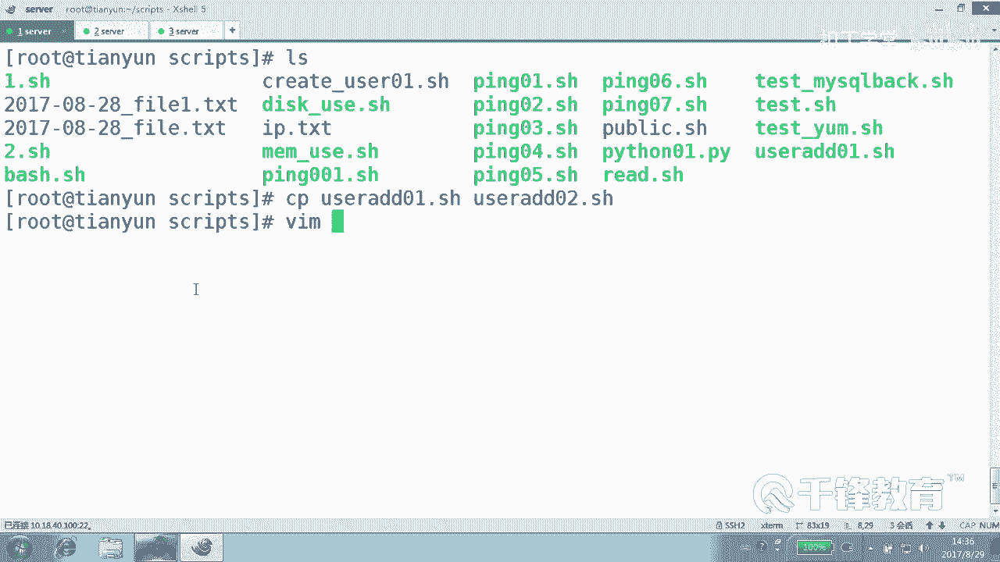

在本节课中，我们将学习如何增强之前编写的用户创建脚本，使其能够处理用户不按规则输入的情况，例如输入非数字或空值。我们将通过条件测试和正则表达式来实现更健壮的脚本逻辑。

---

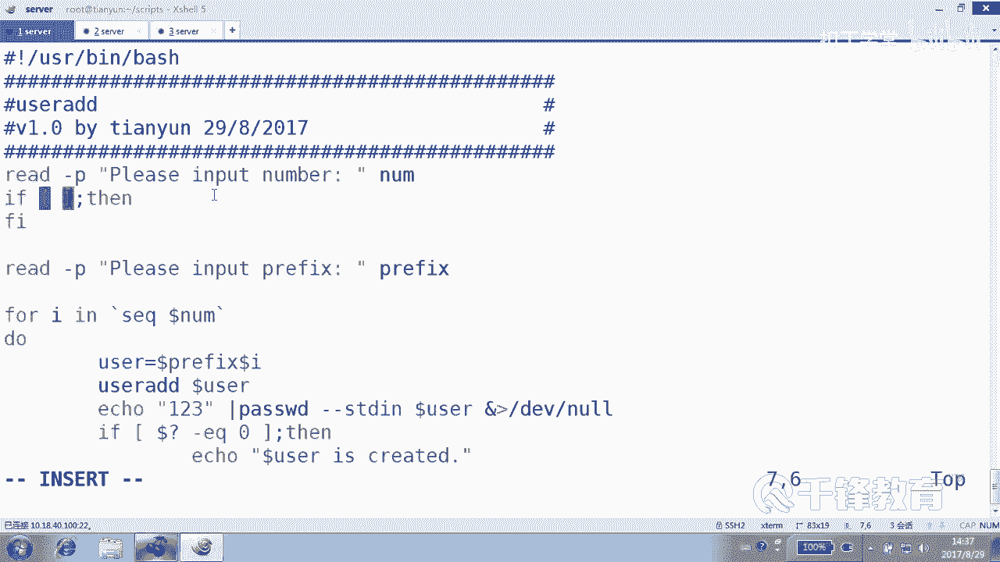

## 脚本存在的问题

上一节我们创建了一个按规则输入的用户创建脚本。但这个脚本存在潜在问题：如果用户没有输入，或者输入了非数字内容，脚本会报错或产生意外结果。

为了演示，我们复制原脚本为 `user2.sh` 并进行修改。

## 检查输入是否为数字

首先，我们需要在用户输入数字后，对其输入内容进行检查和判断。这可以通过 `if` 语句实现。

`if` 语句在这里只做一件事：判断输入是否为数字。如果输入不是数字，则程序应直接退出。

### 如何判断数字

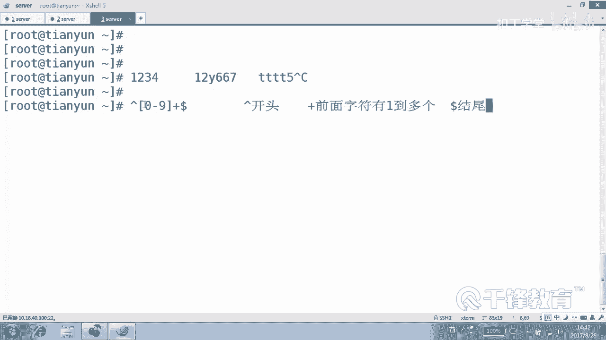

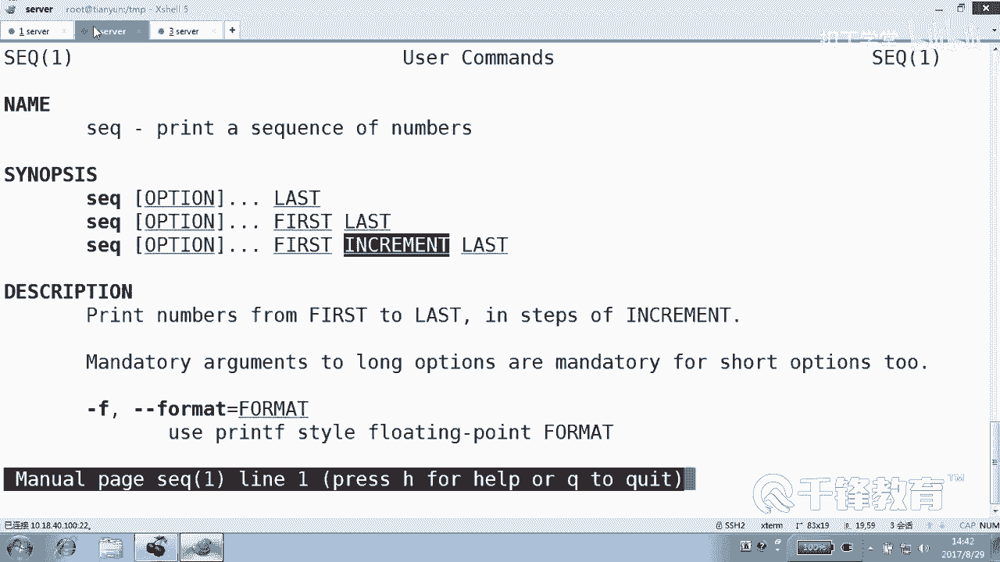

我们需要定义一个“数字”的模式。数字的规律是：由0到9之间的字符组成，且至少有一个字符。

在Shell中，我们可以使用正则表达式来描述这个模式：
```
^[0-9]+$
```
*   `^` 表示以...开头。
*   `[0-9]` 表示0到9之间的任意一个字符。
*   `+` 表示前面的字符（即`[0-9]`）出现一次或多次。
*   `$` 表示以...结尾。

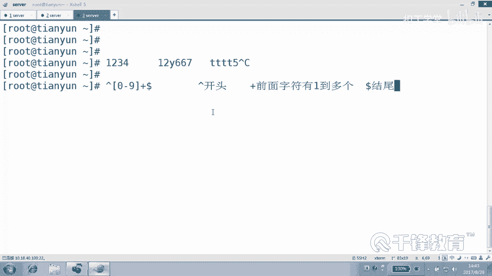

这个模式组合起来，就表示“以一个或多个数字开头和结尾”，即只能是数字。

> **注意**：关于正则表达式，后续会有专门章节学习。目前请先记住此模式用于匹配数字。

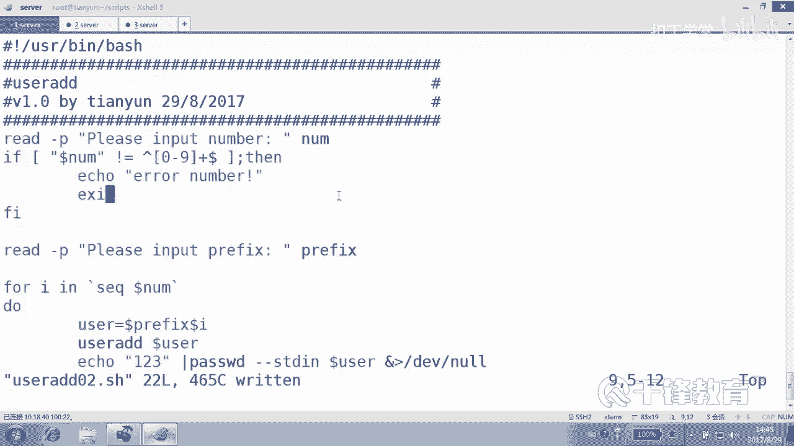

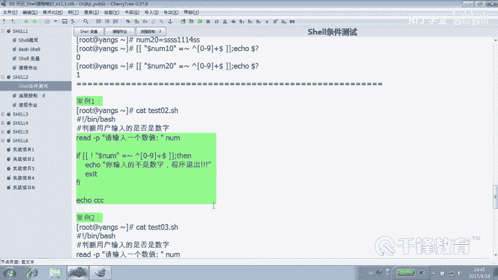

### 在Shell中进行正则匹配

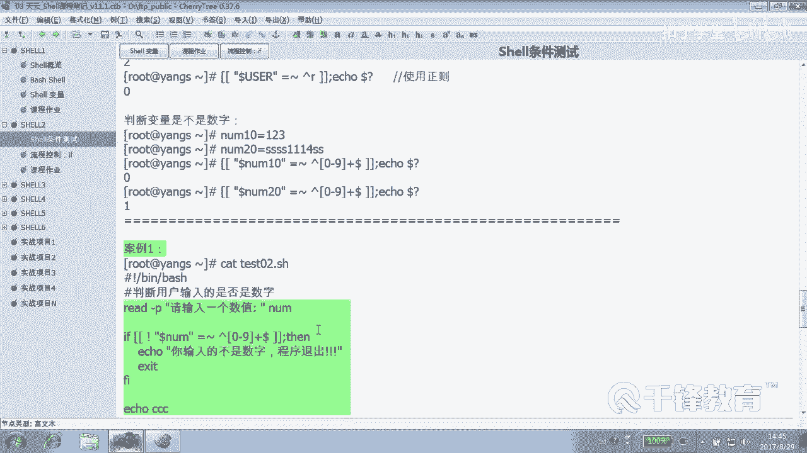

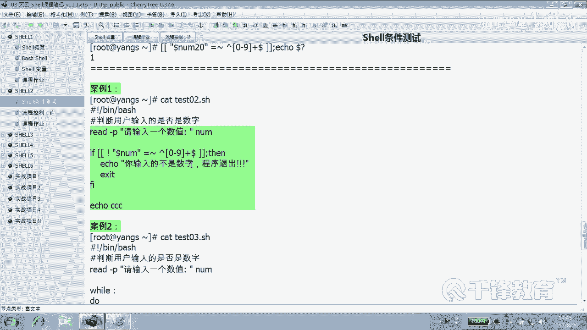

在Shell脚本中，**单个方括号 `[ ]` 不支持正则表达式**，它只进行字面字符串比较。要使用正则表达式进行匹配，必须使用**双方括号 `[[ ]]`**。

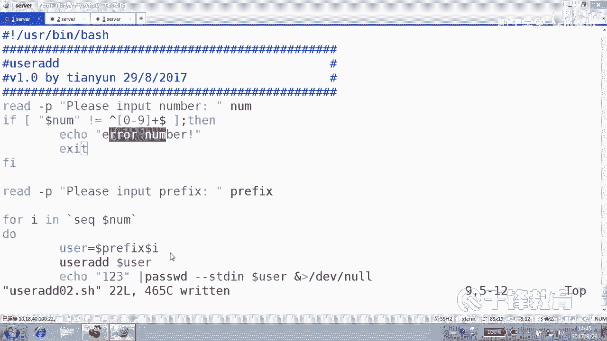

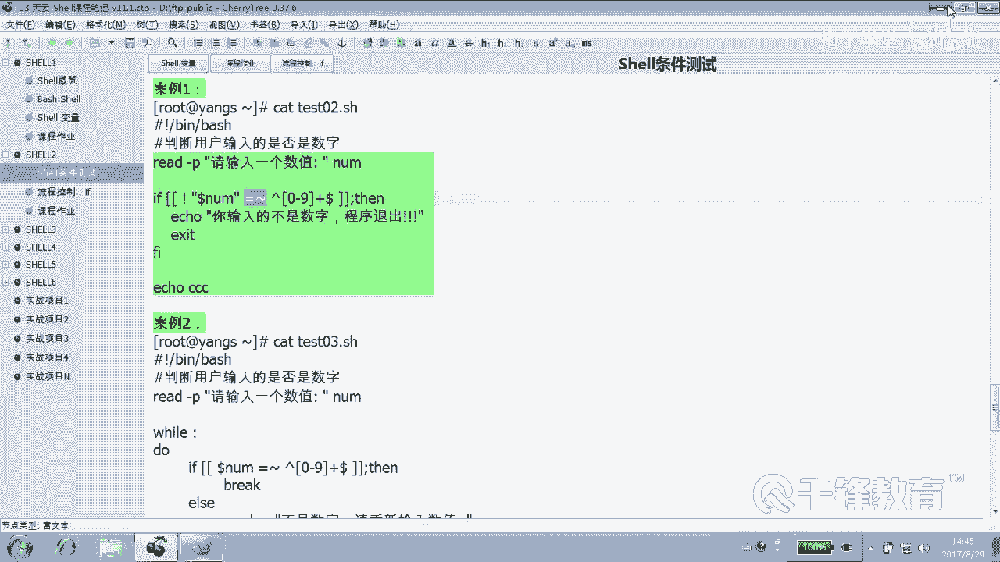

以下是测试示例：
```bash
# 假设变量 number=123
# 错误写法（字面比较）：
[ "$number" = ^[0-9]+$ ]

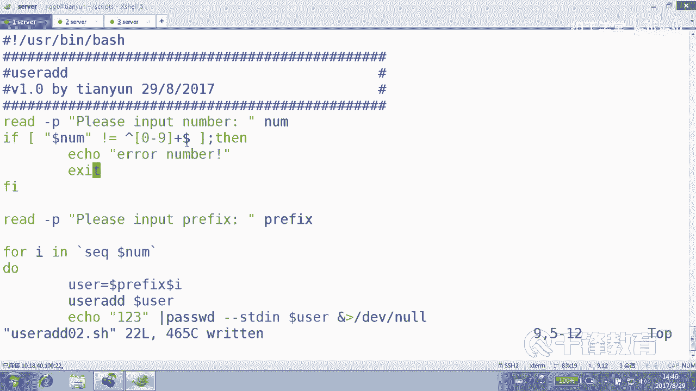

# 正确写法（正则匹配）：
[[ $number =~ ^[0-9]+$ ]]
```
在 `[[ ]]` 中使用 `=~` 运算符进行正则匹配，并且**变量部分不要加引号**，否则会被当作普通字符串。

### 应用到脚本中

在脚本中，我们可以在读取 `number` 变量后，添加以下检查：
```bash
if [[ ! $number =~ ^[0-9]+$ ]]; then
    echo “错误的number”
    exit
fi
```
这段代码的意思是：如果变量 `$number` 的内容**不匹配**（`!` 表示非）数字模式，则打印错误信息并退出脚本。

---

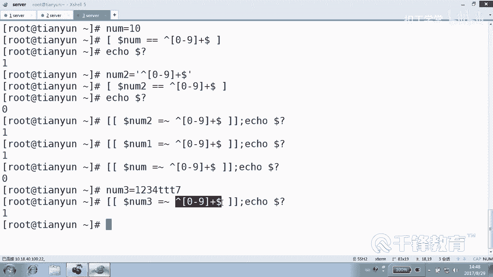

## 检查输入是否为空

解决了数字检查后，我们还需要考虑用户可能没有输入前缀（`prefix`）的情况。

这个问题同样可以用 `if` 语句解决。我们可以检查字符串的长度是否为0。

在脚本中，可以在读取 `prefix` 变量后添加以下检查：
```bash
if [ -z “$prefix” ]; then
# 或者 if [ ${#prefix} -eq 0 ]; then
    echo “错误的prefix”
    exit
fi
```
*   `-z “$string”` 用于判断字符串 `$string` 的长度是否为零（即是否为空）。
*   **这里给变量加上双引号非常重要**，可以防止变量未定义时脚本报错。

如果前缀字符串长度为0，说明用户没有输入，脚本同样会打印错误信息并退出。

---

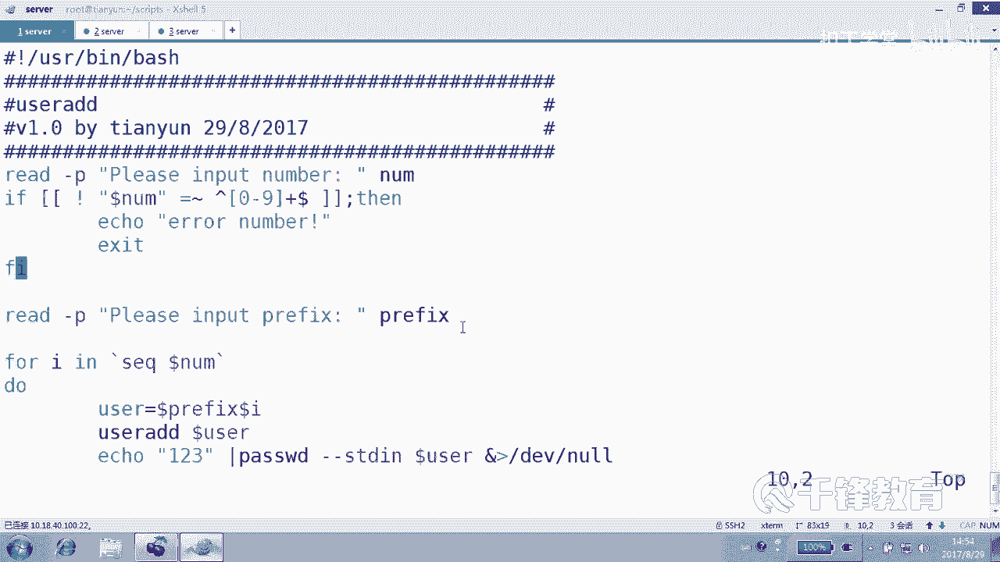

## 总结

本节课中，我们一起学习了如何增强Shell脚本的健壮性，以应对用户不按规则输入的情况。

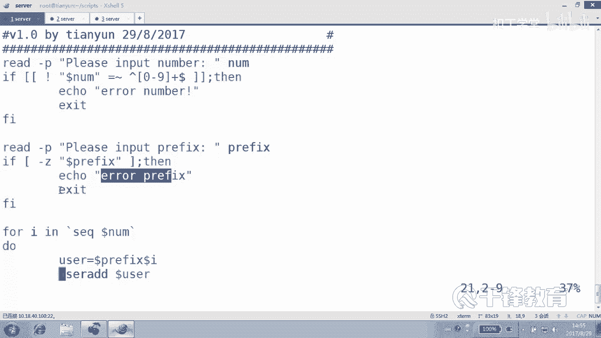

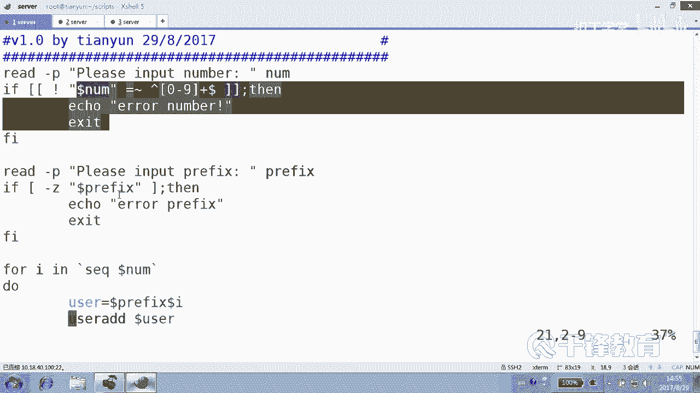

1.  **使用正则表达式检查数字输入**：通过 `[[ $variable =~ ^[0-9]+$ ]]` 判断输入是否为纯数字。
2.  **检查字符串是否为空**：通过 `[ -z “$variable” ]` 判断用户是否输入了必要的内容。
3.  **关键点**：
    *   使用 `[[ ]]` 和 `=~` 进行正则匹配。
    *   正则匹配时，变量不要加引号。
    *   判断字符串状态时，变量建议加双引号。

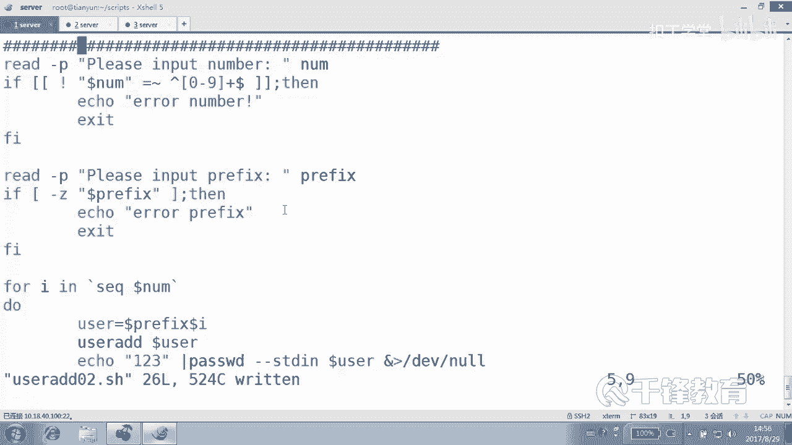

通过添加这些条件测试，我们的脚本能够更好地处理异常输入，避免因无效数据导致后续操作失败，从而变得更加可靠和自动化。