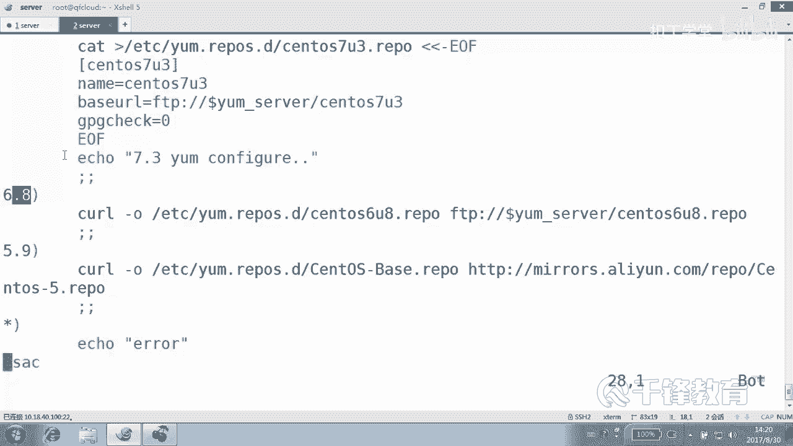
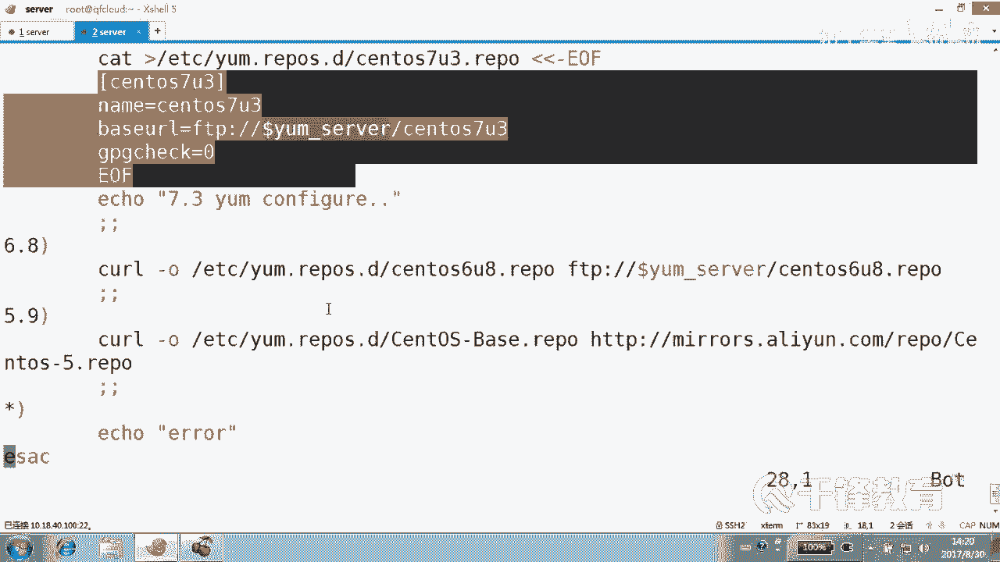
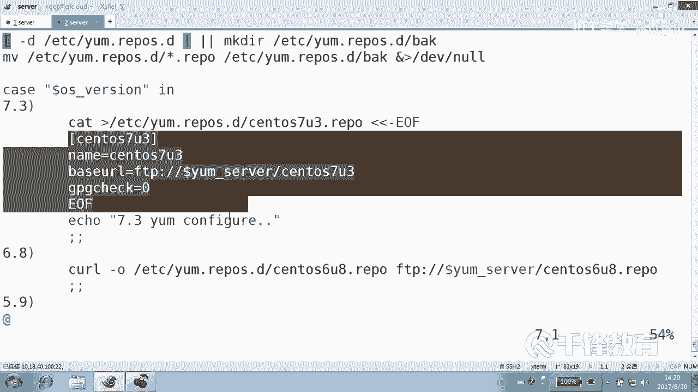
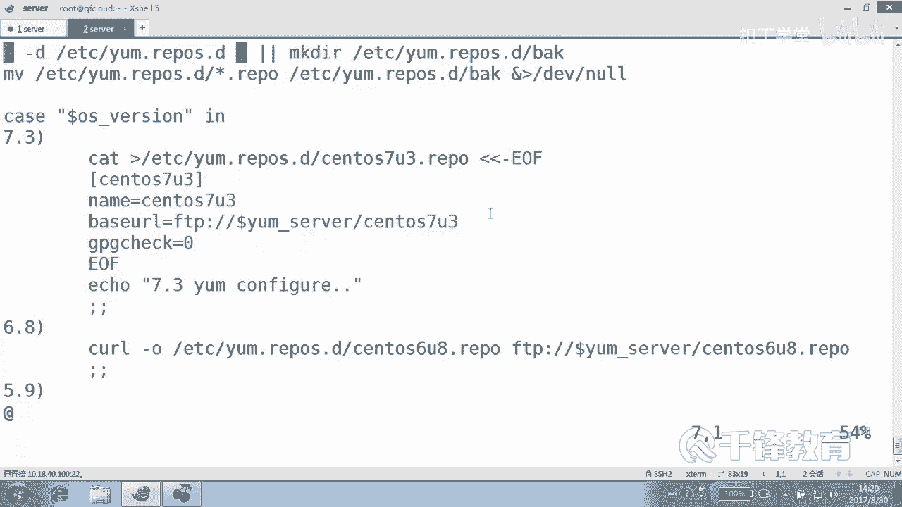
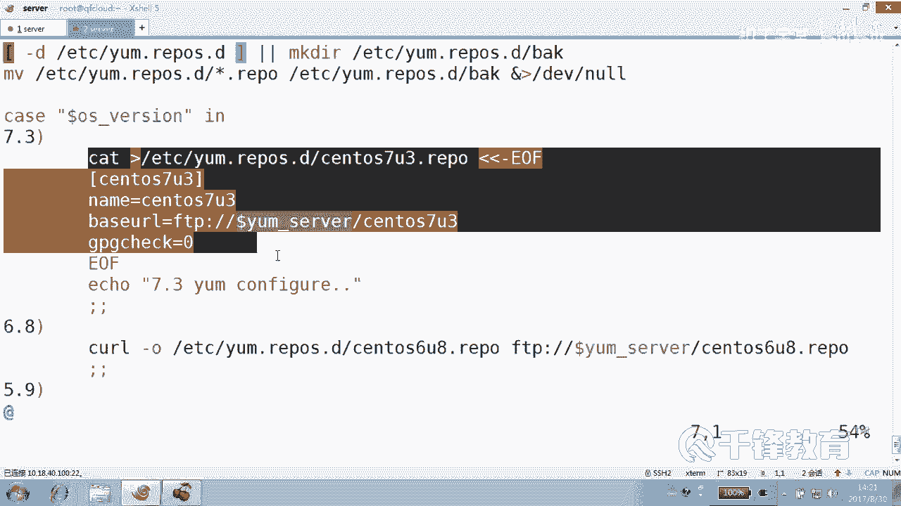
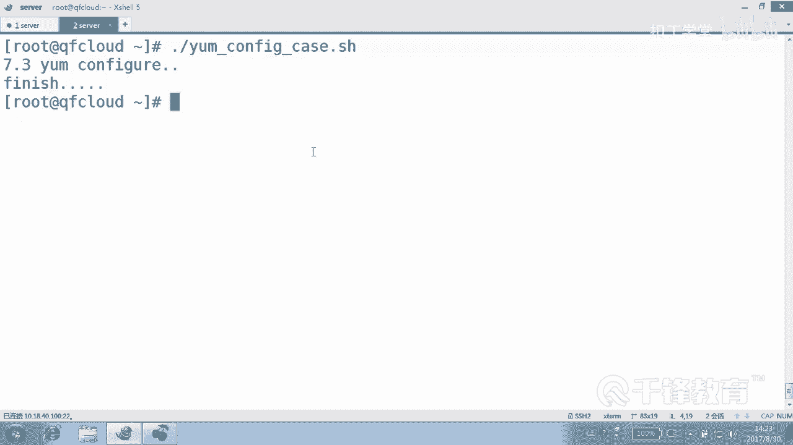

# Shell脚本自动化编程实战：P12：3.6 case多系统配置YUM源 🖥️


## 概述
在本节课中，我们将学习Shell脚本中的`case`语句。这是一种用于多条件模式匹配的结构，可以看作是`if-else`语句的一种更简洁、更清晰的替代方案。我们将通过改造一个之前编写的YUM源配置脚本，来具体学习`case`语句的语法和应用。

## 从`if-else`到`case`语句
上一节我们介绍了使用`if-else`语句进行条件判断。但在处理多个分支时，`if-else`的结构可能会显得冗长和混乱。本节中，我们来看看如何使用`case`语句来简化多分支判断。

`case`语句的核心思想是模式匹配。其基本语法结构如下：
```bash
case 变量 in
    模式1)
        执行命令序列1
        ;;
    模式2)
        执行命令序列2
        ;;
    *)
        默认执行的命令序列
        ;;
esac
```
其中，`变量`的值会依次与各个`模式`进行匹配。一旦匹配成功，就会执行对应的命令序列，然后通过`;;`结束该分支，并跳出整个`case`结构。`*`代表匹配任何其他值，类似于`if-else`中的`else`部分。`esac`是`case`的反写，表示`case`语句的结束。

## 实战：使用`case`重构YUM源配置脚本
我们将之前使用`if-else`编写的`yum_configure.sh`脚本，重构为`case`版本。

以下是重构后的脚本核心逻辑：
```bash
#!/bin/bash
# ... 前面的变量定义和备份操作与之前相同 ...

# 使用case语句判断系统版本并配置对应的YUM源
case $os_version in
    "7.3")
        # 配置CentOS 7.3的YUM源
        wget -O /etc/yum.repos.d/CentOS-Base.repo http://mirrors.aliyun.com/repo/Centos-7.repo
        ;;
    "6.8")
        # 配置CentOS 6.8的YUM源
        wget -O /etc/yum.repos.d/CentOS-Base.repo http://mirrors.aliyun.com/repo/Centos-6.repo
        ;;
    "5.9")
        # 配置CentOS 5.9的YUM源
        wget -O /etc/yum.repos.d/CentOS-Base.repo http://mirrors.aliyun.com/repo/Centos-5.repo
        ;;
    *)
        # 如果版本不匹配，输出错误信息
        echo "不支持的CentOS版本: $os_version"
        exit 1
        ;;
esac

# ... 后续的清理缓存等操作 ...
```
**代码解析**：
1.  `case $os_version in`：开始`case`判断，匹配变量`$os_version`的值。
2.  `"7.3")`、`"6.8")`、`"5.9")`：这三个是具体的匹配模式。注意，这里的模式是**字符串**匹配，例如`"7.3"`匹配的是由字符`7`、`.`、`3`组成的字符串。
3.  `*)`：这是默认匹配模式，如果`$os_version`的值不满足以上任何模式，则执行此分支。
4.  每个分支以`;;`结束，这标志着该分支命令序列的终结，并且会**跳出**整个`case`结构，不再检查后续模式。
5.  `esac`：标志着`case`语句的结束。







## `case`语句的重要特性与注意事项
了解基本结构后，我们还需要掌握`case`语句的一些关键特性。





以下是使用`case`语句时需要注意的几点：
*   **顺序性**：`case`语句会从上到下依次匹配模式。一旦某个模式匹配成功，就会执行对应的命令并退出，后续的模式将不再被检查。因此，模式的排列顺序很重要。如果将通用模式`*`放在最前面，那么它将匹配所有情况，后面的特定模式永远不会被执行。
*   **模式是字符串**：`case`进行的是字符串匹配，而非数值比较。模式`"10"`和变量值`10`（字符串）是匹配的。
*   **处理空值**：如果需要匹配用户没有输入任何内容（空值）的情况，可以使用一对空引号`""`作为模式。
*   **添加引号**：给变量和模式加上双引号是一个好习惯，可以避免一些意外的空格或特殊字符导致的问题，例如`case "$os_version" in`。



## 总结
本节课中我们一起学习了Shell脚本中的`case`语句。我们了解到`case`是一种基于模式匹配的多分支选择结构，它比多层嵌套的`if-else`语句更加清晰和简洁。我们通过将YUM源配置脚本从`if-else`版本重构为`case`版本，实践了其基本语法`case...in...esac`以及分支的写法。关键点在于理解其字符串匹配的本质、分支执行后通过`;;`跳出的机制，以及模式匹配的顺序重要性。掌握`case`语句能让我们的脚本在面对多个确定的条件判断时，编写得更加优雅和易于维护。