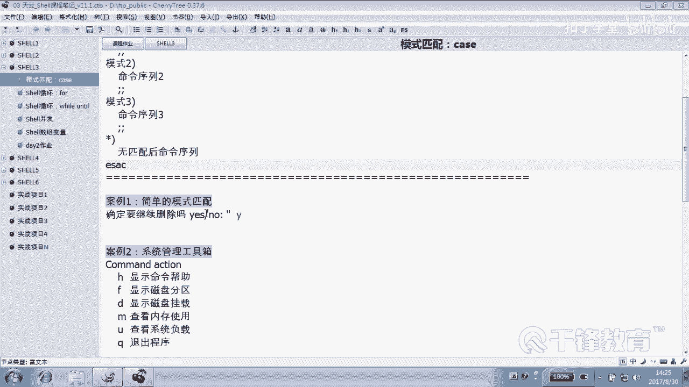
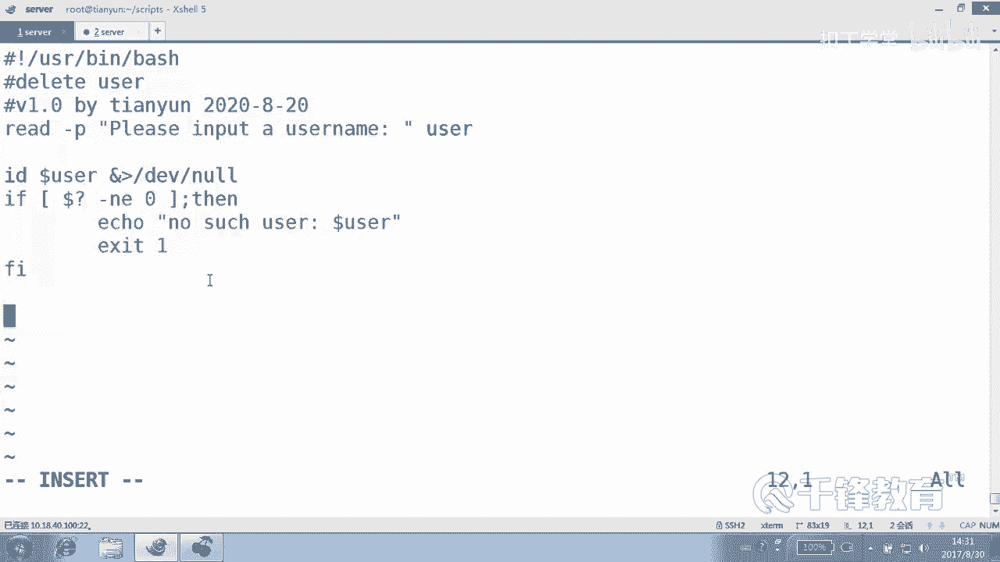
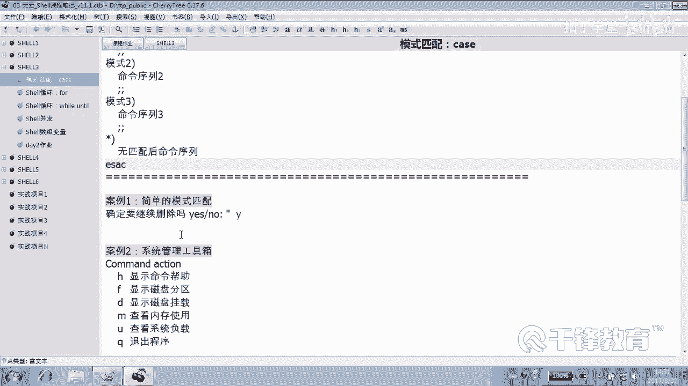
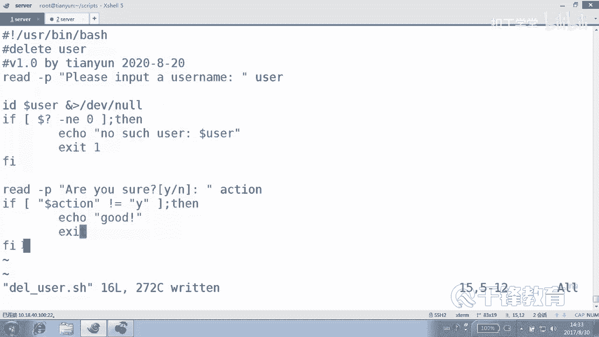
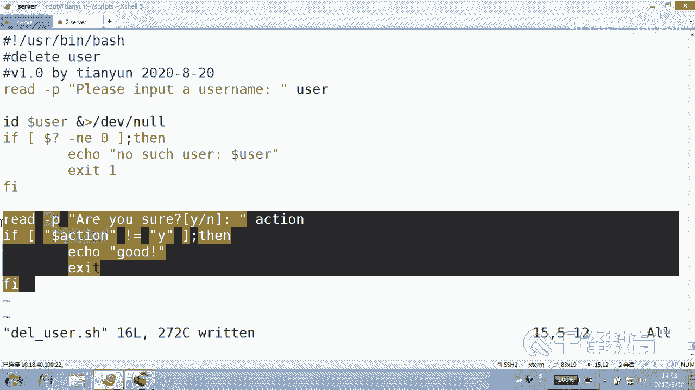
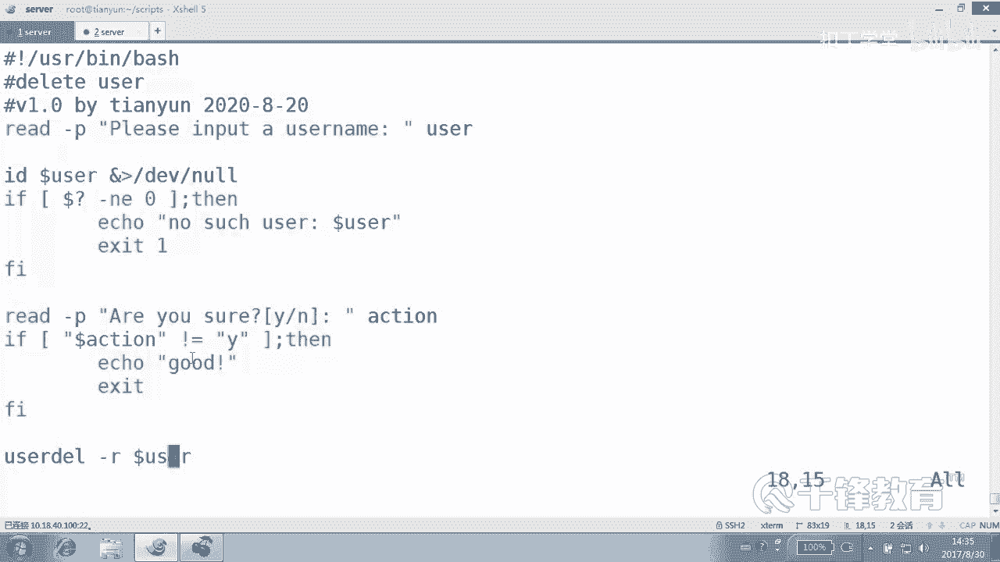
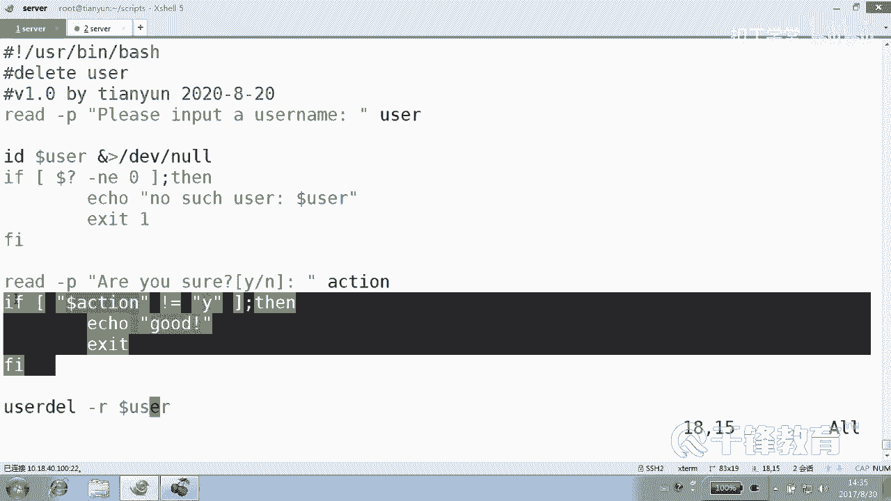
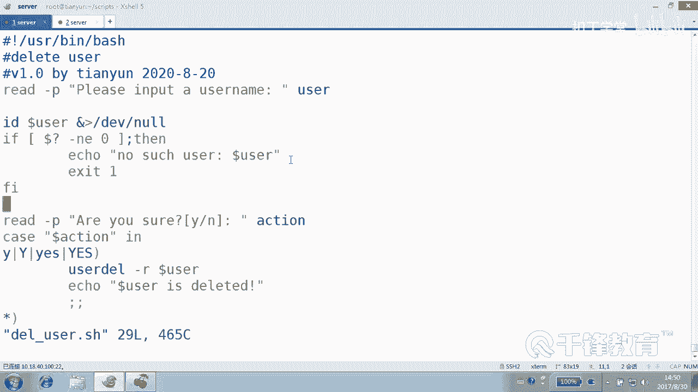

# Shell脚本自动化编程实战：P13：3.7 case删除用户判断


## 概述
在本节课中，我们将学习如何编写一个交互式删除用户的脚本。我们将从使用基础的`if`语句实现用户确认功能开始，然后逐步优化，引入`case`语句来实现更清晰、更灵活的模式匹配，从而提升脚本的可读性和健壮性。

---



## 用户确认的通用方法

上一节我们介绍了条件判断，本节中我们来看看如何在实际脚本中应用。在脚本执行关键操作前，请求用户确认是一个好习惯。这可以通过`read`命令读取用户输入，再配合`if`语句进行判断来实现。

以下是实现用户确认的基本逻辑：
1.  使用`read`命令提示用户输入。
2.  使用`if`语句判断用户输入是否为“Y”或“yes”。
3.  根据判断结果决定是否继续执行或退出脚本。

这种方法可以灵活地插入到脚本的任何需要暂停并确认的位置。

---

## 编写删除用户脚本（V1.0）

现在，我们开始编写一个删除用户的脚本。脚本的基本流程如下：
1.  提示用户输入要删除的用户名。
2.  检查该用户是否存在。
3.  如果用户存在，则询问用户是否确认删除。
4.  根据用户的确认输入，执行删除操作或退出。

以下是脚本的初始版本代码：

```bash
#!/bin/bash
# V1.0
# by 2020.8.30



# 1. 从键盘读入要删除的用户名
read -p "请输入一个用户名: " user



# 2. 检查用户是否存在
id $user &> /dev/null
if [ $? -ne 0 ]; then
    echo "没有 $user 这个用户。"
    exit 1  # 非正常退出，返回错误码1
fi

# 3. 用户存在，请求确认删除
read -p "你真的确认要删除吗? (输入Y确认): " action

# 4. 使用if判断用户输入
if [ "$action" != "Y" ]; then
    echo "你做出了明智的选择。"
    exit 2  # 用户取消操作，返回错误码2
fi





# 5. 执行删除操作
userdel -r $user
echo "用户 $user 已被删除。"
```

**代码解析**：
*   `id $user &> /dev/null`：检查用户是否存在，并将输出重定向到空设备，避免屏幕显示。
*   `[ $? -ne 0 ]`：判断上一条命令的返回值是否不等于0（即用户不存在）。
*   `exit 1` 或 `exit 2`：脚本以非0值退出，表示执行过程中遇到了错误或用户取消了操作。



---



## 使用case语句优化确认逻辑

上面的脚本使用`if`语句判断用户输入，但如果我们希望接受更多样的确认输入（例如“y”, “Y”, “yes”, “YES”），`if`语句的编写会变得冗长且容易出错。

这时，`case`语句是更好的选择。`case`语句用于进行字符串的模式匹配，结构更清晰。

以下是使用`case`语句重写用户确认部分的代码：

```bash
# ... 前面的用户存在性检查代码保持不变 ...

# 3. 用户存在，请求确认删除
read -p "你真的确认要删除吗? (输入 Y/y/yes 确认): " action

# 4. 使用case进行模式匹配
case $action in
    Y|y|yes|YES)  # 匹配 Y, y, yes, YES 中的任意一个
        userdel -r $user
        echo "用户 $user 已被删除。"
        ;;
    *)  # 匹配所有其他输入
        echo "操作已取消。"
        exit 2
        ;;
esac
```

**代码解析**：
*   `case $action in`：开始对变量`$action`的值进行模式匹配。
*   `Y|y|yes|YES)`：这是一个模式，使用竖线`|`表示“或”。如果`$action`的值等于`Y`、`y`、`yes`或`YES`中的任何一个，则执行后续命令，直到遇到`;;`。
*   `*)`：这是一个通配符模式，匹配任何值。通常用于处理默认情况（即不匹配任何已列出的模式时）。
*   `;;`：表示一个模式匹配块的结束。
*   `esac`：`case`语句的结束标记（`case`倒过来写）。

与之前的`if`语句相比，`case`语句的结构更直观，更容易添加或修改匹配的模式，代码可维护性更高。

> **注意**：`case`语句主要用于字符串的模式匹配，不能直接用于数值比较或文件属性测试，这类任务仍需使用`if`配合条件测试表达式（`[ ]`或`[[ ]]`）来完成。

---

## 补充知识点：command命令与冒号命令

在结束之前，我们补充两个有用的Shell内置命令。

**1. `command -v` 判断命令是否存在**

在脚本中，有时需要检查某个命令是否可用，然后再决定是否安装。可以使用`command -v`命令。

```bash
#!/bin/bash
cmd_name="ls"  # 要检查的命令

if command -v $cmd_name &> /dev/null; then
    echo "$cmd_name 命令已存在。"
    # 这里可以什么都不做，或者执行冒号命令 `:`
    :
else
    echo "$cmd_name 命令不存在，正在尝试安装..."
    # 这里可以模拟安装命令，例如：yum install -y some_package
fi
```
*   `command -v 命令名`：如果该命令存在且可执行，则返回0（真），否则返回非0（假）。

**2. 冒号命令 `:`**

冒号`:`是一个特殊的Shell内置命令，它不做任何操作，总是返回退出状态0（成功）。它常用于在需要一条语句但又不希望执行任何操作的场景，例如在`if`或`while`循环中占位。

```bash
if [ some_condition ]; then
    : # 条件为真时，什么也不做
else
    echo "条件为假"
fi
```
它的“兄弟”命令是`true`，两者功能几乎相同，都是返回真值。

---

## 总结
本节课中我们一起学习了如何编写一个交互式删除用户的脚本。
1.  我们首先使用`read`和`if`语句实现了基本的用户输入与确认功能。
2.  然后，我们引入了`case`语句来优化用户确认逻辑。`case`通过模式匹配使代码在处理多种输入选项时更加清晰和简洁。
3.  最后，我们补充了`command -v`命令用于检查命令是否存在，以及冒号命令`:`作为空操作的用法。



通过本课的学习，你应当掌握在Shell脚本中实现用户交互和基于模式进行分支判断的方法，这是编写友好、健壮自动化脚本的重要技能。