# Shell脚本自动化编程实战：P14：3.8 case实现Jump Server（上）🚀

## 概述
在本节课中，我们将学习如何使用Shell脚本中的`case`语句，结合循环结构，构建一个简易的跳板机（Jump Server）或堡垒机。这个脚本将允许管理员通过一个统一的入口点，安全地连接到后端的生产服务器。

---

## 跳板机（Jump Server）概念与应用场景 🔒

上一节我们介绍了`case`语句的基本用法，本节中我们来看看如何用它实现一个实用的管理工具。

在生产环境中，对外提供服务的服务器（如Web服务器）通常拥有公网IP地址，以便用户访问其服务（例如80端口）。然而，出于安全考虑，这些服务器的远程管理端口（如SSH的22端口）通常不会直接对外开放。

一种常见的安全解决方案是使用**跳板机**（Jump Server）或**堡垒机**。它的工作原理如下图所示：

```
客户端 ---> 跳板机 ---> 后端服务器（如Web1, MySQL1）
```

*   客户端只能连接到跳板机。
*   跳板机被授权可以连接到后端的各台服务器。
*   后端服务器的远程端口只对跳板机开放。

这样做虽然增加了管理步骤，但极大地提升了系统的安全性。管理员需要先登录跳板机，再从跳板机登录到目标服务器。本节课的目标就是使用Shell脚本自动化这个“二次登录”的菜单选择过程。

---

## 实验环境准备 🖥️

以下是构建此实验所需的基础环境与前提条件。

1.  **机器准备**：需要至少三台机器。
    *   一台作为**跳板机**（物理机或虚拟机均可）。
    *   两台作为**后端服务器**（例如Web1和MySQL1）。
2.  **用户准备**：在所有机器上创建一个统一的普通管理用户（例如 `alice`）。**禁止使用root用户进行远程登录**是生产环境的重要安全原则。
3.  **网络准备**：确保跳板机可以通过SSH连接到所有后端服务器。

> **提示**：如果手头没有现成环境，可以使用VMware等虚拟化软件快速创建多台虚拟机进行实验。

---

## 脚本功能设计 📝

我们将为跳板机上的 `alice` 用户编写一个脚本。该脚本的核心功能是：

1.  用户以 `alice` 账号登录跳板机后，**自动执行**该脚本。
2.  脚本展示一个数字菜单，列出所有可以连接的后端服务器。
3.  用户输入对应数字。
4.  脚本使用 `case` 语句判断用户选择，并自动执行 `ssh alice@目标服务器IP` 命令进行连接。
5.  连接断开后，再次显示菜单，形成管理闭环。

---

## 脚本编写步骤详解 🛠️

我们将分步构建这个名为 `jump_server.sh` 的脚本。

### 第一步：创建脚本并指定解释器

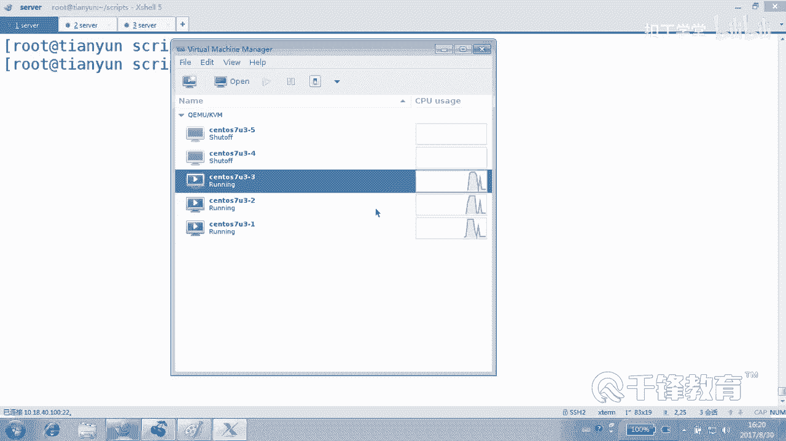

首先，我们以 `alice` 用户的身份在跳板机上创建脚本。

```bash
#!/usr/bin/bash
# jump_server.sh - 简易跳板机脚本
```

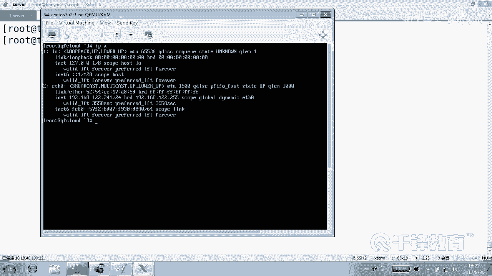

### 第二步：使用循环构建主框架

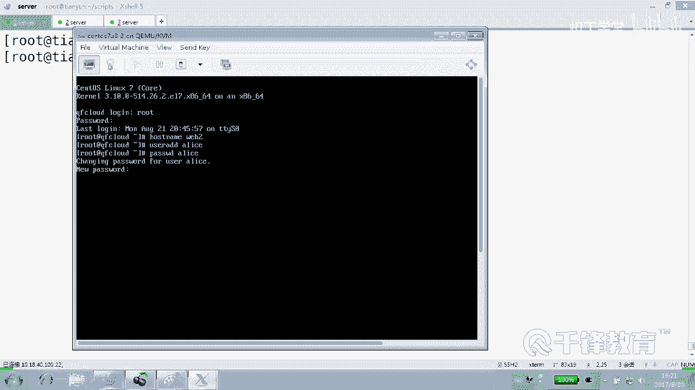

为了让菜单在每次操作后都能重新出现，我们需要一个无限循环。

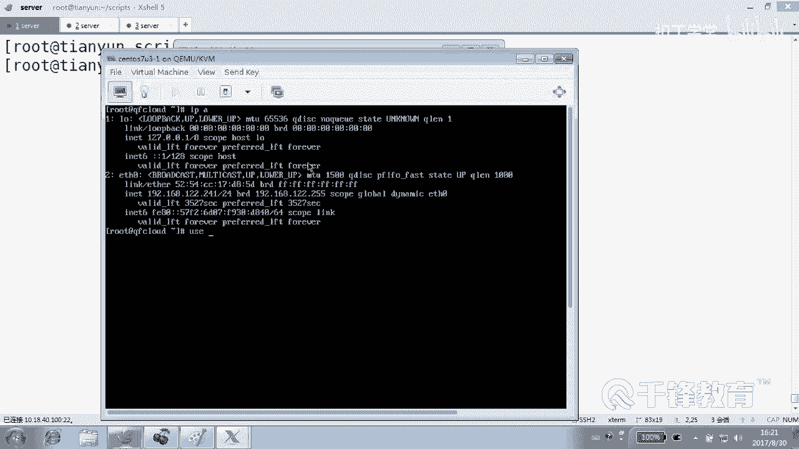

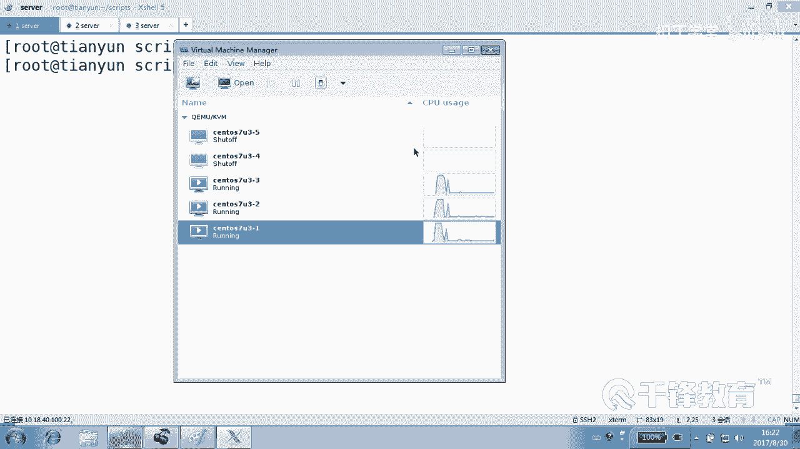

```bash
while true
do
    # 菜单和选择逻辑将放在这里
done
```

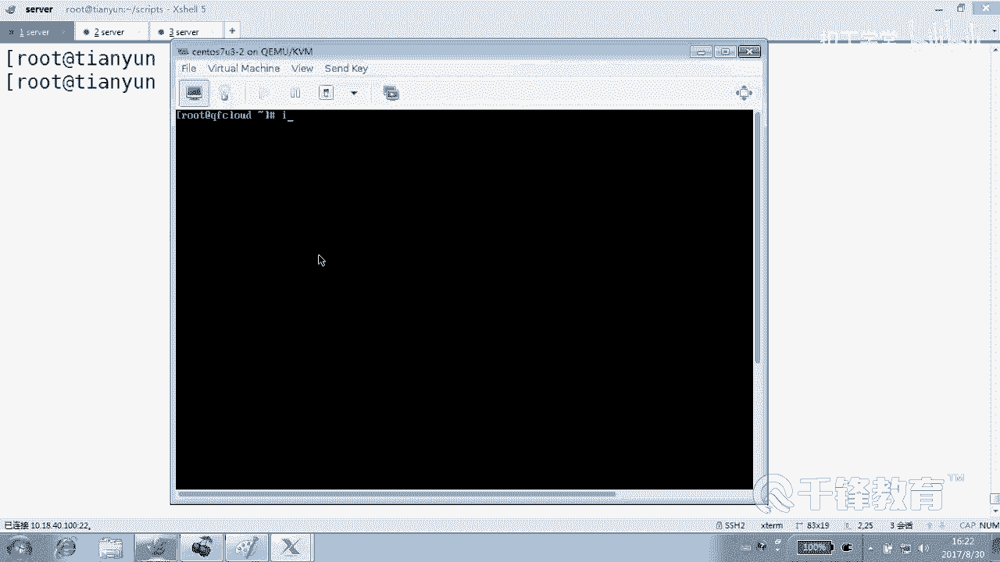

### 第三步：显示选择菜单

在循环体内，首先向用户展示可连接的服务器列表。

```bash
    cat << EOF
    1) Web Server 1
    2) MySQL Server 1
    3) Exit
    EOF
```

### 第四步：获取用户输入

使用 `read` 命令获取用户输入的数字，并存入变量。

```bash
    read -p "Please select a server to connect [1-3]: " number
```

### 第五步：使用case语句处理选择

这是脚本的核心。`case` 语句根据变量 `$number` 的值执行不同的连接命令。

```bash
    case $number in
        1)
            echo "Connecting to Web1..."
            ssh alice@192.168.12.241  # 请替换为你的Web1服务器真实IP
            ;;
        2)
            echo "Connecting to MySQL1..."
            ssh alice@192.168.12.210  # 请替换为你的MySQL1服务器真实IP
            ;;
        3)
            echo "Goodbye!"
            exit 0  # 退出脚本，结束循环
            ;;
        *)
            echo "Invalid selection. Please try again."
            ;;
    esac
```

> **注意**：脚本中的IP地址 `192.168.12.241` 和 `192.168.12.210` 需要替换为你实验环境中后端服务器的实际IP地址。

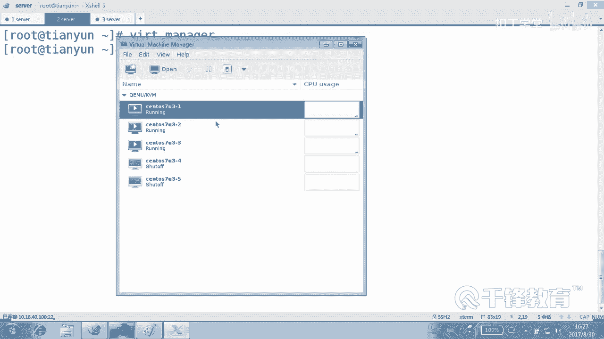

### 第六步：整合完整脚本并赋予执行权限

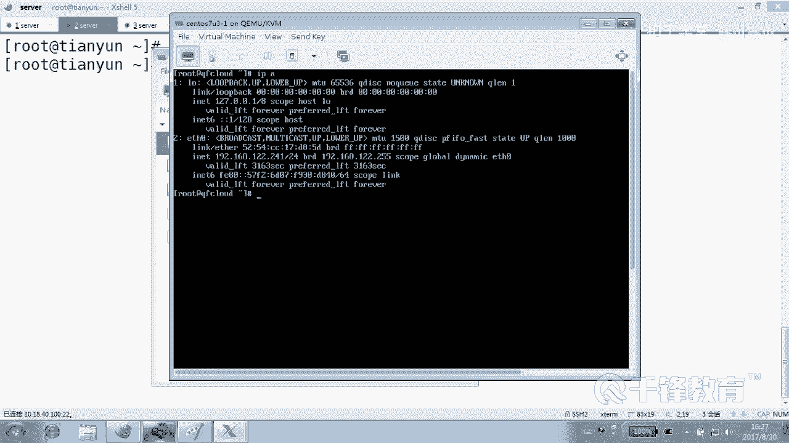

将以上所有部分组合起来，就形成了完整的脚本。保存后，需要为其添加执行权限。

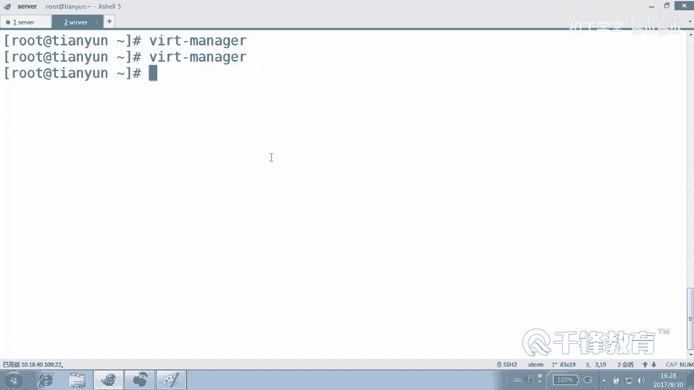

```bash
chmod +x jump_server.sh
```

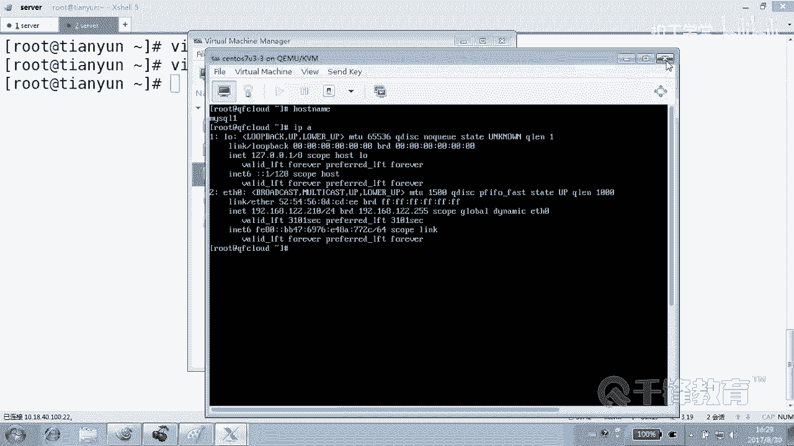

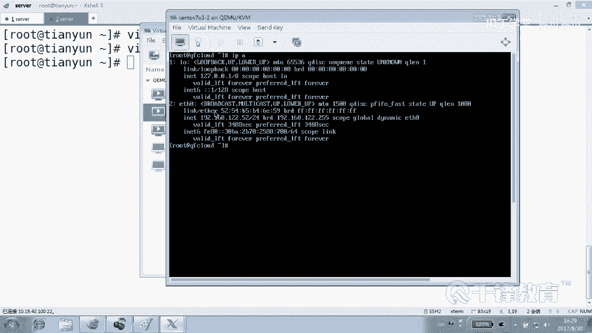

此时，你可以手动执行 `./jump_server.sh` 来测试功能。选择1或2会尝试通过密码认证方式连接到对应的服务器。

---

## 当前实现与待优化点 ⚠️

本节课我们成功实现了一个基础版的跳板机脚本，它能够：
*   提供交互式菜单。
*   根据用户选择连接到不同的后端服务器。
*   使用**密码认证**进行SSH连接。

然而，这只是一个开始。目前的实现存在一些需要改进的地方：
1.  **手动执行**：需要用户登录后手动运行脚本，不够自动化。
2.  **密码认证**：每次连接都需要输入密码，操作繁琐且安全性有待提升（密码可能被记录在脚本中或需要手动输入）。
3.  **配置硬编码**：服务器IP地址直接写在脚本里，难以维护。

---

## 总结

本节课中我们一起学习了如何利用 `case` 语句和循环，构建一个具有菜单选择功能的简易跳板机脚本。我们了解了跳板机在生产环境中的安全作用，并完成了脚本的基础框架和连接逻辑。

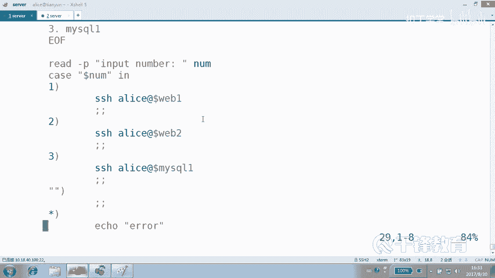

目前我们实现了基于密码认证的连接方式。在下节课中，我们将解决本课提到的优化点，特别是如何实现更安全、便捷的**密钥认证**，以及如何让脚本在用户登录时自动执行，使其成为一个真正实用的管理工具。