# Shell脚本自动化编程实战：P16：3.10 使用 case 实现简单的系统工具箱 🛠️

在本节课中，我们将学习如何利用 `case` 语句编写一个交互式的系统管理工具箱脚本。这个脚本会为用户提供一个菜单，根据用户的选择执行相应的系统命令，例如查看磁盘分区、内存使用情况等，并通过循环实现菜单的持续显示。

---

## 概述

我们将创建一个名为 `system_manager.sh` 的脚本。脚本的核心逻辑是：首先在屏幕上显示一个功能菜单，然后读取用户的输入，最后使用 `case` 语句根据输入匹配并执行对应的命令。为了让菜单能够持续显示，我们会将整个交互逻辑放入一个 `while` 循环中。

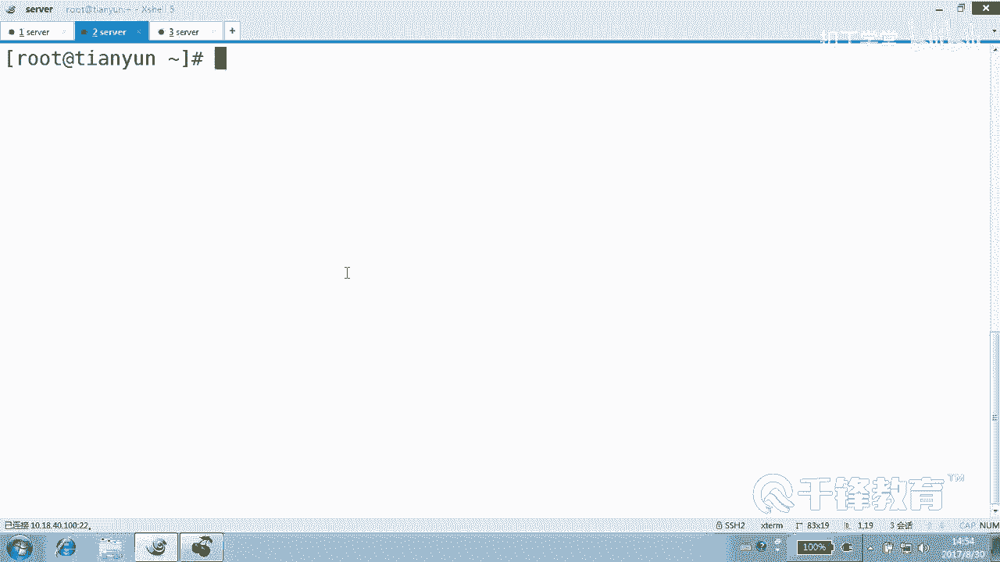

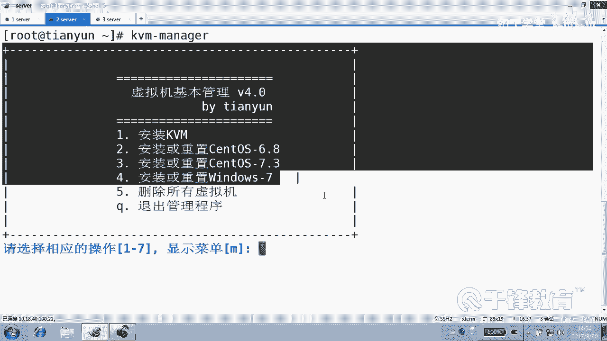

---

## 脚本结构设计

脚本主要包含以下几个部分：
1.  **定义一个显示菜单的函数**：将菜单内容封装起来，便于重复调用。
2.  **主程序逻辑**：
    *   清屏并首次显示菜单。
    *   进入一个无限循环 (`while true`)。
    *   在循环内，提示用户输入选择。
    *   使用 `case` 语句匹配用户输入，执行相应操作。
    *   提供退出循环或脚本的选项。

---

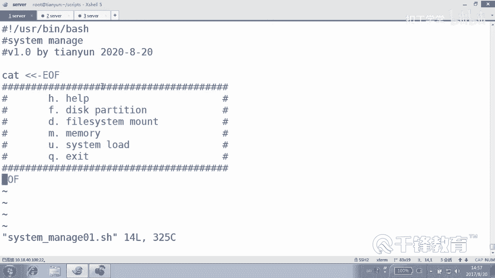

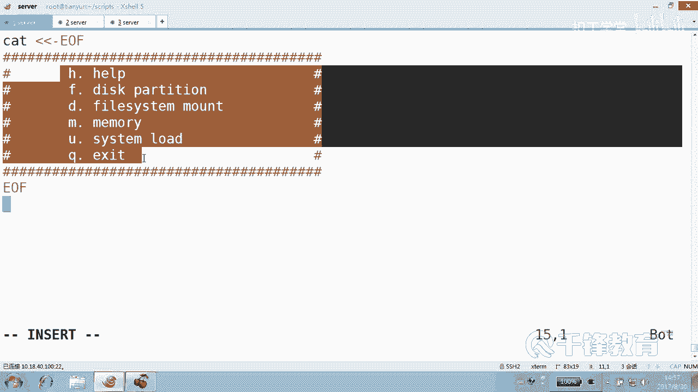

## 分步实现

### 第一步：创建脚本文件并定义菜单函数

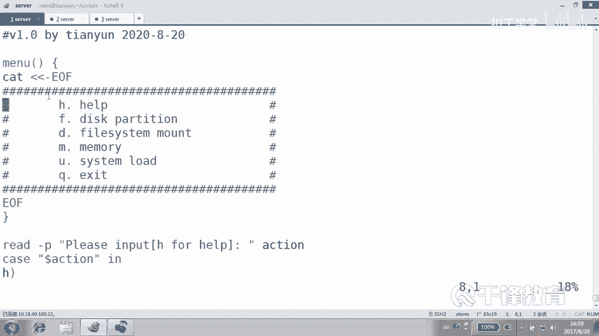

首先，我们创建一个脚本文件并定义用于显示菜单的函数 `menu`。菜单内容使用 `cat` 命令配合 `EOF` 标记来输出多行文本，这样可以使代码更清晰。

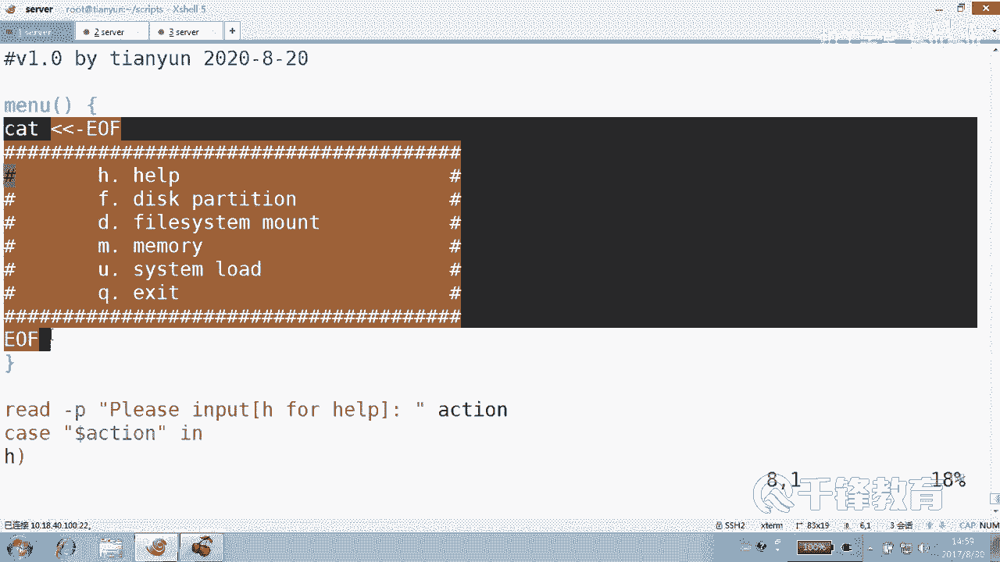

```bash
#!/bin/bash

# 定义一个显示菜单的函数
function menu {
    cat << EOF
    ====================================
        系统管理工具箱
    ====================================
    [H] 显示帮助菜单
    [F] 显示磁盘分区信息
    [D] 显示磁盘挂载信息
    [M] 查看内存使用情况
    [U] 查看系统负载
    [Q] 退出程序
    ====================================
EOF
}
```

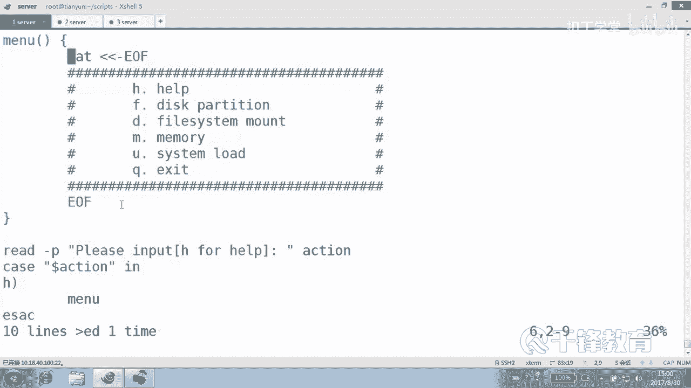

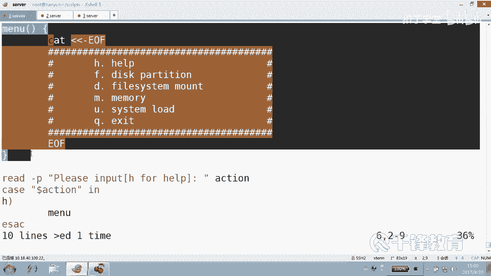

**代码解释**：
*   `function menu { ... }` 定义了一个名为 `menu` 的函数。
*   `cat << EOF ... EOF` 是一种称为“Here Document”的语法，它会将两个 `EOF` 之间的所有内容原样输出到屏幕。

---

### 第二步：编写主程序逻辑

上一节我们定义了菜单函数，本节中我们来看看主程序如何调用它并处理用户交互。主程序需要先清屏、显示菜单，然后进入处理用户输入的核心循环。

```bash
# 清屏并首次显示菜单
clear
menu

# 进入主循环
while true
do
    # 读取用户输入，-p 选项用于显示提示信息
    read -p "请输入您的选择 [H/F/D/M/U/Q]: " action

    # 使用 case 语句进行模式匹配
    case $action in
        # 匹配项开始
    esac
done
```

**代码解释**：
*   `clear`：清空终端屏幕，让界面更整洁。
*   `menu`：调用我们刚才定义的函数，显示菜单。
*   `while true`：开启一个无限循环，条件是永远为真，这意味着循环会一直执行，直到遇到 `break` 或 `exit`。
*   `read -p “提示信息” variable_name`：等待用户输入，并将输入的内容存入变量 `action` 中。
*   `case $action in`：开始 `case` 语句，它将根据变量 `action` 的值进行匹配。

---

### 第三步：填充 case 语句的具体操作

以下是 `case` 语句内部的具体匹配分支。每个分支对应菜单中的一个选项。

```bash
case $action in
    [Hh]) # 匹配大写或小写的 H/h
        clear
        menu  # 再次显示菜单
        ;;
    [Ff]) # 匹配 F/f，显示磁盘分区
        echo “磁盘分区信息：”
        fdisk -l
        ;;
    [Dd]) # 匹配 D/d，显示磁盘挂载
        echo “磁盘挂载信息：”
        df -hT
        ;;
    [Mm]) # 匹配 M/m，显示内存信息
        echo “内存使用情况：”
        free -h
        ;;
    [Uu]) # 匹配 U/u，显示系统负载
        echo “系统负载：”
        uptime
        ;;
    [Qq]) # 匹配 Q/q，退出循环
        echo “感谢使用，再见！”
        break  # 跳出 while 循环
        ;;
    “”)   # 匹配用户直接按回车（空输入）
        echo “输入不能为空，请重新选择。”
        ;;
    *)    # 匹配其他所有无效输入
        echo “错误：无效的选择 ‘$action’，请按菜单提示输入。”
        ;;
esac
```

**代码解释**：
*   `[Hh])`：这是一个模式，匹配大写 `H` 或小写 `h`。`case` 支持简单的通配符和字符类。
*   `;;`：每个匹配分支必须以双分号结束，表示该分支处理完毕。
*   `clear; menu`：执行两条命令，先清屏再显示菜单。
*   `fdisk -l`, `df -hT` 等：是实际的系统命令，用于获取相应的系统信息。
*   `break`：当用户选择退出 (`Q`) 时，`break` 命令会跳出当前的 `while` 循环，从而结束脚本。
*   `“”)`：专门处理用户直接按回车键的情况。
*   `*)`：这是默认匹配项，类似于 `if-else` 中的 `else`，处理所有未被前面分支匹配的输入。

---

### 第四步：完整的脚本代码

将以上所有部分组合起来，就得到了完整的脚本。

```bash
#!/bin/bash

# 系统工具箱脚本 - system_manager.sh

function menu {
    cat << EOF
    ====================================
        系统管理工具箱
    ====================================
    [H] 显示帮助菜单
    [F] 显示磁盘分区信息
    [D] 显示磁盘挂载信息
    [M] 查看内存使用情况
    [U] 查看系统负载
    [Q] 退出程序
    ====================================
EOF
}

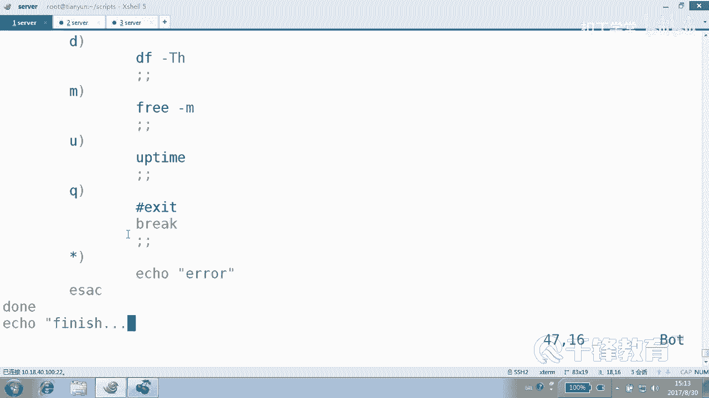

# 主程序开始
clear
menu

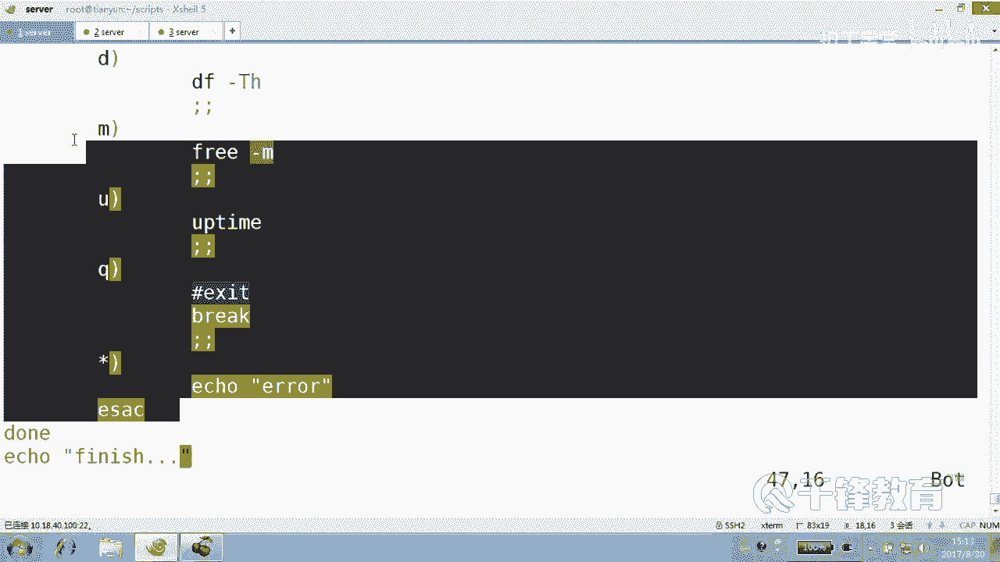

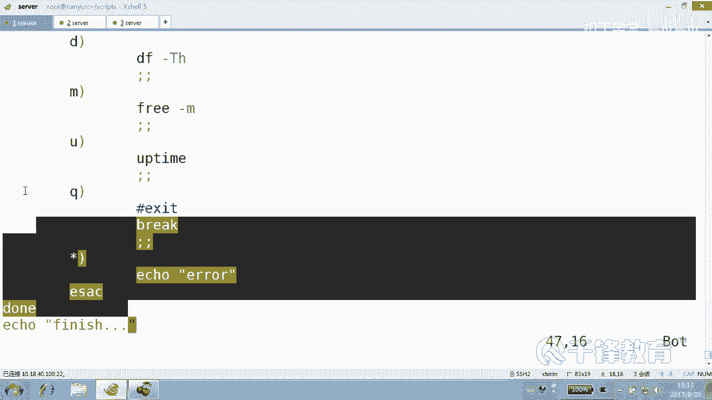

while true
do
    read -p “请输入您的选择 [H/F/D/M/U/Q]: “ action

    case $action in
        [Hh])
            clear
            menu
            ;;
        [Ff])
            echo “磁盘分区信息：”
            fdisk -l
            ;;
        [Dd])
            echo “磁盘挂载信息：”
            df -hT
            ;;
        [Mm])
            echo “内存使用情况：”
            free -h
            ;;
        [Uu])
            echo “系统负载：”
            uptime
            ;;
        [Qq])
            echo “感谢使用，再见！”
            break
            ;;
        “”)
            echo “输入不能为空，请重新选择。”
            ;;
        *)
            echo “错误：无效的选择 ‘$action’，请按菜单提示输入。”
            ;;
    esac
    echo # 输出一个空行，使每次操作后有所间隔
done
```

---

### 第五步：运行与测试

1.  为脚本添加执行权限：
    ```bash
    chmod +x system_manager.sh
    ```
2.  运行脚本：
    ```bash
    ./system_manager.sh
    ```
3.  按照屏幕菜单提示，输入 `H`, `F`, `D`, `M`, `U` 等字母测试对应功能，输入 `Q` 测试退出功能。

---

## 总结

本节课中我们一起学习了如何综合运用 Shell 脚本的多个核心概念来构建一个实用的工具：
*   **函数定义**：使用 `function` 将重复代码块封装，提高代码复用性和整洁度。
*   **用户交互**：使用 `read -p` 命令获取用户输入。
*   **流程控制**：使用 **`case ... esac`** 语句进行多条件模式匹配，它比多层 `if-elif` 更简洁清晰，特别适合处理菜单类选择。
*   **循环控制**：使用 **`while true`** 创建无限循环，使菜单能够持续显示；使用 **`break`** 在满足条件时跳出循环。
*   **系统命令调用**：在脚本中直接嵌入 `fdisk`, `df`, `free`, `uptime` 等命令来执行实际任务。

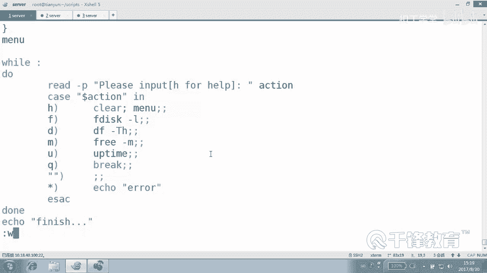

通过这个“系统工具箱”的实战练习，你应该对 `case` 语句的威力有了直观感受，并掌握了编写交互式 Shell 脚本的基本框架。你可以在此基础上继续扩展，添加更多功能选项，使其成为一个更强大的管理工具。