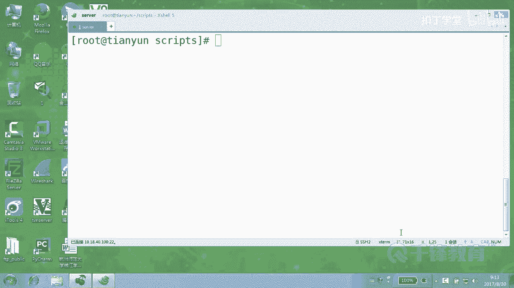
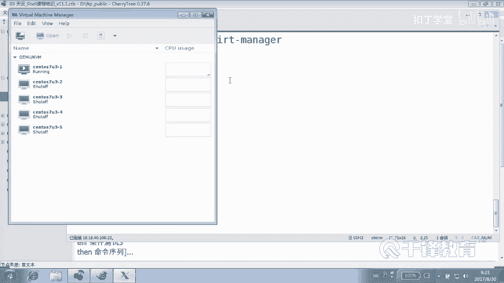
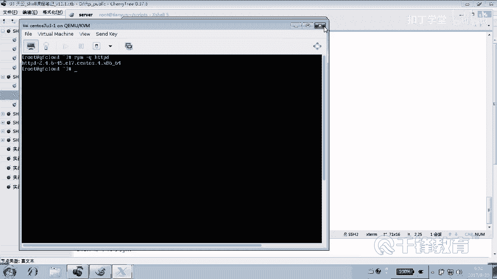
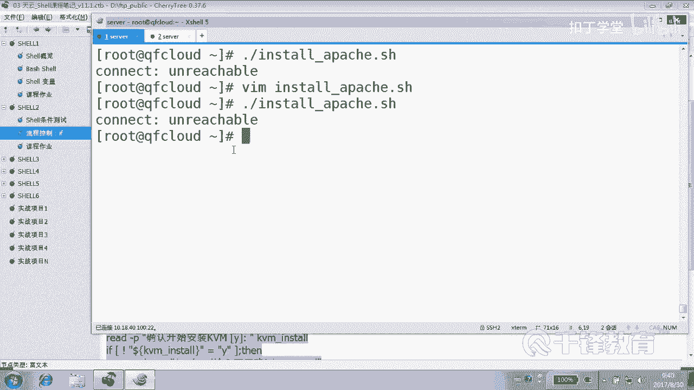

# Linux Shell脚本自动化编程实战：P18：4.1 if条件判断 安装Apache 1 🔧




在本节课中，我们将要学习Shell脚本中至关重要的流程控制结构——`if`条件判断语句。我们将通过一个实际的案例：编写一个自动安装Apache服务器的脚本，来深入理解如何利用条件判断让脚本变得更智能、更健壮。

## 课程回顾 📚

上一节我们介绍了脚本的基础知识，包括变量和条件测试。本节中，我们来看看如何将这些知识应用到流程控制中。

变量主要分为自定义变量、环境变量和预定义变量。环境变量通常是系统自带的，如`$PATH`、`$SHELL`、`$HOME`、`$USER`、`$UID`等，习惯上使用大写字母。自定义变量则是在脚本中定义的。

条件测试是脚本逻辑判断的核心。它主要有三种方式：
*   使用单个方括号 `[ ]`
*   使用两个方括号 `[[ ]]`
*   使用 `test` 命令

它们都能对表达式进行测试，并返回真（`true`，退出状态码为0）或假（`false`，退出状态码非0）。表达式前可以加叹号 `!` 进行取反。

以下是`[ ]`和`[[ ]]`的主要区别：
*   `[[ ]]`支持使用正则表达式进行模式匹配。
*   `[[ ]]`内部可以使用 `&&`（与）和 `||`（或）来连接多个条件表达式。

条件测试主要分为三类：
1.  **数值比较**：使用 `-eq`（等于）、`-ne`（不等于）、`-gt`（大于）、`-lt`（小于）、`-ge`（大于等于）、`-le`（小于等于）。
2.  **字符串比较**：使用 `=` 或 `==`（等于）、`!=`（不等于）。**强烈建议在比较字符串变量时，将其用双引号括起来**，以避免变量为空或包含空格时出现意外错误。
3.  **文件测试**：例如 `-f`（测试是否为普通文件）、`-d`（测试是否为目录）、`-r`（测试当前用户是否有读权限）。需要注意的是，文件权限测试对root用户通常无效。

## 引入流程控制 🚦

脚本本质上是命令的堆叠，从上到下依次执行。例如，部署一个软件通常包含安装、配置、启动、测试等步骤。

但是，如果执行环境不满足条件呢？比如网络不通，导致第一步安装软件就失败了，那么后续的配置和启动步骤就没有意义，甚至可能报错。

因此，我们需要让脚本具备“思考”能力，能够根据条件决定执行哪些步骤。这就是流程控制，而`if`条件判断语句是实现这一功能的基础工具。

`if`语句主要有三种结构：
*   **单分支**：如果条件成立，则执行某些操作；如果不成立，则什么都不做。
*   **双分支**：如果条件成立，则执行A操作；否则（条件不成立），执行B操作。
*   **多分支**：检查多个条件，满足第一个条件则执行对应操作，如果所有条件都不满足，则执行默认操作。

## 实战：编写安装Apache的脚本 🛠️



接下来，我们通过编写一个安装Apache（`httpd`）的脚本来实践`if`语句。我们的目标是：**先检查网络是否通畅，如果通畅则安装，如果不通则报错并退出脚本**。



首先，我们创建一个脚本文件，并添加基本的脚本头信息和注释。

```bash
#!/bin/bash
# 脚本功能：安装并配置Apache (httpd) 服务器
# 版本：1.0
# 作者：扣丁学堂
# 创建日期：2018-09-20
```

如果不加任何判断，安装Apache的命令可能如下所示：

```bash
yum -y install httpd
systemctl start httpd
systemctl enable httpd
firewall-cmd --permanent --add-service=http
firewall-cmd --reload
sed -ri '/^SELINUX=/cSELINUX=disabled' /etc/selinux/config
```

但这段脚本假设网络和yum仓库一切正常。为了让它更健壮，我们需要先进行网络测试。

### 步骤一：使用 `if` 进行网络测试

我们可以尝试`ping`一个外部主机（如百度）来测试网络连通性。`ping`命令成功时返回0，失败时返回非0值，这正好可以作为`if`的判断条件。

以下是脚本的核心判断逻辑：

```bash
# 测试网络连通性，ping百度一次
if ping -c 1 www.baidu.com &> /dev/null; then
    echo “网络通畅，开始安装Apache...”
    # 这里将来放置安装命令
else
    echo “错误：网络不可达，请检查网络连接！”
    exit 1 # 退出脚本，并返回错误码1
fi
```

**代码解释**：
*   `ping -c 1 www.baidu.com &> /dev/null`：`-c 1`表示只ping一次。`&> /dev/null`将命令的标准输出和错误输出都重定向到“黑洞”（`/dev/null`），不在屏幕显示ping的过程信息。
*   `if` 后面直接跟命令。Shell会执行该命令，并根据其**退出状态码**（`$?`）判断真假（0为真，非0为假）。
*   `then` 后面是条件为真时执行的语句。
*   `else` 后面是条件为假时执行的语句。
*   `exit 1` 表示立即退出当前脚本，并返回状态码1，通常用于表示错误退出。
*   `fi` 是 `if` 语句的结束标记。

**重要提示**：在编写`if`语句时，建议先搭建好结构骨架（`if...then...else...fi`），然后再填充具体内容，这样可以避免语法错误。

### 步骤二：整合安装命令

现在，我们将安装命令整合到条件判断为真的分支中。

```bash
#!/bin/bash
# 脚本功能：安装并配置Apache (httpd) 服务器
# 版本：1.0
# 作者：扣丁学堂
# 创建日期：2018-09-20

# 1. 检查网络连通性
if ping -c 1 www.baidu.com &> /dev/null; then
    echo “网络通畅，开始安装Apache...”

    # 2. 使用yum安装Apache
    yum -y install httpd

    # 3. 启动Apache服务并设置开机自启
    systemctl start httpd
    systemctl enable httpd

    # 4. 配置防火墙放行HTTP服务
    firewall-cmd --permanent --add-service=http
    firewall-cmd --reload

    # 5. 关闭SELinux（生产环境请谨慎评估）
    sed -ri '/^SELINUX=/cSELINUX=disabled' /etc/selinux/config
    echo “Apache安装与基础配置完成！请注意需要重启以使SELinux更改生效。”

else
    echo “错误：网络不可达，请检查网络连接！”
    exit 1
fi
```

### 关于条件测试的写法

在上面的例子中，我们直接将`ping`命令放在`if`后面。这是完全正确的，因为`if`需要的只是一个能返回真假值的表达式或命令。

我们也可以使用更标准的条件测试语法，通过判断`ping`命令的退出状态码`$?`来实现：

```bash
ping -c 1 www.baidu.com &> /dev/null
if [ $? -eq 0 ]; then # 判断上一个命令的退出状态码是否等于0
    echo “网络通畅...”
else
    echo “网络不通...”
fi
```

两种写法效果相同。第一种更简洁，第二种更清晰地展示了条件测试的原理。在数值比较时，使用 `-eq` 比用 `=` 更为规范。

## 总结 📝

本节课中我们一起学习了Shell脚本中`if`条件判断语句的基本用法。我们了解到：

1.  `if`语句是脚本实现智能流程控制的基础，分为单分支、双分支和多分支结构。
2.  `if` 后面可以跟任何能返回退出状态码的命令或条件测试表达式，状态码为0表示真（`true`），非0表示假（`false`）。
3.  通过一个“安装Apache前先检测网络”的实战案例，我们掌握了双分支`if`语句的编写方法，包括：
    *   使用 `if...then...else...fi` 结构。
    *   在条件不满足时，使用 `exit` 命令终止脚本运行。
    *   将复杂的操作步骤放在条件成立的分支中执行。



这使得我们的脚本不再是简单的命令堆叠，而是具备了基本的错误预判和处理能力。在下一节中，我们将探讨更复杂的条件判断场景。