# Shell脚本自动化编程实战：P19：4.2 if条件判断 安装Apache 2 🚀


## 概述
在本节课中，我们将学习如何使用Shell脚本中的`if`条件判断语句，来编写一个更智能的Apache安装脚本。这个脚本不仅能安装软件，还能在网络不通时进行故障排查，判断问题可能出在哪里。

---

## 脚本结构与基础判断

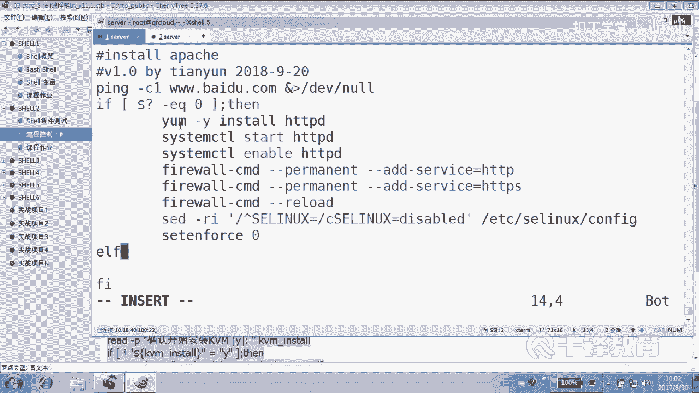

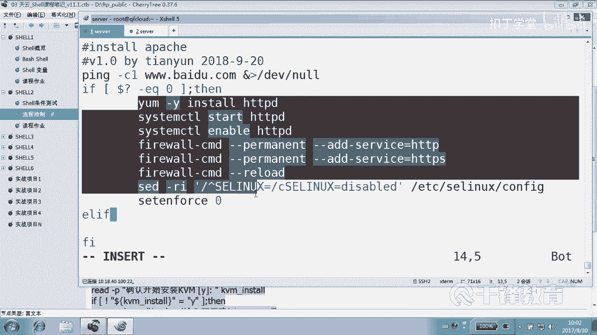

上一节我们介绍了简单的`if`判断。本节中，我们来编写一个更完善的脚本`inst_apache2.sh`。

脚本以定义解释器和注释信息开始：
```bash
#!/usr/bin/bash
# Version: 1.0
# By: 201
```

脚本的核心是首先尝试`ping`一个外部主机（例如`www.baidu.com`），以测试网络连通性。我们使用`if`语句根据`ping`命令的返回值（`$?`）来判断是否成功。

**公式**：`if [ 条件 ]; then ... fi`
在Shell中，`$?`变量存储上一个命令的退出状态码。`0`通常表示成功，非`0`表示失败。

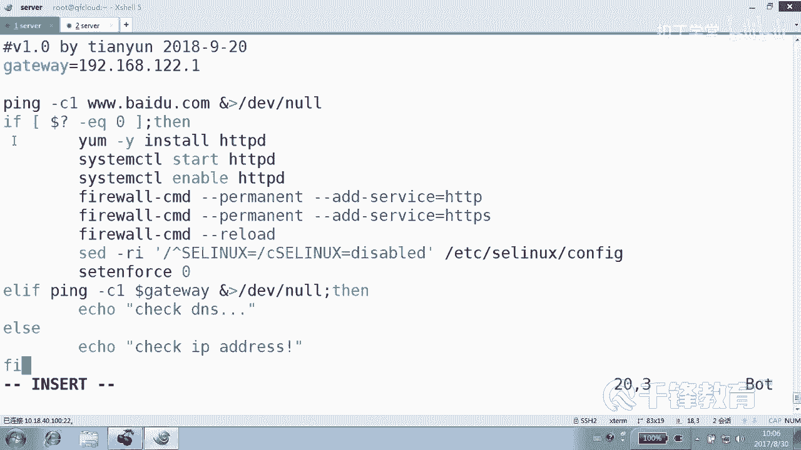

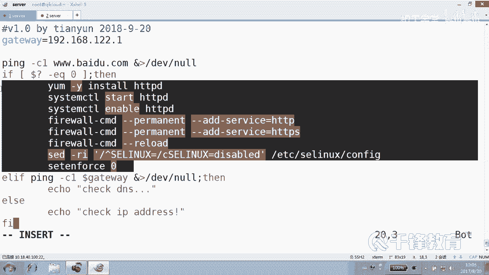

如果`ping`通（`$?`等于`0`），则执行安装和配置Apache的操作。

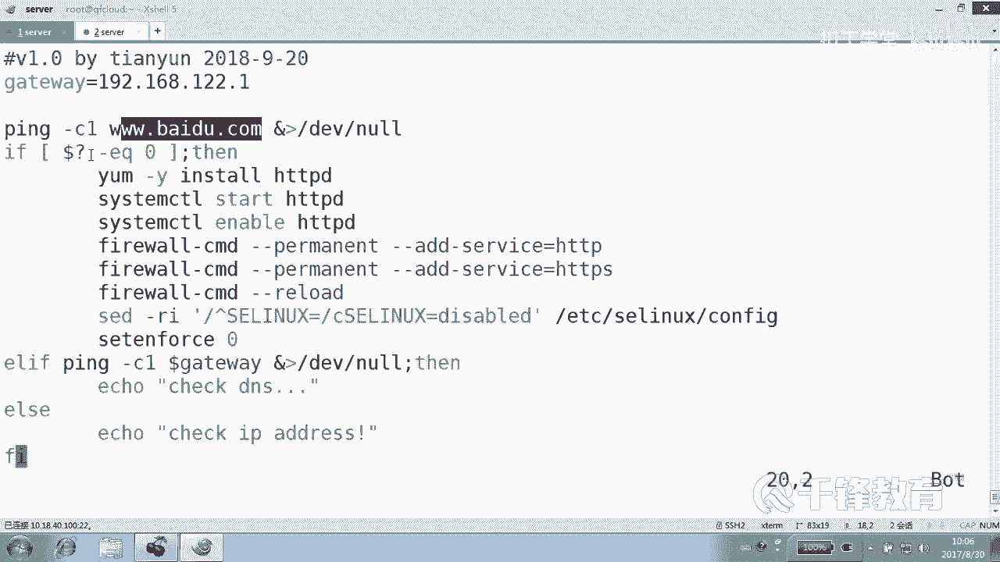

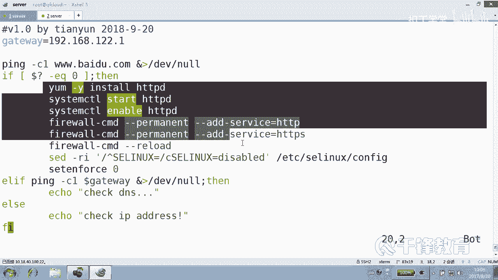

以下是安装和配置Apache的步骤列表：
1.  使用`yum`安装Apache (`httpd`)。
2.  启动`httpd`服务。
3.  设置`httpd`服务开机自启。
4.  重新加载防火墙规则，放行Web服务。
5.  临时关闭SELinux。
6.  永久禁用SELinux（修改配置文件并重启生效）。

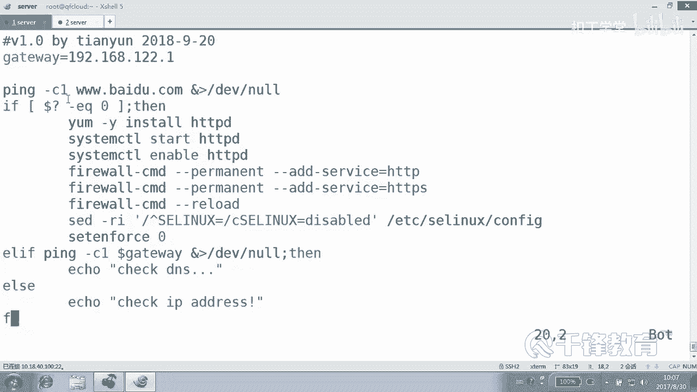

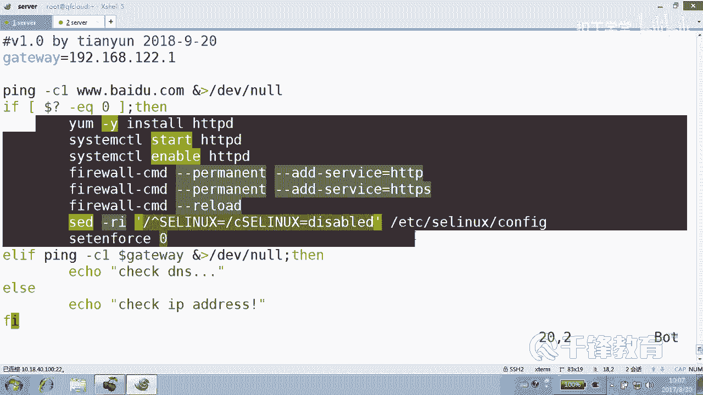

```bash
if [ $? -eq 0 ]; then
    yum install -y httpd
    systemctl start httpd
    systemctl enable httpd
    firewall-cmd --reload
    setenforce 0
    sed -i ‘/^SELINUX=/cSELINUX=disabled’ /etc/selinux/config
fi
```

---

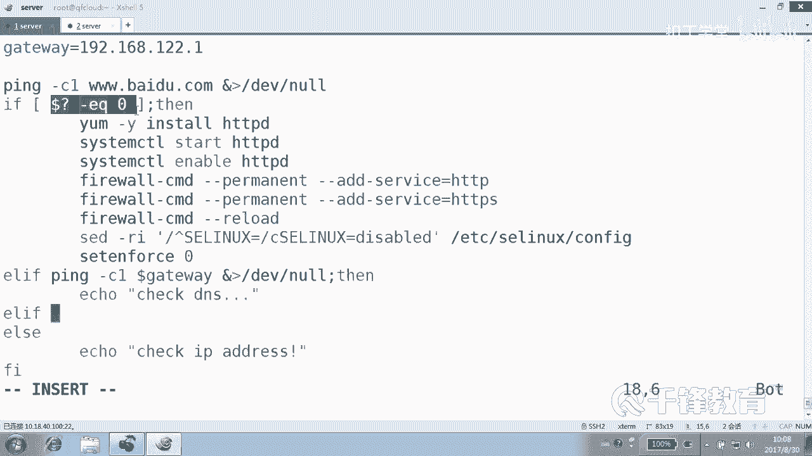

## 实现多分支故障排查 🕵️

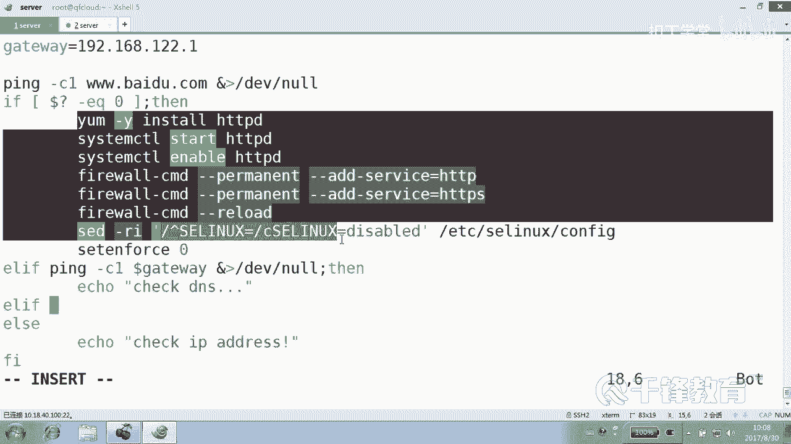

如果`ping`外部主机不通，脚本不应直接退出，而应尝试进一步诊断问题所在。这时，我们可以使用`elif`（else if）来创建多分支判断结构。

**核心逻辑**：如果外网不通，则尝试`ping`网关（例如`192.168.12.1`）。
*   如果能`ping`通网关，说明本地网络连接正常，问题可能出在DNS解析或外部网络。
*   如果连网关都`ping`不通，则问题很可能出在本机的IP地址配置上。

以下是多分支判断的代码结构：
```bash
if [ $? -eq 0 ]; then
    # 安装Apache的代码...
else
    # 外网不通，开始诊断
    ping -c1 192.168.12.1 &> /dev/null
    if [ $? -eq 0 ]; then
        echo “网关通畅，请检查DNS设置。”
    else
        echo “网关不通，请检查本机IP地址和网关配置。”
    fi
fi
```
为了使脚本更清晰，可以将内部的`if`语句改写为`elif`形式，与第一个`if`形成连贯的多分支：
```bash
if [ 外网通 ]; then
    # 安装Apache
elif [ 网关通 ]; then
    # 提示检查DNS
else
    # 提示检查本机IP和网关
fi
```

---

## 扩展判断与用户交互 🔧

`if`语句的用途非常广泛。除了网络诊断，我们还可以用它来增强脚本的交互性和健壮性。

**场景一：检查服务状态**
安装并启动Apache后，可以使用`curl`命令访问本机Web服务（`127.0.0.1`），根据返回值判断服务是否真正启动成功。
```bash
curl -s http://127.0.0.1 &> /dev/null
if [ $? -eq 0 ]; then
    echo “Apache安装启动成功！”
else
    echo “Apache安装或配置可能存在问题。”
fi
```

**场景二：重要操作确认**
在执行删除等危险操作前，可以使用`read`命令读取用户输入，并用`if`判断用户是否确认。
```bash
read -p “确认要删除吗？(输入y继续): ” choice
if [ “$choice” != “y” ]; then
    echo “操作已取消。”
    exit 1
fi
# 继续执行删除操作...
```
这段代码是一个非常有用的模板，可以在任何需要用户确认的地方使用。

---

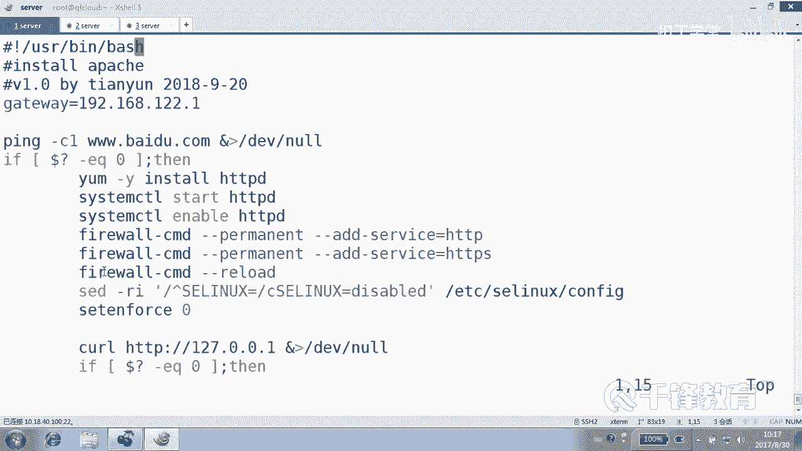

## 总结
本节课中我们一起学习了`if`条件判断语句在Shell脚本中的高级应用。我们不仅用它来控制程序的安装流程，还实现了多分支的网络故障排查逻辑。此外，我们还探讨了如何利用`if`进行服务状态检查和危险操作前的用户交互确认。`if`语句是Shell脚本实现逻辑判断和流程控制的基石，灵活运用它可以写出更智能、更健壮的自动化脚本。