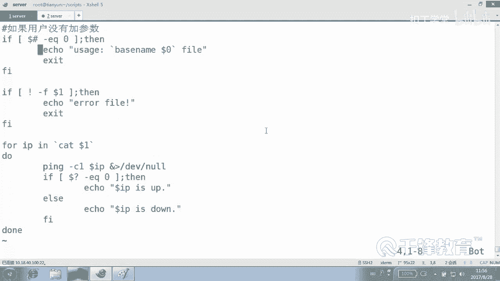

# Shell脚本自动化编程实战：2.3：变量 - 位置及预定义变量实战 🎯

在本节课中，我们将要学习Shell脚本中两种特殊的变量：位置变量和预定义变量。它们无需我们手动定义，由Shell环境自动提供，在脚本编写中扮演着重要的角色。

## 位置变量

上一节我们介绍了环境变量和自定义变量，本节中我们来看看位置变量。位置变量在之前的脚本中已经出现过。例如，在脚本中我们使用过 `$1` 这个变量名，但我们从未定义过它。它的值是在执行脚本时，通过命令行传递的参数决定的。

*   `$1` 代表第一个参数。
*   `$2` 代表第二个参数。
*   `$3` 代表第三个参数，依此类推。

具体需要多少个参数，取决于脚本的实际需求。位置变量根据执行脚本时所带参数的位置进行自动赋值。

## 预定义变量

除了位置变量，Shell还提供了一系列预定义变量。这些变量同样无需定义，它们存储着Shell环境或脚本运行时的特定信息。

以下是几个常用的预定义变量及其含义：

*   **`$?`**：上一个命令的返回值。返回值为 **0** 通常表示命令执行成功，非零值表示失败。
*   **`$!`**：上一个在后台运行的进程的进程ID（PID）。
*   **`$$`**：当前脚本进程的PID。
*   **`$#`**：传递给脚本的参数个数。
*   **`$@`** 或 **`$*`**：代表所有传递给脚本的参数。
*   **`$0`**：当前脚本的名称（可能包含路径）。

为了帮助理解，我们创建一个测试脚本 `test.sh` 来演示这些变量的用法。

```bash
#!/bin/bash
echo “第二个位置参数是：$2”
echo “第一个位置参数是：$1”
echo “第四个位置参数是：$4”
echo “所有参数（使用\$*）是：$*”
echo “所有参数（使用\$@）是：$@”
echo “参数个数是：$#”
echo “当前进程PID是：$$”
```

给脚本执行权限并运行：
```bash
chmod +x test.sh
./test.sh A B C D E F
```
观察输出，可以清晰地看到各个变量的值。`$*` 和 `$@` 在多数情况下表现一致，但在某些特殊场景（如循环处理带空格的参数）时有所不同，初学者可先了解它们的基本功能。

## 实战：编写一个IP检测脚本

现在，我们将位置变量和预定义变量结合，编写一个实用的脚本 `ping07.sh`。这个脚本的功能是：读取一个包含IP地址列表的文件，并逐一检测这些IP是否可达。

脚本的核心逻辑如下：
1.  判断用户是否提供了参数（文件路径）。
2.  判断提供的参数是否是一个有效的文件。
3.  读取文件中的每一行（即一个IP地址），并执行ping测试。

以下是脚本内容：

```bash
#!/bin/bash

# 1. 判断用户是否提供了参数
if [ $# -eq 0 ]; then
    # 使用 basename 命令获取纯脚本名，避免显示冗长路径
    echo “Usage: $(basename $0) <ip_list_file>”
    exit 1
fi

# 2. 判断提供的参数是否是一个文件
if [ ! -f $1 ]; then
    echo “Error: $1 is not a valid file.”
    exit 1
fi

# 3. 读取文件并ping每个IP
for ip in $(cat $1)
do
    # 使用 -c 1 表示只ping一个包，-W 1 设置超时1秒
    ping -c 1 -W 1 $ip &> /dev/null
    # 判断上一个命令（ping）的返回值
    if [ $? -eq 0 ]; then
        echo “$ip is up.”
    else
        echo “$ip is down.”
    fi
done
```

**脚本解析：**

*   `$#`：用于判断参数个数是否为0。
*   `$0`：获取脚本名，结合 `basename` 命令美化提示信息。
*   `$1`：获取用户传入的第一个参数（即IP列表文件路径）。
*   `$?`：判断 `ping` 命令是否执行成功（返回值为0表示主机可达）。
*   `for ip in $(cat $1)`：这是一个循环结构，会依次读取文件 `$1` 中的每一行，并将值赋给变量 `ip`。目前只需了解其作用是遍历文件内容即可。

**使用示例：**

1.  创建一个IP列表文件 `ip_list.txt`，内容如下：
    ```
    10.18.40.100
    10.18.40.110
    10.18.40.127
    ```
2.  运行脚本进行检测：
    ```bash
    chmod +x ping07.sh
    ./ping07.sh ip_list.txt
    ```




本节课中我们一起学习了Shell脚本中的位置变量（`$1`, `$2`...）和预定义变量（`$?`, `$$`, `$#`, `$0`等）。通过一个综合性的IP检测脚本实战，我们看到了这些变量如何在实际脚本中协同工作，用于获取参数、判断执行状态、获取进程信息等，这是编写功能化、健壮化Shell脚本的基础。