# Shell脚本自动化编程实战：P20：4.3 if条件判断 多系统配置YUM源 🖥️


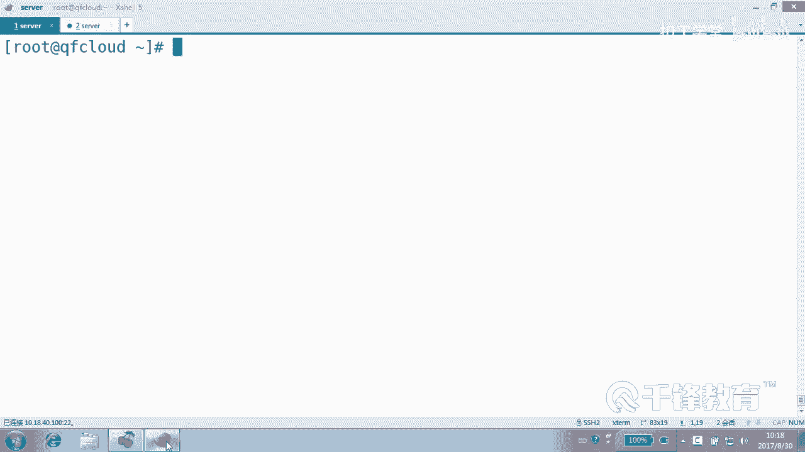

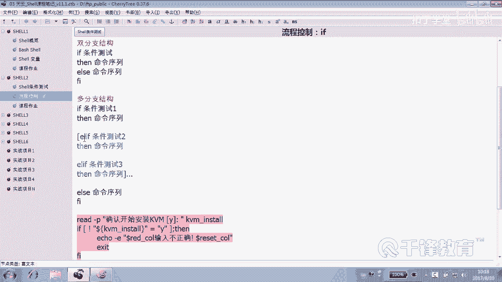

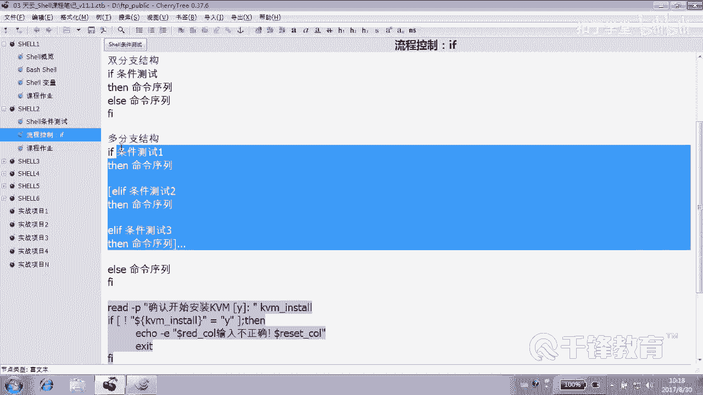

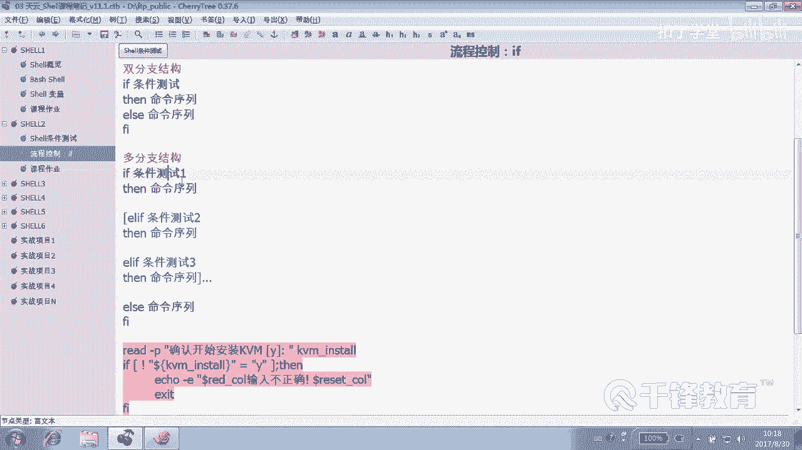

## 概述
在本节课中，我们将要学习Shell脚本中`if`语句的多分支结构，并通过一个非常实用的案例——为不同版本的Linux操作系统（如CentOS 7.3、6.8、5.9）自动配置对应的YUM软件源，来深入理解其应用。

## 多分支if语句结构
上一节我们介绍了`if`语句的基本用法，本节中我们来看看更复杂的多分支结构。

多分支结构允许我们根据多个条件执行不同的命令块。其基本语法如下：
```bash
if [ 条件1 ]; then
    执行命令1
elif [ 条件2 ]; then
    执行命令2
elif [ 条件3 ]; then
    执行命令3
else
    执行默认命令
fi
```
程序会依次判断条件1、条件2、条件3...，哪个条件成立就执行对应的命令块。如果所有条件都不成立，则执行`else`块中的默认命令。方括号`[]`表示条件测试，`elif`可以有很多个。

## 实战案例：多系统YUM源配置
接下来，我们通过一个脚本案例来实践多分支`if`语句。这个脚本的目标是：自动检测当前操作系统的版本，并根据版本号配置对应的YUM源。

### 第一步：获取系统版本号
脚本最关键的一步是获取当前操作系统的版本号。我们可以使用`uname -r`命令，但它是获取内核版本。更合适的方法是解析系统发行版信息。

以下是获取系统主版本号（如“7.3”）的命令：
```bash
os_version=$(cat /etc/redhat-release | awk '{print $4}' | awk -F '.' '{print $1"."$2}')
```
这条命令做了以下事情：
1.  `cat /etc/redhat-release`：读取系统版本信息文件。
2.  第一个`awk ‘{print $4}’`：提取信息中的第四列（通常是完整版本号，如“7.3.1611”）。
3.  第二个`awk -F ‘.’ ‘{print $1”.”$2}’`：以点号`.`为分隔符，提取第一和第二部分，并用点号连接，最终得到“7.3”。

我们将这个结果赋值给变量`os_version`，以便后续判断。

### 第二步：编写脚本主体结构
首先，我们写出脚本的基本框架，即多分支`if`判断结构。
```bash
#!/bin/bash

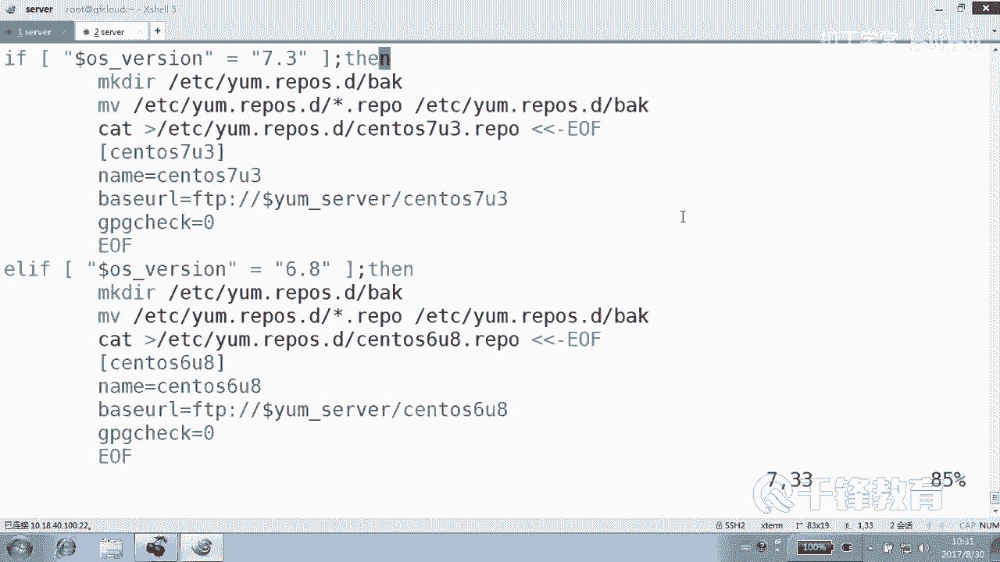

# 获取系统版本
os_version=$(cat /etc/redhat-release | awk '{print $4}' | awk -F '.' '{print $1"."$2}')

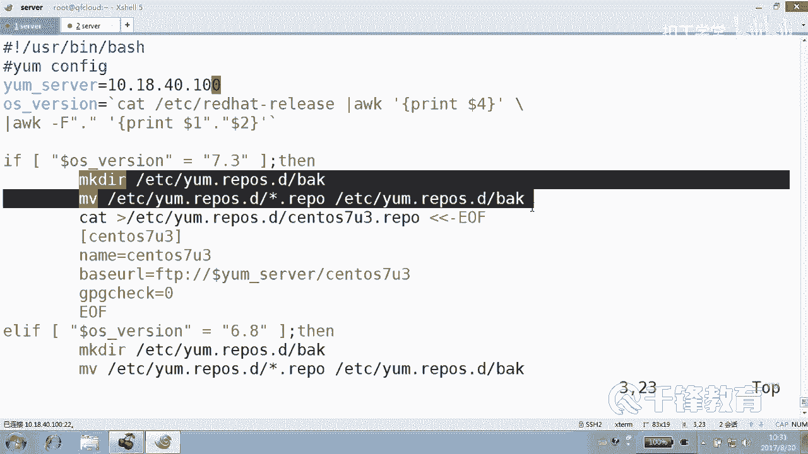

# 备份原有的YUM源
if [ ! -d /etc/yum.repos.d/back ]; then
    mkdir /etc/yum.repos.d/back
fi
mv /etc/yum.repos.d/*.repo /etc/yum.repos.d/back/ 2>/dev/null

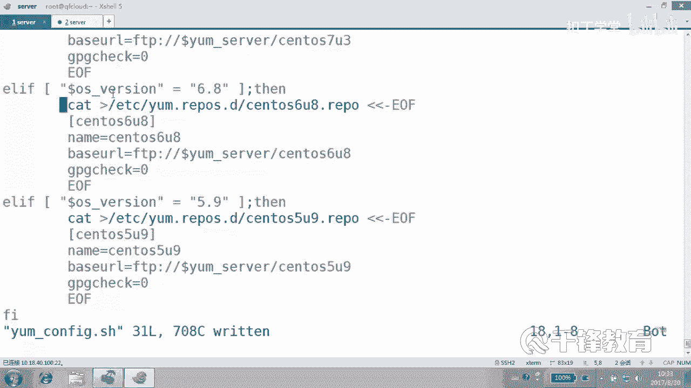

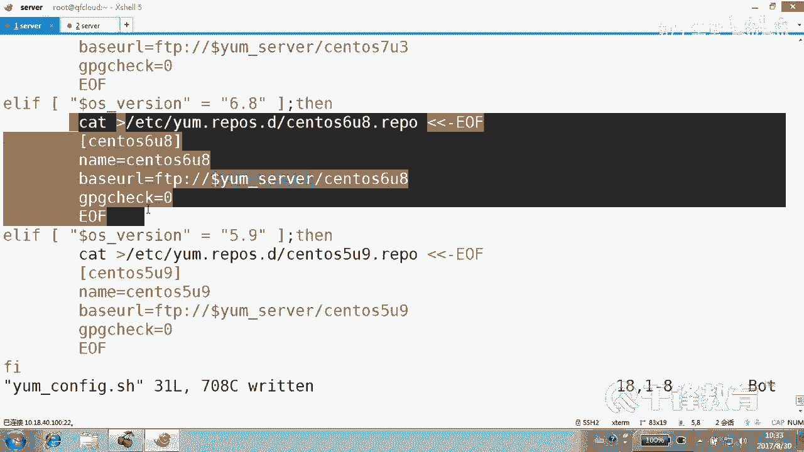

# 根据版本配置不同的YUM源
if [ “$os_version” == “7.3” ]; then
    # 配置CentOS 7.3的YUM源
    cat > /etc/yum.repos.d/CentOS-7.3.repo << EOF
[CentOS-7.3]
name=CentOS-7.3
baseurl=http://10.18.40.100/CentOS-7.3/
gpgcheck=0
EOF
    echo “当前系统为 CentOS $os_version，YUM源配置完成。”

elif [ “$os_version” == “6.8” ]; then
    # 配置CentOS 6.8的YUM源
    cat > /etc/yum.repos.d/CentOS-6.8.repo << EOF
[CentOS-6.8]
name=CentOS-6.8
baseurl=http://10.18.40.100/CentOS-6.8/
gpgcheck=0
EOF
    echo “当前系统为 CentOS $os_version，YUM源配置完成。”

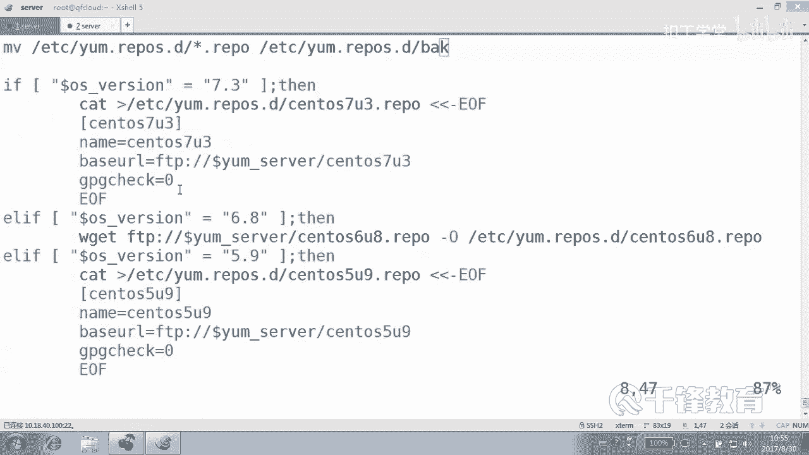

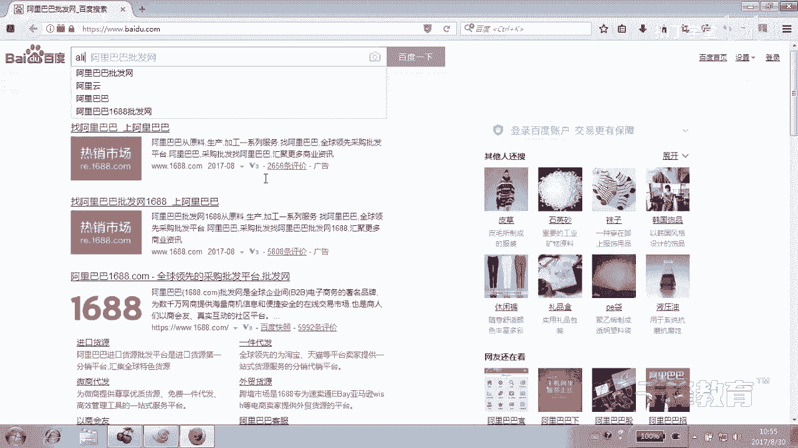


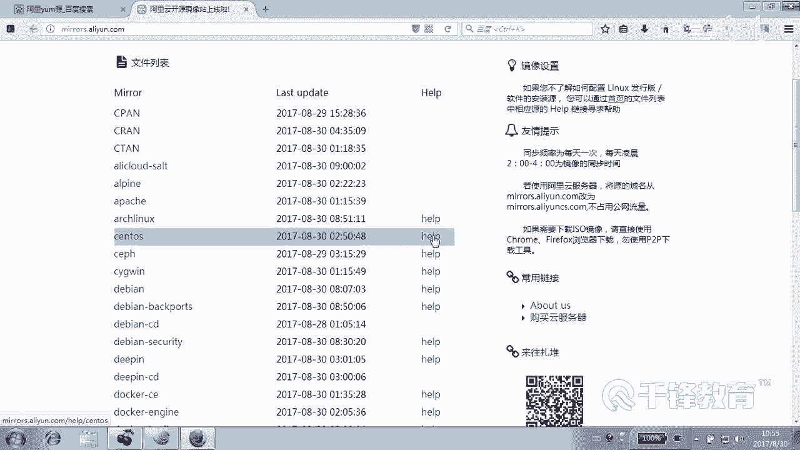

elif [ “$os_version” == “5.9” ]; then
    # 配置CentOS 5.9的YUM源（示例使用阿里云源）
    # 注意：curl 在最小化安装的系统上可能更可靠
    curl -o /etc/yum.repos.d/CentOS-Base.repo http://mirrors.aliyun.com/repo/Centos-5.repo
    echo “当前系统为 CentOS $os_version，已配置阿里云YUM源。”

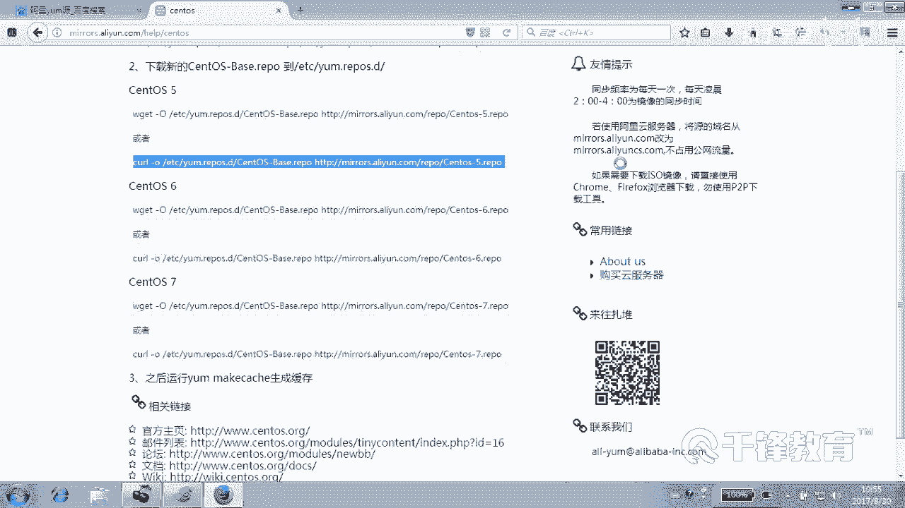

else
    # 不支持的版本
    echo “错误：不支持的系统版本 $os_version。”
fi
```
**脚本说明：**
1.  首先获取系统版本并备份旧源。
2.  使用`if-elif-elif-else`结构判断`os_version`变量的值。
3.  如果版本是“7.3”或“6.8”，脚本会创建对应的`.repo`文件，指向局域网内准备好的YUM源服务器。
4.  如果版本是“5.9”，脚本会使用`curl`命令从阿里云下载并配置对应的YUM源文件。
5.  如果版本都不匹配，则输出错误信息。

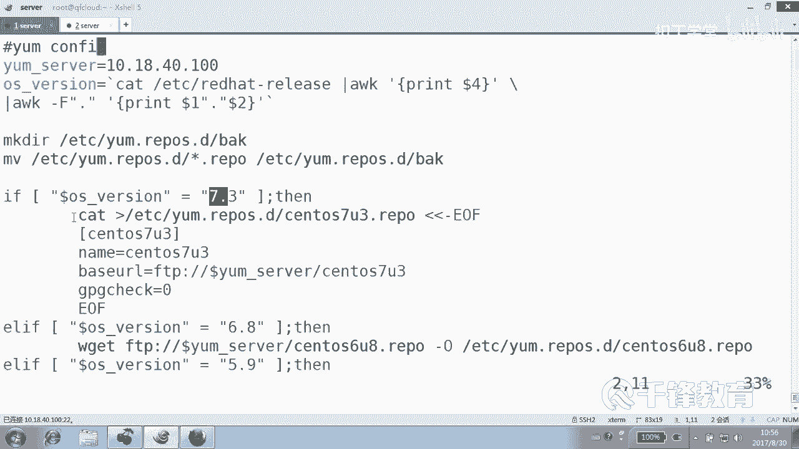

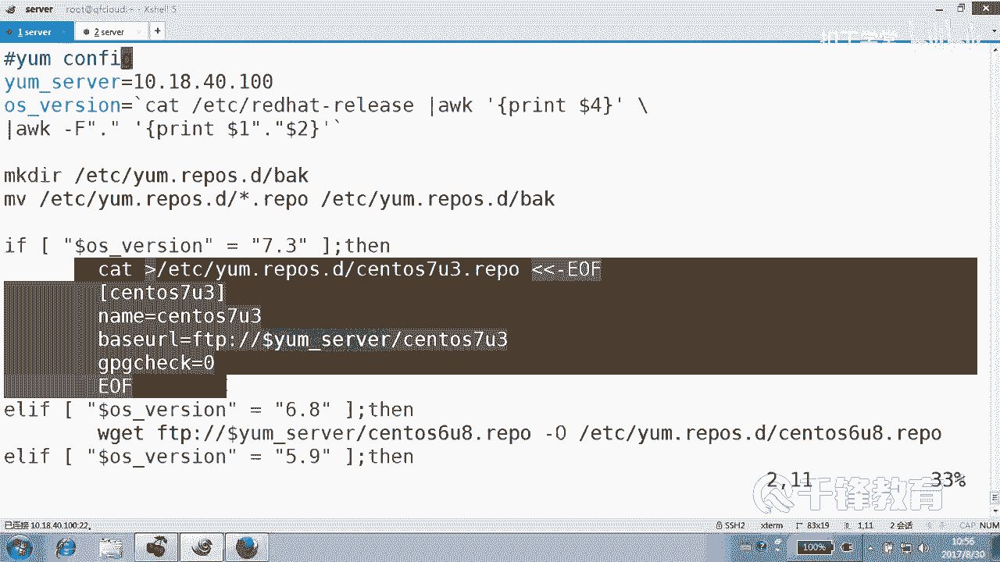

### 脚本优化思路
在编写过程中，我们发现配置不同版本源的命令块非常相似，只有版本号和URL等少数地方不同。这提示我们可以进行优化：

*   **使用变量**：将变化的版本号和URL部分定义为变量。
*   **使用函数**（后续课程会讲到）：将创建`repo`文件的共同操作写成一个函数，通过传递不同的参数（如版本号）来调用，可以极大简化脚本，避免代码重复。

此外，配置源的方式不仅限于手动创建文件，还可以：
*   从内部服务器下载预先准备好的`repo`文件（使用`wget`或`curl`）。
*   直接使用互联网上各大镜像站提供的配置脚本。

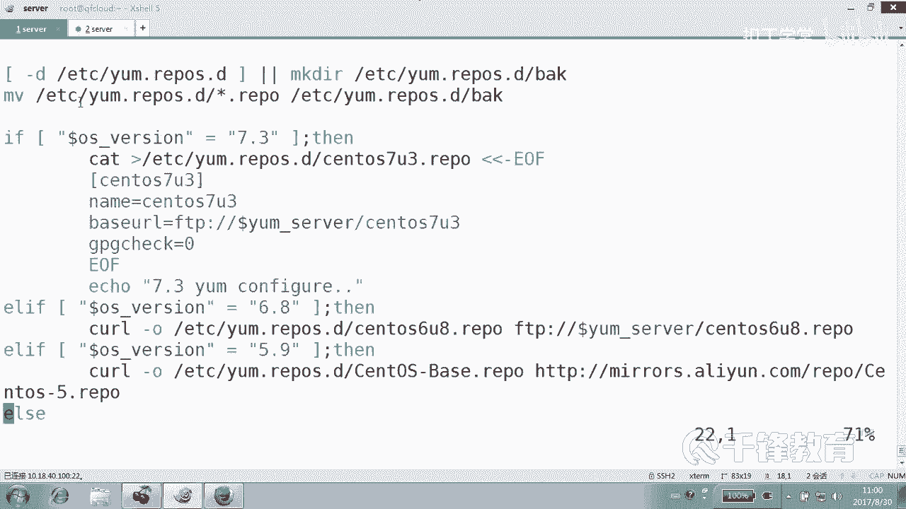

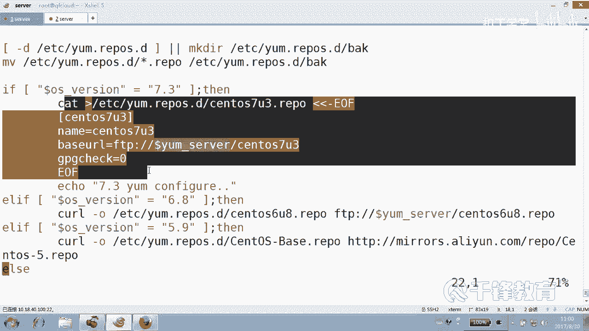

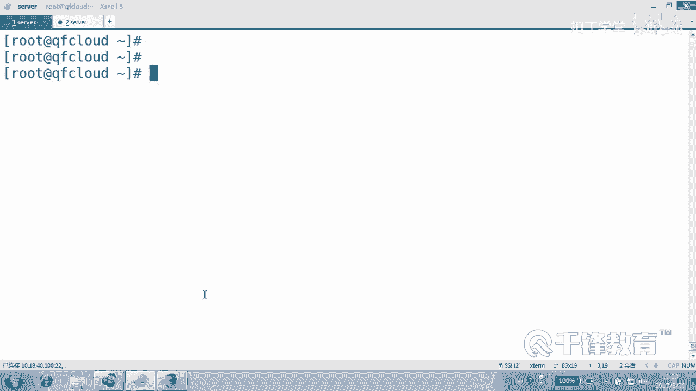

## 总结
本节课中我们一起学习了Shell脚本中`if`语句的多分支结构。通过“为多版本Linux系统自动配置YUM源”这个实战案例，我们掌握了如何：
1.  使用命令组合获取系统版本信息。
2.  利用`if-elif-else`结构对不同的条件进行判断并执行相应操作。
3.  编写一个具备基本容错（如备份、目录判断）和用户提示的实用脚本。
这个案例清晰地展示了多分支判断在自动化运维中的实际应用价值。在后续课程中，我们将学习如何用函数来优化此类脚本，使其更加简洁和强大。