# Shell脚本自动化编程实战：P21：4.4 if条件判断 作业解析 📝


在本节课中，我们将一起回顾和解析与 `if` 条件判断相关的课后作业。这些练习旨在帮助初学者巩固如何在实际脚本中运用 `if` 语句进行条件测试和逻辑判断。我们将逐一分析每个题目的核心思路和实现要点。

## 作业题目解析

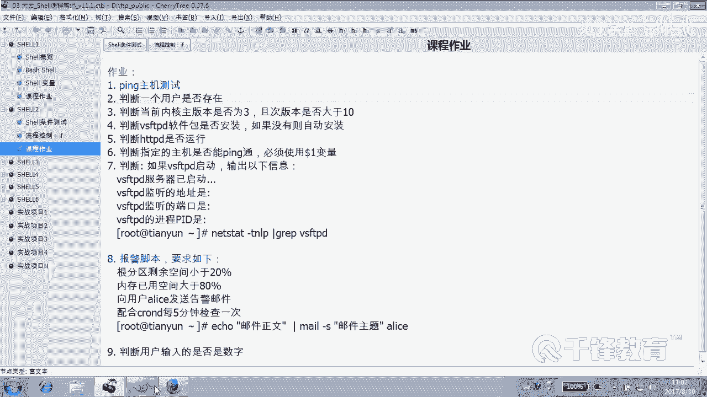

以下是本节课需要完成的几个作业题目，我们将分别探讨它们的解决思路。

### 1. 判断主机连通性
判断指定主机是否能 `ping` 通。这要求我们使用 `ping` 命令，并根据其返回值来判断主机状态。

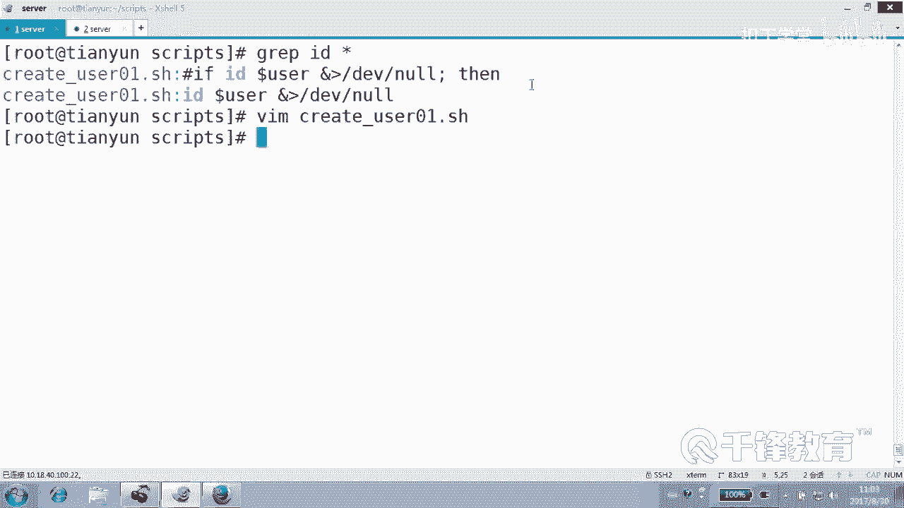

**核心思路**：`ping` 命令执行后会返回一个退出状态码。在 `if` 语句中，我们可以直接利用这个返回值。例如：
```bash
if ping -c 1 主机地址 &> /dev/null; then
    echo "主机可达"
else
    echo "主机不可达"
fi
```

### 2. 判断用户是否存在
判断系统中某个用户是否存在。这要求我们找到一个能返回真/假值的命令来检查用户。

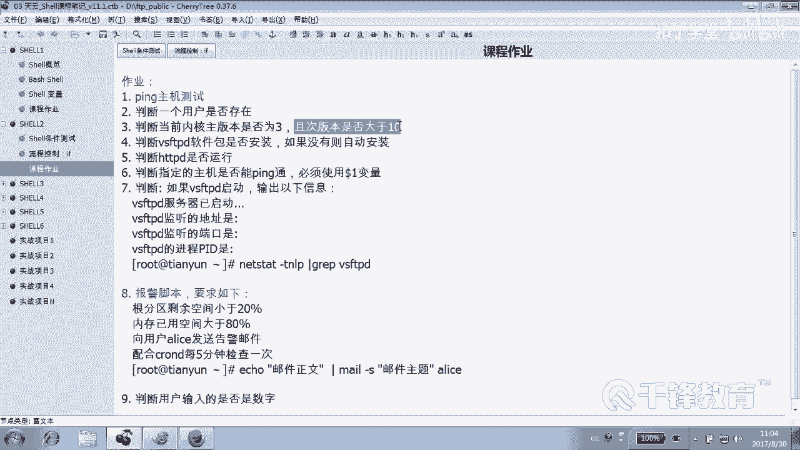

**核心思路**：使用 `id` 命令。如果用户存在，`id 用户名` 会成功执行并返回0；如果用户不存在，则会返回非0值。例如：
```bash
if id 用户名 &> /dev/null; then
    echo "用户已存在"
else
    echo "用户不存在"
fi
```

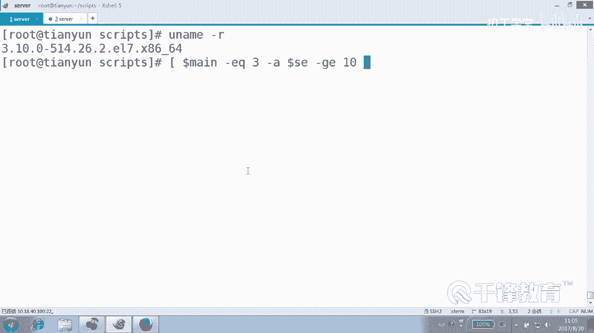

### 3. 判断内核版本
判断当前内核的主版本号是否为3，且次版本号是否大于10。这需要我们先提取出版本信息，再进行数值比较。

**核心思路**：使用 `uname -r` 获取内核版本字符串，然后通过字符串切割（例如使用 `cut` 或变量替换）提取主、次版本号，最后在 `if` 语句中进行数值比较。例如：
```bash
kernel_version=$(uname -r)
major_version=$(echo $kernel_version | cut -d. -f1)
minor_version=$(echo $kernel_version | cut -d. -f2)

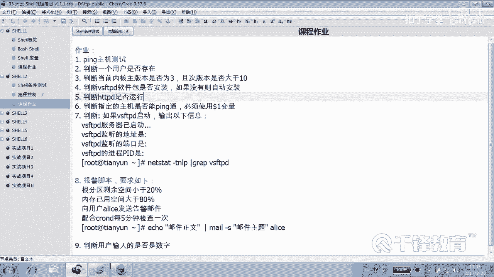

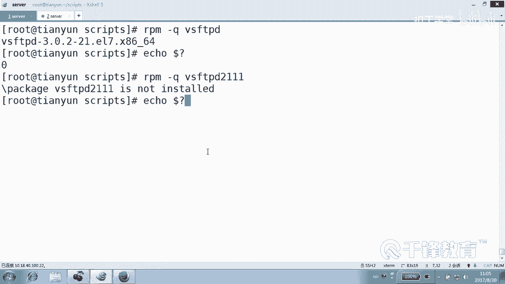

if [ $major_version -eq 3 ] && [ $minor_version -gt 10 ]; then
    echo "内核版本符合要求"
else
    echo "内核版本不符合要求"
fi
```

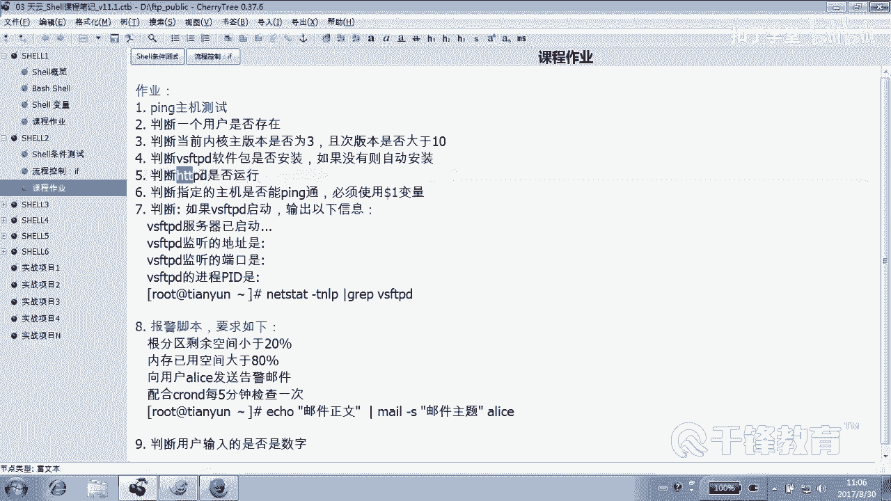

### 4. 判断软件包是否安装
判断 `vsftpd` 软件包是否安装，如果没有安装则安装它。

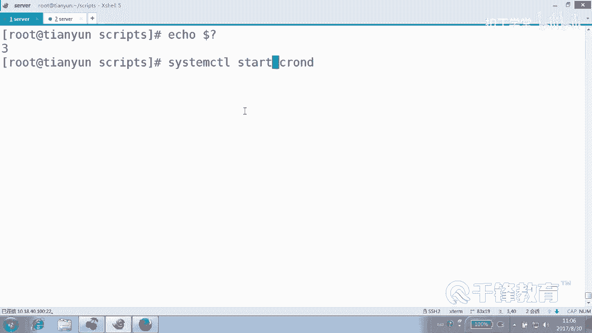

**核心思路**：使用 `rpm -q` 或 `yum list installed` 等包管理命令来查询软件包状态。根据返回值决定是否执行安装命令。例如：
```bash
if ! rpm -q vsftpd &> /dev/null; then
    echo "vsftpd 未安装，正在安装..."
    yum install -y vsftpd
else
    echo "vsftpd 已安装"
fi
```

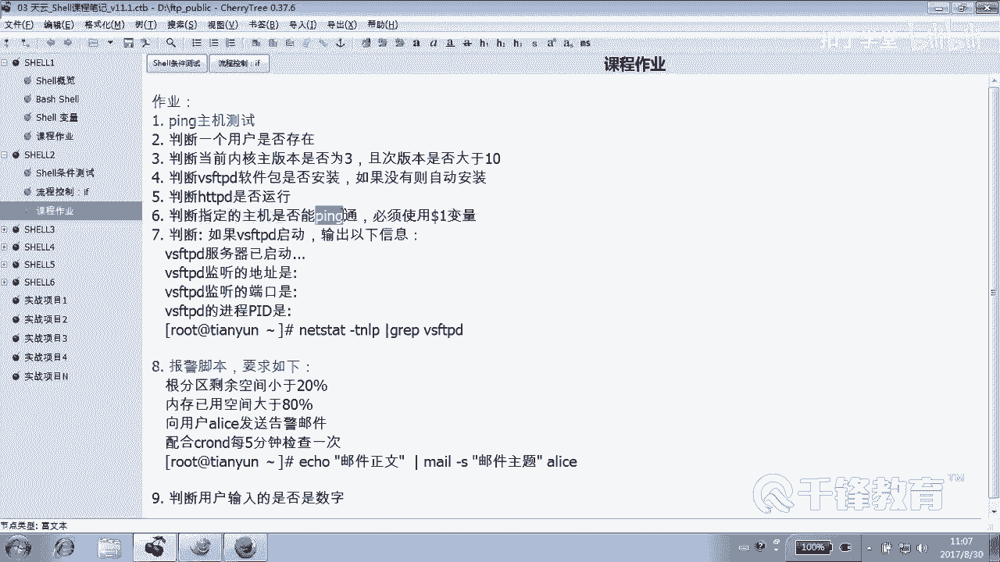

### 5. 判断服务运行状态
判断 `httpd` 服务是否正在运行。

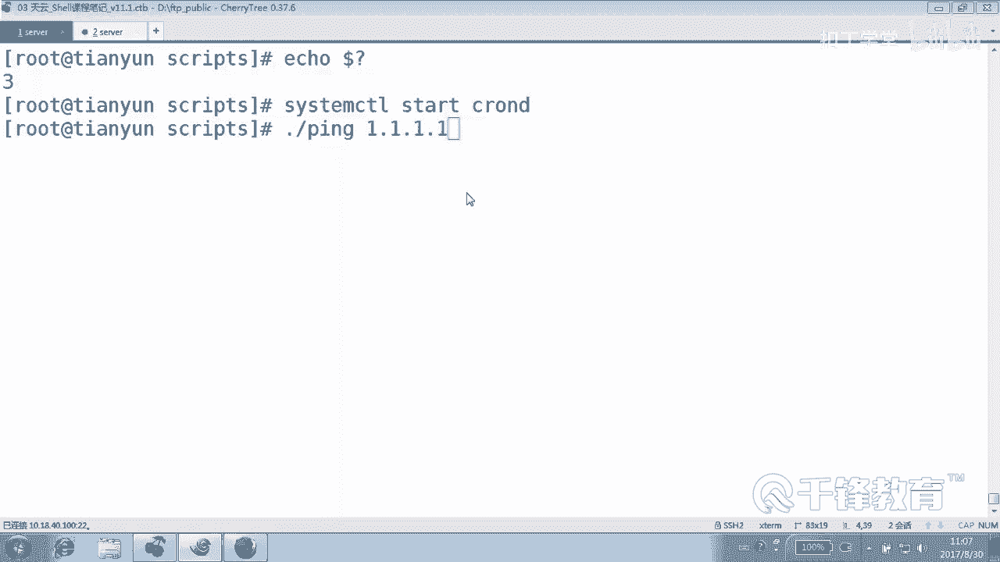

**核心思路**：使用 `systemctl is-active` 命令来检查服务的活动状态。例如：
```bash
if systemctl is-active httpd &> /dev/null; then
    echo "httpd 服务正在运行"
else
    echo "httpd 服务未运行"
fi
```

### 6. 带参数的主机连通性测试
编写一个脚本，使用 `$1` 位置参数来接收主机地址，并判断其连通性。

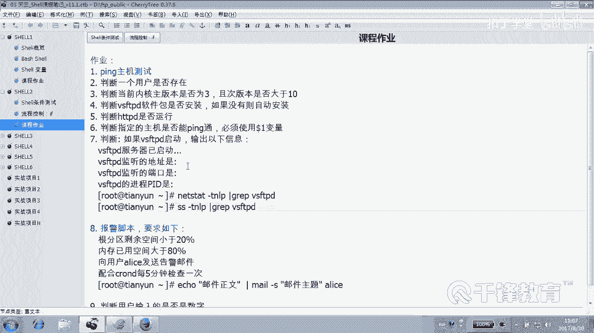

**核心思路**：脚本内部逻辑与第一题相同，但主机地址来源于执行脚本时传入的第一个参数 `$1`。例如：
```bash
#!/bin/bash
target_host=$1
if ping -c 1 $target_host &> /dev/null; then
    echo "$target_host 可达"
else
    echo "$target_host 不可达"
fi
```

### 7. 判断vsftpd状态并输出详情
判断 `vsftpd` 服务是否启动。如果启动，则输出其监听的地址和端口信息。

**核心思路**：这是一个复合任务。首先判断服务状态，如果运行，则使用 `ss` 或 `netstat` 命令过滤出 `vsftpd` 的监听信息，并提取出IP和端口。**关键点**：获取监听信息的命令**必须**放在服务已启动的条件分支内执行。例如：
```bash
if systemctl is-active vsftpd &> /dev/null; then
    echo "VSFTPD 服务器已启动。"
    # 获取监听信息，例如使用 ss 命令
    listen_info=$(ss -tlnp | grep vsftpd)
    # 从 listen_info 中提取 IP 和端口 (具体提取方法取决于输出格式)
    echo "服务器监听地址: [提取的IP]"
    echo "服务器监听端口: [提取的端口]"
else
    echo "VSFTPD 服务器未启动。"
fi
```

### 8. 系统资源监控告警
如果根分区使用率小于20%，**或者**内存使用率大于80%，则向用户 `alice` 发送告警邮件，每5分钟检查一次。

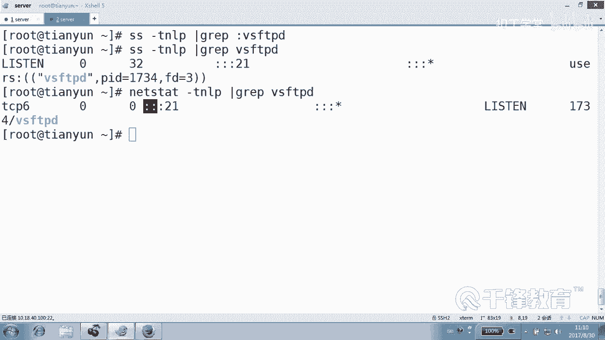

**核心思路**：结合使用 `df` 和 `free` 命令获取磁盘和内存使用率。使用 `if` 语句判断任一条件满足即触发告警。这本质上是将之前学过的两个独立监控脚本合并，并用逻辑或 `-o` 连接条件。例如：
```bash
disk_usage=$(df / | awk 'NR==2 {print $5}' | tr -d '%')
mem_usage=$(free | awk '/Mem/ {printf("%.0f"), $3/$2*100}')

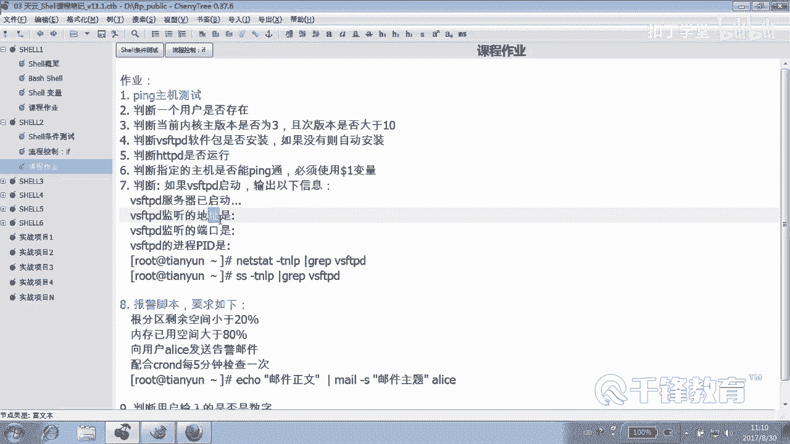

if [ $disk_usage -lt 20 ] || [ $mem_usage -gt 80 ]; then
    echo "系统资源告警！" | mail -s "Alert" alice
fi
```

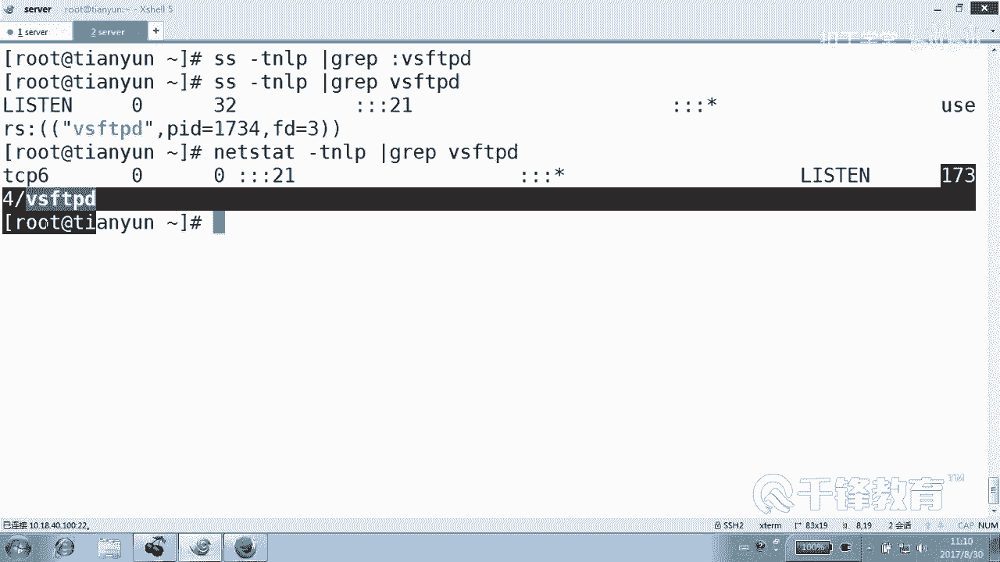

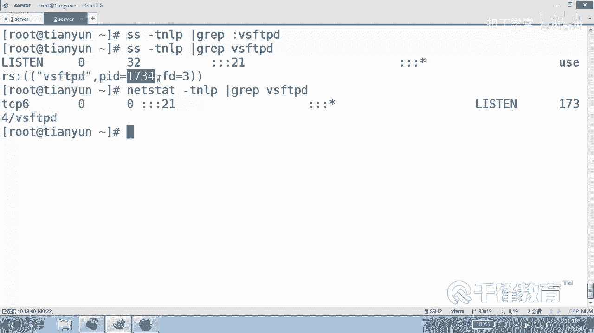

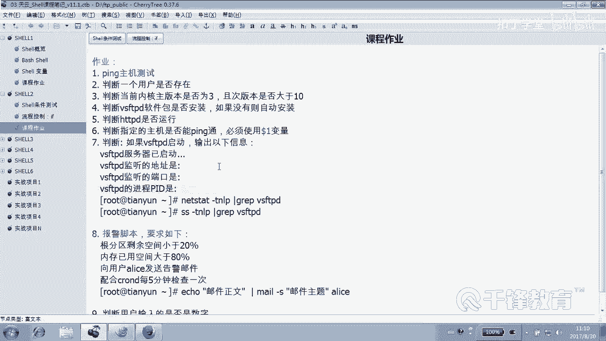

### 9. 判断输入是否为数字
判断用户输入的是否为一个数字。

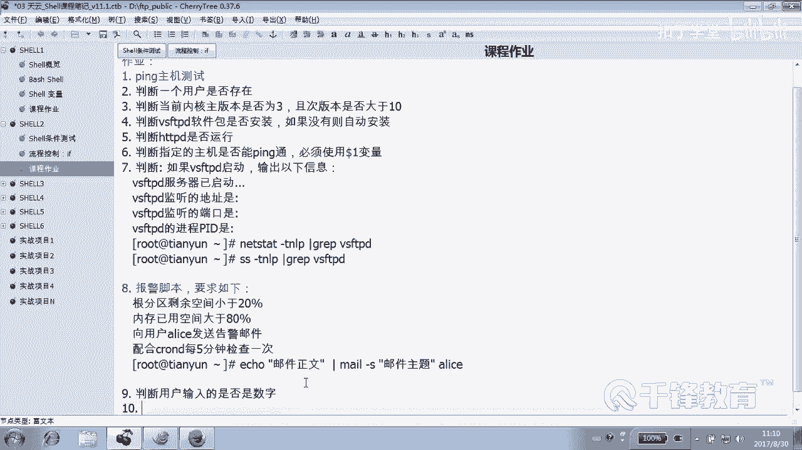

**核心思路**：可以利用Shell的模式匹配或正则表达式，也可以尝试进行算术运算，看是否会产生错误。一个简单的方法是使用 `=~` 运算符进行正则匹配。例如：
```bash
read -p "请输入内容: " user_input
if [[ $user_input =~ ^[0-9]+$ ]]; then
    echo "您输入的是数字。"
else
    echo "您输入的不是纯数字。"
fi
```

## 总结与建议

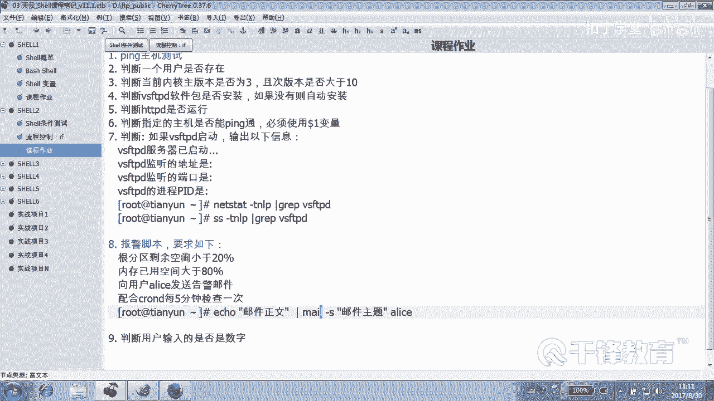

本节课我们一起学习了多个 `if` 条件判断的实战应用案例。从主机连通性、用户存在性到系统服务和资源监控，`if` 语句是构建脚本逻辑的基础。

**核心要点回顾**：
1.  **找到正确的测试命令**：每个判断都需要一个能返回明确成功（0）或失败（非0）状态的命令，如 `ping`, `id`, `systemctl is-active`, `rpm -q`。
2.  **理解命令返回值**：在 `if` 语句中直接使用这些命令，其返回值会自动被用于条件判断。
3.  **提取和比较数据**：对于需要数值比较的情况（如版本号、使用率），先使用命令组合（如 `uname`, `df`, `awk`, `cut`）提取出所需数据，再进行比较。
4.  **脚本结构先行**：建议先搭建好 `if-else` 的基本代码框架，再填充具体的测试命令和输出信息。
5.  **注意执行上下文**：像获取服务监听信息这类操作，必须确保在服务已运行的条件分支内执行。

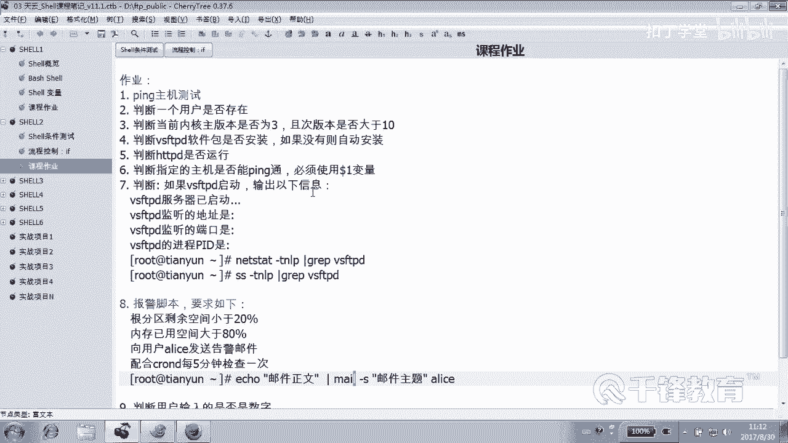

请务必亲自动手完成这些练习。初期可能不熟练，但通过反复实践，你会逐渐掌握编写健壮、清晰脚本的技巧。`if` 语句是Shell脚本中使用频率极高的结构，熟练掌握它对后续学习至关重要。