# Shell脚本自动化编程实战：P22：4.5 for循环空行的秘密 🔍


在本节课中，我们将要学习Shell脚本中`for`循环处理文件内容时，一个容易被误解的特性：空行。我们将通过分析一个具体的脚本案例，揭示为什么在`for`循环中，空行会被忽略，以及这背后的原理。

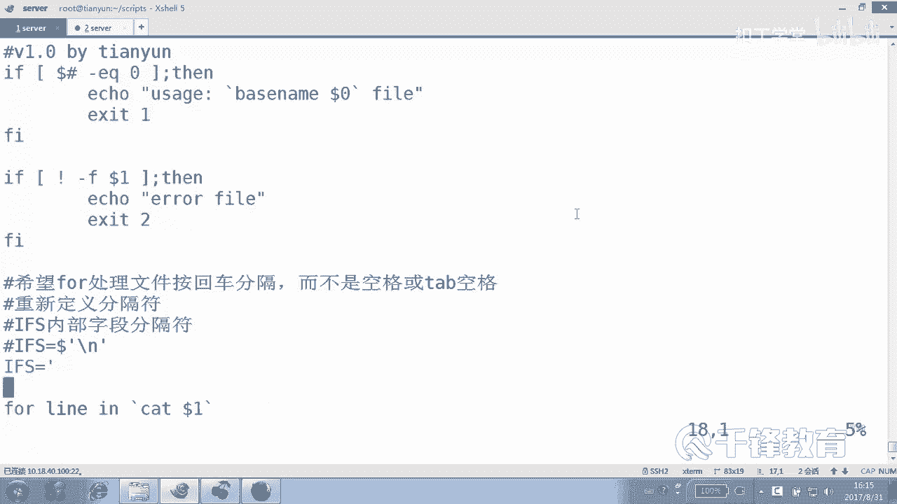

---

## 问题回顾与引入

上一节我们介绍了使用`for`循环从文件中读取数据并创建用户的脚本。当时，我们曾尝试在脚本中加入一段代码，意图检测并处理空行。

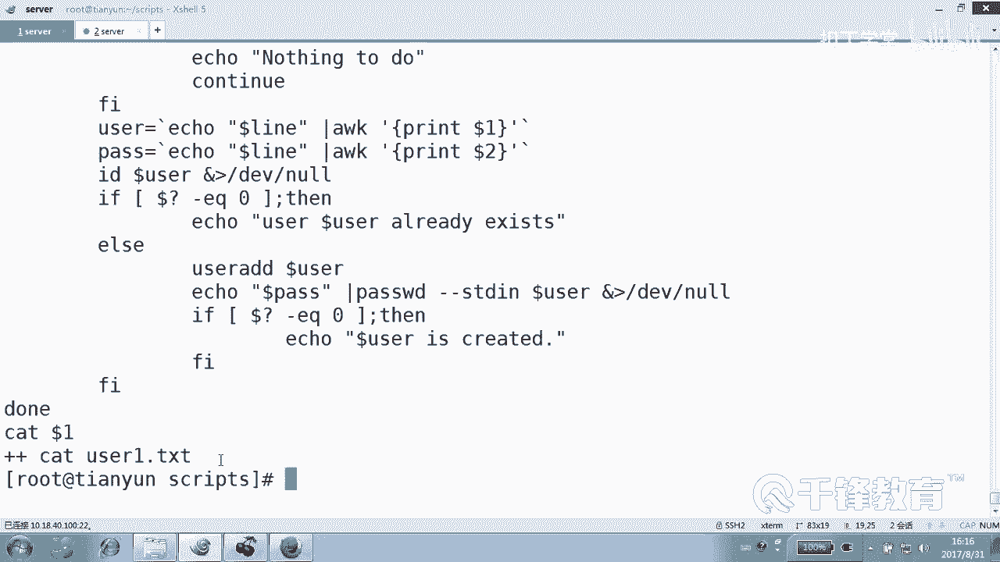

```bash
# 示例脚本片段 (createuser102.sh)
for user in $(cat $1)
do
    if [ -z "$user" ]; then
        echo "nothing to do"
        continue
    fi
    # ... 创建用户等后续操作
done
```

我们的设想是：如果读取到的`$user`变量长度为0（即空行），就输出提示并跳过。但实际运行后发现，这段代码从未被执行过，脚本对空行“视而不见”。

这是为什么呢？本节中，我们就来解开这个秘密。

---

## 核心原理：`for`循环的默认分割方式

要理解这个问题，关键在于理解`for`循环如何处理其值列表。

以下是`for`循环处理值列表的核心机制：
1.  **默认分割符**：`for`循环默认使用**空格、制表符(Tab)、换行符**作为分割符，将值列表拆分成多个独立的“单词”。
2.  **空行的本质**：在一个文本文件中，一个纯粹的空行（没有任何字符，包括空格），在被`$(cat file)`或`` `cat file` ``命令替换后，相当于一个**空的字符串片段**。
3.  **循环的忽略**：`for`循环在按默认分割符拆分列表时，会**自动忽略那些空的字符串片段**。因此，空行根本不会成为一个独立的循环变量值，也就不会进入循环体执行。

我们用公式来描述`for`循环的读取过程：
```
for 变量 in 值列表
    ↓ (Shell进行分割)
for 变量 in [非空片段1] [非空片段2] ... [非空片段N]
```
**空行对应的空片段不会出现在这个列表中。**

---

## 实验验证

为了直观地验证这一点，我们创建一个测试文件 `user1.txt`，其内容如下（包含正常行和空行）：
```
zhangsan
（空行）
lisi
（空行）
（空行）
wangwu
```

然后，我们使用一个简单的调试脚本来观察：

```bash
#!/bin/bash
# test_for.sh
count=0
for user in $(cat user1.txt)
do
    ((count++))
    echo "第 $count 次循环，用户名为：'$user'，长度为：${#user}"
done
echo "总共循环了 $count 次"
```

执行这个脚本，输出结果将是：
```
第 1 次循环，用户名为：'zhangsan'，长度为：8
第 2 次循环，用户名为：'lisi'，长度为：4
第 3 次循环，用户名为：'wangwu'，长度为：6
总共循环了 3 次
```

可以看到，脚本只循环了**3**次，对应三个有内容的行。文件中的三个空行完全没有触发循环。这证明了我们之前的分析：**`for`循环默认会忽略由空行产生的空值。**

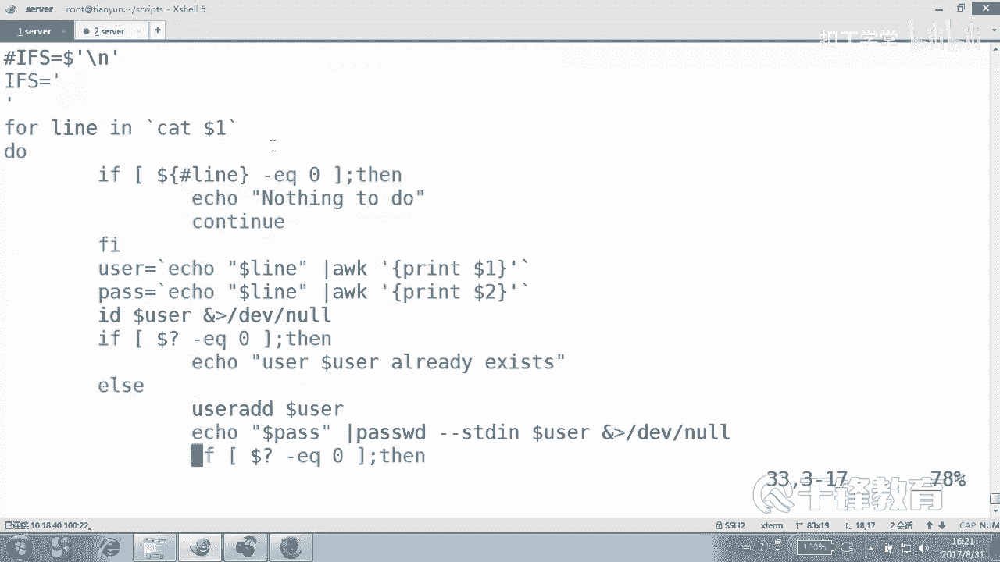

---

## 与`IFS`修改的关系

有些同学可能会想到使用`IFS`（内部字段分割符）来改变分割行为。例如，设置`IFS=$'\n'`让循环按行分割。

```bash
#!/bin/bash
# test_for_ifs.sh
IFS_OLD=$IFS
IFS=$'\n' # 设置为只按换行符分割
count=0
for user in $(cat user1.txt)
do
    ((count++))
    echo "第 $count 次循环，用户名为：'$user'，长度为：${#user}"
done
IFS=$IFS_OLD
echo "总共循环了 $count 次"
```

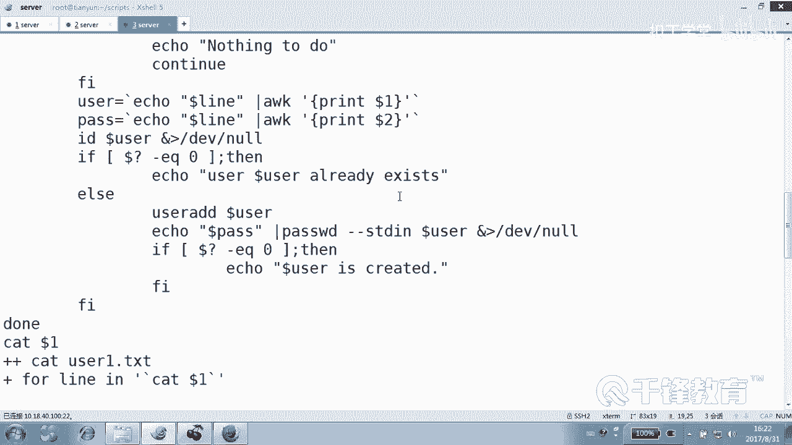

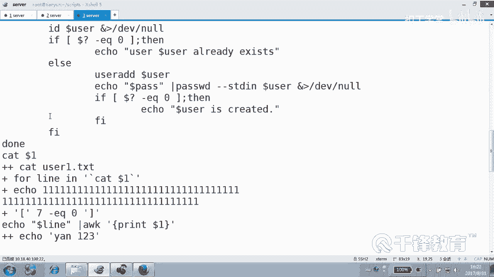

这次，输出结果会发生变化：
```
第 1 次循环，用户名为：'zhangsan'，长度为：8
第 2 次循环，用户名为：''，长度为：0
第 3 次循环，用户名为：'lisi'，长度为：4
第 4 次循环，用户名为：''，长度为：0
第 5 次循环，用户名为：''，长度为：0
第 6 次循环，用户名为：'wangwu'，长度为：6
总共循环了 6 次
```

**关键区别出现了**：当`IFS`被设置为只包含换行符时，空格和制表符不再作为分割符。于是，每一行（包括空行）都会作为一个完整的值被`for`循环获取。此时，空行对应的`$user`变量才是真正的**空字符串**，其长度`${#user}`为0，之前脚本中`if [ -z "$user" ]`的判断才会生效。

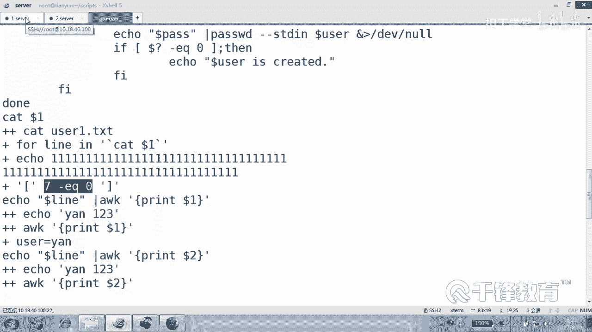

以下是两种情况的对比总结：

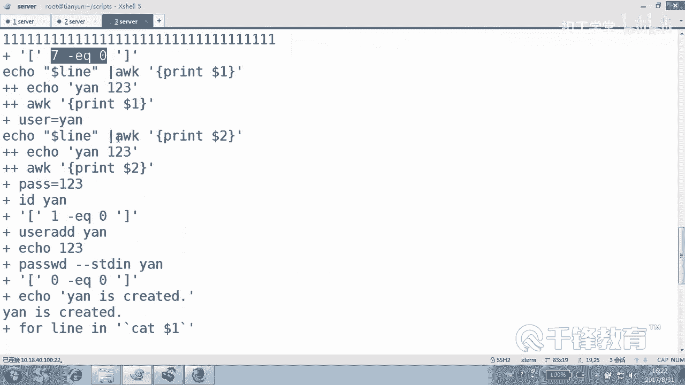

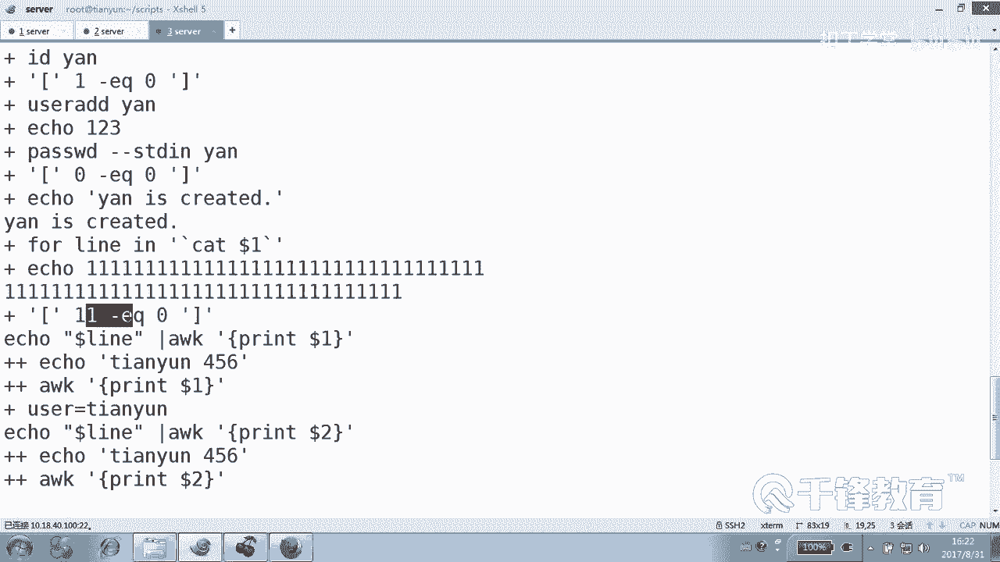

| 场景 | 分割符 | 空行是否成为循环值 | `if [ -z "$var" ]` 能否检测到 |
| :--- | :--- | :--- | :--- |
| **默认情况** | 空格、Tab、换行 | **否**，被忽略 | **不能**，根本不会进入循环 |
| **设置 `IFS=$'\n'`** | 仅换行 | **是**，作为空字符串传入 | **能**，可以检测并处理 |

因此，最初脚本中处理空行的代码之所以无效，正是因为我们在没有修改`IFS`的情况下，**空行从未作为一个变量值进入循环体**，检测代码自然没有执行机会。

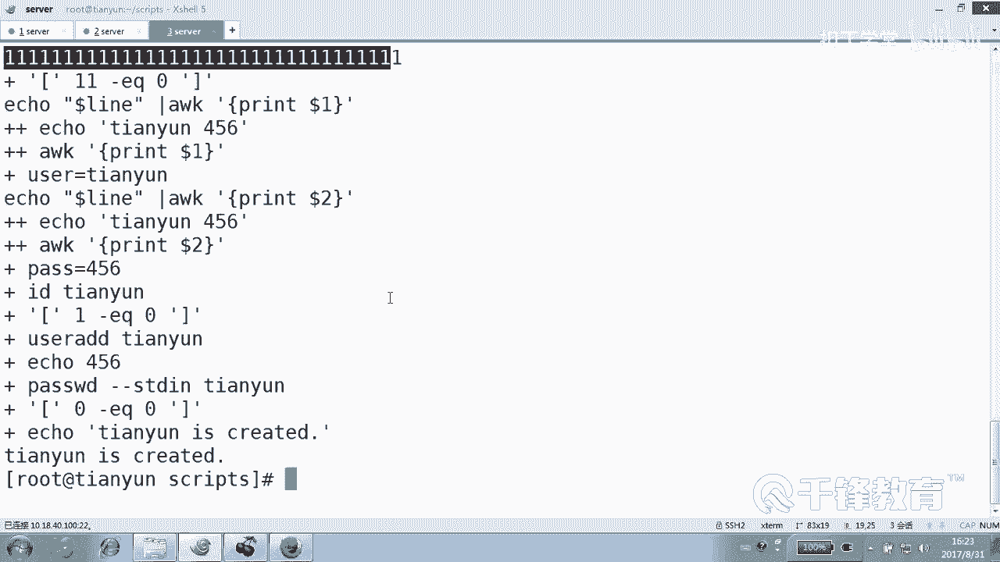

---

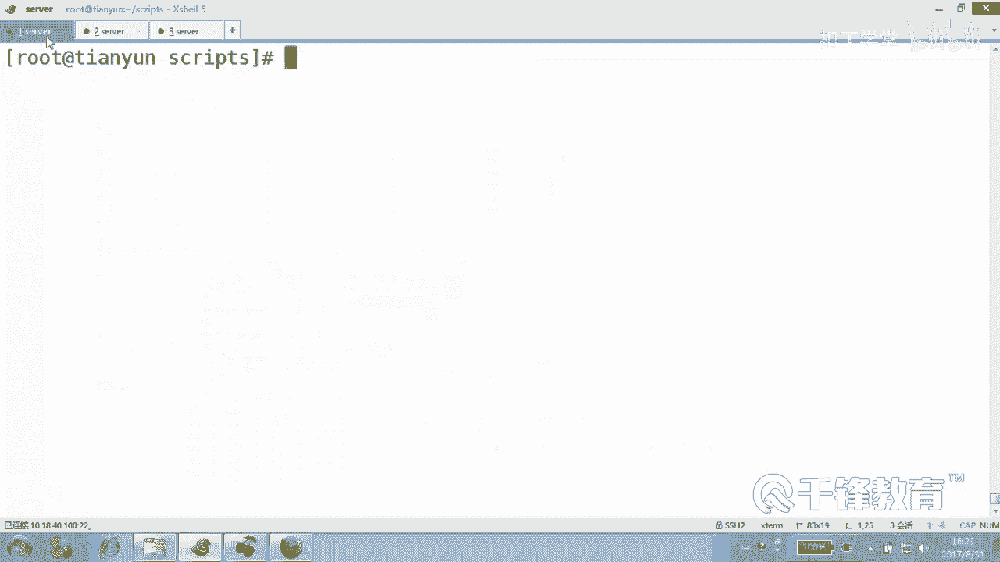

## 给初学者的实践建议

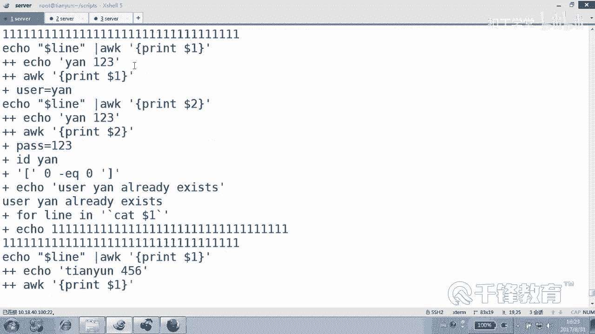

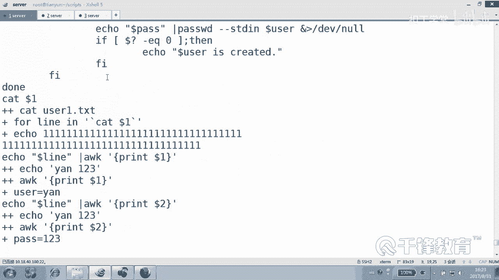

理解了`for`循环的这个特性后，在编写脚本时应注意：

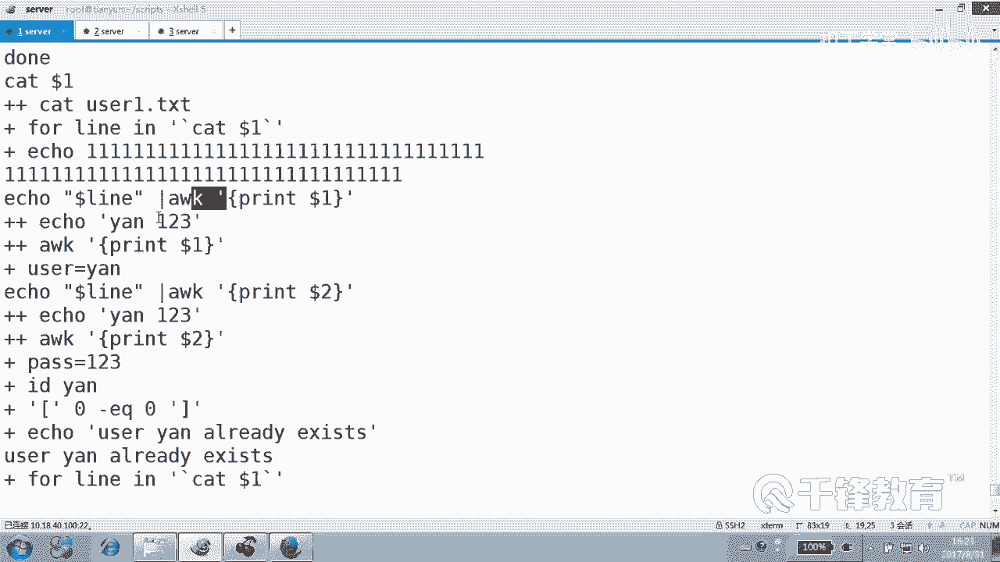

以下是处理文件内容时的几种常见做法：

1.  **无需处理空行**：如果业务逻辑不关心空行，且使用默认`for`循环，那么空行会被自动过滤掉，无需额外代码。
2.  **需要处理空行**：如果必须识别空行（例如，严格的格式检查），则应修改`IFS`，并像我们最初的尝试那样，在循环体内对变量进行判空处理。
3.  **更稳健的逐行读取**：对于复杂的文件处理，更推荐使用`while`循环配合`read`命令，它能更自然、更稳健地处理每一行，包括空行。
    ```bash
    while IFS= read -r line
    do
        # 变量`$line`会包含每一行的原始内容，空行就是空字符串
        if [[ -z "$line" ]]; then
            echo "发现空行"
        fi
    done < "user1.txt"
    ```

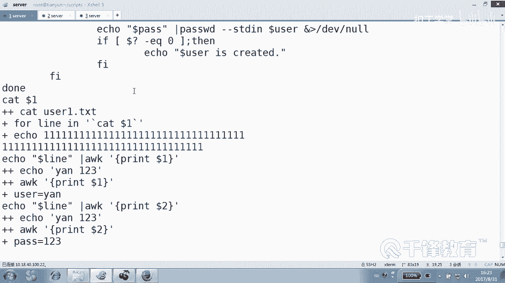

---

## 本节总结

本节课中我们一起学习了`for`循环在处理文件空行时的“秘密”。

*   **核心结论**：在默认设置下，Shell的`for`循环会使用空格、制表符、换行符作为分割符，并**自动忽略分割后产生的空字符串**，导致文件中的空行不会触发循环。
*   **问题根源**：我们试图在循环体内检测空行的代码之所以失效，是因为空行对应的值根本没有被送入循环体。
*   **解决方案**：若需处理空行，可通过修改`IFS`变量改变分割行为，或改用`while read`的循环结构。

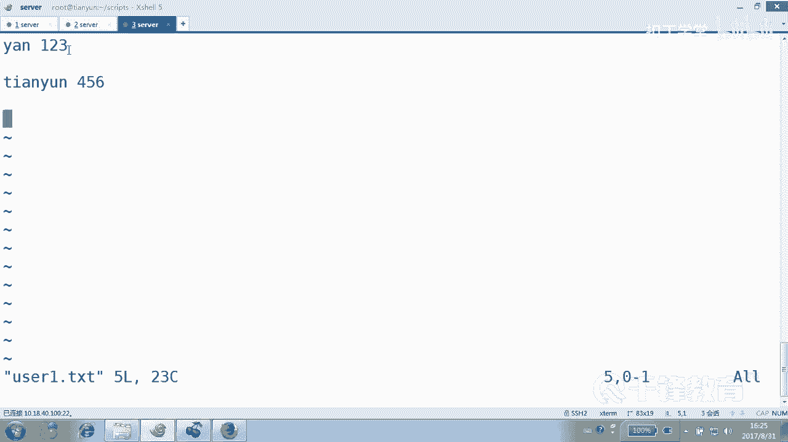

理解这个细微之处，能帮助我们在编写Shell脚本时避免误区，更精准地控制流程逻辑。