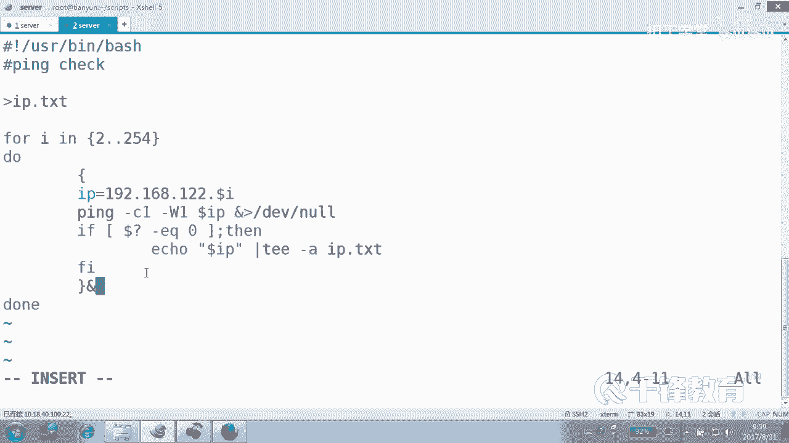
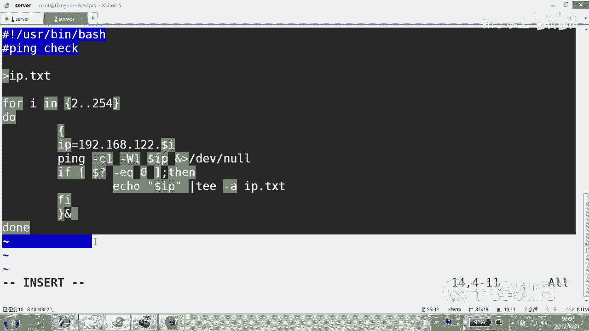
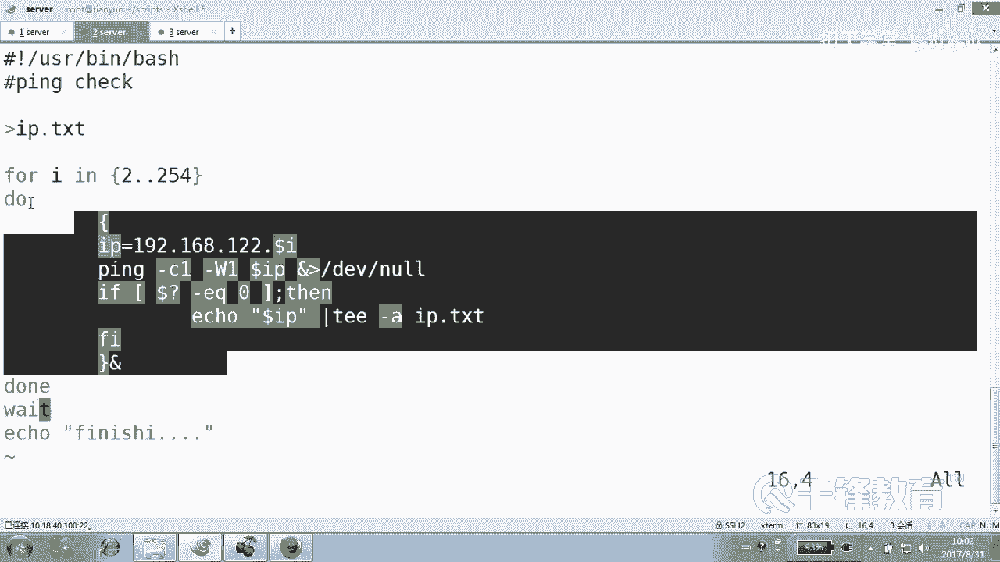
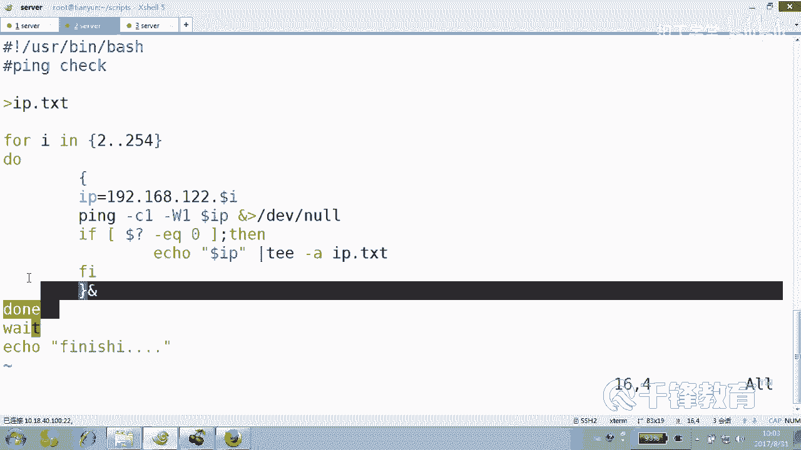
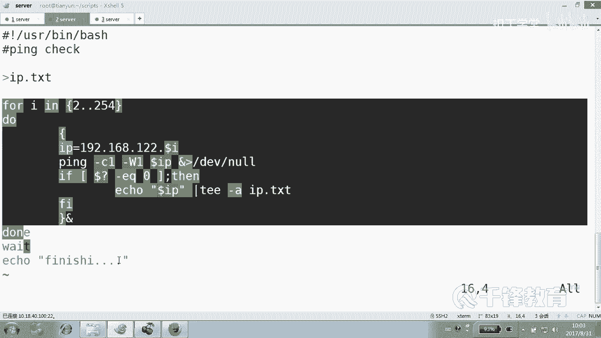
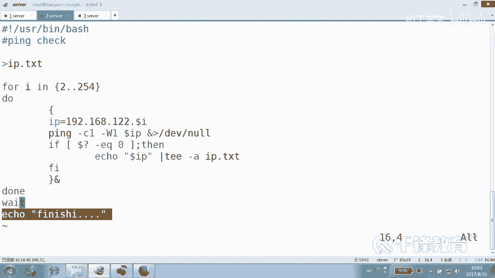
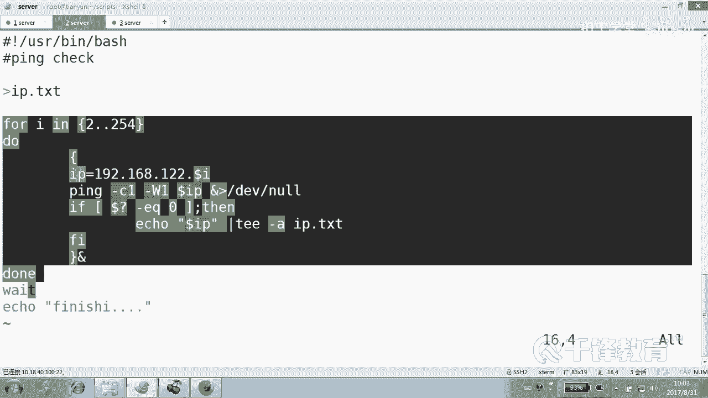
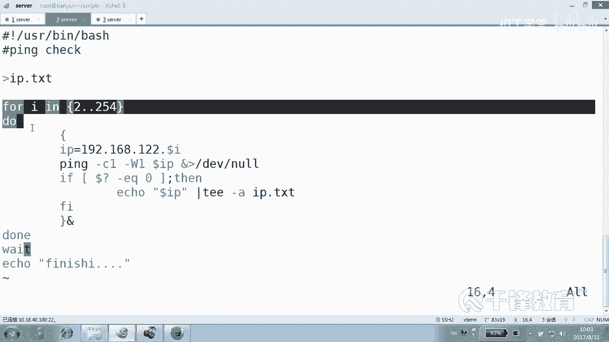
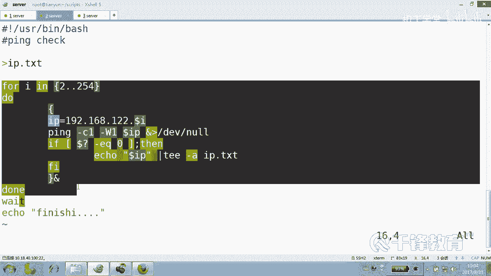
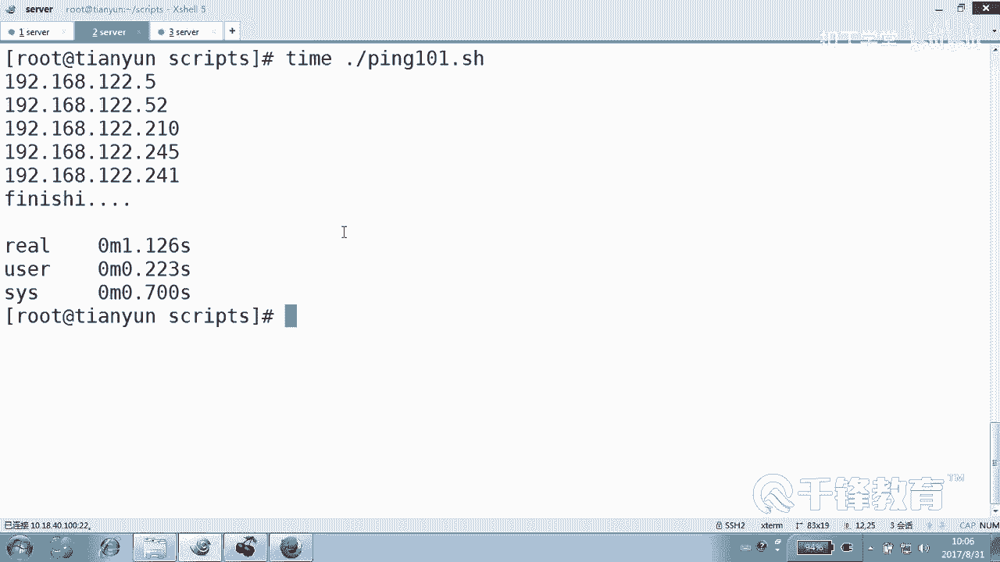

# Shell脚本自动化编程实战：P23：4.6 for 实现批量主机ping探测 🖥️

## 概述
在本节课中，我们将学习如何使用Shell脚本中的`for`循环语句，来实现对多台主机进行批量`ping`探测。我们将从一个简单的单主机探测脚本开始，逐步将其改造为一个高效、快速的批量探测工具。

---

## 从单主机探测到循环思想

在之前的Linux基础课程中，我们提到过创建100个用户账号的场景。如果不使用循环，就需要重复编写`useradd`命令100次，这非常繁琐。而使用循环，我们可以定义循环次数，让脚本自动重复执行相似的操作。每次执行的操作本质相同，但可以通过变化的变量（例如IP地址）来实现不同的效果。

在Shell脚本中，主要有四种循环结构：
*   `for`循环
*   `while`循环
*   `until`循环
*   `select`循环（较少使用）

其中，`for`循环的使用最为广泛。循环可以大致分为两类：循环次数固定的和循环次数不固定的。但需要注意的是，`while`等循环同样有能力实现固定次数的循环。

---

## 构建基础的单主机Ping脚本

首先，我们来回顾并构建一个用于探测单台主机连通性的基础脚本。

以下是该脚本的核心代码：
```bash
#!/bin/bash
IP=192.168.2.2
ping -c1 -W1 $IP &> /dev/null
if [ $? -eq 0 ]; then
    echo "$IP is up."
else
    echo "$IP is down."
fi
```
这个脚本定义了一个IP变量，然后使用`ping`命令发送一个数据包（`-c1`）并在1秒后超时（`-W1`）。接着，通过判断上一条命令的退出状态码（`$?`）是否为0，来确定主机是否在线，并输出相应信息。

有时，我们不仅需要在屏幕上看到结果，还需要将结果保存到文件中以供后续分析。这可以通过输出重定向来实现。

我们可以使用`tee -a`命令将输出同时显示在屏幕并追加到文件：
```bash
echo "$IP is up." | tee -a ip_list.txt
```

为了在每次运行新测试前清理旧的结果文件，可以在脚本开头使用重定向来清空或删除文件：
```bash
> ip_list.txt  # 清空文件
# 或
rm -f ip_list.txt  # 删除文件
```

---

## 引入For循环实现批量探测

现在，我们将这个只能探测一台主机的脚本，升级为能探测一个网段所有主机的脚本。关键在于引入`for`循环。

`for`循环的基本语法结构如下：
```bash
for 变量 in 值列表
do
    # 循环体，使用 $变量
done
```

循环执行时，变量会依次被赋值为列表中的每一个元素。例如，在探测IP时，我们希望变量依次代表192.168.2.2到192.168.2.254。

生成数字序列有两种常见方法：
1.  使用花括号扩展：`{2..254}`
2.  使用`seq`命令：`seq 2 254`

我们将采用第一种方法。以下是改造后的批量Ping脚本：

```bash
#!/bin/bash
> ip_list.txt  # 清空结果文件





for i in {2..254}
do
    IP=192.168.2.$i
    ping -c1 -W1 $IP &> /dev/null
    if [ $? -eq 0 ]; then
        echo "$IP is up." | tee -a ip_list.txt
    else
        echo "$IP is down."
    fi
done
echo "All ping tasks are finished."
```
在这个脚本中，变量`i`会从2循环到254。每次循环，都会拼接出一个完整的IP地址（如192.168.2.2, 192.168.2.3...）并进行探测。

---

## 优化：使用并发提升执行速度

上述脚本有一个问题：它是串行执行的。必须等待前一个主机的`ping`命令完全结束（无论成功或超时），才会开始下一个主机的探测。对于254台主机，这将耗费大量时间。

为了提升速度，我们可以让这些`ping`任务在后台并发执行。具体做法是将整个循环体放入一个代码块`{ }`中，并在块末尾加上`&`符号，将其置于后台运行。

但是，仅仅放入后台还不够。主脚本的代码会继续执行，如果后面有依赖`ping`结果的语句，就可能因为任务未完成而出错。因此，我们需要使用`wait`命令。

`wait`命令的作用是：等待当前Shell中所有后台进程执行完毕。







优化后的并发脚本如下：





```bash
#!/bin/bash
> ip_list.txt



# 将整个循环放入后台执行
{
for i in {2..254}
do
    IP=192.168.2.$i
    ping -c1 -W1 $IP &> /dev/null
    if [ $? -eq 0 ]; then
        echo "$IP is up." | tee -a ip_list.txt
    else
        echo "$IP is down."
    fi
done
} &  # 注意这个 & 符号，它使得整个代码块在后台运行



wait  # 等待所有后台ping任务结束
echo "All ping tasks are finished."
```
**脚本执行逻辑解析**：
1.  脚本开始，清空结果文件。
2.  遇到`{`，开始一个代码块。
3.  进入`for`循环，第一次循环（`i=2`）时，启动一个后台`ping`进程探测`192.168.2.2`，然后立即返回，不等待其结束。
4.  紧接着开始第二次循环（`i=3`），启动第二个后台`ping`进程，以此类推。在极短时间内，254个`ping`进程都被甩到后台启动。
5.  `for`循环代码执行完毕，代码块`}`结束。`&`使得这个代码块本身也成为后台任务。
6.  执行`wait`命令，脚本在此处暂停，等待**所有**后台的`ping`子进程全部执行完毕。
7.  所有`ping`任务完成后，`wait`结束，脚本继续执行最后的`echo`语句。

此外，我们可以在脚本执行命令前加上`time`命令，来统计整个脚本的运行耗时，直观对比并发优化前后的速度差异：
```bash
time ./ping_script.sh
```

---



## 总结
本节课我们一起学习了如何使用Shell脚本中的`for`循环进行批量操作。我们从单主机`ping`探测脚本出发，逐步引入了`for`循环来实现网段扫描，并最终通过将循环体置于后台并发执行，配合`wait`命令进行同步，显著提升了批量任务的执行效率。这个过程清晰地展示了循环结构在自动化任务中的强大作用，以及通过并发优化解决实际性能问题的思路。