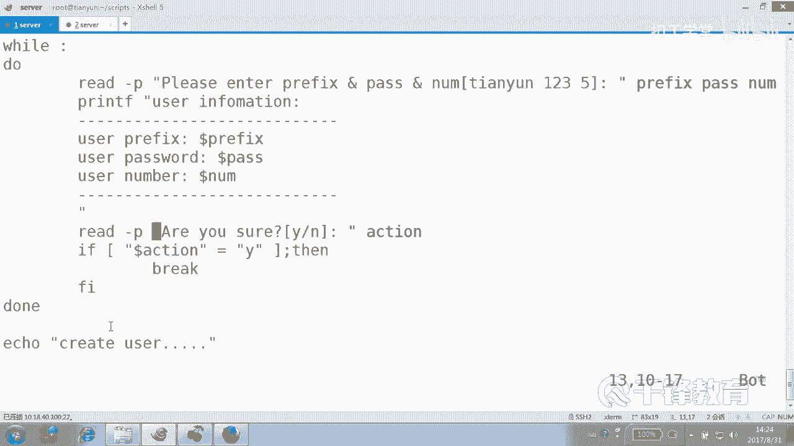
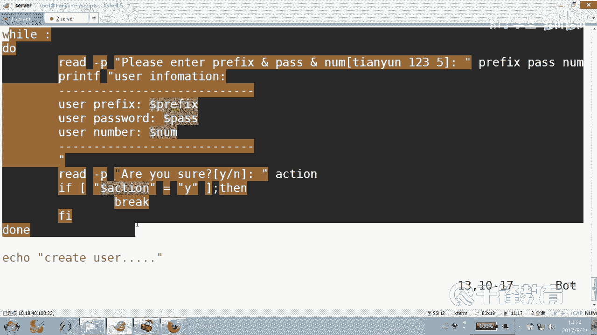
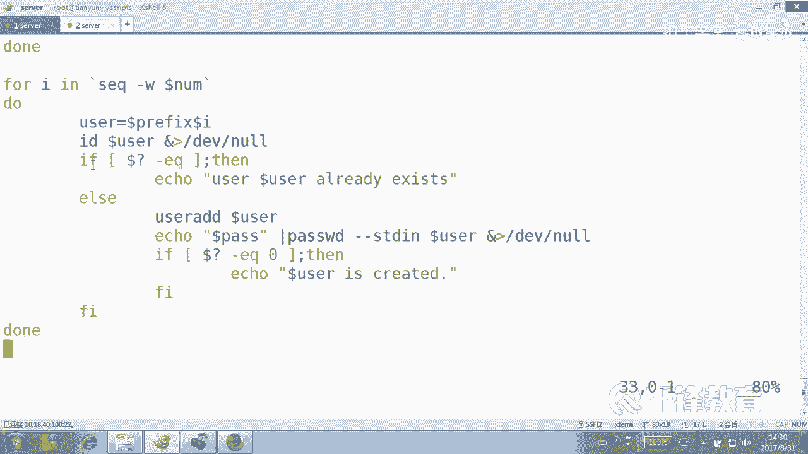
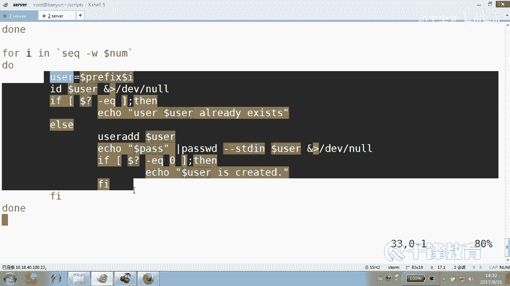
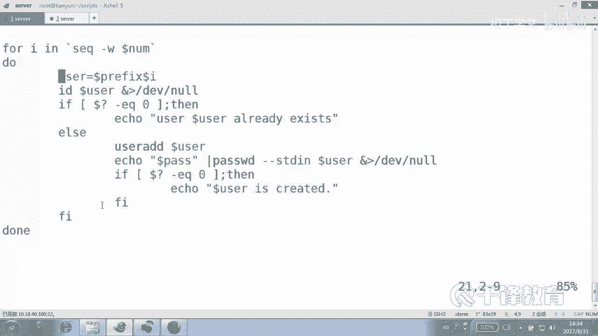
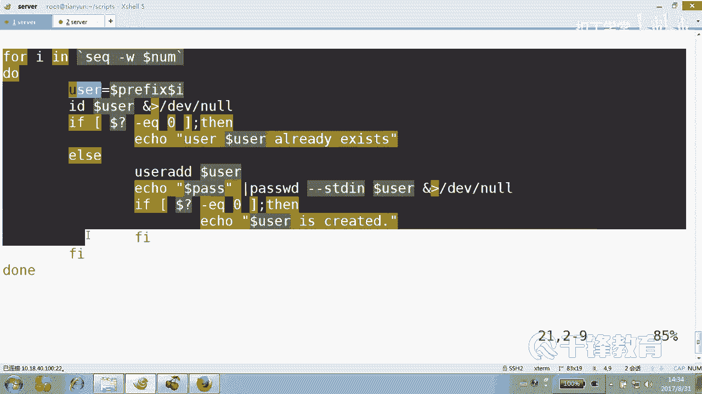
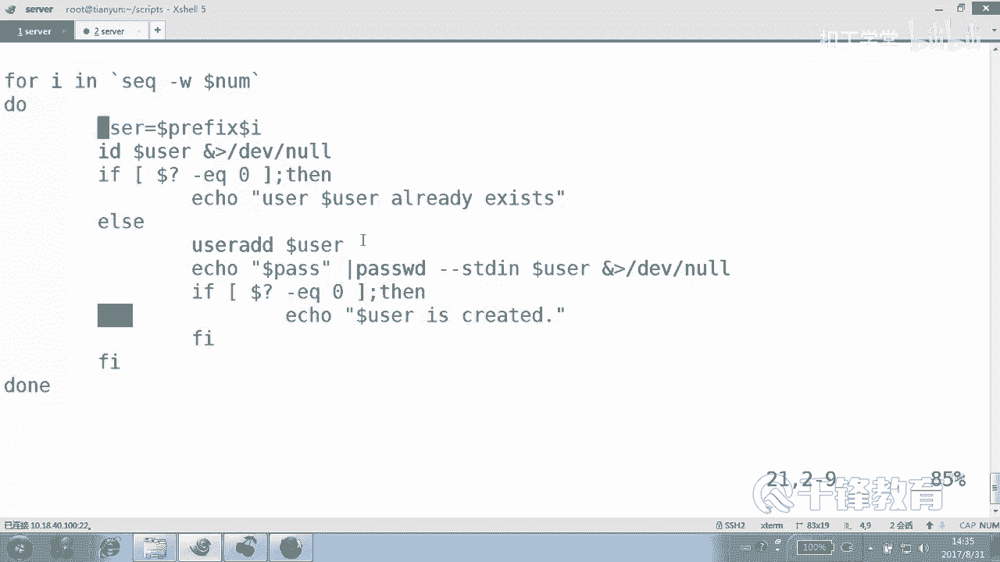

# Shell脚本自动化编程实战：P24：4.7 for 实现批量用户创建 👨‍💻

在本节课中，我们将学习如何使用 `for` 循环来实现批量创建用户。我们将探讨两种不同的数据来源方式：一种是基于数字序列，另一种是基于文件内容。通过一个完整的脚本示例，你将掌握如何结合用户输入、条件判断和循环控制来构建一个健壮的自动化工具。

---

## 从文件中读取循环变量 📄

上一节我们介绍了如何使用 `for` 循环遍历一个数字序列。本节中我们来看看如何从文件中读取数据作为循环的变量值。

假设我们有一个文件 `ip.txt`，里面存放着需要检测连通性的主机IP地址。我们不再遍历整个网段，而是只检测文件中指定的主机。

以下是实现此功能的脚本核心思路：

```bash
#!/bin/bash
for ip in $(cat ip.txt)
do
    ping -c 1 $ip &> /dev/null
    if [ $? -eq 0 ]; then
        echo "$ip is up."
    else
        echo "$ip is down."
    fi
done
```

**核心概念解析**：
*   `$(cat ip.txt)`：这是一个**命令替换**，它的作用是执行 `cat ip.txt` 命令，并将其输出的内容（即文件中的每一行）作为值提供给 `for` 循环。
*   循环会依次将文件中的每一行IP地址赋值给变量 `ip`，然后执行循环体内的 `ping` 检测。

这种方式的关键在于，我们循环操作的对象来自于一个外部文件的内容，这大大增加了脚本的灵活性。

---

## 批量创建用户脚本 👥

理解了从文件读取数据后，我们将其思路应用到批量创建用户上。我们将创建一个脚本，它支持两种方式：一种是用户交互式输入前缀和数量；另一种是从用户列表文件中读取用户名。

我们的脚本将分为几个清晰的步骤：获取用户输入、确认信息、执行批量创建。

### 第一步：获取并确认用户输入

首先，脚本需要提示用户输入必要的信息，并在最终执行前进行确认。

```bash
#!/bin/bash
# 脚本名：create_user.sh

# 使用循环确保用户输入的信息是最终想要的
while :
do
    # 提示用户输入信息
    echo "请输入用户名前缀、密码和创建数量（用空格分隔）："
    read prefix pass num

    # 打印用户输入的信息以供确认
    printf "用户信息：\n前缀：%s\n密码：%s\n数量：%s\n" $prefix $pass $num

    echo "确认以上信息吗？(输入 Y 确认，其他键重新输入)"
    read action
    if [ "$action" == "Y" ]; then
        break # 信息确认，跳出循环
    fi
done
```

**代码说明**：
*   使用 `while :` 创建一个无限循环，直到用户确认信息（输入`Y`）后，用 `break` 跳出。
*   `read` 命令一次性读取三个变量。
*   `printf` 用于格式化输出信息，比 `echo` 更灵活。
*   这是一个友好的交互设计，防止用户因误操作而输入错误信息。





### 第二步：执行批量用户创建

当用户确认信息后，脚本进入核心的创建用户环节。

```bash
echo "正在创建用户..."

# 使用 for 循环，结合 seq 命令生成数字序列
for i in $(seq -w $num)
do
    # 组合用户名，例如 prefix01, prefix02
    username="${prefix}${i}"

    # 检查用户是否已存在
    id $username &> /dev/null
    if [ $? -eq 0 ]; then
        echo "用户 $username 已存在，跳过。"
    else
        # 创建用户并设置密码
        useradd $username
        echo $pass | passwd --stdin $username &> /dev/null

        # 检查用户是否创建成功
        if [ $? -eq 0 ]; then
            echo "用户 $username 创建成功。"
        fi
    fi
done
```

**核心概念与技巧**：
*   `seq -w $num`：**命令替换**。`seq` 命令生成数字序列，`-w` 选项实现**等位补齐**（例如 1 会变成 01，以便用户名长度统一）。
*   `id $username &> /dev/null`：通过检查用户ID是否存在来判断用户是否已创建。将输出重定向到 `/dev/null` 是为了屏蔽无关信息。
*   `echo $pass | passwd --stdin $username`：使用管道将密码传递给 `passwd` 命令的 `--stdin` 选项，实现非交互式设置密码。
*   清晰的**条件判断** (`if...else...fi`) 结构，分别处理用户存在和不存在的情况，使脚本逻辑严谨。

---



### 完整的脚本示例



将以上两部分结合，并添加适当的缩进和注释，就形成了一个完整的、健壮的批量用户创建脚本。良好的缩进习惯（如上例所示）对于保持代码结构清晰、易于阅读和维护至关重要。

---

## 总结 📝



本节课中我们一起学习了 `for` 循环的两个高级应用场景。



1.  **从文件读取数据作为循环源**：我们通过 `$(cat filename)` 这种命令替换方式，让循环变量值动态地来自于一个外部文件，这使得脚本能够处理预定义的任务列表。
2.  **构建交互式批量用户创建脚本**：我们综合运用了 `while` 循环、`read` 交互输入、`if` 条件判断以及 `for` 循环，实现了一个包含信息确认、重复检查、错误处理等功能的实用脚本。特别强调了 `seq -w` 的等位补齐功能和 `passwd --stdin` 的非交互式密码设置方法。




记住，编写Shell脚本时，**代码的清晰度和可维护性**往往比极致的执行效率更重要。合理的结构划分、清晰的注释和一致的缩进风格，是写出高质量脚本的关键。