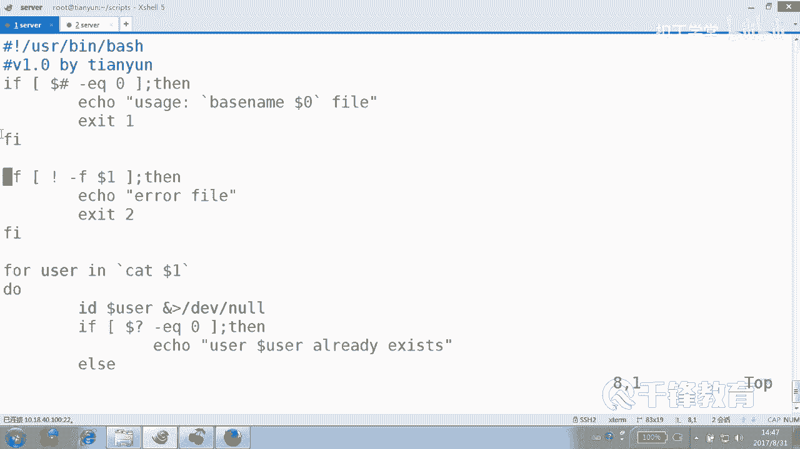
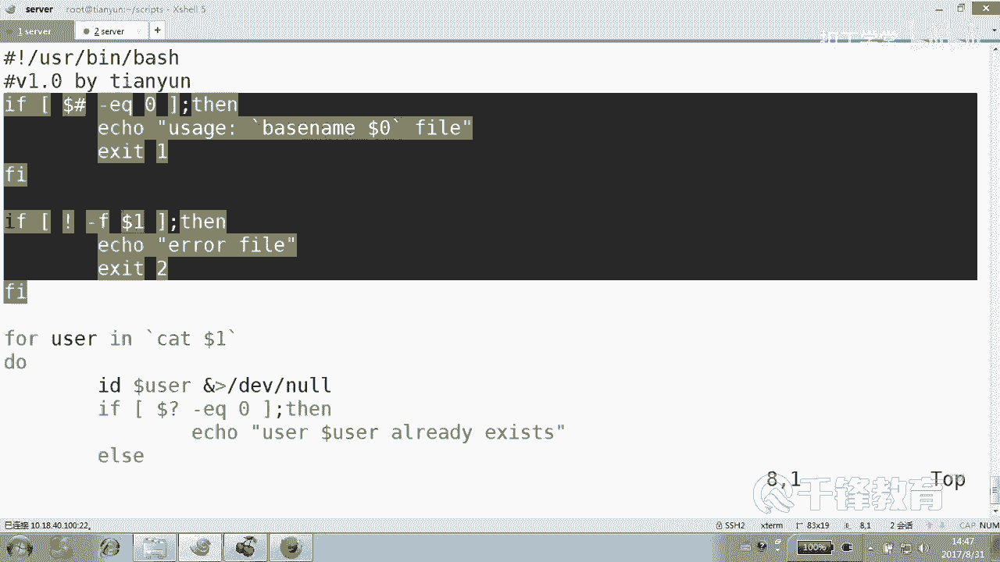
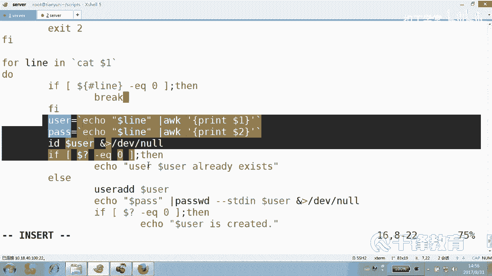
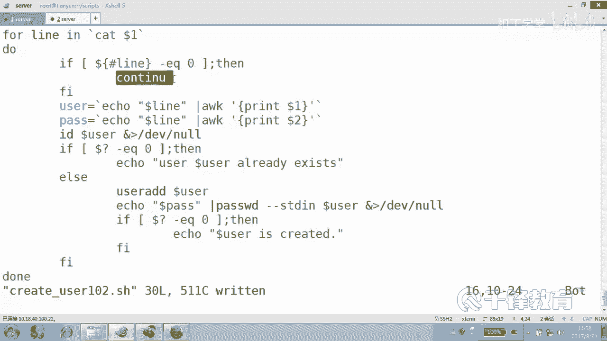
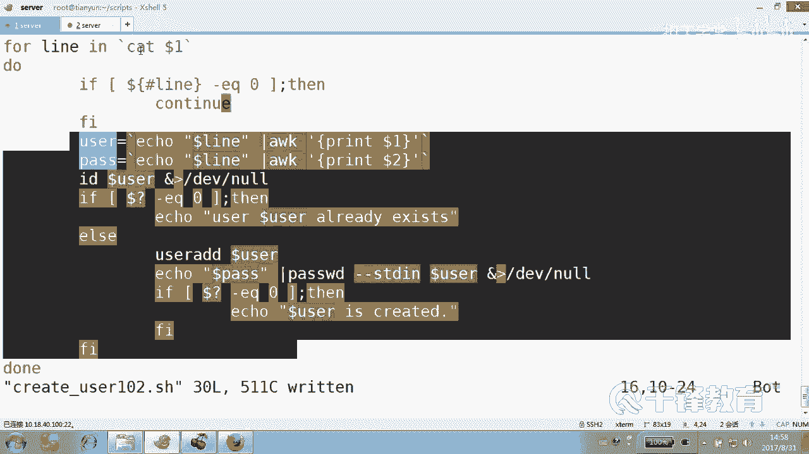
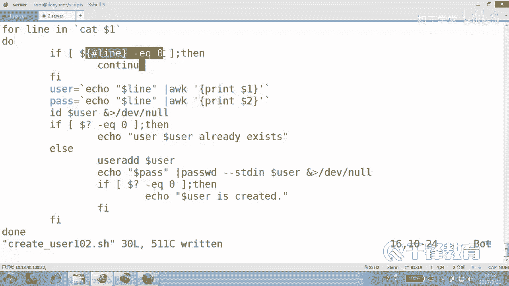
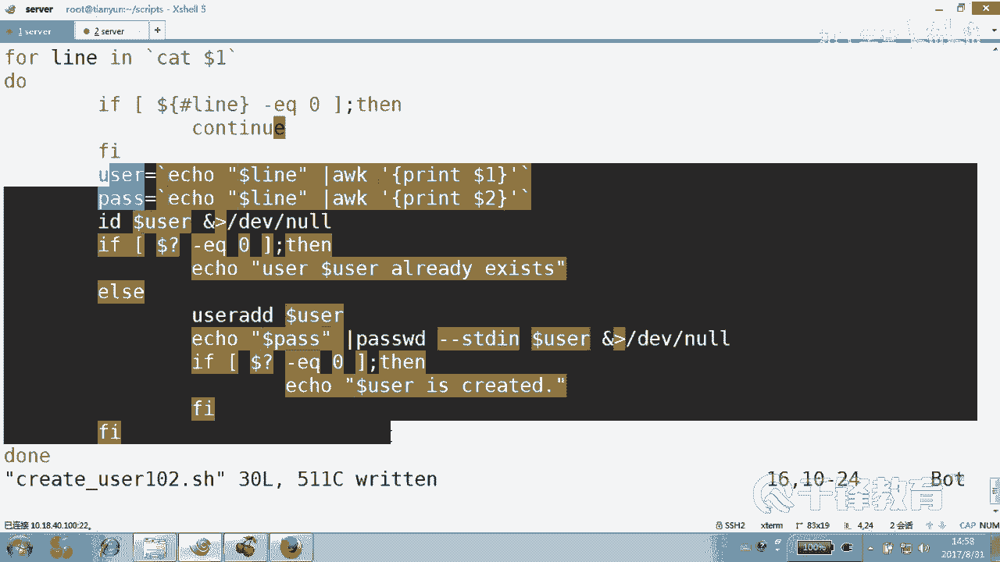
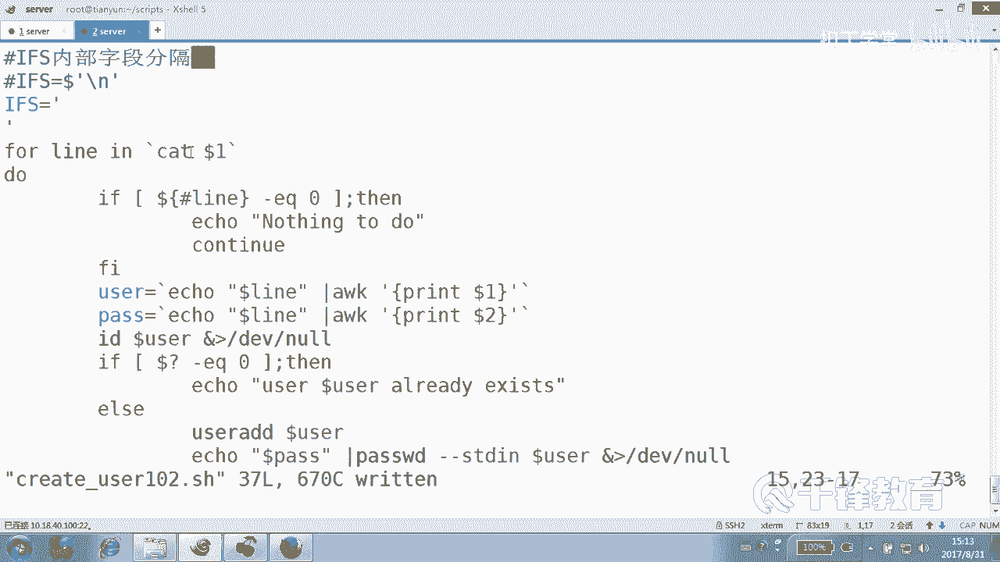

# Shell脚本自动化编程实战：4.8：使用for循环实现基于文件的批量用户创建 🖥️

在本节课中，我们将学习如何利用Shell脚本中的`for`循环，从一个文件中读取数据来批量创建系统用户。我们将从一个简单的例子开始，逐步增加复杂度，最终实现一个能够处理用户名和密码对文件的健壮脚本。

## 概述

上一节我们介绍了使用`for`循环配合序列来批量创建用户。本节中，我们将看看如何从外部文件中读取用户信息，实现更灵活、更实用的批量用户创建功能。我们将学习如何处理文件输入、进行参数校验、分割数据行以及处理文件中的空行等常见问题。

## 脚本基础结构与参数校验

首先，我们创建一个基础的脚本框架。这个脚本需要接收一个文件名作为参数，并从该文件中读取用户信息。

以下是创建脚本`create_user101.sh`的初始步骤，包括必要的参数校验：

```bash
#!/usr/bin/bash
# 版本信息
V1="霸海天云"





# 判断是否提供了参数（即文件名）
if [ $# -eq 0 ]; then
    echo "使用方法：$0 <文件名>"
    exit 1
fi

# 判断提供的参数是否是一个真实存在的文件
if [ ! -f $1 ]; then
    echo "错误：$1 不是一个有效的文件。"
    exit 2
fi
```

这段代码解决了两个前置问题：
1.  检查用户是否提供了文件名作为脚本参数。
2.  检查提供的参数是否是一个有效的文件。

## 简单的文件读取与用户创建

在通过了参数校验之后，我们就可以安全地读取文件并处理其中的内容了。我们假设初始的文件`user.txt`每行只包含一个用户名。

以下是使用`for`循环读取文件并创建用户的核心逻辑：

```bash
# 循环读取文件中的每一行（每个用户名）
for user in $(cat $1)
do
    # 检查用户是否已存在
    if id $user &> /dev/null; then
        echo "用户 $user 已存在。"
    else
        # 创建用户
        useradd $user
        echo "用户 $user 创建成功。"
    fi
done
```



这个简单的脚本已经能够实现从文件批量创建用户的功能。然而，实际需求往往更加复杂。

## 处理包含用户名和密码的复杂文件









现实中，我们更可能需要处理一个包含用户名和对应密码的文件（例如`user1.txt`，格式为`用户名 密码`）。这要求我们在循环中不仅能读取整行，还要能将一行数据分割成用户名和密码两部分。

以下是应对这种复杂情况的脚本`create_user102.sh`的改进思路：

1.  **重新定义内部字段分隔符**：默认情况下，`for`循环使用空格和制表符作为分隔符。为了能按行读取，我们需要将内部字段分隔符`IFS`设置为换行符。
2.  **在循环体内分割数据**：读取一行后，使用`awk`或变量切片等方式将其分割为用户名和密码。

以下是实现代码：

```bash
#!/usr/bin/bash
# ... 参数校验部分与之前相同 ...

# 重新定义内部字段分隔符为换行符，确保for循环按行读取
IFS='
'

# 循环读取文件中的每一行
for line in $(cat $1)
do
    # 检查是否为空行
    if [ ${#line} -eq 0 ]; then
        echo “遇到空行，跳过。”
        continue # 跳过本次循环的剩余部分
    fi

    # 从行中提取用户名（第一列）和密码（第二列）
    user=$(echo $line | awk ‘{print $1}’)
    pass=$(echo $line | awk ‘{print $2}’)

    # 检查用户是否已存在
    if id $user &> /dev/null; then
        echo “用户 $user 已存在。”
    else
        # 创建用户并设置密码
        useradd $user
        echo “$pass” | passwd --stdin $user &> /dev/null
        echo “用户 $user 创建成功，密码已设置。”
    fi
done
```

**关键点解释**：
*   `IFS=$‘\n‘`：将换行符设置为字段分隔符，这是`for`循环能正确按行处理文件的关键。
*   `${#line}`：获取变量`line`值的长度，用于判断是否为空行。
*   `continue`：当遇到空行时，跳过当前循环的剩余代码，直接开始下一次循环。
*   `awk ‘{print $1}‘`：使用`awk`工具提取空格分隔的第一列（用户名）。
*   `echo “$pass” | passwd --stdin $user`：通过管道将密码传递给`passwd`命令，实现非交互式密码设置。

## 总结

本节课中我们一起学习了如何使用`for`循环从文件批量创建用户。我们从最简单的单用户名单文件处理开始，逐步深入到处理包含用户名和密码的复杂文件格式。在这个过程中，我们掌握了几个核心技能：
1.  使用`$#`和`-f`进行脚本参数校验。
2.  利用`IFS`变量控制`for`循环的分隔符，使其按行读取文件。
3.  在循环体内使用`awk`等工具对一行数据进行分割处理。
4.  使用`${#variable}`判断字符串长度，并结合`continue`语句处理文件中的空行。



虽然`for`循环可以完成这个任务，但通过重新设置`IFS`来按行读取有时显得繁琐。在后续的课程中，我们将介绍更擅长处理文本行、无需担心分隔符问题的`while`循环，它通常是处理文件逐行读取的首选方法。