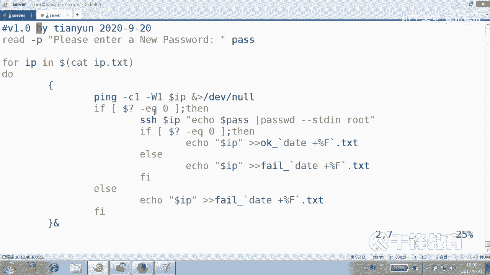
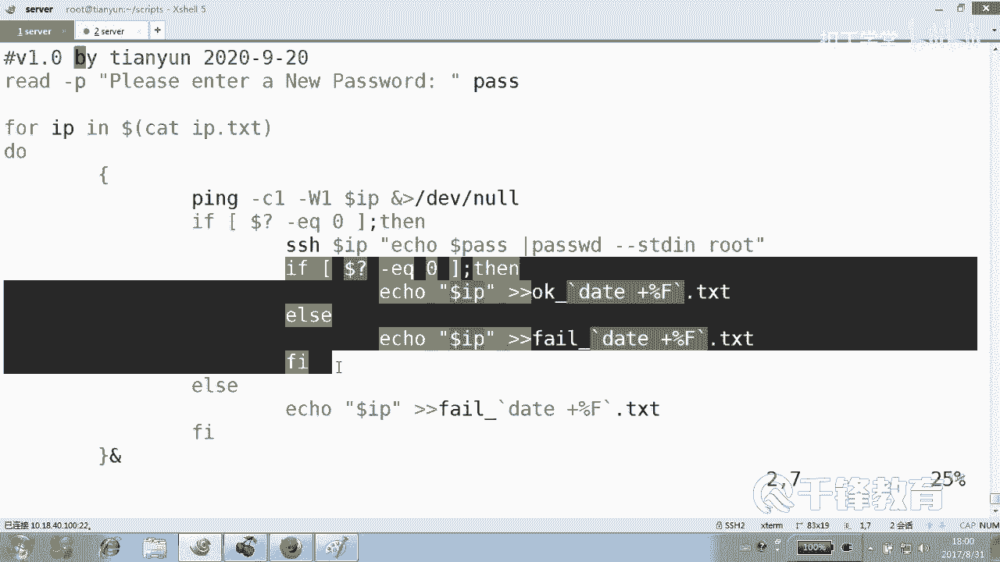
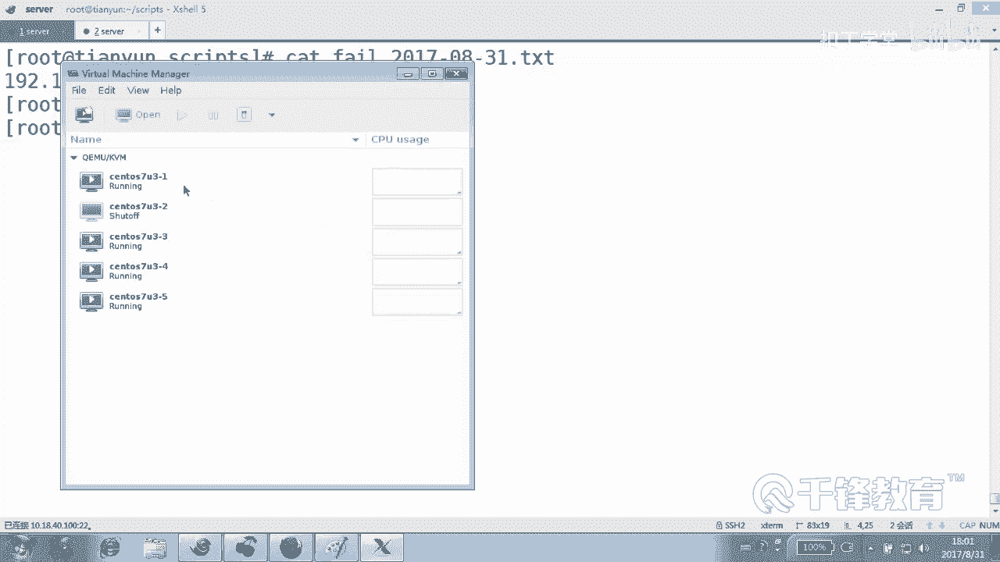
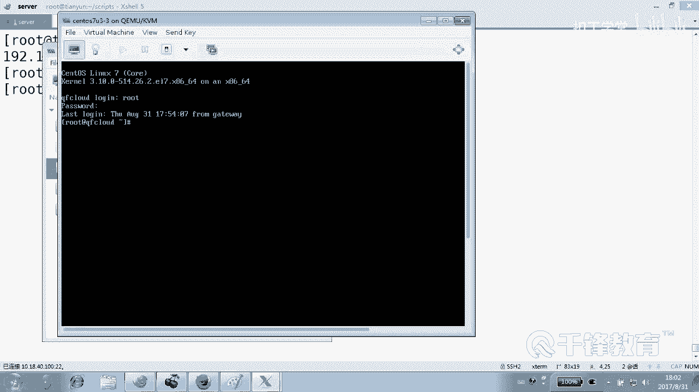
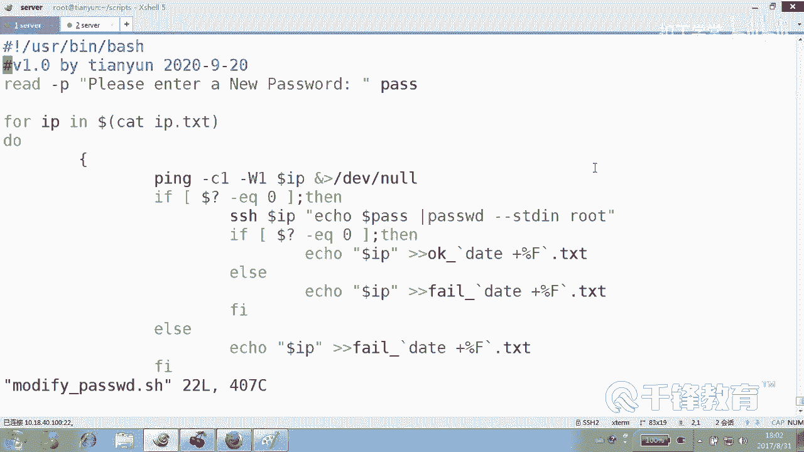

# Shell脚本自动化编程实战：P26：4.9 for循环实现批量主机密码修改 🛠️

在本节课中，我们将学习如何利用Shell脚本中的`for`循环，结合SSH公钥认证，实现批量修改远程主机密码的自动化操作。我们将从核心命令开始，逐步构建一个健壮的脚本，并处理成功与失败的情况。

---

## 概述

上一节我们介绍了SSH公钥认证，实现了免密登录。本节中，我们来看看如何在此基础上，批量修改多台远程主机的密码。核心思路是：通过`for`循环遍历IP列表，对每台能连通的主机，使用`ssh`远程执行修改密码的命令。

## 核心命令：修改密码

在Linux中，修改密码的命令是`passwd`。为了实现非交互式修改（避免手动输入），我们可以使用`--stdin`选项，通过管道传递新密码。其基本格式如下：

```bash
echo "新密码" | passwd --stdin 用户名
```

例如，修改`root`用户的密码为`newpassword123`：
```bash
echo "newpassword123" | passwd --stdin root
```

## 脚本构建思路

我们的脚本将遵循以下逻辑：
1.  提示用户输入统一的新密码。
2.  读取存储了IP地址的列表文件。
3.  遍历每个IP地址。
4.  首先检查主机是否网络可达（使用`ping`）。
5.  如果可达，则尝试通过SSH连接并执行修改密码命令。
6.  根据命令执行结果，记录成功或失败的IP到不同的日志文件中。

以下是构建脚本的详细步骤。

### 第一步：获取新密码并读取IP列表

脚本开始，我们需要获取用户输入的新密码，并读取存有目标主机IP地址的文件。我们假设IP列表文件`ip.txt`与脚本在同一目录下。

```bash
#!/bin/bash
# 提示用户输入新密码
read -p "请输入新密码: " NEW_PASS

# 使用for循环读取ip.txt文件中的每一行IP地址
for IP in $(cat ip.txt)
do
    # 后续操作将在这里进行
    echo "正在处理 IP: $IP"
done
```

### 第二步：检查主机连通性

在尝试修改密码前，应先检查主机是否在线，避免对离线主机进行无谓的操作。我们使用`ping`命令进行简易连通性测试。

```bash
    # 检查主机是否可达，发送2个包，等待1秒
    if ping -c 2 -W 1 $IP &> /dev/null
    then
        echo "$IP 可达，尝试修改密码..."
        # 主机可达，进入密码修改流程
    else
        echo "$IP 不可达，跳过。"
        # 记录失败IP
        echo $IP >> fail_$(date +%Y%m%d).txt
    fi
```

### 第三步：远程执行密码修改命令

对于可达的主机，我们使用`ssh`命令远程执行密码修改。这里利用了之前建立的公钥认证，因此无需输入登录密码。

核心的远程命令执行格式如下：
```bash
ssh root@$IP "echo '$NEW_PASS' | passwd --stdin root"
```

我们需要将上述命令放入`if`条件判断中，以检查其执行是否成功（通过`$?`获取上一条命令的退出状态码）。

```bash
        # 尝试远程修改密码
        if ssh root@$IP "echo '$NEW_PASS' | passwd --stdin root" &> /dev/null
        then
            echo "$IP 密码修改成功。"
            echo $IP >> ok_$(date +%Y%m%d).txt
        else
            echo "$IP 密码修改失败。"
            echo $IP >> fail_$(date +%Y%m%d).txt
        fi
```

## 完整脚本示例

将以上步骤整合，并添加日志文件头信息，得到完整脚本`modify_pass.sh`。

```bash
#!/bin/bash
# 批量修改密码脚本

# 1. 获取新密码
read -p "请输入统一的新密码: " NEW_PASS

# 2. 为日志文件添加日期标题
DATE=$(date +%Y%m%d)
echo "=== 批量密码修改日志 ($DATE) ===" > ok_$DATE.txt
echo "=== 批量密码修改日志 ($DATE) ===" > fail_$DATE.txt



# 3. 遍历IP列表
for IP in $(cat ip.txt)
do
    echo "正在处理: $IP"
    
    # 4. 检查连通性
    if ping -c 2 -W 1 $IP &> /dev/null
    then
        # 5. 尝试远程修改密码
        if ssh root@$IP "echo '$NEW_PASS' | passwd --stdin root" &> /dev/null
        then
            echo "  [成功] 密码已修改。"
            echo $IP >> ok_$DATE.txt
        else
            echo "  [失败] SSH连接或命令执行出错。"
            echo $IP >> fail_$DATE.txt
        fi
    else
        echo "  [失败] 主机不可达。"
        echo $IP >> fail_$DATE.txt
    fi
done



echo "操作完成。成功列表见: ok_$DATE.txt, 失败列表见: fail_$DATE.txt"
```

## 脚本执行与验证

1.  确保`ip.txt`文件存在且包含正确的IP地址，每行一个。
2.  确保本机与目标主机已配置SSH公钥认证。
3.  给脚本添加执行权限：`chmod +x modify_pass.sh`。
4.  运行脚本：`./modify_pass.sh`，根据提示输入新密码。

执行后，会生成以日期命名的`ok_YYYYMMDD.txt`和`fail_YYYYMMDD.txt`文件，分别记录成功和失败的主机IP。

**验证方法**：可以手动选择一台记录为成功的IP，尝试使用新密码进行SSH登录，以确认密码修改生效。



## 注意事项与潜在问题



*   **权限问题**：脚本中默认修改`root`用户密码。如需修改其他用户，请替换命令中的用户名。
*   **密码安全**：脚本中密码以明文参数形式传递，存在安全风险。此脚本适用于实验或受控内网环境。生产环境应考虑更安全的凭据管理方式（如SSH证书、密码管理器等）。
*   **网络与主机状态**：`ping`通仅代表网络层可达，目标主机的SSH服务可能未运行或存在防火墙限制，这会导致后续修改失败。
*   **循环效率**：当前脚本是串行执行，即处理完一台主机再处理下一台。如果主机数量很多，会耗时较长。可以考虑使用并行化技术（如`&`后台执行、`xargs -P`或`parallel`命令）来加速，但需注意并发数控制，避免对管理网络或目标主机造成过大压力。

## 总结

本节课中我们一起学习了如何编写一个自动化批量修改远程主机密码的Shell脚本。我们利用了`for`循环遍历IP列表，结合`ping`测试连通性，并通过`ssh`远程执行`passwd`命令。脚本还实现了基本的日志功能，将成功与失败的结果分别记录到带日期的文件中。



这个案例的核心思想是 **“远程执行命令”** ，它不仅是批量密码修改的基础，也是几乎所有Linux自动化运维操作（如软件安装、配置更新、服务重启等）的核心模式。掌握这个模式，就能举一反三，实现各种批量管理任务。