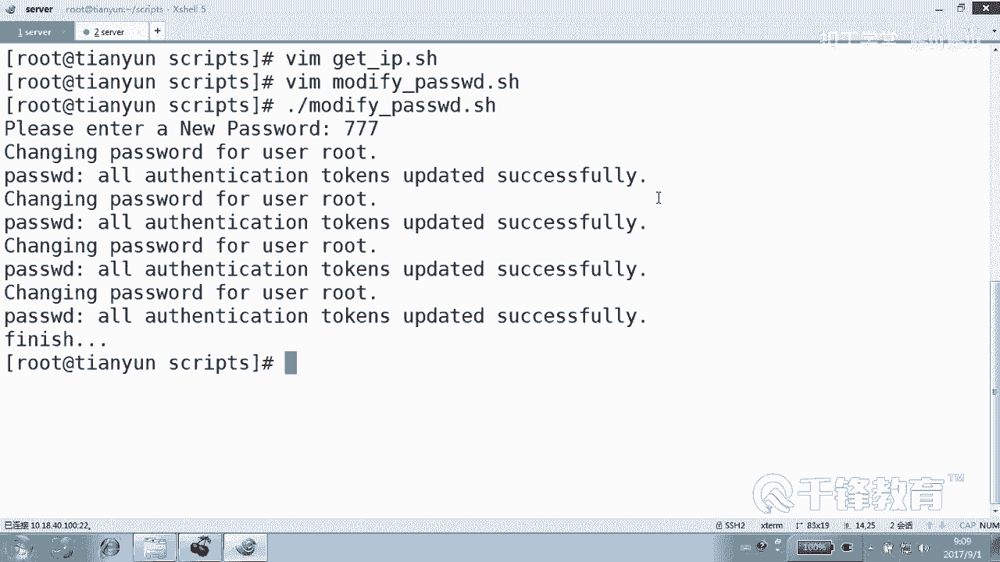
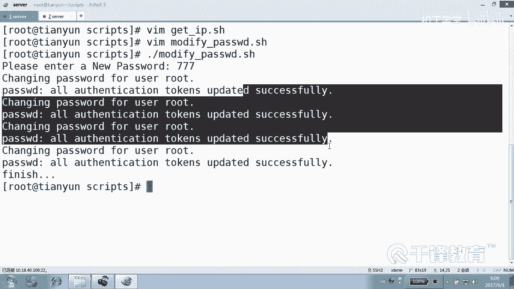
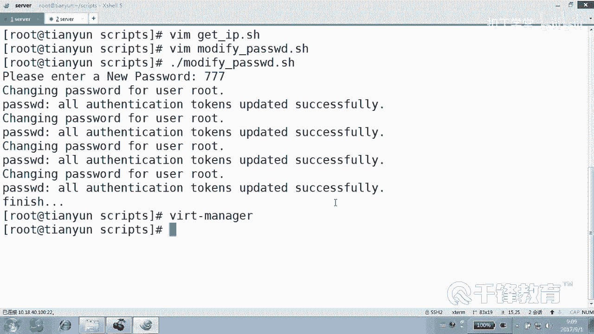
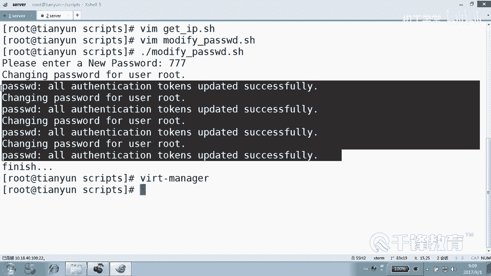
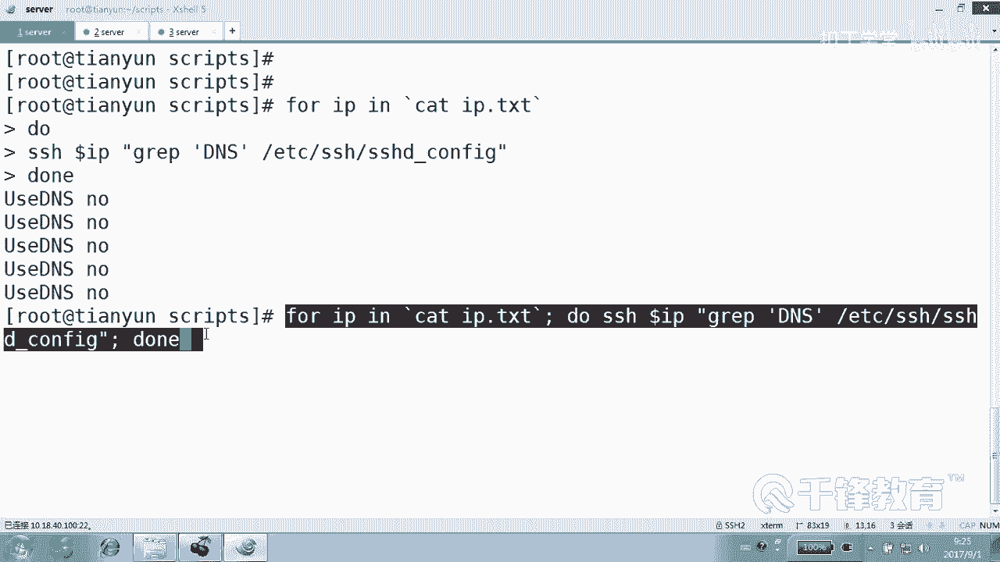
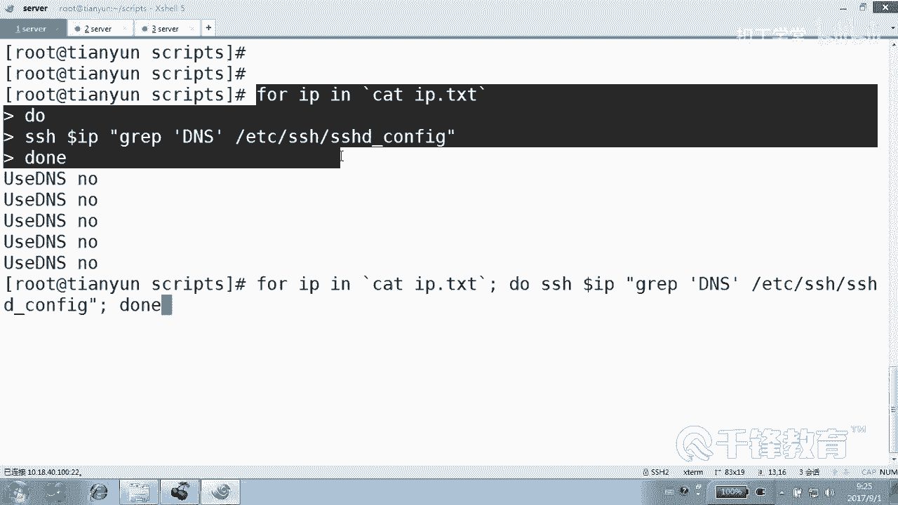
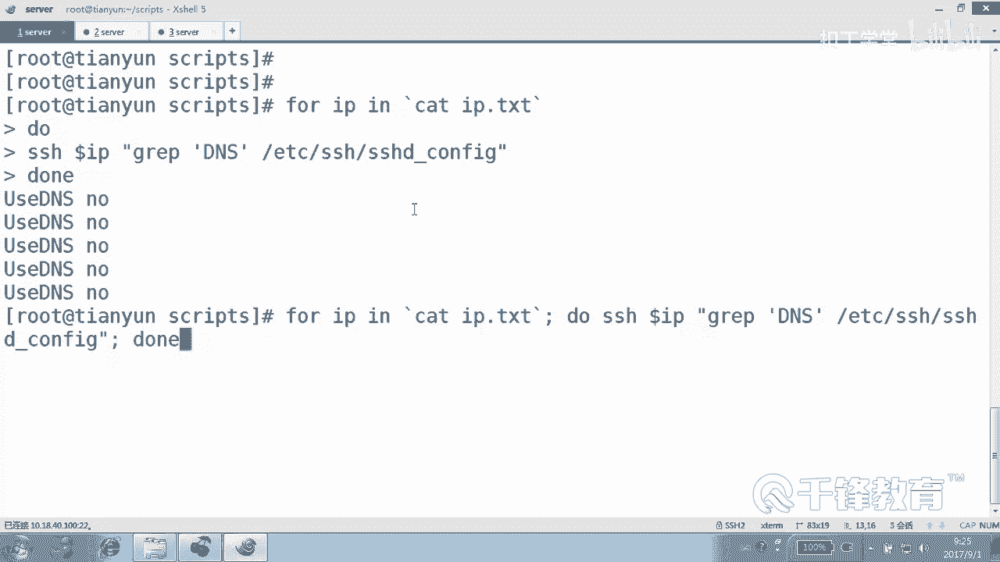

# Shell脚本自动化编程实战：P27：4.10 for循环实现批量远程主机SSH配置 🔧


在本节课中，我们将学习如何使用Shell脚本中的`for`循环，结合`ssh`命令，批量修改远程主机的SSH服务配置。我们将编写一个脚本，自动完成禁用DNS解析、关闭防火墙和SELinux等系统初始化任务，实现高效的批量管理。

---

## 脚本结构与核心思路





上一节我们介绍了如何批量推送公钥和修改密码。本节中，我们来看看如何将同样的思路应用于修改远程主机的系统配置。

脚本的核心流程如下：
1.  读取一个包含所有目标主机IP地址的列表文件。
2.  使用`for`循环遍历列表中的每一个IP。
3.  对每个IP，通过`ssh`远程执行一系列命令来修改其配置。





以下是脚本的基本结构框架：

```bash
#!/bin/bash
# 脚本：modify_ssh_config.sh
# 功能：批量修改远程主机的SSH及系统配置

for IP in $(cat ip_list.txt)
do
    # 在这里编写针对每个IP的操作命令
    echo "正在处理主机：$IP"
done
wait
echo “所有主机配置修改完成。”
```

---

## 逐步构建脚本内容

我们将在这个框架内填充具体的配置修改命令。首先，为了提高脚本的健壮性，我们可以选择先测试主机是否可达。

### 1. 测试主机连通性

在尝试连接前，先使用`ping`命令检查主机是否在线，可以避免因部分主机故障导致脚本中断。

```bash
for IP in $(cat ip_list.txt)
do
    # 测试主机是否可达
    ping -c 1 -W 1 $IP &> /dev/null
    if [ $? -eq 0 ]; then
        echo “主机 $IP 可达，开始配置...”
        # 后续的配置命令将放在这里
    else
        echo “警告：主机 $IP 无法连接，跳过。”
    fi
done
```

**注意**：如果你确信列表中的所有主机都是可用的，可以省略`ping`测试步骤，直接进行`ssh`连接。

### 2. 远程修改SSH配置

我们将通过`ssh`连接到远程主机，并使用`sed`命令非交互式地修改配置文件。主要修改两项以加速SSH连接：
*   禁用DNS反向解析 (`UseDNS no`)
*   禁用GSSAPI认证 (`GSSAPIAuthentication no`)

以下是修改`/etc/ssh/sshd_config`文件的命令：

```bash
ssh root@$IP “sed -ri ‘s/^#UseDNS yes/UseDNS no/‘ /etc/ssh/sshd_config”
ssh root@$IP “sed -ri ‘s/^GSSAPIAuthentication yes/GSSAPIAuthentication no/‘ /etc/ssh/sshd_config”
```

**命令解析**：
*   `ssh root@$IP “command”`：以root用户身份登录到`$IP`主机并执行引号内的命令。
*   `sed -ri ‘s/原字符串/新字符串/‘ 文件名`：`-r`支持扩展正则，`-i`直接修改文件。`s`表示替换，将匹配`原字符串`的行替换为`新字符串`。

### 3. 关闭防火墙和SELinux

除了SSH配置，通常还需要关闭防火墙和SELinux以确保服务访问畅通（生产环境请谨慎评估）。

以下是相关命令：

```bash
# 关闭并禁用firewalld防火墙
ssh root@$IP “systemctl stop firewalld; systemctl disable firewalld”

# 关闭SELinux（修改配置文件并设置当前状态）
ssh root@$IP “sed -ri ‘s/^SELINUX=enforcing/SELINUX=disabled/‘ /etc/selinux/config”
ssh root@$IP “setenforce 0”
```

---

## 完整的脚本示例

将以上所有步骤整合，就得到了完整的批量配置脚本。

```bash
#!/bin/bash
# 脚本：modify_ssh_config.sh
# 功能：批量初始化远程主机配置（SSH优化、关闭防火墙、关闭SELinux）

for IP in $(cat /root/ip_list.txt)
do
    echo “=== 开始处理主机：$IP ===”
    
    # 可选：测试连通性
    ping -c 1 -W 1 $IP &> /dev/null
    if [ $? -ne 0 ]; then
        echo “主机 $IP 无法连通，跳过。”
        continue
    fi
    
    # 1. 修改SSH配置以加速连接
    ssh root@$IP “sed -ri ‘s/^#UseDNS yes/UseDNS no/‘ /etc/ssh/sshd_config”
    ssh root@$IP “sed -ri ‘s/^GSSAPIAuthentication yes/GSSAPIAuthentication no/‘ /etc/ssh/sshd_config”
    
    # 2. 关闭防火墙
    ssh root@$IP “systemctl stop firewalld; systemctl disable firewalld”
    
    # 3. 关闭SELinux
    ssh root@$IP “sed -ri ‘s/^SELINUX=enforcing/SELINUX=disabled/‘ /etc/selinux/config”
    ssh root@$IP “setenforce 0”
    
    echo “主机 $IP 配置完成。”
    echo
done

wait
echo “所有主机的批量配置已执行完毕！”
```

**运行脚本**：
1.  确保`/root/ip_list.txt`文件存在，并包含正确的IP地址（每行一个）。
2.  给脚本添加执行权限：`chmod +x modify_ssh_config.sh`
3.  执行脚本：`./modify_ssh_config.sh`

---

## 单行命令的替代写法

对于简单的循环任务，你也可以直接在终端中使用一行命令完成，这通常被称为“单行脚本”。

```bash
for IP in $(cat ip_list.txt); do echo “处理 $IP”; ssh root@$IP “sed -ri ‘s/^#UseDNS yes/UseDNS no/‘ /etc/ssh/sshd_config”; done
```

**说明**：
*   将`do`和`done`之间的所有命令用分号`;`连接，写在一行。
*   这种方式简洁，但复杂逻辑的调试和阅读不如多行脚本清晰。

---

## 验证配置结果

脚本执行后，可以随机抽查一台主机，验证配置是否生效。

例如，检查SSH的`UseDNS`设置是否已修改：

```bash
ssh root@目标IP “grep ‘^UseDNS‘ /etc/ssh/sshd_config”
```
预期输出应为：`UseDNS no`

---



## 总结与展望



本节课中我们一起学习了如何利用Shell脚本的`for`循环和`ssh`远程执行能力，实现对多台主机的SSH服务及系统配置进行批量、自动化的修改。

我们掌握了以下关键点：
*   **核心思路**：循环读取IP列表，通过`ssh`在远程主机上执行预定义命令。
*   **关键技术**：使用`sed`进行非交互式文件编辑，使用`systemctl`管理系统服务。
*   **脚本健壮性**：可通过`ping`预先检查主机状态。
*   **灵活形式**：脚本既可保存为文件执行，也可简化为单行命令。



这种批量远程管理的模式非常强大，是自动化运维的基础。在后续课程中，我们将应用此模式完成更复杂的任务，例如**LNMP环境的一键部署**、**MySQL集群的自动化安装**等，敬请期待。