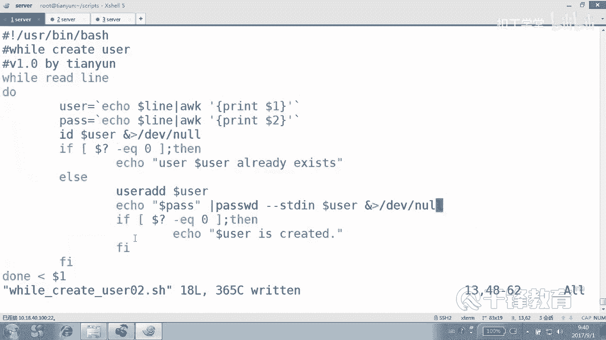
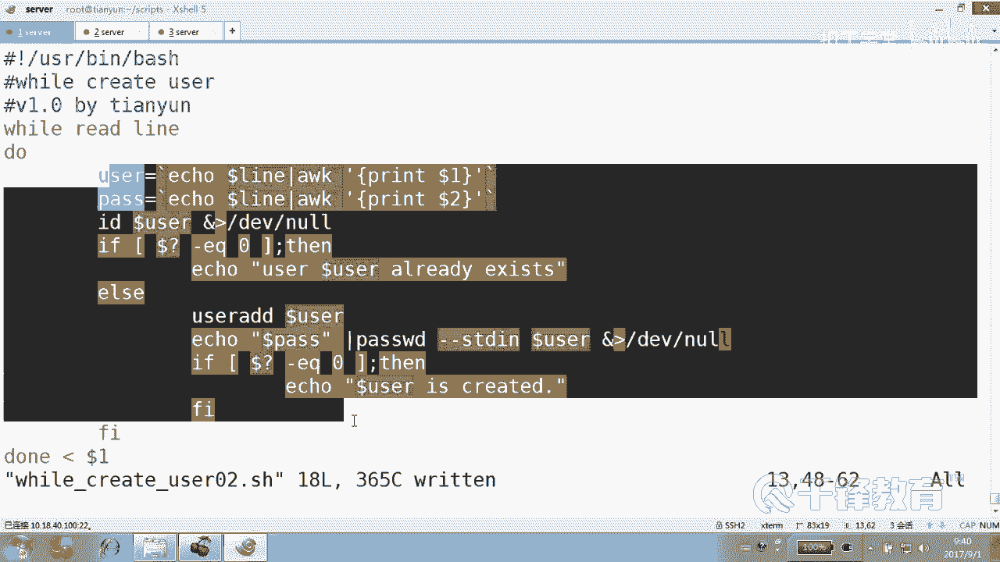
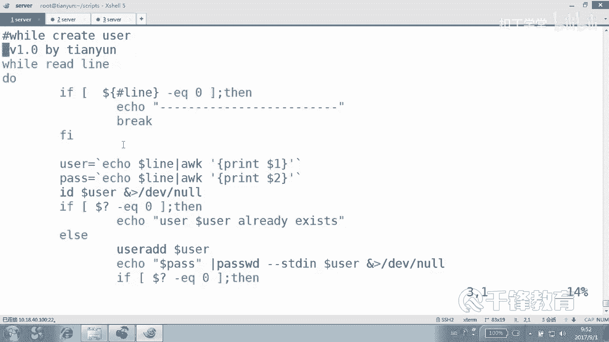
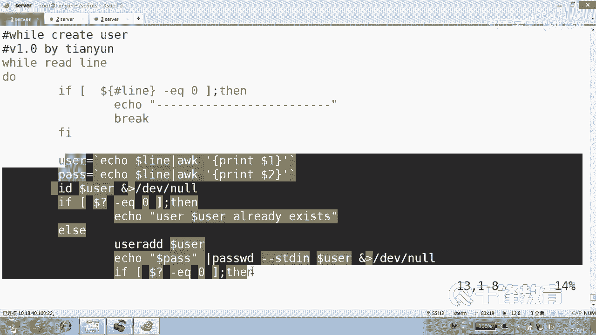
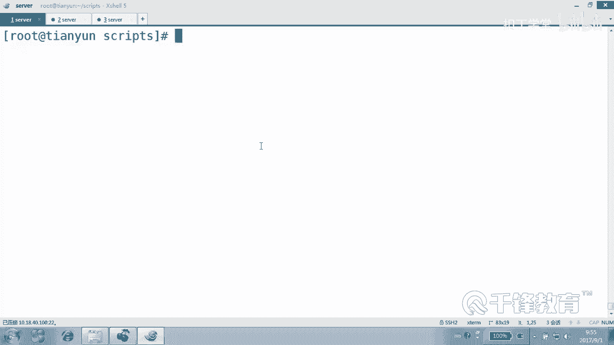

# Shell脚本自动化编程实战：P28：4.11 while 实现批量用户创建 🧑‍💻

在本节课中，我们将要学习 `while` 循环，并利用它来实现一个更健壮的批量用户创建脚本。我们将看到 `while` 循环在处理文件内容时，相比 `for` 循环具有独特的优势。

## 课程概述

上一节我们介绍了 `for` 循环，它的循环次数通常是固定的。本节中我们来看看 `while` 循环和 `until` 循环。它们的循环次数不一定是固定的，可以灵活控制。更重要的是，`while` 循环在处理包含空格或特殊字符的文件内容时，比 `for` 循环更加方便和可靠。

## while 循环的基本结构

`while` 循环和 `if` 语句类似，后面跟的是一个条件。只要条件判断的返回值为真（即退出状态码为0），循环就会一直执行。

一个最简单的 `while` 循环示例如下：
```bash
while ls
do
    echo "OK"
done
```
这个例子中，`ls` 命令会一直成功执行（返回真），因此会形成一个无限循环，不断打印 “OK”，直到你按下 `Ctrl+C` 中断它。这只是一个演示，告诉我们 `while` 会持续检查条件。

## 使用 while 循环读取文件

我们更常见的用法是利用 `while` 循环逐行读取文件内容。其基本结构如下：
```bash
while read line
do
    # 处理 $line 变量的代码
done < 文件名
```
在这个结构中，`read line` 命令会从文件末尾通过输入重定向（`< 文件名`）读取一行内容，并将其赋值给变量 `line`（变量名可以自定义）。然后执行循环体内的操作。读完所有行后，`read` 命令会失败（返回假），循环随之结束。

## 实战：批量创建用户脚本





现在，我们运用上述结构来编写一个批量创建用户的脚本。假设我们有一个用户信息文件 `user.txt`，每行包含“用户名 密码”。

以下是脚本的核心步骤：
1.  使用 `while read` 结构逐行读取文件。
2.  使用 `awk` 命令分割每一行，分别获取用户名和密码。
3.  检查用户是否已存在。
4.  若用户不存在，则创建用户并设置密码。

具体脚本实现如下：
```bash
#!/bin/bash
# while_create_user.sh

while read line
do
    # 使用awk分割行，$1为用户名，$2为密码
    user=$(echo $line | awk '{print $1}')
    pass=$(echo $line | awk '{print $2}')

    # 检查用户是否存在
    id $user &> /dev/null
    if [ $? -eq 0 ]; then
        echo "用户 $user 已存在。"
    else
        # 创建用户并设置密码
        useradd $user
        echo $pass | passwd --stdin $user &> /dev/null
        echo "用户 $user 创建成功。"
    fi
done < $1 # 通过脚本参数传入文件名
```
执行脚本时，需要将文件名作为参数传入：
```bash
bash while_create_user.sh user.txt
```

## while 对比 for 循环的优势

之前使用 `for` 循环处理文件时，如果文件行内包含空格，`for` 会默认以空格、制表符或换行符作为分隔符，导致一行内容被错误地分割成多个部分。

`while read` 循环则不同，它严格地以**换行符**作为行的分隔符，将一整行内容读取到一个变量中。因此，无论行内是否有空格，它都能正确识别每一行的完整内容，有效避免了分割错误的问题。

**结论**：当你需要对一个文件进行逐行处理时，应优先考虑使用 `while read` 循环，而不是 `for` 循环。

## 处理文件中的空行

`while read` 循环会读取文件中的每一行，包括空行。空行会被读取为一个空字符串变量。如果不对空行进行处理，后续操作（如 `awk` 分割）可能会出错。

以下是处理空行的常用方法，在循环体内添加判断：
```bash
while read line
do
    # 判断是否为空行
    if [ ${#line} -eq 0 ]; then
        continue # 跳过本次循环，继续下一次
    fi
    # ... 其他处理代码
done < file.txt
```
这里使用了 `continue` 语句。在循环中，我们有三个控制流语句：
*   `break`：立即终止整个循环。
*   `continue`：跳过本次循环中剩余的代码，直接开始下一次循环。
*   `exit`：直接退出整个脚本。





对于空行，我们只是想跳过对它的处理，而不是终止循环，因此使用 `continue` 是最合适的。

## 课程总结



本节课中我们一起学习了 `while` 循环的核心用法。我们掌握了如何使用 `while read` 结构来安全、可靠地逐行处理文本文件，并成功编写了一个健壮的批量用户创建脚本。关键点在于：**对于逐行文件处理任务，`while read` 是比 `for` 循环更优的选择**，因为它能正确处理行内的特殊字符。我们还学习了如何使用 `continue` 语句来跳过对空行等特殊情况的无意义操作。