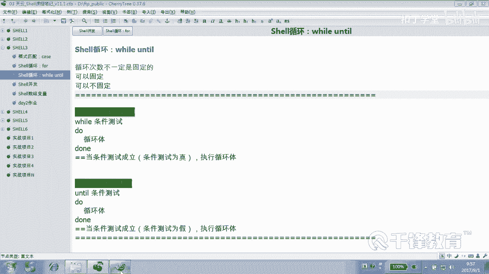
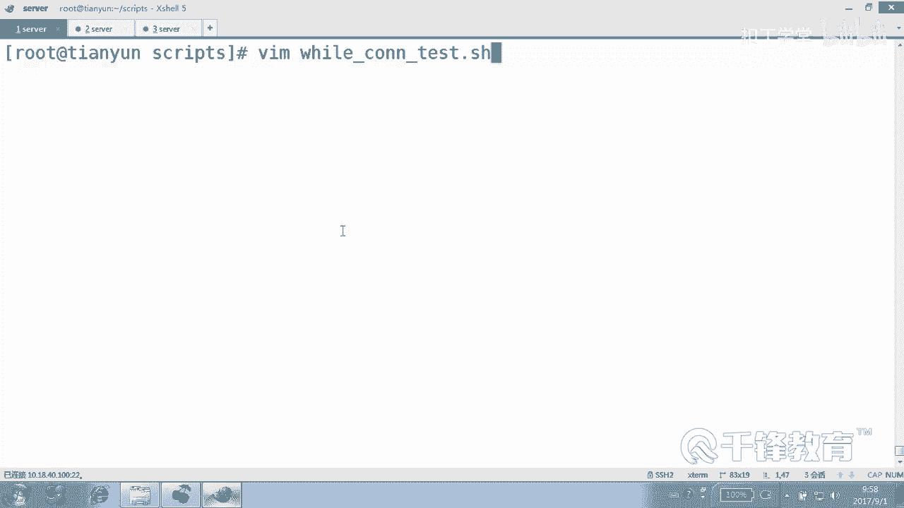
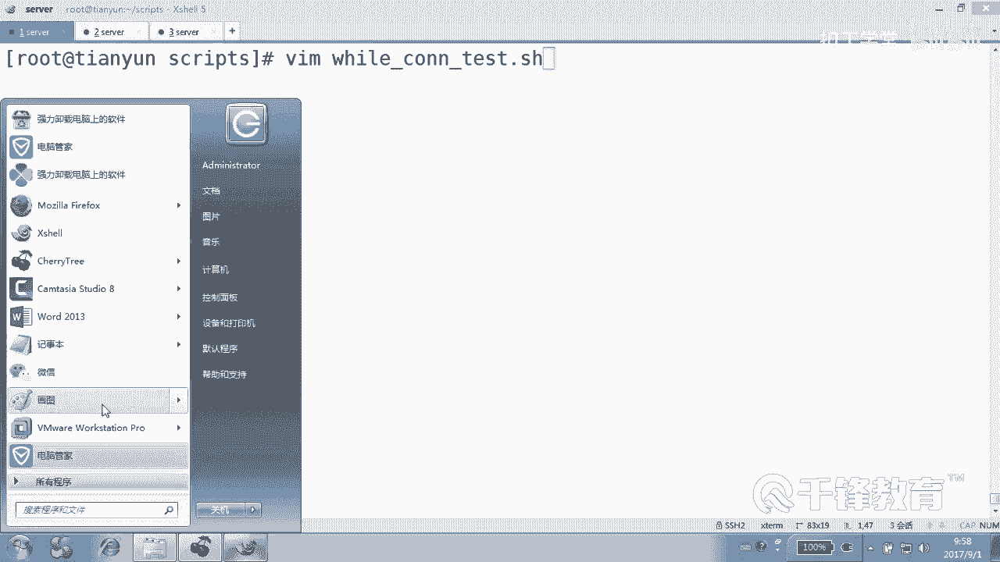
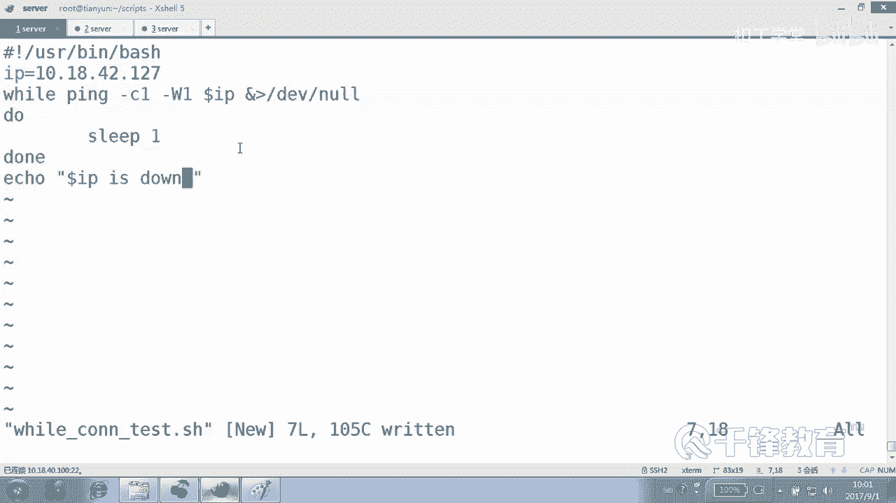
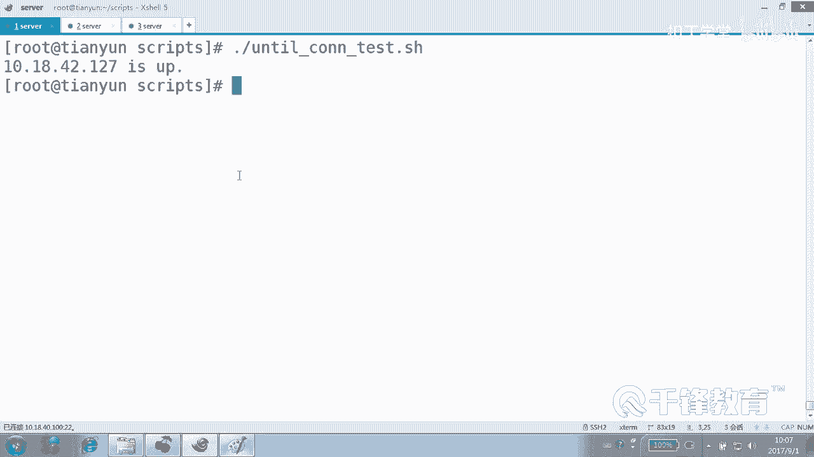
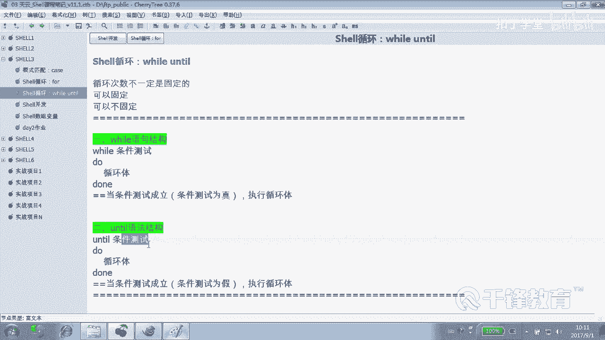
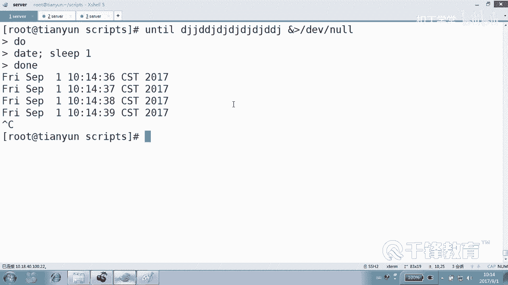

# Shell脚本自动化编程实战：P29：4.12：while与until循环测试远程主机连接 🔄


在本节课中，我们将学习如何使用 `while` 和 `until` 循环来编写一个不固定循环次数的脚本，具体目标是实现一个远程主机的连接测试监控器。



上一节我们介绍了 `while` 循环在处理文件方面的优势。本节中我们来看看 `while` 和 `until` 循环在处理循环次数不固定的任务时的应用。



## 循环次数固定的 vs. 不固定的



`for` 循环的循环次数通常是固定的。而 `while` 和 `until` 循环的循环次数可以是固定的，也可以是不固定的。对于像“持续监控直到状态改变”这类任务，循环次数无法预先确定，`for` 循环难以实现，此时 `while` 和 `until` 循环就非常适合。

## 使用 while 循环监控主机连通性


设想一个场景：我们需要持续监控一台远程主机是否在线。只要主机是通的，我们就一直检查；一旦发现主机不通了，就报告“主机宕机”。这个任务的循环次数（即检查多少次后主机会宕机）是未知的。

以下是使用 `while` 循环实现此功能的脚本核心逻辑：



```bash
#!/bin/bash
while ping -c1 -W1 $IP &>/dev/null
do
    sleep 2
done
echo “远程主机 $IP is down.”
```


**代码解析**：
*   `while ping -c1 -W1 $IP &>/dev/null`：`ping` 命令用于测试连通性。`-c1` 表示只发送一个包，`-W1` 设置超时时间为1秒。`&>/dev/null` 将命令输出重定向到“黑洞”，不显示在屏幕上。**只要 `ping` 命令成功（条件为真），循环就会继续**。
*   `sleep 2`：每次成功 `ping` 通后，让脚本休眠2秒，避免过于频繁地检查。
*   `echo “远程主机 $IP is down.”`：当 `ping` 命令失败（条件为假）时，`while` 循环结束，执行这行代码，报告主机宕机。

这个脚本会一直运行，直到网络断开或目标主机不可达为止。

## 使用 until 循环监控主机连通性

`until` 循环的逻辑与 `while` 循环正好相反。它会在条件为**假**时执行循环，条件为**真**时结束循环。

我们可以用 `until` 循环实现另一个场景：监控一台宕机的主机，直到它恢复上线，然后报告“主机上线”。

以下是使用 `until` 循环实现此功能的脚本：

```bash
#!/bin/bash
until ping -c1 -W1 $IP &>/dev/null
do
    sleep 2
done
echo “远程主机 $IP is up.”
```

**代码解析**：
*   `until ping -c1 -W1 $IP &>/dev/null`：**只要 `ping` 命令失败（条件为假），循环就会继续**。这意味着主机关闭时，脚本会持续检查。
*   `echo “远程主机 $IP is up.”`：当 `ping` 命令终于成功（条件为真）时，`until` 循环结束，执行这行代码，报告主机上线。

## while 与 until 的核心区别



为了更清晰地理解两者的区别，我们可以看一个简单的类比：

*   **`while` 循环**：像一位负责任的讲师。**当**学生们都清醒、认真听讲（条件为真）时，他就继续讲课（执行循环）。
*   **`until` 循环**：像某些照本宣科的大学老师。**直到**学生们都睡着了（条件为真），他才开始（或继续）念他的讲义（执行循环）。在条件变为真之前，他一直在循环（等待）。

从技术上讲，它们的格式相同，但对“条件成立”的定义相反：
*   `while [ 条件测试 ]`：**条件测试返回真（true，退出状态码为0）时循环**。
*   `until [ 条件测试 ]`：**条件测试返回假（false，退出状态码非0）时循环**。

## 如何构造无限循环

有时我们需要脚本一直运行（无限循环），这也可以通过 `while` 和 `until` 轻松实现，关键在于使用一个永远为真或永远为假的条件。

以下是创建无限循环的几种方法：



```bash
# 方法1：while 使用永远为真的命令
while :
do
    echo “这是一个无限循环”
    sleep 1
done

# 方法2：while 使用永远为真的测试
while [ 1 -eq 1 ]
do
    echo “这又是一个无限循环”
    sleep 1
done

# 方法3：until 使用永远为假的命令（如一个错误的命令）
until false
do
    echo “使用until的无限循环”
    sleep 1
done

# 方法4：until 使用永远为假的测试
until [ 1 -eq 2 ]
do
    echo “这也是一个无限循环”
    sleep 1
done
```



本节课中我们一起学习了 `while` 和 `until` 循环在处理循环次数不固定任务时的强大能力。我们通过编写远程主机连接测试脚本的实例，深入理解了两者的工作逻辑：`while` 在条件为真时循环，适合监控“正常状态直到异常”；`until` 在条件为假时循环，适合监控“异常状态直到恢复”。掌握这两种循环，能够让你在脚本中更灵活地处理各种需要持续判断或等待的场景。