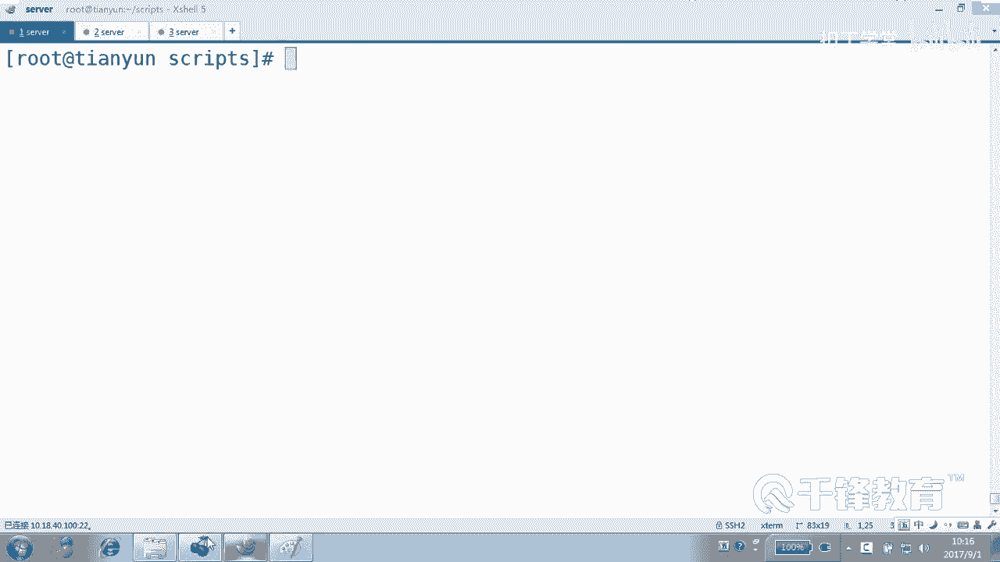
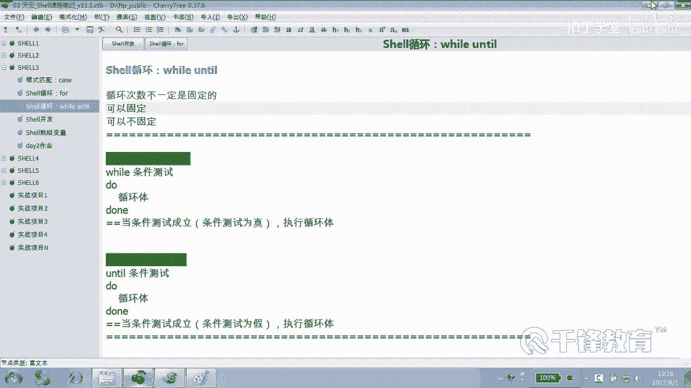
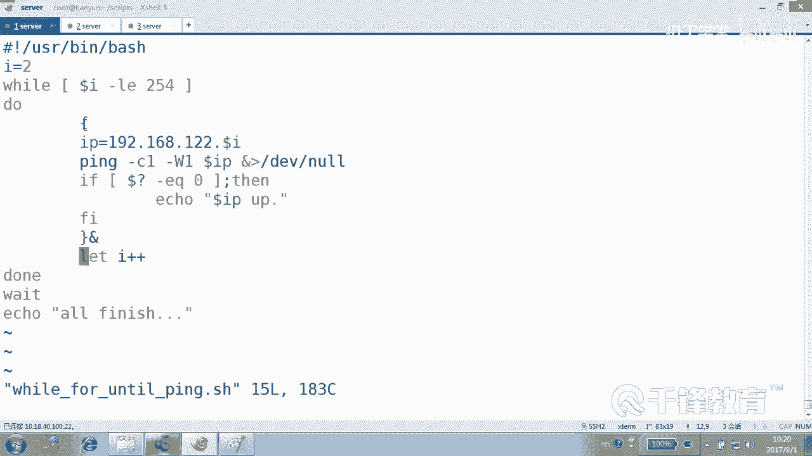
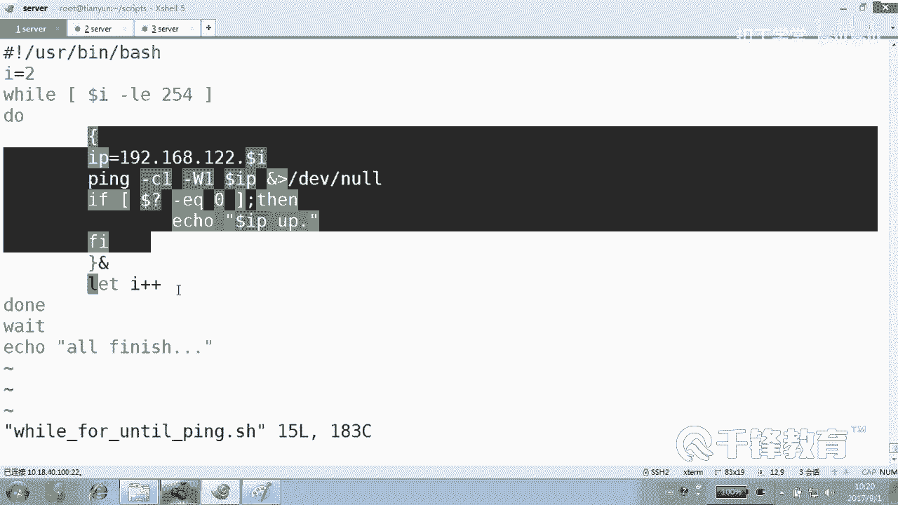
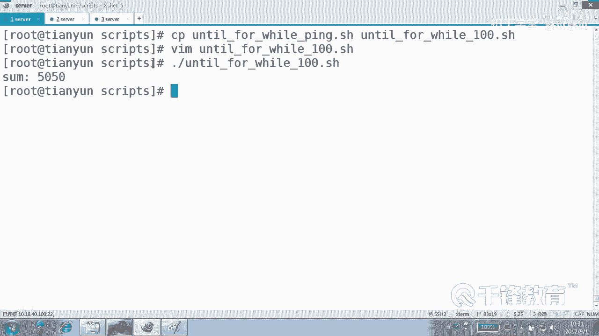

# Shell脚本自动化编程实战：P30：4.13 for while until 终极对决 🔄


在本节课中，我们将对比 `for`、`while` 和 `until` 这三种循环结构。我们将通过编写两个具体的脚本来展示它们的异同：一个是用于探测主机连通性的脚本，另一个是计算1到100累加和的脚本。通过对比，我们将明确每种循环最适合的应用场景。





上一节我们介绍了循环的基本概念，本节中我们来看看这三种循环在实际应用中的对决。

## 固定次数循环：主机探测示例

首先，我们使用三种循环结构分别编写一个脚本，用于探测IP地址 `192.168.12.2` 到 `192.168.12.254` 范围内主机的连通性。以下是三种实现方式。

### 使用 `for` 循环

`for` 循环在处理已知、固定的循环次数时非常直观和简洁。

```bash
#!/bin/bash
for i in {2..254}
do
    IP="192.168.12.$i"
    ping -c 1 -W 1 $IP &> /dev/null
    if [ $? -eq 0 ]; then
        echo "$IP is up"
    fi
done
```

### 使用 `while` 循环



`while` 循环也可以实现固定次数的循环，但需要手动初始化变量和控制循环条件。



```bash
#!/bin/bash
i=2
while [ $i -le 254 ]
do
    IP="192.168.12.$i"
    ping -c 1 -W 1 $IP &> /dev/null
    if [ $? -eq 0 ]; then
        echo "$IP is up"
    fi
    let i++
done
```

### 使用 `until` 循环

`until` 循环与 `while` 循环逻辑相反，它会一直执行，直到条件为真才停止。

```bash
#!/bin/bash
i=2
until [ $i -gt 254 ]
do
    IP="192.168.12.$i"
    ping -c 1 -W 1 $IP &> /dev/null
    if [ $? -eq 0 ]; then
        echo "$IP is up"
    fi
    let i++
done
```

通过以上三个脚本可以看出，在处理固定次数的循环时，`for` 循环的语法最为简洁明了。

## 另一个固定循环示例：1到100累加

接下来，我们再用一个计算1到100累加和的例子来巩固理解。以下是三种循环的实现。

### 使用 `for` 循环计算累加和

```bash
#!/bin/bash
sum=0
for i in {1..100}
do
    let sum=$sum+$i
done
echo "The sum is $sum"
```

这里也可以使用 `let` 的复合赋值运算符 `+=` 来简化写法：`let sum+=$i`。

### 使用 `while` 循环计算累加和

```bash
#!/bin/bash
sum=0
i=1
while [ $i -le 100 ]
do
    let sum+=$i
    let i++
done
echo "The sum is $sum"
```

### 使用 `until` 循环计算累加和

```bash
#!/bin/bash
sum=0
i=1
until [ $i -gt 100 ]
do
    let sum+=$i
    let i++
done
echo "The sum is $sum"
```

所有脚本执行后，都会输出结果：**5050**。

## 循环结构选择指南

通过以上对比，我们可以总结出选择循环结构的一般原则：

以下是选择循环结构的核心建议：
*   **循环次数固定时**：优先使用 **`for`** 循环，其语法最简洁。
*   **需要逐行处理文件时**：优先使用 **`while`** 循环，这是它的强项。
*   **循环次数不固定，或需要满足某个条件才停止/才开始时**：根据逻辑选择 **`while`** 或 **`until`**。
    *   `while`：当条件为真时，执行循环。
    *   `until`：当条件为假时，执行循环，直到条件为真。



本节课中我们一起学习了 `for`、`while` 和 `until` 三种循环的对比。我们通过主机探测和累加计算两个实例，实践了它们的写法，并最终得出了根据实际需求选择循环类型的关键结论：固定次数用 `for`，逐行处理用 `while`，条件循环用 `while` 或 `until`。