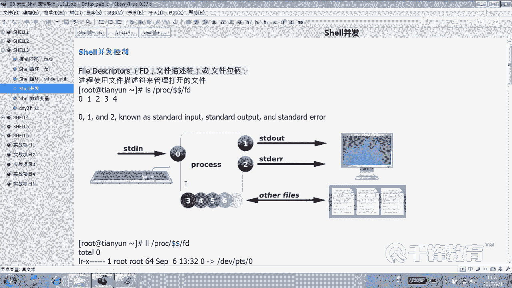
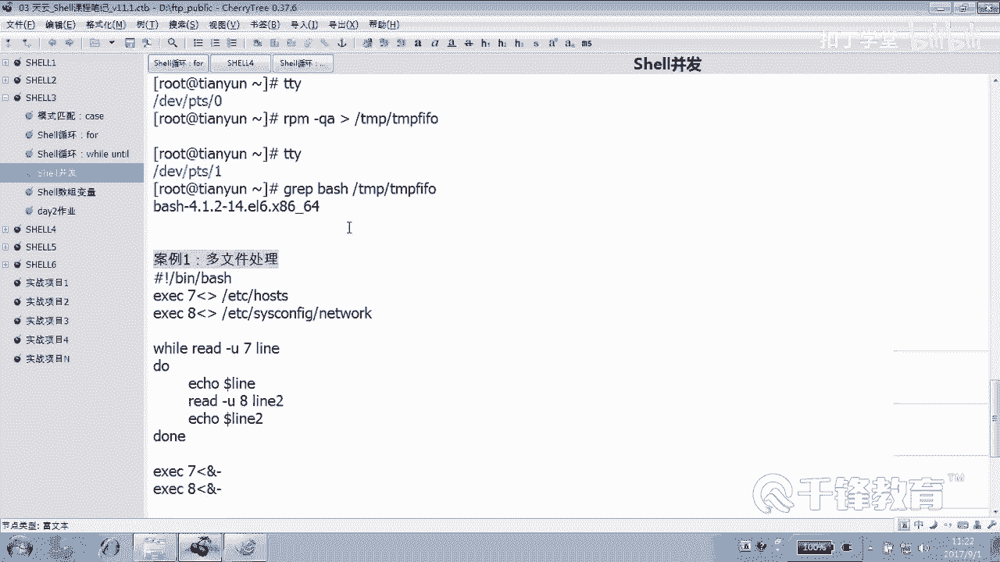
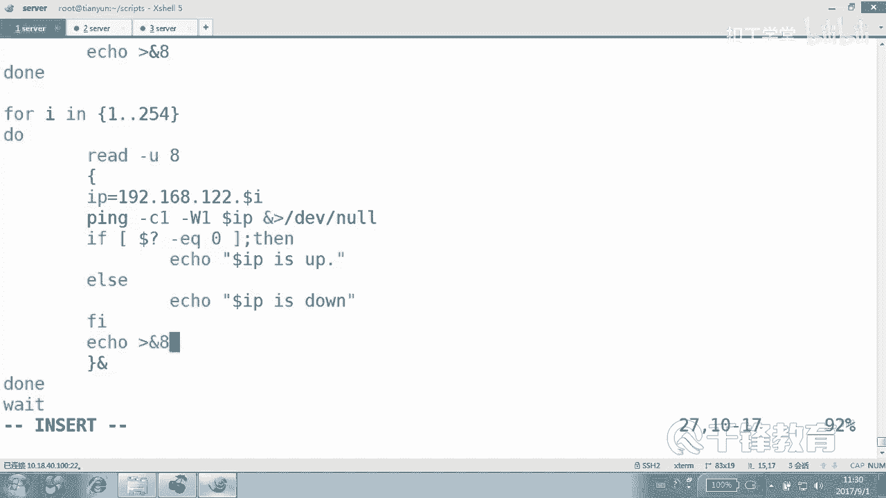
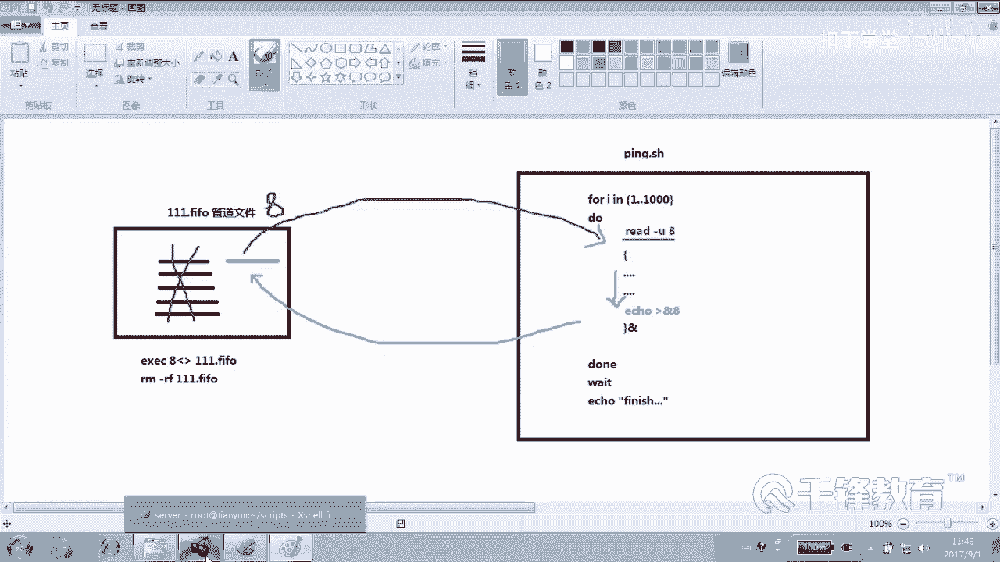
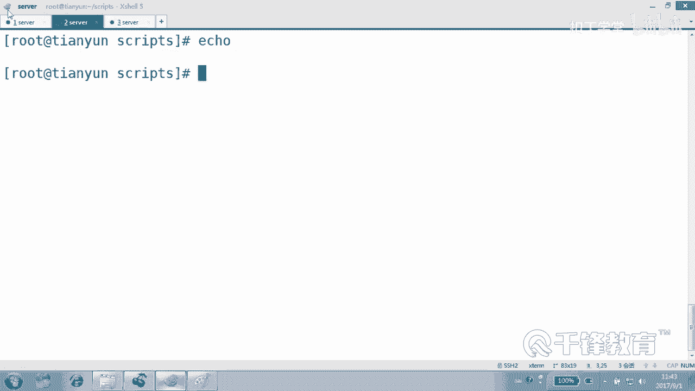
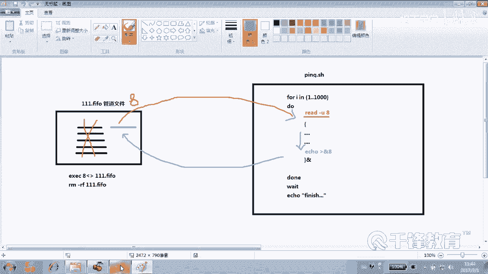
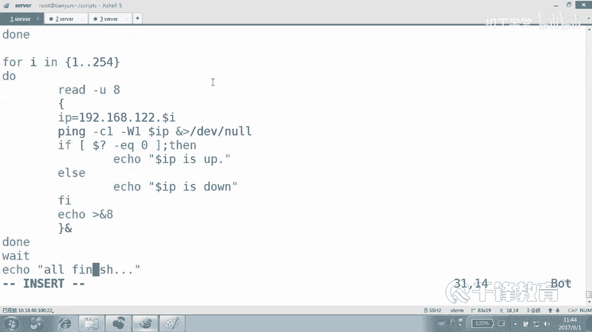
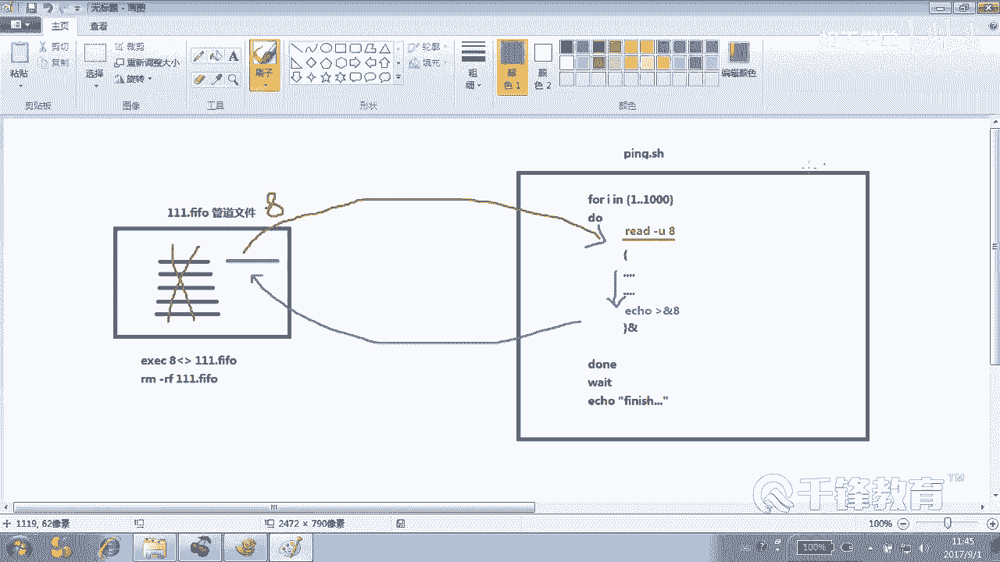
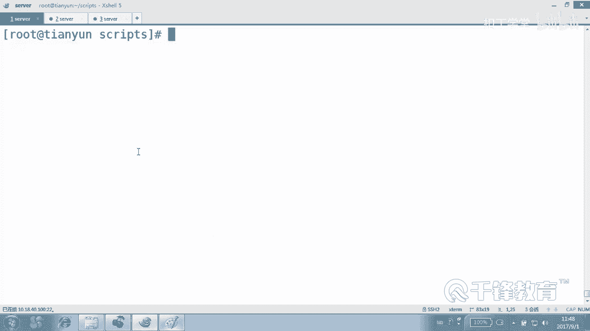
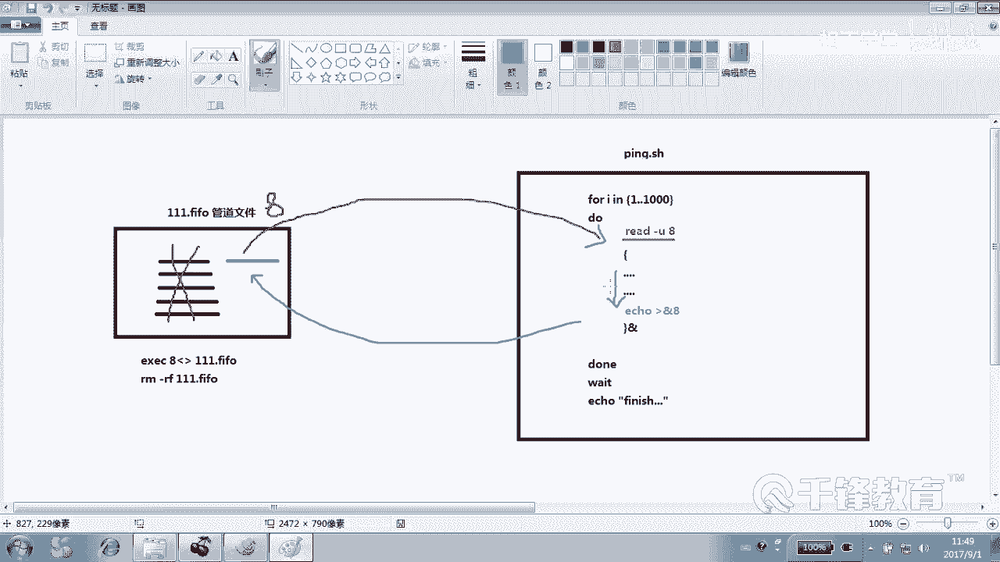

# Shell脚本自动化编程实战：P32：4.15 shell 并发控制项目实战 🚀




在本节课中，我们将要学习如何利用管道和文件描述符来控制Shell脚本的并发执行数量。通过一个生动的“公园划船”比喻，我们将深入理解并发控制的原理，并编写一个可以限制同时运行进程数量的脚本。



## 概述

上一节我们介绍了管道和文件描述符的基础概念。本节中，我们来看看如何利用这些机制来实现并发控制。我们将通过一个具体的项目实战，学习如何编写一个脚本，使其能够像管理公园里的游船一样，控制后台进程的数量，避免系统资源被过度占用。

## 核心原理：管道作为“入场券”

控制并发的核心思想是：**让进程在开始执行前，必须从管道中“借”到一个“入场券”（读取一行数据）；执行完毕后，必须将“入场券”还回管道（写入一行数据）**。如果管道中没有“入场券”，后续进程就必须等待，直到有进程归还“入场券”。

这类似于一个只有固定数量游船的公园：
*   公园（管道）初始有 N 条船（N个换行符）。
*   游客（进程）想划船（执行任务），必须先借到一条船（从管道读取）。
*   船被借走，公园里就少一条船（管道数据被读走一行）。
*   游客划完船，必须把船还回来（向管道写入一行）。
*   任何时候，最多只有 N 个人在同时划船（并发进程数不超过 N）。

## 项目实战：编写并发控制脚本

以下是实现并发控制的关键步骤和代码。

### 步骤1：定义变量与创建管道

首先，我们定义要控制的并发数量，并创建一个唯一的命名管道文件。

```bash
#!/bin/bash
# 定义并发进程数量，例如5个
THREAD=5



# 在/tmp目录下创建一个以当前进程PID命名的管道文件，确保唯一性
TMPFIFO=/tmp/$$.fifo
# 创建命名管道
mkfifo $TMPFIFO
```

### 步骤2：关联文件描述符

接下来，我们将管道文件与一个文件描述符关联起来，以便后续读写操作。关联后，可以删除管道文件本身，因为文件描述符会保持其打开状态。

```bash
# 将管道文件与文件描述符8关联（8可以换成其他未使用的数字）
exec 8<> $TMPFIFO
# 删除管道文件（不影响已打开的文件描述符8）
rm -f $TMPFIFO
```

### 步骤3：初始化“入场券”

在开始循环前，我们需要向管道中放入初始数量的“入场券”（这里用换行符表示），数量等于我们设定的并发数。

```bash
# 向文件描述符8（即管道）中写入THREAD个换行符，作为初始“入场券”
for i in `seq $THREAD`
do
    echo >&8
done
```

### 步骤4：实现受控的任务循环

这是最关键的一步。在循环执行具体任务前，先尝试从管道读取一行（借入场券），读不到则阻塞等待。任务执行完毕后，再向管道写入一行（还入场券）。

```bash
# 假设我们有一个任务需要循环执行1000次
for i in `seq 1 1000`
do
    # 关键：从文件描述符8读取一行。读不到则阻塞，直到有进程归还“入场券”
    read -u 8

    {
        # 这里是实际要执行的任务，例如模拟一个耗时操作
        echo "Task $i is running... PID: $$"
        sleep 1  # 模拟任务执行时间
        echo "Task $i is done."

        # 任务执行完毕，向文件描述符8写入一行，归还“入场券”
        echo >&8
    }&  # 将整个代码块放入后台执行
done

# 等待所有后台任务完成
wait
```

### 步骤5：关闭文件描述符

所有任务完成后，作为良好的编程习惯，应该关闭打开的文件描述符。

```bash
# 关闭文件描述符8的读写
exec 8>&-
```

## 完整脚本示例

将以上步骤整合，得到一个完整的并发控制脚本 `controlled_concurrent.sh`：





```bash
#!/bin/bash



# 1. 设置并发数
THREAD=5
TMPFIFO=/tmp/$$.fifo

# 2. 创建并关联管道
mkfifo $TMPFIFO
exec 8<> $TMPFIFO
rm -f $TMPFIFO



# 3. 初始化“入场券”
for i in `seq $THREAD`
do
    echo >&8
done

# 4. 受控并发任务循环
for i in `seq 1 10`
do
    read -u 8
    {
        echo “第 $i 个任务开始，由进程 $BASHPID 执行”
        sleep 2 # 模拟任务耗时
        echo “第 $i 个任务完成”
        echo >&8
    }&
done



# 5. 等待并关闭
wait
exec 8>&-
echo “所有任务执行完毕”
```

运行此脚本，你会观察到最多只有5个任务在同时运行，实现了并发数量的精确控制。

## 总结

本节课中我们一起学习了Shell脚本并发控制的核心技术。我们通过“公园划船”的比喻，理解了利用**命名管道**和**文件描述符**来限制并发进程数量的原理。关键点在于：
1.  **`mkfifo`** 创建命名管道。
2.  **`exec fd<> file`** 将管道与文件描述符关联。
3.  **`read -u fd`** 作为“借入场券”操作，实现阻塞等待。
4.  **`echo >&fd`** 作为“还入场券”操作，释放资源供其他进程使用。





这种方法能有效防止无限制的进程并发对系统造成的压力，是编写健壮、高效Shell脚本的重要技巧。