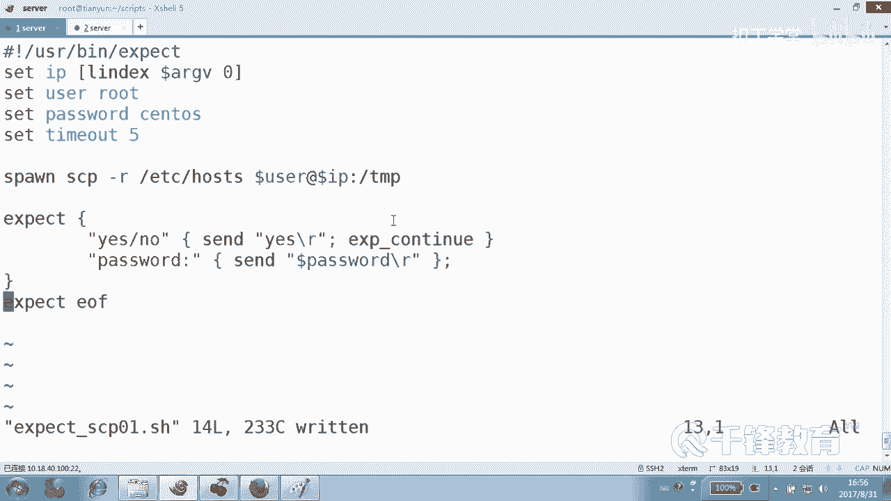
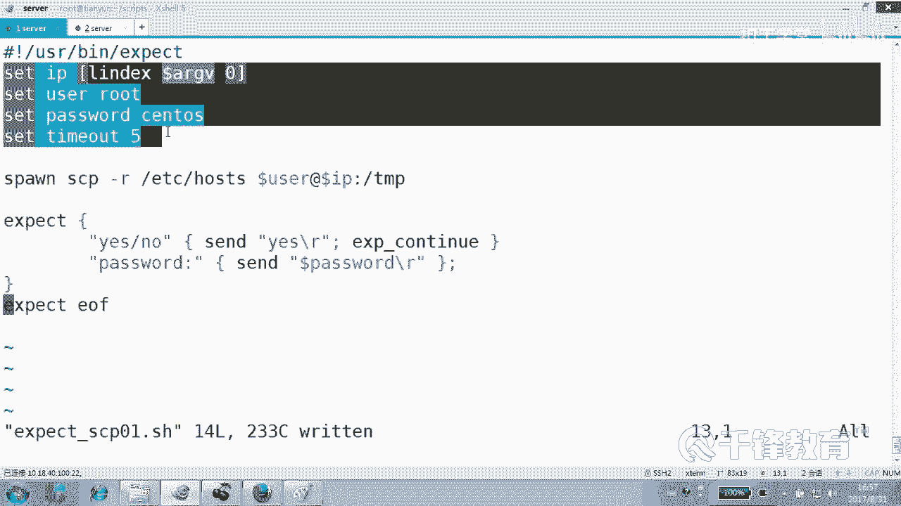
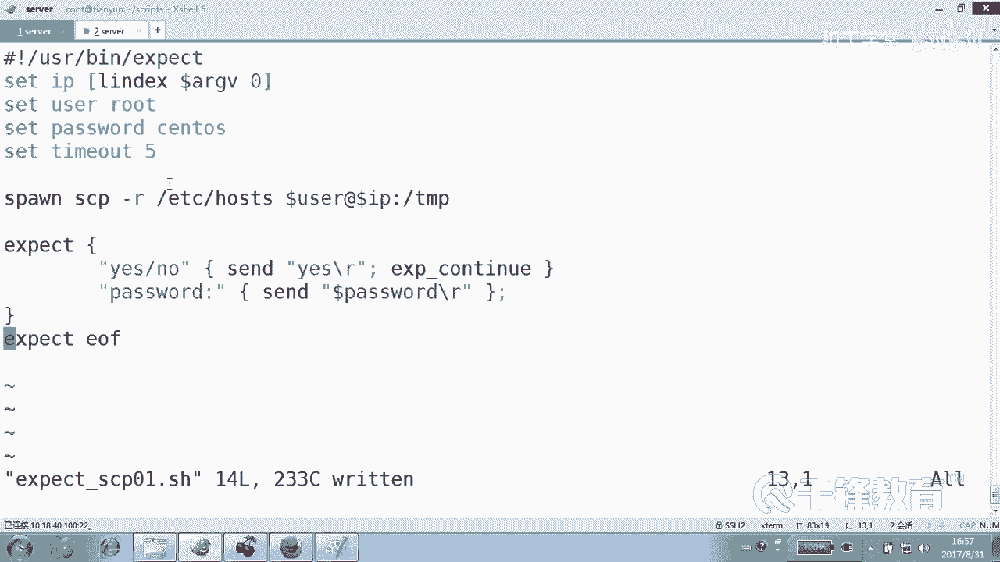
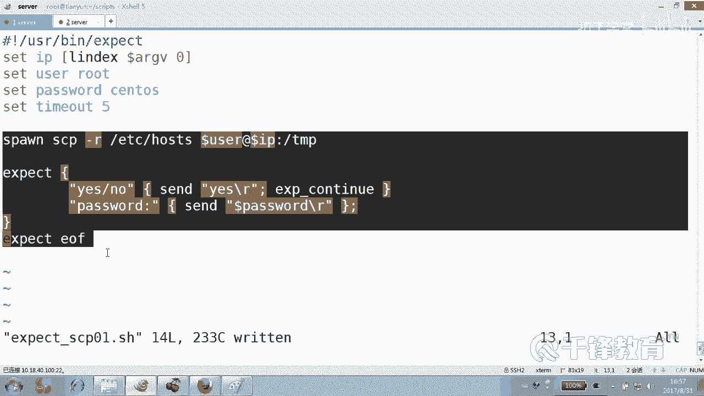
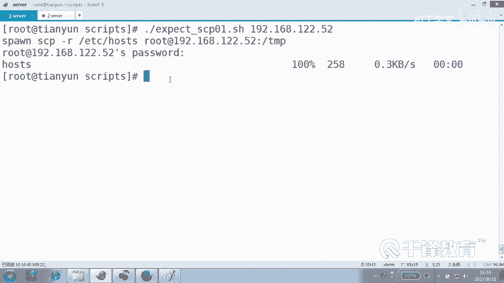

# Shell脚本自动化编程实战：P33：5.1 expect 实现scp非交互传输文件 🔄


在本节课中，我们将学习如何使用 `expect` 工具实现非交互式的文件传输。`expect` 是一个自动化交互式应用程序的工具，特别适用于处理需要用户输入（如密码）的命令。我们将从基础脚本开始，逐步引入变量和参数，最终实现一个灵活、可复用的自动化文件传输脚本。

## 概述

上一节我们介绍了 `expect` 的基本用法。本节中，我们来看看如何改进脚本，使其更加灵活和通用。我们将学习如何在 `expect` 脚本中设置和使用变量，以及如何接收外部传入的参数。

## 从固定脚本到变量化脚本

最初的 `expect` 脚本将IP地址、用户名和密码等值直接写死在代码中，这导致脚本缺乏灵活性。我们可以通过引入变量来改进它。

以下是设置和使用变量的方法：

```tcl
set IP 192.168.12.52
set user root
set password sOS
set timeout 5
```

*   **`set`**：用于定义变量。
*   **`$变量名`**：用于引用变量的值，例如 `$user`。
*   **`timeout`**：设置命令执行的超时时间（单位：秒）。如果不设置，`expect` 会使用默认的超时时间。

改进后的脚本将硬编码的值替换为变量引用，例如将 `root@192.168.12.52` 替换为 `$user@$IP`。这样，当需要修改连接目标时，只需修改变量的值即可，无需改动脚本主体逻辑。

## 使用位置参数增强灵活性

虽然使用变量提高了可维护性，但每次修改仍需编辑脚本。为了进一步优化，我们可以让脚本接收外部传入的参数，类似于Shell脚本中的 `$1`、`$2`。

在 `expect` 中，使用 **`$argv`** 数组来获取位置参数，索引从0开始。

*   **`[lindex $argv 0]`**：获取第一个参数（相当于Shell中的 `$1`）。
*   **`[lindex $argv 1]`**：获取第二个参数（相当于Shell中的 `$2`）。

通过这种方式，我们可以在执行脚本时动态指定IP地址和用户名，使脚本的通用性大大增强。

## 实现自动化命令执行

仅仅建立连接还不够，我们通常需要在远程主机上执行一系列命令。`expect` 可以监控特定的提示符（如 `#` 或 `$`），并在出现时自动发送预定义的命令。

以下是一个自动化执行命令的示例结构：

```tcl
expect "#"
send "useradd yangyang\r"
send "pwd\r"
send "exit\r"
expect eof
```

*   **`expect "#"`**：等待直到出现 `#` 提示符。
*   **`send "命令\r"`**：发送命令，`\r` 代表回车键。
*   **`expect eof`**：等待 `spawn` 启动的进程结束，然后退出 `expect` 脚本。



通过精确设计“遇到什么提示，就发送什么命令”的流程，我们可以实现复杂的自动化操作，而无需人工干预。





## 实战：非交互式SCP文件传输



掌握了自动化交互的原理后，我们可以将其应用于任何需要交互的命令，例如 `scp`。`scp` 命令在拷贝文件到远程主机时，同样需要输入密码。

创建一个用于 `scp` 的 `expect` 脚本，其核心思路与SSH登录类似：

1.  使用 `spawn` 启动 `scp` 进程。
2.  使用 `expect` 匹配密码提示。
3.  使用 `send` 发送密码。
4.  使用 `expect eof` 等待传输完成。



与SSH登录后保持会话不同，`scp` 在文件传输完成后会自动结束，因此脚本结构更为简洁。

## 总结


本节课中我们一起学习了 `expect` 工具的高级用法。我们从改进固定脚本开始，引入了变量和位置参数，使脚本变得灵活可配置。接着，我们探索了如何在远程连接后自动化执行命令序列。最后，我们将这些知识应用于 `scp` 命令，成功实现了非交互式的自动化文件传输。理解并设计好“预期-发送”的交互流程，是使用 `expect` 实现各种自动化任务的关键。在接下来的课程中，我们将结合循环等控制结构，实现批量主机的自动化操作。