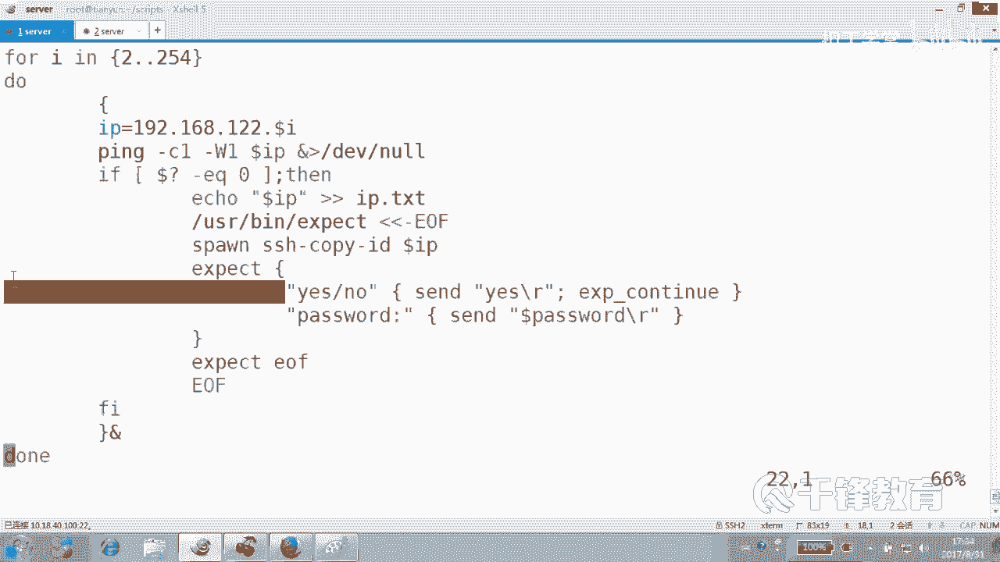
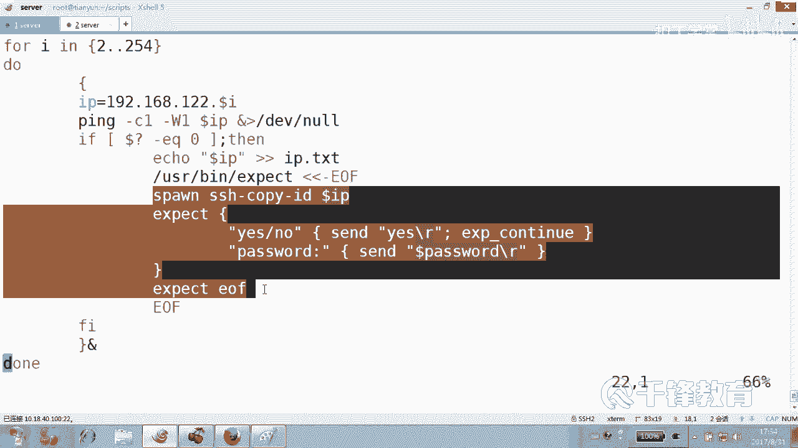
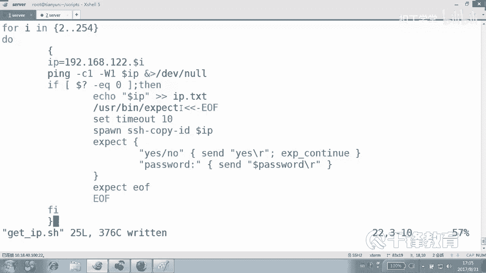
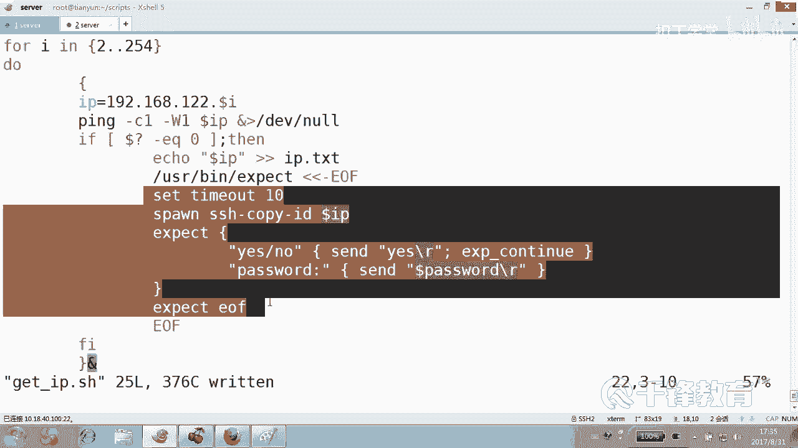
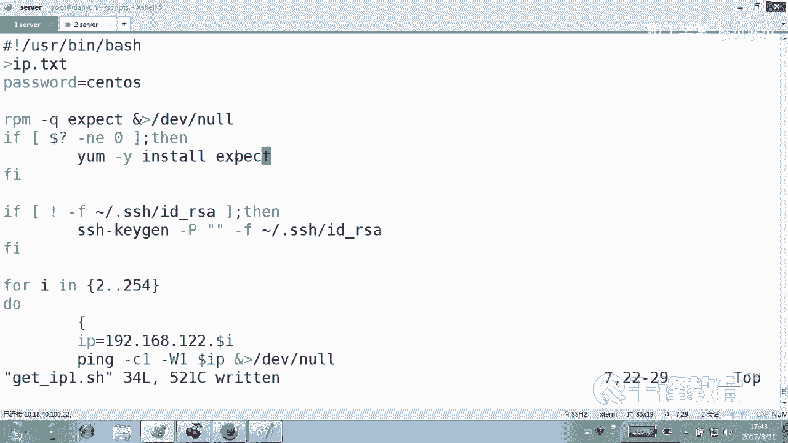
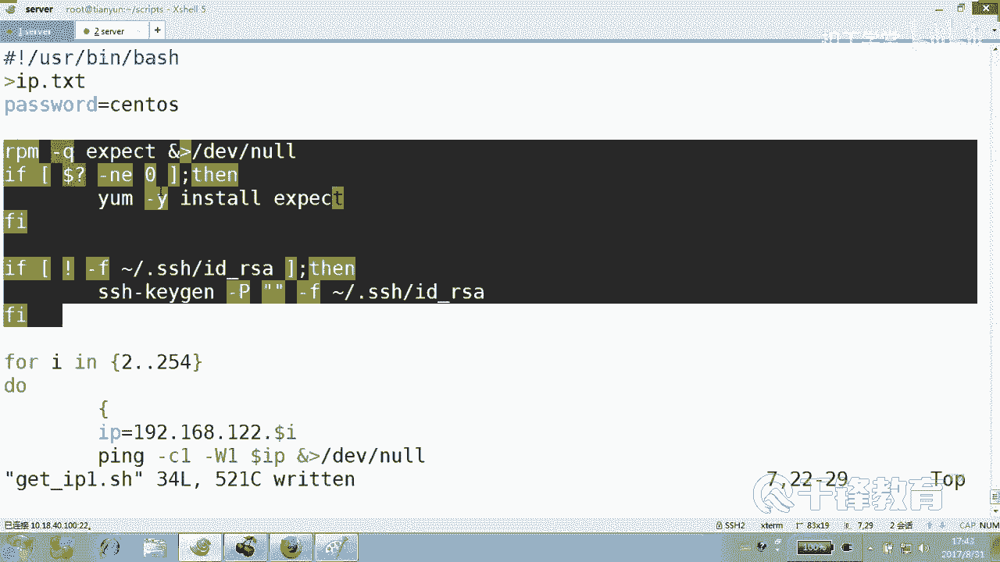
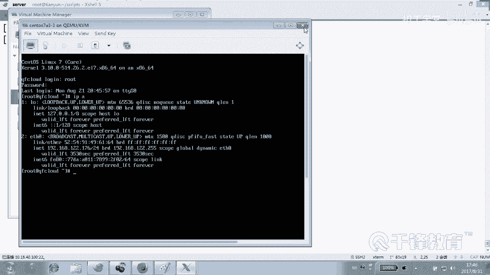
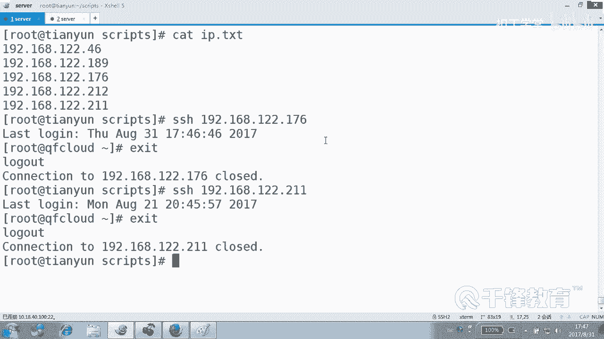

# Shell脚本自动化编程实战：P34：5.2 expect 实现批量主机公钥推送 🔑

在本节课中，我们将学习如何结合Shell脚本与expect工具，实现自动扫描网络中的主机并批量推送SSH公钥。这是实现自动化运维和无密码登录的关键一步。

## 脚本目标与核心思路

上一节我们介绍了expect的基本用法，本节中我们来看看如何将其融入Shell脚本，解决实际问题。我们的目标是编写一个脚本，它能自动发现网络中存活的服务器，并自动完成SSH公钥的推送，从而为后续的自动化操作铺平道路。

脚本的核心思路是：使用Shell的`for`循环遍历一个IP地址段，对每个IP执行ping测试。如果主机存活，则调用expect脚本自动处理SSH密钥推送过程中的交互（如确认指纹、输入密码）。

## 基础脚本实现

以下是实现该功能的基础脚本框架。我们首先创建一个名为`getIP.sh`的脚本。

```bash
#!/bin/bash

# 清空可能存在的旧IP列表文件
> IP.txt

# 遍历IP地址段，例如192.168.12.0/24网段，排除网关（.1）
for i in {2..254}
do
    {
        # 构造目标IP
        IP="192.168.12.$i"
        # 测试主机是否存活
        ping -c1 $IP &> /dev/null
        # 如果ping通（返回状态码为0）
        if [ $? -eq 0 ]; then
            # 将IP地址记录到文件
            echo $IP >> IP.txt
            # 调用expect脚本推送公钥
            /usr/bin/expect <<-EOF
            spawn ssh-copy-id $IP
            expect {
                "yes/no" { send "yes\r"; exp_continue }
                "password:" { send "123456\r" }
            }
            expect eof
            EOF
        fi
    }& # 将整个循环体放入后台执行，加速扫描过程
done
wait # 等待所有后台任务结束

echo "任务完成。"
```

**代码解释**：
*   `for i in {2..254}`：循环遍历IP地址的最后一段。
*   `{ ... }&`：将花括号内的代码块作为一个整体放入后台执行，这是实现并发扫描的关键。
*   `wait`：等待所有后台进程结束，确保脚本不会提前退出。
*   `/usr/bin/expect <<-EOF ... EOF`：这是嵌入expect脚本的Here Document语法。`<<-EOF`表示将后续内容作为标准输入传递给`expect`命令，直到遇到`EOF`为止。`-`号允许EOF前的缩进（Tab键）。
*   `spawn`：启动一个新的进程（这里是`ssh-copy-id`）。
*   `expect`：监听进程输出，匹配特定字符串。
*   `send`：向进程发送字符串，模拟用户输入。

## 脚本的优化与健壮性

基础脚本假设环境是完美的。但在实际中，我们需要考虑更多情况，使脚本更健壮。以下是需要优化的几个方面：



### 1. 检测并安装expect工具



脚本运行的前提是系统已安装`expect`。我们可以添加检查逻辑，如果未安装则自动安装。





```bash
# 检查expect是否安装，未安装则安装
if ! rpm -q expect &> /dev/null; then
    echo “正在安装expect，请稍候...”
    yum install -y expect &> /dev/null
fi
```

### 2. 检测并创建SSH密钥对

`ssh-copy-id`需要本地存在SSH密钥对。我们可以检查并自动创建。

```bash
# 检查密钥对是否存在，不存在则非交互式创建
if [ ! -f ~/.ssh/id_rsa ]; then
    echo “正在创建SSH密钥对，请稍候...”
    ssh-keygen -t rsa -P ‘‘ -f ~/.ssh/id_rsa &> /dev/null
fi
```
**代码解释**：
*   `-P ‘‘`：设置密钥的密码为空。
*   `-f ~/.ssh/id_rsa`：指定私钥文件的生成路径和名称。

### 3. 设置expect超时

网络或响应延迟可能导致expect一直等待。设置超时可以避免脚本卡住。

```bash
/usr/bin/expect <<-EOF
set timeout 10 # 设置超时时间为10秒
spawn ssh-copy-id $IP
expect {
    "yes/no" { send "yes\r"; exp_continue }
    "password:" { send "$PASS\r" }
    timeout { exit 1 } # 超时则退出
}
expect eof
EOF
```

### 4. 使用变量提高灵活性

将IP网段、密码等定义为变量，方便脚本复用和修改。

```bash
#!/bin/bash





NET="192.168.12" # 网络段
PASS="your_password" # 目标主机的SSH密码
> IP.txt

echo “开始扫描并推送公钥...”
for i in {2..254}
do
    {
        IP="$NET.$i"
        ping -c1 -W1 $IP &> /dev/null
        if [ $? -eq 0 ]; then
            echo $IP >> IP.txt
            /usr/bin/expect <<-EOF
            set timeout 5
            spawn ssh-copy-id $IP
            expect {
                "yes/no" { send "yes\r"; exp_continue }
                "password:" { send "$PASS\r" }
                timeout { send_user \"Timeout for $IP\n\" }
            }
            expect eof
            EOF
        fi
    }&
done
wait
echo “所有存活主机IP已保存至 IP.txt，公钥推送完成。”
```

## 脚本工作流程总结


本节课中我们一起学习了如何构建一个智能的批量公钥推送脚本。让我们回顾一下它的完整工作流程：



1.  **环境准备**：检查并安装必要的`expect`工具，检查并创建本地的SSH密钥对。
2.  **并发扫描**：使用Shell后台任务并发地对指定IP段进行ping测试，快速找出存活主机。
3.  **自动交互**：对于每一台存活主机，通过嵌入的expect脚本自动完成SSH连接时的指纹确认和密码输入，成功推送公钥。
4.  **结果记录**：将所有存活主机的IP地址记录到一个文件中，便于后续使用。




通过这个脚本，我们成功地将繁琐、重复的手动操作转化为一个全自动化的过程。一旦公钥推送成功，后续到这些主机的SSH连接（如远程命令执行、文件传输）都将不再需要输入密码，为大规模的自动化配置管理奠定了坚实的基础。这正是Shell脚本编程结合expect工具所带来的强大威力。