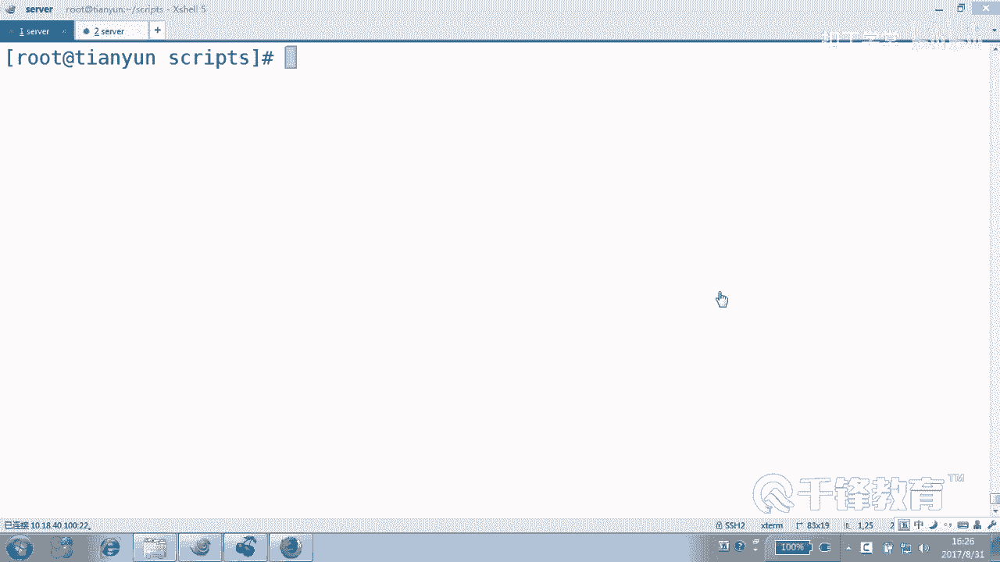
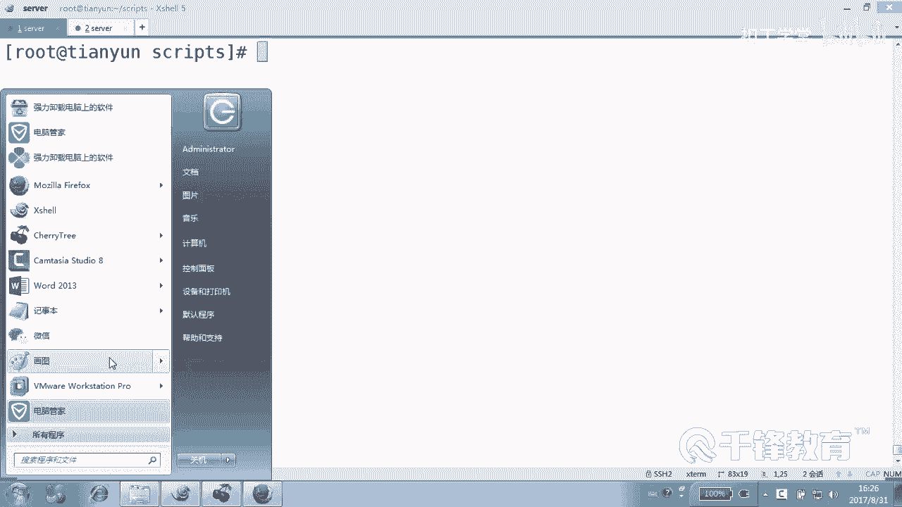
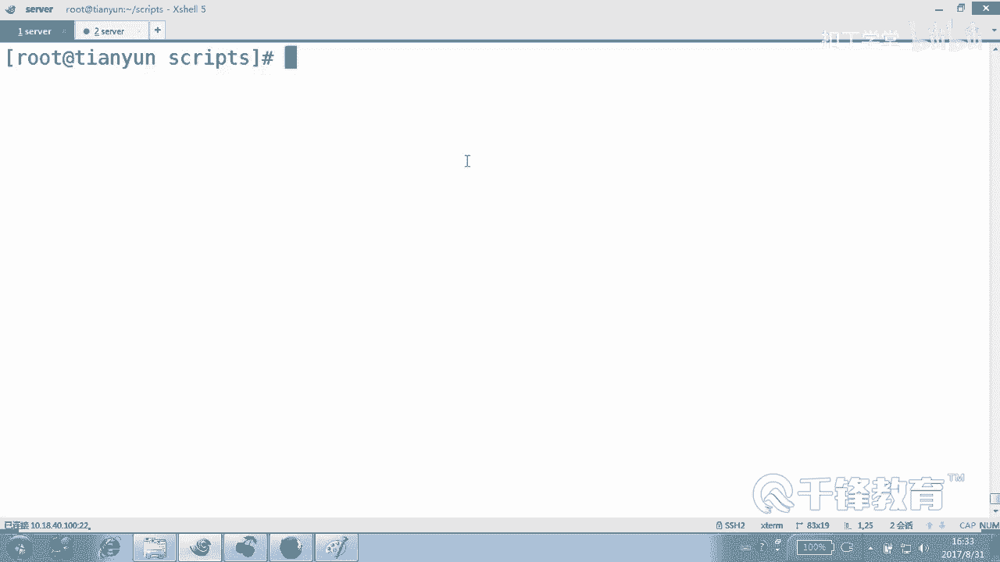
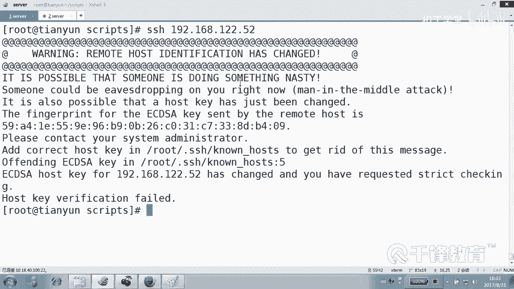
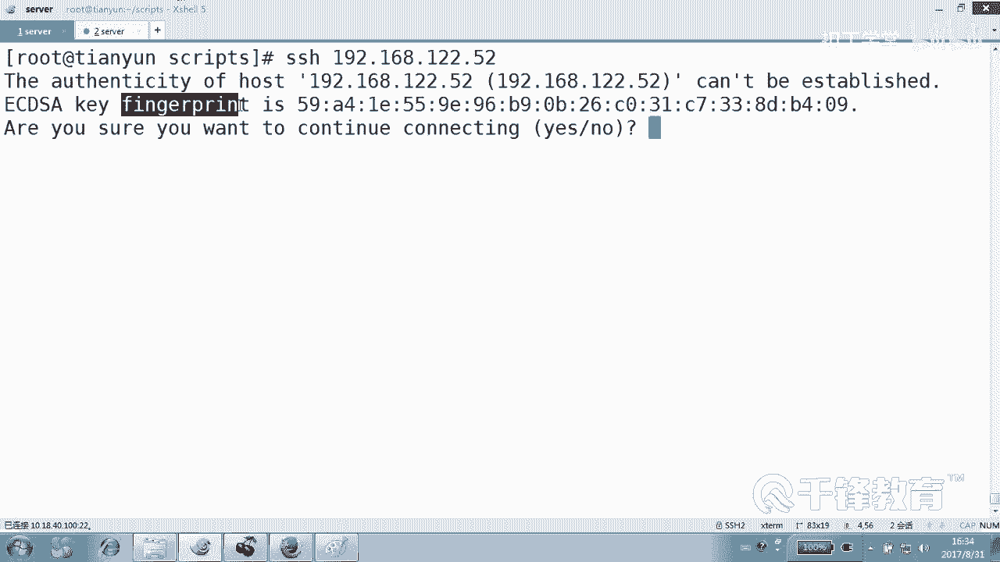
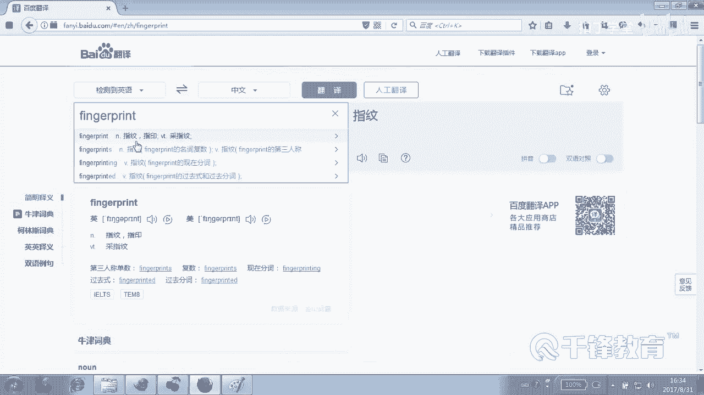
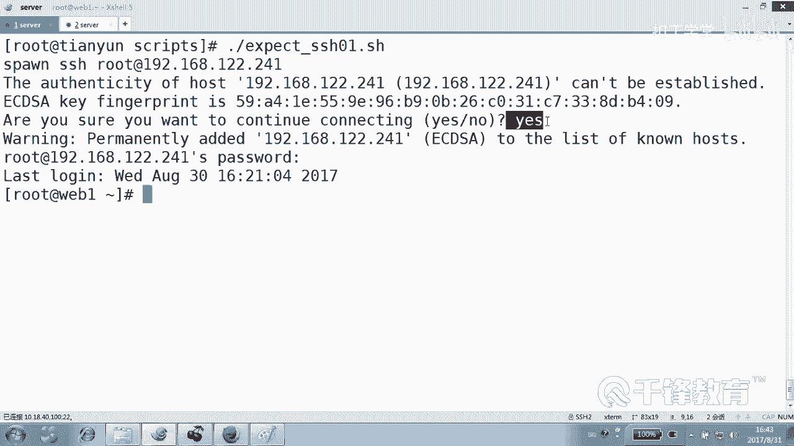

# Linux云计算系列：P35：5.3 expect 实现ssh非交互登录






在本节课中，我们将学习如何使用 `expect` 工具来解决Shell脚本中的交互问题，特别是实现SSH的自动化非交互登录。这对于批量管理多台服务器至关重要。

## 项目背景与需求

上一节我们介绍了循环结构，本节中我们来看看如何将其应用于实际运维场景。假设我们需要管理上百台服务器，并希望批量执行以下操作：
*   向所有服务器传输文件。
*   在所有服务器上远程执行命令，例如修改密码或安装软件。

要实现这些目标，一个自然的想法是：编写一个脚本，读取存储了所有服务器IP地址的文件，然后使用循环（如 `for` 或 `while`）来遍历每个IP并执行相应操作。

然而，这里存在一个关键障碍：无论是使用 `ssh` 登录，还是使用 `scp` 传输文件，通常都需要人工交互，例如确认主机指纹或输入密码。在自动化脚本中，这种交互是无法接受的。

解决此问题的核心思路是使用**公钥认证**。只要在目标服务器上部署了公钥，后续的 `ssh` 或 `scp` 操作就不再需要密码，从而实现完全自动化。

但问题又回到了起点：如何**批量**且**自动化**地将公钥部署到所有服务器上呢？首次使用 `ssh-copy-id` 命令推送公钥时，同样需要交互（输入密码）。这正是 `expect` 工具大显身手的地方。

## 认识 Expect 工具


`expect` 是一个专门用于自动化交互式应用程序的工具。它可以“观察”命令的输出，并根据预设的规则（期望出现的字符串）自动发送相应的输入（如 yes、密码等），从而模拟真人操作。

以下是安装 `expect` 的命令：
```bash
yum install -y expect  # CentOS/RHEL
# 或
apt-get install -y expect  # Ubuntu/Debian
```



## 一个简单的 Expect 脚本示例



让我们通过一个具体的例子来理解 `expect` 的工作原理。我们的目标是编写一个脚本，自动登录到一台远程服务器（IP: 192.168.12.52），并处理登录过程中的所有交互。

首先，我们模拟一次手动登录，观察交互流程：
1.  首次连接时，可能会提示确认主机指纹：`Are you sure you want to continue connecting (yes/no/[fingerprint])?`
2.  接着会提示输入密码：`root@192.168.12.52‘s password:`






`expect` 脚本就是将这些“遇到问题-给出答案”的步骤预先写好。

现在，我们创建一个名为 `ssh_auto_login.exp` 的脚本文件（虽然扩展名不是必须的，但使用 `.exp` 有助于识别）。

```bash
#!/usr/bin/expect

# 使用 spawn 启动一个我们想要自动化的交互式进程（这里是 ssh）
spawn ssh root@192.168.12.52

# 设置 expect 块，用于匹配进程输出并作出响应
expect {
    # 如果输出中出现 “yes/no” 或 “fingerprint” 关键字
    “*yes/no*” { send “yes\r”; exp_continue }
    “*fingerprint*” { send “yes\r”; exp_continue }
    # 如果输出中出现 “password:” 提示符
    “*password:*” { send “your_password_here\r” }
}

# 交互完成后，将控制权交给用户，停留在远程shell
interact
```

**脚本关键点解析：**
*   `#!/usr/bin/expect`：指定使用 `expect` 解释器来执行此脚本。
*   `spawn`：启动一个新的交互式进程。
*   `expect`：等待进程产生特定的输出模式。
*   `send`：向进程发送字符串，`\r` 代表回车键。
*   `exp_continue`：继续在当前 `expect` 块中匹配，用于处理可能不出现的提示（如非首次连接时就不会有指纹确认）。
*   `interact`：在自动登录成功后，将控制权交还给用户进行手动操作。如果希望脚本执行完特定命令后退出，可以将其替换为 `expect eof`。

给脚本添加执行权限并运行：
```bash
chmod +x ssh_auto_login.exp
./ssh_auto_login.exp
```

脚本将自动完成确认指纹和输入密码的操作，并成功登录到远程服务器。

## 应用于批量部署公钥

理解了 `expect` 的基本用法后，我们就可以回到最初的目标。以下是实现批量部署公钥的步骤概要：

1.  **生成密钥对**：在管理机上使用 `ssh-keygen` 生成密钥（如果还没有的话）。
2.  **准备IP列表文件**：创建一个文件（如 `hosts.txt`），每行写入一台目标服务器的IP地址。
3.  **编写自动化脚本**：结合 `循环` 和 `expect`，编写一个脚本，其核心逻辑是：
    *   读取 `hosts.txt` 中的每个IP。
    *   针对每个IP，使用 `expect` 自动执行 `ssh-copy-id` 命令，处理密码输入交互。
4.  **执行脚本**：运行此脚本，即可一次性将公钥部署到所有服务器。

此后，再执行批量文件传输或命令执行时，就无需再处理密码交互了。

## 总结



本节课中我们一起学习了 `expect` 工具的核心用途和基本语法。`expect` 通过 `spawn`、`expect`、`send` 等命令，能够完美模拟用户与交互式程序的对话，是解决Shell脚本自动化中“交互难题”的利器。我们通过实现SSH自动登录的示例，掌握了其工作流程。这项技能是实现服务器批量自动化运维（如批量部署公钥、软件、配置）的重要基石。