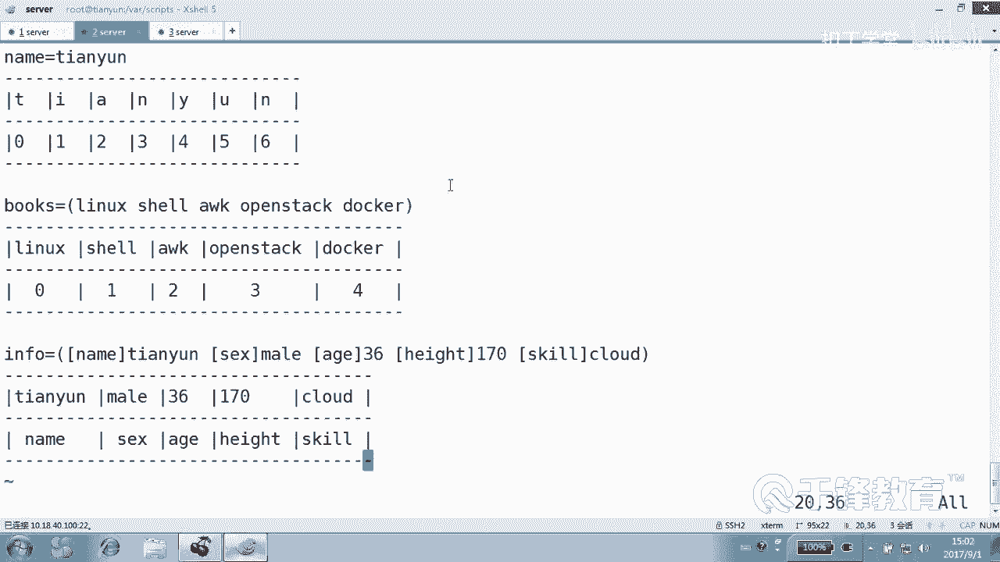
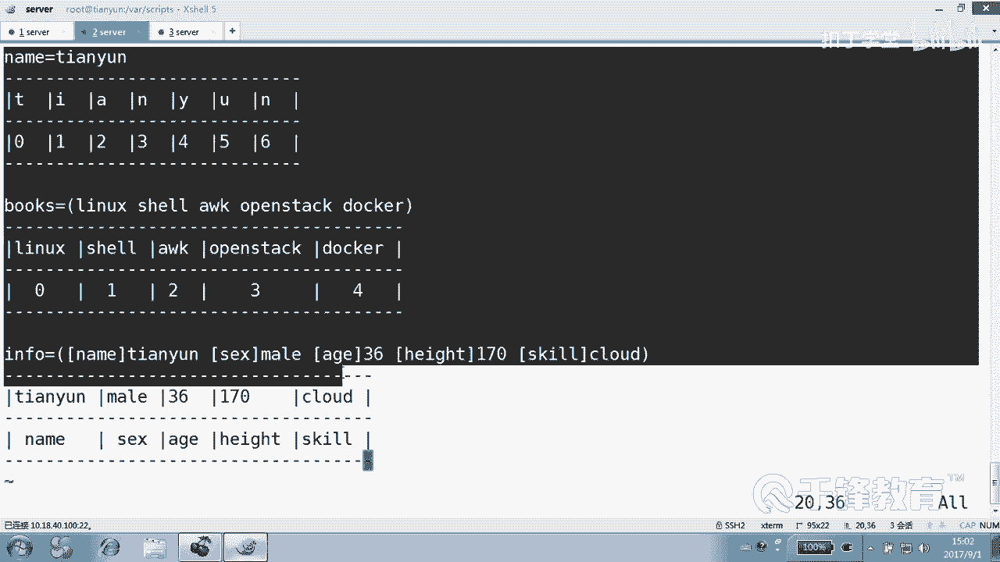
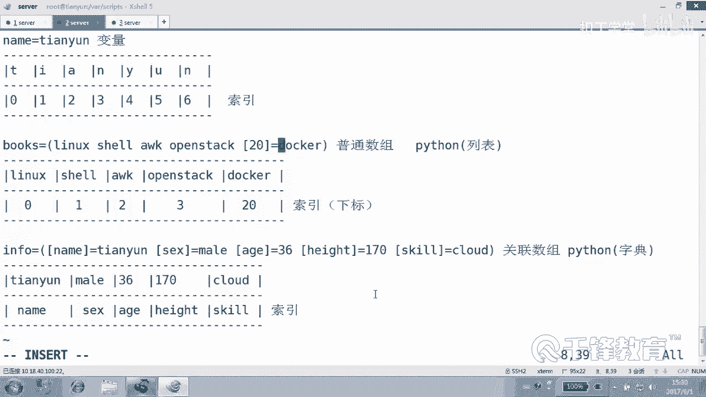

# Shell脚本自动化编程实战：P36：6.1 array 数组的基本概念 📚

在本节课中，我们将要学习Shell脚本中一个重要的概念——数组。数组是一种特殊的变量，它允许我们在一个变量名下存储多个值，这对于组织和管理数据非常有用。





---

## 数组是什么？

上一节我们介绍了常规变量，本节中我们来看看数组。常规变量只能存储一个值，而数组变量可以存储多个值。

数组分为两种类型：
*   **普通数组**：其索引（或下标）只能是整数。
*   **关联数组**：其索引可以是字符串。

关联数组类似于Python中的字典，而普通数组类似于Python中的列表。

---

## 数组的定义与声明

要使用数组，首先需要知道如何定义它们。定义方式因数组类型而异。

### 普通数组的定义

普通数组可以直接赋值定义，其索引默认从0开始的整数递增。

**代码示例：定义普通数组**
```bash
# 方式一：一次赋值多个元素
books=(linux shell awk openshift docker)

# 方式二：逐个元素赋值
colors[0]=red
colors[1]=blue
colors[2]=green

# 方式三：从命令输出获取（注意分隔符问题）
array3=(`cat filename`)
```

### 关联数组的定义

关联数组在使用前必须用 `declare -A` 命令显式声明，然后才能进行赋值。

**代码示例：定义关联数组**
```bash
# 1. 首先声明这是一个关联数组
declare -A info

# 2. 然后为数组赋值
info[name]="Tianyun"
info[sex]="male"
info[age]=36
info[height]=170
info[skill]="cloud"
```

如果不声明直接使用字符串索引赋值，Shell会将其视为普通数组，索引仍然是0,1,2...，这通常不是我们想要的结果。

---

## 数组元素的访问与引用

定义数组后，我们需要知道如何获取其中的值。

访问数组元素的通用格式是：`${数组名[索引]}`

**代码示例：访问数组元素**
```bash
# 访问普通数组 books 的索引为3的元素
echo ${books[3]}  # 输出：openshift

# 访问关联数组 info 中索引为 “age” 的元素
echo ${info[age]} # 输出：36
```

---

## 数组的特殊操作

数组提供了一些强大的操作来获取其整体信息。

以下是获取数组信息的关键操作：
*   `${数组名[@]}` 或 `${数组名[*]}`：获取数组中**所有元素的值**。
*   `${!数组名[@]}` 或 `${!数组名[*]}`：获取数组中**所有索引**。这对于遍历数组至关重要。
*   `${#数组名[@]}` 或 `${#数组名[*]}`：获取数组的**元素个数**。

**代码示例：数组特殊操作**
```bash
# 获取所有元素
echo ${books[@]}

# 获取所有索引（对于普通数组是0,1,2...，对于关联数组是name,sex,age...）
echo ${!info[@]}

# 获取元素个数
echo ${#books[@]}
```

---

## 数组的遍历

遍历数组意味着依次处理其中的每一个元素。推荐的方法是先获取索引列表，然后根据索引遍历。

**代码示例：遍历数组（推荐方法）**
```bash
# 遍历普通数组 books
for index in ${!books[@]}
do
    echo “索引 $index 的值是：${books[$index]}”
done

# 遍历关联数组 info
for key in ${!info[@]}
do
    echo “我的$key是：${info[$key]}”
done
```

---

## 数组的切片（仅限普通数组）

普通数组支持切片操作，可以获取一个连续的子数组。

切片格式为：`${数组名[@]:起始索引:元素个数}`

**代码示例：数组切片**
```bash
# 获取 books 数组中从索引2开始，连续2个元素
echo ${books[@]:2:2} # 输出：awk openshift
```
> **注意**：关联数组没有顺序概念，因此不支持切片操作。

---

## 总结

本节课中我们一起学习了Shell脚本中数组的基本概念和操作。

我们了解到：
1.  **数组**是能存储多个值的特殊变量，分为**普通数组**（整数索引）和**关联数组**（字符串索引）。
2.  定义关联数组前必须使用 `declare -A` 进行声明。
3.  使用 `${数组名[索引]}` 来访问特定元素。
4.  使用 `${!数组名[@]}` 获取所有索引，这是遍历数组的最佳实践。
5.  使用 `${#数组名[@]}` 获取数组长度（元素个数）。
6.  普通数组支持切片操作，而关联数组不支持。



掌握数组将极大地增强你处理数据集合的能力，是编写复杂Shell脚本的基石。