# Shell脚本自动化编程实战：P37：6.2 array 数组的赋值及遍历 📚


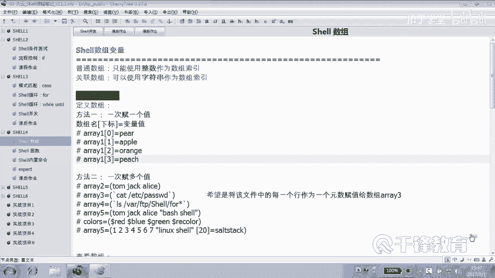

## 概述
在本节课中，我们将学习Shell脚本中数组的赋值与遍历方法。我们将通过具体的例子，演示如何将文件内容读入数组，以及如何遍历数组中的每一个元素。

---

## 数组的赋值与遍历

上一节我们介绍了数组的基本概念，本节中我们来看看如何定义和使用数组。

首先，我们来看几个数组的例子。我们将把hosts文件的每一行作为数组的一个元素进行赋值，并对其进行遍历。

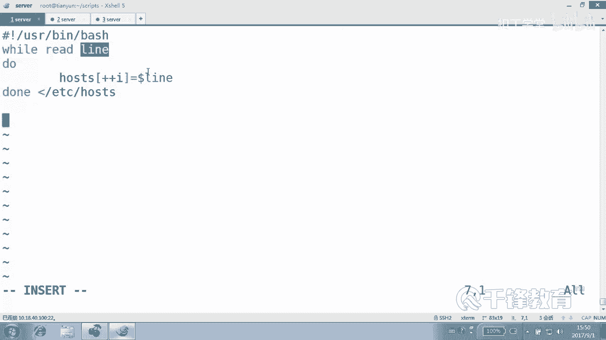

### 使用while循环赋值数组

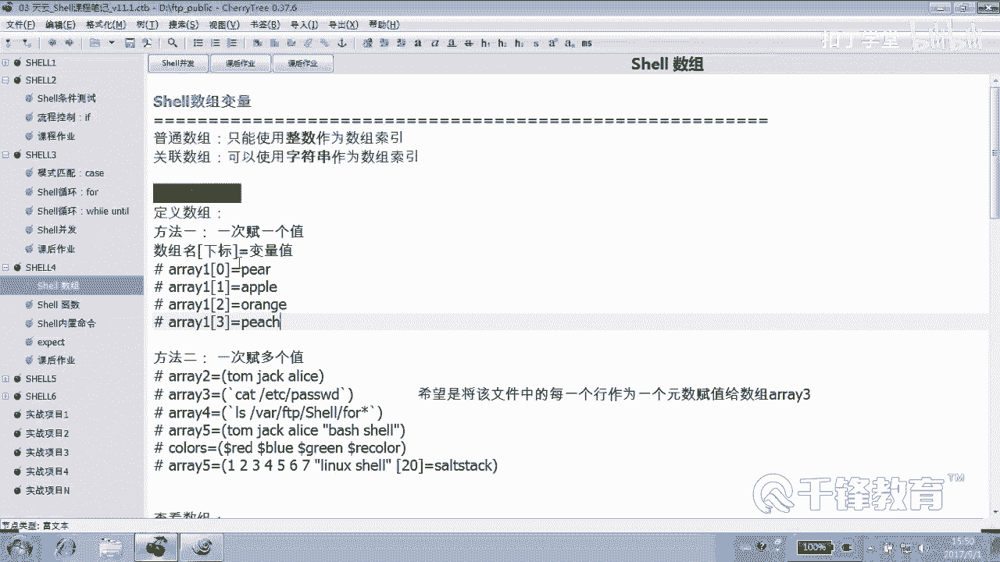

以下是使用while循环逐行读取文件并赋值给数组的步骤：

1.  使用`while read line`循环读取文件的每一行。
2.  在循环体内，将读取到的行赋值给数组元素。
3.  使用一个计数器变量来递增数组的索引。

对应的脚本代码如下：

```bash
#!/usr/bin/bash

i=0
while read line
do
    ((++i))
    hosts[$i]=$line
done < /etc/hosts
```

这段代码完成了数组的赋值。循环结束后，如果文件有三行，数组`hosts`将有三个元素。

赋值完成后，我们可以打印数组中的元素。例如，打印第一个元素：

```bash
echo ${hosts[1]}
echo
```

### 遍历数组元素

接下来，我们对数组进行遍历，即依次访问数组中的每一个元素。

无论是普通数组还是关联数组，都建议使用索引进行遍历。以下是遍历数组的步骤：

1.  使用`${!数组名[@]}`获取数组的所有索引。
2.  使用for循环遍历这些索引。
3.  在循环体内，通过索引访问对应的数组元素值。

对应的脚本代码如下：

```bash
for i in ${!hosts[@]}
do
    echo "$i : ${hosts[$i]}"
done
```

在这个例子中，`${!hosts[@]}`获取的是数组`hosts`的索引（例如1, 2, 3），变量`i`保存的就是这些索引。`${hosts[$i]}`则获取索引`$i`对应的元素值。

### 使用for循环赋值数组的注意事项

我们也可以尝试使用for循环来读取文件并赋值给数组。

以下是使用for循环的脚本示例：

```bash
#!/usr/bin/bash

i=0
for line in $(cat /etc/hosts)
do
    ((++i))
    hosts[$i]=$line
done
```

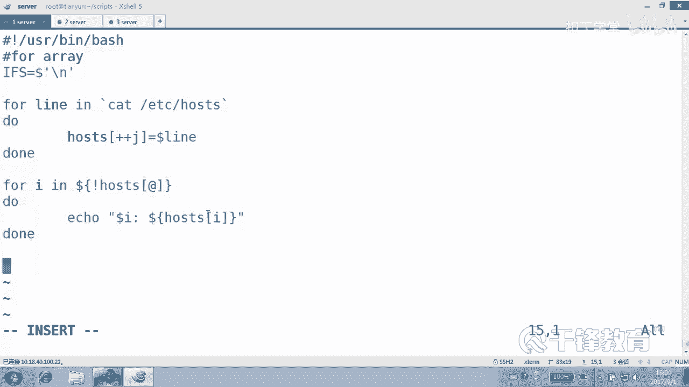

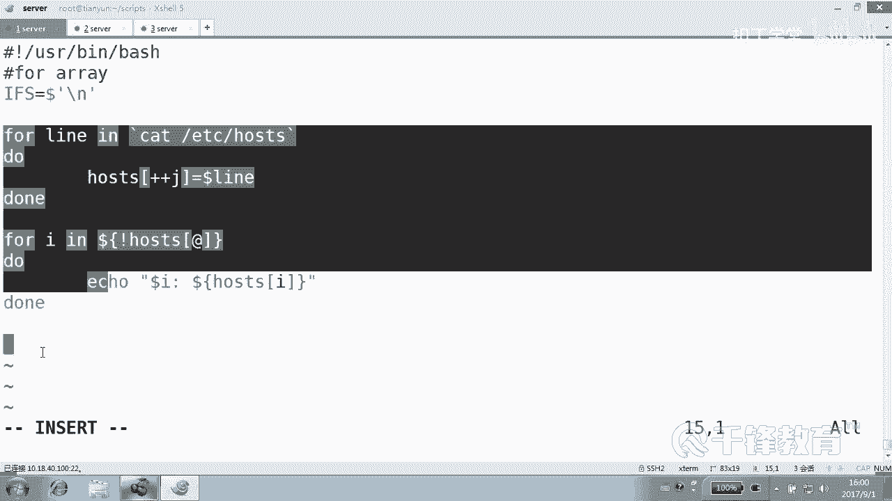

但是，这里需要注意for循环的一个特性：**for循环默认使用空格、制表符和换行符作为分隔符**。如果文件内容中包含空格，它会被分割成多个部分，导致数组元素数量与预期不符。

为了解决这个问题，我们需要临时修改内部字段分隔符`IFS`，使其只识别换行符。

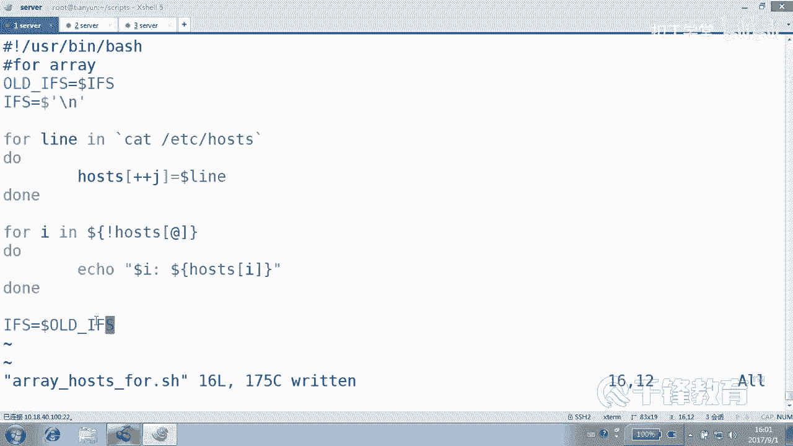

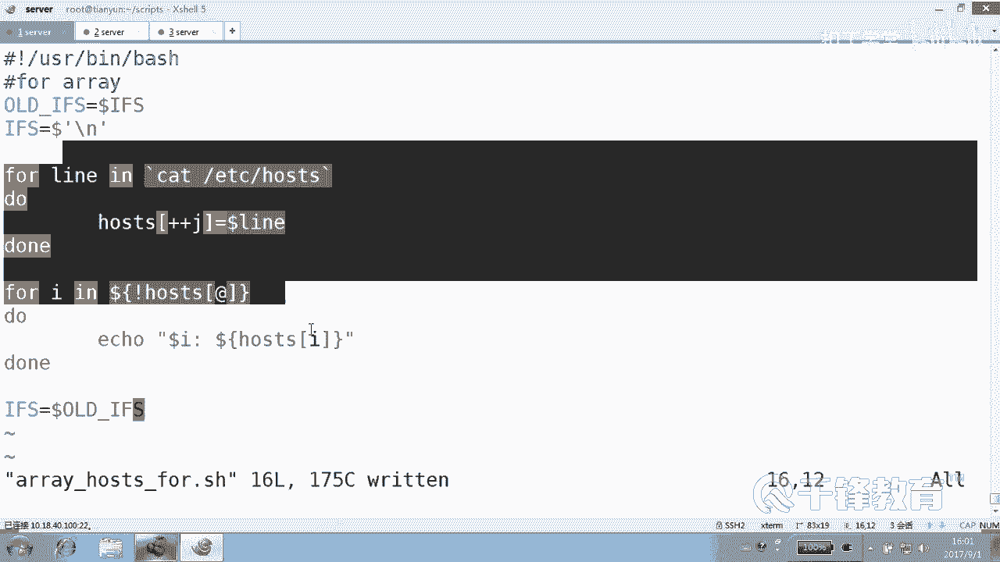

```bash
#!/usr/bin/bash

OLD_IFS=$IFS
IFS=$'\n'

i=0
for line in $(cat /etc/hosts)
do
    ((++i))
    hosts[$i]=$line
done

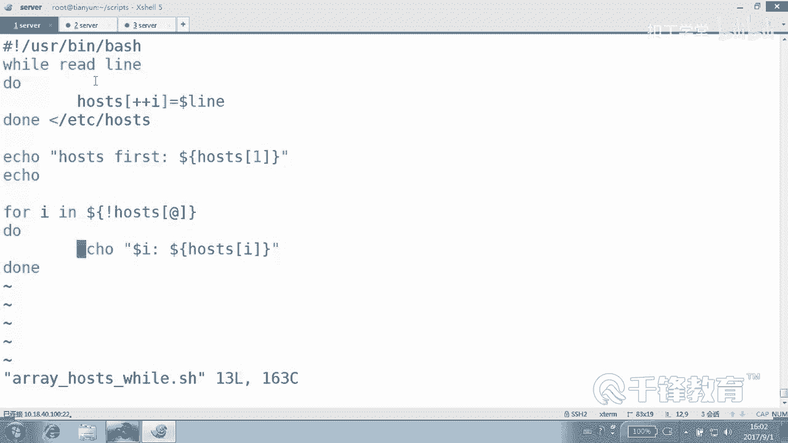

IFS=$OLD_IFS
```

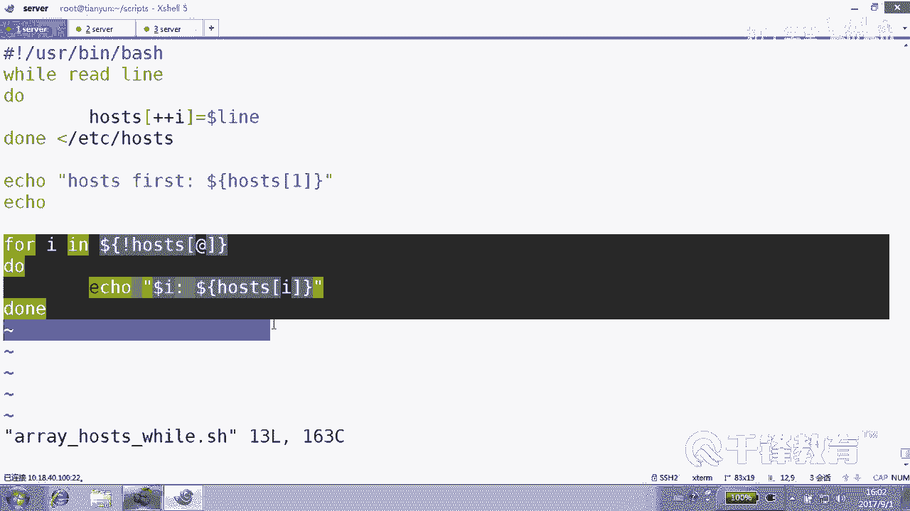

这段代码的逻辑是：
1.  将原来的`IFS`值保存到变量`OLD_IFS`中。
2.  将`IFS`设置为换行符`$'\n'`，这样for循环就只按行分割。
3.  执行赋值操作。
4.  操作完成后，将`IFS`恢复为原来的值`$OLD_IFS`。

这是一个重要的技巧，因为可能只在脚本的某一段需要修改分隔符，其他部分仍需使用默认分隔符。

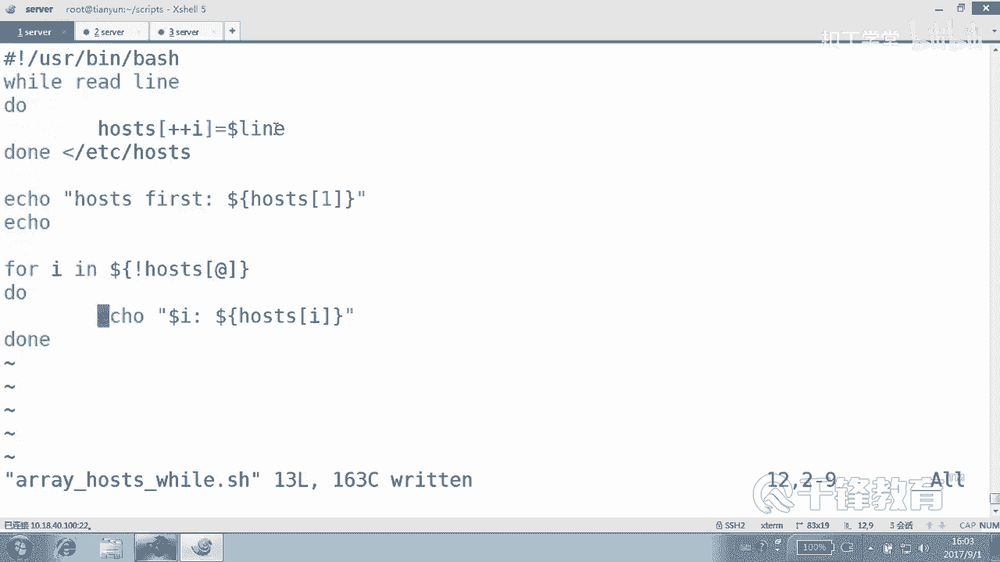

### 数组相关语法总结

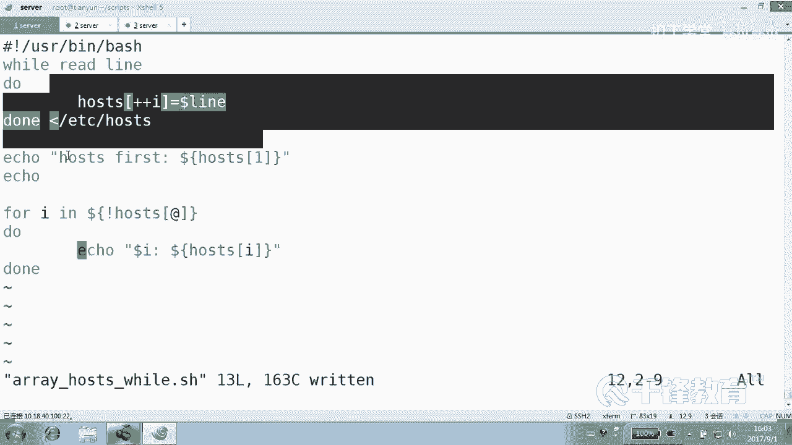

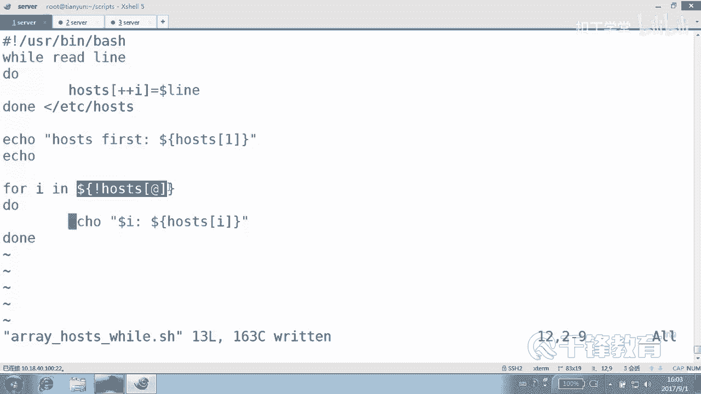

在遍历部分，我们使用了`${!数组名[@]}`来获取索引。这里需要区分两个相似的语法：

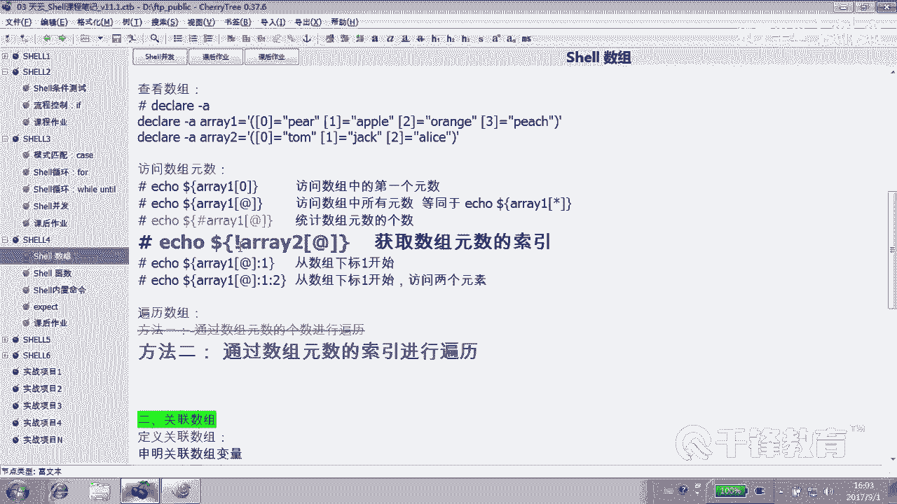

*   `${数组名[@]}`：获取数组**所有元素的值**。
*   `${!数组名[@]}`：获取数组**所有的索引**。

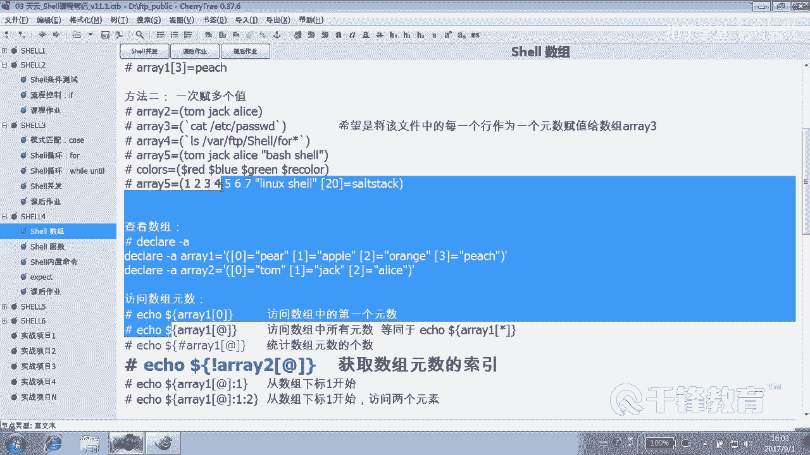

另外，`@`等价于`*`，在Shell脚本中，`$@`和`$*`都代表所有位置参数，这里的数组语法与之相通。

---

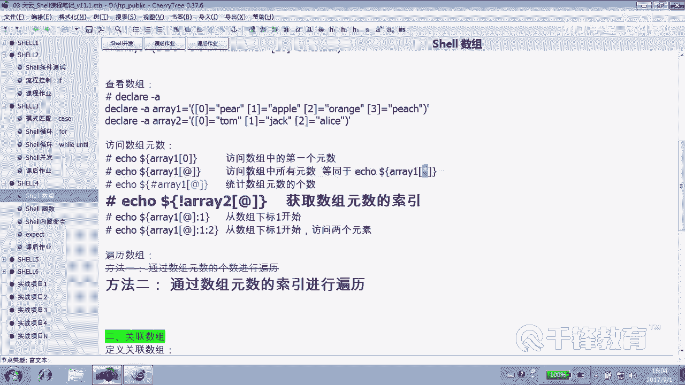

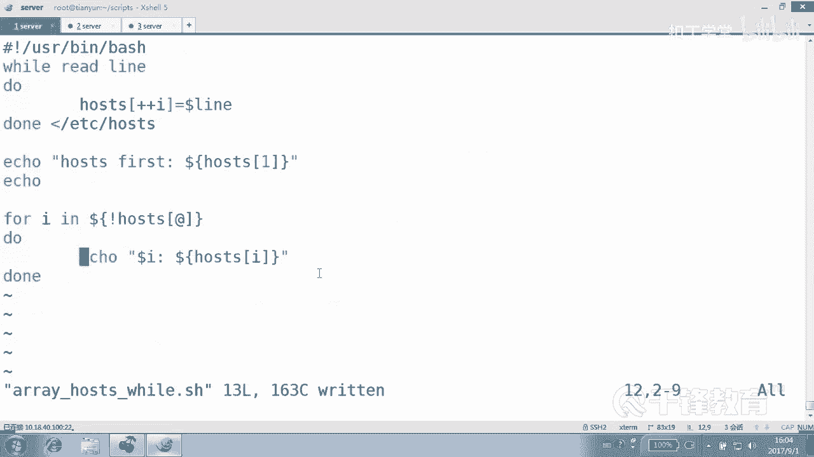

## 总结
本节课中我们一起学习了Shell数组的赋值与遍历。
*   我们使用**while循环**可以稳定地按行读取文件并赋值给数组。
*   我们使用**for循环**结合`${!数组名[@]}`语法可以方便地遍历数组。
*   我们了解到for循环默认的分隔符特性，并学会了通过临时修改`IFS`变量来控制分割行为。
*   数组的定义和遍历是后续进行数据统计和处理的重要基础，我们将在后续课程中实际应用这些知识。